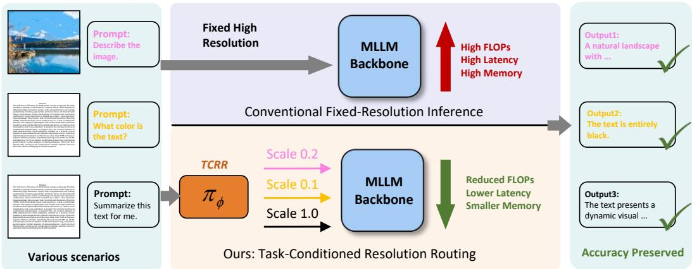
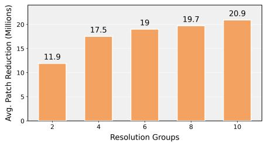
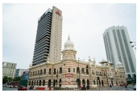

# Resolution as a First-Class Decision: Task-Conditioned Routing for Efficient Multimodal Large Language Models

Zhiqiang Xia Yang Li Xinyuan Zhang Yuchen Liu Haoyu Lu Jiaming Xu Runyu Shi Ying Huang

Xiaomi Corporation, Beijing, China {xiazhiqiang5, liyang134, zhangxinyuan8, liuyuchen8}@xiaomi.com {luhaoyu1, xujiaming1, shirunyu, huangying8}@xiaomi.com

## Abstract

The inference efficiency of Multimodal Large Language Models (MLLMs) is severely constrained by massive visual token sequences induced by high-resolution inputs, with computational cost scaling quadratically. Existing approaches primarily focus on downstream token compression, while overlooking a fundamental upstream inefficiency: input resolution is treated as a static, task-agnostic hyperparameter. We propose Task-Conditioned Resolution Routing (TCRR), which formulates visual compression as a task-conditioned decision and employs a lightweight cross-modal router that conditions backbone visual representations on textual semantics via feature-wise modulation and cross-attention to predict the minimal sufficient compression level per query. To support this, we curate a dataset of 500k samples across 12 task categories, labeled via a teacher–oracle pipeline to approximate Pareto-optimal compression scales. Extensive experiments across diverse architectures show that TCRR achieves a superior efficiency frontier, specifically reducing visual FLOPs by 40.9% and latency by 53.7% on Qwen3-VL-8B while preserving competitive performance. Further analysis of scaling behavior confirms that dynamically routing visual compression enables optimal resource allocation without modifying the MLLM backbone.

## 1 Introduction

Multimodal Large Language Models (MLLMs) have demonstrated strong performance across a broad range of vision–language tasks [1, 2]. Yet their inference efficiency remains a major bottleneck. A dominant cost arises in visual encoding: processing high-resolution inputs yields long sequences of visual tokens, which incur quadratic attention complexity and substantial latency [3]. Prior efforts mitigate this issue through downstream token compression or pruning. While effective in reducing later-stage computation, these methods are typically applied after full-resolution encoding, leaving the most expensive part of the pipeline largely untouched [4, 5].

We contend that a more fundamental inefficiency lies upstream [6]. Current pipelines fix the input resolution as a task-agnostic hyperparameter, despite the fact that the required spatial detail is largely determined by the prompt. Optical Character Recognition (OCR), document QA, and fine-grained grounding are resolution-hungry, whereas captioning and many Visual Question Answering (VQA) queries tolerate substantial downsampling. Therefore, image-only or heuristic resolution strategies are structurally insufficient for MLLMs because they ignore prompt-dependent information demands. This leads to a simple principle: resolution should be a first-class, task-conditioned decision [7].

  
Figure 1: Task-Conditioned Resolution Routing. By adapting resolution to textual intent, TCRR slashes computational overhead without sacrificing accuracy.

Because resolution choice is upstream and irreversible, it directly controls visual token length and dominates compute/latency. Adapting it per instance yields a better efficiency–accuracy trade-off without modifying the frozen MLLM backbone.

To this end, we propose Task-Conditioned Resolution Routing (TCRR), a lightweight framework that dynamically selects minimal sufficient resolution conditioned on image content and textual semantics, as shown in Fig. 1. Given an image–text pair, TCRR predicts a resolution scale from a predefined set using a cross-modal router that integrates feature-wise modulation and text-to-image attention. In essence, this transforms resolution selection from a static heuristic into a dynamic, task-conditioned routing process.

Training such a router presents a nontrivial supervision challenge: optimal resolution is inherently ambiguous, and multiple scales may yield equivalent task performance. To address this, we construct Res-500k, a task-conditioned resolution dataset comprising 500k image–text pairs across 12 task categories. Each sample is annotated via a teacher–oracle pipeline that selects the highest compression ratio while preserving semantic equivalence under GPT-based evaluation [8, 9]. This strategy provides a closer approximation of real-world utility than conventional teacher-forcing losses, and yields negligible performance degradation on held-out test sets [10, 11].

In summary, our core contributions are threefold:

• Architectural Paradigm Shift: We propose TCRR, a lightweight, plug-and-play module that formalizes resolution selection as a task-conditioned routing problem. By employing a progressive cross-modal fusion mechanism upstream of the frozen MLLM backbone, TCRR strictly outperforms downstream token merging baselines while incurring negligible routing overhead (∼18ms).

• Data, Supervision, and Generalization: We curate Res-500k, the first large-scale dataset annotated specifically for semantic-preserving visual compression via a principled teacher–oracle pipeline. This rigorous supervision yields a routing policy that not only excels on general benchmarks but also demonstrates robust zero-shot generalization to specialized domains (e.g., medical and remote sensing).

• State-of-the-Art Efficiency & Scaling Insights: Extensive evaluations establish a superior Pareto frontier. On Qwen3-VL-8B [12], TCRR slashes visual FLOPs by 40.9% and system latency by 53.7% with negligible capability loss (∼0.6%), maintaining extreme scalability with a 43% latency reduction even on the massive 235B architecture. Crucially, we reveal that adaptive resolution synergy depends heavily on tokenization granularity: continuous patch-based architectures unlock significantly higher efficiency gains compared to rigid tiling designs, providing a vital design principle for next-generation efficient MLLMs.

## 2 Related Work

Visual Compression vs. Upstream Resolution. Methods mitigating MLLM visual costs broadly divide into downstream token reduction and upstream resolution scaling. Downstream approaches [4, 5, 13, 14] reduce later-stage computation but operate after full-resolution encoding, failing to alleviate the Vision Transformer’s (ViT) peak memory and upfront computational tax. Conversely, existing upstream strategies [15] circumvent the ViT bottleneck but remain task-agnostic, relying purely on image heuristics. TCRR bridges this gap by conditioning the resolution decision directly on the textual prompt, dynamically aligning spatial resource allocation with the query’s semantic demands.

Conditional Computation & Routing. Adaptive paradigms like Mixture-of-Experts [16, 17] or layer skipping [18, 19] optimize computation within the network. However, these intra-model approaches assume fixed-fidelity inputs and often demand invasive architectural modifications or joint pre-training. TCRR instead shifts the decision boundary to the input level. By formalizing resolution selection as a task-conditioned routing problem, TCRR acts as a lightweight, plug-and-play pre-filter. This governs sequence length at the source, optimizing the efficiency-accuracy trade-off while keeping the heavy MLLM backbone strictly frozen.

## 3 Problem Formulation

We formally define resolution selection within efficiency-constrained MLLMs. Let $\mathcal { M } _ { \Theta }$ denote an MLLM processing a visual input $I _ { r }$ (resampled to resolution $r = h \times w )$ and a textual prompt $T .$ Since the visual encoder’s self-attention exhibits quadratic complexity, the computational cost scales quadratically with resolution: $\mathcal { C } ( r ) \propto ( r / P ^ { 2 } ) ^ { 2 } \overset { \cdot } { \propto } r ^ { 2 }$ , where $\bar { P }$ is the patch size. While prior dynamic-resolution methods mitigate this, they are typically solely image-conditioned, ignoring the diverse spatial demands imposed by different textual instructions.

We posit that optimal resolution is intrinsically task-dependent. For any instance $( I , T )$ , we seek a minimal resolution $r ^ { * } \in { \mathcal { S } }$ from a discrete set of candidates that minimizes cost without degrading the reference high-resolution response $Y _ { \mathrm { h i g h } }$

$$
r ^ { * } = \underset { r \in \mathcal { S } } { \mathrm { a r g m i n } } \mathcal { C } ( r ) \quad \mathrm { s . t . } \quad \mathcal { L } ( Y _ { r } , Y _ { \mathrm { g t } } ) \leq \mathcal { L } ( Y _ { \mathrm { h i g h } } , Y _ { \mathrm { g t } } ) + \delta ,\tag{1}
$$

where $\delta$ is a negligible tolerance margin. Solving Eq. 1 via exhaustive inference is intractable. Therefore, we approximate this oracle decision via a lightweight, task-conditioned routing policy $\pi _ { \phi }$ . Operating on a fixed-resolution proxy image $I _ { \mathrm { f i x } }$ , the router predicts a continuous scaling factor $\tilde { s } \gets \bar { \pi _ { \phi } } ( \mathrm { R e s i z e } ( I , r _ { \mathrm { f i x } } ) , T )$ . The frozen backbone then processes the image at $\hat { r } = \tilde { s } \cdot r _ { \mathrm { f i x } }$ . By ensuring the router’s overhead is negligible (typically $< 5 \%$ of the backbone cost), reductions in r translate directly to strict wall-clock acceleration.

## 4 Dataset Construction: Res-500k

Since intrinsic optimal resolutions are latent, we construct Res-500k, a large-scale dataset annotated via a rigorous Teacher–Oracle pipeline. A naive approach to label resolution sufficiency is to monitor the MLLM’s next-token prediction loss (teacher-forcing). However, this is a fundamentally flawed proxy: a low loss might simply reflect strong language priors rather than sufficient visual clarity, while a high loss could stem from benign phrasing differences. To bypass this, our pipeline directly optimizes for semantic equivalence.

## 4.1 The Teacher–Oracle Pipeline & Quality Assurance

Our pipeline determines the minimal sufficient scale $s ^ { * }$ for each instance $( I , T )$ . We first generate 10 candidate resolutions using uniform area scale factors $\mathcal { S } = \{ 0 . 1 , 0 . 2 , \ldots , 1 . 0 \}$ . Using Qwen3-VL-8B as the teacher, we obtain a reference response $Y _ { \mathrm { r e f } }$ at native resolution $( I _ { 1 . 0 } )$ , followed by hypothesis responses $\{ Y _ { s } \} _ { s \in { \mathcal { S } } }$ across all candidate scales.

Rigorous Quality Assurance. To strictly evaluate semantic equivalence $\mathcal { I } ( Y _ { s } , Y _ { \mathrm { r e f } } \mid T ) \in \{ 0 , 1 \}$ we conducted comprehensive pilot studies across multiple LLM judges (Qwen-235B-A22B, GPT-4o, GPT-5.1). We selected GPT-5.1 as it achieved flawless semantic alignment. (The exact prompt utilized for this oracle judgment is provided in Appendix A.) Crucially, when applying this oracle selection strategy $( s ^ { * }$ where $\mathcal { I } = 1 )$ to the 12 evaluation benchmarks, it preserved exactly 100% of the uncompressed performance (establishing our Oracle Bound). To guarantee absolute reliability, human experts (Master’s degree or higher) manually evaluated 1,200 randomly sampled instances (100 per category). This verification revealed a 100% alignment with GPT-5.1’s equivalence judgments, confirming the absence of systemic bias and strictly preventing data leakage from evaluation sets.

Table 1: Task distribution and resolution in Res-500k. The dataset is explicitly balanced to cover diverse resolution priors, ranging from semantic gist (Low) to pixel-level precision (Very High).
<table><tr><td>Task Category</td><td>Proportion</td><td>Resolution Demand &amp; Key Factor</td></tr><tr><td colspan="3">General Vision-Language</td></tr><tr><td>VQA</td><td>22%</td><td>Mixed (Context-dependent complexity)</td></tr><tr><td>Captioning</td><td>10%</td><td>Low (Global semantic gist)</td></tr><tr><td>Grounding</td><td>5%</td><td>Medium (Bounding box localization)</td></tr><tr><td>Counting</td><td>5%</td><td>High (Object separation)</td></tr><tr><td>Document &amp; Text</td><td></td><td></td></tr><tr><td>OCR</td><td>15%</td><td>High (Character legibility)</td></tr><tr><td>STEM QA</td><td>12%</td><td>High (Symbol &amp; diagram parsing)</td></tr><tr><td>Doc Understanding</td><td>5%</td><td>High (Dense text reading)</td></tr><tr><td>Chart QA</td><td>5%</td><td>Medium-High (Trend &amp; value analysis)</td></tr><tr><td>GUI &amp; Agent</td><td></td><td></td></tr><tr><td>GUI Grounding</td><td>8%</td><td>Very High (Pixel coordinate precision)</td></tr><tr><td>GUI VQA</td><td>7%</td><td>High (Small icon/text recognition)</td></tr><tr><td>GUI Caption</td><td>5%</td><td>Medium (Holistic screen description)</td></tr><tr><td>GUI Action</td><td>1%</td><td>Mixed (Element interaction)</td></tr></table>

Target Rescaling. Since our router operates on a fixed proxy size $r _ { \mathrm { f i x } } \ge 3 8 4 ^ { 2 }$ , predicting $s ^ { * }$ directly is ambiguous across varied original image dimensions $r _ { \mathrm { o r i g } } .$ . Following HyperVL [15], we rescale the regression target to a resolution-agnostic multiplier: $\tilde { s } ^ { * } = { s ^ { * } } \cdot ( r _ { \mathrm { o r i g } } / \bar { r } _ { \mathrm { f i x } } )$ , decoupling the prediction from raw input dimensions.

## 4.2 Dataset Statistics and Diversity

Res-500k comprises 500,000 instances balanced across 12 distinct task categories (Table 1). To ensure alignment with state-of-the-art training protocols, task sampling ratios are calibrated against leading multimodal datasets [20–22]. It covers General Vision-Language (42%, mostly low/mixed resolution demands), Document & Information Extraction (37%, high demands), and GUI & Agent Navigation (21%, very high demands). A stratified hold-out test set of 12,000 samples guarantees unbiased evaluation.

## 5 Task-Conditioned Resolution Routing

We propose TCRR, a plug-and-play module that transforms the static inference paradigm of MLLMs into an adaptive, instance-aware decision process. Acting as a semantic pre-filter upstream of the unmodified MLLM backbone, TCRR predicts the minimal sufficient resolution scale s˜ by explicitly modeling the interplay between visual semantics and textual intent.

## 5.1 Inference Pipeline Overview

As illustrated in Figure 2, the inference trajectory is bifurcated. The TCRR module first processes the raw input pair (I, T) through a lightweight architecture to output a continuous scale factor s˜. This prediction governs the Dynamic Resampling module, where the original image is interpolated to the target resolution:

$$
\hat { r } = \tilde { s } \cdot r _ { \mathrm { f i x } } , \quad \tilde { I } = \mathrm { R e s i z e } ( I , \hat { r } ) .\tag{2}
$$

  
A. Plug-and-play routing without backbone modification.

  
B. TCRR Module Architecture Detail (Ours)  
Figure 2: The architecture of TCRR. The lightweight router (bottom) fuses visual features and the text prompt via cross-attention to predict an optimal continuous scale factor, dynamically resizing the raw image before it enters the unmodified MLLM backbone (top).

The resampled image $\tilde { I }$ and the original prompt $T$ are subsequently routed to the unmodified MLLM backbone. Crucially, TCRR introduces zero learnable parameters to the backbone, guaranteeing seamless integration with existing models while incurring strictly negligible computational overhead.

## 5.2 The Architecture of TCRR

To balance computational efficiency with cross-modal expressiveness, TCRR employs a dual-encoder architecture coupled with a Progressive Fusion mechanism. This mechanism systematically aggregates task-conditioned features via sequential feature-wise modulation and spatial cross-attention.

## 5.2.1 Unimodal Feature Extraction

Visual Encoder. We adopt MobileNetV4 [23] as the visual proxy backbone. The encoder processes a fixed-resolution downsampled image $( I _ { \mathrm { f i x } } \overset { \cdot } { \in } \overset { \cdot } { \mathbb { R } } ^ { 3 8 4 \times 3 8 4 \times 3 } )$ , outputting a hierarchical feature pyramid. We extract the dense feature map $\mathbf { V } \in \mathbb { R } ^ { C _ { v } \times H ^ { \prime } \times W ^ { \prime } }$ from the final convolutional stage to serve as the foundational visual representation.

Text Encoder. To encode the instructional prompt $T ,$ , we utilize BERT-Tiny [24]. Rather than relying solely on the pooled [CLS] token—which may dilute fine-grained instructional cues—we apply a learnable Attention Pooling layer over the full sequence of hidden states $\mathbf { T } _ { \mathrm { s e q } }$ to derive a task-specific global textual embedding $\mathbf { t } _ { \mathrm { g l o b a l } } \in \mathbb { R } ^ { C _ { t } }$

$$
\mathbf { t } _ { \mathrm { g l o b a l } } = \sum _ { i = 1 } ^ { L } \alpha _ { i } \mathbf { T } _ { \mathrm { s e q } } ^ { ( i ) } , \quad \alpha = \mathrm { S o f t m a x } ( \mathbf { T } _ { \mathrm { s e q } } W _ { \mathrm { a t t n } } ) .\tag{3}
$$

This mechanism enables the router to dynamically attend to resolution-critical keywords (e.g., “read the small text", “count the objects") within the prompt.

## 5.2.2 Task-Conditioned Cross-Modal Interaction

Determining the optimal resolution necessitates answering two questions: what visual information is semantically required, and where is it spatially located? We model this through two complementary, sequentially applied operations.

Global Task Modulation via FiLM. Global semantic intent dictates macroscopic detail. We inject this prior into the visual space using Feature-wise Linear Modulation (FiLM) [25]. Affine parameters are predicted from $\mathbf { t } _ { \mathrm { g l o b a l } }$ to channel-wise modulate V:

$$
[ \gamma , \beta ] = \mathbf { M } \mathbf { L } \mathbf { P } _ { \mathrm { F i L M } } ( \mathbf { t } _ { \mathrm { g l o b a l } } ) , \quad \mathbf { V } _ { \mathrm { m o d } } = \gamma \odot \mathbf { V } + \boldsymbol { \beta } .\tag{4}
$$

This acts as a semantic filter, amplifying task-relevant channels while attenuating background noise.

Spatial Awareness via Cross-Attention. To capture localized, spatially varying resolution demands, we employ a lightweight Cross-Attention layer. Here, the global text embedding acts as the query to interrogate the modulated visual feature map. The attention mechanism aggregates visual cues strictly weighted by their relevance to the instructional text:

$$
\begin{array} { r } { \begin{array} { r l } & { Q = W _ { q } \mathbf { t } _ { \mathrm { g l o b a l } } , } \\ { K , V = W _ { k } \mathrm { F l a t t e n } ( { \mathbf { V } } _ { \mathrm { m o d } } ) , W _ { v } \mathrm { F l a t t e n } ( { \mathbf { V } } _ { \mathrm { m o d } } ) , } \\ { \mathbf { z } _ { \mathrm { c r o s s } } = \mathrm { A t t e n t i o n } ( Q , K , V ) . } \end{array} } \end{array}\tag{5}
$$

This produces a spatially-aware descriptor $\mathbf { z } _ { \mathrm { c r o s s } }$ that explicitly encodes the visual complexity of the image regions most critical to fulfilling the query.

## 5.2.3 Decision Head and Training Objective

To form the final decision, we derive a global visual context vector ${ \bf z } _ { \mathrm { i m g } } = \mathrm { A t t n P o o l } ( { \bf V } _ { \mathrm { m o d } } )$ . These multi-level signals are fused and projected to a strictly positive scalar via a Softplus activation:

$$
\tilde { s } = \mathrm { S o f t p l u s } \big ( \mathbf { M L P } _ { \mathrm { h e a d } } \big ( \mathrm { C o n c a t } \big ( \big [ \mathbf { z } _ { \mathrm { i m g } } + \mathbf { z } _ { \mathrm { c r o s s } } , \mathbf { t } _ { \mathrm { g l o b a l } } \big ] \big ) \big ) \big ) .\tag{6}
$$

Optimization. The router is trained end-to-end to minimize the mean squared error (MSE) against the rescaled ground-truth targets derived from our Teacher-Oracle pipeline (Section 4):

$$
\mathcal { L } _ { \mathrm { r o u t e r } } = \| \tilde { s } - \tilde { s } ^ { * } \| _ { 2 } ^ { 2 } .\tag{7}
$$

This continuous regression objective forces the router to learn a smooth mapping from the multimodal input space to the optimal relative compression scale. A detailed computational complexity analysis confirming TCRR’s negligible overhead is provided in Appendix B.

## 6 Experiments

We rigorously evaluate TCRR to validate its impact on the efficiency–accuracy Pareto frontier. To comprehensively demonstrate our contributions, our empirical analysis is structured around five core research questions:

• RQ1 (Efficiency & Baselines): Can TCRR break the upfront computational bottleneck of MLLM visual encoders and fundamentally outperform downstream token merging paradigms?

• RQ2 (Ablation & Architecture): How do the individual cross-modal components and the progressive fusion design drive both routing accuracy and low-overhead efficiency?

• RQ3 (Generalization): Do the routing gains generalize to unseen specialized domains (e.g., medical, remote sensing) and across distinct dynamic resolution implementations (e.g., continuous patch scaling vs. discrete sub-image tiling)?

• RQ4 (Scaling & Granularity): How do the training data regime, action space granularity, and router model capacity dictate the efficiency–accuracy trade-off?

• RQ5 (Oracle Gap): How closely does TCRR’s routing policy approximate the theoretical optimal compression limit under strict semantic equivalence?

Table 2: Main Results on Qwen3-VL Family. TCRR achieves substantial reductions in FLOPs and latency while preserving average accuracy across 12 multimodal benchmarks. Abbreviations: MMB (MMBench), MMS (MMStar), MathV (MathVista), Hallu. (HallusionBench), TVQA (TextVQA), ChQA (ChartQA), DVQA (DocVQA), IVQA (InfoVQA), MRWC (MME-RealWorld-CN).
<table><tr><td>Model</td><td>MMB MMS MMMU MathV</td><td></td><td></td><td></td><td>Hallu.</td><td></td><td>OCR MMVet TVQA</td><td></td><td>ChQA DVQA IVQA MRWC</td><td></td><td></td><td></td><td></td><td>Avg. FLOPs (T)</td><td>Lat. (ms)</td></tr><tr><td>2B</td><td>76.8</td><td>54.7</td><td>46.3</td><td>51.1</td><td>47.1</td><td>84.0</td><td>40.7</td><td>79.6</td><td>78.0</td><td>92.5</td><td>72.2</td><td>55.2</td><td>64.9</td><td>8.5</td><td>524.1</td></tr><tr><td>+TCRR</td><td>76.8</td><td>54.7</td><td>45.7</td><td>51.4</td><td>46.4</td><td>84.0</td><td>40.5</td><td>79.7</td><td>77.5</td><td>92.2</td><td>69.4</td><td>53.3</td><td>64.3</td><td>4.8(-43%)</td><td>236.9(-55%)</td></tr><tr><td>4B</td><td>82.9</td><td>62.3</td><td>55.0</td><td>64.2</td><td>55.1</td><td>84.8</td><td>49.7</td><td>81.6</td><td>81.8</td><td>94.6</td><td>79.4</td><td>62.7</td><td>71.2</td><td>14.7</td><td>672.0</td></tr><tr><td>+TCRR</td><td>82.6</td><td>62.7</td><td>54.9</td><td>64.5</td><td>54.2</td><td>84.9</td><td>49.9</td><td>81.6</td><td>81.3</td><td>94.8</td><td>77.9</td><td>60.9</td><td>70.8</td><td>8.5(-42%)</td><td>319.8(-52%)</td></tr><tr><td>8B</td><td>85.0</td><td>65.3</td><td>57.4</td><td>65.6</td><td>58.0</td><td>87.0</td><td>52.9</td><td>83.3</td><td>82.8</td><td>95.6</td><td>83.1</td><td>64.5</td><td>73.4</td><td>23.7</td><td>1037.7</td></tr><tr><td>+TCRR</td><td>84.9</td><td>65.4</td><td>54.0</td><td>65.7</td><td>57.5</td><td>87.1</td><td>53.2</td><td>83.4</td><td>82.7</td><td>95.4</td><td>81.3</td><td>62.6</td><td>72.8</td><td>14.0(-41%)</td><td>480.8(-54%)</td></tr><tr><td>30B-A3B</td><td>86.2</td><td>68.1</td><td>60.6</td><td>73.3</td><td>60.5</td><td>89.4</td><td>49.9</td><td>84.5</td><td>86.2</td><td>95.4</td><td>82.9</td><td>66.0</td><td>75.2</td><td>12.8</td><td>2486.2</td></tr><tr><td>+TCRR</td><td>86.3</td><td>68.9</td><td>56.4</td><td>73.6</td><td>60.9</td><td>88.8</td><td>50.8</td><td>84.8</td><td>86.0</td><td>95.2</td><td>80.4</td><td>64.1</td><td>74.7</td><td>7.2(-44%)</td><td>1313.0(-47%)</td></tr><tr><td>32B</td><td>87.8</td><td>72.1</td><td>61.8</td><td>73.9</td><td>60.0</td><td>89.0</td><td>63.0</td><td>83.1</td><td>84.2</td><td>96.0</td><td>88.0</td><td>69.7</td><td>77.4</td><td>78.2</td><td>2383.9</td></tr><tr><td>+TCRR</td><td>87.8</td><td>71.9</td><td>57.3</td><td>73.8</td><td>60.8</td><td>88.8</td><td>61.4</td><td>83.2</td><td>83.4</td><td>96.1</td><td>85.0</td><td>67.6</td><td>76.4</td><td></td><td>45.6(-42%) 1235.1(-48%)</td></tr><tr><td>235B-A22B</td><td>90.6</td><td>73.7</td><td>65.2</td><td>76.4</td><td>62.9</td><td>91.4</td><td>59.5</td><td>86.9</td><td>88.9</td><td>96.4</td><td>88.2</td><td>69.0</td><td>79.1</td><td>54.5</td><td>9365.9</td></tr><tr><td>+TCRR</td><td>90.5</td><td>74.2</td><td>62.3</td><td>76.7</td><td>62.5</td><td>91.5</td><td>57.2</td><td>86.7</td><td>88.6</td><td>96.2</td><td>87.0</td><td>67.2</td><td></td><td></td><td>78.4 32.7(-40%) 5329.4(-43%)</td></tr></table>

## 6.1 Experimental Setup

Benchmarks and Task Coverage. We evaluate TCRR on a comprehensive suite of 12 primary multimodal benchmarks, encompassing MMBench V1.1, MMStar, MMMU, MathVista, HallusionBench, OCRBench, MMVet, TextVQA, ChartQA, DocVQA, InfoVQA, and MME-RealWorld-CN [26–37]. We deliberately curate a mix of text-intensive benchmarks and high-resolution scenarios to strictly evaluate tasks requiring fine-grained visual details against those robust to aggressive downsampling. Furthermore, to rigorously test zero-shot out-of-domain generalization, we include OmniMedVQA (Medical) and LRS-VQA (Remote Sensing).

Backbones and Baselines. Experiments are conducted across diverse MLLM families: Qwen3-VL (2B, 4B, 8B, 30B-A3B, 32B, 235B-A22B) and InternVL3.5 (1B–38B) [12, 38]. All backbones remain strictly unmodified; TCRR is inserted as a plug-and-play upstream module, ensuring architectural fairness. We also benchmark against VisionZip [14], a state-of-the-art token merging technique, to directly compare our upstream resolution routing against downstream token dropping.

Metrics and Platform. We report accuracy, Mean Absolute Error (MAE) for scale prediction, FLOPs per sample (in TeraFLOPs, T), and visual token reduction. System Latency is rigorously defined as the sum of the visual encoder, projector, and LLM prefill stages (explicitly including the router’s overhead) in milliseconds (ms), excluding autoregressive decoding variance. Measurements are deterministic, executed on NVIDIA H20 GPUs. The default TCRR employs MobileNetV4- Medium [23] and BERT-Tiny [24], trained on Res-500k (details in Appendix C).

## 6.2 Main Results & Baselines (RQ1)

Breaking the Efficiency Barrier. Table 2 establishes TCRR’s superiority across the Qwen3-VL family. On Qwen3-VL-8B, TCRR slashes FLOPs by 40.9% and System Latency by 53.7%. This massive compute reduction is functionally lossless, with average capability dropping by merely 0.61%. Notably, on OCRBench, accuracy slightly improves, indicating that dynamic resolution effectively filters out redundant visual noise. These gains are scalable, saving over 1.1 seconds per query on the 32B model, and maintaining a 43% latency reduction on the massive 235B-A22B architecture.

Superiority Over Token Merging. Table 3 juxtaposes TCRR against VisionZip, a leading post-hoc token merging technique. Upstream routing proves strictly superior: at a ∼ 45 − 50% token reduction regime, TCRR retains 99.2% of capability, whereas VisionZip degrades to 96.6%. This empirically validates our core hypothesis: discarding spatial structures after expensive high-resolution ViT encoding is vastly inferior to computing representations at an optimal, natively lower resolution.

Table 3: Comparison with Token Merging. TCRR outperforms VisionZip on Qwen3-VL 8B at equivalent compression regimes.
<table><tr><td colspan="3">Method</td><td>Avg. Acc. Acc. Retained Token Red.</td></tr><tr><td>Baseline (8B)</td><td>73.4</td><td>100%</td><td>-</td></tr><tr><td>VisionZip (ratio = 0.8)</td><td>72.6</td><td>98.9%</td><td>20.0%</td></tr><tr><td>VisionZip (ratio = 0.75)</td><td>72.3</td><td>98.5%</td><td>25.0%</td></tr><tr><td>VisionZip (ratio = 0.5)</td><td>70.9</td><td>96.6%</td><td>50.0%</td></tr><tr><td>VisionZip (ratio = 0.33)</td><td>67.7</td><td>92.2%</td><td>66.7%</td></tr><tr><td>+ TCRR (Ours)</td><td>72.8</td><td>99.2%</td><td>45.8%</td></tr></table>

Table 4: Component Ablation on Qwen3-VL-8B. Text conditioning is the main driver, while FiLM and Cross-Attention fine-tune the decision boundary.
<table><tr><td>Config.</td><td>Acc.</td><td>MAE</td><td>FLOPs</td><td>Lat.</td><td>Token Red.</td></tr><tr><td>Vision-Only</td><td>65.9</td><td>1.42</td><td>9.8</td><td>321.8</td><td>85.7%</td></tr><tr><td>+ Text Concat</td><td>70.0</td><td>1.27</td><td>12.9</td><td>425.7</td><td>56.1%</td></tr><tr><td>+ Cross-Attn</td><td>70.8</td><td>1.22</td><td>15.0</td><td>483.4</td><td>40.4%</td></tr><tr><td>+ FiLM</td><td>71.3</td><td>1.23</td><td>15.0</td><td>484.6</td><td>40.8%</td></tr><tr><td>Full TCRR</td><td>72.8</td><td>1.14</td><td>14.0</td><td>480.8</td><td>45.8%</td></tr></table>

Table 5: Specialized Domain Generalization. TCRR demonstrates robust zero-shot generalization on Medical and Remote Sensing datasets.  
Table 6: Cross-Family Analysis. Qwen3-VL’s flexible tokenization enables greater savings than InternVL’s rigid tiling.
<table><tr><td>Benchmark</td><td>Qwen3-VL-8B</td><td>3 +TCRR</td><td>Acc. Ret.</td><td>Token Red.</td></tr><tr><td>OmniMedVQA</td><td>81.3</td><td>82.1</td><td>100%</td><td>34.2%</td></tr><tr><td>LRS-VQA</td><td>34.8</td><td>33.2</td><td>95.4%</td><td>71.2%</td></tr></table>

<table><tr><td>Family (Avg.)</td><td></td><td>Acc. Ret. FLOPs Red. Lat. Red. Token Red.</td><td></td><td></td></tr><tr><td>Qwen3-VL</td><td>99.2%</td><td>41.6%</td><td>48.4%</td><td>45.8%</td></tr><tr><td>InternVL3.5</td><td>98.0%</td><td>16.3%</td><td>11.9%</td><td>9.7%</td></tr></table>

## 6.3 Ablation Studies (RQ2)

Component Analysis. Table 4 systematically deconstructs TCRR. We observe that text conditioning is absolutely critical: adding basic text concatenation yields a +4.0% accuracy surge over the vision-only baseline, proving that minimal sufficient resolution is inherently query-dependent. The integration of Cross-Attention (+0.8%) and FiLM (+0.5%) sequentially refines precision, yielding the lowest MAE (1.14), validating our strategy of fusing global semantics with spatial demands.

Architecture Comparison. Beyond individual components, the structural paradigm of fusion is paramount. While multi-stage, interleaved cross-attention models are common, our empirical analysis reveals that our lightweight, single-stage fusion achieves the optimal balance of accuracy and overhead. Specifically, compared to a multi-stage counterpart, our single-stage TCRR achieves matching accuracy (72.8% vs 72.7%) while executing significantly faster (18.1ms vs 22.8ms router latency), strictly adhering to the requirement that routing overhead remains negligible (detailed architecture comparison is provided in Appendix D).

## 6.4 Generalization and Tokenization (RQ3)

Out-of-Domain Generalization. As demonstrated in Table 5, TCRR exhibits robust zero-shot generalization to highly specialized distributions without requiring domain-specific fine-tuning. On OmniMedVQA, TCRR reduces tokens by 34.2% while simultaneously increasing accuracy (+0.8%), and on LRS-VQA, it preserves 95.4% capability while aggressively pruning 71.2% of the visual payload.

Impact of Tokenization Granularity. Table 6 highlights the impact of native architecture on routing efficacy. Qwen3-VL benefits significantly more (FLOPs ↓ 42%) than InternVL3.5 (FLOPs ↓ 16%). This disparity yields a foundational design principle: adaptive resolution is most potent when paired with continuous, fine-grained tokenization. Qwen3-VL’s patch-based paradigm allows scale predictions to translate directly into token savings, whereas InternVL’s fixed ≥ 448 × 448 tiling quantizes the action space, restricting realizable efficiency.

## 6.5 Scaling Laws and Granularity (RQ4)

Data and Model Scaling. Table 7 demonstrates a log-linear MAE improvement with training data scale, confirming that Res-500k provides the compute-optimal saturation point for generalization. Correspondingly, Table 8 sweeps 15 router configurations to map the Pareto frontier, pinpointing MobileNet-Medium + BERT-Tiny as the optimal "sweet spot". While MobileNet-Small offers minor latency advantages, its 224×224 initialization critically limits feature granularity. Conversely, scaling to Large backbones causes inference costs to balloon, undermining the core efficiency objective.

Table 7: Data Scaling. Router performance improves steadily with supervision, saturating at 500k samples.
<table><tr><td>Samples</td><td>Acc.</td><td>MAE</td><td>FLOPs</td><td>Lat.</td><td>Token Red.</td></tr><tr><td>100k</td><td>72.2</td><td>1.37</td><td>10.2</td><td>344.1</td><td>61.6%</td></tr><tr><td>200k</td><td>72.3</td><td>1.22</td><td>9.3</td><td>313.9</td><td>65.2%</td></tr><tr><td>300k</td><td>72.5</td><td>1.18</td><td>11.9</td><td>398.1</td><td>54.7%</td></tr><tr><td>400k</td><td>72.5</td><td>1.15</td><td>11.8</td><td>399.6</td><td>54.7%</td></tr><tr><td>500k</td><td>72.8</td><td>1.14</td><td>14.0</td><td>480.8</td><td>45.8%</td></tr></table>

  
Figure 3: Resolution granularity vs. token reduction. Patch reduction across 12 benchmarks.

Table 8: Router Model Scaling. MobileNet-Medium with BERT-Tiny (highlighted) offers optimal efficiency-accuracy.
<table><tr><td>MobileNet</td><td>BERT</td><td>Acc.</td><td>MAE</td><td>FLOPs</td><td>Lat.</td><td>Token Red.</td></tr><tr><td>Small</td><td>Tiny</td><td>72.7</td><td>1.12</td><td>12.9</td><td>437.7</td><td>50.3%</td></tr><tr><td>Small</td><td>Mini</td><td>72.8</td><td>1.13</td><td>14.4</td><td>495.9</td><td>44.1%</td></tr><tr><td>Small</td><td>Small</td><td>72.6</td><td>1.12</td><td>13.1</td><td>446.2</td><td>49.4%</td></tr><tr><td>Small</td><td>Medium</td><td>72.8</td><td>1.12</td><td>14.4</td><td>493.1</td><td>44.1%</td></tr><tr><td>Small</td><td>Base</td><td>73.0</td><td>1.16</td><td>15.4</td><td>537.3</td><td>40.3%</td></tr><tr><td>Medium</td><td>Tiny</td><td>72.8</td><td>1.14</td><td>14.0</td><td>480.8</td><td>45.8%</td></tr><tr><td>Medium</td><td>Mini</td><td>72.9</td><td>1.11</td><td>15.8</td><td>553.3</td><td>38.6%</td></tr><tr><td>Medium</td><td>Small</td><td>72.9</td><td>1.10</td><td>15.7</td><td>549.9</td><td>38.7%</td></tr><tr><td>Medium</td><td>Medium</td><td>73.0</td><td>0.98</td><td>14.9</td><td>512.8</td><td>42.2%</td></tr><tr><td>Medium</td><td>Base</td><td>72.9</td><td>1.02</td><td>14.5</td><td>498.6</td><td>43.9%</td></tr><tr><td>Large</td><td>Tiny</td><td>72.2</td><td>1.27</td><td>10.7</td><td>362.0</td><td>59.6%</td></tr><tr><td>Large</td><td>Mini</td><td>73.0</td><td>1.11</td><td>16.3</td><td>582.1</td><td>36.5%</td></tr><tr><td>Large</td><td>Small</td><td>72.9</td><td>1.10</td><td>14.7</td><td>505.3</td><td>42.9%</td></tr><tr><td>Large</td><td>Medium</td><td>72.9</td><td>1.04</td><td>14.5</td><td>498.9</td><td>43.6%</td></tr><tr><td>Large</td><td>Base</td><td>72.7</td><td>1.08</td><td>12.2</td><td>413.4</td><td>53.2%</td></tr></table>

Table 9: Oracle Recovery Analysis. TCRR recovers massive savings in structured tasks but remains conservative in ambiguous scenarios.
<table><tr><td>Benchmark</td><td>TCRR</td><td>Oracle</td><td>Recovery %</td></tr><tr><td>MMBench</td><td>0.07M</td><td>1.36M</td><td>5.0%</td></tr><tr><td>MMStar</td><td>0.08M</td><td>0.76M</td><td>9.8%</td></tr><tr><td>MMMU</td><td>0.20M</td><td>1.24M</td><td>15.7%</td></tr><tr><td>MathVista</td><td>0.34M</td><td>1.25M</td><td>27.2%</td></tr><tr><td>Hallusion</td><td>1.02M</td><td>2.83M</td><td>35.9%</td></tr><tr><td>OCRBench</td><td>1.91M</td><td>3.22M</td><td>59.3%</td></tr><tr><td>MMVet</td><td>0.25M</td><td>0.77M</td><td>32.3%</td></tr><tr><td>TextVQA</td><td>0.10M</td><td>11.46M</td><td>0.9%</td></tr><tr><td>ChartQA</td><td>0.01M</td><td>2.92M</td><td>0.3%</td></tr><tr><td>DocVQA</td><td>29.78M</td><td>71.70M</td><td>41.5%</td></tr><tr><td>InfoVQA</td><td>25.29M</td><td>34.76M</td><td>72.8%</td></tr><tr><td>MRWC</td><td>77.41M</td><td>118.16M</td><td>65.5%</td></tr></table>

Action Granularity. Figure 3 empirically proves the necessity of a high-resolution action space. Transitioning from coarse binary routing (K = 2) to fine-grained bins (K = 10) nearly doubles average token savings (11.9M → 20.9M). This confirms that continuous dynamic capacity modulation vastly outperforms rigid High/Low resolution toggles.

## 6.6 Oracle Analysis and Interpretability (RQ5)

Oracle Gap. To quantify TCRR’s proximity to optimal compression, we define Recovery (%) as actual patch savings divided by the Oracle Bound (the theoretical maximum patches safely discarded without semantic degradation, verified via GPT-5.1). Table 9 shows TCRR captures massive savings in structured domains (72.8% on InfoVQA, 59.3% on OCRBench). Conversely, in ambiguous tasks (e.g., MMBench at 5.0%), TCRR adopts a conservative “safety-first” policy, preserving resolution to prevent context loss (see routing distributions in Appendix E).

Qualitative Behavior. TCRR exhibits strictly query-dependent routing. Given the exact same image, the router applies aggressive pruning for high-level semantic queries (MMVet) but near-native preservation for detail-heavy instructions (OCR), demonstrating an interpretable, human-aligned decision policy (see visual case studies in Appendix F).

## 7 Limitations

While TCRR fundamentally optimizes global encoding costs, it currently operates uniformly across the entire image. For “needle-in-a-haystack” queries—such as identifying a distant license plate within a 4K street panorama—TCRR must conservatively maintain a high global resolution to preserve the localized detail, yielding minimal upfront FLOPs reduction. However, this boundary highlights a highly complementary relationship: TCRR resolves the dense encoding bottleneck for most scenes, while downstream spatial token pruning (e.g., VisionZip) can seamlessly follow TCRR to discard irrelevant background tokens in these extremely sparse scenarios.

## 8 Conclusion

In this work, we challenged the prevailing static-resolution paradigm in MLLMs by introducing Task-Conditioned Resolution Routing (TCRR). By formulating resolution selection as a learnable, query-aware decision process, TCRR systematically decouples visual fidelity from computational cost. Powered by Res-500k—the first large-scale dataset annotated for semantic scale equivalence—TCRR acts as an ultra-lightweight semantic pre-filter. Extensive evaluations demonstrate that TCRR fundamentally shifts the efficiency–accuracy Pareto frontier, cutting FLOPs by up to 41.6% and latency by 48.4% (on Qwen3-VL) with near-zero capability degradation. Our findings underscore a vital design principle: resolution should no longer be treated as a rigid preprocessing hyperparameter, but as a dynamic,first-class decision variable. TCRR represents a foundational step toward “active perception” in multimodal architectures, paving the way for adaptive systems that tailor their sensory intake strictly to the semantic complexity of the task at hand.

## References

[1] Jean-Baptiste Alayrac, Jeff Donahue, Pauline Luc, Antoine Miech, Iain Barr, Yana Hasson, Karel Lenc, Arthur Mensch, Katherine Millican, Malcolm Reynolds, et al. Flamingo: a visual language model for few-shot learning. Advances in neural information processing systems, 35:23716–23736, 2022.

[2] Haotian Liu, Chunyuan Li, Qingyang Wu, and Yong Jae Lee. Visual instruction tuning. Advances in neural information processing systems, 36:34892–34916, 2023.

[3] Alexey Dosovitskiy. An image is worth 16x16 words: Transformers for image recognition at scale. arXiv preprint arXiv:2010.11929, 2020.

[4] Daniel Bolya, Cheng-Yang Fu, Xiaoliang Dai, Peizhao Zhang, Christoph Feichtenhofer, and Judy Hoffman. Token merging: Your vit but faster. arXiv preprint arXiv:2210.09461, 2022.

[5] Yuan Zhang, Chun-Kai Fan, Junpeng Ma, Wenzhao Zheng, Tao Huang, Kuan Cheng, Denis Gudovskiy, Tomoyuki Okuno, Yohei Nakata, Kurt Keutzer, et al. Sparsevlm: Visual token sparsification for efficient vision-language model inference. arXiv preprint arXiv:2410.04417, 2024.

[6] Pavan Kumar Anasosalu Vasu, Fartash Faghri, Chun-Liang Li, Cem Koc, Nate True, Albert Antony, Gokula Santhanam, James Gabriel, Peter Grasch, Oncel Tuzel, et al. Fastvlm: Efficient vision encoding for vision language models. In Proceedings of the Computer Vision and Pattern Recognition Conference, pages 19769–19780, 2025.

[7] Yongming Rao, Wenliang Zhao, Benlin Liu, Jiwen Lu, Jie Zhou, and Cho-Jui Hsieh. Dynamicvit: Efficient vision transformers with dynamic token sparsification. Advances in neural information processing systems, 34:13937–13949, 2021.

[8] Josh Achiam, Steven Adler, Sandhini Agarwal, Lama Ahmad, Ilge Akkaya, Florencia Leoni Aleman, Diogo Almeida, Janko Altenschmidt, Sam Altman, Shyamal Anadkat, et al. Gpt-4 technical report. arXiv preprint arXiv:2303.08774, 2023.

[9] Lianmin Zheng, Wei-Lin Chiang, Ying Sheng, Siyuan Zhuang, Zhanghao Wu, Yonghao Zhuang, Zi Lin, Zhuohan Li, Dacheng Li, Eric Xing, et al. Judging llm-as-a-judge with mt-bench and chatbot arena. Advances in neural information processing systems, 36:46595–46623, 2023.

[10] Long Ouyang, Jeffrey Wu, Xu Jiang, Diogo Almeida, Carroll Wainwright, Pamela Mishkin, Chong Zhang, Sandhini Agarwal, Katarina Slama, Alex Ray, et al. Training language models to follow instructions with human feedback. Advances in neural information processing systems, 35:27730–27744, 2022.

[11] Rafael Rafailov, Archit Sharma, Eric Mitchell, Christopher D Manning, Stefano Ermon, and Chelsea Finn. Direct preference optimization: Your language model is secretly a reward model. Advances in neural information processing systems, 36:53728–53741, 2023.

[12] Shuai Bai, Yuxuan Cai, Ruizhe Chen, Keqin Chen, Xionghui Chen, Zesen Cheng, Lianghao Deng, Wei Ding, Chang Gao, Chunjiang Ge, Wenbin Ge, Zhifang Guo, Qidong Huang, Jie Huang, Fei Huang, Binyuan Hui, Shutong Jiang, Zhaohai Li, Mingsheng Li, Mei Li, Kaixin Li, Zicheng Lin, Junyang Lin, Xuejing Liu, Jiawei Liu, Chenglong Liu, Yang Liu, Dayiheng Liu, Shixuan Liu, Dunjie Lu, Ruilin Luo, Chenxu Lv, Rui Men, Lingchen Meng, Xuancheng Ren, Xingzhang Ren, Sibo Song, Yuchong Sun, Jun Tang, Jianhong Tu, Jianqiang Wan, Peng Wang, Pengfei Wang, Qiuyue Wang, Yuxuan Wang, Tianbao Xie, Yiheng Xu, Haiyang Xu, Jin Xu, Zhibo Yang, Mingkun Yang, Jianxin Yang, An Yang, Bowen Yu, Fei Zhang, Hang Zhang, Xi Zhang, Bo Zheng, Humen Zhong, Jingren Zhou, Fan Zhou, Jing Zhou, Yuanzhi Zhu, and Ke Zhu. Qwen3-vl technical report, 2025. URL https://arxiv.org/abs/2511.21631.

[13] Dmitrii Marin, Jen-Hao Rick Chang, Anurag Ranjan, Anish Prabhu, Mohammad Rastegari, and Oncel Tuzel. Token pooling in vision transformers for image classification. In Proceedings of the IEEE/CVF winter conference on applications of computer vision, pages 12–21, 2023.

[14] Senqiao Yang, Yukang Chen, Zhuotao Tian, Chengyao Wang, Jingyao Li, Bei Yu, and Jiaya Jia. Visionzip: Longer is better but not necessary in vision language models. In Proceedings ofthe Computer Vision and Pattern Recognition Conference, pages 19792–19802, 2025.

[15] HyperAI Team, Yuchen Liu, Kaiyang Han, Zhiqiang Xia, Yuhang Dong, Chen Song, Kangyu Tang, Jiaming Xu, Xiushi Feng, WenXuan Yu, Li Peng, Mingyang Wang, Kai Wang, Changpeng Yang, Yang Li, Haoyu Lu, Hao Wang, Bingna Xu, Guangyao Liu, Long Huang, Kaibin Guo, Jinyang Wu, Dan Wu, Hongzhen Wang, Peng Zhou, Shuai Nie, Shande Wang, Runyu Shi, and Ying Huang. Hypervl: An efficient and dynamic multimodal large language model for edge devices, 2025. URL https://arxiv.org/abs/2512.14052.

[16] Noam Shazeer, Azalia Mirhoseini, Krzysztof Maziarz, Andy Davis, Quoc Le, Geoffrey Hinton, and Jeff Dean. Outrageously large neural networks: The sparsely-gated mixture-of-experts layer. arXiv preprint arXiv:1701.06538, 2017.

[17] William Fedus, Barret Zoph, and Noam Shazeer. Switch transformers: Scaling to trillion parameter model with simple and efficient sparsity. Journal ofMachine Learning Research, 23(120):1–39, 2022.

[18] Xin Wang, Fisher Yu, Zi-Yi Dou, Trevor Darrell, and Joseph E Gonzalez. Skipnet: Learning dynamic routing in convolutional networks. In Proceedings of the European conference on computer vision (ECCV), pages 409–424, 2018.

[19] Tal Schuster, Adam Fisch, Jai Gupta, Mostafa Dehghani, Dara Bahri, Vinh Tran, Yi Tay, and Donald Metzler. Confident adaptive language modeling. Advances in Neural Information Processing Systems, 35: 17456–17472, 2022.

[20] Shuhao Gu, Jialing Zhang, Siyuan Zhou, Kevin Yu, Zhaohu Xing, Liangdong Wang, Zhou Cao, Jintao Jia, Zhuoyi Zhang, Yixuan Wang, et al. Infinity-mm: Scaling multimodal performance with large-scale and high-quality instruction data. arXiv preprint arXiv:2410.18558, 2024.

[21] Luis Wiedmann, Orr Zohar, Amir Mahla, Xiaohan Wang, Rui Li, Thibaud Frere, Leandro von Werra, Aritra Roy Gosthipaty, and Andrés Marafioti. Finevision: Open data is all you need. arXiv preprint arXiv:2510.17269, 2025.

[22] Xiang An, Yin Xie, Kaicheng Yang, Wenkang Zhang, Xiuwei Zhao, Zheng Cheng, Yirui Wang, Songcen Xu, Changrui Chen, Didi Zhu, et al. Llava-onevision-1.5: Fully open framework for democratized multimodal training. arXiv preprint arXiv:2509.23661, 2025.

[23] Danfeng Qin, Chas Leichner, Manolis Delakis, Marco Fornoni, Shixin Luo, Fan Yang, Weijun Wang, Colby Banbury, Chengxi Ye, Berkin Akin, et al. Mobilenetv4: Universal models for the mobile ecosystem. In European Conference on Computer Vision, pages 78–96. Springer, 2024.

[24] Iulia Turc, Ming-Wei Chang, Kenton Lee, and Kristina Toutanova. Well-read students learn better: On the importance of pre-training compact models. arXiv preprint arXiv:1908.08962, 2019.

[25] Ethan Perez, Florian Strub, Harm De Vries, Vincent Dumoulin, and Aaron Courville. Film: Visual reasoning with a general conditioning layer. In Proceedings ofthe AAAI conference on artificial intelligence, volume 32, 2018.

[26] Yuan Liu, Haodong Duan, Yuanhan Zhang, Bo Li, Songyang Zhang, Wangbo Zhao, Yike Yuan, Jiaqi Wang, Conghui He, Ziwei Liu, et al. Mmbench: Is your multi-modal model an all-around player? In European conference on computer vision, pages 216–233. Springer, 2024.

[27] Lin Chen, Jinsong Li, Xiaoyi Dong, Pan Zhang, Yuhang Zang, Zehui Chen, Haodong Duan, Jiaqi Wang, Yu Qiao, Dahua Lin, et al. Are we on the right way for evaluating large vision-language models? Advances in Neural Information Processing Systems, 37:27056–27087, 2024.

[28] Xiang Yue, Yuansheng Ni, Kai Zhang, Tianyu Zheng, Ruoqi Liu, Ge Zhang, Samuel Stevens, Dongfu Jiang, Weiming Ren, Yuxuan Sun, et al. Mmmu: A massive multi-discipline multimodal understanding and reasoning benchmark for expert agi. In Proceedings ofthe IEEE/CVF Conference on Computer Vision and Pattern Recognition, pages 9556–9567, 2024.

[29] Pan Lu, Hritik Bansal, Tony Xia, Jiacheng Liu, Chunyuan Li, Hannaneh Hajishirzi, Hao Cheng, Kai-Wei Chang, Michel Galley, and Jianfeng Gao. Mathvista: Evaluating mathematical reasoning of foundation models in visual contexts, 2024. URL https://arxiv.org/abs/2310.02255.

[30] Tianrui Guan, Fuxiao Liu, Xiyang Wu, Ruiqi Xian, Zongxia Li, Xiaoyu Liu, Xijun Wang, Lichang Chen, Furong Huang, Yaser Yacoob, et al. Hallusionbench: an advanced diagnostic suite for entangled language hallucination and visual illusion in large vision-language models. In Proceedings of the IEEE/CVF Conference on Computer Vision and Pattern Recognition, pages 14375–14385, 2024.

[31] Yuliang Liu, Zhang Li, Mingxin Huang, Biao Yang, Wenwen Yu, Chunyuan Li, Xu-Cheng Yin, Cheng-Lin Liu, Lianwen Jin, and Xiang Bai. Ocrbench: on the hidden mystery of ocr in large multimodal models. Science China Information Sciences, 67(12):220102, 2024.

[32] Weihao Yu, Zhengyuan Yang, Linjie Li, Jianfeng Wang, Kevin Lin, Zicheng Liu, Xinchao Wang, and Lijuan Wang. Mm-vet: Evaluating large multimodal models for integrated capabilities, 2024. URL https://arxiv.org/abs/2308.02490.

[33] Amanpreet Singh, Vivek Natarajan, Meet Shah, Yu Jiang, Xinlei Chen, Dhruv Batra, Devi Parikh, and Marcus Rohrbach. Towards vqa models that can read. In Proceedings of the IEEE/CVF conference on computer vision and pattern recognition, pages 8317–8326, 2019.

[34] Ahmed Masry, Xuan Long Do, Jia Qing Tan, Shafiq Joty, and Enamul Hoque. Chartqa: A benchmark for question answering about charts with visual and logical reasoning. In Findings of the association for computational linguistics: ACL 2022, pages 2263–2279, 2022.

[35] Minesh Mathew, Dimosthenis Karatzas, and CV Jawahar. Docvqa: A dataset for vqa on document images. In Proceedings of the IEEE/CVF winter conference on applications of computer vision, pages 2200–2209, 2021.

[36] Minesh Mathew, Viraj Bagal, Rubèn Tito, Dimosthenis Karatzas, Ernest Valveny, and CV Jawahar. Infographicvqa. In Proceedings of the IEEE/CVF Winter Conference on Applications of Computer Vision, pages 1697–1706, 2022.

[37] Yi-Fan Zhang, Huanyu Zhang, Haochen Tian, Chaoyou Fu, Shuangqing Zhang, Junfei Wu, Feng Li, Kun Wang, Qingsong Wen, Zhang Zhang, Liang Wang, Rong Jin, and Tieniu Tan. Mme-realworld: Could your multimodal llm challenge high-resolution real-world scenarios that are difficult for humans?, 2025. URL https://arxiv.org/abs/2408.13257.

[38] Zhe Chen, Jiannan Wu, Wenhai Wang, Weijie Su, Guo Chen, Sen Xing, Muyan Zhong, Qinglong Zhang, Xizhou Zhu, Lewei Lu, et al. Internvl: Scaling up vision foundation models and aligning for generic visual-linguistic tasks. In Proceedings of the IEEE/CVF conference on computer vision and pattern recognition, pages 24185–24198, 2024.

## A Data Construction

## A.1 GPT Judge Prompt

Prompt for Oracle-based Resolution Labeling   
You are given a question and multiple answers to the SAME question.   
The answer labeled [1.0] represents the correct, complete, and authoritative   
,→ answer.   
Your task is to judge whether other answers lead to the EXACT SAME FINAL RESULT   
as the [1.0] answer.   
An answer can be considered ACCEPTABLE if and only if:   
- It answers the question correctly   
- Its final conclusion, result, decision, or key value is the SAME as in [1.0]   
- Any differences from [1.0] are purely superficial (wording, style, or brevity)   
- No required key information is missing   
- No additional incorrect, misleading, or contradictory claims are introduced   
An answer should be considered NOT acceptable if:   
- The final result is incorrect, incomplete, or ambiguous   
- The main conclusion differs in meaning, scope, or implication from [1.0]   
- Any key value, constraint, or decision required by the question is wrong or   
,→ missing   
- Extra statements change, weaken, or distort the correct conclusion   
- The answer appears correct only due to vague or underspecified wording   
IMPORTANT:   
- Judge ONLY based on the final outcome and correctness, not on reasoning   
,→ quality   
- Partial correctness is NOT sufficient   
- If there is any doubt, mark the answer as NOT acceptable   
TASK:   
Among answers [0.1] to [0.9], find all answers that are ACCEPTABLE.   
From those, select the SMALLEST level.   
If none of [0.1,0.2, ... ,0.9] are acceptable, select 1.0.   
OUTPUT RULES:   
- Output ONE line only   
- Do NOT explain   
- Do NOT add extra text   
Output format:   
LOSSLESS\_LEVEL=<one of {0.1,0.2,0.3,0.4,0.5,0.6,0.7,0.8,0.9,1.0}>   
Question:   
{question}   
Answers:   
[0.1] {answer\_0\_1}   
[0.2] {answer\_0\_2}   
[0.3] {answer\_0\_3}   
[0.4] {answer\_0\_4}   
[0.5] {answer\_0\_5}   
[0.6] {answer\_0\_6}   
[0.7] {answer\_0\_7}   
[0.8] {answer\_0\_8}   
[0.9] {answer\_0\_9}   
[1.0] {answer\_1\_0}

## A.2 Analysis of Supervision Signals: Why Loss is an Imperfect Proxy

In the main text (Section 4), we argued that the Teacher-Forcing Loss (or Perplexity Change) utilized in prior works like HyperVL [15] is a suboptimal supervision signal for resolution routing. Here, we provide a formal analysis of the failure modes inherent to this metric.

Let $\mathcal { L } ( I , T , Y _ { \mathrm { r e f } } )$ be the negative log-likelihood (NLL) of the reference response $Y _ { \mathrm { r e f } }$ given input $( I , T )$

$$
\mathcal { L } ( I , T , Y _ { \mathrm { r e f } } ) = - \sum _ { t = 1 } ^ { | Y _ { \mathrm { r e f } } | } \log P _ { \theta } ( y _ { t } \mid y _ { < t } , I , T ) .\tag{8}
$$

Loss-based methods define the optimal scale $s _ { \mathrm { l o s s } } ^ { * }$ by thresholding the degradation $\Delta \mathcal { L } = \mathcal { L } ( I _ { s } ) -$ $\mathcal { L } ( I _ { \mathrm { o r i g } } )$ . We identify two critical regimes where $\Delta \mathcal { L }$ dissociates from true task utility.

Failure Mode 1: The “Blind Guesser” (False Efficiency). This occurs when the model relies on strong language priors rather than visual evidence. Consider a query $T$ with a high-probability answer derived from common sense (e.g., “What color is the sk $\psi ? ^ { \prime \prime }  \mathrm { \cdots 5 l u e " } )$ . Even if the image $I _ { s }$ is downsampled to an unrecognizable blur $( s \to 0 )$ , the language model’s prior dominates:

$$
P _ { \theta } ( Y _ { \mathrm { r e f } } \mid I _ { s } , T ) \approx P _ { \mathrm { L M } } ( Y _ { \mathrm { r e f } } \mid T ) \approx 1 . 0 .\tag{9}
$$

In this case, $\Delta \mathcal { L } \approx 0$ , leading the algorithm to incorrectly label $s \approx 0$ as sufficient. Consequence: The router learns to aggressively undersample images for queries with high linguistic predictability, causing hallucinations when the visual reality actually contradicts the prior (e.g., a rare “orange sky” at sunset might be compressed to a “blue sky” prior).

Failure Mode 2: The “Lexical Drift” (False Demand). This occurs in open-ended generation tasks (e.g., Captioning) where multiple valid descriptions exist. Let $Y _ { \mathrm { r e f } } = { ^ { 6 } } \mathrm { A }$ happy dog runs”. At a compressed scale $\bar { I _ { s } } ,$ the stochastic sampling process (or slight feature perturbation) might shift the model’s preference to a synonymous caption $Y _ { s } = { } ^ { \ast } \mathrm { A }$ cheerful canine $\mathrm { j o g s } ^ { \prime \prime }$ . Although $Y _ { s }$ is semantically equivalent to $Y _ { \mathrm { r e f } }$ , the token-level cross-entropy is extremely high because the target tokens $y _ { t } ( \mathrm { { ^ { * } h a p p y } ^ { , , } , \mathrm { { ^ { * } d o g } ^ { , , * } ) } }$ now have low probability under the distribution conditioned on $I _ { s } \colon$

$$
P _ { \theta } ( ^ { \mathrm { { * } } } \mathrm { h a p p y } ^ { \mathrm { { , * } } } \vert ^ { \mathrm { { * } } } \mathrm { A } ^ { \mathrm { { * } } } , I _ { s } , T ) \ll P _ { \theta } ( ^ { \mathrm { { * } } } \mathrm { c h e e r f u l ^ { \mathrm { { * } } } } \vert ^ { \mathrm { { * } } } \vert ^ { \mathrm { { * } } } \mathrm { A } ^ { \mathrm { { * } } } , I _ { s } , T ) .\tag{10}
$$

Here, $\Delta { \mathcal { L } } \gg 0 .$ , leading the algorithm to reject s and demand higher resolution. Consequence: The router learns to preserve resolution merely to maintain exact lexical matching, resulting in substantial computational waste for tasks that are semantically robust to compression.

Our Solution: Semantic Equivalence. Our proposed metric, $\mathcal { I } ( Y _ { s } , Y _ { \mathrm { r e f } } \mid T )$ , operates in the semantic space rather than the token space. By utilizing a powerful judge to assess information retention, we effectively filter out benign lexical drift (solving Mode 2) and enforce factual grounding (solving Mode 1 by checking if visual details like “text on a sign” are actually readable in $Y _ { s } )$ providing a far cleaner supervision signal for training the router.

## B Computational Complexity Analysis of TCRR

In this section, we provide a rigorous theoretical analysis of TCRR’s computational complexity and compare it with empirical latency measurements on NVIDIA H20 GPUs. Our design strictly adheres to a “lightweight first” principle, ensuring that the routing overhead remains negligible relative to the backbone inference cost.

## B.1 Input Specifications

To guarantee constant-time inference regardless of the original raw input size, TCRR operates on fixed-dimension inputs:

• Visual Input $( I _ { \mathbf { f i x } } ) { : }$ All images are resized to a standard resolution of $H _ { \mathrm { f i x } } \times W _ { \mathrm { f i x } } = 3 8 4 \times 3 8 4$ pixels.

• Text Input $( T _ { \mathbf { f i x } } ) \colon$ Text prompts are padded or truncated to a fixed sequence length $L = 1 9 2$ tokens. To preserve critical instruction semantics (often at the start) and detailed constraints (often at the end), we employ a Head-Tail Truncation strategy. For a prompt with length $L _ { \mathrm { r a w } } > L$ , we construct the input by concatenating the first ⌊0.3L⌋ tokens and the last ⌈0.7L⌉ tokens:

$$
T _ { \mathrm { f i x } } = [ t _ { 1 } , \dots , t _ { 5 7 } ] \oplus [ t _ { L _ { \mathrm { r a w } } - 1 3 4 } , \dots , t _ { L _ { \mathrm { r a w } } } ] .\tag{11}
$$

## B.2 Theoretical FLOPs Decomposition

We decompose the total floating-point operations (FLOPs) into three primary components: Unimodal Encoding, Cross-Modal Interaction, and the Decision Head.

Visual Encoder (MobileNetV4-Medium). The visual backbone serves as the primary computational load, processing $I _ { \mathrm { f i x } }$ into a feature map $\mathbf { V } \in \mathbb { R } ^ { C _ { v } \times H ^ { \prime } \times W ^ { \prime } }$ . For MobileNetV4-Medium operating at a resolution of $3 8 4 ^ { 2 }$ , the approximate operation count is:

$$
\mathcal { C } _ { \mathrm { v i s u a l } } \approx 0 . 8 5 \mathrm { G F L O P s } .\tag{12}
$$

Although this constitutes the majority of the router’s budget, it remains orders of magnitude smaller than standard MLLM visual encoders (e.g., CLIP-ViT-L/14 typically exceeds 80 GFLOPs).

Text Encoder (BERT-Tiny). We employ a compact BERT-Tiny architecture (2 layers, hidden dim $D _ { t } = 1 2 8 , 2$ heads). Given the fixed sequence length $L = 1 9 2$ , the complexity is dominated by the linear projections rather than the quadratic attention term:

$$
\begin{array} { c } { { \mathcal { C } _ { \mathrm { t e x t } } \approx 2 L \cdot ( 4 D _ { t } ^ { 2 } + 8 D _ { t } ^ { 2 } ) + 2 L ^ { 2 } D _ { t } } } \\ { { \approx 0 . 0 1 2 \mathrm { G F L O P s } . } } \end{array}\tag{13}
$$

The minimal footprint of BERT-Tiny ensures that text processing incurs virtually no latency penalty.

Interaction & Decision Module. This module fuses modalities via FiLM and Cross-Attention. Let $C _ { v } = 5 1 2$ denote the visual channel depth and $N = 1 4 4 ( 1 2 \times 1 2 )$ be the spatial feature count.

• FiLM Modulation (2 blocks): Generating affine parameters $\gamma , \beta$ and applying them:

$$
\mathcal { C } _ { \mathrm { F i L M } } \approx 2 \times [ 2 D _ { t } C _ { v } + 2 N C _ { v } ] \approx 0 . 0 0 0 6 \ \mathrm { G F L O P s } .\tag{14}
$$

• Cross-Attention: The complexity is linear with respect to the number of visual tokens N for the query projection and attention weighting:

$$
\mathcal { C } _ { \mathrm { C r o s s } } \approx 3 D _ { h } ( C _ { v } + D _ { t } ) + 2 N D _ { h } \approx 0 . 0 0 0 4 \mathrm { G F L O P s } .\tag{15}
$$

• Attention Pooling: Aggregating features via a learnable weight map:

$$
\mathcal { C } _ { \mathrm { P o o l } } \approx N C _ { v } + N \approx 0 . 0 0 0 1 \mathrm { G F L O P s } .\tag{16}
$$

Summary. Summing these components, the total theoretical complexity is:

$$
\mathcal { C } _ { \mathrm { t o t a l } } = \mathcal { C } _ { \mathrm { v i s u a l } } + \mathcal { C } _ { \mathrm { t e x t } } + \mathcal { C } _ { \mathrm { i n t e r a c t i o n } } \approx 0 . 8 6 \ : \mathrm { G F L O P s } .\tag{17}
$$

This confirms that TCRR consumes approximately 0.8% of the compute budget required by a typical Qwen3-VL-8B visual encoder $( \sim 1 0 0 \mathrm { G F L O P s } )$ , strictly satisfying our design constraint $\dot { \mathcal { C } } ( \pi _ { \phi } ) \ll \mathcal { C } ( I _ { \mathrm { h i g h } } )$

## B.3 Empirical Latency Analysis

We measure the wall-clock latency on an NVIDIA H20 GPU (FP16 precision, Batch Size=1).

As shown in Table 10, the actual inference takes merely 18.1 ms. Even when added to the fastest MLLM backbone execution $( \mathrm { e . g . , \sim 2 5 0 }$ ms for Qwen3-VL-2B), the router introduces less than 7% overhead. For larger models like Qwen3-VL-32B (∼ 2400 ms), the overhead becomes negligible (< 0.8%).

Table 10: TCRR Latency Profiling (NVIDIA H20).
<table><tr><td>Component</td><td>Latency (ms)</td><td>Share (%)</td></tr><tr><td>Visual Encoder (MobileNetV4)</td><td>12.4</td><td>68.5%</td></tr><tr><td>Text Encoder (BERT-Tiny)</td><td>2.1</td><td>11.6%</td></tr><tr><td>Interaction Head (FiLM+Attn)</td><td>0.8</td><td>4.4%</td></tr><tr><td>Data Move / Overhead</td><td>2.8</td><td>15.5%</td></tr><tr><td>Total End-to-End</td><td>18.1 ms</td><td>100%</td></tr></table>

## B.4 Relative Overhead vs. Backbone Savings

The true viability of TCRR depends on the condition that the routing overhead is strictly marginal compared to the computational savings on the MLLM backbone.

For a standard ViT within the MLLM, processing $N _ { v }$ patches (where $N _ { v } \propto r / P ^ { 2 } )$ , the computational complexity of self-attention across L layers is bounded by:

$$
\mathcal { O } _ { \mathrm { V i T } } ( N _ { v } ) = \mathcal { O } ( L \cdot N _ { v } \cdot C ^ { 2 } + L \cdot N _ { v } ^ { 2 } \cdot C ) ,\tag{18}
$$

which is quadratic with respect to the input resolution area $^ { r } \cdot$

Conversely, the computational overhead of the TCRR router $\mathcal { O } _ { \mathrm { T C R R } }$ is independent of the original high-resolution input $r _ { \mathrm { o r i g } }$ . It strictly operates on the proxy image $r _ { \mathrm { { f i x } } }$ and comprises the lightweight backbones:

$$
\mathcal { O } _ { \mathrm { T C R R } } = \mathcal { O } _ { \mathrm { M o b i l e N e t V 4 } } ( r _ { \mathrm { f i x } } ) + \mathcal { O } _ { \mathrm { B E R T } } ( L _ { \mathrm { t e x t } } ) + \mathcal { O } _ { \mathrm { F u s i o n } } .\tag{19}
$$

Because $r _ { \mathrm { f i x } }$ is a small constant $( 3 8 4 \times 3 8 4 )$ and $\mathcal { O } _ { \mathrm { F u s i o n } }$ only consists of low-dimensional MLP and cross-attention operations on a downsampled feature map $( H ^ { \prime } \times W ^ { \prime } )$ , $\mathcal { O } _ { \mathrm { T C R R } }$ evaluates to approximately 0.86 GFLOPs (as decomposed above).

When TCRR routes a query from a high resolution (e.g., yielding $N _ { \mathrm { h i g h } }$ tokens) to a lower resolution $( N _ { \mathrm { l o w } } )$ , the total FLOPs reduction is $\Delta \mathrm { F L O P s } = \mathcal { O } _ { \mathrm { V i T } } ( N _ { \mathrm { h i g h } } ) - \mathcal { O } _ { \mathrm { V i T } } ^ { \mathrm { ^ { - } } } ( N _ { \mathrm { l o w } } )$ . In our experiments on Qwen3-VL-8B, the savings ∆FLOPs often exceed 500 GFLOPs per image, rendering the sub-1 GFLOP router overhead $( < \bar { 0 . 2 \% }$ of the savings) mathematically and practically negligible.

## C Implementation and Training Details

In this section, we provide essential details regarding the data preprocessing pipeline and training protocol to facilitate reproducibility.

## C.1 Input Preprocessing

Visual Padding Strategy (Pad-Keep-Aspect). Standard resizing often introduces geometric distortion, which can be detrimental for tasks sensitive to aspect ratios (e.g., OCR). To mitigate this, we employ a Pad-Keep-Aspect strategy for the router’s input $I _ { \mathrm { f i x } }$

1. If the raw image dimensions $( H , W )$ are both smaller than the target size $S = 3 8 4$ , the image is placed at the top-left corner of a zero-padded canvas $I _ { \mathrm { n e w } } \in \mathbf { \overline { { R } } } ^ { S \times S }$ without scaling.

2. Otherwise, the image is scaled down such that its longest side equals S (using Bilinear interpolation) and then centered on the canvas.

This ensures the router perceives the correct geometric structure of the visual content.

Target Rescaling Logic. As the router operates on a fixed resolution proxy, the regression target must be decoupled from this proxy size. During training, we adjust the ground-truth area scale $s \in ( 0 , 1 ]$ (relative to the original image) based on the original image’s max dimension $M _ { \mathrm { o r i g } } { \mathrm { : } }$

$$
\tilde { s } ^ { * } = \left\{ \begin{array} { l l } { s \times \frac { M _ { \mathrm { o r i g } } } { S } } & { \mathrm { i f ~ } M _ { \mathrm { o r i g } } > S } \\ { s } & { \mathrm { o t h e r w i s e } } \end{array} \right.\tag{20}
$$

This normalization ensures the router learns to predict the optimal downsampling factor relative to the original high-resolution input.

## C.2 Training Protocol

Optimization. TCRR is trained end-to-end using the Mean Squared Error (MSE) loss. We use the AdamW optimizer with a cosine annealing schedule and a 5% linear warmup. Training is conducted for 20 epochs, which ensures convergence on the Res-500k dataset. To stabilize training and accelerate throughput, we use Distributed Data Parallel (DDP) with SyncBatchNorm.

Hyperparameters. Table 11 summarizes the configuration used for our main results.

Table 11: TCRR Training Hyperparameters.
<table><tr><td>Parameter Architecture</td><td>Value</td></tr><tr><td>Visual Backbone Text Backbone Input Resolution Max Text Length MLP Hidden Dim MLP Dropout</td><td>MobileNetV4-Medium (e250_r384) BERT-Tiny (prajjwal1/bert-tiny) 384× 384 192 512 0.1</td></tr><tr><td>Optimization Optimizer Learning Rate Weight Decay Batch Size Epochs LR Schedule Warmup Ratio</td><td>AdamW  $5 \times 1 0 ^ { - 5 }$   $1 \times 1 0 ^ { - 5 }$  32 (per GPU) 20 Cosine Decay 0.05</td></tr></table>

## D Extended Ablation on Fusion Architectures

In Section 6.3 of the main text, we established that our lightweight, single-stage fusion mechanism achieves an optimal balance between routing accuracy and computational overhead. Here, we provide the detailed quantitative comparison supporting this design choice.

As a baseline alternative to our proposed architecture, we designed a Multi-stage Fusion variant. In this heavier configuration, the visual and textual features undergo multiple interleaved blocks of cross-attention and feed-forward networks (similar to standard deep multimodal transformer layers), rather than our streamlined, single-pass FiLM and Cross-Attention design.

Table 12 presents the empirical results measured on the Qwen3-VL backbone. While the multistage variant achieves an almost identical token reduction rate (45.6% vs. 45.8%), its increased sequential depth directly penalizes the router’s execution time. Specifically, the Router Latency (R. Lat.) increases from 18.1 ms to 22.8 ms. Because the router acts as an unavoidable pre-filter in the inference pipeline, any delay here directly inflates the end-to-end system latency. Our single-stage TCRR strictly bounds this overhead while achieving the lowest scale prediction error (MAE: 1.14) and downstream task accuracy (72.8%), validating our “lightweight first” architectural philosophy.

Table 12: Router Architecture Comparison. Comparison of fusion paradigms. The proposed shallow, single-stage fusion achieves the optimal balance of accuracy and computational overhead compared to a heavier multi-stage alternative. “R. Lat.” denotes the latency specifically incurred by the router module.
<table><tr><td>Architecture</td><td>Acc.</td><td>MAE</td><td>FLOPs</td><td>Lat. (ms)</td><td>R. Lat. (ms)</td><td>Token Red.</td></tr><tr><td>Multi-stage Fusion</td><td>72.7</td><td>1.16</td><td>14.0</td><td>499.4</td><td>22.8</td><td>45.6%</td></tr><tr><td>TCRR (Single-stage)</td><td>72.8</td><td>1.14</td><td>14.0</td><td>480.8</td><td>18.1</td><td>45.8%</td></tr></table>

## E Additional Statistical Results

Table 13 presents the statistical distribution of sample quantities across different resolution intervals (in pixel squared) for each multimodal benchmark dataset, where the resolution intervals are divided into eight levels from $2 5 6 \times 2 5 6 t o 4 0 9 6 \times 4 0 9 6$ . This statistical result quantifies the resolution characteristics of diverse multimodal datasets, providing a basis for analyzing the resolution requirements of different multimodal tasks.

Table 13: Resolution Distribution Across Benchmarks. We classify sample quantities into eight intervals: $R _ { 1 } : < 2 5 6 ^ { 2 } , R _ { 2 } : 2 5 6 ^ { 2 } - 3 8 4 ^ { 2 } , R _ { 3 } : 3 8 4 ^ { 2 } - 5 1 2 ^ { 2 } , R _ { 4 } : 5 \bar { 1 } 2 ^ { 2 } - 7 \bar { 6 } 8 ^ { 2 } , ^ { ' } R _ { 5 } : 7 6 8 ^ { 2 } - 1 0 \bar { 2 } 4 ^ { 2 }$ $R _ { 6 }$ : 10242–20482, R : 20482–40962, and R :> 40962 (pixels2). Using indexed headers allows for a cleaner layout and improved readability.
<table><tr><td>Benchmark</td><td> $R _ { 1 }$ </td><td> $R _ { 2 }$ </td><td> $R _ { 3 }$ </td><td> $R _ { 4 }$ </td><td> $R _ { 5 }$ </td><td> $R _ { 6 }$ </td><td> $R _ { 7 }$ </td><td> $R _ { 8 }$ </td></tr><tr><td>ChartQA_TEST</td><td>8</td><td>144</td><td>48</td><td>2130</td><td>147</td><td>23</td><td>0</td><td>0</td></tr><tr><td>DocVQA_VAL</td><td>0</td><td>0</td><td>12</td><td>45</td><td>196</td><td>4792</td><td>257</td><td>47</td></tr><tr><td>HallusionBench</td><td>14</td><td>93</td><td>153</td><td>262</td><td>230</td><td>182</td><td>11</td><td>6</td></tr><tr><td>InfoVQA_VAL</td><td>0</td><td>0</td><td>12</td><td>223</td><td>368</td><td>1478</td><td>630</td><td>90</td></tr><tr><td>MMBench_DEV_EN_V11</td><td>919</td><td>974</td><td>2787</td><td>12</td><td>162</td><td>22</td><td>0</td><td>0</td></tr><tr><td>MME-RealWorld-CN</td><td>0</td><td>0</td><td>0</td><td>20</td><td>141</td><td>3577</td><td>1930</td><td>249</td></tr><tr><td>MMMU_DEV_VAL</td><td>129</td><td>222</td><td>223</td><td>202</td><td>122</td><td>88</td><td>17</td><td>0</td></tr><tr><td>MMStar</td><td>197</td><td>309</td><td>763</td><td>147</td><td>43</td><td>36</td><td>5</td><td>0</td></tr><tr><td>MMVet</td><td>6</td><td>15</td><td>33</td><td>53</td><td>42</td><td>59</td><td>8</td><td>2</td></tr><tr><td>MathVista_MINI</td><td>232</td><td>200</td><td>214</td><td>225</td><td>58</td><td>57</td><td>13</td><td>1</td></tr><tr><td>OCRBench</td><td>395</td><td>81</td><td>101</td><td>132</td><td>150</td><td>115</td><td>15</td><td>11</td></tr><tr><td>TextVQA_VAL</td><td>0</td><td>0</td><td>1</td><td>293</td><td>4701</td><td>0</td><td>5</td><td>0</td></tr></table>

Table 14 shows the distribution of selected compression ratios across benchmarks, revealing strong task-dependent routing patterns.

## F TCRR: Qualitative Case Studies

Below we provide comprehensive visual case studies to explicitly demonstrate how Task-Conditioned Resolution Routing (TCRR) dynamically assigns resolution area scaling ratios based on the semantic demands of different textual prompts. This mechanism aims to find the optimal Pareto balance between feature retention and computational efficiency, rather than blindly pursuing maximum compression.

## F.1 Category 1: Intra-Image Prompt Sensitivity (Same Image, Different Routing)

This category demonstrates TCRR’s core novelty: resolution allocation is dynamically determined by the text prompt, not just the visual complexity of the image itself.

## F.1.1 Case 1A: 4K Urban Landscape

Original Resolution: 3840 × 2523 pixels.

## F.1.2 Case 1B: 2K Indoor Study Area

Original Resolution: 2048 × 2048 pixels.

Table 14: Distribution of selected compression ratios across benchmarks.
<table><tr><td>Dataset</td><td>0.1</td><td>0.2</td><td>0.3</td><td>0.4</td><td>0.5</td><td>0.6</td><td>0.7</td><td>0.8</td><td>0.9</td><td>1.0</td></tr><tr><td>ChartQA_TEST</td><td>314</td><td>734</td><td>626</td><td>239</td><td>114</td><td>57</td><td>61</td><td>25</td><td>24</td><td>134</td></tr><tr><td>DocVQA_VAL</td><td>4356</td><td>599</td><td>169</td><td>84</td><td>37</td><td>20</td><td>19</td><td>11</td><td>9</td><td>33</td></tr><tr><td>HallusionBench</td><td>632</td><td>53</td><td>33</td><td>11</td><td>5</td><td>5</td><td>1</td><td>2</td><td>1</td><td>5</td></tr><tr><td>InfoVQA_VAL</td><td>1325</td><td>505</td><td>337</td><td>202</td><td>116</td><td>55</td><td>56</td><td>36</td><td>27</td><td>123</td></tr><tr><td>MathVista_MINI</td><td>303</td><td>79</td><td>41</td><td>26</td><td>8</td><td>12</td><td>7</td><td>5</td><td>4</td><td>11</td></tr><tr><td>MMBench_DEV_EN_V11</td><td>930</td><td>75</td><td>37</td><td>15</td><td>8</td><td>11</td><td>3</td><td>5</td><td>10</td><td>14</td></tr><tr><td>MMMU_DEV_VAL</td><td>300</td><td>33</td><td>14</td><td>10</td><td>8</td><td>7</td><td>8</td><td>3</td><td>2</td><td>46</td></tr><tr><td>MMStar</td><td>328</td><td>68</td><td>38</td><td>19</td><td>5</td><td>10</td><td>1</td><td>3</td><td>11</td><td>25</td></tr><tr><td>MMVet</td><td>100</td><td>27</td><td>9</td><td>4</td><td>6</td><td>4</td><td>6</td><td>2</td><td>5</td><td>15</td></tr><tr><td>OCRBench</td><td>200</td><td>93</td><td>65</td><td>36</td><td>22</td><td>10</td><td>8</td><td>4</td><td>4</td><td>16</td></tr><tr><td>TextVQA_VAL</td><td>2754</td><td>873</td><td>452</td><td>249</td><td>159</td><td>110</td><td>85</td><td>54</td><td>43</td><td>204</td></tr><tr><td>MME-RealWorld-CN</td><td>4150</td><td>765</td><td>365</td><td>216</td><td>129</td><td>85</td><td>51</td><td>42</td><td>28</td><td>82</td></tr></table>

<table><tr><td>Task Type</td><td>Prompt</td><td>TCRR Routing</td><td>Visual Input</td><td>Analysis</td></tr><tr><td>Global Semantics</td><td>&quot;Is this picture taken during the day or at night?&quot;</td><td>Area Scale: 10% (Eq. Res: ~1214×798)</td><td></td><td>While pruning 90% of visual tokens, the model retains sufficient global illumination features to correctly output “Daytime&quot;. This is the optimal computational sweet spot for high-confidence predictions.</td></tr><tr><td>Fine Details</td><td>&quot;What is the text inside the red rectangular area on the building in the bottom center?&quot;</td><td>Area Scale: 100% (Orig. Res: 3840× 2523)</td><td></td><td>The model dynamically determines that pixel-level precision is required. It bypasses down-sampling to accurately read: “MUZIUM TEKSTIL NEGARA / National</td></tr><tr><td></td><td></td><td></td><td></td><td>Textile Museum&quot;.</td></tr><tr><td>Task Type</td><td>Prompt</td><td>TCRR Routing</td><td>Visual Input</td><td>Analysis After aggressively removing 90% of local redundancy, the model</td></tr><tr><td>Global Semantics</td><td>&quot;What is the functional scene of this room?&quot;</td><td>Area Scale: 10% (Eq. Res: ~648×648)</td><td></td><td>relies on core structural features to correctly output:“Computer lab or library reading area&quot;. TCRR intelligently</td></tr><tr><td>Fine Details</td><td>&quot;What brands are the computers on the desk?&quot;</td><td>Area Scale: 90% (Eq. Res: ~1943×1943)</td><td></td><td>assigns a high resolution to extract micro-features (the tiny logo on the back of the distant Dell monitor would blur entirely at low resolutions). Output: “Apple and Deli”.</td></tr></table>

## F.2 Category 2: High-Resolution Retention for Dense Information

For images with dense text or complex structures (e.g., charts, documents), TCRR conservatively maintains high pixel retention rates to prevent the loss of critical fine-grained structures during global compression.

## F.2.1 Case 2A: Chart QA (ChartQA)

Original Resolution: 800 × 836 pixels.

<table><tr><td>Task Type</td><td>Prompt</td><td>TCRR Routing</td><td>Visual Input</td><td>Analysis</td></tr><tr><td>Information Extraction</td><td>&quot;Which airport was the most used?&quot;</td><td>Area Scale: 80% (Eq. Res: ~716×748)</td><td></td><td>Recognizing dense axis texts and fine-grained data bars, TCRR adopts an extremely conservative down-sampling strategy. It marginally reduces resolution to save 20% compute while preserving impeccable legibility, correctly outputting: “Paris-Charles-de- Gaulle&quot;.</td></tr></table>

## F.2.2 Case 2B: Dense Document QA (DocVQA)

Original Resolution: 1679 × 2340 pixels.

<table><tr><td>Task Type</td><td>Prompt</td><td>TCRR Routing</td><td>Visual Input</td><td>Analysis</td></tr><tr><td>Document Parsing</td><td>&quot;What is the % of raw material imported in the current year?&quot;</td><td>Area Scale: 90% (Eq. Res: ~1593×2220)</td><td>2118 “ </td><td>To extract a specific percentage from a financially dense table, TCRR assigns near-maximum resolution (90%). This strictly guarantees that microscopic digits do not suffer from aliasing before entering the ViT, enabling the model to precisely extract:</td></tr></table>

## F.3 Category 3: Extreme Redundancy Pruning

For high-level semantic queries (e.g., mood perception or basic object recognition), fine-grained details are computationally inefficient. TCRR aggressively scales down the entire image (pruning 80%–90% of pixel area) to extract core semantics at ultra-low latency.

## F.3.1 Case 3A: Landscape (Mood Perception)

Original Resolution: 580 × 381 pixels.

<table><tr><td>Task Type</td><td>Prompt</td><td>TCRR Routing</td><td>Visual Input</td><td>Analysis</td></tr><tr><td>Mood Perception</td><td>“What is the overall mood or atmosphere conveyed by this landscape?&quot;</td><td>Area Scale: 20% (Eq. Res: ~259×170)</td><td>M</td><td>Pixel-level textures (individual leaves, tiny ripples) are redundant for mood perception. TCRR aggressively scales the image down to 20% to capture global color blocks and contours, accurately predicting:“Serene and natural’ at ultra-low latency.</td></tr></table>

## F.3.2 Case 3B: Object Recognition (Salient Subject)

Original Resolution: 680 × 454 pixels.

<table><tr><td>Task Type</td><td>Prompt</td><td>TCRR Routing</td><td>Visual Input</td><td>Analysis</td></tr><tr><td>Basic Recognition</td><td>&quot;What is the main animal lying right in the center?&quot;</td><td>Area Scale: 10% (Eq. Res: ~215×144)</td><td>L</td><td>of a Shiba Inu (reddish-gold coat, triangular ears, silhouette) remain distinctly recognizable even when uniformly compressed to 10% of the original area. TCRR assigns the lowest resolution routing, maximizing efficiency while fully preserving semantic accuracy:&quot;Shiba</td></tr></table>