# Rethinking Latent Visual Reasoning: Grounding Latent Reasoning in Visual Evidence

Xi Xiao1,2∗, Tianchen Zhao2, Youngeun Kim2, Zhuowei Li2, Linghan Xu2, Jiaye Wu2, Zheng Zhang2, Xiang Xu2, Xuanbai Chen2, Farhan Tejani2, Jakub Zablocki2, Julia Xu2, Yifan Xing2

1University of Alabama at Birmingham 2Amazon AGI

✉ xxiao@uab.edu, tianchz@amazon.com

Website Code Model

## ABSTRACT

Latent visual reasoning (LVR) enables multimodal large language models (MLLMs) to perform intermediate computation in continuous latent tokens rather than expressing every reasoning step in words. However, unlike textual CoT, latent reasoning is not directly observable, making it difficult to supervise what latent tokens learn. In this work, we first conduct a thorough analysis of latent-token behavior and identify a latent evidence-credit gap: latent tokens respond only weakly to image perturbations that alter the correct answer. We hypothesize that this issue stems from the lack of explicit supervision during GRPO training. These findings suggest that a final-answer reward provides too little guidance on what visual evidence to preserve or how credit should be assigned across latent tokens. To bridge this gap, we propose ReaLVR, which brings visual-evidence supervision to the model’s own free-running latent trajectories. ReaLVR contrasts correct and model-generated wrong answers to determine where stronger supervision is needed, and relevant and mismatched visual evidence to specify what to preserve. Across three model families, ReaLVR consistently outperforms evaluated LVR baselines, achieving the highest five-task average of 63.7% on Qwen2.5-VL-7B. Crucially, we are the first to scale visual reasoning in latent space, showing that our framework continues to deliver robust improvements at frontier model scales up to 235B. Further analyses show more question-sensitive latent-token positions, stronger alignment with relevant visual regions, and greater fixed-context dependence on the most attended latent tokens.

## 1 INTRODUCTION

Latent visual reasoning (LVR) has emerged as an alternative to textual chain-of-thought reasoning in multimodal large language models (MLLMs), performing intermediate computation through continuous latent tokens rather than expressing every reasoning step in words (Li et al., 2026a; Wang et al., 2026b; Yang et al., 2026b; Dong et al., 2026; Hu et al., 2026; Jeon et al., 2026; Li et al., 2026b). This approach is especially appealing for problems involving spatial relationships and fine-grained visual details that are difficult to describe step by step. However, the underlying mechanisms of LVR remain unclear: what information the generated latent tokens encode, whether they respond to visual evidence that changes the correct answer, and how they contribute to the final answer? Assessing only final-answer accuracy is insufficient to address these questions.

Our controlled behavioral and representation tests suggest that vanilla LVR does not reliably preserve answer-relevant visual evidence in its generated trajectory. Motivated by these observations, we examine how the generated trajectory is supervised. In the SFT stage, latent visual states are supervised to match target visual features. During RL and inference, the model instead generates a free-running latent trajectory without these targets. Standard GRPO (Shao et al., 2024b) only optimizes the generated text rather than the latent trajectory itself. Consequently, answer-level feedback provides no direct signal indicating which positions need stronger visual supervision or what evidence they should preserve. We term this missing connection the latent evidence-credit gap.

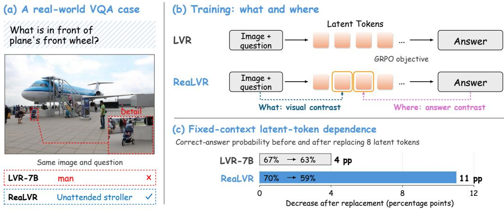  
Figure 1: ReaLVR connects visual evidence to latent reasoning. (a) ReaLVR identifies the stroller missed by LVR-7B in a complex scene; dashed boxes mark image details. (b) Visual and answer contrast determine what to preserve and where to supervise, during training only. (c) Replacing the top-8 tokens ranked by answerto-token attention, with other states fixed, decreases correct-answer probability by 4 and 11 percentage points. The larger ReaLVR drop indicates greater local answer dependence.

To bridge this gap, we propose ReaLVR, which directly trains free-running latent tokens to preserve answer-relevant visual evidence. ReaLVR regenerates the trajectory with the current model and retains gradients through its generation. To decide where stronger visual supervision is needed, it compares how the ground-truth answer and wrong answers sampled from the behavior policy attend to each latent token. To determine what the supervised tokens should preserve, ReaLVR contrasts answer-relevant visual evidence with mismatched evidence. Figure 1 provides an overview.

We evaluate ReaLVR on five benchmarks with six backbones spanning three model families (Qwen2.5-VL/Qwen3-VL, InternVL3, and Gemma-3). ReaLVR achieves the highest fivetask average among the evaluated latent-reasoning methods on Qwen2.5-VL-7B, reaching 63.7%. On Qwen3-VL-8B, ReaLVR reaches an average of 61.2%, exceeding the evaluated latent-reasoning baselines. The gains extend to Qwen3-VL-30B, where ReaLVR reaches 65.2%, 1.1 points above LVR. On Qwen3-VL-235B, ReaLVR also improves over LVR-SFT on all three evaluated benchmarks. To our knowledge, this is the first demonstration of visual reasoning in latent space trained on a 235B-parameter multimodal backbone.

The contributions of this work are threefold. First, we identify the latent evidence-credit gap and show that vanilla LVR does not reliably preserve answer-relevant visual evidence in its generated trajectory. Second, we introduce ReaLVR, which uses answer comparison to determine where stronger visual supervision is needed and visual evidence comparison to determine what the supervised tokens should preserve. This additional supervision requires no change to the model architecture or inference procedure. Third, we evaluate six backbones up to 235B parameters. To the best of our knowledge, we provide the first demonstration that continuous latent visual reasoning can be trained at frontier scale. The resulting latent states remain input-dependent and carry answer-relevant information rather than collapsing to a fixed trajectory. Through this work, we call for more attention toward demystifying the internal dynamics of continuous latent reasoning beyond benchmark accuracy, laying a grounded foundation for robust and faithful multimodal systems.

## 2 RELATED WORK

Visual Reasoning in Latent Space. Latent visual reasoning (LVR) performs intermediate computation through continuous latent tokens rather than explicit textual rationales (Li et al., 2026a; Wang et al., 2026b; Yang et al., 2026b; Dong et al., 2026). Recent work has explored a range of latent trajectory designs. Some methods switch or interleave textual and visual reasoning, adapt the number of latent states, or combine text and image representations within a shared latent workspace (Tong et al., 2025; Chen et al., 2026b; Tong et al., 2026; Chen et al., 2026a; Jiang et al., 2026). Others introduce structured or coarse-to-fine trajectories (Viveiros et al., 2026a; Wang et al., 2026d), or support long, parallel, decomposed, progressive, and multi-hypothesis reasoning (Wang et al., 2026a; Lu et al., 2026; Zhu et al., 2026b; Li et al., 2026c; Huang & Shan, 2026; Tang et al.). These methods expand the form and flexibility of latent computation. However, they leave open how to ensure that a free-running latent trajectory preserves the visual evidence required for its answer.

Visually Grounded Multimodal Reasoning. A broad line of work grounds multimodal reasoning in observable image evidence. VisCoT selects relevant regions (Shao et al., 2024a); PixelReasoner and DeepEyes revisit images through pixel-space operations or visual tools (Su et al., 2025; Zheng et al., 2026); and Argus and grounded chain-of-thought methods make regions or coordinates explicit during reasoning (Man et al., 2025; Wu et al., 2026b; Xia et al., 2025). Other methods learn multi-turn grounding from final-answer rewards or guide policy updates with verifiable perception questions (Huang et al., 2026b; Zhang et al., 2026a). For continuous latent reasoning, methods use semantic or attention-trajectory targets (Xu et al., 2026; Wu et al., 2026a), align states with visual features, regions, relations, or contrastive objectives (Miao et al., 2026; Cui et al., 2026; Wang et al., 2026e; Ding et al., 2026), or develop latent-specific policy objectives (Cheng et al., 2026; Zhu et al., 2026a). RoT instead uses rendered textual CoT rather than targets from the input image (Wang et al., 2026c). Diagnostic studies go beyond accuracy and representation similarity to probe what latent states encode, how they respond to image evidence, and whether final answers depend on them (Li et al., 2026d; Viveiros et al., 2026b; Zhang et al., 2026b;c; Guo et al., 2026; Yang et al., 2026a; Park et al., 2026; Kang et al., 2026). Monet directly optimizes sampled latent trajectories (Wang et al., 2026b), CoLVR contrasts latent trajectories (Ding et al., 2026), and RIS supervises region evidence (Cui et al., 2026). ReaLVR uses correct-versus-wrong answer readout to weight positions within one differentiable current-model trajectory, then applies relevant-versus-mismatched visual supervision at those positions while retaining the LVR inference procedure.

## 3 PRELIMINARIES

## 3.1 LATENT VISUAL REASONING

Each example contains an image–question input x, a ground-truth answer $y ^ { \star }$ , and optionally an evidence annotation $^ { a , }$ such as a region of interest (ROI); $a = \emptyset$ means that no region annotation is available. Let $\pi _ { \theta }$ denote the autoregressive policy, and let ${ \mathcal { T } } _ { \theta } ( c )$ denote the decoder hidden state produced from a causal prefix $c .$ The vision stack represents the image in $x$ with N visual tokens $\mathbf { \bar { V } } = \{ v _ { n } \} _ { n = 1 } ^ { N }$ , where $v _ { n } \in \mathbb { R } ^ { d }$ and d is the shared visual-token and decoder hidden-state dimension. Latent Visual Reasoning (LVR) inserts continuous decoder states between the input and the textual answer (Li et al., 2026a). At each latent position, the decoder passes its hidden state directly to the next decoding step instead of mapping it to a vocabulary token. With K latent tokens, the generation order is

$$
x \to < | \mathrm { ~ l ~ v \Sigma \to \ t \circ \Sigma \Sigma \vdash | > , } z _ { 1 } , \dots , z _ { K } , < | \mathrm { ~ l \ v \Sigma \mathrm { \Sigma \Sigma \mathrm { \Sigma \Sigma \circ \Sigma \circ \Sigma \mathrm { d } } | > , \mathrm { a n s w e r } , } }
$$

where $z _ { t } \in \mathbb { R } ^ { d }$ . The block $z _ { 1 : K }$ is the latent span. Let o denote the discrete control markers and answer text. A free-running rollout is $\tau = ( z _ { 1 : K } , o ) \sim \pi _ { \theta } ( \cdot \mid x )$ $\operatorname { I f } c _ { t } ( \tau )$ is the causal prefix before latent position t, then $z _ { t } \overset { \cdot } { = } \mathcal { T } _ { \theta } ( c _ { t } ( \tau ) )$ . Thus, a generated latent token can depend on the image, question, and earlier latent tokens, but never on future answer tokens.

## 3.2 TWO-STAGE LVR TRAINING

LVR first initializes its latent states with visual supervision and then post-trains the model using outcome feedback (Li et al., 2026a).

Stage 1: target-conditioned visual supervision. An ROI annotation is mapped to an ordered sequence of $T _ { v }$ visual targets $v _ { 1 : T _ { v } } ^ { \star }$ Under teacher forcing (TF), these target visual embeddings are supplied along the latent span instead of autoregressively feeding back the model’s own generated latent states. The decoder hidden states $z _ { 1 : T _ { \mathit { r } } } ^ { \mathrm { T F } }$ are trained to reconstruct this target sequence. We therefore call them target-conditioned, to distinguish them from the free-running states used in Stage 2. Their visual reconstruction loss is

$$
\mathcal { L } _ { \mathrm { r e c } } ( \theta ) = \frac { 1 } { T _ { v } } \sum _ { t = 1 } ^ { T _ { v } } \left. z _ { t } ^ { \mathrm { T F } } - v _ { t } ^ { \star } \right. _ { 2 } ^ { 2 } .\tag{1}
$$

Together with the standard next-token prediction loss, this stage produces parameters $\theta _ { 0 }$ , which are held fixed as the reference policy during Stage 2. The target length $T _ { v }$ can differ from the freerunning length K.

Stage 2: free-running outcome optimization. The frozen behavior policy $\pi _ { \theta _ { \mathrm { o l d } } }$ samples $\{ \tau _ { i } =$ $( z _ { i , 1 : K } ^ { \mathrm { r o l l } } , o _ { i } ) \} _ { i = 1 } ^ { G } .$ Here G is the group size, $z _ { i , 1 : K } ^ { \mathrm { r o l l } }$ are the saved latent states, and yb is the canonical answer parsed from $o _ { i }$ , with $\widehat { y } _ { i } = \perp$ for a parse failure. We write Correct $( \widehat { y } _ { i } , y ^ { \star } ) \in \{ 0 , 1 \}$ for answer correctness.

The standard reward combines answer correctness and output format. Group Relative Policy Optimization (GRPO) converts the G rewards into fixed group-relative advantages $\widehat { \mathbf { A } } = ( \widehat { A } _ { 1 } , \ldots , \widehat { A } _ { G } )$ Let $\mathcal { I } _ { \mathrm { c l i p } }$ denote the clipped text-token GRPO objective, $\widehat { \mathcal { L } } _ { \mathrm { K L } } ^ { \mathrm { t e x t } }$ the sampled text-token Kullback– Leibler (KL) penalty to $\pi _ { \theta _ { 0 } }$ , and $\beta \geq 0$ its weight. Vanilla Stage 2 minimizes

$$
\begin{array} { r } { \mathcal { L } _ { \mathrm { S 2 } } ^ { \mathrm { L V R } } ( \theta ) = - \mathcal { J } _ { \mathrm { c l i p } } ( \theta ; \theta _ { \mathrm { o l d } } , \widehat { \mathbf { A } } ) + \beta \widehat { \mathcal { L } } _ { \mathrm { K L } } ^ { \mathrm { t e x t } } ( \theta ; \theta _ { 0 } ) . } \end{array}\tag{2}
$$

Both terms score generated text positions. During policy replay, sampled latent vectors are treated as fixed context, so the policy loss does not backpropagate through the process that generated those vectors. Appendix B explains why this setup leaves free-running latent states without direct visualevidence supervision and distinguishes readout, grounding, and intervention utility.

## 4 REALVR: OUTCOME-CONTRASTIVE EVIDENCE CREDIT

ReaLVR couples answer-contrastive position weighting with relevant-versus-mismatched visual supervision on one differentiable trajectory generated by the current model. Correct-versus-wrong answer readout assigns stronger supervision to selected latent positions; visual contrast defines the evidence those positions should preserve. The visual loss backpropagates through latent generation, updating the process used at inference without changing the architecture or inference procedure.

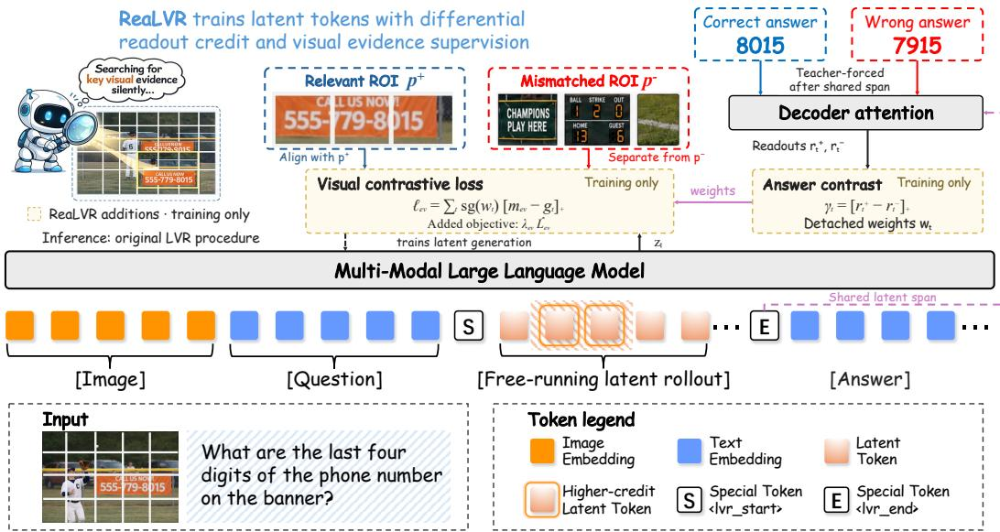  
Figure 2: ReaLVR learns visual grounding on its own latent trajectory. The model first generates continuous latent states from the image and question. Relevant and mismatched visual prototypes specify what these states should preserve. Correct and wrong answers are separately teacher-forced after the shared latent span; their attention contrast determines the supervision weights. The weights are detached, and the visual loss trains the latent-generation process. Both supervision branches are used only during training; inference follows the original LVR procedure.

## 4.1 SUPERVISE THE MODEL’S OWN LATENT TRAJECTORY

Stage 1 teaches latent states under supplied visual prefixes, while inference requires the model to generate those prefixes itself. This distinction motivates the central principle of on-policy distillation: provide supervision on trajectories produced by the learner (Agarwal et al., 2024). ReaLVR applies this principle to visual grounding, using image evidence to supervise the current model’s own latent computation. For each input x, the G behavior-policy completions from Section 3.2 supply the GRPO outcomes and candidate wrong answers. GRPO replays these completions with their saved latent inputs fixed. Alongside this policy update, ReaLVR regenerates one current-model trajectory by recursively feeding back its own hidden states:

$$
z _ { t } ^ { \theta } = \mathcal { T } _ { \theta } \left( x , < | \operatorname { l v } \mathtt { r } \_ { \mathsf { S } } \mathtt { t a r t } \mid > , z _ { 1 : t - 1 } ^ { \theta } \right) , \qquad t = 1 , \ldots , K .
$$

We retain gradients through this recurrence, allowing the evidence loss to update the process that produces the latent states. The entire latent span is generated before any answer token is supplied. Correct and wrong answers are then teacher-forced in separate branches after this shared span to compute the supervision weights. Thus, one differentiable trajectory supports both visual alignment and answer-conditioned routing. Figure 2 illustrates these two sources of supervision.

## 4.2 SPECIFY WHAT TO PRESERVE WITH VISUAL CONTRAST

We anchor the generated states to visual evidence from the input image. The annotation a defines an evidence mask $a ^ { + } = ( a _ { 1 } ^ { + } , \ldots , a _ { N } ^ { + } ) \in [ 0 , 1 ] ^ { N }$ over the visual tokens V. The positive prototype is the masked mean, $\begin{array} { r } { p ^ { + } = \operatorname { P o o l } ( \mathbf { V } ; a ^ { + } ) = \frac { \sum _ { n } a _ { n } ^ { + } v _ { n } } { \sum _ { n } a _ { n } ^ { + } + \varepsilon } } \end{array}$ , with $\varepsilon > 0$ . If the ROI is unavailable or its mask is empty, we set $a _ { n } ^ { + } = 1$ and obtain a whole-image target. All latent positions share this visual target; their supervision strengths will be determined by answer contrast. To make the target discriminative, we form a set $\mathcal { N } = \{ p _ { s } ^ { - } \} _ { s = 1 } ^ { N _ { - } }$ of nonzero visual prototypes pooled from mismatched examples using the same construction, with $N _ { - } \geq 1$ . The margin at latent position t compares the relevant prototype with the most similar negative:

$$
g _ { t } = \sin ( z _ { t } ^ { \theta } , p ^ { + } ) - \operatorname* { m a x } _ { p ^ { - } \in \mathcal { N } } \sin ( z _ { t } ^ { \theta } , p ^ { - } ) ,
$$

where sim is cosine similarity. Increasing this margin trains the latent state to distinguish the supporting visual content from competing image features. The vision encoder and connector are frozen, keeping the prototypes fixed as the language model learns to preserve their content.

## 4.3 LOCATE SUPERVISION WITH ANSWER CONTRAST

The model’s own wrong answers provide a reference for identifying which latent positions are preferentially read under the correct answer. Subtracting this reference discounts attention shared across competing outcomes and concentrates supervision on positions with a stronger correct-answer readout. From the G behavior-policy completions, we construct $\mathcal { V } _ { x } ^ { - }$ by retaining distinct, parseable wrong answers with nonempty answer content. These answer candidates guide position selection, while the visual negatives in $\dot { \mathcal { N } }$ define the content to distinguish.

For a canonical answer $y ,$ let Fm $\mathbf \chi _ { \mathcal { \left( Y \right) } } = \big ( \widetilde { y } _ { 1 } , \dots , \widetilde { y } _ { M ( y ) } \big )$ be its formatted sequence, and let $\mathcal { I } ( y )$ index the content tokens after excluding control and format markers. Each candidate is teacher-forced after $\left( x , < | \mathsf { l } \mathtt { v r \_ s t a r t } | > , z _ { 1 : K } ^ { \theta } , < | \mathsf { l v r \_ e n d } | > \right)$ . We extract attention at the input position of each content token $\widetilde { y } _ { j } \colon$ its query conditions on $\widetilde { y } _ { 1 : j }$ , including $\widetilde { y } _ { j }$ itself. For a single-token multiplechoice answer, this is the query after A or B has been supplied as input.

Let $A _ { j , t } ^ { ( \ell , h ) } ( y )$ denote the resulting post-softmax attention to latent position t. Averaging over decoder layers $\ell \in \mathcal { L } _ { \mathrm { d e c } }$ , heads $h \in { \mathcal { H } }$ , and content positions $j ~ \in ~ \mathcal { I } ( y )$ gives the readout $r _ { t } ( y ) = \mathrm { m e a n } _ { \ell , h , j } A _ { i , t } ^ { ( \ell , h ) } ( y )$ . We retain the raw attention mass without renormalizing it within the latent span. All candidate branches use the current model and the same regenerated latent states; their role is to compute routing weights. Write $r _ { t } ^ { + } = r _ { t } ( y ^ { \star } )$ for the correct-answer readout and $\begin{array} { r } { r _ { t } ^ { - } = | \mathcal { V } _ { x } ^ { - } | ^ { - 1 } \sum _ { y ^ { - } \in \mathcal { V } _ { x } ^ { - } } r _ { t } ( y ^ { - } ) } \end{array}$ for the mean wrong-answer readout. The selective credit is their positive difference, $\gamma _ { t } = [ r _ { t } ^ { + } - r _ { t } ^ { - } ] _ { + }$ , where $[ u ] _ { + } = \operatorname* { m a x } ( u , 0 )$ . When no valid wrong answer is available, we set $r _ { t } ^ { - } = r _ { t } ^ { + }$ , giving $\gamma _ { t } = 0$ . We keep the magnitude of this contrast so that it expresses both the preferred positions and the strength of the routing signal.

## 4.4 TRAIN WITH READOUT-WEIGHTED VISUAL EVIDENCE

We combine selective credit with a uniform baseline, $w _ { t } = \eta / K + ( 1 - \eta ) \gamma _ { t }$ , where $\eta \in [ 0 , 1 ]$ controls the baseline strength. The total weight is $\begin{array} { r } { \sum _ { t } w _ { t } = \eta + ( 1 - \eta ) \sum _ { t } \gamma _ { t } \colon } \end{array}$ stronger answer contrast increases the evidence supervision assigned to the example. With no selective signal, the weights reduce to $w _ { t } = \eta / K$ , retaining uniform supervision whenever $\eta > 0$ . Hyperparameters are listed in Appendix A. We detach $w _ { t }$ when optimizing the visual margin. This makes the weights allocate supervision while the gradient improves the evidence representation, preventing a shortcut through reducing the weight itself. Let sg denote stop-gradient and let $m _ { \mathrm { { e v } } } \in ( 0 , 2 ]$ be the target margin. The per-example evidence loss and the Stage 2 objective are

$$
\ell _ { \mathrm { e v } } = \sum _ { t = 1 } ^ { K } \mathrm { s g } ( w _ { t } ) [ m _ { \mathrm { e v } } - g _ { t } ] _ { + } ,\tag{3}
$$

$$
\mathcal { L } _ { \mathrm { S 2 } } ^ { \mathrm { R e a L V R } } ( \theta ) = \mathcal { L } _ { \mathrm { S 2 } } ^ { \mathrm { L V R } } ( \theta ) + \lambda _ { \mathrm { e v } } \widehat { \mathcal { L } } _ { \mathrm { e v } } ( \theta ) ,\tag{4}
$$

where $\begin{array} { r } { \widehat { \mathcal { L } } _ { \mathrm { e v } } ~ = ~ B ^ { - 1 } \sum _ { b = 1 } ^ { B } \ell _ { \mathrm { e v } } ^ { ( b ) } } \end{array}$ averages over a minibatch of B examples and $\lambda _ { \mathrm { e v } } ~ \geq ~ 0$ controls the added objective. Gradients of Equation 3 flow through the visual margins and recurrent latent generation, with answer strings, prototypes, and weights fixed. Equation 4 preserves GRPO rewards and advantages while training latent states on discriminative visual evidence. Appendices D and E detail the weight allocation and gradient decomposition. At inference, ReaLVR generates K latent tokens and decodes the answer with the original LVR architecture and procedure; both supervision branches are used only during training.

## 5 EXPERIMENTS

## 5.1 EXPERIMENTAL SETUP

We evaluate ReaLVR on five benchmarks of visual discrimination, spatial reasoning, and high resolution perception: MMVP (Tong et al., 2024), BLINK (Fu et al., 2024), HRBench-4K/8K (Wang et al., 2025), and MME-RealWorld (Zhang et al., 2025). Six backbones span Qwen2.5-VL and Qwen3-VL (Bai et al., 2025b;a), InternVL3 (Zhu et al., 2025), and Gemma 3 (Team et al., 2025). We compare with Pixel Reasoner (Su et al., 2025), Vision-R1 (Huang et al., 2026a), LVR (Li et al., 2026a), ILVR (Dong et al., 2026), and Monet (Wang et al., 2026b). We report task accuracy and the unweighted five-benchmark mean when available. Training used 800 AMD MI250X GPUs (128 GB each), please see Appendix A for detailed settings. Appendix C covers evaluation protocols and aggregation; Appendix G defines the analysis estimators; Appendix H.3 gives benchmark cases.

## 5.2 MAIN RESULTS

Table 1: Comparison with SOTA methods. Five-benchmark accuracy on Qwen2. $5 - \mathrm { V } \mathrm { L } - 7 \mathrm { B }$ . We report mean ± standard deviation over three random seeds. Purple method cells mark non-latent baselines, green method cells mark latent-reasoning baselines.
<table><tr><td rowspan="2">Model</td><td colspan="2">Training recipe</td><td colspan="2">Visual reasoning</td><td colspan="3">High-res. / real-world</td><td rowspan="2">Average↑ (5 tasks)</td></tr><tr><td>Stage</td><td>Method</td><td>MMVP↑</td><td>BLINK↑</td><td>HR-4K↑ HR-8K↑ MME-RW↑</td><td></td><td></td></tr><tr><td rowspan="9">Qwen2.5-VL-7B</td><td>RL</td><td>Pixel Reasoner [NeurIPS’25]</td><td> $6 6 . 8 { \scriptstyle \pm 0 . 4 }$ </td><td> $5 3 . 3 { \scriptstyle \pm 0 . 3 }$ </td><td> $6 9 . 8 { \scriptstyle \pm 0 . 3 }$ </td><td> $\overline { { 6 4 . 1 _ { \pm 0 . 3 } } }$ </td><td> $\overline { { 4 9 . 7 _ { \pm 0 . 2 } } }$ </td><td> $6 0 . 7 _ { \pm 0 . 2 }$ </td></tr><tr><td>RL</td><td>Vision-R1 [ICLR’26]</td><td> $5 1 . 5 { \scriptstyle \pm 0 . 5 }$ </td><td> $5 2 . 7 _ { \pm 0 . 4 }$ </td><td> $6 2 . 9 { \scriptstyle \pm 0 . 4 }$ </td><td> $5 8 . 6 _ { \pm 0 . 4 }$ </td><td> $4 4 . 2 _ { \pm 0 . 3 }$ </td><td> $5 4 . 0 { \scriptstyle \pm 0 . 3 }$ </td></tr><tr><td>SFT</td><td>LVR-SFT [ICLR’26]</td><td> $6 3 . 6 { \scriptstyle \pm 0 . 3 }$ </td><td> $5 3 . 2 _ { \pm 0 . 2 }$ </td><td> $6 9 . 0 { \scriptstyle \pm 0 . 3 }$ </td><td> $6 3 . 3 { \scriptstyle \pm 0 . 2 }$ </td><td> $4 9 . 5 { \scriptstyle \pm 0 . 2 }$ </td><td> $5 9 . 7 _ { \pm 0 . 2 }$ </td></tr><tr><td>RL</td><td>LVR-RL [ICLR’26]</td><td> $6 4 . 2 { \scriptstyle \pm 0 . 4 }$ </td><td> $5 3 . 6 _ { \pm 0 . 3 }$ </td><td> $6 9 . 6 { \scriptstyle \pm 0 . 3 }$ </td><td> $6 4 . 4 { \scriptstyle \pm 0 . 3 }$ </td><td> $5 0 . 1 { \scriptstyle \pm 0 . 3 }$ </td><td> $6 0 . 4 { \scriptstyle \pm 0 . 2 }$ </td></tr><tr><td>S1</td><td>ILVR-Stage1 [ACL’26]</td><td> $6 8 . 1 { \scriptstyle \pm 0 . 3 }$ </td><td> $5 5 . 4 { \scriptstyle \pm 0 . 3 }$ </td><td> $7 0 . 2 { \scriptstyle \pm 0 . 3 }$ </td><td> $6 6 . 0 { \scriptstyle \pm 0 . 3 }$ </td><td> $4 9 . 1 _ { \pm 0 . 2 }$ </td><td> $6 1 . 8 { \scriptstyle \pm 0 . 2 }$ </td></tr><tr><td>S2</td><td>ILVR-Stage2 [ACL’26]</td><td> $6 9 . 4 { \scriptstyle \pm 0 . 4 }$ </td><td> ${ \bf 5 6 . 8 _ { \pm 0 . 3 } }$ </td><td> $7 1 . 0 { \scriptstyle \pm 0 . 2 }$ </td><td> ${ \bf 6 6 . 9 { \scriptstyle \pm 0 . 3 } }$ </td><td> $5 0 . 3 { \scriptstyle \pm 0 . 3 }$ </td><td> $6 2 . 9 { \scriptstyle \pm 0 . 2 }$ </td></tr><tr><td>SFT</td><td>Monet-SFT [CVPR’26]</td><td> $6 8 . 4 { \scriptstyle \pm 0 . 3 }$ </td><td> $5 1 . 2 { \scriptstyle \pm 0 . 4 }$ </td><td>68  $. 9 { \scriptstyle \pm 0 . 3 }$ </td><td> $6 4 . 8 { \scriptstyle \pm 0 . 3 }$ </td><td> $5 0 . 7 _ { \pm 0 . 2 }$ </td><td> $6 0 . 8 { \scriptstyle \pm 0 . 2 }$ </td></tr><tr><td>RL</td><td>Monet-RL [CVPR’26]</td><td> $6 9 . 9 { \scriptstyle \pm 0 . 4 }$ </td><td> $5 2 . 4 { \scriptstyle \pm 0 . 4 }$ </td><td> $7 1 . 3 { \scriptstyle \pm 0 . 3 }$ </td><td> $6 6 . 0 { \scriptstyle \pm 0 . 3 }$ </td><td> $5 1 . 5 { \scriptstyle \pm 0 . 2 }$ </td><td> $6 2 . 2 { \scriptstyle \pm 0 . 3 }$ </td></tr><tr><td>RL</td><td>ReaLVR</td><td> ${ \bf 7 2 . 0 _ { \pm 0 . 4 } }$ </td><td> $5 5 . 8 { \scriptstyle \pm 0 . 3 }$ </td><td> ${ \bf 7 1 . 8 _ { \pm 0 . 3 } }$ </td><td> $6 6 . 6 { \scriptstyle \pm 0 . 3 }$ </td><td> ${ \bf 5 2 . 2 _ { \pm 0 . 2 } }$ </td><td> ${ \bf 6 3 . 7 _ { \pm 0 . 2 } }$ </td></tr></table>

ReaLVR reaches the highest five-task average on Qwen2.5-VL-7B, 63.7 (Table 1): +4.0 points over LVR-SFT, +3.3 over LVR-RL, +2.9 over Monet-SFT, +1.5 over Monet-RL, and +0.8 over ILVR, the strongest competing latent-reasoning row by average accuracy. Gains over LVR-SFT cover all five tasks, led by MMVP (+8.4), HR-8K (+3.3), and HR-4K (+2.8), spanning subtle visual discrimination and high-resolution evidence. Across model sizes (Table 2), applying the same objective and inference procedure to Qwen3-VL-8B, Qwen3-VL-30B, and Qwen $3 \mathrm { - } \mathrm { V L } \mathrm { - } 2 3 5 \mathrm { B - } \mathrm { A } 2 2 \mathrm { B }$ (235B total parameters) yields five-task averages of 61.2 and 65.2 at 8B and 30B. At 235B, ReaLVR scores 81.9 on MMVP, 75.4 on BLINK, and 71.0 on MME-RealWorld. HRBench was not evaluated, so no five-task mean is reported. Across model families, ReaLVR yields five-task means of 58.1 on InternVL3-8B and 41.6 on Gemma-3-12B without architecture or inference changes. On these backbones, ReaLVR exceeds LVR-RL by 3.1 and 2.6 points in five-task mean accuracy, respectively. These families use different vision encoders and language backbones; Gemma uses a fixed 256-token, single-tile image representation. Together, these results show applicability across

Table 2: Applicability across model sizes and families. The 235B evaluation covers MMVP, BLINK, and MME-RealWorld; a five-task average is reported only when all five scores are available.
<table><tr><td rowspan="2">Model</td><td colspan="2">Training recipe</td><td colspan="2">Visual reasoning</td><td colspan="2">High-res.</td><td colspan="2">/ real-world</td><td rowspan="2">Average↑ (5 tasks)</td></tr><tr><td></td><td>Stage Method</td><td>MMVP↑ BLINK↑</td><td></td><td></td><td></td><td>HR-4K↑ HR-8K↑ MME-RW↑</td><td></td></tr><tr><td colspan="10">Across Qwen3-VL model sizes</td></tr><tr><td rowspan="5">Qwen3-VL-8B</td><td>SFT</td><td>LVR-SFT [1CLR’26]</td><td>65.5</td><td>52.9</td><td>68.4</td><td></td><td>61.0</td><td>47.7</td><td>59.1</td></tr><tr><td>RL</td><td>LVR-RL [ICLR’26]</td><td>66.9</td><td>54.2</td><td></td><td>69.9</td><td>62.2</td><td>49.7</td><td>60.6</td></tr><tr><td>RL</td><td>Monet [CVPR’26]</td><td>67.4</td><td>55.1</td><td></td><td>68.5</td><td>61.9</td><td>48.4</td><td>60.3</td></tr><tr><td>RL</td><td>ReaLVR</td><td>68.7</td><td>54.9</td><td>70.4</td><td></td><td>62.9</td><td>49.3</td><td>61.2</td></tr><tr><td>SFT</td><td>LVR-SFT [1CLR’26]</td><td>77.0</td><td>47.5</td><td>73.8</td><td></td><td>66.8</td><td>53.4</td><td>63.7</td></tr><tr><td rowspan="3">Qwen3-VL-30B</td><td>RL</td><td>LVR-RL [ICLR’26]</td><td>77.6</td><td>47.8</td><td>73.9</td><td>67.2</td><td></td><td>53.9</td><td>64.1</td></tr><tr><td>RL</td><td>ReaLVR</td><td>77.7</td><td>51.4</td><td>74.1</td><td>67.9</td><td></td><td>54.7</td><td>65.2</td></tr><tr><td></td><td>Direct</td><td>80.0</td><td>73.5</td><td></td><td></td><td></td><td>69.8</td><td></td></tr><tr><td rowspan="3">Qwen3-VL-235B</td><td>SFT</td><td>LVR-SFT [ICLR’26]</td><td>80.9</td><td>74.2</td><td></td><td></td><td></td><td>70.4</td><td></td></tr><tr><td>RL</td><td>ReaLVR</td><td>81.9</td><td>75.4</td><td></td><td></td><td></td><td>71.0</td><td></td></tr><tr><td colspan="9">Across model families</td></tr><tr><td rowspan="4">InternVL3-8B</td><td>SFT</td><td>LVR-SFT [ICLR’26]</td><td>71.0</td><td>46.1</td><td>60.0</td><td>53.6</td><td></td><td>39.0</td><td>53.9</td></tr><tr><td>RL</td><td>LVR-RL [ICLR’26]</td><td>71.4</td><td>46.6</td><td>61.2</td><td>54.0</td><td></td><td>41.6</td><td>55.0</td></tr><tr><td>RL</td><td>ReaLVR</td><td>72.3</td><td>52.4</td><td>64.4</td><td>55.4</td><td></td><td>45.9</td><td>58.1</td></tr><tr><td>SFT</td><td>LVR-SFT [1CLR’26]</td><td>58.3</td><td>32.9</td><td>36.1</td><td></td><td>34.6</td><td>28.1</td><td>38.0</td></tr><tr><td rowspan="2">Gemma-3-12B</td><td>RL</td><td>LVR-RL [ICLR’26]</td><td>59.1</td><td>33.3</td><td>36.7</td><td>36.3</td><td></td><td>29.6</td><td>39.0</td></tr><tr><td>RL</td><td>ReaLVR</td><td>60.0</td><td>40.6</td><td>37.4</td><td></td><td>38.0</td><td>31.8</td><td>41.6</td></tr></table>

three model families and up to 235B total parameters. Appendix F.3 isolates the components, and Appendix F sweeps inference budgets $K = 0 { - } 2 0 ;$ a short span captures much of the benefit, and $K = 8$ gives the highest mean accuracy. Appendix J.3 reports a further supervision-mass-matched $2 \times 2$ test of answer-based position allocation and positive-versus-negative visual evidence.

## 5.3 MECHANISM ANALYSIS: VARIATION, GROUNDING, AND USE

Visual attention can link generated words to image regions (Xu et al., 2015). We examine visualevidence readout into latent states and answer readout from them (Figure 3; Appendix I), using variation, grounding, and fixed-context replacement to test answer dependence.Figure 3 shows weak

(a) LVR  
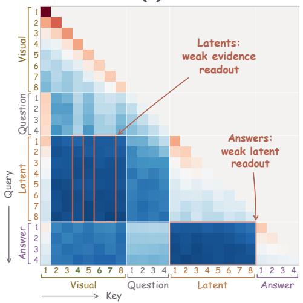

(b) ReaLVR  
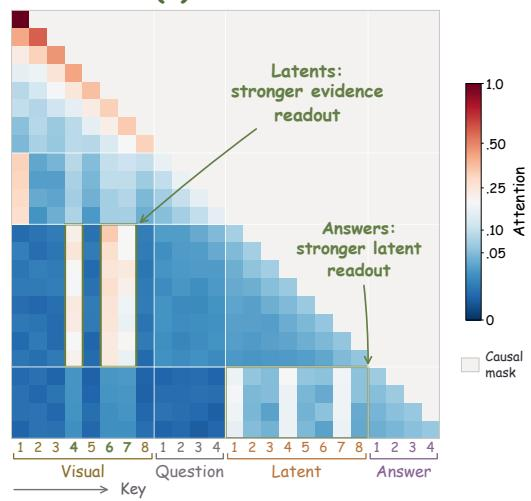  
Figure 3: Visual evidence and latent-token readout. Attention of LVR (a) and ReaLVR (b) on Qwen2.5-VL-7B, averaged over all layers and heads and 200 HR-Bench-4K examples, with image, question, and answer tokens averaged into 8/4/4 bins and the $K = 8$ latent positions shown individually. The gray upper triangle is the causal mask: each query can attend only to its own and earlier positions (Vaswani et al., 2017). Each row sums to one over allowed keys. Green tick labels mark the same visual-evidence keys (4, 6, and 7), the image bins overlapping the annotated ROI. The narrow frames show latent queries reading these visua keys; the bottom frames show answer queries reading latent states. Panel (a) shows weak readout along both links; panel (b) shows stronger readout along both. Please see Appendix I for further attention analyses.

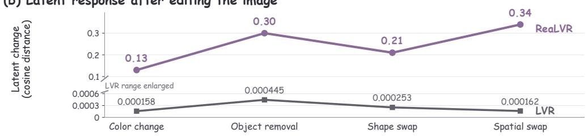

LVR attention from latent queries to target-overlapping visual bins and from answer queries to latent states; ReaLVR strengthens both links. The latter link motivates the dependence test below.

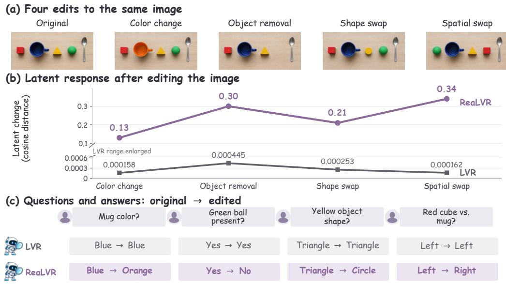

Figure 4: Latent changes and answer updates after image edits. (a) Four edits of the same reference image. (b) Cosine distance between the mean-pooled latent trajectories for the original and edited inputs; zero denotes no change. Each point is the average over 512 original–edited pairs per edit type with the question held fixed, measured for both LVR and ReaLVR on Qwen2.5-VL-7B. The broken vertical axis enlarges the LVR range to make its small fluctuations visible; values are unchanged. (c) Each user question is followed by the two model replies, read from the original image to the edited image. See Appendix H for more analysis.  
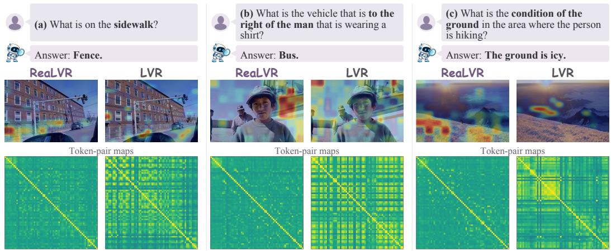  
Figure 5: Image and token views of the same three visual questions. ReaLVR and LVR on the same fence, bus, and icy-ground questions: image saliency overlays (top) and token-pair maps (bottom). Each pair is labeled with its question and answer.

Vanilla LVR has weak counterfactual sensitivity. We test whether generated latent states respond to edits that change answer-relevant evidence. Each of four edit types contains 512 original– edited pairs with a fixed question. The correct answer changes in 81.45%–86.33% of pairs, but LVR changes its prediction in only 5.66%–13.09% (Table G.5). These edits preserve much of the scene while altering a decisive cue, as in counterfactual VQA evaluations (Agarwal et al., 2020; Dancette et al., 2021). Figure 4(c) illustrates the failure: LVR answers the original views correctly but retains its answers after changes to mug color, ball presence, object shape, or left–right relation. ReaLVR updates its answer in each case. Across the full sets, the gap between ground-truth and LVR prediction-change rates is 68.36–80.67 percentage points. In panel (b), ReaLVR’s mean-pooled latent distance between original and edited inputs is 0.13–0.34, versus below 0.0005 for LVR. LVR’s trajectory may retain shared scene information while responding weakly to the cue needed to revise the answer. Together with its weak free-running alignment to visual targets (Table G.3), this motivates supervising generated latent states on answer-relevant evidence. Appendices J.1 and J.2 report paired Direct/LVR/ReaLVR answer-change tests and latent interventions to separate correct answer revision from local dependence on the latent span.

Latent positions respond differently to input changes. Figure H.6 compares latent-position variation across image–question examples (a) and across questions about one fixed image (b). ReaLVR’s variation is more concentrated at particular positions than Monet’s or the LVR variants’. Panel (c) reports a top-token variation gap of 0.07 for ReaLVR, 0.02 for Monet, and 0.01 for each LVR variant. Mean pooling can obscure changes concentrated in a few latent states (ENNADIR et al., 2025). This pattern is consistent with ReaLVR’s position-specific training signal: positions share a visual target within an example, while correct-versus-wrong-answer readout assigns them different supervision weights. Figure 5 adds saliency views for the fence, bus, and icy-ground questions. ReaLVR focuses more on the relevant regions, whereas LVR’s saliency is more diffuse. Because each overlay is normalized within its example, the comparison concerns spatial focus. Together, the variation map, saliency cases, and fixed-context replacement examine how latent states change, where visual evidence is read, and whether selected states affect the answer.

Useful latent computation need not be verbal. ReaLVR trains continuous states to preserve visual evidence, rather than produce intermediate sentences. We inspect their textual readout by applying the Gemma-3-12B vocabulary head to actual latent vectors from 47 questions with 8 states each, with special tokens masked. All 376 projections have < as their top-1 token with probability 1.0, while the same head gives correct next-token predictions for the answer “27B” in Figure 6. We attribute this readout to the closing-tag prior learned in Stage 1: < begins the literal <|lvr end|> that follows every latent span, and the latent states align with its unembedding direction (cosine 0.41 versus 0.02 for a random vocabulary row). Top-1 vocabulary readout therefore does not expose a language rationale, yet the states are not empty: a linear probe recovers the BLINK task label from the mean latent with 99.9% accuracy (Appendix G.6). Continuous states can thus support answers without expressing a rationale (Hao et al., 2025).

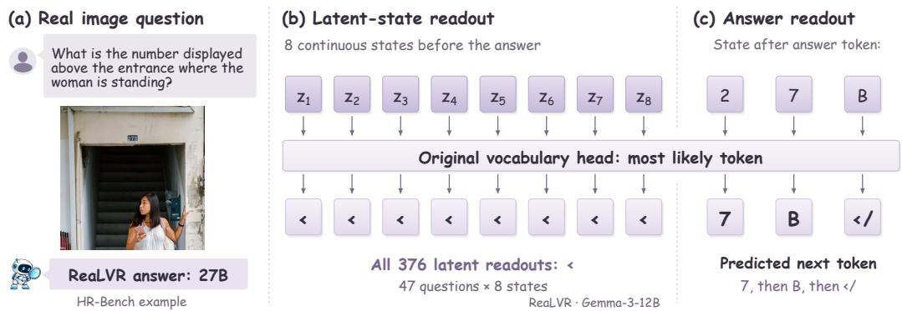  
Figure 6: A real visual answer and its latent-state text readout. ReaLVR (Gemma-3-12B) answers “27B” from an HR-Bench image (a). The original vocabulary head reads each of its eight latent states as <, as it does all 376 states from 47 questions (b), yet predicts 7 after 2, B after 7, and </ after B during answer generation (c). The latent readouts do not form an intermediate explanation.

A fixed-context replacement test probes whether the answer uses these states: replacing the eight most answer-attended tokens while holding other states fixed lowers ReaLVR’s correct-answer probability from 0.70 to 0.59 (Figure G.1; Appendix G.1). Thus, nonverbal latent states affect answer likelihood locally; regenerating later states could introduce further effects.

ReaLVR attends more strongly to target regions. Target-region enrichment divides answer attention on an annotated region by that on same-area background windows, reducing region-size effects. A value of 1 means equal attention; 2 means twice as much on the target. ReaLVR reaches about 2 in middle layers, versus Monet near 1.6 and LVR at or below 1.3 (Figure G.2). Correct and incorrect ReaLVR responses have similar curves, so spatial alignment alone cannot explain correctness, consistent with prior VLM observations (Liu et al., 2026). Together with fixed-context replacement, this probes where answers attend and whether selected latent states affect answer like lihood under controlled replacement with other states heldfixed (Reich et al., 2023).

## 6 CONCLUSION

In this work, we study a fundamental challenge in latent visual reasoning: a correct final answer does not guarantee that the preceding latent tokens have learned to preserve the visual evidence necessary to produce it. We identify this missing link as the latent evidence-credit gap. To address it, we introduce ReaLVR, which contrasts visual evidence to teach latent tokens what to preserve, while comparing how the correct and wrong answers attend to these tokens to decide where supervision is most critical. Across the tested backbones up to 235B, evidence supervision improves the available LVR baselines without changing model architectures or inference procedures. These results support visual-evidence supervision as a way to improve the grounding and use of continuous latent states.

## REFERENCES

Rishabh Agarwal, Nino Vieillard, Yongchao Zhou, Piotr Stanczyk, Sabela Ramos Garea, Matthieu Geist, and Olivier Bachem. On-policy distillation of language models: Learning from selfgenerated mistakes. In International Conference on Learning Representations, volume 2024, pp. 21246–21263, 2024.

Vedika Agarwal, Rakshith Shetty, and Mario Fritz. Towards causal vqa: Revealing and reducing spurious correlations by invariant and covariant semantic editing. In Proceedings ofthe IEEE/CVF Conference on Computer Vision and Pattern Recognition (CVPR), June 2020.

Shuai Bai, Yuxuan Cai, Ruizhe Chen, Keqin Chen, Xionghui Chen, Zesen Cheng, Lianghao Deng, Wei Ding, Chang Gao, Chunjiang Ge, et al. Qwen3-vl technical report. arXiv preprint arXiv:2511.21631, 2025a.

Shuai Bai, Keqin Chen, Xuejing Liu, Jialin Wang, Wenbin Ge, Sibo Song, Kai Dang, Peng Wang, Shijie Wang, Jun Tang, Humen Zhong, Yuanzhi Zhu, Mingkun Yang, Zhaohai Li, Jianqiang Wan, Pengfei Wang, Wei Ding, Zheren Fu, Yiheng Xu, Jiabo Ye, Xi Zhang, Tianbao Xie, Zesen Cheng, Hang Zhang, Zhibo Yang, Haiyang Xu, and Junyang Lin. Qwen2.5-vl technical report, 2025b. URL https://arxiv.org/abs/2502.13923.

Chao Chen, Zhixin Ma, Yongqi Li, Yupeng Hu, Yinwei Wei, Wenjie Li, and Liqiang Nie. Reasoning in the dark: Interleaved vision-text reasoning in latent space. In Findings of the Association for Computational Linguistics: ACL 2026, pp. 39117–39129, 2026a.

Xiuwei Chen, Wentao Hu, Yongxin Wang, Zisheng Chen, Likui Zhang, Kun Xiang, Jianhua Han, Hui-Ling Zhen, Jingyuan Zou, Hang Xu, and Xiaodan Liang. Latent visual states for efficient multimodal reasoning, 2026b. URL https://arxiv.org/abs/2606.24233.

Tao Cheng, Shi-Zhe Chen, Hao Zhang, Yixin Qin, Jinwen Luo, and Zheng Wei. Hybrid latent reasoning with decoupled policy optimization. arXiv preprint arXiv:2604.20328, 2026.

Jin Cui, Xinyue Long, Xunyong Zhang, Yadong Zhang, Chuanchang Su, Jingye Gan, Boran Zhao, and Pengju Ren. Retrieve, integrate, and synthesize: Spatial-semantic grounded latent visual reasoning, 2026. URL https://arxiv.org/abs/2605.07106.

Corentin Dancette, Remi Cad´ ene, Damien Teney, and Matthieu Cord. Beyond question-based bi-\` ases: Assessing multimodal shortcut learning in visual question answering. In Proceedings ofthe IEEE/CVF International Conference on Computer Vision (ICCV), pp. 1574–1583, October 2021.

Ziyang Ding, Linjian Meng, Yiming Wu, Yuhan Li, Yuhao Liu, and Zhen Zhao. Colvr: Enhancing exploratory latent visual reasoning via contrastive optimization, 2026. URL https://arxiv. org/abs/2605.08802.

Shuai Dong, Siyuan Wang, Xingyu Liu, Chenglin Li, Haowen Hou, and Zhongyu Wei. Interleaved latent visual reasoning with selective perceptual modeling. In Proceedings of the 64th Annual Meeting of the Association for Computational Linguistics (Volume 1: Long Papers), pp. 29316– 29335, 2026.

Sofiane ENNADIR, Levente Zolyomi, Oleg Smirnov, Tianze Wang, John Pertoft, Filip Cornell,´ and Lele Cao. Pool me wisely: On the effect of pooling in transformer-based models. In The Thirty-ninth Annual Conference on Neural Information Processing Systems, 2025. URL https: //openreview.net/forum?id=8uhXfdSJmA.

Xingyu Fu, Yushi Hu, Bangzheng Li, Yu Feng, Haoyu Wang, Xudong Lin, Dan Roth, Noah A Smith, Wei-Chiu Ma, and Ranjay Krishna. Blink: Multimodal large language models can see but not perceive. In European Conference on Computer Vision, pp. 148–166. Springer, 2024.

Jiawei Guo, Yu Chen, Xiang Wang, Shuai Li, Xinpei Zhao, Huaxing Liu, Shuai Dong, Feifei Zhai, and Yu Zhou. Beyond visual memory: Mechanistic diagnostics of latent visual reasoning. arXiv preprint arXiv:2606.01287, 2026.

Shibo Hao, Sainbayar Sukhbaatar, DiJia Su, Xian Li, Zhiting Hu, Jason E Weston, and Yuandong Tian. Training large language models to reason in a continuous latent space. In Second Conference on Language Modeling, 2025. URL https://openreview.net/forum?id= Itxz7S4Ip3.

Lianyu Hu, Shengqian Qin, Zeqin Liao, Qing Guo, Liang Wan, Wei Feng, and Yang Liu. Colt: Teaching multi-modal models to think with chain of latent thoughts. In European Conference on Computer Vision, pp. 526–544. Springer, 2026.

David Huang and Lianlei Shan. Dlwm: Diverse latent world models for efficient multimodal reasoning, 2026. URL https://arxiv.org/abs/2606.15160.

Wenxuan Huang, Bohan Jia, Shaosheng Cao, Zheyu Ye, Zhe Xu, Yao Hu, Shaohui Lin, et al. Visionr1: Incentivizing reasoning capability in multimodal large language models. In International Conference on Learning Representations, volume 2026, pp. 63794–63812, 2026a.

Xinyu Huang, Yuhao Dong, Weiwei Tian, Bo Li, Rui Feng, and Ziwei Liu. Mgpo: Thinking with images via multi-turn grounding-based reinforcement learning. In Findings ofthe Associationfor Computational Linguistics: ACL 2026, pp. 383–399, 2026b.

Byungwoo Jeon, Yoonwoo Jeong, Hyunseok Lee, Minsu Cho, and Jinwoo Shin. Vision-aligned latent reasoning for multi-modal large language model. In Forty-third International Conference on Machine Learning, 2026. URL https://openreview.net/forum?id=qmvoTiXSfG.

Houcheng Jiang, Jiajun Fu, Junfeng Fang, Chen Gao, Xiang Wang, Xiangnan He, and Yong Li. Univlr: Unifying text and vision in visual latent reasoning for multimodal llms, 2026. URL https://arxiv.org/abs/2605.11856.

Jiaxuan Kang, Siyu Chen, Mingda Li, Mingjie Liu, Tianyue Wang, Zhaoyang Wei, Yongheng Zhang, Yanchao Hao, and Zheng Wei. Lut: Latent utility training for visual reasoning, 2026. URL https://arxiv.org/abs/2608.00743.

Bangzheng Li, Ximeng Sun, Jiang Liu, Ze Wang, Jialian Wu, Xiaodong Yu, Emad Barsoum, Muhao Chen, and Zicheng Liu. Latent visual reasoning. In International Conference on Learning Representations, volume 2026, pp. 148076–148090, 2026a.

Kelvin Li, Chuyi Shang, Leonid Karlinsky, Rogerio Feris, Trevor Darrell, and Roei Herzig. Latent implicit visual reasoning. In Proceedings of the IEEE/CVF Conference on Computer Vision and Pattern Recognition, pp. 33457–33466, 2026b.

Peiming Li, Yifan Wang, Xiaotian Zhang, Zhiyuan Hu, Shiyu Li, Zheng Wei, and Yang Tang. Prolavit: Learning progressive latent visual thoughts in structured latent space. In European Conference on Computer Vision, pp. 355–372. Springer, 2026c.

You Li, Chi Chen, Yanghao Li, Fanhu Zeng, Kaiyu Huang, Jinan Xu, and Maosong Sun. Imagination helps visual reasoning, but not yet in latent space. In Forty-third International Conference on Machine Learning, 2026d. URL https://openreview.net/forum?id=l1cMErXg1P.

Zhining Liu, Ziyi Chen, Hui Liu, Chen Luo, Xianfeng Tang, Suhang Wang, Jingying Zeng, Zhenwei Dai, Zhan Shi, Tianxin Wei, Hanqing Lu, Benoit Dumoulin, and Hanghang Tong. Seeing but not believing: Probing the disconnect between visual attention and answer correctness in VLMs. In The Fourteenth International Conference on Learning Representations, 2026. URL https: //openreview.net/forum?id=JAI7afWA9e.

Dongchen Lu, Zhimo Li, Mao Shu, and Huo Cao. Deeplatent: Think with images via parallel latent visual reasoning, 2026. URL https://arxiv.org/abs/2606.00562.

Yunze Man, De-An Huang, Guilin Liu, Shiwei Sheng, Shilong Liu, Liang-Yan Gui, Jan Kautz, Yu-Xiong Wang, and Zhiding Yu. Argus: Vision-centric reasoning with grounded chain-of-thought. In 2025 IEEE/CVF Conference on Computer Vision and Pattern Recognition (CVPR), pp. 14268– 14280. IEEE, 2025.

Yanting Miao, Yutao Sun, Dexin Wang, Mengyu Zhou, Pascal Poupart, Lei Lv, Qi Zhao, Li Wang, Hao Li, Xiaoxi Jiang, and Guanjun Jiang. Fill the gap: A granular alignment paradigm for visual reasoning in multimodal large language models, 2026. URL https://arxiv.org/abs/ 2605.12374.

Suhyeong Park, Junha Jung, and Jaewoo Kang. Reason through the latent! making latent visual reasoning necessary, 2026. URL https://arxiv.org/abs/2609.06746.

Daniel Reich, Felix Putze, and Tanja Schultz. Measuring faithful and plausible visual grounding in VQA. In The 2023 Conference on Empirical Methods in Natural Language Processing, 2023. URL https://openreview.net/forum?id=pvEkYbUPVW.

Hao Shao, Shengju Qian, Han Xiao, Guanglu Song, Zhuofan Zong, Letian Wang, Yu Liu, and Hongsheng Li. Visual cot: Advancing multi-modal language models with a comprehensive dataset and benchmark for chain-of-thought reasoning. Advances in Neural Information Processing Systems, 37:8612–8642, 2024a.

Zhihong Shao, Peiyi Wang, Qihao Zhu, Runxin Xu, Junxiao Song, Xiao Bi, Haowei Zhang, Mingchuan Zhang, Y. K. Li, Y. Wu, and Daya Guo. Deepseekmath: Pushing the limits of mathematical reasoning in open language models, 2024b. URL https://arxiv.org/abs/ 2402.03300.

Alex Su, Haozhe Wang, Weiming Ren, Fangzhen Lin, and Wenhu Chen. Pixel reasoner: Incentivizing pixel space reasoning via curiosity-driven reinforcement learning. In The Thirtyninth Annual Conference on Neural Information Processing Systems, 2025. URL https: //openreview.net/forum?id=VeZkY3JjWV.

Yuesen Tang, Yiming Yang, Tengfei Bao, and Yu Tong. Thinking in latent space: Progressive multimodal simplification for visual reasoning. In Forty-third International Conference on Machine Learning.

Gemma Team, Aishwarya Kamath, Johan Ferret, Shreya Pathak, Nino Vieillard, Ramona Merhej, Sarah Perrin, Tatiana Matejovicova, Alexandre Rame, Morgane Rivi´ ere, Louis Rouillard, Thomas\` Mesnard, Geoffrey Cideron, Jean bastien Grill, Sabela Ramos, Edouard Yvinec, Michelle Casbon, Etienne Pot, Ivo Penchev, Gael Liu, Francesco Visin, Kathleen Kenealy, Lucas Beyer, Xi-¨ aohai Zhai, Anton Tsitsulin, Robert Busa-Fekete, Alex Feng, Noveen Sachdeva, Benjamin Coleman, Yi Gao, Basil Mustafa, Iain Barr, Emilio Parisotto, David Tian, Matan Eyal, Colin Cherry, Jan-Thorsten Peter, Danila Sinopalnikov, Surya Bhupatiraju, Rishabh Agarwal, Mehran Kazemi, Dan Malkin, Ravin Kumar, David Vilar, Idan Brusilovsky, Jiaming Luo, Andreas Steiner, Abe Friesen, Abhanshu Sharma, Abheesht Sharma, Adi Mayrav Gilady, Adrian Goedeckemeyer, Alaa Saade, Alex Feng, Alexander Kolesnikov, Alexei Bendebury, Alvin Abdagic, Amit Vadi, Andras´ Gyorgy, Andr ¨ e Susano Pinto, Anil Das, Ankur Bapna, Antoine Miech, Antoine Yang, Antonia´ Paterson, Ashish Shenoy, Ayan Chakrabarti, Bilal Piot, Bo Wu, Bobak Shahriari, Bryce Petrini, Charlie Chen, Charline Le Lan, Christopher A. Choquette-Choo, CJ Carey, Cormac Brick, Daniel Deutsch, Danielle Eisenbud, Dee Cattle, Derek Cheng, Dimitris Paparas, Divyashree Shivakumar Sreepathihalli, Doug Reid, Dustin Tran, Dustin Zelle, Eric Noland, Erwin Huizenga, Eugene Kharitonov, Frederick Liu, Gagik Amirkhanyan, Glenn Cameron, Hadi Hashemi, Hanna Klimczak-Plucinska, Harman Singh, Harsh Mehta, Harshal Tushar Lehri, Hussein Hazimeh, Ian´ Ballantyne, Idan Szpektor, Ivan Nardini, Jean Pouget-Abadie, Jetha Chan, Joe Stanton, John Wieting, Jonathan Lai, Jordi Orbay, Joseph Fernandez, Josh Newlan, Ju yeong Ji, Jyotinder Singh, Kat Black, Kathy Yu, Kevin Hui, Kiran Vodrahalli, Klaus Greff, Linhai Qiu, Marcella Valentine, Marina Coelho, Marvin Ritter, Matt Hoffman, Matthew Watson, Mayank Chaturvedi, Michael Moynihan, Min Ma, Nabila Babar, Natasha Noy, Nathan Byrd, Nick Roy, Nikola Momchev, Nilay Chauhan, Noveen Sachdeva, Oskar Bunyan, Pankil Botarda, Paul Caron, Paul Kishan Rubenstein, Phil Culliton, Philipp Schmid, Pier Giuseppe Sessa, Pingmei Xu, Piotr Stanczyk, Pouya

Tafti, Rakesh Shivanna, Renjie Wu, Renke Pan, Reza Rokni, Rob Willoughby, Rohith Vallu, Ryan Mullins, Sammy Jerome, Sara Smoot, Sertan Girgin, Shariq Iqbal, Shashir Reddy, Shruti Sheth, Siim Poder, Sijal Bhatnagar, Sindhu Raghuram Panyam, Sivan Eiger, Susan Zhang, Tianqi˜ Liu, Trevor Yacovone, Tyler Liechty, Uday Kalra, Utku Evci, Vedant Misra, Vincent Roseberry, Vlad Feinberg, Vlad Kolesnikov, Woohyun Han, Woosuk Kwon, Xi Chen, Yinlam Chow, Yuvein Zhu, Zichuan Wei, Zoltan Egyed, Victor Cotruta, Minh Giang, Phoebe Kirk, Anand Rao, Kat Black, Nabila Babar, Jessica Lo, Erica Moreira, Luiz Gustavo Martins, Omar Sanseviero, Lucas Gonzalez, Zach Gleicher, Tris Warkentin, Vahab Mirrokni, Evan Senter, Eli Collins, Joelle Barral, Zoubin Ghahramani, Raia Hadsell, Yossi Matias, D. Sculley, Slav Petrov, Noah Fiedel, Noam Shazeer, Oriol Vinyals, Jeff Dean, Demis Hassabis, Koray Kavukcuoglu, Clement Farabet, Elena Buchatskaya, Jean-Baptiste Alayrac, Rohan Anil, Dmitry, Lepikhin, Sebastian Borgeaud, Olivier Bachem, Armand Joulin, Alek Andreev, Cassidy Hardin, Robert Dadashi, and Leonard Hussenot.´ Gemma 3 technical report, 2025. URL https://arxiv.org/abs/2503.19786.

Jintao Tong, Jiaqi Gu, Yujing Lou, Lubin Fan, Yixiong Zou, Yue Wu, Jieping Ye, and Ruixuan Li. Sketch-in-latents: Eliciting unified reasoning in mllms, 2025. URL https://arxiv.org/ abs/2512.16584.

Jintao Tong, Shilin Yan, Hongwei Xue, Xiaojun Tang, Kunyu Shi, Guannan Zhang, Ruixuan Li, and Yixiong Zou. Swimbird: Eliciting switchable reasoning mode in hybrid autoregressive mllms. arXiv preprint arXiv:2602.06040, 2026.

Shengbang Tong, Zhuang Liu, Yuexiang Zhai, Yi Ma, Yann LeCun, and Saining Xie. Eyes wide shut? exploring the visual shortcomings of multimodal llms. In 2024 IEEE/CVF Conference on Computer Vision and Pattern Recognition (CVPR), pp. 9568–9578. IEEE, 2024.

Ashish Vaswani, Noam Shazeer, Niki Parmar, Jakob Uszkoreit, Llion Jones, Aidan N Gomez, Łukasz Kaiser, and Illia Polosukhin. Attention is all you need. Advances in neural information processing systems, 30, 2017.

Andre G Viveiros, Nuno Gonc¸alves, Matthias Lindemann, and Andr´ e Martins. Lantern: Latent´ visual structured reasoning. arXiv preprint arXiv:2603.25629, 2026a.

Andre G. Viveiros, Nuno Gonc¸alves, Andr´ e F. T. Martins, and Matthias Lindemann. What’s holding´ back latent visual reasoning?, 2026b. URL https://arxiv.org/abs/2605.18445.

Chenfeng Wang, Wei He, Xuhan Zhu, Chunpeng Zhou, Qizhen Li, Song Yan, Yufei Zheng, Chengjun Yu, Fan Lu, Wei Zhai, Yang Cao, Pengfei Yu, and Zheng-Jun Zha. Self-consistent latent reasoning: Long latent sequence reasoning for vision-language model, 2026a. URL https://arxiv.org/abs/2605.12163.

Qixun Wang, Yang Shi, Yifei Wang, Yuanxing Zhang, Pengfei Wan, Kun Gai, Xianghua Ying, and Yisen Wang. Monet: Reasoning in latent visual space beyond image and language. In Proceedings of the IEEE/CVF Conference on Computer Vision and Pattern Recognition, pp. 12030–12040, 2026b.

Wenbin Wang, Liang Ding, Minyan Zeng, Xiabin Zhou, Li Shen, Yong Luo, Wei Yu, and Dacheng Tao. Divide, conquer and combine: A training-free framework for high-resolution image perception in multimodal large language models. In Proceedings of the AAAI Conference on Artificial Intelligence, volume 39, pp. 7907–7915, 2025.

Yifan Wang, Shiyu Li, Peiming Li, Xiaochen Yang, Zheng Wei, and Yang Tang. Render-of-thought: Rendering textual chain-of-thought as images for visual latent reasoning. In Proceedings of the 64th Annual Meeting of the Association for Computational Linguistics (Volume 1: Long Papers), pp. 45236–45253, 2026c.

Yubo Wang, Juntian Zhang, Yichen Wu, Yankai Lin, Nils Lukas, and Yuhan Liu. Forest before trees: Latent superposition for efficient visual reasoning. In Proceedings of the 64th Annual Meeting of the Association for Computational Linguistics (Volume 1: Long Papers), pp. 11272–11288, 2026d.

Zihu Wang, Karthik Somayaji N. S, and Peng Li. Regular: Relation-grounded latent reasoning for large vision-language models, 2026e. URL https://arxiv.org/abs/2605.30587.

Linquan Wu, Tianxiang Jiang, Yifei Dong, Haoyu Yang, Fengji Zhang, Shichang Meng, Ai Xuan, Linqi Song, and Jacky Keung. Lavit: Aligning latent visual thoughts for multi-modal reasoning. In European Conference on Computer Vision, pp. 345–363. Springer, 2026a.

Qiong Wu, Xiangcong Yang, Yiyi Zhou, Chenxin Fang, Baiyang Song, Xiaoshuai Sun, and Rongrong Ji. Grounded chain-of-thought for multimodal large language models. In Proceedings ofthe IEEE/CVF Conference on Computer Vision and Pattern Recognition, pp. 33577–33587, 2026b.

Jiaer Xia, Bingkui Tong, Yuhang Zang, Rui Shao, and Kaiyang Zhou. Bootstrapping grounded chain-of-thought in multimodal llms for data-efficient model adaptation. In 2025 IEEE/CVF International Conference on Computer Vision (ICCV), pp. 208–217. IEEE, 2025.

Kelvin Xu, Jimmy Ba, Ryan Kiros, Kyunghyun Cho, Aaron Courville, Ruslan Salakhudinov, Rich Zemel, and Yoshua Bengio. Show, attend and tell: Neural image caption generation with visual attention. In International conference on machine learning, pp. 2048–2057. PMLR, 2015.

Tianrun Xu, Yue Sun, Qixun Wang, Jingyi Lu, Yuan Wang, Tianren Zhang, Longteng Guo, Fengyun Rao, Jing LYU, Feng Chen, and Jing Liu. Semantic-enriched latent visual reasoning. In Fortythird International Conference on Machine Learning, 2026. URL https://openreview. net/forum?id=DTuBIEhSF3.

Zesheng Yang, Lingling Zhang, Xinyu Zhang, Cheng Zhang, Pengyu Li, Heng Wang, and Lin Wu. Glaq: Grounding latent queries in visual evidence for multimodal reasoning, 2026a. URL https://arxiv.org/abs/2608.15517.

Zeyuan Yang, Xueyang Yu, Delin Chen, Maohao Shen, and Chuang Gan. Machine mental imagery: Empower multimodal reasoning with latent visual tokens. In Proceedings of the IEEE/CVF Conference on Computer Vision and Pattern Recognition, pp. 33510–33520, 2026b.

Chi Zhang, Haibo Qiu, Qiming Zhang, Yufei Xu, Zhixiong Zeng, Siqi Yang, Peng Shi, Lin Ma, and Jing Zhang. Perceptual-evidence anchored reinforced learning for multimodal reasoning. In Proceedings of the IEEE/CVF Conference on Computer Vision and Pattern Recognition, pp. 41111–41120, 2026a.

Xin Zhang, Qiqi Tao, Jiawei Du, Moyun Liu, and Joey Tianyi Zhou. Visual latents know more than they say: Unsilencing latent reasoning in mllms, 2026b. URL https://arxiv.org/abs/ 2605.02735.

XiuYu Zhang, Junfeng Fang, and Zhenkai Liang. Cosine misleads: Auxiliary losses reshape vision language models, not their latents. arXiv preprint arXiv:2606.05753, 2026c.

YiFan Zhang, Huanyu Zhang, Haochen Tian, Chaoyou Fu, Shuangqing Zhang, Junfei Wu, Feng Li, Kun Wang, Qingsong Wen, Zhang Zhang, et al. Mme-realworld: Could your multimodal llm challenge high-resolution real-world scenarios that are difficult for humans? In International Conference on Learning Representations, volume 2025, pp. 89655–89701, 2025.

Ziwei Zheng, Minghao Yang, Jack Hong, Chenxiao Zhao, Guohai Xu, Le Yang, and Chao Shen. Deepeyes: Incentivizing” thinking with images” via reinforcement learning. In International Conference on Learning Representations, volume 2026, pp. 126775–126798, 2026.

Dongyao Zhu, Zhen Wang, Xi Xiao, Han Jiang, Saeed Vahidian, Wei-Lun Chao, Tanya Berger-Wolf, Yu Su, Raju Vatsavai, and Jianyang Gu. Leveraging latent visual reasoning in silence, 2026a. URL https://arxiv.org/abs/2605.18641.

Jinguo Zhu, Weiyun Wang, Zhe Chen, Zhaoyang Liu, Shenglong Ye, Lixin Gu, Hao Tian, Yuchen Duan, Weijie Su, Jie Shao, Zhangwei Gao, Erfei Cui, Xuehui Wang, Yue Cao, Yangzhou Liu, Xingguang Wei, Hongjie Zhang, Haomin Wang, Weiye Xu, Hao Li, Jiahao Wang, Nianchen Deng, Songze Li, Yinan He, Tan Jiang, Jiapeng Luo, Yi Wang, Conghui He, Botian Shi, Xingcheng Zhang, Wenqi Shao, Junjun He, Yingtong Xiong, Wenwen Qu, Peng Sun, Penglong Jiao, Han Lv, Lijun Wu, Kaipeng Zhang, Huipeng Deng, Jiaye Ge, Kai Chen, Limin Wang, Min Dou, Lewei Lu, Xizhou Zhu, Tong Lu, Dahua Lin, Yu Qiao, Jifeng Dai, and Wenhai Wang. Internvl3: Exploring advanced training and test-time recipes for open-source multimodal models, 2025. URL https://arxiv.org/abs/2504.10479.

Mengdan Zhu, Senhao Cheng, and Liang Zhao. Decompose, look, and reason: Reinforced latent reasoning for vlms. arXiv preprint arXiv:2604.07518, 2026b.

## Technical Appendices

## Table of Contents

A Training Details and Hyperparameters 16   
B The Latent Evidence-Credit Gap 17   
C Experimental and Training Details 18   
C.1 Benchmarks and Model Coverage 18   
C.2 Evaluation Protocol and Metrics . 18   
C.3 Visual Prototypes 18   
C.4 Wrong-Answer Construction 19   
C.5 Dependencies and Gradient Flow 19   
D Uniform Bootstrap and Unassigned Mass 19   
D.1 Selective Credit and Its Remainder . 19   
D.2 Uniform Allocation and Boundary Cases 19   
E Detached-Credit Gradient Decomposition 19   
E.1 Local Derivative of the Undetached Objective 19   
E.2 The Detached Update 20   
F Latent-Length Ablation 20   
F.1 Evaluation Setup . 20   
F.2 Task-Dependent Budgets 20   
F.3 Components Ablations . 21   
G Additional Diagnostic Results 22   
G.1 Fixed-Context Latent-Token Dependence . 22   
G.2 Target-Region Attention Enrichment 22   
G.3 Answer-Conditioned Saliency . 24   
G.4 Similarity and Representation Geometry 24   
G.5 Target Alignment and Answer Readout 25   
G.6 Task Structure and Counterfactual Sensitivity . 26   
H Additional Qualitative Results 26   
H.1 Image Saliency and Token Views 27   
H.2 Attention and Saliency Cases . 27   
H.3 Task Examples Across Five Benchmarks 32   
H.4 Position-wise Latent Variation . 33   
Attention Analysis Designs 34   
I.1 Visual Evidence and Answer Readout . 34   
I.2 Question-Dependent Evidence Selection 35   
I.3 Latent Selection and Fixed-Context Intervention 36   
J Paired Counterfactual and Mass-Matched Mechanism Tests 36   
J.1 Paired counterfactual behavior 36   
J.2 Latent exchange and position selection . . . . . . . . . 37   
J.3 Mass-matched where-by-what ablation . 37

## A TRAINING DETAILS AND HYPERPARAMETERS

All backbones are trained with the two-stage recipe of Section 3.1: Stage 1 (target-conditioned visual supervision) followed by Stage 2 (free-running outcome optimization with the ReaLVR evidence loss). The recipe and all optimization hyperparameters are shared across backbones; only the number of GPUs, and hence the global batch size, changes with model scale.

Hardware. All models are trained on a cluster of AMD Instinct MI250X accelerators. An MI250X is a dual-die package: it holds two Graphics Compute Dies (GCDs), each with its own 64 GB of HBM2e memory, and the ROCm runtime exposes every GCD as a separate device. Each node in our cluster contains four MI250X accelerators and therefore provides eight independently addressable GPUs with 64 GB each. Following common practice on MI250X systems, we refer to a GCD as a GPU when referring to ROCm-visible devices. The 235B model is trained on 200 nodes, i.e. 800 MI250X accelerators exposed as 1,600 GCDs; the 7B, 8B, and 30B backbones use 64 nodes (256 MI250X accelerators, 512 GCDs). World sizes and per-device batch counts below refer to GCDs.

Distributed training. We use DeepSpeed ZeRO-3 with full parameter, gradient, and optimizerstate partitioning across all GPUs and no CPU offload; communication is overlapped with computation. Table A.1 summarizes the configuration.

Table A.1: Hardware and distributed training configuration. Each MI250X accelerator contributes two ROCm-visible 64 GB GCDs.
<table><tr><td>Item</td><td>Value</td></tr><tr><td>Accelerator</td><td>AMD Instinct MI250X (2 GCDs per accelerator)</td></tr><tr><td>Per node</td><td>4 MI250X = 8 GPUs (GCDs), 64 GB HBM2e per GPU</td></tr><tr><td>Accelerators, 235B</td><td>200 nodes × 4 = 800 MI250X (1,600 GCDs)</td></tr><tr><td>Accelerators, ≤30B</td><td>64 nodes × 4 = 256 MI250X (512 GCDs)</td></tr><tr><td>Parallelism</td><td>DeepSpeed ZeRO-3 (parameters, gradients, optimizer states)</td></tr><tr><td>Offload</td><td>None</td></tr><tr><td>overlap-comm</td><td>True</td></tr><tr><td>stage3_max_live-parameters</td><td> $1 \times 1 0 ^ { 9 }$ </td></tr><tr><td>Precision</td><td>bf16</td></tr><tr><td>Gradient checkpointing</td><td>Enabled</td></tr><tr><td>Attention kernel</td><td>PyTorch SDPA</td></tr><tr><td>Launcher</td><td>Multi-node DeepSpeed launcher (hostfile)</td></tr></table>

Stage 1: target-conditioned visual supervision. Stage 1 trains the language model on the nexttoken loss plus the visual reconstruction loss, with the vision encoder and the vision–language merger frozen. Latent states are fed back as continuous hidden states (Section 3.1); no separate latent projection head is used. Sequences are packed to 4,096 tokens, and each image contributes between 128 and 5,120 visual tokens depending on its resolution. Each GPU processes one packed sequence per step without gradient accumulation, so the global batch equals the number of GPUs.

Stage 2: free-running outcome optimization with evidence credit. Stage 2 optimizes the objec tive. For every prompt the behavior policy samples $G = 8$ completions at temperature 0.6, which supply both the GRPO advantages and the wrong-answer set $\bar { \mathcal { V } } _ { x } ^ { - }$ . We set the KL weight β to 0, so the Stage-1 model serves only as the initialization. Images are capped at 2,560 visual tokens (≈2.0 MP). Training prompts are drawn from a mixture of ViRL39K and Visual-CoT. Stage 2 runs for 100 optimizer steps with a checkpoint every 25 steps. And all baselines such as LVR and Monet use the same data and supervision for training. The evidence loss uses $K = 8$ latent tokens, weight $\lambda _ { \mathrm { e v } } = 0 . 2$ , margin $m _ { \mathrm { e v } } = 0 . 5$ , uniform baseline $\eta = 0 . 3 ,$ , and $N ^ { - } = 1 6$ negative prototypes pooled from other examples in the same global batch; the same K is used at inference.

Table A.2: Stage-1 hyperparameters.
<table><tr><td>Hyperparameter</td><td>Value</td></tr><tr><td>Per-GPU batch × grad. accumulation</td><td>1 × 1</td></tr><tr><td>Global batch (sequences)</td><td>1,600 (235B) / 512 (≤30B)</td></tr><tr><td>Optimizer</td><td>AdamW</td></tr><tr><td>Peak learning rate</td><td> $1 \times 1 0 ^ { - 5 }$ </td></tr><tr><td>LR schedule / warmup ratio / weight decay</td><td>cosine / 0.03 / 0.1</td></tr><tr><td>Reconstruction loss</td><td>MSE, weight 0.1</td></tr><tr><td>Latent feedback</td><td>continuous hidden state</td></tr><tr><td>Latent projection head</td><td>none</td></tr><tr><td>Trainable modules</td><td>language model</td></tr><tr><td>Frozen modules</td><td>vision tower, merger</td></tr><tr><td>Sequence packing / max packed tokens</td><td>yes / 4,096</td></tr><tr><td>Max sequence length</td><td>4,096</td></tr><tr><td>Visual tokens per image</td><td>128–5,120</td></tr></table>

Table A.3: Stage-2 hyperparameters (GRPO with ReaLVR evidence supervision).
<table><tr><td>Hyperparameter</td><td>Value</td></tr><tr><td>Objective</td><td>GRPO + evidence loss</td></tr><tr><td>Group size G (rollouts per prompt)</td><td>8</td></tr><tr><td>Sampling temperature / top-p / top-k</td><td>0.6 / 1.0 / off</td></tr><tr><td>KL weightβ</td><td>0</td></tr><tr><td>Per-GPU batch × grad. accumulation</td><td>1 × 1</td></tr><tr><td>Prompts per step</td><td>1,600 (235B) / 512 (≤30B)</td></tr><tr><td>Optimizer</td><td>AdamW</td></tr><tr><td>Peak learning rate</td><td>5 × 10−7</td></tr><tr><td>LR schedule / warmup ratio / weight decay</td><td>cosine / 0.03 / 0.1</td></tr><tr><td>Max prompt length</td><td>4,096</td></tr><tr><td>Max completion length</td><td>192</td></tr><tr><td>Max visual tokens per image</td><td>2,560</td></tr><tr><td>Training steps</td><td>100</td></tr><tr><td>Checkpoint interval</td><td>25 steps</td></tr><tr><td>Latent length K (training and inference)</td><td>8</td></tr><tr><td>Evidence loss weight  $\lambda _ { \mathrm { e v } }$ </td><td>0.2</td></tr><tr><td>Target margin  $m _ { \mathrm { e v } }$ </td><td>0.5</td></tr><tr><td>Uniform baseline η</td><td>0.3</td></tr><tr><td>Negative prototypes per example  $N ^ { - }$ </td><td>16 (pooled from other examples in the global batch)</td></tr><tr><td>Training data</td><td>ViRL39K + Visual-CoT mixture</td></tr></table>

## B THE LATENT EVIDENCE-CREDIT GAP

Equation 2 assigns an outcome to an entire completion. The reward identifies a successful answer, while leaving open which latent tokens supported it and what visual evidence they preserved. Vanilla LVR supplies visual targets only to target-conditioned Stage 1 states, leaving the free-running states used in Stage 2 and at inference without direct visual-evidence supervision.

We separate three questions about a generated latent token. Readout asks whether the answer decoder attends to it. Grounding asks whether it represents the evidence relevant to the image–question pair rather than mismatched evidence. Utility asks whether intervening on the token changes the answer. These questions require distinct measurements: a token can receive attention without representing relevant evidence or affecting the answer. Readout shared by correct and behavior-policy wrong answers can also reflect formatting or transition behavior common to both outcomes.

ReaLVR addresses the training gap with outcome-contrastive readout credit. It supervises one regenerated current-model trajectory with visual evidence and gives greater weight to positions read more strongly under the correct answer than under sampled wrong answers. Both readouts use the current model and the same regenerated latent span. Intervention utility remains a separate evaluation criterion.

Figure B.1 separates the roles of outcome reward, visual evidence supervision, and intervention based evaluation.  
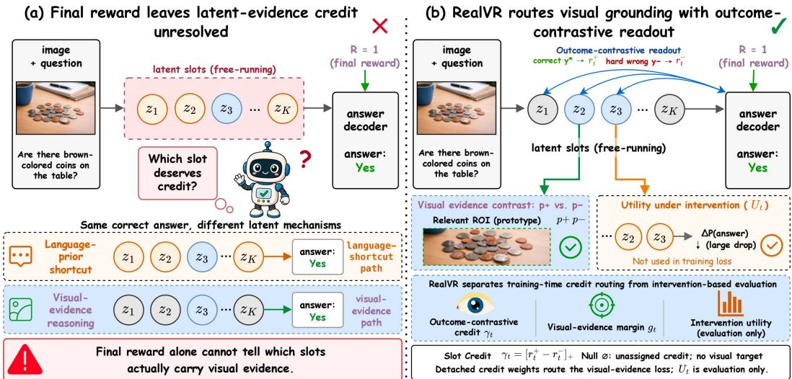  
Figure B.1: From final reward to latent evidence credit. The output reward indicates whether the answer is correct. ReaLVR uses relevant and mismatched visual evidence to determine what the latent tokens should preserve, then contrasts ground-truth and wrong-answer readouts to determine where supervision should be stronger. Intervention separately evaluates whether the answer depends on the latent tokens and is not part of the training objective.

## C EXPERIMENTAL AND TRAINING DETAILS

## C.1 BENCHMARKS AND MODEL COVERAGE

MMVP (Tong et al., 2024) tests subtle visual discrimination, while BLINK (Fu et al., 2024) evaluates visual perception tasks, including counting, jigsaw, spatial relations, and depth. HRBench-4K and HRBench-8K (Wang et al., 2025) test high-resolution perception, and MME-RealWorld (Zhang et al., 2025) tests understanding of complex real-world scenes. Together, these benchmarks cover visual reasoning at different image resolutions.

Five backbones have complete five-benchmark results: Qwen2.5-VL-7B (Bai et al., 2025b), Qwen3-VL-8B and Qwen3-VL-30B (Bai et al., 2025a), InternVL3-8B (Zhu et al., 2025), and Gemma-3-12B (Team et al., 2025). Here, Qwen3-VL-30B abbreviates Qwen3-VL-30B-A3B. We additionally evaluate Qwen3-VL-235B-A22B, abbreviated as Qwen3-VL-235B, on MMVP, BLINK, and MME-RealWorld, comparing direct decoding, LVR-SFT, and ReaLVR.

## C.2 EVALUATION PROTOCOL AND METRICS

Table 1 compares Pixel Reasoner (Su et al., 2025), Vision-R1 (Huang et al., 2026a), LVR (Li et al., 2026a), ILVR (Dong et al., 2026), and Monet (Wang et al., 2026b) at the training stages indicated in each row. Table 2 reports the Qwen3-VL size series and the InternVL3 and Gemma-3 family comparisons. The latter use a matched evaluation protocol within each family.

We report task accuracy and compute an unweighted mean only for rows with all five benchmark scores. Average gains are differences between the displayed one-decimal means. The threebenchmark 235B evaluation is reported task by task and has no five-benchmark average. Mechanism analyses examine latent variation, visual grounding, and answer dependence; Appendix G defines the region, saliency, and fixed-context token-replacement estimators.

The training-time construction rules below complete the derivation in Section 4, using the notation of Section 3.

## C.3 VISUAL PROTOTYPES

If the ROI annotation is absent or its visual-token mask is empty, we set $a _ { n } ^ { + } = 1$ for all n, giving a whole-image target $p ^ { + }$ . We stabilize the pooling denominator and require nonzero prototypes for the cosine margin. The negative set $\mathcal { N }$ contains at least one valid prototype; each $\left. p _ { s } ^ { - } \right.$ uses the same pooling rule on a designated mismatched example. Frozen vision and connector weights keep prototypes fixed while the evidence loss updates the language model through the regenerated trajectory.

## C.4 WRONG-ANSWER CONSTRUCTION

We require $\mathcal { I } ( y ^ { \star } ) \neq \emptyset$ . After parsing and canonicalization, the retained set is

$$
\mathcal { V } _ { x } ^ { - } = \mathrm { U n i q u e } \{ \widehat { y } _ { i } : i \in \{ 1 , \ldots , G \} , \widehat { y } _ { i } \neq \bot , \mathrm { C o r r e c t } ( \widehat { y } _ { i } , y ^ { \star } ) = 0 , \mathcal { T } ( \widehat { y } _ { i } ) \neq \emptyset \} .
$$

This rule removes parse failures, correct answers, candidates without answer-content positions, and duplicates. The retained strings come from the behavior policy and supply comparison outcomes, regardless of their probability under the updated model.

Every formatted candidate is teacher-forced after the same regenerated latent span. The readout in Section 4.3 averages the selected decoder layers, heads, and answer-content positions.

## C.5 DEPENDENCIES AND GRADIENT FLOW

For minibatch example $b ,$ the group outputs $\{ o _ { b , i } \} _ { i = 1 } ^ { G }$ construct $\mathcal { V } _ { x _ { b } } ^ { - }$ . The loss also depends on $( x _ { b } , a _ { b } , y _ { b } ^ { \star } )$ and the supplied visual negative set $\mathcal { N } _ { b } ;$ we leave these dependencies implicit in $w _ { b , t }$ and ${ { g } _ { b , t } }$ . Gradients pass through the autoregressive latent-generation process, so a loss term at position t can update earlier generation steps and shared parameters. $\mathbf { A }$ token’s weight specifies its contribution to the loss, not an update restricted to that position.

## D UNIFORM BOOTSTRAP AND UNASSIGNED MASS

## D.1 SELECTIVE CREDIT AND ITS REMAINDER

Section 4.3 defines $\gamma _ { t } = [ r _ { t } ^ { + } - r _ { t } ^ { - } ] _ { + }$ . Because $\gamma _ { t } \leq r _ { t } ^ { + }$ and the raw attention mass over the latent span is at most one, $\textstyle \sum _ { t } \gamma _ { t } \leq 1$ . We therefore define the nonnegative bookkeeping remainder

$$
\gamma _ { \emptyset } = 1 - \sum _ { t = 1 } ^ { K } \gamma _ { t } .
$$

Here $\varnothing$ labels unassigned mass; it is distinct from $a = \emptyset$ , the notation for a missing ROI annotation.

## D.2 UNIFORM ALLOCATION AND BOUNDARY CASES

Section 4.4 mixes selective credit with a uniform component. The full allocation is

$$
w _ { t } = \frac { \eta } { K } + ( 1 - \eta ) \gamma _ { t } , \qquad w _ { \emptyset } = ( 1 - \eta ) \gamma _ { \emptyset } .
$$

For $0 < \eta < 1$ , the first term gives every latent token a nonzero routing weight, while the second term preserves selective routing; $\eta = 0$ and $\eta = 1$ recover the selective-only and uniform-only endpoints. Because $\begin{array} { r } { \gamma _ { \emptyset } + \sum _ { t } \gamma _ { t } = 1 } \end{array}$ , the complete allocation satisfies $\begin{array} { r } { w _ { \emptyset } + \sum _ { t } w _ { t } = 1 } \end{array}$ . The remainder $w _ { \emptyset }$ is bookkeeping only: it introduces no token, module, or loss term, and the token weights retain their original mass without renormalization.

If $\begin{array} { r } { \partial _ { x } ^ { - } = \varnothing _ { x } ^ { } } \end{array}$ , then $\gamma _ { t } = 0$ and $w _ { t } = \eta / K$ . Thus, $\eta > 0$ retains uniform supervision when no valid wrong-answer comparison is available, while $\eta = 0$ assigns zero evidence weight to that example.

## E DETACHED-CREDIT GRADIENT DECOMPOSITION

Detaching the readout-derived weights lets them allocate supervision while the evidence gradient improves the visual margin. The following decomposition shows which gradient path detachment removes.

## E.1 LOCAL DERIVATIVE OF THE UNDETACHED OBJECTIVE

At a given optimization update, we condition on the sampled candidate-answer set, its tokenized answer sequences, the selected decoder layers and heads, the answer-position masks, the visual prototypes, and $\eta .$ . These quantities are fixed for the local gradient calculation; the dependence on

θ below comes from the regenerated trajectory and its current-model readout. For one regenerated trajectory, define the per-token evidence violation

$$
h _ { t } ( \theta ) = [ m _ { \mathrm { e v } } - g _ { t } ( \theta ) ] _ { + } ,
$$

and temporarily view $w _ { t } ( \theta ) = \eta / K + ( 1 - \eta ) \gamma _ { t } ( \theta )$ as an ordinary differentiable function. The corresponding hypothetical undetached objective is

$$
\ell _ { \mathrm { e v } } ^ { \mathrm { u n d e t } } ( \theta ) = \sum _ { t = 1 } ^ { K } w _ { t } ( \theta ) h _ { t } ( \theta ) .
$$

Away from the kink points of the positive-part operators, the product rule gives

$$
\nabla _ { \theta } \ell _ { \mathrm { e v } } ^ { \mathrm { u n d e t } } = \sum _ { t = 1 } ^ { K } \underbrace { w _ { t } \nabla _ { \theta } h _ { t } } _ { \substack { \mathrm { u p d a t e ~ t h e ~ v i s u a l ~ e v i d e n c e ~ m a r g i n } } } + \sum _ { t = 1 } ^ { K } \underbrace { h _ { t } \nabla _ { \theta } w _ { t } } _ { \substack { \mathrm { u p d a t e ~ t h e ~ c r e d i t ~ r o u t e r } } } .
$$

At a hinge or ReLU kink, or when multiple visual negatives attain the same maximum, automatic differentiation selects a subgradient and the same two computational-graph paths remain. The first term is the intended weighted evidence update. The second changes the router in proportion to the current evidence violation. In particular, $\bar { \partial } \ell _ { \mathrm { e v } } ^ { \mathrm { u n d e t } } / \partial w _ { t } = h _ { t } \geq 0 \colon$ when the hinge is active, gradient descent has a local path to reduce the loss by lowering the token’s weight. More explicitly, at smooth points,

$$
\nabla _ { \theta } h _ { t } = - \mathbf { 1 } \{ g _ { t } < m _ { \mathrm { e v } } \} \nabla _ { \theta } g _ { t } , \qquad \nabla _ { \theta } w _ { t } = ( 1 - \eta ) \mathbf { 1 } \{ r _ { t } ^ { + } > r _ { t } ^ { - } \} ( \nabla _ { \theta } r _ { t } ^ { + } - \nabla _ { \theta } r _ { t } ^ { - } ) .
$$

Thus, the routing term can lower $r _ { t } ^ { + }$ or raise $r _ { t } ^ { - }$ where the readout difference is active, reducing the mass assigned to the token and increasing the bookkeeping remainder without improving the token’s visual evidence margin. The decomposition therefore identifies a local optimization shortcut through the router.

## E.2 THE DETACHED UPDATE

The stop-gradient operator preserves the forward value, $\operatorname { s g } ( w _ { t } ) = w _ { t }$ , but sets its derivative to zero. At optimization step k, it is equivalent for this branch to differentiating the local surrogate

$$
\mathcal { \widetilde {ell } } _ { \mathrm { e v } , k } ( \theta ) = \sum _ { t = 1 } ^ { K } w _ { t } ( \theta _ { k } ) h _ { t } ( \theta ) .
$$

Its gradient at the current parameters is

$$
\nabla _ { \boldsymbol { \theta } } \widetilde { \ell } _ { \mathrm { e v } , k } ( \boldsymbol { \theta } ) \Big | _ { \boldsymbol { \theta = \theta } _ { k } } = \sum _ { t = 1 } ^ { K } w _ { t } ( \theta _ { k } ) \nabla _ { \boldsymbol { \theta } } h _ { t } ( \boldsymbol { \theta } ) | _ { \boldsymbol { \theta = \theta } _ { k } } .
$$

The weights are recomputed at each update, so this surrogate describes the local gradient at step $k .$ The evidence branch uses the current readout to allocate supervision and improves the visual margin through the latent trajectory. Readout still evolves across updates through GRPO, KL regularization, and shared-parameter changes. Detachment removes only the evidence loss’s direct gradient through the routing weights.

## F LATENT-LENGTH ABLATION

## F.1 EVALUATION SETUP

We hold the $\mathtt { Q w e n 2 . 5 - V I - 7 B }$ ReaLVR checkpoint fixed within this ablation and vary the prescribed inference-time latent length K. The $K = 0$ setting skips the latent span and decodes the answer directly.

## F.2 TASK-DEPENDENT BUDGETS

Additional steps help different tasks to different degrees. Table F.1 shows that the best observed length is task dependent. HR-8K first reaches its maximum at $K \ : = \ : 8 ,$ while BLINK peaks at $K = 1 6$ , improving by 6.3 points over $K = 0$ . In contrast, MME-RealWorld peaks at $K = 4$ and then declines by 4.2 points by $K = 2 0$ . MMVP varies by only 1.0 point across all tested lengths and shows no consistent trend. Together, these results favor task-dependent budgets over uniformly longer trajectories.

Table F.1: Sensitivity to the inference-time latent budget. The ReaLVR (Qwen2.5-VL-7B) checkpoint is held fixed while the latent-token budget K is varied at inference; $K = 0$ decodes the answer without a latent span. $K = 8$ is the budget used during training and serves as the reference (†): entries are differences in accuracy (percentage points) from that column, which is therefore 0.0 by construction. The sweep is run on a fixed evaluation subset so that all budgets are scored identically; its absolute scores are consequently not on the same scale as Table 1, and the differences reported here are meaningful only within this sweep. Under the full evaluation protocol of Table 1, the $K = 8$ setting scores 72.0 on MMVP, 55.8 on BLINK, 66.6 on HR-8K and 52.2 on MME-RealWorld. Bold marks each row’s largest value, including ties. The mean is the unweighted average across the four listed benchmarks.
<table><tr><td rowspan="2">Benchmark</td><td colspan="7">Latent-token budget K (difference from  $K = 8 )$ </td></tr><tr><td>0</td><td>2</td><td>4</td><td> $8 ^ { \dagger }$ </td><td>12</td><td>16</td><td>20</td></tr><tr><td>HR-8K</td><td>-3.0</td><td>-2.0</td><td>-1.5</td><td>0.0</td><td>-1.0</td><td>-0.5</td><td>0.0</td></tr><tr><td>MMVP</td><td>-0.7</td><td>-1.0</td><td>-0.3</td><td>0.0</td><td>-1.0</td><td>-1.0</td><td>0.0</td></tr><tr><td>BLINK</td><td>-4.0</td><td>0.0</td><td>-1.1</td><td>0.0</td><td>+1.2</td><td>+2.3</td><td>+0.9</td></tr><tr><td>MME-RealWorld</td><td>-4.4</td><td>+1.9</td><td>+2.1</td><td>0.0</td><td>-0.2</td><td>-1.4</td><td>-2.1</td></tr><tr><td>Mean</td><td>-3.0</td><td>-0.3</td><td>-0.2</td><td>0.0</td><td>-0.2</td><td>-0.1</td><td>-0.3</td></tr></table>

A short latent span captures much of the benefit. Across the four tasks in this ablation, $K =$ 8 gives the highest mean accuracy; the closest alternative, $K \ : = \ : 1 6$ , is 0.1 points below it, and removing the latent span entirely $( K = 0 )$ costs 3.0 points. Selecting the best tested K separately for each benchmark gives a post-hoc task-level oracle 1.1 points above $K = 8 ,$ , which motivates adaptive latent budgets. Even $K = 2$ captures 4.0 of the 6.3-point maximum gain on BLINK and 6.3 of the 6.5-point maximum gain on MME-RealWorld.

## F.3 COMPONENTS ABLATIONS

Table F.2 removes each ingredient of ReaLVR on Qwen2.5-VL-7B. Every variant stays above LVR-RL, so the evidence loss helps in any form, but the full method is best on all five benchmarks. Answer-contrast routing matters. Replacing the routing weights with a uniform $1 / K ( \eta = 1 )$ costs 1.3 points on average and 2.5 on MMVP: the same visual supervision, spread evenly over the latent span, is markedly less effective than supervision concentrated where the correct answer reads. Subtracting the wrong-answer readout is part of this effect; routing with raw correct-answer attention alone recovers only 62.9, because attention shared by correct and wrong answers (formatting, transitions) then receives credit. Removing the uniform floor entirely $( \eta = 0 )$ is slightly worse than the full model (63.2 vs. 63.7), consistent with its role of keeping supervision alive on examples without a valid wrong answer.

Negatives make the target discriminative. Aligning latents to $p ^ { + }$ without mismatched prototypes drops 1.6 points, the largest loss among the “what” and “where” components; a plain alignment objective pulls latents toward generic image content rather than toward what distinguishes this image from others.

On-policy regeneration and detachment are both necessary. Supervising the saved rollout latents instead of a regenerated trajectory loses 1.8 points, the largest drop in the table, confirming that the loss must reach the process that produces the latents at inference. Removing the stop-gradient on w loses 1.1 points, matching the shortcut identified in Appendix E: the router lowers weights on hard positions instead of improving their evidence margin.

Table F.2: Component ablation on Qwen2.5-VL-7B. Each row removes or replaces one ingredient of ReaLVR; all other settings follow Appendix A. “Uniform routin $\mathbf { g } ^ { \prime \prime }$ sets $\eta = 1$ so every latent position receives weight $1 / K$ and the answer contrast is unused. “Selective $\mathrm { \ o n l y ^ { \mathrm { , } } }$ sets $\eta = 0$ . “No negatives” replaces the margin with a plain cosine alignment to $p ^ { + }$ . “Raw attention” routes with $r _ { t } ^ { + }$ instead of $[ r _ { t } ^ { \bar { + } } - r _ { t } ^ { - } ] +$ “Undetached” removes the stop-gradient on $w _ { t }$ . “Off-policy” applies the evidence loss to the saved rollout latents instead of a regenerated trajectory. LVR-RL is the $\lambda _ { \mathrm { e v } } = 0$ endpoint.
<table><tr><td>Variant</td><td>MMVP</td><td>BLINK</td><td> $\mathrm { H R - 4 K }$ </td><td>HR-8K</td><td>MME-RW</td><td>Avg.</td></tr><tr><td>LVR-RL (no evidence loss)</td><td>64.2</td><td>53.6</td><td>69.6</td><td>64.4</td><td>50.1</td><td>60.4</td></tr><tr><td>Where to supervise (answer contrast)</td><td></td><td></td><td></td><td></td><td></td><td></td></tr><tr><td>Uniform routing  $( \eta = 1 )$ </td><td>69.5</td><td>54.6</td><td>71.0</td><td>65.6</td><td>51.3</td><td>62.4</td></tr><tr><td>Raw attention  $( \gamma _ { t } = r _ { t } ^ { + } )$ </td><td>70.6</td><td>55.1</td><td>71.3</td><td>66.0</td><td>51.7</td><td>62.9</td></tr><tr><td>Selective only  $( \eta = 0 )$ </td><td>71.2</td><td>55.3</td><td>71.4</td><td>66.2</td><td>51.9</td><td>63.2</td></tr><tr><td>What to preserve (visual contrast)</td><td></td><td></td><td></td><td></td><td></td><td></td></tr><tr><td>No negatives  $( { \mathcal { N } } = \emptyset )$ </td><td>69.0</td><td>54.4</td><td>70.6</td><td>65.3</td><td>51.0</td><td>62.1</td></tr><tr><td>Training mechanics</td><td></td><td></td><td></td><td></td><td></td><td></td></tr><tr><td>Undetached weights</td><td>70.1</td><td>54.8</td><td>71.1</td><td>65.5</td><td>51.4</td><td>62.6</td></tr><tr><td>Off-policy targets</td><td>68.8</td><td>54.2</td><td>70.4</td><td>65.1</td><td>50.8</td><td>61.9</td></tr><tr><td>ReaLVR (full)</td><td>72.0</td><td>55.8</td><td>71.8</td><td>66.6</td><td>52.2</td><td>63.7</td></tr></table>

## G ADDITIONAL DIAGNOSTIC RESULTS

The diagnostics examine answer dependence, visual grounding, representation geometry, and sensitivity to image edits. Each subsection defines the quantity being measured before presenting its results.

## G.1 FIXED-CONTEXT LATENT-TOKEN DEPENDENCE

Readout attention ranks latent tokens, but it does not show whether the answer depends on them. The fixed-context audit replaces one latent token while holding the others fixed and measures the change in target-answer log-likelihood. Let $O _ { \mathrm { a n s } } ^ { \star }$ be the canonical formatted target answer, whose probability is computed by teacher forcing over the entire answer sequence, and let $\bar { z } _ { t }$ be a replacement token vector. Write $\widetilde { z } _ { 1 : K } ^ { ( t  \bar { z } _ { t } ) }$ for the latent sequence obtained by replacing $z _ { t }$ with $\bar { z } _ { t }$ . The fixed-context intervention score is

$$
u _ { t } ( \bar { z } _ { t } ) = \log \pi _ { \theta } ( o _ { \mathrm { a n s } } ^ { \star } \mid x , z _ { 1 : K } ) - \log \pi _ { \theta } \Big ( o _ { \mathrm { a n s } } ^ { \star } \mid x , \widetilde { z } _ { 1 : K } ^ { ( t  \bar { z } _ { t } ) } \Big ) .\tag{G.1}
$$

A positive value means that the original latent token gives the target answer higher likelihood than its replacement. This is an evaluation metric, not part of the ReaLVR training loss. Figure G.1 reports the fixed-context intervention.

Answer-read latent tokens become more load-bearing. We rank latent tokens by answer-totoken attention, replace the top-k tokens while holding the remaining context fixed, and measure the correct-answer probability. Figure G.1 shows the resulting probability changes. For ReaLVR, the correct-answer probability falls monotonically from 0.70 at $k = 0$ to 0.59 at $k = 8$ , a drop of 0.11 that exceeds those of Monet and both LVR variants. Together with ReaLVR’s higher five-benchmark average, this result is consistent with the model placing more answer-relevant computation in the latent tokens that the answer subsequently reads.

This drop quantifies local answer dependence on the selected latent tokens.

## G.2 TARGET-REGION ATTENTION ENRICHMENT

For generated answer positions $\mathcal { T } ,$ , heads H, and image token indices ${ \mathcal { R } } \subseteq \{ 1 , \ldots , N \}$ , let $A _ { j , n } ^ { ( \ell , h ) }$ denote the post-softmax attention from answer position $j$ to image token n at layer ℓ and head $h .$ We aggregate this attention as

$$
s _ { \ell } ( \mathcal { R } ) = \frac { 1 } { \left| \mathcal { I } \right| \left| \mathcal { H } \right| } \sum _ { j \in \mathcal { I } } \sum _ { h \in \mathcal { H } } \sum _ { n \in \mathcal { R } } A _ { j , n } ^ { ( \ell , h ) } .
$$

Top-k slot ablation mat  
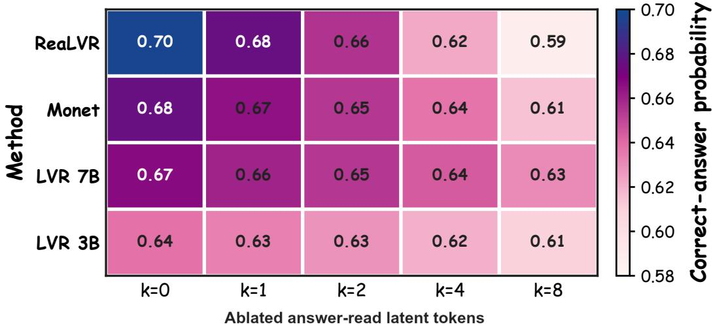  
Figure G.1: Fixed-context latent-token dependence. Each cell gives the correct-answer probability after replacing the top-k answer-read latent tokens, with all remaining latent states held fixed. Columns increase k from 0 to 8. ReaLVR’s probability falls from 0.70 to 0.59, the largest endpoint drop among the four methods.

Let M be the annotated target region and let $\Omega ( \mathcal { M } )$ contain same-area background windows outside it. We report

$$
\rho _ { \ell } = \frac { s _ { \ell } ( \mathcal { M } ) } { \mathbb { E } _ { B \sim \Omega ( \mathcal { M } ) } [ s _ { \ell } ( \mathcal { B } ) ] + \epsilon } .
$$

Here $\epsilon > 0$ stabilizes the denominator, and $\rho _ { \ell } = 1$ indicates no enrichment.

Layer-wise target-region attention results. We next ask whether the answer attends to the visual region needed by the question. The diagnostic compares answer-to-image attention on the annotated target with same-area background windows, where a ratio of 1 denotes no enrichment. In Figure G.2, ReaLVR rises from near 1 in the lower layers to approximately 2 in the middle layers, then retains substantial enrichment through most upper layers. Monet peaks near 1.6, while the LVR curves remain at or below approximately 1.3. The correctly and incorrectly answered curves nevertheless track each other closely, and the incorrect curve is sometimes higher. Thus, ReaLVR strengthens spatial alignment, but looking at the target is not sufficient for answering correctly. This distinction motivates separating a scalable grounding signal from the answer-level learning signal.

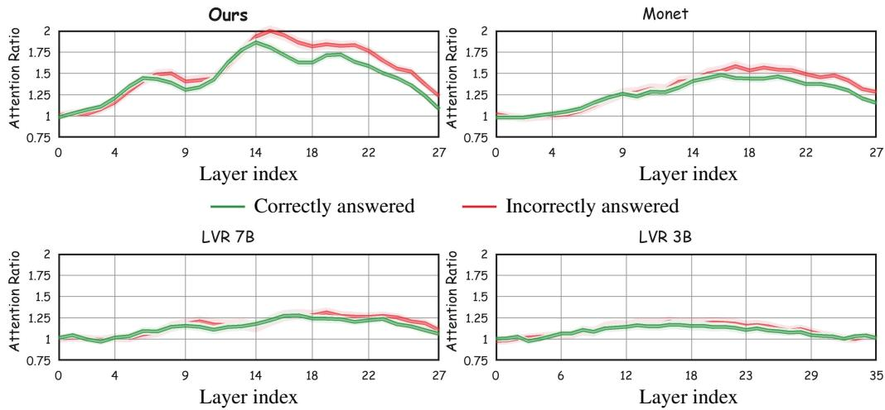

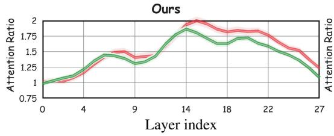

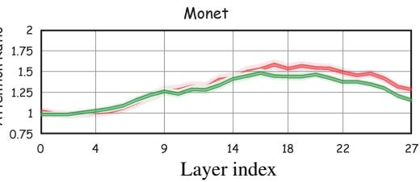

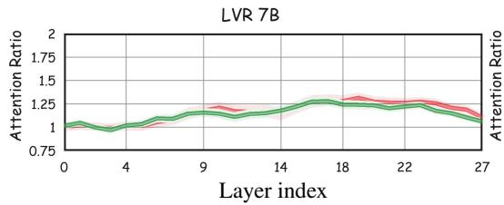

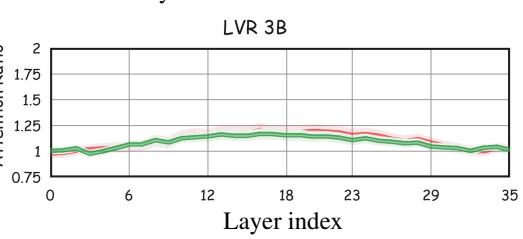  
Figure G.2: Target-region attention enrichment. Layer-wise answer attention on the annotated region relative to matched background windows. Values above 1 indicate target-region enrichment; green and red curves correspond to correct and incorrect generations, respectively. Their overlap shows that alignment alone does not determine answer correctness.

## G.3 ANSWER-CONDITIONED SALIENCY

After generating an answer $o ^ { \mathrm { a t t r } } = \left( o _ { 1 } ^ { \mathrm { a t t r } } , \dots , o _ { T } ^ { \mathrm { a t t r } } \right)$ , we run a teacher-forced attribution pass on its content positions $\mathcal { I }$ . The cross-entropy target is that generated sequence, aggregated as

$$
\mathcal { L } _ { \mathrm { C E } } ( o ^ { \mathrm { a t t r } } ) = - \sum _ { j \in \mathcal { I } } \log \pi _ { \theta } \big ( o _ { j } ^ { \mathrm { a t t r } } \mid x , z _ { 1 : K } , o _ { < j } ^ { \mathrm { a t t r } } \big ) .
$$

The score for image token n is

$$
S ( n ) = \frac { 1 } { \vert \mathcal { L } _ { \mathrm { d e c } } \vert \vert \mathcal { H } \vert \vert \mathcal { I } \vert } \sum _ { \ell \in \mathcal { L } _ { \mathrm { d e c } } } \sum _ { h \in \mathcal { H } } \sum _ { j \in \mathcal { I } } \left. A _ { j , n } ^ { ( \ell , h ) } \frac { \partial \mathcal { L } _ { \mathrm { C E } } ( o ^ { \mathrm { a t t r } } ) } { \partial A _ { j , n } ^ { ( \ell , h ) } } \right. .
$$

We resize the visual-token grid to the image and normalize the scores within each example. For panels explicitly labeled Saliency in Figure H.3 and the additional cases, token-level attribution retains the query-key matrix instead of projecting it onto image patches: rows index queries and columns index keys. Each case shows ReaLVR attention, LVR-7B attention, ReaLVR saliency, and LVR-7B saliency, in that order. Color intensity is normalized within each panel.

## G.4 SIMILARITY AND REPRESENTATION GEOMETRY

High cosine similarity can reflect several properties of a representation. Table G.1 measures similarity within LVR trajectories and compares latent tokens with same-prefix dummy tokens and ordinary continuation tokens under different normalizations. Table G.2 then measures stability under pertur bations and effective rank. The latent trajectories remain stable and highly similar while occupying fewer principal directions than the visual embeddings. These measurements describe representation geometry; similarity alone does not establish useful visual computation.

Table G.1: Latent-token similarity diagnostics. (a) Raw within-trajectory cosine similarity on two VISCOT examples. (b) Context-normalized similarity on BLINK (N=697), with same-prefix dummy and ordinary continuation tokens as references.  
(a) Raw within-trajectory similarity
<table><tr><td>Example</td><td>Latent tokens</td><td>Off-diag. cos.</td><td>Adjacent cos.</td><td>Max cos.</td></tr><tr><td>VISCOT 18</td><td>126</td><td>0.7342</td><td>0.9417</td><td>0.9951</td></tr><tr><td>VISCOT 23</td><td>63</td><td>0.8408</td><td>0.9215</td><td>0.9958</td></tr></table>

(b) Context-normalized similarity
<table><tr><td>Comparison</td><td>LVR</td><td>Dummy</td><td>Ordinary</td><td>LVR-Ord.</td></tr><tr><td>Raw adjacent cosine</td><td>0.8877</td><td>0.9923</td><td>0.4817</td><td>+0.4059</td></tr><tr><td>Centered adjacent cosine</td><td>0.8166</td><td>0.9978</td><td>0.5210</td><td>+0.2956</td></tr><tr><td>Whitened adjacent cosine</td><td>0.6074</td><td>0.6481</td><td>0.0952</td><td>+0.5122</td></tr><tr><td>Residualized LVR adjacent cosine</td><td>0.7760</td><td></td><td></td><td></td></tr><tr><td>Same-task LVR mean cosine</td><td>0.9960</td><td></td><td></td><td>一</td></tr><tr><td>Different-task LVR mean cosine</td><td>0.9907</td><td></td><td></td><td></td></tr></table>

Table G.2: Representation stability and effective rank. (a) Representation consistency (RCS) is the mean pairwise cosine between repeated mean LVR trajectories under each condition. (b) Rank90, Rank95, and Rank99 count the principal directions needed to explain 90%, 95%, and 99% of the variance; PR is the participation ratio.  
(a) Representation consistency under perturbations
<table><tr><td>Family</td><td>Condition</td><td>Mean RCS</td></tr><tr><td>Reference</td><td>No augmentation</td><td>0.99999997</td></tr><tr><td>Image augmentation</td><td>Brightness/contrast/rotation/crop</td><td>0.99917778</td></tr><tr><td>Mask sweep</td><td>Strength 0.05</td><td>0.99987373</td></tr><tr><td>Mask sweep</td><td>Strength 0.30</td><td>0.99974626</td></tr><tr><td>Blur+jitter</td><td>Strength 0.10</td><td>0.99994875</td></tr><tr><td>Blur+jitter</td><td>Strength 0.50</td><td>0.99988020</td></tr><tr><td>Affine sweep</td><td>Tested affine range</td><td>0.99917–0.99939</td></tr></table>

(b) Effective-rank diagnostics
<table><tr><td>Dataset</td><td>Representation</td><td>Shape</td><td>Rank90</td><td>Rank95/ Rank99</td><td>PR</td></tr><tr><td>BLINK</td><td>visual embedding</td><td>163868×3584</td><td>428</td><td>713 / 1697</td><td>54.31</td></tr><tr><td></td><td>LVR latent tokens</td><td>11152×3584</td><td>4</td><td>5 / 24</td><td>2.60</td></tr><tr><td></td><td>LVR mean</td><td></td><td>4</td><td>6/56</td><td>1.61</td></tr><tr><td></td><td>last LVR token</td><td></td><td>2</td><td>3/ 17</td><td>1.35</td></tr><tr><td>VISCOT</td><td>visual embedding</td><td>242899×3584</td><td>404</td><td>675 / 1641</td><td>58.55</td></tr><tr><td></td><td>LVR latent tokens</td><td>81945×3584</td><td>51</td><td>169 / 909</td><td>5.70</td></tr><tr><td></td><td>LVR mean</td><td></td><td>21</td><td>65 / 289</td><td>4.70</td></tr><tr><td></td><td>last LVR token</td><td>一</td><td>36</td><td>111 / 414</td><td>5.66</td></tr></table>

## G.5 TARGET ALIGNMENT AND ANSWER READOUT

Table G.3 compares autoregressively generated latent trajectories with the visual targets used during reconstruction training. Each mixed schedule supplies the first k target vectors and lets the remaining latent states free-run. Supplying more targets increases cosine similarity, while fully free-running states remain weakly aligned with the targets. The fully forced trajectory matches the target by construction; it does not measure learned alignment during inference.

Table G.4 summarizes answer readout and residual injection. The attention measurements describe associations with answer correctness; residual injection measures local sensitivity. Neither alone assigns causal credit to a latent token.

Table G.3: Alignment with visual targets under target forcing. The first k latent positions receive the visual target vectors; later positions are generated autoregressively. MSE and cosine similarity compare the resulting trajectory with the visual targets.
<table><tr><td></td><td colspan="2">BLINK</td><td colspan="2">VISCOT</td></tr><tr><td>Generation schedule</td><td>MSE</td><td>Cosine</td><td>MSE</td><td>Cosine</td></tr><tr><td>Free-running</td><td>1.4218</td><td>0.2145</td><td>1.7700</td><td>0.2863</td></tr><tr><td>Force k=4</td><td>一</td><td>0.4221</td><td>一</td><td>0.4898</td></tr><tr><td>Force k=8</td><td>一</td><td>0.6145</td><td>一</td><td>0.6619</td></tr><tr><td>Force all k=16</td><td>一</td><td>1.0000</td><td>一</td><td>1.0000</td></tr></table>

Table G.4: Answer readout and residual-injection diagnostics. Summary statistics from generated rollouts. Attention deltas compare correct and incorrect predictions.
<table><tr><td>Diagnostic</td><td>Evaluation</td><td>Reported values</td></tr><tr><td rowspan="3">Answer-to-latent-token attention</td><td>MMVP</td><td>Acc. 64.00%; answer-to-LVR mass ∆= + 0.0099; top-1 attention ∆= + 0.0307.</td></tr><tr><td>BLINK</td><td>Acc. 49.28%; mass ∆= + 0.0029; top-1 attention ∆= + 0.0217.</td></tr><tr><td>HR-4K/HR-8K</td><td>Acc. 56.88% / 48.62%; correct-answer mass and top-1 mass are higher, with smaller deltas at 8K.</td></tr><tr><td>Residual injection</td><td>47,012 generated rollout records</td><td>Best ∆ toward counterfactual prediction: +0.0068 to +0.0137; 1ogit-margin deltas up to +0.0358.</td></tr></table>

## G.6 TASK STRUCTURE AND COUNTERFACTUAL SENSITIVITY

Table G.5(a) tests whether representations encode the BLINK task label. Adjusted Rand index (ARI) measures cluster alignment with task labels; probe accuracy uses 5-fold cross-validation.

Table G.5: Task decodability and sensitivity to answer-changing edits. (a) Task-label structure on BLINK (N=697). (b) Sensitivity to synthetic image edits (N=2,048; 512 pairs per edit). LVR distance uses the mean-pooled latent trajectory; final distance uses the final hidden representation.  
(a) Task-label decodability
<table><tr><td>Representation</td><td>ARI</td><td>Bootstrap ARI</td><td>Linear accuracy</td><td>MLP accuracy</td></tr><tr><td>hpre</td><td>0.9489</td><td>0.9492</td><td>0.9994</td><td>0.9960</td></tr><tr><td>LVR mean</td><td>0.3885</td><td>0.3905</td><td>0.9991</td><td>0.9822</td></tr><tr><td>hlvr,last</td><td>0.1298</td><td>0.1430</td><td>0.9966</td><td>0.9684</td></tr><tr><td>Final hidden</td><td>0.2714</td><td>0.2558</td><td>0.9954</td><td>0.9641</td></tr></table>

(b) Counterfactual sensitivity
<table><tr><td>Edit</td><td>Should flip</td><td>Model flip</td><td>Correct flip</td><td>LVR distance</td><td>Final distance</td></tr><tr><td>Color change</td><td>86.33%</td><td>5.66%</td><td>5.86%</td><td>0.000158</td><td>0.004764</td></tr><tr><td>Object removal</td><td>81.45%</td><td>13.09%</td><td>6.45%</td><td>0.000445</td><td>0.022313</td></tr><tr><td>Shape swap</td><td>84.57%</td><td>12.70%</td><td>5.27%</td><td>0.000253</td><td>0.012438</td></tr><tr><td>Spatial swap</td><td>84.96%</td><td>11.33%</td><td>4.69%</td><td>0.000162</td><td>0.008934</td></tr></table>

Panel (b) edits the image while holding the question fixed. “Should flip” is the ground-truth answerchange rate, and “Model flip” is the prediction change rate. The separately reported “Correct flip” rate counts predictions that reach the edited ground-truth answer. Both distance columns report cosine distance. The correct answer changes for most pairs, but LVR’s answers change infrequently and its mean-pooled trajectories move only slightly.

## H ADDITIONAL QUALITATIVE RESULTS

The visualizations below examine individual generated answers and illustrate the visual reasoning tasks covered by our benchmarks. Appendix G reports the dataset-level diagnostics.

## H.1 IMAGE SALIENCY AND TOKEN VIEWS

Each model first generates an answer, after which we compute |attention × gradient| saliency for that sequence. Figure 5 in the main text shows three paired image and token views. The image overlays use answer-conditioned |attention × gradient| saliency. The additional cases below show explicitly labeled attention and saliency panels.

## H.2 ATTENTION AND SALIENCY CASES

Figures H.1–H.4 compare twelve image–question cases at a common scale. Each includes the answers and four labeled attention/saliency panels, using the token axes and attribution protocol in Appendix G.3.

Attention | LVR-7B  
Saliency | LVR-7B  
LVR-7B  

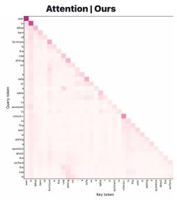  
<||vr\_start|><||vr\_latent\_end|><||vr\_latent\_end|>|vr\_latent\_end|: <|Ivr\_latent\_end|||vr latent\_end|>||vr\_latent\_end||vr latent\_end|> <llyr latent end|>|lvr latent end|>|lyr end| <answer> table </answer>

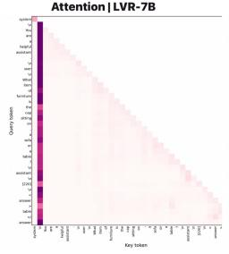  
<||vr\_start|>||vr\_latent\_end|>||vr\_latent\_end|>||vr\_latent\_end|> <|Ivr\_latent\_end|>||vr\_latent\_end|>||vr\_latent\_end|>|lvr\_latent\_end| <||vr\_latent\_end|>|lvr\_latent\_end|>||vr\_end|> <answer> table </answer>

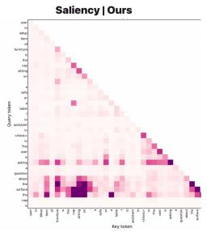

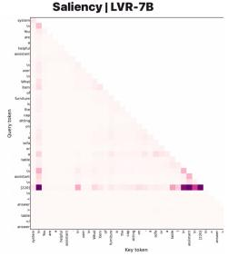

QUESTION   
What is the vehicle that is to the right of the man that is wearing a shirt?   
GT ANSWER

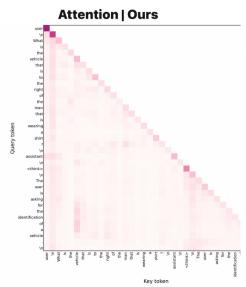  
<||yr start|> <||vr latent end|><||yr latent end|>||yr |atent end|> <||vr\_latent\_end||lvr\_latent\_end|||vr\_latent\_end|>|lvr\_latent\_end|> <||vr |atent end|><||vr latent end|><||vr end|> sanswer> bus </answer

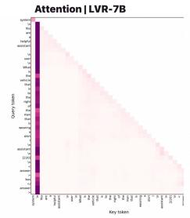  
«||vr start|>||yr |atent end|>||yr |atent end|>||vr latent end|> <||vr\_latent\_end|>|lvr\_latent\_end|>||vr\_latent\_end||lvr\_latent\_end|> <||vr\_latent\_end|>|lvr\_latent\_end|><||vr\_end|> <answer> bus </answer>

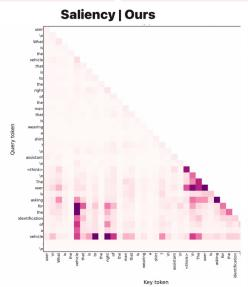

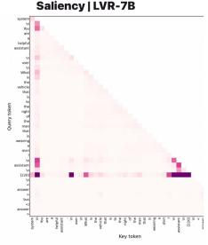

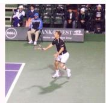  
What is the item of furniture to the right of the man in the top of the picture? Answer the question using a single word or phrase. GT ANSWER

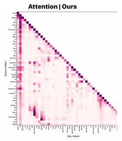  
<||vr\_start|><||vr\_latent\_end|><||vr\_latent\_end|>|vr\_latent\_end|: <||vr\_latent\_end||lvr\_latent\_end|>||vr\_latent\_end|>||vr\_latent\_end|> ||vr\_latent\_end||lvr\_latent\_end|>||vr\_end <answer> chair </answer>

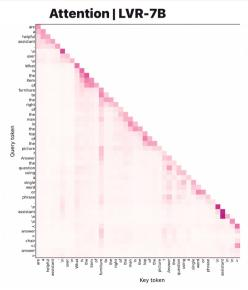  
LVR-7B  
<||vr\_start|><||vr\_latent\_end|><||vr\_latent\_end|>||vr\_latent\_end|> «lyr latent end|>||yr latent end|>||yr latent end|>|lvr latent end| <||vr\_latent\_end|>||vr\_latent\_end|>||vr\_end|> <answer> chair </answer>

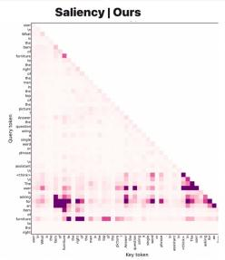

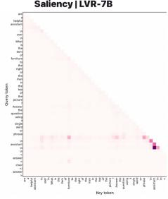  
Figure H.1: Attention and saliency cases (01–03). Top to bottom: the cap on a table, the bus beside a person, and the chair beside a tennis player.

LVR-7B  

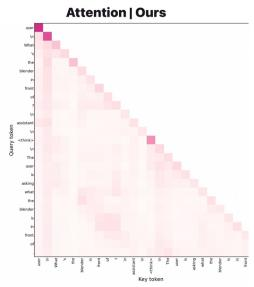  
QUESTION What's the blender in front of? GT ANSWER container OURS  
<||vr\_start|><||vr\_latent\_end|><||vr\_latent\_end|>|vr\_latent\_end|: <|Ivr\_latent\_end|||vr latent\_end|>||vr\_latent\_end||vr latent\_end|> <llyr latent end|>|lvr latent end|>|lyr end| <answer> container </answer>

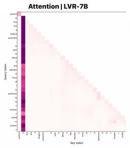  
<||vr\_start|>||vr\_latent\_end|>||vr\_latent\_end|>||vr\_latent\_end|> <|Ivr\_latent\_end|>||vr\_latent\_end|>||vr\_latent\_end|>||vr\_latent\_end|> <||vr\_latent\_end|>|lvr\_latent\_end|>||vr\_end|> <answer> outlet </answer

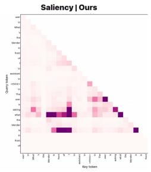

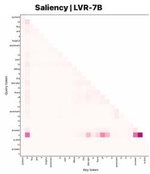

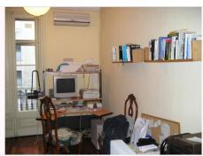  
Which kind of furniture is to the left of the heater? Answer the question using a single word or phrase. GT ANSWER

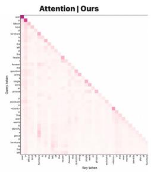  
<||yr start|> <||vr latent end|><||yr latent end|>||yr |atent end|> <||vr\_latent\_end||lvr\_latent\_end|||vr\_latent\_end|>|lvr\_latent\_end|> <|Ivr\_latent\_end|>|lvr\_latent\_end|>||vr\_end|> <answer> chair </answer>

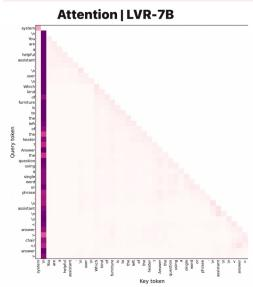  
«||vr start|>||yr |atent end|>||yr |atent end|>||vr latent end|> <||vr\_latent\_end|>||vr\_latent\_end|>||vr\_latent\_end|>||vr\_latent\_end|> <|Ivr latent end|>||vr latent end|>||vr end|: <answer> chair </answer>

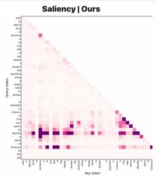

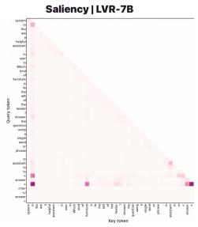

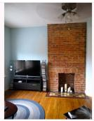

What kind of furniture is made of the same material as the end table in the bottom of the picture? Answer the question using c single word or phrase.

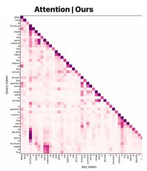  
<||vr\_start|> <||vr\_latent\_end|>||vr\_latent\_end|×||vr\_latent\_end|: <|vr latent end||lvr latent end|||vr latent end|>|lvr latent end|> <||vr\_latent\_end|><|lvr\_latent\_end|><||vr\_end|> <answer> table </answer>

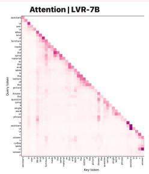  
<||vr\_start|>||vr\_latent\_end|>||vr\_latent\_end|×||vr\_latent\_end|> <|Ivr latent end|>||vr latent end|>||vr latent end|>|lvr latent end|> <||vr\_latent\_end|><|lvr\_latent\_end|><||vr\_end|> <answer> coffee table </answer>

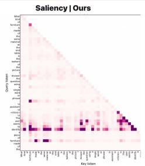

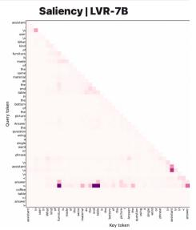  
Figure H.2: Attention and saliency cases (04–06). Top to bottom: the object behind the blender, the furniture left of the heater, and a furniture-material comparison.

LVR-7B

Saliency|LVR-7B  
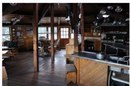

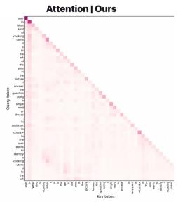  
QUESTION  
<||vr\_start|> <||vr\_latent\_end|><||vr\_latent\_end|>||vr\_latent\_end|: <||vr\_latent\_end|>||vr\_latent\_end|><||vr\_ latent\_end|><||vr\_latent\_end|> <||vr\_latent\_end|>|lvr\_latent\_end|>||vr\_end|> <answer> pans </answer>

What kind of cooking utensil is to the left of the pots in the picture? Answer the question using a single word or phrase GT ANSWER

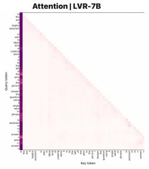  
<||vr\_start|>||vr\_latent\_end|>||vr\_latent\_end|>||vr\_latent\_end|> <|Ivr\_latent\_end|>||vr\_latent\_end|>||vr\_latent\_end|>||vr\_latent\_end|> <||vr\_latent\_end|>|lvr\_latent\_end|>||vr\_end|> <answer> pans </answer>

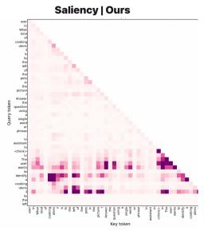

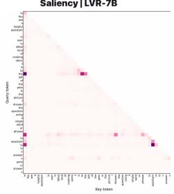

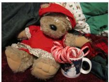

What is touching the bed? Answer the question using a single word or phrase

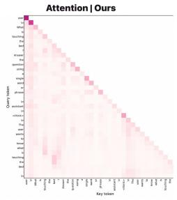  
<||yr start|> <||vr latent end|><||yr latent end|>||yr |atent end|> <||vr\_latent\_end||lvr\_latent\_end|||vr\_latent\_end|>|lvr\_latent\_end|> <||vr |atent end|><||vr latent end|><||vr end|> sanswer> teddy bear s/answera

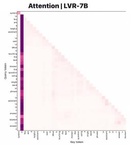  
«||vr start|>||yr |atent end|>||yr |atent end|>||vr latent end|> <||vr\_latent\_end|>||vr\_latent\_end|>||vr\_latent\_end|>||vr\_latent\_end|> <||vr\_latent\_end|>|lvr\_latent\_end|><||vr\_end|> <answer> blanket </answer>

## LVR-7B

## QUESTION

Which kind of animal is in the water? Answer the question using a single word or phrase GT ANSWER

## bear

  
<||vr\_start|><||vr\_latent\_end|><||vr\_latent\_end|>|vr\_latent\_end|: <||vr\_latent\_end||lvr\_latent\_end|>||vr\_latent\_end|>||vr\_latent\_end|> ||vr\_latent\_end||lvr\_latent\_end|>||vr\_end <answer> bear </answer>

## OURS

  
LVR-7B  
<||vr\_start|><||vr\_latent\_end|><||vr\_latent\_end|>||vr\_latent\_end|> «lyr latent end|>||yr latent end|>||yr latent end|>|lvr latent end| <||vr\_latent\_end|×|lvr\_latent\_end|>||vr\_end|> <answer> bear </answer

Saliency | LVR-7B  
  
Figure H.3: Attention and saliency cases (07–09). Top to bottom: pans left of the pots, the teddybear answer comparison, and a bear in water. In the middle example (Case 08), ReaLVR answers “teddy bear” and LVR-7B answers “blanket” to “What is touching the bed?”

What is in front of plane's front wheel? Provide a short and direct response. GT ANSWER

  
<||vr\_start|>||vr\_latent\_end|><||vr\_latent\_end|>||vr\_latent\_end|> <|Ivr\_latent\_end|>|Ivr \_latent end|>||vr latent\_ end|>||vr \_latent end|> <||vr\_latent\_end|>|lvr\_end|> <answer> Unattended stroller </answer>

<||vr\_start|>||vr\_latent\_end|>||vr\_latent\_end|>||vr\_latent\_end|>   
<||vr latent\_ end||lvr \_latent end|>||vr latent\_ end||lvr\_latent end|>   
<||vr\_latent\_end|>||vr\_end|>   
<answer> man </answer>

What is the piece of furniture that is to the left of the benches that the bird is on called? GT ANSWER

  
<||yr start|> <||vr latent end|><||yr latent end|>||yr |atent end|> <||vr\_latent\_end||lvr\_latent\_end|||vr\_latent\_end|>|lvr\_latent\_end|> <|Ivr\_latent\_end|>|lvr\_latent\_end|>||vr\_end|> <answer> chair </answer>

## LVR-7B

  
«||vr start|>||yr |atent end|>||yr |atent end|>||vr latent end|> <||vr\_latent\_end|>||vr\_latent\_end|>||vr\_latent\_end|>||vr\_latent\_end|> <|Ivr latent end|>||vr latent end|>||vr end|: <answer> chair </answer>

  
QUESTION The pilot is inside what? GT ANSWER helicopter

  
<||vr\_start|><||vr\_latent\_end|><||vr\_latent\_end|>|vr\_latent\_end|> <||vr\_latent\_end||lvr\_latent\_end|>||vr\_latent\_end|>||vr\_latent\_end|> <||vr\_latent\_end||lvr\_latent\_end|>||vr\_end|> <answer> helicopter </answer>

  
<||vr\_start|><||vr\_latent\_end|><||vr\_latent\_end|>||vr\_latent\_end|> «lyr latent end|>||yr latent end|>||yr latent end|>|lvr latent end|> <||vr\_latent\_end|>||vr\_latent\_end|||vr\_end|> <answer> helicopter </answer

  
Figure H.4: Attention and saliency cases (10–12). Top to bottom: the object in front of an airplane’s front wheel, the chair-and-bird scene, and the vehicle containing the pilot.

## H.3 TASK EXAMPLES ACROSS FIVE BENCHMARKS

Figure H.5 illustrates the evidence required by each benchmark. Beyond counting and depth comparison, the map question relates numbered locations to countries, and the 8K scene requires finding a small boat before judging its position relative to distant buildings. The chart question combines reading numerical values with subtraction: 1,537 − 1,393 = 144.

  
Figure H.5: One question from each of the five benchmarks. Images, questions, and answers come from the official datasets (Tong et al., 2024; Fu et al., 2024; Wang et al., 2025; Zhang et al., 2025). Robot bubbles show annotated answers, not recorded ReaLVR predictions; the chart calculation is added for clarity. Insets enlarge source-image details, and the chart is cropped to the relevant panel. Point and value labels are enlarged for readability. Multiple-choice options are omitted, and the chart question is shortened.

## H.4 POSITION-WISE LATENT VARIATION

  
Figure H.6: Position-wise latent variation. (a) Cross-example variation. (b) Variation across questions about the same image. Heatmap columns index latent positions 1–16. (c) Reported top-token variation gap: 0.07 for ReaLVR, 0.02 for Monet, and 0.01 for each LVR variant. ReaLVR concentrates more of the measured variation at particular latent positions.

## I ATTENTION ANALYSIS DESIGNS

The following designs illustrate three complementary questions: where latent states read visual evidence, how evidence selection changes with the question, and which latent states support the answer. They complement the diagnostic definitions in Appendices G.2 and G.1.

## I.1 VISUAL EVIDENCE AND ANSWER READOUT

(a) Latent-to-image region enrichment  

(b) Total image attention  
Target / same-area background attention  

(c) Answer-to-latent readout  
  
Figure I.1: Visual evidence and answer readout. (a) Target-region attention relative to samearea background windows, shown by decoder layer and latent step; 1 means no preference. Both heatmaps share a color scale. (b) Raw attention mass assigned to all image tokens before the answer. (c) Raw attention to each latent state from the query used to predict the first answer token, before that token is supplied. The panels illustrate aggregate post-softmax quantities.

Q1 Where is the boat relative to the buildings? LVR

Penguins.

## I.2 QUESTION-DEPENDENT EVIDENCE SELECTION

  
Q2 What animals are on the beach?

  
Figure I.2: Question-dependent evidence selection. The photograph is HRBench-8K example 798 (Wang et al., 2025). Q1 adapts its spatial-relation question; Q2 and both paraphrases are author-written. Dashed boxes mark the manually specified regions for the boat-and-buildings question and the animal question. All maps share a density scale normalized to a full-image mean of 1. The chart reports mean density within each question’s region and compares that question with its paraphrase (Q1′ or Q2′). This uniform baseline differs from the matched-background baseline in Figure I.1.

## I.3 LATENT SELECTION AND FIXED-CONTEXT INTERVENTION

  
Correct-answer readout Wrong-answer readout Positive contrast

(b) Replace top-k positions  

(c) Single-state utility  
  
Figure I.3: Latent selection and fixed-context intervention. (a) Teacher-forced readout after supplying correct or incorrect answers; positive contrast is the unnormalized positive part of their difference. (b) Correct-answer log-probability loss after replacing positions selected by contrast, raw correct-answer attention, or random ordering, with the other latent inputs fixed. (c) Loss from replacing each single latent position, plotted against that position’s positive contrast. Results are averaged over 1000 [BLINK] examples on Qwen2.5-VL-7B. All strategies replace all eight positions at $k = 8$ and therefore coincide at the endpoint. Losses are in nats.

## J PAIRED COUNTERFACTUAL AND MASS-MATCHED MECHANISM TESTS

This section reports a paired counterfactual comparison, fixed-context latent exchange and a massmatched test of the proposed evidence pathway.

## J.1 PAIRED COUNTERFACTUAL BEHAVIOR

For edit type e, let $( x _ { i } ^ { 0 } , x _ { i } ^ { 1 } )$ be the original and edited images with the same question, and let $( y _ { i } ^ { 0 } , y _ { i } ^ { 1 } )$ be their canonical ground-truth answers. We partition the pairs into $\mathcal { C } _ { e } \overset { \cdot } { = } \{ i \ : \ y _ { i } ^ { 0 } \ \neq \ \tilde { y _ { i } ^ { 1 } } \}$ and $\mathcal { U } _ { e } = \{ i : y _ { i } ^ { 0 } = y _ { i } ^ { 1 } \}$ . The four edit types are color change, object removal, shape swap, and spatial swap; each has 512 pairs before this partition. We evaluate Direct, LVR-RL, and ReaLVR on the identical pairs with the same prompt, image processing, answer parser, and decoding settings. Direct uses the same pretrained backbone, Stage 2 examples, answer reward, and update budget but omits the latent span.

For $\mathcal { C } _ { e } .$ , we report accuracy on each view, the fraction with two parseable but different predictions, and the strict paired correct flip,

$$
F _ { \mathrm { c o r r e c t } } ( e ) = \frac { 1 } { | \mathcal { C } _ { e } | } \sum _ { i \in \mathcal { C } _ { e } } \mathbf { 1 } [ \widehat { y } _ { i } ^ { 0 } = y _ { i } ^ { 0 } \ \land \widehat { y } _ { i } ^ { 1 } = y _ { i } ^ { 1 } ] .\tag{J.1}
$$

Because $y _ { i } ^ { 0 } \neq y _ { i } ^ { 1 }$ , this event requires a correct answer change. For $\mathcal { U } _ { e } ,$ , the false-flip rate counts parseable predictions that change although the answer does not. Parse failures count as incorrect and not as valid prediction changes. Accuracy, prediction change, and strict correct flip use $| \mathcal { C } _ { e } |$ as their denominator; false flip uses $| \mathcal { U } _ { e } |$ . Parse coverage is the fraction of all $2 \times 5 1 2$ view-level predictions with a parseable answer.

Protocol. Each pair is evaluated as a two-turn conversation. The first turn presents $x _ { i } ^ { 0 }$ with question $q _ { i } ;$ the second turn presents the edited image $x _ { i } ^ { 1 }$ with the same $q _ { i }$ , keeping the first-turn exchange in context. This tests whether a model revises its answer when the visual evidence changes within a dialogue, rather than repeating its earlier prediction. MMVP instead scores each image in a separate conversation, where no earlier answer is available to anchor the prediction.

## J.2 LATENT EXCHANGE AND POSITION SELECTION

We test whether an answer-changing edit can transfer information through the latent span while the recipient image remains fixed. For each pair in $\mathcal { C } _ { e } ,$ , we generate the two latent spans independently and test both donor–recipient directions within the same model. We keep the recipient image, question, control markers, and unselected latent inputs fixed, replacing selected recipient states with donor states at the same positions before answer decoding. A self-swap using the recipient’s own states is the sham control; an unrelated-image donor tests generic perturbation effects. All swaps use the same replacement rule and donor states across position selectors.

For $k \in \{ 1 , 2 , 4 \}$ , we compare positions ranked by the positive correct-versus-donor-answer readout contrast on the unmodified recipient trajectory with uniformly sampled random positions of the same count. Random selections are repeated with fixed seeds. $\operatorname { A t } k = K = 8$ the entire span is replaced, so this endpoint measures whole-span sensitivity and cannot test the ranking. We report the swap-minus-sham change in the frequency of the donor ground-truth answer and in its score margin over the recipient ground-truth answer. Each score is the mean teacher-forced log probability over answer-content tokens. These fixed-context swaps measure local answer dependence.

## J.3 MASS-MATCHED WHERE-BY-WHAT ABLATION

This $2 \times 2$ diagnostic crosses where visual supervision is allocated (uniformly or by answer contrast) with what evidence loss is used (positive-only alignment or positive–negative visual contrast). Let $w _ { t } = \eta / K + ( 1 - \eta ) \gamma _ { t }$ as in Section 4.4. For uniform (U) and contrast (C) allocation, respectively, define

$$
q _ { t } ^ { \mathrm { U } } = \frac { 1 } { K } , \qquad q _ { t } ^ { \mathrm { C } } = \frac { w _ { t } } { \sum _ { s = 1 } ^ { K } w _ { s } } = \frac { \eta / K + ( 1 - \eta ) \gamma _ { t } } { \eta + ( 1 - \eta ) \sum _ { s = 1 } ^ { K } \gamma _ { s } } .\tag{J.2}
$$

With $\eta > 0$ , both rules satisfy $\textstyle \sum _ { t } q _ { t } = 1$ on every example, including those with no valid wrong answer. The positive-only and contrastive per-position losses are

$$
\ell _ { t } ^ { + } = [ m _ { \mathrm { e v } } - \sin ( z _ { t } , p ^ { + } ) ] _ { + } , \qquad \ell _ { t } ^ { \pm } = [ m _ { \mathrm { e v } } - g _ { t } ] _ { + } ,\tag{J.3}
$$

where $g _ { t }$ is the positive-versus-hardest-negative margin in Section 4.2. Each arm adds $\begin{array} { r } { \lambda _ { \mathrm { e v } } \sum _ { t } \mathrm { \tilde { s g } } ( q _ { t } ) \ell _ { t } ^ { V } } \end{array}$ to the same LVR Stage 2 objective. All arms share the Stage 1 checkpoint, examples and order, GRPO rollout group size and sampling procedure, reward, latent length, optimizer, update count, and evidence-loss coefficient. Negative prototypes and answer-read branches are computed in every arm to keep the forward budget comparable, even when their outputs do not enter that arm’s loss.

Normalization matches the coefficient mass of visual supervision, not necessarily the active-hinge fraction or gradient magnitude. We therefore treat active-hinge fractions, gradient norms, and training compute as separate checks when interpreting the four-way comparison. We report the five benchmark accuracies and, for each independent Stage 2 seed, macro-average the strict paired correct-flip and false-flip rates over the four edit types. The interaction between the two factors can be assessed from matched-seed differences, rather than inferred solely from the best single row.

Table J.1: Complete paired counterfactual evaluation. The first four rate columns use changedanswer pairs $\mathcal { C } _ { e }$ ; false flip uses unchanged-answer pairs $\mathcal { U } _ { e }$ . Each edit type is evaluated on the same pairs for all methods. Rates are percentages computed from single deterministic greedy rollouts on the partitioned sets $\mathcal { C } _ { e }$ and $\begin{array} { r } { \mathcal { U } _ { e } ; } \end{array}$ counts are in parentheses (parse coverage counts view-level predictions).
<table><tr><td colspan="4"></td><td colspan="5">Strict paired</td></tr><tr><td>Edit</td><td>Method</td><td> $| { \mathcal { C } } _ { e } | / | { \mathcal { U } } _ { e } |$ </td><td>Original acc. (A0)</td><td>Edited acc. (A₁)</td><td>Prediction change (∆)</td><td>correct flip  $( F _ { \mathrm { c o r r e c t } } )$ </td><td>False flip on  $\mathcal { U } _ { e }$ </td><td>Parse coverage</td></tr><tr><td rowspan="3">Color change</td><td>Direct</td><td>442 /70</td><td>75.8 (335)</td><td>70.4 (311)</td><td>61.3 (271)</td><td>53.6 (237)</td><td>11.4 (8)</td><td>99.8 (1022)</td></tr><tr><td>LVR-RL</td><td>442 / 70</td><td>78.5 (347)</td><td>8.1 (36)</td><td>6.1 (27)</td><td>4.8 (21)</td><td>2.9 (2)</td><td>99.8 (1022)</td></tr><tr><td>ReaLVR</td><td>442 / 70</td><td>85.3 (377)</td><td>81.2 (359)</td><td>80.5 (356)</td><td>73.1 (323)</td><td>5.7 (4)</td><td>100.0 (1024)</td></tr><tr><td rowspan="3">Object removal Direct</td><td></td><td>417 / 95</td><td>74.3 (310)</td><td>68.6 (286)</td><td>63.8 (266)</td><td>52.3 (218)</td><td>12.6 (12)</td><td>99.5 (1019)</td></tr><tr><td>LVR-RL</td><td>417/95</td><td>77.2 (322)</td><td>11.3 (47)</td><td>14.6 (61)</td><td>6.7 (28)</td><td>6.3 (6)</td><td>99.8 (1022)</td></tr><tr><td>ReaLVR</td><td>417 /95</td><td>84.4 (352) 75.1</td><td>79.1 (330) 69.5</td><td>77.5 (323)</td><td>69.8 (291)</td><td>6.3 (6)</td><td>100.0 (1024)</td></tr><tr><td rowspan="3">Shape swap</td><td>Direct</td><td>433 / 79</td><td>(325) 77.8</td><td>(301) 9.9</td><td>60.5 (262) 13.6</td><td>51.7 (224) 5.8</td><td>11.4 (9) 7.6</td><td>99.8 (1022) 100.0</td></tr><tr><td>LVR-RL</td><td>433 / 79</td><td>(337) 83.8</td><td>(43) 78.5</td><td>(59) 78.3</td><td>(25) 70.2</td><td>(6) 5.1</td><td>(1024)</td></tr><tr><td>ReaLVR</td><td>433 / 79</td><td>(363) 73.8</td><td>(340) 67.8</td><td>(339)</td><td>(304)</td><td>(4)</td><td>100.0 (1024)</td></tr><tr><td rowspan="3">Spatial swap</td><td>Direct</td><td>435 / 77</td><td>(321) 76.6</td><td>(295) 9.2</td><td>58.6 (255) 12.2</td><td>49.4 (215)</td><td>13.0 (10)</td><td>99.5 (1019)</td></tr><tr><td>LVR-RL</td><td>435 / 77</td><td>(333) 82.8</td><td>(40) 77.2</td><td>(53) 76.8</td><td>5.1 (22) 68.3</td><td>6.5 (5) 6.5</td><td>99.8 (1022)</td></tr><tr><td>ReaLVR</td><td>435 / 77</td><td>(360)</td><td>(336)</td><td>(334)</td><td>(297)</td><td>(5)</td><td>100.0 (1024)</td></tr></table>

Limitations and future work. Our visual evidence target is less spatially specific when region annotations are unavailable, and inference currently uses a prescribed latent-token budget. Future work could derive finer evidence targets from weak supervision and adapt the latent budget to each question.

Table J.2: Fixed-context latent exchange. The recipient image and question remain fixed. Donoranswer lift and donor-margin shift are differences from the self-swap control. Contrast and random rows at the same k use the same donors. The full-span row does not test position selection. Donoranswer lift is a percentage-point change in donor-answer frequency.
<table><tr><td>Method</td><td>Positions</td><td>k</td><td>Donor-answer lift (pp)</td><td>Donor-margin shift (nats)</td></tr><tr><td>LVR-RL</td><td>Contrast</td><td>1</td><td>+1.2</td><td>+0.02</td></tr><tr><td rowspan="7"></td><td>Random</td><td>1</td><td>+0.7</td><td>+0.01</td></tr><tr><td>Contrast</td><td>2</td><td>+2.4</td><td>+0.04</td></tr><tr><td>Random</td><td>2</td><td>+1.4</td><td>+0.02</td></tr><tr><td>Contrast</td><td>4</td><td>+4.1</td><td>+0.07</td></tr><tr><td>Random</td><td>4</td><td>+2.9</td><td>+0.04</td></tr><tr><td>Full span</td><td>8</td><td>+5.8</td><td>+0.09</td></tr><tr><td>Unrelated donor</td><td>8</td><td>-0.3</td><td>-0.04</td></tr><tr><td rowspan="7">ReaLVR</td><td>Contrast</td><td>1</td><td>+12.4</td><td>+0.23</td></tr><tr><td>Random</td><td>1</td><td>+3.1</td><td>+0.05</td></tr><tr><td>Contrast</td><td>2</td><td>+23.6</td><td>+0.44</td></tr><tr><td>Random</td><td>2</td><td>+9.8</td><td>+0.17</td></tr><tr><td>Contrast</td><td>4</td><td>+35.2</td><td>+0.66</td></tr><tr><td>Random</td><td>4</td><td>+21.5</td><td>+0.39</td></tr><tr><td>Full span</td><td>8</td><td>+46.8</td><td>+0.89</td></tr><tr><td></td><td>Unrelated donor</td><td>8</td><td>+0.2</td><td>-0.31</td></tr></table>

Table J.3: Mass-matched $2 \times 2$ ablation. U/C denote uniform/answer-contrast position weights; + and ± denote positive-only and positive–negative visual objectives. Every arm has unit per-example routing mass. Values are percentages, reported as mean ± standard deviation across independent training seeds.
<table><tr><td>Where What</td><td></td><td>MMVP</td><td>BLINK</td><td>HR-4K</td><td>HR-8K</td><td>MME-RW</td><td>Five-task mean</td><td>Strict paired correct flip</td><td>False flip</td></tr><tr><td>U</td><td>十</td><td> $6 7 . 2 \pm 0 . 3$ </td><td> $5 4 . 1 \pm 0 . 2$ </td><td> $7 0 . 3 \pm 0 . 2$ </td><td> $6 4 . 9 \pm 0 . 3$ </td><td> $5 0 . 8 \pm 0 . 2$ </td><td> ${ \bf 6 1 . 5 \pm 0 . 2 }$ </td><td> $2 2 . 4 \pm 1 . 2$ </td><td> $8 . 9 \pm 0 . 6$ </td></tr><tr><td>C</td><td>十</td><td> $6 9 . 1 \pm 0 . 4$ </td><td> $5 4 . 5 \pm 0 . 3$ </td><td> $7 0 . 7 \pm 0 . 3$ </td><td> $6 5 . 4 \pm 0 . 2$ </td><td> $5 1 . 1 \pm 0 . 2$ </td><td> ${ \bf 6 2 . 2 \pm 0 . 3 }$ </td><td> $3 6 . 8 \pm 1 . 5$ </td><td> $7 . 8 \pm 0 . 5$ </td></tr><tr><td>U</td><td>土</td><td> $6 9 . 6 \pm 0 . 3$ </td><td> $5 4 . 7 \pm 0 . 2$ </td><td> $7 1 . 1 \pm 0 . 2$ </td><td> $6 5 . 7 \pm 0 . 3$ </td><td> $5 1 . 4 \pm 0 . 3$ </td><td> ${ \bf 6 2 . 5 \pm 0 . 2 }$ </td><td> $4 2 . 5 \pm 1 . 3$ </td><td> $8 . 1 \pm 0 . 4$ </td></tr><tr><td>C</td><td>土</td><td> ${ \bf 7 1 . 8 \pm 0 . 4 }$ </td><td> ${ \bf 5 5 . 7 \pm 0 . 3 }$ </td><td> ${ \bf 7 1 . 7 \pm 0 . 2 }$ </td><td> ${ \bf 6 6 . 5 \pm 0 . 3 }$ </td><td> ${ \bf 5 2 . 1 \pm 0 . 2 }$ </td><td> ${ \bf 6 3 . 6 \pm 0 . 2 }$ </td><td> ${ \bf 5 9 . 2 \pm 1 . 6 }$ </td><td> ${ \bf 7 . 2 \pm 0 . 4 }$ </td></tr></table>