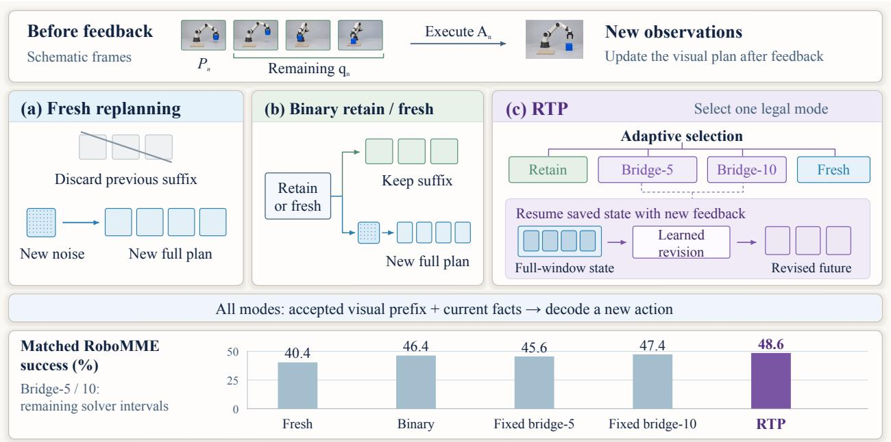
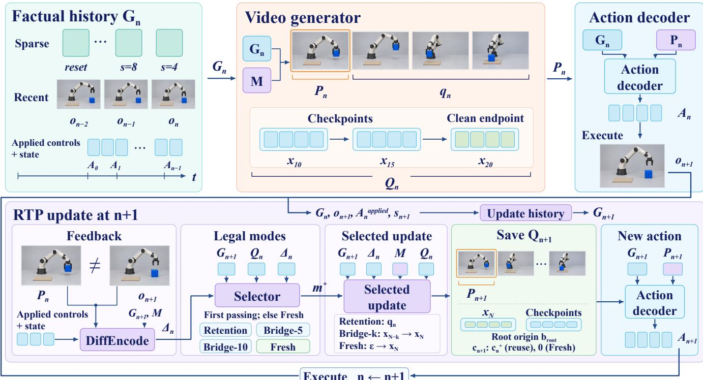
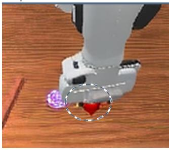
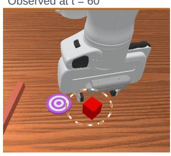
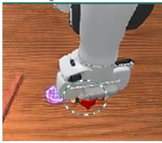
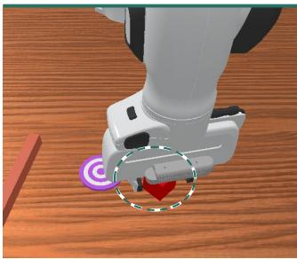
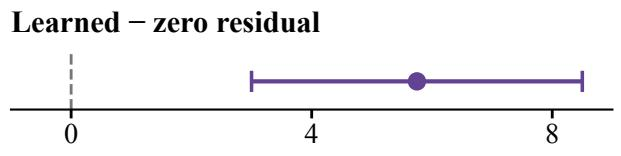
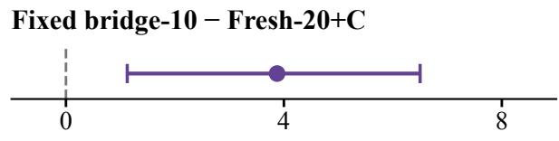
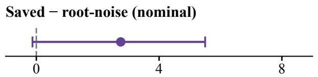
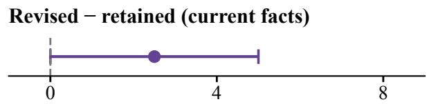

# Revision, Not Restart: Revisable Visual Plans for Closed-Loop World–Action Models

Pengyiang Liu1,∗ Junbo Niu2,∗ Wenhao Zheng1 Xinchen Chen1

Canyu Li1 Zhongyue Shi1 Jiahao Xie1,† Si Liu1

1Beihang University 2Peking University

\*Equal contribution †Corresponding author

World–action models use predicted visual futures to condition robot actions, yet execution feedback can invalidate parts of a prediction while leaving its task structure useful. We propose Revisable Temporal Planning (RTP), which maintains the visual future as a persistent action condition and revises it after feedback. Its central mechanism is a learned revision bridge: it resumes an intermediate state saved during visual generation and adapts its continuation to current observations. Visual and action supervision connect this revision to subsequent control. Time-aware history supplies observed evidence, and an adaptive policy selects retention, bridge revision, or fresh replanning from new noise before decoding the next action. On RoboMME and RMBench, RTP achieves task-averaged success rates of 48.6% and 84.8%, respectively. Matched comparisons support learned continuation; estimated checkpoint-source and action-prefix efects are positive but less precisely resolved. These results connect feedback-driven visual-plan revision to closed-loop task performance.

Project Page: https://PLACEHOLDER.github.io/RTP/

  
Figure 1. Visual-plan updates. Top: predicted grasp versus feedback with the cube still on the table. Middle: fresh replanning, binary reuse/fresh selection, and RTP revision. Bottom: matched RoboMME success. All modes re-decode actions; fixed-depth policies use fresh when required states are unavailable.

## 1 Introduction

Vision–language–action (VLA) policies transfer visual and language representations to robot control (Kim et al., 2024; Physical Intelligence et al., 2025). World–action models (WAMs) additionally learn visual dynamics alongside actions, drawing on video-based priors for physical interaction (Li et al., 2026a; Ye et al., 2026). In models that decode actions from predicted visual states, the generated future serves as a plan condition: it helps determine the robot’s next action. Maintaining this condition after execution is therefore part of the control problem.

Execution introduces observations that can disagree with this predicted future. A contact may occur later than expected even when the planned approach and subsequent manipulation remain useful. Reusing the prediction unchanged can preserve the timing error, whereas generating a new future from noise repeats the visual-generation process. The remaining prediction ofers a starting point for feedback-driven updating, provided its continuation can be reconciled with the new observation.

Recent work addresses complementary aspects of this problem. Persistent memory retains earlier observations (Yang et al., 2026), while eficient WAMs reduce the cost of obtaining representations for action generation (Yuan et al., 2026; Zhang et al., 2026a). Feedback-aware execution adjusts how long a plan is followed (Wang et al., 2026) or adapts reused planner context to current observations (Cai et al., 2026). Difusion planners further show how existing trajectories can be repaired or continued across observations (Zhou et al., 2023; Høeg et al., 2024). These developments motivate a central question: how can a WAM revise an already generated visual future under execution feedback and use it to guide the next action?

Our key insight is to maintain the visual future as a persistent action condition that evolves with execution feedback. Saved intermediate denoising states provide starting points within the generation process that produced the plan. These states were formed under earlier observations; continuing them under current feedback requires adapting the remaining generation. We learn this transition with visual and action supervision so that the revised future can guide the next action.

Revisable Temporal Planning (RTP) implements this feedback-driven update through a learned revision bridge. Time aware history supplies recent detail and older evidence at their original environment timestamps, while a separate record preserves the visual plan and its intermediate generation states. An adaptive policy allocates revision efort by selecting retention, bridge revision, or fresh replanning from newly sampled noise, using estimated diferences from fresh generation. The accepted visual plan and current observations then condition the next action. We instantiate RTP on task-adapted LingBot-VA (Li et al., 2026a) and evaluate it on RoboMME (Dai et al., 2026) and RMBench (Chen et al., 2026b).

## Our contributions are:

∙ A persistent visual action condition that is revised across feedback alongside a separate, time-aware record of observed history.

∙ A learned revision bridge that adapts saved visual-generation states to current feedback through visual and action supervision.

∙ Closed-loop comparisons separating learned correction, checkpoint source, and action conditioning, together with success–cost comparisons of complete update policies.

## 2 Related Work

## 2.1 World–Action Models and Future Conditioning

Difusion transformers and flow matching support scalable visual and action generation (Peebles and Xie, 2022; Lipman et al., 2022). Joint models couple future observations with robot actions (Zhu et al., 2025; Li et al., 2026a; Ye et al., 2026; Bi et al., 2025), with native causal pretraining extending this interface (Zhang et al., 2026b). Predicted action conditions include latent subgoals and addressable object states (Chen et al., 2026a; Liu et al., 2026c); visual action representations include multiview action images and optical flow (Zhen et al., 2026; Chen et al., 2026c). RGB-D prediction (Guo et al., 2026a) and action-conditioned self-motion supervision (Pan et al., 2026) further structure the visual future.

Eficient models reduce rollout, action-decoding, and future-conditioning costs (Yuan et al., 2026; Li et al., 2026c; Ma et al., 2026; Zhao et al., 2026; Zhang et al., 2026a). Asynchronous systems align predicted context with action execution (Cai et al., 2026; Jiang et al., 2026). These methods improve generation or execution eficiency; RTP addresses how the visual condition itself changes after feedback, continuing saved solver states and decoding actions from the accepted clean prefix.

## 2.2 Feedback Verification and Generative-Plan Revision

Difusion policies generate action sequences with receding-horizon execution (Chi et al., 2023). Revising a generated sample can start from a re-noised endpoint (Meng et al., 2021); token-wise noise levels and selective re-noising support incremental and cross-horizon generation (Chen et al., 2024; Kim et al., 2026). Adaptive Online Replanning uses plan likelihood to choose retention, repair through re-noising, or resampling (Zhou et al., 2023), while Streaming Difusion Policy recursively updates a partially denoised action bufer under new observations (Høeg et al., 2024). Prediction–observation consistency supports adaptive execution and online world-model correction (Wang et al., 2026; An et al., 2026). Action-conditioned rollout search refines proposed plans (Zhang and Du, 2026). RTP resumes intermediate states saved while generating the existing visual plan, learns their continuation under new observations, and uses the revised visual prefix to condition the next action.

## 2.3 Long-Horizon World Memory

Long-horizon video understanding and generation require memory of evolving scenes. Streaming counting and spatial/online understanding probe state maintenance across observations (Liu et al., 2026b; Li et al., 2026b; Niu et al., 2025), while long-video evidence retrieval connects answers to earlier events (Liu et al., 2026a). Video world models preserve history through consolidation, addressable caches, and retrieval (Lu et al., 2026; Wu et al., 2026; Yi et al., 2026).

Robotic memory combines perceptual features and semantic summaries (Shi et al., 2025; Torne et al., 2026), retrieves relevant experience (Sridhar et al., 2025; Guo et al., 2026b), preserves spatial context (Fang et al., 2025), and tracks progress in cyclic tasks (Wei et al., 2025). Persistent world–action memory supports action generation from long histories (Yang et al., 2026). RTP maintains both observed history and a predicted future: multiscale, environmenttime-addressed records supply evidence, while a separate predictive record is revised after feedback to condition control.

## 3 Method

RTP maintains observed history and an unexecuted visual plan. At each feedback boundary, it updates the history, selects a plan update, and decodes a new action under current observations (Figure 2). Training first adapts LingBot VA (Li et al., 2026a) to time-aware history (Stage A), then learns feedback-conditioned revision with the adapted model frozen (Stage B), and finally fits a discrepancy estimator with the preceding modules fixed (Stage C).

## 3.1 Time-Aware History and Persistent Plans

Factual history. A control boundary $b _ { n }$ is the physical sample time when feedback arrives from an executed action block; initialization uses the reset observation. One temporal group spans � native environment samples. Its factual record contains all-camera causal latents $z _ { i } ,$ applied controls $\stackrel { \mathrm { \scriptsize ~ \sim ~ } } { A } _ { i - 1 } ^ { \mathrm { a p p l i e \hat { d } } }$ leading to that endpoint, proprioception $s _ { i } ,$ and sample index $\rho _ { i } \colon$

$$
r _ { i } = ( z _ { i } , A _ { i - 1 } ^ { \mathrm { a p p l i e d } } , s _ { i } , \rho _ { i } ) .
$$

The causal encoder processes the continuous observation stream before history selection; each selected group retains its original timestamp.

The temporal pyramid preserves recent detail and older evidence within a fixed group budget. For lookback span $q _ { \ell }$ and sampling stride $s _ { \ell } ,$ both measured in groups, with phase $i _ { 0 }$ fixed at reset, its candidates are

$$
\begin{array} { r } { K _ { \ell } ( n ) = \left\{ i \leq n : 0 \leq n - i < q _ { \ell } , ( i - i _ { 0 } ) \mathrm { ~ m o d ~ } s _ { \ell } = 0 \right\} . } \end{array}\tag{1}
$$

The sampler reserves the initial observation as a reset anchor and a recent-group quota, adds unused pyramid candidates newest first, and fills spare capacity with the newest omitted groups. Records are ordered by physical endpoint. The primary spans/strides are (12, 1), (76, 4), (204, 8) (Appendix A.1).

Let � denote fixed instruction/reference context. The selected record indices $\scriptstyle { \cal T } _ { n }$ determine the input sequence and its

  
Figure 2. The RTP feedback loop. The upper row illustrates a fresh plan root. At each feedback boundary, update factual history, compare prediction with feedback, and run one selected visual update. Save the accepted record and decode a new action from its next prefix and current facts.

derived layer-wise keys and values:

$$
\begin{array} { c } { { U _ { n } = \mathrm { P a c k } \left( M , \{ r _ { i } \} _ { i \in I _ { n } } ; \Pi _ { n } , \mathcal { M } _ { n } \right) , } } \\ { { { } } } \\ { { C _ { n } = \{ K _ { n } ^ { ( \ell ) } , V _ { n } ^ { ( \ell ) } \} _ { \ell = 1 } ^ { L } = \mathrm { P r e f i l l } _ { \psi } \left( U _ { n } ; \Pi _ { n } , \mathcal { M } _ { n } \right) . } } \end{array}\tag{2}
$$

Pack organizes context at positions $\Pi _ { n }$ with visibility mask $\mathcal { M } _ { n }$ . Prefill, with adapted parameters $\psi ,$ computes attention keys $K _ { n } ^ { ( \ell ) }$ and values $V _ { n } ^ { ( \ell ) }$ for � backbone layers. The factual interface $G _ { n } = \left( U _ { n } , \Pi _ { n } , \mathcal { M } _ { n } , \boldsymbol { C } _ { n } \right)$ combines these inputs and their KV conditioning; explicit � arguments identify the same packed context. Changes in facts or coordinate views require rebuilding the corresponding KV.

Predictive state. Fresh replanning generates a new �-group visual plan from independent noise, conditioned on $G _ { n }$ and �. It establishes a plan root: the fixed prediction window and its generation provenance. One action call consumes � groups. Generation spans � = 20 noise-to-clean Euler intervals (Lipman et al., 2022); � denotes the full window at solver index � and $x _ { N }$ its clean endpoint. Its unconsumed portion is

$$
\hat { z } _ { n } = ( P _ { n } , q _ { n } ) , \qquad P _ { n } = \mathrm { P r e f i x } _ { { \cal H } _ { c } } ( \hat { z } _ { n } ) , \qquad L _ { n } = { \cal H } - c _ { n } .\tag{3}
$$

Here $c _ { n }$ counts consumed groups, $L _ { n }$ is the remaining length, and Prefix extracts $H _ { c }$ groups for the next action; $q _ { n }$ contains the rest. The persistent record $Q _ { n }$ stores $x _ { N }$ , checkpoints $S _ { n . }$ , root origin $b _ { \mathrm { r o o t } }$ , consumed index, and provenance (Appendix A). With $H = 4 , H _ { c } = 1$ , one executed group leaves three active groups; checkpoints retain the full four-group window. Execution advances the count to $c _ { n } ^ { + } = c _ { n } + H _ { c }$ and contributes new facts to $G _ { n + 1 }$ . Reuse requires $H - c _ { n } ^ { + } \geq H _ { c }$

Time coordinates. Factual records use current-boundary positions $p _ { i } ^ { \mathrm { f a c t } } = ( \rho _ { i } - b _ { n } ) / J .$ , while a saved plan retains root-relative positions $p _ { t } ^ { \mathrm { p l a n } } = ( \tau _ { t } - b _ { \mathrm { r o o t } } ) / J .$ , where $\tau _ { t }$ is a predicted group’s physical sample endpoint. Restoration rebuilds the fact/query coordinate view for that root. Action decoding expresses the selected prefix relative to the current boundary, preserving the stored solver root.

Stage A: model adaptation to time-aware history. We fine-tune LingBot-VA’s visual and action generation modules on demonstration futures and aligned actions conditioned on the selected history, keeping observation and language encoders fixed. The action branch uses observed future prefixes during training and generated prefixes at deployment. The adapted model and history conventions form the temporal foundation; objectives and sampling mixtures appear in Appendix A.

## 3.2 Feedback-Conditioned Plan Revision

Thefeedback-conditioned revision bridge resumes a saved generation state under new observations. A learned correction augments the frozen visual velocity field to revise the unexecuted plan. At $b _ { n + 1 } ,$ , its feedback descriptor aligns the executed prefix with the new observation:

$$
\begin{array} { r } { \Delta _ { n } = \mathrm { D i f f E n c o d e } \big ( \mathrm { E n d p o i n t } _ { b _ { n + 1 } } ( P _ { n } ) , E _ { v } ( o _ { n + 1 } ) , A _ { n } ^ { \mathrm { a p p l i e d } } , ~ } \\ { s _ { n } , s _ { n + 1 } , \mathrm { G r o u n d S u m m a r y } ( G _ { n + 1 } ) , M \big ) . } \end{array}\tag{4}
$$

Endpoint selects the prediction at $b _ { n + 1 } ; E _ { v }$ encodes observation $o _ { n + 1 } ,$ and GroundSummary pools factual conditioning. DifEncode is a multilayer perceptron (MLP) combining pooled predicted/observed latents and their diference, applied controls, old/new proprioception and its change, and factual/task summaries. Its output $\Delta _ { n }$ conditions revision and selection.

Resuming a saved state. A checkpoint $S _ { n , j }$ stores $x _ { j } ,$ solver time, and root/source metadata before interval �. Bridge-� restores $S _ { n , N - k }$ and executes the final $k \in \{ 5 , 1 0 \}$ intervals:

$$
\hat { z } _ { n + 1 } ^ { ( k ) } = B _ { \eta } ^ { ( k ) } ( S _ { n , N - k } , G _ { n + 1 } , \Delta _ { n } , M ) .\tag{5}
$$

With $N = 2 0$ , Bridge-5 resumes $x _ { 1 5 }$ for five intervals; Bridge-10 resumes $x _ { 1 0 }$ for ten. Both share one correction network with a zero-initialized output layer. The post-execution feature $a _ { n } = c _ { n } ^ { + } / H$ locates the active range. Under current facts,

$$
x _ { j + 1 } = x _ { j } + h _ { j } \left[ v _ { \theta } ( x _ { j } , u _ { j } , G _ { n + 1 } , M ) + r _ { \eta } ( h _ { \theta } ( x _ { j } , u _ { j } , G _ { n + 1 } , M ) , \Delta _ { n } , u _ { j } , a _ { n } ) \right] .\tag{6}
$$

Here $u _ { j }$ is solver time, $h _ { j } = u _ { j + 1 } - u _ { j }$ its step size, $v _ { \theta }$ the frozen visual velocity field, $h _ { \theta }$ its final visual representation, and $r _ { \eta }$ the learned velocity correction. Restoration evolves the complete saved window under recomputed attention, then returns its unexecuted timestamps. Consumed positions remain solver variables; observed evidence enters through $G _ { n + 1 }$ (Appendix A).

Stage B: revision-bridge training. Stage B trains the feedback encoder DifEncode and velocity correction $r _ { \eta }$ with the adapted model fixed. A fresh controller replans at every boundary and archives each generated root. Archived roots are paired with later feedback after $c = 1 , 2 , 3$ consumed groups, leaving 3, 2, 1 groups. Successful and failed behavior trajectories supply observed continuations $Z _ { n + 1 } ^ { * }$ and next continuous commands $A _ { n + 1 } ^ { * }$ before actuator conversion.

Both bridge depths and an independently generated fresh reference $\hat { z } _ { n + 1 } ^ { \mathrm { f r e s h } }$ use the same current facts. Their candidate prefixes are $P _ { n + 1 } ^ { ( \boldsymbol { k } ) } = \mathrm { P r e f i x } _ { H _ { c } } ( \hat { z } _ { n + 1 } ^ { ( k ) } )$ . The frozen action decoder $\pi _ { \phi }$ produces $A _ { n + 1 } ^ { ( k ) } = \pi _ { \phi } ( G _ { n + 1 } , P _ { n + 1 } ^ { ( k ) } , M )$ . Visual and action distances $d _ { v } , d _ { a }$ are variance-scaled mean squared errors, with continuous denormalized action coordinates; sg stops gradients. We fit observed continuation and behavior actions, with fresh consistency regularization:

$$
\begin{array} { r l } & { \mathcal { L } _ { B } ^ { ( k ) } = d _ { v } ( \hat { z } _ { n + 1 } ^ { ( k ) } , \mathrm { s g } ( Z _ { n + 1 } ^ { * } ) ; I _ { * } ) + d _ { a } ( A _ { n + 1 } ^ { ( k ) } , \mathrm { s g } ( A _ { n + 1 } ^ { * } ) ) } \\ & { \qquad + 0 . 1 d _ { v } ( \hat { z } _ { n + 1 } ^ { ( k ) } , \mathrm { s g } ( \hat { z } _ { n + 1 } ^ { \mathrm { f r e s h } } ) ; I _ { T } ) , \qquad \mathcal { L } _ { B } = \frac { 1 } { 2 } ( \mathcal { L } _ { B } ^ { ( 5 ) } + \mathcal { L } _ { B } ^ { ( 1 0 ) } ) . } \end{array}\tag{7}
$$

� and $I _ { T }$ are shared physical timestamps with the observed continuation and fresh reference, respectively. Archived states and targets are detached. Gradients through the frozen visual solver and action decoder train only the residual and DifEncode (Appendix A).

## 3.3 Adaptive Updates and Action Generation

The update selector chooses retention, Bridge-5, Bridge-10, or fresh replanning, denoted {0, 5, 10, �}. Retention reuses the remaining visual prediction with zero visual solver updates; bridge modes revise it as in Section 3.2. All modes re-decode actions under current facts. Legal reuse modes ${ \mathcal { V } } _ { n } \subseteq \{ 0 , 5 , 1 0 \}$ require at least $H _ { c }$ remaining groups and, for revision, the corresponding checkpoint.

Stage C: discrepancy-estimator fitting and calibration. With the adapted model and bridge frozen, all legal candidates and two independent fresh references $T _ { 1 } , T _ { 2 }$ are expanded ofline under common facts and an action-noise seed. For visual/action modality $r \in \{ v , a \} ,$ , distances $y _ { r } ^ { m } = d _ { r } ( m , T _ { 1 } )$ compare mode �’s output with fresh reference $T _ { 1 }$ and supervise estimated discrepancies $\widehat { d } _ { r } ^ { m } \geq 0$ and estimation-error scales $\widehat { u } _ { r } ^ { m } > 0$ . The estimator reads $\Delta _ { n } ,$ factual summaries, and saved-state statistics. Disjoint calibration data set tolerances $\tau _ { r }$ at the fresh–fresh 90th percentiles and the nonnegative multiplier $\beta$ at the standardized-error 95th percentile (Appendix A).

Algorithm 1 Recurrent RTP update with fixed model parameters   
1: Initialize $n = 0 ,$ facts $G _ { 0 } ,$ a fresh root $Q _ { 0 } ,$ and action $A _ { 0 } .$   
2: loop   
3: Execute $A _ { n } ;$ stop if the episode terminates.   
4: Append observed/applied records once and rebuild $G _ { n + 1 }$   
5: Compute feedback $\Delta _ { n }$ (Eq. 4); advance $c _ { n } ^ { + } = c _ { n } + H _ { c } .$   
6: Construct legal modes $\textstyle { \mathcal { V } } _ { n } ;$ select $m ^ { * }$ using Eq. 8.   
7: Rebuild positions/masks and run the selected visual update.   
8: Save the accepted record $Q _ { n + 1 }$ and its checkpoints.   
9: Extract $P _ { n + 1 } ;$ decode $A _ { n + 1 }$ (Eq. 9); � ← � + 1.   
10: end loop

Default fitting and calibration use archived fresh-parent states: saved fresh plans paired with later feedback. $\mathsf { A p - }$ pendix C evaluates recurrent deployment states reached after $\mathrm { R T P ^ { \prime } s }$ accepted updates, and recurrent fitting of the same correction and estimator on tuples collected from those states.

Online selection and execution. Before visual generation, the estimator scores legal modes. The first passing mode in the priority order retention, Bridge-5, Bridge-10 is selected:

$$
\begin{array} { r l } & { \mathcal { F } _ { n } = \{ m \in \mathfrak { V } _ { n } : \widehat { d } _ { r } ^ { m } + \beta \widehat { u } _ { r } ^ { m } \leq \tau _ { r } \quad \forall r \in \{ v , a \} \} , } \\ & { m ^ { * } = \left\{ \begin{array} { l l } { \operatorname* { m i n } _ { 0 \prec 5 \prec 1 0 } \mathcal { F } _ { n } , } & { \mathcal { F } _ { n } \neq \emptyset , } \\ { T , } & { \mathcal { F } _ { n } = \emptyset . } \end{array} \right. } \end{array}\tag{8}
$$

The chosen branch produces $\hat { z } _ { n + 1 } ;$ an empty passing set triggers fresh. Every mode extracts $P _ { n + 1 } = \mathrm { P r e f i x } _ { H _ { c } } ( \hat { z } _ { n + 1 } )$ and decodes a new action:

$$
A _ { n + 1 } = \pi _ { \phi } ( G _ { n + 1 } , P _ { n + 1 } , M ) .\tag{9}
$$

Fresh establishes a new root with $c _ { n + 1 } \ = \ 0 ;$ reuse keeps the root with $c _ { n + 1 } ~ = ~ c _ { n } ^ { + }$ . A bridge saves the corrected window, immutable starting checkpoint, and newly visited required checkpoints; retention preserves the existing set. Appendix A specifies checkpoint availability across updates.

## 4 Experiments

## 4.1 Experimental Setup

Benchmarks and training. RoboMME has 16 tasks across Counting, Permanence, Reference, and Imitation; RMBench has nine dual-arm tasks (Dai et al., 2026; Chen et al., 2026b, 2025). Evaluation uses 50/100 resets per task (800/900 total), $H \ = \ 4 , H _ { c } \ = \ 1$ , and action lengths $J = 4 / 1 6$ . Within each run, matched update policies share adapted weights, history, normalization, and action interfaces. History controls re-adapt their bases and corrections at equal data/update budgets (Appendix A)

Baselines. Baselines cover vision–language–action and world–action models (Tables 1 and 2); benchmark configurations are detailed in Appendix B. MME-VLA (Dai et al., 2026) uses frame sampling (FrameSamp) or test-time training (TTT), both with modulator integration. The dense-history and time-aware LingBot-VA variants use fresh replanning. Published benchmark entries retain their reported configurations; the within-model controls provide matched comparisons.

Evaluation. Evaluation includes all resets with equal task weights. A reset key identifies an episode’s initial environment state and randomization. Paired 95% intervals resample these keys 10,000 times within task, clustering repeated rollout seeds. Fitting, calibration, cost matching, diagnostics, and test use disjoint trajectory pools. Policies share reset/initial randomness and follow their own later feedback. Paired contrasts use unrounded counts. Reported

Predicting t = 76

Contact expected  
(a) Previous prediction Expected at t = 60  

(b) Actual feedback  
  
(c) Updated prediction

(d) Actual continuation  
  
Figure 3. Prediction and execution. Base-model continuation under a joint-target hold at samples 52–59. Prediction (a) and execution observation (b) disagree at 60; the updated prediction for 76 (c) better matches the approach progress in the subsequent observation (d)

intervals characterize reset variation conditional on the fitted model, rather than variation across independent training runs.

## 4.2 Main Results

RTP achieves the highest observed task-averaged success among the compared methods on both RoboMME and RMBench (Tables 1 and 2). With the same time-aware model, updating persistent visual plans improves success over fresh replanning by 8.2 and 4.9 percentage points, respectively, based on the displayed rates. Task-level comparisons include a tie and a regression on RoboMME, and several intervals include zero (Appendix B). The following controls examine learned correction, the starting state, and the visual input to action decoding.

Table 1. Task-averaged success on RoboMME.
<table><tr><td>Method</td><td>Success (%)↑</td></tr><tr><td>Vision-language-action models</td><td></td></tr><tr><td>π0.5 (Physical Intelligence et al., 2025; Dai et al., 2026)</td><td>17.9</td></tr><tr><td>MME-VLA (TTT–Modul) (Dai et al., 2026)</td><td>22.0</td></tr><tr><td>MemER (Sridhar et al., 2025; Dai et al., 2026)</td><td>42.4</td></tr><tr><td>MME-VLA (FrameSamp-Modul) (Dai et al., 2026)</td><td>44.5</td></tr><tr><td>World-action models</td><td></td></tr><tr><td>Fast-WAM (Yuan et al., 2026)</td><td>11.3</td></tr><tr><td>LingBot-VA (dense history)</td><td>33.5</td></tr><tr><td>LingBot-VA (time-aware)</td><td>40.4</td></tr><tr><td>RTP (Ours)</td><td>48.6</td></tr></table>

Table 2. Task-averaged success on RMBench.
<table><tr><td>Method</td><td>Success (%)↑</td></tr><tr><td>Vision-language-action models</td><td></td></tr><tr><td>π0.5 (Physical Intelligence et al., 2025; Chen et al., 2026b)</td><td>10.4</td></tr><tr><td>X-VLA (Zheng et al., 2025; Chen et al., 2026b)</td><td>9.8</td></tr><tr><td>Mem-0 (Chen et al., 2026b)</td><td>42.0</td></tr><tr><td>World-action models</td><td></td></tr><tr><td>Fast-WAM (Yuan et al., 2026; Yang et al., 2026)</td><td>5.9</td></tr><tr><td>LingBot-VA (Li et al., 2026a; Yang et al., 2026)</td><td>78.2</td></tr><tr><td>MemoryWAM (Yang et al., 2026)</td><td>83.0</td></tr><tr><td>LingBot-VA (time-aware)</td><td>79.9</td></tr><tr><td>RTP (Ours)</td><td>84.8</td></tr></table>

## 4.3 Ablation Studies

The RoboMME controls examine learned correction, saved states, action inputs, and historical context.

Comparing update policies. Fresh-� integrates the complete noise-to-clean path in � intervals; +C adds a correction trained with matched supervision and optimizer updates. Fixed bridge-� uses Bridge-� whenever legal and fresh otherwise. Binary retain/fresh chooses between retention and fresh. Adaptive reconstruction replaces RTP’s saved checkpoints with independently re-noised endpoints, retaining the same update choices (Appendix B). RTP has the highest observed success in Table 3. Its margins over Fixed bridge-10 and binary retain/fresh are 1.25 and 2.25 points; these point estimates characterize the observed success–cost trade-of.

History representation. Dense sampling uses recent groups; physical coordinates preserve timestamps instead of packed-entry indices. With reset protection fixed, pyramid sampling and physical coordinates yield the strongest Fresh policy (Table 4). RTP improves both evaluated configurations, with a larger gain under time-aware history. Each base and bridge is adapted separately.

Table 3. Plan-update policies on RoboMME. Mean call time covers history processing, selection, visual generation, and action decoding.
<table><tr><td>Policy</td><td>Success (%) ↑</td><td>Mean call (ms) ↓</td></tr><tr><td>Fresh-20</td><td>40.4</td><td>1248</td></tr><tr><td>Fresh-10+C</td><td>41.8</td><td>1081</td></tr><tr><td>Fresh-20+C</td><td>43.5</td><td>1275</td></tr><tr><td>Adaptive recon.</td><td>45.6</td><td>1053</td></tr><tr><td>Fixed bridge-5</td><td>45.6</td><td>1057</td></tr><tr><td>Fixed bridge-10</td><td>47.4</td><td>1115</td></tr><tr><td>Binary retain/fresh</td><td>46.4</td><td>1113</td></tr><tr><td>RTP (Ours)</td><td></td><td></td></tr><tr><td></td><td>48.6</td><td>1051</td></tr></table>

Table 4. History ablations on RoboMME. Reset protects the initial observation. RTP gains over matched Fresh use displayed rates.
<table><tr><td colspan="4"></td></tr><tr><td>History</td><td>Time</td><td>Reset Update</td><td>Success (%) ↑</td></tr><tr><td>Dense</td><td>Ordinal No</td><td>Fresh</td><td>33.5</td></tr><tr><td>Dense</td><td>Ordinal Yes</td><td>Fresh</td><td>34.9</td></tr><tr><td>Dense</td><td>Physical Yes</td><td>Fresh</td><td>36.0</td></tr><tr><td>Pyramid</td><td>Ordinal Yes</td><td>Fresh</td><td>37.5</td></tr><tr><td>Pyramid</td><td>Physical Yes</td><td>Fresh</td><td>40.4</td></tr><tr><td>Dense</td><td>Ordinal No</td><td>RTP</td><td>37.8</td></tr><tr><td></td><td>Pyramid Physical Yes</td><td>RTP</td><td>48.6</td></tr><tr><td>Gain: dense +4.3; time-aware +8.2 pp.</td><td></td><td></td><td></td></tr></table>

Learning to revise. With source, depth, and action interface fixed, learned correction improves success over zeroresidual Fixed bridge-10 by 5.8 points (Table 17). Fresh-20+C matches feedback, supervision, and optimizer updates and gains 3.1 points over Fresh-20; RTP gains a further 5.1 points. Table 10 and Figure 4 summarize the paired contrasts.

Starting from saved states. Fixed-depth controls compare saved checkpoints with endpoints re-noised using independent or original-root noise, each with its own fitted correction. Saved checkpoints have higher point estimates, but the nominal source-efect interval spans zero (Table 6); their separate contribution remains imprecisely estimated.

Action conditioning. Table 5 varies previous/current facts and retained/revised prefixes at fixed Bridge-10 updating. Under current facts, the prefix efect is 2.5 points with interval [0.0, 5.0], touching zero. Each cell re-decodes actions and follows its own feedback, so the contrast concerns complete action-conditioning policies.

Table 5. Action-input ablation under the Fixed bridge-10 policy. Prefix effects compare revised minus retained using unrounded counts; intervals are paired.
<table><tr><td>Action facts</td><td>Action prefix</td><td>Success (%)</td><td>Prefix effect (pp)</td><td>95% CI</td></tr><tr><td>Previous</td><td>Retained</td><td>41.3</td><td>1.8</td><td>[-0.9, 4.4]</td></tr><tr><td>Previous</td><td>Revised</td><td>43.0</td><td>1.8</td><td>[-0.9, 4.4]</td></tr><tr><td>Current</td><td>Retained</td><td>44.9</td><td>2.5</td><td>[0.0, 5.0]</td></tr><tr><td>Current</td><td>Revised</td><td>47.4</td><td>2.5</td><td>[0.0, 5.0]</td></tr></table>

## 4.4 Computation and Recurrent Behavior

Adaptive selection allocates generation work across feedback boundaries. RTP averages 7.78 visual intervals per noninitial call versus 12.33 for Fixed bridge-10, a 36.9% reduction. Their mean full-call times are 1.051 and 1.115 s, respectively (Table 3). Full calls also include history processing, selection, and action decoding, so step savings translate into a smaller timing reduction. The 95th-percentile (P95) call time is 1.294 versus 1.268 s (Appendix F). Visual work includes fresh calls at exhaustion: a fixed-� policy averages $k + ( 2 0 - k ) f _ { k }$ intervals at fresh fraction $f _ { k } .$ Complete-episode recurrent diagnostics track the fraction of selected reusable updates whose ofline-expanded visua or action distance exceeds its tolerance. Recurrent fitting lowers this rate relative to the equal-data parent refit, but their success diference has a paired interval spanning zero (Appendix C).

  
Success difference (pp)  
Figure 4. Paired success differences on RoboMME. Dots and bars show differences and paired 95% intervals for the labeled policy contrasts, which are not additive. Sources: Tables 10, 6, and 5.

## 4.5 Controlled Feedback Mismatch

Table 6. Fixed-depth source comparisons under actuator holds, 800 keys/condition. I/O/N use independent-noise reconstruction, root-noise reconstruction, and saved checkpoints, respectively, with ten-interval continuation and fresh at exhaustion; difference and paired interval: N minus O.
<table><tr><td>Condition</td><td>I (%)</td><td>O (%)</td><td>N (%)</td><td>N-O (pp)</td><td>95% CI</td></tr><tr><td>Nominal</td><td>43.6</td><td>44.6</td><td>47.4</td><td>2.8</td><td>[-0.1, 5.5]</td></tr><tr><td>Four-sample hold</td><td>43.6</td><td>44.6</td><td>47.4</td><td>2.8</td><td>[-0.1, 5.5]</td></tr><tr><td>Eight-sample hold</td><td>43.0</td><td>44.2</td><td>47.1</td><td>2.9</td><td>[0.0, 5.6]</td></tr></table>

The early four-sample hold leaves aggregate success unchanged in Table $6 ;$ the eight-sample hold causes small decreases. The saved-checkpoint advantage over root-noise reconstruction is 2.8 points nominally and 2.9 under the longer hold. This setting probes recovery from an early interruption, with substantial time remaining for feedback correction. Figure 3 illustrates a later timing mismatch in the base model, under a separate hold schedule. Further activation-delay and target-shift tests keep nominal parameters frozen (Appendix E). Prediction probes use both a common behavior continuation and each candidate’s own executed future, linking visual diagnostics to the actions the candidate induces (Appendix D).

## 5 Conclusion

RTP maintains a visual future as a persistent action condition, revising saved generation states under execution feedback. The learned-residual comparison provides the clearest component evidence; checkpoint-source and prefix efects are less precisely resolved. Removing action supervision improves visual error while lowering success (Table 18), separating prediction accuracy from control utility. Recurrent fitting improves discrepancy control without establishing a task-success gain over the matched refit. Evaluation uses LingBot-VA, finite prediction windows, synchronous execution, and controlled delays. Extending this mechanism across longer interactions ofers a direction for persistent, revisable, feedback-driven WAM memory.

## AI Use Statement

We used generative AI tools to assist with language editing and improve the clarity of the manuscript, as well as to identify relevant literature. The authors take responsibility for the accuracy, originality, and integrity of the final manuscript.

## Reproducibility Statement

Section 3 specifies the state representation, revision mechanism, and update policy of RTP. Appendix A details the training objectives, hyperparameters, calibration procedure, and checkpoint restoration. Appendices B and F document the evaluation protocol, comparison settings, and computational accounting. Together, these descriptions support implementation and comparison under the stated settings. We will release the code and model checkpoints to the research community.

## Ethics Statement

This work studies visual-plan revision for robotic control using existing benchmarks and pretrained models. Use of these resources should respect their licenses and access conditions. Because errors in predicted futures can influence executed actions, downstream applications should include task-specific safety evaluation, appropriate operational safeguards, and human oversight suited to the deployment context.

## References

Tuo An, Jindou Jia, Gen Li, Jingliang Li, Chuhao Zhou, Pengfei Liu, Bofan Lyu, Jiaqi Bai, Xinying Guo, Geng Li, and Jianfei Yang. Feedback world model enables precise guidance of difusion policy. arXiv preprint arXiv:2605.15705, 2026. URL https://arxiv.org/abs/2605.15705.

Hongzhe Bi, Hengkai Tan, Shenghao Xie, Zeyuan Wang, Shuhe Huang, Haitian Liu, Ruowen Zhao, Yao Feng, Chendong Xiang, Yinze Rong, Hongyan Zhao, Hanyu Liu, Zhizhong Su, Lei Ma, Hang Su, and Jun Zhu. Motus: A unified latent action world model. arXiv preprint arXiv:2512.13030, 2025. URL https://arxiv.org/abs/2512.13030.

Jisong Cai, Long Ling, Shiwei Chu, Zhongshan Liu, Jiayue Kang, Zhixuan Liang, Wenjie Xu, Yinan Mao, Weinan Zhang, Xiaokang Yang, Ru Ying, Ran Zheng, and Yao Mu. AHA-WAM: Asynchronous horizon-adaptive world-action modeling with observation guided context routing. arXiv preprint arXiv:2606.09811, 2026. URL https://arxiv.org/abs/2606.09811.

Boyuan Chen, Diego Marti Monso, Yilun Du, Max Simchowitz, Russ Tedrake, and Vincent Sitzmann. Difusion forcing: Next-token prediction meets full-sequence difusion. arXiv preprint arXiv:2407.01392, 2024. URL https://arxiv.org/abs/2407.01392.

Jialei Chen, Kai Wang, Kang Chen, Shuaihang Chen, Feng Gao, Wenhao Tang, Zhiyuan Li, Weilin Liu, Zhuyu Yao, Boxun Li, Yuanbo Xu, and Chao Yu. LaWAM: Latent world action models for eficient dynamics-aware robot policies. arXiv preprint arXiv:2606.15768, 2026a. URL https://arxiv.org/abs/2606.15768.

Tianxing Chen, Zanxin Chen, Baijun Chen, Zijian Cai, Yibin Liu, Zixuan Li, Qiwei Liang, Xianliang Lin, Yiheng Ge, Zhenyu Gu, Weiliang Deng, Yubin Guo, Tian Nian, Xuanbing Xie, Qiangyu Chen, Kailun Su, Tianling Xu, Guodong Liu, Mengkang Hu, Huan-ang Gao, Kaixuan Wang, Zhixuan Liang, Yusen Qin, Xiaokang Yang, Ping Luo, and Yao Mu. RoboTwin 2.0: A scalable data generator and benchmark with strong domain randomization for robust bimanual robotic manipulation. arXiv preprint arXiv:2506.18088, 2025. URL https://arxiv.org/abs/2506.18088.

Tianxing Chen, Yuran Wang, Mingleyang Li, Yan Qin, Hao Shi, Zixuan Li, Yifan Hu, Yingsheng Zhang, Kaixuan Wang, Yue Chen, Hongcheng Wang, Junjie Wang, Tianhang Yang, Renjing Xu, Ruihai Wu, Yao Mu, Yaodong Yang, Hao Dong, and Ping Luo. RMBench: Memory-dependent robotic manipulation benchmark with insights into policy design. arXiv preprint arXiv:2603.01229, 2026b. URL https://arxiv.org/abs/2603.01229.

Yixiang Chen, Peiyan Li, Yuan Xu, Qisen Ma, Jiabing Yang, Kai Wang, Jianhua Yang, Dong An, He Guan, Gaoteng Liu, Jianlou Si, Jun Huang, Jing Liu, Nianfeng Liu, Yan Huang, and Liang Wang. FlowWAM: Optical flow as a unified action representation for world action models. arXiv preprint arXiv:2607.13017, 2026c. URL https://arxiv.org/abs/2607.13017.

Cheng Chi, Zhenjia Xu, Siyuan Feng, Eric Cousineau, Yilun Du, Benjamin Burchfiel, Russ Tedrake, and Shuran Song. Difusion policy: Visuomotor policy learning via action difusion. arXiv preprint arXiv:2303.04137, 2023. URL https://arxiv.org/ abs/2303.04137.

Yinpei Dai, Hongze Fu, Jayjun Lee, Yuejiang Liu, Haoran Zhang, Jianing Yang, Chelsea Finn, Nima Fazeli, and Joyce Chai. RoboMME: Benchmarking and understanding memory for robotic generalist policies. arXiv preprint arXiv:2603.04639, 2026. URL https://arxiv.org/abs/2603.04639

Haoquan Fang, Markus Grotz, Wilbert Pumacay, Yi Ru Wang, Dieter Fox, Ranjay Krishna, and Jiafei Duan. SAM2Act: Integrating visual foundation model with a memory architecture for robotic manipulation. arXiv preprint arXiv:2501.18564, 2025. URL https://arxiv.org/abs/2501.18564.

Jun Guo, Qiwei Li, Peiyan Li, Zilong Chen, Nan Sun, Yifei Su, Heyun Wang, Yuan Zhang, Xinghang Li, and Huaping Liu. Unified 4D world action modeling from video priors with asynchronous denoising. arXiv preprint arXiv:2604.26694, 2026a. URL https://arxiv.org/abs/2604.26694.

Xinying Guo, Chenxi Jiang, Hyun Bin Kim, Yuhang Han, Ying Sun, Yang Xiao, and Jianfei Yang. Chameleon: Control-indexed prospective memory for visuomotor manipulation. arXiv preprint arXiv:2603.24576, 2026b. URL https://arxiv.org/abs/ 2603.24576.

Sigmund H. Høeg, Yilun Du, and Olav Egeland. Streaming difusion policy: Fast policy synthesis with variable noise difusion models. arXiv preprint arXiv:2406.04806, 2024. URL https://arxiv.org/abs/2406.04806.

Hai Jiang, Yixian Zou, Binbin Liang, Boqian Liu, Fanman Meng, and Shuaicheng Liu. FutureRTC: Real-time robot execution with anticipatory-conditioned action chunking. arXiv preprint arXiv:2607.24008, 2026. URL https://arxiv.org/abs/2607.24008.

Moo Jin Kim, Karl Pertsch, Siddharth Karamcheti, Ted Xiao, Ashwin Balakrishna, Suraj Nair, Rafael Rafailov, Ethan Foster, Grace Lam, Pannag Sanketi, Quan Vuong, Thomas Kollar, Benjamin Burchfiel, Russ Tedrake, Dorsa Sadigh, Sergey Levine, Percy Liang, and Chelsea Finn. OpenVLA: An open-source vision-language-action model. arXiv preprint arXiv:2406.09246, 2024. URL https://arxiv.org/abs/2406.09246.

Seonsoo Kim, Seongil Hong, and Jun-Gill Kang. Difusion ReRoll: Revisable denoising for robotic sequential prediction. arXiv preprint arXiv:2607.19919, 2026. URL https://arxiv.org/abs/2607.19919.

Lin Li, Qihang Zhang, Yiming Luo, Shuai Yang, Ruilin Wang, Fei Han, Mingrui Yu, Zelin Gao, Nan Xue, Xing Zhu, Yujun Shen, and Yinghao Xu. Causal world modeling for robot control. arXiv preprint arXiv:2601.21998, 2026a. URL https: //arxiv.org/abs/2601.21998

Yifei Li, Pengyiang Liu, Yuhang Zang, Zhongyue Shi, Qi Fu, Hongye Hao, and Jiwen Lu. OVO-S-Bench: A hierarchical benchmark for streaming spatial intelligence in multimodal LLMs. In Proceedings of the 2026 Conference on Empirical Methods in Natural Language Processing, 2026b. URL https://arxiv.org/abs/2606.03890.

Ziang Li, Dongzhou Cheng, Yibin Wang, Shiyue Wang, Xiaoyang Xu, Lingxuan Weng, Juan Wang, and Jiaqi Wang. Light-WAM: Eficient world action models with state-fusion action decoding. arXiv preprint arXiv:2606.08242, 2026c. URL https: //arxiv.org/abs/2606.08242.

Yaron Lipman, Ricky T. Q. Chen, Heli Ben-Hamu, Maximilian Nickel, and Matt Le. Flow matching for generative modeling. arXiv preprint arXiv:2210.02747, 2022. URL https://arxiv.org/abs/2210.02747.

Bo Liu, Yifeng Zhu, Chongkai Gao, Yihao Feng, Qiang Liu, Yuke Zhu, and Peter Stone. LIBERO: Benchmarking knowledge transfer for lifelong robot learning. arXiv preprint arXiv:2306.03310, 2023. URL https://arxiv.org/abs/2306.03310.

Pengyiang Liu, Junbo Niu, Xiaoyang Hu, Zhongyue Shi, Zitian Wang, Linjiang Huang, and Si Liu. TRACE: Temporal retrieval with anchored and convergent evidence for long-horizon video understanding. In Proceedings ofthe 2026 Conference on Empirical Methods in Natural Language Processing, 2026a. URL https://arxiv.org/abs/2608.22516.

Pengyiang Liu, Zhongyue Shi, Hongye Hao, Qi Fu, Xueting Bi, Siwei Zhang, Xiaoyang Hu, Zitian Wang, Linjiang Huang, and Si Liu. SVCBench: A streaming video counting benchmark for spatial-temporal state maintenance. In European Conference on Computer Vision, 2026b. URL https://buaa-colalab.github.io/SVCBench/.

Yushan Liu, Peibo Sun, Shoujie Li, Yifan Xie, Lingfeng Zhang, Xintao Chao, Shiyuan Dong, Fang Chen, Xiao-Ping Zhang, and Wenbo Ding. OA-WAM: Object-addressable world action model for robust robot manipulation. arXiv preprint arXiv:2605.06481, 2026c. URL https://arxiv.org/abs/2605.06481.

Yu Lu, Junjie Yang, Piotr Koniusz, YuXin Song, and Yi Yang. FadeMem: Distance-aware memory consolidation for autoregressive video difusion. arXiv preprint arXiv:2606.10671, 2026. URL https://arxiv.org/abs/2606.10671.

Liheng Ma, Rui Heng Yang, Zhanguang Zhang, Mateo Clemente, Ziwen Hu, Tongtong Cao, and Yingxue Zhang. Faster-WAM: Do world action models need deep action modules? arXiv preprint arXiv:2608.02365, 2026. URL https://arxiv.org/abs/2608. 02365.

Chenlin Meng, Yutong He, Yang Song, Jiaming Song, Jiajun Wu, Jun-Yan Zhu, and Stefano Ermon. SDEdit: Guided image synthesis and editing with stochastic diferential equations. arXiv preprint arXiv:2108.01073, 2021. URL https://arxiv.org/abs/2108. 01073.

Junbo Niu, Yifei Li, Ziyang Miao, Chunjiang Ge, Yuanhang Zhou, Qihao He, Xiaoyi Dong, Haodong Duan, Shuangrui Ding, Rui Qian, Pan Zhang, Yuhang Zang, Yuhang Cao, Conghui He, and Jiaqi Wang. OVO-Bench: How far is your video-LLMs from real-world online video understanding? In Proceedings ofthe IEEE/CVF Conference on Computer Vision and Pattern Recognition, pages 18902–18913, June 2025. URL https://openaccess.thecvf.com/content/CVPR2025/html/Niu\_OVO-Bench\_ How\_Far\_is\_Your\_Video-LLMs\_from\_Real-World\_Online\_Video\_CVPR\_2025\_paper.html.

Bikang Pan, Fan Liu, Haotao Lu, Jingya Wang, and Ye Shi. SelfWAM: A self-grounded unified world action model for fast robot control. arXiv preprint arXiv:2608.00725, 2026. URL https://arxiv.org/abs/2608.00725.

William Peebles and Saining Xie. Scalable difusion models with transformers. arXiv preprint arXiv:2212.09748, 2022. URL https://arxiv.org/abs/2212.09748.

Physical Intelligence, Kevin Black, Noah Brown, James Darpinian, Karan Dhabalia, Danny Driess, Adnan Esmail, Michael Equi, Chelsea Finn, Niccolo Fusai, Manuel Y. Galliker, Dibya Ghosh, Lachy Groom, Karol Hausman, Brian Ichter, Szymon Jakubczak, Tim Jones, Liyiming Ke, Devin LeBlanc, Sergey Levine, Adrian Li-Bell, Mohith Mothukuri, Suraj Nair, Karl Pertsch, Allen Z. Ren, Lucy Xiaoyang Shi, Laura Smith, Jost Tobias Springenberg, Kyle Stachowicz, James Tanner, Quan Vuong, Homer Walke, Anna Walling, Haohuan Wang, Lili Yu, and Ury Zhilinsky. �0.5: A vision-language-action model with open-world generalization. arXiv preprint arXiv:2504.16054, 2025. URL https://arxiv.org/abs/2504.16054.

Hao Shi, Bin Xie, Yingfei Liu, Lin Sun, Fengrong Liu, Tiancai Wang, Erjin Zhou, Haoqiang Fan, Xiangyu Zhang, and Gao Huang. MemoryVLA: Perceptual-cognitive memory in vision-language-action models for robotic manipulation. arXiv preprint arXiv:2508.19236, 2025. URL https://arxiv.org/abs/2508.19236.

Ajay Sridhar, Jennifer Pan, Satvik Sharma, and Chelsea Finn. MemER: Scaling up memory for robot control via experience retrieval. arXiv preprint arXiv:2510.20328, 2025. URL https://arxiv.org/abs/2510.20328.

Marcel Torne, Karl Pertsch, Homer Walke, Kyle Vedder, Suraj Nair, Brian Ichter, Allen Z. Ren, Haohuan Wang, Jiaming Tang, Kyle Stachowicz, Karan Dhabalia, Michael Equi, Quan Vuong, Jost Tobias Springenberg, Sergey Levine, Chelsea Finn, and Danny Driess. MEM: Multi-scale embodied memory for vision language action models. arXiv preprint arXiv:2603.03596, 2026. URL https://arxiv.org/abs/2603.03596.

Rui Wang, Yue Zhang, Jiehong Lin, Kuncheng Luo, Jianan Wang, Zhongrui Wang, and Xiaojuan Qi. When to trust imagination: Adaptive action execution for world action models. arXiv preprint arXiv:2605.06222, 2026. URL https://arxiv.org/abs/ 2605.06222.

Yi-Lin Wei, Haoran Liao, Yuhao Lin, Pengyue Wang, Zhizhao Liang, Guiliang Liu, and Wei-Shi Zheng. CycleManip: Enabling cyclic task manipulation via efective historical perception and understanding. arXiv preprint arXiv:2512.01022, 2025. URL https://arxiv.org/abs/2512.01022.

Xindi Wu, Sven Elflein, James Lucas, Olga Russakovsky, Laura Leal-Taixé, Despoina Paschalidou, Jonathan Lorraine, and Aljoša Ošep. Addressable memory for video world models. arXiv preprint arXiv:2608.07408, 2026. URL https://arxiv.org/abs/ 2608.07408.

Sizhe Yang, Juncheng Mu, Tianming Wei, Chenhao Lu, Xiaofan Li, Linning Xu, Zhengrong Xue, Zhecheng Yuan, Dahua Lin, Jiangmiao Pang, and Huazhe Xu. MemoryWAM: Eficient world action modeling with persistent memory. arXiv preprint arXiv:2606.20562, 2026. URL https://arxiv.org/abs/2606.20562.

Seonghyeon Ye, Yunhao Ge, Kaiyuan Zheng, Shenyuan Gao, Sihyun Yu, George Kurian, Suneel Indupuru, You Liang Tan, Chuning Zhu, Jiannan Xiang, Ayaan Malik, Kyungmin Lee, William Liang, Nadun Ranawaka, Jiasheng Gu, Yinzhen Xu, Guanzhi Wang, Fengyuan Hu, Avnish Narayan, Johan Bjorck, Jing Wang, Gwanghyun Kim, Dantong Niu, Ruijie Zheng, Yuqi Xie, Jimmy Wu, Qi Wang, Ryan Julian, Danfei Xu, Yilun Du, Yevgen Chebotar, Scott Reed, Jan Kautz, Yuke Zhu, Linxi Jim Fan, and Joel Jang. World action models are zero-shot policies. arXiv preprint arXiv:2602.15922, 2026. URL https://arxiv.org/abs/2602.15922.

Jung Yi, Minjae Kim, Paul Hyunbin Cho, Wooseok Jang, Sangdoo Yun, and Seungryong Kim. WorldKV: Eficient world memory with world retrieval and compression. arXiv preprint arXiv:2605.22718, 2026. URL https://arxiv.org/abs/2605.22718.

Tianyuan Yuan, Zibin Dong, Yicheng Liu, and Hang Zhao. Fast-WAM: Do world action models need test-time future imagination? arXiv preprint arXiv:2603.16666, 2026. URL https://arxiv.org/abs/2603.16666.

Chushan Zhang, Jinguang Tong, Xuesong Li, Yikai Wang, and Hongdong Li. Keep the future, drop the rollout: RIFT for world action models. arXiv preprint arXiv:2608.11521, 2026a. URL https://arxiv.org/abs/2608.11521.

Qihang Zhang, Lin Li, Luyao Zhang, Shuai Yang, Yiming Luo, Shuaiting Li, Ruilin Wang, Junke Wang, Jiahao Shao, Gangwei Xu, Jiaming Zhou, Yishu Shen, Yudong Jin, Fangyi Xu, Shuailei Ma, Jiaqi Liao, Guanxing Lu, Zifan Shi, Yongkun Wen, Yujie Zhao, Weixuan Tang, Xinyang Wang, Chaojian Li, Jiapeng Zhu, Ka Leong Cheng, Nan Xue, Xing Zhu, Yujun Shen, and Yinghao Xu. Native video-action pretraining for generalizable robot control. arXiv preprint arXiv:2607.08639, 2026b. URL https://arxiv.org/abs/2607.08639.

Xiangcheng Zhang and Yilun Du. World action planner: Generalizable decision-making with action-conditioned world models. arXiv preprint arXiv:2607.27599, 2026. URL https://arxiv.org/abs/2607.27599.

Weiheng Zhao, Haoyi Jiang, Xin Shi, Liu Liu, Fan Huang, Zhizhong Su, Wei Sui, and Xinggang Wang. Faster-WAM: Eficient inference-time future conditioning for robust world action models. arXiv preprint arXiv:2608.04404, 2026. URL https://arxiv. org/abs/2608.04404.

Haoyu Zhen, Zixian Gao, Qiao Sun, Yilin Zhao, Yuncong Yang, Yilun Du, Pengsheng Guo, Tsun-Hsuan Wang, Yi-Ling Qiao, and Chuang Gan. Action images: End-to-end policy learning via multiview video generation. arXiv preprint arXiv:2604.06168, 2026. URL https://arxiv.org/abs/2604.06168

Jinliang Zheng, Jianxiong Li, Zhihao Wang, Dongxiu Liu, Xirui Kang, Yuchun Feng, Yinan Zheng, Jiayin Zou, Yilun Chen, Jia Zeng, Ya-Qin Zhang, Jiangmiao Pang, Jingjing Liu, Tai Wang, and Xianyuan Zhan. X-VLA: Soft-prompted transformer as scalable cross-embodiment vision-language-action model. arXiv preprint arXiv:2510.10274, 2025. URL https://arxiv.org/ abs/2510.10274.

Siyuan Zhou, Yilun Du, Shun Zhang, Mengdi Xu, Yikang Shen, Wei Xiao, Dit-Yan Yeung, and Chuang Gan. Adaptive online replanning with difusion models. In Advances in Neural Information Processing Systems, volume 36, pages 44000–44016, 2023. URL https://proceedings.neurips.cc/paper\_files/paper/2023/hash/ 893a5db6100028ec814cfd99fe92c31b-Abstract-Conference.html.

Chuning Zhu, Raymond Yu, Siyuan Feng, Benjamin Burchfiel, Paarth Shah, and Abhishek Gupta. Unified world models: Coupling video and action difusion for pretraining on large robotic datasets. In Proceedings of Robotics: Science and Systems (RSS), 2025. doi: 10.15607/RSS.2025.XXI.015. URL https://www.roboticsproceedings.org/rss21/p015.html.

## A Training, Calibration and State Restoration

## A.1 Temporal Foundation Configuration

Table 7. History and model configuration. History-group budgets include all views; task references have a separate budget.
<table><tr><td>Quantity</td><td>RoboMME</td><td>RMBench</td></tr><tr><td>Future / consumed groups</td><td>4/1</td><td>4/1</td></tr><tr><td>Native samples per block J</td><td>4</td><td>16</td></tr><tr><td>History budget  $B _ { H }$ </td><td>60</td><td>72</td></tr><tr><td>Reset anchor quota</td><td>1</td><td>1</td></tr><tr><td>Recent nonanchor quota</td><td>12</td><td>16</td></tr><tr><td>Task-reference budget  $B _ { M }$ </td><td>0 or 32</td><td>0</td></tr><tr><td>Spatial positions P</td><td>512</td><td>480</td></tr><tr><td>Latent channels C</td><td>48</td><td>48</td></tr><tr><td>Action / state width</td><td>8/8</td><td>16/16</td></tr><tr><td>Adaptation updates</td><td>10,000</td><td>50,000</td></tr></table>

For current group �, spans $q _ { \ell } ,$ strides $s _ { \ell } ,$ and reset-fixed phase $i _ { 0 } = 0 ,$ the pyramid candidates are

$$
K _ { n } = \bigcup _ { \ell = 1 } ^ { 3 } \{ i \leq n : 0 \leq n - i < q _ { \ell } , ( i - i _ { 0 } ) { \bmod { s _ { \ell } } } = 0 \} .\tag{10}
$$

A history group contains one causal latent endpoint for every camera, the action block leading to that endpoint, proprioception, and the original environment-sample endpoint. The reset image is group zero. Groups are the temporal units exposed to the adapted LingBot-VA interface; the raw-observation-to-latent-frame mapping is fixed by preprocessing, and the encoder processes the continuous stream before endpoint selection. � denotes native environment samples represented by one RTP group: RoboMME uses $J = 4$ and RMBench uses � = 16. LingBot-VA’s internal chunk parameters are recorded separately; under the released LIBERO configuration (Li et al., 2026a; Liu et al., 2023), four latent video positions and four actions per position form one 16-action chunk. Camera identity and spatial positions remain separate from the environment-time coordinate.

The history budgets are fixed at $B _ { H } = 6 0 / 7 2$ groups for RoboMME/RMBench, including one reset anchor and at least $1 2 / 1 6$ recent nonanchor groups. A group includes all views; these numbers are neither individual patch tokens nor raw frames. The history pyramid uses $( q _ { \ell } , s _ { \ell } ) = ( 1 2 , 1 ) , ( 7 6 , 4 ) , ( 2 0 4 , 8 )$ in group indices. Phase is fixed at the episode reset. On a short record, the selector reserves the anchor, takes up to the recent quota from available nonanchor groups, adds unused pyramid candidates newest first, then fills any remaining budget from all omitted groups newest first. Selection stops at $B _ { H } ,$ , and the selected records are sorted by physical endpoint. Thus a short trajectory uses every available group and a long trajectory never exceeds its budget.

RoboMME task-reference clips are available context, not current-episode observations. Reference sampling selects at most 125 frames at uniformly spaced original reference indices, retaining endpoints; the first frame and subsequent blocks of four produce at most 32 reference groups. The original reference indices retain an independent reference coordinate system, with padding masked in an incomplete final block. There is no environment reset anchor inside this stream. Tasks without a reference use $B _ { M } = 0 ;$ reference tasks use $B _ { M } = 3 2$ . RMBench uses its task instruction and $B _ { M } = 0$ . The language instruction is always separate from the group budgets.

Each Stage-A training item uses the pyramid selector with probability 0.8 or an anchor-plus-most-recent selector with probability 0.2, with the same $B _ { H }$ . Targets always comprise the next � contiguous groups and their aligned actions. Deployment uses the specified pyramid selector. Factor controls use separately trained bases: the dense-history comparator uses the latest $B _ { H }$ groups, packed ordinal positions, and no protected reset anchor; the temporal base uses the full construction above. Both use the same pretrained initialization, training manifest, reference policy, number of updates, and physical action convention. The dense training branch of the temporal model is not the separately trained dense comparator.

Factual positions use the current-boundary coordinate $p _ { i } ^ { \mathrm { f a c t } } = ( \rho _ { i } - b _ { n } ) / J ,$ , while a saved predictive plan retains $p _ { t } ^ { \mathrm { p l a n } } = ( \tau _ { t } - b _ { \mathrm { r o o t } } ) / J$ . An accepted prefix is re-expressed relative to the current boundary for the action query without changing the saved solver root. The reference stream uses its own sample index divided by its encoding block size and a distinct sequence identifier. Each invocation rebuilds factual and query positions and masks, so the same factual record can be presented in the coordinate view required by its consumer.

The causal observation encoder never reads a predicted frame. Factual-context processing cannot attend to predictive tokens. Visual queries can read all selected facts through the current boundary and use the backbone’s predictivewindow mask. The action branch reads current factual context and the accepted clean prefix. No generated consumed position is reclassified as evidence.

## A.2 Data, Supervision and Fitting

The temporal foundation comprises the adapted model and its history conventions. Its signature records weights, normalization, history sampling, anchor/reference budgets, positions, masks, and action coordinates. This signature is shared only within a matched history configuration and fitting run. Prefix and sufix tensors have shapes $H _ { c } \times P \times C$ and $\left( L _ { n } - H _ { c } \right) \times P \times C ,$ with � spatial positions across views and � latent channels. Table 4 fixes the factor cells. The anchored $2 \times 2$ holds one protected reset group, recent quotas, references, and total capacity fixed while varying the sampling mixture and ordinal versus physical positions. Dense sampling uses the anchor-plus-latest selector at every training/deployment call, whereas pyramid sampling uses the specified training mixture and pyramid deployment. The unanchored dense row and anchored dense/ordinal row isolate anchor protection at equal capacity. The interaction contrast compares Dense+RTP with its own Fresh and Temporal+RTP with its own Fresh; each base signature has its own bridge.

Stage A adapts the video–action model while freezing its pretrained observation and language encoders. In native normalized coordinates, its conditional flow objectives are

$$
\begin{array} { r l } & { \qquad z _ { u } = ( 1 - u ) \epsilon _ { v } + u Z , \qquad a _ { w } = ( 1 - w ) \epsilon _ { a } + w A , } \\ & { \qquad \mathcal { L } _ { \mathrm { b a s e } } = \mathbb { E } \bigl [ \| v _ { \theta } ( z _ { u } , u , G , M ) - ( Z - \epsilon _ { v } ) \| _ { \mathrm { a v } } ^ { 2 } + \| w _ { \phi } ( a _ { w } , w , G , \mathrm { P r e f i x } _ { H _ { c } } ( Z ) , M ) - ( A - \epsilon _ { a } ) \| _ { \mathrm { a v } } ^ { 2 } \bigr ] . } \end{array}\tag{11}
$$

$\epsilon _ { v } , \epsilon _ { a }$ are independent standard Gaussian tensors; �, � are independently sampled on (0, 1). Each squared norm averages valid entries of its modality, so camera resolution does not set the action-loss weight. The first �� groups of the clean future � teacher-condition the next � action samples during adaptation. At deployment the corresponding argument is the generated prefix. The two branches retain the pretrained video–action interface and share the adapted backbone where defined by that architecture.

Base adaptation uses only benchmark training demonstrations, with RMBench’s 50 demonstrations/task and RoboMME’s supplied training manifest. AdamW uses learning rate $1 0 ^ { - 5 }$ , coeficients (0.9, 0.95), weight decay 0.1, efective batch 8, ten linear warmup updates, and a constant rate thereafter. The final checkpoint follows 10,000 RoboMME or 50,000 RMBench updates. The foundation signature contains dataset digests, training seed, sampling configuration, preprocessing, and model checkpoint digest.

With the foundation frozen, trajectory collection uses the fresh controller on disjoint reset keys and retains success and failure episodes. Collection trajectories have zero-based indices within each task: indices congruent to 4 modulo 5 form calibration, all others fitting. Collection starts with 100 trajectories/task and extends in blocks of 20 until each split contains its required valid tuples. A tuple needs an archived fresh parent, complete applied blocks through its selected feedback endpoint, a complete following action block, and a nonempty subsequent observation intersection. Recording ends at terminal flags. Tuples are uniquely keyed by trajectory, parent root, and feedback boundary; trajectory-level splitting prevents overlap between fitting and calibration.

Fitting-set sampling selects 800 tuples/task without replacement using seed 1: 12,800 on RoboMME and 7,200 on RMBench. Calibration sampling uses seed 0: 256/task on RoboMME (4,096 total), and 456 for RMBench R01 plus 455 for each remaining task (4,096 total). Sampling follows a fixed collection manifest. All tuples from a trajectory stay in one split. An additional, separate cost-matching pool contains 20 trajectories/task for cost-matching calibration. Diagnostic and test resets occur in none of these pools.

Each fresh parent window is archived while the behavior controller continues to replan from current facts. Stage-B tuples sample feedback at consumed indices � = 1, 2, 3 of that archived window, giving remaining lengths 3, 2, 1 and source ages 1, 2, 3. The tuple descriptor aligns the archived prediction at the selected feedback endpoint with the observation there. Within each task, the 800 fitting tuples use feedback-boundary quotas (267, 267, 266). Calibration quotas are (86, 85, 85) for RoboMME, (152, 152, 152) for RMBench R01, and (152, 152, 151) for its other tasks. Collection continues until every quota is filled; parent identity and original checkpoint metadata remain fixed. The fresh behavior continuation from the selected physical state supplies observed future groups and the next action target. The action target is the decoder’s continuous denormalized command before actuator clipping/discrete gripper conversion; factual records contain the separately recorded applied commands.

Default fresh-parent bridge fitting jointly optimizes the residual and DifEncode through both depths. An independent fresh reference root remains fixed per tuple and epoch; revised and reference calls within that tuple share an action seed. Bridge and estimator fitting both use AdamW, learning rate $1 0 ^ { - 4 }$ , coeficients (0.9, 0.95), weight decay $1 0 ^ { - 2 }$ efective batch 16, ten epochs, gradient-norm clipping at 1, and the final epoch. Fitting uses microbatch one with accumulation, activation recomputation, and float32 reductions. Frozen base parameters have gradients disabled, but their operations remain diferentiable with respect to the residual-dependent inputs.

Per tuple, two-depth bridge fitting executes 15 diferentiable visual intervals and two 50-interval action calls; two-root Fresh-20+C executes 40 visual intervals with the same action work. Reference construction is separate. Expanding retain, both bridges and two fresh references costs at most 55 visual and 250 action intervals. Forward counts include every executed call and count shared features once. The reported training-work counts separate tuple expansion from diferentiable fitting; Appendix F reports controller timing, persistent storage, and parameter counts.

Stage C freezes the fitted bridge before producing fitting and calibration labels. Each tuple has two independently indexed fresh visual roots and a common action seed across retain, both bridges, and both references. Each label is associated with foundation, bridge, tuple, mode, root, and seed identifiers. Calibration estimates no parameters of the bridge or backbone.

## A.3 Distances and Trainable Modules

For clean latent coordinates $z _ { t p c }$ and continuous denormalized action coordinates $A _ { j d . }$

$$
d _ { v } ( z , z ^ { \prime } ; I ) = \frac { 1 } { | I | P C } \sum _ { t \in I , p , c } \frac { ( z _ { t p c } - z _ { t p c } ^ { \prime } ) ^ { 2 } } { ( \sigma _ { c } ^ { v } ) ^ { 2 } } , \qquad d _ { a } ( A , A ^ { \prime } ) = \frac { 1 } { J D _ { a } } \sum _ { j , d } \frac { ( A _ { j d } - A _ { j d } ^ { \prime } ) ^ { 2 } } { ( \sigma _ { d } ^ { a } ) ^ { 2 } } .\tag{12}
$$

Scales are estimated only from Stage-B fitting targets, with standard deviations floored at $1 0 ^ { - 6 }$ and then frozen. The distance includes continuous gripper coordinates and excludes padding. Every action branch uses the same native coordinate conventions and normalization inverse; physical clipping and gripper conversion happen after decoding for execution. Supervision propagates through continuous values before those discrete operations.

Predictions and observations use the same clean-latent coordinate system. Nominal groups have identical endpoint grids. Variable-grid diagnostics use linear interpolation within the observed overlap and average valid coordinates, with support confined to observed endpoints from the same camera. The teacher term uses recorded future intersection ${ \cal I } _ { \ast , }$ , while fresh consistency uses the candidate/fresh intersection $I _ { T }$ . For $H = 4$ and consumed index $c ,$ supervision covers the remaining 4 − � groups. Later fresh-reference groups outside that old window are masked.

Action re-decoding is an independent conditional flow solve. The solve initializes normalized action noise $a _ { 0 }$ from the indexed action seed and spans $N _ { a } = 5 0$ intervals:

$$
\begin{array} { r l r } & { } & { a _ { l + 1 } = a _ { l } + \big ( w _ { l + 1 } - w _ { l } \big ) w _ { \phi } ( a _ { l } , w _ { l } , G , P , M ) , \quad } \\ & { } & { \quad A = \mathrm { D e n o r m } ( a _ { N _ { a } } ) , \qquad \quad \frac { \partial \mathcal { L } _ { a } } { \partial \eta } = \frac { \partial \mathcal { L } _ { a } } { \partial A } \frac { \partial \pi _ { \phi } } { \partial P } \frac { \partial P } { \partial \eta } . } \end{array}\tag{13}
$$

Here $\mathcal { L } _ { a } = d _ { a } ( A , A ^ { \ast } )$ . The time grid uses the benchmark’s action shift. The action field receives current facts and the accepted prefix, with no trainable RTP residual on the action field itself. Gradients through the complete decoder and resumed visual steps train the visual correction; disabling parameter gradients is distinct from wrapping these calls in a no-gradient execution context.

The pooling configuration is as follows. Spatial/view-average latent groups have width $C \ = \ 4 8$ . Ground and instruction summaries are 1536-wide fixed pair-averages of their 3072-wide projected backbone tokens, averaged over valid tokens; this adds no trained projection. An absent visual reference leaves the instruction summary available.

DifEncode concatenates three latent vectors (prediction, observation, diference), flattened applied controls, three proprioceptive vectors (old, new, diference), and the ground/task summaries:

$$
D _ { \Lambda } = 3 C + J D _ { a } + 3 D _ { s } + 2 D , \qquad D = 1 5 3 6 , \quad \left( D _ { a } , D _ { s } \right) = \left( 8 , 8 \right) \mathrm { o r } \left( 1 6 , 1 6 \right) .\tag{14}
$$

Thus $D _ { \Delta } = 3 2 7 2$ on RoboMME and 3520 on RMBench. Its MLP has widths $D _ { \Delta }  D  D _ { \cdot }$ , with GELU after the first layer.

The backbone visual width is $D _ { b } \ = \ 3 0 7 2 ,$ , latent channels $C = 4 8 $ , and patch size (1, 2, 2), so $C _ { p } = 4 C = 1 9 2$ . The representation $h _ { \theta }$ is taken after final normalization and time modulation, immediately before the visual output projection. With first active index $c ,$

$$
c _ { \eta } = \mathrm { L i n e a r } _ { 1 5 3 8  1 5 3 6 } ( [ \Delta , u , c / H ] ) , \qquad r _ { \eta } = \mathcal { V } \bigl ( \mathrm { M L P } _ { 4 6 0 8  1 5 3 6  1 9 2 } ( [ h _ { \theta } , c _ { \eta } ] ) \bigr ) .\tag{15}
$$

The conditioning vector $c _ { \eta }$ is broadcast over visual tokens. The residual uses GELU between its two linear layers and zero-initializes the final weights and bias. For batch $B _ { \mathrm { t r } }$ and $L _ { \mathrm { t o k } } = H P / 4 _ { \cdot }$ , shapes are $B _ { \mathrm { t r } } \times L _ { \mathrm { t o k } } \times 4 6 0 8$ , then $B _ { \mathrm { t r } } \times L _ { \mathrm { t o k } } \times 1 9 2$ $\boldsymbol { \nu }$ restores $B _ { \mathrm { t r } } \times H \times P \times 4 8$ in native temporal/view/spatial order. It does not mix frames or views.

Source age is candidate-specific: the diference between the current physical boundary and the saved state’s immutable creation boundary, divided by �, gives age in groups; division by � gives its input feature. Retain uses the clean endpoint’s boundary; each native revision depth uses its own checkpoint’s boundary. Reconstructed candidates inherit the endpoint’s source boundary, not the time at which interpolation is computed. Updating a record binding never resets these ages. A bridge stamps its new endpoint and newly visited checkpoints with the current boundary; its restored starting checkpoint keeps its old boundary. Root age and remaining-window length are diferent quantities. The estimator concatenates Δ and the ground summary, a 48-wide active-plan mean, 48-wide checkpoint mean and standard deviation, and three scalars: remaining length/�, remaining solver steps/�, and source age/�. Retain uses the clean full-window statistics in place of a checkpoint. This gives $D _ { S } = 2 D + 3 C + 3 = 3 2 1 9$ . Two hidden layers of width $D _ { S }$ with GELU feed four outputs: two softplus locations and two softplus scales plus $1 0 ^ { - 6 }$ . The estimator objective is the tuple average of

$$
\mathcal { L } _ { S } = \sum _ { m \in \mathcal { V } _ { n } , r \in \{ v , a \} } \left[ \frac { | y _ { r , n } ^ { m } - \widehat { d } _ { r , n } ^ { m } | } { \widehat { u } _ { r , n } ^ { m } } + \log \widehat { u } _ { r , n } ^ { m } \right] .\tag{16}
$$

This is a heteroscedastic absolute-error objective. The scale estimates discrepancy-estimation error.

Disjoint calibration tuples determine

$$
\tau _ { r } = Q _ { \cdot 9 0 } \{ d _ { r } ( T _ { 1 } , T _ { 2 } ) \} , \qquad \beta = \operatorname * { m a x } \left( 0 , Q _ { \cdot 9 5 } \left\{ \operatorname * { m a x } _ { m \in \mathscr { V } _ { n } , r } \frac { y _ { r , n } ^ { m } - \widehat { d } _ { r , n } ^ { m } } { \widehat { u } _ { r , n } ^ { m } } \right\} \right) .\tag{17}
$$

Quantiles use the nearest rank, sorted index $\lceil p K \rceil$ . The visual $T _ { 1 } \mathrm { - } T _ { 2 }$ distance uses the same unexecuted old-window timestamp intersection as candidate labels. Calibration is specific to each benchmark and fitted base. For the primary runs, $( \tau _ { v } , \tau _ { a } , \beta )$ is (0.1270, 0.1960, 2.1291) on RoboMME and (0.1068, 0.1604, 2.1114) on RMBench; selection uses their unrounded values. The primary RTP thresholds remain unchanged at evaluation. These empirical quantiles describe the feedback-boundary-stratified archived-parent calibration distribution and define fresh-relative discrepancy tolerances on that support. Recurrent fitting is evaluated separately for later states created by accepted updates; the correction modules are refitted from their original initialization on recurrent or matched archived-parent tuples, followed by their discrepancy estimators. The estimation-error margin is recalibrated while the primary distance tolerances remain fixed (Appendix C). Separate diagnostics characterize later-boundary and perturbed-state reliability.

## A.4 Native Windows and Checkpoints

The complete persistent record is $Q _ { n } = ( x _ { N } , S _ { n } , b _ { \mathrm { r o o t } } , c _ { n } , g _ { n } , \ell _ { n } ) \colon _ { \mathbf { \ell } } g _ { n }$ identifies the current factual binding and $\ell _ { n }$ the root and its indexed random seed; the other fields are defined in Section 3.1. Available checkpoints form $S _ { n } .$ . Each $S _ { n , j }$ retains the immutable provenance of the solver state it stores. The solver uses noise-to-clean coordinates with visua

shift $\gamma = 5 \mathrm { : }$

$$
u _ { j } = \frac { j / N } { \gamma - ( \gamma - 1 ) j / N } , \quad j = 0 , \dots , N , \qquad h _ { j } = u _ { j + 1 } - u _ { j } .\tag{18}
$$

A native implementation exposing clean-to-noise time uses the corresponding coordinate reversal and velocity sign. Checkpoints store states immediately before intervals 10 and 15. A five-step branch restores $x _ { 1 5 }$ and traverses intervals 15–19; a ten-step branch restores $x _ { 1 0 }$ and traverses 10–19. Actual network-evaluation counts include native guidance call multiplicity.

A checkpoint consists of the complete latent tensor, solver index/time, root origin, camera/spatial layout, normalization signature, root RNG identifier, and immutable source fact version. Raw latents are saved, not positionalized attention keys. Each restoration first rebuilds the selected factual interface and its fact/query positions and masks under current facts, then recomputes the attention keys and values used by the resumed solver.

Retain preserves full-window clean contents and checkpoints, updating only the active index and current fact binding. Each bridge preserves the accepted continuation, its immutable starting checkpoint with its old source version, and newly visited required checkpoints with the current version; older ancestor records are excluded. Bridge-5 therefore has only $x _ { 1 5 } ;$ Bridge-10 has $x _ { 1 0 }$ and its newly visited $x _ { 1 5 } ;$ fresh has both from its new root. The stored corrected endpoint covers the full window, including consumed positions; prefix extraction reads only active positions.

Structural invariants. For the action call, re-encoding means applying the native patch embedding and current-origin positional encoding to the accepted clean latent prefix. It does not mean decoding to pixels and passing those pixels through the observation encoder. No old predictive attention cache is reused.

Initially, facts contain only reset observations and the prediction record contains exactly � future groups. History updates append only observed/applied records, so induction preserves factual purity. Every residual output has the full solver shape, so each Euler update is well typed. Execution advances the consumed index once to $c _ { n } ^ { + } = c _ { n } + H _ { c } ;$ reuse stores this index and requires at least $H _ { c }$ remaining groups; hence a root permits at most $\lfloor H / H _ { c } \rfloor - 1$ reusable feedback updates. Fresh restores $c = 0 ,$ and the empty legal set always falls back to fresh. With fixed tie-breaking, the update is defined at every complete nonterminal boundary. These invariants concern state consistency, independently of task success.

## B Common Evaluation and Complete-Policy Comparisons

## B.1 Execution and Statistical Units

RoboMME uses two 256 × 256 views, eight continuous action coordinates, and eight proprioceptive coordinates. RMBench uses front 256 × 320 and two wrist 128 × 160 views, with sixteen action/proprioceptive coordinates. Latent spatial stride 16 gives $P = 5 1 2$ and 480 across cameras. Visual/action guidance is $5 / 1$ , visual generation uses 20 intervals, and action generation uses 50. The action noise-to-clean schedule uses Equation 18 with its own interval count and shift 0.05/1 for RoboMME/RMBench. Within each matched history configuration and fitting run, internal policies share adapted weights, masks, scales, and the action interface.

Primary evaluation alternates a complete controller call and execution and ends at the first terminal flag. Evaluation records contain both issued and applied control streams. Visual roots are indexed by a deterministic hash of benchmark, fitting seed, reset key, rollout seed, physical boundary, and solver role. Compared candidates at a common boundary share the action-noise index. Roots remain independent across roles. Whole policies share reset and initial randomness, then act on their own observations.

For task � and reset �, $Y _ { t i } ^ { F } , Y _ { t i } ^ { R }$ denote binary outcomes. Equal task sizes make task-averaged and pooled success identical; unequal diagnostic eligibility does not. For � tasks and $n _ { t }$ resets/task,

$$
S ^ { m } = \frac { 1 0 0 } { K } \sum _ { t } \frac { 1 } { n _ { t } } \sum _ { i } Y _ { t i } ^ { m } , \quad \quad \Delta S = \frac { 1 0 0 } { K } \sum _ { t } \frac { 1 } { n _ { t } } \sum _ { i } ( Y _ { t i } ^ { R } - Y _ { t i } ^ { F } ) .\tag{19}
$$

Repeated rollout seeds are averaged within each key. Intervals use 10,000 within-task bootstrap resamples of keys with seed 20260917, keeping all modes and repeats paired, and take the nearest-rank 2.5th/97.5th percentiles. The independent sampling unit is the reset key. These intervals are conditional on the fitted weights. Comparisons without a paired interval are descriptive point estimates; an unreported interval is not evidence of either significance

or equivalence.

Let �, � denote the two success counts among � shared reset keys, and let � count fresh-only successes. The margins imply, but do not select, a paired matrix:

$$
\begin{array} { r l } & { \left( n _ { 1 1 } , n _ { 1 0 } , n _ { 0 1 } , n _ { 0 0 } \right) = \left( F - d , ~ d , ~ R - F + d , ~ N - R - d \right) , } \\ & { ~ \quad \quad \operatorname* { m a x } ( 0 , F - R ) \leq d \leq \operatorname* { m i n } ( F , N - R ) . } \end{array}\tag{20}
$$

All entries are integers. The ordering is both success, fresh only, RTP only, neither. Rescues count RTP-only successes $\left( { { n } _ { 0 1 } } \right) .$ ; regressions count fresh-only successes $\left( n _ { 1 0 } \right)$ . Tables 8–9 report per-task success and discordant-pair counts. The pooled RMBench diference is 4.889 percentage points.

Table 8. Per-task RoboMME comparisons, 50 paired keys/task. Successes, rescues, and regressions are counts; differences and intervals are in percentage points. – denotes unreported paired statistics.
<table><tr><td>Task</td><td>Fresh</td><td>RTP</td><td>Rescues</td><td>Regressions</td><td>∆ [95% CI]</td></tr><tr><td>T01</td><td>13</td><td>13</td><td>一</td><td>一</td><td>0.00 [-]</td></tr><tr><td>T02</td><td>12</td><td>16</td><td>7</td><td>3</td><td>8.00 [-4.0, 20.0]</td></tr><tr><td>T03</td><td>11</td><td>14</td><td>4</td><td>1</td><td>6.00 [-2.0, 14.0]</td></tr><tr><td>T04</td><td>19</td><td>24</td><td>9</td><td>4</td><td>10.00 [-4.0, 24.0]</td></tr><tr><td>T05</td><td>16</td><td>18</td><td>5</td><td>3</td><td>4.00 [-6.0, 16.0]</td></tr><tr><td>T06</td><td>23</td><td>33</td><td>13</td><td>3</td><td>20.00 [6.0, 34.0]</td></tr><tr><td>T07</td><td>24</td><td>23</td><td>5</td><td>6</td><td>-2.00 [-14.0, 10.0]</td></tr><tr><td>T08</td><td>22</td><td>29</td><td>8</td><td>1</td><td>14.00 [4.0, 26.0]</td></tr><tr><td>T09</td><td>17</td><td>24</td><td>8</td><td>1</td><td>14.00 [4.0, 26.0]</td></tr><tr><td>T10</td><td>16</td><td>21</td><td>8</td><td>3</td><td>10.00 [-2.0, 22.0]</td></tr><tr><td>T11</td><td>21</td><td>27</td><td>7</td><td>1</td><td>12.00 [2.0, 22.0]</td></tr><tr><td>T12</td><td>20</td><td>23</td><td>5</td><td>2</td><td>6.00 [-4.0, 16.0]</td></tr><tr><td>T13</td><td>29</td><td>30</td><td>5</td><td>4</td><td>2.00 [-10.0, 14.0]</td></tr><tr><td>T14</td><td>28</td><td>31</td><td>5</td><td>2</td><td>6.00 [-4.0, 16.0]</td></tr><tr><td>T15</td><td>27</td><td>31</td><td>7</td><td>3</td><td>8.00 [-4.0, 20.0]</td></tr><tr><td>T16</td><td>25</td><td>32</td><td>8</td><td>1</td><td>14.00 [4.0, 26.0]</td></tr></table>

Table 9. Per-task RMBench comparisons, 100 paired keys/task. Rescues and regressions are counts; differences and intervals are percentage points. – denotes unreported paired statistics.
<table><tr><td>Task</td><td>Fresh</td><td>RTP</td><td>Rescues</td><td>Regressions</td><td>∆ [95% CI]</td></tr><tr><td>R01</td><td>61</td><td>63</td><td>一</td><td>一</td><td>2.00 [-]</td></tr><tr><td>R02</td><td>79</td><td>83</td><td>9</td><td>5</td><td>4.00 [-3.0, 11.0]</td></tr><tr><td>R03</td><td>77</td><td>81</td><td>6</td><td>2</td><td>4.00 [-1.0, 10.0]</td></tr><tr><td>R04</td><td>73</td><td>82</td><td>11</td><td>2</td><td>9.00 [2.0, 16.0]</td></tr><tr><td>R05</td><td>79</td><td>88</td><td>10</td><td>1</td><td>9.00 [3.0, 15.0]</td></tr><tr><td>R06</td><td>80</td><td>86</td><td>8</td><td>2</td><td>6.00 [0.0, 12.0]</td></tr><tr><td>R07</td><td>89</td><td>92</td><td>5</td><td>2</td><td>3.00 [-2.0, 8.0]</td></tr><tr><td>R08</td><td>93</td><td>95</td><td>3</td><td>1</td><td>2.00 [-2.0, 6.0]</td></tr><tr><td>R09</td><td>88</td><td>93</td><td>8</td><td>3</td><td>5.00 [-1.0, 12.0]</td></tr></table>

Table 10. Paired policy and intervention contrasts, in percentage points. Overlapping contrasts are not additive module contributions. – denotes unreported intervals.
<table><tr><td>Contrast</td><td>Difference</td><td>95% interval</td></tr><tr><td>Foundation configuration</td><td>6.88</td><td>[4.13, 9.63]</td></tr><tr><td>Extra feedback fitting</td><td>3.12</td><td>[0.50, 5.63]</td></tr><tr><td>RTP vs. matched Fresh-20+C</td><td>5.125</td><td></td></tr><tr><td>Learned vs. zero, Fixed bridge-10</td><td>5.75</td><td>[3.00, 8.50]</td></tr><tr><td>RTP vs. Fixed bridge-10</td><td>1.250</td><td></td></tr><tr><td>RTP vs. binary retain/fresh</td><td>2.250</td><td></td></tr><tr><td>Fixed bridge-10 vs. matched Fresh-20+C</td><td>3.875</td><td>[1.125, 6.500]</td></tr></table>

T01–T16 follow benchmark-manifest order within the four named suites, and R01–R09 follow RMBench-manifest order. Evaluation outputs associate these identifiers with exact task names and the manifest digest. RoboMME entries for $\pi _ { 0 . 5 } ,$ MemER, and MME-VLA follow the benchmark configurations in Dai et al. (2026). RMBench entries for $\pi _ { 0 . 5 } , \mathrm { { X - V L A } , }$ , and Mem-0 follow Chen et al. (2026b); Fast-WAM, LingBot-VA, and MemoryWAM follow Yang et al. (2026). The dense-history and time-aware LingBot-VA variants are separately finetuned under their respective history configurations.

## B.2 Matched Fresh and Reconstructed Controllers

Fresh-�+C consumes the same feedback descriptor and uses the residual/DifEncode architecture, but sets its generation starting state to new Gaussian noise. Each complete fresh schedule with $k \in \{ 5 , 1 0 , 1 2 , 2 0 \}$ intervals has a separately trained correction. Each uses the primary tuple keys, targets, two-root action supervision, optimizer updates, and final-epoch rule. Supervision covers the same $4 - c$ remaining old-window groups, with later fresh groups masked; the fresh correction receives the matched parent’s $c / H$ in its conditioning vector. Equation 18 with the chosen interval count spans the whole path. For each tuple, the same three-term bridge objective is averaged over two independently seeded full-path fresh candidates in place of the two continuation depths, using an independent frozen fresh reference. Shared initial generation uses the uncorrected base because no feedback descriptor exists yet. This matches trainable architecture, supervision and optimizer updates, not the number of diferentiable visual intervals.

Table 11. Fresh integration schedules and RTP. Visual work includes structural refreshes; differences are RTP minus row.
<table><tr><td>Policy</td><td>Visual steps</td><td>Success (%)</td><td>Call (s)</td><td>RTP diff. (pp)</td></tr><tr><td>Fresh-5</td><td>5.00</td><td>34.25</td><td>0.976</td><td>14.38</td></tr><tr><td>Fresh-5+C</td><td>5.00</td><td>36.50</td><td>0.991</td><td>12.13</td></tr><tr><td>Fresh-10</td><td>10.00</td><td>38.12</td><td>1.066</td><td>10.50</td></tr><tr><td>Fresh-10+C</td><td>10.00</td><td>41.75</td><td>1.081</td><td>6.88</td></tr><tr><td>Fresh  ${ \cdot 1 2 + C }$ </td><td>12.00</td><td>42.50</td><td>1.123</td><td>6.13</td></tr><tr><td>Fresh-20+C</td><td>20.00</td><td>43.50</td><td>1.275</td><td>5.13</td></tr><tr><td>RTP</td><td>7.78</td><td>48.63</td><td>1.051</td><td>0.00</td></tr></table>

Independent reconstruction forms $x _ { u } ^ { I } = ( 1 - u ) \epsilon ^ { \prime } + u x _ { N }$ at the native revision time, using the current complete clean endpoint and independently indexed noise. Original-root reconstruction forms $x _ { u } ^ { O } = ( 1 - u ) \epsilon _ { \ell } + u x _ { N } ,$ , using the ancestor root. Each source receives its own matched residual/DifEncode and corresponding estimator labels. Fixed reconstruction-10 uses ten continuation intervals whenever enough of the active plan remains and fresh at exhaustion. Adaptive reconstruction and Adaptive root-noise reconstruction allow both reconstructed depths, using independen noise and the original root noise, respectively; both also include retention and fresh.

A native checkpoint need not lie on the root–endpoint chord. For a twice-diferentiable path with $\begin{array} { r } { \operatorname* { s u p } _ { s \in [ 0 , 1 ] } \| x ^ { \prime \prime } ( s ) \| \leq M , } \end{array}$ the interpolation remainder satisfies

$$
\begin{array} { r } { \| x ( u ) - [ ( 1 - u ) x ( 0 ) + u x ( 1 ) ] \| \leq \frac { 1 } { 2 } M u ( 1 - u ) . } \end{array}\tag{21}
$$

The zero-endpoint Green-kernel representation gives the bound by integrating its absolute mass. For $x ( u ) = e ^ { u } .$ , the midpoint is $\bar { e } ^ { \bar { 1 } / 2 }$ rather than $( 1 + e ) / 2 ;$ straight paths give equality at zero error. The statement distinguishes state construction and makes no ordering claim about control success. Discrete solver error is an additional diference.

The zero-residual control uses the same native-checkpoint construction and current facts while removing the learned velocity correction (Table 17). The source comparisons isolate native versus reconstructed states at matched continuation depth.

Cost-matched adaptive reconstruction policies use one positive multiplier on both tolerances, fitted only on the separate nominal cost pool. The search covers a fixed 41-point log-multiplier grid from −2 to 2 and minimizes the absolute mean-step diference from primary RTP, breaking ties toward lower cost and then smaller multiplier. The achieved diference characterizes the match. The multiplier remains frozen during test and perturbation evaluation; a matching target does not guarantee matching of-distribution cost. Binary retain/fresh uses the primary retain heads and unchanged thresholds. It retains the unexecuted plan when valid and both scores pass, and selects fresh otherwise. It changes the candidate family without fitting another success predictor. On any identical pre-decision record, binary and full RTP must agree on whether to retain: both test the same mode-zero score first. Shared reset and initial randomness make this equality mandatory at their first feedback boundary. After their actions diverge, decision-level equivalence applies only at identical states; aggregate retain fractions need not remain equal.

## C Action Attribution, Update Selection and Recurrent Support

## C.1 Action Inputs

Every factorial cell updates the visual record with Bridge-10 under current facts. The action call independently uses previous/current factual content and retained/revised active prefix. Both factual inputs are positioned at the current action origin; previous facts stop at the preceding boundary and contain no new observations. Action noise is common within each intervention. Structural fresh fallback uses current facts in all cells. The visual record stores the revised plan in every cell, even if the action decoder reads the retained prefix. All cells subsequently follow their own actions and feedback.

## C.2 Selection Controls

Fixed bridge-5 and Fixed bridge-10 always select their named native continuation when an action-sized unexecuted prefix remains and fresh at exhaustion. They share the same learned bridge, factual interface, and action decoder as RTP. Binary retain/fresh keeps the primary retain heads and thresholds but removes both bridge candidates. Table 12 compares these simple policies with full RTP, including forced refreshes and each policy’s own stopping time.

The primary candidates are retention, five-step revision, ten-step revision, and fresh-20. This is an interface-defined candidate set, not a claim that these budgets are optimal. A fifteen-step extension needs the native $x _ { 5 }$ checkpoint, corresponding bridge supervision, discrepancy labels, calibration, and a complete-policy evaluation. Its performance is a separate experimental question from the evaluated depths.

Calibration and cost matching use only reserved nominal data. Selected thresholds remain frozen during testing, and cost multipliers depend exclusively on the reserved cost pool. Comparisons jointly characterize success and full-call cost, including the accuracy and cost of fixed-depth policies.

Table 12. Fixed-depth, binary retain/fresh, and adaptive updates. Each policy includes exhaustion refreshes.
<table><tr><td>Policy</td><td>Success (%)</td><td>Mean steps</td><td>Call (s)</td></tr><tr><td>Fixed bridge-5</td><td>45.62</td><td>8.49</td><td>1.057</td></tr><tr><td>Fixed bridge-10</td><td>47.38</td><td>12.33</td><td>1.115</td></tr><tr><td>Binary retain/fresh</td><td>46.38</td><td>11.10</td><td>1.113</td></tr><tr><td>RTP</td><td>48.63</td><td>7.78</td><td>1.051</td></tr></table>

## C.3 Recurrent Fitting and Diagnostics

Default training covers all three reusable feedback boundaries of archived fresh parents. The age/length ablation jointly removes those lifecycle coordinates and refits the estimator with adjusted layer widths on the same tuples.

Recurrent fitting uses a disjoint pool collected under the frozen default policy and its accepted records, including newly created endpoints and missing checkpoints. Valid tuples follow the same per-task feedback-boundary quotas as default training. A fresh behavior continuation cloned from each physical state supplies targets. Bridge fitting averages the loss in Section 3.2 over the depths with available checkpoints in each tuple. The matched parent refit uses a separate archived-parent pool with identical tuple counts, feedback-boundary quotas, epochs, and optimizer settings. Within each task and feedback-boundary stratum, it mirrors the recurrent depth-availability masks for correction fitting, estimator fitting, and calibration. Both corrections are fitted from their original initialization, followed by their estimators. All rows use the primary distance normalization and frozen tolerances; only the estimation-error multiplier is recalibrated on a disjoint, feedback-boundary-matched split. Table 14 reports wholepolicy success alongside the discrepancy checks. The tolerance-exceedance rate divides selected reusable updates whose ofline-expanded visual or action distance exceeds its frozen tolerance by all selected reusable updates.

Table 13. Recurrent discrepancy checks on 320 episodes/condition, with common frozen tolerances. Entries are exceedances / selected reuse (percent).
<table><tr><td>Fitting</td><td>Nominal</td><td>Hold 4</td><td>Hold 8</td></tr><tr><td>Default RTP</td><td>69/4822 (1.43%)</td><td>91/4542 (2.00%)</td><td>94/4252 (2.21%)</td></tr><tr><td>Without age/length</td><td>181/4726 (3.83%)</td><td>176/4392 (4.01%)</td><td>219/4141 (5.29%)</td></tr><tr><td>Matched parent refit</td><td>74/4838 (1.53%)</td><td>91/4533 (2.01%)</td><td>93/4257 (2.18%)</td></tr><tr><td>Recurrent fitting</td><td>24/4944 (0.49%)</td><td>25/4666 (0.54%)</td><td>24/4376 (0.55%)</td></tr></table>

Under nominal conditions, recurrent fitting minus the matched parent refit changes the tolerance-exceedance rate by -1.04 percentage points (paired episode-bootstrap 95% interval [-1.46, -0.64]). These rates condition on each policy’s selected reuse; whole-policy outcomes use every reset.

Table 14. Complete-policy recurrent-fitting controls on 800 reset keys. The first four differences are row minus default RTP; the final row is their direct recurrent-minus-matched contrast, not an additional policy. Differences and intervals are in percentage points; – denotes unreported intervals.
<table><tr><td>Policy</td><td>Success (%)</td><td>Mean steps</td><td>Difference [95% CI]</td><td></td></tr><tr><td>Default RTP</td><td>48.63</td><td>7.78</td><td>0.00 [0.00, 0.00]</td><td rowspan="4"></td></tr><tr><td>Without age/length</td><td>48.00</td><td>7.80</td><td>-0.625 [-]</td></tr><tr><td>Matched parent refit</td><td>49.38</td><td>7.79</td><td>0.750 [-]</td></tr><tr><td>Recurrent fitting</td><td>49.50</td><td>7.75</td><td>0.875 [-]</td></tr><tr><td>Recurrent – matched refit</td><td>一</td><td>一</td><td>0.125 [-2.50, 2.75]</td><td rowspan="2"></td></tr><tr><td></td><td></td><td></td><td></td></tr></table>

The direct recurrent-minus-parent success contrast is 0.125 percentage points (95% interval [-2.50, 2.75]). Improved discrepancy control therefore does not establish a corresponding task-success improvement over the matched refit. The discrepancy diagnostic and success endpoint use their respective episode pools and denominators.

For a diagnostic pool of 320 episodes, let $R _ { j } , U _ { j } , F _ { j }$ be reached, selected-reuse, and fresh decisions at root feedback boundary �. Let $T _ { 0 }$ count roots terminating before first feedback and $T _ { j }$ roots terminating after reuse at boundary �. If $K _ { \mathrm { r o o t } }$ includes initialization and every fresh root, then

$$
\begin{array} { l } { { R _ { j } = U _ { j } + F _ { j } , \quad U _ { 4 } = 0 , \quad K _ { \mathrm { r o o t } } = { 3 2 0 } + \displaystyle \sum _ { j = 1 } ^ { 4 } F _ { j } , } } \\ { { { } } } \\ { { R _ { 1 } = K _ { \mathrm { r o o t } } - T _ { 0 } , \qquad R _ { j + 1 } = U _ { j } - T _ { j } ( j = 1 , 2 , 3 ) , \qquad T _ { 0 } + \displaystyle \sum _ { j = 1 } ^ { 3 } T _ { j } = 3 2 0 . } } \end{array}\tag{22}
$$

These identities accommodate early fresh, missing checkpoints, and episode termination. Candidate-count totals additionally sum each reached state’s legal set size and are not determined by root counts. Each reusable candidate has a pre-selection record containing estimated discrepancies, discrepancy-estimation error scales, ofline labels, and checkpoint availability for Equation 8. Binary and full policies share retain scores at identical states. A false-fresh decision selects fresh despite at least one legal reusable candidate satisfying both tolerances in its ofline labels. Exceedances and false-fresh decisions use these discrepancy labels; success labels never enter update selection. Table 15 and the default nominal calibration cell use the same decision-record definitions.

Table 15. Diagnostics by feedback boundary within each root. Exceedances count selected reuse with either distance above tolerance. N/A denotes the undefined zero-reuse ratio 0/0.
<table><tr><td>Boundary</td><td>Reached</td><td>Reused</td><td>Fresh</td><td>Exceedances</td><td>Exceedance (%)</td></tr><tr><td>1</td><td>2444</td><td>2168</td><td>276</td><td>27</td><td>1.25%</td></tr><tr><td>2</td><td>2070</td><td>1593</td><td>477</td><td>23</td><td>1.44%</td></tr><tr><td>3</td><td>1516</td><td>1061</td><td>455</td><td>19</td><td>1.79%</td></tr><tr><td>4</td><td>1016</td><td>0</td><td>1016</td><td>0</td><td>N/A</td></tr><tr><td>Total</td><td>7046</td><td>4822</td><td>2224</td><td>69</td><td>1.43%</td></tr></table>

A selected-reuse exceedance exceeds either frozen fresh-relative tolerance after ofline expansion; its denominator is selected reusable updates. The separate false-fresh rate conditions on at least one acceptable reusable candidate. Diagnostic intervals resample complete episodes within tasks, preserving all boundaries/candidates. Boundaryspecific rates condition on survival and visited policy states. For default RTP under nominal conditions, false fresh is 814/5618 over states with at least one label-admissible reusable candidate. Structural exhaustion is excluded from this denominator.

## D Observable Prediction and Loss Controls

## D.1 Common-Reference and Own-Action Probes

The probes use two disjoint source pools, each with 20 eligible keys/task. In the common-reference pool, a fresh source controller runs under nominal, four-sample, or eight-sample hold conditions, generates a parent at boundary 12, and provides the physical state cloned at 16. Histories through 12 are common for the two hold durations, while feedback over [12, 16) may difer. Within each condition, candidates start from exactly the same clone. A fresh behavior continuation supplies common observed targets; candidates are not executed for this metric.

Own-action probes use a fresh parent generated at boundary 8, a four-sample hold, and a clone at 12. Retention, fresh, reconstruction-10, and Bridge-10 each produce one candidate. Each clone then executes its own action-conditioned continuation with updated facts and no further visual revision, stopping the diagnostic at the old window end 24. All predictions, including fresh, are compared on endpoints 16, 20, and 24. Fresh’s endpoint 28 is excluded. The accepted prefixes are re-decoded with current facts at each intervening boundary.

Own-action metrics comprise contact-time absolute error, exact event-order accuracy, and latent error against each branch’s own executed observations. Stratifying by whether the old order agrees with native’s realized outcome is descriptive, because this stratum depends on one policy’s outcome. Pairwise causal contrasts instead use the common pre-branch source keys.

MAE denotes mean absolute error; contact MAE is measured in native environment samples.

Table 16. Prediction against each candidate’s own action-conditioned continuation, 320 complete windows per branch; contact mean absolute error (MAE) is in native samples.
<table><tr><td>Candidate</td><td>Contact MAE</td><td>Order (%)</td><td>Visual error</td></tr><tr><td>Retain</td><td>3.02</td><td>59.69</td><td>0.1251</td></tr><tr><td>Fresh</td><td>2.01</td><td>74.38</td><td>0.0893</td></tr><tr><td>Reconstruction-10</td><td>2.43</td><td>70.31</td><td>0.0955</td></tr><tr><td>Bridge-10</td><td>1.63</td><td>79.06</td><td>0.0691</td></tr></table>

## D.2 Eligibility, Annotation and Losses

Source selection sorts a separately reserved reset pool and takes the first 20 nonterminal sources/task reaching the required snapshot before candidate generation. Paired eligibility requires both hold conditions to reach that snapshot. This source eligibility applies only to diagnostics; primary endpoints retain every reset.

A task-success flag can be recorded while the diagnostic continues to its fixed window end if the benchmark permits continued safe state evolution. Invalid-state or safety termination stops that branch immediately. The source remains in the diagnostic pool with unavailable observations masked and attrition counted by branch. Paired latent comparisons use the common observed time intersection. Complete-window event/contact metrics use the common eligible subset, accompanied by its denominator and truncation counts; all metric targets are observed values.

Two annotators blind to method identify first visible target contact and task-script predicate order; a third adjudicates disagreements. The active target is fixed before cloning as the first unsatisfied interaction predicate’s object, with ties broken by object index. Annotation preserves object identities and repeated events, with script-order ties for simultaneous transitions. Recorded environment event flags may aid adjudication of realized frames only. Missing contact in a fully observed twelve-sample window is assigned the first sample after the window (25 for the 12–24 example). Truncated windows have missing labels, not this sentinel.

Loss controls refit separate native corrections on identical data and schedules, changing only one coeficient in Equation 7 to zero. Evaluation uses Fixed bridge-10 without a selector, with current facts and the resulting prefix. Terminal success and common-reference visual error are separate endpoints: they test diferent targets, so their orderings need not agree. To isolate learned correction from ordinary feedback retargeting, Fixed bridge-10 with zero residual uses the same native-checkpoint construction and uses current facts but sets the added velocity residual identically to zero. It shares source storage, depth, action decoding, and exhaustion rules with learned Fixed bridge-10. The two policies share reset/initial randomness and the checkpoint-storage protocol; later checkpoint tensors and observations may difer because both policies run their own closed-loop trajectories; this contrast is distinct from changing the checkpoint source or removing one training-loss term.

Table 17. Zero versus learned residual at fixed Fixed bridge-10. Source construction, depth, and action interface are matched; differences are learned minus zero.
<table><tr><td>Condition</td><td>Zero (%)</td><td>Learned (%)</td><td>Difference (pp)</td></tr><tr><td>Nominal</td><td>41.62</td><td>47.38</td><td>5.75</td></tr><tr><td>Hold 4</td><td>41.62</td><td>47.38</td><td>5.75</td></tr><tr><td>Hold 8</td><td>40.75</td><td>47.12</td><td>6.38</td></tr></table>

Table 18. Training-loss ablations at fixed Fixed bridge-10. Success and visual error have different targets; differences are full minus row.
<table><tr><td>Training loss</td><td>Success (%)</td><td>Visual error</td><td>Full-row (pp)</td></tr><tr><td>All terms</td><td>47.38</td><td>0.0840</td><td>0.00</td></tr><tr><td>No observed-visual loss</td><td>44.38</td><td>0.1206</td><td>3.00</td></tr><tr><td>No action loss</td><td>44.88</td><td>0.0805</td><td>2.50</td></tr><tr><td>No fresh regularizer</td><td>46.12</td><td>0.0961</td><td>1.25</td></tr></table>

## E Mismatch and Interface Sensitivity

## E.1 Holds and Source Comparisons

Every primary reset has an intervention scheduled once at sample 8. The actuator holds the joint target from sample 7 for $d = 4 \mathrm { o r } 8$ samples, preserves the currently commanded gripper coordinate, and resumes joint commands at 8 + �. Observation and proprioception updates continue throughout. The factual update receives the actual applied controls, while neither the timer nor duration is supplied as a feature. The endpoint includes early terminations and unexposed episodes, preserving the assigned intervention cohort.

Table 19. Complete-policy comparisons under actuator holds, 800 keys/condition. Differences are RTP minus Adaptive recon. Recon. denotes reconstruction from independent noise.
<table><tr><td>Hold</td><td>Fresh</td><td>Fresh-20+C</td><td>Adaptive recon.</td><td>RTP</td><td>Difference (pp)</td></tr><tr><td>None</td><td>40.38</td><td>43.50</td><td>45.62</td><td>48.63</td><td>3.00</td></tr><tr><td>4</td><td>40.38</td><td>43.50</td><td>45.62</td><td>48.63</td><td>3.00</td></tr><tr><td>8</td><td>39.62</td><td>43.12</td><td>44.75</td><td>48.25</td><td>3.50</td></tr></table>

Table 20. Controller work under actuator holds. Noninitial calls use each policy’s own denominator. Recon. denotes reconstruction from independent noise.
<table><tr><td>Condition / policy</td><td>Mean steps</td><td>Mean call (s)</td></tr><tr><td>4 / RTP</td><td>8.28</td><td>1.060</td></tr><tr><td>4 / Adaptive recon.</td><td>8.24</td><td>1.065</td></tr><tr><td>8 / RTP</td><td>8.88</td><td>1.071</td></tr><tr><td>8 / Adaptive recon.</td><td>8.95</td><td>1.078</td></tr><tr><td>4 / Fixed bridge-10</td><td>12.33</td><td>1.115</td></tr><tr><td>4 / Fixed recon.-10</td><td>12.32</td><td>1.117</td></tr><tr><td>8 / Fixed bridge-10</td><td>12.33</td><td>1.115</td></tr><tr><td>8 / Fixed recon.-10</td><td>12.32</td><td>1.117</td></tr></table>

Table 21. Original-root reconstruction and RTP. Differences are RTP minus Adaptive root recon.; step counts include all refreshes. Root recon. denotes reconstruction with the original root noise.
<table><tr><td>Condition</td><td>Adaptive root recon. (%)</td><td>RTP (%)</td><td>Root recon. steps</td><td>RTP steps</td><td>Difference (pp)</td></tr><tr><td>Nominal</td><td>46.12</td><td>48.63</td><td>8.07</td><td>7.78</td><td>2.50</td></tr><tr><td>Hold 4</td><td>46.12</td><td>48.63</td><td>8.65</td><td>8.28</td><td>2.50</td></tr><tr><td>Hold 8</td><td>45.50</td><td>48.25</td><td>9.27</td><td>8.88</td><td>2.75</td></tr></table>

Ten-interval source controls share operation depth and exhaustion rules, but their achieved refresh fractions can difer when episode lengths difer. Cost accounting uses each policy’s counts and times; equal depth does not imply equal whole-policy cost. All models and thresholds remain frozen.

## E.2 Activation Delay

At each noninitial boundary �, the controller captures facts through � once and generates a block $\left( u _ { b } , \ldots , u _ { b + 3 } \right)$ from this capture. During $[ b , b + D ) ,$ , dynamics evolve under the preceding target; these later observations are inaccessible to the in-flight call. At arrival, the executor discards the first � expired action slots and executes the remaining commands at their original timestamps. At � + 4, the factual update incorporates all applied controls/observations, and the original prediction is compared at that same endpoint.

The delay settings are $D = 0 , 1 , 2 ,$ with nominal parameters frozen. Termination ends both waiting and execution. A deterministic bufered implementation may calculate the output first provided it cannot read intervening observations. This imposes the same capture delay across policies independently of their measured GPU time. $D \geq 4$ misses the entire action block and is outside this driver.

Table 22. Activation-delay comparisons on 800 reset keys per delay. Differences are RTP minus Adaptive recon. Recon. denotes reconstruction from independent noise.
<table><tr><td>Delay D</td><td>Fresh-20+C</td><td>Fresh-10+C</td><td>Adaptive recon.</td><td>RTP</td><td>Difference (pp)</td></tr><tr><td>0</td><td>43.50</td><td>41.75</td><td>45.62</td><td>48.63</td><td>3.00</td></tr><tr><td>1</td><td>40.88</td><td>40.25</td><td>42.38</td><td>46.62</td><td>4.25</td></tr><tr><td>2</td><td>37.50</td><td>37.62</td><td>38.62</td><td>43.38</td><td>4.75</td></tr></table>

## E.3 Spatial Shift and Temporal Configuration

The fixed task subset is T01,T03,T05,T06,T09,T10,T13,T16 (400 keys). At boundary 8 after capture and before action, the intervention translates the free target 2 cm horizontally, with sign from reset-key parity. Direction and clearance rules are fixed on development states. A constrained or colliding target receives no displacement, while its reset remains in the endpoint. Exposure counts are policy-specific, and subset membership is independent of post-intervention success.

Table 23. Spatial-shift comparisons on 400 reset keys. Complete-policy differences use RTP; fixed-depth differences use Fixed bridge-10. Recon. denotes reconstruction from independent noise.
<table><tr><td>Policy</td><td>Success (%)</td><td>Mean steps</td><td>Matched diff. (pp)</td></tr><tr><td>Fresh-20+C</td><td>38.75</td><td>20.00</td><td>6.25</td></tr><tr><td>Adaptive recon.</td><td>41.25</td><td>8.94</td><td>3.75</td></tr><tr><td>RTP</td><td>45.00</td><td>9.03</td><td>0.00</td></tr><tr><td>Fixed recon.-10</td><td>39.50</td><td>12.31</td><td>3.75</td></tr><tr><td>Fixed bridge-10</td><td>43.25</td><td>12.32</td><td>0.00</td></tr></table>

The $H = 6 , J = 4$ setting uses a base, bridge, and estimator refitted with six complete groups; the lifecycle admits five reusable updates. The $H = 4 , J = 8$ setting uses four evenly spaced observations per action block and decodes eight native actions/group. This changes environment-sample spacing and action-head alignment, so every comparato is adapted under the new convention. History endpoints are scaled by the new $J ,$ budgets remain in groups, and training manifests and budgets are matched within each setting. Each interface setting uses its own adapted base, bridge, and estimator.

Table 24. Horizon and sample-spacing comparisons on 800 reset keys per interface. Entries are success percentages. Recon. denotes reconstruction from independent noise.
<table><tr><td>Setting</td><td>Fresh</td><td>Fresh-20+C</td><td>Adaptive recon.</td><td>RTP</td><td>RTP-Adaptive recon. (pp)</td></tr><tr><td> $H = 6 , J = 4$ </td><td>42.12</td><td>45.00</td><td>47.25</td><td>50.62</td><td>3.38</td></tr><tr><td> $H = 4 , J = 8$ </td><td>37.62</td><td>40.12</td><td>41.38</td><td>44.12</td><td>2.75</td></tr></table>

## F Controller and Resource Accounting

The hardware configuration is one NVIDIA H200 141-GB GPU with batch-one bfloat16 inference. Timing metadata comprise framework, CUDA and driver versions, checkpoint identifiers, and hardware identifiers. Timed calls are bracketed by device synchronization and follow 100 discarded warmups. Full-call timing covers factual selection/encoding, positions/masks, scoring, selected visual generation and action decoding; image transport, rendering and environment stepping are separate timing components. Primary timing pauses dynamics; imposed delays follow their native-sample schedule. The timing results refer to RoboMME.

Mean time uses each policy’s noninitial call count as its denominator; initialization has a separate entry and contributes to episode time. P50/P95 are the 50th/95th percentiles of call duration. Cost accounting ends at termination, and paired episode-cost intervals use bootstrap resampling by reset key.

Let $f _ { k }$ be the measured fresh fraction of fixed-� calls. Let $n _ { 0 } , n _ { 5 } , n _ { 1 0 } , n _ { T }$ count retention, Bridge-5, Bridge-10, and fresh calls among � noninitial decisions. The analytic cost identities are

$$
n _ { 0 } + n _ { 5 } + n _ { 1 0 } + n _ { T } = B , \qquad \overline { { N } } _ { \mathrm { R T P } } = \frac { 5 n _ { 5 } + 1 0 n _ { 1 0 } + 2 0 n _ { T } } { B } , \qquad \overline { { N } } _ { k } = k + \left( 2 0 - k \right) f _ { k } .\tag{23}
$$

Actual backbone forward counts include guidance multiplicity and are distinct from solver-interval counts. For a selected branch, only one next-action decode is executed.

Table 25. Controller-call durations. Policy rows contain noninitial calls; the last row contains the 800 shared fresh initializations. Quantiles use nearest rank
<table><tr><td>Policy</td><td>Mean (s)</td><td>P50 (s)</td><td>P95 (s)</td></tr><tr><td>Fresh</td><td>1.248</td><td>1.248</td><td>1.304</td></tr><tr><td>Fixed bridge-5</td><td>1.057</td><td>1.007</td><td>1.281</td></tr><tr><td>Fixed bridge-10</td><td>1.115</td><td>1.088</td><td>1.268</td></tr><tr><td>RTP</td><td>1.051</td><td>1.010</td><td>1.294</td></tr><tr><td>Shared initialization</td><td>1.277</td><td>1.278</td><td>1.335</td></tr></table>

Table 26. Mode counts and episode cost on 800 episodes. Episode time includes initialization and all noninitial calls.
<table><tr><td>Policy</td><td>Updates</td><td>Retain</td><td>Bridge-5</td><td>Bridge-10</td><td>Fresh</td><td>s/episode</td></tr><tr><td>Fresh</td><td>17403</td><td>0</td><td>0</td><td>0</td><td>17403</td><td>28.430</td></tr><tr><td>Fixed bridge-5</td><td>17882</td><td>0</td><td>13718</td><td>0</td><td>4164</td><td>24.902</td></tr><tr><td>Fixed bridge-10</td><td>17947</td><td>0</td><td>0</td><td>13769</td><td>4178</td><td>26.293</td></tr><tr><td>RTP</td><td>17922</td><td>6574</td><td>4407</td><td>2139</td><td>4802</td><td>24.817</td></tr></table>

First-order Euler stores two checkpoints and the complete clean endpoint: 3 ⋅ 2��� bfloat16 bytes. For $H = 4 , C =$ 48, $P = 5 1 2 / 4 8 0$ , this is 589,824/552,960 bytes (0.5625/0.52734375 MiB). Bridge-5 stores one checkpoint plus endpoint: 393,216/368,640 bytes. Adaptive root-noise reconstruction regenerates root noise from its identifier. Metadata, weights, factual history, encoder cache and temporary activations are counted separately.

Including biases, parameter counts for DifEncode, residual conditioning, the velocity correction, and the discrepancy estimator are

$$
\begin{array} { r l r } & { P _ { \mathrm { D i f f } } = D D _ { \Delta } + D ^ { 2 } + 2 D , } & { P _ { \mathrm { c o n d } } = D ( D + 2 ) + D , } \\ & { P _ { \mathrm { r e s } } = ( D _ { b } + D ) D + D + D C _ { P } + C _ { \bar { p } } , } & { P _ { \mathrm { s e l } } = 2 D _ { S } ^ { 2 } + 6 D _ { S } + 4 . } \end{array}\tag{24}
$$

The residual has 7,374,528 parameters. Bridge+DifEncode totals are $1 7 , 1 2 6 , 5 9 2 / 1 7 , 5 0 7 , 5 2 0 ;$ the discrepancy estimator has $2 0 , 7 4 3 , 2 4 0 ;$ combined totals are $3 7 , 8 6 9 , 8 3 2 / 3 8 , 2 5 0 , 7 6 0$ . Fixed pooling and unpatchification add none. Removing age/length changes $D _ { S }$ and the corresponding parameter count.