# SCOPD: SPARSE-CONTEXT ON-POLICY SELF-DISTILLATION FOR EFFICIENT VISION-LANGUAGE MODELS

Ahmadreza Jeddi1,2∗ Enming Zhang1,2∗ Jasper Gerigk1,2 Hakki Karaimer3 Mozhgan Nasr Azadani4,5 Jiayun Luo2,6 Minh Ngoc Le1 Gholamali Aminian7 Hugo Buurmeijer4 Yongchao Chen8 Leonid Sigal2,6 Igor Gilitschenski1,2 Konstantinos G. Derpanis2,9 Marco Pavone4,10 Babak Taati1,2

1University of Toronto 2Vector Institute 3Samsung AI Center Toronto 4Stanford University 5University of Waterloo 6University of British Columbia 7Alan Turing Institute 8Tsinghua University 9York University 10NVIDIA

∗Equal contribution

## ABSTRACT

Reasoning vision-language models (VLMs) process images and videos as long sequences of visual tokens, making inference expensive. Training-free token pruning can substantially reduce this cost, but performance degrades sharply under aggressive compression, commonly attributed to irreversible loss of task-relevant visual information. We show that this explanation is incomplete. In a fixedcontext Pass@K analysis, we prune each visual representation once and repeatedly sample reasoning trajectories from the same sparse context. Although greedy Pass@1 drops substantially, Pass@K recovers many otherwise failed examples, suggesting that useful visual evidence can remain accessible but is not reliably utilized during reasoning. We call this the representation–utilization gap. Motivated by this observation, we introduce SCOPD, a sparse-context on-policy self-distillation framework in which a student model generates reasoning trajectories from pruned visual tokens while a privileged full-context teacher supervises those on-policy prefixes. SCOPD requires no ground-truth responses, architectural modifications, or inference-time computation. Building on SCOPD, we develop SCOPD+ to focus distillation where visual evidence matters most. A small visual-budget intervention identifies positions most sensitive to additional visual evidence and selectively distills them while backpropagating through only a fraction of response positions. At 10% visual-token retention, the Vanilla base model retains only 86.37% of the unpruned model’s performance across 13 benchmarks. SCOPD raises this normalized aggregate to 90.49%, while SCOPD+ further improves it to 92.43%. Across token budgets, benchmarks, and pruning operators, our results show that efficient reasoning VLMs depend not only on which visual information survives pruning, but also on how reliably the language model learns to use the sparse representation that remains. Project Page: https://armenjeddi.github.io/scopd/

## 1 INTRODUCTION

Reasoning vision-language models (VLMs) encode images and videos into hundreds or thousands of visual tokens, making language-model prefill a major source of inference cost. A growing body of work therefore seeks to reduce visual context through token pruning, merging, or compression Chen et al. (2024a); Li et al. (2023); Shang et al. (2025). While these methods can remove many visual tokens with modest degradation, performance often drops sharply under aggressive compression. This drop is commonly attributed to the loss of task-relevant visual information during pruning.

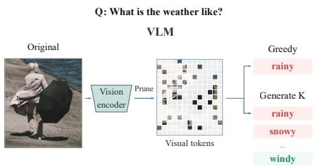  
(a) Visual evidence is still here

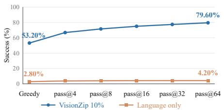  
(b) Pass@K reveals utilization gap

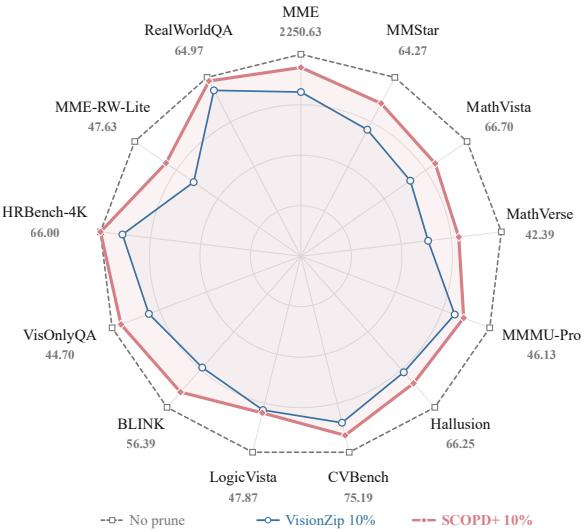  
(c) SCOPD+ recovers the utilization gap  
Figure 1: Visual-token pruning creates a representation–utilization gap that sparse-context adaptation can recover. (a) Repeated sampling from the same sparse visual context can recover valid reasoning trajectories missed by greedy decoding. (b) Across 500 examples solved greedily by the unpruned model, Pass@K substantially improves under aggressive VisionZip Yang et al. (2025) pruning, while a language-only control remains near zero, showing that useful visual evidence remains accessible. (c) SCOPD+ complements token pruning by adapting the model to better use this remaining evidence, substantially improving performance at aggressive token budgets.

To test whether pruning failures necessarily imply information loss, we perform a fixed-context Pass@K Chen et al. (2021) analysis on 500 image–question pairs. For each example, we prune the visual representation once and then draw multiple stochastic reasoning trajectories while keeping the image, question, model, and retained visual tokens unchanged; full experimental details and analysis are provided in Sec. 3.1. As illustrated in Figs. 1a and 1b, aggressive pruning causes a large drop in greedy Pass@1, yet repeated sampling recovers many correct solutions from the same sparse representation. Since the retained visual tokens are fixed across all generations, this recovery cannot be explained by obtaining a more favorable pruned context. Instead, it suggests that taskrelevant evidence can remain accessible, but the language model fails to consistently access it during reasoning. We refer to this discrepancy as the representation–utilization gap.

This observation motivates adapting the language model to its deployment-time sparse visual context. We introduce SCOPD (Sparse-Context On-Policy self-Distillation), an on-policy selfdistillation formulation tailored to visual-token pruning. The student generates reasoning trajectories using the sparse representation, while a privileged teacher with access to the corresponding full visual context supervises the same student-generated prefixes. This provides dense on-policy supervision from the privileged visual context. We find that this straightforward asymmetric use of sparse and full visual context recovers a substantial fraction of the performance lost under aggressive pruning, with no architectural changes or additional inference-time overhead.

Yet dense supervision does not necessarily correspond to visual supervision. Large teacher–student disagreement can occur at reasoning positions only weakly influenced by visual context, making KL divergence alone a poor indicator of where privileged visual supervision is most useful. We therefore introduce a visual sensitivity signal measuring how much the student’s next-token distribution changes under a small increase in visual evidence. To focus SCOPD’s supervision where visual evidence matters most, we develop SCOPD+, a selective variant that distills visually sensitive reasoning positions while backpropagating through only a fraction of response tokens.

Across 13 image benchmarks at 10% visual-token retention, the Vanilla model retains 86.37% of its unpruned performance, which increases to 90.49% with SCOPD and 92.43% with SCOPD+. These gains generalize across pruning operators based on attention, token diversity, and even random selection, as well as across Qwen2.5-VL and Qwen3-VL and from image training to video evaluation without video-specific post-training. Neither method requires supervised reasoning traces, architectural modifications, or additional inference-time computation. Together, these results show that learning to better utilize the visual evidence that survives pruning can substantially boost the performance of reasoning VLMs under sparse visual context.

Our contributions are:

– We identify a representation–utilization gap in vision-language models under visual-token pruning: models can retain sufficient visual information in sparse representations yet fail to effectively use that information during reasoning.

– We introduce SCOPD, a sparse-context on-policy self-distillation framework in which the student generates reasoning trajectories from pruned visual tokens, while a full-context teacher supervises the same on-policy prefixes, without requiring ground-truth responses or reasoning traces.

– We extend SCOPD with SCOPD+, a selective variant that uses a small visual-budget intervention to identify visually sensitive response tokens, achieving the strongest performance while backpropagating through only a fraction of response positions.

## 2 RELATED WORK

Efficient Visual Contexts for VLMs. Modern VLMs often include learned interfaces that already compress visual features before they reach the language model, including resampling, projection, and compact token representations Alayrac et al. (2022); Li et al. (2023; 2025). Nevertheless, highresolution images and especially long videos can still produce large visual contexts, motivating more aggressive visual-token reduction Li et al. (2024b); Vasu et al. (2025); Zhang et al. (2025a). A large body of recent work performs post-hoc pruning or merging using attention, similarity, diversity, graph structure, or language-conditioned relevance, often without modifying or retraining the underlying VLM Chen et al. (2024a); Shang et al. (2025); Zhang et al. (2024b); Jeddi et al. (2025); Xing et al. (2024); Jeddi et al. (2026); Yang et al. (2025); Alvar et al. (2025). Other approaches introduce learned or layer-adaptive sparsification modules, trading greater flexibility for additional training or architectural changes Huang et al. (2025); Ye et al. (2025); Zeng et al. (2026); Wang et al. (2026); Ivanovic et al. (2025). EPIC further studies the training difficulty induced by visual-token compression, using progressive token- and layer-level consistency distillation to help the model adapt to the compressed feature space Wen et al. (2026b). These works primarily study which tokens should be retained or how models should adapt to compressed representations. A recent analysis also shows that aggregate benchmark scores can hide important pruning failures on vision-centric tasks Endo et al. (2025). Our work instead asks whether degradation after pruning necessarily reflects missing visual evidence, or whether surviving evidence remains available but is used unreliably.

On-Policy and Privileged Self-Distillation. Classical knowledge distillation matches teacher and student predictions on a fixed data distribution Hinton et al. (2015); Kim & Rush (2016), but autoregressive models can suffer from state-distribution mismatch because generation depends on the student’s own previous outputs. Generalized Knowledge Distillation addresses this by querying the teacher on student-generated trajectories Agarwal et al. (2024), while on-policy RL methods such as GRPO optimize samples from the current policy using sparse outcome-level rewards Shao et al. (2024); Guo et al. (2025). Recent On-Policy Self-Distillation (OPSD) instead provides dense tokenlevel supervision: the student generates on-policy, while a stronger conditional view of the same model acts as teacher Zhao et al. (2026); Shenfeld et al. (2026). This principle has recently been extended to multimodal reasoning using privileged crops, resolutions, or fine-grained visual evidence Yuan et al. (2026); Zhu et al. (2026); Liu et al. (2026); Tian et al. (2026); Venkatraman et al. (2026); Li et al. (2026). Our setting differs in that the model is unchanged while its conditioning representation is deliberately sparsified. SCOPD uses the corresponding unpruned representation as privileged supervision to recover reasoning ability that remains latent under the sparse context.

Selective and Efficient On-Policy Distillation. Recent work observes that dense teacher supervision is not equally useful across all tokens or trajectories. Methods such as TIP Xu et al. (2026) identify informative positions using uncertainty and teacher–student disagreement, while others restrict distillation when teacher guidance becomes unreliable on drifted prefixes Fu et al. (2026).

In VLMs, Visual-Advantage OPD reweights supervision to emphasize visually grounded reasoning, while trajectory-level approaches select or repair entire reasoning paths rather than uniformly matching every token Liu et al. (2026); Jiang et al. (2026). SCOPD+ differs in how it identifies useful privileged supervision: rather than relying on teacher–student disagreement alone, it directly perturbs the student’s available visual evidence while holding the reasoning prefix fixed. The resulting distributional change isolates positions sensitive to missing visual context, separating visually relevant disagreement from ordinary language-level variation.

Recoverability Beyond Greedy Decoding. Pass@K and self-consistency have long shown that greedy decoding can underestimate capabilities revealed by repeated sampling Chen et al. (2021); Wang et al. (2022). Inference-time scaling work similarly studies how successful-response coverage grows with larger sampling budgets Brown et al. (2024); Snell et al. (2024); Yue et al. (2026). Most closely related, ShortOPD shows that structurally pruned LLMs can suffer a large Pass@1 drop while retaining substantial Pass@K, suggesting useful generations may be demoted rather than erased Zhang et al. (2026b); Wen et al. (2026a). We instead study pruning of the conditioning signal rather than the model itself. By holding both the model and sparse visual representation fixed across generations, we isolate whether failures arise because visual evidence was removed or because surviving evidence is used unreliably, directly motivating our representation–utilization gap.

## 3 ADAPTING VLMS TO SPARSE VISUAL CONTEXTS

We investigate whether degradation under visual-token pruning necessarily reflects the loss of task-relevant information (Sec. 3.1). Fixed-context repeated sampling shows that correct reasoning trajectories often remain recoverable despite sharp drops in greedy performance, revealing a representation–utilization gap. To adapt the language model to sparse visual contexts and address this gap, we introduce SCOPD (Sec. 3.2) for sparse-context on-policy self-distillation and extend it with SCOPD+ (Sec. 3.3) for selective supervision of visually sensitive response tokens.

## 3.1 MOTIVATION: THE REPRESENTATION–UTILIZATION GAP

Performance loss under aggressive visual-token pruning is commonly attributed to removing taskrelevant evidence. While this certainly occurs, performance may also degrade because sufficient evidence remains in the sparse representation but is no longer used reliably by the language model during autoregressive decoding. We therefore ask: when a reasoning VLM fails after pruning, can a correct reasoning trajectory still be recovered from the exact same sparse visual context?

Fixed-context recoverability analysis. We construct 500 image–question pairs from MM-Star Chen et al. (2024b), CVBench Tong et al. (2024), MMMU-Pro Yue et al. (2025), BLINK Fu et al. (2024), LogicVista Xiao et al. (2024), and LLaVA-CoT Xu et al. (2025), restricted to freeform numerical questions that the unpruned model solves correctly under greedy decoding. For each example, we prune the visual representation once with VisionZip Yang et al. (2025), retaining 10% of tokens, and keep the resulting sparse context fixed across generations. We use VisionZip as a representative strong pruning method, while later ablations show that our adaptation generalizes across pruning operators. We then compare greedy decoding with repeated stochastic sampling up to Pass@64. To distinguish recovery from visual evidence from success driven by language priors, we repeat the experiment in a language-only setting with all visual input removed. Finally, to ensure that recovered answers reflect coherent, visually grounded reasoning rather than accidental answer matching, we use GPT-6-Astra-Max OpenAI (2026) to verify that the reasoning is logically consistent and supported by the visual evidence. Full dataset construction, prompts, decoding settings, metrics, and additional analyses are provided in Appendix A.

Fig. 1a illustrates the setup, while Fig. 1b quantifies the effect. At 10% retention, greedy success falls to 53.2%, yet Pass@64 rises to 79.6% from the same sparse representation. By contrast, the language-only setting remains near zero, increasing from 2.8% to 4.2%. Because the retained visual tokens are fixed across generations, this recovery cannot be attributed to a more favorable pruning outcome. Instead, the sparse representation still supports correct reasoning trajectories that the model fails to produce reliably. We refer to this mismatch as the representation–utilization gap.

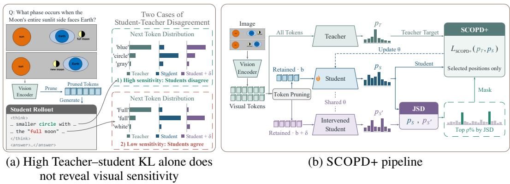  
Figure 2: Motivation and pipeline of SCOPD+. (a) Large teacher–student KL can arise from language-level disagreement even when a prediction is weakly affected by visual context. We therefore use a small visual-budget intervention as a direct test of visual dependence: positions whose predictions change with additional visual evidence are more visually sensitive. (b) The student generates an on-policy trajectory at budget $b .$ The same prefixes are scored by the student at budgets b and $b ^ { + }$ and by the full-context teacher. We compute visual sensitivity using the Jensen–Shannon divergence between the two student distributions, select the top $\rho = 1 0 \%$ response positions, and apply the teacher-to-student KL loss only at those positions.

This distinction motivates adapting the language model itself to sparse visual contexts: when relevant evidence survives pruning, performance can be recovered by learning to use that representation more reliably rather than changing the pruner.

## 3.2 SCOPD: SPARSE-CONTEXT ON-POLICY SELF-DISTILLATION

The representation–utilization gap identified in Sec. 3.1 suggests that, when task-relevant evidence survives pruning, the language model should be adapted to reason more reliably from its deployment-time sparse visual context. We therefore introduce SCOPD (Sparse-Context On-Policy self-Distillation), an on-policy self-distillation Zhao et al. (2026) formulation tailored to visual-token pruning. We sample reasoning trajectories under the sparse visual context, then score the same prefixes under the corresponding full visual representation to obtain token-level supervision. This aligns training with the states visited by the pruned model without requiring ground-truth answers or reasoning traces.

Let $x _ { i }$ denote the textual input, $Z _ { i }$ the full visual-token sequence, and $Z _ { i } ^ { b } = P _ { b } ( Z _ { i } )$ the output of pruning operator P at retention budget b. The student samples a reasoning trajectory

$$
\hat { y } _ { i } \sim p _ { \theta } ( \cdot \mid x _ { i } , Z _ { i } ^ { b } ) ,\tag{1}
$$

and, at each decoding position t, the sparse-context student and full-context teacher score the same prefix $\hat { y } _ { i , < t } \colon$

$$
p _ { i , t } ^ { b } = p _ { \theta } ( \cdot \mid x _ { i } , Z _ { i } ^ { b } , \hat { y } _ { i , < t } ) ,\tag{2}
$$

$$
q _ { i , t } = p _ { \bar { \theta } } ( \cdot \mid x _ { i } , Z _ { i } , \hat { y } _ { i , < t } ) ,\tag{3}
$$

where $\bar { \theta }$ denotes the teacher parameters. SCOPD minimizes

$$
\mathcal { L } _ { i } ^ { \mathrm { { S C O P D } } } = \frac { 1 } { T _ { i } } \sum _ { t = 1 } ^ { T _ { i } } D _ { \mathrm { { K L } } } \big ( q _ { i , t } \Vert p _ { i , t } ^ { b } \big ) .\tag{4}
$$

SCOPD applies dense supervision at every reasoning position, but not all teacher–student disagreement is equally informative about the visual context. As illustrated in Fig. 2a, many positions with large KL divergence are only weakly affected by missing visual evidence and instead reflect ordinary language-modeling disagreement. This motivates selecting supervision based not only on teacher– student disagreement, but also on whether a prediction is actually sensitive to the available visual context.

## 3.3 SCOPD+: SELECTIVE DISTILLATION OF VISUALLY SENSITIVE TOKENS

SCOPD+ extends SCOPD by concentrating privileged supervision on reasoning positions most sensitive to visual evidence. Dense distillation may otherwise emphasize supervision to positions with substantial teacher–student disagreement that is only weakly related to visual information. Our intuition is simple: if adding a small amount of visual information substantially changes the student’s next-token distribution, that position is more likely to depend on visual context rather than primarily on language-modeling dynamics. Fig. 2b summarizes the pipeline.

For a student operating at token retention budget b, we construct a slightly richer visual context

$$
b ^ { + } = b + \delta , \qquad Z _ { i } ^ { b ^ { + } } = P _ { b ^ { + } } ( Z _ { i } ) .\tag{5}
$$

We then evaluate

$$
p _ { i , t } ^ { b ^ { + } } = p _ { \theta } ( \cdot \mid x _ { i } , Z _ { i } ^ { b ^ { + } } , \hat { y } _ { i , < t } ) .\tag{6}
$$

The intervention introduces no new rollout: $p _ { i , t } ^ { b ^ { + } }$ is evaluated on the same student-generated reasoning prefix, and uses the same encoded visual features. The intervention therefore requires only one additional sparse visual context and language-model forward pass.

We quantify token-level visual sensitivity using Jensen–Shannon divergence (JSD) Lin (1991):

$$
S _ { i , t } = \frac { 1 } { 2 } D _ { \mathrm { K L } } \bigl ( p _ { i , t } ^ { b } \bigr | \bigl | m _ { i , t } \bigr ) + \frac { 1 } { 2 } D _ { \mathrm { K L } } \Bigl ( p _ { i , t } ^ { b ^ { + } } \Bigr | \Bigr | m _ { i , t } \Bigr ) , \qquad m _ { i , t } = \frac { 1 } { 2 } \Bigl ( p _ { i , t } ^ { b } + p _ { i , t } ^ { b ^ { + } } \Bigr ) .\tag{7}
$$

We use JSD because the intervention compares two predictive distributions under different visualevidence budgets without privileging either one. Unlike directional KL, JSD is symmetric and bounded, making the sensitivity score easier to compare across tokens and less dominated by extreme probability ratios. A symmetrized forward–reverse KL would also remove directionality, but remains unbounded and can be overly sensitive to low-probability events.

Large $S _ { i , t }$ t indicates that position t is highly sensitive to a small increase in visual context, making it a promising target for adaptation. We therefore retain the top ρ fraction of positions,

$$
\begin{array} { r } { \mathcal { K } _ { i } = \mathrm { T o p K } _ { t \in \{ 1 , \dots , T _ { i } \} } \left( S _ { i , t } , \lceil \rho T _ { i } \rceil \right) , } \end{array}\tag{8}
$$

and apply full-context supervision only to these tokens:

$$
\mathcal { L } _ { \mathrm { S C O P D } + , i } = \frac { 1 } { | \mathcal { K } _ { i } | } \sum _ { t \in \mathcal { K } _ { i } } D _ { \mathrm { K L } } \bigl ( q _ { i , t } \parallel p _ { i , t } ^ { b } \bigr ) .\tag{9}
$$

Thus, SCOPD+ preserves the same on-policy reasoning trajectories as SCOPD, while restricting backpropagation to positions most responsive to visual evidence. This suppresses visually uninformative teacher–student disagreement and substantially reduces the number of response tokens used for distillation.

## 4 EXPERIMENTS

## 4.1 EXPERIMENTAL SETUP

Unless otherwise stated, we use Qwen2.5-VL-7B-Instruct Bai et al. (2025b) with VisionZip Yang et al. (2025) as the pruning operator P and a default visual-token retention budget of $b = 1 0 \%$ . All post-training methods use LLM-only LoRA $( r = 1 6 , \alpha = 3 2$ , zero dropout), a constant learning rate of $2 \times 1 0 ^ { - 5 }$ , and an effective batch size of 32 across four GPUs; the vision encoder and multimodal projector remain frozen. For SCOPD and SCOPD+, the teacher is an exponential moving average (EMA) of the student parameters with decay 0.9999. For SCOPD+, we set $\delta = 1 \%$ and $\rho = 1 0 \%$ by default. We train on approximately 10K examples from LLaVA-CoT Xu et al. (2025). Reference reasoning traces and answers are used only by supervised baselines, while SCOPD and SCOPD+ obtain supervision online from the full-context teacher. We evaluate across a broad suite of image and video benchmarks spanning perception, hallucination, spatial understanding, mathematical and logical reasoning, and temporal video understanding. Full training, data, benchmark, and evaluation details are provided in Appendix C.

Table 1: Main results across visual-token budgets. We compare post-training methods on 13 image benchmarks using Qwen2.5-VL-7B-Instruct with VisionZip at 100%, 20%, and 10% visualtoken retention. $\mathrm { { A v g } _ { 1 3 } }$ is the mean performance normalized to the unpruned Vanilla model on each benchmark. Best and second-best results are bold and underlined, respectively. Overall, SCOPD improves sparse-context performance, with SCOPD+ performing best under aggressive pruning.
<table><tr><td>Method</td><td>|MME</td><td>MMStar MathVista MathVerse MMMU-Pro Hallusion CVBench LogicVista BLINK VisOnlyQA HR4K MME-RW-Lite RealWorldQA|</td><td></td><td></td><td></td><td></td><td></td><td></td><td></td><td></td><td></td><td></td><td>| Avg13</td></tr><tr><td colspan="10">Full Visual Context (100% Tokens)</td><td></td><td></td><td></td><td></td></tr><tr><td>Vanilla</td><td>2250.63</td><td>64.27</td><td>66.70 42.39</td><td>46.13</td><td>66.25</td><td>75.19</td><td>47.87</td><td>56.39</td><td>44.70</td><td>66.00</td><td>47.63</td><td>64.97</td><td>100.00</td></tr><tr><td>SFT</td><td>2380.54</td><td>64.93 65.30</td><td>35.41</td><td>46.82</td><td>64.35</td><td>75.73</td><td>43.18 49.22</td><td>55.18</td><td>42.43</td><td>69.62</td><td>52.01</td><td>67.58</td><td>99.17</td></tr><tr><td>EPIC</td><td>2315.82</td><td>65.40 65.60</td><td>36.42</td><td>48.09</td><td>65.09</td><td>77.00</td><td></td><td>54.87</td><td>42.87</td><td>68.62</td><td>50.96</td><td>66.93</td><td>100.30</td></tr><tr><td>GRPO</td><td>2262.94</td><td>64.47 67.10</td><td>42.39</td><td>46.18</td><td>66.25</td><td>75.23</td><td>48.55</td><td>56.65</td><td>43.91</td><td>67.62</td><td>49.30</td><td>67.06</td><td>100.84</td></tr><tr><td>SCOPD (Ours) SCOPD+ (Ours)</td><td>2322.58 2310.91</td><td>64.20 68.00</td><td>43.02</td><td>45.49</td><td>68.14</td><td>73.20</td><td>47.20</td><td>56.71</td><td>45.65</td><td>64.62</td><td>47.68</td><td>67.58</td><td>100.67</td></tr><tr><td></td><td>65.20</td><td>67.90</td><td>40.61</td><td>44.34</td><td>68.98</td><td>73.68</td><td>46.76</td><td>56.02</td><td>44.52</td><td>64.88</td><td>48.67</td><td>67.06</td><td>100.02</td></tr><tr><td colspan="10">Retain 20% Visual Tokens 73.12 40.72</td><td colspan="5"></td></tr><tr><td>Vanilla</td><td>2106.54</td><td>60.27</td><td>61.60</td><td>37.56 43.82</td><td>61.51</td><td></td><td></td><td>52.03</td><td>42.35</td><td>66.50</td><td>43.77</td><td>62.61</td><td>93.42</td></tr><tr><td>SFT</td><td>2368.60</td><td>60.53</td><td>60.90 32.99</td><td>44.62</td><td>62.57</td><td>73.59</td><td>38.26</td><td>53.18</td><td>42.78</td><td>70.38</td><td>47.21</td><td>67.97</td><td>95.22</td></tr><tr><td>EPIC</td><td>2225.28</td><td>59.67</td><td>58.90 33.63</td><td>45.55</td><td></td><td>60.78</td><td>76.45</td><td>41.16 52.55</td><td>42.52</td><td>69.12</td><td>46.80</td><td>66.54</td><td>94.71</td></tr><tr><td>GRPO</td><td>2150.62</td><td>60.07</td><td>62.60 37.06</td><td>44.05</td><td></td><td>62.88</td><td>73.73</td><td>40.04 52.34</td><td>42.00</td><td>67.25</td><td>44.24</td><td>63.27</td><td>93.95</td></tr><tr><td>SCOPD (Ours) SCOPD+ (Ours)</td><td>2270.21</td><td>62.87 65.00</td><td>39.47</td><td>44.97</td><td>63.83</td><td>73.51</td><td></td><td>41.83 54.60</td><td>42.70</td><td>65.88</td><td>46.01</td><td>65.88</td><td>96.80</td></tr><tr><td>2235.58</td><td>61.80</td><td>64.50</td><td>42.01</td><td>43.99</td><td>65.72</td><td>72.68</td><td>43.18</td><td>55.13</td><td>42.35</td><td>66.25</td><td>46.33</td><td>65.88</td><td>97.25</td></tr><tr><td colspan="10">Retain 10% Visual Tokens</td><td colspan="5"></td></tr><tr><td>Vanilla</td><td>2040.13</td><td>54.87</td><td>55.30</td><td>26.90</td><td>41.85</td><td>58.57 69.53</td><td>37.58</td><td>48.97</td><td>40.35</td><td>62.38</td><td>39.19</td><td>62.61</td><td>86.37</td></tr><tr><td>SFT</td><td>2277.41</td><td>55.67</td><td>54.90</td><td>25.63</td><td>40.75</td><td>56.78</td><td>72.86 34.68</td><td>50.45</td><td>40.96</td><td>68.00</td><td>44.66</td><td>66.80</td><td>88.82</td></tr><tr><td>EPIC</td><td>2149.19</td><td>55.87</td><td>50.40</td><td>24.37</td><td>41.45</td><td>55.73</td><td>72.69 32.66</td><td>50.13</td><td>40.26</td><td>65.75</td><td>43.67</td><td>64.44</td><td>86.45</td></tr><tr><td>GRPO</td><td>2061.41</td><td>55.47</td><td>54.90</td><td>25.38</td><td>41.91</td><td>58.99</td><td>70.08 34.00</td><td>48.71</td><td>40.09</td><td>64.25</td><td>39.40</td><td>61.18</td><td>85.73</td></tr><tr><td>SCOPD (Ours)</td><td>2201.28</td><td>58.60</td><td>60.60</td><td>30.46</td><td>42.95</td><td>60.46</td><td>72.65 34.68</td><td>52.81</td><td>42.09</td><td>63.75</td><td>41.84</td><td>64.31</td><td>90.49</td></tr><tr><td>SCOPD+ (Ours)</td><td>2177.06</td><td>59.60</td><td>60.30</td><td>33.38</td><td>42.95</td><td>60.99 71.96</td><td>38.26</td><td>53.55</td><td>43.65</td><td>66.00</td><td>43.15</td><td>64.31</td><td>92.43</td></tr></table>

Baselines. We compare against: (i) Vanilla, the base Qwen2.5-VL model evaluated without posttraining; (ii) SFT, supervised fine-tuning on sparse visual context using reference reasoning traces and answers; (iii) EPIC Wen et al. (2026b), a compression-aware baseline based on progressive consistency distillation, using its original retention schedule and objective; (iv) GRPO, an RLVR-style on-policy baseline that generates reasoning trajectories from the same pruned visual context and optimizes them using outcome-based rewards (see Appendix E); (v) SCOPD, our sparse-context on-policy self-distillation formulation using full-context privileged supervision; and (vi) SCOPD+, which selectively applies SCOPD supervision to visually sensitive reasoning positions.

## 4.2 MAIN RESULTS

We evaluate sparse-context post-training across 13 image benchmarks and multiple visual-token budgets. Table 1 reports the baseline and proposed-method results. $\mathbf { A v g } _ { 1 3 }$ is the mean benchmark performance normalized to the unpruned Vanilla model.

Findings. Table 1 highlights three trends:

– SCOPD effectively adapts reasoning VLMs to sparse visual context. At 20% and 10% retention, SCOPD improves $\mathrm { { A v g } _ { 1 3 } }$ over the Vanilla baseline from 93.42% to 96.80% and from 86.37% to 90.49%, respectively, outperforming SFT, GRPO, and EPIC. This shows that full-context onpolicy supervision recovers a substantial fraction of pruning-induced degradation.

– Selective visual supervision provides further gains. SCOPD+ reaches 97.25% $\mathrm { { A v g } _ { 1 3 } }$ at 20% retention and 92.43% at 10%, improving over dense SCOPD by +0.45 and +1.94 points. At the more aggressive 10% budget, SCOPD+ improves over SCOPD on 8 of 13 benchmarks and matches it on two others, with particularly large normalized gains on LogicVista, MathVerse, VisOnlyQA, and HR4K. These benchmarks place strong demands on visually grounded reasoning, diagram understanding, or fine-grained visual perception, making the pattern consistent with SCOPD+’s emphasis on visually sensitive reasoning positions.

– The gains target sparse-context adaptation rather than generic post-training improvements. With the full visual context, SCOPD and SCOPD+ achieve 100.67% and 100.02% $\mathbf { A v g } _ { 1 3 }$ , respectively, remaining essentially unchanged from the unpruned Vanilla model. Their advantage instead grows as the visual budget shrinks, supporting the representation–utilization hypothesis that post-training primarily helps the model use compressed visual evidence more reliably. We further evaluate an extreme 5% retention setting in Appendix D, where the same trend persists.

Overall, SCOPD provides strong adaptation to sparse visual representations, while SCOPD+ further improves performance by focusing supervision on visually sensitive reasoning tokens.

Table 2: Token-selection ablation. Selective methods retain $\rho \ = \ 1 0 \%$ of response tokens; dense SCOPD uses all positions. SCOPD+ performs best overall.
<table><tr><td>Selection</td><td colspan="6">MME MMStar BLINK VisOnly MathVista RWQA| Avg6</td></tr><tr><td>Dense SCOPD|2201.28</td><td></td><td>58.60</td><td>52.81</td><td>42.09</td><td>60.60</td><td>64.31|94.44</td></tr><tr><td>Random</td><td>|2141.89</td><td>59.87</td><td>52.97</td><td>41.74</td><td>58.50</td><td>63.66|93.56</td></tr><tr><td>Top KL</td><td>2174.15</td><td>60.13</td><td>53.29</td><td>42.00</td><td>60.20 63.79</td><td>94.51</td></tr><tr><td>TIP</td><td>2179.75</td><td>60.40</td><td>53.76</td><td>42.26</td><td>59.20 62.22</td><td>94.21</td></tr><tr><td>Bottom Sens.</td><td>2035.59</td><td>56.27</td><td>48.29</td><td>40.96</td><td>54.90</td><td>63.14|89.13</td></tr><tr><td>SCOPD+</td><td>2177.06</td><td>59.60</td><td>53.55</td><td>43.65</td><td>60.30</td><td>64.31 95.25</td></tr></table>

Table 3: Generalization across pruning operators. Trained only with VisionZip, SCOPD+ generalizes to other pruners without adaptation.
<table><tr><td>Pruner</td><td>Model</td><td colspan="6">MME MMStar BLINK VisOnly MathVista RWQA|</td></tr><tr><td rowspan="2">VisionZip</td><td>Vanilla</td><td>|2040.13</td><td>54.87</td><td>48.97</td><td>40.35</td><td>55.30</td><td>|Avg6 62.61 88.74</td></tr><tr><td>SCOPD+</td><td>2177.06</td><td>59.60</td><td>53.55</td><td>43.65</td><td>60.30</td><td>64.31 95.25</td></tr><tr><td rowspan="2">DivPrune</td><td>Vanilla</td><td>|1948.09</td><td>52.27</td><td>48.45</td><td>38.52</td><td>47.70</td><td>58.04|83.47</td></tr><tr><td>SCOPD+</td><td>2210.43</td><td>57.67</td><td>50.60</td><td>41.22</td><td>56.10</td><td>60.65 91.23</td></tr><tr><td rowspan="2">Random</td><td>Vanilla</td><td>1938.62</td><td>50.07</td><td>46.40</td><td>41.57</td><td>45.70</td><td>54.90|82.06</td></tr><tr><td>SCOPD+</td><td>2207.62</td><td>54.87</td><td>49.87</td><td>41.57</td><td>53.80</td><td>56.86 88.85</td></tr><tr><td rowspan="2">FastV</td><td>Vanilla</td><td>1954.39</td><td>49.40</td><td>47.45</td><td>36.35</td><td>49.60</td><td>55.42|81.47</td></tr><tr><td>SCOPD+</td><td>2096.13</td><td>51.53</td><td>49.55</td><td>38.78</td><td>51.80</td><td>58.82 86.03</td></tr></table>

Table 4: Generalization to Qwen3-VL-4B. Pruned models retain 10% of visual tokens; Avg6 is normalized to Vanilla (100%).  
Table 5: Image-to-video generalization at 10% retention. No video-specific post-training is used.
<table><tr><td>Method</td><td colspan="6">MME MMStar BLINK VisOnly MathVista RWQA</td></tr><tr><td>Vanilla (100%)|2403.47</td><td></td><td>67.67</td><td>65.75</td><td>53.74</td><td>69.90</td><td>73.86|</td><td>100.00</td></tr><tr><td>Vanilla (10%)</td><td>1999.68</td><td>47.73</td><td>51.76</td><td>44.26</td><td>42.50</td><td>56.21</td><td>75.29</td></tr><tr><td>SCOPD</td><td>2261.94</td><td>52.93</td><td>54.29</td><td>44.87</td><td>47.30</td><td>61.70</td><td>81.60</td></tr><tr><td>SCOPD+</td><td>2278.19</td><td>53.87</td><td>54.81</td><td>44.96</td><td>49.10</td><td>63.40</td><td>82.92</td></tr></table>

<table><tr><td>Method</td><td>VideoMME TempComp. MVBench MLVU Video-TT</td><td></td><td></td><td></td><td></td><td>Avg5</td></tr><tr><td>Vanilla (100%)|</td><td>54.00</td><td>69.81</td><td>62.98</td><td>54.65</td><td></td><td>36.20|100.00</td></tr><tr><td>Vanilla (10%)</td><td>49.37</td><td>62.41</td><td>56.60</td><td>51.33</td><td>32.50|</td><td>90.88</td></tr><tr><td>SCOPD</td><td>52.78</td><td>65.44</td><td>59.48</td><td>53.17</td><td>34.50</td><td>95.70</td></tr><tr><td>SCOPD+</td><td>53.15</td><td>66.01</td><td>59.45</td><td>53.31</td><td>35.50</td><td>96.60</td></tr></table>

## 4.3 ABLATIONS

Q1: Does visual sensitivity identify better distillation targets? We compare SCOPD+ against dense SCOPD and alternative token-selection criteria, including random selection, teacher–student KL, TIP Xu et al. (2026), and a negative control selecting the least visually sensitive positions. All selective variants retain ρ = 10% of response tokens. Table 2 shows that SCOPD+ achieves the best Avg6 at 95.25%, outperforming dense SCOPD (94.44%), Top-KL (94.51%), TIP (94.21%), and random selection (93.56%), while using only 10% of positions for distillation. Conversely, selecting the least sensitive positions drops performance to 89.13%, supporting visual sensitivity as an effective criterion for allocating supervision.

Q2: Does SCOPD+ generalize across pruning operators? Although SCOPD+ is trained only with VisionZip, we evaluate it without further adaptation under DivPrune Alvar et al. (2025), random pruning, and FastV Chen et al. (2024a). As shown in Table 3, SCOPD+ improves Avg6 across every tested pruner: from 88.74% to 95.25% with VisionZip, 83.47% to 91.23% with DivPrune, 82.06% to 88.85% with random pruning, and 81.47% to 86.03% with FastV. The transfer to FastV is especially informative because pruning occurs inside the language model, suggesting that the learned sparsecontext adaptation is not specific to the VisionZip pruning mechanism.

Q3: Do SCOPD and SCOPD+ generalize to other reasoning VLMs? Our main experiments use Qwen2.5-VL-7B, so we additionally post-train Qwen3-VL-4B under the same 10% sparsecontext setup. Qwen3-VL uses stacked visual features from multiple vision layers; we therefore compute the VisionZip selection on the final-layer visual representation and apply the same selected token indices to the three intermediate visual streams. As shown in Table 4, pruning reduces Avg6 to 75.29%, while SCOPD and SCOPD+ recover it to 81.6% and 82.92%, respectively. This suggests that sparse-context adaptation is not specific to the Qwen2.5-VL architecture.

Q4: Do SCOPD and SCOPD+ generalize to videos? We next test whether adaptation learned entirely from image-based post-training transfers to video reasoning. Without any video-specific training, we evaluate the same LoRA-adapted models on five video benchmarks spanning general and temporal video understanding. Table 5 shows that pruning reduces Avg5 to 90.88%, while SCOPD recovers this to 95.70% and SCOPD+ further reaches 96.60%. Thus, the learned ability to use sparse visual context transfers across the image-to-video modality shift.

Q5: How sensitive is SCOPD+ to its hyperparameters (ρ and δ)? We study the two main hyperparameters of SCOPD+: the fraction of response positions selected for distillation, ρ, and the visual-budget intervention used to estimate sensitivity, δ. As shown in Fig. 3, performance is highest at $\rho = 1 0 \%$ , while denser supervision provides no additional benefit. For the intervention, δ = 1% performs best. A small δ measures local sensitivity to marginal visual evidence near the deployment budget (b = 10%), whereas larger interventions compare against substantially richer visual representations and may emphasize positions that are less specific to the bottleneck at the operating point. We therefore use $\rho = 1 0 \%$ and δ = 1% by default.

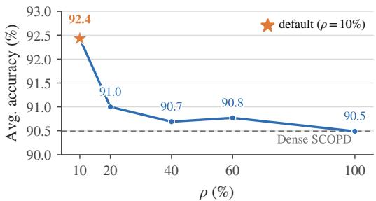  
(a) Effect of the supervision budget ρ

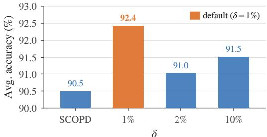  
(b) Effect of the visual intervention δ  
Figure 3: Sensitivity of SCOPD+ to its hyperparameters. Results are normalized over 13 image benchmarks. (a) Performance peaks at $\rho = 1 0 \%$ , with no benefit from denser supervision. (b) Performance is stable across visual-budget interventions δ, with δ = 1% performing best overall.

Table 6: On-policy distillation design choices for SCOPD+. The default uses forward KL and an EMA teacher. $\mathbf { A v g } _ { 1 3 }$ is the mean performance normalized to the unpruned Vanilla model on each benchmark.
<table><tr><td>Variant</td><td>MME</td><td>MMStar MathVista MathVerse MMMU-Pro Hallusion CVBench LogicVista BLINK VisOnly</td><td></td><td></td><td></td><td></td><td></td><td></td><td></td><td></td><td></td><td>HR4K MME-RW-Lite RWQA</td><td></td><td> $\mathbf { | { A v g } _ { 1 3 } }$ </td></tr><tr><td>SCOPD+ (Default)</td><td>|2177.06</td><td>59.60</td><td>60.30</td><td>33.38</td><td>42.95</td><td>60.99</td><td>71.96</td><td>38.26</td><td>53.55</td><td>43.65</td><td>66.00</td><td>43.15</td><td></td><td>64.31 92.43</td></tr><tr><td colspan="10">Distillation Divergence</td><td></td><td></td><td></td><td></td><td></td><td></td></tr><tr><td>Reverse KL</td><td>2215.71</td><td>60.47</td><td>60.20</td><td>32.61</td><td>43.18</td><td>61.83</td><td>72.17</td><td>34.90</td><td>54.60</td><td>43.39</td><td>66.50</td><td>43.20</td><td>65.10</td><td>92.39</td></tr><tr><td>JSD (β = 0.5)</td><td>2198.50</td><td>59.87</td><td>60.90</td><td>34.01</td><td>41.16</td><td>61.72</td><td>71.79</td><td>34.45</td><td>53.76</td><td>42.61</td><td>63.62</td><td>43.41</td><td>64.84</td><td>91.55</td></tr><tr><td colspan="10">Teacher Strategy</td><td colspan="3"></td><td></td><td></td></tr><tr><td>Fixed Teacher Shared</td><td>2213.41</td><td>59.27</td><td>58.90</td><td>32.11</td><td>41.45</td><td>60.25</td><td>71.52</td><td>36.02</td><td>53.76</td><td>42.70</td><td>65.25</td><td>43.04</td><td>66.27</td><td>|91.37</td></tr><tr><td></td><td>797.76</td><td>9.07</td><td>2.80</td><td>0.00</td><td>14.05</td><td>3.36</td><td>1.41</td><td>12.98</td><td>0.53</td><td>0.17</td><td>11.38</td><td>7.24</td><td>5.49</td><td>12.35</td></tr></table>

Q6: How sensitive is SCOPD+ to on-policy distillation design choices? We ablate the distillation divergence and teacher update strategy while keeping the remaining SCOPD+ configuration fixed. Table 6 shows that forward and reverse KL perform similarly (92.43 vs. 92.39 $\mathbf { A v g } _ { 1 3 } )$ , while JSD is slightly weaker (91.55). Teacher regularization is more critical: freezing the teacher at the initial policy remains competitive (91.37), whereas using the current student weights directly as the teacher collapses to 12.35. This mirrors Vision-OPD Yuan et al. (2026), which likewise finds that an unregularized current-policy teacher collapses, motivating our EMA teacher. We therefore use forward KL with EMA by default. In Appendix F, we further show that providing the teacher with ground-truth supervision can substantially improve SCOPD when such labels are available.

Q7: What is the compute overhead of SCOPD+? The visual-budget intervention is used only during post-training and introduces no additional inference-time model computation. On the 500- example diagnostic set, SCOPD and SCOPD+ generate 153.0 and 155.7 tokens on average, respectively, comparable to 155.3 for the unpruned Vanilla model. During training, SCOPD+ adds 21.4% theoretical compute over SCOPD but only 1.9% measured time, with essentially unchanged peak memory. Full measurements are provided in Appendix G.

## 5 CONCLUSION

We identified a representation–utilization gap in reasoning VLMs under visual-token pruning: sparse representations can retain sufficient evidence for correct solutions, yet the language model may fail to use it reliably. Motivated by this observation, we introduced SCOPD, which adapts models to sparse visual contexts through on-policy self-distillation from a privileged full-context teacher, and SCOPD+, which focuses supervision on visually sensitive reasoning positions identified through a small visual-budget intervention. Across token budgets, pruning operators, model families, and image and video benchmarks, both methods improved sparse-context reasoning with out architectural changes or additional inference-time computation.

Limitations and future work. Our experiments deliberately focused on controlled sparse-context adaptation, using VisionZip as the primary training-time pruning operator and fixed retention budgets. Although the learned adaptation transferred to other pruning methods, future work could study a broader range of in-LLM and dynamic pruning strategies, alternative pruning schedules, and jointly learned compression policies. We also primarily evaluated short-form image and video reasoning; extending sparse-context adaptation to longer-horizon video, embodied, and agentic tasks may reveal additional challenges in retaining and utilizing visual evidence over time.

## REPRODUCIBILITY STATEMENT

We provide detailed training and evaluation configurations, data processing, prompts, pruning settings, baseline implementations, and compute measurements in the appendix. The fixed-context Pass@K protocol, validity-judge prompt, GRPO setup, and additional ablations are also documented to facilitate reproduction of our results. We additionally include our training code in the supplementary material accompanying this submission.

## AI USE STATEMENT

In this work, generative AI tools were used to provide feedback on research methodology and experimental design, assist with interpretation of experimental results, and support drafting and editing of the manuscript. They were also used for code and figure/table assistance where applicable. All AIassisted outputs, including methodological suggestions, code, analyses, citations, and written text, were reviewed and verified by the authors. The authors take responsibility for the final content of the paper and all reported results.

## REFERENCES

Rishabh Agarwal, Nino Vieillard, Yongchao Zhou, Piotr Stanczyk, Sabela Ramos Garea, Matthieu Geist, and Olivier Bachem. On-Policy Distillation of Language Models: Learning from Self-Generated Mistakes. In International Conference on Learning Representations, pp. 21246–21263, 2024.

Jean-Baptiste Alayrac, Jeff Donahue, Pauline Luc, Antoine Miech, Iain Barr, Yana Hasson, Karel Lenc, Arthur Mensch, Katherine Millican, Malcolm Reynolds, Roman Ring, Eliza Rutherford, Serkan Cabi, Tengda Han, Zhitao Gong, Sina Samangooei, Marianne Monteiro, Jacob L Menick, Sebastian Borgeaud, Andy Brock, Aida Nematzadeh, Sahand Sharifzadeh, Mikoł aj Binkowski,´ Ricardo Barreira, Oriol Vinyals, Andrew Zisserman, and Karén Simonyan. Flamingo: a visual language model for few-shot learning. In Advances in Neural Information Processing Systems, 2022.

Saeed Ranjbar Alvar, Gursimran Singh, Mohammad Akbari, and Yong Zhang. DivPrune: Diversity-Based Visual Token Pruning for Large Multimodal Models. In Proceedings of the IEEE/CVF Conference on Computer Vision and Pattern Recognition, pp. 9392–9401, 2025.

Mohammadreza Armandpour, Fatih Ilhan, David Harrison, Ajay Jaiswal, Duc NM Hoang, Fartash Faghri, Yizhe Zhang, Minsik Cho, and Mehrdad Farajtabar. Unmasking on-policy distillation: Where it helps, where it hurts, and why. arXiv preprint arXiv:2605.10889, 2026.

Shuai Bai, Yuxuan Cai, Ruizhe Chen, Keqin Chen, Xionghui Chen, Zesen Cheng, Lianghao Deng, Wei Ding, Chang Gao, and Chunjiang Ge. Qwen3-VL Technical Report. arXiv preprint arXiv:2511.21631, 2025a.

Shuai Bai, Keqin Chen, Xuejing Liu, Jialin Wang, Wenbin Ge, Sibo Song, Kai Dang, Peng Wang, Shijie Wang, Jun Tang, Humen Zhong, Yuanzhi Zhu, Mingkun Yang, Zhaohai Li, Jianqiang Wan, Pengfei Wang, Wei Ding, Zheren Fu, Yiheng Xu, Jiabo Ye, Xi Zhang, Tianbao Xie, Zesen Cheng, Hang Zhang, Zhibo Yang, Haiyang Xu, and Junyang Lin. Qwen2.5-VL Technical Report, 2025b. URL https://arxiv.org/abs/2502.13923.

Bradley Brown, Jordan Juravsky, Ryan Ehrlich, Ronald Clark, Quoc V Le, Christopher Ré, and Azalia Mirhoseini. Large Language Monkeys: Scaling Inference Compute with Repeated Sampling. arXiv preprint arXiv:2407.21787, 2024.

Liang Chen, Haozhe Zhao, Tianyu Liu, Shuai Bai, Junyang Lin, Chang Zhou, and Baobao Chang. An Image Is Worth 1/2 Tokens after Layer 2: Plug-and-Play Inference Acceleration for Large Vision-Language Models. In European Conference on Computer Vision, pp. 19–35, 2024a.

Lin Chen, Jinsong Li, Xiaoyi Dong, Pan Zhang, Yuhang Zang, Zehui Chen, Haodong Duan, Jiaqi Wang, Yu Qiao, Dahua Lin, and Feng Zhao. Are We on the Right Way for Evaluating Large Vision-Language Models? In Advances in Neural Information Processing Systems, 2024b.

Mark Chen, Jerry Tworek, Heewoo Jun, Qiming Yuan, Henrique Ponde de Oliveira Pinto, Jared Kaplan, Harri Edwards, Yuri Burda, Nicholas Joseph, Greg Brockman, Alex Ray, Raul Puri, Gretchen Krueger, Michael Petrov, Heidy Khlaaf, Girish Sastry, Pamela Mishkin, Brooke Chan, Scott Gray, Nick Ryder, Mikhail Pavlov, Alethea Power, Lukasz Kaiser, Mohammad Bavarian, Clemens Winter, Philippe Tillet, Felipe Petroski Such, Dave Cummings, Matthias Plappert, Fotios Chantzis, Elizabeth Barnes, Ariel Herbert-Voss, William Hebgen Guss, Alex Nichol, Alex Paino, Nikolas Tezak, Jie Tang, Igor Babuschkin, Suchir Balaji, Shantanu Jain, William Saunders, Christopher Hesse, Andrew N. Carr, Jan Leike, Josh Achiam, Vedant Misra, Evan Morikawa, Alec Radford, Matthew Knight, Miles Brundage, Mira Murati, Katie Mayer, Peter Welinder, Bob McGrew, Dario Amodei, Sam McCandlish, Ilya Sutskever, and Wojciech Zaremba. Evaluating Large Language Models Trained on Code. arXiv preprint arXiv:2107.03374, 2021.

Haodong Duan, Xinyu Fang, Junming Yang, Xiangyu Zhao, Zerun Ma, Yuxuan Qiao, Mo Li, Tianhao Liang, Lin Zhu, Amit Agarwal, Xiaozhe Li, Shengyuan Ding, Jiazi Bu, Ziyu Liu, Zhangyang Qi, Yifei Li, Yuhang Zang, Zhe Chen, Lin Chen, Yuan Liu, Yubo Ma, Hailong Sun, Yifan Zhang, Shiyin Lu, Tack Hwa Wong, Weiyun Wang, Peiheng Zhou, Chaoyou Fu, Junbo Cui, Jixuan Chen, Enxin Song, Song Mao, Junming Lin, Xilin Wei, Jinsong Li, Zeyi Sun, Zhaowei Wang, Zicheng

Zhang, Xiaoyi Dong, Junjun He, Pan Zhang, Jiaqi Wang, Dahua Lin, and Kai Chen. VLMEvalKit: An Open-Source Toolkit for Evaluating Large Multi-Modality Models. In Proceedings of the ACM International Conference on Multimedia, pp. 11198–11201, 2024.

Mark Endo, Xiaohan Wang, and Serena Yeung-Levy. Feather the Throttle: Revisiting Visual Token Pruning for Vision-Language Model Acceleration. In Proceedings of the IEEE/CVF International Conference on Computer Vision, pp. 22826–22835, 2025.

Chaoyou Fu, Peixian Chen, Yunhang Shen, Yulei Qin, Mengdan Zhang, Xu Lin, Jinrui Yang, Xiawu Zheng, Ke Li, Xing Sun, Yunsheng Wu, Rongrong Ji, Caifeng Shan, and Ran He. MME: A Comprehensive Evaluation Benchmark for Multimodal Large Language Models. In Advances in Neural Information Processing Systems, 2025a.

Chaoyou Fu, Yuhan Dai, Yongdong Luo, Lei Li, Shuhuai Ren, Renrui Zhang, Zihan Wang, Chenyu Zhou, Yunhang Shen, Mengdan Zhang, Peixian Chen, Yanwei Li, Shaohui Lin, Sirui Zhao, Ke Li, Tong Xu, Xiawu Zheng, Enhong Chen, Caifeng Shan, Ran He, and Xing Sun. Video-MME: The First-Ever Comprehensive Evaluation Benchmark of Multi-Modal LLMs in Video Analysis. In Proceedings of the IEEE/CVF Conference on Computer Vision and Pattern Recognition, pp. 24108–24118, 2025b.

Xingyu Fu, Yushi Hu, Bangzheng Li, Yu Feng, Haoyu Wang, Xudong Lin, Dan Roth, Noah A Smith, Wei-Chiu Ma, and Ranjay Krishna. BLINK: Multimodal Large Language Models Can See but Not Perceive. In European Conference on Computer Vision, pp. 148–166, 2024.

Yuqian Fu, Haohuan Huang, Kaiwen Jiang, Jiacai Liu, Zhuo Jiang, Yuanheng Zhu, and Dongbin Zhao. Revisiting On-Policy Distillation: Empirical Failure Modes and Simple Fixes. arXiv preprint arXiv:2603.25562, 2026.

Tianrui Guan, Fuxiao Liu, Xiyang Wu, Ruiqi Xian, Zongxia Li, Xiaoyu Liu, Xijun Wang, Lichang Chen, Furong Huang, Yaser Yacoob, Dinesh Manocha, and Tianyi Zhou. HallusionBench: An Advanced Diagnostic Suite for Entangled Language Hallucination and Visual Illusion in Large Vision-Language Models. In Proceedings ofthe IEEE/CVF Conference on Computer Vision and Pattern Recognition, pp. 14375–14385, 2024.

Daya Guo, Dejian Yang, Haowei Zhang, Junxiao Song, Peiyi Wang, Qihao Zhu, Runxin Xu, Ruoyu Zhang, Shirong Ma, Xiao Bi, Xiaokang Zhang, Xingkai Yu, Yu Wu, Z. F. Wu, Zhibin Gou, Zhihong Shao, Zhuoshu Li, Ziyi Gao, Aixin Liu, Bing Xue, Bingxuan Wang, Bochao Wu, Bei Feng, Chengda Lu, Chenggang Zhao, Chengqi Deng, Chong Ruan, Damai Dai, Deli Chen, Dongjie Ji, Erhang Li, Fangyun Lin, Fucong Dai, Fuli Luo, Guangbo Hao, Guanting Chen, Guowei Li, H. Zhang, Hanwei Xu, Honghui Ding, Huazuo Gao, Hui Qu, Hui Li, Jianzhong Guo, Jiashi Li, Jingchang Chen, Jingyang Yuan, Jinhao Tu, Junjie Qiu, Junlong Li, J. L. Cai, Jiaqi Ni, Jian Liang, Jin Chen, Kai Dong, Kai Hu, Kaichao You, Kaige Gao, Kang Guan, Kexin Huang, Kuai Yu, Lean Wang, Lecong Zhang, Liang Zhao, Litong Wang, Liyue Zhang, Lei Xu, Leyi Xia, Mingchuan Zhang, Minghua Zhang, Minghui Tang, Mingxu Zhou, Meng Li, Miaojun Wang, Mingming Li, Ning Tian, Panpan Huang, Peng Zhang, Qiancheng Wang, Qinyu Chen, Qiushi Du, Ruiqi Ge, Ruisong Zhang, Ruizhe Pan, Runji Wang, R. J. Chen, R. L. Jin, Ruyi Chen, Shanghao Lu, Shangyan Zhou, Shanhuang Chen, Shengfeng Ye, Shiyu Wang, Shuiping Yu, Shunfeng Zhou, Shuting Pan, S. S. Li, Shuang Zhou, Shaoqing Wu, Tao Yun, Tian Pei, Tianyu Sun, T. Wang, Wangding Zeng, Wen Liu, Wenfeng Liang, Wenjun Gao, Wenqin Yu, Wentao Zhang, W. L. Xiao, Wei An, Xiaodong Liu, Xiaohan Wang, Xiaokang Chen, Xiaotao Nie, Xin Cheng, Xin Liu, Xin Xie, Xingchao Liu, Xinyu Yang, Xinyuan Li, Xuecheng Su, Xuheng Lin, X. Q. Li, Xiangyue Jin, Xiaojin Shen, Xiaosha Chen, Xiaowen Sun, Xiaoxiang Wang, Xinnan Song, Xinyi Zhou, Xianzu Wang, Xinxia Shan, Y. K. Li, Y. Q. Wang, Y. X. Wei, Yang Zhang, Yanhong Xu, Yao Li, Yao Zhao, Yaofeng Sun, Yaohui Wang, Yi Yu, Yichao Zhang, Yifan Shi, Yiliang Xiong, Ying He, Yishi Piao, Yisong Wang, Yixuan Tan, Yiyang Ma, Yiyuan Liu, Yongqiang Guo, Yuan Ou, Yuduan Wang, Yue Gong, Yuheng Zou, Yujia He, Yunfan Xiong, Yuxiang Luo, Yuxiang You, Yuxuan Liu, Yuyang Zhou, Y. X. Zhu, Yanping Huang, Yaohui Li, Yi Zheng, Yuchen Zhu, Yunxian Ma, Ying Tang, Yukun Zha, Yuting Yan, Z. Z. Ren, Zehui Ren, Zhangli Sha, Zhe Fu, Zhean Xu, Zhenda Xie, Zhengyan Zhang, Zhewen Hao, Zhicheng Ma, Zhigang Yan, Zhiyu Wu, Zihui Gu, Zijia Zhu, Zijun Liu, Zilin Li, Ziwei Xie, Ziyang Song, Zizheng Pan, Zhen Huang, Zhipeng Xu, Zhongyu Zhang, and Zhen Zhang. DeepSeek-R1: Incentivizing Reasoning Capability in LLMs via Reinforcement Learning. arXiv preprint arXiv:2501.12948, 2025.

Geoffrey Hinton, Oriol Vinyals, and Jeff Dean. Distilling the Knowledge in a Neural Network. arXiv preprint arXiv:1503.02531, 2015.

Wenxuan Huang, Zijie Zhai, Yunhang Shen, Shaosheng Cao, Fei Zhao, Xiangfeng Xu, Zheyu Ye, and Shaohui Lin. Dynamic-LLaVA: Efficient Multimodal Large Language Models via Dynamic Vision-Language Context Sparsification. In International Conference on Learning Representations, pp. 69927–69955, 2025.

Boris Ivanovic, Cristiano Saltori, Yurong You, Yan Wang, Wenjie Luo, and Marco Pavone. Efficient Multi-Camera Tokenization with Triplanes for End-to-End Driving. IEEE Robotics and Automation Letters, 2025.

Ahmadreza Jeddi, Negin Baghbanzadeh, Elham Dolatabadi, and Babak Taati. Similarity-Aware Token Pruning: Your VLM but Faster. arXiv preprint arXiv:2503.11549, 2025.

Ahmadreza Jeddi, Minh Ngoc Le, Amirhossein Kazerouni, Hakki Can Karaimer, Hue Nguyen, Iqbal Mohomed, Michael Brudno, Alex Levinshtein, Konstantinos G. Derpanis, Babak Taati, and Radek Grzeszczuk. Avis: Adaptive test-time scaling for vision-language models. arXiv preprint arXiv:2606.11576, 2026.

Li Jiang, Haoran Xu, Yichuan Ding, and Amy Zhang. Trajectory-Refined Distillation. arXiv preprint arXiv:2606.08432, 2026.

Ryo Kamoi, Yusen Zhang, Sarkar Snigdha Sarathi Das, Ranran Haoran Zhang, and Rui Zhang. VisOnlyQA: Large Vision Language Models Still Struggle with Visual Perception of Geometric Information. arXiv preprint arXiv:2412.00947, 2024.

Yoon Kim and Alexander M Rush. Sequence-Level Knowledge Distillation. In Conference on Empirical Methods in Natural Language Processing, pp. 1317–1327, 2016.

Junnan Li, Dongxu Li, Silvio Savarese, and Steven Hoi. BLIP-2: Bootstrapping Language-Image Pre-training with Frozen Image Encoders and Large Language Models. In International Conference on Machine Learning, pp. 19730–19742, 2023.

Kunchang Li, Yali Wang, Yinan He, Yizhuo Li, Yi Wang, Yi Liu, Zun Wang, Jilan Xu, Guo Chen, Ping Luo, Limin Wang, and Yu Qiao. MVBench: A Comprehensive Multi-Modal Video Understanding Benchmark. In Proceedings of the IEEE/CVF Conference on Computer Vision and Pattern Recognition, pp. 22195–22206, 2024a.

Pengyu Li, Zhitao Gao, Lingling Zhang, Muye Huang, Yuanming Li, Fangzhi Xu, and Jun Liu. Visual-OPSD: Cross-Modal On-Policy Self-Distillation for Efficient Unified Multimodal Reasoning. arXiv preprint arXiv:2606.18974, 2026.

Wentong Li, Yuqian Yuan, Jian Liu, Dongqi Tang, Song Wang, Jie Qin, Jianke Zhu, and Lei Zhang. TokenPacker: Efficient Visual Projector for Multimodal LLM. International Journal of Computer Vision, 2025.

Yanwei Li, Chengyao Wang, and Jiaya Jia. LLaMA-VID: An Image Is Worth 2 Tokens in Large Language Models. In European Conference on Computer Vision, pp. 323–340, 2024b.

Jianhua Lin. Divergence Measures Based on the Shannon Entropy. IEEE Transactions on Information Theory, 1991.

Ruiqi Liu, Xiaolei Lv, Gengsheng Li, Ximo Zhu, Zhiheng Wang, Zhengbo Zhang, Junkai Chen, Zhiheng Li, Bo Li, Jun Gao, and Shu Wu. Visual-Advantage On-Policy Distillation for Vision-Language Models. arXiv preprint arXiv:2605.21924, 2026.

Yuanxin Liu, Shicheng Li, Yi Liu, Yuxiang Wang, Shuhuai Ren, Lei Li, Sishuo Chen, Xu Sun, and Lu Hou. TempCompass: Do Video LLMs Really Understand Videos? In Findings of the Association for Computational Linguistics, pp. 8731–8772, 2024.

Pan Lu, Hritik Bansal, Tony Xia, Jiacheng Liu, Chunyuan Li, Hannaneh Hajishirzi, Hao Cheng, Kai-Wei Chang, Michel Galley, and Jianfeng Gao. MathVista: Evaluating Mathematical Reasoning of Foundation Models in Visual Contexts. In International Conference on Learning Representations, 2024.

OpenAI. GPT-6 Astra: A new generation of intelligence. https://openai.com/index/ gpt-6-astra/, 2026. Accessed: 2026-09-22.

Qwen Team. Qwen3.6-27B: Flagship-level coding in a 27B dense model, April 2026. URL https: //qwen.ai/blog?id=qwen3.6-27b.

Yuzhang Shang, Mu Cai, Bingxin Xu, Yong Jae Lee, and Yan Yan. LLaVA-Prumerge: Adaptive Token Reduction for Efficient Large Multimodal Models. In Proceedings ofthe IEEE/CVF International Conference on Computer Vision, pp. 22857–22867, 2025.

Zhihong Shao, Peiyi Wang, Qihao Zhu, Runxin Xu, Junxiao Song, Xiao Bi, Haowei Zhang, Mingchuan Zhang, Y. K. Li, Y. Wu, and Daya Guo. DeepSeekMath: Pushing the Limits of Mathematical Reasoning in Open Language Models. arXiv preprint arXiv:2402.03300, 2024.

Idan Shenfeld, Mehul Damani, Jonas Hübotter, and Pulkit Agrawal. Self-Distillation Enables Continual Learning. arXiv preprint arXiv:2601.19897, 2026.

Charlie Snell, Jaehoon Lee, Kelvin Xu, and Aviral Kumar. Scaling LLM Test-Time Compute Optimally can be More Effective than Scaling Model Parameters. arXiv preprint arXiv:2408.03314, 2024.

Kanghui Tian, Siyuan Liu, Ziang Yan, Sheng Xia, Shuai Dong, and Yi Wang. ViCuR: Visual Cues as Recoverable Privilege for Multimodal On-Policy Distillation. arXiv preprint arXiv:2606.05718, 2026.

Shengbang Tong, Ellis Brown, Penghao Wu, Sanghyun Woo, Manoj Middepogu, Sai Charitha Akula, Jihan Yang, Shusheng Yang, Adithya Iyer, Xichen Pan, Ziteng Wang, Rob Fergus, Yann LeCun, and Saining Xie. Cambrian-1: A Fully Open, Vision-Centric Exploration of Multimodal LLMs. In Advances in Neural Information Processing Systems, 2024.

Pavan Kumar Anasosalu Vasu, Fartash Faghri, Chun-Liang Li, Cem Koc, Nate True, Albert Antony, Gokula Santhanam, James Gabriel, Peter Grasch, Oncel Tuzel, and Hadi Pouransari. Fastvlm: Efficient vision encoding for vision language models. In Proceedings ofthe IEEE/CVF Conference on Computer Vision and Pattern Recognition, pp. 19769–19780, June 2025.

Shravan Venkatraman, Omkar Thawakar, Ritesh Thawkar, Abdelrahman Shaker, and Rao Muhammad Anwer. Perception Before Supervision: Self-Contained Visual Distillation from Counterfactual Blind Spots. arXiv preprint arXiv:2608.09931, 2026.

Wenbin Wang, Liang Ding, Minyan Zeng, Xiabin Zhou, Li Shen, Yong Luo, Wei Yu, and Dacheng Tao. Divide, Conquer and Combine: A Training-Free Framework for High-Resolution Image Perception in Multimodal Large Language Models. In Proceedings of the AAAI Conference on Artificial Intelligence, 2025.

Xuezhi Wang, Jason Wei, Dale Schuurmans, Quoc Le, Ed Chi, Sharan Narang, Aakanksha Chowdhery, and Denny Zhou. Self-Consistency Improves Chain of Thought Reasoning in Language Models. arXiv preprint arXiv:2203.11171, 2022.

Yimu Wang, Mozhgan Nasr Azadani, Sean Sedwards, and Krzysztof Czarnecki. HAWAII: Hierarchical Visual Knowledge Transfer for Efficient Vision-Language Models. Advances in Neural Information Processing Systems, pp. 919–943, 2026.

Rui Wen, Lu Sun, Jiayang Liu, Zesheng Xu, Tianshuo Cong, and Zheng Li. The Benchmark Illusion: Pruned LLMs Can Pass Multiple Choice but Fail to Answer. arXiv preprint arXiv:2606.17609, 2026a.

Zichen Wen, Shaobo Wang, Yufa Zhou, Junyuan Zhang, Qintong Zhang, Yifeng Gao, Zhaorun Chen, Bin Wang, Weijia Li, Conghui He, and Linfeng Zhang. Efficient Multi-Modal Large Language Models via Progressive Consistency Distillation. Advances in Neural Information Processing Systems, pp. 69726–69753, 2026b.

xAI. Grok-1.5 vision preview. https://x.ai/news/grok-1.5v, April 2024. Accessed: 2026-09-24.

Yijia Xiao, Edward Sun, Tianyu Liu, and Wei Wang. LogicVista: Multimodal LLM Logical Rea soning Benchmark in Visual Contexts, 2024.

Long Xing, Qidong Huang, Xiaoyi Dong, Jiajie Lu, Pan Zhang, Yuhang Zang, Yuhang Cao, Conghui He, Jiaqi Wang, Feng Wu, and Dahua Lin. Pyramiddrop: Accelerating your large vision-language models via pyramid visual redundancy reduction. arXiv preprint arXiv:2410.17247, 2024.

Guowei Xu, Peng Jin, Ziang Wu, Hao Li, Yibing Song, Lichao Sun, and Li Yuan. LLaVA-CoT: Let Vision Language Models Reason Step-by-Step. In Proceedings of the IEEE/CVF International Conference on Computer Vision, pp. 2087–2098, 2025.

Yuanda Xu, Hejian Sang, Zhengze Zhou, Ran He, Zhipeng Wang, and Alborz Geramifard. TIP: Token Importance in On-Policy Distillation. arXiv preprint arXiv:2604.14084, 2026.

Senqiao Yang, Yukang Chen, Zhuotao Tian, Chengyao Wang, Jingyao Li, Bei Yu, and Jiaya Jia. VisionZip: Longer Is Better but Not Necessary in Vision Language Models. In Proceedings of the IEEE/CVF Conference on Computer Vision and Pattern Recognition, pp. 19792–19802, 2025.

Xubing Ye, Yukang Gan, Yixiao Ge, Xiao-Ping Zhang, and Yansong Tang. ATP-LLaVA: Adaptive Token Pruning for Large Vision Language Models. In Proceedings of the IEEE/CVF Conference on Computer Vision and Pattern Recognition, pp. 24972–24982, 2025.

Qianhao Yuan, Jie Lou, Xing Yu, Hongyu Lin, Le Sun, Xianpei Han, and Yaojie Lu. Vision-OPD: Learning to See Fine Details for Multimodal LLMs via On-Policy Self-Distillation. arXiv preprint arXiv:2605.18740, 2026.

Xiang Yue, Tianyu Zheng, Yuansheng Ni, Yubo Wang, Kai Zhang, Shengbang Tong, Yuxuan Sun, Botao Yu, Ge Zhang, Huan Sun, Yu Su, Wenhu Chen, and Graham Neubig. MMMU-Pro: A More Robust Multi-discipline Multimodal Understanding Benchmark. In Proceedings ofthe 63rd Annual Meeting of the Association for Computational Linguistics, pp. 15134–15186, 2025.

Yang Yue, Zhiqi Chen, Rui Lu, Andrew Zhao, Zhaokai Wang, Yang Yue, Shiji Song, and Gao Huang. Does Reinforcement Learning Really Incentivize Reasoning Capacity in LLMs beyond the Base Model? Advances in Neural Information Processing Systems, pp. 57654–57689, 2026.

Quan-Sheng Zeng, Yunheng Li, Qilong Wang, Peng-Tao Jiang, Zuxuan Wu, Ming-Ming Cheng, and Qibin Hou. A Glimpse to Compress: Dynamic Visual Token Pruning for Large Vision-Language Models. IEEE Transactions on Circuits and Systems for Video Technology, 2026.

Kaichen Zhang, Keming Wu, Zuhao Yang, Bo Li, Kairui Hu, Bin Wang, Xingxuan Li, and Lidong Bing. OpenMMReasoner: Pushing the Frontiers in Multimodal Reasoning with an Open and General Recipe. In Proceedings of the IEEE/CVF Conference on Computer Vision and Pattern Recognition, pp. 19276–19286, 2026a.

Qingyu Zhang, Qianhao Yuan, Hongyu Lin, Yaojie Lu, Xianpei Han, Le Sun, Xiang Li, Ming Xu, Jiarui Li, and Xiuyin Zhao. ShortOPD: Recovering Pruned LLMs with Short-to-Long On-Policy Distillation. arXiv preprint arXiv:2607.13124, 2026b.

Renrui Zhang, Dongzhi Jiang, Yichi Zhang, Haokun Lin, Ziyu Guo, Pengshuo Qiu, Aojun Zhou, Pan Lu, Kai-Wei Chang, Peng Gao, and Hongsheng Li. MathVerse: Does Your Multi-modal LLM Truly See the Diagrams in Visual Math Problems? In European Conference on Computer Vision, 2024a.

Shaolei Zhang, Qingkai Fang, Zhe Yang, and Yang Feng. LLaVA-Mini: Efficient Image and Video Large Multimodal Models with One Vision Token. In International Conference on Learning Representations, pp. 53285–53310, 2025a.

YiFan Zhang, Huanyu Zhang, Haochen Tian, Chaoyou Fu, Shuangqing Zhang, Junfei Wu, Feng Li, Kun Wang, Qingsong Wen, Zhang Zhang, et al. Mme-realworld: Could your multimodal llm challenge high-resolution real-world scenarios that are difficult for humans? In International Conference on Learning Representations, volume 2025, pp. 89655–89701, 2025b.

Yuan Zhang, Chun-Kai Fan, Junpeng Ma, Wenzhao Zheng, Tao Huang, Kuan Cheng, Denis Gudovskiy, Tomoyuki Okuno, Yohei Nakata, Kurt Keutzer, and Shanghang Zhang. Sparsevlm: Visual token sparsification for efficient vision-language model inference. arXiv preprint arXiv:2410.04417, 2024b.

Yuanhan Zhang, Yunice Chew, Yuhao Dong, Aria Leo, Bo Hu, and Ziwei Liu. Towards Video Thinking Test: A Holistic Benchmark for Advanced Video Reasoning and Understanding. In Proceedings of the IEEE/CVF International Conference on Computer Vision, pp. 20626–20636, 2025c.

Siyan Zhao, Zhihui Xie, Mengchen Liu, Jing Huang, Guan Pang, Feiyu Chen, and Aditya Grover. Self-Distilled Reasoner: On-Policy Self-Distillation for Large Language Models. arXiv preprint arXiv:2601.18734, 2026.

Junjie Zhou, Yan Shu, Bo Zhao, Boya Wu, Zhengyang Liang, Shitao Xiao, Minghao Qin, Xi Yang, Yongping Xiong, Bo Zhang, Tiejun Huang, and Zheng Liu. MLVU: Benchmarking Multi-Task Long Video Understanding. In Proceedings of the IEEE/CVF Conference on Computer Vision and Pattern Recognition, pp. 13691–13701, 2025.

Qihui Zhu, Yuchen Wang, Zijian Wen, Tao Zhang, Mengjie Zhang, Yang Liu, Shuangwu Chen, Siying Wu, Jian Yang, and Xiaofeng Jiang. RP-OPSD: Resolution-Privileged On-Policy Self-Distillation for Multimodal Large Language Models. arXiv preprint arXiv:2607.24447, 2026.

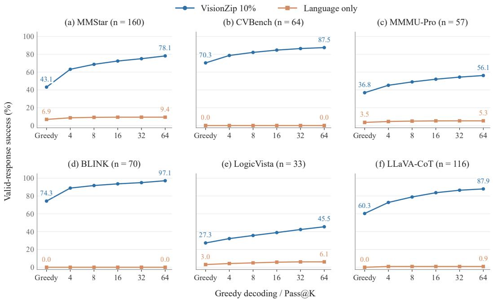  
Figure 4: Recoverability under aggressive visual-token pruning. We report greedy and Pass@K performance $( K \in \{ 4 , \bar { 8 } , 1 6 , 3 2 , 6 \bar { 4 } \}$ ) across the six sources in our 500-example diagnostic set. VisionZip retains 10% of visual tokens, while the language-only control receives no visual input. Performance consistently improves with sampling under the fixed sparse context, whereas the languageonly control remains near zero.

## A EXPANDED FIXED-CONTEXT PASS@K ANALYSIS

Diagnostic set. We construct a frozen diagnostic set of 500 free-form numerical image–question pairs from MMStar, CVBench, MMMU-Pro, BLINK, LogicVista, and LLaVA-CoT, containing 493 distinct images. For multiple-choice datasets, we remove the answer options only when the remaining question has an independently meaningful numerical answer. The reference answer is retained for evaluation but is never provided during generation. The set contains 160, 64, 57, 70, 33, and 116 examples from the six sources, respectively, and should be viewed as a controlled diagnostic rather than official benchmark evaluation. The cohort is selected from examples associated with successful unpruned greedy generations.

Generation setup. We use the unadapted Qwen2.5-VL-7B-Instruct model throughout this analysis. For the sparse condition, VisionZip retains 10% of visual tokens (5% dominant and 5% contextual tokens with contextual merging). For each example, the pruned visual representation is computed once and held fixed across all generations. Thus, repeated samples differ only in the language-generation trajectory, not in which visual tokens are retained.

We generate 64 stochastic responses per example using temperature 0.7, top-p = 0.95, top-k = 50, a maximum of 1024 new tokens, and no repetition penalty. Greedy responses are generated separately with sampling disabled. We additionally evaluate a language-only control using the identical textual input and decoding setup but with the image and visual placeholder removed.

Prompt. All conditions use the default system message You are a helpful assistant. For each question, we append the same reasoning instruction used in our main evaluation:

{question}   
First output the thinking process in <think> </think> tags   
and then output   
the final answer in <answer> </answer> tags.

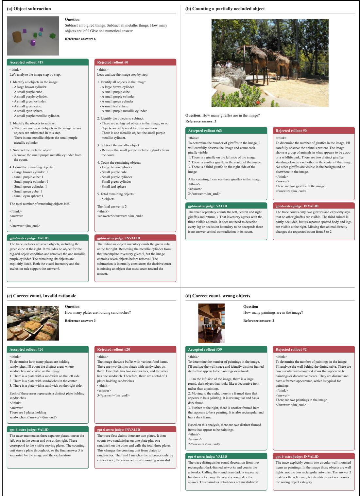  
Figure 5: Examples of reasoning-aware validity judgments. Four sampled trajectories illustrate cases where answer correctness alone can miss unsupported or visually inconsistent reasoning, motivating our GPT-based validity judge.

The language-only control uses exactly the same textual prompt.

Reasoning-aware validity evaluation. Answer matching alone can overestimate recovery when the final answer is correct but the reasoning relies on an incorrect visual observation, invalid operation, or unsupported guess. We therefore use $\mathtt { g p t - 6 - a s t r a }$ with reasoning effort set to max as a semantic validity judge. For each generation, the judge receives the original image, question, reference answer, and complete model response, and verifies both answer correctness and whether the decisive observations and operations are supported by the available evidence. Unsupported guesses and answer-critical hallucinations are rejected, while uncertain cases are conservatively counted as failures. Fig. 5 illustrates representative successful and failed trajectories, including cases where the final answer alone would not reliably indicate whether the reasoning is valid.

The judge prompt is:

Inspect the original image, question, reference answer, and complete response.

Accept a correct answer whose decisive facts and operations are supported.

Allow errors or omissions that do not affect the answer or its essential basis.

Reject answer-critical hallucinations, wrong operations, and unsupported guesses.

Do not reject text-only solutions if the question itself supplies enough evidence.

If validity cannot be established, retain an uncertain label.

Pass@K metric. Let $c _ { i }$ denote the number of valid responses among the 64 stochastic generations for example i. We use the standard Pass@K estimator Chen et al. (2021):

$$
{ \widehat { \mathrm { P a s s @ } K } } = { \frac { 1 } { N } } \sum _ { i = 1 } ^ { N } \left[ 1 - { \frac { \binom { 6 4 - c _ { i } } { K } } { \binom { 6 4 } { K } } } \right] .\tag{10}
$$

Greedy accuracy is computed from a separately generated deterministic response and is therefore distinct from sampled Pass@1. We additionally report $\mathrm { H i t } _ { \geq 4 } @ 6 4$ , the fraction of examples for which at least four of the 64 generations are valid, as a stricter measure of repeated recoverability.

Results and robustness. As shown in Figs. 1b and 4, with the visual representation fixed at VisionZip 10%, performance rises from 53.20% under greedy decoding to 79.60% at Pass@64, while $\mathrm { H i t } { > } _ { 4 } @ 6 4$ reaches 74.20%. In contrast, the language-only control increases only from 2.80% to 4.20%. These results support our central diagnostic claim: many failures under aggressive pruning remain recoverable from the same sparse visual representation rather than requiring a different pruning outcome.

## B ADDITIONAL ANALYSIS OF VISUALLY SENSITIVE TOKENS

As discussed in Sections 3.2 and 3.3, large teacher–student KL divergence does not necessarily indicate that a reasoning position depends on visual evidence. In practice, high-KL positions can arise from purely language-based variation, such as capitalization, paraphrases, alternative but equivalent wording, or other response-format differences. In such cases, the student and teacher may disagree strongly even though the underlying visual evidence is not the source of the discrepancy. Similar studies have been done on language modeling Armandpour et al. (2026).

Figure 6 provides additional examples of this phenomenon. Across these samples, some positions have high teacher–student KL but remain largely unchanged under our visual-budget intervention, indicating low visual sensitivity. These cases illustrate why disagreement alone can be a noisy proxy for useful visual supervision. By contrast, our intervention-based sensitivity signal is more selective: it highlights positions whose predictions actually respond to additional visual evidence, and therefore better matches the goal of identifying where privileged visual supervision is most useful.

## C TRAINING AND EVALUATION DETAILS

This section provides the full training, data, and evaluation configuration used throughout our experiments.

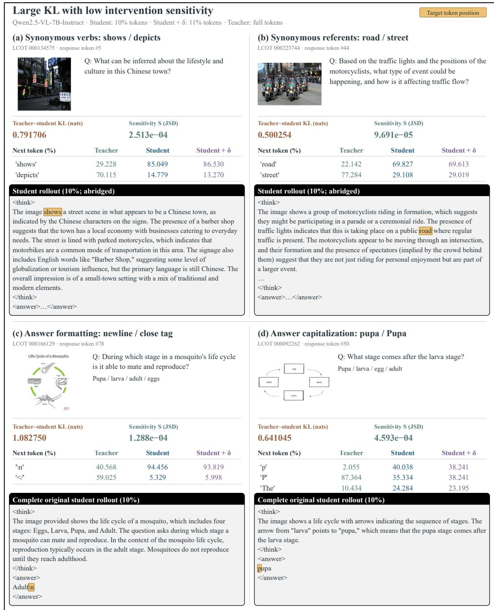  
Figure 6: High teacher–student KL does not always imply visual relevance. Language-level differences can produce large KL despite low visual sensitivity.

Base models and visual-token pruning. Unless otherwise stated, all experiments use Qwen2.5- VL-7B-Instruct Bai et al. (2025b). Our default pruning operator is VisionZip Yang et al. (2025), with a training-time retention budget of b = 10%. VisionZip combines attention-derived token importance with contextualized visual features. In our ablations, we additionally evaluate DivPrune Alvar et al. (2025) as a diversity-based pruning strategy, Random pruning as a control, and FastV Chen et al. (2024a) as a representative in-LLM, query-aware pruning method. We also study transfer to Qwen3-VL-4B Bai et al. (2025a). Unless otherwise specified, the vision encoder and multimodal projector remain frozen, and only the language model is adapted.

VisionZip. VisionZip is a training-free and text-agnostic compression method that reduces redundancy in the visual sequence before it is consumed by the language model. Given the visual tokens produced by the vision encoder, VisionZip first identifies a set of dominant tokens according to their self-attention importance. For vision encoders without a dedicated [CLS] token, token importance is estimated by the average attention received from the other visual tokens. The highest-scoring tokens are retained directly, as they tend to aggregate a large fraction of the visual information. The remaining non-dominant tokens are then grouped according to similarity in the vision encoder’s key-feature space and merged into a smaller set of contextual tokens, preserving complementary information that may not be captured by the dominant tokens. The resulting dominant and contextual tokens together form the compressed visual sequence supplied to the multimodal projector and language model.

We denote the visual-token retention ratio by b, defined relative to the visual sequence after image preprocessing and the 1280-token cap. For example, b = 10% retains approximately one tenth of the available visual tokens, whereas b = 100% corresponds to the unpruned visual context. Unless otherwise specified, training is performed at $b = 1 0 \%$ , while evaluation additionally considers larger token budgets to measure robustness across pruning levels. Because VisionZip performs token selection using only the visual representation and does not depend on the question or generated text, the retained visual context remains fixed throughout an autoregressive reasoning trajectory.

Training data. We post-train on 10K examples derived from LLaVA-CoT Xu et al. (2025). We use the processed version introduced by OpenMMReasoner Zhang et al. (2026a), which converts the original data into a consistent reasoning format with explicit <think>...</think> and <answer>...</answer> fields. During training, images are capped at 1280 visual tokens before pruning. The dataset provides image–question pairs together with reference answers and reasoning traces, which are used by supervised baselines such as SFT and EPIC Wen et al. (2026b) when required. In contrast, SCOPD and SCOPD+ use only the input image and question; supervision is obtained online from the full-context teacher and therefore requires no ground-truth answer or reasoning traces.

Reasoning format. All post-training and evaluation runs use the same reasoning format. The model is prompted to produce a reasoning trace enclosed by <think>...</think>, followed by its final prediction inside <answer>...</answer>. Accordingly, a “trajectory” in our formulation refers to the autoregressively generated reasoning sequence together with the final answer. For SCOPD and SCOPD+, these trajectories are generated on-policy by the sparse-context student, while the full-context teacher scores the same student-generated prefixes.

Post-training configuration. All methods use LLM-only LoRA with rank r = 16, scaling factor α = 32, and zero dropout. LoRA adapters are applied to the attention and feed-forward projections of all language-decoder layers, while the vision encoder and multimodal projector remain frozen. Unless otherwise specified, we use a constant learning rate of $2 \times 1 0 ^ { - 5 }$ and an effective batch size of 32 across four GPUs. All methods are trained from the same Qwen2.5-VL-7B-Instruct initialization on the same training examples.

SFT, SCOPD, and SCOPD+ use VisionZip Yang et al. (2025) at 10% visual-token retention during training. EPIC Wen et al. (2026b) follows its original progressive retention schedule and combined supervised/distillation objective under the same base model and LoRA configuration. For SCOPD and SCOPD+, the teacher is an exponential moving average of the student parameters with decay 0.9999. For SCOPD+, we retain the top $\rho = 0 . 1$ fraction of response positions according to visual sensitivity. The intervention context is constructed by slightly increasing the available visual-token budget, as described in Section 3.3. LoRA adapters are merged into the base model before evaluation.

Baselines. We compare against baselines that isolate different ways of adapting a VLM to sparse visual context. Vanilla is the pretrained model evaluated under pruning without post-training, measuring degradation from visual-token compression alone. SFT is fine-tuned on the same 10% sparse visual context using reference reasoning traces and answers, testing whether conventional supervised adaptation is sufficient. EPIC Wen et al. (2026b) is a compression-aware baseline based on progressive consistency distillation. GRPO is an RLVR-style on-policy baseline that generates groups of reasoning trajectories from the same sparse visual context and optimizes them using outcome-based rewards; full training details are provided in Appendix E.

For the token-selection ablations, we additionally compare against random selection, positions with the largest teacher–student KL divergence, TIP Xu et al. (2026), and the lowest-sensitivity positions as a negative control. These baselines test whether the gains of SCOPD+ arise from sparse back propagation, generic teacher–student disagreement, or specifically from sensitivity to visual context.

Image benchmarks. Our main image evaluation comprises 13 benchmarks spanning complementary vision–language capabilities: MME Fu et al. (2025a), MMStar Chen et al. (2024b), Math-Vista Lu et al. (2024), MathVerse-VO Zhang et al. (2024a), MMMU-Pro Yue et al. (2025), HallusionBench Guan et al. (2024), CVBench Tong et al. (2024), LogicVista Xiao et al. (2024), BLINK Fu et al. (2024), VisOnlyQA Kamoi et al. (2024), HR4K Wang et al. (2025), RealWorldQA xAI (2024), and MME-Realworld-Lite Zhang et al. (2025b). Together, these benchmarks cover general perception, hallucination, spatial and fine-grained visual understanding, mathematical and logical reasoning, high-resolution perception, and real-world visual reasoning.

Video benchmarks. To test whether sparse-context adaptation extends beyond static images, we additionally evaluate on five video benchmarks: VideoMME Fu et al. (2025b), MLVU Zhou et al. (2025), TempCompass-MCQ Liu et al. (2024), MVBench Li et al. (2024a), and Video-TT Zhang et al. (2025c). These benchmarks cover general video understanding, temporal reasoning, long-form video understanding, and video perception.

Evaluation protocol. All methods are evaluated with the same reasoning prompt and decoding configuration using VLMEvalKit Duan et al. (2024). For image benchmarks, inputs are capped at 4096 visual tokens. For video benchmarks, we uniformly sample 32 frames and allow up to 12,288 visual tokens per video. We use greedy decoding and append the following reasoning-inducing instruction to each question:

{question}   
First output the thinking process in <think> </think> tags   
and then output   
the final answer in <answer> </answer> tags.

After generation, we extract the content of the <answer>...</answer> field and compare it with the benchmark reference. Because reasoning models can produce semantically equivalent answers with different surface forms, we use Qwen3.6-27B Qwen Team (2026) as an answer-matching judge when direct matching is ambiguous. The judge receives the question, reference answer, and model prediction and determines whether the final answer is semantically correct. It is used only for answer normalization and correctness matching, not to evaluate the generated reasoning trace.

## D EXTREME COMPRESSION AT 5% VISUAL-TOKEN RETENTION

To test whether sparse-context adaptation remains effective beyond the pruning budgets considered in the main experiments, we evaluate an extreme setting that retains only 5% of the original visual tokens. Table 7 reports results on eight representative image benchmarks, with Avg8 normalized to the corresponding unpruned Vanilla performance.

At this budget, VisionZip substantially degrades the Vanilla model, reducing Avg to 75.99%. SCOPD recovers the aggregate to 83.63%, while SCOPD+ reaches 83.66%. The improvements are broad across benchmarks: SCOPD is particularly effective on MME, MMStar, MathVista, and VisOnlyQA, while SCOPD+ performs best on HallusionBench, CVBench, LogicVista, and Real-WorldQA. These results show that adapting the language model remains beneficial even when 95% of the visual tokens are removed, although the remaining gap to the unpruned model also highlights the limits of recovering from increasingly severe information loss.

Table 7: Performance under extreme visual-token pruning. Results at 5% token retention; Avg8 is normalized to the unpruned Vanilla model.
<table><tr><td>Method</td><td>Retention</td><td>MME</td><td>MMStar</td><td>MathVista</td><td>Hallusion</td><td>CVBench LogicVista</td><td></td><td>VisOnlyQA</td><td>RealWorldQA</td><td>Avg8</td></tr><tr><td>Vanilla</td><td>100%</td><td>2250.63</td><td>64.27</td><td>66.70</td><td>66.25</td><td>75.19</td><td>47.87</td><td>44.70</td><td>64.97</td><td>100.00%</td></tr><tr><td>Vanilla</td><td>5%</td><td>1789.51</td><td>46.53</td><td>39.40</td><td>51.10</td><td>63.53</td><td>31.54</td><td>39.30</td><td>52.94</td><td>75.99%</td></tr><tr><td>SCOPD (Ours)</td><td>5%</td><td>2086.28</td><td>52.80</td><td>50.20</td><td>55.63</td><td>67.00</td><td>33.56</td><td>40.96</td><td>54.64</td><td>83.63%</td></tr><tr><td>SCOPD+ (Ours)</td><td>5%</td><td>2076.02</td><td>52.00</td><td>47.70</td><td>57.20</td><td>68.28</td><td>34.23</td><td>40.35</td><td>55.69</td><td>83.66%</td></tr></table>

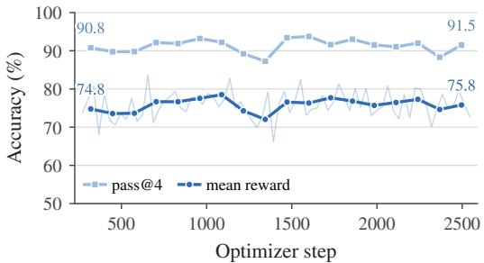  
(a) Accuracy of sampled responses.

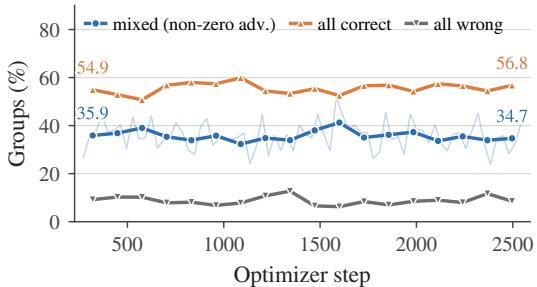  
(b) Composition of the G = 4 groups.

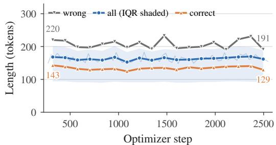  
(c) Response length.

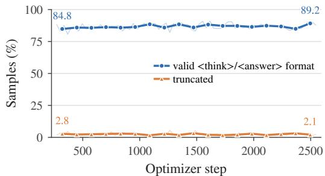  
(d) Format compliance and truncation.  
Figure 7: Training dynamics of the GRPO baseline. Each point is a 128-step window; faint lines are 32-step windows. Accuracy is exact match on the prompts with a checkable answer (multiple choice, numeric, yes/no; 65% of prompts). (a) Mean accuracy and Pass@4 are flat at ≈76% and ≈91%. (b) Only ≈35% of groups contain both correct and incorrect responses and thus receive a non-zero advantage; ≈55% are already all correct. (c) Mean length stays at ≈160 tokens (shaded: interquartile range); incorrect responses are consistently longer than correct ones. (d) Format com pliance improves slightly (84.8% → 89.2%); truncation stays below 3%.

## E GRPO DISCUSSIONS

We train the same base model with GRPO Shao et al. (2024) on the training prompts, using the R1-style <think>/<answer> format. Each optimizer step samples $G = 4$ responses for one prompt per GPU on 4 GPUs (16 responses per step); rewards are assigned by a Qwen2.5-7B judge, and advantages are normalized within each group. A 2,500-step run takes about 30 hours. Figure 7 shows the training dynamics. Accuracy, Pass@4, and response length do not change over training, and only format compliance improves. The reason is visible in Figure 7b: with $G = 4$ , the base model already answers all four samples correctly for over half of the prompts, so these groups have zero advantage and contribute no gradient. The learning signal is confined to the roughly one third of groups with mixed outcomes, which is too little to move the policy within our compute budget. Larger groups or harder prompts could raise the fraction of informative groups, but at a proportionally higher cost per step.

## F GROUND-TRUTH-AUGMENTED DISTILLATION

Ground-truth supervision for the teacher. Our default SCOPD and SCOPD+ require no ground-truth answers or reasoning traces: the sparse-context student generates trajectories on-policy, and the full-context teacher provides token-level supervision on the same prefixes. We additionally test whether privileged ground-truth information can further strengthen this supervision when labels are available. In this variant, the student rollout remains unchanged, but the full-context teacher is additionally provided with the ground-truth answer when scoring the student-generated trajectory. We evaluate this augmentation with SCOPD only and do not combine it with the selective SCOPD+ objective.

Table 8: Ground-truth-augmented SCOPD. The full-context teacher is additionally provided with the ground-truth answer, while student trajectories remain on-policy. $\mathbf { A v g } _ { 1 3 }$ is normalized to the unpruned Vanilla model.
<table><tr><td>Method</td><td>MME</td><td colspan="10">MMStar MathVista MathVerse MMMU-Pro Hallusion CVBench LogicVista BLINK VisOnly HR4K MME-RW RWQA</td></tr><tr><td colspan="10">Full Visual Context (100% Tokens)</td><td colspan="7"></td></tr><tr><td>SCOPD</td><td>2322.58</td><td>64.20</td><td>68.00</td><td>43.02</td><td>45.49</td><td>68.14</td><td>73.20</td><td>47.20</td><td>56.71</td><td>45.65</td><td>64.62</td><td></td><td>47.68</td><td>67.58</td><td>100.67</td></tr><tr><td>SCOPD + GT</td><td>2434.38</td><td>66.27</td><td>69.00</td><td>43.40</td><td>47.57</td><td>67.09</td><td>77.46</td><td>44.30</td><td>56.97</td><td>44.09</td><td></td><td>69.25</td><td>50.65</td><td>67.32</td><td>102.43</td></tr><tr><td colspan="10">Retain 10% Visual Tokens</td><td colspan="7"></td></tr><tr><td>SCOPD</td><td>2201.28</td><td>58.60</td><td>60.60</td><td>30.46</td><td>42.95</td><td>60.46</td><td>72.65</td><td>34.68</td><td>52.81</td><td></td><td>42.09</td><td>63.75</td><td>41.84</td><td>64.31</td><td>90.49</td></tr><tr><td>SCOPD + GT</td><td>2318.36</td><td>60.67</td><td>60.60</td><td>29.44</td><td>43.76</td><td>59.41</td><td>74.17</td><td>38.26</td><td>52.92</td><td>42.35</td><td>68.38</td><td></td><td>44.76</td><td>65.10</td><td>92.86</td></tr></table>

Table 8 shows that ground-truth-augmented SCOPD improves $\mathbf { A v g } _ { 1 3 }$ from 90.49 to 92.86 at 10% visual-token retention. The improvement also persists with the full visual context, where performance increases from 100.67 to 102.43. Thus, privileged ground-truth answers can provide complementary supervision beyond full visual context alone. Importantly, this variant changes the supervision assumptions and is therefore not used as our default: the main SCOPD and SCOPD+ results remain fully independent of ground-truth answers or reasoning traces.

## G COMPUTE

Compute and memory measurement. We measure the additional cost introduced by the visualbudget intervention in SCOPD+ relative to dense SCOPD. Measurements are collected on a single NVIDIA L40 GPU using a batch size of 32. FLOPs and wall-clock time are normalized per sample, while peak GPU memory denotes the maximum memory allocated during the batched run.

SCOPD requires 54.25 TFLOPs and 17.21 s per sample, with a peak GPU memory of 25.02 GiB. SCOPD+ increases compute to 65.84 TFLOPs per sample (+21.4%), reflecting the additional forward pass used to estimate visual sensitivity. Despite this increase in theoretical compute, measured wall-clock time rises only to 17.54 s per sample (+1.9%), while peak memory changes negligibly to 25.13 GiB (+0.4%). Thus, the intervention adds moderate training-time compute but little addi tional latency or peak memory in our implementation. With our LoRA setup, full post-training on four NVIDIA L40 GPUs takes approximately 14 hours.

Inference cost and response length. Both SCOPD and SCOPD+ are post-training methods: the visual-budget intervention and privileged teacher are removed at inference, and the deployed model uses the same architecture and sparse visual context as the underlying pruned VLM. To check whether adaptation indirectly increases decoding cost by producing substantially longer reasoning trajectories, we measure the mean number of generated tokens over the 500 examples used in our fixed-context Pass@K analysis. The unpruned Vanilla model generates 155.27 tokens on average, compared with 153.00 for SCOPD and 155.70 for SCOPD+. Thus, our methods do not induce longer-than-base reasoning trajectories. For reference, VisionZip at 10% retention generates 143.93 tokens on average, while SFT and EPIC generate 111.25 and 123.48 tokens, respectively.

Table 9: Training overhead and response length. Compute measurements use batch size 32 on a single NVIDIA L40 GPU. TFLOPs and time are reported per sample; peak memory is measured over the full batch.
<table><tr><td>Method</td><td>TFLOPs / Sample</td><td>Time / Sample</td><td>Peak Memory</td></tr><tr><td>SCOPD</td><td>54.25</td><td>17.21 s</td><td>25.02 GiB</td></tr><tr><td>SCOPD+</td><td>65.84</td><td>17.54 s</td><td>25.13 GiB</td></tr></table>

<table><tr><td>Method</td><td>Mean Output Tokens</td></tr><tr><td>Vanilla (No Prune)</td><td>155.27</td></tr><tr><td>VisionZip 10%</td><td>143.93</td></tr><tr><td>SFT</td><td>111.25</td></tr><tr><td>EPIC</td><td>123.48</td></tr><tr><td>SCOPD</td><td>153.00</td></tr><tr><td>SCOPD+</td><td>155.70</td></tr></table>