# STILL THERE, NO LONGER SEEN: EXPOSING COMPRESSION-INDUCED RISK IN LARGE VISION-LANGUAGE MODELS

Qiankun Li1∗ Yuechen Zhang2∗ Bowen Chen2 Shilinlu Yan2

Zhenhong Zhou1 Kun Wang1† Li Sun2†

1Nanyang Technological University

2Beijing University of Posts and Telecommunications

{cs-qiankun.li,wang.kun}@ntu.edu.sg orange.zhangyc05@gmail.com zhenhong001@e.ntu.edu.sg {cbcbw,lulu\_land,lsun}@bupt.edu.cn

## ABSTRACT

Visual token compression reduces the inference cost of Large Vision-Language Models (LVLMs). However, aggregate robustness measures do not reveal whether a particular adversarial failure is induced by compression or inherited from the underlying model. We define a compression-specificfailure (CSF) as an adversarial input that remains correct under full-token inference but fails after compression, casting compression-induced risk as a paired failure attribution problem. Within a controlled diagnostic cohort, counterfactuals show that retained-set allocation causally changes compressed correctness and reveal a negative association between recovery and representation drift in displaced evidence. Motivated by these findings, we propose CIRA, a Compression-Induced Risk Attack for Large Vision-Language Models. Under a vision-encoder white-box setting, CIRA optimizes image perturbations through encoder-side objectives that manipulate token priorities across candidate compression budgets while preserving displaced evidence. CIRA uses no downstream questions or labels and requires no access to the language model, deployed compressor, or exact compression budget. Across 12 dataset–compressor settings evaluated at four budgets, CIRA achieves a mean CSFR of 20.35% while limiting full-token attack success to 6.92%, with similar behavior on additional LVLM families. A cross-view selection-stabilization defense substantially suppresses CIRA, although Adaptive CIRA partially restores its effectiveness. These results show that compression-specific failures persist under restricted access and support paired evaluation of full-token and compressed inference for attributing risk to visual-token compression. Code is provided in the Github.

## 1 INTRODUCTION

Large Vision-Language Models (LVLMs) support broad visual understanding by mapping images to long visual-token sequences (Alayrac et al., 2022; Li et al., 2023a; Liu et al., 2024b). Visual-token compression reduces this inference cost through token selection, aggregation, and compact visual representations (Shang et al., 2025; Yang et al., 2025b; Li et al., 2025; Bulat et al., 2026). Decoderside methods further reduce visual-token computation within the language model (Chen et al., 2024; Zhang et al., 2024; Xing et al., 2024). Meanwhile, adversarial attacks show that failures can be induced in the underlying LVLM through image-space or joint-modal perturbations (Zhang et al., 2022; Schlarmann & Hein, 2023; Yin et al., 2023). This raises the question: what risks are induced by visual-token compression itself, beyond vulnerabilities already present in the underlying LVLM?

When a full-token LVLM is used for robustness assessment while a compressed variant is deployed, failures confined to the compressed path are not captured by that assessment. We therefore evaluate each adversarial input with and without token compression. A compression-specific failure (CSF)

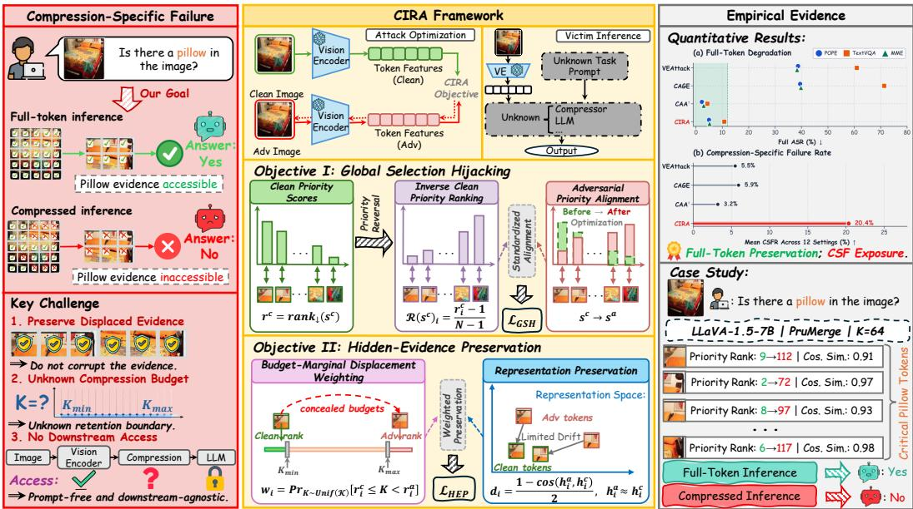  
Figure 1: Overview of the compression-specific failure setting, the CIRA attack framework and the resulting behavior under visual-token compression.

occurs when full-token inference remains correct but compressed inference fails. This paired criterion distinguishes failures introduced by compression from those already present in the underlying LVLM.

Recent studies increasingly examine robustness under visual-token compression. Evidence shows that compression can reshape robustness in either direction, depending on how visual evidence is selected and retained (Wang et al., 2026a; Gu et al., 2026). Compression-aware attacks further demonstrate that adversarial behavior can depend on the compression path itself (Zhang et al., 2026c;a). These developments shift the question from whether compression affects robustness to which adversaria failures can be attributed specifically to compression and whether they can be selectively induced under deployment uncertainty. Specifically, can a single perturbation optimized through the target vision encoder preserve full-token correctness while inducing compressed-path failures when the deployed compressor and budget are unknown during optimization?

To understand what governs this selectivity, we use controlled counterfactuals to isolate two factors. Retained-set interventions causally change compressed correctness by altering which visual evidence remains accessible after compression. Meanwhile, recovery is negatively associated with representation drift in displaced evidence. These results directly inform the attack design: reallocate token priority while preserving displaced evidence.

In this direction, we introduce CIRA (Compression-Induced Risk Attack), an attack framework for inducing compression-specific failures. As illustrated in Figure 1, CIRA combines Global Selection Hijacking (GSH), which globally reallocates encoder-side proxy priorities, with Hidden-Evidence Preservation (HEP), which limits representation drift in displaced clean high-priority tokens. With white-box access restricted to the vision encoder, CIRA uses no downstream questions or labels and requires no access to the language model, deployed compressor, or exact compression budget. Across four compressors, three datasets, four budgets, and multiple LVLMs, CIRA induces compression-specific failures while keeping full-token degradation limited. We also introduce Translation-Consensus Selection (TCS), a cross-view selection-stabilization defense, and evaluate it against both standard and adaptive CIRA.

Our contributions are threefold:

❶ Compression Risk Attribution. We formulate compression-induced risk through a cleanconditioned paired CSF criterion and show that retained-set allocation causally affects compressed correctness while recovery decreases with representation drift.

❷ Compression-Induced Risk Attack. We introduce CIRA, a target-encoder-only attack that combines priority reallocation with evidence preservation and induces paired CSFs across compressor– budget settings without configuration-specific optimization.

❸ Comprehensive Evaluation and Analysis. We evaluate CIRA across four compressors, three datasets, four budgets, and multiple LVLM families, with mechanistic evidence of global priority reallocation and limited representation drift in displaced evidence. We also test TCS as a selection stabilization defense against both standard and adaptive CIRA.

## 2 RELATED WORK

Visual token compression. Token-selection methods exploit visual cues, diversity, and salience– coverage objectives (Zhang et al., 2025b; Alvar et al., 2025; Xu et al., 2026), while learned pruning addresses limitations of attention-based importance estimates (Takezoe et al., 2026). Hybrid methods combine pruning with clustering and merging (Endo et al., 2025; Dhouib et al., 2025; Yang et al., 2025a). Query-conditioned methods use textual instructions for token scoring or aggregation (Yu et al., 2026; Gao et al., 2026; Sun et al., 2026). Adaptive and progressive methods vary token reduction across inputs and layers (Ye et al., 2025; Chen et al., 2026; Li et al., 2026a), while video and multi-turn approaches address temporal redundancy and evolving context (Wang et al., 2025a; Shen et al., 2024; Li et al., 2026b; Wang et al., 2026c).

Adversarial robustness of vision-language models. Transfer-based attacks exploit set-level guidance, prompt-robust objectives, and iterative multimodal alignment (Lu et al., 2023; Luo et al., 2024; Liu et al., 2024a; Xie et al., 2025). Encoder-based and self-supervised attacks support cross-task and cross-model transfer (Zhang et al., 2025a; Hu et al., 2025; Zhang et al., 2026b). VEAttack disrupts visual representations (Mei et al., 2026b), while PA-Attack uses prototype-guided gray-box attacks (Mei et al., 2026a). Defenses include adversarial encoder fine-tuning (Schlarmann et al., 2024) and adversarial pre-training and instruction tuning (Wang et al., 2025c). Test-time defenses use prompt adaptation and augmented-view consistency (Sheng et al., 2025; Liu et al., 2025).

Robustness under visual token compression. Visual-token compression introduces distinct robustness risks and defense opportunities. Safety-Aware Pruning (SAP) (Wang et al., 2026a) mitigates pruning-induced vulnerabilities, while robustness-oriented pruning (Gu et al., 2026) removes visually misaligned tokens. On the attack side, CAGE (Zhang et al., 2026c) targets tokens expected to survive unknown compression settings. CAA (Zhang et al., 2026a) directly manipulates token-selection rankings, with white-box attacks tailored to known compression configurations and transfer attacks using surrogate models. Our focus is on selectively inducing compression-specific failures under encoder-only access, without knowledge of the deployed compressor or budget.

## 3 DIAGNOSING COMPRESSION-SPECIFIC FAILURES

In this section, we investigate why adversarial inputs can fail only after compression and use controlled diagnostics to inform the design of CIRA.

## 3.1 PROBLEM SETUP AND COMPRESSION-SPECIFIC FAILURE

Let C denote a visual-token compressor and K its compression budget. For a dataset $\mathcal { D } =$ $\{ ( x _ { i } , q _ { i } , y _ { i } ) \} _ { i = 1 } ^ { M }$ , let $f _ { \boldsymbol { \theta } } ( x _ { i } , q _ { i } )$ and $f _ { \theta } ^ { \mathcal { C } , K } ( x _ { i } , q _ { i } )$ denote full-token and compressed inference, respectively. Given a task-specific binary evaluator $\chi ( \hat { y } , y ) \in \{ 0 , 1 \}$ , we define

$$
c _ { i } ( x ) = \chi ( f _ { \theta } ( x , q _ { i } ) , y _ { i } ) , \qquad c _ { i , \mathcal { C } , K } ( x ) = \chi \Bigl ( f _ { \theta } ^ { \mathcal { C } , K } ( x , q _ { i } ) , y _ { i } \Bigr ) .
$$

For a fixed ${ \mathcal { C } } ,$ , we write $c _ { i , K } ( x ) \equiv c _ { i , \mathcal { C } , K } ( x )$ and omit the compressor subscript below.

For each compression budget K, we restrict evaluation to samples for which both full-token and compressed inference produce correct answers before attack:

$$
\begin{array} { r } { \mathcal { S } _ { K } = \left\{ i \ : | \ : c _ { i } ( x _ { i } ) = 1 , \ : c _ { i , K } ( x _ { i } ) = 1 \right\} . } \end{array}\tag{1}
$$

A compression-specificfailure (CSF) occurs when an adversarial input remains correct under fulltoken inference but fails after compression:

$$
\mathcal { F } _ { K } ^ { \mathrm { C S F } } = \left\{ i \in \mathcal { S } _ { K } ~ \middle \vert ~ c _ { i } ( x _ { i } ^ { \mathrm { a d v } } ) = 1 , ~ c _ { i , K } ( x _ { i } ^ { \mathrm { a d v } } ) = 0 \right\} .\tag{2}
$$

Aggregate accuracy can obscure instance-level prediction changes introduced by VLM acceleration (Sun et al., 2025). Our paired definition focuses on adversarial inputs that remain correct under full-token inference but fail after compression.

## 3.2 RETAINED-SET ALLOCATION AND COMPRESSED CORRECTNESS

Diagnostic setting. We test whether retained-set allocation can change compressed correctness while the adversarial encoder state and compression capacity remain fixed. LLaVA–VisionZip exposes direct-token membership, providing a controlled interface for retained-set intervention. From each downstream-agnostic VEAttack trajectory, we retain the earliest checkpoint satisfying the CSF criterion, termed afirst-observed CSF.

Counterfactual intervention. For each CSF, we exchange equal numbers of retained and omitted direct tokens, reconstruct compression, and rerun inference at the same encoder state and capacity. A post-hoc answer-aware oracle selects the exchanged token identities (Appendix C).

Recovery criteria. Let $\rho$ denote the fraction of exchanged direct-token slots. We compare guided reallocation with a size-matched random exchange. Cumulative recovery credits correction at any tested $\rho ^ { \prime } \leq \rho ,$ whereas exact recovery uses only $\rho .$

✰ Observation 1: Controlled retained-set reallocation changes compressed correctness. Figure 2 shows that guided recovery exceeds matched-random recovery for every tested budget–fraction pair with $\rho > 0$ , with an average advantage of 22.5–24.1 pp across the 12 dataset– budget cells. With encoder state, capacity, and exchange size fixed, the contrast shows that robustness depends on token identity, not only on retention count.

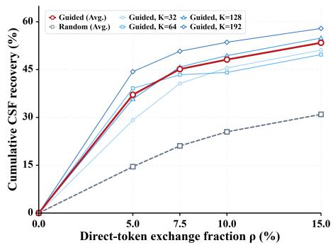

## 3.3 RETAINED-SET ALLOCATION

COMPONENTS AND REPRESENTATION DRIFT

Having established retained-set allocation sensitivity, we next separate restoration from removal and ask when restored evidence remains useful.

Figure 2: Cumulative CSF recovery under guided and matched-random retained-set exchanges across direct-token exchange fractions.

Observations 2–3 use $\rho ^ { * } = 7 . 5 \%$ as a shared intermediate diagnostic point, where guided and random recovery are already clearly separated. Representation drift is the restored tokens’ mean half-cosine distance, $[ 1 - \cos ( \dot { \mathbf { h } } ^ { c } , \mathbf { h } ^ { a } ) ] / 2$ , between their clean and adversarial representations; Table 1(b) reports this distance multiplied by 100.

✰ Observation 2: Recovery depends on what is restored and removed. Table 1(a) decomposes guided reallocation into restoring omitted tokens with high retrospective answer support and removing retained tokens with low support; larger scores indicate stronger support for the reference answer. Exact recovery rises from 17.4% under matched random exchange to 42.0% under guided reallocation. Both restoration and removal contribute to recovery, with their coordinated use providing the largest gain.

✰ Observation 3: Restoration benefits are smaller under greater representation drift. Table 1(b) shows that evidence restoration is most effective for tokens with limited representation drift: the average effect falls from +20.5 pp in the lower-drift tertile to +10.3 pp in the upper. A within-cell continuous analysis shows the same negative association.

Table 1: Mechanistic diagnostics at $\rho ^ { * } = 7 . 5 \% :$ exact recovery under retained-set interventions (a) and evidence-restoration effects across representation-drift tertiles (b), with construction and aggregation details in Appendix C.  
(a) Retained-Set Counterfactuals
<table><tr><td rowspan="2">Retained-Set Change</td><td colspan="4">Exact Recovery (%)</td><td rowspan="2">Avg.</td></tr><tr><td>K = 192</td><td></td><td>K = 128 K = 64</td><td> $K = 3 2$ </td></tr><tr><td>Random</td><td>17.9</td><td>17.2</td><td>18.4</td><td>16.1</td><td>17.4</td></tr><tr><td>+ Evidence restoration</td><td>31.1</td><td>33.5</td><td>34.0</td><td>34.9</td><td>33.4</td></tr><tr><td>+ Low-support removal</td><td>34.5</td><td>31.9</td><td>25.4</td><td>20.1</td><td>28.0</td></tr><tr><td>Guided reallocation</td><td>46.4</td><td>44.4</td><td>38.5</td><td>38.6</td><td>42.0</td></tr></table>

(b) Association with Representation Drift
<table><tr><td rowspan="2">Drift Tertile</td><td rowspan="2">Mean Drift (%)</td><td colspan="4">Evidence Effect (pp)</td><td rowspan="2">Avg.</td></tr><tr><td>K = 192</td><td>K = 128 K = 64</td><td></td><td> $K = 3 2$ </td></tr><tr><td>Lower</td><td>31.4</td><td>+16.6</td><td>+18.9</td><td>+18.2</td><td>+28.5</td><td>+20.5</td></tr><tr><td>Middle</td><td>39.5</td><td>+15.3</td><td>+12.7</td><td>+7.0</td><td>+20.8</td><td>+14.0</td></tr><tr><td>Upper</td><td>45.2</td><td>+5.4</td><td>+11.5</td><td>+18.0</td><td>+6.1</td><td>+10.3</td></tr><tr><td>Lower-Upper Gap</td><td></td><td>+11.2</td><td>+7.4</td><td>+0.2</td><td>+22.3</td><td>+10.3</td></tr></table>

Design implication. Together, these diagnostics motivate CIRA’s objective: make evidence inaccessible after compression while preserving its utility under full-token inference.

## 4 METHODOLOGY

## 4.1 ATTACK FORMULATION

We consider an untargeted, image-specific attack with white-box access only to the vision encoder. The downstream question, reference answer, language model, compressor, and exact deployed compression budget are unavailable during optimization; the attacker knows only the admissible range ${ \mathcal { K } } = \left\{ K \in { \bar { \mathbb { N } } } : K _ { \operatorname* { m i n } } \leq K \leq K _ { \operatorname* { m a x } } \right\}$

For an evaluation tuple $( x , q , y )$ , the ideal compression-specific outcome is to preserve full-token correctness while causing compressed inference to fail:

$$
\operatorname* { m a x } _ { \| \delta \| _ { \infty } \leq \epsilon } \operatorname* { m i n } _ { K \in K } \mathcal { L } \left( f _ { \theta } ^ { \mathcal { C } , K } ( x + \delta , q ) , y \right) \quad \mathrm { s . t . } \quad c ( x + \delta ) = 1 ,\tag{3}
$$

where $c ( \cdot )$ denotes full-token correctness and L increases with compressed prediction error. Equation 3 defines the desired compression-specific behavior but is not optimized directly. CIRA instead replaces it with compressor-independent encoder-side objectives and evaluates cross-configuration transfer empirically.

## 4.2 GLOBAL SELECTION HIJACKING

Let $s _ { i } ( x )$ denote the encoder-side proxy priority score of visual token $i ,$ where larger values indicate higher retention priority. We collect these scores in the priority-score vector $\mathbf { s } ( x ) \mathbf { \Psi } = \mathbf { \Psi }$ $[ s _ { 1 } ( x ) , \ldots , s _ { N } ( x ) ] \in \mathbb { R } ^ { N }$ , whose descending order defines the priority ranking over tokens. We write $\mathbf { s } ^ { c } = \mathbf { s } ( x )$ and $\mathbf { s } ^ { a } = \mathbf { s } ( x + \delta )$ for the clean and adversarial priority-score vectors, respectively.

We first construct the clean rank, its inverse-priority encoding, and a stabilized standardization operator:

$$
\mathbf { r } ^ { c } = \mathrm { r a n k } _ { \downarrow } ( \mathbf { s } ^ { c } ) , \qquad \mathcal { R } ( \mathbf { s } ^ { c } ) _ { \mathit { i } } = \frac { r _ { \mathit { i } } ^ { c } - 1 } { N - 1 } , \qquad \mathcal { Z } _ { \epsilon _ { s } } ( \mathbf { u } ) = \frac { \mathbf { u } - \bar { u } \mathbf { 1 } } { \operatorname* { m a x } \{ N ^ { - 1 / 2 } \lVert \mathbf { u } - \bar { u } \mathbf { 1 } \rVert _ { 2 } , \epsilon _ { s } \} } .\tag{4}
$$

Here, $\mathbf { r } ^ { c }$ ranks tokens from high to low clean priority, while R maps high-priority tokens near zero and low-priority tokens near one. $\mathcal { Z } _ { \epsilon }$ standardizes its input vector and prevents a degenerate denominator when its variance vanishes.

To drive a global priority inversion, CIRA maximizes the standardized alignment between adversarial priorities and the inverse clean priority ranking:

$$
\mathcal { L } _ { \mathrm { G S H } } ( \delta ) = \mathrm { A l i g n } _ { \epsilon _ { s } } ( \mathbf { s } ^ { a } , \mathcal { R } ( \mathbf { s } ^ { c } ) ) \equiv \frac { 1 } { N } \left. \mathcal { Z } _ { \epsilon _ { s } } ( \mathbf { s } ^ { a } ) , \mathcal { Z } _ { \epsilon _ { s } } ( \mathcal { R } ( \mathbf { s } ^ { c } ) ) \right. .\tag{5}
$$

This differentiable, scale-invariant objective encourages clean high-priority tokens to move downward while promoting clean low-priority tokens.

## 4.3 HIDDEN-EVIDENCE PRESERVATION

Priority reallocation may also perturb the representations of displaced evidence, undermining fulltoken correctness. HEP therefore focuses preservation on clean high-priority tokens that cross candidate retention boundaries. CIRA computes the adversarial descending ranks ${ \bf r } ^ { a } = \mathrm { r a n k } _ { \downarrow } ( { \bf s } ^ { a } )$ and defines $\mathcal { H } _ { K } ( \delta ) = \{ i : r _ { i } ^ { c } \leq K < r _ { i } ^ { a } \}$ , the clean proxy Top-K tokens whose adversarial ranks move beyond the retention boundary at compression budget K. Under an unknown compression budget, their displacement weights are

$$
w _ { i } = \underset { K \sim \mathrm { U n i f } ( K ) } { \operatorname* { P r } } [ i \in \mathcal { H } _ { K } ( \delta ) ] = \frac { [ \operatorname* { m i n } ( K _ { \operatorname* { m a x } } , r _ { i } ^ { a } - 1 ) - \operatorname* { m a x } ( K _ { \operatorname* { m i n } } , r _ { i } ^ { c } ) + 1 ] _ { + } } { K _ { \operatorname* { m a x } } - K _ { \operatorname* { m i n } } + 1 } .\tag{6}
$$

Here, $[ z ] _ { + } = \operatorname* { m a x } ( z , 0 )$ , and $w _ { i }$ is the fraction of admissible budgets under which token i becomes hidden.

To limit representation drift in these tokens, let $\mathbf { h } _ { i } ^ { c }$ and $\mathbf { h } _ { i } ^ { a }$ denote their clean and adversarial visualtoken features. We normalize their directions and measure the resulting representation drift by

$$
\widetilde { \mathbf { h } } _ { i } ^ { c } = \frac { \mathbf { h } _ { i } ^ { c } } { \| \mathbf { h } _ { i } ^ { c } \| _ { 2 } } , \qquad \widetilde { \mathbf { h } } _ { i } ^ { a } = \frac { \mathbf { h } _ { i } ^ { a } } { \| \mathbf { h } _ { i } ^ { a } \| _ { 2 } } , \qquad d _ { i } = \frac { 1 } { 2 } \left( 1 - ( \widetilde { \mathbf { h } } _ { i } ^ { c } ) ^ { \top } \widetilde { \mathbf { h } } _ { i } ^ { a } \right) ,\tag{7}
$$

where the factor $1 / 2$ normalizes cosine distance to [0, 1].

Hidden-Evidence Preservation aggregates these token-level distances using the budget-marginal weights:

$$
\mathcal { L } _ { \mathrm { H E P } } ( \delta ) = - \sum _ { i = 1 } ^ { N } \widetilde { w } _ { i } d _ { i } , \qquad \widetilde { w } _ { i } = \frac { \mathrm { s g } ( w _ { i } ) } { \operatorname* { m a x } \Bigl \{ \sum _ { j = 1 } ^ { N } \mathrm { s g } ( w _ { j } ) , \epsilon _ { h } \Bigr \} } .\tag{8}
$$

The stop-gradient freezes rank-derived weights within an update, while $\epsilon _ { h }$ stabilizes normalization; weights are recomputed at the next update so evidence displaced across more of K receives greater protection.

## 4.4 JOINT OPTIMIZATION

CIRA combines the two objectives as

$$
\operatorname* { m a x } _ { \delta } \quad \mathcal { L } _ { \mathrm { C I R A } } ( \delta ) = \mathcal { L } _ { \mathrm { G S H } } ( \delta ) + \lambda \cdot \mathcal { L } _ { \mathrm { H E P } } ( \delta ) , \qquad \mathrm { s . t . } \quad \| \delta \| _ { \infty } \leq \epsilon .\tag{9}
$$

Here, λ controls the preservation strength. We maximize equation 9 using projected sign-gradient ascent over the valid-image domain. The complete optimization procedure is given in Appendix A.

## 5 EXPERIMENTS

## 5.1 EXPERIMENTAL SETUP

Models and Benchmarks. We evaluate LLaVA-v1.5-7B (Liu et al., 2024b) on 1,000 randomly sampled image–question pairs from each of POPE (Li et al., 2023b), TextVQA (Singh et al., 2019), and MME (Fu et al., 2025), covering object hallucination, scene-text understanding, and general visual perception and reasoning, respectively. We additionally evaluate Qwen3-VL-8B-Instruct (Bai et al., 2025) and InternVL3.5-8B (Wang et al., 2025b).

Compression Settings. We evaluate VisionZip (Yang et al., 2025b), VisPruner (Zhang et al., 2025b), PruMerge (Shang et al., 2025), and FastV (Chen et al., 2024) at $\mathcal { K } _ { \mathrm { e v a l } } = \{ 3 2 , 6 4 , 1 2 8 , \bar { 1 } 9 2 \}$ . For each input, one adversarial image is reused across all compressor–budget settings.

Baselines. We compare CIRA with the downstream-agnostic VEAttack (Mei et al., 2026b) and CAGE (Zhang et al., 2026c); CAA (Zhang et al., 2026a) is reported as a stronger-access reference.

Evaluation Metrics. On the clean-eligible set $\boldsymbol { \mathcal { S } } _ { K }$ defined in Eq. 1, we report the Compression-Specific Failure Rate (CSFR) and full-token attack success rate:

$$
\mathrm { C S F R } _ { K } = \frac { 1 } { \left| { \mathcal S } _ { K } \right| } \sum _ { i \in { \mathcal S } _ { K } } c _ { i } ( x _ { i } ^ { \mathrm { a d v } } ) \left[ 1 - c _ { i , K } \big ( x _ { i } ^ { \mathrm { a d v } } \big ) \right] , \qquad \mathrm { A S R } = \frac { 1 } { \left| { \mathcal S } _ { \mathrm { { t u l l } } } \right| } \sum _ { i \in { \mathcal S } _ { \mathrm { t u l l } } } \left[ 1 - c _ { i } \big ( x _ { i } ^ { \mathrm { a d v } } \big ) \right] .\tag{10}
$$

Table 2: CSFR and Full ASR on LLaVA-v1.5-7B. For downstream-agnostic attacks, red and blue cells mark highest CSFR and lowest Full ASR, and underlining marks second best; CAA† uses the downstream question and language model during optimization and is excluded from the markings.
<table><tr><td rowspan="2">Metric</td><td colspan="3">POPE</td><td rowspan="2"></td><td colspan="3">TextVQA</td><td colspan="4">MME</td></tr><tr><td>VEAttack</td><td>CAGE</td><td>CAA† CIRA</td><td>VEAttack</td><td>CAGE</td><td>CAA†</td><td>CIRA</td><td>VEAttack CAGE</td><td> $\mathbf { C A A ^ { \dagger } }$ </td><td>CIRA</td></tr><tr><td colspan="10">Full-token Inference (Compressor-independent)</td><td></td><td></td></tr><tr><td>Full ASR↓</td><td>38.65</td><td>39.48</td><td>2.72</td><td>4.96 60.95</td><td>71.35</td><td>3.82</td><td>10.61</td><td>38.26</td><td>39.77</td><td>3.41</td><td>5.18</td></tr><tr><td colspan="10">VisionZip</td></tr><tr><td>CSFR@192↑</td><td>4.05</td><td>3.19</td><td>1.72</td><td>7.61</td><td>4.87</td><td>2.14</td><td>11.35</td><td>2.83</td><td>4.04</td><td>1.62</td><td>7.40</td></tr><tr><td>CSFR@128↑</td><td>4.98</td><td>5.72</td><td>2.87</td><td>14.05</td><td>5.32</td><td>2.05</td><td>18.21</td><td>3.33</td><td>5.55</td><td>1.80</td><td>10.26</td></tr><tr><td>CSFR@64↑</td><td>5.05</td><td>9.71</td><td>3.46</td><td>22.47</td><td>6.28</td><td>5.32 6.28 2.39</td><td>27.41</td><td>3.64</td><td>5.97</td><td>2.92</td><td>19.07</td></tr><tr><td>CSFR@32↑</td><td>6.52</td><td>9.48</td><td>4.57</td><td>26.96</td><td>9.76</td><td>5.24 5.01</td><td>31.70</td><td>4.56</td><td>5.19</td><td>2.86</td><td>22.17</td></tr><tr><td>Avg. CSFR↑</td><td>5.15</td><td>7.03</td><td>3.16</td><td>17.77</td><td>6.56</td><td>4.94 2.90</td><td>22.17</td><td>3.59</td><td>5.19</td><td>2.30</td><td>14.73</td></tr><tr><td colspan="10">VisPruner</td></tr><tr><td>CSFR@192↑</td><td>3.42</td><td>3.79</td><td>1.23</td><td>5.87</td><td>2.92</td><td>3.50 1.75 3.40</td><td>10.50</td><td></td><td>2.56</td><td>3.50 1.22</td><td>7.14</td></tr><tr><td>CSFR@128↑</td><td>4.60</td><td>4.35</td><td>2.97</td><td>9.07</td><td>3.80</td><td>2.18</td><td>13.18</td><td>2.88</td><td>4.79</td><td>2.33</td><td>11.23</td></tr><tr><td>CSFR@64↑</td><td>6.27</td><td>7.45</td><td>4.68</td><td>15.29</td><td>5.89</td><td>5.47 4.08</td><td>19.13</td><td>3.33</td><td>5.36</td><td>4.47</td><td>18.70</td></tr><tr><td>CSFR@32↑</td><td>7.59</td><td>10.46</td><td>8.29</td><td>22.21</td><td>8.07</td><td>7.33 4.63</td><td>25.57</td><td>4.13</td><td>5.66</td><td>6.73</td><td>21.87</td></tr><tr><td>Avg. CSFR ↑</td><td>5.47</td><td>6.51</td><td>4.29</td><td>13.11</td><td>5.17</td><td>4.93 3.16</td><td>17.09</td><td>3.22</td><td>4.83</td><td>3.69</td><td>14.73</td></tr><tr><td colspan="10">PruMerge</td></tr><tr><td>CSFR@192↑</td><td>5.33</td><td>3.65</td><td>2.66</td><td>22.86</td><td>6.02</td><td>4.86 3.44 5.35</td><td>28.66</td><td></td><td>2.64</td><td>4.69 1.75</td><td>20.64</td></tr><tr><td>CSFR@128↑</td><td>5.39</td><td>5.54</td><td>2.92</td><td>29.59</td><td>6.51</td><td>4.86</td><td>36.23</td><td>3.62</td><td>5.28</td><td>3.02</td><td>22.93</td></tr><tr><td>CSFR@64↑</td><td>6.96</td><td>9.38</td><td>3.63</td><td>32.53</td><td>8.29</td><td>6.64 4.49</td><td>43.91</td><td>3.50</td><td>5.78</td><td>3.04</td><td>29.98</td></tr><tr><td>CSFR@32↑</td><td>9.40</td><td>11.76</td><td>3.44</td><td>32.29</td><td>9.18</td><td>6.70 5.20</td><td>48.68</td><td>4.06</td><td>5.78</td><td>2.81</td><td>35.16</td></tr><tr><td>Avg. CSFR ↑</td><td>6.77</td><td>7.58</td><td>3.16</td><td>29.32</td><td>7.50 5.89</td><td>4.50</td><td>39.37</td><td>3.45</td><td>5.38</td><td>2.66</td><td>27.18</td></tr><tr><td colspan="10">FastV</td></tr><tr><td>CSFR@192↑</td><td>4.61</td><td>4.74</td><td>2.30</td><td>7.04</td><td>4.29</td><td>4.09 1.43</td><td>9.61</td><td></td><td>2.77</td><td>2.90 1.38</td><td>5.81</td></tr><tr><td>CSFR@128↑</td><td>6.85</td><td>6.59</td><td>2.90</td><td>11.46</td><td>7.10</td><td>5.38 2.15</td><td>13.55</td><td>3.17</td><td>3.89</td><td>1.44</td><td>7.64</td></tr><tr><td>CSFR@64↑</td><td>9.90</td><td>10.47</td><td>3.44</td><td>22.24</td><td>9.11</td><td>7.67 4.08</td><td>23.74</td><td>3.65</td><td>5.18</td><td>2.89</td><td>15.07</td></tr><tr><td>CSFR@32↑ Avg. CSFR ↑</td><td>12.32</td><td>10.40</td><td>4.48</td><td>25.44</td><td>7.80</td><td>8.38 3.76</td><td>32.95</td><td>4.24 3.46</td><td>5.55</td><td>6.20</td><td>20.39</td></tr><tr><td></td><td>8.42</td><td>8.05</td><td>3.28</td><td>16.55</td><td>7.08</td><td>6.38 2.85</td><td>19.96</td><td></td><td></td><td>4.38 2.98</td><td>12.23</td></tr></table>

Here, $S _ { \mathrm { f u l l } } = \{ i : c _ { i } ( x _ { i } ) = 1 \}$ , and Avg. CSFR is the arithmetic mean of $\mathrm { C S F R } _ { K }$ over $K \in \mathcal { K } _ { \mathrm { e v a l } }$ for a fixed dataset–compressor setting. Broader summaries weight each reported dataset–compressor setting equally. CSFR counts post-attack failures confined to the compressed path, normalized over inputs answered correctly by both clean inference paths; ASR is normalized over inputs answered correctly by clean full-token inference. Clean and post-attack accuracy results are reported in Appendix G.

Implementation Settings. We run all experiments on a single NVIDIA GeForce RTX 4090 GPU. All downstream-agnostic attacks use $\epsilon = 4 / 2 5 5$ and 100 optimization steps; CIRA uses projected sign-gradient ascent with $\lambda \ : = \ : 0 . 8$ . Further protocol details and sensitivity analyses appear in Appendix B and Appendix D.

## 5.2 MAIN RESULTS

In this section, we evaluate CIRA’s compression selectivity and cross-configuration transfer, and compare it with stronger-access attacks.

Compression-specific selectivity. Across the four budgets and 12 dataset–compressor settings in Table 2, CIRA achieves a mean CSFR of 20.35%, compared with 5.49% for VEAttack and 5.92% for CAGE. Its Full ASR is 6.92%, substantially below 45.95% and 50.20%, respectively. CIRA therefore induces more compression-specific failures while causing much less full-token degradation than either downstream-agnostic baseline.

Cross-configuration transfer. The same adversarial image is reused without re-optimization across selection-, pruning-, and merging-based compression rules and all evaluated budgets. CIRA remains effective across these configurations, reaching 31.96% mean CSFR on PruMerge compared with 6.28% for CAGE. Averaged equally over all 12 dataset–compressor settings, its CSFR increases from 12.04% at K = 192 to 28.78% at K = 32. Compression-selective behavior also extends to Qwen3-VL and InternVL (Table 10); qualitative cross-setting examples appear in Appendix I.

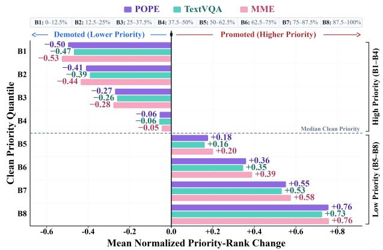

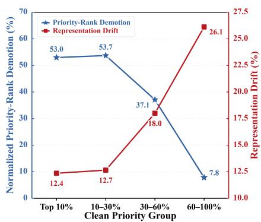  
Figure 3: CIRA-induced priority reallocation across the Figure 4: Priority reallocation and repreclean visual-token ranking at K = 128. sentation drift across token groups.

Comparison with stronger-access CAA. CAA† optimizes with access to the downstream question and language model, whereas CIRA uses only the vision encoder. Despite its lower Full ASR (3.32% for CAA† versus 6.92% for CIRA), CAA† achieves only 3.24% mean CSFR, well below CIRA’s 20.35%. The contrast shows that preserving the full-token prediction is not sufficient to induce compression-specific failures; CIRA’s priority-reallocation objective addresses this distinct requirement under narrower access.

➪ Takeaway. CIRA induces compression-specific failures across heterogeneous compression rules and budgets while limiting full-token degradation.

## 5.3 MECHANISTIC ANALYSIS

To connect CIRA’s behavior to its objectives, we test whether it globally reallocates token priority while limiting representation drift in displaced evidence.

Priority reallocation. Figure 3 shows a near-monotonic priority reallocation across all three benchmarks: the highest-priority octile is demoted by 0.47–0.53 normalized-rank units, whereas the lowest-priority octile is promoted by 0.73–0.76, with the sign changing near the median. This cross-quantile pattern is not confined to a single retention boundary.

Priority reallocation versus representation drift. Figure 4 shows that rank displacement and representation drift behave differently across clean-priority groups. Rank demotion peaks at 53.0% and 53.7% in the top 10% and 10–30% groups, where representation drift is lowest at 12.4% and 12.7%. The lowest-priority 60–100% group shows the reverse pattern, with 7.8% rank demotion and 26.1% drift. This separation indicates that CIRA reallocates clean high-priority tokens while limiting their representation drift, consistent with the HEP objective.

Component ablation. On VisionZip, Table 3 isolates the two objectives. Removing GSH reduces CSFR averaged across the three benchmarks and four budgets from 18.22% to 3.68%. Removing HEP leaves this mean nearly unchanged (17.04%) but raises mean Full ASR from 6.92% to 23.10%; replacing it with global representation preservation yields 15.71% mean CSFR and 8.66% Full ASR. Global preservation yields lower CSFR and higher Full ASR than HEP, supporting preservation focused on displaced evidence rather than a uniform constraint.

➪ Takeaway. GSH drives compression-specific failure induction, while HEP limits representation drift in displaced evidence and substantially reduces full-token degradation.

Table 3: CIRA ablation on VisionZip; arrows Table 4: TCS evaluation on VisionZip; arrows denote show changes from full CIRA. changes from matched no-defense baselines.
<table><tr><td rowspan="2">Metric</td><td rowspan="2">Full CIRA</td><td rowspan="2">Selection w/o Sel.</td><td colspan="2">Preservation</td></tr><tr><td>w/o Pres.</td><td>Global Pres.</td></tr><tr><td colspan="5">POPE</td></tr><tr><td>Full ASR↓</td><td>4.96</td><td> $\overline { { 2 . 0 1 \downarrow _ { 2 . 9 5 } } }$ </td><td> $1 5 . 7 2 \uparrow _ { 1 0 . 7 6 }$ </td><td> $\overline { { 4 . 7 3 \textmd { - } } } 0 . 2 3$ </td></tr><tr><td>CSFR@192↑</td><td>7.61</td><td> $\overline { { 1 . 6 0 \_ _ { 6 . 0 1 } } }$ </td><td> $\overline { { 9 . 9 4 \uparrow _ { 2 . 3 3 } } }$ </td><td> $\overline { { 4 . 7 9 \_ _ { 2 . 8 2 } } }$ </td></tr><tr><td>CSFR@128↑</td><td>14.05</td><td> $1 . 9 9 \_ _ { 1 2 . 0 6 }$ </td><td> $1 5 . 4 2 \uparrow _ { 1 . 3 7 }$ </td><td> $9 . 9 5 \downarrow _ { 4 . 1 0 }$ </td></tr><tr><td>CSFR@64↑</td><td>22.47</td><td> $4 . 3 9 \downarrow _ { 1 8 . 0 8 }$ </td><td> $2 2 . 0 7 \downarrow _ { 0 . 4 0 }$ </td><td> $1 9 . 9 5 \downarrow _ { 2 . 5 2 }$ </td></tr><tr><td>CSFR@32↑</td><td>26.96</td><td> $5 . 6 3 \_ _ { 2 1 . 3 3 }$ </td><td> $2 6 . 8 1 \downarrow _ { 0 . 1 5 }$ </td><td> $2 6 . 3 7 \downarrow _ { 0 . 5 9 }$ </td></tr><tr><td>Avg. CSFR↑</td><td>17.77</td><td> $3 . 4 0 \downarrow _ { 1 4 . 3 7 }$ </td><td> $1 8 . 5 6 \uparrow _ { 0 . 7 9 }$ </td><td> $1 5 . 2 6 \downarrow _ { 2 . 5 1 }$ </td></tr><tr><td colspan="5">TextVQA</td></tr><tr><td>Full ASR↓</td><td>10.61</td><td> $\overline { { 6 . 9 1 \downarrow _ { 3 . 7 0 } } }$ </td><td> $\overline { { 3 6 . 0 0 \uparrow _ { 2 5 . 3 9 } } }$ </td><td> $\overline { { 1 5 . 8 2 \uparrow 5 . 2 0 } }$ </td></tr><tr><td>CSFR@192↑</td><td>11.35</td><td> $3 . 9 0 \downarrow _ { 7 . 4 5 }$ </td><td> $\overline { { 9 . 9 4 \downarrow _ { 1 . 4 1 } } }$ </td><td> $\overline { { 8 . 5 8 \downarrow _ { 2 . 7 7 } } }$ </td></tr><tr><td>CSFR@128↑</td><td>18.21</td><td> $2 . 0 5 \downarrow _ { 1 6 . 1 6 }$ </td><td> $1 5 . 2 0 \downarrow _ { 3 . 0 2 }$ </td><td> $1 2 . 5 3 \text{ ‰}$ </td></tr><tr><td>CSFR@64↑</td><td>27.41</td><td> $5 . 4 3 \_ _ { 2 1 . 9 8 }$ </td><td> $2 3 . 7 0 \textbar { \textmd { + } } 3 . 7 2$ </td><td> $2 3 . 0 4 \downarrow _ { 4 . 3 7 }$ </td></tr><tr><td>CSFR@32↑</td><td>31.70</td><td> $6 . 4 4 \downarrow _ { 2 5 . 2 6 }$ </td><td> $2 6 . 7 3 \textbar { ‰}$ </td><td> $3 6 . 2 8 \uparrow _ { 4 . 5 7 }$ </td></tr><tr><td>Avg. CSFR↑</td><td>22.17</td><td> $4 . 4 6 \downarrow _ { 1 7 . 7 1 }$ </td><td> $1 8 . 8 9 \downarrow _ { 3 . 2 8 }$ </td><td> $2 0 . 1 1 \downarrow _ { 2 . 0 6 }$ </td></tr><tr><td colspan="5">MME</td></tr><tr><td>Full ASR↓</td><td>5.18</td><td> $\overline { { 2 . 4 0 \downarrow _ { 2 . 7 7 } } }$ </td><td> $1 7 . 5 7 \uparrow _ { 1 2 . 4 0 }$ </td><td> $\overline { { 5 . 4 4 \uparrow _ { 0 . 2 6 } } }$ </td></tr><tr><td>CSFR@192↑</td><td>7.40</td><td> $1 . 6 2 \downarrow _ { 5 . 7 9 }$ </td><td> $7 . 5 5 \uparrow _ { 0 . 1 4 }$ </td><td> $\overline { { 5 . 8 0 \_ _ { 1 . 6 1 } } }$ </td></tr><tr><td>CSFR@128↑</td><td>10.26</td><td> $1 . 9 3 \_ _ { 8 . 3 3 }$ </td><td> $1 1 . 3 3 \uparrow _ { 1 . 0 6 }$ </td><td> $7 . 7 3 \textbar { ‰}$ </td></tr><tr><td>CSFR@64↑</td><td>19.07</td><td> $4 . 0 9 \downarrow _ { 1 4 . 9 8 }$ </td><td> $1 7 . 2 3 \textbar { \textmd { 1 1 . 8 4 } }$ </td><td> $1 4 . 4 5 \downarrow _ { 4 . 6 2 }$ </td></tr><tr><td>CSFR@32↑</td><td>22.17</td><td> $5 . 0 8 \_ _ { 1 7 . 0 9 }$ </td><td> $1 8 . 5 7 \text{ ‰}$ </td><td> $1 9 . 0 5 \downarrow _ { 3 . 1 2 }$ </td></tr><tr><td>Avg. CSFR↑</td><td>14.73</td><td> $3 . 1 8 \downarrow _ { 1 1 . 5 5 }$ </td><td> $1 3 . 6 7 \textbar t _ { 1 . 0 6 }$ </td><td> $1 1 . 7 6 \downarrow _ { 2 . 9 7 }$ </td></tr></table>

<table><tr><td>Metric</td><td colspan="2">CIRA</td><td colspan="2">CAGE</td><td colspan="2">Adaptive CIRA</td></tr><tr><td></td><td>None</td><td>TCS</td><td>None</td><td>TCS</td><td>None</td><td>TCS</td></tr><tr><td colspan="7">POPE</td></tr><tr><td>Full ASR</td><td></td><td>4.96</td><td>39.48</td><td></td><td></td><td>3.78</td></tr><tr><td>CSFR@192↓</td><td>7.61</td><td> $\overline { { 2 . 6 0 \sqrt { _ { 5 . 0 1 } } } }$ </td><td>3.19</td><td> $4 . 3 4 \uparrow _ { 1 . 1 5 }$ </td><td>6.99</td><td> $\overline { { 6 . 5 7 \downarrow _ { 0 . 4 2 } } }$ </td></tr><tr><td>CSFR@128↓</td><td>14.05</td><td> $3 . 4 0 \downarrow _ { 1 0 . 6 5 }$ </td><td>5.72</td><td> $4 . 7 9 \textbar { ‰}$ </td><td>10.07</td><td> $1 0 . 7 1 \uparrow _ { 0 . 6 4 }$ </td></tr><tr><td>CSFR@64↓</td><td>22.47</td><td> $2 . 8 4 \downarrow _ { 1 9 . 6 3 }$ </td><td>9.71</td><td> $5 . 6 8 \downarrow _ { 4 . 0 3 }$ </td><td>20.08</td><td> $1 3 . 6 5 \textbar { _ { ‰} }$ </td></tr><tr><td>CSFR@32↓</td><td>26.96</td><td> $4 . 2 1 \downarrow _ { 2 2 . 7 5 }$ </td><td>9.48</td><td> $5 . 5 2 \downarrow _ { 3 . 9 6 }$ </td><td>28.00</td><td> $2 1 . 9 2 \textbar { ‰}$ </td></tr><tr><td>Avg. CSFR ↓</td><td>17.77</td><td> $3 . 2 6 \downarrow _ { 1 4 . 5 1 }$ </td><td>7.03</td><td> $5 . 0 8 \downarrow _ { 1 . 9 5 }$ </td><td>16.29</td><td> $1 3 . 2 1 \_ 3 . 0 8$ </td></tr><tr><td colspan="7">TextVQA</td></tr><tr><td>Full ASR</td><td></td><td>10.61</td><td>71.35</td><td></td><td></td><td>11.45</td></tr><tr><td>CSFR@192↓</td><td>11.35</td><td> $2 . 3 9 \textbar { ‰}$ </td><td>2.92</td><td> $\overline { { 1 . 5 9 \textmd { - } 1 . 3 3 } }$ </td><td>8.38</td><td> $\overline { { 8 . 1 7 \downarrow _ { 0 . 2 1 } } }$ </td></tr><tr><td>CSFR@128↓</td><td>18.21</td><td> $2 . 0 7 \downarrow _ { 1 6 . 1 4 }$ </td><td>5.32</td><td> $2 . 4 8 \neq _ { 2 . 8 4 }$ </td><td>11.09</td><td> $9 . 3 0 \downarrow _ { 1 . 7 9 }$ </td></tr><tr><td>CSFR@64↓</td><td>27.41</td><td> $4 . 5 0 \downarrow _ { 2 2 . 9 1 }$ </td><td>6.28</td><td> $3 . 4 3 \_ _ { 2 . 8 5 }$ </td><td>26.09</td><td> $1 4 . 1 3 \textbar { \textmd { - } } 1 1 . 9 5$ </td></tr><tr><td>CSFR@32↓</td><td>31.70</td><td> $3 . 0 9 \scriptstyle \downarrow _ { 2 8 . 6 1 }$ </td><td>5.24</td><td> $4 . 9 9 \textbar { ‰}$ </td><td>38.90</td><td> $2 5 . 6 5 \downarrow _ { 1 3 . 2 5 }$ </td></tr><tr><td> $\mathbf { A v g . C S F R \downarrow }$ </td><td>22.17</td><td> $3 . 0 1 \downarrow _ { 1 9 . 1 6 }$ </td><td>4.94</td><td> $3 . 1 2 \downarrow _ { 1 . 8 2 }$ </td><td>21.11</td><td> $1 4 . 3 1 \textbar { ‰}$ </td></tr><tr><td colspan="7">MME</td></tr><tr><td>Full ASR</td><td>5.18</td><td></td><td>39.77</td><td></td><td></td><td>6.57</td></tr><tr><td>CSFR@192↓</td><td>7.40</td><td> $2 . 7 2 \downarrow _ { 4 . 6 8 }$ </td><td>4.04</td><td> $2 . 3 1 \downarrow _ { 1 . 7 3 }$ </td><td>3.64</td><td> $\overline { { 5 . 0 3 \uparrow _ { 1 . 3 9 } } }$ </td></tr><tr><td>CSFR@128↓</td><td>10.26</td><td> $2 . 6 4 \downarrow _ { 7 . 6 2 }$ </td><td>5.55</td><td> $2 . 5 0 \downarrow _ { 3 . 0 5 }$ </td><td>9.53</td><td> $7 . 2 2 \textbar { _ { ‰} }$ </td></tr><tr><td>CSFR@64↓</td><td>19.07</td><td> $4 . 5 3 \_ _ { 1 4 . 5 4 }$ </td><td>5.97</td><td> $4 . 0 9 \textbar { \textmd { + } } 1 . 8 8 $ </td><td>18.54</td><td> $1 1 . 6 8 \text{ ‰}$ </td></tr><tr><td>CSFR@32↓</td><td>22.17</td><td> $5 . 7 5 \textmu _ { 1 6 . 4 2 }$ </td><td>5.19</td><td> $4 . 6 7 \downarrow _ { 0 . 5 2 }$ </td><td>23.17</td><td> $1 8 . 3 5 \downarrow _ { 4 . 8 2 }$ </td></tr><tr><td>Avg. CSFR↓</td><td>14.73</td><td> $3 . 9 1 \downarrow _ { 1 0 . 8 2 }$ </td><td>5.19</td><td> $3 . 3 9 \textbar t 1 . 8 0$ </td><td>13.72</td><td> $1 0 . 5 7 \downarrow 3 . 1 5$ </td></tr></table>

## 6 SELECTION STABILIZATION DEFENSE

To test whether stabilizing token selection can suppress CIRA, TCS exploits cross-view priority stability: clean high-priority evidence tends to remain stable under small translations, whereas attack induced replacements are more view-sensitive. At the LLaVA–VisionZip token-priority interface, TCS uses four translated views $\mathcal { V } = \{ T _ { 0 , 0 } , T _ { d , 0 } , T _ { 0 , d } , T _ { d , d } \}$ with $d = 7$ pixels. For view $v , \mathbf { s } ^ { ( v ) }$ is its priority-score vector, $\mathcal { A } _ { v }$ maps the translated score grid back to the reference coordinates, and rank 1 denotes the highest priority. TCS selects the K tokens with highest aligned rank-quantile consensus:

$$
q _ { i } ^ { ( v ) } = 1 - \frac { r _ { i } \bigl ( A _ { v } ( \mathbf { s } ^ { ( v ) } ) \bigr ) - 1 } { N - 1 } , \quad \bar { q } _ { i } = \frac { 1 } { | \mathscr { V } | } \sum _ { v \in \mathscr { V } } q _ { i } ^ { ( v ) } , \quad \bar { Z } _ { K } ^ { \mathrm { T C S } } = \mathrm { T o p K } ( \bar { \mathbf { q } } , K ) .\tag{11}
$$

Rank quantiles make priorities comparable across views despite differences in score scale. The selected indices are applied to the unshifted-view features, leaving aggregation and full-token inference unchanged. Construction and mechanism details appear in Appendix F; complementary utility results are reported in Appendix G.

Defense effectiveness. Within the matched evaluation blocks in Table 4, TCS reduces standard CIRA CSFR averaged across the three datasets and four budgets from 18.22% to 3.39%, an 81.4% relative reduction, compared with a 32.5% reduction for CAGE. Suppression strengthens as the compression budget decreases, with the largest reductions under tighter compression.

Adaptive stress test. Because TCS is deterministic and public, we also evaluate an adaptive attacker that optimizes the CIRA objectives over the same four views while sharing one image-space perturbation:

$$
\mathcal { L } _ { \mathrm { a d a p t } } ( \delta ) = \frac { 1 } { | \mathcal { V } | } \sum _ { v \in \mathcal { V } } \left[ \mathcal { L } _ { \mathrm { G S H } } ^ { ( v ) } ( \delta ) + \lambda \mathcal { L } _ { \mathrm { H E P } } ^ { ( v ) } ( \delta ) \right] .\tag{12}
$$

Adaptive CIRA uses the same access assumptions and perturbation budget as standard CIRA. Under TCS, its mean CSFR rises from 3.39% to 12.70%, reaching 74.5% of Adaptive CIRA’s matched undefended value (17.04%). TCS therefore retains a smaller but nonzero effect against the adaptive attack. Additional optimization and mechanism diagnostics appear in Appendix F.3.

## 7 CONCLUSION

Visual-token compression changes not only inference cost but also which visual evidence remains available after compression. By pairing full-token and compressed inference on the same adversarial input, we attribute failures specifically to the compression path. CIRA induces such failures across unknown compressor and budget settings by reallocating token priorities while limiting full-token degradation. Controlled diagnostics further show that retained-set allocation affects compressed correctness and that recovery is negatively associated with representation drift in displaced evidence. Selection stabilization substantially suppresses CIRA, although adaptive optimization partially restores its effectiveness. Together, these results support treating the compression boundary as a security-relevant component of LVLM deployment and motivate paired robustness evaluation for compressed LVLMs.

## AI USE STATEMENT

Generative AI tools were used in a limited supporting role for this work, including language editing and polishing, literature retrieval and discovery, research ideation and technical execution support, and drafting and revising parts of the manuscript. In particular, these tools were used to improve the clarity and fluency of writing, help identify related literature, provide technical suggestions for coding and experimental workflows, and assist in refining sections of the paper during revision. All AI-assisted content was independently checked, validated, and, where necessary, modified by the authors. The authors retain full responsibility for the scientific content, methodological choices, experimental evidence, interpretations, and final form of the manuscript.

## REPRODUCIBILITY STATEMENT

We provide comprehensive details to facilitate the reproduction and verification of CIRA. The threat model, compression-specific failure formulation, and attack objectives are described in Sections 3 and 4, including the Global Selection Hijacking (GSH) and Hidden-Evidence Preservation (HEP) objectives and their joint optimization. The optimization procedure and experimental details are provided in Appendices A and B, respectively. Main results, mechanistic analyses, and defense evaluations are reported in Sections 5.2, 5.3, and 6. Additional analyses, including retained-set diagnostics, sensitivity studies, cross-model evaluation, task-utility results, limitations, and qualitative cases, are provided in Appendices C, D, E, G, H, and I. Code and scripts for reproducing the reported experiments are provided in the Github repository.

## ETHICS STATEMENT

This work investigates the adversarial robustness of LVLMs under visual-token compression in a controlled research setting. Our experiments use publicly available benchmark datasets (e.g., POPE, TextVQA, and MME) and publicly released pretrained models (e.g., LLaVA-v1.5-7B, Qwen3-VL-8B-Instruct, and InternVL3.5-8B), involving no human subjects or personally identifiable information. We recognize the dual-use nature of adversarial robustness research. CIRA is developed to identify compression-specific vulnerabilities and support robustness evaluation and defense development. The proposed attack is evaluated under a restricted threat model with bounded image-space perturbations and vision-encoder-only access. We transparently report the attack assumptions and evaluation protocols to facilitate reproducibility and responsible security research.

## REFERENCES

Jean-Baptiste Alayrac, Jeff Donahue, Pauline Luc, Antoine Miech, Iain Barr, Yana Hasson, Karel Lenc, Arthur Mensch, Katherine Millican, Malcolm Reynolds, et al. Flamingo: a visual language model for few-shot learning. Advances in neural information processing systems, 35:23716–23736, 2022.

Saeed Ranjbar Alvar, Gursimran Singh, Mohammad Akbari, and Yong Zhang. Divprune: Diversitybased visual token pruning for large multimodal models. In 2025 IEEE/CVF Conference on Computer Vision and Pattern Recognition (CVPR), pp. 9392–9401. IEEE, 2025.

Shuai Bai, Yuxuan Cai, Ruizhe Chen, Keqin Chen, Xionghui Chen, Zesen Cheng, Lianghao Deng, Wei Ding, Chang Gao, Chunjiang Ge, et al. Qwen3-vl technical report. arXiv preprint arXiv:2511.21631, 2025.

Adrian Bulat, Yassine Ouali, and Georgios Tzimiropoulos. Compress & cache: Vision token compression for efficient generation and retrieval. Advances in Neural Information Processing Systems, 38:31943–31968, 2026.

Junjie Chen, Xuyang Liu, Zichen Wen, Yiyu Wang, Siteng Huang, and Honggang Chen. Variationaware vision token dropping for faster large vision-language models. In Proceedings of the IEEE/CVF conference on computer vision and pattern recognition, pp. 3489–3499, 2026.

Liang Chen, Haozhe Zhao, Tianyu Liu, Shuai Bai, Junyang Lin, Chang Zhou, and Baobao Chang. An image is worth 1/2 tokens after layer 2: Plug-and-play inference acceleration for large visionlanguage models. In European Conference on Computer Vision, pp. 19–35. Springer, 2024.

Hyeonwoo Cho, Donghyeon Baek, Yewon Kim, and Bumsub Ham. Improving visual token reduction via rectifying distortions for efficient multimodal llm inference. arXiv preprint arXiv:2606.01711, 2026.

Mohamed Dhouib, Davide Buscaldi, Sonia Vanier, and Aymen Shabou. Pact: Pruning and clusteringbased token reduction for faster visual language models. In 2025 IEEE/CVF Conference on Computer Vision and Pattern Recognition (CVPR), pp. 14582–14592. IEEE, 2025.

Mark Endo, Xiaohan Wang, and Serena Yeung-Levy. Feather the throttle: Revisiting visual token pruning for vision-language model acceleration. In 2025 IEEE/CVF International Conference on Computer Vision (ICCV), pp. 22826–22835. IEEE, 2025.

Chaoyou Fu, Peixian Chen, Yunhang Shen, Yulei Qin, Mengdan Zhang, Xu Lin, Jinrui Yang, Xiawu Zheng, Ke Li, Xing Sun, Yunsheng Wu, Rongrong Ji, Caifeng Shan, and Ran He. Mme: A comprehensive evaluation benchmark for multimodal large language models. In D. Belgrave, C. Zhang, H. Lin, R. Pascanu, P. Koniusz, M. Ghassemi, and N. Chen (eds.), Advances in Neural Information Processing Systems, volume 38, Main Conference. Curran Associates, Inc., 2025. doi: 10.52202/085713-4899. URL https://proceedings.neurips.cc/paper\_files/ paper/2025/file/d79a27cf2772fe00be7f341efc0eb517-Paper-Datasets\_ and\_Benchmarks\_Track.pdf.

Tianxiao Gao, Shanwei Zhao, Shuo Fang, Shiai Zhu, and Chenguang Ma. Quietprune: Query-guided early token pruning for vision-language models. In Proceedings of the IEEE/CVF Conference on Computer Vision and Pattern Recognition, pp. 3553–3562, 2026.

Shishen Gu, Jiequan Cui, Wenbo Hu, Zenglin Shi, Zhenzhen Hu, and Richang Hong. Visual token compression enhances robustness of mllms. arXiv preprint arXiv:2607.22716, 2026.

Kai Hu, Weichen Yu, Li Zhang, Alexander Robey, Andy Zou, Chengming Xu, Haoqi Hu, and Matt Fredrikson. Transferable adversarial attacks on black-box vision-language models. arXiv preprint arXiv:2505.01050, 2025.

Yihong Huang, Fei Ma, Yihua Shao, Jingcai Guo, Zitong Yu, Laizhong Cui, and Qi Tian. N\" uwa: Mending the spatial integrity torn by vlm token pruning. arXiv preprint arXiv:2602.02951, 2026.

Ao Li, Yuxiang Duan, Jinghui Zhang, Congbo Ma, Yutong Xie, Gustavo Carneiro, Mohammad Yaqub, and Hu Wang. Transprune: Token transition pruning for efficient large vision-language model. In Proceedings of the IEEE/CVF Conference on Computer Vision and Pattern Recognition, pp. 39529–39538, 2026a.

Junnan Li, Dongxu Li, Silvio Savarese, and Steven Hoi. Blip-2: Bootstrapping language-image pre-training with frozen image encoders and large language models. In International conference on machine learning, pp. 19730–19742. PmLR, 2023a.

Wentong Li, Yuqian Yuan, Jian Liu, Dongqi Tang, Song Wang, Jie Qin, Jianke Zhu, and Lei Zhang. Tokenpacker: Efficient visual projector for multimodal llm. International Journal of Computer Vision, 133(10):6794–6812, 2025.

Yifan Li, Yifan Du, Kun Zhou, Jinpeng Wang, Xin Zhao, and Ji-Rong Wen. Evaluating object hallucination in large vision-language models. In Proceedings of the 2023 conference on empirical methods in natural language processing, pp. 292–305, 2023b.

Zhenyu Li, Zuchao Li, Ping Wang, Lefei Zhang, and Haojun Ai. Vista-llm: Decoupled query-guided visual token pruning for efficient long-video large language models. In Proceedings ofthe 64th Annual Meeting of the Association for Computational Linguistics (Volume 1: Long Papers), pp. 13171–13187, 2026b.

Daizong Liu, Mingyu Yang, Xiaoye Qu, Pan Zhou, Xiang Fang, Keke Tang, Yao Wan, and Lichao Sun. Pandora’s box: Towards building universal attackers against real-world large vision-language models. Advances in Neural Information Processing Systems, 37:52127–52158, 2024a.

Haotian Liu, Chunyuan Li, Yuheng Li, and Yong Jae Lee. Improved baselines with visual instruction tuning. In 2024 IEEE/CVF Conference on Computer Vision and Pattern Recognition (CVPR), pp. 26286–26296. IEEE, 2024b.

Jiaxiang Liu, Jiawei Du, Xiao Liu, Prayag Tiwari, and Mingkun Xu. Self-calibrated consistency can fight back for adversarial robustness in vision-language models. arXiv preprint arXiv:2510.22785, 2025.

Dong Lu, Zhiqiang Wang, Teng Wang, Weili Guan, Hongchang Gao, and Feng Zheng. Set-level guidance attack: Boosting adversarial transferability of vision-language pre-training models. In 2023 IEEE/CVF International Conference on Computer Vision (ICCV), pp. 102–111. IEEE, 2023.

Haochen Luo, Jindong Gu, Fengyuan Liu, and Philip Torr. An image is worth 1000 lies: Adversarial transferability across prompts on vision-language models. arXiv preprint arXiv:2403.09766, 2024.

Jianxin Ma, Shibo Jin, and Lujuan Dang. Visual token compression via run-length pruning in multimodal large language models. Pattern Recognition Letters, 2026.

Hefei Mei, Zirui Wang, Chang Xu, Jianyuan Guo, and Minjing Dong. Pa-attack: Guiding gray-box attacks on lvlm vision encoders with prototypes and attention. arXiv preprint arXiv:2602.19418, 2026a.

Hefei Mei, Zirui Wang, Shen You, Minjing Dong, and Chang Xu. Veattack: Downstream-agnostic vision encoder attack against large vision language models. In International Conference on Learning Representations, volume 2026, pp. 18135–18161, 2026b.

Xiangyu Qi, Kaixuan Huang, Ashwinee Panda, Peter Henderson, Mengdi Wang, and Prateek Mittal. Visual adversarial examples jailbreak aligned large language models. In Proceedings ofthe AAAI conference on artificial intelligence, volume 38, pp. 21527–21536, 2024.

Alec Radford, Jong Wook Kim, Chris Hallacy, Aditya Ramesh, Gabriel Goh, Sandhini Agarwal, Girish Sastry, Amanda Askell, Pamela Mishkin, Jack Clark, et al. Learning transferable visual models from natural language supervision. In International conference on machine learning, pp. 8748–8763. PmLR, 2021.

Christian Schlarmann and Matthias Hein. On the adversarial robustness of multi-modal foundation models. In 2023 IEEE/CVF International Conference on Computer Vision Workshops (ICCVW), pp. 3679–3687. IEEE, 2023.

Christian Schlarmann, Naman Deep Singh, Francesco Croce, and Matthias Hein. Robust clip: Unsupervised adversarial fine-tuning of vision embeddings for robust large vision-language models. arXiv preprint arXiv:2402.12336, 2024.

Yuzhang Shang, Mu Cai, Bingxin Xu, Yong Jae Lee, and Yan Yan. Llava-prumerge: Adaptive token reduction for efficient large multimodal models. In 2025 IEEE/CVF International Conference on Computer Vision (ICCV), pp. 22857–22867. IEEE, 2025.

Erfan Shayegani, Yue Dong, and Nael Abu-Ghazaleh. Jailbreak in pieces: Compositional adversarial attacks on multi-modal language models. In International conference on learning representations, volume 2024, pp. 30853–30885, 2024.

Xiaoqian Shen, Yunyang Xiong, Changsheng Zhao, Lemeng Wu, Jun Chen, Chenchen Zhu, Zechun Liu, Fanyi Xiao, Balakrishnan Varadarajan, Florian Bordes, et al. Longvu: Spatiotemporal adaptive compression for long video-language understanding. arXiv preprint arXiv:2410.17434, 2024.

Lijun Sheng, Jian Liang, Zilei Wang, and Ran He. R-tpt: Improving adversarial robustness of visionlanguage models through test-time prompt tuning. In Proceedings ofthe IEEE/CVF Conference on Computer Vision and Pattern Recognition, pp. 29958–29967, 2025.

Amanpreet Singh, Vivek Natarajan, Meet Shah, Yu Jiang, Xinlei Chen, Dhruv Batra, Devi Parikh, and Marcus Rohrbach. Towards vqa models that can read. In 2019 IEEE/CVF Conference on Computer Vision and Pattern Recognition (CVPR), pp. 8309–8318. IEEE, 2019.

Guohao Sun, Yufei Wang, Sizhuo Ma, Yuege Xie, Yuting Cheng, Zhiqiang Tao, and Jian Wang. Ifprune: Information-flow guided token pruning for efficient vision-language models. In Proceedings of the IEEE/CVF Conference on Computer Vision and Pattern Recognition, pp. 3522–3531, 2026.

Yizheng Sun, Hao Li, Chang Xu, Hongpeng Zhou, Chenghua Lin, Riza Theresa Batista-Navarro, and Jingyuan Sun. Does acceleration cause hidden instability in vision language models? uncovering instance-level divergence through a large-scale empirical study. In Proceedings of the 2025 Conference on Empirical Methods in Natural Language Processing, pp. 8453–8467, 2025.

Rinyoichi Takezoe, Yaqian Li, Zi-Hao Bo, Anzhou Hou, Mo Guang, and Kaiwen Long. Learnpruner: Rethinking attention-based token pruning in vision language models. In International Conference on Learning Representations, volume 2026, pp. 66381–66400, 2026.

Han Wang, Yuxiang Nie, Yongjie Ye, Yanjie Wang, Shuai Li, Haiyang Yu, Jinghui Lu, and Can Huang. Dynamic-vlm: Simple dynamic visual token compression for videollm. In 2025 IEEE/CVF International Conference on Computer Vision (ICCV), pp. 20812–20823. IEEE, 2025a.

Shuailong Wang, Xinyu Lyu, Shengming Yuan, Jingkuan Song, Heng Tao Shen, and Lianli Gao. Understanding and mitigating token-pruning-induced vulnerabilities in VLMs. In Forty-third International Conference on Machine Learning, 2026a. URL https://openreview.net/ forum?id=D3OHVbePvz.

Weiyun Wang, Zhangwei Gao, Lixin Gu, Hengjun Pu, Long Cui, Xingguang Wei, Zhaoyang Liu, Linglin Jing, Shenglong Ye, Jie Shao, Zhaokai Wang, Zhe Chen, Hongjie Zhang, Ganlin Yang, Haomin Wang, Qi Wei, Jinhui Yin, Wenhao Li, Erfei Cui, Guanzhou Chen, Zichen Ding, Changyao Tian, Zhenyu Wu, Jingjing Xie, Zehao Li, Bowen Yang, Yuchen Duan, Xuehui Wang, Zhi Hou, Haoran Hao, Tianyi Zhang, Songze Li, Xiangyu Zhao, Haodong Duan, Nianchen Deng, Bin Fu, Yinan He, Yi Wang, Conghui He, Botian Shi, Junjun He, Yingtong Xiong, Han Lv, Lijun Wu, Wenqi Shao, Kaipeng Zhang, Huipeng Deng, Biqing Qi, Jiaye Ge, Qipeng Guo, Wenwei Zhang, Songyang Zhang, Maosong Cao, Junyao Lin, Kexian Tang, Jianfei Gao, Haian Huang, Yuzhe Gu, Chengqi Lyu, Huanze Tang, Rui Wang, Haijun Lv, Wanli Ouyang, Limin Wang, Min Dou, Xizhou Zhu, Tong Lu, Dahua Lin, Jifeng Dai, Weijie Su, Bowen Zhou, Kai Chen, Yu Qiao, Wenhai Wang, and Gen Luo. Internvl3.5: Advancing open-source multimodal models in versatility, reasoning, and efficiency, 2025b. URL https://arxiv.org/abs/2508.18265.

Yahong Wang, Juncheng Wu, Zhangkai Ni, Longzhen Yang, Yihang Liu, Chengmei Yang, Ying Wen, Lianghua He, Xianfeng Tang, Hui Liu, et al. When token pruning is worse than random: Understanding visual token information in vllms. In Proceedings ofthe IEEE/CVF Conference on Computer Vision and Pattern Recognition, pp. 31910–31919, 2026b.

Yi Wang, Haofei Zhang, Qihan Huang, Anda Cao, Gongfan Fang, Wei Wang, Xuan Jin, Jie Song, Mingli Song, and Xinchao Wang. Rethinking token reduction for large vision-language models. arXiv preprint arXiv:2603.21701, 2026c.

Zeyu Wang, Cihang Xie, Brian Bartoldson, and Bhavya Kailkhura. Double visual defense: Adversarial pre-training and instruction tuning for improving vision-language model robustness. arXiv preprint arXiv:2501.09446, 2025c.

Peng Xie, Yequan Bie, Jianda Mao, Yangqiu Song, Yang Wang, Hao Chen, and Kani Chen. Chain of attack: On the robustness of vision-language models against transfer-based adversarial attacks. In 2025 IEEE/CVF Conference on Computer Vision and Pattern Recognition (CVPR), pp. 14679– 14689. IEEE, 2025.

Long Xing, Qidong Huang, Xiaoyi Dong, Jiajie Lu, Pan Zhang, Yuhang Zang, Yuhang Cao, Conghui He, Jiaqi Wang, Feng Wu, et al. Pyramiddrop: Accelerating your large vision-language models via pyramid visual redundancy reduction. arXiv preprint arXiv:2410.17247, 2024.

Tong Xu, Hailong Shi, and Xingyu Gao. Score: Salience-coverage reduction for vision token pruning in vision-language models. In Proceedings ofthe IEEE/CVF Conference on Computer Vision and Pattern Recognition, pp. 24686–24695, 2026.

Cheng-Yu Yang, Shao-Yuan Lo, and Yu-Lun Liu. Reroute, don’t remove: Recoverable visual token routing for vision-language models. arXiv preprint arXiv:2606.12412, 2026.

Longrong Yang, Dong Shen, Chaoxiang Cai, Kaibing Chen, Fan Yang, Tingting Gao, Di Zhang, and Xi Li. Libra-merging: Importance-redundancy and pruning-merging trade-off for acceleration plug-in in large vision-language model. In 2025 IEEE/CVF Conference on Computer Vision and Pattern Recognition (CVPR), pp. 9402–9412. IEEE, 2025a.

Senqiao Yang, Yukang Chen, Zhuotao Tian, Chengyao Wang, Jingyao Li, Bei Yu, and Jiaya Jia. Visionzip: Longer is better but not necessary in vision language models. In 2025 IEEE/CVF Conference on Computer Vision and Pattern Recognition (CVPR), pp. 19792–19802. IEEE, 2025b.

Xubing Ye, Yukang Gan, Yixiao Ge, Xiao-Ping Zhang, and Yansong Tang. Atp-llava: Adaptive token pruning for large vision language models. In 2025 IEEE/CVF Conference on Computer Vision and Pattern Recognition (CVPR), pp. 24972–24982. IEEE, 2025.

Ziyi Yin, Muchao Ye, Tianrong Zhang, Tianyu Du, Jinguo Zhu, Han Liu, Jinghui Chen, Ting Wang, and Fenglong Ma. Vlattack: Multimodal adversarial attacks on vision-language tasks via pre-trained models. Advances in Neural Information Processing Systems, 36:52936–52956, 2023.

Hanxun Yu, Wentong Li, Xuan Qu, Song Wang, Junbo Chen, and Jianke Zhu. Visiontrim: Unified vision token compression for training-free mllm acceleration. arXiv preprint arXiv:2601.22674, 2026.

Jiaming Zhang, Qi Yi, and Jitao Sang. Towards adversarial attack on vision-language pre-training models. In Proceedings ofthe 30th ACM international conference on multimedia, pp. 5005–5013, 2022.

Jiaming Zhang, Junhong Ye, Xingjun Ma, Yige Li, Yunfan Yang, Yunhao Chen, Jitao Sang, and Dit-Yan Yeung. Anyattack: Towards large-scale self-supervised adversarial attacks on vision-language models. In 2025 IEEE/CVF Conference on Computer Vision and Pattern Recognition (CVPR), pp. 19900–19909. IEEE, 2025a.

Qizhe Zhang, Aosong Cheng, Ming Lu, Renrui Zhang, Zhiyong Zhuo, Jiajun Cao, Shaobo Guo, Qi She, and Shanghang Zhang. Beyond text-visual attention: Exploiting visual cues for effective token pruning in vlms. In 2025 IEEE/CVF International Conference on Computer Vision (ICCV), pp. 20857–20867. IEEE, 2025b.

Xiaomei Zhang, Zhaoxi Zhang, Leo Yu Zhang, Yanjun Zhang, Guanhong Tao, and Shirui Pan. Less is more–until it breaks: Security pitfalls of vision token compression in large vision-language models. arXiv preprint arXiv:2601.12042, 2026a.

Xinwei Zhang, Li Bai, Tianwei Zhang, Youqian Zhang, Qingqing Ye, Yingnan Zhao, Ruochen Du, and Haibo Hu. Grounding-driven attack: Improving encoder-based adversarial transferability against large vision-language models. arXiv preprint arXiv:2602.09431, 2026b.

Xinwei Zhang, Hangcheng Liu, Li Bai, Hao Wang, Qingqing Ye, Tianwei Zhang, and Haibo Hu. On the adversarial robustness of large vision-language models under visual token compression. arXiv preprint arXiv:2601.21531, 2026c.

Yuan Zhang, Chun-Kai Fan, Junpeng Ma, Wenzhao Zheng, Tao Huang, Kuan Cheng, Denis Gudovskiy, Tomoyuki Okuno, Yohei Nakata, Kurt Keutzer, et al. Sparsevlm: Visual token sparsifica tion for efficient vision-language model inference. arXiv preprint arXiv:2410.04417, 2024.

## APPENDIX CONTENTS

Appendix A. CIRA Optimization Procedure . 15   
Appendix B. Detailed Experimental Setup . 15   
Appendix C. Controlled Retained-Set Allocation Diagnostics . . 17   
Appendix D. Sensitivity Analyses . . 20   
Appendix E. Cross-Model Scope . . 21   
Appendix F. Selection Stabilization Defense. . . 23   
Appendix G. Complementary Task-Utility Results . . . 24   
Appendix H. Limitation Discussion and Future Work . . . 26   
Appendix I. Qualitative Case Studies . . . 27

## A CIRA OPTIMIZATION PROCEDURE

Algorithm 1 gives the image-space optimization induced by CIRA’s two encoder-side objectives. Clean features and priority scores are cached once; adversarial scores, ranks, and displacement weights are refreshed at every step. The priority rule $\mathcal { P }$ maps encoder attention to the token-score vector used by GSH.

Algorithm 1 Projected sign-gradient optimization of CIRA.   
Require: Image x; encoder E; priority rule P   
Require: Candidate interval $[ \bar { K } _ { \operatorname* { m i n } } , \bar { K } _ { \operatorname* { m a x } } ] ; \epsilon , \epsilon _ { s } , \epsilon _ { h }$   
Require: Step size α; steps T; preservation weight λ   
Ensure: Adversarial image $x ^ { \mathrm { a d v } }$   
1: $\mathcal { K }  \{ K _ { \operatorname* { m i n } } , . . . , K _ { \operatorname* { m a x } } \}$   
2: $( \mathbf { H } ^ { c } , \dot { \mathbf { s } ^ { c } } ) \gets ( \mathcal { E } ( x ) , \mathcal { P } ( x ) )$   
3: $\dot { \mathbf { r } } ^ { c } \gets \mathrm { R a n k } _ { \downarrow } ( \mathbf { s } ^ { \dot { c } } )$   
4: $\mathbf { u } ^ { c } \gets \mathcal { R } ( \mathbf { s } ^ { c } )$   
5: Initialize $\delta ^ { ( 0 ) }  \mathbf { 0 }$   
6: for $\tau = 0 , \dots , T - 1$ do   
7: $x ^ { ( \tau ) }  x + \delta ^ { ( \tau ) }$   
8: $( \mathbf { H } ^ { a } , \mathbf { s } ^ { a } )  ( { \mathcal { E } } ( x ^ { ( \tau ) } ) , { \mathcal { P } } ( x ^ { ( \tau ) } ) )$   
9: $\begin{array} { r } { \dot { \mathcal { L } } _ { \mathrm { G S H } }  \mathrm { A l i g n } _ { \epsilon _ { s } } ( \mathbf { s } ^ { i } , \mathbf { u } ^ { c } ) } \end{array}$   
10: ${ \bf r } ^ { a } \gets \mathrm { R a n k } _ { \downarrow } \bar { ( } { \bf s } ^ { \tilde { a } } )$   
11: $w _ { i }  \mathrm { s g } \big ( \mathrm { P r } _ { K \sim \operatorname { U n i f } ( K ) } ^ { \sim } [ r _ { i } ^ { c } \leq K < r _ { i } ^ { a } ] \big )$   
12: $d _ { i } \gets \frac { 1 } { 2 } ( 1 - \cos ( \mathbf { h } _ { i } ^ { c } , \mathbf { h } _ { i } ^ { a } ) )$   
13: $\begin{array} { r } { \mathcal { L } _ { \mathrm { H E P } } \\gets - \frac { \sum _ { i } w _ { i } d _ { i } } { \operatorname* { m a x } ( \sum _ { i } w _ { i } , \epsilon _ { h } ) } } \end{array}$   
14: $\mathcal { L } _ { \mathrm { C I R A } }  \mathcal { L } _ { \mathrm { G S H } } \overline { { + } } \lambda \mathcal { L } _ { \mathrm { H } }$ HEP   
15: $g \gets \mathrm { s i g n } ( \nabla _ { \delta } \mathcal { L } _ { \mathrm { C I R A } } )$   
16: $\delta ^ { ( \tau + 1 ) } \gets \Pi _ { \Delta _ { \epsilon } ( x ) } ( \delta ^ { ( \tau ) } + \alpha g )$   
17: end for   
18: return $\mathbf { \boldsymbol { x } } ^ { \mathrm { a d v } }  \boldsymbol { x } + \delta ^ { ( T ) }$

Sorting remains outside of the gradient path, sg(·) blocks gradients through the discrete weights, and $\Delta _ { \epsilon } ( x ) \mathbf { \bar { \phi } } = \{ \delta : \lVert \delta \rVert _ { \infty } \leq \epsilon , x + \bar { \delta } \in [ 0 , 1 ] ^ { \dot { d } } \}$ is the feasible perturbation set. The update therefore uses only the vision encoder, priority-scoring rule, and candidate compression-budget interval.

## B DETAILED EXPERIMENTAL SETUP

## B.1 MODELS

LLaVA-v1.5-7B. Our primary model is LLaVA-v1.5-7B (Liu et al., 2024b) with a CLIP ViT-L/14- 336 vision encoder (Radford et al., 2021). The released model feeds 576 penultimate-layer patch tokens to its multimodal projector. We use LLaVA for the full benchmark–compressor matrix and for the mechanism, ablation, sensitivity, and defense studies.

Additional LVLM families. We additionally evaluate Qwen3-VL-8B-Instruct (Bai et al., 2025) and InternVL3.5-8B (Wang et al., 2025b). Qwen3-VL uses its native dynamic resolution and spatial merger, so its visual-token count varies by image. InternVL uses one 448 × 448 tile, producing 256 tokens after spatial downsampling. Accordingly, we use family-specific evaluation budgets of {96, 64, 32} for Qwen3-VL and {128, 64, 32} for InternVL. CIRA is optimized separately for each model using its native vision encoder.

## B.2 BENCHMARKS

We use fixed, randomly sampled 1,000-pair subsets from POPE (Li et al., 2023b), TextVQA (Singh et al., 2019), and MME (Fu et al., 2025). POPE evaluates object hallucination through balanced object-presence questions; TextVQA tests reading of text in natural images and provides ten reference answers per question; MME covers perception and cognition with binary questions. Within each model–benchmark setting, all attacks are evaluated on the same image–question pairs using a common prompt, decoding protocol, and answer evaluator. POPE and MME outputs are lowercased, stripped of punctuation, and matched by the first normalized yes/no token. TextVQA uses its EvalAI-style normalizer and accepts a match to any reference answer.

These task-specific rules provide the per-example binary correctness required by the paired CSF definition. For TextVQA, we use a match to any normalized reference rather than the benchmark-level soft agreement score; MME is evaluated per question rather than by its aggregate category score. The same evaluators are used for clean, full-token, and compressed inference.

## B.3 COMPRESSION MECHANISMS

VisionZip. VisionZip (Yang et al., 2025b) retains high-attention tokens and merges the remainder around uniformly sampled contextual tokens. Compression budgets K = 32, 64, 128, 192 use (dominant, contextual) counts (27, 5), (54, 10), (108, 20), and (162, 30), respectively.

VisPruner. VisPruner (Zhang et al., 2025b) combines attention-based importance with feature diversity. Half of each budget is assigned to important tokens and the remainder to diverse tokens.

PruMerge. PruMerge (Shang et al., 2025) selects attention-ranked representatives and merges nearby tokens by feature similarity. We use K−1 representatives together with one attention-weighted residual aggregate, yielding exactly K output tokens.

FastV. FastV (Chen et al., 2024) ranks visual tokens using language-model attention and removes low-ranked tokens after layer 2.

These configurations are used for the primary LLaVA evaluation. For Qwen3-VL and InternVL, the corresponding compression rules are instantiated on their native visual-token interfaces while preserving each method’s selection and aggregation principle. Throughout the evaluation, compression budget K denotes the number of post-compression visual tokens passed to subsequent computation, whether obtained through selection, merging, or both.

## B.4 IMPLEMENTATION

Inference. All experiments run on one NVIDIA GeForce RTX 4090 GPU. Decoding is deterministic (do\_sample=False) with at most 64 new tokens, using each model’s native image processor and conversation template.

Priority-score instantiation. CIRA derives token priorities from model-native late-layer visual attention. Let $\mathcal { L } _ { \mathrm { s c o r e } }$ denote the encoder layers used to compute token priority scores. We use the final, third-to-last, and fifth-to-last encoder blocks, corresponding to relative layer indices $( - 1 , - 3 , - 5 )$ . For the CLIP encoder in the primary setting, the score from Section 4.2 is

$$
s _ { i } ( x ) = \frac { 1 } { | \mathcal { L } _ { \mathrm { s c o r e } } | } \sum _ { \ell \in \mathcal { L } _ { \mathrm { s c o r e } } } \sum _ { h = 1 } ^ { H } \alpha _ { 0 , i } ^ { \ell , h } ( x ) , \qquad i = 1 , \dots , N ,\tag{13}
$$

where $\alpha _ { 0 , i } ^ { \ell , h }$ is attention from the class token to patch i at head h and visual layer ℓ, and H is the number of attention heads.

InternVL derives token priorities from class-to-patch visual self-attention and aggregates them over its spatial-downsampling groups. For Qwen3-VL, which lacks a class-token routing interface, we use the mean incoming attention over visual queries and aggregate scores within its native spatial-merger groups. For both models, priorities are averaged over the same three relative encoder layers to produce one score per downstream visual token.

Preservation features. For LLaVA, HEP measures tokenwise cosine distance between final CLIP patch features after post-layer normalization. For Qwen3-VL, it averages the tokenwise distances of the merged main visual features and the DeepStack features. For InternVL, it uses the visual tokens returned by the model’s feature-extraction module after pixel shuffle and MLP projection.

Optimization. All downstream-agnostic attacks use an $\ell _ { \infty }$ perturbation budget of $4 / 2 5 5$ and 100 optimization steps. CIRA starts from the clean image and uses projected sign-gradient ascent with step size $1 / 2 5 5 , \lambda = 0 . 8$ , and candidate budget range $[ K _ { \operatorname* { m i n } } , \dot { K } _ { \operatorname* { m a x } } ] = [ \bar { 3 2 } , \bar { 1 9 } 2 ]$ The remaining hyperparameters of VEAttack (Mei et al., 2026b) and CAGE (Zhang et al., 2026c) follow their released settings; CAGE uses its released budget interval [16, 192]. $\bar { \mathrm { C A A } } ^ { \dagger }$ (Zhang et al., 2026a) optimizes a question-conditioned objective at language-model layer 2 with $\epsilon = 4 / 2 5 5$ and 100 steps. One adversarial image is generated per image–question pair and then evaluated across compressors and budgets without re-optimization.

Evaluation protocol. Each downstream-agnostic method generates one adversarial image per clean input. After optimization, the image is fixed and evaluated across all corresponding questions, compressors, and budgets. Clean eligibility is determined separately for each compressor–budget setting using $\boldsymbol { \mathcal { S } } _ { K }$ in equation 1, while Full ASR is computed over $S _ { \mathrm { f u l l } }$ defined in Section 5.1.

## C CONTROLLED RETAINED-SET ALLOCATION DIAGNOSTICS

The diagnostic in Section 3 isolates retained-set allocation through counterfactual exchanges at fixed first-observed CSF states. Answer-aware scores are used only for post-hoc exchange selection after the failure state is fixed and are not part of CIRA optimization.

## C.1 DIAGNOSTIC COHORT AND FIXED FAILURE STATE

Diagnostic setting. We use LLaVA–VisionZip on POPE, TextVQA, and MME at $K \in$ {32, 64, 128, 192}. VisionZip retains dominant patch tokens individually and aggregates the remainder into contextual tokens. We call the individually retained patches direct tokens; their capacity $D _ { K }$ is smaller than the total compressed budget $K$

Common clean cohort. Let j index an image–question observation, comprising image $x _ { j }$ , its associated question, and reference answer; index i is reserved for visual tokens. We retain only observations that are correct under full-token inference and under every evaluated compressed setting:

$$
c _ { j } ( x _ { j } ) = 1 , \qquad c _ { j , K } ( x _ { j } ) = 1 , \quad \forall K \in \{ 1 9 2 , 1 2 8 , 6 4 , 3 2 \} ,\tag{14}
$$

where $c _ { j }$ and $c _ { j , K }$ denote full-token and compressed correctness for observation $j .$ Every trajectory therefore begins from a common state without pre-existing compression errors in any evaluated path.

Attack trajectory. We generate clean-initialized feature-objective VEAttack (Mei et al., 2026b) trajectories with $\epsilon = 4 / 2 5 5$ , step size 1/255, and at most 100 steps, evaluating predictions every 10 steps. For each observation and setting, we select the earliest evaluated checkpoint satisfying

$$
c _ { j } ( x _ { j } ^ { \mathrm { a d v } } ) = 1 , \qquad c _ { j , K } ( x _ { j } ^ { \mathrm { a d v } } ) = 0 .\tag{15}
$$

This first-observed CSF supplies the fixed state for all subsequent counterfactuals.

Balanced diagnostic cohort. Within each comparison, eligible images are ordered using a fixed sampling order and truncated to the smallest available image count across cells. All eligible questions associated with the retained images are then included.

## C.2 CONTROLLED COUNTERFACTUAL REALLOCATION

At the fixed adversarial state, exchange identities are selected using retrospective answer support computed from the adversarial representations. For adversarial token i, we apply a multiplicative gate $\widetilde { h } _ { i } = g _ { i } h _ { i } ^ { \mathrm { a d v } }$ and define

$$
a _ { i } = - \left. \frac { \partial \mathcal { L } _ { \mathrm { N L L } } ( y \mid \widetilde { H } ^ { \mathrm { a d v } } , q ) } { \partial g _ { i } } \right. _ { g _ { i } = 1 } .\tag{16}
$$

Larger $a _ { i }$ indicates that token i provides stronger support for the reference answer.

Let $R _ { K }$ be the direct-token set and $O _ { K }$ its complement. We rank $O _ { K }$ in descending and $R _ { K }$ in ascending order of $a _ { i }$ . For exchange size $r ,$

$$
R _ { K , r } ^ { \mathrm { g u i d e } } = ( R _ { K } \setminus L _ { r } ) \cup H _ { r } ,\tag{17}
$$

where $H _ { r }$ contains the r highest-support omitted tokens and $L _ { r }$ the r lowest-support retained tokens. We evaluate the nominal schedule $\rho \in \{ 0 , 5 \% , 7 . 5 \% , 1 0 \% , 1 5 \% \}$ , with

$$
r _ { K } ( \rho ) = \mathrm { r o u n d } ( \rho D _ { K } ) ,\tag{18}
$$

where $D _ { K }$ is the number of direct slots. For $\rho = ( 0 , 5 \% , 7 . 5 \% , 1 0 \% , 1 5 \% )$ , this gives $r _ { 3 2 } =$ (0, 1, 2, 3, 4), $r _ { 6 4 } = ( 0 , 3 , 4 , 5 , 8 )$ , $r _ { 1 2 8 } = ( 0 , 5 , 8 , 1 1 , 1 6 )$ , and $r _ { 1 9 2 } = ( 0 , 8 , 1 2 , 1 6 , 2 4 )$ .

The matched-random control independently permutes the retained and omitted pools. Each observation uses 40 nested paths, with larger exchanges extending smaller ones. VisionZip merging and aggregation are recomputed after every exchange.

## C.3 RETAINED-SET ALLOCATION SENSITIVITY AND CUMULATIVE RECOVERY

Let $Y _ { j K z , p } ( \rho ) \in \{ 0 , 1 \}$ indicate correctness for observation j under condition z, path $p ,$ and ratio $\rho .$ Guided reallocation has one path; the random control has $P = 4 0$ nested paths. Because recovery need not persist under a larger exchange, curves report cumulative recovery:

$$
C _ { j K z , p } ( \boldsymbol { \rho } ) = \operatorname* { m a x } _ { \boldsymbol { \rho } ^ { \prime } \le \boldsymbol { \rho } } Y _ { j K z , p } ( \boldsymbol { \rho } ^ { \prime } ) .\tag{19}
$$

Thus, $C _ { j K z , p } ( \rho )$ asks whether a CSF is corrected at any schedule point up to the displayed nominal ratio.

Estimand and aggregation. Random paths are averaged within each observation before cell aggregation:

$$
\overline { { C } } _ { j K , \mathrm { r a n d } } ( \rho ) = \frac { 1 } { P } \sum _ { p = 1 } ^ { P } C _ { j K , \mathrm { r a n d } , p } ( \rho ) ,\tag{20}
$$

and we set $\overline { { C } } _ { j K , \mathrm { g u i d e } } ( \rho ) = C _ { j K , \mathrm { g u i d e } , 1 } ( \rho )$ . Let $\mathcal { G }$ denote the 12 dataset–budget cells and $\mathcal { T } _ { d K }$ their analyzed image–question observations. The reported equal-cell average is

$$
\widehat { \mu } _ { z } ( \boldsymbol { \rho } ) = \frac { 1 } { | \mathcal { G } | } \sum _ { ( d , K ) \in \mathcal { G } } \left[ \frac { 1 } { | \mathcal { T } _ { d K } | } \sum _ { j \in \mathcal { I } _ { d K } } \overline { { C } } _ { j K , z } ( \boldsymbol { \rho } ) \right] .\tag{21}
$$

The inner mean averages over image–question observations within each cell, while the outer mean assigns equal weight to every dataset–budget cell. The paired contrast is $\widehat { \Delta } ( \rho ) = \widehat { \mu } _ { \mathrm { g u i d e } } ( \rho ) -$ ${ \widehat { \mu } } _ { \mathrm { r a n d } } ( \rho )$

The average guided–random advantage ranges from 22.5 to 24.1 pp across all nonzero exchange ratios.

Table 5: Cumulative guided (G) and matched-random (R) recovery (%) by compression budget and exchange ratio, with $\mathsf { \bar { \Delta } } = G - R$ reported in percentage points and Avg. denoting the equal-cell average.
<table><tr><td rowspan="2">K</td><td colspan="3"> $\rho = 5 \%$ </td><td colspan="3"> $\rho = 7 . 5 \%$ </td><td colspan="2"> $\rho = 1 0 \%$ </td><td colspan="2"> $\rho = 1 5 \%$  G</td></tr><tr><td>G</td><td>R</td><td>Δ</td><td>G</td><td>R</td><td>Δ</td><td>G R</td><td>Δ</td><td>R</td><td>Δ</td></tr><tr><td>32</td><td>29.1</td><td>12.3</td><td>+16.8</td><td>40.6</td><td>19.3</td><td>+21.4</td><td>45.5 23.6</td><td>+21.9</td><td>51.1 27.5</td><td>+23.6</td></tr><tr><td>64</td><td>39.1</td><td>16.5</td><td>+22.6</td><td>43.4</td><td>21.8</td><td>+21.6</td><td>44.1 25.9</td><td>+18.3</td><td>49.7 32.5</td><td>+17.2</td></tr><tr><td>128</td><td>35.8</td><td>13.8</td><td>+22.0</td><td>45.8</td><td>20.9</td><td>+24.9</td><td>49.4 25.4</td><td>+24.0</td><td>54.9 30.8</td><td>+24.1</td></tr><tr><td>192</td><td>44.4</td><td>15.6</td><td>+28.8</td><td>50.8</td><td>22.3</td><td> $+ 2 8 . 4$ </td><td>53.6 27.0</td><td>+26.6</td><td>57.9 33.0</td><td>+24.9</td></tr><tr><td>Avg.</td><td>37.1</td><td>14.5</td><td>+22.6</td><td>45.2 21.1</td><td></td><td>+24.1</td><td>48.2 25.5</td><td>+22.7</td><td>53.4 31.0</td><td>+22.5</td></tr></table>

## C.4 FACTORIAL DECOMPOSITION OF RECOVERY

At $\rho ^ { * } = 7 . 5 \%$ , we separate which omitted tokens enter from which retained tokens leave. Incoming tokens are high-support evidence or random omissions; outgoing tokens are low-support retained tokens or random ones:

<table><tr><td></td><td>Random out</td><td>Low-support out</td></tr><tr><td>Random in</td><td>RR</td><td>RL</td></tr><tr><td>Evidence in</td><td>ER</td><td>EL</td></tr></table>

Let $Q _ { j K , z } \in [ 0 , 1 ]$ denote exact recovery under arm z, averaged over random paths where applicable. We compute the two main effects and their interaction per observation before equal-cell aggregation:

$$
e _ { j K } = \frac { ( Q _ { j K , E R } - Q _ { j K , R R } ) + ( Q _ { j K , E L } - Q _ { j K , R L } ) } { 2 } ,\tag{22}
$$

$$
u _ { j K } = \frac { ( Q _ { j K , R L } - Q _ { j K , R R } ) + ( Q _ { j K , E L } - Q _ { j K , E R } ) } { 2 } ,\tag{23}
$$

$$
\eta _ { j K } = Q _ { j K , E L } - Q _ { j K , E R } - Q _ { j K , R L } + Q _ { j K , R R } .\tag{24}
$$

The four arm rates and observation-level effects are aggregated with equation 21; Table 6 reports the resulting point estimates by budget.

Table 6: Exact recovery and factorial effects at $\rho ^ { * } = 7 . 5 \%$ by compression budget, with $\operatorname { A v g }$ denoting the equal-cell average.

<table><tr><td>K</td><td>Exact Recovery ER</td><td> $\overline { { ( \% ) } }$  RL EL</td><td>Evidence Restoration</td><td>Factorial Effect (pp) Low-Support Removal</td><td>Interaction</td></tr><tr><td>32</td><td>RR 16.1</td><td>34.9 20.1</td><td>+18.6</td><td>+3.8</td><td>-0.3</td></tr><tr><td>64</td><td>18.4</td><td>38.6 34.0 25.4 38.5</td><td>+14.4</td><td>+5.7</td><td>-2.4</td></tr><tr><td>128</td><td>17.2</td><td>33.5 31.9 44.4</td><td>+14.4</td><td>+12.8</td><td>-3.9</td></tr><tr><td>192</td><td>17.9</td><td>31.1 34.5 46.4</td><td>+12.6</td><td>+15.9</td><td>-1.3</td></tr><tr><td>Avg.</td><td>17.4</td><td>33.4 28.0 42.0</td><td>+15.0</td><td>+9.6</td><td>-2.0</td></tr></table>

Evidence restoration is positive at every budget, while the removal effect increases with $K$ . Interaction estimates are negative and smaller in magnitude than either main effect at every budget.

## C.5 REPRESENTATION-DRIFT MODERATION

For a restored evidence token $i ,$ let $h _ { i } ^ { \mathrm { c l e a n } }$ and $h _ { i } ^ { \mathrm { a d v } }$ be its clean and adversarial encoder representations. We define

$$
d _ { i } ^ { \mathrm { d i a g } } = \frac { 1 - \cos \left( h _ { i } ^ { \mathrm { c l e a n } } , h _ { i } ^ { \mathrm { a d v } } \right) } { 2 } .\tag{25}
$$

Let $E _ { j K }$ denote the high-support omitted tokens restored for observation $j$ at budget K under the $\rho ^ { * } = \overleftarrow { 7 } . 5 \%$ intervention. We define their mean representation drift as

$$
D _ { j K } = \frac { 1 } { | E _ { j K } | } \sum _ { i \in E _ { j K } } d _ { i } ^ { \mathrm { d i a g } } .\tag{26}
$$

Clean representations are used only in this post-hoc diagnostic. Let $\overline { { D } } _ { d K }$ and $\overline { { e } } _ { d K }$ be within-cell means. We estimate the common within-cell association between drift and the evidence-restoration effect $e _ { j K }$ from equation 24:

$$
\widehat { \beta } = \frac { \sum _ { d , K } \sum _ { j \in \mathcal { I } _ { d K } } \left( D _ { j K } - \overline { { D } } _ { d K } \right) \left( e _ { j K } - \overline { { e } } _ { d K } \right) } { \sum _ { d , K } \sum _ { j \in \mathcal { I } _ { d K } } ( D _ { j K } - \overline { { D } } _ { d K } ) ^ { 2 } } .\tag{27}
$$

Thus, $\widehat { \beta }$ uses only within-cell variation. Drift tertiles provide a grouped summary, and the continuous slope summarizes the corresponding within-cell association.

Table 7: Evidence-restoration effects across within-cell representation-drift tertiles and compression budgets, with mean drift defined as 100× half-cosine distance and Gap as the lower-minus-upper effect.
<table><tr><td rowspan="2">K</td><td colspan="2">Lower</td><td colspan="2">Middle</td><td colspan="2">Upper</td><td rowspan="2">Gap (pp)</td></tr><tr><td></td><td>Drift (%) Effect (pp)</td><td></td><td>Drift (%) Effect (pp)</td><td>Drift (%) Effect (pp)</td><td></td></tr><tr><td>32</td><td>26.1</td><td>+28.5</td><td>38.0</td><td>+20.8</td><td>45.2</td><td>+6.1</td><td>+22.3</td></tr><tr><td>64</td><td>31.0</td><td>+18.2</td><td>39.3</td><td>+7.0</td><td>45.5</td><td>+18.0</td><td>+0.2</td></tr><tr><td>128</td><td>34.0</td><td>+18.9</td><td>40.4</td><td>+12.7</td><td>45.1</td><td>+11.5</td><td>+7.4</td></tr><tr><td>192</td><td>34.4</td><td>+16.6</td><td>40.2</td><td>+15.3</td><td>45.1</td><td>+5.4</td><td>+11.2</td></tr><tr><td>Avg.</td><td>31.4</td><td>+20.5</td><td>39.5</td><td>+14.0</td><td>45.2</td><td>+10.3</td><td>+10.3</td></tr></table>

The estimated within-cell association is −8.1 pp per 0.1 increase in $D _ { j K }$ . Budget-specific tertiles are not uniformly monotone and are therefore interpreted descriptively. The retained-set intervention establishes that changing token allocation can causally alter correctness within this fixed cohort, whereas the drift–recovery analysis supports an association rather than causal mediation.

## D SENSITIVITY ANALYSES

We test whether CIRA’s selective operating point depends on individual design or optimization choices. Unless stated otherwise, each analysis varies one choice on LLaVA-v1.5-7B, POPE, and VisionZip while retaining the evaluation definitions in Section 5.1.

## D.1 PRESERVATION WEIGHT

The relative loss weight λ in equation 9 controls the tradeoff between failure induction and full-token preservation. We summarize this operating tradeoff by Selective Gap (Avg. CSFR minus Full ASR), used only as a configuration score because the two metrics have different conditioning sets. Table 8 shows that increasing λ reduces Full ASR while retaining substantial CSFR. Selective Gap remains stable for $\lambda \in [ 0 . 6 , 1 . 0 ]$ , with $\lambda = 0 . 8$ attaining the highest observed value. We therefore use $\lambda = 0 . 8$ throughout the evaluation.

Table 8: Sensitivity of Full ASR, CSFR, and Selective Gap to the preservation weight λ on POPE. Best values in each row are shown in bold.
<table><tr><td>Metric</td><td> $\lambda = 0 . 2$ </td><td> $\overline { { \lambda = 0 . 4 } }$ </td><td> $\lambda = \mathbf { 0 . 6 }$ </td><td> $\overline { { \lambda = 0 . 8 } }$ </td><td> $\overline { { \lambda = 1 . 0 } }$ </td></tr><tr><td>Full ASR↓</td><td>9.57</td><td>6.03</td><td>5.79</td><td>4.96</td><td>4.61</td></tr><tr><td>CSFR@192↑</td><td>8.59</td><td>9.08</td><td>9.20</td><td>7.61</td><td>6.50</td></tr><tr><td>CSFR@128↑</td><td>15.67</td><td>15.30</td><td>15.55</td><td>14.05</td><td>13.68</td></tr><tr><td>CSFR@64↑</td><td>22.07</td><td>22.07</td><td>22.47</td><td>22.47</td><td>21.94</td></tr><tr><td>CSFR@32↑</td><td>27.56</td><td>27.26</td><td>25.93</td><td>26.96</td><td>27.41</td></tr><tr><td>Avg. CSFR↑</td><td>18.47</td><td>18.43</td><td>18.29</td><td>17.77</td><td>17.38</td></tr><tr><td>Selective Gap↑</td><td>8.90</td><td>12.40</td><td>12.50</td><td>12.81</td><td>12.77</td></tr></table>

## D.2 CANDIDATE COMPRESSION-BUDGET INTERVAL

The admissible interval $[ K _ { \operatorname* { m i n } } , K _ { \operatorname* { m a x } } ]$ determines the budget-marginal displacement weights in equation 6. Table 9 varies this interval while keeping the evaluation budgets fixed at $K \in$

{192, 128, 64, 32}. Selectivity varies modestly across the six candidate intervals. We use [32, 192] as the default because it matches the evaluation range; its Selective Gap is within 0.28 pp of the best observed value.

Table 9: Sensitivity of Full ASR, CSFR, and Selective Gap to the candidate compression-budget interval on POPE. Best values in each row are shown in bold.
<table><tr><td>Metric</td><td>Default [32,192]</td><td>Vary [16,192]</td><td> $K _ { \mathrm { m i n } }$  [64,192]</td><td>Vary [32,64]</td><td> $K _ { \mathrm { m a x } }$  [32,128]</td><td>[32,384]</td></tr><tr><td>Full ASR↓</td><td>4.96</td><td>4.62</td><td>5.56</td><td>5.68</td><td>4.97</td><td>5.33</td></tr><tr><td>CSFR@192↑</td><td>7.61</td><td>7.38</td><td>6.40</td><td>8.86</td><td>7.63</td><td>6.52</td></tr><tr><td>CSFR@128↑</td><td>14.05</td><td>14.86</td><td>12.86</td><td>13.23</td><td>14.73</td><td>12.86</td></tr><tr><td>CSFR@64↑</td><td>22.47</td><td>21.14</td><td>21.68</td><td>23.01</td><td>19.95</td><td>22.61</td></tr><tr><td>CSFR@32↑</td><td>26.96</td><td>27.43</td><td>28.17</td><td>29.20</td><td>26.55</td><td>25.22</td></tr><tr><td>Avg. CSFR↑</td><td>17.77</td><td>17.70</td><td>17.28</td><td>18.57</td><td>17.21</td><td>16.80</td></tr><tr><td>Selective Gap↑</td><td>12.81</td><td>13.09</td><td>11.71</td><td>12.89</td><td>12.24</td><td>11.48</td></tr></table>

## D.3 PERTURBATION BUDGET AND OPTIMIZATION STEPS

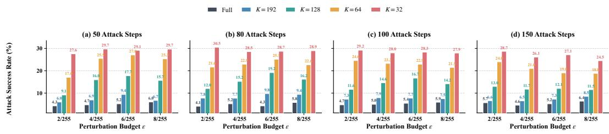  
Figure 5: Sensitivity of Full ASR and CSFR to the perturbation budget and number of optimization steps on POPE.

Figure 5 varies $\epsilon \in \{ 2 , 4 , 6 , 8 \} / 2 5 5$ and the number of optimization steps in {50, 80, 100, 150}; the step size is set to $\epsilon / 4 .$ . Across all 16 configurations, Full ASR remains between 4.14% and 6.38%, whereas Avg. CSFR ranges from 14.93% to 20.82%. Thus, substantial compression-specific failure rates persist while full-token degradation remains limited, and the default $\epsilon = 4 / 2 5 5$ , 100-step setting lies within a stable selective region rather than at an isolated optimum.

## D.4 SCORING-LAYER CONFIGURATION STUDY

The primary score in equation 13 averages class-to-patch attention over the scoring-layer configuration $\mathcal { L } _ { \mathrm { s c o r e } } .$ . We compare 14 single-layer, contiguous, and spaced multi-layer configurations using 100- example design subsets from POPE, TextVQA, and MME, evaluated with VisionZip, PruMerge, and VisPruner. We select the configuration with the highest mean Selective Gap across these nine dataset–compressor environments and use it throughout the reported evaluation.

As shown in Figure 6, the selected spaced late-layer triplet $\{ - 1 , - 3 , - 5 \}$ achieves 23.45% Avg. CSFR with 5.59% Full ASR, corresponding to a 17.86 pp Selective Gap. Its exclusion rate for clean high-priority tokens also varies less across observer layers than that of the single-layer {−2} configuration (range 0.055 versus 0.242). The negative association between cross-layer variation and selectivity $( \rho _ { s } = - 0 . 7 0 )$ indicates that configurations with more stable exclusion behavior across depth tend to exhibit higher selectivity. This association is descriptive rather than causal.

## E CROSS-MODEL SCOPE

The main experiments establish CIRA across multiple compressors and budgets on LLaVA. We next test whether paired selectivity persists when the vision encoder, multimodal interface, and language model change together, using Qwen3-VL-8B-Instruct (Bai et al., 2025) and InternVL3.5-8B (Wang et al., 2025b).

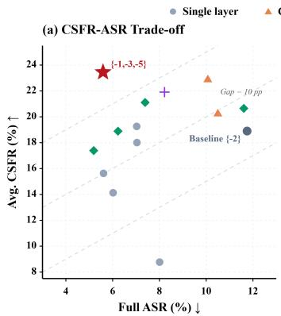

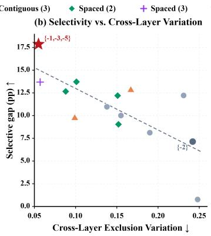

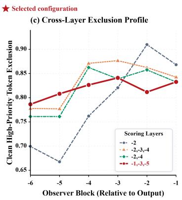  
Figure 6: Selectivity and cross-layer exclusion stability across scoring-layer configurations.

Here K denotes the number of compressed visual tokens passed to subsequent computation in each model’s native interface. For compact reporting, we use $\dot { K _ { 1 } } / 6 4 / 3 2$ , where $K _ { 1 } = 9 6$ for Qwen3-VL and $K _ { 1 } = 1 2 8$ for InternVL. Avg. CSFR is the arithmetic mean over the three budgets within each model family. Table 10 reports the corresponding CSFR and Full ASR results, while clean accuracy is provided in Table 11.

Table 10: CSFR and Full ASR on Qwen3-VL-8B-Instruct and InternVL3.5-8B. Compressor entries report CSFR at $K _ { 1 } / 6 4 / 3 2$ followed by their average. Bold and underlined values denote the best and second-best downstream-agnostic results, respectively; $\mathrm { C A A ^ { \dagger } }$ is shown as a stronger-access reference and excluded from these rankings.
<table><tr><td>Dataset</td><td>Attack</td><td>Full ASR (%)↓</td><td>VisionZip K₁/64/32/vg.↑</td><td> $\begin{array} { c } { \mathrm { V i s P r u n e r } } \\ { K _ { 1 } / 6 4 / 3 2 / \mathrm { A v g } . \uparrow } \end{array}$ </td><td>PruMerge  $\underline { { K _ { 1 } / 6 4 / 3 2 / \mathrm { { \bar { A } v g . \uparrow } } } }$ </td><td>FastV  $K _ { 1 } / 6 4 / 3 2 / \mathrm { A v g . } \uparrow$ </td></tr><tr><td colspan="7">Qwen3-VL-8B-Instruct (K1 = 96)</td></tr><tr><td rowspan="5">POPE</td><td>VEAttack</td><td>45.93</td><td>4.63/5.83/10.06/6.84</td><td>2.15/2.78/4.67/3.20</td><td>3.91/5.01/7.49/5.47</td><td>2.32/3.95/4.60/3.62</td></tr><tr><td>CAGE</td><td>46.47</td><td>7.13/8.13/10.19/8.48</td><td>4.65/5.68/8.32/6.22</td><td>7.23/8.23/8.95/8.14</td><td>4.65/6.25/11.49/7.46</td></tr><tr><td>CAA†</td><td>4.40</td><td>4.03/5.82/11.31/7.05</td><td>2.61/4.86/8.70/5.39</td><td>2.47/3.33/7.06/4.29</td><td>8.44/11.61/14.80/11.61</td></tr><tr><td>CIRA</td><td>10.66</td><td>7.59/9.82/14.14/10.52</td><td>4.98/6.56/11.22/7.59</td><td>3.65/4.39/7.94/5.33</td><td>8.56/10.08/13.07/10.57</td></tr><tr><td>VEAttack</td><td>80.14</td><td>10.11/10.03/3.58/7.91</td><td>10.14/7.75/1.98/6.62</td><td>10.22/7.87/3.34/7.14</td><td>3.54/3.58/3.65/3.59</td></tr><tr><td rowspan="4">TextVQA</td><td>CAGE</td><td>66.03</td><td>23.96/22.56/15.22/20.58</td><td>19.59/16.71/10.62/15.64</td><td>21.54/18.12/16.56/18.74</td><td>12.38/11.00/12.41/11.93</td></tr><tr><td>CAA†</td><td>8.24</td><td>46.37/42.86/35.22/41.48</td><td>29.28/31.23/32.84/31.12</td><td>31.69/30.19/31.91/31.27</td><td>43.81/42.20/38.69/41.57</td></tr><tr><td>CIRA</td><td>16.37</td><td>51.65/52.13/45.37/49.72</td><td>30.63/28.81/34.57/31.34</td><td>34.88/32.13/35.20/34.07</td><td>38.31/36.57/34.31/36.40</td></tr><tr><td>VEAttack</td><td>44.11</td><td>7.14/6.59/9.29/7.67</td><td>5.95/6.51/6.29/6.25</td><td>7.60/8.31/9.69/8.54</td><td>2.58/3.84/6.58/4.33</td></tr><tr><td rowspan="4">MME</td><td>CAGE</td><td>41.60</td><td>11.67/7.78/10.19/9.88</td><td>11.41/7.83/9.37/9.54</td><td>12.47/11.87/15.09/13.14</td><td>4.42/6.64/8.53/6.53</td></tr><tr><td>CAA†</td><td>4.76</td><td>8.27/9.96/12.35/10.19</td><td>7.37/7.72/10.34/8.48</td><td>9.71/9.72/12.08/10.51</td><td>9.16/11.71/15.66/12.18</td></tr><tr><td>CIRA</td><td>12.43</td><td>8.34/7.79/12.79/9.64</td><td>8.82/7.37/9.91/8.70</td><td>7.14/5.26/7.05/6.49</td><td>5.28/6.77/10.21/7.42</td></tr><tr><td colspan="7">InternVL3.5-8B (K1 = 128)</td></tr><tr><td rowspan="4">POPE</td><td>VEAttack</td><td>51.46</td><td>6.01/8.17/10.35/8.18</td><td>4.20/7.44/7.91/6.52</td><td>5.28/7.56/9.03/7.29</td><td>7.13/11.29/12.99/10.47</td></tr><tr><td>CAGE</td><td>45.01</td><td>7.67/13.25/17.45/12.79</td><td>3.82/5.61/8.19/5.87</td><td>3.48/5.33/8.49/5.77</td><td>9.68/13.31/16.35/13.11</td></tr><tr><td>CAA†</td><td>9.85</td><td>4.35/7.50/8.78/6.88</td><td>1.90/4.14/6.66/4.23</td><td>0.77/2.21/2.65/1.88</td><td>7.26/20.03/28.32/18.54</td></tr><tr><td>CIRA</td><td>11.68</td><td>4.87/7.90/11.65/8.14</td><td>3.04/4.01/8.42/5.16</td><td>2.83/3.26/4.75/3.61</td><td>3.82/8.60/12.26/8.23</td></tr><tr><td rowspan="4">TextVQA</td><td>VEAttack</td><td>56.92</td><td>7.50/12.77/14.81/11.69</td><td>3.83/7.17/11.67/7.56</td><td>7.52/10.50/11.86/9.96</td><td>5.24/7.37/12.68/8.43</td></tr><tr><td>CAGE</td><td>55.24</td><td>11.00/16.23/16.24/14.49</td><td>6.20/10.99/11.41/9.53</td><td>6.64/10.37/13.50/10.17</td><td>4.94/9.89/14.83/9.89</td></tr><tr><td>CAA†</td><td>5.03</td><td>10.58/22.73/23.58/18.96</td><td>13.64/15.66/23.68/17.66</td><td>5.25/9.51/10.53/8.43</td><td>10.18/33.63/45.69/29.84</td></tr><tr><td>CIRA</td><td>12.03</td><td>33.17/36.80/36.93/35.63</td><td>10.55/17.00/21.58/16.38</td><td>17.35/21.20/15.79/18.11</td><td>10.03/25.36/38.28/24.56</td></tr><tr><td rowspan="4">MME</td><td>VEAttack</td><td>40.63</td><td>2.57/4.44/4.91/3.98</td><td>2.27/4.05/4.44/3.58</td><td>3.28/3.93/5.71/4.31</td><td>1.72/3.27/5.35/3.45</td></tr><tr><td>CAGE</td><td>37.25</td><td>7.13/9.14/9.16/8.48</td><td>4.07/4.93/6.32/5.10</td><td>4.38/5.73/7.82/5.98</td><td>4.70/7.02/8.43/6.72</td></tr><tr><td>CAA†</td><td>5.53</td><td>2.92/3.58/8.11/4.87</td><td>2.41/6.19/8.31/5.64</td><td>2.81/2.81/5.04/3.55</td><td>3.44/13.68/18.88/12.00</td></tr><tr><td>CIRA</td><td>5.76</td><td>6.88/10.63/12.50/10.00</td><td>3.98/7.45/8.72/6.72</td><td>5.37/5.61/7.17/6.05</td><td>4.01/6.54/11.38/7.31</td></tr></table>

Across both additional model families, CIRA continues to induce compression-specific failures while keeping Full ASR substantially below those of VEAttack and CAGE. The pattern is strongest on TextVQA, where CIRA achieves the highest Avg. CSFR among downstream-agnostic attacks for every compressor on both model families. Results on POPE and MME are more heterogeneous across compressors, but compression-specific failure induction remains observable under target-encoderonly access. Together, these results show that CIRA’s compression-selective behavior extends beyond LLaVA to distinct vision encoders and native visual-token interfaces.

## F SELECTION STABILIZATION DEFENSE

Translation-Consensus Selection (TCS) stabilizes priority rankings by aggregating aligned scores across spatially translated views.

## F.1 TRANSLATION-CONSENSUS SELECTION

For pixel displacement $d ,$ define

$$
\mathcal { V } = \{ T _ { 0 , 0 } , T _ { d , 0 } , T _ { 0 , d } , T _ { d , d } \} .\tag{28}
$$

We set $d = 7$ pixels and construct each view by reflection-padding and cropping to the original size.   
The four views form one batched vision-encoder input.

Score alignment and consensus. For view $v \in \mathcal V$ , let $\mathbf { s } ^ { ( v ) } \in \mathbb { R } ^ { N }$ be its encoder-side priority-score vector. Operator $\mathcal { A } _ { v }$ inverse-aligns the score grid to $T _ { 0 , 0 }$ by bilinear sampling with reflection padding. With patch size $p = 1 4$ , the offset is $d / p = 0 . 5$ patch:

$$
\widetilde { \mathbf { s } } ^ { ( v ) } = \mathcal { A } _ { v } \left( \mathbf { s } ^ { ( v ) } \right) .\tag{29}
$$

Equation 11 converts the aligned scores to descending rank quantiles, so each view contributes a priority ranking rather than a score scale.

Selection interface. At compression budget K, TCS replaces the original priority ranking with the cross-view consensus ranking. The unshifted view supplies token features and the compressor’s key similarity metric, while translated views contribute aligned priority scores. Token counts, aggregation, and language-model input length remain unchanged.

Matched evaluation and cost. We evaluate None and TCS on matched adversarial images, questions, references, eligibility sets, and compression budgets. Full-token inference is unchanged, so Full ASR is shared within each matched pair in Table 4. The four views are processed by the vision encoder in one batch, with no additional language-model inference.

## F.2 CROSS-VIEW SUPPORT MECHANISM

Cross-view support characterizes the contrast between stable clean evidence and view-specific adversarial replacements. At each compression budget K, the canonical clean Top-K set serves as the reference, while CIRA replacements are tokens that enter the canonical adversarial Top-K set from outside this reference. A candidate’s view support is the number of aligned views in which it remains within the Top-K set.

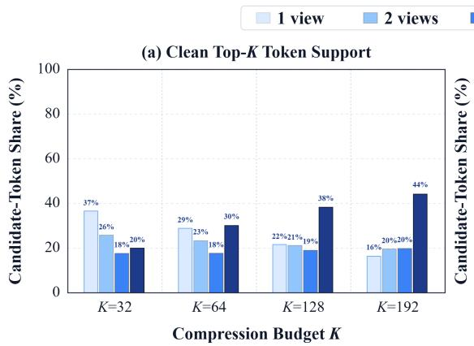

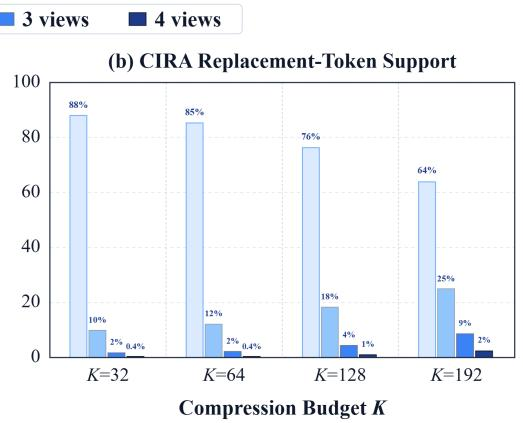  
Figure 7: Cross-view support distributions of clean Top-K tokens and CIRA replacement tokens across compression budgets.

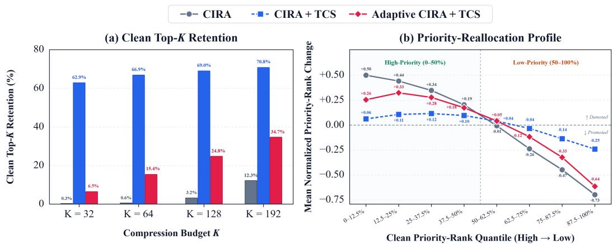  
Figure 8: Clean Top-K retention and priority-reallocation profiles under CIRA, CIRA + TCS, and Adaptive CIRA + TCS.

Figure 7 shows that CIRA replacements are predominantly view-specific. As K increases from 32 to 192, the one-view share decreases from 88.0% to 63.9%, while fewer than 2.5% are supported by all four views. Clean Top-K tokens show the opposite pattern: their four-view share increases from 20.0% to 44.2%. Averaging aligned rank quantiles therefore downweights isolated replacement spikes while favoring evidence supported across translations.

## F.3 ADAPTIVE EVALUATION

Standard CIRA is optimized on the unshifted view, with TCS applied only at evaluation. Adaptive CIRA instead optimizes equation 12 over all four public transformations, using the view-specific encoder objectives as differentiable surrogates for rank conversion and Top-K selection. For each view, we cache clean features and ranks and compute GSH and HEP with view-specific hiddenevidence weights over $[ K _ { \operatorname* { m i n } } , K _ { \operatorname* { m a x } } ]$ . The averaged gradient updates one shared perturbation using the original $\epsilon = 4 / 2 5 5$ , step size 1/255, 100 steps, and λ = 0.8. Adaptive CIRA retains the same target-encoder access as standard CIRA.

Selection and rank response. For each condition, clean Top-K retention measures the fraction of tokens in the clean Top-K set that remain in the adversarial Top-K set under the corresponding ranking rule. Signed normalized rank change is $( r _ { i } ^ { a } - r _ { i } ^ { c } ) / ( N - \mathrm { \bar { 1 } } )$ , where $\boldsymbol { r } _ { i } ^ { c }$ and $r _ { i } ^ { a }$ denote clean and adversarial ranks under the same ranking rule, and positive values indicate demotion. Retention is averaged per image.

Across the four compression budgets, Figure 8(a) shows that TCS raises clean Top-K retention under CIRA from 0.3–12.3% to 62.9–70.8%. Adaptive CIRA reduces this retention under TCS to 6.5–34.7%. Figure 8(b) shows the corresponding priority reallocation: TCS attenuates both the demotion of clean high-priority tokens and the promotion of initially low-priority tokens, whereas Adaptive CIRA restores much of this signed reallocation.

Together, the cross-view support patterns and the selection responses under TCS show that TCS suppresses view-fragile priority reallocation. Corresponding task-utility results are reported in Appendix G.

## G COMPLEMENTARY TASK-UTILITY RESULTS

CSFR is the primary clean-conditioned metric for compression-specific failure. We complement it with accuracy-based results that characterize clean utility under compression, post-attack performance, and task-utility recovery under TCS.

Table 11: Clean full-token and compressed accuracy (%) across model families, datasets, compressors, and family-specific compression budgets. The final value in each compressed cell reports the average across the listed budgets.
<table><tr><td>Dataset</td><td>Full ACC</td><td>VisionZip</td><td>VisPruner</td><td>PruMerge</td><td>FastV</td></tr><tr><td colspan="6">LLaVA-v1.5-7B (K = 192/128/64/32/Avg.)</td></tr><tr><td>POPE</td><td>84.6</td><td>84.3/83.5/79.6/73.0/80.1</td><td>84.1/82.9/80.5/75.3/80.7</td><td>75.6/74.1/72.0/70.1/73.0</td><td>81.1/80.0/74.7/68.0/76.0</td></tr><tr><td>TextVQA</td><td>60.3</td><td>54.3/51.6/49.5/45.1/50.1</td><td>58.4/58.0/56.8/51.9/56.3</td><td>51.9/51.6/51.7/49.4/51.2</td><td>51.6/49.4/44.7/37.8/45.9</td></tr><tr><td>MME</td><td>79.2</td><td>77.2/76.3/73.5/69.0/74.0</td><td>76.9/76.5/74.0/71.7/74.8</td><td>72.9/70.9/71.1/70.8/71.4</td><td>76.1/73.9/70.8/67.4/72.1</td></tr><tr><td colspan="6">Qwen3-VL-8B-Instruct (K = 96/64/32/Avg.)</td></tr><tr><td>POPE</td><td>86.3</td><td>86.1/84.1/80.7/83.6</td><td>86.6/85.1/82.3/84.7</td><td>86.4/86.1/83.8/85.4</td><td>85.1/82.4/74.4/80.6</td></tr><tr><td>TextVQA</td><td>88.6</td><td>46.7/41.1/34.1/40.6</td><td>45.8/42.6/41.5/43.3</td><td>33.9/31.8/31.2/32.3</td><td>52.6/40.6/28.1/40.4</td></tr><tr><td>MME</td><td>90.0</td><td>88.2/88.6/83.4/86.7</td><td>88.4/88.1/83.5/86.7</td><td>86.7/86.7/83.3/85.6</td><td>88.3/85.7/79.4/84.5</td></tr><tr><td colspan="6">InternVL3.5-8B (K = 128/64/32/Avg.)</td></tr><tr><td>POPE</td><td>82.2</td><td>81.4/80.8/77.1/79.8</td><td>80.4/80.5/78.3/79.7</td><td>79.0/79.0/78.8/78.9</td><td>81.0/79.5/74.9/78.5</td></tr><tr><td>TextVQA</td><td>71.5</td><td>64.7/48.6/37.5/50.3</td><td>57.7/47.0/40.4/48.4</td><td>46.8/37.7/32.8/39.1</td><td>68.5/57.6/44.3/56.8</td></tr><tr><td>MME</td><td>88.6</td><td>87.5/83.8/78.2/83.2</td><td>84.8/82.2/77.0/81.3</td><td>84.0/80.8/78.5/81.1</td><td>88.2/85.2/77.8/83.7</td></tr></table>

## G.1 CLEAN UTILITY UNDER COMPRESSION

Table 11 shows that high-budget settings preserve most POPE and MME accuracy across model families, while TextVQA generally exhibits larger losses under compression. Related analyses also find task-dependent visual-token requirements, with OCR tasks relying on visual information deeper into the decoder (Wang et al., 2026b). These values provide the clean reference for the post-attack comparisons below.

## G.2 POST-ATTACK TASK UTILITY

Unlike CSFR, adversarial accuracy is computed over the complete evaluation set and therefore reflects both pre-existing compression errors and attack-induced failures. It provides a complementary view of overall task degradation under CIRA.

Table 12: Full-token clean-to-adversarial accuracy and compressed adversarial accuracy (%) under CIRA across model families, datasets, compressors, and family-specific budgets. The final value in each compressed cell reports the budget average.
<table><tr><td>Dataset</td><td>Full ACC</td><td>VisionZip</td><td>VisPruner</td><td>PruMerge</td><td>FastV</td></tr><tr><td colspan="6">LLaVA-v1.5-7B (compressed Adv. ACC: K = 192/128/64/32/Avg.)</td></tr><tr><td>POPE</td><td>84.6 → 82.6</td><td>78.4/74.0/64.6/58.0/68.8</td><td>80.0/77.7/71.7/64.1/73.4</td><td>63.3/55.9/51.2/50.3/55.2</td><td>76.8/71.4/61.0/53.4/65.7</td></tr><tr><td>TextVQA</td><td>60.3 → 57.1</td><td>46.7/40.0/32.2/26.1/36.3</td><td>51.3/49.5/44.6/38.6/46.0</td><td>36.9/32.2/27.4/25.0/30.4</td><td>45.5/41.9/33.5/25.7/36.7</td></tr><tr><td>MME</td><td>79.2 → 77.2</td><td>73.2/70.7/65.5/59.5/67.2</td><td>73.2/70.9/64.1/60.5/67.2</td><td>62.2/58.9/55.4/51.5/57.0</td><td>73.2/71.6/63.7/58.8/66.8</td></tr><tr><td colspan="6">Qwen3-VL-8B-Instruct (compressed Adv. ACC: K ( = 96/64/32/Avg.)</td></tr><tr><td>POPE</td><td>86.3 → 81.3</td><td>75.9/74.2/71.2/73.8</td><td>78.1/76.7/73.5/76.1</td><td>79.8/79.8/76.0/78.5</td><td>76.0/73.9/67.7/72.5</td></tr><tr><td>TextVQA</td><td>88.6 → 75.7</td><td>21.1/20.5/21.4/21.0</td><td>31.9/31.9/31.0/31.6</td><td>22.2/22.4/22.0/22.2</td><td>30.7/25.6/20.6/25.6</td></tr><tr><td>MME</td><td>90.0 → 81.5</td><td>74.9/76.1/69.8/73.6</td><td>73.9/76.5/72.5/74.3</td><td>74.3/77.1/74.6/75.3</td><td>79.9/77.5/70.9/76.1</td></tr><tr><td colspan="6">InternVL3.5-8B (compressed Adv. ACC: K = 128/64/32/Avg.)</td></tr><tr><td>POPE</td><td>82.2 → 76.1</td><td>75.5/75.4/71.8/74.2</td><td>75.8/75.9/73.4/75.0</td><td>75.7/75.0/75.4/75.4</td><td>77.3/73.1/70.2/73.5</td></tr><tr><td>TextVQA</td><td>71.5 → 65.9</td><td>42.3/32.3/27.1/33.9</td><td>53.9/43.6/36.1/44.5</td><td>39.5/31.8/29.5/33.6</td><td>58.4/42.7/29.6/43.6</td></tr><tr><td>MME</td><td>88.6 → 85.3</td><td>81.4/75.7/71.5/76.2</td><td>81.3/77.8/74.9/78.0</td><td>80.2/78.3/74.7/77.7</td><td>83.8/79.8/72.9/78.8</td></tr></table>

Table 12 shows that CIRA reduces budget-averaged compressed accuracy by 3.3–20.8 pp across the evaluated model–dataset–compressor settings. After averaging compressors within each model– dataset pair and weighting the nine pairs equally, the mean compressed accuracy drop is 9.6 pp, compared with 5.4 pp under full-token inference. This aggregate view complements the paired CSFR analysis by quantifying end-task degradation under compressed inference.

## G.3 TASK-UTILITY RECOVERY UNDER TCS

Table 13 reports matched task accuracy without and with TCS. Each comparison fixes the input image, question, and compression budget, with TCS applied only to compressed inference.

Across the three benchmarks, TCS changes clean Avg. ACC by at most 0.52 pp in magnitude, while recovering 6.77–13.20 pp under CIRA, with larger gains at tighter budgets. Under Adaptive

Table 13: Matched compressed accuracy (%) without and with TCS on LLaVA-v1.5-7B with VisionZip under clean, CIRA, and Adaptive CIRA conditions across datasets and compression budgets. Entries show None→TCS, with annotations reporting the corresponding change.
<table><tr><td>Evaluation</td><td>K = 192</td><td>K = 128</td><td>K = 64</td><td>K = 32</td><td>Avg.</td></tr><tr><td colspan="6">POPE</td></tr><tr><td>Clean</td><td>84.30→ 83.10↓1.20</td><td>83.50→ 82.50↓1.00</td><td>79.60→ 78.40↓1.20</td><td>73.00→74.30↑1.30</td><td>80.10 → 79.58↓0.52</td></tr><tr><td>CIRA</td><td>78.40→81.30↑2.90</td><td>74.00 → 80.90 ↑6.90</td><td>64.60→78.30↑13.70</td><td>58.00→ 75.40↑17.40</td><td>68.75→78.98↑10.23</td></tr><tr><td>Adaptive CIRA</td><td>78.80→ 78.60↓0.20</td><td>76.40→ 76.00↓0.40</td><td>66.80→71.60 ↑4.80</td><td>56.30→62.20↑5.90</td><td>69.58→72.10↑2.52</td></tr><tr><td colspan="6">TextVQA</td></tr><tr><td>Clean</td><td>54.30→ 53.20↓1.10</td><td>51.60 → 51.30 ↓0.30</td><td>49.50→ 49.40↓0.10</td><td>45.10→45.40↑0.30</td><td>50.13→ 49.83↓0.30</td></tr><tr><td>CIRA</td><td>46.70→52.40↑5.70</td><td>40.00→50.90↑10.90</td><td>32.20→ 49.00↑16.80</td><td>26.10→ 45.50↑19.40</td><td>36.25→49.45↑13.20</td></tr><tr><td>Adaptive CIRA</td><td>48.30→49.00↑0.70</td><td>45.10→46.90 ↑1.80</td><td>36.00→42.10↑6.10</td><td>26.70→33.00↑6.30</td><td>39.03→42.75↑3.72</td></tr><tr><td colspan="6">MME</td></tr><tr><td>Clean</td><td>77.20→ 76.50↓0.70</td><td>76.30→ 76.00↓0.30</td><td>73.50→ 74.30 ↑0.80</td><td>69.00→70.60↑1.60</td><td>74.00 → 74.35 ↑0.35</td></tr><tr><td>CIRA</td><td>73.20→75.00↑1.80</td><td>70.70→ 75.80 ↑5.10</td><td>65.50→74.00↑8.50</td><td>59.50→71.20 ↑11.70</td><td>67.23→74.00↑6.77</td></tr><tr><td>Adaptive CIRA</td><td>74.50→ 73.60↓0.90</td><td>70.90→ 72.00 ↑1.10</td><td>62.90→ 68.40↑5.50</td><td>58.50→ 62.00↑3.50</td><td> $6 6 . 7 0  6 9 . 0 0 \uparrow 2 . 3 0$ </td></tr></table>

CIRA, TCS recovers less utility, consistent with the attack partially restoring the priority reallocation suppressed by TCS.

## H LIMITATIONS AND FUTURE WORK

Temporal and contextual dependencies. The present evaluation is restricted to single-image inference. In video, multi-image, and multi-turn settings, evidence retention also depends on temporal redundancy and evolving context (Shen et al., 2024; Li et al., 2026b; Wang et al., 2026c). Run-Length Pruning, for instance, combines temporal redundancy removal with token distillation (Ma et al., 2026). Whether encoder-only priority manipulation remains compression-selective when evidence is distributed across frames or dialogue turns remains an open question.

Compression mechanisms beyond token selection. Our diagnostics examine retained-set allocation and representation drift, but do not exhaust the mechanisms underlying compression-induced errors. Adaptive pruning changes allocation across inputs or layers (Ye et al., 2025; Chen et al., 2026; Li et al., 2026a); learned summarization transforms the token representation (Bulat et al., 2026); and recoverable routing permits deferred tokens to re-enter subsequent selection stages (Yang et al., 2026). These mechanisms complicate a description based on a single token ranking. Moreover, spatial disruption (Huang et al., 2026) and positional or attentional distortion (Cho et al., 2026) are not separately identified by our retained-set interventions. Paired CSF evaluation remains applicable, but attributing failures within these compression mechanisms requires additional diagnostics.

Beyond task correctness. CSF is defined through task-level correctness rather than response safety or targeted attack success. Accordingly, preserving full-token correctness does not establish safety preservation, and compressed-path errors do not necessarily constitute safety-alignment failures. Targeted manipulation and multimodal jailbreaks (Zhang et al., 2025a; Qi et al., 2024; Shayegani et al., 2024) provide distinct settings for paired evaluation, requiring outcome criteria tailored to the corresponding security objective.

Question: Is there a pizza in the image?

Question: what is the book about?
<table><tr><td rowspan="2">Compressor</td><td rowspan="2">Full</td><td colspan="4">Compressed inference</td></tr><tr><td>K=192</td><td>K=128</td><td>K=64</td><td>K=32</td></tr><tr><td>VisionZIP</td><td>yes</td><td>no</td><td>no</td><td>no</td><td>no</td></tr><tr><td>VisPruner</td><td>yes</td><td>no</td><td>no</td><td>no</td><td>no</td></tr><tr><td>PruMerge</td><td>yes</td><td>no</td><td>no</td><td>no</td><td>no</td></tr><tr><td>FastV</td><td>yes</td><td>no</td><td>no</td><td>no</td><td>no</td></tr></table>

## I QUALITATIVE CASE STUDIES

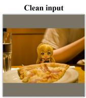

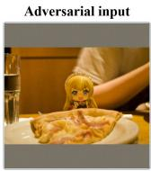

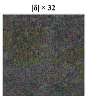

<table><tr><td colspan="6">Model outputs across compressors and budgets</td></tr><tr><td rowspan="2">Compressor</td><td rowspan="2">Full</td><td colspan="4">Compressed inference</td></tr><tr><td>K=192</td><td>K=128</td><td>K=64</td><td>K=32</td></tr><tr><td>VisionZIP</td><td>yes</td><td>no</td><td>no</td><td>no</td><td>no</td></tr><tr><td>VisPruner</td><td>yes</td><td>yes</td><td>no</td><td>no</td><td>no</td></tr><tr><td>PruMerge</td><td>yes</td><td>no</td><td>no</td><td>no</td><td>no</td></tr><tr><td>FastV</td><td>yes</td><td>yes</td><td>yes</td><td>no</td><td>no</td></tr></table>

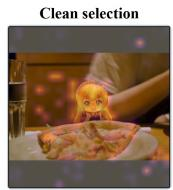

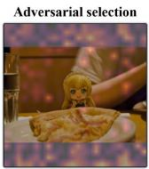

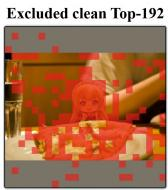

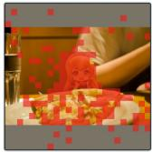

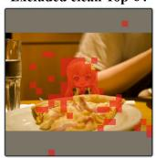

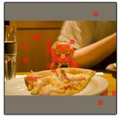

LLaVA-v1.5-7B

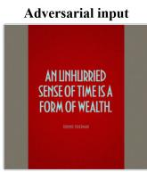

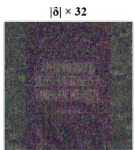

<table><tr><td rowspan="2">Compressor</td><td rowspan="2">Full</td><td colspan="4">Compressed inference</td></tr><tr><td>K=192</td><td>K=128</td><td>K=64</td><td>K=32</td></tr><tr><td>VisionZIP</td><td>wealth</td><td>film</td><td>productivity</td><td>life</td><td>States</td></tr><tr><td>VisPruner</td><td>wealth</td><td>lives</td><td>Gogh</td><td>States</td><td>States</td></tr><tr><td>PruMerge</td><td>wealth</td><td>Olien</td><td>States</td><td>States</td><td>States</td></tr><tr><td>FastV</td><td>Time</td><td>Wealth</td><td>Money</td><td>Cooking</td><td>Religion</td></tr></table>

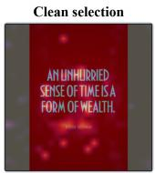

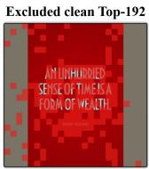

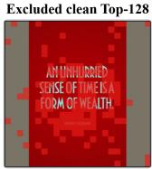

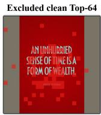

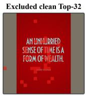

Question: Is this artwork created by palma vecchio? Ground truth: yes  
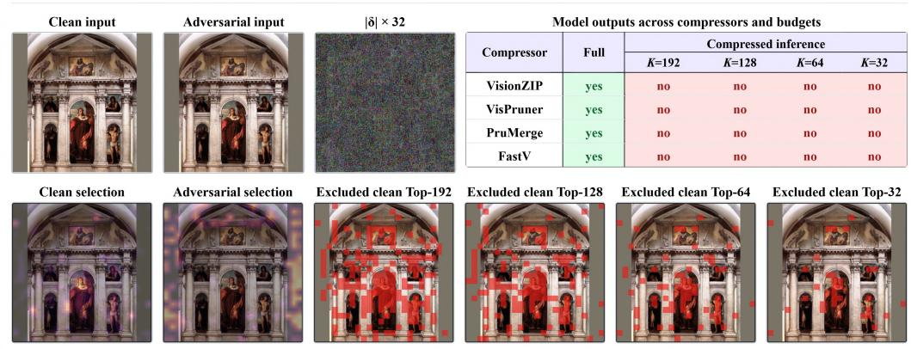  
Figure 9: Qualitative examples of compression-specific failures on LLaVA-v1.5-7B across visual-token compressors and retention budgets.

## POPE

## Question: Is there a cell phone in the image?

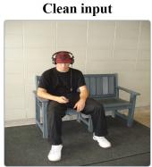

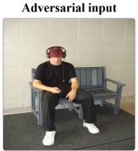

|δ| × 32  
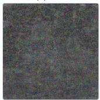

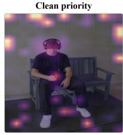

Adversarial priority  
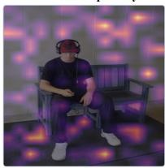

Model outputs across compressors and budgets  
Excluded clean Top-96  
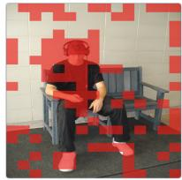

<table><tr><td rowspan="2">Compressor</td><td rowspan="2">Full</td><td colspan="3">Compressed inference</td></tr><tr><td>K=96</td><td>K=64</td><td>K=32</td></tr><tr><td>VisionZIP</td><td>yes</td><td>no</td><td>no</td><td>no</td></tr><tr><td>VisPruner</td><td>yes</td><td>no</td><td>no</td><td>no</td></tr><tr><td>PruMerge</td><td>yes</td><td>no</td><td>no</td><td>no</td></tr><tr><td>FastV</td><td>yes</td><td>no</td><td>no</td><td>no</td></tr></table>

Excluded clean Top-64  
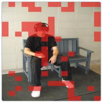

Excluded clean Top-32  
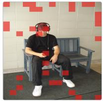

## TextVQA

## Question: what number can be seen?

Qwen3-VL-8B-Instruct

Ground truth: 5  
Clean input  
Adversarial input  

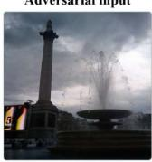  
|δ|×32

Clean priority  
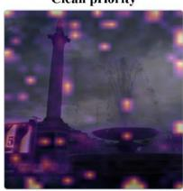

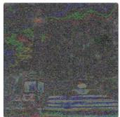  
Model outputs across compressors and budgets

Adversarial priority  
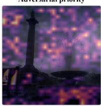

<table><tr><td rowspan="2">Compressor</td><td rowspan="2">Full</td><td colspan="3">Compressed inference</td></tr><tr><td>K=96</td><td>K=64</td><td>K=32</td></tr><tr><td>VisionZIP</td><td>5</td><td>1</td><td>2</td><td>2</td></tr><tr><td>VisPruner</td><td>5</td><td>5</td><td>2</td><td>2</td></tr><tr><td>PruMerge</td><td>5</td><td>8</td><td>6</td><td>666</td></tr><tr><td>FastV</td><td>5</td><td>5</td><td>5</td><td>3</td></tr></table>

Excluded clean Top-96  
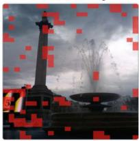

Excluded clean Top-64  
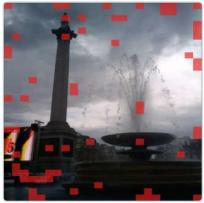

Excluded clean Top-32  
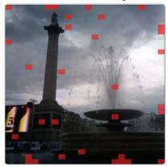

## MME

Question: Is this a picture of Church of Saint Giles in Prague?  
Ground truth: yes  
Clean input  

Adversarial input  

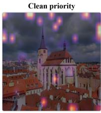

|δ|× 32  
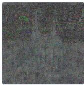

Model outputs across compressors and budgets
<table><tr><td rowspan="2">Compressor</td><td rowspan="2">Full</td><td colspan="3">Compressed inference</td></tr><tr><td>K=96</td><td>K=64</td><td>K=32</td></tr><tr><td>VisionZIP</td><td>yes</td><td>no</td><td>no</td><td>no</td></tr><tr><td>VisPruner</td><td>yes</td><td>no</td><td>no</td><td>no</td></tr><tr><td>PruMerge</td><td>yes</td><td>no</td><td>no</td><td>no</td></tr><tr><td>FastV</td><td>yes</td><td>no</td><td>no</td><td>no</td></tr></table>

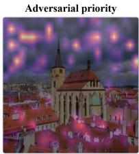

Excluded clean Top-96  
Excluded clean Top-64  
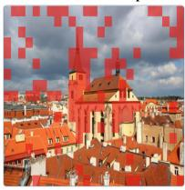

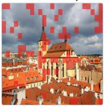

Excluded clean Top-32  
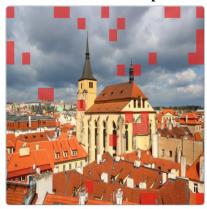  
Figure 10: Qualitative examples of compression-specific failures on Qwen3-VL-8B-Instruct across visual-token compressors and retention budgets.

Question: Is there a dining table in the image? Ground truth: no  
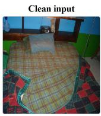

  
|δ|× 32

Model outputs across compressors and budgets  
Excluded clean Top-128
<table><tr><td rowspan="2">Compressor</td><td rowspan="2">Full</td><td colspan="3">Compressed inference</td></tr><tr><td>K=128</td><td>K=64</td><td>K=32</td></tr><tr><td>VisionZIP</td><td>no</td><td>no</td><td>yes</td><td>yes</td></tr><tr><td>VisPruner</td><td>no</td><td>yes</td><td>yes</td><td>yes</td></tr><tr><td>PruMerge</td><td>no</td><td>yes</td><td>yes</td><td>yes</td></tr><tr><td>FastV</td><td>no</td><td>yes</td><td>yes</td><td>yes</td></tr></table>

Excluded clean Top-64  

Excluded clean Top-32  

## TextVQA

InternVL3.5-8B

Question: what team name is on the player's jersey?

Ground truth: rays  
Clean input  
Adversarial input  

  
|δ|× 32

Model outputs across compressors and budgets  

<table><tr><td rowspan="2">Compressor</td><td rowspan="2">Full</td><td colspan="3">Compressed inference</td></tr><tr><td>K=128</td><td>K=64</td><td>K=32</td></tr><tr><td>VisionZIP</td><td>Rays</td><td>braves</td><td>braves</td><td>GIANTS</td></tr><tr><td>VisPruner</td><td>Rays</td><td>rangers</td><td>red sox</td><td>whitecaps</td></tr><tr><td>PruMerge</td><td>Rays</td><td>braves</td><td>braves</td><td>braves</td></tr><tr><td>FastV</td><td>Rays</td><td>RAYS</td><td>braves</td><td>NEW YORK</td></tr></table>

Excluded clean Top-128  

Excluded clean Top-64  

Excluded clean Top-32  

InternVL3.5-8B

MME

Question: Is there a white bird in the image?

Ground truth: yes

|δ|× 32  

Model outputs across compressors and budgets
<table><tr><td rowspan="2">Compressor</td><td rowspan="2">Full</td><td colspan="3">Compressed inference</td></tr><tr><td>K=128</td><td>K=64</td><td>K=32</td></tr><tr><td>VisionZIP</td><td>yes</td><td>no</td><td>no</td><td>no</td></tr><tr><td>VisPruner</td><td>yes</td><td>no</td><td>no</td><td>no</td></tr><tr><td>PruMerge</td><td>yes</td><td>no</td><td>no</td><td>no</td></tr><tr><td>FastV</td><td>yes</td><td>yes</td><td>yes</td><td>no</td></tr></table>

Excluded clean Top-64

Excluded clean Top-128  

Excluded clean Top-32  
  
Figure 11: Qualitative examples of compression-specific failures on InternVL3.5-8B across visual-token compressors and retention budgets.