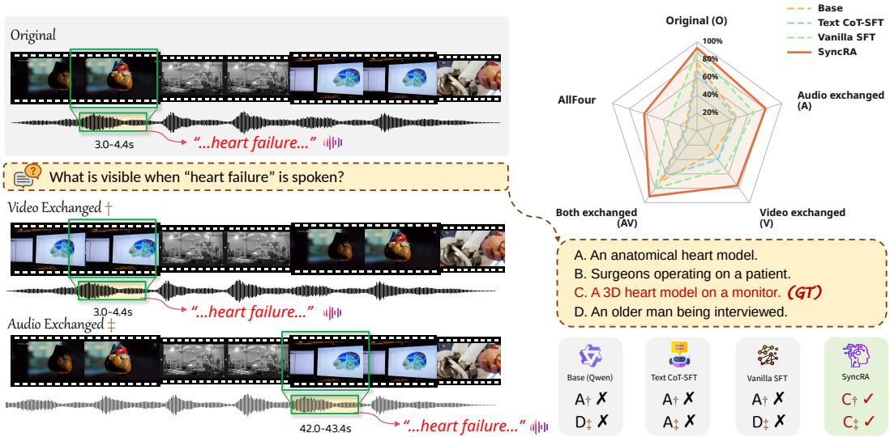
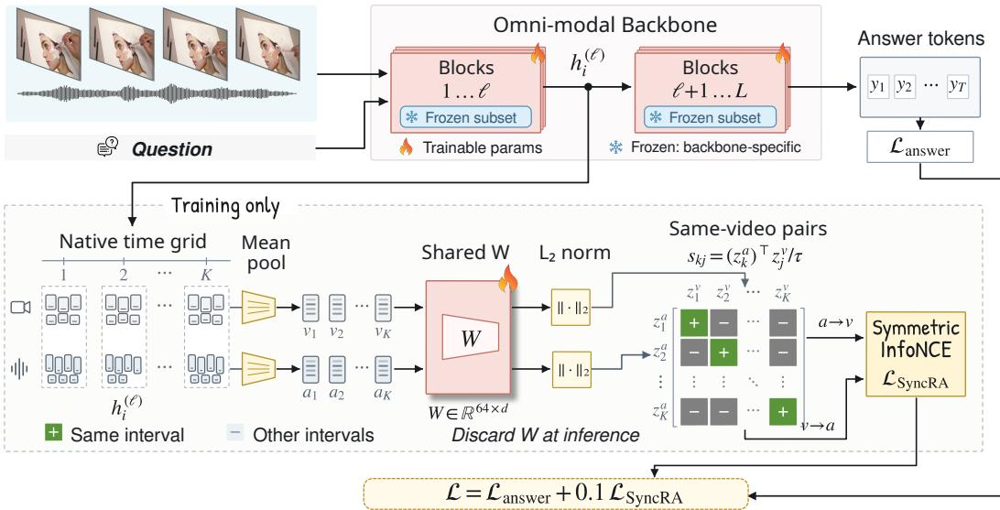
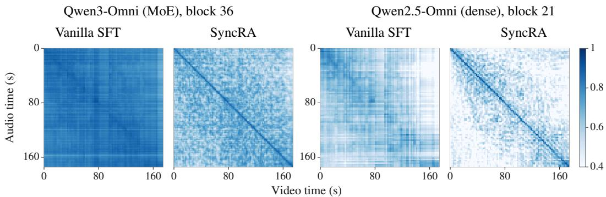
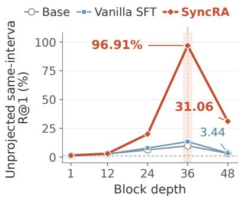
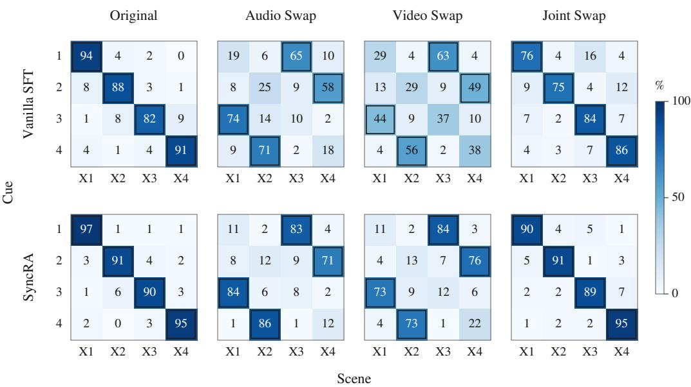
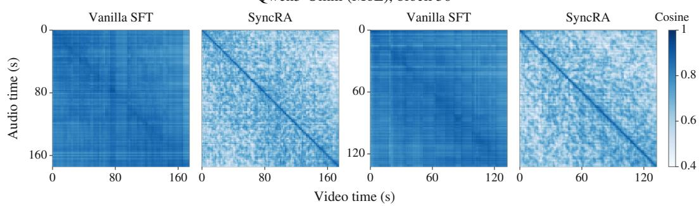
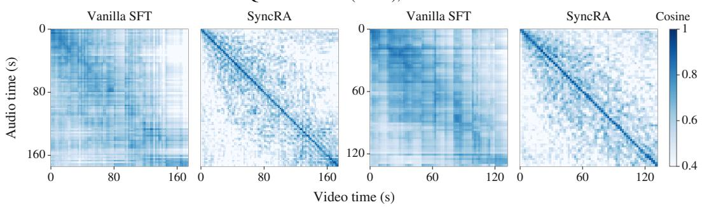
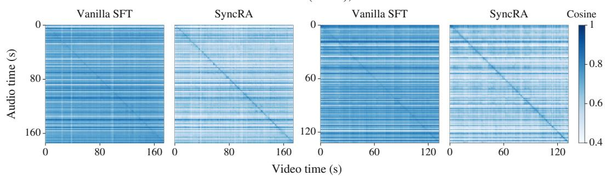
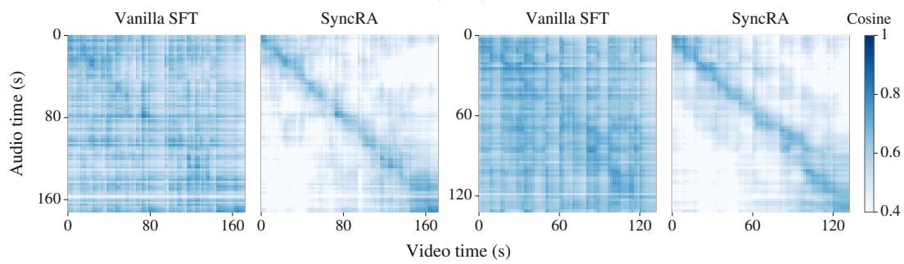

# SYNCRA: LEARNING TEMPORAL CORRESPONDENCE IN OMNI-MODAL MODELS

Zelong Xu1∗ Yan Li1 Wenhe Hu2 Xiyang Hu3

1University of Wisconsin–Madison 2University of Alberta 3Arizona State University

## ABSTRACT

Recent omni-modal models demonstrate strong perception of audio and visual inputs, yet often struggle to connect what they hear with what they see at the same moment. This weakness in temporal correspondence can cause models to associate spoken cues with the wrong visual scenes, producing plausible answers grounded in incorrect audio-visual pairings. We diagnose this problem through controlled temporal swaps, revealing that model answers do not reliably follow changes in these pairings. To address it, we propose Synchrony-Guided Representation Alignment (SyncRA), a lightweight method for strengthening temporal correspondence between audio and vision. Specifically, SyncRA contrasts intermediate audio–visual representations within each video, aligning matching moments while separating mismatched ones to capture local temporal correspondence within a shared global context. The objective derives supervision directly from existing input timing, requiring no additional annotations and leaving inference unchanged. We evaluate SyncRA across four open omni-modal models spanning different sizes and architectures on five public video benchmarks. SyncRA consistently outperforms answer-only fine-tuning across all model–benchmark combinations, while substantially improving the ability to track changing audio–visual pairings in controlled evaluations. These results demonstrate that lightweight, targeted supervision can effectively strengthen temporal correspondence and translate into broad improvements in audio–visual question answering.

## 1 INTRODUCTION

Omni-modal models that jointly understand text, audio, and video have advanced rapidly (Xu et al., 2025a; Cui et al., 2026; Xu et al., 2025b; NVIDIA, 2026). By encoding interleaved sensory streams and reasoning over them in a shared context, these models achieve strong results across a wide range of video understanding tasks and are becoming general-purpose interfaces for real-world multimedia content. As they are applied to content that unfolds over time, a basic requirement is that they preserve the temporal relation between modalities: the model should know which visual observation accompanies a given sound or utterance, rather than only recognizing what appears somewhere in the same clip. We refer to this ability as local audio–visual temporal correspondence.

Failure of this correspondence can cause a model to attach a spoken cue to the wrong visual scene while still producing a fluent and plausible answer. Such errors are particularly difficult for users to detect because both the audio and visual content may individually be correct, while their temporal pairing is not. Figure 1 illustrates such a case: while the narrator says “heart failure”, an anatomical heart model is on screen; if the video windows are exchanged while the audio remains unchanged, the scene shown during that phrase changes, and a model that tracks the correspondence should change its answer accordingly.

This weakness is widespread rather than model-specific: independent evaluations consistently find that current omni-modal models fail at deep audio–visual temporal integration, temporal grounding, synchronization verification, and cross-modal localization (Zhou et al., 2025; Chen et al., 2026; Zhang et al., 2026b). The problem is also structural: temporally aligned audio–visual data is scarce (Zhou et al., 2025), joint video–audio tokens account for only a small fraction of general-purpose pretraining (Xu et al., 2025b), and answer-level supervision leaves local pairing implicit, because a question answerable from global semantics or a single modality does not require distinguishing correct from incorrect temporal pairings.

  
Figure 1: A motivating example and the swap diagnostic. Left: exchanging only the audio or only the video windows changes which scene is visible while “heart failure” is spoken (correct option A → C). Right: Qwen3-Omni accuracy on the four input versions (top; AllFour credits a cue only if all four are answered correctly) and predictions on the two illustrated exchanges (bottom; †/‡). SyncRA answers both correctly. Fine-tuned checkpoints use Run 1.

To measure this failure directly, we construct a controlled swap diagnostic around spoken cues. For each source video, we identify four spoken cues that occur in four nonoverlapping temporal windows and ask which scene is visible while each cue is spoken. We then create three altered versions of the same video by exchanging the corresponding audio windows, the video windows, or both. Exchanging only one stream changes the correct answer because it changes which sound and scene occur together; exchanging both streams preserves the original pairing while moving it to another position. A model can therefore answer all versions correctly only if its prediction follows the audio–visual pairing present in the input, rather than either modality alone or the video’s global semantics (Section 4). Applied to four recent open omni-modal backbones, this diagnostic shows that current models often answer as if the original pairing were still in place, and that answer-only fine-tuning, the standard way such models are adapted to question answering, does not by itself repair this behavior. Strong accuracy on ordinary audio–visual QA therefore does not guarantee that a model tracks the temporal pairing itself.

Existing approaches leave temporal correspondence weak at two levels. The first is representational: encoding time within each modality does not ensure that audio and visual representations are aligned in time. Our probing analysis of a representative backbone finds that elapsed time remains linearly decodable from intermediate audio and visual states, yet direct matching of simultaneous audio and visual states is weak and deteriorates toward the final layers (Section 6.2). Related work on audio– visual speech recognition similarly reports that deeper decoder representations become less sensitive to temporal order (Wang et al., 2026). The model therefore retains temporal information without organizing the two modalities into a shared temporal structure. The second gap is supervisory: as discussed above, neither the training data nor the answer-level objective provides an explicit signal for local pairing. Together, these gaps call for making local temporal correspondence an explicit, representation-level target during ordinary QA fine-tuning, using a supervision signal that requires no additional annotation.

Building on audio–visual synchrony and temporal contrastive learning (Owens & Efros, 2018; Araujo et al., 2025; Dai et al., 2026), we introduce Synchrony-Guided Representation Alignment (SyncRA), whose design mirrors these two gaps. To close the representation gap, SyncRA acts where the problem lives: one intermediate layer of the answering model. At this layer, it mean-pools the audio and visual hidden states within each interval, maps both modalities through a shared linear projection, and optimizes a symmetric InfoNCE objective that pulls simultaneous audio–visual states together while separating mismatched ones. To close the supervision gap, SyncRA derives the pairing signal from the input itself: the model’s native processor already divides the audio and visual streams into shared temporal intervals, so observations from the same interval form positive pairs and other intervals of the same video serve as negatives, with no event-level annotation or external representation teacher. The auxiliary objective is optimized jointly with ordinary answer supervi sion, making local temporal correspondence an explicit representation-learning target. SyncRA is deliberately lightweight: the projection head adds only 64d training parameters and is discarded after training, leaving the architecture and inference cost unchanged. Because its interface relies only on token timing metadata rather than a specific attention layout, the same recipe applies across dense and mixture-of-experts backbones.

We conduct controlled swap evaluations, broad benchmark comparisons, and representation analyses to test whether SyncRA strengthens temporal correspondence and whether the effect generalizes. On the swap diagnostic, SyncRA raises AllFour accuracy over answer-only fine-tuning on all four backbones, from 34.00% to 62.50% on Qwen3-Omni. On five public video understanding benchmarks, SyncRA improves mean accuracy in all 20 model–benchmark combinations, and on every backbone the largest or second-largest gain falls on Daily-Omni or AVUT-Human, the two benchmarks that most directly require using audio and vision together. Representation analyses suggest that the behavioral gains reflect the intended mechanism: after SyncRA training, unprojected sameinterval retrieval in Qwen3-Omni’s own states rises from 13.39% under answer-only fine-tuning to 96.91% R@1.

Our contributions are as follows. (1) We introduce SyncRA, a lightweight representation-level objective that directly supervises local audio–visual temporal correspondence during ordinary QA finetuning, without additional annotations or inference-time components. Across four dense and MoE backbones, SyncRA improves correspondence-sensitive answering and raises mean accuracy on all 20 model–benchmark combinations. (2) We develop a controlled swap test that directly measures whether a model’s answers follow the audio–visual pairing present in its input, and show that this capability remains weak in current omni-modal models even after answer-only fine-tuning. (3) We analyze why the objective works: the local pairing relation, within-video negatives, and supervision depth each contribute, and the resulting correspondence is directly visible in the backbone’s own unprojected states.

## 2 METHODOLOGY

Figure 2 summarizes SyncRA, which adds local audio–visual correspondence supervision to intermediate backbone states during ordinary QA fine-tuning.

## 2.1 TEMPORAL INTERFACE AND INTERVAL POOLING

Given a video, its audio track, and a question, an omni-modal answering model encodes perceptual inputs and processes their tokens in a joint context before generating an answer. SyncRA operates on these existing hidden states at one selected block.

Let $h _ { i } ^ { ( \ell ) } \in \mathbb { R } ^ { d }$ denote the contextualized state of a perceptual token at the output of one-indexed block ℓ in a joint audio–video forward pass. Audio and visual labels identify token origin. Native timestamps, interval boundaries, or temporal patch metadata assign each token to a shared set of intervals along the video timeline. For each interval k containing both modalities, we mean-pool the corresponding token sets $A _ { k }$ and $V _ { k }$

$$
a _ { k } = \frac { 1 } { | A _ { k } | } \sum _ { i \in A _ { k } } h _ { i } ^ { ( \ell ) } , \qquad v _ { k } = \frac { 1 } { | V _ { k } | } \sum _ { i \in V _ { k } } h _ { i } ^ { ( \ell ) } .\tag{1}
$$

The valid intervals form a set of size K. These intervals are processor sampling units, not annotated semantic events. A same-interval pair is positive because the observations co-occur in the input; they need not describe the same object or event. Membership follows time metadata rather than token

  
Figure 2: Overview of Synchrony-Guided Representation Alignment (SyncRA). Top: the ordinary QA path, trained with $\mathcal { L } _ { \mathrm { a n s w e r } }$ . Bottom (training only): at a selected block ℓ, audio and visual states are mean-pooled within native temporal intervals, projected by a shared W with $L _ { 2 }$ normalization, and contrasted with symmetric InfoNCE against other intervals of the same video.

adjacency, so processors that place modality tokens in separate sequence blocks are also supported.   
Appendix B.3 specifies each backbone’s grid.

## 2.2 WITHIN-VIDEO SYNCHRONY CONTRAST

A shared bias-free projection $W \in \mathbb { R } ^ { 6 4 \times d }$ maps both modalities from hidden dimension d to 64 dimensions. We normalize the projected states and use cosine similarity with temperature τ:

$$
z _ { k } ^ { a } = \frac { W a _ { k } } { \| W a _ { k } \| _ { 2 } } , \qquad z _ { k } ^ { v } = \frac { W v _ { k } } { \| W v _ { k } \| _ { 2 } } , \qquad s _ { k j } = \frac { ( z _ { k } ^ { a } ) ^ { \top } z _ { j } ^ { v } } { \tau } .\tag{2}
$$

The per-video auxiliary objective classifies the corresponding interval in both directions:

$$
\mathcal { L } _ { \mathrm { S y n c R A } } = - \frac { 1 } { 2 K } \sum _ { k = 1 } ^ { K } \left[ \log \frac { \exp ( s _ { k k } ) } { \sum _ { j = 1 } ^ { K } \exp ( s _ { k j } ) } + \log \frac { \exp ( s _ { k k } ) } { \sum _ { j = 1 } ^ { K } \exp ( s _ { j k } ) } \right] .\tag{3}
$$

All candidates come from the same video. This choice holds source identity and global context fixed, requiring discrimination among times within a recording. It follows the broader use of synchrony as supervision (Korbar et al., 2018; Owens & Efros, 2018).

## 2.3 JOINT TRAINING WITH ANSWER SUPERVISION

We add the auxiliary objective to final-answer token cross-entropy:

$$
\begin{array} { r } { \mathcal { L } = \mathcal { L } _ { \mathrm { a n s w e r } } + \lambda \mathcal { L } _ { \mathrm { S y n c R A } } , \qquad \lambda = 0 . 1 , \quad \tau = 0 . 0 7 . } \end{array}\tag{4}
$$

We fix $\tau = 0 . 0 7$ following standard contrastive practice (He et al., 2020) and set $\lambda = 0 . 1$ ; Section 6.1 shows that the gains hold across λ.

Samples with fewer than two valid intervals receive answer supervision alone. Gradients update W and the permitted backbone parameters; answer supervision also trains subsequent layers. The auxiliary head adds only 64d training parameters and no inference-time component, since W is discarded after training.

We fix one supervision block per backbone using shared linear probes fitted on frozen-checkpoint states before SyncRA training. The selected one-indexed blocks are 21/28 for Qwen2.5-Omni, 9/36 for MiniCPM-o 4.5, 36/48 for Qwen3-Omni, and 26/52 for Nemotron. QA fine-tuning initializes a new W. Section 6.2 explains the rationale; Appendix B.4 specifies the selection procedure.

## 3 EXPERIMENTAL SETUP

## 3.1 DATA

We use a fixed, balanced 10K-example subset of OmniVideo-100K (Cai et al., 2026) for all finetuning experiments. It contains 10,000 questions from 1,782 videos, with 5,000 multiple-choice and 5,000 open-ended questions across ten task categories. Clips last 60–180 seconds. The sourcedisjoint split comprises 9,500 training questions from 1,367 videos and 500 validation questions from 415 videos. All methods share this split and the same media inputs. Working with a compact, category-balanced corpus is a deliberate choice: SyncRA’s supervision comes from input timing rather than from additional data or annotation, and since Vanilla SFT is trained on the same data with the same budget, any improvement is attributable to the supervision signal rather than to data scale. The timing labels are obtained for free from the processor and scale to larger corpora without annotation cost (Appendix E). Appendix B provides the data and processing details.

## 3.2 BACKBONES AND BASELINES

To evaluate portability across architectures, we use two dense backbones, Qwen2.5-Omni-7B and MiniCPM-o 4.5, and two mixture-of-experts (MoE) backbones, Qwen3-Omni-30B-A3B and Nemotron-3-Nano-Omni-30B-A3B (Xu et al., 2025a; Cui et al., 2026; Xu et al., 2025b; NVIDIA, 2026). Dense models undergo full understanding fine-tuning, while MoE models use partial parameter updates with routed experts frozen. The update scope is held fixed across training objectives within each backbone.

Our main comparisons include Base, the released checkpoint without task-specific fine-tuning; Vanilla SFT (answer-only fine-tuning), which supervises only final answers after removing the supplied reasoning text; and Text CoT-SFT, which supervises the supplied reasoning followed by the answer. SyncRA uses the same final-answer targets as Vanilla SFT and adds the local correspondence objective in Section 2. Auxiliary-objective variants are introduced in the ablation study.

## 3.3 TRAINING CONFIGURATION

All fine-tuned methods start from the corresponding released checkpoint and share one optimization recipe (AdamW, learning rate 10−5, effective batch size 12, two epochs); SyncRA keeps the auxiliary configuration of Section 2. Checkpoints are selected by the lowest validation answer-token negative log-likelihood, never by benchmark scores or post-training representation diagnostics; Text CoT-SFT is selected on its complete reasoning-and-answer targets. Full hyperparameters, trainable modules, layer-selection procedures, and Text CoT-SFT settings appear in Appendices B.2, B.4, and B.6.

## 3.4 EVALUATION

We evaluate WorldSense (3,172 questions), Daily-Omni (1,197), OmniVideoBench (1,000), LVOmniBench (1,014), and AVUT-Human (AVUT’s AV-Human split; 1,733 after excluding one item with an empty correct option), covering general, long-context, and audio-centered video understanding (Hong et al., 2026; Zhou et al., 2025; Li et al., 2026; Tao et al., 2026; Yang et al., 2025). We report accuracy on each benchmark and their equally weighted mean (Avg-5). Vanilla SFT and SyncRA each use three independent training runs, summarized by the mean and sample standard deviation; Base and Text CoT-SFT each use a single checkpoint.

Within each backbone, all methods use identical evaluation questions, media, and denominators. Evaluation uses greedy decoding and fixed answer extraction, with generation and parsing failures counted as incorrect. Appendices B.7 and B.6 specify prompts, media processing, and parsing rules.

Table 1: Correspondence-sensitive answering improves across architectures. AllFour accuracy (%) on the same 100 source videos. ∆ is SyncRA minus Vanilla SFT in percentage points. All four paired 95% source-video bootstrap intervals exclude zero (Appendix C.3).
<table><tr><td>Backbone</td><td>Arch.</td><td>Base</td><td>Vanilla SFT</td><td>SyncRA</td><td>∆</td></tr><tr><td>Qwen2.5-Omni</td><td>Dense</td><td>2.25</td><td>11.00</td><td>20.75</td><td>+9.75</td></tr><tr><td>MiniCPM-o 4.5</td><td>Dense</td><td>35.50</td><td>57.25</td><td>62.25</td><td>+5.00</td></tr><tr><td>Qwen3-Omni</td><td>MoE</td><td>13.25</td><td>34.00</td><td>62.50</td><td>+28.50</td></tr><tr><td>Nemotron</td><td>MoE</td><td>0.50</td><td>6.00</td><td>16.50</td><td>+10.50</td></tr></table>

## 4 A CONTROLLED SWAP TEST FOR TEMPORAL PAIRING

To test whether a model’s answers follow the current audio–visual pairing, we design a swap test around spoken cues. For each cue we ask: “While the phrase {cue} is being spoken, which of the following scenes is visible?” The four options describe scenes present in the source clip. We use 100 source videos (81 from Daily-Omni and 19 from LVOmniBench), disjoint from all training and validation sources. Each video contributes four unique spoken cues in four equal-length, nonoverlapping windows, with a stable, unique visible scene during each utterance. Independent ASR and human inspection establish the annotations before model inference.

Each cue is evaluated independently on original (O), audio-exchanged (A), video-exchanged (V), and jointly exchanged (AV) inputs. We swap windows 1 ↔ 3 and 2 ↔ 4 in the designated streams, preserving within-window order, content outside the windows, and total duration. A single-stream exchange changes the correct scene, while joint exchange preserves the original pairing at a new position. Questions and option order stay the same across versions; neither timestamps nor version labels are given to the model.

Each checkpoint answers 400 questions per version and 1,600 in total. The primary metric, All-Four, credits a cue only when all four versions are answered correctly; overall accuracy averages all 1,600 question–version evaluations. AllFour shares the joint-success motivation of MMBench’s CircularEval and Winoground’s group score, but varies temporal pairing rather than option order or image–text composition (Liu et al., 2024; Thrush et al., 2022). Paired 95% bootstrap intervals resample source videos with all their cues and versions, with checkpoints held fixed. Appendix C provides the construction and scoring details.

## 5 RESULTS

We evaluate whether SyncRA improves answers that depend on the current audio–visual pairing and whether its benefits extend across architectures and benchmark tasks.

## 5.1 CORRESPONDENCE IMPROVES ACROSS ARCHITECTURES

SyncRA improves correspondence-sensitive answering on both dense and both MoE backbones: on the same diagnostic of 100 source videos, it raises AllFour accuracy over Vanilla SFT for every backbone (Table 1). Gains range from 5.00 to 28.50 percentage points, and all four paired 95% source-video bootstrap intervals exclude zero (Table 15).

For every backbone, the largest version-specific improvement occurs under a single-stream exchange, where the correct answer must follow a changed audio–visual pairing. Complete conditionlevel and Text CoT-SFT results appear in Table 14; prediction matrices in Appendix C.4 illustrate how answers follow the current pairing.

## 5.2 SYNCRA IMPROVES GENERAL VIDEO QA ON EVERY MODEL–BENCHMARK COMBINATION

Table 2 compares SyncRA with Vanilla SFT while holding answer data, training budget, and backbone update scope fixed.

Table 2: SyncRA improves general video QA on every model–benchmark combination. Benchmark accuracy (%) across two dense and two MoE backbones. Vanilla SFT and SyncRA: three-run mean ± sample SD; Base and Text CoT-SFT: single checkpoints. Avg-5 weights all five benchmarks equally; ∆ is SyncRA minus Vanilla SFT in percentage points (unrounded means).
<table><tr><td>Benchmark</td><td>n</td><td>Base</td><td>Text CoT-SFT</td><td>Vanilla SFT</td><td>SyncRA</td><td>∆</td></tr><tr><td colspan="7">Qwen2.5-Omni-7B (dense, full SFT)</td></tr><tr><td>WorldSense</td><td>3,172</td><td>45.27</td><td>47.92</td><td>50.63 ± 0.32</td><td>52.74 ± 0.28</td><td>+2.11</td></tr><tr><td>Daily-Omni</td><td>1,197</td><td>61.74</td><td>63.16</td><td>68.84 ± 0.36</td><td>72.26 ± 0.29</td><td>+3.43</td></tr><tr><td>OmniVideoBench</td><td>1,000</td><td>25.10</td><td>35.50</td><td>37.77 ± 0.31</td><td>38.57 ± 0.25</td><td>+0.80</td></tr><tr><td>LVOmniBench</td><td>1,014</td><td>28.21</td><td>31.66</td><td>38.03 ± 0.21</td><td>39.55 ± 0.30</td><td>+1.51</td></tr><tr><td>AVUT-Human</td><td>1,733</td><td>64.74</td><td>67.86</td><td>67.97 ± 0.31</td><td>71.46 ± 0.34</td><td>+3.48</td></tr><tr><td>Avg-5</td><td></td><td>45.01</td><td>49.22</td><td>52.65 ± 0.12</td><td>54.92 ± 0.11</td><td>+2.27</td></tr><tr><td colspan="7">MiniCPM-o 4.5 (dense, full SFT)</td></tr><tr><td>WorldSense</td><td>3,172</td><td>55.17</td><td>55.71</td><td>56.78 ± 0.19</td><td>57.61 ± 0.13</td><td>+0.83</td></tr><tr><td>Daily-Omni</td><td>1,197</td><td>79.62</td><td>79.87</td><td>79.67 ± 0.29</td><td>80.51 ± 0.21</td><td>+0.84</td></tr><tr><td>OmniVideoBench</td><td>1,000</td><td>27.80</td><td>33.40</td><td>35.53 ± 0.32</td><td>37.40 ± 0.26</td><td>+1.87</td></tr><tr><td>LVOmniBench</td><td>1,014</td><td>28.21</td><td>31.56</td><td>31.72 ± 0.21</td><td>31.95 ± 0.26</td><td>+0.23</td></tr><tr><td>AVUT-Human</td><td>1,733</td><td>78.07</td><td>78.59</td><td>78.27 ± 0.23</td><td>79.28 ± 0.21</td><td>+1.02</td></tr><tr><td>Avg-5</td><td></td><td>53.77</td><td>55.82</td><td>56.39 ± 0.18</td><td>57.35 ± 0.15</td><td>+0.96</td></tr><tr><td colspan="7">Qwen3-Omni-30B-A3B (MoE, 8.56% trainable)</td></tr><tr><td>WorldSense</td><td>3,172</td><td>55.01</td><td>55.39</td><td>56.26 ± 0.21</td><td>57.36 ± 0.13</td><td>+1.09</td></tr><tr><td>Daily-Omni</td><td>1,197</td><td>74.94</td><td>74.44</td><td>76.16 ± 0.27</td><td>79.09 ± 0.13</td><td>+2.92</td></tr><tr><td>OmniVideoBench</td><td>1,000</td><td>43.90</td><td>44.20</td><td>46.07 ± 0.32</td><td>47.07 ± 0.25</td><td>+1.00</td></tr><tr><td>LVOmniBench</td><td>1,014</td><td>39.94</td><td>39.64</td><td>40.89 ± 0.23</td><td>43.92 ± 0.21</td><td>+3.02</td></tr><tr><td>AVUT-Human</td><td>1,733</td><td>77.78</td><td>77.15</td><td>78.09 ± 0.27</td><td>79.71 ± 0.23</td><td>+1.62</td></tr><tr><td>Avg-5</td><td></td><td>58.31</td><td>58.16</td><td>59.50 ± 0.14</td><td>61.43 ± 0.08</td><td>+1.93</td></tr><tr><td colspan="7">Nemotron-3-Nano-Omni-30B-A3B (MoE, 11.03% trainable)</td></tr><tr><td>WorldSense</td><td>3,172</td><td>52.87</td><td>52.90</td><td>54.32 ± 0.22</td><td>55.65 ± 0.21</td><td>+1.33</td></tr><tr><td>Daily-Omni</td><td>1,197</td><td>72.60</td><td>70.26</td><td>75.80 ± 0.26</td><td>78.42 ± 0.27</td><td>+2.62</td></tr><tr><td>OmniVideoBench</td><td>1,000</td><td>42.20</td><td>43.10</td><td>43.47 ± 0.15</td><td>44.93 ± 0.15</td><td>+1.47</td></tr><tr><td>LVOmniBench</td><td>1,014</td><td>39.15</td><td>39.84</td><td>41.58 ± 0.15</td><td>42.93 ± 0.15</td><td>+1.35</td></tr><tr><td>AVUT-Human</td><td>1,733</td><td>72.94</td><td>73.11</td><td>73.88 ± 0.30</td><td>77.67 ± 0.31</td><td>+3.79</td></tr><tr><td>Avg-5</td><td></td><td>55.95</td><td>55.84</td><td>57.81 ± 0.09</td><td>59.92 ± 0.11</td><td>+2.11</td></tr></table>

SyncRA achieves higher mean accuracy than Vanilla SFT in all 20 model–benchmark combinations. For each backbone, the Avg-5 gain far exceeds the run-to-run variation of either method. On every backbone, the largest or second-largest gain falls on Daily-Omni or AVUT-Human, the two benchmarks that most directly require using audio and vision together. The gains hold under full understanding fine-tuning for the dense models and partial parameter updates for the MoE models, supporting the same supervision interface across model families and update settings. Appendix F provides individual-run results and integer correct counts.

Supervising reasoning text does not substitute for correspondence supervision: Text CoT-SFT trails Vanilla SFT on the Avg-5 of every backbone (on Qwen3-Omni, on all five benchmarks), while SyncRA improves over both.

## 6 ABLATION STUDY AND ANALYSIS

We next examine why the supervision works and how it changes the backbone states. Alignmentloss, supervision-depth, and quantitative representation analyses use Qwen3-Omni Run 1; crossbackbone objective comparisons report three-run benchmark means, and qualitative heatmaps cover all four backbones.

  
Figure 3: Temporal correspondence in dense and MoE backbone states. Cosine similarity between unprojected interval-mean audio (rows) and video (columns) states on a fixed validation clip (Appendix D.1); all panels share a 0.4–1 color scale.

## 6.1 LOCAL CONTRASTIVE SUPERVISION DRIVES THE GAINS

The pairing relation drives the gain. Aggregate QA accuracy alone conceals the benefit of supervising the correct local relation. We compare SyncRA with incorrect within-video pairs (Permuted pairs), shared timestamp targets (Fixed time codes), and global audio–video association (Clip-level AV). Their Daily-Omni accuracies are close to SyncRA’s, yet their AllFour scores diverge (Table 3). Even the strongest alternative temporal target, Fixed time codes, trails direct local pairing by 17.75 percentage points on AllFour. The supervised relation itself, not generic temporal or cross-modal alignment, drives the gain. SyncRA also achieves the highest Avg-5 among these objectives on all four backbones (Appendix F).

The gains also hold across the auxiliary weight. On Qwen3-Omni, all $\lambda \in \{ 0 . 0 3 , 0 . 1 , 0 . 3 \}$ improve AllFour over Vanilla SFT by at least 24.00 points, and λ = 0.1 attains the highest score (Appendix D.6).

Competing intervals are necessary. The alignment objective must distinguish the matching moment from other times in the same recording. We therefore compare positive-only cosine alignment, independent pairwise logistic ranking, and InfoNCE’s jointly normalized interval classification, keeping the same co-occurring positive pairs and training setup. InfoNCE achieves the highest AllFour accuracy, reaching 62.50% versus 46.25% for pairwise ranking, despite similar Daily-Omni scores (Table 3). The gain therefore comes from both the local pairing target and its contrastive formulation. Objective definitions, the loss rationale, and paired confidence intervals appear in Appendix B.8.

## 6.2 SYNCRA ALIGNS THE BACKBONE’S OWN STATES IN TIME

SyncRA strengthens temporal correspondence in the backbone’s own representations. Figure 3 compares native interval-pooled states on the same fixed clip: both Qwen3-Omni and Qwen2.5- Omni develop a more concentrated same-time diagonal after SyncRA training. Additional examples across all four backbones appear in Appendix D.1.

Aggregate retrieval quantifies this change. The backbone already knows the time: elapsed time is linearly decodable from the frozen released checkpoint, at 8.996 s (audio) and 5.675 s (video) MAE against 30.816 s and 31.041 s under shuffled labels, and answer-only fine-tuning only sharpens this readout (Appendix D.4). What it lacks is cross-modal alignment—direct same-interval matching sits at 13.39% unprojected R@1 on 100 Qwen3-Omni validation videos. SyncRA supplies exactly this missing piece, raising R@1 to 96.91%. Audio replacement and delay controls confirm that this retrieval tracks the current input position rather than semantic matching: after a two-interval audio delay, SyncRA retrieves the current interval at 96.45% R@1 but its content origin at only 0.01% (Appendix D.3). Retrieval follows when, not what.

Table 3: Local contrastive supervision matters. Qwen3- Omni, Run 1; accuracy (%).
<table><tr><td>Training objective AllFour ↑ Daily-Omni ↑</td></tr><tr><td>Vanilla SFT</td><td>34.00 75.86</td></tr><tr><td>Alternative supervision targets</td></tr><tr><td>Permuted pairs 31.00 78.78</td></tr><tr><td>Fixed time codes 44.75 78.45</td></tr><tr><td>Clip-level AV 31.75 78.70</td></tr><tr><td>Alternative alignment losses</td></tr><tr><td>Cosine-only 40.50 78.20</td></tr><tr><td>Pairwise ranking 46.25 78.36</td></tr><tr><td>SyncRA (local InfoNCE) 62.50 78.95</td></tr></table>

  
Figure 4: Correspondence across depth in Qwen3-Omni.

Correspondence across depth. The depth profile shows where this change lives (Figure 4). For Base and Vanilla SFT, direct same-interval matching improves at intermediate depths and then declines at the final block. SyncRA’s gain peaks at the supervised block and remains visible in the final block, showing that supervision at an intermediate block builds this correspondence.

Selecting the supervision block. The supervision block is chosen per backbone by probing frozen Base states before QA fine-tuning (Section 2; Appendix B.4), and the selected relative depths differ across backbones. SyncRA is also robust to this choice: training at Qwen3-Omni block 24 or 36 both improves AllFour over Vanilla SFT, while the supervision location shapes where in the network correspondence concentrates (Table 25 in Appendix D.6).

## 7 RELATED WORK

Audio–visual correspondence and synchronization. A long line of work learns multisensory representations from audio–visual synchrony, using same-time frame–audio pairs as positives and pairs from other videos or shifted times as negatives (Arandjelovic & Zisserman´ , 2017; Korbar et al., 2018; Owens & Efros, 2018); CAV-MAE Sync explicitly refines frame–audio alignment (Araujo et al., 2025). SyncRA instead contrasts same-input-time pairs inside an answering model, and its retrieval analysis measures this temporal organization in the model’s own states rather than in independently encoded content.

Temporal supervision in omni-modal reasoning. Daily-Omni and AVUT emphasize evaluation that requires both audio and vision (Zhou et al., 2025; Yang et al., 2025). LatentOmni combines temporal InfoNCE, sensory feature supervision, and text prediction in interleaved text–latent reasoning (Dai et al., 2026); SyncRA instead applies the temporal contrast to the answering model’s own intermediate states during QA fine-tuning, adds no latent reasoning tokens at inference, and tests whether answers track changes in the current pairing. TimeLens studies timestamp representations for continuous video temporal grounding (Zhang et al., 2026a); our diagnostic asks for scene selection during a spoken cue.

Intermediate representation supervision. REPA and iREPA align diffusion-model states to pretrained visual features (Yu et al., 2025; Singh et al., 2026); SyncRA instead obtains supervision from co-occurring input intervals and jointly trains the answering model’s audio and visual states.

## 8 CONCLUSION

Omni-modal models often fail to connect what they hear with what they see at the same moment. SyncRA makes this local audio–visual correspondence an explicit target during QA post-training, improving correspondence-sensitive answering across dense and MoE backbones and raising mean accuracy on every evaluated model–benchmark combination. Controlled comparisons show that similar aggregate QA scores can conceal large differences in whether answers follow the current pairing. Local temporal correspondence is a distinct, directly supervisable capability, and targeted representation supervision offers a general way to strengthen it.

## AI USE STATEMENT

We used LLMs to improve manuscript grammar and clarity and assist routine code modifications. The authors reviewed and verified all AI-assisted revisions, corrected them as needed, and take responsibility for the manuscript, code, and results.

## REPRODUCIBILITY STATEMENT

Appendices detail data splits, optimization, checkpoint and layer selection, backbone configurations, and evaluation. They document diagnostic construction, human verification, scoring, confidence intervals, representation analyses, and per-run benchmark counts.

## REFERENCES

Relja Arandjelovic and Andrew Zisserman. Look, Listen and Learn. In´ IEEE International Conference on Computer Vision, 2017. URL https://arxiv.org/abs/1705.08168.

Edson Araujo, Andrew Rouditchenko, Yuan Gong, Saurabhchand Bhati, Samuel Thomas, Brian Kingsbury, Leonid Karlinsky, Rogerio Feris, James R. Glass, and Hilde Kuehne. CAV-MAE Sync: Improving Contrastive Audio-Visual Mask Autoencoders via Fine-Grained Alignment. In IEEE/CVF Conference on Computer Vision and Pattern Recognition, 2025. URL https:// arxiv.org/abs/2505.01237.

Xinyue Cai, Chaoyou Fu, Yi-Fan Zhang, Ran He, and Caifeng Shan. OmniVideo-100K: A Dataset for Audio-Visual Reasoning through Structured Scripts and Evidence Chains. arXiv preprint arXiv:2606.14702, 2026. URL https://arxiv.org/abs/2606.14702.

Zixuan Chen, Depeng Wang, Hao Lin, Li Luo, Ke Xu, Ya Guo, Huijia Zhu, Tanfeng Sun, and Xinghao Jiang. AVID: A benchmark for omni-modal audio-visual inconsistency understanding via agent-driven construction. arXiv preprint arXiv:2604.13593, 2026. URL https://arxiv. org/abs/2604.13593.

Junbo Cui, Bokai Xu, Chongyi Wang, Tianyu Yu, Weiyue Sun, Yingjing Xu, Tianran Wang, Zhihui He, Wenshuo Ma, Tianchi Cai, Jiancheng Gui, Luoyuan Zhang, Xian Sun, Fuwei Huang, Moye Chen, Zhuo Lin, Hanyu Liu, Qingxin Gui, Qingzhe Han, Yuyang Wen, Huiping Liu, Rongkang Wang, Yaqi Zhang, Hongliang Wei, Chi Chen, You Li, Kechen Fang, Jie Zhou, Yuxuan Li, Guoyang Zeng, Chaojun Xiao, Yankai Lin, Xu Han, Maosong Sun, Zhiyuan Liu, and Yuan Yao. MiniCPM-o 4.5: Towards Real-Time Full-Duplex Omni-Modal Interaction. arXiv preprint arXiv:2604.27393, 2026. URL https://arxiv.org/abs/2604.27393.

Yifan Dai, Zhenhua Wu, Bohan Zeng, Daili Hua, Jialing Liu, Bozhou Li, Yuran Wang, Chengzhuo Tong, Hao Liang, Xiaochen Ma, Junbo Niu, Tianyu Guo, Yang Shi, Yue Ding, Yiyan Ji, Bingyin Mei, Yushuo Guan, Yuanxing Zhang, Pengfei Wan, Fangcheng Fu, and Wentao Zhang. LatentOmni: Rethinking Omni-Modal Understanding via Unified Audio-Visual Latent Reasoning. arXiv preprint arXiv:2605.22012, 2026. URL https://arxiv.org/abs/2605.22012.

Kaiming He, Haoqi Fan, Yuxin Wu, Saining Xie, and Ross Girshick. Momentum contrast for unsupervised visual representation learning. In IEEE/CVF Conference on Computer Vision and Pattern Recognition, 2020.

Jack Hong, Shilin Yan, Jiayin Cai, Xiaolong Jiang, Yao Hu, and Weidi Xie. WorldSense: Evaluating Real-world Omnimodal Understanding for Multimodal LLMs. In International Conference on Learning Representations, 2026. URL https://arxiv.org/abs/2502.04326.

Bruno Korbar, Du Tran, and Lorenzo Torresani. Cooperative Learning of Audio and Video Models from Self-Supervised Synchronization. In Advances in Neural Information Processing Systems, volume 31, 2018. URL https://papers.nips.cc/paper\_files/paper/ 2018/hash/c4616f5a24a66668f11ca4fa80525dc4-Abstract.html.

Caorui Li, Yu Chen, Yiyan Ji, Jin Xu, Zhenyu Cui, Shihao Li, Yuanxing Zhang, Wentao Wang, Zhenghao Song, Dingling Zhang, Ying He, Haoxiang Liu, Yuxuan Wang, Qiufeng Wang, Jiafu Tang, Zhenhe Wu, Jiehui Luo, Zhiyu Pan, Weihao Xie, Chenchen Zhang, Zhaohui Wang, Jiayi Tian, Yanghai Wang, Zhe Cao, Minxin Dai, Ke Wang, Runzhe Wen, Yinghao Ma, Yaning Pan, Sungkyun Chang, Termeh Taheri, Haiwen Xia, Christos Plachouras, Emmanouil Benetos, Yizhi Li, Ge Zhang, Jian Yang, Tianhao Peng, Zili Wang, Minghao Liu, Junran Peng, Zhaoxiang Zhang, and Jiaheng Liu. OmniVideoBench: Towards Audio-Visual Understanding Evaluation for Omni MLLMs. In International Conference on Learning Representations, 2026. URL https://proceedings.iclr.cc/paper\_files/paper/2026/hash/ df5e4da78dfbbfbfad3fcff0c2ce3bd7-Abstract-Conference.html.

Yuan Liu, Haodong Duan, Yuanhan Zhang, Bo Li, Songyang Zhang, Wangbo Zhao, Yike Yuan, Jiaqi Wang, Conghui He, Ziwei Liu, Kai Chen, and Dahua Lin. MMBench: Is Your Multimodal Model an All-around Player? In European Conference on Computer Vision, 2024. URL https://arxiv.org/abs/2307.06281.

NVIDIA. Nemotron-3-Nano-Omni-30B-A3B-Reasoning-BF16 Model Card. Hugging Face model card, 2026. URL https://huggingface.co/nvidia/ Nemotron-3-Nano-Omni-30B-A3B-Reasoning-BF16. Accessed 2026-09-14.

Andrew Owens and Alexei A. Efros. Audio-Visual Scene Analysis with Self-Supervised Multisensory Features. In European Conference on Computer Vision, 2018. URL https://arxiv. org/abs/1804.03641.

Jaskirat Singh, Xingjian Leng, Zongze Wu, Liang Zheng, Richard Zhang, Eli Shechtman, and Saining Xie. What matters for Representation Alignment: Global Information or Spatial Structure? In International Conference on Learning Representations, 2026. URL https://arxiv.org/ abs/2512.10794.

Keda Tao, Yuhua Zheng, Jia Xu, Wenjie Du, Kele Shao, Hesong Wang, Xueyi Chen, Xin Jin, Junhan Zhu, Bohan Yu, Weiqiang Wang, Jian Liu, Can Qin, Yulun Zhang, Ming-Hsuan Yang, and Huan Wang. LVOmniBench: Pioneering Long Audio-Video Understanding Evaluation for Omnimodal LLMs. arXiv preprint arXiv:2603.19217, 2026. URL https://arxiv.org/abs/2603. 19217.

Tristan Thrush, Ryan Jiang, Max Bartolo, Amanpreet Singh, Adina Williams, Douwe Kiela, and Candace Ross. Winoground: Probing Vision and Language Models for Visio-Linguistic Compositionality. In IEEE/CVF Conference on Computer Vision and Pattern Recognition, 2022. URL https://arxiv.org/abs/2204.03162.

Aaron van den Oord, Yazhe Li, and Oriol Vinyals. Representation learning with contrastive predictive coding. arXiv preprint arXiv:1807.03748, 2018. URL https://arxiv.org/abs/ 1807.03748.

Liyong Wang, Junliang Xing, Tianyu Hu, Jianfei Jiang, Jihuai Zhao, and Huimin Ma. Bridging the temporal gap in multimodal LLMs: Deeply stacking temporal tokens for audio-visual speech recognition. In Findings of the Association for Computational Linguistics: ACL 2026, pp. 27748– 27759, 2026. doi: 10.18653/v1/2026.findings-acl.1381.

Tongzhou Wang and Phillip Isola. Understanding contrastive representation learning through alignment and uniformity on the hypersphere. In Proceedings ofthe 37th International Conference on Machine Learning, volume 119 of Proceedings of Machine Learning Research, pp. 9929–9939. PMLR, 2020. URL https://proceedings.mlr.press/v119/wang20k.html.

Jin Xu, Zhifang Guo, Jinzheng He, Hangrui Hu, Ting He, Shuai Bai, Keqin Chen, Jialin Wang, Yang Fan, Kai Dang, Bin Zhang, Xiong Wang, Yunfei Chu, and Junyang Lin. Qwen2.5-Omni Technical Report. arXiv preprint arXiv:2503.20215, 2025a. URL https://arxiv.org/abs/2503. 20215.

Jin Xu, Zhifang Guo, Hangrui Hu, Yunfei Chu, Xiong Wang, Jinzheng He, Yuxuan Wang, Xian Shi, Ting He, Xinfa Zhu, Yuanjun Lv, Yongqi Wang, Dake Guo, He Wang, Linhan Ma, Pei Zhang, Xinyu Zhang, Hongkun Hao, Zishan Guo, Baosong Yang, Bin Zhang, Ziyang Ma, Xipin Wei,

Shuai Bai, Keqin Chen, Xuejing Liu, Peng Wang, Mingkun Yang, Dayiheng Liu, Xingzhang Ren, Bo Zheng, Rui Men, Fan Zhou, Bowen Yu, Jianxin Yang, Le Yu, Jingren Zhou, and Junyang Lin. Qwen3-Omni Technical Report. arXiv preprint arXiv:2509.17765, 2025b. URL https: //arxiv.org/abs/2509.17765.

Yudong Yang, Jimin Zhuang, Guangzhi Sun, Changli Tang, Yixuan Li, Peihan Li, Yifan Jiang, Wei Li, Zejun Ma, and Chao Zhang. Audio-centric Video Understanding Benchmark without Text Shortcut. In Proceedings of the 2025 Conference on Empirical Methods in Natural Language Processing, pp. 6569–6587. Association for Computational Linguistics, 2025. doi: 10.18653/ v1/2025.emnlp-main.333. URL https://aclanthology.org/2025.emnlp-main. 333/.

Sihyun Yu, Sangkyung Kwak, Huiwon Jang, Jongheon Jeong, Jonathan Huang, Jinwoo Shin, and Saining Xie. Representation Alignment for Generation: Training Diffusion Transformers Is Easier Than You Think. In International Conference on Learning Representations, 2025. URL https: //arxiv.org/abs/2410.06940.

Jun Zhang, Teng Wang, Yuying Ge, Yixiao Ge, Xinhao Li, Ying Shan, and Limin Wang. TimeLens: Rethinking Video Temporal Grounding with Multimodal LLMs. In IEEE/CVF Conference on Computer Vision and Pattern Recognition, 2026a. URL https://arxiv.org/abs/2512. 14698.

Longyin Zhang, Parth Sakhare Mahendra, Chengwei Wei, Ning Zhang, Lim Ming Chong, Sirui He, and Ai Ti Aw. AVTrace: Diagnosing audio-visual temporal reasoning in omni models. arXiv preprint arXiv:2609.19991, 2026b. URL https://arxiv.org/abs/2609.19991.

Ziwei Zhou, Rui Wang, Zuxuan Wu, and Yu-Gang Jiang. Daily-Omni: Towards Audio-Visual Reasoning with Temporal Alignment across Modalities. arXiv preprint arXiv:2505.17862, 2025. URL https://arxiv.org/abs/2505.17862.

## A LIMITATIONS

Our study has four limitations. First, the swap test is multiple-choice over 100 source videos; whether models track pairing changes in open-ended answers is untested, and extending the test to open-ended generation is a natural next step. Second, the quantitative mechanism analyses in Section 6 use Qwen3-Omni, in several cases a single training run; the heatmaps indicate similar changes on the other three backbones, but extending them is future work. Third, the smallest gain occurs on MiniCPM-o 4.5 (+5.00 points), whose Base model already tracks pairing best (AllFour 35.50%); how much SyncRA adds on better-aligned models remains open. Fourth, all fine-tuning uses the same compact 10K-question corpus, which isolates the supervision signal under a modest budget; SyncRA’s timing-based labels scale to larger corpora without annotation cost, but we do not measure how the gains vary with data scale.

## B TRAINING AND EVALUATION DETAILS

## B.1 DATA AND ANSWER SUPERVISION

All four backbones use the fixed, balanced 10K-example subset of OmniVideo-100K described in Section 3, containing 10,000 audio–video question–answer examples from 1,782 source videos. Clips last 60–180 seconds. The subset contains 5,000 multiple-choice and 5,000 open-ended questions. Examples were selected from available source files that passed media-quality checks, balancing task and answer format with selection seed 1. Table 4 gives the source-disjoint split and task composition. Source identity is the released YouTube video ID.

Table 4: Training data. Each of the ten task categories contributes 1,000 questions to the complete 10,000-question subset. Source videos are disjoint between training and validation.
<table><tr><td>Split</td><td>Questions</td><td>Source videos</td></tr><tr><td>Training</td><td>9,500</td><td>1,367</td></tr><tr><td>Validation</td><td>500</td><td>415</td></tr><tr><td>Total</td><td>10,000</td><td>1,782</td></tr></table>

<table><tr><td>Task categories</td></tr><tr><td>Causal reasoning; comparison</td></tr><tr><td>Context understanding; event sequence ordering</td></tr><tr><td>Fine-grained perception; future prediction</td></tr><tr><td>Hypothetical reasoning; scene transformation detection</td></tr><tr><td>Sentiment analysis; summarization</td></tr></table>

Vanilla SFT, SyncRA, Permuted pairs, Fixed time codes, and Clip-level AV use the same media, questions, options, final answers, and a fixed example order. A backbone’s native chat template is held fixed across its training objectives. Supervision covers final answer tokens; supplied reasoning traces and evidence-chain markers are removed from this training view. SyncRA obtains its interval correspondences from native audio–video timing information. It adds no event-boundary labels, external representation teacher, or inference branch.

## B.2 OPTIMIZATION AND TRAINABLE PARAMETERS

Vanilla SFT, SyncRA, Permuted pairs, Fixed time codes, and Clip-level AV each use three independent training runs with different random seeds and the common settings in Table 5. Each of these runs selects its checkpoint by the lowest validation mean answer-token negative log-likelihood (NLL), evaluated at the end of each epoch; ties select the earlier epoch. Text CoT-SFT selection is specified in Appendix B.6. Benchmark scores and post-training retrieval diagnostics do not enter checkpoint selection. The auxiliary projection is removed after training, and evaluation uses the model’s native answer-generation path. All experiments use PyTorch 2.5.1+cu124; each training run uses two NVIDIA H200 GPUs with 141 GB of memory per GPU.

## B.3 NATIVE TEMPORAL LAYOUTS AND MEDIA PROCESSING

Temporal intervals are the model processor’s sampling units, rather than annotated semantic events. Audio and video tokens are assigned to the same elapsed-time grid using native timestamps, interval boundaries, or temporal patch metadata. For each interval, token states are mean pooled separately by modality. The valid set contains intervals with nonempty audio and visual token sets. This interface also accommodates models that arrange the modality tokens in separate blocks: interval membership follows time metadata rather than an assumption about alternating sequence positions.

Table 5: Optimization settings for Vanilla SFT, SyncRA, and the three auxiliary controls. Runs 1–3 use different random seeds. Qwen3-Omni diagnostic checkpoints for these methods are from Run 1; the fixed checkpoints for the other backbones are described in Appendix C.3.
<table><tr><td>Setting</td><td>Value</td></tr><tr><td>Optimizer</td><td>AdamW; learning rate  $1 0 ^ { - 5 } ; ( \beta _ { 1 } , \beta _ { 2 } ) = ( 0 . 9 , 0 . 9 5 ) ; \epsilon = 1 0 ^ { - 8 } ;$  weight decay 0.1</td></tr><tr><td>Schedule</td><td>Linear decay; 80 warmup steps</td></tr><tr><td>Budget</td><td>2 epochs; 792 optimizer steps per epoch; 1,584 steps total</td></tr><tr><td>Effective optimization batch</td><td>12 examples: 2 processes × microbatch 1 × accumulation 6</td></tr><tr><td>Precision and stabilization</td><td>bfloat16; float32 normalized contrastive features, similarities, and contrastive cross-entropy; gradient clipping 1.0; gradient checkpointing</td></tr><tr><td>Data order Validation and selection</td><td>Fixed example order; no additional shuffling</td></tr><tr><td></td><td>End of each epoch; minimum validation answer-token NLL; earlier epoch breaks ties</td></tr><tr><td>Auxiliary objectives</td><td>Shared projection dimension 64; temperature 0.07; 1oss weight 0.1</td></tr></table>

Table 6: Trainable backbone parameters. Parameter counts exclude the auxiliary projection. Each backbone uses the same update scope across the compared objectives.
<table><tr><td>Backbone</td><td>Update scope</td></tr><tr><td>Qwen2.5-Omni-7B</td><td>Full understanding/Thinker fine-tuning, including text, visual, and audio mod- ules; speech generation is not trained.</td></tr><tr><td>MiniCPM-o 4.5</td><td>Full understanding fine-tuning; text-to-speech is disabled.</td></tr><tr><td>Qwen3-Omni-30B-A3B</td><td>Routed experts and router gates are frozen; other permitted modules are trained. Trainable backbone parameters: 2,715,593,328 / 31,719,205,488 (8.56%).</td></tr><tr><td>Nemotron-3-Nano-Omni- 30B-A3B</td><td>Routed experts are frozen; routers, shared experts, and other permitted modules are trained. Trainable backbone parameters: 3,640,738,752 / 33,015,546,816 (11.03%).</td></tr></table>

Table 7: Pretrained model identifiers and exact revisions used for initialization.
<table><tr><td>Backbone</td><td>Identifier and revision</td></tr><tr><td>Qwen2.5-Omni</td><td>Qwen/Qwen2.5-Omni-7B ae9e1690543ffd5c0221dc27f79834d0294cba00</td></tr><tr><td>MiniCPM-o 4.5</td><td>openbmb/MiniCPM-o-4_5 503e754207c94da6bb26850b4469f367c9ea3582</td></tr><tr><td>Qwen3-Omni</td><td>Qwen/Qwen3-Omni-30B-A3B-Instruct 26291f793822fb6be9555850f06dfe95f2d7e695</td></tr><tr><td>Nemotron</td><td>nvidia/Nemotron-3-Nano-Omni-30B-A3B- Reasoning-BF16 e5e9932441de940c9a62185c870ea5bcd4cd24e2</td></tr></table>

Table 8: Backbone adaptation and training media. All backbones receive full 16 kHz audio. Layer indices are one-indexed and refer to block outputs. d is the hidden dimension; the projection has 64d trainable weights and no bias.
<table><tr><td>Backbone</td><td>d</td><td>Layer/depth</td><td>|W|</td><td>Training video and interval grid</td></tr><tr><td>Qwen2.5-Omni</td><td>3,584</td><td>21/28</td><td>229,376</td><td>2 FPS, at most 256 frames; native 2 s intervals</td></tr><tr><td>MiniCPM-o 4.5</td><td>4,096</td><td>9/36</td><td>262,144</td><td>1 FPS, at most 180 one-second chunks; native 1 s inter- vals</td></tr><tr><td>Qwen3-Omni</td><td>2,048</td><td>36/48</td><td>131,072</td><td>2 FPS, at most 256 frames; temporal patch size divided by actual sampling FPS</td></tr><tr><td>Nemotron</td><td>2,688</td><td>26/52</td><td>172,032</td><td>2 FPS, at most 256 frames; timestamp-defined 2 s inter- vals</td></tr></table>

For both Qwen models, the configured per-frame minimum and maximum pixel budgets are 100,352 and 602,112, and the total pixel budget is 19,267,584. Actual processor outputs determine the temporal grid. Qwen3 intervals are approximately one second at 2 FPS; frame-budget resampling can change their duration on longer inputs. Nemotron groups video tubelets and audio tokens by timestamps; its selected 26th block is a Mamba2 block. Training media and benchmark long-video inputs follow their respective processing protocols.

## B.4 LAYER SELECTION ON FROZEN BASE MODELS

We select one layer per backbone before fine-tuning, using its released Base weights in evaluation mode. Candidate layers are fixed at approximately one-quarter, one-half, and three-quarters of the model depth. For each source video, the first question in the fixed example order defines a promptonly audio–video forward pass, without an appended answer or reasoning trace. We cache the meanpooled modality states at every candidate block output. A usable video must pass layout validation and contain at least two valid intervals.

Table 9: Frozen-Base layer-selection data and selected layers. Counts are usable independent source videos for probe fitting and validation, respectively. Training itself retains the 9,500/500-question split.
<table><tr><td>Backbone</td><td>Candidates</td><td>Fit/validate</td><td>Probe media scope</td><td>Selected</td></tr><tr><td>Qwen2.5-Omni</td><td>7,14,21</td><td>200/415</td><td>Full training clip; 2 FPS, at most 256 frames; na- tive 2 s grid</td><td>21</td></tr><tr><td>MiniCPM-o 4.5</td><td>9,18,27</td><td>200/415</td><td>First 60 s; native 1 s audio–video intervals</td><td>9</td></tr><tr><td>Qwen3-Omni</td><td>12,24,36</td><td>198/408</td><td>Full training clip; 2 FPS, at most 256 frames; ac- tual temporal grid</td><td>36</td></tr><tr><td>Nemotron</td><td>13,26,39</td><td>200/415</td><td>First 120 s; 2 FPS; native 2 s intervals</td><td>26</td></tr></table>

The fitting set consists of the first 200 independent training-source videos in this fixed order, and validation uses all 415 validation-source videos. Qwen3’s extraction excludes two training and seven validation videos that fail the audio–video interleaving-layout check, leaving 198/408 usable videos. These counts concern this probe extraction; the SFT split is unchanged. MiniCPM and Nemotron use the fixed probe-specific clip scopes in Table 9.

For each candidate ℓ, we fit a separate bias-free shared projection $P _ { \ell } \in \mathbb { R } ^ { 6 4 \times d }$ on the frozen states. Candidate projections use the same initialization seed, 1. Only $P _ { \ell }$ is updated: Adam, learning rate $1 0 ^ { - 3 }$ , temperature 0.07, one video per update, fixed video order, and 50 epochs. The objective is the same within-video symmetric interval InfoNCE used by SyncRA, with L2-normalized projected states. There is no answer loss in probe fitting. Validation uses the probe at the end of epoch 50.

Selection scores pool bidirectional hits over all validation queries:

$$
R _ { \ell } = \frac { \sum _ { i = 1 } ^ { N } ( H _ { i , \ell } ^ { a \to v } + H _ { i , \ell } ^ { v \to a } ) } { 2 \sum _ { i = 1 } ^ { N } K _ { i } } ,\tag{5}
$$

where $K _ { i }$ is the valid interval count and H is the number of same-interval top-1 hits in the indicated direction. A candidate is eligible when $R _ { \ell } \in [ c + 0 . 0 5 , 0 . 9 0 )$ : the lower bound requires signal five percentage points above the chance reference $c ,$ and the upper bound reserves learning headroom. Among eligible candidates, the largest $R _ { \ell }$ is selected. The rule makes no selection when no candidate is eligible. Each of the four backbones has an eligible candidate.

The chance reference c is computed per backbone from its interval counts: 1.92% for Qwen2.5- Omni, 1.67% for MiniCPM-o 4.5, 1.02% for Qwen3-Omni, and 2.25% for Nemotron. All selection scores $R _ { \ell }$ use the query-pooled definition in Eq. (5).

For the main experiments, the selected layer is fixed across auxiliary objectives and training runs. Fine-tuning starts from Base with a newly initialized W; the fitted layer-selection projections $P _ { \ell }$ are not reused. Qwen3-Omni projected-state diagnostics use the SyncRA W from the selected Run 1 checkpoint.

Table 10: Frozen-Base shared-probe validation R@1 (%) for all twelve candidate layers, using Eq. (5). All candidates satisfy the eligibility band; bold marks the selected block and score for each backbone.
<table><tr><td></td><td colspan="2">Quarter depth</td><td colspan="2">Half depth</td><td colspan="2">Three-quarter depth</td></tr><tr><td>Backbone</td><td>Block</td><td>R@1</td><td>Block</td><td>R@1</td><td>Block</td><td>R@1</td></tr><tr><td>Qwen2.5-Omni</td><td>7</td><td>11.44</td><td>14</td><td>16.47</td><td>21</td><td>20.00</td></tr><tr><td>MiniCPM-o 4.5</td><td>9</td><td>78.61</td><td>18</td><td>74.39</td><td>27</td><td>36.44</td></tr><tr><td>Qwen3-Omni</td><td>12</td><td>13.07</td><td>24</td><td>28.20</td><td>36</td><td>28.30</td></tr><tr><td>Nemotron</td><td>13</td><td>13.30</td><td>26</td><td>14.06</td><td>39</td><td>12.91</td></tr></table>

Table 10 shows that the strongest probe correspondence occurs at different relative depths across backbones: three-quarters for both Qwen models, one-quarter for MiniCPM-o, and one-half for Nemotron. This selection procedure adapts the supervision location to each architecture while retaining the same temporal alignment objective.

## B.5 AUXILIARY LOSS IMPLEMENTATION

For a video with K valid intervals, let $a _ { k } , v _ { k } \in \mathbb { R } ^ { d }$ be the pooled states. The shared projection $W \in \mathbb { R } ^ { 6 4 \times d }$ has no bias. Projection uses the weight dtype, then casts its output to float32 before L2 normalization with $\epsilon = 1 0 ^ { - 8 }$ . Similarity logits and contrastive cross-entropy are float32. Define

$$
z _ { k } ^ { a } = \frac { W a _ { k } } { \operatorname* { m a x } ( \| W a _ { k } \| _ { 2 } , \epsilon ) } , \qquad z _ { k } ^ { v } = \frac { W v _ { k } } { \operatorname* { m a x } ( \| W v _ { k } \| _ { 2 } , \epsilon ) } , \qquad s _ { k j } = \frac { ( z _ { k } ^ { a } ) ^ { \top } z _ { j } ^ { v } } { \tau } , \quad \tau = 0 . 0 7 .\tag{6}
$$

For an assigned bijective pairing π, the implemented loss is

$$
\mathcal { L } _ { \mathrm { p a i r } } ( \pi ) = - \frac { 1 } { 2 K } \left[ \sum _ { k = 1 } ^ { K } \log \frac { e ^ { s _ { k , \pi ( k ) } } } { \sum _ { j } e ^ { s _ { k j } } } + \sum _ { j = 1 } ^ { K } \log \frac { e ^ { s _ { \pi ^ { - 1 } ( j ) , j } } } { \sum _ { k } e ^ { s _ { k j } } } \right] .\tag{7}
$$

Each direction averages its K query losses, and the two directional means are averaged. SyncRA uses $\pi ( k ) = k .$ The sample’s training objective is $\mathcal { L } _ { \mathrm { a n s w e r } } + 0 . 1 \mathcal { L } _ { \mathrm { S y n c R A } } ;$ its auxiliary loss is computed before the common SFT gradient-accumulation procedure. When $K < 2$ , the sample uses answer supervision alone. Auxiliary gradients update $W$ and the permitted backbone parameters, while answer-loss gradients continue through the subsequent layers.

Permuted pairs. A random generator is seeded deterministically from the source-video ID. It shuffles interval indices until obtaining a derangement, so $\pi ( k ) \neq k$ . The implementation permits at most 10,000 attempts and raises an error if none succeeds. Audio-to-video targets are $\pi ,$ , and video-to-audio targets are $\pi ^ { - 1 }$ . Media, answers, candidate intervals, projection size, and training settings match SyncRA. This control changes the designated positive relationship while preserving the same within-video candidate set.

Fixed time codes. Let $t _ { k }$ be the starting time in the input clip of valid interval k. In the native-grid implementation this is the original valid grid index multiplied by seconds per interval, rather than the index after filtering invalid intervals. For 32 log-spaced periods $p _ { j }$ from 4 to 512 seconds, define the fixed unit-norm code

$$
c ( t ) = \frac { 1 } { \sqrt { 3 2 } } \left[ \sin ( 2 \pi t / p _ { 1 } ) , \ldots , \sin ( 2 \pi t / p _ { 3 2 } ) , \cos ( 2 \pi t / p _ { 1 } ) , \ldots , \cos ( 2 \pi t / p _ { 3 2 } ) \right] .\tag{8}
$$

Writing $C _ { k , : } = c ( t _ { k } )$ and stacking normalized projected modality features into $Z ^ { a } , Z ^ { v }$ , the loss is

$$
{ \begin{array} { r } { \mathcal { L } } _ { \mathrm { c l o c k } } = { \frac { 1 } { 2 } } \left[ \mathrm { C E } ( Z ^ { a } C ^ { \top } / \tau , y ) + \mathrm { C E } ( Z ^ { v } C ^ { \top } / \tau , y ) \right] , \quad y _ { k } = k . } \end{array}\tag{9}
$$

Both modalities use the same projection $W$ and the same fixed codes $C .$ Their losses separately discriminate the codes of the current video’s valid intervals, without directly comparing audio and visual feature vectors. This supplies a common temporal target; the contrast with SyncRA is between fixed timestamp-code supervision and learned pairwise correspondence.

Clip-level AV. For each current video, average its valid interval states separately by modality, then project and normalize: $\bar { z } ^ { a } = \mathrm { n o r m } ( W K ^ { - 1 } \bar { \sum } _ { k } a _ { k } )$ and likewise for video. The interval average gives each interval equal weight. Differentiable all-gather collects one clip per training process. Let $B = 2$ be this current candidate count, $g _ { i }$ its source IDs, $u _ { i j } = ( \bar { z } _ { i } ^ { a } ) ^ { \top } \bar { z } _ { j } ^ { v } / \bar { \tau } .$ , and $\mathcal { P } _ { i } = \{ j : g _ { j } = g _ { i } \}$ The loss is

$$
\begin{array} { c } { { \mathcal { L } _ { \mathrm { g l o b a l } } = \displaystyle \frac { 1 } { 2 B } \sum _ { i = 1 } ^ { B } \left[ \log \sum _ { j = 1 } ^ { B } e ^ { u _ { i j } } - \log \sum _ { j \in \mathcal { P } _ { i } } e ^ { u _ { i j } } \right. } } \\ { { \left. + \log \sum _ { j = 1 } ^ { B } e ^ { u _ { j i } } - \log \sum _ { j \in \mathcal { P } _ { i } } e ^ { u _ { j i } } \right] . } } \end{array}\tag{10}
$$

Repeated source IDs all enter the positive set. Each process evaluates the same gathered loss; differentiable gather and distributed gradient averaging implement the common update. The effective optimization batch is 12, but accumulation does not enlarge the contrastive candidate pool beyond the two current videos. Fixed time codes and Clip-level AV also enter the answer-training objective with weight 0.1.

## B.6 TEXT COT-SFT BASELINE

Text CoT-SFT starts from the released backbone weights (Table 7) and shares Vanilla SFT’s data split, optimization settings, two-epoch budget (1,584 steps), and trainable modules (Tables 5 and 6). Targets are the supplied text reasoning followed by a newline and Final answer: {answer}. Validation target-token NLL covers the complete target on all 500 validation examples; all four backbones select epoch 2. Training retains complete prompts and targets without a fixed text-token cap or truncation, using the media limits in Table 8 (at most 180 s).

Table 11: Text CoT-SFT benchmark evaluation prompts (no examples). Mode and template settings apply during both training and evaluation.
<table><tr><td>Backbone</td><td>Evaluation instruction</td><td></td><td>Mode/template setting</td></tr><tr><td>Qwen2.5-Omni</td><td>Direct option-letter answer</td><td></td><td>No additional thinking mode</td></tr><tr><td>MiniCPM-o 4.5</td><td>Step-by-step reasoning;</td><td></td><td> $\mathtt { e n a b l e \_ t h i n k i n g { = } F a l s e ; }$ </td></tr><tr><td>Qwen3-Omni</td><td>final line Final answer: Step-by-step reasoning;</td><td>X</td><td>use_tts_template=False Instruct weights</td></tr><tr><td></td><td>finalline Final answer:</td><td>X</td><td></td></tr><tr><td>Nemotron</td><td>Neutral question and options</td><td></td><td> $\mathtt { e n a b l e \_ t h i n k i n g = F a l s e }$ </td></tr></table>

Qwen2.5 training uses neutral question-and-options text. Base, Vanilla SFT, and SyncRA retain their direct-answer evaluation prompts.

## B.7 BENCHMARK INPUTS, GENERATION, AND STATISTICAL SUMMARIES

Benchmark evaluations use fixed questions and options, native model templates, greedy generation, EOS stopping, and a maximum of 1,280 new tokens. This budget applies only to evaluation generation. Each checkpoint generates one response per question. Accuracy is $1 0 0 C / n ,$ , where $C$ is the integer correct count and n is the fixed effective denominator. Generation failures, parsing failures, and incorrect answers remain in the denominator.

Base, Vanilla SFT, SyncRA, and the three auxiliary controls use a case-insensitive regularexpression parser. It accepts a complete direct option answer or the last valid Final answer: field, with allowed punctuation followed by whitespace or the response boundary. Bare letters in reasoning are ignored; neither semantic matching nor a judge model is used. Non-choice time outputs use a numeric/time parser.

For Text CoT-SFT, Qwen2.5 accepts a complete direct answer or the last explicit Final answer: field anywhere in the response. The other backbones accept a complete single-line answer or a last-line field labeled Final answer:, Answer:, or Correct answer: (including an inline Final answer: suffix). Letters and option text must agree; without a letter, the field must uniquely match a complete option, allowing case, whitespace, and limited punctuation differences. Ambiguous or conflicting answers are incorrect. Outputs reaching the generation cap are parsed from the saved text under the same rules.

Table 12: Effective benchmark denominators shared by all four backbones.
<table><tr><td>Benchmark</td><td>n</td><td>Evaluation focus</td></tr><tr><td>WorldSense</td><td>3,172</td><td>Integrated real-world audio-video understanding</td></tr><tr><td>Daily-Omni</td><td>1,197</td><td>Everyday audio-video understanding and reasoning</td></tr><tr><td>OmniVideoBench</td><td>1,000</td><td>Multitask audio-video understanding</td></tr><tr><td>LVOmniBench</td><td>1,014</td><td>Long audio-video understanding</td></tr><tr><td>AVUT-Human</td><td>1,733</td><td>Audio-centered video understanding</td></tr></table>

The released AV-Human split contains 1,734 questions; we exclude one item whose correct option is an empty string (QA\_id 455), and all methods and runs share the remaining 1,733 questions.

Long-video evaluation uses each model’s frame budget. LVOmniBench uses the same preprocessed media for all compared objectives, with durations up to 2,100 seconds.

Within each backbone and benchmark, all methods and runs share the question set and denominator. For the five repeated configurations, means and sample SDs use unrounded accuracies (SD denominator 2). Task-equal macros are formed within runs: Avg-3 covers WorldSense, Daily-Omni, and AVUT-Human; Avg-5 covers all five tasks. Differences use unrounded means; rounding to two decimals occurs last. Base and Text CoT-SFT are single evaluations without training-run SD. Diagnostic Daily-Omni scores use diagnostic checkpoints. A displayed 0.00 SD can reflect rounding. The 20 positive SyncRA-minus-Vanilla benchmark mean differences form a consistent pattern across the evaluated settings, and the two dense and two MoE backbones together probe portability across architectures and update scopes.

## B.8 ALIGNMENT-LOSS OBJECTIVES AND RATIONALE

We compare positive-only cosine alignment, pairwise logistic ranking, and SyncRA’s InfoNCE objective on Qwen3-Omni, Run 1, with Vanilla SFT as the answer-only baseline. The four methods in Table 19 start from the same Base weights and share the data split, media processing, trainable scope, answer supervision, and optimization settings in Appendix B.2. The three auxiliary objectives use the same block-36 interval pools and shared rank-64 projection initialization. Each method is trained independently from Base and selects its checkpoint by validation answer-token NLL.

Using the normalized features in Eq. (6), the cosine-only objective is

$$
\mathcal { L } _ { \mathrm { c o s } } = \frac { 1 } { K \tau } \sum _ { k = 1 } ^ { K } \left[ 1 - ( z _ { k } ^ { a } ) ^ { \top } z _ { k } ^ { v } \right] , \qquad \mathcal { L } = \mathcal { L } _ { \mathrm { a n s w e r } } + 0 . 1 \mathcal { L } _ { \mathrm { c o s } } , \quad \tau = 0 . 0 7 .\tag{11}
$$

The $1 / \tau$ factor matches the coefficient of the explicit positive-pair attraction term in InfoNCE. Cosine-only rewards each matching pair independently, whereas InfoNCE also makes it compete against other intervals from the same video. This competition directly trains the distinction between the corresponding moment and alternative times. Samples with $\bar { K \mathrm { ~ < ~ } 2 }$ use answer supervision alone.

For $K \geq 2 ,$ pairwise logistic ranking uses

$$
\mathcal { L } _ { \mathrm { r a n k } } = \frac { 1 } { 2 K ( K - 1 ) } \sum _ { i = 1 } ^ { K } \sum _ { j \neq i } \left[ \mathrm { s o f t p l u s } ( s _ { i j } - s _ { i i } ) + \mathrm { s o f t p l u s } ( s _ { j i } - s _ { i i } ) \right] ,\tag{12}
$$

where softplus $( x ) = \log ( 1 + \exp ( x ) )$ is evaluated using a numerically stable implementation. The logits already include temperature $\tau = 0 . 0 7$ , with no additional temperature factor. All offdiagonal within-video candidates are retained, with the same positive pairs as InfoNCE. The training objective is $\mathcal { L } _ { \mathrm { a n s w e r } } { + } 0 . 1 \mathcal { L } _ { \mathrm { r a n k } }$ . Ranking compares positive and negative scores independently, while InfoNCE jointly normalizes the candidate scores. The shared loss weight does not imply matched total gradient norms.

Why contrastive interval classification? InfoNCE was introduced in contrastive predictive coding for learning representations through future prediction (van den Oord et al., 2018). Here, temporal co-occurrence defines positives, while within-video candidates reduce source-identity shortcuts. Mapping all intervals to the same unit vector yields $\mathcal { L } _ { \mathrm { c o s } } = 0$ but $\mathcal { L } _ { \mathrm { S y n c R A } } =$ log K for $K \geq 2$ showing that positive attraction alone does not enforce interval discrimination. This distinction is consistent with the alignment–uniformity perspective (Wang & Isola, 2020). Both ranking and InfoNCE weight harder negatives more strongly, but InfoNCE couples these weights through joint normalization. Their relative effectiveness is assessed by the matched training comparison, rather than assumed from this distinction alone.

Results and uncertainty. AllFour and Native R@1 follow the protocols in Appendices C.3 and D; Daily-Omni uses the same 1,197 questions. Cosine-only and pairwise ranking reach 40.50% and 46.25% AllFour, compared with 62.50% for InfoNCE (Table 19). The SyncRA-minus-control differences are 22.00 and 16.25 percentage points, with paired 95% source-video bootstrap intervals of [17.75, 26.25] and [12.25, 20.25], respectively. Daily-Omni accuracies differ by at most 0.75 percentage points among the three objectives. The intervals use 10,000 paired source-video bootstrap resamples, retaining all cues and versions from each source, and quantify source-sampling uncertainty for the fixed Run 1 checkpoints.

## C AUDIO–VISUAL CORRESPONDENCE SELECTION

## C.1 SOURCE MATERIAL AND ANNOTATION

The diagnostic uses one continuous clip from each of 100 independent source videos. Daily-Omni contributes 81 clips: 80 of 60 seconds and one of 53.5 seconds. LVOmniBench contributes 19 clips of 120 seconds. Each source supplies four audio cues and four input versions, giving 400 cues and 1,600 questions per checkpoint. The 100 diagnostic source IDs do not appear among the training or validation sources of this subset.

Each clip contains four selected equal-length, nonoverlapping windows, $W _ { 1 } , \ldots , W _ { 4 }$ , with one complete multiword spoken phrase per window. Every phrase occurs exactly once in the evaluated clip and lies at least one second from either window boundary. The four scene descriptions are specific and mutually exclusive, and all describe content present in the clip. Throughout each phrase’s playback, every input version must show a stable, unique target scene that is also visible in the frames actually sampled by Qwen3. Annotations combine independent ASR with human visual inspection of the finished media and are fixed before formal model inference.

## C.2 INPUT VERSIONS AND QUESTION CONSTRUCTION

We apply the same exchange $W _ { 1 }  W _ { 3 } , W _ { 2 }  W _ { 4 }$ independently to audio and video. O retains both tracks, A exchanges audio, V exchanges video, and AV exchanges both. Each exchange moves every audio sample or video frame in the selected windows, preserving within-window order. Content outside the windows and total duration remain fixed. The original version passes through the same media-processing pipeline.

O and V share the same audio track, while A and AV share the exchanged audio track. O and A share the same video track, while V and AV share the exchanged video track. Table 13 gives the resulting scene assignments. The four scene descriptions and their option order are fixed across all cues and versions of a source; scene-to-letter assignments are balanced across sources.

Table 13: Correct scene for each audio cue across input versions. $X _ { i }$ denotes the scene paired with cue i in the original clip. Each source maps these scenes to a fixed order of option letters
<table><tr><td> $\mathbf { C u e }$ </td><td>0</td><td> $\mathbf { A }$ </td><td> $\mathrm { v }$ </td><td> $\mathbf { A V }$ </td></tr><tr><td>Cue 1</td><td> $X _ { 1 }$ </td><td> $X _ { 3 }$ </td><td> $X _ { 3 }$ </td><td> $X _ { 1 }$ </td></tr><tr><td>Cue 2</td><td> $X _ { 2 }$ </td><td> $X _ { 4 }$ </td><td> $X _ { 4 }$ </td><td> $X _ { 2 }$ </td></tr><tr><td>Cue 3</td><td> $X _ { 3 }$ </td><td> $X _ { 1 }$ </td><td> $X _ { 1 }$ </td><td> $X _ { 3 }$ </td></tr><tr><td>Cue 4</td><td> $X _ { 4 }$ </td><td> $X _ { 2 }$ </td><td> $X _ { 2 }$ </td><td> $X _ { 4 }$ </td></tr></table>

Each question supplies the complete current audio–video clip and asks: “While the phrase {cue} is being spoken, which of the following scenes is visible?” The four lettered options are followed by “Answer with A, B, C, or D only.” The question contains no timestamp, window position, or version label. Questions are evaluated independently, without access to answers from other versions.

Example. The first source in the fixed diagnostic order is a 120-second LVOmniBench clip. Its four five-second windows are 13.5–18.5, 38–43, 60–65, and 109–114 seconds. One cue is “until Christmas.” The exact question and options are:

While the phrase “until Christmas” is being spoken, which of the following scenes is visible?

A. A bearded man wearing glasses, a blue-and-yellow cap and a dark plaid jacket speaks outside a log wall.

B. The camera looks across a wood-paneled living room, with a pale green sofa and a wooden table in the foreground.

C. The camera looks into a wood-paneled bedroom with a large white bed and dark wooden bunk beds.

D. A hand holds a smartphone outdoors over wooded ground; the screen displays a room photograph and a social-media post.

Answer with A, B, C, or D only.

In O, the phrase plays at 15.41–16.44 seconds and the answer is A. In A, it moves to 61.91–62.94 seconds and the answer is C. In V, it stays at 15.41–16.44 seconds while the answer becomes C. In AV, it moves to 61.91–62.94 seconds and the answer remains A. These times describe the construction and are not given to the model.

## C.3 CHECKPOINTS, METRICS, AND UNCERTAINTY

We evaluate Base, Vanilla SFT, and SyncRA checkpoints for all four backbones on the same frozen diagnostic. Text CoT-SFT results are also reported. The Qwen3-Omni comparisons additionally include Permuted pairs, Fixed time codes, and Clip-level AV; its fine-tuned checkpoints use Run 1. Qwen2.5-Omni, MiniCPM-o 4.5, and Nemotron use their previously selected epoch-2 fine-tuned checkpoints. No checkpoint is reselected using this diagnostic.

Evaluation follows each backbone’s native media processing, chat template, and answer extraction. MiniCPM uses 1 FPS and one-second audio chunks; the other backbones use their existing 2 FPS processing paths. Decoding is greedy, with a 1,280-token limit except for MiniCPM Base, which retains its benchmark Final answer: prefix and six-token limit. Text CoT-SFT receives the same fixed letter-answer questions without an additional reasoning prompt. Generation and parsing failures remain in the denominator.

On Qwen3-Omni, the Text CoT-SFT checkpoint attains 12.00% AllFour and 54.06% overall accuracy. Its O/A/V/AV accuracies are 67.50/45.25/40.00/63.50%, and its Daily-Omni accuracy is 74.44%. This baseline evaluates supervision on supplied text reasoning; it is separate from the auxiliary-target comparison in Table 3.

Table 14: Complete correspondence-selection results. All entries are percentages. AllFour requires correct answers in all four versions; Overall averages all 1,600 question–version evaluations. O/A/V/AV denote original, audio-exchanged, video-exchanged, and jointly exchanged inputs.
<table><tr><td>Checkpoint</td><td>AllFour</td><td>Overall</td><td>0</td><td>A</td><td>V</td><td>AV</td></tr><tr><td colspan="7">Qwen2.5-Omni (dense)</td></tr><tr><td>Base</td><td>2.25</td><td>40.75</td><td>58.50</td><td>33.25</td><td>21.00</td><td>50.25</td></tr><tr><td>Vanilla SFT</td><td>11.00</td><td>54.19</td><td>73.75</td><td>51.50</td><td>29.75</td><td>61.75</td></tr><tr><td>Text CoT-SFT</td><td>6.25</td><td>46.75</td><td>62.00</td><td>43.00</td><td>30.25</td><td>51.75</td></tr><tr><td>SyncRA</td><td>20.75</td><td>64.31</td><td>77.75</td><td>62.75</td><td>46.25</td><td>70.50</td></tr><tr><td colspan="7">MiniCPM-o 4.5 (dense)</td></tr><tr><td>Base</td><td>35.50</td><td>73.06</td><td>85.75</td><td>71.75</td><td>53.75</td><td>81.00</td></tr><tr><td>Vanilla SFT</td><td>57.25</td><td>84.44</td><td>92.50</td><td>85.00</td><td>71.25</td><td>89.00</td></tr><tr><td>Text CoT-SFT</td><td>36.75</td><td>74.38</td><td>88.00</td><td>73.00</td><td>56.75</td><td>79.75</td></tr><tr><td>SyncRA</td><td>62.25</td><td>86.50</td><td>93.00</td><td>87.00</td><td>75.75</td><td>90.25</td></tr><tr><td colspan="7">Qwen3-Omni (MoE)</td></tr><tr><td>Base</td><td>13.25</td><td>56.38</td><td>76.50</td><td>47.25</td><td>30.75</td><td>71.00</td></tr><tr><td>Vanilla SFT</td><td>34.00</td><td>72.25</td><td>88.75</td><td>67.00</td><td>53.00</td><td>80.25</td></tr><tr><td>Text CoT-SFT</td><td>12.00</td><td>54.06</td><td>67.50</td><td>45.25</td><td>40.00</td><td>63.50</td></tr><tr><td>Permuted pairs</td><td>31.00</td><td>70.94</td><td>86.75</td><td>65.25</td><td>51.25</td><td>80.50</td></tr><tr><td>Fixed time codes</td><td>44.75</td><td>80.19</td><td>91.75</td><td>77.50</td><td>64.00</td><td>87.50</td></tr><tr><td>Clip-level AV</td><td>31.75</td><td>71.75</td><td>86.50</td><td>66.00</td><td>50.75</td><td>83.75</td></tr><tr><td>SyncRA</td><td>62.50</td><td>85.50</td><td>93.25</td><td>81.00</td><td>76.50</td><td>91.25</td></tr><tr><td colspan="7">Nemotron (MoE)</td></tr><tr><td>Base</td><td>0.50</td><td>36.00</td><td>52.00</td><td>31.25</td><td>17.00</td><td>43.75</td></tr><tr><td>Vanilla SFT</td><td>6.00</td><td>51.00</td><td>74.25</td><td>48.50</td><td>27.75</td><td>53.50</td></tr><tr><td>Text CoT-SFT</td><td>4.50</td><td>44.06</td><td>58.75</td><td>39.25</td><td>28.50</td><td>49.75</td></tr><tr><td>SyncRA</td><td>16.50</td><td>62.38</td><td>80.50</td><td>64.00</td><td>41.25</td><td>63.75</td></tr></table>

Let $b _ { i q v }$ indicate whether cue $q$ from source i is answered correctly in version v. With N = 100 sources, four cues per source, and $\mathcal { V } = \{ \mathrm { O , A , V , A V } \}$ , the reported percentage metrics are

$$
\mathrm { A l l F o u r } = \frac { 1 0 0 } { 4 N } \sum _ { i = 1 } ^ { N } \sum _ { q = 1 } ^ { 4 } \prod _ { v \in \mathcal { V } } b _ { i q v } ,
$$

$$
\mathrm { O v e r a l l } = \frac { 1 0 0 } { 1 6 N } \sum _ { i = 1 } ^ { N } \sum _ { q = 1 } ^ { 4 } \sum _ { v \in \mathcal { V } } b _ { i q v } .\tag{13}
$$

AllFour requires correctness in every version, rather than agreement among answers whose keys differ. Each source receives equal weight in both metrics. Condition-specific accuracies use the 400 questions for that version.

Paired bootstrap intervals use 10,000 resamples of the 100 source videos. Each selected source retains all four cues and all four versions, and methods are compared on identical resamples. The resulting 95% intervals quantify variation across source videos with the evaluated checkpoints held fixed. Table 15 reports the cross-backbone AllFour differences. Table 16 reports both aggregate metrics for the Qwen3-Omni objective comparisons, and Table 17 separates its source benchmarks.

Table 15: AllFour improvements across backbones. SyncRA minus Vanilla SFT in percentage points on the same 100 source videos. Paired 95% source-video bootstrap intervals keep the diagnostic checkpoints fixed; all four intervals exclude zero.
<table><tr><td>Backbone</td><td>Architecture</td><td>∆</td><td>95% interval</td></tr><tr><td>Qwen2.5-Omni</td><td>Dense</td><td>+9.75</td><td>[5.50, 14.00]</td></tr><tr><td>MiniCPM-o 4.5</td><td>Dense</td><td>+5.00</td><td>[1.00, 9.00]</td></tr><tr><td>Qwen3-Omni</td><td>MoE</td><td>+28.50</td><td>[23.75,33.25]</td></tr><tr><td>Nemotron</td><td>MoE</td><td>+10.50</td><td>[6.75, 14.50]</td></tr></table>

Table 16: Qwen3-Omni: SyncRA minus each comparator, in percentage points. Intervals are paired 95% source-video bootstrap intervals. All checkpoints are fixed to Run 1.
<table><tr><td>Comparator</td><td colspan="2">AllFour  $\Delta$  95% interval</td><td colspan="2">Overall accuracy  $\Delta$  95% interval</td></tr><tr><td>Vanilla SFT</td><td>+28.50</td><td>[23.75, 33.25]</td><td>+13.25</td><td>[11.19, 15.38]</td></tr><tr><td>Permuted pairs</td><td>+31.50</td><td>[26.75, 36.25]</td><td>+14.56</td><td>[12.69, 16.44]</td></tr><tr><td>Fixed time codes</td><td>+17.75</td><td>[13.00, 22.75</td><td>+5.31</td><td>[3.44, 7.19]</td></tr><tr><td>Clip-level AV</td><td>+30.75</td><td>[26.25, 35.00]</td><td>+13.75</td><td>[11.69, 15.81]</td></tr></table>

Table 17: Qwen3-Omni correspondence selection by source benchmark (%). LVOmniBench contributes 19 sources, 76 cues, and 304 questions per checkpoint; Daily-Omni contributes 81 sources, 324 cues, and 1,296 questions.
<table><tr><td></td><td colspan="2">LVOmniBench</td><td colspan="2">Daily-Omni</td></tr><tr><td>Checkpoint</td><td>AllFour</td><td>Overall</td><td>AllFour</td><td>Overall</td></tr><tr><td>Base</td><td>7.89</td><td>50.00</td><td>14.51</td><td>57.87</td></tr><tr><td>Text CoT-SFT</td><td>5.26</td><td>43.75</td><td>13.58</td><td>56.48</td></tr><tr><td>Vanilla SFT</td><td>25.00</td><td>67.11</td><td>36.11</td><td>73.46</td></tr><tr><td>Permuted pairs</td><td>28.95</td><td>67.76</td><td>31.48</td><td>71.68</td></tr><tr><td>Fixed time codes</td><td>36.84</td><td>76.32</td><td>46.60</td><td>81.10</td></tr><tr><td>Clip-level AV</td><td>27.63</td><td>69.41</td><td>32.72</td><td>72.30</td></tr><tr><td>SyncRA</td><td>52.63</td><td>81.58</td><td>64.81</td><td>86.42</td></tr></table>

## C.4 PREDICTION MATRICES ACROSS INPUT VERSIONS

Figure 5 shows how scene predictions change with the audio–visual pairing. Under video exchange, the fraction of predictions retaining the original scene falls from 33.25% for Vanilla SFT to 14.50% for SyncRA, while accuracy rises from 53.00% to 76.50%. SyncRA also improves audio-exchange accuracy from 67.00% to 81.00%. When both modalities move together, predictions concentrate again on the original scene pairing, reaching 91.25% accuracy compared with Vanilla’s 80.25%. These patterns show that SyncRA’s answers follow the correspondence in the current input more reliably across the four versions.

  
Figure 5: Qwen3-Omni Run 1 scene-prediction matrices for Vanilla SFT and SyncRA. Each row aggregates one cue index over 100 source videos and sums to 100%. Columns denote original scene identities $X _ { 1 } , \ldots , X _ { 4 }$ , with option letters mapped back to these identities. Outlined cells mark the correct scene: the diagonal for original and joint-swap inputs, and the exchanged pairing (1 ↔ 3, $2  4 )$ for audio- and video-swap inputs.

## D ADDITIONAL REPRESENTATION ANALYSES

## D.1 CROSS-BACKBONE HEATMAPS

We use the same two fixed validation clips across all backbones: Clip 1 (79IElk5bfpY) and Clip 2 (U-vdQq3GOUw). Both clips were fixed before inspecting the additional backbone results. States are extracted from the original audio–video input, question, and options, without target answers. Within each native temporal interval, we mean-pool audio and video states separately, apply L2 normalization, and compute their cosine similarities without a projection. Each backbone retains its native temporal grid.

Figure 6 shows the resulting similarity matrices for all four backbones.

## D.2 SAMPLE CONSTRUCTION, STATES, AND RETRIEVAL DEFINITIONS

The representation study uses Qwen3-Omni block 36 outputs, with hidden dimension 2,048. From the fixed validation split of this subset, we take the first 100 independent source videos and retain each source’s first QA input. This yields 9,723 valid intervals in clips with annotated durations of 60–177 seconds. The modality states are extracted by prompt-only forward passes using identical complete audio–video inputs and the original question/options, without target answers or reasoning traces. Video uses 2 FPS with at most 256 frames, audio uses the full 16 kHz waveform, and the actual processor grid determines valid intervals.

This validation subset is drawn from the same development split whose parent set also serves answer-NLL checkpoint selection and layer selection on frozen Base states before fine-tuning. Each extraction uses its own available forward set. The representation analyses thus characterize the learned states on the development validation split. The time-decoder fitting set separately takes the first 100 independent training-source videos and their first QA inputs, yielding 10,249 intervals. Training and validation sources are disjoint. These representation diagnostics characterize temporal organization in jointly contextualized states.

For an evaluation video i with $K _ { i }$ intervals and normalized states $\hat { a } _ { i k } , \hat { v } _ { i j }$ , audio-to-video retrieval predicts

$$
\hat { j } _ { i } ( k ) = \arg \operatorname* { m a x } _ { j \in \{ 1 , \dots , K _ { i } \} } \hat { a } _ { i k } ^ { \top } \hat { v } _ { i j } , \qquad R _ { i } ^ { a  v } = \frac { 1 } { | Q _ { i } | } \sum _ { k \in Q _ { i } } \mathbf { 1 } [ \hat { j } _ { i } ( k ) = k ] .\tag{14}
$$

The video-to-audio definition is symmetric. We average the two directions within each video, then give all 100 videos equal weight:

$$
R ^ { \ @ 1 } = \frac { 1 } { 1 0 0 } \sum _ { i = 1 } ^ { 1 0 0 } \frac { R _ { i } ^ { a  v } + R _ { i } ^ { v  a } } { 2 } .\tag{15}
$$

Retrieval time MAE replaces each hit indicator with the absolute difference between the predicted and target interval starting times and uses the same directional and video averaging. All-interval queries use $\mathcal { Q } _ { i } = \{ 1 , \ldots , K _ { i } \}$ . Video-equal chance is $1 0 0 ^ { - 1 } \textstyle \sum _ { i } 1 / K _ { i } \simeq 1 . 1 1 \%$

Full-state retrieval normalizes the unprojected pooled state. The SyncRA-W readout projects through the trained Run 1 SyncRA matrix and normalizes; exactly the same matrix is used for Vanilla and SyncRA. For the spectrum-matched random readout, take the thin SVD $W = U \Sigma V ^ { \top }$ and construct $\mathbf { \bar { \mathit { R } } } = U \Sigma Q ^ { \top }$ , where $Q \in \mathbb { R } ^ { 2 0 4 8 \times 6 4 }$ is the reduced-QR orthonormal basis of a standard Gaussian matrix generated with NumPy default\_rng(1). This preserves $W  { \mathbf { \bar { s } } }$ singular values while replacing its input subspace. One fixed R is shared across all videos, both modalities, and both checkpoints. Retrieval normalizes the projected states, and Table 18 reports the resulting all-interval readouts.

## D.3 AUDIO REPLACEMENT, DELAY, AND THE PROJECTION COMPLEMENT

We modify the audio while preserving the video and current input positions, then extract states with a new forward pass. For donor replacement, sort the 100 validation sources by annotated clip duration, breaking ties by video ID, and exchange audio within each adjacent pair. This gives 50 pairs, uses each donor once, and fixes the same mapping for both checkpoints. Audio is copied from the donor waveform’s start, with tail cropping or right zero-padding to preserve the recipient’s waveform length.

Qwen3-Omni (MoE), block 36  

Qwen2.5-Omni (dense), block 21  

MiniCPM-o 4.5 (dense), block 9  

Nemotron (MoE), block 26  
  
Figure 6: Temporal similarity across four backbones. Each row shows Clip 1 followed by Clip 2, with Vanilla SFT and SyncRA paired within each clip. All panels use unprojected states and a shared color range of 0.4–1; values below 0.4 saturate at the lightest color. Axes show audio and video time in seconds.

Table 18: Matching beyond the training projection. Bidirectional same-interval retrieval, averaged equally over 100 validation videos. Each projected readout uses the same matrix for both checkpoints and modalities. MAE is measured in seconds.
<table><tr><td rowspan="2"></td><td colspan="2">R@1 (%)</td><td colspan="2">MAE (s)</td></tr><tr><td>Vanilla</td><td>SyncRA</td><td>Vanilla</td><td>SyncRA</td></tr><tr><td>Space Unprojected states</td><td>13.39</td><td>96.91</td><td>7.176</td><td>0.044</td></tr><tr><td>Trained SyncRA W</td><td>9.03</td><td>97.68</td><td>11.389</td><td>0.034</td></tr><tr><td>Spectrum-matched random</td><td>7.58</td><td>80.72</td><td>15.332</td><td>1.334</td></tr></table>

Table 19: Loss-function ablation on Qwen3-Omni (Run 1). Scores are percentages. Native R@1 uses unprojected block-36 states.
<table><tr><td>Method</td><td>AllFour</td><td>Native R@1</td><td>Daily-Omni</td></tr><tr><td>Vanilla SFT</td><td>34.00</td><td>13.39</td><td>75.86</td></tr><tr><td>Cosine-only</td><td>40.50</td><td>17.92</td><td>78.20</td></tr><tr><td>Pairwise logistic ranking</td><td>46.25</td><td>27.47</td><td>78.36</td></tr><tr><td>SyncRA (InfoNCE)</td><td>62.50</td><td>96.91</td><td>78.95</td></tr></table>

The delay shifts audio by two intervals on each video’s actual processor grid. With interval duration $\delta _ { i } = 2 / f _ { i }$ seconds, where $f _ { i }$ is the actual video sampling FPS, the offset is rounded to the nearest integer number of samples. Prepending zeros and truncating the tail keeps the waveform length fixed. The resulting delays span approximately 2.00–2.77 seconds in this sample.

For all three audio conditions, the query set excludes two intervals at each boundary: zero-based indices $2 , \ldots , K _ { i } - 3$ . Candidates remain all $K _ { i }$ intervals. The original-audio row therefore uses a different query denominator from the all-interval table. In the delay condition, current-interval targets have the same index as the query. Content-origin targets are $v _ { k - 2 }$ for an audio query $a _ { k }$ and $a _ { k + 2 }$ for a visual query $v _ { k }$

For the complement readout, reduced QR of $W ^ { \top }$ gives an orthonormal row-space basis $Q _ { W } \in$ $\mathbb { R } ^ { 2 0 4 8 \times 6 4 }$ . We remove that component from each pooled state offline:

$$
h _ { \perp } = h - Q _ { W } Q _ { W } ^ { \top } h ,\tag{16}
$$

and normalize the residual before retrieval. Its dimensionality is 1,984. This operation changes the diagnostic readout, without rerunning the model on altered hidden states.

Table 20: Interior-query retrieval under audio replacement and delay. Every value is bidirectional, video-equal R@1 (%). Queries exclude the first and last two native intervals; all intervals remain candidates. The complement removes the row-space component of the same SyncRA W used for both checkpoints.
<table><tr><td>Checkpoint</td><td>Audio input</td><td>Unprojected states</td><td>SyncRA W</td><td>W complement</td></tr><tr><td rowspan="3">Vanilla Vanilla Vanilla</td><td>Original</td><td>12.75</td><td>8.35</td><td>12.69</td></tr><tr><td>Donor replacement</td><td>9.28</td><td>6.10</td><td>9.10</td></tr><tr><td>Two-interval delay</td><td>7.82</td><td>6.48</td><td>7.76</td></tr><tr><td rowspan="3">SyncRA SyncRA</td><td>Original</td><td>97.07</td><td>97.78</td><td>96.87</td></tr><tr><td>Donor replacement</td><td>96.74</td><td>97.41</td><td>96.59</td></tr><tr><td>Two-interval delay</td><td>96.45</td><td>97.47</td><td>96.21</td></tr></table>

After removing the 64-dimensional row-space component of W from the pooled states, SyncRA retains 96.87%, 96.59%, and 96.21% R@1 under original audio, donor replacement, and delay. The matching improvement therefore extends beyond that readout subspace.

Table 21: Retrieval targets after a two-interval audio delay. Current-interval and content-origin targets are evaluated on the same interior queries and complete candidate set. Entries are R@1 (%).
<table><tr><td></td><td colspan="2">Vanilla</td><td colspan="2">SyncRA</td></tr><tr><td>Space</td><td>Current interval</td><td>Content origin</td><td>Current interval</td><td>Content origin</td></tr><tr><td>Unprojected states</td><td>7.82</td><td>7.86</td><td>96.45</td><td>0.01</td></tr><tr><td>SyncRA W</td><td>6.48</td><td>6.15</td><td>97.47</td><td>0.02</td></tr></table>

## D.4 LINEAR DECODING OF ELAPSED TIME

For each checkpoint and source modality, we separately fit a ridge decoder to predict interval starting time from the block-36 state. Fitting uses the fixed 100-source training set (10,249 intervals), and evaluation uses the fixed 100-source validation set (9,723 intervals). Each training video receives equal total weight, distributed uniformly over its intervals. Features and time labels are centered with these weights, and the fit includes an intercept. Regularization is 0.001 times the mean eigenvalue of the weighted centered feature covariance. The solve is deterministic. MAE likewise averages in tervals within each video, then averages videos. Cross-modal application keeps the source decoder’s coefficients, training mean, and intercept unchanged.

The shuffled-label control independently permutes time labels within each training video, preserving that video’s set of times; validation always uses the true labels. NumPy default\_rng(20260909) produces one set of permutations, with the same video order across checkpoints and the same shuffled labels for audio and video. This control uses a single shuffle realization.

Paired 95% confidence intervals quantify evaluation-video sampling variation with the checkpoints and fitted decoders held fixed. We first compute each video’s MAE difference for each compared pair (SyncRA minus Vanilla SFT, and Vanilla SFT minus Base). A separately initialized NumPy default\_rng(20260909) draws 100 validation videos with replacement in each of 2,000 resamples; all comparisons share these indices. We average the selected video differences without refitting the decoders and take the 2.5th and 97.5th percentiles using linear interpolation.

Table 22: Elapsed-time ridge decoding. MAEs and differences are seconds; negative differences favor SyncRA. Differences are computed before rounding. Paired intervals resample evaluation videos while holding models and decoders fixed. Source-modal centering and intercept remain fixed under transfer. Base is the released checkpoint before fine-tuning; Vanilla-minus-Base differences are reported in the text.
<table><tr><td>Fit → evaluate</td><td>Base MAE</td><td>Vanilla MAE</td><td>SyncRA MAE</td><td>Difference</td><td>Paired 95% interval</td></tr><tr><td>Audio → audio</td><td>8.996</td><td>8.188</td><td>6.680</td><td>-1.508</td><td>[-1.881, -1.168]</td></tr><tr><td>Video → video</td><td>5.675</td><td>5.157</td><td>4.651</td><td>-0.506</td><td>[−0.851, -0.163]</td></tr><tr><td>Audio → video</td><td>13.133</td><td>12.685</td><td>15.741</td><td>+3.056</td><td>[1.677, 4.450]</td></tr><tr><td>Video → audio</td><td>18.107</td><td>18.051</td><td>17.290</td><td>-0.760</td><td>[-1.484, -0.007]</td></tr></table>

Table 23: Controls for elapsed-time decoding. Values are validation MAE in seconds under videobalanced evaluation. Time labels are shuffled once within each training video, with the same shuffled labels shared across modalities and checkpoints. The constant predictor uses the training-label mean.
<table><tr><td>Control</td><td>Base</td><td>Vanilla</td><td>SyncRA</td></tr><tr><td>Shuffled time labels: audio → audio</td><td>30.816</td><td>30.249</td><td>29.617</td></tr><tr><td>Shuffled time labels: video → video</td><td>31.041</td><td>30.196</td><td>29.044</td></tr><tr><td>Shuffled time labels: audio → video</td><td>39.298</td><td>54.523</td><td>30.236</td></tr><tr><td>Shuffled time labels: video → audio</td><td>60.822</td><td>55.117</td><td>62.424</td></tr><tr><td>Training-label-mean constant</td><td>29.276</td><td>29.276</td><td>29.276</td></tr></table>

The released Base checkpoint already exposes linearly recoverable time: its within-modality MAEs of 8.996 seconds (audio) and 5.675 seconds (video) sit far below its shuffled-label controls (30.816 and 31.041 seconds) and the 29.276-second constant predictor. Answer-only fine-tuning sharpens this within-modality readout rather than creating it: Vanilla-minus-Base differences are −0.808 seconds [−1.053, −0.571] for audio and −0.518 seconds [−0.761, −0.278] for video, while crossmodal transfer does not change significantly (−0.448 seconds [−1.180, +0.261] audio to video; −0.056 seconds [−0.576, +0.458] video to audio). SyncRA reduces within-modality MAE further, while direct transfer changes differently by direction, including worse audio-to-video transfer. Recovering scalar time and matching intervals across modalities measure distinct properties: high same-interval retrieval need not yield a time decoder that transfers well across modalities.

## D.5 CLIP-LEVEL RETRIEVAL ACROSS SOURCE VIDEOS

We compare Vanilla, SyncRA, and Clip-level AV Run 1 checkpoints on the same 100 OmniVideo validation videos and block-36 states. For each modality, mean-pool its valid interval states, then apply the specified projection and L2 normalization before cosine retrieval of the matching source video. The full pool contains all 100 sources (chance 1%). A duration-neighbor pool contains the correct source and the nine other videos with closest annotated duration, with ties broken by fixed source order (chance 10%). Directions receive equal weight. Each named W is held identical across all three checkpoints.

Table 24: Clip-level cross-video retrieval, R@1 (%). Both candidate pools use the same 100 validation sources. The reported W is shared across checkpoints, including when its training objective differs from the evaluated checkpoint’s objective.
<table><tr><td>Candidate pool</td><td>Space</td><td>Vanilla</td><td>SyncRA</td><td>Clip-level AV</td></tr><tr><td>All 100 sources</td><td>Unprojected states</td><td>8.50</td><td>15.00</td><td>18.50</td></tr><tr><td>All 100 sources</td><td>Clip-level AV W</td><td>5.50</td><td>36.50</td><td>19.00</td></tr><tr><td>All 100 sources</td><td>SyncRA W</td><td>7.50</td><td>68.50</td><td>20.50</td></tr><tr><td>10 duration neighbors</td><td>Unprojected states</td><td>34.50</td><td>41.50</td><td>50.00</td></tr><tr><td>10 duration neighbors</td><td>Clip-level AV W</td><td>30.00</td><td>65.00</td><td>54.00</td></tr><tr><td>10 duration neighbors</td><td>SyncRA W</td><td>31.50</td><td>86.00</td><td>57.50</td></tr></table>

The ordering across objectives depends on both readout space and temporal granularity. Clip-level AV yields the highest pooled full-state retrieval, while SyncRA is strongest through either learned projection. These clip-level results complement within-video interval retrieval rather than replacing its measurement of temporal correspondence. All features here are contextualized internal states extracted after joint audio–video input, rather than independent unimodal encoders.

## D.6 CORRESPONDENCE ACROSS MODEL DEPTH

We extract block outputs at depths 1, 12, 24, 36, and 48 from fixed Qwen3-Omni Base, Vanilla SFT, and SyncRA checkpoints. The scan uses the same 100 validation videos and 9,723 valid intervals as the block-36 study in Appendix D. At every depth, retrieval uses L2-normalized, unprojected interval-mean states, with all valid intervals as queries and candidates. R@1 and retrieval-time MAE average the two directions within each video before averaging videos equally; the chance level is 1.11%.

SyncRA substantially strengthens correspondence in the intermediate and later representations. At block 24, R@1 increases from Vanilla’s 7.83% to 19.96%. At the supervised block 36, it rises from 13.39% to 96.91%, while retrieval-time MAE drops from 7.176 to 0.044 seconds. The final block also retains a clear advantage, reaching 31.06% versus Vanilla’s 3.44%. Together with the frozen-Base probe scores in Table 10, this profile supports placing temporal supervision at an intermediate layer where cross-modal correspondence is accessible and can be substantially strengthened during QA training.

Supervision-depth ablation. We compare supervision at blocks 24 and 36 of Qwen3-Omni using seed 1 (Run 1), starting from the same Base weights and identical shared rank-64 projection initialization. Both runs use the same data and optimization settings, with λ = 0.1 and $\tau = 0 . 0 7 .$ , and train for two epochs (1,584 steps). Checkpoints are selected by validation answer-token NLL; both selected checkpoints are from epoch 2. AllFour uses the 100-source-video diagnostic in Appendix C, and Daily-Omni uses the same 1,197 evaluation questions. Native R@1 is measured at both block on the same 100 validation videos, following the unprojected retrieval and averaging protocol above.

Table 25: Supervision-depth ablation on Qwen3-Omni (Run 1). Scores are percentages. Native R@1 uses unprojected states at the indicated readout block. The AllFour difference (block 36 minus block 24) is +2.50 pp, with a paired 95% source-video bootstrap interval of $[ - 2 . 5 0 , + 7 . 7 5 ]$ . Both configurations use the training and evaluation protocol described above.
<table><tr><td rowspan="2">Supervision block</td><td colspan="2">Native R@1</td><td rowspan="2">AllFour</td><td rowspan="2">Daily-Omni</td></tr><tr><td>Block 24</td><td>Block 36</td></tr><tr><td>24</td><td>68.37</td><td>39.87</td><td>60.00</td><td>77.36</td></tr><tr><td>36 (default)</td><td>19.96</td><td>96.91</td><td>62.50</td><td>78.95</td></tr></table>

Table 25 shows that both tested supervision blocks improve AllFour over Vanilla SFT’s 34.00%. Supervision at block 24 produces stronger native correspondence at block 24, while supervision at block 36 produces stronger correspondence at block 36. The default block-36 configuration has higher point estimates for AllFour and Daily-Omni. The AllFour difference between the two locations has a paired interval containing zero, so this comparison supports the effectiveness of both tested intermediate locations and documents how placement shapes the depth-wise distribution of correspondence.

Auxiliary-weight ablation. We vary $\lambda \in \{ 0 . 0 3 , 0 . 1 , 0 . 3 \}$ on Qwen3-Omni with seed 1, holding all other settings identical to Run 1 (Appendix B.2); checkpoints are selected by validation answertoken NLL. All three values improve AllFour over Vanilla SFT’s 34.00% by at least 24.00 points (Table 26).

Table 26: Auxiliary-weight ablation on Qwen3-Omni (seed 1). Native R@1 uses unprojected block-36 states on the 100 validation videos. Paired 95% source-video bootstrap intervals for the AllFour advantage of $\lambda = 0 . 1$ over $\lambda = 0 . 0 3$ and $\lambda = 0 . 3$ are $[ + 1 . 0 0 , + 8 . 0 0 ]$ and $[ + 0 . 2 5 , + 7 . 2 5 ]$ points, both excluding zero.
<table><tr><td>λ</td><td>Native R@1</td><td>AllFour</td><td>Daily-Omni</td></tr><tr><td>0.03</td><td>90.85</td><td>58.00</td><td>78.53</td></tr><tr><td>0.1 (default)</td><td>96.91</td><td>62.50</td><td>78.95</td></tr><tr><td>0.3</td><td>93.72</td><td>58.75</td><td>78.36</td></tr></table>

## E MORE DISCUSSION

## E.1 COMPARISON WITH LATENTOMNI

LatentOmni (Dai et al., 2026) is the closest concurrent work: it trains a temporal audio–visual contrastive signal jointly with interleaved text–latent reasoning, while SyncRA applies the contrast to the answering model’s own intermediate states during QA fine-tuning. A controlled comparison on our testbeds requires running LatentOmni under the same backbones, data, and budget, which in turn requires its training and inference code, model checkpoints, and the LatentOmni-Instruct-35K dataset. As of September 26, 2026, the official repository contains only the project README and the paper, so our controlled comparisons cover the training objectives in Section 3, which share data, budget, and backbones.

## E.2 TRAINING-DATA SCALE

All fine-tuning experiments use the same compact 10K-question corpus (Appendix B). The corpus size is a deliberate design choice: every compared objective trains on identical data with an iden tical budget, so the benchmark differences isolate the supervision signal rather than data scale or annotation quality. SyncRA’s interval labels come from the processor’s existing timing metadata, and the recipe extends to larger corpora with no annotation cost. The effect is not specific to this corpus size: the gains appear on all 20 model–benchmark combinations spanning four backbones, two architecture families, and two update scopes. How the gains vary with corpus size remains an open question (Appendix A).

## E.3 NUMBER OF TRAINING RUNS

Each trained configuration has three independent runs, and the summaries keep run-to-run variation visible: means use unrounded accuracies, sample SDs use denominator two, and task-equal macros are formed within runs before averaging (Appendix B.7). The statistical evidence for SyncRA is the consistency of the paired differences rather than the precision of any single run. SyncRA exceeds Vanilla SFT in all 20 model–benchmark combinations under shared question sets and denominators, and on every backbone the Avg-5 gain far exceeds the run-to-run variation of either method (Section 5.2). On the diagnostic, the four cross-backbone paired 95% source-video bootstrap intervals all exclude zero (Appendix C.3). Three runs per configuration reflect the compute needed to keep five training objectives comparable across four backbones; the 20-combination pattern, not any single run, carries the conclusion.

## F FULL BENCHMARK RESULTS AND OBJECTIVE COMPARISONS

Tables 27–30 report complete task-level objective comparisons, Tables 31–34 give the three training runs of Vanilla SFT, SyncRA, and the three auxiliary controls, and Table 35 gives the single Base and Text CoT-SFT evaluations. Tables 36 and 37 report per-run task-equal macro averages. All comparisons use the fixed input sets in Appendix B.7.

For task t and run s, let $x _ { s t } = 1 0 0 C _ { s t } / n _ { t }$ . We compute the task mean and sample SD as $\begin{array} { r } { \bar { x } _ { t } = } \end{array}$ $\frac { 1 } { 3 } \sum _ { s } x _ { s t }$ and $\sqrt { \frac { 1 } { 2 } \sum _ { s } ( x _ { s t } - \bar { x } _ { t } ) ^ { 2 } }$ . A T-task macro first forms $m _ { s } = T ^ { - 1 } \sum _ { t } x _ { s t }$ , then applies the same three-run summary to $m _ { s }$ . Differences use unrounded means, with final values rounded to two decimals.

Table 27: Qwen2.5-Omni-7B: complete training-objective summary. Accuracy in $\% ,$ , mean $\pm$ sample SD over three independent training runs with different random seeds. Bold marks the highest mean in each row.
<table><tr><td>Benchmark</td><td>Vanilla SFT</td><td>Permuted pairs</td><td>Fixed time codes</td><td></td><td>Clip-level AV</td><td>SyncRA</td></tr><tr><td>WorldSense</td><td> $5 0 . 6 3 \pm 0 . 3 2$ </td><td> $5 0 . 2 6 \pm 0 . 2 2$ </td><td> $4 9 . 7 3 \pm 0 . 1 7$ </td><td></td><td> $5 0 . 4 2 \pm 0 . 1 6$ </td><td> ${ \bf 5 2 . 7 4 \pm 0 . 2 8 }$ </td></tr><tr><td>Daily-Omni</td><td> $6 8 . 8 4 \pm 0 . 3 6$ </td><td> $6 8 . 5 0 \pm 0 . 1 7$ </td><td> $6 9 . 5 3 \pm 0 . 3 5$ </td><td></td><td> $6 9 . 3 7 \pm 0 . 2 6$ </td><td> ${ \bf 7 2 . 2 6 \pm 0 . 2 9 }$ </td></tr><tr><td>OmniVideoBench</td><td> $3 7 . 7 7 \pm 0 . 3 1$ </td><td> $3 8 . 2 3 \pm 0 . 1 5$ </td><td> $3 7 . 7 0 \pm 0 . 2 0$ </td><td></td><td> $3 7 . 3 3 \pm 0 . 1 5$ </td><td> ${ \bf 3 8 . 5 7 \pm 0 . 2 5 }$ </td></tr><tr><td>LVOmniBench</td><td> $3 8 . 0 3 \pm 0 . 2 1$ </td><td> $3 9 . 3 2 \pm 0 . 2 1$ </td><td> $3 7 . 3 4 \pm 0 . 0 6$ </td><td></td><td> $3 9 . 5 1 \pm 0 . 1 5$ </td><td> $\mathbf { 3 9 . 5 5 \ : \pm { \ : 0 . 3 0 } }$ </td></tr><tr><td>AVUT-Human</td><td> $6 7 . 9 7 \pm 0 . 3 1$ </td><td> $6 9 . 7 6 \pm 0 . 4 4$ </td><td> $6 8 . 0 5 \pm 0 . 2 2$ </td><td></td><td> $6 9 . 2 8 \pm 0 . 2 3$ </td><td> ${ \bf 7 1 . 4 6 \pm 0 . 3 4 }$ </td></tr><tr><td> $\operatorname { A v g } _ { - 5 }$ </td><td> $5 2 . 6 5 \pm 0 . 1 2$ </td><td> $5 3 . 2 2 \pm 0 . 1 5$ </td><td> $5 2 . 4 7 \pm 0 . 0 9$ </td><td></td><td> $5 3 . 1 8 \pm 0 . 1 2$ </td><td> ${ \bf 5 4 . 9 2 \pm 0 . 1 1 }$ </td></tr><tr><td> $\mathrm { A v g } { - 3 }$ </td><td> $6 2 . 4 8 \pm 0 . 2 3$ </td><td> $6 2 . 8 4 \pm 0 . 2 0$ </td><td> $6 2 . 4 4 \pm 0 . 2 0$ </td><td></td><td> $6 3 . 0 2 \pm 0 . 2 0$ </td><td> ${ \bf 6 5 . 4 9 \pm 0 . 2 1 }$ </td></tr></table>

Table 28: MiniCPM-o 4.5: complete training-objective summary. Accuracy in $\% .$ , mean $\pm$ sample SD over three independent training runs with different random seeds. Bold marks the highest mean in each row.
<table><tr><td>Benchmark</td><td>Vanilla SFT</td><td>Permuted pairs</td><td>Fixed time codes</td><td>Clip-level AV</td><td>SyncRA</td></tr><tr><td>WorldSense</td><td> $5 6 . 7 8 \pm 0 . 1 9$ </td><td> $5 1 . 5 3 \pm 0 . 1 8$ </td><td> $5 2 . 3 9 \pm 0 . 0 8$ </td><td> $5 2 . 3 6 \pm 0 . 1 4$ </td><td> ${ \bf 5 7 . 6 1 \pm 0 . 1 3 }$ </td></tr><tr><td>Daily-Omni</td><td> $7 9 . 6 7 \pm 0 . 2 9$ </td><td> $7 8 . 0 8 \pm 0 . 3 4$ </td><td> $7 7 . 7 5 \pm 0 . 1 0$ </td><td> $7 7 . 0 8 \pm 0 . 3 8$ </td><td> $\mathbf { 8 0 . 5 1 \ : \pm { \ : 0 . 2 1 } }$ </td></tr><tr><td>OmniVideoBench</td><td> $3 5 . 5 3 \pm 0 . 3 2$ </td><td> $3 7 . 1 0 \pm 0 . 1 7$ </td><td> $3 5 . 8 0 \pm 0 . 3 0$ </td><td> $3 6 . 8 3 \pm 0 . 1 2$ </td><td> $\mathbf { 3 7 . 4 0 \ : \pm { \ : 0 . 2 6 } }$ </td></tr><tr><td>LVOmniBench</td><td> $3 1 . 7 2 \pm 0 . 2 1$ </td><td> $3 2 . 1 5 \pm 0 . 2 6$ </td><td> $\mathbf { 3 3 . 5 3 \ : \pm { \ : 0 . 1 0 } }$ </td><td> $3 0 . 2 4 \pm 0 . 0 6$ </td><td> $3 1 . 9 5 \pm 0 . 2 6$ </td></tr><tr><td>AVUT-Human</td><td> $7 8 . 2 7 \pm 0 . 2 3$ </td><td> $7 7 . 1 7 \pm 0 . 0 3$ </td><td> $7 7 . 1 5 \pm 0 . 2 3$ </td><td> $7 6 . 5 0 \pm 0 . 0 3$ </td><td> ${ \bf 7 9 . 2 8 \pm 0 . 2 1 }$ </td></tr><tr><td>Avg-5</td><td> $5 6 . 3 9 \pm 0 . 1 8$ </td><td> $5 5 . 2 1 \pm 0 . 0 2$ </td><td> $5 5 . 3 2 \pm 0 . 0 0$ </td><td> $5 4 . 6 0 \pm 0 . 1 1$ </td><td> ${ \bf 5 7 . 3 5 \pm 0 . 1 5 }$ </td></tr><tr><td> $\mathbf { A v g } _ { - 3 }$ </td><td> $7 1 . 5 7 \pm 0 . 2 4$ </td><td> $6 8 . 9 3 \pm 0 . 0 6$ </td><td> $6 9 . 0 9 \pm 0 . 0 7$ </td><td> $6 8 . 6 5 \pm 0 . 1 6$ </td><td> ${ \bf 7 2 . 4 7 \pm 0 . 1 7 }$ </td></tr></table>

Table 29: Qwen3-Omni-30B-A3B: complete training-objective summary. Accuracy in $\% ,$ mean ± sample SD over three independent training runs with different random seeds. Bold marks the highest mean in each row.
<table><tr><td>Benchmark</td><td>Vanilla SFT</td><td>Permuted pairs</td><td>Fixed time codes</td><td>Clip-level AV</td><td>SyncRA</td></tr><tr><td>WorldSense</td><td> $5 6 . 2 6 \pm 0 . 2 1$ </td><td> $5 7 . 2 8 \pm 0 . 0 8$ </td><td> $5 6 . 8 8 \pm 0 . 1 2$ </td><td> $5 6 . 9 5 \pm 0 . 1 0$ </td><td> ${ \bf 5 7 . 3 6 \pm 0 . 1 3 }$ </td></tr><tr><td>Daily-Omni</td><td> $7 6 . 1 6 \pm 0 . 2 7$ </td><td> $7 8 . 7 2 \pm 0 . 1 7$ </td><td> $7 8 . 4 7 \pm 0 . 2 1$ </td><td> $7 8 . 8 4 \pm 0 . 1 3$ </td><td> ${ \bf 7 9 . 0 9 \pm 0 . 1 3 }$ </td></tr><tr><td>OmniVideoBench</td><td> $4 6 . 0 7 \pm 0 . 3 2$ </td><td> ${ \bf 4 7 . 1 7 \pm 0 . 1 5 }$ </td><td> $4 6 . 3 7 \pm 0 . 2 5$ </td><td> $4 6 . 8 3 \pm 0 . 1 5$ </td><td> $4 7 . 0 7 \pm 0 . 2 5$ </td></tr><tr><td>LVOmniBench</td><td> $4 0 . 8 9 \pm 0 . 2 3$ </td><td> $4 1 . 9 5 \pm 0 . 2 5$ </td><td> $4 0 . 7 6 \pm 0 . 1 1$ </td><td> $4 2 . 9 3 \pm 0 . 0 6$ </td><td> ${ \bf 4 3 . 9 2 \pm 0 . 2 1 }$ </td></tr><tr><td>AVUT-Human</td><td> $7 8 . 0 9 \pm 0 . 2 7$ </td><td> $7 9 . 1 1 \pm 0 . 2 5$ </td><td> $7 9 . 4 8 \pm 0 . 1 2$ </td><td> $7 9 . 0 0 \pm 0 . 1 0$ </td><td> ${ \bf 7 9 . 7 1 \pm 0 . 2 3 }$ </td></tr><tr><td> $\mathbf { A v g } _ { - } 5$ </td><td> $5 9 . 5 0 \pm 0 . 1 4$ </td><td> $6 0 . 8 5 \pm 0 . 0 6$ </td><td> $6 0 . 3 9 \pm 0 . 1 4$ </td><td> $6 0 . 9 1 \pm 0 . 0 6$ </td><td> ${ \bf 6 1 . 4 3 \pm 0 . 0 8 }$ </td></tr><tr><td> $\mathbf { A v g } _ { - 3 }$ </td><td> $7 0 . 1 7 \pm 0 . 1 2$ </td><td> $7 1 . 7 1 \pm 0 . 0 8$ </td><td> $7 1 . 6 1 \pm 0 . 1 2$ </td><td> $7 1 . 5 9 \pm 0 . 0 3$ </td><td> ${ \bf 7 2 . 0 5 \pm 0 . 1 0 }$ </td></tr></table>

Table 30: Nemotron-3-Nano-Omni-30B-A3B: complete training-objective summary. Accuracy in %, mean ± sample SD over three independent training runs with different random seeds. Bold marks the highest mean in each row.
<table><tr><td></td><td>Vanilla SFT</td><td>Permuted pairs</td><td>Fixed time codes</td><td>Clip-level AV</td><td>SyncRA</td></tr><tr><td>WorldSense</td><td> $5 4 . 3 2 \pm 0 . 2 2$ </td><td> $5 5 . 4 3 \pm 0 . 0 5$ </td><td> ${ \bf 5 5 . 7 2 \pm 0 . 0 7 }$ </td><td> $5 5 . 5 4 \pm 0 . 2 7$ </td><td> $5 5 . 6 5 \pm 0 . 2 1$ </td></tr><tr><td>Daily-Omni</td><td> $7 5 . 8 0 \pm 0 . 2 6$ </td><td> $7 6 . 3 3 \pm 0 . 3 8$ </td><td> $7 7 . 4 4 \pm 0 . 1 4$ </td><td> $7 6 . 5 0 \pm 0 . 0 5$ </td><td> ${ \bf 7 8 . 4 2 \pm 0 . 2 7 }$ </td></tr><tr><td>OmniVideoBench</td><td> $4 3 . 4 7 \pm 0 . 1 5$ </td><td> $4 4 . 2 0 \pm 0 . 1 0$ </td><td> $4 4 . 1 0 \pm 0 . 1 0$ </td><td> $4 3 . 9 3 \pm 0 . 1 5$ </td><td> ${ \bf 4 4 . 9 3 \ : \pm 0 . 1 5 }$ </td></tr><tr><td>LVOmniBench</td><td> $4 1 . 5 8 \pm 0 . 1 5$ </td><td> $4 1 . 5 2 \pm 0 . 1 0$ </td><td> $4 1 . 3 9 \pm 0 . 1 5$ </td><td> $4 2 . 3 1 \pm 0 . 1 0$ </td><td> ${ \bf 4 2 . 9 3 \pm 0 . 1 5 }$ </td></tr><tr><td>AVUT-Human</td><td> $7 3 . 8 8 \pm 0 . 3 0$ </td><td> $7 5 . 2 6 \pm 0 . 2 2$ </td><td> $7 5 . 1 9 \pm 0 . 1 2$ </td><td> $7 5 . 3 0 \pm 0 . 0 6$ </td><td> $\mathbf { 7 7 . 6 7 \ : \pm { \ : 0 . 3 1 } }$ </td></tr><tr><td>Avg-5</td><td> $5 7 . 8 1 \pm 0 . 0 9$ </td><td> $5 8 . 5 5 \pm 0 . 1 2$ </td><td> $5 8 . 7 7 \pm 0 . 0 5$ </td><td> $5 8 . 7 2 \pm 0 . 0 4$ </td><td> ${ \bf 5 9 . 9 2 \pm 0 . 1 1 }$ </td></tr><tr><td> $\mathbf { A v g } _ { - 3 }$ </td><td> $6 8 . 0 0 \pm 0 . 0 9$ </td><td> $6 9 . 0 1 \pm 0 . 1 5$ </td><td> $6 9 . 4 5 \pm 0 . 0 2$ </td><td> $6 9 . 1 1 \pm 0 . 1 2$ </td><td> ${ \bf 7 0 . 5 8 \pm 0 . 0 9 }$ </td></tr></table>

Table 31: Qwen2.5-Omni-7B: three independent training runs with different random seeds. Each run cell gives correct count $C / n$ and accuracy in %; means and sample SDs use unrounded accuracies. Run numbers are consistent across tasks.
<table><tr><td>Objective</td><td>Run 1  $C / n \left( \% \right)$ </td><td>Run 2  $C / n \left( \% \right)$ </td><td>Run 3  $C / n \left( \% \right)$ </td><td> $\mathbf { M e a n } \pm \mathbf { S D }$ </td></tr><tr><td colspan="5">WorldSense (n = 3, 172)</td></tr><tr><td>Vanilla SFT</td><td>1,595/3,172 (50.28)</td><td>1,608/3,172 (50.69)</td><td>1,615/3,172 (50.91)</td><td> $5 0 . 6 3 \pm 0 . 3 2$ </td></tr><tr><td>SyncRA</td><td>1,670/3,172 (52.65)</td><td>1,683/3,172 (53.06)</td><td>1,666/3,172 (52.52)</td><td> $5 2 . 7 4 \pm 0 . 2 8$ </td></tr><tr><td>Permuted pairs</td><td>1,593/3,172 (50.22)</td><td>1,588/3,172 (50.06)</td><td>1,602/3,172 (50.50)</td><td> $5 0 . 2 6 \pm 0 . 2 2$ </td></tr><tr><td>Fixed time codes</td><td>1,583/3,172 (49.91)</td><td>1,577/3,172 (49.72)</td><td>1,572/3,172 (49.56)</td><td> $4 9 . 7 3 \pm 0 . 1 7$ </td></tr><tr><td>Clip-level AV</td><td>1,595/3,172 (50.28)</td><td>1,605/3,172 (50.60)</td><td>1,598/3,172 (50.38)</td><td> $5 0 . 4 2 \pm 0 . 1 6$ </td></tr><tr><td colspan="5">Daily-Omni (n = 1, 197)</td></tr><tr><td>Vanilla SFT</td><td>826/1,197 (69.01)</td><td>819/1,197 (68.42)</td><td>827/1,197 (69.09)</td><td> $6 8 . 8 4 \pm 0 . 3 6$ </td></tr><tr><td>SyncRA</td><td>869/1,197 (72.60)</td><td>863/1,197 (72.10)</td><td>863/1,197 (72.10)</td><td> $7 2 . 2 6 \pm 0 . 2 9$ </td></tr><tr><td>Permuted pairs</td><td>818/1,197 (68.34)</td><td>822/1,197 (68.67)</td><td>820/1,197 (68.50)</td><td> $6 8 . 5 0 \pm 0 . 1 7$ </td></tr><tr><td>Fixed time codes</td><td>837/1,197 (69.92)</td><td>829/1,197 (69.26)</td><td>831/1,197 (69.42)</td><td> $6 9 . 5 3 \pm 0 . 3 5$ </td></tr><tr><td>Clip-level AV</td><td>831/1,197 (69.42)</td><td>833/1,197 (69.59)</td><td>827/1,197 (69.09)</td><td> $6 9 . 3 7 \pm 0 . 2 6$ </td></tr><tr><td colspan="5">OmniVideoBench (n = 1, 000)</td></tr><tr><td>Vanilla SFT</td><td>375/1,000 (37.50)</td><td>381/1,000 (38.10)</td><td>377/1,000 (37.70)</td><td> $3 7 . 7 7 \pm 0 . 3 1$ </td></tr><tr><td>SyncRA</td><td>383/1,000 (38.30)</td><td>386/1,000 (38.60)</td><td>388/1,000 (38.80)</td><td> $3 8 . 5 7 \pm 0 . 2 5$ </td></tr><tr><td>Permuted pairs</td><td>382/1,000 (38.20)</td><td>381/1,000 (38.10)</td><td>384/1,000 (38.40)</td><td> $3 8 . 2 3 \pm 0 . 1 5$ </td></tr><tr><td>Fixed time codes</td><td>375/1,000 (37.50)</td><td>379/1,000 (37.90)</td><td>377/1,000 (37.70)</td><td> $3 7 . 7 0 \pm 0 . 2 0$ </td></tr><tr><td>Clip-level AV</td><td>373/1,000 (37.30)</td><td>375/1,000 (37.50)</td><td>372/1,000 (37.20)</td><td> $3 7 . 3 3 \pm 0 . 1 5$ </td></tr><tr><td>LVOmniBench (n = 1, 014)</td><td></td><td></td><td></td><td></td></tr><tr><td>Vanilla SFT</td><td>388/1,014 (38.26)</td><td>384/1,014 (37.87)</td><td>385/1,014 (37.97)</td><td> $3 8 . 0 3 \pm 0 . 2 1$ </td></tr><tr><td>SyncRA</td><td>404/1,014 (39.84)</td><td>398/1,014 (39.25)</td><td>401/1,014 (39.55)</td><td> $3 9 . 5 5 \pm 0 . 3 0$ </td></tr><tr><td>Permuted pairs</td><td>401/1,014 (39.55)</td><td>397/1,014 (39.15)</td><td>398/1,014 (39.25)</td><td> $3 9 . 3 2 \pm 0 . 2 1$ </td></tr><tr><td>Fixed time codes</td><td>379/1,014 (37.38)</td><td>379/1,014 (37.38)</td><td>378/1,014 (37.28)</td><td> $3 7 . 3 4 \pm 0 . 0 6$ </td></tr><tr><td>Clip-level AV</td><td>401/1,014 (39.55)</td><td>399/1,014 (39.35)</td><td>402/1,014 (39.64)</td><td> $3 9 . 5 1 \pm 0 . 1 5$ </td></tr><tr><td>AVUT-Human (n = 1, 733)</td><td></td><td></td><td></td><td></td></tr><tr><td>Vanilla SFT</td><td>1,172/1,733 (67.63)</td><td>1,180/1,733 (68.09)</td><td>1,182/1,733 (68.21)</td><td> $6 7 . 9 7 \pm 0 . 3 1$ </td></tr><tr><td>SyncRA</td><td>1,245/1,733 (71.84)</td><td>1,236/1,733 (71.32)</td><td>1,234/1,733 (71.21)</td><td> $7 1 . 4 6 \pm 0 . 3 4$ </td></tr><tr><td>Permuted pairs</td><td>1,208/1,733 (69.71)</td><td>1,202/1,733 (69.36)</td><td>1,217/1,733 (70.23)</td><td> $6 9 . 7 6 \pm 0 . 4 4$ </td></tr><tr><td>Fixed time codes</td><td>1,181/1,733 (68.15)</td><td>1,175/1,733 (67.80)</td><td>1,182/1,733 (68.21)</td><td> $6 8 . 0 5 \pm 0 . 2 2$ </td></tr><tr><td>Clip-level AV</td><td>1,200/1,733 (69.24)</td><td>1,205/1,733 (69.53)</td><td>1,197/1,733 (69.07)</td><td> $6 9 . 2 8 \pm 0 . 2 3$ </td></tr><tr><td></td><td></td><td></td><td></td><td></td></tr></table>

Table 32: MiniCPM-o 4.5: three independent training runs with different random seeds. Each run cell gives correct count $C / n$ and accuracy in %; means and sample SDs use unrounded accuracies. Run numbers are consistent across tasks.
<table><tr><td>Objective</td><td>Run 1  $C / n \left( \% \right)$ </td><td> $\mathrm { R u n } 2$   $C / n \left( \% \right)$ </td><td> ${ \mathrm { R u n } } 3$   $C / n \left( \% \right)$ </td><td> $\mathbf { M e a n } \pm \mathbf { S D }$ </td></tr><tr><td colspan="5">WorldSense (n = 3, 172)</td></tr><tr><td>Vanilla SFT</td><td>1,795/3,172 (56.59)</td><td>1,807/3,172 (56.97)</td><td>1,801/3,172 (56.78)</td><td> $5 6 . 7 8 \pm 0 . 1 9$ </td></tr><tr><td>SyncRA</td><td>1,826/3,172 (57.57)</td><td>1,824/3,172 (57.50)</td><td>1,832/3,172 (57.76)</td><td> $5 7 . 6 1 \pm 0 . 1 3$ </td></tr><tr><td>Permuted pairs</td><td>1,637/3,172 (51.61)</td><td>1,628/3,172 (51.32)</td><td>1,639/3,172 (51.67)</td><td> $5 1 . 5 3 \pm 0 . 1 8$ </td></tr><tr><td>Fixed time codes</td><td>1,659/3,172 (52.30)</td><td>1,664/3,172 (52.46)</td><td>1,662/3,172 (52.40)</td><td> $5 2 . 3 9 \pm 0 . 0 8$ </td></tr><tr><td>Clip-level AV</td><td>1,660/3,172 (52.33)</td><td>1,657/3,172 (52.24)</td><td>1,666/3,172 (52.52)</td><td> $5 2 . 3 6 \pm 0 . 1 4$ </td></tr><tr><td colspan="5">Daily-Omni (n = 1, 197)</td></tr><tr><td>Vanilla SFT</td><td>950/1,197 (79.37)</td><td>957/1,197 (79.95)</td><td>954/1,197 (79.70)</td><td> $7 9 . 6 7 \pm 0 . 2 9$ </td></tr><tr><td>SyncRA</td><td>961/1,197 (80.28)</td><td>964/1,197 (80.53)</td><td>966/1,197 (80.70)</td><td> $8 0 . 5 1 \pm 0 . 2 1$ </td></tr><tr><td>Permuted pairs</td><td>934/1,197 (78.03)</td><td>939/1,197 (78.45)</td><td>931/1,197 (77.78)</td><td> $7 8 . 0 8 \pm 0 . 3 4$ </td></tr><tr><td>Fixed time codes</td><td>932/1,197 (77.86)</td><td>930/1,197 (77.69)</td><td>930/1,197 (77.69)</td><td> $7 7 . 7 5 \pm 0 . 1 0$ </td></tr><tr><td>Clip-level AV</td><td>923/1,197 (77.11)</td><td>918/1,197 (76.69)</td><td>927/1,197 (77.44)</td><td> $7 7 . 0 8 \pm 0 . 3 8$ </td></tr><tr><td colspan="5">OmniVideoBench (n = 1, 000)</td></tr><tr><td>Vanilla SFT</td><td>354/1,000 (35.40)</td><td>353/1,000 (35.30)</td><td>359/1,000 (35.90)</td><td> $3 5 . 5 3 \pm 0 . 3 2$ </td></tr><tr><td>SyncRA</td><td>371/1,000 (37.10)</td><td>375/1,000 (37.50)</td><td>376/1,000 (37.60)</td><td> $3 7 . 4 0 \pm 0 . 2 6$ </td></tr><tr><td>Permuted pairs</td><td>369/1,000 (36.90)</td><td>372/1,000 (37.20)</td><td>372/1,000 (37.20)</td><td> $3 7 . 1 0 \pm 0 . 1 7$ </td></tr><tr><td>Fixed time codes</td><td>358/1,000 (35.80)</td><td>361/1,000 (36.10)</td><td>355/1,000 (35.50)</td><td> $3 5 . 8 0 \pm 0 . 3 0$ </td></tr><tr><td>Clip-level AV</td><td>367/1,000 (36.70)</td><td>369/1,000 (36.90)</td><td>369/1,000 (36.90)</td><td> $3 6 . 8 3 \pm 0 . 1 2$ </td></tr><tr><td>LVOmniBench (n = 1, 014)</td><td></td><td></td><td></td><td></td></tr><tr><td>Vanilla SFT</td><td>320/1,014 (31.56)</td><td>324/1,014 (31.95)</td><td>321/1,014 (31.66)</td><td> $3 1 . 7 2 \pm 0 . 2 1$ </td></tr><tr><td>SyncRA</td><td>326/1,014 (32.15)</td><td>321/1,014 (31.66)</td><td>325/1,014 (32.05)</td><td> $3 1 . 9 5 \pm 0 . 2 6$ </td></tr><tr><td>Permuted pairs</td><td>327/1,014 (32.25)</td><td>323/1,014 (31.85)</td><td>328/1,014 (32.35)</td><td> $3 2 . 1 5 \pm 0 . 2 6$ </td></tr><tr><td>Fixed time codes</td><td>340/1,014 (33.53)</td><td>339/1,014 (33.43)</td><td>341/1,014 (33.63)</td><td> $3 3 . 5 3 \pm 0 . 1 0$ </td></tr><tr><td>Clip-level AV</td><td>307/1,014 (30.28)</td><td>306/1,014 (30.18)</td><td>307/1,014 (30.28)</td><td> $3 0 . 2 4 \pm 0 . 0 6$ </td></tr><tr><td>AVUT-Human (n = 1, 733)</td><td></td><td></td><td></td><td></td></tr><tr><td>Vanilla SFT</td><td>1,352/1,733 (78.02)</td><td>1,360/1,733 (78.48)</td><td>1,357/1,733 (78.30)</td><td> $7 8 . 2 7 \pm 0 . 2 3$ </td></tr><tr><td>SyncRA</td><td>1,371/1,733 (79.11)</td><td>1,373/1,733 (79.23)</td><td>1,378/1,733 (79.52)</td><td> $7 9 . 2 8 \pm 0 . 2 1$ </td></tr><tr><td>Permuted pairs</td><td>1,337/1,733 (77.15)</td><td>1,338/1,733 (77.21)</td><td>1,337/1,733 (77.15)</td><td> $7 7 . 1 7 \pm 0 . 0 3$ </td></tr><tr><td>Fixed time codes</td><td>1,337/1,733 (77.15)</td><td>1,333/1,733 (76.92)</td><td>1,341/1,733 (77.38)</td><td> $7 7 . 1 5 \pm 0 . 2 3$ </td></tr><tr><td>Clip-level AV</td><td>1,326/1,733 (76.51)</td><td>1,326/1,733 (76.51)</td><td>1,325/1,733 (76.46)</td><td> $7 6 . 5 0 \pm 0 . 0 3$ </td></tr><tr><td></td><td></td><td></td><td></td><td></td></tr></table>

Table 33: Qwen3-Omni-30B-A3B: three independent training runs with different random seeds. Each run cell gives correct count $C / n$ and accuracy in $\% ;$ means and sample SDs use unrounded accuracies. Run numbers are consistent across tasks.
<table><tr><td>Objective</td><td>Run 1  $C / n \left( \% \right)$ </td><td> $\mathrm { R u n } 2$   $C / n \left( \% \right)$ </td><td> ${ \mathrm { R u n } } 3$   $C / n \left( \% \right)$ </td><td> $\mathbf { M e a n } \pm \mathbf { S D }$ </td></tr><tr><td>WorldSense (n = 3, 172)</td><td></td><td></td><td></td><td></td></tr><tr><td>Vanilla SFT</td><td>1,777/3,172 (56.02)</td><td>1,789/3,172 (56.40)</td><td>1,788/3,172 (56.37)</td><td> $5 6 . 2 6 \pm 0 . 2 1$ </td></tr><tr><td>SyncRA</td><td>1,815/3,172 (57.22)</td><td>1,820/3,172 (57.38)</td><td>1,823/3,172 (57.47)</td><td> $5 7 . 3 6 \pm 0 . 1 3$ </td></tr><tr><td>Permuted pairs</td><td>1,820/3,172 (57.38)</td><td>1,816/3,172 (57.25)</td><td>1,815/3,172 (57.22)</td><td> $5 7 . 2 8 \pm 0 . 0 8$ </td></tr><tr><td>Fixed time codes</td><td>1,806/3,172 (56.94)</td><td>1,800/3,172 (56.75)</td><td>1,807/3,172 (56.97)</td><td> $5 6 . 8 8 \pm 0 . 1 2$ </td></tr><tr><td>Clip-level AV</td><td>1,810/3,172 (57.06)</td><td>1,804/3,172 (56.87)</td><td>1,805/3,172 (56.90)</td><td> $5 6 . 9 5 \pm 0 . 1 0$ </td></tr><tr><td>Daily-Omni (n = 1, 197)</td><td></td><td></td><td></td><td></td></tr><tr><td>Vanilla SFT</td><td>908/1,197 (75.86)</td><td>913/1,197 (76.27)</td><td>914/1,197 (76.36)</td><td> $7 6 . 1 6 \pm 0 . 2 7$ </td></tr><tr><td>SyncRA</td><td>945/1,197 (78.95)</td><td>948/1,197 (79.20)</td><td>947/1,197 (79.11)</td><td> $7 9 . 0 9 \pm 0 . 1 3$ </td></tr><tr><td>Permuted pairs</td><td>943/1,197 (78.78)</td><td>940/1,197 (78.53)</td><td>944/1,197 (78.86)</td><td> $7 8 . 7 2 \pm 0 . 1 7$ </td></tr><tr><td>Fixed time codes</td><td>939/1,197 (78.45)</td><td>937/1,197 (78.28)</td><td>942/1,197 (78.70)</td><td> $7 8 . 4 7 \pm 0 . 2 1$ </td></tr><tr><td>Clip-level AV</td><td>942/1,197 (78.70)</td><td>944/1,197 (78.86)</td><td>945/1,197 (78.95)</td><td> $7 8 . 8 4 \pm 0 . 1 3$ </td></tr><tr><td>OmniVideoBench (n = 1, 000)</td><td></td><td></td><td></td><td></td></tr><tr><td>Vanilla SFT</td><td>457/1,000 (45.70)</td><td>462/1,000 (46.20)</td><td>463/1,000 (46.30)</td><td> $4 6 . 0 7 \pm 0 . 3 2$ </td></tr><tr><td>SyncRA</td><td>471/1,000 (47.10)</td><td>468/1,000 (46.80)</td><td>473/1,000 (47.30)</td><td> $4 7 . 0 7 \pm 0 . 2 5$ </td></tr><tr><td>Permuted pairs</td><td>473/1,000 (47.30)</td><td>472/1,000 (47.20)</td><td>470/1,000 (47.00)</td><td> $4 7 . 1 7 \pm 0 . 1 5$ </td></tr><tr><td>Fixed time codes</td><td>464/1,000 (46.40)</td><td>461/1,000 (46.10)</td><td>466/1,000 (46.60)</td><td> $4 6 . 3 7 \pm 0 . 2 5$ </td></tr><tr><td>Clip-level AV</td><td>470/1,000 (47.00)</td><td>467/1,000 (46.70)</td><td>468/1,000 (46.80)</td><td> $4 6 . 8 3 \pm 0 . 1 5$ </td></tr><tr><td>LVOmniBench (n = 1, 014)</td><td></td><td></td><td></td><td></td></tr><tr><td>Vanilla SFT</td><td>416/1,014 (41.03)</td><td>412/1,014 (40.63)</td><td>416/1,014 (41.03)</td><td> $4 0 . 8 9 \pm 0 . 2 3$ </td></tr><tr><td>SyncRA</td><td>443/1,014 (43.69)</td><td>447/1,014 (44.08)</td><td>446/1,014 (43.98)</td><td> $4 3 . 9 2 \pm 0 . 2 1$ </td></tr><tr><td>Permuted pairs</td><td>425/1,014 (41.91)</td><td>423/1,014 (41.72)</td><td> $4 2 8 / 1 , 0 1 4 ( 4 2 . 2 1 )$ </td><td> $4 1 . 9 5 \pm 0 . 2 5$ </td></tr><tr><td>Fixed time codes</td><td>414/1,014 (40.83)</td><td>412/1,014 (40.63)</td><td>414/1,014 (40.83)</td><td> $4 0 . 7 6 \pm 0 . 1 1$ </td></tr><tr><td>Clip-level AV</td><td>436/1,014 (43.00)</td><td>435/1,014 (42.90)</td><td>435/1,014 (42.90)</td><td> $4 2 . 9 3 \pm 0 . 0 6$ </td></tr><tr><td>AVUT-Human (n = 1, 733)</td><td></td><td></td><td></td><td></td></tr><tr><td>Vanilla SFT</td><td>1,357/1,733 (78.30)</td><td>1,348/1,733 (77.78)</td><td>1,355/1,733 (78.19)</td><td> $7 8 . 0 9 \pm 0 . 2 7$ </td></tr><tr><td>SyncRA</td><td>1,382/1,733 (79.75)</td><td>1,385/1,733 (79.92)</td><td>1,377/1,733 (79.46)</td><td> $7 9 . 7 1 \pm 0 . 2 3$ </td></tr><tr><td>Permuted pairs</td><td></td><td></td><td></td><td></td></tr><tr><td>Fixed time codes</td><td>1,373/1,733 (79.23)</td><td>1,374/1,733 (79.28)</td><td>1,366/1,733 (78.82)</td><td> $7 9 . 1 1 \pm 0 . 2 5$ </td></tr><tr><td>Clip-level AV</td><td>1,375/1,733 (79.34)</td><td>1,378/1,733 (79.52) 1,368/1,733 (78.94)</td><td>1,379/1,733 (79.57)</td><td> $7 9 . 4 8 \pm 0 . 1 2$ </td></tr><tr><td></td><td>1,371/1,733 (79.11)</td><td></td><td>1,368/1,733 (78.94)</td><td> $7 9 . 0 0 \pm 0 . 1 0$ </td></tr></table>

Table 34: Nemotron-3-Nano-Omni-30B-A3B: three independent training runs with different random seeds. Each run cell gives correct count $C / n$ and accuracy in $\% ;$ means and sample SDs use unrounded accuracies. Run numbers are consistent across tasks.
<table><tr><td>Objective</td><td>Run 1  $C / n \left( \% \right)$ </td><td> $\mathrm { R u n } 2$   $C / n \left( \% \right)$ </td><td> ${ \mathrm { R u n } } 3$   $C / n \left( \% \right)$ </td><td> $\mathbf { M e a n } \pm \mathbf { S D }$ </td></tr><tr><td colspan="5">WorldSense (n = 3, 172)</td></tr><tr><td>Vanilla SFT</td><td>1,731/3,172 (54.57)</td><td>1,720/3,172 (54.22)</td><td>1,718/3,172 (54.16)</td><td> $5 4 . 3 2 \pm 0 . 2 2$ </td></tr><tr><td>SyncRA</td><td>1,760/3,172 (55.49)</td><td>1,773/3,172 (55.90)</td><td>1,763/3,172 (55.58)</td><td> $5 5 . 6 5 \pm 0 . 2 1$ </td></tr><tr><td>Permuted pairs</td><td>1,757/3,172 (55.39)</td><td>1,760/3,172 (55.49)</td><td>1,758/3,172 (55.42)</td><td> $5 5 . 4 3 \pm 0 . 0 5$ </td></tr><tr><td>Fixed time codes</td><td>1,768/3,172 (55.74)</td><td>1,765/3,172 (55.64)</td><td>1,769/3,172 (55.77)</td><td> $5 5 . 7 2 \pm 0 . 0 7$ </td></tr><tr><td>Clip-level AV</td><td>1,765/3,172 (55.64)</td><td>1,752/3,172 (55.23)</td><td>1,768/3,172 (55.74)</td><td> $5 5 . 5 4 \pm 0 . 2 7$ </td></tr><tr><td colspan="5">Daily-Omni (n = 1, 197)</td></tr><tr><td>Vanilla SFT</td><td>904/1,197 (75.52)</td><td>910/1,197 (76.02)</td><td>908/1,197 (75.86)</td><td> $7 5 . 8 0 \pm 0 . 2 6$ </td></tr><tr><td>SyncRA</td><td>940/1,197 (78.53)</td><td>935/1,197 (78.11)</td><td>941/1,197 (78.61)</td><td> $7 8 . 4 2 \pm 0 . 2 7$ </td></tr><tr><td>Permuted pairs</td><td>914/1,197 (76.36)</td><td>918/1,197 (76.69)</td><td>909/1,197 (75.94)</td><td> $7 6 . 3 3 \pm 0 . 3 8$ </td></tr><tr><td>Fixed time codes</td><td>929/1,197 (77.61)</td><td>926/1,197 (77.36)</td><td>926/1,197 (77.36)</td><td> $7 7 . 4 4 \pm 0 . 1 4$ </td></tr><tr><td>Clip-level AV</td><td>916/1,197 (76.52)</td><td>915/1,197 (76.44)</td><td>916/1,197 (76.52)</td><td> $7 6 . 5 0 \pm 0 . 0 5$ </td></tr><tr><td colspan="5">OmniVideoBench (n = 1, 000)</td></tr><tr><td>Vanilla SFT</td><td>436/1,000 (43.60)</td><td>433/1,000 (43.30)</td><td>435/1,000 (43.50)</td><td> $4 3 . 4 7 \pm 0 . 1 5$ </td></tr><tr><td>SyncRA</td><td>448/1,000 (44.80)</td><td>451/1,000 (45.10)</td><td>449/1,000 (44.90)</td><td> $4 4 . 9 3 \pm 0 . 1 5$ </td></tr><tr><td>Permuted pairs</td><td>441/1,000 (44.10)</td><td>443/1,000 (44.30)</td><td>442/1,000 (44.20)</td><td> $4 4 . 2 0 \pm 0 . 1 0$ </td></tr><tr><td>Fixed time codes</td><td>442/1,000 (44.20)</td><td>440/1,000 (44.00)</td><td>441/1,000 (44.10)</td><td> $4 4 . 1 0 \pm 0 . 1 0$ </td></tr><tr><td>Clip-level AV</td><td>438/1,000 (43.80)</td><td>441/1,000 (44.10)</td><td>439/1,000 (43.90)</td><td> $4 3 . 9 3 \pm 0 . 1 5$ </td></tr><tr><td>LVOmniBench (n = 1, 014)</td><td></td><td></td><td></td><td></td></tr><tr><td>Vanilla SFT</td><td>422/1,014 (41.62)</td><td>420/1,014 (41.42)</td><td>423/1,014 (41.72)</td><td> $4 1 . 5 8 \pm 0 . 1 5$ </td></tr><tr><td>SyncRA</td><td>435/1,014 (42.90)</td><td>437/1,014 (43.10)</td><td>434/1,014 (42.80)</td><td> $4 2 . 9 3 \pm 0 . 1 5$ </td></tr><tr><td>Permuted pairs</td><td>420/1,014 (41.42)</td><td>422/1,014 (41.62)</td><td> $4 2 1 / 1 , 0 1 4 ( 4 1 . 5 2 )$ </td><td> $4 1 . 5 2 \pm 0 . 1 0$ </td></tr><tr><td>Fixed time codes</td><td>420/1,014 (41.42)</td><td>418/1,014 (41.22)</td><td>421/1,014 (41.52)</td><td> $4 1 . 3 9 \pm 0 . 1 5$ </td></tr><tr><td>Clip-level AV</td><td>428/1,014 (42.21)</td><td>430/1,014 (42.41)</td><td>429/1,014 (42.31)</td><td> $4 2 . 3 1 \pm 0 . 1 0$ </td></tr><tr><td>AVUT-Human (n = 1, 733)</td><td></td><td></td><td></td><td></td></tr><tr><td>Vanilla SFT</td><td>1,286/1,733 (74.21)</td><td>1,276/1,733 (73.63)</td><td>1,279/1,733 (73.80)</td><td> $7 3 . 8 8 \pm 0 . 3 0$ </td></tr><tr><td>SyncRA</td><td>1,342/1,733 (77.44)</td><td>1,352/1,733 (78.02)</td><td>1,344/1,733 (77.55)</td><td> $7 7 . 6 7 \pm 0 . 3 1$ </td></tr><tr><td>Permuted pairs</td><td>1,300/1,733 (75.01)</td><td>1,306/1,733 (75.36)</td><td>1,307/1,733 (75.42)</td><td> $7 5 . 2 6 \pm 0 . 2 2$ </td></tr><tr><td>Fixed time codes</td><td>1,301/1,733 (75.07)</td><td>1,305/1,733 (75.30)</td><td>1,303/1,733 (75.19)</td><td> $7 5 . 1 9 \pm 0 . 1 2$ </td></tr><tr><td>Clip-level AV</td><td>1,306/1,733 (75.36)</td><td>1,304/1,733 (75.25)</td><td>1,305/1,733 (75.30)</td><td> $7 5 . 3 0 \pm 0 . 0 6$ </td></tr><tr><td></td><td></td><td></td><td></td><td></td></tr></table>

Table 35: Single evaluations of Base and Text CoT-SFT. Each observed cell gives integer $C / n$ and accuracy in %. These fixed-checkpoint evaluations have no training-run SD.
<table><tr><td>Backbone</td><td>Benchmark</td><td>Base:  $C / n \left( \% \right)$ </td><td>Text CoT-SFT:  $C / n$  (%)</td></tr><tr><td>Qwen2.5-Omni</td><td>WorldSense</td><td>1,436/3,172 (45.27)</td><td>1,520/3,172 (47.92)</td></tr><tr><td></td><td>Daily-Omni</td><td>739/1,197 (61.74)</td><td>756/1,197 (63.16)</td></tr><tr><td></td><td>OmniVideoBench</td><td>251/1,000 (25.10)</td><td>355/1,000 (35.50)</td></tr><tr><td></td><td>LVOmniBench</td><td>286/1,014 (28.21)</td><td>321/1,014 (31.66)</td></tr><tr><td></td><td>AVUT-Human</td><td>1,122/1,733 (64.74)</td><td>1,176/1,733 (67.86)</td></tr><tr><td>MiniCPM-o 4.5</td><td>WorldSense</td><td>1,750/3,172 (55.17)</td><td>1,767/3,172 (55.71)</td></tr><tr><td></td><td>Daily-Omni</td><td>953/1,197 (79.62)</td><td>956/1,197 (79.87)</td></tr><tr><td></td><td>OmniVideoBench</td><td>278/1,000 (27.80)</td><td>334/1,000 (33.40)</td></tr><tr><td></td><td>LVOmniBench</td><td>286/1,014 (28.21)</td><td>320/1,014 (31.56)</td></tr><tr><td>Qwen3-Omni</td><td>AVUT-Human</td><td>1,353/1,733 (78.07)</td><td>1,362/1,733 (78.59)</td></tr><tr><td></td><td>WorldSense</td><td>1,745/3,172 (55.01)</td><td>1,757/3,172 (55.39)</td></tr><tr><td></td><td>Daily-Omni</td><td>897/1,197 (74.94)</td><td>891/1,197 (74.44)</td></tr><tr><td></td><td>OmniVideoBench</td><td>439/1,000 (43.90)</td><td>442/1,000 (44.20)</td></tr><tr><td></td><td>LVOmniBench</td><td>405/1,014 (39.94)</td><td>402/1,014 (39.64)</td></tr><tr><td></td><td>AVUT-Human</td><td>1,348/1,733 (77.78)</td><td>1,337/1,733 (77.15)</td></tr><tr><td>Nemotron</td><td>WorldSense</td><td>1,677/3,172 (52.87)</td><td>1,678/3,172 (52.90)</td></tr><tr><td></td><td>Daily-Omni</td><td>869/1,197 (72.60)</td><td>841/1,197 (70.26)</td></tr><tr><td></td><td>OmniVideoBench</td><td>422/1,000 (42.20)</td><td>431/1,000 (43.10)</td></tr><tr><td></td><td>LVOmniBench</td><td>397/1,014 (39.15)</td><td>404/1,014 (39.84)</td></tr><tr><td></td><td>AVUT-Human</td><td>1,264/1,733 (72.94)</td><td>1,267/1,733 (73.11)</td></tr></table>

Table 36: Per-run task-equal macro accuracies (%): dense backbones. Each run is averaged over tasks before computing the across-run mean and sample SD.
<table><tr><td>Backbone</td><td>Macro</td><td>Objective</td><td>Run 1</td><td>Run 2</td><td>Run 3</td><td>Mean ± SD</td></tr><tr><td>Qwen2.5-Omni</td><td> $\operatorname { A v g } { - 5 }$ </td><td>Vanilla SFT</td><td>52.54</td><td>52.63</td><td>52.78</td><td> $5 2 . 6 5 \pm 0 . 1 2$ </td></tr><tr><td rowspan="11"></td><td></td><td>SyncRA</td><td>55.05</td><td>54.87</td><td>54.83</td><td> $5 4 . 9 2 \pm 0 . 1 1$ </td></tr><tr><td></td><td>Permuted pairs</td><td>53.20</td><td>53.07</td><td>53.38</td><td> $5 3 . 2 2 \pm 0 . 1 5$ </td></tr><tr><td></td><td>Fixed time codes</td><td>52.57</td><td>52.41</td><td>52.43</td><td> $5 2 . 4 7 \pm 0 . 0 9$ </td></tr><tr><td></td><td>Clip-level AV</td><td>53.16</td><td>53.31</td><td>53.08</td><td> $5 3 . 1 8 \pm 0 . 1 2$ </td></tr><tr><td> $\mathrm { A v g } { - 3 }$ </td><td>Vanilla SFT</td><td>62.31</td><td>62.40</td><td>62.74</td><td> $6 2 . 4 8 \pm 0 . 2 3$ </td></tr><tr><td></td><td>SyncRA</td><td>65.70</td><td>65.49</td><td>65.27</td><td> $6 5 . 4 9 \pm 0 . 2 1$ </td></tr><tr><td></td><td>Permuted pairs</td><td>62.75</td><td>62.70</td><td>63.08</td><td> $6 2 . 8 4 \pm 0 . 2 0$ </td></tr><tr><td></td><td>Fixed time codes</td><td>62.66</td><td>62.26</td><td>62.40</td><td>62.44 ± 0.20</td></tr><tr><td></td><td>Clip-level AV</td><td>62.98</td><td>63.24</td><td>62.85</td><td> $6 3 . 0 2 \pm 0 . 2 0$ </td></tr><tr><td>MiniCPM-o 4.5 Avg-5</td><td>Vanilla SFT</td><td>56.19</td><td>56.53</td><td>56.47</td><td> $5 6 . 3 9 \pm 0 . 1 8$ </td></tr><tr><td rowspan="6"></td><td>SyncRA</td><td>57.24</td><td>57.28</td><td>57.52</td><td></td><td> $5 7 . 3 5 \pm 0 . 1 5$ </td></tr><tr><td></td><td>Permuted pairs</td><td>55.19</td><td>55.21</td><td>55.23</td><td> $5 5 . 2 1 \pm 0 . 0 2$ </td></tr><tr><td></td><td>Fixed time codes</td><td>55.33</td><td>55.32</td><td>55.32</td><td> $5 5 . 3 2 \pm 0 . 0 0$ </td></tr><tr><td></td><td>Clip-level AV</td><td>54.59</td><td>54.50</td><td>54.72</td><td> $5 4 . 6 0 \pm 0 . 1 1$ </td></tr><tr><td>Avg-3 Vanilla SFT</td><td></td><td>71.32</td><td>71.80</td><td>71.59</td><td> $7 1 . 5 7 \pm 0 . 2 4$ </td></tr><tr><td>SyncRA</td><td></td><td>72.32</td><td>72.42</td><td>72.66</td><td> $7 2 . 4 7 \pm 0 . 1 7$ </td></tr><tr><td rowspan="4"></td><td>Permuted pairs</td><td></td><td>68.93</td><td>68.99</td><td>68.87</td><td> $6 8 . 9 3 \pm 0 . 0 6$ </td></tr><tr><td>Fixed time codes</td><td></td><td>69.10</td><td>69.02</td><td>69.16</td><td> $6 9 . 0 9 \pm 0 . 0 7$ </td></tr><tr><td>Clip-level AV</td><td>68.65</td><td>68.48</td><td></td><td>68.81</td><td></td></tr><tr><td></td><td></td><td></td><td></td><td></td><td> $6 8 . 6 5 \pm 0 . 1 6$ </td></tr></table>

Table 37: Per-run task-equal macro accuracies (%): mixture-of-experts backbones. Each run is averaged over tasks before computing the across-run mean and sample SD.
<table><tr><td>Backbone</td><td>Macro</td><td>Objective</td><td>Run 1</td><td>Run 2</td><td>Run 3</td><td> $\mathbf { M e a n } \pm \mathbf { S D }$ </td></tr><tr><td>Qwen3-Omni</td><td>Avg-5</td><td>Vanilla SFT</td><td>59.38</td><td>59.46</td><td>59.65</td><td> $5 9 . 5 0 \pm 0 . 1 4$ </td></tr><tr><td></td><td></td><td>SyncRA</td><td>61.34</td><td>61.48</td><td>61.47</td><td> $6 1 . 4 3 \pm 0 . 0 8$ </td></tr><tr><td></td><td></td><td>Permuted pairs</td><td>60.92</td><td>60.80</td><td>60.82</td><td> $6 0 . 8 5 \pm 0 . 0 6$ </td></tr><tr><td></td><td></td><td>Fixed time codes</td><td>60.39</td><td>60.25</td><td>60.53</td><td> $6 0 . 3 9 \pm 0 . 1 4$ </td></tr><tr><td></td><td></td><td>Clip-level AV</td><td>60.97</td><td>60.85</td><td>60.90</td><td> $6 0 . 9 1 \pm 0 . 0 6$ </td></tr><tr><td></td><td>Avg-3</td><td>Vanilla SFT</td><td>70.06</td><td>70.15</td><td>70.30</td><td> $7 0 . 1 7 \pm 0 . 1 2$ </td></tr><tr><td></td><td></td><td>SyncRA</td><td>71.97</td><td>72.16</td><td>72.01</td><td> $7 2 . 0 5 \pm 0 . 1 0$ </td></tr><tr><td></td><td></td><td>Permuted pairs</td><td>71.79</td><td>71.69</td><td>71.64</td><td> $7 1 . 7 1 \pm 0 . 0 8$ </td></tr><tr><td></td><td></td><td>Fixed time codes</td><td>71.57</td><td>71.51</td><td>71.75</td><td> $7 1 . 6 1 \pm 0 . 1 2$ </td></tr><tr><td>Nemotron</td><td></td><td>Clip-level AV</td><td>71.62</td><td>71.56</td><td>71.60</td><td> $7 1 . 5 9 \pm 0 . 0 3$ </td></tr><tr><td></td><td>Avg-5</td><td>Vanilla SFT</td><td>57.90</td><td>57.72</td><td>57.81</td><td> $5 7 . 8 1 \pm 0 . 0 9$ </td></tr><tr><td></td><td></td><td>SyncRA</td><td>59.83</td><td>60.04</td><td>59.89</td><td> $5 9 . 9 2 \pm 0 . 1 1$ </td></tr><tr><td></td><td></td><td>Permuted pairs</td><td>58.46</td><td>58.69</td><td>58.50</td><td> $5 8 . 5 5 \pm 0 . 1 2$ </td></tr><tr><td></td><td></td><td>Fixed time codes</td><td>58.81</td><td>58.71</td><td>58.79</td><td> $5 8 . 7 7 \pm 0 . 0 5$ </td></tr><tr><td></td><td></td><td>Clip-level AV</td><td>58.71</td><td>58.69</td><td>58.75</td><td> $5 8 . 7 2 \pm 0 . 0 4$ </td></tr><tr><td></td><td>Avg-3</td><td>Vanilla SFT</td><td>68.10</td><td>67.96</td><td>67.94</td><td> $6 8 . 0 0 \pm 0 . 0 9$ </td></tr><tr><td></td><td></td><td>SyncRA</td><td>70.48</td><td>70.67</td><td>70.58</td><td> $7 0 . 5 8 \pm 0 . 0 9$ </td></tr><tr><td></td><td></td><td>Permuted pairs</td><td>68.92</td><td>69.18</td><td>68.93</td><td> $6 9 . 0 1 \pm 0 . 1 5$ </td></tr><tr><td></td><td></td><td>Fixed time codes</td><td>69.47</td><td>69.44</td><td>69.44</td><td> $6 9 . 4 5 \pm 0 . 0 2$ </td></tr><tr><td></td><td></td><td>Clip-level AV</td><td>69.18</td><td>68.97</td><td>69.19</td><td> $6 9 . 1 1 \pm 0 . 1 2$ </td></tr></table>