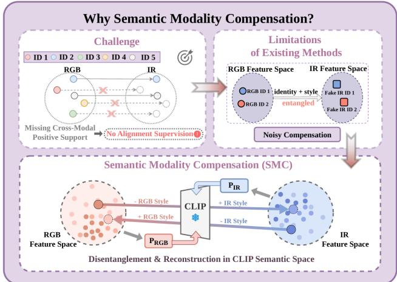
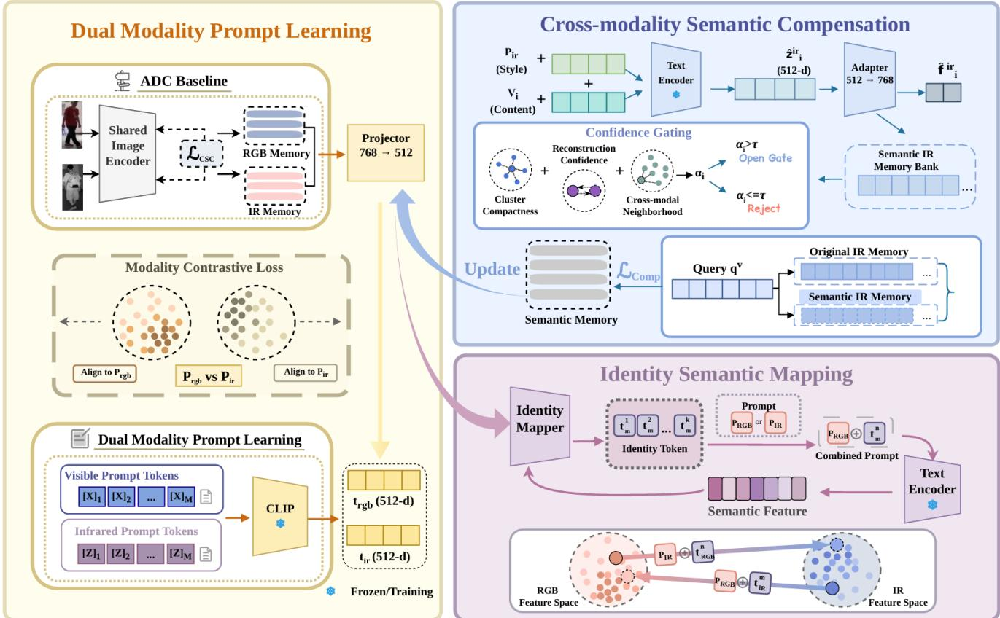
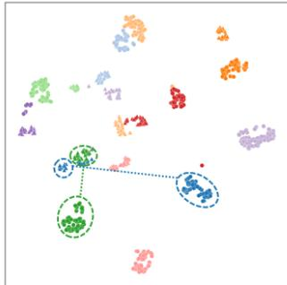
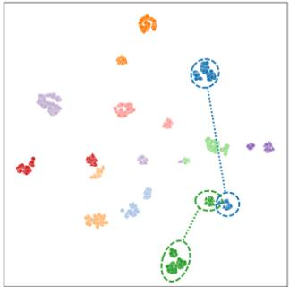
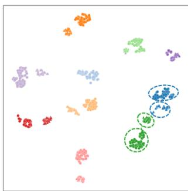
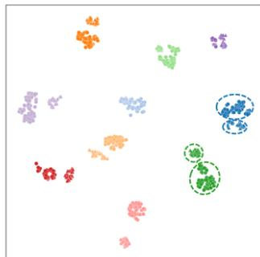
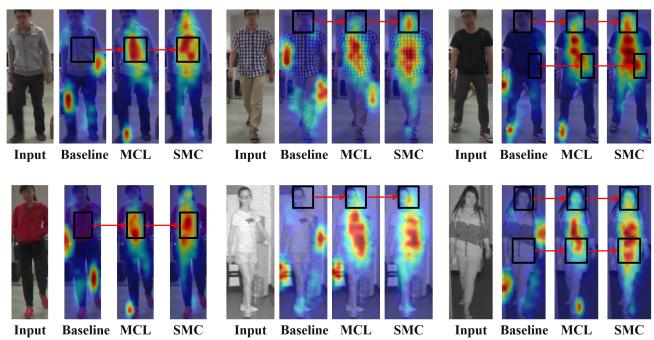
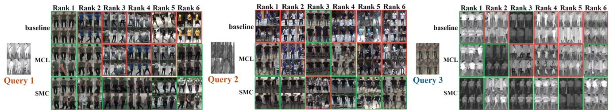

# Semantic Modality Compensation for Unsupervised Visible-Infrared Person Re-identification under Unpaired Settings

Duanning Chen1, Ke He1, Bin Yang1, Yongxiang Yao1

1Wuhan University

## Abstract

Unsupervised visible-infrared person re-identification (USL-VI-ReID) learns person representations that can be compared across modalities without identity annotations. In the unpaired setting, however, identity correspondences between modalities are often incomplete, leaving many identities without an observed counterpart in the other modality. Existing unpaired methods bridge this gap by generating or mapping features for the other modality, mainly by exploiting the statistics of visual features without explicitly separating content that is discriminative for identity from style that is specific to modality. Consequently, the generated features may distort identity cues or inherit bias from the source modality, undermining the reliability of supervision across modalities. We formulate unpaired learning across modalities as a semantic compensation problem and propose Semantic Modality Compensation (SMC), a framework based on prompt composition that decouples identity semantics from modality style within a shared visual semantic space. SMC first constructs a discriminative ReID space through augmented dual contrastive learning, yielding pseudo labels, cluster prototypes, and memory banks for each modality. It then learns visible and infrared modality prompts in the CLIP semantic space and maps clusters obtained from pseudo labels to identity semantic tokens. For each cluster lacking a reliable match in the other modality, SMC combines its identity token with the prompt for the target modality to synthesize a semantic counterpart in the missing modality. The synthesized counterpart is then projected back into the ReID space and injected into a compensation memory through confidence gating. Extensive experiments under both paired and unpaired settings demonstrate that SMC consistently outperforms state-of-the-art methods, with particularly large gains when identity mismatch is severe.

## Introduction

Person reidentification (ReID) retrieves images of a target individual across cameras. Visible and infrared ReID (VI ReID) extends this task to poor illumination and nighttime by matching images from visible and infrared cameras. Despite its strong performance, supervised VI ReID requires costly identity annotations shared across modalities, motivating unsupervised VI ReID. Most unsupervised methods assume that both training sets contain the same identities, although their correspondence is hidden. In practice, independently collected data may share few or no identities. Identities unique to one modality then lack genuine counterparts, making supervision across modalities dificult.

  
Figure 1: Illustration of the motivation for SMC. In unpaired settings, missing cross-modality counterparts make direct transformation unreliable. SMC decouples identity content and modality style, and recombines them in frozen CLIP semantic space to generate reliable semantic counterparts.

This absence exposes a fundamental weakness in current pipelines. They cluster each modality independently and learn representations with contrastive objectives and feature memories. Since the pseudo labels are separate, supervision across modalities depends on inferred associations between clusters. With incomplete identity overlap, aligning an unmatched cluster with its nearest cluster creates false positive pairs, while rejecting it removes supervision from the other modality. Recent methods map or generate features in the target modality, but rely mainly on visual statistics and do not explicitly separate identity from modality appearance. The resulting features may distort identity cues or preserve source modality bias, reducing their reliability as supervision, as shown in Fig. 1.

To overcome this limitation, we propose Semantic Modality Compensation (SMC) for unsupervised VI ReID with incomplete identity overlap. Rather than forcing every cluster to match another, SMC treats a missing reliable match as a semantic compensation problem. It maps an unmatched cluster prototype into identity tokens and composes them with a learned target modality prompt in the semantic space of CLIP, producing a candidate counterpart. This design assigns identity and modality information to separate components instead of transforming the entire visual feature. The candidate is projected into the ReID space and retained only when sufficiently reliable, providing supervision across modalities for identities without observed counterparts.

SMC contains four components: Augmented Dual Contrastive Learning (ADC), Dual Modality Prompt Learning (DMP), Identity Semantic Mapping (ISM), and Cross Modality Semantic Compensation (CSC). ADC builds the basic unsupervised ReID space from visible images, visible images produced by channel augmentation, and infrared images, with a separate memory bank for each modality. DMP learns prompts that encode visible and infrared imaging styles in a visual semantic space. ISM maps pseudo label cluster prototypes into semantic identity tokens and preserves identity through reconstruction consistency, pseudo identity consistency, and modality decorrelation. CSC combines each identity token with the target modality prompt, projects the compensated feature into the ReID space, and stores it in a semantic compensation memory.

The main contributions of this work are summarized as follows.

• We formulate USL-VI-ReID with partial or no identity overlap as a semantic compensation problem and propose SMC, which constructs candidate semantic counterparts for clusters without reliable matches instead of forcing uncertain associations across modalities.

• We introduce a composition mechanism—realized through Dual Modality Prompt Learning (DMP) and Identity Semantic Mapping (ISM)—that uses tokens derived from cluster prototypes to represent identity information and learned prompts to represent the characteristics of visible and infrared imaging in the semantic space of CLIP. The resulting representations are projected into the ReID space and, via Cross-modality Semantic Compensation (CSC), stored in a compensation memory only when their estimated reliability is suficiently high, allowing selected candidates to serve as auxiliary prototypes for contrastive learning.

• We evaluate SMC on SYSU-MM01 and RegDB across four degrees of identity mismatch, together with standard evaluations on SYSU-MM01, RegDB, and LLCM. SMC achieves the highest Rank-1 accuracy and mAP among the compared unsupervised methods in all reported settings.

## Related Work

## Unsupervised Visible and Infrared Person ReID

Unsupervised visible and infrared person re-identification (USL-VI-ReID) must address both the large discrepancy between modalities and the absence of identity annotations. Most methods cluster samples within each modality, learn representations through contrastive learning with memory banks, and then estimate identity associations across modalities. Early methods such as H2H (Liang et al. 2021) and OTLA (Wang et al. 2022) use an annotated RGB source dataset. H2H combines homogeneous and heterogeneous learning, whereas OTLA transfers visible pseudo labels to infrared samples through optimal transport. Later studies remove external ReID supervision and improve association reliability through memory aggregation, graph or neighbor matching, and diverse token representations (Yang et al. 2022; Ye, Wu, and Du 2025; Yang, Chen, and Ye 2024; Wang et al. 2025), while other methods reduce errors in pseudo supervision through soft labels, data augmentation, or modality bias mitigation (Teng et al. 2025; Pang et al. 2025a; Wang et al. 2026a). Nevertheless, their supervision across modalities is derived from relations between observed visible and infrared clusters. If an identity is absent from one modality, no observed counterpart is available for association; improving association reliability alone cannot recover the missing counterpart.

## Semantic Guidance for Visible and Infrared Person ReID

CLIP (Radford et al. 2021) provides transferable visual and language knowledge that can reduce dependence on visual similarity. Its supervised ReID adaptations use learnable prompts or generated descriptions to introduce identity and modality semantics into visual representation learning (Li, Sun, and Li 2023; Yu et al. 2025; Hu, Yang, and Ye 2024). Within USL-VI-ReID, learned text representations are associated with pseudo identity clusters to improve matching across modalities (Guo and Pang 2025; Pang et al. 2026), while pedestrian attributes, language models, implicit semantic spaces, and fusion between visible and infrared representations are used to refine clustering and feature learning (Pang et al. 2025b; Rong et al. 2025; Yang et al. 2026; Wang et al. 2026b). These studies show that semantic information can improve pseudo labels, correspondence estimation across modalities, and feature discrimination among observed samples. However, they do not explicitly construct a target modality representation for an identity without an observed counterpart.

## Generation and Compensation across Modalities

Generation and compensation introduce synthesized modality cues rather than relying only on associations between observed samples. Under identity supervision, existing methods compensate for missing modality characteristics at the feature level or generate intermediate images approaching the opposite modality (Xi et al. 2025; Alehdaghi et al. 2025). MCL (Yao et al. 2025) extends feature generation to USL-VI-ReID under unpaired settings by using feature distribution statistics and learned afine parameters to transform a complete source feature into a synthetic target modality feature. The synthetic feature inherits the source pseudo identity, and its consistency is encouraged at cluster and instance levels. MCL therefore demonstrates that a missing modality representation can be actively constructed rather than left to association alone, directly addressing the limitation identified above. Its afine mapping operates on the complete source feature and does not explicitly parameterize the identity information to be preserved and the modality information to be adapted as separate components during synthesis. Explicit control over these two processes therefore remains an open direction.

  
Figure 2: Overview of SMC. ADC constructs modality-specific clusters and memories. The training-only semantic branch composes cluster identity tokens with a target-modality prompt and caches reliable outputs as auxiliary positives.

## Method

## Overall Framework

We use unlabeled visible and infrared training sets whose identities may overlap, with no correspondence provided between the two modalities. Let $m \in \{ v , r \}$ denote the current modality and m¯ the other. The $\mathrm { A D C }$ encoder $E _ { \theta }$ maps each image to a feature $\mathbf { f } _ { i } ^ { m }$ with unit norm for clustering, contrastive learning, and retrieval.

As shown in Fig. 2, SMC adds a semantic branch to the ADC component of ADCA (Yang et al. 2022). This branch is used only during training and contains a frozen CLIP text encoder $E _ { T }$ (Radford et al. 2021). The projector $G _ { \mathrm { v s } }$ aligns ReID features with the text space, and the shared identity mapper $G _ { \mathrm { i d } }$ converts cluster prototypes into soft tokens. A prompt for the desired modality is combined with these tokens, after which $G _ { \mathrm { s v } }$ maps the result back to the ReID space. A reliability gate stores valid compositions as auxiliary positives in a semantic memory. Only $E _ { \theta }$ is retained for inference.

## Dual Modality Prompt Learning

DMP uses the ADC component of ADCA (Yang et al. 2022) without its memory aggregation between modalities. At the start of each epoch, DBSCAN separately assigns pseudo labels $\widetilde { y } _ { i } ^ { m }$ to valid samples from each modality. Let $K _ { m }$ be the number of clusters and $\mathcal { C } _ { k } ^ { m }$ the samples in cluster k. Its prototype is

$$
\phi _ { k } ^ { m } = \mathrm { N o r m } \left( \frac { 1 } { | { \mathcal C } _ { k } ^ { m } | } \sum _ { i \in { \mathcal C } _ { k } ^ { m } } \mathbf { f } _ { i } ^ { m } \right) .\tag{1}
$$

The prototypes are refreshed every epoch and initialize the observed memory $\mathcal { M } _ { \mathrm { o r i } } ^ { m }$ . Channel augmentation creates another visible view with the same pseudo label. The unchanged ADC objective $\mathcal { L } _ { \mathrm { A D C } }$ applies ClusterNCE to the original visible, augmented visible, and infrared queries with their respective memories.

DMP learns one identity independent prompt $\mathbf { P } ^ { m }$ for each modality. Following CLIP prompt learning (Zhou et al. 2022; Li, Sun, and Li 2023; Chen et al. 2023), let $\mathcal { T } ( \mathbf { P } , \mathbf { T } )$ denote the template “a photo of a [prompt] [identity tokens] person.” The identity field is omitted when $\mathbf { T } = { \boldsymbol { \mathcal { O } } }$ . With normalization included in the frozen encoder, the modality anchor and projected feature are

$$
\mathbf { t } ^ { m } = E _ { T } ( { T } ( \mathbf { P } ^ { m } , \mathcal { O } ) ) , \quad \mathbf { z } _ { i } = \mathrm { N o r m } ( G _ { \mathrm { v s } } ( \mathbf { f } _ { i } ^ { m _ { i } } ) ) ,\tag{2}
$$

where $m _ { i }$ is the modality of sample i. For a mixed batch B, DMP classifies each projected feature with the two anchors and separates the anchors by a cosine margin:

$$
\begin{array} { r l } { \mathcal { L } _ { \mathrm { { D M P } } } = \mathrm { ~ - ~ } \displaystyle \frac { 1 } { | \mathcal { B } | } \sum _ { i \in \mathcal { B } } \log \frac { \exp ( \langle \mathbf { z } _ { i } , \mathbf { t } ^ { m _ { i } } \rangle / \tau _ { \mathrm { { m o d } } } ) } { \displaystyle \sum _ { q \in \{ v , r \} } \exp ( \langle \mathbf { z } _ { i } , \mathbf { t } ^ { q } \rangle / \tau _ { \mathrm { { m o d } } } ) } } \\ { \quad \quad \quad \quad \quad \quad \quad + \lambda _ { \mathrm { s e p } } \big [ \langle \mathbf { t } ^ { v } , \mathbf { t } ^ { r } \rangle - \boldsymbol { \mu } \big ] _ { + } . } \end{array}\tag{3}
$$

Here, $\tau _ { \mathrm { m o d } }$ is the temperature, $\lambda _ { \mathrm { s e p } }$ weights the separation term, µ is the margin, and $[ x ] _ { + } = \dot { \operatorname* { m a x } } ( x , 0 )$

## Identity Semantic Mapping

Because individual features contain pose and background noise, composition uses the cluster prototypes in Eq. (1). The shared mapper converts each prototype into an identity token sequence:

$$
\mathbf { T } _ { k } ^ { m } = G _ { \mathrm { i d } } ( \phi _ { k } ^ { m } ) .\tag{4}
$$

During training, the mapper also processes features in each batch. The mean token of each sample serves as its descriptor for consistency regularization.

Using the prompt for either the observed modality or the other modality gives

$$
{ \mathbf { h } } _ { k } ^ { m  q } = \mathrm { N o r m } ( G _ { \mathrm { s v } } ( E _ { T } ( \mathcal { T } (  { \mathbf { P } } ^ { q } ,  { \mathbf { T } } _ { k } ^ { m } ) ) ) ) .\tag{5}
$$

The observed prompt reconstructs the source prototype, whereas the other prompt produces a candidate for the other modality. The reconstruction loss measures cosine distance from the source prototype. The consistency loss aligns normalized sample descriptors within each cluster and is omitted when no valid pair exists. An adversarial modality classifier connected through gradient reversal removes modality information from the tokens. The ISM objective is

$$
{ \mathcal { L } } _ { \mathrm { I S M } } = \lambda _ { \mathrm { r e c } } { \mathcal { L } } _ { \mathrm { r e c } } + \lambda _ { \mathrm { c o n s } } { \mathcal { L } } _ { \mathrm { c o n s } } + \lambda _ { \mathrm { a d v } } { \mathcal { L } } _ { \mathrm { a d v } } .\tag{6}
$$

Sample tokens regularize the mapper, while the more stable cluster prototypes generate compensation.

## Semantic Compensation Across Modalities

A cluster is considered for compensation only if it is poorly covered by the other modality and, at the same time, reliable in its own source modality. These two conditions are measured by two disjoint sets of quantities: a coverage score that decides whether a counterpart is missing, and a confidence score that decides how much a synthesized counterpart should be trusted.

Coverage is measured by the largest afinity of a cluster to a prototype in the other modality:

$$
s _ { k } ^ { m } = \operatorname* { m a x } _ { 1 \leq l \leq K _ { \bar { m } } } \left. \phi _ { k } ^ { m } , \phi _ { l } ^ { \bar { m } } \right. .\tag{7}
$$

A low value indicates that no observed cluster in the other modality plausibly corresponds to this identity. Candidate reliability is instead estimated from quantities that are internal to the source modality and to the composition itself, namely cluster compactness $c _ { \mathrm { c m p } , k } ^ { m }$ and reconstruction quality $c _ { \mathrm { r e c } , k } ^ { m } \mathrm { : }$

$$
w _ { k } ^ { m } = \frac { 2 + c _ { \mathrm { c m p } , k } ^ { m } + c _ { \mathrm { r e c } , k } ^ { m } } { 4 } .\tag{8}
$$

This expression maps the two cosine scores to the unit interval before averaging them. The coverage score $s _ { k } ^ { m }$ is deliberately excluded from Eq. (8), so that the same quantity is never used both as evidence that a counterpart is absent and as evidence that a synthesized counterpart is trustworthy. The gate accepts

$$
\mathcal { G } _ { m } = \{ k \mid s _ { k } ^ { m } < \delta _ { u } , w _ { k } ^ { m } > \delta _ { g } \} ,\tag{9}
$$

where $\delta _ { u }$ limits coverage and $\delta _ { g }$ sets the minimum confidence. These clusters are plausible sources of compensation rather than verified missing identities.

For each accepted cluster, the candidate $\mathbf { h } _ { k } ^ { m  \bar { m } }$ is detached and cached at the epoch boundary. It is appended to the observed memory of modality m¯ to form $\Omega ^ { \bar { m } }$ without replacing existing entries. Separate addresses for the two transfer directions avoid conflicts between independently assigned cluster labels. The cached candidates and confidence scores remain constant during the epoch.

Let $A _ { m }$ contain the queries in the current batch whose clusters pass the gate, and let $k _ { i } = \widetilde { y } _ { i } ^ { m }$ . Each query uses its cached candidate as the sole positive, while $\Omega ^ { \bar { m } }$ provides the denominator. The CSC objective is

$$
\begin{array} { r l } & { \mathcal { L } _ { \mathrm { C S C } } = \displaystyle \sum _ { m \in \{ v , r \} } \frac { 1 } { \operatorname* { m a x } ( 1 , | \mathcal { A } _ { m } | ) } \sum _ { i \in \mathcal { A } _ { m } } w _ { k _ { i } } ^ { m } } \\ & { \quad \quad \ell _ { \mathrm { N C E } } \big ( \mathbf { f } _ { i } ^ { m } , \mathbf { h } _ { k _ { i } } ^ { m \to \bar { m } } ; \Omega ^ { \bar { m } } , \tau _ { c } \big ) . } \end{array}\tag{10}
$$

The guarded denominator makes an empty set contribute zero. Since the cached quantities are fixed within an epoch, this loss updates only the query encoder.

The complete objective is

$$
\begin{array} { r l } & { { \mathcal { L } } _ { \mathrm { S M C } } = { \mathcal { L } } _ { \mathrm { A D C } } + \lambda _ { \mathrm { D M P } } { \mathcal { L } } _ { \mathrm { D M P } } + \lambda _ { \mathrm { I S M } } { \mathcal { L } } _ { \mathrm { I S M } } } \\ & { ~ + \lambda _ { \mathrm { C S C } } { \mathcal { L } } _ { \mathrm { C S C } } . } \end{array}\tag{11}
$$

We train ADC alone for 30 epochs, then train all components for another 30. Clusters, observed memories, accepted sets, and detached semantic keys are refreshed at each epoch boundary. DMP and the sample constraints in ISM are computed for each batch, while reconstruction uses the prototypes fixed for the current epoch. The CSC keys supervise only the encoder and are regenerated at the next refresh. For retrieval, the semantic branch is discarded and only $E _ { \theta }$ is used.

## Experiments

## Datasets and Evaluation Protocols

We evaluate SMC on three benchmarks for visible and infrared person ReID: SYSU-MM01, RegDB, and LLCM (Zhang and Wang 2023). SYSU-MM01 uses the all search and indoor search protocols. For RegDB, results are averaged over the ten oficial splits in both the visible to infrared (V2T) and infrared to visible (T2V) directions. LLCM contains 46,767 images of 1,064 identities captured by nine cameras and follows the same two retrieval directions. We report Rank 1 accuracy, mAP, and mINP where available.

We construct controlled identity mismatch through identity replacement. For SYSU-MM01 and each oficial RegDB split, the infrared training partition remains fixed. At each ratio $\alpha \in \{ 0 . 2 5 , 0 . 5 , 0 . 7 5 , 1 . 0 \}$ , we select the corresponding fraction of training identity indices and replace all visible images at each selected index with the same number of images from one external identity drawn from Market-1501, MSMT17, or LLCM. The external identity difers from the infrared identity assigned to that index. This construction preserves the identity count and the number of visible images per index, isolating correspondence errors from data volume. The ratio α controls mismatch severity, and $\alpha = 1 . 0$ removes all identity overlap between modalities. Every method is trained independently on the same split at each ratio. The mismatch splits used in this work are newly constructed and difer from those used in the original MCL experiments. All baseline results in Table 2 are obtained by retraining the corresponding methods on exactly these splits.

Table 1: Comparison with supervised and unsupervised methods under paired settings on SYSU-MM01 and RegDB. Rank-1 (R1), mAP, and mINP (%) are reported. Best results within each supervision group are boldfaced; “–” denotes results not reported by the original paper. † denotes SAAI with its reported afinity-inference protocol, and ‡ denotes the camera-information-free GUR variant.
<table><tr><td colspan="2"></td><td colspan="4">SYSU-MM01</td><td colspan="2"></td><td colspan="4">RegDB</td></tr><tr><td colspan="2">Method</td><td></td><td colspan="2">All Search</td><td colspan="2">Indoor Search</td><td colspan="2">Visible → Infrared</td><td></td><td>Infrared → Visible</td><td></td></tr><tr><td colspan="2">AGW (Ye et al. 2022)</td><td>Venue</td><td>R1 mAP</td><td>mINP</td><td>R1</td><td>mAP mINP</td><td>R1</td><td>mAP 66.37</td><td>mINP</td><td>R1 mAP</td><td>mINP</td></tr><tr><td rowspan="6">Supvsed</td><td></td><td>TPAMI&#x27;22</td><td>47.5047.65</td><td>35.30</td><td>54.17 62.97</td><td>59.23</td><td>70.05</td><td>50.19</td><td>70.49</td><td>65.90</td><td>51.24</td></tr><tr><td>DEEN (Zhang and Wang 2023)</td><td>CVPR&#x27;23</td><td>74.7071.80</td><td></td><td>80.3083.30</td><td></td><td>91.10</td><td>85.10</td><td></td><td>89.50 83.40</td><td></td></tr><tr><td>PartMix (Kim et al. 2023)</td><td>CVPR&#x27;23</td><td>77.7874.62</td><td></td><td>81.52 84.38</td><td></td><td>85.66</td><td>82.27</td><td></td><td>84.93 82.52</td><td></td></tr><tr><td>MUN (Yu et al. 2023)</td><td>ICCV&#x27;23</td><td>76.2473.81</td><td></td><td>79.42 82.06</td><td></td><td>95.19</td><td>87.15</td><td>91.86</td><td>85.01</td><td></td></tr><tr><td>SAAI† (Fang, Yang, and Fu 2023)</td><td>ICCV&#x27;23</td><td>75.9077.03</td><td></td><td>83.20 88.01</td><td></td><td>91.07</td><td>91.45</td><td>92.09</td><td>92.01</td><td></td></tr><tr><td>IDKL (Ren and Zhang 2024)</td><td>CVPR&#x27;24</td><td>81.42 79.85</td><td></td><td>87.14 89.37</td><td></td><td>94.72 90.19</td><td></td><td>94.22</td><td>90.43</td><td></td></tr><tr><td rowspan="10">Unrsed</td><td>ADCA (Yang et al. 2022)</td><td>MM&#x27;22</td><td>45.51 42.73</td><td>28.29</td><td>50.60 59.11</td><td>55.17</td><td>67.20</td><td>64.05</td><td>52.67</td><td>68.48 63.81</td><td>49.62</td></tr><tr><td>PGM (Wu and Ye 2023)</td><td>CVPR&#x27;23</td><td>57.27 51.78</td><td>34.96</td><td>56.23 62.74</td><td>58.13</td><td>69.48</td><td>65.41</td><td></td><td>69.85 65.17</td><td></td></tr><tr><td>MBCCM (Cheng et al. 2023)</td><td>MM&#x27;23</td><td>53.14 48.16</td><td>32.41</td><td>55.21 61.98</td><td>57.13</td><td>83.79</td><td>77.87 65.04</td><td>82.82</td><td></td><td>76.74 61.73</td></tr><tr><td>GUR‡ (Yang, Chen, and Ye 2023)</td><td>ICCV’23</td><td>60.95 56.99</td><td>41.85</td><td>64.22 69.49</td><td>64.81</td><td>73.91</td><td>70.23 58.88</td><td>75.00</td><td>69.94 56.21</td><td></td></tr><tr><td>MMM (Shi et al. 2024)</td><td>ECCV&#x27;24</td><td>61.60 57.90</td><td></td><td>64.40 70.40</td><td></td><td>89.70</td><td>80.50</td><td></td><td>85.8077.00</td><td></td></tr><tr><td>N-ULC (Teng et al. 2025)</td><td>AAAI&#x27;25</td><td>61.81 58.92</td><td>45.01</td><td>67.04 73.08</td><td>69.42</td><td>88.75</td><td>82.14</td><td>68.75 88.17</td><td>81.11</td><td>66.05</td></tr><tr><td>MCL (Yao et al. 2025)</td><td>ICCV&#x27;25</td><td>62.95 62.71</td><td>50.63</td><td>67.81 74.19</td><td>70.82</td><td>89.83</td><td>83.12</td><td>72.86 88.64</td><td>82.04</td><td>69.12</td></tr><tr><td>DMDL (Li et al. 2026)</td><td>PR&#x27;26</td><td>65.9061.8647.53</td><td></td><td>70.6675.45</td><td>71.66</td><td>90.63</td><td>85.33 73.79</td><td></td><td>90.3085.04 72.00</td><td></td></tr><tr><td>ITKM(M) (Pang et al. 2026)</td><td>AAAI&#x27;26</td><td>64.9063.30</td><td></td><td>72.3077.10</td><td></td><td></td><td></td><td></td><td></td><td></td></tr><tr><td>SMC (Ours)</td><td></td><td>67.86 66.02 53.91</td><td></td><td></td><td>73.15 78.02 74.85</td><td></td><td>91.41 85.88 74.62</td><td></td><td>90.96 85.62 72.85</td><td></td></tr></table>

## Implementation Details

SMC is implemented in PyTorch with AGW as the ReID encoder and a frozen CLIP ViT-B/16 text encoder in the semantic branch. Each modality contributes 256 images to a batch, comprising 16 pseudo identities with 16 instances each; the combined batch therefore contains 512 images. DBSCAN uses eps = 0.6, the memory momentum is $\rho = 0 . 9 5$ , and each epoch contains 100 iterations. Image preprocessing, data augmentation, and the ADC optimizer follow ADCA (Yang et al. 2022). For RegDB, we train and evaluate the model separately on each oficial split and report the average.

Training lasts 60 epochs. We optimize ADC alone for the first 30 epochs and activate the semantic branch for joint optimization during the remaining 30 epochs. Both the modality prompt length and the number of identity tokens per cluster are set to 4. DMP, ISM, and CSC are optimized with Adam using a learning rate of $3 \times 1 0 ^ { - 4 }$ and a weight decay of $1 \times \bar { 1 } 0 ^ { - 4 }$

  
(a) ADC Baseline

  
(b) +DMP+ISM

  
(c) +CFM  
(d) +CSC (Full SMC)  
Figure 3: Embedding distributions of 20 randomly sampled identities on SYSU-MM01 at $\alpha = 0 . 5$ . Circles and triangles denote visible and infrared samples, respectively.

The remaining hyperparameters are fixed across all datasets and all mismatch ratios: the coverage threshold is $\delta _ { u } = 0 . 3 0$ and the confidence threshold is $\bar { \delta } _ { g } = 0 . 5 5 ;$ the modality temperature is $\tau _ { \mathrm { m o d } } = 0 . 0 5$ with separation weight $\lambda _ { \mathrm { s e p } } = 0 . 5$ and margin $\mu = 0 . 2 0$ ; the compensation temperature is $\tau _ { c } = 0 . 0 5 ;$ and the loss weights are $\lambda _ { \mathrm { D M P } } = 1 . 0$ $\lambda _ { \mathrm { I S M } } = 1 . 0 , \lambda _ { \mathrm { C S C } } = 1 . 0$ , with $\lambda _ { \mathrm { r e c } } = 1 . 0 , \lambda _ { \mathrm { c o n s } } = 0 . 5$ , and $\lambda _ { \mathrm { a d v } } = 0 . 1$ inside $\mathcal { L } _ { \mathrm { I S M } }$ . The confidence gate gives equal weight to cluster compactness and reconstruction confidence in the observed modality, while the cross-modality coverage score is used only for candidate selection.

Table 2: Comparison under unpaired settings on SYSU-MM01 in the all search and indoor search modes and on RegDB in the V2T and T2V directions as α varies. Rank-1 accuracy and mAP (%) are reported. All competing results are obtained by retraining the corresponding methods on our newly constructed splits, using the same split for every method at each value of α. Methods are listed in ascending order of accuracy within each ratio, and every entry is the mean of three runs with diferent random seeds.
<table><tr><td rowspan="2">α</td><td rowspan="2">Method</td><td colspan="2">SYSU-MM01 (AII)</td><td colspan="2">SYSU-MM01 (Indoor)</td><td colspan="2">RegDB (V2T)</td><td colspan="2">RegDB (T2V)</td></tr><tr><td>R1</td><td>mAP</td><td>R1</td><td>mAP</td><td>R1</td><td>mAP</td><td>R1</td><td>mAP</td></tr><tr><td rowspan="5">0.25</td><td>MMM</td><td>30.94</td><td>33.58</td><td>35.49</td><td>44.21</td><td>62.27</td><td>55.09</td><td>66.69</td><td>59.92</td></tr><tr><td>N-ULC</td><td>52.21</td><td>48.67</td><td>54.33</td><td>62.10</td><td>60.76</td><td>56.82</td><td>68.31</td><td>66.06</td></tr><tr><td>DLM</td><td>54.61</td><td>54.07</td><td>53.66</td><td>62.30</td><td></td><td></td><td></td><td></td></tr><tr><td>MCL</td><td>55.29</td><td>55.82</td><td>61.46</td><td>68.95</td><td>65.97</td><td>63.53</td><td>76.12</td><td>67.83</td></tr><tr><td>SMC</td><td>57.21</td><td>55.92</td><td>63.54</td><td>70.26</td><td>76.21</td><td>71.23</td><td>82.31</td><td>73.18</td></tr><tr><td rowspan="5">0.5</td><td>MMM</td><td>28.26</td><td>30.40</td><td>34.70</td><td>42.53</td><td>52.90</td><td>43.91</td><td>61.71</td><td>54.59</td></tr><tr><td>N-ULC</td><td>36.73</td><td>35.35</td><td>38.98</td><td>49.05</td><td>50.24</td><td>45.96</td><td>67.31</td><td>59.71</td></tr><tr><td>DLM</td><td>47.78</td><td>49.65</td><td>49.83</td><td>58.16</td><td></td><td></td><td></td><td></td></tr><tr><td>MCL</td><td>52.71</td><td>52.87</td><td>59.43</td><td>66.72</td><td>60.78</td><td>59.69</td><td>70.36</td><td>63.02</td></tr><tr><td>SMC</td><td>55.62</td><td>55.74</td><td>62.21</td><td>69.03</td><td>69.42</td><td>65.55</td><td>74.02</td><td>66.24</td></tr><tr><td rowspan="5">0.75</td><td>MMM</td><td>24.57</td><td>27.23</td><td>32.94</td><td>40.87</td><td>41.73</td><td>38.64</td><td>54.79</td><td>47.90</td></tr><tr><td>N-ULC</td><td>33.18</td><td>31.04</td><td>35.61</td><td>45.82</td><td>43.38</td><td>39.27</td><td>56.72</td><td>47.31</td></tr><tr><td>DLM</td><td>41.51</td><td>44.15</td><td>45.82</td><td>54.51</td><td></td><td></td><td></td><td></td></tr><tr><td>MCL</td><td>49.29</td><td>49.56</td><td>57.94</td><td>65.24</td><td>55.30</td><td>52.79</td><td>64.19</td><td>59.37</td></tr><tr><td>SMC</td><td>53.88</td><td>54.22</td><td>61.37</td><td>68.11</td><td>62.58</td><td>59.26</td><td>67.58</td><td>60.89</td></tr><tr><td rowspan="5">1.0</td><td>MMM</td><td>12.19</td><td>16.04</td><td>10.05</td><td>17.19</td><td>30.98</td><td>27.10</td><td>40.26</td><td>33.54</td></tr><tr><td>N-ULC</td><td>19.83</td><td>21.35</td><td>25.34</td><td>35.72</td><td>34.71</td><td>28.06</td><td>42.83</td><td>32.40</td></tr><tr><td>DLM</td><td>27.34</td><td>29.85</td><td>34.15</td><td>42.74</td><td></td><td></td><td></td><td></td></tr><tr><td>MCL</td><td>44.24</td><td>43.53</td><td>50.93</td><td>58.28</td><td>43.18</td><td>39.29</td><td>51.37</td><td>46.40</td></tr><tr><td>SMC</td><td>45.48</td><td>45.93</td><td>53.78</td><td>61.05</td><td>44.31</td><td>44.07</td><td>56.76</td><td>51.68</td></tr></table>

Table 3: Comparison on LLCM under the standard protocol. Rank-1 (R1) and mAP (%) are reported. Best results within each supervision group are boldfaced.
<table><tr><td></td><td>Method</td><td>Venue</td><td>Visible → Infrared R1 mAP</td><td>R1</td><td>Infrared → Visible mAP</td></tr><tr><td rowspan="3">·dn·</td><td>MMN</td><td>MM&#x27;21</td><td>59.90 62.70</td><td>52.50</td><td>58.90</td></tr><tr><td>DEEN</td><td>CVPR&#x27;23</td><td>62.50 65.80</td><td>54.90</td><td>62.90</td></tr><tr><td>DSFAD</td><td>TIFS’25</td><td>66.20 68.90</td><td>57.50</td><td>64.10</td></tr><tr><td rowspan="5">·Uunsu·</td><td>ADCA</td><td>MM&#x27;22</td><td>40.32 45.68</td><td>35.51</td><td>42.29</td></tr><tr><td>SDCL</td><td>CVPR&#x27;24</td><td>46.90 52.40</td><td>43.40</td><td>48.20</td></tr><tr><td>MMM</td><td>ECCV’24</td><td>49.72 55.10</td><td>44.86</td><td>50.32</td></tr><tr><td>LVLM-AAM</td><td>NeurIPS’25</td><td>52.20 57.30</td><td>46.00</td><td>51.70</td></tr><tr><td>SMC (Ours)</td><td></td><td>60.15 64.32</td><td>53.86</td><td>60.44</td></tr></table>

Unless stated otherwise, every entry reported under the unpaired protocol is the mean of three runs with diferent random seeds on the same split; the standard deviation of mAP is below 0.4 on SYSU-MM01 and below 0.8 on RegDB.

## Main Experiments

Comparison under paired settings Tables 1 and 3 compare SMC with recent methods under the standard protocols. SMC achieves the highest Rank 1 accuracy and mAP on SYSU-MM01 and RegDB among the compared unsupervised methods. Against the most recent competitor ITKM(M) (Pang et al. 2026), SMC improves Rank 1 and mAP by 2.96 and 2.72 points in the all search mode and by

  
Figure 4: Class activation maps from ADC, MCL, and SMC on representative queries. Black boxes mark salient regions, and red arrows trace changes in attention from ADC through MCL to SMC.

0.85 and 0.92 points in the indoor search mode. On LLCM, SMC reaches 60.15 Rank 1 and 64.32 mAP for visible to infrared retrieval, exceeding the strongest unsupervised competitor LVLM-AAM by 7.95 and 7.02 points, and it retains a comparable margin of 7.86 Rank 1 and 8.74 mAP in the infrared to visible direction. SMC remains below the supervised methods on this benchmark, indicating that semantic compensation narrows but does not close the gap to identity supervision.

Comparison under unpaired settings Table 2 compares the methods across α $\in \{ 0 . 2 5 , 0 . 5 , 0 . 7 5 , 1 . 0 \}$ }. SMC achieves the highest Rank 1 accuracy and mAP in every protocol. At $\alpha = 1 . 0 \ :$ , it improves mAP over MCL by 2.40 points on SYSU-MM01 in the all search mode and 4.78 points on RegDB for visible to infrared retrieval. From $\alpha = 0 . 2 5$ to α = 1.0, its mAP on SYSU-MM01 in the all search mode declines by 9.99 points, compared with 12.29 for MCL and 24.22 for DLM (Ye, Wu, and Du 2025). This smaller decline demonstrates greater robustness to severe identity mismatch. The degradation on RegDB is larger than on SYSU-MM01 for all methods, because RegDB provides a single visible and a single infrared tracklet per identity, so replacing one identity index removes the entire visible evidence for that identity rather than a subset of its cameras.

  
Figure 5: Top six retrieval results for three representative queries under the unpaired setting. Results are shown for ADC, MCL, and SMC. Green and red boxes mark correct and incorrect matches, respectively.

Table 4: Ablation studies on SYSU-MM01 and RegDB under unpaired settings (α = 0.5). Rank 1 accuracy, mAP, and mINP (%) are reported. Row 1 is the ADC baseline retrained on the mismatched split, and is therefore below the paired ADCA result of Table 1.
<table><tr><td rowspan="2">Index</td><td colspan="4">Components ADC DM ISM</td><td colspan="3">SYSU-MM01 (AIl Search)</td><td colspan="3">SYSU-MM01 (Indoor Search)</td><td colspan="3">RegDB (Visible to Infrared)</td></tr><tr><td></td><td></td><td></td><td>CSC</td><td>R1</td><td>mAP</td><td>mINP</td><td>R1</td><td>mAP</td><td>mINP</td><td>R1</td><td>mAP</td><td>mINP</td></tr><tr><td>1</td><td>√</td><td></td><td></td><td></td><td>41.36</td><td>40.02</td><td>27.14</td><td>47.15</td><td>55.28</td><td>50.94</td><td>55.83</td><td>53.16</td><td>41.27</td></tr><tr><td>2</td><td>√</td><td>√</td><td></td><td></td><td>44.26</td><td>43.22</td><td>30.54</td><td>50.25</td><td>58.08</td><td>53.94</td><td>58.53</td><td>55.66</td><td>43.47</td></tr><tr><td>3</td><td>√</td><td>V</td><td>√</td><td></td><td>48.43</td><td>47.82</td><td>35.44</td><td>54.65</td><td>62.08</td><td>58.24</td><td>62.53</td><td>59.26</td><td>46.67</td></tr><tr><td>4</td><td>√</td><td>√</td><td>√</td><td>√</td><td>55.62</td><td>55.74</td><td>43.78</td><td>62.21</td><td>69.03</td><td>65.82</td><td>69.42</td><td>65.55</td><td>52.28</td></tr></table>

## Ablation Study

We evaluate the main components of SMC on SYSU-MM01 and on RegDB for visible to infrared retrieval at α = 0.5. Table 4 reports the results.

Baseline. Row 1 denotes the ADC baseline trained without semantic modeling or feature compensation. Because half of the visible identities have no infrared counterpart at α = 0.5, this baseline falls below the paired ADCA result reported in Table 1, which quantifies the cost of identity mismatch before any compensation is applied.

Efect of DMP. Row 2 adds DMP to ADC and raises mAP by 3.20, 2.80, and 2.50 points on SYSU-MM01 in the all search mode, SYSU-MM01 in the indoor search mode, and RegDB for visible to infrared retrieval, respectively. DMP does not create any new supervision across modalities; it only separates the two imaging styles in the semantic space, so its contribution is modest but consistent, and it is a prerequisite for the two later components.

Efect of ISM. Row 3 further adds ISM and improves mAP over Row 2 by 4.60, 4.00, and 3.60 points in the same settings. These gains show that mapping cluster prototypes to identity tokens preserves identity information that the prompt alone cannot express, and they remain limited because ISM still operates only on observed clusters.

Efect of CSC. Row 4 adds CSC and further improves mAP by 7.92, 6.95, and 6.29 points, respectively, which is larger than the two preceding increments combined on every benchmark. CSC is the only component that supplies supervision for identities without an observed counterpart, so the composition mechanism becomes useful precisely when its output is injected into the compensation memory. This confirms that the reported improvement originates from semantic compensation rather than from an auxiliary prompt objective.

Mechanism-level analyses (modality classification of synthesized features, gate precision/recall, and a shufled-token control) are provided in the supplementary.

## Experimental Analysis

Embedding analysis. Fig. 3 compares the embedding distributions of ADC, the intermediate variants shown in the figure, and full SMC for 20 randomly sampled identities from SYSU-MM01 at α = 0.5.

Qualitative retrieval. Fig. 5 compares the top six results returned by ADC, MCL, and SMC for three representative queries.

Attention analysis. Fig. 4 compares class activation maps from ADC, MCL, and SMC on representative visible and infrared queries. The maps indicate that SMC shifts attention toward regions that distinguish identity and away from cues specific to one modality.

## Conclusion

This paper presents Semantic Modality Compensation (SMC) for unsupervised visible-infrared person retrieval under unpaired settings, where identity correspondence is incomplete or absent. SMC separates identity information from modality characteristics through prompt learning and identity semantic mapping, composes target-modality representations, and retains reliable candidates through confidence gating. Experiments on SYSU-MM01, RegDB, and LLCM show that SMC consistently surpasses existing unsupervised methods and remains more robust as identity mismatch increases, establishing semantic composition as an efective source of cross-modality supervision.

## Limitations

Although SMC consistently improves performance across three benchmarks and all evaluated mismatch ratios, its controlled identity replacement protocol may not cover every distribution shift in naturally collected camera networks. Moreover, semantic compensation relies on pseudo clusters, so severe clustering errors may still afect candidate quality despite confidence gating.

## References

Alehdaghi, M.; Josi, A.; Cruz, R. M. O.; Shamsolmoali, P.; and Granger, E. 2025. Adaptive Generation of Privileged Intermediate Information for Visible-Infrared Person Re-Identification. IEEE Transactions on Information Forensics and Security, 20: 3400–3413.

Chen, Z.; Zhang, Z.; Tan, X.; Qu, Y.; and Xie, Y. 2023. Unveiling the Power of CLIP in Unsupervised Visible-Infrared Person Re-Identification. In Proceedings of the ACM International Conference on Multimedia, 3667–3675.

Cheng, D.; He, L.; Wang, N.; Zhang, S.; Wang, Z.; and Gao, X. 2023. Eficient Bilateral Cross-Modality Cluster Matching for Unsupervised Visible-Infrared Person ReID. In Proceedings of the ACM International Conference on Multimedia, 1325–1333.

Fang, X.; Yang, Y.; and Fu, Y. 2023. Visible-Infrared Person Re-Identification via Semantic Alignment and Afinity Inference. In Proceedings of the IEEE/CVF International Conference on Computer Vision, 11270–11279.

Guo, J.; and Pang, Z. 2025. Image–Text Feature Learning for Unsupervised Visible–Infrared Person Re-Identification. Image and Vision Computing, 158: 105520.

Hu, Z.; Yang, B.; and Ye, M. 2024. Empowering Visible-Infrared Person Re-Identification with Large Foundation Models. In Advances in Neural Information Processing Systems, volume 37, 117363–117387.

Kim, M.; Kim, S.; Park, J.; Park, S.; and Sohn, K. 2023. PartMix: Regularization Strategy to Learn Part Discovery for Visible-Infrared Person Re-Identification. In Proceedings of the IEEE/CVF Conference on Computer Vision and Pattern Recognition, 18621–18632.

Li, J.; Lu, Y.; Liu, B.; Yin, G.; and Ye, M. 2026. Dual-Level Modality Debiasing Learning for Unsupervised Visible-Infrared Person Re-Identification. Pattern Recognition, 176: 113257.

Li, S.; Sun, L.; and Li, Q. 2023. CLIP-ReID: Exploiting Vision-Language Model for Image Re-Identification without Concrete Text Labels. In Proceedings of the AAAI Conference on Artificial Intelligence, volume 37, 1405–1413.

Liang, W.; Wang, G.; Lai, J.; and Xie, X. 2021. Homogeneous-to-Heterogeneous: Unsupervised Learning for RGB-Infrared Person Re-Identification. IEEE Transactions on Image Processing, 30: 6392–6407.

Pang, Z.; Wang, C.; Zhao, L.; and Wang, J. 2025a. Augmented and Softened Matching for Unsupervised Visible-Infrared Person Re-Identification. In Proceedings of the

IEEE/CVF International Conference on Computer Vision, 11100–11109.

Pang, Z.; Zhao, L.; Liu, Y.; Wang, C.; and Sharma, G. 2026. Image-Text Knowledge Modeling for Unsupervised Multi-Scenario Person Re-Identification. In Proceedings of the AAAI Conference on Artificial Intelligence, volume 40, 8269–8277.

Pang, Z.; Zhao, L.; Wang, J.; and Wang, C. 2025b. LVLM-Driven Attribute-Aware Modeling for Visible-Infrared Person Re-Identification. In Advances in Neural Information Processing Systems, volume 38.

Radford, A.; Kim, J. W.; Hallacy, C.; Ramesh, A.; Goh, G.; Agarwal, S.; Sastry, G.; Askell, A.; Mishkin, P.; Clark, J.; Krueger, G.; and Sutskever, I. 2021. Learning Transferable Visual Models from Natural Language Supervision. In Proceedings ofthe International Conference on Machine Learning, volume 139, 8748–8763.

Ren, K.; and Zhang, L. 2024. Implicit Discriminative Knowledge Learning for Visible-Infrared Person Re-Identification. In Proceedings of the IEEE/CVF Conference on Computer Vision and Pattern Recognition, 393–402.

Rong, Z.; Shen, X.; Qin, H.; Xu, Y.; Li, H.; and Ma, L. 2025. FIRM: Fusion-Injected Residual Memory Brings Token-Level Alignment to Unsupervised VI-ReID. In Proceedings ofthe 17th Asian Conference on Machine Learning, volume 304 of Proceedings ofMachine Learning Research, 1134–1149.

Shi, J.; Yin, X.; Chen, Y.; Zhang, Y.; Zhang, Z.; Xie, Y.; and Qu, Y. 2024. Multi-Memory Matching for Unsupervised Visible-Infrared Person Re-Identification. In Proceedings of the European Conference on Computer Vision, 456–474.

Teng, X.; Lan, L.; Chen, D.; Xu, K.; and Yin, N. 2025. Relieving Universal Label Noise for Unsupervised Visible-Infrared Person Re-Identification by Inferring from Neighbors. In Proceedings of the AAAI Conference on Artificial Intelligence, volume 39, 7356–7364.

Wang, J.; Zhang, Z.; Chen, M.; Zhang, Y.; Wang, C.; Sheng, B.; Qu, Y.; and Xie, Y. 2022. Optimal Transport for Label-Eficient Visible-Infrared Person Re-Identification. In Proceedings of the European Conference on Computer Vision, 93–109.

Wang, M.; Gong, X.; Li, J.; and Ji, G. 2026a. Modality-Aware Bias Mitigation and Invariance Learning for Unsupervised Visible-Infrared Person Re-Identification. In Proceedings of the AAAI Conference on Artificial Intelligence, volume 40, 9975–9983.

Wang, X.; Liu, L.; Yang, B.; Ye, M.; Wang, Z.; and Xu, X. 2025. TokenMatcher: Diverse Tokens Matching for Unsupervised Visible-Infrared Person Re-Identification. In Proceedings of the AAAI Conference on Artificial Intelligence, volume 39, 7934–7942.

Wang, X.; Luo, S.; Liu, M.; Srivastava, G.; Liu, S.; and Wang, Y. 2026b. Semantic-Aware Multimodal Collaborative Learning for Unsupervised Visible-Infrared Person Re-Identification. IEEE Transactions on Image Processing, 35: 5080–5091.

Wu, Z.; and Ye, M. 2023. Unsupervised Visible-Infrared Person Re-Identification via Progressive Graph Matching and Alternate Learning. In Proceedings of the IEEE/CVF Conference on Computer Vision and Pattern Recognition, 9548–9558.

Xi, R.; Huang, N.; Lai, C.; Zhang, Q.; and Han, J. 2025. FM-CNet+: Feature-Level Modality Compensation for Visible-Infrared Person Re-Identification. IEEE Transactions on Neural Networks and Learning Systems, 36(7): 13247– 13261.

Yang, B.; Chen, J.; and Ye, M. 2023. Towards Grand Unified Representation Learning for Unsupervised Visible-Infrared Person Re-Identification. In Proceedings of the IEEE/CVF International Conference on Computer Vision, 11069–11079.

Yang, B.; Chen, J.; and Ye, M. 2024. Shallow-Deep Collaborative Learning for Unsupervised Visible-Infrared Person Re-Identification. In Proceedings of the IEEE/CVF Conference on Computer Vision and Pattern Recognition, 16870– 16879.

Yang, B.; Liu, L.; Huang, W.; Wang, X.; Du, B.; and Ye, M. 2026. Mining Cross-Modality Implicit Semantic Association for Unsupervised Visible-Infrared Person Re-Identification. IEEE Transactions on Information Forensics and Security, 21: 697–709.

Yang, B.; Ye, M.; Chen, J.; and Wu, Z. 2022. Augmented Dual-Contrastive Aggregation Learning for Unsupervised Visible-Infrared Person Re-Identification. In Proceedings of the ACM International Conference on Multimedia, 2843– 2851.

Yao, H.; Yang, B.; Huang, W.; Du, B.; and Ye, M. 2025. Unsupervised Visible-Infrared Person Re-Identification under Unpaired Settings. In Proceedings of the IEEE/CVF International Conference on Computer Vision, 11916–11926.

Ye, M.; Shen, J.; Lin, G.; Xiang, T.; Shao, L.; and Hoi, S. C. H. 2022. Deep Learning for Person Re-Identification: A Survey and Outlook. IEEE Transactions on Pattern Analysis and Machine Intelligence, 44(6): 2872–2893.

Ye, M.; Wu, Z.; and Du, B. 2025. Dual-Level Matching With Outlier Filtering for Unsupervised Visible-Infrared Person Re-Identification. IEEE Transactions on Pattern Analysis and Machine Intelligence, 47(5): 3815–3829.

Yu, H.; Cheng, X.; Peng, W.; Liu, W.; and Zhao, G. 2023. Modality Unifying Network for Visible-Infrared Person Re-Identification. In Proceedings ofthe IEEE/CVFInternational Conference on Computer Vision, 11185–11195.

Yu, X.; Dong, N.; Zhu, L.; Peng, H.; and Tao, D. 2025. CLIP-Driven Semantic Discovery Network for Visible-Infrared Person Re-Identification. IEEE Transactions on Multimedia, 27: 4137–4150.

Zhang, Y.; and Wang, H. 2023. Diverse Embedding Expansion Network and Low-Light Cross-Modality Benchmark for Visible-Infrared Person Re-Identification. In Proceedings of the IEEE/CVF Conference on Computer Vision and Pattern Recognition, 2153–2162.

Zhou, K.; Yang, J.; Loy, C. C.; and Liu, Z. 2022. Learning to Prompt for Vision-Language Models. International Journal ofComputer Vision, 130(9): 2337–2348.