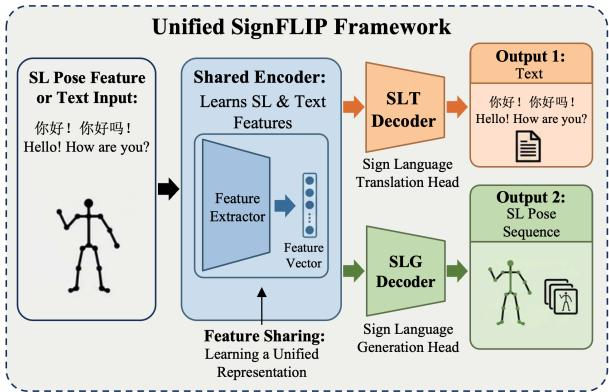
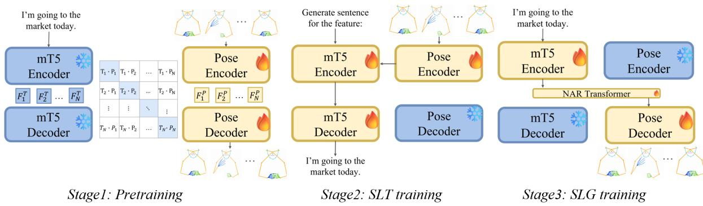
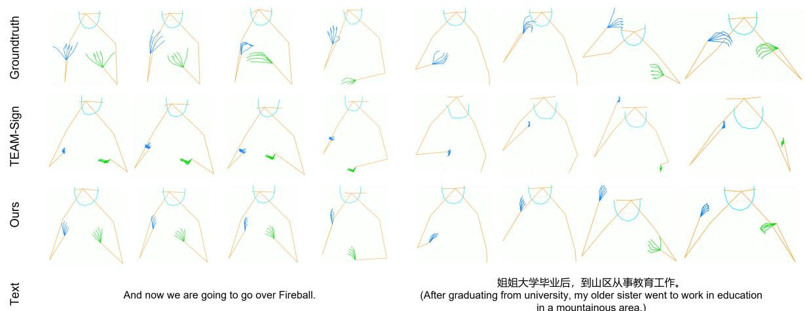
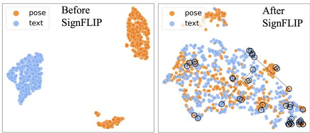
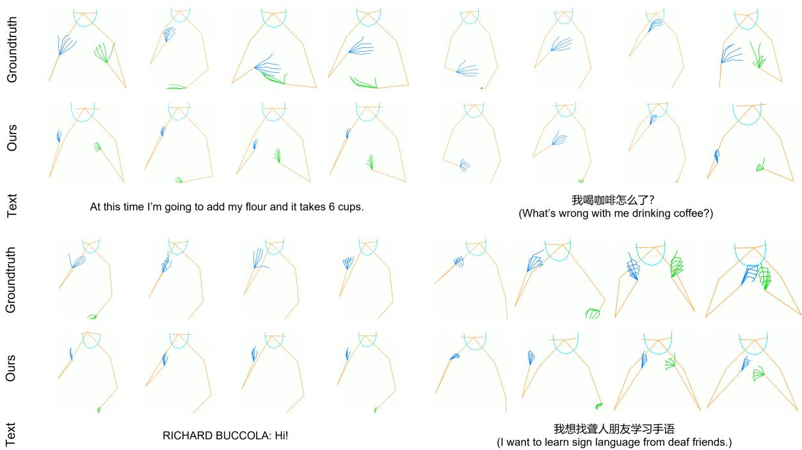

# SignFLIP: A Unified Model for Sign Language Translation and Generation via Stage-wise Alignment at Scale

Zhaoyi An1\* Sihan Tan1\* Youngbae Hwang2 Kazuhiro Nakadai1 Rei Kawakami1 1Institute of Science Tokyo 2Chungbuk National University an.z.b041@m.isct.ac.jp

## Abstract

Sign language translation and generation share the goal of bidirectional alignment between text and sign representations. However, existing approaches either treat them as isolated tasks or are only verified on limited datasets, limiting effective modeling between modalities. In this paper, we propose SignFLIP, a unified LLMcentered framework for translation and generation. To enable bidirectional mapping between text and sign, SignFLIP adopts a symmetric architecture together with a stage-wise training strategy built on large-scale data. The shared sign–text representation is progressively refined: pre-alignment facilitates subsequent SLT, while the SLT-adapted representation further benefits SLG. Extensive experiments on multiple benchmarks show that SignFLIP shows competitive performance compared with taskspecific models on both translation and generation tasks, as well as strong transferability to sign language recognition.

## 1 Introduction

Constructing unified representations across modalities is central to multimodal alignment and plays a crucial role in enabling downstream models, which also holds for sign language processing (SLP). However, in contrast to the rapid progress in broader multimodal learning, unified representation for sign languages (SLs) and texts remains relatively underexplored (Hwang et al., 2025a). Most existing studies treat sign-to-text mapping, e.g., sign language translation (SLT) (Camgoz et al., 2018; Tan et al., 2025) and sign language recognition (SLR) (Chen et al., 2022b; Zuo and Mak, 2022), and text-to-sign mapping, e.g., sign language generation (SLG) (Yin et al., 2024; Zuo et al., 2024), as individual problems. This separation is partly driven by the distinct modeling requirements of the two directions, where task-specific architectures are often designed to optimize performance for each individual task (Moryossef and Goldberg, 2021). Such task-specific designs, however, lead to repeated modeling effort and cannot fully benefit from the inherent duality in SLT and SLG.

  
Figure 1: Framework of SignFLIP, a unified model for SLT and SLG. A shared encoder learns joint representations from sign features and text inputs, which are then used by task-specific decoders to generate spoken text and sign poses. SignFLIP provides a unified framework for SLT and SLG while achieving competitive performance on both tasks.

Meanwhile, advances in large language models (LLMs) (Brown et al., 2020; Yang et al., 2025) have reshaped a wide range of tasks, opening new possibilities for SLT and SLG. Trained on massive general-purpose corpora, these models encode rich knowledge and strong reasoning capabilities. Although SLs remain underrepresented in such pretraining corpora, recent studies have adapted general-purpose models to the SL domain through fine-tuning (Wong et al., 2024; Zhang et al., 2024; Hwang et al., 2025b) and prompt engineering (An and Kawakami, 2025), improving performance while reducing reliance on heavily task-specific designs (Li et al., 2025). These advances suggest that pretrained general-purpose models may serve as a shared foundation for SLP, naturally raising the question: Can we leverage a general LLM to build unified model that serve both SLT and SLG?

If so, how?

In this paper, we propose SignFLIP which adopts a unified architecture (§ 3.1) together with stagewise training at scale using 600K∼700K samples (§ 3.2). The stages progressively refine a shared sign–text representation: pre-alignment facilitates SLT, while the SLT-adapted representation further benefits SLG. Extensive experiments demonstrate that SignFLIP consistently achieves competitive results on both SLT and SLG across multiple main benchmarks, including CSL-Daily (Zhou et al., 2021) and How2Sign (Duarte et al., 2021). We further evaluate the transferability of the learned representations on downstream SLR tasks, including isolated and continuous SLR. Our main contributions are as follows:

• We propose SignFLIP, a framework for learning sign–text mappings within the latent space of a general LLM through large-scale training.

• We introduce a stage-wise alignment strategy that progressively refines shared sign–text representations, enabling knowledge learned in earlier stages to benefit subsequent tasks.

• We show that SignFLIP achieves competitive performance on both SLT and SLG, while learning transferable representations that further benefit downstream isolated and continuous SLR.

## 2 Related Work

## 2.1 Sign Language Pretraining

In SLP, pretraining has primarily targeted SLU tasks. Earlier work, constrained by limited data, often relied on self-supervised pretraining (e.g., Sign-BERT and SignBERT+ (Hu et al., 2023a, 2021)) or weakly supervised pretraining (Zhou et al., 2023) on relatively small SL corpora. More recently, SLP has increasingly adopted a paradigm similar to that in speech and vision–language modeling: (pre-) training modern models on large (but often noisy) out-of-domain datasets, followed by fine-tuning on smaller in-domain datasets. For instance, Jiang et al. (2024) performed contrastive vision–language pretraining on a multilingual SL dictionary, Spreadthesign1, and achieved competitive performance on in-domain sign retrieval as well as out-of-domain isolated SLR tasks. Inspired by self-supervised speech pretraining, Gueuwou et al. (2025) proposed ShuBERT for American Sign Language (ASL). Zhang et al. (2024) scaled SLT through cross-lingual and cross-modal transfer. Concurrently, Uni-Sign (Li et al., 2025), a supervised pretrained model trained on large ASL and Chinese Sign Language (CSL) corpora, has been applied to a range of SLU tasks. Nevertheless, these advances predominantly benefit SLU, and pretraining that directly supports SLT and SLG remains underexplored. This gap motivates increasing interest in bridging SLU and SLG within a unified framework.

## 2.2 Sign Language Translation

Gloss-based method introduces gloss as intermediate supervision to facilitate downstream text generation2. SLRT (Camgoz et al., 2020) was among the first to introduce a Transformer-based encoder–decoder framework for SLT, incorporating gloss-level supervision into the encoder with a CTC loss, while SLTUNET (Zhang et al., 2023), scaled-SLT (Zhang et al., 2024), and MMTLB (Chen et al., 2022a) explore the use of large-scale external text corpora and pretrained language models to enhance translation quality. While gloss-based approaches have shown promising results, they are fundamentally constrained by the limited availability of paired sign–gloss–text data, which restricts their scalability across multiple downstream tasks.

Gloss-free. In contrast, gloss-free SLT directly converts SLs into spoken texts, but it underperformed cascading SLT due to the challenging signtext alignment. Recent work further advanced gloss-free SLT. YouTube-ASL (Uthus et al., 2023) uses a language modeling objective for large-scale pretraining, showing the potential of generative pretraining and the value of scaling up datasets. Jang et al. (2025) leveraged additional contextual cues together with the SL videos to improve translation. SignFLIP focuses on gloss-free SLT, pretrained on large-scale data.

## 2.3 Sign Language Generation

Similar to the translation task, SLG studies are also categorized into gloss-based and gloss-free models. An early gloss-based model is Progressive Transformer (Saunders et al., 2020), which adopts transformer architecture to generate gloss from text, then pose from gloss. Huang et al. (2022) present a semi-supervised two-stage SLG framework that reduces gloss annotation requirements but is still constrained by the initial and pseudo gloss quality. Recently, more researchers have shifted toward gloss-free methods that require no extra supervision (Khan et al., 2025). These approaches have begun to achieve results comparable to gloss-based ones, particularly with the integration of LLMs (An and Kawakami, 2025; Zuo et al., 2025).

  
Figure 2: SignFLIP is trained in three stages. Stage 1 performs pretraining to align sign and text embeddings through reconstruction and contrastive learning. Stages 2 and 3 focus on downstream SLT and SLG tasks, respectively. In particular, Stage 1 unfreezes the pose encoder and pose decoder. Stage 2 trains the pose encoder together with mT5 for text generation. Stage 3 then optimizes the mT5 encoder, projector, and pose decoder for sign generation.

Despite these advancements and the integration of LLMs, few studies have explored how to jointly design translation and generation modules. USLNet (Guo et al., 2024), an unsupervised model for SLT and SLG, achieves a translation performance of BLEU 6.30 and a generation performance of FVD 390.5 on OpenASL. UniGloR (Hwang et al., 2025a) explores spatio-temporal features as an alternative to glosses for SLT and SLG. Along this direction, SignFLIP advances unified SLT and SLG by introducing an LLM-centered architecture trained on large datasets, enabling bidirectional sign–text modeling and systematic evaluation across multiple datasets.

## 3 SignFLIP

SignFLIP provides a unified framework for SLT and SLG, with its overall three-stage training pipeline illustrated in Figure 2. In Stage 1, the model is pretrained to align sign and text representations while reconstructing sign poses from masked pose sequences. Stage 2 adapts the model to the downstream SLT task, and Stage 3 further trains it for sign pose generation.

## 3.1 Model Architecture

Overall, SignFLIP consists of a sign pose encoder, an mT5 encoder that processes both text inputs and pose-derived features, a pose decoder that mirrors the architecture of the pose encoder, and an mT5 decoder for text generation.

SignFLIP for translation comprises a sign pose encoder and an mT5 encoder-decoder model (Xue et al., 2021). Given 133 keypoints, we selectively retain 69 of them, including 21 keypoints for each hand, 9 for the body, and 18 for the face. The keypoint sequence of the group i is denoted by $P _ { i }$ , where $i \in \{ h , b , f \}$ . Specifically, the keypoint sequence $P _ { i }$ is first encoded by a three-layer spatial GCN, yielding pose features $\mathcal { F } _ { i } ^ { P } \in \mathbb { R } ^ { \bar { L } \times N _ { i } \bar { \times } C } ,$ where L is the temporal length of the keypoint sequence, $N _ { i }$ is the number of keypoints in group $i ,$ and C is the feature dimension. These pose features are subsequently projected to the hidden dimension of mT5 and are then fed into mT5 for autoregressive text generation.

SignFLIP for generation involves an mT5 encoder for text processing and a non-autoregressive transformer for feature alignment, as well as a pretrained pose decoder for generating poses from features. Given the input spoken sentence $T _ { i }$ with $U$ tokens, the mT5 encoder processes it into text features $\mathcal { F } _ { i } ^ { T } \in \mathbb { R } ^ { U _ { i } \times D }$ , where $U _ { i }$ denotes the token length of the input sentence and D denotes the hidden dimension of the mT5 encoder. Since the frame length of the pose sequence is generally longer than the length of text tokens, in the non-autoregressive transformer, we first predict the sequence length from text feature input, then employ learnable initial tokens to interact with the text feature via cross-attention. From the generated pose feature, we decode it into the final pose sequence with the pose decoder.

## 3.2 Stage 1: Pretraining

In Stage 1, we train SignFLIP’s pose encoder and pose decoder, which are fully symmetric in architecture: a three-layer spatial GCN. As they can operate directly on human skeletons in non-Euclidean space, preserving the physical topology of SLs. We optimize their parameters by two objectives: semantic-aware pose reconstruction and sign–text pre-alignment.

Semantic-aware Pose Reconstruction. To ensure the extracted features capture semantic information, we randomly mask n consecutive frames out of a 24-frames window using a learnable mask token. This requires the pose encoder and decoder to not only learn kinematic information but also infer features at the masked positions based on the surrounding context, thereby improving the model’s contextual modeling ability and robustness. We chose this masking strategy because, in SLP tasks where inter-frame variations are small, a model can easily recover a single missing frame through simple linear interpolation. By masking several consecutive frames, the model is forced to interact with the context to infer the missing sign information, ensuring that the generated pose features carry semantic meaning. This process can be formulated as:

$$
\hat { p } = { \cal D } ( \mathcal { E } ( p _ { \mathrm { m a s k } } ) ) ,\tag{1}
$$

$$
\mathcal { L } _ { \mathrm { r e c o n } } = \mathrm { S m o o t h L 1 } ( \hat { p } , p ) ,\tag{2}
$$

where $p , p _ { \mathrm { m a s k } } , \hat { p }$ denote for input pose sequence, masked pose and reconstructed pose respectively, while D, E represent the pose encoder and decoder.

Sign–Text Pre-alignment. While the reconstruction task embeds semantic information into pose features, they still lie in a different manifold with the LLM-derived text features. We regard the text features from the LLM as anchors, as it has been pretrained on trillion scale data, and adopt contrastive learning to perform alignment at the initial stage and reduces the difficulty of downstream tasks. The overall pretraining loss is defined as:

$$
\mathcal { L } _ { \mathrm { a l i g n } } = - \log \frac { \exp ( \cos ( s _ { i } , t _ { i } ) / \tau ) } { \sum _ { j = 1 } ^ { N } \exp ( \cos ( s _ { i } , t _ { j } ) / \tau ) } ,\tag{3}
$$

$$
\begin{array} { r } { \mathcal { L } _ { \mathrm { P r e t r a i n } } = \mathcal { L } _ { \mathrm { r e c o n } } + \alpha \mathcal { L } _ { \mathrm { a l i g n } } , } \end{array}\tag{4}
$$

where the $( s _ { i } , t _ { i } )$ denotes the sign-text pair and τ means the temperature. The values of α and following hyperparameters that we adopt at training are shown in Appendix A.

## 3.3 Training on Downstream Task

Stage 2: SLT training. In this stage, we unfreeze both the pose encoder and the language model (shown in Figure 2, Stage 2). The goal is to maintain the strong translation capability of Sign-FLIP while allowing the mT5 encoder to adapt to pose features through task-specific training, thereby preparing it for the subsequent generation stage. To this end, we first train SignFLIP on a large-scale corpus with noise and then fine-tune it on the target dataset. Accordingly, we optimize the model with the standard autoregressive text generation objective, defined as follows:

$$
\mathcal { L } _ { \mathrm { S U T } } = - \sum _ { u = 1 } ^ { U } \log p \left( t _ { u } \mid t _ { < u } , \mathcal { F } _ { i } ^ { P } \right) ,\tag{5}
$$

where U denotes the length of the target text sequence, $t _ { u }$ is the u-th target token, $t _ { < u }$ represents all previously generated target tokens before step u, and $\mathcal { F } _ { i } ^ { P }$ denotes the pose feature from the pose encoder.

Stage 3: SLG training. In contrast to the autoregressive generation common in decoder-only LLMs, we argue that a non-autoregressive (NAR) approach, which produces the entire sequence in a single pass, is better suited for sign language since the model can consider the global information as well as SL’s grammar to arrange output. In our SLG framework, the text and prompt are first processed by an mT5 encoder to extract global semantic features. These features are then used to predict the pose sequence length through a MLP. Subsequently, learnable pose tokens with predicted length interact with the text features via cross-attention to generate pose features, which are decoded into the final pose sequence. Leveraging the scale of current sign language datasets, we avoid designing alignment modules with heavy inductive bias, instead allowing the attention mechanism and the LLM to learn the cross-modal mapping directly.

However, we find that the text features generated by the LLM encoder often lack sufficient granularity. As a result, after interacting with these features, tokens struggle to reconstruct the fine-grained details of pose features, such as finger movements, and instead collapse toward the mean value. To address this, besides the standard Smooth L1 reconstruction loss, we use the pose encoder pretrained on the reconstruction task to supervise the output of the alignment module through feature distillation. This guides the generated features to align with the ideal pose representations. Additionally, we incorporate a hand-specific loss in relative coordinates to increase the penalty for hand errors. The total loss for SLG is formulated as follows:

$$
\mathcal { L } _ { \mathrm { D i s t i l l } } = ( 1 - \cos ( \hat { F } _ { i } ^ { P } , F _ { i } ^ { P } ) ) + \mathrm { L } 2 ( \hat { F } _ { i } ^ { P } , F _ { i } ^ { P } )\tag{6}
$$

$$
\mathcal { L } _ { \mathrm { H a n d } } = \mathrm { S m o o t h L 1 } \left( ( \hat { P } _ { k } ^ { \mathrm { h a n d } } - \hat { P } ^ { \mathrm { w r i s t } } ) \right.
$$

$$
- \left( P _ { k } ^ { \mathrm { h a n d } } - P ^ { \mathrm { w r i s t } } \right) )\tag{7}
$$

$$
\mathcal { L } _ { \mathrm { S L G } } = \mathcal { L } _ { \mathrm { R e c o n } } + \beta \cdot \mathcal { L } _ { \mathrm { D i s t i l l } } + \gamma \cdot \mathcal { L } _ { \mathrm { H a n d } } ,\tag{8}
$$

where $\hat { F _ { i } ^ { P } }$ and $F _ { i } ^ { P }$ denote the pose feature from NAR transformer and pose encoder respectively, $P _ { k } ^ { \mathrm { h a n d } }$ represents the keypoint joints of the hand part and $k \in [ 1 , K ]$ is the keypoint id of hands. When training on the SLG task, we set the learning rate of mT5 encoder and pose decoder as 1% of the NAR transformer’s lr to prevent feature shift, also to minimize performance degradation for SLT.

## 4 Experiments

## 4.1 Implementations and Preprocessing

For large-scale pretraining, we adopt CSL-News (Li et al., 2025) and YouTubeASL (Uthus et al., 2023) for Chinese Sign Language and American Sign Language, respectively. For pose extraction, we employ RTMPose-x (Jiang et al., 2023), implemented in MMPose3, to obtain whole-body keypoints from original RGB videos. We use mT5- Base (Xue et al., 2021) as the pretrained LLM and conduct all experiments on four NVIDIA H100 GPUs. The training recipes of each stage are shown in Appendix A.

## 4.2 Datasets and Evaluations

Datasets. We evaluate SignFLIP on CSL-Daily (Zhou et al., 2021), OpenASL (Shi et al., 2022), How2Sign (Duarte et al., 2021), and WLASL100 (Li et al., 2020) to demonstrate the effectiveness and transferability of our unified modeling framework. Dataset statistics are provided in Appendix B.

Evaluation metrics. For SLT, following previous work (Camgoz et al., 2020; Zhang et al., 2024), we adopt BLEU (Papineni et al., 2002), computed with SacreBLEU (Post, 2018), and ROUGE-L (Lin, 2004) as evaluation metrics. For ASL datasets, we additionally report BLEURT (Sellam et al., 2020) scores using the BLEURT-20 checkpoint. For SLG, at pose level, we report Dynamic Time Warping and Mean Joint Error scores. For the evaluation of semantic accuracy, following previous work (Saunders et al., 2020), we report the back-translation scores of BLEU-4.

For SLG, we further conducted human evaluations with 2 professional ASL and CSL signers, who were asked to rate the generated sign poses from SignFLIP on a 1–5 scale in terms of both semantic accuracy and kinematic quality. The latter was further assessed along three dimensions: motion smoothness, anatomical plausibility, and hand clarity. Specifically, 15 generated sign samples were provided for evaluation. The full evaluation questionnaire is provided in Appendix H.

## 4.3 Comparison with Methods

Results on SLT. Using pose data only, SignFLIP achieves a test BLEU-4 of 26.10 and a ROUGE score of 55.24 on CSL-Daily, a test BLEU-4 of 15.1 and a BLEURT score of 49.8 on How2Sign, and a test BLEU-4 of 19.77 and a BLEURT score of 59.35 on OpenASL (Appendix C). Tables 1 and 2 show that, under the pose-only setting, SignFLIP sets a new state of the art on How2Sign while remaining competitive on CSL-Daily. Notably, despite the performance drop caused by the later SLG finetuning stage, it still delivers strong results across all datasets and outperforms several RGBbased or multimodal-based SLT methods, demonstrating the benefits of large-scale pretraining.

Results on SLG. Given that SLG previous works generate various modalities of sign language videos, such as 2D poses, 3D poses, and 3D meshes, we select Progressive Transformer (Saunders et al., 2020) and Teach Me Sign (An and Kawakami, 2025) for comparison, as they both produce 2D poses as our model. We retrained these models on the CSL and ASL datasets. Quantitative results are tabulated in Table 3. We observe that the proposed model outperforms previous work at both the kinematic and semantic levels of the generated poses. Note that since the scale of DTW and MJE metrics is heavily influenced by the scale of the original keypoint data and normalization, crossmodel comparisons can be challenging unless the models are trained on the same data. A qualitative comparison is displayed in Figure 3. The keypoint videos generated by SignFLIP align more closely with the ground truth in terms of general movements, especially arm trajectories. While synthesizing fine-grained details like finger motions remains a challenge, our model demonstrates better generation accuracy compared to existing methods.

<table><tr><td rowspan="2">Method</td><td colspan="2">Modality</td><td colspan="2">Dev</td><td colspan="2">Test</td></tr><tr><td>Pose</td><td>RGB</td><td>BLEU-4↑</td><td>ROUGE↑</td><td>BLEU-4 ↑</td><td>ROUGE↑</td></tr><tr><td colspan="7">Gloss-based</td></tr><tr><td rowspan="4">SLRT† (Camgoz et al., 2020) MMTLB (Chen et al., 2022a) TS-SLT (Chen et al., 2022b)</td><td rowspan="4">√</td><td>√</td><td>11.88</td><td>37.96</td><td>11.79</td><td>36.74</td></tr><tr><td>√</td><td>24.42</td><td>53.38</td><td>23.92</td><td>53.25</td></tr><tr><td>√</td><td>25.76</td><td>55.10</td><td>25.79</td><td>55.72</td></tr><tr><td>√</td><td>23.99</td><td>53.58</td><td>25.01</td><td>54.08</td></tr><tr><td colspan="8">Gloss-free</td></tr><tr><td rowspan="9">SLRT‡ (Camgoz et al., 2020) GF-SLT (Zhou et al., 2023) SignLLM (Gong et al., 2024) C2RL (Chen et al., 2024a) MSLU (Zhou et al., 2025)</td><td rowspan="4"></td><td>√</td><td>4.04</td><td>20.51</td><td>3.03</td><td>19.67</td></tr><tr><td>√</td><td>11.07</td><td>36.70</td><td>11.00</td><td>36.44</td></tr><tr><td>√</td><td>12.23</td><td>39.18</td><td>15.75</td><td>39.91</td></tr><tr><td>√</td><td></td><td></td><td>21.61</td><td>48.21</td></tr><tr><td></td><td></td><td>10.27</td><td>33.13</td><td>11.42</td><td>33.80</td></tr><tr><td>Sign2GPT (Wong et al., 2024)</td><td>√</td><td>一</td><td></td><td>22.52</td><td>48.90</td></tr><tr><td>SpaMo (Hwang et al., 2025b)</td><td>√</td><td></td><td></td><td>20.55</td><td>47.46</td></tr><tr><td>Uni-Sign (Li et al., 2025) √</td><td></td><td>25.27</td><td>54.34</td><td>25.61</td><td>54.92</td></tr><tr><td>Uni-Sign (Li et al., 2025) √</td><td>√</td><td>26.25</td><td>56.03</td><td>26.36</td><td>56.51</td></tr><tr><td>Geo-Sign (Fish and Bowden, 2025) √</td><td></td><td>27.05</td><td>57.27</td><td>27.42</td><td>57.95</td></tr><tr><td colspan="8">Unified</td></tr><tr><td colspan="8">SignFLIP (Ours) √ 25.71</td></tr></table>

Table 1: SLT results on the CSL-Daily dataset. † and ‡ denote results reproduced by Zhou et al. (2021) and Zhou et al. (2023), respectively. Underlined results indicate the best performance among gloss-based SLT methods, Blue and Green denote the best results of previous methods and ours, respectively. SignFLIP achieves competitive performance among pose-only methods and remains competitive with RGB-based and multimodal approaches.
<table><tr><td rowspan="2">Method</td><td colspan="2">Modality</td><td colspan="3">Test</td></tr><tr><td>Pose</td><td>RGB</td><td>BLEU-4↑</td><td>ROUGE↑</td><td>BLEURT ↑</td></tr><tr><td colspan="8">How2Sign</td></tr><tr><td>GloFE-VN (Lin et al., 2023)</td><td>√</td><td></td><td>2.2</td><td>12.6</td><td>31.7</td></tr><tr><td>YouTube-ASL (Uthus et al., 2023)</td><td>√</td><td></td><td>12.4</td><td></td><td>46.6</td></tr><tr><td>MSLU (Zhou et al., 2025)</td><td>√</td><td></td><td>2.4</td><td>17.2</td><td>一</td></tr><tr><td>C²RL (Chen et al., 2024a)</td><td></td><td>√</td><td>9.4</td><td>27.0</td><td>一</td></tr><tr><td>FLa-LLM (Chen et al., 2024b)</td><td></td><td>√</td><td>9.7</td><td>27.8</td><td></td></tr><tr><td>SSVP-SLT (Rust et al., 2024)</td><td></td><td>√</td><td>15.5</td><td>38.4</td><td>49.6</td></tr><tr><td>ShuBERT (Gueuwou et al., 2025)</td><td>√</td><td>√</td><td>16.2</td><td></td><td>49.9</td></tr><tr><td>Uni-Sign (Li et al., 2025)</td><td>√</td><td></td><td>14.5</td><td>34.3</td><td>48.6</td></tr><tr><td>Uni-Sign (Li et al., 2025)</td><td>√</td><td>√</td><td>14.9</td><td>36.0</td><td>49.4</td></tr><tr><td>Geo-Sign (Fish and Bowden, 2025)</td><td>√</td><td></td><td>15.1</td><td>35.4</td><td></td></tr><tr><td colspan="8">Unified</td></tr><tr><td>UniGloR (Hwang et al., 2025a)</td><td>√</td><td></td><td>2.22</td><td>12.98</td><td></td></tr><tr><td>SignFLIP (Ours)</td><td>√</td><td></td><td>15.1</td><td>36.8</td><td>49.8</td></tr></table>

Table 2: SLT results on How2Sign. SignFLIP continues to outperform existing pose-only methods on How2Sign dataset.

More qualitative results and video samples can be found in Appendix G.

At semantic level, our model also delivers higher BLEU-4 score, while for human evaluation, as shown in Table 4, we report the average scores across five questions in the questionnaire H from ASL and CSL signers, respectively, on How2Sign and CSL-Daily. A higher average score means better quality. The poses generated by SignFLIP receive average scores of 1.69 and 1.94 on How2Sign and CSL-Daily datasets, respectively, while GT poses get scores of 3.48 and 3.44. Notably, the ground-truth motions themselves also receive moderate ratings. This observation suggests an inherent limitation of 2D pose keypoints, which may not be sufficiently comprehensible for SL users. It also suggests the importance of finger movements in conveying precise meanings in SL communication. The generation of such fine-grained features remains a subject for future research.

  
Figure 3: Qualitative results on both How2Sign (left) and CSL-Daily (right) datasets. While the arm movements of the poses generated by our proposed SignFLIP are closer to the Ground Truth, our generated hand motions are also more natural than those from previous methods, by leveraging the feature distillation loss and hand-specific loss.

<table><tr><td>Method</td><td>DTW↓</td><td>DTW- MJE↓</td><td>BLEU- 4↑</td></tr><tr><td colspan="4">How2Sign</td></tr><tr><td>Progressive Transformer (Saunders et al., 2020) Teach Me Sign</td><td>0.397</td><td>8.98e-4</td><td>1.63</td></tr><tr><td>(An and Kawakami, 2025)</td><td>0.345</td><td>7.20e-4</td><td>3.95</td></tr><tr><td>Unified SignFLIP (Ours)</td><td>0.248</td><td>5.28e-4</td><td>7.10</td></tr><tr><td colspan="4">CSL-Daily Progressive Transformer</td></tr><tr><td>(Saunders et al., 2020) Teach Me Sign</td><td>0.048</td><td>1.16e-4</td><td>2.42</td></tr><tr><td>(An and Kawakami, 2025)</td><td>0.035</td><td>8.86e-5</td><td>4.87</td></tr><tr><td>Unified SignFLIP (Ours)</td><td>0.025</td><td>6.15e-5</td><td>9.75</td></tr></table>

Table 3: SLG results on the How2Sign and CSL-Daily datasets. Metric scales differ across datasets due to variations in generation difficulty and keypoint ranges.
<table><tr><td>Method</td><td>How2Sign</td><td>CSL-Daily</td></tr><tr><td>SignFLIP (Ours)</td><td>1.69</td><td>1.94</td></tr><tr><td>GT motions</td><td>3.48</td><td>3.44</td></tr></table>

Table 4: Human evaluation scores for generated poses on How2Sign and CSL-Daily datasets.

Transferability to SLR. Unlike prior unified SL models that are typically trained from scratch and evaluated primarily on the tasks seen during training, SignFLIP builds on a general-purpose LLM and is pretrained on over 600K paired sign–text samples. As illustrated in Figure 4, this pretraining encourages sign and text inputs to form a shared, semantically structured representation space. We therefore investigate whether the learned representations can transfer beyond SLT and SLG to Sign Language Recognition (SLR). Specifically, we consider both Continuous SLR (CSLR), which maps continuous sign videos to gloss sequences, and Isolated SLR (ISLR) on WLASL100, which classifies individual signs. We freeze the encoders in SignFLIP and attach task-specific decoders for the recognition tasks. As shown in Tables 5 and 6, SignFLIP achieves a test WER of 28.8 on CSL-Daily and a Top-1 accuracy of 88.87 P-I and 89.16 P-C on WLASL100. These results suggest that its pretrained representations capture transferable linguistic information and can serve as a versatile backbone for a broader range of SLP tasks.

## 4.4 Ablation Study

Stage-wise Alignment is a crucial component of SignFLIP, as it balances the pretraining as well as two downstream tasks, while preventing too much degradation for SLT. To examine its effect, we evaluate SignFLIP without pre-stages on translation and generation tasks. For SLT, we conduct experiments on CSL-News and YouTube-ASL, two more challenging and noisier datasets, to better understand the performance limits of SignFLIP and to assess the extent to which pretraining benefits more difficult settings. While for SLG, we prove the importance of pretraining and SLT training by showing how much performance gain is brought by them individually on CSL-Daily dataset.

<table><tr><td rowspan="2">Method</td><td colspan="2">Modality</td><td colspan="2">WER↓</td></tr><tr><td>Pose</td><td>RGB</td><td>Dev</td><td>Test</td></tr><tr><td>SignBT (Zhou et al., 2021)</td><td></td><td>√</td><td>33.2</td><td>33.2</td></tr><tr><td>SEN (Hu et al., 2023c)</td><td></td><td>V</td><td>31.1</td><td>30.7</td></tr><tr><td>CorrNet (Hu et al., 2023b)</td><td></td><td>√</td><td>30.6</td><td>30.1</td></tr><tr><td>MSLU (Zhou et al., 2025)</td><td>√</td><td></td><td>28.6</td><td>27.9</td></tr><tr><td>Uni-Sign (Li et al., 2025)</td><td>√</td><td></td><td>28.2</td><td>27.4</td></tr><tr><td>SignFLIP (Frozen)</td><td>√</td><td></td><td>29.3</td><td>28.8</td></tr></table>

Table 5: CSLR results on the CSL-Daily dataset with WER scores. SignFLIP demonstrates its strong transferability on CSLR task even with encoders frozen.
<table><tr><td rowspan="2">Method</td><td colspan="2">Modality</td><td colspan="2">WLASL100</td></tr><tr><td>Pose</td><td>RGB</td><td>P-I</td><td>P-C</td></tr><tr><td>BEST (Zhao et al., 2023) SignBERT+ (Hu et al., 2023a) MSLU (Zhou et al., 2025)</td><td>√ √ √</td><td></td><td>77.91 79.84 88.76</td><td>77.83 80.72 89.25</td></tr><tr><td>NLA-SLR (Zuo et al., 2023) SignFLIP (Frozen)</td><td>√ √</td><td>√</td><td>91.47 88.87</td><td>92.17 89.16</td></tr></table>

Table 6: ISLR results on the WLASL100 dataset under the frozen setting. Without task-specific fine-tuning of SignFLIP encoders, the model achieves promising performance, demonstrating the transferability of its learned shared representations to downstream tasks.

As shown in Table 7, the setting with pretraining delivers quality gains of + 3.37 BLEU-4 on CSL-News and + 4.26 BLEU-4 on YouTube ASL. These findings demonstrate that the proposed pretraining effectively benefits subsequent downstream tasks. The larger gains on challenging datasets further indicate that the pretraining helps the model better address the cross-modal gap between sign and text, enabling more robust learning under noisy and difficult conditions.

The results of generation task are delivered in Table 8. Pretraining and SLT training improved DTW performance by 11% and 16%, respectively. This demonstrates that the design generates high-quality joint sign-text representations from previous stages,

Figure 4: We visualize sign and text embeddings before and after SigFLIP, showing that initially separated feature distributions become closely aligned after training. Black-circled points and connecting lines indicate randomly selected sign–text pairs.
<table><tr><td>Setting</td><td>CSL-News BLEU-4</td><td>YouTube-ASL BLEU-4</td></tr><tr><td>w/o Pretraining</td><td>18.24</td><td>4.17</td></tr><tr><td>SignFLIP</td><td>21.61</td><td>8.43</td></tr></table>

Table 7: Ablation study on stage design for SLT task.

enhancing SLG accuracy.
<table><tr><td>Setting</td><td>DTW</td><td>DTW-MJE</td></tr><tr><td>w/o Pretraining &amp; SLT</td><td>0.034</td><td>8.44e-5</td></tr><tr><td>w/o SLT</td><td>0.030</td><td>7.37e-5</td></tr><tr><td>SignFLIP</td><td>0.025</td><td>6.15e-5</td></tr></table>

Table 8: Ablation study on stage design for SLG task.

Choice of LLM. Recently, decoder-only LLMs have become the dominant architecture in generative tasks such as text and video generation, demonstrating remarkable performance. To investigate their potential in sign language, we conducted experiments to evaluate the performance of a widely used decoder-only LLM on SLT tasks. The results are summarized in Table 9. To ensure a fair comparison, all results in the table were obtained by training exclusively on the CSL-News dataset for SLT while only varying the LLM backbone. Specifically, SignFLIP did not undergo pretraining.

<table><tr><td>Setting</td><td>CSL-News BLEU-4</td><td>CSL-News ROUGE</td></tr><tr><td>Qwen3 (Yang et al., 2025)</td><td>5.19</td><td>20.07</td></tr><tr><td>mT5 (dec only)</td><td>3.10</td><td>19.61</td></tr><tr><td>mT5 (enc-dec, w/o stage1)</td><td>18.24</td><td>39.13</td></tr></table>

Table 9: Ablation study of LLM choices for SLT on CSL-News dataset.

The interesting finding is that the performance of the decoder-only LLM does not outperform mT5- based settings, which aligns with the observations in SpaMo (Hwang et al., 2025b). These results suggest that, despite decoder-only models’ powerful general capabilities, a significant gap remains between the data distributions and prompt formats of pretrained decoder-only LLMs and those of sign language data. For more capable models such as the Qwen series, this discrepancy may manifest as a stronger "Resistance to Alignment" (Ji et al., 2025), hindering the models from reaching their full potential. This implies that applying powerful decoder-only LLMs to sign language tasks still requires specialized designs to counteract this resistance while adapting their abilities and knowledge for sign language processing. Ablation studies on SLG losses and the masking window size used during pretraining are provided in the Appendix.

## 5 Conclusion

In this paper, we present SignFLIP, a large-scale unified framework for sign language translation and generation that leverages a pretrained LLM and is trained on 600∼700K sign–text samples. The experimental results demonstrate that the stage-wise training enhances translation and generation performance, delivering competitive results on several benchmarks. Beyond the original tasks, Sign-FLIP also demonstrates promising transferability to downstream recognition tasks, including continuous and isolated sign language recognition. These results suggest that SignFLIP learns generalizable sign representations and has potential as a foundation model for sign language processing. We believe SignFLIP will inspire future research toward more scalable and general-purpose sign language models.

## Limitations

Our work has several limitations. First, most existing sign language datasets are not primarily based on Deaf and hard-of-hearing signers. For example, CSL-Daily is produced by sign language interpreters, meaning that the text serves as the original source. This limits its applicability to real-world scenarios and makes it less representative of realworld sign language use. Second, in our human evaluation, even the ground-truth samples received relatively low linguistic accuracy scores, suggesting that 2D pose representations may not be sufficiently understandable for sign language users. To enable more effective and accessible pose generation, we plan to explore the use of 3D avatars in future work. Finally, although sign language generation performance has improved, the generated hand movements still exhibit limited amplitude and tend to collapse toward mean poses. This may be partly attributed to the LLM itself, which can bias the outputs toward overly smooth and averaged motion patterns.

## Acknowledgments

This work was supported by KAKENHI 26H02525, ROIS NII Open Collaborative Research 261S04- 24183, JST BOOST (Japan Grant Number JP-MJBS2430) and the Science Tokyo Support Program for Doctoral Students, funded by the Universities for International Research Excellence. This study was carried out using the TSUBAME4.0 supercomputer at Institute of Science Tokyo. We also thank the anonymous reviewers for their constructive feedback, which improved the quality of this work.

## References

Zhaoyi An and Rei Kawakami. 2025. Teach me sign: Stepwise prompting llm for sign language production. In 2025 IEEE International Conference on Image Processing (ICIP), pages 439–444. IEEE.

Tom B. Brown, Benjamin Mann, Nick Ryder, Melanie Subbiah, Jared Kaplan, Prafulla Dhariwal, Arvind Neelakantan, Pranav Shyam, Girish Sastry, Amanda Askell, Sandhini Agarwal, Ariel Herbert-Voss, Gretchen Krueger, Tom Henighan, Rewon Child, Aditya Ramesh, Daniel M. Ziegler, Jeffrey Wu, Clemens Winter, and 12 others. 2020. Language models are few-shot learners.

Necati Cihan Camgoz, Simon Hadfield, Oscar Koller, Hermann Ney, and Richard Bowden. 2018. Neural sign language translation. In 2018 IEEE/CVF Conference on Computer Vision and Pattern Recognition, pages 7784–7793.

Necati Cihan Camgoz, Oscar Koller, Simon Hadfield, and Richard Bowden. 2020. Sign language transformers: Joint end-to-end sign language recognition and translation. In Proceedings ofthe IEEE/CVF conference on computer vision and pattern recognition, pages 10023–10033.

Yutong Chen, Fangyun Wei, Xiao Sun, Zhirong Wu, and Stephen Lin. 2022a. A simple multi-modality transfer learning baseline for sign language translation. In 2022 IEEE/CVF Conference on Computer Vision and Pattern Recognition (CVPR), pages 5110–5120.

Yutong Chen, Ronglai Zuo, Fangyun Wei, Yu Wu, Shujie LIU, and Brian Mak. 2022b. Two-stream network for sign language recognition and translation. In Advances in Neural Information Processing Systems, volume 35, pages 17043–17056. Curran Associates, Inc.

Zhigang Chen, Benjia Zhou, Yiqing Huang, Jun Wan, Yibo Hu, Hailin Shi, Yanyan Liang, Zhen Lei, and Du Zhang. 2024a. C2rl: Content and context representation learning for gloss-free sign language translation and retrieval. IEEE Transactions on Circuits and Systemsfor Video Technology, 35:8533–8544.

Zhigang Chen, Benjia Zhou, Jun Li, Jun Wan, Zhen Lei, Ning Jiang, Quan Lu, and Guoqing Zhao. 2024b. Factorized learning assisted with large language model for gloss-free sign language translation. In Proceedings of the 2024 Joint International Conference on Computational Linguistics, Language Resources and Evaluation (LREC-COLING 2024), pages 7071–7081, Torino, Italia. ELRA and ICCL.

Amanda Duarte, Shruti Palaskar, Lucas Ventura, Deepti Ghadiyaram, Kenneth DeHaan, Florian Metze, Jordi Torres, and Xavier Giro-i Nieto. 2021. How2Sign: A Large-scale Multimodal Dataset for Continuous American Sign Language. In Conference on Computer Vision and Pattern Recognition (CVPR).

Edward Fish and Richard Bowden. 2025. Geo-sign: Hyperbolic contrastive regularisation for geometrically aware sign language translation. In The Thirty-ninth Annual Conference on Neural Information Processing Systems.

Jia Gong, Lin Geng Foo, Yixuan He, Hossein Rahmani, and Jun Liu. 2024. Llms are good sign language translators. 2024 IEEE/CVF Conference on Computer Vision and Pattern Recognition (CVPR), pages 18362–18372.

Shester Gueuwou, Xiaodan Du, Greg Shakhnarovich, Karen Livescu, and Alexander H. Liu. 2025. Shubert: Self-supervised sign language representation learning via multi-stream cluster prediction. In Proceedings of the 63rd Annual Meeting of the Association for Computational Linguistics (Volume 1: Long Papers), Vienna, Austria. Association for Computational Linguistics.

Zhengsheng Guo, Zhiwei He, Wenxiang Jiao, Xing Wang, Rui Wang, Kehai Chen, Zhaopeng Tu, Yong Xu, and Min Zhang. 2024. Unsupervised sign language translation and generation. In Findings of the Associationfor Computational Linguistics: ACL 2024, pages 14041–14055, Bangkok, Thailand. Association for Computational Linguistics.

Hezhen Hu, Weichao Zhao, Wengang Zhou, and Houqiang Li. 2023a. Signbert+: Hand-model-aware self-supervised pre-training for sign language understanding. IEEE Transactions on Pattern Analysis and Machine Intelligence, 45(9):11221–11239.

Hezhen Hu, Weichao Zhao, Wengang Zhou, Yuechen Wang, and Houqiang Li. 2021. Signbert: Pretraining of hand-model-aware representation for sign language recognition. In Proceedings of the IEEE/CVF International Conference on Computer Vision (ICCV), pages 11087–11096.

Lianyu Hu, Liqing Gao, Zekang Liu, and Wei Feng. 2023b. Continuous sign language recognition with correlation network. In Proceedings of the IEEE/CVF International Conference on Computer Vision.

Lianyu Hu, Liqing Gao, Zekang Liu, and Wei Feng. 2023c. Self-emphasizing network for continuous sign language recognition. In Proceedings of the Thirty-Seventh AAAI Conference on Artificial Intelligence and Thirty-Fifth Conference on Innovative Applications ofArtificial Intelligence and Thirteenth Symposium on Educational Advances in Artificial Intelligence, AAAI’23/IAAI’23/EAAI’23. AAAI Press.

Wencan Huang, Zhou Zhao, Jinzheng He, and Mingmin Zhang. 2022. Dualsign: Semi-supervised sign language production with balanced multi-modal multitask dual transformation. In ACM MM, pages 5486– 5495.

Eui Jun Hwang, Sukmin Cho, Huije Lee, Youngwoo Yoon, and Jong C Park. 2025a. A spatio-temporal representation learning as an alternative to traditional glosses in sign language translation and production. In 2025 IEEE/CVF Winter Conference on Applications ofComputer Vision (WACV), pages 3352–3362. IEEE.

Eui Jun Hwang, Sukmin Cho, Junmyeong Lee, and Jong C. Park. 2025b. An efficient gloss-free sign language translation using spatial configurations and motion dynamics with LLMs. In Proceedings of the 2025 Conference ofthe Nations ofthe Americas Chapter of the Association for Computational Linguistics: Human Language Technologies (Volume 1: Long Papers), pages 3901–3920, Albuquerque, New Mexico. Association for Computational Linguistics.

Youngjoon Jang, Haran Raajesh, Liliane Momeni, Gül Varol, and Andrew Zisserman. 2025. Lost in translation, found in context: Sign language translation with contextual cues. In CVPR.

Jiaming Ji, Kaile Wang, Tianyi Alex Qiu, Boyuan Chen, Jiayi Zhou, Changye Li, Hantao Lou, Josef Dai, Yunhuai Liu, and Yaodong Yang. 2025. Language models resist alignment: Evidence from data compression. In Proceedings of the 63rd Annual Meeting of the Association for Computational Linguistics (Volume 1: Long Papers), pages 23411–23432.

Tao Jiang, Peng Lu, Li Zhang, Ningsheng Ma, Rui Han, Chengqi Lyu, Yining Li, and Kai Chen. 2023. Rtmpose: Real-time multi-person pose estimation based on mmpose. Preprint, arXiv:2303.07399.

Zifan Jiang, Gerard Sant, Amit Moryossef, Mathias Müller, Rico Sennrich, and Sarah Ebling. 2024. Sign-CLIP: Connecting text and sign language by contrastive learning. In Proceedings of the 2024 Conference on Empirical Methods in Natural Language Processing, pages 9171–9193, Miami, Florida, USA. Association for Computational Linguistics.

Nabeela Khan, Bowen Wu, Sihan Tan, Carlos Toshinori Ishi, and Kazuhiro Nakadai. 2025. Signflow: End-toend sign language generation for one-to-many modeling using conditional flow matching. In Proceedings of the 27th International Conference on Multimodal Interaction, ICMI ’25, page 173–180, New York, NY, USA. Association for Computing Machinery.

Dongxu Li, Cristian Rodriguez, Xin Yu, and Hongdong Li. 2020. Word-level deep sign language recognition from video: A new large-scale dataset and methods comparison. In Proceedings ofthe IEEE/CVF winter conference on applications ofcomputer vision, pages 1459–1469.

Zecheng Li, Wengang Zhou, Weichao Zhao, Kepeng Wu, Hezhen Hu, and Houqiang Li. 2025. Uni-sign: Toward unified sign language understanding at scale. arXiv preprint arXiv:2501.15187.

Chin-Yew Lin. 2004. ROUGE: A package for automatic evaluation of summaries. In Text Summarization Branches Out, pages 74–81, Barcelona, Spain. Association for Computational Linguistics.

Kezhou Lin, Xiaohan Wang, Linchao Zhu, Ke Sun, Bang Zhang, and Yi Yang. 2023. Gloss-free endto-end sign language translation. In Proceedings of the 61st Annual Meeting of the Association for Computational Linguistics (Volume 1: Long Papers), pages 12904–12916, Toronto, Canada. Association for Computational Linguistics.

Amit Moryossef and Yoav Goldberg. 2021. Sign Language Processing. https: //sign-language-processing.github.io/.

Kishore Papineni, Salim Roukos, Todd Ward, and Wei-Jing Zhu. 2002. Bleu: a method for automatic evaluation of machine translation. In Proceedings ofthe 40th Annual Meeting ofthe Associationfor Computational Linguistics, pages 311–318, Philadelphia, Pennsylvania, USA. Association for Computational Linguistics.

Matt Post. 2018. A call for clarity in reporting BLEU scores. In Proceedings of the Third Conference on Machine Translation: Research Papers, pages 186– 191, Brussels, Belgium. Association for Computational Linguistics.

Phillip Rust, Bowen Shi, Skyler Wang, Necati Cihan Camgoz, and Jean Maillard. 2024. Towards privacyaware sign language translation at scale. In Proceedings ofthe 62nd Annual Meeting ofthe Association for Computational Linguistics (Volume 1: Long Papers), pages 8624–8641, Bangkok, Thailand. Association for Computational Linguistics.

Ben Saunders, Necati Cihan Camgoz, and Richard Bowden. 2020. Progressive transformers for end-to-end sign language production. In ECCV, pages 687–705. Springer.

Thibault Sellam, Dipanjan Das, and Ankur Parikh. 2020. BLEURT: Learning robust metrics for text generation. In Proceedings of the 58th Annual Meeting of the Associationfor Computational Linguistics, pages 7881–7892, Online. Association for Computational Linguistics.

Bowen Shi, Diane Brentari, Gregory Shakhnarovich, and Karen Livescu. 2022. Open-domain sign language translation learned from online video. In Proceedings ofthe 2022 Conference on Empirical Methods in Natural Language Processing, pages 6365– 6379, Abu Dhabi, United Arab Emirates. Association for Computational Linguistics.

Sihan Tan, Taro Miyazaki, Nabeela Khan, and Kazuhiro Nakadai. 2025. Improvement in sign language translation using text CTC alignment. In Proceedings of the 31st International Conference on Computational Linguistics, pages 3255–3266, Abu Dhabi, UAE. Association for Computational Linguistics.

David Uthus, Garrett Tanzer, and Manfred Georg. 2023. Youtube-asl: a large-scale, open-domain american sign language-english parallel corpus. In Proceedings of the 37th International Conference on Neural Information Processing Systems, NIPS ’23, Red Hook, NY, USA. Curran Associates Inc.

Ryan Wong, Necati Cihan Camgoz, and Richard Bowden. 2024. Sign2GPT: Leveraging large language models for gloss-free sign language translation. In The Twelfth International Conference on Learning Representations.

Linting Xue, Noah Constant, Adam Roberts, Mihir Kale, Rami Al-Rfou, Aditya Siddhant, Aditya Barua, and Colin Raffel. 2021. mT5: A massively multilingual pre-trained text-to-text transformer. In Proceedings ofthe 2021 Conference ofthe North American Chapter ofthe Associationfor Computational Linguistics: Human Language Technologies, pages 483–498, Online. Association for Computational Linguistics.

An Yang, Anfeng Li, Baosong Yang, Beichen Zhang, Binyuan Hui, Bo Zheng, Bowen Yu, Chang Gao, Chengen Huang, Chenxu Lv, and 1 others. 2025. Qwen3 technical report. arXiv preprint arXiv:2505.09388.

Aoxiong Yin, Haoyuan Li, Kai Shen, Siliang Tang, and Yueting Zhuang. 2024. T2s-gpt: Dynamic vector quantization for autoregressive sign language production from text. arXiv preprint arXiv:2406.07119.

Biao Zhang, Mathias Müller, and Rico Sennrich. 2023. SLTUNET: A simple unified model for sign language translation. In The Eleventh International Conference on Learning Representations.

Biao Zhang, Garrett Tanzer, and Orhan Firat. 2024. Scaling sign language translation. In Proceedings of the 38th International Conference on Neural Information Processing Systems, NIPS ’24, Red Hook, NY, USA. Curran Associates Inc.

Weichao Zhao, Hezhen Hu, Wengang Zhou, Jiaxin Shi, and Houqiang Li. 2023. Best: Bert pre-training for sign language recognition with coupling tokenization. In Proceedings ofthe AAAI conference on artificial intelligence, pages 3597–3605.

Benjia Zhou, Zhigang Chen, Albert Clapés, Jun Wan, Yanyan Liang, Sergio Escalera, Zhen Lei, and Du Zhang. 2023. Gloss-free sign language translation: Improving from visual-language pretraining. In Proceedings ofthe IEEE/CVF International Conference on Computer Vision (ICCV), pages 20871– 20881.

Hao Zhou, Wengang Zhou, Weizhen Qi, Junfu Pu, and Houqiang Li. 2021. Improving sign language translation with monolingual data by sign back-translation. In Proceedings of the IEEE/CVF conference on computer vision and pattern recognition, pages 1316– 1325.

Wengang Zhou, Weichao Zhao, Hezhen Hu, Zecheng Li, and Houqiang Li. 2025. Scaling up multimodal pre-training for sign language understanding. IEEE Transactions on Pattern Analysis and Machine Intelligence, 47(12):11753–11767.

Ronglai Zuo and Brian Mak. 2022. C2slr: Consistencyenhanced continuous sign language recognition. In Proceedings of the IEEE/CVF Conference on Computer Vision and Pattern Recognition (CVPR), pages 5131–5140.

Ronglai Zuo, Rolandos Alexandros Potamias, Evangelos Ververas, Jiankang Deng, and Stefanos Zafeiriou. 2025. Signs as tokens: A retrieval-enhanced multilingual sign language generator. In Proceedings of the IEEE/CVF International Conference on Computer Vision (ICCV), pages 23806–23816.

Ronglai Zuo, Fangyun Wei, Zenggui Chen, Brian Mak, Jiaolong Yang, and Xin Tong. 2024. A simple baseline for spoken language to sign language translation with 3d avatars. In Computer Vision – ECCV 2024: 18th European Conference, Milan, Italy, September 29–October 4, 2024, Proceedings, Part XLIX, page 36–54, Berlin, Heidelberg. Springer-Verlag.

Ronglai Zuo, Fangyun Wei, and Brian Mak. 2023. Natural language-assisted sign language recognition. In Proceedings of the IEEE/CVF conference on computer vision and pattern recognition, pages 14890– 14900.

## A Training Recipe of Each Stage

Table A presents the recipes of each training stage. While the hyperparameters that we adopt for loss weights are: $\alpha = 0 . 0 5 , \beta = 1 . 0 , \gamma = 0 . 5$

<table><tr><td>Config</td><td>Stage 1</td><td>Stage 2</td><td>Stage 3</td></tr><tr><td>batch size</td><td>256</td><td>128</td><td>64</td></tr><tr><td>optimizer</td><td></td><td>AdamW</td><td></td></tr><tr><td>learning rate</td><td></td><td> $3 \times 1 0 ^ { - 4 }$ </td><td></td></tr><tr><td>weight decay</td><td></td><td> $1 \times 1 0 ^ { - 4 }$ </td><td></td></tr><tr><td>optimizer momentum</td><td></td><td> $\beta _ { 1 } , \beta _ { 2 } = 0 . 9 , 0 . 9 9 9$ </td><td></td></tr><tr><td>learning rate schedule</td><td></td><td>cosine decay</td><td></td></tr><tr><td>training epochs</td><td>20</td><td>50</td><td>50</td></tr></table>

Table 10: Training recipe of each stage.

## B Statistics of Experimental Datasets

Table 11 summarizes the statistics of the experimental datasets used in this work, including the language, sentence sample numbers, vocabulary size, recording hours, and data source.

<table><tr><td>Name</td><td></td><td>Language Samples</td><td>Vocab.</td><td>Hours</td><td>Source</td></tr><tr><td>YouTube-ASL (Uthus et al., 2023)</td><td>ASL</td><td>~610K</td><td>60K</td><td>984</td><td>Web</td></tr><tr><td>How2Sign (Duarte et al., 2021)</td><td>ASL</td><td>33K</td><td>16K</td><td>79</td><td>Lab</td></tr><tr><td>OpenASL (Shi et al., 2022)</td><td>ASL</td><td>97K</td><td>33K</td><td>288</td><td>Web</td></tr><tr><td>WLASL (Li et al., 2020)</td><td>ASL</td><td>2,038</td><td>100</td><td>Web</td><td></td></tr><tr><td>CSL-News (Li et al., 2025)</td><td>CSL</td><td>~700K</td><td>5K</td><td>1,985 TV</td><td></td></tr><tr><td>CSL-Daily (Zhou et al., 2021)</td><td>CSL</td><td>20K</td><td>2K</td><td>23</td><td>Lab</td></tr></table>

Table 11: Selected ASL and CSL datasets.

## C SLT result on OpenASL

Table 12 presents the performance of SignFLIP on OpenASL after Stage-2 fine-tuning.

## D Ablation Study: MPM Window Size Impact

In the pretraining stage, we randomly mask n consecutive frames within a 24-frame window to help pose features capture semantic context. Table 13 presents an ablation study on the impact of this window size.

Results show that a 24-frame MPM window achieves optimal loss convergence and reconstruction results. This size balances sign reconstruction with broader semantic context, while other sizes overemphasize one objective and lead to suboptimal performance.

## E Ablation Study: Loss for SLG

We further performed ablation studies to investigate the impact of the feature distillation and hand losses used in the SLG training. Results are summarized in Table 14.

From the results, we notice that $L _ { \mathrm { d i s t i l l } }$ yields a more pronounced improvement in generation performance. This is likely because, although the hand loss is more intuitive, optimization solely at the output pose level is too coarse-grained for the overall objective, making it difficult for the model to converge. In contrast, feature-level distillation provides supervision from multiple perspectives, helping the model establish clearer optimization targets and focus specifically on refining the nar transformer.

<table><tr><td>Method</td><td>Gloss</td><td>Visual</td><td>BLEU-4</td><td>ROUGE-L</td><td>BLEURT</td></tr><tr><td colspan="6">OpenASL</td></tr><tr><td>GloFE-VN (Lin et al., 2023)</td><td></td><td></td><td>7.06</td><td>21.75</td><td>36.35</td></tr><tr><td>Conv-GRU† (Camgoz et al., 2018)</td><td></td><td></td><td>4.58</td><td>16.10</td><td>25.65</td></tr><tr><td>I3D-transformer (Shi et al., 2022)</td><td></td><td></td><td>5.66</td><td>18.64</td><td>28.82</td></tr><tr><td>OpenASL (Shi et al., 2022)</td><td></td><td></td><td>8.59</td><td>21.02</td><td>31.09</td></tr><tr><td> $\mathrm { C ^ { \dot { 2 } } R L }$  (Chen et al., 2024a)</td><td></td><td>ノVVV</td><td>13.21</td><td>31.36</td><td></td></tr><tr><td>ShuBERT (Gueuwou et al., 2025)</td><td>√</td><td>S</td><td>23.20</td><td></td><td>60.60</td></tr><tr><td>Uni-Sign (Li et al., 2025)</td><td>√</td><td></td><td>22.67</td><td>42.77</td><td>60.08</td></tr><tr><td>Uni-Sign (Li et al., 2025)</td><td>√</td><td>√</td><td>23.14</td><td>43.22</td><td>60.40</td></tr><tr><td>SignFLIP (Ours)</td><td>√</td><td></td><td>19.77</td><td>41.56</td><td>59.35</td></tr></table>

Table 12: SignFLIP SLT performance on OpenASL after Stage-2 fine-tuning.

<table><tr><td>Setting</td><td>DTW</td><td>DTW-MJE</td><td> $\mathcal { L } _ { \bf a l i g n }$ </td></tr><tr><td>16-frame</td><td>0.30</td><td>6.1e-4</td><td>0.17</td></tr><tr><td>24-frame</td><td>0.12</td><td>2.7e-4</td><td>0.10</td></tr><tr><td>32-frame</td><td>0.31</td><td>7.2e-4</td><td>0.15</td></tr></table>

Table 13: Ablation study with MPM window size on CSL-News dataset.

<table><tr><td>Setting DTW</td><td>DTW-MJE</td></tr><tr><td>w/o  $\mathcal { L } _ { \mathrm { h a n d } }$  and  ${ \mathcal { L } } _ { \mathrm { d i s t i l l } }$  0.044</td><td>1.19e-4</td></tr><tr><td>w/o  $\mathcal { L } _ { \mathrm { h a n d } }$  0.029</td><td>7.84e-5</td></tr><tr><td>w/o  ${ \mathcal { L } } _ { \mathrm { d i s t i l l } }$  0.037</td><td>1.02e-4</td></tr><tr><td>Ours 0.025</td><td>6.15e-5</td></tr></table>

Table 14: Ablation study with SLG losses on CSL-Daily dataset.

## F Case Study of Translation

Case studies of translation outputs on CSL-Daily, How2Sign, and OpenASL are shown in Table 15. All examples are taken from the test sets. Sentences in brackets denote our approximate English translations.

## G Case Study of Generation

We provide more cases on CSL-Daily and How2Sign as shown in Figure 5. Readers may also refer to the Google Drive link for video samples: https://drive.google.com/drive/folders/ 1pZrFySsy-vEgrD7hkMC2KfDoZlRyVdpc?usp= sharing

## H Human Evaluation Questionnaire

We provide the questionnaire used in our human evaluation. Participants were asked to assess generated sign pose sequences on a 1–5 Likert scale.

Evaluation criteria. The evaluation covered the following aspects: (1) Semantic accuracy, (2) Motion smoothness, (3) Anatomical plausibility, and (4) Hand clarity.

Scale definition. For all questions, a score of 1 indicates very poor quality, while a score of 5 indicates excellent quality.

Instructions to participants. Participants were asked to watch each generated sign sequence and rate it according to the criteria above.

Questionnaire items.

• Without knowing the original sentence, can you understand this sign language video?

• Please use a few keywords or a sentence to write down what you think this video means.

• Compared to the reference text, does the motion accurately convey the original meaning?

• Is the skeleton motion continuous?

• Does the skeleton posture follow human physical laws?

• Are the finger motions and hand shapes clear? Participants were instructed to watch each generated sign video without first seeing the reference text and then assess its comprehensibility on a fivepoint scale.

  
Figure 5: Qualitative results on both How2Sign (left) and CSL-Daily (right) datasets.

## I Potential Risks

While we envision the advancements in LLMs and VLMs fostering global inclusivity, current SLP research remains constrained by limitations in data diversity and modeling accuracy. Users should exercise caution regarding the inherent risks of current translation and generation models, as potential inaccuracies or misinterpretations could lead to unintended negative social impacts.

<table><tr><td>Systems</td><td>Translation Output</td></tr><tr><td colspan="2">Examples from CSL-Daily</td></tr><tr><td rowspan="2">Reference</td><td>你和小张什么时候认识的?</td></tr><tr><td>(When did you and Zhang meet?)</td></tr><tr><td rowspan="2">SignFLIP</td><td>你的小张什么时候认识的?</td></tr><tr><td>(When did you meet your Zhang?)</td></tr><tr><td rowspan="2">Reference</td><td>我不去爬山，我有事。</td></tr><tr><td>(I&#x27;m not going hiking; I have something to do.) 我不去爬山，我有些事。</td></tr><tr><td rowspan="2">SignFLIP</td><td>(I&#x27;m not going hiking; I have a few things to do.)</td></tr><tr><td>你喜欢这条裙子，我可以拿一件给你试穿。</td></tr><tr><td rowspan="2">Reference SignFLIP</td><td>(If you like this dress, I can get one for you to try on.)</td></tr><tr><td>你喜欢穿这条裙子，我可以给你穿。</td></tr><tr><td rowspan="2"></td><td>(If you like wearing this dress, I can help you put it on.)</td></tr><tr><td>Examples from How2Sign</td></tr><tr><td>Reference I call it painting the wall. SignFLIP</td><td></td></tr><tr><td></td><td>And what this is, it&#x27;s called painting the tool.</td></tr><tr><td>SignFLIP</td><td>Reference You need to be very careful when cleaning their cages if these birds are flighted.</td></tr><tr><td>Examples from OpenASL</td><td>So you have to be careful with that, because you don&#x27;t have to worry about another thing.</td></tr><tr><td colspan="2">Reference I&#x27;ve been staying home in self-quarantine and practicing social distancing.</td></tr><tr><td></td><td>SignFLIP For the past few years, we have been staying home, self-quarantining within ourselves and social distancing.</td></tr><tr><td></td><td></td></tr><tr><td>SignFLIP</td><td>Reference I transferred to Ohio state school and stayed there for two years.</td></tr><tr><td></td><td>I transferred to Ohio for educational school two years ago.</td></tr></table>

Table 15: Case study of translation outputs on CSL-Daily, How2Sign, and OpenASL. Examples are taken from the test sets. Sentences in brackets are our approximate English translations.