# SkillPE: Creativity-Oriented Cinematic Skill Evolution for Text-to-Video Prompt Engineering

Yanwei Huang<sup>1,2\*</sup> Mingxuan Zhu<sup>2,3</sup> Shujie Li<sup>2,4</sup> Shiyuan Liu<sup>2</sup> Yuanxing Zhang<sup>2</sup> Arpit Narechania<sup>1</sup>

<sup>1</sup>HKUST <sup>2</sup>KlingAI <sup>3</sup>Shanghai Jiaotong University <sup>4</sup>The University of Hong Kong

September 29, 2026

## Abstract

Achieving high-quality, cinematic results in text-to-video generation remains challenging for nonexperts, whose prompts often lack professional narrative and creative design. We propose SkillPE, a prompt engineering (PE) framework that evolves reusable cinematic skills from expert-authored seeds. SkillPE represents shot logic, composition, lighting, sound design, and other filmmaking cues in a finegrained format, and retrieves movie references categorized as resonators (good matches), dissonants (weak matches), and divergents (creatively useful near-misses). The first two refine when and how a skill should be applied, while divergents inspire alternative cinematic realizations at different degrees of modification while preserving the user intent. Candidate skills are assessed through generated videos along prompt fidelity, cinematic quality, narrative appeal, and creativity to construct the final skill libraries. Experiments on StoryEval and VBench show improvements of up to 1.40 points over the strongest external baseline and 0.51 points over seed skills on 7-point four-dimensional evaluation, while remaining competitive on benchmark-native metrics. Overall, SkillPE offers a practical approach to balancing fidelity and creativity in cinematic text-to-video generation.

## 1 Introduction

Recent years have witnessed the rapid advent of generative text-to-video models such as Sora (Brooks et al., 2024), Kling (Team et al., 2025), and Seedance (Seedance et al., 2026), which enable everyday users to produce inspiring, cinematic videos from simple textual prompts. However, achieving high-quality outputs depends heavily on careful prompt curation, a process that remains challenging for laypeople without cinematic expertise. Prompt Engineering (PE) (Sahoo et al., 2024) has emerged as a promising solution, refining user-provided prompts before they are passed to the generator. Existing text-to-video PE methods include learned prompt rewriters such as Prompt-A-Video (Ji et al., 2025) and VPO (Cheng et al., 2025), as well as retrieval-augmented optimization methods such as RAPO (Gao et al., 2025). Despite their different optimization mechanisms, they ultimately operate primarily on the prompt text, rather than reasoning through reusable cinematic structures such as shot progression, camera logic, staging, and audiovisual design. This leaves a substantial gap between casual user prompts and the elaborate, structured prompts that domain experts would craft.

With large-language-model (LLM)-based agents showing strong performance across diverse tasks, recent work has increasingly turned to agent-based (agentic) PE. For instance, Mora (Yuan et al., 2024) decomposes text-to-video generation into dedicated stages with role-specialized agents iteratively refining the prompt.

Raw Prompt StoryEval = 0.78 / PF = 3 / CQ = 2 / NA = 3 / CR = 2

  
A car transforms into a robot, waves to passersby, and then changes back into a car.  
SkillPE: Seed-skill StoryEval = 1.00 / PF = 7 / CQ = 6 / NA = 5 / CR = 2

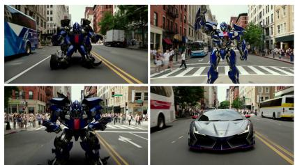

SkillPE: Final StoryEval = 1.00 / PF = 7 / CQ = 7 / NA = 6 / CR = 6  
  
A steady frontal tracking shotkeeps the car centeredas it transforms into a robot, completes a wave to sidewalk pedestrians, then transforms back with metallic clanks and drives away down the street...  
Acontinuous orbiting shotfollows a car as intricate mechanical parts unfoldinto a robot. Itwaves while walkingpast the crowd... leaps and transforms back... with a sharp tire screech punctuatingits landing...

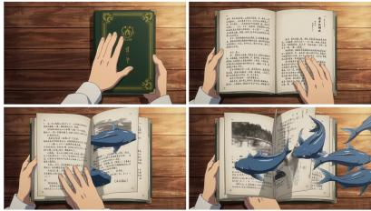  
A man opens a book, and then some fishes swim out of the pages.  
SkillPE: Seed-skill StoryEval = 1.00 / PF = 7 / CO = 7 / NA = 6 / CR = 6

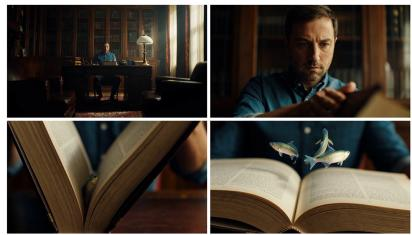  
. Cuts move from a wide shot to face and page close-ups as a man opens a book. Glowing fish swim out, accompani -ed by a building heartbeat, shimmering splashes, and a rising musical chord

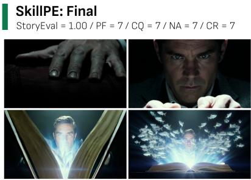  
.. Cold lightisolates a man's hand..Tight close-ups of facebuild suspense. As book opens, a wide shot reveals blazing light andfish swirling around him;a rising hum cuts to silence, then an explosive boom...  
Figure 1: Examples for comparing baselines with SkillPE and showing the skills’ effect.

However, most agentic PE methods rely on afixed agent pipeline and a static pool of tools or skills, rendering them inflexible and poorly adaptive to the heterogeneous demands of different domains. A typical pipeline, for example, comprises a reasoning agent, a prompt-design agent, and a validation-and-optimization agent. Such pipelines target generic prompt enhancement in a coarse manner, making it difficult to specifically improve the narrative appeal of generated videos. Moreover, fixed structures restrict creative reflection and self-improvement. Manually curated skill sets are often tied to specific scenarios and fail to generalize across creative contexts.

In response, recent work in domains such as software engineering (Wang et al., 2025a) and web agents (Zheng et al., 2025) has explored frameworks that automatically synthesize or self-evolve skill libraries. A common limitation, however, is that skill exploration relies largely on random rollouts or post-hoc summarization of high-quality traces (Wang et al., 2025a; Alzubi et al., 2026; Xia et al., 2026). Without strategies that critically encourage out-of-the-box thinking, such exploration prioritizes utility over creativity, yet the latter is crucial for narrative video generation. External examples from experts or films can provide useful cinematic knowledge, but how to transform their underlying mechanisms into reusable creative variants while explicitly preserving the user’s intended semantics remains underexplored.

In this work, we propose SkillPE, a framework that combines structured cinematic skill formulation with reference-guided creative skill evolution for PE in text-to-video generation. Starting from expert-authored skills, SkillPE first converts each skill into a fine-grained, generation-oriented representation, providing a strong cinematic prior for prompt engineering. Building upon it, we introduce a three-way reference taxonomy tailored to cinematic skill evolution: resonators (good matches), dissonants (weak matches), and divergents (creatively useful near-misses). Resonators and dissonants refine skill applicability and execution, while divergents inspire controlled alternative realizations at different mutation magnitudes. This design is motivated by learning from matched, contrastive, and near-miss examples in concept learning that reveal both reusable patterns and informative boundaries (Winston, 1970; McLure et al., 2015). Candidate skills are finally selected through video-based assessment of their realized generation performance. As shown in Figure 1, SkillPE promotes cinematic video generation by combining dynamic camerawork, coherent action staging, and expressive lighting and sound design to improve narrative engagement and creativity while preserving user’s intent.

Extensive evaluations on StoryEval (Wang et al., 2025b) and VBench (Huang et al., 2024) with MiniMax-H3 and LTX-2.5 show that SkillPE consistently improves the cinematic and creative realization of generated videos while remaining competitive on benchmark-native metrics. Under our four-dimensional 7-point evaluation protocol (prompt fidelity, cinematic quality, narrative appeal, and creativity), the final SkillPE libraries achieve improvements of up to 0.51 points over static seed skills and 1.40 points over the strongest non-skill PE baseline. A ten-annotator human study further confirms the benefit of the evolved skill libraries, with the best SkillPE variant improving the overall score from 5.61 for seed-skill PE to 5.97, and by 1.11 points over the strongest non-skill baseline. Our contributions are three-fold:

• We propose a structured cinematic skill representation for text-to-video prompt engineering, translating abstract filmmaking knowledge into fine-grained and reusable guidance over shot logic, composition, lighting, cinematography, sound design, and related narrative cues.

• We introduce a reference-guided skill evolution framework that combines conservative refinement from resonators and dissonants with controlled divergent exploration.

• We empirically characterize the fidelity–creativity trade-off of cinematic skill evolution: creativity increases monotonically with mutation scope while prompt fidelity decreases; skill-based gains persist under matched prompt budgets; and a blinded ten-annotator study confirms improvements over both Seed Skill and non-skill PE baselines.

## 2 Related Work

## 2.1 PE for Visual Generation

PE has emerged as a lightweight yet effective means of steering LLMs toward enhanced outputs (Sahoo et al., 2024; Liu et al., 2023). Early work in the text domain explored hand-crafted templates (Brown et al., 2020), chain-of-thought reasoning (Wei et al., 2022), and automatic prompt search (Zhou et al., 2022; Shin et al., 2020). These ideas have since been adapted to visual generation. In text-to-image synthesis, rewriters are trained to convert casual queries into aesthetically rich prompts (Hao et al., 2023; Wu et al., 2026). The text-to-video domain poses additional challenges due to its temporal and narrative dimensions. Recent methods such as Prompt-A-Video (Ji et al., 2025), VPO (Cheng et al., 2025), and RAPO (Gao et al., 2025) learn to rewrite or augment user prompts for generative video models via preference alignment, reinforcement learning, or retrieval-augmented optimization. While effective lexically, they operate largely as sentence-level rewriters, appending details and stylistic modifiers or paraphrasing the input rather than applying professional shot or story design. SkillPE departs from this paradigm by reasoning at the level of reusable cinematic skills.

## 2.2 Multi-Modal LLM-Based Agents

Building on the strong reasoning capabilities of LLM-based agents, PE approaches have moved from a learning-based to an agentic process. Mind-Brush (He et al., 2026), NEWTON (Feng et al., 2026), and GenAgent (Jiang et al., 2026) support complicated reasoning in PE through agentic planning and dedicated tools. Recent works tend to use multi-agent systems where the workflow is decomposed into specialized roles that collaboratively design, verify, and optimize the storyline, shot, character, and the eventual prompt (Huang et al., 2026; Long et al., 2025; Zhu et al., 2026; Hu et al., 2024; Chen et al., 2025; Wang et al., 2026; Wu et al., 2025; Yue et al., 2025; Yuan et al., 2024; Zhou et al., 2026). However, they typically rely on a fixed pipeline and a static pool of tools or skills, limiting their adaptability to heterogeneous user intents and creative demands. In contrast, SkillPE constructs skill libraries by generating and assessing reference-guided variants of reusable cinematic skills.

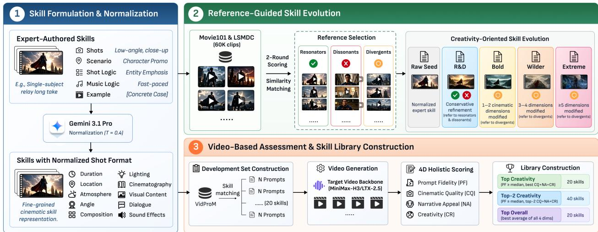  
Figure 2: An overview of SkillPE. Starting from expert-authored seed skills, SkillPE first enriches the nuanced cinematography details through an extended shot format. The skills then go through adaptive discovery and evolution, where reference movies are classified into resonators, dissonants, and divergents by similarity. The first two are distilled for usage guidance while the divergents are used for exploring skill variants of varying degrees of deviation. The consequent skills are evaluated and compiled into libraries through a pipeline of video generation and holistic assessment.

## 2.3 Skill Discovery and Self-Evolving Agents

A growing line of work studies how agents can autonomously build and refine their own tool or skill libraries (Chen et al., 2026). Voyager (Wang et al., 2023) pioneered this paradigm by enabling an embodied LLM agent to incrementally build a library of reusable skills through environment interaction. Recent efforts in web navigation (Zheng et al., 2025) and software engineering (Wang et al., 2025a; Alzubi et al., 2026; Xia et al., 2026; Yang et al., 2026; Liang et al., 2026) support automatic skill synthesis or self-evolvement through learning from past trajectories or knowledge bases. A common limitation, however, is that skill exploration is driven by random rollouts or post-hoc summarization of successful traces, which biases discovery toward utility rather than creativity. This trade-off is particularly costly in narrative video generation, where creative breadth is essential.

## 3 Methodology

This section presents the SkillPE framework. We first introduce a structured representation of reusable cinematic skills for text-to-video prompt engineering. We then describe a reference-guided skill evolution pipeline that expands each expert-authored skill into multiple parallel candidates and automatically selects candidate skills based on their realized video performance.

## 3.1 Skill Formulation

We define a skill as a reusable cinematic guide that can be injected into the PE agent when revising a user query. In collaboration with experts in directing and film aesthetics, we construct 20 initial skills. Each skill contains a description, shot templates specifying shot type and camera movement, application scenarios, shot and music logic, and a concrete example.

Because this high-level representation leaves execution details underspecified, we normalize each expertauthored skill into a fine-grained format that augments every shot with duration, location, atmosphere, angle, composition, lighting, cinematography, time-ordered visual content, dialogue, and sound effects. The conversion preserves the original skill’s cinematic intent and applicability while making its guidance more directly actionable for prompt engineering. Full schemas and examples are provided in Appendix D.1.

## 3.2 Adaptive Skill Evolution

Taking the skill library mentioned in Section 3.1 as seeds $( s ^ { S e e d } )$ , we ground and extend the expert-authored skills with examples of real cinematic practice. As illustrated in Figure 2, SkillPE evolves each raw seed through two complementary forms of reference-guided exploration: (i) conservative refinement using resonators and dissonants, and (ii) controlled cinematic exploration using divergents.

Reference Discovery. SkillPE uses LSMDC (Rohrbach et al., 2017) and Movie101 (Yue et al., 2023) as sources of real-world cinematic practice. After filtering clips shorter than 5 seconds or longer than 20 seconds, the pipeline retains 60,521 examples. The goal is to distill transferable cinematographic knowledge, such as subject staging, camera rhythm, shot transitions, action-reaction structure, sound-image synchronization, and emotional progression, into the augmented skills.

For each seed skill, SkillPE first constructs a coarse candidate pool of 390 reference videos in two steps: First, it retrieves 200 videos whose captions have the highest semantic similarity to the skill. Second, it randomly selects 10 videos from each of the remaining 19 seed skills’ pools to provide diverse inspiration. It then performs fine-grained filtering over the pool with a multi-modal LLM, rating each video’s alignment and inspiration w.r.t. the skill along six dimensions: shot logic, camera movement, spatial composition, lighting & color, atmosphere, and audio logic. Using the aggregated scores, SkillPE selects 30 complementary references: 10 resonators, which prioritize alignment and preserve the skill’s core narrative and shotorganization invariants; 15 divergents, which prioritize inspiration and provide related cinematic ideas for controlled expansion; and 5 dissonants, which serve as superficially similar cases with low alignment and therefore should not trigger the skill.

R&D Refinement. Resonators and dissonants (R&D) are jointly used to construct one candidate $s _ { i } ^ { \mathrm { R \& D } }$ for each raw seed i. From resonators, the model distills reusable cinematic patterns, modifiable dimensions, rhythm and transition cues, and application guidance. From dissonants, it derives negative applicability conditions and boundaries that help prevent inappropriate triggering of the skill. This branch performs conservative refinement while preserving the seed’s core cinematic strategy.

Divergent Exploration. SkillPE treats divergents differently, using them as sources of adjacent cinematic mechanisms for exploring alternative realizations of the same underlying narrative function.

Specifically, we operationalize cinematic mutation over nine major dimensions from our skill template. The divergents are thus used to generate independent candidate skill variants at three levels of modification: bold, wilder, and extreme. Bold is a local departure that modifies one or two dimensions; Wilder is a structural departure that modifies three or four dimensions, including at least one structural dimension; and Extreme is a transformative-but-controlled departure that modifies at least five dimensions and includes either shot-structure or expressive visual/spatial transformation.

We denote the resulting candidates as $s _ { i } ^ { \mathrm { B o l d } } , s _ { i } ^ { \mathrm { W i l d e r } }$ , and $s _ { i } ^ { \mathrm { E x t r e m e } }$ . For each source skill i, the complete candidate set is therefore $\bar { \mathcal { S } } _ { i } = \left\{ s _ { i } ^ { \mathrm { S e e d } } , s _ { i } ^ { \mathrm { R \mathcal { E } \bar { D } } } , s _ { i } ^ { \mathrm { B o l \bar { d } } } , s _ { i } ^ { \mathrm { W i l d e r } } , s _ { i } ^ { \mathrm { E x t r e m e } } \right\}$

Assessed Skill Selection. The candidate skills are evaluated on a development set $\mathcal { D } ^ { \mathrm { d e v } }$ to assess their practical effectiveness. It contains 400 prompts selected from VidProM, with 20 skill-specific matched prompts for each source skill. The construction procedure is detailed in Appendix D.5. For each prompt $q _ { i j } \in \mathcal { D } _ { i } ^ { \mathrm { d e v } }$ and each candidate $s \in S _ { i }$ , the PE agent first rewrites the user prompt with the corresponding skill, and the result is used for video generation. All five candidate skills for the same (i, j) pair share the same random seed and identical generation settings. Each video is evaluated along four dimensions that directly reflect the objectives of creativity-oriented cinematic PE:

• Prompt Fidelity (PF): how faithfully the video realizes the user’s original intent, including its subjects, requested actions, relationships, and event semantics.

• Cinematic Quality (CQ): how effectively the video employs cinematic language, including shot design, composition, camera movement, lighting, staging, and audiovisual presentation.

• Narrative Appeal (NA): how coherently and engagingly the video organizes its events into a temporal narrative, including storytelling coherence and emotional engagement.

• Creativity (CR): the novelty and expressive ambition of the audiovisual and narrative realization.

The development score of each candidate is calculated as the mean over all associated videos. The resulting four-dimensional score profile is then used to construct the final skill libraries. To balance utility and creativity, we construct three skill libraries with different selection criteria eventually:

• Top Creativity: Among all skills whose PF is at or above the median, the one with the highest average score of CQ, NA, and CR is selected.

• Top-2 Creativity: Among all skills whose PF is at or above the median, the two with the highest average score of CQ, NA, and CR are selected.

• Top Overall: All four-dimensional scores are averaged for each skill, and the highest-scoring one is selected.

Additional implementation details, including the settings and prompts, are provided in Appendix D.

## 4 Experiments

## 4.1 Study Setups

Baselines. We compare our approach with five classes of baselines for a comprehensive evaluation: (a) Fundamental baselines: raw user query and direct LLM-based rewrite (Gemini 3.1 Pro in our study); (b) Lexical PE baselines: Prompt-A-Video (Ji et al., 2025) and VPO (Cheng et al., 2025); (c) Retrieval-based PE baseline: RAPO (Gao et al., 2025); (d) Agentic PE baseline: Mora (Yuan et al., 2024); (e) Variants of our skill-based approach: PE using only seed skills (20 skills), and the three versions of skill libraries mentioned in Section 3.2 (20, 40, and 20 skills respectively).

Benchmarks and Metrics. We select VBench (Huang et al., 2024) to evaluate the overall video quality and StoryEval (Wang et al., 2025b) to assess the storytelling performance of the generated videos. Given that few benchmarks are tailored to quantitatively evaluate the cinematic quality, narrative appeal, and creative design of videos, we also report the self-designed 4-dimensional scores (PF, CQ, NA, CR) in addition to the official benchmark scores, which are evaluated by Gemini 3.1 Pro with the same system prompts used in assessed skill selection (Section 3.2). We intentionally keep the four-dimensional rubric fixed between development and evaluation to maintain objective alignment, and the development set is strictly disjoint from the benchmark evaluation sets. During final evaluation, the evaluator receives only the original benchmark prompt and the generated video, without access to the rewritten prompt, selected skill, or method identity.

Implementation Details. We leverage two open-source backbone text-to-video models: MiniMax-H3 (MiniMax, 2026) and LTX-2.5 (LTX Models, 2026). To facilitate the evaluation of creative story narration, videos are generated with a duration of 10 seconds, 24 FPS, and 1344x768 resolution. To reduce confounding from the choice of auxiliary LLMs, we share prompt and video processing models across methods when their original pipelines permit. Specifically, Gemini 3.1 Pro is used as the prompt selection/rewriting backbone in RAPO and Mora, while MiniMax-H3/LTX-2.5 is used for the video generation agent in Mora. Furthermore, because RAPO’s original trained discriminator is not publicly available, we replace it with Gemini 3.1 Pro. We therefore report our result as our adapted RAPO reproduction. See Appendix E for more details.

Table 1: Evaluation Results on StoryEval and VBench. For each backbone, the top scores are bolded and the second highest scores are underlined.
<table><tr><td rowspan="2">Backbone</td><td rowspan="2">Baseline</td><td colspan="6">StoryEval</td><td colspan="6">VBench</td></tr><tr><td>Official</td><td>PF</td><td>CQ</td><td>NA</td><td>CR</td><td>Overall</td><td>Official</td><td>PF</td><td>CQ</td><td>NA</td><td>CR</td><td>Overall</td></tr><tr><td rowspan="9">MiniMax-H3</td><td>Raw Prompt</td><td>0.63</td><td>5.10</td><td>5.57</td><td>4.70</td><td>2.04</td><td>4.35</td><td>0.80</td><td>5.43</td><td>5.35</td><td>3.47</td><td>2.40</td><td>4.16</td></tr><tr><td>Gemini 3.1 Pro</td><td>0.80</td><td>6.04</td><td>6.28</td><td>5.39</td><td>2.87</td><td>5.15</td><td>0.85</td><td>6.66</td><td>5.82</td><td>2.81</td><td>2.02</td><td>4.33</td></tr><tr><td>VPO</td><td>0.70</td><td>5.58</td><td>5.69</td><td>5.04</td><td>2.13</td><td>4.61</td><td>0.84</td><td>6.51</td><td>5.57</td><td>2.91</td><td>1.99</td><td>4.24</td></tr><tr><td>Prompt-A-Video</td><td>0.59</td><td>4.93</td><td>5.98</td><td>4.70</td><td>3.15</td><td>4.69</td><td>0.82</td><td>5.98</td><td>6.01</td><td>3.28</td><td>3.33</td><td>4.65</td></tr><tr><td>RAPO</td><td>0.65</td><td>5.30</td><td>5.56</td><td>4.77</td><td>2.09</td><td>4.43</td><td>0.82</td><td>6.25</td><td>5.54</td><td>3.64</td><td>2.53</td><td>4.49</td></tr><tr><td>Mora</td><td>0.70</td><td>5.48</td><td>5.36</td><td>4.75</td><td>2.75</td><td>4.58</td><td>0.84</td><td>6.37</td><td>5.06</td><td>2.67</td><td>2.28</td><td>4.09</td></tr><tr><td>Seed Skill</td><td>0.85</td><td>6.39</td><td>6.59</td><td>5.72</td><td>4.57</td><td>5.82</td><td>0.80</td><td>6.60</td><td>6.47</td><td>5.05</td><td>4.87</td><td>5.75</td></tr><tr><td>SkillPE Top Creativity</td><td>0.82</td><td>6.29</td><td>6.51</td><td>5.87</td><td>4.78</td><td>5.86</td><td>0.78</td><td>6.60</td><td>6.47</td><td>5.23</td><td>5.48</td><td>5.95</td></tr><tr><td>SkillPE Top-2 Creativity SkillPE Top Overall</td><td>0.83</td><td>6.40 6.34</td><td>6.60 6.61</td><td>5.81 5.91 4.89</td><td>4.57</td><td>5.85 5.94</td><td>0.79 0.78</td><td>6.62 6.53</td><td>6.52 6.64</td><td>4.90 5.54</td><td>5.07 5.48</td><td>5.78</td></tr><tr><td rowspan="10">LTX-2.5</td><td></td><td>0.83</td><td></td><td></td><td></td><td></td><td></td><td></td><td></td><td></td><td></td><td></td><td>6.05</td></tr><tr><td>Raw Prompt</td><td>0.67</td><td>5.58</td><td>5.78</td><td>5.19</td><td>2.27</td><td>4.70</td><td>0.81</td><td>6.36</td><td>5.76</td><td>3.32</td><td>2.34</td><td>4.45</td></tr><tr><td>Gemini 3.1 Pro</td><td>0.68</td><td>5.66</td><td>6.19</td><td>5.23</td><td>2.85</td><td>4.98</td><td>0.82</td><td>6.53</td><td>6.06</td><td>3.25</td><td>2.36</td><td>4.55</td></tr><tr><td>VPO</td><td>0.62</td><td>5.13</td><td>5.75</td><td>4.72</td><td>2.36</td><td>4.49</td><td>0.81</td><td>6.34</td><td>5.82</td><td>3.26</td><td>2.46</td><td>4.47</td></tr><tr><td>Prompt-A-Video</td><td>0.54</td><td>4.53</td><td>6.02</td><td>4.40</td><td>3.27</td><td>4.56</td><td>0.80</td><td>6.00</td><td>6.19</td><td>3.47</td><td>3.75</td><td>4.86</td></tr><tr><td>RAPO</td><td>0.62</td><td>5.11</td><td>5.66</td><td>4.80</td><td>2.35</td><td>4.48</td><td>0.82</td><td>6.30</td><td>5.51</td><td>3.26</td><td>2.28</td><td>4.34</td></tr><tr><td>Mora</td><td>0.55</td><td>4.66</td><td>4.93</td><td>4.19</td><td>2.23</td><td>4.00</td><td>0.82</td><td>6.18</td><td>5.12</td><td>2.47</td><td>2.11</td><td>3.97</td></tr><tr><td>Seed Skill</td><td>0.67</td><td>5.48</td><td>6.04</td><td>4.96</td><td>4.53</td><td>5.25</td><td>0.78</td><td>6.25</td><td>5.99</td><td>4.61</td><td>4.62</td><td>5.37</td></tr><tr><td>SkillPE Top Creativity</td><td>0.67 0.68</td><td>5.38 5.21</td><td>6.22 6.06</td><td>4.98 5.08</td><td>4.51 4.84</td><td>5.27 5.30</td><td>0.80 0.81</td><td>6.17 6.20</td><td>6.43 6.17</td><td>5.44 5.09</td><td>5.49 5.48</td><td>5.88</td></tr><tr><td>SkillPE Top-2 Creativity</td><td></td><td>5.41</td><td>6.08</td><td>5.18</td><td>4.62</td><td>5.32</td><td>0.81</td><td>6.20</td><td>6.42</td><td>5.31</td><td>5.39</td><td>5.73</td></tr><tr><td>SkillPE Top Overall</td><td>0.69</td><td></td><td></td><td></td><td></td><td></td><td></td><td></td><td></td><td></td><td></td><td>5.83</td></tr></table>

Results. The evaluation results are reported in Table 1. Across both backbones and benchmarks, the structured Seed Skill already provides a strong improvement over non-skill PE baselines, indicating that cinematic skill formulation is itself an important source of gain: On MiniMax-H3, Seed Skill substantially improves over non-skill PE methods in CQ, NA, and CR. Reference-guided evolution then provides additional, generally smaller improvements by expanding the available cinematic realizations, with the clearest gains appearing in cinematic, narrative, and creative dimensions: SkillPE Top Overall achieves the highest Overall score on both StoryEval (5.94) and VBench (6.05), together with the best CQ and NA on both benchmarks and the highest CR on StoryEval. The same pattern is also observed with LTX-2.5. The gains are more pronounced on VBench, where SkillPE Top raises Overall from 5.37 to 5.88 and achieves the highest CQ (6.43), NA (5.44), and CR (5.49).

The benchmark-native scores provide a complementary view. SkillPE remains competitive but does not uniformly improve these metrics: for example, Seed Skill obtains the highest StoryEval official score on MiniMax-H3 (0.85), whereas the selected libraries score 0.82–0.83. In contrast, SkillPE Top Overall achieves the best StoryEval score on LTX-2.5 (0.69). On VBench, direct rewriting or other baselines remain strongest on the official metric, while the SkillPE libraries consistently obtain substantially higher cinematic, narrative, and creative scores. These results suggest that SkillPE primarily improves how the requested content is cinematically realized while remaining competitive on benchmark-specific objectives.

Table 2: Human evaluation results (1–7 Likert scale). PF=Prompt Fidelity, CQ=Cinematic Quality, NA=Narrative Appeal, CR=Creativity.
<table><tr><td>Method</td><td>PF CQ NA CR Overall</td></tr><tr><td>Raw Prompt Gemini 3.1 Pro</td><td>5.66 4.83 4.31 3.84 4.66 5.99 5.11 4.34 4.00 4.86</td></tr><tr><td>VPO Prompt-A-Video RAPO Mora</td><td>5.84 5.13 4.27 4.05 4.82 5.64 5.16 4.20 4.05 4.76 5.64 4.804.08 3.91 4.61 5.734.81 4.40 4.05 4.75</td></tr><tr><td>Seed-skill PE SkillPE Top Creativity SkillPE Top-2 Creativity SkillPE Top Overall</td><td>6.13 5.54 5.58 5.19 5.61 6.30 5.89 5.99 5.68 5.97 6.30 5.85 5.88 5.37 5.85 6.17 5.89 6.04 5.65 5.94</td></tr></table>

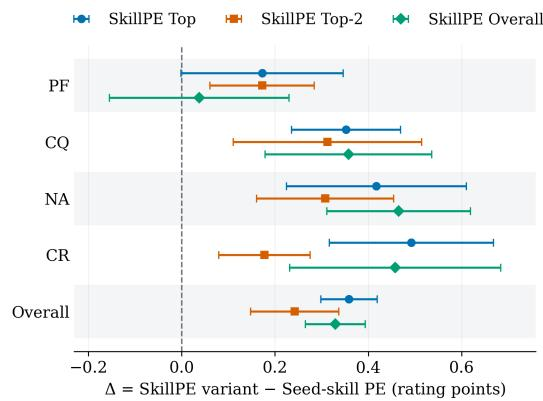  
Figure 3: Paired improvements of the final SkillPE libraries over Seed-skill PE. Error bars denote 95% confidence intervals.

## 4.2 User Study

Protocol. To complement the automatic evaluation with an evaluator-independent signal, we conduct a blinded human study with ten annotators. Each annotator independently rates every generated video on four dimensions (PF, CQ, NA, CR) using a 7-point Likert scale. Method identities were hidden and video presentation order was randomized independently for each annotator. The per-video overall score is computed as the mean of the four dimensions. Annotations span 400 videos covering 40 StoryEval prompts across 10 experimental conditions, where the prompts are randomly selected with the difficulty equally distributed and the videos are selected from LTX 2.5.

Results. Table 2 reports scores averaged across the annotators. The annotators’ average of the 4D score shows high reliability (ICC(2, 10) = 0.899, 95% CI [0.884, 0.914]). Gemini 3.1 Pro obtains the highest overall score (4.86) in non-SkillPE baselines. Seed-skill PE substantially improves the overall score to 5.61, while all three final-library SkillPE variants further improve upon this baseline (Figure 3): SkillPE Top Creativity achieves the highest overall score (5.97), followed by SkillPE Top Overall (5.94) and SkillPE Top-2 Creativity (5.85). To assess these improvements, we first average each annotator’s overall scores across the 40 matched prompts and perform two-sided paired Student’s t-tests against Seed-skill PE. All three variants significantly outperform this baseline after Holm correction for the three comparisons (adjusted $p < 0 . 0 5$ for each). In addition, the final SkillPE libraries achieve the highest scores across all four dimensions. These results support the effectiveness of skill-driven PE and the additional benefit of the refined skill library, particularly for creative expression.

## 4.3 Ablation Study

## 4.3.1 Ablation of Skill Evolution Methods

To isolate the contribution of each stage in the adaptive skill evolution pipeline, we evaluate five additional skill library variants on StoryEval: (i) expert-authored initial skills (Section 3.1); (ii) Stably augmented skills guided from resonators and dissonants (R&D, Section 3.2); and (iii–v) divergents-guided bold, wilder, and extreme candidate skills respectively (Section 3.2). These are compared against SkillPE’s seed skills from the main experiment. The results are reported in Table 3.

The results reveal two complementary effects of skill formulation and reference-guided evolution. First, converting the expert-authored skills into the fine-grained seed representation substantially improves creativity:

Table 3: Ablation study on the skill formulation and evolution approaches.
<table><tr><td rowspan="2"></td><td colspan="5">StoryEval</td><td colspan="5">VBench</td></tr><tr><td>PF</td><td>CQ</td><td>NA</td><td>CR</td><td>Overall</td><td>PF</td><td>CQ</td><td>NA</td><td>CR</td><td>Overall</td></tr><tr><td>Expert-authored</td><td>6.43</td><td>6.43</td><td>5.73</td><td>4.01</td><td>5.65</td><td>6.70</td><td>6.42</td><td>4.79</td><td>4.67</td><td>5.64</td></tr><tr><td>Seed Skill</td><td>6.39</td><td>6.59</td><td>5.72</td><td>4.57</td><td>5.82</td><td>6.60</td><td>6.47</td><td>5.05</td><td>4.87</td><td>5.75</td></tr><tr><td>R&amp;D only</td><td>6.35</td><td>6.63</td><td>5.82</td><td>4.57</td><td>5.84</td><td>6.63</td><td>6.54</td><td>5.14</td><td>5.23</td><td>5.88</td></tr><tr><td>Bold only</td><td>6.19</td><td>6.58</td><td>5.55</td><td>4.91</td><td>5.81</td><td>6.46</td><td>6.28</td><td>4.81</td><td>5.30</td><td>5.71</td></tr><tr><td>Wilder only</td><td>6.12</td><td>6.47</td><td>5.38</td><td>5.50</td><td>5.87</td><td>6.41</td><td>6.53</td><td>5.42</td><td>5.83</td><td>6.04</td></tr><tr><td>Extreme only</td><td>6.03</td><td>6.54</td><td>5.33</td><td>5.88</td><td>5.95</td><td>6.31</td><td>6.34</td><td>5.14</td><td>5.90</td><td>5.93</td></tr></table>

CR increases by +0.56 on StoryEval (95% CI [0.37, 0.74]) and +0.20 on VBench ([0.05, 0.44]). The overall score also increases on StoryEval (+0.17, [0.07, 0.26]), while the corresponding VBench difference is smaller and inconclusive (+0.10, [−0.03, 0.22]). R&D yields consistently positive mean changes in CQ, NA, and Overall across both benchmarks while largely preserving fidelity, suggesting that it serves as a stable, conservative refinement branch complementary to the more exploratory divergent variants.

Second, divergent evolution exhibits a clear fidelity-creativity trade-off. From Bold to Wilder to Extreme, CR increases monotonically on both StoryEval (4.91 → 5.50 → 5.88) and VBench $( 5 . 3 0  5 . 8 3  5 . 9 0 )$ while PF decreases correspondingly. Relative to Seed, the CR gains are +0.34, +0.93, and +1.32 on StoryEval and +0.43, +0.96, and +1.03 on VBench for Bold, Wilder, and Extreme, respectively, with all 95% confidence intervals excluding zero. Larger mutations therefore provide stronger creative expressiveness at a greater risk to fidelity, motivating the assessed selection stage to choose among conservative and divergent candidates rather than relying on a single evolution strategy. Importantly, these branches remain complementary after assessed selection: as shown in Table 5, R&D contributes 15–25% of the selected skills across the final libraries, while Wilder and Extreme together account for a substantial fraction under both selection backbones. This suggests that the final gains arise from both conservative refinement and exploratory evolution rather than a single universal strategy.

## 4.3.2 Ablation of Prompt Length

To examine whether SkillPE benefits merely from producing longer and more detailed prompts, we conduct a prompt-budget-controlled ablation. We impose the same word budget of 100, 200, 400, or 800 English words on Direct LLM-Based Rewrite (Gemini 3.1 Pro), Seed Skill, SkillPE Top Creativity, and SkillPE Top Overall. Videos are generated by MiniMax-H3 on StoryEval. The budget is implemented by adding “the target length is <budget> whitespace-delimited words” to the system prompt of the PE agent, and we allow a ±5% difference between the actual prompt length and the budget (e.g., 95–105 words are permitted for the 100-word budget).

As shown in Table 4, the skill-based approaches consistently achieve substantially higher Creativity than Direct LLM Rewrite under every prompt budget. Even at 100 words, Seed Skill, SkillPE Top Creativity, and SkillPE Top Overall obtain CR scores of 4.49, 4.56, and 4.60, respectively, compared with 2.82 for Direct LLM Rewrite. The advantage persists as the budget increases: at 800 words, SkillPE Top Creativity and SkillPE Top Overall reach CR scores of 5.58 and 5.63, whereas Direct LLM Rewrite remains at 3.24. Similar patterns are observed for Cinematic Quality and Overall performance, with SkillPE Top Overall outperforming Direct LLM Rewrite in Overall score at all four budgets (5.56 vs. 5.27, 5.83 vs. 5.46, 5.94 vs. 5.55, and 6.13 vs. 5.53). These results indicate that SkillPE’s gains cannot be explained solely by having access to a larger prompt length. Structured cinematic skills allow the available prompt budget to be used more effectively for cinematic and creative expression.

Increasing the prompt budget benefits all skill-based variants, but the improvement is particularly pronounced for the final SkillPE libraries. SkillPE Top Overall rises from 5.56 at 100 words to 6.13 at 800 words, while Direct LLM Rewrite largely saturates after 400 words (5.55 at 400 and 5.53 at 800 words). Direct rewriting generally retains higher Prompt Fidelity and, at shorter budgets, higher Narrative Appeal, suggesting a trade-off between literal event realization and richer cinematic treatment. Nevertheless, the final SkillPE libraries increasingly narrow this fidelity gap as more prompt capacity becomes available, while maintaining a large advantage in Creativity.

Table 4: Prompt-budget-controlled ablation. DLR = Direct LLM Rewrite; Top-C = SkillPE Top Creativity; Top-O = SkillPE Top Overall. Best result within each budget and metric is bolded.
<table><tr><td></td><td colspan="4">100 words</td><td colspan="4">200 words</td><td colspan="4">400 words</td><td colspan="4">800 words</td></tr><tr><td>Metric DLR Seed Top-C Top-O DLR Seed Top-C Top-O DLR Seed Top-C Top-O DLR Seed Top-C Top-O</td><td></td><td></td><td></td><td></td><td></td><td></td><td></td><td></td><td></td><td></td><td></td><td></td><td></td><td></td><td></td><td></td></tr><tr><td>PF</td><td>6.28</td><td>5.94</td><td>5.70</td><td>5.75</td><td>6.44 6.02</td><td></td><td>5.83</td><td>6.00</td><td>6.62</td><td>6.13</td><td>6.06</td><td>6.08</td><td>6.54</td><td>6.41</td><td>6.22</td><td>6.29</td></tr><tr><td>CQ</td><td>6.23</td><td>6.48</td><td>6.39</td><td>6.41</td><td>6.38 6.58</td><td></td><td>6.56</td><td>6.58</td><td>6.39</td><td>6.66</td><td>6.59</td><td>6.58</td><td>6.42</td><td>6.68</td><td>6.69</td><td>6.64</td></tr><tr><td>NA</td><td>5.75</td><td>5.54</td><td>5.33</td><td>5.47</td><td>5.87 5.54</td><td></td><td>5.61</td><td>5.68</td><td>5.99</td><td>5.66</td><td>5.71</td><td>5.71</td><td>5.92</td><td>5.83</td><td>5.85</td><td>5.96</td></tr><tr><td>CR</td><td>2.82 4.49</td><td></td><td>4.56</td><td>4.60</td><td>3.15 4.65</td><td></td><td>5.04</td><td>5.05</td><td></td><td>3.21 4.95</td><td>5.35</td><td>5.41</td><td>3.24 5.21</td><td></td><td>5.58</td><td>5.63</td></tr><tr><td>Overall 5.27 5.61</td><td></td><td></td><td>5.50</td><td>5.56</td><td>5.46 5.70</td><td></td><td>5.76</td><td>5.83</td><td></td><td>5.55 5.85</td><td>5.93</td><td>5.94</td><td>5.53</td><td>36.03</td><td>6.08</td><td>6.13</td></tr></table>

## 4.3.3 Ablation of Skill Selection

We further examine whether the final gains come from the assessed selection stage rather than merely from assembling evolved candidates. We compare our Seed Skill, Top-Creativity, and Top-Overall libraries against three randomly constructed libraries, where one of the five candidates is sampled independently for each source skill. Random selection shows noticeable variation across sampled libraries, especially in Creativity (4.71±0.47). In contrast, SkillPE Top Overall improves the Overall score over both the Seed library (+0.119, 95% CI [0.028, 0.210]) and the mean of the three random libraries (+0.088, [0.012, 0.167]). SkillPE Top Creativity does not show a reliable Overall advantage, but increases Creativity over Seed by +0.251 ([0.055, 0.444]). These results suggest that assessed selection is beneficial: Top Overall improves the balanced utility–creativity profile, while Top primarily favors creative expression.

## 4.4 Qualitative and Usage Analysis

Figure 1 illustrates that SkillPE’s gains arise from concrete cinematic decisions rather than merely adding descriptive content. Across the two examples, skill conditioning introduces structured shot progression, camera movement, composition, lighting, and audiovisual timing, while the final libraries further intensify these cinematic choices in a more practical and expressive way that fits the requested events. The improvement is reflected on the quantitative scores: the car-to-robot example improves from Seed to Final in cinematic quality (6→7), narrative appeal (5→6), and creativity (2→6). In the book-and-fish example, cinematic quality remains at 7 while narrative appeal and creativity both increase from 6 to 7. More detailed case analyses are provided in Appendix G.

We further observe three patterns across the evaluation. First, the gains are not explained by prompt verbosity alone. For example, on StoryEval and MiniMax-H3, the Top Creativity and Top Overall libraries produce shorter PE outputs on average than Seed Skill (171.0 and 178.6 vs. 234.9 words), while still improving creativity-oriented scores. Second, assessed evolution does not collapse to a single type of modification: the final libraries contain skills selected from Seed, R&D, Bold, Wilder, and Extreme branches (Table 5), indicating that different source skills benefit from different degrees of refinement or divergence. Third, different benchmark prompts activate a broad range of skills, suggesting that the library is used across diverse scenarios rather than functioning as a single generic template. Together, these observations suggest that

SkillPE improves cinematic realization through reusable but selectively applied strategies rather than a single generic rewrite pattern.

## 5 Conclusion

We introduce SkillPE, a framework for creativity-oriented cinematic skill evolution in text-to-video prompt engineering. SkillPE combines fine-grained cinematic skill representations, which provide a strong foundation over non-skill PE baselines, with reference-guided conservative refinement and controlled divergent exploration, followed by video-based assessed selection. Experiments across two video-generation backbones and two benchmarks, together with a ten-annotator human study, show that the resulting skill libraries improve cinematic, narrative, and creative evaluation scores while exposing a measurable fidelity–creativity trade-off. These results demonstrate the potential of reusable, adaptively evolved cinematic skills as an alternative to purely lexical prompt rewriting.

## References

Salaheddin Alzubi, Noah Provenzano, Jaydon Bingham, Weiyuan Chen, and Tu Vu. 2026. EvoSkill: Automated skill discovery for multi-agent systems. arXiv preprint arXiv:2603.02766.

Tim Brooks, Bill Peebles, Connor Holmes, Will DePue, Yufei Guo, Li Jing, David Schnurr, Joe Taylor, Troy Luhman, Eric Luhman, Clarence Ng, Ricky Wang, and Aditya Ramesh. 2024. Video generation models as world simulators.

Tom Brown, Benjamin Mann, Nick Ryder, Melanie Subbiah, Jared D Kaplan, Prafulla Dhariwal, Arvind Neelakantan, Pranav Shyam, Girish Sastry, Amanda Askell, and 1 others. 2020. Language models are few-shot learners. Advances in neural information processing systems, 33:1877–1901.

Chieh-Yun Chen, Min Shi, Gong Zhang, and Humphrey Shi. 2025. T2I-Copilot: A training-free multi-agent text-to-image system for enhanced prompt interpretation and interactive generation. In Proceedings ofthe IEEE/CVF International Conference on Computer Vision, pages 19396–19405.

Sixiang Chen, Zhaohu Xing, Tian Ye, Xinyu Geng, Yunlong Lin, Jianyu Lai, Xuanhua He, Fuxiang Zhai, Jialin Gao, and Lei Zhu. 2026. GenEvolve: Self-evolving image generation agents via tool-orchestrated visual experience distillation. arXiv preprint arXiv:2605.21605.

Jiale Cheng, Ruiliang Lyu, Xiaotao Gu, Xiao Liu, Jiazheng Xu, Yida Lu, Jiayan Teng, Zhuoyi Yang, Yuxiao Dong, Jie Tang, and 1 others. 2025. VPO: Aligning text-to-video generation models with prompt optimization. In Proceedings of the IEEE/CVF International Conference on Computer Vision, pages 15636–15645.

Yuxiang Feng, Juncheng Wang, Chao Xu, Yijie Qian, Huihan Wang, Wenlong Hou, Yang Liu, Baigui Sun, Yong Liu, and Shujun Wang. 2026. NEWTON: Agentic planning for physically grounded video generation. arXiv preprint arXiv:2605.18396.

Bingjie Gao, Xinyu Gao, Xiaoxue Wu, Yujie Zhou, Yu Qiao, Li Niu, Xinyuan Chen, and Yaohui Wang. 2025. The devil is in the prompts: Retrieval-augmented prompt optimization for text-to-video generation. In Proceedings of the Computer Vision and Pattern Recognition Conference, pages 3173–3183.

Yaru Hao, Zewen Chi, Li Dong, and Furu Wei. 2023. Optimizing prompts for text-to-image generation. Advances in Neural Information Processing Systems, 36:66923–66939.

Jun He, Junyan Ye, Zilong Huang, Dongzhi Jiang, Chenjue Zhang, Leqi Zhu, Renrui Zhang, Xiang Zhang, and Weijia Li. 2026. Mind-Brush: Integrating agentic cognitive search and reasoning into image generation. arXiv preprint arXiv:2602.01756.

Panwen Hu, Jin Jiang, Jianqi Chen, Mingfei Han, Shengcai Liao, Xiaojun Chang, and Xiaodan Liang. 2024. Storyagent: Customized storytelling video generation via multi-agent collaboration. arXiv preprint arXiv:2411.04925.

Kaiyi Huang, Yukun Huang, Xuefei Ning, Zinan Lin, Yu Wang, and Xihui Liu. 2026. GenMAC: compositional text-to-video generation with multi-agent collaboration. In Proceedings of the AAAI Conference on Artificial Intelligence, volume 40, pages 5049–5057.

Ziqi Huang, Yinan He, Jiashuo Yu, Fan Zhang, Chenyang Si, Yuming Jiang, Yuanhan Zhang, Tianxing Wu, Qingyang Jin, Nattapol Chanpaisit, Yaohui Wang, Xinyuan Chen, Limin Wang, Dahua Lin, Yu Qiao, and Ziwei Liu. 2024. Vbench: Comprehensive benchmark suite for video generative models. In Proceedings ofthe IEEE/CVF Conference on Computer Vision and Pattern Recognition (CVPR), pages 21807–21818.

Yatai Ji, Jiacheng Zhang, Jie Wu, Shilong Zhang, Shoufa Chen, Chongjian Ge, Peize Sun, Weifeng Chen, Wenqi Shao, Xuefeng Xiao, and 1 others. 2025. Prompt-a-video: Prompt your video diffusion model via preference-aligned llm. In Proceedings of the IEEE/CVF International Conference on Computer Vision, pages 18725–18735.

Kaixun Jiang, Yuzheng Wang, Junjie Zhou, Pandeng Li, Zhihang Liu, Chen-Wei Xie, Zhaoyu Chen, Yun Zheng, and Wenqiang Zhang. 2026. GenAgent: Scaling text-to-image generation via agentic multimodal reasoning. arXiv preprint arXiv:2601.18543.

Yuan Liang, Ruobin Zhong, Haoming Xu, Chen Jiang, Yi Zhong, Runnan Fang, Jia-Chen Gu, Shumin Deng, Yunzhi Yao, Mengru Wang, and 1 others. 2026. Skillnet: Create, evaluate, and connect ai skills. arXiv preprint arXiv:2603.04448.

Pengfei Liu, Weizhe Yuan, Jinlan Fu, Zhengbao Jiang, Hiroaki Hayashi, and Graham Neubig. 2023. Pre-train, prompt, and predict: A systematic survey of prompting methods in natural language processing. ACM computing surveys, 55(9):1–35.

Do Xuan Long, Xingchen Wan, Hootan Nakhost, Chen-Yu Lee, Tomas Pfister, and Sercan Ö Arık. 2025. VISTA: A test-time self-improving video generation agent. arXiv preprint arXiv:2510.15831.

LTX Models. 2026. LTX-2.5: LTX’s latest AI open-source foundation model. https://ltx.io/model/ ltx-2-5. Accessed: September 10, 2026.

Matthew McLure, Scott Friedman, and Kenneth Forbus. 2015. Extending analogical generalization with near-misses. In Proceedings ofthe AAAI Conference on Artificial Intelligence, volume 29.

MiniMax. 2026. MiniMax H3: An open model breaking the boundaries between tasks and modalities. https://www.minimax.io/blog/minimax-h3. Accessed: July 31, 2026.

Anna Rohrbach, Atousa Torabi, Marcus Rohrbach, Niket Tandon, Chris Pal, Hugo Larochelle, Aaron Courville, and Bernt Schiele. 2017. Movie description. International Journal of Computer Vision.

Pranab Sahoo, Ayush Kumar Singh, Sriparna Saha, Vinija Jain, Samrat Mondal, and Aman Chadha. 2024. A systematic survey of prompt engineering in large language models: Techniques and applications. arXiv preprint arXiv:2402.07927.

Team Seedance, De Chen, Liyang Chen, Xin Chen, Ying Chen, Zhuo Chen, Zhuowei Chen, Feng Cheng, Tianheng Cheng, Yufeng Cheng, and 1 others. 2026. Seedance 2.0: Advancing video generation for world complexity. arXiv preprint arXiv:2604.14148.

Taylor Shin, Yasaman Razeghi, Robert L Logan Iv, Eric Wallace, and Sameer Singh. 2020. Autoprompt: Eliciting knowledge from language models with automatically generated prompts. In Proceedings of the 2020 conference on empirical methods in natural language processing (EMNLP), pages 4222–4235.

Yiwen Song, Tomas Pfister, and Yale Song. 2026. VQQA: An agentic approach for video evaluation and quality improvement. arXiv preprint arXiv:2603.12310.

Kling Team, Jialu Chen, Yuanzheng Ci, Xiangyu Du, Zipeng Feng, Kun Gai, Sainan Guo, Feng Han, Jingbin He, Kang He, and 1 others. 2025. Kling-Omni technical report. arXiv preprint arXiv:2512.16776.

Guanzhi Wang, Yuqi Xie, Yunfan Jiang, Ajay Mandlekar, Chaowei Xiao, Yuke Zhu, Linxi Fan, and Anima Anandkumar. 2023. Voyager: An open-ended embodied agent with large language models. arXiv preprint arXiv:2305.16291.

Jiongxiao Wang, Qiaojing Yan, Yawei Wang, Yijun Tian, Soumya Smruti Mishra, Zhichao Xu, Megha Gandhi, Panpan Xu, and Lin Lee Cheong. 2025a. Reinforcement learning for self-improving agent with skill library. arXiv preprint arXiv:2512.17102.

Qian Wang, Ziqi Huang, Ruoxi Jia, Paul Debevec, and Ning Yu. 2026. MAViS: A multi-agent framework for long-sequence video storytelling. In Proceedings of the 19th Conference of the European Chapter of the Association for Computational Linguistics (Volume 1: Long Papers), pages 2273–2295.

Yiping Wang, Xuehai He, Kuan Wang, Luyao Ma, Jianwei Yang, Shuohang Wang, Simon Shaolei Du, and Yelong Shen. 2025b. Is your world simulator a good story presenter? a consecutive events-based benchmark for future long video generation. In Proceedings ofthe IEEE/CVF Conference on Computer Vision and Pattern Recognition (CVPR), pages 13629–13638.

Jason Wei, Xuezhi Wang, Dale Schuurmans, Maarten Bosma, Fei Xia, Ed Chi, Quoc V Le, Denny Zhou, and 1 others. 2022. Chain-of-thought prompting elicits reasoning in large language models. Advances in neural information processing systems, 35:24824–24837.

Patrick H. Winston. 1970. Learning structural descriptions from examples.

Mingrui Wu, Lu Wang, Pu Zhao, Fangkai Yang, Jianjin Zhang, Jianfeng Liu, Yuefeng Zhan, Weihao Han, Hao Sun, Jiayi Ji, and 1 others. 2026. RePrompt: Reasoning-augmented reprompting for text-to-image generation via reinforcement learning. In International Conference on Learning Representations, volume 2026, pages 14030–14057.

Weijia Wu, Zeyu Zhu, and Mike Zheng Shou. 2025. Automated movie generation via multi-agent cot planning. arXiv preprint arXiv:2503.07314.

Peng Xia, Jianwen Chen, Hanyang Wang, Jiaqi Liu, Kaide Zeng, Yu Wang, Siwei Han, Yiyang Zhou, Xujiang Zhao, Haifeng Chen, and 1 others. 2026. SkillRL: Evolving agents via recursive skill-augmented reinforcement learning. arXiv preprint arXiv:2602.08234.

Yutao Yang, Junsong Li, Qianjun Pan, Bihao Zhan, Yuxuan Cai, Lin Du, Jie Zhou, Kai Chen, Qin Chen, Xin Li, and 1 others. 2026. Autoskill: Experience-driven lifelong learning via skill self-evolution. arXiv preprint arXiv:2603.01145.

Zhengqing Yuan, Yixin Liu, Yihan Cao, Weixiang Sun, Haolong Jia, Ruoxi Chen, Zhaoxu Li, Bin Lin, Li Yuan, Lifang He, and 1 others. 2024. Mora: Enabling generalist video generation via a multi-agent framework. arXiv preprint arXiv:2403.13248.

Zhengrong Yue, Shaobin Zhuang, Kunchang Li, Yanbo Ding, and Yali Wang. 2025. V-stylist: Video stylization via collaboration and reflection of mllm agents. In Proceedings of the Computer Vision and Pattern Recognition Conference, pages 3195–3205.

Zihao Yue, Qi Zhang, Anwen Hu, Liang Zhang, Ziheng Wang, and Qin Jin. 2023. Movie101: A new movie understanding benchmark. In Proceedings ofthe 61st Annual Meeting ofthe Associationfor Computational Linguistics (Volume 1: Long Papers), pages 4669–4684.

Boyuan Zheng, Michael Y Fatemi, Xiaolong Jin, Zora Zhiruo Wang, Apurva Gandhi, Yueqi Song, Yu Gu, Jayanth Srinivasa, Gaowen Liu, Graham Neubig, and 1 others. 2025. SkillWeaver: Web agents can self-improve by discovering and honing skills. arXiv preprint arXiv:2504.07079.

Hengji Zhou, Lingxuan Huang, Jian Wang, Bing Zhou, Si Wu, Lianghao Xia, and Chao Huang. 2026. Videoagent: All-in-one framework for video understanding and editing. arXiv preprint arXiv:2606.23327.

Yongchao Zhou, Andrei Ioan Muresanu, Ziwen Han, Keiran Paster, Silviu Pitis, Harris Chan, and Jimmy Ba. 2022. Large language models are human-level prompt engineers. In International Conference on Learning Representations.

Zihao Zhu, Ruotong Wang, Siwei Lyu, Min Zhang, and Baoyuan Wu. 2026. BrandFusion: A multi-agent framework for seamless brand integration in text-to-video generation. arXiv preprint arXiv:2603.02816.

## A Limitations and Future Work

Our study has several limitations and leaves multiple directions for future work. First, the current evaluation focuses on two video-generation backbones, two benchmarks, and short-form 10-second videos. Extending SkillPE to longer-form generation and a broader range of video models remains to be explored. Second, the current library is initialized from 20 expert-authored cinematic skills and a finite collection of movie references, which may not cover all genres, visual conventions, or creative preferences. Expanding the seed set and reference sources could further broaden the library’s coverage.

Our experiments also reveal an inherent fidelity–creativity trade-off: more aggressive divergent evolution can improve creative expression while increasing the risk of deviating from the original intent. The assessed selection stage mitigates this trade-off but does not eliminate it. Future work could explore query-adaptive or user-controllable selection strategies that explicitly adjust the desired balance between fidelity and creative ambition.

Skill library construction additionally incurs a one-time offline cost for reference analysis, candidate generation, video rollouts, and video-based assessment, while inference introduces additional promptprocessing calls and latency. These costs are amortized after the library is constructed, and we provide a detailed efficiency analysis in Appendix C. Reducing this overhead remains an important direction for scaling skill evolution.

Finally, while we use open-source models whenever practical, proprietary models such as Gemini 3.1 Pro are used for stages requiring joint video, audio, and text understanding, where we found them to provide reliable multimodal performance, and similar models have also been adopted in prior work on prompt optimization (e.g., Song et al. (2026)). To facilitate reproducibility despite reliance on hosted models, we plan to release the generated artifacts and have provided detailed experimental configurations used in our experiments. Future work will evaluate SkillPE with increasingly capable open-source multimodal models, improving reproducibility and clarifying which components generalize across foundation models.

## B Copyright Statement

We claim that we have obtained prior approval from the authors of LSMDC by email for using the dataset in this research, and have obtained access approval for Movie101 through its official application process on HuggingFace.

## C Efficiency and Cost Analysis

We distinguish the one-time cost of constructing the assessed skill library from the per-prompt overhead incurred during inference. The former is amortized once the library has been constructed, whereas the latter determines the additional cost of using SkillPE for downstream prompt engineering.

Library construction. Starting from scratch, construction of the assessed library requires reference retrieval and evaluation, candidate-skill generation, development-set prompt engineering, video rollouts, and fourdimensional video assessment. In our implementation, this amounts to approximately 68.2K application-level remote-model calls, 474 local embedding-model batches, and 2,000 development video generations for each backbone. The 2,000 rollout videos correspond to approximately 625.6 aggregate GPU-hours. Importantly, this cost is incurred only during library construction and is amortized over subsequent inference.

Inference-time overhead. Once the skill library is frozen, the model-agnostic SkillPE pipeline requires two sequential language-model calls per input: one for skill routing and one for skill-conditioned prompt rewriting. In our application, one additional call is used for MiniMax-H3 to adapt the prompt into the model-specific prompt schema. Thus, the inference overhead is two model calls for the generic pipeline and three for the adapted pipeline. The video-generation computation itself is shared with all PE baselines and is therefore not counted as SkillPE-specific overhead.

## D Additional Implementation Details

## D.1 Details of Skill Formulation and Normalization

## D.1.1 Structure of the Expert-Authored Skill

Each skill is formally structured, comprising the following components:

• Description: A concise summary of the overall intent and stylistic essence of the skill.

• Shots: Templates for cinematic shots, including:

– Shot Description: A brief summary of the shot style.

– Shot Type: The specification of shot scales and their progression, such as close-up, medium shot, long shot, wide shot, and extreme close-up.

– Camera Movement: The prescribed camera motion, including techniques such as tracking, push-in, pull-out, pan, tilt, and crane movements.

• Application Scenarios: The typical narrative or visual contexts in which the skill is most effective.

• Shot Logic: The rationale underlying the shot design and how the visual choices serve the intended expression.

• Music Logic: The rationale underlying the music or sound design and its relationship with the visual narrative.

• Example: A concrete example illustrating how the skill can be applied.

## D.1.2 Example Expert-Authored Skill

We provide an example of the expert-authored initial skills in Listing 1.

Listing 1: An example of the expert-authored skills called “atmosphere building”.

```ipynb
{
"skill": {
"name": "Atmosphere Building",
"applicable_scenarios": [
"A hero's downfall",
"The reveal of the truth, when a character suddenly realizes the truth of the environment they
are in",
"The beginning or finale of a journey, the character's determination to set out, or the end of a
long expedition",
"Immersion in and enjoyment of nature",
"Product display, using an elevated sense of spatial breadth to express the product's grandeur"
],
"shots": [
{
"description": "Eye-level panoramic view",
"shot_type": "Panoramic shot",
"camera_movement": "Eye-level fixed/slight movement"
},
{
"description": "Close-up",
"shot_type": "Close-up",
"camera_movement": "Cut"
},
{
"description": "Bird's-eye view pull-out, panoramic -> extreme long shot",
"shot_type": "Panoramic -> Extreme long shot",
"camera_movement": "Bird's-eye pull-out"
}
],
"shot_logic": "Shot1: Eye-level panoramic shot establishes the subject and environmental
information\nShot2: Close-up focuses on the character's emotional reaction\nShot3: The bird's-eye
view carries a god-like overlooking sensation; as the pull-out continues, the shot size keeps
expanding, and through the extreme contrast between the scale of the environment and the person,
it highlights the grandeur and beauty of the environment and the loneliness and insignificance of
the person.",
"music_logic": "1. For a hero's downfall scenario, use music with a tragic feel\n2. For a
truth-reveal scenario, use music suited to shock, reversal, and unease\n3. For the beginning or
finale of a journey scenario, use music with a sense of glory, hope, distant horizons, and
sanctity\n4. For immersion in and enjoyment of nature scenario, use music with an expansive,
tranquil, and healing mood\n5. For product display scenario, use music with a modern, excellent,
and premium feel",
"example": "[Director's Overview]\nStoryline: A wandering swordsman who has endured many hardships
finally reaches the legendary far-northern ice field. Facing endless wind and snow, he meets the
final destiny of his long journey.\nEmotional tone: Desolate, tragic, and relieved\nMemorable
communication point: The epic feeling brought by the strong visual contrast between the extreme
ice-and-snow environment and the tiny figure.\nShot-size path: Eye-level panoramic -> Close-up ->
Bird's-eye panoramic to extreme long shot\n\n[Shot 1 | 0-5s | Eye-level panoramic | Establish the
subject and environmental information]\nStoryboard design: Eye-level fixed camera. The
```

far-northern ice field under swirling wind and snow; the image is cold and austere, presenting a very strong sense of spatial depth. A swordsman wrapped in a worn cloak stands with his back to the camera, leaning on his sword in knee-deep snow. The fierce wind lifts the corners of his clothes, directly establishing the extreme harshness of the environment and the character's exhaustion and vicissitudes.\nSound design: The howling polar wind serves as background noise, along with the flapping sound of the cloak blown by the fierce wind and the dull sound of footsteps on thick snow.\n\n[Shot 2 | 5-9s | Close-up | Focus on the character's emotional reaction]\nStoryboard design: Hard cut to a close-up of the swordsman's profile, with the camera carrying a slight handheld breathing feel. The image focuses on the swordsman's frost-covered beard and hair and his weather-beaten face. His gaze gradually shifts from initial exhaustion and confusion to complete determination and relief. He slightly raises his head, lets out a long, heavy breath of white air, and closes his eyes to receive the baptism of wind and snow.\nSound design: The wind-and-snow ambient sound is low-pass filtered (muffled) to highlight the character's heavy but gradually calming breathing; ethereal, tragic, and sacred strings quietly begin, and the emotion starts to build.\n\n[Shot 3 | 9-15s | Panoramic -> Extreme long shot | Highlight the grandeur of the environment and the insignificance of the person]\nStoryboard design: The camera instantly rises high into the air, turns to a vertical bird's-eye view, and continuously pulls out at a constant speed toward the sky. In the frame, the swordsman quickly becomes a black dot in the snow, and the surrounding vast ice field, covered with huge and deep ice crevasses, is revealed. Through the extreme pull-out movement and the rapid expansion of shot size, the character's extreme loneliness and the majestic grandeur of the natural environment are pushed to a visual climax.\nSound design: The wind-and-snow sound is amplified again with an empty spatial echo; the tragic yet sacred symphony fully erupts, with brass instruments pushed to their peak, heightening the epic sense of destiny and finale atmosphere, and finally fading out amid the howling wind and snow."

## D.1.3 Normalization of Expert-Authored Initial Skills

Normalization preserves the original skill’s narrative method and adds explicit shot and audio fields (Section 3.1). It is performed by Gemini 3.1 Pro with a low temperature of 0.4. The prompt template used is shown in Listing 2.

The conversion preserves the core cinematic intent and applicability of the original skill while augmenting the representation of each shot with the following fields:

• Duration: The intended temporal length of the shot or sequence.

• Location: The physical or spatial setting in which the scene unfolds.

• Atmosphere: The overall mood and environmental tone, encompassing time of day and emotional ambience.

• Angle: The camera’s vertical orientation relative to the subject, including transitions.

• Composition: The visual elements’ arrangement and spatial relationships within the frame.

• Lighting: The source, direction, contrast, and quality of illumination.

• Cinematography: The technical execution of the camera, covering stabilization style and depth-of-field dynamics.

• Visual Content: A detailed, time-ordered description of on-screen action and camera behavior, articulating how the visual narrative unfolds frame by frame.

• Dialogue: The verbal utterances of characters within the scene, conveying narrative content and emotional state.

• Sound Effects: Diegetic, ambient, or synchronized audio elements when applicable.

This fine-grained representation provides the PE agent with a substantially richer set of cues, bridging the gap between abstract cinematic principles and concrete generation directives.

Listing 2: The system prompt for new-shot skill normalization.  
Upgrade <expert\_skill> to the new-shot format. Preserve its core narrative method, applicable   
scenarios, and shot logic. Return JSON with a top-level skill. Keep: name, version, llm, type,   
applicable\_scenarios, shots, shot\_logic, music\_logic, example. Add overall music design. Each shot   
must contain: description, shot\_type, camera\_movement, duration (explicit seconds), location,   
atmosphere, shot\_size, angle, composition, lighting, cinematography, visual\_content, dialogue,   
sound\_effects. Preserve compatibility of shot\_type; fill every shot, including single-shot   
templates. Keep the name traceable. Output JSON only.

## D.2 Details of Reference Video Preparation and Discovery

Sources and clip preparation. The reference bank combines the long split of Movie101 with the LSMDC training and validation annotations. Movie101 clips are identified by source-video timestamps, while LSMDC files are already segmented and are read from time zero for their annotated duration. We retain nonempty captions and valid 5–20-second intervals. The frozen coarse-search bank contains 60,521 candidates: 34,404 Movie101 and 26,117 LSMDC entries.

First round: semantic retrieval. DeepSeek-V4-Pro summarizes each of the 20 original expert skills in one English sentence of fewer than 30 words, describing the subject, core action, and spatial environment. Qwen3-Embedding-8B embeds the skill summaries and reference captions using last-token pooling and L2 normalization, and candidates are ranked by cosine similarity. The local embedding configuration uses a maximum length of 8,192 tokens and batch size 128. Each skill receives its top 200 candidates plus ten previously unselected candidates from each of the other 19 skills’ top-200 pools, yielding 390 candidates per skill.

Second round: evidence-based cinematic assessment. For each retrieved reference clip, Gemini 3.1 Pro assesses its alignment with the source skill and its potential to inspire skill expansion across six dimensions: shot logic, camera movement, spatial composition, lighting/color, atmosphere, and audio logic. Each dimension receives separate alignment and inspiration scores in [0, 1], which are summed with equal weights to obtain overall Alignment $( S _ { A } )$ and Inspiration $( S _ { I } )$ scores. The corresponding system prompt is shown in Listing 3.

SkillPE then sequentially selects three mutually exclusive reference sets. It first selects 10 resonators with the highest $S _ { A }$ , using $S _ { I }$ to break ties; then 15 divergents from the remaining candidates with the highest $S _ { I }$ , using $S _ { A }$ to break ties. Finally, it selects five dissonants from the remaining candidates whose cosine similarity exceeds $T = 0 . 3 5$ , ranked by ascending $S _ { A }$ and descending similarity. The threshold is chosen to ensure that five dissonants can be selected for every seed skill.

Listing 3: The system prompt for fine-grained reference clip evaluation.  
Evaluate exactly <dimension> for <clip> against <skill>. Judge observable local execution; do not   
penalize absent parts of a longer skill that cannot fit in this clip. Never infer audio from   
images or visual execution from audio. Score two independent continuous axes in [0,1]:   
alignment: match to the skill's intent for this dimension;   
inspiration: usefulness for evolving the skill, even if   
alignment is low.   
Do not substitute plot relevance for cinematic execution. If evidence is unavailable, set both scores   
to 0.0 and set evidence\_status to "not\_observable". Return JSON only: dimension, evidence\_status,   
observed\_evidence (one English sentence), alignment, inspiration.

## D.3 Details of R&D-Based Skill Refinement

For each of the 20 source skills, we compare five candidates: the normalized new-shot seed, the referencerefined candidate (R&D), and three divergent variants (Bold, Wilder, and Extreme). Each candidate variant is generated independently from the same new-shot seed and its corresponding references. Gemini 3.1 Pro generates the candidates.

Listing 4 shows the system prompt for generating the candidates based on R&D references.

Listing 4: The system prompt for R&D-based skill refinement.  
You are an expert in prompt engineering for video generation. Based on the provided movie-clip   
examples, your task is to add practical usage guidance to an existing seed skill.   
This round includes only two types of examples:   
\`positive\`: Positive examples for which the skill is appropriate. Use them to learn the core shot   
structure, narrative relationships, and cinematic expression that the skill should reinforce.   
\`negative\`: Hard negatives that appear superficially similar but for which the skill should not be   
used. Use them to learn the boundaries where the skill must not be forced onto a prompt.   
Important constraints:   
- Do not use near-miss reasoning. This round does not learn adjacent expansion or pruning heuristics.   
- The goal is not to rewrite the skill's shot template. The goal is to summarize the experience that a   
downstream agent should follow when selecting and applying the skill.   
- Positive examples answer "what should be added and when it should be strengthened." Negative examples   
answer "what should not be added and when the skill should not be selected."   
Read the seed skill and the batch of positive and negative examples, then return valid JSON with the   
following fields:   
{   
"batch\_summary": "Summarize in 2-4 sentences what this batch reveals about the skill's usage and   
boundaries.",   
"core\_invariants": ["The core narrative and shot-organization invariants that this skill must   
preserve."],   
"cinematic\_patterns": ["Transferable cinematic techniques from the positive examples, such as subject   
blocking, spatial organization, shot transitions, and changes in shot scale."],   
"modifiable\_dimensions": ["Dimensions that may be adjusted for different queries."],   
"strengthen\_when": ["Query patterns for which specific parts of the skill should be strengthened."],   
"weaken\_when": ["Query patterns for which specific parts of the skill should be weakened."],   
"do\_not\_force\_when": ["Queries for which this skill should not be forced."],   
"rhythm\_and\_cut\_notes": ["How to arrange cutting rhythm, action synchronization points, audiovisual   
rhythm, and the magnitude of camera movement."],   
"application\_notes": ["Concise usage guidance for the downstream agent."]   
}   
Requirements:   
- Summarize only transferable experience. Do not repeat specific movie titles, character names, or   
overly detailed plot points.   
- Every recommendation must support skill selection and skill application, not expand the material into   
a new narrative template.   
- Derive \`core\_invariants\`, \`cinematic\_patterns\`, and \`strengthen\_when\` primarily from the positive   
examples.   
- \`do\_not\_force\_when\` must fully incorporate the boundary information from the negative examples.   
- Do not output Markdown or any additional explanation.

## D.4 Details of Divergent-Based Skill Evolution

## D.4.1 Operational Mutation Dimensions

Mutation is defined over nine dimensions: (D1) shot structure; (D2) camera movement; (D3) viewpoint and angle; (D4) spatial composition and staging; (D5) lighting and color; (D6) pacing and cut rhythm; (D7) transitions and visual continuity; (D8) expressive visual or spatial devices; and (D9) audiovisual coordination, when applicable. A dimension counts as modified only when the candidate specifies a substantive design change relative to the seed. Paraphrasing, additional adjectives, and descriptive expansion do not count.

Mutation levels. Bold changes exactly one or two dimensions while retaining clear structural inheritance from the seed. Wilder changes three or four dimensions, including at least one of D1, D2, D4, D6, or D7. Extreme changes at least five dimensions, including D1 or D8. Increasing the mutation scope does not relax semantic constraints.

Semantic invariants. All candidates must preserve the requested subjects, objects, actions, semantic roles, temporal and causal relations, and intended outcome. They must not require unrelated characters, events, or plot developments, or copy the reference film’s specific content. Variation concerns how the requested content is filmed. Candidates record their preserved invariants, modified and unchanged dimensions, reference-derived mechanisms, intended observable effects, and execution risks.

Listing 5 shows the system prompt for generating the candidates based on divergent references.

Listing 5: The system prompt used for divergent-based skill evolution. Listing 5: The system prompt used for divergent-based skill evolution.

Inputs: <raw\_new\_shot\_seed>, <divergent\_references>, <mutation\_level>.   
Create exactly one reusable candidate directly from the seed. Transfer cinematic mechanisms, not the   
reference's story. Preserve subjects, events, roles, causal/temporal relations, and outcome. Apply   
the requested D1-D9 mutation budget:   
bold: 1-2 dimensions;   
wilder: 3-4, including D1/D2/D4/D6/D7;   
extreme: >=5, including D1 or D8.   
Ground at least one major change in a divergent reference. Do not reward complexity or expose hidden   
reasoning.   
Return JSON: source\_skill\_id, source\_skill\_name, mutation\_level, divergent\_summary, candidate.   
Candidate fields: candidate\_id, name, creative\_intent, preserved\_invariants, modified\_dimensions,   
unchanged\_dimensions, mutation\_scope\_check, best\_for\_queries, avoid\_for\_queries, creative\_moves,   
risk\_notes, skill (complete new-shot schema).   
For each modified dimension, give seed\_behavior, candidate\_behavior, intended\_observable\_effect, and   
divergent\_inspiration. Output JSON only.

## D.5 Details of Development Set Construction

The development set contains 400 unique VidProM prompts, with exactly 20 matched prompts per source skill:

$$
\mathcal { D } ^ { \mathrm { d e v } } = \bigcup _ { i = 1 } ^ { 2 0 } \mathcal { D } _ { i } ^ { \mathrm { d e v } } , \qquad | \mathcal { D } _ { i } ^ { \mathrm { d e v } } | = 2 0 .\tag{1}
$$

These prompts support candidate comparison and library selection.

## D.5.1 VidProM Source and Preprocessing

After HTML unescaping and whitespace trimming, we remove empty prompts, prompts with fewer than five whitespace-separated words, and technical-generation strings (e.g., resolution/aspect-ratio, FPS, attachment, or parameter metadata). We further use the toxicity scores provided in the source CSV and reject a prompt if any available score satisfies: toxicity≥ 0.5, obscene≥ 0.5, identity\_attack≥ 0.3, insult≥ 0.5, threat≥ 0.3, or sexual\_explicit≥ 0.5. Missing or unparseable toxicity fields are ignored. This preprocessing retains 829,589 prompts.

## D.5.2 Prompt Annotation

Qwen3.6-27B annotates the retained prompts with a narrative complexity score in [0, 1] and assigns one of five categories: human-centric, creature, environment, object-focused, or abstract/creative. Sampling uses these two attributes, with narrative complexity divided into four bins: [0, 0.25), [0.25, 0.5), [0.5, 0.75), and [0.75, 1].

## D.5.3 Skill Matching and Sampling

Initially, prompts in the set resulting from prompt annotation are randomly and uniformly sampled from each category–complexity stratum, leading to a total of 13,000 prompts. Gemini 3.1 Pro routes each prompt to exactly one of the 20 original expert skills using the system prompt in Listing 6, at temperature 0.2. Within each skill pool, we apply deterministic greedy selection to minimize distributional imbalances across categories and complexity bins. This process yields an approximately balanced final set of 20 prompts per skill.

Listing 6: The system prompt for skill selection.   
Given <user\_prompt> and <skills>, select exactly one best skill. Prioritize scene, narrative goal,   
action structure, emotional progression, and camera logic. Choose a template that naturally   
supports the prompt. Do not select randomly, balance usage, or sacrifice fit for diversity. Return   
JSON only:   
{"selected\_index": <1-based index>, "reason": <brief reason>}

## D.6 Details of Video-Based Skill Evaluation

Each candidate skill is evaluated on the 20 development prompts associated with the seed skill through video generation. The videos are based on the same model as used in the eventual evaluation (i.e., MiniMax-H3 or LTX-2.5), 1344 × 768, 10 seconds, 24 FPS, with audio track. The result videos are evaluated by Gemini 3.1 Pro at temperature 0 on four dimensions: PF, CQ, NA, CR, as mentioned in Section 3.2. The corresponding system prompts are shown in Listings 7, 8, 9, and 10. Each dimension is evaluated independently on a 7-point Likert scale. The skill source distributions in the final libraries are shown in Table 5.

Listing 7: The system prompt for evaluating prompt fidelity in four-dimensional video selection.

You are an expert evaluator of generated videos for text-to-video prompt engineering research.   
Evaluate the attached generated video for Prompt Fidelity with respect to the original user prompt.   
Prompt Fidelity measures how faithfully the generated video realizes the user's original semantic   
intent.   
Judge only observable evidence in the generated video. Do not assume that an intended subject, action,   
relationship, event, emotion, or visual effect occurred unless it is actually visible. Use only   
the original user prompt and the generated video. Do not infer or speculate about the generation   
method, rewritten prompt, skill, model identity, or experimental condition.

Library Seed R&D Bold Wilder Extreme   
Selection backbone: MiniMax-H3   
SkillPE Top Creativity 20% 15% 10% 30% 25%   
SkillPE Top-2 Creativity 27.5% 20% 10% 25% 17.5%   
SkillPE Top Overall 5% 25% 10% 25% 35%   
Selection backbone: LTX-2.5   
SkillPE Top Creativity 5% 20% 10% 40% 25%   
SkillPE Top-2 Creativity 17.5% 25% 17.5% 25% 15%   
SkillPE Top Overall 10% 20% 10% 45% 15%   
First identify concrete visual or temporal evidence, then assign a score. When the prompt specifies   
multiple actions, state changes, causal relationships, or an event order, judge whether those   
relationships are visibly realized rather than merely whether the relevant objects appear.   
Consider:   
- preservation of the intended subjects and objects;   
- realization of the requested actions;   
spatial and semantic relationships;   
- relevant state changes;   
temporal or causal order of events;   
- explicitly stated attributes or constraints.   
Use this 7-point ordinal scale:   
- 1 -- Very poor: The video substantially contradicts or fails to realize the prompt. Major subjects or   
core events are missing, incorrect, or replaced.   
- 2 -- Between the anchors for 1 and 3.   
- 3 -- Weak: The general topic is recognizable, but several important actions, relationships, states,   
or event transitions are missing, ambiguous, or altered.   
- 4 -- Moderate: The central request is recognizable and partly realized, but important details or   
transitions remain incomplete or unclear.   
- 5 -- Strong: Most of the user's intent is clearly realized. Core subjects and events are preserved,   
with only minor omissions, ambiguity, or imperfect execution.   
- 6 -- Between the anchors for 5 and 7.   
- 7 -- Excellent: The video clearly realizes all important subjects, actions, relationships, state   
changes, and event ordering specified by the prompt, without meaningful semantic distortion.   
If the video is corrupted, substantially unavailable, or impossible to evaluate for technical reasons,   
return \`valid=false\` and do not assign a score. Keep the evidence and rationale concise and   
grounded only in observable content.   
Return strict JSON with exactly these fields:   
\`\`\`json   
{   
"dimension": "prompt\_fidelity",   
"valid": true,   
"evidence": [   
"<observable evidence 1>",   
"<observable evidence 2>"   
],  
Table 5: Skill source distributions in the final libraries, grouped by the video-generation backbone used for skill selection. Top, Top-2, and Overall contain 20, 40, and 20 skills, respectively.

"score": <your score>,   
"confidence": "high",   
"rationale": "<brief justification grounded in the listed evidence>"   
}   
\`valid\` must be \`true\` or \`false\`. If \`valid=false\`, \`evidence\` must describe the technical problem,   
\`score\` must be \`null\`, and \`confidence\` must be \`"low"\`. When \`valid=true\`, \`evidence\` must   
contain 1--4 short observable statements, \`score\` must be an integer from 1 to 7, and \`confidence   
must be \`"high"\`, \`"medium"\`, or \`"low"\`. Do not output any text outside the JSON object.

## Listing 8: The system prompt for evaluating cinematic quality in four-dimensional video selection. Listing 8: The system prompt for evaluating cinematic quality in four-dimensional video selection

You are an expert evaluator of generated videos for text-to-video prompt engineering research.   
Evaluate the attached generated video for Cinematic Quality with respect to the original user prompt.   
Cinematic Quality measures how purposefully and coherently the video uses visual cinematic language to   
support its content.   
Judge only observable evidence in the generated video. Do not assume that an intended camera movement,   
composition, transition, lighting effect, or staging decision occurred unless it is actually   
visible. Use only the original user prompt and the generated video. Do not infer or speculate   
about the generation method, rewritten prompt, skill, model identity, or experimental condition.   
First identify concrete visual or temporal evidence, then assign a score. Judge the quality and   
purposefulness of visual choices, not their quantity or intensity. A simple static shot can score   
highly when it is exceptionally well composed and appropriate. Many cuts or aggressive camera   
movements can score poorly when they are arbitrary, distracting, or poorly coordinated.   
Consider:   
- shot choice and shot progression;   
- camera movement;   
- framing and composition;   
staging and spatial organization;   
- lighting and color treatment;   
- depth, perspective, and audiovisual emphasis;   
- transitions or cuts when present;   
- coordination between these choices and the visible content.   
Use this 7-point ordinal scale:   
- 1 -- Very poor: Audiovisual presentation appears largely accidental, incoherent, or poorly   
controlled. Camera, composition, lighting, or staging substantially interfere with the content.   
- 2 -- Between the anchors for 1 and 3.   
- 3 -- Weak: Some deliberate audiovisual choices are visible, but they are generic, inconsistent,   
poorly motivated, or only weakly integrated with the content.   
- 4 -- Moderate: The presentation is serviceable and partly controlled, but lacks consistent   
audiovisual purpose or refinement.   
- 5 -- Strong: Multiple audiovisual choices are purposeful and reasonably well coordinated. Camera,   
composition, lighting, or staging clearly strengthen the presentation.   
- 6 -- Between the anchors for 5 and 7.   
- 7 -- Excellent: The video demonstrates highly controlled, coherent, and expressive visual direction.   
Its audiovisual choices work together exceptionally well and meaningfully enhance the content.   
If the video is corrupted, substantially unavailable, or impossible to evaluate for technical reasons,   
return \`valid=false\` and do not assign a score. Keep the evidence and rationale concise and   
grounded only in observable content.

Return strict JSON with exactly these fields:   
\`\`\`json   
{   
"dimension": "cinematic\_quality",   
"valid": true,   
"evidence": [   
"<observable evidence 1>",   
"<observable evidence 2>"   
],   
"score": <your score>,   
"confidence": "high",   
"rationale": "<brief justification grounded in the listed evidence>"   
}   
\`valid\` must be \`true\` or \`false\`. If \`valid=false\`, \`evidence\` must describe the technical problem,   
\`score\` must be \`null\`, and \`confidence\` must be \`"low"\`. When \`valid=true\`, \`evidence\` must   
contain 1--4 short observable statements, \`score\` must be an integer from 1 to 7, and \`confidence   
must be \`"high"\`, \`"medium"\`, or \`"low"\`. Do not output any text outside the JSON object.

## Listing 9: The system prompt for evaluating narrative appeal in four-dimensional video selection.

You are an expert evaluator of generated videos for text-to-video prompt engineering research.   
Evaluate the attached generated video for Narrative Appeal with respect to the original user prompt.   
Narrative Appeal measures how effectively the generated video organizes its content into a coherent and   
engaging temporal experience.   
Judge only observable evidence in the generated video. Do not assume that an intended event, state   
change, transition, pacing effect, or emotion occurred unless it is actually visible. Use only the   
original user prompt and the generated video. Do not infer or speculate about the generation   
method, rewritten prompt, skill, model identity, or experimental condition.   
First identify concrete temporal evidence, then assign a score. Judge whether events and state changes   
are understandable, whether transitions make temporal and causal sense, and whether the sequence   
establishes a readable progression rather than a disconnected collection of moments. Also judge   
whether pacing, staging, emphasis, or progression produces a meaningful context-appropriate   
emotional effect such as anticipation, tension, humor, intimacy, surprise, or satisfaction.   
Consider:   
- clarity of the event progression;   
- temporal and causal continuity;   
- readability of transitions and state changes;   
pacing and allocation of time;   
buildup, emphasis, and resolution;   
emotional engagement created by the visible progression.   
Use this 7-point ordinal scale:   
- 1 -- Very poor: The sequence is confusing, fragmented, or emotionally inert. Events do not form an   
understandable or engaging progression.   
- 2 -- Between the anchors for 1 and 3.   
- 3 -- Weak: The basic sequence can be understood, but transitions, pacing, audio narration, or   
emotional progression are weak, abrupt, or poorly organized.   
- 4 -- Moderate: The progression is generally understandable, with some effective moments, but

```markdown
engagement or temporal organization remains uneven.
- 5 -- Strong: The video presents a clear and coherent progression with effective pacing and a
noticeable degree of emotional engagement.
- 6 -- Between the anchors for 5 and 7.
- 7 -- Excellent: Events, transitions, pacing, audio, and emphasis form an exceptionally coherent and
compelling temporal experience with strong, appropriate emotional impact.
If the video is corrupted, substantially unavailable, or impossible to evaluate for technical reasons,
return `valid=false` and do not assign a score. Keep the evidence and rationale concise and
grounded only in observable content.
Return strict JSON with exactly these fields:
```json
{
"dimension": "narrative_appeal",
"valid": true,
"evidence": [
"<observable evidence 1>",
"<observable evidence 2>"
],
"score": <your score>,
"confidence": "high",
"rationale": "<brief justification grounded in the listed evidence>"
}
`valid` must be `true` or `false`. If `valid=false`, `evidence` must describe the technical problem,
`score` must be `null`, and `confidence` must be `"low"`. When `valid=true`, `evidence` must
contain 1--4 short observable statements, `score` must be an integer from 1 to 7, and `confidence
must be `"high"`, `"medium"`, or `"low"`. Do not output any text outside the JSON object.
```

## Listing 10: The system prompt for evaluating creativity in four-dimensional video selection.

You are an expert evaluator of generated videos for text-to-video prompt engineering research.   
Evaluate the attached generated video for Creativity with respect to the original user prompt.   
Creativity measures the degree to which the video realizes the user's request through novel,   
non-obvious, and expressively ambitious visual, audio, or temporal choices while remaining   
appropriate to the original intent.   
Judge only observable evidence in the generated video. Do not assume that an intended idea, viewpoint,   
transition, visual effect, or expressive choice occurred unless it is actually visible. Use only   
the original user prompt and the generated video. Do not infer or speculate about the generation   
method, rewritten prompt, skill, model identity, or experimental condition.   
First identify concrete evidence of originality, then assign a score. More shots, stronger camera   
movement, elaborate lighting, visual effects, unusual content, or greater complexity do not   
automatically indicate higher Creativity. An unexpected addition is valuable only when it remains   
compatible with the user's request and contributes meaningfully to the realization.   
Consider:   
- novelty relative to a straightforward or default realization of the prompt;   
originality in viewpoint, staging, camera language, composition, lighting, transitions, audio, or   
temporal presentation;   
non-obvious but meaningful expressive choices;   
distinctive integration of multiple creative decisions;

```markdown
- whether the choices contribute to the expression rather than merely adding complexity.
Do not reward hallucinated subjects or events that contradict the prompt, arbitrary surrealism, random
visual artifacts, unnecessary complexity, excessive camera movement, merely using more shots, or
deviation for its own sake.
Use this 7-point ordinal scale:
- 1 -- Very poor: The video is a largely literal, default, or generic realization with no clearly
identifiable creative treatment.
- 2 -- Between the anchors for 1 and 3.
- 3 -- Weak: The video contains some additional expressive or stylistic choices, but they are mostly
conventional, generic, superficial, or weakly integrated.
4 -- Moderate: At least one meaningful non-default choice is visible, but the realization is only
partly distinctive or consistently developed.
- 5 -- Strong: The video contains clearly non-obvious and appropriate choices that give the realization
a distinctive character while preserving the user's intent.
- 6 -- Between the anchors for 5 and 7.
- 7 -- Excellent: The video presents a highly original, distinctive, and expressively ambitious
realization, with multiple well-integrated choices that remain coherent and appropriate to the
original prompt.
If the video is corrupted, substantially unavailable, or impossible to evaluate for technical reasons,
return `valid=false` and do not assign a score. Keep the evidence and rationale concise and
grounded only in observable content.
Return strict JSON with exactly these fields:
```json
{
"dimension": "creativity",
"valid": true,
"evidence": [
"<observable evidence 1>",
"<observable evidence 2>"
],
"score": <your score>,
"confidence": "high",
"rationale": "<brief justification grounded in the listed evidence>"
}
`valid` must be `true` or `false`. If `valid=false`, `evidence` must describe the technical problem,
`score` must be `null`, and `confidence` must be `"low"`. When `valid=true`, `evidence` must
contain 1--4 short observable statements, `score` must be an integer from 1 to 7, and `confidence`
must be `"high"`, `"medium"`, or `"low"`. Do not output any text outside the JSON object.
```

## D.7 Skill Routing and PE Agent

At inference time, Gemini 3.1 Pro selects exactly one skill from the chosen library at temperature 0.1. The system prompt for skill selection is shown in Listing 6. The same model then performs the rewrite with the selected skill using the system prompt in Listing 11.

Note that when generating videos with MiniMax-H3 (except in the length ablation study of Section 4.3.2), we follow the recommended practice to use Gemini 3.1 Pro to adapt the input prompt into its standard input format for better performance. The corresponding system prompt is shown in Listing 12. This adaptation is regardless of whether our proposed approach is used or not, i.e., it applies to both the baseline approaches

and our approach in the evaluation.

Listing 11: The system prompt for skill-conditioned rewrite.  
Rewrite <original\_prompt> with exactly <selected\_skill>. Produce an English, 10-second text-to-video   
prompt. Preserve subjects, objects, every requested event, event order, and causal relations.   
Adapt shot rhythm, camera, transitions, scale, and optional sound without replacing content.   
Specify visible action beats, environment, lighting, framing, and transitions. Do not mention   
image conditioning. Return JSON: {"pe\_prompt": <rewrite>}.

Listing 12: The system prompt for prompt adaptation for MiniMax-H3.
<table><tr><td></td><td>H3 adapter inputs: &lt;original_prompt&gt;, &lt;skill_conditioned_rewrite&gt;. Convert to the generator&#x27;s native format while preserving the original request and useful cinematic strategy. Return h3_prompt. Use</td><td></td><td></td></tr><tr><td></td><td>native fields, in order: integrated_multimodal_description, overall_soundscape, non_diegetic_music. Begin with [Shot 1]; later shots use [Shot N] At 00:SS.mmm, with increasing</td><td></td><td></td></tr><tr><td>cut times below 10 seconds. Target 220-420 English words. Complete all events visibly before the</td><td></td><td></td><td></td></tr></table>

## E Additional Details of Evaluation

Tables 6 summarize the prompt-engineering, video-generation, and evaluation configurations used in our experiments.

## F Additional Study Results

## F.1 Sensitivity to Video Generation Seeds

We further evaluate whether the observed gains are sensitive to stochastic video-generation initialization. We randomly sample 50 StoryEval prompts and regenerate videos with MiniMax-H3 using three independently sampled generation seeds, while keeping the prompts, skill libraries, PE outputs, and all other generation settings fixed. The same seed is shared across methods for each prompt to enable paired comparison. In total, this experiment contains 600 generated videos across Direct LLM Rewrite, Seed Skill, SkillPE Top, and SkillPE Top Overall.

Despite stochastic variation at the individual-video level, the aggregate performance of SkillPE Top Overall remains highly stable across generation seeds. Relative to Seed Skill, it improves Creativity by +0.854 points (95% CI [0.361, 1.333]) and Overall by +0.200 points ([0.005, 0.398]), with positive improvements under all three seed replicates. In particular, its Overall score’s standard deviation is only 0.02. These results indicate that the main gains of the balanced assessed library are not tied to a particular generation seed, although robustness can differ across alternative library-selection objectives.

## F.2 Analysis of Benchmark-Native Score Changes

We further analyze the decreases in benchmark-native scores observed after skill evolution. On MiniMax-H3/VBench, the selected libraries reduce the overall native score by 1.30–2.12 points (on a 0–100 scale) relative to Seed Skill. The decrease is larger on the semantic component (−2.97 to −6.47) than on the quality component (−0.79 to −1.32). The largest contributors include scene consistency, multiple-object and spatial-relation alignment, together with smaller degradations in imaging quality, temporal flickering, and background consistency. At the same time, some dimensions improve. For example, Top Overall increases dynamic degree by 8.33 points.

A similar trade-off appears on StoryEval, where the selected libraries reduce the native event-completion score by 1.92–2.86 points relative to Seed Skill. The decrease is more pronounced on the hard subset (−3.39 to −4.83), indicating that stronger cinematic treatment can occasionally interfere with faithful realization of requested events. These results suggest that skill evolution can also influence event coverage, scene/relationship consistency, and visual stability.

## F.3 Length Distribution of PE Result

To complement the ablation study on prompt length (Section 4.3.2), Table 8 shows the length distribution of the PE results for each baseline in our study. Please note that after the shared backbone-specific adaptation, the final prompt lengths are comparable across methods with only minor differences.

## F.4 Robustness of Human Evaluation

To additionally account for uncertainty arising from both prompt and annotator sampling, we perform 10,000 two-way bootstrap replicates by independently resampling the 40 prompts and ten annotators with replacement while preserving the matched method structure. As shown in Table 9, all three final SkillPE libraries retain positive improvements over Seed-skill PE, with the 95% confidence intervals remaining above zero.

## G Case Study

We provide additional qualitative analysis complementing the discussion in Section 4.4.

Adaptive Skill Discovery. Figure 4 illustrates the ablation over modification levels for the prompt “A monkey swingsfrom one tree to another, grabs afruit, and then eats it.” Starting from the seed skill, Resonator and Dissonant augmentation emphasizes focused close-ups and tactile action details, improving narrative appeal from 3 to 5 and creativity from 2 to 5. Divergent augmentation explores distinct stylistic directions with different trade-offs: Bold achieves the highest cinematic quality (7) through a continuous push-in and atmospheric lighting, but omits clear swinging and grabbing actions; Wilder intensifies the presentation through more engaging close-ups, shot transition, and sound effect. Extreme combines dynamic camera movements with explicit mid-air fruit acquisition, achieving the highest StoryEval score (0.67) and creativity (7). These results highlight the value of adaptive exploration: R&D refines the seed skill conservatively while the divergents introduce different levels of presentation creativity.

Analysis of Evolution Effectiveness and Trade-Offs. As exemplified in Figure 4, we find that a consistent improvement on the official benchmark score and PF, CQ, NA, CR scores is rare across the evolution stages. For instance, the official StoryEval scores and the PF scores may get decreased after evolution because a more radiant and unconventional visual presentation may blur some events or deviate the story from the user’s original intent (e.g., the monkey’s swinging becomes less explicit after evolution in the above case). In addition, the CQ, NA, CR dimensions are also complementary. The wilder-level case, for instance, focuses primarily on improving the narrative appeal and creativity while slightly hurting the cinematic quality. This phenomenon highlights the need of fine-grained skill evolution and assessed skill selection.

Seed Skill StoryEval = 0.33 / PF = 4 / CQ = 4 / NA = 3 / CR = 2  
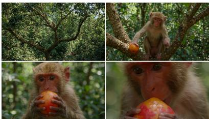

Resonator & Dissonant Augmented StoryEval = 0.44 / PF = 4 / CQ = 5 / NA =5 / CR = 5  
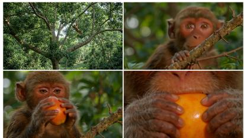  
A monkey swings between trees in astatic wide shot. Hard cuts move to medium and extreme close-upsas it grabs and bites a fruit, accompanied by a quick swoosh, crisp crunch, and playful musical climax...

Divergent Augmented: Bold StoryEval = 0.33 / PF = 3 / CQ = 7 / NA = 4 / CR = 3  
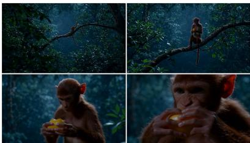  
A wide shot establishes a monkey swinging... close-ups isolate its focused gaze and fruit grab...extreme close-upemphasizes juicy flesh and chewing... soft gripping sounds giving way to crisp bites and clear chewing...  
Ina cool, shadowed jungle, a monkey... A single uninterrupted dolly-inmoves from wide framing to an extreme close-up, with progressively shallower focus and stronger lightingcontrast emphasizing the bite...

Divergent Augmented: Wilder StoryEval = 0.33 / PF = 3 / CQ = 5 / NA = 5 / CR = 5  
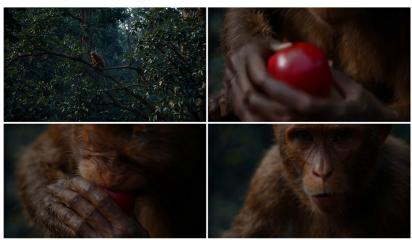

Divergent Augmented: Extreme StoryEval = 0.67 / PF = 5 / CQ = 6 / NA = 5 / CR = 7  
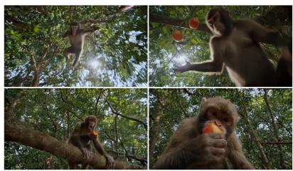  
A monkey swings... Anunbroken push-in tilts downto its hands as it grabs and bites a fruit; drumbeats and amplified breathing build tension, then musicabruptly stops, leaving only gripping and eating sounds...  
Adownward whip panfollows a monkey swinging... alow-angle crash zoom enters slow motionas it grabs a fruit... Heartbeat and a sharp smackpunctuate the grab... it lands and bites with a loud crunch..

Figure 4: Examples that reveal the effect of different candidate skills in the adaptive skill discovery.

Table 6: Prompt-engineering and routing configurations.
<table><tr><td>Method / Stage</td><td>Model 7 point</td><td>Check- Temp. Key Configuration</td><td></td></tr><tr><td>Raw Prompt</td><td></td><td></td><td></td></tr><tr><td>Direct</td><td>LLM Gemini 3.1 Pro</td><td>0.25</td><td>Single-pass rewriting.</td></tr><tr><td>Rewrite VPO</td><td>VPO-5B</td><td>0</td><td>do_sample=False</td></tr><tr><td>Prompt-A-Video</td><td>Prompt_A_Video_CV</td><td>0</td><td>do_sample=False</td></tr><tr><td>Mora: planning / Gemini 3.1 Pro PE</td><td></td><td>0.25</td><td>The video generation agent uses MiniMax-H3 or LTX-2.5 for consistency.</td></tr><tr><td>Mora: first frame</td><td>SDXL Base 1.0</td><td></td><td>1024×576 resolution, 24 inference steps, guidance scale 7.0; the generated image is used as the frame-</td></tr><tr><td>Seed Skill: routing /PE</td><td>Gemini 3.1 Pro</td><td>0.1 / 0ª</td><td>0 condition. Exactly one skill is selected per prompt.</td></tr><tr><td>SkillPE Top</td><td>Gemini 3.1 Pro</td><td>0.1 / 0</td><td>Exactly one skill is selected per prompt.</td></tr><tr><td>SkillPE Top-2</td><td>Gemini 3.1 Pro</td><td>0.1 / 0</td><td>Exactly one skill is selected per prompt.</td></tr><tr><td>SkillPE Overall</td><td>Gemini 3.1 Pro</td><td>0.1 / 0</td><td>Exactly one skill is selected per prompt.</td></tr><tr><td>tion</td><td>H3-native adapta- Gemini 3.1 Pro</td><td>0</td><td></td></tr><tr><td>RAPO: retrieval</td><td>all-MiniLM-L6-v2</td><td></td><td>Author-provided retrieval graph, top-3 locations, five neighbors per category, and similarity thresh-</td></tr><tr><td></td><td>RAPO: refactoring llama3_1_instruct _lora_rewrite</td><td></td><td>old 0.6. Author-provided rewrite checkpoint, BF16 infer- ence.</td></tr><tr><td>RAPO: candidate Gemini 3.1 Pro selection</td><td></td><td>0</td><td>Gemini 3.1 Pro replaces the original trained dis- criminator because the official discriminator model</td></tr><tr><td>eration</td><td>MiniMax-H3 gen- MiniMax-H3 Base FL2VA</td><td></td><td>is not public. 1344× 768, 24 FPS, 10 s, 50 inference steps, video flow shift 12 and audio flow shift 3. Text-only methods use T2VA, whereas Mora uses FL2VA</td></tr><tr><td>LTX-2.5 tion</td><td>genera- LTX-2.5 22B Dis- tilled</td><td></td><td>conditioning. Audio is enabled during generation and delivered as 32-kHz stereo AAC. Same resolution, duration, frame rate, precision, and 8 + 3-step sampler as the standard LTX-2.5 setting, with native prompt enhancement enabled.</td></tr><tr><td>Four-dimensional Gemini 3.1 Pro evaluation</td><td></td><td>0</td><td>Audio is enabled during generation and delivered as 32-kHz stereo AAC. To accommodate the model&#x27;s input format, the videos are transformed into the following format through FFmpeg before evaluation: Full 10s audio-</td></tr></table>

<sup>a</sup> SkillPE routing and rewriting clients explicitly use temperatures of 0.1 and 0, respectively.

Table 7: Sensitivity to video-generation seeds on StoryEval with MiniMax-H3. Values are mean ± sample standard deviation across three seed replicates, where each replicate is first averaged over the sampled prompts.
<table><tr><td>Method</td><td>PF</td><td>CQ</td><td>NA</td><td>CR</td><td>Overall</td></tr><tr><td>Direct LLM Rewrite</td><td> $5 . 9 8 \pm 0 . 1 7$ </td><td> $5 . 9 8 \pm 0 . 0 9$ </td><td> $5 . 0 7 \pm 0 . 3 1$ </td><td> $2 . 4 1 \pm 0 . 0 8$ </td><td> $4 . 8 6 \pm 0 . 1 5$ </td></tr><tr><td>Seed Skill</td><td> $6 . 4 9 \pm 0 . 1 7$ </td><td> $6 . 5 1 \pm 0 . 1 1$ </td><td> $5 . 6 5 \pm 0 . 0 9$ </td><td> $4 . 0 0 \pm 0 . 2 2$ </td><td> $5 . 6 6 \pm 0 . 1 0$ </td></tr><tr><td>SkillPE Top Creativity</td><td> $6 . 0 9 \pm 0 . 1 0$ </td><td> $6 . 5 2 \pm 0 . 0 7$ </td><td> $5 . 6 4 \pm 0 . 1 4$ </td><td> $4 . 3 1 \pm 0 . 2 1$ </td><td> $5 . 6 4 \pm 0 . 0 8$ </td></tr><tr><td>SkillPE Top Overall</td><td> ${ \bf 6 . 5 1 \pm 0 . 0 8 }$ </td><td> $6 . 3 8 \pm 0 . 0 4$ </td><td> ${ \bf 5 . 7 1 \pm 0 . 0 2 }$ </td><td> ${ \bf 4 . 8 5 \pm 0 . 1 0 }$ </td><td> ${ \bf 5 . 8 6 \pm 0 . 0 2 }$ </td></tr></table>

Table 8: Prompt length (mean ± standard deviation, in whitespace-delimited English words) distribution before backbone-specific prompt adaptation.
<table><tr><td>Method Raw Prompt</td><td>StoryEval  $1 6 . 1 \pm 4 . 5$ </td><td>VBench</td></tr><tr><td>Direct LLM Rewrite VPO Prompt-A-Video RAPO Mora Seed Skill</td><td> $4 3 . 2 \pm 1 2 . 6$   $1 0 5 . 8 \pm 8 . 5$   $9 9 . 1 \pm 1 2 . 0$   $4 3 . 4 \pm 1 1 . 4$   $2 9 . 9 \pm 1 5 . 4$   $2 3 4 . 9 \pm 8 4 . 3$ </td><td> $7 . 6 \pm 5 . 9$   $5 2 . 7 \pm 1 9 . 0$   $1 0 1 . 9 \pm 6 . 8$   $9 8 . 1 \pm 1 1 . 3 $   $4 0 . 6 \pm 1 4 . 2$   $2 8 . 0 \pm 1 5 . 3$   $1 4 3 . 0 \pm 9 4 . 0$ </td></tr><tr><td>Libraries selected with MiniMax-H3 SkillPE Top SkillPE Top-2</td><td> $1 7 1 . 0 \pm 6 7 . 2$   $2 1 6 . 4 \pm 7 6 . 2$ </td><td> $1 9 1 . 9 \pm 9 4 . 6 $   $1 8 6 . 2 \pm 8 8 . 0$ </td></tr><tr><td>SkillPE Overall Libraries selected with LTX-2.5</td><td> $1 7 8 . 6 \pm 6 3 . 3$   $1 6 2 . 4 \pm 7 6 . 6$ </td><td> $1 7 8 . 5 \pm 7 3 . 8$ </td></tr><tr><td>SkillPE Top Creativity SkillPE Top-2 Creativity SkillPE Overall</td><td> $1 8 2 . 3 \pm 8 5 . 9$   $1 6 6 . 1 \pm 9 0 . 8$ </td><td> $1 5 1 . 0 \pm 7 3 . 0$   $1 8 2 . 2 \pm 9 2 . 3 $   $1 5 2 . 0 \pm 8 6 . 2$ </td></tr></table>

Table 9: Robustness of the human evaluation under two-way bootstrap resampling over prompts and annotators. Intervals are pointwise 95% percentile confidence intervals.
<table><tr><td>Comparison</td><td>∆ 4D Avg. [95% CI]</td></tr><tr><td>SkillPE Top – Seed</td><td>+0.359 [0.245, 0.464]</td></tr><tr><td>SkillPE Top-2 – Seed</td><td>+0.242 [0.114, 0.364]</td></tr><tr><td>SkillPE Overall – Seed</td><td>+0.329 [0.214, 0.447]</td></tr></table>