# SolveEdit: Benchmarking Visual Problem Solving in Generative Models

Wenjie Shu1,†, Yexin Liu2,†, Harold Haodong Chen2, Xuerui Qiu3, Zehan Wang4, Yidi Zhang1, Yizhan Chen1, Zunwei Wang1, Minghao Liu5, Qi Chen1,\*, Harry Yang2,\*, and Xiaogang Xu4

1ZODA, 2HKUST, 3UCAS, 4ZJU, 5UTokyo

†Equal contribution. \*Corresponding authors.

Machine intelligence is often evaluated through abstract reasoning problems, yet many real-world problems are visual, such as arranging objects, repairing layouts, or tracing routes. Solving these problems requires understanding a scene, inferring what must change to achieve a goal, and realizing that change without disturbing unrelated content. However, existing benchmarks mainly evaluate perception, generation, or explicitly specified transformations, leaving goal-driven visual problem solving underexplored. To bridge this gap, we introduce SolveEdit, a benchmark for visual problem solving through scene transformation. Given an image and a goal, a model must infer a valid transformation from the request, the scene, or a visually expressed rule, then execute it while preserving unrelated content. SolveEdit contains 2,728 cases. Atomic transition contracts specify required and protected conditions, enabling SolveScore to measure completion and unintended changes without a single reference output. The strongest evaluated model achieves only 57.0% SolveScore. We further introduce SolveEdit-Plan, a two-stage visual planner that instantiates the transition before generation. Under matched single-generation evaluation, it improves SolveScore by 9.1 points on average across three tested generators, including a gain from 57.0% to 71.6% for GPT-Image-2, without modifying the editor.

€ Project https://wenjieshu.github.io/SolveEdit-project-page/ § Code https://github.com/WenjieShu/SolveEdit

## 1. Introduction

Machine intelligence is usually tested with abstract reasoning problems, but much real-world problem solving starts in front of a visual scene, as in Figure 1. Given the scene and a goal, the system has to understand the current state, work out what should change, produce a valid final state, and leave unrelated content alone. Visual interpretation, transition determination, and execution all enter the process. We study this capability as visual problem solving through scene transformation: the model answers by changing the scene, not by returning text.

Current evaluations tend to isolate perception, abstract reasoning, generation, or the execution of explicitly specified transformations.

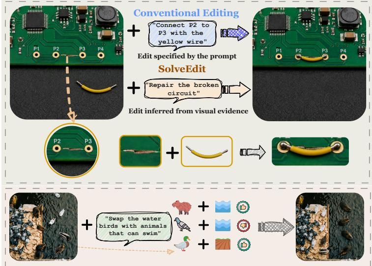  
Figure 1: SolveEdit: infer, execute, preserve.

Instruction-based editing benchmarks, for example, check whether a model can carry out a stated change while preserving the rest of an image [3, 35, 40, 53, 69]. Newer image-to-image benchmarks add temporal, causal, spatial, logical, factual, procedural, and planning tasks [19, 61, 72]. What they do not isolate is where the required transformation comes from: the request, the current scene, or a rule expressed in the image. Executing a specified transformation and inferring an unresolved one can therefore be scored together. Reference-based scoring adds a second problem: valid solutions that difer from the single authored output may be penalized. These gaps lead to our central question: Can a generative model determine a valid transformation from a source image and a goal, and then realize it in the same scene?

We answer with SolveEdit, which puts transition determination inside the visual problem instead of supplying it through the prompt. The distinction matters. A model can execute a familiar edit pattern without working out what the current scene requires, just as a language model that has memorized facts or solution templates need not generalize to a new configuration. We therefore control the source of the information that fixes a valid transition. The 2,728 cases, spread over 10 domains and 54 subdomains, fall into three regimes. In Instruction-Specified (IS) cases the prompt specifies the change. In State-Dependent (SD) cases the model resolves a missing variable from observable scene state or basic spatial and structural relations. In Rule-Dependent (RD) cases it interprets a rule expressed in the image, sometimes with knowledge beyond the immediate scene. Removing a grounded marker is IS; placing a block in the only empty slot is SD; sorting pieces by a depicted legend is RD. Instruction following, scene understanding, and rule inference are thus separated within one generative task. The axis is orthogonal to content domain and task type. The same spatial operation can land in IS, SD, or RD depending on what fixes its valid outcome.

More than one solution can be valid, so each case carries an atomic transition contract. Required conditions state what the output must accomplish; protected conditions state what must remain intact. SolveScore measures required completion, applies a bounded deduction for unintended changes, and reports six diagnostic scores across the required and protected semantic, relational, and visual-quality conditions. The same contracts score image edits and final frames from video generators.

We evaluate nine image-to-image models and two image-to-video models on the same contracts. The strongest of them reaches only 57.0% SolveScore, which leaves substantial room for improvement. Its diagnostic scores show larger deficits in required semantic and relational conditions than in visual-quality ones; solution recovery appears to be a large part of the failure. That diagnosis suggests a direct test: determine the transition before generation. We run it with SolveEdit-Plan, a two-stage agentic visual planner that instantiates scene-dependent transition variables and writes an evidence-grounded editing instruction, with no training or changes to the editor. Under matched single-generation evaluation, it takes GPT-Image-2 from 57.0% to 71.6% SolveScore, transfers to the open-source editor and the video generator, and beats a call-matched Generic Vision Rewrite control by 6.3 points on GPT-Image-2, with higher required completion and less collateral damage overall.

Our contributions are threefold:

❶ A problem formulation and benchmark. We formulate visual problem solving through scene transformation and introduce SolveEdit, a benchmark of 2,728 cases across 10 application domains and 54 subdomains, organized by the information source that determines the required transition.

❷ A contract-based evaluation framework. We define atomic transition contracts and SolveScore to accommodate multiple valid visual outcomes, separate required completion from collateral changes, and give six diagnostic views of model behavior.

❸ A diagnosis and targeted intervention. We analyze current image and video generators across the IS, SD, and RD regimes, and introduce SolveEdit-Plan to test whether explicitly instantiating the transition addresses the observed deficits in required semantic and relational conditions.

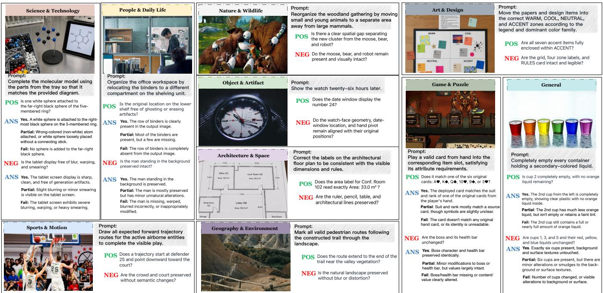  
Figure 2: Application breadth of SolveEdit. One representative case from each of ten domains. Panels show the source, instruction, evaluator questions, and reference answers.

## 2. Related Work

Visual Reasoning and Image Editing. Visual reasoning has progressed from language or discrete-answer benchmarks to tasks that infer transformations or realize answers as images and videos [6, 7, 10, 18, 27, 30, 39, 41, 50, 67]. Image-editing methods generally receive the desired change explicitly, including both instruction-based [3, 28, 49, 66, 69, 71] and training-free approaches [2, 5, 20, 31, 42, 43, 45, 51]. More recent benchmarks extend editing evaluation to grounded correctness, preservation, knowledge, reasoning, and planning [19, 35, 40, 46, 53, 61, 68, 72, 73]. Our focus is complementary: SolveEdit makes the source of transition-defining information an explicit evaluation axis and uses required and protected contracts to allow multiple valid renderings while measuring collateral changes. It also spans heterogeneous visual sources, including photographs, animation, games, cinematic frames, and purpose-built scenes, testing whether transition recovery transfers across visual styles. Figure 2 shows this breadth.

Evaluation of Generated Visual Content. Distributional and embedding metrics measure fidelity or cross-modal alignment [21, 22, 47]; learned preference and object-focused evaluators provide more targeted text-to-image signals [16, 60, 62]; and question-based evaluators decompose outputs into interpretable judgments [9, 24, 34, 59]. These metrics primarily score an image or its alignment with text. In contrast, SolveEdit evaluates a transition between an input and an output. Its atomic contracts separate required completion from independently protected content, allow multiple valid final states, and report collateral damage separately from task completion.

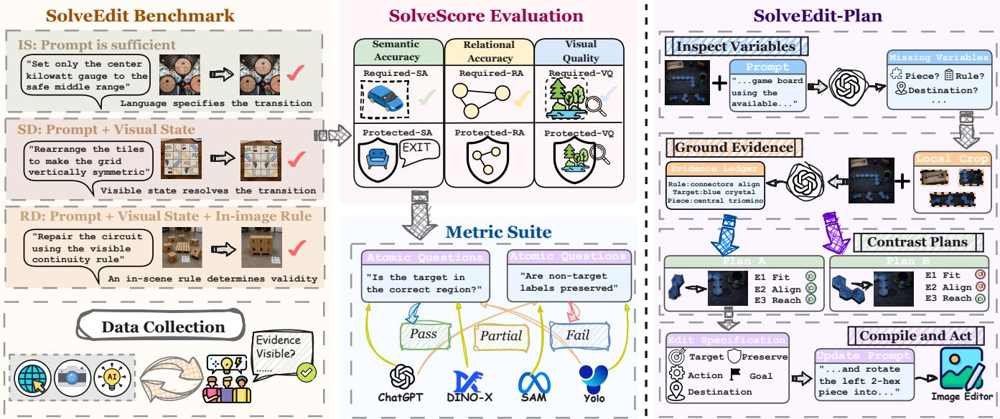  
Figure 3: Overview of SolveEdit, SolveScore, and SolveEdit-Plan. Left: cases are grouped by the information needed to determine a valid edit. Center: atomic criteria specify the required change and the visual state to preserve; SolveScore aggregates their satisfaction. Right: SolveEdit-Plan instantiates the transition and compiles an instruction for an unmodified editor.

Multimodal Reasoning for Visual Generation. Reasoning-action agents, tool-using models, and multimodal language models provide foundations for visually grounded planning [8, 13, 48, 52, 65]. Visual agents compose tools or foundation models for multi-step generation and editing [54, 56, 63], while editing systems increasingly use multimodal understanding, intent interpretation, or intermediate plans [11, 15, 23, 25, 29]. SolveEdit-Plan addresses a narrower question: whether a task-specific transition can be recovered before one call to an unchanged generator. It uses targeted observation, candidate comparison, and explicit preservation obligations, with a matched planning backend, call budget, and final generator. For video, we use terminal frames only to test transfer of the same transition contracts across modalities; temporal generation is outside our scope [1, 14, 26, 32, 33, 64].

## 3. SolveEdit: Formulation, Benchmark, and Evaluation

## 3.1. Task Formulation and Dependency Regimes

Let I be an input image and x a natural-language request. Writing the editor as $Y = f ( I , x )$ hides the edit that satisfies x in this particular scene. We make that edit explicit as a specification z listing the relevant entities, the action, the final state, and the preservation scope. Correctness is not one target image. Several specifications z can satisfy the same request, and we collect them in the set ${ \mathcal { Z } } ^ { * } ( I , x )$ . Figure 3 places this set next to the transition contract and the planning interface.

Once visible entities are grounded, the remaining question is what fixes z. The image is always used for localization and rendering, so it stays in the pipeline regardless of regime. Four ingredients can enter: request-to-entity bindings $B ( I , x )$ , background knowledge K, current-scene facts $S ( I )$ , and an in-scene rule $\mathcal { R } ( I )$ (a legend, a constraint, or a repeated pattern). Eq. equation 1 writes the admissible set as a function Φ of these four:

$$
\mathcal { Z } ^ { \ast } ( I , x ) = \Phi ( x , B ( I , x ) , K , S ( I ) , \mathcal { R } ( I ) ) .\tag{1}
$$

A generated image Y belongs to ${ \mathcal { V } } ^ { * } ( I , x )$ under two conditions: it realizes some $z \in \mathcal { Z } ^ { * } ( I , x )$ , and visual

state outside that z is preserved:

$$
\begin{array} { r } { \mathcal { V } ^ { * } ( I , x ) = \{ Y : \exists z \in \mathcal { Z } ^ { * } ( I , x ) , \mathrm { R e a l i z e } ( Y ; I , z ) \land \mathrm { P r e s e r v e } ( Y ; I , z ) \} . } \end{array}\tag{2}
$$

Two renderings of the same z both count. A plausible rendering of the wrong z does not.

The three regimes do not overlap, even though background knowledge K may be used in any of them. The label is assigned after grounding and K are applied: it records which case-specific piece of information fixes the solution. Under that rule, IS means the grounded request already fixes z; SD means a current-scene fact resolves a variable the request leaves open (target, action, destination, route, or final state); RD means the model also reads a rule shown or instantiated in the image. The label uses the minimum information needed, so it is not a dificulty rating. Appendix A.2 gives the decision protocol, including examples that distinguish adjacent regimes.

Annotators follow a fixed procedure. They first bind the request to visible entities, then ask whether the grounded request together with K fixes the transition. If it does not, a current-scene fact or a case-local rule must resolve the remaining variable, and that fact decides the label. Ordinary localization stays in IS; knowledge that never appears in the image cannot make a case RD. The label is therefore operational, not a claim about model architecture: IS cases still require visual grounding, and an RD case can be easier than an IS case under the same protocol.

A case can fail in two distinct ways. The model may settle on an invalid $z ,$ choosing an occupied destination or applying the wrong visible rule. Or it may recover a valid z and fail to render it: the route comes back disconnected, an object lands in the wrong place, or unrelated content changes. We call the first a solution-recovery error and the second a visual-execution error. The evaluation covers both: it scores the solved state and, separately, the content that should have stayed unchanged.

## 3.2. Benchmark Construction and Coverage

The 2,728 cases are each built around a visual problem in a concrete application. The request given to the model states only the goal. It never reveals the scene state or rule attached to the case’s regime. Behind each case, the authors record the evidence needed to resolve the request, mark one or more admissible final states, and mark the content allowed to change. A case survives review only when four conditions hold: the intended change is semantically checkable; its evidence is visible in the image; correctness can be stated without matching an exact reference; and the change can be separated from protected content. Cases that fail, or rest on private assumptions, are revised or rejected before entering the manifest.

Each retained case is stored as

$$
c = \left( I , x , m , \mathcal { C } ^ { \mathrm { r e q } } , \mathcal { C } ^ { \mathrm { p r o } } , \mathcal { A } \right) ,\tag{3}
$$

Here m holds descriptive metadata, Creq and ${ \mathcal { C } } ^ { \mathrm { p r o } }$ hold the required and protected conditions, and A holds optional audit assets. A reference edit may be attached to show one admissible solution; it has no role in defining correctness. The request shown to the model and the evidence used to annotate the case are stored separately from the model input.

The 10 domains and 54 subdomains cover people and everyday life, natural and environmental systems, objects and mechanisms, architecture and space, science and technology, geography and maps, art and design, sports and motion, games and puzzles, and general scenes. A domain label records the setting rather than the entities, and it is independent of the regime. Photographic, animated, cinematic, game, and purpose-built imagery all appear, with underrepresented settings and transitions authored on purpose. Figure 4 gives this coverage and the request distribution. Source diversity alone does not qualify a case: the image has to support a well-defined problem that can be checked visually.

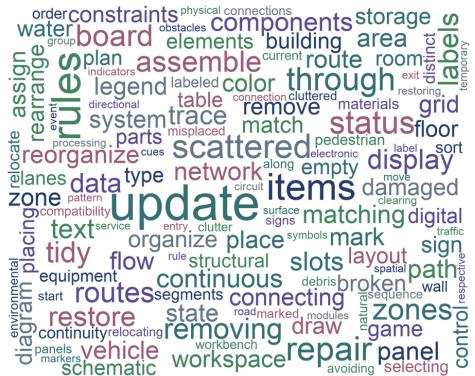

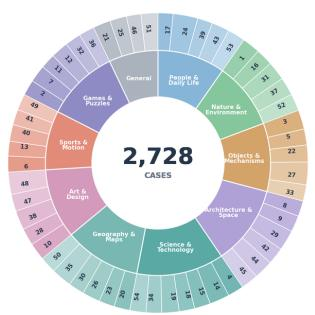

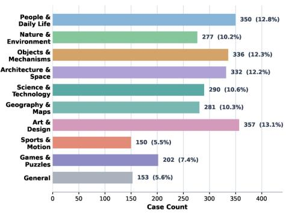  
Figure 4: Statistics of the 2,728-case SolveEdit benchmark. Left: frequent request terms. Center: coverage across 10 domains and 54 subdomains. Right: cases per domain.

Quality control checks image validity, request grounding, contract coverage, dependency evidence, and split integrity. Shared scenes and near duplicates are grouped before splitting. Cases are revised or withheld if the request, visible evidence, and hidden contract disagree. Appendix A gives the review procedure.

## 3.3. Atomic Evaluation and SolveScore

No one reference image covers ${ \mathcal { V } } ^ { * } ( I , x )$ . We therefore pair each case with an atomic transition contract. Every criterion $q$ makes a single observable claim, with the pass, partial, and fail conditions and the evidence needed to judge it written out. The evaluator returns $a _ { q } \in \{ 1 , 0 . 5 , 0 \}$ . It abstains when the input or output lacks suficient visible evidence.

Criteria have two roles and three diagnostic properties. Required criteria state what the edit must accomplish, and protected criteria state what must remain intact. A target car left outside a valid space fails a required condition; a second car moved by mistake fails an independent protected one. We keep a protected criterion only when it can fail with every required condition passing, so one error is never counted twice.

SA covers entities, identities, counts, attributes, text, symbols, and intrinsic states. RA covers spatial and structural relations: placement, ordering, containment, connectivity, topology. VQ covers visible rendering defects such as residual traces, malformed geometry, and illegible content. Crossing the two roles with the three properties gives six cells. For role $r \in \{ \mathrm { r e q } , \mathrm { p r o } \}$ and property $k \in \{ \mathrm { S A } , \mathrm { R A } , \mathrm { V Q } \}$

$$
S _ { r , k } = \frac { \sum _ { q : r ( q ) = r , d ( q ) = k , a _ { q } \neq \perp } \omega _ { q } a _ { q } } { \sum _ { q : r ( q ) = r , d ( q ) = k , a _ { q } \neq \perp } \omega _ { q } } ,\tag{4}
$$

$a _ { q } = \perp$ marks an abstention, and only non-abstained atoms enter the sums. All six scores are higher-is-better.   
The weights are hierarchical, so redundant criteria or mechanically split atoms cannot inflate a requirement.

With normalized weights $w _ { q }$ and $u _ { q } ,$ each summing to one over the required and protected criteria, completion and damage are

$$
R = \sum _ { q \in \mathcal { C } ^ { \mathrm { r e q } } } w _ { q } a _ { q } , \qquad D = \sum _ { q \in \mathcal { C } ^ { \mathrm { p r o } } } u _ { q } ( 1 - a _ { q } ) .\tag{5}
$$

Abstained criteria add zero without redistributing weight. The case score is

$$
\mathrm { S o L v E S c o R E } _ { \lambda } = G _ { \mathrm { q u a l i t y } } \mathrm { m a x } ( 0 , R - \lambda D ) ,\tag{6}
$$

Gquality rejects outputs that are missing, blank, severely corrupted, unrelated to the request, or unusable. The primary protocol uses $\lambda = 0 . 5 \mathrm { : }$ completion stays the main objective, and damage can remove at most half the score. Cases are scored individually before averaging. We report R, D, the six diagnostics, the quality-gate pass rate, and coverage separately; coverage is the share of criterion weight with a non-abstained verdict. Appendix B covers weights, abstentions, and authoring rules.

A VLM performs most of the evaluation. A fixed subset of criteria is also assigned to specialized checkers beforehand, and the assignment is the same for every model. These are the conditions where VLM judgments are less reliable or a tool gives a more objective check. The evaluator sees the input, output, request, and full contract; the generator never sees the contract. For assigned criteria, SAM and YOLO supply segmentation and detection evidence next to the VLM’s interpretation. Their output is a quality gate plus atomic verdicts with evidence, and a deterministic scorer aggregates them without further judgment. All editors use the same protocol, VLM version, and scoring code. Generation failures, gate failures, coverage, and abstentions are reported apart from the aggregate score, making the limits of the available evaluation evidence visible.

## 4. Planning Before Editing

SolveEdit-Plan tests whether a model can determine the transition before it renders anything. It is a two-stage test-time planner with no learned parameters, and the editor is left unchanged. The first stage, Inspect, finds the unresolved variables and gathers targeted visual evidence. The second, Resolve, compares plausible transitions and compiles the chosen one into an instruction for a single call to the original editor:

$$
( \hat { z } , \hat { O } , \tilde { x } ) = H ( I , x ) , \qquad \hat { Y } = f ( I , \tilde { x } ) ,\tag{7}
$$

Here zˆ is the selected transition, $\hat { O }$ the observable completion and preservation obligations, and x˜ the instruction handed to the unchanged final generator.

Transition planning. Inspect looks for variables the request leaves unresolved: target, action, destination, final state, preservation scope. It requests targeted crops for those variables and records the evidence each crop provides. Resolve then compares the plausible transitions against that evidence. The transition it selects is compiled into completion conditions and preservation obligations for the final editing call to the unchanged generator, including the scene content to preserve.

Generation interface and control. The compiled instruction goes to the original generator in one call. The obligations in Oˆ shape that instruction, but they are not the human-authored contract SolveScore uses, and the intermediate transition gets no supervision or evaluator feedback. At inference the planner sees only the source image and the goal: no reference outputs, contracts, authored regions, manual facts, dependency labels, or evaluator responses. The matched control, Generic Vision Rewrite, runs on the same backend with two agent calls and one final generation. It returns an unconstrained rewritten instruction, without explicit transition variables, candidate comparison, or preservation obligations. Appendix C gives the agent configuration, schemas, accounting rules, and implementation details.

## 5. Experiments

We organize our experiments around three questions linking performance, diagnosis, and planning. RQ1: How well do current generative models solve SolveEdit tasks? RQ2: What do visually plausible failures reveal about the limitations of current models? RQ3: Does explicitly determining the transition before generation improve task completion and preservation with a fixed generator?

Table 1: Performance on SolveEdit (%, higher is better). Best SolveScore is bold. Evaluation coverage is reported in Appendix C; video outputs are scored from their final frames. SA, RA, and VQ denote Semantic Accuracy, Relational Accuracy, and Visual Quality.
<table><tr><td rowspan="2">Model</td><td colspan="3">Required</td><td colspan="3">Protected</td><td rowspan="2">R↑</td><td rowspan="2">D↓</td><td rowspan="2">SOLVESCORE↑</td></tr><tr><td>SA↑</td><td>RA↑</td><td>VQ↑</td><td>SA↑</td><td>RA↑</td><td>VQ↑</td></tr><tr><td colspan="10">Image-to-Video Models</td></tr><tr><td>HunyuanVideo-1.5 [55]</td><td>16.9</td><td>17.9</td><td>22.5</td><td>42.2</td><td>57.4</td><td>41.9</td><td>17.3</td><td>55.5</td><td>7.4</td></tr><tr><td>Kling V3 [36]</td><td>37.6</td><td>37.1</td><td>54.7</td><td>64.1</td><td>59.7</td><td>75.5</td><td>39.1</td><td>34.0</td><td>27.5</td></tr><tr><td colspan="10">Open-Source Models</td></tr><tr><td>OmniGen2 [58]</td><td>19.8</td><td>16.2</td><td>25.4</td><td>49.9</td><td>64.3</td><td>53.4</td><td>18.1</td><td>45.9</td><td>9.7</td></tr><tr><td>BAGEL [12]</td><td>27.9</td><td>20.0</td><td>24.2</td><td>51.7</td><td>60.7</td><td>53.6</td><td>22.4</td><td>45.5</td><td>12.1</td></tr><tr><td>FLUX.1 Kontext [dev] [38]</td><td>25.4</td><td>20.5</td><td>40.3</td><td>76.4</td><td>75.8</td><td>80.0</td><td>24.2</td><td>22.5</td><td>18.7</td></tr><tr><td>Qwen-Image-Edit-2509 [57]</td><td>36.4</td><td>28.2</td><td>45.8</td><td>48.1</td><td>53.9</td><td>56.4</td><td>32.7</td><td>47.5</td><td>20.8</td></tr><tr><td>FLUX.2 [dev] [37]</td><td>38.9</td><td>30.6</td><td>51.7</td><td>62.9</td><td>65.3</td><td>77.3</td><td>31.7</td><td>32.3</td><td>22.8</td></tr><tr><td colspan="10">Commercial Models</td></tr><tr><td>Qwen Image 2.0 Pro [70]</td><td>53.0</td><td>47.6</td><td>68.0</td><td>65.0</td><td>68.7</td><td>81.6</td><td>50.7</td><td>28.8</td><td>40.6</td></tr><tr><td>Gemini 3.1 Flash Image [17]</td><td>68.3</td><td>64.0</td><td>78.0</td><td>71.5</td><td>72.3</td><td>88.4</td><td>66.0</td><td>23.1</td><td>55.5</td></tr><tr><td>Seedream 5.0 Pro [4]</td><td>65.1</td><td>63.0</td><td>76.0</td><td>79.4</td><td>75.5</td><td>92.2</td><td>64.3</td><td>17.6</td><td>56.6</td></tr><tr><td>GPT-Image-2 [44]</td><td>69.6</td><td>64.6</td><td>81.7</td><td>71.7</td><td>65.2</td><td>90.7</td><td>67.6</td><td>23.9</td><td>57.0</td></tr></table>

## 5.1. Experimental Setup

Models and inputs. We evaluate nine image-to-image models (five open-weight and four commercial) and two image-to-video models on the same 2,728-case benchmark manifest. Table 1 lists all evaluated systems. In the direct evaluation, every model receives the same source image and intent-level request, and we score one output per case. The planning comparisons use GPT-Image-2, Qwen-Image-Edit-2509, and HunyuanVideo-1.5 with fixed final generators; controls and planning budgets are described in RQ3.

Evaluation protocol. Outputs are scored with the same hidden transition contracts and deterministic SolveScore aggregation, using λ = 0.5 throughout. The evaluator receives the source image, request, model output, and contract; the contract is withheld from the generator. Scores are computed per case and averaged over the full manifest, giving each case equal overall weight. Failed generations are retried at most twice; missing or unusable outputs receive zero scores and remain in the denominator. Video outputs are scored from their final frame with the same contract; this evaluates the completed visual state and treats video results as a complementary cross-modal study, not a temporal-reasoning benchmark. Generation settings, retry policy, The public appendix summarizes the scoring and evaluation boundary; implementation materials are provided in the release artifact.

## 5.2. How Well Do Current Models Solve Visual Problems? (RQ1)

Overall performance. Table 1 reports semantic, relational, and visual-quality scores for required and protected content, together with task completion R and collateral damage D. GPT-Image-2 obtains the highest SolveScore at 57.0% among the eleven systems evaluated here, followed closely by Seedream 5.0 Pro (56.6%) and Gemini 3.1 Flash Image (55.5%). Commercial image editors substantially outperform the open-source systems, while the image-to-video models remain weaker under the final-frame protocol. Even the strongest model leaves substantial completion and preservation errors.

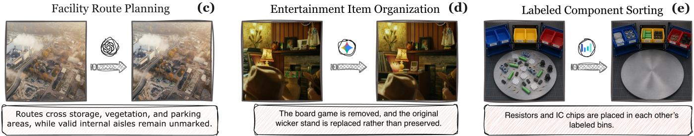

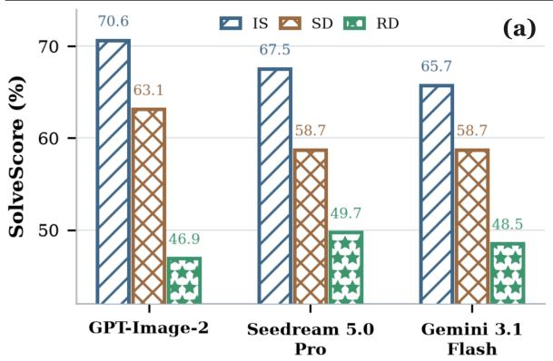

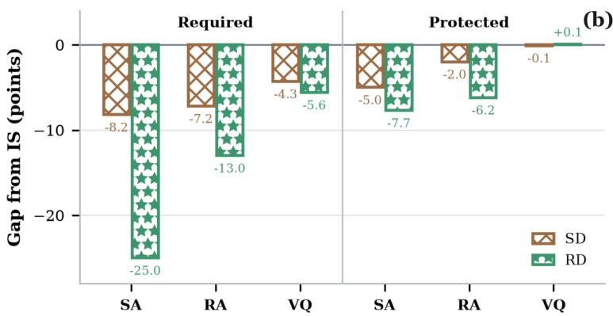  
Figure 5: Reasoning failures behind visually plausible outputs. Top left: SolveScore across IS, SD, and RD for the three leading models. Top right: application-domain-adjusted diagnostic gaps from IS, pooled across models and separated into required and protected conditions. Bottom: representative outputs that remain visually coherent but violate task-specific spatial, semantic, or rule-based requirements.

Completion and preservation. Similar aggregate scores can conceal diferent completion and preservation profiles. GPT-Image-2 has the highest task-completion score $( R = 6 7 . 6 \% )$ , but incurs more collateral damage than Seedream (D = 23.9% versus $D = 1 7 . 6 \% )$ . Seedream therefore reaches a similar overall score through better preservation rather than higher completion. The near tie does not imply interchangeable behavior: improving task completion alone can leave substantial unintended changes unaddressed. Moreover, required visual quality exceeds required semantic and relational accuracy for all three leading models in Table 1. Visually coherent outputs thus remain an incomplete indicator of task success. These diagnostics identify which conditions fail; the regime-wise analysis below examines how these failures relate to the information needed to determine the transition.

## 5.3. What Do Visually Plausible Failures Reveal? (RQ2)

Performance declines with information dependence. Current models often produce coherent edits that nevertheless fail the task. We compare the three information-dependence regimes, IS, SD, and RD, and separate failures to satisfy required conditions from collateral changes to protected content. For each diagnostic cell, we compare regimes within application domains and aggregate the diferences using common domain weights. This adjustment reduces the influence of domain composition, helping distinguish the observed regime gaps from diferences in the mixture of task categories; the public appendix documents the regime labels and scoring protocol.

Diagnostic gaps. Figure 5(a) shows a consistent gap from IS to RD for three leading models: RD trails IS by 17.2 to 23.7 points, while the SD gaps range from 7.0 to 8.8 points. This ordering is consistent with the additional information required to determine the transition: IS cases can be solved from the grounded request, whereas SD and RD cases require recovery of scene state or an in-image rule. After adjusting for domain composition, Figure 5(b) shows that the largest deficits from IS to RD occur in required semantic (-25.0 points) and relational (-13.0 points) conditions, compared with -5.6 points for required visual quality;

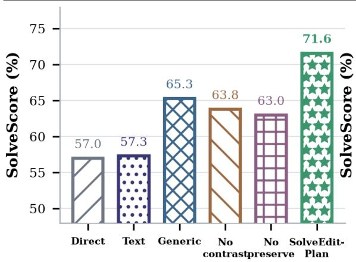

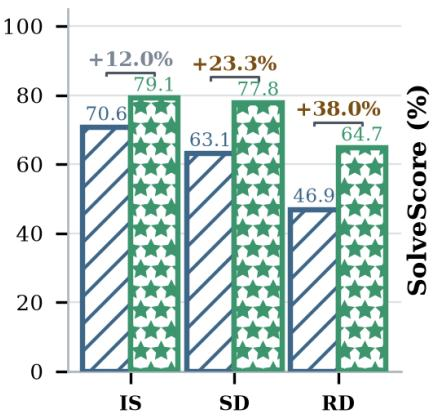

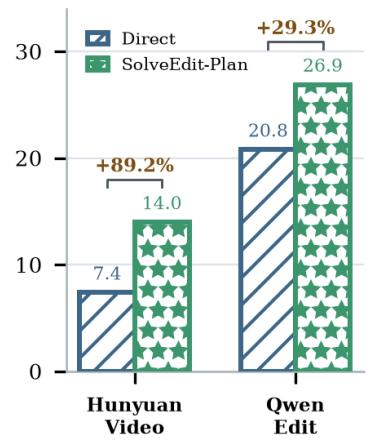  
Figure 6: Efect of explicit transition inference. Left: GPT-Image-2 controls and component ablations. Middle: GPT-Image-2 gains by dependency level. Right: Direct versus SolveEdit-Plan across fixed generators. Every method uses one final generation.

protected dimensions show smaller deficits (-7.7, -6.2, +0.1 for SA, RA, VQ), with visual-quality preservation near neutral. This asymmetry indicates that the regime gap is concentrated in satisfying the requested change, with a much smaller deterioration in preserving unrelated content. Together with the qualitative examples in Figure 5(c) to (e), this pattern suggests that solution-recovery errors are a major contributor, rather than the failures arising only from visual execution. The regimes describe information dependence, not a prescribed dificulty ranking. This motivates testing explicit transition planning.

## 5.4. Does Explicit Transition Determination Improve a Fixed Generator? (RQ3)

Matched comparison. We compare Direct, Text-only Rewrite, Generic Vision Rewrite, and SolveEdit-Plan under a matched one-call final-generation budget from the same fixed editor. This holds the case manifest, output count, and scoring contract constant while testing whether explicit transition inference helps beyond longer instructions. The ablations remove contrastive checking or preservation inference; protocol details are provided in Appendix C.

Main gains and ablations. SolveEdit-Plan improves GPT-Image-2 from 57.0 to 71.6 SolveScore, outperforming the budget-matched Generic Vision Rewrite by 6.3 points. The gain transfers to the tested open-source image editor and video generator without changing the parameters of either final generator. Compared with generic rewriting, required completion increases from 72.8 to 75.8, while collateral damage decreases from 16.3 to 8.6. The larger gains on SD and RD are consistent with the information-dependent failures diagnosed in RQ2; full ablations and regime-wise results are reported in Appendix C. Figure 6 summarizes the controls, ablations, regime-wise gains, and cross-generator transfer. Additional per-category and per-regime results, generation success, evaluator coverage, λ sensitivity, and component ablations are reported in Appendix C for completeness.

## 5.5. Further Analysis: Cost and Cross-Generator Transfer

Planning cost. The planning intervention adds a measurable test-time cost. Each case uses two LLM calls, one for Inspect and one for Resolve, with an average of 3,207 input tokens and 635 output tokens. This adds computation before the same single final generation, so the gains over Direct are obtained with additional planning computation. The stronger control is Generic Vision Rewrite: with the same planning backend and call budget, SolveEdit-Plan achieves a higher score on GPT-Image-2, supporting the value of structured transition planning within that budget. Equal call counts do not imply equal token use; implementation-dependent latency and cost accounting are provided in Appendix C.

Transfer across generators. The improvement is not limited to GPT-Image-2: under the same case manifest and transition contracts, SolveEdit-Plan increases SolveScore from 20.8% to 26.9% for Qwen-Image-Edit-2509 and from 7.4% to 14.0% for HunyuanVideo-1.5. Both generators improve required completion and reduce collateral damage (Table 4), showing that the gains extend to both parts of the transition contract. This supports the applicability of the planning procedure through the instruction interface for the tested image and video generators, despite their diferent generation architectures and output modalities. Their low absolute scores nevertheless leave substantial residual error: these results establish neither reliable task completion nor whether the remaining failures originate in planning or generation.

## 6. Conclusion

We introduced visual problem solving through generative transformation of an existing visual scene. In this setting, a model must determine a valid transition from the request and visual evidence, realize it in the output, and preserve unrelated content. SolveEdit provides 2,728 cases organized by the information that determines the required change, while atomic transition contracts and SolveScore measure completion and preservation without requiring a single reference output. Across the evaluated generators, the strongest model achieves only 57.0% SolveScore, with larger deficits on scene- and rule-dependent transitions than on instruction-specified cases. SolveEdit-Plan provides a targeted test of this diagnosis: explicitly recovering the transition before one call to an unchanged generator improves GPT-Image-2 from 57.0% to 71.6% under a matched final-generation budget and transfers to the tested open-source image editor and video generator. Together, these results establish a controlled benchmark for studying transition determination, visual execution, and preservation in generative visual problem solving.

## References

[1] Omer Bar-Tal, Hila Chefer, Omer Tov, Charles Herrmann, Roni Paiss, Shiran Zada, Ariel Ephrat, Junhwa Hur, Guanghui Liu, Amit Raj, et al. Lumiere: A space-time difusion model for video generation. In SIGGRAPH Asia 2024 conference papers, pages 1–11, 2024.

[2] Manuel Brack, Felix Friedrich, Katharia Kornmeier, Linoy Tsaban, Patrick Schramowski, Kristian Kersting, and Apolinário Passos. Ledits++: Limitless image editing using text-to-image models. In Proceedings of the IEEE/CVF conference on computer vision and pattern recognition, pages 8861–8870, 2024.

[3] Tim Brooks, Aleksander Holynski, and Alexei A Efros. Instructpix2pix: Learning to follow image editing instructions. In 2023 IEEE/CVF Conference on Computer Vision and Pattern Recognition (CVPR), pages 18392–18402. IEEE, 2023.

[4] ByteDance Seed. Seedream 5.0 pro. https://seed.bytedance.com/en/seedream5\_0\_pro, 7 2026.

[5] Mingdeng Cao, Xintao Wang, Zhongang Qi, Ying Shan, Xiaohu Qie, and Yinqiang Zheng. Masactrl: Tuning-free mutual self-attention control for consistent image synthesis and editing. In 2023 IEEE/CVF International Conference on Computer Vision (ICCV), pages 22503–22513. IEEE, 2023.

[6] Harold Haodong Chen, Disen Lan, Wen-Jie Shu, Qingyang Liu, Zihan Wang, Sirui Chen, Wenkai Cheng, Kanghao Chen, Hongfei Zhang, Zixin Zhang, Rongjin Guo, Yu Cheng, and Ying-Cong Chen. TiViBench: Benchmarking think-in-video reasoning for video generative models. arXiv preprint arXiv:2511.13704, 2025.

[7] Liang Chen, Weichu Xie, Yiyan Liang, Hongfeng He, Hans Zhao, Zhibo Yang, Zhiqi Huang, Haoning Wu, Haoyu Lu, Yiping Bao, et al. Babyvision: Visual reasoning beyond language. arXiv preprint arXiv:2601.06521, 2026.

[8] Zhe Chen, Jiannan Wu, Wenhai Wang, Weijie Su, Guo Chen, Sen Xing, Zhong Muyan, Qinglong Zhang, Xizhou Zhu, Lewei Lu, Bin Li, Ping Luo, Tong Lu, Yu Qiao, and Jifeng Dai. Intern vl: Scaling up vision foundation models and aligning for generic visual-linguistic tasks. 2024 IEEE/CVF Conference on Computer Vision and Pattern Recognition (CVPR), pages 24185–24198, 2023. URL https://api. semanticscholar.org/CorpusID:266521410.

[9] Jaemin Cho, Yushi Hu, Jason Baldridge, Roopal Garg, Peter Anderson, Ranjay Krishna, Mohit Bansal, Jordi Pont-Tuset, and Su Wang. Davidsonian scene graph: Improving reliability in fine-grained evaluation for text-to-image generation. In International conference on learning representations, volume 2024, pages 15625–15645, 2024.

[10] François Chollet. On the measure of intelligence. arXiv preprint arXiv:1911.01547, 2019.

[11] En Ci, Shanyan Guan, Yanhao Ge, Yilin Zhang, Wei Li, Zhenyu Zhang, Jian Yang, and Ying Tai. Describe, don’t dictate: Semantic image editing with natural language intent. In IEEE/CVF International Conference on Computer Vision, 2025. doi: 10.1109/ICCV51701.2025.01783.

[12] Chaorui Deng, Deyao Zhu, Kunchang Li, Chenhui Gou, Feng Li, Zeyu Wang, Shu Zhong, Weihao Yu, Xiaonan Nie, Ziang Song, et al. Emerging properties in unified multimodal pretraining. arXiv preprint arXiv:2505.14683, 2025.

[13] Danny Driess, Fei Xia, Mehdi SM Sajjadi, Corey Lynch, Aakanksha Chowdhery, Brian Ichter, Ayzaan Wahid, Jonathan Tompson, Quan Vuong, Tianhe Yu, et al. Palm-e: An embodied multimodal language model. arXiv preprint arXiv:2303.03378, 2023.

[14] Chaoyou Fu, Yuhan Dai, Yongdong Luo, Lei Li, Shuhuai Ren, Renrui Zhang, Zihan Wang, Chenyu Zhou, Yunhang Shen, Mengdan Zhang, Peixian Chen, Yanwei Li, Shaohui Lin, Sirui Zhao, Ke Li, Tong Xu, Xiawu Zheng, Enhong Chen, Caifeng Shan, Ran He, and Xing Sun. Video-MME: The first-ever comprehensive evaluation benchmark of multi-modal LLMs in video analysis. In IEEE/CVF Conference on Computer Vision and Pattern Recognition, 2025. doi: 10.1109/CVPR52734.2025.02245.

[15] Tsu-Jui Fu, Wenze Hu, Xianzhi Du, William Wang, Yinfei Yang, and Zhe Gan. Guiding instruction based image editing via multimodal large language models. In International Conference on Learning Representations, volume 2024, pages 54820–54833, 2024.

[16] Dhruba Ghosh, Hannaneh Hajishirzi, and Ludwig Schmidt. Geneval: An object-focused framework for evaluating text-to-image alignment. Advances in Neural Information Processing Systems, 36:52132– 52152, 2023.

[17] Google DeepMind. Gemini 3.1 flash image model card. https://deepmind.google/models/ model-cards/gemini-3-1-flash-image/, 2 2026.

[18] Yash Goyal, Tejas Khot, Douglas Summers-Stay, Dhruv Batra, and Devi Parikh. Making the v in vqa matter: Elevating the role of image understanding in visual question answering. In Proceedings of the IEEE conference on computer vision and pattern recognition, pages 6904–6913, 2017.

[19] Feng Han, Yibin Wang, Chenglin Li, Zheming Liang, Dianyi Wang, Yang Jiao, Zhipeng Wei, Chao Gong, Cheng Jin, and Jiaqi Wang. Unireditbench: A unified reasoning-based image editing benchmark. arXiv preprint arXiv:2511.01295, 2025.

[20] Amir Hertz, Ron Mokady, Jay Tenenbaum, Kfir Aberman, Yael Pritch, and Daniel Cohen-Or. Prompt-toprompt image editing with cross attention control. arXiv preprint arXiv:2208.01626, 2022.

[21] Jack Hessel, Ari Holtzman, Maxwell Forbes, Ronan Le Bras, and Yejin Choi. Clipscore: A reference-free evaluation metric for image captioning. In Proceedings of the 2021 conference on empirical methods in natural language processing, pages 7514–7528, 2021.

[22] Martin Heusel, Hubert Ramsauer, Thomas Unterthiner, Bernhard Nessler, and Sepp Hochreiter. Gans trained by a two time-scale update rule converge to a local nash equilibrium. Advances in neural information processing systems, 30, 2017.

[23] Hexiang Hu, Kelvin C. K. Chan, Yu-Chuan Su, Wenhu Chen, Yandong Li, Kihyuk Sohn, Yang Zhao, Xue Ben, Boqing Gong, William Cohen, Ming-Wei Chang, and Xuhui Jia. Instruct-imagen: Image generation with multi-modal instruction, 2024. URL https://arxiv.org/abs/2401.01952.

[24] Yushi Hu, Benlin Liu, Jungo Kasai, Yizhong Wang, Mari Ostendorf, Ranjay Krishna, and Noah A Smith. Tifa: Accurate and interpretable text-to-image faithfulness evaluation with question answering. In 2023 ieee/cvf international conference on computer vision (iccv), pages 20349–20360. IEEE, 2023.

[25] Yuzhou Huang, Liangbin Xie, Xintao Wang, Ziyang Yuan, Xiaodong Cun, Yixiao Ge, Jiantao Zhou, Chao Dong, Rui Huang, Ruimao Zhang, et al. Smartedit: Exploring complex instruction-based image editing with multimodal large language models. In 2024 IEEE/CVF Conference on Computer Vision and Pattern Recognition (CVPR), pages 8362–8371. IEEE, 2024.

[26] Ziqi Huang, Yinan He, Jiashuo Yu, Fan Zhang, Chenyang Si, Yuming Jiang, Yuanhan Zhang, Tianxing Wu, Qingyang Jin, Nattapol Chanpaisit, et al. Vbench: Comprehensive benchmark suite for video generative models. In 2024 IEEE/CVF Conference on Computer Vision and Pattern Recognition (CVPR), pages 21807–21818. IEEE, 2024.

[27] Drew A Hudson and Christopher D Manning. Gqa: A new dataset for real-world visual reasoning and compositional question answering. In 2019 IEEE/CVF Conference on Computer Vision and Pattern Recognition (CVPR), pages 6693–6702. IEEE, 2019.

[28] Mude Hui, Siwei Yang, Bingchen Zhao, Yichun Shi, Heng Wang, Peng Wang, Yuyin Zhou, and Cihang Xie. Hq-edit: A high-quality dataset for instruction-based image editing. arXiv preprint arXiv:2404.09990, 2024.

[29] Liya Ji, Chenyang Qi, and Qifeng Chen. Instruction-based image editing with planning, reasoning, and generation. In IEEE/CVF International Conference on Computer Vision, 2025. doi: 10.1109/ICCV51701. 2025.01626.

[30] Justin Johnson, Bharath Hariharan, Laurens Van Der Maaten, Li Fei-Fei, C Lawrence Zitnick, and Ross Girshick. Clevr: A diagnostic dataset for compositional language and elementary visual reasoning. In Proceedings of the IEEE conference on computer vision and pattern recognition, pages 2901–2910, 2017.

[31] Bahjat Kawar, Shiran Zada, Oran Lang, Omer Tov, Huiwen Chang, Tali Dekel, Inbar Mosseri, and Michal Irani. Imagic: Text-based real image editing with difusion models. In 2023 IEEE/CVF Conference on Computer Vision and Pattern Recognition (CVPR), pages 6007–6017. IEEE, 2023.

[32] Dan Kondratyuk, Lijun Yu, Xiuye Gu, José Lezama, Jonathan Huang, Grant Schindler, Rachel Hornung, Vighnesh Birodkar, Jimmy Yan, Ming-Chang Chiu, et al. Videopoet: A large language model for zero-shot video generation. arXiv preprint arXiv:2312.14125, 2023.

[33] Weijie Kong, Qi Tian, Zijian Zhang, Rox Min, Zuozhuo Dai, Jin Zhou, Jiangfeng Xiong, Xin Li, Bo Wu, Jianwei Zhang, et al. Hunyuanvideo: A systematic framework for large video generative models. arXiv preprint arXiv:2412.03603, 2024.

[34] Max Ku, Dongfu Jiang, Cong Wei, Xiang Yue, and Wenhu Chen. Viescore: Towards explainable metrics for conditional image synthesis evaluation. In Proceedings of the 62nd Annual Meeting of the Association for Computational Linguistics (Volume 1: Long Papers), pages 12268–12290, 2024.

[35] Max Ku, Tianle Li, Kai Zhang, Yujie Lu, Xingyu Fu, Wenwen Zhuang, and Wenhu Chen. Imagenhub: Standardizing the evaluation of conditional image generation models. In International Conference on Learning Representations, volume 2024, pages 46689–46722, 2024.

[36] Kuaishou Technology. Kling Video 3.0 model user guide. Kling AI documentation, 2 2026. URL https://kling.ai/quickstart/klingai-video-3-model-user-guide.

[37] Black Forest Labs. FLUX.2: Frontier Visual Intelligence. https://bfl.ai/blog/flux-2, 2025.

[38] Black Forest Labs, Stephen Batifol, Andreas Blattmann, Frederic Boesel, Saksham Consul, Cyril Diagne, Tim Dockhorn, Jack English, Zion English, Patrick Esser, et al. Flux. 1 kontext: Flow matching for in-context image generation and editing in latent space. arXiv preprint arXiv:2506.15742, 2025.

[39] Ouxiang Li, Yuan Wang, Xinting Hu, Huijuan Huang, Rui Chen, Jiarong Ou, Xin Tao, Pengfei Wan, Xiaojuan Qi, and Fuli Feng. Easier painting than thinking: Can text-to-image models set the stage, but not direct the play? In International Conference on Learning Representations, volume 2026, pages 86729–86758, 2026.

[40] Yiwei Ma, Jiayi Ji, Ke Ye, Weihuang Lin, Zhibin Wang, Yonghan Zheng, Qiang Zhou, Xiaoshuai Sun, and Rongrong Ji. I2ebench: A comprehensive benchmark for instruction-based image editing. Advances in Neural Information Processing Systems, 37:41494–41516, 2024.

[41] Kenneth Marino, Mohammad Rastegari, Ali Farhadi, and Roozbeh Mottaghi. Ok-vqa: A visual question answering benchmark requiring external knowledge. In 2019 IEEE/CVF conference on computer vision and pattern recognition (CVPR), pages 3190–3199. IEEE, 2019.

[42] Chenlin Meng, Yutong He, Yang Song, Jiaming Song, Jiajun Wu, Jun-Yan Zhu, and Stefano Ermon. Sdedit: Guided image synthesis and editing with stochastic diferential equations. arXiv preprint arXiv:2108.01073, 2021.

[43] Ron Mokady, Amir Hertz, Kfir Aberman, Yael Pritch, and Daniel Cohen-Or. Null-text inversion for editing real images using guided difusion models. In 2023 IEEE/CVF Conference on Computer Vision and Pattern Recognition (CVPR), pages 6038–6047. IEEE, 2023.

[44] OpenAI. Introducing chatgpt images 2. https://platform.openai.com/docs/models/ gpt-image-2, 2026.

[45] Gaurav Parmar, Krishna Kumar Singh, Richard Zhang, Yijun Li, Jingwan Lu, and Jun-Yan Zhu. Zero-shot image-to-image translation. In ACM SIGGRAPH 2023 conference proceedings, pages 1–11, 2023.

[46] Yusu Qian, Jiasen Lu, Tsu-Jui Fu, Xinze Wang, Chen Chen, Yinfei Yang, Wenze Hu, and Zhe Gan. Giebench: Towards grounded evaluation for text-guided image editing. arXiv preprint arXiv:2505.11493, 2025.

[47] Alec Radford, Jong Wook Kim, Chris Hallacy, Aditya Ramesh, Gabriel Goh, Sandhini Agarwal, Girish Sastry, Amanda Askell, Pamela Mishkin, Jack Clark, et al. Learning transferable visual models from natural language supervision. In International conference on machine learning, pages 8748–8763. PmLR, 2021.

[48] Timo Schick, Jane Dwivedi-Yu, Roberto Dessì, Roberta Raileanu, Maria Lomeli, Eric Hambro, Luke Zettlemoyer, Nicola Cancedda, and Thomas Scialom. Toolformer: Language models can teach them selves to use tools. Advances in neural information processing systems, 36:68539–68551, 2023.

[49] Shelly Sheynin, Adam Polyak, Uriel Singer, Yuval Kirstain, Amit Zohar, Oron Ashual, Devi Parikh, and Yaniv Taigman. Emu edit: Precise image editing via recognition and generation tasks. In 2024 ieee/cvf conference on computer vision and pattern recognition (cvpr), pages 8871–8879. IEEE, 2024.

[50] Alane Suhr, Stephanie Zhou, Ally Zhang, Iris Zhang, Huajun Bai, and Yoav Artzi. A corpus for reasoning about natural language grounded in photographs. In Proceedings of the 57th annual meeting of the association for computational linguistics, pages 6418–6428, 2019.

[51] Narek Tumanyan, Michal Geyer, Shai Bagon, and Tali Dekel. Plug-and-play difusion features for text-driven image-to-image translation. In 2023 IEEE/CVF Conference on Computer Vision and Pattern Recognition (CVPR), pages 1921–1930. IEEE, 2023.

[52] Peng Wang, Shuai Bai, Sinan Tan, Shijie Wang, Zhihao Fan, Jinze Bai, Keqin Chen, Xuejing Liu, Jialin Wang, Wenbin Ge, et al. Qwen2-vl: Enhancing vision-language model’s perception of the world at any resolution. arXiv preprint arXiv:2409.12191, 2024.

[53] Su Wang, Chitwan Saharia, Ceslee Montgomery, Jordi Pont-Tuset, Shai Noy, Stefano Pellegrini, Yasumasa Onoe, Sarah Laszlo, David J Fleet, Radu Soricut, et al. Imagen editor and editbench: Advancing and evaluating text-guided image inpainting. In 2023 ieee/cvf conference on computer vision and pattern recognition (cvpr), pages 18359–18369. IEEE, 2023.

[54] Zhenyu Wang, Aoxue Li, Zhenguo Li, and Xihui Liu. Genartist: Multimodal llm as an agent for unified image generation and editing. Advances in Neural Information Processing Systems, 37:128374–128395, 2024.

[55] Bing Wu, Chang Zou, Changlin Li, Duojun Huang, Fang Yang, Hao Tan, Jack Peng, Jianbing Wu, Jiangfeng Xiong, Jie Jiang, et al. Hunyuanvideo 1.5 technical report. arXiv preprint arXiv:2511.18870, 2025.

[56] Chenfei Wu, Shengming Yin, Weizhen Qi, Xiaodong Wang, Zecheng Tang, and Nan Duan. Visual chatgpt: Talking, drawing and editing with visual foundation models. arXiv preprint arXiv:2303.04671, 2023.

[57] Chenfei Wu, Jiahao Li, Jingren Zhou, Junyang Lin, Kaiyuan Gao, Kun Yan, Sheng ming Yin, Shuai Bai, Xiao Xu, Yilei Chen, Yuxiang Chen, Zecheng Tang, Zekai Zhang, Zhengyi Wang, An Yang, Bowen Yu, Chen Cheng, Dayiheng Liu, Deqing Li, Hang Zhang, Hao Meng, Hu Wei, Jingyuan Ni, Kai Chen, Kuan Cao, Liang Peng, Lin Qu, Minggang Wu, Peng Wang, Shuting Yu, Tingkun Wen, Wensen Feng, Xiaoxiao Xu, Yi Wang, Yichang Zhang, Yongqiang Zhu, Yujia Wu, Yuxuan Cai, and Zenan Liu. Qwen-image technical report, 2025. URL https://arxiv.org/abs/2508.02324.

[58] Chenyuan Wu, Jiahao Wang, Pengfei Zheng, Ruiran Yan, Shitao Xiao, Xin Luo, Yueze Wang, Wanli Li, Xiyan Jiang, Yexin Liu, et al. Omnigen2: Towards instruction-aligned multimodal generation. In Proceedings of the IEEE/CVF Conference on Computer Vision and Pattern Recognition, pages 21964–21975, 2026.

[59] Haoning Wu, Zicheng Zhang, Erli Zhang, Chaofeng Chen, Liang Liao, Annan Wang, Chunyi Li, Wenxiu Sun, Qiong Yan, Guangtao Zhai, et al. Q-bench: A benchmark for general-purpose foundation models on low-level vision. In International Conference on Learning Representations, volume 2024, pages 12547–12573, 2024.

[60] Xiaoshi Wu, Keqiang Sun, Feng Zhu, Rui Zhao, and Hongsheng Li. Human preference score: Better aligning text-to-image models with human preference. In 2023 IEEE/CVF International Conference on Computer Vision (ICCV), pages 2096–2105. IEEE, 2023.

[61] Yongliang Wu, Zonghui Li, Xinting Hu, Xinyu Ye, Xianfang Zeng, Gang Yu, Wenbo Zhu, Bernt Schiele, Ming-Hsuan Yang, and Xu Yang. Kris-bench: Benchmarking next-level intelligent image editing models. Advances in Neural Information Processing Systems, 38, 2026.

[62] Jiazheng Xu, Xiao Liu, Yuchen Wu, Yuxuan Tong, Qinkai Li, Ming Ding, Jie Tang, and Yuxiao Dong. Imagereward: Learning and evaluating human preferences for text-to-image generation. Advances in Neural Information Processing Systems, 36:15903–15935, 2023.

[63] Zhengyuan Yang, Linjie Li, Jianfeng Wang, Kevin Lin, Ehsan Azarnasab, Faisal Ahmed, Zicheng Liu, Ce Liu, Michael Zeng, and Lijuan Wang. Mm-react: Prompting chatgpt for multimodal reasoning and action. arXiv preprint arXiv:2303.11381, 2023.

[64] Zhuoyi Yang, Jiayan Teng, Wendi Zheng, Ming Ding, Shiyu Huang, Jiazheng Xu, Yuanming Yang, Wenyi Hong, Xiaohan Zhang, Guanyu Feng, et al. Cogvideox: Text-to-video difusion models with an expert transformer. In International Conference on Learning Representations, volume 2025, pages 83048–83077, 2025.

[65] Shunyu Yao, Jefrey Zhao, Dian Yu, Nan Du, Izhak Shafran, Karthik Narasimhan, and Yuan Cao. React: Synergizing reasoning and acting in language models. arXiv preprint arXiv:2210.03629, 2022.

[66] Qifan Yu, Wei Chow, Zhongqi Yue, Kaihang Pan, Yang Wu, Xiaoyang Wan, Juncheng Li, Siliang Tang, Hanwang Zhang, and Yueting Zhuang. Anyedit: Mastering unified high-quality image editing for any idea. In 2025 IEEE/CVF Conference on Computer Vision and Pattern Recognition (CVPR), pages 26125–26135. IEEE, 2025.

[67] Xiang Yue, Yuansheng Ni, Kai Zhang, Tianyu Zheng, Ruoqi Liu, Ge Zhang, Samuel Stevens, Dongfu Jiang, Weiming Ren, Yuxuan Sun, et al. Mmmu: A massive multi-discipline multimodal understanding and reasoning benchmark for expert agi. In Proceedings of the IEEE/CVF conference on computer vision and pattern recognition, pages 9556–9567, 2024.

[68] Huanyu Zhang, Xuehai Bai, Chengzu Li, Chen Liang, Haochen Tian, Haodong Li, Ruichuan An, Yifan Zhang, Anna Korhonen, Zhang Zhang, et al. How well do models follow visual instructions? vibe: A systematic benchmark for visual instruction-driven image editing. arXiv preprint arXiv:2602.01851, 2026.

[69] Kai Zhang, Lingbo Mo, Wenhu Chen, Huan Sun, and Yu Su. Magicbrush: A manually annotated dataset for instruction-guided image editing. Advances in neural information processing systems, 36: 31428–31449, 2023.

[70] Bing Zhao, Chenfei Wu, Deqing Li, Hao Meng, Jiahao Li, Jie Zhang, Jingren Zhou, Junyang Lin, Kaiyuan Gao, Kuan Cao, et al. Qwen-image-2.0 technical report. arXiv preprint arXiv:2605.10730, 2026.

[71] Haozhe Zhao, Xiaojian Ma, Liang Chen, Shuzheng Si, Rujie Wu, Kaikai An, Peiyu Yu, Minjia Zhang, Qing Li, and Baobao Chang. Ultraedit: Instruction-based fine-grained image editing at scale. Advances in Neural Information Processing Systems, 37:3058–3093, 2024.

[72] Xiangyu Zhao, Peiyuan Zhang, Kexian Tang, Xiaorong Zhu, Hao Li, Wenhao Chai, Zicheng Zhang, Renqiu Xia, Guangtao Zhai, Junchi Yan, et al. Envisioning beyond the pixels: Benchmarking reasoning informed visual editing. Advances in Neural Information Processing Systems, 38, 2026.

[73] Dian Zheng, Manyuan Zhang, Hongyu Li, Hongbo Liu, Kai Zou, Kaituo Feng, and Hongsheng Li. Uni-edit: Intelligent editing is a general task for unified model tuning. arXiv preprint arXiv:2605.21487, 2026.

## A. Benchmark Annotation and Evaluation

## A.1. Benchmark composition

SolveEdit contains 2,728 cases across 10 application domains and 54 canonical subdomains. Application domain, solution-dependency regime, and image provenance are separate annotations. The final source composition is as follows:

Table 2: Final source composition of the SolveEdit benchmark.
<table><tr><td>Source category</td><td>Cases</td></tr><tr><td>AI-generated inputs</td><td>1,375</td></tr><tr><td>Real photographs</td><td>646</td></tr><tr><td>Animation and game captures</td><td>377</td></tr><tr><td>Film and cinematic frames</td><td>330</td></tr><tr><td>Total</td><td>2,728</td></tr></table>

These categories describe image provenance rather than visual content or task regime. The release records source identifiers, image hashes, provenance notes, and applicable usage information. Cases are retained only when the intended change is visually checkable, the evidence needed to determine it is present, correctness can be expressed without exact reference matching, and required changes can be separated from protected content. Ambiguous or inaccessible cases are revised or withheld.

## A.2. Dependency-regime annotation

Annotators first bind request terms to visible entities and regions. They then apply the following decision sequence:

1. Assign IS when the grounded request and relevant background knowledge determine the semantic action and valid outcome.

2. Otherwise, assign SD when observable current-scene facts determine the missing target, action, destination, route, or final state.

3. Assign RD when a case-local rule, legend, reference relation, capacity, pattern, or compatibility condition must additionally be read or induced from the image.

The label records the minimum case-specific information needed to determine the transition, not task dificulty. Ordinary grounding remains IS. Background knowledge alone does not make a case RD unless a case-local rule is shown or instantiated in the image. Each assignment records the unresolved variable and the visual evidence used to resolve it.

Boundary examples. “Move the red marker to the left side of the board” is IS after grounding. “Move the marker to the available slot” is SD when occupancy determines the destination. “Arrange the markers according to the legend shown in the image” is RD when the visual legend determines the valid arrangement.

## A.3. Evaluation information boundary

The editor receives only the source image and intent-level request. The evaluator receives the source image, request, model output, and the full hidden transition contract. It cannot revise the request, use a reference

output to invent a target, or use the model identity as evidence. When visible evidence is insuficient, the evaluator returns abstain; the abstention remains in the audit record and reduces evidence coverage.

## B. Scoring and Evaluation Details

Each case stores required postconditions and independent protected conditions. Every atomic criterion has an observable question, pass/partial/fail conditions, an evidence scope, a role, and one diagnostic property. Required criteria describe completion; protected criteria describe preservation.

## B.1. Scoring protocol

The evaluator first applies the quality gate to reject missing, blank, severely corrupted, unrelated, or unusable outputs. It then assigns each applicable atom one of {pass, partial, fail, abstain}. The deterministic scorer maps pass, partial, and fail to $a _ { q } \in \{ 1 , 0 . 5 , 0 \}$ , respectively, and computes

$$
R = \sum _ { q \in \mathcal { C } ^ { \mathrm { r e q } } } w _ { q } a _ { q } , \qquad D = \sum _ { q \in \mathcal { C } ^ { \mathrm { p r o } } } u _ { q } ( 1 - a _ { q } ) ,\tag{8}
$$

$$
\mathrm { S o L v E S c o R E } _ { \lambda } = G _ { \mathrm { q u a l i t y } } \operatorname* { m a x } ( 0 , R - \lambda D ) .\tag{9}
$$

The primary protocol fixes $\lambda = 0 . 5$ . Required and protected weights are normalized separately, with equal mass for applicable SA, RA, and VQ properties within each role. Abstained criteria retain their original weights but contribute zero to the corresponding sum. No weights are redistributed.

If all required criteria abstain, $R = 0 ;$ if all protected criteria abstain, $D = 0$ , which indicates no established violation rather than verified preservation. Output-induced deletion, occlusion, or distortion that violates a criterion is scored as fail or partial according to its rubric. Evidence coverage is the non-abstained criterion weight divided by the total criterion weight across both roles.

Edge-case handling. Quality-gate failure: a missing, blank, severely corrupted, unrelated, or unusable output receives SolveScore 0. Generation failure: a model that produces no usable image after at most two retries remains in the full denominator and receives score 0. All-criteria abstain: a case for which every applicable atom abstains is scored as 0 and retained in the audit record. Partial coverage: coverage diferences are reflected in the score rather than hidden by subset averaging.

## B.2. VLM evaluation and specialized tools

The main evaluation uses GPT-5.6 Sol at temperature 0. Fixed checker assignments are shared across evaluated models for criteria where a specialized tool provides useful evidence. SAM and YOLO provide segmentation and detection evidence for assigned object and region conditions. Tool predictions support criterion assessment but are not assumed to be error-free. For assigned criteria, checker and VLM verdicts are reconciled by one additional VLM call when they disagree; unassigned criteria use the VLM verdict directly.

Table 3: Evidence families used for atomic criteria.
<table><tr><td>Evidence family</td><td>Typical criteria</td><td>Evidence produced</td></tr><tr><td>OCR and parsers</td><td>Text, symbols, digits, labels, state updates</td><td>Recognized string/state and normalized comparison</td></tr><tr><td>Grounding and segmentation Geometry and topology</td><td>Entity presence, count, target zones Position, alignment, routes, occupancy, as-</td><td>Instances, boxes/masks, count and containment Distances, overlaps, adjacency and graph relations</td></tr><tr><td></td><td>sembly Protected objects, layout, background, qual- Region-level change and similarity signals</td><td></td></tr><tr><td>Preservation and similarity</td><td>ity</td><td></td></tr><tr><td>VLM contract audit</td><td>ment</td><td>Scene interpretation and criterion assess- Pass/partial/fail/abstain verdict and visible evidence</td></tr></table>

## B.3. Diagnostic dimensions

Semantic Accuracy (SA) covers entities, identity, count, attributes, text, symbols, and intrinsic state. Relational Accuracy (RA) covers position, order, containment, alignment, connectivity, topology, and occupancy. Visual Quality (VQ) covers rendering defects such as residue, blur, malformed local geometry, and illegible content. The canonical contract inventory contains 29,460 atomic criteria: 14,831 required and 14,629 protected; 14,322 are SA, 10,520 are RA, and 4,618 are VQ. The mean and median numbers of criteria per case are 10.8 and 10, respectively, and every case has at least one protected criterion.

## B.4. Worked score calculation

Suppose a case has four equally weighted required atoms with verdicts pass, pass, partial, and fail, and two equally weighted protected atoms with verdicts pass and partial. Then R = 0.625, D = 0.25, and the primary score is max(0, 0.625 − 0.5 × 0.25) = 0.50, assuming the quality gate passes.

## C. Planning Details

SolveEdit-Plan receives only the source image and task request. It cannot access the evaluation contract, reference output, authored regions, manual facts, dependency label, or evaluator response. Inspect identifies unresolved variables and crop queries; Resolve compares candidate transitions and compiles one instruction for one final generator call. Direct, Text-only Rewrite, Generic Vision Rewrite, ablations, and SolveEdit-Plan use the same final generation budget in the matched comparison.

Table 4: Matched one-generation evaluation of SolveEdit-Plan and controls (%).
<table><tr><td>Generator</td><td>Instruction method</td><td>R↑</td><td>D↓</td><td>SOLVESCORE ↑</td><td>Δ</td></tr><tr><td rowspan="2">GPT-Image-2</td><td>Direct</td><td>67.6</td><td>23.9</td><td>57.0</td><td></td></tr><tr><td>SOLVEEDIT-PLAN</td><td>75.8</td><td>8.6</td><td>71.6</td><td>+14.6</td></tr><tr><td rowspan="2">Qwen-Image-Edit-2509</td><td>Direct</td><td>32.7</td><td>47.5</td><td>20.8</td><td></td></tr><tr><td>SOLVEEDIT-PLAN</td><td>40.5</td><td>38.5</td><td>26.9</td><td>+6.1</td></tr><tr><td rowspan="2">HunyuanVideo-1.5</td><td>Direct</td><td>17.3</td><td>55.5</td><td>7.4</td><td></td></tr><tr><td>SOLVEEDIT-PLAN</td><td>23.7</td><td>39.7</td><td>14.0</td><td>+6.6</td></tr><tr><td></td><td>GPT-Image-2 controls</td><td></td><td></td><td></td><td></td></tr><tr><td></td><td>Text-only Rewrite</td><td>67.9</td><td>23.2</td><td>57.3</td><td>+0.3</td></tr><tr><td></td><td>GENERIC VISION REWRITE</td><td>72.8</td><td>16.3</td><td>65.3</td><td>+8.3</td></tr><tr><td></td><td>SOLVEEDIT-PLAN</td><td>75.8</td><td>8.6</td><td>71.6</td><td>+14.6</td></tr></table>

Planner configuration. The released implementation uses GPT-5.6 Sol (API identifier gpt-5.6-sol) with temperature 0. Inspect receives the source image; Resolve receives it together with at most six crops requested by Inspect. Generic Vision Rewrite uses the same model and call budget with no additional crops. SolveEdit-Plan calls Inspect and Resolve once each; both methods use one final generation call.

All main results use the same 2,728-case manifest and deterministic scorer. Generation failures remain in the denominator, and video outputs are scored from their terminal frames. Full prompts, schemas, and intermediate records are provided with the release artifact.

## D. Representative Cases

The following cases illustrate the three information-dependence regimes and the distinction between completing the requested transition and preserving unrelated content. They are representative examples rather than an exhaustive gallery; the project page provides a browsable presentation.

Case 1 (IS): Selective cleanup. The request explicitly identifies the fallen debris to remove from a carpet, while intact objects and furniture must remain unchanged. The scene grounds the referenced categories but does not determine the intended action.

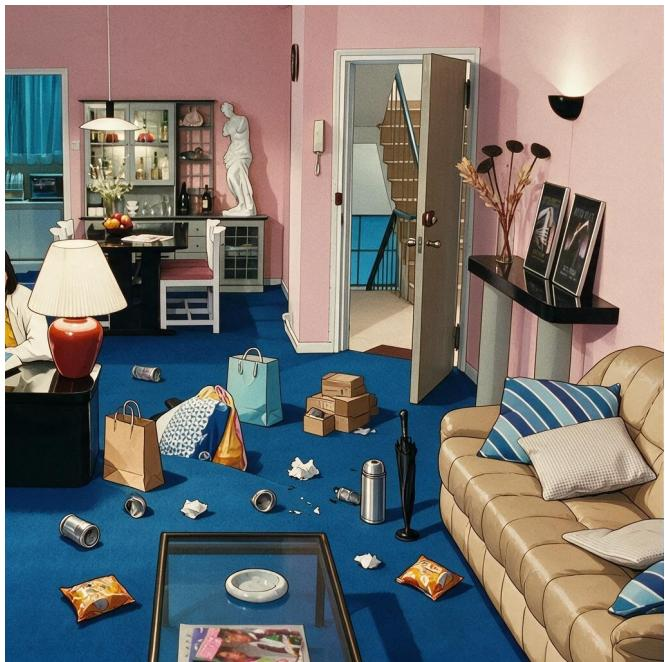

  
Figure 7: IS case: selective cleanup. Left: input; right: GPT-Image-2 output.

Case 2 (SD): Road bridge repair. The request asks for missing roads to be repaired, but the current scene fixes which bridge segment belongs over the river gap through path endpoints and matching texture. Choosing the wrong segment produces a plausible image that does not satisfy the transition contract.

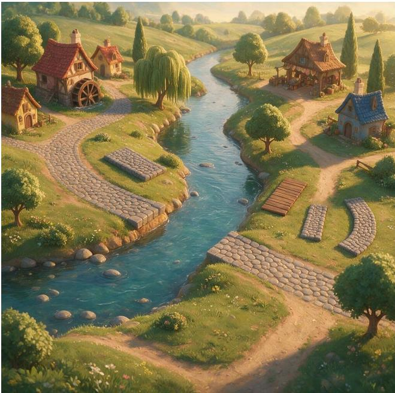

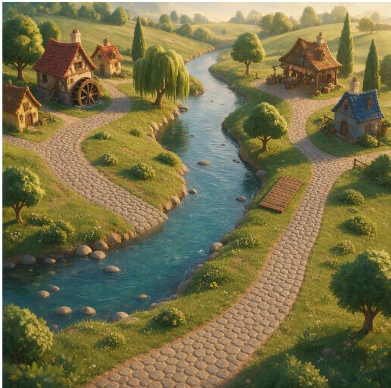  
Figure 8: SD case: road bridge repair. Left: input; right: GPT-Image-2 output.

Case 3 (RD): Storyboard connection repair. The in-image grid and sequence rules determine where cue cards and tempo markers belong. The edit must repair broken connections while preserving panel content and readable text.  
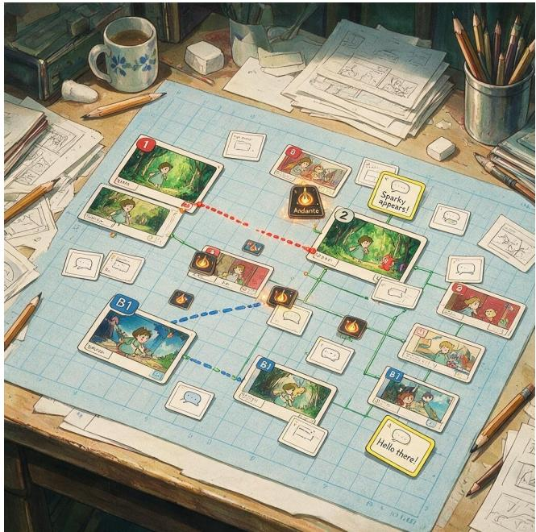

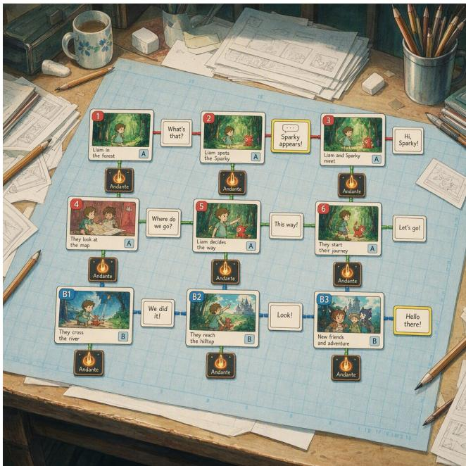  
Figure 9: RD case: storyboard connection repair. Left: input; right: GPT-Image-2 output.