# Spatial Grafting: Grounding 3D Features for Flow-Matching Robot Policies

Dingsheng Liu∗§, Yangzheng Wu†, Mahboubeh Asadi†, Zhiyuan Li∗§ Jinbang Huang†, Yixin Xiao†, Tongtong Cao‡, Yingxue Zhang†

∗University of Toronto

†Huawei Noah’s Ark Lab

‡Department of Foundation Model, 2012 Labs

Abstract—Pretrained robot manipulation policies such as vision-language-action models (VLAs) or world-action models (WAMs) leave interaction-relevant metric geometry implicit. Recent breakthroughs in spatial reconstruction can supply the necessary geometry reliably, but their features describe local shape without stating where it lies with respect to the robot. How best to deliver these features to a pretrained policy remains unresolved. We propose SPATIAL GRAFTING, a versatile, lightweight spatial module that binds frozen reconstruction features to metric, robot-relative geometry. SPATIAL GRAFTING constructs metric-grounded spatial tokens and injects them into the flow-matching action expert through cross-attention, without modifying the host’s perceptual pathway, so the host retains the full benefit of its pretraining. We evaluate it more broadly than any geometry-aware policy we compare against: one graft architecture, with no per-host redesign, on two VLAs and two WAMs, across four simulation benchmarks that span shorthorizon manipulation, visual robustness, clutter and long-horizon mobile manipulation, and on three real-robot platforms with single- and dual-arm configurations. On RoboTwin 2.0, a dualarm manipulation benchmark, the graft improves every host across VLAs and WAMs. Grafted π0.5 gains 11.3% and 15.6% on clean and randomized scenes, reaching 94.0% and 92.4%, above the strongest published 3D-conditioned policy, WAM4D (93.8% and 89.9%). The margin widens as the horizon lengthens: on tasks from BEHAVIOR-1K, a dual-arm mobile manipulation challenge scored by average task progress, it surpasses the 2025 challenge winner on five of six tasks, by up to 0.47 Q-score, and exceeds a map-conditioned spatial policy on average across the three tasks both report.

## I. INTRODUCTION

Coupling a pretrained backbone with a flow-matching action expert has become the dominant recipe for robot manipulation, with vision-language-action models (VLAs) building the expert on a vision-language model (VLM) and worldaction models (WAMs) on a video world model [1], [2]. Neither backbone was designed for manipulation or for the 3D structure it depends on: both read a scene as pixels, with no notion of metric scale or of where a surface lies relative to the gripper, so the policy selects the right object and the right sequence of motions yet misplaces the grasp itself. What is missing is not coarse behaviour but contactlevel precision. The problem this paper addresses is how to supply a flow-matching policy with manipulation-relevant spatial information it can act on.

Spatial reconstruction foundation models such as Depth Anything 3 (DA3) [3] and VGGT-Ω [4] are the natural source. They recover dense metric structure from ordinary images, and because they are learned networks rather than geometric pipelines, a policy can read their latent features directly. A growing body of spatial action models already adds 3D information to policies, but three gaps remain. First, most are validated on one or two benchmarks and a single host, so it is difficult to attribute a gain to the geometry rather than to the surrounding design. Second, many depend on inputs a deployed robot does not have: privileged instance labels or object state from a simulator, dedicated depth or pointcloud sensors, or a scene map maintained across the episode. Third, each is built for one policy family, often as a new 3D architecture trained from scratch, and does not transfer to the strongest pretrained hosts. The open question is therefore not whether geometry helps, but how to effectively deliver it to flow-matching action policies.

SPATIAL GRAFTING is that interface (Figure 1). Rather than converting reconstruction output into an explicit representation, we ground the reconstruction model’s latent space itself: each frozen latent is bound, at its own grid location, to its metric position in the workspace and to its offset from every end effector, and the bound tokens are grafted by cross-attention into the final blocks of the host’s action expert. The graft needs RGB, camera calibration and a depth map, measured or predicted by the same frozen model; it uses no segmentation, no object state, and keeps no map or state between observations. The host’s perception pathway is untouched, the added parameters are 4–5% of a 3–5B host, and the graft is routed so that it cannot help without reading the geometry. Because the interface asks only for a flow-matching action expert, one construction serves both VLAs and WAMs. We evaluate it more broadly than any spatial action model we compare against (Table VI): four hosts, two VLAs and two WAMs; four simulation benchmarks that each isolate a different demand—short-horizon manipulation on LIBERO [5], visual robustness on RoboTwin 2.0 [6], clutter and collision on RoboPRO [7], and long-horizon mobile manipulation on BEHAVIOR-1K (B1K) [8]; and three real robots, single-arm, bimanual and humanoid. Our main contributions are threefold:

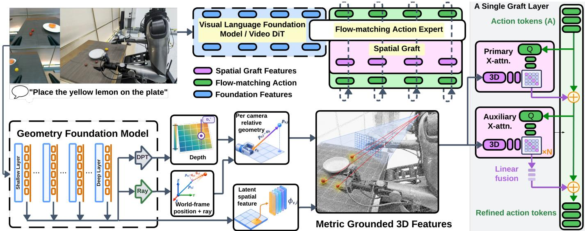  
Fig. 1. Overview of SPATIAL GRAFTING. A frozen geometry foundation model extracts multi-level features from each RGB view. Depth, calibrated rays, and end-effector anchors bind those features to metric, robot-relative 3D locations, forming a spatial bank per view. The magnified graft layer acts only on the flow-matching action expert: action tokens first cross-attend to the primary-view bank; the updated states then query the auxiliary-view banks. A single bias-free linear projection fuses the auxiliary attention outputs into the action update. This layer repeats in selected late action blocks, leaving the host’s vision-language or video pathway ungrafted.

• Robot-grounded reconstruction latents. Prior work has used reconstruction latents or metric geometric grounding separately. We bind each latent to metric and end-effectorrelative coordinates, turning a frozen reconstruction space into a robot-grounded representation for direct action prediction. Bank-off and bank-shuffle ablations show that the gain comes from grounded content rather than added capacity (Section V-C).

• A grafting interface for any flow-matching action expert. The graft uses bank-only cross-attention in the final action-expert blocks, which are revisited at every denoising step, and requires no other host modification. With bias-free projections, zero banks induce zero change (Proposition 1). The same interface improves two VLAs and two WAMs from public checkpoints and remains effective across reconstruction backbones (Sections V-A and V-C).

• Broad evaluation across benchmarks and embodiments. Across four hosts, four benchmarks, and three real robots, we use only RGB, calibration, and measured or predicted depth, including simulator-provided depth in RoboTwin. Grafted π0.5 outperforms the strongest published 3D-conditioned policy on RoboTwin and improves the B1K challenge winner’s performance on five of six tasks; across both RoboPRO hosts, grafting improves all eight host–condition entries (Sections V-A and V-B, Tables II–V).

## II. RELATED WORK

Action models and reconstruction models: Modern manipulation policies attach a continuous action expert, trained by diffusion or flow matching [1], [9], [10], to a pretrained backbone: a VLM in VLAs [11]–[13] or a video world model in WAMs [2], [14]. Both backbones perceive in 2D, so the expert receives neither metric scale nor the position of a surface relative to the gripper, and the residual failures concentrate at contact. Reconstruction foundation models are the complementary resource: they regress dense metric depth and pointmaps from ordinary images [3], [4], [15]–[19], and their latent features encode structure learned far beyond any robot dataset.

Spatial action models: Prior work has supplied geometry to policies as explicit signals: point clouds through a branch into the action module [20], [21], estimated-depth position encodings on the VLM’s tokens [22], depth tokens [23], [24], and persistent scene maps [25]; earlier 3D policies attended to lifted features relative to the gripper but trained from scratch [26], [27]. These designs pay for their geometry with an RGB-D or point-cloud sensor, with privileged simulator labels and a prebuilt map, or with a bespoke architecture, and each serves one policy family. A second line uses reconstruction latents instead, as a training-time alignment target [28]–[31], so that no geometry is present at test time and the gain is bounded by what the host internalizes. Alternatively, the latents are fused into the VLM’s visual tokens [32], [33], where the latent arrives in the camera’s frame at an unknown scale and is compressed by the trunk before the action expert sees it. Both lines report at most three evaluation settings on a single host (Table VI), and the two studies that compare injection routes find that where geometry enters decides the outcome [32], [33].

The missing interface: Taken together, prior work has treated where geometry comes from (a sensor or a reconstruction model) and where it enters (the input, the loss or the action module) as separate questions, and has not delivered reconstruction latents to a pretrained action expert in the frame a controller needs. A latent describes the scene relatively, in the camera’s frame and up to scale; a policy must learn a correlation between what it observes and where, in absolute metric units and relative to its end effectors, it should act. SPATIAL GRAFTING supplies that interface. It binds each frozen latent, at its own grid location, to its absolute metric position and to its offset from every end effector, so no point cloud, map or privileged label is needed; it delivers the bound tokens through a bank-only route into the final blocks of the action expert, so added capacity cannot help without the geometry; and it asks the host for nothing but a flow-matching expert, so one construction serves both VLAs and WAMs. We compare against six of the methods above: SERF on B1K, and SpatialVLA, GeoVLA, Spatial Forcing, GLaD and WAM4D on LIBERO and RoboTwin.

## A. Detailed related-work comparison

Geometry signals and host policies: Table VI expands the comparison in Section II by separating the pretrained hosts from methods that explicitly supply geometric information. The host rows describe the policies to which we attach the $\mathrm { g r a f t { - } } \pi _ { 0 . 5 }$ [12], X-VLA [13], Fast-WAM [2], and LingBot-VA [14]—not competing 3D modules. Among the spatial action models, SpatialVLA [22] and GeoVLA [21] use depthderived positions or point clouds, while Spatial Forcing [28] and GLaD [29] distill frozen reconstruction features during training. SERF [25] instead maintains a persistent map of the scene and robot. These are different sources of spatial information: explicit coordinates locate observations, distilled features provide a learned geometric prior, and persistent maps retain information beyond the current view. The “training only” annotation distinguishes supervision that shapes the deployed policy from an additional geometric input supplied at inference.

Where geometry enters: The route column distinguishes methods even when they use similar signals. SpatialVLA modifies visual-token positions, 3D-Mix [32] fuses reconstruction and semantic features, and Spatial Forcing and GLaD align intermediate representations. GeoVLA and PointVLA [20] deliver point-cloud information to an action expert. GeoPredict [34] uses auxiliary geometric prediction, while DyWA [35], GWM [36], WAM4D [30], X-WAM [37], and MECo-WAM [31] use geometric prediction or reconstruction to shape action-relevant representations or world-model rollouts. Our distinction is therefore not simply using 3D features or adding an action-side module. We bind frozen features to metric, end-effector-relative geometry and route the added residual through spatial banks in the late action layers. This separates the source of the features from their robot-relative grounding and from the mechanism by which they modify an action. The bank interventions in Section V-C test dependence on that information, rather than attributing every benefit of an added module to geometry.

Evaluation coverage and comparison limits: The final column records the settings reported for each method, not a common-protocol leaderboard. In particular, RoboTwin 1.0 is distinct from RoboTwin 2.0, and a real-robot evaluation can involve different embodiments, tasks, and trial counts. BEHAVIOR-1K coverage is also task-specific: SERF [25] reports three tasks, while our results report six individual tasks rather than a benchmark-wide aggregate. The table highlights that we examine the same grafting interface across tabletop simulation, distribution shift, long-horizon mobile manipulation, and physical robots, using both VLA and WAM hosts. It does not imply that every host was tested in every setting or that broader coverage establishes higher performance. Quantitative comparisons and their provenance are given in Section V and Section VII; the controlled comparisons remain each host with and without its graft.

## III. METHOD

## A. Problem formulation

A pretrained policy $\pi _ { \theta } ( A \mid I , { \mathcal { T } } , S )$ maps N RGB views $I = \{ I _ { v } \} _ { v = 1 } ^ { N }$ , an instruction $\tau$ and proprioceptive state S to an action chunk A. We consider hosts whose action expert is a transformer trained by flow matching [1], [2], [38] and re-run once per integration step at inference, whether it reads a VLM trunk or a video stream. Beyond the host’s inputs, the graft assumes per-view calibration $\mathcal { C } = \{ ( K _ { v } , T _ { v } ) \} _ { v = 1 } ^ { \bar { N } }$ (intrinsics and camera-to-world pose ${ T _ { v } } ~ = ~ ( { R _ { v } } , { t _ { v } } )$ in one common frame), a metric depth map $D _ { v } ^ { \star }$ measured by the sensor or predicted by the same frozen reconstruction model, and at least one wrist camera per arm; no other input is assumed: no segmentation, object state or map. From these SPATIAL GRAFTING builds one bank per view, $B _ { v } = B _ { v } ( I _ { v } , \mathcal { C } , D _ { v } ^ { \star } )$ and adds graft parameters ψ, leaving the host intact: $A \sim$ $\pi _ { \theta , \psi } ( A \mid I , \mathcal { T } , S , \{ B _ { v } \} _ { v = 1 } ^ { N } )$

## B. Grounding the latent space: the spatial bank

Binding happens at the grid: one bank token per featuregrid location, so the correspondence between a latent and its metric point is never broken. The result is a grounded latent space rather than a geometric representation: no point is ever materialized as a cloud or map, and the tokens are rebuilt from the current observation alone. For each view v we tap frozen backbone layers $\mathcal { L } _ { G }$ on a common grid of P locations. Taps differ in scale by orders of magnitude, so each is normalized, projected, rescaled by a learned gain and tagged with a layer embedding before fusion to $\phi _ { v , i } \in \mathbb { R } ^ { d }$ , for d the action-expert width.

Metric and robot-relative geometry: Back-projecting grid location i through $( K _ { v } , T _ { v } )$ and $D _ { v } ^ { \star }$ yields a point $p _ { v , i }$ and viewing direction $q _ { v , i }$ in the common calibration frame. Coordinates are normalized as $\hat { p } ~ = ~ \mathrm { c l i p } ( ( p - c ) / \lambda , - 1 , 1 )$ about a workspace centre c with a single isotropic scale λ per embodiment, so that a 10 cm displacement is encoded identically along every axis. With $e _ { 1 } , \ldots , e _ { E }$ the end-effector anchors, taken as the optical centres $e _ { k } \ = \ t _ { k }$ of the wrist cameras (a fixed rigid offset from the gripper, so no kinematic model is needed), each location carries

$$
u _ { v , i } = \left[ \gamma _ { B } ( \hat { p } _ { v , i } ) ; \left\{ \gamma _ { B } ( \widehat { p _ { v , i } - e _ { k } } ) \right\} _ { k = 1 } ^ { E } ; q _ { v , i } ; m _ { v , i } \right] ,\tag{1}
$$

with $\gamma _ { B }$ a Fourier encoding [39] and $m _ { v , i }$ flagging valid depth. The absolute coordinate places the feature in the workspace; the relative ones expose reaching and contact, and change as the arms move even when the scene is static.

Binding: $\phi _ { v , i }$ and $u _ { v , i }$ describe the same location and become one token: $u _ { v , i }$ modulates $\phi _ { v , i }$ through FiLM [40], and the two are concatenated and projected into the bank token $z _ { v , i } \in \mathbb { R } ^ { d }$ (Section IV), so geometry enters both directly and by modulation.

## C. A bank-only graft for any flow-matching action expert

Geometry enters only the final M blocks of the action expert, whose states already encode much of the base trajectory; the perceptual pathway receives no graft. Flow matching motivates this placement: the sampler re-enters these blocks at every integration step on a progressively cleaner chunk, so the banks are read over exactly the interval in which a coarse action becomes precise. M spans the last quarter to third of the stack; grafting every block is worse (Section V-C). The interface touches the host at exactly two points, the actiontoken states $H ^ { ( l ) }$ and the residual update at block l; a new host changes only the expert width $d ,$ the number of grafted blocks M and the residual scale $\rho ,$ plus a linear bridge when its blocks are wider than the injection (Table I).

Each view v has an independent multi-head cross-attention with queries $Q$ from the action states and keys and values from its bank B:

$$
\begin{array} { r l } & { { \mathrm { C A } } _ { v } ^ { ( l ) } ( Q , B ) = W _ { O } ^ { ( l , v ) } \mathrm { A t t n } \Big ( } \\ & { \qquad \nu \Big ( W _ { Q } ^ { ( l , v ) } \mathrm { L N } ( Q ) \Big ) , } \\ & { \qquad \nu \Big ( W _ { K } ^ { ( l , v ) } \mathcal { N } ( B ) \Big ) , W _ { V } ^ { ( l , v ) } \mathcal { N } ( B ) \Big ) , } \end{array}\tag{2}
$$

where $\mathcal { N }$ normalizes the key/value stream, ν normalizes queries and keys per head, and the logits carry a clamped learned gain. The primary view $v = 1$ , typically the global scene camera, writes into the action stream first, with residual scale $\rho \colon \bar { H } ^ { ( l ) } = H ^ { ( l ) } + \rho \mathrm { C A } _ { 1 } ^ { ( l ) } ( H ^ { ( l ) } , B _ { 1 } )$ . Each auxiliary view then queries its own bank from this updated state through a learned projection, $A _ { v } ^ { ( l ) } = \mathrm { C A } _ { v } ^ { ( l ) } ( P _ { v } ^ { ( l ) } \bar { H } ^ { ( l ) } , B _ { v } )$ . A single biasfree linear projection $W _ { \mathrm { m e r g e } } ^ { ( l ) }$ fuses the concatenated auxiliary outputs $[ A _ { 2 } ^ { ( l ) } ; \ldots ; A _ { N } ^ { ( l ) } ]$ back into the stream, and the result $\tilde { H } ^ { ( i ) }$ replaces $H ^ { ( l ) }$ in each grafted block (Section IV-A, Algorithm 1).

Bank-only routing: The projections $P _ { v } ^ { ( l ) }$ build queries only, and the merge consumes the attention outputs $A _ { v } ^ { ( l ) }$ rather than the branch activations, which would compose two linear layers into a bank-independent action-state map. Zero banks then imply a zero graft delta (Proposition 1); we verify it empirically with bank-off rather than assume it (Sections IV-B and IV-C). The graft adds 147M trainable parameters to π0.5 and X-VLA, 214M to Fast-WAM and 277M to LingBot-VA, which is 4.4% of the $3 . 3 \mathrm { B } ~ \pi _ { 0 . 5 }$ and 5.4% of the 5.1B LingBot-VA (Table I).

## D. Training objective

Each grafted host keeps its own flow-matching objective and finetuning recipe; the graft only adds the banks to the conditioning set of the velocity field. With noise $\epsilon \sim \mathcal { N } ( 0 , I )$ level $\sigma \in [ 0 , 1 ]$ , interpolant $A _ { \sigma } = ( 1 - \sigma ) A + \sigma \epsilon$ and the host’s weighting w(σ),

$$
\begin{array} { r l } & { \mathcal { L } ( \theta , \psi ) = \mathbb { E } _ { A , \epsilon , \sigma } w ( \sigma ) } \\ & { \qquad \quad \left\| v _ { \theta , \psi } \big ( A _ { \sigma } , \sigma \mid I , \mathcal { T } , S , \{ B _ { v } \} \big ) - ( \epsilon - A ) \right\| _ { 2 } ^ { 2 } , } \end{array}\tag{3}
$$

where $v _ { \theta , \psi }$ is the host’s velocity head evaluated with $H ^ { ( l ) } \gets$ $\tilde { H } ^ { ( l ) }$ in the final M blocks; there is no auxiliary geometric supervision (Section VI). Three scheduling choices are not neutral and are ablated in Section V-C: the output projections start at small non-zero values, the host is held fixed for a brief warmup, and the graft residual is dropped jointly across blocks with probability $p _ { \mathrm { d r o p } }$

## IV. METHOD DETAILS

## A. Derivations and full grafting equations

Back-projection: Let $\tilde { x } _ { v , i }$ be the homogeneous image coordinate of location i, with normalized camera ray $r _ { v , i } =$ $K _ { v } ^ { - 1 } \tilde { x } _ { v , i } / \| K _ { v } ^ { - 1 } \tilde { x } _ { v , i } \| _ { 2 }$ . Treating $D _ { v , i } ^ { \star }$ as optical-axis depth, the world-frame point and viewing direction used in Section III-B are

$$
p _ { v , i } = R _ { v } \left( \frac { D _ { v , i } ^ { \star } } { r _ { v , i , z } } r _ { v , i } \right) + t _ { v } , \qquad q _ { v , i } = R _ { v } r _ { v , i } .\tag{4}
$$

Injection: Writing $H ^ { ( l ) }$ for the action-token states at a grafted block $l , \ \mathrm { C A } _ { v } ^ { ( l ) }$ for the per-view cross-attention of Eq. (2), $P _ { v } ^ { ( l ) }$ for the view-specific query projections and $\rho > 0$ for the shared residual scale, the two stages inside the injection module are

$$
\bar { H } ^ { ( l ) } = H ^ { ( l ) } + \rho \mathrm { C A } _ { 1 } ^ { ( l ) } \Big ( H ^ { ( l ) } , B _ { 1 } \Big ) ,\tag{5}
$$

$$
A _ { v } ^ { ( l ) } = \mathrm { C A } _ { v } ^ { ( l ) } \left( P _ { v } ^ { ( l ) } \bar { H } ^ { ( l ) } , B _ { v } \right) , \qquad v = 2 , \ldots , N ,\tag{6}
$$

$$
\tilde { H } ^ { ( l ) } = \bar { H } ^ { ( l ) } + \rho W _ { \mathrm { m e r g e } } ^ { ( l ) } \mathrm { C o n c a t } _ { v = 2 } ^ { N } A _ { v } ^ { ( l ) } ,\tag{7}
$$

The merge is a single bias-free linear projection of the attention outputs $A _ { v } ^ { ( l ) }$ , not the branch activations $P _ { v } ^ { ( l ) } \bar { H } ^ { ( l ) }$ with two auxiliary wrist views its input has width 2d, and with one it has width d. The module returns $\Delta ^ { ( l ) } = \tilde { H } ^ { ( l ) } - H ^ { ( l ) }$ and the caller applies $H ^ { ( l ) \prime } \ = \ H ^ { ( l ) } + g _ { l } \kappa \Delta ^ { ( l ) }$ . Here gl selects the final M blocks and whole-graft dropout draws one $\kappa \sim \mathrm { B e r n o u l l i } ( 1 - p _ { \mathrm { d r o p } } )$ per sample per step, shared across those blocks; kept samples are not rescaled.

Parameter cost: Each grafted block holds one primary cross-attention, N −1 query projections, $N - 1$ auxiliary crossattentions and one merge, and the bank builder is shared by all of them, so

$$
\begin{array} { r } { | \psi | = \underbrace { M \left( 6 N - 2 \right) d ^ { 2 } } _ { \mathrm { g r a f t e d ~ b l o c k s } } + \underbrace { | \psi _ { \mathrm { b a n k } } | } _ { \mathrm { b a n k ~ b u i l d e r } } + | \psi _ { \mathrm { b r i d g e } } | , } \end{array}\tag{8}
$$

with d the injection width. With $N = 3$ views and $d = 1 0 2 4$ each grafted block costs $1 6 d ^ { 2 } = 1 6 . 8 \mathbf { M } .$ , so the injection grows linearly in the number of grafted blocks M and quadratically in d. The bank builder is 46.0M for every host, and $| \psi _ { \mathrm { b r i d g e } } |$ is non-zero only when the host’s blocks are wider than the injection width. Table I gives the measured counts.

Frame parameters: The workspace centre c and isotropic scale λ define the frame the graft reasons in, so they are fitted once per embodiment on the training split and stored with the checkpoint. The hand-relative encodings use their own fitted centres, distinct from the workspace centre. Where the endeffector anchors are taken as wrist-camera optical centres, each differs from the true end-effector position by a fixed rigid offset, which the geometry encoder absorbs.

## B. The bank-only invariant

Proposition 1 (Bank-only invariant). If every projection on a bank-dependent path $( W _ { K } , W _ { V } , W _ { O } , W _ { \mathrm { m e r g e } } )$ is bias-free and the key/value normalization N is scale-only, then $B _ { 1 } =$ $\dots = B _ { N } = 0$ implies $H ^ { ( l ) \prime } = H ^ { ( l ) }$ at every grafted block l.

Proof. Scale-only normalization gives $\mathcal { N } ( 0 ) = 0 .$ , so $B _ { v } = 0$ yields zero keys and values. The attention output is a convex combination of zero value vectors, hence 0 for any query, and the bias-free output projection maps it to 0. Thus $\bar { \bar { H } } ^ { ( \bar { l } ) } = H ^ { ( l ) }$ and $A _ { v } ^ { ( l ) } = 0$ for $v \geq 2$ regardless of $P _ { v } ^ { ( l ) } \bar { H } ^ { ( l ) }$ , so the bias-free merge projection maps the concatenation of zeros to zero and $H ^ { ( l ) \prime } = \dot { H } ^ { ( l ) }$ □

Implementation status: The $\pi _ { 0 . 5 }$ implementation uses the attention-output merge, eliminating the direct linear path from an auxiliary query projection to the action stream. Setting spatial\_no\_bias=True removes biases from the auxiliary attention output projections and the merge, but the primary attention output projection, key/value projections and key/value LayerNorm still have trainable biases. Their biases initialize at zero, so a zero bank gives a zero delta at initialization; Proposition 1 is not guaranteed for the trained checkpoint. A nonzero bias can emit a scene-independent constant even with a zero bank. We therefore interpret bank-off as a measurement of the trained model with its banks removed, not as an assumed-zero residual.

## C. Architectural verification

Proposition 1 establishes an exact-zero invariant only under its stated bias and normalization conditions. Before training, we check numerically that a zero spatial bank gives zero graft residual and a nonzero bank gives a nonzero one. This verifies initialization, not that the invariant continues to hold after the remaining biases have trained. For the Fast-WAM instantiation, strict checkpoint loading verifies the frozen host snapshot and every added bank-builder and grafting parameter. The evaluation preflight additionally checks view ordering, RGB and depth preprocessing, calibrated intrinsics and extrinsics, the 32-action prediction and 24-action execution contract, and live construction of a nonzero bank from the current threeview observation. Measured depth is retained at millimeter precision and aligned to the $1 8 \times 2 4$ DA3 feature grid with nearest-neighbor resampling.

These checks separate initialization and wiring from downstream empirical performance. Bank-off measures the trained graft with its banks removed; bank-shuffle measures whether its gain depends on the banks’ sample-specific geometry (Section V-C).

## V. EXPERIMENTS

Hosts and comparison protocol: We apply SPATIAL GRAFTING to four hosts chosen to span both families of flow-matching policy: two VLAs, $\pi _ { 0 . 5 }$ and X-VLA, and two WAMs, Fast-WAM and LingBot-VA, and the graft is identical across every host. The reconstruction backbone is DA3, kept frozen and tapped at four layers on a common feature grid, and the spatial banks enter the final six action-expert blocks of the VLAs and the final ten of the WAMs; the only host-specific settings are the ones listed in Section III-C.

Benchmarks and baselines: We evaluate on four simulation benchmarks and three real robots, each under its standard protocol and each chosen to stress a different demand. LIBERO (130 tasks, 50 seeds per task) is near saturated and tests whether the graft leaves a working policy intact. RoboTwin 2.0 (50 dual-arm tasks, 20 seeds per task in each of the Clean and Randomized configurations) tests SPATIAL GRAFTING’s manipulation capability and robustness to appearance changes. RoboPRO (80 tasks, 20 seeds per task in clean and cluttered scenes, scored under both its Easy and Hard criteria) adds clutter objects in the robot’s path and its success metric penalizes collisions. B1K (six tasks, 20 public evaluation instances each) is the most difficult manipulation benchmark we test: long-horizon mobile manipulation that chains sub-skills together within a large household environment, and shows the breadth of SPATIAL GRAFTING’s application. The real-robot trials (10 per task) test whether the gains survive measured depth and real calibration error. Success rates (SR) are reported in %, and every reported change is an absolute difference. Beyond each host’s own base, we compare against the published 3D-conditioned policies listed in Table II and, on B1K, against SERF and the two leading entries of the 2025 challenge. Host configurations, training data, depth sources and the provenance of every quoted number are documented in Sections VI and VII, and per-task results in Section VIII.

We ask three questions, one per contribution: does one graft improve both VLAs and WAMs (Section $\operatorname { V - A } ) ;$ do the gains hold under clutter, long horizons and real sensing (Section V-B); and do they come from the grounded geometry and its placement rather than added parameters (Section V-C)?

TABLE I  
TRAINABLE PARAMETERS ADDED BY THE GRAFT ON ROBOTWIN. COUNTS ARE MEASURED BY BUILDING THE MODULES. THE SHARE IS RELATIVE TO THE HOST’S OWN PARAMETER COUNT.
<table><tr><td>Host</td><td>Grafted blocks</td><td>Bank builder</td><td>Injection</td><td>Bridges</td><td>Total (share)</td></tr><tr><td>π0.5</td><td>6</td><td>46.0M</td><td>100.7M</td><td>一</td><td>146.8M (4.4% of 3.3B)</td></tr><tr><td> ${ \Chi } { \mathrm { X - V L A } }$ </td><td>6</td><td>46.0M</td><td>100.7M</td><td>一</td><td>146.8M</td></tr><tr><td> $\pi _ { 0 . 5 } , \mathrm { V G G T } { - \Omega }$ </td><td>6</td><td>48.1M</td><td>100.7M</td><td></td><td>148.9M</td></tr><tr><td> $\mathrm { F a s t - W A M }$ </td><td>10</td><td>46.0M</td><td>168.0M</td><td></td><td>214.0M</td></tr><tr><td> $\mathrm { L i n g B o t - V A }$ </td><td>10</td><td>46.0M</td><td>168.0M</td><td>62.9M</td><td>276.9M (5.4% of 5.09B)</td></tr></table>

Algorithm 1 SPATIAL GRAFTING: bank construction and grafting at one denoising step. The exact-zero claim of Proposition 1   
is conditional on bias-free bank-dependent paths.   
Require: RGB images $\{ I _ { v } \} _ { v = 1 } ^ { N } ,$ calibration $\{ ( K _ { v } , T _ { v } ) \}$ , metric depth $\{ D _ { v } ^ { \star } \}$ , end-effector anchors $\{ e _ { k } \} _ { k = 1 } ^ { E } ,$ host action states   
$\dot { \mathbf { \mathcal { H } } } ^ { ( l ) }$ , frozen spatial model G, grafted-block count M   
Bank construction ▷ once per observation   
1: for $v = 1 , \ldots , N$ do   
2: $\{ F _ { v } ^ { ( l ) } \} _ { l \in \mathcal { L } _ { G } }  G ( I _ { v } )$ ▷ frozen multi-layer taps   
3: $\phi _ { v }  W _ { \mathrm { f u s e } } \operatorname { C o n c a t } _ { l } ( \operatorname { L N } ( P _ { l } ( F _ { v } ^ { ( l ) } ) ) + \eta _ { l } )$   
4: $p _ { v } , q _ { v } \gets$ back-project $\mathcal { D } _ { v } ^ { \star }$ through $( K _ { v } , T _ { v } )$ ▷ Eq. (4)   
5: $u _ { v } \gets [ \gamma _ { B } ( \hat { p } _ { v } ) ; \{ \gamma _ { B } ( \widehat { p _ { v } } - \ell _ { k } ) \} _ { k } ; q _ { v } ; m _ { v } ]$ ▷ Eq. (1)   
6: $s _ { v } \gets \mathrm { M L P } ( u _ { v } ) ; \quad f _ { v } ^ { \prime } \gets ( \mathbf { 1 } + \Gamma ( s _ { v } ) ) \odot \phi _ { v } + \beta ( s _ { v } )$ ▷ FiLM binding   
7: $z _ { v } \gets \mathrm { L N } ( W _ { \mathrm { o u t } } [ s _ { v } ; f _ { v } ^ { \prime } ] ) +$ grid and view embeddings   
8: $B _ { v }  z _ { v } - \mathrm { m e a n } _ { \mathrm { t o k e n s } } ( z _ { v } )$ ▷ per-sample centering   
9: end for   
Injection into the final M blocks   
10: draw $\kappa \sim \mathrm { B e r n o u l l i } ( 1 - p _ { \mathrm { d r o p } } )$ ▷ one draw shared by every block   
11: for $l = L - M + 1 , . . . , L$ do   
12: $\bar { H }  H ^ { ( l ) } + \rho \mathrm { C A } _ { 1 } ^ { ( l ) } ( H ^ { ( l ) } , B _ { 1 } )$ ▷ primary view   
13: $A _ { v }  \mathrm { C A } _ { v } ^ { ( l ) } ( P _ { v \_ } ^ { ( l ) } \bar { H } , B _ { v } )$ for $v = 2 , \ldots , N$ $\triangleright \ : P _ { v } ^ { ( l ) }$ builds queries only   
14: $\tilde { H }  \bar { H } + \rho W _ { \mathrm { m e r g e } } ^ { ( l ) } \mathrm { C o n c a t } _ { v \geq 2 } A _ { v }$ ▷ merges attention outputs   
15: $H ^ { ( l ) \prime } \gets H ^ { ( l ) } + \kappa \bar { ( } \tilde { H } - H ^ { ( l ) } ) ^ { - }$   
16: end for

## A. One graft improves every host

RoboTwin: consistent gains, robust to visual change: RoboTwin’s paired Clean and Randomized configurations use the same dual-arm tasks, separating task capability from robustness to scene and appearance changes. All four hosts improve, by +7.5% on Clean and +8.2% on Randomized on average. The VLAs gain most $( + 9 . 8 \% \ \mathrm { ~ t o ~ } + 1 5 . 6 \% )$ , while the WAMs also benefit despite their stronger base scores. Every host also improves on Randomized scenes, by +1.5% to $+ 1 5 . 6 \%$ , although the reconstruction backbone is frozen and is not fine-tuned on RoboTwin’s randomized clutter, lighting or backgrounds: geometry learned from diverse scenes carries across appearance changes the host has not seen. Qualitatively, the mug column of Figure 2 shows the mechanism: the grafted policy estimates the rack height well enough to clear the hook, where the base approaches at the wrong height. At the task level, the largest per-task gain for $\pi _ { 0 . 5 }$ is Move can pot, $5 1 \%  1 0 0 \%$ Clean and $5 5 \%  9 5 \%$ Randomized (base per-task rates from [14]): the can must be set down at a position defined relative to the pot, which is exactly the robot-relative metric placement the bank encodes. Blocks ranking size, which needs the blocks’ physical sizes, is next (49% → 85%, 26% → 70%).

Grafted $\pi _ { 0 . 5 }$ reaches 94.0%/92.4%, above the best published 3D-conditioned policy, WAM4D (93.8%/89.9%), and our full-benchmark Spatial Forcing run (66.2%/58.9%) is below every grafted host. These cross-paper rows are not host-matched; the controlled result is that all four base/graft pairs improve. Per-task results for every policy we evaluated ourselves are in Section VIII, Table VIII.

LIBERO: maintained performance on a saturated benchmark: Every base already scores 96.9–98.5, so this benchmark can only show whether the graft integrates well into a working policy. The two VLAs improve (+2.7% for $\pi _ { 0 . 5 } , + 0 . 6 \%$ for X-VLA) and the two WAMs slip by about 1% (−0.7% and $- 1 . 1 \% )$ , with all final scores remaining in the near-saturated range (Table II). Grafted $\pi _ { 0 . 5 }$ is the highest entry at 99.6%, but a 1.1% lead on a saturated benchmark is not evidence about geometry; we treat LIBERO as a compatibility check of one frozen reconstruction model across four action experts and draw no conclusion about geometry from it. Per-suite results are in Section VIII, Table VII.

TABLE II  
LIBERO AND ROBOTWIN SR (%). ABOVE THE LINE: PUBLISHED 3D-CONDITIONED POLICIES, QUOTED FROM THEIR OWN PAPERS, EXCEPT SPATIAL FORCING ON ROBOTWIN, WHICH WE TRAINED OURSELVES (SECTION VII). BELOW THE LINE: OUR FOUR HOSTS. LIBERO BASES ARE QUOTED FROM EACH HOST’S PUBLISHED RESULTS; THE $\pi _ { 0 . 5 }$ ENTRY IS FROM THE OPENPI RELEASE [41], AS ITS PAPER REPORTS NO LIBERO RESULT. ON ROBOTWIN THE $\pi _ { 0 . 5 }$ BASE IS CITED FROM [14] AND THE X-VLA BASE FROM [42], BOTH TRAINED ON THE SAME ROBOTWIN DEMONSTRATIONS AS OUR GRAFTS, SO THE PAIRS ARE DIRECTLY COMPARABLE; THE FAST-WAM AND LINGBOT-VA BASES ARE OUR EVALUATIONS OF THEIR PUBLIC CHECKPOINTS WITH OUR SEEDS AND PIPELINE. EVERY GRAFTED ENTRY IS OUR RUN. GREEN/RED: ABSOLUTE CHANGE FROM THE HOST’S OWN BASE. NR: NOT REPORTED IN THE CITED PAPER.
<table><tr><td>Model</td><td>LIBERO Avg.</td><td>RoboTwin Clean</td><td>RoboTwin Rand.</td></tr><tr><td>GLaD</td><td>94.1</td><td>NR</td><td>NR</td></tr><tr><td>GeoVLA</td><td>97.7</td><td>NR</td><td>NR</td></tr><tr><td>SpatialVLA</td><td>78.1</td><td>NR</td><td>NR</td></tr><tr><td>Spatial Forcing</td><td>98.5</td><td>66.2</td><td>58.9</td></tr><tr><td>WAM4D</td><td>NR</td><td>93.8</td><td>89.9</td></tr><tr><td> $\pi _ { 0 . 5 }  \pi _ { 0 . 5 } ^ { \mathrm { g r a f t } }$ </td><td> $9 6 . 9  9 9 . 6 \substack { + 2 . 7 }$ </td><td> $8 2 . 7  9 4 . 0 \substack { + 1 1 . 3 }$ </td><td> $7 6 . 8  9 2 . 4 \substack { + 1 5 . 6 }$ </td></tr><tr><td> ${ \mathrm { X } } { \mathrm { - V L A } } \to \mathbf { \tilde { X } } { \mathrm { - V L A g r a f t } }$ </td><td> $9 8 . 1  \underline { { 9 8 . 7 } } + 0 . 6 $ </td><td> $7 2 . 8  8 3 . 7 + 1 0 . 9$ </td><td> $7 2 . 8  8 2 . 6 \AA ^ { + 9 . 8 }$ </td></tr><tr><td>Fast-WAM → Fast-WAMgraft</td><td> $9 7 . 6 \to 9 6 . 9 \ - - 0 . 7$ </td><td> $8 2 . 6  8 6 . 0 \substack { + 3 . 4 }$ </td><td> $8 1 . 8  8 3 . 3 \substack { + 1 . 5 }$ </td></tr><tr><td> $\mathrm { L i n g B o t - V A } \to \mathrm { L i n g B o t - V A ^ { g r a f t } }$ </td><td> $9 8 . 5  9 7 . 4 - ^ { 1 . 1 }$ </td><td> $8 8 . 9  9 3 . 3 \substack { + 4 . 4 }$ </td><td> $8 5 . 7  \underline { { 9 1 . 4 ^ { + 5 . 7 } } }$ </td></tr></table>

SPATIAL GRAFTING: base → graft

## B. Gains hold under clutter, long horizons and real sensing

B1K: largest gains where grasping is hardest: Of the spatial action models we compare, only SERF [25] reports B1K results, on three tasks. Grafting the challenge-winning π0.5-RLC [43] increases average task progress (Q-score; Table III); we evaluate on the 20 public evaluation instances of each task, whereas official challenge scoring uses only 10 of those 20. The graft improves five of the six tasks, by +0.216 Q-score on average and up to +0.471; the exception is putting shoes on rack (0.720 → 0.590). B1K chains minutelong mobile activities without resetting between contacts, so a small error in one action chunk leaves the robot in a state its demonstrations rarely cover, and the next chunk starts further out of distribution. We attribute the graft’s gains at this horizon to the same precision it adds on the tabletop: each contact lands closer to where the demonstrations put it, so there is less error to compound.

SERF [25] builds on the same π0.5-RLC checkpoint but addresses a different failure: its persistent map gives a memoryless policy access to information about objects that have left its view (Section II), whereas the graft targets precision at contact and keeps no state across observations. On the three tasks SERF reports, the grafted policy averages 0.632 against SERF’s reported 0.587; the margin is modest because those tasks are dominated by the failure SERF addresses.

The graft’s largest gains come where the policy fails at the grasp itself: on the other three tasks it improves its base by +0.301 on average. Putting up Christmas decorations requires picking up a thin, smooth candy cane among the wire stems of a wreath; in Figure 2 the base closes beside the shaft while the grafted policy closes on it. Its Q-score gain is small (0.478 → 0.510) because the base already completes much of the activity. Clean boxing gloves has rounded gloves that can be grasped only at the cuff (0.200 → 0.600), and cleaning up plates and food requires lifting flat plates and bowls $( 0 . 2 4 3  0 . 7 1 4 )$ . The graft helps most where the grasp is hardest, consistent with its design objective.

RoboPRO: improved collision avoidance in clutter: Both hosts improve in every condition on both Easy and Hard (Table IV). Cluttered scenes place distractors inside the path the demonstration sweeps, and the Hard rate additionally penalizes collisions with them. Hard rises together with Easy in every cell, so the grafted policies complete more tasks without colliding: under clutter, $\pi _ { 0 . 5 }$ gains +8.9% Easy and +1.6% Hard, and X-VLA gains +5.6% Easy and +7.7% Hard, more than its clean-scene Hard gain of +3.2%. Knowing where each distractor sits relative to the grippers lets the policy route around it; the sink column of Figure 2 shows a grasp low and square enough to seat the plate rather than catch its rim. Per-task results for all 80 tasks are in Section VIII, Table IX.

Real robots: gains transfer to physical sensing: The realrobot trials test whether the gains survive measured depth and real calibration error, on three platforms of different form: a single-arm UR5e, a bimanual pair of AgileX Pipers and the humanoid Galaxea R1Pro. Grafting improves success on all six tasks, by 20% to 50% (Table V), and the largest gains come where the base fails on depth at contact: marker grasping (30% → 80%, approach at the wrong height), Piper table cleanup (20% → 70%, transparent objects missed and a white mug confused with the background) and R1Pro tangerine placement $( 5 0 \%  9 0 \%$ , fruit dropped short of the plate). Plate-to-rack placement improves from 70% to 90% through better rack alignment (Figure 2; full-size rollouts in Figure 4) and deformable-object cleanup from 50% to 80%. Tea-can opening remains hardest $( 1 0 \%  4 0 \% ) \colon$ : lid-depth errors are reduced, but the task also demands bimanual coordination that geometry alone does not supply. That the graft carries to hardware without any adaptation of its geometry pathway is expected: DA3 is trained on large and diverse real-world imagery, so its reconstruction is, if anything, better matched to real scenes than to simulated ones, and the grounded latents the graft reads are the same on either side of the simulation boundary.

TABLE III  
B1K Q-SCORE ON SIX TASKS. Q-SCORE IS AVERAGE TASK PROGRESS. π0.5-RLC AND $\pi _ { 0 . 5 - \mathrm { C o m e t } }$ ARE THE #1 AND #2 ENTRIES OF THE 2025 CHALLENGE [8] AND SERF [25] IS QUOTED ON THE THREE TASKS IT REPORTS; ALL THREE ARE TAKEN FROM THEIR PUBLISHED SCORES. THE GRAFTED POLICY IS EVALUATED ON THE 20 PUBLIC EVALUATION INSTANCES OF EACH TASK; OFFICIAL CHALLENGE SCORING USES ONLY 10 OF THOSE 20. GREEN/RED: CHANGE FROM THE HOST’S OWN BASE.
<table><tr><td>Task</td><td>SERF</td><td> $\pmb { \pi _ { 0 . 5 - \mathrm { C o m e t } } }$ </td><td> $\pi _ { \mathbf { 0 . 5 . R L C } }  \pi _ { \mathbf { 0 . 5 - R L C } } ^ { \mathbf { g r a f t } }$ </td></tr><tr><td>Assembling gift baskets</td><td>0.525</td><td>0.312</td><td> $0 . 2 8 1  \mathbf { 0 . 6 3 2 ^ { + 0 . 3 5 1 } }$ </td></tr><tr><td>Collecting children&#x27;s toys</td><td>0.635</td><td>0.583</td><td> $0 . 5 0 0  \mathbf { 0 . 6 7 3 + 0 . 1 7 3 }$ </td></tr><tr><td>Putting shoes on rack</td><td>0.601</td><td>0.470</td><td> $\mathbf { 0 . 7 2 0 }  0 . 5 9 0 \mathrm { - 0 . 1 3 0 }$ </td></tr><tr><td>Putting up Christmas decorations</td><td>NR</td><td>0.356</td><td> $\underline { { 0 . 4 7 8 } }  \mathbf { 0 . 5 1 0 + 0 . 0 3 2 }$ </td></tr><tr><td>Clean boxing gloves</td><td>NR</td><td>0.000</td><td> $\underline { { 0 . 2 0 0 } }  \mathbf { 0 . 6 0 0 } + 0 . 4 0 0$ </td></tr><tr><td>Cleaning up plates and food</td><td>NR</td><td>0.043</td><td> $0 . 2 4 3 \to 0 . 7 1 4 ^ { + 0 . 4 7 1 }$ </td></tr></table>

SPATIAL GRAFTING: base → graft

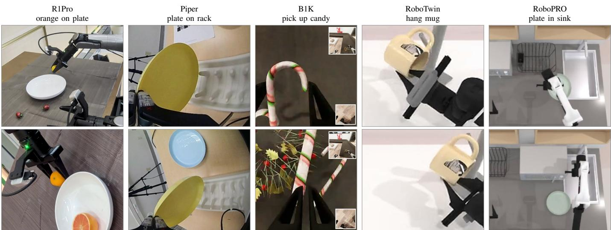  
Fig. 2. Grafted success (top) against base failure (bottom), one column per benchmark. Each column is the task discussed in the corresponding paragraph. R1Pro: the grafted policy estimates plate height and releases the orange with clearance, where the base drops it short. Piper: plate–rack alignment avoids the collision the base drives into. B1K: the base shuts its jaws beside the candy cane’s shaft; the grafted policy closes on it. RoboTwin: rack height is estimated well enough to clear the hook. RoboPRO: a lower, better-placed grasp seats the plate in the sink instead of catching its rim.

TABLE IV  
ROBOPRO SUCCESS (%). EACH CELL READS EASY/HARD. EASY IS ROBOPRO’S SUCCESS RATE (SR); HARD IS ITS STRICTER HARSH SUCCESS RATE (HSR), SCORED ON THE SAME EPISODES. BASES ARE REPORTED BY [7] AND GRAFTED SCORES ARE OURS. GREEN: CHANGE FROM THE HOST’S OWN BASE.
<table><tr><td>Model</td><td>Clean (Easy/Hard)</td><td>Clutter (Easy/Hard)</td></tr><tr><td> $\pi _ { 0 . 5 }  \pi _ { 0 . 5 } ^ { \mathrm { g r a f t } }$ </td><td> $7 0 . 3 / 6 5 . 7  7 8 . 8 / 7 3 . 7 + 8 . 5 / + 8 . 0$ </td><td> $6 0 . 9 / { \underline { { 4 7 . 8 } } } \to 6 9 . 8 / 4 9 . 4 \substack { + 8 . 9 / + 1 . 6 }$ </td></tr><tr><td> ${ \mathrm { X } } { \mathrm { - V L A } } \to { \mathrm { X } } { \mathrm { - V L A } } ^ { \mathrm { g r a f t } }$ </td><td> $4 9 . 5 / 4 6 . 7  6 0 . 9 / 4 9 . 9 + 1 1 . 4 / + 3 . 2$ </td><td> $3 9 . 7 / 2 7 . 6 \to 4 5 . 3 / 3 5 . 3 + 5 . 6 / + 7 . 7$ </td></tr></table>

SPATIAL GRAFTING: base → graft

C. The gain comes from the grounded geometry and its placement

Bank content, not capacity, carries the gain: Figure 3(a) intervenes on a fixed $\pi _ { 0 . 5 }$ checkpoint on RoboTwin. Zeroing the banks cuts Clean/Randomized by 15.1%/20.1% to $7 8 . 9 \% / 7 2 . 3 \% ,$ below the ungrafted base. Substituting another episode’s banks cuts a further 24.3%/23.4% to 54.6%/48.9%. Weights and host inputs stay fixed: mismatched bank content hurts more than absent banks, and bank-only routing removes a direct action-state bypass.

The backbone is interchangeable; late injection is essential: The $\pi _ { 0 . 5 }$ RoboTwin reference uses frozen DA3 features at four levels, the complete spatial grid, and injection into the final six action-expert blocks; host-specific configurations are in Section VI. Panel (b) retrains one design change at a time from this reference, which also uses dropout and warmup. Replacing DA3 [3] with VGGT-Ω [4], everything else unchanged, reaches 91.5% on Clean and 89.1% on Randomized. This is 2.5% and 3.3% below the reference but 8.8% and 12.3% above the base: the interface transfers across reconstruction backbones, while its ceiling still depends on their quality.

TABLE V  
REAL-ROBOT EVALUATION (SR, %). MATCHED BASE/GRAFT COMPARISONS ON THREE PLATFORMS, WITH 10 TRIALS PER TASK. A TRIAL IS CONSIDERED SUCCESSFUL ONLY IF ALL SUB-TASKS ARE COMPLETED. GREEN: CHANGE FROM THE BASE.
<table><tr><td>Platform Task</td><td></td><td>SR Trials</td></tr><tr><td>UR5e</td><td>Pick up marker and place in pen cup (thin objects, constrained placement)</td><td>30 →80+50 10</td></tr><tr><td rowspan="3">Piper</td><td>Clean up table (transparent objects, long horizon)</td><td>20→70+50 10</td></tr><tr><td>Open tea can (bimanual dexterous manipulation)</td><td>10→40+30 10</td></tr><tr><td>Place plate on rack (thin objects, constrained placement)</td><td>70→90+20 10</td></tr><tr><td rowspan="2">R1Pro</td><td>Pick up tangerine and place on plate (thin objects, constrained placement)</td><td>50→90+40 10</td></tr><tr><td>Clean up table (deformable object, long horizon)</td><td>50 → 80+30 10</td></tr></table>

SPATIAL GRAFTING: base → graft

(a) Reference and checkpoint interventions  
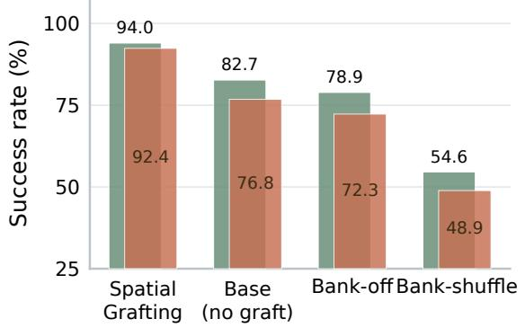

(b) Design choices (retrained)  
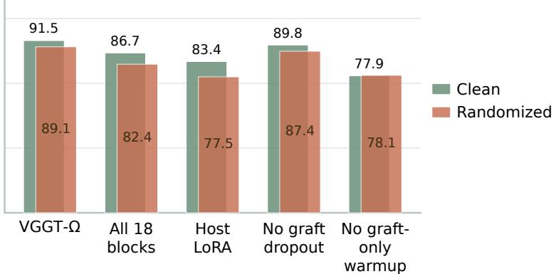  
Fig. 3. Ablations on RoboTwin with $\pi _ { 0 . 5 }$ (SR %). (a) Reference, ungrafted base, and bank interventions on a fixed checkpoint. (b) One design choice retrained at a time. Equal-width Clean (green) and Randomized (terracotta) bars overlap at each configuration and share a 25% baseline.

Conditioning all 18 blocks instead of the final six costs 7.3% and 10.0%, supporting late injection after the host has formed a task-conditioned action.

Stable adaptation needs warmup and dropout; LoRA is not enough: LoRA gives 83.4%/77.5%, within 0.7% of the base on both configurations, whereas full finetuning delivers the graft. Training without whole-graft dropout $( p _ { \mathrm { d r o p } } = 0 )$ costs 4.2% and 5.0%, showing the value of periodically acting without the spatial residual. Skipping the graft-only warmup and adapting the host from the first update costs 16.1% and 14.3%, dropping Clean below the base. This is the largest single design effect and helps explain why schedules need to vary with the pretrained host.

Across all variants, the interface’s main effect is to close the Clean-minus-Randomized gap (Section VI).

## VI. REFERENCE GRAFT CONFIGURATIONS

This section records the graft configuration used for the reported RoboTwin results.

Objective: The loss of Eq. (3) is the host’s own flowmatching objective with the banks added to its conditioning set; the noise distribution, weighting and action parameterization are the host’s own, and there is no auxiliary geometric supervision, so a grafted run differs from its baseline only in the presence of $\{ B _ { v } \}$

$\pi _ { 0 . 5 } – R o b o T w i n \colon$ Initialization is the public pi05\_base checkpoint. The spatial backbone is DA3-GIANT-1.1 in backbone-only mode, frozen, with taps at layers 19, 27, 33, 39 resampled to an $1 8 \times 2 4$ grid (P = 432) over three calibrated views, ordered as overhead, left wrist, right wrist. Metric depth is ground truth from the simulator, retained at millimeter precision and aligned to the feature grid by nearest-neighbor resampling. The two end-effector anchors are the optical centres of the left and right wrist views, recovered from the same extrinsics used for back-projection. The action-token transformer has L = 18 blocks and the graft attaches to the final six blocks 12–17.

Bank and grafting hyperparameters: residual scale $\rho = 1 ;$ output projections and FiLM initialized at standard deviation $1 0 ^ { - 2 }$ ; Fourier bands $B \ = \ 1 0 ;$ workspace centre c = $\left( - 0 . 0 2 2 2 , 0 . 0 9 6 7 , 0 . 7 4 0 3 \right)$ and isotropic scale $\lambda = 0 . 5 1 9 8 .$ fitted on the training split; grid and view embeddings scaled by 0.25; query/key normalization enabled; attention logit gain initialized at 3 and clamped to 8; whole-graft dropout $p _ { \mathrm { d r o p } } =$ 0.1; bank-only routing and bias-free auxiliary attention output and merge projections enabled; per-tap, fused-latent and persample bank centering all enabled. Evaluation predicts action chunks under the host’s own flow-matching sampler with 30 denoising steps.

Fourier band count: We set B against measurement precision rather than maximum precision. At the RoboTwin workspace scale $B = 1 0$ resolves roughly 5 mm in the highest band, while depth is quantized at 1 mm and pooled over a patch covering one to five centimeters of surface, so further bands would encode noise rather than geometry.

X-VLA–RoboTwin: The X-VLA graft uses the same bank builder and the same grafting topology with identical $\mathrm { s e t t i n g s } { - \rho } = 1$ , initialization $1 0 ^ { - 2 } , B = 1 0 .$ , query/key normalization, $p _ { \mathrm { d r o p } } = 0 . 1$ , bank-only routing, bias-free auxiliary attention output and merge projections, and per-tap, fused and per-sample centering—grafted onto the final six of its 24 action blocks. The PyTorch implementation also omits the primary attention output bias; the JAX $\pi _ { 0 . 5 }$ implementation retains it. The hosts, workspace constants, and camera layouts differ, while the bank construction and two-stage grafting scheme are shared.

Fast-WAM–RoboTwin: Fast-WAM [2] uses a 30-block ActionDiT with a pretrained Wan2.2 video expert. The graft starts from the released robotwin\_uncond\_3cam\_384 checkpoint, attaches to blocks 20–29, and uses three calibrated views, four DA3-NESTED taps (layers 19, 27, 33 and 39) on an $1 8 \times 2 4$ grid, and measured metric depth. Only the spatial bank builder and the ten grafting modules are trained, on the unchanged RoboTwin training split; DA3-NESTED, the video and action experts, the variational autoencoder and the proprio encoder remain frozen. Evaluation predicts 32 absolute-joint actions, executes 24 before replanning, and uses 10 flowmatching steps under the raw protocol.

LingBot-VA–RoboTwin: LingBot-VA [14] is an autoregressive video-action model with a dual-stream mixture of transformers. The graft starts from its released RoboTwin posttraining checkpoint, retains its autoregressive video-action rollout, and attaches the same bank-only interface to the final ten blocks of its action stream through the linear bridges of Table I, since its blocks are wider than the injection width; the video-generation pathway is left unchanged.

Clean-minus-Randomized gap under ablation: The ungrafted $\pi _ { 0 . 5 }$ base has a 5.9% Clean-minus-Randomized gap on RoboTwin; the reference graft narrows it to 1.6%. Bankoff (6.6%) and bank-shuffle (5.7%) restore nearly the base gap, LoRA leaves it at 5.9%, and the retrained variants narrow it partially: 2.4% without dropout, 4.3% with all-block injection, and 2.4% with VGGT-Ω.

## VII. EVALUATION PROTOCOL AND PROVENANCE

Matched comparisons: For matched in-house base/graft runs, we hold the host checkpoint, demonstrations, observations, action representation, training recipe, and rollout protocol fixed; the graft supplies the spatial banks. These paired results are comparable within a host, whereas scores from different hosts are not controlled comparisons. Other table entries are published baselines; their provenance is specified below.

Benchmark setup and training data: On LIBERO [5], the simulated embodiment is a single-arm Franka Panda. We metatrain on all 130 tasks of the original dataset, with 50 demonstrations per task (6,500 total), and evaluate over 50 seeds per task. On RoboTwin [6], the embodiment is a simulated dualarm Aloha-AgileX. We use all 50 tasks, with 50 clean and 500 randomized trajectories per task (27,500 total), and evaluate our runs over exactly 20 seeds per task and configuration, the same seeds for every model (Table VIII). Clean and Randomized share tasks but differ in clutter, lighting, background, table height and instruction phrasing. The VLA hosts start from broad multi-embodiment pretraining checkpoints; the WAM hosts start from their released RoboTwin checkpoints.

For B1K [8], [44], we use the challenge’s simulated Galaxea R1Pro, a wheeled dual-arm robot, and fine-tune a separate policy for each task from 100 demonstrations. Q-score is the fraction of an activity’s goal conditions satisfied, averaged over episodes. We evaluate on all 20 public evaluation instances of each task. Official challenge scoring uses only 10 of those 20 instances; our reported scores aggregate all 20.

On RoboPRO [7], we use the simulated dual-arm Aloha-AgileX and train on the full clean and cluttered demonstration set, approximately 16,000 trajectories across 80 tasks. Evaluation reports the benchmark’s Easy and Hard success criteria. Cluttered scenes add distractors within the demonstrated motion path while holding the underlying skills fixed.

Real-robot evaluation uses UR5e, AgileX Piper, and Galaxea R1Pro, covering thin-object grasping, constrained placement, multi-step table cleanup, and bimanual manipulation. Each base/graft condition is evaluated over ten trials per task; success requires completing all subtasks. Table V specifies the tasks and platforms.

Result provenance: The main tables mix published numbers with our own runs; we record the source of each value here rather than marking it in place. Every SPATIAL GRAFT-ING entry is trained and evaluated in-house. LIBERO: every non-grafted entry is quoted from published work. The X-VLA, Fast-WAM and LingBot-VA bases are taken from their papers; the $\pi _ { 0 . 5 }$ base is taken from the openpi release [41], since the $\pi _ { 0 . 5 }$ paper reports no LIBERO result. RoboTwin: the WAM4D, $\pi _ { 0 . 5 }$ and X-VLA bases are published, the latter two taken from [14] and [42] respectively; we use these published values because those models were trained on the same 50- task RoboTwin demonstration set as our grafts, so base and graft are directly comparable. The Fast-WAM and LingBot-VA bases are our evaluations of their public checkpoints with our in-house evaluation seeds and pipeline, the same seeds used for every grafted run; and Spatial Forcing is the one reference we trained ourselves: its paper trains on a seven-task subset, and we used its public RoboTwin training code on the full 50-task dataset. B1K: the $\pi _ { 0 . 5 - \mathrm { C o m e t } }$ and π0.5-RLC scores are those published by the challenge organizers [8] and the SERF column is quoted from [25]; our grafted scores are evaluated on all 20 public evaluation instances of each task, whereas official challenge scoring uses only 10 of those 20. These aggregates therefore use different instance sets. RoboPRO:

every baseline is from [7].

Published comparators: GLaD, GeoVLA and SpatialVLA do not report RoboTwin, and WAM4D does not report LIBERO; these NR entries reflect what the cited papers evaluate, not what the methods can run. WAM4D’s 93.8/89.9 covers all 50 RoboTwin tasks with 50 clean and 500 randomized demonstrations per task, but its host and training differ from ours, so it is a level rather than a matched comparison. On B1K, SERF reports three tasks, which we quote in Table III.

## VIII. DETAILED BENCHMARK RESULTS

This section reports the per-suite and per-task results behind the aggregates of the main text. Every value in these tables that is not marked as quoted from a published work was produced by us with the evaluation code, seed lists and instance lists included in the supplementary material, under the protocols of Section VII.

LIBERO by suite: Table VII breaks the LIBERO averages of Table II into the four standard suites (Spatial, Object, Goal and Long) for every host, ungrafted and grafted, alongside the published reference policies. Each grafted entry is our evaluation over 50 seeds per task with the supplied evaluation script.

RoboTwin by task: Table VIII lists Clean/Randomized success on each of the 50 RoboTwin tasks for every policy we evaluated ourselves: the four grafted hosts, the ungrafted Fast-WAM and LingBot-VA checkpoints, and the VGGT-Ω variant of grafted $\pi _ { 0 . 5 } .$ . All runs use the same 20 seeds per task; the seed bank and the evaluation pipeline that produced these numbers are included in the supplementary material.

RoboPRO by task: Table IX lists Easy/Hard success for the two grafted hosts on each of the 80 RoboPRO tasks, in clean and cluttered scenes, over 20 seeds per task. The evaluation configuration and seed lists are included in the supplementary material.

## IX. LIMITATIONS

Three limitations remain. First, we evaluated only flowmatching action experts; other policies with accessible action tokens and residual updates could use the interface but remain untested. Second, the length of the graft-only warmup depended on how close each host already was to the target data; no single setting was best for all four hosts. Third, errors in the frozen backbone’s depth or features limit the available geometry, particularly for high-precision contact.

## X. CONCLUSION

This paper started from a specific failure of pretrained flowmatching policies: VLAs and WAMs select the right object and the right sequence of motions, yet misplace the grasp, because their 2D backbones encode neither metric scale nor where a surface lies relative to the gripper. We argued that the missing ingredient is not geometry as such, which sensors and reconstruction models already supply, but an interface. Prior spatial action models either consume reconstruction latents without metric grounding or supply explicit metric geometry without the latents; each is built for one policy family, validated in a limited number of settings, and often dependent on inputs a deployed robot lacks. SPATIAL GRAFTING is that interface. It binds each frozen reconstruction latent, at its own grid location, to its absolute metric position and its offset from every end effector, and grafts the bound tokens by bank-only cross-attention into the final blocks of the host’s action expert, from RGB, calibration and depth alone.

The experiments answer the three questions this framing poses. One graft improves every host: the same construction, unchanged, improves two VLAs and two WAMs initialized from public checkpoints on RoboTwin by +7.5% Clean and +8.2% Randomized on average, with grafted $\pi _ { 0 . 5 }$ reaching 94.0/92.4, above the strongest published 3D-conditioned policy, while leaving saturated LIBERO intact. The gains hold where geometry matters most: all eight RoboPRO host–condition cells improve, including the stricter collisionpenalizing criterion under clutter; on B1K the graft improves the challenge-winning policy’s performance on five of six tasks, by up to 0.47 Q-score and most on the tasks that fail at the grasp, and exceeds a map-conditioned policy in the mean of the tasks both report without keeping any scene state; and on three real robots every task improves by 20% to 50%. The gain comes from the grounded geometry and its placement rather than from added parameters: zeroing the banks drops grafted $\pi _ { 0 . 5 }$ below its own base, substituting another episode’s banks drops it a further 24%, injecting into every block is worse than injecting late, and swapping DA3 for VGGT-Ω keeps most of the gain. Together these results support the claim of the introduction: a pretrained action expert can act on reconstruction latents once they are expressed in absolute metric coordinates and end-effector-relative offsets, and one such interface serves the current generation of flow-matching policies. Section IX records what remains open.

## REFERENCES

[1] K. Black, N. Brown, D. Driess, A. Esmail, M. Equi, C. Finn, N. Fusai, L. Groom, K. Hausman, B. Ichter, S. Jakubczak, T. Jones, L. Ke, S. Levine, A. Li-Bell, M. Mothukuri, S. Nair, K. Pertsch, L. X. Shi, J. Tanner, Q. Vuong, A. Walling, H. Wang, and U. Zhilinsky, “π0: A vision-language-action flow model for general robot control,” in Robotics: Science and Systems (RSS), 2025.

[2] T. Yuan, Z. Dong, Y. Liu, and H. Zhao, “Fast-wam: Do world action models need test-time future imagination?” arXiv preprint arXiv:2603.16666, 2026.

[3] H. Lin, S. Chen, J. H. Liew, D. Y. Chen, Z. Li, Y. Zhao, S. Peng, H. Guo, X. Zhou, G. Shi, J. Feng, and B. Kang, “Depth anything 3: Recovering the visual space from any views,” in International Conference on Learning Representations (ICLR), 2026.

[4] J. Wang, M. Chen, S. Zhang, N. Karaev, J. Schonberger, P. Labatut,¨ P. Bojanowski, D. Novotny, A. Vedaldi, and C. Rupprecht, “VGGT-Ω,” in Proceedings of the IEEE/CVF Conference on Computer Vision and Pattern Recognition (CVPR), 2026.

[5] B. Liu, Y. Zhu, C. Gao, Y. Feng, Q. Liu, Y. Zhu, and P. Stone, “LIBERO: Benchmarking knowledge transfer for lifelong robot learning,” in Advances in Neural Information Processing Systems (NeurIPS) Datasets and Benchmarks Track, 2023.

[6] T. Chen, Z. Chen, B. Chen, Z. Cai, Y. Liu, Q. Liang, Z. Li, X. Lin, Y. Ge, Z. Gu et al., “RoboTwin 2.0: A scalable data generator and benchmark with strong domain randomization for robust bimanual robotic manipulation,” arXiv preprint arXiv:2506.18088, 2025.

[7] Z. Li, C. Eret, X. Zhao, Y. Wu, and A. Rasouli, “Data and evaluation protocols for robust robotic manipulation,” in Data-Centric Robotics Workshop at Robotics: Science and Systems (RSS), 2026. [Online]. Available: https://robopro-bench.github.io/RoboPRO/

[8] Stanford Vision and Learning Lab, “BEHAVIOR challenge leaderboard: 2025 results,” Official challenge leaderboard, 2025, accessed: 2026-08- 28. [Online]. Available: https://behavior.stanford.edu/challenge/archive/ 2025/leaderboard.html

[9] C. Chi, Z. Xu, S. Feng, E. Cousineau, Y. Du, B. Burchfiel, R. Tedrake, and S. Song, “Diffusion policy: Visuomotor policy learning via action diffusion,” in Robotics: Science and Systems (RSS), 2023.

[10] S. Liu, L. Wu, B. Li, H. Tan, H. Chen, Z. Wang, K. Xu, H. Su, and J. Zhu, “RDT-1B: a diffusion foundation model for bimanual manipulation,” in International Conference on Learning Representations (ICLR), 2025.

[11] Octo Model Team, D. Ghosh, H. Walke, K. Pertsch, K. Black, O. Mees, S. Dasari, J. Hejna, T. Kreiman, C. Xu et al., “Octo: An open-source generalist robot policy,” in Robotics: Science and Systems (RSS), 2024.

[12] K. Black, N. Brown, J. Darpinian, K. Dhabalia, D. Driess, A. Esmail, M. R. Equi, C. Finn, N. Fusai, M. Y. Galliker, D. Ghosh, L. Groom, K. Hausman, B. Ichter, S. Jakubczak, T. Jones, L. Ke, D. LeBlanc, S. Levine, A. Li-Bell, M. Mothukuri, S. Nair, K. Pertsch, A. Z. Ren, L. X. Shi, L. Smith, J. T. Springenberg, K. Stachowicz, J. Tanner, Q. Vuong, H. Walke, A. Walling, H. Wang, L. Yu, and U. Zhilinsky, “π0.5: A vision-language-action model with open-world generalization,” in Proceedings of the 9th Conference on Robot Learning (CoRL), ser. Proceedings of Machine Learning Research, vol. 305. PMLR, 2025, pp. 17–40.

[13] J. Zheng, J. Li, Z. Wang, D. Liu, X. Kang, Y. Feng, Y. Zheng, J. Zou, Y. Chen, J. Zeng, Y. Ren, T. Kong, J. Yan, X. Zhang, B. Zhao, and X. Li, “X-VLA: Soft-prompted transformer as scalable crossembodiment vision-language-action model,” in International Conference on Learning Representations (ICLR), 2026.

[14] L. Li, Q. Zhang, Y. Luo, S. Yang, R. Wang, L. Zhang, M. Yu, Z. Gao, N. Xue, B. Zhou, X. Zhu, M. Ding, Y. Shen, and Y. Xu, “Causal world modeling for robot control,” in Proceedings of Robotics: Science and Systems (RSS), 2026.

[15] R. Ranftl, K. Lasinger, D. Hafner, K. Schindler, and V. Koltun, “Towards robust monocular depth estimation: Mixing datasets for zero-shot crossdataset transfer,” IEEE Transactions on Pattern Analysis and Machine Intelligence (TPAMI), vol. 44, no. 3, pp. 1623–1637, 2022.

[16] L. Yang, B. Kang, Z. Huang, X. Xu, J. Feng, and H. Zhao, “Depth anything: Unleashing the power of large-scale unlabeled data,” in Proceedings of the IEEE/CVF Conference on Computer Vision and Pattern Recognition (CVPR), 2024.

[17] L. Yang, B. Kang, Z. Huang, Z. Zhao, X. Xu, J. Feng, and H. Zhao, “Depth anything V2,” in Advances in Neural Information Processing Systems (NeurIPS), 2024.

[18] S. Wang, V. Leroy, Y. Cabon, B. Chidlovskii, and J. Revaud, “DUSt3R: Geometric 3D vision made easy,” in Proceedings of the IEEE/CVF Conference on Computer Vision and Pattern Recognition (CVPR), 2024.

[19] V. Leroy, Y. Cabon, and J. Revaud, “Grounding image matching in 3D with MASt3R,” in Proceedings of the European Conference on Computer Vision (ECCV), 2024.

[20] C. Li, J. Wen, Y. Peng, Y. Peng, and Y. Zhu, “PointVLA: Injecting the 3D world into vision-language-action models,” IEEE Robotics and Automation Letters, vol. 11, no. 3, pp. 2506–2513, 2026.

[21] L. Sun, B. Xie, Y. Liu, H. Shi, T. Wang, and J. Cao, “GeoVLA: Empowering 3d representations in vision-language-action models,” in IEEE/RSJ International Conference on Intelligent Robots and Systems (IROS), 2026.

[22] D. Qu, H. Song, Q. Chen, Y. Yao, X. Ye, Y. Ding, Z. Wang, J. Gu, B. Zhao, D. Wang, and X. Li, “SpatialVLA: Exploring spatial representations for visual-language-action model,” in Robotics: Science and Systems (RSS), 2025.

[23] T. Yuan, Y. Liu, C. Lu, Z. Chen, T. Jiang, and H. Zhao, “DepthVLA: Enhancing vision-language-action models with depth-aware spatial reasoning,” in Proceedings of the IEEE International Conference on Robotics and Automation (ICRA), 2026.

[24] J. Lee, J. Duan, H. Fang, Y. Deng, S. Liu, B. Li, B. Fang, J. Zhang, Y. R. Wang, S. Lee, W. Han, W. Pumacay, A. Wu, R. Hendrix, K. Farley, E. VanderBilt, A. Farhadi, D. Fox, and R. Krishna, “Molmoact: Action reasoning models that can reason in space,” in Proceedings of the IEEE International Conference on Robotics and Automation (ICRA), 2026.

[25] S. Kim, B. Pak, K. Long, Y. Tian, and N. Atanasov, “SERF: Spatiotemporal environment and robot feature map for long-horizon mobile manipulation,” in Conference on Robot Learning (CoRL), 2026.

[26] T. Gervet, Z. Xian, N. Gkanatsios, and K. Fragkiadaki, “Act3D: 3D feature field transformers for multi-task robotic manipulation,” in Proceedings of the 7th Conference on Robot Learning (CoRL), ser. Proceedings of Machine Learning Research, vol. 229. PMLR, 2023, pp. 3949–3965.

[27] T.-W. Ke, N. Gkanatsios, and K. Fragkiadaki, “3D diffuser actor: Policy diffusion with 3D scene representations,” in Conference on Robot Learning (CoRL), 2024.

[28] F. Li, W. Song, H. Zhao, J. Wang, P. Ding, D. Wang, L. Zeng, and H. Li, “Spatial forcing: Implicit spatial representation alignment for vision-language-action model,” in International Conference on Learning Representations (ICLR), 2026.

[29] M. Guo, M. Cao, J. Tao, R. Xu, Y. Yan, X. Liang, I. Laptev, and X. Chang, “GLaD: Geometric latent distillation for vision-languageaction models,” arXiv preprint arXiv:2512.09619, 2025.

[30] Y. Li, X. Wei, J. Cao, H. Wang, X. Chi, C. Bai, Q. Sun, J. Li, X. Zhang, P. Jia, J. Tang, S. Han, and S. Zhang, “WAM4D: Fast 4d world action model via spatial register tokens,” arXiv preprint arXiv:2606.14048, 2026.

[31] J. Zhang, J. Zhu, T. Su, C. Ma, Z. Huang, Y. Xu, and H. Wang, “Learning 4d geometric priors for inference-efficient world action models,” arXiv preprint arXiv:2607.05468, 2026.

[32] B. Yu, S. Lian, X. Lin, Z. Shen, Y. Wei, H. Liu, C. Wu, H. Yuan, B. Wang, C. Huang, and K. Chen, “3d-mix for vla: A plug-and-play module for integrating vggt-based 3d information into vision-languageaction models,” arXiv preprint arXiv:2603.24393, 2026.

[33] Y. Yang, M. Lin, R. Martin-Martin, M. Labrie, S. Gayaka, C.-H. Kuo, and L. Carlone, “Understanding the impact of geometric foundation models on vision-language-action models,” in Proceedings of the European Conference on Computer Vision (ECCV), 2026, pp. 21–38.

[34] J. Qian, B. Han, C. Shi, L. Xiao, L. Yang, S. Shi, and L. Jiang, “Geopredict: Leveraging predictive kinematics and 3d gaussian geometry for precise vla manipulation,” in Proceedings of the IEEE/CVF Conference on Computer Vision and Pattern Recognition (CVPR), 2026, pp. 13 529– 13 539.

[35] J. Lyu, Z. Li, X. Shi, C. Xu, Y. Wang, and H. Wang, “DyWA: Dynamicsadaptive world action model for generalizable non-prehensile manipulation,” in Proceedings of the IEEE/CVF International Conference on Computer Vision (ICCV), 2025, pp. 11 058–11 068.

[36] G. Lu, B. Jia, P. Li, Y. Chen, Z. Wang, Y. Tang, and S. Huang, “GWM: Towards scalable gaussian world models for robotic manipulation,” in Proceedings of the IEEE/CVF International Conference on Computer Vision (ICCV), 2025, pp. 9263–9274.

[37] J. Guo, Q. Li, P. Li, Z. Chen, N. Sun, Y. Su, H. Wang, Y. Zhang, X. Li, and H. Liu, “Unified 4d world action modeling from video priors with asynchronous denoising,” arXiv preprint arXiv:2604.26694, 2026.

[38] Y. Lipman, R. T. Q. Chen, H. Ben-Hamu, M. Nickel, and M. Le, “Flow matching for generative modeling,” in International Conference on Learning Representations (ICLR), 2023.

[39] M. Tancik, P. P. Srinivasan, B. Mildenhall, S. Fridovich-Keil, N. Raghavan, U. Singhal, R. Ramamoorthi, J. T. Barron, and R. Ng, “Fourier features let networks learn high frequency functions in low dimensional domains,” in Advances in Neural Information Processing Systems (NeurIPS), vol. 33, 2020.

[40] E. Perez, F. Strub, H. De Vries, V. Dumoulin, and A. Courville, “Film: Visual reasoning with a general conditioning layer,” in Proceedings of the AAAI Conference on Artificial Intelligence, vol. 32, 2018.

[41] Physical Intelligence, “openpi: Open-source models and code for robot learning,” https://github.com/Physical-Intelligence/openpi, 2025, lIBERO results for the pi05\_libero checkpoint.

[42] H. Bi, H. Tan, S. Xie, Z. Wang, S. Huang, H. Liu, R. Zhao, Y. Feng, C. Xiang, Y. Rong, H. Zhao, H. Liu, Z. Su, L. Ma, H. Su, and J. Zhu, “Motus: A unified latent action world model,” in Proceedings of the IEEE/CVF Conference on Computer Vision and Pattern Recognition (CVPR), 2026, pp. 35 101–35 113.

[43] I. Larchenko, G. Zarin, and A. Karnatak, “Task adaptation of visionlanguage-action model: 1st place solution for the 2025 BEHAVIOR challenge,” arXiv preprint arXiv:2512.06951, 2025.

[44] C. Li, R. Zhang, J. Wong, C. Gokmen, S. Srivastava, R. Mart´ın-Mart´ın, C. Wang, G. Levine, M. Lingelbach, J. Sun et al., “BEHAVIOR-1K: A

benchmark for embodied AI with 1,000 everyday activities and realistic simulation,” in Conference on Robot Learning (CoRL), 2023.

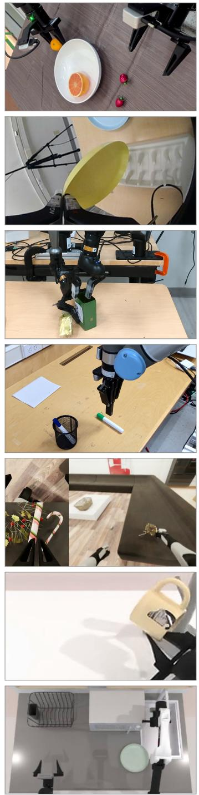

The model   
without grafting   
leaves insufficient   
clearance when placing the tangerine. Real Piper   
plate placement   
(wrist views)   
The model   
without grafting   
misaligns the plate   
and collides with the rack. Real Piper   
tea-can opening   
The model   
without grafting   
grasps the tea-can lid   
too high   
and immediately drops it. Real UR5e   
marker grasp   
The model   
without grafting grasps the marker too high. B1K   
(R1Pro), candy pickup The model   
without grafting   
grasps the candy   
too high. RoboTwin   
(ALOHA), hang mug   
The model   
without grafting   
provides insufficient   
clearance to hang the mug. RoboPRO   
(ALOHA), plate pickup The model   
without grafting   
grasps the plate   
too high.

Successful rollout  
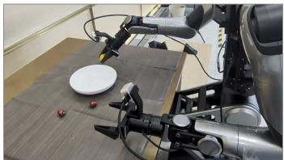  
Failure case

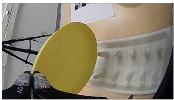

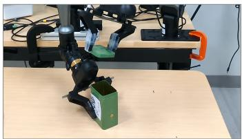

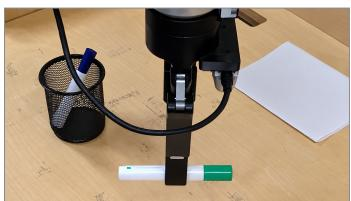

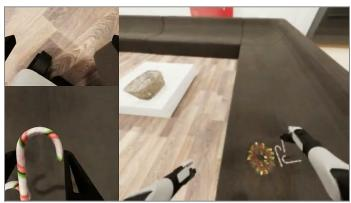

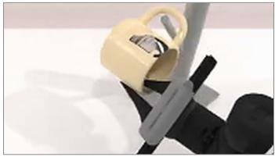

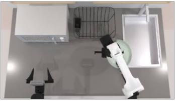  
Fig. 4. Success and failure modes across platforms. Left and right show successful and failed rollouts. For R1Pro fruit placement, improved plate-height estimation leaves clearance above the rim, while the failure approaches too low. For Piper plate placement, better plate–rack alignment avoids collision; th two panels use left- and right-wrist fisheye cameras, respectively. In B1K candy pickup and RoboPRO plate pickup, target depth supports a lower grasp pose. In RoboTwin mug hanging, estimating the rack height positions the mug at the support. The added Piper tea-can opening and UR5e marker-grasp panels are cropped and AI-enhanced for visual clarity; generative deblurring may reconstruct fine details, so these panels are illustrative rather than unaltered experimental frames.

TABLE VI

HOST POLICIES AND GEOMETRY-AWARE POLICIES. ROWS FOLLOW SECTION II. STATUS IS THE VENUE AS OF SUBMISSION; “REAL” DENOTES REAL-ROBOT EXPERIMENTS; TEST-TIME INPUTS ARE WHAT THE DEPLOYED POLICY CONSUMES BEYOND PROPRIOCEPTION. THE FOUR HOSTS CARRY NO GEOMETRY MODULE. EVERY GEOMETRY-AWARE METHOD REPORTS AT MOST THREE EVALUATION SETTINGS; SPATIAL GRAFTING REPORTS FIVE, ON FOUR HOSTS.

<table><tr><td>Method</td><td>Status</td><td>Geometry signal</td><td>Route into the model</td><td>Test-time inputs</td><td>Evaluation</td></tr><tr><td colspan="6">Hosts: VLAs and WAMs</td></tr><tr><td>π0.5</td><td>CoRL&#x27;25</td><td>None</td><td>VLM trunk co-trained with a flow-matching action expert</td><td>RGB</td><td>Real</td></tr><tr><td>X-VLA</td><td>ICLR&#x27;26</td><td>None</td><td>Embodiment-specific soft prompts into a flow-matching transformer</td><td>RGB</td><td>LIBERO; SimplerEnv; CALVIN; VLABench; RoboTwin; Real</td></tr><tr><td>Fast-WAM</td><td>arXiv&#x27;26</td><td>None</td><td>Video and action experts in a shared mixture of transformers; no video generation at inference</td><td>RGB</td><td>LIBERO: RoboTwin: Real</td></tr><tr><td>LingBot-VA</td><td>RSS&#x27;26</td><td>None</td><td>Autoregressive video/action tokens in a mixture of transformers</td><td>RGB</td><td>LIBERO; RoboTwin; Real</td></tr><tr><td colspan="6">Spatial action models compared in Section V</td></tr><tr><td>SpatialVLA</td><td>RSS&#x27;25</td><td>Egocentric 3D points from estimated depth</td><td>Position encoding added to the VLM&#x27;s visual tokens RGB (depth estimated)</td><td></td><td>LIBERO; SimplerEnv; Real</td></tr><tr><td>GeoVLA</td><td>IROS&#x27;26</td><td>Point cloud from depth</td><td>Learned point encoder; tokens fed with VLM embeddings to a 3D-enhanced action expert</td><td>RGB-D sensor</td><td>LIBERO: ManiSkill2: Real</td></tr><tr><td>Spatial Forcing</td><td>ICLR&#x27;26</td><td>Frozen VGGT features (training only)</td><td>Alignment of intermediate visual embeddings; no 3D input at inference</td><td>RGB</td><td>LIBERO; RoboTwin; Real</td></tr><tr><td>GLaD</td><td>arXiv&#x27;25</td><td>Frozen VGGT features (training only)</td><td>Distillation into the language model&#x27;s hidden states over visual tokens</td><td>RGB</td><td>LIBERO: LIBERO-PRO</td></tr><tr><td>WAM4D</td><td>arXiv&#x27;26</td><td>Future depth (training only)</td><td>Spatial register tokens and a depth head, removed for RGB deployment</td><td></td><td>RoboTwin; Real</td></tr><tr><td>SERF</td><td>CoRL&#x27;26</td><td>Persistent neural-point map of scene and robot</td><td>Map tokens prepended to  $\pi _ { 0 . 5 } { \mathrm { ^ 3 } }$  inputs</td><td>RGB-D, simulator instance labels, prior map</td><td>B1K (3 tasks)</td></tr><tr><td colspan="6">Wider geometry-aware literature PointVLA RA-L&#x27;26 Point-cloud features</td></tr><tr><td>GeoPredict</td><td>CVPR&#x27;26</td><td>3D keypoint tracks and Gaussian geometry (training</td><td>Auxiliary predictive supervision</td><td>RGB + point cloud RGB</td><td>RoboTwin 1.0; Real LIBERO; RoboCasa; Real</td></tr><tr><td>3D-Mix</td><td></td><td>only)</td><td></td><td></td><td></td></tr><tr><td>DyWA</td><td>arXiv&#x27;26 ICCV’25</td><td>Frozen VGGT features Partial and goal point clouds</td><td>Gated fusion with the VLM&#x27;s semantic features Joint action and next-state prediction</td><td>RGB Point cloud</td><td>LIBERO; SimplerEnv</td></tr><tr><td>GWM</td><td>ICCV’25</td><td>Dynamic 3D Gaussians</td><td>Action-conditioned Gaussian rollouts feed a separate</td><td>RGB</td><td>Custom simulation; Real Meta-World; RoboCasa; Real</td></tr><tr><td></td><td></td><td></td><td>policy Replicated late diffusion-transformer blocks predict</td><td></td><td></td></tr><tr><td>X-WAM</td><td>arXiv&#x27;26</td><td>Future depth</td><td>depth</td><td>RGB</td><td>RoboCasa; RoboTwin; Real</td></tr><tr><td>MECo-WAM</td><td>arXiv&#x27;26</td><td>Frozen VGGT 4D targets (training only)</td><td>4D expert with decayed read-mask attention, removed for deployment</td><td>RGB</td><td>LIBERO; RoboTwin; Real</td></tr><tr><td>Ours</td><td></td><td>Frozen multi-layer features + metric geometry</td><td>Bank-only cross-attention into the late action layers</td><td>RGB, calibration, depth (measured or predicted)</td><td>LIBERO; RoboTwin; RoboPRO; B1K; Real</td></tr></table>

TABLE VII  
DETAILED LIBERO SR (%). RESULTS ACROSS THE FOUR STANDARD SUITES. VALUES FOR EXTERNAL METHODS ARE REPORTED BY THEIR RESPECTIVE WORKS; THE π BASE IS FROM THE OPENPI RELEASE [41]. HOST AVERAGES MATCH TABLE II; DASHES INDICATE UNAVAILABLE PER-SUITE RESULTS, NOT ZERO SUCCESS. BLOCKS GROUP OTHER BASELINES, EXISTING 3D METHODS, AND OUR HOSTS. GREEN/RED: CHANGE FROM THE HOST’S OWN BASE.
<table><tr><td>Method</td><td>Spat.</td><td>Obj.</td><td>Goal</td><td>Long</td><td>Avg.</td></tr><tr><td>π0</td><td>96.8</td><td>98.8</td><td>95.8</td><td>85.2</td><td>94.1</td></tr><tr><td>OpenVLA-OFT</td><td>97.6</td><td>98.4</td><td>97.9</td><td>94.5</td><td>97.1</td></tr><tr><td>GLaD</td><td>95.0</td><td>97.4</td><td>94.4</td><td>89.4</td><td>94.1</td></tr><tr><td>GeoVLA</td><td>98.4</td><td>99.0</td><td>96.6</td><td>96.6</td><td>97.7</td></tr><tr><td>Spatial Forcing</td><td>99.4</td><td>99.6</td><td>98.8</td><td>96.0</td><td>98.5</td></tr><tr><td>SpatialVLA</td><td>88.2</td><td>89.9</td><td>78.6</td><td>55.5</td><td>78.1</td></tr><tr><td>π0.5</td><td>98.8→99.8+1.0</td><td>98.2→99.8+1.6</td><td>98.0→99.8+1.8</td><td>92.4→99.0+6.6</td><td>96.9→99.6+2.7</td></tr><tr><td>X-VLA</td><td>98.2→99.4+1.2</td><td>98.6→99.6+1.0</td><td>97.8→98.8+1.0</td><td>97.6→97.0-0.6</td><td>98.1→98.7+0.6</td></tr><tr><td>Fast-WAM</td><td>98.2→98.0−0.2</td><td>100.0→98.4−1.6</td><td>97.0→97.2+0.2</td><td>95.2→94.0−1.2</td><td>97.6→96.9-0.7</td></tr><tr><td>LingBot-VA</td><td>98.5→98.6+0.1</td><td>99.6→99.0−0.6</td><td>97.2→98.2+1.0</td><td>98.5→93.8-4.7</td><td>98.5→97.4-1.1</td></tr></table>

SPATIAL GRAFTING: base → graft

TABLE VIII  
PER-TASK ROBOTWIN SR (%), CLEAN/RANDOMIZED. EACH CELL READS CLEAN/RANDOMIZED OVER EXACTLY 20 SEEDS PER TASK; EVERY MODEL AND EVALUATION USES THE SAME SEEDS. DA3 IS THE SPATIAL BACKBONE UNLESS MARKED VGGT-Ω; FAST-WAM AND LINGBOT-VA WITHOUT A SUPERSCRIPT ARE THE UNGRAFTED PUBLIC CHECKPOINTS. THE AVERAGE IS THE MEAN OF THE 50 PER-TASK RATES.
<table><tr><td>Task</td><td> $\pi _ { 0 . 5 } ^ { \mathrm { g r a f t } }$ </td><td> $\mathbf { X } \mathbf { - } \mathbf { V } \mathbf { L A } ^ { \mathrm { g r a f t } }$ </td><td>Fast-WAM</td><td>Fast- WAMgraft</td><td>LingBot-VA</td><td>LingBot- VAgraft</td><td> $\pi _ { 0 . 5 } ^ { \mathrm { g r a f t } }$  (VGGT-Ω)</td></tr><tr><td>Adjust bottle</td><td>100/100</td><td>100/95</td><td>100/95</td><td>100/100</td><td>100/100</td><td>95/95</td><td>100/100</td></tr><tr><td>Beat block hammer</td><td>100/100</td><td>90/85</td><td>100/100</td><td>100/95</td><td>100/100</td><td>100/100</td><td>100/95</td></tr><tr><td>Blocks ranking RGB</td><td>100/95</td><td>100/85</td><td>95/85</td><td>100/90</td><td>75/90</td><td>100/100</td><td>100/100</td></tr><tr><td>Blocks ranking size</td><td>85/70</td><td>75/85</td><td>60/65</td><td>65/85</td><td>85/50</td><td>95/90</td><td>85/75</td></tr><tr><td>Click alarmclock</td><td>95/100</td><td>10/30</td><td>100/100</td><td>100/100</td><td>100/100</td><td>100/100</td><td>95/100</td></tr><tr><td>Click bell</td><td>100/100</td><td>70/90</td><td>100/100</td><td>100/100</td><td>100/100</td><td>100/100</td><td>95/100</td></tr><tr><td>Dump bin bigbin</td><td>95/90</td><td>95/90</td><td>95/95</td><td>95/95</td><td>90/100</td><td>85/95</td><td>80/90</td></tr><tr><td>Grab roller</td><td>100/100</td><td>100/100</td><td>100/100</td><td>100/100</td><td>100/100</td><td>100/100</td><td>100/100</td></tr><tr><td>Handover block</td><td>90/95</td><td>100/85</td><td>60/95</td><td>95/85</td><td>80/80</td><td>100/95</td><td>95/95</td></tr><tr><td>Handover mic</td><td>100/100</td><td>95/90</td><td>95/85</td><td>100/100</td><td>65/100</td><td>95/95</td><td>100/95</td></tr><tr><td>Hanging mug</td><td>50/45</td><td>55/45</td><td>15/25</td><td>40/35</td><td>35/30</td><td>30/30</td><td>20/15</td></tr><tr><td>Lift pot</td><td>100/100</td><td>100/100</td><td>95/95</td><td>100/90</td><td>100/100</td><td></td><td></td></tr><tr><td>Move can pot</td><td>100/95</td><td>100/85</td><td>80/75</td><td>95/70</td><td>85/100</td><td>100/100</td><td>95/90</td></tr><tr><td>Move pillbottle pad</td><td>100/100</td><td>95/100</td><td>100/100</td><td>100/95</td><td>95/95</td><td>90/100</td><td>100/95</td></tr><tr><td>Move playingcard away</td><td>100/100</td><td>100/100</td><td>95/100</td><td></td><td>100/95</td><td>100/100</td><td>100/100</td></tr><tr><td>Move stapler pad</td><td>90/85</td><td>70/75</td><td>65/70</td><td>100/100</td><td>75/70</td><td>100/100</td><td>100/100</td></tr><tr><td>Open laptop</td><td>100/100</td><td>90/95</td><td>95/100</td><td>65/75 90/100</td><td>100/100</td><td>55/65</td><td>80/70</td></tr><tr><td>Open microwave</td><td>70/70</td><td>55/10</td><td>55/75</td><td>80/50</td><td>90/75</td><td>100/95</td><td>95/95</td></tr><tr><td>Pick diverse bottles</td><td>95/100</td><td>50/10</td><td>85/95</td><td>100/100</td><td>80/90</td><td>85/80</td><td>75/80</td></tr><tr><td>Pick dual bottles</td><td></td><td></td><td>95/95</td><td></td><td></td><td>90/90</td><td>95/80</td></tr><tr><td>Place a2b left</td><td>100/100</td><td>100/100 85/80</td><td>75/35</td><td>100/95</td><td>100/100</td><td>100/100</td><td>100/100</td></tr><tr><td>Place a2b right</td><td>95/100 95/100</td><td>70/75</td><td>70/30</td><td>45/55 40/55</td><td>100/75 95/60</td><td>100/100</td><td>100/100</td></tr><tr><td>Place bread basket</td><td></td><td>95/90</td><td>90/85</td><td></td><td>100/95</td><td>100/95</td><td>100/100</td></tr><tr><td>Place bread skillet</td><td>100/100 80/85</td><td>90/85</td><td>85/85</td><td>95/100 95/80</td><td>100/90</td><td>100/100</td><td>95/90</td></tr><tr><td>Place burger fries</td><td>95/95</td><td>100/95</td><td>95/100</td><td>90/95</td><td>90/95</td><td>90/90</td><td>80/95</td></tr><tr><td>Place can basket</td><td>85/75</td><td>80/75</td><td>70/85</td><td>80/70</td><td>80/90</td><td>100/85 85/80</td><td>100/95 90/75</td></tr><tr><td>Place cans plasticbox</td><td>100/100</td><td>100/100</td><td>100/100</td><td>100/100</td><td>100/100</td><td>100/100</td><td></td></tr><tr><td>Place container plate</td><td>100/100</td><td>100/100</td><td>95/90</td><td>100/100</td><td>100/100</td><td>100/95</td><td>100/100 100/100</td></tr><tr><td>Place dual shoes</td><td>100/80</td><td>80/80</td><td>90/95</td><td>85/80</td><td>65/90</td><td>100/90</td><td>90/80</td></tr><tr><td>Place empty cup</td><td>100/100</td><td>80/90</td><td>70/75</td><td>95/55</td><td>100/65</td><td>100/100</td><td>100/100</td></tr><tr><td>Place fan</td><td>100/95</td><td>75/90</td><td>90/100</td><td>80/100</td><td>90/95</td><td>100/95</td><td>100/95</td></tr><tr><td>Place mouse pad</td><td>80/95</td><td>70/75</td><td>75/80</td><td>75/80</td><td>75/75</td><td>100/85</td><td>80/70</td></tr><tr><td>Place object basket</td><td>85/95</td><td>90/95</td><td>55/40</td><td>50/55</td><td>85/50</td><td>90/90</td><td>85/70</td></tr><tr><td>Place object scale</td><td>100/95</td><td>85/90</td><td>90/40</td><td>60/75</td><td>90/90</td><td>95/95</td><td></td></tr><tr><td>Place object stand</td><td>100/100</td><td>90/100</td><td>90/75</td><td>90/90</td><td>100/85</td><td>100/95</td><td>90/100 100/100</td></tr><tr><td>Place phone stand</td><td>100/90</td><td>95/85</td><td>90/90</td><td>95/90</td><td>100/90</td><td>100/95</td><td>90/90</td></tr><tr><td>Place shoe</td><td>100/100</td><td>100/100</td><td>85/95</td><td>95/100</td><td>90/95</td><td>100/100</td><td>95/95</td></tr><tr><td>Press stapler</td><td>90/95</td><td>100/95</td><td>95/95</td><td>95/95</td><td>95/90</td><td>80/90</td><td></td></tr><tr><td>Put bottles dustbin</td><td>100/85</td><td>95/95</td><td>80/95</td><td>95/85</td><td>85/100</td><td></td><td>85/95</td></tr><tr><td>Put object cabinet</td><td>80/75</td><td>75/60</td><td>60/0</td><td>55/25</td><td>85/60</td><td>90/75</td><td>100/90</td></tr><tr><td>Rotate QR code</td><td>90/100</td><td>100/90</td><td>95/90</td><td>90/90</td><td>85/100</td><td>85/80</td><td>95/70</td></tr><tr><td>Scan object</td><td>80/85</td><td>90/80</td><td>5/10</td><td>40/0</td><td>70/5</td><td>95/90</td><td>100/90</td></tr><tr><td>Shake bottle</td><td>100/100</td><td>100/100</td><td>100/100</td><td>100/100</td><td>100/100</td><td>100/95</td><td>90/80</td></tr><tr><td>Shake bottle horizontally</td><td>100/100</td><td>100/100</td><td>100/100</td><td></td><td></td><td>100/100</td><td>100/100</td></tr><tr><td></td><td>95/90</td><td>25/35</td><td></td><td>100/100</td><td>100/100</td><td>100/100</td><td>100/100</td></tr><tr><td>Stack blocks three</td><td>100/85</td><td>95/85</td><td>100/100</td><td>80/100</td><td>90/100</td><td>100/80</td><td>55/75</td></tr><tr><td>Stack blocks two Stack bowls three</td><td>95/90</td><td>65/75</td><td>100/100 70/95</td><td>100/95 85/85</td><td>100/100 60/85</td><td>100/100</td><td>95/95</td></tr><tr><td>Stack bowls two</td><td>100/100</td><td>85/95</td><td>95/100</td><td>95/95</td><td></td><td>90/90</td><td>80/70 100/100</td></tr><tr><td>Stamp seal</td><td>100/85</td><td>65/70</td><td>80/95</td><td>100/80</td><td>100/95 80/80</td><td>100/100 90/90</td></table>

PER-TASK ROBOPRO SUCCESS (%), EASY/HARD. EACH CELL READS EASY (SR)/HARD (HSR) OVER EXACTLY 20 SEEDS PER TASK FOR ALL 80 TASKS IN EACH CONFIGURATION, THE SAME SEEDS FOR EVERY MODEL; AVERAGES ARE THE MEAN OF THE 80 PER-TASK RATES AND MATCH TABLE IV.  
TABLE IX
<table><tr><td rowspan="2"></td><td colspan="2">πg.sft</td><td colspan="2">X-VLAgraft</td></tr><tr><td>Clean</td><td>Clutter</td><td>Clean</td><td>Clutter</td></tr><tr><td>Task Chain apple bin bowl rack spoon sink</td><td>15/15</td><td>10/10</td><td>0/0</td><td>0/0</td></tr><tr><td></td><td>95/85</td><td>100/90</td><td>0/0</td><td>0/0</td></tr><tr><td>Chain apple sink plate bread board</td><td>0/0</td><td>0/0</td><td>0/0</td><td>0/0</td></tr><tr><td>Chain bowl rack apple sink</td><td></td><td>85/75</td><td></td><td>0/0</td></tr><tr><td>Chain heat hamburger</td><td>45/45</td><td></td><td>20/20</td><td></td></tr><tr><td>Chain serve hamburger</td><td>45/45</td><td>0/0</td><td>0/0</td><td>0/0</td></tr><tr><td>Close drawer</td><td>100/100</td><td>100/100</td><td>0/0</td><td>0/0</td></tr><tr><td>Close microwave</td><td>100/100</td><td>100/40</td><td>60/60</td><td>35/35</td></tr><tr><td>Drop apple in bin</td><td>100/95</td><td>80/80</td><td>80/20</td><td>55/0</td></tr><tr><td>Empty box</td><td>95/95</td><td>100/95</td><td>80/80</td><td>30/30</td></tr><tr><td>Move book onto table Move bottle</td><td>95/85 45/45</td><td>100/70 65/55</td><td>100/100</td><td>95/95</td></tr><tr><td>Move bottle from fridge next to can</td><td>100/100</td><td>80/80</td><td>40/40 60/0</td><td>75/70 55/0</td></tr><tr><td>Move can from cabinet to basket</td><td>60/60</td><td>65/60</td><td>80/80</td><td></td></tr><tr><td>Move cup</td><td>70/70</td><td>35/25</td><td>20/20</td><td>5/5 40/40</td></tr><tr><td>Move cup next to book</td><td>100/100</td><td>80/80</td><td>100/100</td><td></td></tr><tr><td>Move cup onto table</td><td>95/95</td><td>60/45</td><td>60/60</td><td>45/15</td></tr><tr><td>Move cup put pen in cup</td><td>70/70</td><td>35/10</td><td>100/100</td><td>75/75</td></tr><tr><td>Move cups into box</td><td>95/95</td><td>70/40</td><td>60/60</td><td>20/15</td></tr><tr><td>Move hamburger onto plate</td><td>100/100</td><td>90/90</td><td>0/0</td><td>20/20 40/40</td></tr><tr><td>Move items around</td><td>20/20</td><td>0/0</td><td>0/0</td><td>0/0</td></tr><tr><td>Move milk close fridge</td><td>90/90</td><td>75/45</td><td>40/0</td><td>0/0</td></tr><tr><td>Move pen to box</td><td>95/95</td><td>60/0</td><td>80/80</td><td>90/0</td></tr><tr><td>Move seal cup next to box</td><td>90/90</td><td>100/90</td><td>80/80</td><td>10/10</td></tr><tr><td>Move seal next to box</td><td>100/100</td><td>100/100</td><td>100/100</td><td>95/95</td></tr><tr><td>Move seal next to pencup</td><td>90/90</td><td>90/90</td><td>100/100</td><td>10/10</td></tr><tr><td>Move seal onto book</td><td>95/95</td><td>100/75</td><td>100/100</td><td>15/15</td></tr><tr><td>Move seal onto table</td><td>100/100</td><td>100/40</td><td>100/100</td><td>90/90</td></tr><tr><td>Open drawer</td><td>100/100</td><td>100/95</td><td>60/60</td><td>60/60</td></tr><tr><td>Organize table</td><td>20/20</td><td>5/5</td><td>0/0</td><td>0/0</td></tr><tr><td>Pick apple from bowl</td><td>100/10</td><td>90/35</td><td>40/0</td><td>15/0</td></tr><tr><td>Pick apple from sink</td><td>95/95</td><td>100/80</td><td>0/0</td><td>0/0</td></tr><tr><td>Pick bottle from fridge</td><td>100/100</td><td>95/35</td><td>100/100</td><td>100/100</td></tr><tr><td>Pick boxdrink from basket</td><td>5/5</td><td>0/0</td><td>100/60</td><td>45/0</td></tr><tr><td>Pick can from basket</td><td>90/5</td><td>100/0</td><td>100/0</td><td>95/45</td></tr><tr><td>Pick can from cabinet</td><td>100/100</td><td>100/70</td><td>60/40</td><td>80/80</td></tr><tr><td>Pick fork from sink</td><td>100/100</td><td>100/95</td><td>0/0</td><td>0/0</td></tr><tr><td>Pick hamburger from microwave</td><td>50/50</td><td>45/15</td><td>0/0</td><td>25/25</td></tr><tr><td>Pick milk box from fridge</td><td>100/100</td><td>95/90</td><td>100/100</td><td>90/90</td></tr><tr><td>Pick sauce can from cabinet</td><td>100/100</td><td>100/5</td><td>100/100</td><td>100/100</td></tr><tr><td>Place bowl in dishrack</td><td>85/85</td><td>100/100</td><td>100/100 100/60</td><td>30/30</td></tr><tr><td>Put book in fileholder</td><td>50/50</td><td>5/5 95/95</td><td>40/20</td><td>30/15</td></tr><tr><td>Put book on book Put bottle in basket</td><td>85/85 100/100</td><td>50/25</td><td>80/80</td><td>60/60 90/90</td></tr><tr><td>Put bottle in fridge</td><td>90/90</td><td>30/0</td><td>100/100</td><td>95/95</td></tr><tr><td>Put bowl in sink</td><td>0/0</td><td>0/0</td><td>60/60</td><td>10/10</td></tr><tr><td>Put bread on board</td><td>100/95</td><td>85/60</td><td>80/0</td><td>60/0</td></tr><tr><td>Put can close cabinet</td><td>95/90</td><td>100/20</td><td>80/80</td><td>0/0</td></tr><tr><td>Put can in cabinet</td><td>85/85</td><td>100/10</td><td>80/60</td><td>95/95</td></tr><tr><td>Put can infront of microwave</td><td>85/85</td><td>100/70</td><td>100/100</td><td>95/95</td></tr><tr><td>Put can next to basket</td><td>40/25</td><td>95/95</td><td>100/100</td><td>65/65</td></tr><tr><td>Put cup in box</td><td>100/100</td><td>90/90</td><td>100/100</td><td>95/95</td></tr><tr><td>Put cup on coaster</td><td>70/70</td><td>0/0</td><td>100/100</td><td>80/80</td></tr><tr><td>Put cup on table</td><td>80/80</td><td>65/60</td><td>80/80 100/100</td><td>45/45</td></tr><tr><td>Put glue in box Put hamburger in microwave</td><td>100/50</td><td>95/50 70/55</td><td>0/0</td><td>80/70</td></tr><tr><td>Put milk box in fridge</td><td>100/95 90/90</td><td>90/40</td><td>100/100</td><td>0/0 90/90</td></tr><tr><td>Put milktea next to laptop</td><td>65/65</td><td>65/40</td><td>80/60</td><td>60/30</td></tr><tr><td>Put milktea on shelf</td><td>65/65</td><td>40/25</td><td>80/80</td><td>75/40</td></tr><tr><td>Put mouse next to stapler</td><td>90/90</td><td>95/80</td><td>100/0</td><td>70/0</td></tr><tr><td>Put mouse on pad</td><td>85/85</td><td>30/30</td><td>80/80</td><td>45/5</td></tr><tr><td>Put pen in box</td><td>100/100</td><td>95/50</td><td>100/100</td><td>35/35</td></tr><tr><td>Put pen in pencup</td><td>20/15</td><td>45/20</td><td>0/0</td><td>0/0</td></tr><tr><td>Put phone next to cube</td><td>90/90</td><td>100/50</td><td>60/0</td><td>45/30</td></tr><tr><td>Put phone on holder</td><td>70/70</td><td>70/65</td><td>60/60</td><td>55/55</td></tr><tr><td>Put plate in sink</td><td>70/70</td><td>50/50</td><td>60/50</td><td>45/35</td></tr><tr><td>Put rubikscube in drawer</td><td>95/95</td><td>90/85</td><td>80/80</td><td>50/45</td></tr><tr><td>Put rubikscube next to milktea</td><td>60/50</td><td>20/20</td><td>80/20</td><td>30/0</td></tr><tr><td>Put sauce can in basket</td><td>95/75</td><td>100/65</td><td>100/100</td><td>95/55</td></tr><tr><td></td><td>100/100</td><td>90/5</td><td>100/100</td><td>85/70</td></tr><tr><td>Put sauce can in cabinet Put seal in box</td><td></td><td>100/100</td><td>100/100</td><td>100/100</td></tr><tr><td>Put spoon in dishrack Put spoon in sink</td><td>100/100 90/90 100/100</td><td>95/95</td><td>20/20</td></table>