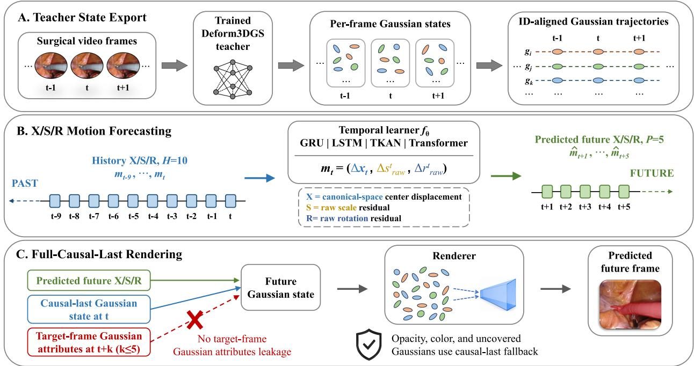
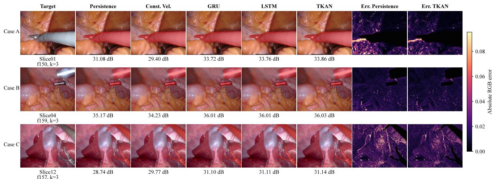
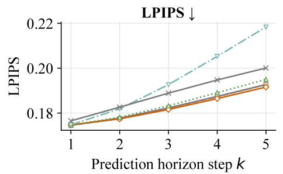
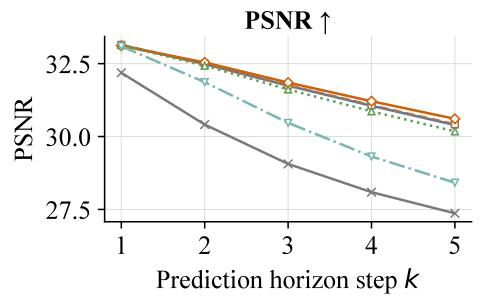
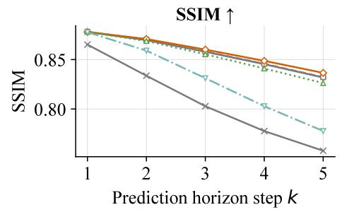
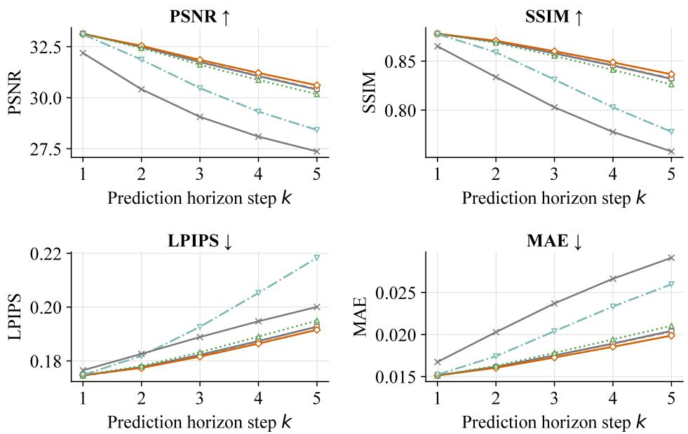
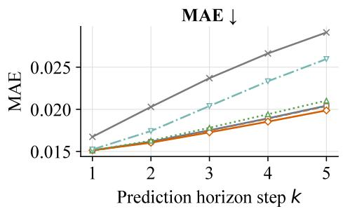
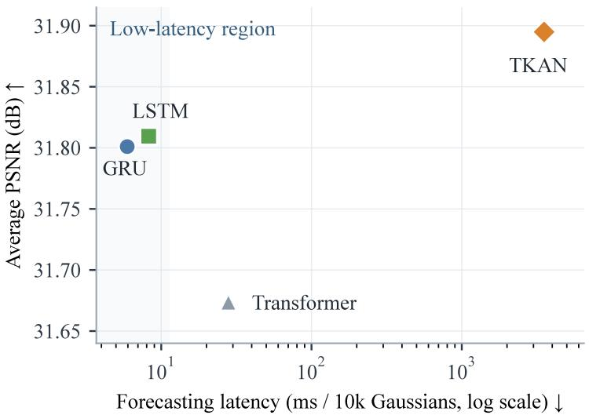

# SurgGMF: Fully Causal Gaussian Motion Forecasting for Anticipatory Surgical Scene Rendering

Jingqian Sun1 Yichao Tang1,2,3,∗

1Shanghai Research Institute for Intelligent Autonomous Systems, Tongji University, Shanghai, China

2School of Mechanical Engineering, Tongji University, Shanghai, China

3Shanghai Innovation Institute, Shanghai, China

∗Corresponding author: tangyichao@tongji.edu.cn

jingqian sun@tongji.edu.cn, tangyichao@tongji.edu.cn

## Abstract

Dynamic surgical scene modeling is essential for robotic perception, simulation, and decision support. Although existing neural rendering methods enable eficient reconstruction and rendering of deformable surgical scenes, they remain primarily focused on observed-frame reconstruction rather than forecasting future scene states. To this end, we present SurgGMF, a fully causal Gaussian motion forecasting framework for anticipatory surgical scene rendering. Rather than predicting future RGB images directly, SurgGMF forecasts future Gaussian motion states represented by position, scale, and rotation residuals (X/S/R) from historical Gaussian motion fields. To prevent target leakage, we introduce a full-causal-last rendering protocol, where future Gaussian states are rendered without accessing target-frame Gaussian attributes while preserving causal appearance propagation. We evaluate SurgGMF on 12 EndoNeRF and StereoMIS video slices using neural temporal learners and classical dynamics baselines under a unified forecasting protocol. Learned Gaussian motion forecasting consistently outperforms classical dynamics baselines in render space, demonstrating gains beyond hand-crafted state extrapolation. Latency analysis further reveals an accuracy–eficiency trade-of: under the current implementations, TKAN achieves the highest accuracy, whereas GRU and LSTM provide more favorable modulelevel latency profiles. These results establish SurgGMF as a reproducible framework for causal Gaussian motion forecasting and advance surgical Gaussian representations from retrospective reconstruction toward predictive scene modeling.

## 1 Introduction

Robot-assisted and image-guided surgical systems increasingly require predictive models of dynamic surgical scenes. In minimally invasive surgery, reconstruction remains challenging due to nonrigid deformation, partial visibility, weak texture, specular reflection, and tool occlusion (Ozyoruk et al. 2021; Wang et al. 2022; Zha et al. 2023). Since surgical reconstruction supports intraoperative navigation and robotic assistance (Wang et al. 2022; Zha et al. 2023), representations that only reconstruct current or previously observed frames are insuficient for tasks requiring short-term anticipation. This motivates surgical scene representations that support both reconstruction and future state prediction.

Recent studies in world modeling and predictive representation learning demonstrate that future state rollout can be enabled by learning latent states and transition dynamics (Bardes et al. 2024; Bruce et al. 2024; Hafner et al. 2025). However, direct pixel forecasting does not expose the structured 3D variables required for geometric reasoning, temporal tracking, and view-consistent rendering. This limitation is particularly relevant in surgical scenes, where deformable geometry is critical for consistent reconstruction and interaction. 3D Gaussian splatting (3DGS) provides a natural state representation for this objective by ofering a renderable Gaussian-based state space (Kerbl et al. 2023). Recent dynamic and surgical Gaussian methods extend 3DGS to deformable and endoscopic scenes (Luiten et al. 2024; Yang et al. 2024c; Huang et al. 2024; Xie et al. 2024; Yang et al. 2024b). However, existing dynamic Gaussian approaches mainly focus on scene reconstruction, motion modeling, or general-purpose extrapolation, while causal forecasting of surgical Gaussian states under strict target-frame isolation remains underexplored.

We introduce SurgGMF, a fully causal Gaussian motion forecasting framework for anticipatory surgical scene rendering. SurgGMF forecasts future Gaussian motion states rather than future RGB images. Given historical Gaussian motion fields, it predicts future Gaussian position, scale, and rotation residuals (X/S/R) and renders future frames by updating Gaussian states. To avoid target leakage, we define a full-causal-last protocol in which predicted frames are rendered without access to target-frame Gaussian attributes; appearance and uncovered primitives are inherited only from the last causally available frame. The goal of SurgGMF is not to identify a single optimal temporal learner, but to establish and analyze a causal surgical Gaussian forecasting formulation. We therefore systematically evaluate neural temporal learners against controlled classical dynamics baselines, analyze Gaussian motion component contributions, and study accuracy–eficiency trade-ofs. Our contributions are:

• We formulate causal Gaussian motion forecasting for anticipatory surgical rendering, predicting future X/S/R Gaussian residuals from historical motion fields without synthesizing future RGB directly.

• We introduce a full-causal-last rendering protocol that prevents access to target-frame Gaussian attributes and enables reproducible evaluation of causal Gaussian forecasting.

• We systematically evaluate neural temporal learners and classical dynamics baselines under a unified X/S/R forecast-and-render protocol.

• We analyze Gaussian motion component contributions and accuracy–eficiency trade-ofs, showing the efectiveness of joint X/S/R prediction and revealing diferent accuracy-latency characteristics among temporal learners under module-level evaluation.

## 2 Related Work

Predictive World Models and Structured Scene Forecasting. World models learn state representations and transition dynamics for future rollout, imagination, and planning (Hafner et al. 2025). Existing approaches commonly predict latent features, visual observations, or actionconditioned trajectories (Bardes et al. 2024; Bruce et al. 2024; Assran et al. 2025; He et al. 2026; Mur-Labadia et al. 2026). Although efective for predictive representation learning, latent- or image-space states do not directly provide explicit geometry for spatial reasoning and view-consistent rendering. Recent autonomous-driving methods therefore introduce structured Gaussian states: GaussianWorld performs streaming 4D occupancy forecasting in a semantic Gaussian space, while GaussianAD predicts Gaussian flow for occupancy forecasting and planning (Zuo et al. 2025; Zheng et al. 2024). These studies establish Gaussian primitives as predictive scene representations, but focus on semantic occupancy and road-scene dynamics rather than rendering continuously deforming surgical anatomy.

Surgical Reconstruction and Dynamic Gaussian Modeling. Neural scene representations have been widely studied for reconstructing deformable surgical environments. EndoNeRF and related neural radiance- or surface-field methods model nonrigid tissue deformation from monocular, stereo, or RGB-D endoscopic observations (Wang et al. 2022; Zha et al. 2023; Yang et al. 2024a). These approaches achieve high-quality reconstruction by jointly optimizing geometry, appearance, and deformation over an observed sequence, but their implicit representations do not naturally expose persistent primitive-level trajectories for downstream temporal forecasting.

3DGS provides an explicit alternative by representing geometry and appearance with anisotropic Gaussian primitives (Kerbl et al. 2023). Dynamic extensions model temporal variation through persistent Gaussian trajectories, canonical-space deformation fields, or explicit spatiotemporal features (Yang et al. 2023; Wu et al. 2024; Luiten et al. 2024; Yang et al. 2024c; Li et al. 2024). Surgical Gaussian methods adapt these formulations to endoscopic scenes using tissue deformation models, depth supervision, tool-aware constraints, or online optimization (Liu et al. 2025; Huang et al. 2024; Xie et al. 2024; Yang et al. 2024b; Hayoz et al. 2024; Paonim et al. 2025; Chen et al. 2025). Collectively, these approaches provide efective representations for reconstructing and tracking observed tissue motion, but generally do not evaluate future-state extrapolation under a fixed historical observation boundary.

Predictive Gaussian Dynamics and Temporal Modeling. Recent work directly predicts future states in Gaussian representations. GaussianPrediction transfers motion from a sparse graph of control keypoints to a dynamic Gaussian scene for motion extrapolation and future free-view synthesis (Zhao et al. 2024). Graph-based Gaussian dynamics models similarly derive control particles from tracked Gaussians and learn action-conditioned object dynamics for manipulation and future rendering (Zhang et al. 2024). Continuous-time approaches provide an alternative: ODE-GS evolves latent Gaussian trajectory representations with a neural ordinary diferential equation, while ParticleGS models Gaussians as a particle system and learns diferential dynamics for motion extrapolation (Wang et al. 2025; Quan et al. 2026). These methods demonstrate that Gaussian states can support learned future extrapolation in general dynamic scenes.

SurgGMF difers primarily in its surgical forecasting formulation and causal evaluation boundary. It forecasts short-horizon position, scale, and rotation residuals from teacher-derived surgical Gaussian trajectories and evaluates all methods using the same full-causal-last renderer, without access to target-frame Gaussian attributes. Its focus is therefore controlled causal evaluation of Gaussian forecast-and-render pipelines for deformable surgical scenes rather than Gaussian extrapolation in general.

Recurrent models such as GRU and LSTM, attention-based Transformers, and TKAN provide complementary inductive biases for multi-step forecasting (Hochreiter and Schmidhuber 1997; Cho et al. 2014; Vaswani et al. 2017; Genet and Inzirillo 2025). we treat these architectures as interchangeable forecasting backbones and compare them with classical dynamics references in a common Gaussian residual space.

## 3 Method

In this study, we introduce SurgGMF, a fully causal Gaussian motion forecasting framework for anticipatory surgical scene rendering. The goal is to predict the future geometric evolution of a dynamic surgical scene representation and evaluate whether the predicted Gaussian states can support future-frame rendering without accessing target-frame Gaussian attributes. SurgGMF operates in a structured Gaussian state space derived from dynamic 3D Gaussian reconstruction, and separates geometric motion forecasting from appearance propagation under a strict causal rendering protocol. This separation allows future geometry to be evaluated independently of target-frame reconstruction. Figure 1 summarizes the overall pipeline.

  
Figure 1: Overview of SurgGMF. A trained Deform3DGS teacher exports temporally aligned Gaussian states. SurgGMF constructs $\mathrm { X } / \mathrm { S } / \mathrm { R }$ motion histories, forecasts future Gaussian motion states with a temporal learner or a dynamics baseline, converts predicted residuals back into future Gaussian states, and evaluates rendered future frames under the full-causal-last protocol.

## 3.1 Causal Gaussian Motion Forecasting

Let a dynamic surgical scene at time t be represented by a set of 3D Gaussian primitives,

$$
\mathcal { G } ^ { t } = \{ g _ { i } ^ { t } \} _ { i = 1 } ^ { N _ { t } } ,
$$

where each Gaussian primitive contains geometric and appearance-related attributes,

$$
g _ { i } ^ { t } = ( x _ { i } ^ { t } , s _ { i } ^ { t } , r _ { i } ^ { t } , \alpha _ { i } ^ { t } , c _ { i } ^ { t } ) .
$$

Here, $\ v x _ { i } ^ { t }$ denotes the Gaussian center, $s _ { i } ^ { t }$ denotes scale parameters, $r _ { i } ^ { t }$ denotes rotation parameters, $\alpha _ { i } ^ { t }$ denotes opacity, and $c _ { i } ^ { t }$ denotes color/appearance features represented by spherical harmonic (SH) coeficients. In our implementation, these Gaussian states are teacher-derived states exported from a trained Deform3DGS model (Yang et al. 2024b). They provide a renderable and temporally aligned state space, but should not be interpreted as physical ground-truth tissue trajectories.

Temporal correspondence is established by a checkpoint-local Gaussian identifier. Since the visible Gaussian subset may vary across frames, SurgGMF constructs training samples only from Gaussian trajectories with complete, finite history and target windows. This yields temporally aligned Gaussian motion sequences without assuming that every frame contains the same primitive set.

Instead of directly predicting future RGB images, SurgGMF forecasts future Gaussian motion states. We define the $\mathrm { X } / \mathrm { S } / \mathrm { R }$ forecasting target as

$$
m _ { i } ^ { t } = ( \Delta x _ { i } ^ { t } , \Delta s _ { i , \mathrm { r a w } } ^ { t } , \Delta r _ { i , \mathrm { r a w } } ^ { t } ) ,
$$

where X denotes the canonical-space center displacement, S denotes the raw scale residual, and R denotes the raw rotation residual. Specifically,

$$
\Delta x _ { i } ^ { t } = x _ { i } ^ { t } - x _ { i } ^ { c } ,
$$

where $\boldsymbol { x } _ { i } ^ { c }$ is the canonical Gaussian center. The scale and rotation targets are raw residuals from the Deform3DGS deformation output before renderer-side activation. This definition treats Gaussian motion as the time-varying residual state of each primitive relative to its canonical configuration, rather than as a simple adjacent-frame displacement.

Given a history window of length H, SurgGMF predicts a future horizon of length $P ;$

$$
\hat { m } _ { i } ^ { t + 1 : t + P } = f _ { \theta } \left( m _ { i } ^ { t - H + 1 : t } \right) .
$$

The implementation augments this history with deterministic velocity and acceleration features, as detailed below. In the formal experiments, we use $H = 1 0$ and $P = 5$ . As illustrated in Figure 1B, a single forward pass jointly predicts all five future steps without autoregressive rollout or ground-truth future-state feedback.

## 3.2 SurgGMF Framework

SurgGMF consists of three stages: motion-sequence construction, temporal forecasting, and future Gaussian state construction.

Motion-sequence construction. Dynamic Gaussian states are converted into $\mathrm { X } / \mathrm { S } / \mathrm { R }$ motion sequences. For each temporally valid Gaussian trajectory, the historical input contains canonicalspace center displacement, raw scale residuals, and raw rotation residuals. To provide local temporal cues, the input also includes first-order velocity and second-order acceleration derived from the historical X trajectory. In the $\mathrm { X } / \mathrm { S } / \mathrm { R }$ setting, each sample is represented as a sequence of length 10, and the per-Gaussian input contains 16 channels: three center-displacement channels, three velocity channels, three acceleration channels, three raw-scale residual channels, and four raw-rotation residual channels. The same temporally aligned history window is used by neural learners and by non-learning dynamics baselines, ensuring that all methods access the same causal information.

Temporal forecasting. A forecasting function $f _ { \theta }$ predicts future $\mathrm { X } / \mathrm { S } / \mathrm { R }$ states. SurgGMF is model-agnostic with respect to the forecasting backbone. In this work, we instantiate it with recurrent, KAN-based, and attention-based learners: GRU, LSTM, TKAN, and Transformer models. All learners share the same input/output construction, $\mathrm { X } / \mathrm { S } / \mathrm { R }$ forecasting target, and downstream rendering protocol. We also evaluate non-learning dynamics baselines in the same $\mathrm { X } / \mathrm { S } / \mathrm { R }$ residual space. This controlled setting allows us to compare diferent temporal inductive biases while keeping the forecasting task and causal evaluation boundary fixed.

Future Gaussian state construction. Predicted $\mathrm { X } / \mathrm { S } / \mathrm { R }$ residuals are converted back into future Gaussian states. For a future step $t + k$ , the predicted geometric attributes are obtained by adding the predicted residuals to the corresponding canonical raw Gaussian parameters:

$$
\hat { x } _ { i } ^ { t + k } = x _ { i } ^ { c } + \widehat { \Delta x } _ { i } ^ { t + k } ,
$$

$$
\begin{array} { r } { \hat { s } _ { i , \mathrm { r a w } } ^ { t + k } = s _ { i , \mathrm { r a w } } ^ { c } + \widehat { \Delta s } _ { i , \mathrm { r a w } } ^ { t + k } , } \end{array}
$$

$$
\begin{array} { r } { \hat { r } _ { i , \mathrm { r a w } } ^ { t + k } = r _ { i , \mathrm { r a w } } ^ { c } + \widehat { \Delta { r } } _ { i , \mathrm { r a w } } ^ { t + k } . } \end{array}
$$

The raw scale and rotation parameters are then passed to the renderer, where the standard Deform3DGS scale and rotation activations are applied. Thus, SurgGMF predicts raw residuals in the Deform3DGS parameter space, while validity constraints such as scale activation and rotation normalization remain handled by the original rendering pipeline.

## 3.3 Full-Causal-Last Rendering Protocol

A central issue in future Gaussian rendering is target-frame leakage. If target-frame Gaussian attributes are used to fill missing or non-forecasted states, the rendered future image may implicitly depend on information unavailable at prediction time. To avoid this, we define a full-causal-last rendering protocol.

For a target frame $T$ and horizon step $k ,$ the causal fill frame is

$$
T _ { \mathrm { f i l l } } = T - k .
$$

The renderer first retrieves the full Gaussian state at $T _ { \mathrm { f i l l } }$ , which serves as the causal base scene. For Gaussians in the forecasted subset, the predicted $\mathrm { X } / \mathrm { S } / \mathrm { R }$ attributes are injected into their causal-last geometry. All uncovered Gaussians remain at their $T _ { \mathrm { f i l l } }$ states, as illustrated in Figure 1C. Opacity and SH features are also propagated from the causal-last state because the formal task forecasts geometry only. Our preliminary appearance-forecasting diagnostics show that elevating these attributes to formal prediction targets was unsatisfactory. This construction preserves a common causal base scene while allowing only predicted geometry to vary across methods.

Under this protocol, the predicted Gaussian state for frame $T$ can be summarized as

$$
\hat { \mathcal { G } } ^ { T } = ( \hat { x } ^ { T } , \hat { s } _ { \mathrm { r a w } } ^ { T } , \hat { r } _ { \mathrm { r a w } } ^ { T } , \alpha ^ { T _ { \mathrm { f l l } } } , c ^ { T _ { \mathrm { f l l } } } ) ,
$$

where $\hat { x } ^ { T } , \hat { s } _ { \mathrm { r a w } } ^ { T }$ , and $\hat { r } _ { \mathrm { r a w } } ^ { T }$ are provided by the forecasting method for the forecastable trajectory subset, while $\alpha ^ { T _ { \mathrm { f i l l } } }$ and $c ^ { T _ { \mathrm { f i l l } } }$ are inherited from the causal-last frame. No target-frame Gaussian attributes, including $x ^ { T } , s _ { \mathrm { r a w } } ^ { T } , r _ { \mathrm { r a w } } ^ { T } , \alpha ^ { T } , \mathrm { o r } c ^ { T }$ , are used to construct the predicted scene.

The target-frame camera parameters are used only to render the predicted Gaussian state from the target viewpoint, while the target image and valid mask are used only for image-space evaluation. They are not used as model inputs or as Gaussian attribute sources. Therefore, the protocol is fully causal with respect to Gaussian state and attribute access, while still enabling render-space evaluation against the target observation.

## 3.4 Neural Learners and Dynamics Baselines

All neural temporal learners regress future $\mathrm { X } / \mathrm { S } / \mathrm { R }$ residuals using an attribute-wise weighted mean-squared objective over all samples, horizon steps, and target dimensions:

$$
\mathcal { L } = \frac { w _ { x } \mathrm { S S E } _ { x } + w _ { s } \mathrm { S S E } _ { s } + w _ { r } \mathrm { S S E } _ { r } } { w _ { x } N _ { x } + w _ { s } N _ { s } + w _ { r } N _ { r } } ,
$$

  
Figure 2: Qualitative future-frame rendering comparison under the full-causal-last protocol at an intermediate horizon $\left( k = 3 \right)$ . The layout compares the target, persistence, constant velocity, GRU, LSTM, and TKAN forecasts, together with selected error maps. Error maps show absolute RGB diferences to the target under the same valid mask; darker colors indicate smaller errors. Red regions denote surgical instrument masks, which are excluded from Deform3DGS reconstruction and rendering and are shown only for visualization.

where $\mathrm { S S E } _ { x } , \mathrm { S S E } _ { s } .$ , and $\mathrm { S S E } _ { r }$ denote the summed squared errors for center displacement, raw scale residual, and raw rotation residual, respectively. We set $w _ { x } = 1 . 0 , w _ { s } = 0 . 2 5$ , and $w _ { r } = 0 . 2 5$ without horizon-specific weighting.

We instantiate $f _ { \theta }$ with four neural learner families. GRU and LSTM provide recurrent baselines with gated state updates; the Transformer encoder provides an attention-based baseline; and TKAN provides a KAN-based time-series learner alternative. GRU and LSTM use three layers with hidden dimension 256, TKAN uses three TKAN layers with 256 units, and the Transformer uses hidden dimension 256, three encoder layers, eight attention heads, and feed-forward dimension 1024. All neural learners directly predict all five future steps in a single forward pass and use the same $\mathrm { X } / \mathrm { S } / \mathrm { R }$ target and full-causal-last renderer.

We also evaluate five non-learning dynamics baselines in the same $\mathrm { X } / \mathrm { S } / \mathrm { R }$ residual space: persistence, constant velocity, linear fitting, constant acceleration, and Kalman-CV. These baselines serve as controlled residual-space references rather than biomechanical tissue models; their definitions are provided in the experimental setup.

## 4 Experiments and Analysis

## 4.1 Experimental Setup and Baselines

We evaluate SurgGMF on 12 surgical video slices from EndoNeRF (Wang et al. 2022) and StereoMIS (Hayoz et al. 2023), including one cutting sequence, one pulling sequence, and ten StereoMIS temporal segments. Most slices contain approximately 150–200 frames at 30–40 FPS, corresponding to roughly five seconds, whereas the pulling slice contains 63 frames. For each slice, a trained Deform3DGS teacher exports per-frame Gaussian states, which define the renderable state space for $\mathrm { X } / \mathrm { S } / \mathrm { R }$ forecasting. We construct temporally aligned Gaussian trajectories with history length $H = 1 0$ and prediction horizon $P = 5$ , corresponding to approximately 0.25–0.33 seconds of history and $0 . 1 2 5 \mathrm { - } 0 . 1 6 7$ seconds of future prediction. Each slice is chronologically partitioned into training, validation, and test subsets using a $7 0 \% / 1 5 \% / 1 5 \%$ split. We retain Gaussian trajectory windows with complete and finite $\mathrm { X } / \mathrm { S } / \mathrm { R }$ histories and targets. Across all 12 video slices, more than 99.9% of the candidate trajectory windows pass these validity checks. As summarized in Table 1, boundary filtering yields 1,165 legal frame-horizon pairs per forecasting method. Across nine methods, the evaluation archive contains 108 dataset–method combinations and 10,485 rendered predictions. Training was conducted on an NVIDIA GeForce RTX 4090 GPU. Model-only inference latency was measured in FP32 on the same CUDA device using batches of 10,000 Gaussian trajectories, following 20 warm-up iterations and 100 timed repetitions.

<table><tr><td>Slice</td><td>Source</td><td>Pairs / method</td><td>Rendered instances</td></tr><tr><td>01</td><td>EndoNeRF cutting</td><td>75</td><td>675</td></tr><tr><td>02</td><td>EndoNeRF pulling</td><td>25</td><td>225</td></tr><tr><td>03</td><td>StereoMIS P1A</td><td>105</td><td>945</td></tr><tr><td>04</td><td>StereoMIS P1B</td><td>115</td><td>1,035</td></tr><tr><td>05</td><td>StereoMIS P2-0</td><td>90</td><td>810</td></tr><tr><td>06</td><td>StereoMIS P2-2</td><td>90</td><td>810</td></tr><tr><td>07</td><td>StereoMIS P2-5</td><td>90</td><td>810</td></tr><tr><td>08</td><td>StereoMIS P2-6A</td><td>95</td><td>855</td></tr><tr><td>09</td><td>StereoMIS P2-6B</td><td>110</td><td>990</td></tr><tr><td>10</td><td>StereoMIS P2-7</td><td>140</td><td>1,260</td></tr><tr><td>11</td><td>StereoMIS P2-8</td><td>115</td><td>1,035</td></tr><tr><td>12</td><td>StereoMIS P3</td><td>115</td><td>1,035</td></tr><tr><td>Total</td><td></td><td>1,165</td><td>10,485</td></tr></table>

Table 1: Evaluation slices and valid render-space pairs. Pair counts denote valid frame–horizon pairs per forecasting method after boundary filtering; rendered instances multiply each count by the nine evaluated methods.

Render-space quality is evaluated with PSNR, SSIM, LPIPS, and MAE after full-causal-last rendering. PSNR, SSIM, and LPIPS follow the masked-current protocol, whereas MAE follows the valid-strict rendering protocol. These metrics assess whether predicted Gaussian motion improves future-frame rendering rather than only reducing Gaussian-parameter regression error.

All forecasting methods use the same causal history, predicted-frame export, renderer, masks, and metrics. Persistence propagates the last observed residual state, $\hat { m } _ { i } ^ { t + k } = m _ { i } ^ { t }$ . Constant velocity extrapolates from the last two history states. Linear fit uses the ful $H = 1 0$ history window to fit a least-squares linear trend per $\mathrm { X } / \mathrm { S } / \mathrm { R }$ channel. Constant acceleration estimates second-order residual dynamics from the final history states. Kalman-CV applies a lightweight constant-velocity Kalman-style filter to the vectorized $\mathrm { X } / \mathrm { S } / \mathrm { R }$ residual state. These baselines test whether learned models add predictive value beyond hand-crafted residual extrapolation.

## 4.2 Main Benchmark: Classical vs Neural Forecasting

Table 2 compares neural temporal learners with non-learning dynamics baselines over the 12 surgical video slices. Among the classical methods, constant velocity achieves the best PSNR, SSIM, and MAE, improving over persistence by 1.211 dB in PSNR and reducing MAE from 0.0230 to 0.0203. Persistence nevertheless obtains the best classical LPIPS, indicating that improved pixel-level alignment from linear motion extrapolation does not necessarily translate into better perceptual similarity. Constant acceleration provides only limited gains over persistence in PSNR and SSIM while degrading LPIPS and MAE, whereas linear fitting and Kalman-CV underperform persistence across all four metrics.

<table><tr><td>Method</td><td>PSNR ↑</td><td>SSIM ↑</td><td>LPIPS ↓</td><td>MAE↓</td></tr><tr><td>Persistence</td><td>29.480</td><td>0.8133</td><td>0.1818</td><td>0.0230</td></tr><tr><td>Const. Vel.</td><td>30.691</td><td>0.8343</td><td>0.1888</td><td>0.0203</td></tr><tr><td>Linear fit Const. Accel.</td><td>28.717 29.918</td><td>0.7892</td><td>0.2004</td><td>0.0255</td></tr><tr><td></td><td></td><td>0.8145</td><td>0.2185</td><td>0.0234</td></tr><tr><td>Kalman-CV</td><td>26.638</td><td>0.7259</td><td>0.2820</td><td>0.0331</td></tr><tr><td>GRU</td><td>31.801</td><td>0.8611</td><td>0.1768</td><td>0.0175</td></tr><tr><td>LSTM</td><td>31.810</td><td>0.8614</td><td>0.1768</td><td>0.0175</td></tr><tr><td>Transformer</td><td>31.674</td><td>0.8585</td><td>0.1778</td><td>0.0178</td></tr><tr><td>TKAN</td><td></td><td></td><td></td><td></td></tr><tr><td></td><td>31.895</td><td>0.8633</td><td>0.1764</td><td>0.0172</td></tr></table>

Table 2: Average render-space performance over 12 surgical video slices. Higher PSNR and SSIM are better; lower LPIPS and MAE are better. Const. Vel. denotes constant velocity; Const. Accel. denotes constant acceleration.

Each neural learner exceeds the corresponding best classical score on every evaluated metric. Relative to the metric-wise best classical scores, the neural models improve PSNR by 0.983–1.204 dB and SSIM by 0.0242–0.0290, while reducing LPIPS by 0.0040–0.0054 and MAE by 0.0025–0.0031. These consistent gains show that learned temporal forecasting captures predictive structure beyond persistence and hand-crafted residual extrapolation.

The neural learners form a comparatively tight performance group. TKAN achieves the best numerical averages across PSNR, SSIM, LPIPS, and MAE, but its margins over GRU and LSTM are modest. LSTM and GRU produce nearly identical results, while the Transformer is slightly weaker under the evaluated short-history, short-horizon setting. The benchmark therefore supports learned Gaussian motion forecasting as a model family rather than attributing the improvement to a single temporal backbone.

Because all methods share the same causal history, predicted-state construction, renderer, masks, and metrics, Table 2 primarily isolates diferences in predicted $\mathrm { X } / \mathrm { S } / \mathrm { R }$ residual quality.

## 4.3 Qualitative and Horizon Analysis

Figure 2 compares future-frame renderings at the intermediate horizon $\left( k = 3 \right)$ . Across the displayed cases, learned forecasts more closely match the target in regions afected by tissue deformation and tool–tissue interaction. The selected TKAN error maps also show lower valid-region RGB errors than the classical references in the displayed examples, consistent with the aggregate results in Table 2.

Figure 3 reports render-space performance over the five prediction steps. Performance generally decreases as the horizon increases because future states become progressively farther from the observed history. Nevertheless, the learned models retain an advantage over the classical dynamics references across the evaluated horizons, indicating that their gains are not confined to the nearest prediction step. The predicted $\mathrm { X } / \mathrm { S } / \mathrm { R }$ dynamics therefore remain useful throughout the evaluated short-term forecasting range.

Because every horizon is evaluated without target-frame Gaussian attribute access, the observed degradation reflects increasing forecasting dificulty rather than changing future-state availability. Appearance attributes and uncovered primitives remain at their corresponding causal-last states, preventing horizon-dependent quality from being inflated by target-state filling.

  
Figure 3: Per-horizon render-space performance under the full-causal-last protocol. Metrics are averaged over valid frame-horizon pairs from 12 surgical video slices. Learned forecasting methods remain stronger than the classical dynamics references across the evaluated prediction horizons.

## 4.4 Gaussian Motion Target Ablation

We investigate how the choice of predicted Gaussian motion attributes afects future-frame rendering. For both LSTM and TKAN, we independently train four forecasting variants with diferent output targets: position only (X), position and scale (X+S), position and rotation (X+R), and the complete position–scale–rotation target (X+S+R). All variants use the same historical input, training data, forecasting horizon, causal rendering protocol, masks, and evaluation metrics; only the supervised output attributes difer. During inference, attributes not included in a model’s forecasting target are retained from the causal-last Gaussian state.

Table 3 shows a consistent forecasting-target trend across both temporal backbones. Positiononly forecasting alone provides a meaningful baseline, but does not fully capture the future evolution of the anisotropic Gaussian representation. Adding scale to the position target improves PSNR by 0.330 dB for LSTM and 0.347 dB for TKAN. Adding rotation produces substantially larger gains of 0.972 dB and 1.048 dB, respectively, with corresponding improvements in SSIM, LPIPS, and MAE. Under the evaluated surgical sequences, rotation is therefore more informative than scale when added conditionally to position forecasting.

The joint X+S+R target performs best for both models. Compared to X-only forecasting, it improves PSNR by 1.240 dB for LSTM and 1.325 dB for TKAN, while simultaneously yielding the highest SSIM alongside the lowest LPIPS and MAE. Its advantage over X+R shows that scale provides complementary information, despite having a smaller isolated gain over X than rotation does. The identical ordering for LSTM and TKAN indicates that the benefit of joint X/S/R forecasting is consistent across diferent temporal backbones rather than being specific to a single architecture.

<table><tr><td>Model</td><td>Target</td><td>PSNR ↑</td><td>SSIM ↑</td><td>LPIPS ↓</td><td>MAE↓</td></tr><tr><td>LSTM</td><td>X</td><td>30.570</td><td>0.8401</td><td>0.1798</td><td>0.02039</td></tr><tr><td>LSTM</td><td>X+S</td><td>30.900</td><td>0.8438</td><td>0.1791</td><td>0.01952</td></tr><tr><td>LSTM</td><td>X+R</td><td>31.542</td><td>0.8589</td><td>0.1774</td><td>0.01809</td></tr><tr><td>LSTM</td><td>X+S+R</td><td>31.810</td><td>0.8614</td><td>0.1768</td><td>0.01746</td></tr><tr><td>TKAN</td><td>X</td><td>30.570</td><td>0.8404</td><td>0.1798</td><td>0.02037</td></tr><tr><td>TKAN</td><td>X+S</td><td>30.917</td><td>0.8442</td><td>0.1791</td><td>0.01946</td></tr><tr><td>TKAN</td><td>X+R</td><td>31.618</td><td>0.8607</td><td>0.1771</td><td>0.01787</td></tr><tr><td>TKAN</td><td> $\mathrm { X + S + R }$ </td><td>31.895</td><td>0.8633</td><td>0.1764</td><td>0.01723</td></tr></table>

Table 3: Forecasting-target ablation with independently trained variants. X predicts position only; X+S adds raw scale residuals; X+R adds raw rotation residuals; X+S+R predicts all three components.

## 4.5 Accuracy–Eficiency Trade-of

In addition to forecasting accuracy, we evaluate the computational cost of the neural temporal learners at two levels: model-only forecasting latency and minimal forecast–render latency. The first isolates temporal-learner inference, whereas the latter additionally includes history processing, predicted-state construction, and CUDA rasterization. Both are module-level measurements.

As shown in Figure 4, GRU is the fastest model at 5.94 ms, followed by LSTM at 8.25 ms and the Transformer at 27.99 ms. TKAN achieves the highest average accuracy but requires 3,530 ms under the current Keras/JAX implementation. Its PSNR advantage over LSTM and GRU is only 0.085 and 0.094 dB, respectively. Thus, TKAN represents the accuracy-oriented operating point, whereas GRU and LSTM provide substantially more favorable module-level accuracy–latency trade-ofs.

  
Figure 4: Accuracy–eficiency trade-of for neural Gaussian motion forecasting. Average render-space PSNR is compared with model-only latency for direct five-step $\mathrm { X } / \mathrm { S } / \mathrm { R }$ prediction over 10,000 Gaussian trajectories. Latency depends on both the model and its evaluated software backend.

The forecast–render results confirm the eficiency advantage of recurrent learners. As shown in Table 4, with AMP, GRU reaches 55.1 FPS and LSTM 41.6 FPS, compared with 14.0 FPS for the Transformer. GRU provides the lowest latency, while LSTM retains nearly identical forecasting accuracy at a moderate additional cost. Because TKAN is evaluated with Keras/JAX and the remaining learners with PyTorch, these measurements characterize the current model– implementation combinations rather than architecture-intrinsic eficiency. The reported FPS values also exclude several upstream and system-level operations and should not be interpreted as end-to-end robotic-system real-time performance.

<table><tr><td>Model</td><td>Precision</td><td>Latency (ms) ↓ FPS ↑</td></tr><tr><td>GRU</td><td>FP32</td><td>35.08 28.5</td></tr><tr><td>GRU</td><td>AMP</td><td>18.14 55.1</td></tr><tr><td>LSTM</td><td>FP32</td><td>46.67 21.4</td></tr><tr><td>LSTM</td><td>AMP</td><td>24.05 41.6</td></tr><tr><td>Transformer</td><td>FP32</td><td>151.99 6.6</td></tr><tr><td>Transformer</td><td>AMP</td><td>71.66 14.0</td></tr></table>

Table 4: Minimal forecast–render latency for the PyTorch backbones. FPS is derived from the corresponding module latency.

## 5 Conclusion

In this paper, we present SurgGMF, a fully causal Gaussian motion forecasting framework for anticipatory surgical scene rendering. Under the full-causal-last protocol, learned temporal models outperform classical dynamics baselines, while independently trained forecasting-target ablations support joint $\mathrm { X } / \mathrm { S } / \mathrm { R }$ forecasting. Latency analysis further reveals a practical accuracy–eficiency trade-of: TKAN achieves the highest average accuracy under the current implementation, whereas GRU and LSTM provide more favorable module-level accuracy–latency trade-ofs. The current study focuses on short-horizon geometry forecasting and is evaluated at the module level; future work will extend it toward longer-horizon forecasting, joint geometry–appearance prediction, and end-to-end online deployment.

## Conflicts of Interest

The authors declare that they have no conflicts of interest.

## References

Mido Assran, Adrien Bardes, David Fan, Quentin Garrido, Russell Howes, Mojtaba Komeili, Matthew Muckley, Ammar Rizvi, Claire Roberts, Koustuv Sinha, Artem Zholus, Sergio Arnaud, Abha Gejji, Ada Martin, Francois Robert Hogan, Daniel Dugas, Piotr Bojanowski, Vasil Khalidov, Patrick Labatut, Francisco Massa, Marc Szafraniec, Kapil Krishnakumar, Yong Li, Xiaodong Ma, Sarath Chandar, Franziska Meier, Yann LeCun, Michael Rabbat, and Nicolas Ballas. V-JEPA 2: Self-Supervised Video Models Enable Understanding, Prediction and Planning, June 2025.

Adrien Bardes, Quentin Garrido, Jean Ponce, Xinlei Chen, Michael Rabbat, Yann LeCun, Mahmoud Assran, and Nicolas Ballas. Revisiting Feature Prediction for Learning Visual Representations from Video, February 2024.

Jake Bruce, Michael D. Dennis, Ashley Edwards, Jack Parker-Holder, Yuge Shi, Edward Hughes, Matthew Lai, Aditi Mavalankar, Richie Steigerwald, Chris Apps, Yusuf Aytar, Sarah Maria Elisabeth Bechtle, Feryal Behbahani, Stephanie C. Y. Chan, Nicolas Heess, Lucy Gonzalez, Simon Osindero, Sherjil Ozair, Scott Reed, Jingwei Zhang, Konrad Zolna, Jef Clune, Nando De Freitas, Satinder Singh, and Tim Rockt¨aschel. Genie: Generative Interactive Environments. In Proceedings of the 41st International Conference on Machine Learning, pages 4603–4623. PMLR, July 2024.

Jialei Chen, Xin Zhang, Mobarak I. Hoque, Francisco Vasconcelos, Danail Stoyanov, Daniel S. Elson, and Baoru Huang. SurgicalGS: Dynamic 3D Gaussian Splatting for Accurate Robotic-Assisted Surgical Scene Reconstruction. In James C. Gee, Daniel C. Alexander, Jaesung Hong, Juan Eugenio Iglesias, Carole H. Sudre, Archana Venkataraman, Polina Golland, Jong Hyo Kim, and Jinah Park, editors, Medical Image Computing and Computer Assisted Intervention – MICCAI 2025, pages 572–582, Cham, September 2025. Springer Nature Switzerland. ISBN 978-3-032-05140-0. doi: 10.1007/978-3-032-05141-7 55.

Kyunghyun Cho, Bart van Merri¨enboer, Caglar Gulcehre, Dzmitry Bahdanau, Fethi Bougares, Holger Schwenk, and Yoshua Bengio. Learning Phrase Representations using RNN Encoder–Decoder for Statistical Machine Translation. In Alessandro Moschitti, Bo Pang, and Walter Daelemans, editors, Proceedings of the 2014 Conference on Empirical Methods in Natural Language Processing (EMNLP), pages 1724–1734, Doha, Qatar, 2014. Association for Computational Linguistics. doi: 10.3115/v1/D14-1179.

Remi Genet and Hugo Inzirillo. TKAN: Temporal Kolmogorov-Arnold Networks, July 2025.

Danijar Hafner, Jurgis Pasukonis, Jimmy Ba, and Timothy Lillicrap. Mastering Diverse Control Tasks Through World Models. Nature, 640(8059):647–653, April 2025. ISSN 0028-0836. doi: 10.1038/s41586-025-08744-2.

Michel Hayoz, Christopher Hahne, Mathias Gallardo, Daniel Candinas, Thomas Kurmann, Maximilian Allan, and Raphael Sznitman. Learning how to robustly estimate camera pose in endoscopic videos. International Journal of Computer Assisted Radiology and Surgery, 18(7):1185–1192, May 2023. ISSN 1861-6429. doi: 10.1007/s11548-023-02919-w.

Michel Hayoz, Christopher Hahne, Thomas Kurmann, Max Allan, Guido Beldi, Daniel Candinas, Pablo M´arquez-Neila, and Raphael Sznitman. Online 3D Reconstruction and Dense Tracking in Endoscopic Videos. In Marius George Linguraru, Qi Dou, Aasa Feragen, Stamatia Giannarou, Ben Glocker, Karim Lekadir, and Julia A. Schnabel, editors, Medical Image Computing and Computer Assisted Intervention – MICCAI 2024, pages 444–454, Cham, 2024. Springer Nature Switzerland. ISBN 978-3-031-72088-8. doi: 10.1007/978-3-031-72089-5 42.

Muyang He, Hanzhong Guo, Junxiong Lin, and Yizhou Yu. Video Generation Models as World Models: Eficient Paradigms, Architectures and Algorithms, May 2026.

Sepp Hochreiter and J¨urgen Schmidhuber. Long Short-Term Memory. Neural Computation, 9(8): 1735–1780, November 1997. ISSN 0899-7667. doi: 10.1162/neco.1997.9.8.1735.

Yiming Huang, Beilei Cui, Long Bai, Ziqi Guo, Mengya Xu, Mobarakol Islam, and Hongliang Ren. Endo-4DGS: Endoscopic Monocular Scene Reconstruction with 4D Gaussian Splatting. In Marius George Linguraru, Qi Dou, Aasa Feragen, Stamatia Giannarou, Ben Glocker, Karim Lekadir, and Julia A. Schnabel, editors, Medical Image Computing and Computer Assisted Intervention – MICCAI 2024, pages 197–207, Cham, 2024. Springer Nature Switzerland. ISBN 978-3-031-72088-8. doi: 10.1007/978-3-031-72089-5 19.

Bernhard Kerbl, Georgios Kopanas, Thomas Leimk¨uhler, and George Drettakis. 3D Gaussian Splatting for Real-Time Radiance Field Rendering. ACM Transactions on Graphics, 42(4): 139:1–139:14, 2023. doi: 10.1145/3592433.

Zhan Li, Zhang Chen, Zhong Li, and Yi Xu. Spacetime Gaussian Feature Splatting for Real-Time Dynamic View Synthesis. In 2024 IEEE/CVF Conference on Computer Vision and Pattern Recognition (CVPR), pages 8508–8520, Seattle, WA, USA, June 2024. IEEE. ISBN 979-8-3503- 5300-6. doi: 10.1109/CVPR52733.2024.00813.

Yifan Liu, Chenxin Li, Hengyu Liu, Chen Yang, and Yixuan Yuan. Foundation Model-Guided Gaussian Splatting for 4D Reconstruction of Deformable Tissues. IEEE Transactions on Medical Imaging, 44(6):2672–2682, June 2025. ISSN 0278-0062. doi: 10.1109/TMI.2025.3545183.

Jonathon Luiten, Georgios Kopanas, Bastian Leibe, and Deva Ramanan. Dynamic 3D Gaussians: Tracking by Persistent Dynamic View Synthesis. In 2024 International Conference on 3D Vision (3DV), pages 800–809, Davos, Switzerland, March 2024. doi: 10.1109/3DV62453.2024.00044.

Lorenzo Mur-Labadia, Matthew Muckley, Amir Bar, Mido Assran, Koustuv Sinha, Mike Rabbat, Yann LeCun, Nicolas Ballas, and Adrien Bardes. V-JEPA 2.1: Unlocking Dense Features in Video Self-Supervised Learning, June 2026.

Kutsev Bengisu Ozyoruk, Guliz Irem Gokceler, Taylor L. Bobrow, Gulfize Coskun, Kagan Incetan, Yasin Almalioglu, Faisal Mahmood, Eva Curto, Luis Perdigoto, Marina Oliveira, Hasan Sahin, Helder Araujo, Henrique Alexandrino, Nicholas J. Durr, Hunter B. Gilbert, and Mehmet Turan. EndoSLAM dataset and an unsupervised monocular visual odometry and depth estimation approach for endoscopic videos. Medical Image Analysis, 71:102058, July 2021. ISSN 1361-8415. doi: 10.1016/j.media.2021.102058.

Thatphum Paonim, Chayapon Sasnarukkit, Natawut Nupairoj, and Peerapon Vateekul. EndoPlanar: Deformable Planar-Based Gaussian Splatting for Surgical Scene Reconstruction. In James C. Gee, Daniel C. Alexander, Jaesung Hong, Juan Eugenio Iglesias, Carole H. Sudre, Archana Venkataraman, Polina Golland, Jong Hyo Kim, and Jinah Park, editors, Medical Image Computing and Computer Assisted Intervention – MICCAI 2025, pages 127–136, Cham, September 2025. Springer Nature Switzerland. ISBN 978-3-032-05140-0. doi: 10.1007/978-3-032-05141-7 13.

Jinsheng Quan, Qiaowei Miao, Yichao Xu, Zizhuo Lin, Ying Li, Wei Yang, Zhihui Li, and Yawei Luo. ParticleGS: Learning Neural Gaussian Particle Dynamics from Videos for Prior-free Physical Motion Extrapolation. In Proceedings of the IEEE/CVF Conference on Computer Vision and Pattern Recognition, pages 8331–8341, 2026.

Ashish Vaswani, Noam Shazeer, Niki Parmar, Jakob Uszkoreit, Llion Jones, Aidan N. Gomez, Lukasz Kaiser, and Illia Polosukhin. Attention Is All You Need. In Advances in Neural Information Processing Systems, volume 30, 2017.

Daniel Wang, Patrick Rim, Tian Tian, Dong Lao, Alex Wong, and Ganesh Sundaramoorthi. ODE-GS: Latent ODEs for Dynamic Scene Extrapolation with 3D Gaussian Splatting. In The Fourteenth International Conference on Learning Representations, October 2025.

Yuehao Wang, Yonghao Long, Siu Hin Fan, and Qi Dou. Neural Rendering for Stereo 3D Reconstruction of Deformable Tissues in Robotic Surgery. In Linwei Wang, Qi Dou, P. Thomas Fletcher, Stefanie Speidel, and Shuo Li, editors, Medical Image Computing and Computer Assisted

Intervention – MICCAI 2022, pages 431–441, Cham, 2022. Springer Nature Switzerland. ISBN 978-3-031-16448-4. doi: 10.1007/978-3-031-16449-1 41.

Guanjun Wu, Taoran Yi, Jiemin Fang, Lingxi Xie, Xiaopeng Zhang, Wei Wei, Wenyu Liu, Qi Tian, and Xinggang Wang. 4D Gaussian Splatting for Real-Time Dynamic Scene Rendering. In 2024 IEEE/CVF Conference on Computer Vision and Pattern Recognition (CVPR), pages 20310–20320, Seattle, WA, USA, June 2024. IEEE. ISBN 979-8-3503-5300-6. doi: 10.1109/CVPR52733.2024. 01920.

Weixing Xie, Junfeng Yao, Xianpeng Cao, Qiqin Lin, Zerui Tang, Xiao Dong, and Xiaohu Guo. SurgicalGaussian: Deformable 3D Gaussians for High-Fidelity Surgical Scene Reconstruction. In Marius George Linguraru, Qi Dou, Aasa Feragen, Stamatia Giannarou, Ben Glocker, Karim Lekadir, and Julia A. Schnabel, editors, Medical Image Computing and Computer Assisted Intervention – MICCAI 2024, pages 617–627, Cham, 2024. Springer Nature Switzerland. ISBN 978-3-031-72088-8. doi: 10.1007/978-3-031-72089-5 58.

Chen Yang, Kailing Wang, Yuehao Wang, Qi Dou, Xiaokang Yang, and Wei Shen. Eficient Deformable Tissue Reconstruction via Orthogonal Neural Plane. IEEE Transactions on Medical Imaging, 43(9):3211–3223, September 2024a. ISSN 0278-0062. doi: 10.1109/TMI.2024.3388559.

Shuojue Yang, Qian Li, Daiyun Shen, Bingchen Gong, Qi Dou, and Yueming Jin. Deform3DGS: Flexible Deformation for Fast Surgical Scene Reconstruction with Gaussian Splatting. In Marius George Linguraru, Qi Dou, Aasa Feragen, Stamatia Giannarou, Ben Glocker, Karim Lekadir, and Julia A. Schnabel, editors, Medical Image Computing and Computer Assisted Intervention – MICCAI 2024, pages 132–142, Cham, 2024b. Springer Nature Switzerland. ISBN 978-3-031-72088-8. doi: 10.1007/978-3-031-72089-5 13.

Zeyu Yang, Hongye Yang, Zijie Pan, and Li Zhang. Real-time Photorealistic Dynamic Scene Representation and Rendering with 4D Gaussian Splatting. In The Twelfth International Conference on Learning Representations, October 2023.

Ziyi Yang, Xinyu Gao, Wen Zhou, Shaohui Jiao, Yuqing Zhang, and Xiaogang Jin. Deformable 3D Gaussians for High-Fidelity Monocular Dynamic Scene Reconstruction. In 2024 IEEE/CVF Conference on Computer Vision and Pattern Recognition (CVPR), pages 20331–20341, Seattle, WA, USA, June 2024c. doi: 10.1109/CVPR52733.2024.01922.

Ruyi Zha, Xuelian Cheng, Hongdong Li, Mehrtash Harandi, and Zongyuan Ge. EndoSurf: Neural Surface Reconstruction of Deformable Tissues with Stereo Endoscope Videos. In Hayit Greenspan, Anant Madabhushi, Parvin Mousavi, Septimiu Salcudean, James Duncan, Tanveer Syeda-Mahmood, and Russell Taylor, editors, Medical Image Computing and Computer Assisted Intervention – MICCAI 2023, pages 13–23, Cham, 2023. Springer Nature Switzerland. ISBN 978-3-031-43995-7. doi: 10.1007/978-3-031-43996-4 2.

Mingtong Zhang, Kaifeng Zhang, and Yunzhu Li. Dynamic 3D Gaussian Tracking for Graph-Based Neural Dynamics Modeling, October 2024.

Boming Zhao, Yuan Li, Ziyu Sun, Lin Zeng, Yujun Shen, Rui Ma, Yinda Zhang, Hujun Bao, and Zhaopeng Cui. GaussianPrediction: Dynamic 3D Gaussian Prediction for Motion Extrapolation and Free View Synthesis. In ACM SIGGRAPH 2024 Conference Papers, SIGGRAPH ’24, pages 1–12, Denver CO USA, July 2024. Association for Computing Machinery. ISBN 979-8-4007-0525-0. doi: 10.1145/3641519.3657417.

Wenzhao Zheng, Junjie Wu, Yao Zheng, Sicheng Zuo, Zixun Xie, Longchao Yang, Yong Pan, Zhihui Hao, Peng Jia, Xianpeng Lang, and Shanghang Zhang. GaussianAD: Gaussian-Centric End-to-End Autonomous Driving, December 2024.

Sicheng Zuo, Wenzhao Zheng, Yuanhui Huang, Jie Zhou, and Jiwen Lu. GaussianWorld: Gaussian World Model for Streaming 3D Occupancy Prediction. In 2025 IEEE/CVF Conference on Computer Vision and Pattern Recognition (CVPR), pages 6772–6781, Nashville, TN, USA, June 2025. IEEE Computer Society. ISBN 979-8-3315-4364-8. doi: 10.1109/CVPR52734.2025.00635.