# RA-CFGCache: From Branch-Level Criteria to Guided-Risk Control under Classifier-Free Guidance

Yiming Liu1,3 Ben Wan2 Tongxuan Liu2 Ao Wang1,3 Yuqi Xiong3 Fan Zhang1,3 Hui Chen3,† Guiguang Ding1,3,†

1School of Software, Tsinghua University, Beijing, China

2JD.com, Beijing, China

3BNRist, Tsinghua University, Beijing, China

## Abstract

Diffusion models enable high-quality visual generation, but iterative denoising remains computationally expensive, especially under classifier-free guidance (CFG), which requires both conditional and unconditional evaluations. Training-free caching reduces this cost by reusing previously computed features or predictions. However, branch-local reuse criteria do not explicitly account for how cache errors combine under CFG or how local perturbations affect the final output. We examine two misalignments in cache control: a branch–guided mismatch, where guided error depends on both the magnitudes and alignment of branch errors, and a local–final mismatch, where the downstream impact of a local error varies across timesteps. We propose RA-CFGCache, a Risk-Aligned Caching framework under CFG that incorporates both factors while keeping the sampling schedule and guidance rule fixed. CFG-aware Guided-Risk Composition combines existing branch-wise proxies using CFG coefficients and offline-calibrated cross-branch alignment. Propagation-Aware Rescaling further weights the resulting guided-risk estimate with a timestep-dependent propagation prior calibrated from isolated reuse perturbations. An online threshold controller then determines when to jointly refresh or reuse both branches. Experiments on FLUX.1-dev, Wan2.1-T2V-1.3B, and CogVideoX-2B demonstrate improved efficiency–fidelity trade-offs over the evaluated training-free caching baselines. Moreover, RA-CFGCache is compatible with diverse base proxy families, including TeaCache-, DiCache-, and MagCachestyle estimators, and consistently improves fidelity at nearly unchanged latency. Code is available at https://github.com/yiming-l21/RA-CFGCache.git.

## 1 Introduction

Recent years have witnessed substantial progress in diffusion models [Sohl-Dickstein et al., 2015, Ho et al., 2020, Song and Ermon, 2020, Dhariwal and Nichol, 2021, Peebles and Xie, 2023] for visual generation. In modern conditional diffusion inference, classifier-free guidance (CFG) [Ho and Salimans, 2022] has become a standard mechanism for improving conditional fidelity and generation quality. However, diffusion inference remains computationally expensive because it requires repeated network evaluations over many denoising steps, and explicit two-branch CFG further increases the per-step cost by evaluating both conditional and unconditional predictions.

To reduce this cost, prior work has explored various diffusion acceleration strategies, including distillation [Meng et al., 2023, Sauer et al., 2023], efficient samplers [Song et al., 2022, Lu et al., 2022], pruning [Zhang et al., 2024], and feature caching [Ma et al., 2023, Liu et al., 2025a]. Among them, training-free caching is particularly attractive, as it improves efficiency without retraining or modifying the original model. Since model outputs at nearby timesteps often exhibit substantial redundancy, previously computed features or predictions can be reused when an estimated change remains sufficiently small [Ma et al., 2023, Liu et al., 2025a, Ma et al., 2025]. Under standard caching, the reuse decision is made based on a single prediction, because its cache-induced error directly enters the denoising update. Under CFG caching, existing methods often extend the same idea to the conditional and unconditional branches, using branch-wise changes as reuse signals. However, branch-local reuse criteria do not explicitly account for how the two branch errors interact after CFG composition.

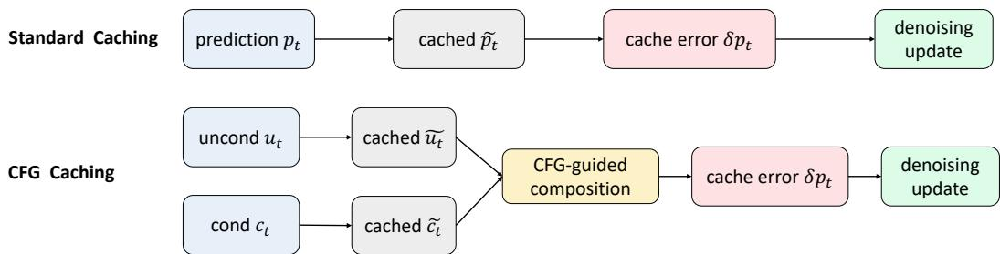  
Figure 1: Standard caching vs. CFG caching. Standard caching reuses a single prediction whose cache error directly enters the denoising update, whereas CFG caching reuses conditional and unconditional branches whose errors are composed into the guided prediction.

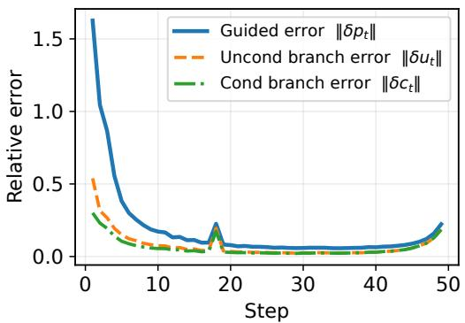  
(a) Branch-wise error vs. guided error.

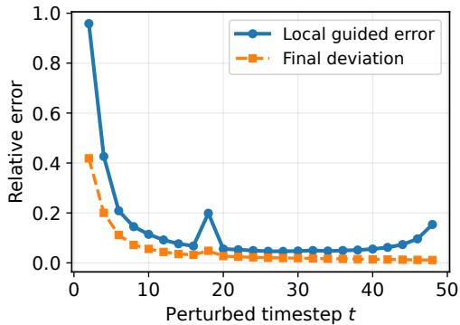  
(b) Local guided error vs. final deviation.  
Figure 2: Two mismatches under CFG caching. (a) The first mismatch: branch-wise cache errors do not directly reflect the guided error that enters the denoising update. (b) The second mismatch: local guided error does not directly predict the final deviation after error propagation across timesteps.

As illustrated in Fig. 1, under CFG the denoising update is determined by the guided composition of the conditional and unconditional predictions. Consequently, the cache-induced perturbation relevant to sampling is the error after CFG composition rather than the error of either branch in isolation. We refer to this discrepancy as the branch–guided mismatch: branch-error magnitudes alone do not fully characterize the guided error that drives the denoising update. Because the guided error depends on both the magnitudes and relative directions of the two branch errors under the guidance scale, their interaction affects the resulting perturbation. As shown in Fig. 2(a), the guided-error curve can differ substantially from the two branch-wise error curves, especially in the early stage, showing that branch-wise error magnitudes need not directly track the guided-error magnitude. We formally characterize this relationship through the CFG error geometry in Section 3.2.

Accounting for the branch–guided mismatch alone is still insufficient, because the downstream effect of a local perturbation also depends on when it is introduced. Prior work has examined downstream cache effects through outcome-aware scheduling and error rectification [Gao et al., 2025, Peng et al., 2026]. Here, we study this effect together with CFG branch-error composition. We demonstrate it through a single-step perturbation study in Fig. 2(b): cache reuse is applied only at a specific timestep, while all other steps use full computation. We observe that similar local guided errors can lead to substantially different final deviations depending on the perturbed timestep. We refer to this discrepancy as the local–final mismatch. This suggests that cache control should account not only for the local guided error, but also for its downstream impact on the final sample. We further quantify this effect in Section 3.3.

Motivated by these observations, we propose RA-CFGCache, a Risk-Aligned Caching framework for CFG. Based on the above analysis, cache reuse under CFG should be governed by a risk estimate aligned with the cache-induced perturbation on the guided prediction, while also accounting for how this perturbation propagates to the final sample. CFG-aware Guided-Risk Composition combines existing branch-wise proxies using the CFG composition structure and calibrated cross-branch alignment to construct a local guided-risk estimate, thereby addressing the branch–guided mismatch. Propagation-Aware Rescaling then weights this risk estimate using a lightweight timestep-dependent propagation prior to account for the downstream impact of local perturbations, thereby addressing the local–final mismatch. The resulting risk estimate is used by a lightweight online threshold controller to govern joint refresh and reuse of the two branches, while keeping the sampling schedule and guidance rule unchanged.

Our contributions are summarized as follows:

• Characterizing two key misalignments under CFG caching. We show that cache control under CFG is affected by two distinct sources of misalignment: the branch–guided mismatch, where branch-wise errors do not fully characterize the guided error that drives the denoising update, and the local–final mismatch, where the downstream impact of a local guided error varies across timesteps.

• Introducing a risk-aligned caching framework for CFG. We propose RA-CFGCache, which addresses these two misalignments through two coupled designs: CFG-aware guidedrisk composition, which combines branch-wise proxies using the CFG composition structure and calibrated cross-branch alignment to construct a local guided-risk estimate, and propagation-aware rescaling, which weights this risk estimate using a timestep-dependent propagation prior to account for the downstream impact of local guided errors.

• Demonstrating improved efficiency–fidelity trade-offs under CFG. Experiments and ablations on diffusion transformer pipelines show that RA-CFGCache improves the efficiency– fidelity trade-off over the evaluated training-free caching baselines under CFG. Risk diagnostics and controlled comparisons further support the proposed analysis and control strategy.

## 2 Related Work

Training-free diffusion caching. Training-free diffusion caching accelerates diffusion inference by reusing intermediate features, residuals, or model outputs across timesteps without retraining. Existing methods broadly follow three overlapping directions. The first follows pre-defined reuse, where computation is reused according to fixed layer, block, or timestep schedules, as exemplified by DeepCache Ma et al. [2023], FasterDiffusion Li et al. [2024], PAB Zhao et al. [2025], FORA Selvaraju et al. [2024], and ∆-DiT Chen et al. [2024]. The second follows adaptive reuse, where control signals based on temporal change, residual magnitude, token importance, sensitivity, or estimated output variation determine when or where cached computation can be reused, as in TeaCache Liu et al. [2025a], MagCache Ma et al. [2025], ToCa Zou et al. [2025], DiCache Bu et al. [2025], and SenCache Haghighi and Alahi [2026]. A third direction shifts from reuse to prediction, estimating future features or outputs through extrapolation, interpolation, or empirical correction, as in TaylorSeer Liu et al. [2025b], HiCache Feng et al. [2026], and FoCa Zheng et al. [2025]. Recent methods also consider downstream cache effects: LeMiCa Gao et al. [2025] uses final-output impact for global error-aware scheduling, while ERTACache Peng et al. [2026] analyzes cache-error propagation and introduces corresponding correction mechanisms. In contrast, RA-CFGCache studies downstream cache effects together with CFG-specific branch-error composition, combining cross-branch error interaction and timestep-dependent propagation weighting in a unified criterion.

CFG-aware acceleration and guidance optimization. Classifier-free guidance (CFG) Ho and Salimans [2022] improves conditional generation quality, but explicit two-branch CFG requires both conditional and unconditional evaluations. Existing approaches exploit cross-branch redundancy, modify the guidance process, or jointly optimize guidance and caching. FasterCache Lv et al. [2025] exploits redundancy between conditional and unconditional features and introduces CFG-Cache for branch reuse. Guidance optimization methods include per-timestep guidance scheduling such as CFG Schedulers Wang et al. [2024], interval-based strategies such as Apply Guidance in Interval Kynkäänniemi et al. [2024], and instance-aware magnitude control such as MAMBO-G Zhu et al. [2026]. OUSAC Sun et al. [2025] further jointly optimizes CFG timesteps, guidance scales, and caching. In contrast, RA-CFGCache keeps the sampling schedule and guidance rule unchanged and controls joint branch refresh and reuse through a guided-risk estimate that accounts for both cross-branch error interaction and downstream propagation.

## 3 Method

## 3.1 Preliminaries

We consider conditional diffusion / flow-based generative models implemented with diffusion transformers (DiTs), where inference proceeds through an iterative denoising process. At each timestep t, the model predicts from the current latent $x _ { t }$ and the conditioning input, and the sampler updates the latent state using this prediction. We denote the prediction function by $f _ { \theta } ( \cdot )$ , where θ denotes the fixed model parameters.

Training-free caching accelerates inference by reusing cached computation from a previous timestep instead of recomputing it at the current one. Although different methods may cache predictions, residuals, or intermediate features, their effect on the sampler can be abstracted as replacing a fresh prediction $p _ { t }$ with the actually used prediction $\tilde { p } _ { t }$ . Both are defined at the same current latent $x _ { t } \colon$ $p _ { t }$ is obtained by full computation, whereas $\tilde { p } _ { t }$ is obtained with cache reuse. The resulting local cache-induced error is

$$
\delta p _ { t } = \tilde { p } _ { t } - p _ { t } .\tag{1}
$$

Here, $p _ { t }$ serves as an analytical reference and need not be evaluated by the online controller.

Under classifier-free guidance (CFG) [Ho and Salimans, 2022], the model evaluates both unconditional and conditional branches:

$$
u _ { t } = f _ { \theta } ( x _ { t } , t , \emptyset ) , \qquad c _ { t } = f _ { \theta } ( x _ { t } , t , y ) ,\tag{2}
$$

where $u _ { t }$ and $c _ { t }$ denote the unconditional and conditional predictions, respectively. The prediction entering the sampler is

$$
p _ { t } ^ { ( s ) } = u _ { t } + s ( c _ { t } - u _ { t } ) ,\tag{3}
$$

where s is the guidance scale. This is equivalent to the original CFG formulation of Ho and Salimans [2022] up to a reparameterization of the guidance weight. Therefore, under CFG, the denoising update is governed by the guided prediction $p _ { t } ^ { ( s ) }$ rather than by either branch alone. Although reuse is applied at the branch level, its local effect on sampling is determined by the induced error on the guided prediction.

## 3.2 Branch–Guided Mismatch

Under CFG, cache reuse affects the denoising update through the guided prediction rather than through either branch alone. We formalize this by explicitly characterizing the guided error induced by branch-level reuse.

Let $u _ { t }$ and $c _ { t }$ denote the fresh unconditional and conditional branch predictions defined in Eq. (2). Under cache reuse, the actual branch predictions used in guidance composition are

$$
\tilde { u } _ { t } = u _ { t } + \delta u _ { t } , \qquad \tilde { c } _ { t } = c _ { t } + \delta c _ { t } ,\tag{4}
$$

where $\delta u _ { t } , \delta c _ { t }$ are the corresponding cache-induced branch errors. The resulting guided prediction under reuse is

$$
\tilde { p } _ { t } ^ { ( s ) } = \tilde { u } _ { t } + s ( \tilde { c } _ { t } - \tilde { u } _ { t } ) ,\tag{5}
$$

so the cache-induced guided error becomes

$$
\delta p _ { t } = \tilde { p } _ { t } ^ { ( s ) } - p _ { t } ^ { ( s ) } = ( 1 - s ) \delta u _ { t } + s \delta c _ { t } .\tag{6}
$$

Let $\rho _ { t } = \cos ( \delta u _ { t } , \delta c _ { t } )$ denote the cosine similarity between the two branch errors. When either error is zero, we set $\rho _ { t } = 0$ since the cross-term vanishes. Then

$$
\lVert \delta p _ { t } \rVert _ { 2 } ^ { 2 } = ( 1 - s ) ^ { 2 } \lVert \delta u _ { t } \rVert _ { 2 } ^ { 2 } + s ^ { 2 } \lVert \delta c _ { t } \rVert _ { 2 } ^ { 2 } + 2 s ( 1 - s ) \lVert \delta u _ { t } \rVert _ { 2 } \lVert \delta c _ { t } \rVert _ { 2 } \rho _ { t } .\tag{7}
$$

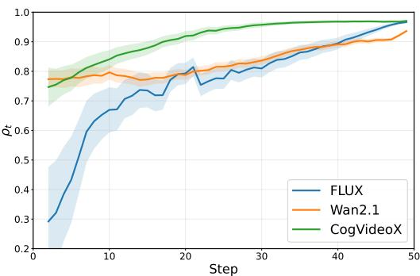  
(a) Branch-error alignment

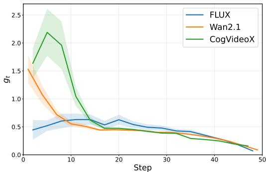  
(b) Propagation gain  
Figure 3: Two sources of mismatch under CFG caching. (a) The alignment $\rho _ { t } = \cos ( \delta u _ { t } , \delta c _ { t } )$ varies across timesteps, inducing timestep-dependent cancellation or amplification in Eq. (7). (b) The propagation gain $g _ { t }$ varies across timesteps, showing that similar local guided errors can induce different final deviations. Solid curves show the mean over 100 prompts, and shaded bands indicate ± one standard deviation across prompts.

Equation (7) shows that guided error depends not only on branch-error magnitudes, but also on their alignment through the cross-term. Under the practical CFG regime $s > 1$ , the coefficient $2 s ( 1 - s )$ is negative, so positive alignment induces partial cancellation, whereas weak or negative alignment suppresses this effect and can even lead to amplification. As shown in Fig. 3a, this alignment is timestep-dependent: the cancellation effect is weaker in earlier steps and stronger in later ones. We provide a more detailed analysis of this CFG error geometry and the origin of the alignment statistic in Appendix C.1. Consequently, branch-wise error no longer faithfully reflects the true local perturbation under CFG. This constitutes the branch–guided mismatch.

## 3.3 Local–Final Mismatch

Even guided error is only a local quantity at the current timestep. For cache control, what ultimately matters is its effect on the final generated sample after subsequent denoising steps.

To isolate this effect, we consider a single-step perturbation setting. The perturbed and reference trajectories are identical before timestep t; cache reuse is applied only at timestep t, while all other steps use full computation under the same initial noise and conditioning. The local guided error is defined as

$$
e _ { t } ^ { \mathrm { l o c a l } } = \| \delta p _ { t } \| _ { 2 } .\tag{8}
$$

The resulting final deviation is measured by

$$
e _ { t } ^ { \mathrm { f i n a l } } = \lVert \boldsymbol { x } _ { 0 } ^ { ( t ) } - \boldsymbol { x } _ { 0 } ^ { \mathrm { f u l l } } \rVert _ { 2 } ,\tag{9}
$$

where $x _ { 0 } ^ { ( t ) }$ and $x _ { 0 } ^ { \mathrm { f u l l } }$ denote the final latent states of the perturbed and full-computation trajectories, respectively. For $e _ { t } ^ { \mathrm { l o c a l } } > 0 .$ , we then define the propagation gain as

$$
g _ { t } = { \frac { e _ { t } ^ { \mathrm { f i n a l } } } { e _ { t } ^ { \mathrm { l o c a l } } } } .\tag{10}
$$

We provide additional details of propagation analysis in Appendix C.2.

Figure 3(b) shows that the propagation gain varies systematically across timesteps: similar local guided errors can induce different final deviations depending on when they occur. We refer to this as the local–final mismatch, motivating a timestep-dependent propagation prior for cache control.

## 3.4 RA-CFGCache

RA-CFGCache realizes cache control under CFG as guided-risk control, as illustrated in Fig. 4. It contains two components: CFG-aware guided-risk composition, which constructs a CFG-informed guided-risk estimate from branch-wise proxies, and propagation-aware rescaling, which weights this risk estimate using a calibrated timestep-dependent propagation prior.

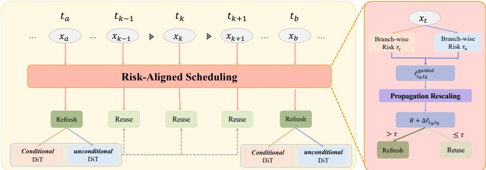  
Figure 4: Overview of RA-CFGCache. Under classifier-free guidance (CFG), cache control should be aligned with the guided prediction rather than either branch alone. RA-CFGCache first combines branch-wise proxy estimates into a guided-risk estimate, then rescales it using a timestep-dependent propagation prior, and finally uses the resulting risk estimate for online refresh decisions.

CFG-aware Guided-Risk Composition. Since true branch errors are unavailable online, we start from nonnegative branch-wise proxy estimates provided by a base caching method, such as TeaCache [Liu et al., 2025a], MagCache [Ma et al., 2025], or DiCache [Bu et al., 2025]. Let $\hat { r } _ { u } ( t _ { a } , t _ { b } )$ and $\hat { r } _ { c } ( t _ { a } , t _ { b } )$ denote the proxy estimates for the current candidate reuse from anchor timestep $t _ { a }$ to current timestep $t _ { b } ;$ accumulation is handled separately by the controller below. The exact proxy definitions used in our experiments are provided in Appendix B.2. Motivated by the exact CFG error decomposition in Eq. (7), we combine them using the same quadratic form:

$$
\left( \hat { r } _ { t _ { a } , t _ { b } } ^ { \mathrm { g u i d e d } } \right) ^ { 2 } = ( 1 - s ) ^ { 2 } \hat { r } _ { u } ^ { 2 } ( t _ { a } , t _ { b } ) + s ^ { 2 } \hat { r } _ { c } ^ { 2 } ( t _ { a } , t _ { b } ) + 2 s ( 1 - s ) \bar { \rho } _ { t _ { a } , t _ { b } } \hat { r } _ { u } ( t _ { a } , t _ { b } ) \hat { r } _ { c } ( t _ { a } , t _ { b } ) ,\tag{11}
$$

and take the nonnegative square root to obtain $\hat { r } _ { t _ { a } , t _ { b } } ^ { \mathrm { g u i d e d } }$ . Here, $\bar { \rho } _ { t _ { a } , t _ { b } }$ is an offline estimate of crossbranch alignment. On a held-out calibration split, we compute the cosine similarity between conditional and unconditional temporal differences of the full-computation residual outputs for each pair $( t _ { a } , t _ { b } )$ and average it across samples. We refer to $\hat { r } _ { t _ { a } , t _ { b } } ^ { \mathrm { g u i d e d } }$ as a proxy-based guided-risk estimate used for cache control, rather than an exact estimate of the true guided-error magnitude.

Propagation-aware Rescaling. To account for non-uniform error propagation, we further rescale the guided-risk estimate using a timestep-dependent propagation prior. The single-step perturbation study reveals systematic variation across timesteps, which we summarize with a lightweight powerlaw surrogate:

$$
\hat { g } _ { k } = \lambda \Big ( \frac { T - k } { T } \Big ) ^ { \alpha } + \beta ,\tag{12}
$$

where $k$ is the increasing sampler-step index, $T$ is the total number of steps, and $\lambda , \alpha , \beta$ are fitted from the calibration measurements. The power-law form is empirical; fitting details are provided in Appendix D.6. Here, a and b denote the sampler-step indices corresponding to timesteps $t _ { a }$ and $t _ { b }$ The propagation-aware risk contribution is

$$
\Delta \hat { r } _ { t _ { a } , t _ { b } } = \operatorname* { m a x } \left( 0 , \hat { g } _ { b } \hat { r } _ { t _ { a } , t _ { b } } ^ { \mathrm { g u i d e d } } \right) .\tag{13}
$$

This quantity incorporates both CFG error composition and the timestep-dependent downstream effect of local perturbations.

Online Control Policy. We maintain an accumulated-risk score R within each reuse interval. At the beginning of an interval, the anchor step is set to $t _ { a }$ and R is initialized to zero. At the current step $t _ { b }$ , the controller computes $\Delta \hat { r } _ { t _ { a } , t _ { b } }$ in Eq. (13). A refresh is triggered when

$$
R + \Delta \hat { r } _ { t _ { a } , t _ { b } } > \tau ,\tag{14}
$$

where $\tau$ controls the reuse–refresh trade-off. Otherwise, reuse continues and

$$
R \gets R + \Delta \hat { r } _ { t _ { a } , t _ { b } } .\tag{15}
$$

After a refresh, the anchor is reset to the current step and R is reinitialized to zero. The accumulatedrisk score is an interval-level control quantity rather than an exact estimate or formal bound on the final output deviation.

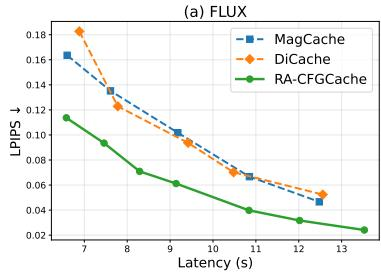

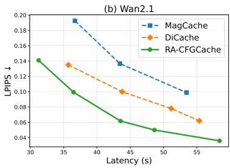

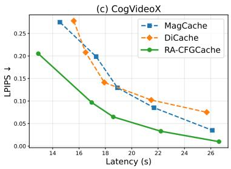  
Figure 5: Trade-off curves. RA-CFGCache achieves lower LPIPS at comparable latency across models.

Table 1: Main results on text-to-image and text-to-video generation. Comparison of RA-CFGCache with recent diffusion acceleration baselines.
<table><tr><td>Model</td><td>Method</td><td>LPIPS↓</td><td>SSIM ↑</td><td>PSNR↑</td><td>Speedup ↑</td><td>Latency (s) ↓</td></tr><tr><td rowspan="9">FLUX.1-dev</td><td>Vanilla (T = 50)</td><td>0.0000</td><td>1.0000</td><td>∞</td><td>1.00×</td><td>21.02</td></tr><tr><td>Vanilla (T = 25)</td><td>0.4556</td><td>0.6207</td><td>13.09</td><td>1.96×</td><td>10.71</td></tr><tr><td>TeaCache (τ=0.4)</td><td>0.4471</td><td>0.6174</td><td>13.80</td><td>2.53×</td><td>8.31</td></tr><tr><td>TaylorSeer (N=3,O=1)</td><td>0.4379</td><td>0.6398</td><td>13.75</td><td>2.37×</td><td>8.86</td></tr><tr><td>DiCache (m = 2, τ=0.4)</td><td>0.1431</td><td>0.8229</td><td>22.13</td><td>2.94×</td><td>7.15</td></tr><tr><td>MagCache (τ=0.24)</td><td>0.1636</td><td>0.8177</td><td>21.46</td><td>3.18×</td><td>6.60</td></tr><tr><td>HiCache  $_ { ( \mathcal { N } = 3 , \mathcal { O } = 1 ) }$ </td><td>0.3937</td><td>0.6646</td><td>14.72</td><td>2.35×</td><td>8.94</td></tr><tr><td>FasterCache  $( I _ { \Delta } = 8 , I _ { \mathrm { a t t n } } = 8 )$ </td><td>0.2158</td><td>0.7593</td><td>20.88</td><td>2.09×</td><td>10.06</td></tr><tr><td>RA-CFGCache-Slow (τ=0.18)</td><td>0.1137</td><td>0.8680</td><td>24.02</td><td>3.19×</td><td>6.58</td></tr><tr><td rowspan="14">Wan2.1-T2V-1.3B</td><td>RA-CFGCache-Fast (τ=0.3)</td><td>0.1484</td><td>0.8340</td><td>22.75</td><td>3.95×</td><td>5.32</td></tr><tr><td>Vanilla (T = 50)</td><td>0.0000</td><td>1.0000</td><td>∞</td><td>1.00×</td><td>93.32</td></tr><tr><td>Vanilla (T = 25)</td><td>0.4371</td><td>0.5658</td><td>15.87</td><td>1.93×</td><td>48.41</td></tr><tr><td>TeaCache (τ=0.15)</td><td>0.1661</td><td>0.7955</td><td>23.08</td><td>2.44×</td><td>38.24</td></tr><tr><td>TaylorSeer (N=3,O=1)</td><td>0.3632</td><td>0.6187</td><td>16.96</td><td>2.13×</td><td>43.79</td></tr><tr><td>DiCache (m = 2, τ=0.4)</td><td>0.1350</td><td>0.8361</td><td>24.90</td><td>2.61×</td><td>35.70</td></tr><tr><td>MagCache (τ=0.1)</td><td>0.1926</td><td>0.7696</td><td>22.16</td><td>2.54×</td><td>36.69</td></tr><tr><td>HiCache (N=3,O=1)</td><td>0.2916</td><td>0.6711</td><td>18.79</td><td>2.14×</td><td>43.49</td></tr><tr><td>FasterCache  $( I _ { \Delta } = 8 , I _ { \mathrm { a t t n } } = 8 )$ </td><td>0.3483</td><td>0.6532</td><td>20.37</td><td>2.41×</td><td>38.71</td></tr><tr><td>RA-CFGCache-Slow (τ=0.4) RA-CFGCache-Fast (τ=0.6)</td><td>0.0993</td><td>0.8778</td><td>28.03</td><td>2.56×</td><td>36.48</td></tr><tr><td>Vanilla (T = 50)</td><td>0.1409</td><td>0.8386</td><td>26.12</td><td>2.99×</td><td>31.25</td></tr><tr><td>Vanilla (T = 25)</td><td>0.0000 0.4751</td><td>1.0000</td><td>8</td><td>1.00×</td><td>40.48</td></tr><tr><td>TeaCache (τ=0.2)</td><td></td><td>0.5445</td><td>13.61</td><td>1.86×</td><td>21.79</td></tr><tr><td>DiCache (m = 2, τ=0.4)</td><td>0.2040</td><td>0.7538</td><td>21.48</td><td>2.42×</td><td>16.72</td></tr><tr><td>CogVideoX-2B</td><td>0.2080</td><td>0.7710</td><td>22.35</td><td>2.44×</td><td>16.57</td></tr><tr><td>MagCache (τ=0.08)</td><td>0.2386</td><td>0.7230</td><td>20.33</td><td>2.34×</td><td>17.30</td></tr><tr><td>FasterCache  $( I _ { \Delta } = 6 , I _ { \mathrm { a t t n } } = 6 )$ </td><td>0.1157</td><td>0.8573</td><td>25.48</td><td>2.03×</td><td>19.94</td></tr><tr><td>RA-CFGCache-Slow (τ=0.6)</td><td>0.0968</td><td>0.8746</td><td>26.93</td><td>2.39×</td><td>16.96</td></tr><tr><td>RA-CFGCache-Fast (τ=1.4)</td><td>0.2052</td><td>0.7614</td><td>21.89</td><td>3.13×</td><td>12.91</td></tr></table>

Reuse Action. We adopt joint reuse of both CFG branches as the default action, allowing the controller to account for their combined proxy risk. When branch errors are positively aligned and $s > 1$ , their contributions can partially cancel under CFG composition. Joint reuse also skips recomputation of the cached components in both branches. Under parallel branch execution, onesided reuse may provide limited latency savings because the guided prediction must still wait for the recomputed branch. Detailed comparisons are provided in Appendix C.3 and Appendix D.7.

## 4 Experiments

## 4.1 Experimental Setup

Models and baselines. We evaluate our method on diffusion transformer pipelines under classifierfree guidance, including FLUX.1-dev [Labs, 2024] for text-to-image generation, Wan2.1-T2V-1.3B [Wan et al., 2025] and CogVideoX-2B [Yang et al., 2025] for text-to-video generation. We

Original  
TeaCache (2.8×)  
MagCache (2.76×)  
DiCache (2.71×)  
Ours (2.83×)  
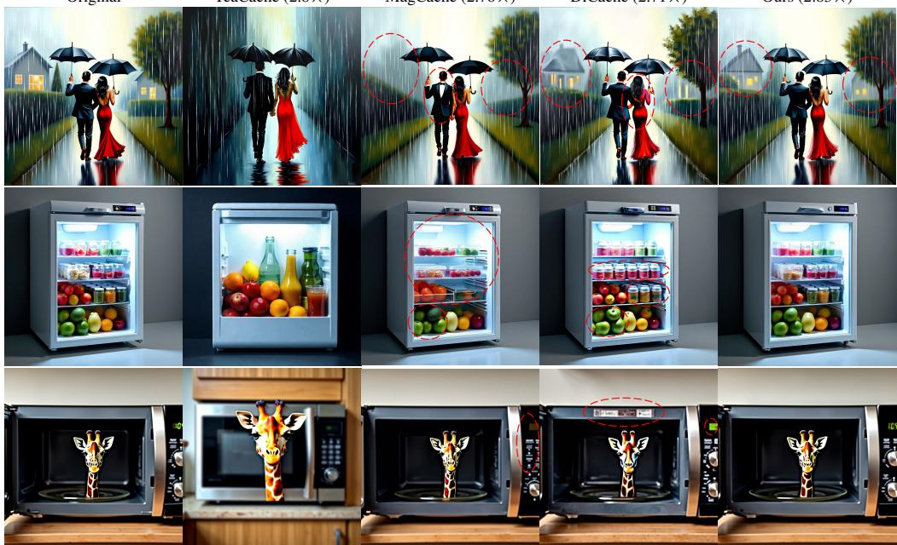  
Figure 6: Qualitative comparison on FLUX.1-dev. We show three representative text-to-image examples under the same prompts and random seeds. Compared with TeaCache, MagCache, and DiCache, RA-CFGCache better preserves local textures, object structures, and semantic details under comparable acceleration settings.

Table 2: Contribution of each component. Each component improves the trade-off, and combining both gives the best result.  
Table 3: Effect of the reused quantity. Joint branch reuse gives the best overall result under a matched refresh budget.
<table><tr><td>CFG-aware Composition</td><td>Propagation Speedup↑ LPIPS↓ SSIM↑ PSNR↑ Rescaling</td><td></td><td></td><td></td><td></td></tr><tr><td>x</td><td>x</td><td>3.42×</td><td>0.1732</td><td>0.8076</td><td>21.12</td></tr><tr><td>√</td><td>x</td><td>3.41×</td><td>0.1391</td><td>0.8462</td><td>22.82</td></tr><tr><td>x</td><td>√</td><td>3.41×</td><td>0.1423</td><td>0.8354</td><td>22.47</td></tr><tr><td>√</td><td>√</td><td>3.43×</td><td>0.1262</td><td>0.8565</td><td>23.45</td></tr></table>

<table><tr><td>Reused quantity</td><td>Speedup↑</td><td>LPIPS↓</td><td>SSIM↑</td><td>PSNR↑</td></tr><tr><td>Always refresh</td><td>1.00×</td><td>0.0000</td><td>1.0000</td><td>8</td></tr><tr><td>Reuse unconditional only</td><td>1.55×</td><td>0.2943</td><td>0.7281</td><td>19.80</td></tr><tr><td>Reuse conditional only</td><td>1.47×</td><td>0.2317</td><td>0.7630</td><td>18.62</td></tr><tr><td>Reuse ∆ only</td><td>1.55×</td><td>0.1939</td><td>0.7940</td><td>19.91</td></tr><tr><td>Reuse both branches</td><td>3.38×</td><td>0.1729</td><td>0.8112</td><td>21.17</td></tr></table>

compare against representative training-free acceleration baselines, including TeaCache [Liu et al., 2025a], TaylorSeer [Liu et al., 2025b], DiCache [Bu et al., 2025], MagCache [Ma et al., 2025], HiCache [Feng et al., 2026], and the CFG-related FasterCache [Lv et al., 2025]. All methods use the same models, prompts, denoising schedules, and hardware unless otherwise specified.

Main evaluation settings. Unless otherwise specified, all main experiments use 50 denoising steps. For FLUX.1-dev, we generate 1024 × 1024 images with true CFG scale and guidance embedding both set to 3.5. For Wan2.1-T2V-1.3B, we generate 832 × 480 videos with 81 frames, 16 FPS and guidance scale 5.0. For CogVideoX-2B, we generate 720 × 480 videos with 49 frames, 8 FPS and guidance scale 6.0.

Data and metrics. For text-to-image evaluation, we use 200 DrawBench prompts [Saharia et al., 2022]. For text-to-video evaluation, we use 100 prompts sampled from the all\_dimension.txt prompt set of VBench [Huang et al., 2023]. Unless otherwise specified, all accelerated outputs are compared against the corresponding vanilla outputs under the same prompt and random seed. We report end-to-end latency and speedup as efficiency metrics, and LPIPS [Zhang et al., 2018], SSIM [Wang et al., 2004], and PSNR against vanilla outputs as fidelity metrics.

Implementation details. All experiments are implemented in PyTorch on NVIDIA H200 GPUs, primarily using bfloat16 with selected operations in float32. Each sample uses one GPU, with the two CFG branches evaluated sequentially in the main experiments. RA-CFGCache uses the thresholdbased scheduler in Section 3.4 with joint branch reuse by default. Unless otherwise specified, it uses a MagCache-style proxy for FLUX.1-dev and a TeaCache-style proxy for Wan2.1-T2V-1.3B and CogVideoX-2B. We report RA-CFGCache-Fast and RA-CFGCache-Slow using different risk thresholds τ. For each model, offline calibration estimates the pairwise alignment statistic $\bar { \rho } _ { t _ { a } , t _ { b } }$ and timestep-dependent rescaling coefficients, which are fixed during evaluation. Reported latency includes online cache-control overhead but excludes offline calibration. Additional details are provided in Appendix B.

Table 4: Robustness across CFG scales. RA-CFGCache maintains a strong efficiency–fidelity trade-off across different guidance scales.
<table><tr><td>CFG</td><td>Method</td><td>Speedup↑</td><td>LPIPS↓</td><td>SSIM↑</td><td>PSNR↑</td></tr><tr><td rowspan="4">1.5</td><td>DiCache</td><td>3.11×</td><td>0.2042</td><td>0.8114</td><td>22.55</td></tr><tr><td>MagCache</td><td>3.18×</td><td>0.1682</td><td>0.8268</td><td>22.42</td></tr><tr><td>FasterCache</td><td>2.09×</td><td>0.2002</td><td>0.7814</td><td>21.58</td></tr><tr><td>Ours</td><td>3.38×</td><td>0.1430</td><td>0.8553</td><td>24.08</td></tr><tr><td rowspan="4">3.5</td><td>DiCache</td><td>2.94×</td><td>0.1431</td><td>0.8229</td><td>22.13</td></tr><tr><td>MagCache</td><td>3.18×</td><td>0.1636</td><td>0.8177</td><td>21.46</td></tr><tr><td>FasterCache</td><td>2.09×</td><td>0.2158</td><td>0.7593</td><td>20.88</td></tr><tr><td>Ours</td><td>3.43×</td><td>0.1262</td><td>0.8565</td><td>23.45</td></tr><tr><td rowspan="4">5.5</td><td>DiCache</td><td>2.91×</td><td>0.1378</td><td>0.8460</td><td>24.08</td></tr><tr><td>MagCache</td><td>3.18×</td><td>0.1558</td><td>0.8423</td><td>23.13</td></tr><tr><td>FasterCache</td><td>2.01×</td><td>0.2710</td><td>0.6969</td><td>19.11</td></tr><tr><td>Ours</td><td>3.35×</td><td>0.1153</td><td>0.8779</td><td>25.30</td></tr><tr><td rowspan="4">7.5</td><td>DiCache</td><td>2.88×</td><td>0.1163</td><td>0.8692</td><td>25.65</td></tr><tr><td>MagCache</td><td>3.18×</td><td>0.1295</td><td>0.8673</td><td>24.81</td></tr><tr><td>FasterCache</td><td>2.00×</td><td>0.2784</td><td>0.6695</td><td>19.34</td></tr><tr><td>Ours</td><td>3.37×</td><td>0.1031</td><td>0.8867</td><td>26.41</td></tr></table>

Table 5: Validation of Guided-Risk Composition. The full formulation improves guided-error alignment and high-risk reuse detection under an identical refresh budget.
<table><tr><td>Variant</td><td>Pearson↑</td><td>AUPRC↑</td><td>P95↓</td><td>P99↓</td></tr><tr><td>No-cross</td><td>0.6082</td><td>0.5671</td><td>0.3247</td><td>0.5536</td></tr><tr><td>Full Eq. 11</td><td>0.7575</td><td>0.6799</td><td>0.2809</td><td>0.4635</td></tr><tr><td>Proxy mag. + true align.</td><td>0.8325</td><td>0.7601</td><td>0.2662</td><td>0.4145</td></tr><tr><td>True mag. + est. align.</td><td>0.9358</td><td>0.9178</td><td>0.1976</td><td>0.2840</td></tr><tr><td>Oracle geometry</td><td>1.0000</td><td>1.0000</td><td>0.1744</td><td>0.1874</td></tr></table>

Table 6: Validation of Propagation-Aware Rescaling. Propagation weighting improves configuration-level prediction of mean final LPIPS under repeated reuse.
<table><tr><td>Predictor</td><td>Spearman↑</td><td>LOO R2 ↑</td><td>LOO MAE↓</td></tr><tr><td>Unweighted</td><td>0.6571</td><td>-0.1773</td><td>0.0248</td></tr><tr><td>Prop.-weighted</td><td>0.9429</td><td>0.5274</td><td>0.0157</td></tr></table>

## 4.2 Main Results

Quantitative Comparison. Table 1 reports the main quantitative results under CFG. Across the evaluated text-to-image and text-to-video pipelines, RA-CFGCache achieves favorable efficiency– fidelity trade-offs relative to the evaluated baselines. At comparable latency, it improves fidelity over strong caching baselines, while its fast variants provide additional acceleration with a corresponding fidelity trade-off.

Trade-off curves. Figure 5 compares latency–LPIPS trade-offs across FLUX.1-dev, Wan2.1-T2V-1.3B, and CogVideoX-2B. Across the evaluated operating range, RA-CFGCache achieves lower LPIPS at comparable latency than MagCache and DiCache. The improvement across multiple operating points shows that the gain is not limited to a single tuned threshold.

Qualitative comparison. Figure 6 compares RA-CFGCache with TeaCache, MagCache, and DiCache on FLUX.1-dev at comparable speedups. The baselines introduce visible scene changes or local structural artifacts in the highlighted regions, while RA-CFGCache remains closer to the original samples and better preserves textures, structures, and semantic details. Additional qualitative results on Wan2.1 and CogVideoX are provided in Appendix F.

## 4.3 Ablation Studies

Unless otherwise specified, all ablations are conducted on FLUX.1-dev under the main experimental setting. We examine the contributions of the proposed components and reuse policy.

Contribution of each component. We ablate the two components of RA-CFGCache: CFG-aware guided-risk composition and propagation-aware rescaling. As shown in Table 2, each component improves fidelity at similar latency, and their combination performs best. These results support their complementary benefits in the evaluated setting.

Effect of the reused quantity. We compare different reuse targets under the same refresh count. As shown in Table 3, joint branch reuse achieves the best fidelity among the evaluated actions and larger latency savings by skipping recomputation in both branches. A separate parallel-execution study in Appendix D.7 compares independent branch-wise and joint controllers at matched branch-evaluation counts, showing lower latency for joint control. Appendix C.3 further analyzes reuse-object selection through CFG error geometry and computational savings.

Table 7: Robustness of calibration on $\bar { \rho } _ { t _ { a } , t _ { b } } .$ Downstream fidelity and speedup remain relatively stable across the tested calibration-set sizes and prompt subsets.  
Table 8: Robustness of calibration on $g _ { t } .$ . Downstream fidelity and speedup remain relatively stable across the tested calibration-set sizes and prompt subsets.
<table><tr><td>Strategy</td><td>#</td><td>LPIPS↓</td><td>SSIM↑</td><td>PSNR↑</td><td>Speedup↑</td></tr><tr><td>Random</td><td>1</td><td>0.1345</td><td>0.8472</td><td>23.01</td><td>3.47×</td></tr><tr><td>Random</td><td>10</td><td>0.1301</td><td>0.8507</td><td>23.28</td><td>3.46×</td></tr><tr><td>Outlier</td><td>10</td><td>0.1326</td><td>0.8495</td><td>23.19</td><td>3.45×</td></tr><tr><td>Random</td><td>50</td><td>0.1308</td><td>0.8500</td><td>23.26</td><td>3.46×</td></tr><tr><td>Random</td><td>100</td><td>0.1297</td><td>0.8513</td><td>23.29</td><td>3.46×</td></tr></table>

<table><tr><td>Strategy</td><td>#</td><td>LPIPS↓</td><td>SSIM↑</td><td>PSNR↑</td><td>Speedup↑</td></tr><tr><td>Random</td><td>1</td><td>0.1426</td><td>0.8380</td><td>22.94</td><td>3.46×</td></tr><tr><td>Random</td><td>10</td><td>0.1329</td><td>0.8497</td><td>23.21</td><td>3.46×</td></tr><tr><td>Outlier</td><td>10</td><td>0.1448</td><td>0.8379</td><td>22.80</td><td>3.46×</td></tr><tr><td>Random</td><td>50</td><td>0.1297</td><td>0.8513</td><td>23.29</td><td>3.46×</td></tr><tr><td>Random</td><td>100</td><td>0.1262</td><td>0.8579</td><td>23.80</td><td>3.46×</td></tr></table>

Effect of CFG scale. Table 4 shows that RA-CFGCache achieves a strong efficiency–fidelity tradeoff across different guidance scales. Across all tested CFG scales, it remains among the best methods in trade-off, while maintaining stable speedup and strong fidelity relative to competing baselines. This indicates that risk-aligned cache control remains effective across the evaluated guidance strengths.

Validation of risk composition and propagation rescaling. Table 5 evaluates guided-risk composition on 37,400 reuse events from 50 held-out FLUX.1-dev prompts disjoint from offline calibration. Pearson correlation measures agreement with true guided-error magnitude, while AUPRC measures detection of the top 20% highest-error events. Under the same 30% refresh budget, P95 and P99 report true-error percentiles among accepted reuse events. The full composition improves correlation and high-risk discrimination while reducing these tail errors. Oracle-assisted variants substitute true branch-error magnitudes and/or alignment for diagnosis only and are unavailable online.

Table 6 evaluates propagation weighting on six configurations: three thresholds $\tau \_ { \in }$ {0.12, 0.18, 0.30}, each with and without rescaling, using 50 held-out prompts per configuration. For each trajectory, we sum the unweighted guided-risk contributions or their propagation-weighted counterparts over all accepted reuse steps, including across refresh intervals. We then average each score and final LPIPS over prompts. Spearman correlation is computed across the six configuration means. For $R ^ { 2 }$ and MAE, we use leave-one-configuration-out affine regression: each configuration’s mean LPIPS is predicted from its mean risk using a model fitted on the other five configurations. Propagation weighting increases Spearman correlation from 0.6571 to 0.9429 and improves held-out $R ^ { 2 }$ and MAE, supporting its predictive value at the configuration level.

Validation of alignment and propagation calibration. We further evaluate the robustness of the calibrated quantities by varying only the calibration prompt subset while keeping the evaluation protocol and controller unchanged. As shown in Tables 7 and 8, downstream fidelity and speedup remain relatively stable across the tested random and outlier calibration subsets and calibration-set sizes. These results indicate robustness to the tested calibration-set variations, rather than invariance of the calibrated alignment or propagation curves themselves.

## 5 Conclusion

We revisit training-free diffusion caching under CFG as guided-error control. RA-CFGCache aligns reuse decisions with the guided prediction error rather than branch-local criteria, and further rescales this risk by its timestep-dependent propagation to the final sample. By combining CFGaware guided-risk composition, propagation-aware rescaling, and threshold-based scheduling, RA-CFGCache consistently improves the efficiency–fidelity trade-off over the evaluated training-free caching baselines on text-to-image and text-to-video diffusion transformers.

## Acknowledgments and Disclosure of Funding

This work was supported by the National Natural Science Foundation of China (Grant Nos. 62525103 and 62271281) and the Beijing Natural Science Foundation (Grant No. L247026). The authors declare no competing financial interests.

## References

Jascha Sohl-Dickstein, Eric A. Weiss, Niru Maheswaranathan, and Surya Ganguli. Deep unsupervised learning using nonequilibrium thermodynamics, 2015. URL https://arxiv.org/abs/1503. 03585.

Jonathan Ho, Ajay Jain, and Pieter Abbeel. Denoising diffusion probabilistic models, 2020. URL https://arxiv.org/abs/2006.11239.

Yang Song and Stefano Ermon. Generative modeling by estimating gradients of the data distribution, 2020. URL https://arxiv.org/abs/1907.05600.

Prafulla Dhariwal and Alex Nichol. Diffusion models beat gans on image synthesis, 2021. URL https://arxiv.org/abs/2105.05233.

William Peebles and Saining Xie. Scalable diffusion models with transformers, 2023. URL https: //arxiv.org/abs/2212.09748.

Jonathan Ho and Tim Salimans. Classifier-free diffusion guidance, 2022. URL https://arxiv. org/abs/2207.12598.

Chenlin Meng, Robin Rombach, Ruiqi Gao, Diederik P. Kingma, Stefano Ermon, Jonathan Ho, and Tim Salimans. On distillation of guided diffusion models, 2023. URL https://arxiv.org/ abs/2210.03142.

Axel Sauer, Dominik Lorenz, Andreas Blattmann, and Robin Rombach. Adversarial diffusion distillation, 2023. URL https://arxiv.org/abs/2311.17042.

Jiaming Song, Chenlin Meng, and Stefano Ermon. Denoising diffusion implicit models, 2022. URL https://arxiv.org/abs/2010.02502.

Cheng Lu, Yuhao Zhou, Fan Bao, Jianfei Chen, Chongxuan Li, and Jun Zhu. Dpm-solver: A fast ode solver for diffusion probabilistic model sampling in around 10 steps, 2022. URL https: //arxiv.org/abs/2206.00927.

Evelyn Zhang, Bang Xiao, Jiayi Tang, Qianli Ma, Chang Zou, Xuefei Ning, Xuming Hu, and Linfeng Zhang. Token pruning for caching better: 9 times acceleration on stable diffusion for free, 2024. URL https://arxiv.org/abs/2501.00375.

Xinyin Ma, Gongfan Fang, and Xinchao Wang. Deepcache: Accelerating diffusion models for free, 2023. URL https://arxiv.org/abs/2312.00858.

Feng Liu, Shiwei Zhang, Xiaofeng Wang, Yujie Wei, Haonan Qiu, Yuzhong Zhao, Yingya Zhang, Qixiang Ye, and Fang Wan. Timestep embedding tells: It’s time to cache for video diffusion model. In Proceedings ofthe IEEE/CVF Conference on Computer Vision and Pattern Recognition (CVPR), pages 7353–7363, June 2025a.

Zehong Ma, Longhui Wei, Feng Wang, Shiliang Zhang, and Qi Tian. Magcache: Fast video generation with magnitude-aware cache. In The Thirty-ninth Annual Conference on Neural Information Processing Systems, 2025. URL https://openreview.net/forum?id=KZn7TDOL4J.

Huanlin Gao, Ping Chen, Fuyuan Shi, Chao Tan, Zhaoxiang Liu, Fang Zhao, Kai Wang, and Shiguo Lian. Lemica: Lexicographic minimax path caching for efficient diffusion-based video generation. In Advances in Neural Information Processing Systems, 2025. URL https://arxiv.org/abs/ 2511.00090.

Xurui Peng, Chenqian Yan, Hong Liu, Rui Ma, Fangmin Chen, Xing Wang, Zhihua Wu, Songwei Liu, and Mingbao Lin. Ertacache: Error rectification and timesteps adjustment for efficient diffusion. In The Fourteenth International Conference on Learning Representations, 2026. URL https://openreview.net/forum?id=InvyBiYcK5.

Senmao Li, Taihang Hu, Joost van de Weijer, Fahad Shahbaz Khan, Tao Liu, Linxuan Li, Shiqi Yang, Yaxing Wang, Ming-Ming Cheng, and Jian Yang. Faster diffusion: Rethinking the role of the encoder for diffusion model inference, 2024. URL https://arxiv.org/abs/2312.09608.

Xuanlei Zhao, Xiaolong Jin, Kai Wang, and Yang You. Real-time video generation with pyramid attention broadcast, 2025. URL https://arxiv.org/abs/2408.12588.

Pratheba Selvaraju, Tianyu Ding, Tianyi Chen, Ilya Zharkov, and Luming Liang. Fora: Fast-forward caching in diffusion transformer acceleration, 2024. URL https://arxiv.org/abs/2407. 01425.

Pengtao Chen, Mingzhu Shen, Peng Ye, Jianjian Cao, Chongjun Tu, Christos-Savvas Bouganis, Yiren Zhao, and Tao Chen. δ-dit: A training-free acceleration method tailored for diffusion transformers, 2024. URL https://arxiv.org/abs/2406.01125.

Chang Zou, Xuyang Liu, Ting Liu, Siteng Huang, and Linfeng Zhang. Accelerating diffusion transformers with token-wise feature caching, 2025. URL https://arxiv.org/abs/2410. 05317.

Jiazi Bu, Pengyang Ling, Yujie Zhou, Yibin Wang, Yuhang Zang, Dahua Lin, and Jiaqi Wang. Dicache: Let diffusion model determine its own cache, 2025. URL https://arxiv.org/abs/ 2508.17356.

Yasaman Haghighi and Alexandre Alahi. Sencache: Accelerating diffusion model inference via sensitivity-aware caching, 2026. URL https://arxiv.org/abs/2602.24208.

Jiacheng Liu, Chang Zou, Yuanhuiyi Lyu, Junjie Chen, and Linfeng Zhang. From reusing to forecasting: Accelerating diffusion models with taylorseers. In Proceedings of the IEEE/CVF International Conference on Computer Vision (ICCV), pages 15853–15863, October 2025b.

Liang Feng, Shikang Zheng, Jiacheng Liu, Yuqi Lin, Qinming Zhou, Peiliang Cai, Xinyu Wang, Junjie Chen, Chang Zou, Yue Ma, and Linfeng Zhang. Hicache: A plug-in scaled-hermite upgrade for taylor-style cache-then-forecast diffusion acceleration, 2026. URL https://arxiv.org/ abs/2508.16984.

Shikang Zheng, Liang Feng, Xinyu Wang, Qinming Zhou, Peiliang Cai, Chang Zou, Jiacheng Liu, Yuqi Lin, Junjie Chen, Yue Ma, and Linfeng Zhang. Forecast then calibrate: Feature caching as ode for efficient diffusion transformers, 2025. URL https://arxiv.org/abs/2508.16211.

Zhengyao Lv, Chenyang Si, Junhao Song, Zhenyu Yang, Yu Qiao, Ziwei Liu, and Kwan-Yee K. Wong. Fastercache: Training-free video diffusion model acceleration with high quality, 2025. URL https://arxiv.org/abs/2410.19355.

Xi Wang, Nicolas Dufour, Nefeli Andreou, Marie-Paule Cani, Victoria Fernandez Abrevaya, David Picard, and Vicky Kalogeiton. Analysis of classifier-free guidance weight schedulers, 2024. URL https://arxiv.org/abs/2404.13040.

Tuomas Kynkäänniemi, Miika Aittala, Tero Karras, Samuli Laine, Timo Aila, and Jaakko Lehtinen. Applying guidance in a limited interval improves sample and distribution quality in diffusion models, 2024. URL https://arxiv.org/abs/2404.07724.

Shangwen Zhu, Qianyu Peng, Zhilei Shu, Yuting Hu, Zhantao Yang, Han Zhang, Zhao Pu, Andy Zheng, Xinyu Cui, Jian Zhao, Ruili Feng, and Fan Cheng. Mambo-g: Magnitude-aware mitigation for boosted guidance, 2026. URL https://arxiv.org/abs/2508.03442.

Ruitong Sun, Tianze Yang, Wei Niu, and Jin Sun. Ousac: Optimized guidance scheduling with adaptive caching for dit acceleration, 2025. URL https://arxiv.org/abs/2512.14096.

Black Forest Labs. Flux. https://github.com/black-forest-labs/flux, 2024.

Team Wan, Ang Wang, Baole Ai, Bin Wen, Chaojie Mao, Chen-Wei Xie, Di Chen, Feiwu Yu, Haiming Zhao, Jianxiao Yang, Jianyuan Zeng, Jiayu Wang, Jingfeng Zhang, Jingren Zhou, Jinkai Wang, Jixuan Chen, Kai Zhu, Kang Zhao, Keyu Yan, Lianghua Huang, Mengyang Feng, Ningyi Zhang, Pandeng Li, Pingyu Wu, Ruihang Chu, Ruili Feng, Shiwei Zhang, Siyang Sun, Tao Fang, Tianxing Wang, Tianyi Gui, Tingyu Weng, Tong Shen, Wei Lin, Wei Wang, Wei Wang, Wenmeng Zhou, Wente Wang, Wenting Shen, Wenyuan Yu, Xianzhong Shi, Xiaoming Huang, Xin Xu, Yan Kou, Yangyu Lv, Yifei Li, Yijing Liu, Yiming Wang, Yingya Zhang, Yitong Huang, Yong Li, You Wu, Yu Liu, Yulin Pan, Yun Zheng, Yuntao Hong, Yupeng Shi, Yutong Feng, Zeyinzi Jiang, Zhen Han, Zhi-Fan Wu, and Ziyu Liu. Wan: Open and advanced large-scale video generative models, 2025. URL https://arxiv.org/abs/2503.20314.

Zhuoyi Yang, Jiayan Teng, Wendi Zheng, Ming Ding, Shiyu Huang, Jiazheng Xu, Yuanming Yang, Wenyi Hong, Xiaohan Zhang, Guanyu Feng, Da Yin, Yuxuan Zhang, Weihan Wang, Yean Cheng, Bin Xu, Xiaotao Gu, Yuxiao Dong, and Jie Tang. Cogvideox: Text-to-video diffusion models with an expert transformer, 2025. URL https://arxiv.org/abs/2408.06072.

Chitwan Saharia, William Chan, Saurabh Saxena, Lala Li, Jay Whang, Emily Denton, Seyed Kamyar Seyed Ghasemipour, Burcu Karagol Ayan, S. Sara Mahdavi, Rapha Gontijo Lopes, Tim Salimans, Jonathan Ho, David J Fleet, and Mohammad Norouzi. Photorealistic text-to-image diffusion models with deep language understanding, 2022. URL https://arxiv.org/abs/ 2205.11487.

Ziqi Huang, Yinan He, Jiashuo Yu, Fan Zhang, Chenyang Si, Yuming Jiang, Yuanhan Zhang, Tianxing Wu, Qingyang Jin, Nattapol Chanpaisit, Yaohui Wang, Xinyuan Chen, Limin Wang, Dahua Lin, Yu Qiao, and Ziwei Liu. Vbench: Comprehensive benchmark suite for video generative models, 2023. URL https://arxiv.org/abs/2311.17982.

Richard Zhang, Phillip Isola, Alexei A. Efros, Eli Shechtman, and Oliver Wang. The unreasonable effectiveness of deep features as a perceptual metric, 2018. URL https://arxiv.org/abs/ 1801.03924.

Zhou Wang, A.C. Bovik, H.R. Sheikh, and E.P. Simoncelli. Image quality assessment: from error visibility to structural similarity. IEEE Transactions on Image Processing, 13(4):600–612, 2004. doi: 10.1109/TIP.2003.819861.

## Appendix

## A Limitations

While RA-CFGCache shows consistent gains under the evaluated classifier-free guidance settings, the current formulation still has several methodological limitations.

First, the propagation gain is an empirical timestep-dependent surrogate motivated by first-order propagation analysis, rather than a complete model of how local guided error affects the final output. It is estimated from isolated single-step perturbations and therefore does not explicitly model higher-order interactions among errors introduced by consecutive reuse decisions.

Second, although the cumulative scheduler goes beyond purely local thresholding, it remains an online approximation to the underlying sequential control problem and does not explicitly optimize long-horizon interactions among reuse decisions or provide a formal optimality guarantee.

Third, the alignment and propagation statistics rely on offline calibration for a given inference configuration, and their transfer across substantially different models, samplers, timestep schedules, or guidance settings may require validation or recalibration. Improving such transferability while retaining lightweight online control is an important direction for future work.

## B Implementation Details

## B.1 Details of the Compared Methods

TeaCache [Liu et al., 2025a] is a training-free, architecture-agnostic caching method that exploits the correlation between timestep embedding changes and model output differences across adjacent steps. It activates caching through an accumulated error-based thresholding strategy. We adapt its official implementation to our evaluation repository and use model-specific representative thresholds as reported in Table $1 \colon \tau = 0 . 4$ for FLUX.1-dev, $\tau = 0 . 1 5$ for Wan2.1-T2V-1.3B, and $\tau = 0 . 2$ for CogVideoX-2B.

TaylorSeer [Liu et al., 2025b] is a training-free acceleration method based on the “cache-then-forecast” paradigm. Instead of directly reusing cached features, it predicts future features using Taylor-seriesbased extrapolation. We adapt the released implementation and use the reported configuration with activation/cache interval $N = 3$ and Taylor expansion order $O = 1$

DiCache [Bu et al., 2025] is a training-free caching method that reuses diffusion outputs through a lightweight temporal reuse policy. We adapt its official implementation and use probe depth $m = 2$ and threshold $\tau = 0 . 4$ across the reported models.

MagCache [Ma et al., 2025] controls acceleration through a maximum skip length and an accumulated error threshold. We adapt its official implementation, use the default fast-mode maximum skip length $K = 4 ,$ and use model-specific thresholds as reported in Table $1 \colon \tau = 0 . 2 4$ for FLUX.1-dev, $\tau = 0 .$ 1 for $\mathrm { W a n } 2 . 1 \mathrm { - T } 2 \mathrm { V } \mathrm { - } 1 . 3 \mathrm { B }$ , and $\tau = 0 . 0 8$ for CogVideoX-2B. The magnitude-ratio lists are obtained from the official repository or the corresponding official calibration procedure in diffusers.

HiCache [Feng et al., 2026] is a higher-order caching method that improves temporal reuse using a scaled Hermite-style update. We adapt the released implementation and use cache interval ${ \mathcal { N } } = 3$ and update order $\mathcal { O } = 1$

FasterCache [Lv et al., 2025] is a training-free CFG acceleration method that exploits redundancy between the conditional and unconditional branches and reuses self-attention computations. We use the released implementation for CogVideoX and backend-specific adapters for FLUX and Wan, without changing the model, sampling steps, resolution, or guidance. For FLUX and Wan, we set $I _ { \Delta } = 8$ and $\bar { I } _ { \mathrm { a t t n } } = 8$ , use an extrapolation coefficient of 0.3 and $t _ { 0 } = 0 . 5$ , and disable frequency gains. For CogVideoX, we retain the released frequency compensation, set $I _ { \Delta } = I _ { \mathrm { a t t n } } = 6$ , and keep the extrapolation coefficient at 0.3. Configurations are selected using calibration prompts only and frozen for evaluation; the FLUX configuration is transferred to Wan without further tuning.

We additionally include a reduced-step vanilla baseline, Vanilla $( T = 2 5 )$ , which uses the same model and sampling configuration as the full vanilla baseline except for halving the denoising steps from $T = 5 0$ to $T = 2 5$ . For all baselines, we use the same model checkpoints, prompts, random seeds, and hardware as in the main experiments. The 50-step schedule is retained except for the explicitly identified reduced-step baseline. For methods with multiple thresholds or operating modes, operating points are selected to target the reported speedup ranges; the exact configurations are listed in Table 1.

## B.2 Branch-wise Proxy Definitions Used by RA-CFGCache

RA-CFGCache does not introduce a new branch-local error estimator. Instead, it takes the control signal of a base caching method as the branch-wise proxy in Eq. 11. For each branch $j \in \{ u , c \}$ we denote this signal by $\hat { r } _ { j } ( t _ { a } , t _ { b } )$ . The proxy is evaluated independently for the two CFG branches before guided-risk composition. Importantly, the proxy families used in our experiments differ in whether they depend on the current sample: Tea-style and DiCache-style proxies use online feature signals, whereas the MagCache-style proxy is derived from fixed offline-calibrated magnitude-ratio statistics.

MagCache-style proxy. For the FLUX.1-dev main experiments, we use the fixed magnitude-ratio statistics of MagCache [Ma et al., 2025]. Let $\mu _ { j } ( k )$ denote the pre-calibrated magnitude ratio associated with branch j at execution step k. For a candidate reuse interval from anchor a to current step b, we form the cumulative ratio

$$
M _ { j } ( a , b ) = \prod _ { k = a + 1 } ^ { b } \mu _ { j } ( k ) ,\tag{16}
$$

and use the corresponding deviation

$$
\hat { r } _ { j } ( t _ { a } , t _ { b } ) = | 1 - M _ { j } ( a , b ) |\tag{17}
$$

as the branch-wise proxy supplied to the CFG-aware composition. The magnitude-ratio sequence is fixed before evaluation and no sample-specific feature measurement is used to construct this proxy. Thus, under a fixed model, timestep schedule, calibration table, and threshold, the MagCache-style proxy should not be interpreted as an instance-adaptive estimator.

TeaCache-style proxy. Following the core design of TeaCache [Liu et al., 2025a], we construct a sample-dependent control signal from the relative change of the timestep-modulated feature. For each CFG branch j, let $m _ { j } ( k )$ denote the current modulated feature and $\dot { m } _ { j } ^ { \mathrm { r e f } }$ the stored reference feature maintained by the corresponding TeaCache-compatible implementation. We compute

$$
d _ { j } ( k ) = \frac { \mathrm { m e a n } \big | m _ { j } ( k ) - m _ { j } ^ { \mathrm { r e f } } \big | } { \mathrm { m e a n } \big | m _ { j } ^ { \mathrm { r e f } } \big | + 1 0 ^ { - 6 } } .\tag{18}
$$

If the reference mean absolute magnitude is zero, the raw change signal $d _ { j } ( k )$ is set to zero before rescaling. We then apply the same model-specific polynomial $p _ { \mathrm { m o d e l } }$ as the corresponding TeaCachecompatible baseline and define

$$
\hat { r } _ { j } ( k ) = \operatorname* { m a x } \{ p _ { \mathrm { m o d e l } } ( d _ { j } ( k ) ) , 0 \} ,\tag{19}
$$

with no upper clipping. Thus, the proxy preserves TeaCache’s basic relative-change and polynomialrescaling construction while serving as the branch-wise online signal for RA-CFGCache. The resulting proxy is sample-dependent; RA-CFGCache replaces the original TeaCache decision rule with the guided-risk composition and cumulative controller described in Section 3.4.

DiCache-style proxy. For the DiCache-style compatibility experiments, we use the online shallowprobe signal of DiCache [Bu et al., 2025]. For each branch j, the first m Transformer blocks are evaluated and the relative $\ell _ { 1 }$ change of the resulting shallow feature is used as the branch-wise proxy:

$$
\hat { r } _ { j } ( k ) = \frac { \| z _ { j } ^ { ( m ) } ( k ) - z _ { j } ^ { ( m ) } ( k - 1 ) \| _ { 1 } } { \| z _ { j } ^ { ( m ) } ( k - 1 ) \| _ { 1 } + \epsilon } ,\tag{20}
$$

where $z _ { j } ^ { ( m ) } ( k )$ denotes the feature after the probe depth m. We use $m = 2$ in the reported experiments. Because the probe feature is computed from the current branch trajectory, this proxy is sampledependent. The probe computation is included in the reported end-to-end latency.

Normalization and accumulation. No additional sample-wise normalization is introduced by RA-CFGCache beyond the normalization or calibration already used by the corresponding base proxy. The two branch scores are composed through Eq. 11; propagation rescaling is then applied as in Eq. 13. The interval-level accumulation variable $R$ in Eq. 14 belongs to RA-CFGCache and is separate from the definition of the branch-wise proxy itself.

For the Tea-style and DiCache-style estimators, the base proxy is an adjacent-step online change signal rather than a direct estimate of the anchor-to-target prediction error. RA-CFGCache uses this signal as the current branch-wise contribution within the active reuse interval, while the cross-branch alignment statistic is indexed by the current cache anchor and target step.

## B.3 Calibration Details

The offline calibration procedure estimates two quantities used by RA-CFGCache: the anchor–target alignment statistic $\bar { \rho } _ { t _ { a } , t _ { b } }$ and the timestep-dependent propagation gain $g _ { t }$ . The resulting calibration quantities are fixed during evaluation.

Calibration of $\bar { \rho } .$ We first run full, non-accelerated inference and record the hidden-space residual cached by the corresponding implementation at each timestep. Let $h _ { t _ { k } } ^ { c }$ and $h _ { t _ { k } } ^ { u }$ denote the conditional and unconditional residual tensors at sampler step $k ,$ whose diffusion time is $t _ { k }$ . These hidden-space quantities are distinct from the final branch predictions $c _ { t _ { k } }$ and $\boldsymbol { u } _ { t _ { k } }$ used in the CFG error formulation.

For FLUX.1-dev, the cached residual is the change in image-token hidden states across the complete double-stream and single-stream Transformer stack: the hidden states immediately before final\_layer minus the image hidden states after img\_in and before the block stack. Only the image-stream residual is cached. For Wan2.1-T2V-1.3B, it is the change in video hidden states across the complete Transformer stack, before norm\_out, modulation, and proj\_out. For CogVideoX-2B, the corresponding video-token and text-token residuals across the full Transformer stack are cached separately before the final normalization and projection layers.

For anchor step a and target step $b > a$ , we construct

$$
d _ { c } ( t _ { a } , t _ { b } ) = \mathrm { v e c } \big ( h _ { t _ { a } } ^ { c } - h _ { t _ { b } } ^ { c } \big ) , \qquad d _ { u } ( t _ { a } , t _ { b } ) = \mathrm { v e c } \big ( h _ { t _ { a } } ^ { u } - h _ { t _ { b } } ^ { u } \big ) ,\tag{21}
$$

where $\mathrm { v e c } ( \cdot )$ flattens the tensor into a vector. We average their cosine similarity over calibration samples to obtain $\bar { \rho } _ { t _ { a } , t _ { b } }$ . Indexed by execution order, ρ¯ is an upper-triangular anchor–target matrix. It describes cross-branch alignment of hidden-residual drift and serves as a calibrated proxy for the prediction-error alignment appearing in the exact CFG error identity. It is not itself the actual prediction-error alignment for every online reuse event.

Calibration of propagation-aware rescaling. Propagation calibration uses an isolated one-step prediction perturbation. At a selected execution step, both the conditional and unconditional branch predictions used by the sampler are replaced by their corresponding predictions from the preceding execution step. The reused predictions are then combined using the same CFG rule as in normal inference. All other steps use fresh computation on their current latent states, so each perturbed trajectory contains only one injected reuse event.

The perturbed and reference trajectories use the same prompt, initial noise, and sampling randomness. We measure the discrepancy between the perturbed and fresh guided predictions at the injected step and the resulting deviation between their final latents before VAE decoding. For each calibration sample, we form the ratio between final and local discrepancies, and then average these per-sample ratios at each probed step. Samples with invalid or vanishing local discrepancy are excluded from the ratio average.

We probe one eligible step every $\Delta _ { g } = 3$ execution steps, excluding the first denoising step because no preceding prediction is available. The resulting timestep-dependent mean gains are fitted using the power-law surrogate in Eq. 12 by least squares. Fitted gains are lower-bounded at zero when used for risk rescaling.

Offline calibration cost and online overhead. Let $C$ denote the number of calibration prompts, $T$ the number of denoising steps, $F _ { m }$ the cost of one full two-branch denoising evaluation, and $D _ { m }$ the size of a saved hidden residual tensor. Alignment calibration consists of full-trajectory collection followed by pairwise reduction, with complexity

$$
\mathcal { O } ( C T F _ { m } ) + \mathcal { O } ( C T ^ { 2 } D _ { m } ) .
$$

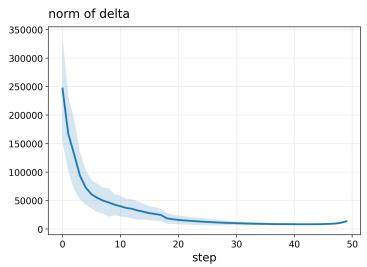  
(a) $| \Delta _ { t } | |$ 1

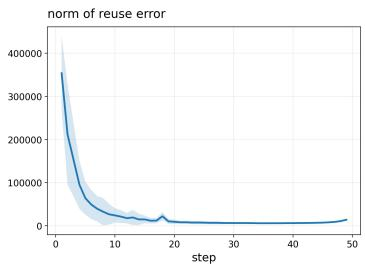  
(b) $| \Delta _ { t } - \Delta _ { t - 1 } | | _ { 1 }$

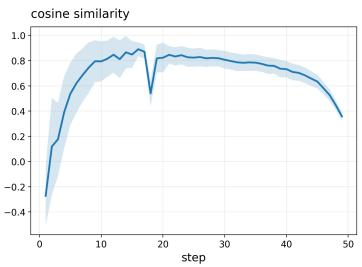  
(c) cos(∆t, ∆t−1)  
Figure 7: Temporal dynamics of the conditional correction signal under CFG. From left to right: the norm of $\Delta _ { t }$ , the adjacent-step variation $\lVert \Delta _ { t } - \Delta _ { t - 1 } \rVert _ { 1 }$ 1, and the cosine similarity cos $( \Delta _ { t } , \Delta _ { t - 1 } )$ between consecutive correction vectors.

The quadratic term operates only on stored residual tensors and does not require $\mathcal { O } ( T ^ { 2 } )$ diffusionmodel evaluations. Propagation calibration probes one perturbation anchor every $\Delta _ { g }$ steps, giving an approximate rollout cost

$$
\mathcal { O } ( C T ^ { 2 } F _ { m } / \Delta _ { g } ) .
$$

For a 100-prompt FLUX.1-dev calibration configuration with $T = 5 0$ , alignment and propagation calibration require approximately 0.60 and 8.3 GPU-hours, respectively, for 8.9 GPU-hours in total. Raw calibration traces temporarily occupy approximately 11 GB at $1 0 2 4 \times 1 0 2 4$ resolution and 42 GB at $2 0 4 8 \times 2 0 4 8$ , whereas the final calibrated statistics occupy only tens of kilobytes. Calibration is entirely offline.

At test time, the RA-CFGCache control layer adds only constant-time lookup and scalar composition/rescaling beyond the computations required by the base proxy, and introduces no additional diffusion-model forward pass. This online overhead is included in the reported end-to-end latency.

Calibration reuse and transfer. Once calibrated, $\bar { \rho } _ { t _ { a } , t _ { b } }$ and $g _ { t }$ are fixed and reused across evaluation prompts, random seeds, and operating thresholds τ. The alignment statistic is calibrated separately for the evaluated CFG scales, while the same propagation prior is reused across those scale settings. Changes to the model or sampler/noise schedule require recalibration; changes to the timestep grid or prompt domain should be validated on the new setting and recalibrated when necessary.

Separate calibration-size ablations show stable performance when reducing alignment calibration to 50 prompts or propagation calibration to 10 prompts in the evaluated setting. These individual ablations do not establish the performance of a jointly reduced 50/10-prompt configuration.

## C Mechanism Analysis

## C.1 CFG Error Geometry under Classifier-Free Guidance

## Branch-Error Alignment and Conditional-Correction Drift.

We examine how the evolution of the conditional correction relates to branch-error alignment. Let

$$
\Delta _ { t } = c _ { t } - u _ { t } , \qquad \tilde { \Delta } _ { t } = \tilde { c } _ { t } - \tilde { u } _ { t } .\tag{22}
$$

Here $\Delta _ { t }$ is the difference between the fresh conditional and unconditional final branch predictions. For arbitrary branch approximations, the following identity holds:

$$
\delta c _ { t } = \delta u _ { t } + ( \tilde { \Delta } _ { t } - \Delta _ { t } ) .\tag{23}
$$

Thus, for nonzero branch errors,

$$
\rho _ { t } = \cos \Bigl ( \delta u _ { t } , \delta u _ { t } + ( \tilde { \Delta } _ { t } - \Delta _ { t } ) \Bigr ) .\tag{24}
$$

For direct prediction reuse from anchor $t _ { a } , \tilde { \Delta } _ { t } = \Delta _ { t _ { a } }$ . In particular, adjacent-step prediction reuse gives the correction drift $\Delta _ { t _ { k - 1 } } - \Delta _ { t _ { k } }$ at execution step $k .$ For intermediate-feature or residual caching, this temporal-drift interpretation serves as a proxy rather than an exact identity for the induced prediction error.

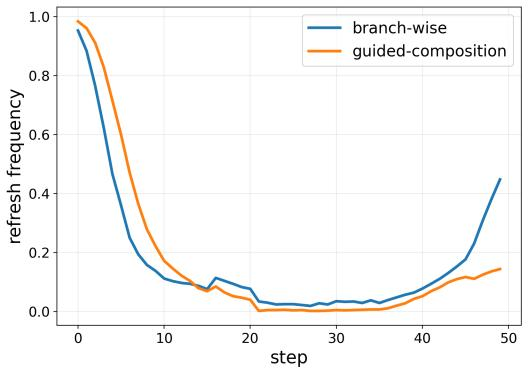

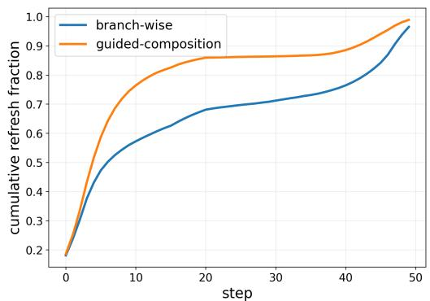  
Figure 8: Refresh redistribution under matched budget. Left: per-step refresh frequency of the branch-wise and guided-composition controllers. Right: cumulative refresh fraction over timesteps. Guided-composition shifts refresh decisions toward earlier timesteps, showing that preserving CFG error geometry changes the actual scheduling behavior rather than only the local risk value.

Alignment depends on both the magnitude and direction of the correction error relative to $\delta u _ { t }$ . If the correction error is small relative to a nonzero unconditional error, the two branch errors remain closely aligned. A larger correction error may preserve or weaken alignment depending on its direction. Neither the correction norm alone nor its unnormalized temporal variation determines $\rho _ { t }$

Figure 7 examines the correction norm, adjacent-step variation, and adjacent-step cosine similarity using the final branch predictions $\Delta _ { t } = c _ { t } - u _ { t }$ In the displayed setting, the correction norm decreases over sampling, while its temporal variation is large early, smaller in the middle, and rises again near the end. These observations describe changing correction dynamics and are consistent with timestep-dependent branch alignment. They do not, by themselves, establish that correction-norm decay causes increased alignment; the relative drift magnitudes and directions also matter.

## Risk Mismatch and Refresh Redistribution under CFG.

The calibrated alignment term changes the temporal profile of the proxy score. We examine whether this change also affects refresh allocation through an offline replay on precomputed branch traces. The replay isolates scheduling behavior and does not measure end-to-end generation quality.

We compare two cumulative-threshold controllers using the same base proxy, reuse action, and replay protocol: a no-cross-term controller and a guided-composition controller that includes the calibrated cross-term. Their thresholds are tuned separately to match the average refresh count.

Figure 8 shows that guided composition shifts refreshes toward earlier timesteps at the matched average count. The mean refresh step decreases from 16.87 to 10.03, while the fraction of refreshes assigned to the first 20% of steps increases from 56.1% to 75.0%. These results show that the calibrated cross-term changes the allocation of refresh decisions in the replay setting. Whether thi redistribution improves output fidelity is evaluated separately through controlled quality comparisons.

## C.2 Propagation-aware Rescaling under Diffusion Dynamics

The guided error describes a local prediction perturbation, whereas its effect on the final latent also depends on the sampler and the remaining denoising dynamics. We use a first-order analysis to motivate the empirical propagation prior.

First-order propagation analysis. To distinguish execution order from diffusion time, let $z _ { k }$ denote the latent entering sampler step k, with corresponding diffusion time $t _ { k }$ . Write one complete update as

$$
z _ { k + 1 } = F _ { k } ( z _ { k } , p _ { t _ { k } } ( z _ { k } ) ) .
$$

Let $e _ { k }$ be a guided-prediction perturbation introduced only at step $k .$ Evaluating derivatives along the unperturbed trajectory gives

$$
\delta z _ { k + 1 } \approx B _ { k } e _ { k } , \qquad B _ { k } : = \frac { \partial F _ { k } } { \partial p } ,
$$

and define the effective Jacobian of a subsequent complete step as

$$
A _ { j } : = \frac { d } { d z _ { j } } F _ { j } \left( z _ { j } , p _ { t _ { j } } ( z _ { j } ) \right) = \frac { \partial F _ { j } } { \partial z _ { j } } + \frac { \partial F _ { j } } { \partial p } \frac { \partial p _ { t _ { j } } } { \partial z _ { j } } .
$$

The final perturbation is therefore approximated by the ordered product

$$
\delta z _ { T + 1 } ^ { ( k ) } \approx J _ { k } e _ { k } , \qquad J _ { k } : = A _ { T } A _ { T - 1 } \cdot \cdot \cdot A _ { k + 1 } B _ { k } ,
$$

where the product preceding $B _ { k }$ is the identity for the final update. For multistep samplers, the state can be augmented to include the history required by the update. For stochastic samplers, the comparison conditions on shared sampling randomness.

For a nonzero perturbation, the directional amplification factor is

$$
g _ { t _ { k } } ( e _ { k } ) : = \frac { \| \delta z _ { T + 1 } ^ { ( k ) } \| _ { 2 } } { \| e _ { k } \| _ { 2 } } \approx \frac { \| J _ { k } e _ { k } \| _ { 2 } } { \| e _ { k } \| _ { 2 } } .
$$

This factor depends on both the trajectory and the perturbation direction. We summarize this behavior using a timestep-dependent calibration average,

$$
{ \bar { g } } _ { t _ { k } } : = \mathbb { E } _ { \mathrm { c a l } } \left[ { \frac { \| \delta z _ { T + 1 } ^ { ( k ) } \| _ { 2 } } { \| e _ { k } \| _ { 2 } } } \right] .
$$

In practice, we do not explicitly compute the Jacobian chain. Instead, the calibration uses complete perturbed rollouts and measures the downstream effect of an isolated one-step perturbation. The fitted $\hat { g } _ { t _ { k } }$ is therefore an empirical timestep-dependent surrogate motivated by the first-order analysis rather than a direct Jacobian estimate.

From single-step sensitivity to cache control. Under repeated reuse, earlier errors change the states at which later model evaluations occur, and perturbations may interact. The single-step analysis therefore does not provide an exact decomposition of final error under arbitrary multi-step caching.

We use the fitted gain as a lightweight timestep-dependent prior. Given the guided-risk contribution $\hat { r } _ { t _ { a } , t _ { b } } ^ { \mathrm { g u i d e d } }$ for a candidate reuse decision from anchor $t _ { a }$ to target $t _ { b }$ , we define

$$
\Delta \hat { r } _ { t _ { a } , t _ { b } } = \mathrm { m a x } \left( 0 , \hat { g } _ { t _ { b } } \hat { r } _ { t _ { a } , t _ { b } } ^ { \mathrm { g u i d e d } } \right) .
$$

When reuse is accepted, the accumulated control score is updated as

$$
R \gets R + \Delta \hat { r } _ { t _ { a } , t _ { b } } .
$$

Thus, propagation weighting is applied before accumulation. The resulting R is an online control statistic, not a bound on the final output deviation.

## C.3 Reuse Object Selection: Why Joint Branch Reuse Is a Strong Default

Beyond refresh scheduling, CFG caching introduces a second decision dimension: what should be reused between two refresh steps. Under true CFG,

$$
p _ { t } = u _ { t } + s \Delta _ { t } , \qquad \Delta _ { t } : = c _ { t } - u _ { t } ,
$$

or equivalently,

$$
p _ { t } = ( 1 - s ) u _ { t } + s c _ { t } .
$$

For direct prediction reuse from anchor $t _ { a } ,$ , different actions induce the following exact guided errors:

$$
\begin{array} { r } { \delta p _ { t } ^ { ( u ) } = ( 1 - s ) ( u _ { t _ { a } } - u _ { t } ) , \ } \\ { \delta p _ { t } ^ { ( c ) } = s ( c _ { t _ { a } } - c _ { t } ) , \ \ } \\ { \delta p _ { t } ^ { ( \Delta ) } = s ( \Delta _ { t _ { a } } - \Delta _ { t } ) , \ \quad \quad } \end{array}
$$

and

$$
\delta p _ { t } ^ { ( \mathrm { b o t h } ) } = ( 1 - s ) ( u _ { t _ { a } } - u _ { t } ) + s ( c _ { t _ { a } } - c _ { t } ) .
$$

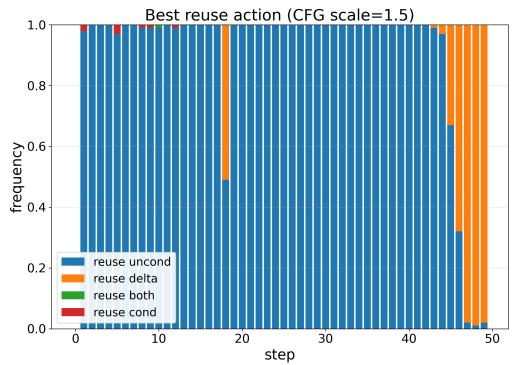

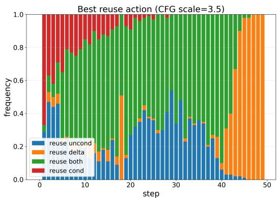

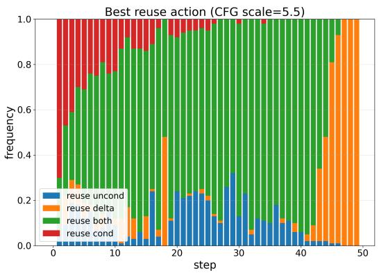

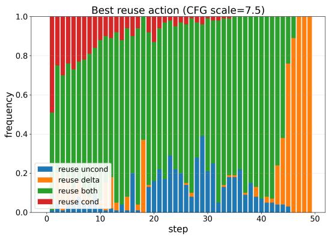  
Figure 9: Best reuse action frequency across timesteps under different CFG scales (top-left: 1.5, top-right: 3.5, bottom-left: 5.5, bottom-right: 7.5). As CFG scale increases, reuse-both dominates a larger portion of timesteps, while reuse-∆ becomes favorable mainly in the very late stage. Reusecond is rarely optimal throughout.

For intermediate-feature or residual caching, these equations describe the corresponding idealized prediction-reuse actions rather than the exact internal computation.

In the direct-prediction analysis, reuse-∆ recomputes the unconditional prediction and reuses the cached CFG delta, saving one branch evaluation. Reuse-uncond and reuse-cond also save one branch evaluation, whereas reuse-both saves two. For intermediate caching, the exact saving depends on the cached components and any computations retained for proxy evaluation.

We first examine object selection using a timestep-wise offline action oracle based on true guided error. For each CFG scale, we enumerate candidate reuse actions at every timestep and record, over 100 prompts, how often each action attains the smallest guided action error relative to full computation. As shown in Fig. 9, the preferred reuse object is phase-dependent. At low CFG scale, reuse-uncond remains competitive over a larger portion of the trajectory. As CFG scale increases, reuse-both is selected more frequently, while reuse-∆ becomes competitive mainly in the late stage. Reuse-cond is rarely preferred.

The late-stage competitiveness of reuse-∆ is consistent with the CFG geometry. The CFG-delta drift is

$$
\Delta _ { t _ { a } } - \Delta _ { t } = ( c _ { t _ { a } } - c _ { t } ) - ( u _ { t _ { a } } - u _ { t } ) .
$$

When the conditional and unconditional branch drifts are both highly aligned and similar in magnitude, this difference can become small. In that regime, directly reusing the CFG delta can induce a relatively small raw guided error.

A default online reuse action should also account for computational saving. We therefore additionally compare actions by guided error per saved branch evaluation. Under this diagnostic ratio, reuse-both performs best overall across the evaluated CFG scales in our offline analysis. This ratio is an auxiliary diagnostic and does not establish an optimal online policy.

Taken together, object choice under CFG is phase-dependent, while joint branch reuse provides a strong practical default in the evaluated settings. It is frequently preferred at moderate-to-large CFG scales and provides favorable error per saved branch evaluation. We therefore use joint branch reuse as the default action in the main controller.

Table 9: Comparison with CFG-aware guidance and acceleration methods on FLUX.1-dev. RA-CFGCache preserves the original sampler and fixed CFG rule. MAMBO-G, CFG Scheduler, and OUSAC modify the guidance policy, while FasterCache exploits CFG branch redundancy. LPIPS, SSIM, and PSNR measure sampler fidelity, with CLIPScore, ImageReward, and HPSv2 reported as complementary quality metrics.
<table><tr><td>Method</td><td>Speedup↑</td><td>LPIPS↓</td><td>SSIM↑</td><td>PSNR↑</td><td>CLIP↑</td><td>ImageReward↑</td><td>HPSv2↑</td></tr><tr><td>Vanilla (T = 50)</td><td>1.00×</td><td>0.0000</td><td>1.0000</td><td>∞</td><td>27.9063</td><td>0.8003</td><td>0.2776</td></tr><tr><td>Vanilla (T = 25)</td><td>1.96×</td><td>0.4556</td><td>0.6207</td><td>13.09</td><td>27.0429</td><td>0.2629</td><td>0.2364</td></tr><tr><td>FasterCache</td><td>2.09×</td><td>0.2158</td><td>0.7593</td><td>20.88</td><td>27.4779</td><td>0.6241</td><td>0.2643</td></tr><tr><td>MAMBO-G (T=25)</td><td>1.98×</td><td>0.5616</td><td>0.5192</td><td>11.64</td><td>28.4720</td><td>0.9800</td><td>0.2930</td></tr><tr><td>CFG Scheduler</td><td>1.00×</td><td>0.5327</td><td>0.5503</td><td>12.26</td><td>28.1390</td><td>1.0160</td><td>0.3000</td></tr><tr><td>OUSAC</td><td>3.44×</td><td>0.5530</td><td>0.5092</td><td>11.74</td><td>27.8770</td><td>0.9300</td><td>0.2880</td></tr><tr><td>RA-CFGCache-Slow</td><td>3.19×</td><td>0.1137</td><td>0.8680</td><td>24.02</td><td>27.8843</td><td>0.7672</td><td>0.2748</td></tr><tr><td>RA-CFGCache-Fast</td><td>3.95×</td><td>0.1484</td><td>0.8340</td><td>22.75</td><td>27.9071</td><td>0.7403</td><td>0.2694</td></tr></table>

## D Extended Experimental Results

## D.1 Comparison with CFG-aware Guidance and Acceleration Methods

We further compare RA-CFGCache with related CFG-aware guidance and acceleration methods, including MAMBO-G Zhu et al. [2026], CFG Scheduler Wang et al. [2024], and OUSAC Sun et al. [2025], under the same FLUX.1-dev evaluation protocol.

Importantly, RA-CFGCache does not tune the CFG scale or modify the guidance schedule. It preserves the original 50-step sampler and fixed CFG rule throughout inference and only controls whether intermediate computation is refreshed or reused. Its objective is therefore to accelerate a fixed vanilla CFG sampler while preserving its outputs as closely as possible, rather than to optimize absolute generation quality or preference-oriented metrics.

In contrast, MAMBO-G dynamically adjusts guidance magnitudes, CFG Scheduler varies guidance weights across timesteps, and OUSAC jointly optimizes sparse guidance scheduling and caching. These approaches may therefore alter the target generation trajectory itself, whereas RA-CFGCache treats the vanilla CFG sampler as fixed.

At the closest high-speed operating point, RA-CFGCache-Fast achieves a 3.95× speedup compared with 3.44× for OUSAC, while producing outputs substantially closer to the vanilla outputs. Specifically, LPIPS decreases from 0.5530 to 0.1484, SSIM increases from 0.5092 to 0.8340, and PSNR increases from 11.74 to 22.75. The corresponding CLIPScore remains comparable (27.9071 vs. 27.8770). RA-CFGCache-Slow provides a more fidelity-oriented operating point, achieving LPIPS 0.1137, SSIM 0.8680, and PSNR 24.02 at a 3.19× speedup.

MAMBO-G, CFG Scheduler, and OUSAC obtain higher ImageReward or HPSv2 scores in several settings. This distinction is consistent with their different objectives: these methods explicitly modify the guidance policy, whereas RA-CFGCache does not optimize CFG parameters or preferenceoriented generation quality. Our claim is therefore a stronger speed–sampler-fidelity trade-off, rather than universal superiority in absolute generation quality.

The two directions are therefore complementary: guidance-policy optimization changes the target trajectory to improve generation characteristics, whereas RA-CFGCache accelerates a fixed guidance policy and aims to reproduce its outputs as faithfully as possible.

## D.2 Generality of Propagation-aware Rescaling

Although propagation-aware rescaling is introduced together with our CFG-aware guided-risk formulation, its role is more general: it corrects local reuse scores by accounting for the non-uniform downstream impact of errors across timesteps. We therefore evaluate it in a standard single-prediction caching setting, where reuse decisions are made on a single model prediction rather than CFGcomposed branch outputs.

Table 10: Generality of propagation-aware rescaling in the standard single-prediction setting. We apply propagation-aware rescaling to several representative non-CFG caching baselines and observe consistent fidelity improvements across the evaluated proxy families.
<table><tr><td>Base method</td><td>Variant</td><td>Speedup↑</td><td>LPIPS↓</td><td>SSIM↑</td><td>PSNR↑</td></tr><tr><td>TeaCache</td><td>Original</td><td>3.27×</td><td>0.3617</td><td>0.7112</td><td>17.05</td></tr><tr><td>TeaCache</td><td>+ Propagation Rescaling</td><td>3.32×</td><td>0.3207</td><td>0.7305</td><td>18.02</td></tr><tr><td>MagCache MagCache</td><td>Original</td><td>3.11×</td><td>0.1964</td><td>0.8169</td><td>22.05</td></tr><tr><td></td><td>+ Propagation Rescaling</td><td>3.12×</td><td>0.1822</td><td>0.8266</td><td>22.57</td></tr><tr><td>DiCache</td><td>Original</td><td>3.20×</td><td>0.2999</td><td>0.7744</td><td>21.58</td></tr><tr><td>DiCache</td><td>+ Propagation Rescaling</td><td>3.19×</td><td>0.2393</td><td>0.7966</td><td>22.38</td></tr></table>

Table 11: Compatibility with different base proxy estimators. We apply RA-CFGCache on top of different branch-wise proxy families and compare it against their original branch-wise accumulation controllers. Across all proxy types, RA-CFGCache consistently improves fidelity at nearly unchanged latency, showing that its gain is complementary to the underlying proxy design rather than tied to a specific estimator.
<table><tr><td>Base proxy family</td><td>Controller</td><td>Latency↓ Speedup↑</td><td></td><td>LPIPS↓</td><td>SSIM↑</td><td>PSNR↑</td></tr><tr><td>Tea-style proxy</td><td>Branch-wise accumulation + RA-CFGCache wrapper</td><td>6.16 s 6.16 s</td><td>3.41× 3.41×</td><td>0.1852 0.1492</td><td>0.7977 0.8297</td><td>20.60 22.39</td></tr><tr><td>Mag-style proxy</td><td>Branch-wise accumulation + RA-CFGCache wrapper</td><td>6.18 s 6.17 s</td><td>3.40× 3.41×</td><td>0.1683 0.1232</td><td>0.8144 0.8590</td><td>21.35 23.53</td></tr><tr><td>DiCache-style proxy</td><td>Branch-wise accumulation + RA-CFGCache wrapper</td><td>6.13 s 6.13 s</td><td>3.43× 3.43×</td><td>0.2177 0.1453</td><td>0.7706 0.8364</td><td>19.48 22.57</td></tr></table>

Specifically, we apply the same propagation-aware rescaling to representative proxy baselines, including TeaCache-style, MagCache-style, and DiCache-style controllers. We keep their original proxy signals, thresholds, and reuse policies unchanged, and modify only the local reuse score by incorporating the timestep-dependent propagation coefficient.

Table 10 shows that propagation-aware rescaling consistently improves the final efficiency–fidelity trade-off across all tested baselines. In particular, it reduces LPIPS and improves SSIM and PSNR while maintaining nearly identical speedup.

These results indicate that propagation-aware rescaling is not merely an implementation detail tied to RA-CFGCache, but a broadly applicable correction principle: local reuse error should be adjusted according to its timestep-dependent downstream propagation before being used for decision-making. This supports our formulation that effective cache control requires not only accurate local error estimation, but also a proper modeling of how such errors propagate to the final output.

## D.3 Compatibility with Different Base Proxy Estimators

RA-CFGCache is designed as a control framework that operates on top of branch-wise proxy signals, rather than relying on a specific proxy design. To verify this plug-in property, we evaluate our method with several representative proxy families, including Tea-style, Mag-style, and DiCache-style estimators.

For each proxy family, we compare its original branch-wise accumulation controller with the corresponding RA-CFGCache version, which replaces the original accumulation rule with CFG-aware guided-risk composition and propagation-aware rescaling, while keeping the underlying proxy signals unchanged.

As shown in Table 11, RA-CFGCache consistently improves fidelity across all proxy families at nearly identical latency. For example, under the Tea-style proxy, LPIPS is significantly reduced with improved SSIM and PSNR, and similar improvements are observed for Mag-style and DiCache-style proxies.

These results demonstrate that the gain of RA-CFGCache does not come from designing a stronger proxy signal, but from correcting how proxy signals are composed and accumulated under CFG. This confirms that RA-CFGCache can be viewed as a general wrapper that upgrades existing proxy-based caching methods into a risk-aligned control paradigm.

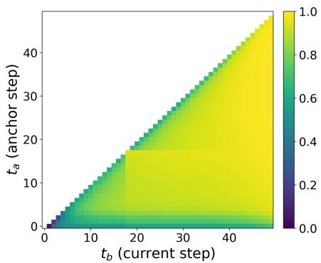  
(a) Pairwise alignment heatmap $\bar { \rho } _ { t _ { a } , t _ { b } } .$

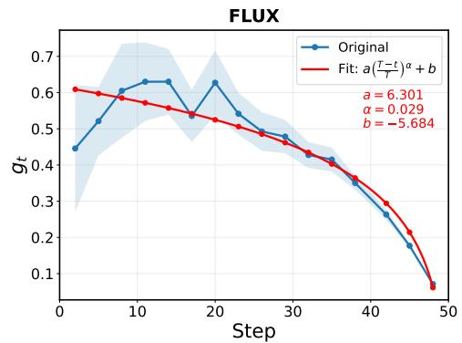  
(b) Power-law fit of the propagation gain curve $g _ { t }$ on FLUX.

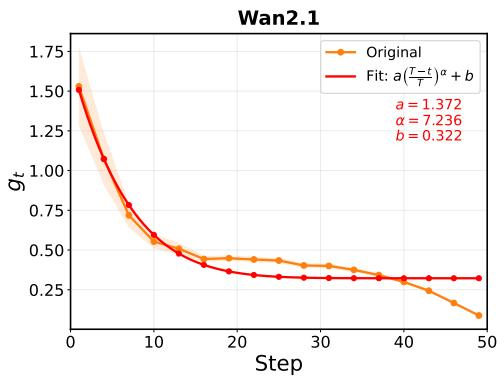  
(c) Power-law fit of the propagation gain curve $g _ { t }$ on Wan2.1-T2V-1.3B.

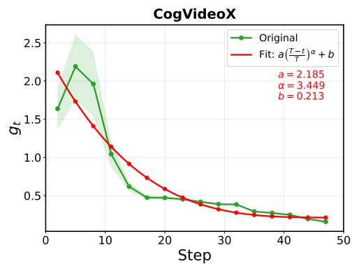  
(d) Power-law fit of the propagation gain curve gt on CogVideoX.  
Figure 10: Additional calibration visualizations. Top-left: pairwise branch-error alignment heatmap. The other three panels show model-specific power-law fits of the propagation gain curve $g _ { t }$

## D.4 Additional Calibration Visualizations

We visualize the two calibrated quantities used by our method: the anchor–target alignment statistic $\bar { \rho } _ { t _ { a } , t _ { b } }$ and the timestep-dependent propagation gain $g _ { t }$

Figure 10(a) shows the alignment heatmap between anchor step $t _ { a }$ and current step $t _ { b } .$ . The heatmap exhibits clear structure rather than an unstructured noisy pattern. Alignment is weaker and more variable in some early regions and stronger over broad later regions. This motivates retaining anchor– target dependence in the calibrated alignment statistic, while the heatmap alone does not establish that a full pairwise matrix is necessary relative to simpler parameterizations.

Figure 10(b)–(d) show the measured propagation-gain curve and its fitted power-law surrogate. The measured gain is non-uniform across timesteps: perturbations introduced at different steps lead to substantially different final deviations. The fitted curve captures the dominant trend and provides a compact representation for online control. Its usefulness for cache control is evaluated separately through the surrogate ablation.

Together, these visualizations illustrate the two calibration objects used by RA-CFGCache: an anchor–target calibrated alignment statistic for guided-risk composition and timestep-dependent propagation weighting for control-score accumulation.

## D.5 Cross-model Alignment and Propagation Patterns

To further examine the empirical patterns relevant to our calibration procedure, we visualize alignment and propagation statistics across diffusion models and CFG settings.

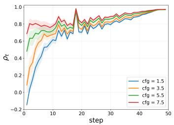  
(a) FLUX

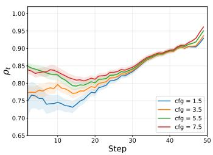  
(b) Wan2.1

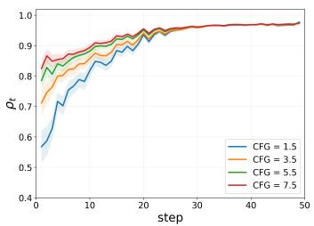  
(c) CogVideoX

Figure 11: Alignment curves across CFG scales for different diffusion models. Across models, $\rho _ { t }$ generally remains lower or less stable in the early-to-middle stage and tends toward a higheralignment regime in later timesteps, although detailed local fluctuations are model-dependent.  
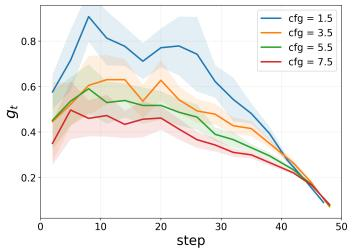  
(a) FLUX

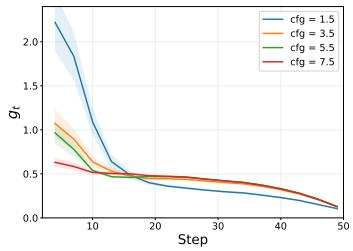  
(b) Wan2.1

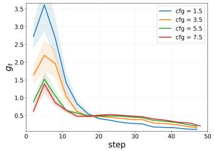  
(c) CogVideoX  
Figure 12: Propagation gain curves $g _ { t }$ across CFG scales for different diffusion models. The propagation gain is strongly timestep-dependent, with larger values in the early or early-middle stages and much smaller values in later steps. Across CFG scales, the curves show model-dependent magnitude differences and tend to become closer in later steps, indicating that local guided errors have substantially different final impacts depending on their injection timestep.

Figure 11 shows the timestep-wise alignment curves across multiple CFG scales for the evaluated models. Despite differences in architecture and absolute magnitude, the curves exhibit structured timestep-dependent variation, with many settings moving toward a stronger alignment regime later in sampling.

Figure 12 presents the corresponding propagation-gain curves. Across the evaluated models, perturbations introduced at different timesteps have markedly different downstream effects, with the dominant trend generally decreasing toward later sampling stages.

These results show related empirical patterns across the evaluated models and CFG configurations. They are consistent with our use of model-specific alignment calibration together with a shared low-dimensional functional family for the propagation prior. However, similar qualitative patterns do not imply direct transfer of calibrated parameters across models, samplers, or guidance configurations.

## D.6 Why a Power-law Surrogate for Propagation Gain

After measuring the propagation gain through offline perturbation calibration, we require a practical surrogate for online scheduling. Our goal is not to reproduce every local fluctuation of the measured curve, but to obtain a smooth control signal that captures the dominant timestep dependence.

Using the increasing execution-step index $k ,$ we model the gain as

$$
\hat { g } _ { k } = \lambda \Big ( \frac { T - k } { T } \Big ) ^ { \alpha } + \beta ,
$$

where $t _ { k }$ denotes the corresponding diffusion time and $\lambda , \alpha , \beta$ are fitted from the offline perturbation measurements.

The power-law form has three practical advantages. First, it provides a smooth approximation to the dominant propagation trend and avoids reacting to local calibration noise. Second, $( T - k ) / T$ gives a dimensionless parameterization of sampling progress, although this normalization alone does not guarantee transfer across step counts or noise schedules. Third, the surrogate requires only three scalar parameters and therefore adds negligible online cost.

Table 12: Effect of propagation-gain surrogate. We compare compact surrogate forms for propagation-aware rescaling. The power-law surrogate provides the best fidelity among the tested smooth parameterizations, achieving the lowest LPIPS and highest SSIM with competitive PSNR.
<table><tr><td>Surrogate</td><td> $R ^ { 2 } \uparrow$ </td><td>NMAE↓</td><td>Speedup ↑</td><td>LPIPS↓</td><td>SSIM ↑</td><td>PSNR ↑</td></tr><tr><td>No prop. rescaling</td><td></td><td></td><td>3.74×</td><td>0.1699</td><td>0.8162</td><td>21.41</td></tr><tr><td>Fixed linear decay</td><td>-0.0024</td><td>0.3174</td><td>3.75×</td><td>0.1469</td><td>0.8297</td><td>22.74</td></tr><tr><td>Fitted linear decay</td><td>0.7164</td><td>0.1521</td><td>3.76×</td><td>0.1448</td><td>0.8379</td><td>22.80</td></tr><tr><td>Power-law decay</td><td>0.8201</td><td>0.1010</td><td>3.77×</td><td>0.1406</td><td>0.8398</td><td>22.93</td></tr></table>

Table 13: Effect of caching strategies under CFG parallelism. Controlled FLUX.1-dev study at 1024×1024 resolution, CFG scale 3.5, 50 denoising steps, comparing independent branch-wise caching and joint guided caching under a matched branch-evaluation budget.
<table><tr><td>Controller</td><td></td><td>Reuse both (%) ↑ One-sided reuse (%) ↓ Full-step refresh (%) Latency (s) ↓</td><td></td><td></td></tr><tr><td>Branch-wise caching</td><td>35.1</td><td>53.8</td><td>11.1</td><td>6.81</td></tr><tr><td>Ours (reuse both)</td><td>62.0</td><td>0.0</td><td>38.0</td><td>4.21</td></tr></table>

Figure 12 shows that the measured gains contain model-dependent transients and local fluctuations but exhibit a clear coarse timestep dependence. Table 12 compares several propagation-gain surrogates. Removing propagation rescaling gives the weakest final fidelity in the reported comparison, supporting the benefit of timestep-dependent downstream weighting. Compared with the fixed and fitted linear alternatives, the power-law surrogate achieves the best LPIPS and SSIM with competitive PSNR at comparable speedup. The $R ^ { 2 }$ and NMAE columns characterize approximation quality, whereas LPIPS, SSIM, and PSNR evaluate the downstream effect of the resulting controller.

The power-law form should therefore be understood as a practical scheduling prior rather than a strict law of diffusion error propagation.

## D.7 Parallel Consistency under CFG Parallelism

We separately evaluate a parallel CFG implementation, distinct from the single-GPU sequential branch execution used in the main experiments. Each sample uses two GPUs, with the conditional and unconditional branches placed on separate GPUs. Their outputs are synchronized before CFG composition, and the associated synchronization overhead is included in the reported end-to-end latency.

We compare joint branch decisions against independent TeaCache-style controllers applied separately to the conditional and unconditional branches. The thresholds are tuned to match the aggregate number of branch evaluations.

As shown in Table 13, independent branch-wise control uses one-sided reuse at 53.8% of steps and joint reuse at 35.1%. One-sided reuse reduces branch computation, but may provide limited wall-clock benefit when the recomputed branch remains on the critical path. Joint control avoids these one-sided decisions and skips recomputation of cached components in both branches at each accepted joint reuse step.

At the matched branch-evaluation count, independent branch-wise control requires 6.81 s, whereas joint control requires 4.21 s. These results support joint reuse as an effective execution choice in the evaluated parallel implementation. They do not imply that one-sided reuse provides no computational saving or that the same latency advantage necessarily holds across different hardware configurations or execution backends.

## E Broader impacts

RA-CFGCache improves the efficiency of CFG-based diffusion inference, which can lower deployment cost and reduce energy consumption for visual generation systems. The method does not introduce new generative capabilities, datasets, or pretrained models, and we do not identify negative societal impacts unique to the proposed caching algorithm. As with other efficiency improvements for generative models, practical deployment should still follow the safety and content-moderation policies of the underlying models.

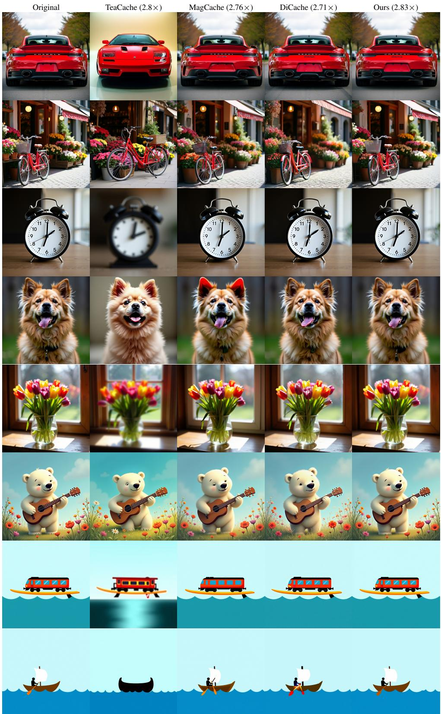  
Figure 13: Qualitative comparison on FLUX.1-dev.

A polar bear is playing guitar  
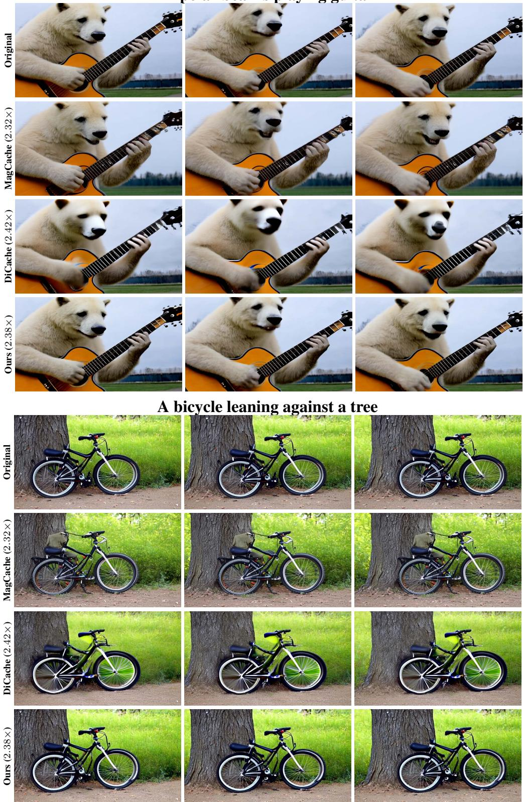  
Figure 14: Qualitative comparison on CogVideoX-2B (Part I).

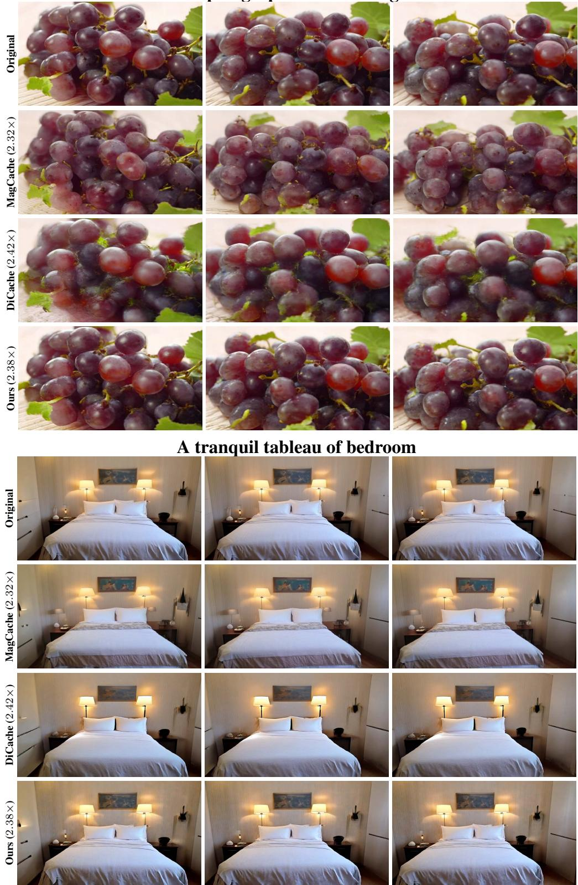  
Figure 15: Qualitative comparison on CogVideoX-2B (Part II).

An astronaut flying in space.  
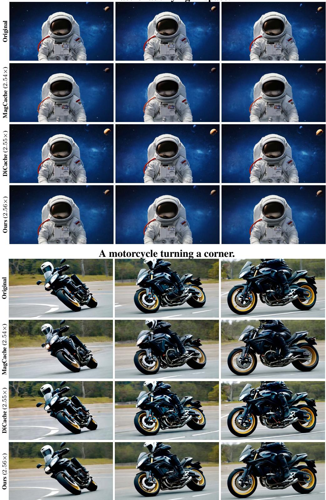  
Figure 16: Qualitative comparison on Wan2.1-T2V-1.3B (Part I).

A train accelerating to gain speed.  
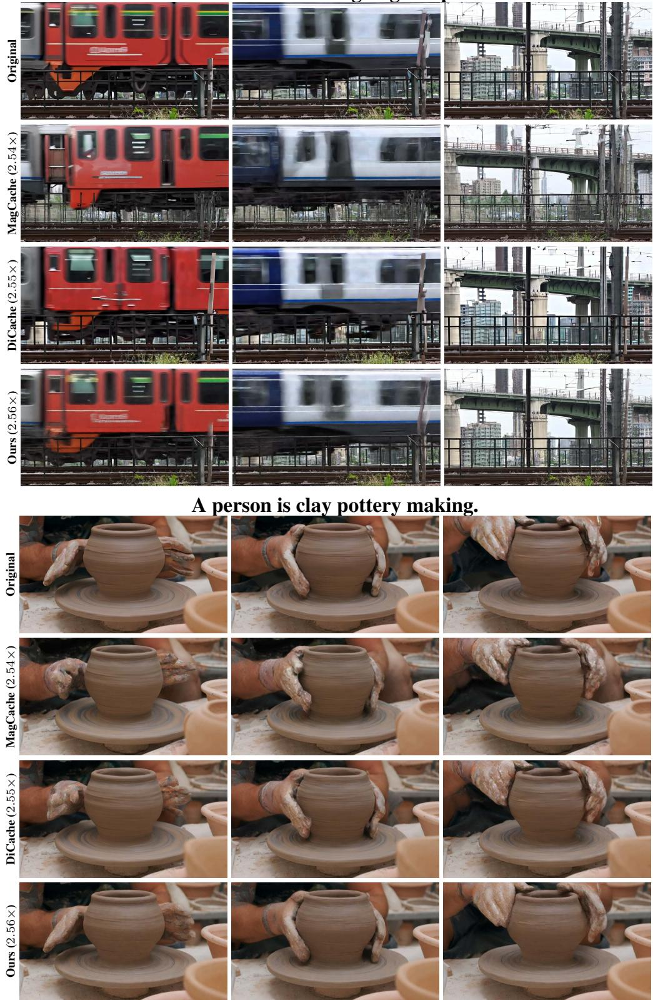  
Figure 17: Qualitative comparison on Wan2.1-T2V-1.3B (Part II).