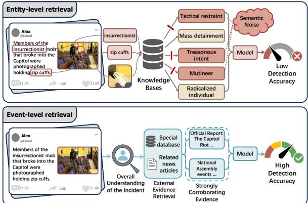
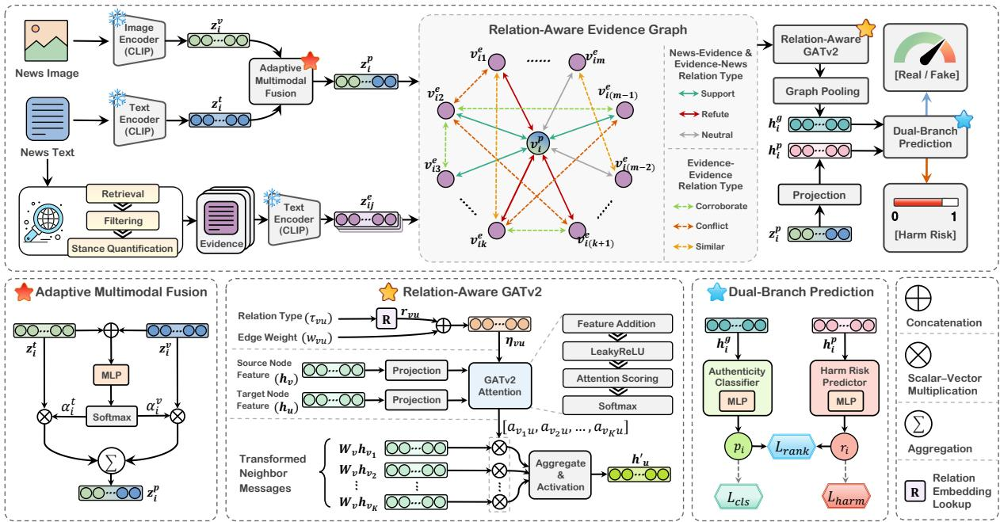
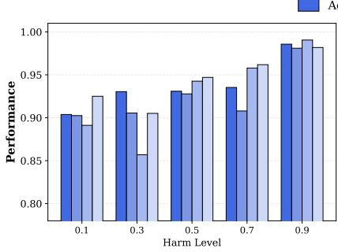
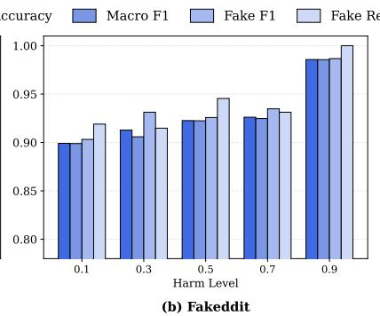
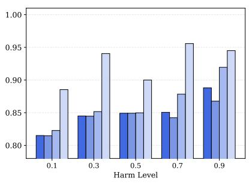
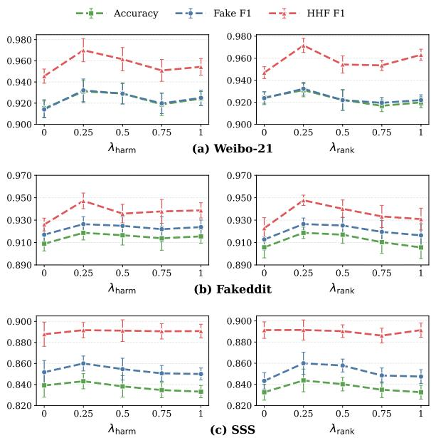
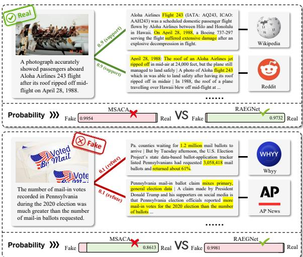
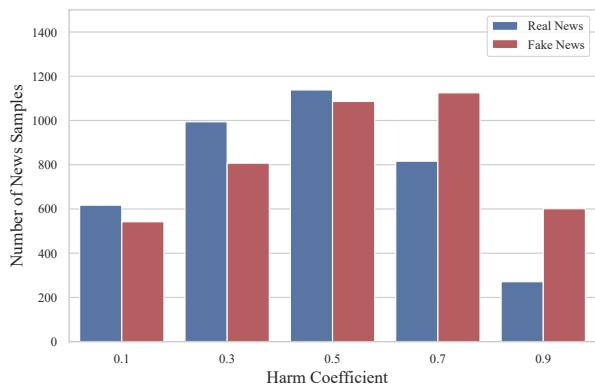
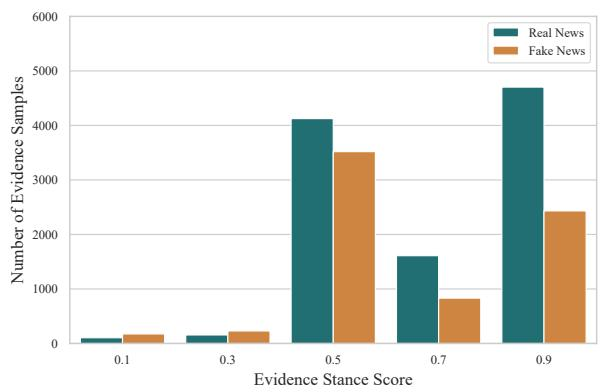
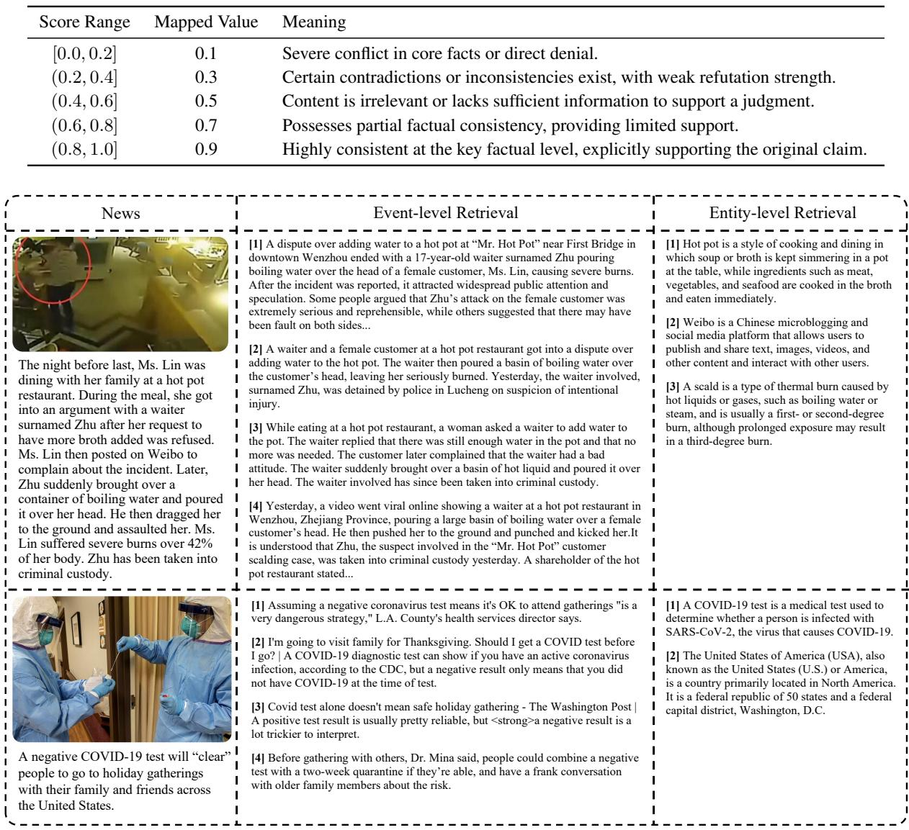

# RAEGNet: Relation-Aware Evidence Graph Network for Harm-Aware Multimodal Fake News Detection

Wenbin Shen∗1 Guoxuan Qin1 Guangxu Yao1 Baodong Wang1 Yuanbo Rui1 Zhongjie Ba2 Zhichao Lian∗1,3

1Nanjing University of Science and Technology 2Zhejiang University

3University of Chinese Academy of Sciences

shenwenbin@njust.edu.cn; lzcts@163.com

## Abstract

Existing multimodal fake news detection methods often introduce external information to assist detection. However, most of them rely on entity-level retrieval and are therefore prone to introducing event-irrelevant noise. Meanwhile, existing methods mainly focus on improving overall performance and do not account for differences in the degree of harm posed by different instances of fake news. To address these limitations, we design an Event-Level Evidence Retrieval Framework (ELERF) and propose a Relation-Aware Evidence Graph Network (RAEGNet). ELERF retrieves external evidence based on the complete event semantics of a news item. RAEGNet constructs a directed graph that incorporates news-evidence stance relations and evidence-evidence interaction relations, and introduces a conditionalharm branch to jointly model authenticity and potential harm. Experimental results demonstrate that RAEGNet outperforms multiple baseline methods across all evaluated metrics on Weibo-21, Fakeddit, and our selfconstructed SSS dataset.

## 1 Introduction

The rapid development of social media has greatly accelerated the dissemination of multimodal information, while also providing fertile ground for fake news, posing severe threats to public security (Shu et al., 2017; Zhou and Zafarani, 2020). In the realworld cyber ecosystem, different instances of fake news vary substantially in their potential destructive impact. For example, political deepfakes and public-health rumors can cause far greater social harm than poorly fabricated entertainment gossip (Shu et al., 2020; Nan et al., 2021). Therefore, multimodal fake news detection not only requires the foundational capability to accurately discern the authenticity of information but more urgently needs to prioritize the perception of highly harmful news so as to minimize the substantive adverse effects of misinformation on society (Liu and Wu, 2018).

  
Figure 1: Comparison between entity-level retrieval and our event-level retrieval.

Although existing multimodal fake news detection techniques have made substantial progress (Qi et al., 2019; Zhou et al., 2020; Silva et al., 2021; Singhal et al., 2019; Wang et al., 2024), two core issues remain. First, regarding the incorporation of external knowledge, existing methods mostly rely on entity-level retrieval (Popat et al., 2018; Augenstein et al., 2019) and knowledge-graph linking (Pan et al., 2018; Dun et al., 2021; Kim et al., 2023). Such methods easily deviate from the holistic semantics of the news event and introduce substantial semantic noise unrelated to the central event (Fu et al., 2023). Second, most existing studies formulate the objective as a simple binary classification task and focus only on improving aggregate performance, ignoring the significant variance in the degree of harmfulness among samples. In realworld settings, the social cost of failing to detect high-harm fake news is much higher than that of misclassifying an ordinary rumor. Although some studies have attempted to grade the severity of fake news (Reddy et al., 2023; Pillai et al., 2024), they are mostly limited to text-only settings or separate, simple assessments. How harm judgments can be intrinsically integrated into a multimodal detection framework remains insufficiently explored.

To address these challenges, we design the Event-Level Evidence Retrieval Framework (EL-ERF) and propose the Relation-Aware Evidence Graph Network (RAEGNet). ELERF uses the complete news text as the query and obtains strongly relevant external evidence from a predefined source pool through retrieval, filtering, and stance quantification. Based on the stance of each piece of evidence toward the news and the semantic relations among evidence items, RAEGNet constructs an evidence graph containing nine types of directed edges. In addition, by screening and integrating existing public data, we construct the SSS multimodal fake news dataset. SSS combines six public data sources and, after validity checks, sample deduplication, semantic filtering, and manual review, contains 7,997 Chinese and English multimodal news samples. Each sample is provided with a harm label, external evidence, and the corresponding evidence stance scores, thereby supporting authenticity detection, harm analysis, and relational evidence reasoning.

The main contributions of this paper are as follows:

• We propose an event-level evidence retrieval framework that reduces semantic noise and provides external evidence strongly related to the complete news event.

• We propose a relation-aware evidence graph that jointly models the relation types and relation strengths of news-evidence and evidenceevidence interactions.

• We propose a harm-aware joint optimization objective that jointly learns authenticity classification, conditional-harm estimation, and ordinal harm consistency.

• We construct the SSS multimodal fake news dataset, which provides high-quality Chinese and English news samples together with external evidence.

## 2 Related Work

## 2.1 Multimodal Fake News Detection

The development of multimodal fake news detection methods closely follows the iteration of feature extraction technologies. Early studies primarily utilized CNNs and RNNs to extract visual and textual features, fusing them through simple concatenation or attention mechanisms (Jin et al., 2017;

Yang et al., 2018). With breakthroughs in pretraining technologies, the field has entered an era of fine-grained cross-modal interaction. For instance, CAFE (Chen et al., 2022) utilizes fuzzy reasoning to quantify cross-modal ambiguity, InfoSurgeon (Fung et al., 2021) constructs a consistencychecking graph by aligning text entities with visual regions, and CCGN (Cui et al., 2025) directly captures the inconsistency between multimodal contents within a contrastive learning space. These methods significantly enhance the capability to capture image-text contradictions. However, restricted by the information inherent in the news itself, they struggle to handle deeply disguised fake news.

## 2.2 Knowledge-Enhanced Detection Methods

Introducing external knowledge becomes the key path to breaking through the limitations of internal information, and it can be mainly categorized into three types. The first category relies on static knowledge graphs. For instance, CompareNet (Hu et al., 2021) aligns news texts with KGs for entity alignment to determine authenticity, while AKA-Fake (Zhang et al., 2024a) utilizes reinforcement learning to adaptively retrieve relevant knowledge subgraphs. The second category is based on opendomain retrieval. For instance, MUSER (Liao et al., 2023) mimics the logical process of human factchecking and automatically collects key evidence through a multi-step retrieval mechanism. The third category is the paradigm based on LLMs and multi-agent systems, which treats LLMs as powerful implicit knowledge bases, reasoning engines, and orchestration centers. Typically, FKA-Owl (Liu et al., 2024) leverages LLMs to mine implicit commonsense, while RAMA (Yang et al., 2025) proposes a retrieval-augmented multi-agent framework. However, the majority of existing knowledge enhancement strategies still heavily rely on entitylevel or shallow semantic matching, which makes them prone to introducing irrelevant noise and consequently degrading the overall performance.

## 3 Methodology

## 3.1 Overview

As shown in Figure 2, RAEGNet first jointly encodes the news text, image, and evidence. It then constructs a relation-aware evidence graph for authenticity reasoning. At the same time, it uses the harm-risk branch to estimate conditional harm.

  
Figure 2: The overall architecture of RAEGNet.

## 3.2 Event-Level Evidence Retrieval

To reduce irrelevant noise introduced by entitylevel retrieval, we design an event-level evidence retrieval framework comprising the following three steps.

• Retrieval. For the i-th news, we use the complete news text as an event-level query and retrieve the top $N$ webpage snippets together with their metadata as candidate evidence.

• Filtering. Candidate webpages with explicit verdict-style information are automatically removed. The remaining candidates are further screened by an LLM to discard evidence containing implicit label leakage.

• Stance quantification. For each leakagefree candidate evidence item, the LLM evaluates a continuous stance score $\widetilde { q } _ { i j } \in [ 0 , 1 ]$ which is then mapped to a discrete stance score $q _ { i j } \in \{ 0 . 1 , 0 . 3 , 0 . 5 , 0 . 7 , 0 . 9 \}$ . The final evidence set is $\mathcal { E } _ { i } = \{ ( E _ { i j } , q _ { i j } ) \} _ { j = 1 } ^ { m _ { i } }$ , where $m _ { i } \leq N$

## 3.3 Feature Encoding and Fusion

Let $T _ { i }$ and $I _ { i }$ denote the text and image of the $i -$ th news item, respectively, and let $f _ { t } ( \cdot )$ and $f _ { v } ( \cdot )$ denote the text and image encoders. The normalized representations of the news text, news image, and j-th evidence are $\mathbf { z } _ { i } ^ { t } = \mathrm { N o r m } ( f _ { t } ( T _ { i } ) ) , \mathbf { z } _ { i } ^ { v }$

Norm $\left( f _ { v } ( I _ { i } ) \right)$ and $\mathbf { z } _ { i j } ^ { e } = \mathrm { N o r m } ( f _ { t } ( E _ { i j } ) )$ , respectively. Here, Norm $( \mathbf { x } ) = \mathbf { x } / \| \mathbf { x } \| _ { 2 }$

After obtaining the modality representations in the unified space, the fused news feature is computed as

$$
\mathbf { z } _ { i } ^ { p } = \alpha _ { i } ^ { t } \mathbf { z } _ { i } ^ { t } + \alpha _ { i } ^ { v } \mathbf { z } _ { i } ^ { v } ,\tag{1}
$$

where $\alpha _ { i } ^ { t }$ and $\alpha _ { i } ^ { v }$ are the weights of the news text feature $\mathbf { z } _ { i } ^ { t }$ and image feature $\mathbf { z } _ { i } ^ { v }$ , respectively. They are computed as

$$
\begin{array} { r } { \pmb { \alpha } _ { i } = \mathrm { s o f t m a x } \big ( \mathbf { W } _ { 2 } \phi \big ( \mathbf { W } _ { 1 } [ \mathbf { z } _ { i } ^ { t } ; \mathbf { z } _ { i } ^ { v } ] + \mathbf { b } _ { 1 } \big ) + \mathbf { b } _ { 2 } \big ) , } \end{array}\tag{2}
$$

where $\mathbf { W } _ { 1 } , \mathbf { W } _ { 2 } , \mathbf { b } _ { 1 }$ , and $\mathbf { b } _ { 2 }$ are learnable parameters of the gating network; $\phi ( \cdot )$ is the ReLU activation function; and $\pmb { \alpha } _ { i } = [ \alpha _ { i } ^ { t } , \alpha _ { i } ^ { v } ]$ , with $\alpha _ { i } ^ { t } , \alpha _ { i } ^ { v } \geq 0$ and $\alpha _ { i } ^ { t } + \alpha _ { i } ^ { v } = 1$

## 3.4 Relation-Aware Evidence Graph Network

For the i-th news item, we construct a graph $\mathcal G _ { i } ~ = ~ ( \mathcal V _ { i } , \mathcal A _ { i } )$ . Its node set is $\mathcal { V } _ { i } ~ = ~ \{ v _ { i } ^ { p } \} \cup$ $\{ v _ { i 1 } ^ { e } , v _ { i 2 } ^ { e } , \ldots , v _ { i m } ^ { e } \}$ . Here, $v _ { i } ^ { p }$ denotes the central news node, whose original feature is $\mathbf { z } _ { i } ^ { p }$ , and $v _ { i j } ^ { e }$ denotes the evidence node corresponding to evidence $E _ { i j }$ , whose original feature is $\mathbf { z } _ { i j } ^ { e }$ . For any node u $\in \mathcal { V } _ { i }$ , let $\mathbf { z } _ { u }$ denote its original feature. Its initial node state is obtained through a shared projection:

$$
\mathbf { x } _ { u } ^ { ( 0 ) } = \phi ( \mathrm { L N } ( \mathbf { W } _ { e } \mathbf { z } _ { u } + \mathbf { b } _ { e } ) ) ,\tag{3}
$$

where $\mathbf { W } _ { \epsilon }$ and ${ \bf b } _ { e }$ are the shared projection parameters.

After node initialization, news–evidence relations are constructed according to the semantic relevance and stance direction between the news text and the external evidence. First, the nonnegative cosine relevance between the news text and the evidence text is computed as

$$
c _ { i j } = \operatorname* { m a x } \bigl ( 0 , \cos ( \mathbf { z } _ { i } ^ { t } , \mathbf { z } _ { i j } ^ { e } ) \bigr ) .\tag{4}
$$

Then, based on the stance score $q _ { i j }$ , a support edge $P \to E ^ { + }$ , a refutation edge $P \to E ^ { - }$ , or a neutral edge $P \to E ^ { 0 }$ is constructed. Let the support threshold, refutation threshold, and neutralneighborhood width be $\delta _ { + } , \delta$ −, and $\delta _ { 0 }$ , respectively, satisfying $0 ~ < ~ \delta _ { - } ~ < ~ \frac { 1 } { 2 } ~ < ~ \delta _ { + } ~ < ~ 1 , 0 ~ < ~ \delta _ { 0 } ~ \leq ~$ min $\begin{array} { r } { \left\{ \frac { 1 } { 2 } - \delta _ { - } , \delta _ { + } - \frac { 1 } { 2 } \right\} } \end{array}$

The relation type $\tau _ { i j }$ and edge weight $w _ { i j }$ are defined as

$$
\left( \tau _ { i j } , w _ { i j } \right) = \left\{ \begin{array} { l l } { ( P \to E ^ { + } , q _ { i j } c _ { i j } ) , } & { q _ { i j } \geq \delta _ { + } , } \\ { ( P \to E ^ { - } , ( 1 - q _ { i j } ) c _ { i j } ) , } & { q _ { i j } < \delta _ { - } , } \\ { ( P \to E ^ { 0 } , q _ { i j } c _ { i j } ) , } & { \mu _ { 0 } < \delta _ { 0 } , } \end{array} \right.\tag{5}
$$

where $\mu _ { 0 } = | q _ { i j } - 1 / 2 |$

A reverse edge with the same weight is added for every valid edge, denoted by $E  P ^ { + } , E  P ^ { - }$ and $E \to P ^ { 0 }$ , respectively.

We next model relations among evidence items. For any two evidence nodes $v _ { i j } ^ { e }$ and $v _ { i k } ^ { e }$ , the relevance between their textual representations is computed as

$$
c _ { i j k } = \operatorname* { m a x } \bigl ( 0 , \cos ( { \mathbf { z } } _ { i j } ^ { e } , { \mathbf { z } } _ { i k } ^ { e } ) \bigr ) ,\tag{6}
$$

and is used as the weight of the evidence–evidence edge.

The news–evidence relations are then mapped to stance groups $g _ { i j } \in \{ \mathrm { s u p p o r t , r e f u t e , n e u t r a l } \}$ Let $\kappa _ { \mathrm { c o r } } , ~ \kappa _ { \mathrm { c o n } }$ , and $\kappa _ { \mathrm { s i m } }$ denote the relevance thresholds for corroboration, conflict, and similarity, respectively. Evidence relations are determined in the following order of priority:

1. If $g _ { i j } = g _ { i k } \in \{ \mathrm { s u p p o r t , r e f u t e } \}$ and $c _ { i j k } \geq$ $\kappa _ { \mathrm { c o r } } ,$ bidirectional corroboration edges $E $ $E ^ { \mathrm { c o r } }$ are added.

2. If $\{ g _ { i j } , g _ { i k } \} = \{ \mathrm { s u p p o r t , r e f u t e } \}$ and $c _ { i j k } \geq$ $\kappa _ { \mathrm { c o n } } ,$ bidirectional conflict edges $E  E ^ { \mathrm { c o n } }$ are added.

3. If neither of the first two conditions is satisfied and $c _ { i j k } \geq \kappa _ { \mathrm { s i m } }$ , bidirectional similarity edges $E  E ^ { \mathrm { s i m } }$ are added.

The complete relation set $\tau$ therefore consists of three types of news–evidence edges, three types of evidence–news edges, and three types of evidence– evidence edges.

For any directed edge $( v , u ) \in A _ { i }$ , let $\tau _ { v u }$ denote its relation type and $w _ { v u }$ its edge weight. We embed the nine relation types with a learnable matrix $\mathbf { R } \in \mathbb { R } ^ { | \mathcal { T } | \times d _ { r } }$ and obtain $\mathbf { r } _ { v u } = \mathbf { R } [ \tau _ { v u } ] \in \mathbb { R } ^ { d _ { r } }$ The edge feature is then $\eta _ { v u } = [ w _ { v u } ; \mathbf { r } _ { v u } ]$ , which keeps both relation strength and relation category.

We use GATv2 (Brody et al., 2022) as the message-passing operator. Let $\begin{array} { r } { \mathcal { N } ( u ) ~ = ~ \{ v ~ : }  \end{array}$ $( v , u ) \in \mathcal { A } _ { i } \}$ denote the in-neighbors of node $u .$ At layer $\ell ,$ the attention score for edge $( v , u )$ is computed from the target-node state, source-node state, and edge feature:

$$
e _ { v u } ^ { ( \ell ) } = \mathbf { a } _ { \ell } ^ { \top } \psi \Big ( \mathbf { W } _ { t } ^ { ( \ell ) } \mathbf { x } _ { u } ^ { ( \ell ) } + \mathbf { W } _ { s } ^ { ( \ell ) } \mathbf { x } _ { v } ^ { ( \ell ) } + \mathbf { W } _ { \eta } ^ { ( \ell ) } \eta _ { v u } \Big ) .\tag{7}
$$

where $\mathbf { W } _ { t } ^ { ( \ell ) } , \mathbf { W } _ { s } ^ { ( \ell ) } , \mathbf { W } _ { \eta } ^ { ( \ell ) }$ , and $\mathbf { a } _ { \ell }$ are layer-specific parameters, and $\psi ( \cdot )$ is the LeakyReLU activation function. The scores of all incoming edges to node u are normalized by softmax:

$$
a _ { v u } ^ { ( \ell ) } = \frac { \exp ( e _ { v u } ^ { ( \ell ) } ) } { \sum _ { k \in \mathcal { N } ( u ) } \exp ( e _ { k u } ^ { ( \ell ) } ) } .\tag{8}
$$

The next-layer state of node $u$ is obtained by weighted aggregation:

$$
\mathbf { x } _ { u } ^ { ( \ell + 1 ) } = \phi \left( \sum _ { v \in \mathcal { N } ( u ) } a _ { v u } ^ { ( \ell ) } \mathbf { W } _ { m } ^ { ( \ell ) } \mathbf { x } _ { v } ^ { ( \ell ) } \right) ,\tag{9}
$$

where $\mathbf { W } _ { m } ^ { ( \ell ) }$ is the message transformation matrix.

After L propagation layers, mean pooling and layer normalization produce the evidence-enhanced news representation

$$
\mathbf { h } _ { i } ^ { g } = \mathrm { L N } \left( \frac { 1 } { | \mathcal { V } _ { i } | } \sum _ { u \in \mathcal { V } _ { i } } \mathbf { x } _ { u } ^ { ( L ) } \right) .\tag{10}
$$

Finally, based on $\mathbf { h } _ { i } ^ { g } .$ , the classifier outputs the probability that the news item is fake:

$$
p _ { i } = \sigma \Big ( \mathbf { w } _ { o } ^ { \top } \mathcal { D } ( \phi ( \mathrm { B N } ( \mathbf { W } _ { c } \mathbf { h } _ { i } ^ { g } + \mathbf { b } _ { c } ) ) ) + b _ { o } \Big ) ,\tag{11}
$$

where ${ \mathbf W } _ { c } , { \mathbf b } _ { c } , { \mathbf w } _ { o } ,$ , and $b _ { o }$ are classifier parameters; BN denotes batch normalization; $\mathcal { D } ( \cdot )$ denotes dropout; and $\sigma$ is the sigmoid function. Given a classification threshold $\theta _ { y }$ , the predicted label is $\hat { y } _ { i } = \mathbb I ( p _ { i } \ge \theta _ { y } )$

## 3.5 Joint Optimization with Harm Risk

For the i-th news item, let $y _ { i } ~ \in ~ \{ 0 , 1 \}$ denote its authenticity label, where $y _ { i } ~ = ~ 1$ indicates fake news. The conditional harm label $\begin{array} { r l } { h _ { i } } & { { } \in \mathbf { \Sigma } } \end{array}$ (0, 1) represents the potential impact of the content if it were false and disseminated. In annotation, harm is collected as five ordered levels and represented by $\mathcal { H } = \{ a _ { 1 } , a _ { 2 } , a _ { 3 } , a _ { 4 } , a _ { 5 } \}$ {0.1, 0.3, 0.5, 0.7, 0.9}. The authenticity branch outputs the fake-news probability $p _ { i }$ through the relation-aware evidence graph. The harm-risk branch takes the news content representation as input and first obtains a hidden representation

$$
\mathbf { h } _ { i } ^ { p } = \mathrm { L N } ( \mathbf { W } _ { p } \mathbf { z } _ { i } ^ { p } + \mathbf { b } _ { p } ) ,\tag{12}
$$

after which it predicts the conditional harm score

$$
r _ { i } = \sigma \Big ( \mathbf { w } _ { r } ^ { \top } \phi ( \mathbf { W } _ { r } \mathbf { h } _ { i } ^ { p } + \mathbf { b } _ { r } ) + \beta _ { r } \Big ) ,\tag{13}
$$

where $\mathbf { W } _ { p } , \mathbf { b } _ { p } , \mathbf { W } _ { r } , \mathbf { b } _ { r } , \mathbf { w } _ { r } ,$ and $\beta _ { r }$ are parameters of the harm branch.

We jointly optimize authenticity classification and conditional-harm modeling through three complementary objectives. First, binary cross-entropy is used for authenticity classification:

$$
\mathcal { L } _ { \mathrm { c l s } } = - \frac { 1 } { B } \sum _ { i = 1 } ^ { B } \left[ y _ { i } \log p _ { i } + ( 1 - y _ { i } ) \log ( 1 - p _ { i } ) \right] ,\tag{14}
$$

where B is the mini-batch size.

Second, mean squared error is used to constrain the harm-risk branch to fit the conditional harm labels:

$$
\mathcal { L } _ { \mathrm { h a r m } } = \frac { 1 } { B } \sum _ { i = 1 } ^ { B } ( r _ { i } - h _ { i } ) ^ { 2 } .\tag{15}
$$

This objective provides pointwise supervision for conditional-harm estimation.

Finally, a harm-aware ranking constraint is introduced to preserve the ordinal structure of conditional harm. We define the ordered sample pairs in a mini-batch as

$$
\mathcal { P } _ { B } = \{ ( i , j ) : h _ { i } > h _ { j } \} .\tag{16}
$$

For each ordered pair, the relative harm difference is normalized as $\Delta _ { i j } = ( h _ { i } - h _ { j } ) / ( \operatorname* { m a x } ( \mathcal { H } ) -$ min(H)), and the ranking objective is defined as

$$
\mathcal { L } _ { \mathrm { r a n k } } = \frac { 1 } { | \mathcal { P } _ { B } | } \sum _ { ( i , j ) \in \mathcal { P } _ { B } } \left[ \gamma \Delta _ { i j } - ( r _ { i } - r _ { j } ) \right] _ { + } ^ { 2 } ,\tag{17}
$$

where $[ \cdot ] _ { + } = \operatorname* { m a x } ( 0 , \cdot )$ and $\gamma \geq 0$ controls the ranking margin. When $\mathcal { P } _ { B }$ is empty, $\mathcal { L } _ { \mathrm { r a n k } }$ is set to 0. This objective encourages consistency between the relative ordering of predicted harm scores and the annotated harm levels.

Combining the three objectives, the final optimization objective is

$$
\begin{array} { r } { \mathcal { L } = \mathcal { L } _ { \mathrm { c l s } } + \lambda _ { \mathrm { h a r m } } \mathcal { L } _ { \mathrm { h a r m } } + \lambda _ { \mathrm { r a n k } } \mathcal { L } _ { \mathrm { r a n k } } , } \end{array}\tag{18}
$$

where $\lambda _ { \mathrm { h a r m } }$ and $\lambda _ { \mathrm { { r a n k } } }$ are nonnegative weights. The joint objective enables the model to learn authenticity discrimination while simultaneously capturing both the absolute magnitude and ordinal structure of conditional harm. In this way, authenticity prediction and harm modeling are optimized within a unified framework.

## 4 Experiments

## 4.1 Experimental Setup

This subsection describes the datasets, baseline models, evaluation metrics, and implementation details used in the experiments.

## 4.1.1 Datasets

We conduct experiments on Weibo-21, Fakeddit, and SSS. Weibo-21 (Nan et al., 2021) and Fakeddit (Nakamura et al., 2020) are Chinese and English multimodal fake news datasets, respectively. Because some samples were published long ago and contain invalid links or damaged content, we apply a unified cleaning procedure to these datasets. SSS is a Chinese–English multimodal fake news detection dataset constructed from six sources, including Weibo-17 (Jin et al., 2017), Weibo-21, CFND (Zhang et al., 2024b), MR2 (Hu et al., 2023), Fakeddit, and FineFake (Zhou et al., 2026), through sample deduplication, quality screening, and manual review. Details of its construction are provided in Appendix A. Harm labels for all three datasets were systematically annotated by human annotators; details are provided in Appendix B. Table 1 reports the numbers of news and evidence items used in the experiments.

Table 1: Numbers of news and automatically retained evidence on the three datasets.
<table><tr><td>Components</td><td>Weibo-21</td><td>Fakeddit</td><td>SSS</td></tr><tr><td>News</td><td>4,493</td><td>5,919</td><td>7,997</td></tr><tr><td>Evidence</td><td>8,341</td><td>11,375</td><td>15,157</td></tr></table>

Table 2: Overall performance comparison of RAEGNet and baselines on the three datasets. “w/o EK” denotes methods that do not use external knowledge, “w/ EK” denotes methods that incorporate external knowledge, and “w/ LLM” denotes LLM-based methods. RAEGNet-E, RAEGNet-B, and RAEGNet-A use entity-level evidence, pre-news event-level evidence, and full event-level evidence, respectively.
<table><tr><td rowspan="3">Category</td><td rowspan="3">Method</td><td colspan="3">Weibo-21</td><td colspan="3">Fakeddit</td><td colspan="3">SSS</td></tr><tr><td rowspan="2">Accuracy</td><td colspan="2">F1-score</td><td rowspan="2">Accuracy</td><td colspan="2">F1-score</td><td rowspan="2">Accuracy</td><td colspan="2">F1-score</td></tr><tr><td>Fake</td><td>Real</td><td>Fake</td><td>Real</td><td>Fake</td><td>Real</td></tr><tr><td rowspan="4">w/o EK</td><td>CAFE</td><td>0.815</td><td>0.810</td><td>0.820</td><td>0.786</td><td>0.816</td><td>0.745</td><td>0.726</td><td>0.753</td><td>0.693</td></tr><tr><td>MRML</td><td>0.903</td><td>0.908</td><td>0.898</td><td>0.860</td><td>0.876</td><td>0.839</td><td>0.758</td><td>0.779</td><td>0.732</td></tr><tr><td>Event-Radar</td><td>0.881</td><td>0.884</td><td>0.877</td><td>0.840</td><td>0.859</td><td>0.815</td><td>0.754</td><td>0.767</td><td>0.739</td></tr><tr><td>MSACA</td><td>0.894</td><td>0.900</td><td>0.886</td><td>0.846</td><td>0.864</td><td>0.823</td><td>0.762</td><td>0.778</td><td>0.744</td></tr><tr><td rowspan="3">w/EK</td><td>KEHGNN-FD</td><td>0.764</td><td>0.776</td><td>0.751</td><td>0.763</td><td>0.796</td><td>0.716</td><td>0.674</td><td>0.698</td><td>0.644</td></tr><tr><td>NSLM</td><td>0.878</td><td>0.885</td><td>0.870</td><td>0.850</td><td>0.867</td><td>0.828</td><td>0.781</td><td>0.804</td><td>0.750</td></tr><tr><td>ERIC-FND</td><td>0.844</td><td>0.857</td><td>0.828</td><td>0.794</td><td>0.828</td><td>0.744</td><td>0.655</td><td>0.724</td><td>0.539</td></tr><tr><td rowspan="3">w/LLM</td><td>Qwen2.5-VL</td><td>0.742</td><td>0.754</td><td>0.729</td><td>0.738</td><td>0.771</td><td>0.694</td><td>0.629</td><td>0.664</td><td>0.587</td></tr><tr><td>InternVL2.5</td><td>0.714</td><td>0.726</td><td>0.701</td><td>0.726</td><td>0.763</td><td>0.676</td><td>0.613</td><td>0.650</td><td>0.568</td></tr><tr><td>GLPN-LLM</td><td>0.882</td><td>0.888</td><td>0.874</td><td>0.875</td><td>0.888</td><td>0.858</td><td>0.707</td><td>0.743</td><td>0.660</td></tr><tr><td rowspan="3">Ours</td><td>RAEGNet-E</td><td>0.911</td><td>0.911</td><td>0.911</td><td>0.898</td><td>0.908</td><td>0.886</td><td>0.808</td><td>0.817</td><td>0.798</td></tr><tr><td>RAEGNet-B</td><td>0.928</td><td>0.930</td><td>0.926</td><td>0.911</td><td>0.922</td><td>0.898</td><td>0.837</td><td>0.851</td><td>0.819</td></tr><tr><td>RAEGNet-A</td><td>0.931</td><td>0.934</td><td>0.929</td><td>0.919</td><td>0.926</td><td>0.910</td><td>0.843</td><td>0.860</td><td>0.822</td></tr></table>

## 4.1.2 Baselines

We select several task-specific methods as comparison baselines. Methods that do not use external knowledge include CAFE (Chen et al., 2022), MRML (Peng et al., 2023), Event-Radar (Ma et al., 2024), and MSACA (Wang et al., 2024). Methods that use external knowledge include KEHGNN-FD (Xie et al., 2023), NSLM (Dong et al., 2024), and ERIC-FND (Cao et al., 2025).

In addition, we include three LLM-based baselines: Qwen2.5-VL-7B-Instruct (Bai et al., 2025), InternVL2.5-8B (Chen et al., 2024), and GLPN-LLM (Hu et al., 2025). Qwen2.5-VL-7B-Instruct and InternVL2.5-8B are locally deployable opensource multimodal LLMs that directly judge news authenticity from the news text, news image, and retrieved evidence, without task-specific fine-tuning. GLPN-LLM is included in the same category as an LLM-based external-reasoning baseline.

Each method is evaluated separately on each dataset using the same five-fold cross-validation partitions, and its parameters follow either the settings in the corresponding paper or those in the public implementation. External-knowledge methods use their original external-information acquisition mechanisms as specified in their papers, whereas RAEGNet uses the event-level evidence retrieval method proposed in this work. Direct LLM baselines are not fine-tuned; they use the same retrieved evidence cache and a fixed judgment prompt for the held-out samples in each fold.

## 4.1.3 Evaluation metrics

We use the conventional metrics of accuracy, precision, recall, and F1 score. For harm-level evaluation, we define the high-harm subset as all held-out samples with $h _ { i } \geq 0 . 7$ in each fold. Within this subset, HHF Precision, HHF Recall, and HHF F1 are computed by treating fake news as the positive class and high-harm real news as the negative class.

## 4.1.4 Implementation details

We use CLIP-ViT-L/14 (Radford et al., 2021) and Chinese-CLIP-ViT-L/14 (Yang et al., 2022) to encode English and Chinese samples, respectively. All task-specific baselines, RAEGNet variants, and ablation models are evaluated using the same fivefold cross-validation partitions, and the results are reported as the mean and standard deviation over the five held-out folds. Direct open-source MLLM baselines are evaluated in an evidence-augmented zero-shot setting on the same held-out folds.

RAEGNet-E uses entity-level evidence, RAEGNet-B uses pre-news event-level evidence and serves as the main early-detection setting, while RAEGNet-A uses both pre-news and post-news event-level evidence only for post-hoc fact-checking. The two event-level variants correspond to different information-availability scenarios. Detailed model hyperparameters, evidence construction procedures, and MLLM prompts are provided in Appendices C and E.

(a) Weibo-21  
Table 3: Ablation study on the Weibo-21, Fakeddit, and SSS datasets. Indented rows prefixed by “–” indicate that only the specified subcomponent of the corresponding higher-level module is ablated.
<table><tr><td rowspan="3">Ablation Settings</td><td colspan="3">Weibo-21</td><td colspan="3">Fakeddit</td><td colspan="3">SSS</td></tr><tr><td rowspan="2">Accuracy</td><td colspan="2">HHF</td><td rowspan="2">Accuracy</td><td colspan="2">HHF</td><td rowspan="2">Accuracy</td><td colspan="2">HHF</td></tr><tr><td>F1</td><td>Rec.</td><td>F1</td><td>Rec.</td><td>F1</td><td>Rec.</td></tr><tr><td>w/o Evidence Graph</td><td>0.913</td><td>0.956</td><td>0.961</td><td>0.909</td><td>0.939</td><td>0.952</td><td>0.822</td><td>0.892</td><td>0.956</td></tr><tr><td>– w/o Edge Weights</td><td>0.920</td><td>0.959</td><td>0.956</td><td>0.915</td><td>0.936</td><td>0.935</td><td>0.837</td><td>0.886</td><td>0.923</td></tr><tr><td>– w/o Edge Types</td><td>0.914</td><td>0.960</td><td>0.967</td><td>0.911</td><td>0.930</td><td>0.935</td><td>0.826</td><td>0.877</td><td>0.928</td></tr><tr><td>w/o Harm-aware Branch</td><td>0.915</td><td>0.946</td><td>0.919</td><td>0.912</td><td>0.925</td><td>0.907</td><td>0.839</td><td>0.878</td><td>0.905</td></tr><tr><td>– w/o Lharm</td><td>0.923</td><td>0.954</td><td>0.936</td><td>0.909</td><td>0.926</td><td>0.919</td><td>0.839</td><td>0.888</td><td>0.923</td></tr><tr><td>– w/o Lrank</td><td>0.924</td><td>0.947</td><td>0.932</td><td>0.906</td><td>0.922</td><td>0.900</td><td>0.833</td><td>0.892</td><td>0.917</td></tr><tr><td>w/o News Text</td><td>0.886</td><td>0.919</td><td>0.891</td><td>0.870</td><td>0.894</td><td>0.935</td><td>0.815</td><td>0.891</td><td>0.910</td></tr><tr><td>w/o News Image</td><td>0.859</td><td>0.925</td><td>0.919</td><td>0.860</td><td>0.894</td><td>0.943</td><td>0.803</td><td>0.883</td><td>0.927</td></tr><tr><td>w/o Evidence</td><td>0.907</td><td>0.954</td><td>0.933</td><td>0.886</td><td>0.929</td><td>0.942</td><td>0.816</td><td>0.888</td><td>0.904</td></tr><tr><td>Full Model</td><td>0.931</td><td>0.972</td><td>0.974</td><td>0.919</td><td>0.947</td><td>0.955</td><td>0.843</td><td>0.896</td><td>0.952</td></tr></table>

  
Figure 3: Detection performance of RAEGNet at different harm levels.

## 4.2 Overall Performance

Table 2 presents the overall detection results of RAEGNet and the baseline methods on the three datasets. RAEGNet-B consistently outperforms the baselines in the early-detection setting, showing that event-level evidence remains useful when only evidence published before the corresponding news item is available. RAEGNet-A achieves the strongest performance in the post-hoc factchecking setting, where a broader set of filtered evidence can be used for evidence-supported verification. Compared with RAEGNet-E, which uses entity-level evidence under the same model architecture, both event-level variants achieve higher accuracy and F1 scores on all three datasets.

## 4.3 Ablation Study

We construct nine ablation variants. The results show that the news text, image, and external evidence all make substantial contributions to final performance. Removing the evidence graph, edge types, or edge weights generally reduces accuracy and HHF F1. This finding indicates that the relation-aware evidence graph and its edge-feature design improve authenticity detection. By contrast, removing the harm-aware branch, the harmcalibration loss, or the ordinal ranking loss reduces HHF F1 and HHF Recall, indicating that conditional-harm modeling provides useful supervision for high-harm fake-news recognition.

## 4.4 Harm-Level Analysis

Figure 3 presents the detailed performance of RAEGNet at different harm levels. A higher level indicates greater potential harm if the content is false and disseminated. The results show that RAEGNet achieves higher detection accuracy and better overall recognition performance for fake news with greater potential harm. In addition to authenticity classification, the harm-risk branch and ordinal ranking loss explicitly model the magnitude and ordinal structure of conditional harm, providing complementary supervision for high-harm fake-news recognition.

Table 4: Comparison between entity-level and eventlevel evidence retrieval under the same RAEGNet architecture.
<table><tr><td>Dataset</td><td>Retrieval</td><td> $\operatorname { A c c } .$ </td><td>Fake F1</td><td>Real F1</td></tr><tr><td rowspan="2">Weibo-21</td><td>Entity-level</td><td>0.911</td><td>0.911</td><td>0.911</td></tr><tr><td>Event-level</td><td>0.931</td><td>0.934</td><td>0.929</td></tr><tr><td rowspan="2">Fakeddit</td><td>Entity-level</td><td>0.898</td><td>0.908</td><td>0.886</td></tr><tr><td>Event-level</td><td>0.919</td><td>0.926</td><td>0.910</td></tr><tr><td rowspan="2">SSS</td><td>Entity-level</td><td>0.808</td><td>0.817</td><td>0.798</td></tr><tr><td>Event-level</td><td>0.843</td><td>0.860</td><td>0.822</td></tr></table>

  
Figure 4: Sensitivity analysis of $\lambda _ { \mathrm { h a r m } }$ and $\lambda _ { \mathrm { { r a n k } } }$

## 4.5 Effectiveness of Event-Level Retrieval

To evaluate the effectiveness of event-level retrieval, we compare entity-level and event-level evidence under the same RAEGNet architecture, keeping the model architecture and training configuration unchanged. The entity-level setting uses evidence retrieved by ERIC-FND, whereas the event-level setting uses leakage-filtered evidence retrieved by ELERF. As shown in Table 4, eventlevel retrieval consistently improves accuracy and fake/real F1 scores across all three datasets, indicating that complete-event queries retrieve more relevant evidence and reduce entity-related but eventirrelevant noise.

## 4.6 Sensitivity Analysis

We further analyze the effects of the harmcalibration loss weight $\lambda _ { \mathrm { h a r m } }$ and the ordinalranking loss weight $\lambda _ { \mathrm { { r a n k } } } .$ . As shown in Figure 4, $\lambda _ { \mathrm { h a r m } } = 0 . 2 5$ and $\lambda _ { \mathrm { { r a n k } } }$ = 0.25 yield relatively balanced results across all three datasets. Weights that are too small weaken conditional-harm supervision, whereas excessively large weights may impair the model’s basic authenticity classification. The consistent trends across the three datasets indicate that the selected weights provide a stable balance between authenticity classification and conditionalharm modeling.

  
Figure 5: Case study.

## 4.7 Case Study

As shown in Figure 5, the upper example is a real news report concerning Aloha Airlines Flight 243, for which the news item and the retrieved evidence are highly consistent in stance. With the assistance of external evidence, RAEGNet correctly classifies the news as real, whereas MSACA produces an incorrect prediction. The lower example is a false claim concerning mail-in ballots in the 2020 U.S. election. RAEGNet makes the correct judgment using information from the retrieved evidence, whereas MSACA makes an incorrect prediction.

## 5 Conclusion

We propose RAEGNet, which unifies a relationaware evidence graph with conditional-harm learning for fake news detection. The model enhances information interaction between news and evidence through multiple relation types and edge weights, while jointly modeling harm-risk assessment and authenticity classification. Experiments on three datasets demonstrate that RAEGNet outperforms the baselines overall and exhibits strong capability in identifying high-harm fake news.

## Limitations

The model relies on the quality of external retrieval and LLMs. Our event-level evidence acquisition depends on the initial recall of search engines, and the quantification of stance scores requires the assistance of LLMs. Additionally, the introduction of LLMs inevitably increases the inference latency of the system, which poses computational efficiency challenges for real-time streaming data detection scenarios with high concurrency.

## Ethical Considerations

This study uses publicly available research datasets and web-accessible evidence solely for academic research on misinformation detection. Data collection and use followed the access conditions, licenses, and privacy requirements of the original datasets and platforms, and no private user attributes were inferred. The proposed framework is intended exclusively for defensive misinformation analysis and should not be used for surveillance, censorship, or automated decision-making without appropriate human oversight.

## References

Isabelle Augenstein, Christina Lioma, Dongsheng Wang, Lucas Chaves Lima, Casper Hansen, Christian Hansen, and Jakob Grue Simonsen. 2019. MultiFC: A real-world multi-domain dataset for evidencebased fact checking of claims. In Proceedings of the 2019 Conference on Empirical Methods in Natural Language Processing and the 9th International Joint Conference on Natural Language Processing (EMNLP-IJCNLP), pages 4685–4697.

Shuai Bai, Keqin Chen, Xuejing Liu, Jialin Wang, Wenbin Ge, Sibo Song, Kai Dang, Peng Wang, Shijie Wang, Jun Tang, Humen Zhong, Yuanzhi Zhu, Mingkun Yang, Zhaohai Li, Jianqiang Wan, Pengfei Wang, Wei Ding, Zheren Fu, Yiheng Xu, Jiabo Ye, Xi Zhang, Tianbao Xie, Zesen Cheng, Hang Zhang, Zhibo Yang, Haiyang Xu, and Junyang Lin. 2025. Qwen2.5-VL technical report. arXiv preprint arXiv:2502.13923.

Shaked Brody, Uri Alon, and Eran Yahav. 2022. How attentive are graph attention networks? In International Conference on Learning Representations.

Biwei Cao, Qihang Wu, Jiuxin Cao, Bo Liu, and Jie Gui. 2025. External reliable information-enhanced multimodal contrastive learning for fake news detection. In Proceedings of the AAAI Conference on Artificial Intelligence, volume 39, pages 31–39.

Yixuan Chen, Dongsheng Li, Peng Zhang, Jie Sui, Qin Lv, Lu Tun, and Li Shang. 2022. Cross-modal ambiguity learning for multimodal fake news detection. In Proceedings of the ACM Web Conference 2022, pages 2897–2905.

Zhe Chen, Weiyun Wang, Yue Cao, Yangzhou Liu, Zhangwei Gao, Erfei Cui, Jinguo Zhu, Shenglong Ye, Hao Tian, Zhaoyang Liu, et al. 2024. Expanding performance boundaries of open-source multimodal models with model, data, and test-time scaling. arXiv preprint arXiv:2412.05271.

Shaodong Cui, Kaibo Duan, Wen Ma, and Hiroyuki Shinnou. 2025. CCGN: consistency contrastivelearning graph network for multi-modal fake news detection. Multimedia Systems, 31(2):119.

Yiqi Dong, Dongxiao He, Xiaobao Wang, Youzhu Jin, Meng Ge, Carl Yang, and Di Jin. 2024. Unveiling implicit deceptive patterns in multi-modal fake news via neuro-symbolic reasoning. In Proceedings of the AAAI Conference on Artificial Intelligence, volume 38, pages 8354–8362.

Yaqian Dun, Kefei Tu, Chen Chen, Chunyan Hou, and Xiaojie Yuan. 2021. KAN: Knowledge-aware attention network for fake news detection. In Proceedings of the AAAI Conference on Artificial Intelligence, volume 35, pages 81–89.

Lifang Fu, Huanxin Peng, and Shuai Liu. 2023. KG-MFEND: an efficient knowledge graph-based model for multi-domain fake news detection. The Journal ofSupercomputing, 79(16):18417–18444.

Yi Fung, Christopher Thomas, Revanth Gangi Reddy, Sandeep Polisetty, Heng Ji, Shih-Fu Chang, Kathleen McKeown, Mohit Bansal, and Avirup Sil. 2021. InfoSurgeon: Cross-media fine-grained information consistency checking for fake news detection. In Proceedings ofthe 59th Annual Meeting ofthe Associationfor Computational Linguistics and the 11th International Joint Conference on Natural Language Processing (Volume 1: Long Papers), pages 1683– 1698.

Linmei Hu, Tianchi Yang, Luhao Zhang, Wanjun Zhong, Duyu Tang, Chuan Shi, Nan Duan, and Ming Zhou. 2021. Compare to the knowledge: Graph neural fake news detection with external knowledge. In Proceedings ofthe 59th annual meeting ofthe associationfor computational linguistics and the 11th international joint conference on natural language processing (volume 1: long papers), pages 754–763.

Shuguo Hu, Jun Hu, and Huaiwen Zhang. 2025. Synergizing LLMs with global label propagation for multimodal fake news detection. In Proceedings ofthe 63rd Annual Meeting of the Association for Computational Linguistics (Volume 1: Long Papers), pages 1426–1440.

Xuming Hu, Zhijiang Guo, Junzhe Chen, Lijie Wen, and Philip S Yu. 2023. MR2: A benchmark for multimodal retrieval-augmented rumor detection in social

media. In Proceedings ofthe 46th International ACM SIGIR Conference on Research and Development in Information Retrieval, pages 2901–2912.

Zhiwei Jin, Juan Cao, Han Guo, Yongdong Zhang, and Jiebo Luo. 2017. Multimodal fusion with recurrent neural networks for rumor detection on microblogs. In Proceedings ofthe 25th ACM International Conference on Multimedia, pages 795–816.

Jiho Kim, Sungjin Park, Yeonsu Kwon, Yohan Jo, James Thorne, and Edward Choi. 2023. FactKG: Fact verification via reasoning on knowledge graphs. In Proceedings ofthe 61st Annual Meeting ofthe Association for Computational Linguistics (Volume 1: Long Papers), pages 16190–16206.

Hao Liao, Jiahao Peng, Zhanyi Huang, Wei Zhang, Guanghua Li, Kai Shu, and Xing Xie. 2023. MUSER: A multi-step evidence retrieval enhancement framework for fake news detection. In Proceedings of the 29th ACM SIGKDD Conference on Knowledge Discovery and Data Mining, pages 4461–4472.

Xuannan Liu, Peipei Li, Huaibo Huang, Zekun Li, Xing Cui, Jiahao Liang, Lixiong Qin, Weihong Deng, and Zhaofeng He. 2024. FKA-Owl: Advancing multimodal fake news detection through knowledgeaugmented LVLMs. In Proceedings of the 32nd ACM International Conference on Multimedia, pages 10154–10163.

Yang Liu and Yi-Fang Wu. 2018. Early detection of fake news on social media through propagation path classification with recurrent and convolutional networks. In Proceedings of the AAAI Conference on Artificial Intelligence, volume 32.

Zihan Ma, Minnan Luo, Hao Guo, Zhi Zeng, Yiran Hao, and Xiang Zhao. 2024. Event-Radar: Eventdriven multi-view learning for multimodal fake news detection. In Proceedings ofthe 62nd Annual Meeting of the Association for Computational Linguistics (Volume 1: Long Papers), pages 5809–5821.

Kai Nakamura, Sharon Levy, and William Yang Wang. 2020. Fakeddit: A new multimodal benchmark dataset for fine-grained fake news detection. In Proceedings of the Twelfth Language Resources and Evaluation Conference, pages 6149–6157.

Qiong Nan, Juan Cao, Yongchun Zhu, Yanyan Wang, and Jintao Li. 2021. MDFEND: Multi-domain fake news detection. In Proceedings ofthe 30th ACM International Conference on Information & Knowledge Management, pages 3343–3347.

Jeff Z Pan, Siyana Pavlova, Chenxi Li, Ningxi Li, Yangmei Li, and Jinshuo Liu. 2018. Content based fake news detection using knowledge graphs. In International Semantic Web Conference, pages 669–683. Springer.

Liwen Peng, Songlei Jian, Dongsheng Li, and Siqi Shen. 2023. MRML: Multimodal rumor detection by deep

metric learning. In ICASSP 2023-2023 IEEE International Conference on Acoustics, Speech and Signal Processing (ICASSP), pages 1–5. IEEE.

Sanjaikanth E Vadakkethil Somanathan Pillai et al. 2024. A hierarchical framework for fake news detection using semantic analysis and source reliability. In 2024 2nd International Conference on Disruptive Technologies (ICDT), pages 910–915. IEEE.

Kashyap Popat, Subhabrata Mukherjee, Andrew Yates, and Gerhard Weikum. 2018. DeClarE: Debunking fake news and false claims using evidence-aware deep learning. In Proceedings of the 2018 Conference on Empirical Methods in Natural Language Processing, pages 22–32.

Peng Qi, Juan Cao, Tianyun Yang, Junbo Guo, and Jintao Li. 2019. Exploiting multi-domain visual information for fake news detection. In 2019 IEEE International Conference on Data Mining (ICDM), pages 518–527. IEEE.

Alec Radford, Jong Wook Kim, Chris Hallacy, Aditya Ramesh, Gabriel Goh, Sandhini Agarwal, Girish Sastry, Amanda Askell, Pamela Mishkin, Jack Clark, et al. 2021. Learning transferable visual models from natural language supervision. In International Conference on Machine Learning, pages 8748–8763. PmLR.

Edula Sri Ranga Srihith Reddy, SKVS Praveen Kumar, Chinta Srujan, and Pranesh Das. 2023. FNDSD-a machine learning based approach for fake news detection and severity determination. In IET Conference Proceedings CP870, volume 2023, pages 23–39. IET.

Kai Shu, Deepak Mahudeswaran, Suhang Wang, Dongwon Lee, and Huan Liu. 2020. FakeNewsNet: A data repository with news content, social context, and spatiotemporal information for studying fake news on social media. Big Data, 8(3):171–188.

Kai Shu, Amy Sliva, Suhang Wang, Jiliang Tang, and Huan Liu. 2017. Fake news detection on social media: A data mining perspective. ACM SIGKDD Explorations Newsletter, 19(1):22–36.

Amila Silva, Ling Luo, Shanika Karunasekera, and Christopher Leckie. 2021. Embracing domain differences in fake news: Cross-domain fake news detection using multi-modal data. In Proceedings of the AAAI Conference on Artificial Intelligence, volume 35, pages 557–565.

Shivangi Singhal, Rajiv Ratn Shah, Tanmoy Chakraborty, Ponnurangam Kumaraguru, and Shin’ichi Satoh. 2019. SpotFake: A multi-modal framework for fake news detection. In 2019 IEEE fifth international conference on multimedia big data (BigMM), pages 39–47. IEEE.

Jiandong Wang, Hongguang Zhang, Chun Liu, and Xiongjun Yang. 2024. Fake news detection via multiscale semantic alignment and cross-modal attention. In Proceedings ofthe 47th international ACM SIGIR

conference on research and development in information retrieval, pages 2406–2410.

Bingbing Xie, Xiaoxiao Ma, Jia Wu, Jian Yang, and Hao Fan. 2023. Knowledge graph enhanced heterogeneous graph neural network for fake news detection. IEEE Transactions on Consumer Electronics, 70(1):2826–2837.

An Yang, Junshu Pan, Junyang Lin, Rui Men, Yichang Zhang, Jingren Zhou, and Chang Zhou. 2022. Chinese-CLIP: Contrastive vision-language pretraining in chinese. arXiv preprint arXiv:2211.01335.

Shuo Yang, Zijian Yu, Zhenzhe Ying, Yuqin Dai, Guoqing Wang, Jun Lan, Jinfeng Xu, Jinze Li, and Edith CH Ngai. 2025. RAMA: Retrieval-augmented multi-agent framework for misinformation detection in multimodal fact-checking. arXiv preprint arXiv:2507.09174.

Yang Yang, Lei Zheng, Jiawei Zhang, Qingcai Cui, Zhoujun Li, and Philip S Yu. 2018. TI-CNN: Convolutional neural networks for fake news detection. arXiv preprint arXiv:1806.00749.

Litian Zhang, Xiaoming Zhang, Ziyi Zhou, Feiran Huang, and Chaozhuo Li. 2024a. Reinforced adaptive knowledge learning for multimodal fake news detection. In Proceedings of the AAAI Conference on Artificial Intelligence, volume 38, pages 16777– 16785.

Qiang Zhang, Jiawei Liu, Fanrui Zhang, Jingyi Xie, and Zheng-Jun Zha. 2024b. Natural language-centered inference network for multi-modal fake news detection. In Proceedings ofthe Thirty-Third International Joint Conference on Artificial Intelligence, IJCAI-24, pages 2542–2550.

Xinyi Zhou, Jindi Wu, and Reza Zafarani. 2020. Similarity-aware multi-modal fake news detection. In Pacific-Asia Conference on Knowledge Discovery and Data Mining, pages 354–367. Springer.

Xinyi Zhou and Reza Zafarani. 2020. A survey of fake news: Fundamental theories, detection methods, and opportunities. ACM Computing Surveys (CSUR), 53(5):1–40.

Ziyi Zhou, Xiaoming Zhang, Litian Zhang, Jiacheng Liu, Erik Cambria, and Chaozhuo Li. 2026. Fine-Fake: A knowledge-enriched dataset for fine-grained multi-domain fake news detection. Information Fusion, 132:104253.

## A Construction of the SSS Dataset

During this study, we found that existing multimodal fake news detection datasets contain a large amount of low-quality data, including personal emotional expressions, fragmented statements lacking a verifiable factual subject, and damaged samples with missing key modalities. Such low-quality data cannot faithfully and effectively reflect model capability. To better evaluate practical performance, we screened and assembled a high-quality SSS (Strictly Selected Subset) dataset from several existing public datasets. The construction procedure is described below.

## A.1 Basic Data Cleaning

In the initial phase, we collected six open-source datasets, including Fakeddit, FineFake, MR2, Weibo-17, Weibo-21, and CFND, with an initial total scale of over 1.14 million items. To remove obvious noise at an early stage, we designed the following basic cleaning rules:

Textual Part:

• Regular expressions were used to precisely remove residual HTML tags, special invisible characters, and garbled text.

• Texts shorter than 15 words or Chinese characters were removed to ensure that each sample contained a basic semantic context.

## Visual Part:

• Samples whose original image links were invalid, whose image files were corrupted, or whose images could not be decoded normally were automatically detected and removed.

## Multimodal Deduplication:

• To reduce near-duplicate leakage while avoiding the removal of meaningful variations, we encoded each textual claim and its associated image into a shared multimodal representation and computed cosine similarity between candidate sample pairs. Pairs with multimodal similarity higher than 0.85 were selected as potential near-duplicates and manually reviewed. A pair was removed as a duplicate only when the two samples expressed the same factual claim and contained the same or nearly identical visual context.

Table 5: The structured system prompt and examples for LLM-based semantic filtering.
<table><tr><td>Role</td><td>Content</td></tr><tr><td></td><td>You are an expert in fake news research data screening, dedicated to filtering high-quality multimodal news data. Each input contains a news text and its associ- ated news image. Evaluate the two modalities jointly.</td></tr><tr><td>System</td><td>I. Judgment Criteria: 1. Applicable conditions (must be fully met to return “Usable”): (1) The text must possess a clear news for- mat and complete structure. The selected con- tent cannot be fragmented isolated words, but must have a clear description of the news event, and contain the basic elements constituting the news. (2) The content needs to present a complete chain of factual statements. Qualified data can- not be merely isolated subjective assertions or emotional venting. 2. Exclusion conditions (if any is met, imme- diately return “Unusable&quot;): (1) The text is incomplete, missing, or trun- cated. (2) There are obvious grammatical errors or logical confusion. (3) Lacks basic news elements. (4) Lacks specific details, making truth verifi cation impossible. (5) Contains a large amount of garbled text or special characters.</td></tr><tr><td>User</td><td>II. Return Requirements: 1. Only return “Usable&quot; or &quot;Unusable&quot;, no need to explain the reason. 2. If it cannot be judged, return “-1”. News text: “A strong 7.8 magnitude earth- quake occurred in southern Turkey and north- ern Syria early Monday morning. Multiple buildings collapsed, and rescue teams are be-</td></tr><tr><td>LLM</td><td>ing deployed.&quot; News image: [NEWS IMAGE] Usable</td></tr><tr><td>User</td><td>News text: “It rained today, and I feel very sad I hate this weather, it makes me want to stay in bed all day.&quot;</td></tr><tr><td>LLM</td><td>News image: [NEWS IMAGE] Unusable</td></tr><tr><td>User</td><td>News text: “A new policy was released yester- day.&quot; News image: [NEWS IMAGE] Unusable</td></tr></table>

## A.2 LLM-Based Semantic Filtering

To ensure that the samples possessed a complete news structure and fact-checking value, we introduced a multimodal large language model as a data-screening expert for in-depth semantic filtering. The model jointly evaluates the news text and its associated image. The screening criteria were converted into a structured system prompt. The detailed criteria and examples are shown in Table 5.

Table 6: Specific distribution and volume changes of each data source before and after screening.
<table><tr><td>Dataset</td><td>Language</td><td>Original Quantity</td><td>Filtered Quantity</td></tr><tr><td>Fakeddit (Nakamura et al., 2020)</td><td>English</td><td>1,063,106</td><td>2,922</td></tr><tr><td>FineFake (Zhou et al., 2026)</td><td>English</td><td>16,909</td><td>2,461</td></tr><tr><td>MR2 (Hu et al., 2023)</td><td>Chinese &amp; English</td><td>14,700</td><td>442</td></tr><tr><td>Weibo-17 (Jin et al., 2017)</td><td>Chinese</td><td>9,528</td><td>942</td></tr><tr><td>Weibo-21 (Nan et al., 2021)</td><td>Chinese</td><td>9,128</td><td>850</td></tr><tr><td>CFND (Zhang et al., 2024b)</td><td>Chinese</td><td>26,665</td><td>380</td></tr><tr><td>Total</td><td>Chinese &amp; English</td><td>1,140,036</td><td>7,997</td></tr></table>

Table 7: Statistics of similarity-assisted event grouping used for fold construction. Candidate pairs are retrieved automatically, whereas event identity is determined by human reviewers.
<table><tr><td>Dataset</td><td>Samples</td><td>Candidate Pairs</td><td>Verified Event Groups</td><td>Grouped Samples</td></tr><tr><td>Weibo-21</td><td>4,493</td><td>286</td><td>74</td><td>198</td></tr><tr><td>Fakeddit</td><td>5,919</td><td>413</td><td>96</td><td>271</td></tr><tr><td>SSS</td><td>7,997</td><td>672</td><td>143</td><td>406</td></tr></table>

## A.3 Manual Review

After semantic filtering by the large language model, we organized five reviewers with research backgrounds in misinformation detection to independently assess the samples further, thereby ensuring the reliability of the final retained data. Manual review focused on re-examining the model’s decisions and reaching final judgments on uncertain samples. At the decision stage, a sample was retained only if it received explicit approval from at least four reviewers. Samples with disagreement were discussed collectively by the group, which then made the final decision. Ultimately, 7,893 usable samples were selected from the 8,597 samples judged usable by the LLM, and 104 usable samples were selected from the 312 uncertain samples.

## A.4 Event Grouping and Fold Construction

After manual review, we performed a semanticsimilarity-assisted event grouping procedure before constructing the five cross-validation folds. For each news item, we retrieve its nearest neighbors according to multimodal cosine similarity and retain pairs with similarity higher than 0.85 as candidate event-related pairs. This threshold is used only to improve the recall of potentially related samples, rather than to automatically merge them. Human reviewers then determine whether each candidate pair describes the same real-world event by considering the core entities, main event action, time, location, and factual content. Reports that are rewritings, shortened versions, or multimodal variants of the same event are assigned to the same event group, whereas samples that only share a broad topic or similar wording are kept as distinct events.

During fold construction, all samples assigned to the same event group are placed in the same fold. The allocation across the five folds preserves the overall distributions of authenticity labels, languages, source datasets, and harm levels. Table 7 reports the number of candidate pairs inspected during this procedure. The grouping procedure substantially reduces direct event overlap between training and held-out folds.

## A.5 Analysis of Dataset Composition

After the three stages described above, the final SSS (Strictly Selected Subset) dataset contained 7,997 high-quality multimodal news samples, including 3,836 real and 4,161 fake samples. In terms of language, 2,614 samples are in Chinese and 5,383 are in English, and the average harm coefficient of the entire dataset is 0.489. The relatively balanced authenticity distribution mitigates severe class imbalance, while the bilingual composition supports evaluation across different linguistic contexts. Table 6 reports the original and retained numbers of samples from each data source.

Table 8: Annotation criteria for harm levels.
<table><tr><td>Harm label</td><td>Level</td><td>Typical content</td></tr><tr><td>0.1</td><td>Very low harm</td><td>Entertainment gossip, minor misleading content, and everyday misinformation with a limited scope of influence.</td></tr><tr><td>0.3</td><td>Low harm</td><td>Content that may cause localized misunderstanding, but the impact is limited and the harm is controllable.</td></tr><tr><td>0.5</td><td>Moderate harm</td><td>Content involving public events, social controversies, or collective perceptions that may provoke disputes or cause a certain degree of adverse impact.</td></tr><tr><td>0.7</td><td>High harm</td><td>Content involving public safety, health, politics, disasters, or intergroup conflict that may produce a clear social impact.</td></tr><tr><td>0.9</td><td>Very high harm</td><td>Content that may induce panic, real-world harm, risks to public order, or large-scale collective impact.</td></tr></table>

Table 9: Agreement and adjudication rates for harm labels.
<table><tr><td>Evaluation</td><td>Weibo-21</td><td>Fakeddit</td><td>SSS</td></tr><tr><td>Human annotator agreement (Krippendorff&#x27;s α)</td><td>0.9598</td><td>0.9303</td><td>0.9413</td></tr><tr><td>LLM-human agreement (mean agreement)</td><td>92.02%</td><td>89.37%</td><td>90.13%</td></tr><tr><td>Adjudication Trigger Rate</td><td>0.78% (35/4,493)</td><td>1.32% (78/5,919)</td><td>1.25% (100/7,997)</td></tr></table>

## B Quantification of Harm Coefficients

## B.1 Definition of Harm Labels

In real-world online ecosystems, different instances of fake news vary substantially in their potential destructive impact. For example, political rumors and public-health misinformation are far more harmful than entertainment gossip. To characterize this difference, we define conditional harm as the potential degree of social impact that the content could cause if it were false and disseminated through social networks, without presupposing the current authenticity of the news item.

## B.2 Manual Annotation

Harm labels were independently assigned by five annotators with research backgrounds in misinformation detection. Under a unified standard, the annotators assigned every news item to one of five ordered levels, which were mapped to $h \in \{ 0 . 1 , 0 . 3 , 0 . 5 , 0 . 7 , 0 . 9 \}$ Under normal circumstances, the mean of the five annotators’ level assignments was first computed and then mapped to the nearest discrete harm level as the final label of the sample. If the difference between the highest and lowest levels assigned by the five annotators was two levels or more, the sample was considered to exhibit substantial disagreement. The five annotators then discussed the sample as a group and jointly determined its final label.

## B.3 Automated LLM-Based Annotation

In addition to manual labels, we design an automated news-harm annotation procedure based on a large language model. Its purpose is to reduce the cost of manual annotation when transferring the method to other datasets and to improve adaptability to newly added data. The automated procedure uses the same definition of conditional harm and asks the model to output a continuous harm score in [0, 100] under the assumption that the news is entirely false and is widely disseminated. The continuous score is then normalized and mapped to $\widetilde { h } \in \{ 0 . 1 , 0 . 3 , 0 . 5 , 0 . 7 , 0 . 9 \}$ to obtain the automated harm label. It should be emphasized that the final supervision labels used in our experiments are the labels produced by the five human annotators. The LLM-based procedure is used mainly to validate the feasibility of automated scaling and serves as an auxiliary tool for rapidly obtaining initial harm labels on larger datasets in future work.

## B.4 Annotation Agreement and Validation of the Automated Procedure

To evaluate the reliability of the harm labels, we measure inter-annotator agreement, agreement between the automated LLM labels and human labels, and the proportion of samples requiring adjudication. Inter-annotator agreement is measured using Krippendorff’s alpha. LLM-human agreement denotes the agreement between the automated LLM labels and the mean labels of the five human annotators. The Adjudication Trigger Rate denotes the number and percentage of samples for which group adjudication was triggered because the difference between the maximum and minimum levels assigned by the five annotators was two levels or more.

The results show that inter-annotator agreement satisfies $\alpha > 0 . 9 0$ on all three datasets, indicating that the definitions of the harm levels are highly operational. The proportion of samples that trigger group adjudication is below 1.5% on every dataset, showing that samples with substantial disagreement are rare. Mean agreement between the automated LLM labels and human labels is close to or above 90%, suggesting that the automated procedure can approximate human risk judgments well.

## B.5 Distribution of Harm Coefficients

To visualize the distribution of news harmfulness in the SSS dataset, we count the numbers of realand fake-news samples at each discrete harm coefficient. The results are shown in Figure 6. Real-news samples are concentrated mainly in the range from 0.3 to 0.7, whereas the number of fake-news samples increases markedly at the high-harm levels of 0.7 and 0.9.

  
Figure 6: Distribution of harm coefficients in the SSS dataset.

This distribution reflects the empirical risk structure observed in the datasets used in this study. In realistic information environments, false claims may naturally concentrate in high-impact topics such as public health, disasters, politics, and social conflicts. Conditional harm is therefore treated as an intrinsic risk attribute of the news content under the assumption that the content is false and widely disseminated, rather than as a variable that must be artificially decorrelated from authenticity.

At the same time, we examine whether the model benefits only from the marginal association between harm levels and authenticity labels. For this purpose, we conduct harm-matched evaluation, where real and fake samples are balanced within each harm level in the held-out set. The full model remains stronger than the variant without Harm-aware Branch under this matched setting, suggesting that conditional-harm supervision contributes beyond the marginal association between harm and authenticity labels.

## C Event-Level Evidence Retrieval Framework

## C.1 Retrieval

We use Brave Search as the underlying search engine and restrict retrieval to a predefined source pool fixed before evaluation. The source pool covers encyclopedic resources, news media, official institutions, academic sources, specialized domains, and public communication platforms, as illustrated in Table 10. This design avoids post-hoc source selection for individual held-out samples and makes the retrieval scope auditable.

For each news item, we use the complete news text as the query and retain the top 10 relevant webpage snippets together with their source and temporal metadata. We first remove the target news URL when available, same-domain reposts or syndicated copies, and near-duplicate candidates whose text or visual content is highly similar to the target news item. The remaining candidates are then partitioned according to their temporal relation to the corresponding news item. Evidence published before the news item is assigned to the pre-news evidence set, whereas evidence published after the news item is assigned to the post-news evidence set. This temporal partition is performed before leakage filtering, and both subsets subsequently undergo the same automatic explicit filtering, LLM-based implicit leakage screening, and stance quantification procedures.

Evidence whose publication time cannot be reliably determined is excluded from the pre-news evidence set and is therefore not used by RAEGNet-B. Such evidence may be considered for RAEGNet-A only after passing the complete leakage-control procedure.

Table 10: Retrieval domains organized by primary and secondary categories.
<table><tr><td rowspan=1 colspan=1>PrimaryCategory</td><td rowspan=1 colspan=1>SecondaryCategory</td><td rowspan=1 colspan=1>Retrieval Domains</td></tr><tr><td rowspan=1 colspan=1>Encyclopedias and</td><td rowspan=1 colspan=1>Knowledge Bases</td><td rowspan=1 colspan=1>wikipedia, britannica, baidu</td></tr><tr><td rowspan=1 colspan=1>Communities and C</td><td rowspan=1 colspan=1>ontent Platforms</td><td rowspan=1 colspan=1>zhihu, douban, reddit, quora, youtube, weibo, sina, tencent, 163, sohu</td></tr><tr><td rowspan=4 colspan=1>News Media</td><td rowspan=1 colspan=1>News Agencies</td><td rowspan=1 colspan=1>reuters, apnews, xinhuanet, chinanews, tass</td></tr><tr><td rowspan=1 colspan=1>TransnationalMedia</td><td rowspan=1 colspan=1>bbc, cnn, aljazeera, dw, euronews, france24, rt, sputniknews, chinadaily, sky, ifeng</td></tr><tr><td rowspan=1 colspan=1>National Media</td><td rowspan=1 colspan=1>cctv, people, thepaper, huanqiu, guancha, gmw, nytimes, washingtonpost,theguardian, foxnews, cbsnews, nbcnews, npr, pbs, time, newsweek, independent,dailymail, usatoday, telegraph, express, mirror, huffpost, cbc, theglobeandmail,ndtv, thehindu, hindustantimes, indianexpress, indiatoday, straitstimes,japantimes, haaretz, timesofisrael, jpost, elpais, nzherald, buzzfeednews, vice,vox, slate, theatlantic, buzzfeed</td></tr><tr><td rowspan=1 colspan=1>Local andRegional Media</td><td rowspan=1 colspan=1>bjnews, oeeee, scmp, chicagotribune, boston, bostonglobe, miamiherald, syracuse,denverpost, seattletimes, dallasnews, houstonchronicle, tampabay, kansascity,cleveland, oregonlive, sltrib, latimes, bangordailynews, nola, jacksonville,mercurynews, thestar, torontosun, vancouversun, smh, abc7, abc7ny, ktla,cbslocal, abc13, 9news, whyy</td></tr><tr><td rowspan=6 colspan=1>SpecializedDomains</td><td rowspan=1 colspan=1>Government andMilitary</td><td rowspan=1 colspan=1>whitehouse, fbi, justice, state, senate, house, army, navy, congress, thehill, politico</td></tr><tr><td rowspan=1 colspan=1>Business andFinance</td><td rowspan=1 colspan=1>jiemian, ce, nbd, yicai, eastmoney, businessinsider, cnbc, forbes, fortune,bloomberg, qz, wsj</td></tr><tr><td rowspan=1 colspan=1>Entertainment</td><td rowspan=1 colspan=1>rollingstone, variety, hollywoodreporter</td></tr><tr><td rowspan=1 colspan=1>Technology</td><td rowspan=1 colspan=1>theverge, wired, techcrunch, mashable, gizmodo, arstechnica, cnet</td></tr><tr><td rowspan=1 colspan=1>AcademicSources</td><td rowspan=1 colspan=1>nature, science, pewresearch, brookings, hoover, harvard, yale, stanford, cornell,mit, ucsb, umich</td></tr><tr><td rowspan=1 colspan=1>Others</td><td rowspan=1 colspan=1>nationalgeographic, smithsonianmag, history, allthatsinteresting, motherjones, loc,archives, amnesty, hrw, aclu, nationalww2museum, ushmm, nih, cdc, nasa, cma,guokr, kepuchina, livescience, iflscience, scientificamerican</td></tr></table>

Table 11: Full prompt used for LLM-based implicit leakage screening.

<table><tr><td>Role</td><td>Content</td></tr><tr><td>System</td><td>You are a rigorous benchmark-label-leakage annotator for news-evidence pairs. Your task is to determine whether the candidate evidence directly reveals the benchmark authenticity label of the target news claim. Judgment criteria: Return Leakage if the evidence satisfies any of the following conditions: (1) It directly or indirectly states a final verdict that the target news claim is true, false, fabricated, misleading, or a rumor. (2) It reproduces a fact-checking conclusion, dataset annotation, benchmark label, or other annotation- specific information about the target claim. (3) It contains an official denial, clarification, confirmation, judicial decision, or retrospective conclusion that itself functions as a complete verdict on the authenticity of the target claim, without requiring evidence comparison or reasoning. Return NoLeakage if the evidence provides independent event facts, background information, source statements, timelines, subsequent investigations, event developments, judicial outcomes, or official materials without directly stating the benchmark label or a complete final verdict. Do not classify evidence as Leakage solely because it was published after the target news item. Post-</td></tr><tr><td></td><td>Judge only the supplied news claim and evidence. Do not use external knowledge or infer missing facts. Output requirement: Return exactly one label: Leakage or NoLeakage. Do not provide explanations. News claim: [NEWS CLAIM]</td></tr><tr><td>LLM</td><td>Candidate evidence: [CANDIDATE EVIDENCE]</td></tr></table>

## C.2 Filtering

We apply the same leakage-control procedure to both the pre-news and post-news evidence sets. In this work, benchmark-label leakage refers specifically to evidence that directly reveals the benchmark authenticity label, reproduces dataset annotations, or provides an explicit final verdict on the target claim without requiring evidence comparison or reasoning. The publication time of a piece of evidence alone is not used to determine whether it contains label leakage.

The first stage is automatic explicit filtering. We exclude target pages, same-domain reposts, nearduplicate copies, professional fact-checking pages, dataset annotation pages, and candidate webpages or snippets that directly state a verdict on the target claim. The explicit filtering rules cover expressions such as “true,” “false,” “fake news,” “rumor,” “misinformation,” “misrepresentation,” “unverified,” “fact check,” and “debunked,” together with their Chinese equivalents and semantically equivalent verdict-style expressions.

The second stage is LLM-based implicit leakage screening. This stage removes evidence that does not contain explicit verdict keywords but nevertheless directly discloses the benchmark label through a retrospective fact-checking conclusion, a datasetlike annotation, or an authoritative statement that itself constitutes a complete verdict on the target claim. Evidence identified as containing implicit label leakage is removed immediately.

By contrast, independent event facts are not regarded as label leakage merely because they were published after the news item. Subsequent investigations, official materials, source statements, and factual timelines may be retained when they provide evidence relevant to the claim without directly reproducing the benchmark label or an explicit final verdict. These post-publication facts constitute legitimate evidence in the post-hoc fact-checking setting represented by RAEGNet-A.

Table 12 reports the temporal composition of the retrieved candidates and the number of evidence items retained after each automatic leakage-control stage. The pre-news and post-news subsets are filtered independently using the same criteria. The union of the two automatically retained subsets forms the evidence cache used by RAEGNet-A, whereas only the automatically retained pre-news subset is available to RAEGNet-B.

## C.3 Stance Quantification

Only candidates judged to be leakage-free are used for stance quantification. According to the semantic direction between the evidence and the original news item, the LLM outputs an initial continuous stance score $\widetilde { q } _ { i j } \in [ 0 , 1 ]$ . Scores near the lower end of the interval indicate that the candidate evidence tends to refute the original news, scores near the upper end indicate support, and scores in the middle indicate an unclear stance, insufficient relevance, or inadequate information. We then map $\widetilde { q } _ { i j }$ into the discrete stance set $q _ { i j } \in \{ 0 . 1 , 0 . 3 , 0 . 5 , 0 . 7 , 0 . 9 \}$ using equal-width intervals. The mapping rules and interpretations are provided in Table 14.

## C.4 Post-hoc Validation of Evidence Filtering

The evidence used for model training and evaluation is produced by the automatic ELERF pipeline, including explicit filtering, LLM-based implicit leakage screening, and stance quantification. After the evidence cache is constructed, we conduct a post-hoc validation to examine the quality of the automatic filtering process.

In this validation, annotators inspect retained news–evidence pairs and check whether the evidence is semantically relevant, whether it contains explicit or implicit benchmark-label leakage, and whether the assigned stance score is consistent with the evidence content. Annotators do not have access to the ground-truth authenticity label or the cross-validation fold assignment. Under the leakage definition used in this work, the validation does not identify retained evidence that directly discloses benchmark labels or final verdicts.

During validation, reviewers were instructed not to flag a candidate as leakage merely because it was published after the corresponding news item. For post-news candidates, the reviewers distinguished independent factual developments from direct benchmark-label disclosure. Subsequent investigations, official documents, judicial outcomes, and event developments were considered admissible when they supplied factual evidence that still required comparison with the target claim. Evidence was considered leakage when it directly reproduced the benchmark label, stated a complete final verdict on the target claim, or exposed dataset-specific annotation information.

This filtering protocol is introduced to keep the experimental evidence independent from benchmark answers. It should not be interpreted as implying that authoritative post-publication information is undesirable in real-world fact-checking. In operational post-hoc verification, official statements, investigation results, and judicial outcomes are often necessary and valuable evidence. Our experiments adopt a conservative protocol that removes direct verdict disclosure so that performance reflects evidence retrieval, comparison, and relational reasoning rather than access to benchmark answers.

Table 12: Temporal composition and leakage-control statistics of the retrieved evidence. The final automatic evidence set corresponds to the evidence retained after LLM screening.
<table><tr><td>Dataset</td><td>Temporal Subset</td><td>Candidates</td><td>After Explicit Filtering</td><td>After LLM Screening</td></tr><tr><td rowspan="2">Weibo-21</td><td>Pre-news</td><td>8,193</td><td>6,448</td><td>4,094</td></tr><tr><td>Post-news</td><td>9,894</td><td>7,322</td><td>4,247</td></tr><tr><td rowspan="2">Fakeddit</td><td>Pre-news</td><td>11,727</td><td>8,456</td><td>6,757</td></tr><tr><td>Post-news</td><td>13,791</td><td>7,333</td><td>4,618</td></tr><tr><td rowspan="2">SSS</td><td>Pre-news</td><td>18,526</td><td>12,324</td><td>8,606</td></tr><tr><td>Post-news</td><td>21,718</td><td>9,167</td><td>6,551</td></tr></table>

Table 13: Full prompt used for LLM-based stance quantification.
<table><tr><td>System Prompt</td></tr><tr><td>You are a rigorous semantic stance annotator for news-evidence pairs. You need to judge the semantic relation between the evidence and the core event, subject, and claim expressed by the news. Please assign a continuous stance score in the interval [0, 1] to each evidence item. Interpret the score using the following ranges:</td></tr><tr><td>• [0.0, 0.2] Strong refutation: the evidence directly conflicts with the core claim of the news, or explicitly provides facts opposite to the core content of the news.</td></tr><tr><td>• (0.2, 0.4] Weak refutation: the evidence is partially inconsistent with the news, or weakly negates or weakens a key detail of the news.</td></tr><tr><td>• (0.4, 0.6] Neutral: the evidence is only background-related or topic-related, provides insufficient information, cannot determine support or refutation, or is basically irrelevant to the news.</td></tr><tr><td>• (0.6, 0.8] Weak support: the evidence is partially consistent with the news, or provides weak support for a key detail of the news.</td></tr><tr><td>• (0.8, 1.0] Strong support: the evidence explicitly supports the core claim of the news, or provides facts highly consistent with the core content of the news.</td></tr><tr><td>Important constraints: • Support or refutation only indicates the semantic relation between the evidence text and the news text, and is independent</td></tr><tr><td>of the actual truthfulness of the news. • Do not complete missing facts using commonsense or external knowledge. Make the judgment only based on the input</td></tr><tr><td>text.</td></tr><tr><td>Output requirement: Return only one decimal number in [0, 1], without explanations or additional text.</td></tr></table>

## C.5 Distribution of Evidence Stances

To further validate the effectiveness of the evidence retrieval and stance quantification mechanisms, we analyze the stance distribution of external evidence associated with real and fake news in the SSS dataset. As shown in Figure 7, real news is associated with substantially more retrieved evidence than fake news, and the number of evidence items corresponding to real news is markedly greater in the high-support interval. This result indicates that real-world events generally receive more extensive corroboration from external information.

## C.6 Evidence Settings and Intended Scenarios

After automatic leakage-aware filtering, we construct two evidence settings corresponding to different information-availability scenarios.

  
Figure 7: Distribution of external-evidence stance scores in the SSS dataset.

RAEGNet-B: Early-detection Setting. RAEGNet-B uses only leakage-controlled evidence whose publication time precedes the corresponding news item. It therefore excludes all post-publication information and applies the complete benchmark-label-leakage-control procedure to the remaining pre-news evidence. This setting represents early fake-news detection under publication-date-based information-availability constraints.

Table 14: Mapping rules for the continuous stance scores output by the LLM.
<table><tr><td>Score Range</td><td>Mapped Value</td><td>Meaning</td></tr><tr><td>[0.0, 0.2]</td><td>0.1</td><td>Severe conflict in core facts or direct denial.</td></tr><tr><td>(0.2,0.4]</td><td>0.3</td><td>Certain contradictions or inconsistencies exist, with weak refutation strength.</td></tr><tr><td>(0.4,0.6]</td><td>0.5</td><td>Content is irrelevant or lacks sufficient information to support a judgment.</td></tr><tr><td>(0.6,0.8]</td><td>0.7</td><td>Possesses partial factual consistency, providing limited support.</td></tr><tr><td>(0.8, 1.0]</td><td>0.9</td><td>Highly consistent at the key factual level, explicitly supporting the original claim.</td></tr></table>

  
Figure 8: Qualitative cases comparing entity-level and event-level evidence retrieval. Event-level retrieval returns evidence that is more closely aligned with the complete news event, whereas entity-level retrieval tends to retrieve background information about salient entities mentioned in the news.

RAEGNet-A: Post-hoc Fact-checking Setting. RAEGNet-A uses the union of the leakagecontrolled pre-news and post-news evidence sets. It represents a post-hoc fact-checking scenario in which subsequent investigations, event developments, judicial outcomes, and official materials are legitimate sources of factual evidence. RAEGNet-A does not impose a temporal restriction, but it applies the same explicit filtering and LLM-based implicit screening to prevent direct disclosure of benchmark labels and final verdicts. It is therefore interpreted as evidence-supported verification after additional information becomes available.

The distinction between the two settings concerns information availability rather than filtering quality. RAEGNet-B evaluates whether event-level evidence is useful when only information available before news publication can be used, whereas RAEGNet-A evaluates evidence-supported verification when information emerging after publication is also available.

## C.7 Retrieval Case Analysis

Figure 8 provides qualitative cases illustrating how event-level retrieval differs from entity-level retrieval. These cases are not intended as a separate large-scale relevance audit, but they help reveal typical retrieval behaviors observed in our evidence collection process. In particular, entitylevel queries often retrieve pages about salient persons, organizations, or locations, while event-level queries are more likely to retrieve documents describing the specific action, claim, or factual circumstance expressed by the news item.

## D Statement on the Use of LLMs

To ensure the transparency and reproducibility of this study, this section describes the large language models used in the experiments, their application scenarios, and their hyperparameter configurations.

## D.1 Model Selection for Core Modules

• Construction of the SSS dataset: We use the multimodal large language model Qwen2.5- VL-7B-Instruct. During data cleaning, the model jointly evaluates images and text to accurately remove low-quality samples.

• Evidence retrieval, implicit leakage screening, and stance quantification: We use Qwen2.5- VL-7B-Instruct to identify whether candidate evidence contains implicit label leakage and, only for leakage-free candidates, to assess the semantic relevance between candidate evidence and news items as well as the strength of support or refutation.

• LLM-based baselines: We use Qwen2.5-VL-7B-Instruct and InternVL2.5-8B. Qwen2.5-VL-7B-Instruct and InternVL2.5-8B receive the news text, image, and retrieved evidence snippets in a locally deployable zero-shot setting.

## D.2 Global Generation Parameters

To ensure stable outputs, all model calls use a unified low-randomness configuration. The temperature is set to 0.3, nucleus sampling (top-p) is set to 0.85, and the maximum generation length is limited to 64 tokens. This configuration stabilizes the output format while also reducing API inference latency.

## E Experimental Settings

## E.1 Experimental Parameter Settings

Table 15 lists the main hyperparameters used in RAEGNet.

Table 15: Detailed experimental settings.
<table><tr><td>Type</td><td>Parameter</td><td>Value</td></tr><tr><td rowspan="5">Feature</td><td>Text dim.</td><td>768</td></tr><tr><td>Image dim.</td><td>768</td></tr><tr><td>Evidence dim.</td><td>768</td></tr><tr><td>Projection dim.</td><td>768</td></tr><tr><td>Relation dim. dr</td><td>32</td></tr><tr><td rowspan="8">Graph</td><td> $\delta _ { + }$ </td><td>0.6</td></tr><tr><td> $\delta _ { - }$ </td><td>0.4</td></tr><tr><td> $\delta _ { 0 }$ </td><td>0.1</td></tr><tr><td> $\kappa _ { \mathrm { c o r } }$ </td><td>0.5</td></tr><tr><td> $\kappa _ { \mathrm { c o n } }$ </td><td>0.5</td></tr><tr><td> $\kappa _ { \mathrm { s i m } }$ </td><td>0.5</td></tr><tr><td>GATv2 layers</td><td>2</td></tr><tr><td>GATv2 heads</td><td>1</td></tr><tr><td rowspan="3">Loss</td><td> $\lambda _ { \mathrm { h a r m } }$ </td><td>0.25</td></tr><tr><td> $\lambda _ { \mathrm { { r a n k } } }$ </td><td>0.25</td></tr><tr><td> $\gamma$ </td><td>1.00</td></tr><tr><td rowspan="8">Training</td><td>Optimizer</td><td>AdamW</td></tr><tr><td>Learning rate</td><td>1e-4</td></tr><tr><td>Weight decay</td><td>0.01</td></tr><tr><td>Batch size</td><td>32</td></tr><tr><td>Max epochs</td><td>50</td></tr><tr><td>Patience</td><td>5</td></tr><tr><td>Dropout</td><td>0.20</td></tr><tr><td>Random seed</td><td>2026</td></tr></table>

## E.2 Baseline Models

To evaluate the performance of RAEGNet, we compare it with several advanced methods. These baselines can be divided into three categories.

(1) Methods without external knowledge. These methods focus on extracting features from the internal multimodal content of a news item and do not rely on external information.

• CAFE (Chen et al., 2022): CAFE evaluates cross-modal consistency through cross-modal ambiguity learning and adaptively aggregates unimodal and cross-modal features for detection.

• MRML (Peng et al., 2023): MRML uses triplet learning to discover inter-class relations within each modality and performs contrastive pairwise learning to model cross-modal relations.

• Event-Radar (Ma et al., 2024): Event-Radar proposes an event-driven multi-view learning framework that identifies event-irrelevant features to improve model generalization.

• MSACA (Wang et al., 2024): MSACA uses a multi-scale semantic alignment mechanism to align and fuse text and image features at different semantic levels, thereby capturing finegrained inconsistencies.

(2) Methods with external knowledge. These methods enhance reasoning by incorporating external knowledge graphs or background information.

• KEHGNN-FD (Xie et al., 2023): KEHGNN-FD uses a heterogeneous graph neural network to deeply integrate external structured knowledge with multimodal content features and capture rich semantic relations.

• NSLM (Dong et al., 2024): NSLM proposes a neural-symbolic latent-variable model that combines news content with external evidence obtained through reverse-image retrieval. While determining news authenticity, it uncovers latent deceptive patterns to provide interpretability.

• ERIC-FND (Cao et al., 2025): ERIC-FND proposes an external-reliable-informationenhanced multimodal contrastive learning framework. It enriches news representations with entity-rich external information and uses multimodal contrastive learning to promote semantic interaction across modalities.

(3) Methods with LLMs. These methods use multimodal or large language models to incorporate news content and external evidence for authenticity judgment.

• Qwen2.5-VL-7B-Instruct: an open-source multimodal instruction model used as a general visual-language reasoning baseline.

• InternVL2.5-8B: an open-source multimodal model used to test direct evidence-conditioned visual-language judgment.

• GLPN-LLM (Hu et al., 2025): GLPN-LLM combines large language models with global label propagation and uses LLM-generated pseudo-labels to alleviate the scarcity of supervised data.

## E.3 Prompt for w/ MLLM Baselines

For the direct w/ MLLM baselines, we use a fixed zero-shot prompt for the held-out samples in all five folds. The prompt asks the model to jointly consider the news text, news image, and retrieved evidence snippets, and to output only a binary authenticity label. GLPN-LLM follows its original LLM-based label-propagation setting.

## F Complete Experimental Results

This section provides the complete experimental results and additional analyses. To keep the presentation compact and readable, all textual discussions are placed before the tables, and the complete numerical results are collected at the end of this section.

We report three variants of RAEGNet to distinguish retrieval granularity and evidence availability. RAEGNet-E uses the entity-level evidence retrieved by ERIC-FND, serving as a controlled comparison with entity-level retrieval under the same model architecture. RAEGNet-B uses only leakage-controlled event-level evidence published before the corresponding news item and represents the early-detection setting under publication-date-based evidence availability. RAEGNet-A uses the union of leakage-controlled pre-news and post-news event-level evidence and represents the post-hoc fact-checking setting. Postpublication independent factual evidence is admissible in RAEGNet-A, whereas evidence that directly reveals the benchmark label, reproduces dataset annotations, or states a complete final verdict is excluded from both settings.

## F.1 Overall Performance

Tables 17–19 report the overall performance on the three datasets. Across datasets, RAEGNet consistently achieves stronger results than task-specific baselines, external-knowledge-enhanced baselines, and direct LLM-based baselines. The comparison among RAEGNet-E, RAEGNet-B, and RAEGNet-A further shows that event-level evidence is more effective than entity-level evidence under the same architecture, while broader leakage-controlled evidence provides additional gains in the post-hoc setting.

## F.2 Ablation Study

Tables 20–22 present the complete ablation results. Removing the evidence graph, edge weights, or edge types weakens the model, confirming the importance of relation-aware evidence modeling. Removing the harm-aware branch or its associated objectives mainly affects high-harm fake-news recognition, showing that the harm-aware design contributes beyond ordinary authenticity classification. Removing text, image, or evidence also reduces performance, indicating that the final model benefits from all three information sources.

Table 16: Full prompt used for direct w/ MLLM authenticity judgment.
<table><tr><td>Role</td><td>Content</td></tr><tr><td>System</td><td>You are a rigorous multimodal news authenticity evaluator. Your task is to determine whether a news item is fake or real by jointly considering the news text, the associated image, and the retrieved external evidence. Decision criteria: (1) Judge whether the core claim expressed by the news is supported or contradicted by the visual content and the retrieved evidence. (2) Use the retrieved evidence only as contextual evidence. Do not assume that an evidence source is always correct, and do not use prior knowledge beyond the supplied inputs. (3) If the image-text pair or the evidence reveals clear factual contradiction, temporal inconsistency, entity mismatch, or unsupported fabrication, classify the news as fake.</td></tr><tr><td>User</td><td>image, and evidence. Output requirement: Return exactly one label: Fake or Real. Do not provide explanations. News text: [NEWS TEXT] News image: [NEWS IMAGE]</td></tr><tr><td>MLLM</td><td>Retrieved evidence snippets: [EVIDENCE SNIPPETS] Fake or Real</td></tr></table>

## F.3 Performance Across Harm Levels

Tables 23–25 report accuracy across different harm levels. The results show that RAEGNet maintains stable performance across harm groups and is particularly effective on high-harm samples. This supports the central motivation of the model: fakenews detection should not only optimize aggregate performance, but should also strengthen recognition of more socially consequential misinformation.

## F.4 Conditional-Harm Prediction

Table 26 directly evaluates the conditional-harm prediction branch. Compared with a text-only predictor, the RAEGNet harm branch better matches human harm annotations, indicating that the multimodal representation and the learned harm-risk branch capture useful signals for estimating potential social impact.

## F.5 Harm-Matched Evaluation

Table 27 reports the harm-matched evaluation, where real and fake samples are balanced within each harm level. This setting reduces the possibility that the model benefits merely from marginal correlations between harm labels and authenticity labels. The full model remains consistently better than the ablated variant, suggesting that the harmaware objective improves detection through useful supervision rather than simply exploiting label distribution patterns.

## F.6 Analysis of Retrieval and Model Contributions

Table 28 separates the effects of retrieval granularity and downstream model architecture under the same source pool, filtering process, and evidence budget. Event-level retrieval improves over entitylevel retrieval under the same backbone, showing that complete-event queries reduce irrelevant evidence. Under the same retrieval setting, RAEGNet improves over simple evidence fusion, demonstrating that relation-aware graph modeling contributes additional gains beyond retrieval quality alone.

## F.7 Event-Level Evidence for Other w/ EK Models

Table 29 evaluates whether ELERF evidence benefits other external-knowledge baselines. Replacing the original evidence sources with leakage-filtered ELERF evidence consistently improves these baselines, especially entity-oriented methods. This indicates that the advantage of ELERF comes not only from its compatibility with RAEGNet, but also from the general usefulness of event-level evidence for evidence-enhanced fake-news detection.

Table 17: Overall performance on Weibo-21.
<table><tr><td rowspan="2">Category</td><td rowspan="2">Method</td><td rowspan="2">Accuracy</td><td colspan="3">Fake News</td><td colspan="3">Real News</td></tr><tr><td>Precision</td><td>Recall</td><td>F1</td><td>Precision</td><td>Recall</td><td>F1</td></tr><tr><td rowspan="4">w/o EK</td><td>CAFE</td><td>0.815±0.005</td><td>0.850±0.005</td><td>0.774±0.005</td><td>0.810±0.005</td><td>0.785±0.005</td><td>0.858±0.005</td><td>0.820±0.005</td></tr><tr><td>MRML</td><td>0.903 ±0.011</td><td>0.881 ±0.010</td><td>0.935 ±0.010</td><td>0.908 ±0.010</td><td>0.928±0.012</td><td>0.869±0.011</td><td>0.898±0.011</td></tr><tr><td>Event-Radar</td><td>0.881 ±0.010</td><td>0.873 ±0.009</td><td>0.896±0.010</td><td>0.884±0.009</td><td>0.889 ±0.010</td><td>0.865 ±0.010</td><td>0.877 ±0.010</td></tr><tr><td>MSACA</td><td>0.894±0.006</td><td>0.861 ±0.006</td><td>0.944±0.005</td><td>0.900 ±0.005</td><td>0.935 ±0.005</td><td>0.841 ±0.007</td><td>0.886±0.006</td></tr><tr><td rowspan="3">w/EK</td><td>KEHGNN-FD</td><td>0.764±0.005</td><td>0.752±0.004</td><td>0.801 ±0.005</td><td>0.776±0.004</td><td>0.779±0.005</td><td>0.726±0.005</td><td>0.751 ±0.005</td></tr><tr><td>NSLM</td><td>0.878±0.009</td><td>0.851 ±0.008</td><td>0.921 ±0.009</td><td>0.885 ±0.008</td><td>0.911 ±0.010</td><td>0.833 ±0.009</td><td>0.870±0.010</td></tr><tr><td>ERIC-FND</td><td>0.844±0.011</td><td>0.804±0.009</td><td>0.916±0.011</td><td>0.857 ±0.010</td><td>0.898±0.013</td><td>0.769±0.011</td><td>0.828 ±0.012</td></tr><tr><td rowspan="3">w/LLM</td><td>Qwen2.5-VL</td><td>0.742±0.010</td><td>0.734±0.009</td><td>0.776±0.008</td><td>0.754±0.009</td><td>0.753 ±0.010</td><td>0.707 ±0.011</td><td>0.729±0.010</td></tr><tr><td>InternVL2.5</td><td>0.714±0.007</td><td>0.709±0.007</td><td>0.744 ±0.007</td><td>0.726±0.007</td><td>0.720±0.008</td><td>0.683±0.007</td><td>0.701 ±0.007</td></tr><tr><td>GLPN-LLM</td><td>0.882±0.010</td><td>0.856±0.010</td><td>0.923 ±0.010</td><td>0.888±0.010</td><td>0.913 ±0.011</td><td>0.839±0.011</td><td>0.874±0.011</td></tr><tr><td rowspan="3">Ours</td><td>RAEGNet-E</td><td>0.911 ±0.004</td><td>0.928±0.004</td><td>0.896±0.004</td><td>0.911 ±0.004</td><td>0.895±0.004</td><td>0.928±0.004</td><td>0.911 ±0.004</td></tr><tr><td>RAEGNet-B</td><td>0.928 ±0.007</td><td>0.923 ±0.007</td><td>0.937 ±0.007</td><td>0.930±0.007</td><td>0.933±0.007</td><td>0.918±0.007</td><td>0.926±0.007</td></tr><tr><td>RAEGNet-A</td><td>0.931 ±0.009</td><td>0.919±0.008</td><td>0.948 ±0.009</td><td>0.934±0.009</td><td>0.945 ±0.010</td><td>0.913 ±0.009</td><td>0.929 ±0.009</td></tr></table>

Table 18: Overall performance on Fakeddit.
<table><tr><td rowspan="2">Category</td><td rowspan="2">Method</td><td rowspan="2">Accuracy</td><td colspan="3">Fake News</td><td colspan="3">Real News</td></tr><tr><td>Precision</td><td>Recall</td><td>F1</td><td>Precision</td><td>Recall</td><td>F1</td></tr><tr><td rowspan="4">w/o EK</td><td>CAFE</td><td>0.786±0.011</td><td>0.773 ±0.009</td><td>0.864±0.011</td><td>0.816±0.010</td><td>0.807 ±0.015</td><td>0.691 ±0.012</td><td>0.745 ±0.013</td></tr><tr><td>MRML</td><td>0.860 ±0.006</td><td>0.852±0.005</td><td>0.900 ±0.006</td><td>0.876±0.005</td><td>0.870±0.007</td><td>0.811 ±0.007</td><td>0.839 ±0.007</td></tr><tr><td>Event-Radar</td><td>0.840±0.010</td><td>0.831 ±0.008</td><td>0.888 ±0.010</td><td>0.859±0.009</td><td>0.852±0.012</td><td>0.780±0.010</td><td>0.815 ±0.011</td></tr><tr><td>MSACA</td><td>0.846±0.009</td><td>0.839±0.008</td><td>0.889±0.008</td><td>0.864±0.008</td><td>0.855±0.010</td><td>0.794±0.010</td><td>0.823 ±0.010</td></tr><tr><td rowspan="3">w/EK</td><td>KEHGNN-FD</td><td>0.763 ±0.010</td><td>0.752±0.008</td><td>0.846±0.009</td><td>0.796±0.008</td><td>0.780±0.013</td><td>0.662±0.011</td><td>0.716±0.012</td></tr><tr><td>NSLM</td><td>0.850±0.006</td><td>0.844±0.005</td><td>0.892±0.006</td><td>0.867 ±0.005</td><td>0.859±0.008</td><td>0.800±0.006</td><td>0.828±0.007</td></tr><tr><td>ERIC-FND</td><td>0.794±0.010</td><td>0.764±0.008</td><td>0.904±0.010</td><td>0.828±0.009</td><td>0.851 ±0.015</td><td>0.661 ±0.011</td><td>0.744±0.013</td></tr><tr><td rowspan="3">w/LLM</td><td>Qwen2.5-VL</td><td>0.738±0.001</td><td>0.740±0.002</td><td>0.805 ±0.001</td><td>0.771 ±0.000</td><td>0.736±0.001</td><td>0.657±0.003</td><td>0.694±0.002</td></tr><tr><td>InternVL2.5</td><td>0.726±0.000</td><td>0.726±0.000</td><td>0.804±0.000</td><td>0.763 ±0.000</td><td>0.727 ±0.000</td><td>0.632±0.000</td><td>0.676±0.000</td></tr><tr><td>GLPN-LLM</td><td>0.875±0.005</td><td>0.871 ±0.004</td><td>0.906±0.004</td><td>0.888±0.004</td><td>0.880±0.006</td><td>0.837±0.005</td><td>0.858±0.005</td></tr><tr><td rowspan="3">Ours</td><td>RAEGNet-E</td><td>0.898 ±0.007</td><td>0.898±0.007</td><td>0.919±0.006</td><td>0.908 ±0.007</td><td>0.898 ±0.008</td><td>0.873 ±0.009</td><td>0.886±0.008</td></tr><tr><td>RAEGNet-B</td><td>0.911 ±0.004</td><td>0.893 ±0.004</td><td>0.953 ±0.004</td><td>0.922 ±0.004</td><td>0.937 ±0.005</td><td>0.861 ±0.005</td><td>0.898±0.005</td></tr><tr><td>RAEGNet-A</td><td>0.919±0.007</td><td>0.921 ±0.006</td><td>0.932±0.006</td><td>0.926±0.006</td><td>0.916±0.008</td><td>0.903 ±0.007</td><td>0.910±0.007</td></tr></table>

Table 19: Overall performance on SSS.
<table><tr><td rowspan="2">Category</td><td rowspan="2">Method</td><td rowspan="2">Accuracy</td><td colspan="3">Fake News</td><td colspan="3">Real News</td></tr><tr><td>Precision</td><td>Recall</td><td>F1</td><td>Precision</td><td>Recall</td><td>F1</td></tr><tr><td rowspan="4">w/o EK</td><td>CAFE</td><td>0.726±0.009</td><td>0.709 ±0.008</td><td>0.802±0.009</td><td>0.753±0.009</td><td>0.750±0.012</td><td>0.644±0.010</td><td>0.693 ±0.010</td></tr><tr><td>MRML</td><td>0.758±0.006</td><td>0.742±0.005</td><td>0.821 ±0.006</td><td>0.779±0.005</td><td>0.780±0.007</td><td>0.690±0.006</td><td>0.732±0.006</td></tr><tr><td>Event-Radar</td><td>0.754±0.005</td><td>0.755±0.005</td><td>0.779 ±0.005</td><td>0.767 ±0.005</td><td>0.752±0.006</td><td>0.726±0.005</td><td>0.739±0.006</td></tr><tr><td>MSACA</td><td>0.762±0.011</td><td>0.757 ±0.010</td><td>0.801 ±0.010</td><td>0.778 ±0.010</td><td>0.769±0.012</td><td>0.721 ±0.012</td><td>0.744±0.012</td></tr><tr><td rowspan="3">w/EK</td><td>KEHGNN-FD</td><td>0.674±0.010</td><td>0.672±0.009</td><td>0.726±0.010</td><td>0.698 ±0.009</td><td>0.675±0.011</td><td>0.616±0.010</td><td>0.644±0.011</td></tr><tr><td>NSLM</td><td>0.781 ±0.010</td><td>0.751 ±0.009</td><td>0.866±0.010</td><td>0.804±0.009</td><td>0.825 ±0.013</td><td>0.688±0.011</td><td>0.750±0.012</td></tr><tr><td>ERIC-FND</td><td>0.655 ±0.009</td><td>0.620±0.006</td><td>0.870±0.007</td><td>0.724±0.007</td><td>0.749 ±0.015</td><td>0.421 ±0.010</td><td>0.539±0.013</td></tr><tr><td rowspan="3">w/LLM</td><td>Qwen2.5-VL</td><td>0.629±0.005</td><td>0.628±0.005</td><td>0.703 ±0.005</td><td>0.664±0.005</td><td>0.630±0.006</td><td>0.549±0.006</td><td>0.587 ±0.006</td></tr><tr><td>InternVL2.5</td><td>0.613 ±0.005</td><td>0.614±0.005</td><td>0.690±0.004</td><td>0.650±0.004</td><td>0.612±0.006</td><td>0.530±0.007</td><td>0.568±0.007</td></tr><tr><td>GLPN-LLM</td><td>0.707 ±0.007</td><td>0.684±0.006</td><td>0.814±0.006</td><td>0.743 ±0.006</td><td>0.746±0.009</td><td>0.592±0.007</td><td>0.660±0.008</td></tr><tr><td rowspan="3">Ours</td><td>RAEGNet-E</td><td>0.808±0.010</td><td>0.810±0.009</td><td>0.824±0.010</td><td>0.817±0.010</td><td>0.805 ±0.011</td><td>0.790±0.010</td><td>0.798±0.010</td></tr><tr><td>RAEGNet-B</td><td>0.837 ±0.011</td><td>0.810±0.010</td><td>0.897 ±0.011</td><td>0.851 ±0.010</td><td>0.873±0.013</td><td>0.772±0.012</td><td>0.819±0.013</td></tr><tr><td>RAEGNet-A</td><td>0.843 ±0.012</td><td>0.803 ±0.010</td><td>0.926±0.011</td><td>0.860±0.011</td><td>0.903 ±0.015</td><td>0.754±0.012</td><td>0.822±0.013</td></tr></table>

Table 20: Ablation results on Weibo-21.
<table><tr><td>Variation</td><td>Accuracy</td><td>Macro F1</td><td>Fake F1</td><td>HHF F1</td><td>HHF Recall</td></tr><tr><td>w/o Evidence Graph</td><td> $0 . 9 1 3 \pm 0 . 0 0 7$ </td><td> $0 . 9 1 3 \pm 0 . 0 0 7$ </td><td> $0 . 9 1 5 { \scriptstyle \pm 0 . 0 0 7 }$ </td><td> $0 . 9 5 6 \pm 0 . 0 0 7$ </td><td> $0 . 9 6 1 \pm 0 . 0 0 7$ </td></tr><tr><td>– w/o Edge Weights</td><td> $0 . 9 2 0 { \scriptstyle \pm 0 . 0 0 9 }$ </td><td> $0 . 9 2 0 { \scriptstyle \pm 0 . 0 0 9 }$ </td><td> $0 . 9 2 1 \pm 0 . 0 0 9$ </td><td> $0 . 9 5 9 { \scriptstyle \pm 0 . 0 0 9 }$ </td><td> $0 . 9 5 6 \pm 0 . 0 0 9$ </td></tr><tr><td>– w/o Edge Types</td><td> $0 . 9 1 4 \pm 0 . 0 0 6$ </td><td> $0 . 9 1 4 \pm 0 . 0 0 6$ </td><td> $0 . 9 1 6 \pm 0 . 0 0 6$ </td><td> $0 . 9 6 0 { \scriptstyle \pm 0 . 0 0 6 }$ </td><td> $0 . 9 6 7 \pm 0 . 0 0 6$ </td></tr><tr><td>w/o Harm-aware Branch</td><td> $0 . 9 1 5 { \scriptstyle \pm 0 . 0 0 6 }$ </td><td> $0 . 9 1 5 { \scriptstyle \pm 0 . 0 0 6 }$ </td><td> $0 . 9 1 4 \pm 0 . 0 0 5$ </td><td> $0 . 9 4 6 \pm 0 . 0 0 7$ </td><td> $0 . 9 1 9 { \scriptstyle \pm 0 . 0 0 6 }$ </td></tr><tr><td>- w/o  $\mathcal { L } _ { \mathrm { h a r m } }$ </td><td> $0 . 9 2 3 { \scriptstyle \pm 0 . 0 1 0 }$ </td><td> $0 . 9 2 3 { \scriptstyle \pm 0 . 0 1 0 }$ </td><td> $0 . 9 2 3 { \scriptstyle \pm 0 . 0 1 1 }$ </td><td> $0 . 9 5 4 \pm 0 . 0 1 0$ </td><td> $0 . 9 3 6 { \scriptstyle \pm 0 . 0 1 1 }$ </td></tr><tr><td>- w/o  $\mathcal { L } _ { \mathrm { r a n k } }$ </td><td> $0 . 9 2 4 \pm 0 . 0 0 7$ </td><td> $0 . 9 2 4 \pm 0 . 0 0 7$ </td><td> $0 . 9 2 4 \pm 0 . 0 0 8$ </td><td> $0 . 9 4 7 \pm 0 . 0 0 8$ </td><td> $0 . 9 3 2 { \scriptstyle \pm 0 . 0 0 9 }$ </td></tr><tr><td>w/o News Text</td><td> $0 . 8 8 6 \pm 0 . 0 0 4$ </td><td> $0 . 8 8 6 \pm 0 . 0 0 4$ </td><td> $0 . 8 8 8 \pm 0 . 0 0 4$ </td><td> $0 . 9 1 9 { \scriptstyle \pm 0 . 0 0 5 }$ </td><td> $0 . 8 9 1 \pm 0 . 0 0 4$ </td></tr><tr><td>w/o News Image</td><td> $0 . 8 5 9 { \scriptstyle \pm 0 . 0 1 2 }$ </td><td> $0 . 8 5 9 { \scriptstyle \pm 0 . 0 1 2 }$ </td><td> $0 . 8 6 5 \pm 0 . 0 1 2$ </td><td> $0 . 9 2 5 \pm 0 . 0 1 1$ </td><td> $0 . 9 1 9 { \scriptstyle \pm 0 . 0 1 3 }$ </td></tr><tr><td>w/o Evidence</td><td> $0 . 9 0 7 \pm 0 . 0 0 6$ </td><td> $0 . 9 0 7 \pm 0 . 0 0 6$ </td><td> $0 . 9 0 9 { \scriptstyle \pm 0 . 0 0 6 }$ </td><td> $0 . 9 5 4 \pm 0 . 0 0 7$ </td><td> $0 . 9 3 3 { \scriptstyle \pm 0 . 0 0 7 }$ </td></tr><tr><td>Full Model</td><td> $0 . 9 3 1 \pm 0 . 0 0 9$ </td><td> $0 . 9 3 1 \pm 0 . 0 0 9$ </td><td> $0 . 9 3 4 \pm 0 . 0 0 9$ </td><td> $0 . 9 7 2 { \scriptstyle \pm 0 . 0 0 6 }$ </td><td> $0 . 9 7 4 \pm 0 . 0 0 7$ </td></tr></table>

Table 21: Ablation results on Fakeddit.
<table><tr><td>Variation</td><td>Accuracy</td><td>Macro F1</td><td>Fake F1</td><td>HHF F1</td><td>HHF Recall</td></tr><tr><td>w/o Evidence Graph</td><td> $0 . 9 0 9 { \scriptstyle \pm 0 . 0 1 2 }$ </td><td> $0 . 9 0 7 \pm 0 . 0 1 2$ </td><td> $0 . 9 2 1 \pm 0 . 0 1 2$ </td><td> $0 . 9 3 9 { \scriptstyle \pm 0 . 0 1 2 }$ </td><td> $0 . 9 5 2 { \scriptstyle \pm 0 . 0 1 4 }$ </td></tr><tr><td>– w/o Edge Weights</td><td> $0 . 9 1 5 { \scriptstyle \pm 0 . 0 0 4 }$ </td><td> $0 . 9 1 4 \pm 0 . 0 0 4$ </td><td> $0 . 9 2 4 \pm 0 . 0 0 4$ </td><td> $0 . 9 3 6 { \scriptstyle \pm 0 . 0 0 5 }$ </td><td> $0 . 9 3 5 { \scriptstyle \pm 0 . 0 0 5 }$ </td></tr><tr><td>– w/o Edge Types</td><td> $0 . 9 1 1 { \scriptstyle \pm 0 . 0 1 1 }$ </td><td> $0 . 9 1 0 { \scriptstyle \pm 0 . 0 1 1 }$ </td><td> $0 . 9 2 1 \pm 0 . 0 1 1$ </td><td> $0 . 9 3 0 { \scriptstyle \pm 0 . 0 1 1 }$ </td><td> $0 . 9 3 5 { \scriptstyle \pm 0 . 0 1 1 }$ </td></tr><tr><td>w/o Harm-aware Branch</td><td> $0 . 9 1 2 { \scriptstyle \pm 0 . 0 1 0 }$ </td><td> $0 . 9 1 1 { \scriptstyle \pm 0 . 0 1 0 }$ </td><td> $0 . 9 2 0 { \scriptstyle \pm 0 . 0 1 0 }$ </td><td> $0 . 9 2 5 \pm 0 . 0 1 1$ </td><td> $0 . 9 0 7 \pm 0 . 0 0 9$ </td></tr><tr><td>- w/o  $\mathcal { L } _ { \mathrm { h a r m } }$ </td><td> $0 . 9 0 9 { \scriptstyle \pm 0 . 0 1 0 }$ </td><td> $0 . 9 0 8 \pm 0 . 0 1 0$ </td><td> $0 . 9 1 7 { \scriptstyle \pm 0 . 0 1 0 }$ </td><td> $0 . 9 2 6 \pm 0 . 0 1 0$ </td><td> $0 . 9 1 9 { \scriptstyle \pm 0 . 0 0 9 }$ </td></tr><tr><td>- w/o  $\mathcal { L } _ { \mathrm { r a n k } }$ </td><td> $0 . 9 0 6 \pm 0 . 0 0 7$ </td><td> $0 . 9 0 5 \pm 0 . 0 0 7$ </td><td> $0 . 9 1 3 \pm 0 . 0 0 7$ </td><td> $0 . 9 2 2 \pm 0 . 0 0 7$ </td><td> $0 . 9 0 0 { \scriptstyle \pm 0 . 0 0 7 }$ </td></tr><tr><td>w/o News Text</td><td> $0 . 8 7 0 { \scriptstyle \pm 0 . 0 1 1 }$ </td><td> $0 . 8 6 7 \pm 0 . 0 1 1$ </td><td> $0 . 8 8 8 \pm 0 . 0 1 1$ </td><td> $0 . 8 9 4 \pm 0 . 0 1 1$ </td><td> $0 . 9 3 5 { \scriptstyle \pm 0 . 0 1 1 }$ </td></tr><tr><td>w/o News Image</td><td> $0 . 8 6 0 { \scriptstyle \pm 0 . 0 0 5 }$ </td><td> $0 . 8 5 7 { \scriptstyle \pm 0 . 0 0 5 }$ </td><td> $0 . 8 7 8 { \scriptstyle \pm 0 . 0 0 5 }$ </td><td> $0 . 8 9 4 \pm 0 . 0 0 5$ </td><td> $0 . 9 4 3 \pm 0 . 0 0 5$ </td></tr><tr><td>w/o Evidence</td><td> $0 . 8 8 6 \pm 0 . 0 1 1$ </td><td> $0 . 8 8 5 \pm 0 . 0 1 1$ </td><td> $0 . 8 9 8 { \scriptstyle \pm 0 . 0 1 1 }$ </td><td> $0 . 9 2 9 { \scriptstyle \pm 0 . 0 1 2 }$ </td><td> $0 . 9 4 2 \pm 0 . 0 0 9$ </td></tr><tr><td>Full Model</td><td> $0 . 9 1 9 \pm 0 . 0 0 7$ </td><td> $0 . 9 1 8 \pm 0 . 0 0 7$ </td><td> $0 . 9 2 6 \pm 0 . 0 0 6$ </td><td> $0 . 9 4 7 \pm 0 . 0 0 6$ </td><td> $0 . 9 5 5 { \scriptstyle \pm 0 . 0 0 5 }$ </td></tr></table>

Table 22: Ablation results on SSS.
<table><tr><td>Variation</td><td>Accuracy</td><td>Macro F1</td><td>Fake F1</td><td>HHF F1</td><td>HHF Recall</td></tr><tr><td>w/o Evidence Graph</td><td> $0 . 8 2 2 { \scriptstyle \pm 0 . 0 0 4 }$ </td><td> $0 . 8 1 8 { \scriptstyle \pm 0 . 0 0 4 }$ </td><td> $0 . 8 4 4 \pm 0 . 0 0 5$ </td><td> $0 . 8 9 2 { \scriptstyle \pm 0 . 0 0 4 }$ </td><td> $0 . 9 5 6 \pm 0 . 0 0 5$ </td></tr><tr><td>– w/o Edge Weights</td><td> $0 . 8 3 7 \pm 0 . 0 1 1$ </td><td> $0 . 8 3 5 { \scriptstyle \pm 0 . 0 1 0 }$ </td><td> $0 . 8 5 1 \pm 0 . 0 1 1$ </td><td> $0 . 8 8 6 \pm 0 . 0 1 0$ </td><td> $0 . 9 2 3 { \scriptstyle \pm 0 . 0 1 2 }$ </td></tr><tr><td>– w/o Edge Types</td><td> $0 . 8 2 6 { \scriptstyle \pm 0 . 0 1 1 }$ </td><td> $0 . 8 2 4 \pm 0 . 0 1 1$ </td><td> $0 . 8 4 3 \pm 0 . 0 1 0$ </td><td> $0 . 8 7 7 { \scriptstyle \pm 0 . 0 1 1 }$ </td><td> $0 . 9 2 8 \pm 0 . 0 1 1$ </td></tr><tr><td>w/o Harm-aware Branch</td><td> $0 . 8 3 9 { \scriptstyle \pm 0 . 0 1 0 }$ </td><td> $0 . 8 3 8 { \scriptstyle \pm 0 . 0 1 0 }$ </td><td> $0 . 8 5 0 { \scriptstyle \pm 0 . 0 1 0 }$ </td><td> $0 . 8 7 8 { \scriptstyle \pm 0 . 0 1 0 }$ </td><td> $0 . 9 0 5 \pm 0 . 0 1 0$ </td></tr><tr><td> $- \mathrm { \Delta w } / \mathrm { o } \ \mathcal { L } _ { \mathrm { h a r m } }$ </td><td> $0 . 8 3 9 { \scriptstyle \pm 0 . 0 0 6 }$ </td><td> $0 . 8 3 8 { \scriptstyle \pm 0 . 0 0 6 }$ </td><td> $0 . 8 5 2 \pm 0 . 0 0 7$ </td><td> $0 . 8 8 8 \pm 0 . 0 0 7$ </td><td> $0 . 9 2 3 \pm 0 . 0 0 7$ </td></tr><tr><td> $- \mathbf { w } / \mathbf { o } \ \mathcal { L } _ { \mathrm { r a n k } }$ </td><td> $0 . 8 3 3 { \scriptstyle \pm 0 . 0 0 4 }$ </td><td> $0 . 8 3 2 { \scriptstyle \pm 0 . 0 0 4 }$ </td><td> $0 . 8 4 4 \pm 0 . 0 0 4$ </td><td> $0 . 8 9 2 { \scriptstyle \pm 0 . 0 0 5 }$ </td><td> $0 . 9 1 7 { \scriptstyle \pm 0 . 0 0 4 }$ </td></tr><tr><td>w/o News Text</td><td> $0 . 8 1 5 { \scriptstyle \pm 0 . 0 0 5 }$ </td><td> $0 . 8 1 4 \pm 0 . 0 0 5$ </td><td> $0 . 8 3 0 { \scriptstyle \pm 0 . 0 0 5 }$ </td><td> $0 . 8 9 1 \pm 0 . 0 0 5$ </td><td> $0 . 9 1 0 { \scriptstyle \pm 0 . 0 0 5 }$ </td></tr><tr><td>w/o News Image</td><td> $0 . 8 0 3 \pm 0 . 0 0 6$ </td><td> $0 . 8 0 1 \pm 0 . 0 0 6$ </td><td> $0 . 8 2 2 { \scriptstyle \pm 0 . 0 0 6 }$ </td><td> $0 . 8 8 3 \pm 0 . 0 0 6$ </td><td> $0 . 9 2 7 \pm 0 . 0 0 7$ </td></tr><tr><td>w/o Evidence</td><td> $0 . 8 1 6 \pm 0 . 0 0 8$ </td><td> $0 . 8 1 5 { \scriptstyle \pm 0 . 0 0 8 }$ </td><td> $0 . 8 3 1 \pm 0 . 0 0 8$ </td><td> $0 . 8 8 8 \pm 0 . 0 0 8$ </td><td> $0 . 9 0 4 \pm 0 . 0 0 9$ </td></tr><tr><td>Full Model</td><td> $0 . 8 4 3 \pm 0 . 0 1 2$ </td><td> $0 . 8 4 1 \pm 0 . 0 1 2$ </td><td> $0 . 8 6 0 { \scriptstyle \pm 0 . 0 1 1 }$ </td><td> $0 . 8 9 6 { \scriptstyle \pm 0 . 0 1 1 }$ </td><td> $0 . 9 5 2 { \scriptstyle \pm 0 . 0 1 1 }$ </td></tr></table>

Table 23: Accuracy across harm levels on Weibo-21.
<table><tr><td>Category</td><td>Method</td><td>0.1</td><td>0.3</td><td>0.5</td><td>0.7</td><td>0.9</td><td>Overall</td></tr><tr><td rowspan="4">w/o EK</td><td>CAFE</td><td> $0 . 8 2 5 { \scriptstyle \pm 0 . 0 1 1 }$ </td><td> $0 . 8 0 6 \pm 0 . 0 0 4$ </td><td> $0 . 8 1 6 \pm 0 . 0 0 8$ </td><td> $0 . 8 0 5 { \scriptstyle \pm 0 . 0 0 6 }$ </td><td> $0 . 8 1 8 { \scriptstyle \pm 0 . 0 0 8 }$ </td><td> $0 . 8 1 5 { \scriptstyle \pm 0 . 0 0 5 }$ </td></tr><tr><td>MRML</td><td> $0 . 8 9 8 { \scriptstyle \pm 0 . 0 1 1 }$ </td><td> $0 . 9 0 9 { \scriptstyle \pm 0 . 0 0 9 }$ </td><td> $0 . 9 0 2 { \scriptstyle \pm 0 . 0 1 2 }$ </td><td> $0 . 9 0 8 \pm 0 . 0 1 1$ </td><td> $0 . 9 0 0 { \scriptstyle \pm 0 . 0 0 8 }$ </td><td> $0 . 9 0 3 { \scriptstyle \pm 0 . 0 1 1 }$ </td></tr><tr><td>Event-Radar</td><td>0.886±0.012</td><td>0.871 ±0.005</td><td> $0 . 8 8 2 \pm 0 . 0 1 0$ </td><td> $0 . 8 7 9 { \scriptstyle \pm 0 . 0 1 2 }$ </td><td>0.884±0.008</td><td>0.881 ±0.010</td></tr><tr><td>MSACA</td><td> $0 . 8 8 9 \pm 0 . 0 0 9$ </td><td> $0 . 8 9 8 \pm 0 . 0 0 7$ </td><td> $0 . 8 9 2 \pm 0 . 0 0 5$ </td><td> $0 . 9 0 0 { \scriptstyle \pm 0 . 0 0 6 }$ </td><td> $0 . 8 9 0 { \scriptstyle \pm 0 . 0 0 1 }$ </td><td> $0 . 8 9 4 \pm 0 . 0 0 6$ </td></tr><tr><td rowspan="3"> $\mathbf { w } / \operatorname { E K }$ </td><td>KEHGNN-FD</td><td> $0 . 7 7 1 { \scriptstyle \pm 0 . 0 0 9 }$ </td><td> $0 . 7 5 6 { \scriptstyle \pm 0 . 0 0 5 }$ </td><td> $0 . 7 6 9 \pm 0 . 0 0 8$ </td><td> $0 . 7 5 5 { \scriptstyle \pm 0 . 0 0 7 }$ </td><td> $0 . 7 6 5 \pm 0 . 0 0 2$ </td><td> $0 . 7 6 4 \pm 0 . 0 0 5$ </td></tr><tr><td>NSLM</td><td> $0 . 8 8 2 \pm 0 . 0 0 9$ </td><td> $0 . 8 7 1 \pm 0 . 0 1 0$ </td><td> $0 . 8 7 9 { \scriptstyle \pm 0 . 0 1 0 }$ </td><td> $0 . 8 7 6 \pm 0 . 0 0 9$ </td><td> $0 . 8 8 1 \pm 0 . 0 0 9$ </td><td> $0 . 8 7 8 \pm 0 . 0 0 9$ </td></tr><tr><td>ERIC-FND</td><td> $0 . 8 3 8 { \scriptstyle \pm 0 . 0 1 2 }$ </td><td> $0 . 8 5 0 { \scriptstyle \pm 0 . 0 1 2 }$ </td><td> $0 . 8 4 3 \pm 0 . 0 1 1$ </td><td> $0 . 8 4 7 \pm 0 . 0 0 9$ </td><td> $0 . 8 4 3 \pm 0 . 0 1 1$ </td><td> $0 . 8 4 4 \pm 0 . 0 1 1$ </td></tr><tr><td rowspan="3">w/LLM</td><td>Qwen2.5-VL</td><td> $0 . 7 4 6 \pm 0 . 0 1 1$ </td><td>0.739±0.009</td><td> $0 . 7 4 4 \pm 0 . 0 0 8$ </td><td> $0 . 7 3 9 { \scriptstyle \pm 0 . 0 1 0 }$ </td><td> $0 . 7 4 3 \pm 0 . 0 0 8$ </td><td>0.742±0.009</td></tr><tr><td>InternVL2.5</td><td> $0 . 7 2 2 { \scriptstyle \pm 0 . 0 0 2 }$ </td><td> $0 . 7 1 5 { \scriptstyle \pm 0 . 0 0 1 }$ </td><td> $0 . 7 1 9 { \scriptstyle \pm 0 . 0 0 3 }$ </td><td> $0 . 7 1 5 { \scriptstyle \pm 0 . 0 0 3 }$ </td><td> $0 . 7 2 4 \pm 0 . 0 0 8$ </td><td> $0 . 7 1 4 \pm 0 . 0 0 7$ </td></tr><tr><td>GLPN-LLM</td><td> $0 . 8 8 4 \pm 0 . 0 1 0$ </td><td> $0 . 8 7 8 { \scriptstyle \pm 0 . 0 1 2 }$ </td><td> $0 . 8 8 4 \pm 0 . 0 1 0$ </td><td> $0 . 8 7 9 { \scriptstyle \pm 0 . 0 1 2 }$ </td><td> $0 . 8 8 4 \pm 0 . 0 0 8$ </td><td> $0 . 8 8 2 \pm 0 . 0 1 0$ </td></tr><tr><td rowspan="3">Ours</td><td>RAEGNet-E</td><td> $0 . 9 1 0 { \scriptstyle \pm 0 . 0 1 0 }$ </td><td> $0 . 8 8 3 \pm 0 . 0 0 5$ </td><td> $0 . 9 1 4 \pm 0 . 0 0 3$ </td><td> $0 . 9 1 9 { \scriptstyle \pm 0 . 0 0 5 }$ </td><td> $0 . 9 6 9 \pm 0 . 0 0 0$ </td><td> $0 . 9 1 1 \pm 0 . 0 0 4$ </td></tr><tr><td>RAEGNet-B</td><td> $0 . 9 2 8 \pm 0 . 0 0 7$ </td><td> $0 . 9 0 1 \pm 0 . 0 0 6$ </td><td> $0 . 9 2 8 \pm 0 . 0 0 9$ </td><td> $0 . 9 3 1 \pm 0 . 0 0 7$ </td><td> $0 . 9 9 1 \pm 0 . 0 0 9$ </td><td> $0 . 9 2 8 \pm 0 . 0 0 7$ </td></tr><tr><td> $\mathrm { R A E G N e t - A }$ </td><td> $0 . 9 3 1 \pm 0 . 0 1 1$ </td><td> $0 . 9 0 5 { \scriptstyle \pm 0 . 0 1 2 }$ </td><td> $0 . 9 2 8 \pm 0 . 0 0 9$ </td><td> $0 . 9 3 8 { \scriptstyle \pm 0 . 0 0 9 }$ </td><td> $0 . 9 9 7 \pm 0 . 0 0 7$ </td><td> $0 . 9 3 1 \pm 0 . 0 0 9$ </td></tr></table>

Table 24: Accuracy across harm levels on Fakeddit.
<table><tr><td>Category</td><td>Method</td><td>0.1</td><td>0.3</td><td>0.5</td><td>0.7</td><td>0.9</td><td>Overall</td></tr><tr><td rowspan="4">w/o EK</td><td>CAFE</td><td> $0 . 7 9 2 { \scriptstyle \pm 0 . 0 1 1 }$ </td><td> $0 . 7 8 2 \pm 0 . 0 1 2$ </td><td> $0 . 7 8 9 \pm 0 . 0 1 1$ </td><td> $0 . 7 8 3 \pm 0 . 0 1 2$ </td><td> $0 . 7 8 6 \pm 0 . 0 1 0$ </td><td> $0 . 7 8 6 \pm 0 . 0 1 1$ </td></tr><tr><td>MRML</td><td> $0 . 8 5 2 { \scriptstyle \pm 0 . 0 0 8 }$ </td><td> $0 . 8 6 5 \pm 0 . 0 0 9$ </td><td> $0 . 8 5 8 \pm 0 . 0 0 9$ </td><td> $0 . 8 6 3 \pm 0 . 0 0 2$ </td><td> $0 . 8 6 0 { \scriptstyle \pm 0 . 0 0 1 }$ </td><td> $0 . 8 6 0 { \scriptstyle \pm 0 . 0 0 6 }$ </td></tr><tr><td>Event-Radar</td><td> $0 . 8 4 4 \pm 0 . 0 0 8$ </td><td> $0 . 8 3 6 { \scriptstyle \pm 0 . 0 1 1 }$ </td><td> $0 . 8 4 2 \pm 0 . 0 1 1$ </td><td> $0 . 8 3 7 \pm 0 . 0 1 1$ </td><td> $0 . 8 3 9 { \scriptstyle \pm 0 . 0 0 6 }$ </td><td> $0 . 8 4 0 { \scriptstyle \pm 0 . 0 1 0 }$ </td></tr><tr><td>MSACA</td><td> $0 . 8 4 0 { \scriptstyle \pm 0 . 0 1 0 }$ </td><td>0.849±0.008</td><td> $0 . 8 4 4 \pm 0 . 0 1 1$ </td><td> $0 . 8 5 0 { \scriptstyle \pm 0 . 0 1 1 }$ </td><td> $0 . 8 4 7 \pm 0 . 0 0 1$ </td><td> $0 . 8 4 6 \pm 0 . 0 0 9$ </td></tr><tr><td rowspan="3">w/EK</td><td>KEHGNN-FD</td><td> $0 . 7 6 5 \pm 0 . 0 0 7$ </td><td> $0 . 7 5 8 { \scriptstyle \pm 0 . 0 1 1 }$ </td><td> $0 . 7 6 6 \pm 0 . 0 1 2$ </td><td> $0 . 7 6 1 \pm 0 . 0 1 2$ </td><td> $0 . 7 6 3 \pm 0 . 0 0 6$ </td><td> $0 . 7 6 3 \pm 0 . 0 1 0$ </td></tr><tr><td>NSLM</td><td> $0 . 8 4 4 \pm 0 . 0 1 1$ </td><td> $0 . 8 5 5 { \scriptstyle \pm 0 . 0 1 0 }$ </td><td> $0 . 8 4 7 \pm 0 . 0 0 6$ </td><td> $0 . 8 5 4 \pm 0 . 0 1 1$ </td><td> $0 . 8 4 9 \pm 0 . 0 0 5$ </td><td> $0 . 8 5 0 { \scriptstyle \pm 0 . 0 0 6 }$ </td></tr><tr><td>ERIC-FND</td><td> $0 . 8 0 1 \pm 0 . 0 1 0$ </td><td> $0 . 7 8 9 \pm 0 . 0 1 1$ </td><td> $0 . 7 9 8 \pm 0 . 0 1 0$ </td><td> $0 . 7 9 0 { \scriptstyle \pm 0 . 0 1 1 }$ </td><td> $0 . 7 9 6 { \scriptstyle \pm 0 . 0 0 9 }$ </td><td>0.794±0.010</td></tr><tr><td rowspan="3">w/LLM</td><td>Qwen2.5-VL</td><td> $0 . 7 3 3 { \scriptstyle \pm 0 . 0 0 3 }$ </td><td> $0 . 7 4 3 \pm 0 . 0 0 1$ </td><td> $0 . 7 3 7 \pm 0 . 0 0 2$ </td><td> $0 . 7 4 1 \pm 0 . 0 0 1$ </td><td> $0 . 7 3 2 { \scriptstyle \pm 0 . 0 0 2 }$ </td><td> $0 . 7 3 8 { \scriptstyle \pm 0 . 0 0 1 }$ </td></tr><tr><td>InternVL2.5</td><td> $0 . 7 2 1 \pm 0 . 0 0 0$ </td><td> $0 . 7 3 0 { \scriptstyle \pm 0 . 0 0 2 }$ </td><td> $0 . 7 2 5 { \scriptstyle \pm 0 . 0 0 0 }$ </td><td> $0 . 7 3 0 { \scriptstyle \pm 0 . 0 0 2 }$ </td><td> $0 . 7 1 9 { \scriptstyle \pm 0 . 0 0 2 }$ </td><td> $0 . 7 2 6 { \scriptstyle \pm 0 . 0 0 1 }$ </td></tr><tr><td>GLPN-LLM</td><td> $0 . 8 6 9 \pm 0 . 0 0 4$ </td><td> $0 . 8 7 9 { \scriptstyle \pm 0 . 0 0 6 }$ </td><td> $0 . 8 7 3 { \scriptstyle \pm 0 . 0 0 6 }$ </td><td> $0 . 8 7 8 { \scriptstyle \pm 0 . 0 0 5 }$ </td><td> $0 . 8 7 2 { \scriptstyle \pm 0 . 0 0 1 }$ </td><td> $0 . 8 7 5 { \scriptstyle \pm 0 . 0 0 5 }$ </td></tr><tr><td rowspan="3">Ours</td><td>RAEGNet-E</td><td> $0 . 8 8 9 \pm 0 . 0 0 7$ </td><td> $0 . 9 0 1 \pm 0 . 0 1 0$ </td><td> $0 . 8 7 9 { \scriptstyle \pm 0 . 0 0 9 }$ </td><td> $0 . 9 0 6 { \scriptstyle \pm 0 . 0 1 0 }$ </td><td> $0 . 9 6 9 \pm 0 . 0 0 7$ </td><td> $0 . 8 9 8 \pm 0 . 0 0 8$ </td></tr><tr><td>RAEGNet-B</td><td> $0 . 9 0 5 \pm 0 . 0 0 4$ </td><td> $0 . 9 1 2 { \scriptstyle \pm 0 . 0 0 7 }$ </td><td> $0 . 8 9 3 { \scriptstyle \pm 0 . 0 0 9 }$ </td><td> $0 . 9 1 9 { \scriptstyle \pm 0 . 0 0 9 }$ </td><td> $0 . 9 8 0 { \scriptstyle \pm 0 . 0 0 7 }$ </td><td> $0 . 9 1 1 \pm 0 . 0 0 5$ </td></tr><tr><td> $\mathrm { R A E G N e t - A }$ </td><td> $0 . 9 1 3 \pm 0 . 0 0 7$ </td><td> $0 . 9 2 3 { \scriptstyle \pm 0 . 0 1 3 }$ </td><td> $0 . 8 9 9 { \scriptstyle \pm 0 . 0 1 2 }$ </td><td> $0 . 9 2 4 \pm 0 . 0 0 8$ </td><td> $0 . 9 8 5 \pm 0 . 0 0 6$ </td><td> $0 . 9 1 9 { \scriptstyle \pm 0 . 0 0 7 }$ </td></tr></table>

Table 25: Accuracy across harm levels on SSS.
<table><tr><td>Category</td><td>Method</td><td>0.1</td><td>0.3</td><td>0.5</td><td>0.7</td><td>0.9</td><td>Overall</td></tr><tr><td rowspan="4">w/o EK</td><td>CAFE</td><td> $0 . 7 3 1 { \scriptstyle \pm 0 . 0 0 9 }$ </td><td> $0 . 7 2 2 { \scriptstyle \pm 0 . 0 1 0 }$ </td><td> $0 . 7 2 9 { \scriptstyle \pm 0 . 0 1 1 }$ </td><td> $0 . 7 2 4 { \scriptstyle \pm 0 . 0 1 0 }$ </td><td> $0 . 7 2 2 { \scriptstyle \pm 0 . 0 0 7 }$ </td><td> $0 . 7 2 6 { \scriptstyle \pm 0 . 0 0 9 }$ </td></tr><tr><td>MRML</td><td> $0 . 7 5 2 { \scriptstyle \pm 0 . 0 0 5 }$ </td><td> $0 . 7 6 2 { \scriptstyle \pm 0 . 0 0 6 }$ </td><td> $0 . 7 5 6 { \scriptstyle \pm 0 . 0 0 6 }$ </td><td> $0 . 7 6 1 \pm 0 . 0 0 6$ </td><td> $0 . 7 5 6 { \scriptstyle \pm 0 . 0 0 5 }$ </td><td> $0 . 7 5 8 \pm 0 . 0 0 6$ </td></tr><tr><td>Event-Radar</td><td> $0 . 7 5 5 { \scriptstyle \pm 0 . 0 1 0 }$ </td><td> $0 . 7 4 8 \pm 0 . 0 1 1$ </td><td> $0 . 7 6 0 { \scriptstyle \pm 0 . 0 0 2 }$ </td><td> $0 . 7 5 1 \pm 0 . 0 1 2$ </td><td> $0 . 7 5 2 { \scriptstyle \pm 0 . 0 0 6 }$ </td><td> $0 . 7 5 4 \pm 0 . 0 0 5$ </td></tr><tr><td>MSACA</td><td> $0 . 7 5 7 { \scriptstyle \pm 0 . 0 1 2 }$ </td><td> $0 . 7 6 8 \pm 0 . 0 1 1$ </td><td> $0 . 7 6 0 { \scriptstyle \pm 0 . 0 1 2 }$ </td><td> $0 . 7 6 5 \pm 0 . 0 1 1$ </td><td> $0 . 7 5 9 { \scriptstyle \pm 0 . 0 0 9 }$ </td><td> $0 . 7 6 2 { \scriptstyle \pm 0 . 0 1 1 }$ </td></tr><tr><td rowspan="3">w/EK</td><td>KEHGNN-FD</td><td> $0 . 6 8 0 { \scriptstyle \pm 0 . 0 1 0 }$ </td><td> $0 . 6 6 8 \pm 0 . 0 1 1$ </td><td> $0 . 6 7 7 { \scriptstyle \pm 0 . 0 1 0 }$ </td><td> $0 . 6 7 1 \pm 0 . 0 1 1$ </td><td> $0 . 6 7 4 \pm 0 . 0 0 8$ </td><td> $0 . 6 7 4 { \scriptstyle \pm 0 . 0 1 0 }$ </td></tr><tr><td>NSLM</td><td> $0 . 7 7 5 { \scriptstyle \pm 0 . 0 1 0 }$ </td><td> $0 . 7 8 5 \pm 0 . 0 1 0$ </td><td> $0 . 7 7 8 \pm 0 . 0 1 1$ </td><td> $0 . 7 8 4 \pm 0 . 0 1 1$ </td><td> $0 . 7 8 0 { \scriptstyle \pm 0 . 0 1 2 }$ </td><td> $0 . 7 8 1 \pm 0 . 0 1 1$ </td></tr><tr><td>ERIC-FND</td><td> $0 . 6 6 2 \pm 0 . 0 0 9$ </td><td> $0 . 6 4 9 \pm 0 . 0 0 9$ </td><td> $0 . 6 5 8 \pm 0 . 0 1 0$ </td><td> $0 . 6 5 2 { \scriptstyle \pm 0 . 0 0 9 }$ </td><td> $0 . 6 5 6 \pm 0 . 0 0 7$ </td><td> $0 . 6 5 5 { \scriptstyle \pm 0 . 0 0 9 }$ </td></tr><tr><td rowspan="3">w/LLM</td><td>Qwen2.5-VL</td><td> $0 . 6 3 0 { \scriptstyle \pm 0 . 0 0 1 }$ </td><td> $0 . 6 1 9 { \scriptstyle \pm 0 . 0 0 1 }$ </td><td> $0 . 6 2 9 { \scriptstyle \pm 0 . 0 0 1 }$ </td><td> $0 . 6 2 1 \pm 0 . 0 0 1$ </td><td> $0 . 6 2 5 { \scriptstyle \pm 0 . 0 0 2 }$ </td><td> $0 . 6 2 9 { \scriptstyle \pm 0 . 0 0 5 }$ </td></tr><tr><td>InternVL2.5</td><td> $0 . 6 2 0 { \scriptstyle \pm 0 . 0 0 5 }$ </td><td> $0 . 6 0 7 \pm 0 . 0 0 4$ </td><td> $0 . 6 1 6 { \scriptstyle \pm 0 . 0 0 4 }$ </td><td> $0 . 6 1 0 { \scriptstyle \pm 0 . 0 0 6 }$ </td><td> $0 . 6 1 7 { \scriptstyle \pm 0 . 0 0 5 }$ </td><td> $0 . 6 1 3 { \scriptstyle \pm 0 . 0 0 5 }$ </td></tr><tr><td>GLPN-LLM</td><td> $0 . 7 1 3 { \scriptstyle \pm 0 . 0 0 8 }$ </td><td> $0 . 7 0 3 { \scriptstyle \pm 0 . 0 0 6 }$ </td><td> $0 . 7 1 0 { \scriptstyle \pm 0 . 0 0 8 }$ </td><td> $0 . 7 0 4 \pm 0 . 0 0 7$ </td><td> $0 . 7 1 1 { \scriptstyle \pm 0 . 0 0 6 }$ </td><td> $0 . 7 0 7 \pm 0 . 0 0 7$ </td></tr><tr><td rowspan="3">Ours</td><td>RAEGNet-E</td><td> $0 . 8 1 1 \pm 0 . 0 1 0$ </td><td> $0 . 8 0 8 { \scriptstyle \pm 0 . 0 1 0 }$ </td><td> $0 . 7 7 9 { \scriptstyle \pm 0 . 0 1 0 }$ </td><td> $0 . 8 1 8 { \scriptstyle \pm 0 . 0 1 1 }$ </td><td> $0 . 8 5 3 { \scriptstyle \pm 0 . 0 0 9 }$ </td><td> $0 . 8 0 8 \pm 0 . 0 1 0$ </td></tr><tr><td>RAEGNet-B</td><td> $0 . 8 4 2 \pm 0 . 0 1 0$ </td><td> $0 . 8 4 0 { \scriptstyle \pm 0 . 0 1 1 }$ </td><td> $0 . 8 0 9 { \scriptstyle \pm 0 . 0 1 2 }$ </td><td> $0 . 8 4 4 \pm 0 . 0 1 2$ </td><td> $0 . 8 7 8 { \scriptstyle \pm 0 . 0 1 1 }$ </td><td> $0 . 8 3 7 \pm 0 . 0 1 1$ </td></tr><tr><td> $\mathrm { R A E G N e t - A }$ </td><td> $0 . 8 4 7 \pm 0 . 0 1 2$ </td><td> $0 . 8 4 5 { \scriptstyle \pm 0 . 0 1 2 }$ </td><td> $0 . 8 1 5 { \scriptstyle \pm 0 . 0 1 2 }$ </td><td> $0 . 8 5 1 \pm 0 . 0 1 2$ </td><td> $0 . 8 8 8 \pm 0 . 0 1 2$ </td><td> $0 . 8 4 3 \pm 0 . 0 1 2$ </td></tr></table>

Table 26: Direct evaluation of conditional-harm prediction.
<table><tr><td>Dataset</td><td>Predictor</td><td>MAE</td><td>RMSE</td></tr><tr><td>Weibo-21</td><td>Text-only MLP RAEGNet harm branch</td><td> $0 . 1 0 3 \pm 0 . 0 0 5$   $0 . 0 7 6 { \scriptstyle \pm 0 . 0 0 5 }$ </td><td> $0 . 1 3 7 \pm 0 . 0 0 5$   $0 . 1 0 3 \pm 0 . 0 0 5$ </td></tr><tr><td>Fakeddit</td><td>Text-only MLP RAEGNet harm branch</td><td> $0 . 1 1 2 { \scriptstyle \pm 0 . 0 0 5 }$   $0 . 0 8 4 \pm 0 . 0 0 6$ </td><td> $0 . 1 4 5 { \scriptstyle \pm 0 . 0 0 4 }$   $0 . 1 1 2 { \scriptstyle \pm 0 . 0 0 6 }$ </td></tr><tr><td>SSS</td><td>Text-only MLP RAEGNet harm branch</td><td> $0 . 1 1 9 { \scriptstyle \pm 0 . 0 0 8 }$   $0 . 0 9 1 \pm 0 . 0 0 7$ </td><td> $0 . 1 5 3 { \scriptstyle \pm 0 . 0 0 8 }$   $0 . 1 1 9 { \scriptstyle \pm 0 . 0 0 6 }$ </td></tr></table>

Table 27: Harm-matched evaluation. Held-out samples are balanced between real and fake news within each harm level in every fold.
<table><tr><td>Dataset</td><td>Evaluation Set</td><td>Model</td><td>Accuracy</td><td>Macro F1</td><td>Fake F1</td><td>HHF F1</td></tr><tr><td rowspan="3">Weibo-21</td><td>Original</td><td>w/o Harm-aware Risk Full Model</td><td> $0 . 9 1 5 { \scriptstyle \pm 0 . 0 0 6 }$   $0 . 9 3 1 \pm 0 . 0 0 9$ </td><td> $0 . 9 1 5 { \scriptstyle \pm 0 . 0 0 6 }$   $0 . 9 3 1 \pm 0 . 0 0 9$ </td><td> $0 . 9 1 4 { \scriptstyle \pm 0 . 0 0 5 }$   $0 . 9 3 4 \pm 0 . 0 0 9$ </td><td> $0 . 9 4 6 \pm 0 . 0 0 7$   $0 . 9 7 2 { \scriptstyle \pm 0 . 0 0 6 }$ </td></tr><tr><td>Harm-matched</td><td>w/o Harm-aware Risk Full Model</td><td> $0 . 9 0 2 { \scriptstyle \pm 0 . 0 1 0 }$   $0 . 9 1 4 \pm 0 . 0 1 0$ </td><td> $0 . 9 0 2 { \scriptstyle \pm 0 . 0 0 9 }$   $0 . 9 1 4 \pm 0 . 0 1 0$ </td><td> $0 . 9 0 3 \pm 0 . 0 1 0$ </td><td> $0 . 9 2 8 \pm 0 . 0 1 0$ </td></tr><tr><td>Original</td><td>w/o Harm-aware Risk Full Model</td><td> $0 . 9 1 2 { \scriptstyle \pm 0 . 0 1 0 }$   $0 . 9 1 9 \pm 0 . 0 0 7$ </td><td> $0 . 9 1 1 \pm 0 . 0 1 0$ </td><td> $0 . 9 1 6 { \scriptstyle \pm 0 . 0 1 0 }$   $0 . 9 2 0 { \scriptstyle \pm 0 . 0 1 0 }$ </td><td> $0 . 9 4 6 \pm 0 . 0 1 0$   $0 . 9 2 5 { \scriptstyle \pm 0 . 0 1 1 }$ </td></tr><tr><td rowspan="2">Fakeddit</td><td>Harm-matched</td><td>w/o Harm-aware Risk</td><td> $0 . 8 9 5 { \scriptstyle \pm 0 . 0 1 0 }$ </td><td> $0 . 9 1 8 \pm 0 . 0 0 7$   $0 . 8 9 4 \pm 0 . 0 1 0$ </td><td> $0 . 9 2 6 \pm 0 . 0 0 6$   $0 . 9 0 3 \pm 0 . 0 1 0$ </td><td> $0 . 9 4 7 \pm 0 . 0 0 6$   $0 . 9 0 7 \pm 0 . 0 1 0$ </td></tr><tr><td>Original</td><td>Full Model w/o Harm-aware Risk</td><td> $0 . 9 0 4 \pm 0 . 0 0 7$   $0 . 8 3 9 { \scriptstyle \pm 0 . 0 1 0 }$ </td><td> $0 . 9 0 3 \pm 0 . 0 0 7$   $0 . 8 3 8 { \scriptstyle \pm 0 . 0 1 0 }$ </td><td> $0 . 9 1 2 { \scriptstyle \pm 0 . 0 0 6 }$   $0 . 8 5 0 { \scriptstyle \pm 0 . 0 1 0 }$ </td><td> $0 . 9 2 7 \pm 0 . 0 0 6$   $0 . 8 7 8 { \scriptstyle \pm 0 . 0 1 0 }$ </td></tr><tr><td rowspan="2">SSS</td><td></td><td>Full Model w/o Harm-aware Risk</td><td> $0 . 8 4 3 \pm 0 . 0 1 2$   $0 . 8 1 5 { \scriptstyle \pm 0 . 0 0 6 }$ </td><td> $0 . 8 4 1 \pm 0 . 0 1 2$   $0 . 8 1 4 \pm 0 . 0 0 7$ </td><td> $0 . 8 6 0 { \scriptstyle \pm 0 . 0 1 1 }$ </td><td> $0 . 8 9 6 { \scriptstyle \pm 0 . 0 1 1 }$ </td></tr><tr><td>Harm-matched</td><td>Full Model</td><td> $0 . 8 2 5 \pm 0 . 0 0 5$ </td><td> $0 . 8 2 3 { \scriptstyle \pm 0 . 0 0 5 }$ </td><td> $0 . 8 2 9 { \scriptstyle \pm 0 . 0 0 6 }$   $0 . 8 3 9 { \scriptstyle \pm 0 . 0 0 5 }$ </td><td> $0 . 8 6 1 \pm 0 . 0 0 6$   $0 . 8 7 9 { \scriptstyle \pm 0 . 0 0 6 }$ </td></tr></table>

Table 28: Controlled comparison of retrieval granularity and model architecture under the same source pool, filtering process, and evidence budget.
<table><tr><td>Dataset</td><td>Retrieval Query</td><td>Backbone</td><td>Accuracy</td><td>Macro F1</td><td>Fake F1</td><td>HHF F1</td></tr><tr><td rowspan="3">Weibo-21</td><td>Entity-level</td><td>Evidence Fusion RAEGNet</td><td> $0 . 8 8 9 \pm 0 . 0 0 4$   $0 . 9 1 4 \pm 0 . 0 0 5$ </td><td> $0 . 8 8 9 \pm 0 . 0 0 4$   $0 . 9 1 4 \pm 0 . 0 0 5$ </td><td> $0 . 8 9 1 \pm 0 . 0 0 4$   $0 . 9 1 6 { \scriptstyle \pm 0 . 0 0 5 }$ </td><td> $0 . 9 3 2 { \scriptstyle \pm 0 . 0 0 5 }$   $0 . 9 5 5 { \scriptstyle \pm 0 . 0 0 6 }$ </td></tr><tr><td>Event-level</td><td>Evidence Fusion RAEGNet</td><td> $0 . 9 0 7 \pm 0 . 0 1 0$ </td><td> $0 . 9 0 7 \pm 0 . 0 1 0$ </td><td> $0 . 9 1 0 { \scriptstyle \pm 0 . 0 1 0 }$ </td><td> $0 . 9 4 6 \pm 0 . 0 1 0$ </td></tr><tr><td>Entity-level</td><td>Evidence Fusion RAEGNet</td><td> $0 . 9 2 8 \pm 0 . 0 0 5$   $0 . 8 7 2 { \scriptstyle \pm 0 . 0 0 8 }$   $0 . 8 9 9 { \scriptstyle \pm 0 . 0 1 2 }$ </td><td> $0 . 9 2 8 \pm 0 . 0 0 5$   $0 . 8 7 0 { \scriptstyle \pm 0 . 0 0 8 }$ </td><td> $0 . 9 3 0 { \scriptstyle \pm 0 . 0 0 4 }$   $0 . 8 8 4 \pm 0 . 0 0 9$ </td><td> $0 . 9 6 8 \pm 0 . 0 0 3$   $0 . 9 1 2 { \scriptstyle \pm 0 . 0 0 9 }$ </td></tr><tr><td rowspan="2">Fakeddit</td><td>Event-level</td><td>Evidence Fusion</td><td> $0 . 8 9 2 \pm 0 . 0 0 8$ </td><td> $0 . 8 9 8 { \scriptstyle \pm 0 . 0 1 1 }$   $0 . 8 9 0 { \scriptstyle \pm 0 . 0 0 8 }$ </td><td> $0 . 9 0 8 \pm 0 . 0 1 2$   $0 . 9 0 3 \pm 0 . 0 0 8$ </td><td> $0 . 9 3 4 \pm 0 . 0 1 1$   $0 . 9 2 5 \pm 0 . 0 0 9$ </td></tr><tr><td>Entity-level</td><td>RAEGNet Evidence Fusion</td><td> $0 . 9 1 3 { \scriptstyle \pm 0 . 0 0 5 }$   $0 . 7 8 1 \pm 0 . 0 0 4$ </td><td> $0 . 9 1 2 { \scriptstyle \pm 0 . 0 0 5 }$   $0 . 7 8 0 { \scriptstyle \pm 0 . 0 0 4 }$ </td><td> $0 . 9 2 3 \pm 0 . 0 0 5$   $0 . 7 9 8 \pm 0 . 0 0 4$ </td><td> $0 . 9 4 8 \pm 0 . 0 0 5$   $0 . 8 6 1 \pm 0 . 0 0 4$ </td></tr><tr><td rowspan="2">SSS</td><td></td><td>RAEGNet</td><td> $0 . 8 0 9 \pm 0 . 0 0 9$ </td><td> $0 . 8 0 8 \pm 0 . 0 0 9$ </td><td> $0 . 8 2 3 { \scriptstyle \pm 0 . 0 0 9 }$ </td><td> $0 . 8 7 9 { \scriptstyle \pm 0 . 0 0 8 }$ </td></tr><tr><td>Event-level</td><td>Evidence Fusion RAEGNet</td><td> $0 . 8 0 5 \pm 0 . 0 0 9$   $0 . 8 3 6 { \scriptstyle \pm 0 . 0 0 9 }$ </td><td> $0 . 8 0 4 \pm 0 . 0 0 9$   $0 . 8 3 5 { \scriptstyle \pm 0 . 0 0 9 }$ </td><td> $0 . 8 2 1 \pm 0 . 0 1 0$   $0 . 8 5 2 { \scriptstyle \pm 0 . 0 0 9 }$ </td><td> $0 . 8 7 3 { \scriptstyle \pm 0 . 0 0 9 }$   $0 . 8 9 6 \pm 0 . 0 0 8$ </td></tr></table>

Table 29: Effect of replacing the original external evidence of w/ EK baselines with ELERF.
<table><tr><td>Dataset</td><td>Method</td><td>Evidence Source</td><td>Accuracy</td><td>Fake F1</td><td>Real F1</td></tr><tr><td rowspan="3">Weibo-21</td><td>KEHGNN-FD</td><td>Original ELERF</td><td> $0 . 7 6 4 \pm 0 . 0 0 5$   $0 . 8 0 1 \pm 0 . 0 0 8$ </td><td> $0 . 7 7 6 \pm 0 . 0 0 4$   $0 . 8 1 2 { \scriptstyle \pm 0 . 0 0 8 }$ </td><td> $0 . 7 5 1 \pm 0 . 0 0 5$   $0 . 7 8 9 \pm 0 . 0 0 8$ </td></tr><tr><td>NSLM</td><td>Original ELERF</td><td> $0 . 8 7 8 \pm 0 . 0 0 9$   $0 . 8 9 6 { \scriptstyle \pm 0 . 0 0 5 }$ </td><td> $0 . 8 8 5 \pm 0 . 0 0 8$   $0 . 9 0 1 \pm 0 . 0 0 5$ </td><td> $0 . 8 7 0 { \scriptstyle \pm 0 . 0 1 0 }$   $0 . 8 9 0 { \scriptstyle \pm 0 . 0 0 4 }$ </td></tr><tr><td>ERIC-FND</td><td>Original ELERF</td><td> $0 . 8 4 4 \pm 0 . 0 1 1$   $0 . 8 7 9 { \scriptstyle \pm 0 . 0 1 1 }$ </td><td> $0 . 8 5 7 { \scriptstyle \pm 0 . 0 1 0 }$  0.886±0.011</td><td> $0 . 8 2 8 \pm 0 . 0 1 2$   $0 . 8 7 1 \pm 0 . 0 1 0$ </td></tr><tr><td rowspan="3">Fakeddit</td><td>KEHGNN-FD</td><td>Original ELERF</td><td>0.763 ±0.010 0.792±0.008</td><td>0.796±0.008 0.823 ±0.008</td><td> $0 . 7 1 6 { \scriptstyle \pm 0 . 0 1 2 }$   $0 . 7 4 8 \pm 0 . 0 0 8$ </td></tr><tr><td>NSLM</td><td>Original ELERF</td><td> $0 . 8 5 0 { \scriptstyle \pm 0 . 0 0 6 }$   $0 . 8 7 3 { \scriptstyle \pm 0 . 0 0 8 }$ </td><td> $0 . 8 6 7 \pm 0 . 0 0 5$   $0 . 8 8 7 \pm 0 . 0 0 8$ </td><td> $0 . 8 2 8 \pm 0 . 0 0 7$   $0 . 8 5 5 { \scriptstyle \pm 0 . 0 0 8 }$ </td></tr><tr><td>ERIC-FND</td><td>Original ELERF</td><td> $0 . 7 9 4 \pm 0 . 0 1 0$   $0 . 8 4 1 \pm 0 . 0 0 4$ </td><td> $0 . 8 2 8 \pm 0 . 0 0 9$   $0 . 8 6 1 \pm 0 . 0 0 4$ </td><td> $0 . 7 4 4 { \scriptstyle \pm 0 . 0 1 3 }$   $0 . 8 1 2 { \scriptstyle \pm 0 . 0 0 4 }$ </td></tr><tr><td rowspan="3">SSS</td><td>KEHGNN-FD</td><td>Original ELERF</td><td> $0 . 6 7 4 { \scriptstyle \pm 0 . 0 1 0 }$   $0 . 7 1 0 { \scriptstyle \pm 0 . 0 0 9 }$ </td><td> $0 . 6 9 8 \pm 0 . 0 0 9$   $0 . 7 3 5 { \scriptstyle \pm 0 . 0 0 9 }$ </td><td> $0 . 6 4 4 \pm 0 . 0 1 1$   $0 . 6 8 1 \pm 0 . 0 1 0$ </td></tr><tr><td>NSLM</td><td>Original ELERF</td><td> $0 . 7 8 1 \pm 0 . 0 1 0$   $0 . 8 0 6 { \scriptstyle \pm 0 . 0 1 1 }$ </td><td>0.804±0.009 0.826±0.011</td><td> $0 . 7 5 0 { \scriptstyle \pm 0 . 0 1 2 }$   $0 . 7 8 2 { \scriptstyle \pm 0 . 0 1 1 }$ </td></tr><tr><td>ERIC-FND</td><td>Original ELERF</td><td>0.655 ±0.009 0.717 ±0.009</td><td>0.724±0.007 0.758±0.009</td><td> $0 . 5 3 9 { \scriptstyle \pm 0 . 0 1 3 }$   $0 . 6 6 0 { \scriptstyle \pm 0 . 0 1 0 }$ </td></tr></table>