# RAWVLA: EMBODIED NEURAL IMAGE SIGNAL PRO-CESSOR FOR ROBOTIC MANIPULATION

Shuhong Liu1,2, Heng Zhou2,‡, Lingfeng Qian2, Yuhao Fang2, Xianbao Hou2,   
Qianyu Zhou1, Lin Gu4, Wei Sui2, Jianfei Yang3, Ziteng Cui1,5,†   
1UTokyo 2D-Robotics 3NTU 4TohokuU 5HKUSTGZ   
‡Project lead †Corresponding author

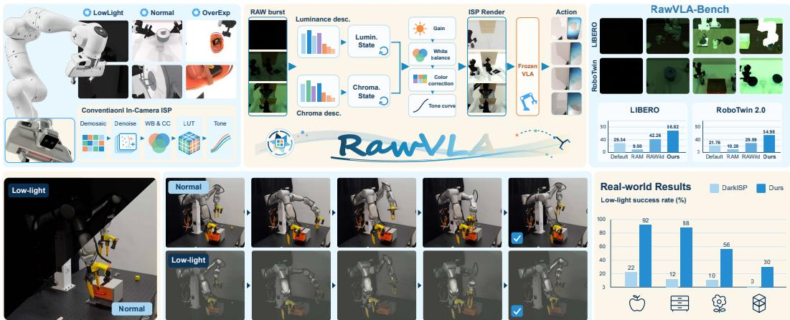

Figure 1: We propose RawVLA, an embodied and adaptive neural ISP module for VLA models, and RawVLA-Bench, a RAW-domain manipulation benchmark based on LIBERO and RoboTwin 2.0.

## ABSTRACT

Vision-language-action (VLA) models typically operate on RGB images produced by a fixed camera image signal processor (ISP), leaving the imaging pipeline outside the learning and evaluation loop. We systematically examine the consequences of this overlooked design choice across five fundamental ISP dimensions: gain, sensor noise, chromatic response, tonal response, and bit depth. Our analysis reveals that RAW-to-RGB processing materially shapes both action prediction and manipulation success, with different ISP dimensions exerting substantially different effects. Guided by these findings, we introduce RawVLA, a streaming neural ISP that adaptively renders RAW observations for frozen VLA policies while concentrating its capacity on the imaging factors relevant to embodied behavior. We further present RawVLA-Bench, a RAW-domain manipulation benchmark to expose image processing as an explicit evaluation variable across clean and adverse acquisition conditions. Experiments on RawVLA-Bench show that RawVLA preserves performance under standard conditions while substantially improving robustness under degraded imaging, establishing adaptive RAW processing as an effective interface between physical cameras and embodied policies. Code available at https://shuhongll.github.io/rawvla.

## 1 INTRODUCTION

Developing agents that can perceive, reason, and act in the physical world is a central goal of embodied AI and physical intelligence (Zitkovich et al., 2023; Black et al., 2024). Vision-language-action (VLA) models offer a promising path toward this goal by unifying visual observations, language instructions, and robot actions (Zitkovich et al., 2023; Kim et al., 2025b; Black et al., 2024; Physical Intelligence et al., 2025). Recent systems further scale continuous action generation, crossembodiment learning, and embodied reasoning through diffusion transformers and generalist robot foundation models (Hou et al., 2025; Bjorck et al., 2025; Gemini Robotics Team et al., 2025). Leveraging vision-language pretraining and robot demonstrations, they can acquire generalizable manipulation capabilities across tasks, scenes, and robot embodiments (Octo Model Team et al., 2024; Kim et al., 2025b; Li et al., 2024; Physical Intelligence et al., 2025). However, existing VLA research typically begins with camera-rendered RGB images (Zitkovich et al., 2023; Kim et al., 2025b) and abstracts the visual pathway as RGB-to-action. This abstraction overlooks the physical imaging pipeline that precedes model inference (Brooks et al., 2019; Wu et al., 2019). Light from a scene is captured as RAW sensor measurements and then transformed into RGB images by an image signal processor (ISP) (Brooks et al., 2019; Yu et al., 2021). Consequently, systems implicitly treat the ISP as a fixed and task-neutral preprocessing component (Diamond et al., 2021; Huang et al., 2026).

This assumption can constrain downstream robot control. ISPs adjust exposure, white balance and color, tone, denoising, and quantization (Brooks et al., 2019), potentially discarding signals needed for manipulation (Diamond et al., 2021; Huang et al., 2026). Embodied Image Compression (Li et al., 2025a) and SPARC (Kim et al., 2026a) further show that visual processing should be evaluated by closed-loop task performance rather than perceptual fidelity. Consequently, an unchanged scene can induce different VLA behaviors across ISP configurations (Wang et al., 2024a; Huang et al., 2026). This issue is especially important under low light, high dynamic range, backlighting, and unusual illumination (Guo et al., 2025; Fei et al., 2026), where clipping, noise, or aggressive tone compression can obscure task-relevant visual details (Chen et al., 2018; Watanabe et al., 2026).

RAW observations offer a natural opportunity to revisit this overlooked part of the VLA system (Cui et al., 2026; Huang et al., 2026). Compared with a single RGB image produced by a fixed ISP, RAW measurements preserve sensor information that can be weakened or irreversibly lost during RGB rendering (Chen et al., 2018; Huang et al., 2026). They also retain the flexibility to select or learn a RAW-to-RGB transformation according to the scene, task, and downstream model (Yu et al., 2021; Wang et al., 2024a). These properties suggest that the imaging pipeline should be treated as an explicit and optimizable component of a VLA system rather than as hidden camera firmware (Diamond et al., 2021; Huang et al., 2026). Nevertheless, existing task-oriented ISP studies focus mainly on static vision tasks (Cui et al., 2026; Liu et al., 2026b), leaving open how strongly ISP choices affect VLA behavior and whether task-adaptive RAW-to-RGB processing can improve manipulation performance.

In this work, we conduct a systematic analysis of VLA sensitivity to five fundamental ISP dimensions: exposure, sensor noise, chromatic response, tonal response, and bit depth (Brooks et al., 2019; Yu et al., 2021). By varying one dimension at a time while holding the underlying scene, task, and robot state fixed, we isolate the effect of RAW-to-RGB processing on downstream action prediction and task success. Our results show that ISP processing is far from task-neutral and that different ISP dimensions affect VLA models to substantially different degrees. These observations both motivate RAW-domain evaluation and provide direct guidance for designing an adaptive ISP.

We propose RawVLA, a lightweight neural ISP that adaptively renders RAW inputs for downstream VLA models, as illustrated in Figure 1. Unlike a conventional frozen ISP, RawVLA adapts behavior-relevant imaging factors without modifying the VLA backbone. To evaluate RAW-domain processing, we introduce RawVLA-Bench, a benchmark that exposes the RAW-to-RGB pipeline as an explicit degree of freedom. RawVLA-Bench spans clean and challenging acquisition conditions for evaluating robustness and RAW-domain processing headroom, complementing RGB robustness benchmarks (Fei et al., 2026; Chen et al., 2026b; Zhang et al., 2026).

We summarize our contributions below.

• We systematically analyze how the imaging pipeline affects VLA models through gain, sensor noise, chromatic response, tonal response, and bit depth. Our analysis demonstrates that ISP choices materially influence VLA action prediction.

• We construct RawVLA-Bench, a RAW-domain benchmark that makes image processing an explicit evaluation variable and supports controlled study of VLA robustness under clean and challenging imaging conditions.

• We propose RawVLA, a real-time neural ISP for VLA models. Extensive experiments on RawVLA-Bench and real-world tasks demonstrate state-of-the-art performance.

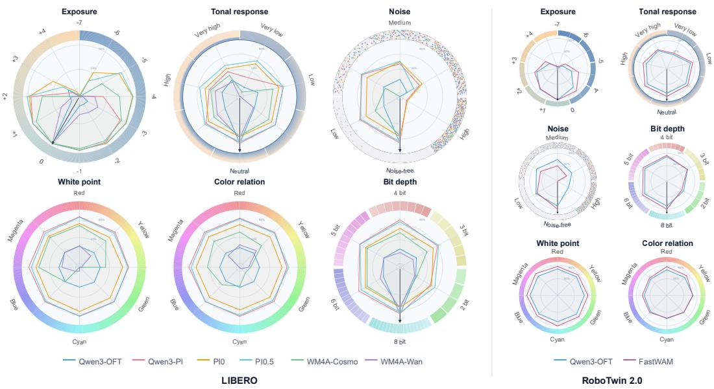  
Figure 2: ISP sensitivity across simulation benchmarks. The left panel shows LIBERO results for fine-tuned VLA and WAM policies provided by StarVLA (StarVLA Community, 2026). The right panel shows Qwen3-OFT and FastWAM fine-tuned on RoboTwin 2.0 Easy and Hard (Hard adds randomized clutter, lighting, textures, and tabletop heights), which moderately improves robustness.

## 2 ANALYZING VLA SENSITIVITY TO ISP

To identify the imaging factors relevant to embodied actions, we conduct a controlled ISP sensitivity study on LIBERO and RoboTwin 2.0. We synthesize pseudo-RAW inputs from renderer buffers via parametric unprocessing (Brooks et al., 2019). Following standard camera-formation and ISP decompositions (Yu et al., 2021), we examine five principal factors governing signal level, acquisition noise, color, tone, and numerical precision. Holding the underlying pseudo-RAW observation R fixed, we isolate their effects through the factorized RAW-to-RGB mapping below, with detailed formulations provided in Appendices A and K:

$$
Y _ { e , \eta , \zeta , c _ { \mathrm { t o n e } } , n } = \mathcal { Q } _ { n } ( \mathcal { T } _ { c _ { \mathrm { t o n e } } } ( \mathcal { C } _ { \zeta } ( \mathcal { N } _ { \eta } ( \mathcal { E } _ { e } ( R ) ) ) ) ) .\tag{1}
$$

Exposure. $\mathcal { E } _ { e }$ scales the RAW signal to control shadow visibility and highlight saturation. As shown in Figure 2, exposure is the most influential axis. VLA models maintain high task performance only within a limited range around the default and collapse under severe underexposure or overexposure. World-action model (WAM) approaches have the narrowest stable range. Both model families on RoboTwin 2.0 remain vulnerable at extreme exposure settings despite fine-tuning with visual domain randomization.

Sensor Noise. $\mathcal { N } _ { \eta }$ isolates sensor-noise sensitivity by varying noise independently of its physical coupling with illumination. VLA models tolerate mild noise after brightness restoration but degrade rapidly from moderate noise onward. WAMs degrade earlier and more sharply than VLA PI-family policies. On RoboTwin 2.0, Qwen3-OFT retains partial task success under high noise whereas FastWAM approaches complete failure.

Chromatic Response. $\mathcal { C } _ { \zeta }$ changes chromatic rendering through absolute white-point shifts and relative hue and saturation transformations while preserving the underlying scene. VLA PI-family models benefit from visual augmentation during training and remain comparatively robust to these changes whereas WAMs exhibit stronger directional preferences. On LIBERO, the WAM agents reveal a pronounced color bias, preferring warmer renderings to cooler ones. After fine-tuning on the visually randomized RoboTwin 2.0 (Hard), Qwen3-OFT and FastWAM still exhibit white-pointdependent bias, despite remaining stable across relative-color transformations.

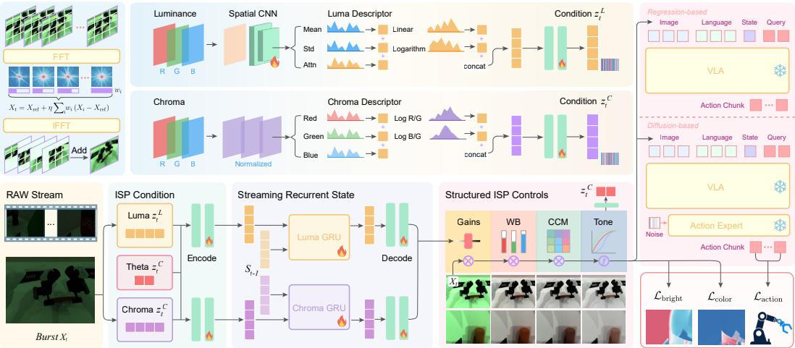  
Figure 3: Overview of RawVLA. A causal linear RAW burst is summarized by factorized luminance and chroma descriptors, fused with previous ISP parameters through decoupled recurrent states, and decoded into structured exposure, white-balance, color-correction, and monotonic tone controls. The rendered image is passed to a frozen VLA policy for action prediction.

Tonal Response. $\tau _ { c _ { \mathrm { t o n e } } }$ controls the distribution of luminance contrast from shadows through midtones to highlights. VLA policies retain high success near the default response but degrade abruptly when the response becomes very flat or highly contrasted. WAMs are consistently more sensitive across the tonal range. Both model families on RoboTwin 2.0 respond more smoothly near the default setting but still lose substantial task performance at both extremes.

Bit Depth. $\mathcal { Q } _ { n }$ quantizes the rendered output to n bits for digital image encoding. Performance remains largely stable above two bits and drops only under the most aggressive quantization. VLA models remain stable down to three bits and show a clear decline at two bits whereas WAMs begin to weaken earlier. Overall, bit depth affects both model families less than other ISP dimensions.

## 3 RAWVLA

To account for the observed variation in sensitivity, we design RawVLA, a causal, structured ISP that selectively adapts behavior-relevant photometric controls while keeping the VLA policy frozen. We next describe its streaming formulation (Section 3.1), recurrent luminance–chroma conditioning (Section 3.2), structured decoding (Section 3.3), and action-driven optimization (Section 3.4).

## 3.1 CAUSAL STREAMING FORMULATION

RawVLA is a causal, task-driven ISP that transforms demosaiced linear RAW observations for a downstream VLA policy. It obtains the denoised RAW frame $X _ { t }$ from consecutive RAW frames through burst denoising while recurrently adapting factorized luminance and chroma controls. To preserve temporal context and avoid frame-to-frame rendering discontinuities, RawVLA formulates the streaming update as

$$
( Y _ { t } , S _ { t } , \Theta _ { t } ) = \mathrm { R a w V L A } ( X _ { t } , S _ { t - 1 } , \Theta _ { t - 1 } ) ,\tag{2}
$$

where $Y _ { t }$ is the rendered observation passed to the VLA policy, $S _ { t }$ provides latent temporal context for illumination and color adaptation, and $\Theta _ { t }$ is the explicit ISP parameter set controlling the current RAW-to-RGB processing.

## 3.2 RECURRENT PHOTOMETRIC CONDITIONING

A central difficulty in learning an adaptive ISP is parameter identifiability, as global brightness can otherwise be explained by exposure, white balance, color correction, or channel-dependent tone mapping (Brooks et al., 2019; Yu et al., 2021). RawVLA resolves this ambiguity by encoding orthogonal achromatic and chromatic conditions into decoupled recurrent states.

Luminance State. We compute an equal-channel luminance map $L _ { t } ^ { 1 }$ , from which we extract a compact spatial luminance feature $g _ { t }$ . We complement $g _ { t }$ with an absolute luminance descriptor $h _ { t } ^ { L }$ that summarizes intensity distributions, quantiles, and dark-clipped pixel ratios detailed in $\mathsf { A p } \cdot$ pendix C. The logarithmic representation emphasizes low-intensity variation, whereas the linear histogram and clipping statistics capture over-exposure. The luminance recurrent state is then updated with a GRU (Cho et al., 2014) as

$$
\begin{array} { r } { z _ { t } ^ { L } = \phi _ { L } ( g _ { t } , h _ { t } ^ { L } , \Theta _ { t - 1 } ) , \qquad S _ { t } ^ { L } = \mathrm { G R U } _ { L } ( z _ { t } ^ { L } , S _ { t - 1 } ^ { L } ) . } \end{array}\tag{3}
$$

Here, $\phi _ { L }$ combines the current spatial feature $g _ { t }$ , the luminance descriptor $h _ { t } ^ { L }$ , and the previous ISP parameters $\Theta _ { t - 1 }$ . The recurrent state $S _ { t } ^ { L }$ provides temporal context for predicting the current exposure and tone parameters.

Chroma State. To prevent global brightness from leaking into color estimation, the chroma pathway uses only scale-invariant channel statistics. We compute chromaticities $x _ { t }$ and log-chrominance ratios $\mathbf { q } _ { t }$ directly from the RAW channels,

$$
\left[ \chi _ { t } \right] ^ { k } = \frac { X _ { t } ^ { k } } { \sum _ { j \in \{ \mathrm { R , G , B } \} } X _ { t } ^ { j } + \epsilon } , \quad k \in \{ \mathrm { R , G , B } \} , \quad \mathbf { q } _ { t } = \left( \log \frac { X _ { t } ^ { \mathrm { R } } + \epsilon } { X _ { t } ^ { \mathrm { G } } + \epsilon } , \log \frac { X _ { t } ^ { \mathrm { B } } + \epsilon } { X _ { t } ^ { \mathrm { G } } + \epsilon } \right) .\tag{4}
$$

We form the chroma descriptor $h _ { t } ^ { C }$ by concatenating histograms together with first- and secondorder statistics, as detailed in Appendix C.4. We fuse $h _ { t } ^ { C }$ with the previous ISP parameters $\Theta _ { t - 1 }$ through $\phi _ { C }$ and update the chroma recurrent state as

$$
\boldsymbol { z } _ { t } ^ { C } = \phi _ { C } ( \boldsymbol { h } _ { t } ^ { C } , \boldsymbol { \Theta } _ { t - 1 } ) , \qquad \boldsymbol { S } _ { t } ^ { C } = \mathrm { G R U } _ { C } ( \boldsymbol { z } _ { t } ^ { C } , \boldsymbol { S } _ { t - 1 } ^ { C } ) .\tag{5}
$$

The pathway receives neither absolute luminance statistics nor RGB spatial features. Together, the luminance and chroma states form the full recurrent state $S _ { t } = [ S _ { t } ^ { L } , S _ { t } ^ { \dot { C } } ]$

## 3.3 STRUCTURED NEURAL ISP DECODING

From the decoupled recurrent state $[ S _ { t } ^ { L } , S _ { t } ^ { C } ]$ , RawVLA predicts the structured ISP parameter set $\boldsymbol { \Theta } _ { t } = \{ e _ { t } , w _ { t } , A _ { t } , \ell _ { t } \}$ , where $e _ { t }$ specifies exposure in EV, $w _ { t }$ encodes white balance, $A _ { t }$ denotes the 3×3 color-correction matrix, and $\boldsymbol { \ell } _ { t } \in \mathbb { R } ^ { 7 }$ parameterizes the tone curve. RawVLA first applies fixed six-frame burst denoising to linear RAW inputs, producing $X _ { t }$ as shown in Figure 3 (top left).

Exposure and Color Correction. We parameterize global exposure in EV space as $\begin{array} { r l } { e _ { t } } & { { } = } \end{array}$ $E _ { \mathrm { m a x } } \operatorname { t a n h } ( \hat { e } _ { t } )$ , with gain $2 ^ { e _ { t } }$ , where $\hat { e } _ { t }$ is the predicted exposure logit, following standard RAW processing conventions (Brooks et al., 2019). White balance uses zero-sum channel offsets and the corresponding diagonal gain matrix,

$$
w _ { t } = ( w _ { t } ^ { \mathrm { R } } , w _ { t } ^ { \mathrm { G } } , w _ { t } ^ { \mathrm { B } } ) \quad \mathrm { w i t h } \sum w _ { t } ^ { k } = 0 , \qquad \mathrm { a n d } \qquad W _ { t } = \mathrm { d i a g } ( 2 ^ { w _ { t } ^ { \mathrm { R } } } , 2 ^ { w _ { t } ^ { \mathrm { G } } } , 2 ^ { w _ { t } ^ { \mathrm { B } } } ) ,\tag{6}
$$

which restricts white balance to relative channel gains while $e _ { t }$ controls global intensity. The two-coordinate parameterization is detailed in Appendix C.5. The color-correction matrix uses an identity-centered bounded residual, and the linear ISP output is processed as

$$
A _ { t } = \mathbb { I } _ { 3 } + \Delta A _ { t } , \qquad Z _ { t } = 2 ^ { e _ { t } } A _ { t } W _ { t } X _ { t } .\tag{7}
$$

$\Delta A _ { t }$ is the predicted residual; white balance and color correction precede exposure adjustment.

Monotonic Achromatic Tone-mapping. RawVLA predicts a single tone curve shared across RGB channels, preventing the luminance pathway from introducing color casts. We use an eighthdegree Bernstein polynomial (Farouki, 2012). We set $p _ { 0 } = 0$ and construct the remaining control points directly from the predicted logits as $\textstyle p _ { k } = \sum _ { j = 1 } ^ { k }$ [softmax $( [ \ell _ { t } , 0 ] ) ] _ { j } ,$ yielding the curve

$$
T _ { t } ( x ) = \sum _ { k = 0 } ^ { 8 } p _ { k } \binom { 8 } { k } x ^ { k } ( 1 - x ) ^ { 8 - k }\tag{8}
$$

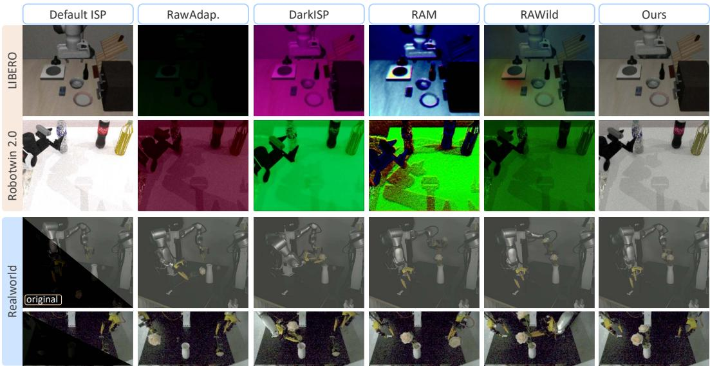  
Figure 4: Qualitative results in simulation and the real world. The first and second rows compare agent-view observations rendered by the Default ISP and RawVLA on LIBERO and RoboTwin 2.0, respectively. The final row shows a real-world task completed under low-light conditions.

maps a normalized channel intensity $x \in [ 0 , 1 ]$ . It is monotonic and endpoint preserving, with zero logits corresponding exactly to the identity mapping. The final VLA-facing image is

$$
Y _ { t } = \mathrm { c l i p } \left( T _ { t } ( \mathrm { c l i p } ( Z _ { t } , 0 , 1 ) ) , 0 , 1 \right) .\tag{9}
$$

## 3.4 ACTION-DRIVEN OPTIMIZATION

RawVLA is optimized through the native action objective of the downstream VLA policy. This objective retains the backbone’s original training formulation across direct action regression (Kim et al., 2025a) and diffusion-based generation (Chi et al., 2025) and is denoted generically as

$$
\mathcal { L } _ { \mathrm { a c t i o n } } = \mathcal { L } _ { \mathrm { V L A } } ( Y _ { t } , \mathbf { a } _ { t } ) ,\tag{10}
$$

where $\mathbf { a } _ { t }$ is the ground-truth action signal. The VLA parameters remain fixed, while gradients through $Y _ { t }$ update RawVLA. The learned ISP is therefore trained with an action-driven objective without requiring pixel-wise supervision.

Although the action objective effectively aligns ISP rendering with downstream policy behavior, extreme illumination can hinder RawVLA from learning aggressive exposure adjustments and reliable chromatic correction early in training. We therefore introduce two pathway-specific regularizers

$$
\mathcal { L } _ { \mathrm { b r i g h t } } = \frac { 1 } { B } \sum _ { b = 1 } ^ { B } \left| \mu ( Y _ { t } ^ { ( b ) } ) - 0 . 4 8 \right| , \qquad \mathcal { L } _ { \mathrm { c h r o m a } } = \frac { 1 } { B } \sum _ { b = 1 } ^ { B } \mathrm { d i s t } _ { \mathrm { S L } 1 } \left( \mathbf { d } ( Y _ { t } ^ { ( b ) } ) , \boldsymbol { \Omega } _ { C } \right) .\tag{11}
$$

In this expression, $\mu ( \cdot )$ is the mean image intensity, $\mathbf { d } ( \cdot )$ denotes the output log-chroma descriptor, B is the batch size, and $\Omega _ { C }$ is the log-chroma range estimated from RGB images randomly sampled in the simulator. The smooth distance term dist (·) penalizes violations outside $\Omega _ { C }$ . The complete objective therefore becomes

$$
\mathcal { L } = \lambda _ { a } \mathcal { L } _ { \mathrm { a c t i o n } } + \lambda _ { b } \mathcal { L } _ { \mathrm { b r i g h t } } + \lambda _ { \mathrm { c h r o m a } } \mathcal { L } _ { \mathrm { c h r o m a } } ,\tag{12}
$$

where $\lambda _ { a }$ is model-specific due to diverse action losses, while $\lambda _ { b } = 0 . 0 0 1$ and $\lambda _ { \mathrm { c h r o m a } } = 0 . 0 0 1$ The complete training settings are given in Appendix D.

## 4 RAWVLA-BENCH

RawVLA-Bench exposes image acquisition as an explicit evaluation variable by changing simulator illumination before RAW formation. We sample five illumination regimes spanning ExtremeLow,

Table 1: Suite-resolved success rates (%) of ISP modules on LIBERO. SOG averages Spatial, Object, and Goal; Long denotes LIBERO-10; Avg averages all four suites.
<table><tr><td rowspan="2">Illumin.</td><td rowspan="2">Backbone</td><td colspan="3">Default</td><td colspan="3">DarkISP</td><td colspan="3">RAM</td><td colspan="3">RAWAdapter</td><td colspan="3">RAWild</td><td colspan="3">Ours</td></tr><tr><td>SOG</td><td>Long</td><td>Avg</td><td>SOG</td><td>Long</td><td>Avg</td><td>SOG</td><td>Long</td><td>Avg</td><td>SOG</td><td>Long</td><td>Avg</td><td>SOG</td><td>Long</td><td>Avg</td><td>SOG</td><td>Long</td><td>Avg</td></tr><tr><td rowspan="2">Extreme Lowlight</td><td>PI-0</td><td>7.87</td><td>3.20</td><td>6.70</td><td>1.93</td><td>0.00</td><td>1.45</td><td>1.80</td><td>0.00</td><td>1.35</td><td>2.80</td><td>0.00</td><td>2.10</td><td>2.87</td><td>0.00</td><td>2.15</td><td>46.00</td><td>24.80</td><td>40.70</td></tr><tr><td>PI-0.5</td><td>2.60</td><td>6.60</td><td>3.60</td><td>5.80</td><td>9.00</td><td>6.60</td><td>1.73</td><td>0.00</td><td>1.30</td><td>0.07</td><td>0.00</td><td>0.05</td><td>3.93</td><td>8.00</td><td>4.95</td><td>41.63</td><td>30.00</td><td>38.72</td></tr><tr><td rowspan="3"></td><td>Qwen3-OFT 0.00</td><td></td><td>0.00</td><td>0.00</td><td>4.13</td><td>2.40</td><td>3.70</td><td>0.00</td><td>0.00</td><td>0.00</td><td>0.00</td><td>0.00</td><td>0.00</td><td>0.87</td><td>2.60</td><td>1.30</td><td>15.20</td><td>10.60</td><td>14.05</td></tr><tr><td>PI-0</td><td>68.67</td><td>44.60</td><td>62.65</td><td>2.67</td><td>0.00</td><td>2.00</td><td>1.80</td><td>0.00</td><td>1.35</td><td>2.60</td><td>0.00</td><td>1.95</td><td>6.67</td><td>0.40</td><td>5.10</td><td>90.47</td><td>66.00</td><td>84.35</td></tr><tr><td>PI-0.5</td><td>62.47</td><td>50.80</td><td>59.55</td><td>53.60</td><td>43.00</td><td>50.95</td><td>1.13</td><td>0.00</td><td>0.85</td><td>0.20</td><td>0.00</td><td>0.15</td><td>72.93</td><td>60.40</td><td>69.80</td><td>91.67</td><td>81.80</td><td>89.20</td></tr><tr><td rowspan="3">Normal</td><td>Qwen3-OFT 36.40</td><td></td><td>19.00</td><td>32.05</td><td>47.73</td><td>29.40</td><td>43.15</td><td>0.67</td><td>0.00</td><td>0.50</td><td>0.00</td><td>0.00</td><td>0.00</td><td>74.73</td><td>45.20</td><td>67.35</td><td>87.13</td><td>64.00</td><td>81.35</td></tr><tr><td></td><td></td><td></td><td>92.35</td><td>2.53</td><td>0.00</td><td>1.90</td><td>2.33</td><td>0.20</td><td>1.80</td><td>2.80</td><td>0.00</td><td></td><td></td><td></td><td></td><td></td><td></td><td></td></tr><tr><td>PI-0 PI-0.5</td><td>96.60 98.40</td><td>79.60 91.80</td><td>96.75</td><td>97.67</td><td>88.60</td><td>95.40 81.87</td><td></td><td></td><td>29.80 68.85</td><td>86.07</td><td>38.20</td><td>2.10 74.10</td><td>43.13 98.20</td><td>11.60 89.20</td><td>35.25 95.95</td><td>95.00 98.40</td><td>76.2090.30</td><td>96.10</td></tr><tr><td rowspan="3">OverExp</td><td>Qwen3-OFT98.60</td><td></td><td>92.80</td><td>97.15</td><td>98.80</td><td>91.00</td><td>96.85</td><td>69.00</td><td></td><td>23.00 57.50</td><td>97.13</td><td>84.80</td><td>94.05</td><td>98.87</td><td>91.40</td><td>97.00</td><td>98.53</td><td>89.20 92.20</td><td>96.95</td></tr><tr><td></td><td></td><td></td><td></td><td></td><td></td><td></td><td></td><td></td><td></td><td></td><td></td><td></td><td></td><td></td><td></td><td></td><td></td><td></td></tr><tr><td>PI-0 PI-0.5</td><td>66.00 85.20</td><td>35.40 48.20</td><td>58.35 75.95</td><td>1.60 57.80</td><td>0.00 39.60</td><td>1.20 53.25</td><td>2.53 1.67</td><td>0.00 0.20</td><td>1.90 1.30</td><td>2.93</td><td>0.00 75.73 39.00</td><td>2.20 66.55</td><td>37.13 86.67</td><td>6.20 64.40</td><td>29.40</td><td>81.93</td><td>55.4075.30</td><td></td></tr><tr><td rowspan="3">Extreme</td><td>Qwen3-OFT 19.27</td><td></td><td>13.60</td><td>17.85</td><td>29.80</td><td>12.80</td><td>25.55</td><td>4.20</td><td>0.20</td><td>3.20</td><td>14.80</td><td>4.40</td><td>12.20</td><td>38.87</td><td>17.80</td><td>81.10 33.60</td><td>89.00 91.67</td><td>59.00 55.00</td><td>81.50 82.50</td></tr><tr><td></td><td></td><td></td><td></td><td></td><td></td><td></td><td></td><td></td><td></td><td></td><td></td><td></td><td></td><td></td><td></td><td></td><td></td><td></td></tr><tr><td>PI-0 PI-0.5</td><td>20.67 19.80 20.93</td><td>24.20</td><td>20.45 21.75</td><td>1.60 52.20</td><td>0.00 19.40</td><td>1.20 44.00</td><td>2.00 1.40</td><td>0.00 0.00</td><td>1.50 1.05</td><td>2.73 58.47</td><td>0.00 24.80</td><td>2.05 50.05</td><td>32.87 84.93</td><td>6.20 45.20</td><td>26.20 75.00</td><td>68.27 78.40</td><td>28.2058.25</td><td>66.65</td></tr><tr><td rowspan="4">OverExp</td><td>Qwen3-OFT 0.00</td><td></td><td>0.00</td><td>0.00</td><td>17.13</td><td>0.00</td><td>12.85</td><td>0.00</td><td>0.00</td><td>0.00</td><td>2.33</td><td>0.00</td><td>1.75</td><td>13.07</td><td>0.00</td><td>9.80</td><td>47.80</td><td>31.40 2.00</td><td>36.35</td></tr><tr><td></td><td></td><td></td><td>48.10</td><td>2.07</td><td></td><td></td><td>2.09</td><td></td><td>1.58</td><td></td><td>0.00</td><td></td><td></td><td></td><td></td><td></td><td></td><td></td></tr><tr><td>PI-0</td><td>51.96 36.52</td><td>44.32</td><td>51.52</td><td>53.41</td><td>0.00 39.92</td><td>1.55 50.04</td><td>17.56</td><td>0.04 6.00</td><td>14.67</td><td>2.77 44.11</td><td>20.40</td><td>2.08 38.18</td><td>24.53 69.33</td><td>4.88</td><td>19.62</td><td>76.33</td><td>50.12</td><td>69.78</td></tr><tr><td>PI-0.5 Qwen3-OFT 30.85</td><td>53.92</td><td>25.08</td><td>29.41</td><td>39.52</td><td>27.12</td><td>36.42</td><td>14.77</td><td>4.64</td><td>12.24</td><td>22.85</td><td>17.84</td><td>21.60</td><td>45.28</td><td>53.44 31.40</td><td>65.36 41.81</td><td>79.82 68.07</td><td>58.28 44.76</td><td>74.44 62.24</td></tr></table>

Low, Normal, Over, and ExtremeOver, with environment-specific ranges calibrated for comparable visual difficulty. To synthesize expert trajectories in the RAW domain while preserving successful expert actions and environment states, we replay demonstrations in both benchmarks. For LIBERO, we replay 2,000 official demonstrations from its four suites and retain 1,771 successful trajectories, pairing normal- and target-light observations under identical states and actions. Because MuJoCo exposes only tone-mapped RGB8, we apply fixed unprocessing (Brooks et al., 2019) to produce three-channel pseudo-RAW10 for the 256 × 256 agent and wrist views. For RoboTwin 2.0, we replay 650 demonstrations from 13 dual-arm tasks and obtain 632 successful trajectory pairs, synchronizing clean and target-light environments at every frame. We form RAW observations directly from SAPIEN pre-tonemap HDR buffers with heteroscedastic sensor noise, using head and dualwrist views at 240 × 320. Detailed construction and evaluation settings are provided in Appendix B.

## 5 EXPERIMENTS

Implementation Details. We train ISP modules per frozen policy for 2,000 updates on a single NVIDIA A100 80GB GPU. To alleviate temporal inconsistency in ISP baselines designed for single images, we jointly optimize them over 8-frame trajectory windows and average their corresponding losses. RawVLA instead unrolls $N _ { \mathrm { r e c } } = 6$ recurrent endpoints with stride 8 for Qwen3-series and 5 for PI0 and PI0.5, and applies full BPTT. More details are provided in Appendix D.

Baseline Methods. We compare RawVLA against a fixed Default ISP and four learning-based neural ISPs. The Default ISP applies the paired deterministic RAW-to-RGB reprocessing described in Appendix A, without task adaptation. The learned baselines include DarkISP (Guo et al., 2025), RAM (Gamrian et al., 2025), RAW-Adapter (Cui et al., 2026), and RAWild (Liu et al., 2026b). We use task success rate as the evaluation metric and conduct 50 rollouts per task with distinct random seeds and initial positions. Best results are shaded as first, second, and third, respectively.

VLA Backbones. On the LIBERO split of RawVLA-Bench, the main ISP comparison uses PI-0 (Black et al., 2024), PI-0.5 (Physical Intelligence et al., 2025), and Qwen3-OFT across the four LIBERO suites and five illumination regimes; Qwen3-PI is additionally included in the ISP perturbation analysis. On RoboTwin 2.0, we use PI-0 and PI-0.5 under the same five illumination regimes. The Qwen3-series VLA models are task-finetuned with StarVLA (StarVLA Community, 2026).

Evaluation on LIBERO. Across the suite-resolved results in Table 1, RawVLA achieves the highest overall performance for every backbone, raising the cross-backbone average from 43.01% for the strongest baseline to 68.82%. This improvement is driven primarily by adverse illumination, with particularly large gains for Qwen3-OFT under overexposure, while the strong performance under normal lighting is largely preserved. Moreover, the gains hold for both the Spatial, Object, and Goal suites and the long-horizon LIBERO-10 suite, demonstrating that RawVLA benefits different task types and horizons rather than a particular benchmark subset. The first row of Figure 4 qualitatively compares the agent-view outputs of the Default ISP and RawVLA on LIBERO.

<table><tr><td>DarkISP</td><td>RAM</td><td>R.Adp.</td><td>RAWild</td><td>Ours</td></tr><tr><td>176</td><td>972</td><td>414</td><td>320</td><td>168</td></tr></table>

Table 2: Success rates (%) on RoboTwin 2.0 across five illumination levels. Default denotes the default SAPIEN tone-mapped RGB baseline.
<table><tr><td>Illumin.</td><td>Backbone Default DarkISP</td><td></td><td></td><td>RAM</td><td>R.Adp. RAWild</td><td></td><td>Ours</td></tr><tr><td rowspan="2">Extreme Lowlight</td><td>PI-0</td><td>23.62</td><td>4.72</td><td>12.60</td><td>1.57</td><td>8.66</td><td>32.28</td></tr><tr><td>PI-0.5</td><td>17.32</td><td>1.57</td><td>3.15</td><td>0.00</td><td>5.51</td><td>25.98</td></tr><tr><td rowspan="2">Lowlight</td><td>PI-0 0</td><td>40.94</td><td>0.79</td><td>10.24</td><td>3.15</td><td>6.30</td><td>59.06</td></tr><tr><td>PI-0.5</td><td>51.18</td><td>0.00</td><td>2.36</td><td>0.00</td><td>4.72</td><td>63.78</td></tr><tr><td rowspan="2">Normal</td><td>PI-0 PI-0.5</td><td>55.91</td><td>34.65</td><td>17.32</td><td>56.69</td><td>28.35</td><td>57.48</td></tr><tr><td></td><td>70.87</td><td>35.43</td><td>20.47</td><td>41.73</td><td>40.94</td><td>67.72</td></tr><tr><td rowspan="2">OverExp</td><td>PI-0</td><td>48.41</td><td>34.92</td><td>19.05</td><td>51.59</td><td>55.56</td><td>58.73</td></tr><tr><td>PI-0.5</td><td>56.35</td><td>26.98</td><td>4.76</td><td>38.89</td><td>45.24</td><td>65.08</td></tr><tr><td rowspan="2">Extreme 糕 OverExp</td><td>PI-0</td><td>36.00</td><td>36.80</td><td>11.20</td><td>15.20</td><td>47.20</td><td>56.80</td></tr><tr><td>PI-0.5</td><td>38.40</td><td>42.40</td><td>1.60</td><td>20.00</td><td>54.40</td><td>63.20</td></tr><tr><td rowspan="3">Overall</td><td>PI-0</td><td>40.98</td><td>22.31</td><td>14.08</td><td>25.63</td><td>29.11</td><td>52.85</td></tr><tr><td>PI-0.5</td><td>46.84</td><td>21.20</td><td>6.49</td><td>20.09</td><td>30.06</td><td>57.12</td></tr><tr><td>Avg</td><td>43.91</td><td>21.76</td><td>10.28</td><td>22.86</td><td>29.59</td><td>54.98</td></tr></table>

Table 3: Real-world success rates (%) on four tasks using PI-0.5. Default denotes the constant default ISP baseline.
<table><tr><td rowspan=1 colspan=8>Illumin.Task        Default DarkISP  Ours</td></tr><tr><td rowspan=5 colspan=2>pick &amp; placedrug drawerNormalpick flowerstack &amp; coverAvg</td><td rowspan=1 colspan=1>96.00</td><td rowspan=1 colspan=1></td><td rowspan=1 colspan=1>66.00</td><td rowspan=1 colspan=1></td><td rowspan=1 colspan=1>96.00</td><td rowspan=5 colspan=1></td></tr><tr><td rowspan=1 colspan=1>92.00</td><td rowspan=1 colspan=1></td><td rowspan=1 colspan=1>52.00</td><td rowspan=1 colspan=1></td><td rowspan=1 colspan=1>94.00</td></tr><tr><td rowspan=1 colspan=1>72.00</td><td rowspan=1 colspan=1></td><td rowspan=1 colspan=1>44.00</td><td rowspan=1 colspan=1></td><td rowspan=1 colspan=1>66.00</td></tr><tr><td rowspan=1 colspan=1>46.00</td><td rowspan=1 colspan=1></td><td rowspan=1 colspan=1>38.00</td><td rowspan=1 colspan=1></td><td rowspan=1 colspan=1>44.00</td></tr><tr><td rowspan=1 colspan=1>76.50</td><td rowspan=1 colspan=1></td><td rowspan=1 colspan=1>50.00</td><td rowspan=1 colspan=1></td><td rowspan=1 colspan=1>75.00</td></tr><tr><td rowspan=5 colspan=4>pick &amp; place  0.00drug drawer   0.00Lowlight pick flower    0.00stack &amp; cover  0.00Avg         0.00</td><td rowspan=1 colspan=1>22.00</td><td rowspan=1 colspan=1></td><td rowspan=1 colspan=1>92.00</td><td rowspan=5 colspan=1></td></tr><tr><td rowspan=1 colspan=1>12.00</td><td rowspan=1 colspan=1></td><td rowspan=1 colspan=1>88.00</td></tr><tr><td rowspan=1 colspan=1>10.00</td><td rowspan=1 colspan=1></td><td rowspan=1 colspan=1>56.00</td></tr><tr><td rowspan=1 colspan=3>er0.00</td><td rowspan=1 colspan=1>0.00</td><td rowspan=1 colspan=1></td><td rowspan=1 colspan=1>30.00</td></tr><tr><td rowspan=1 colspan=2>0.00</td><td rowspan=1 colspan=1>11.00</td><td rowspan=1 colspan=1></td><td rowspan=1 colspan=1>66.50</td></tr></table>

Table 4: Inference frame-per-second.

Evaluation on RoboTwin 2.0. As shown in Table 2, RawVLA achieves a cross-backbone average of 54.98% on RoboTwin 2.0, improving the success rate by 85.81% relative to the strongest neural ISP baseline. RawVLA also ranks first in every adverse illumination regime for both policies. Its largest gains occur under low light, while the improvements under overexposure confirm its effec tiveness for both signal-starved and saturated observations. The second row of Figure 4 compares the corresponding agent-view outputs of the Default ISP and RawVLA on RoboTwin 2.0.

Evaluation on Real-World Dual-Arm. We evaluate RawVLA on four real-world dual-arm tasks under normal and low-light conditions with a fine-tuned PI-0.5 policy backbone. As shown in Table 3, RawVLA achieves 75.00% average success under normal illumination, comparable to the Default ISP at 76.50% and above DarkISP at 50.00%. Under low light, RawVLA maintains 66.50% success, while the Default ISP and DarkISP reach only 0.00% and 11.00%, respectively. As shown in Table 4, all evaluated ISP modules support real-time operation and run faster than the cameras native frame rate, with RawVLA reaching 168 FPS. The final row of Figure 4 shows a representative real-world task completion sequence. Further implementation details and task execution visualiza tions are provided in Appendix H.

## 6 ABLATION

Table 5 summarizes controlled ablations on two representative VLA models, Qwen3-OFT with a regression head on LIBERO and PI-0.5 with a diffusion head on RoboTwin 2.0.

Photometric Descriptors. The complete descriptor set achieves average success rates of 62.24% on LIBERO and 57.12% on RoboTwin 2.0. Removing the spatial feature $g _ { t }$ reduces these averages to 36.35% and 41.93%, respectively, confirming the importance of spatial luminance structure. The global luminance descriptor $h _ { t } ^ { L }$ is especially important on RoboTwin 2.0, whereas removing the chroma descriptor $h _ { t } ^ { C }$ causes the largest drop on LIBERO. These complementary trends support separate descriptors for intensity distribution, spatial structure, and color.

Recurrent Estimator. Removing either the hidden state or previous-parameter conditioning sharply degrades LIBERO performance and consistently lowers success on RoboTwin 2.0. A shared GRU also underperforms the decoupled design, particularly on RoboTwin 2.0, while either the luminance-only or chroma-only state remains inferior to their combination. Together, these results show that temporal context, parameter feedback, and factorized luminance–chroma estimation each contribute to robust adaptation. Additional ablations of the training losses, individual ISP operators, and burst-denoising settings are provided in Appendix G.

Table 5: Ablations of RawVLA on LIBERO with Qwen3-OFT and RoboTwin 2.0 with PI-0.5. The two blocks isolate photometric descriptors and recurrent module structures.
<table><tr><td rowspan="2">Variant</td><td colspan="6">LIBERO / Qwen3-OFT</td><td colspan="6">RoboTwin 2.0 / PI-0.5</td></tr><tr><td>Ext.Low</td><td>Low</td><td>Normal</td><td>Over</td><td>Ext.Over</td><td> $\operatorname { A v g } .$ </td><td>Ext.Low</td><td>Low</td><td>Normal</td><td></td><td>Over Ext.Over</td><td> $\operatorname { A v g } .$ </td></tr><tr><td colspan="9">Photometric descriptors</td><td></td><td></td><td></td><td></td></tr><tr><td>w/o spatial feature gt</td><td>0.00</td><td>20.35</td><td>97.10</td><td>51.15</td><td>13.15</td><td>36.35</td><td>14.96</td><td>12.60</td><td>62.99</td><td>60.32</td><td>59.20</td><td>41.93</td></tr><tr><td>w/o luminance descriptor  $h _ { t } ^ { L }$ </td><td>27.75</td><td>95.05</td><td>96.80</td><td>50.80</td><td>25.95</td><td>59.27</td><td>21.26</td><td>47.24</td><td>50.39</td><td>56.35</td><td>52.80</td><td>45.57</td></tr><tr><td>w/o chroma descriptor  $h _ { t } ^ { C }$ </td><td>0.00</td><td>0.00</td><td>96.65</td><td>48.75</td><td>16.60</td><td>32.40</td><td>23.62</td><td>57.48</td><td>48.03</td><td>60.32</td><td>53.60</td><td>48.58</td></tr><tr><td colspan="9">Recurrent estimator</td><td></td><td></td><td></td><td></td></tr><tr><td>w/o hidden state  $S _ { t - 1 } ^ { L / C }$ </td><td>0.00</td><td>0.35</td><td>97.20</td><td>51.65</td><td>22.85</td><td>34.41</td><td>22.05</td><td>57.48</td><td>46.46</td><td>57.94</td><td>53.60</td><td>47.47</td></tr><tr><td>w/o  $\Theta _ { t - 1 }$  conditioning</td><td>0.00</td><td>0.00</td><td>96.65</td><td>49.95</td><td>25.25</td><td>34.37</td><td>24.41</td><td>49.61</td><td>51.18</td><td>57.94</td><td>55.20</td><td>47.63</td></tr><tr><td>Single shared  $\mathrm { G R U } _ { L , C }$ </td><td>28.10</td><td>91.20</td><td>96.75</td><td>55.55</td><td>35.30</td><td>61.38</td><td>22.83</td><td>55.91</td><td>40.94</td><td>63.49</td><td>56.80</td><td>47.94</td></tr><tr><td>Lumin. only  $( S _ { t } = S _ { t } ^ { L } )$ </td><td>28.10</td><td>94.60</td><td>96.35</td><td>51.40</td><td>29.75</td><td>60.04</td><td>21.26</td><td>61.42</td><td>66.14</td><td>67.46</td><td>62.40</td><td>55.70</td></tr><tr><td>Chrom. only  $( S _ { t } = S _ { t } ^ { C } )$ </td><td>28.10</td><td>93.45</td><td>96.90</td><td>50.35</td><td>25.15</td><td>58.79</td><td>22.83</td><td>51.97</td><td>58.27</td><td>61.11</td><td>64.00</td><td>51.58</td></tr><tr><td>Full RawVLA</td><td>14.05</td><td>81.35</td><td>96.95</td><td>82.50</td><td>36.35</td><td>62.24</td><td>25.98</td><td>63.78</td><td>67.72</td><td>65.08</td><td>63.20</td><td>57.12</td></tr></table>

## 7 RELATED WORKS

VLA & WAM Visual Robustness. Generalist policies span token-based and continuous-action VLAs (Kim et al., 2025b; Black et al., 2024; Physical Intelligence et al., 2025) and video-predictive WAMs (Kim et al., 2026b; Ye et al., 2026), increasingly targeting cross-embodiment control and physical reasoning (Bjorck et al., 2025; Gemini Robotics Team et al., 2025). Yet both remain vulnerable to visual changes. Robustness benchmarks use perturbations and scalable simulation to cover appearance, lighting, viewpoint, scene composition, and physical shifts (Pumacay et al., 2024; Li et al., 2025b; Wang et al., 2025; 2024b; Chen et al., 2026b; Zhang et al., 2026; Fei et al., 2026; Morgan et al., 2026; Chen et al., 2026c). Existing methods edit task-irrelevant regions, enforce action consistency, restore observations, or learn invariance to visual and illumination changes (Hancock et al., 2025; Guo et al., 2026; Zhang et al., 2025; Orjuela et al., 2026; Xie et al., 2026; Luo et al., 2026; Watanabe et al., 2026). Additional robustness can come from event, thermal, or tactile sensing, at the cost of extra sensors and cross-modal data (Zhai et al., 2026; Liu et al., 2026a; Yu et al., 2026; Huang et al., 2025). We instead operate on the existing camera signal and study robustness at the RAW and ISP processing levels.

Task-Oriented and Neural ISP. Conventional ISPs target human visual quality and may not preserve signals most useful to downstream perception. Prior work therefore co-optimizes RAW processing and recognition, builds compact machine-oriented pipelines, and searches task-specific ISP structures (Diamond et al., 2021; Wu et al., 2019; Yu et al., 2021; Shi et al., 2022). Later methods introduce content-adaptive operators and connect learnable ISP stages to downstream models for sensor- or task-conditioned processing (Sun et al., 2024; Wang et al., 2024a; Gamrian et al., 2025; Won et al., 2026; Morawski et al., 2022; Cui et al., 2026; Huang et al., 2026). Complementary work improves adverse-condition and sensor-general RAW perception through synthesis, augmentation, enhancement, adaptation, and efficient models (Punnappurath et al., 2022; Yoshimura et al., 2023; Guo et al., 2025; Hashmi et al., 2025; Chen et al., 2026a; Liu et al., 2026b; Li et al., 2026). Our work extends this direction to sequential VLA behavior and manipulation success.

## 8 CONCLUSION

We introduced RawVLA, a lightweight neural ISP for frozen VLA policies, and RawVLA-Bench, a RAW-domain manipulation benchmark. Across simulation and real-world tasks, RawVLA maintains nominal-condition performance while substantially improving robustness to adverse illumination, demonstrating that adaptive camera processing supports robust robot control.

## A RGB UNPROCESSING AND DEFAULT ISP

This section defines the RAW representation used throughout the paper and specifies the paired RGB-to-RAW unprocessing and default RAW-to-RGB ISP.

RAW Input Representation. We distinguish the sensor measurement from the representation processed by RawVLA. A physical camera first records a single-channel, mosaiced Bayer RAW measurement. We subtract the sensor black level, normalize by the usable white level, and demosaic the Bayer array into a three-channel linear signal. Throughout the paper, we refer to this black-levelcorrected, demosaiced signal as linear RAW. It is the direct input representation of RawVLA. The simulated observations are three-channel pseudo-RAW signals created directly in the same linear RAW representation and therefore do not contain a Bayer mosaic.

We construct the simulated pseudo-RAW observations using a fixed unprocessing pipeline adapted from Brooks et al. (2019). Let $Y ^ { \mathrm { r e n d e r } } \in [ 0 , 1 ] ^ { 3 \times H \times W }$ denote the display-referred RGB observation resized to the VLA input resolution. All photometric operations are applied channel-wise. The default smoothstep tone curve is

$$
T _ { 0 } ( z ) = 3 z ^ { 2 } - 2 z ^ { 3 } ,\tag{13}
$$

whose inverse $T _ { 0 } ^ { - 1 }$ is uniquely defined on [0, 1], and the standard sRGB transfer function

$$
\mathcal { G } ( z ) = \left\{ \begin{array} { l l } { 1 2 . 9 2 z , } & { z \leq 0 . 0 0 3 1 3 0 8 , } \\ { 1 . 0 5 5 z ^ { 1 / 2 . 4 } - 0 . 0 5 5 , } & { z > 0 . 0 0 3 1 3 0 8 . } \end{array} \right.\tag{14}
$$

Its inverse is

$$
\mathcal { G } ^ { - 1 } ( z ) = \left\{ { { z } / { 1 2 . 9 2 } } , \ { z \leq 0 . 0 4 0 4 5 , \ } \right.\tag{15}
$$

We first invert the default tone curve and sRGB transfer function, then remove the fixed channel-gain vector $\mathbf { m } _ { \mathrm { r g b } } = ( 1 . 8 , 1 . 0 , 1 . 7 )$ . The unprocessing operator U produces the simulated camera RAW observation

$$
R = \mathcal { U } ( Y ^ { \mathrm { r e n d e r } } ) = \mathrm { c l i p } \big ( \mathrm { d i a g } ( { \mathbf { m } } _ { \mathrm { r g b } } ) ^ { - 1 } \mathcal { G } ^ { - 1 } \big ( T _ { 0 } ^ { - 1 } ( Y ^ { \mathrm { r e n d e r } } ) \big ) , 0 , 1 \big ) .\tag{16}
$$

The resulting R retains the precision available from the corresponding renderer. The complete unprocessing sequence applies inverse tone mapping, inverse sRGB transfer, inverse channel gains, and clipping. Controlled bit-depth changes use $\mathcal { Q } _ { n }$ from Equation 30, with their environment-specific placement given in Appendix K.

Let $\mathcal { P } ( \cdot , \xi )$ denote the parameterized ISP and $\xi _ { 0 }$ its default parameter setting. The paired default operator $\ddot { \mathcal { P } } _ { 0 } ( \cdot ) \equiv \mathcal { P } ( \cdot , \bar { \xi _ { 0 } } )$ reverses the fixed photometric transformations

$$
Y _ { 0 } = \mathcal { P } _ { 0 } ( R ) = T _ { 0 } ( \mathcal { G } ( \mathrm { c l i p } ( \mathrm { d i a g } ( { \mathbf m } _ { \mathrm { r g b } } ) R , 0 , 1 ) ) ) = Y ^ { \mathrm { r e n d e r } } .\tag{17}
$$

This produces a three-channel pseudo-RAW signal in the linear RAW representation rather than a camera-specific Bayer measurement. The baseline unprocessing does not simulate mosaicing, sensor noise, or a camera-specific color-correction matrix. The noise axis in Appendix K introduces its sensor model separately.

## B RAWVLA-BENCH CONSTRUCTION

RawVLA-Bench changes illumination inside each simulator before RAW formation rather than multiplying the final RGB image. It contains paired training caches and frozen evaluation manifests for LIBERO (Liu et al., 2023) and RoboTwin 2.0 (Chen et al., 2026b). Each training trajectory stores one target-light RAW sequence together with a normal-light RGB reference under the same actions and physical states. To avoid increasing the training cache fivefold, each successful trajectory is assigned one illumination regime. During evaluation, the same task initialization is instead expanded across all five regimes for paired comparison. In total, the training cache contains 2,403 paired trajectories and 408,075 frames, while the evaluation manifests specify 13,250 rollouts. Section B.1 describes the LIBERO (Liu et al., 2023) construction, and Section B.2 details the RoboTwin 2.0 (Chen et al., 2026b) construction.

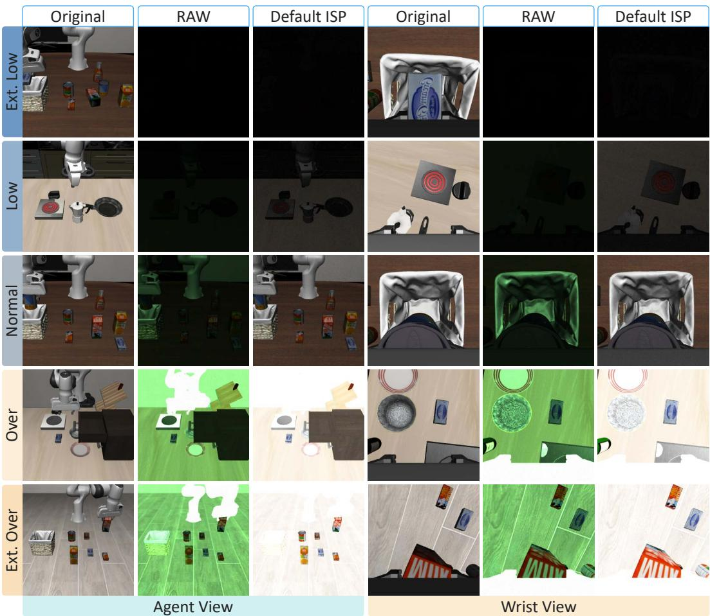  
Figure 5: RawVLA-Bench observations on LIBERO (Liu et al., 2023) across five ambient-light intensity levels ranging from extreme low light and low light to normal, overexposure, and extreme overexposure. Each level shows the original RGB reference, synthesized RAW observation, and its default-ISP rendering. Agent and wrist views use the same unprocessing procedure.

## B.1 LIBERO CONSTRUCTION

We use the four standard suites LIBERO-Spatial, LIBERO-Object, LIBERO-Goal, and LIBERO-10 from LIBERO (Liu et al., 2023), comprising 40 tasks. From at most 50 official demonstrations per task, we obtain 2,000 candidate trajectories. Each demonstration is recreated using its recorded MuJoCo XML, initial simulator state, and seven-dimensional action sequence. We replay the actions in a clean environment, remove no-op actions, and retain a trajectory only when the task-specific success predicate is reached. The same state is copied before every rendering step to a second environment whose illumination is modified, ensuring that the RGB reference and RAW observation differ only in the image-formation branch. This procedure retains 1,771 successful trajectories and 261,131 frames. These include 454 from LIBERO-Spatial, 462 from LIBERO-Object, 456 from LIBERO-Goal, and 399 from LIBERO-10 (Liu et al., 2023). Both the agent and wrist cameras render at 256 × 256.

MuJoCo provides only tone-mapped RGB8 for these environments. We therefore construct a threechannel pseudo-RAW signal by inverting the smoothstep tone curve and sRGB transfer function, removing fixed RGB gains, clipping, and quantizing to 10 bits. Overexposed regimes additionally apply controlled full-well saturation before clipping. We then inject heteroscedastic Gaussian noise with variance $4 \times 1 0 ^ { - 4 } x + 1 0 ^ { - 5 }$ using deterministic seeds that vary across trajectories, frames, and views. Figure 7 visualizes how the synthesized RAW noise becomes increasingly visible after ISP gain amplification as illumination decreases. The five regimes and EV intervals are ExtremeLow [−5.5, −4], Low [−4, −2.5], Normal [−0.5, 0.5], Over [1.5, 3], and ExtremeOver [6, 8]. Over and ExtremeOver also activate additional table-directed illumination and saturation pressure. These pseudo-RAW observations model the processing degrees of freedom available to the learned ISP, but are not Bayer measurements and do not contain additional renderer highlight information beyond the source RGB8.

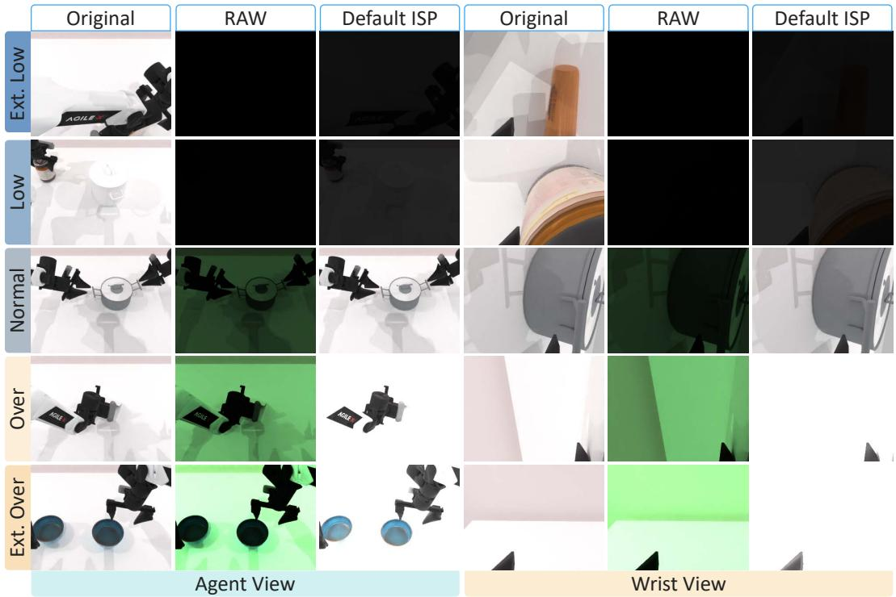  
Figure 6: RawVLA-Bench observations on RoboTwin 2.0 (Chen et al., 2026b) across five ambientlight intensity levels ranging from extreme low light and low light to normal, overexposure, and extreme overexposure. Each level shows the original RGB reference, synthesized RAW observation, and its default-ISP rendering. Agent and wrist views use the same unprocessing procedure.

The frozen LIBERO (Liu et al., 2023) evaluation manifest contains 50 initial states for each of the 40 tasks. Every initial state is evaluated in all five illumination regimes, producing $4 \times 1 0 \times$ 50 × 5 = 10,000 rollouts, or 2,000 rollouts per regime. Entries sharing an initial state use the same task, language instruction, and camera configuration, while only illumination and sensor-noise seed differ.

## B.2 ROBOTWIN 2.0 CONSTRUCTION

We use 13 tasks from RoboTwin 2.0 (Chen et al., 2026b) with the ALOHA-AgileX embodiment and the clean task configuration. The 650 candidates comprise 50 recorded episodes per task. We reconstruct each scene from its dataset seed and replay the stored left- and right-arm joint paths through the original controller and physics stack. An episode is retained only when both trajectory planning and the task-specific success check succeed. Of 650 candidates, 633 pass this clean replay audit. One trajectory then fails during paired regeneration because its saved right-arm path is exhausted, leaving 632 complete pairs and 146,944 frames.

To prevent contact or numerical differences from causing paired trajectories to diverge, only the clean environment executes actions. Before every camera capture, actor poses and velocities, articulation root states, and joint positions and velocities are copied to a target-light environment, which is used only for rendering. Each frame includes the head, left-wrist, and right-wrist views at 240×320.

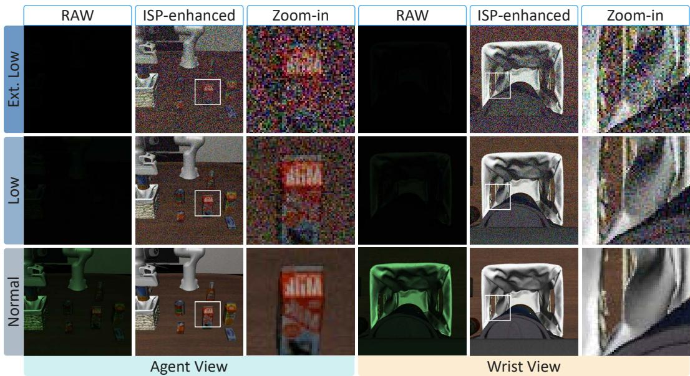  
Figure 7: Synthetic sensor noise on LIBERO (Liu et al., 2023). The figure shows noisy RAW observations and their corresponding RGB renderings after ISP gain amplification and subsequent processing across progressively lower illumination levels. Noise becomes increasingly pronounced as the illumination decreases.

Unlike LIBERO (Liu et al., 2023), SAPIEN exposes a pre-tonemap HDR buffer. We normalize this linear radiance by a fixed white level, remove fixed RGB gains, and add heteroscedastic noise with variance $2 . 5 \times \mathrm { i } 0 ^ { - 5 } x + 3 . 9 0 6 2 5 \times 1 0 ^ { - 8 }$ . The resulting three-channel pseudo-RAW is stored as float32 without 10-bit quantization.

RoboTwin 2.0 (Chen et al., 2026b) uses environment-only illumination scaling, applied from the captured baseline to ambient, directional, and point lights. Its five EV intervals are ExtremeLow [−9, −8.5], Low [−7, −6], Normal [−0.5, 0.5], Over [1, 1.5], and ExtremeOver [2, 2.5]. The environment-specific ranges are calibrated separately because MuJoCo and SAPIEN differ in indirect lighting, materials, HDR rendering, and tone mapping. The frozen evaluation manifest contains 50 dataset seeds for each task and expands each seed across all five regimes, yielding $1 3 \times 5 0 \times 5 = 3 { , } 2 5 0$ rollouts, or 650 per regime. Figures 5 and 6 show the environment-specific pipelines.

## C RAWVLA ARCHITECTURE

This section expands the components of RawVLA. We describe burst denoising in Section C.2, the luminance and chroma descriptors in Sections C.3 and C.4, and the structured ISP parameterization in Section C.5.

## C.1 IMPLEMENTATION DETAILS

Our implementation receives a six-frame causal linear-RAW burst and contains 886,966 trainable parameters. The FFT burst merge has no trainable parameters. The spatial luminance encoder consists of six 3 × 3 convolutional blocks with channel transitions $3  3 2 , 3 2  3 2 , 3 2  6 4$ 64→64, 64 →128, and 128→128. Their strides are 1, 1, 2, 1, 2, 1, respectively, and each block uses single-group normalization and a SiLU activation. The equal-channel luminance input is replicated across three channels before entering this encoder. Spatial mean, standard deviation, and learned attention-weighted mean pooling produce a 384-dimensional feature, which is encoded by a 384 → 256 → 128 MLP. The attention score is predicted by a 1 × 1 convolution from 128 channels to one channel.

The 135-dimensional luminance descriptor is encoded by a $\mathrm { 1 3 5  1 2 8  6 4 ~ M L P . }$ We set the chroma histogram count to $B _ { C } = 6 4 $ , giving a $5 B _ { C } + 1 0 = 3 3 0$ dimensional chroma descriptor that is encoded by a $3 3 0  1 2 8  6 4$ MLP. The two log-chrominance ratios are clipped to $[ - \bar { 4 } , 4 ]$ before histogramming. Previous luminance and chroma operating points contain nine and eight values and are encoded by $9  6 4  3 2$ and $8  6 4  3 2 ~ \mathrm { M L P s }$ . The luminance fusion network maps $2 2 4 \to 2 5 6 \to 1 2 8$ , while the chroma fusion network maps $9 6 \to 1 2 8 \to 1 2 8$ . All MLP hidden layers use SiLU activations.

The recurrent estimator contains separate luminance and chroma GRU cells. Each cell has a 128- dimensional input and a 64-dimensional hidden state, yielding a 128-dimensional combined recurrent state. The exposure head maps $2 5 6 \to 1 2 8 \to 1$ , the tone head maps $2 5 6 \to 1 2 8 \to 7$ , and the chroma head maps $2 5 6 \to 1 2 8 \to 8 .$ The two single-layer GRU states are concatenated and carried to the next policy observation. RawVLA has no U-Net-style image decoder or spatial residual branch. The network predicts only explicit ISP controls, and the RGB output is generated analytically by burst fusion, exposure, white balance, color correction, and a shared monotonic Bernstein tone curve. The tone head predicts seven relative logits and appends one fixed-zero reference logit, producing eight monotonic intervals. Local color and local tone residuals are disabled.

We use $E _ { \mathrm { m a x } } = 6 ~ \mathrm { E V } ,$ which bounds the achromatic exposure gain to $[ 2 ^ { - 6 } , 2 ^ { 6 } ]$ . White balance is represented by two independent coordinates that produce zero-sum channel offsets, with each residual bounded to $[ - 1 , 1 ]$ EV. The chroma head predicts the six off-diagonal entries of the colorcorrection residual as 0.25 tanh(·). In the default parameterization, the diagonal residuals are zero, so the diagonal of the color-correction matrix remains one. The optional gray-preserving variant sets each diagonal residual to the negative sum of the off-diagonal residuals in its row, enforcing unit row sums. Neither variant applies determinant, orthogonality, non-negativity, or additional projection constraints. For burst processing, we use patch size 32, stride 16, a two-dimensional Hann window, reliability scale $\kappa = 1 . 8 ,$ , and temporal weights (0.05, 0.075, 0.125, 0.1875, 0.375) for the five historical frames of the six-frame causal burst.

## C.2 BURST DENOISING

At policy step t, burst denoising uses the causal RAW sequence

$$
R _ { t - K + 1 : t } = \{ R _ { t - K + 1 } , \ldots , R _ { t - 1 } , R _ { t } \} , \qquad R _ { i } \in [ 0 , 1 ] ^ { 3 \times H \times W } ,\tag{18}
$$

where $R _ { t }$ is the current input frame. We use $K = 6 .$ , square patches of size $N = 3 2 .$ , stride 16, and a separable two-dimensional Hann window. For a historical-frame spectrum $F _ { i }$ and the current reference spectrum $F _ { t } ,$ let $\Delta F _ { i } = F _ { i } - F _ { t }$ . The frequency-wise reliability and burst merge are

$$
\sigma _ { i } ^ { 2 } = \kappa \mathrm { m e a n } _ { f } | \Delta F _ { i } | ^ { 2 } , \qquad r _ { i } ( f ) = \frac { \sigma _ { i } ^ { 2 } } { | \Delta F _ { i } ( f ) | ^ { 2 } + \sigma _ { i } ^ { 2 } + 1 0 ^ { - 8 } } ,
$$

$$
F _ { \mathrm { o u t } } = F _ { t } + \gamma _ { \mathrm { b u r s t } } \sum _ { i = 1 } ^ { K - 1 } \omega _ { i } r _ { i } \Delta F _ { i } , \qquad \gamma _ { \mathrm { b u r s t } } = 0 . 5 .\tag{19}
$$

The index f spans the frequencies in each patch. We set $\kappa \ = \ 1 . 8$ and use historical weights $\pmb { \omega } = ( 0 . 0 5 , 0 . 0 7 5 , 0 . 1 2 5 , 0 . 1 8 7 5 , 0 . 3 7 5 )$ from the oldest frame to the most recent historical frame. The current frame remains the reference anchor with coefficient one. We fix the fusion strength to $\gamma _ { \mathrm { b u r s t } } = 0 . 5$ in the full model and evaluate $\gamma _ { \mathrm { b u r s t } } \in \{ 0 . 2 , 0 . 5 , 0 . 8 \}$ in Table 11. The reliability is computed independently for each patch, channel, and frequency. Small spectral differences are fused strongly, while motion and misalignment are down-weighted. Reflection padding is used when supported by the input dimensions and replication padding otherwise. Inverse Fourier transformation and Hann-weighted overlap-add reconstruct the denoised linear RAW frame $X _ { t }$ before exposure and tone mapping to avoid subsequent noise amplification. Figure 8 compares the resulting observations with a single noisy frame and direct averaging of the same $K = 6$ frames. Direct averaging substantially suppresses random sensor noise, but it also blurs the moving robot arm and manipulated objects. Preserving these dynamic structures is important for accurate grasping and for estimating the current manipulation state. In contrast, the frequency-domain reliability weighting attenuates in consistent motion and misalignment during fusion, reducing noise while retaining sharper dynamic content and lower error relative to the noise-free observation.

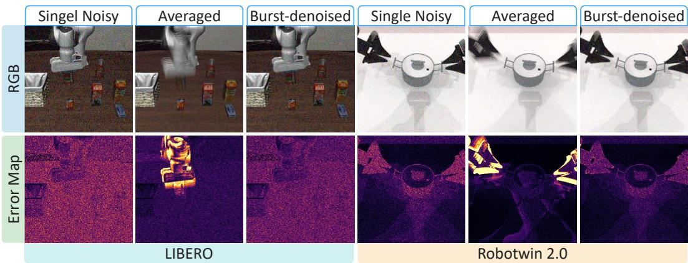  
Figure 8: Burst-denoising comparison on agent-view observations from LIBERO (Liu et al., 2023) (left) and RoboTwin 2.0 (Chen et al., 2026b) (right). The top row compares a single noisy frame, direct averaging of $K = 6$ consecutive frames, and our frequency-domain burst denoising with $K = 6$ . The bottom row shows the corresponding error maps relative to the noise-free clean image. Direct averaging removes substantial sensor noise but blurs moving arms and objects, whereas burst denoising better preserves dynamic scene content while suppressing noise.

## C.3 LUMINANCE DESCRIPTOR

The absolute luminance descriptor combines normalized linear- and log-luminance histograms with distribution quantiles and boundary-occupancy statistics. Specifically,

$$
\begin{array} { r } { h _ { t } ^ { L } = [ \mathrm { H i s t } _ { 6 4 } ( L _ { t } ) , \mathrm { H i s t } _ { 6 4 } ( \log ( L _ { t } + \epsilon ) ) , \mathrm { Q u a n t } ( L _ { t } ) , \rho _ { \mathrm { d a r k } } ( L _ { t } ) , \rho _ { \mathrm { c l i p } } ( L _ { t } ) ] , } \end{array}\tag{20}
$$

where each histogram contains 64 normalized bins over a fixed range and $\begin{array} { r l } { \mathrm { Q u a n t } ( L _ { t } ) } & { { } = } \end{array}$ [π0.01, π0.05, π0.50, π0.95, π0.99] contains five intensity quantiles. For pixel index $u ,$ the boundary ratios are

$$
\rho _ { \mathrm { d a r k } } ( L _ { t } ) = \frac { 1 } { H W } \sum _ { u } \mathbf { 1 } [ L _ { t } ( u ) < 0 . 0 5 ] , \qquad \rho _ { \mathrm { c l i p } } ( L _ { t } ) = \frac { 1 } { H W } \sum _ { u } \mathbf { 1 } [ L _ { t } ( u ) > 0 . 9 8 ] .\tag{21}
$$

$h _ { t } ^ { L } \in \mathbb { R } ^ { 1 3 5 }$ comprises two 64-bin histograms, five quantiles, and two boundary ratios.

## C.4 CHROMA DESCRIPTOR

Let $\mathcal { V } _ { t } = ( [ \boldsymbol { \chi } _ { t } ] ^ { \mathrm { R } } , [ \boldsymbol { \chi } _ { t } ] ^ { \mathrm { G } } , [ \boldsymbol { \chi } _ { t } ] ^ { \mathrm { B } } , [ \mathbf { q } _ { t } ] _ { 1 } , [ \mathbf { q } _ { t } ] _ { 2 } )$ contain the five component maps of $x _ { t }$ and $\mathbf { q } _ { t }$ . The chroma descriptor is

$$
h _ { t } ^ { C } = \mathrm { C o n c a t } _ { \psi \in \mathcal { V } _ { t } } \left[ \mathrm { H i s t } _ { B _ { C } } ( \psi ) , \mu ( \psi ) , \sigma ^ { 2 } ( \psi ) \right] ,\tag{22}
$$

where $\mathrm { H i s t } _ { B _ { C } }$ is a normalized $B _ { C }$ -bin histogram over a fixed component-specific range. For pixel index u, the moments are

$$
\mu ( \psi ) = \frac { 1 } { H W } \sum _ { u } \psi ( u ) , \qquad \sigma ^ { 2 } ( \psi ) = \frac { 1 } { H W } \sum _ { u } \left( \psi ( u ) - \mu ( \psi ) \right) ^ { 2 } .\tag{23}
$$

The resulting $h _ { t } ^ { C } \in \mathbb { R } ^ { 5 ( B _ { C } + 2 ) }$ summarizes the distributions of the three chromaticity maps and two log-chrominance maps.

## C.5 STRUCTURED ISP PARAMETERIZATION

White balance has two degrees of freedom. The network predicts the red and green offsets and constructs the zero-sum channel offsets as

$$
w _ { t } = ( w _ { t } ^ { \mathrm { R } } , w _ { t } ^ { \mathrm { G } } , - w _ { t } ^ { \mathrm { R } } - w _ { t } ^ { \mathrm { G } } ) .\tag{24}
$$

This parameterization separates relative channel gains from the global exposure parameter $e _ { t }$

## D NEURAL ISP TRAINING PROTOCOL

This section specifies the shared frozen-policy training protocol in Section D.1, the baseline ISP configurations in Section D.2, and the optimization and temporal sampling used by RawVLA in Section D.3.

## D.1 FROZEN-POLICY TRAINING PROTOCOL

We train an independent ISP module for every policy backbone and optimize all ISP modules for 2,000 optimizer steps. The pretrained vision or world-model backbone and action head are frozen and kept in evaluation mode. Their forward passes are not enclosed by no grad, so the native action loss remains differentiable with respect to the processed image while no policy parameter is updated. Each method receives the same three-channel pseudo-RAW signal in the linear RAW representation and produces RGB observations for the policy. In the main benchmark experiments, no ISP module is trained with paired RGB reconstruction supervision. All methods use one NVIDIA A100 80GB GPU, per-device batch size one, and eight gradient-accumulation micro-steps. The shared optimizer is AdamW with learning rate $1 0 ^ { - 4 } , \beta = ( \breve { 0 } . 9 , 0 . 9 5 )$ , numerical epsilon $1 0 ^ { \dot { - } 8 }$ , 100 warmup updates, cosine decay to $1 0 ^ { - 6 }$ , and gradient-norm clipping at 1.0. Weight decay is $1 0 ^ { - 8 }$ for Qwen3 (StarVLA Community, 2026) and WM4A (StarVLA Community, 2026) backbones and $1 0 ^ { - 1 0 }$ for PI0 (Black et al., 2024) and PI0.5 (Physical Intelligence et al., 2025).

## D.2 BASELINE NEURAL ISP CONFIGURATIONS

We evaluate DarkISP (Guo et al., 2025), RAM (Gamrian et al., 2025), RAW-Adapter (Cui et al., 2026), and RAWild (Liu et al., 2026b) under the common 2k-step budget. Methods originally designed for Bayer inputs use deterministic channel adapters. DarkISP (Guo et al., 2025) receives $\textstyle | R , G , B , { \bar { G } } |$ , while RAM (Gamrian et al., 2025) reduces its packed green channels to $[ R , ( G _ { r } ^ { \cdot } + G _ { b } ) / 2 , \dot { B } ]$ . RAW-Adapter (Cui et al., 2026) applies its learned exposure, denoising and sharpening, white-balance, color-matrix, and optional LUT stages. RAWild (Liu et al., 2026b) uses the same pseudo-RAW observation as both its guide and apply image. These adaptations preserve a common camera signal while retaining each method’s ISP parameterization.

To alleviate temporal inconsistency in methods designed for individual images, training samples trajectory-local windows of eight observations, applies the shared ISP independently to every observation, and averages the resulting action losses. This introduces no recurrence, cross-frame fusion, or explicit temporal-consistency loss. Direct-regression action heads use their native L1 objective, while diffusion and flow-matching heads retain their native velocity-prediction objective.

For LIBERO (Liu et al., 2023), the action horizon is eight for the comparison runs. For RoboTwin 2.0 (Chen et al., 2026b), the head, left-wrist, and right-wrist views are processed by the same ISP module. Qwen3-OFT (StarVLA Community, 2026) predicts a 50-step normalized action chunk, while FastWAM (StarVLA Community, 2026) uses its released 32-step flow-matching objective. The optimization budget remains 2,000 steps for both environments and all four comparison ISP modules.

## D.3 RAWVLA TRAINING AND TEMPORAL SAMPLING

RawVLA follows the common optimization protocol above. Forward passes use bfloat16 where supported, with numerically sensitive action computations promoted to float32.

Each sample contains $N _ { \mathrm { r e c } } ~ = ~ 6$ recurrent endpoints and a $K = 6$ causal camera burst at every endpoint. Following the native policy observation intervals, the endpoint stride is eight environment steps for Qwen3 (StarVLA Community, 2026) and WM4A (StarVLA Community, 2026) policies and five for PI0 (Black et al., 2024) and PI0.5 (Physical Intelligence et al., 2025). The recurrent operating-point estimator reads the endpoint of each burst. The final policy image is produced from the six adjacent frames in the terminal burst. Earlier calls contribute through the recurrent state, and the complete six-update sequence is trained with backpropagation through time without detaching the hidden state or the previous ISP parameters. At episode boundaries, invalid history indices are clipped to the nearest valid frame.

Table 6: Action-loss coefficients used to train RawVLA with each frozen VLA policy.
<table><tr><td>Frozen VLA policy</td><td> $\lambda _ { a }$ </td></tr><tr><td>Qwen3-PI</td><td>0.0015</td></tr><tr><td>Qwen3-OFT</td><td>0.20</td></tr><tr><td>WM4A-Cosmos-GR00T</td><td>0.01</td></tr><tr><td>WM4A-Wan-OFT</td><td>0.02</td></tr><tr><td>PIO</td><td>0.15</td></tr><tr><td>PI0.5</td><td>0.10</td></tr></table>

Qwen3-OFT (StarVLA Community, 2026) and WM4A-Wan-OFT (StarVLA Community, 2026) use their mean-reduced action L1 losses. Qwen3-PI (StarVLA Community, 2026) and WM4A-Cosmos-GR00T (StarVLA Community, 2026) use eight independently sampled diffusion or flow-matching conditions per trajectory window. PI0 (Black et al., 2024) and PI0.5 (Physical Intelligence et al., 2025) use their native mean-reduced flow-matching losses. These stochastic repeats are Monte Carlo samples of the action objective and are distinct from the six recurrent observations and the eight optimizer-accumulation micro-steps.

The brightness and chroma weights are fixed to $\lambda _ { b } = 0 . 0 0 1$ and $\lambda _ { \mathrm { c h r o m a } } = 0 . 0 0 1$ . The frozen VLA policies retain their native regression, diffusion, or flow-matching objectives, whose numerical scales and image-gradient magnitudes differ substantially. We therefore use the policy-specific coefficients in Table 6 to place action supervision on a comparable scale relative to the two fixed photometric regularizers.

The brightness auxiliary uses a two-sided L1 penalty with target mean 0.48. The chroma auxiliary is zero within an expanded unpaired RGB envelope and penalizes log-chroma descriptors outside it. Auxiliary renderings use straight-through hard clipping and branch-specific parameter detachment, whereas the deployed policy operator uses ordinary hard clipping. Paired default-lighting RGB is used only for no-gradient checkpoint selection and never contributes to the training loss.

## E RAWVLA-BENCH RENDERING VISUALIZATIONS

Figures 9 and 10 compare the observations rendered by the Default ISP, four neural ISP baselines, and RawVLA on the LIBERO and RoboTwin 2.0 portions of RawVLA-Bench. Each comparison uses matched RAW observations from the same scene and robot state under low, normal, and overexposed illumination. Agent and wrist views are shown together to reveal whether each ISP produces a consistent multi-view representation for the downstream policy.

On LIBERO, the methods produce substantially different brightness, color, and local contrast from identical RAW observations. Several baseline renderings remain attenuated under low light or introduce strong chromatic and tonal changes, while RawVLA preserves task-relevant scene structure across both camera views.

The RoboTwin 2.0 examples show the same variation across three cameras and a different renderer. The qualitative comparison illustrates the observations received by the policy, while the closed-loop results in the main paper measure their utility for manipulation.

## F ADDITIONAL ROBUSTNESS EVALUATION UNDER SEVERE HAZE

An adaptive ISP can improve the visibility and task relevance of observations by adjusting their photometric rendering before they reach the policy. This capability may also benefit adverse visual conditions beyond the illumination and sensor degradations included in RawVLA-Bench. To test this broader robustness, we draw on the adverse environments introduced by LIBERO-Plus (Fei et al., 2026) and construct a substantially stronger haze condition. We then evaluate whether RawVLA can enhance these severely degraded observations and recover the closed-loop performance of a frozen PI-0 policy (Black et al., 2024).

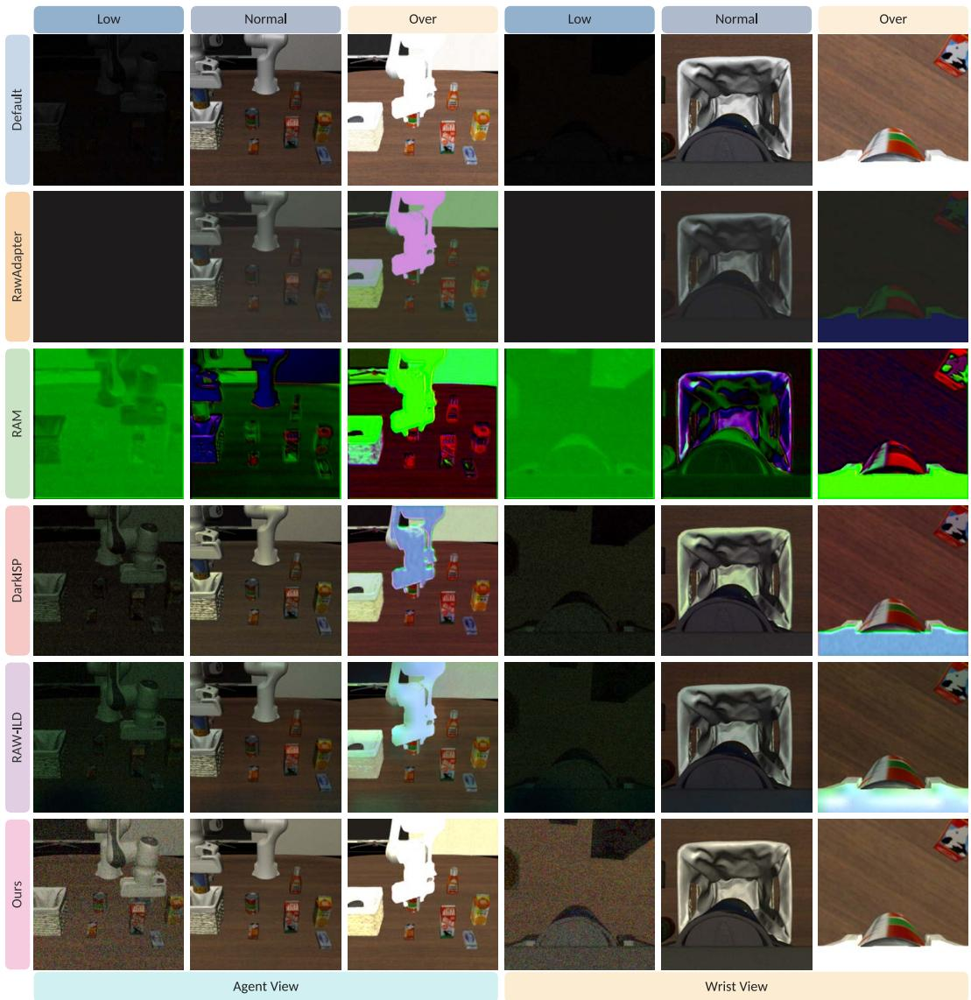  
Figure 9: Processed agent-view and wrist-view observations from the LIBERO portion of RawVLA-Bench under low, normal, and overexposed illumination. The rows compare the Default ISP with neural ISP methods using Qwen3-OFT as the policy backbone.

Experimental Setting. We follow the image-space haze construction of LIBERO-Plus (Fei et al., 2026), but increase the haze coefficient to $\alpha _ { \mathrm { h } } = 0 . 9 5$ . For every pixel and color channel of a clean simulator RGB image $I _ { \mathrm { c l e a n } } \in [ 0 , 2 5 5 ]$ , we compute

$$
I _ { \mathrm { h a z e } } = \mathrm { c l i p } ( ( 1 - \alpha _ { \mathrm { h } } ) I _ { \mathrm { c l e a n } } + \alpha _ { \mathrm { h } } I _ { \mathrm { a i r } } , 0 , 2 5 5 ) , \qquad \alpha _ { \mathrm { h } } = 0 . 9 5 , \quad I _ { \mathrm { a i r } } = 2 3 5 .\tag{25}
$$

The operation is performed in float32 and the result is converted to uint8. Thus, only 5% of the original RGB signal is retained and 95% gray-white airlight is mixed into the observation. We add no sensor noise, blur, random image noise, or additional quantization. This experiment uses hazy RGB observations rather than sensor RAW. In this evaluation, “RAW” in RawVLA refers only to the model name.

At every simulator step, Equation 25 is applied independently to the agent and wrist views. The PI-0 baseline receives the two hazy views directly. In the enhanced condition, each view is first processed by an $\alpha _ { \mathrm { h } } = 0 . 9 5$ -specific RawVLA checkpoint and the resulting RGB images are passed to the same frozen PI-0 policy. Enhancement runs at the simulator resolution, before the native PI-0 pipeline resizes each view to 224 × 224. We use the standard causal RawVLA inference procedure without access to future observations or clean reference frames. Language instructions, robot states, control frequency, action horizon, and all other policy settings are held fixed. Figure 11 shows representative observations from both camera views before and after haze enhancement.

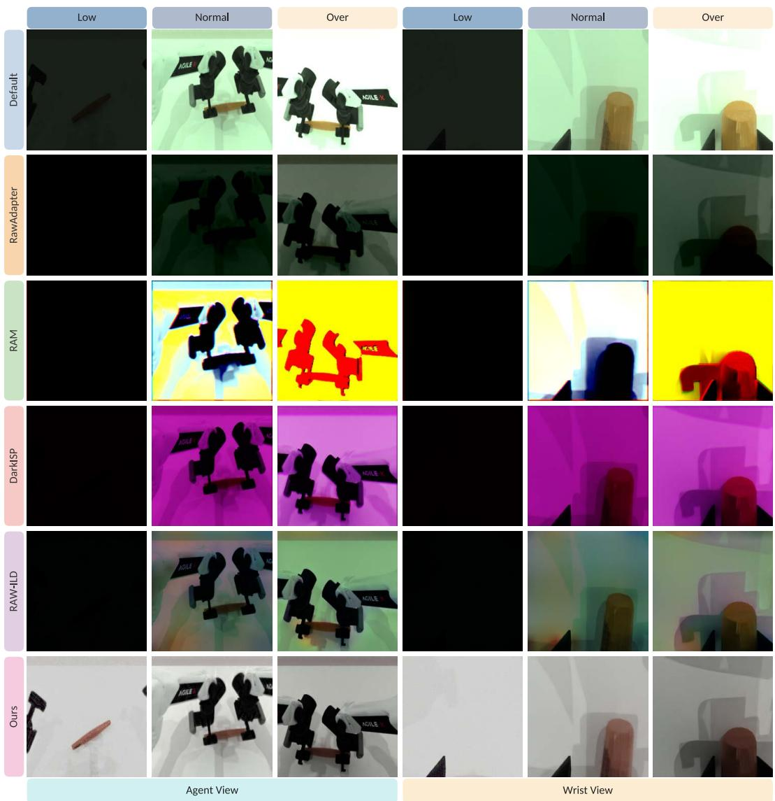  
Figure 10: Processed agent-view and wrist-view observations from the RoboTwin 2.0 portion of RawVLA-Bench under low, normal, and overexposed illumination. The rows compare the Default ISP with neural ISP methods using PI-0.5 as the policy backbone.

We train a haze-specific instance of the architecture described in Section 3 using paired reconstruction supervision rather than the frozen-policy objective in Section D. Training runs for 1,500 updates on paired LIBERO replay images from both camera views. Each target is a clean simulator RGB frame, and its input is generated online from that same frame using the exact $\alpha _ { \mathrm { h } } = 0 . 9 5$ and $I _ { \mathrm { a i r } } = 2 3 5$ transform, without strength jitter. The clean reconstruction targets are used only during training and are unavailable during closed-loop evaluation.

The two policy conditions use identical tasks, official initial states, and episode indices. PI-0 diffusion noise is generated deterministically from the language instruction and robot state to reduce sampling variation between the paired visual conditions. Success is determined by the standard LIBERO task predicate. Each suite includes ten tasks with 50 distinct rollouts per task.

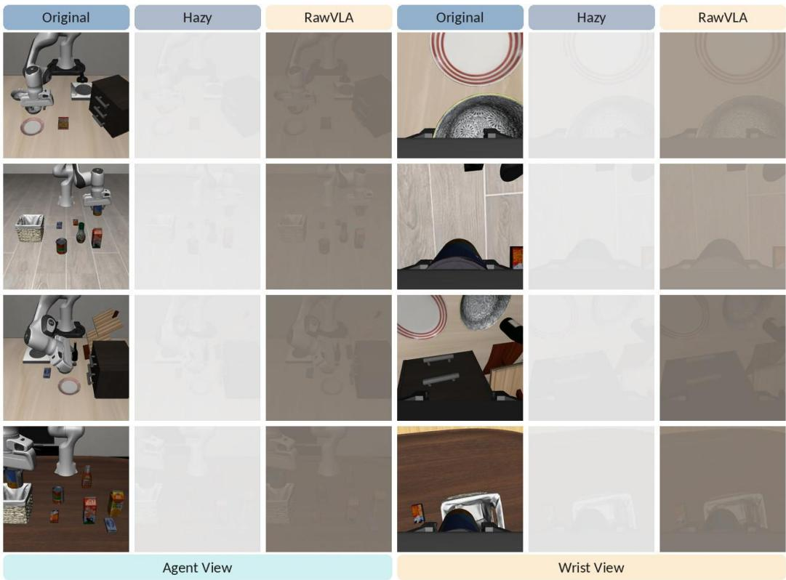  
Figure 11: Representative agent-view and wrist-view observations from LIBERO under severe haze. Each triplet shows the original simulator RGB image, the hazy input generated with $\alpha _ { \mathrm { h } } = 0 . 9 5$ and $\bar { I _ { \mathrm { a i r } } } = 2 3 5$ , and the corresponding RGB output produced by RawVLA. The same enhanced observations are provided to the frozen PI-0 policy during closed-loop evaluation.

Table 7: PI-0 success rates (%) on LIBERO under severe haze $( \alpha _ { \mathrm { h } } = 0 . 9 5 , I _ { \mathrm { a i r } } = 2 3 5 )$ , evaluated with 50 rollouts per task. Avg. is the macro-average over the four suites.
<table><tr><td>Method</td><td>Spatial</td><td>Object</td><td>Goal</td><td>LIBERO-10</td><td>Avg.</td></tr><tr><td>PI-0</td><td>78.0</td><td>84.0</td><td>82.0</td><td>22.0</td><td>66.5</td></tr><tr><td>PI-0 with RawVLA</td><td>98.0</td><td>96.0</td><td>96.0</td><td>63.6</td><td>88.4</td></tr><tr><td>Improvement (pp)</td><td>+20.0</td><td>+12.0</td><td>+14.0</td><td>+41.6</td><td>+21.9</td></tr></table>

Evaluation on Hazy LIBERO. On held-out image pairs, enhancement reduces mean absolute error from 0.4271 to 0.1688 and raises PSNR from 6.56 to 13.60 dB. Table 7 reports closed-loop suite success rates and the macro-average that weights the four suites equally.

Across the four equally sized suites, PI-0 achieves an average success rate of 66.5%. Processing the hazy observations with RawVLA before PI-0 raises this average to 88.4%, an improvement of 21.9 percentage points. On LIBERO-10, RawVLA enables PI-0 to succeed in 230 rollouts that fail without enhancement, while 22 rollouts show the opposite outcome. The paired comparison therefore yields 208 additional successful rollouts. A two-sided exact McNemar test confirms tha this improvement is statistically significant, with $p = 7 . 1 6 \times 1 0 ^ { - 4 5 }$

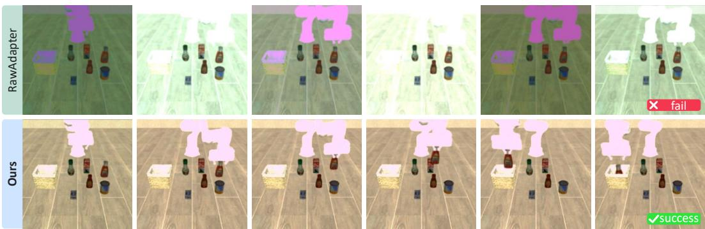  
Figure 12: Temporal rendering stability on an overexposed LIBERO (Liu et al., 2023) trajectory with Qwen3-OFT (StarVLA Community, 2026). RAW-Adapter (Cui et al., 2026) exhibits pronounced frame-to-frame appearance fluctuations that destabilize the policy and lead to task failure, whereas RawVLA maintains temporally consistent observations and successfully completes the task.

Table 8: Ablation of the three training objectives. The full objective is compared with action-free auxiliary supervision and each loss used in isolation. Loss weights are fixed and are not swept.
<table><tr><td></td><td colspan="3">Training objective</td><td colspan="6">LIBERO / Qwen3-OFT</td><td colspan="6">RoboTwin 2.0 / PI-0.5</td></tr><tr><td>Variant</td><td>Laction</td><td> $\mathcal { L } _ { \mathrm { b r i g h t } }$ </td><td> ${ \mathcal { L } } _ { \mathrm { c o l o r } }$ </td><td>Ext.Low</td><td>Low</td><td>Normal</td><td>Over</td><td>Ext.Over</td><td>Avg.</td><td>Ext.Low</td><td>Low</td><td>Normal</td><td>Over</td><td>Ext.Over</td><td>Avg.</td></tr><tr><td>Action loss only</td><td></td><td></td><td></td><td>0.00</td><td>0.00</td><td>97.75</td><td>44.50</td><td>29.25</td><td>34.30</td><td>0.00</td><td>0.00</td><td>67.72</td><td>54.76</td><td>46.40</td><td>33.70</td></tr><tr><td>w/o action loss</td><td></td><td>√</td><td>√</td><td>9.50</td><td>72.75</td><td>97.50</td><td>44.25</td><td>25.50</td><td>49.90</td><td>11.81</td><td>55.12</td><td>62.20</td><td>59.52</td><td>51.20</td><td>47.94</td></tr><tr><td>Brightness only</td><td></td><td>√</td><td></td><td>4.00</td><td>39.50</td><td>97.25</td><td>41.25</td><td>21.50</td><td>40.70</td><td>7.87</td><td>41.73</td><td>65.35</td><td>53.17</td><td>51.20</td><td>43.83</td></tr><tr><td>Color only</td><td></td><td></td><td>√</td><td>0.00</td><td>0.00</td><td>97.50</td><td>43.50</td><td>20.00</td><td>32.20</td><td>0.00</td><td>12.60</td><td>53.54</td><td>52.38</td><td>26.40</td><td>23.73</td></tr><tr><td>Full RawVLA</td><td>√</td><td>√</td><td>√</td><td>14.05</td><td>81.35</td><td>96.95</td><td>43.40</td><td>20.85</td><td>51.32</td><td>25.98</td><td>63.78</td><td>67.72</td><td>65.08</td><td>63.20</td><td>57.12</td></tr></table>

## G ADDITIONAL ABLATION STUDIES

The following tables separate structured ISP operators from burst-length design choices. LIBERO (Liu et al., 2023) uses Qwen3-OFT (StarVLA Community, 2026), and RoboTwin 2.0 (Chen et al., 2026b) uses PI-0.5 (Physical Intelligence et al., 2025), matching the main ablation protocol.

Because exhaustive evaluation of every additional ablation is computationally expensive, we use a reduced evaluation budget for LIBERO (Liu et al., 2023) in this appendix. We retain all 40 tasks across the four LIBERO (Liu et al., 2023) suites, but evaluate each task from 10 distinct initial states, rather than the 50 initial states used for the main results. For RoboTwin 2.0 (Chen et al., 2026b), we retain the full evaluation protocol with 13 tasks and 50 distinct initial states per task.

Training Objectives. Table 8 isolates the action, brightness, and chroma objectives. The action objective alone preserves normal-light performance but fails under severe illumination changes, whereas the two photometric auxiliaries without action supervision improve robustness but do not fully align the rendered observations with the frozen policy. Combining all three objectives gives the strongest overall performance, reaching 51.32% on LIBERO (Liu et al., 2023) and 57.12% on RoboTwin 2.0 (Chen et al., 2026b). These results show that the action loss provides policy alignment, while the brightness and chroma terms stabilize adaptation in the adverse regimes where action supervision alone is difficult to optimize.

Structured ISP Operators. Table 9 evaluates exposure, white balance, color correction, and tone mapping on LIBERO (Liu et al., 2023). Removing exposure causes the largest overall degradation, reducing average success from 62.24% to 50.79%. Removing tone mapping also lowers robustness, while white balance and the color-correction matrix provide complementary gains across illumination conditions. The shared-tone control nearly matches the full model, supporting the use of a single achromatic curve across channels while leaving chromatic adaptation to white balance and color correction.

Table 9: Ablation study of RawVLA’s modules on LIBERO with Qwen3-OFT (StarVLA Community, 2026). We report success rates (%) across five illumination levels and overall. Each ablated variant removes one ISP module while keeping the remaining architecture unchanged. Shared tone denotes the shared-head equivalence control.
<table><tr><td rowspan="2">Variant</td><td colspan="3">Ext.Low</td><td colspan="2">Low</td><td colspan="3"></td><td colspan="3">Over</td><td colspan="3">Ext.Over</td><td colspan="3">Overall</td></tr><tr><td>SOG</td><td>Long</td><td> $\mathbf { A v } \mathbf { g }$ </td><td>SOG</td><td>Long</td><td> $\mathbf { A v } \mathbf { g }$ </td><td>SOG Long</td><td>Avg</td><td>SOG</td><td>Long</td><td>Avg</td><td>SOG</td><td>Long</td><td>Avg</td><td>SOG</td><td>Long  $\mathbf { A v } \mathbf { g }$ </td></tr><tr><td>w/o Exposure</td><td>6.87</td><td>3.60</td><td>6.05</td><td>42.80</td><td>22.00</td><td>37.60 98.53</td><td>92.20</td><td>96.95</td><td>92.34</td><td>60.00</td><td>84.25</td><td>38.47</td><td>1.00</td><td>29.10</td><td>55.80</td><td>35.76 50.79</td></tr><tr><td>w/o White-balance</td><td>15.87</td><td>12.60</td><td>15.05</td><td>87.46</td><td>62.00</td><td>81.10 98.53</td><td>94.20</td><td>97.45</td><td>91.67</td><td>53.00</td><td>82.00</td><td>42.80</td><td>2.00</td><td>32.60</td><td>67.27 44.76</td><td>61.64</td></tr><tr><td>w/o CCM</td><td>12.20</td><td>12.60</td><td>12.30</td><td>86.46</td><td>62.00 80.35</td><td>97.86</td><td>95.20</td><td>97.20</td><td>92.67</td><td>58.00</td><td>84.00</td><td>43.13</td><td>2.00</td><td>32.85</td><td>66.47 45.96</td><td>61.34</td></tr><tr><td>w/o Tone-mapping</td><td>7.53</td><td>5.60</td><td>7.05</td><td>73.46</td><td>46.00 66.60</td><td>97.53</td><td>91.20</td><td>95.95</td><td>90.67</td><td>54.00</td><td>81.50</td><td>45.13</td><td>2.00</td><td>34.35</td><td>62.87 39.76</td><td>57.09</td></tr><tr><td>Shared tone</td><td>15.20</td><td>10.60</td><td>14.05</td><td>86.80</td><td>63.00</td><td>80.85 98.53</td><td>92.20</td><td>96.95</td><td>92.00</td><td>54.00</td><td>82.50</td><td>47.47</td><td>1.00</td><td>35.85</td><td>68.00 44.16</td><td>62.04</td></tr><tr><td>Full RawVLA</td><td>15.2010.60</td><td></td><td>14.05</td><td>87.13</td><td>64.00</td><td>81.35 98.53</td><td>92.20</td><td>96.95</td><td>91.67</td><td>55.00</td><td></td><td>82.5047.80</td><td>2.00</td><td>36.35</td><td>68.07</td><td>44.7662.24</td></tr></table>

Table 10: Inference-only ISP component ablations on RoboTwin 2.0 using PI-0.5. All ablated variants use the same frozen checkpoint and force one ISP component to identity. Full (inference-only) keeps all components enabled, while Full RawVLA reports the main benchmark result.
<table><tr><td>Variant</td><td>Ext.Low</td><td>Low</td><td>Normal</td><td>Over</td><td>Ext.Over</td><td>Avg.</td></tr><tr><td>w/o Exposure</td><td>12.60</td><td>18.11</td><td>65.35</td><td>61.11</td><td>60.00</td><td>43.35</td></tr><tr><td>w/o White-balance</td><td>25.98</td><td>58.27</td><td>66.14</td><td>65.08</td><td>54.40</td><td>53.96</td></tr><tr><td>w/o CCM</td><td>25.20</td><td>61.42</td><td>69.29</td><td>57.14</td><td>62.40</td><td>55.06</td></tr><tr><td>w/o Tone-mapping</td><td>22.05</td><td>50.39</td><td>64.57</td><td>65.08</td><td>60.00</td><td>52.37</td></tr><tr><td>Full RawVLA</td><td>25.98</td><td>63.78</td><td>67.72</td><td>65.08</td><td>63.20</td><td>57.12</td></tr></table>

Table 11: Burst-denoising ablations. We study the burst length K, global fusion weight η, and frequency-wise reliability decomposition. We compare the rendered output ˆI against the corresponding noise-free simulation ground truth IG using PSNR (dB) and SSIM. Average is computed over the ExtremeLow, Low, and Normal illumination regimes. Underlined settings denote the default configuration.
<table><tr><td rowspan="2">Benchmark</td><td rowspan="2">Ablation</td><td rowspan="2">Setting</td><td colspan="2">Ext.Low</td><td colspan="2">Low</td><td colspan="2">Normal</td><td colspan="2">Average</td></tr><tr><td>PSNR ↑</td><td>SSIM ↑</td><td>PSNR ↑</td><td>SSIM ↑</td><td>PSNR ↑</td><td>SSIM ↑</td><td>PSNR ↑</td><td>SSIM ↑</td></tr><tr><td rowspan="8">LIBERO Qwen3-OFT</td><td rowspan="2">Burst length</td><td>K = 1</td><td>18.93</td><td>0.117</td><td>19.99</td><td>0.261</td><td>36.69</td><td>0.863</td><td>25.21</td><td>0.414</td></tr><tr><td>K = 3</td><td>20.15</td><td>0.144</td><td>21.34</td><td>0.304</td><td>37.66</td><td>0.893</td><td>26.38</td><td>0.447</td></tr><tr><td></td><td>K = 6</td><td>21.98</td><td>0.195</td><td>23.27</td><td>0.373</td><td>37.57</td><td>0.921</td><td>27.61</td><td>0.497</td></tr><tr><td rowspan="2">Fusion strength</td><td>η = 0.2</td><td>19.63</td><td>0.132</td><td>20.79</td><td>0.286</td><td>37.44</td><td>0.882</td><td>25.95</td><td>0.433</td></tr><tr><td>η = 0.5</td><td>21.98</td><td>0.195</td><td>23.27</td><td>0.373</td><td>37.57</td><td>0.921</td><td>27.61</td><td>0.497</td></tr><tr><td rowspan="2">Frequency</td><td>η = 0.8</td><td>20.78</td><td>0.160</td><td>22.04</td><td>0.328</td><td>37.89</td><td>0.905</td><td>26.90</td><td>0.465</td></tr><tr><td>w/o decomposition</td><td>20.54</td><td>0.152</td><td>20.43</td><td>0.295</td><td>33.21</td><td>0.908</td><td>24.73</td><td>0.452</td></tr><tr><td rowspan="7">RoboTwin 2.0 PI-0.5</td><td rowspan="3">Burst length</td><td>K = 1</td><td>18.16</td><td>0.082</td><td>27.30</td><td>0.636</td><td>48.45</td><td>0.986</td><td>31.30</td><td>0.568</td></tr><tr><td>K = 3</td><td>18.16</td><td>0.082</td><td>27.27</td><td>0.635</td><td>46.35</td><td>0.984</td><td>30.59</td><td>0.567</td></tr><tr><td>K = 6</td><td>18.18</td><td>0.082</td><td>27.28</td><td>0.634</td><td>47.35</td><td>0.985</td><td>30.94</td><td>0.567</td></tr><tr><td rowspan="3">Fusion strength</td><td>η = 0.2</td><td>18.16</td><td>0.082</td><td>27.22</td><td>0.635</td><td>45.20</td><td>0.982</td><td>30.20</td><td>0.566</td></tr><tr><td>η = 0.5</td><td>18.18</td><td>0.082</td><td>27.28</td><td>0.634</td><td>47.35</td><td>0.985</td><td>30.94</td><td>0.567</td></tr><tr><td>η = 0.8</td><td>18.14</td><td>0.082</td><td>27.14</td><td>0.635</td><td>43.53</td><td>0.978</td><td>29.60</td><td>0.565</td></tr><tr><td>Frequency</td><td>w/o decomposition</td><td>18.08</td><td>0.079</td><td>26.35</td><td>0.628</td><td>38.47</td><td>0.967</td><td>27.63</td><td>0.558</td></tr></table>

Cross-Benchmark Operator Effects. Table 10 repeats the operator analysis on RoboTwin 2.0 (Chen et al., 2026b). Exposure remains the most consequential component. Disabling it reduces average success from 57.12% to 43.35%. The remaining operator ablations also reduce the overall result, confirming that exposure, chromatic correction, and tone mapping remain complementary across environments and policy backbones.

Burst-Denoising Design. Table 11 studies burst length, fusion strength, and frequency-wise reliability decomposition using reconstruction quality relative to noise-free observations. Longer bursts substantially improve LIBERO (Liu et al., 2023), with K = 6 outperforming single-frame processing, whereas RoboTwin 2.0 (Chen et al., 2026b) shows diminishing returns because its observations contain less recoverable temporal noise. A moderate fusion strength provides the best average tradeoff on both benchmarks. Removing the frequency-wise decomposition produces the clearest degradation, confirming that motion-aware spectral reliability is important for suppressing noise without indiscriminately averaging dynamic content.

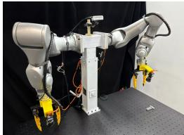  
(a) ROKAE AR5

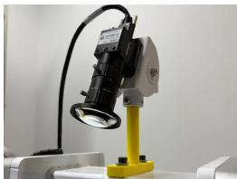  
(b) Agent-view camera

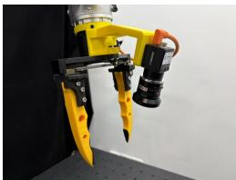  
(c) Left wrist & camera

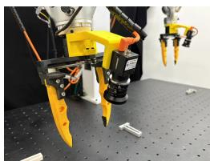  
(d) Right wrist & camera

Figure 13: Real-world dual-arm platform and camera setup.  
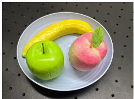  
(a) Fruits

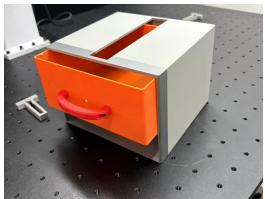  
(b) Drawer

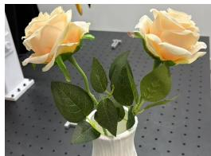  
(c) Flowers

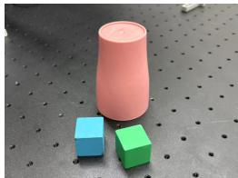  
(d) Cup & blocks  
Figure 14: Objects used in the four real-world tasks.

Temporal Stability. Figure 12 complements the quantitative ablations with an overexposed LIBERO (Liu et al., 2023) trajectory. Compared with the frame-wise RAW-Adapter (Cui et al., 2026), the recurrent formulation of RawVLA avoids abrupt rendering changes and maintains observations that support successful task execution.

## H REAL-WORLD EXPERIMENTAL SETUP

This section describes the robotic platform and cameras in Section H.1, data acquisition and calibration in Section H.2, policy training and deployment in Section H.3, and qualitative executions in Section H.4.

## H.1 ROBOTIC PLATFORM AND CAMERA CONFIGURATION

Our real-world platform comprises two ROKAE AR5 robot arms and three synchronized HIKROBOT MV-CS020-10UC industrial cameras, as shown in Figure 13. Each arm is equipped with a Songling gripper fitted with custom 3D-printed finger extensions to increase its usable reach for the selected manipulation tasks. The agent-view and two wrist-view streams are captured by the same camera model. The agent-view camera uses a 4-mm fixed-focal-length lens at f/2.8, while each wrist camera uses a 3.5-mm lens at f /4.

## H.2 DATA ACQUISITION AND CAMERA CALIBRATION

Figure 14 shows the task-specific objects used for pick-and-place, drug-drawer manipulation, flower placement, and stack-and-cover. The cameras continuously stream 12-bit mosaiced Bayer RAW measurements at 30 FPS. We subtract the camera-specific black level, normalize by the usable white level, and apply the cameras’ default demosaicing to obtain the three-channel linear RAW representation defined in Appendix A. We then downsample each view to 228 × 171. For each task, we collect over 200 trajectories with randomized initial arm configurations, recording all three views, robot states, and expert actions at 30 FPS. The demonstrations retain the synchronized linear RAW observations and expert trajectories. This sensor-linear representation allows exposure and noise to be modified directly without approximately inverting the nonlinear tone mapping and display encoding already applied to RGB images.

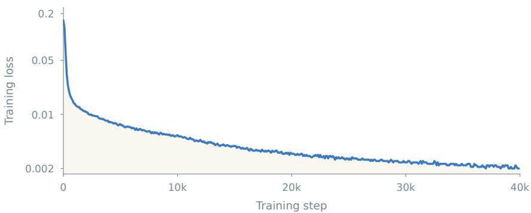

Figure 15: Action-loss curves for PI0.5 (Physical Intelligence et al., 2025) fine-tuning on the four real-world tasks, using 909 demonstrations and 263,863 frames in total.
<table><tr><td>Task</td><td>Language prompt</td></tr><tr><td>pick_and_place</td><td>Place the green apple, pink object, and yellow banana in the blue bowl.</td></tr><tr><td>drag-the_drawer</td><td>Open the drawer and place the yellow block inside.</td></tr><tr><td>pick_flower</td><td>Pick up the two flowers and place them in the white vase.</td></tr><tr><td>stack_and_cover</td><td>Stack the green and blue blocks and cover them with the pink cup.</td></tr></table>

Table 12: Language prompts for the four real-world tasks.

Because the agent-view and wrist-view cameras use different lenses and apertures, their uncalibrated RAW streams exhibit different brightness levels. Before data collection, we perform a three-camera photometric calibration and increase the agent-view sensor gain so that the three RAW streams have matched illumination levels under the same scene lighting. This calibration provides a consistent multi-view input while retaining RAW-domain measurements for the learned ISP.

## H.3 POLICY AND NEURAL ISP TRAINING AND DEPLOYMENT

We initialize PI-0.5 (Physical Intelligence et al., 2025) from its pretrained base checkpoint and fully fine-tune the policy on 909 demonstrations comprising 263,863 frames across the four real-world tasks under normal illumination. Each training sample contains the current observations from the three cameras, the 16-dimensional robot state, and the task instruction. The target is a 16-step chunk of absolute 16-dimensional actions sampled from the 15 FPS demonstrations. We use four-task quantile statistics to normalize states and actions and apply state-text dropout with probability 0.2.

Training runs for 40,000 updates on eight NVIDIA B300 GPUs with a global batch size of 256. We use AdamW with a peak learning rate of $5 \times 1 0 ^ { - 5 }$ , a 10,000-step linear warmup, global gradient clipping at 1.0, and an exponential moving average decay of 0.999. Figure 15 shows the action-loss trajectory over the four-task fine-tuning process.

After obtaining the fine-tuned PI-0.5 policy, we freeze its parameters and train the neural ISP modules. Each learned ISP is trained on both the recorded normal-light linear RAW observations and synthetic low-light counterparts. We generate the low-light inputs directly from the recorded linear RAW images by applying an exposure offset of −6 EV and adding simulated sensor noise. The synchronized expert trajectories remain unchanged and provide supervision for the ISP training. Each module is trained for 2,000 steps, yielding one ISP that is shared across both lighting conditions.

At deployment, all evaluations use a single PI-0.5 (Physical Intelligence et al., 2025) checkpoint finetuned only under normal illumination. The Default ISP uses the same fixed camera pipeline under both normal and low light. DarkISP and RawVLA each deploy one learned ISP checkpoint under both conditions, without condition-specific retraining or model switching. This protocol measures cross-illumination robustness while holding the downstream policy and ISP model fixed. The policy runs in streaming mode and predicts a 16-step action chunk from the latest multi-view observation at 4 Hz while the robot continues executing the previously committed trajectory. When a new chunk becomes available, a quadratic programming trajectory optimizer interpolates the remaining previous trajectory toward the new prediction before execution. This transition accounts for robot inertia and avoids abrupt changes between consecutive chunks, preserving smooth and continuous motion. For every ISP method and illumination condition, we conduct 50 independent trials per task. The resulting success rates are reported in Table 3, and the ISP throughput comparison is given in Table 4. We condition the policy on the task-specific language prompts listed in Table 12.

## H.4 QUALITATIVE TASK EXECUTIONS

Figures 16, 17, 18, and 19 visualize complete executions of pick & place, drug drawer, pick flower, and stack & cover. The normal illumination sequences demonstrate the nominal behavior of RawVLA. Under low light, the Default ISP produces nearly zero-valued observations and the policy does not initiate motion. Dark-ISP (Guo et al., 2025) recovers some scene structure, but the policy stalls during the first stage of each multi-step task. RawVLA instead preserves usable agent and wrist observations and completes every sequence. Low-light execution takes longer than execution under clear normal illumination because the policy repeatedly observes the scene and refines the end-effector pose during precise steps such as grasping the blocks and aligning a flower with the vase opening. Despite these additional adjustments, the policy completes each fine-grained operation successfully. Videos of all executions are included in the supplementary material.

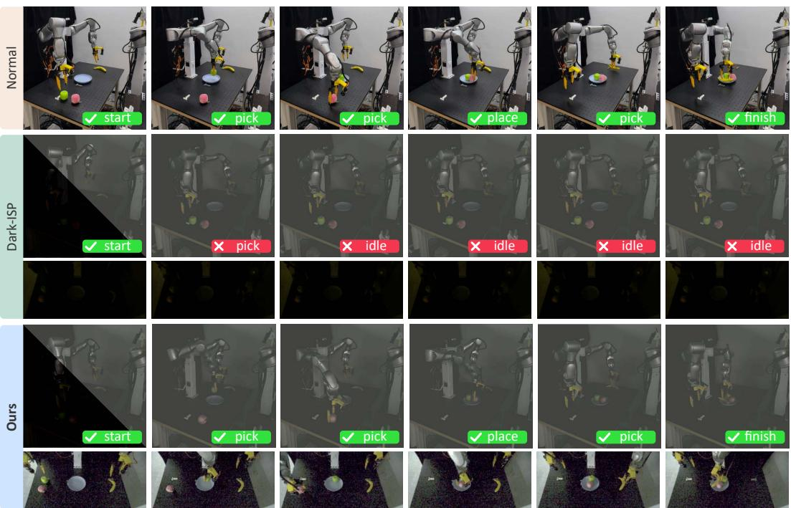

Figure 16: Pick & place executions under normal and low-light illumination. The third-person frames receive postprocessing enhancement only for visualization and are not provided to the pol icy. The lower strips show the rendered agent views produced by Dark-ISP (Guo et al., 2025) and RawVLA under low light.  
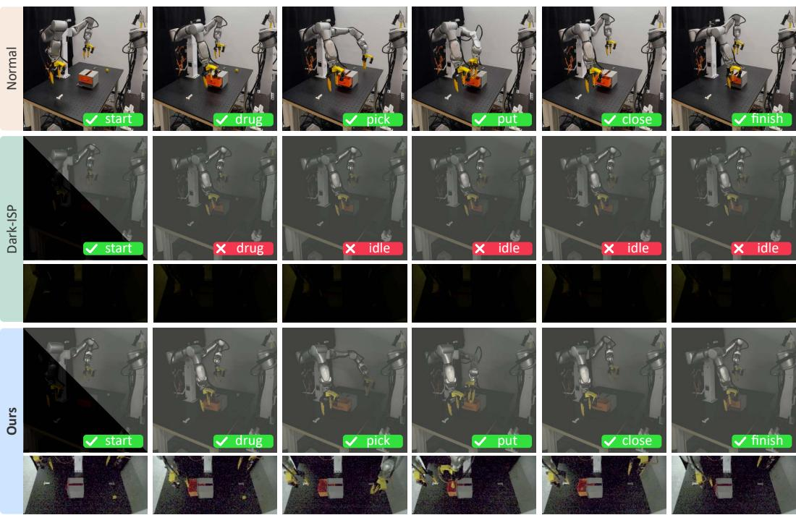  
Figure 17: Drug drawer executions under normal and low-light illumination. The third-person frames receive postprocessing enhancement only for visualization and are not provided to the policy. The lower strips show the rendered agent views produced by Dark-ISP (Guo et al., 2025) and RawVLA under low light.

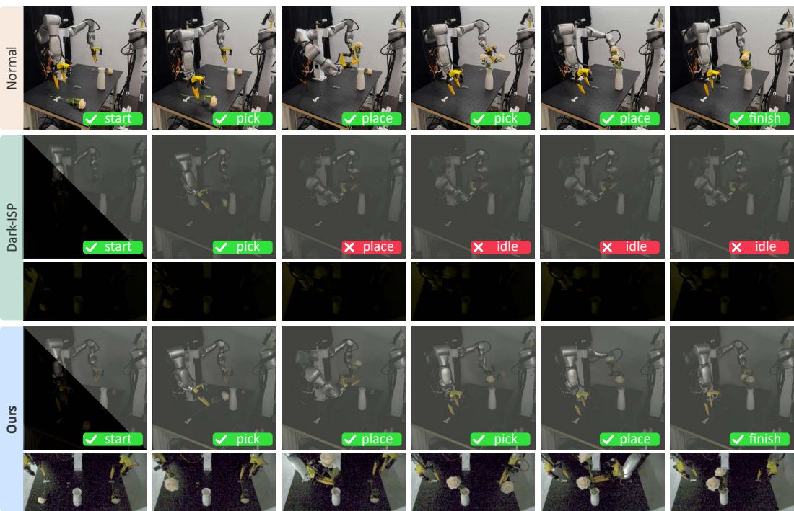

Figure 18: Pick flower executions under normal and low-light illumination. The third-person frames receive postprocessing enhancement only for visualization and are not provided to the policy. The lower strips show the rendered agent views produced by Dark-ISP (Guo et al., 2025) and RawVLA under low light.  
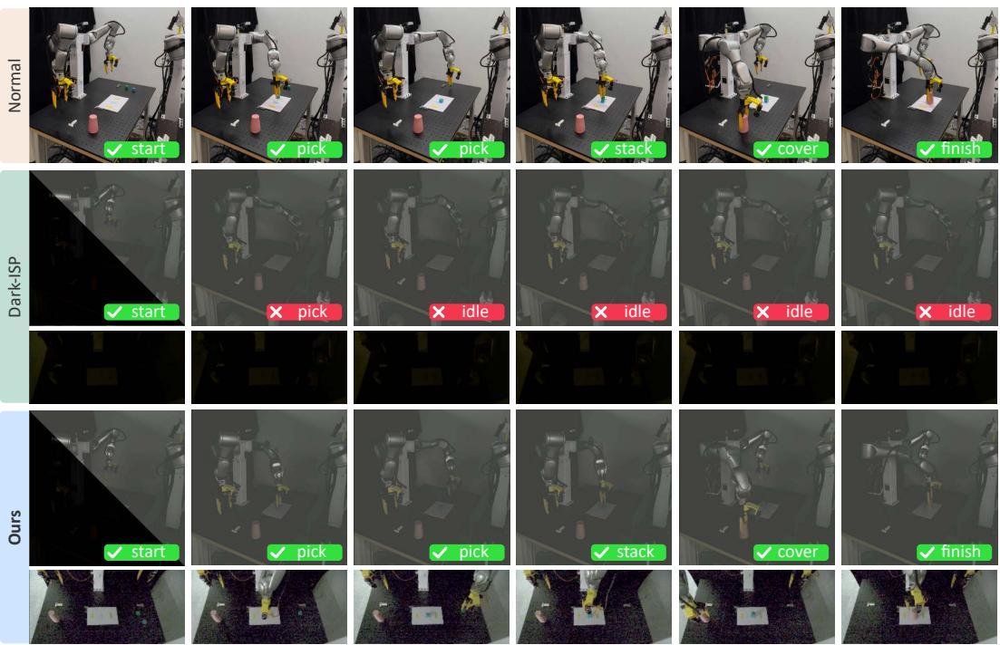  
Figure 19: Stack & cover executions under normal and low-light illumination. The third-person frames receive postprocessing enhancement only for visualization and are not provided to the policy. The lower strips show the rendered agent views produced by Dark-ISP (Guo et al., 2025) and RawVLA under low light.

## I WAM ILLUMINATION ROBUSTNESS ON LIBERO

We additionally evaluate RawVLA with the WM4A-Wan and WM4A-Cosmos WAM (StarVLA Community, 2026) backbones in Table 13. The results remain uniformly low, and none of the learned ISP methods produces a substantial or consistent improvement across the two backbones. Even the strongest averages differ by only 1.19 percentage points for WM4A-Wan and 0.14 percentage points for WM4A-Cosmos, which is insufficient to establish a meaningful robustness gain.

This limited effect is consistent with the sensitivity analysis in Section 2. WAM policies are highly sensitive to pixel-level appearance changes and operate within a narrower stable imaging range than the VLA backbones. Consequently, an ISP transformation that improves visibility may still move the observation away from the image distribution expected by the generative world model. Optimization is also less direct because the action objective must propagate through the VAE-based visual generation pathway before reaching the neural ISP. This long gradient path can weaken or distort the supervision available for learning task-relevant image processing. These results suggest that conventional action-driven ISP training is not sufficient for the evaluated WAM backbones. More direct supervision and WAM-specific imaging interfaces are left for future study.

Table 13: Success rates (%) of ISP modules across five illumination levels on LIBERO using WAM backbones. Avg reports the mean across illumination levels for each backbone.
<table><tr><td>Illumin.</td><td>Backbone</td><td>Default</td><td>DarkISP</td><td>RAM</td><td>RAWAdapter</td><td>RAWild</td><td>Ours</td></tr><tr><td rowspan="2">Extreme Lowlight</td><td>WM4A-Wan</td><td>0.00</td><td>0.05</td><td>0.00</td><td>0.00</td><td>0.00</td><td>0.75</td></tr><tr><td>t WM4A-Cosmos</td><td>0.00</td><td>0.00</td><td>0.00</td><td>0.00</td><td>0.00</td><td>0.20</td></tr><tr><td rowspan="2">Lowlight</td><td>WM4A-Wan</td><td>0.05</td><td>0.05</td><td>0.05</td><td>0.00</td><td>0.00</td><td>0.55</td></tr><tr><td>WM4A-Cosmos</td><td>0.05</td><td>0.00</td><td>0.00</td><td>0.00</td><td>0.00</td><td>0.75</td></tr><tr><td rowspan="2">Normal</td><td>WM4A-Wan</td><td>76.10</td><td>76.50</td><td>0.00</td><td>38.05</td><td>75.15</td><td>78.20</td></tr><tr><td>WM4A-Cosmos</td><td>85.75</td><td>0.75</td><td>1.75</td><td>2.45</td><td>4.25</td><td>83.45</td></tr><tr><td rowspan="2">OverExp</td><td>WM4A-Wan</td><td>0.50</td><td>1.45</td><td>0.00</td><td>0.00</td><td>0.55</td><td>4.55</td></tr><tr><td>WM4A-Cosmos</td><td>1.90</td><td>0.05</td><td>0.00</td><td>0.00</td><td>0.35</td><td>3.50</td></tr><tr><td rowspan="2">Extreme OverExp</td><td>WM4A-Wan</td><td>0.00</td><td>0.45</td><td>0.00</td><td>0.00</td><td>0.00</td><td>0.40</td></tr><tr><td>WM4A-Cosmos</td><td>0.00</td><td>0.00</td><td>0.00</td><td>0.00</td><td>0.30</td><td>0.50</td></tr><tr><td rowspan="2">Avg</td><td>WM4A-Wan</td><td></td><td></td><td></td><td></td><td></td><td></td></tr><tr><td>WM4A-Cosmos</td><td>15.42 17.54</td><td>15.70 0.16</td><td>0.01 0.35</td><td>7.61 0.49</td><td>15.14 0.98</td><td>16.89 17.68</td></tr></table>

## J LIMITATIONS AND FUTURE STUDIES

Our study has several limitations that motivate future work. The simulated experiments use threechannel linear pseudo-RAW observations rather than camera-native mosaiced measurements and therefore do not capture the full diversity of sensor spectral responses, demosaicing artifacts, lens effects, or proprietary camera pipelines. Extending RawVLA-Bench with calibrated physical sensors and multiple camera models would provide a more complete evaluation of RAW-domain manipulation across diverse robotic platforms and deployment settings.

The current training protocol learns a separate neural ISP for each downstream policy. Although our evaluation covers multiple VLA backbones, a single ISP that generalizes across policies, embodiments, and tasks remains an open challenge. Promising directions include policy-agnostic pretraining, lightweight online adaptation, and extending adaptive image processing to world-action models through dedicated objectives and imaging interfaces. The real-world experiments are also limited to a small set of indoor manipulation tasks and lighting conditions. Broader evaluations could cover outdoor scenes, spatially varying illumination, motion blur, weather effects, and longer task horizons. The severe-haze experiment further relies on synthesized RGB observations. Evaluating adverse weather with physically captured RAW data and jointly modeling multiple degradations are important directions for future study.

## K CONTROLLED ISP PERTURBATION PROTOCOL

The two evaluation environments expose different renderer products. LIBERO (Liu et al., 2023) uses MuJoCo RGB8 camera observations resized to the policy input resolution, whereas RoboTwin 2.0 (Chen et al., 2026b) uses SAPIEN float RGB textures in [0, 1] without an intermediate RGB8 quantization. In both cases, we apply the unprocessing in Appendix $\mathrm { A }$ with channel gains $( 1 . 8 , 1 . 0 , 1 . 7 )$ and inverse global gain 1.0, then quantize the resulting three-channel linear proxy as $R _ { 1 0 } = \mathrm { r o u n d } ( 1 0 2 3 R )$ . No Bayer mosaic or camera-specific color correction matrix is introduced. All policy inputs remain float32 in [0, 1], and only one perturbation axis is enabled in each evaluation. Section K.1 defines the perturbation operators and their ISP stages, while Sections K.2 and K.3 provide the environment-specific settings.

## K.1 PERTURBATION OPERATORS AND PROCESSING STAGES

Exposure. Exposure acts on the linear sensor signal before nonlinear display rendering. In a physical camera, exposure time and analog gain determine the signal collected or amplified before digitization, while later digital gain adjusts brightness inside the ISP. Our perturbation uses a single RAW-domain multiplier to capture their shared effect on signal scale. Negative EV suppresses weak measurements and makes subsequent quantization more destructive. Positive EV saturates bright measurements at the sensor range. Applying the reciprocal gain can restore brightness but cannot recover samples already clipped or collapsed to the same quantization level. We therefore compare direct and recovered forms to separate reversible rescaling from irreversible information loss. For an offset e measured in exposure values (EV), we define

$$
R _ { e } = \mathrm { c l i p } ( 2 ^ { e } R , 0 , 1 ) , \qquad Y _ { e } ^ { \mathrm { e x p } } = \mathcal { P } _ { 0 } ( R _ { e } ) , \qquad Y _ { 0 } ^ { \mathrm { e x p } } = \mathcal { P } _ { 0 } ( R ) .\tag{26}
$$

One EV doubles or halves the linear RAW signal, and clip acts elementwise.

Sensor Noise. Photon arrival follows signal-dependent counting statistics, while readout electronics add a signal-independent noise floor. Low illumination or short exposure reduces the number of collected photoelectrons and therefore lowers the signal-to-noise ratio even when an ISP later restores the mean brightness. We reproduce this process by attenuating linear RAW with a negative capture EV, sampling heteroscedastic Gaussian noise whose variance is the sum of shot and read components, and applying the matching recovery gain. The noise is added before RAW recovery and the default ISP, so recovery amplifies both the desired signal and the acquisition noise. This differs from adding a fixed image-space corruption after rendering. After forming $R _ { e }$ with Equation $^ { 2 6 , }$ we sample

$$
\begin{array} { r l r } & { } & { \varepsilon _ { u } \sim \mathrm { N o r m a l } \big ( 0 , \sigma _ { \mathrm { s h o t } } ^ { 2 } [ R _ { e } ] _ { u } + \sigma _ { \mathrm { r e a d } } ^ { 2 } \big ) , } \\ & { } & { \widetilde { R } _ { e } = \mathrm { c l i p } \big ( 2 ^ { - e } \mathrm { c l i p } ( R _ { e } + \varepsilon , 0 , 1 ) , 0 , 1 \big ) , } \\ & { } & { Y _ { e } ^ { \mathrm { n o i s e } } = \mathcal { P } _ { 0 } ( \widetilde { R } _ { e } ) . \qquad } \end{array}\tag{27}
$$

Here u indexes RAW samples, $\sigma _ { \mathrm { s h o t } } ^ { 2 }$ and $\sigma _ { \mathrm { r e a d } } ^ { 2 }$ control shot and read noise, and $\varepsilon = \{ \varepsilon _ { u } \} _ { u }$ . Reciprocal gain restores the mean exposure while preserving the reduced signal-to-noise ratio.

Chromatic Response. Chromatic processing primarily occurs through white balance and color rendering. White balance applies channel-dependent gains so that the sensor response to an assumed illuminant becomes neutral. Moving the target white point therefore changes the absolute tint of the entire rendered observation. Color rendering then maps the balanced sensor channels into a display color space and controls relative hue and saturation. To probe this second role without changing luminance, we rotate and scale the OKLab chroma plane after the default ISP while preserving lightness. The white-point family measures sensitivity to illuminant-dependent calibration, whereas the relative-color family measures sensitivity to relationships among object and scene colors. Let $\pmb { \nu } _ { 0 }$ be the reference white point in the $u ^ { \prime } v ^ { \prime }$ plane and let $\left( a _ { \mathrm { o k } } , b _ { \mathrm { o k } } \right)$ be the OKLab chroma coordinates (Ottosson, 2020) of $Y _ { 0 }$ . The two chromatic perturbation families are

$$
\begin{array} { r l } & { \nu _ { \delta _ { \mathrm { w p } } , \theta } = \nu _ { 0 } + \delta _ { \mathrm { w p } } ( \cos \theta , \sin \theta ) , } \\ & { Y _ { \delta _ { \mathrm { w p } } , \theta } ^ { \mathrm { w p } } = \mathcal { P } _ { \delta _ { \mathrm { w p } } , \theta } ^ { \mathrm { w p } } ( R ) , } \\ &  \boldsymbol { \left[ a _ { \mathrm { o k } } ^ { \prime } \quad b _ { \mathrm { o k } } ^ { \prime } \right] ^ { \top } = s \mathrm { R o t } ( \theta ) \left[ a _ { \mathrm { o k } } \quad b _ { \mathrm { o k } } \right] ^ { \top } . } \end{array}\tag{28}
$$

Here $\delta _ { \mathrm { w p } }$ and s control magnitude, θ controls direction, Rot(θ) is a two-dimensional rotation, and OKLab lightness is preserved in the relative-color family.

Tonal Response. Tone mapping compresses or expands linear scene luminance before the final display transfer and determines how contrast is distributed across shadows, mid-tones, and highlights. We compute BT.709 luminance after restoring the default linear RGB gains, transform it around the middle-gray pivot in logit space, and rescale all three channels by the same luminance ratio. Equal rescaling approximately preserves hue while changing local visibility through the global tone response. The standard sRGB transfer and smoothstep display curve are applied afterward. Values below the identity flatten contrast and values above it increasingly separate luminance levels around the pivot. For BT.709 luminance L (International Telecommunication Union, 2015), the mapping is

$$
L _ { c _ { \mathrm { t o n e } } } = \sigma \big ( \mathrm { l o g i t } ( \tau ) + c _ { \mathrm { t o n e } } \big ( \mathrm { l o g i t } ( L ) - \mathrm { l o g i t } ( \tau ) \big ) \big ) ,\tag{29}
$$

where τ is the luminance pivot and $c _ { \mathrm { t o n e } }$ controls contrast. Linear RGB is rescaled by $L _ { c _ { \mathrm { t o n e } } } / \operatorname* { m a x } ( L , \epsilon )$ before the default display operations. $c _ { \mathrm { t o n e } } = 1$ is the identity and $\epsilon > 0$ prevents division by zero.

Bit Depth. Bit depth represents precision loss at digitization and image transport rather than a change in photometric rendering. A sensor analog-to-digital converter quantizes RAW measurements, and a later image representation may introduce a second quantization after the ISP. Uniform quantization merges nearby values into the same discrete level and may remove weak edges, texture, or color differences used by a policy. Quantizing normalized RAW measures precision loss before white balance, tone mapping, and display encoding. Quantizing default-ISP RGB measures precision loss in the final rendered observation. Keeping the transported tensor in float32 ensures that only the number of distinct intensity levels changes. For normalized $U \in [ 0 , 1 ]$ , we use

$$
\mathcal { Q } _ { n } ( U ) = \frac { \mathrm { r o u n d } ( ( 2 ^ { n } - 1 ) U ) } { 2 ^ { n } - 1 } ,\tag{30}
$$

where n is the number of bits. We apply this operator at the RAW or RGB stage as specified below.

## K.2 LIBERO PERTURBATION SETTINGS

Both the agent and wrist cameras use the same parameters. For the exposure axis, exposure is applied before clipping and RAW10 quantization, with

$$
e \in \{ - 8 , - 7 , - 6 , - 5 , - 4 , - 3 , - 2 , - 1 , 1 , 2 , 3 , 4 \} .\tag{31}
$$

Let $\overline { { R } } _ { 1 0 , e } = \mathrm { r o u n d } ( 1 0 2 3 R _ { e } ) / 1 0 2 3$ denote the normalized exposed pseudo-RAW10 observation. We evaluate four observation forms. The raw-direct form exposes $\overline { { R } } _ { 1 0 , e }$ . The raw-recovered form multiplies it by $2 ^ { - e }$ and clips. The RGB-direct form applies the default ISP to $\overline { { R } } _ { 1 0 , e }$ . The $R G B \mathrm { . }$ recovered form approximately inverts the display mapping, applies $2 ^ { - e }$ , and reapplies gamma and tone. The additional $e \in \{ - 3 , - 2 , - 1 \}$ settings are evaluated for the RGB-direct form. The current sweep records $e = - 8$ only for recovered inputs.

For the noise axis, the six capture EVs and matching recovery gains are

$$
( e , 2 ^ { - e } ) \in \{ ( - 1 , 2 ) , ( - 2 , 4 ) , ( - 3 , 8 ) , ( - 4 , 1 6 ) , ( - 5 , 3 2 ) , ( - 6 , 6 4 ) \} .\tag{32}
$$

We use $\sigma _ { \mathrm { s h o t } } ^ { 2 } = 4 . 0 \times 1 0 ^ { - 4 } , \sigma _ { \mathrm { r e a d } } ^ { 2 } = 1 . 0 \times 1 0 ^ { - 5 }$ , and base seed 1695213855 in the noise model from Equation 27. Static visualizations use frame index 0, with view indices 0 and 1 for the agent and wrist cameras. During deployment, the episode seed is derived from the base seed, task index, episode index, and view index. The noise draw also includes frame and view identity. The resulting draws are reproducible but differ across episodes, views, and policy frames. The completed noise experiment evaluates all six policy checkpoints across the four LIBERO suites and six noise levels. Each model, suite, and level contains 500 episodes from ten tasks with 50 trials per task, producing 72,000 episodes overall. At every level, noise is sampled after capture attenuation and before the matching recovery gain and default ISP. Table 15 reports the full results.

For the chromatic axis, white-point radii are $\delta _ { \mathrm { w p } } ~ \in ~ \{ 0 . 0 6 0 , 0 . 0 7 5 \}$ around the D65 coordinate $\nu _ { 0 } = ( 0 . 1 9 7 8 , 0 . 4 6 8 3 )$ , and relative OKLab chroma scales are $s \in \ \bar { \{ \{ 4 . 5 , 5 . 5 \} } $ . Both families use $\theta \in \{ 0 , 4 5 , 9 0 , 1 3 5 , 1 8 0 , 2 2 5 , 2 7 0 , 3 1 5 \} ^ { \circ }$ . The displaced white point is converted through XYZto-sRGB, clipped, normalized by luminance, and used as additional RAW-to-RGB gains, allowing neutral gray to become tinted. The relative-color transform instead preserves OKLab lightness and adds no chroma offset.

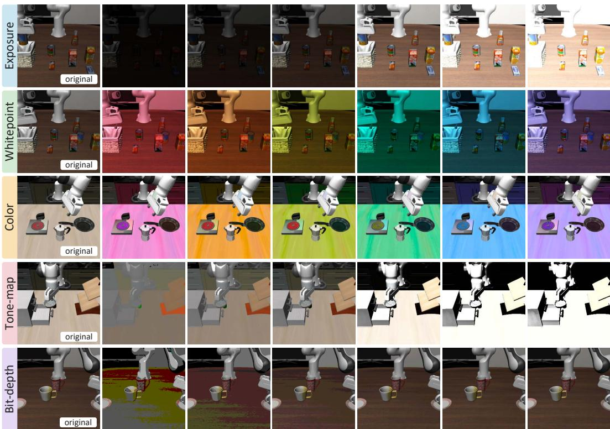  
Figure 20: Representative ISP perturbations on LIBERO (Liu et al., 2023). In each row, the first column shows the default RGB rendering and the remaining columns show six perturbed samples. Exposure uses EV offsets $\{ - 3 , - 2 , - 1 , + 1 , + 2 , + 3 \}$ . White-point and relative-color response each use six sampled chromatic transformations. Tone mapping uses six contrast settings, and bit depth decreases from 7 to 2 bits.

For the tonal axis, the BT.709 luminance weights are (0.2126, 0.7152, 0.0722), the logit pivot is $\tau = 0 . 1 8$ , and

$$
c _ { \mathrm { t o n e } } \in \{ 0 . 0 5 , 0 . 3 3 5 1 , 0 . 6 4 5 8 , 2 . 5 , 5 . 0 , 1 2 . 0 \} .\tag{33}
$$

The corresponding responses range from very flat to very high contrast. $c _ { \mathrm { t o n e } } = 1$ is the identity and is not rerun as a perturbation. For the bit-depth axis, normalized RAW is evaluated with $n \in$ $\{ 2 , 3 , 4 , 5 , 6 \}$ , while default-ISP RGB is evaluated with $n \in \{ 2 , 3 , 4 , 5 , 6 , 7 \}$ . Quantization is applied before the RGB ISP for RAW and after rendering for RGB, with exposure, chromatic response, and tone fixed to their defaults. Figure 20 visualizes representative samples from the four deterministic ISP perturbation families on LIBERO (Liu et al., 2023).

## K.3 ROBOTWIN 2.0 PERTURBATION SETTINGS

The selected perturbation and parameters are shared by the head, left-wrist, and right-wrist cameras. For exposure, RoboTwin 2.0 (Chen et al., 2026b) uses the same EV values and four representations as LIBERO (Liu et al., 2023). Qwen3-OFT (StarVLA Community, 2026) omits only the $e = - 8$ RGB-direct condition. FastWAM (StarVLA Community, 2026) evaluates the two RGB representations, omits both RAW representations, and also omits $e = - 8$ RGB-direct. These are sweep-coverage choices rather than limitations of the transform.

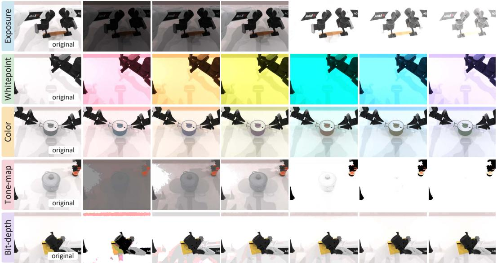  
Figure 21: Representative ISP perturbations on RoboTwin 2.0 (Chen et al., 2026b). In each row, the first column shows the default RGB rendering and the remaining columns show six perturbed samples. Exposure uses EV offsets $\{ - 3 , - 2 , - 1 , + 1 , + 2 , + 3 \}$ . White-point and relative-color response each use six sampled chromatic transformations. Tone mapping uses six contrast settings, and bit depth decreases from 7 to 2 bits.

For noise, RoboTwin 2.0 (Chen et al., 2026b) uses the same six capture EVs, recovery gains, $\sigma _ { \mathrm { s h o t } } ^ { 2 } .$ $\sigma _ { \mathrm { r e a d } } ^ { 2 } ,$ and base seed as LIBERO (Liu et al., 2023). A draw uses a stable hash of the base seed, frame index, view index, and capture EV. Unless explicitly set, the frame index is a process-local monotonically increasing camera-call index and the view index defaults to zero, yielding deterministic but distinct draws. The capture EV, rather than the textual condition label, determines the actual noise level. These noise coefficients are specific to the ISP perturbation study and differ from the separate lighting/HDR benchmark coefficients.

For chromatic response, RoboTwin 2.0 (Chen et al., 2026b) uses only $\delta _ { \mathrm { w p } } = 0 . 0 7 5$ for white-point shifts and $s = 5 . 0$ for relative OKLab color shifts, with the same D65 anchor and eight angular directions as LIBERO (Liu et al., 2023). For tonal response, it uses the same luminance definition and pivot but

$$
c _ { \mathrm { t o n e } } \in \{ 0 . 0 5 , 0 . 3 3 5 1 , 0 . 6 4 5 8 , 1 . 5 , 2 . 5 , 3 . 5 \} ,\tag{34}
$$

with a denominator floor of $1 0 ^ { - 6 }$ in the luminance-preserving RGB rescale. For bit depth, $n \in$ {2, 3, 4, 5, 6} and quantization is applied only to default-ISP RGB, rather than directly to pseudo-RAW10. Figure 21 shows the corresponding ISP perturbation visualizations on RoboTwin 2.0 (Chen et al., 2026b).

## L FULL ISP SENSITIVITY RESULTS

We report the four deterministic perturbation families and the completed physical RAW sensor-noise sweep separately. The sensor-noise axis follows the setup in Appendix K. The columns correspond to LIBERO-Spatial, LIBERO-Object, LIBERO-Goal, LIBERO-10, and their micro-average from LIBERO (Liu et al., 2023). All tables use the six VLA checkpoints shared by the perturbation sweeps. The Original row denotes the default ISP without perturbation. Each non-original row reports one concrete perturbation setting for the corresponding VLA baseline. Each baseline block begins with its Original result and is separated from the next baseline by a midrule.

For LIBERO, Tables 14, 15, 16, 17, 18, and 19 report exposure, sensor noise, white-point, relativecolor, tonal-response, and bit-depth sensitivity, respectively. For RoboTwin 2.0, the corresponding results are reported in Tables 20, 21, 22, 23, 24, and 25. Finally, Table 26 reports the effect of explicit RGB- and RAW-domain exposure normalization on LIBERO.

Table 14: LIBERO success rates (%) for direct RGB inputs under exposure perturbations. EV denotes the exposure offset in stops, and the blue-to-cream bar indicates relative illumination.
<table><tr><td>Baseline</td><td>Exposure setting</td><td>Illum.</td><td>Spatial</td><td>Object</td><td>Goal</td><td>Long</td><td>Overall</td></tr><tr><td rowspan="12">Qwen3- OFT</td><td>Original</td><td></td><td>98.60</td><td>100.00</td><td>98.40</td><td>94.00</td><td>97.75</td></tr><tr><td>EV -7</td><td></td><td>0.00</td><td>0.00</td><td>0.00</td><td>0.00</td><td>0.00</td></tr><tr><td>EV -6</td><td></td><td>0.00</td><td>0.00</td><td>0.00</td><td>0.00</td><td>0.00</td></tr><tr><td>EV -5</td><td></td><td>0.00</td><td>0.00</td><td>0.40</td><td>0.00</td><td>0.10</td></tr><tr><td>EV-4</td><td></td><td>10.80</td><td>3.00</td><td>9.20</td><td>0.40</td><td>5.85</td></tr><tr><td>EV -3</td><td></td><td>40.00</td><td>1.80</td><td>24.00</td><td>2.40</td><td>17.05</td></tr><tr><td>EV -2</td><td></td><td>39.60</td><td>1.40</td><td>21.60</td><td>0.80</td><td>15.85</td></tr><tr><td>EV -1</td><td></td><td>38.00</td><td>1.20</td><td>26.40</td><td>1.60</td><td>16.80</td></tr><tr><td>EV +1</td><td></td><td>37.00</td><td>0.60</td><td>25.60</td><td>1.40</td><td>16.15</td></tr><tr><td>EV +2</td><td></td><td>41.60</td><td>0.80</td><td>27.00</td><td>0.40</td><td>17.45</td></tr><tr><td>EV +3</td><td></td><td>2.60</td><td>5.00</td><td>40.80</td><td>45.80</td><td>23.55</td></tr><tr><td>EV +4</td><td></td><td>0.00</td><td>0.00</td><td>7.40</td><td>0.00</td><td>1.85</td></tr><tr><td rowspan="14">Qwen3-PI</td><td>Original</td><td></td><td>98.40</td><td>99.00</td><td>98.00</td><td>95.20</td><td>97.65</td></tr><tr><td>EV -7</td><td></td><td>0.00</td><td>0.00</td><td>4.80</td><td>0.00</td><td>1.20</td></tr><tr><td>EV-6</td><td></td><td>0.00</td><td>0.00</td><td>4.20</td><td>0.00</td><td>1.05</td></tr><tr><td>EV-5</td><td></td><td>2.60</td><td>3.00</td><td>0.60</td><td>0.00</td><td>1.55</td></tr><tr><td>EV-4</td><td></td><td>57.40</td><td>59.40</td><td>38.80</td><td>16.20</td><td>42.95</td></tr><tr><td>EV-3</td><td></td><td>96.60</td><td>98.40</td><td>90.00</td><td>52.20</td><td>84.30</td></tr><tr><td>EV -2</td><td></td><td>98.00</td><td>98.40</td><td>97.20</td><td>86.00</td><td>94.90</td></tr><tr><td>EV-1</td><td></td><td>98.60</td><td>98.80</td><td>96.60</td><td>93.80</td><td>96.95</td></tr><tr><td>EV +1</td><td></td><td>96.80</td><td>97.80</td><td>97.40</td><td>95.80</td><td>96.95</td></tr><tr><td></td><td>EV +2</td><td></td><td>96.60</td><td>91.40</td><td>95.80</td><td>65.60</td><td>87.35</td></tr><tr><td></td><td>EV +3 EV +4</td><td></td><td>0.80</td><td>4.00</td><td>27.60</td><td>25.00</td><td>14.35</td></tr><tr><td></td><td>Original</td><td></td><td>0.00</td><td>0.20</td><td>3.80</td><td>2.60</td><td>1.65</td></tr><tr><td rowspan="14">WM4A- Cosmo</td><td></td><td></td><td>96.00</td><td>98.60</td><td>93.20</td><td>76.00</td><td>90.95</td></tr><tr><td>EV -7</td><td></td><td>0.00</td><td>0.00</td><td>0.00</td><td>0.00</td><td>0.00</td></tr><tr><td>EV -6</td><td></td><td>0.00</td><td>0.00</td><td>0.20</td><td>0.00</td><td>0.05</td></tr><tr><td>EV -5 EV-4</td><td></td><td>63.00</td><td>73.00</td><td>35.80</td><td>0.20</td><td>43.00</td></tr><tr><td></td><td></td><td>84.80</td><td>97.00</td><td>67.60</td><td>19.40</td><td>67.20</td></tr><tr><td>EV-3</td><td></td><td>88.80</td><td>97.80</td><td>84.40</td><td>52.00</td><td>80.75</td></tr><tr><td>EV-2</td><td></td><td>92.20</td><td>98.20</td><td>88.20</td><td>63.80</td><td>85.60</td></tr><tr><td>EV -1</td><td></td><td>94.00</td><td>98.40</td><td>88.00</td><td>69.00</td><td>87.35</td></tr><tr><td>EV +1 EV +2</td><td></td><td>93.60</td><td>95.00</td><td>90.40</td><td>55.20 33.80</td><td>83.55 62.15</td></tr><tr><td>EV +3</td><td></td><td></td><td>71.00</td><td>75.80</td><td>68.00</td><td></td></tr><tr><td>EV +4</td><td></td><td>0.00</td><td>0.00</td><td>1.80</td><td>2.80</td><td>1.15</td></tr><tr><td></td><td></td><td>0.00</td><td>0.00</td><td>0.00</td><td>0.00</td><td>0.00</td></tr><tr><td></td><td>Original</td><td></td><td>96.40 97.80</td><td>93.20</td><td>87.60</td><td>93.75</td></tr><tr><td rowspan="14">WM4A- Wan</td><td></td><td>EV -7</td><td>0.00</td><td>0.00</td><td>0.00</td><td>0.00</td><td>0.00</td></tr><tr><td>EV -6</td><td></td><td>0.00</td><td>0.00</td><td>1.20</td><td>0.00</td><td>0.30</td></tr><tr><td>EV -5</td><td></td><td>2.20</td><td>0.00</td><td>9.40</td><td>0.00</td><td>2.90</td></tr><tr><td>EV -4</td><td></td><td>21.40</td><td>35.00</td><td>49.40</td><td>0.00</td><td>26.45</td></tr><tr><td>EV-3</td><td></td><td>34.40</td><td>51.60</td><td>58.00</td><td>1.80</td><td>36.45</td></tr><tr><td>EV -2</td><td></td><td>30.40</td><td>41.80</td><td>45.60</td><td>8.60</td><td>31.60</td></tr><tr><td>EV -1</td><td></td><td>28.40</td><td>45.00</td><td>42.00</td><td>8.80</td><td>31.05</td></tr><tr><td>EV +1</td><td></td><td>27.80</td><td>65.40</td><td>40.60</td><td>11.40</td><td>36.30</td></tr><tr><td>EV +2</td><td></td><td>0.00</td><td>34.60</td><td>13.40</td><td>0.60</td><td>12.15</td></tr><tr><td>EV +3</td><td></td><td></td><td>0.00</td><td>0.00</td><td>3.20</td><td></td><td>0.80</td></tr><tr><td></td><td></td><td></td><td></td><td></td><td></td><td>0.00</td><td></td></tr><tr><td></td><td>EV +4</td><td></td><td>0.00</td><td>0.00</td><td>0.00</td><td>0.00</td><td>0.00</td></tr><tr><td></td><td>Original</td><td></td><td>96.60</td><td>97.80</td><td>93.00</td><td>82.00</td><td>92.35</td></tr><tr><td rowspan="11">PIO</td><td>EV -7</td><td>0.60 62.80</td><td></td><td>0.80 63.00</td><td>8.40 49.20</td><td>0.00</td><td>2.45</td></tr><tr><td>EV -6 EV -5</td><td></td><td>94.40</td><td>94.20</td><td>82.00</td><td>14.60 41.20</td><td colspan="2">47.40 77.95</td></tr><tr><td>EV -4</td><td></td><td>96.40 95.40</td><td>96.40</td><td>92.40</td><td>76.60</td><td colspan="2">90.45</td></tr><tr><td>EV -3</td><td></td><td></td><td>97.40</td><td>92.40</td><td>77.80</td><td colspan="2">90.75</td></tr><tr><td>EV-2</td><td>96.80</td><td>97.60</td><td></td><td>95.80</td><td>81.00</td><td colspan="2">92.80</td></tr><tr><td>EV -1</td><td>96.80</td><td>96.00</td><td>92.80</td><td></td><td>78.00</td><td colspan="2">90.90</td></tr><tr><td>EV +1</td><td></td><td>96.80</td><td>98.20</td><td>92.40</td><td>80.20</td><td colspan="2">91.90</td></tr><tr><td>EV +2</td><td></td><td>95.00</td><td>90.60</td><td>92.40</td><td>64.60</td><td colspan="2">85.65</td></tr><tr><td>EV +3</td><td></td><td>45.00</td><td>62.00</td><td>59.60</td><td>41.80</td><td colspan="2">52.10</td></tr><tr><td>EV +4</td><td></td><td>1.40</td><td>20.20</td><td>10.40</td><td>7.60</td><td colspan="2">9.90</td></tr><tr><td>Original</td><td>98.00</td><td>99.40</td><td></td><td>97.60</td><td>93.20</td><td colspan="2">97.05</td></tr><tr><td rowspan="11">PI05</td><td></td><td></td><td>0.00</td><td></td><td></td><td></td><td></td></tr><tr><td>EV -7</td><td></td><td></td><td>0.00</td><td>0.00</td><td>0.00</td><td colspan="2">0.00</td></tr><tr><td>EV-6</td><td>33.80</td><td>46.00</td><td></td><td>39.00</td><td>10.40</td><td colspan="2">32.30</td></tr><tr><td>EV -5</td><td>95.80</td><td>97.80</td><td>86.20</td><td></td><td>64.40</td><td colspan="2">86.05</td></tr><tr><td>EV -4</td><td>99.00 97.40</td><td>97.60</td><td>97.00</td><td></td><td>89.60</td><td colspan="2">95.80</td></tr><tr><td>EV-3</td><td>97.20</td><td>99.00</td><td>96.20</td><td></td><td>92.80</td><td colspan="2">96.35</td></tr><tr><td>EV-2</td><td></td><td>98.60</td><td>98.00 98.00</td><td>97.40</td><td>91.40</td><td colspan="2">96.00</td></tr><tr><td>EV -1</td><td></td><td>98.00</td><td>98.20</td><td>96.80</td><td>91.40 92.00</td><td colspan="2">96.20</td></tr><tr><td>EV +1</td><td></td><td>98.60</td><td>99.20</td><td>97.20</td><td></td><td colspan="2">96.35</td></tr><tr><td>EV +2</td><td></td><td></td><td>10.80</td><td>97.20 62.00</td><td>80.20 62.60</td><td colspan="2">93.80</td></tr><tr><td>EV +3</td><td>2.40</td><td></td><td></td><td></td><td></td><td colspan="2">34.45</td></tr><tr><td>EV +4</td><td></td><td>0.00</td><td>0.20</td><td>9.20</td><td>9.20</td><td colspan="3">4.65</td></tr></table>

Table 15: LIBERO success rates (%) under physical RAW sensor-noise perturbations for each VLA baseline. Capture exposure decreases from EV −1 to EV −6. Increasing speckle density indicates increasing noise strength.
<table><tr><td>Baseline</td><td>Noise level</td><td>Noise</td><td>Spatial</td><td>Object</td><td>Goal</td><td>Long</td><td>Overall</td></tr><tr><td rowspan="7">Qwen3- OFT</td><td>Original</td><td></td><td>98.60</td><td>100.00</td><td>98.40</td><td>94.00</td><td>97.75</td></tr><tr><td>EV -1</td><td></td><td>38.60</td><td>1.00</td><td>29.00</td><td>0.60</td><td>17.30</td></tr><tr><td>EV-2</td><td></td><td>31.80</td><td>0.60</td><td>27.80</td><td>3.00</td><td>15.80</td></tr><tr><td>EV-3</td><td>PCA</td><td>35.40</td><td>1.00</td><td>28.20</td><td>1.60</td><td>16.55</td></tr><tr><td>EV -4</td><td>4</td><td>31.60</td><td>0.20</td><td>17.40</td><td>0.60</td><td>12.45</td></tr><tr><td>EV -5</td><td>RMW</td><td>8.20</td><td>0.00</td><td>1.60</td><td>0.00</td><td>2.45</td></tr><tr><td>EV-6</td><td>W</td><td>0.00</td><td>0.00</td><td>0.00</td><td>0.00</td><td>0.00</td></tr><tr><td rowspan="7">Qwen3-PI</td><td>Original</td><td></td><td>98.40</td><td>99.00</td><td>98.00</td><td>95.20</td><td>97.65</td></tr><tr><td>EV -1</td><td></td><td>98.80</td><td>98.20</td><td>98.20</td><td>95.00</td><td>97.55</td></tr><tr><td>EV-2</td><td></td><td>98.00</td><td>99.00</td><td>98.00</td><td>95.00</td><td>97.50</td></tr><tr><td>EV-3</td><td>PO</td><td>98.00</td><td>98.60</td><td>96.60</td><td>91.20</td><td>96.10</td></tr><tr><td>EV -4</td><td>RE</td><td>91.40</td><td>83.60</td><td>74.00</td><td>48.20</td><td>74.30</td></tr><tr><td>EV -5 EV-6</td><td></td><td>43.80</td><td>35.40</td><td>18.20</td><td>15.00</td><td>28.10</td></tr><tr><td></td><td>A</td><td>2.40</td><td>1.40</td><td>4.80</td><td>0.00</td><td>2.15</td></tr><tr><td rowspan="7">WM4A- Cosmo</td><td>Original</td><td></td><td>96.00</td><td>98.60</td><td>93.20</td><td>76.00</td><td>90.95</td></tr><tr><td>EV -1</td><td></td><td>80.20</td><td>95.00</td><td>79.80</td><td>49.00</td><td>76.00</td></tr><tr><td>EV -2</td><td></td><td>53.80</td><td>81.00</td><td>66.80</td><td>23.80</td><td>56.35</td></tr><tr><td>EV-3</td><td>Pc</td><td>10.00</td><td>6.00</td><td>24.00</td><td>7.60</td><td>11.90</td></tr><tr><td>EV -4</td><td>N4</td><td>0.00</td><td>0.00</td><td>0.00</td><td>0.80</td><td>0.20</td></tr><tr><td>EV -5</td><td>HM</td><td>0.00</td><td>0.00</td><td>0.00</td><td>0.00</td><td>0.00</td></tr><tr><td>EV-6</td><td>ZRNS</td><td>0.00</td><td>0.00</td><td>0.00</td><td>0.00</td><td>0.00</td></tr><tr><td></td><td>Original</td><td></td><td>96.40</td><td>97.80</td><td>93.20</td><td>87.60</td><td>93.75</td></tr></table>

WM4A-Wan

<table><tr><td rowspan="6"></td><td rowspan="5">EV -1 EV -2 EV-3 EV -5 EV-6</td><td></td><td>0.00</td><td>0.00</td><td>3.00</td><td>0.00</td><td>0.75</td></tr><tr><td></td><td>0.00</td><td>0.00</td><td>2.00</td><td>0.00</td><td>0.50</td></tr><tr><td>B</td><td>0.00</td><td>0.00</td><td>0.00</td><td>0.00</td><td>0.00</td></tr><tr><td>EV -4 ME</td><td>0.00</td><td>0.00</td><td>0.00</td><td>0.00</td><td>0.00</td></tr><tr><td>HM</td><td>0.00</td><td>0.00</td><td>0.00</td><td>0.00</td><td>0.00</td></tr><tr><td></td><td>W0K</td><td>0.00</td><td>0.00</td><td>0.00</td><td>0.00</td><td>0.00</td></tr><tr><td rowspan="6">PIO</td><td>Original</td><td></td><td>96.60</td><td>97.80</td><td>93.00</td><td>82.00</td><td>92.35</td></tr><tr><td>EV -1</td><td></td><td>97.40</td><td>96.80</td><td>93.20</td><td>81.20</td><td>92.15</td></tr><tr><td>EV-2</td><td></td><td>95.80</td><td>97.80</td><td>91.60</td><td>78.20</td><td>90.85</td></tr><tr><td>EV-3</td><td></td><td>96.00</td><td>97.60</td><td>89.60</td><td>71.60</td><td>88.70</td></tr><tr><td>EV -4</td><td>ETAT</td><td>94.80</td><td>94.20</td><td>80.80</td><td>56.20</td><td>81.50</td></tr><tr><td>EV -5 EV-6</td><td>RT POE</td><td>43.60</td><td>70.20</td><td>35.60</td><td>16.00</td><td>41.35</td></tr><tr><td></td><td></td><td></td><td>0.20</td><td>0.40</td><td>9.60</td><td>0.00</td><td>2.55</td></tr><tr><td rowspan="6">PI05</td><td>Original</td><td></td><td>98.00</td><td>99.40</td><td>97.60</td><td>93.20</td><td>97.05</td></tr><tr><td>EV -1</td><td></td><td>97.60</td><td>98.80</td><td>97.40</td><td>93.80</td><td>96.90</td></tr><tr><td>EV-2</td><td></td><td>98.20</td><td>98.80</td><td>97.00</td><td>93.80</td><td>96.95</td></tr><tr><td>EV -3</td><td></td><td>99.00</td><td>98.80</td><td>96.40</td><td>92.80</td><td>96.75</td></tr><tr><td>EV -4</td><td>ET+T RT</td><td>94.60</td><td>100.00</td><td>76.80</td><td>61.20</td><td>83.15</td></tr><tr><td>EV -5 EV -6</td><td>OVE</td><td>4.20 0.00</td><td>22.20 0.00</td><td>10.20 0.40</td><td>2.20 0.00</td><td>9.70 0.10</td></tr></table>

Table 16: LIBERO success rates (%) under white-point perturbations for each VLA baseline. The radius ρ denotes displacement from D65 in the $u ^ { \prime } v ^ { \prime }$ chromaticity plane, and each colored bar represents one shift direction. Avg. averages the eight evaluated directions.
<table><tr><td>Baseline</td><td>White-point setting</td><td>Color</td><td>Spatial</td><td>Object</td><td>Goal</td><td>Long</td><td colspan="7">Overall</td></tr><tr><td>Qwen3- OFT</td><td>Original ρ = 0.06</td><td></td><td>98.60 39.20</td><td>100.00</td><td>98.40</td><td>94.00</td><td colspan="7">97.75</td></tr><tr><td rowspan="14">(strong)</td><td rowspan="5">(moderate)</td><td></td><td>36.20</td><td>1.00 2.00</td><td>29.00 26.40</td><td>1.80 1.20</td><td colspan="7">17.75</td></tr><tr><td></td><td></td><td></td><td></td><td></td><td colspan="7">16.45</td></tr><tr><td></td><td>36.40</td><td>1.60</td><td>26.00</td><td>1.80 1.80</td><td colspan="7">16.45 16.85</td></tr><tr><td></td><td>37.00 31.00</td><td>1.60 0.80</td><td>27.00 26.60</td><td>0.80</td><td colspan="7"></td></tr><tr><td></td><td>37.80</td><td>1.80</td><td>25.80</td><td>1.20</td><td colspan="7">14.80 16.65</td></tr><tr><td></td><td></td><td>33.60</td><td>0.80</td><td>28.40</td><td>1.20</td><td colspan="7">16.00</td></tr><tr><td></td><td>Avg.</td><td>33.00 35.52</td><td>0.40 1.25</td><td>25.00 26.77</td><td>1.60 1.43</td><td colspan="7">15.00</td></tr><tr><td rowspan="5">ρ= 0.08</td><td></td><td>38.00 35.00</td><td>1.60</td><td>28.40</td><td>2.40</td><td colspan="7">16.24</td></tr><tr><td></td><td>36.20 36.00</td><td>2.20 1.80</td><td>24.20</td><td>2.60</td><td colspan="7">17.60 16.00</td></tr><tr><td></td><td></td><td>1.20</td><td>26.40 29.40</td><td>1.80 1.40</td><td colspan="7">16.55</td></tr><tr><td></td><td></td><td></td><td></td><td></td><td colspan="7">17.00</td></tr><tr><td></td><td>29.80 33.20</td><td>1.40</td><td>26.00</td><td>0.80</td><td colspan="7">14.50</td></tr><tr><td></td><td></td><td>35.00</td><td>1.40 1.60</td><td>25.60 27.20</td><td>1.20 1.00</td><td colspan="7">15.35</td></tr><tr><td></td><td></td><td>36.80</td><td>1.80</td><td>26.80</td><td>1.40</td><td colspan="7">16.20</td></tr><tr><td></td><td>Avg.</td><td>35.00</td><td>1.62</td><td>26.75</td><td></td><td colspan="8">16.70</td></tr><tr><td>Overall avg.</td><td></td><td>35.26</td><td></td><td></td><td>1.57</td><td colspan="8">16.24</td></tr><tr><td>Original</td><td></td><td></td><td>1.44</td><td>26.76</td><td>1.50</td><td colspan="8">16.24</td></tr><tr><td></td><td></td><td></td><td>98.40</td><td>99.00</td><td>98.00</td><td>95.20</td><td colspan="7">97.65</td></tr><tr><td rowspan="8">ρ = 0.06 (moderate)</td><td></td><td>97.40</td><td></td><td>98.00</td><td></td><td></td><td colspan="7"></td></tr><tr><td></td><td>96.40</td><td>99.60</td><td></td><td>98.20</td><td>95.40 95.00</td><td colspan="7">97.25</td></tr><tr><td></td><td>98.60</td><td>99.40</td><td>98.40 98.00</td><td></td><td>95.00</td><td colspan="7">97.35 97.75</td></tr><tr><td></td><td>98.80</td><td>97.00</td><td>98.40</td><td>95.20</td><td></td><td colspan="7">97.35</td></tr><tr><td></td><td>97.80</td><td>98.80</td><td>97.60</td><td>92.20</td><td></td><td colspan="7">96.60</td></tr><tr><td></td><td>97.60</td><td>98.60</td><td>99.00</td><td></td><td>94.80</td><td colspan="7"></td></tr><tr><td></td><td>98.80</td><td>98.20</td><td></td><td>98.60</td><td>94.80</td><td colspan="7">97.50</td></tr><tr><td></td><td>98.20</td><td>97.60</td><td>98.60</td><td></td><td>94.80</td><td colspan="7">97.60 97.30</td></tr><tr><td>Qwen3-PI</td><td></td><td>Avg.</td><td>97.95</td><td>98.40</td><td>98.35</td><td>94.65</td><td colspan="7">97.34</td></tr><tr><td colspan="2"></td><td></td><td></td><td></td><td></td><td></td><td colspan="7"></td></tr><tr><td colspan="8" rowspan="3">98.60       98.20       98.40       94.80       97.5097.80       99.20       97.60       94.20        97.2097.80       98.20       96.00       94.80       96.70ρ= 0.08                  98.40        98.20        98.60       90.80       96.50(strong)                    97.40       98.40       97.40       93.00       96.5598.80       97.20       97.80       92.40        96.5598.40       98.00       98.40       95.40       97.5598.40       98.20       98.00       94.60       97.30Avg.     98.20       98.20       97.78       93.75       96.98Overall avg.               98.08       98.30       98.06       94.20       97.16</td></tr><tr><td colspan="2" rowspan="1">98.40</td></tr><tr><td colspan="2" rowspan="1">98.40</td><td colspan="1" rowspan="1"></td></tr><tr><td colspan="2" rowspan="3"></td><td colspan="3" rowspan="1">Original</td><td colspan="3" rowspan="1">96.00       98.60       93.20       76.00       90.95</td></tr><tr><td colspan="3" rowspan="1"></td><td colspan="3" rowspan="1">97.00        98.60       94.40       69.40       89.85</td></tr><tr><td colspan="3" rowspan="1"></td><td colspan="3" rowspan="1">94.00        95.00        89.60        54.00        83.15</td></tr><tr><td colspan="2" rowspan="1"></td><td colspan="3" rowspan="1"></td><td colspan="3" rowspan="1">37.60       75.60       57.20       19.60       47.50</td></tr><tr><td colspan="2" rowspan="1">ρ</td><td colspan="3" rowspan="1">= 0.06</td><td colspan="3" rowspan="1">0.40       26.20       15.00        3.20        11.20</td></tr><tr><td colspan="2" rowspan="1"></td><td colspan="3" rowspan="1">(moderate)</td><td colspan="3" rowspan="1">0.00        0.20        0.00        0.00        0.05</td></tr><tr><td colspan="2" rowspan="4">WM4A-Cosmo</td><td colspan="3" rowspan="1"></td><td colspan="3" rowspan="1">29.00       84.40       51.00        11.20       43.90</td></tr><tr><td colspan="3" rowspan="1"></td><td colspan="3" rowspan="1">95.80       98.60       92.60       65.20       88.05</td></tr><tr><td colspan="3" rowspan="2"></td><td colspan="3" rowspan="2">94.20       98.80       95.60       72.40       90.2572.17       61.92       36.88       56.74</td></tr><tr><td colspan="2" rowspan="1">Avg.56.00</td></tr><tr><td colspan="2" rowspan="1"></td><td colspan="3" rowspan="1"></td><td colspan="2" rowspan="1">95.80</td><td colspan="1" rowspan="1">99.00        94.40       67.00       89.05</td></tr><tr><td colspan="2" rowspan="1"></td><td colspan="3" rowspan="1"></td><td colspan="2" rowspan="1">92.40</td><td colspan="1" rowspan="1">94.60       85.40       40.40       78.20</td></tr><tr><td colspan="2" rowspan="2">ρ</td><td colspan="3" rowspan="2">= 0.08</td><td colspan="2" rowspan="1">25.20</td><td colspan="1" rowspan="1">62.00       43.60        4.80        33.90</td></tr><tr><td colspan="1" rowspan="1"></td><td colspan="1" rowspan="1">0.00</td><td colspan="1" rowspan="2">0.00        1.00        0.00        0.250.00        0.00        0.00        0.00</td></tr><tr><td colspan="2" rowspan="2"></td><td colspan="3" rowspan="1">(strong)</td><td colspan="1" rowspan="1"></td><td colspan="1" rowspan="1">0.00</td></tr><tr><td colspan="1" rowspan="1"></td><td></td><td></td><td></td><td></td><td></td><td></td></tr><tr><td colspan="2" rowspan="4"></td><td colspan="3" rowspan="1"></td><td colspan="1" rowspan="1"></td><td colspan="1" rowspan="1">0.20</td><td colspan="1" rowspan="1">43.60        16.80        2.20        15.70</td></tr><tr><td colspan="3" rowspan="1"></td><td colspan="1" rowspan="1"></td><td colspan="1" rowspan="1">96.40</td><td colspan="1" rowspan="1">98.80       91.00        62.40        87.15</td></tr><tr><td colspan="3" rowspan="1"></td><td colspan="1" rowspan="1"></td><td colspan="1" rowspan="1">96.00</td><td colspan="1" rowspan="1">99.40       93.40       68.60       89.35</td></tr><tr><td colspan="3" rowspan="1"></td><td colspan="3" rowspan="1">Avg.     50.75       62.17       53.20       30.68       49.20</td></tr><tr><td colspan="2" rowspan="1">O</td><td colspan="6" rowspan="1">verall avg.               53.38       67.17       57.56       33.77       52.97</td></tr><tr><td colspan="2" rowspan="1"></td><td colspan="3" rowspan="1">Original</td><td colspan="3" rowspan="1">96.40       97.80       93.20       87.60       93.75</td></tr><tr><td colspan="1" rowspan="1"></td><td colspan="1" rowspan="1"></td><td colspan="1" rowspan="1"></td><td colspan="3" rowspan="1"></td><td colspan="2" rowspan="2">7.80        46.20       33.80        0.80        22.151.40        24.60       15.00        0.00        10.25</td></tr><tr><td colspan="2" rowspan="1"></td><td colspan="3" rowspan="1"></td><td colspan="2" rowspan="1">1.40</td></tr><tr><td colspan="2" rowspan="1"></td><td colspan="3" rowspan="1"></td><td colspan="2" rowspan="1">0.00</td><td colspan="1" rowspan="1">1.20        0.80        0.00        0.50</td></tr><tr><td colspan="2" rowspan="1">ρ</td><td colspan="3" rowspan="1">= 0.06</td><td colspan="3" rowspan="1">0.20        0.00        1.80        0.00        0.50</td></tr><tr><td colspan="2" rowspan="5">(WM4A-Wan</td><td colspan="3" rowspan="1">moderate)</td><td colspan="3" rowspan="1">0.00        0.00        4.20        0.00        1.05</td></tr><tr><td colspan="3" rowspan="2"></td><td colspan="3" rowspan="1">0.00        0.00        7.40        0.00        1.85</td></tr><tr><td colspan="3" rowspan="1">1.60        31.60       24.20        4.20        15.40</td></tr><tr><td colspan="3" rowspan="2"></td><td colspan="3" rowspan="1">3.00        49.40       29.40        2.80        21.15</td></tr><tr><td colspan="1" rowspan="1"></td><td colspan="3" rowspan="1">Avg.      1.75        19.12       14.57        0.97        9.11</td></tr><tr><td colspan="8" rowspan="9">0.80        21.80        9.40        0.00        8.000.20        0.80         1.80        0.00        0.70ρ= 0.08                                                1.40                       0.35(strong)                    0.000.00        0.00        5.40        0.00        1.350.60        17.80        19.40        2.40        10.051.20        44.20       23.00        1.80        17.550.72                       11.78                      7.17Overall avg.               1.24        17.39       13.18        0.76        8.14</td></tr><tr><td colspan="3" rowspan="1"></td></tr><tr><td colspan="3" rowspan="2"></td><td colspan="3" rowspan="1"></td></tr><tr><td colspan="2" rowspan="1">0.00</td><td colspan="1" rowspan="2"></td></tr><tr><td colspan="1" rowspan="1"></td><td colspan="3" rowspan="1">(strong)</td><td colspan="2" rowspan="1"></td></tr><tr><td colspan="3" rowspan="1"></td><td colspan="2" rowspan="1">0.00</td><td colspan="1" rowspan="1"></td></tr><tr><td colspan="3" rowspan="1"></td><td colspan="2" rowspan="1">0.60</td><td colspan="1" rowspan="1"></td></tr><tr><td colspan="3" rowspan="1"></td><td colspan="3" rowspan="1"></td></tr><tr><td colspan="3" rowspan="1"></td></tr><tr><td colspan="2" rowspan="4"></td><td colspan="6" rowspan="1">Original                   96.60       97.80       93.00       82.00       92.35</td></tr><tr><td colspan="3" rowspan="1"></td><td colspan="3" rowspan="1">96.60       96.40       93.60       80.40       91.75</td></tr><tr><td colspan="3" rowspan="1"></td><td colspan="2" rowspan="1">96.40</td><td colspan="1" rowspan="1">98.00       92.00       79.00       91.35</td></tr><tr><td colspan="3" rowspan="1"></td><td colspan="2" rowspan="1">97.20</td><td colspan="1" rowspan="1">95.60       94.80       77.40       91.25</td></tr><tr><td colspan="2" rowspan="1">ρ</td><td colspan="3" rowspan="1">= 0.06</td><td colspan="2" rowspan="1">97.40</td><td colspan="1" rowspan="1">96.80       93.00       81.00       92.05</td></tr><tr><td colspan="2" rowspan="5">(PIO</td><td colspan="3" rowspan="1">moderate)</td><td colspan="3" rowspan="2">96.20        97.00       93.20       81.20       91.9096.20       97.20       94.60        78.20       91.55</td></tr><tr><td colspan="3" rowspan="2"></td></tr><tr><td colspan="3" rowspan="2">97.40       99.00       92.20        80.60       92.3096.60       98.20       93.80       80.00       92.15</td></tr><tr><td colspan="3" rowspan="1"></td></tr><tr><td colspan="6" rowspan="1">Avg.     96.75        97.28       93.40        79.72       91.79</td></tr><tr><td rowspan="5"></td><td rowspan="5">ρ = 0.08 (strong)</td><td></td><td>96.80 96.60 97.60 96.80</td><td>97.40 97.00 96.20 96.80</td><td>93.40 91.20 92.00 93.20</td><td>81.00 75.40 79.00 78.80</td><td colspan="7">92.15 90.05 91.20</td></tr><tr><td></td><td>97.60 96.40</td><td>98.20 98.40</td><td>92.60 91.80</td><td>82.20 76.80</td><td colspan="7">91.40 92.65</td></tr><tr><td></td><td>97.20</td><td>97.00</td><td>93.80 94.80</td><td>78.80</td><td colspan="7">90.85 91.70</td></tr><tr><td>Avg.</td><td>97.60 97.08</td><td>97.00 97.25</td><td>92.85</td><td>79.20 78.90</td><td colspan="7">92.15 91.52</td></tr><tr><td>Overall avg.</td><td></td><td>96.91</td><td>97.26 93.12</td><td></td><td colspan="7">79.31</td></tr><tr><td></td><td>Original</td><td></td><td>98.00</td><td>99.40</td><td>97.60</td><td>93.20</td><td colspan="7">91.65 97.05</td></tr><tr><td rowspan="13">PI05</td><td></td><td></td><td>98.20</td><td>99.20</td><td>96.80</td><td>93.40</td><td colspan="7">96.90</td></tr><tr><td>ρ = 0.06 (moderate)</td><td></td><td>98.60</td><td>98.00</td><td>96.80</td><td>92.40</td><td colspan="7">96.45</td></tr><tr><td rowspan="9"></td><td></td><td>99.20</td><td>98.00</td><td>97.40</td><td>90.80</td><td colspan="7">96.35</td></tr><tr><td></td><td>99.20</td><td>98.40</td><td>97.00</td><td>92.00</td><td colspan="7"></td></tr><tr><td></td><td>98.40</td><td>98.80</td><td>96.40</td><td>91.00</td><td colspan="7">96.65</td></tr><tr><td></td><td>98.20</td><td>99.20</td><td>98.20</td><td>92.60</td><td colspan="7">96.15 97.05</td></tr><tr><td></td><td>98.80</td><td>97.40</td><td>97.80</td><td>92.60</td><td colspan="7"></td></tr><tr><td></td><td>98.00</td><td>98.40</td><td>97.80</td><td>91.00</td><td colspan="7">96.65</td></tr><tr><td></td><td>98.58</td><td>98.42</td><td>97.28</td><td>91.97</td><td colspan="7">96.30</td></tr><tr><td>Avg.</td><td></td><td>98.20</td><td>98.40</td><td>93.60</td><td colspan="7">96.56</td></tr><tr><td rowspan="9">ρ = 0.08 (strong)</td><td></td><td>98.80 99.00</td><td>97.60</td><td>97.60</td><td>91.60</td><td colspan="6">97.25 96.45</td></tr><tr><td></td><td>98.00</td><td>98.20</td><td>97.40</td><td>91.80</td><td colspan="7">96.35</td></tr><tr><td></td><td>98.80</td><td>99.00</td><td>97.20</td><td>92.00</td><td colspan="7">96.75</td></tr><tr><td></td><td>98.60</td><td>98.80</td><td>97.80</td><td>92.00</td><td colspan="8"></td></tr><tr><td></td><td></td><td></td><td>97.20</td><td>90.00</td><td colspan="8">96.80</td></tr><tr><td></td><td>98.20</td><td>98.40</td><td></td><td></td><td colspan="8">95.95</td></tr><tr><td></td><td>98.20</td><td>98.40</td><td>96.80</td><td>91.40</td><td colspan="8">96.20</td></tr><tr><td></td><td>98.00</td><td>98.20</td><td>97.60</td><td>91.40</td><td colspan="8">96.30</td></tr><tr><td>Overall avg.</td><td>Avg.</td><td>98.45</td><td>98.35</td><td>97.50</td><td>91.72</td><td colspan="7">96.51</td></tr><tr><td rowspan="5">All baselines</td><td>Original</td><td></td><td>98.51 97.33</td><td>98.39 98.77</td><td>97.39 95.57</td><td>91.85 88.00</td><td colspan="7">96.53 94.92</td></tr><tr><td>ρ = 0.06</td><td></td><td></td><td></td><td></td><td></td><td colspan="7"></td></tr><tr><td>(moderate)</td><td>Avg.</td><td>64.42</td><td>64.44</td><td>65.38</td><td>50.94</td><td colspan="7">61.30</td></tr><tr><td>ρ = 0.08</td><td>63.37</td><td>62.21</td><td>63.31</td><td></td><td></td><td colspan="7"></td></tr><tr><td>(strong)</td><td></td><td></td><td></td><td></td><td>49.53</td><td colspan="7">59.60</td></tr><tr><td rowspan="9"></td><td>Overall avg.</td><td>Avg.</td><td></td><td></td><td></td><td></td><td colspan="7"></td></tr><tr><td></td><td></td><td>63.90</td><td>63.33</td><td>64.35</td><td>50.23</td><td colspan="7">60.45</td></tr><tr><td></td><td></td><td></td><td></td><td></td><td></td><td colspan="7"></td></tr><tr><td></td><td></td><td></td><td></td><td></td><td></td><td colspan="7"></td></tr></table>

Table 17: LIBERO success rates (%) under relative color transformations for each VLA baseline. The dimensionless factor s scales OKLab chroma, and each colored bar represents one hue-rotation direction. Avg. averages the eight evaluated directions.
<table><tr><td>Baseline</td><td>Color scale</td><td>Color</td><td>Spatial</td><td>Object</td><td>Goal</td><td>Long</td><td>Overall</td></tr><tr><td></td><td>Original</td><td></td><td>98.60</td><td>100.00</td><td>98.40</td><td>94.00</td><td>97.75</td></tr><tr><td rowspan="7"></td><td></td><td></td><td>29.00</td><td>1.40</td><td>25.00</td><td>0.80</td><td>14.05</td></tr><tr><td>s = 4.5</td><td></td><td>36.20</td><td>1.20</td><td>25.40</td><td>1.20</td><td>16.00</td></tr><tr><td></td><td></td><td>29.80</td><td>1.20</td><td>26.20</td><td>0.60</td><td>14.45</td></tr><tr><td></td><td></td><td>27.00</td><td>1.60</td><td>25.00</td><td>2.40</td><td>14.00</td></tr><tr><td>(moderate)</td><td></td><td>28.80 28.20</td><td>1.20</td><td>28.20</td><td>2.20</td><td>15.10</td></tr><tr><td></td><td></td><td>30.40</td><td>1.00 0.80</td><td>26.00</td><td>0.80</td><td>14.00</td></tr><tr><td></td><td></td><td></td><td>1.00</td><td>24.60 26.00</td><td>1.80 0.60</td><td>14.40 14.40</td></tr><tr><td>Qwen3- OFT</td><td></td><td>Avg.</td><td>30.00 29.93</td><td>1.18</td><td>25.80</td><td>1.30</td><td>14.55</td></tr><tr><td colspan="2">s = 5.5 (strong)</td><td rowspan="2"></td><td rowspan="2">28.60 32.20 29.00 28.00 29.20 29.00 30.20 29.60</td><td rowspan="2">0.80 1.00 1.80 1.20 0.40 1.00 1.00</td><td rowspan="2">26.20 24.40 25.00 28.00 28.60 25.60</td><td rowspan="2">1.00 1.40 1.60 2.40 1.80 0.40</td><td rowspan="2">14.15 14.75 14.35 14.90 15.00 14.00 1.80 1.20</td></tr><tr><td></td></tr><tr><td>s = 4.5</td><td>Overall avg.</td><td>Avg.</td><td>29.48 29.70</td><td>0.80 1.00 1.09</td><td>27.60 26.80 26.52 1.45 26.16</td><td>15.15 14.60 14.61</td></tr><tr><td rowspan="8">(moderate) Qwen3-PI</td><td>Original</td><td>98.40</td><td></td><td></td><td>1.38</td><td>14.58 97.65</td></tr><tr><td></td><td></td><td>99.00</td><td>98.00</td><td>95.20</td><td>97.15</td></tr><tr><td></td><td>98.40 98.00</td><td>98.60 96.80</td><td>97.40 97.40</td><td>94.20</td><td>96.75</td></tr><tr><td></td><td>98.80</td><td>97.60</td><td>97.40</td><td>94.80</td><td>96.25</td></tr><tr><td></td><td></td><td>98.40</td><td>96.60</td><td>91.20</td><td>96.85</td></tr><tr><td></td><td>98.40</td><td></td><td></td><td>94.00</td><td>97.10</td></tr><tr><td></td><td>98.20</td><td>98.40</td><td>97.60</td><td>94.20</td><td>96.80</td></tr><tr><td></td><td>98.80 98.40</td><td>99.00 99.20</td><td>96.20 96.20</td><td>93.20 93.00</td><td>96.70</td></tr><tr><td></td><td></td><td>98.20</td><td>98.80</td><td>97.20 95.00</td><td>97.30</td></tr><tr><td></td><td>Avg.</td><td>98.40</td><td>98.35</td><td>97.00 93.70</td><td>96.86</td></tr><tr><td></td><td></td><td></td><td></td><td>96.80</td><td>96.80</td></tr><tr><td></td><td>98.40 98.00</td><td>98.60 97.80</td><td>97.60</td><td>93.40 94.40</td><td>96.95</td></tr><tr><td>s = 5.5</td><td>96.00</td><td>97.80</td><td>97.00</td><td>91.20</td><td>95.50 96.30</td></tr><tr><td>(strong)</td><td></td><td>98.40</td><td>98.60</td><td>96.20</td><td>92.00</td><td>96.80</td></tr><tr><td rowspan="9">Overall avg. Original</td><td></td><td>97.20</td><td>98.20</td><td>97.80</td><td>94.00</td><td></td></tr><tr><td></td><td>98.00</td><td>98.00</td><td>95.80</td><td>93.80</td><td>96.40</td></tr><tr><td></td><td>99.00</td><td>99.20</td><td>97.40</td><td>94.80</td><td>97.60</td></tr><tr><td></td><td>98.60</td><td>98.00</td><td>97.80</td><td>94.00</td><td>97.10</td></tr><tr><td></td><td>97.95</td><td>98.28</td><td>97.05</td><td></td><td>96.68</td></tr><tr><td>Avg.</td><td></td><td></td><td></td><td>93.45</td><td></td></tr><tr><td></td><td>98.17</td><td>98.31</td><td>97.03</td><td>93.58</td><td>96.77</td></tr><tr><td></td><td></td><td></td><td></td><td></td><td>90.95</td></tr><tr><td></td><td>96.00</td><td>98.60</td><td>93.20</td><td>76.00</td><td>75.90</td></tr><tr><td rowspan="9">WM4A- Cosmo s = 5.5</td><td>s = 4.5 (moderate)</td><td>82.80</td><td></td><td>95.80</td><td>85.00</td><td>40.00</td></tr><tr><td></td><td>58.40 0.00</td><td>91.40 12.80</td><td>67.00 7.00</td><td>36.20 0.00</td><td>63.25 4.95</td></tr><tr><td></td><td>0.00</td><td>14.40</td><td>5.40</td><td>0.00</td><td>4.95</td></tr><tr><td></td><td>2.60</td><td>58.40</td><td>8.00</td><td>0.20</td><td>17.30</td></tr><tr><td></td><td>38.80</td><td>82.20</td><td>24.20</td><td>3.60</td><td>37.20 66.70</td></tr><tr><td></td><td>84.40</td><td>95.00 96.00</td><td>70.60 84.60</td><td>16.80 44.20</td><td>78.95</td></tr><tr><td>Avg.</td><td>91.00</td><td>68.25</td><td>43.98</td><td>17.62</td><td>43.65</td></tr><tr><td></td><td>44.75</td><td>96.00</td><td></td><td>38.80</td><td>72.25</td></tr><tr><td></td><td>74.80 41.20</td><td>89.00</td><td>79.40 53.80</td><td>31.20</td><td>53.80 3.30</td></tr><tr><td>(strong)</td><td></td><td>0.00 0.00</td><td>6.60 5.40</td><td>6.60 2.60</td><td>0.00 0.00</td><td>2.00</td></tr><tr><td></td><td></td><td>0.40</td><td>44.80</td><td>4.60</td><td>0.00</td><td>12.45</td></tr><tr><td></td><td></td><td>22.00</td><td>76.80</td><td>14.20</td><td>3.00</td><td>29.00 60.45</td></tr><tr><td></td><td></td><td>76.40</td><td>92.20</td><td>60.40</td><td>12.80 40.60</td><td>76.15</td></tr><tr><td>Overall avg.</td><td>Avg.</td><td>85.40</td><td>95.00 63.23</td><td>83.60 38.15</td><td>15.80</td><td>38.67</td></tr><tr><td></td><td></td><td>37.52</td><td></td><td></td><td></td><td></td></tr><tr><td>Original</td><td></td><td>41.14</td><td>65.74</td><td>41.06</td><td>16.71</td><td>41.16</td></tr><tr><td></td><td></td><td>96.40</td><td>97.80</td><td>93.20</td><td>87.60</td><td>93.75</td></tr><tr><td></td><td></td><td></td><td></td><td></td><td></td><td></td></tr><tr><td></td><td></td><td>32.00</td><td>42.00</td><td>30.40</td><td>10.20</td><td>28.65</td></tr><tr><td>s = 4.5</td><td></td><td>33.20</td><td>46.20</td><td>38.60</td><td>9.80 0.00</td><td>31.95 4.60</td></tr><tr><td></td><td></td><td>0.80</td><td>0.00</td><td></td><td>17.60</td><td></td></tr><tr><td></td><td>(moderate)</td><td>0.00</td><td>0.20</td><td></td><td>3.00</td><td></td></tr><tr><td></td><td></td><td></td><td></td><td></td><td>0.00</td><td>0.80</td></tr><tr><td></td><td></td><td>0.00</td><td>0.00</td><td>3.40</td><td>0.00</td><td>0.85</td></tr><tr><td></td><td></td><td>0.00</td><td>0.00</td><td>1.80</td><td>0.00</td><td></td></tr><tr><td></td><td></td><td></td><td></td><td></td><td></td><td>0.45</td></tr><tr><td>WM4A-</td><td></td><td>0.00 13.80</td><td>0.40 20.00</td><td>3.80 16.20</td><td>0.00 5.20</td><td>1.05 13.80</td></tr></table>

<table><tr><td rowspan="3">s = 5.5 (strong)</td><td rowspan="3"></td><td rowspan="3">18.80 20.60 0.00</td><td rowspan="3"></td><td>30.60 37.80 0.00 0.00 0.00</td><td>23.00 27.60 9.00 2.80</td><td>12.60 11.00</td><td rowspan="3">21.25 24.25 2.30 0.70</td></tr><tr><td>0.20 0.00 0.00 0.00</td><td></td><td>0.00 0.00 0.00</td><td>0.55 0.10</td></tr><tr><td></td><td>0.00 0.00 11.00</td><td>2.20 0.40 2.20 8.60</td><td>0.00 0.00</td></tr><tr><td>Overall avg.</td><td></td><td>Avg.</td><td>8.80 6.05 8.01</td><td>9.93 11.76</td><td>9.47</td><td>5.80 3.67</td><td>8.55 7.28</td></tr><tr><td>s = 4.5</td><td>Original</td><td>96.60</td><td></td><td>97.80</td><td>11.91 93.00</td><td>3.41 82.00</td><td>8.78 92.35</td></tr><tr><td rowspan="10">PIO</td><td></td><td>95.60</td><td>96.60</td><td></td><td></td><td>78.60</td><td>90.45</td></tr><tr><td></td><td>96.00</td><td>97.40</td><td></td><td>91.00</td><td></td><td></td></tr><tr><td></td><td>97.80</td><td>93.40</td><td></td><td>93.20</td><td>80.80</td><td>91.85 89.85</td></tr><tr><td></td><td>97.20</td><td>94.20</td><td></td><td>91.40</td><td>76.80</td><td>90.45</td></tr><tr><td>(moderate)</td><td>96.80</td><td></td><td>96.40</td><td>92.40 92.40</td><td>78.00 78.60</td><td>91.05</td></tr><tr><td></td><td>97.00</td><td>96.00</td><td></td><td></td><td></td><td>91.20</td></tr><tr><td></td><td>96.60</td><td></td><td>94.60</td><td>77.20</td><td></td><td></td></tr><tr><td></td><td></td><td>95.20</td><td>94.00</td><td>77.40</td><td></td><td>90.80</td></tr><tr><td></td><td>96.60</td><td>95.80 95.62</td><td>94.40</td><td></td><td>79.60</td><td>91.60</td></tr><tr><td>Avg.</td><td>96.70</td><td></td><td></td><td>92.92</td><td>78.38</td><td>90.91</td></tr><tr><td rowspan="11">s = 5.5 (strong)</td><td></td><td>97.20 97.20</td><td></td><td>96.00</td><td>90.20</td><td>79.00</td><td>90.60 90.95</td></tr><tr><td></td><td></td><td>96.20</td><td></td><td>91.80</td><td>78.60</td><td></td></tr><tr><td></td><td>96.00</td><td>96.60</td><td></td><td>89.40</td><td>77.00</td><td>89.75</td></tr><tr><td></td><td>97.40</td><td>95.80</td><td>91.80</td><td>75.60</td><td></td><td>90.15</td></tr><tr><td></td><td>97.40</td><td>95.40 94.80</td><td>90.40</td><td></td><td>79.20</td><td>90.60</td></tr><tr><td></td><td>95.80</td><td>96.60</td><td></td><td>91.60</td><td>79.40</td><td>90.40 91.85</td></tr><tr><td></td><td></td><td>96.00 98.20</td><td>95.60</td><td>94.40 93.00</td><td>80.40 79.60</td><td>91.60</td></tr><tr><td></td><td>Avg.</td><td>96.90</td><td>95.88</td><td>91.58</td><td>78.60</td><td>90.74</td></tr><tr><td></td><td></td><td>96.80</td><td>95.75</td><td></td><td></td><td></td></tr><tr><td>Overall avg.</td><td></td><td></td><td></td><td>92.25</td><td>78.49</td><td>90.82</td></tr><tr><td>Original</td><td></td><td>98.00</td><td>99.40</td><td>97.60</td><td>93.20</td><td>97.05</td></tr><tr><td rowspan="10">PI05 s = 5.5 (strong)</td><td></td><td>98.20 98.60</td><td>98.40 99.20</td><td>96.80</td><td>91.60</td><td></td><td>96.25 97.10</td></tr><tr><td>s = 4.5 (moderate)</td><td>97.20</td><td></td><td></td><td>97.40 97.60</td><td>93.20 92.20</td><td>95.95</td></tr><tr><td></td><td></td><td>96.80</td><td></td><td></td><td></td><td>96.70</td></tr><tr><td></td><td>98.20</td><td>96.80</td><td>97.40</td><td>94.40</td><td></td><td></td></tr><tr><td></td><td>98.40</td><td>96.60</td><td>96.60</td><td>94.20</td><td></td><td>96.45</td></tr><tr><td></td><td>98.20</td><td>97.20</td><td>98.60</td><td>92.60</td><td></td><td>96.65</td></tr><tr><td></td><td>98.40</td><td>99.20</td><td>96.20</td><td>91.60</td><td></td><td>96.35</td></tr><tr><td></td><td>98.60</td><td>97.60</td><td>97.80</td><td>90.80</td><td></td><td>96.20</td></tr><tr><td>Avg.</td><td>98.22</td><td>97.72</td><td>97.30</td><td></td><td>92.58</td><td>96.46</td></tr><tr><td></td><td>97.40</td><td>98.60</td><td></td><td>97.80</td><td>91.60</td><td>96.35</td></tr><tr><td rowspan="11"></td><td></td><td>98.40</td><td>99.00</td><td></td><td></td><td>91.00</td><td>96.50</td></tr><tr><td></td><td>98.40</td><td></td><td>96.80</td><td>97.60 98.00</td><td>93.20</td><td>96.60</td></tr><tr><td></td><td>97.60</td><td>96.00</td><td>96.40</td><td>90.80</td><td></td><td>95.20</td></tr><tr><td></td><td>98.20</td><td>97.80</td><td>97.40</td><td></td><td>91.20</td><td>96.15</td></tr><tr><td></td><td>98.80</td><td>97.40</td><td>98.00</td><td></td><td>92.20</td><td>96.60</td></tr><tr><td></td><td>98.20</td><td>98.00</td><td></td><td>97.20</td><td>92.40</td><td>96.45</td></tr><tr><td></td><td></td><td>98.40</td><td>98.00</td><td>97.20</td><td>91.60</td><td>96.30</td></tr><tr><td></td><td>Avg.</td><td>98.17</td><td>97.70</td><td>97.45</td><td>91.75</td><td>96.27</td></tr><tr><td>Overall avg.</td><td></td><td>98.20</td><td>97.71</td><td>97.38</td><td>92.16</td><td>96.36</td></tr><tr><td>Original</td><td></td><td>97.33</td><td>98.77</td><td>95.57</td><td>88.00</td><td>94.92</td></tr><tr><td>s = 4.5</td><td></td><td></td><td></td><td></td><td></td><td></td></tr><tr><td rowspan="3">baselines</td><td>(moderate) s = 5.5</td><td>Avg.</td><td>63.00</td><td>62.45</td><td>61.89</td><td>47.79</td><td>58.78</td></tr><tr><td>(strong)</td><td>Avg.</td><td>61.01</td><td>61.00</td><td>60.04</td><td>47.45</td><td>57.38</td></tr><tr><td>Overall avg.</td><td></td><td>62.00</td><td>61.73</td><td>60.96</td><td>47.62</td><td>58.08</td></tr></table>

Table 18: LIBERO success rates (%) under tonal-response perturbations for each VLA baseline. The dimensionless parameter c controls tonal contrast, with c = 1 denoting the default response. The vertical marker indicates the setting on the grayscale scale.
<table><tr><td>Baseline</td><td>Setting</td><td>Tonal</td><td>Spatial</td><td>Object</td><td>Goal</td><td>Long</td><td>Overall</td></tr><tr><td rowspan="7">Qwen3- OFT</td><td>Original</td><td></td><td>98.60</td><td>100.00</td><td>98.40</td><td>94.00</td><td>97.75</td></tr><tr><td>c = 0.05</td><td></td><td>8.40</td><td>0.00</td><td>5.60</td><td>0.20</td><td>3.55</td></tr><tr><td>c = 0.34</td><td></td><td>35.60</td><td>1.20</td><td>24.40</td><td>0.80</td><td>15.50</td></tr><tr><td>c = 0.65</td><td></td><td>34.00</td><td>0.40</td><td>27.00</td><td>1.20</td><td>15.65</td></tr><tr><td>c = 2.50</td><td></td><td>37.60</td><td>2.80</td><td>23.20</td><td>1.60</td><td>16.30</td></tr><tr><td>c = 5.00</td><td></td><td>32.20</td><td>3.40</td><td>23.00</td><td>0.00</td><td>14.65</td></tr><tr><td>c = 12.00</td><td></td><td>33.00</td><td>1.00</td><td>26.20</td><td>0.00</td><td>15.05</td></tr><tr><td rowspan="7">Qwen3-PI</td><td>Original</td><td></td><td>98.40</td><td>99.00</td><td>98.00</td><td>95.20</td><td>97.65</td></tr><tr><td>c = 0.05</td><td></td><td>7.60</td><td>47.20</td><td>13.80</td><td>19.00</td><td>21.90</td></tr><tr><td>c = 0.34</td><td></td><td>98.40</td><td>98.40</td><td>96.60</td><td>92.60</td><td>96.50</td></tr><tr><td>c = 0.65</td><td></td><td>97.40</td><td>98.20</td><td>98.40</td><td>94.40</td><td>97.10</td></tr><tr><td>c = 2.50</td><td></td><td>97.80</td><td>98.00</td><td>96.00</td><td>89.80</td><td>95.40</td></tr><tr><td>c = 5.00</td><td></td><td>91.40</td><td>83.20</td><td>80.60</td><td>18.20</td><td>68.35</td></tr><tr><td>c = 12.00</td><td></td><td>77.60</td><td>64.40</td><td>59.80</td><td>4.40</td><td>51.55</td></tr><tr><td rowspan="7">WM4A- Cosmo</td><td>Original</td><td></td><td>96.00</td><td>98.60</td><td>93.20</td><td>76.00</td><td>90.95</td></tr><tr><td>c = 0.05</td><td></td><td>5.40</td><td>0.00</td><td>0.00</td><td>0.00</td><td>1.35</td></tr><tr><td>c = 0.34</td><td></td><td>91.00</td><td>91.00</td><td>78.20</td><td>53.00</td><td>78.30</td></tr><tr><td>c = 0.65</td><td></td><td>95.20</td><td>97.00</td><td>89.80</td><td>63.20</td><td>86.30</td></tr><tr><td>c = 2.50</td><td></td><td>92.00</td><td>96.40</td><td>80.20</td><td>30.60</td><td>74.80</td></tr><tr><td>c = 5.00</td><td></td><td>84.00</td><td>85.20</td><td>72.00</td><td>5.20</td><td>61.60</td></tr><tr><td>c = 12.00</td><td></td><td>41.20</td><td>41.80</td><td>49.00</td><td>0.60</td><td>33.15</td></tr><tr><td rowspan="8">WM4A- Wan</td><td>Original</td><td></td><td>96.40</td><td>97.80</td><td>93.20</td><td>87.60</td><td>93.75</td></tr><tr><td>c = 0.05</td><td></td><td>0.20</td><td>0.00</td><td>0.00</td><td>0.00</td><td>0.05</td></tr><tr><td>c = 0.34</td><td></td><td>0.60</td><td>0.00</td><td>1.40</td><td>0.20</td><td>0.55</td></tr><tr><td>c = 0.65</td><td></td><td>8.00</td><td>17.40</td><td>22.40</td><td>4.80</td><td>13.15</td></tr><tr><td>c = 2.50</td><td></td><td>63.40</td><td>81.40</td><td>74.60</td><td>8.20</td><td>56.90</td></tr><tr><td>c = 5.00</td><td></td><td>51.00</td><td>58.20</td><td>49.40</td><td>0.00</td><td>39.65</td></tr><tr><td>c = 12.00</td><td></td><td>14.80</td><td>11.60</td><td>16.40</td><td>0.00</td><td>10.70</td></tr><tr><td>Original</td><td></td><td>96.60</td><td>97.80</td><td>93.00</td><td>82.00</td><td>92.35</td></tr><tr><td rowspan="7">PIO</td><td>c = 0.05</td><td></td><td>89.80</td><td>96.00</td><td>88.40</td><td>66.60</td><td>85.20</td></tr><tr><td>c = 0.34</td><td></td><td>97.20</td><td>97.80</td><td>93.20</td><td>80.60</td><td>92.20</td></tr><tr><td>c = 0.65</td><td></td><td>97.20</td><td>97.40</td><td>93.80</td><td>83.40</td><td>92.95</td></tr><tr><td>c = 2.50</td><td></td><td>95.80</td><td>97.60</td><td>92.60</td><td>81.40</td><td>91.85</td></tr><tr><td>c = 5.00</td><td></td><td>95.20</td><td>86.40</td><td>90.80</td><td>59.20</td><td>82.90</td></tr><tr><td>c = 12.00</td><td></td><td>91.80</td><td>79.00</td><td>76.80</td><td>21.80</td><td>67.35</td></tr><tr><td>Original</td><td></td><td>98.00</td><td>99.40</td><td>97.60</td><td>93.20</td><td>97.05</td></tr><tr><td rowspan="8">PI05</td><td>c = 0.05</td><td></td><td></td><td></td><td></td><td></td><td></td></tr><tr><td>c = 0.34</td><td></td><td>98.20 97.60</td><td>96.20 98.60</td><td>95.80 97.60</td><td>77.20 93.00</td><td>91.85 96.70</td></tr><tr><td>c = 0.65</td><td></td><td>99.00</td><td>98.60</td><td>98.20</td><td>92.40</td><td>97.05</td></tr><tr><td>c = 2.50</td><td></td><td>98.40</td><td>98.40</td><td>97.60</td><td>91.60</td><td></td></tr><tr><td></td><td></td><td></td><td></td><td></td><td></td><td>96.50</td></tr><tr><td>c = 5.00</td><td></td><td>98.80</td><td>98.80</td><td>97.40</td><td>78.80</td><td>93.45</td></tr><tr><td>c = 12.00</td><td></td><td>97.00</td><td>96.40</td><td>88.60</td><td>38.40</td><td>80.10</td></tr></table>

Table 19: LIBERO success rates (%) under uniform quantization for each VLA baseline. Bit denotes the precision B in bits. RAW and RGB denote direct quantization of the RAW and RGB inputs, respectively.
<table><tr><td>Baseline</td><td>Input</td><td>Bit</td><td>Spatial</td><td>Object</td><td>Goal</td><td>Long</td><td>Overall</td></tr><tr><td rowspan="12">Qwen3- OFT</td><td>Original</td><td></td><td>98.60</td><td>100.00</td><td>98.40</td><td>94.00</td><td>97.75</td></tr><tr><td></td><td></td><td>99.00</td><td>99.60</td><td>98.80</td><td>92.80</td><td>97.55</td></tr><tr><td rowspan="5">RAW</td><td></td><td>98.20</td><td>99.60</td><td>98.00</td><td>93.40</td><td>97.30</td></tr><tr><td></td><td>95.80</td><td>75.20</td><td>96.00</td><td>91.20</td><td>89.55</td></tr><tr><td></td><td>96.20</td><td>99.20</td><td>95.40</td><td>82.80</td><td>93.40</td></tr><tr><td>■</td><td>60.40</td><td>38.00</td><td>37.20</td><td>13.40</td><td>37.25</td></tr><tr><td></td><td>99.20</td><td>99.80</td><td>98.80</td><td>94.80</td><td>98.15</td></tr><tr><td rowspan="6"></td><td>RGB</td><td>37.40</td><td>2.00</td><td>27.00</td><td>1.40</td><td>16.95</td></tr><tr><td></td><td>34.20</td><td>0.80</td><td>25.60</td><td></td><td>15.75</td></tr><tr><td></td><td>34.00</td><td></td><td></td><td>2.40</td><td></td></tr><tr><td></td><td>39.80</td><td>1.00</td><td>24.00</td><td>1.00</td><td>15.00 16.40</td></tr><tr><td>_ ■</td><td>29.80</td><td>0.20 0.00</td><td>25.20 27.80</td><td>0.40</td><td>14.40</td></tr><tr><td>Original </td><td></td><td></td><td></td><td>0.00</td><td></td></tr><tr><td rowspan="10">Qwen3-PI RGB</td><td></td><td>98.40</td><td>99.00</td><td>98.00</td><td>95.20</td><td>97.65</td></tr><tr><td>RAW</td><td>98.80 </td><td>98.40</td><td>97.20</td><td>84.00</td><td>94.60</td></tr><tr><td></td><td>98.80</td><td>97.20</td><td>96.60</td><td>80.20</td><td>93.20</td></tr><tr><td>…</td><td>97.20</td><td>95.00</td><td>97.20</td><td>80.40</td><td>92.45</td></tr><tr><td></td><td>94.00</td><td>95.80</td><td>78.20</td><td>72.00</td><td>85.00</td></tr><tr><td>■</td><td>54.00</td><td>73.40</td><td>47.40</td><td>13.00</td><td>46.95</td></tr><tr><td>-</td><td>98.40</td><td>99.00</td><td>97.40</td><td>95.40</td><td>97.55</td></tr><tr><td></td><td>99.60</td><td>98.40</td><td>98.20</td><td>96.00</td><td>98.05</td></tr><tr><td></td><td>98.60</td><td>99.00</td><td>97.80</td><td>95.00</td><td>97.60</td></tr><tr><td></td><td>98.60 96.80</td><td>99.20 98.80</td><td>97.20 97.60</td><td>97.20</td><td>98.05</td></tr><tr><td></td><td>■ </td><td>90.00</td><td>80.40</td><td>90.60</td><td>89.00 66.80</td><td>95.55 81.95</td></tr><tr><td rowspan="10">WM4A- Cosmo</td><td>Original</td><td>96.00</td><td></td><td></td><td></td><td>90.95</td></tr><tr><td></td><td></td><td>98.60</td><td>93.20</td><td>76.00</td><td></td></tr><tr><td></td><td>56.20</td><td>80.60</td><td>64.00</td><td>29.40</td><td>57.55</td></tr><tr><td></td><td>34.20</td><td>59.80</td><td>47.20</td><td>22.00</td><td>40.80</td></tr><tr><td>RAW _</td><td>4.80 0.80</td><td>18.40 0.00</td><td>10.00</td><td>15.20</td><td>12.10</td></tr><tr><td>-</td><td>0.00</td><td></td><td>2.40</td><td>1.60</td><td>1.20</td></tr><tr><td></td><td></td><td>0.00</td><td>0.00</td><td>0.00</td><td>0.00</td></tr><tr><td>----</td><td>95.40</td><td>98.80</td><td>91.60</td><td>68.80</td><td>88.65</td></tr><tr><td></td><td>94.20</td><td>98.60</td><td>92.80</td><td>68.80</td><td>88.60</td></tr><tr><td></td><td>95.60</td><td>99.20</td><td>89.80</td><td>69.60</td><td>88.55</td></tr><tr><td rowspan="6">Original</td><td>RGB</td><td>76.20</td><td>96.60</td><td>81.20</td><td>67.80</td><td>80.45</td></tr><tr><td>…</td><td>55.80</td><td>91.20</td><td>80.80</td><td>43.00</td><td>67.70</td></tr><tr><td>-</td><td>10.60</td><td>22.40</td><td>29.80</td><td>4.40</td><td>16.80</td></tr><tr><td></td><td>96.40</td><td>97.80</td><td>93.20</td><td>87.60</td><td>93.75</td></tr><tr><td></td><td></td><td></td><td></td><td></td><td></td></tr><tr><td>RAW</td><td>0.40</td><td>4.60</td><td>10.40</td><td>0.00</td><td>3.85</td></tr><tr><td rowspan="8">WM4A- Wan</td><td></td><td>0.00</td><td>0.20</td><td>3.80</td><td>0.00</td><td>1.00</td></tr><tr><td></td><td>0.20</td><td>0.00</td><td>5.60</td><td>0.00</td><td>1.45</td></tr><tr><td>■</td><td>0.00 1.40</td><td>0.00</td><td>7.80</td><td>0.00</td><td>1.95 0.65</td></tr><tr><td></td><td></td><td>0.00</td><td>1.20</td><td>0.00</td><td></td></tr><tr><td></td><td>26.40</td><td>50.20</td><td>43.20</td><td>13.00</td><td>33.20</td></tr><tr><td>RGB</td><td>27.60</td><td>38.40</td><td>38.60</td><td>11.40</td><td>29.00</td></tr><tr><td></td><td>14.20</td><td>13.60</td><td>30.60</td><td>3.20</td><td>15.40</td></tr><tr><td></td><td>3.80</td><td>3.40</td><td>24.60</td><td>0.60</td><td>8.10</td></tr><tr><td></td><td></td><td>1.00</td><td>1.40</td><td>32.00</td><td>0.40</td><td>8.70</td></tr><tr><td rowspan="5"></td><td></td><td></td><td></td><td></td><td></td><td></td></tr><tr><td></td><td></td><td></td><td></td><td></td><td></td></tr><tr><td></td><td></td><td></td><td></td><td></td><td></td></tr><tr><td></td><td></td><td></td><td></td><td></td><td></td></tr><tr><td>■</td><td>4.80</td><td>16.60</td><td>24.20</td><td>1.00</td><td>11.65</td></tr></table>

<table><tr><td rowspan="13">PIO</td><td>Original</td><td></td><td>96.60</td><td>97.80</td><td>93.00</td><td>82.00</td><td>92.35</td></tr><tr><td></td><td></td><td>97.40</td><td>95.80</td><td>91.40</td><td>80.00</td><td>91.15</td></tr><tr><td rowspan="4">RAW</td><td></td><td>96.80</td><td>96.20</td><td>93.20</td><td>74.00</td><td>90.05</td></tr><tr><td></td><td>96.60</td><td>95.40</td><td>89.80</td><td>78.40</td><td>90.05</td></tr><tr><td></td><td>96.40</td><td>95.20</td><td>84.20</td><td>69.00</td><td>86.20</td></tr><tr><td>-</td><td>83.20</td><td>91.40</td><td>74.40</td><td>22.40</td><td>67.85</td></tr><tr><td rowspan="6">RGB</td><td rowspan="6"></td><td></td><td>97.00</td><td>97.00</td><td>93.20</td><td>79.40</td><td>91.65</td></tr><tr><td></td><td>95.80</td><td>97.80</td><td>93.60</td><td>81.60</td><td>92.20</td></tr><tr><td></td><td>97.40</td><td>97.20</td><td>92.00</td><td>79.00</td><td>91.40</td></tr><tr><td></td><td>96.20</td><td>97.00</td><td>90.40</td><td>78.80</td><td>90.60</td></tr><tr><td>-</td><td>95.40</td><td>95.60</td><td>89.20</td><td>76.80</td><td>89.25</td></tr><tr><td>■</td><td>92.60</td><td>95.20</td><td>86.80</td><td>66.80</td><td>85.35</td></tr><tr><td rowspan="11">PI05</td><td rowspan="5">Original</td><td></td><td>98.00</td><td>99.40</td><td>97.60</td><td>93.20</td><td>97.05</td></tr><tr><td></td><td>97.60</td><td>98.20</td><td>97.60</td><td>92.80</td><td>96.55</td></tr><tr><td></td><td>97.00</td><td>98.80</td><td>96.60</td><td>93.80</td><td>96.55</td></tr><tr><td></td><td>99.20</td><td>98.40</td><td>95.20</td><td>93.00</td><td>96.45</td></tr><tr><td>--</td><td>98.80</td><td>98.40</td><td>96.00</td><td>86.60</td><td>94.95</td></tr><tr><td></td><td>89.20</td><td>96.60</td><td>69.20</td><td>37.00</td><td>73.00</td></tr><tr><td rowspan="6"></td><td rowspan="5">RGB</td><td></td><td>99.00</td><td>98.60</td><td>97.40</td><td>92.60</td><td>96.90</td></tr><tr><td></td><td>98.40</td><td>98.20</td><td>97.00</td><td>93.60</td><td>96.80</td></tr><tr><td></td><td>98.00</td><td>99.40</td><td>98.00</td><td>94.00</td><td>97.35</td></tr><tr><td></td><td>99.40</td><td>98.20</td><td>98.60</td><td>92.40</td><td>97.15</td></tr><tr><td></td><td>98.80</td><td>97.20</td><td>98.80</td><td>91.20</td><td>96.50</td></tr><tr><td>-</td><td>98.00</td><td>96.40</td><td>94.20</td><td>80.40</td><td>92.25</td></tr></table>

## L.1 ROBOTWIN 2.0 ISP PERTURBATION RESULTS

We additionally evaluate Qwen3-OFT and FastWAM across five matched ISP perturbation axes on RoboTwin 2.0. The Easy and Hard results are shown side by side, with each entry aggregating 50 rollouts on each of the same 13 representative tasks. For exposure, we report only the direct RGB input used by both backbones. Original denotes the unperturbed RoboTwin 2.0 RGB observation.

Table 20: RoboTwin 2.0 success rates (%) under uniform RGB quantization. Bit denotes the precision B in bits. Results are aggregated over the shared 13-task subset.
<table><tr><td>Setting</td><td>Bit</td><td colspan="2">Qwen3-OFT</td><td colspan="2">FastWAM</td></tr><tr><td></td><td></td><td>Easy</td><td>Hard</td><td>Easy</td><td>Hard</td></tr><tr><td>Original</td><td></td><td>89.08</td><td>91.08</td><td>95.38</td><td>94.92</td></tr><tr><td>B = 7</td><td></td><td>90.46</td><td>91.67</td><td>95.85</td><td>94.31</td></tr><tr><td>B = 6</td><td></td><td>90.31</td><td>92.36</td><td>94.62</td><td>95.54</td></tr><tr><td>B = 5</td><td></td><td>90.31</td><td>91.54</td><td>93.38</td><td>95.08</td></tr><tr><td>B = 4</td><td></td><td>89.54</td><td>89.69</td><td>91.85</td><td>92.77</td></tr><tr><td>B = 3</td><td>I</td><td>88.77</td><td>87.23</td><td>90.15</td><td>83.08</td></tr><tr><td>B = 2</td><td>-</td><td>70.92</td><td>70.31</td><td>69.69</td><td>48.46</td></tr></table>

Table 21: RoboTwin 2.0 success rates (%) for direct RGB inputs under exposure perturbations. EV denotes the exposure offset in stops, and the grayscale bar indicates relative brightness.
<table><tr><td>Setting</td><td>Exposure</td><td colspan="2">Qwen3-OFT</td><td colspan="2">FastWAM</td></tr><tr><td></td><td></td><td>Easy</td><td>Hard</td><td>Easy</td><td>Hard</td></tr><tr><td>Original</td><td></td><td>89.08</td><td>91.08</td><td>95.38</td><td>94.92</td></tr></table>

<table><tr><td rowspan=1 colspan=1>EV -7</td><td rowspan=1 colspan=1>_</td><td rowspan=1 colspan=1>1.54             0.00             12.00             0.77</td></tr><tr><td rowspan=1 colspan=1>EV -6</td><td rowspan=1 colspan=1>_</td><td rowspan=1 colspan=1>28.92             0.77            50.46             4.62</td></tr><tr><td rowspan=1 colspan=1>EV -5</td><td rowspan=1 colspan=1>_</td><td rowspan=1 colspan=1>72.15             7.38            80.62            49.08</td></tr><tr><td rowspan=1 colspan=1>EV -4</td><td rowspan=1 colspan=1></td><td rowspan=1 colspan=1>86.46            53.23            89.23            86.92</td></tr><tr><td rowspan=1 colspan=1>EV-3</td><td rowspan=1 colspan=1></td><td rowspan=1 colspan=1>87.52            81.00            91.70            93.80</td></tr><tr><td rowspan=1 colspan=1>EV -2</td><td rowspan=1 colspan=1></td><td rowspan=1 colspan=1>88.00            86.28            93.80            95.10</td></tr><tr><td rowspan=1 colspan=1>EV -1</td><td rowspan=1 colspan=1></td><td rowspan=1 colspan=1>88.44            86.92            95.50            95.70</td></tr><tr><td rowspan=1 colspan=1> $\mathrm { E V } + 1$ </td><td rowspan=1 colspan=1></td><td rowspan=1 colspan=1>66.92            88.62            67.38            93.54</td></tr><tr><td rowspan=1 colspan=1> $\mathrm { E V } + 2$ </td><td rowspan=1 colspan=1></td><td rowspan=1 colspan=1>37.08            83.23            53.08            86.15</td></tr><tr><td rowspan=1 colspan=1> $\mathrm { E V } + 3$ </td><td rowspan=1 colspan=1></td><td rowspan=1 colspan=1>10.62            43.69            21.38            62.62</td></tr><tr><td rowspan=1 colspan=3> $\mathrm { E V } + 4$                                    6.15             9.69             0.00            13.08</td></tr></table>

Table 22: RoboTwin 2.0 success rates (%) under physical RAW sensor-noise perturbations. Capture exposure decreases from EV −1 to EV −6, and increasing speckle density indicates increasing noise strength. Each reported result is aggregated over 650 episodes.
<table><tr><td>Noise level</td><td>Noise</td><td colspan="2">Qwen3-OFT</td><td colspan="2">FastWAM</td></tr><tr><td></td><td></td><td>Easy</td><td>Hard</td><td>Easy</td><td>Hard</td></tr><tr><td>Original</td><td></td><td>89.08</td><td>91.08</td><td>95.38</td><td>94.92</td></tr><tr><td>EV -1</td><td></td><td>90.15</td><td>90.28</td><td>92.80</td><td>91.50</td></tr><tr><td>EV-2</td><td></td><td>90.15</td><td>90.15</td><td>90.62</td><td>83.38</td></tr><tr><td>EV -3</td><td></td><td>90.15</td><td>87.54</td><td>83.69</td><td>58.92</td></tr><tr><td>EV -4</td><td>P..3</td><td>89.23</td><td>72.15</td><td>68.62</td><td>25.08</td></tr><tr><td> $\mathrm { E V - 5 }$ </td><td>RMTT</td><td>83.54</td><td>24.15</td><td>40.46</td><td>1.54</td></tr><tr><td> $\mathrm { E V - 6 }$ </td><td>EPE</td><td>57.85</td><td>4.00</td><td>3.54</td><td>0.00</td></tr></table>

Table 23: RoboTwin 2.0 success rates (%) under white-point perturbations. The radius is fixed to $\rho = 0 . 0 7 5$ around D65 in the $u ^ { \prime } v ^ { \prime }$ chromaticity plane, and each colored bar represents one shift direction.
<table><tr><td>Direction</td><td>Color</td><td colspan="2">Qwen3-OFT</td><td colspan="2">FastWAM</td></tr><tr><td></td><td></td><td>Easy</td><td>Hard</td><td>Easy</td><td>Hard</td></tr><tr><td>Original</td><td></td><td>89.08</td><td>91.08</td><td>95.38</td><td>94.92</td></tr><tr><td> $\theta = 0 ^ { \circ }$ </td><td></td><td>90.00</td><td>88.92</td><td>93.85</td><td>93.23</td></tr><tr><td> $\theta = 4 5 ^ { \circ }$ </td><td></td><td>89.23</td><td>89.54</td><td>94.15</td><td>93.08</td></tr><tr><td> $\theta = 9 0 ^ { \circ }$ </td><td></td><td>89.69</td><td>90.00</td><td>95.54</td><td>94.62</td></tr><tr><td> $\theta = 1 3 5 ^ { \circ }$ </td><td></td><td>89.38</td><td>89.54</td><td>94.31</td><td>95.38</td></tr><tr><td> $\theta = 1 8 0 ^ { \circ }$ </td><td></td><td>88.00</td><td>89.85</td><td>95.38</td><td>95.23</td></tr><tr><td> $\theta = 2 2 5 ^ { \circ }$ </td><td></td><td>86.77</td><td>90.15</td><td>93.85</td><td>92.77</td></tr><tr><td> $\theta = 2 7 0 ^ { \circ }$ </td><td></td><td>91.08</td><td>91.23</td><td>96.15</td><td>94.92</td></tr><tr><td> $\theta = 3 1 5 ^ { \circ }$ </td><td></td><td>89.54</td><td>92.15</td><td>96.00</td><td>95.23</td></tr></table>

Table 24: RoboTwin 2.0 success rates (%) under relative color transformations. The dimensionless factor is fixed to $s = 5 . 0$ in OKLab space, and each colored bar represents one hue-rotation direction.
<table><tr><td>Direction</td><td>Color</td><td colspan="2">Qwen3-OFT</td><td colspan="2">FastWAM</td></tr><tr><td></td><td></td><td>Easy</td><td>Hard</td><td>Easy</td><td>Hard</td></tr><tr><td>Original</td><td></td><td>89.08</td><td>91.08</td><td>95.38</td><td>94.92</td></tr><tr><td> $\theta = 0 ^ { \circ }$ </td><td></td><td>88.15</td><td>86.92</td><td>92.31</td><td>94.15</td></tr><tr><td> $\theta = 4 5 ^ { \circ }$ </td><td></td><td>85.38</td><td>87.85</td><td>92.00</td><td>92.15</td></tr><tr><td> $\theta = 9 0 ^ { \circ }$ </td><td></td><td>87.23</td><td>90.31</td><td>88.15</td><td>87.54</td></tr><tr><td> $\theta = 1 3 5 ^ { \circ }$ </td><td></td><td>80.77</td><td>85.08</td><td>82.77</td><td>83.08</td></tr><tr><td> $\theta = 1 8 0 ^ { \circ }$ </td><td></td><td>79.08</td><td>82.00</td><td>80.00</td><td>76.31</td></tr><tr><td> $\theta = 2 2 5 ^ { \circ }$ </td><td></td><td>79.69</td><td>79.08</td><td>86.15</td><td>80.31</td></tr><tr><td> $\theta = 2 7 0 ^ { \circ }$ </td><td></td><td>77.08</td><td>78.62</td><td>85.69</td><td>83.08</td></tr><tr><td> $\theta = 3 1 5 ^ { \circ }$ </td><td></td><td>80.46</td><td>78.62</td><td>86.00</td><td>82.77</td></tr></table>

Table 25: RoboTwin 2.0 success rates (%) under tonal-response perturbations. The dimensionless parameter c controls tonal contrast, with c = 1 denoting the conceptual default response.
<table><tr><td>Setting</td><td>Tonal</td><td colspan="2">Qwen3-OFT</td><td colspan="2">FastWAM</td></tr><tr><td></td><td></td><td>Easy</td><td>Hard</td><td>Easy</td><td>Hard</td></tr><tr><td>Original</td><td></td><td>89.08</td><td>91.08</td><td>95.38</td><td>94.92</td></tr><tr><td>c = 0.05</td><td></td><td>58.00</td><td>35.38</td><td>62.62</td><td>49.23</td></tr><tr><td>c = 0.34</td><td></td><td>88.77</td><td>88.31</td><td>93.08</td><td>93.38</td></tr><tr><td>c = 0.65</td><td></td><td>87.23</td><td>90.31</td><td>93.38</td><td>93.69</td></tr><tr><td>c = 1.50</td><td></td><td>88.92</td><td>91.38</td><td>95.69</td><td>94.31</td></tr><tr><td>c = 2.50</td><td></td><td>64.92</td><td>91.38</td><td>85.23</td><td>92.00</td></tr><tr><td>c = 3.50</td><td></td><td>55.08</td><td>88.46</td><td>66.62</td><td>88.31</td></tr></table>

## M EFFECT OF RAW & RGB NORMALIZATION

Table 26 compares direct exposure normalization in the RGB and RAW domains. Because linear RAW measurements retain a wider range of scene-referred intensity information before nonlinear tone mapping, display encoding, and associated clipping, they generally provide greater exposure latitude than rendered RGB observations. Consequently, when the same normalization principle is applied to both representations, RAW-domain normalization preserves more recoverable shadow and highlight structure for the subsequent ISP and policy. This leads to substantially higher average success rates for most VLA baselines, particularly under severe exposure shifts, although the magnitude of the benefit remains architecture dependent. These results align with the motivation of RawVLA described in Section 3, where retaining and adapting scene-referred information before RGB rendering provides a more effective interface for robust embodied control than correcting an already rendered observation.

Table 26: LIBERO success rates (%) after RGB- and RAW-domain exposure normalization for each VLA baseline. EV denotes the exposure offset in stops. Original is the default RGB input at EV +0.
<table><tr><td>Baseline</td><td>Input</td><td>EV</td><td>Level</td><td>Spatial</td><td>Object</td><td>Goal</td><td>Long</td><td>Overall</td></tr><tr><td>Qwen3-</td><td>Original</td><td>+0</td><td></td><td>98.60</td><td>100.00</td><td>98.40</td><td>94.00</td><td>97.75</td></tr><tr><td rowspan="17"></td><td></td><td>-8 -7</td><td></td><td>0.00</td><td>0.00 0.00</td><td>0.00 0.00</td><td>0.00 0.00</td><td>0.00 0.05</td></tr><tr><td></td><td>-6</td><td></td><td>0.20</td><td></td><td></td><td></td><td></td></tr><tr><td></td><td></td><td></td><td>96.00 34.20</td><td>90.40</td><td>72.80</td><td>34.80</td><td>73.50</td></tr><tr><td></td><td>-5</td><td></td><td></td><td>1.60</td><td>22.60</td><td>0.20</td><td>14.65</td></tr><tr><td>Normalized -4</td><td></td><td></td><td>38.20</td><td>1.60</td><td>20.80</td><td>0.80</td><td>15.35</td></tr><tr><td>+1</td><td></td><td></td><td>37.60</td><td>1.60</td><td>27.60</td><td>2.00</td><td>17.20</td></tr><tr><td>RGB</td><td>+2</td><td></td><td>31.60</td><td>2.40</td><td>25.00</td><td>0.60</td><td>14.90</td></tr><tr><td></td><td>+3</td><td></td><td>13.00</td><td>47.60</td><td>68.80</td><td>56.00</td><td>46.35</td></tr><tr><td></td><td>+4</td><td></td><td>0.00</td><td>0.00</td><td>9.80</td><td>0.00</td><td>2.45</td></tr><tr><td></td><td></td><td>Avg.</td><td>27.87</td><td>16.13</td><td>27.49</td><td>10.49</td><td>20.49</td></tr><tr><td></td><td>-8 -7</td><td></td><td>90.40</td><td>88.80</td><td>82.00</td><td>20.20</td><td>70.35</td></tr><tr><td></td><td></td><td></td><td>98.40</td><td></td><td></td><td>93.20</td><td>96.40</td></tr><tr><td></td><td></td><td></td><td></td><td>99.00</td><td>95.00</td><td></td><td></td></tr><tr><td></td><td>-6</td><td></td><td>98.60</td><td>99.00</td><td>99.20</td><td>89.80</td><td>96.65</td></tr><tr><td></td><td>-5</td><td></td><td>36.00</td><td>2.00</td><td>26.40</td><td>0.20</td><td>16.15</td></tr><tr><td></td><td></td><td></td><td></td><td></td><td></td><td>1.20</td><td></td></tr><tr><td>Normalized</td><td>-4</td><td></td><td>36.40</td><td>2.00</td><td>25.80</td><td></td><td>16.35</td></tr><tr><td>RAW</td><td>+1</td><td></td><td>36.20</td><td>2.20</td><td>26.40</td><td>1.80</td><td>16.65</td></tr><tr><td></td><td>+2</td><td></td><td>35.00</td><td>1.60</td><td>22.00</td><td>1.60</td><td>15.05</td></tr><tr><td></td><td>+3</td><td></td><td>37.80</td><td>84.40</td><td>83.00</td><td>50.80</td><td>64.00</td></tr><tr><td></td><td>+4</td><td></td><td>0.00</td><td>0.00</td><td>8.40</td><td>0.00</td><td>2.10</td></tr><tr><td></td><td></td><td>Avg.</td><td></td><td></td><td>52.09+24.2242.11+25.9852.02+24.53</td><td>328.76+18.27</td><td>43.74+23.25</td></tr></table>

<table><tr><td rowspan=12 colspan=3>NQwen3-PI</td><td rowspan=1 colspan=1>Original    +0</td><td rowspan=1 colspan=4>98.40      99.00      98.00      95.20      97.65</td><td rowspan=3 colspan=1></td></tr><tr><td rowspan=1 colspan=1>-8</td><td rowspan=1 colspan=4>0.00       0.00       3.60       0.00       0.90</td></tr><tr><td rowspan=1 colspan=1>-7</td><td rowspan=1 colspan=4>1.20       0.00       0.00       5.40       1.65</td></tr><tr><td rowspan=1 colspan=1>-6</td><td rowspan=1 colspan=4>85.80      88.40      66.60      27.40      67.05</td><td rowspan=1 colspan=1></td></tr><tr><td rowspan=1 colspan=1>-5</td><td rowspan=1 colspan=4>97.80      98.00      95.00      92.40      95.80</td><td rowspan=3 colspan=1></td></tr><tr><td rowspan=1 colspan=1>ormalized-4</td><td rowspan=1 colspan=4>99.40      96.20      97.60      94.20      96.85</td></tr><tr><td rowspan=1 colspan=1>RGB       +1</td><td rowspan=1 colspan=4>98.80      98.60      98.40      95.20      97.75</td></tr><tr><td rowspan=1 colspan=1>+2</td><td rowspan=1 colspan=4>98.00      93.80      97.80      81.00      92.65</td><td rowspan=1 colspan=1></td></tr><tr><td rowspan=1 colspan=1>+3</td><td rowspan=1 colspan=4>5.00       21.20      48.00      39.00      28.30</td><td rowspan=13 colspan=1>+18.78</td></tr><tr><td rowspan=2 colspan=1>+4</td><td rowspan=1 colspan=4>0.00       0.60      13.00      4.80       4.60</td></tr><tr><td rowspan=1 colspan=4>Avg.      54.00      55.20      57.78      48.82      53.95</td></tr><tr><td rowspan=1 colspan=1>-8</td><td rowspan=1 colspan=1>91.20</td><td rowspan=1 colspan=1>81.60</td><td rowspan=1 colspan=2>67.00      7.80      61.90</td></tr><tr><td rowspan=1 colspan=1></td><td rowspan=1 colspan=2></td><td rowspan=1 colspan=1>-7</td><td rowspan=1 colspan=1>93.20</td><td rowspan=1 colspan=1>96.80</td><td rowspan=1 colspan=2>81.40      82.60      88.50</td></tr><tr><td rowspan=3 colspan=1></td><td rowspan=3 colspan=2>N</td><td rowspan=1 colspan=1>-6</td><td rowspan=1 colspan=1>97.60</td><td rowspan=1 colspan=3>97.00      96.60      78.00      92.30</td></tr><tr><td rowspan=1 colspan=1>-5</td><td rowspan=1 colspan=1>97.60</td><td rowspan=1 colspan=3>97.40      95.80      78.80      92.40</td></tr><tr><td rowspan=1 colspan=1>ormalized-4</td><td rowspan=1 colspan=1>98.20</td><td rowspan=1 colspan=1>97.20</td><td rowspan=1 colspan=2>96.80      80.00      93.05</td></tr><tr><td></td><td rowspan=1 colspan=2></td><td rowspan=1 colspan=1>RAW       +1</td><td rowspan=1 colspan=1>98.80</td><td rowspan=1 colspan=1>98.40</td><td rowspan=1 colspan=1></td><td rowspan=1 colspan=1>96.00      82.00      93.80</td></tr><tr><td rowspan=4 colspan=3></td><td rowspan=1 colspan=1>+2</td><td rowspan=1 colspan=1>98.60</td><td rowspan=1 colspan=1>96.20</td><td rowspan=1 colspan=1></td><td rowspan=1 colspan=1>97.00      82.20      93.50</td></tr><tr><td rowspan=1 colspan=1>+3</td><td rowspan=1 colspan=1>10.20</td><td rowspan=1 colspan=1>51.40</td><td rowspan=1 colspan=1></td><td rowspan=1 colspan=1>51.80      30.00      35.85</td></tr><tr><td rowspan=1 colspan=1>+4</td><td rowspan=1 colspan=1>0.20</td><td rowspan=1 colspan=1>1.20</td><td rowspan=1 colspan=2>11.80       0.00       3.30</td></tr><tr><td rowspan=1 colspan=1></td><td rowspan=1 colspan=1>Avg.      76.18</td><td rowspan=1 colspan=1>+22.1879.69</td><td rowspan=1 colspan=2>+24.4977.13+19.3657.93+9.1172.73</td></tr><tr><td></td><td rowspan=1 colspan=2>O</td><td rowspan=1 colspan=1>riginal    +0</td><td rowspan=1 colspan=4>96.00      98.60      93.20      76.00      90.95</td><td rowspan=6 colspan=1></td></tr><tr><td></td><td rowspan=3 colspan=2></td><td></td><td></td><td></td><td></td><td></td></tr><tr><td></td><td rowspan=2 colspan=1></td><td></td><td></td><td></td><td></td><td></td></tr><tr><td></td><td rowspan=1 colspan=1>-8</td><td rowspan=1 colspan=4>0.00       0.00       0.00       0.00       0.00</td></tr><tr><td></td><td rowspan=2 colspan=2></td><td rowspan=1 colspan=1></td><td rowspan=1 colspan=1>-7</td><td rowspan=1 colspan=2>0.00       0.00</td><td rowspan=1 colspan=2>0.00       0.00       0.00</td></tr><tr><td></td><td rowspan=1 colspan=1>-6</td><td rowspan=1 colspan=1>4.20</td><td rowspan=1 colspan=1>15.00</td><td rowspan=1 colspan=2>16.20       2.20       9.40</td></tr><tr><td></td><td rowspan=1 colspan=2></td><td rowspan=1 colspan=1>-5</td><td rowspan=1 colspan=1>58.20</td><td rowspan=1 colspan=1>93.40</td><td rowspan=1 colspan=2>63.60      13.80      57.25</td><td rowspan=1 colspan=1></td></tr><tr><td></td><td rowspan=1 colspan=2>N</td><td rowspan=1 colspan=1>ormalized-4</td><td rowspan=1 colspan=1>72.00</td><td rowspan=1 colspan=1>94.60</td><td rowspan=1 colspan=2>75.80      45.80      72.05</td><td rowspan=1 colspan=1></td></tr><tr><td></td><td rowspan=1 colspan=2></td><td rowspan=1 colspan=1>RGB       +1</td><td rowspan=1 colspan=1>95.40</td><td rowspan=1 colspan=1>97.00</td><td rowspan=1 colspan=2>91.20      62.40      86.50</td><td rowspan=14 colspan=1></td></tr><tr><td></td><td rowspan=1 colspan=2></td><td rowspan=1 colspan=1>+2</td><td rowspan=1 colspan=1>70.60</td><td rowspan=1 colspan=1>73.40</td><td rowspan=1 colspan=1></td><td rowspan=1 colspan=1>69.00      40.80      63.45</td></tr><tr><td></td><td rowspan=1 colspan=2></td><td rowspan=1 colspan=1>+3</td><td rowspan=1 colspan=1>0.00</td><td rowspan=1 colspan=1>0.00</td><td rowspan=1 colspan=1></td><td rowspan=1 colspan=1>1.20       1.40       0.65</td></tr><tr><td></td><td rowspan=1 colspan=2>WM4A-</td><td rowspan=1 colspan=1>+4</td><td rowspan=1 colspan=1>0.00</td><td rowspan=1 colspan=1>0.00</td><td rowspan=1 colspan=2>0.00       0.00       0.00</td></tr><tr><td></td><td rowspan=1 colspan=2>Cosmo</td><td rowspan=1 colspan=1></td><td rowspan=1 colspan=1>Avg.      33.38</td><td rowspan=1 colspan=1>41.49</td><td rowspan=1 colspan=2>35.22      18.49      32.14</td></tr><tr><td></td><td rowspan=1 colspan=2></td><td rowspan=1 colspan=1>-8</td><td rowspan=1 colspan=1>0.00</td><td rowspan=1 colspan=1>0.00</td><td rowspan=1 colspan=1></td><td rowspan=1 colspan=1>0.00       0.00       0.00</td></tr><tr><td></td><td rowspan=1 colspan=2></td><td rowspan=1 colspan=1>-7</td><td rowspan=1 colspan=1>0.00</td><td rowspan=1 colspan=1>0.00</td><td rowspan=1 colspan=1></td><td rowspan=1 colspan=1>9.80       2.80       3.15</td></tr><tr><td></td><td rowspan=2 colspan=2></td><td rowspan=1 colspan=1>-6</td><td rowspan=1 colspan=1>7.20</td><td rowspan=1 colspan=1>17.80</td><td rowspan=1 colspan=1></td><td rowspan=1 colspan=1>32.40      7.40       16.20</td></tr><tr><td></td><td rowspan=1 colspan=1>-5</td><td rowspan=1 colspan=1>30.40</td><td rowspan=1 colspan=1>62.40</td><td rowspan=1 colspan=1></td><td rowspan=1 colspan=1>46.00      21.40      40.05</td></tr><tr><td></td><td rowspan=1 colspan=2></td><td rowspan=1 colspan=1>Normalized-4</td><td rowspan=1 colspan=1>52.60</td><td rowspan=1 colspan=1>82.00</td><td rowspan=1 colspan=1></td><td rowspan=1 colspan=1>61.60      26.40      55.65</td></tr><tr><td></td><td rowspan=1 colspan=2></td><td rowspan=1 colspan=1>RAW       +1</td><td rowspan=1 colspan=1>71.20</td><td rowspan=1 colspan=2>85.80</td><td rowspan=1 colspan=1>66.40      31.80      63.80</td></tr><tr><td></td><td rowspan=1 colspan=2></td><td rowspan=1 colspan=1>+2</td><td rowspan=1 colspan=1>47.20</td><td rowspan=1 colspan=2>72.20</td><td rowspan=1 colspan=1>50.20      25.00      48.65</td></tr><tr><td></td><td rowspan=2 colspan=2></td><td rowspan=1 colspan=1>+3</td><td rowspan=1 colspan=1>0.00</td><td rowspan=1 colspan=2>9.20</td><td rowspan=1 colspan=1>21.20      6.60       9.25</td></tr><tr><td></td><td rowspan=1 colspan=1>+4</td><td rowspan=1 colspan=1>0.00</td><td rowspan=1 colspan=2>0.00</td><td rowspan=1 colspan=1>0.00       0.00       0.00</td></tr><tr><td></td><td rowspan=1 colspan=2></td><td rowspan=1 colspan=1></td><td rowspan=1 colspan=1>Avg.      23.18-10.20</td><td rowspan=1 colspan=2>36.60--4.89</td><td rowspan=1 colspan=1>31.96-3.27 13.49-5.0026.31</td><td rowspan=6 colspan=1>-5.84</td></tr><tr><td></td><td rowspan=2 colspan=3>Original    +0</td><td rowspan=1 colspan=4>96.40      97.80      93.20      87.60      93.75</td></tr><tr><td></td><td rowspan=1 colspan=1></td><td rowspan=1 colspan=1>0.00</td><td rowspan=1 colspan=3>0.00       0.00       0.00       0.00</td></tr><tr><td></td><td rowspan=1 colspan=2></td><td rowspan=1 colspan=1>-7</td><td rowspan=1 colspan=1>0.20</td><td rowspan=1 colspan=2>0.00</td><td rowspan=1 colspan=1>0.20       0.00       0.10</td></tr><tr><td></td><td rowspan=1 colspan=2></td><td rowspan=1 colspan=1>-6</td><td rowspan=1 colspan=1>5.00</td><td rowspan=1 colspan=2>18.80</td><td rowspan=1 colspan=1>11.80       0.00       8.90</td></tr><tr><td></td><td rowspan=1 colspan=2></td><td rowspan=1 colspan=1>-5</td><td rowspan=1 colspan=1>1.20</td><td rowspan=1 colspan=2>2.00</td><td rowspan=1 colspan=1>15.60       0.00       4.70</td></tr><tr><td></td><td rowspan=1 colspan=2></td><td rowspan=1 colspan=1>Normalized-4</td><td rowspan=1 colspan=1>0.00</td><td rowspan=1 colspan=3>0.00       2.60       0.00       0.65</td><td rowspan=1 colspan=1></td></tr><tr><td></td><td rowspan=1 colspan=2></td><td rowspan=1 colspan=1>RGB       +1</td><td rowspan=1 colspan=1>27.40</td><td rowspan=1 colspan=3>48.40      41.40       9.80       31.75</td><td rowspan=3 colspan=1></td></tr><tr><td></td><td rowspan=3 colspan=2>WM4A-</td><td rowspan=1 colspan=1>+2</td><td rowspan=1 colspan=1>0.40</td><td rowspan=1 colspan=3>5.80      12.20       1.20       4.90</td></tr><tr><td></td><td rowspan=1 colspan=1>+3</td><td rowspan=1 colspan=1>0.40</td><td rowspan=1 colspan=1>0.00</td><td rowspan=1 colspan=2>1.60       0.00       0.50</td></tr><tr><td></td><td rowspan=1 colspan=1>+4</td><td rowspan=1 colspan=1>0.40</td><td rowspan=1 colspan=1>0.00</td><td rowspan=1 colspan=2>0.00       0.00       0.10</td><td rowspan=4 colspan=1></td></tr><tr><td></td><td rowspan=2 colspan=2>Wan</td><td rowspan=1 colspan=1></td><td rowspan=1 colspan=1>Avg.      3.89</td><td rowspan=1 colspan=3>8.33       9.49       1.22       5.73</td></tr><tr><td></td><td rowspan=1 colspan=1>-8</td><td rowspan=1 colspan=1>0.20</td><td rowspan=1 colspan=2>0.00</td><td rowspan=1 colspan=1>0.60       0.00       0.20</td></tr><tr><td></td><td rowspan=1 colspan=2></td><td rowspan=1 colspan=1>-7</td><td rowspan=1 colspan=1>0.00</td><td rowspan=1 colspan=2>0.00</td><td rowspan=1 colspan=1>7.60       0.00       1.90</td></tr><tr><td></td><td rowspan=2 colspan=2></td><td rowspan=1 colspan=1>-6</td><td rowspan=1 colspan=1>0.00</td><td rowspan=1 colspan=2>0.00</td><td rowspan=1 colspan=1>2.60       0.00       0.65</td><td rowspan=3 colspan=1></td></tr><tr><td></td><td rowspan=1 colspan=1>-5</td><td rowspan=1 colspan=1>0.00</td><td rowspan=1 colspan=2>0.60</td><td rowspan=1 colspan=1>6.60       0.00       1.80</td></tr><tr><td></td><td rowspan=1 colspan=2>N</td><td rowspan=1 colspan=1>ormalized -4</td><td rowspan=1 colspan=1>0.00</td><td rowspan=1 colspan=2>5.20</td><td rowspan=1 colspan=1>11.20       0.00       4.10</td></tr><tr><td></td><td rowspan=1 colspan=2></td><td rowspan=1 colspan=1>RAW       +1</td><td rowspan=1 colspan=1>4.00</td><td rowspan=1 colspan=3>12.40      18.20       0.00       8.65</td><td rowspan=1 colspan=1></td></tr><tr><td rowspan=3 colspan=9>+3                0.80       0.00       2.20       0.00       0.75+4                0.00       0.00       0.00       0.00       0.00Avg.      0.58-3.31  2.98-5.36  6.22-3.27  0.00-1.22  2.44-3.29</td></tr><tr><td rowspan=1 colspan=1></td><td rowspan=1 colspan=1>0.80</td><td rowspan=1 colspan=2>0.00</td><td rowspan=1 colspan=1>2.200.000.75</td></tr><tr><td rowspan=1 colspan=1>0.00</td><td rowspan=1 colspan=2>0.00</td></tr></table>

<table><tr><td rowspan="11"></td><td>Original</td><td>+0</td><td></td><td>96.60</td><td>97.80</td><td>93.00</td><td>82.00</td><td>92.35</td></tr><tr><td rowspan="13">Normalized RGB</td><td>-8</td><td></td><td>0.00</td><td>0.00</td><td>7.80</td><td>0.00</td><td>1.95</td></tr><tr><td>-7</td><td></td><td>46.00</td><td>16.40</td><td>28.20</td><td>12.00</td><td>25.65</td></tr><tr><td>-6</td><td></td><td>93.40</td><td>93.60</td><td>78.40</td><td>36.00</td><td>75.35</td></tr><tr><td>-5</td><td></td><td>96.60</td><td>96.60</td><td>91.80</td><td>75.00</td><td>90.00</td></tr><tr><td>-4</td><td></td><td>97.80</td><td>97.80</td><td>92.60</td><td>80.20</td><td>92.10</td></tr><tr><td>+1</td><td></td><td>95.20</td><td>97.80</td><td>93.80</td><td>81.00</td><td>91.95</td></tr><tr><td>+2</td><td></td><td>95.20</td><td>90.80</td><td>92.80</td><td>65.20</td><td>86.00</td></tr><tr><td>+3</td><td></td><td>59.60</td><td>71.00</td><td>68.60</td><td>44.40</td><td>60.90</td></tr><tr><td rowspan="11">PIO</td><td colspan="2">+4</td><td>Avg.</td><td>1.40</td><td>20.20</td><td>20.20</td><td>15.20 14.25</td></tr><tr><td colspan="2">-8</td><td>65.02</td><td>64.91</td><td>63.80</td><td>45.44</td><td>59.79</td></tr><tr><td rowspan="10">Normalized RAW</td><td>-7</td><td></td><td>93.40</td><td>91.40</td><td>78.60</td><td>25.40 72.20</td></tr><tr><td></td><td>96.00 96.00</td><td>95.60 95.60</td><td>90.60</td><td>66.60</td><td>87.20</td></tr><tr><td>-6 -5</td><td></td><td></td><td>91.60</td><td>79.20</td><td>90.60</td></tr><tr><td></td><td>97.40</td><td>97.00 97.40</td><td>94.40</td><td>76.80</td><td>91.40</td></tr><tr><td>-4 +1</td><td></td><td>96.20</td><td></td><td>91.80</td><td>81.60</td><td>91.75</td></tr><tr><td></td><td></td><td>98.00</td><td>97.60</td><td>93.00</td><td>81.80</td><td>92.60</td></tr><tr><td>+2</td><td></td><td>97.60</td><td>97.00</td><td>92.00</td><td>80.60</td><td>91.80</td></tr><tr><td>+3</td><td></td><td>90.00</td><td>85.00</td><td>91.00</td><td>58.60</td><td>81.15</td></tr><tr><td>+4</td><td></td><td>21.40</td><td>42.40</td><td>42.20</td><td>32.40</td><td>34.60</td></tr><tr><td>+0</td><td>Avg.</td><td>87.33+22.31</td><td>88.78+23.87</td><td>85.02+21.22</td><td>64.78+19.33</td><td>81.48+21.68</td></tr><tr><td rowspan="20">PI05</td><td>Original</td><td>-8</td><td></td><td>98.00</td><td>99.40</td><td>97.60</td><td>93.20</td><td>97.05</td></tr><tr><td rowspan="9">Normalized RGB</td><td>-7</td><td></td><td>0.00</td><td>0.00</td><td>0.40</td><td>0.00</td><td>0.10</td></tr><tr><td>-6</td><td></td><td>23.80</td><td>7.80</td><td>17.00</td><td>18.80</td><td>16.85</td></tr><tr><td>-5</td><td></td><td>97.00</td><td>97.80</td><td>80.20</td><td>58.40</td><td>83.35</td></tr><tr><td></td><td></td><td>97.80</td><td>96.20</td><td>96.80</td><td>92.00</td><td>95.70</td></tr><tr><td>-4</td><td></td><td>98.00</td><td>97.80</td><td>95.80</td><td>92.60</td><td>96.05</td></tr><tr><td>+1</td><td></td><td>98.60</td><td>98.40</td><td>96.40</td><td>94.40</td><td>96.95</td></tr><tr><td>+2</td><td></td><td>98.40</td><td>97.40</td><td>97.20</td><td>85.60</td><td>94.65</td></tr><tr><td>+3</td><td></td><td>3.00</td><td>14.00</td><td>78.40</td><td>63.20</td><td>39.65</td></tr><tr><td>+4</td><td></td><td>0.00</td><td>0.00</td><td>13.00</td><td>14.00</td><td>6.75</td></tr><tr><td rowspan="12">Normalized RAW</td><td>-8</td><td>Avg.</td><td>57.40</td><td>56.60</td><td>63.91</td><td>57.67</td><td>58.89</td></tr><tr><td></td><td>-7</td><td>98.00 98.80</td><td>98.20 96.80</td><td>89.80</td><td>48.80</td><td>83.70</td></tr><tr><td>-6</td><td></td><td>98.80</td><td>97.60</td><td>97.00 97.80</td><td>90.40 92.60</td><td>95.75</td></tr><tr><td>-5</td><td></td><td></td><td></td><td></td><td></td><td>96.70</td></tr><tr><td>-4</td><td></td><td>98.40</td><td>98.60</td><td>98.80</td><td>91.80</td><td>96.90</td></tr><tr><td>+1</td><td></td><td>98.00</td><td>98.60</td><td>97.20</td><td>91.40</td><td>96.30</td></tr><tr><td>+2</td><td></td><td>98.60</td><td>98.40</td><td>96.00</td><td>90.20</td><td>95.80</td></tr><tr><td>+3</td><td></td><td>98.60</td><td>97.60</td><td>97.20</td><td>91.00</td><td>96.10</td></tr><tr><td></td><td></td><td>95.80</td><td>96.60</td><td>97.60</td><td>78.40</td><td>92.10</td></tr><tr><td>+4</td><td></td><td>0.80</td><td>0.40</td><td>42.00</td><td>38.40</td><td>20.40</td></tr><tr><td></td><td>Avg.</td><td>87.31+29.91</td><td>86.98+30.38</td><td>90.38+26.47</td><td>79.22+21.56</td><td>85.97+27.08</td></tr></table>

## REFERENCES

Johan Bjorck, Fernando Castaneda, Nikita Cherniadev, Xingye Da, Runyu Ding, Linxi Fan,˜ Yu Fang, Dieter Fox, Fengyuan Hu, Spencer Huang, et al. Gr00t n1: An open foundation model for generalist humanoid robots. arXiv preprint arXiv:2503.14734, 2025.

Kevin Black, Noah Brown, Danny Driess, Adnan Esmail, Michael Equi, Chelsea Finn, Niccolo Fusai, Lachy Groom, Karol Hausman, Brian Ichter, et al. Pi0: A vision-language-action flow model for general robot control. arXiv preprint arXiv:2410.24164, 2024.

Tim Brooks, Ben Mildenhall, Tianfan Xue, Jiawen Chen, Dillon Sharlet, and Jonathan T Barron. Unprocessing images for learned raw denoising. In Proceedings ofthe IEEE/CVF Conference on Computer Vision and Pattern Recognition, pp. 11028–11037. IEEE, 2019.

Chen Chen, Qifeng Chen, Jia Xu, and Vladlen Koltun. Learning to see in the dark. In Proceedings ofthe IEEE Conference on Computer Vision and Pattern Recognition, pp. 3291–3300. Ieee, 2018.

Kai Chen, Jin Xiao, Leheng Zhang, Kexuan Shi, and Shuhang Gu. Task-aware image signal processor for advanced visual perception. In Proceedings of the IEEE/CVF Conference on Computer Vision and Pattern Recognition, pp. 33672–33681, 2026a.

Tianxing Chen, Zanxin Chen, Baijun Chen, Zijian Cai, Yibin Liu, Zixuan Li, Qiwei Liang, Xianliang Lin, Yiheng Ge, Zhenyu Gu, et al. Robotwin 2.0: A scalable data generator and benchmark with strong domain randomization for robust bimanual robotic manipulation. In Proceedings of the International Conference on Machine Learning, 2026b.

Yuhao Chen, Zhihao Zhan, Xiaoxin Lin, Zijian Song, Hao Liu, Qinhan Lyu, Yubo Zu, Xiao Chen, Zhiyuan Liu, Tao Pu, et al. Radar: Benchmarking vision-language-action generalization via real-world dynamics, spatial-physical intelligence, and autonomous evaluation. arXiv preprint arXiv:2602.10980, 2026c.

Cheng Chi, Zhenjia Xu, Siyuan Feng, Eric Cousineau, Yilun Du, Benjamin Burchfiel, Russ Tedrake, and Shuran Song. Diffusion policy: Visuomotor policy learning via action diffusion. The International Journal ofRobotics Research, 44(10-11):1684–1704, 2025.

Kyunghyun Cho, Bart Van Merrienboer, C¸ a ¨ glar Gulc¸ehre, Dzmitry Bahdanau, Fethi Bougares, Hol- ˘ ger Schwenk, and Yoshua Bengio. Learning phrase representations using rnn encoder–decoder for statistical machine translation. In Proceedings of the Conference on Empirical Methods in Natural Language Processing, pp. 1724–1734, 2014.

Ziteng Cui, Jianfei Yang, and Tatsuya Harada. Raw-adapter: Adapting pre-trained visual model to camera raw images and a benchmark. IEEE Transactions on Pattern Analysis and Machine Intelligence, 2026.

Steven Diamond, Vincent Sitzmann, Frank Julca-Aguilar, Stephen Boyd, Gordon Wetzstein, and Felix Heide. Dirty pixels: Towards end-to-end image processing and perception. ACM Transactions on Graphics, 40(3):1–15, 2021.

Rida T Farouki. The bernstein polynomial basis: A centennial retrospective. Computer Aided Geometric Design, 29(6):379–419, 2012.

Senyu Fei, Siyin Wang, Junhao Shi, Zihao Dai, Jikun Cai, Pengfang Qian, Li Ji, Xinzhe He, Shiduo Zhang, Zhaoye Fei, Jinlan Fu, Jingjing Gong, and Xipeng Qiu. Libero-plus: A progressive robustness benchmark for visual-language-action models. In Proceedings ofthe IEEE/CVF Conference on Computer Vision and Pattern Recognition, pp. 38574–38583, 2026.

Shani Gamrian, Hila Barel, Feiran Li, Masakazu Yoshimura, and Daisuke Iso. Beyond rgb: Adaptive parallel processing for raw object detection. In Proceedings of the IEEE/CVF International Conference on Computer Vision, pp. 5547–5557. IEEE, 2025.

Gemini Robotics Team, Saminda Abeyruwan, Joshua Ainslie, Jean-Baptiste Alayrac, Montserrat Gonzalez Arenas, Travis Armstrong, Ashwin Balakrishna, Robert Baruch, Maria Bauza, Michiel Blokzijl, et al. Gemini robotics: Bringing ai into the physical world. arXiv preprint arXiv:2503.20020, 2025.

Jianing Guo, Zhenhong Wu, Chang Tu, Yiyao Ma, Xiangqi Kong, Zhiqian Liu, Jiaming Ji, Shuning Zhang, Yuanpei Chen, Kai Chen, et al. On robustness of vision-language-action model against multi-modal perturbations. In Proceedings of the International Conference on Learning Representations, volume 2026, pp. 70248–70272, 2026.

Jiasheng Guo, Xin Gao, Yuxiang Yan, Guanghao Li, and Jian Pu. Dark-isp: Enhancing raw image processing for low-light object detection. In Proceedings of the IEEE/CVF International Conference on Computer Vision, pp. 9583–9593. IEEE, 2025.

Asher J Hancock, Allen Z Ren, and Anirudha Majumdar. Run-time observation interventions make vision-language-action models more visually robust. In IEEE International Conference on Robotics and Automation, pp. 9499–9506. IEEE, 2025.

Khurram Azeem Hashmi, Karthik Palyakere Suresh, Didier Stricker, and Muhammad Zeshan Afzal. Torchadapt: Towards light-agnostic real-time visual perception. In Proceedings ofthe IEEE/CVF International Conference on Computer Vision, pp. 5645–5656. IEEE, 2025.

Zhi Hou, Tianyi Zhang, Yuwen Xiong, Haonan Duan, Hengjun Pu, Ronglei Tong, Chengyang Zhao, Xizhou Zhu, Yu Qiao, Jifeng Dai, et al. Dita: Scaling diffusion transformer for generalist visionlanguage-action policy. In Proceedings ofthe IEEE/CVF International Conference on Computer Vision, pp. 7686–7697. IEEE, 2025.

Jialei Huang, Shuo Wang, Fanqi Lin, Yihang Hu, Chuan Wen, and Yang Gao. Tactile-vla: unlocking vision-language-action model’s physical knowledge for tactile generalization. arXiv preprint arXiv:2507.09160, 2025.

Wenjun Huang, Ziteng Cui, Yinqiang Zheng, Yirui He, Tatsuya Harada, and Mohsen Imani. Dr. raw: Towards general high-level vision from raw with efficient task conditioning. Advances in Neural Information Processing Systems, 38:22815–22842, 2026.

International Telecommunication Union. Parameter values for the hdtv standards for production and international programme exchange. Technical Report Recommendation BT.709-6, ITU-R, 2015.

Hyeonjun Kim, Jegwang Ryu, Sangbeom Ha, Junhyeok Lee, Jun-Hyuk Kim, Hyemin Ahn, and Jaeho Lee. Learned image compression for vision-language-action models. arXiv preprint arXiv:2606.16253, 2026a.

Moo Jin Kim, Chelsea Finn, and Percy Liang. Fine-tuning vision-language-action models: Optimizing speed and success. In Proceedings ofRobotics: Science and Systems, 2025a.

Moo Jin Kim, Karl Pertsch, Siddharth Karamcheti, Ted Xiao, Ashwin Balakrishna, Suraj Nair, Rafael Rafailov, Ethan P Foster, Pannag R Sanketi, Quan Vuong, Thomas Kollar, Benjamin Burchfiel, Russ Tedrake, Dorsa Sadigh, Sergey Levine, Percy Liang, and Chelsea Finn. Openvla: An open-source vision-language-action model. In Proceedings of the Conference on Robot Learning, volume 270, pp. 2679–2713. PMLR, 2025b.

Moo Jin Kim, Yihuai Gao, Tsung-Yi Lin, Yen-Chen Lin, Yunhao Ge, Grace Lam, Percy Liang, Shuran Song, Ming-Yu Liu, Chelsea Finn, et al. Cosmos policy: Fine-tuning video models for visuomotor control and planning. arXiv preprint arXiv:2601.16163, 2026b.

Chunyi Li, Rui Qing, Jianbo Zhang, Yuan Tian, Xiangyang Zhu, Zicheng Zhang, Xiaohong Liu, Weisi Lin, and Guangtao Zhai. Embodied image compression. arXiv preprint arXiv:2512.11612, 2025a.

Hanxi Li, Yao Cheng, Bo Zhang, and Li Zeng. Uniisp: A unified isp framework for both human and machine vision. arXiv preprint arXiv:2605.07359, 2026.

Xinghang Li, Peiyan Li, Minghuan Liu, Dong Wang, Jirong Liu, Bingyi Kang, Xiao Ma, Tao Kong, Hanbo Zhang, and Huaping Liu. Towards generalist robot policies: What matters in building vision-language-action models. arXiv preprint arXiv:2412.14058, 2024.

Xuanlin Li, Kyle Hsu, Jiayuan Gu, Karl Pertsch, Oier Mees, Homer Rich Walke, Chuyuan Fu, Ishikaa Lunawat, Isabel Sieh, Sean Kirmani, et al. Evaluating real-world robot manipulation policies in simulation. In Proceedings of the Conference on Robot Learning, 2025b.

Bo Liu, Yifeng Zhu, Chongkai Gao, Yihao Feng, Qiang Liu, Yuke Zhu, and Peter Stone. Libero: Benchmarking knowledge transfer for lifelong robot learning. Advances in Neural Information Processing Systems, 36:44776–44791, 2023.

Jiaxin Liu, Xun Xu, Zhenhao Zhang, Hanqing Wang, Ruiqi Chen, Shi Chang, Weiyu Guo, and Laurent Kneip. Event-vla: Action-conditioned event fusion for robust vision-language-action model. arXiv preprint arXiv:2606.29384, 2026a.

Shuhong Liu, Gengjia Chang, Jun Liu, Xuangeng Chu, Yinqiang Zheng, Tatsuya Harada, and Ziteng Cui. Rawild: Sensor-agnostic raw object detection via physics-guided curve and grid modeling. arXiv preprint arXiv:2605.05941, 2026b.

Jingzhou Luo, Yifan Wen, Yongjie Bai, Xinshuai Song, Yang Liu, and Liang Lin. Rovla: Multi-consistency constraints for robust vision-language-action models. arXiv preprint arXiv:2605.19678, 2026.

Igor Morawski, Yu-An Chen, Yu-Sheng Lin, Shusil Dangi, Kai He, and Winston H Hsu. Genisp: Neural isp for low-light machine cognition. In Proceedings of the IEEE/CVF Conference on Computer Vision and Pattern Recognition Workshops, pp. 629–638. IEEE, 2022.

Jeremy Morgan, Prajwal Vijay, Hyeonho Oh, Jincen Song, Ashvin Arora, Alina Du, Gaurav Sukhatme, Jesse Thomason, and Ishika Singh. Colosseum v2: Benchmarking generalization for vision language action models. arXiv preprint arXiv:2605.27759, 2026.

Octo Model Team, Dibya Ghosh, Homer Walke, Karl Pertsch, Kevin Black, Oier Mees, Sudeep Dasari, Joey Hejna, Tobias Kreiman, Charles Xu, et al. Octo: An open-source generalist robot policy. 2024.

Daniel Yezid Guarnizo Orjuela, Leonardo Scappatura, Veronica Di Gennaro, Riccardo Andrea Izzo, Gianluca Bardaro, and Matteo Matteucci. Improving robustness of vision-language-action models by restoring corrupted visual inputs. arXiv preprint arXiv:2602.01158, 2026.

Bjorn Ottosson. A perceptual color space for image processing, 2020. URL ¨ https:// bottosson.github.io/posts/oklab/.

Physical Intelligence, Kevin Black, Noah Brown, James Darpinian, Karan Dhabalia, Danny Driess, Adnan Esmail, Michael Equi, Chelsea Finn, Niccolo Fusai, et al. Pi0.5: A vision-language-action model with open-world generalization. arXiv preprint arXiv:2504.16054, 2025.

Wilbert Pumacay, Ishika Singh, Jiafei Duan, Ranjay Krishna, Jesse Thomason, and Dieter Fox. The colosseum: A benchmark for evaluating generalization for robotic manipulation. In Proceedings of Robotics: Science and Systems, 2024.

Abhijith Punnappurath, Abdullah Abuolaim, Abdelrahman Abdelhamed, Alex Levinshtein, and Michael S Brown. Day-to-night image synthesis for training nighttime neural isps. In Proceedings of the IEEE/CVF Conference on Computer Vision and Pattern Recognition, pp. 10759–10768. IEEE, 2022.

Yongjie Shi, Songjiang Li, Xu Jia, and Jianzhuang Liu. Refactoring isp for high-level vision tasks. In IEEE International Conference on Robotics and Automation, pp. 2366–2372. IEEE, 2022.

StarVLA Community. Starvla: A lego-like codebase for vision-language-action model developing. arXiv preprint arXiv:2604.05014, 2026.

Xinyu Sun, Zhikun Zhao, Lili Wei, Congyan Lang, Mingxuan Cai, Longfei Han, Juan Wang, Bing Li, and Yuxuan Guo. Rl-seqisp: Reinforcement learning-based sequential optimization for image signal processing. In Proceedings of the AAAI Conference on Artificial Intelligence, volume 38, pp. 5025–5033, 2024.

Yujin Wang, Tianyi Xu, Fan Zhang, Tianfan Xue, and Jinwei Gu. Adaptiveisp: Learning an adaptive image signal processor for object detection. Advances in Neural Information Processing Systems, 37:112598–112623, 2024a.

Zhijie Wang, Zhehua Zhou, Jiayang Song, Yuheng Huang, Zhan Shu, and Lei Ma. Ladev: A language-driven testing and evaluation platform for vision-language-action models in robotic manipulation. arXiv preprint arXiv:2410.05191, 2024b.

Zhijie Wang, Zhehua Zhou, Jiayang Song, Yuheng Huang, Zhan Shu, and Lei Ma. Vlatest: Testing and evaluating vision-language-action models for robotic manipulation. Proceedings ofthe ACM on Software Engineering, 2(FSE):1615–1638, 2025.

Marino Watanabe, Takami Sato, and Kentaro Yoshioka. Lights, camera, malfunction: When illumination robustness leaves vla models blind to color. arXiv preprint arXiv:2607.14698, 2026.

Jiyun Won, Heemin Yang, Woohyeok Kim, Jungseul Ok, and Sunghyun Cho. Pos-isp: Pipeline optimization at the sequence level for task-aware isp. In Proceedings of the IEEE/CVF Conference on Computer Vision and Pattern Recognition Findings, 2026.

Chyuan-Tyng Wu, Leo F Isikdogan, Sushma Rao, Bhavin Nayak, Timo Gerasimow, Aleksandar Sutic, Liron Ain-Kedem, and Gilad Michael. Visionisp: Repurposing the image signal processor for computer vision applications. In IEEE International Conference on Image Processing, pp. 4624–4628. IEEE, 2019.

Yuhan Xie, Yuping Yan, Yunqi Zhao, Handing Wang, and Yaochu Jin. Strong-vla: Decoupled robustness learning for vision-language-action models under multimodal perturbations. arXiv preprint arXiv:2604.10055, 2026.

Seonghyeon Ye, Yunhao Ge, Kaiyuan Zheng, Shenyuan Gao, Sihyun Yu, George Kurian, Suneel Indupuru, You Liang Tan, Chuning Zhu, Jiannan Xiang, et al. World action models are zero-shot policies. arXiv preprint arXiv:2602.15922, 2026.

Masakazu Yoshimura, Junji Otsuka, Atsushi Irie, and Takeshi Ohashi. Rawgment: Noise-accounted raw augmentation enables recognition in a wide variety of environments. In Proceedings of the IEEE/CVF Conference on Computer Vision and Pattern Recognition, pp. 14007–14017. IEEE, 2023.

Dian Yu, Qingchuan Zhou, Bingkun Huang, Majid Khadiv, and Zewen Yang. Safe-night vla: Seeing the unseen via thermal-perceptive vision-language-action models for safety-critical manipulation. arXiv preprint arXiv:2603.05754, 2026.

Ke Yu, Zexian Li, Yue Peng, Chen Change Loy, and Jinwei Gu. Reconfigisp: Reconfigurable camera image processing pipeline. In Proceedings of the IEEE/CVF International Conference on Computer Vision, pp. 4228–4237. IEEE, 2021.

Jiajun Zhai, Hao Shi, Shangwei Guo, Kailun Yang, and Kaiwei Wang. E-vla: Event-augmented vision-language-action model for dark and blurred scenes. arXiv preprint arXiv:2604.04834, 2026.

Hongyin Zhang, Shuo Zhang, Junxi Jin, Qixin Zeng, Runze Li, and Donglin Wang. Robustvla: Robustness-aware reinforcement post-training for vision-language-action models. arXiv preprint arXiv:2511.01331, 2025.

Zhanguang Zhang, Zhiyuan Li, Behnam Rahmati, Rui Heng Yang, Yintao Ma, Amir Rasouli, Sajjad Pakdamansavoji, Yangzheng Wu, Lingfeng Zhang, Tongtong Cao, et al. Do world action models generalize better than vlas? a robustness study. arXiv preprint arXiv:2603.22078, 2026.

Brianna Zitkovich, Tianhe Yu, Sichun Xu, Peng Xu, Ted Xiao, Fei Xia, Jialin Wu, Paul Wohlhart, Stefan Welker, et al. Rt-2: Vision-language-action models transfer web knowledge to robotic control. In Proceedings of the Conference on Robot Learning, volume 229, pp. 2165–2183, 2023.