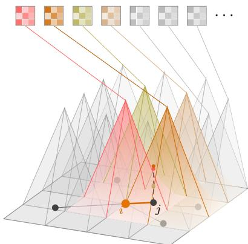
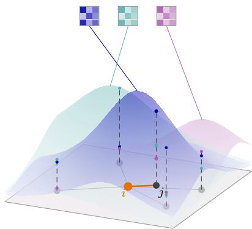
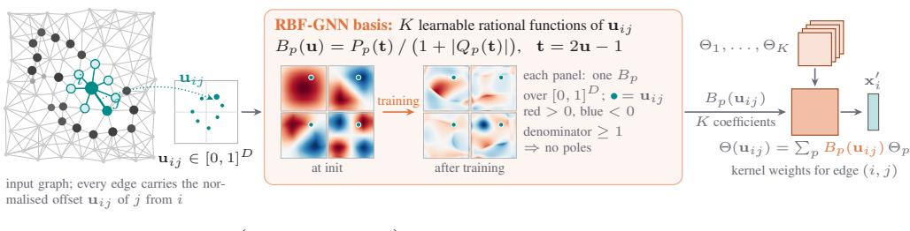
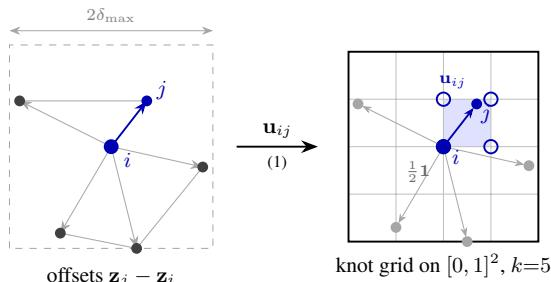
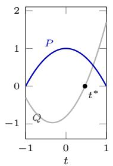
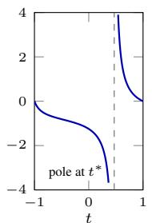
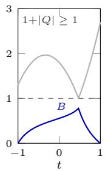
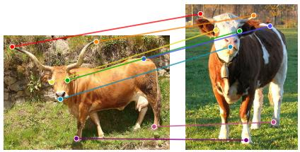
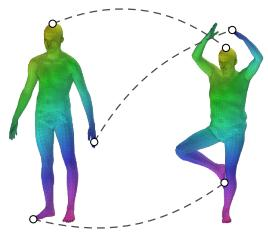
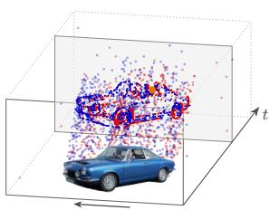

# RBF-GNN: RATIONAL BASIS FUNCTIONS FOR PSEUDO-COORDINATE BASED GRAPH CONVOLUTIONS

Paweł Batorski1,\* Abtin Pourhadi1,\* Paul Swoboda1 1Heinrich Heine University Dusseldorf¨ \*Equal contribution

## ABSTRACT

We propose RBF-GNN, a new pseudo-coordinate based graph neural network architecture that takes into account Euclidean, spherical or angular coordinates and uses them to induce a powerful spatial inductive bias. Similar in architecture to SplineCNN, we improve upon the latter by replacing the less efficient sparseactivation based B-splines whose number grows exponentially with dimension by rational Pade basis functions. For effective training we propose a spline-subspace´ initialization and a variance-preserving weight rescaling. Experimentally, we evaluate on a number of popular neural network architectures that use SplineCNNs. We replace only the SplineCNNs with RBF-GNN. We achieve improved results, including on semantic keypoint matching, shape matching, event based camera computer vision tasks. We will make our implementation publicly available upon acceptance of the paper.

kD weight matrices Θp — one per spline  
K weight matrices Θp — one per basis function  

  
(b) RBF-GNN: rational basis  
(a) SplineCNN: B-spline basis  
Figure 1: RBF-GNN replaces the fixed B-spline basis of SplineCNN by a small set of global, learnable rational basis functions. Both panels show the pseudo-coordinate domain $[ 0 , 1 ] ^ { D } , \mathbf { \check { \cal D } } = \dot { 2 }$ with the neighborhood of a node i: each neighbor $j$ sits at its pseudo-coordinate $\mathbf { u } _ { i j }$ . Every basis function carries one weight matrix $\Theta _ { p }$ (small squares), and the dashed stem over the highlighted edge $( i , j )$ marks the basis values that weight its message. (a) SplineCNN has one weight matrix for each of the $k ^ { D }$ B-splines on the knot grid of dimension D, but an edge activates only the $2 ^ { D }$ splines around its pseudo-coordinate (colored); all other splines (faint) and their matrices (gray) receive no signal from this edge. (b) RBF-GNN uses K rational safe Pade basis functions (here´ $K = 3 )$ , smooth, globally supported, learnable, with dense activations and K is independent of $D$

## 1 INTRODUCTION

Many graph convolutions for geometric data define their kernel as a continuous function of pseudocoordinates attached to the edges, and they differ mainly in how this function is represented. SplineCNN (Fey et al., 2018) expands it in a fixed tensor-product basis of B-splines, MoNet (Monti et al., 2017) in a mixture of learnable Gaussians, and more recent continuous-kernel operators (Ma et al., 2024) in a small multilayer perceptron of the pseudo-coordinates. This choice determines which kernels a layer can represent and how many parameters it requires.

SplineCNN has been especially powerful and has been adopted in a range of later architectures. Its basis functions are compactly supported B-splines on a regular grid over the unit cube. This gives the kernel an explicit spatial locality and makes the evaluation time independent of the kernel size, because only the few basis functions whose support contains the pseudo-coordinate of an edge have to be evaluated. The same grid, however, also determines the number of parameters. With k basis functions per axis in D pseudo-coordinate dimensions, the grid contains $\mathbf { \Phi } _ { K } ^ { \bullet } = k ^ { D }$ basis functions, and the layer has one weight matrix for each of them. For a fixed resolution per axis, the number of weight matrices therefore grows exponentially with D, independently of the complexity of the kernel that has to be learned. Because of the compact support, each edge moreover involves only a small subset of these weight matrices, so that each weight matrix is updated by only a fraction of the edges.

In this work, we replace the B-spline basis by K learnable rational functions, so that K becomes a hyperparameter that is independent of D. Each basis function is a ratio of two polynomials in the safe Pade form´ $B = P ( t ) \bar { / ( 1 + | Q ( t ) | ) }$ (Molina et al., 2020), whose denominator is at least one and therefore never vanishes, and both polynomials are expressed in the Chebyshev basis for better numerical conditioning. Unlike the B-splines, these functions are not compactly supported, so every edge involves all K weight matrices. Since rational functions with small random coefficients are nearly flat, we initialize the basis from the B-splines it replaces. When $K = k ^ { D }$ , we fit the B-splines directly. Otherwise, we fit their leading principal components and rescale the kernel weights so that the initial message variance matches that of the B-spline layer.

In our experiments, we obtain performance improvements whenever we replace SplineCNN with RBF-GNN across a wide array of applications and deep learning architectures. Additionally, in many applications we can do so with significantly lower parameter counts.

In summary, our contributions are as follows:

• We propose RBF-GNN, a new pseudo-coordinate based GNN architecture with learnable activation functions. Our formulation is efficient and does not suffer from a blow-up in the number of activations.

• We propose practical ways to make RBF-GNN work, namely a special initialization scheme and a fast kernel implementation.

• We evaluate RBF-GNN across eight benchmarks whose pseudo-coordinate dimension ranges from two to six, spanning keypoint matching on PascalVOC (Everingham et al., 2010) and SPair-71k (Min et al., 2019) in two published matching architectures (Fey et al., 2020; Pourhadi & Swoboda, 2026), shape correspondence on FAUST (Bogo et al., 2014), eventcamera recognition on N-Caltech101 (Orchard et al., 2015) and N-Cars (Sironi et al., 2018), superpixel classification (Dwivedi et al., 2023) and point-cloud part segmentation (Yi et al., 2016). We get consistent performance improvements by switching out our closest competitor SplineCNN to RBF-GNN with a matched or sometimes even lower parameter count and similar or lower compute costs.

## 2 RELATED WORK

Geometry-aware graph convolutions. Message-passing neural networks provide the general neighbourhood-aggregation view (Gilmer et al., 2017), while spatial operators additionally condition messages on edge geometry. ECC generates filters from edge attributes (Simonovsky & Komodakis, 2017); MoNet applies Gaussian mixtures to pseudo-coordinates (Monti et al., 2017); and FeaStNet learns feature-dependent assignments to weight matrices (Verma et al., 2018). Continuous filters have also been generated by neural networks for molecules (Schutt et al., 2017), point clouds (Wang¨ et al., 2018; Wu et al., 2019), and general graphs equipped with positional encodings (Ma et al., 2024). Related point-cloud operators use Taylor-polynomial filters (Xu et al., 2018), learnable kernel points (Thomas et al., 2019), geometry-conditioned weight banks (Xu et al., 2021), or relative-position attention (Zhao et al., 2021). SplineCNN instead expands a continuous kernel in compactly supported tensor-product B-splines (Fey et al., 2018), an operator subsequently used for graph matching (Fey

$$
B _ { p }
$$

Figure 2: Overview of RBF-GNN. Each graph edge $( j , i )$ carries a normalized pseudo-coordinate $\mathbf { u } _ { i j }$ . The K learnable safe rational basis functions are evaluated at $\mathbf { u } _ { i j }$ and mix the weight matrices $\Theta _ { p }$ into the edge-specific continuous kernel $\Theta ( { \bf { u } } _ { i j } )$ . The resulting neighbor messages are aggregated to produce $\mathbf { x } _ { i } ^ { \prime } ;$ the rational-basis coefficients and convolution weights are trained jointly.

et al., 2020) and event streams (Schaefer et al., 2022). RBF-GNN is closest to SplineCNN: it preserves its message-passing rule and matrix bank, but replaces the fixed grid basis by learnable non-separable rational functions whose number is independent of $k ^ { D }$

Learned continuous and rational bases. Learnable functional parameterisations include spline time–frequency atoms (Balestriero et al., 2018), neural continuous kernels (Romero et al., 2022b;a), and coordinate networks based on Fourier features, periodic activations, or multiplicative filters (Tancik et al., 2020; Sitzmann et al., 2020; Fathony et al., 2021). Rational functions have been studied as trainable activations (Molina et al., 2020) and as efficient smooth approximators (Boulle et al.,´ 2020). More recently, KAN places learned B-spline functions on network edges (Liu et al., 2025), while KAT replaces those splines by rational functions to improve efficiency and scalability (Yang & Wang, 2025). Rational-activation and KAN-family models modify neuron or feature-mixing nonlinearities, while neural coordinate models learn an entire continuous signal or kernel. In contrast, our rational functions are multivariate mixing coefficients of a matrix-valued graph kernel and are initialised to preserve both the SplineCNN kernel subspace and its output variance.

## 3 METHOD

RBF-GNN is a graph convolution whose continuous kernel is spanned by learnable rational basis functions of pseudo-coordinates. We first set up pseudo-coordinates and the continuous-kernel convolution operator, then introduce the rational basis in safe Pade form. We relate our construction´ to SplineCNN (Fey et al., 2018). Finally, we assemble the full network and describe the initialization that lets it train as reliably as the spline model it can replace. Figure 2 summarizes the complete pipeline.

Graphs and pseudo-coordinates. We consider graphs $G = ( V , E )$ embedded in a coordinate space: every node i carries features $\mathbf { x } _ { i } \in \mathbb { R } ^ { C _ { \mathrm { i n } } }$ and a spatial position $\mathbf { z } _ { i } \in \mathbb { R } ^ { D }$ (2-D image keypoints, vertices of a 3-D mesh, . . . ). The convolution below depends on relative positions. Because the kernel will be parameterised by basis functions living on a fixed, bounded domain, the offsets are affinely rescaled into the unit cube: with $\delta _ { \mathrm { m a x } }$ the largest absolute offset component occurring in the graph, the pseudo-coordinate of edge (j, i) is

$$
{ \bf u } _ { i j } = \frac { { \bf z } _ { j } - { \bf z } _ { i } } { 2 \delta _ { \operatorname* { m a x } } } + \frac { 1 } { 2 } { \bf 1 } \in [ 0 , 1 ] ^ { D }\tag{1}
$$

The zero offset lands at the centre $\scriptstyle { \frac { 1 } { 2 } } \mathbf { 1 }$ , a neighbour to the left/below has $\begin{array} { r } { u _ { d } \leq \frac { 1 } { 2 } } \end{array}$ in that dimension, and the largest offset touches the boundary. See Figure 3 for an illustration of the pseudo-coordinate construction. These pseudo-coordinates are the only way geometry enters the model. Polar or spherical encodings can be handled analogously.

Angular and spherical coordinates: Rescaling periodic coordinates into the unit cube would introduce a seam at $0 \equiv 2 \tau$ and, for spherical angles, singularities at the poles. Angular coordinates can be embedded as (cos θ, sin θ) and directions as unit vectors $\mathbf { n } \in S ^ { 2 }$

offsets zj − zi  

Figure 3: Construction of two dimensional pseudo-coordinates for $D { = } 2$ . Left: The convolution at node i represents each neighbour j by its spatial offset $\mathbf { z } _ { j } - \mathbf { z } _ { i }$ . The dashed box marks the largest offset magnitude $\delta _ { \mathrm { m a x } }$ in the graph. Right: The map in (1) rescales this box to the unit square. Node i lands at the centre ${ \bf \Pi } _ { 2 } ^ { 1 } \mathbf { 1 } .$ , node $j$ lands at $\mathbf { u } _ { i j }$ in blue, and the largest offset reaches the boundary.

Continuous convolution kernels. An image convolution assigns a separate weight matrix to each of the finitely many pixel offsets. On an irregular graph the offsets $\mathbf { u } _ { i j }$ vary continuously, so we instead learn a kernelfunction $g : [ 0 , 1 ] ^ { D }  \mathbb { R } ^ { C _ { \mathrm { i n } } ^ { - } \times C _ { \mathrm { o u t } } }$ and evaluate it at the observed pseudo-coordinates. The kernel is parameterised as a linear combination $\begin{array} { r } { g ( \mathbf { u } ) \ : = \ : \sum _ { p = 1 } ^ { K } B _ { p } ( \mathbf { u } ) \ : \Theta _ { p } } \end{array}$ of K scalar basis functions $B _ { p } \colon [ 0 , 1 ] ^ { D } \to \mathbb { R }$ with learnable weight matrices $\boldsymbol { \Theta } _ { p } \in \mathbb { R } ^ { C _ { \mathrm { i n } } \times C _ { \mathrm { o u t } } }$ , and a layer computes

$$
{ \bf x } _ { i } ^ { \prime } = \Theta _ { \mathrm { r o o t } } { \bf x } _ { i } + \underset { j \in \mathcal { N } ( i ) } { \prod } \Big ( \sum _ { p = 1 } ^ { K } B _ { p } ( { \bf u } _ { i j } ) \Theta _ { p } \Big ) { \bf x } _ { j } + { \bf b } ,\tag{2}
$$

with a separate root weight for the node itself, a bias, and aggregation $\square \in \{ \mathrm { m e a n } , \mathrm { a d d } , \mathrm { m a x } \}$ over the neighbourhood. This operator was introduced by SplineCNN (Fey et al., 2018). The difference lies in the choice of the basis functions $B _ { p } { } ,$ , which are fixed B-splines there (see the remark below) and learnable rational functions for RBF-GNN.

Rational safe Pade basis functions.´ In RBF-GNN the scalar basis functions $B _ { p } \colon [ 0 , 1 ] ^ { D } \to$ R of (2) are learnable rational functions. Each $B _ { p }$ is a quotient of two polynomials whose coefficients are network parameters. We build up the functional form in one dimension first. A polynomial of degree m with learnable coefficients $a _ { 0 } , \ldots , a _ { m }$ is

$$
P ( t ) = \sum _ { j = 0 } ^ { m } a _ { j } t ^ { j } .\tag{3}
$$

A rational function of degrees $( m , n )$ is a quotient of two such polynomials,

$$
R ( t ) = \frac { P ( t ) } { Q ( t ) } = \frac { \sum _ { j = 0 } ^ { m } a _ { j } t ^ { j } } { \sum _ { j = 0 } ^ { n } b _ { j } t ^ { j } } .\tag{4}
$$

Training a free denominator is unstable, since it can become zero, making the evaluation undefined, but also being close to zero will lead to numerical overflow. We therefore use the safe Pade form (Molina´ et al., 2020), in which the denominator polynomial $Q$ (without constant term) enters only through $1 + | Q ( \cdot ) | \geq 1 \colon$

$$
B ( t ) \ : = \ : \frac { P ( t ) } { 1 + | Q ( t ) | } \ : = \ : \frac { \sum _ { j = 0 } ^ { m } a _ { j } t ^ { j } } { 1 + \left| \sum _ { j = 1 } ^ { n } b _ { j } t ^ { j } \right| } ,\tag{5}
$$

which remains well defined and bounded for every value of the learnt coefficients $a _ { j } , b _ { j }$ . Figure 4 contrasts the plain rational (4) with the safe form (5).

In practice we expand $P$ and Q not in the monomial basis $1 , t , t ^ { 2 } , \ldots .$ but in Chebyshev polynomials of the first kind $\phi _ { 0 } , \phi _ { 1 } , \ldots { } ~ ( \phi _ { 0 } { = } 1 , \phi _ { 1 } { = } t , \phi _ { j + 1 } { = } 2 t \phi _ { j } - \phi _ { j - 1 } ) ,$ , i.e. $\begin{array} { r } { P ( t ) = \sum _ { j } a _ { j } \dot { \phi } _ { j } \dot { ( t ) } } \end{array}$ This parametrization spans the same function class but is better conditioned on bounded domains. The map from monomial coefficients to polynomial values on an interval is exponentially ill-conditioned in the degree (Gautschi, 1979), so with monomials a small step in a high-order coefficient barely moves the function near $t = 0$ but changes it violently near the boundary, giving gradients on wildly different scales. The Chebyshev polynomials, by contrast, are orthogonal and uniformly bounded, $| \phi _ { j } ( t ) | \leq 1 \mathrm { o n } [ - 1 , 1 ]$ , so every coefficient acts on a comparable scale and $| a _ { j } |$ directly bounds the contribution of the j-th term.

Below we extend this one-dimensional basis function to multiple dimensions in two different ways.

  
(a) polynomials P , Q

(b) rational $R = P / Q$  

(c) safe Pade´ B  

Figure 4: From polynomials to safe Pade ba-´ sis functions, Eqs. (3)–(5), with the same numerator $P$ and denominator $Q$ in all three panels. (a) Two polynomials with learnable coefficients; Q has a root $t ^ { * }$ inside the domain. (b) The plain rational function $R = P / Q$ diverges at $t ^ { * }$ , and any root of Q can move into the domain during training. (c) In the safe form the denominator $1 + | Q |$ (gray) never drops below one (dashed), so B stays bounded and well defined for every setting of the coefficients; where $Q$ vanishes, B simply equals P.

Product rational basis. Each of the $K$ basis functions factorises over the coordinate dimensions into univariate safe Pade functions (5),´

$$
B _ { \bf p } ( { \bf u } ) = \prod _ { d = 1 } ^ { D } \frac { P _ { d , p } ( u _ { d } ) } { 1 + \left| Q _ { d , p } ( u _ { d } ) \right| } ,\tag{6}
$$

where every factor has its own learnable polynomials $P _ { d , p }$ and $Q _ { d , p }$

Multivariate rational basis. Each basis function $B _ { p } \colon [ 0 , 1 ] ^ { D } \ \to \ \mathbb { R }$ is a single non-separable rational function of all coordinates jointly:

$$
B _ { p } ( \mathbf { u } ) = \frac { P _ { p } ( \mathbf { u } ) } { 1 + | Q _ { p } ( \mathbf { u } ) | } , \quad P _ { p } ( \mathbf { u } ) = \sum _ { | \alpha | \leq m } a _ { p , \alpha } u _ { 1 } ^ { \alpha _ { 1 } } \cdot \cdot \cdot u _ { D } ^ { \alpha _ { D } } , \quad Q _ { p } ( \mathbf { u } ) = \sum _ { 1 \leq | \alpha | \leq n } b _ { p , \alpha } u _ { 1 } ^ { \alpha _ { 1 } } \cdot \cdot \cdot u _ { D } ^ { \alpha _ { D } } ,\tag{7}
$$

with multi-indices ${ \boldsymbol { \alpha } } \in  { \mathbb { N } } _ { 0 } ^ { D }$ of total degree $| \alpha | \le m$ and $| \alpha | \le n$ . As in the univariate case, the implementation uses the Chebyshev parametrization. Each monomial $u _ { 1 } ^ { \alpha _ { 1 } } \cdot \cdot \cdot u _ { D } ^ { \alpha _ { D } }$ is replaced by the product $\phi _ { \alpha _ { 1 } } ( t _ { 1 } ) \cdot \cdot \cdot \phi _ { \alpha _ { D } } ( t _ { D } )$ , spanning the same function class in better-conditioned form.

Original SplineCNN and B-spline basis. The original SplineCNN (Fey et al., 2018) uses the operator (2), but chooses the basis functions $B _ { p }$ as B-splines, see Figure 1. This construction yields spatial localisation and a strong geometric inductive bias. However, in every coordinate at most 2 B-splines are active, which means in larger dimensions that all but $2 ^ { D }$ of the $\Theta _ { \mathbf { p } }$ receive zero gradient. This results in sparse, uneven updates and dense evaluation wasted on zeros. The basis size $K = k ^ { D }$ grows exponentially with the coordinate dimension D.

Initialization. Randomly initializing the basis functions works consistently worse. We observe $- 0 . 7 \ \mathrm { t o \ - 5 . 8 }$ drops in accuracy, see the ablation in our experiments. Since we use small random numbers for initialization the resulting basis functions are approximately flat. First, spatial localization would need to be completely learned from scratch. Second, near-identical basis activations give the different $\Theta _ { p }$ strongly correlated gradients. Therefore, we propose two initializations that allow for spatial localization from the beginning.

Splinefit. Fit each rational function to its B-spline by least squares so the layer starts as approximately SplineConv. We perform a stage-wise optimization to fit our learnable basis functions as follows:

1. We fit the numerator $P$ with a closed-form least squares fit.

2. Next, we refine both P and Q with Adam (lr 0.01) for 500 steps.

3. Last, for further numerical accuracy we use L-BFGS for 100 iterations on float64.

We evaluate squared loss on a fixed grid of points, using 256 for 1D, $3 2 ^ { 2 }$ for 2D and $1 6 ^ { 2 }$ on 3D. We use small values for the denominator $Q$ since the gradient of a constant zero Q would vanish. The fit is cached, so stacked layers share the same fit. The spline fit can be performed whenever the number of basis functions $K = k ^ { D }$ for some $k \in \mathbb N$

PCA of splines. When $K \neq k ^ { D }$ , we cannot fit to the splines. Instead, we fit the K functions to the K leading principal components of the $k ^ { D }$ spline basis. In detail, this is done as follows: We sample points on the same grid as above. We collect the values in a matrix, compute its SVD and the K leading left singular vectors $u _ { 1 } , \ldots , u _ { K }$ . We rescale each $u _ { i }$ to unit maximum and fix to a deterministic sign. Last, we fit each ui with the same procedure as above for the spline fit.

  
(a) semantic keypoint matching

(b) shape correspondence  
  
(c) event-based vision  
Figure 5: Tasks with pseudo-coordinate graphs used in our experiments. (a) Semantic keypoint matching on SPair-71k: keypoints of two images of the same category are graph nodes, and corresponding keypoints (same color, 8 of 20 shown) are matched across instances with different viewpoint and appearance. (b) Shape correspondence on FAUST: every vertex of a triangulated human scan is matched to its vertex on another person in a different pose; colors encode the ground-truth correspondence, and dashed arcs show example matches. (c) Event-based vision: object moving through a scene triggers a stream of events. The events of a short time window (gray plane) trace the contour of the car; each event is a graph node (orange) connected to its space-time neighbors, and the pseudo-coordinates are relative $( x , y , t )$ offsets.

Variance-preserving gain. The initialization of the kernel weights is calibrated for the spline basis. The entries of $\Theta _ { p }$ are drawn i.i.d. zero-mean with variance proportional to $1 / ( K C _ { \mathrm { i n } } ) _ { }$ . Thus, the message $\begin{array} { r } { \sum _ { p } B _ { p } ( { \bf u } ) \Theta _ { p } { \bf x } _ { j } } \end{array}$ along an edge has variance proportional to the basis energy $\textstyle \sum _ { p } B _ { p } ( \mathbf { u } ) ^ { 2 }$ For partition-of-unity basis like the spline the variance remains. However, the PCA-based initialization can result in larger activations and, without correction, to inflated output scale.

Adapting a technique from KAT (Yang & Wang, 2025), we therefore rescale the kernel weights by a suitable value $\sqrt { \alpha }$ after basis initialization. The gain compares the energy of the B-spline basis being replaced with that of the initialized rational basis,

$$
\alpha = \mathbb { E } _ { \mathbf { u } } \Big [ \sum _ { \mathbf { p } } N _ { \mathbf { p } } ( \mathbf { u } ) ^ { 2 } \Big ] \Big / \mathbb { E } _ { \mathbf { u } } \Big [ \sum _ { p } B _ { p } ( \mathbf { u } ) ^ { 2 } \Big ] ,\tag{8}
$$

Table 1: Semantic keypoint matching on PascalVOC and SPair-71k. Accuracy (%) follows the protocol of each pipeline and is the mean ± std over 5 seeds, and best, second, and third mark the three highest means per column. Parameter counts exclude the VGG16 backbone and cover the whole DGMC model but only the NMT graph-convolution layers, which are larger because they use 648 channels instead of the 256 and 128 of DGMC. All other columns report the best test epoch.
<table><tr><td rowspan="2">Method</td><td colspan="3">DGMC (Fey et al., 2020)</td><td colspan="3">NMT (Pourhadi &amp; Swoboda, 2026)</td></tr><tr><td></td><td>Params ↓ PascalVOC ↑</td><td>SPair-71k ↑</td><td></td><td></td><td>Params ↓ PascalVOC ↑ SPair-71k ↑</td></tr><tr><td colspan="7">Spline baselines</td></tr><tr><td>SplineCNN (K=25)</td><td>9.50M</td><td> $7 3 . 0 0 \pm 0 . 4 0$ </td><td> $7 6 . 1 8 \pm 0 . 6 4$ </td><td>28.17M</td><td> $8 3 . 1 0 \pm 0 . 3 6$ </td><td> $8 2 . 1 0 \pm 0 . 1 1$ </td></tr><tr><td>SplineCNN (K=9)</td><td>3.74M</td><td> $7 2 . 7 8 \pm 0 . 4 0$ </td><td> $7 6 . 0 4 \pm 0 . 4 3$ </td><td>10.84M</td><td> $8 2 . 6 6 \pm 0 . 3 0$ </td><td> $8 1 . 5 4 \pm 0 . 3 1$ </td></tr><tr><td>SplineCNN (K=4)</td><td>1.93M</td><td> $7 1 . 4 8 \pm 0 . 4 0$ </td><td> $7 1 . 9 2 \pm 0 . 3 8$ </td><td>5.42M</td><td> $8 0 . 1 0 \pm 0 . 4 6$ </td><td> $7 7 . 7 9 \pm 0 . 4 0$ </td></tr><tr><td colspan="7">MLP learned-basis control</td></tr><tr><td>MLP basis (K=4)</td><td>1.94M</td><td> $7 2 . 7 6 \pm 0 . 2 7$ </td><td> $7 3 . 7 4 \pm 0 . 7 1$ </td><td>5.42M</td><td> $8 1 . 9 0 \pm 0 . 2 7$ </td><td> $8 0 . 4 0 \pm 0 . 5 7$ </td></tr><tr><td>MLP basis (K=9)</td><td>3.74M</td><td> $7 2 . 0 4 \pm 0 . 7 3$ </td><td> $7 4 . 3 4 \pm 0 . 6 2$ </td><td>10.84M</td><td> $8 2 . 1 2 \pm 0 . 5 1$ </td><td> $8 1 . 0 5 \pm 0 . 3 2$ </td></tr><tr><td colspan="7">RBF-GNN with a product basis</td></tr><tr><td>RBF-GNN (K=25)</td><td>9.50M</td><td> $7 2 . 8 8 \pm 0 . 4 8$ </td><td> $7 6 . 3 4 \pm 0 . 4 2$ </td><td>28.17M</td><td> $8 3 . 7 8 \pm 0 . 3 5$ </td><td> $8 2 . 0 8 \pm 0 . 2 1$ </td></tr><tr><td>RBF-GNN (K=9)</td><td>3.74M</td><td> $7 3 . 2 6 \pm 0 . 1 8$ </td><td> $7 6 . 2 4 \pm 0 . 7 3$ </td><td>10.84M</td><td> $\overline { { 8 2 . 8 5 \pm 0 . 4 2 } }$ </td><td> $8 1 . 6 4 \pm 0 . 3 5$ </td></tr><tr><td colspan="7">RBF-GNN with a multivariate basis</td></tr><tr><td>RBF-GNN (K=9), spline init</td><td>3.74M</td><td>74.12 ± 0.48</td><td> $7 7 . 6 8 \pm 0 . 3 5$ </td><td>10.84M</td><td> $8 3 . 0 8 \pm 0 . 2 6$ </td><td>82.11 ± 0.35</td></tr><tr><td>RBF-GNN (K=4), PCA+vp</td><td>1.94M</td><td> $7 3 . 7 8 \pm 0 . 4 1$ </td><td> $7 7 . 4 4 \pm 0 . 3 6$ </td><td>5.42M</td><td> $8 2 . 4 2 \pm 0 . 4 3$ </td><td> $\overline { { 8 1 . 5 2 \pm 0 . 2 2 } }$ </td></tr><tr><td>RBF-GNN (K=6), PCA+vp</td><td>2.66M</td><td> $7 4 . 0 6 \pm 0 . 3 7$ </td><td> $7 7 . 8 0 \pm 0 . 6 6$ </td><td>7.59M</td><td> $8 2 . 9 5 \pm 0 . 4 2$ </td><td> $8 1 . 7 1 \pm 0 . 1 8$ </td></tr><tr><td>RBF-GNN (K=9), PCA+vp</td><td>3.74M</td><td> $7 3 . 7 2 \pm 0 . 1 9$ </td><td> $7 7 . 5 0 \pm 0 . 2 7$ </td><td>10.84M</td><td> $8 2 . 8 8 \pm 0 . 3 8$ </td><td> $8 1 . 5 9 \pm 0 . 1 4$ </td></tr><tr><td colspan="7">RBF-GNN with a multivariate basis, degree control</td></tr><tr><td>RBF-GNN (K=25), degrees (5, 4)</td><td>9.51M</td><td> $7 3 . 0 8 \pm 0 . 2 5$ </td><td> $7 6 . 2 6 \pm 0 . 2 3$ </td><td>28.17M</td><td> $8 3 . 3 5 \pm 0 . 3 8$ </td><td> $8 2 . 0 1 \pm 0 . 2 1$ </td></tr></table>

Table 2: Accuracy (%) for shape correspondence on FAUST. We could not fully reproduce the published numbers.  
Table 3: Instance-average mIoU (%) for part segmentation on ShapeNet-Part with 6-D position and normal pseudo-coordinates.
<table><tr><td>Method</td><td>Params ↓</td><td>Final ↑</td></tr><tr><td colspan="3">Spline baselines</td></tr><tr><td> $\hat { S p l i n e C N N } ( K = 1 2 5 ) , p u b l i s h e d$ </td><td>4.10M</td><td>99.20</td></tr><tr><td> $\mathrm { S p l i n e C N N } ( K { = } 1 2 5 ) , \mathrm { m e a n } + \mathrm { c l i p }$ </td><td>4.11M</td><td> $9 8 . 7 1 \pm 0 . 0 8$ </td></tr><tr><td> $\mathrm { S p l i n e C N N } ( K \mathrm { = } 1 2 5 ) , \mathrm { a d d } + \mathrm { c l i p }$ </td><td>4.11M</td><td> $9 7 . 2 3 \pm 0 . 5 1$ </td></tr><tr><td> $\mathrm { \hat { { S p l i n e C N N } } } ( K { = } 1 2 5 ) , \mathrm { a d d } , \mathrm { n o } \mathrm { c l i p }$ </td><td>4.11M</td><td> $2 9 . 1 \pm 5 0 . 3$ </td></tr><tr><td> $\mathrm { \hat { S p l i n e C N N } } \left( K { = } 2 7 \right)$ </td><td>2.30M</td><td> $8 3 . 6 \pm 1 5 . 6$ </td></tr><tr><td> $\mathrm { \hat { S p l i n e C N N } } \left( K { = } 8 \right)$ </td><td>1.95M</td><td> $3 . 4 \pm 3 . 3$ </td></tr><tr><td colspan="3">MLP learned-basis control</td></tr><tr><td>MLP basis (K=8)</td><td>1.96M</td><td> $9 8 . 2 1 \pm 1 . 1 1$ </td></tr><tr><td> $R B F  – G N N w i t h a p r o d u c t b a s i s$ </td><td></td><td></td></tr><tr><td> $\mathbf { R B F - G N N } \left( K { = } 2 7 \right)$ </td><td>2.30M</td><td> $9 9 . 2 4 \pm 0 . 0 8$ </td></tr><tr><td colspan="3"> $R B F  – G N N w i t h a m u l t i \nu a r i a t e b a s i s$ </td></tr><tr><td>RBF-GNN (K=4)</td><td>1.89M</td><td> $9 9 . 3 8 \pm 0 . 0 9$ </td></tr><tr><td>RBF-GNN (K=4), mean aggr.</td><td>1.89M</td><td> $9 8 . 9 3 \pm 0 . 1 0$ </td></tr><tr><td>RBF-GNN (K=8)</td><td>1.97M</td><td> $9 9 . 4 1 \pm 0 . 0 4$ </td></tr></table>

<table><tr><td rowspan=1 colspan=4>Method                Params ↓       Final mIoU ↑</td></tr><tr><td rowspan=1 colspan=4>Spline baselines</td></tr><tr><td rowspan=1 colspan=4> $\dot { \mathrm { S p l i n e C N N } } \left( K = 7 2 9 \right)$        1.60M       $6 5 . 1 2 \pm 0 . 4 1$  $\mathrm { S p l i n e C N N } \left( K { = } 6 4 \right)$       177.91k        $\overline { { 6 0 . 0 2 \pm 0 . 2 3 } }$ </td></tr><tr><td rowspan=1 colspan=1>MLP learned-basis control</td><td rowspan=1 colspan=1></td><td rowspan=1 colspan=2></td></tr><tr><td rowspan=5 colspan=1>MLP basis (K=8)MLP basis (K=32)MLP basis (K=64)MLP basis $\scriptstyle ( K = 1 2 8 )$ MLP basis (K=256)</td><td rowspan=1 colspan=1>60.75k</td><td rowspan=1 colspan=1></td><td rowspan=1 colspan=1> $6 2 . 8 0 \pm 0 . 4 5$ </td></tr><tr><td rowspan=1 colspan=1>116.88k</td><td rowspan=1 colspan=1></td><td rowspan=1 colspan=1> $6 3 . 8 1 \pm 0 . 4 6$ </td></tr><tr><td rowspan=1 colspan=1>191.73k</td><td rowspan=1 colspan=1></td><td rowspan=1 colspan=1> $6 4 . 4 1 \pm 0 . 4 0$ </td></tr><tr><td rowspan=1 colspan=1>341.43k</td><td rowspan=1 colspan=1></td><td rowspan=1 colspan=1> $6 3 . 7 8 \pm 0 . 1 7$ </td></tr><tr><td rowspan=1 colspan=1>640.82k</td><td rowspan=1 colspan=1></td><td rowspan=1 colspan=1> $6 4 . 0 5 \pm 0 . 7 5$ </td></tr><tr><td rowspan=1 colspan=1>RBF-GNN with a multivariat</td><td rowspan=1 colspan=1>e basis</td><td rowspan=1 colspan=1></td><td rowspan=1 colspan=1></td></tr><tr><td rowspan=5 colspan=1>RBF-GNN (K=8)RBF-GNN (K=32)RBF-GNN (K=64) $\mathbf { R B F - G N N } \left( K { = } 1 2 8 \right)$  $\mathbf { R B F - G N N } \overset { \cdot } { ( } K = 2 5 6 )$ </td><td rowspan=1 colspan=1>64.87k</td><td rowspan=1 colspan=1></td><td rowspan=1 colspan=1> $6 1 . 8 8 \pm 0 . 3 8$ </td></tr><tr><td rowspan=1 colspan=1>137.43k</td><td rowspan=1 colspan=1></td><td rowspan=1 colspan=1> $6 4 . 8 6 \pm 0 . 1 8$ </td></tr><tr><td rowspan=1 colspan=1>234.16k</td><td rowspan=1 colspan=1></td><td rowspan=1 colspan=1> $6 4 . 6 8 \pm 0 . 5 5$ </td></tr><tr><td rowspan=1 colspan=1>427.63k</td><td rowspan=1 colspan=1></td><td rowspan=1 colspan=1> $6 4 . 9 4 \pm 0 . 7 0$ </td></tr><tr><td rowspan=1 colspan=1>814.58k</td><td rowspan=1 colspan=1></td><td rowspan=1 colspan=1> $6 4 . 6 9 \pm 0 . 4 1$ </td></tr></table>

where $N _ { \mathbf { p } }$ are the $k ^ { D }$ tensor-product B-splines, $B _ { p }$ are our K rational basis functions as returned by the spline or PCA fit above, and both expectations are over uniform u, evaluated on the fit grid. The initial message variance then matches that of SplineConv with the same K.

Efficient implementation. A naive implementation of RBF-GNN materialises the Chebyshev feature tensor before contracting it with the coefficients. More efficiently, we provide a Triton kernel that never materializes this intermediate tensor that directly produces only K basis values from the D pseudo-coordinates. The polynomial sums are efficiently computed by a Horner-like scheme. The resulting kernel runs about 15 times faster than the naive PyTorch implementation and 3 times faster than a compiled variant and consumes less memory. Training and inference with the Triton kernel for RBF-GNN is slightly faster overall than the PyG-implementation of SplineCNN.

## 4 EXPERIMENTS

We evaluate RBF-GNN on eight benchmarks from five tasks, with pseudo-coordinates of two to six dimensions. In each experiment, RBF-GNN replaces only the SplineConv layers of the network. The tables compare the following methods.

SplineCNN: Fixed B-spline basis with $K = k ^ { D }$ functions (Fey et al., 2018).

MLP: Learned basis from a two-layer MLP (Schutt et al., 2017; Wu et al., 2019).¨

PointNet: PointNet-style layer on neighbor features and pseudo-coordinates, without a basis (Qi et al., 2017).

RBF-GNN with product basis: Products of univariate safe Pade functions (6).´

RBF-GNN with multivariate basis: Non-separable rational functions of all coordinates (7).

Spline init and PCA+vp denote the spline fit and the variance-preserving PCA initialization of Section 3. Results are means and standard deviations over three seeds unless stated otherwise.

Semantic keypoint matching. We evaluate semantic keypoint matching in two host pipelines, DGMC (Fey et al., 2020) and the Normalized Matching Transformer (NMT) (Pourhadi & Swoboda, 2026), which both use a continuous-kernel graph convolution for geometric feature refinement. In each pipeline we replace only the SplineConv layers and keep the rest of the architecture, the backbone and the training procedure unchanged. Table 1 reports all configurations for both pipelines on PascalVOC-Keypoints (Everingham et al., 2010; Bourdev & Malik, 2009) and SPair-71k (Min et al., 2019).

In Table 1, RBF-GNN achieves the highest accuracy for both pipelines on both datasets. The multivariate basis is best under DGMC on both datasets and, by 0.01, under NMT on SPair-71k, and the product basis is best under NMT on PascalVOC with 83.78. The margin over the best spline baseline decreases from +1.12 and +1.62 under DGMC to +0.68 and +0.01 under the stronger NMT

Table 4: Test accuracy (%) for object recognition on N-Caltech101 with AEGNN.  
Table 5: Test accuracy (%) for car recognition on N-Cars with AEGNN.
<table><tr><td rowspan=1 colspan=3>Method          Aggr.  Params ↓     Final ↑</td></tr><tr><td rowspan=1 colspan=3>Spline baselines</td></tr><tr><td rowspan=2 colspan=1>SplineCNN (K=8) meanSplineCNN (K=8) max</td><td rowspan=2 colspan=1>77.68k77.68k</td><td rowspan=1 colspan=1> $4 7 . 3 5 \pm 0 . 1 5$ </td></tr><tr><td rowspan=1 colspan=1> $5 6 . 0 0 \pm 0 . 9 2$ </td></tr><tr><td rowspan=1 colspan=1>PointNet learned-kernel cont</td><td rowspan=1 colspan=1>rol</td><td rowspan=1 colspan=1></td></tr><tr><td rowspan=1 colspan=1>PointNet          max</td><td rowspan=1 colspan=1>55.68k</td><td rowspan=1 colspan=1> $5 4 . 9 9 \pm 0 . 8 4$ </td></tr><tr><td rowspan=1 colspan=1>RBF-GNN with a multivariat</td><td rowspan=1 colspan=1>e basis</td><td rowspan=1 colspan=1></td></tr><tr><td rowspan=2 colspan=1>RBF-GNN (K=8) meanRBF-GNN (K=8) max</td><td rowspan=1 colspan=1>91.57k</td><td rowspan=1 colspan=1> $5 5 . 0 5 \pm 0 . 5 8$ </td></tr><tr><td rowspan=1 colspan=1>91.57k</td><td rowspan=1 colspan=1> $5 7 . 5 5 \pm 0 . 4 2$ </td></tr></table>

<table><tr><td rowspan=1 colspan=3>Method          Aggr.  Params ↓     Final ↑</td></tr><tr><td rowspan=1 colspan=3>Spline baselines</td></tr><tr><td rowspan=1 colspan=1>SplineCNN (K=8) meanSplineCNN (K=8) max</td><td rowspan=1 colspan=1>26.99k26.99k</td><td rowspan=1 colspan=1> $8 7 . 8 3 \pm 0 . 2 5$  $8 9 . 8 1 \pm 0 . 2 7$ </td></tr><tr><td rowspan=1 colspan=2>PointNet learned-kernel control</td><td rowspan=1 colspan=1></td></tr><tr><td rowspan=1 colspan=1>PointNet          max</td><td rowspan=1 colspan=1>4.99k</td><td rowspan=1 colspan=1> $8 7 . 1 7 \pm 0 . 2 4$ </td></tr><tr><td rowspan=1 colspan=1>RBF-GNN with a multivariat</td><td rowspan=1 colspan=1>e basis</td><td rowspan=1 colspan=1></td></tr><tr><td rowspan=3 colspan=1>RBF-GNN (K=4) meanRBF-GNN (K=8) meanRBF-GNN (K=8) max</td><td rowspan=1 colspan=1>21.10k</td><td rowspan=1 colspan=1> $9 0 . 2 4 \pm 0 . 3 9$ </td></tr><tr><td rowspan=1 colspan=1>40.88k</td><td rowspan=1 colspan=1> $9 0 . 4 9 \pm 0 . 0 5$ </td></tr><tr><td rowspan=1 colspan=1>40.88k</td><td rowspan=1 colspan=1> $9 1 . 0 0 \pm 0 . 4 3 $ </td></tr></table>

pipeline, so the accuracy gain depends on the host pipeline. The parameter savings are consistent. In three of the four columns, a rational basis matches or exceeds the widest spline grid with 2.6 to 4.9× fewer parameters, and under NMT on PascalVOC it is within 0.02 points of that grid with 2.6× fewer.

Shape correspondence. Dense shape correspondence on FAUST (Bogo et al., 2014) assigns every vertex of a held-out human mesh to a template vertex. We follow the SplineCNN protocol (Fey et al., 2018), report exact-match accuracy and compare with the published SplineCNN result (Table 2). Small multivariate rational bases achieve the best and most stable results with substantially fewer parameters than SplineCNN.

Event-based recognition. Both event-camera benchmarks use the seven-layer AEGNN recognition network (Schaefer et al., 2022), with one graph node per event and space-time pseudo-coordinates, and we replace only its SplineConv layers. We report test accuracy for multiclass object recognition on N-Caltech101 (Orchard et al., 2015), where we train with augmentation and a validation-based stopping criterion, and for real-world binary car-versus-background recognition on N-Cars (Sironi et al., 2018), where we train for 30 epochs. On N-Caltech101, RBF-GNN performs best with max aggregation and also improves substantially over SplineCNN under matched mean aggregation (Table 4). On N-Cars, RBF-GNN is the most accurate model under both aggregation rules, its mean-aggregation variant outperforms the max-aggregation SplineCNN, and its smaller configuration is more accurate than SplineCNN with fewer parameters (Table 5).

Superpixel graph classification. On MNIST (LeCun et al., 1998) superpixels, we follow the SplineCNN protocol (Fey et al., 2018) and use two continuous-kernel convolution layers on 2-D Cartesian pseudo-coordinates. On CIFAR-10 (Krizhevsky, 2009) superpixels from GNNBenchmark-Dataset (Dwivedi et al., 2023), we use a 5-D bilateral pseudo-coordinate that concatenates the relative 2-D centroid position with the RGB features. We report test accuracy on both datasets. On MNIST, RBF-GNN achieves the three highest accuracies and improves over SplineCNN at both matched and reduced basis sizes (Table 6). Wider bases do not help: K=16 and 25 stay within noise of K=9, and K=49, initialized on a k=7 spline grid, is slightly worse. On CIFAR-10, RBF-GNN attains the best accuracy at K=32 while using fewer parameters than the wider spline grid (Table 7).

Part segmentation. For point-cloud part segmentation on ShapeNet-Part (Yi et al., 2016), we use a fixed subset of 4,000 training and 1,333 test shapes. Relative positions and surface normals define 6-D pseudo-coordinates on a 16-nearest-neighbor graph, and we report instance-average mIoU. RBF-GNN nearly matches the large spline grid with an order-of-magnitude smaller model and outperforms the equal-width MLP control (Table 3). From K=32 on, accuracy plateaus within noise of the 729-function spline grid $( p \ge 0 . 2 7 )$ at 2 to 12× fewer parameters, with the MLP control below it at every width from K=32 on. At the smallest width the MLP control is more accurate, so the advantage of RBF-GNN on this benchmark is parameter efficiency at larger widths, not a gain at every width.

Ablation study. Basis size. For the PCA+vp rows of Table 1, accuracy rises from K=1 to K=4 in all four columns, peaks at K=6 for DGMC and changes little beyond it for NMT. At matched

Table 6: Test accuracy (%) for MNIST superpixel classification.  
Table 7: Test accuracy (%) with 5-D bilateral pseudo-coordinates on CIFAR-10 superpixels.
<table><tr><td>Method</td><td>Params ↓</td><td>Final ↑</td></tr><tr><td colspan="3">Spline baselines</td></tr><tr><td> $\mathrm { \dot { S p l i n e C N N } } \left( K { = } 2 5 \right)$ </td><td>88.36k</td><td> $9 7 . 4 1 \pm 0 . 1 3$ </td></tr><tr><td> $\mathrm { \tilde { S p l i n e } C N N } \left( K { = } 9 \right)$ </td><td>55.08k</td><td> $9 6 . 4 9 \pm 0 . 1 2$ </td></tr><tr><td> $\bar { \mathrm { S p l i n e C N N } } ( K { = } 4 )$ </td><td>44.68k</td><td> $9 4 . 8 3 \pm 0 . 1 1$ </td></tr><tr><td colspan="3"> $M L P \ l e a r n e d - b a s i s \ c o n t r o l$ </td></tr><tr><td> $\mathrm { M L P b a s i s } \left( K { = } 4 \right)$ </td><td>45.59k</td><td> $9 7 . 2 3 \pm 0 . 1 1$ </td></tr><tr><td>MLP basis (K=16)</td><td>72.11k 92.00k</td><td> $9 7 . 4 8 \pm 0 . 0 7$   $9 7 . 3 2 \pm 0 . 0 3$ </td></tr><tr><td colspan="3">MLP basis (K=25) RBF-GNN with a multivariate basis</td></tr><tr><td colspan="3"> $\mathbf { R B F - G N N } ( K { = } 4 ) , \mathbf { P C A + v p }$ </td></tr><tr><td> $\mathbf { R B F - G N N } ( K { = } 9 ) , \mathbf { P C A + v p }$ </td><td>45.26k 56.38k</td><td> $9 7 . 7 9 \pm 0 . 0 8$   $9 8 . 0 0 \pm 0 . 1 6$ </td></tr><tr><td> $\mathbf { R B F - G N N } ( K { = } 9 ) , \mathbf { s p l i n e \ i n i t }$ </td><td>56.38k</td><td> $9 7 . 8 7 \pm 0 . 0 6$ </td></tr><tr><td> $\mathbf { R B F - G N N } ( K { = } 1 6 ) , \mathbf { \bar { P } C A + v p }$ </td><td>71.95k</td><td></td></tr><tr><td></td><td>91.96k</td><td> $9 7 . 8 0 \pm 0 . 1 4$ </td></tr><tr><td> $\mathbf { R B F - G N N } ( K { = } 2 5 ) , \mathbf { P C A + v p }$ </td><td></td><td> $9 7 . 8 3 \pm 0 . 1 1$ </td></tr><tr><td> $\mathbf { R B F - G N N } ( K { = } 4 9 ) , \mathbf { P C A + v p }$ </td><td> $1 4 5 . 3 4 \mathrm { k \Omega }$ </td><td> $9 7 . 7 1 \pm 0 . 1 7$ </td></tr></table>

<table><tr><td>Method</td><td>Params ↓</td><td>Final ↑</td></tr><tr><td colspan="3">Spline baselines</td></tr><tr><td> $\mathrm { \dot { S p l i n e } C N N } \left( K { = } 2 4 3 \right)$ </td><td>557.42k</td><td> $5 8 . 7 3 \pm 0 . 2 6$ </td></tr><tr><td> $\mathrm { S p l i n e C N N } \left( K { = } 3 2 \right)$ </td><td>105.03k</td><td> $5 7 . 5 5 \pm 0 . 3 4$ </td></tr><tr><td colspan="3">MLP learned-basis control</td></tr><tr><td>MLP basis (K=8)</td><td>55.39k</td><td> $5 9 . 6 7 \pm 0 . 3 2$ </td></tr><tr><td>MLP basis (K=32)</td><td>109.96k</td><td> $5 9 . 0 2 \pm 0 . 1 0$ </td></tr><tr><td>MLP basis (K=64)</td><td>182.73k</td><td> $5 7 . 9 4 \pm 0 . 4 2$ </td></tr><tr><td>MLP basis (K=128)</td><td>328.27k</td><td> $5 7 . 7 9 \pm 0 . 0 7$ </td></tr><tr><td colspan="3">RBF-GNN with a multivariate basis</td></tr><tr><td> $\mathbf { R B F - G N N } \left( K { = } 4 \right)$ </td><td>46.45k</td><td> $5 7 . 5 8 \pm 0 . 2 3$ </td></tr><tr><td> $\mathbf { R B F - G N N } \left( K { = } 8 \right)$ </td><td>56.47k</td><td> $5 8 . 9 7 \pm 0 . 1 6$ </td></tr><tr><td> $\mathbf { R B F - G N N } \left( K = 3 2 \right)$ </td><td>116.62k</td><td> $5 9 . 8 7 \pm 0 . 4 0$ </td></tr><tr><td> $\mathbf { R B F - G N N } ( K = 6 4 )$ </td><td>196.81k</td><td> $\overline { { 5 9 . 5 1 \pm 0 . 2 1 } }$ </td></tr><tr><td> $\mathbf { R B F - G N N } \left( K { = } 1 2 8 \right)$ </td><td>357.19k</td><td> $5 7 . 8 3 \pm 0 . 3 0$ </td></tr></table>

K, the advantage over SplineCNN is concentrated at small bases. It ranges from $+ 0 . 4 2 \ \mathrm { t o } \ + 5 . 5 2$ for $K \in \{ 4 , 9 \}$ , and at $K { = } 2 5$ it is negligible, between −0.02 and +0.16, except under NMT on PascalVOC with +0.68. On FAUST, the multivariate basis degrades sharply, with high variance across seeds, at K=16 and K=27 (Table 2), which points to a fragile PCA initialization rather than insufficient capacity. At 5-D and 6-D, in contrast, RBF-GNN improves up to K=32 and then saturates on ShapeNet-Part and declines on CIFAR-10 (Tables 7 and 3).

Basisform and polynomial degree. At K=9, the multivariate basis with spline init outperforms the product basis in all four columns of Table 1, but with higher polynomial degrees, (8, 6) instead of (5, 4). In the degree control, where both forms use (5, 4) at K=25, they differ by at most 0.43 points. On FAUST, the product basis remains stable at K=27, whereas the multivariate basis degrades sharply (Table 2).

Initialization. The tables compare the two initializations only at $K { = } 9 ,$ , where spline init outperforms PCA+vp by 0.18 to 0.52 points in all four columns of Table 1 and is 0.13 points worse on MNIST (Table 6). The two therefore perform similarly, and $\mathrm { P C A + v p }$ is required whenever $K \neq k ^ { D }$

Aggregation. On FAUST, SplineCNN is most accurate with mean aggregation and unstable with add aggregation unless gradients are clipped, whereas RBF-GNN at K=4 is more accurate with add than with mean (Table 2). On both event-camera benchmarks, max aggregation outperforms mean aggregation for SplineCNN and RBF-GNN alike, and since RBF-GNN is more accurate under both rules, its gain is not explained by the choice of aggregation alone (Tables 4 and 5).

Structured and learned bases. In Table 1, the best rational basis in each column exceeds the best MLP control by +1.36, +3.46, +1.66 and +1.06 points. Unlike the margin over SplineCNN, this margin does not decrease systematically from DGMC to NMT, which indicates that the rational form itself matters and not only the fact that the basis is learned. On MNIST, the rational parametrization outperforms the equal-width MLP control at every width, whereas on CIFAR-10 and ShapeNet-Part the MLP control is more accurate only at the smallest shared width. On both event-camera benchmarks, the PointNet control uses fewer parameters than RBF-GNN but is less accurate.

## 5 CONCLUSION

We have proposed RBF-GNN, a drop-in replacement for splines in SplineCNN (Fey et al., 2018). Experiments show consistent improvements in performance across a wide range of methods where SplineCNN has been used before. We argue that hand-designed activation functions as used in SplineCNN are worse than learnable ones as used in RBF-GNN, which encode spatial relationships more flexibly but still encode an important inductive bias in contrast to a pure MLP basis.

## AI USE STATEMENT

In this work, we used generative AI tools to assist in implementing, refactoring and debugging the experimental code. We have not used generative AI tools to generate synthetic data, to formulate mathematical claims or to assist with translation, and the writing of proofs as well as qualitative and thematic data analysis are not applicable to this work. Additionally, we used generative AI tools to polish the language and improve the readability of the manuscript. We have reviewed all AI-assisted work. AI-assisted code was verified and tested for correctness by the authors, and the reported results were checked against the logs of the corresponding runs. The authors take full responsibility for the integrity, accuracy, and entire content of the submission.

## ETHICS STATEMENT

All authors have read and adhere to the ICLR Code of Ethics. This work proposes a basis for continuous-kernel graph convolutions and evaluates it on established benchmarks that are available to the research community. We collected no new data and conducted no experiments with human participants. Some of the benchmarks contain images or three-dimensional scans of people. We used them only as distributed by their creators and in accordance with their licences and terms of use, several of which restrict use to non-commercial research, and we made no attempt to identify any individual. The contribution is methodological and not tied to a particular application, so we do not foresee harmful uses beyond those that apply to graph learning methods in general.

## REPRODUCIBILITY STATEMENT

Our code will be released publicly under an open-source licence upon acceptance. Section 3 specifies the rational basis, both initialisation procedures and the variance-preserving rescaling, and Section 4 states the task, the metric and the number of random seeds for every benchmark. All reported results are means and standard deviations over independent runs with different seeds. Apart from the replaced basis, every host architecture keeps its published configuration unless Section 4 states otherwise.

## REFERENCES

Randall Balestriero, Romain Cosentino, Herve Glotin, and Richard Baraniuk. Spline filters for´ end-to-end deep learning. In International Conference on Machine Learning (ICML), pp. 364–373, 2018.

Federica Bogo, Javier Romero, Matthew Loper, and Michael J. Black. FAUST: Dataset and evaluation for 3D mesh registration. In Proceedings of the IEEE Conference on Computer Vision and Pattern Recognition (CVPR), pp. 3794–3801, 2014.

Nicolas Boulle, Yuji Nakatsukasa, and Alex Townsend. Rational neural networks. In´ Advances in Neural Information Processing Systems (NeurIPS), volume 33, pp. 14243–14253, 2020.

Lubomir Bourdev and Jitendra Malik. Poselets: Body part detectors trained using 3D human pose annotations. In Proceedings of the IEEE International Conference on Computer Vision (ICCV), pp. 1365–1372, 2009. doi: 10.1109/ICCV.2009.5459303.

Vijay Prakash Dwivedi, Chaitanya K. Joshi, Anh Tuan Luu, Thomas Laurent, Yoshua Bengio, and Xavier Bresson. Benchmarking graph neural networks. Journal ofMachine Learning Research, 24 (43):1–48, 2023.

Mark Everingham, Luc Van Gool, Christopher K. I. Williams, John Winn, and Andrew Zisserman. The Pascal visual object classes (VOC) challenge. International Journal ofComputer Vision, 88 (2):303–338, 2010. doi: 10.1007/s11263-009-0275-4.

Rizal Fathony, Anit Kumar Sahu, Devin Willmott, and J. Zico Kolter. Multiplicative filter networks. In International Conference on Learning Representations (ICLR), 2021.

Matthias Fey, Jan Eric Lenssen, Frank Weichert, and Heinrich Muller. SplineCNN: Fast geometric¨ deep learning with continuous B-spline kernels. In Proceedings of the IEEE Conference on Computer Vision and Pattern Recognition (CVPR), pp. 869–877, 2018.

Matthias Fey, Jan Eric Lenssen, Christopher Morris, Jonathan Masci, and Nils M. Kriege. Deep graph matching consensus. In International Conference on Learning Representations (ICLR), 2020.

Walter Gautschi. The condition of polynomials in power form. Mathematics ofComputation, 33 (145):343–352, 1979. doi: 10.1090/S0025-5718-1979-0514830-6.

Justin Gilmer, Samuel S. Schoenholz, Patrick F. Riley, Oriol Vinyals, and George E. Dahl. Neural message passing for quantum chemistry. In International Conference on Machine Learning (ICML), pp. 1263–1272, 2017.

Alex Krizhevsky. Learning multiple layers of features from tiny images. Technical report, University of Toronto, 2009.

Yann LeCun, Leon Bottou, Yoshua Bengio, and Patrick Haffner. Gradient-based learning applied to´ document recognition. Proceedings ofthe IEEE, 86(11):2278–2324, 1998. doi: 10.1109/5.726791.

Ziming Liu, Yixuan Wang, Sachin Vaidya, Fabian Ruehle, James Halverson, Marin Soljaciˇ c,´ Thomas Y. Hou, and Max Tegmark. KAN: Kolmogorov–arnold networks. In International Conference on Learning Representations (ICLR), 2025.

Liheng Ma, Soumyasundar Pal, Yitian Zhang, Jiaming Zhou, Yingxue Zhang, and Mark Coates. CKGConv: General graph convolution with continuous kernels. In International Conference on Machine Learning (ICML), pp. 33902–33924, 2024.

Juhong Min, Jongmin Lee, Jean Ponce, and Minsu Cho. SPair-71k: A large-scale benchmark for semantic correspondence. arXiv preprint arXiv:1908.10543, 2019.

Alejandro Molina, Patrick Schramowski, and Kristian Kersting. Pade activation units: End-to-end´ learning of flexible activation functions in deep networks. In International Conference on Learning Representations (ICLR), 2020.

Federico Monti, Davide Boscaini, Jonathan Masci, Emanuele Rodola, Jan Svoboda, and Michael M.\` Bronstein. Geometric deep learning on graphs and manifolds using mixture model CNNs. In Proceedings of the IEEE Conference on Computer Vision and Pattern Recognition (CVPR), pp. 5115–5124, 2017.

Garrick Orchard, Ajinkya Jayawant, Gregory K. Cohen, and Nitish Thakor. Converting static image datasets to spiking neuromorphic datasets using saccades. Frontiers in Neuroscience, 9:437, 2015. doi: 10.3389/fnins.2015.00437.

Abtin Pourhadi and Paul Swoboda. Normalized matching transformer. In Pattern Recognition. International Conference on Pattern Recognition (ICPR), volume 16813 of Lecture Notes in Computer Science, pp. 339–353. Springer, 2026. doi: 10.1007/978-3-032-31583-0 23.

Charles R. Qi, Hao Su, Kaichun Mo, and Leonidas J. Guibas. PointNet: Deep learning on point sets for 3D classification and segmentation. In Proceedings ofthe IEEE Conference on Computer Vision and Pattern Recognition (CVPR), pp. 652–660, 2017.

David W. Romero, Robert-Jan Bruintjes, Jakub M. Tomczak, Erik J. Bekkers, Mark Hoogendoorn, and Jan C. van Gemert. FlexConv: Continuous kernel convolutions with differentiable kernel sizes. In International Conference on Learning Representations (ICLR), 2022a.

David W. Romero, Anna Kuzina, Erik J. Bekkers, Jakub M. Tomczak, and Mark Hoogendoorn. CKConv: Continuous kernel convolution for sequential data. In International Conference on Learning Representations (ICLR), 2022b.

Simon Schaefer, Daniel Gehrig, and Davide Scaramuzza. AEGNN: Asynchronous event-based graph neural networks. In Proceedings ofthe IEEE/CVF Conference on Computer Vision and Pattern Recognition (CVPR), pp. 12371–12381, 2022.

Kristof T. Schutt, Pieter-Jan Kindermans, Huziel E. Sauceda Felix, Stefan Chmiela, Alexandre¨ Tkatchenko, and Klaus-Robert Muller. SchNet: A continuous-filter convolutional neural network¨ for modeling quantum interactions. In Advances in Neural Information Processing Systems (NeurIPS), volume 30, 2017.

Martin Simonovsky and Nikos Komodakis. Dynamic edge-conditioned filters in convolutional neural networks on graphs. In Proceedings of the IEEE Conference on Computer Vision and Pattern Recognition (CVPR), pp. 3693–3702, 2017.

Amos Sironi, Manuele Brambilla, Nicolas Bourdis, Xavier Lagorce, and Ryad Benosman. HATS: Histograms of averaged time surfaces for robust event-based object classification. In Proceedings ofthe IEEE Conference on Computer Vision and Pattern Recognition (CVPR), pp. 1731–1740, 2018.

Vincent Sitzmann, Julien N. P. Martel, Alexander W. Bergman, David B. Lindell, and Gordon Wetzstein. Implicit neural representations with periodic activation functions. In Advances in Neural Information Processing Systems (NeurIPS), volume 33, pp. 7462–7473, 2020.

Matthew Tancik, Pratul P. Srinivasan, Ben Mildenhall, Sara Fridovich-Keil, Nithin Raghavan, Utkarsh Singhal, Ravi Ramamoorthi, Jonathan T. Barron, and Ren Ng. Fourier features let networks learn high frequency functions in low dimensional domains. In Advances in Neural Information Processing Systems (NeurIPS), volume 33, pp. 7537–7547, 2020.

Hugues Thomas, Charles R. Qi, Jean-Emmanuel Deschaud, Beatriz Marcotegui, Franc¸ois Goulette, and Leonidas J. Guibas. KPConv: Flexible and deformable convolution for point clouds. In Proceedings of the IEEE/CVF International Conference on Computer Vision (ICCV), pp. 6411– 6420, 2019.

Nitika Verma, Edmond Boyer, and Jakob Verbeek. FeaStNet: Feature-steered graph convolutions for 3D shape analysis. In Proceedings ofthe IEEE Conference on Computer Vision and Pattern Recognition (CVPR), pp. 2598–2606, 2018.

Shenlong Wang, Simon Suo, Wei-Chiu Ma, Andrei Pokrovsky, and Raquel Urtasun. Deep parametric continuous convolutional neural networks. In Proceedings of the IEEE Conference on Computer Vision and Pattern Recognition (CVPR), pp. 2589–2597, 2018.

Wenxuan Wu, Zhongang Qi, and Li Fuxin. PointConv: Deep convolutional networks on 3D point clouds. In Proceedings ofthe IEEE/CVF Conference on Computer Vision and Pattern Recognition (CVPR), pp. 9621–9630, 2019.

Mutian Xu, Runyu Ding, Hengshuang Zhao, and Xiaojuan Qi. PAConv: Position adaptive convolution with dynamic kernel assembling on point clouds. In Proceedings ofthe IEEE/CVF Conference on Computer Vision and Pattern Recognition (CVPR), pp. 3173–3182, 2021.

Yifan Xu, Tianqi Fan, Mingye Xu, Long Zeng, and Yu Qiao. SpiderCNN: Deep learning on point sets with parameterized convolutional filters. In European Conference on Computer Vision (ECCV), pp. 90–105, 2018.

Xingyi Yang and Xinchao Wang. Kolmogorov–Arnold transformer. In International Conference on Learning Representations (ICLR), 2025.

Li Yi, Vladimir G. Kim, Duygu Ceylan, I-Chao Shen, Mengyan Yan, Hao Su, Cewu Lu, Qixing Huang, Alla Sheffer, and Leonidas J. Guibas. A scalable active framework for region annotation in 3D shape collections. ACM Transactions on Graphics, 35(6):210:1–210:12, 2016. doi: 10.1145/ 2980179.2980238.

Hengshuang Zhao, Li Jiang, Jiaya Jia, Philip H. S. Torr, and Vladlen Koltun. Point transformer. In Proceedings of the IEEE/CVF International Conference on Computer Vision (ICCV), pp. 16259– 16268, 2021.