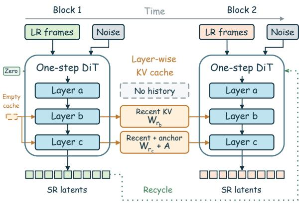
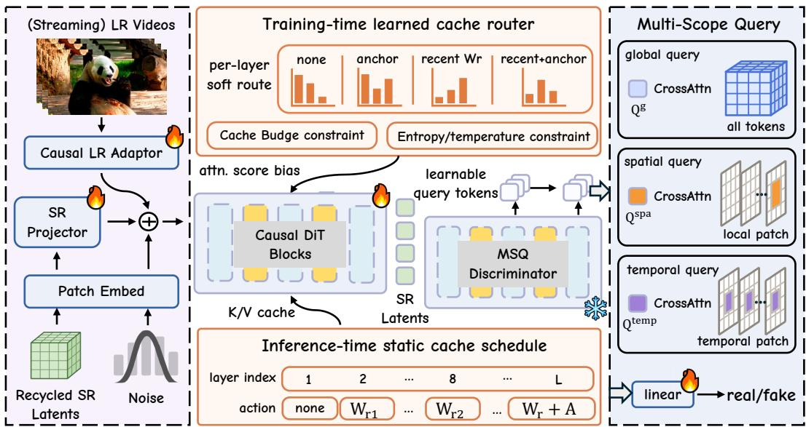
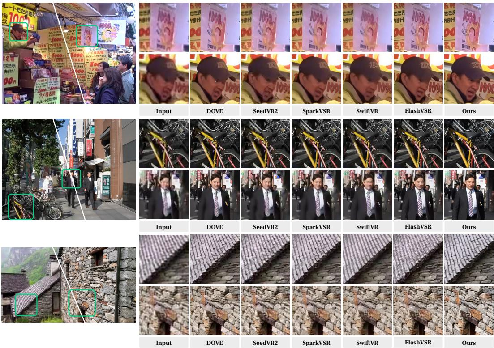
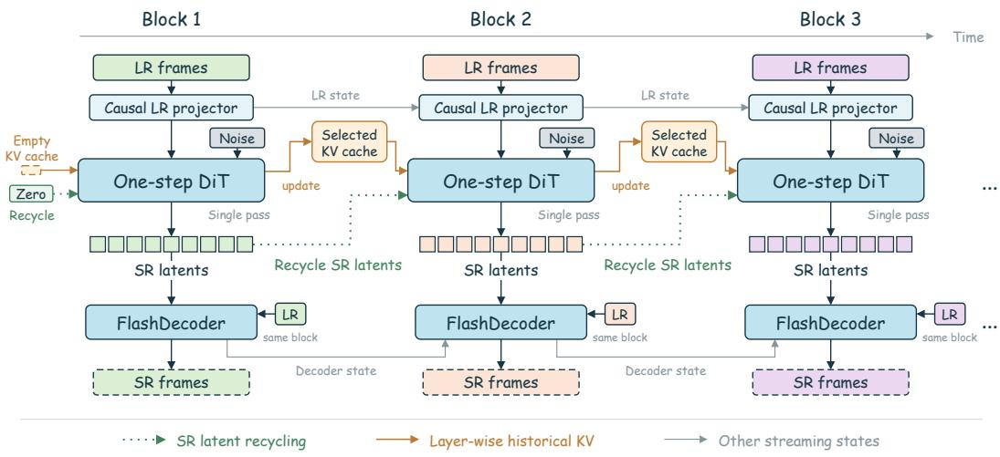
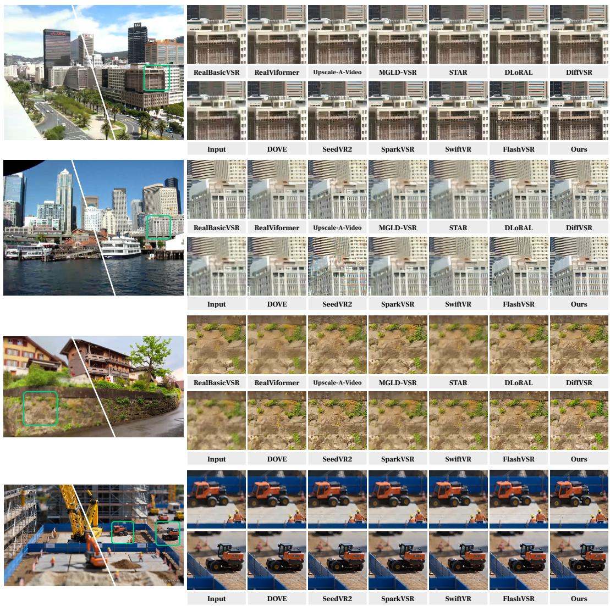

# RECAVSR: ONE-STEP STREAMING DIFFUSION VIDEO SUPER-RESOLUTION WITH RECYCLED LATENTS AND LEARNED CACHE ROUTING

Xijun Wang1 Xin Li1 Suhang Yao1 Zirui Lang1 Bingchen Li1 Zhibo Chen1

1University of Science and Technology of China

## ABSTRACT

Real-time diffusion-based video super-resolution (VSR) is in high demand for online streaming, yet stringent latency requirements often compromise generative fidelity. We propose ReCaVSR, a Wan2.2-based, one-step framework for streaming VSR that builds on two observations: recycled SR latents retain local temporal context, reducing the need for full historical Key-Value (KV) caches; and individual transformer layers benefit from distinct temporal scopes. ReCaVSR combines three complementary designs: (i) layer-wise cache routing with recycled SR latents: each DiT layer learns its KV-cache temporal scope under a cache budget and exports a static inference schedule, while recycled SR latents propagate local context by conditioning each new block on the model’s own preceding predictions. (ii) Multi-Scope Query (MSQ) Discriminator: a compositional discriminator combining global, spatial-window, and temporal-tube feedback for holistic realism, local texture generation, and temporal stability. (iii) LR-conditioned adaptation of FlashDecoder: a VAE decoder that incorporates LR observations for efficient latent decoding. ReCaVSR enables streaming VSR without iterative sampling or full historical KV-cache materialization. Experiments on synthetic and real-world VSR benchmarks show better perceptual quality, temporal consistency, and streaming efficiency than representative VSR baselines. At 1080×1920 output resolution on a single NVIDIA A100-80GB, ReCaVSR achieves 21.20 FPS with 15.16 GB peak allocated GPU memory, running 2.72× faster while using 38.0% less peak allocated memory than FlashVSR Tiny. The code is available at https://github.com/kopperx/ReCaVSR.

## 1 INTRODUCTION

Video super-resolution (VSR) recovers high-resolution videos from low-resolution inputs and is important for latency-sensitive applications such as video streaming and telepresence. We study one-step streaming VSR, where each high-resolution latent block is generated in a single forward pass using only current and past input blocks.

Recurrent and transformer-based VSR methods exploit temporal information, but their perceptual details can remain limited under severe degradation (Shiu et al., 2025). Diffusion-based methods improve texture realism through strong generative priors, but iterative sampling and offline temporal modeling increase latency (Chen et al., 2025). Recent one-step and streaming variants alleviate these costs, but leave the efficient use of temporal context unresolved (Zhuang et al., 2025). Autoregressive video generation typically reuses historical Key-Value (KV) states for causal generation (Huang et al., 2025); in VSR, however, current LR observations and previously generated SR latents already provide strong local temporal cues. Materializing full historical KV caches in every diffusion transformer layer is therefore unnecessarily costly in computation and memory.

ReCaVSR is built on two key insights about streaming diffusion-based VSR. First, recycling SR latents means feeding the SR latents from the preceding generated block back to condition the current prediction. This recurrence preserves sufficient local temporal context, reducing the need to access the full historical KV cache in every diffusion transformer layer. Second, different transformer layers require different temporal scopes, ranging from no historical cache to partial caches of recent frames, keyframe anchors, or their combination. These insights suggest that recycled SR latents should provide local temporal propagation, while historical K/V should be materialized only where each layer needs longer-range memory, as illustrated in Figure 1.

In this work, we propose ReCaVSR, a Wan2.2-based one-step streaming VSR framework. The first complementary design is layer-wise cache routing with recycled SR latents. The generator receives causal LR evidence from a causal LR projector and uses recycled SR latents as a recurrent high-resolution condition. During Stage 1, we use teacher forcing: clean HQ latents from the preceding block provide the recurrent condition while adapting the generator for VSR. During the later phase of Stage 1, the cache router learns a KV-cache temporal scope for each DiT layer under a fixed cache budget, choosing among no history, recent-frame windows, keyframe anchors, and their combination. The learned routing distribution is sharpened and exported as a static schedule for Stage 2 and streaming inference, so streaming inference keeps only the historical K/V selected by each layer.

  
Figure 1: Streaming inference with ReCaVSR. Recycled SR latents convey local temporal context from the preceding block, while layer-wise cache routing retains only the historical KV states required by each DiT layer.

The second design is the Multi-Scope Query (MSQ) Discriminator for VSR-aware adversarial onestep training. Following AAPT (Lin et al., 2025b), APT (Lin et al., 2025a), and recent one-step restoration methods (Wang et al., 2025a; Chen et al., 2025; Lv et al., 2026; Chen et al., 2026), the generator is trained for one-step perceptual generation. However, an APT-style global-query discriminator compresses a video clip into a single holistic real/fake judgment, which can miss failure modes that are local in space or time. The MSQ Discriminator is therefore a compositional discriminator with global, spatial-window, and temporal-tube query groups. These scopes provide adversarial feedback for holistic realism, local texture generation, and temporal stability, targeting the spatial detail and flicker artifacts that are common in one-step VSR. During Stage 2, we use sequential self-rollout with recycled SR latents under the exported cache schedule. Each block is generated in one step conditioned on the recycled SR latents from the model’s preceding predictions (Huang et al., 2025; Guo et al., 2025).

The third design adapts FlashDecoder (Kang & Kwak, 2026) for LR-conditioned latent decoding. Upsampled LR frames are projected onto the latent spatial grid and injected at two complementary stages: grouped LR features condition the Transformer backbone, whereas frame-aligned features guide temporal refinement after temporal upsampling. This design provides direct access to LR observations during decoding while preserving FlashDecoder’s rolling KV cache and introducing no additional attention tokens.

Our experiments evaluate both VSR quality and streaming behavior. Across synthetic and real-world VSR benchmarks, ReCaVSR achieves strong perceptual quality and temporal consistency relative to representative VSR baselines while maintaining competitive distortion quality. At 1080×1920 output resolution on a single NVIDIA A100-80GB, ReCaVSR runs at 21.20 FPS with 14.12 GiB peak allocated GPU memory. Compared with FlashVSR Tiny, it is 2.72× faster while using 38.0% less peak allocated memory. The main contributions are summarized as follows:

• We introduce ReCaVSR, a Wan2.2-based one-step streaming VSR framework that combines sequential self-rollout training with an LR-conditioned adaptation of FlashDecoder for efficient latent decoding.

• We propose layer-wise cache routing with recycled SR latents, which couples local temporal propagation through recycled SR latents with learned, layer-specific KV-cache scopes under a cache budget, and exports them as a static schedule for streaming inference.

• We introduce the Multi-Scope Query (MSQ) Discriminator, which combines global, spatial-window, and temporal-tube queries to provide adversarial feedback at complementary spatial and temporal scopes.

## 2 RELATED WORK

## 2.1 REAL-WORLD VIDEO SUPER-RESOLUTION

Video super-resolution (VSR) has traditionally exploited temporal redundancy through alignment, propagation, and aggregation (Wang et al., 2019; Chan et al., 2021; Liang et al., 2022). Real-world methods further investigate how complex degradations affect temporal propagation and attentionbased reconstruction (Chan et al., 2022; Zhang & Yao, 2024). Generative approaches introduce adversarial or pretrained diffusion priors to synthesize realistic details while maintaining temporal coherence (Xu et al., 2025; Zhou et al., 2024; Li et al., 2025). More recent frameworks, includ ing SeedVR and Vivid-VR, adapt video diffusion transformers to degraded observations through window-based modeling and improved conditional control (Wang et al., 2025b; Bai et al., 2026). To reduce iterative sampling costs, one-step VSR methods explore latent-pixel adaptation, diffusion distillation, and adversarial post-training (Chen et al., 2025; Wang et al., 2025a; Lv et al., 2026). Building on this line of work, ReCaVSR introduces the MSQ Discriminator, which combines global, spatial-window, and temporal-tube queries to provide adversarial feedback for holistic realism, local texture generation, and temporal stability in one-step VSR.

## 2.2 STREAMING VIDEO SUPER-RESOLUTION AND GENERATION

Streaming video super-resolution and generation require temporal continuity under incremental processing. Autoregressive video diffusion models use causal attention and KV caching to reuse historical context (Yin et al., 2025; Lin et al., 2025b). Student-forcing and self-forcing training further expose models to their own generated histories, aligning the training process with autoregressive inference (Lin et al., 2025b; Huang et al., 2025). In VSR, FlashVSR combines locality-constrained sparse attention with parallel one-step distillation, while InfVSR maintains temporal context through rolling KV caches and LR visual guidance (Zhuang et al., 2025; Zhang et al., 2025c). SwiftVR instead processes each latent chunk without a rolling DiT KV cache, maintaining cross-chunk continuity through its streaming autoencoder (Yan et al., 2026). Stream-DiffVSR follows a strictly frame-by-frame protocol with four-step diffusion and autoregressive guidance from aligned previous SR frames (Shiu et al., 2025). ReCaVSR separates local and longer-range temporal information by combining recycled SR latents for local temporal propagation with layer-specific historical KV states for longer-range context.

## 2.3 EFFICIENT VIDEO DIFFUSION ATTENTION

Efficient attention is central to applying video diffusion transformers to long sequences and high resolutions. Feature-caching methods reuse intermediate activations across denoising steps to reduce repeated computation (Zhao et al.; Lv et al., 2024), while sparse and hybrid attention operators reduce the cost of token interactions within each step (Zhang et al., 2025b;a). In VSR, FlashVSR employs locality-constrained sparse attention, and TRaM-VSR routes and merges video tokens within selected network-depth intervals (Zhuang et al., 2025; Gao et al., 2026). For autoregressive generation, selecting historical K/V states provides another way to reduce attention cost by limiting the context accessed at each generation step. HeadCast assigns attention heads different cache path ways through training-free profiling (Shen et al., 2026). Unlike feature caching across denoising steps or token pruning within a step, ReCaVSR allocates temporal history across DiT layers. It learns a budget-constrained KV-cache scope for each layer and exports the result as a static schedule so that only selected historical states are stored and attended to during streaming inference, reducing KV-cache memory and historical-attention computation.

  
Figure 2: Overview of ReCaVSR. The generator conditions on LR observations and recycled SR latents, with layer-wise routing selecting historical KV states. In Stage 1, cache allocation is learned under budget and entropy regularization and exported as a static per-layer schedule. In Stage 2, the generator performs one-step sequential rollout under this schedule, supervised by the MSQ discriminator through global, spatial-window, and temporal-tube queries.

## 3 METHOD

Overview. ReCaVSR is a Wan2.2-based one-step streaming video super-resolution (VSR) framework, illustrated in Fig. 2. Given a low-resolution video stream, we denote the LR inputs aligned with generation block k by $x _ { k } ^ { L R }$ and sequentially predict the corresponding SR latent block:

$$
\widehat { z } _ { k } ^ { S R } = G _ { \theta } \left( \epsilon _ { k } , x _ { k } ^ { L R } , \widehat { z } _ { k - 1 } ^ { S R } , { \mathcal { M } _ { < k } } \right) , \qquad \epsilon _ { k } \sim \mathcal { N } ( 0 , I ) ,\tag{1}
$$

where $\widehat { z } _ { k - 1 } ^ { S R }$ denotes the preceding generated SR latent block and $\mathcal { M } _ { < k }$ denotes the historical KV cache. Latent recycling supplies local temporal conditioning, and learned layer-wise routing selects the additional KV history. An LR-conditioned FlashDecoder converts the predicted latents into RGB frames. Training proceeds in two stages: VSR adaptation with layer-wise cache learning (Stage 1, Sec. 3.1), followed by one-step adversarial post-training under the exported cache schedule (Stage 2, Sec. 3.2). Section 3.3 describes the LR-conditioned FlashDecoder used for latent decoding.

## 3.1 RECYCLED LATENTS AND LAYER-WISE CACHE ROUTING

We project the preceding SR latent block into the generator’s hidden dimension and add it to the current latent features together with the LR conditioning features. With this recurrent condition providing the latest SR state, we learn each transformer layer’s access to additional KV history under a shared cache budget.

Cache allocation. Each layer selects historical KV states from a recent bank and a sparse anchor bank. The candidate set A includes no historical access (∅), recent windows $( W _ { r } )$ , anchors (A), and combined actions $( W _ { r } + A )$ . Wr contains the latest r historical latent positions, while A contains periodically sampled positions with a fixed capacity $c _ { A } . \mathrm { A }$ router predicts action probabilities $\pi _ { l } =$ softmax $( R _ { \eta } ( e _ { l } ) / \tau )$ , where $e _ { l }$ is the embedding of layer l, $R _ { \eta }$ is a learnable network, and τ is the temperature. Each distribution is shared across attention heads and depends only on layer identity.

Soft routing. To learn discrete cache choices through backpropagation, we relax action selection into a soft visibility prior over historical keys. During route learning, attention includes the union of candidate historical states. This allows the router to receive gradients for all candidate actions within a single attention operation. For a query i and historical key $j ,$ , let ${ \bf 1 } _ { a } ( i , j )$ indicate whether action a permits access. We aggregate the probabilities of all actions that retain this key and use the resulting visibility weight to bias its attention score:

$$
P _ { l } ( i , j ) = \sum _ { a \in \mathcal { A } } \pi _ { l } ( a ) \mathbf { 1 } _ { a } ( i , j ) , \quad \widetilde { s } _ { i j } ^ { l } = s _ { i j } ^ { l } + \log ( P _ { l } ( i , j ) + \delta ) ,\tag{2}
$$

where $s _ { i j } ^ { l }$ is the original attention score and δ is a small numerical constant. Adding the log prior scales the unnormalized attention weight $\exp ( s _ { i j } ^ { l } )$ by $P _ { l } ( i , j ) + \delta$ . Historical keys supported by low-probability actions therefore contribute less to attention, while current-block scores remain unchanged. This differentiable weighting allows the VSR loss to guide cache allocation. The subsequent budget and sharpening terms regulate its capacity and encourage a discrete choice for export.

Training and export. Stage 1 first adapts the generator to VSR with fixed cache scopes, using clean HQ latents as the recurrent condition. In the later phase, we enable soft routing and jointly optimize the generator and router. The VSR adaptation objective $\mathcal { L } _ { \mathrm { F M } }$ is augmented with a cachebudget term and an entropy penalty:

$$
\begin{array} { r } { \mathcal { L } _ { \mathrm { S t a g e 1 } } = \mathcal { L } _ { \mathrm { F M } } + \lambda _ { \mathrm { b u d g e t } } \left( \overline { c } - c _ { \mathrm { t a r g e t } } \right) ^ { 2 } + \frac { \lambda _ { \mathrm { s h a r p } } } { L } \displaystyle \sum _ { l = 1 } ^ { L } H ( \pi _ { l } ) , } \\ { \bar { c } = \frac { 1 } { L } \displaystyle \sum _ { l = 1 } ^ { L } \displaystyle \sum _ { a \in \mathcal { A } } \pi _ { l } ( a ) c ( a ) , \qquad } \end{array}\tag{3}
$$

where L is the number of layers, H is categorical entropy, and $c ( a )$ measures reserved cache capacity in latent positions. We assign capacities $0 , r , c _ { A }$ , and $r + c _ { A }$ to $\varnothing , W _ { r } , A .$ , and $W _ { r } + A$ respectively. The budget term encourages the average expected capacity to approach $c _ { \mathrm { t a r g e t } }$ , while entropy minimization and temperature annealing concentrate each layer’s probability on a dominant action. At the end of Stage 1, we export $a _ { l } ^ { * } = \arg \operatorname* { m a x } _ { a \in \mathcal { A } } \pi _ { l } ( a )$ for each layer. This allocation remains fixed during Stage 2. Each layer retains and accesses only the selected historical KV states, without evaluating the router or applying the soft routing bias.

## 3.2 MULTI-SCOPE QUERY DISCRIMINATOR

In Stage 2, we optimize the adapted generator through sequential self-rollout under the exported cache schedule, combining MSQ adversarial feedback with latent and RGB reconstruction supervi sion. One-step VSR requires adversarial feedback on holistic realism, local texture generation, and temporal stability. We introduce a Multi-Scope Query (MSQ) Discriminator that addresses these aspects through global, spatial-window, and temporal-tube query groups.

Following APT (Lin et al., 2025a) and AAPT (Lin et al., 2025b), we use a video-DiT backbone to extract features from real and generated latent clips. Global queries aggregate features across the full clip to assess overall appearance and structure. Spatial-window queries inspect local regions within individual latent frames, while temporal-tube queries examine the same spatial region across consecutive latent frames. We average the query logits within each scope and then equally combine the three scope-level scores into the final discriminator logit.

Relativistic adversarial objective. We adopt a relativistic standard GAN (RSGAN) objective. Let $c _ { r }$ and $c _ { f }$ denote the discriminator logits for paired real and generated latent clips. The adversarial objectives are

$$
\mathcal { L } _ { \mathrm { a d v } } ^ { D } = \mathbb { E } \left[ \mathrm { s o f t p l u s } ( c _ { f } - c _ { r } ) \right] , \quad \mathcal { L } _ { \mathrm { a d v } } ^ { G } = \mathbb { E } \left[ \mathrm { s o f t p l u s } ( c _ { r } - c _ { f } ) \right] ,\tag{4}
$$

where softplus $( u ) = \log ( 1 + e ^ { u } )$ . During Stage 2, we combine these adversarial objectives with latent and RGB reconstruction losses for the generator and feature R1 regularization for the discriminator:

$$
\begin{array} { r } { \mathcal { L } _ { \mathrm { s t a g e 2 } } = \lambda _ { \mathrm { F M } } \mathcal { L } _ { \mathrm { F M } } + \lambda _ { \mathrm { a d v } } \mathcal { L } _ { \mathrm { a d v } } ^ { G } + \lambda _ { \mathrm { R G B } } \mathcal { L } _ { \mathrm { R G B } } + \lambda _ { \mathrm { p e r c } } \mathcal { L } _ { \mathrm { p e r c } } , } \\ { \mathcal { L } _ { D } = \mathcal { L } _ { \mathrm { a d v } } ^ { D } + \gamma _ { \mathrm { f R 1 } } \mathcal { L } _ { \mathrm { f R 1 } } . \qquad } \end{array}\tag{5}
$$

Here, $\mathcal { L } _ { \mathrm { R G B } }$ and $\mathcal { L } _ { \mathrm { p e r c } }$ are RGB MSE and LPIPS losses computed through the frozen VAE decoder. To avoid out-of-memory errors from second-order backpropagation through the discriminator backbone, we design a feature-space R1 regularizer. It penalizes discriminator-logit gradients with respect to real backbone features. We detach these features from the backbone for the regularization branch, restricting second-order differentiation to the MSQ heads.

## 3.3 LR-CONDITIONED FLASHDECODER

In our one-step VSR pipeline, the original Wan VAE decoder becomes the main runtime bottleneck. We adopt the Transformer architecture of FlashDecoder (Kang & Kwak, 2026) and extend it with LR conditioning, yielding a 57.17M-parameter decoder. Compared with convolutional decoders that process progressively enlarged feature maps, this architecture performs spatiotemporal modeling on the low-resolution latent grid and defers spatial expansion to the final output projection. A fixed-size rolling KV cache reuses historical features while keeping per-frame decoding cost bounded as the video grows.

We project upsampled LR frames onto the latent grid and add grouped features to the Transformer backbone and frame-aligned features to the temporal refinement layers after temporal upsampling, without adding attention tokens. We train the decoder independently using HQ latents from a frozen Wan encoder and paired LR inputs, using $L _ { 1 }$ and LPIPS losses for RGB reconstruction.

## 4 EXPERIMENTS

## 4.1 EXPERIMENTAL SETUP

Implementation details. ReCaVSR is initialized from the pretrained Wan2.2-TI2V-5B and adapted using LoRA with rank 512, together with trainable LR and SR latent projections. We train on a self-collected dataset comprising about 0.5M videos and 1M images, with paired LR–HQ samples synthesized using the degradation pipeline of RealBasicVSR (Chan et al., 2022). We optimize the generator with AdamW on 85-frame HQ video clips and single HQ images at 704 × 1280. The LR-conditioned FlashDecoder (Kang & Kwak, 2026) is trained separately on 17-frame HQ clips and images at 896 × 1344.

Evaluation datasets and protocol. We evaluate on three synthetic benchmarks—UDM10, YouHQ40, and REDS30—and the real-world benchmark VideoLQ. Synthetic LR inputs are generated using the same degradation pipeline as training. To assess long-video performance, we addi tionally evaluate on LongVSR60, comprising 30 real-world and 30 AI-generated single-shot videos with approximately 1000 frames each and no paired HQ references. On the synthetic benchmarks, we report PSNR (Huynh-Thu & Ghanbari, 2008) and SSIM (Wang et al., 2004) for reconstruction fidelity and LPIPS (Zhang et al., 2018) for perceptual quality. We additionally report NIQE (Mittal et al., 2012), MUSIQ (Ke et al., 2021), CLIP-IQA (Wang et al., 2023), and DOVER (Wu et al., 2023) as no-reference quality measures. For LongVSR60, we further report subject consistency (SC), background consistency (BC), and motion smoothness (MS). Additional training details and baseline configurations are provided in the appendix.

Table 1: Quantitative comparison on synthetic and real-world VSR benchmarks. The best and second performances are marked in red and blue, respectively.
<table><tr><td>Dataset</td><td>Metric</td><td>RealViformer</td><td>UAV</td><td>STAR</td><td>DOVE</td><td>SeedVR2</td><td>SwiftVR</td><td>FlashVSR</td><td>Ours</td></tr><tr><td rowspan="6">REDS30</td><td>PSNR ↑</td><td>23.32</td><td>21.15</td><td>22.14</td><td>23.28</td><td>22.17</td><td>21.33</td><td>21.41</td><td>21.67</td></tr><tr><td>SSIM↑</td><td>0.5967</td><td>0.5143</td><td>0.5432</td><td>0.6103</td><td>0.5860</td><td>0.5234</td><td>0.5399</td><td>0.5569</td></tr><tr><td>LPIPS↓</td><td>0.3043</td><td>0.4036</td><td>0.4967</td><td>0.3773</td><td>0.3158</td><td>0.3564</td><td>0.3311</td><td>0.3129</td></tr><tr><td>NIQE↓</td><td>3.0804</td><td>3.0017</td><td>5.2237</td><td>4.2282</td><td>3.5157</td><td>3.4153</td><td>2.9504</td><td>2.9368</td></tr><tr><td>MUSIQ ↑</td><td>59.12</td><td>60.02</td><td>37.95</td><td>50.44</td><td>57.65</td><td>63.77</td><td>56.01</td><td>60.42</td></tr><tr><td>CLIP-IQA ↑</td><td>0.3236</td><td>0.3698</td><td>0.2132</td><td>0.2904</td><td>0.3041</td><td>0.3914</td><td>0.3160</td><td>0.3396</td></tr><tr><td rowspan="6">UDM10</td><td>DOVER↑</td><td>0.3293</td><td>0.2801</td><td>0.2068</td><td>0.3337</td><td>0.3679</td><td>0.3893</td><td>0.3477</td><td>0.3948</td></tr><tr><td>PSNR ↑</td><td>26.65</td><td>24.68</td><td>25.49</td><td>26.39</td><td>25.99</td><td>25.41</td><td>24.41</td><td>26.02</td></tr><tr><td>SSIM↑</td><td>0.7483</td><td>0.6991</td><td>0.7237</td><td>0.7504</td><td>0.7313</td><td>0.7213</td><td>0.7008</td><td>0.7626</td></tr><tr><td>LPIPS↓</td><td>0.2670</td><td>0.3070</td><td>0.3677</td><td>0.2341</td><td>0.2150</td><td>0.2640</td><td>0.2528</td><td>0.1987</td></tr><tr><td>NIQE↓ MUSIQ↑</td><td>4.4199</td><td>4.6452</td><td>7.1730</td><td>4.7713</td><td>4.6516</td><td>4.2548</td><td>4.0032</td><td>4.5547</td></tr><tr><td>CLIP-IQA ↑</td><td>56.98 0.3705</td><td>57.57 0.3746</td><td>31.50 0.2225</td><td>60.30</td><td>58.49 0.4000</td><td>64.55</td><td>64.24</td><td>64.59</td></tr><tr><td rowspan="6">YouHQ40</td><td>DOVER↑</td><td>0.4646</td><td>0.4232</td><td>0.2455</td><td>0.4717 0.4996</td><td>0.5013</td><td>0.4986 0.4744</td><td>0.4987 0.5507</td><td>0.4862 0.5587</td></tr><tr><td>PSNR ↑</td><td>24.17</td><td></td><td></td><td></td><td></td><td></td><td>22.68</td><td></td></tr><tr><td>SSIM↑</td><td>0.6414</td><td>22.98 0.6109</td><td>23.46 0.6429</td><td>24.29 0.6662</td><td>23.66 0.6555</td><td>23.08 0.6151</td><td>0.6026</td><td>23.56 0.6434</td></tr><tr><td>LPIPS↓</td><td>0.3408</td><td>0.3508</td><td>0.4545</td><td>0.2920</td><td>0.2726</td><td>0.2912</td><td>0.2742</td><td>0.2431</td></tr><tr><td>NIQE↓</td><td>3.6506</td><td>3.8166</td><td>6.9886</td><td>4.3244</td><td>4.1732</td><td>3.2815</td><td>3.1768</td><td>3.2469</td></tr><tr><td>MUSIQ↑</td><td>59.63</td><td>56.09</td><td>32.91</td><td>60.63</td><td>57.69</td><td>62.01</td><td>65.79</td><td>66.34</td></tr><tr><td rowspan="4"></td><td>CLIP-IQA ↑</td><td>0.3996</td><td>0.4024</td><td>0.2651</td><td>0.4500</td><td>0.3970</td><td>0.5128</td><td>0.5333</td><td>0.5456</td></tr><tr><td>DOVER↑</td><td>0.6149</td><td>0.5763</td><td>0.4308</td><td>0.6649</td><td>0.6709</td><td>0.6877</td><td>0.6916</td><td>0.7224</td></tr><tr><td>NIQE↓</td><td>4.3616</td><td>4.9571</td><td>5.6624</td><td>5.0218</td><td>4.7326</td><td>4.4435</td><td>3.9488</td><td>4.1491</td></tr><tr><td>MUSIQ↑</td><td>49.22</td><td>44.13</td><td>35.29</td><td>44.91</td><td>41.68</td><td>50.46</td><td>50.73</td><td>52.82</td></tr><tr><td rowspan="3">VideoLQ</td><td>CLIP-IQA ↑</td><td>0.3263</td><td>0.2837</td><td>0.2454</td><td>0.2942</td><td>0.2428</td><td>0.3583</td><td>0.3623</td><td>0.3552</td></tr><tr><td>DOVER ↑</td><td>0.4621</td><td>0.4204</td><td>0.4135</td><td>0.4972</td><td>0.4455</td><td>0.4957</td><td>0.5339</td><td>0.5567</td></tr><tr><td></td><td></td><td></td><td></td><td></td><td></td><td></td><td></td><td></td></tr></table>

## 4.2 COMPARISON WITH EXISTING METHODS

Quantitative comparisons. We compare ReCaVSR with seven representative VSR methods: RealViformer (Zhang & Yao, 2024), Upscale-A-Video (UAV) (Zhou et al., 2024), STAR (Xie et al., 2025), DOVE (Chen et al., 2025), SeedVR2-3B (Wang et al., 2025a), SwiftVR (Yan et al., 2026), and FlashVSR-Tiny (Zhuang et al., 2025). Table 1 reports results on three synthetic benchmarks and VideoLQ, where ReCaVSR achieves the highest DOVER scores across all four datasets, indicating consistent gains in overall video quality on both synthetic and real-world inputs. On the synthetic benchmarks, ReCaVSR obtains the lowest LPIPS on UDM10 and YouHQ40 and the second-lowest on REDS30. Compared with SeedVR2-3B, it reduces LPIPS from 0.2150 to 0.1987 on UDM10 and from 0.2726 to 0.2431 on YouHQ40. ReCaVSR also outperforms SwiftVR and FlashVSR-Tiny in PSNR, SSIM, and LPIPS across all three synthetic benchmarks, demonstrating improvements in both reconstruction fidelity and perceptual similarity. On the real-world VideoLQ benchmark, ReCaVSR achieves the highest MUSIQ and DOVER scores of 52.82 and 0.5567, respectively.

Qualitative comparisons. Figure 3 presents visual comparisons on challenging examples containing text, faces, thin structures, and repeated textures. ReCaVSR produces well-defined character contours and facial features, while several competing methods exhibit blurred details or distorted strokes. In the bicycle region, it resolves thin frame edges and spokes within a cluttered background. The roof example further highlights its reconstruction of repeated structures: ReCaVSR produces distinct tile boundaries and a regular arrangement, whereas SwiftVR yields overly smooth bands and FlashVSR introduces grainy surface textures. In the stone-wall region, ReCaVSR reconstructs clear stone boundaries and joints with less distracting texture. These examples illustrate its ability to generate fine details while maintaining coherent local structures.

Table 2: Quantitative comparison on LongVSR60 (Real + AIGC). The best and second-best results are marked in red and blue, respectively.
<table><tr><td>Method</td><td>NIQE↓</td><td>MUSIQ↑</td><td>CLIP-IQA ↑</td><td>DOVER↑</td><td>SC↑</td><td>BC↑</td><td>MS ↑</td></tr><tr><td>RealViformer</td><td>5.0770</td><td>46.17</td><td>0.3819</td><td>0.5053</td><td>0.8846</td><td>0.9198</td><td>0.9848</td></tr><tr><td>Stream-DiffVSR</td><td>4.0491</td><td>54.52</td><td>0.4694</td><td>0.5704</td><td>0.8830</td><td>0.9161</td><td>0.9813</td></tr><tr><td>SwiftVR</td><td>4.2822</td><td>53.89</td><td>0.4640</td><td>0.5512</td><td>0.8831</td><td>0.9177</td><td>0.9824</td></tr><tr><td>FlashVSR</td><td>3.8160</td><td>55.15</td><td>0.4747</td><td>0.5895</td><td>0.8829</td><td>0.9144</td><td>0.9802</td></tr><tr><td>Ours</td><td>3.9921</td><td>57.89</td><td>0.4932</td><td>0.6075</td><td>0.8834</td><td>0.9133</td><td>0.9828</td></tr></table>

## 4.3 LONG-VIDEO EVALUATION AND EFFICIENCY

Long-video performance. We evaluate ReCaVSR on LongVSR60 to assess its performance on sequences of approximately 1,000 frames. As shown in Table 2, ReCaVSR achieves the highest MUSIQ, CLIP-IQA, and DOVER scores of 57.89, 0.4932, and 0.6075, respectively, outperforming FlashVSR by 2.74, 0.0185, and 0.0180. We report SC, BC, and MS as supplementary temporal indicators, as they can favor overly smooth outputs. Their scores alone cannot establish the temporal consistency of fine textures. Overall, the results demonstrate strong perceptual quality on long videos containing real-world and AI-generated content.

Inference efficiency. We benchmark GPU inference on 201 real input frames at 1080×1920 output resolution using a single NVIDIA A100-80GB GPU. After warm-up, we measure throughput and first-output latency with CUDA events and report peak allocated GPU memory. First-output latency denotes the cumulative GPU model time until the first complete RGB output block is available: 21 frames for FlashVSR and one frame for Stream-DiffVSR. We use the Tiny variant of FlashVSR. As shown in Table 3, ReCaVSR achieves the highest throughput of 21.20 FPS and the lowest peak memory usage of 15.16 GB among the compared methods. Compared with FlashVSR, it delivers 2.72× the throughput while reducing peak memory usage by 38.0%. ReCaVSR also produces its first output in 0.982 s, compared with 2.830 s for FlashVSR.

  
Figure 3: Qualitative comparisons on challenging synthetic and real-world VSR examples. Re-CaVSR restores sharper structures, more natural textures, and cleaner face, text, and logo details.

Table 4: Recycling and cache allocation on UDM10. Uniform variants use rolling windows of R or 3R latent positions per layer. FLOPs count historical attention. †: without SR latent recycling.  
Table 5: Query-scope ablation on UDM10 with a matched query budget. The best and second-best results are bold and underlined, respectively.
<table><tr><td>Variant</td><td>DOVER↑</td><td>MS↑</td><td>KV (GB) ↓</td><td>FLOPs↓</td></tr><tr><td>Uniform (3R)</td><td>0.5601</td><td>0.9801</td><td>6.44</td><td>1.00×</td></tr><tr><td>Uniform (R)</td><td>0.5261</td><td>0.9722</td><td>2.15</td><td>0.27×</td></tr><tr><td>Ours†</td><td>0.5130</td><td>0.9748</td><td>2.17</td><td>0.28×</td></tr><tr><td>Ours</td><td>0.5587</td><td>0.9785</td><td>2.17</td><td>0.28×</td></tr></table>

<table><tr><td>Query scopes</td><td>NIQE ↓</td><td>MUSIQ ↑</td><td>DOVER ↑</td></tr><tr><td>Global only</td><td>4.8241</td><td>61.80</td><td>0.5402</td></tr><tr><td>Global + Spatial</td><td>4.6332</td><td>64.10</td><td>0.5480</td></tr><tr><td>Global + Temporal</td><td>4.7238</td><td>63.20</td><td>0.5520</td></tr><tr><td>Ours</td><td>4.5547</td><td>64.59</td><td>0.5587</td></tr></table>

Table 3: GPU inference efficiency at 1080×1920 output resolution on 201 real input frames using a single NVIDIA A100-80GB GPU.
<table><tr><td>Metric</td><td>DOVE</td><td>SeedVR2-3B</td><td>SparkVSR</td><td>Stream-DiffVSR</td><td>FlashVSR</td><td>ReCaVSR</td></tr><tr><td>First-output latency (s) ↓</td><td>356.801</td><td>255.199</td><td>356.482</td><td>0.705</td><td>2.830</td><td>0.982</td></tr><tr><td>FPS↑</td><td>0.563</td><td>0.788</td><td>0.564</td><td>0.849</td><td>7.799</td><td>21.202</td></tr><tr><td>Peak Mem. (GB) ↓</td><td>41.079</td><td>73.889</td><td>41.296</td><td>25.923</td><td>24.447</td><td>15.159</td></tr></table>

## 4.4 ABLATION STUDIES

We examine three design choices that shape ReCaVSR’s quality and efficiency. The first study isolates the contributions of recycled SR latents and layer-wise KV allocation across cache budgets. The second tests spatial and temporal adversarial feedback, while the third evaluates how LR conditioning changes reconstruction quality and decoding cost.

Recycled SR latents and layer-wise cache allocation. Table 4 compares uniform and learned cache allocations, with Uniform (R) using a comparable exported cache budget to Ours. Ours† disables latent recycling while retaining the same exported route. Removing recycling reduces DOVER from 0.5587 to 0.5130, indicating the contribution of the recurrent SR condition. At a comparable cache budget, learned allocation improves DOVER from 0.5261 to 0.5587 over Uniform (R). Compared with Uniform (3R), Ours reduces KV memory from 6.44 to 2.17 GB and historical-attention FLOPs to 0.28×, with a DOVER decrease of only 0.0014. MS is reported as a supplementary temporal indicator. At the matched cache budget, Ours raises MS from 0.9722 to 0.9785 relative to Uniform (R), approaching the 0.9801 score of Uniform (3R).

Multi-scope adversarial supervision. Table 5 compares global-only queries, global queries combined with either spatial-window or temporal-tube queries, and the complete MSQ design under a matched total query budget, with the discriminator backbone and training settings fixed. Both partial variants improve all three metrics over the global-only control. Among these two variants, spatial-window queries yield lower NIQE and higher MUSIQ, while temporal-tube queries achieve higher DOVER. Combining all three scopes achieves the best NIQE, MUSIQ, and DOVER scores of 4.5547, 64.59, and 0.5587, respectively, supporting the complementary contributions of spatial and temporal query scopes to perceptual quality. Relative to global-only queries, the complete design reduces NIQE by 0.2694 and increases MUSIQ by 2.79 and DOVER by 0.0185.

Decoder quality and efficiency. Table 6 compares RGB reconstruction quality on 50 clips of 37 frames at 720p, using each decoder’s matching encoder. Decodeonly throughput and peak allocated GPU memory are measured on 201 frames at 1080p using an A100-80GB GPU. Our LR-conditioned FlashDecoder achieves a PSNR of 36.2525 and a throughput of 91.71 FPS, with a peak memory usage of 1.33 GB. Relative to Wan2.2 VAE, it delivers 24.33× the decoding throughput while reducing peak memory by 94.8%, supporting efficient latent decoding in our streaming VSR pipeline. LR conditioning improves reconstruction PSNR from 34.4523 to 36.2525 (1.80 dB), while decode-only throughput remains similar at 93.20 versus 91.71 FPS.

Table 6: Decoder quality and efficiency. ‡: without LR conditioning. Best and second-best values are bold and underlined.
<table><tr><td>Decoder</td><td>PSNR ↑ FPS↑</td><td>Mem. (GB)</td></tr><tr><td>Wan2.1 VAE</td><td>38.5332 4.51</td><td>22.13</td></tr><tr><td>Wan2.2 VAE</td><td>39.1866 3.77</td><td>25.80</td></tr><tr><td>TCDecoder</td><td>36.8953 33.06</td><td>5.56</td></tr><tr><td>SwiftVR ReAE</td><td>30.9792 141.35</td><td>18.11</td></tr><tr><td>Ours</td><td>34.4523 93.20</td><td>1.28</td></tr><tr><td>Ours</td><td>36.2525 91.71</td><td>1.33</td></tr></table>

Additional visual analysis and limitations are provided in Appendices C.1 and D.

## 5 CONCLUSION

ReCaVSR shows that one-step streaming video super-resolution can use temporal history selectively: recycled SR latents propagate local context, while layer-wise routing retains historical K/V only where needed. Sequential self-rollout aligns training with causal inference, while multi-scope adversarial supervision and LR-conditioned decoding support fine detail and temporal stability. Ablations confirm that latent recycling and learned cache allocation each contribute to perceptual qual ity. ReCaVSR achieves the highest DOVER on four benchmarks and the highest quality, detail, and temporal-stability ratings in our 35-video human study. At 1080p on a single A100-80GB, it runs at 21.20 FPS, 2.72× faster than FlashVSR Tiny while using 38.0% less peak GPU memory. Its first complete RGB output takes 0.982 s of GPU model time, complementing the throughput gain with low startup latency in causal streaming. These results support selective temporal memory as an effective design for high-quality streaming VSR.

## REFERENCES

Haoran Bai, Xiaoxu Chen, Canqian Yang, Zongyao He, Sibin Deng, and Ying Chen. Vivid-vr: Distilling concepts from text-to-video diffusion transformer for photorealistic video restoration. In International Conference on Learning Representations (ICLR), 2026.

Kelvin CK Chan, Xintao Wang, Ke Yu, Chao Dong, and Chen Change Loy. Basicvsr: The search for essential components in video super-resolution and beyond. In Proceedings ofthe IEEE/CVF conference on computer vision and pattern recognition, pp. 4947–4956, 2021.

Kelvin CK Chan, Shangchen Zhou, Xiangyu Xu, and Chen Change Loy. Investigating tradeoffs in real-world video super-resolution. In Proceedings of the IEEE/CVF conference on computer vision and pattern recognition, pp. 5962–5971, 2022.

Bin Chen, Weiqi Li, Shijie Zhao, Xuanyu Zhang, Junlin Li, Li Zhang, and Jian Zhang. Improved adversarial diffusion compression for real-world video super-resolution. arXiv preprint arXiv:2603.00458, 2026.

Zheng Chen, Zichen Zou, Kewei Zhang, Xiongfei Su, Xin Yuan, Yong Guo, and Yulun Zhang. Dove: Efficient one-step diffusion model for real-world video super-resolution. arXiv preprint arXiv:2505.16239, 2025.

Sicheng Gao, Zhuyun Zhou, Yixuan Liu, Tong Shen, Zongwei Wu, and Radu Timofte. Tram-vsr: Importance-aware token routing and merging for one-step diffusion video super-resolution, 2026. URL https://arxiv.org/abs/2607.22231.

Yuwei Guo, Ceyuan Yang, Hao He, Yang Zhao, Meng Wei, Zhenheng Yang, Weilin Huang, and Dahua Lin. End-to-end training for autoregressive video diffusion via self-resampling. arXiv preprint arXiv:2512.15702, 2025.

Xun Huang, Zhengqi Li, Guande He, Mingyuan Zhou, and Eli Shechtman. Self forcing: Bridging the train-test gap in autoregressive video diffusion. arXiv preprint arXiv:2506.08009, 2025.

Quan Huynh-Thu and Mohammed Ghanbari. Scope of validity of psnr in image/video quality assessment. Electronics letters, 44(13):800–801, 2008.

Minguk Kang and Suha Kwak. Flashdecoder: Real-time latent-to-pixel streaming decoder with transformers. In Proceedings of the IEEE/CVF Conference on Computer Vision and Pattern Recognition (CVPR), pp. 5294–5305, June 2026.

Junjie Ke, Qifei Wang, Yilin Wang, Peyman Milanfar, and Feng Yang. Musiq: Multi-scale image quality transformer. In Proceedings of the IEEE/CVF international conference on computer vision, pp. 5148–5157, 2021.

Xiaohui Li, Yihao Liu, Shuo Cao, Ziyan Chen, Shaobin Zhuang, Xiangyu Chen, Yinan He, Yi Wang, and Yu Qiao. Diffvsr: Revealing an effective recipe for taming robust video super-resolution against complex degradations. In Proceedings of the IEEE/CVF International Conference on Computer Vision, pp. 15319–15328, 2025.

Jingyun Liang, Yuchen Fan, Xiaoyu Xiang, Rakesh Ranjan, Eddy Ilg, Simon Green, Jiezhang Cao, Kai Zhang, Radu Timofte, and Luc V Gool. Recurrent video restoration transformer with guided deformable attention. Advances in Neural Information Processing Systems, 35:378–393, 2022.

Shanchuan Lin, Xin Xia, Yuxi Ren, Ceyuan Yang, Xuefeng Xiao, and Lu Jiang. Diffusion adversarial post-training for one-step video generation. arXiv preprint arXiv:2501.08316, 2025a.

Shanchuan Lin, Ceyuan Yang, Hao He, Jianwen Jiang, Yuxi Ren, Xin Xia, Yang Zhao, Xuefeng Xiao, and Lu Jiang. Autoregressive adversarial post-training for real-time interactive video generation. arXiv preprint arXiv:2506.09350, 2025b.

Zhengyao Lv, Chenyang Si, Junhao Song, Zhenyu Yang, Yu Qiao, Ziwei Liu, and Kwan-Yee K Wong. Fastercache: Training-free video diffusion model acceleration with high quality. arXiv preprint arXiv:2410.19355, 2024.

Zhengyao Lv, Menghan Xia, Xintao Wang, and Kwan-Yee K Wong. Duo-vsr: Dual-stream distillation for one-step video super-resolution. arXiv preprint arXiv:2603.22271, 2026.

Anish Mittal, Rajiv Soundararajan, and Alan C Bovik. Making a “completely blind” image quality analyzer. IEEE Signal processing letters, 20(3):209–212, 2012.

Jinliang Shen, Lianghao Su, Zheming Li, Kang He, ZiLiang Lai, Yanbing Jiang, and Chengru Song. Headcast: Casting attention heads for efficient autoregressive video generation, 2026. URL https://arxiv.org/abs/2607.20125.

Hau-Shiang Shiu, Chin-Yang Lin, Zhixiang Wang, Chi-Wei Hsiao, Po-Fan Yu, Yu-Chih Chen, and Yu-Lun Liu. Stream-diffvsr: Low-latency streamable video super-resolution via auto-regressive diffusion. arXiv preprint arXiv:2512.23709, 2025.

Jianyi Wang, Kelvin CK Chan, and Chen Change Loy. Exploring clip for assessing the look and feel of images. In Proceedings of the AAAI conference on artificial intelligence, volume 37, pp. 2555–2563, 2023.

Jianyi Wang, Shanchuan Lin, Zhijie Lin, Yuxi Ren, Meng Wei, Zongsheng Yue, Shangchen Zhou, Hao Chen, Yang Zhao, Ceyuan Yang, et al. Seedvr2: One-step video restoration via diffusion adversarial post-training. arXiv preprint arXiv:2506.05301, 2025a.

Jianyi Wang, Zhijie Lin, Meng Wei, Yang Zhao, Ceyuan Yang, Chen Change Loy, and Lu Jiang. Seedvr: Seeding infinity in diffusion transformer towards generic video restoration. In 2025 IEEE/CVF Conference on Computer Vision and Pattern Recognition (CVPR), pp. 2161–2172. IEEE, 2025b.

Xintao Wang, Kelvin CK Chan, Ke Yu, Chao Dong, and Chen Change Loy. Edvr: Video restoration with enhanced deformable convolutional networks. In Proceedings of the IEEE/CVF conference on computer vision and pattern recognition workshops, pp. 0–0, 2019.

Zhou Wang, Alan C Bovik, Hamid R Sheikh, and Eero P Simoncelli. Image quality assessment: from error visibility to structural similarity. IEEE transactions on image processing, 13(4):600– 612, 2004.

Haoning Wu, Erli Zhang, Liang Liao, Chaofeng Chen, Jingwen Hou, Annan Wang, Wenxiu Sun, Qiong Yan, and Weisi Lin. Exploring video quality assessment on user generated contents from aesthetic and technical perspectives. In Proceedings of the IEEE/CVF international conference on computer vision, pp. 20144–20154, 2023.

Rui Xie, Yinhong Liu, Penghao Zhou, Chen Zhao, Jun Zhou, Kai Zhang, Zhenyu Zhang, Jian Yang, Zhenheng Yang, and Ying Tai. Star: Spatial-temporal augmentation with text-to-video models for real-world video super-resolution. In 2025 IEEE/CVF International Conference on Computer Vision (ICCV), pp. 17108–17118. IEEE, 2025.

Yiran Xu, Taesung Park, Richard Zhang, Yang Zhou, Eli Shechtman, Feng Liu, Jia-Bin Huang, and Difan Liu. Videogigagan: Towards detail-rich video super-resolution. In Proceedings of the Computer Vision and Pattern Recognition Conference, pp. 2139–2149, 2025.

Jiaqi Yan, Xiangyu Chen, Xinlin Zhong, Haibin Huang, Chi Zhang, Jie Liu, Jiantao Zhou, and Xuelong Li. Swiftvr: Real-time one-step generative video restoration. arXiv preprint arXiv:2606.09516, 2026.

Tianwei Yin, Qiang Zhang, Richard Zhang, William T Freeman, Fredo Durand, Eli Shechtman, and Xun Huang. From slow bidirectional to fast autoregressive video diffusion models. In Proceedings ofthe IEEE/CVF Conference on Computer Vision and Pattern Recognition, pp. 22963– 22974, 2025.

Jintao Zhang, Haoxu Wang, Kai Jiang, Shuo Yang, Kaiwen Zheng, Haocheng Xi, Ziteng Wang, Hongzhou Zhu, Min Zhao, Ion Stoica, et al. Sla: Beyond sparsity in diffusion transformers via fine-tunable sparse-linear attention. arXiv preprint arXiv:2509.24006, 2025a.

Peiyuan Zhang, Yongqi Chen, Haofeng Huang, Will Lin, Zhengzhong Liu, Ion Stoica, Eric Xing, and Hao Zhang. Vsa: Faster video diffusion with trainable sparse attention. arXiv preprint arXiv:2505.13389, 2025b.

Richard Zhang, Phillip Isola, Alexei A Efros, Eli Shechtman, and Oliver Wang. The unreasonable effectiveness of deep features as a perceptual metric. In Proceedings of the IEEE conference on computer vision and pattern recognition, pp. 586–595, 2018.

Yuehan Zhang and Angela Yao. Realviformer: Investigating attention for real-world video superresolution. In European conference on computer vision, pp. 412–428. Springer, 2024.

Ziqing Zhang, Kai Liu, Zheng Chen, Xi Li, Yucong Chen, Bingnan Duan, Linghe Kong, and Yulun Zhang. Infvsr: Breaking length limits of generic video super-resolution. arXiv preprint arXiv:2510.00948, 2025c.

Xuanlei Zhao, Xiaolong Jin, Kai Wang, and Yang You. Real-time video generation with pyramid attention broadcast, 2025. URL https://arxiv. org/abs/2408.12588.

Shangchen Zhou, Peiqing Yang, Jianyi Wang, Yihang Luo, and Chen Change Loy. Upscale-a-video: Temporal-consistent diffusion model for real-world video super-resolution. In Proceedings of the IEEE/CVF conference on computer vision and pattern recognition, pp. 2535–2545, 2024.

Junhao Zhuang, Shi Guo, Xin Cai, Xiaohui Li, Yihao Liu, Chun Yuan, and Tianfan Xue. Flashvsr: Towards real-time diffusion-based streaming video super-resolution. arXiv preprint arXiv:2510.12747, 2025.

## Appendix

## A ADDITIONAL METHOD DETAILS

This section expands the input alignment, attention supports, and state updates underlying Sec. 3. Figure A.1 summarizes the streaming execution, combining latent recycling, layer-wise cache routing, and streaming decoding.

  
Figure A.1: Blockwise streaming inference with ReCaVSR. Each block uses one DiT forward pass to generate SR latents, which are decoded with LR observations from the same block. Green dotted paths recycle the generated SR latents; orange paths carry the historical KV selected for each layer; gray paths preserve the LR projector and decoder states. The first block starts with zero recycled input and an empty DiT KV cache.

An incomplete final block repeats its last LR frame to obtain the required input shape; its output is trimmed to the original valid frame count. No future block is needed for any preceding output block.

## A.1 INPUT ALIGNMENT AND RECYCLED LATENT CONDITIONING

Input embedding and conditioning. Let $r _ { k }$ denote the recurrent SR condition for block k. Noise and recycled latents pass through the same patch embedding $P ;$ the recycled features then pass through an additional linear projection S. The causal LR projector $C _ { L R }$ provides the other additive condition:

$$
h _ { k } ^ { \mathrm { i n } } = P ( \epsilon _ { k } ) + C _ { L R } ( x _ { k } ^ { L R } ) + S ( P ( r _ { k } ) ) .\tag{6}
$$

The convolutional embedding $P$ gives noise and recycled latents the same token layout, while S is a token-wise linear projection. The LR features are aligned to this layout before addition.

Recurrent initialization and update. The first block uses a zero recurrent condition matching its latent shape. For each subsequent block, $r _ { k } = \widehat { z } _ { k - 1 } ^ { S R }$ contains all SR latents predicted for the preceding block. The complete block is embedded and projected as the additive recurrent condition for the current prediction.

Causal LR projection. We follow the causal LR projection design of FlashVSR (Zhuang et al., 2025). LR frames are bilinearly upsampled to the target resolution and normalized before projection. Pixel unshuffle converts local spatial neighborhoods into channels; causal spatiotemporal convolutions with RMS normalization and SiLU activations then align the temporal and spatial grid with

P. A final linear projection matches the DiT feature width. Each convolution retains its own input history across blocks, so incremental projection continues the same causal computation without restarting at block boundaries.

## A.2 LAYER-WISE CACHE ROUTING AND STATE MAINTENANCE

During streaming inference, each DiT layer attends to the current block together with the historical K/V selected by its assigned action. The first block starts with empty historical caches. For later blocks, recent and anchor histories are combined, with overlapping positions included once. A layer assigned ∅ uses current-block tokens for self-attention and retains no historical K/V.

After generating a block, each layer updates its history using the K/V produced in that same forward pass. The recent window moves forward to retain the latest latent positions. The anchor history incorporates newly eligible positions and removes its oldest entries when its capacity is reached. These updated histories are then used by the next block. Fixed physical slots map absolute latent indices to cached $\mathrm { K } / \mathrm { V } ;$ empty slots are masked until populated. Temporal RoPE uses the advancing time origin when cached states are read, without recomputing their K/V. Each layer’s selection rule remains fixed throughout the video, while the retained positions advance with the stream. This maintains a bounded amount of historical context as the video grows. The spatial attention window is independent of this temporal cache policy.

## A.3 MULTI-SCOPE QUERY DISCRIMINATOR

Query support construction. Let $F _ { t , u , v }$ denote a projected feature token at temporal position t and spatial position $( u , v )$ . For a query q, let $\Omega _ { q }$ be its spatial window and $\mathcal { T } _ { q }$ its temporal interval; $t _ { q }$ denotes the selected latent position for a spatial query. The three query groups use the following supports:

$$
\begin{array} { r l } & { \mathcal { S } _ { \mathrm { g l o b a l } , q } = \{ ( t , u , v ) : \mathrm { a l l ~ c l i p ~ p o s i t i o n s } \} , } \\ & { \mathcal { S } _ { \mathrm { s p a t i a l } , q } = \{ ( t _ { q } , u , v ) : ( u , v ) \in \Omega _ { q } \} , } \\ & { \mathcal { S } _ { \mathrm { t e m p o r a l } , q } = \{ ( t , u , v ) : t \in \mathcal { T } _ { q } , ( u , v ) \in \Omega _ { q } \} . } \end{array}\tag{7}
$$

These sets define the keys and values visible to each query in cross-attention. The temporal-tube support uses the same spatial window throughout its interval. Its temporal extent belongs to the discriminator’s clip-level supervision and does not impose a causal mask on feature extraction or change the generator’s streaming visibility.

## A.4 INFERENCE AT ARBITRARY SPATIAL RESOLUTIONS

ReCaVSR accommodates different spatial resolutions by constructing the inference grid from the requested output dimensions. We bilinearly upsample the LR frames to the target size and pad their height and width to multiples of 32, aligning the LR conditioning features with the latent grid and DiT patch embedding. Spatial rotary embeddings are constructed for this grid and shared by current and cached tokens throughout the video. As the grid grows, we bound each query’s spatial attention support using the locality-constrained window design of FlashVSR (Zhuang et al., 2025). The window is applied across the current block and the historical positions selected by each layer’s cache action, coupling local spatial processing with layer-specific temporal context. At image boundaries, the window shifts inward to preserve its extent; dimensions smaller than the configured window are covered in full. The generated latents and aligned LR observations then pass through the streaming decoder, whose RGB outputs are cropped to the requested dimensions.

## B TRAINING DETAILS

## B.1 MODEL CONFIGURATION

Table B.1 lists the architecture settings. LoRA updates the attention projections and feed-forward linear layers. Anchor positions follow 5+6m (zero-based), retaining the two latest eligible positions; combined cache actions use the union of recent and anchor histories described in Appendix A.2.

Table B.1: Architecture configurations of ReCaVSR.
<table><tr><td colspan="2">Generator</td><td colspan="2">LR-conditioned decoder</td></tr><tr><td>Backbone</td><td>Wan2.2-TI2V-5B</td><td>Architecture</td><td>FlashDecoder</td></tr><tr><td>DiT layers</td><td>30</td><td>Backbone layers</td><td>12</td></tr><tr><td>Hidden dimension</td><td>3072</td><td>Refinement layers</td><td>2</td></tr><tr><td>Latent channels</td><td>48</td><td>Hidden dimension</td><td>512</td></tr><tr><td>Patch size  $( T , H , W )$ </td><td> $1 \times 2 \times 2$ </td><td>Latent projection</td><td>48 → 512</td></tr><tr><td>LoRA rank</td><td>512</td><td>LR stem</td><td>768 → 48</td></tr><tr><td>Recycle projection</td><td> $3 0 7 2  3 0 7 2$ </td><td>Grouped LR projection</td><td>192 → 512</td></tr><tr><td>LR output dimension</td><td>3072</td><td>Frame-aligned LR projection</td><td>48 → 512</td></tr><tr><td>Spatial window</td><td> $2 2 \times 4 0$ </td><td>Parameters</td><td>57.17M</td></tr><tr><td colspan="2">Cache router</td><td colspan="2">MSQ discriminator</td></tr><tr><td>Layer embedding dimension</td><td>64</td><td>Feature layers (1-based)</td><td>8,15,22</td></tr><tr><td>MLP dimensions</td><td> $6 4  1 2 8  7$ </td><td>Projected feature dimension</td><td>512</td></tr><tr><td>Activation</td><td>SiLU</td><td>Queries per scope per depth</td><td>4</td></tr><tr><td>Number of actions</td><td>7</td><td>Total queries</td><td>36</td></tr><tr><td>Recent window sizes</td><td>{1, 2, 4}</td><td>Global support</td><td>Full clip</td></tr><tr><td>Anchor interval</td><td>6</td><td>Spatial support  $( T , H , W )$ </td><td> $1 \times 8 \times 8$ </td></tr><tr><td>First anchor index (0-based)</td><td>5</td><td>Temporal support  $( T , H , W )$ </td><td> $4 \times 8 \times 8$ </td></tr><tr><td>Anchor capacity</td><td>2</td><td>Scope weights</td><td> $1 / 3 , 1 / 3 , 1 / 3$ </td></tr></table>

## B.2 STAGE 1: VSR ADAPTATION AND ROUTE LEARNING

VSR adaptation. We initialize the generator from Wan2.2-TI2V-5B and freeze its pretrained weights, updating the LoRA adapters and the LR and recycled-latent projections. Training uses 85-frame LR–HQ clips and images at $7 0 4 \times 1 2 8 0$ , with batch size 32 and an image-batch fraction of 0.25. Both phases use AdamW with learning rate $2 \times 1 0 ^ { - 5 } , ( \beta _ { 1 } , \beta _ { 2 } ) = ( 0 . 9 , \bar { 0 . 9 9 } )$ , and weight decay $1 0 ^ { - 4 }$ . The frozen Wan encoder supplies HQ latents for training. For each video block, the recurrent condition contains the complete clean HQ latent block immediately preceding it; the first block and image samples use zero recurrent conditions. For HQ latent $z , \epsilon \sim \mathcal { N } ( 0 , I )$ , and logitnormal $t = ( \bar { 1 + } \exp ( - u ) ) ^ { - 1 }$ with $u \sim \mathcal { N } ( 0 , 1 )$ , the flow-matching input and velocity target are $z _ { t } = ( 1 - t ) z + t \epsilon$ and $v ^ { * } = \epsilon - z$ . With cond denoting LR and recurrent conditions, Stage 1 uses

$$
\mathcal { L } _ { \mathrm { S t a g e l } } = \left. G _ { \theta } ( z _ { t } , t , \mathrm { c o n d } ) - v ^ { * } \right. _ { 2 } ^ { 2 } + \lambda _ { \mathrm { b u d g e t } } ( \bar { c } - c _ { \mathrm { t a r g e t } } ) ^ { 2 } + \frac { \lambda _ { \mathrm { s h a r p } } } { L } \sum _ { l = 1 } ^ { L } H ( \pi _ { l } ) .\tag{8}
$$

Here c¯ is the expected per-layer capacity defined in Eq. 3. During the first 70K adaptation updates, each layer uses $W _ { 6 } ;$ ; the router is frozen and the regularization terms are disabled.

Route learning. For 30K further updates, we jointly optimize the router, its layer embeddings, and the same generator parameters while retaining clean HQ recurrent conditions. We set $c _ { \mathrm { t a r g e t } } = 2 . 0$ $\lambda _ { \mathrm { b u d g e t } } = \lambda _ { \mathrm { s h a r p } } = 0 . 5$ , and anneal τ from 2 to 0.3 during route learning. At its completion, we export the highest-probability action for each layer from the final router checkpoint and initialize Stage 2 with the corresponding generator checkpoint. The exported schedule remains fixed throughout Stage 2.

## B.3 STAGE 2: ONE-STEP ADVERSARIAL TRAINING

Stage 2 runs for 10K updates on 85-frame LR–HQ clips and images at $7 0 4 \times 1 2 8 0 .$ , with video and image batch sizes of 16 and 64 and an image-batch fraction of 0.2. Each video yields a sixlatent prefix and eight two-latent blocks, generated sequentially in one step at $t = 1 0 0 0$ . The prefix starts with zero recurrent input; later blocks recycle the preceding SR latents. Recycled latents and historical KV states are detached across blocks, while all blocks receive latent and adversarial supervision. Real and generated clips share Gaussian noise ξ and $\sigma _ { D } = \mathrm { m a x } ( t _ { D } , 1 ) / 1 0 0 0$ with $\dot { t _ { D } } \sim \mathrm { U n i f } \{ 0 , \dots , 5 0 \}$

For generated latents $\widehat { z }$ and HQ latents z, the Stage 2 losses are

$$
\begin{array} { r } { \mathcal { L } _ { \mathrm { s t a g e 2 } } = \Vert \widehat { z } - z \Vert _ { 2 } ^ { 2 } + 0 . 1 \mathcal { L } _ { \mathrm { a d v } } ^ { G } + \mathcal { L } _ { \mathrm { R G B } } + 2 \mathcal { L } _ { \mathrm { p e r c } } , } \\ { \mathcal { L } _ { D } = \mathcal { L } _ { \mathrm { a d v } } ^ { D } + 1 0 0 0 \mathcal { L } _ { \mathrm { f R 1 } } . \qquad } \end{array}\tag{9}
$$

The adversarial terms are defined in Eq. 4. RGB MSE and LPIPS supervise all 85 frames decoded from the complete latent sequence through the frozen Wan decoder; image samples use their single available frame.

Generator and discriminator both use AdamW with learning rate $1 0 ^ { - 5 }$ and weight decay $1 0 ^ { - 4 }$ their $\beta$ values are (0.5, 0.99) and (0, 0.99), respectively. The discriminator starts at step 0 with a 20-update learning-rate warm-up. Generator updates and its EMA (decay 0.999) start at step 20.

## B.4 LR-CONDITIONED FLASHDECODER TRAINING

The decoder is trained independently of Stage 2. Given HQ RGB $x ^ { H Q }$ and paired LR input $x ^ { L R }$ let $z ^ { H Q } = E _ { \mathrm { W a n } } ( x ^ { H Q } )$ be the latent from the frozen Wan encoder and $\widehat { \boldsymbol { x } } \doteq D _ { \phi } \bigl ( z ^ { H Q } , \dot { \boldsymbol { x } } ^ { L R } \bigr )$ the decoded prediction. The reconstruction objective is

$$
\mathcal { L } _ { \mathrm { d e c } } = \left. \widehat { \boldsymbol { x } } - \boldsymbol { x } ^ { H Q } \right. _ { 1 } + \lambda _ { \mathrm { d e c , p e r c } } \mathrm { L P I P S } ( \widehat { \boldsymbol { x } } , \boldsymbol { x } ^ { H Q } ) .\tag{10}
$$

We train the decoder on 17-frame clips and images at 896 × 1344, with video and image batch sizes of 32 and 128 and an image-batch fraction of 0.2. AdamW runs for up to 500K updates with learning rate $5 \times 1 0 ^ { - 5 } , ( \beta _ { 1 } , \beta _ { 2 } ) = ( 0 . 9 , 0 . 9 9 9 )$ , weight decay 0.01, and EMA decay 0.9995 and $\lambda _ { \mathrm { d e c , p e r c } } = 0 . 4$

## C ADDITIONAL RESULTS AND ANALYSIS

## C.1 ADDITIONAL QUALITY EVALUATION

Additional visual comparisons. Figure C.2, placed at the end of this appendix, shows four further VSR examples. The first two focus on repeated window patterns and building edges, while the remaining scenes feature irregular masonry and construction machinery. Aligned crops of the same marked regions make differences in recovered detail and structural consistency visible across methods. ReCaVSR retains recognizable scene geometry while reconstructing fine local textures in these examples.

Human evaluation. The study included 35 VideoLQ videos and 15 raters. Participants rated the outputs of DOVE, SeedVR2-3B, SwiftVR, FlashVSR Tiny, and ReCaVSR using five-point scales for overall visual quality (MOS-Q), fine-detail quality (MOS-D), and temporal stability (MOS-T). Table C.2 reports the mean scores. ReCaVSR ranks first on all three dimensions, with MOS-Q, MOS-D, and MOS-T of 3.84, 3.81, and 3.87. Compared with the strongest baseline, FlashVSR Tiny, these scores are higher by 0.06, 0.09, and 0.18 points, respectively. The largest separation is in temporal stability relative to SwiftVR (3.87 versus 2.98), alongside a 0.66-point difference in fine-detail quality (3.81 versus 3.15).

Table C.2: Human evaluation on 35 VideoLQ videos with 15 raters. MOS-Q, MOS-D, and MOS-T measure overall visual quality, fine-detail quality, and temporal stability, respectively. Best results are shown in bold.
<table><tr><td>Metric</td><td>DOVE</td><td>SeedVR2-3B</td><td>SwiftVR</td><td>FlashVSR Tiny</td><td>ReCaVSR</td></tr><tr><td>MOS-Q↑</td><td>3.15</td><td>3.40</td><td>3.32</td><td>3.78</td><td>3.84</td></tr><tr><td>MOS-D↑</td><td>3.17</td><td>3.35</td><td>3.15</td><td>3.72</td><td>3.81</td></tr><tr><td>MOS-T↑</td><td>3.62</td><td>3.29</td><td>2.98</td><td>3.69</td><td>3.87</td></tr></table>

## C.2 EFFICIENCY ACROSS RESOLUTIONS

Table C.3 compares full-pipeline throughput and peak allocated GPU memory from 720p to 4K on 201 input frames using one NVIDIA A100-80GB. SwiftVR reaches higher throughput: 23.48 versus 21.20 FPS at 1080p and 5.77 versus 5.40 FPS at 4K. ReCaVSR uses less than half its peak memory at both resolutions (15.16 versus 31.36 GB and 27.53 versus 65.26 GB). Across the three paired benchmarks, ReCaVSR has lower LPIPS than SwiftVR. On VideoLQ, its DOVER is 0.5567 versus 0.4957 for SwiftVR (Table 1). Our LR-conditioned FlashDecoder has higher reconstruction PSNR than SwiftVR’s ReAE (Yan et al., 2026) (36.25 versus 30.98 dB; Table 6), although ReAE is faster in decode-only throughput (141.35 versus 91.71 FPS). Human ratings in Table C.2 also favor ReCaVSR over SwiftVR in fine-detail quality (3.81 versus 3.15 MOS-D) and temporal stability (3.87 versus 2.98 MOS-T).

Table C.3: Resolution scaling on one A100-80GB. GPU throughput and peak allocated memory for 201 input frames. Memory is reported in decimal GB.
<table><tr><td></td><td colspan="2">720p</td><td colspan="2">1080p</td><td colspan="2">1440p</td><td colspan="2">4K</td></tr><tr><td>Method</td><td>FPS↑</td><td>GB↓</td><td>FPS ↑</td><td>GB↓</td><td>FPS↑</td><td>GB↓</td><td>FPS↑</td><td>GB↓</td></tr><tr><td>RealViformer</td><td>31.88</td><td>5.44</td><td>14.87</td><td>12.36</td><td>8.69</td><td>21.66</td><td>3.88</td><td>39.03</td></tr><tr><td>DOVE</td><td>1.53</td><td>30.52</td><td>0.56</td><td>41.08</td><td>0.24</td><td>57.12</td><td>0.15†</td><td>42.11†</td></tr><tr><td>SeedVR2-3B</td><td>2.65</td><td>75.05</td><td>0.79†</td><td>73.89†</td><td>0.44†</td><td>74.88†</td><td>0.15†</td><td>61.46†</td></tr><tr><td>Stream-DiffVSR</td><td>1.76</td><td>10.24</td><td>0.85</td><td>25.92</td><td>0.47</td><td>61.67</td><td>0.17†</td><td>44.39†</td></tr><tr><td>FlashVSR Tiny</td><td>16.52</td><td>12.90</td><td>7.80</td><td>24.45</td><td>4.41</td><td>40.61</td><td>1.30</td><td>67.99</td></tr><tr><td>SwiftVR</td><td>51.06</td><td>21.25</td><td>23.48</td><td>31.36</td><td>13.37</td><td>40.74</td><td>5.77</td><td>65.26</td></tr><tr><td>ReCaVSR</td><td>43.61</td><td>12.97</td><td>21.20</td><td>15.16</td><td>11.99</td><td>18.31</td><td>5.40</td><td>27.53</td></tr></table>

† Spatial tiling after out-of-memory failure.

## C.3 INSTANTIATED CACHE ROUTE

The released inference configuration assigns one fixed historical-access action to each of the 30 DiT layers, as shown in Table C.4. Ten layers retain no historical K/V, while the longer recent and combined scopes occur mainly in the middle of the network. The action is static, but the retained latent positions advance with the stream.

Table C.4: Deployed layer-wise historical cache policy. Layer indices are one-based; reserved slot count latent positions per layer.
<table><tr><td>Action</td><td>DiT layers</td><td>Layers</td><td>Slots per layer</td></tr><tr><td>0</td><td>1, 2, 4, 6, 9, 22, 25, 27, 29, 30</td><td>10</td><td>0</td></tr><tr><td> $W _ { 1 }$ </td><td>3,28</td><td>2</td><td>1</td></tr><tr><td> $W _ { 2 }$ </td><td>5, 7, 13, 17, 21, 24, 26</td><td>7</td><td>2</td></tr><tr><td> $W _ { 4 }$ </td><td>8,11,20</td><td>3</td><td>4</td></tr><tr><td>A</td><td>15</td><td>1</td><td>2</td></tr><tr><td> $W _ { 2 } + A$ </td><td>10, 19,23</td><td>3</td><td>4</td></tr><tr><td> $W _ { 4 } + A$ </td><td>12, 14, 16, 18</td><td>4</td><td>6</td></tr></table>

The schedule reserves 66 layer–latent slots, or 2.2 per layer on average, versus 120 slots for a uniform $W _ { 4 }$ policy, a 45% reduction in reserved history slots. At 704×1280 output resolution, one historical latent has 880 spatial tokens; with 24 heads of width 128 and BF16 keys and values, each reserved slot occupies 10.31 MiB. The corresponding historical K/V buffer capacities are 680.63 MiB and 1237.50 MiB, respectively. These figures count reserved history buffers rather than total GPU memory. When recent and anchor positions overlap, the visible history is smaller than the reserved capacity; for example, $W _ { 4 } + A$ can expose five distinct positions while reserving six slots.

## D LIMITATIONS AND FUTURE WORK

ReCaVSR exports a fixed per-layer cache route for streaming inference. This makes the cache footprint predictable, but history allocation cannot adapt to changes in motion or scene content. Our long-video evaluation uses single-shot sequences and does not measure behavior across hard scene cuts, where recycled SR latents and historical K/V may carry stale information. A natural extension is a causal controller that selects among a small set of cache routes and resets recurrent states at detected scene boundaries. Such a design would retain one-step blockwise inference while extending the method to nonstationary streams.

  
Figure C.2: Additional visual comparisons. Each example shows the input frame with a marked region and the corresponding crops from VSR methods. The scenes include building facades, masonry, and construction machinery.