# REIMAGINE VIDEO DYNAMICS

Yu Yuan1,2∗

Yawen Lu1

Guoxian Song1

Kevin Duarte1

Ratheesh Kalarot1

Di Chang1

Xijun Wang2

Stanley H. Chan2

1Adobe 2Purdue University

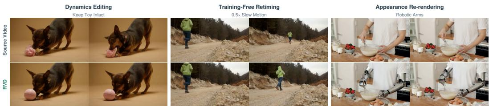  
Figure 1: By disentangling video dynamics from visual context, RVD enables video dynamics editing, training-free retiming, and appearance re-rendering.

## ABSTRACT

Most video editing methods focus on changing the appearance of the source video, while offering limited control over its dynamics. We introduce Reimagine Video Dynamics (RVD), a framework that disentangles a compact, editable dynamics token from visual context. We learn this token through self-supervised reconstruction: given the first frame as visual context, a renderer must recover the original video from the dynamics token, encouraging it to capture how the scene evolves rather than how it looks. This disentanglement allows video dynamics to be edited directly while preserving visual context. We develop a language-guided dynamicstoken editor that transforms source dynamics into target dynamics, and train it with a scalable counterfactual video-pair pipeline and a two-stage training strategy. Extensive experiments show that RVD enables effective video dynamics editing, training-free retiming, and appearance-controlled re-rendering. Project page: https://yuyuanspace.com/RVD/

## 1 INTRODUCTION

Modern video editing models can convincingly modify a video’s appearance, from a runner’s clothing to the background (Jiang et al., 2025; Cheng et al., 2024; Bai et al., 2026; Yang et al., 2026; Yatim et al., 2024; Yang et al., 2025a; Chen et al., 2026). However, they often have limited control over the video’s dynamics, such as turning a run into a walk or making the runner stop before an obstacle. Such edits require changing motion while preserving the surrounding scene. A key challenge is information entanglement: existing editors typically operate in a joint video latent space where visual context and dynamics are mixed together. As a result, changing dynamics requires modifying representations that also encode appearance and scene identity, making precise dynamics editing difficult to learn and generalize.

This motivates a different approach: Rather than editing the entire video latent space, can we disentangle dynamics from visual context and edit each one directly? We decompose a video into two components: visual context preserves appearance and scene identity, while an explicit spatiotemporal dynamics token describes temporal evolution. This decomposition makes editing more structured: changing the visual context re-renders the same motion under a new appearance, while changing the dynamics token alters the motion within the same scene.

How can we disentangle dynamics from visual context? We learn this disentanglement through selfsupervised video reconstruction. A dynamics encoder extracts a clean and compact spatiotemporal dynamics token from the source video. A renderer is then trained to reconstruct the original video from this token and the first frame. Since the first frame already provides visual context, the dynamics token is encouraged to capture the complementary information needed to recover the scene’s precise motion. We further validate this disentanglement empirically.

How can we edit the dynamics token? We first show that the learned dynamics token exhibits clear spatiotemporal structure and consistent statistical properties, providing a suitable space for editing. We then build a dynamics-token editor that transforms source dynamics tokens into target dynamics tokens according to an edit instruction. A multimodal language model (MLLM) (Bai et al., 2025) interprets the requested change and produces a semantic memory, which guides a dynamics editing transformer to modify the token. The edited token is then combined with the first frame and passed to the trained renderer to produce the final video.

How can we train the dynamics-token editor? Training the editor requires counterfactual video pairs that share the same visual context but have different dynamics. We build a scalable generation pipeline that produces such source–target pairs together with their edit instructions. We further adopt a two-stage training strategy: large-scale pretraining teaches the editor the distribution of realistic dynamics, while fine-tuning on counterfactual pairs learns precise source-to-target dynamic transformations.

We call the resulting framework Reimagine Video Dynamics (RVD). By disentangling dynamics from visual context, RVD provides a common interface for several forms of video manipulation. Editing the dynamics token changes how the scene evolves; resampling it along time enables trainingfree video retiming; and changing the visual context while keeping dynamics fixed re-renders the same motion under a new appearance. Our contributions are threefold:

1. We introduce a compact spatiotemporal dynamics token, learned through self-supervised video reconstruction, that disentangles video dynamics from visual context and directly controls dynamics in a video renderer.

2. We develop a dynamics-token editor that transforms source dynamics into target dynamics under natural-language instructions, together with a scalable counterfactual video-pair data pipeline and two-stage training strategy for learning such transformations.

3. We demonstrate that RVD supports video dynamics editing, training-free video retiming, and appearance-controlled re-rendering within one framework.

## 2 RELATED WORK

## 2.1 VIDEO EDITING MODELS

Recent advances in generative modeling (Ho et al., 2020; Song et al., 2021; Lipman et al., 2023; Rombach et al., 2022; Peebles & Xie, 2023) and large-scale video generation (OpenAI, 2024; Gao et al., 2025; Yang et al., 2024; Kong et al., 2024; Wan Team et al., 2025) have enabled a broad family of video editing models (Cheng et al., 2024; Bai et al., 2026; Mai et al., 2026; Jiang et al., 2025; Yang et al., 2026; Chen et al., 2026; Yatim et al., 2024; Yang et al., 2025a). Most video editing models focus on changing appearance, and editing video dynamics is less explored. Existing methods that edit a source video’s dynamics often rely on explicit motion signals such as poses or sparse trajectories (Song et al., 2025; Tu et al., 2024; Mou et al., 2024; Burgert et al., 2026), specialize in object or interaction deletion (Motamed et al., 2026), plan trajectories at inference time (Yuan et al., 2026c), or leave dynamics control implicit in a pretrained generator (Kulikov et al., 2026). A compact dynamics representation that can be edited separately from visual context remains largely unexplored.

## 2.2 REPRESENTATIONS FOR VIDEO DYNAMICS

Existing video representations provide different starting points for modeling video dynamics. Reconstruction-oriented representations, such as video variational autoencoder (VAE) (Wan Team et al., 2025; Yang et al., 2024) latents, preserve appearance, texture, and motion jointly for faithful decoding, making visual context and temporal evolution difficult to separate. Semantic representations, such as DINO family (Caron et al., 2021; Oquab et al., 2023; Siméoni et al., 2026) and representation autoencoders (RAE) (Zheng et al., 2026), emphasize object- and scene-level structure, but are not explicitly designed to model temporal evolution. Predictive video representations, such as V-JEPA family (Bardes et al., 2024; Assran et al., 2025; Mur-Labadia et al., 2026), instead learn spatiotemporal features by predicting latent video structure. We therefore use a frozen V-JEPA 2 encoder to extract rich features as the starting point for learning our compact dynamics token.

## 2.3 PHYSICS-AWARE VIDEO GENERATION AND EDITING

Physics-aware generation can be grouped by where physics enters the pipeline: generation followed by physical simulation (Xie et al., 2024; Zhang et al., 2024), physical simulation followed by generative rendering (Liu et al., 2024; Montanaro et al., 2024; Xie et al., 2025), and generation guided by learned physical or motion priors (Li et al., 2024; Chefer et al., 2025; Xue et al., 2025; Yang et al., 2025b; Wang et al., 2025; Yuan et al., 2026b) or inference-time planning and rewards (Yuan et al., 2026c;a). Precise dynamics editing of real videos remains underexplored.

## 3 RENDERER: DISENTANGLING DYNAMICS BY RECONSTRUCTION

Our starting hypothesis is that a video can be described by two complementary factors:

$$
\mathrm { \bf V = \underbrace { \mathrm { \bf C } } _ { \mathrm { \tiny ~ v i s u a l ~ c o n t e x t } } + \underbrace { \mathrm { \bf D } } _ { \mathrm { \tiny ~ d y n a m i c s } } , }\tag{1}
$$

where C specifies what the scene looks like and D specifies how it evolves. The “+” denotes generative composition rather than pixel addition. This decomposition motivates our disentanglement objective: changing C should alter appearance while preserving motion, whereas changing D should alter temporal evolution within the chosen scene. We validate this behavior empirically through controlled interventions.

## 3.1 RENDERER AND TRAINING

Learning Dynamics by Reconstruction. As Fig. 2 shows, a dynamics encoder extracts D from a source video, while a video rendering model $R _ { \theta }$ receives D together with visual context $\mathbf { C } = \left( \mathbf { I } _ { 0 } , c \right)$ represented by the first frame and an optional caption. The renderer reconstructs the source video:

$$
\widehat { \mathbf { V } } = R _ { \theta } ( \mathbf { I } _ { 0 } , c , \mathbf { D } ) .\tag{2}
$$

where $\widehat { \mathbf { V } }$ denotes the reconstructed video. Because the context path already supplies the scene and appearance, the dynamics token is trained to carry the missing dynamics.

Dynamics encoder. We use a frozen V-JEPA 2 ViT-L encoder (Assran et al., 2025) followed by a learnable bottleneck. The V-JEPA 2 encoder extracts features rich in video dynamics. For an 81-frame clip, it produces 41 temporal steps on a 16 × 16 spatial grid with 1024 channels. However, these features remain high-dimensional, which makes them costly and less stable to model directly and often calls for compression (Nilaksh et al., 2026); they may also leak appearance information that is irrelevant to dynamics. We therefore introduce a learnable bottleneck to further filter and compress them into a compact dynamics token. We compress the temporal dimension from 41 to 21 steps. An overlapping 3 × 3 stride-2 convolution reduces each spatial grid from 16 × 16 to $8 \times 8 ,$ while an MLP reduces the channel dimension from 1024 to 128. After the bottleneck, the representation is reduced by about 64× compared with the original V-JEPA 2 features and by about 564× compared with the raw video.

Dynamics-conditioned renderer. We build on Wan2.1-I2V-14B-480P (Wan Team et al., 2025) and introduce a separate dynamics-token-conditioning branch. The first frame and caption retain Wan’s original paths, while the dynamics token is injected through DynCrossAttention adapters in the first 30 transformer blocks. To align the dynamics token with Wan features, we map the two spatial grids to the same continuous coordinate system and apply shared row and column rotary positional embeddings (2D-RoPE) (Su et al., 2024) to the queries and keys. This provides an explicit spatial correspondence between the dynamics token and the video latent.

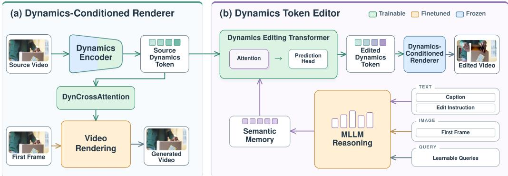  
Figure 2: RVD architecture. (a) Renderer: Self-supervised reconstruction disentangles a compact dynamics token from visual context. (b) Editor: A language-guided editor modifies the dynamics token, which is then rendered into a video with the target dynamics.

We further constrain the dynamics pathway to emphasize motion while limiting changes to visual context. At each frame, we subtract the spatial mean of the adapter residual to reduce global appearance leakage. We also limit the root mean square (RMS) magnitude of the residual so that the dynamics signal does not overwhelm the original Wan features. Finally, a diffusion-time gate gives the dynamics token stronger influence early in generation, when the overall motion is formed, and gradually reduces its influence later, when the model focuses more on visual details.

Renderer Training. Following Wan2.1 (Wan Team et al., 2025), let $\mathbf { x } _ { 1 }$ be the clean video latent, $\mathbf { x } _ { 0 } \sim \mathcal { N } ( 0 , \mathbf { I } )$ be Gaussian noise, and t be sampled from a logit-normal distribution. We form ${ \bf x } _ { t } = t { \bf x } _ { 1 } + ( 1 - t ) { \bf x } _ { 0 }$ and regress the rectified-flow velocity $\mathbf { v } _ { t } = \mathbf { x } _ { 1 } - \mathbf { x } _ { 0 } \colon$

$$
\begin{array} { r } { \mathcal { L } _ { \mathrm { r e n d e r } } = \mathbb { E } _ { \mathbf { x } _ { 0 } , \mathbf { x } _ { 1 } , t } \left\| u _ { \theta } ( \mathbf { x } _ { t } , t ; \mathbf { I } _ { 0 } , c , \mathbf { D } ) - \mathbf { v } _ { t } \right\| _ { 2 } ^ { 2 } , } \end{array}\tag{3}
$$

where $u _ { \theta }$ predicts the velocity conditioned on the first frame, caption, and dynamics token. Training uses about 169K carefully filtered videos with diverse scenes, subjects, and motions. We apply caption dropout to encourage the renderer to rely on the dynamics token for precise motion control. We also perturb the dynamics token with random noise and masking to improve robustness and generalization. We first train the bottleneck and dynamics adapters from scratch, and then finetune Wan blocks with LoRA (Hu et al., 2022). The renderer is trained for 6 days on 8 NVIDIA H200 GPUs. Appendix A provides additional architecture and training details.

## 3.2 EXPERIMENTS: DOES THE TOKEN DISENTANGLE DYNAMICS FROM APPEARANCE?

Reconstruction. We first test whether the compact dynamics token preserves the motion information needed by the renderer. Given the first frame and extracted dynamics token, the renderer reproduces the source motion and reaches 19.261 dB PSNR. Removing the dynamics token sharply reduces motion consistency and lowers PSNR to 16.663 dB, as shown in Table 2.

Disentanglement through controlled tests. We evaluate the two directions separately. First, we fix the dynamics token D and replace only the first frame and caption. Fig. 3 shows that foreground, background, and style can change while the source motion remains aligned; Table 5 measures this preservation directly. Conversely, we fix the target first frame, caption, seed, and renderer, and vary only the dynamics input. The resulting videos follow different event trajectories despite sharing the same visual context. Together, these controlled tests empirically validate the disentanglement: visual context primarily determines appearance, while the dynamics token primarily determines how the scene evolves. Appendix A.3 provides the complete protocols, qualitative results, and measurements for both directions.

Appearance editing. Finally, we evaluate RVD on conventional video appearance editing by keeping the dynamics token fixed and changing only the visual context. We compare with Ditto (Bai et al., 2026), InsV2V (Cheng et al., 2024), OmniVideo2 (Yang et al., 2026), STDF (Yatim et al., 2024), VideoGrain (Yang et al., 2025a), and VINO (Chen et al., 2026). Fig. 3 shows that RVD changes foreground, background, and style while preserving the source motion. Table 1 reports four metrics: IF is the mean 1–5 instruction-following score from an MLLM judge; Pass is the fraction judged to complete the edit; JEPA is the source–output V-JEPA similarity (Assran et al., 2025) and measures dynamics preservation; and Imaging is the VBench imaging-quality score (Huang et al., 2024). Across 600 appearance edits, RVD leads in IF, Pass, and JEPA while remaining competitive in Imaging. Fig. 4 shows representative comparisons for all three edit types.

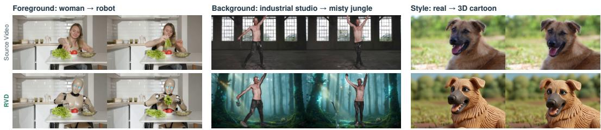

Figure 3: Changing the world appearance while keeping its dynamics. The same dynamics token is rendered with a different first frame and caption.  
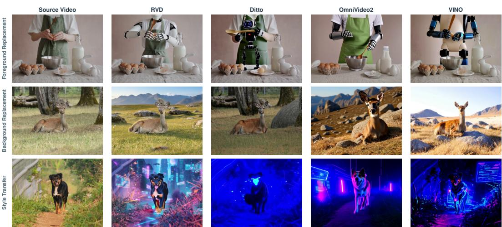  
Figure 4: Qualitative comparison of video appearance re-rendering.

## 3.3 RENDERER ARCHITECTURE ABLATION

Table 2 studies three renderer design choices. First, removing dynamics conditioning causes the largest reconstruction drop, confirming that the token carries essential temporal information. Second, the $8 \times 8 \times$ 128 bottleneck offers a strong balance between reconstruction fidelity and token efficiency; larger spatial grids improve fidelity at substantially higher cost. Third, 2D RoPE and residual centering provide the clearest gains among the injection choices, while injecting into every block or removing the noise gate has a smaller effect. Appendix A.4 describes the shared evaluation protocol.

## 4 EDITOR: EDITING THE LEARNED DYNAMICS SPACE

The dynamics encoder introduced in the previous section disentangles a compact dynamics token from the source video. In this section, we study how to edit this token to generate a target video with different dynamics. Given a source dynamics token D and an edit instruction $q ,$ the editor $T _ { \xi }$ predicts an edited token

$$
\widehat { \mathbf { D } } = T _ { \xi } ( \mathbf { D } , q ) .\tag{4}
$$

The renderer then substitutes $\hat { \bf D }$ for D in Equation 2, producing the target video with different dynamics.

Table 1: Quantitative comparison of video appearance re-rendering.
<table><tr><td>Metric</td><td>RVD</td><td>Ditto</td><td>InsV2V</td><td>OmniVideo2</td><td>STDF</td><td>VideoGrain</td><td>VINO</td></tr><tr><td>F↑</td><td>4.438</td><td>3.973</td><td>1.615</td><td>3.712</td><td>2.085</td><td>2.260</td><td>4.345</td></tr><tr><td>Pass (%) ↑</td><td>86.8</td><td>74.5</td><td>10.5</td><td>63.5</td><td>26.0</td><td>27.2</td><td>81.3</td></tr><tr><td>JEPA↑</td><td>0.9050</td><td>0.8496</td><td>0.6933</td><td>0.8256</td><td>0.8688</td><td>0.8686</td><td>0.8706</td></tr><tr><td>Imaging ↑</td><td>69.80</td><td>68.37</td><td>61.77</td><td>70.46</td><td>62.23</td><td>65.49</td><td>67.09</td></tr></table>

Table 2: Renderer ablations across conditioning, bottleneck capacity, and dynamics injection.  
(a) Conditioning and injection
<table><tr><td>Design</td><td>Variant</td><td>PSNR ↑</td><td>SSIM ↑</td></tr><tr><td>Conditioning</td><td>Full renderer No dynamics token No caption</td><td>19.261 16.663 18.630</td><td>0.5761 0.5216 0.5770</td></tr><tr><td>Injection</td><td>Full renderer No 2D RoPE No centering Inject all blocks</td><td>19.261 18.222 18.427 19.093</td><td>0.5761 0.5511 0.5743 0.5853</td></tr></table>

(b) Bottleneck capacity
<table><tr><td>Token shape</td><td>PSNR ↑</td><td>SSIM ↑</td></tr><tr><td>4×4×128</td><td>18.691</td><td>0.5723</td></tr><tr><td>8×8×64</td><td>18.346</td><td>0.5818</td></tr><tr><td>8×8×128</td><td>19.261</td><td>0.5761</td></tr><tr><td>8×8×256</td><td>17.963</td><td>0.5591</td></tr><tr><td>8×8×512</td><td>18.166</td><td>0.5615</td></tr><tr><td>8×8×1024</td><td>18.467</td><td>0.5659</td></tr><tr><td>16×16×128</td><td>19.593</td><td>0.5960</td></tr></table>

## 4.1 IS THE DYNAMICS TOKEN STRUCTURED AND EDITABLE?

Before designing the dynamics token editor, we first examine whether the learned token forms a meaningful space for manipulation.

Structure of the dynamics space. We analyze post-bottleneck dynamics tokens from 248 real videos. Fig. 5 shows that the representation does not collapse after compression. First, temporal variation is distributed across the full 8 × 8 spatial grid, with a normalized coverage entropy of 0.995 and a maximum spatial rank of 63/63. Second, different source-motion states produce different, but overlapping, residual-energy distributions. The channel covariance also remains full rank (128/128). Together, these results show that the compressed token preserves rich variation across space, motion, and channels. Detailed definitions and additional statistics are provided in Appendix B.1.

Direct manipulation through retiming. We next test whether the learned token can be manipulated directly, without training an editor. Because the token preserves an explicit temporal axis, we can change motion speed simply by resampling it over time. Temporal interpolation stretches the sequence to produce slower motion, while temporal subsampling produces faster motion. As shown in Fig. 6, these simple operations change the pace of the rendered motion while preserving the visual content. Additional examples and implementation details are provided in Appendix B.2.

## 4.2 VIDEO DYNAMICS EDITOR

Our editor transforms a source dynamics token into a target dynamics token according to a naturallanguage edit instruction. As shown in Fig. 2(b), it contains two key components: a multimodal semantic encoder that interprets the requested change, and a dynamics editing transformer that applies this change directly in the learned dynamics space. The detailed architecture is shown in Fig. 14.

Semantic memory. We adapt Qwen3-VL-4B-Instruct (Bai et al., 2025) to provide semantic guidance for dynamics editing. It receives three input types: text containing the source and target captions and edit instruction, vision from the target first frame, and eight learnable queries that gather and compress task-relevant information. Qwen jointly reasons over these inputs, and the final query states form compact semantic tokens that guide the dynamics editor. The Qwen backbone and vision encoder remain frozen, while rank-4 LoRA and the learnable queries provide lightweight adaptation.

Dynamics editing transformer. The dynamics editor modifies the compact source token directly rather than predicting video pixels. It first flattens the token into a spatiotemporal sequence. In each transformer block, self-attention models dependencies across time and space, cross-attention reads the semantic tokens. A prediction head then maps the features back to the original token shape to produce the edited dynamics token.

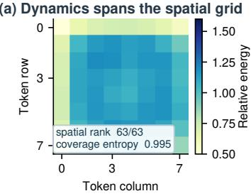

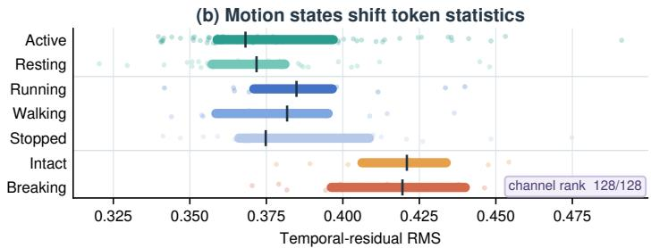  
Figure 5: Dynamics-token analysis. (a) Temporal variation spans the spatial grid. (b) Different motion states exhibit distinct dynamics-token distributions.

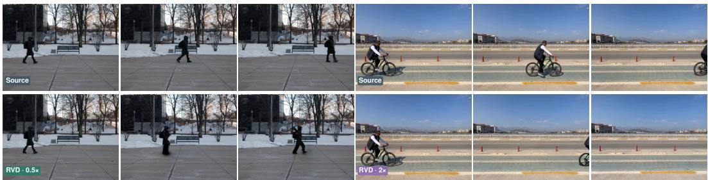  
Figure 6: Training-free retiming in dynamics-token space. Resampling the dynamics token along its temporal axis directly slows down or speeds up the rendered motion without additional training.

At inference, an MLLM (Bai et al., 2025) infers the target-video caption from the source video and edit instruction. If the requested dynamics require a different initial pose or state, Qwen-Image-Edit (Wu et al., 2025) also produces a target first frame; otherwise, we reuse the source first frame. The edited dynamics token, target caption, and target first frame are then passed to the trained renderer to generate a video with the requested dynamics.

## 4.3 EDITOR TRAINING: COUNTERFACTUAL DATA AND TWO-STAGE STRATEGY

Counterfactual video pair construction. Training the dynamics editor requires pairs of videos that share the same visual context but exhibit different dynamics. Such pairs are difficult to collect from real videos, so we build the counterfactual data pipeline shown in Fig. 7. Starting from a real video, we first identify its motion category and use an MLLM (Bai et al., 2025) to plan a counterfactual outcome. We then edit the target layout with Qwen-Image-Edit (Wu et al., 2025) and synthesize the target video with VACE (Jiang et al., 2025). An MLLM-based quality check removes samples with inconsistent identity, background, or target motion. Finally, each accepted pair is reused in the reverse direction by swapping source and target and reversing the instruction. This pipeline produces about 20K counterfactual video pairs covering 17 dynamics transformations. Additional generation details and statistics are provided in Appendix C.2.

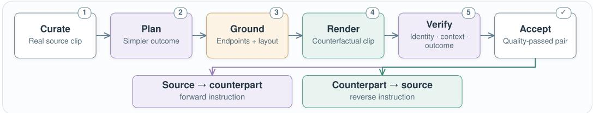  
Figure 7: Counterfactual data pipeline.

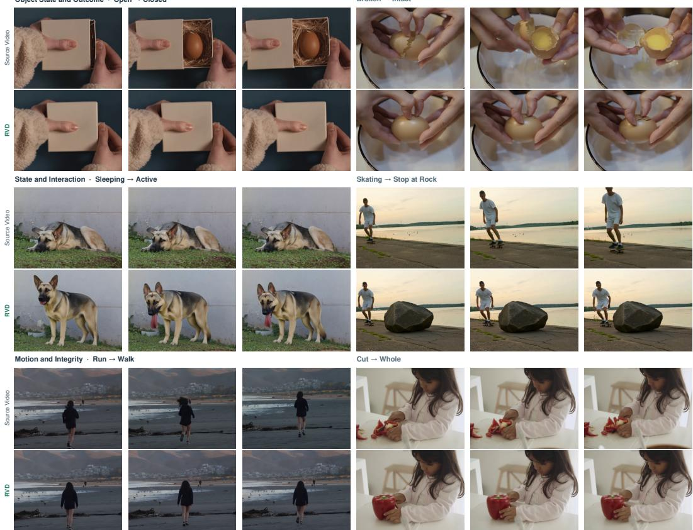  
Figure 8: Video dynamics editing with RVD.

Two-stage training. Although our counterfactual dataset covers diverse dynamics transformations, its scale and motion categories remain limited. Training directly on these pairs can therefore make it difficult for the editor to learn the broader distribution of realistic dynamics tokens. Before counterfactual fine-tuning, we first construct 169K pseudo dynamics pairs from real videos. Each pseudo pair uses a static source formed by repeating the first frame and the dynamics token of the corresponding real video as the target. This pretraining stage teaches the editor to produce tokens that follow the distribution of real video dynamics. We then fine-tune on the 20K counterfactual pairs to learn precise source-to-target dynamics transformations. The full training process takes approximately 5 days on 8 NVIDIA H200 GPUs.

Token-space Loss. The editor is trained on the dynamics token space. Let $\widehat { X }$ and $X ^ { * }$ denote the predicted and target tokens. We decompose each token into its temporal mean and residual:

$$
X = \mu ( X ) + A ( X )\tag{5}
$$

where $\mu ( X )$ captures the slowly varying component and $A ( X )$ captures temporal variation.

We use ${ \mathcal { L } } _ { \mathrm { d c } }$ to match the temporal means and $\mathcal { L } _ { \mathrm { a c } }$ to match the temporal residuals. A cosine loss ${ \mathcal { L } } _ { \mathrm { c o s } }$ further aligns the direction of temporal changes. We also match residual variance with ${ \mathcal L } _ { \mathrm { v a r } }$ to preserve motion magnitude, and temporal frequency spectra with ${ \mathcal { L } } _ { \mathrm { f f t } }$ to preserve motion pace and rhythm. The complete objective is

$$
\mathcal { L } _ { \mathrm { e d i t } } = \lambda _ { \mathrm { d c } } \mathcal { L } _ { \mathrm { d c } } + \lambda _ { \mathrm { a c } } \mathcal { L } _ { \mathrm { a c } } + \lambda _ { \mathrm { c o s } } \mathcal { L } _ { \mathrm { c o s } } + \lambda _ { \mathrm { v a r } } \mathcal { L } _ { \mathrm { v a r } } + \lambda _ { \mathrm { f t } } \mathcal { L } _ { \mathrm { f f t } } .\tag{6}
$$

Detailed definitions and optimization settings are provided in Appendix C.3.

Training ablations. Table 3 shows that pseudo-pair pretraining provides a stronger dynamics prior, while the proposed token-space losses improve the accuracy and stability of dynamics editing.

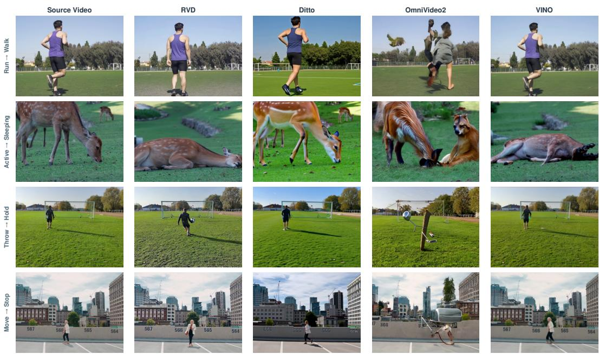

Figure 9: Qualitative comparison of video dynamics editing.  
Table 3: Dynamics-editor ablations. (a) Two-stage training reports absolute metrics. (b) Tokenspace loss ablations report changes from their full-loss reference.
<table><tr><td colspan="3">(a) Two-stage training</td></tr><tr><td>Training strategy</td><td>AC-cos ↑</td><td>AC MSE↓</td></tr><tr><td>W/o Two-stage</td><td>0.2629</td><td>0.6977</td></tr><tr><td>Two-stage</td><td>0.2892</td><td>0.6352</td></tr></table>

(b) Dynamics-aware loss
<table><tr><td>Removed</td><td>Metric</td><td>Change from full</td></tr><tr><td>Lcos</td><td>AC-cos ↑</td><td>-0.0134</td></tr><tr><td> ${ \mathcal { L } } _ { \mathrm { v a r } } + { \mathcal { L } } _ { \mathrm { f f t } }$ </td><td>Variance error ↓</td><td>+0.2079</td></tr><tr><td></td><td>Spectrum error ↓</td><td>+0.3276</td></tr></table>

## 4.4 DYNAMICS EDITING RESULTS

Qualitative comparison. Fig. 8 shows that RVD can edit diverse dynamics, including physical outcomes, activity states, locomotion, and object states, while often maintaining the visible subject and surrounding scene in these examples. Fig. 9 compares RVD with three instruction-based video editing methods: Ditto (Bai et al., 2026), OmniVideo2 (Yang et al., 2026), and VINO (Chen et al., 2026). These methods often preserve the original motion and fail to realize the requested dynamics change, whereas RVD directly modifies the temporal evolution of the video.

Benchmark results. We evaluate 300 scenes across 17 edit directions. IF and Pass measure whether the requested edit occurs. We additionally report VBench background consistency and temporal flickering (Huang et al., 2024) as output-internal diagnostics. Table 4 shows that RVD leads the four reported metrics. The evidence for stronger instruction following comes from IF and Pass, while the VBench scores indicate internally stable outputs and must be interpreted with these limitations.

Table 4: Quantitative comparison of video dynamics editing.
<table><tr><td rowspan="2">Method</td><td colspan="2">Edit success</td><td colspan="2">Output-internal consistency</td></tr><tr><td></td><td>IF ↑ Pass (%) ↑</td><td></td><td>Background stability ↑ Temporal smoothness ↑</td></tr><tr><td>RVD (ours)</td><td>4.837</td><td>98.3</td><td>0.9711</td><td>0.9919</td></tr><tr><td>Ditto (Bai et al., 2026)</td><td>2.537</td><td>36.7</td><td>0.9552</td><td>0.9858</td></tr><tr><td>OmniVideo2 (Yang et al., 2026)</td><td>2.187</td><td>27.0</td><td>0.9531</td><td>0.9777</td></tr><tr><td>VINO (Chen et al., 2026)</td><td>3.957</td><td>75.0</td><td>0.9645</td><td>0.9866</td></tr></table>

## 5 CONCLUSION

RVD makes video dynamics explicit as a compact, editable token. Its renderer learns this token by reconstructing video from the first frame, disentangling temporal evolution from visual context. Its semantic editor modifies source dynamics directly in token space, enabling dynamics editing, retiming, and appearance-controlled re-rendering. This unified design offers a reusable dynamics interface for future video world models.

## REFERENCES

Mahmoud Assran, Adrien Bardes, David Fan, Quentin Garrido, Russell Howes, Mojtaba Komeili, Matthew Muckley, Ammar Rizvi, Claire Roberts, Koustuv Sinha, Artem Zholus, Sergio Arnaud, Abha Gejji, Ada Martin, Francois Robert Hogan, Daniel Dugas, Piotr Bojanowski, Vasil Khalidov, Patrick Labatut, Francisco Massa, Marc Szafraniec, Kapil Krishnakumar, Yong Li, Xiaodong Ma, Sarath Chandar, Franziska Meier, Yann LeCun, Michael Rabbat, and Nicolas Ballas. V-JEPA 2: Self-supervised video models enable understanding, prediction and planning. arXiv preprint arXiv:2506.09985, 2025.

Qingyan Bai, Qiuyu Wang, Hao Ouyang, Yue Yu, Hanlin Wang, Wen Wang, Ka Leong Cheng, Shuailei Ma, Yanhong Zeng, Zichen Liu, Yinghao Xu, Yujun Shen, and Qifeng Chen. Scaling instruction-based video editing with a high-quality synthetic dataset. In IEEE/CVF Conference on Computer Vision and Pattern Recognition, 2026.

Shuai Bai, Yuxuan Cai, Ruizhe Chen, Keqin Chen, Xionghui Chen, Zesen Cheng, Lianghao Deng, Wei Ding, Chang Gao, Chunjiang Ge, Wenbin Ge, Zhifang Guo, Qidong Huang, Jie Huang, Fei Huang, Binyuan Hui, Shutong Jiang, Zhaohai Li, Mingsheng Li, Mei Li, Kaixin Li, Zicheng Lin, Junyang Lin, Xuejing Liu, Jiawei Liu, Chenglong Liu, Yang Liu, Dayiheng Liu, Shixuan Liu, Dunjie Lu, Ruilin Luo, Chenxu Lv, Rui Men, Lingchen Meng, Xuancheng Ren, Xingzhang Ren, Sibo Song, Yuchong Sun, Jun Tang, Jianhong Tu, Jianqiang Wan, Peng Wang, Pengfei Wang, Qiuyue Wang, Yuxuan Wang, Tianbao Xie, Yiheng Xu, Haiyang Xu, Jin Xu, Zhibo Yang, Mingkun Yang, Jianxin Yang, An Yang, Bowen Yu, Fei Zhang, Hang Zhang, Xi Zhang, Bo Zheng, Humen Zhong, Jingren Zhou, Fan Zhou, Jing Zhou, Yuanzhi Zhu, and Ke Zhu. Qwen3-VL technical report. arXiv preprint arXiv:2511.21631, 2025.

Adrien Bardes, Quentin Garrido, Jean Ponce, Xinlei Chen, Michael Rabbat, Yann LeCun, Mido Assran, and Nicolas Ballas. Revisiting feature prediction for learning visual representations from video. Transactions on Machine Learning Research, 2024.

Ryan Burgert, Charles Herrmann, Forrester Cole, Michael S. Ryoo, Neal Wadhwa, Andrey Voynov, and Nataniel Ruiz. MotionV2V: Editing motion in a video. In IEEE/CVF Conference on Computer Vision and Pattern Recognition, 2026.

Mathilde Caron, Hugo Touvron, Ishan Misra, Hervé Jégou, Julien Mairal, Piotr Bojanowski, and Armand Joulin. Emerging properties in self-supervised vision transformers. In IEEE/CVF International Conference on Computer Vision, 2021.

Hila Chefer, Uriel Singer, Amit Zohar, Yuval Kirstain, Adam Polyak, Yaniv Taigman, Lior Wolf, and Shelly Sheynin. VideoJAM: Joint appearance-motion representations for enhanced motion generation in video models. In International Conference on Machine Learning, 2025.

Junyi Chen, Tong He, Zhoujie Fu, Pengfei Wan, Kun Gai, and Weicai Ye. VINO: A unified visual generator with interleaved OmniModal context. arXiv preprint arXiv:2601.02358, 2026.

Jiaxin Cheng, Tianjun Xiao, and Tong He. Consistent video-to-video transfer using synthetic dataset. In International Conference on Learning Representations, 2024.

Yu Gao, Haoyuan Guo, Tuyen Hoang, Weilin Huang, Lu Jiang, Fangyuan Kong, Huixia Li, Jiashi Li, Liang Li, Xiaojie Li, Xunsong Li, Yifu Li, Shanchuan Lin, Zhijie Lin, Jiawei Liu, Shu Liu, Xiaonan Nie, Zhiwu Qing, Yuxi Ren, Li Sun, Zhi Tian, Rui Wang, Sen Wang, Guoqiang Wei, Guohong Wu, Jie Wu, Ruiqi Xia, Fei Xiao, Xuefeng Xiao, Jiangqiao Yan, Ceyuan Yang, Jianchao Yang, Runkai Yang, Tao Yang, Yihang Yang, Zilyu Ye, Xuejiao Zeng, Yan Zeng, Heng Zhang,

Yang Zhao, Xiaozheng Zheng, Peihao Zhu, Jiaxin Zou, and Feilong Zuo. Seedance 1.0: Exploring the boundaries of video generation models. arXiv preprint arXiv:2506.09113, 2025.

Jonathan Ho, Ajay Jain, and Pieter Abbeel. Denoising diffusion probabilistic models. In Advances in Neural Information Processing Systems, 2020.

Edward J. Hu, Yelong Shen, Phillip Wallis, Zeyuan Allen-Zhu, Yuanzhi Li, Shean Wang, Lu Wang, and Weizhu Chen. LoRA: Low-rank adaptation of large language models. In International Conference on Learning Representations, 2022.

Ziqi Huang, Yinan He, Jiashuo Yu, Fan Zhang, Chenyang Si, Yuming Jiang, Yuanhan Zhang, Tianxing Wu, Qingyang Jin, Nattapol Chanpaisit, Yaohui Wang, Xinyuan Chen, Limin Wang, Dahua Lin, Yu Qiao, and Ziwei Liu. VBench: Comprehensive benchmark suite for video generative models. In IEEE/CVF Conference on Computer Vision and Pattern Recognition, 2024.

Zeyinzi Jiang, Zhen Han, Chaojie Mao, Jingfeng Zhang, Yulin Pan, and Yu Liu. VACE: All-in-one video creation and editing. In IEEE/CVF International Conference on Computer Vision, 2025.

Weijie Kong, Qi Tian, Zijian Zhang, Rox Min, Zuozhuo Dai, Jin Zhou, Jiangfeng Xiong, Xin Li, Bo Wu, Jianwei Zhang, Kathrina Wu, Qin Lin, Junkun Yuan, Yanxin Long, Aladdin Wang, Andong Wang, Changlin Li, Duojun Huang, Fang Yang, Hao Tan, Hongmei Wang, Jacob Song, Jiawang Bai, Jianbing Wu, Jinbao Xue, Joey Wang, Kai Wang, Mengyang Liu, Pengyu Li, Shuai Li, Weiyan Wang, Wenqing Yu, Xinchi Deng, Yang Li, Yi Chen, Yutao Cui, Yuanbo Peng, Zhentao Yu, Zhiyu He, Zhiyong Xu, Zixiang Zhou, Zunnan Xu, Yangyu Tao, Qinglin Lu, Songtao Liu, Dax Zhou, Hongfa Wang, Yong Yang, Di Wang, Yuhong Liu, Jie Jiang, and Caesar Zhong. HunyuanVideo: A systematic framework for large video generative models. arXiv preprint arXiv:2412.03603, 2024.

Vladimir Kulikov, Roni Paiss, Andrey Voynov, Inbar Mosseri, Tali Dekel, and Tomer Michaeli. Versatile editing of video content, actions, and dynamics without training. In European Conference on Computer Vision, 2026.

Zhengqi Li, Richard Tucker, Noah Snavely, and Aleksander Holynski. Generative image dynamics. In IEEE/CVF Conference on Computer Vision and Pattern Recognition, 2024.

Yaron Lipman, Ricky T. Q. Chen, Heli Ben-Hamu, Maximilian Nickel, and Matt Le. Flow matching for generative modeling. In International Conference on Learning Representations, 2023.

Shaowei Liu, Zhongzheng Ren, Saurabh Gupta, and Shenlong Wang. PhysGen: Rigid-body physicsgrounded image-to-video generation. In European Conference on Computer Vision, 2024.

Jinjie Mai, Chaoyang Wang, Gordon Guocheng Qian, Willi Menapace, Sergey Tulyakov, Bernard Ghanem, Peter Wonka, and Ashkan Mirzaei. EasyV2V: A high-quality instruction-based video editing framework. In IEEE/CVF Conference on Computer Vision and Pattern Recognition, 2026.

Antonio Montanaro, Luca Savant Aira, Emanuele Aiello, Diego Valsesia, and Enrico Magli. Motion-Craft: Physics-based zero-shot video generation. In Advances in Neural Information Processing Systems, 2024.

Saman Motamed, William Harvey, Benjamin Klein, Luc Van Gool, Zhuoning Yuan, and Ta-Ying Cheng. VOID: Video object and interaction deletion. In European Conference on Computer Vision, 2026.

Chong Mou, Mingdeng Cao, Xintao Wang, Zhaoyang Zhang, Ying Shan, and Jian Zhang. ReVideo: Remake a video with motion and content control. In Advances in Neural Information Processing Systems, 2024.

Lorenzo Mur-Labadia, Matthew Muckley, Amir Bar, Mahmoud Assran, Koustuv Sinha, Michael Rabbat, Yann LeCun, Nicolas Ballas, and Adrien Bardes. V-JEPA 2.1: Unlocking dense features in video self-supervised learning. arXiv preprint arXiv:2603.14482, 2026.

Nilaksh, Saurav Jha, Artem Zholus, and Sarath Chandar. Reconstruction or semantics? What makes a latent space useful for robotic world models. arXiv preprint arXiv:2605.06388, 2026.

OpenAI. Video generation models as world simulators. https://openai.com/index/ video-generation-models-as-world-simulators/, 2024.

Maxime Oquab, Timothée Darcet, Theo Moutakanni, Huy V. Vo, Marc Szafraniec, Vasil Khalidov, Pierre Fernandez, Daniel Haziza, Francisco Massa, Alaaeldin El-Nouby, Russell Howes, Po-Yao Huang, Hu Xu, Vasu Sharma, Shang-Wen Li, Wojciech Galuba, Mike Rabbat, Mido Assran, Nicolas Ballas, Gabriel Synnaeve, Ishan Misra, Herve Jegou, Julien Mairal, Patrick Labatut, Armand Joulin, and Piotr Bojanowski. DINOv2: Learning robust visual features without supervision. arXiv preprint arXiv:2304.07193, 2023.

William Peebles and Saining Xie. Scalable diffusion models with transformers. In IEEE/CVF International Conference on Computer Vision, 2023.

Robin Rombach, Andreas Blattmann, Dominik Lorenz, Patrick Esser, and Björn Ommer. Highresolution image synthesis with latent diffusion models. In IEEE/CVF Conference on Computer Vision and Pattern Recognition, 2022.

Oriane Siméoni, Huy V. Vo, Maximilian Seitzer, Federico Baldassarre, Maxime Oquab, Cijo Jose, Vasil Khalidov, Marc Szafraniec, Seungeun Yi, Michaël Ramamonjisoa, Francisco Massa, Daniel Haziza, Luca Wehrstedt, Jianyuan Wang, Timothée Darcet, Théo Moutakanni, Leonel Sentana, Claire Roberts, Andrea Vedaldi, Jamie Tolan, John Brandt, Camille Couprie, Julien Mairal, Hervé Jégou, Patrick Labatut, and Piotr Bojanowski. DINOv3. Transactions on Machine Learning Research, 2026.

Guoxian Song, Hongyi Xu, Xiaochen Zhao, You Xie, Tianpei Gu, Zenan Li, Chenxu Zhang, and Linjie Luo. X-UniMotion: Animating human images with expressive, unified and identity-agnostic motion latents. In SIGGRAPH Asia 2025 Conference Papers, 2025.

Yang Song, Jascha Sohl-Dickstein, Diederik P Kingma, Abhishek Kumar, Stefano Ermon, and Ben Poole. Score-based generative modeling through stochastic differential equations. In International Conference on Learning Representations, 2021.

Jianlin Su, Murtadha Ahmed, Yu Lu, Shengfeng Pan, Wen Bo, and Yunfeng Liu. RoFormer: Enhanced transformer with rotary position embedding. Neurocomputing, 568, 2024.

Shuyuan Tu, Qi Dai, Zhi-Qi Cheng, Han Hu, Xintong Han, Zuxuan Wu, and Yu-Gang Jiang. MotionEditor: Editing video motion via content-aware diffusion. In IEEE/CVF Conference on Computer Vision and Pattern Recognition, 2024.

Wan Team, Ang Wang, Baole Ai, Bin Wen, Chaojie Mao, Chen-Wei Xie, Di Chen, Feiwu Yu, Haiming Zhao, Jianxiao Yang, Jianyuan Zeng, Jiayu Wang, Jingfeng Zhang, Jingren Zhou, Jinkai Wang, Jixuan Chen, Kai Zhu, Kang Zhao, Keyu Yan, Lianghua Huang, Mengyang Feng, Ningyi Zhang, Pandeng Li, Pingyu Wu, Ruihang Chu, Ruili Feng, Shiwei Zhang, Siyang Sun, Tao Fang, Tianxing Wang, Tianyi Gui, Tingyu Weng, Tong Shen, Wei Lin, Wei Wang, Wei Wang, Wenmeng Zhou, Wente Wang, Wenting Shen, Wenyuan Yu, Xianzhong Shi, Xiaoming Huang, Xin Xu, Yan Kou, Yangyu Lv, Yifei Li, Yijing Liu, Yiming Wang, Yingya Zhang, Yitong Huang, Yong Li, You Wu, Yu Liu, Yulin Pan, Yun Zheng, Yuntao Hong, Yupeng Shi, Yutong Feng, Zeyinzi Jiang, Zhen Han, Zhi-Fan Wu, and Ziyu Liu. Wan: Open and advanced large-scale video generative models. arXiv preprint arXiv:2503.20314, 2025.

Jing Wang, Ao Ma, Ke Cao, Jun Zheng, Jiasong Feng, Zhanjie Zhang, Wanyuan Pang, and Xiaodan Liang. WISA: World simulator assistant for physics-aware text-to-video generation. In Advances in Neural Information Processing Systems, 2025.

Chenfei Wu, Jiahao Li, Jingren Zhou, Junyang Lin, Kaiyuan Gao, Kun Yan, Sheng-ming Yin, Shuai Bai, Xiao Xu, Yilei Chen, Yuxiang Chen, Zecheng Tang, Zekai Zhang, Zhengyi Wang, An Yang, Bowen Yu, Chen Cheng, Dayiheng Liu, Deqing Li, Hang Zhang, Hao Meng, Hu Wei, Jingyuan Ni, Kai Chen, Kuan Cao, Liang Peng, Lin Qu, Minggang Wu, Peng Wang, Shuting Yu, Tingkun Wen, Wensen Feng, Xiaoxiao Xu, Yi Wang, Yichang Zhang, Yongqiang Zhu, Yujia Wu, Yuxuan Cai, and Zenan Liu. Qwen-Image technical report. arXiv preprint arXiv:2508.02324, 2025.

Tianyi Xie, Zeshun Zong, Yuxing Qiu, Xuan Li, Yutao Feng, Yin Yang, and Chenfanfu Jiang. PhysGaussian: Physics-integrated 3D Gaussians for generative dynamics. In IEEE/CVF Conference on Computer Vision and Pattern Recognition, 2024.

Tianyi Xie, Yiwei Zhao, Ying Jiang, and Chenfanfu Jiang. PhysAnimator: Physics-guided generative cartoon animation. In IEEE/CVF Conference on Computer Vision and Pattern Recognition, 2025.

Qiyao Xue, Xiangyu Yin, Boyuan Yang, and Wei Gao. PhyT2V: LLM-guided iterative self-refinement for physics-grounded text-to-video generation. In IEEE/CVF Conference on Computer Vision and Pattern Recognition, 2025.

Hao Yang, Zhiyu Tan, Jia Gong, Luozheng Qin, Hesen Chen, Xiaomeng Yang, Yuqing Sun, Yuetan Lin, Mengping Yang, and Hao Li. Omni-Video 2: Scaling MLLM-conditioned diffusion for unified video generation and editing. arXiv preprint arXiv:2602.08820, 2026.

Xiangpeng Yang, Linchao Zhu, Hehe Fan, and Yi Yang. VideoGrain: Modulating space-time attention for multi-grained video editing. In International Conference on Learning Representations, 2025a.

Xindi Yang, Baolu Li, Yiming Zhang, Zhenfei Yin, Lei Bai, Liqian Ma, Zhiyong Wang, Jianfei Cai, Tien-Tsin Wong, Huchuan Lu, and Xu Jia. VLIPP: Towards physically plausible video generation with vision and language informed physical prior. In IEEE/CVF International Conference on Computer Vision, 2025b.

Zhuoyi Yang, Jiayan Teng, Wendi Zheng, Ming Ding, Shiyu Huang, Jiazheng Xu, Yuanming Yang, Wenyi Hong, Xiaohan Zhang, Guanyu Feng, et al. Cogvideox: Text-to-video diffusion models with an expert transformer. arXiv preprint arXiv:2408.06072, 2024.

Danah Yatim, Rafail Fridman, Omer Bar-Tal, Yoni Kasten, and Tali Dekel. Space-time diffusion features for zero-shot text-driven motion transfer. In IEEE/CVF Conference on Computer Vision and Pattern Recognition, 2024.

Jianhao Yuan, Xiaofeng Zhang, Felix Friedrich, Nicolas Beltran-Velez, Melissa Hall, Reyhane Askari-Hemmat, Xiaochuang Han, Nicolas Ballas, Michal Drozdzal, and Adriana Romero-Soriano. Inference-time physics alignment of video generative models with latent world models. In IEEE/CVF Conference on Computer Vision and Pattern Recognition, 2026a.

Yu Yuan, Xijun Wang, Tharindu Wickremasinghe, Zeeshan Nadir, Bole Ma, and Stanley H. Chan. NewtonGen: Physics-consistent and controllable text-to-video generation via neural Newtonian dynamics. In International Conference on Learning Representations, 2026b.

Yu Yuan, Jianhao Yuan, Xijun Wang, Daiqing Li, Liu He, Lu Ling, and Stanley H. Chan. Opti-World: Optimal control for video world generation under physical constraints. arXiv preprint arXiv:2606.00499, 2026c.

Tianyuan Zhang, Hong-Xing Yu, Rundi Wu, Brandon Y. Feng, Changxi Zheng, Noah Snavely, Jiajun Wu, and William T. Freeman. PhysDreamer: Physics-based interaction with 3D objects via video generation. In European Conference on Computer Vision, 2024.

Boyang Zheng, Nanye Ma, Shengbang Tong, and Saining Xie. Diffusion transformers with representation autoencoders. In International Conference on Learning Representations, 2026.

## Appendix

## A RENDERER: ARCHITECTURE, TRAINING, EXPERIMENTS, AND ABLATIONS

## A.1 RENDERER ARCHITECTURE

Figure 10 expands the renderer in Fig. 2(a). An 81-frame video first enters the frozen V-JEPA 2 ViT-L encoder, producing a $4 1 \times 1 6 \times 1 \bar { 6 } \times 1 0 2 4$ feature volume. The learnable bottleneck normalizes these features, packs adjacent temporal positions, reduces the spatial grid with an overlapping $3 \times 3$ stride-2 convolution, and projects channels with an MLP.

The target first frame, caption, and noisy video latent follow the native Wan2.1-I2V-14B-480P paths. Dynamics use a separate DynCrossAttention adapter in the first 30 of 40 Wan blocks. At each video time step, the adapter uses the Wan latent patches as queries and the corresponding 8 × 8 dynamics slice as keys and values. It aligns their spatial coordinates with shared 2D RoPE, computes same-time cross-attention, and adds the result to the Wan features as a bounded residual. This preserves Wan’s native image and text conditioning while giving the renderer an explicit path for temporal evolution.

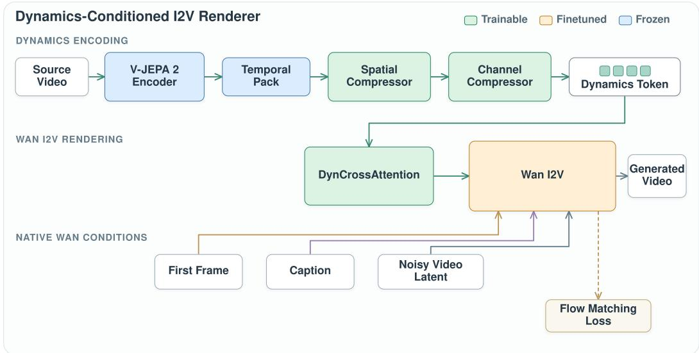  
Figure 10: Detailed renderer architecture. Frozen V-JEPA features pass through the trainable dynamics bottleneck. DynCrossAttention injects only the compressed dynamics token into the finetuned Wan I2V backbone; image, text, and noisy-latent conditions retain Wan’s native paths.

For latent frame t, let $H _ { t } \in \mathbb { R } ^ { P \times d }$ denote Wan patch features and $D _ { t } \in \mathbb { R } ^ { 6 4 \times 1 2 8 }$ the corresponding dynamics slice. The adapter computes

$$
Q _ { t } = \mathrm { R o P E } _ { 2 D } ( W _ { q } \mathrm { L N } ( H _ { t } ) ) ,
$$

$$
K _ { t } = \mathrm { R o P E } _ { 2 D } ( W _ { k } \mathrm { L N } ( D _ { t } ) ) ,\tag{7}
$$

$$
U _ { t } = W _ { o } \operatorname { s o f t m a x } ( Q _ { t } K _ { t } ^ { \top } / \sqrt { d } ) W _ { v } \operatorname { L N } ( D _ { t } ) .\tag{8}
$$

Wan coordinates are continuously rescaled onto the $8 \times 8$ token grid before applying shared row and column RoPE. We center the adapter output, $\begin{array} { r } { \bar { U } _ { t } = U _ { t } - \mathrm { m e a n } _ { p } U _ { t } } \end{array}$ , force $\bar { U } _ { 0 } = 0$ , and update

$$
H _ { t } ^ { \prime } = H _ { t } + g ( \sigma _ { t } ) \operatorname* { m i n } \biggl ( 1 , \frac { 0 . 0 5 \mathrm { R M S } ( H _ { t } ) } { \mathrm { R M S } ( \bar { U } _ { t } ) } \biggr ) \bar { U } _ { t } .\tag{9}
$$

Centering suppresses global appearance shifts, the RMS cap prevents the adapter from overwhelming Wan features, and the noise gate $g$ emphasizes dynamics early in denoising. Every Wan patch attends to all 64 dynamics locations from the same time step.

Trainable parameters. The renderer optimizes approximately 437.3M parameters: 332.5M in the bottleneck and DynCrossAttention adapters and 104.9M in rank-32 Wan LoRA modules. V-JEPA 2 and the 14B Wan backbone remain frozen.

## A.2 RENDERER TRAINING

The renderer uses approximately 169K internally collected real-world clips with diverse subjects, environments, camera views, and ordinary motions. We retain clips with one clear dominant event, stable visual quality, and continuous motion, standardize them to 81 frames at 24 fps, and use each clip as its own reconstruction target. This requires neither motion annotation nor paired edits.

Training follows the rectified-flow objective in Eq. 3. We drop captions so that text cannot become the sole motion cue, and perturb or mask dynamics tokens so that the renderer remains stable when the editor later supplies predicted tokens. Training first learns the bottleneck and adapters, then enables rank-32 LoRA on Wan. The full renderer is trained for six days on eight NVIDIA H200 GPUs.

## A.3 EXPERIMENTS: DOES THE TOKEN DISENTANGLE DYNAMICS FROM APPEARANCE?

This section follows Section 3.2 exactly. We first test whether the compact token retains the temporal information required for reconstruction. We then intervene on visual context and dynamics separately to identify their respective effects. Finally, we evaluate the complete renderer on appearance rerendering against existing video editors.

Reconstruction. The full model reconstructs from only the first frame, caption, and compact token, reaching 19.261 dB PSNR and 0.5761 SSIM. Removing dynamics reduces PSNR to 16.663 dB and SSIM to 0.5216, while removing the caption retains 18.630 dB and 0.5770 SSIM. Figure 11 shows the same comparison qualitatively: full and caption-free rendering follow the source event, whereas the no-dynamics output loses or changes its progression. The small caption-free SSIM increase accompanies a PSNR decrease and does not offset the much larger failure caused by removing dynamics.

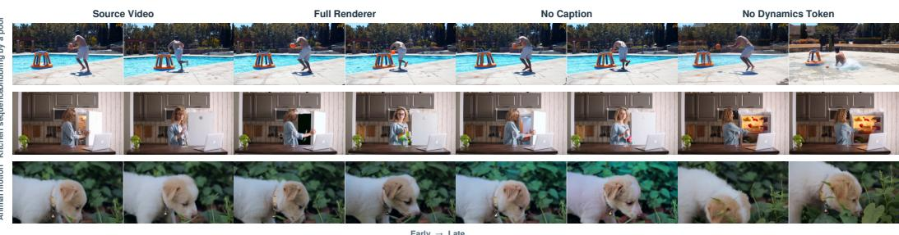  
Figure 11: Reconstruction under controlled renderer conditions. The full and caption-free renderers retain the source event, whereas removing the dynamics token changes or suppresses its evolution.

Controlled disentanglement tests. We test both directions with all other generation inputs held constant. In the first direction, we fix D and change only the first frame and caption. Figure 3 shows foreground, background, and style interventions under this setting. Across 600 appearance interventions, the matched source–output flow trajectory cosine is 0.727 and the motion-profile correlation is 0.501, compared with 0.312 and 0.012 when each output is paired with an unrelated source motion from the same edit type (Table 5). Thus, motion remains tied to the fixed token after a substantial change in visual context.

We measure motion preservation at 12 matched times using Farnebäck flow at 192 × 112. Horizontal flow, vertical flow, and magnitude are pooled over a 4 × 4 grid to form a trajectory descriptor, while interval magnitudes form a motion-energy profile. The negative control pairs each output with another source from the same edit type.

In the reverse direction, we fix the target first frame, caption, edit instruction, seed, sampling schedule, and renderer, and change only the dynamics input. Figure 16 compares no token, the unedited source token, a same-task donor token, and the edited source token. Although every column receives identical visual context, the event unfolds differently: no token relies on the I2V prior, the unedited token tends to reproduce the original outcome, the donor token transfers another video’s dynamics, and the edited source token follows the requested outcome while retaining source-specific timing. Quantitatively, the edited source token improves IF from 4.563 to 4.705 and Pass from 90.2% to 95.5% over target context alone, while achieving the highest DINO appearance consistency (Table 7). This complementary intervention shows that changing dynamics alters temporal evolution without requiring a change to the visual context. Appendix E further analyzes when this source-conditioned edit is most useful.

Table 5: Direct motion preservation when visual context changes under fixed D. The mismatched control pairs each output with another source from the same edit type.
<table><tr><td>Pairing</td><td>Flow trajectory ↑</td><td>Motion profile ↑</td></tr><tr><td>Matched source-output</td><td>0.727</td><td>0.501</td></tr><tr><td>Mismatched source-output</td><td>0.312</td><td>0.012</td></tr></table>

These controlled tests empirically validate a functional disentanglement of appearance and dynamics. Here, disentanglement refers to the observed division of control in generation rather than strict statistical independence. Directly substituting a dynamics token from another video can still expose foreground cues from that donor, revealing residual appearance leakage. This motivates editing the correct source token rather than using an arbitrary donor. Under that setting, the target context remains fixed and the edited-source condition achieves the highest DINO appearance consistency in Table 7.

Appearance re-rendering benchmark. The benchmark contains 600 foreground, background, and style edits from public web videos. We compare seven methods with one output per case and no reranking. IF is a 1–5 instruction-following score, Pass is the successful-edit rate, JEPA is source– output V-JEPA similarity for dynamics preservation, and Imaging is VBench image quality. Table 1 shows that RVD achieves the best IF (4.438), Pass (86.8%), and JEPA similarity (0.9050), while remaining competitive in Imaging. Figure 12 provides distinct qualitative examples for all three appearance-edit types.

## A.4 RENDERER ABLATIONS

Table 2 groups ablations by design question. All variants use the same reconstruction split, preprocessing, first-frame input, caption policy, and PSNR/SSIM evaluation; only the named component changes.

Conditioning. No dynamics sets the adapter input to zero; no caption removes text while retaining the first frame and token. The 2.598 dB PSNR loss without dynamics is the largest conditioning drop, showing that the compressed token carries information unavailable from target context alone.

Bottleneck capacity. We change only the post-bottleneck spatial grid or channel width and retrain the corresponding projection. The 8 × 8 × 128 token provides the selected efficiency–fidelity tradeoff: 4 × 4 loses spatial detail, while 16 × 16 improves PSNR by only 0.332 dB at four times the spatial-token count. Increasing channels beyond 128 does not improve reconstruction.

Injection design. No 2D RoPE removes shared spatial coordinates; no centering keeps the adapter’s spatial mean; inject-all-blocks extends adapters from 30 to 40 blocks; and no noise gate holds g(σt) constant. Removing RoPE or centering lowers PSNR to 18.222 and 18.427 dB, respectively, giving the clearest evidence for spatial alignment and appearance-neutral residuals. Extending injection or removing the gate provides no PSNR gain over the selected design.

## B DYNAMICS TOKEN ANALYSIS AND RETIMING

## B.1 POST-BOTTLENECK TOKEN ANALYSIS

We analyze the representation actually consumed by the renderer and editor, rather than the uncompressed V-JEPA features. After deduplicating by source-video ID, the analysis contains 248 real clips.

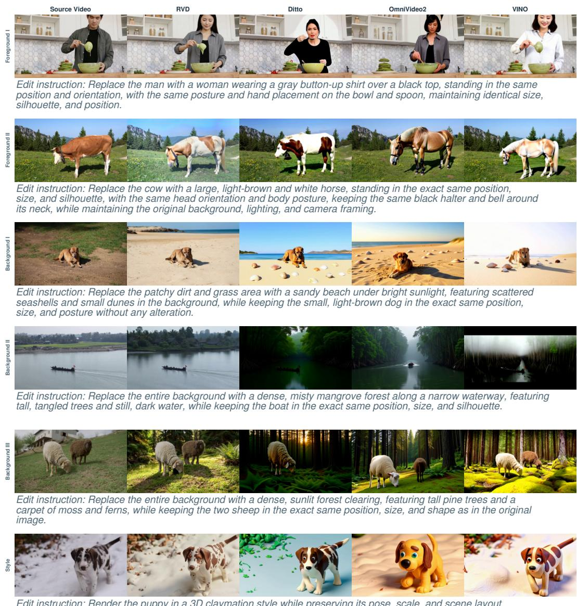  
Edit instruction: Render the puppy in a 3D claymation style while preserving its pose, scale, and scene layout.

Figure 12: More renderer comparisons. Six appearance edits compare RVD with Ditto (Bai et al., 2026), OmniVideo2 (Yang et al., 2026), and VINO (Chen et al., 2026) at aligned relative time; each row reports its instruction.

For token $ { \mathbf { D } } \in \mathbb { R } ^ { 2 1 \times 8 \times 8 \times 1 2 8 }$ , we separate the temporal mean from its varying component,

$$
\mu ( { \bf D } ) = \mathrm { m e a n } _ { t } { \bf D } , \qquad A ( { \bf D } ) = { \bf D } - \mu ( { \bf D } ) .\tag{10}
$$

We use three complementary measurements. First, channel covariance treats all clip–time–location positions as observations; all 128 eigen-directions remain above $1 0 ^ { - 5 }$ of the largest eigenvalue, giving rank 128/128. Second, spatial motion energy $e _ { s } = \mathbb { E } _ { n , t , c } [ A ( \mathbf { D } ) _ { n , t , s , c } ^ { 2 } ]$ covers the full $8 \times 8$ grid with normalized entropy 0.995, and centered spatial slices reach the maximum possible rank 63/63. Third, Fig. 5(b) plots each clip’s residual RMS. Different source-motion groups shift the distribution, although they overlap because appearance, viewpoint, and motion magnitude also vary. Together, these results show that compression does not collapse temporal variation into a few channels or locations; they motivate an editor with spatiotemporal self-attention rather than a single global motion vector.

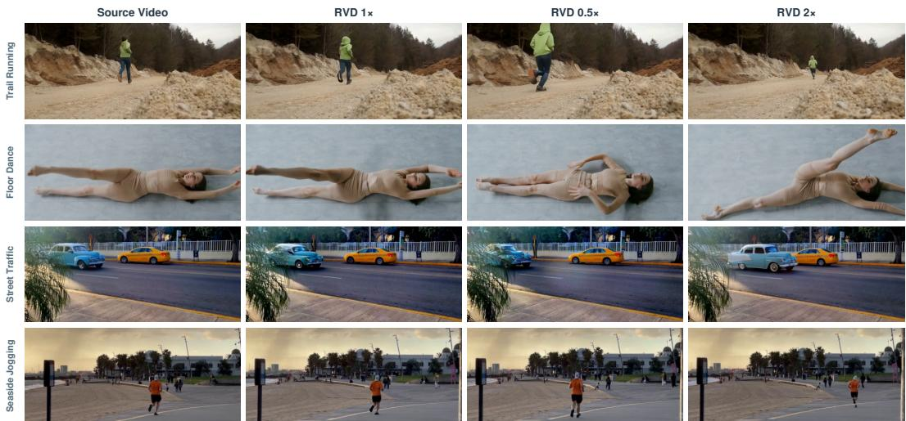  
Figure 13: Additional training-free retiming results. At the same normalized time, the $0 . 5 \times$ output has progressed less and the $2 \times$ output has progressed further; the 1× reconstruction follows the source timing.

## B.2 TRAINING-FREE RETIMING

The explicit temporal axis permits direct speed control without training another model. For half-speed motion, nearest-neighbor temporal resampling reads the token at $\phi ( t ) = 0 . 5 t$ and a width-3 temporal smoother removes repeated-step discontinuities:

$$
\mathrm { \ s 1 { o w } _ { 0 . 5 \times } ( { \bf D } ) = \ s m o o t h _ { 3 } ( r e s a m p l e ( { \bf D } , \phi ( t ) = 0 . 5 t ) ) . }\tag{11}
$$

For double speed, we retain every second token through step 20 and set the unused future to zero:

$$
\mathbf { \boldsymbol { \mathrm { f } } } a s \mathbf { \boldsymbol { \mathrm { t } } } _ { 2 \times } ( \mathbf { \boldsymbol { D } } ) = [ \mathbf { \mathbf { \boldsymbol { D } } } _ { 0 } , \mathbf { \mathbf { \boldsymbol { D } } } _ { 2 } , \dots , \mathbf { \mathbf { \boldsymbol { D } } } _ { 2 0 } ; \mathbf { \mathbf { \boldsymbol { 0 } } } _ { 1 0 \mathrm { ~ s t e p s } } ] .\tag{12}
$$

Both operators preserve token shape and reuse the frozen renderer. Figure 13 shows four source videos at matched normalized times: the 0.5× outputs consistently progress less than the source, the $2 \times$ outputs progress further, and the unmodified reconstruction follows the original timing. This predictable response is functional evidence that the learned temporal organization is useful for manipulation, beyond the non-collapse statistics above.

## C EDITOR: ARCHITECTURE, DATA, TRAINING, AND EXPERIMENTS

## C.1 EDITOR ARCHITECTURE

Figure 14 expands Fig. 2(b). The source video is encoded into a standardized $2 1 \times 8 \times 8 \times 1 2 8$ dynamics token. The semantic branch adapts Qwen3-VL-4B-Instruct with rank-4 attention LoRA. It receives three independent inputs: text containing the source caption, target caption, and edit instruction; the target first frame through its vision encoder; and eight learned queries. The final query states form a short semantic memory that describes the requested transformation without expanding it into pixels.

The four-layer dynamics editing transformer has width 256 and four attention heads. Coordinate embeddings retain the token’s time and $8 \times 8$ location. Self-attention models dependencies within source dynamics; cross-attention reads semantic memory; and AdaLN uses the pooled semantic state to modulate each block. A 256→512→128 prediction head maps the sequence back to the original token shape. The editor has approximately 24.9M trainable parameters, including the transformer, prediction head, learned queries, and Qwen LoRA. V-JEPA 2, the renderer bottleneck, Qwen base weights, and the complete renderer remain frozen.

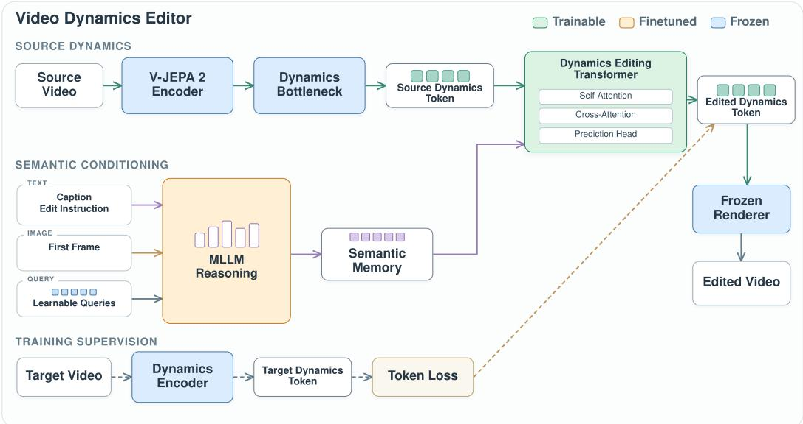  
Figure 14: Detailed editor architecture. Text, image, and learned queries enter the finetuned MLLM independently. Its semantic memory guides the trainable token editor through cross-attention and AdaLN; the target-token branch and token loss are training-only.

At inference, an MLLM predicts the target caption from the source video and instruction. Qwen-Image-Edit modifies the first frame only when the new dynamics require a changed initial pose or state. The editor prediction, target caption, and resulting first frame then condition the frozen renderer.

## C.2 COUNTERFACTUAL DATA

Figure 7 defines the construction sequence. (1) We filter the same motion-rich internal video collection used for renderer training and assign each clip to an applicable transformation family. (2) An MLLM reasons about a feasible counterfactual outcome and writes the edit instruction, target caption, endpoint states, and motion layout. (3) Qwen-Image-Edit changes the first and/or last frame when the target requires a new pose, object state, or interaction endpoint. (4) VACE renders the counterfactual video from the grounded endpoints, layout, and caption. (5) A VLM quality checker jointly verifies subject identity, unrelated scene context, visual quality, and completion of the requested temporal outcome. (6) Every accepted pair is reused in both directions by swapping source and target and reversing the instruction.

Table 6 records 11,702 generated candidates, of which 9,964 pass quality control (85.1%). After final decoding and cache checks, 9,946 usable pairs remain, yielding approximately 20K directed examples across 17 edit directions. Pass rates range from 64.3% for break-to-intact to 96.6% for open-to-close, illustrating why explicit filtering is necessary.

Table 6: Counterfactual generation and VLM quality-control statistics.
<table><tr><td>Group</td><td>Generated direction Before</td><td></td><td>Pass</td><td></td><td>Filtered Pass rate</td></tr><tr><td rowspan="4">Action</td><td>activity → sleep</td><td>1,994</td><td>1,875</td><td>119</td><td>94.0%</td></tr><tr><td>move → stop</td><td>480</td><td>370</td><td>110</td><td>77.1%</td></tr><tr><td>run → walk</td><td>3,000</td><td>2,469</td><td>531</td><td>82.3%</td></tr><tr><td>reduce distance</td><td>2,000</td><td>1,927</td><td>73</td><td>96.4%</td></tr><tr><td rowspan="4">Interaction</td><td>break → intact</td><td>196</td><td>126</td><td>70</td><td>64.3%</td></tr><tr><td>cut → whole</td><td>3,0002,262</td><td></td><td>738</td><td>75.4%</td></tr><tr><td>open → close</td><td>266</td><td>257</td><td>9</td><td>96.6%</td></tr><tr><td>throw → hold</td><td>294</td><td>283</td><td>11</td><td>96.3%</td></tr><tr><td>World</td><td>move → avoid</td><td>472</td><td>395</td><td>77</td><td>83.7%</td></tr><tr><td>Total</td><td></td><td>11,702 9,964</td><td></td><td>1,738</td><td>85.1%</td></tr></table>

## C.3 EDITOR TRAINING

Static-to-real pretraining first constructs 169K pseudo pairs by repeating a real video’s first frame as a static source and using the real clip token as its target. This exposes the editor to the broad distribution of valid dynamics before task-specific supervision. Counterfactual fine-tuning then teaches the 17 directed transformations above. Source-token noise with standard deviation 0.1 improves robustness. We train all editor parameters globally with a peak learning rate of $2 \times 1 0 ^ { - 4 }$ , linear warmup, and cosine decay; the two stages take approximately five days on eight NVIDIA H200 GPUs.

For predicted token $\widehat { X }$ and target $X ^ { \ast }$ , define

$$
\mu ( X ) = \mathrm { m e a n } _ { t } X ,\tag{13}
$$

$$
A ( X ) = X - \mu ( X ) .\tag{14}
$$

The objective in Eq. 6 combines

$$
\mathcal { L } _ { \mathrm { d c } } = \mathrm { M S E } ( \mu ( \widehat { X } ) , \mu ( X ^ { * } ) ) ,\tag{15}
$$

$$
\mathcal { L } _ { \mathrm { a c } } = \mathrm { M S E } ( A ( \widehat { \boldsymbol { X } } ) , A ( \boldsymbol { X } ^ { * } ) ) ,\tag{16}
$$

$$
\mathcal { L } _ { \mathrm { c o s } } = 1 - \mathbb { E } _ { t , s } [ \cos ( A ( \widehat { X } ) _ { t , s , : } , A ( X ^ { * } ) _ { t , s , : } ) ] ,\tag{17}
$$

$$
\mathcal { L } _ { \mathrm { v a r } } = \| \mathbb { E } _ { t } A ( \widehat { X } ) ^ { 2 } - \mathbb { E } _ { t } A ( X ^ { * } ) ^ { 2 } \| _ { 1 } ,\tag{18}
$$

$$
\mathcal { L } _ { \mathrm { { f f t } } } = \Vert | \mathrm { r F F T } _ { t } ( \widehat { X } ) | - | \mathrm { r F F T } _ { t } ( X ^ { * } ) | \Vert _ { 1 } .\tag{19}
$$

Their weights are 0.5, 1.0, 2.0, 1.0, and 0.5. The terms separately preserve the slowly varying component, temporal residual, residual direction, motion energy, and rhythm.

Training ablations. AC-cos measures residual-direction agreement; AC MSE measures residual magnitude and position; variance error compares temporal energy; and spectrum error compares temporal Fourier magnitude. In Table 3(a), two-stage training improves AC-cos from 0.2629 to 0.2892 and reduces AC MSE from 0.6977 to 0.6352. Panel (b) reports changes relative to its own full-loss reference under the loss-ablation protocol: removing cosine alignment lowers AC-cos by 0.0134, while removing variance and spectrum matching raises their errors by 0.2079 and 0.3276. Reporting deltas avoids conflating the distinct full references used by the training-strategy and loss studies.

## C.4 DYNAMICS EDITING EXPERIMENTS

The editor benchmark contains 300 public-web scenes, 17 directed transformations, four methods, and 1,200 outputs. IF and Pass measure edit completion with the shared 12-frame judge. VBench background consistency and temporal flickering are output-internal stability diagnostics: they do not compare the output background with the source, and a low-flicker score can be inflated by weak or reduced motion. Table 4 shows that RVD leads all four reported metrics: 4.837 IF, 98.3% Pass, 0.9711 background consistency, and 0.9919 temporal smoothness. The strongest baseline, VINO,

reaches 3.957 IF and 75.0% Pass. We therefore use IF and Pass for the edit-success conclusion and treat the VBench metrics only as complementary checks. Figure 15 shows additional cases not used in the main paper; RVD changes the event while instruction-based baselines often retain the source dynamics.  
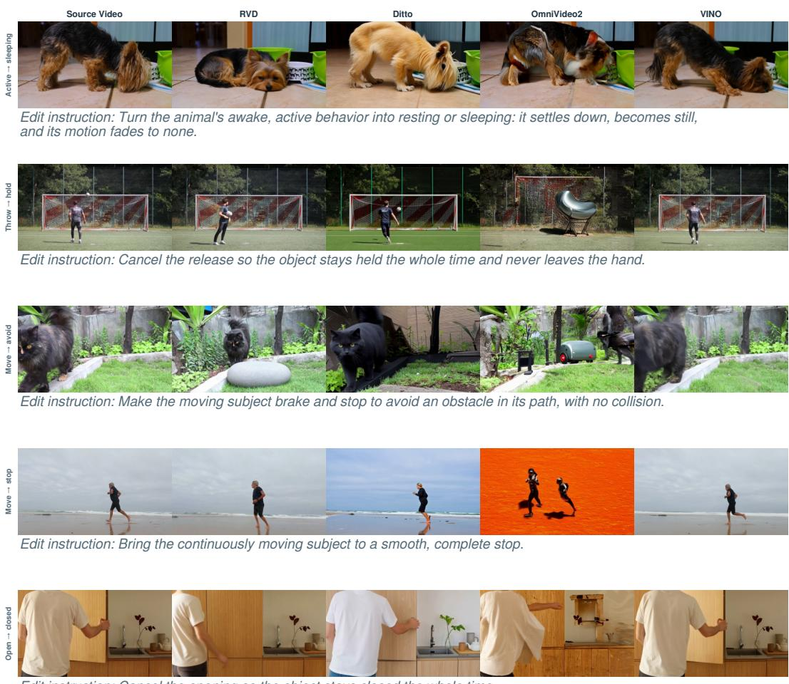  
Edit instruction: Cancel the opening so the object stays closed the whole time.

Figure 15: More editor comparisons. Five dynamics edits compare RVD with Ditto (Bai et al., 2026), OmniVideo2 (Yang et al., 2026), and VINO (Chen et al., 2026) at aligned relative time; each row reports its instruction.

## D BENCHMARK AND EVALUATION PROTOCOL

## D.1 RENDERER BENCHMARK

The renderer benchmark contains 600 appearance-edit cases collected from public web videos. Its source videos span people, animals, vehicles, objects, indoor and outdoor environments, camera viewpoints, and motion patterns. The edits are distributed across foreground replacement, background replacement, and style transfer, providing broad coverage of appearance changes while retaining a measurable source motion. Raw video IDs and file hashes are disjoint from renderer training data.

We evaluate RVD and six video-editing baselines on exactly the same source video and edit instruction, with one generated output per method and no reranking. IF is the mean 1–5 instruction-following score from the 12-frame judge described below, and Pass is the fraction with performed=true and score ≥ 3. JEPA is the cosine similarity between source and output V-JEPA features and measures preservation of the source dynamics. Imaging is the VBench imaging-quality score (Huang et al.,

2024). The fixed-token flow intervention in Table 5 provides an additional encoder-independent motion measurement. Table 1 reports the aggregate comparison, and Figure 12 provides examples from all three edit types.

## D.2 EDITOR BENCHMARK

The editor benchmark contains 300 dynamics-edit cases from public web videos and 1,200 outputs from RVD, Ditto, OmniVideo2, and VINO. Its 17 directed transformations cover animal activity, locomotion, speed and travel distance, object state, interaction, and causal outcome. The source videos vary in subject, scene, viewpoint, motion magnitude, and temporal pattern. Raw video IDs and file hashes are disjoint from editor training data.

Target construction and method inputs. For RVD, Qwen3-VL-32B plans the target caption from eight source frames and the edit instruction. Qwen-Image-Edit changes the first-frame pose or state when the requested dynamics require a different initial condition; this occurs in 192 of 300 cases, while the remaining 108 reuse the source first frame. These steps are part of the complete RVD pipeline. The baselines receive the same source video and instruction through their native interfaces. Every method produces one sample under a fixed configuration, without best-of-N selection or reranking. Table 4 therefore compares complete editing systems; the fixed-context experiment in Table 7 separately isolates the contribution of dynamics editing inside RVD.

The 98.3% Pass result in Table 4 is measured on all 300 benchmark cases under this complete-system protocol. It includes target-context planning, optional first-frame editing, dynamics-token editing, and rendering. It should therefore be interpreted as the performance of the full RVD pipeline rather than the isolated gain of the dynamics editor.

Metrics and judge protocol. IF and Pass measure whether the requested temporal change occurs. Qwen3-VL-8B-Instruct receives the edit instruction and 12 uniformly sampled frames from both the source and output videos. It returns a 1–5 score and a binary performed decision; Pass requires performed=true and score ≥ 3. The judge uses deterministic decoding and never observes RVD’s target caption, target first frame, or internal features. VBench background consistency measures how stable the background is within the generated output; it does not measure preservation of the source background. VBench temporal flickering measures frame-to-frame smoothness, but cannot distinguish desirable motion from motion suppression, so a nearly static output may score well. We therefore do not use either metric alone to claim source-scene or motion preservation. Because the judge and editor encoder share a model family, we interpret IF and Pass together with the fixed-context controls, qualitative comparisons, and task-specific motion measurements.

## E WHEN DOES THE DYNAMICS EDITOR HELP?

Motivation. The target first frame and caption already provide strong cues about the desired outcome. However, they do not fully specify how the motion should unfold, including its trajectory, timing, and rhythm. We therefore ask whether editing the source dynamics token provides additional control beyond the target visual context alone.

Controlled comparison. We evaluate a matched subset of 112 cases spanning 13 directed subtasks. For every case, we fix the target first frame, caption, instruction, renderer, sampling schedule, and random seed, and vary only the dynamics input. We compare four settings: no dynamics token, the unedited source token, a matched donor token from the same task, and the edited token predicted from the correct source. This isolates the contribution of source-conditioned dynamics editing from the rest of the RVD pipeline.

Table 7: Editor contribution on 112 matched cases with fixed target context. Only the dynamics input changes; DINO measures appearance consistency.
<table><tr><td>Dynamics condition</td><td>IF↑</td><td>Pass (%) ↑</td><td>DINO ↑</td></tr><tr><td>None (target context only)</td><td>4.563</td><td>90.2</td><td>0.864</td></tr><tr><td>Unedited source</td><td>3.259</td><td>59.8</td><td>0.808</td></tr><tr><td>Matched video, same task</td><td>3.866</td><td>73.2</td><td>0.826</td></tr><tr><td>Edited source (ours)</td><td>4.705</td><td>95.5</td><td>0.921</td></tr></table>

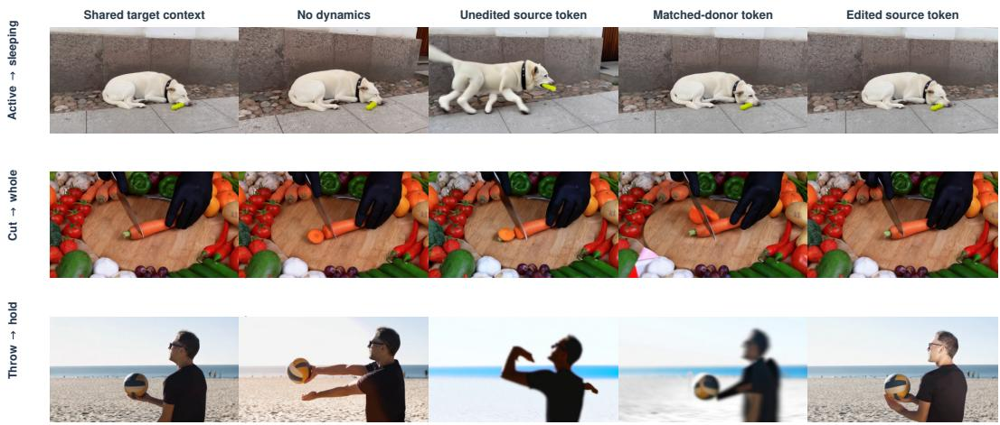  
Figure 16: Editor contribution under fixed target context. All conditions use the same target context, instruction, seed, and renderer; only the dynamics input changes.

Editor contribution. As shown in Table 7, the target context alone already provides a strong baseline. The edited source token further improves instruction following, edit success, and appearance consistency. In contrast, the unedited source token often preserves the original motion, while a matched donor token provides only task-level dynamics and loses source-specific timing and trajectory. These results show that the editor adds source-aware motion control rather than simply supplying a generic motion pattern.

When is the editor most useful? Table 8 separates trajectory/rhythm edits from state/interaction edits. The largest gains appear in trajectory and rhythm tasks, such as starting, stopping, speed change, distance control, and avoidance. In these cases, the target frame may specify the desired state but not the path used to reach it. The editor therefore contributes most when the instruction leaves the motion trajectory or timing ambiguous.

Accordingly, the 95.5% Pass rate in Table 7 is not a second estimate of the 300-case complete-system result in Table 4. It is the performance of the edited-token condition on the 112-case controlled subset. Its relevant comparison is the 90.2% target-context-only condition under identical rendering inputs. The 5.3-point difference measures the editor’s incremental contribution, while the 98.3% result measures the complete RVD system on the broader benchmark.

Pairwise source-motion comparison. We further compare the edited source token with a matched donor token using a pairwise video judge. The judge prefers the edited source token in 65.2% of cases, compared with 33.0% for the donor token and 1.8% ties. This provides additional evidence that the editor better preserves source-specific trajectory, timing, and rhythm while completing the requested edit.

## F LIMITATIONS

Our current editor is trained on a finite set of counterfactual transformations and predicts a single deterministic target dynamics trajectory. This limits its ability to capture open-ended edits for which one instruction may correspond to multiple valid motions. Extending RVD with stochastic dynamics generation and broader counterfactual supervision is a natural next step.

Table 8: Editor contribution by edit family. Target context and sampling conditions are identical within each case.
<table><tr><td>Edit family</td><td>Dynamics condition</td><td>IF↑</td><td>Pass (%) ↑</td><td>DINO↑</td></tr><tr><td rowspan="4">Trajectory / rhythm</td><td>None</td><td>4.55</td><td>92.2</td><td>0.859</td></tr><tr><td>Unedited source</td><td>3.47</td><td>68.6</td><td>0.840</td></tr><tr><td>Matched video</td><td>3.59</td><td>68.6</td><td>0.801</td></tr><tr><td>Edited source</td><td>4.69</td><td>98.0</td><td>0.912</td></tr><tr><td rowspan="4">State / interaction</td><td>None</td><td>4.57</td><td>88.5</td><td>0.868</td></tr><tr><td>Unedited source</td><td>3.08</td><td>52.5</td><td>0.781</td></tr><tr><td>Matched video</td><td>4.10</td><td>77.0</td><td>0.846</td></tr><tr><td>Edited source</td><td>4.72</td><td>93.4</td><td>0.928</td></tr></table>

Failure modes. We observe three especially difficult regimes. First, rapid motion can be temporally aliased by the compressed token and rendered with blur, reduced displacement, or a missed intermediate state. The problem is most visible when the requested event occurs between the uniformly sampled temporal positions. Second, strong camera motion is not explicitly separated from object motion. The token may encode both, so editing or transferring it can perturb camera trajectory, destabilize the background, or preserve the wrong egomotion; optical-flow measurements are also confounded in this setting. Third, complex interactions with several independently moving subjects, persistent occlusion, or rapid contact and topology changes can produce identity merging, incorrect contact order, or a plausible endpoint reached through the wrong process. The current training distribution, which emphasizes one dominant subject or interaction, does not fully cover these cases.

## G QUESTIONS AND ANSWERS

## Q1. Why use V-JEPA 2 instead of learning from scratch or using optical flow?

Answer. V-JEPA 2 provides a frozen, motion-aware starting representation learned from video without requiring dynamics labels. The learned bottleneck then adapts these features to the renderer: the resulting token retains all 128 numerical channel directions, reaches normalized spatial-energy entropy 0.995, and has spatial rank 63/63 (Appendix B.1). Optical flow is useful as an independent evaluation signal, as in Table 5, but it describes apparent 2D displacement, is confounded by camera motion, and does not encode the action and interaction semantics needed by the editor. Learning the entire visual representation from scratch would also discard this strong video prior while substantially increasing the training burden.

## Q2. What does the learned bottleneck add beyond directly compressing V-JEPA features?

Answer. It converts the 41 × 16 × 16 × 1024 V-JEPA volume into a fixed 21 $\times 8 \times 8 \times$ 128 time– space token, reducing the feature volume by approximately 64×. This topology supports aligned DynCrossAttention in the renderer and self-attention, cross-attention, and token-space losses in the editor. Table 2(b) also shows a reconstruction benefit: retaining the full 1024-channel width after the same temporal and spatial preprocessing reaches 18.467 dB PSNR and 0.5659 SSIM, whereas the learned 128-channel token reaches 19.261 dB and 0.5761 SSIM with eight times fewer channels. A 16 × 16 token reaches 19.593/0.5960 but uses four times as many spatial tokens, so 8 × 8 × 128 is the selected efficiency–fidelity tradeoff. These are renderer-side results rather than a direct numerical proof of editability; their value is showing that the learned bottleneck provides a compact, structured, and reconstruction-stable space in which editing is practical.

We also observe a qualitative difference that reconstruction metrics alone do not capture. Directly conditioning the renderer on the uncompressed V-JEPA features produces visible artifacts. Crossvideo substitution further reveals that these raw features are not dynamics-only: when a cat first frame is paired with uncompressed features from a dog video, the rendered foreground can change into a dog. Thus, the original V-JEPA volume carries foreground appearance together with motion, while the learned bottleneck provides a cleaner and more stable interface for disentangled control. Compression does not guarantee strict statistical independence, and residual donor cues can still remain. We therefore edit the correct source token instead of borrowing an arbitrary one.

## Q3. What do the controlled interventions establish?

Answer. They test the two control directions while holding the other inputs fixed. First, with dynamics fixed and visual context changed, matched source–output flow reaches 0.727 trajectory cosine and 0.501 motion-profile correlation, compared with 0.312 and 0.012 for mismatched motion (Table 5). Second, with the first frame, caption, instruction, seed, sampling schedule, and renderer fixed, changing only the dynamics input changes the event evolution (Fig. 16). On 112 matched cases, the edited source token improves IF from 4.563 to 4.705, Pass from 90.2% to 95.5%, and DINO consistency from 0.864 to 0.921 over target context alone (Table 7). Together these tests empirically validate functional disentanglement in generation; they do not require strict statistical independence between the two representations.

## Q4. Why is the dynamics editor deterministic?

Answer. Each training pair specifies one target dynamics token, so deterministic regression provides the cleanest test of whether semantic guidance can transform source dynamics reliably. The two-stage strategy improves AC-cos from 0.2629 to 0.2892 and reduces AC MSE from 0.6977 to 0.6352 (Table 3); removing cosine or variance/frequency terms also degrades the corresponding token statistics. This design supports precise evaluation of a requested outcome, but it cannot represent multiple equally valid motions for the same instruction. Stochastic token generation is a natural extension.

## Q5. Can RVD edit complex multi-object interactions?

Answer. The current evidence covers 300 scenes and 17 directed edit transformations, with training centered on one dominant subject or interaction. RVD can change object states, activities, trajectories, and several causal outcomes, but this benchmark does not establish general multi-agent physical reasoning. With several independently moving subjects, persistent occlusion, or rapid contact changes, we observe identity merging, incorrect participant selection, and incorrect contact order. Broader paired data and entity-aware dynamics representations are needed for these cases.

## Q6. What is the main inference cost?

Answer. The 14B Wan video renderer and its diffusion sampling dominate inference. Dynamics encoding requires one frozen V-JEPA 2 forward pass, and the editor adds approximately 24.9M trainable parameters. The dynamics token contains 21 × 8 × 8 positions with 128 channels, so editing occurs in a much smaller space than video pixels or Wan latents. The renderer itself trains 437.3M parameters through the bottleneck, adapters, and LoRA while keeping the 14B backbone frozen (Appendix A).

## Q7. Why are reconstruction PSNR and SSIM lower than video-autoencoder results?

Answer. RVD is a conditional generator, not a pixel-complete codec. It reconstructs 81 frames from one frame, text, and a token compressed approximately 64× relative to V-JEPA features; omitted texture must be regenerated rather than transmitted. The relevant within-model control is dynamics removal: PSNR falls from 19.261 to 16.663 dB and SSIM from 0.5761 to 0.5216 (Table 2). Removing the caption gives 18.630 dB and 0.5770 SSIM: the +0.0009 SSIM change accompanies a 0.631 dB PSNR loss, while the much larger no-dynamics degradation shows that the token supplies the essential temporal information.

## Q8. Could the Qwen3-VL judge favor RVD?

Answer. A model-family bias cannot be ruled out, so IF and Pass are not used alone. The judge is a separate checkpoint, receives the same instruction and 12 sampled source/output frames for every method, and evaluates one output per method without reranking. The 300-case editor benchmark also reports VBench diagnostics, while renderer claims use V-JEPA similarity and the encoder-independent optical-flow intervention in Table 5; fixed-context analysis additionally reports DINO consistency and pairwise preference. The agreement of these measurements with qualitative comparisons strengthens the result, although none individually provides an unbiased physical metric.

## Q9. If the target first frame and caption are strong, why is the editor needed?

Answer. The target context often specifies appearance and the desired endpoint, which explains why target context alone already reaches 90.2% Pass on the 112-case controlled subset. It does not fully specify the path, timing, or rhythm between states. With every target-context and sampling input fixed, the edited source token raises Pass to 95.5%, compared with 59.8% for the unedited source token and 73.2% for a same-task donor (Table 7). The gain is strongest for trajectory/rhythm edits, where Pass rises from 92.2% to 98.0% (Table 8); a pairwise judge also prefers edited-source dynamics over the matched donor in 65.2% of cases versus 33.0%. Thus the editor adds source-aware motion control, while target-context planning and rendering remain essential parts of the complete RVD system.