# REPROGRAMMING VISION-LANGUAGE MODELS VIA STRUCTURED PROMPT REPARAMETERIZATION

Zizhao Li, Chengyi Cai, Mohammed Yaqoob Ansari, Feng Liu, Joseph West, Kourosh Khoshelham

The University of Melbourne, Melbourne, Australia

## ABSTRACT

Visual reprogramming adapts pretrained models to downstream tasks by modifying their input and output interfaces while keeping the backbone fixed. In visionlanguage models, existing methods mainly rely on intra-class prompt aggregation and do not explicitly model relationships among classes. However, fine-grained categories often exhibit highly overlapping attribute descriptions and strong interclass correlation in the text embedding space, where discriminative cues lie in subtle low-variance components. We propose Reparameterized Inter-Class Visual Reprogramming (RVP), a structured framework that aggregates multiple text prompts within each class and applies residual correction across classes. We also show that CLIP-based visual reprogramming with input-independent linear output aggregation can be expressed as a linear mapping from frozen image embeddings to downstream logits, and use this view to design a structured reparameterization that models shared semantic components and class-specific differences. RVP uses only a single visual prompt and can be reparameterized at inference into a frozen backbone followed by a linear classifier, incurring nearly zero computational overhead. Across 11 few-shot classification benchmarks and four CLIP backbones, RVP consistently improves over prior visual reprogramming methods with comparable or better inference efficiency.

## 1 INTRODUCTION

Model reprogramming (Vinod et al., 2020; Chen, 2024; Hung et al., 2023) adapts a pretrained model to downstream tasks by modifying its input and output interfaces while keeping the pretrained parameters fixed. In vision, this is often instantiated as visual reprogramming (VR) (Cai et al., 2024b;a; Tsao et al., 2024; Chen et al., 2023; Elsayed et al., 2018; Tsai et al., 2020), where a trainable input transformation is learned while the backbone remains frozen. For vision-language models (Radford et al., 2021; Jia et al., 2021), this paradigm is particularly appealing for few-shot adaptation because it preserves pretrained representations, requires only a small number of trainable parameters, and adds little inference overhead.

In CLIP-based VR, an input image is transformed by a visual prompt and encoded by the frozen image encoder, while downstream classes are represented by text embeddings from the frozen text encoder. Classification is then performed through image-text similarity. Recent methods improve this pipeline by introducing multiple textual descriptions for each class and aggregating their similarity scores (Cai et al., 2025a;b; Wu et al., 2026). However, these methods remain limited to intra-class prompt selection and do not explicitly model relationships among classes.

This limitation becomes severe in fine-grained recognition. As shown in Fig. 1, visually similar categories often share highly overlapping attribute descriptions, and prompt groups from different classes can exhibit high cosine similarity. This suggests that attribute prompts are often highly similar and that independent intra-class prompt selection is insufficient to resolve cross-class ambiguity. Moreover, the text embedding matrix exhibits a rapidly decaying singular value spectrum, indicating strong inter-class correlation and a low effective rank. In other words, many classes share dominant semantic directions, while the truly discriminative cues lie in subtle, low-variance components. These observations motivate explicit modeling of class relationships.

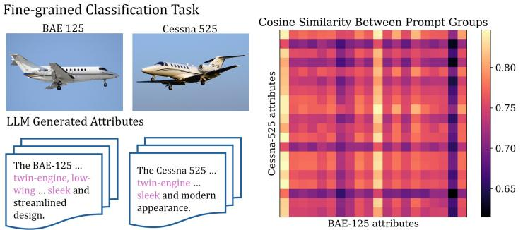

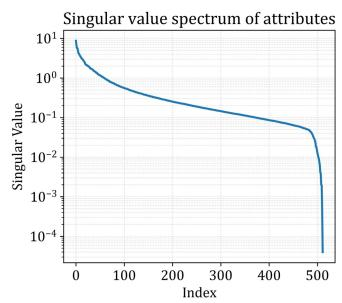  
Figure 1: Fine-grained classification with attribute prompts. Prompt groups from visually similar classes show high cosine similarity, indicating that attribute prompts are highly similar. The rapidly decaying singular value spectrum of the text embedding matrix further reveals strong inter-class correlation, motivating explicit modeling of class relationships.

Based on this observation, we propose Reparameterized Inter-Class Visual Reprogramming (RVP), a structured framework that jointly models intra-class aggregation and inter-class residual correction. RVP first learns how to combine multiple attribute descriptions within each class, and then refines the resulting class logits through an inter-class relation matrix. This design is effective for two reasons. First, it can suppress shared semantic components and amplify subtle class-specific differences, which are exactly the cues that matter in fine-grained recognition. Second, by restricting the mapping to a structured residual form, RVP preserves the pretrained semantic subspace of CLIP and avoids the overfitting risk of dense unconstrained mappings. Unlike the prior Decoupled Visual Reprogramming (Cai et al., 2025b), which relies on multiple visual prompts and repeated backbone forward passes, RVP uses only a single visual prompt and can be reparameterized (Ding et al., 2021; Luo et al., 2023) into a frozen backbone followed by a single linear classifier, incurring nearly zero additional overhead at inference. Here, reparameterization means folding multiple parameter groups into one equivalent matrix.

In summary, our contributions are threefold. First, we show that, given a visual prompt, CLIP-based visual reprogramming reduces to a linear mapping from normalized CLIP image embeddings to downstream logits, providing a unified view of prompt aggregation and label mapping strategies. Second, we propose RVP, a reparameterizable inter-class modeling framework that introduces a structured parameterization of this mapping. Specifically, RVP first constructs class logits through text-embedding-based intra-class attribute aggregation, and then refines them with a residual interclass correction matrix. Unlike unconstrained linear classifiers or generic logit adapters, RVP keeps the classifier anchored in the CLIP text-embedding subspace while reducing confusion among finegrained classes. Third, through extensive experiments, we show that this structured inter-class parameterization improves few-shot visual reprogramming while preserving efficient inference.

In Section 3, we show that, given a visual prompt, CLIP-based visual reprogramming induces a linear mapping $\phi : \mathbb { R } ^ { D }  \mathbb { R } ^ { C }$ from normalized reprogrammed-image embeddings to downstream logits, which enables reparameterizable inter-class modeling. In Section 4, we present RVP, including its training-time formulation and exact inference-time reparameterization into a single linear classifier. Sections 5 and 6 then present the experimental setup and results, showing that RVP consistently improves performance across multiple CLIP backbones, especially on fine-grained datasets such as Aircraft and Cars, while maintaining comparable or lower inference cost.

## 2 RELATED WORK

Model Reprogramming. Model reprogramming (Chen, 2024) adapts pretrained models to downstream tasks by learning transformations at the input and output interfaces, without modifying internal parameters. This strategy preserves pretrained knowledge and avoids catastrophic forgetting (Kirkpatrick et al., 2017), while enabling architecture-agnostic transfer with few trainable parameters. It has been applied to vision (Chen et al., 2023; Tsai et al., 2020; Cai et al., 2024a; Jin et al., 2025), graph (Jing et al., 2023), acoustic (Yang et al., 2021; 2023; Hung et al., 2023; Yen et al., 2023), and language models (Hambardzumyan et al., 2021; Vinod et al., 2020; Jin et al., 2024), with recent work studying its robustness (Chen et al., 2025; Zhou et al., 2025).

Input visual reprogramming (VR) (Cai et al., 2024b;a; Chen et al., 2023) is a common instantiation for image classification, where learnable patterns are injected into the input space. Typical designs include padded regions (Chen et al., 2023; Tsai et al., 2020; Tsao et al., 2024) or watermark-style perturbations (Bahng et al., 2022; Oh et al., 2023), and have been successfully extended to vision– language models (Oh et al., 2023; Zhang et al., 2024).

Prompt Learning. Prompt learning introduces trainable parameters directly into a pretrained model, often in an architecture-dependent manner. Prompts can take the form of textual tokens (Zhou et al., 2022b;a), visual prompts on images (Chen et al., 2023; Oh et al., 2023; Tsao et al., 2024), internal token prompts (Wang et al., 2023), or cross-modal mappings (Khattak et al., 2023).

Applying visual prompts to images for adapting VLMs is functionally equivalent to VR. Existing methods typically learn a single shared prompt, such as watermark overlays (Bahng et al., 2022), padded patterns (Tsai et al., 2020; Chen et al., 2023), BlackVIP (Oh et al., 2023), DAM (Huang et al., 2023). Recently, AttrVR (Cai et al., 2025a) incorporates multiple attribute prompts for each class to improve image–text alignment. DVP (Cai et al., 2025b) learns multiple prompts with distinct roles, improving learning capacity.

Feature Adapter. Few-shot CLIP adaptation can modify either features or classifiers. CLIP-Adapter (Gao et al., 2024), Tip-Adapter (Zhang et al., 2022), and Proto-CLIP (P et al., 2024) incorporate downstream visual features, while LDC (Li et al., 2025) further combines multi-level feature adaptation with sample-dependent logit correction. TaskRes (Yu et al., 2023) learns a residual directly in the classifier space, and LP++ (Huang et al., 2024) constructs text-informed classifiers from visual prototypes and text embeddings. In contrast, visual reprogramming preserves the pretrained model and adapts the task interface through input prompting and output label mapping. RVP strengthens the latter by learning structured transformations over text-derived responses.

## 3 PRELIMINARIES AND INSIGHTS

CLIP (Radford et al., 2021) consists of an image encoder $f _ { \mathrm { i m g } }$ and a text encoder $f _ { \mathrm { t x t } } ,$ which map inputs into a shared embedding space $\mathcal { Z } \subseteq \mathbb { R } ^ { D }$ , where D is the embedding dimension. Let $\mathcal { X } ^ { \mathrm { S } }$ denote the source image space of CLIP, V the text space, $x ^ { \mathrm { S } } \in \mathcal { X } ^ { \mathrm { S } }$ an input image, and $V \in \mathcal V$ a text description. The corresponding $\ell _ { 2 }$ -normalized image and text embeddings are

$$
\hat { \mathbf { v } } = \frac { f _ { \mathrm { i m g } } ( x ^ { \mathrm { S } } ) } { \| f _ { \mathrm { i m g } } ( x ^ { \mathrm { S } } ) \| _ { 2 } } , \quad \hat { \mathbf { t } } = \frac { f _ { \mathrm { t x t } } ( V ) } { \| f _ { \mathrm { t x t } } ( V ) \| _ { 2 } } .\tag{1}
$$

CLIP computes the image–text similarity as $\begin{array} { r } { f _ { \mathrm { c l i p } } ( x ^ { \mathrm { S } } , V ) = \frac { 1 } { \tau } \hat { \mathbf { v } } ^ { \top } \hat { \mathbf { t } } } \end{array}$ , where τ is the temperature.

For a downstream task defined on $\mathcal { X } ^ { \mathrm { T } } \times \mathcal { Y } ^ { \mathrm { T } }$ , let $x ^ { \mathrm { T } } \in \mathcal { X } ^ { \mathrm { T } }$ denote an input image and $\begin{array} { r l } { \mathcal { V } ^ { \mathrm { T } } = } \end{array}$ $\{ 1 , \ldots , C \}$ the label set with C classes. Each class $y ^ { \mathrm { T } } \in \mathcal { V } ^ { \mathrm { T } }$ is represented by a set of textual descriptions $\mathcal { A } ( y ^ { \mathrm { T } } ) \subseteq \mathcal { V }$ , and let $\begin{array} { r } { \mathcal { A } = \bigcup _ { y ^ { \mathrm { T } } \in \mathcal { y } ^ { \mathrm { T } } } \mathcal { A } ( y ^ { \mathrm { T } } ) } \end{array}$ . The class logit is computed by aggregating similarity scores:

$$
\left[ f _ { \mathrm { l o g i t s } } ( x ^ { \mathrm { T } } ; A ) \right] _ { y ^ { \mathrm { T } } } = \arg _ { a \in A ( y ^ { \mathrm { T } } ) } f _ { \mathrm { c l i p } } ( x ^ { \mathrm { T } } , a ) ,\tag{2}
$$

where $\mathrm { a g g ( \cdot ) }$ is an aggregation operator (Cai et al., 2025b).

Visual reprogramming adapts downstream images to a frozen pretrained model by learning an input transformation instead of modifying model parameters. Specifically, a trainable transformation $f _ { \mathrm { i n } } ( \cdot \mid \delta )$ , parameterized by a visual prompt δ, maps the downstream image $x ^ { \mathrm { T } }$ to a reprogrammed input that is compatible with CLIP. The reprogrammed image is then processed by the frozen CLIP encoders.

For a fixed image $x ^ { \mathrm { T } }$ , let $T \in \mathbb { R } ^ { | \mathcal { A } | \times D }$ be the matrix of stacked normalized text embeddings: $\begin{array} { r } { T = [ \hat { \mathbf { t } } _ { a _ { 1 } } , \dots , \hat { \mathbf { t } } _ { a _ { | A | } } ] ^ { \top } } \end{array}$ . The similarity scores over all descriptions can then be written as

$$
M _ { a } = \frac { 1 } { \tau } T \hat { \mathbf v } .
$$

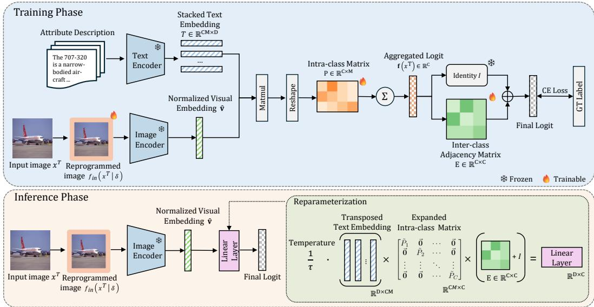  
Figure 2: Overview of Reparameterized Inter-Class Visual Reprogramming (RVP). During training, a visual prompt transforms the input image, which is then encoded by a frozen image encoder. The cosine similarities between the visual embedding and text embeddings are aggregated by a learnable intra-class matrix to produce class logits, which are further refined by a residual class-relation matrix that captures inter-class dependencies. At inference, the text embeddings and label mapping are reparameterized into a single linear classifier, enabling efficient prediction with a single forward pass.

From Similarity Scores to Class Logits. For aggregation operators that can be represented by input-independent linear weights, the description-level similarity scores can be mapped to class logits through $\mathbf { M } _ { y } = \mathbf { M } _ { a } ^ { \top } \boldsymbol { \omega }$ . where $\omega \in \mathbb { R } ^ { | \mathcal { A } | \times C }$ is a reweighting matrix induced by agg(·). Substituting $M _ { a }$ , we obtain $\begin{array} { r } { M _ { y } = \frac { 1 } { \tau } \hat { \mathbf { v } } ^ { \top } T ^ { \top } \boldsymbol { \omega } = \phi ( \hat { \mathbf { v } } ) } \end{array}$ , where $\phi : \mathbb { R } ^ { \bar { D } }  \mathbb { R } ^ { C }$ denotes the mapping from the normalized image embedding to downstream class logits. The predicted class is then obtained by selecting the largest logit in $M _ { y }$

## 4 REPARAMETERIZED INTER-CLASS VISUAL REPROGRAMMING

Following recent advances (Cai et al., 2025a;b), we use multiple attribute-based textual descriptions to enrich the semantic space, with M descriptions for each of the C downstream classes. However, as discussed earlier, fine-grained categories often exhibit high similarity in the text embedding space, indicating strong inter-class correlations. Methods based solely on independent intra-class prompt selection cannot disentangle these shared dominant semantic directions. To address this limitation, we propose the Reparameterized Inter-Class Visual Reprogramming (RVP) framework.

Fig. 2 illustrates the overall architecture of RVP. RVP jointly models intra-class description weighting and inter-class interactions while keeping the CLIP backbone frozen. The intra-class component refines class prototypes by learning how to aggregate attribute descriptions within each class, while the inter-class component enhances discriminative cues through message passing across classes. Instead of learning a dense $C M \times C$ mapping from all descriptions to target classes, which introduces $C ^ { 2 } M$ trainable parameters and is prone to overfitting in few-shot settings, RVP adopts an explicitly structured formulation with only $\bar { C } \times M$ parameters for intra-class weighting and $\bar { C ^ { \mathrm { ~ } } } \times \bar { C }$ parameters for inter-class modeling. This reduced parameterization imposes a useful structural prior and improves generalization. In addition, unlike Decoupled Visual Prompting (Cai et al., 2025b), which ensembles multiple visual prompts and therefore requires multiple forward passes through the image encoder, RVP uses a single visual prompt and only one forward pass.

## 4.1 TRAINING PHASE: DYNAMIC AGGREGATION AND MESSAGE PASSING

Given a downstream image $x ^ { \mathrm { T } } \in \mathcal { X } ^ { \mathrm { T } }$ , we first apply a trainable visual transformation $f _ { \mathrm { i n } } ( \cdot \mid \delta )$ to map it into CLIP’s input space, where the transformation is implemented as resizing and boundary padding parameterized by a visual prompt δ (Cai et al., 2024b). The reprogrammed image is then fed into the frozen CLIP image encoder to obtain the $\ell _ { 2 } \cdot$ -normalized feature vector vˆ. Let $\breve { T } \in \mathbb { R } ^ { C M \times D }$ be the stacked matrix of normalized text embeddings, assuming M textual descriptions for each of the C downstream classes. To refine intra-class prompt selection, we introduce a learnable intraclass weighting matrix $P \in \mathbb { R } ^ { C \times M }$ . We apply a softmax over the description dimension to obtain normalized weights $\tilde { P } _ { c } = \mathrm { s o f t m a x } ( P _ { c } )$ , where $P _ { c }$ denotes the c-th row of $P .$ . The aggregated base logit for class c is computed as

$$
f _ { c } ( \boldsymbol { x } ^ { \mathrm { T } } ) = \sum _ { m = 1 } ^ { M } \tilde { P } _ { c , m } \frac { 1 } { \tau } \hat { \mathbf { v } } ^ { \top } \hat { \mathbf { t } } _ { c , m } ,\tag{3}
$$

where $\hat { \mathbf { t } } _ { c , m } \in \mathbb { R } ^ { D }$ is the normalized embedding of the m-th description for class $c ,$ and $\tilde { P } _ { c , m }$ is its corresponding normalized weight.

How to Model Inter-class Relationships. In fine-grained tasks, textual descriptions from different classes are often highly similar and may share dominant semantic directions. As a result, even after aggregating multiple descriptions within each class, the base logits are still formed independently across classes and can retain strong cross-class ambiguity: semantically related but incorrect classes may receive high scores because shared text semantics are not explicitly suppressed.

Let $\mathbf { f } (  { \boldsymbol { x } } ^ { \mathrm { T } } ) = [ f _ { 1 } (  { \boldsymbol { x } } ^ { \mathrm { T } } ) , \dots , f _ { C } (  { \boldsymbol { x } } ^ { \mathrm { T } } ) ] \in \mathbb { R } ^ { C }$ denote the row vector of base logits. To model these dependencies, we introduce an inter-class adjacency matrix $E \in \mathbb { R } ^ { C \times C }$ and formulate the final class logits $\mathbf { z } \in \mathbb { R } ^ { C }$ as a residual graph message-passing step:

$$
\mathbf { z } = \mathbf { f } ( x ^ { \mathrm { T } } ) + \mathbf { f } ( x ^ { \mathrm { T } } ) E = \mathbf { f } ( x ^ { \mathrm { T } } ) ( I + E ) .\tag{4}
$$

Here, the term $\mathbf { f } ( \boldsymbol { x } ^ { \mathrm { T } } ) E$ models how evidence should be redistributed across correlated classes, allowing RVP to suppress shared semantic components and enhance subtle class-specific differences that cannot be recovered from independent intra-class aggregation alone.

The residual formulation in equation 4 provides an important structural prior. Instead of learning a dense unconstrained transformation from scratch, the identity matrix I preserves the original class logits induced by $\mathrm { C L I P } ^ { \prime } \mathrm { s }$ pretrained alignment, while the matrix $E ,$ initialized to zero, learns only residual corrections between classes. This design constrains the model to refine, rather than overwrite, the pretrained semantic structure, making optimization easier and more stable in the few-shot regime. As a result, it reduces the effective complexity of the mapping and helps the model focus on the subtle discriminative differences among correlated classes.

All trainable components in RVP are learned jointly with the downstream cross-entropy loss. Specifically, the visual prompt δ, intra-class matrix P, and inter-class matrix E are optimized end-to-end, while the CLIP image and text encoders remain frozen. The final logits $\mathbf { z } _ { i }$ are supervised by

$$
\mathcal { L } _ { \mathrm { C E } } ( \delta , P , E ) = - \frac { 1 } { N } \sum _ { i = 1 } ^ { N } \log \frac { \exp ( z _ { i , y _ { i } ^ { T } } ) } { \sum _ { c = 1 } ^ { C } \exp ( z _ { i , c } ) } ,\tag{5}
$$

where $z _ { i , c }$ is the logit of class c for sample $i ,$ and $z _ { i , y _ { i } ^ { T } }$ is the logit of its ground-truth class.

## 4.2 INFERENCE PHASE: LINEAR REPARAMETERIZATION

During inference, the intra-class aggregation and inter-class message-passing can be completely absorbed into a single projection matrix. We construct a sparse routing matrix $W _ { 1 } \in \mathbb { R } ^ { C M \times C }$ as a block-diagonal matrix:

$$
W _ { 1 } = \left[ \begin{array} { c c c c } { \tilde { P } _ { 1 } } & { \vec { \bf 0 } } & { \cdot \cdot \cdot } & { \vec { \bf 0 } } \\ { \vec { \bf 0 } } & { \tilde { P } _ { 2 } } & { \cdot \cdot \cdot } & { \vec { \bf 0 } } \\ { \vdots } & { \vdots } & { \ddots } & { \vdots } \\ { \vec { \bf 0 } } & { \vec { \bf 0 } } & { \cdot \cdot \cdot } & { \tilde { P } _ { C } } \end{array} \right] \in \mathbb { R } ^ { C M \times C } ,\tag{6}
$$

where each $\tilde { P } _ { c } = [ \tilde { P } _ { c , 1 } , \hdots , \tilde { P } _ { c , M } ] ^ { \top } \in \mathbb { R } ^ { M }$ is the normalized weight vector for the M descriptions of class $c ,$ and $\vec { \bf 0 }$ denotes a zero column vector of length M. By leveraging the associativity of

matrix multiplication, we pre-calculate a unified classifier matrix $\hat { W } \in \mathbb { R } ^ { D \times C }$ that absorbs the text embeddings, routing weights, and inter-class correlations:

$$
\hat { W } = \frac { 1 } { \tau } T ^ { \top } W _ { 1 } ( I + E ) .\tag{7}
$$

The detailed structure of this reparameterized head can be unrolled as:

$$
\begin{array}{c} \begin{array}{c} \hat { W } = \frac { 1 } { \tau } \underbrace { \left( \hat { \bf t } _ { 1 , 1 } ^ { | } \quad \hat { \bf t } _ { 1 , 2 } ^ { | } \quad . . . \quad \hat { \bf t } _ { C , M } ^ { | } \right) } _ { \displaystyle T ^ { \top } \in \mathbb { R } ^ { D \times c M } } \underbrace { \left( \overbrace { { \bf \theta } } ^ { \tilde { P } _ { 1 } \quad \vec { \bf p } } & { \cdot \cdot \cdot } \\ { \vdots \quad \vdots \quad \ddots \quad } \\ { W _ { 1 } \in \mathbb { R } ^ { C M \times C } } \quad \right)} & { \mathbb { T } ^ { C \times c M } } \end{array}   _ { \displaystyle T ^ { \top } \in \mathbb { R } ^ { D \times c M } } \underbrace { \left( \overbrace { { \bf \theta } } ^ { \tilde { P } _ { 1 } \quad \vec { \bf p } } & { \cdot \cdot \cdot } \\ { \vdots \quad \vdots \quad \ddots \quad } \\ { W _ { 1 } \in \mathbb { R } ^ { C M \times C } } \quad \right)} & { \mathbb { R } ^ { C \times c } } \end{array}   _ { \displaystyle \underbrace { W _ { 1 } \in \mathbb { R } ^ { C M \times C } } } \underbrace { ( I + E ) } _ { \displaystyle \mathbb { R } ^ { C \times c } } .\tag{8}
$$

Consequently, the entire forward pass during inference is reduced to generating the single visual prompt, extracting the normalized image embedding via exactly one pass through the backbone, and performing a single linear projection: $\mathbf { z } = \hat { \mathbf { v } } ^ { \top } \hat { W }$

This exact reparameterization replaces the standard aggregation weights with $\hat { W }$ , guaranteeing that RVP identifies a more expressive mapping ϕ while adding nearly zero overhead during inference.

## 5 EXPERIMENTS

Experimental Setup and Benchmarks. To evaluate the proposed RVP framework, we adhere to the established experimental protocol from (Cai et al., 2025b). We conduct all experiments using pretrained CLIP models across four image encoder architectures, including variants of ResNet (He et al., 2016) and Vision Transformer (ViT) (Dosovitskiy et al., 2021), under a 16-shot downstream classification setting. All reported results represent the average accuracy across three independent random seeds. Our benchmark suite comprises 11 datasets covering diverse visual domains, including textures, actions, and natural scenes. All datasets are publicly available: FGVC Aircraft (Aircraft) (Maji et al., 2013), Caltech101 (Caltech) (Fei-Fei et al., 2004), StanfordCars (Cars) (Krause et al., 2013), Describable Textures Dataset (DTD) (Cimpoi et al., 2014), EuroSAT (ESAT) (Helber et al., 2019), Flowers102 (Flowers) (Nilsback & Zisserman, 2008), Food101 (Food) (Bossard et al., 2014), OxfordPets (Pets) (Parkhi et al., 2012), SUN397 (SUN) (Xiao et al., 2010), UCF101 (UCF) (Soomro et al., 2012), and RESISC45 (Resisc) (Cheng et al., 2017). More implementation details can be found in Section D.

## 6 RESULTS

Quantitative Results. We compare RVP against four prominent visual reprogramming (VR) baselines: (1) VP (Bahng et al., 2022), a standard VR approach that overlays learnable pixel perturbations onto rescaled downstream images; (2) AR (Tsai et al., 2020; Chen et al., 2023), which pads learnable noise parameters around the image boundary; (3) AttrVR (Cai et al., 2025a), which guides the learning of visual prompt patterns using class-specific attribute descriptions; and (4) DVP (Cai et al., 2025b), a decoupled visual prompting framework that ensembles multiple reprogrammed inputs. For a strictly fair comparison, we evaluate the unsupervised clustering variant of DVP (DVP cls), which isolates the performance of the reprogramming mechanism without relying on external Large Language Models (LLMs) to generate cause-specific descriptions. RVP uses the same text prompt set as DVP.

As shown in Tables 1 to 3, RVP achieves the highest average accuracy across all evaluated backbones. With ViT-B/16 CLIP (Table 1), RVP attains the highest average accuracy of 82.7%, outperforming DVP (Cai et al., 2025b) by 3.0 points and AttrVR (Cai et al., 2025a) by 4.2 points. It achieves the best result on 9 out of 11 datasets, with especially large gains on fine-grained benchmarks such as Aircraft (+7.4 over DVP) and Cars (+14.0). These improvements are consistent with our motivation: in fine-grained recognition, many categories share highly similar semantic attributes, and the main discriminative cues arise from subtle inter-class differences. In this regime, intra-class prompt selection alone is insufficient, while RVP can explicitly suppress shared semantic components and amplify class-specific distinctions through inter-class modeling.

Table 1: Accuracy comparison of different methods trained on 16-shot downstream classification tasks, using ViT-B/16-based CLIP as the pretrained model (Mean $\% \pm \mathrm { S t d }$ %, ours are highlighted and the highest result is in bold). Other results are taken from prior work (Cai et al., 2025b).
<table><tr><td>METHOD</td><td>AIRCRAFT</td><td>CALTECH</td><td>CARS</td><td>DTD</td><td>ESAT</td><td>FLOWERS</td><td>FOOD</td><td>PETS</td><td>SUN</td><td>UCF</td><td>RESISC</td><td>AVG.</td></tr><tr><td>VP</td><td>32.1</td><td>93.5</td><td>65.5</td><td>61.4</td><td>91.2</td><td>82.5</td><td>82.3</td><td>91.0</td><td>65.8</td><td>73.8</td><td>79.1</td><td>74.4</td></tr><tr><td>AR</td><td>31.7</td><td>95.5</td><td>68.0</td><td>62.0</td><td>93.4</td><td>85.9</td><td>85.2</td><td>92.7</td><td>67.9</td><td>78.1</td><td>81.6</td><td>76.5</td></tr><tr><td>ATTRVR</td><td>36.6</td><td>95.7</td><td>68.3</td><td>65.6</td><td>93.8</td><td>92.9</td><td>85.9</td><td>93.3</td><td>69.6</td><td>79.0</td><td>82.6</td><td>78.5</td></tr><tr><td>DVP</td><td>38.7</td><td>96.0</td><td>70.8</td><td>65.5</td><td>94.1</td><td>95.0</td><td>85.7</td><td>93.3</td><td>71.1</td><td>82.0</td><td>84.4</td><td>79.7</td></tr><tr><td>RVP</td><td>46.1±0.2</td><td>96.5±0.2</td><td>84.8±0.3</td><td>68.7±0.1</td><td>92.7±0.2</td><td>96.7±0.2</td><td>85.5±0.1</td><td>94.0±0.1</td><td>73.8±0.1</td><td>85.1±0.7</td><td>85.9±0.5</td><td>82.7</td></tr></table>

Table 2: Accuracy comparison of different methods trained on 16-shot downstream classification tasks, using RN50-based CLIP as the pretrained model (Mean $\% \pm \mathrm { S t d }$ %, ours are highlighted and the highest result is in bold). Other results are taken from prior work (Cai et al., 2025b).
<table><tr><td>METHOD</td><td>AIRCRAFT</td><td>CALTECH</td><td>CARS</td><td>DTD</td><td>ESAT</td><td>FLOWERS</td><td>FooD</td><td>PETS</td><td>SUN</td><td>UCF</td><td>RESISC</td><td>AVG.</td></tr><tr><td>VP</td><td>16.2</td><td>80.1</td><td>44.0</td><td>43.4</td><td>59.7</td><td>53.6</td><td>65.3</td><td>77.2</td><td>48.8</td><td>52.0</td><td>47.7</td><td>53.5</td></tr><tr><td>AR</td><td>18.6</td><td>86.5</td><td>53.9</td><td>46.4</td><td>66.6</td><td>60.9</td><td>74.2</td><td>82.5</td><td>56.8</td><td>59.7</td><td>58.4</td><td>60.4</td></tr><tr><td>ATTRVR</td><td>20.7</td><td>89.1</td><td>53.9</td><td>54.4</td><td>72.0</td><td>74.8</td><td>75.3</td><td>88.9</td><td>59.9</td><td>63.6</td><td>58.2</td><td>64.6</td></tr><tr><td>DVP</td><td>22.1</td><td>89.8</td><td>54.5</td><td>55.9</td><td>72.2</td><td>80.0</td><td>75.0</td><td>88.9</td><td>61.1</td><td>65.9</td><td>60.8</td><td>66.0</td></tr><tr><td>RVP</td><td>29.1±0.3</td><td>92.0±0.0</td><td>71.0±0.3</td><td>62.0±0.3</td><td>72.9±0.9</td><td>91.6±0.2</td><td>73.7±0.0</td><td>89.7±0.1</td><td>66.2±0.1</td><td>74.3±0.1</td><td>72.9±0.1</td><td>72.3</td></tr></table>

The advantage of RVP becomes even more pronounced with the weaker RN50 backbone. In Table 2, RVP achieves an average accuracy of 72.3%, exceeding DVP by 6.3 points and AttrVR by 7.7 points. It again shows particularly strong gains on Aircraft and Cars, indicating that the proposed structured reparameterization remains effective even when the underlying visual encoder is less expressive.

More broadly, Table 3 shows that the advantage of RVP becomes larger as the visual backbone becomes weaker. Compared with DVP, the gain is +6.3 on RN50, +4.2 on RN101, +4.8 on ViT-B/32, and +3.0 on ViT-B/16. This trend is expected, since weaker pretrained encoders produce less separable features, making downstream classification more reliant on the quality of the label mapping. In this setting, a structured mapping that explicitly models intra-class aggregation and inter-class relationships becomes more effective, as it can recover discriminative

Table 3: Average accuracy of different VR methods on 11 datasets using different CLIP visual encoders (mean accuracy in %; ours are highlighted and the highest is in bold; RN denotes ResNet).
<table><tr><td>METHOD</td><td>RN50 RN101</td><td>VIT-B/32</td><td>VIT-B/16</td></tr><tr><td>VP</td><td>53.5 57.5</td><td>68.3</td><td>74.4</td></tr><tr><td>AR</td><td>60.4 62.7</td><td>66.3</td><td>76.5</td></tr><tr><td>ATTRVR</td><td>64.6 67.2</td><td>69.8</td><td>78.5</td></tr><tr><td>DVP</td><td>66.0 68.8</td><td>71.0</td><td>79.7</td></tr><tr><td>RVP</td><td>72.3 73.0</td><td>75.8</td><td>82.7</td></tr></table>

information that is not well separated in the original feature space. In contrast, stronger backbones such as ViT-B/16 already provide more discriminative and semantically aligned embeddings, leaving less room for improvement.

Few-shot Classification Performance. Fig. 3 compares few-shot performance on the Aircraft dataset under 1, 4, 8, 16, and 32 training samples per class. RVP achieves the best accuracy at every shot setting and shows a clear advantage over all prior visual reprogramming baselines. The improvement is modest in the extreme 1-shot setting, but becomes much larger as more labeled samples are available. At 32- shot, RVP attains 50.7%, substantially outperforming DVP (41.2%) and AttrVR (38.4%).

This trend suggests that the proposed structured mapping can make better use of additional supervision than existing methods. While all approaches improve as the number of shots increases, the gain of RVP is much steeper, indicating stronger scalability from low-shot to moderately supervised settings. The relatively small standard deviations across all shot numbers also show that the improvements are stable over repeated runs. Overall, the figure shows that explicitly modeling both intra-class aggregation and inter-class relationships leads to more effective few-shot adaptation on fine-grained recognition tasks.

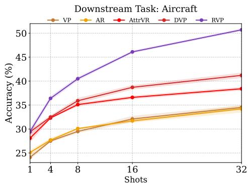  
Figure 3: Accuracy comparison across different shot settings on Aircraft using ViT-B/16 CLIP. RVP consistently outperforms prior VR methods across all shot numbers. Shaded regions indicate standard deviation.

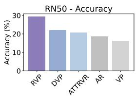

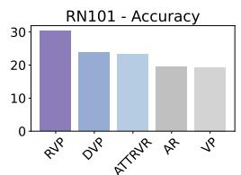

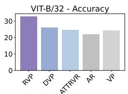

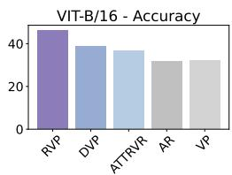

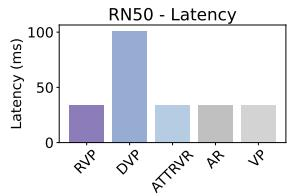

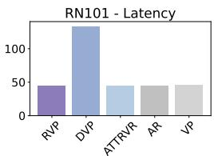

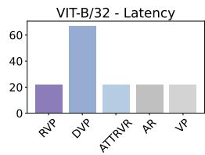

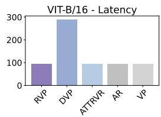  
Figure 4: Accuracy and latency comparison on FGVC Aircraft across different backbones. Our method consistently achieves the highest accuracy while maintaining low latency, demonstrating a favorable trade-off between performance and efficiency.

Table 4: Ablation studies of RVP using a ViT-B/16-based CLIP backbone. The complete method is highlighted , and the best results are shown in bold.
<table><tr><td>METHOD</td><td>AIRCRAFT</td><td>CALTECH</td><td>CARS</td><td>DTD</td><td>ESAT</td><td>FLOWERS</td><td>FOOD</td><td>PETS</td><td>SUN</td><td>UCF</td><td>RESISC</td><td>AVG.</td></tr><tr><td>RVP</td><td>46.1</td><td>96.5</td><td>84.8</td><td>68.7</td><td>92.7</td><td>96.7</td><td>85.5</td><td>94.0</td><td>73.8</td><td>85.1</td><td>85.9</td><td>82.7</td></tr><tr><td>w/o VR</td><td>40.1</td><td>96.2</td><td>81.7</td><td>65.7</td><td>58.5</td><td>96.8</td><td>84.7</td><td>93.9</td><td>74.2</td><td>83.6</td><td>82.8</td><td>78.0</td></tr><tr><td>W/O INTRA-CLASS P</td><td>46.0</td><td>96.3</td><td>84.7</td><td>68.3</td><td>92.6</td><td>96.8</td><td>85.5</td><td>94.1</td><td>73.8</td><td>84.4</td><td>85.6</td><td>82.6</td></tr><tr><td>W/O INTER-CLASS E</td><td>35.6</td><td>96.1</td><td>68.0</td><td>63.3</td><td>93.8</td><td>91.7</td><td>85.6</td><td>93.1</td><td>67.4</td><td>78.9</td><td>83.5</td><td>77.9</td></tr><tr><td>LINEAR PROBE</td><td>37.2</td><td>93.9</td><td>73.5</td><td>63.5</td><td>84.2</td><td>92.2</td><td>79.5</td><td>85.6</td><td>69.1</td><td>76.8</td><td>83.5</td><td>76.3</td></tr><tr><td>ATTRIBUTE &amp; LP</td><td>37.4</td><td>90.9</td><td>78.1</td><td>56.4</td><td>59.4</td><td>86.2</td><td>73.9</td><td>90.7</td><td>67.9</td><td>68.7</td><td>76.6</td><td>71.5</td></tr></table>

Accuracy and Inference Speed. RVP not only improves classification accuracy, but also retains the efficiency advantage of standard visual reprogramming. As shown in Fig. 4, RVP consistently achieves the highest accuracy on FGVC Aircraft across all four backbones, while maintaining latency close to single-prompt methods such as VP, AR, and AttrVR. In contrast, DVP relies on multiple decoupled visual prompts and therefore requires multiple forward passes through the frozen image encoder, leading to substantially higher inference latency. By using only a single visual prompt and reparameterizing the output mapping into one linear classifier, RVP avoids this overhead while still delivering stronger performance. This result shows that the gain of RVP comes from a more effective structured label mapping rather than increased inference-time computation.

Ablation Study. We conduct an ablation study in Table 4 using a ViT-B/16-based CLIP backbone. In addition to the full RVP model, we evaluate five variants: w/o VR, which removes visual reprogramming and classifies zero-padded images only; w/o intra-class P, which replaces the learnable intra-class weights with uniform averaging; w/o inter-class E, which removes inter-class modeling; Linear Probe, which trains a linear classifier on the visual embedding; and Attribute & LP, which learns a dense CM × C prompt-reweighting matrix over all text descriptions. Linear Probe and Attribute & LP are trained together with the visual prompt.

The complete RVP achieves the best average accuracy of 82.7%, confirming that visual reprogramming, intra-class aggregation, and inter-class modeling work best together. Removing VR reduces the average accuracy to 78.0%, with large drops on Aircraft, Cars, DTD, and especially ESAT, showing that input adaptation remains important. Removing the inter-class matrix E reduces the average accuracy to 77.9%, which is the largest drop among all architectural ablations. The effect is especially strong on Aircraft and Cars, where classes share many attributes and differ only in subtle details. This shows that explicit inter-class modeling is the main source of improvement in RVP.

The comparisons with Linear Probe and Attribute & LP further highlight the value of structured reparameterization. Linear Probe reaches 76.3%, while Attribute & LP performs even worse at

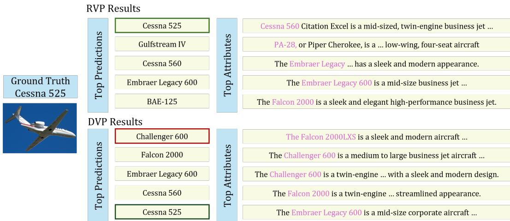  
Figure 5: Top predicted classes and highest-matching attributes for a test image. For both RVP and DVP, the most similar attributes include prompts from other classes, reflecting strong semantic overlap in fine-grained recognition. However, RVP explicitly models inter-class relationships, allowing it to better resolve these cross-class ambiguities and produce the correct prediction.

71.5%, despite using a dense mapping with more parameters. This indicates that simply increasing trainable parameter size can lead to overfitting without structural constraints.

Overall, the ablation results show a clear pattern: the inter-class module E is the most important component, the visual prompt is also essential, and the intra-class matrix P provides a smaller but consistent gain. These results support the design of RVP and show that its advantage comes from structured modeling rather than a larger unconstrained classifier.

Qualitative Analysis. Fig. 5 provides a qualitative comparison between RVP and DVP on a finegrained aircraft example. In both methods, the highest-matching attributes include prompts from semantically similar but incorrect classes. This is expected because attribute prompts are largely class-agnostic: descriptions such as sleek, streamlined, or twin-engine are often shared by multiple aircraft categories and therefore cannot uniquely identify a class on their own. As a result, relying only on prompt-level similarity can lead to ambiguous predictions. RVP addresses this issue by explicitly modeling inter-class relationships, allowing it to suppress misleading shared semantics and rank the ground-truth class Cessna 525 at the top, whereas DVP places it only in the fifth position.

## 7 LIMITATIONS

Although RVP performs strongly on most benchmarks, its performance is less pronounced on Food101. Unlike fine-grained object categories, food images often include not only the main dish but also side dishes, garnish, sauces, and other accompanying ingredients, which makes class semantics less stable across samples. This high intra-class variation weakens the consistency of text-based class relationships and reduces the advantage of our structured inter-class modeling. A more detailed discussion is provided in Section B.6.

## 8 CONCLUSION

We proposed Reparameterized Inter-Class Visual Reprogramming (RVP), which adapts frozen vision– language models through structured intra-class aggregation and inter-class modeling. RVP admits exact reparameterization into a single linear classifier at inference. Across 11 benchmarks and multiple CLIP backbones, RVP consistently improves over prior visual reprogramming methods, with the largest gains on fine-grained tasks. These results highlight the benefit of modeling class relationships in visual reprogramming and motivate extending RVP beyond CLIP. We will explore the application of RVP beyond CLIP in future work.

## REFERENCES

Hyojin Bahng, Ali Jahanian, Swami Sankaranarayanan, and Phillip Isola. Exploring visual prompts for adapting large-scale models. arXiv, 2022.

Lukas Bossard, Matthieu Guillaumin, and Luc Van Gool. Food-101–mining discriminative components with random forests. In ECCV, 2014.

Chengyi Cai, Zesheng Ye, Lei Feng, Jianzhong Qi, and Feng Liu. Bayesian-guided label mapping for visual reprogramming. In NeurIPS, 2024a.

Chengyi Cai, Zesheng Ye, Lei Feng, Jianzhong Qi, and Feng Liu. Sample-specific masks for visual reprogramming-based prompting. In ICML, 2024b.

Chengyi Cai, Zesheng Ye, Lei Feng, Jianzhong Qi, and Feng Liu. Attribute-based visual reprogramming for vision-language models. In The Thirteenth International Conference on Learning Representations, 2025a. URL https://openreview.net/forum?id=j964C6y92q.

Chengyi Cai, Zesheng Ye, Lei Feng, Jianzhong Qi, and Feng Liu. Understanding model reprogramming for clip via decoupling visual prompts. In International Conference on Machine Learning, 2025b.

Aochuan Chen, Yuguang Yao, Pin-Yu Chen, Yihua Zhang, and Sijia Liu. Understanding and improving visual prompting: A label-mapping perspective. In CVPR, 2023.

Pin-Yu Chen. Model reprogramming: Resource-efficient cross-domain machine learning. In AAAI, 2024.

Yukun Chen, Shuo Shao, Enhao Huang, Yiming Li, Pin-Yu Chen, Zhan Qin, and Kui Ren. Refine: Inversion-free backdoor defense via model reprogramming. In ICLR, 2025.

Gong Cheng, Junwei Han, and Xiaoqiang Lu. Remote sensing image scene classification: Benchmark and state of the art. Proceedings ofthe IEEE, 2017.

Mircea Cimpoi, Subhransu Maji, Iasonas Kokkinos, Sammy Mohamed, and Andrea Vedaldi. Describing textures in the wild. In CVPR, 2014.

Xiaohan Ding, Xiangyu Zhang, Ningning Ma, Jungong Han, Guiguang Ding, and Jian Sun. Repvgg: Making vgg-style convnets great again. In 2021 IEEE/CVF Conference on Computer Vision and Pattern Recognition (CVPR), pp. 13728–13737, 2021. doi: 10.1109/CVPR46437.2021.01352.

Alexey Dosovitskiy, Lucas Beyer, Alexander Kolesnikov, Dirk Weissenborn, Xiaohua Zhai, Thomas Unterthiner, Mostafa Dehghani, Matthias Minderer, Georg Heigold, Sylvain Gelly, Jakob Uszkoreit, and Neil Houlsby. An image is worth 16x16 words: Transformers for image recognition at scale. ICLR, 2021.

Gamaleldin F Elsayed, Ian Goodfellow, and Jascha Sohl-Dickstein. Adversarial reprogramming of neural networks. In ICLR, 2018.

Li Fei-Fei, Rob Fergus, and Pietro Perona. Learning generative visual models from few training examples: An incremental bayesian approach tested on 101 object categories. In CVPR workshop, 2004.

Peng Gao, Shijie Geng, Renrui Zhang, Teli Ma, Rongyao Fang, Yongfeng Zhang, Hongsheng Li, and Yu Qiao. Clip-adapter: Better vision-language models with feature adapters. International Journal ofComputer Vision, 132(2):581–595, 2024. ISSN 0920-5691. doi: 10.1007/s11263-023-01891-x. URL https://doi.org/10.1007/s11263-023-01891-x.

K Hambardzumyan, H Khachatrian, and J May. Warp: Word-level adversarial reprogramming. In ACL-IJCNLP, 2021.

Kaiming He, Xiangyu Zhang, Shaoqing Ren, and Jian Sun. Deep residual learning for image recognition. In 2016 IEEE Conference on Computer Vision and Pattern Recognition (CVPR), pp. 770–778, 2016. doi: 10.1109/CVPR.2016.90.

Patrick Helber, Benjamin Bischke, Andreas Dengel, and Damian Borth. Eurosat: A novel dataset and deep learning benchmark for land use and land cover classification. IEEE Journal ofSelected Topics in Applied Earth Observations and Remote Sensing, 2019.

Qidong Huang, Xiaoyi Dong, Dongdong Chen, Weiming Zhang, Feifei Wang, Gang Hua, and Nenghai Yu. Diversity-aware meta visual prompting. In CVPR, 2023.

Yunshi Huang, Fereshteh Shakeri, Jose Dolz, Malik Boudiaf, Houda Bahig, and Ismail Ben Ayed. Lp++: A surprisingly strong linear probe for few-shot clip. In IEEE/CVF Conference on Computer Vision and Pattern Recognition (CVPR), 2024.

Yun-Ning Hung, Chao-Han Huck Yang, Pin-Yu Chen, and Alexander Lerch. Low-resource music genre classification with cross-modal neural model reprogramming. In ICASSP, 2023.

Chao Jia, Yinfei Yang, Ye Xia, Yi-Ting Chen, Zarana Parekh, Hieu Pham, Quoc Le, Yun-Hsuan Sung, Zhen Li, and Tom Duerig. Scaling up visual and vision-language representation learning with noisy text supervision. In Marina Meila and Tong Zhang (eds.), Proceedings ofthe 38th International Conference on Machine Learning, volume 139 of Proceedings of Machine Learning Research, pp. 4904–4916. PMLR, 18–24 Jul 2021. URL https://proceedings.mlr.press/v139/ jia21b.html.

Can Jin, Ying Li, Mingyu Zhao, Shiyu Zhao, Zhenting Wang, Xiaoxiao He, Ligong Han, Tong Che, and Dimitris N. Metaxas. Lor-VP: Low-rank visual prompting for efficient vision model adaptation. In ICLR, 2025.

Ming Jin, Shiyu Wang, Lintao Ma, Zhixuan Chu, James Y. Zhang, Xiaoming Shi, Pin-Yu Chen, Yuxuan Liang, Yuan-Fang Li, Shirui Pan, and Qingsong Wen. Time-LLM: Time series forecasting by reprogramming large language models. In ICLR, 2024.

Yongcheng Jing, Chongbin Yuan, Li Ju, Yiding Yang, Xinchao Wang, and Dacheng Tao. Deep graph reprogramming. In CVPR, 2023.

Muhammad Uzair Khattak, Hanoona Rasheed, Muhammad Maaz, Salman Khan, and Fahad Shahbaz Khan. Maple: Multi-modal prompt learning. In CVPR, 2023.

James Kirkpatrick, Razvan Pascanu, Neil Rabinowitz, Joel Veness, Guillaume Desjardins, Andrei A Rusu, Kieran Milan, John Quan, Tiago Ramalho, Agnieszka Grabska-Barwinska, et al. Overcoming catastrophic forgetting in neural networks. PNAS, 2017.

Jonathan Krause, Michael Stark, Jia Deng, and Li Fei-Fei. 3d object representations for fine-grained categorization. In ICCV workshops, 2013.

Shuo Li, Fang Liu, Zehua Hao, Xinyi Wang, Lingling Li, Xu Liu, Puhua Chen, and Wenping Ma. Logits deconfusion with clip for few-shot learning. In Proceedings ofthe Computer Vision and Pattern Recognition Conference (CVPR), pp. 25411–25421, June 2025.

Ilya Loshchilov and Frank Hutter. SGDR: Stochastic gradient descent with warm restarts. In International Conference on Learning Representations, 2017. URL https://openreview. net/forum?id=Skq89Scxx.

Gen Luo, Minglang Huang, Yiyi Zhou, Xiaoshuai Sun, Guannan Jiang, Zhiyu Wang, and Rongrong Ji. Towards efficient visual adaption via structural re-parameterization, 2023. URL https: //arxiv.org/abs/2302.08106.

Subhransu Maji, Esa Rahtu, Juho Kannala, Matthew Blaschko, and Andrea Vedaldi. Fine-grained visual classification of aircraft. arXiv, 2013.

Maria-Elena Nilsback and Andrew Zisserman. Automated flower classification over a large number of classes. In Indian Conference on Computer Vision, Graphics & Image Processing, 2008.

Changdae Oh, Hyeji Hwang, Hee-young Lee, YongTaek Lim, Geunyoung Jung, Jiyoung Jung, Hosik Choi, and Kyungwoo Song. Blackvip: Black-box visual prompting for robust transfer learning. In CVPR, 2023.

Jishnu Jaykumar P, Kamalesh Palanisamy, Yu-Wei Chao, Xinya Du, and Yu Xiang. Proto-clip: Visionlanguage prototypical network for few-shot learning. In 2024 IEEE/RSJ International Conference on Intelligent Robots and Systems (IROS), pp. 2594–2601, 2024. doi: 10.1109/IROS58592.2024. 10801660.

Omkar M Parkhi, Andrea Vedaldi, Andrew Zisserman, and CV Jawahar. Cats and dogs. In CVPR, 2012.

Alec Radford, Jong Wook Kim, Chris Hallacy, Aditya Ramesh, Gabriel Goh, Sandhini Agarwal, Girish Sastry, Amanda Askell, Pamela Mishkin, Jack Clark, et al. Learning transferable visual models from natural language supervision. In ICML, 2021.

Khurram Soomro, Amir Roshan Zamir, and Mubarak Shah. A dataset of 101 human action classes from videos in the wild. Centerfor Research in Computer Vision, 2012.

Yun-Yun Tsai, Pin-Yu Chen, and Tsung-Yi Ho. Transfer learning without knowing: Reprogramming black-box machine learning models with scarce data and limited resources. In ICML, 2020.

Hsi-Ai Tsao, Lei Hsiung, Pin-Yu Chen, Sijia Liu, and Tsung-Yi Ho. Autovp: An automated visual prompting framework and benchmark. In ICLR, 2024.

Ria Vinod, Pin-Yu Chen, and Payel Das. Reprogramming language models for molecular representation learning. In NeurIPS, 2020.

Wenhao Wang, Yifan Sun, Wei Li, and Yi Yang. Transhp: Image classification with hierarchical prompting. In NeurIPS, 2023.

Jiayang Wu, Xinyang Chen, Ke Lv, and Weili Guan. Boosting visual reprogramming for clip with dual granularity alignment. In Proceedings of the IEEE/CVF Conference on Computer Vision and Pattern Recognition (CVPR), pp. 29347–29356, June 2026.

Jianxiong Xiao, James Hays, Krista A Ehinger, Aude Oliva, and Antonio Torralba. Sun database: Large-scale scene recognition from abbey to zoo. In CVPR, 2010.

Chao-Han Huck Yang, Yun-Yun Tsai, and Pin-Yu Chen. Voice2series: Reprogramming acoustic models for time series classification. In ICML, 2021.

Chao-Han Huck Yang, Bo Li, Yu Zhang, Nanxin Chen, Rohit Prabhavalkar, Tara N Sainath, and Trevor Strohman. From english to more languages: Parameter-efficient model reprogramming for cross-lingual speech recognition. In ICASSP, 2023.

Hao Yen, Pin-Jui Ku, Chao-Han Huck Yang, Hu Hu, Sabato Marco Siniscalchi, Pin-Yu Chen, and Yu Tsao. Neural model reprogramming with similarity based mapping for low-resource spoken command classification. In INTERSPEECH, 2023.

Tao Yu, Zhihe Lu, Xin Jin, Zhibo Chen, and Xinchao Wang. Task residual for tuning vision-language models. In Proceedings of the IEEE/CVF Conference on Computer Vision and Pattern Recognition, pp. 10899–10909, 2023.

Renrui Zhang, Wei Zhang, Rongyao Fang, Peng Gao, Kunchang Li, Jifeng Dai, Yu Qiao, and Hongsheng Li. Tip-adapter: Training-free adaption of clip for few-shot classification. In Computer Vision – ECCV 2022: 17th European Conference, Tel Aviv, Israel, October 23–27, 2022, Proceedings, Part XXXV, pp. 493–510, Berlin, Heidelberg, 2022. Springer-Verlag. ISBN 978- 3-031-19832-8. doi: 10.1007/978-3-031-19833-5 29. URL https://doi.org/10.1007/ 978-3-031-19833-5\_29.

Yichi Zhang, Yinpeng Dong, Siyuan Zhang, Tianzan Min, Hang Su, and Jun Zhu. Exploring the transferability of visual prompting for multimodal large language models. In CVPR, 2024.

Kaiyang Zhou, Jingkang Yang, Chen Change Loy, and Ziwei Liu. Conditional prompt learning for vision-language models. In CVPR, 2022a.

Kaiyang Zhou, Jingkang Yang, Chen Change Loy, and Ziwei Liu. Learning to prompt for visionlanguage models. IJCV, 2022b.

Shengjie Zhou, Xin Cheng, Haiyang Xu, Ming Yan, Tao Xiang, Feng Liu, and Lei Feng. Endowing visual reprogramming with adversarial robustness. In ICLR, 2025.

## A DATASET INFORMATION

Table 5: Summary of the 11 downstream benchmark datasets used in our experiments, including task type, number of classes, and training batch size.
<table><tr><td></td><td>AIRCRAFT</td><td>CALTECH</td><td>CARS</td><td>DTD</td><td>ESAT</td><td>FLOWERS</td><td>FOOD</td><td>PETS</td><td>SUN</td><td>UCF</td><td>RESISC</td></tr><tr><td>TASK</td><td>aircraft</td><td>object</td><td>fine-grained</td><td>texture</td><td>remote sensing</td><td>flower</td><td>food</td><td>pet</td><td>scene</td><td>action</td><td>remote</td></tr><tr><td>INFO.</td><td>model</td><td></td><td>automobile</td><td></td><td>land cover</td><td></td><td></td><td></td><td></td><td></td><td>sensing scene</td></tr><tr><td>CLASS NUMBER</td><td>100</td><td>100</td><td>196</td><td>47</td><td>10</td><td>102</td><td>101</td><td>37</td><td>397</td><td>101</td><td>45</td></tr><tr><td>BATCH SIZE</td><td>64</td><td>64</td><td>64</td><td>64</td><td>64</td><td>64</td><td>64</td><td>64</td><td>64</td><td>64</td><td>64</td></tr></table>

Following prior works (Cai et al., 2025a;b), we adopt the same 16-shot benchmark protocol. The benchmark covers 11 publicly available datasets spanning diverse recognition tasks, including finegrained object recognition, generic object classification, texture recognition, scene understanding, action recognition, and remote sensing. Specifically, we use FGVC Aircraft (Aircraft) (Maji et al., 2013), Caltech101 (Caltech) (Fei-Fei et al., 2004), StanfordCars (Cars) (Krause et al., 2013), Describable Textures Dataset (DTD) (Cimpoi et al., 2014), EuroSAT (ESAT) (Helber et al., 2019), Flowers102 (Flowers) (Nilsback & Zisserman, 2008), Food101 (Food) (Bossard et al., 2014), OxfordPets (Pets) (Parkhi et al., 2012), SUN397 (SUN) (Xiao et al., 2010), UCF101 (UCF) (Soomro et al., 2012), and RESISC45 (Resisc) (Cheng et al., 2017). As summarized in Table 5, these datasets vary substantially in semantic granularity and class cardinality, ranging from 10 classes in EuroSAT to 397 classes in SUN397. Unless otherwise specified, we use a batch size of 64 for training visual reprogramming on all datasets.

## B ADDITIONAL RESULTS

## B.1 ADDITIONAL RESULTS ON DIFFERENT BACKBONES

Table 6: Accuracy comparison of different methods trained on 16-shot downstream classification tasks, using RN101-based CLIP as the pretrained model (Mean %, ours are highlighted and the highest is in bold).

<table><tr><td>METHOD</td><td>AIRCRAFT</td><td>CALTECH</td><td>CARS</td><td>DTD</td><td>ESAT</td><td>FLOWERS</td><td>FOOD</td><td>PETS</td><td>SUN</td><td>UCF</td><td>RESISC</td><td>AVG.</td></tr><tr><td>VP</td><td>19.3</td><td>83.0</td><td>53.7</td><td>43.4</td><td>62.8</td><td>57.2</td><td>71.2</td><td>80.2</td><td>53.5</td><td>54.2</td><td>54.0</td><td>57.5</td></tr><tr><td>AR</td><td>19.5</td><td>89.7</td><td>62.0</td><td>46.3</td><td>70.4</td><td>60.4</td><td>78.0</td><td>84.4</td><td>58.4</td><td>60.6</td><td>60.2</td><td>62.7</td></tr><tr><td>ATTRVR</td><td>23.3</td><td>92.0</td><td>62.2</td><td>55.6</td><td>70.3</td><td>76.2</td><td>79.5</td><td>89.3</td><td>62.1</td><td>64.5</td><td>64.5</td><td>67.2</td></tr><tr><td>DVP</td><td>23.8</td><td>92.7</td><td>62.5</td><td>58.0</td><td>70.7</td><td>80.6</td><td>79.1</td><td>89.5</td><td>63.7</td><td>68.1</td><td>68.4</td><td>68.8</td></tr><tr><td>RVP</td><td>30.4</td><td>93.9</td><td>76.0</td><td>60.1</td><td>67.6</td><td>90.5</td><td>76.8</td><td>91.1</td><td>67.5</td><td>75.8</td><td>73.4</td><td>73.0</td></tr></table>

Table 7: Accuracy comparison of different methods trained on 16-shot downstream classification tasks, using ViT-B/32-based CLIP as the pretrained model (Mean %, ours are highlighted and the highest is in bold).
<table><tr><td>METHOD</td><td>AIRCRAFT</td><td>CALTECH</td><td>CARS</td><td>DTD</td><td>ESAT</td><td>FLOWERS</td><td>FOOD</td><td>PETS</td><td>SUN</td><td>UCF</td><td>RESISC</td><td>AVG.</td></tr><tr><td>VP</td><td>24.3</td><td>92.3</td><td>58.6</td><td>54.9</td><td>85.9</td><td>71.2</td><td>75.0</td><td>86.8</td><td>61.0</td><td>67.3</td><td>73.9</td><td>68.3</td></tr><tr><td>AR</td><td>21.8</td><td>92.7</td><td>56.9</td><td>49.9</td><td>85.6</td><td>66.7</td><td>75.7</td><td>84.7</td><td>59.9</td><td>63.5</td><td>71.6</td><td>66.3</td></tr><tr><td>ATTRVR</td><td>24.5</td><td>92.0</td><td>56.6</td><td>56.8</td><td>88.6</td><td>77.8</td><td>77.2</td><td>89.8</td><td>62.8</td><td>67.9</td><td>73.9</td><td>69.8</td></tr><tr><td>DVP</td><td>26.1</td><td>92.9</td><td>56.5</td><td>57.2</td><td>88.5</td><td>82.5</td><td>77.0</td><td>89.2</td><td>64.2</td><td>70.5</td><td>76.0</td><td>71.0</td></tr><tr><td>RVP</td><td>32.8</td><td>94.1</td><td>74.1</td><td>63.4</td><td>86.4</td><td>93.3</td><td>74.8</td><td>90.3</td><td>68.0</td><td>77.8</td><td>79.1</td><td>75.8</td></tr></table>

We further evaluate RVP on RN101- and ViT-B/32-based CLIP backbones in Tables 6 and 7. The results remain consistent with the main experiments: RVP achieves the best average accuracy on both backbones and outperforms all previous visual reprogramming baselines by a clear margin.

With the RN101 backbone, RVP reaches an average accuracy of 73.0%, improving over DVP by 4.2 points and over AttrVR by 5.8 points. It achieves the best result on 9 out of 11 datasets, with especially large gains on Aircraft (+6.6 over DVP), Cars (+13.5), Flowers (+9.9), UCF (+7.7), and Resisc (+5.0). These results again show that the proposed structured mapping is particularly effective when the downstream task requires distinguishing semantically similar categories. The only datasets where RVP does not achieve the best performance are ESAT and Food, where the advantage of explicit inter-class modeling appears less pronounced.

A similar pattern is observed for the ViT-B/32 backbone. RVP obtains the highest average accuracy of 75.8%, surpassing DVP by 4.8 points and AttrVR by 6.0 points. It performs best on 9 out of 11 datasets and shows especially large improvements on Aircraft (+6.7 over DVP), Cars (+17.6), Flowers (+10.8), UCF (+7.3), and DTD (+6.2). Notably, the gain on Cars remains very large even with the stronger ViT-based encoder, further supporting our claim that explicit modeling of inter-class relationships is particularly beneficial for fine-grained recognition.

Taken together, these additional results strengthen two observations from the main paper. First, the advantage of RVP is robust across both convolutional and transformer backbones. Second, the largest improvements consistently appear on fine-grained datasets such as Aircraft and Cars, where many categories share highly similar semantic attributes and cannot be reliably separated by intra-class prompt selection alone. This further supports the central motivation of RVP: when the pretrained feature space contains strong inter-class correlation, a structured mapping that explicitly models class relationships provides a more effective adaptation mechanism than independent prompt aggregation.

## B.2 BROADER COMPARISON

Although RVP follows a different adaptation paradigm from conventional CLIP adaptation methods, we further compare it with several representative approaches under the same 16-shot setting. These methods include prompt learning, feature adaptation, task residual learning, and linear probing, while RVP performs adaptation through visual reprogramming with structured label mapping.

As shown in Table 8, RVP achieves an average accuracy of 82.7%, showing competitive performance across the 11 datasets. It performs particularly well on Aircraft and Cars, reaching 46.1% and 84.8%, respectively, while also obtaining strong results on Caltech, EuroSAT, Pets, UCF, and RESISC. Although the compared methods use different adaptation strategies, this broader comparison shows that RVP remains effective when evaluated alongside general CLIP adaptation approaches.

Table 8: Accuracy comparison of different methods trained on 16-shot downstream classification tasks, using ViT-B/16-based CLIP as the pretrained model (Mean $\% \pm \mathrm { S t d }$ %, ours are highlighted and the highest result is in bold).
<table><tr><td>METHOD</td><td>AIRCRAFT</td><td>CALTECH</td><td>CARS</td><td>DTD</td><td>EUROSAT</td><td>FLOWERS</td><td>FOOD</td><td>PETS</td><td>SUN</td><td>UCF</td><td>RESISC</td><td>AVG.</td></tr><tr><td>CoOp</td><td>43.2</td><td>95.8</td><td>82.9</td><td>69.7</td><td>85.0</td><td>96.8</td><td>84.2</td><td>92.0</td><td>74.9</td><td>83.1</td><td>84.7</td><td>81.1</td></tr><tr><td>CoCoOp</td><td>33.3</td><td>95.1</td><td>72.3</td><td>63.7</td><td>73.6</td><td>89.1</td><td>87.4</td><td>93.4</td><td>72.6</td><td>77.2</td><td>81.6</td><td>76.3</td></tr><tr><td>CLIP-ADAPTER</td><td>34.2</td><td>94.9</td><td>74.0</td><td>59.4</td><td>71.4</td><td>92.9</td><td>87.1</td><td>92.3</td><td>74.2</td><td>80.2</td><td>85.7</td><td>76.9</td></tr><tr><td>TIP-ADAPTER-F</td><td>44.6</td><td>95.7</td><td>82.3</td><td>70.8</td><td>85.9</td><td>96.2</td><td>86.8</td><td>92.6</td><td>76.0</td><td>83.9</td><td>81.2</td><td>81.5</td></tr><tr><td>TASKRES</td><td>44.9</td><td>95.8</td><td>83.5</td><td>71.5</td><td>82.7</td><td>97.5</td><td>86.9</td><td>92.4</td><td>76.1</td><td>84.0</td><td>83.3</td><td>81.7</td></tr><tr><td>LP++</td><td>42.1</td><td>95.8</td><td>80.8</td><td>71.9</td><td>85.5</td><td>96.3</td><td>87.2</td><td>92.6</td><td>76.0</td><td>83.9</td><td>80.9</td><td>81.2</td></tr><tr><td>RVP</td><td>46.1±0.2</td><td>96.5±0.2</td><td>84.8±0.3</td><td>68.7±0.1</td><td>92.7±0.2</td><td>96.7±0.2</td><td>85.5±0.1</td><td>94.0±0.1</td><td>73.8±0.1</td><td>85.1±0.7</td><td>85.9±0.5</td><td>82.7</td></tr></table>

As shown in Table 9, RVP achieves a favorable accuracy–parameter trade-off. In particular, it slightly improves over LDC on StanfordCars while using only about 1.5% of its trainable parameters. This efficiency follows from the structured design of RVP, whose learned mapping can be exactly reparameterized into a single linear head at inference. The results therefore show that RVP can retain strong recognition performance without relying on a large adaptation module.

## B.3 COMPUTATION COST

The VP method (Bahng et al., 2022) adopts a visual noise pattern with a frame width of 30 pixels. For an input image of size 224 × 224, this corresponds to $\bar { 2 } 2 4 \times 2 2 4 \times 3 - ( 2 2 4 - 6 0 ) \times ( \bar { 2 } 2 4 -$ $6 0 ) \times 3 = 6 9 8 4 0$ trainable prompt parameters. In contrast, both AR (Tsai et al., 2020; Chen et al., 2023) and AttrVR (Cai et al., 2025a) use a narrower frame width of 16 pixels, which results in $2 2 4 \times 2 2 4 \times 3 - ( 2 2 4 - 3 2 ) \times ( 2 2 4 - 3 2 ) \times 3 = 3 9 9 3 6$ trainable parameters. DVP employs decoupled visual prompting, typically using three visual prompts. Its total number of prompt parameters is therefore $3 9 9 3 6 \times 3 = 1 1 9 8 0 8$ . Just like AR (Tsai et al., 2020; Chen et al., 2023) and AttrVR (Cai et al., 2025a), RVP uses 39936 trainable prompt parameters.

Regarding logit aggregation, VP and AR do not introduce additional trainable parameters, as they do not rely on multiple textual descriptions per class. AttrVR adopts fixed aggregation functions (e.g., mean, average, max, or kNN), which also do not introduce learnable parameters. In contrast, DVP employs a Probability Reweighting Matrix $\omega _ { \mathrm { P R M } } \in \mathbb { R } ^ { C M \times C }$ for aggregating description-level logits. Although the matrix is defined over $C M \times C$ entries, only $C \times M$ mapping parameters are effectively learnable under its structured parameterization.

Table 9: Accuracy and parameter efficiency on StanfordCars under the 16-shot setting with ViT-B/16. Trainable parameters count only method-specific adaptation parameters.
<table><tr><td>Method</td><td>Accuracy (%)</td><td>Trainable Params.</td><td>Inference Path</td></tr><tr><td>CoOp</td><td>82.9</td><td>0.008M</td><td>Fixed classifier from learned text prompts</td></tr><tr><td>CoCoOp</td><td>72.3</td><td>0.042M</td><td>Image-conditioned text features</td></tr><tr><td>CLIP-Adapter</td><td>74.0</td><td>0.131M</td><td>Nonlinear feature adapter</td></tr><tr><td>Tip-Adapter-F</td><td>82.3</td><td>1.606M</td><td>Cache-based adapted logits</td></tr><tr><td>TaskRes</td><td>83.5</td><td>0.100M</td><td>Fixed linear head</td></tr><tr><td>LP++</td><td>80.8</td><td>0.101M</td><td>Fixed linear head</td></tr><tr><td>LDC</td><td>84.2</td><td>5.336M</td><td>Multi-level adapters and adaptive fusion</td></tr><tr><td>RVP</td><td>84.8</td><td>0.082M</td><td>Prompted CLIP with exactly folded linear head</td></tr></table>

Table 10: Relationship between text-space concentration and the benefit of inter-class correction. $r _ { 9 0 }$ denotes the minimum number of eigenvalues explaining 90% of the spectral mass of the classprototype Gram matrix, and $\Delta _ { E }$ measures the accuracy gain from enabling the inter-class residual matrix E.
<table><tr><td>Dataset</td><td>C</td><td>r90</td><td> $r _ { 9 0 } / C$ </td><td>RVP</td><td>w/o E</td><td> $\Delta _ { E }$ </td></tr><tr><td>Aircraft</td><td>100</td><td>7</td><td>0.070</td><td>46.1</td><td>35.6</td><td>10.5</td></tr><tr><td>Caltech101</td><td>100</td><td>28</td><td>0.280</td><td>96.5</td><td>96.1</td><td>0.4</td></tr><tr><td>Cars</td><td>196</td><td>24</td><td>0.122</td><td>84.8</td><td>68.0</td><td>16.8</td></tr><tr><td>DTD</td><td>47</td><td>3</td><td>0.064</td><td>68.7</td><td>63.3</td><td>5.4</td></tr><tr><td>EuroSAT</td><td>10</td><td>1</td><td>0.100</td><td>92.7</td><td>93.8</td><td>-1.1</td></tr><tr><td>Flowers102</td><td>102</td><td>27</td><td>0.265</td><td>96.7</td><td>91.7</td><td>5.0</td></tr><tr><td>Food101</td><td>101</td><td>29</td><td>0.287</td><td>85.5</td><td>85.6</td><td>-0.1</td></tr><tr><td>Oxford Pets</td><td>37</td><td>11</td><td>0.297</td><td>94.0</td><td>93.1</td><td>0.9</td></tr><tr><td>SUN397</td><td>397</td><td>31</td><td>0.078</td><td>73.8</td><td>67.4</td><td>6.4</td></tr><tr><td>UCF101</td><td>101</td><td>22</td><td>0.218</td><td>85.1</td><td>78.9</td><td>6.2</td></tr><tr><td>RESISC45</td><td>45</td><td>7</td><td>0.156</td><td>85.9</td><td>83.5</td><td>2.4</td></tr></table>

For RVP, the intra-class aggregation matrix $P \in \mathbb { R } ^ { C \times M }$ introduces $C \times M$ parameters, while the inter-class matrix $\boldsymbol { E } \in \mathbb { R } ^ { \stackrel {  } { C \times C } }$ contributes an additional $C \times C$ parameters.

## B.4 ADDITIONAL ANALYSIS

Inter-class structure and the benefit of E. To examine when inter-class correction is most beneficial, we characterize the class structure induced by the text embeddings. For each dataset, we uniformly aggregate the 20 normalized attribute embeddings of each class, compute the eigenspectrum of the resulting class-prototype Gram matrix, and define $r _ { 9 0 }$ as the minimum number of eigenvalues required to explain 90% of the spectral mass. Since the number of classes C varies substantially across datasets, from 10 to 397, we use the normalized quantity $r _ { 9 0 } / C$ as the primary statistic. We measure the benefit of inter-class modeling as $\Delta _ { E } = \mathrm { A } \bar { \mathrm { c c } } ( \mathrm { R V } \bar { \mathrm { P } } ) - \bar { \mathrm { A } } \mathrm { c c } ( \mathrm { w } / \mathrm { o } \bar { E } )$

Across the 11 datasets, $r _ { 9 0 } / C$ is negatively associated with $\Delta _ { E }$ (Spearman $\rho = - 0 . 5 2 7 )$ . Since $r _ { 9 0 } / C$ can also depend on the number of classes, we additionally compute a partial Spearman correlation while controlling for C, which yields $\rho = - 0 . 6 2 5$ with $p = 0 . 0 4 0$ . The relationship is also stable under leave-one-dataset-out analysis: all partial correlations remain negative, ranging from $- 0 . 7 7 2 \mathrm { t o } - 0 . 5 1 0$ . These observations are consistent with the hypothesis that when class prototypes occupy a more concentrated shared text subspace, there is more room for inter-class correction to improve class discrimination.

Large gains and the learned structure of E. The large improvement on StanfordCars is not explained by E acting as a negligible residual. On this dataset, E contains 38,416 parameters, while the 16-shot training set contains 3,136 images. On held-out data, the mean relative correction induced by E is 0.456, and enabling E changes 36.2% of predictions. At the same time, the learned matrix exhibits clear structure: its stable rank is only 15.6, compared with $5 0 . 1 \pm 1 . 0$ under an entry-permutation null. Moreover, $\Vert \mathrm { d i a g } ( \mathbf { E } ) \Vert _ { F } / \Vert \mathbf { E } \Vert _ { F } = 0 . 0 7 5$ , close to the null value of 0.072, indicating that the learned correction is predominantly off-diagonal and therefore genuinely inter-class rather than a simple per-class rescaling

Table 11: Number of trainable parameters for different methods on the Aircraft dataset $( C = 1 0 0 ,$ M = 20).
<table><tr><td>Method</td><td>Prompt Parameters</td><td>Total</td><td>Accuracy</td></tr><tr><td>VP</td><td>69840</td><td>69840</td><td>32.1</td></tr><tr><td>AR</td><td>39936</td><td>39936</td><td>31.7</td></tr><tr><td>AttrVR</td><td>39936</td><td>39936</td><td>36.6</td></tr><tr><td>DVP</td><td>119808</td><td>121808</td><td>38.7</td></tr><tr><td>RVP</td><td>39936</td><td>51936</td><td>46.1</td></tr></table>

As shown in Table 11, RVP achieves the best accuracy on Aircraft while remaining parameter-efficient. Although it uses the same number of prompt parameters as AR and AttrVR, its additional structured aggregation introduces only a modest overhead, resulting in a total of 51936 parameters. In contrast, DVP uses substantially more parameters due to multiple visual prompts, yet still underperforms RVP. This shows that the gain of RVP comes from a more effective parameterization of class relationships rather than from simply increasing model size.

Table 12: Accuracy comparison of RVP, AttrVR, and DVP under the same text prompt setting, where DVP is restricted to a single group of trainable visual prompts, using ViT-B/16 CLIP as the pretrained model (mean %; ours are highlighted and the best results are shown in bold).
<table><tr><td></td><td>AIRCRAFT</td><td>CALTECH</td><td>CARS</td><td>DTD</td><td>ESAT</td><td>FLOWERS</td><td>FOOD</td><td>PETS</td><td>SUN</td><td>UCF</td><td>RESISC</td><td>AVG.</td></tr><tr><td>ATTRVR (DESATTR)</td><td>35.9</td><td>95.6</td><td>68.2</td><td>64.4</td><td>93.8</td><td>92.4</td><td>85.7</td><td>93.0</td><td>67.7</td><td>78.6</td><td>81.8</td><td>77.9</td></tr><tr><td>DVP (NUM=1)</td><td>36.4</td><td>95.8</td><td>69.1</td><td>65.3</td><td>94.1</td><td>93.6</td><td>85.7</td><td>93.1</td><td>70.0</td><td>80.2</td><td>82.8</td><td>78.7</td></tr><tr><td>RVP</td><td>46.1</td><td>96.5</td><td>84.8</td><td>68.7</td><td>92.7</td><td>96.7</td><td>85.5</td><td>94.0</td><td>73.8</td><td>85.1</td><td>85.9</td><td>82.7</td></tr></table>

Table 12 compares RVP, AttrVR, and DVP under a controlled setting where all methods use the same text prompts and DVP is restricted to a single group of trainable visual prompts. Specifically, since AttrVR originally uses two groups of text prompts, namely Descriptive Attributes and Distinctive Attributes, we retain only Descriptive Attributes here to ensure a fair comparison across methods. Under this setting, RVP still achieves clear and consistent improvements over both AttrVR and DVP. In particular, RVP attains the best average accuracy of 82.7%, outperforming DVP by 4.0 points and AttrVR by 4.8 points. The improvement is especially pronounced on fine-grained datasets such as Aircraft and Cars, where RVP surpasses DVP by 9.7 and 15.7 points, respectively. These results indicate that the advantage of RVP does not rely on using more diverse text prompts or multiple prompt groups. Instead, the gain comes from its more effective modeling of intra-class aggregation and inter-class relationships, which allows it to better suppress shared semantics and enhance subtle class-specific differences.

Table 13: Accuracy comparison of our RVP and DVPlite trained on 16-shot downstream classification task, using ViT-B/16-based CLIP as the pretrained model (Mean %, ours is highlighted and the highest is in bold).
<table><tr><td></td><td>AIRCRAFT</td><td>CALTECH</td><td>CARS</td><td>DTD</td><td>ESAT</td><td>FLOWERS</td><td>FOOD</td><td>PETS</td><td>SUN</td><td>UCF</td><td>RESISC</td><td>AVG.</td></tr><tr><td>ATTRVR</td><td>36.6</td><td>95.7</td><td>68.3</td><td>65.6</td><td>93.8</td><td>92.9</td><td>85.9</td><td>93.3</td><td>69.6</td><td>79.0</td><td>82.6</td><td>78.5</td></tr><tr><td>DVPLITE</td><td>39.3</td><td>95.9</td><td>71.4</td><td>66.5</td><td>93.8</td><td>95.2</td><td>85.8</td><td>93.4</td><td>71.6</td><td>81.0</td><td>83.6</td><td>79.8</td></tr><tr><td>RVP</td><td>46.1</td><td>96.5</td><td>84.8</td><td>68.7</td><td>92.7</td><td>96.7</td><td>85.5</td><td>94.0</td><td>73.8</td><td>85.1</td><td>85.9</td><td>82.7</td></tr></table>

Table 13 compares our method with DVPlite, an efficient variant of DVP proposed by Cai et al. (Cai et al., 2025b). DVPlite decomposes the visual prompt into four directional components, namely up, down, left, and right, and assigns them to different cause groups generated by an LLM. Unlike standard DVP, this design avoids multiple forward passes through the image encoder. However, it still relies on substantially more text prompts than our method, since each direction is associated with its own set of C × M prompts. Despite this more complex prompt design, our method achieves the best overall performance. As shown in Table 13, RVP attains an average accuracy of 82.7%, outperforming DVPlite by 2.9 points. These results show that RVP is not only more accurate, but also simpler to use, as it avoids directional prompt decomposition and additional LLM-based cause grouping while still delivering stronger performance.

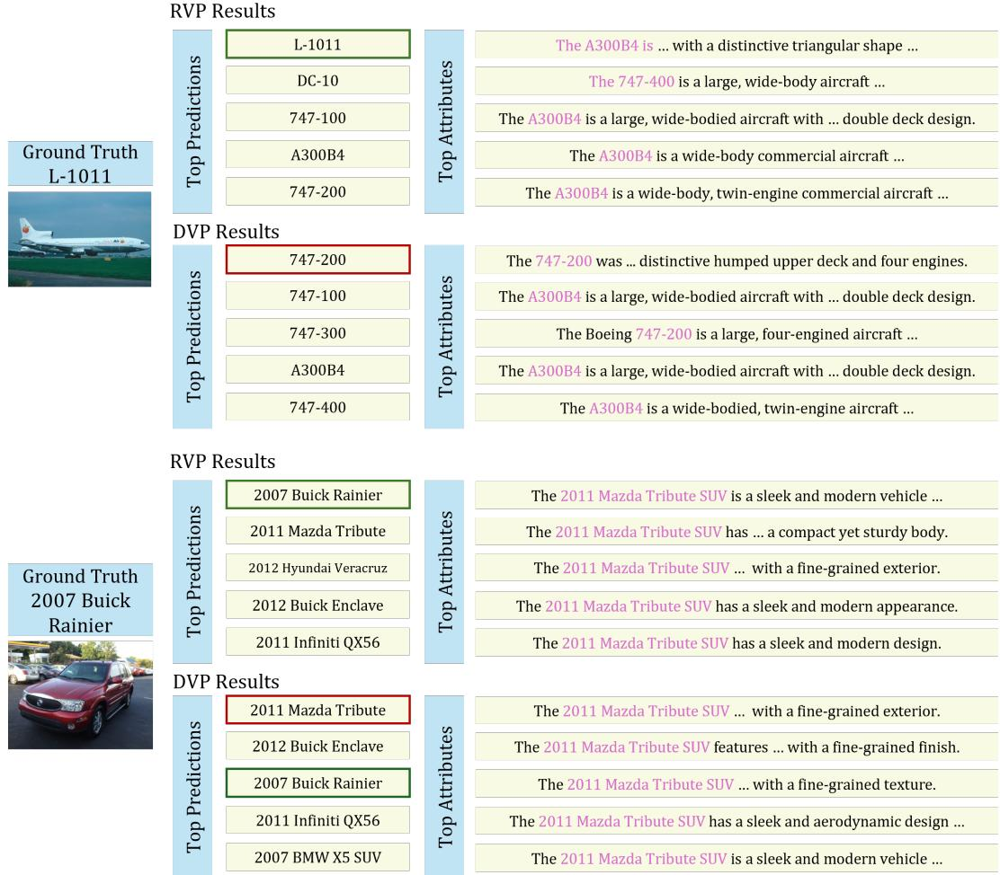  
Figure 6: Additional visualization of the top predicted classes and highest-matching attributes for a test image. For both RVP and DVP, the most similar attributes include prompts from other classes, reflecting strong semantic overlap in fine-grained recognition. However, RVP explicitly models inter-class relationships, allowing it to better resolve these cross-class ambiguities and produce the correct prediction.

## B.5 ADDITIONAL VISUALIZATION

Fig. 6 further shows that attribute matching alone is not sufficient for fine-grained recognition. In both the aircraft and car examples, the top-matched attributes are dominated by semantically similar but incorrect classes, indicating that these attributes largely overlap and cannot reliably determine the final label on their own. Despite receiving similarly misleading attribute evidence, RVP still predicts the correct class, whereas DVP fails. This is because RVP does not rely only on prompt-level similarity; instead, it explicitly captures inter-class relationships, allowing it to suppress confusing evidence from correlated classes and produce better predictions.

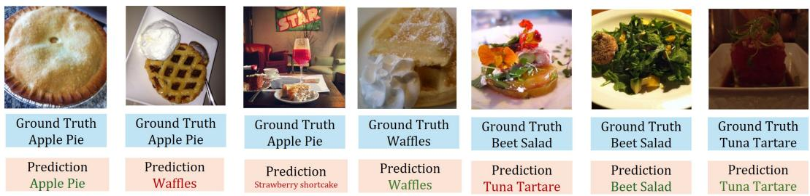  
Figure 7: Qualitative examples on Food101. Food categories often exhibit large intra-class variation and strong cross-class visual overlap due to differences in plating, viewpoint, garnish, and accompanying side dishes. As shown here, classes such as Apple Pie and Waffles can be confused when the main dish is partially visible or co-occurs with similar desserts, while Beet Salad and Tuna Tartare may share similar fine-grained presentation and ingredients. Correct predictions are shown in green and incorrect predictions in red.

## B.6 ADDITIONAL ERROR ANALYSIS

Food101 is particularly challenging because its class semantics are often compositional rather than visually stable. Unlike fine-grained object categories, a food image may contain the main dish together with side dishes, garnish, sauces, or additional ingredients, so the same class can vary substantially across samples. As illustrated in Fig. 7, Apple Pie can co-occur with cream or be presented in ways that resemble other desserts, while Beet Salad and Tuna Tartare may share similar plating style, color, and ingredient structure. In such cases, the ambiguity is driven not only by inter-class similarity, but also by high intra-class variation and unstable visual cues, which reduces the benefit of structured inter-class modeling.

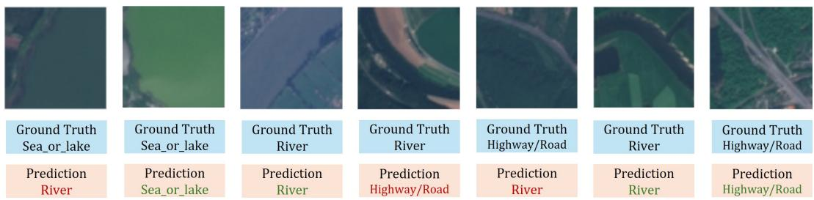  
Figure 8: Qualitative examples on EuroSAT. Several classes, especially Sea or lake, River, and Highway/Road, exhibit strong visual similarity in satellite crops due to elongated shapes, curved boundaries, and limited scene context. As a result, some samples remain ambiguous even under the proposed method, suggesting that EuroSAT is less dominated by inter-class semantic ambiguity than fine-grained recognition benchmarks. Correct predictions are shown in green and incorrect predictions in red.

A possible reason why RVP is less advantageous on EuroSAT is that this benchmark does not primarily require the kind of inter-class semantic disambiguation that RVP is designed to address. Unlike fine-grained tasks such as Aircraft and Cars, where many classes share highly similar semantic attributes, EuroSAT contains only 10 classes, and many errors arise from coarse visual ambiguity in satellite crops rather than from strong overlap in text semantics. As illustrated in Fig. 8, categories such as Sea or lake, River, and Highway/Road can appear visually similar due to limited resolution (64 × 64 pixels), elongated structures, and missing global scene context. In such cases, the main difficulty lies in ambiguous visual evidence and spatial layout, rather than in class relationships within the text embedding space. As a result, explicit inter-class modeling provides less benefit on EuroSAT than on more fine-grained benchmarks.

## C PROPOSITIONS AND PROOF

## C.1 THEORETICAL JUSTIFICATION OF RVP

In this section, we provide a formal justification for why RVP is well-suited to few-shot visual reprogramming, especially for fine-grained recognition. We do not claim that RVP is universally optimal for all data distributions. Rather, the results below show that under a natural low-rank shared-semantic assumption, RVP has three desirable properties: (i) it preserves the pretrained CLIP semantic subspace, (ii) its inter-class residual can explicitly suppress shared semantic components, and (iii) it refines decision margins in a stable manner.

Setup. Recall that the inference rule of RVP is

$$
{ \mathbf z } = \hat { \mathbf v } ^ { \top } \hat { W } , \qquad \hat { W } = \frac { 1 } { \tau } T ^ { \top } W _ { 1 } ( I + E ) ,\tag{9}
$$

where $\boldsymbol { T } \in \mathbb { R } ^ { C M \times D }$ is the stacked text embedding matrix, $W _ { 1 } \in \mathbb { R } ^ { C M \times C }$ is the block-diagonal intra-class aggregation matrix, and $E \in \mathbb { R } ^ { C \times C }$ is the inter-class residual matrix.

Proposition C.1 (Exact linear reparameterization). For any learned intra-class weights $W _ { 1 }$ and inter-class matrix $E ,$ , there exists a single matrix $\hat { W } \in \mathbb { R } ^ { D \times C }$ such that the training-time classifier and the inference-time classifier are identical:

$$
\mathbf { z } = \frac { 1 } { \tau } \hat { \mathbf { v } } ^ { \top } T ^ { \top } W _ { 1 } ( I + E ) = \hat { \mathbf { v } } ^ { \top } \hat { W } .\tag{10}
$$

Proof. This follows directly from the associativity of matrix multiplication by defining

$$
\hat { W } = \frac { 1 } { \tau } T ^ { \top } W _ { 1 } ( I + E ) .
$$

Substituting this definition into the classifier gives the desired result.

Proposition C.2 (Text-span preservation). Every column ofthe reparameterized classifier $\hat { W }$ lies in the column space of $T ^ { \top }$ . Equivalently

$$
\operatorname { c o l } ( { \hat { W } } ) \subseteq \operatorname { c o l } ( T ^ { \top } ) .\tag{11}
$$

Proof. By Theorem C.1,

$$
\hat { W } = \frac { 1 } { \tau } T ^ { \top } W _ { 1 } ( I + E ) .
$$

Hence, each column of $\hat { W }$ is a linear combination of the columns of $T ^ { \top }$ . Therefore,

$$
\operatorname { c o l } ( { \hat { W } } ) \subseteq \operatorname { c o l } ( T ^ { \top } ) .
$$

Theorem C.2 shows that RVP constructs its classifier entirely from the span of the pretrained CLIP text embeddings, rather than introducing classifier directions outside this text-induced space. Thus, the inter-class correction recombines existing text-derived directions instead of learning an unconstrained classifier directly in $\mathbb { R } ^ { D }$ . When the text embeddings occupy a lower-dimensional subspace, this additionally restricts the effective classifier space and provides a structured inductive bias for few-shot adaptation.

Assumption C.3 (Shared-semantic decomposition). Let the base class-logit vector before inter-class correction be $\mathbf { f } ( x ) \in \mathbb { R } ^ { C }$ . Assume that there exists an r-dimensional subspace $s \subset \mathbb { R } ^ { C }$ , with orthonormal basis $U \in \mathbb { R } ^ { C \times r }$ , such that

$$
\mathbf { f } ( x ) = \mathbf { s } ( x ) + \mathbf { d } ( x ) ,\tag{12}
$$

where $\mathbf { s } ( x ) \in S$ is a shared semantic component and $ { \mathbf { d } } ( x ) \in \mathcal { S } ^ { \perp }$ is a class-discriminative component.

Theorem C.3 formalizes the empirical observation that fine-grained classes often share dominant semantic directions, while useful class-specific information resides in weaker contrastive components.

Theorem C.4 (Suppression of shared semantic components). Under Theorem C.3, there exists a residual matrix E such that the inter-class correction removes the shared semantic component exactly. In particular, ifwe choose

$$
E = - U U ^ { \top } ,\tag{13}
$$

then

$$
\mathbf { z } = \mathbf { f } ( x ) ( I + E ) = \mathbf { d } ( x ) .\tag{14}
$$

Proof. Substituting $E = - U U ^ { \top }$ yields

$$
I + E = I - U U ^ { \top } ,
$$

which is the orthogonal projector onto $\mathcal { S } ^ { \perp }$ . Since $\mathbf { s } ( x ) \in S$ , we have

$$
\mathbf { s } ( x ) ( I - U U ^ { \top } ) = \mathbf { 0 } .
$$

Since $\mathbf { d } ( x ) \in S ^ { \perp }$ , we have

$$
\mathbf { d } ( x ) ( I - U U ^ { \top } ) = \mathbf { d } ( x ) .
$$

Therefore,

$$
\mathbf { z } = \left( \mathbf { s } ( x ) + \mathbf { d } ( x ) \right) ( I - U U ^ { \top } ) = \mathbf { d } ( x ) .
$$

Theorem C.4 provides a formal explanation for why inter-class modeling is useful. If different classes share a low-rank semantic component, then a suitable residual class-relation matrix can cancel that shared component and retain only the discriminative part.

Corollary C.5 (Margin recovery under the projected classifier). Under the conditions ofTheorem C.4, suppose the true label is y and the discriminative component satisfies

$$
d _ { y } ( x ) - \operatorname* { m a x } _ { j \neq y } d _ { j } ( x ) > 0 .\tag{15}
$$

Then the RVP classifier with $E = - U U ^ { \top }$ predicts the correct class:

$$
y = \arg \operatorname* { m a x } _ { c } z _ { c } .\tag{16}
$$

Proof. By Theorem $\mathbf { C } . 4 , \mathbf { z } = \mathbf { d } ( x )$ . Hence

$$
z _ { y } - \operatorname* { m a x } _ { j \neq y } z _ { j } = d _ { y } ( x ) - \operatorname* { m a x } _ { j \neq y } d _ { j } ( x ) > 0 ,
$$

which implies $y = \arg \operatorname* { m a x } _ { c } z _ { c }$

Proposition C.6 (Bounded margin degradation under residual correction). Let

$$
\begin{array} { r } { { \bf z } = { \bf f } + \Delta , \qquad \Delta = { \bf f } E . } \end{array}\tag{17}
$$

For any class y, define the multiclass margin

$$
m _ { y } ( \mathbf { a } ) = a _ { y } - \operatorname* { m a x } _ { j \neq y } a _ { j } .\tag{18}
$$

Then

$$
m _ { y } ( \mathbf { z } ) \geq m _ { y } ( \mathbf { f } ) - 2 \| \Delta \| _ { \infty } .\tag{19}
$$

Proof. Since $\mathbf { z } = \mathbf { f } + \Delta$

$$
z _ { y } \geq f _ { y } - \| \Delta \| _ { \infty } ,
$$

and

$$
\operatorname* { m a x } _ { j \neq y } z _ { j } \leq \operatorname* { m a x } _ { j \neq y } f _ { j } + \| \Delta \| _ { \infty } .
$$

Subtracting the second inequality from the first gives

$$
m _ { y } ( \mathbf { z } ) = z _ { y } - \operatorname* { m a x } _ { j \neq y } z _ { j } \geq \big ( f _ { y } - \| \Delta \| _ { \infty } \big ) - \big ( \operatorname* { m a x } _ { j \neq y } f _ { j } + \| \Delta \| _ { \infty } \big ) ,
$$

which simplifies to

$$
m _ { y } ( \mathbf { z } ) \geq m _ { y } ( \mathbf { f } ) - 2 \| \Delta \| _ { \infty } .
$$

Theorem C.6 bounds the possible degradation of the classification margin under residual correction: the margin can decrease from the base margin by at most $2 \| \mathbf { f } E \| _ { \infty }$ . In particular, if

$$
m _ { y } ( \mathbf { f } ) > 2 \| \mathbf { f } E \| _ { \infty } ,
$$

then $m _ { y } ( { \mathbf { z } } ) > 0$ , and the original prediction for class y is preserved.

Proposition C.7 (Structured restriction of the hypothesis class). Let

$$
\mathcal { H } _ { \mathrm { d e n s e } } = \left\{ \hat { \mathbf { v } } \mapsto \frac { 1 } { \tau } \hat { \mathbf { v } } ^ { \top } T ^ { \top } \boldsymbol { \Omega } : \boldsymbol { \Omega } \in \mathbb { R } ^ { C M \times C } \right\}\tag{20}
$$

be the class of dense description-to-class mappings, and let

$$
{ \mathcal { H } } _ { \mathrm { R V P } } = \left\{ { \hat { \mathbf { v } } } \mapsto { \frac { 1 } { \tau } } { \hat { \mathbf { v } } } ^ { \mathsf { T } } T ^ { \mathsf { T } } W _ { 1 } ( I + E ) \ : \ W _ { 1 } \ i s \ b l o c k \ d i a g o n a l , \ E \in \mathbb { R } ^ { C \times C } \right\} .\tag{21}
$$

Then

$$
\mathcal { H } _ { \mathrm { R V P } } \subseteq \mathcal { H } _ { \mathrm { d e n s e } } .\tag{22}
$$

Moreover, RVP contains $C M + C ^ { 2 }$ trainable parameters in its structured output mapping, whereas the dense mapping contains $C ^ { 2 } M$ trainable parameters.

Proof. For any $W _ { 1 }$ and $E ,$ define

$$
\Omega = W _ { 1 } ( I + E ) .
$$

Since

$$
\boldsymbol { \Omega } \in \mathbb { R } ^ { C M \times C } ,
$$

every function in H is also an element of $\mathcal { H } _ { \mathrm { d e n s e } }$ . Hence,

$$
\mathcal { H } _ { \mathrm { R V P } } \subseteq \mathcal { H } _ { \mathrm { d e n s e } } .
$$

For the parameter count, $W _ { 1 }$ is determined by $C$ groups of M intra-class weights, corresponding to CM trainable parameters, while $E$ contributes ${ \breve { C } } ^ { 2 }$ trainable parameters. Therefore, the structured RVP output mapping contains $C M + C ^ { 2 }$ trainable parameters. In contrast, the dense matrix $\Omega \in$ $\mathbb { R } ^ { C M \times C }$ contains

$$
C M \times C = C ^ { 2 } M
$$

trainable parameters.

Theorem C.7 formalizes the regularization effect of RVP. It does not enlarge the dense hypothesis class. Instead, it restricts it to a structured subset that first aggregates prompts within each class and then applies a residual inter-class correction. This is particularly desirable in the few-shot regime, where unrestricted dense mappings are more likely to overfit.

Discussion. Taken together, the results above explain why RVP is effective. Theorem C.2 shows that RVP preserves the pretrained CLIP semantic subspace. Theorem C.4 and Theorem C.5 show that its inter-class residual can explicitly remove low-rank shared semantic components that obscure fine-grained discrimination. Theorem C.6 shows that this correction is stable because it acts in residual form. Finally, Theorem C.7 shows that RVP achieves these benefits while restricting the classifier to a structured low-complexity family. Together, these properties provide a principled explanation for why RVP works well in few-shot fine-grained visual reprogramming.

## C.2 PROOF OF REMOVING VISUAL EMBEDDING NORMALIZATION AT INFERENCE

In this section, we show that the $\ell _ { 2 } \cdot$ -normalization of the visual embedding can be omitted at inference without changing the final predicted class, provided that only classification decisions are of interest.

Recall that the inference-time logits of RVP are given by

$$
\mathbf { z } = \hat { \mathbf { v } } ^ { \top } \hat { W } ,\tag{23}
$$

where $\hat { \mathbf { v } } \in \mathbb { R } ^ { D }$ is the normalized visual embedding and $\hat { W } \in \mathbb { R } ^ { D \times C }$ is the reparameterized classifier matrix. Let $\mathbf { v } \in \mathbb { R } ^ { D }$ denote the corresponding unnormalized visual embedding produced by the frozen image encoder. By definition,

$$
{ \hat { \mathbf { v } } } = { \frac { \mathbf { v } } { \| \mathbf { v } \| _ { 2 } } } .\tag{24}
$$

Substituting this into the inference equation gives

$$
\mathbf { z } = \left( { \frac { \mathbf { v } } { \| \mathbf { v } \| _ { 2 } } } \right) ^ { \top } { \hat { W } } = { \frac { 1 } { \| \mathbf { v } \| _ { 2 } } } \mathbf { v } ^ { \top } { \hat { W } } .\tag{25}
$$

Now define the logits computed without visual normalization as

$$
\tilde { \mathbf { z } } = \mathbf { v } ^ { \top } \hat { W } .\tag{26}
$$

Then we have

$$
\mathbf { z } = { \frac { 1 } { \| \mathbf { v } \| _ { 2 } } } \tilde { \mathbf { z } } .\tag{27}
$$

That is, the normalized and unnormalized logits differ only by the multiplicative factor $1 / \| \mathbf { v } \|$ 2, which is a positive scalar shared by all classes for the same sample.

Let $z _ { c }$ and $\tilde { z } _ { c }$ denote the c-th entries of z and z˜, respectively. Then for any two classes i and j,

$$
z _ { i } - z _ { j } = \frac { 1 } { \Vert \mathbf { v } \Vert _ { 2 } } \left( \tilde { z } _ { i } - \tilde { z } _ { j } \right) .\tag{28}
$$

Since $\| \mathbf { v } \| _ { 2 } > 0$ , multiplication by $1 / \| \mathbf { v } \| _ { 2 }$ preserves the sign of every pairwise logit difference. Therefore,

$$
z _ { i } > z _ { j } \quad \Longleftrightarrow \quad \tilde { z } _ { i } > \tilde { z } _ { j } .\tag{29}
$$

This implies that the ordering of class logits is unchanged, and hence

$$
\arg \operatorname* { m a x } _ { c \in \{ 1 , \dots , C \} } z _ { c } = \arg \operatorname* { m a x } _ { c \in \{ 1 , \dots , C \} } \tilde { z } _ { c } .\tag{30}
$$

Therefore, omitting the ℓ2-normalization of the visual embedding does not affect the final predicted class. In other words, if only top-1 classification is required, the inference rule

$$
\mathbf { z } = \hat { \mathbf { v } } ^ { \top } \hat { W }\tag{31}
$$

is equivalent to

$$
\tilde { \mathbf { z } } = \mathbf { v } ^ { \top } \hat { W } .\tag{32}
$$

The latter has exactly the same form as a standard linear classifier applied to backbone features.

We emphasize that this equivalence holds for classification decisions, but not for the absolute scale of the logits or calibrated confidence scores. Indeed, removing the normalization changes the magnitude of the logits by a sample-dependent factor $\lVert \mathbf { v } \rVert _ { 2 } ^ { - 1 }$ , which may affect softmax probabilities, confidence calibration, or any downstream procedure that depends on logit scale.

## D IMPLEMENTATION DETAILS.

Following prior work (Cai et al., 2025a;b), we train the visual prompt with a learning rate of 40, momentum 0.9, using stochastic gradient descent (SGD), and a cosine annealing scheduler (Loshchilov & Hutter, 2017) for 200 epochs. For all datasets, we use a batch size of 64. For the intra-class matrix $P$ and inter-class matrix ${ \bf \dot { \boldsymbol { E } } } ,$ we use a learning rate of $1 0 ^ { - 3 }$ . To ensure a fair comparison, we adopt the same text descriptions as in (Cai et al., 2025b), using $M = 2 0$ prompts per class. Our method does not introduce additional hyperparameters. The temperature τ is inherited from the pretrained CLIP model and kept fixed during training.

All experiments are conducted on a single NVIDIA L40S GPU with 48 GB of memory. The full set of experiments across 11 datasets requires approximately 47.5 hours. As shown in Fig. 9, the training process uses about 6.37 GB of GPU memory.

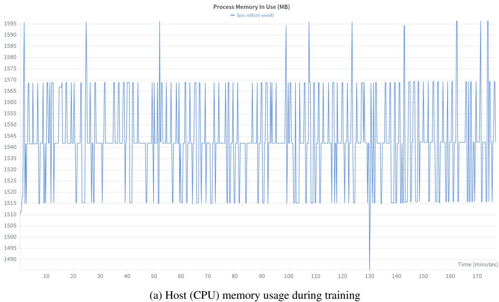

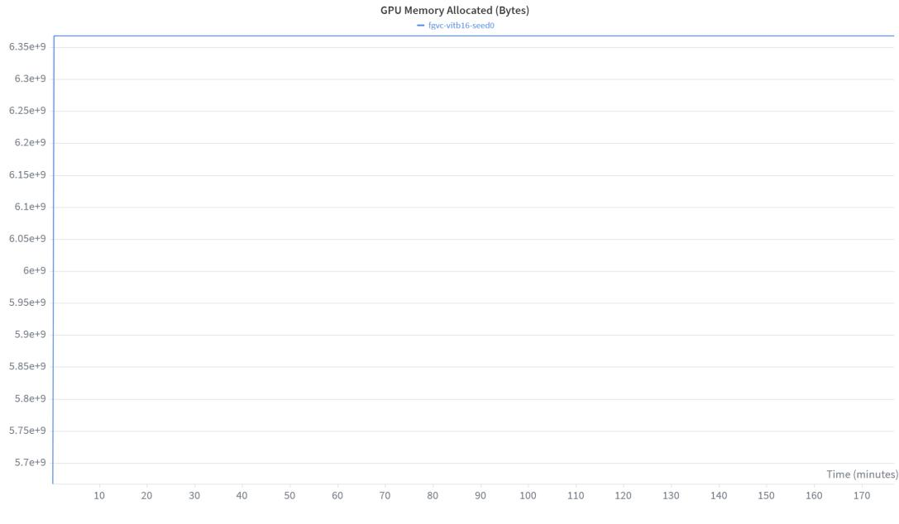  
(b) GPU memory usage during training  
Figure 9: Memory consumption when training RVP with a ViT-B/16-based CLIP backbone on the FGVC Aircraft dataset. Left: host memory. Right: GPU memory.

## E NOTATIONS

In this section, we summarize the abbreviations and key mathematical notations used in this paper to improve clarity.

## E.1 ABBREVIATIONS

Table 14: Abbreviations used in the paper
<table><tr><td>Abbreviation</td><td>Description</td></tr><tr><td>RVP</td><td>Reparameterized Inter-Class Visual Reprogramming.</td></tr><tr><td>VR</td><td>Visual Reprogramming.</td></tr><tr><td>VLM</td><td>Vision-Language Model.</td></tr><tr><td>CLIP</td><td>Contrastive Language-Image Pre-training.</td></tr><tr><td> $\mathrm { V P }$ </td><td>Visual Prompting / standard visual reprogramming baseline.</td></tr><tr><td>AR</td><td>Adversarial Reprogramming baseline.</td></tr><tr><td>AttrVR</td><td>Attribute-based Visual Reprogramming.</td></tr><tr><td>DVP</td><td>Decoupled Visual Prompting.</td></tr><tr><td>DVP-cls</td><td>DVP with partitions formed by unsupervised clustering of description embeddings.</td></tr><tr><td>LLM</td><td>Large Language Model.</td></tr><tr><td>PRM CE Loss</td><td>Probability Reweighting Matrix used in DVP.</td></tr><tr><td>SGD</td><td>Cross-Entropy Loss.</td></tr><tr><td></td><td>Stochastic Gradient Descent.</td></tr></table>

## E.2 NOTATION

Table 15: Generic notation in visual reprogramming
<table><tr><td>Symbol</td><td>Description</td></tr><tr><td> $f _ { \mathrm { i m g } }$ </td><td>CLIP image encoder.</td></tr><tr><td> $f _ { \mathrm { t x t } }$ </td><td>CLIP text encoder.</td></tr><tr><td> $\mathcal { X } ^ { \mathrm { S } }$ </td><td>Source image space of the pretrained CLIP model, with  $\chi ^ { \mathrm { s } } \subseteq \mathbb { R } ^ { d _ { \mathrm { s } } }$ </td></tr><tr><td> $\chi ^ { \mathrm { T } }$ </td><td>Target image space for the downstream task, with  $\mathcal { X } ^ { \mathrm { T } } \subseteq \mathbb { R } ^ { d _ { \mathrm { T } } }$ </td></tr><tr><td> $y ^ { \mathrm { T } }$ </td><td>Label space of the downstream task, with  ${ \mathcal { Y } } ^ { \mathrm { T } } = \{ 1 , \ldots , C \}$ </td></tr><tr><td> $\nu$ </td><td>Text space containing textual descriptions.</td></tr><tr><td> $\mathcal { Z }$ </td><td>Shared embedding space for image and text features, with  $\mathcal { Z } \subseteq \mathbb { R } ^ { D }$ </td></tr><tr><td> $x ^ { \mathrm { { S } } }$ </td><td>Source-domain image.</td></tr><tr><td> $x ^ { \mathrm { { T } } }$ </td><td>Target-domain image.</td></tr><tr><td> $V$ </td><td>A text description in V.</td></tr><tr><td> $y ^ { \mathrm { T } }$ </td><td>A downstream class label.</td></tr><tr><td> $C$ </td><td>Number of downstream classes.</td></tr><tr><td> $D$ </td><td>Embedding dimension of CLIP.</td></tr><tr><td> $d \mathrm { s }$ </td><td>Input dimensionality of source-domain images.</td></tr><tr><td> $d _ { \mathrm { T } }$ </td><td>Input dimensionality of target-domain images.</td></tr><tr><td> $\hat { v }$   $\hat { t }$ </td><td> $\ell _ { 2 } { \mathrm { - n o r m a l i z e d } }$  visual embedding produced by the CLIP image encoder.</td></tr><tr><td></td><td> $\ell _ { 2 }$  -normalized text embedding produced by the CLIP text encoder.</td></tr><tr><td> $f _ { \mathrm { c l i p } } ( x ^ { \mathrm { S } } , V )$ </td><td>CLIP similarity score between image  $x ^ { \mathrm { S } }$  and text  $V .$ </td></tr><tr><td> $\tau$ </td><td>Temperature parameter in CLIP similarity computation.</td></tr><tr><td> $\mathcal { A }$ </td><td>Full set of textual descriptions used for the downstream task.</td></tr><tr><td> $\boldsymbol { \mathcal { A } } ( \boldsymbol { y } ^ { \mathrm { T } } )$ </td><td>Set of textual descriptions associated with class  $y ^ { \mathrm { T } }$ </td></tr><tr><td> $M$ </td><td>Number of textual descriptions per class.</td></tr><tr><td>a</td><td>A description element from A.</td></tr><tr><td> $\mathrm { a g g ( \cdot ) }$ </td><td>Aggregation operator over description-level similarities.</td></tr><tr><td> $[ f _ { \mathrm { l o g i t s } } ( x ^ { \mathrm { T } } ; A ) ] _ { y ^ { \mathrm { T } } }$ </td><td>Logit of class 50  $\mathbf { \dot { y } } ^ { \mathrm { T } }$  computed from aggregated image-text similarities.</td></tr><tr><td> $| { \cal A } |$ </td><td>Number of textual descriptions in A.</td></tr><tr><td> $f _ { \mathrm { i n } } \overset { \cdot } { ( } x ^ { \mathrm { T } } \mid \delta )$ </td><td>Input transformation to map a target-domain image into CLIP input space.</td></tr><tr><td> $\delta$ </td><td>Trainable visual prompt.</td></tr><tr><td> $\mathcal { D }$ </td><td>Downstream training set.</td></tr><tr><td> $\omega$ </td><td>Reweighting matrix that maps description-level similarities to class logits.</td></tr><tr><td> $\phi$ </td><td>Overall linear mapping from the normalized image embedding to downstream class logits.</td></tr><tr><td> $\dot { N }$ </td><td>Number of training samples in  $\mathcal { D } .$ </td></tr></table>

Table 16: Notation for visual reprogramming and the linear mapping view
<table><tr><td>Symbol</td><td>Description</td></tr><tr><td> $T$ </td><td>Stacked matrix of normalized text embeddings. In RVP with C classes and M descriptions per class,  $\boldsymbol { T } \in \mathbb { R } ^ { C M \times D } .$ </td></tr><tr><td> $M _ { a }$ </td><td>Vector of similarity scores over all textual descriptions.</td></tr><tr><td> $M _ { y }$ </td><td>Vector of downstream class logits.</td></tr><tr><td> $\overset { \smile } { P } \in \mathbb { R } ^ { C \times M }$ </td><td>Learnable intra-class weighting matrix for aggregating attribute descriptions within each class.</td></tr><tr><td> $\ddot { P } _ { c }$ </td><td>Softmax-normalized weight vector for the c-th class, obtained from the c-th row of P.</td></tr><tr><td> $\tilde { P } _ { c , m }$ </td><td>Normalized weight assigned to the m-th textual description of class c.</td></tr><tr><td> $\hat { t } _ { c , m }$ </td><td>Normalized embedding of the m-th textual description for class c.</td></tr><tr><td> $f _ { c } ( x ^ { \mathrm { T } } )$ </td><td>Aggregated base logit for class c before inter-class refinement.</td></tr><tr><td> $f ( x ^ { \mathrm { T } } )$ </td><td>Row vector of base logits for all classes,  $f ( \boldsymbol { x } ^ { \mathrm { T } } ) = [ f _ { 1 } ( \boldsymbol { x } ^ { \mathrm { T } } ) , \ldots , f _ { C } ( \boldsymbol { x } ^ { \mathrm { T } } ) ] \in \mathbb { R } ^ { C } .$ </td></tr><tr><td> $\dot { E } \in \overset { \prime } { \mathbb { R } } ^ { C \times C }$ </td><td>Learnable inter-class adjacency matrix for modeling class relationships.</td></tr><tr><td>I</td><td>Identity matrix used in residual message passing.</td></tr><tr><td> $z \in \mathbb { R } ^ { C }$ </td><td>Final class logit vector after inter-class refinement.</td></tr><tr><td> $\bar { W _ { 1 } } \in \mathbb { R } ^ { C M \times C }$ </td><td>Sparse routing matrix constructed from the normalized intra-class weights.</td></tr><tr><td> $\hat { W } \in \mathbb { R } ^ { D \times C }$ </td><td>Reparameterized linear classifier that absorbs text embeddings, intra-class aggregation, and inter-class refinement.</td></tr><tr><td> $\hat { v } ^ { \top } \hat { W }$ </td><td>Final inference form of RVP as a single linear projection on the normalized visual embedding.</td></tr><tr><td> $v ^ { \top } \hat { W }$ </td><td>Equivalent inference form for top-1 prediction when visual feature normalization is omitted.</td></tr></table>