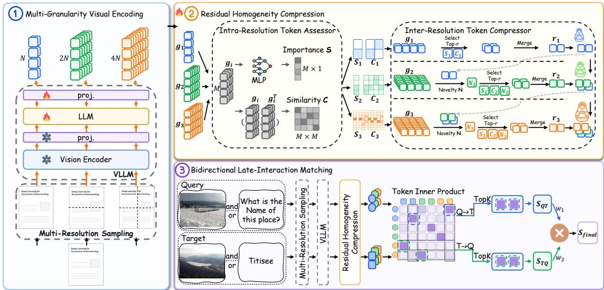
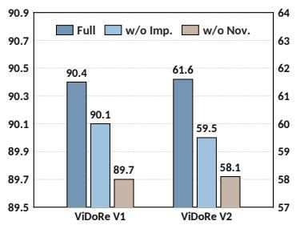
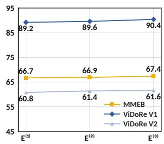
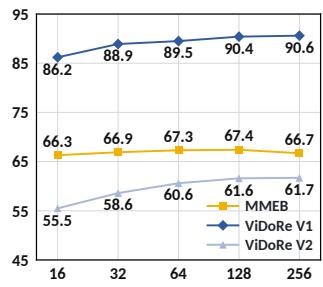
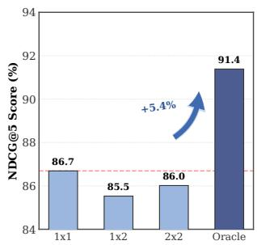
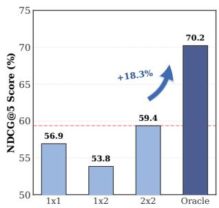
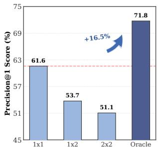

# RESCOMEMB: EFFECTIVE AND EFFICIENT MULTI-MODAL EMBEDDING VIA RESIDUAL HOMOGENEITY COMPRESSION

Zijing Cai1,∗ Yuzhe Wang1,∗ Jingxian Zhu2 Fengbin Zhu3,† Richang Hong2

1University of Science and Technology of China

2Hefei University of Technology

3National University of Singapore

## ABSTRACT

Multimodal large language models (MLLMs) have shown strong potential for universal multimodal representation learning. However, existing methods either compress each input into a single vector, limiting fine-grained expressiveness, or retain long sequences of visual-token vectors, incurring substantial storage and interaction costs. To resolve this trade-off, we propose RESCOMEMB, a trainable framework for effective and efficient universal multi-vector multimodal embedding. RESCOMEMB first encodes each input at native dynamic resolution into ordered global, intermediate, and fine-grained views. After MLLM contextualization and embedding projection, a trainable Residual Homogeneity Compression (RHC) module reduces within-granularity redundancy and cross-granularity repetition under explicit visual token budgets. Then, RESCOMEMB introduces a length-adaptive Bidirectional Late-Interaction Matching mechanism for robust query–document scoring, which averages the strongest token-level matches in each direction and combines the two scores using a weight based on how many valid tokens each side has. Extensive experiments on MMEB, ViDoRe V1, and ViDoRe V2 show that ResComEmb produces higher-quality universal multimodal embeddings than VLM2Vec-V2, and outperforms ColQwen2.5 in visual document retrieval using only 37.5% of its full visual token budget, demonstrating a favorable effectiveness–efficiency trade-off.

## 1 INTRODUCTION

Multimodal embedding models project heterogeneous inputs into a shared semantic space, enabling downstream applications, including image classification (Deng et al., 2009), visual question answering (Hu et al., 2018), cross-modal retrieval (Gordo et al., 2016), and visual grounding (Yu et al., 2016). Contrastive vision–language encoders (Radford et al., 2021; Zhai et al., 2023), learn crossmodal alignment from large-scale paired data with separate modality towers. Although compact and efficient, this modality-separated design struggles with interleaved image–text inputs and complex instructions (Jiang et al., 2024; Zhang et al., 2024a). Recent work therefore adapts multimodal large language models (MLLMs), such as Qwen2.5-VL (Bai et al., 2025) and PaliGemma (Beyer et al., 2024), into universal multimodal embedding models, leveraging their pre-trained knowledge, multimodal understanding, and instruction-following capabilities (Jiang et al., 2025).

MLLM-based embedding models represent visual inputs with a single vector (Jiang et al., 2025) or multiple vectors (Faysse et al., 2025; Zhu et al., 2026), creating a fidelity–efficiency trade-off. A single vector is compact but can limit the expression of fine-grained information in visually rich inputs (Yao et al., 2022; Thrush et al., 2022). Multiple vectors offer higher representational capacity by preserving local evidence, but increase storage and pairwise interaction costs (Faysse et al., 2025). Existing approaches therefore pursue compact multi-vector representations through two routes. Token pruning and merging retain features aligned with the original visual sequence, but aggressive reduction sacrifices holistic context (Yang et al., 2025; Wang et al., 2025; Wen et al., 2025). Learnable-token methods instead condense visual features through a fixed number of query slots, efficiently capturing global semantics; under tight budgets, however, their fixed capacity restricts locality and input-specific details (Cha et al., 2024; Liu et al., 2024). Neither route reliably preserves both global semantics and fine-grained evidence in a compact representation.

Recently, Zhu et al. (2026) introduced MURE that combines multi-resolution sampling with token clustering to produce visual embeddings for effective and efficient document retrieval. However, because MURE’s clustering is non-trainable and post-hoc, its merge criterion receives no loss feedback, risking the loss of relevant representations and the persistence of irrelevant ones after compression. Training-time merging and compression-aware fine-tuning have been shown to mitigate such performance degradation (Bolya et al., 2023; Ma et al., 2025), suggesting that compression and representations should be jointly optimized rather than treated as separate stages. Motivated by this, we aim to generate a compact, universal visual representation via trainable coarse-tofine compression that preserves complementary global and local evidence within contextualized representations. Specifically, within each granularity, compression should merge semantically similar tokens while retaining informative content; across granularities, it should reduce redundancy and prioritizes details absent from coarser representations.

In light of this, we propose RESCOMEMB, a trainable framework for effective and efficient universal multimodal embedding. Specifically, RESCOMEMB first uses an MLLM (e.g., Qwen2.5-VL’s (Bai et al., 2025)) to encode global, aspect-ratio-aware intermediate, and fine-grained views, providing coarse-to-fine visual evidence. Residual Homogeneity Compression (RHC) then processes the fully contextualized and embedding-projected outputs, consolidating repeated evidence within each granularity while prioritizing new evidence from finer granularities under explicit token budgets. Matryoshka Representation Learning (MRL) (Kusupati et al., 2022) further applies nested supervision to the accumulated coarse-to-fine prefixes, training every compressed representation to remain semantically effective. Then, a length-adaptive Bidirectional Late-Interaction Matching is applied for robust query–document scoring, mitigating weak-match accumulation by averaging the strongest token-level matches in both directions and balancing their scores by valid-token counts.

We evaluate RESCOMEMB on general multimodal tasks using the Massive Multimodal Embedding Benchmark (MMEB) (Jiang et al., 2025), and on visual document retrieval (VDR) task using ViDoRe V1 (Faysse et al., 2025) and V2 (Macé et al., 2025). Extensive experimental results show that RESCOMEMB achieves the best average performance across all three benchmarks. It reaches 67.4 Precision@1 on MMEB, exceeding VLM2Vec-V2 by 2.5 points, and 90.4 and 61.6 NDCG@5 on ViDoRe V1 and V2, respectively, surpassing ColQwen2.5 by 1.0 point on each benchmark. Notably, these ViDoRe gains are achieved using only 37.5% of full-token ColQwen2.5’s visual-token budget, demonstrating a favorable effectiveness–efficiency trade-off. Ablation studies confirm the contributions of each mechanism in RESCOMEMB, including Residual Homogeneity Compression (RHC), MRL-based nested supervision, and Bidirectional Late-Interaction Matching.

In summary, the key contributions of this work are threefold:

• We propose a coarse-to-fine principle for generating universal multimodal embeddings under a certain visual-token budget: gather complementary evidence across multiple granularities while reducing within-granularity redundancy and cross-granularity repetition.

• We develop RESCOMEMB, a trainable framework for effective and efficient multimodal embeddings, which merges redundant tokens within each granularity and prioritizes finer-grained evidence not already captured by coarser representations, subject to a given visual-token budget.

• Extensive experiments demonstrate that RESCOMEMB outperforms VLM2Vec-V2 on MMEB and full-token ColQwen2.5 on ViDoRe V1/V2 while using only 37.5% of the latter’s visual-token budget, establishing a favorable effectiveness–efficiency trade-off.

## 2 RELATED WORK

## 2.1 MULTIMODAL EMBEDDING

Multimodal embedding maps images and text into a shared representation space for measuring semantic relevance (Radford et al., 2021; Jiang et al., 2025). This field has progressed from contrastive vision–language pre-training to universal MLLM-based representations. CLIP (Radford et al., 2021) and SigLIP (Zhai et al., 2023) use modality-specific encoders for global alignment, whereas BLIP (Li et al., 2022) and CoCa (Yu et al., 2022) add generative language modeling. However, globally pooled retrieval embeddings do not preserve explicit local visual–text correspondences (Yao et al., 2022). MLLMs instead process interleaved image–text sequences in a unified backbone, producing contextualized representations for instruction-conditioned multimodal embedding. E5-V (Jiang et al., 2024) uses task-specific prompts, VLM2Vec (Jiang et al., 2025) and VLM2Vec-V2 (Meng et al., 2026) use instruction-guided contrastive learning, and GME (Zhang et al., 2025) uses synthesized fusedmodal data. Most methods encode each input as a single vector, reducing storage and comparison costs but potentially suppressing localized and compositional evidence (Thrush et al., 2022). Multivector methods retain independently accessible features, keeping regions, objects, and text separately encoded rather than prematurely pooled (Khattab & Zaharia, 2020; Yao et al., 2022). Recent MLLMbased approaches extend this design to visually rich, interleaved inputs (Faysse et al., 2025; Zhu et al., 2026). Building on hierarchical multi-resolution encoding, RESCOMEMB introduces trainable Residual Homogeneity Compression to construct compact, input-aligned multi-vector embeddings.

## 2.2 VISUAL REPRESENTATION COMPRESSION

Visual representation compression shortens visual sequences while retaining task-relevant content (Yang et al., 2025; Ma et al., 2025). Compression occurs either before or after full MLLM contextualization. Upstream approaches target encoding and generation costs: InternVL 1.5 (Chen et al., 2024), TokenPacker (Li et al., 2025), and LLaVA-UHD v2 (Zhang et al., 2026) construct compact visual inputs through spatial or cross-scale aggregation, whereas VisionZip (Yang et al., 2025), SCOPE (Deng et al., 2026), and FOLDER (Wang et al., 2025) apply content-aware selection or merging. These approaches reduce the number of visual tokens processed within the MLLM. Downstream approaches compress contextualized embeddings for storage and comparison. Token Pooling (Clavié et al., 2024) and Light-ColPali (Ma et al., 2025) merge or cluster visual embeddings, whereas AGC (Qin et al., 2026) and SaMer (Park et al., 2026) learn representative centers. MetaEmbed (Xiao et al., 2026) controls length with learnable abstract tokens, enabling global aggregation but potentially omitting input-specific local evidence under tight budgets (Cha et al., 2024; Liu et al., 2024). MURE (Zhu et al., 2026) retains input-aligned multi-resolution evidence, but its compression stage relies on non-trainable clustering and does not explicitly distinguish within-granularity redundancy from cross-granularity repetition. By contrast, RESCOMEMB introduces RHC as a downstream-trainable compressor for ordered multi-granularity MLLM representations, separately reducing these two forms of redundancy under explicit budgets without modifying the backbone.

## 3 METHOD

In this section, we first present our problem formulation for budgeted multimodal embedding, and then introduce our RESCOMEMB framework, as illustrated in Figure 1, which comprises the following mechanisms: Multi-Granularity Visual Encoding, Residual Homogeneity Compression, Nested Representation, and Bidirectional Late-Interaction Matching.

## 3.1 PROBLEM FORMULATION

We formulate budgeted multimodal embedding as learning a mapping from textual and visual inputs, $x ^ { \mathrm { { t } } }$ and $x ^ { \mathrm { v } }$ , to a compact sequence of token-level embeddings under a visual-token budget $B _ { \mathrm { v } }$

$$
{ \mathcal { F } } ( x ^ { \mathrm { t } } , x ^ { \mathrm { v } } ; B _ { \mathrm { v } } ) \longmapsto \mathbf { E } _ { ( x ^ { \mathrm { t } } , x ^ { \mathrm { v } } ) } ^ { ( B _ { \mathrm { v } } ) } \in \mathbb { R } ^ { ( N _ { \mathrm { t } } + M _ { \mathrm { v } } ( B _ { \mathrm { v } } ) ) \times d } ,\tag{1}
$$

where $N _ { \mathrm { t } }$ and $M _ { \mathrm { v } } ( B _ { \mathrm { v } } )$ denote the numbers of text and visual tokens, respectively, and d is the embedding dimension. The output $\mathbf { E } _ { ( x ^ { \mathrm { t } } , x ^ { \mathrm { v } } ) } ^ { ( B _ { \mathrm { v } } ) }$ consists of normalized token-level embeddings. All $N _ { \mathrm { t } }$ text-token embeddings are retained without budget-based compression, whereas the visual tokens are compressed such that $M _ { \mathrm { v } } ( B _ { \mathrm { v } } ) \leq B _ { \mathrm { v } }$

  
Figure 1: Overview of proposed RESCOMEMB framework. Ordered multi-granularity views are encoded by a shared MLLM, then compressed into nested representations. The Bidirectional Late-Interaction Matching is applied to compute relevance scores between multimodal queries and targets.

## 3.2 MULTI-GRANULARITY VISUAL ENCODING

For each visual input, Multi-Granularity Visual Encoding constructs views at three granularities: a global $1 \times 1$ view, an aspect-ratio-aware intermediate view partitioned into 1×2 or 2×1 regions, and a fine-grained view partitioned into $2 \times 2$ regions. The three granularities produce $( c _ { 1 } , c _ { 2 } , c _ { 3 } ) = ( 1 , 2 , 4 )$ crops. The shared MLLM encodes textual inputs together with all visual crops. A learned embedding projection is applied to the last-layer hidden states. The valid projected tokens are separated into text tokens $\mathbf { T } \in \mathbb { R } ^ { M _ { t } \times d }$ and visual sequences $\mathbf { g } _ { 1 } , \mathbf { g } _ { 2 } , \mathbf { g } _ { 3 } .$ , where $\mathbf { g } _ { k } ^ { \mathsf { } } \in \mathbb { R } ^ { M _ { k } \times d }$ and $M _ { k }$ denotes the number of visual tokens at stage k. Text-only inputs retain T and skip visual compression.

## 3.3 RESIDUAL HOMOGENEITY COMPRESSION

Residual Homogeneity Compression (RHC) takes the three visual token sequences g1, g2, g3 as input and processes them under explicit stage budgets. At each stage, an Intra-Resolution Assessor estimates token importance and within-stage similarity. Then Inter-Resolution Compressor combines these signals with outputs from preceding, coarser stages to merge redundant tokens while preserving evidence not yet represented. The compressed sequences are used to construct nested representations.

At stage k, RHC processes only the current sequence $\mathbf { g } _ { k }$ . The outputs of the preceding stages, $\mathbf { r } _ { 1 } , \ldots , \mathbf { r } _ { k - 1 }$ , are concatenated to form the coarse-anchor set $\mathbf { A } _ { k }$ , which is used to estimate crossstage novelty. The first stage has no preceding anchors.

Intra-Resolution Token Assessor. The assessor takes the projected tokens of the visual stage and produces importance and within-stage similarity scores for the subsequent compressor. At stage $k ,$ a MLP-based contextual encoder is applied to transform the projected visual-token sequence gk into contextualized embeddings h . The importance score $s _ { i }$ for each token i is obtained by

$$
S _ { i } = \mathrm { M i n M a x } ( f _ { \mathrm { i m p } } ( { \bf h } _ { i } ) ) ,\tag{2}
$$

where $f _ { \mathrm { i m p } }$ is the importance scorer, and MinMax normalizes scores over tokens in the current stage. To estimate within-stage redundancy, we divide alternating positions into source tokens, h $\mathbf { \boldsymbol { \mathbf { \rho } } } _ { 1 } _ { A } = \mathbf { h } _ { : : 2 }$ and destination tokens, $\mathbf { h } _ { B } = \mathbf { h } _ { 1 : : 2 }$ . The similarity score $\bar { \mathcal { C } } _ { i j }$ is their cosine similarity:

$$
\mathcal { C } _ { i j } = \frac { \mathbf { h } _ { A , i } ^ { \top } \mathbf { h } _ { B , j } } { \| \mathbf { h } _ { A , i } \| _ { 2 } \| \mathbf { h } _ { B , j } \| _ { 2 } } .\tag{3}
$$

The assessor then passes S and C to the Inter-Resolution Compressor.

Inter-Resolution Token Compressor. The Inter-Resolution Compressor combines the assessor outputs with coarse-stage anchors to remove redundant evidence while preserving information introduced at finer stages. For each current-stage token, the novelty score $\mathcal { N } _ { i }$ quantifies the evidence not covered by the accumulated anchors:

$$
\mathcal { N } _ { i } = \left\{ \begin{array} { l l } { 1 , } & { k = 1 , } \\ { \mathrm { M i n M a x } \left( 1 - \underset { \mathbf { a } \in \mathbf { A } _ { k } } { \operatorname* { m a x } } \frac { \mathbf { h } _ { i } ^ { \top } \mathbf { a } } { \left\| \mathbf { h } _ { i } \right\| _ { 2 } \left\| \mathbf { a } \right\| _ { 2 } } \right) , } & { k > 1 . } \end{array} \right.\tag{4}
$$

The novelty score $\mathcal { N }$ and importance score S jointly define the preservation priority vector, $\mathcal { P } _ { i } =$ $S _ { i } + \eta \mathcal { N } _ { i }$ , where η controls the contribution of cross-stage novelty. The compressor assigns each candidate source–destination pair a merge score $\mathcal { U } _ { i j }$ based on its similarity $\mathcal { C } _ { i j }$ and the source token’s preservation priority $\mathcal { P } _ { i } \mathbf { : }$

$$
\mathcal { U } _ { i j } = \mathcal { C } _ { i j } - \alpha \mathcal { P } _ { i } ,
$$

where α controls the extent to which preservation priority offsets similarity. Specifically, each source token is assigned to its highest-scoring destination, and merges are performed until the output meets the stage-specific token budget. The token values assigned to each destination are then aggregated and $\ell _ { 2 }$ -normalized to obtain $\mathbf { r } _ { k }$ . Although the score assignments are discrete, value aggregation remains differentiable. Preservation priorities govern source selection rather than destination assignment: sources are ranked by their best merge scores, making high-priority tokens less likely to be selected for merging. These priority signals also modulate value aggregation, enabling gradients to train the assessor.The detailed derivation is provided in Appendix B.

Nested Representation. Then, Nested Representation assembles the surviving outputs $\mathbf { r } _ { 1 } , \ldots , \mathbf { r } _ { n }$ in coarse-to-fine order. In accordance with the Matryoshka principle (Kusupati et al., 2022), the assembled sequence supports multiple representation budgets through its prefixes. For an input x, the level-k representation is defined as

$$
\mathbf { E } _ { x , k } = \operatorname { C o n c a t } ( \mathbf { T } _ { x } , \mathbf { r } _ { x , 1 } , \ldots , \mathbf { r } _ { x , k } ) , \qquad k \in \{ 1 , \ldots , n \} ,\tag{5}
$$

For each $k < n , \mathbf { E } _ { x , k }$ is a prefix of $\mathbf { E } _ { x , k + 1 }$ . All levels retain the same text prefix and append progressively finer compressed visual stages. The nested representations are generated for both queries and documents using the same procedure.

## 3.4 BIDIRECTIONAL LATE-INTERACTION MATCHING

Given the nested representations, Bidirectional Late-Interaction Matching computes a query– document score using similarities in both directions. Let ${ \bf E } _ { q } = [ { \bf e } _ { q } ^ { i } ] _ { i = 1 } ^ { N _ { q } }$ and $\mathbf { E } _ { d } = [ \mathbf { e } _ { d } ^ { j } ] _ { i = 1 } ^ { N _ { d } }$ denote the query and document token sequences, with $N _ { q }$ and $N _ { d }$ denoting respective numbers of valid tokens.

$$
K _ { q } = \mathrm { m i n } ( K , N _ { q } ) , \qquad K _ { d } = \mathrm { m i n } ( K , N _ { d } ) .\tag{6}
$$

Let $\Omega _ { q }$ contain the indices of the $K _ { q }$ query tokens with the highest maximum similarities to any document token. Analogously, let $\Omega _ { d }$ contain the indices of the $\bar { K _ { d } }$ document tokens with the highest maximum similarities to any query token. The bidirectional Top-K means are defined as

$$
S _ { Q T } ^ { ( K ) } = \frac { 1 } { K _ { q } } \sum _ { i \in \Omega _ { q } } \operatorname* { m a x } _ { 1 \le j \le N _ { d } } ( \mathbf { e } _ { q } ^ { i } ) ^ { \top } \mathbf { e } _ { d } ^ { j } , \qquad S _ { T Q } ^ { ( K ) }  &  = \frac { 1 } { K _ { d } } \sum _ { j \in \Omega _ { d } } \operatorname* { m a x } _ { 1 \le i \le N _ { q } } ( \mathbf { e } _ { q } ^ { i } ) ^ { \top } \mathbf { e } _ { d } ^ { j } ,\tag{7}
$$

The final query–document score combines the two directional scores as

$$
S _ { \mathrm { f i n a l } } ( { \bf E } _ { q } , { \bf E } _ { d } ) = w _ { 1 } ( q , d ) S _ { Q T } ^ { ( K ) } + w _ { 2 } ( q , d ) S _ { T Q } ^ { ( K ) } ,\tag{8}
$$

where $S _ { Q T } ^ { ( K ) }$ measures query-to-document support and $S _ { T Q } ^ { ( K ) }$ measures document-to-query coverage.   
The adaptive weights $w _ { 1 } ( q , d )$ and $w _ { 2 } ( q , d )$ balance the two directions according to token counts.

When the query and document have equal valid-token counts, both directions receive equal weight. As the document becomes longer, the weighting shifts toward query-to-document support while retaining a contribution from reverse coverage. Appendix D provides more detailed implementation.

## 3.5 TRAINING

The matching score provides the training signal for each active nested representation. Consider a batch $\boldsymbol { B } = \{ ( q _ { i } , d _ { i } , { D } _ { i } ^ { - } ) \} _ { i = 1 } ^ { | B | }$ , where $\mathcal { D } _ { i } ^ { - }$ is an optional set of explicit negatives. For level k, let $\mathcal { T } _ { k }$ index the examples for which that level is active. For each $i \in \mathcal { T } _ { k }$ , define the candidate set as $\mathcal { C } _ { i , k } = \{ d _ { j } : j \in \mathcal { I } _ { k } \} \cup \mathcal { D } _ { i } ^ { - }$ . The score of any candidate $d _ { j } \in \mathcal { C } _ { i , k }$ is $s _ { i j } ^ { ( k ) } = S _ { \mathrm { f i n a l } } ( \mathbf { E } _ { q _ { i } , k } , \mathbf { E } _ { d _ { j } , k } )$ Using these candidate scores, we define the level-wise contrastive loss and the overall training objective as follows:

$$
\mathcal { L } _ { k } = - \frac { 1 } { \left| \mathcal { T } _ { k } \right| } \sum _ { i \in \mathcal { T } _ { k } } \log \frac { \exp \Bigl ( s _ { i i } ^ { ( k ) } / \tau \Bigr ) } { \displaystyle \sum _ { d _ { j } \in \mathcal { C } _ { i , k } } \exp \Bigl ( s _ { i j } ^ { ( k ) } / \tau \Bigr ) } , \qquad \mathcal { L } _ { \mathrm { t r a i n } } = \sum _ { k \in \mathcal { K } _ { B } } \lambda _ { k } \mathcal { L } _ { k } ,\tag{9}
$$

where $\displaystyle \kappa _ { B }$ is the set of levels active for at least one example in the batch, $\tau$ is the contrastive temperature, and $\lambda _ { k }$ weights the loss at level k. Each $\mathcal { C } _ { i , k }$ contains the in-batch documents associated with active examples and any available explicit negatives.

## 4 EXPERIMENTS

We first present the experimental setup and main results on MMEB and ViDoRe V1/V2, followed by ablation studies and analysis.

## 4.1 EXPERIMENTAL SETUP

Evaluation Datasets. We evaluate our RESCOMEMB in general multimodal embedding tasks on MMEB (Jiang et al., 2025) and the visual document retrieval task on ViDoRe V1 (Faysse et al., 2025) and ViDoRe V2 (Macé et al., 2025), reporting Precision@1 for MMEB and NDCG@5 for both ViDoRe benchmarks. More details are provided in Appendix A.

Compared Methods. We compare single- and multi-vector models. Single-vector baselines include CLIP (Radford et al., 2021), SigLIP (Zhai et al., 2023), ONE-PEACE (Wang et al., 2023), UniIR (Wei et al., 2024), MagicLens (Zhang et al., 2024b), E5-V (Jiang et al., 2024), VLM2Vec (Jiang et al., 2025), VLM2Vec-V2 (Meng et al., 2026), GME (Zhang et al., 2025), LamRA (Liu et al., 2025), MMRet (Zhou et al., 2025), and mmE5 (Chen et al., 2025); DSE (Ma et al., 2024) and VisRAG-Ret (Yu et al., 2025) provide document-focused comparisons. Multi-vector baselines are ColPali and ColQwen2 (Faysse et al., 2025), which extend late interaction to visual document patches; ColQwen2.5, which applies it to Qwen2.5-VL (Faysse et al., 2025; Bai et al., 2025); ColMate-Pali and ColMate (Masry et al., 2025), which add contrastive late interaction and masked-text supervision; MetaEmbed (Xiao et al., 2026), which uses learnable tokens for compact vector sets; and MURE (Zhu et al., 2026), which combines multi-resolution encoding with token clustering.

## 4.2 MAIN RESULTS

We compare the overall performance of our proposed RESCOMEMB method with baseline methods on the multimodal embedding benchmark MMEB in Table 1, and on the visual document retrieval benchmarks ViDoRe V1 and V2 in Tables 2 and 3, respectively. All RESCOMEMB entries use per-stage RHC budgets of 128/128/128(384 in total). We summarize the main observations below.

Overall Performance Comparison on MMEB. RESCOMEMB achieves the highest MMEB average of 67.4. At a comparable model scale, it outperforms VLM2Vec-V2 by 2.5 points, while also exceeding the larger VLM2Vec-7B by 1.9 points. RESCOMEMB further leads both the in-domain and out-of-domain averages, showing consistent performance across evaluation domains.

Table 1: MMEB Precision@1 (%). Cls., Ret., and Gnd. abbreviate classification, retrieval, and grounding; IND/OOD denote in-domain/out-of-domain tasks. Bold and underline mark the best and second-best scores in each column.
<table><tr><td rowspan="2">Model</td><td rowspan="2">Backbone</td><td rowspan="2">Size</td><td colspan="4">Per Meta-Task Score</td><td colspan="3">Average Score</td></tr><tr><td>Cls.</td><td>VQA</td><td>Ret.</td><td>Gnd.</td><td>IND</td><td>OOD</td><td>Avg.</td></tr><tr><td colspan="10">Single-Vector Embedding</td></tr><tr><td>CLIP</td><td>ViT-L</td><td>428M</td><td>55.2</td><td>19.7</td><td>53.2</td><td>62.2</td><td>47.6</td><td>42.8</td><td>45.4</td></tr><tr><td>UniIR</td><td>ViT-L</td><td>428M</td><td>44.3</td><td>16.2</td><td>61.8</td><td>65.3</td><td>47.1</td><td>41.7</td><td>44.7</td></tr><tr><td>MagicLens</td><td>ViT-L</td><td>613M</td><td>38.8</td><td>8.3</td><td>35.4</td><td>26.0</td><td>一</td><td>一</td><td>27.8</td></tr><tr><td>VLM2Vec</td><td>Qwen2-VL</td><td>2B</td><td>58.7</td><td>49.3</td><td>65.0</td><td>72.9</td><td>64.9</td><td>53.3</td><td>59.7</td></tr><tr><td>VLM2Vec-V2</td><td>Qwen2-VL</td><td>2B</td><td>62.9</td><td>56.3</td><td>69.5</td><td>77.3</td><td>68.8</td><td>59.9</td><td>64.9</td></tr><tr><td>GME</td><td>Qwen2-VL</td><td>2B</td><td>54.4</td><td>29.9</td><td>66.9</td><td>55.5</td><td>49.2</td><td>55.2</td><td>51.9</td></tr><tr><td>GME</td><td>Qwen2-VL</td><td>7B</td><td>57.7</td><td>34.7</td><td>71.2</td><td>59.3</td><td>53.6</td><td>58.9</td><td>56.0</td></tr><tr><td>VLM2Vec</td><td>Qwen2-VL</td><td>7B</td><td>62.7</td><td>56.9</td><td>69.4</td><td>82.2</td><td>71.4</td><td>58.1</td><td>65.5</td></tr><tr><td>LamRA</td><td>Qwen2-VL</td><td>7B</td><td>59.2</td><td>26.5</td><td>70.0</td><td>62.7</td><td>53.0</td><td>55.4</td><td>54.1</td></tr><tr><td>LamRA</td><td>Qwen2.5-VL</td><td>7B</td><td>51.7</td><td>34.1</td><td>66.9</td><td>56.7</td><td>51.7</td><td>53.3</td><td>52.4</td></tr><tr><td>MMRet</td><td>LLaVA-1.6 Mistral</td><td>7B</td><td>56.0</td><td>57.4</td><td>69.9</td><td>83.6</td><td>68.0</td><td>59.1</td><td>64.1</td></tr><tr><td colspan="10">Multi-Vector Embedding</td></tr><tr><td>ColPali</td><td>PaliGemma</td><td>3B</td><td>40.3</td><td>11.5</td><td>48.1</td><td>40.3</td><td>35.0</td><td>34.7</td><td>34.9</td></tr><tr><td>RESCoMEMB Qwen2.5-VL</td><td></td><td>3B</td><td>63.1</td><td>61.1</td><td>69.5</td><td>87.9</td><td>71.7</td><td>62.1</td><td>67.4</td></tr></table>

Table 2: ViDoRe V1 NDCG@5 (%) across 10 visual document retrieval tasks. Arxiv, Doc, and Info denote ArxivQ, DocQ, and InfoQ; Ener. and Hlth. abbreviate Energy and Health.
<table><tr><td>Model</td><td>Backbone</td><td></td><td>Size Arxiv</td><td>Doc</td><td>Info</td><td>TabF TATQ</td><td></td><td>Shift</td><td>AI</td><td></td><td>Ener.</td><td>Gov.</td><td>Hlth. Avg.</td></tr><tr><td colspan="10">Single-Vector Embedding</td><td></td><td></td><td></td><td></td></tr><tr><td>ONE-PEACE</td><td>ONE-PEACE 4B</td><td></td><td>43.9</td><td>23.4</td><td>59.9</td><td>57.0</td><td>13.4</td><td>17.0</td><td>45.4</td><td>53.2</td><td>55.9</td><td>59.5</td><td>42.9</td></tr><tr><td>E5-V</td><td>LLaVA-NeXT 8B</td><td></td><td>41.1</td><td>24.3</td><td>49.5</td><td>58.2</td><td>9.0</td><td>13.2</td><td>46.1</td><td>57.7</td><td>53.0</td><td>59.6</td><td>41.2</td></tr><tr><td>DSE</td><td>Phi-3-Vision</td><td>4B</td><td>78.1</td><td>45.8</td><td>82.0</td><td>79.2</td><td>49.0</td><td>69.8</td><td>96.8</td><td>92.6</td><td>92.0</td><td>96.3</td><td>78.2</td></tr><tr><td>GME</td><td>Qwen2-VL</td><td>2B</td><td>82.8</td><td>53.1</td><td>90.2</td><td>93.3</td><td>69.9</td><td>89.5</td><td>97.5</td><td>91.9</td><td>94.6</td><td>98.7</td><td>86.2</td></tr><tr><td>GME</td><td>Qwen2-VL</td><td>7B</td><td>86.9</td><td>57.5</td><td>91.6</td><td>94.6</td><td>74.1</td><td>96.8</td><td>99.6</td><td>95.3</td><td>98.8</td><td>99.3</td><td>89.5</td></tr><tr><td>LamRA</td><td>Qwen2.5-VL</td><td>7B</td><td>53.0</td><td>25.4</td><td>72.3</td><td>66.1</td><td>25.9</td><td>27.3</td><td>72.0</td><td>65.2</td><td>72.2</td><td>83.8</td><td>56.3</td></tr><tr><td>VLM2Vec</td><td>Qwen2-VL</td><td>2B</td><td>48.9</td><td>27.0</td><td>67.2</td><td>62.6</td><td>19.8</td><td>41.8</td><td>55.0</td><td>59.1</td><td>57.1</td><td>59.6</td><td>49.8</td></tr><tr><td>VLM2Vec</td><td>Qwen2-VL</td><td>7B</td><td>60.2</td><td>34.7</td><td>70.4</td><td>78.2</td><td>27.6</td><td>38.6</td><td>67.7</td><td>60.4</td><td>61.8</td><td>69.9</td><td>57.0</td></tr><tr><td>VLM2Vec-V2</td><td>Qwen2-VL</td><td>2B</td><td>80.6</td><td>44.9</td><td>83.7</td><td>89.2</td><td>43.8</td><td>60.8</td><td>88.5</td><td>86.5</td><td>85.0</td><td>92.2</td><td>75.5</td></tr><tr><td colspan="10">Multi-Vector Embedding</td><td></td><td></td><td></td><td></td></tr><tr><td>ColPali v1.3</td><td>PaliGemma</td><td>3B</td><td>81.7</td><td>56.6</td><td>84.9</td><td>86.9</td><td>70.9</td><td>75.1</td><td>95.7</td><td>94.7</td><td>93.6</td><td>95.9</td><td>83.6</td></tr><tr><td>ColMate-Pali</td><td>PaliGemma</td><td>3B</td><td>83.6</td><td>57.5</td><td>84.1</td><td>87.6</td><td>74.0</td><td>79.8</td><td>98.3</td><td>94.1</td><td>95.3</td><td>96.6</td><td>85.1</td></tr><tr><td>MURE</td><td>PaliGemma</td><td>3B</td><td>84.6</td><td>61.7</td><td>89.0</td><td>89.3</td><td>76.8</td><td>83.2</td><td>98.7</td><td>95.2</td><td>94.4</td><td>97.1</td><td>87.0</td></tr><tr><td>ColQwen2</td><td>Qwen2-VL</td><td>2B</td><td>88.0</td><td>61.5</td><td>92.5</td><td>89.0</td><td>82.2</td><td>89.9</td><td>99.0</td><td>95.9</td><td>95.5</td><td>98.8</td><td>89.2</td></tr><tr><td>ColQwen2.5 ColMate</td><td>Qwen2.5-VL</td><td>3B</td><td>89.2</td><td>63.2</td><td>92.4</td><td>91.1</td><td>81.1</td><td>87.3</td><td>99.6</td><td>95.9</td><td>96.4</td><td>97.9</td><td>89.4</td></tr><tr><td></td><td>Qwen2.5-VL</td><td>3B</td><td>90.2</td><td>61.1</td><td>93.7</td><td>91.5</td><td>81.9</td><td>90.2</td><td>99.3</td><td>96.4</td><td>96.5</td><td>98.1</td><td>89.9</td></tr><tr><td colspan="2">RESCoMEMB Qwen2.5-VL</td><td>3B</td><td>88.8</td><td>61.7</td><td>94.2</td><td>95.2</td><td>80.4</td><td>90.4</td><td>99.6</td><td>96.6</td><td>97.9</td><td>99.3</td><td>90.4</td></tr></table>

Overall Performance Comparison on ViDoRe V1/V2. RESCOMEMB achieves the highest average scores of 90.4 and 61.6 on ViDoRe V1 and V2. Against the strongest specialized baseline methods on each benchmark, it improves over ColMate by 0.5 points on V1 and ColQwen2.5 by 1.0 point on V2, demonstrating consistent gains across both benchmark versions.

RESCOMEMB Remains Effective under Compact Token Budgets. Using the same Qwen2.5- VL-3B backbone, RESCOMEMB uses 384 visual tokens, 37.5% of ColQwen2.5 token budget, yet improves average NDCG@5 by 1.0 point on both ViDoRe benchmarks. This demonstrates that our method substantially reduces token budget while maintaining superior retrieval effectiveness.

Table 3: ViDoRe V2 NDCG@5 (%) across 7 tasks. Syn, Mul, and Bio denote synthetic, multilingual, and biomedical data.
<table><tr><td>Model</td><td>Backbone</td><td>Size</td><td>ESG Human</td><td>Eco Mul</td><td>Bio Mul</td><td>ESG Syn-Mul</td><td>Bio</td><td>ESG Syn</td><td>Eco</td><td>Avg.</td></tr><tr><td colspan="10">Single-Vector Embedding</td></tr><tr><td>SigLIP</td><td>SigLIP</td><td>652M</td><td>28.8</td><td>14.0</td><td>18.2</td><td>21.9</td><td>33.8</td><td>19.8</td><td>29.8</td><td>23.8</td></tr><tr><td>VisRAG-Ret</td><td>MiniCPM-V2.0</td><td>3B</td><td>53.7</td><td>48.7</td><td>47.7</td><td>46.4</td><td>54.8</td><td>45.9</td><td>59.6</td><td>51.0</td></tr><tr><td>VLM2Vec</td><td>Qwen2-VL</td><td>7B</td><td>33.9</td><td>42.0</td><td>29.7</td><td>38.4</td><td>38.8</td><td>36.7</td><td>51.4</td><td>38.7</td></tr><tr><td>GME</td><td>Qwen2-VL</td><td>7B</td><td>65.8</td><td>56.2</td><td>55.1</td><td>56.7</td><td>64.0</td><td>54.3</td><td>62.9</td><td>59.3</td></tr><tr><td>mmE5</td><td>Llama-3.2-Vision 11B</td><td></td><td>52.8</td><td>44.3</td><td>46.8</td><td>54.7</td><td>51.3</td><td>55.1</td><td>48.6</td><td>50.5</td></tr><tr><td colspan="10">Multi-Vector Embedding</td></tr><tr><td>ColPali</td><td>PaliGemma</td><td>3B</td><td>51.1</td><td>49.9</td><td>56.5</td><td>55.7</td><td>59.7</td><td>57.0</td><td>51.6</td><td>54.5</td></tr><tr><td>ColMate-Pali</td><td>PaliGemma</td><td>3B</td><td>62.8</td><td>54.1</td><td>59.3</td><td>53.4</td><td>60.9</td><td>54.1</td><td>55.9</td><td>57.2</td></tr><tr><td>MURE</td><td>PaliGemma</td><td>3B</td><td>67.9</td><td>54.5</td><td>56.6</td><td>57.4</td><td>60.4</td><td>62.4</td><td>57.3</td><td>59.5</td></tr><tr><td>ColQwen2</td><td>Qwen2-VL</td><td>2B</td><td>62.2</td><td>53.2</td><td>56.5</td><td>54.2</td><td>61.8</td><td>53.4</td><td>61.5</td><td>57.5</td></tr><tr><td>MetaEmbed</td><td>Qwen2.5-VL</td><td>3B</td><td>63.7</td><td>55.5</td><td>58.7</td><td>57.4</td><td>61.7</td><td>62.6</td><td>62.3</td><td>60.3</td></tr><tr><td>ColQwen2.5</td><td>Qwen2.5-VL</td><td>3B</td><td>68.4</td><td>56.5</td><td>61.1</td><td>57.4</td><td>63.6</td><td>57.4</td><td>59.8</td><td>60.6</td></tr><tr><td>ColMate</td><td>Qwen2.5-VL</td><td>3B</td><td>68.9</td><td>52.1</td><td>60.3</td><td>60.2</td><td>62.1</td><td>60.1</td><td>59.6</td><td>60.5</td></tr><tr><td>RESCoMEMB Qwen2.5-VL</td><td></td><td>3B</td><td>69.8</td><td>56.0</td><td>60.0</td><td>57.1</td><td>64.8</td><td>60.9</td><td>62.7</td><td>61.6</td></tr></table>

## 4.3 ABLATION STUDIES AND IN-DEPTH ANALYSIS

We first ablate MRL-based nested supervision and RHC scoring signals, then analyze nested-prefix scaling and RHC token budgets. Additional analyses of late-interaction scoring, the multi-resolution oracle, and visual-granularity composition appear in Appendices D–F.

  
(a) RHC scoring signals

  
(b) Nested supervision

  
(c) RHC token budget  
Figure 2: Effects of RHC scoring signals, nested-prefix scaling, and RHC token budgets. (a) Full method versus variants without the importance score (w/o Imp.) or the novelty score (w/o Nov.). (b) Three prefixes from one MRL-trained model. (c) Separately trained models across per-stage budgets.

Ablation on MRL-Based Nested Supervision. To quantify the contribution of nested supervision, Table 4 compares matched models trained with and without MRL. We can observe that: 1) Removing MRL lowers ViDoRe V1 by 1.0–2.8 points, ViDoRe V2 by 5.7–7.6 points, and MMEB by 2.8–3.0 points across prefixes containing 128, 256, and 384 visual tokens, showing consistent performance gains with MRL at every representation budget. 2) Across all three prefixes, removing MRL degrades performance on every MMEB task category: classification decreases by 3.6–3.9 points, VQA by 0.5–1.2 points, retrieval by 4.1–5.0 points, and grounding by 1.5–2.5 points. This consistent degradation across heterogeneous task types indicates that nested supervision is essential for preserving task-relevant evidence at each prefix length, rather than benefiting only a subset of tasks.

Ablation on RHC Scoring Signals. To isolate each RHC signal’s contribution, we retrain matched variants with either the importance or novelty score removed. The experiments results on ViDoRe

Table 4: Effect of MRL across nested prefixes. Prefixes $\mathbf { E } ^ { ( 1 ) }$ $\mathbf { E } ^ { ( 2 ) }$ , and $\mathbf { E } ^ { ( 3 ) }$ retain 128, 256, and 384 visual tokens, respectively, with identical text tokens; $\Delta$ denotes the drop without MRL.
<table><tr><td rowspan="2">Prefix</td><td rowspan="2">Variant</td><td colspan="3">ViDoRe</td><td colspan="5">MMEB</td></tr><tr><td>V1</td><td>V2</td><td>Avg.</td><td>Cls.</td><td>VQA</td><td>Ret.</td><td>Gnd.</td><td>Avg.</td></tr><tr><td rowspan="3"> $\mathbf { E } ^ { ( 1 ) }$ </td><td>w/MRL</td><td>89.2</td><td>60.8</td><td>77.5</td><td>62.8</td><td>61.2</td><td>67.7</td><td>86.8</td><td>66.7</td></tr><tr><td>w/o MRL</td><td>86.4</td><td>53.2</td><td>72.7</td><td>58.9</td><td>60.0</td><td>63.6</td><td>85.1</td><td>63.7</td></tr><tr><td> $\Delta$ </td><td>(2.8↓)</td><td>(7.6↓)</td><td>(4.8↓)</td><td>(3.9↓)</td><td>(1.2↓)</td><td>(4.1↓)</td><td>(1.7↓)</td><td>(3.0↓)</td></tr><tr><td rowspan="3"> $\mathbf { E } ^ { ( 2 ) }$ </td><td>w/MRL</td><td>89.6</td><td>61.4</td><td>78.0</td><td>62.8</td><td>61.4</td><td>68.2</td><td>86.8</td><td>66.9</td></tr><tr><td>w/o MRL</td><td>88.6</td><td>55.2</td><td>74.8</td><td>59.2</td><td>60.4</td><td>64.1</td><td>85.3</td><td>64.1</td></tr><tr><td>∆</td><td>(1.0↓)</td><td>(6.2↓)</td><td>(3.2↓)</td><td>(3.6↓)</td><td>(1.0↓)</td><td>(4.1↓)</td><td>(1.5↓)</td><td>(2.8↓)</td></tr><tr><td rowspan="3">E(3)</td><td>w/MRL</td><td>90.4</td><td>61.6</td><td>78.5</td><td>63.1</td><td>61.1</td><td>69.5</td><td>87.9</td><td>67.4</td></tr><tr><td>w/o MRL</td><td>89.1</td><td>55.9</td><td>75.4</td><td>59.5</td><td>60.6</td><td>64.5</td><td>85.4</td><td>64.4</td></tr><tr><td>Δ</td><td>(1.3↓)</td><td>(5.7↓)</td><td>(3.1↓)</td><td>(3.6↓)</td><td>(0.5↓)</td><td>(5.0↓)</td><td>(2.5↓)</td><td>(3.0↓)</td></tr></table>

V1/V2 are presented in Figure 2(a). We can observe: 1) Either removal hurts the model performance. Removing the importance score lowers ViDoRe V1 by 0.3 points and V2 by 2.1 points, while removing the novelty score lowers V1 by 0.7 points and V2 by 3.5 points, confirming their complementary roles in token preservation. 2) Removing the novelty score causes larger drops on both benchmarks, suggesting its greater contribution to RHC. This is consistent with its role in distinguishing residual fine-grained evidence from content already represented by coarser views, reducing cross-granularity repetition while preserving complementary details in the multi-resolution representation. More detailed analysis are provided in Appendix Tables 5–6.

Performance Analysis of Nested Prefixes. To assess elastic inference capability of our RESCOMEMB, Figure 2(b) evaluates three prefixes from the same MRL-trained model: E(1), E(2), and E(3), which retain 128, 256, and 384 visual vectors, respectively. We can observe: 1) The 128-token prefix retains 98.7% of the full 384-token prefix’s performance on ViDoRe V1, 98.7% on ViDoRe V2, and 99.0% on MMEB, showing that the coarsest prefix captures most task-relevant multimodal evidence and enables low-storage inference without retraining. 2) From 128 to 384 tokens, performance increases monotonically by 1.2 points on V1, 0.8 points on V2, and 0.7 points on MMEB, indicating that later prefixes progressively add complementary fine-grained evidence and provide a controllable effectiveness–efficiency trade-off of our model.

Performance Analysis of RHC Token Budgets. To study the effectiveness–efficiency trade-off, Figure 2(c) compares separately trained models with per-stage budgets of 16, 32, 64, 128, and 256 visual tokens, corresponding to total budgets of 48, 96, 192, 384, and 768 visual tokens. We observe: 1) Scaling from 48 to 192 vectors improves RESCOMEMB by 3.3 points on ViDoRe V1, 5.1 points on ViDoRe V2, and 1.0 point on MMEB, showing that capacity matters under tight compression. 2) Increasing from 192 to 384 vectors yields further gains of 0.9 points on V1, 1.0 point on V2, and 0.1 point on MMEB. Doubling further to 768 vectors adds only 0.2 points on V1 and 0.1 point on V2, while reducing MMEB by 0.7 points. This pattern of diminishing and eventually negative returns indicates that 384 vectors offer the best effectiveness–efficiency balance, motivating the 128/128/128 operating point in this work. More detailed experimental results are provided in Appendix Table 9.

## 5 CONCLUSION

In this work, we introduce RESCOMEMB that combines residual compression, nested supervision, and bidirectional late interaction to build compact universal multimodal embeddings. Its trainable coarse-to-fine design reduces within-granularity redundancy and cross-granularity repetition while preserving residual fine-grained evidence under explicit token budgets. It establishes new state-ofthe-art results on MMEB and ViDoRe V1/V2, outperforming both universal multimodal retrievers and specialized visual document retrieval models. With only 37.5% of the visual-token budget of full-token ColQwen2.5, RESCOMEMB also achieves higher retrieval accuracy on both ViDoRe bench marks. Our results show that disentangling within-granularity redundancy from cross-granularity repetition allows representation size to be substantially reduced while preserving complementary visual information. This perspective suggests that redundancy in multi-vector embeddings is structured, motivating future work on task-adaptive redundancy modeling and the broader application of trainable compression to other representation generation settings.

## AI USE STATEMENT

In this work, we used generative AI tools to assist with translation and interpretation of experimental results, literature search, manuscript organization, language editing, LaTeX formatting, and drafting the gradient analysis in Appendix B. We independently checked that analysis against the implementa tion and verified its gradients with automatic differentiation. We have not used generative AI tools to generate synthetic data sets or experimental results. We have reviewed all AI-assisted work and take responsibility for the final content of this work, including text, claims, or artifacts produced with the aid of generative AI.

## ETHICS STATEMENT

This work uses publicly available benchmark datasets, including MMEB, ViDoRe V1, and ViDoRe V2, for multimodal representation learning and retrieval evaluation. We do not collect new data from human participants, conduct human-subject experiments, or release personal or sensitive information. The experiments follow the cited benchmark protocols and use these resources for research evaluation. Benchmark composition may reflect domain, language, synthetic-data, or annotation biases; therefore, the reported results should not be interpreted as evidence of fairness or suitability for high-stakes deployment. We are not aware of additional privacy, security, legal, or conflict-of-interest concerns introduced by the method as evaluated in this work.

## REPRODUCIBILITY STATEMENT

Reproducing our experiments requires only publicly released data resources. The exact Hugging Face repositories used to assemble the training pairs, obtain explicit hard negatives, and conduct evaluation are listed below:

• MMEB training set: https://huggingface.co/datasets/TIGER-Lab/MMEB-t rain

• ViDoRe training set: https://huggingface.co/datasets/vidore/colpali\_t rain\_set

• MoCa hard negatives: https://huggingface.co/datasets/moca-embed/MoC a-CL-Pairs

• MMEB test set: https://huggingface.co/datasets/TIGER-Lab/MMEB-eval

• ViDoRe V1 test sets: https://huggingface.co/collections/vidore/vidore -benchmark-667173f98e70a1c0fa4db00d

• ViDoRe V2 test sets: https://huggingface.co/collections/vidore/vidore -benchmark-v2-dev-67ae03e3924e85b36e7f53b0

Model initialization uses the following public checkpoint:

• ColQwen2.5-base: https://huggingface.co/vidore/colqwen2.5-base

Section 4 defines the evaluation protocol, while Appendix A records the benchmark composition and complete training configuration.

## REFERENCES

Shuai Bai, Keqin Chen, Xuejing Liu, Jialin Wang, Wenbin Ge, Sibo Song, Kai Dang, Peng Wang, Shijie Wang, Jun Tang, Humen Zhong, Yuanzhi Zhu, Mingkun Yang, Zhaohai Li, Jianqiang Wan, Pengfei Wang, Wei Ding, Zheren Fu, Yiheng Xu, Jiabo Ye, Xi Zhang, Tianbao Xie, Zesen Cheng,

Hang Zhang, Zhibo Yang, Haiyang Xu, and Junyang Lin. Qwen2.5-VL technical report. CoRR, abs/2502.13923, 2025. doi: 10.48550/ARXIV.2502.13923.

Lucas Beyer, Andreas Steiner, André Susano Pinto, Alexander Kolesnikov, Xiao Wang, Daniel Salz, Maxim Neumann, Ibrahim Alabdulmohsin, Michael Tschannen, Emanuele Bugliarello, Thomas Unterthiner, Daniel Keysers, Skanda Koppula, Fangyu Liu, Adam Grycner, Alexey Gritsenko, Neil Houlsby, Manoj Kumar, Keran Rong, Julian Eisenschlos, Rishabh Kabra, Matthias Bauer, Matko Bošnjak, Xi Chen, Matthias Minderer, Paul Voigtlaender, Ioana Bica, Ivana Balazevic, Joan Puigcerver, Pinelopi Papalampidi, Olivier Henaff, Xi Xiong, Radu Soricut, Jeremiah Harmsen, and Xiaohua Zhai. PaliGemma: A versatile 3b VLM for transfer. arXiv preprint arXiv:2407.07726, 2024. doi: 10.48550/arXiv.2407.07726. URL https://arxiv.org/abs/2407.07726.

Daniel Bolya, Cheng-Yang Fu, Xiaoliang Dai, Peizhao Zhang, Christoph Feichtenhofer, and Judy Hoffman. Token merging: Your ViT but faster. In The Eleventh International Conference on Learning Representations, 2023. URL https://openreview.net/forum?id=JroZRa Rw7Eu.

Junbum Cha, Wooyoung Kang, Jonghwan Mun, and Byungseok Roh. Honeybee: Locality-enhanced projector for multimodal LLM. In Proceedings of the IEEE/CVF Conference on Computer Vision and Pattern Recognition, pp. 13817–13827, 2024.

Haonan Chen, Liang Wang, Nan Yang, Yutao Zhu, Ziliang Zhao, Furu Wei, and Zhicheng Dou. mmE5: Improving multimodal multilingual embeddings via high-quality synthetic data. In Findings ofthe Associationfor Computational Linguistics: ACL 2025, pp. 8254–8275. Association for Computational Linguistics, 2025. doi: 10.18653/v1/2025.findings-acl.433. URL https: //aclanthology.org/2025.findings-acl.433/.

Zhe Chen, Weiyun Wang, Hao Tian, Shenglong Ye, Zhangwei Gao, Erfei Cui, Wenwen Tong, Kongzhi Hu, Jiapeng Luo, Zheng Ma, et al. How far are we to GPT-4V? closing the gap to commercial multimodal models with open-source suites. Science China Information Sciences, 67 (12):220101, 2024.

Benjamin Clavié, Antoine Chaffin, and Griffin Adams. Reducing the footprint of multi-vector retrieval with minimal performance impact via token pooling. arXiv preprint arXiv:2409.14683, 2024.

Jia Deng, Wei Dong, Richard Socher, Li-Jia Li, Kai Li, and Li Fei-Fei. Imagenet: A large-scale hierarchical image database. In 2009 IEEE Conference on Computer Vision and Pattern Recognition, pp. 248–255. IEEE, 2009. doi: 10.1109/CVPR.2009.5206848.

Jinhong Deng, Wen Li, Joey Tianyi Zhou, and Yang He. SCOPE: Saliency-coverage oriented token pruning for efficient multimodal LLMs. Advances in Neural Information Processing Systems, 38: 161527–161552, 2026.

Manuel Faysse, Hugues Sibille, Tony Wu, Bilel Omrani, Gautier Viaud, Céline Hudelot, and Pierre Colombo. Colpali: Efficient document retrieval with vision language models. In The Thirteenth International Conference on Learning Representations, ICLR 2025, Singapore, April 24-28, 2025. OpenReview.net, 2025.

Albert Gordo, Jon Almazán, Jerome Revaud, and Diane Larlus. Deep image retrieval: Learning global representations for image search. In Computer Vision – ECCV 2016, pp. 241–257. Springer, 2016. doi: 10.1007/978-3-319-46466-4\_15.

Hexiang Hu, Wei-Lun Chao, and Fei Sha. Learning answer embeddings for visual question answering. In Proceedings of the IEEE Conference on Computer Vision and Pattern Recognition, pp. 5428– 5436, 2018. doi: 10.1109/CVPR.2018.00569.

Ting Jiang, Minghui Song, Zihan Zhang, Haizhen Huang, Weiwei Deng, Feng Sun, Qi Zhang, Deqing Wang, and Fuzhen Zhuang. E5-V: Universal embeddings with multimodal large language models. arXiv preprint arXiv:2407.12580, 2024. doi: 10.48550/arXiv.2407.12580. URL https://arxiv.org/abs/2407.12580.

Ziyan Jiang, Rui Meng, Xinyi Yang, Semih Yavuz, Yingbo Zhou, and Wenhu Chen. VLM2vec: Training vision-language models for massive multimodal embedding tasks. In The Thirteenth International Conference on Learning Representations, 2025.

Omar Khattab and Matei Zaharia. Colbert: Efficient and effective passage search via contextualized late interaction over bert. In Proceedings of the 43rd International ACM SIGIR Conference on Research and Development in Information Retrieval, pp. 39–48, 2020.

Aditya Kusupati, Gantavya Bhatt, Aniket Rege, Matthew Wallingford, Aditya Sinha, Vivek Ramanujan, William Howard-Snyder, Kaifeng Chen, Sham Kakade, Prateek Jain, et al. Matryoshka representation learning. Advances in Neural Information Processing Systems, 35:30233–30249, 2022.

Junnan Li, Dongxu Li, Caiming Xiong, and Steven C. H. Hoi. BLIP: Bootstrapping language-image pre-training for unified vision-language understanding and generation. In Proceedings ofthe 39th International Conference on Machine Learning, volume 162 of Proceedings ofMachine Learning Research, pp. 12888–12900. PMLR, 2022. URL https://proceedings.mlr.press/v1 62/li22n.html.

Wentong Li, Yuqian Yuan, Jian Liu, Dongqi Tang, Song Wang, Jie Qin, Jianke Zhu, and Lei Zhang. TokenPacker: Efficient visual projector for multimodal LLM. International Journal of Computer Vision, 133(10):6794–6812, 2025.

Haogeng Liu, Quanzeng You, Xiaotian Han, Yongfei Liu, Huaibo Huang, Ran He, and Hongxia Yang. Visual anchors are strong information aggregators for multimodal large language model. Advances in Neural Information Processing Systems, 37:17696–17718, 2024.

Yikun Liu, Yajie Zhang, Jiayin Cai, Xiaolong Jiang, Yao Hu, Jiangchao Yao, Yanfeng Wang, and Weidi Xie. LamRA: Large multimodal model as your advanced retrieval assistant. In Proceedings of the IEEE/CVF Conference on Computer Vision and Pattern Recognition, pp. 4015–4025, 2025.

Xueguang Ma, Sheng-Chieh Lin, Minghan Li, Wenhu Chen, and Jimmy Lin. Unifying multimodal retrieval via document screenshot embedding. In Proceedings of the 2024 Conference on Empirical Methods in Natural Language Processing, pp. 6492–6505. Association for Computational Linguistics, 2024. doi: 10.18653/v1/2024.emnlp-main.373. URL https://aclanthology.org/2024.emnlp-main.373/.

Yubo Ma, Jinsong Li, Yuhang Zang, Xiaobao Wu, Xiaoyi Dong, Pan Zhang, Yuhang Cao, Haodong Duan, Jiaqi Wang, Yixin Cao, et al. Towards storage-efficient visual document retrieval: An empirical study on reducing patch-level embeddings. In Findings of the Association for Computational Linguistics: ACL 2025, pp. 19568–19580, 2025.

Quentin Macé, António Loison, and Manuel Faysse. Vidore benchmark v2: Raising the bar for visual retrieval. arXiv preprint arXiv:2505.17166, 2025.

Ahmed Masry, Megh Thakkar, Patrice Bechard, Sathwik Tejaswi Madhusudhan, Rabiul Awal, Shambhavi Mishra, Akshay Kalkunte Suresh, Srivatsava Daruru, Enamul Hoque, Spandana Gella, Torsten Scholak, and Sai Rajeswar. Colmate: Contrastive late interaction and masked text for multimodal document retrieval. In Proceedings of the 2025 Conference on Empirical Methods in Natural Language Processing: Industry Track, pp. 2071–2080. Association for Computational Linguistics, 2025. doi: 10.18653/v1/2025.emnlp-industry.145. URL https://aclantholo gy.org/2025.emnlp-industry.145/.

Rui Meng, Ziyan Jiang, Ye Liu, Mingyi Su, Xinyi Yang, Yuepeng Fu, Can Qin, Raghuveer Thirukovalluru, Xuan Zhang, Zeyuan Chen, Ran Xu, Caiming Xiong, Yingbo Zhou, Wenhu Chen, and Semih Yavuz. VLM2Vec-V2: Advancing multimodal embedding for videos, images, and visual documents. Transactions on Machine Learning Research, 2026. URL https://openreview.net/forum?id=TpU38jbKIJ.

Suhyeong Park, Junha Jung, Jungwoo Park, and Jaewoo Kang. Do all visual tokens matter equally? object-evidence preserving token merging for vision-language retrieval. arXiv preprint arXiv:2607.04605, 2026.

Sebastian Prillo and Julian Eisenschlos. SoftSort: A continuous relaxation for the argsort operator. In Proceedings of the 37th International Conference on Machine Learning, volume 119 of Proceedings of Machine Learning Research, pp. 7793–7802. PMLR, 2020. URL https://proceedings.mlr.press/v119/prillo20a.html.

Hanxiang Qin, Alexander Martin, Rohan Jha, Chunsheng Zuo, Reno Kriz, and Benjamin Van Durme. Multi-vector index compression in any modality. In Proceedings ofthe 49th International ACM SI-GIR Conference on Research and Development in Information Retrieval, SIGIR ’26, pp. 1519–1530, New York, NY, USA, 2026. Association for Computing Machinery. ISBN 9798400725999. doi: 10.1145/3805712.3809589. URL https://doi.org/10.1145/3805712.3809589.

Alec Radford, Jong Wook Kim, Chris Hallacy, Aditya Ramesh, Gabriel Goh, Sandhini Agarwal, Girish Sastry, Amanda Askell, Pamela Mishkin, Jack Clark, Gretchen Krueger, and Ilya Sutskever. Learning transferable visual models from natural language supervision. In Proceedings ofthe 38th International Conference on Machine Learning, volume 139 of Proceedings of Machine Learning Research, pp. 8748–8763. PMLR, 2021. URL https://proceedings.mlr.press/v139 /radford21a.html.

Tristan Thrush, Ryan Jiang, Max Bartolo, Amanpreet Singh, Adina Williams, Douwe Kiela, and Candace Ross. Winoground: Probing vision and language models for visio-linguistic compositionality. In Proceedings of the IEEE/CVF Conference on Computer Vision and Pattern Recognition, pp. 5238–5248, 2022. doi: 10.1109/CVPR52688.2022.00517.

Haicheng Wang, Zhemeng Yu, Gabriele Spadaro, Chen Ju, Victor Quétu, Shuai Xiao, and Enzo Tartaglione. Folder: Accelerating multi-modal large language models with enhanced performance. In 2025 IEEE/CVF International Conference on Computer Vision (ICCV), pp. 23614–23625, 2025. doi: 10.1109/ICCV51701.2025.02192.

Peng Wang, Shijie Wang, Junyang Lin, Shuai Bai, Xiaohuan Zhou, Jingren Zhou, Xinggang Wang, and Chang Zhou. ONE-PEACE: Exploring one general representation model toward unlimited modalities. arXiv preprint arXiv:2305.11172, 2023. doi: 10.48550/arXiv.2305.11172. URL https://arxiv.org/abs/2305.11172.

Cong Wei, Yang Chen, Haonan Chen, Hexiang Hu, Ge Zhang, Jie Fu, Alan Ritter, and Wenhu Chen. UniIR: Training and benchmarking universal multimodal information retrievers. In Computer Vision – ECCV 2024, volume 15145 of Lecture Notes in Computer Science, pp. 387–404. Springer, 2024. doi: 10.1007/978-3-031-73021-4\_23.

Zichen Wen, Yifeng Gao, Shaobo Wang, Junyuan Zhang, Qintong Zhang, Weijia Li, Conghui He, and Linfeng Zhang. Stop looking for “important tokens” in multimodal language models: Duplication matters more. In Proceedings ofthe 2025 Conference on Empirical Methods in Natural Language Processing, pp. 9972–9991, 2025.

Zilin Xiao, Qi Ma, Mengting Gu, Chun-cheng Jason Chen, Xintao Chen, Vicente Ordonez, and Vijai Mohan. MetaEmbed: Scaling multimodal retrieval at test-time with flexible late interaction. In The Fourteenth International Conference on Learning Representations, 2026. URL https: //openreview.net/forum?id=yKDqg9HwZX.

Senqiao Yang, Yukang Chen, Zhuotao Tian, Chengyao Wang, Jingyao Li, Bei Yu, and Jiaya Jia. Visionzip: Longer is better but not necessary in vision language models. In 2025 IEEE/CVF Conference on Computer Vision and Pattern Recognition (CVPR), pp. 19792–19802, 2025. doi: 10.1109/CVPR52734.2025.01843.

Lewei Yao, Runhui Huang, Lu Hou, Guansong Lu, Minzhe Niu, Hang Xu, Xiaodan Liang, Zhenguo Li, Xin Jiang, and Chunjing Xu. FILIP: Fine-grained interactive language-image pre-training. In International Conference on Learning Representations, 2022. URL https://openreview.n et/forum?id=cpDhcsEDC2.

Jiahui Yu, Zirui Wang, Vijay Vasudevan, Legg Yeung, Mojtaba Seyedhosseini, and Yonghui Wu. CoCa: Contrastive captioners are image-text foundation models. Transactions on Machine Learning Research, 2022. URL https://openreview.net/forum?id=Ee277P3AYC.

Licheng Yu, Patrick Poirson, Shan Yang, Alexander C. Berg, and Tamara L. Berg. Modeling context in referring expressions. In Bastian Leibe, Jiri Matas, Nicu Sebe, and Max Welling (eds.), Computer Vision – ECCV 2016, pp. 69–85, Cham, 2016. Springer International Publishing. ISBN 978-3-319-46475-6.

Shi Yu, Chaoyue Tang, Bokai Xu, Junbo Cui, Junhao Ran, Yukun Yan, Zhenghao Liu, Shuo Wang, Xu Han, Zhiyuan Liu, and Maosong Sun. Visrag: Vision-based retrieval-augmented generation on multi-modality documents. In The Thirteenth International Conference on Learning Representations, 2025. URL https://openreview.net/forum?id=zG459X3Xge.

Xiaohua Zhai, Basil Mustafa, Alexander Kolesnikov, and Lucas Beyer. Sigmoid loss for language image pre-training. In Proceedings ofthe IEEE/CVF International Conference on Computer Vision, pp. 11975–11986, 2023. doi: 10.1109/ICCV51070.2023.01100.

Beichen Zhang, Pan Zhang, Xiaoyi Dong, Yuhang Zang, and Jiaqi Wang. Long-CLIP: Unlocking the long-text capability of CLIP. arXiv preprint arXiv:2403.15378, 2024a. doi: 10.48550/arXiv.2403. 15378. URL https://arxiv.org/abs/2403.15378.

Kai Zhang, Yi Luan, Hexiang Hu, Kenton Lee, Siyuan Qiao, Wenhu Chen, Yu Su, and Ming-Wei Chang. Magiclens: Self-supervised image retrieval with open-ended instructions. In Proceedings ofthe 41st International Conference on Machine Learning, 2024b. URL https://openrevi ew.net/forum?id=Zc22RDtsvP.

Xin Zhang, Yanzhao Zhang, Wen Xie, Mingxin Li, Ziqi Dai, Dingkun Long, Pengjun Xie, Meishan Zhang, Wenjie Li, and Min Zhang. Bridging modalities: Improving universal multimodal retrieval by multimodal large language models. In Proceedings of the IEEE/CVF Conference on Computer Vision and Pattern Recognition, pp. 9274–9285, 2025.

Yipeng Zhang, Yifan Liu, Zonghao Guo, Yidan Zhang, Xuesong Yang, Xiaoying Zhang, Chi Chen, Jun Song, Yuan Yao, Tat-Seng Chua, et al. LLaVA-UHD v2: Exploiting hierarchical vision granularity in MLLMs via inverse semantic pyramid. In Proceedings ofthe AAAI Conference on Artificial Intelligence, volume 40, pp. 12934–12942, 2026.

Junjie Zhou, Yongping Xiong, Zheng Liu, Ze Liu, Shitao Xiao, Yueze Wang, Bo Zhao, Chen Jason Zhang, and Defu Lian. Megapairs: Massive data synthesis for universal multimodal retrieval. In Proceedings ofthe 63rd Annual Meeting ofthe Associationfor Computational Linguistics (Volume 1: Long Papers), pp. 19076–19095. Association for Computational Linguistics, 2025. doi: 10.186 53/v1/2025.acl-long.935. URL https://aclanthology.org/2025.acl-long.935/.

Fengbin Zhu, Zijing Cai, Yuzhe Wang, Pengyang Shao, Wenjie Wang, Fuli Feng, Richang Hong, and Tat-Seng Chua. MURE: Hierarchical multi-resolution encoding via vision-language models for visual document retrieval. In Proceedings of the 2026 International Conference on Multimedia Retrieval, pp. 69–78. ACM, 2026. doi: 10.1145/3805622.3810864.

## A EXPERIMENTAL DETAILS

MMEB. The Massive Multimodal Embedding Benchmark (MMEB) (Jiang et al., 2025) evaluates general multimodal embedding across 36 tasks: 10 classification, 10 visual question answering, 12 retrieval, and 4 visual grounding tasks. Precision@1 is computed for each task and macro-averaged; the in-domain and out-of-domain partitions contain 20 and 16 tasks, respectively.

ViDoRe V1. ViDoRe V1 (Faysse et al., 2025) contains 10 page-level visual document retrieval subsets spanning academic and practical domains, document types including text, tables, figures, and infographics, and both English and French content. We report NDCG@5 on each subset and their macro-average.

ViDoRe V2. ViDoRe V2 (Macé et al., 2025) contains 7 more challenging out-of-domain subsets drawn from ESG, economics, and biomedical documents, including human-authored, synthetic, and multilingual settings. We report NDCG@5 on each subset and their macro-average.

Optimization Details. We optimize with AdamW using random seed 42. All models are trained for 30,000 steps with a global batch size of 64, using eight examples per GPU across eight NVIDIA A100 GPUs. The LoRA rank and scaling factor are both 32. The learning rate decays linearly from $1 0 ^ { - 4 }$ to zero, and the LoRA dropout is 0.1. The contrastive temperature is 0.03. Training uses bfloat16, FlashAttention-2, and gradient checkpointing. All active nested prefixes receive supervision; an ablation changes this objective only when explicitly stated.

## B GRADIENT FLOW THROUGH RESIDUAL HOMOGENEITY COMPRESSION

RHC combines discrete matching with differentiable value aggregation. Because argsort has zero input gradients almost everywhere (Prillo & Eisenschlos, 2020), the matching indices are treated as fixed during backpropagation and recomputed after each update. As in hard token merging with average pooling (Bolya et al., 2023), gradients pass through the merged values; Equation 9 further connects the assessor to the retrieval loss without a straight-through estimator or auxiliary compression loss.

Fixed-Assignment Formulation. At a compressed stage $k ,$ let $\{ \mathbf { g } _ { k , i } \} _ { i = 1 } ^ { M _ { k } }$ be the projected tokens and $\mathbf { h } _ { i }$ their contextualized features. Define the raw importance and gate logits as $\bar { \zeta _ { i } } = f _ { \mathrm { i m p } } ( { \bf h } _ { i } )$ and $u _ { i } = f _ { \mathrm { g a t e } } ( \mathbf { h } _ { i } )$ . With equal weighting of importance and novelty, the relative importance $s _ { i }$ cross-stage novelty ${ \mathcal { N } } _ { i }$ , gate $\mathcal { G } _ { i }$ , and modulation weight $\mathcal { W } _ { i }$ give

$$
\begin{array} { r } { \boldsymbol { S } _ { i } = \mathrm { M i n M a x } ( \boldsymbol { \zeta } ) _ { i } , \quad \boldsymbol { \mathcal { G } } _ { i } = \mathrm { s i g m o i d } ( \boldsymbol { u } _ { i } ) , \quad \boldsymbol { \mathcal { W } } _ { i } = \frac { 1 } { 2 } ( \boldsymbol { S } _ { i } + \boldsymbol { \mathcal { N } } _ { i } ) , \quad \widetilde { \mathbf { g } } _ { k , i } = ( 1 + \rho \mathcal { G } _ { i } \boldsymbol { \mathcal { W } } _ { i } ) \mathbf { g } _ { k , i } . } \end{array}\tag{10}
$$

MinMax is computed across the stage, so $S _ { i }$ is relative rather than absolute. Here $\rho \geq 0$ is the modulation strength. Since $S _ { i } , \mathcal { N } _ { i } , \mathcal { G } _ { i } \in [ 0 , 1 ]$ , the modulation is bounded by $[ 1 , 1 + \rho ]$ and preserves each token’s direction.

Let $R _ { k } = | \mathbf { r } _ { k } |$ be the number of retained tokens and $\Pi ^ { ( k ) } \in \{ 0 , 1 \} ^ { R _ { k } \times M _ { k } }$ the final partition induced by the recursive merge rounds, where $\Pi _ { \ell i } ^ { ( k ) } = 1$ assigns input i to group ℓ. With group mass $\begin{array} { r } { m _ { \ell } = \sum _ { i } \Pi _ { \ell i } ^ { ( k ) } } \end{array}$ and pre-normalized mean $\mathbf { y } _ { \ell } ,$ the aggregation is

$$
\mathbf { y } _ { \ell } = \frac { 1 } { m _ { \ell } } \sum _ { i } \Pi _ { \ell i } ^ { ( k ) } \widetilde { \mathbf { g } } _ { k , i } , \qquad \mathbf { r } _ { k , \ell } = \frac { \mathbf { y } _ { \ell } } { \| \mathbf { y } _ { \ell } \| _ { 2 } } .\tag{11}
$$

This identity follows inductively because merging groups of masses $m _ { a }$ and $m _ { b }$ replaces their means by $( m _ { a } { \bf y } _ { a } + m _ { b } { \bf y } _ { b } ) / ( m _ { a } + m _ { b } )$ , preserving the mean of all original members.

Almost-Everywhere Differentiability. Assume strict destination-selection and source-ranking margins at every merge round, unique MinMax extrema with positive range, unique maximizing coarse anchors where novelty is evaluated, and nonzero group means $\mathbf { y } _ { \ell } .$ . Then $\mathbf { \bar { \Pi } } _ { \mathbf { { I I } } } ( k )$ is locally constant, and Equations 10–11 define a differentiable value path conditioned on that partition. The chain rule therefore yields its exact local gradient. Switching ties are measure-zero boundaries at which the hard map is not differentiable.

Task-Aligned Gradient to the Assessor. For query b with positive document $d _ { b }$ at level $k ,$ let $s _ { b c } ^ { ( k ) }$ and $\pi _ { b c } ^ { ( k ) }$ be the score and softmax probability of candidate document $c ,$ respectively. Let $\mathcal { T } _ { k }$ be the active-query set, $\lambda _ { k }$ its level weight, and τ the contrastive temperature. Equation 9 give

$$
\frac { \partial \mathcal { L } _ { \mathrm { t r a i n } } } { \partial s _ { b c } ^ { ( k ) } } = \frac { \lambda _ { k } } { | \mathcal { T } _ { k } | \tau } \left( \pi _ { b c } ^ { ( k ) } - \mathbb { I } [ c = d _ { b } ] \right) ,\tag{12}
$$

where $\mathbb { I } [ \cdot ]$ is the indicator function. Thus the positive candidate receives a negative score gradient and every negative a positive one. Away from ties, the current MaxSim and TopK matches route this signal to the stage outputs.

Let $\psi _ { \ell } = \nabla _ { \mathbf { r } _ { k , \ell } } \mathcal { L } _ { \mathrm { t r a i n } }$ be this upstream gradient, let I be the identity in the d-dimensional retrieval space, and let $\kappa ( i )$ be the group containing input i. Averaging and L2 normalization give

$$
\epsilon _ { i } = \nabla _ { \widetilde { \mathbf { g } } _ { k , i } } \mathcal { L } _ { \mathrm { t r a i n } } = \frac { \mathbf { I } - \mathbf { r } _ { k , \kappa ( i ) } \mathbf { r } _ { k , \kappa ( i ) } ^ { \top } } { m _ { \kappa ( i ) } \| \mathbf { y } _ { \kappa ( i ) } \| _ { 2 } } \psi _ { \kappa ( i ) } .\tag{13}
$$

Thus $\epsilon _ { i }$ connects every retained group member to the loss. Define $\chi _ { i } = \mathbf { g } _ { k , i } ^ { \top } \boldsymbol { \epsilon } _ { i }$ as the sensitivity to token $i \ ' s$ scalar contribution. Then

$$
\frac { \partial \mathcal { L } _ { \mathrm { t r a i n } } } { \partial \mathcal { G } _ { i } } = \rho \mathcal { W } _ { i } \chi _ { i } , \qquad \frac { \partial \mathcal { L } _ { \mathrm { t r a i n } } } { \partial S _ { i } } = \frac { \partial \mathcal { L } _ { \mathrm { t r a i n } } } { \partial \mathcal { N } _ { i } } = \frac { \rho } { 2 } \mathcal { G } _ { i } \chi _ { i } .\tag{14}
$$

Since $\mathcal { G } _ { i } = \mathrm { s i g m o i d } ( u _ { i } )$ , the gate logit receives $\partial \mathcal { L } _ { \mathrm { t r a i n } } / \partial u _ { i } = ( \partial \mathcal { L } _ { \mathrm { t r a i n } } / \partial \mathcal { G } _ { i } ) \mathcal { G } _ { i } ( 1 - \mathcal { G } _ { i } )$ . For $\rho > 0$ (and ${ \mathcal { W } } _ { i } > 0$ for the gate), $\chi _ { i } < 0$ favors larger relative saliency and gating, whereas $\chi _ { i } > 0$ favors smaller values. Let ${ \boldsymbol { \zeta } } = ( \zeta _ { 1 } , \dots , \zeta _ { M _ { k } } )$ and let 1 be the all-ones vector. For any scalar shift ξ,

$$
\operatorname { M i n M a x } ( \zeta + \xi { \mathbf { 1 } } ) = \operatorname { M i n M a x } ( \zeta ) , \qquad \xi \in \mathbb { R } ,\tag{15}
$$

so uniformly lowering every raw logit leaves $s$ unchanged and cannot reduce the objective.

For the MinMax operation, let $\begin{array} { r } { i _ { \operatorname* { m i n } } = \arg \operatorname* { m i n } _ { j } \zeta _ { j } , i _ { \operatorname* { m a x } } = \arg \operatorname* { m a x } _ { j } \zeta _ { j } } \end{array}$ , and $\Delta = \zeta _ { i _ { \operatorname* { m a x } } } - \zeta _ { i _ { \operatorname* { m i n } } }$ . Its Jacobian is

$$
J _ { i j } ^ { \mathrm { m m } } = \frac { \partial S _ { i } } { \partial \zeta _ { j } } = \frac { \delta _ { i j } - \delta _ { i _ { \mathrm { m i n } } j } } { \Delta } - \frac { \left( \zeta _ { i } - \zeta _ { i _ { \mathrm { m i n } } } \right) \left( \delta _ { i _ { \mathrm { m a x } } j } - \delta _ { i _ { \mathrm { m i n } } j } \right) } { \Delta ^ { 2 } } ,\tag{16}
$$

where $\delta _ { i j }$ is the Kronecker delta. For the importance branch, the chain rule maps $\partial \mathcal { L } _ { \mathrm { t r a i n } } / \partial \mathcal { S } _ { i }$ through $J ^ { \mathrm { m m } }$ and then through $f _ { \mathrm { i m p } } .$ . Separately, the sigmoid relation above maps the gate gradient through $f _ { \mathrm { g a t e } }$ . Hence, both heads receive retrieval supervision whenever their corresponding local derivatives are nonzero.

The learned saliency is aligned with hard preservation. Write $\mathcal { U } _ { i j } = \mathcal { C } _ { i j } - \alpha ( S _ { i } + \eta \mathcal { N } _ { i } )$ , where $\mathcal { C } _ { i j }$ is pairwise similarity, $\alpha > 0$ is the preservation coefficient, and $\eta \geq 0$ weights novelty. Its direct dependence on source saliency satisfies

$$
\frac { \partial \mathcal { U } _ { i j } } { \partial S _ { i } } = - \alpha < 0 , \qquad \mathrm { a r g } \operatorname* { m a x } _ { j } \mathcal { U } _ { i j } = \arg \operatorname* { m a x } _ { j } \mathcal { C } _ { i j } .\tag{17}
$$

Equation 17 states monotonicity of the hard rule, not a gradient through the assignment. Thus $S _ { i }$ is interpreted as task-aligned relative importance: increasing it protects source i without changing its preferred destination. During backpropagation, the partition is fixed and then recomputed after the parameter update. Nonzero assessor updates require an active retrieval signal and within-group relative variation. Later-stage novelty treats accumulated coarse anchors as fixed references, while every earlier stage remains directly supervised by its nested objective. This analysis establishes trainability and directional alignment; the empirical contribution of these signals is evaluated in Figure 2(a) and Tables 5–6.

## C DETAILED RHC SCORING-SIGNAL RESULTS

We retrain two controlled variants using the same initialization, stage budgets, and optimization as the complete model. The w/o Importance Score variant removes $s _ { i }$ from the preservation priority, giving $\bar { \mathcal { P } } _ { i } = \eta \mathcal { N } _ { i } .$ , whereas w/o Novelty Score removes ${ \mathcal { N } } _ { i } ,$ , giving $\mathcal { P } _ { i } = { \cal S } _ { i }$ . Both variants retain the similarity score $\mathcal { C } _ { i j }$ , the merging procedure, nested supervision, and late-interaction scoring.

Table 5: Ablation of RHC scoring signals on all ViDoRe V1 subsets (NDCG@5 %).
<table><tr><td>Variant</td><td>ArxivQ</td><td>DocQ</td><td>InfoQ</td><td>TabF</td><td>TATQ</td><td>Shift</td><td>AI</td><td>Energy</td><td>Gov.</td><td>Health</td><td>Avg.</td></tr><tr><td>RESCOMEMB</td><td>88.8</td><td>61.7</td><td>94.2</td><td>95.2</td><td>80.4</td><td>90.4</td><td>99.6</td><td>96.6</td><td>97.9</td><td>99.3</td><td>90.4</td></tr><tr><td>w/o Importance Score</td><td>87.3</td><td>63.0</td><td>93.6</td><td>94.6</td><td>80.8</td><td>88.9</td><td>99.5</td><td>96.5</td><td>97.5</td><td>99.1</td><td>90.1</td></tr><tr><td>w/o Novelty Score</td><td>86.6</td><td>62.5</td><td>93.8</td><td>94.2</td><td>80.7</td><td></td><td>87.4 99.3</td><td>96.5</td><td>96.5</td><td>99.2</td><td>89.7</td></tr></table>

Table 6: Ablation of RHC scoring signals on all ViDoRe V2 subsets (NDCG@5 %). Syn, Mul, and Bio denote synthetic, multilingual, and biomedical data.
<table><tr><td>Variant</td><td>ESG Human</td><td>Eco Mul</td><td>Bio Mul</td><td>ESG Syn-Mul</td><td>Bio</td><td>ESG Syn</td><td>Eco</td><td>Avg.</td></tr><tr><td>RESCOMEMB</td><td>69.8</td><td>56.0</td><td>60.0</td><td>57.1</td><td>64.8</td><td>60.9</td><td>62.7</td><td>61.6</td></tr><tr><td>w/o Importance Score</td><td>68.4</td><td>54.7</td><td>57.3</td><td>55.9</td><td>60.5</td><td>59.6</td><td>60.0</td><td>59.5</td></tr><tr><td>w/o Novelty Score</td><td>67.5</td><td>51.2</td><td>56.8</td><td>48.8</td><td>62.3</td><td>57.3</td><td>62.7</td><td>58.1</td></tr></table>

The aggregate degradation on ViDoRe V2 is concentrated rather than uniform. Removing the novelty score costs 4.8 points on Eco Mul and 8.3 points on ESG Syn-Mul, while removing the importance score has its largest effect of 4.3 points on Bio. Because RHC compresses coarse to fine, later stages without novelty rank candidates only by salience; this leaves cross-stage redundancy unpenalized, whereas novelty promotes candidates weakly covered by earlier stages. The concentration of the losses on multilingual and synthetic subsets suggests that this complementary coverage is more consequential under those distribution shifts.

## D DETAILED LATE-INTERACTION RESULTS

The directional weights used in the late-interaction score are computed from the numbers of valid query and document tokens. Specifically,

$$
\begin{array} { l } { { w _ { 1 } } ( q , d ) = \operatorname* { m i n } \biggr \{ \rho _ { \mathrm { m a x } } , \operatorname* { m a x } \biggr ( \frac { 1 } { 2 } , \frac { N _ { d } } { N _ { q } + N _ { d } } \biggr ) \biggr \} , } \\ { { w _ { 2 } } ( q , d ) = 1 - w _ { 1 } ( q , d ) , } \end{array}\tag{18}
$$

where $N _ { q }$ and $N _ { d }$ denote the numbers of valid query and document tokens, respectively, and $\rho _ { \mathrm { m a x } }$ caps the weight assigned to the query-to-document direction. Thus, the two directions receive equal weight when $N _ { q } = N _ { d } .$ , while longer documents increase the relative weight of query-to-document support without eliminating the reverse direction.

Table 7 demonstrates that the reported scoring operations address complementary failure modes. Reverting to vanilla MaxSim reduces the MMEB average by 22.9 points, while removing mean aggregation alone incurs a 9.3-point drop, confirming the importance of normalized evidence aggregation for heterogeneous multimodal inputs. TopK selection and length-adaptive weighting are particularly important on ViDoRe V2: removing TopK and replacing the adaptive weights with a fixed 0.5/0.5 average lower performance by 7.1 and 7.6 points, respectively. Removing bidirectionality lowers the MMEB average by 2.0 points, isolating the contribution of reverse document-to-query evidence while retaining query-to-document TopK-mean MaxSim.

## E PRELIMINARY MULTI-GRANULARITY STUDY

Following the combined-selector diagnostic of MURE (Zhu et al., 2026), we train and evaluate global (g1), aspect-ratio-aware intermediate $\left( g _ { 2 } \right)$ , and fine-grained $\left( g _ { 3 } \right)$ models separately. A per-query oracle then retains the best retrieval outcome using ground-truth relevance, estimating the potential of adaptive multi-resolution perception rather than a deployable routing method.

Table 7: Late-interaction ablations by benchmark and MMEB category. w/o Adaptive Weighting keeps both directions with fixed 0.5/0.5 weights; w/o Bidirectionality retains only query-to-document TopK-mean MaxSim. ViDoRe reports NDCG@5 (%); MMEB reports Precision@1 (%). ViDoRe Avg. weights V1/V2 by their 10/7 subsets.
<table><tr><td rowspan="2">Variant</td><td colspan="3">ViDoRe</td><td colspan="5">MMEB</td></tr><tr><td>V1</td><td>V2</td><td>Avg.</td><td>Cls.</td><td>VQA</td><td>Ret.</td><td>Gnd.</td><td>Avg.</td></tr><tr><td>Vanilla MaxSim</td><td>90.0</td><td>59.8</td><td>77.6</td><td>41.3</td><td>15.1</td><td>62.7</td><td>71.8</td><td>44.5</td></tr><tr><td>RESCOMEMB</td><td>90.4</td><td>61.6</td><td>78.5</td><td>63.1</td><td>61.1</td><td>69.5</td><td>87.9</td><td>67.4</td></tr><tr><td>w/o Mean</td><td>90.0</td><td>59.1</td><td>77.3</td><td>54.6</td><td>41.3</td><td>64.5</td><td>89.3</td><td>58.1</td></tr><tr><td>w/o TopK</td><td>89.1</td><td>54.5</td><td>74.9</td><td>61.2</td><td>55.7</td><td>66.7</td><td>81.4</td><td>63.8</td></tr><tr><td>w/o Adaptive Weighting</td><td>89.0</td><td>54.0</td><td>74.6</td><td>62.8</td><td>61.3</td><td>67.4</td><td>89.3</td><td>66.9</td></tr><tr><td>w/o Bidirectionality</td><td>90.0</td><td>59.7</td><td>77.5</td><td>61.9</td><td>57.5</td><td>67.2</td><td>88.6</td><td>65.4</td></tr></table>

  
(a) ViDoRe V1

  
(b) ViDoRe V2

  
(c) MMEB  
Figure 3: Single-granularity and oracle combined-selector results. ViDoRe V1/V2 use NDCG@5; MMEB uses Precision@1.

The strongest fixed granularity differs across benchmarks, whereas the per-query oracle improves over it by 4.7 points on V1, 10.8 on V2, and 10.2 on MMEB Precision@1. The larger improvement on V2 indicates that complementary scale evidence becomes more important under domain shift, while the MMEB result extends this observation beyond document retrieval. These gains motivate preserving multiple visual scales before RHC compression.

## F ADDITIONAL MULTI-GRANULARITY ABLATIONS

We remove one visual granularity at a time and compare each variant with the complete representation under the same total output budget of 384 visual tokens. The $w / o g _ { 1 } , w / o g _ { 2 }$ , and $w / o g _ { 3 }$ variants use stage budgets 0/192/192, 192/0/192, and 192/192/0, respectively, and supervise only the retained stages. All variants follow the same training setup. This controls representation capacity when measuring the contribution of each granularity.

Table 8: Visual-granularity ablations at a fixed total budget of 384 visual tokens. ViDoRe reports NDCG@5 (%); MMEB reports Precision@1 (%). ViDoRe Avg. weights V1/V2 by their 10/7 subsets.
<table><tr><td rowspan="2">Variant</td><td rowspan="2">Tokens</td><td colspan="3">ViDoRe</td><td colspan="5">MMEB</td></tr><tr><td>V1</td><td>V2</td><td>Avg.</td><td>Cls.</td><td>VQA</td><td>Ret.</td><td>Gnd.</td><td>Avg.</td></tr><tr><td>RESCOMEMB</td><td>384</td><td>90.4</td><td>61.6</td><td>78.5</td><td>63.1</td><td>61.1</td><td>69.5</td><td>87.9</td><td>67.4</td></tr><tr><td>w/o g1</td><td>384</td><td>90.0</td><td>59.1</td><td>77.3</td><td>62.1</td><td>61.2</td><td>66.4</td><td>89.5</td><td>66.3</td></tr><tr><td>w/o g2</td><td>384</td><td>90.4</td><td>61.9</td><td>78.7</td><td>62.8</td><td>61.3</td><td>67.5</td><td>89.6</td><td>66.9</td></tr><tr><td>w/o g3</td><td>384</td><td>90.2</td><td>61.5</td><td>78.4</td><td>62.9</td><td>61.2</td><td>67.8</td><td>89.2</td><td>67.0</td></tr></table>

Under the matched 384-vector budget, removing the global view causes the largest document-retrieval degradation, confirming its role as the structural anchor of the hierarchy. On MMEB, every two-view variant underperforms the complete representation, showing that global, intermediate, and finegrained evidence are complementary for universal multimodal tasks. The full hierarchy is therefore selected for its strongest performance across benchmark families rather than for any single dataset.

## G ADDITIONAL TOKEN-BUDGET ABLATIONS

Table 9 compares five symmetric per-granularity output token budgets.

Table 9: Per-stage token-budget ablations for RHC. Stage budgets are written as $b _ { 1 } / b _ { 2 } / b _ { 3 } ;$ Tokens counts the total visual budget. ViDoRe reports NDCG@5 (%); MMEB reports Precision@1 (%). ViDoRe Avg. weights V1/V2 by their 10/7 subsets.
<table><tr><td rowspan="2">Stage budget</td><td rowspan="2">Tokens</td><td colspan="3">ViDoRe</td><td colspan="5">MMEB</td></tr><tr><td>V1</td><td>V2</td><td>Avg.</td><td>Cls.</td><td>VQA</td><td>Ret.</td><td>Gnd.</td><td>Avg.</td></tr><tr><td>16/16/16</td><td>48</td><td>86.2</td><td>55.5</td><td>73.6</td><td>62.0</td><td>60.9</td><td>66.7</td><td>89.6</td><td>66.3</td></tr><tr><td>32/32/32</td><td>96</td><td>88.9</td><td>58.6</td><td>76.4</td><td>62.3</td><td>61.3</td><td>67.7</td><td>89.8</td><td>66.9</td></tr><tr><td>64/64/64</td><td>192</td><td>89.5</td><td>60.6</td><td>77.6</td><td>62.6</td><td>61.4</td><td>68.6</td><td>90.2</td><td>67.3</td></tr><tr><td>128/128/128</td><td>384</td><td>90.4</td><td>61.6</td><td>78.5</td><td>63.1</td><td>61.1</td><td>69.5</td><td>87.9</td><td>67.4</td></tr><tr><td>256/256/256</td><td>768</td><td>90.6</td><td>61.7</td><td>78.7</td><td>63.2</td><td>61.1</td><td>66.9</td><td>88.5</td><td>66.7</td></tr></table>

Most gains appear by 384 vectors: the 192-vector model nearly matches the main configuration, while 768 vectors add little to ViDoRe and lower the MMEB average. We therefore select 128/128/128 as the operating point balancing capacity and storage. These budget variants are separately trained, unlike the nested prefixes in Table 4.