# ROXDRIVE: CLOSED-LOOP REINFORCEMENT LEARNING FOR END-TO-END AUTONOMOUS DRIVING VIA ACTION-FAITHFUL ROLLOUTS

Hongbin Lin1∗, Chaoda Zheng2∗, Yiming Yang1, Xiangyu Li2, Shijia Chen2, Jinhao Deng2, Kangjie Chen2, Dongbin Zhang2, Jie Feng3, Yu Zhang2, Xianming Liu2, Shuguang Cui1, Boyang Wang2†, Zhen Li1†

1The Chinese University of Hong Kong, Shenzhen

2XPeng Motors

3Xidian University

## ABSTRACT

End-to-end autonomous driving policies are commonly trained via imitation learning on logged demonstrations without observing the consequences of their own actions, leading to causal confusion in closed-loop real-world deployment. To address this issue, reinforcement learning (RL) post-training offers a promising alternative by leveraging world models as interactive training environments to enable future scene generation for policy improvement. Nevertheless, existing approaches either rely on reconstruction-based simulators, offering limited counterfactual interaction, or adopt synthetic simulators to enable long-horizon closedloop interaction at the cost of a substantial sim-to-real gap. Recently, video world models have exhibited the ability to generate realistic multi-step future rollouts but may not faithfully reflect action conditions, resulting in action-vision mismatch. In this paper, we introduce RoXDrive, a plug-and-play closed-loop RL framework that enables reliable policy optimization by identifying action-faithful world-model rollouts, consisting of two stages: 1) Model pre-training: In addition to imitation-based policy pre-training, we devise an Action-Vision Faithfulness Evaluator for inverse dynamics estimation with our geometry-aware auxiliary trajectory supervision, enabling assessment of whether visual dynamics faithfully reflect conditioning ego actions. 2) Action-faithful RL post-training: Agents iteratively interact with world models to form long-horizon scene rollouts, retaining only action-faithful ones for dense safety-aware scoring and scene-level closed-loop RL post-training. Extensive experiments on nuScenes and an in-house dataset with over 130K training scenarios demonstrate consistent gains across planners, reducing safety violations by 27.6% with DiffusionDrive on nuScenes and 33.7% with Qwen3-VL on internal data. The code is available at RoXDrive.

## 1 INTRODUCTION

End-to-end (e2e) autonomous driving aims to learn a direct mapping from raw sensory observations to future trajectories or low-level control commands (Chen et al., 2024). Recent works have achieved remarkable progress in both model architectures (Chitta et al., 2022; Hu et al., 2023; Jiang et al., 2023; Liao et al., 2025; Jia et al., 2025; Sun et al., 2025; Li et al., 2026a; Zheng et al., 2026b; Zhang et al., 2026a) and benchmarks (Caesar et al., 2020; Dosovitskiy et al., 2017; Dauner et al., 2024). Despite this progress, most e2e agents are still trained primarily through imitation learning (IL) from logged expert demonstrations. Such open-loop supervision is scalable, but it creates a fundamental mismatch between training and deployment: the policy never observes how its own actions change future scenes. Consequently, agents may exploit shortcut correlations, suffer from causal confusion, and generate trajectories that perform well under open-loop metrics yet degrade when executed under the closed-loop real-world deployment.

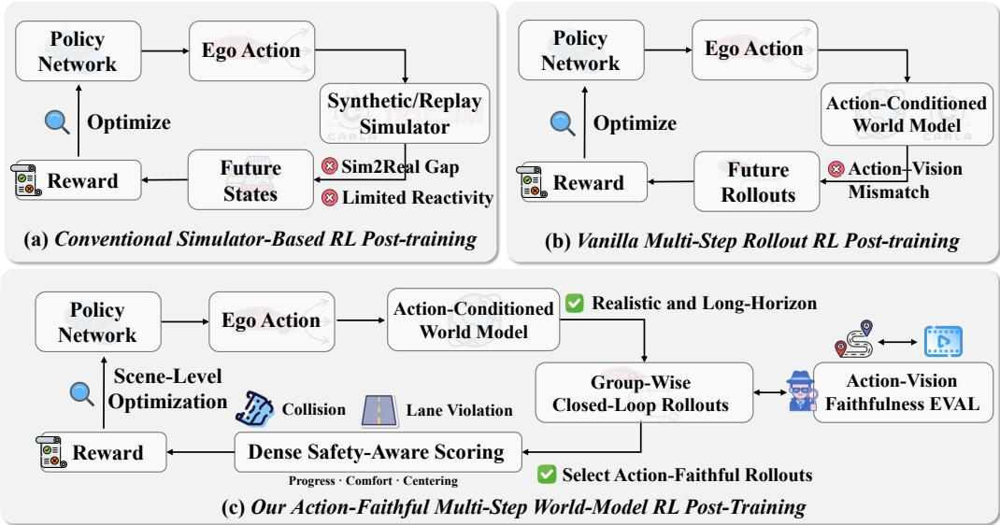  
Figure 1: (a) Conventional synthetic and reconstruction-based simulators trade off interactive freedom and real-scene fidelity. (b) Action-conditioned video world models enable realistic long horizon interaction, but action–vision mismatch may produce unreliable consequences. (c) RoX-Drive explicitly measures action-vision faithfulness, retaining reliable episodes to optimize agents.

Reinforcement learning (RL) provides a natural way to alleviate this issue by exposing agents to the future consequences of their actions through interactive environments, thereby improving decisionmaking (Zhang et al., 2026b; Garcia-Cobo et al., 2026; Shang et al., 2026). However, the key difficulty lies in constructing suitable interactive environments. Real-world RL is costly and raises safety concerns, whereas synthetic simulators such as CARLA (Dosovitskiy et al., 2017) provide controllable interaction (Li et al., 2024a; Yang et al., 2025) but exhibit sim-to-real gaps in visual appearance, traffic behavior, and scenario distribution. Based on neural rendering or 3D Gaussian Splatting, reconstruction-based simulators are able to preserve real-scene appearance (Gao et al., 2025a; Yan et al., 2026), but are typically tied to recorded data and thus lack realistic counterfactual evolution like departures from recorded ego trajectories and reactive agent behaviors. To summarize, existing environments offer either interactive freedom at the expense of realism, or real-scene fidelity with limited counterfactual interaction, as illustrated in Fig. 1 (a).

Recent action-conditioned video world models, such as GAIA-3 (Wayve, 2025), Cosmos 3 (Agarwal et al., 2026) and X-World (Zheng et al., 2026a) suggest promising alternatives by generating realistic and temporally consistent future driving scenes. However, visual realism does not guarantee actionvisionfaithfulness. During multi-step generation, visual dynamics may gradually deviate from conditioning ego actions, leading to accumulated action-vision inconsistencies and incorrect policy optimization as shown in Fig. 1 (b). It raises a key question: Can we explicitly evaluate action-vision faithfulness to quantify causal errors and identify reliable world-model rollouts, thereby enabling video world models to serve as reliable simulators for multi-step closed-loop policy optimization?

To this end, we propose RoXDrive, a plug-and-play closed-loop RL framework with two stages as shown in Fig. 1 (c): 1) Model pre-training: We initialize the policy through imitation learning and develop an Action-Vision Faithfulness Evaluator (AVFE) which estimates ego motion from video and compares it with the conditioning actions to assess action-vision faithfulness. However, directly fine-tuning Cosmos 3 suffers substantial cumulative relative-motion errors in long-horizon inverse dynamics estimation as shown in Fig. 2. We therefore introduce the geometry-aware auxiliary trajectory supervision strategy, significantly mitigating the relative-motion errors. 2) Action-faithful RL post-training: Starting from an initial driving scene, the pre-trained policy iteratively interacts with a frozen action-conditioned video world model, acting on future observations induced by its own actions until the episode terminates or a failure occurs. Then, AVFE filters these rollouts and retains only action-faithful ones for subsequent policy optimization. To provide effective reinforcement signals, RoXDrive further devises the Dense Safety-Aware Scoring strategy which assigns fine-grained rewards to generated rollout states by evaluating collision clearance, lane clearance, ego progress, comfort, and lane centering. We then apply Group Relative Policy Optimization (GRPO) (Shao et al., 2024) at the scene level, comparing multiple rollouts within the same scene group to get relative advantages. Unlike recent GRPO-based driving methods (Zou et al., 2025; Jiang et al., 2025), our groups consist of long-horizon and reliable closed-loop episodes induced by the policy, enabling optimization from compounding long-horizon consequences.

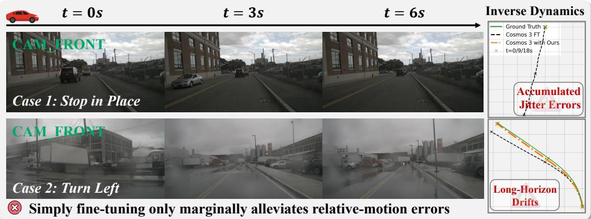  
Figure 2: Naive fine-tuning of powerful Cosmos 3 (i.e., Cosmos 3 FT) remains insufficient for long-horizon inverse dynamics, e.g., jitter errors (top) and long-horizon trajectory drifts (bottom). Hence, RoXDrive devises geometry-aware auxiliary supervision to handle these issues.

Our contributions are summarized as follows: 1) To the best of our knowledge, we are the first to explicitly evaluate action–vision faithfulness of long-horizon world-model rollouts in e2e driving. With our geometry-aware trajectory supervision, the action-vision faithfulness evaluator mitigates cumulative errors in inverse dynamics estimation and identifies reliable rollouts for policy optimization. 2) With reliable rollouts, RoXDrive introduces the Dense Safety-Aware Scoring and Scenelevel Closed-Loop GRPO strategies to provide stable and fine-grained reinforcement signals. Video diffusion world models are only adopted during post-training, without additional inference cost at deployment. 3) We validate the proposed RoXDrive on the public nuScenes (Caesar et al., 2020) and further conduct large-scale training and evaluation across real-world scenarios, including 130K challenging training scenarios and 1K test scenarios of narrow roads, vulnerable road users, and dense multi-agent interactions, demonstrating consistent improvements in safety and driving quality.

## 2 RELATED WORK

We first review the literature on world models in autonomous driving, and then discuss their usage for policies. More discussions on related fields (e.g., e2e autonomous driving) are put in Appendix A.

## 2.1 WORLD MODELS IN AUTONOMOUS DRIVING

Conventional end-to-end driving paradigms such as diffusion-based (Liao et al., 2025), regressionbased (Chitta et al., 2022), and score-based approaches (Li et al., 2025d) typically map current observations directly to control actions. While effective for reactive behavior, such formulations lack an explicit mechanism for anticipating future risks or reasoning about long-horizon consequences. World models address this issue by learning an internal dynamics model that can simulate plausible future evolutions of the driving scene conditioned on the current state. A prominent line of work focuses on latent world models (Li et al., 2024b; Shi et al., 2025; Zhang et al., 2026a), which predict future scene representations in a compact feature space instead of the raw pixel domain (Wang et al., 2024a;b). These predicted latent states can then support downstream reasoning tasks, including trajectory scoring and selection (Li et al., 2025b), causal inference over potential outcomes (Wang et al., 2026; Li et al., 2025a), and chain-of-thought (CoT) deliberation (Tan et al., 2025; Zeng et al., 2025), thereby providing a predictive substrate for planning under uncertainty (Min et al., 2024). Another family of approaches equips the model with explicit visual–geometric foresight through autoregressive generation of future tokens that are subsequently decoded into multi-task prediction targets (e.g., occupancy, depth, or semantic maps). For example, DriveDreamer (Zhou et al., 2026) jointly synthesizes future depth maps, video frames, and driving actions within a unified generative framework. Similarly, PWM (Zhao et al., 2025) first imagines long-horizon future videos and then derives actions from the imagined rollouts. Furthermore, Uni-World VLA (Liu et al., 2026b) interleaves action generation with high-frequency future frame synthesis, allowing the policy to continuously update its anticipation and adapt its behavior within a coupled perception–action loop.

## 2.2 ENHANCING POLICY LEARNING WITH WORLD MODELS

Pure imitation learning (IL) often suffers from causal confusion, where policies exploit spurious correlations in the training data rather than capturing the true causal drivers of expert behavior. A common strategy to mitigate this issue is to combine reinforcement learning (RL) (Yang et al., 2026) with IL, enabling policy refinement through trial-and-error optimization of an explicit reward signal. In autonomous driving, however, RL-based policy improvement critically relies on closed-loop interaction, where the agent executes rollouts in an environment that provides meaningful feedback. Existing interaction environments present several limitations. High-fidelity simulators often simplify the behavior of surrounding agents and suffer from a persistent sim-to-real gap (Li et al., 2024a; Yang et al., 2025). Photorealistic reconstructions based on 3D Gaussian Splatting (Kerb et al., 2023) offer high visual realism but incur prohibitive computational costs (Gao et al., 2025a). Meanwhile, traffic-flow simulators, though computationally efficient, lack interactive 3D geometry and thus limit the transferability of learned policies (Dauner et al., 2024; Li et al., 2025c; Liu et al., 2026a). To overcome these challenges, recent work leverages learned world models as efficient and differentiable surrogates for closed-loop policy training. AD-R1 (Yan et al., 2026) introduces an Impartial Occupancy World Model that predicts future occupancy grids and computes collision-based rewards directly in grid space, enabling scalable on-policy optimization without relying on external simulators. LaST-VLA (Luo et al., 2026) aligns action generation with COSMOS-based latent reasoning signals, optimizing trajectory-level rewards while using latent chain-of-thought features as stable internal guidance. RAD-2 (Gao et al., 2026) proposes BEV-Warp, a high-throughput featurelevel simulation environment that exploits spatial equivariance to accelerate policy iteration.

## 3 PRELIMINARIES

Video Diffusion World Model. In autonomous driving, world models (Ha & Schmidhuber, 2018) are often devised to model the dynamics of the future scene, allowing e2e planners to learn how their actions shape the evolution of the future scene. Building upon WAN (Wan et al., 2025), existing approaches (Zheng et al., 2026a) adopt the latent video generation paradigm that couples a video spatio-temporal variational autoencoder with the mainstream DiT-based (Peebles & Xie, 2023) latent denoiser. In this paper, we adopt the X-World as the action-conditioned multi-camera video diffusion world model which supports accurate scene control and causal generation. Specifically, given recent synchronized multi-view videos $\mathbf { X } _ { \mathrm { h i s } }$ and a future action sequence a, the model predicts the resulting future camera observations $\hat { \mathbf { X } } _ { \mathrm { f u t } }$ via:

$$
\begin{array} { r } { \hat { \mathbf { X } } _ { \mathrm { f u t } } \sim p _ { \omega } ( \mathbf { X } _ { \mathrm { f u t } } \mid \mathbf { X } _ { \mathrm { h i s } } , \mathbf { a } , \mathbf { c } ) , } \end{array}\tag{1}
$$

where c denotes the optional scene control conditions, including dynamic agents, static elements, camera parameters, and scene descriptions. To support streaming inference, a chunk-wise causal generator rolls out future videos sequentially:

$$
\hat { \mathbf { X } } _ { \mathrm { f u t } } ^ { ( k ) } \sim p _ { \omega } \Big ( { \cdot } \mid \mathbf { H } ^ { ( k ) } , \mathbf { a } ^ { ( k ) } , \mathbf { c } \Big ) , \quad \mathbf { H } ^ { ( k ) } = \Big [ \mathbf { X } _ { \mathrm { h i s } } , \hat { \mathbf { X } } _ { \mathrm { f u t } } ^ { ( < k ) } \Big ] .\tag{2}
$$

Here, $\hat { \mathbf { X } } _ { \mathrm { f u t } } ^ { ( k ) }$ denotes the generated k-th future chunk corresponding to the action $\mathbf { a } ^ { ( k ) }$ $\mathbf { H } ^ { ( k ) }$ is the causal history context composed of the observed history $\mathbf { \bar { X } } _ { \mathrm { h i s } }$ and previously generated chunks $\hat { \mathbf { X } } _ { \mathrm { f u t } } ^ { ( < k ) }$ . With the same history context, different action inputs lead to different future evolutions. More details on the action-conditioned world model are put in the Appendix B.

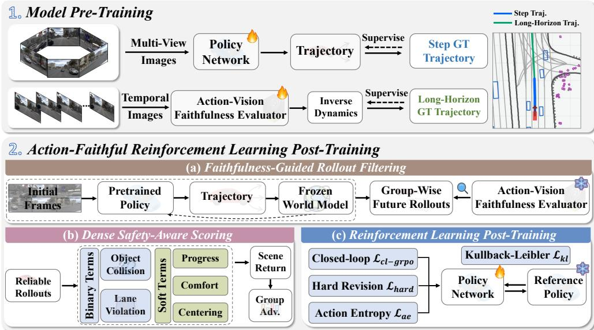  
Figure 3: Illustration of RoXDrive. In stage one (top), we train the action-vision faithfulness evaluator with our geometry-aware auxiliary trajectory supervision beyond policy pre-training. In stage two (bottom), agents iteratively interact with a frozen world model to form long-horizon scene rollouts, retaining only action-faithful rollouts for dense safety-aware scoring and closed-loop RL.

Group Relative Policy Optimization. Proximal Policy Optimization (PPO) (Schulman et al., 2017) is a widely used policy-gradient algorithm that stabilizes the training process by limiting how large the new policy can deviate from the old policy in each update. Given a state s and an action sequence a sampled from the old policy, PPO updates the current policy according to the probability ratio $\begin{array} { r } { p ( \theta ) = \frac { \pi _ { \theta } ( \mathbf { a } | \mathbf { s } ) } { \pi _ { \theta _ { \mathrm { o l d } } } ( \mathbf { a } | \mathbf { s } ) } } \end{array}$ and then clips this ratio to avoid unstable updates. The update is weighted by an advantage estimate A, typically obtained from a learned value function. However, as noted in the previous work (Shao et al., 2024), training an additional critic introduces substantial memory and computational cost, which becomes particularly burdensome in world-model-based RL where each policy update requires multiple costly scene rollouts. Therefore, we adopt scene-level Group Relative Policy Optimization (GRPO), which removes the explicit value function and instead computes relative advantages from a group of action rollouts under the same driving context.

## 4 CLOSED-LOOP REINFORCEMENT LEARNING POST-TRAINING

## 4.1 METHOD OVERVIEW

As illustrated in Fig. 3, the overall framework contains two stages, i.e., Model Pre-Training and Reinforcement Learning Post-Training. Given a pre-trained planner in the standard open-loop manner on D, we initialize the frozen reference policy $\pi _ { \mathrm { r e f } }$ and a trainable copy $\pi _ { \theta }$ . For action-vision faithfulness, we further train an action-vision faithfulness evaluator $\mathcal { E } _ { \phi } ( \cdot )$ via inverse dynamics esti mation with geometry-aware trajectory supervision $\mathcal { L } _ { \mathrm { g e o } }$ on temporal front-view image sequences:

$$
\mathcal { L } _ { \mathrm { A V F E } } = \mathcal { L } _ { \mathrm { R F } } + \lambda _ { \mathrm { g e o } } m ( \sigma ) \mathcal { L } _ { \mathrm { g e o } } ,\tag{3}
$$

where $\mathcal { L } _ { \mathrm { R F } }$ denotes the inverse-dynamics Rectified Flow (RF) objective, and $\mathcal { L } _ { \mathrm { g e o } }$ provides geometry-aware supervision within informative RF noise levels, as detailed in Sec. 4.2.

In the next stage, RoXDrive optimizes $\pi _ { \theta }$ through reinforcement learning post-training based on the frozen action-conditioned video diffusion world model W serving as the interactive environment. Given an initial scene $\xi \sim \mathcal D$ , RoXDrive instantiates $G$ parallel world-model sessions from ξ. At each decision step l of rollout $^ { g , }$ , we denote the state as $\mathbf { s } _ { l , g } = ( \mathbf { o } _ { l , g } , \mathbf { x } _ { l , g } )$ , where $\mathbf { o } _ { l , g }$ is the multiview visual observation and $\mathbf { x } _ { l , g }$ is the associated driving context. The planner predicts K trajectory candidates $\{ \mathbf { a } _ { l , g } ^ { k } \} _ { k = 1 } ^ { K }$ with logits $\{ z _ { l , g } ^ { k } \} _ { k = 1 } ^ { K }$ , and samples the executed action $( i . e .$ , a total of n trajectory points) according to the softmax probabilities. Conditioned on this action, W generates the next observation and updates the scene context, thereby exposing the planner to the future states induced by its own decisions. All closed-loop rollouts continue until reaching the maximum horizon or a terminal safety violation, after which they are filtered by $\mathcal { E } _ { \phi } ( \cdot )$ to retain only faithful rollouts.

To leverage the reliable rollouts, RoXDrive introduces the dense safety-aware scoring and closedloop GRPO strategies. We evaluate every $\mathbf { s } _ { l , g }$ with safety and driving-quality terms which are accumulated into a long-horizon return for $G$ rollouts, including collision $q ^ { \mathrm { o b j } }$ , lane violation $q ^ { \mathrm { l a n e } }$ , ego progress $q ^ { \mathrm { p r o g } }$ , comfort $q ^ { \mathrm { c o m f } }$ , and lane centering $q ^ { \mathrm { c t r } }$ . Overall, RoXDrive optimizes $\pi _ { \theta }$ with:

$$
\begin{array} { r } { \theta ^ { \star } = \arg \operatorname* { m i n } _ { \theta } \biggl \{ \mathbb { E } _ { \xi \sim \mathcal { D } } \left[ \mathcal { L } _ { \mathrm { c l - g r p o } } ( \xi ) + \beta \mathcal { L } _ { \mathrm { k l } } ( \xi ) - \lambda \mathcal { L } _ { \mathrm { a e } } ( \xi ) \right] + \alpha \mathcal { L } _ { \mathrm { h a r d } } \biggr \} . } \end{array}\tag{4}
$$

where $\mathcal { L } _ { \mathrm { c l - g r p o } }$ is calculated by faithful rollouts from $\mathcal { E } _ { \phi } ( \cdot ) , \mathcal { L } _ { \mathrm { k l } }$ regularizes $\pi _ { \theta }$ toward $\pi _ { \mathrm { r e f } } , \mathcal { L } _ { \mathrm { a e } }$ encourages diverse trajectory selection, and $\mathcal { L } _ { \mathrm { h a r d } }$ revisits hard scenes $\xi _ { h }$ , as detailed in Sec. 4.3. β, $\lambda ,$ and α are the weighting coefficients. The pseudo-code of RoXDrive is provided in Appendix C.

## 4.2 ACTION-VISION FAITHFULNESS EVALUATION

To filter out mismatched world-model rollouts, we devise an action-vision faithfulness evaluator (AVFE) $\mathcal { E } _ { \phi } ( \cdot )$ based on Cosmos3-Nano (Agarwal et al., 2026), which estimates inverse dynamics from temporal front-view image sequences I as shown in $\mathrm { F i g . ~ } 3 \ ( \mathrm { a } )$ . Specifically, Cosmos 3 for mulates action generation under the Rectified Flow (RF) (Liu et al., 2022) objective, where inverse dynamics is realized by denoising action tokens a conditioned on I via:

$$
\begin{array} { r } { \mathbf { a } _ { \sigma } = ( 1 - \sigma ) \mathbf { a } + \sigma \mathbf { \epsilon } , \quad \mathbf { v } ^ { * } = \mathbf { \epsilon } \mathbf { \epsilon } - \mathbf { a } , } \\ { \mathcal { L } _ { \mathrm { R F } } = \| v _ { \phi } ( \mathbf { a } _ { \sigma } , \sigma \mid \mathbf { I } ) - \mathbf { v } ^ { * } \| _ { 2 } ^ { 2 } . \quad } \end{array}\tag{5}
$$

Here $\epsilon \sim \mathcal { N } ( \mathbf { 0 } , \mathbf { I } _ { d } ) , \sigma \ \in \ [ 0 , 1 ]$ denotes the noise level, $\mathbf { v } ^ { * }$ is the target RF velocity and $v _ { \phi } ( \cdot )$ represents the learnable velocity field of ${ \mathcal { E } } _ { \phi }$ . Each action token $\mathbf { a } _ { l }$ represents relative ego-motions between adjacent frames, parameterized by 3D translation and 6D rotation. Although this unified relative-pose representation facilitates action modeling across heterogeneous embodiments, Eq. 5 conducts token-wise supervision without explicitly constraining the composed trajectory. Consequently, systematic translation and rotation errors may accumulate over time, leading to substantial drift in long-horizon estimation, $i . e . ,$ , accumulated relative-motion errors shown in Fig. 2.

To this end, we introduce the geometry-aware auxiliary objective $\mathcal { L } _ { \mathrm { g e o } }$ for $\mathcal { E } _ { \phi }$ via imposing trajectory-level supervision over the ego-motion trajectory. Based on $\mathrm { E q . } ~ 5 ,$ we recover the clean action prediction at noise level σ as $\hat { \mathbf { a } } _ { \sigma } = \mathbf { a } _ { \sigma } - \sigma v _ { \phi } ( \mathbf { a } _ { \sigma } , \sigma \mid \mathbf { I } )$ while the ground-truth action satisfies $\mathbf { a } = \mathbf { a } _ { \sigma } - \sigma \mathbf { v } ^ { * }$ . Thus, action prediction errors are related to RF velocity prediction errors:

$$
\delta \mathbf { a } _ { \sigma } \triangleq \hat { \mathbf { a } } _ { \sigma } - \mathbf { a } = - \sigma \left[ v _ { \phi } ( \mathbf { a } _ { \sigma } , \sigma \mid \mathbf { I } ) - \mathbf { v } ^ { * } \right] = - \sigma \delta \mathbf { v } ,\tag{6}
$$

where $\delta \mathbf { v } \triangleq \cup _ { \phi } ( \mathbf { a } _ { \sigma } , \sigma \mid \mathbf { I } ) - \mathbf { v } ^ { * }$ . Eq. 6 establishes a differentiable bridge from trajectory-level supervision on actions back to the original RF prediction. To explicitly capture long-horizon error accumulation, we sequentially compose the predicted relative motions and define $\Phi _ { h } \bar { ( \cdot ) }$ as the differentiable composition up to horizon $h .$ . Thus, the predicted $\hat { \tau } _ { h }$ and ground-truth $\tau _ { h }$ trajectory states are given by $\begin{array} { r } { \hat { \tau } _ { h } = \Phi _ { h } ( \hat { \mathbf { a } } _ { \sigma , 1 : h } ) , \tau _ { h } = \Phi _ { h } ( \mathbf { a } _ { 1 : h } ) } \end{array}$ , where $\tau _ { h } = ( { \bf p } _ { h } , \psi _ { h } )$ contains the accumulated position and heading at horizon h. Instead of supervising only the final state, we impose geometric constraints $\mathcal { L } _ { \mathrm { g e o } }$ at multiple predefined horizons H by:

$$
\begin{array} { r } { \mathcal { L } _ { \mathrm { g e o } } = \sum _ { h \in \mathcal { H } } \left[ \rho ( \hat { \mathbf { p } } _ { h } - \mathbf { p } _ { h } ) + \lambda _ { \psi } \rho \Big ( \hat { \psi } _ { h } - \psi _ { h } \Big ) \right] , } \end{array}\tag{7}
$$

where $\rho ( \cdot )$ denotes the Smooth- $. L _ { 1 }$ loss and $\lambda _ { \psi }$ balances position and heading supervision. Let $\delta \tau _ { h } ~ = ~ \hat { \tau } _ { h } - \tau _ { h }$ and ${ \bf J } _ { h } = \partial \tau _ { h } / \partial { \bf a } _ { 1 : h } ,$ a first-order approximation gives $\delta \tau _ { h } \approx \mathbf { J } _ { h } \delta \mathbf { a } _ { \sigma , 1 : h } =$ $- \sigma \mathbf { J } _ { h } \delta \mathbf { v } _ { 1 : h }$ combined with Eq. 6. Hence, local RF errors are optimized based on their accumulated impact on the composed trajectory rather than solely on token-wise magnitudes. Since the reliability of $\mathcal { L } _ { \mathrm { g e o } }$ varies across RF noise levels $\sigma ,$ we activate $\mathcal { L } _ { \mathrm { g e o } }$ only within a moderate noise range $m ( \sigma ) =$ $\mathbb { I } \left[ 0 . \breve { 2 } \leq \sigma \leq 0 . 7 \right]$ which confines $\mathcal { L } _ { \mathrm { g e o } }$ to informative and stable RF regions. Eventually, AVFE recovers the ego-action sequence for each rollout g as $\hat { \mathbf { a } } _ { g } = \mathcal { E } _ { \phi } ( \mathbf { I } _ { g } ^ { \mathcal { W } } )$ . For the discrepancy of $\hat { \mathbf { a } } _ { g }$ and $\mathbf { a } _ { g } ,$ , we normalize the error by $S _ { g } = \operatorname* { m a x } \left\{ \widetilde { \mathrm { A D E } } _ { g } , \widetilde { \mathrm { F D E } } _ { g } , \widetilde { e } _ { g } ^ { \mathrm { y a w } } \right\}$ , including average displacement, final displacement, and mean yaw errors. Therefore, only rollouts with $S _ { g } \le \eta$ are retained. The pseudo-code and detailed analysis of AVFE are available in Appendix C and D, respectively.

## 4.3 SCENE-LEVEL CLOSED-LOOP GROUP RELATIVE POLICY OPTIMIZATION

Unlike open-loop GRPO methods, RoXDrive performs group-relative optimization over policyinduced faithful rollouts by dense reward signals, sampling $\bar { G }$ rollouts for each initial scene and obtaining all faithful rollouts $\mathcal { G } = \{ g \in \{ 1 , \ldots , G \} \mid S _ { g } \leq \bar { \eta } \}$ after AVFE filtering. Dense Safety-Aware Scoring. For rollout g at step l, the planner $\pi _ { \theta }$ produces K trajectory candidates with logits $\{ \mathbf { a } _ { l , g } ^ { k } , z _ { l , g } ^ { k } \} _ { k = 1 } ^ { \check { K } }$ , where $z _ { l , g } ^ { k }$ is the logit of the k-th trajectory in a fixed vocabulary. The action index $k _ { l , g }$ is sampled from softmax $( z _ { l , g } )$ , yielding the executed trajectory $\mathbf { a } _ { l , g } ^ { k _ { l , g } }$ . Hence, $\mathcal { W }$ advances the closed-loop state by $\mathbf { s } _ { l + 1 , g } = \mathcal { W } ( \mathbf { s } _ { l , g } , \mathbf { a } _ { l , g } )$ . As shown in ${ \mathrm { F i g . ~ } } 3 { \mathrm { ~ ( b ) } }$ , to ensure safety, collision with dynamic objects $( e . g .$ ., cars) and crossing forbidden lanes (or road boundaries) are treated as terminal events with fixed negative costs $c _ { \mathrm { f a i l } }$ . Given safe trajectories, RoXDrive transforms $d ^ { \mathrm { o b j } }$ and $d ^ { \mathrm { l a n e } } , i . e .$ , the minimum clearance to nearby objects and non-crossable lanes, into dense scores by a piecewise function $\begin{array} { r } { \varphi ( d ; \delta ^ { - } , \delta ^ { + } ) = \mathrm { c l i p } _ { [ 0 , 1 ] } \Big ( \frac { d - \delta ^ { - } } { \delta ^ { + } - \delta ^ { - } } \Big ) } \end{array}$ , truncating to [0, 1].

Beyond safety, we consider progress, comfort, and centering terms to measure the quality of actions. The progress term $q ^ { \mathrm { { \bar { p r o g } } } }$ rewards the final displacement of the motion toward the expert future endpoint by $\begin{array} { r } { q ^ { \mathrm { p r o g } } = \frac { e _ { \mathrm { p r o g } } } { e _ { \mathrm { m a x } } } } \end{array}$ , where $e _ { \mathrm { p r o g } }$ denotes the projected displacement toward the expert endpoint. As for the comfort term, $q ^ { \mathrm { c o m f } }$ penalizes large speed variations along the trajectory by $\begin{array} { r } { q ^ { \mathrm { c o m f } } = 1 - \frac { 1 } { n \Delta v _ { \mathrm { m a x } } } \sum _ { i = 1 } ^ { n } | v _ { i } - v _ { i - 1 } | . \ q ^ { \mathrm { o b j } } } \end{array}$ and $q ^ { \mathrm { l a n e } }$ are the object and lane clearance scores obtained by $\varphi ( \cdot )$ while mutually exclusive lane centering term $q ^ { \mathrm { c t r } }$ prefers to balance the distance between the left $d ^ { l }$ and right sides dr by $\begin{array} { r } { q ^ { \mathrm { c t r } } = \frac { 1 } { n } \sum _ { i = 1 } ^ { n } \left( 1 - \frac { | d _ { i } ^ { l } - d _ { i } ^ { r } | } { d _ { i } ^ { l } + d _ { i } ^ { r } + \epsilon } \right) } \end{array}$ . Eventually, all terms yield normalized quality scores by truncating scores to $[ 0 , 1 ]$ , including $q ^ { \mathrm { p r o g } } , q ^ { \mathrm { c o m f } }$ , and $q ^ { \mathrm { c t r } } \left( \mathrm { o r } q ^ { \mathrm { o b j } } \right.$ and $q ^ { \mathrm { l a n e } } )$ . The step reward aggregates all terms to obtain ${ r _ { l , g } }$ with negative costs for terminal violations:

$$
r = \mathcal { S } ( \mathbf { s } , \mathbf { a } ) = \left\{ \begin{array} { l l } { c _ { \mathrm { f a i l } } , } & { \mathrm { i f ~ \mathbf { a } ~ c o l l i d e s ~ o r ~ h i t s ~ f o r b i d d e n ~ l a n e s } , } \\ { \left( \sum _ { m \in \mathcal { M } } w _ { m } q ^ { m } \right) / \left( \sum _ { m \in \mathcal { M } } w _ { m } \right) , } & { \mathrm { o t h e r w i s e } . } \end{array} \right.\tag{8}
$$

Here M denotes valid terms and subscripts $( l , g )$ are omitted. More details are put in Appendix E. Closed-Loop GRPO. Let $\mathcal { T } _ { g } \subseteq \{ 0 , \ldots , \bar { L } - \bar { 1 } \}$ denote the valid decision steps of rollout g before termination. The discounted return of rollout $g$ is $\begin{array} { r } { R _ { g } \ : = \ : \sum _ { l \in \mathcal { T } _ { a } } \gamma ^ { l } r _ { l , g } } \end{array}$ . Following GRPO (Shao et al., 2024), we normalize returns within the group to obtain the scene-relative advantage $A _ { g }$ by:

$$
A _ { g } = \mathrm { c l i p } \big ( ( R _ { g } - \mu _ { R } ) / ( \sigma _ { R } + \epsilon ) , - A _ { \mathrm { m a x } } , A _ { \mathrm { m a x } } \big ) ,\tag{9}
$$

where the mean $\begin{array} { r } { \mu _ { R } = \frac { 1 } { | \mathcal { G } | } \sum _ { j \in \mathcal { G } } R _ { j } } \end{array}$ , and standard deviation $\begin{array} { r } { \sigma _ { R } = \sqrt { \frac { 1 } { | \mathcal { G } | } \sum _ { j \in \mathcal { G } } ( R _ { j } - \mu _ { R } ) ^ { 2 } } } \end{array}$ . We aggregate the log-probability of sampled actions along each rollout as

$$
\begin{array} { r } { \bar { \ell } _ { g } ( \theta ) = ( 1 / | \mathcal { T } _ { g } | ) \sum _ { l \in \mathcal { T } _ { g } } \log \pi _ { \theta } \bigl ( k _ { l , g } \mid \mathbf { s } _ { l , g } \bigr ) , } \end{array}\tag{10}
$$

where $k _ { l , g }$ is the sampled trajectory index at state $\mathbf { s } _ { l , g }$ . The closed-loop GRPO loss is then

$$
\mathcal { L } _ { \mathrm { c l - g r p o } } = - ( 1 / | \mathcal { G } | ) \sum _ { g \in \mathcal { G } } A _ { g } \bar { \ell } _ { g } ( \theta ) ,\tag{11}
$$

which increases the likelihood of long rollouts with higher relative returns within the same scene. Hard-Scene Revision. Since world-model interaction is computationally expensive, the group size G is often limited and may fail to discover available distinct rollouts in challenging scenes. To this end, we revisit indistinguishable scenes with an expert-guided revision loss $\mathcal { L } _ { \mathrm { h a r d } }$ by:

$$
\begin{array} { r } { \mathcal { L } _ { \mathrm { h a r d } } = \frac { 1 } { | \mathcal { D } _ { \mathrm { h a r d } } | } \sum _ { \xi _ { h } \in \mathcal { D } _ { \mathrm { h a r d } } } \left[ - z _ { h } ^ { k _ { h } ^ { \mathrm { G T } } } + \log \left( \sum _ { k = 1 } ^ { K } \exp ( z _ { h } ^ { k } ) \right) + \left. \mathbf { a } _ { h } ^ { k _ { h } ^ { \mathrm { G T } } } - \mathbf { a } _ { h } ^ { \mathrm { G T } } \right. _ { 1 } \right] . } \end{array}\tag{12}
$$

where $k _ { h } ^ { \mathrm { G T } }$ is the expert-matched trajectory index and $\mathbf { a } _ { h } ^ { \mathrm { G T } }$ is the expert trajectory. Unlike RAD (Gao et al., 2025a), $\mathcal { L } _ { \mathrm { h a r d } }$ adaptively learns from hard scenes with insufficient RL signals.

Regularization. As shown in Fig. 3 (c), we further regularize policy with the action entropy term $\mathcal { L } _ { \mathrm { a e } }$ to encourage exploration and action diversity while $\mathcal { L } _ { \mathrm { k l } }$ constrains stable updates from $\pi _ { \mathrm { r e f } }$ via:

$$
\mathcal { L } _ { \mathrm { a e } } = \frac { 1 } { \lvert \mathcal { G } \rvert } \sum _ { g \in \mathcal { G } } \frac { 1 } { \lvert \mathcal { T } _ { g } \rvert } \sum _ { l \in \mathcal { T } _ { g } } \mathrm { E n t } ( \pi _ { \theta } ( \cdot \mid \mathbf { s } _ { l , g } ) ) , \quad \mathcal { L } _ { \mathrm { k l } } = \mathbb { E } _ { l , g } [ D _ { \mathrm { K L } } ( \pi _ { \theta } ( \cdot \mid \mathbf { s } _ { l , g } )  \pi _ { \mathrm { r e f } } ( \cdot \mid \mathbf { s } _ { l , g } ) ) ] .\tag{13}
$$

Table 1: Comparisons of inverse dynamics evaluation on the nuScenes validation set.
<table><tr><td>Method</td><td>|3s ADE ↓ 6s ADE ↓ 6s FDE↓</td><td></td><td></td></tr><tr><td>Cosmos3-Nano</td><td>8.77</td><td>15.07</td><td>30.11</td></tr><tr><td>GenAD‡ (Yang et al., 2024)</td><td>0.90</td><td></td><td></td></tr><tr><td>Cosmos3-Nano Fine-Tuning</td><td>0.67</td><td>1.27</td><td>2.67</td></tr><tr><td>RoXDrive (Our AVFE)</td><td>0.52</td><td>0.95</td><td>2.00</td></tr><tr><td colspan="4">With Strict SE(2)</td></tr><tr><td>Cosmos3-Nano</td><td>8.82</td><td>15.36</td><td>31.27</td></tr><tr><td>Cosmos3-Nano Fine-Tuning|</td><td>0.66</td><td>1.24</td><td>2.59</td></tr><tr><td>RoXDrive (Our AVFE)</td><td>0.51</td><td>0.93</td><td>1.92</td></tr></table>

Table 2: Action-following evaluation on nuScenes over generated videos (i.e., 6 s, 72 frames) based on our AVFE. Bid./Cau. denote bidirectional/causal. Strict SE(2) retains x–z translation and y-axis yaw.
<table><tr><td>Method</td><td>Fine- Bid./Cau. Tuning</td><td>(m) ↓</td><td>|SE(2) ADE SE(2) FDE</td><td>(m) ↓</td><td>Rotation Mean (°) ↓ Final (°) ↓</td><td>Rotation</td></tr><tr><td>GT Video</td><td>一</td><td>一</td><td>0.92</td><td>1.92</td><td>1.37</td><td>2.04</td></tr><tr><td>Cosmos3-Nano</td><td>Bid.</td><td>x</td><td>4.85</td><td>9.84</td><td>3.22</td><td>4.86</td></tr><tr><td>Vista</td><td>Cau.</td><td>√</td><td>4.19</td><td>8.03</td><td>4.63</td><td>7.34</td></tr><tr><td>Epona</td><td>Cau.</td><td>√</td><td>2.50</td><td>4.72</td><td>2.05</td><td>3.26</td></tr><tr><td>X-World</td><td>Cau.</td><td>√</td><td>1.11</td><td>2.18</td><td>1.77</td><td>2.94</td></tr></table>

Table 3: Comparison of open-loop (2s, collision) and closed-loop (4s) model performance on nuScenes. RL indicates reinforcement learning and ‡ denotes the official weights are unavailable.
<table><tr><td rowspan="3">Method</td><td rowspan="3"> $\mathrm { R L }$ </td><td colspan="3">Open-loop Col. (%) ↓</td><td rowspan="2">Closed-loop Evaluation (4,675 4s clips, 2 action steps, based on X-World)</td><td colspan="4"></td><td rowspan="3">Driving Score ↑</td></tr><tr><td rowspan="2">1s  $2 s$ </td><td rowspan="2"> $\operatorname { A v g } .$ </td><td colspan="2">Safety</td><td colspan="3">Driving Quality</td></tr><tr><td>Obj. Col. ↓</td><td></td><td>Lane Viol. ↓ Progress ↑</td><td>Comfort ↑</td><td>Clearance ↑</td></tr><tr><td>ST-P3</td><td></td><td>0.23</td><td>0.62</td><td>0.43</td><td>268</td><td>557</td><td>0.397</td><td>0.425</td><td>0.387</td><td>0.341</td></tr><tr><td>VAD</td><td>×××</td><td>0.07</td><td>0.17</td><td>0.12</td><td>820</td><td>824</td><td>0.255</td><td>0.681</td><td>0.418</td><td>0.271</td></tr><tr><td>UniAD</td><td></td><td>0.62</td><td>0.58</td><td>0.60</td><td>348</td><td>870</td><td>0.408</td><td>0.805</td><td>0.415</td><td>0.430</td></tr><tr><td>CLEAR</td><td>√</td><td>0.11</td><td>0.23</td><td>0.17</td><td></td><td></td><td></td><td></td><td></td><td></td></tr><tr><td>Drive-r1‡</td><td>√</td><td>0.02</td><td>0.06</td><td>0.04</td><td></td><td></td><td></td><td></td><td></td><td></td></tr><tr><td>DiffusionDrive</td><td>x</td><td>0.068</td><td>0.073</td><td>0.070</td><td>266</td><td>772</td><td>0.694</td><td>0.866</td><td>0.392</td><td>0.526</td></tr><tr><td>+ RoXDrive (Ours)</td><td>√×</td><td>0.029</td><td>0.063</td><td>0.046</td><td>189</td><td>562</td><td>0.717</td><td>0.883</td><td>0.380</td><td>0.588</td></tr><tr><td>SparseDrive</td><td></td><td>0.000</td><td>0.044 0.022</td><td></td><td>197</td><td>623</td><td>0.716</td><td>0.891</td><td>0.384</td><td>0.580</td></tr><tr><td>+ RoXDrive (Ours)</td><td>√</td><td>0.000</td><td>0.015</td><td>0.007</td><td>173</td><td>598</td><td>0.775</td><td>0.922</td><td>0.388</td><td>0.622</td></tr></table>

## 5 EXPERIMENTS

We conduct experiments to validate our method on the public nuScenes and a large-scale in-house dataset. Beyond merely imitating GT trajectories, our method aims to mitigate causal confusion as reflected in fewer collisions and off-road events. Implementation details are put in the Appendix F. Datasets. The nuScenes (Caesar et al., 2020) dataset comprises 1K scenes with six camera views, each lasting 20 seconds, with keyframe annotations at 2 Hz. Following the protocol of Magic-DriveV2 (Gao et al., 2025b), we adopt 700 scenes for training and 150 for validation, and obtain the corresponding annotations at 12 Hz. As for the in-house dataset, the training set contains over 130K scenarios, each lasting 30 seconds with annotations at 12 Hz and the held-out evaluation set includes 1K safety-critical scenarios, covering constrained road geometries, vulnerable road users, and dense interactions, which are selected to assess safety and robustness under the closed-loop setting. Note that OpenScene (Contributors, 2023) (and its subset NAVSIM) is excluded due to its 2 Hz sampling rate while Cosmos 3, GAIA, and X-World are designed for more than 10 Hz.

Compared Methods. We first evaluate RoXDrive on representative e2e methods within nuScenes for fair comparisons, including TransFuser (Chitta et al., 2022), ST-P3 (Hu et al., 2022), UniAD (Hu et al., 2023), OccNet (Tong et al., 2023), VAD (Jiang et al., 2023), SparseDrive (Sun et al., 2025), DiffusionDrive (Liao et al., 2025) and VLAs, i.e., Gemma-3 (Team et al., 2025), Qwen2.5-VL (Bai et al., 2025b) and Qwen3-VL (Bai et al., 2025a). Moreover, we also compare with e2e RL posttraining methods, i.e., CLEAR (Shi et al., 2026) and Drive-r1 (Li et al., 2026b). As for world models, we further provide action-following evaluation, including Cosmos3-Nano (Agarwal et al., 2026), Vista (Gao et al., 2024), Epona (Zhang et al., 2025) and X-World (Zheng et al., 2026a).

Evaluation Metrics. 1) Object Collision, the number of scenarios terminated by collision with objects; 2) Lane Violation, the number of scenarios terminated by crossing a non-crossable lane boundary; 3) Progress, the normalized forward progress; 4) Comfort, the smoothness of velocity changes; 5) Clearance, the risk of potential collisions and lane violations (replaced with Centering on the in-house dataset). Inspired by NAVSIM, we compute the final Driving Score as $\mathrm { D S } = \mathbb { I } _ { \mathrm { s a f e } } \cdot \frac { 5 q ^ { \mathrm { p r o g } } + 3 q ^ { \mathrm { c o m f } } + q ^ { \mathrm { o b j } } + q ^ { \mathrm { l a n e } } } { 1 0 }$ , where $\mathbb { I } _ { \mathrm { s a f e } }$ indicates no collision or lane violation.

## 5.1 MAIN RESULTS

Evaluation of AVFE and Action-Vision Faithfulness. We first present the comparisons of inverse dynamics estimation on a total of 150 nuScenes validation scenes as shown in Table 1, demonstrating that our AVFE significantly mitigates the relative-motion errors instead of simply fine-tuning the powerful Cosmos 3, e.g., reducing 3s Average Displacement Error (ADE) and 6s ADE by 22.4% and 25.2%. Moreover, based on our AVFE, we assess action-following of world models on the same validation scenes as shown in Table 2, revealing substantial differences in action-vision faithfulness across world models. Combined with Table 5, it highlights the importance of reliable optimization. Model Improvement with RoXDrive. Based on Table 2, we adopt X-World as the interactive training environment to enable future scene generation. On nuScenes, Table 3 shows that existing methods exhibit poor closed-loop performance even with only two action steps but achieve strong open-loop performance. Then, RoXDrive improves DiffusionDrive and SparseDrive in both openloop and closed-loop metrics, showing consistent gains in safety (e.g., reducing failures by 27.6% for DiffusionDrive) and driving scores. To validate RoXDrive at scale, we enhance large VLAs with RoXDrive on the 130K in-house dataset and evaluate them on 1K test scenes as shown in Table 4, demonstrating consistent improvements in safety and DS across various architectures.

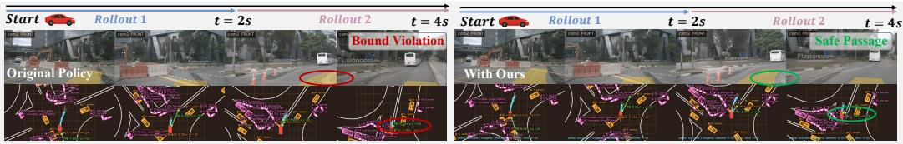  
Figure 4: Qualitative results of RoXDrive avoiding risky behaviors (see also Appendix H).

Table 4: Closed-loop performance on 1K in-house test scenes (80 frames, 12 Hz) based on VLAs.
<table><tr><td rowspan="2">Planner (10 actions) Training</td><td rowspan="2"></td><td colspan="2">Safety</td><td colspan="3">Driving Quality</td><td rowspan="2">DS↑</td></tr><tr><td>Obj. Col. ↓ Lane Viol.</td><td></td><td>Progress ↑</td><td></td><td>Comfort ↑ Centering ↑</td></tr><tr><td rowspan="2">Gemma-3-4B</td><td>Imitation-only</td><td>328</td><td>171</td><td>0.938</td><td>0.952</td><td>0.521</td><td>0.371</td></tr><tr><td>+ RoXDrive</td><td>198</td><td>127</td><td>0.865</td><td>0.940</td><td>0.539</td><td>0.540</td></tr><tr><td rowspan="2">Qwen2.5-VL-3B</td><td>Imitation-only</td><td>331</td><td>141</td><td>0.945</td><td>0.911</td><td>0.538</td><td>0.394</td></tr><tr><td>+ RoXDrive</td><td>206</td><td>107</td><td>0.883</td><td>0.936</td><td>0.547</td><td>0.559</td></tr><tr><td rowspan="2">Qwen3-VL-2B</td><td>Imitation-only</td><td>242</td><td>162</td><td>0.884</td><td>0.938</td><td>0.527</td><td>0.450</td></tr><tr><td>+ RoXDrive</td><td>174</td><td>94</td><td>0.878</td><td>0.957</td><td>0.542</td><td>0.608</td></tr></table>

Table 5: Ablations of our AVFE and group size on nuScenes. More ablations are put in Appendix G.
<table><tr><td>Setting</td><td>Obj. Col. ↓</td><td>Lane Viol. ↓</td><td>Progress</td><td>Comfort ↑</td><td>Clearance</td><td>DS↑</td></tr><tr><td>DiffusionDrive (official)</td><td>266</td><td>772</td><td>0.694</td><td>0.866</td><td>0.392</td><td>0.526</td></tr><tr><td>• RL w. All Rollouts</td><td>237</td><td>672</td><td>0.701</td><td>0.881</td><td>0.385</td><td>0.562</td></tr><tr><td>• RL w. Cosmos3-FT</td><td>224</td><td>667</td><td>0.706</td><td>0.882</td><td>0.388</td><td>0.568</td></tr><tr><td>• RL w. AVFE (Ours)</td><td>189</td><td>562</td><td>0.717</td><td>0.883</td><td>0.380</td><td>0.588</td></tr></table>

<table><tr><td>Group Size</td><td></td><td>Obj. Col. ↓ Lane Viol. ↓</td><td>Progress ↑</td><td>Comfort ↑</td><td>Clearance ↑</td><td>DS ↑</td></tr><tr><td>DiffusionDrive (official)</td><td>266</td><td>772</td><td>0.694</td><td>0.866</td><td>0.392</td><td>0.526</td></tr><tr><td>• G = 2</td><td>246</td><td>636</td><td>0.679</td><td>0.857</td><td>0.383</td><td>0.552</td></tr><tr><td>• G = 4</td><td>198</td><td>614</td><td>0.714</td><td>0.884</td><td>0.382</td><td>0.580</td></tr><tr><td>• G = 6 (default)</td><td>189</td><td>562</td><td>0.717</td><td>0.883</td><td>0.380</td><td>0.588</td></tr><tr><td>• G = 8</td><td>180</td><td>588</td><td>0.720</td><td>0.890</td><td>0.381</td><td>0.590</td></tr></table>

## 5.2 ABLATION STUDY

We conduct ablation studies with DiffusionDrive on nuScenes to examine AVFE and the effect of group size as shown in Table 5. Compared with the official DiffusionDrive baseline, adding our RL strategy alone reduces unsafe cases by 12.4%. Filtering rollouts with fine-tuned Cosmos 3 (Cosmos3-FT) further reduces 18 unsafe cases, whereas our AVFE reduces them by 158 (17.4%) and achieves 0.588 DS. Regarding the group size, increasing G from 2 to 4 substantially improves DS from 0.552 to 0.580. Further increasing G to larger values $( i . e . , 6 , 8 )$ still yields notable performance gains, while we adopt G = 6 as the default to balance performance and computational costs.

## 5.3 QUALITATIVE RESULTS

We provide qualitative visualizations of RoXDrive in Figure 4. The results show that RoXDrive enables DiffusionDrive to avoid risky behaviors, i.e., keeping a safe distance from the road boundary, showing that existing planners can acquire safer behaviors without changing architectures by integrating RoXDrive. More results are put in Appendix H and check our supp. for video demos.

## 6 CONCLUSION

In this work, we present RoXDrive, a plug-and-play closed-loop RL framework that enables reliable policy optimization by leveraging action-faithful world-model rollouts. With the geometry-aware auxiliary supervision, our action-vision faithfulness evaluator significantly mitigates cumulative errors in inverse dynamics estimation, enabling more reliable action-following evaluation of world models. Based on reliable rollouts, RoXDrive enables planners to learn from their own longhorizon action consequences with our dense safety-aware scoring and closed-loop GRPO strategies. Experiments show consistent improvements in safety and overall driving scores, demonstrating the effectiveness of RoXDrive in providing reliable closed-loop supervision for policy optimization.

## AI USE STATEMENT

In this work, we utilize generative AI tools (i.e., CodeX and ChatGPT) to improve our writing, assist with translation, refine the layout of the project page, and organize experimental results. Specifically, we use these tools for the following purposes: 1) Notations and equations. We verify that all symbols are used consistently throughout the paper, ensuring all symbols and equations are clearly defined and explained. 2) Grammar and translation. We check and correct grammatical errors throughout the paper and check that translations accurately express our intention. 3) Visualization. We reduce manual adjustments in the visualization process and obtain suggestions for improving the appearance of figures and the layout of the demos on the project page. 4) Organization. We utilize the AI tool to convert our results into LaTeX. These tools were not used for other aspects, including method design and experiments. We have reviewed all AI-assisted content and take full responsibility for the final content of this work, including its text, claims, and accompanying artifacts.

## REFERENCES

Niket Agarwal, Arslan Ali, Jon Allen, Martin Antolini, Adeline Aubame, Alisson Azzolini, Junjie Bai, Maciej Bala, Yogesh Balaji, Josh Bapst, et al. Cosmos 3: Omnimodal world models for physical ai. arXiv preprint arXiv:2606.02800, 2026.

Shuai Bai, Yuxuan Cai, Ruizhe Chen, Keqin Chen, Xionghui Chen, Zesen Cheng, Lianghao Deng, Wei Ding, Chang Gao, Chunjiang Ge, et al. Qwen3-vl technical report. arXiv preprint arXiv:2511.21631, 2025a.

Shuai Bai, Keqin Chen, Xuejing Liu, Jialin Wang, Wenbin Ge, Sibo Song, Kai Dang, Peng Wang, Shijie Wang, Jun Tang, Humen Zhong, Yuanzhi Zhu, Mingkun Yang, Zhaohai Li, Jianqiang Wan, Pengfei Wang, Wei Ding, Zheren Fu, Yiheng Xu, Jiabo Ye, Xi Zhang, Tianbao Xie, Zesen Cheng, Hang Zhang, Zhibo Yang, Haiyang Xu, and Junyang Lin. Qwen2.5-vl technical report. arXiv preprint arXiv:2502.13923, 2025b.

Mariusz Bojarski, Davide Del Testa, Daniel Dworakowski, Bernhard Firner, Beat Flepp, Prasoon Goyal, Lawrence D Jackel, Mathew Monfort, Urs Muller, Jiakai Zhang, et al. End to end learning for self-driving cars. arXiv preprint arXiv:1604.07316, 2016.

Holger Caesar, Varun Bankiti, Alex H Lang, Sourabh Vora, Venice Erin Liong, Qiang Xu, Anush Krishnan, Yu Pan, Giancarlo Baldan, and Oscar Beijbom. nuscenes: A multimodal dataset for autonomous driving. In Proceedings of the IEEE/CVF conference on computer vision and pattern recognition, pp. 11621–11631, 2020.

Raphael Chekroun, Marin Toromanoff, Sascha Hornauer, and Fabien Moutarde. Gri: General reinforced imitation and its application to vision-based autonomous driving. Robotics, 12(5):127, 2023.

Li Chen, Penghao Wu, Kashyap Chitta, Bernhard Jaeger, Andreas Geiger, and Hongyang Li. Endto-end autonomous driving: Challenges and frontiers. IEEE Transactions on Pattern Analysis and Machine Intelligence, 2024.

Kashyap Chitta, Aditya Prakash, Bernhard Jaeger, Zehao Yu, Katrin Renz, and Andreas Geiger. Transfuser: Imitation with transformer-based sensor fusion for autonomous driving. IEEE transactions on pattern analysis and machine intelligence, 45(11):12878–12895, 2022.

OpenScene Contributors. Openscene: The largest up-to-date 3d occupancy prediction benchmark in autonomous driving. https://github.com/OpenDriveLab/OpenScene, 2023.

Daniel Dauner, Marcel Hallgarten, Tianyu Li, Xinshuo Weng, Zhiyu Huang, Zetong Yang, Hongyang Li, Igor Gilitschenski, Boris Ivanovic, Marco Pavone, et al. Navsim: Data-driven non-reactive autonomous vehicle simulation and benchmarking. Advances in Neural Information Processing Systems, 37:28706–28719, 2024.

Alexey Dosovitskiy, German Ros, Felipe Codevilla, Antonio Lopez, and Vladlen Koltun. Carla: An open urban driving simulator. In Conference on robot learning, pp. 1–16. PMLR, 2017.

Hao Gao, Shaoyu Chen, Bo Jiang, Bencheng Liao, Yiang Shi, Xiaoyang Guo, Yuechuan Pu, Haoran Yin, Xiangyu Li, Xinbang Zhang, et al. Rad: Training an end-to-end driving policy via large-scale 3dgs-based reinforcement learning. arXiv preprint arXiv:2502.13144, 2025a.

Hao Gao, Shaoyu Chen, Yifan Zhu, Yuehao Song, Wenyu Liu, Qian Zhang, and Xinggang Wang. Rad-2: Scaling reinforcement learning in a generator-discriminator framework. arXiv preprint arXiv:2604.15308, 2026.

Ruiyuan Gao, Kai Chen, Bo Xiao, Lanqing Hong, Zhenguo Li, and Qiang Xu. Magicdrivev2: High-resolution long video generation for autonomous driving with adaptive control. In 2025 IEEE/CVF International Conference on Computer Vision (ICCV), pp. 28135–28144. IEEE, 2025b.

Shenyuan Gao, Jiazhi Yang, Li Chen, Kashyap Chitta, Yihang Qiu, Andreas Geiger, Jun Zhang, and Hongyang Li. Vista: A generalizable driving world model with high fidelity and versatile controllability. Advances in Neural Information Processing Systems, 37:91560–91596, 2024.

Guillermo Garcia-Cobo, Maximilian Igl, Peter Karkus, Zhejun Zhang, Michael Watson, Yuxiao Chen, Boris Ivanovic, and Marco Pavone. Road: Rollouts as demonstrations for closed-loop supervised fine-tuning of autonomous driving policies. In Proceedings of the IEEE/CVF Conference on Computer Vision and Pattern Recognition, pp. 1000–1009, 2026.

David Ha and Jurgen Schmidhuber. World models. ¨ arXiv preprint arXiv:1803.10122, 2(3), 2018.

Shengchao Hu, Li Chen, Penghao Wu, Hongyang Li, Junchi Yan, and Dacheng Tao. St-p3: End-toend vision-based autonomous driving via spatial-temporal feature learning. In European Conference on Computer Vision, pp. 533–549. Springer, 2022.

Yihan Hu, Jiazhi Yang, Li Chen, Keyu Li, Chonghao Sima, Xizhou Zhu, Siqi Chai, Senyao Du, Tianwei Lin, Wenhai Wang, et al. Planning-oriented autonomous driving. In Proceedings of the IEEE/CVF conference on computer vision and pattern recognition, pp. 17853–17862, 2023.

Xiaosong Jia, Junqi You, Zhiyuan Zhang, and Junchi Yan. Drivetransformer: Unified transformer for scalable end-to-end autonomous driving. arXiv preprint arXiv:2503.07656, 2025.

Bo Jiang, Shaoyu Chen, Qing Xu, Bencheng Liao, Jiajie Chen, Helong Zhou, Qian Zhang, Wenyu Liu, Chang Huang, and Xinggang Wang. Vad: Vectorized scene representation for efficient autonomous driving. In Proceedings of the IEEE/CVF International Conference on Computer Vision, pp. 8340–8350, 2023.

Bo Jiang, Shaoyu Chen, Qian Zhang, Wenyu Liu, and Xinggang Wang. Alphadrive: Unleashing the power of vlms in autonomous driving via reinforcement learning and reasoning. arXiv preprint arXiv:2503.07608, 2025.

Bernhard Kerbl, Georgios Kopanas, Thomas Leimkuhler, George Drettakis, et al. 3d gaussian splat-¨ ting for real-time radiance field rendering. ACM Trans. Graph., 42(4):139–1, 2023.

Pengxiang Li, Yinan Zheng, Yue Wang, Huimin Wang, Hang Zhao, Jingjing Liu, Xianyuan Zhan, Kun Zhan, and Xianpeng Lang. Discrete diffusion for reflective vision-language-action models in autonomous driving. In International Conference on Learning Representations, volume 2026, pp. 14647–14666, 2026a.

Qifeng Li, Xiaosong Jia, Shaobo Wang, and Junchi Yan. Think2drive: Efficient reinforcement learning by thinking with latent world model for autonomous driving (in carla-v2). In European conference on computer vision, pp. 142–158. Springer, 2024a.

Yingyan Li, Lue Fan, Jiawei He, Yuqi Wang, Yuntao Chen, Zhaoxiang Zhang, and Tieniu Tan. Enhancing end-to-end autonomous driving with latent world model. arXiv preprint arXiv:2406.08481, 2024b.

Yingyan Li, Shuyao Shang, Weisong Liu, Bing Zhan, Haochen Wang, Yuqi Wang, Yuntao Chen, Xiaoman Wang, Yasong An, Chufeng Tang, et al. Drivevla-w0: World models amplify data scaling law in autonomous driving. arXiv preprint arXiv:2510.12796, 2025a.

Yingyan Li, Yuqi Wang, Yang Liu, Jiawei He, Lue Fan, and Zhaoxiang Zhang. End-to-end driving with online trajectory evaluation via bev world model. In Proceedings of the IEEE/CVF International Conference on Computer Vision, pp. 27137–27146, 2025b.

Yongkang Li, Kaixin Xiong, Xiangyu Guo, Fang Li, Sixu Yan, Gangwei Xu, Lijun Zhou, Long Chen, Haiyang Sun, Bing Wang, et al. Recogdrive: A reinforced cognitive framework for end-toend autonomous driving. arXiv preprint arXiv:2506.08052, 2025c.

Yue Li, Meng Tian, Dechang Zhu, Jiangtong Zhu, Zhenyu Lin, Zhiwei Xiong, and Xinhai Zhao. Drive-r1: Bridging reasoning and planning in vlms for autonomous driving with reinforcement learning. In Proceedings ofthe AAAI Conference on Artificial Intelligence, volume 40, pp. 6708– 6716, 2026b.

Zhenxin Li, Wenhao Yao, Zi Wang, Xinglong Sun, Joshua Chen, Nadine Chang, Maying Shen, Zuxuan Wu, Shiyi Lan, and Jose M Alvarez. Generalized trajectory scoring for end-to-end mul timodal planning. arXiv preprint arXiv:2506.06664, 2025d.

Bencheng Liao, Shaoyu Chen, Haoran Yin, Bo Jiang, Cheng Wang, Sixu Yan, Xinbang Zhang, Xiangyu Li, Ying Zhang, Qian Zhang, et al. Diffusiondrive: Truncated diffusion model for endto-end autonomous driving. In Proceedings of the Computer Vision and Pattern Recognition Conference, pp. 12037–12047, 2025.

Haochen Liu, Tianyu Li, Haohan Yang, Li Chen, Caojun Wang, Ke Guo, Haochen Tian, Hongchen Li, Hongyang Li, and Chen Lv. Reinforced refinement with self-aware expansion for end-to-end autonomous driving. IEEE Transactions on Pattern Analysis and Machine Intelligence, 2026a.

Qiqi Liu, Huan Xu, Jingyu Li, Bin Sun, Zhihui Hao, Dangen She, Xiatian Zhu, and Li Zhang. Uni-world vla: Interleaved world modeling and planning for autonomous driving. arXiv preprint arXiv:2603.27287, 2026b.

Xingchao Liu, Chengyue Gong, and Qiang Liu. Flow straight and fast: Learning to generate and transfer data with rectified flow. arXiv preprint arXiv:2209.03003, 2022.

Yuechen Luo, Fang Li, Shaoqing Xu, Yang Ji, Zehan Zhang, Bing Wang, Yuannan Shen, Jianwei Cui, Long Chen, Guang Chen, et al. Last-vla: Thinking in latent spatio-temporal space for visionlanguage-action in autonomous driving. arXiv preprint arXiv:2603.01928, 2026.

Chen Min, Dawei Zhao, Liang Xiao, Jian Zhao, Xinli Xu, Zheng Zhu, Lei Jin, Jianshu Li, Yulan Guo, Junliang Xing, et al. Driveworld: 4d pre-trained scene understanding via world models for autonomous driving. In Proceedings ofthe IEEE/CVF conference on computer vision andpattern recognition, pp. 15522–15533, 2024.

Volodymyr Mnih, Koray Kavukcuoglu, David Silver, Andrei A. Rusu, Joel Veness, Marc G. Bellemare, Alex Graves, Martin Riedmiller, Andreas K. Fidjeland, Georg Ostrovski, Stig Petersen, Charles Beattie, Amir Sadik, Ioannis Antonoglou, Helen King, Dharshan Kumaran, Daan Wierstra, Shane Legg, and Demis Hassabis. Human-level control through deep reinforcement learning. Nature, 518(7540):529–533, 2015.

Adam Paszke, Sam Gross, Francisco Massa, Adam Lerer, James Bradbury, Gregory Chanan, Trevor Killeen, Zeming Lin, Natalia Gimelshein, Luca Antiga, et al. Pytorch: An imperative style, high-performance deep learning library. In Advances in neural information processing systems, volume 32, 2019.

William Peebles and Saining Xie. Scalable diffusion models with transformers. In Proceedings of the IEEE/CVF international conference on computer vision, pp. 4195–4205, 2023.

Dean A Pomerleau. Alvinn: An autonomous land vehicle in a neural network. Advances in neural information processing systems, 1, 1988.

Aditya Prakash, Kashyap Chitta, and Andreas Geiger. Multi-modal fusion transformer for end-toend autonomous driving. In Proceedings of the IEEE/CVF conference on computer vision and pattern recognition, pp. 7077–7087, 2021.

John Schulman, Filip Wolski, Prafulla Dhariwal, Alec Radford, and Oleg Klimov. Proximal policy optimization algorithms. arXiv preprint arXiv:1707.06347, 2017.

Shuyao Shang, Yuntao Chen, Yuqi Wang, Yingyan Li, and ZHAO-XIANG ZHANG. Drivedpo: Policy learning via safety dpo for end-to-end autonomous driving. Advances in Neural Information Processing Systems, 38:81565–81585, 2026.

Zhihong Shao, Peiyi Wang, Qihao Zhu, Runxin Xu, Junxiao Song, Xiao Bi, Haowei Zhang, Mingchuan Zhang, YK Li, Yang Wu, et al. Deepseekmath: Pushing the limits of mathematical reasoning in open language models. arXiv preprint arXiv:2402.03300, 2024.

Chen Shi, Shaoshuai Shi, Kehua Sheng, Bo Zhang, and Li Jiang. Drivex: Omni scene modeling for learning generalizable world knowledge in autonomous driving. In Proceedings of the IEEE/CVF International Conference on Computer Vision, pp. 28599–28609, 2025.

Yunxiao Shi, Hong Cai, Mohammad Ghavamzadeh, and Fatih Porikli. Clear: Closed-loop reinforcement learning at scale for end-to-end autonomous driving. arXiv preprint arXiv:2607.02841, 2026.

Wenchao Sun, Xuewu Lin, Yining Shi, Chuang Zhang, Haoran Wu, and Sifa Zheng. Sparsedrive: End-to-end autonomous driving via sparse scene representation. In 2025 IEEE International Conference on Robotics and Automation (ICRA), pp. 8795–8801. IEEE, 2025.

Shuhan Tan, Kashyap Chitta, Yuxiao Chen, Ran Tian, Yurong You, Yan Wang, Wenjie Luo, Yulong Cao, Philipp Krahenbuhl, Marco Pavone, et al. Latent chain-of-thought world modeling for endto-end driving. arXiv preprint arXiv:2512.10226, 2025.

Gemma Team, Aishwarya Kamath, Johan Ferret, Shreya Pathak, Nino Vieillard, Ramona Merhej, Sarah Perrin, Tatiana Matejovicova, Alexandre Rame, Morgane Rivi´ ere, et al. Gemma 3 technical\` report. arXiv preprint arXiv:2503.19786, 2025.

Wenwen Tong, Chonghao Sima, Tai Wang, Li Chen, Silei Wu, Hanming Deng, Yi Gu, Lewei Lu, Ping Luo, Dahua Lin, et al. Scene as occupancy. In 2023 IEEE/CVF International Conference on Computer Vision (ICCV), pp. 8372–8381. IEEE, 2023.

Marin Toromanoff, Emilie Wirbel, and Fabien Moutarde. End-to-end model-free reinforcement learning for urban driving using implicit affordances. In Proceedings of the IEEE/CVF conference on computer vision and pattern recognition, pp. 7153–7162, 2020.

Team Wan, Ang Wang, Baole Ai, Bin Wen, Chaojie Mao, Chen-Wei Xie, Di Chen, Feiwu Yu, Haiming Zhao, Jianxiao Yang, et al. Wan: Open and advanced large-scale video generative models. arXiv preprint arXiv:2503.20314, 2025.

Linbo Wang, Yupeng Zheng, Qiang Chen, Shiwei Li, Yichen Zhang, Zebin Xing, Qichao Zhang, Xiang Li, Deheng Qian, Pengxuan Yang, et al. Latent-wam: Latent world action modeling for end-to-end autonomous driving. arXiv preprint arXiv:2603.24581, 2026.

Xiaofeng Wang, Zheng Zhu, Guan Huang, Xinze Chen, Jiagang Zhu, and Jiwen Lu. Drivedreamer: Towards real-world-drive world models for autonomous driving. In European conference on computer vision, pp. 55–72. Springer, 2024a.

Yuqi Wang, Jiawei He, Lue Fan, Hongxin Li, Yuntao Chen, and Zhaoxiang Zhang. Driving into the future: Multiview visual forecasting and planning with world model for autonomous driving. In Proceedings of the IEEE/CVF Conference on Computer Vision and Pattern Recognition, pp. 14749–14759, 2024b.

Wayve. GAIA-3: Scaling world models to power safety and evaluation. https://wayve.ai/ thinking/gaia-3/, December 2025. Accessed: 2026-05-01.

Tianyi Yan, Tao Tang, Xingtai Gui, Yongkang Li, Jiasen Zheng, Weiyao Huang, Lingdong Kong, Wencheng Han, Xia Zhou, Xueyang Zhang, et al. Ad-r1: Closed-loop reinforcement learning for end-to-end autonomous driving with impartial world models. In Proceedings of the IEEE/CVF Conference on Computer Vision and Pattern Recognition, pp. 1085–1095, 2026.

Jiazhi Yang, Shenyuan Gao, Yihang Qiu, Li Chen, Tianyu Li, Bo Dai, Kashyap Chitta, Penghao Wu, Jia Zeng, Ping Luo, et al. Generalized predictive model for autonomous driving. In 2024 IEEE/CVF Conference on Computer Vision and Pattern Recognition (CVPR), pp. 14662–14672. IEEE, 2024.

Pengxuan Yang, Ben Lu, Zhongpu Xia, Chao Han, Yinfeng Gao, Teng Zhang, Kun Zhan, XianPeng Lang, Yupeng Zheng, and Qichao Zhang. Worldrft: Latent world model planning with reinforcement fine-tuning for autonomous driving. In Proceedings of the AAAI Conference on Artificial Intelligence, volume 40, pp. 11649–11657, 2026.

Zhenjie Yang, Xiaosong Jia, Qifeng Li, Xue Yang, Maoqing Yao, and Junchi Yan. Raw2drive: Reinforcement learning with aligned world models for end-to-end autonomous driving (in carla v2). arXiv preprint arXiv:2505.16394, 2025.

Shuang Zeng, Xinyuan Chang, Mengwei Xie, Xinran Liu, Yifan Bai, Zheng Pan, Mu Xu, Xing Wei, and Ning Guo. Futuresightdrive: Thinking visually with spatio-temporal cot for autonomous driving. arXiv preprint arXiv:2505.17685, 2025.

Jinqing Zhang, Zehua Fu, Zelin Xu, Wenying Dai, Qingjie Liu, and Yunhong Wang. Resworld: Temporal residual world model for end-to-end autonomous driving. arXiv preprint arXiv:2602.10884, 2026a.

Kaiwen Zhang, Zhenyu Tang, Xiaotao Hu, Xingang Pan, Xiaoyang Guo, Yuan Liu, Jingwei Huang, Li Yuan, Qian Zhang, Xiao-Xiao Long, et al. Epona: Autoregressive diffusion world model for autonomous driving. arXiv preprint arXiv:2506.24113, 2025.

Lingjun Zhang, Yujian Yuan, Changjie Wu, Xinyuan Chang, Xin Cai, Shuang Zeng, Linzhe Shi, Sijin Wang, Hang Zhang, and Mu Xu. Minddriver: Introducing progressive multimodal reasoning for autonomous driving. arXiv preprint arXiv:2602.21952, 2026b.

Zhida Zhao, Talas Fu, Yifan Wang, Lijun Wang, and Huchuan Lu. From forecasting to planning: Policy world model for collaborative state-action prediction. arXiv preprint arXiv:2510.19654, 2025.

Chaoda Zheng, Sean Li, Jinhao Deng, Zhennan Wang, Shijia Chen, Liqiang Xiao, Ziheng Chi, Hongbin Lin, Kangjie Chen, Boyang Wang, et al. X-world: Controllable ego-centric multicamera world models for scalable end-to-end driving. arXiv preprint arXiv:2603.19979, 2026a.

Weicheng Zheng, Xiaofei Mao, Nanfei Ye, Pengxiang Li, Kun Zhan, Xianpeng Lang, and Hang Zhao. Driveagent-r1: Advancing vlm-based autonomous driving with active perception and hybrid thinking. In International Conference on Learning Representations, volume 2026, pp. 125576–125610, 2026b.

Yang Zhou, Xiaofeng Wang, Hao Shao, Letian Wang, Guosheng Zhao, Jiangnan Shao, Jiagang Zhu, Tingdong Yu, Zheng Zhu, Guan Huang, et al. Drivedreamer-policy: A geometry-grounded world-action model for unified generation and planning. arXiv preprint arXiv:2604.01765, 2026.

Jialv Zou, Shaoyu Chen, Bencheng Liao, Zhiyu Zheng, Yuehao Song, Lefei Zhang, Qian Zhang, Wenyu Liu, and Xinggang Wang. Diffusiondrivev2: Reinforcement learning-constrained truncated diffusion modeling in end-to-end autonomous driving. arXiv preprint arXiv:2512.07745, 2025.

In the supplementary, we first provide more discussions on end-to-end autonomous driving. Then, we provide more details of RoXDrive and the usage of world models. In addition, the pseudo-code of RoXDrive is also provided. Furthermore, we provide details and extended results to complement the main paper. Our supplementary materials are organized as follows:

• Section A discusses existing end-to-end autonomous driving paradigms, including imitation learning and reinforcement learning.

• Section B introduces how we leverage X-World as a closed-loop environment to generate multiple rollouts from the same initial scene.

• Section C presents the pseudo-code of the proposed RoXDrive.

• Section D gives more detailed analysis of the geometric constraint for our action-vision faithfulness evaluator and the ablation studies on the AVFE.

• Section E provides additional details of the reward terms.

• Section F describes further implementation details and hyper-parameter settings.

• Section G reports additional quantitative experimental results.

• Section H provides more qualitative visualizations.

• Section I provides more discussion on our limitations and future directions.

## A MORE DISCUSSIONS ON E2E AUTONOMOUS DRIVING

Existing end-to-end autonomous driving methods can be broadly categorized into imitation learning (IL) and reinforcement learning (RL) paradigms (Chen et al., 2024). IL-based methods learn driving policies from expert demonstrations by minimizing the discrepancy between predicted actions and recorded human or expert trajectories. Early approaches (Pomerleau, 1988; Bojarski et al., 2016) directly mapped camera observations to control commands with neural networks. Recent methods further improve planning performance by incorporating multi-sensor inputs, structured scene representations, or auxiliary supervision tasks (Prakash et al., 2021; Chitta et al., 2022; Liao et al., 2025). RL-based methods, in contrast, optimize policies according to reward signals that measure the expected quality of candidate actions under the current state (Mnih et al., 2015). This paradigm is appealing for autonomous driving because it can, in principle, account for long-term consequences beyond one-step imitation targets. However, purely RL-based training remains challenging for complex driving systems, as reward signals are often sparse or noisy and the resulting gradients are insufficient to stably train large perception-planning architectures from scratch. To improve training stability, several works introduce supervised objectives, auxiliary tasks, or imitation priors into RL pipelines (Toromanoff et al., 2020; Chekroun et al., 2023).

## B MORE DISCUSSIONS ON VIDEO DIFFUSION WORLD MODEL

As mentioned before, OpenScene (Contributors, 2023) (and its subset NAVSIM) is excluded due to its 2 Hz sampling rate and the latest Cosmos 3, GAIA, and X-World are designed for more than 10 Hz. Therefore, we survey open-source world models evaluated on nuScenes (Caesar et al., 2020) with 12 Hz sampling, including Cosmos3-Nano (Agarwal et al., 2026), Vista (Gao et al., 2024), and Epona (Zhang et al., 2025). However, these models mainly support forward dynamics, i.e., conditioning Image-to-Video generation on future ego trajectories, but do not provide explicit scene control over dynamic object states or the preservation of static scene geometry. Both capabilities are necessary for a world model to serve as a fair and controllable simulator for the training and evaluation of autonomous driving. For this reason, we resort to the closed-source X-World (Zheng et al., 2026a) as the world-model simulator in our experiments. X-World (Zheng et al., 2026a) is an action-conditioned multi-camera video world model for autonomous driving with static scene geometry preservation. Given a synchronized multi-view visual history and a future ego-action sequence, it generates the corresponding future multi-camera observations in video space. Its key property for our RoXDrive is action causality: under the same initial scene, different ego actions can lead to different future observations while the generated videos remain temporally coherent and consistent with the commanded motion.

In our framework, X-World is sufficiently fine-tuned on the 700 training scenes of nuScenes to adapt it to the public dataset. Although this adaptation slightly compromises its inherent generative and generalization capabilities, it still produces reliable and realistic future observations. The original bidirectional model is converted to causal inference through Video-to-Video adaptation. As for the in-house dataset, X-World is kept frozen and used only as an interaction environment. For each sampled driving scene, we initialize multiple world-model sessions with the same visual history, ego state, surrounding agents, and static road context. The planner then predicts a set of trajectories, from which different rollout workers sample or select different actions. Each action is sent to an independent X-World session, which advances the scene and returns the next generated observa tion. The planner observes this generated state again and repeats the process, forming a closed-loop rollout. This design allows us to obtain multiple counterfactual futures from the same initial condition. Since all rollouts share the same starting scene, their differences mainly come from the executed ego actions and the resulting world-model responses. We therefore compare these rollouts within the same group and compute relative advantages from their long-horizon returns. This same-initialization comparison is crucial for stable policy optimization, since it removes much of the reward-scale variation caused by different scene difficulties and focuses learning on which action sequence leads to safer and more efficient closed-loop outcomes.

## C PSEUDO-CODE OF ROXDRIVE

Algorithm 1 The training pipeline of RoXDrive   
Require: Dataset D, policy $\pi _ { \theta } ,$ world model W, AVFE $\mathcal { E } _ { \phi } ,$ , group size G, rollout horizon L, multi  
step ${ \mathcal { H } } ,$ and hyper-parameters $\beta , \lambda , \alpha , \lambda _ { \mathrm { g e o } }$   
1: Pre-train π on D in the open-loop manner and obtain the frozen reference policy $\pi _ { \mathrm { r e f } } ;$   
2: Train $\mathcal { E } _ { \phi }$ on D via Eq. 3;   
3: Initialize the hard-scene queue $\mathcal { D } _ { \mathrm { h a r d } }  \mathcal { O } ;$   
4: for each training iteration do   
5: Sample a scene $\xi \sim \mathcal { D }$ and initialize G rollouts from the same initial state;   
6: for $\dot { t } = 0 , \dots , \dot { L } - 1$ do   
7: for each active rollout g do   
8: Predict the candidate trajectories and their logits;   
9: Sample $k _ { t , g }$ ∼ softmax $\left( \mathbf { z } _ { t , g } \right)$ and set $\mathbf { a } _ { t , g } = \mathbf { a } _ { t , g } ^ { k _ { t , g } } ;$   
10: Compute the step reward $r _ { t , g } \mathrm { \ b y \ E q . \ 8 ; }$   
11: Advance the closed-loop state by $\mathbf { s } _ { t + 1 , g } = \mathcal { W } ( \mathbf { s } _ { t , g } , \mathbf { a } _ { t , g } ) ;$   
12: end for   
13: end for   
14: Get $\mathcal { G }$ using $\mathcal { E } _ { \phi }$ by Algorithm 2;   
15: Compute the scene-level rollout returns $R _ { g }$ and advantages $A _ { g }$ by Eq. 9;   
16: if no valid rollout from $\xi$ satisfies the safety-progress criterion then   
17: Add $\xi$ to the hard-scene queue $\mathcal { D } _ { \mathrm { h a r d } } ;$   
18: end if   
19: Compute $\mathcal { L } _ { \mathrm { c l - g r p o } } , \mathcal { L } _ { \mathrm { a e } } , \mathcal { L } _ { \mathrm { h a r d } }$ , and $\mathcal { L } _ { \mathrm { k l } }$ by Eqs. 11, 12, and 13;   
20: Update θ by minimizing the total objective in Eq. 4;   
21: end for   
22: return The well-trained policy $\pi _ { \theta ^ { \star } }$

Algorithm 2 Rollout Filtering by Action-Vision Faithfulness via Our AVFE   
Require: G rollouts initialized from scene $\xi , \eta , \mathcal { E } _ { \phi }$   
1: Collect AVFE-eligible rollouts $\mathcal { G } _ { \mathrm { A V F E } } ;$   
2: for each rollout $g \in \mathcal { G } _ { \mathrm { A V F E } }$ do   
3: Get $\begin{array} { r } { \hat { \mathbf { a } } _ { g } = \mathcal { E } _ { \phi } ( \mathbf { \check { I } } _ { g } ^ { \mathcal { W } } ) ; } \end{array}$   
4: Compute $S _ { g }$ by Eq.22 and retain reliable rollouts by $S _ { g } \leq \eta ;$   
5: end for   
6: return Reliable rollout group ${ \mathcal { G } } .$

## D ANALYSIS OF GEOMETRY-AWARE AUXILIARY SUPERVISION

In this appendix, we further analyze how local Rectified Flow (RF) prediction errors propagate into long-horizon trajectory errors, and why our geometry-aware objective provides supervision beyond the token-wise RF objective. Besides, we provide more ablation studies on the AVFE.

As discussed in Section 4.2, the effect of action errors on the composed trajectory is compactly characterized by the Jacobian $\mathbf { J } _ { h } .$ Here, we make the geometric structure underlying this term explicit under planar SE(2) composition, where each ego motion is represented by a planar translation and a yaw rotation. We show that translation and heading errors propagate differently through sequential composition. A local translation error directly perturbs the accumulated position, whereas a heading error additionally changes the orientation used to compose all subsequent translations. Consequently, a heading error occurring earlier in the sequence affects a longer remaining portion of the trajectory and may induce larger positional drift. Such accumulated deviations are qualitatively shown in Figure 5, illustrating that local RF errors with similar token-wise magnitudes may lead to substantially different long-horizon trajectory errors after composition.

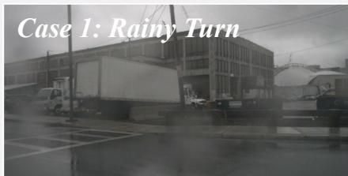

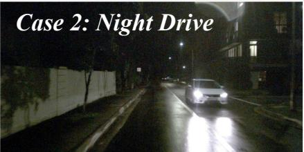

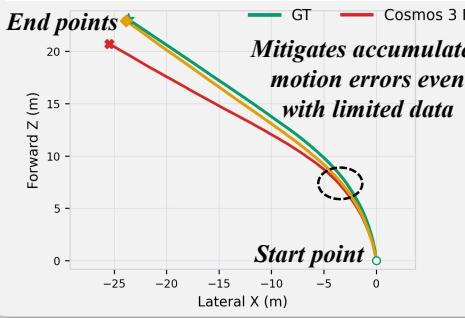

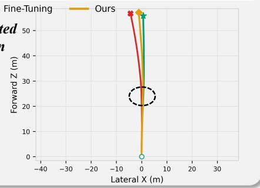  
Figure 5: Qualitative inverse dynamics evaluation on representative nuScenes scenes.

Let $( \mathbf { d } _ { l } , \theta _ { l } )$ denote the planar translation and relative heading change obtained from the action token $\mathbf { a } _ { l }$ after SE(2) projection, and let $( \hat { \mathbf { d } } _ { l } , \hat { \theta } _ { l } )$ denote their predicted results. We define the corresponding local errors as $\delta \mathbf { d } _ { l } = \hat { \mathbf { d } } _ { l } - \mathbf { d } _ { l }$ and $\delta \theta _ { l } = \hat { \theta } _ { l } - \theta _ { l }$ . The composed position and heading at horizon h are given by:

$$
\mathbf { p } _ { h } = \sum _ { l = 1 } ^ { h } \mathbf { R } { \left( \psi _ { l - 1 } \right) } \mathbf { d } _ { l } , \qquad \psi _ { h } = \sum _ { l = 1 } ^ { h } \theta _ { l } ,\tag{14}
$$

where $\psi _ { 0 } = 0$ and $\mathbf { R } ( \psi )$ denotes the planar rotation matrix. For the heading component, the accumulated error is equal to:

$$
\delta \psi _ { h } = \sum _ { l = 1 } ^ { h } \delta \theta _ { l } .\tag{15}
$$

As for the position component, the heading error further changes the orientation of subsequent translations via the first-order approximation:

$$
{ \bf R } ( \psi + \delta \psi ) \approx { \bf R } ( \psi ) + { \bf R } ( \psi ) { \bf S } \delta \psi , \qquad { \bf S } = \left[ \begin{array} { c c } { 0 } & { - 1 } \\ { 1 } & { 0 } \end{array} \right] .\tag{16}
$$

The accumulated position error can be approximated as:

$$
\delta \mathbf { p } _ { h } \approx \sum _ { l = 1 } ^ { h } \mathbf { R } ( \psi _ { l - 1 } ) \delta \mathbf { d } _ { l } + \sum _ { l = 1 } ^ { h - 1 } \left[ \sum _ { j = l + 1 } ^ { h } \mathbf { R } ( \psi _ { j - 1 } ) \mathbf { S } \mathbf { d } _ { j } \right] \delta \theta _ { l } .\tag{17}
$$

The first term describes the accumulated effect of local translation errors, while the second term shows that a heading error at step l perturbs every subsequent translationfrom step l + 1 to h.

Since $\mathbf { R } ( \psi )$ and $\mathbf { S }$ preserve the Euclidean norm, Eq. 17 further gives:

$$
\| \delta \mathbf { p } _ { h } \| _ { 2 } \lesssim \sum _ { l = 1 } ^ { h } \| \delta \mathbf { d } _ { l } \| _ { 2 } + \sum _ { l = 1 } ^ { h - 1 } D _ { l , h } | \delta \theta _ { l } | , \qquad D _ { l , h } = \sum _ { j = l + 1 } ^ { h } \| \mathbf { d } _ { j } \| _ { 2 } .\tag{18}
$$

Here, $D _ { l , h }$ corresponds to the remaining travel distance after step l. Therefore, even for heading errors of the same magnitude, errors occurring earlier in the sequence generally induce larger positional deviations because they affect a longer portion of the subsequent trajectory.

Eq. 6 illustrates that the reconstructed action error is proportional to the RF velocity error for a fixed noise level $\sigma .$ . Therefore, minimizing $\mathcal { L } _ { \mathrm { R F } }$ reduces local prediction errors in the action-token space. As we mentioned above, it does not explicitly account for the geometric amplification introduced by sequential composition, i.e., Eq. 18 shows that local errors with similar token-wise magnitudes can have different effects on the composed trajectory depending on their type and temporal location. Moreover, errors with opposite signs may partially cancel, whereas small systematic biases can accumulate coherently over time as shown in Figure 2 (top). Consequently, accurate token-wise reconstruction alone does not guarantee accurate long-horizon position and heading estimation. To this end, for each supervised horizon h, we define:

$$
\ell _ { h } = \rho ( \delta \mathbf { p } _ { h } ) + \lambda _ { \psi } \rho ( \delta \psi _ { h } ) ,\tag{19}
$$

here $\begin{array} { r } { \mathcal { L } _ { \mathrm { g e o } } = \sum _ { h \in \mathcal { H } } \ell _ { h } } \end{array}$ . Based on the first-order eq. in Section 4.2:

$$
\delta \tau _ { h } \approx - \sigma \mathbf { J } _ { h } \delta \mathbf { v } _ { 1 : h } .\tag{20}
$$

The trajectory-level correction propagated to the RF prediction satisfies:

$$
\nabla _ { \delta \mathbf { v } _ { 1 : h } } \ell _ { h } \approx - \sigma \mathbf { J } _ { h } ^ { \top } \nabla _ { \delta \pmb { \tau } _ { h } } \ell _ { h } .\tag{21}
$$

Eventually, the correction to the RF prediction is modulated by its geometric effect on the composed trajectory through $\mathbf { J } _ { h } ^ { \top }$ rather than being determined solely by its error magnitude in the original action space. Particularly, error components that induce larger long-horizon position or heading deviations receive correspondingly stronger trajectory-level corrections. Furthermore, we devise multiple-horizon supervision to prevent errors from being hidden by later compensation. A loss considered only on the final state may remain limited when deviations at intermediate steps are partially canceled by subsequent motions. In contrast, evaluating the composed state at multiple $h \in \mathcal H$ constrains intermediate prefixes as well as the final trajectory state, thereby providing more direct supervision over the temporal evolution of accumulated errors.

Furthermore, as mentioned in Section 4.2, the RF objective is trained over the full sampled noise schedule, whereas the gate $m ( \sigma ) = \mathbb { I } \left[ 0 . 2 \leq \sigma \leq 0 . 7 \right]$ applies only to $\mathcal { L } _ { \mathrm { g e o } }$ . Specifically, with a low $\sigma ,$ the geometry-aware auxiliary supervision becomes weak since its gradient with respect to the RF prediction is proportional to σ (Eq. 21). Besides, with a large $\sigma _ { \mathrm { { : } } }$ , the heavily corrupted action makes the reconstructed trajectory unreliable. We therefore only consider the moderate range $\sigma _ { \mathrm { m i n } } = 0 . 2$ and $\sigma _ { \mathrm { m a x } } = 0 . 7$ for our geometry-aware objective.

Ablation studies on the threshold $\eta .$ For each rollout g, AVFE reconstructs the ego-action sequence as $\hat { \mathbf { a } } _ { g } = \mathcal { E } _ { \phi } ( \mathbf { I } _ { q } ^ { \mathcal { W } } )$ . To measure the discrepancy, we compare the two trajectories $( i . e . , \hat { \mathbf { a } } _ { g }$ and $\mathbf { a } _ { g } )$ at $T = 4 8$ matched timestamps $( i . e .$ , 12 Hz, 4 seconds) using Average Displacement Error, Final Displacement Error, and mean absolute yaw error $e _ { g } ^ { \mathrm { y a w } }$ with angular differences wrapped to $[ - \pi , \pi )$ To achieve robust relative trajectory errors, we define the normalized discrepancy score by:

$$
S _ { g } = \operatorname* { m a x } \left\{ \frac { \mathrm { A D E } _ { g } } { 0 . 1 0 \operatorname* { m a x } ( \overline { { L } } _ { g } , 1 \mathrm { m } ) } , \frac { \mathrm { F D E } _ { g } } { 0 . 1 5 \operatorname* { m a x } ( L _ { g , T } , 1 \mathrm { m } ) } , \frac { e _ { g } ^ { \mathrm { y a w } } } { 1 0 ^ { \circ } } \right\} ,\tag{22}
$$

Table 6: Ablation studies of the filtering threshold η on nuScenes.
<table><tr><td>Setting</td><td>Obj. Col.↓</td><td>Lane Viol.↓</td><td>Progress↑</td><td>Comfort↑</td><td>Clearance↑</td><td>DS↑</td></tr><tr><td>DiffusionDrive</td><td>266</td><td>772</td><td>0.694</td><td>0.866</td><td>0.392</td><td>0.526</td></tr><tr><td> $\eta = 0 . 2 5$ </td><td>209</td><td>624</td><td>0.691</td><td>0.869</td><td>0.382</td><td>0.565</td></tr><tr><td> $\eta = 0 . 5 0$ </td><td>205</td><td>630</td><td>0.707</td><td>0.883</td><td>0.384</td><td>0.575</td></tr><tr><td>η = 0.75 (default)</td><td>189</td><td>562</td><td>0.717</td><td>0.883</td><td>0.380</td><td>0.588</td></tr><tr><td> $\eta = 1 . 2 5$ </td><td>184</td><td>587</td><td>0.717</td><td>0.882</td><td>0.380</td><td>0.585</td></tr><tr><td> $\eta = 1 . 5 0$ </td><td>211</td><td>627</td><td>0.709</td><td>0.884</td><td>0.381</td><td>0.576</td></tr></table>

where $\boldsymbol { L } _ { g , t }$ denotes the cumulative travel distance of the input trajectory up to step t, and $\overline { { { L } } } _ { g } = $ $T ^ { - 1 } \sum _ { t = 1 } ^ { T } { \cal L } _ { g , t }$ . For valid AVFE estimates, we retain rollouts with $S _ { g } \ \leq \ \eta .$ , setting $\eta = 0 . 7 5$ by default. Here, 0.10 and 0.15 are fixed coefficients. Note that we skip the sample with $| \mathcal { G } | \le 1$

Moreover, we present the ablations of $\eta$ under different settings with DiffusionDrive on nuScenes as shown in Table 6. As η increases to 0.75, more rollouts with limited discrepancies are retained, progressively improving DS. However, further increasing η leads to a reduction in DS, suggesting that including less faithful rollouts introduces noise into RL post-training $( i . e .$ , similar to RL with Cosmos3-FT as shown in Table 5). We therefore adopt $\eta = 0 . 7 5$ as the default, which achieves the highest DS and the fewest unsafe scenes, which further supports the effectiveness of rollout filtering.

## E MORE DETAILS OF REWARD TERMS

We calculate all reward terms in the ego-centric coordinate system for the rollout trajectory at each closed-loop decision step. For safety evaluation, we check the motion against surrounding dynamic objects and non-crossable lane boundaries. If the ego trajectory collides with a dynamic object or crosses a forbidden lane boundary, the rollout receives a terminal penalty with $c _ { \mathrm { f a i l } } ~ = ~ - 5 . 0$ and is stopped immediately. Otherwise, we compute dense safety scores from the minimum object clearance $d ^ { \mathrm { o b j } }$ and lane-boundary clearance $d ^ { \mathrm { { l a n e } } }$ . In our implementation, both clearance terms use the danger threshold $\delta ^ { - } \ = \ 1 . 5 \mathrm { m }$ and the safe threshold $\delta ^ { + } ~ = ~ 3 . 0 \mathrm { m }$ . For driving quality, we consider progress and comfort. The progress score measures the displacement toward the expert future endpoint, while the comfort score penalizes large speed changes along the trajectory with $\Delta v _ { \mathrm { m a x } } = 2 . 5 \mathrm { m / s }$ . The final reward is a weighted average of progress, comfort, and clearance (replaced with centering on the in-house dataset) with weights 5, 3, and 2, respectively. Each non-terminal transition receives a dense reward, while terminal safety failures provide immediate negative feedback.

For nuScenes, the ego vehicle is represented by an oriented bounding box of size $\mathrm { 4 . 0 8 4 m \times 1 . 8 5 m }$ whose center is shifted forward by 0.5 m along the executed ego heading, following Diffusion-Drive (Liao et al., 2025) and SparseDrive (Sun et al., 2025). A collision is detected when the filled ego polygon intersects an object polygon, where physical contact is also regarded as a collision. Cars and trucks are checked at all 12 Hz rollout frames (Gao et al., 2025b), while the remaining valid nuScenes object categories are additionally included at their exact annotated keyframes. The object clearance $d ^ { \mathrm { { \tilde { o b j } } } }$ is the minimum polygon-to-polygon distance over the executed trajectory. For lane-boundary checking, we use non-crossable road-boundary polylines provided by the nuScenes map annotations. A boundary violation occurs when the filled ego polygon intersects a non-crossable boundary polyline, and the lane-boundary clearance $d ^ { \mathrm { l a n e } }$ is their minimum polygon-to-polyline dis tance. Consequently, both object collisions and boundary violations have zero geometric clearance. Since the official nuScenes only provides 2 Hz annotations of keyframes, we therefore replace the centering term with clearance scores $( i . e .$ , there exists label noise of lanes (Gao et al., 2025b)).

For the in-house dataset, we retain the original collision and non-crossable lane-boundary violation criteria. A collision or boundary violation results in the same terminal penalty $c _ { \mathrm { f a i l } } = - 5 . 0$ . Unlike the fixed ego footprint used for nuScenes, the oriented vehicle polygons are constructed according to the physical dimensions of the corresponding vehicles. Note that clearance is not included as an independent reward term. Instead, the clearance scores are used to gate the raw progress score by $\begin{array} { r } { q ^ { \mathrm { p r o g } } = \frac { e _ { \mathrm { p r o g } } } { e _ { \mathrm { m a x } } } } \end{array}$ · min $( q ^ { \mathrm { o b j } } , q ^ { \mathrm { l a n e } } )$ . In addition, the centering term is evaluated only when valid lane boundaries are located within 12 m. When the centering term is unavailable, it is omitted and the remaining valid terms are re-normalized.

Table 7: Open-loop model performance on 1K test scenes in terms of ADE and FDE.
<table><tr><td>Model</td><td>ADE Median ↓</td><td>ADE Mean ↓</td><td>FDE Median ↓</td><td>FDE Mean ↓</td></tr><tr><td>TransFuser (Chitta et al., 2022)</td><td>0.060</td><td>0.075</td><td>0.116</td><td>0.146</td></tr><tr><td>GTRS (Li et al., 2025d)</td><td>0.052</td><td>0.049</td><td>0.105</td><td>0.104</td></tr></table>

## F MORE IMPLEMENTATION DETAILS

We implement our method and all baselines in PyTorch (Paszke et al., 2019). All experiments are conducted on 6 nodes with 8 H800 GPUs each. For AVFE training, we set $\lambda _ { \mathrm { g e o } } ~ = ~ 1 0 ^ { - 3 }$ and $\lambda _ { \psi } = 5 . 0$ . Geometry supervision is activated for $\sigma \in [ 0 . 2 , 0 . 7 ]$ at $\mathcal { H } = \{ 0 . 5 , 1 . \breve { 0 } , 2 . 0 , 4 . 0 , 6 . 0 \} \mathrm { s }$ We use Smooth- $. L _ { 1 }$ parameters $\beta _ { p } = 1 . 0$ m and $\beta _ { \psi } = 0 . 1 \mathrm { r a d }$ $e _ { \operatorname* { m a x } } = 1 0 \mathrm { r }$ m, and $\epsilon = 1 0 ^ { - 1 2 }$ . Based on $\eta = 0 . 7 5$ , AVFE is applied only when a rollout contains a world-model observation subsequently consumed by the policy and its ego speed remains above $0 . 6 \mathrm { m } / \mathrm { s }$ . Otherwise, ego speeds at or below the above threshold are set to zero to suppress low-speed jitter. We independently sample one RF noise level for each action sequence from a shifted logit-normal schedule with a shift of 10 without additional high-noise sampling.

For nuScenes, all baselines are verified under the same and fair pipeline based on their official checkpoints. We use a 48-frame horizon consisting of two consecutive 24-frame rollouts. At each stage, the planner enumerates six first-stage trajectory candidates, and each non-terminal candidate is further expanded into six second-stage candidates, forming a logical rollout group (up to $6 \times 6 = 3 6 )$ of two-stage trajectories per scene. The global scene batch size is set to 4 and the group size is set to $G = 6$ . We set $\gamma = 0 . \dot { 9 } 9 , \beta = 0 . 4 , \alpha = 1 . 0 , \lambda = 1 0 ^ { - 3 }$ , and the advantage clipping threshold to $A _ { \mathrm { m a x } } = 3 . 0$ . The sampling temperature is set to 1.0. We use AdamW with an initial learning rate of $1 0 ^ { - 4 }$ and a weight decay of 0.01. The learning rate is reduced to $3 \times 1 0 ^ { - 5 }$ after 50 updates and to $1 0 ^ { - 5 }$ after 100 updates. The gradient clipping norms are set to 10.0 for reinforcement learning and 30.0 for hard scene revision. Hard scene revision is performed every four updates with a hard scene queue size of 4. We optimize the classification and regression layers using the base learning rate and the remaining trainable decoder layers using 0.1 times the base learning rate.

For the in-house dataset, all planners are initialized from supervised imitation-learning checkpoints, with the default 20K iterations and batch size 32. During reinforcement post-training, the original imitation-trained planner is frozen as the reference policy $\pi _ { \mathrm { r e f } }$ , while an additional trainable copy is optimized by RoXDrive. X-World (Zheng et al., 2026a) is also kept frozen and is used only as the closed-loop interaction environment. The global scene batch size is set to 10. For each sampled scene, we initialize $G = 4$ parallel X-World sessions from the same initial state. Each rollout worker samples a trajectory candidate from the current planner and sends the selected action to a world-model session. The generated future observation is then fed back to the planner for the next decision step. Unless otherwise specified, each scenario contains 105 frames, and we perform closed-loop rollout for up to 80 future frames. For policy optimization, we use AdamW as the optimizer and set the KL coefficient to $\beta = 0 . 0 1$ , entropy coefficient to $\lambda = 1 0 ^ { - 3 }$ , hard-scene revision weight to $\alpha = 1 . 0$ , advantage clipping threshold to $A _ { \mathrm { m a x } } = 3 . 0 $ , sampling temperature to 1.0, gradient clipping norm to 1.0, and learning rate to $1 0 ^ { - 4 }$ We set the maximum number of training iterations to 2K, i.e., up to 20K scenes for closed-loop model training. Besides, we maintain an online hard-scene queue for scenes in which all sampled rollouts fail to satisfy the safety-progress criterion. These hard scenes are replayed with expert supervision to prevent the policy from drifting into unrecoverable unsafe modes. The hard-scene queue size is set to 4, and at most 10 steps per hard scene are used for revision. As for multi-modal planning, we add and fine-tune an anchorselection head that predicts a probability distribution over 3,394 trajectory anchors of RAD (Gao et al., 2025a) and an offset regression head for trajectory refinement. We train the modified models to convergence on the large-scale training data under the open-loop setting.

## G MORE EXPERIMENTAL RESULTS

Training at scale with long-horizon sequences. 1) Table 7 shows that both baselines are well pretrained under the standard open-loop setting, achieving low Average Displacement Errors (ADE) and Final Displacement Errors (FDE) on the 1K test scenes. 2) However, open-loop imitation accuracy is not sufficient to ensure robust closed-loop performance. As shown in Table 8, both imitation-only baselines suffer from severely unsafe terminations when verified in closed-loop rollouts, leading to unsatisfactory closed-loop metrics. 3) By applying RoXDrive, closed-loop safety and overall driving quality are consistently improved, i.e., the total failure count is reduced by 17.2% on TransFuser and 20.6% on GTRS, revealing that our method provides consistent gains across various architectures. Meanwhile, RoXDrive calibrates ego progress to a more reasonable range and substantially improves comfort, while maintaining stable centering without biasing the planner toward aggressive modes. 4) Figure 6 further illustrates the training process of RoXDrive. Starting from the original policy, the right segment reports the performance of RL models (interval is set to 100 steps). The shaded regions indicate the improvements, showing that RoXDrive progressively reduces safety failures while improving overall driving quality. We further report the closed-loop performance of GTRS under various maximum frame horizons to illustrate the effectiveness of the proposed method, as shown in Table 9.

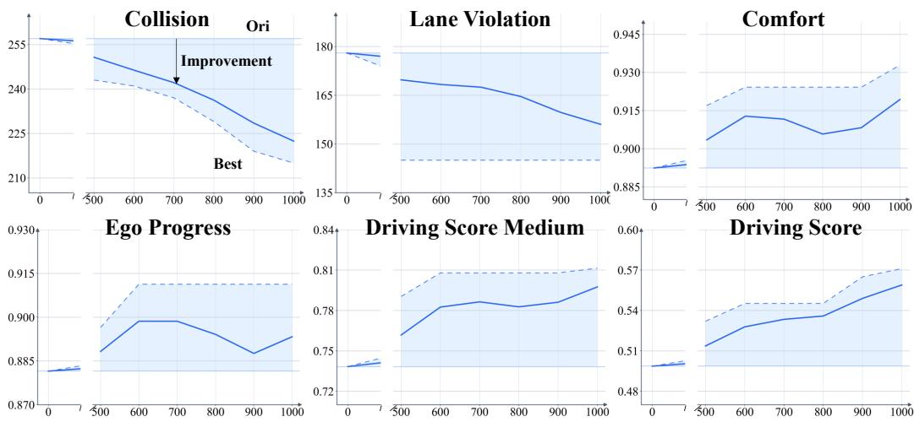  
Figure 6: Quantitative trends on test scenes during RL based on TransFuser.

Table 8: Closed-loop model performance on 1K test scenes with a default frame horizon of 80.
<table><tr><td>Model</td><td>Collision Scene ↓</td><td>Lane Violation ↓</td><td>Ego Progress ↑</td><td>Comfort ↑</td><td>Centering ↑</td><td>Driving Score ↑</td></tr><tr><td>TransFuser (Chitta et al., 2022)</td><td>257</td><td>178</td><td>0.881</td><td>0.892</td><td>0.540</td><td>0.498</td></tr><tr><td>+ RoXDrive (Ours)</td><td>215</td><td>145</td><td>0.900</td><td>0.932</td><td>0.539</td><td>0.571</td></tr><tr><td>GTRS (Li et al., 2025d)</td><td>264</td><td>164</td><td>0.930</td><td>0.917</td><td>0.532</td><td>0.522</td></tr><tr><td>+ RoXDrive (Ours)</td><td>214</td><td>126</td><td>0.890</td><td>0.967</td><td>0.551</td><td>0.607</td></tr></table>

Table 9: Closed-loop performance of GTRS under different maximum frame horizons (MF).
<table><tr><td>Model</td><td>MF</td><td>Object Collision</td><td>Lane Violation</td><td>Progress</td><td>Comfort</td><td>Centering</td><td>Driving Score</td></tr><tr><td rowspan="2">GTRS (Li et al., 2025d) + RoXDrive</td><td>20</td><td>31</td><td>19</td><td>0.968</td><td>0.918</td><td>0.564</td><td>0.859</td></tr><tr><td></td><td>31</td><td>17</td><td>0.944</td><td>0.966</td><td>0.565</td><td>0.866</td></tr><tr><td rowspan="2">GTRS + RoXDrive</td><td>40</td><td>73</td><td>50</td><td>0.952</td><td>0.918</td><td>0.553</td><td>0.791</td></tr><tr><td></td><td>60</td><td>36</td><td>0.922</td><td>0.966</td><td>0.556</td><td>0.814</td></tr><tr><td rowspan="2">GTRS + RoXDrive</td><td>60</td><td>202</td><td>123</td><td>0.938</td><td>0.917</td><td>0.539</td><td>0.615</td></tr><tr><td></td><td>160</td><td>97</td><td>0.901</td><td>0.967</td><td>0.555</td><td>0.682</td></tr><tr><td rowspan="2">GTRS + RoXDrive</td><td>80</td><td>264</td><td>164</td><td>0.930</td><td>0.917</td><td>0.532</td><td>0.522</td></tr><tr><td></td><td>214</td><td>126</td><td>0.890</td><td>0.967</td><td>0.551</td><td>0.607</td></tr></table>

More ablation studies. To examine reward components and horizon lengths, we present the results under different settings based on TransFuser as shown in Table 10. Compared with imitation-only, adding driving-quality terms leads to aggressive progress but causes more failures, leading to a lower DS. By adding penalty terms, the planner obviously improves safety and calibrates ego progress, whereas using the full reward yields the best overall performance. Besides, RoXDrive consistently improves model performance across all horizons with larger gains in longer rollouts $( i . e . ,$ , more difficult), which further demonstrates our effectiveness.

Table 10: Ablation studies on reward components and the horizon lengths on the 1K test scenes.  
(a) Reward components $R _ { \mathrm { c o l } } , R _ { \mathrm { l a n e } } ,$ and $R _ { \mathrm { d q } }$ denote the collision, lane violation, and driving-quality terms.
<table><tr><td>TransFuser</td><td> $R _ { \mathrm { c o l } }$ </td><td> $R _ { \mathrm { l a n e } }$ </td><td> $R _ { \mathrm { d q } }$ </td><td>Obj. Col. ↓</td><td>Lane Viol. ↓</td><td>Progress ↑</td><td>Comfort ↑</td><td>Centering ↑</td><td>DS↑</td></tr><tr><td>√</td><td>X</td><td>X</td><td>X</td><td>257</td><td>178</td><td>0.881</td><td>0.892</td><td>0.540</td><td>0.498</td></tr><tr><td>√</td><td>X</td><td>X</td><td>√</td><td>372</td><td>185</td><td>0.943</td><td>0.860</td><td>0.529</td><td>0.396</td></tr><tr><td>√</td><td>√</td><td>X</td><td>√</td><td>241</td><td>164</td><td>0.911</td><td>0.924</td><td>0.537</td><td>0.545</td></tr><tr><td>√</td><td>X</td><td>√</td><td>√</td><td>229</td><td>156</td><td>0.889</td><td>0.899</td><td>0.539</td><td>0.539</td></tr><tr><td>√</td><td>√</td><td>√</td><td>√</td><td>215</td><td>145</td><td>0.900</td><td>0.932</td><td>0.539</td><td>0.571</td></tr></table>

(b) Horizon lengths, at 12 Hz, 8 points per action
<table><tr><td>Actions</td><td>Model</td><td>Obj. Col. ↓</td><td>Lane Viol. ↓</td><td>Progress ↑</td><td>Comfort ↑</td><td>Centering ↑</td><td>DS↑</td></tr><tr><td rowspan="2">5 (3.33s)</td><td>TransFuser</td><td>74</td><td>55</td><td>0.915</td><td>0.892</td><td>0.550</td><td>0.768</td></tr><tr><td>+ RoXDrive</td><td>63</td><td>46</td><td>0.927</td><td>0.932</td><td>0.553</td><td>0.795</td></tr><tr><td rowspan="2">8 (5.33s)</td><td>TransFuser</td><td>199</td><td>126</td><td>0.892</td><td>0.893</td><td>0.543</td><td>0.593</td></tr><tr><td>+ RoXDrive</td><td>163</td><td>104</td><td>0.910</td><td>0.933</td><td>0.544</td><td>0.659</td></tr><tr><td rowspan="2">10 (6.67s)</td><td>TransFuser</td><td>257</td><td>178</td><td>0.882</td><td>0.892</td><td>0.541</td><td>0.499</td></tr><tr><td>+ RoXDrive</td><td>215</td><td>145</td><td>0.900</td><td>0.933</td><td>0.540</td><td>0.571</td></tr></table>

## H MORE QUALITATIVE RESULTS

In this part, we provide additional qualitative results showing how RoXDrive improves the model by avoiding collisions and lane-boundary violations, as shown in Figures 7, 8, 9, 10, 11, 12, 13 and 14. We strongly recommend that readers watch the video demos in the supplementary materials.

## I LIMITATIONS AND FUTURE DIRECTIONS

Reliability of world models and real-world deployment. Although RoXDrive enables actionvision faithfulness evaluation, ego-action faithfulness alone may not always guarantee the correctness of the entire simulated environment. Thanks to the strong generalization capability of X-World, we achieve accurate scene-controlled video generation on nuScenes, even with fine-tuning on only hundreds of 20 s training scenes supplemented with model-predicted annotations (i.e., label noise). Currently, physically consistent scene evolution and realistic responses of surrounding agents to novel ego actions remain important challenges, particularly beyond the logged data distribution. It would be better if future work extended simulation assessment beyond ego-motion consistency to scene geometry and multi-agent interactions, and verified the policy improvements under real-world driving conditions.

Scalability of closed-loop exploration. High-fidelity multi-camera video generation remains computationally expensive, limiting both interaction horizons and exploration breadth. This creates a practical trade-off between simulation fidelity and the interaction scale, while rare events and long-horizon driving decisions usually need to be further explored. Although RoXDrive improves learning from reliable rollouts, this underlying bottleneck needs more consideration and discussion.

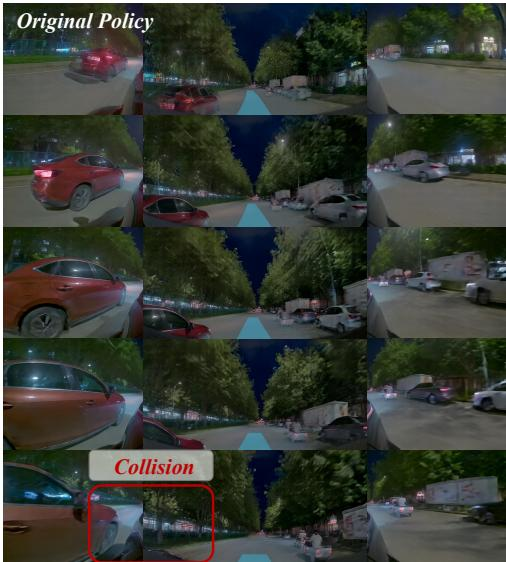

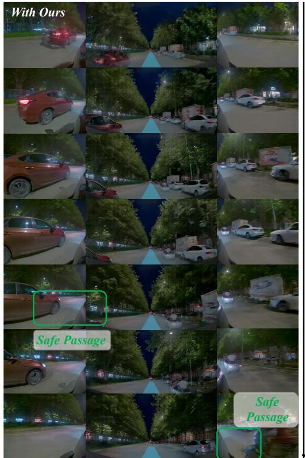  
Figure 7: Qualitative results of RoXDrive avoiding the collision on the in-house dataset.

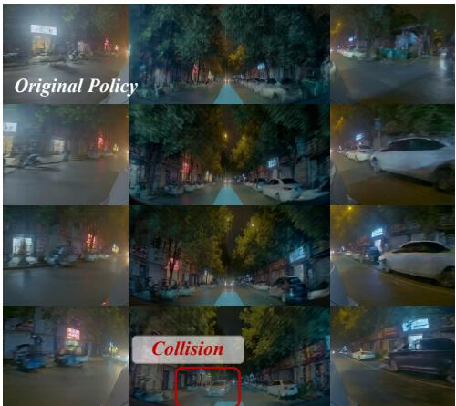

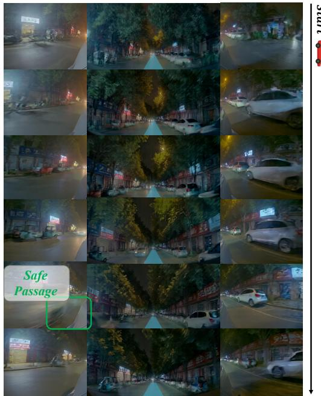  
Figure 8: Qualitative results of RoXDrive avoiding the collision on the in-house dataset.

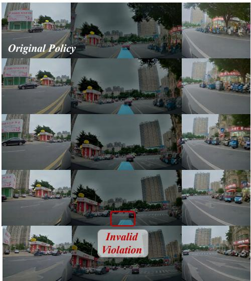

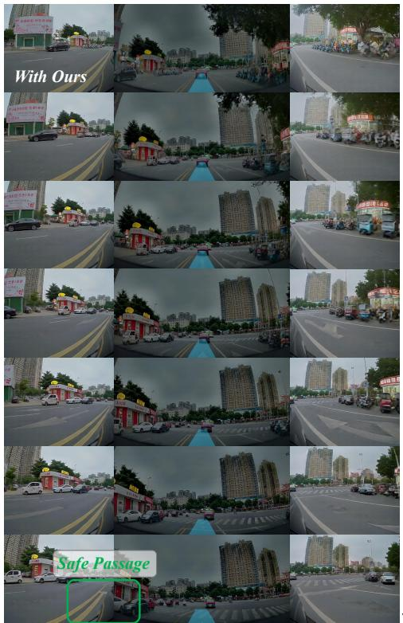  
Figure 9: Qualitative results of RoXDrive avoiding lane violations on the in-house dataset.

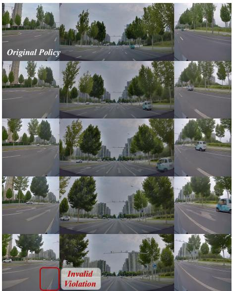

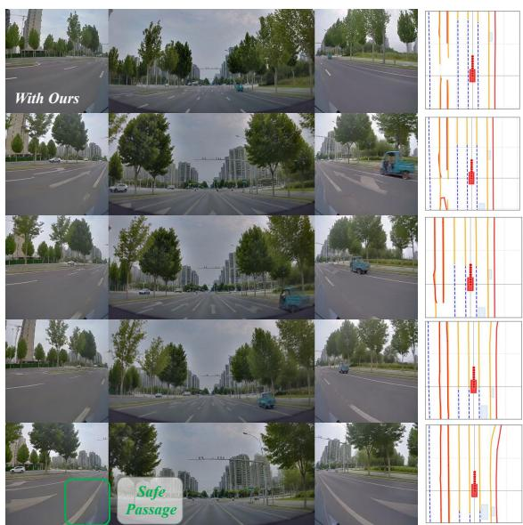  
Figure 10: Qualitative results of RoXDrive avoiding lane violations on the in-house dataset.

Original Model  
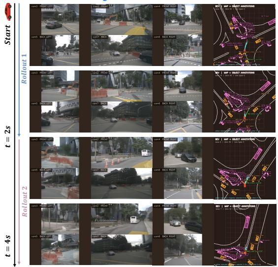

With Our RoXDrive  
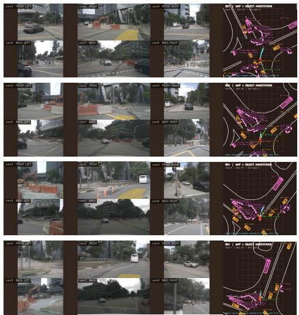

Figure 11: Additional qualitative results of RoXDrive mitigating the causal confusion on nuScenes.  
Original Model  
With Our RoXDrive  
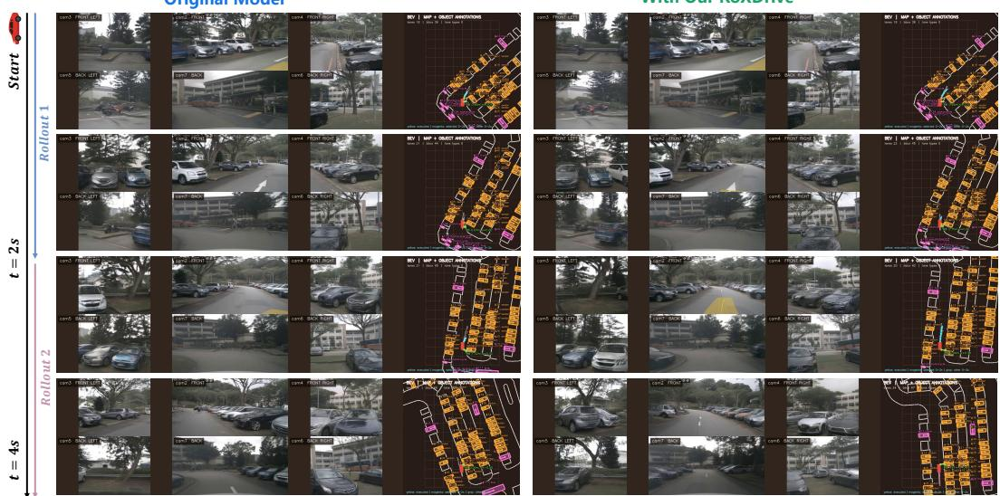  
Figure 12: Additional qualitative results of RoXDrive mitigating the causal confusion on nuScenes.

Original Model  
With Our RoXDrive  
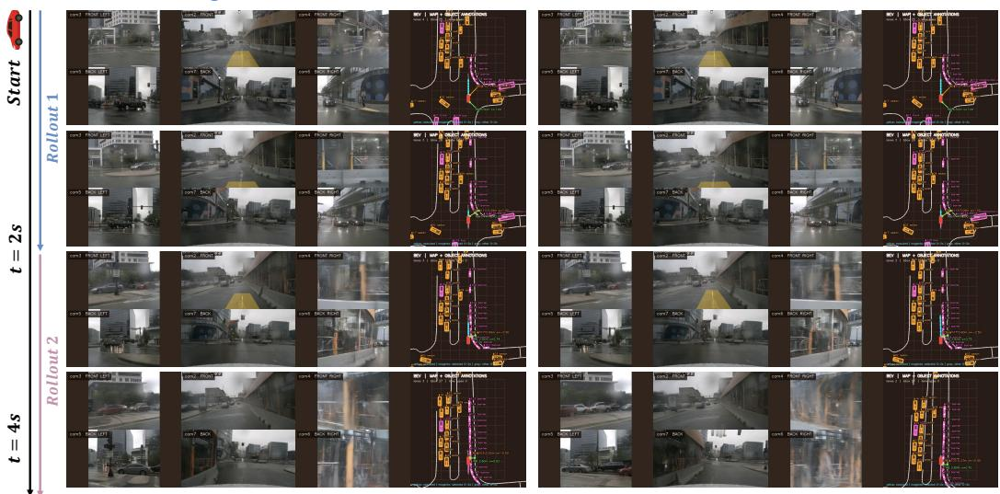  
Figure 13: Additional qualitative results of RoXDrive mitigating the causal confusion on nuScenes.

Original Model  
With Our RoXDrive  
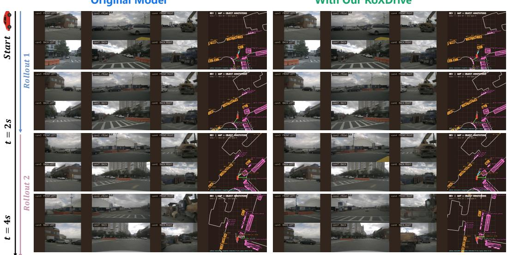  
Figure 14: Additional qualitative results of RoXDrive mitigating the causal confusion on nuScenes.