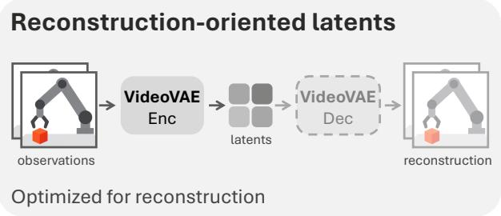
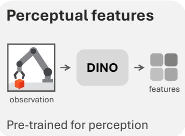
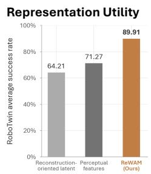
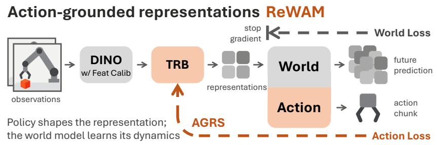
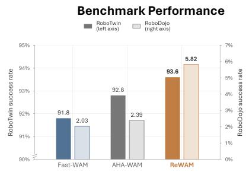
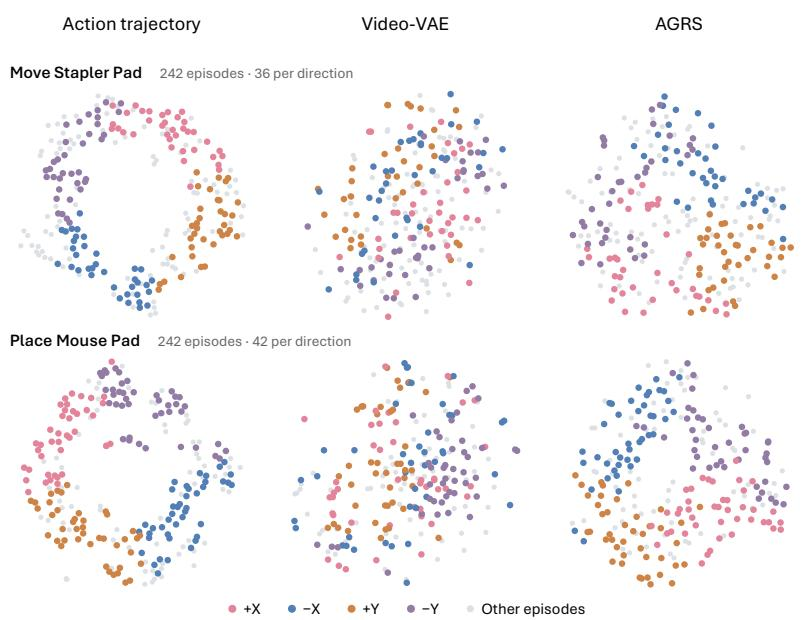
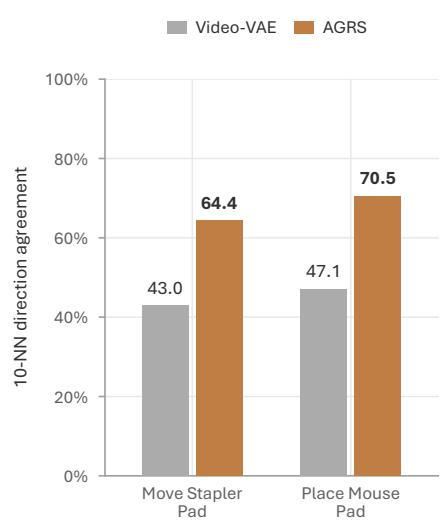
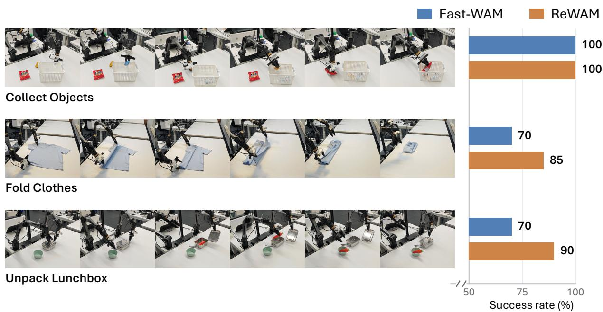

# Rethinking Representations for World-Action Modeling

Haoyi Jiang1,∗, Liu Liu3,†, Xinjiang Wang3, Zhihao Sun4, Zequn Chen3, Sen Wang5, Xinjie Wang3, Xia Chen3, Jingfeng Yao1, Weiheng Zhao1, Shanglin Yuan1, Zhizhong Su3, Wei Sui2, Wenyu Liu1, Xinggang Wang1,‡

1Huazhong University of Science & Technology, 2D-Robotics, 3Horizon Robotics, 4Fudan University, 5Xi'an Jiaotong University

∗Intern at D-Robotics, †Project leader, ‡Corresponding author

World-action models jointly learn robot policies and predict future observations, making the representation space an interface between control and prediction. We study the design of this space through controlled comparisons, finding that neither reconstruction fidelity nor pre-trained perceptual features alone ensure efective policy learning. These findings motivate ReWAM, a representation-centric world-action model built on pre-trained DINO features. Feature Calibration and a Temporal Representation Bottleneck organize these features into compact world states suited to dynamics modeling. Action-Grounded Representation Shaping routes only action-loss gradients to the bottleneck, thereby letting the policy shape what the representation encodes while the world model learns how it evolves. Without generative video pre-training, ReWAM achieves 93.6% success on RoboTwin 2.0. On RoboDojo, it achieves an average score of 12.29 and a success rate of 8.28% using approximately 600 hours of embodied pre-training data.

Code: https://github.com/hustvl/ReWAM Contact: Haoyi Jiang at haoyi\_jiang@hust.edu.cn Correspondence: Xinggang Wang at xgwang@hust.edu.cn

## 1 Introduction

World-action models (WAMs) jointly learn robot policies and predict how the world evolves. Many recent WAMs [1–4] build on pre-trained video generators and predict future observations in the latent space of a video variational autoencoder (Video-VAE). These models inherit dynamics priors from large-scale generative video pre-training, but their latent spaces are typically optimized for visual reconstruction. Such spaces may preserve fine-grained appearance details without explicitly prioritizing information relevant to control.

The role of world prediction extends beyond producing explicit visual rollouts. Fast-WAM [4] retains video co-training while removing future-video denoising at deployment, suggesting that prediction can benefit policies through joint training. This raises a fundamental question: How should the representation space for world-action modeling be defined?

Representation-space WAMs use pre-trained perceptual features or learned visual-action tokenizers [5–7]. Comparative studies show that reconstruction fidelity alone is insuficient to assess control utility [8, 9]. Our experiments support this distinction: without generative video pre-training, raw DINO features outperform Video-VAE latents on RoboTwin 2.0 [10], despite lower pixel-reconstruction SSIM. Reconstruction-oriented latents therefore do not by themselves establish efective representations for policy learning.

Perceptual features are also not necessarily well suited to dynamics modeling: frame-wise features do not explicitly encode temporal variation, and their statistics may be poorly matched to difusion training. Calibrating DINO features through multi-layer aggregation, normalization, and a representation-aware difusion noise schedule improves average success on RoboTwin 2.0 by 12.20 percentage points. Representation design thus extends beyond the choice of encoder. It must also address how features are prepared for prediction, organized over time, and adapted to the needs of control.

  
Figure 1: Overview of representations for world-action modeling. Top-left: Video-VAE latents are optimized for visual reconstruction. Top-right: Frozen DINO features inherit priors from perceptual pretraining. Bottom: ReWAM uses a Temporal Representation Bottleneck (TRB) to form compact world states from calibrated DINO features. Action-Grounded Representation Shaping (AGRS) trains the TRB through asymmetric routing of action-loss gradients, while the world model learns state transitions.

We propose a division of roles: the policy shapes what the representation encodes, while the world model learns how that representation evolves. We introduce ReWAM, a representationcentric WAM that implements this principle through Action-Grounded Representation Shaping (AGRS). Feature Calibration prepares frozen DINO features for difusion modeling, and a Temporal Representation Bottleneck (TRB) organizes them into compact world states. During joint training, AGRS routes only action-loss gradients to the bottleneck, adapting the representation to action prediction. The world model learns how this representation evolves without updating it through its own prediction loss. Fig. 1 provides an overview of ReWAM.

Without generative video pre-training, ReWAM achieves 93.6% success in both the clean and random set tings of RoboTwin 2.0 and leads the compared methods without embodied pre-training on RoboDojo [11]. Embodied pre-training further improves its RoboDojo average score to 12.29 and success rate to 8.28%. Together with real-robot evaluations, these findings highlight a promising path for world-action modeling based on pre-trained perceptual priors and representations shaped by the demands of control, without relying on generative video pre-training.

Our contributions are threefold:

• We show through controlled comparisons that reconstruction fidelity alone is insuficient for choosing WAM representations, and that perceptual features benefit from calibration for dynamics modeling.

• We introduce ReWAM, which lets the action objective shape a compact representation space for joint prediction and control.

• We demonstrate the efectiveness of this design without generative video pre-training across two simulation benchmarks and real-robot tasks.

## 2 Related Work

## 2.1 World-Action Models

Unified video and action models couple dynamics prediction with policy learning [12, 13]. Recent systems build on video generation through joint denoising [3] or interactions between world and action streams [1, 2, 14]. RxBrain [15] and Cosmos 3 [16] extend this framework to broader multimodal understanding and generation.

Other approaches expose intermediate generative features to the policy [17–19]. Fast-WAM [4] removes future-video denoising at deployment, while Faster-WAM [20] studies sparse interactions between video and action prediction under distribution shift. These studies motivate examining how the shared representation interface supports policy learning. Complementary work enriches visual prediction with geometric, motion, and semantic supervision [21–24], or aligns policy features with future visual representations [25, 26].

Representation-space approaches use pre-trained visual features for prediction and control. LDA-1B [5] and DexWorldModel [6] directly predict DINO features, while VLA-JEPA [27] and Being-H0.7 [28] use future observations to supervise latent representations that guide action generation. LaWAM [29] predict latent visual subgoals, and GAM [30] uses geometric foundation features for prediction and action decoding. Learned visual-action tokenizers adapt the interface between perception and control [7, 31, 32], while residual latent actions model changes in DINO features [33]. ReWAM builds on this line of work by calibrating and temporally organizing pre-trained features, then using asymmetric gradient routing to adapt the prediction space to the policy objective during joint world-action training.

## 2.2 Representations for Prediction and Generation

Predictive learning in visual feature spaces supports representation learning and world modeling, as explored by V-JEPA models [34, 35], DINO-world [36], and Spa3R [37].

Representation design also matters for generation. REPA [38, 39] and VA-VAE [40] align denoiser features and autoencoder latents, respectively, with pre-trained representations. The representation autoencoder (RAE) [41, 42] uses pre-trained encoders to define generative latent spaces, with subsequent work extending this approach to video generation [43, 44] and interactive world modeling [45].

Probing studies and comparative analyses examine what representations encode and how they support spatial understanding, dynamics prediction, and control [8, 9, 46, 47]. ReWAM addresses the complementary problem of how to construct and adapt a representation space for joint world prediction and policy learning.

## 3 ReWAM

## 3.1 Overview

ReWAM jointly learns an action policy and a predictor of future visual representations. Given the previous and current sampled multi-view observations $o _ { - 1 }$ and $o _ { 0 } ,$ proprioception $s _ { 0 }$ , and a language instruction $\ell ,$ the policy predicts an action chunk $a _ { 1 : H }$ . Here, H denotes the shared future time horizon, covered by actions and visual states at their respective sampling rates. With observations indexed at the image-sampling rate, ReWAM encodes non-overlapping pairs as

$$
z _ { j } = E _ { \phi } ( o _ { j - 1 } , o _ { j } ) .\tag{1}
$$

The encoder $E _ { \phi }$ combines a frozen DINOv3-L backbone, feature calibration, and a trainable TRB with parameters ϕ. The current state $z _ { 0 }$ conditions both branches, and $z _ { 1 : H }$ provide the world-prediction targets. Sampling and execution details appear in Appendix A.

Following Fast-WAM [4], ReWAM uses a Mixture-of-Transformers (MoT) architecture with world and action Difusion Transformer (DiT) branches, denoted by $W _ { \theta }$ and $A _ { \theta }$ . Both branches receive conditioning embeddings c of ℓ and $s _ { 0 }$ . Future-state and action tokens attend to current-state world features, but attention between the two token groups is blocked. The world branch uses causal temporal attention and independently sampled noise levels for future states, while the action branch predicts the entire action chunk a once. The conditional model therefore factorizes as

$$
p _ { \theta } ( z _ { 1 : H } , a _ { 1 : H } \mid z _ { 0 } , c ) = p _ { \theta } ( z _ { 1 : H } \mid z _ { 0 } , c ) p _ { \theta } ( a _ { 1 : H } \mid z _ { 0 } , c ) ,\tag{2}
$$

where θ denotes the trainable WAM parameters. Both branches are trained with flow matching. At inference, the world branch processes $z _ { \mathrm { 0 } }$ once to condition action generation, without generating future states.

## 3.2 Feature Calibration

Following RAE [41, 42], we calibrate DINO representations through multi-layer aggregation, normalization, and a representation-aware noise schedule.

Multi-layer aggregation. For each image and camera view, we extract patch features from DINOv3-L blocks $\mathcal { S } = \{ 1 2 , 1 4 , 1 6 , 1 8 , 2 0 , 2 2 , 2 4 \}$ , using one-based indexing. Let $F ^ { ( l ) } \in \mathbf { \hat { \mathbb { R } } } ^ { N \times d }$ denote the features from block l after non-afine LayerNorm and removal of special tokens, where N is the number of patches in that view and $d = 1 0 2 4$ . We average the selected layers and add the spatial mean of the final layer to every patch:

$$
F _ { p } ^ { \mathrm { M L A } } = { \frac { 1 } { | S | } } \sum _ { l \in S } F _ { p } ^ { ( l ) } + { \frac { 1 } { N } } \sum _ { q = 1 } ^ { N } F _ { q } ^ { ( 2 4 ) } , \qquad p = 1 , \ldots , N .\tag{3}
$$

This combines features across encoder depths with image-level context while preserving the patch grid and feature width.

Normalization. For the calibrated frozen-feature baseline in tab. 3, we standardize prediction targets using mean and variance estimates fixed before WAM training. In ReWAM, the TRB changes the prediction space during training, so we normalize its outputs with running statistics, as detailed in sec. 3.3.

Representation-aware noise schedule. Let $\tau \in [ 0 , 1 ]$ denote flow time, with $\tau = 0$ corresponding to clean data and $\tau = 1$ to Gaussian noise. Let D be the total number of scalar elements in the future prediction target, excluding the current state. Following RAE, we sample $u \sim \mathcal { U } ( 0 , 1 )$ and set

$$
\tau = \frac { \alpha u } { 1 + ( \alpha - 1 ) u } , \qquad \alpha = \sqrt { D / D _ { \mathrm { b a s e } } } .\tag{4}
$$

We set $D _ { \mathrm { b a s e } } = 4 0 9 6$ . The shift accounts for both token count and channel width, favoring noisier inputs for larger targets. We sample a separate flow time for each future state using the same shift, while the current state remains clean.

## 3.3 Temporal Representation Botleneck

The TRB $B _ { \phi }$ converts frame-wise DINO features into compact world states. For each camera, we flatten non-overlapping $2 \times 2 \times 2$ spatiotemporal blocks into 8d-dimensional tokens. We concatenate tokens across views, then apply multi-head self-attention and a linear projection to obtain 128-dimensional tokens. Before normalization, the state is

$$
z _ { j } ^ { \mathrm { r a w } } = B _ { \phi } ( \mathrm { P a t c h i f y } ( F _ { j - 1 } ^ { \mathrm { M L A } } , F _ { j } ^ { \mathrm { M L A } } ) ) .\tag{5}
$$

Causal running normalization. We normalize TRB outputs using per-channel running means $\mu$ and variances $\sigma ^ { 2 }$ accumulated from preceding batches:

$$
z _ { j } = \frac { z _ { j } ^ { \mathrm { r a w } } - \mu } { \sqrt { \sigma ^ { 2 } + \varepsilon } } ,\tag{6}
$$

where $\varepsilon$ is a numerical stabilizer. We then update $\mu$ and $\sigma ^ { 2 }$ with the current batch moments using an exponential moving average. The statistics remain fixed at inference.

## 3.4 Action-Grounded Representation Shaping

AGRS assigns distinct roles to the two objectives: the action objective shapes the TRB, and the future prediction objective trains the world model in the resulting representation space. Only action-loss gradients through the current state $z _ { 0 }$ reach the TRB.

Joint world-action learning. We use the linear flow-matching formulation of Fast-WAM. For a clean target y and Gaussian noise $\epsilon \sim \mathcal { N } ( 0 , I )$ , we construct

$$
y ^ { \tau } = ( 1 - \tau ) y + \tau \epsilon .\tag{7}
$$

Here, $y$ is a future state or an action chunk, and the target velocity is $\epsilon - y$ . At inference, we integrate the predicted action velocity from noise at $\tau = 1$ to data at $\tau = 0$

Let $z = z _ { 1 : H } , a = a _ { 1 : H }$ , and $\pmb { \tau } _ { z } = ( \tau _ { z , 1 } , \dots , \tau _ { z , H } )$ . A bar denotes stop-gradient, and noising is applied independently to each future state. The world and action velocity predictors are trained with

$$
\mathcal { L } _ { \mathrm { w o r l d } } = \mathbb { E } \Bigl [ \| W _ { \theta } \bigl ( \bar { z } ^ { \tau _ { z } } , \tau _ { z } ; \bar { z } _ { 0 } , c \bigr ) - ( \epsilon _ { z } - \bar { z } ) \| _ { 2 } ^ { 2 } \Bigr ] ,\tag{8}
$$

$$
\mathcal { L } _ { \mathrm { a c t i o n } } = \mathbb { E } \Big [ \big \| A _ { \theta } \big ( a ^ { \tau _ { a } } , \tau _ { a } ; z _ { 0 } , c \big ) - \big ( \epsilon _ { a } - a \big ) \big \| _ { 2 } ^ { 2 } \Big ] .\tag{9}
$$

Asymmetric gradient routing. We jointly train the WAM with both objectives, while routing only actionloss gradients to the TRB:

$$
\nabla _ { \theta } \mathcal { L } = \nabla _ { \theta } \mathcal { L } _ { \mathrm { w o r l d } } + \nabla _ { \theta } \mathcal { L } _ { \mathrm { a c t i o n } } , \qquad \nabla _ { \phi } \mathcal { L } = \left( \frac { \partial z _ { 0 } } { \partial \phi } \right) ^ { \top } \frac { \partial \mathcal { L } _ { \mathrm { a c t i o n } } } { \partial z _ { 0 } } .\tag{10}
$$

World-loss gradients stop at both the current and future representations. Action-loss gradients pass through the world branch’s current-state features and $z _ { 0 }$ into the TRB. Thus, the world branch learns from both objectives, but the representation encoder is shaped only by the action objective.

## 4 Experiments

## 4.1 Setup

Implementation Details. ReWAM uses frozen DINOv3 ViT-L/16 [61] features and UMT5 embeddings of language instructions. The world and action DiT branches each contain 30 layers, with hidden widths of 2048 and 1024, respectively, and approximately 3.58B parameters in total. Head-camera images are resized to $2 5 6 \times 3 2 0$ pixels and wrist-camera images to $1 2 8 \times 1 6 0$ pixels. Actions and proprioception are represented as 14-dimensional joint-and-gripper vectors and standardized using z-score normalization. We train with AdamW on 32 H20 GPUs, with a batch size of 512 and a peak learning rate of $1 0 ^ { - 4 }$ that decays to $1 0 ^ { - 6 }$ on a cosine schedule.

Table 1: Evaluation results on RoboTwin 2.0. Success rates (%) are averaged across 50 tasks, with 100 evaluation episodes per task in each setting. Embodied PT indicates embodied pre-training.
<table><tr><td>Method</td><td>Embodied PT</td><td>Clean</td><td>Rand</td><td>Avg</td></tr><tr><td>π0 [48]</td><td>√</td><td>65.9</td><td>58.4</td><td>62.2</td></tr><tr><td>π0.5 [49]</td><td>√</td><td>82.7</td><td>76.8</td><td>79.8</td></tr><tr><td>Motus [1]</td><td>√</td><td>88.7</td><td>87.0</td><td>87.8</td></tr><tr><td>Fast-WAM [4]</td><td>x</td><td>91.9</td><td>91.8</td><td>91.8</td></tr><tr><td>LingBot-VA [2]</td><td>√</td><td>92.9</td><td>91.5</td><td>92.2</td></tr><tr><td>AHA-WAM [50]</td><td>x</td><td>93.4</td><td>92.2</td><td>92.8</td></tr><tr><td>ReWAM (Ours)</td><td>x</td><td>93.6</td><td>93.6</td><td>93.6</td></tr></table>

Table 2: Evaluation results on RoboDojo. SR denotes success rate (%). Fast-WAM∗ uses the same embodied pre-training as ReWAM. Within each pre-training setting, the best results are in bold and the second-best are underlined.
<table><tr><td rowspan="2">Method</td><td colspan="2">Generalization</td><td colspan="2">Precision</td><td colspan="2">Long-Horizon</td><td colspan="2">Memory</td><td colspan="2">Open</td><td colspan="2">Average</td></tr><tr><td>Score</td><td>SR</td><td>Score</td><td>SR</td><td>Score</td><td>SR</td><td>Score</td><td>SR</td><td>Score</td><td>SR</td><td>Score</td><td>SR</td></tr><tr><td colspan="10">w/ / Embodied Pre-training</td><td></td><td></td><td></td><td></td></tr><tr><td>LDA-1B [5]</td><td>0.71</td><td>0.17</td><td>3.21</td><td>0.50</td><td>1.92</td><td>0.08</td><td>2.08</td><td>1.78</td><td>0.00</td><td>0.00</td><td>1.58</td><td>0.51</td></tr><tr><td>InternVLA-A1 [51]</td><td>2.87</td><td>1.83</td><td>3.00</td><td>0.92</td><td>4.79</td><td>1.17</td><td>1.58</td><td>1.33</td><td>0.17</td><td>0.17</td><td>2.48</td><td>1.08</td></tr><tr><td>GR00T-N1.7 [52]</td><td>2.16</td><td>1.22</td><td>2.54</td><td>0.67</td><td>8.30</td><td>3.58</td><td>1.06</td><td>0.89</td><td>0.18</td><td>0.17</td><td>2.85</td><td>1.31</td></tr><tr><td>π0 [48]</td><td>3.94</td><td>2.56</td><td>3.56</td><td>0.75</td><td>6.19</td><td>2.00</td><td>3.47</td><td>2.11</td><td>0.25</td><td>0.25</td><td>3.48</td><td>1.53</td></tr><tr><td>LingBot-VLA [53]</td><td>6.71</td><td>4.28</td><td>5.33</td><td>1.83</td><td>10.89</td><td>5.25</td><td>3.82</td><td>2.78</td><td>0.72</td><td>0.67</td><td>5.50</td><td>2.96</td></tr><tr><td>Galaxea-G0-VLA [54]</td><td>4.53</td><td>2.83</td><td>8.10</td><td>3.83</td><td>12.60</td><td>5.58</td><td>3.17</td><td>1.89</td><td>0.70</td><td>0.67</td><td>5.82</td><td>2.96</td></tr><tr><td>Xiaomi-Robotics-0 [55]</td><td>7.43</td><td>5.56</td><td>8.42</td><td>4.58</td><td>13.51</td><td>6.92</td><td>5.07</td><td>3.67</td><td>0.22</td><td>0.17</td><td>6.93</td><td>4.18</td></tr><tr><td>X-VLA [56]</td><td>10.48</td><td>6.78</td><td>18.32 12.00</td><td></td><td>16.53</td><td>9.75</td><td>4.76</td><td>3.56</td><td>0.55</td><td>0.50</td><td>10.13</td><td>6.52</td></tr><tr><td>π0.5 [49]</td><td>13.37</td><td>8.17</td><td>12.40</td><td>5.50</td><td>23.54</td><td>14.67</td><td>5.78</td><td>4.56</td><td>1.98</td><td>1.67</td><td>11.41</td><td>6.91</td></tr><tr><td>Spatial Forcing [57]</td><td>14.12</td><td>9.33</td><td>17.33</td><td>10.58</td><td>23.26</td><td>14.58</td><td>5.43</td><td>4.11</td><td>1.78</td><td>1.58</td><td>12.38</td><td>8.04</td></tr><tr><td>HyVLA-0.5 [58]</td><td>11.77</td><td>8.39</td><td>13.81</td><td>8.00</td><td>25.74</td><td>14.92</td><td>13.37 12.11</td><td></td><td>0.65</td><td>0.58</td><td>13.07</td><td>8.80</td></tr><tr><td>Fast-WAM* [4]</td><td>12.80</td><td>9.17</td><td>12.32</td><td>4.25</td><td>22.00</td><td>14.50</td><td>6.65</td><td>5.33</td><td>0.95</td><td>0.75</td><td>10.95</td><td>6.80</td></tr><tr><td>ReWAM (Ours)</td><td>14.65 10.50</td><td></td><td>12.32</td><td>6.75</td><td>25.20 16.25</td><td></td><td>9.05</td><td>7.67</td><td>0.25</td><td>0.25</td><td>12.29</td><td>8.28</td></tr><tr><td colspan="10">w/o Embodied Pre-training</td><td></td><td></td><td></td><td></td></tr><tr><td>Fast-WAM [4]</td><td>2.34</td><td>1.11</td><td>1.96</td><td>0.00</td><td>9.14</td><td>5.17</td><td>3.55</td><td>3.44</td><td>0.42</td><td>0.42</td><td>3.48</td><td>2.03</td></tr><tr><td>AHA-WAM [50]</td><td>5.79</td><td>3.28</td><td>5.86</td><td>2.42</td><td>8.61</td><td>2.67</td><td>2.97</td><td>2.78</td><td>0.88</td><td>0.83</td><td>4.82</td><td>2.39</td></tr><tr><td>GigaWorld-Policy [59]</td><td>5.34</td><td>2.89</td><td>6.15</td><td>1.83</td><td>15.51</td><td>8.92</td><td>3.46</td><td>2.22</td><td>0.54</td><td>0.50</td><td>6.20</td><td>3.27</td></tr><tr><td>StarVLA-α [60]</td><td>3.93</td><td>2.33</td><td>9.90</td><td>4.33</td><td>14.15</td><td>6.50</td><td>3.34</td><td>2.44</td><td>0.68</td><td>0.58</td><td>6.40</td><td>3.24</td></tr><tr><td>X-WAM [21]</td><td>7.39</td><td>3.33</td><td>6.72</td><td>1.83</td><td>17.47</td><td>9.08</td><td>6.32</td><td>4.67</td><td>0.57</td><td>0.25</td><td>7.69</td><td>3.83</td></tr><tr><td>ReWAM (Ours)</td><td>7.52</td><td>4.33</td><td>13.30</td><td>7.50</td><td>18.90 11.00</td><td></td><td>7.00</td><td>6.00</td><td>0.38</td><td>0.25</td><td>9.42</td><td>5.82</td></tr></table>

RoboTwin 2.0. We train a multi-task policy on the 50-task RoboTwin 2.0 benchmark [10] using 2,500 clean trajectories and 25,000 trajectories from the random setting. The main comparison uses five training epochs, aligned with the baseline protocol. Representation comparisons and ablations, including the Fast-WAM baselines, use a matched one-epoch training budget. We evaluate 100 episodes per task in each of the clean and random settings and average success rates across tasks.

RoboDojo. We evaluate on the simulation suite of RoboDojo [11], which covers five capability categories: Generalization, Precision, Long-Horizon, Memory, and Open. The training set contains 3,500 trajectories across 35 tasks. We train ReWAM for 50k steps with and without prior embodied pre-training. We report the benchmark’s partial-progress score and binary success rate, averaging each metric across the five categories and comparing methods within each pre-training setting.

Embodied Pre-training. To assess the benefit of embodied pre-training with additional data, we pre-train ReWAM and Fast-WAM for 75k steps on the same 600 hours of self-collected real-robot manipulation demonstrations. The dataset covers a broad range of manipulation tasks, with collection environments and camera settings that difer from those used in our downstream real-robot experiments.

Real-Robot Evaluation. We evaluate ReWAM on a bimanual Piper platform across three tasks: Collect Objects, Fold Clothes, and Unpack Lunchbox. After embodied pre-training, ReWAM and Fast-WAM each undergo 10k steps of task-specific post-training on demonstrations collected in the target scene. We report success rates over 20 trials per task.

## 4.2 Main Results

ReWAM achieves 93.6% success in both settings of RoboTwin 2.0 (tab. 1), exceeding the strongest compared method by 0.2 percentage points on clean and 1.4 points on random. Its performance in the random setting indicates robustness to the benchmark’s scene variations without embodied pre-training.

On RoboDojo, ReWAM leads the compared methods without embodied pre-training, with an average score of 9.42 and a success rate of 5.82% (tab. 2). Embodied pre-training raises these results to 12.29 and 8.28%, highlighting ReWAM’s potential to improve further with larger-scale embodied training data. In this setting, ReWAM achieves the highest Generalization score and success rate and the highest Long-Horizon success rate.

The benefits of embodied pre-training vary across capabilities. Generalization and Long-Horizon success rates rise from 4.33% to 10.50% and from 11.00% to 16.25%, respectively. ReWAM remains competitive on Precision tasks without explicit geometric enhancements, though it trails geometry-enhanced methods such as X-VLA [56] and Spatial Forcing [57]. ReWAM also falls substantially behind the leading methods in Open instruction following. We attribute the gap in open instruction following to the absence of generative video pre-training, which limits instruction generalization.

## 4.3 Representation Design and Ablations

Reconstruction Fidelity versus Control Utility. We compare Video-VAE and DINO WAMs in tab. 3. Removing generative video pre-training reduces Fast-WAM’s success by 21.68/24.11 percentage points on clean/random. Without this pre-training, raw DINO features outperform Video-VAE latents by 4.90/9.22 points, despite lower RGB reconstruction SSIM (0.70 versus 0.91). An RGB reconstruction codec like wise yields lower success than a DINO reconstruction codec (tab. 4). Reconstruction fidelity thus does no necessarily ensure a representation’s utility for control.

Feature Calibration. Progressively calibrating DINO features with normalization, a representation-aware noise schedule, and multi-layer aggregation yields successive gains of 3.92, 1.41, and 6.87 percentage points in average success, as detailed in tab. 3. Together, these components improve average success by 12.20 points over raw DINO features. The gains indicate that pre-trained perceptual features benefit from calibration to the distribution and structure required by difusion-based dynamics modeling.

Temporal Representation Botleneck. To assess temporal organization, we compare the representation designs in tab. 4. Fixed random projection concatenates features at each spatial location across a temporal window and projects them to 512 dimensions. This simple construction improves average success by 2.89 percentage points over the calibrated frame-wise baseline, highlighting the value of temporal organization. The result is consistent with prior work on fixed random projections of pre-trained DINO features as prediction latents [45]. We also pre-train the TRB as a codec to reconstruct RGB images or DINO features

Table 3: Feature calibration. Gen PT denotes generative video pre-training; “+” rows are cumulative.
<table><tr><td>Model</td><td>Gen PT</td><td>Clean</td><td>Rand</td></tr><tr><td>Fast-WAM</td><td>√</td><td>87.78</td><td>86.43</td></tr><tr><td>Fast-WAM</td><td>x</td><td>66.10</td><td>62.32</td></tr><tr><td>Raw DINO WAM</td><td>x</td><td>71.00</td><td>71.54</td></tr><tr><td>+ Normalization</td><td></td><td>76.10</td><td>74.28</td></tr><tr><td colspan="2">+ Repr.-aware noise schedule</td><td>77.38</td><td>75.82</td></tr><tr><td colspan="2">+ Multi-layer aggregation</td><td>83.90</td><td>83.03</td></tr></table>

Table 4: Temporal Representation Bottleneck design.
<table><tr><td>TRB variant</td><td>Clean</td><td>Rand</td></tr><tr><td>No TRB</td><td>83.90</td><td>83.03</td></tr><tr><td>Fixed random projection</td><td>86.76</td><td>85.94</td></tr><tr><td>RGB recon. codec</td><td>71.04</td><td>70.48</td></tr><tr><td>DINO recon. codec</td><td>85.58</td><td>86.08</td></tr><tr><td>AGRS</td><td>90.70</td><td>89.12</td></tr></table>

Table 6: TRB dimensionality.

Table 5: AGRS gradient routing. Checks mark gradients reaching the TRB.
<table><tr><td colspan="2">World→TRB</td><td>Action→TRB</td><td rowspan="2">Clean</td><td rowspan="2">Rand</td></tr><tr><td>Current</td><td>Future</td><td>Current</td></tr><tr><td>√</td><td>√</td><td>√</td><td>79.40</td><td>77.40</td></tr><tr><td>√</td><td>x</td><td>√</td><td>84.32</td><td>82.90</td></tr><tr><td>x</td><td>x</td><td>√</td><td>90.70</td><td>89.12</td></tr></table>

<table><tr><td>TRB variant</td><td>Dim</td><td>Clean</td><td>Rand</td></tr><tr><td rowspan="3">Fixed random projection</td><td>512</td><td>86.76</td><td>85.94</td></tr><tr><td>256</td><td>86.09</td><td>85.18</td></tr><tr><td>128</td><td>84.26</td><td>81.87</td></tr><tr><td rowspan="3">AGRS</td><td>512</td><td>89.08</td><td>87.64</td></tr><tr><td>128</td><td>90.70</td><td>89.12</td></tr><tr><td>64</td><td>89.90</td><td>89.08</td></tr></table>

and freeze it during WAM training. The RGB reconstruction codec substantially reduces success, whereas the DINO reconstruction codec falls slightly below fixed random projection on average, suggesting that reconstruction-based training alone is insuficient to improve these temporal representations for control.

Action-Grounded Representation Shaping. AGRS achieves 90.70%/89.12% success on clean/random, outperforming fixed random projection by 3.94/3.18 percentage points in tab. 4. The gradient-routing ablation in tab. 5 supports keeping world-loss gradients out of the TRB: allowing them through the currentrepresentation path reduces average success by 6.30 percentage points, and allowing them through both current and future paths degrades performance further. These results suggest that letting the world objective reshape its prediction targets may encourage representation collapse or predictive shortcuts. The dimensionality comparison in tab. 6 highlights a further advantage of AGRS. Reducing fixed random projection from 512 to 128 dimensions lowers average success by 3.29 percentage points. AGRS performs best among the tested widths at 128 dimensions and remains efective at 64 dimensions. This contrast suggests that action grounding learns more efective control representations, enabling strong performance even at substantially lower dimensionality.

## 4.4 Action-Related Structure in Representations

We investigate the action-related structure in ReWAM and Video-VAE representations using t-SNE and nearest-neighbor direction agreement. Fig. 2(a) shows independent t-SNE projections of commanded end efector trajectories and representation variations for the same transitions: one from each of 242 left-arm episodes per task, selected from demonstrations in the random setting. Colors indicate the dominant direction of commanded displacement along the robot’s coordinate axes. Highlighted subsets are balanced across directions by displacement magnitude, while the remaining transitions appear in gray. AGRS exhibits clearer local grouping by direction, suggesting that its representation variations capture action-related information.

We also measure whether nearby representation variations correspond to the same motion direction in the original representation space. We find each highlighted transition’s ten nearest neighbors within the balanced subset, excluding itself, and compute the fraction sharing its commanded-motion direction. Fig. 2(b) reports the mean agreement, which is higher in AGRS space than in Video-VAE space.

(a) Action-related t-SNE structure  

Figure 2: Action-related structure in representation variations. (a) Independent t-SNE projections of commanded end-efector trajectories, Video-VAE variations, and AGRS variations (left to right) for Move Stapler Pad (top) and Place Mouse Pad (bottom). Each task shows the same 242 transitions in all three projections; colors identify motion directions in balanced subsets, with the remaining transitions in gray. (b) Mean direction agreement among ten nearest neighbors in the original representation space. AGRS shows higher agreement than Video-VAE on both tasks.  
  
Figure 3: Real-robot task success. Task photos and success rates over 20 trials per task. ReWAM achieves 91.7% average success versus 80.0% for Fast-WAM. The horizontal axis starts at 50%.

## 4.5 Real-Robot Evaluation

We assess ReWAM on physical hardware across three tasks. Collect Objects requires picking up tabletop items and placing them in a basket; Fold Clothes involves manipulating a garment; and Unpack Lunchbox requires opening a lunchbox and retrieving food. Both methods complete all 20 Collect Objects trials, while ReWAM improves success by 15 percentage points on Fold Clothes and 20 points on Unpack Lunchbox (fig. 3). Across the three tasks, ReWAM succeeds in 55 of 60 trials (91.7%), compared with 48 of 60 (80.0%) for Fast-WAM. These gains highlight ReWAM’s performance advantage on more challenging tasks involving deformable objects and multi-stage manipulation. We also observe autonomous retries, despite their absence from the task demonstrations. Additional real-robot demonstrations are available in the supplementary materials.

## 5 Conclusion

Our study shows that efective world-action modeling depends on how its representation space is constructed and adapted. Reconstruction fidelity alone does not determine control performance, and pre-trained perceptual features benefit from calibration and temporal organization. ReWAM combines these components with action-grounded representation shaping, letting the policy determine what the representation encodes, while the world model learns its dynamics. Results on RoboTwin 2.0, RoboDojo, and real-robot manipulation demonstrate the efectiveness of this design without generative video pre-training. These findings highlight the potential of representation design to advance joint prediction and control.

## References

[1] Hongzhe Bi, Hengkai Tan, Shenghao Xie, Zeyuan Wang, Shuhe Huang, Haitian Liu, Ruowen Zhao, Yao Feng, Chendong Xiang, Yinze Rong, Hongyan Zhao, Hanyu Liu, Zhizhong Su, Lei Ma, Hang Su, and Jun Zhu. Motus: A unified latent action world model. In Proceedings of the IEEE/CVF Conference on Computer Vision and Pattern Recognition, pages 35101–35113, 2026.

[2] Lin Li, Qihang Zhang, Yiming Luo, Shuai Yang, Ruilin Wang, Luyao Zhang, Mingrui Yu, Zelin Gao, Nan Xue, Boyu Zhou, Xing Zhu, Mingyu Ding, Yujun Shen, and Yinghao Xu. Causal world modeling for robot control. In Proceedings of Robotics: Science and Systems, 2026.

[3] Seonghyeon Ye, Yunhao Ge, Kaiyuan Zheng, Shenyuan Gao, Sihyun Yu, George Kurian, Suneel Indupuru, You Liang Tan, Chuning Zhu, Jiannan Xiang, Ayaan Malik, Kyungmin Lee, William Liang, Nadun Ranawaka, Jiasheng Gu, Yinzhen Xu, Guanzhi Wang, Fengyuan Hu, Avnish Narayan, Johan Bjorck, Jing Wang, Gwanghyun Kim, Dantong Niu, Ruijie Zheng, Yuqi Xie, Jimmy Wu, Qi Wang, Ryan Julian, Danfei Xu, Yilun Du, Yevgen Chebotar, Scott Reed, Jan Kautz, Yuke Zhu, Linxi Fan, and Joel Jang. World action models are zero-shot policies. arXiv preprint arXiv:2602.15922, 2026.

[4] Tianyuan Yuan, Zibin Dong, Yicheng Liu, and Hang Zhao. Fast-WAM: Do world action models need test-time future imagination? arXiv preprint arXiv:2603.16666, 2026.

[5] Jiangran Lyu, Kai Liu, Xuheng Zhang, Haoran Liao, Yusen Feng, Wenxuan Zhu, Tingrui Shen, Jiayi Chen, Jiazhao Zhang, Yifei Dong, Wenbo Cui, Senmao Qi, Shuo Wang, Yixin Zheng, Mi Yan, Xuesong Shi, Haoran Li, Dongbin Zhao, Ming-Yu Liu, Zhizheng Zhang, Li Yi, Yizhou Wang, and He Wang. LDA-1B: Scaling latent dynamics action model via universal embodied data ingestion. In Proceedings of Robotics: Science and Systems, 2026.

[6] Yueci Deng, Guiliang Liu, and Kui Jia. DexWorldModel: Causal latent world modeling towards automated learning of embodied tasks. arXiv preprint arXiv:2604.16484, 2026.

[7] Junke Wang, Qihang Zhang, Shuai Yang, Yiming Luo, Yujun Shen, Zuxuan Wu, Yu-Gang Jiang, and Yinghao Xu. RepWAM: World action modeling with representation visual-action tokenizers. arXiv preprint arXiv:2606.13674, 2026.

[8] Nilaksh, Saurav Jha, Artem Zholus, and Sarath Chandar. Reconstruction or semantics? What makes a latent space useful for robotic world models. arXiv preprint arXiv:2605.06388, 2026.

[9] Jewon Yeom, Hanseul Kim, Jeongjae Park, Sungmok Jung, Jaejin Lee, and Taesup Kim. What makes video world model latents action-relevant: Prediction over reconstruction. arXiv preprint arXiv:2606.07687, 2026.

[10] Tianxing Chen, Zanxin Chen, Baijun Chen, Zijian Cai, Yibin Liu, Zixuan Li, Qiwei Liang, Xianliang Lin, Yiheng Ge, Zhenyu Gu, Weiliang Deng, Yubin Guo, Tian Nian, Xuanbing Xie, Qiangyu Chen, Kailun Su, Tianling Xu, Guodong Liu, Mengkang Hu, Huan ang Gao, Kaixuan Wang, Zhixuan Liang, Yusen Qin, Xiaokang Yang, Ping Luo, and Yao Mu. RoboTwin 2.0: A scalable data generator and benchmark with strong domain randomization for robust bimanual robotic manipulation. arXiv preprint arXiv:2506.18088, 2025.

[11] Tianxing Chen, Yue Chen, Zixuan Li, Junyuan Tang, Kailun Su, Haoran Lu, Weijie Wan, Baijun Chen, Songling Liu, Haowen Yan, Honghao Su, Zhiyang Dou, Kaixuan Wang, Dandan Zhang, Yunze Liu, Yan Qin, Qiwei Liang, Qiwei Wu, Zijian Lin, Wenwei Lin, Yuran Wang, Minghua He, Tianshu Wu, Ruihai Wu, Jingquan Zhou, Kai-Chong Lei, Haibao Yu, Yuanfeng Ji, Weiyang Jin, Guanyu Lin, Xiaofan Li, Qi Xiong, Renjing Xu, Zhongyu Li, Wenhao Chai, Enze Xie, Ziwei Wang, Yao Mu, Hao Dong, Wojciech Matusik, Mingyu Ding, Wenbo Ding, Ping Luo, and Masayoshi Tomizuka. RoboDojo: A unified sim-and-real benchmark for comprehensive evaluation of generalist robot manipulation policies. arXiv preprint arXiv:2607.04434, 2026.

[12] Chuning Zhu, Raymond Yu, Siyuan Feng, Benjamin Burchfiel, Paarth Shah, and Abhishek Gupta. Unified World Models: Coupling video and action difusion for pretraining on large robotic datasets. In Proceedings of Robotics: Science and Systems, 2025.

[13] Shuang Li, Yihuai Gao, Dorsa Sadigh, and Shuran Song. Unified Video Action Model. In Proceedings of Robotics: Science and Systems, 2025.

[14] Motubrain Team, Chendong Xiang, Fan Bao, Haitian Liu, Hengkai Tan, Hongzhe Bi, James Li, Jiabao Liu, Jingrui Pang, Kiro Jing, Louis Liu, Mengchen Cai, Rongxu Cui, Ruowen Zhao, Runqing Wang, Shuhe Huang, Yao Feng, Yinze Rong, Zeyuan Wang, and Jun Zhu. Motubrain: An advanced world action model for robot control. arXiv preprint arXiv:2604.27792, 2026.

[15] Haotian Liang, Mingkang Chen, Yufei Huang, Yuchun Guo, Xiaomeng Zhu, Xiangli Shi, Kaixuan Wang, Yunxuan Mao, Weijie Zhou, Ling Chen, Shirong Zeng, Yueyu Long, Yuchen Si, Yajuan Zhu, Xingyu Zhou, Minghui Wang, Wanjia He, Xin Yang, Lingzhu Xiang, Zhiqing Liu, Bohan Ma, Xiran Huang, Tianshuo Yang, Zhiheng Liu, Xuantang Xiong, Zisheng Lu, Ping Luo, Yao Mu, Han Hu, and Zhengyou Zhang. RxBrain: Embodied cognition foundation model with joint language-visual reasoning and imagination. arXiv preprint arXiv:2607.14187, 2026.

[16] NVIDIA. Cosmos 3: Omnimodal world models for physical AI. arXiv preprint arXiv:2606.02800, 2026.

[17] Jonas Pai, Liam Achenbach, Oliver Sanchez, Stefanos Charalambous, Victoriano Montesinos, Benedek Forrai, Oier Mees, and Elvis Nava. mimic-video: Video-action models for generalizable robot control beyond VLAs. In Proceedings of Robotics: Science and Systems, 2026.

[18] Teli Ma, Jia Zheng, Zifan Wang, Chunli Jiang, Andy Cui, Junwei Liang, and Shuo Yang. DiT4DiT: Jointly modeling video dynamics and actions for generalizable robot control. arXiv preprint arXiv:2603.10448, 2026.

[19] Yuyang Zhang, Wenyao Zhang, Zekun Qi, He Zhang, Haitao Lin, Jingbo Zhang, Yao Mu, Xiaokang Yang, Wenjun Zeng, and Xin Jin. ImageWAM: Do world action models really need video generation, or just image editing? arXiv preprint arXiv:2606.19531, 2026.

[20] Weiheng Zhao, Haoyi Jiang, Xin Shi, Liu Liu, Fan Huang, Zhizhong Su, Wei Sui, and Xinggang Wang. Faster-WAM: Eficient inference-time future conditioning for robust world action models. arXiv preprint arXiv:2608.04404, 2026.

[21] Jun Guo, Qiwei Li, Peiyan Li, Zilong Chen, Nan Sun, Yifei Su, Heyun Wang, Yuan Zhang, Xinghang Li, and Huaping Liu. Unified 4D world action modeling from video priors with asynchronous denoising. arXiv preprint arXiv:2604.26694, 2026.

[22] Ying Li, Xiaobao Wei, Jiajun Cao, Hao Wang, Xiaowei Chi, Chengyu Bai, Qianpu Sun, Jiajun Li, Xiaojie Zhang, Peidong Jia, Jian Tang, Sirui Han, and Shanghang Zhang. WAM4D: Fast 4D world action model via spatial register tokens. arXiv preprint arXiv:2606.14048, 2026.

[23] Shanglin Yuan, Weiheng Zhao, Xin Shi, Haoyi Jiang, Xianda Guo, Liu Liu, Wenyu Liu, Wei Sui, and Xinggang Wang. DreamWAM: Beyond RGB future prediction for world action models. arXiv preprint arXiv:2608.04996, 2026.

[24] Baoyu Li, Xinchen Yin, Mengying Lin, Yixin Zhang, and Danfei Xu. EgoWAM: World action models beyond pixels with in-the-wild egocentric human data. arXiv preprint arXiv:2607.08436, 2026.

[25] Ruijie Zheng, Jing Wang, Scott Reed, Johan Bjorck, Yu Fang, Fengyuan Hu, Joel Jang, Kaushil Kundalia, Zongyu Lin, Loïc Magne, Avnish Narayan, You Liang Tan, Guanzhi Wang, Qi Wang, Jiannan Xiang, Yinzhen Xu, Seonghyeon Ye, Jan Kautz, Furong Huang, Yuke Zhu, and Linxi Fan. FLARE: Robot learning with implicit world modeling. In Proceedings of the 9th Conference on Robot Learning, volume 305 of Proceedings of Machine Learning Research, pages 3952–3971. PMLR, 2025.

[26] Han Zhao, Jingbo Wang, Wenxuan Song, Shuai Chen, Yang Liu, Yan Wang, Haoang Li, and Donglin Wang. FRAPPE: Infusing world modeling into generalist policies via multiple future representation alignment. arXiv preprint arXiv:2602.17259, 2026.

[27] Jingwen Sun, Wenyao Zhang, Zekun Qi, Shaojie Ren, Zezhi Liu, Hanxin Zhu, Guangzhong Sun, Xin Jin, and Zhibo Chen. VLA-JEPA: Enhancing vision-language-action model with latent world model. In European Conference on Computer Vision, 2026.

[28] Hao Luo, Wanpeng Zhang, Yicheng Feng, Sipeng Zheng, Haiweng Xu, Chaoyi Xu, Ziheng Xi, Yuhui Fu, and Zongqing Lu. Being-H0.7: A latent world-action model from egocentric videos. arXiv preprint arXiv:2605.00078, 2026.

[29] Jialei Chen, Kai Wang, Kang Chen, Shuaihang Chen, Feng Gao, Wenhao Tang, Zhiyuan Li, Weilin Liu, Zhuyu Yao, Boxun Li, Yuanbo Xu, and Chao Yu. LaWAM: Latent world action models for eficient dynamics-aware robot policies. arXiv preprint arXiv:2606.15768, 2026.

[30] Jisang Han, Seonghu Jeon, Jaewoo Jung, René Zurbrügg, Honggyu An, Tifanny Portela, Marco Hutter, Marc Pollefeys, Seungryong Kim, and Sunghwan Hong. Geometric action model for robot policy learning. arXiv preprint arXiv:2606.17046, 2026.

[31] Qihang Zhang, Lin Li, Luyao Zhang, Shuai Yang, Yiming Luo, Shuaiting Li, Ruilin Wang, Junke Wang, Jiahao Shao, Gangwei Xu, Jiaming Zhou, Yishu Shen, Yudong Jin, Fangyi Xu, Shuailei Ma, Jiaqi Liao, Guanxing Lu, Zifan Shi, Yongkun Wen, Yujie Zhao, Weixuan Tang, Xinyang Wang, Chaojian Li, Jiapeng Zhu, Ka Leong Cheng, Nan Xue, Xing Zhu, Yujun Shen, and Yinghao Xu. Native video-action pretraining for generalizable robot control. arXiv preprint arXiv:2607.08639, 2026.

[32] Fan Yang, Yuting Su, Xiaobo Wang, Yuncheng You, Fugui Fan, Yuting Wu, Minghui Wu, Chenxu Zhao, JiaHong Ning, and Peiguang Jing. LiLa-WAM: Lightweight latent reasoning world-action model for robotic manipulation. arXiv preprint arXiv:2608.03701, 2026.

[33] Xinyu Zhang, Zhengtong Xu, Yutian Tao, Yeping Wang, Yu She, and Abdeslam Boularias. Learning visual feature-based world models via residual latent action. arXiv preprint arXiv:2605.07079, 2026.

[34] Mido Assran, Adrien Bardes, David Fan, Quentin Garrido, Russell Howes, Mojtaba Komeili, Matthew Muckley, Ammar Rizvi, Claire Roberts, Koustuv Sinha, Artem Zholus, Sergio Arnaud, Abha Gejji, Ada Martin, Francois Robert Hogan, Daniel Dugas, Piotr Bojanowski, Vasil Khalidov, Patrick Labatut, Fran cisco Massa, Marc Szafraniec, Kapil Krishnakumar, Yong Li, Xiaodong Ma, Sarath Chandar, Franziska Meier, Yann LeCun, Michael Rabbat, and Nicolas Ballas. V-JEPA 2: Self-supervised video models enable understanding, prediction and planning. arXiv preprint arXiv:2506.09985, 2025.

[35] Lorenzo Mur-Labadia, Matthew Muckley, Amir Bar, Mido Assran, Koustuv Sinha, Mike Rabbat, Yann LeCun, Nicolas Ballas, and Adrien Bardes. V-JEPA 2.1: Unlocking dense features in video self-supervised learning. arXiv preprint arXiv:2603.14482, 2026.

[36] Federico Baldassarre, Marc Szafraniec, Basile Terver, Vasil Khalidov, Francisco Massa, Yann LeCun, Patrick Labatut, Maximilian Seitzer, and Piotr Bojanowski. Back to the features: DINO as a foundation for video world models. arXiv preprint arXiv:2507.19468, 2025.

[37] Haoyi Jiang, Liu Liu, Xinjie Wang, Yonghao He, Wei Sui, Zhizhong Su, Wenyu Liu, and Xinggang Wang. Spa3R: Predictive spatial field modeling for 3D visual reasoning. arXiv preprint arXiv:2602.21186, 2026.

[38] Sihyun Yu, Sangkyung Kwak, Huiwon Jang, Jongheon Jeong, Jonathan Huang, Jinwoo Shin, and Saining Xie. Representation alignment for generation: Training difusion transformers is easier than you think. In International Conference on Learning Representations, 2025.

[39] Xingjian Leng, Jaskirat Singh, Yunzhong Hou, Zhenchang Xing, Saining Xie, and Liang Zheng. REPA-E: unlocking VAE for end-to-end tuning with latent difusion transformers. In IEEE/CVF International Conference on Computer Vision, pages 18262–18272, 2025.

[40] Jingfeng Yao, Bin Yang, and Xinggang Wang. Reconstruction vs. generation: Taming optimization dilemma in latent difusion models. In Proceedings of the IEEE/CVF Conference on Computer Vision and Pattern Recognition, pages 15703–15712, 2025.

[41] Boyang Zheng, Nanye Ma, Shengbang Tong, and Saining Xie. Difusion transformers with representation autoencoders. In International Conference on Learning Representations, 2026.

[42] Jaskirat Singh, Boyang Zheng, Zongze Wu, Richard Zhang, Eli Shechtman, and Saining Xie. Improved baselines with representation autoencoders. arXiv preprint arXiv:2605.18324, 2026.

[43] Zhihao Xie, Junfeng Wu, Xinting Hu, Junchao Huang, and Li Jiang. VideoRAE: Taming video foundation models for generative modeling via representation autoencoders. arXiv preprint arXiv:2607.14088, 2026.

[44] Minghui Guo, Shengqiong Wu, and Hao Fei. V-RAE: Rethinking video latent spaces for generation. arXiv preprint arXiv:2608.13556, 2026.

[45] Anthony Hu, Václav Volhejn, Adrien Ramanana Rahary, Chris Mulder, Aditya Makkar, Alyx Liao, Amélie Royer, Manu Orsini, Adam Jelley, Eloi Alonso, Florian Laurent, Fredrik Norén, James Swingos, Jan Hünermann, Kent Rollins, Lucas Hosseini, Matthieu Le Cauchois, Maxim Peter, Pim de Witte, Tim Brown, Vincent Micheli, Moritz Böhle, Gabriel de Marmiesse, Viktoriia Sharmanska, Lucia Specia, Michael Black, and Patrick Pérez. Multiplayer interactive world models with representation autoen coders. arXiv preprint arXiv:2607.05352, 2026.

[46] Zixuan Huang, Xiang Li, Zhaoyang Lv, and James M. Rehg. How much 3D do video foundation models encode? In Proceedings of the IEEE/CVF Conference on Computer Vision and Pattern Recognition, pages 384–394, 2026.

[47] Siqiao Huang, Partha Kaushik, Michael Chen, Hengkai Pan, Kaiwen Geng, Omar Chehab, Fernando Moreno-Pino, and Max Simchowitz. Nano world models: A minimalist implementation of future video prediction. arXiv preprint arXiv:2605.23993, 2026.

[48] Kevin Black, Noah Brown, Danny Driess, Adnan Esmail, Michael Equi, Chelsea Finn, Niccolo Fusai, Lachy Groom, Karol Hausman, Brian Ichter, Szymon Jakubczak, Tim Jones, Liyiming Ke, Sergey Levine, Adrian Li-Bell, Mohith Mothukuri, Suraj Nair, Karl Pertsch, Lucy Xiaoyang Shi, James Tanner, Quan Vuong, Anna Walling, Haohuan Wang, and Ury Zhilinsky. π : A vision-language-action flow model for general robot control. arXiv preprint arXiv:2410.24164, 2024.

[49] Physical Intelligence, Kevin Black, Noah Brown, James Darpinian, Karan Dhabalia, Danny Driess, Adnan Esmail, Michael Equi, Chelsea Finn, Niccolo Fusai, Manuel Y. Galliker, Dibya Ghosh, Lachy Groom, Karol Hausman, Brian Ichter, Szymon Jakubczak, Tim Jones, Liyiming Ke, Devin LeBlanc, Sergey Levine, Adrian Li-Bell, Mohith Mothukuri, Suraj Nair, Karl Pertsch, Allen Z. Ren, Lucy Xi aoyang Shi, Laura Smith, Jost Tobias Springenberg, Kyle Stachowicz, James Tanner, Quan Vuong, Homer Walke, Anna Walling, Haohuan Wang, Lili Yu, and Ury Zhilinsky. π0.5: a vision-languageaction model with open-world generalization. arXiv preprint arXiv:2504.16054, 2025.

[50] Jisong Cai, Long Ling, Shiwei Chu, Zhongshan Liu, Jiayue Kang, Zhixuan Liang, Wenjie Xu, Yinan Mao, Weinan Zhang, Xiaokang Yang, Ru Ying, Ran Zheng, and Yao Mu. AHA-WAM: Asynchronous horizon-adaptive world-action modeling with observation-guided context routing. arXiv preprint arXiv:2606.09811, 2026.

[51] Junhao Cai, Zetao Cai, Jiafei Cao, Yilun Chen, Zeyu He, Lei Jiang, Hang Li, Hengjie Li, Yang Li, Yufe Liu, Yanan Lu, Qi Lv, Haoxiang Ma, Jiangmiao Pang, Yu Qiao, Zherui Qiu, Yanqing Shen, Xu Shi, Yang Tian, Bolun Wang, Hanqing Wang, Jiaheng Wang, Tai Wang, Xueyuan Wei, Chao Wu, Yiman Xie, Boyang Xing, Yuqiang Yang, Yuyin Yang, Qiaojun Yu, Feng Yuan, Jia Zeng, Jingjing Zhang, Shenghan Zhang, Shi Zhang, Zhuoma Zhaxi, Bowen Zhou, Yuanzhen Zhou, Yunsong Zhou, Hongrui Zhu, Yangkun Zhu, and Yuchen Zhu. InternVLA-A1: Unifying understanding, generation and action for robotic manipulation. arXiv preprint arXiv:2601.02456, 2026.

[52] NVIDIA, Johan Bjorck, Fernando Castañeda, Nikita Cherniadev, Xingye Da, Runyu Ding, Linxi ”Jim” Fan, Yu Fang, Dieter Fox, Fengyuan Hu, Spencer Huang, Joel Jang, Zhenyu Jiang, Jan Kautz, Kaushil Kundalia, Lawrence Lao, Zhiqi Li, Zongyu Lin, Kevin Lin, Guilin Liu, Edith Llontop, Loic Magne, Ajay Mandlekar, Avnish Narayan, Soroush Nasiriany, Scott Reed, You Liang Tan, Guanzhi Wang, Zu Wang, Jing Wang, Qi Wang, Jiannan Xiang, Yuqi Xie, Yinzhen Xu, Zhenjia Xu, Seonghyeon Ye, Zhiding Yu, Ao Zhang, Hao Zhang, Yizhou Zhao, Ruijie Zheng, and Yuke Zhu. GR00T N1: An open foundation model for generalist humanoid robots. arXiv preprint arXiv:2503.14734, 2025.

[53] Wei Wu, Fan Lu, Yunnan Wang, Shuai Yang, Shi Liu, Fangjing Wang, Qian Zhu, He Sun, Yong Wang, Shuailei Ma, Yiyu Ren, Kejia Zhang, Hui Yu, Jingmei Zhao, Shuai Zhou, Zhenqi Qiu, Houlong Xiong, Ziyu Wang, Zechen Wang, Ran Cheng, Yong-Lu Li, Yongtao Huang, Xing Zhu, Yujun Shen, and Kecheng Zheng. A pragmatic VLA foundation model. arXiv preprint arXiv:2601.18692, 2026.

[54] Tao Jiang, Tianyuan Yuan, Yicheng Liu, Chenhao Lu, Jianning Cui, Xiao Liu, Shuiqi Cheng, Jiyang Gao, Huazhe Xu, and Hang Zhao. Galaxea open-world dataset and G0 dual-system VLA model. arXiv preprint arXiv:2509.00576, 2025.

[55] Rui Cai, Jun Guo, Xinze He, Piaopiao Jin, Jie Li, Bingxuan Lin, Futeng Liu, Wei Liu, Fei Ma, Kun Ma, Feng Qiu, Heng Qu, Yifei Su, Qiao Sun, Dong Wang, Donghao Wang, Yunhong Wang, Rujie Wu, Diyun Xiang, Yu Yang, Hangjun Ye, Yuan Zhang, and Quanyun Zhou. Xiaomi-Robotics-0: An open-sourced vision-language-action model with real-time execution. arXiv preprint arXiv:2602.12684, 2026.

[56] Jinliang Zheng, Jianxiong Li, Zhihao Wang, Dongxiu Liu, Xirui Kang, Yuchun Feng, Yinan Zheng, Jiayin Zou, Yilun Chen, Jia Zeng, Ya-Qin Zhang, Jiangmiao Pang, Jingjing Liu, Tai Wang, and Xianyuan Zhan. X-VLA: Soft-prompted transformer as scalable cross-embodiment vision-language-action model. arXiv preprint arXiv:2510.10274, 2025.

[57] Fuhao Li, Wenxuan Song, Han Zhao, Jingbo Wang, Pengxiang Ding, Donglin Wang, Long Zeng, and Haoang Li. Spatial Forcing: Implicit spatial representation alignment for vision-language-action model. arXiv preprint arXiv:2510.12276, 2025.

[58] He Zhang, Lingzhu Xiang, Haitao Lin, Zeyu Huang, Minghui Wang, Dingyan Zhong, Yubo Dong, Yihao Wu, Yongming Rao, Dongsheng Zhang, Wanjia He, Ling Chen, Kai Huang, Jiahao Chen, Sichang Su, Xumin Yu, Ziyi Wang, Chengwei Zhu, Xiao Teng, Yuchun Guo, Yufeng Zhang, Yuandong Liu, Rui Wang, Zisheng Lu, Han Hu, and Zhengyou Zhang. Hy-Embodied-0.5-VLA: From vision-language-action models to a real-world robot learning stack. arXiv preprint arXiv:2606.14409, 2026.

[59] Angen Ye, Boyuan Wang, Chaojun Ni, Guan Huang, Guosheng Zhao, Hao Li, Hengtao Li, Jie Li, Jindi Lv, Jingyu Liu, Min Cao, Peng Li, Qiuping Deng, Wenjun Mei, Xiaofeng Wang, Xinze Chen, Xinyu Zhou, Yang Wang, Yifan Chang, Yifan Li, Yukun Zhou, Yun Ye, Zhichao Liu, and Zheng Zhu. GigaWorld-Policy: An eficient action-centered world–action model. arXiv preprint arXiv:2603.17240, 2026.

[60] Jinhui Ye, Ning Gao, Senqiao Yang, Jinliang Zheng, Zixuan Wang, Yuxin Chen, Pengguang Chen, Yilun Chen, Shu Liu, and Jiaya Jia. StarVLA-α: Reducing complexity in vision-language-action systems. arXiv preprint arXiv:2604.11757, 2026.

[61] Oriane Siméoni, Huy V. Vo, Maximilian Seitzer, Federico Baldassarre, Maxime Oquab, Cijo Jose, Vasil Khalidov, Marc Szafraniec, Seung Eun Yi, Michaël Ramamonjisoa, Francisco Massa, Daniel Haziza, Luca Wehrstedt, Jianyuan Wang, Timothée Darcet, Théo Moutakanni, Leonel Sentana, Claire Roberts, Andrea Vedaldi, Jamie Tolan, John Brandt, Camille Couprie, Julien Mairal, Hervé Jégou, Patrick Labatut, and Piotr Bojanowski. DINOv3. Transactions on Machine Learning Research, 2026.

## A Implementation and Evaluation Details

Temporal sampling and horizons. Each training clip contains ten multi-view observations sampled every 8 control steps, at ofsets [−8, 0, 8, 16, 24, 32, 40, 48, 56, 64]. The first pair defines $z _ { 0 } ,$ , and the remaining four pairs define $z _ { 1 : 4 }$ over the 64-action horizon. Inference requires only the historical and current observations. At the first query, the current observation substitutes for the missing history. We apply the same substitution during RoboTwin training with probability 0.1. Padded targets are excluded from the corresponding losses.

TRB architecture. The head camera yields a 16 × 20 DINO patch grid, and each wrist camera yields an 8 × 10 grid. Spatiotemporal patchification produces 80 + 20 + 20 = 120 tokens per state, each initially 8192-dimensional. A single eight-head attention layer mixes tokens across views within each temporal pair. It uses two-dimensional RoPE with base 10,000, coordinates scaled by 16, and learned camera-specific query and key biases.

Inference and action execution. At each query, we cache the world branch’s current-state keys and values, generate actions from Gaussian noise using Euler updates with decreasing flow time, and execute a prefix of the predicted chunk. Tab. 7 lists the execution and denoising budgets used for evaluation.

Table 7: ReWAM inference settings. Executed actions are the prefix applied before the next policy query.
<table><tr><td>Setting</td><td>Predicted actions</td><td>Executed actions</td><td>Denoising steps</td></tr><tr><td>RoboTwin 2.0</td><td>64</td><td>24</td><td>10</td></tr><tr><td>RoboDojo</td><td>64</td><td>10</td><td>20</td></tr><tr><td>Piper real robot</td><td>64</td><td>32</td><td>20</td></tr></table>

## B Embodied Pre-training Data Scale

Tab. 8 compares the reported durations of embodied pre-training datasets for selected methods evaluated on RoboDojo. ReWAM uses approximately 600 hours of self-collected robot demonstrations, substantially less than the amounts reported for the listed baselines. With this pre-training, ReWAM achieves an average score of 12.29 and a success rate of 8.28%, as shown in tab. 2. Our matched Fast-WAM baseline uses the same 600-hour dataset. Diferences in data composition should be considered when interpreting the comparison.

Table 8: Embodied pre-training data scale for selected RoboDojo methods. Hours measure the duration of embodied training data. A “+” indicates a reported lower bound, and ≈ denotes an approximate duration.
<table><tr><td colspan="2">Method Data duration in hours</td></tr><tr><td>Galaxea-G0-VLA [54]</td><td>2,000+</td></tr><tr><td>π0 [48]</td><td>10,000+</td></tr><tr><td>π0.5 [49]</td><td>10,000+</td></tr><tr><td>HyVLA-0.5 [58]</td><td>10,000+</td></tr><tr><td>LingBot-VLA [53]</td><td>≈ 20,000</td></tr><tr><td>ReWAM</td><td>≈600</td></tr></table>

## C Contribution of World Co-training

To isolate the contribution of world co-training, we disable the world loss in the raw DINO WAM configuration from tab. 3 while keeping the backbone and architecture unchanged. As shown in tab. 9, world co-training improves clean/random success by 2.60/2.99 percentage points, providing gains beyond those from pre-trained DINO features alone.

Table 9: World-loss ablation for DINO WAM on RoboTwin 2.0.
<table><tr><td>Method</td><td>Clean</td><td>Rand</td></tr><tr><td>DINO policy</td><td>68.40</td><td>68.55</td></tr><tr><td>Raw DINO WAM</td><td>71.00</td><td>71.54</td></tr></table>

## D Detached Pixel-Reconstruction Probe

The SSIM probe measures how much pixel information can be recovered from the representation. During training, an auxiliary decoder $D _ { \psi } ( \bar { z } _ { j } )$ reconstructs future RGB observation pairs from detached latents. The reconstruction loss updates only the decoder parameters ψ, without afecting the encoder or WAM. The decoder is not used at inference.

## E Representation Analysis Protocol

Data source and transition selection. We examine all 500 RoboTwin demonstrations from the random setting for each displayed task. We retain episodes in which the left gripper’s command range exceeds 0.1 and the right gripper’s does not. Candidate transitions start at 16, 24, 32, . . . and span 32 control steps. Throughout each window, including both endpoints, the active gripper’s command and recorded state must remain below 0.2 and 0.25, respectively, in dataset units. We select the middle eligible start in each episode, using the later of the two middle starts when the count is even. This yields 242 transitions each for Move Stapler Pad and Place Mouse Pad. Selection uses only action and state records, independently of representation features or projections.

Direction balancing. We assign each transition to the signed axis with the largest absolute endpoint displacement. To qualify for highlighting, a transition must have a displacement of at least 0.04 m within 45◦ of that axis. Directions with fewer than 20 eligible candidates are excluded. Within displacement-magnitude bins [0.10, 0.14), [0.14, 0.18), [0.18, 0.22), and [0.22, 0.30) m, we sample equal counts per direction without replacement. We omit any bin with fewer than three candidates in a retained direction. This yields 144 highlighted transitions for Move Stapler Pad and 168 for Place Mouse Pad, with 36 and 42 per direction, respectively. Both subsets cover +X, −X, +Y, and −Y.

t-SNE projection. Each t-SNE fit includes all 242 transitions, with those outside the highlighted subset shown in gray. We use Euclidean distances, perplexity 30, PCA initialization, an automatic learning rate, and 1500 iterations. We do not reduce feature dimensionality with PCA or standardize features before fitting. Projections are fitted independently, so orientations and absolute positions cannot be compared across panels.