# S4VY: Segment Anything in Feed-Forward 4D Visual Geometry

Jingdong Zhang1, Xin Li1, Jan Kautz2, Wenping Wang1, Chris Choy2 1Texas A&M University, College Station, 2NVIDIA

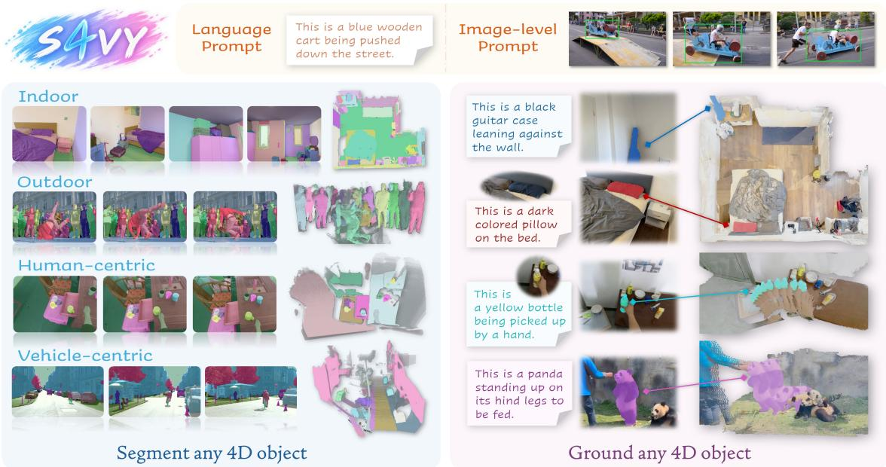  
Figure 1: Overview of S4VY. Left: Given a set of RGB observations, S4VY predicts a consistent 4D mask for every instance in the scene. Right: Any instance can be grounded via either a natural-language prompt or an image-level point/box prompt.

## Abstract

Accurate instance segmentation in dynamic scenes is important for downstream applications such as robotics and autonomous driving. Existing Segment Anything models operate primarily on 2D image or video masks and preserve identity through sequential memory, while promptable 4D instance segmentation built upon feed-forward visual geometry remains underexplored. We introduce S4VY, a Segment Anything model built on feed-forward 4D visual geometry. From a set of RGB observations, S4VY transforms shared visual-geometric features into an exhaustive set of class-agnostic 4D instance masks through a space-time query decoder, with each persistent object query binding one entity across all observations. This representation supports prompt-independent segmentation as well as point- and boxconditioned selection, without requiring a seed mask or temporal ordering. We further develop an agentic harness for natural-language grounding in the large observation space of a 4D scene. Active tree search identifies relevant frames without scanning every fixed window; a dual-stream grounder combines fine-grained VLM visual priors with geometry-consistent instance features through complementary bounding-box prediction and object-query matching; and an independent critic selects the final 4D instance mask from their predictions. Extensive experiments demonstrate state-of-the-art 4D instance segmentation and strong language-guided grounding performance under a unified evaluation spanning static and dynamic scenes.

## 1. Introduction

Instance-level se mentation of d namic scenes is fundamental to erce tion and lannin in embodied s stems such as humanoid robots and autonomous vehicles. The SAM family (Carion et al., 2026; Kirillov et al., 2023; Ravi et al., 2025) supports promptable segmentation across images and videos. Yet these models remain centered on predicting sets of 2D masks and propagating temporal memory to track instances among frames, without explicitly modeling the spatial geometry shared across observations. This becomes a critical bottleneck in challenging dynamic scenes, where multiple visually similar objects move simultaneously and must be re-identified after extended occlusion or absence from view. Real-world observations may also be sparse or unordered, further challenging sequential identity propagation. These settings call for object identities established through shared 3D/4D geometry, rather than inherited solely along an ordered sequence of 2D frames.

Segmentation on explicit 3D representations ofers a direct route to spatial scene understanding (Choy et al., 2026; Jiang et al., 2020; Kolodiazhnyi et al., 2024; Schult et al., 2023), but typically assumes the inputs to be point clouds or RGB-D observations obtained from separate reconstruction pipelines or specialized sensors. This dependence potentially accumulates errors and limits data scalability. Recent feed-forward visual geometry models (Wang et al., 2025a, 2026a, 2024a, 2026c) recover scene geometry directly from RGB observations in a single forward pass. Their consistent geometry representations have enabled methods that couple feed-forward reconstruction with semantic, panoptic, or instance segmentation (Li et al., 2025a; Qu et al., 2026; Zou et al., 2026; Zust et al., 2025). Within this visual-geometry paradigm, most of them target static scenes. IGGT4D (Zou et al., 2026) extends instance segmentation to dynamic 4D scenes, but associates local masks with an additional feature clustering, while flexible prompt interfaces remain underexplored.

To address these limitations, we present S4VY (pronounced “savvy”), named for its goal of segmenting anything in 4D visual geometry. As shown in Fig. 1, S4VY is a Segment Anything model that unifies promptfree, exhaustive 4D instance segmentation with prompt-conditioned selection of any discovered instance in a shared 4D visual-geometric representation. Our segmentation model operates on geometry features jointly contextualized across all input observations by a feed-forward visual geometry backbone (Wang et al., 2026a), regardless of their order. A Space-Time Query Decoder uses global learnable object queries to predict instance masks, with each active query maintaining one instance identity across the entire observation set. A Prompt Encoder maps point or box prompts from one or multiple observations to a promptable object query,enabling any object in the observed scene to be selected.

Beyond point and box prompts, natural-language grounding provides an important interface for users and downstream systems to specify target instances in 4D scenes. A referent may appear in only a limited subset of a large observation set, making target discovery and consistent 4D association challenging. Vision- Language Models (VLMs) have advanced reasoning segmentation and visual grounding (Lai et al., 2024; Li et al., 2025c; Liu et al., 2025; Rasheed et al., 2024), while MVGGT (Wu et al., 2026a) extends referring segmentation to sparse multiview RGB inputs. These methods assume static scenes or fixed sparse views, leaving target discovery and consistent grounding over large dynamic observation sets unresolved. We develop an agentic grounding harness specifically designed for feed-forward 4D visual geometry. Its dual-stream Grounder combines the geometry-consistent feature space of the segmentation model with the fine-grained visual priors of the VLM, producing complementary object-query and bounding-box predictions. Guided by the Grounder’s target-presence estimates, Active Tree Search recursively locates relevant observations across the frame space without evaluating every fixed window. A comparative Critic jointly evaluates representative overlays of the two mask candidates and selects the final 4D instance.

Our contributions are:

• Feed-forward Segment Anything in 4D. We introduce a unified model that transforms shared visual-geometric representations into exhaustive class-agnostic 4D instances with persistent identities, while allowing any discovered instance to be selected by point or box prompts.

• Agentic language grounding in 4D. We develop a grounding harness for large 4D observation spaces that combines VLM visual priors with geometry-consistent instance features through dual-stream prediction, active tree search, and comparative critic selection.

• Evaluation across static and dynamic scenes. Extensive experiments establish state-of-the-art 4D instance segmentation and strong language grounding performance under unified evaluation.

## 2. Related Work

## Feed-forward multi-view geometry and understanding.

With the scaling of vision transformers and training data, multi-view geometry has rapidly shifted from optimization pipelines to feed-forward reconstruction. DUSt3R (Wang et al., 2024a) initiated the modern line through pointmap regression, after which stronger correspondence, whole-set aggregation, and greater scale steadily widened its reach (Cabon et al., 2025; Leroy et al., 2024; Wang and Agapito, 2025; Yang et al., 2025). VGGT (Wang et al., 2025a) then brought cameras, depth, pointmaps, and tracks into one transformer. Geometry became a shared multi-view feature space. $\pi ^ { 3 }$ (Wang et al., 2026c) further removes reference-view dependence through permutation-equivariant visual geometry prediction, while VGGT-Ω (Wang et al., 2026a) extended this shared geometric representation across static and dynamic scenes. These representations have quickly become substrates for scene understanding, with semantic and panoptic prediction increasingly coupled to feed-forward reconstruction (Fan et al., 2024; Sun et al., 2026; Zust et al., 2025). At the instance level, IGGT (Li et al., 2025a) groups geometry-aware features, whereas SegVGGT (Qu et al., 2026) and FAST3DIS (Li et al., 2026a) decode object queries; IGGT4D (Zou et al., 2026) is among the few methods to extend joint reconstruction and instance understanding explicitly to 4D. This line difers from methods that segment an existing point cloud or space–time scan (Aygun et al., 2021; Choy et al., 2026, 2019; Jiang et al., 2020; Kolodiazhnyi et al., 2024; Kreuzberg et al., 2023; Schult et al., 2023; Steiner et al., 2026; Vu et al., 2022), as well as approaches that lift 2D masks into a preconstructed neural or Gaussian scene (Bhalgat et al., 2023; Li et al., 2026d; Siddiqui et al., 2023; Wu et al., 2026b; Ye et al., 2024). Within this paradigm, most methods remain limited to static multi-view scenes, while the closest dynamic extension relies on clustering-based identity association. Moreover, existing methods do not unify exhaustive 4D instance discovery with point, box, and language interfaces. S4VY addresses these limitations within a shared feed-forward 4D representation.

## Segment Anything models.

SAM (Kirillov et al., 2023) established rom table ima e se mentation, while subse uent models extended its interface to text and controllable mask granularity and improved segmentation quality, eficiency, and robustness (Chen et al., 2023; Ke et al., 2023; Li et al., 2024a; Xiong et al., 2024; Zhang et al., 2026b; Zou et al., 2023). Video extensions either attach tracking or temporal memory to image masks (Cheng et al., 2023; Rajič et al., 2025; Ravi et al., 2025; Yang et al., 2023a), with SAM 3 (Carion et al., 2026) further supporting text and exemplar concepts, or represent instances with queries shared across a clip (Cheng et al., 2021; Wu et al., 2022b); both remain defined over 2D image or video representations. SAM-inspired 3D and 4D methods consume explicit point clouds, RGB-D observations, or camera–LiDAR streams (Cen et al., 2023; Liu et al., 2023; Xu et al., 2025; Yin et al., 2024; Zhou et al., 2024), or lift 2D masks into preconstructed neural or Gaussian scenes (Ji et al., 2024; Ye et al., 2024). SAM-V (Gong et al., 2026) integrates feed-forward geometry into SAM but targets prompted multi-view segmentation of static scenes. S4VY instead unifies exhaustive 4D instance discovery with point- and box-conditioned selection over potentially unordered RGB observations.

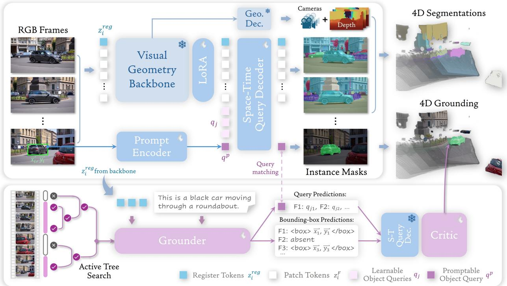  
Figure 2: Architecture of S4VY. Top: The backbone encodes RGB observations into register and patch tokens. The Space-Time Query Decoder applies learnable object queries to the patch tokens to produce exhaustive instance masks across observations, while the Prompt Encoder maps image-level prompts to a promptable query. Bottom: For a language expression, Active Tree Search selects observation windows for the dual-stream Grounder, which predicts object-query matches and bounding boxes. The two predictions are decoded into mask candidates and compared by the Critic.

## Language-guided segmentation and 4D scene grounding.

Grounding DINO (Liu et al., 2024) and language-driven segmentation models such as CRIS (Wang et al., 2022) and Language as Queries (Wu et al., 2022a) align free-form text with image regions, masks, and video tracks. Related 3D and 4D work grounds text or open-vocabulary features in scene representations (Achlioptas et al., 2020; Chen et al., 2020; Fiebelman et al., 2025; Li et al., 2025d; Peng et al., 2023; Prabhudesai et al., 2020; Takmaz et al., 2023; Wu et al., 2025, 2023; Zhao et al., 2021; Zhou et al., 2025). With stronger VLMs, recent work has expanded grounding from direct semantic matching toward free-form descriptions, compositional relations, and implicit intent through reasoning segmentation, geometry-aware 3D localization, and language- guided 4D segmentation (Chen et al., 2024; Hu et al., 2026; Lai et al., 2024; Li et al., 2026b, 2025b,c; Liu et al., 2025; Rasheed et al., 2024; Ren et al., 2024; Tang et al., 2026; Wu et al., 2026a; Xia et al., 2024; Xu et al., 2024; Yan et al., 2024; Yang et al., 2024; Yuan et al., 2026b; Zhu et al., 2024). Agentic long-video methods iteratively retrieve query-relevant observations or refine visual evidence through hierarchical and active observation (Li et al., 2026c; Wang et al., 2024b, 2025b, 2026d). Most existing scene-grounding methods operate on static scenes or fixed sparse views, while agentic video systems search an ordered timeline for video-level reasoning. S4VY instead grounds persistent instances across large 4D observation sets, incorporating Active Tree Search with VLM visual priors, geometry-consistent features, and Critic selection.

## 3. Segment Anything in 4D

As illustrated in Fig. 2, S4VY builds a query-based 4D segmenter on feed-forward visual geometry, supporting exhaustive 4D instance segmentation as well as point- and box-prompted segmentation.

## 3.1. Preliminaries and problem formulation

## Feed-forward visual geometry.

Given � RGB observations ${ \mathcal { T } } = \{ I _ { i } \} _ { i = 1 } ^ { T } ,$ where $I _ { i } \in \mathbb { R } ^ { 3 \times H \times W } ;$ , our feed-forward visual geometry backbone (Wang et al., 2026a) represents observation � with patch tokens $\mathbf { z } _ { i } ^ { F }$ , a camera token ${ \bf z } _ { i } ^ { \mathrm { c a m } }$ , and register tokens ${ \bf z } _ { i } ^ { \mathrm { r e g } }$ and jointly contextualizes them through alternating within-frame and cross-frame attention. The segmenter decodes the contextualized patch tokens, while the register tokens are retained for the language-grounding interface in Sec. 4.

## Exhaustive 4D instance segmentation.

Let ${ \mathcal { S } } \subset \mathbb { R } ^ { 3 } \times \{ t _ { i } \} _ { i = } ^ { T }$ denote the spatiotemporal scene observed by $\mathcal { T } ,$ where $t _ { i }$ is the acquisition time of $I _ { i } .$ The input observations may be temporally sparse or presented out of chronological order. The task is to recover

$$
\begin{array} { r } { \mathcal { T } \mapsto \mathcal { M } = \big \{ \mathbf { M } _ { j } \big \} _ { j = 1 } ^ { N } , \qquad \mathbf { M } _ { j } : \mathcal { S } \to \{ 0 , 1 \} , } \end{array}\tag{1}
$$

where $\mathbf { M } _ { j }$ denotes the 4D mask of instance ${ \bf j } ;$ exhaustive segmentation recovers the complete set ℳ of all $N$ instances in the observed scene. Following the SAM paradigm (Chen et al., 2023; Ravi et al., 2025), a point or box prompt can instead specify any individual $\mathbf { M } _ { j }$

## 3.2. Segmentation design

## Space-Time Query Decoder.

Our Space-Time Query Decoder exploits the rich cross-view and temporal correspondences encoded by feedforward visual geometry to recover persistent 4D instances. We formulate this process as end-to-end set prediction following Mask2Former (Cheng et al., 2022), avoiding the post-clustering identity association used by the IGGT series (Li et al., 2025a; Zou et al., 2026). A set of global learnable object queries $\{ \mathbf { q } _ { j } \}$ jointly attends to the LoRA-adapted (Hu et al., 2021) contextualized patch tokens $\{ \mathbf { z } _ { i } ^ { F } \} _ { i = 1 } ^ { T }$ . The Space-Time Query Decoder $f _ { \mathrm { S T } }$ predicts the complete 4D mask of each query as

$$
\begin{array} { r } { \hat { \bf M } _ { j } = f _ { \mathrm { S T } } \big ( { \bf q } _ { j } , \{ { \bf z } _ { i } ^ { F } \} \big ) . } \end{array}\tag{2}
$$

During training, bipartite matching assigns each ground-truth 4D instance to a unique learnable object query, with unmatched predictions assigned to the no-object class.

## Prompt encoder.

To support image-level prompting, the prompt encoder $f _ { \mathrm { P } }$ combines point or box prompts $p$ from one or more observations by sampling local visual features from $\{ \mathbf { z } _ { i } ^ { F } \} _ { i = 1 } ^ { T }$ to produce a promptable object query $\mathbf { q } ^ { p }$ , which is appended to the learnable object queries $\{ \mathbf { q } _ { j } \}$ at the decoder input:

$$
\mathbf { q } ^ { p } = f _ { \mathrm { P } } \left( \{ \mathbf { z } _ { i } ^ { F } \} , p \right) , \qquad \hat { \mathbf { M } } ^ { p } = f _ { \mathrm { S T } } \left( \mathbf { q } ^ { p } , \{ \mathbf { q } _ { j } \} , \{ \mathbf { z } _ { i } ^ { F } \} \right) .\tag{3}
$$

Unidirectional self-attention lets $\mathbf { q } ^ { p }$ match the corresponding learnable object query while preventing potentially ambiguous prompt signals from afecting $\{ \mathbf { q } _ { j } \}$ , preserving prompt-free instance discovery. For prompts from multiple observations, learned relevance weights suppress occluded, imprecise, or inconsistent local evidence before forming $\mathbf { q } ^ { p }$ . Since prompts supplied by users or downstream localization tools may be spatially imprecise, we perturb point locations and box coordinates during training to improve tolerance to localization errors.

## 4. Ground Anything in 4D

Given a natural-language prompt $x ,$ 4D grounding aims to select the corresponding 4D mask $\mathbf { M } ^ { * }$ of the referred object throughout the observed scene masklets.

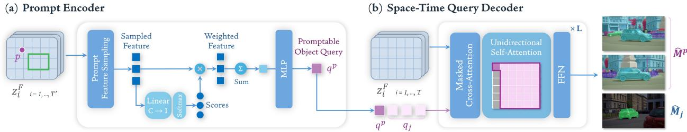  
Figure 3: (a) Prompt Encoder: Point or box prompts sample dense features derived from the contextualized patch tokens and are aggregated into a promptable object query; $T ^ { \prime }$ is the number of observations containing prompts. (b) Space-Time Query Decoder: The promptable and learnable object queries decode persistent instance masks over the complete observation set. The attention mask blocks learnable queries from reading the prompt query while retaining the reverse direction.

## 4.1. Grounding components

## Grounder.

Vision-Language Models (VLMs) provide strong spatial priors for grounding referred objects in individual images, yet their native RGB interface does not exploit the cross-view consistency encoded by feed-forward visual geometry. The backbone register tokens form a compact, language-conditioned scene representation (Wang et al., 2026a). Supplying all patch tokens from multiple observations would introduce prohibitive context redundancy; we therefore inject the per-frame camera and register tokens as compact geometric context. We further supervise the grounder with a scene-geometry-guided chain of thought (CoT) (Wei et al., 2022) distilled from visual and metric scene cues, including object size, height, and inter-object distance, assisting scene reasoning and query and box predictions.

Our grounder retains the input flexibility of the base segmenter, accommodating conventional temporal sequences as well as sparse, non-consecutive observations. Each training window is formed from multiple observations sampled across ℐ rather than restricted to consecutive frames. Let $N _ { \mathrm { w } }$ denote the window size and $s _ { 1 } , \hdots , s _ { N _ { \mathrm { w } } } \in \{ 1 , \hdots , T \}$ the sampled observation indices. The dual-stream prediction is summarized as

$$
\begin{array} { r } { \{ \left( \hat { \mathbf { q } } _ { s _ { k } } , \hat { p } _ { s _ { k } } \right) \} _ { k = 1 } ^ { N _ { \mathrm { w } } } = f _ { \mathrm { G } } \left( x , \left\{ I _ { s _ { k } } , \mathbf { z } _ { s _ { k } } ^ { \mathrm { c a m } } , \mathbf { z } _ { s _ { k } } ^ { \mathrm { r e g } } \right\} _ { k = 1 } ^ { N _ { \mathrm { w } } } \right) , } \end{array}\tag{4}
$$

where $\hat { \mathbf { q } } _ { s _ { k } }$ denotes the query prediction and $\hat { p } _ { s _ { k } }$ the predicted box prompt; a null query or absent prompt indicates that the referent is not present. In the query-matching stream, the query predictions are matched to a persistent object query; in the box stream, the predicted box prompts are jointly encoded by $f _ { \mathrm { P } }$ into $\mathbf { q } ^ { p }$ . The two streams yield complementary 4D mask candidates through $f _ { \mathrm { S T } }$

## Critic.

Given the 4D mask candidates $\hat { \mathbf { M } } ^ { q }$ and $\hat { \mathbf { M } } ^ { p }$ produced by the query-matching stream and box stream, respectively, we render each candidate over the observed frames. An independent VLM-based critic $f _ { \mathrm { C } }$ predicts their pairwise preference and selects the candidate that better matches the expression �:

$$
s _ { \mathrm { C } } = f _ { \mathrm { C } } \left( x , \hat { \mathbf { M } } ^ { q } , \hat { \mathbf { M } } ^ { p } \right) , \qquad \hat { \mathbf { M } } ^ { * } = \left\{ \begin{array} { l l } { \hat { \mathbf { M } } ^ { q } , } & { s _ { \mathrm { C } } > 0 , } \\ { \hat { \mathbf { M } } ^ { p } , } & { \mathrm { o t h e r w i s e } , } \end{array} \right.\tag{5}
$$

where $s _ { \mathrm { C } }$ is the pairwise preference logit, with a positive value favoring $\hat { \mathbf { M } } ^ { q }$ . The critic is fine-tuned on candidate pairs, with the candidate that better agrees with the ground-truth mask providing the selection target.

Algorithm 1 Active Tree Search   
Input: observations $\mathcal { T } = \{ I _ { i } \} _ { i = 1 } ^ { T } ,$ expression $x ,$ window size $N _ { \mathrm { w } } ,$ and maximum depth �   
Output: grounded 4D mask M^ \*   
1: $\mathcal { E }  \mathtt { S e a R C H } ( [ 1 , T ] , 0 ) .$   
2: $( \hat { \mathbf { M } } ^ { q } , \hat { \mathbf { M } } ^ { p } ) \gets$ aggregate and decode both prediction streams in ℰ.   
3: $\hat { \mathbf { M } } ^ { * } \gets f _ { \mathrm { C } } ( x , \hat { \mathbf { M } } ^ { q } , \hat { \mathbf { M } } ^ { p } ) ;$ ; return $\hat { \mathbf { M } } ^ { * }$   
function Search $( [ a , b ] , d )$   
4: Uniformly sample $N _ { \mathrm { w } }$ indices � from $[ a , b ] ;$ use ever index if $b - a + 1 \leq N _ { \mathrm { w } } .$   
5: $\{ ( \widehat { \mathbf { q } } _ { i } , \widehat { p } _ { i } ) \} _ { i \in S }  f _ { \mathrm { G } } ( x , \{ I _ { i } \} _ { i \in S } ) ;$ add the predictions to $\varepsilon .$   
6: if the indices in � are adjacent, or $d = D ,$ then return ℰ.   
7: $P  \{ i \in S \mid \hat { p } _ { i } \neq \emptyset \} ; \mathcal { C }  \mathrm { E x p A N D } ( [ a , b ] , S , P , d ) .$   
8: for each $C \in { \mathcal { C } } , { \mathrm { s e t } } { \mathcal { E } } \gets { \mathcal { E } } \cup { \mathrm { S E A R C H } } ( C , d + 1 ) .$   
9: return ℰ.   
function Expand $( [ a , b ] , S , P , d )$   
10: if $P = \varnothing ,$ return UniformPartition $( [ a , b ] )$ when $d = 0 ,$ and ∅ otherwise.   
11: Group consecutive indices in � and form one child range per group, bounded by its nearest sampled neighbors   
in �.   
12: return the child ranges $\mathcal { C } .$

## Optimization.

The grounder is optimized with cross-entropy for query matching and an autoregressive language-modeling loss for its generated outputs, while the critic uses binary cross-entropy to select the candidate with greater ground-truth overlap:

$$
{ \mathcal { L } } _ { \mathrm { G } } = { \mathcal { L } } _ { \mathrm { q u e r y } } + { \mathcal { L } } _ { \mathrm { L M } } , \qquad { \mathcal { L } } _ { \mathrm { C } } = \mathrm { B C E } ( s _ { \mathrm { C } } , y _ { \mathrm { C } } ) ,\tag{6}
$$

where $y _ { \mathrm { C } } = 1$ when $\hat { { \bf M } } ^ { q }$ has greater ground-truth overlap and 0 otherwise.

## 4.2. Agentic grounding harness

Grounding in a large 4D scene requires locating the observations that contain the referent and associating them with a consistent instance. Processing large observation sets with fixed sliding windows repeatedly evaluates irrelevant content. Agentic video methods mitigate this cost by exploiting temporal continuity to retrieve relevant evidence along an ordered timeline (Wang et al., 2024b, 2025b). However, our segmenter also accepts sparse or non-consecutive observations, for which temporal prior information is weakened. We therefore introduce Active Tree Search (ATS), driven by predicted target presence, to explore the observation set adaptively.

As illustrated in Fig. 4, ATS forms each grounder window by uniformly sampling $N _ { \mathrm { w } }$ observations from the current search range for joint evaluation. It begins with a global window spanning the full observation set. At each level, the grounder predicts target presence for every sampled observation; the neighboring sample positions around each positive prediction delimit the subranges examined at the next level. Each selected subrange is recursively resampled as a new grounder window, allowing the grounder to determine the next search step from its current predictions. The recursion stops once each grounder window contains only adjacent frames. Predictions from all examined windows are aggregated by voting to form two mask candidates from two streams respectively. Representative observations are then selected, and the candidate masks are rendered as overlays and presented jointly with the expression � to the critic for comparative evaluation, determining the final mask Mˆ \*.

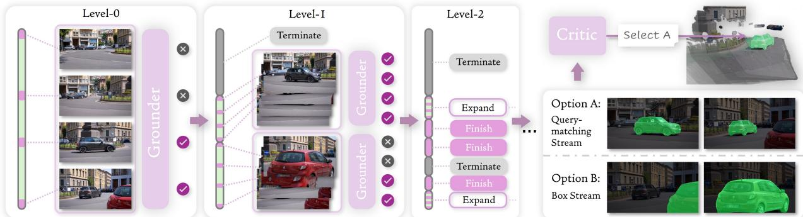

Figure 4: Agentic grounding harness. Active tree search locates relevant observations, the dual-stream grounder produces two 4D mask candidates, and the critic selects the final result. The illustrated example uses $N _ { w } = 4$ observations er rounder window.  
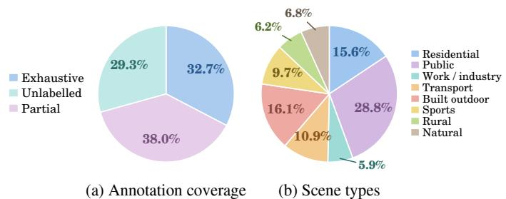

<table><tr><td rowspan="2">Supervision</td><td>Type</td><td colspan="2">Origin</td><td>Scale</td></tr><tr><td>Sta. Dyn. Real Syn. Scenes Frames</td><td></td><td></td><td></td></tr><tr><td>Exhaustive multi-view</td><td>√ 一</td><td>√</td><td>√</td><td>7.50k 1.50M</td></tr><tr><td>Exhaustive video</td><td>一 √</td><td>√</td><td>一</td><td>3.35k 83.1k</td></tr><tr><td>Partial video</td><td>一 √</td><td>√</td><td>√</td><td>12.63k 958.6k</td></tr><tr><td>Unlabelled multi-view√</td><td></td><td>– √</td><td>一</td><td>9.74k 3.51M</td></tr></table>

(c) Data types and scale  
Figure 5: Training corpus. (a & b) Annotation coverage and dominant scene types among the curated data. (c) Data composition and scale by supervision type.

## 5. Data Curation and Training

Learning to segment any instance in 4D requires broad supervision across scene domains and motion patterns. We consolidate 19 multi-view and video datasets into four groups: exhaustively annotated multi-view scenes, exhaustively annotated videos, partially annotated video masklets, and unlabelled multi-view observations. As shown in Fig. 5, the collection spans static and dynamic scenes, real and synthetic imagery, and diverse indoor and outdoor content. Tab. 1 lists the sampled portion of every source; together they contribute 6.05M observations from 33,220 scenes or clips.

## Self-distillation.

Exhaustive set prediction treats every unmatched query as no-object, which would suppress unlabelled instances if applied directly to partial annotations. We therefore train a teacher on the exhaustive sources and use its temporally consistent masklets to densify partial annotations and supervise unlabelled data. Human annotations take precedence, overlapping teacher predictions are removed, and uncertain regions are ignored. This transfers exhaustive instance coverage to the broader corpus without treating missing annotations as background.

## Optimization.

After Hungarian matching (Carion et al., 2020; Cheng et al., 2022), the segmenter is trained with object classification, binary cross-entropy, and soft Dice losses (Milletari et al., 2016):

$$
\mathcal { L } _ { \mathrm { s e g } } = \mathcal { L } _ { \mathrm { o b j } } + \mathcal { L } _ { \mathrm { B C E } } + \mathcal { L } _ { \mathrm { D i c e } } .\tag{7}
$$

Training progressively shifts from the diverse pseudo-labelled pool toward exhaustive data to reduce the efect of noisy labels near convergence. The Prompt Encoder can be trained jointly with the segmenter or separately

Table 1: Training-data composition. Counts report the sampled scenes or video clips and RGB observations used for training, rather than the full sizes of the source datasets.
<table><tr><td>Dataset</td><td>Supervision</td><td>Motion</td><td>Scene</td><td>Origin</td><td>Scenes/clips</td><td>Frames</td></tr><tr><td>Infinigen (Raistrick et al., 2023)</td><td>Exhaustive</td><td>Static</td><td>Indoor</td><td>Synthetic</td><td>1,466</td><td>146,034</td></tr><tr><td>ScanNet+ + (Yeshwanth et al., 2023)</td><td>Exhaustive</td><td>Static</td><td>Indoor</td><td>Real</td><td>907</td><td>760,226</td></tr><tr><td>RealEstate10K (Zhou et al., 2018)</td><td>Exhaustive</td><td>Static</td><td>Mixed</td><td>Real</td><td>5,127</td><td>593,212</td></tr><tr><td>VIPSeg (Miao et al., 2022)</td><td>Exhaustive</td><td>Dynamic</td><td>Mixed</td><td>Real</td><td>2,806</td><td>66,767</td></tr><tr><td>Cityscapes-VPS (Kim et al., 2020)</td><td>Exhaustive</td><td>Dynamic</td><td>Outdoor</td><td>Real</td><td>394</td><td>1,970</td></tr><tr><td>KITTI-STEP (Weber et al., 2021)</td><td>Exhaustive</td><td>Dynamic</td><td>Outdoor</td><td>Real</td><td>12</td><td>5,027</td></tr><tr><td>JRDB-PanoTrack (Le et al., 2024)</td><td>Exhaustive</td><td>Dynamic</td><td>Mixed</td><td>Real</td><td>135</td><td>9,365</td></tr><tr><td>SA-V (Ravi et al., 2025)</td><td>Partial</td><td>Dynamic</td><td>Mixed</td><td>Real</td><td>4,635</td><td>362,391</td></tr><tr><td>YouTube-VOS (Xu et al., 2018)</td><td>Partial</td><td>Dynamic</td><td>Mixed</td><td>Real</td><td>3,471</td><td>94,588</td></tr><tr><td>MeViS (Ding et al., 2023a)</td><td>Partial</td><td>Dynamic</td><td>Mixed</td><td>Real</td><td>1,662</td><td>112,170</td></tr><tr><td>MOSE (Ding et al., 2023b)</td><td>Partial</td><td>Dynamic</td><td>Mixed</td><td>Real</td><td>1,496</td><td>92,715</td></tr><tr><td>UVO-Dense (Wang et al., 2021)</td><td>Partial</td><td>Dynamic</td><td>Mixed</td><td>Real</td><td>759</td><td>68,310</td></tr><tr><td>DynamicReplica (Karaev et al., 2023)</td><td>Partial</td><td>Dynamic</td><td>Indoor</td><td>Synthetic</td><td>236</td><td>70,800</td></tr><tr><td>SAIL-VOS (Hu et al., 2019)</td><td>Partial</td><td>Dynamic</td><td>Mixed</td><td>Synthetic</td><td>163</td><td>86,248</td></tr><tr><td>LVOS (Hong et al., 2023)</td><td>Partial</td><td>Dynamic</td><td>Mixed</td><td>Real</td><td>120</td><td>65,237</td></tr><tr><td>DAVIS (Perazzi et al., 2016)</td><td>Partial</td><td>Dynamic</td><td>Mixed</td><td>Real</td><td>60</td><td>4,209</td></tr><tr><td>VOST (Tokmakov et al., 2023)</td><td>Partial</td><td>Dynamic</td><td>Mixed</td><td>Real</td><td>32</td><td>1,920</td></tr><tr><td>DL3DV (Ling et al., 2024)</td><td>Pseudo</td><td>Static</td><td>Mixed</td><td>Real</td><td>9,649</td><td>3,316,851</td></tr><tr><td>Matterport3D (Chang et al., 2017)</td><td>Pseudo</td><td>Static</td><td>Indoor</td><td>Real</td><td>90</td><td>194,400</td></tr><tr><td colspan="5">Total</td><td>33,220</td><td>6,052,440</td></tr></table>

while the segmenter is frozen; all reported results use the latter. Full data and training details appear in Secs. A.3 and B.1.

## 6. Experiments

## 6.1. Experimental setup

## Benchmarks and metrics.

We evaluate prompt-free instance segmentation on the ScanNet validation setting from (Li et al., 2025a), DAVIS (Pont-Tuset et al., 2017), LVOS (Hong et al., 2023), and VIPSeg (Miao et al., 2022). ScanNet contains eight sampled observations per scene, following IGGT, and LVOS is uniformly sampled to 100 observations per video. We report T-mIoU, T-SR, and $\mathcal { T } \& \mathcal { F }$ on ScanNet; 4D-IoU, 4D-SR, and $\mathcal { T } \& \mathcal { F }$ on DAVIS and LVOS; and STQ (Weber et al., 2021) and mAP on VIPSeg. The grounding evaluation comprises 700 ScanRefer queries from 121 validation scenes, 3,320 expressions from 80 held-out ScanNet++ scenes, all 122 Ref-DAVIS expressions, and 616 single-referent MeViS expressions from 47 videos. Static scenes use 3D mask mIoU and box/mask accuracy at IoU 0.25; videos use $\mathcal { T } \& \mathcal { F }$

For video benchmarks with 2D annotations, we lift both annotated and predicted masks through the same estimated depth and cameras, then voxelize each observation in a distinct $( x , y , z , t )$ slice. After one-to-one instance matching, let $\iota _ { j }$ be the voxel IoU of the prediction matched to ground-truth instance �, with $\iota _ { j } = 0$ when it is unmatched. The clip-level metrics are

$$
4 \mathrm { D - I o U } = \frac { 1 } { N } \sum _ { j = 1 } ^ { N } \iota _ { j } , \qquad 4 \mathrm { D - S R } = \frac { 1 } { N } \sum _ { j = 1 } ^ { N } \boldsymbol { k } ^ { \prime } [ \iota _ { j } > 0 . 5 ] .\tag{8}
$$

Scores are averaged across clips. Complete benchmark construction and metric definitions appear in Sec. B.4.

Table 2: Class-agnostic instance segmentation. All methods are evaluated without target prompts or firstframe ground truth. Higher is better for segmentation metrics; latency is measured over 100 observations on an A100-80GB (s/clip).
<table><tr><td rowspan="2">Method</td><td colspan="3">ScanNet</td><td colspan="3">DAVIS</td><td colspan="3">LVOS</td><td colspan="2">VIPSeg</td><td rowspan="2">Latency</td></tr><tr><td>T-mIoU</td><td>T-SR</td><td>J&amp;F</td><td>4D-IoU</td><td>4D-SR</td><td>J&amp;F</td><td>4D-IoU</td><td>4D-SR</td><td>J&amp;F</td><td>STQ mAP</td><td>@100</td></tr><tr><td>SAM3D (Yang et al., 2023b)</td><td>0.686</td><td>0.296</td><td>0.574</td><td></td><td>1</td><td></td><td></td><td></td><td></td><td></td><td></td><td>一</td></tr><tr><td>DEVA (Cheng et al., 2023)</td><td>0.180</td><td>0.029</td><td>0.219</td><td>0.531</td><td>0.584</td><td>0.531</td><td>0.373</td><td>0.312</td><td>0.412</td><td>0.583</td><td>0.047</td><td>32.3</td></tr><tr><td>GLEE (Wu et al., 2024)</td><td>0.127</td><td>0.038</td><td>0.178</td><td>0.710</td><td>0.870</td><td>0.754</td><td>0.329</td><td>0.225</td><td>0.367</td><td>0.207</td><td>0.214</td><td>36.8</td></tr><tr><td>OMG-Seg (Li et al., 2024b)</td><td>0.189</td><td>0.067</td><td>0.218</td><td>0.632</td><td>0.789</td><td>0.691</td><td>0.167</td><td>0.102</td><td>0.191</td><td>0.554</td><td>0.205</td><td>13.7</td></tr><tr><td>SAM 2 (Ravi et al., 2025)</td><td>0.635</td><td>0.438</td><td>0.588</td><td>0.703</td><td>0.823</td><td>0.750</td><td>0.450</td><td>0.460</td><td>0.444</td><td>0.700</td><td>0.249</td><td>175</td></tr><tr><td>PanSt3R (Zust et al., 2025)</td><td>0.747</td><td>0.708</td><td>0.719</td><td>0.484</td><td>0.506</td><td>0.513</td><td>0.297</td><td>0.120</td><td>0.315</td><td>0.698</td><td>0.197</td><td>54.0</td></tr><tr><td>IGGT (Li et al., 2025a)</td><td>0.517</td><td>0.408</td><td>0.534</td><td>0.348</td><td>0.302</td><td>0.407</td><td>0.139</td><td>0.040</td><td>0.156</td><td>0.622</td><td>0.089</td><td>272</td></tr><tr><td>SegVGGT (Qu et al., 2026)</td><td>0.561</td><td>0.471</td><td>0.494</td><td>0.178</td><td>0.022</td><td>0.259</td><td>0.069</td><td>0.000</td><td>0.069</td><td>0.340</td><td>0.069</td><td>一</td></tr><tr><td>IGGT4D (Zou et al., 2026)</td><td>0.781</td><td>0.708</td><td>0.726</td><td>0.543</td><td>0.667</td><td>0.604</td><td>0.154</td><td>0.047</td><td>0.192</td><td>0.729</td><td>0.190</td><td>18.5</td></tr><tr><td>SAM-V (Gong et al., 2026)</td><td>0.729</td><td>0.692</td><td>0.685</td><td>0.307</td><td>0.145</td><td>0.336</td><td>0.197</td><td>0.070</td><td>0.174</td><td>0.344</td><td>0.083</td><td>-</td></tr><tr><td>S4VY (Ours)</td><td>0.803</td><td>0.792</td><td>0.781</td><td>0.715</td><td>0.914</td><td>0.803</td><td>0.533</td><td>0.573</td><td>0.602</td><td>0.795</td><td>0.352</td><td>10.1</td></tr></table>

## Baselines.

For segmentation, we compare lifted 3D segmentation (Yang et al., 2023b), image/video systems (Cheng et al., 2023; Li et al., 2024b; Ravi et al., 2025; Wu et al., 2024), and feed-forward visual-geometry methods (Gong et al., 2026; Li et al., 2025a; Qu et al., 2026; Zou et al., 2026; Zust et al., 2025). Oficial checkpoints receive the same observations without semantic labels, target prompts, or first-frame ground truth. SAM 2 uses automatic mask discover with eriodic re-discover , while memor -intensive baselines retain all observations throu h full-se uence or streamin inference. Groundin baselines cover VLM–se menter and 3D- ro osal pipelines (Drozdov et al., 2026; Ravi et al., 2025; Xu et al., 2024), end-to-end image/video referring models (Carion et al., 2026; Yuan et al., 2026a), and multi-view geometry–language alignment (Wu et al., 2026a). VLM+SAM 2 jointly processes eight uniformly sampled video observations and predicts boxes or absence before bidirectional propagation; MVGGT receives the same number of observations. Z3D uses reconstructed geometry except in the explicitly marked GT oracle rows.

## Implementation details.

The segmenter initializes from the VGGT-Ω-1B checkpoint at 512-pixel resolution. We use rank-256 LoRA (Hu et al., 2021) adapters and train the segmenter for 50,000 steps. The Grounder initializes from Qwen3-VL-4B (Bai et al., 2025), uses eight-observation windows during training and inference, and is trained on approximately 80k expressions. The Critic initializes from Qwen3-VL-2B and is trained separately on paired mask candidates. Reported prompting results use the separately trained Prompt Encoder. Additional training and baseline settings are given in Sec. B.

## 6.2. Quantitative comparisons

## Class-agnostic segmentation.

Tab. 2 compares prompt-free instance segmentation across static multi-view scenes and dynamic videos. S4VY leads every benchmark: its 0.803 T-mIoU and 0.792 T-SR on ScanNet reflect accurate cross-view instance recovery, while 0.803 and 0.602 �&ℱ on DAVIS and LVOS show that persistent identities are maintained in dynamic scenes without temporal memory propagation. The gains in STQ and mAP extend this result to dense panoptic evaluation.

Tab. 3 evaluates transfer to egocentric and driving perception. HOI4D and VISOR are zero-shot evaluations, while KITTI-STEP uses a held-out driving split. S4VY leads all reported metrics on the three datasets. T-SR remains lower than the other measures for every method because small, similar targets, rapid motion, occlusion, and re-entry make persistent full-clip recovery harder.

Table 3: Egocentric and driving-scene segmentation. Left: results on HOI4D and VISOR. Right: results on the KITTI-STEP evaluation split. IGGT4D is omitted on HOI4D because its training mixture contains part of the evaluation split.
<table><tr><td rowspan="2">Method</td><td colspan="3">HOI4D</td><td colspan="3">VISOR</td></tr><tr><td>J&amp;F</td><td>T-mIoU</td><td>T-SR</td><td>J&amp;F</td><td>T-mIoU</td><td>T-SR</td></tr><tr><td>DEVA (Cheng et al., 2023)</td><td>0.594</td><td>0.557</td><td>0.250</td><td>0.213</td><td>0.111</td><td>0.018</td></tr><tr><td>GLEE (Wu et al., 2024)</td><td>0.427</td><td>0.404</td><td>0.261</td><td>1</td><td></td><td></td></tr><tr><td>OMG-Seg (Li et al., 2024b)</td><td>0.272</td><td>0.248</td><td>0.192</td><td>0.020</td><td>0.016</td><td>0.000</td></tr><tr><td>SAM 2 (Ravi et al., 2025)</td><td>0.572</td><td>0.542</td><td>0.219</td><td>0.295</td><td>0.176</td><td>0.060</td></tr><tr><td>PanSt3R (Zust et al., 2025)</td><td>0.523</td><td>0.524</td><td>0.352</td><td>0.195</td><td>0.142</td><td>0.044</td></tr><tr><td>IGGT (Li et al., 2025a)</td><td>0.378</td><td>0.374</td><td>0.069</td><td>0.148</td><td>0.099</td><td>0.027</td></tr><tr><td>SegVGGT (Qu et al., 2026)</td><td>0.266</td><td>0.280</td><td>0.131</td><td>0.097</td><td>0.078</td><td>0.037</td></tr><tr><td>IGGT4D (Zou et al., 2026)</td><td></td><td>一</td><td>一</td><td>0.261</td><td>0.179</td><td>0.068</td></tr><tr><td>SAM-V (Gong et al., 2026)</td><td>0.465</td><td>0.462</td><td>0.122</td><td>0.199</td><td>0.157</td><td>0.035</td></tr><tr><td>S4VY (Ours)</td><td>0.624</td><td>0.602</td><td>0.516</td><td>0.313</td><td>0.204</td><td>0.118</td></tr></table>

<table><tr><td rowspan="2">Method</td><td colspan="3">KITTI-STEP</td></tr><tr><td>J&amp;F</td><td>T-mIoU</td><td>T-SR</td></tr><tr><td>DEVA</td><td>0.181</td><td>0.171</td><td>0.037</td></tr><tr><td>OMG-Seg</td><td>0.164</td><td>0.161</td><td>0.088</td></tr><tr><td>SAM 2</td><td>0.274</td><td>0.266</td><td>0.075</td></tr><tr><td>IGGT</td><td>0.113</td><td>0.110</td><td>0.017</td></tr><tr><td>SegVGGT</td><td>0.065</td><td>0.071</td><td>0.002</td></tr><tr><td>IGGT4D</td><td>0.268</td><td>0.250</td><td>0.105</td></tr><tr><td>SAM-V</td><td>0.203</td><td>0.196</td><td>0.021</td></tr><tr><td>S4VY (Ours)</td><td>0.501</td><td>0.519</td><td>0.191</td></tr></table>

The ten-clip ScanNet setting is complemented by the complete 312-scene ScanNet200 validation split in Tab. 4. S4VY improves over IGGT4D by 2.9, 4.6, and 2.8 points in T-mIoU, T-SR, and �&ℱ, respectively. Tab. 5 further compares sparse observations with shufled versions of the same inputs. Video baselines that propagate information along the sequence decline after shufling, whereas feed-forward geometry methods do not exhibit a consistent decline. On the appearance-diverse, shufled LVOS setting, S4VY reaches 0.588 �&ℱ, 12.6 points above the strongest video baseline.

Table 4: Complete ScanNet200 validation split. RGB-only evaluation.
<table><tr><td>Method</td><td>T-mIoU</td><td>T-SR</td><td>J&amp;F</td></tr><tr><td>VGGT-Ω + Mask3D (Schult et al., 2023)</td><td>0.053</td><td>0.017</td><td>0.050</td></tr><tr><td>SAM3D (Yang et al., 2023b)</td><td>0.463</td><td>0.207</td><td>0.338</td></tr><tr><td>DEVA (Cheng et al., 2023)</td><td>0.088</td><td>0.029</td><td>0.086</td></tr><tr><td>GLEE (Wu et al., 2024)</td><td>0.042</td><td>0.024</td><td>0.053</td></tr><tr><td>OMG-Seg (Li et al., 2024b)</td><td>0.101</td><td>0.050</td><td>0.101</td></tr><tr><td>SAM 2 (Ravi et al., 2025)</td><td>0.327</td><td>0.153</td><td>0.288</td></tr><tr><td>PanSt3R (Zust et al., 2025)</td><td>0.461</td><td>0.318</td><td>0.403</td></tr><tr><td>IGGT (Li et al., 2025a)</td><td>0.339</td><td>0.210</td><td>0.298</td></tr><tr><td>SegVGGT (Qu et al., 2026)</td><td>0.425</td><td>0.319</td><td>0.362</td></tr><tr><td>IGGT4D (Zou et al., 2026)</td><td>0.488</td><td>0.330</td><td>0.426</td></tr><tr><td>SAM-V (Gong et al., 2026)</td><td>0.376</td><td>0.205</td><td>0.333</td></tr><tr><td>S4VY</td><td>0.517</td><td>0.376</td><td>0.454</td></tr></table>

Table 5: Robustness to sparse and unordered inputs. All entries are class-agnostic �&ℱ.

<table><tr><td rowspan="2">Method</td><td colspan="2">DAVIS</td><td colspan="3">LVOS</td></tr><tr><td>Sparse</td><td>Shuffle</td><td>Sparse</td><td>Shuffle</td><td>Hard</td></tr><tr><td>DEVA</td><td>0.532</td><td>0.526</td><td>0.433</td><td>0.416</td><td>0.307</td></tr><tr><td>GLEE</td><td>0.749</td><td>0.743</td><td>0.560</td><td>0.547</td><td>0.462</td></tr><tr><td>OMG-Seg</td><td>0.693</td><td>0.665</td><td>0.452</td><td>0.435</td><td>0.311</td></tr><tr><td>SAM 2</td><td>0.766</td><td>0.749</td><td>0.579</td><td>0.559</td><td>0.418</td></tr><tr><td>PanSt3R</td><td>0.579</td><td>0.581</td><td>0.447</td><td>0.464</td><td>0.359</td></tr><tr><td>IGGT</td><td>0.448</td><td>0.459</td><td>0.269</td><td>0.273</td><td>0.171</td></tr><tr><td>SegVGGT</td><td>0.328</td><td>0.332</td><td>0.111</td><td>0.106</td><td>0.078</td></tr><tr><td>IGGT4D</td><td>0.613</td><td>0.600</td><td>0.268</td><td>0.268</td><td>0.248</td></tr><tr><td>S4VY (Ours)</td><td>0.807</td><td>0.800</td><td>0.645</td><td>0.656</td><td>0.588</td></tr></table>

Tab. 6 supplies every method with the same sampled prompts. S4VY is strongest with point prompts, whereas SAM 2 is generally stronger with clean multi-observation box prompts. Under corrupted prompts from annotation or upstream localization errors, the Prompt Encoder’s relevance scoring suppresses inconsistent evidence and substantially improves robustness over propagation-based prompting.

## Language-guided grounding.

Tab. 7 compares S4VY with VLM–segmenter pipelines, end-to-end referring models, and Z3D’s explicit 3D-proposal grounding under the unified protocol. S4VY performs best across the four evaluations. Z3D approaches our static-scene results only with ground-truth point clouds; replacing them with reconstructed point clouds causes a large decline, showing the sensitivity of proposal-first 3D grounding to imperfect geometry.

Table 6: Point- and box-prompted segmentation on ScanNet and DAVIS. � is the maximum number of evenly spaced target-present observations used for prompting; corruption replaces the specified fraction with target-irrelevant prompts. All entries report $\mathcal { T } \& \mathcal { F }$ for S4VY and SAM 2 (Ravi et al., 2025); SAM-V (Gong et al., 2026) supports point prompts only. For $K > 1$ , SAM-V independently decodes each prompted observation and retains the output with the highest predicted IoU. � = 8 covers all visible ScanNet views.
<table><tr><td></td><td></td><td colspan="5">ScanNet</td><td colspan="5">DAVIS</td></tr><tr><td>K</td><td>Corruption</td><td colspan="2">Box</td><td colspan="3">Point</td><td colspan="2">Box</td><td colspan="3">Point</td></tr><tr><td></td><td></td><td>S4VY</td><td>SAM 2</td><td>S4VY</td><td>SAM 2</td><td>SAM-V</td><td>S4VY</td><td>SAM 2</td><td>S4VY</td><td>SAM 2</td><td>SAM-V</td></tr><tr><td>1</td><td>0%</td><td>0.806</td><td>0.753</td><td>0.793</td><td>0.649</td><td>0.567</td><td>0.790</td><td>0.809</td><td>0.793</td><td>0.771</td><td>0.134</td></tr><tr><td>2</td><td>0%</td><td>0.804</td><td>0.844</td><td>0.825</td><td>0.713</td><td>0.598</td><td>0.789</td><td>0.818</td><td>0.802</td><td>0.764</td><td>0.124</td></tr><tr><td>4</td><td>0%</td><td>0.800</td><td>0.877</td><td>0.825</td><td>0.760</td><td>0.589</td><td>0.779</td><td>0.827</td><td>0.805</td><td>0.760</td><td>0.145</td></tr><tr><td>8</td><td>0%</td><td>0.801</td><td>0.878</td><td>0.825</td><td>0.769</td><td>0.589</td><td>0.807</td><td>0.829</td><td>0.810</td><td>0.780</td><td>0.129</td></tr><tr><td>16</td><td>0%</td><td>-</td><td>一</td><td></td><td></td><td>一</td><td>0.796</td><td>0.828</td><td>0.805</td><td>0.775</td><td>0.127</td></tr><tr><td>8</td><td>25%</td><td>0.768</td><td>0.401</td><td>0.662</td><td>0.346</td><td>0.488</td><td>0.733</td><td>0.733</td><td>0.800</td><td>0.659</td><td>0.091</td></tr><tr><td>8</td><td>50%</td><td>0.665</td><td>0.253</td><td>0.507</td><td>0.256</td><td>一</td><td>0.651</td><td>0.532</td><td>0.761</td><td>0.445</td><td></td></tr><tr><td>16</td><td>25%</td><td>一</td><td>一</td><td>一</td><td></td><td>1</td><td>0.727</td><td>0.722</td><td>0.808</td><td>0.668</td><td>0.082</td></tr></table>

Table 7: Language-guided grounding. Static benchmarks report 3D mIoU and box/mask accuracy at IoU 0.25; dynamic benchmarks report J&F. Z3D is evaluated with either benchmark GT point clouds or reconstructed point clouds.
<table><tr><td rowspan="2">Method</td><td rowspan="2">VLM Size</td><td colspan="3">ScanRefer</td><td colspan="3">ScanNet++</td><td rowspan="2">Ref-DAVIS J&amp;F</td><td rowspan="2">MeViS J&amp;F</td></tr><tr><td>3D mIoU</td><td>Box@.25</td><td>Mask@.25</td><td>3D mIoU</td><td>Box@.25</td><td>Mask@.25</td></tr><tr><td>VLM-Grounder (Xu et al., 2024)</td><td>30.5B</td><td>0.105</td><td>26.0</td><td>17.0</td><td>0.063</td><td>12.4</td><td>9.9</td><td>0.183</td><td>0.141</td></tr><tr><td>VLM+SAM 2 (Ravi et al., 2025)</td><td>30.5B</td><td>0.308</td><td>34.9</td><td>42.6</td><td>0.170</td><td>15.1</td><td>26.2</td><td>0.709</td><td>0.483</td></tr><tr><td>Sa2VA-8B (Yuan et al., 2026a)</td><td>8B</td><td>0.124</td><td>14.9</td><td>17.9</td><td>0.040</td><td>3.4</td><td>6.4</td><td>0.732</td><td>0.542</td></tr><tr><td>SAM 3 (Carion et al., 2026)</td><td>N/A</td><td>0.247</td><td>29.7</td><td>33.3</td><td>0.172</td><td>19.5</td><td>26.3</td><td>0.567</td><td>0.369</td></tr><tr><td>MVGGT (Wu et al., 2026a)</td><td>N/A</td><td>0.325</td><td>35.3</td><td>50.1</td><td>0.090</td><td>7.8</td><td>14.8</td><td>0.005</td><td>0.003</td></tr><tr><td>Z3D (GT) (Drozdov et al., 2026)</td><td>30.5B</td><td>0.431</td><td>52.4</td><td>58.1</td><td>0.266</td><td>33.7</td><td>40.2</td><td></td><td></td></tr><tr><td>Z3D (recon.) (Drozdov et al., 2026)</td><td>30.5B</td><td>0.114</td><td>26.1</td><td>16.1</td><td>0.157</td><td>31.1</td><td>28.6</td><td>0.147</td><td>0.180</td></tr><tr><td>S4VY (Ours)</td><td>4B+2B</td><td>0.461</td><td>56.2</td><td>59.4</td><td>0.293</td><td>30.4</td><td>44.9</td><td>0.755</td><td>0.573</td></tr></table>

Tab. 8 compares grounding tools with the same Prompt Encoder and mask decoder. General-purpose MLLMs and single-image grounding tools provide strong local priors, but their coordinate predictions are not aligned with the persistent instance space. Our query stream uses that representation directly and obtains the strongest result, while the box stream retains the VLM’s native spatial prediction interface.

Tab. 9 evaluates frame-level target presence in scenes averaging 80.3 observations, with targets present in 28.6% of them. ATS achieves the highest F1 and frame-set IoU; its returned frame set covers substantially more target observations than conservative selection while remaining much smaller than the full input.

## 6.3. Ablation studies

## Grounding architecture.

Tab. 10(a) shows that register tokens provide the largest gain by exposing compact, scene-wide geometric information to the Grounder. Multi-observation inference further improves over single-view grounding by resolving references from cross-view context, and geometry-guided CoT provides an additional gain. Across all four benchmarks in panels (c–d), the Critic consistently improves over either stream alone, confirming that query matching and box prediction capture complementary evidence.

Table 8: Grounding-tool comparison on 160 queries randomly sampled from ScanRefer. Coordinates from each tool are decoded by the same promptable segmenter. Both configurations predict boxes. Model size refers to the grounding model only.
<table><tr><td>Method</td><td>Model Size</td><td>Configuration</td><td>3D mask mIoU</td><td>Mask@0.5</td><td>Box@0.5</td></tr><tr><td>Molmo 2 (Clark et al., 2026)</td><td>4B</td><td>Multi-frame point tracking</td><td>0.432</td><td>45.4</td><td>46.1</td></tr><tr><td>Molmo 2 (Clark et al., 2026)</td><td>4B</td><td>Multi-frame point localization</td><td>0.407</td><td>43.4</td><td>42.1</td></tr><tr><td>Qwen3-VL (Bai et al., 2025)</td><td>4B</td><td>Single-view box</td><td>0.316</td><td>32.2</td><td>32.9</td></tr><tr><td>Qwen3-VL (Bai et al., 2025)</td><td>4B</td><td>Multi-view box</td><td>0.202</td><td>21.1</td><td>20.4</td></tr><tr><td>GLM-4.1V (Hong et al., 2025)</td><td>9B</td><td>Per-view box</td><td>0.303</td><td>32.9</td><td>29.6</td></tr><tr><td>LocateAnything (Wang et al., 2026b)</td><td>3B</td><td>Per-view box</td><td>0.287</td><td>31.6</td><td>31.6</td></tr><tr><td>GPT-5.6 (OpenAI, 2026)</td><td>N/A</td><td>Per-view box</td><td>0.421</td><td>47.4</td><td>42.8</td></tr><tr><td>Ours</td><td>4B</td><td>Box stream</td><td>0.424</td><td>45.3</td><td>42.0</td></tr><tr><td>Ours</td><td>4B</td><td>Query stream</td><td>0.468</td><td>50.0</td><td>50.7</td></tr></table>

Table 9: Agentic frame localization on ScanRefer. Model size denotes the VLM used for frame selection; selected frames reports the returned fraction rather than a ranked metric.
<table><tr><td>Method</td><td>Model Size</td><td>Precision</td><td>Recall</td><td>F1</td><td>IoU</td><td>Selected frames (%)</td></tr><tr><td>VideoAgent (Wang et al., 2024b)</td><td>235B</td><td>0.305</td><td>0.108</td><td>0.144</td><td>0.082</td><td>9.5%</td></tr><tr><td>VideoTree (Wang et al., 2025b)</td><td>235B</td><td>0.283</td><td>0.562</td><td>0.341</td><td>0.221</td><td>56.6%</td></tr><tr><td>Vidi 1.5 (Team et al., 2025)</td><td>9B</td><td>0.626</td><td>0.144</td><td>0.192</td><td>0.121</td><td>7.0%</td></tr><tr><td>LensWalk (Li et al., 2026c)</td><td>235B</td><td>0.343</td><td>0.181</td><td>0.192</td><td>0.128</td><td>12.6%</td></tr><tr><td>Uniform top-8</td><td>N/A</td><td>0.291</td><td>0.144</td><td>0.173</td><td>0.099</td><td>13.8%</td></tr><tr><td>Uniform top-16</td><td>N/A</td><td>0.285</td><td>0.274</td><td>0.250</td><td>0.151</td><td>27.4%</td></tr><tr><td>Select all</td><td>N/A</td><td>0.286</td><td>1.000</td><td>0.416</td><td>0.286</td><td>100.0%</td></tr><tr><td>Ours</td><td>4B</td><td>0.708</td><td>0.535</td><td>0.573</td><td>0.455</td><td>21.6%</td></tr></table>

## Active Tree Search.

Panel (b) relates target presence to search cost. ATS uses substantially fewer Grounder windows on ScanRefer and ScanNet++, where the target appears in fewer than 30% of observations. Its mean window count also remains below sliding-window traversal on both video benchmarks, while preserving or improving the reported stream scores in most settings.

## 6.4. Qualitative comparisons

Fig. 6 shows more complete, identity-consistent masks in static and dynamic scenes. In panel (c), several basketball players have similar appearances and repeatedly occlude one another during rapid motion. The purple player’s identity remains stable through the shot, while the ball is still tracked after possession passes to the red player. Panel (d) shows the same persistence under the rapid motion and deformation of the kangaroo and cat. In contrast, SAM 2 can miss newly visible objects or confuse identities across non-contiguous indoor views, and existing feed-forward geometry baselines remain weaker on dynamic objects.

Fig. 7 shows that the same persistent representation supports robust language grounding, including expressions that require spatial reasoning rather than appearance matching alone.

The panoramic and driving examples in Fig. 8 show coherent mask identities when visualized in recon- structed 4D space. This behavior transfers to unconstrained indoor, outdoor, and driving sequences in Fig. 9, despite large changes in viewpoint, scale, motion, and scene content. These visualizations assess instance consistency in the reconstructed scene rather than independent geometric accuracy.

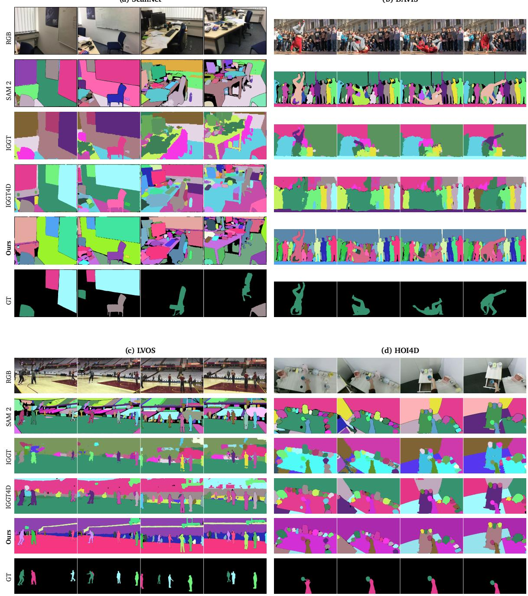  
Figure 6: Qualitative comparison of class-agnostic segmentation. A consistent mask color denotes the same instance within each sequence. Ground-truth masks cover only annotated instances.

(a) ScanNet

(b) DAVIS

Table 10: Ablation studies. (a) Grounder inputs on ScanRefer. (b) Sliding-window and ATS traversal; Presence is the fraction of observations containing the target, and $\Delta Q$ and $\Delta B$ are the changes in query- and box- stream scores when using ATS. (c–d) Dual-stream and Critic decomposition on static and dynamic grounding benchmarks.
<table><tr><td colspan="3">(a) Grounder inputs</td></tr><tr><td>Input</td><td>3D mIoU Mask@.5</td><td>Box@.5</td></tr><tr><td>Single  ${ \bf W } / { \bf O \Sigma z } ^ { \mathrm { r e g } }$ </td><td>0.206 22.9</td><td>20.7</td></tr><tr><td>Single</td><td>0.370 42.0</td><td>37.7</td></tr><tr><td>Multi</td><td>0.398 45.2</td><td>40.3</td></tr><tr><td> $\mathrm { M u l t i + C o T }$ </td><td>0.407 46.0</td><td>41.1</td></tr></table>

<table><tr><td colspan="6">(b) Active Tree Search</td></tr><tr><td>Benchmark</td><td>Presence</td><td>Sliding</td><td>ATS</td><td>∆Q</td><td>∆B</td></tr><tr><td>ScanNet++</td><td>19.1</td><td>23.0</td><td>8.2</td><td>-1.9</td><td>-1.7</td></tr><tr><td>ScanRefer</td><td>27.9</td><td>28.5</td><td>9.7</td><td>-1.7</td><td>+2.7</td></tr><tr><td>MeViS</td><td>88.1</td><td>15.5</td><td>11.4</td><td>+0.7</td><td>+0.1</td></tr><tr><td>Ref-DAVIS</td><td>93.7</td><td>17.6</td><td>15.8</td><td>+3.7</td><td>+0.3</td></tr></table>

<table><tr><td colspan="4">(c) Static 3D grounding</td></tr><tr><td rowspan="2">Benchmark</td><td rowspan="2">Output</td><td colspan="3">3D Mask</td></tr><tr><td>mIoU</td><td>@.25</td><td>@.5</td></tr><tr><td rowspan="3">ScanRefer</td><td>Query</td><td>0.406</td><td>51.8</td><td>45.0</td></tr><tr><td>Box</td><td>0.434</td><td>55.0</td><td>47.6</td></tr><tr><td>+Critic</td><td>0.461</td><td>59.4</td><td>50.5</td></tr><tr><td rowspan="3">ScanNet++</td><td>Query</td><td>0.268</td><td>41.7</td><td>30.9</td></tr><tr><td>Box</td><td>0.271</td><td>41.0</td><td>29.8</td></tr><tr><td>+Critic</td><td>0.293</td><td>44.9</td><td>33.1</td></tr></table>

<table><tr><td colspan="4">(d) Dynamic 4D grounding</td></tr><tr><td rowspan="2">Benchmark</td><td rowspan="2">Output</td><td colspan="3">Video Mask</td></tr><tr><td>J</td><td>F</td><td>J&amp;F</td></tr><tr><td rowspan="3">Ref-DAVIS</td><td>Query</td><td>0.626</td><td>0.730</td><td>0.678</td></tr><tr><td>Box</td><td>0.695</td><td>0.793</td><td>0.744</td></tr><tr><td>+Critic</td><td>0.706</td><td>0.805</td><td>0.755</td></tr><tr><td rowspan="3">MeViS</td><td>Query</td><td>0.470</td><td>0.579</td><td>0.524</td></tr><tr><td>Box</td><td>0.494</td><td>0.591</td><td>0.543</td></tr><tr><td>+Critic</td><td>0.522</td><td>0.623</td><td>0.573</td></tr></table>

(a) ScanRefer  
“This is a recycling bin atop a surface. It may be empty or filled.”  
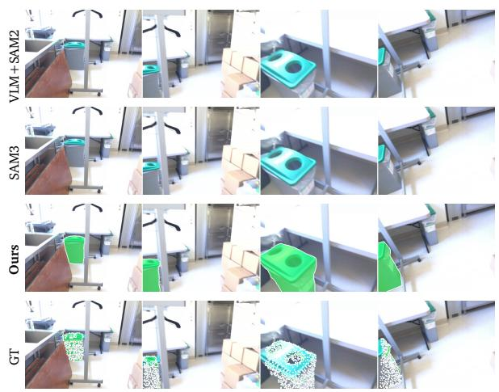

(b) MeViS  
“The rabbit that changed its location.”  
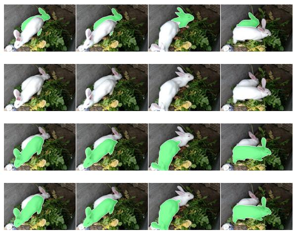  
Figure 7: Qualitative comparison of language-guided grounding. ScanRefer ground-truth masks are projected from the annotated 3D point cloud.

(a) Panoramic indoor scene  
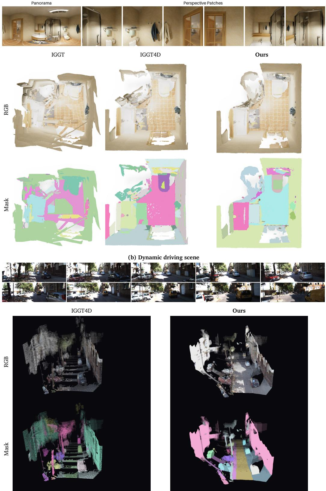  
Figure 8: Frame-space and reconstructed 4D-space visualizations. Selected observations are followed by aligned RGB and instance-colored point-cloud views. The results illustrate persistent instance identities across panoramic views and dynamic driving observations.

(a) Jet Ski at a Harbor

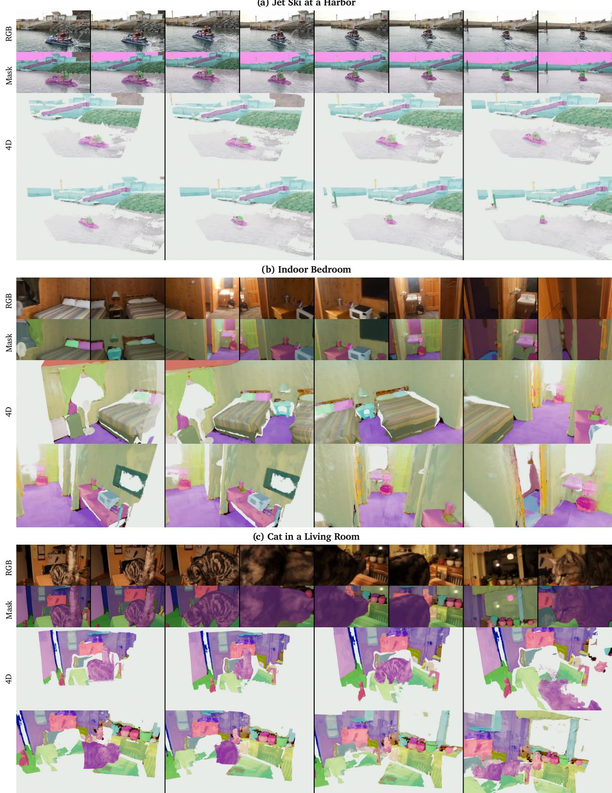  
Figure 9: In-the-wild 4D segmentation. Uniformly sampled observations are shown with their masks and reconstructed 4D instances in the same temporal order.

## 7. Conclusion

We introduced S4VY, a feed-forward Segment Anything model for 4D scenes. By exploiting a shared visual- geometric representation of an RGB observation set, S4VY exhaustively segments class-agnostic instances with persistent identities and supports point- and box-based selection without temporal ordering or memory propagation. We further developed an agentic language-grounding harness that combines VLM visual priors with geometry-consistent instance features, actively searches large observation spaces, and resolves complementary grounding predictions. Experiments across static and dynamic scenes demonstrate state-of-the-art 4D instance segmentation and strong language-guided grounding performance under our unified evaluation. A limitation is that jointly processing multiple high-resolution observations constrains the output mask resolution.

## References

Panos Achlioptas, Ahmed Abdelreheem, Fei Xia, Mohamed Elhoseiny, and Leonidas Guibas. Referit3d: Neural listeners for fine-grained 3d object identification in real-world scenes. In European conference on computer vision, pages 422–440. Springer, 2020. 4

Mehmet Aygun, Aljosa Osep, Mark Weber, Maxim Maximov, Cyrill Stachniss, Jens Behley, and Laura Leal-Taixé. 4d panoptic lidar segmentation. In Proceedings of the IEEE/CVF Conference on Computer Vision and Pattern Recognition, pages 5527–5537, 2021. 3

Shuai Bai, Yuxuan Cai, Ruizhe Chen, Keqin Chen, Xionghui Chen, Zesen Cheng, Lianghao Deng, Wei Ding, Chang Gao, Chunjiang Ge, et al. Qwen3-vl technical report. arXiv preprint arXiv:2511.21631, 2025. 10, 13, 32

Gilad Baruch, Zhuoyuan Chen, Afshin Dehghan, Tal Dimry, Yuri Feigin, Peter Fu, Thomas Gebauer, Brandon Jofe, Daniel Kurz, Arik Schwartz, et al. Arkitscenes: A diverse real-world dataset for 3d indoor scene understanding using mobile rgb-d data. arXiv preprint arXiv:2111.08897, 2021. 37

Yash Bhalgat, Iro Laina, Joao F Henriques, Andrew Zisserman, and Andrea Vedaldi. Contrastive lift: 3d object instance segmentation by slow-fast contrastive fusion. arXiv preprint arXiv:2306.04633, 2023. 3

Yohann Cabon, Lucas Stofl, Leonid Antsfeld, Gabriela Csurka, Boris Chidlovskii, Jerome Revaud, and Vincent Leroy. Must3r: Multi-view network for stereo 3d reconstruction. In 2025 IEEE/CVF Conference on Computer Vision and Pattern Recognition (CVPR), pages 1050–1060. IEEE, 2025. 3

Nicolas Carion, Francisco Massa, Gabriel Synnaeve, Nicolas Usunier, Alexander Kirillov, and Sergey Zagoruyko. End-to-end object detection with transformers. In European conference on computer vision, pages 213–229. Springer, 2020. 8

Nicolas Carion, Laura Gustafson, Yuan-Ting Hu, Shoubhik Debnath, Ronghang Hu, Didac Suris Coll-Vinent, Chaitanya Ryali, Kalyan Vasudev Alwala, Haitham Khedr, Andrew Huang, et al. Sam 3: Segment anything with concepts. In International conference on learning representations, volume 2026, pages 138846–138923, 2026. 2, 3, 10, 12

Jiazhong Cen, Zanwei Zhou, Jiemin Fang, chen yang, Wei Shen, Lingxi Xie, Dongsheng Jiang, XIAOPENG ZHANG, and Qi Tian. Segment anything in 3d with nerfs. In A. Oh, T. Naumann, A. Globerson, K. Saenko, M. Hardt, and S. Levine, editors, Advances in Neural Information Processing Systems, volume 36, pages 25971– 25990. Curran Associates, Inc., 2023. doi: 10.52202/075280-1130. URL https://proceedings.neurips. cc/paper\_files/paper/2023/file/525d24400247f884c3419b0b7b1c4829-Paper-Conference.pdf. 3

Angel Chang, Angela Dai, Thomas Funkhouser, Maciej Halber, Matthias Niessner, Manolis Savva, Shuran Song, Andy Zeng, and Yinda Zhang. Matterport3d: Learning from rgb-d data in indoor environments. arXiv preprint arXiv:1709.06158, 2017. 9, 31

Dave Zhenyu Chen, Angel X Chang, and Matthias Nießner. Scanrefer: 3d object localization in rgb-d scans using natural language. In European conference on computer vision, pages 202–221. Springer, 2020. 4, 32

Tianrun Chen, Lanyun Zhu, Chaotao Ding, Runlong Cao, Yan Wang, Shangzhan Zhang, Zejian Li, Lingyun Sun, Ying Zang, and Papa Mao. Sam-adapter: Adapting segment anything in underperformed scenes. In Proceedings of the IEEE/CVF International Conference on Computer Vision (ICCV) Workshops, pages 3367–3375, October 2023. 3, 5

Yilun Chen, Shuai Yang, Haifeng Huang, Tai Wang, Runsen Xu, Ruiyuan Lyu, Dahua Lin, and Jiangmiao Pang. Grounded 3d-llm with referent tokens. arXiv preprint arXiv:2405.10370, 2024. 4

Bowen Cheng, Anwesa Choudhuri, Ishan Misra, Alexander Kirillov, Rohit Girdhar, and Alexander G Schwing. Mask2former for video instance segmentation. arXiv preprint arXiv:2112.10764, 2021. 3

Bowen Chen Ishan Misra Alexander G Schwin Alexander Kirillov and Rohit Girdhar. Masked-attention mask transformer for universal image segmentation. In 2022 IEEE/CVF Conference on Computer Vision and Pattern Recognition (CVPR), pages 1280–1289. IEEE, 2022. 5, 8, 28

Ho Kei Cheng, Seoung Wug Oh, Brian Price, Alexander Schwing, and Joon-Young Lee. Tracking anything with decoupled video segmentation. In 2023 IEEE/CVF International Conference on Computer Vision (ICCV), pages 1316–1326. IEEE, 2023. 3, 10, 11, 36

Chris Choy, Junha Lee, Chunghyun Park, Minsu Cho, and Jan Kautz. Spaceformer: Fast proposal-free openvocabulary 3d instance segmentation. arXiv preprint arXiv:2604.20395, 2026. 2, 3

Christopher Choy, JunYoung Gwak, and Silvio Savarese. 4d spatio-temporal convnets: Minkowski convolutional neural networks. In 2019 IEEE/CVF conference on computer vision and pattern recognition (CVPR), pages 3070–3079. IEEE, 2019. 3

Christopher Clark, Jieyu Zhang, Zixian Ma, Jae Sung Park, Rohun Tripathi, Sangho Lee, Mohammadreza Salehi, Jason Ren, Chris Dongjoo Kim, Yinuo Yang, Vincent Shao, Yue Yang, Weikai Huang, Ziqi Gao, Taira Anderson, Jianrui Zhang, Jitesh Jain, George Stoica, Ali Farhadi, and Ranjay Krishna. Molmo2: Open weights and data for vision-language models with video understanding and grounding. In Proceedings of the IEEE/CVF Conference on Computer Vision and Pattern Recognition (CVPR), pages 28652–28668, June 2026. 13

Ahmad Darkhalil, Dandan Shan, Bin Zhu, Jian Ma, Amlan Kar, Richard Higgins, Sanja Fidler, David Fouhey, and Dima Damen. Epic-kitchens visor benchmark: Video segmentations and object relations. Advances in Neural Information Processing Systems, 35:13745–13758, 2022. 35

Henghui Ding, Chang Liu, Shuting He, Xudong Jiang, and Chen Change Loy. Mevis: A large-scale benchmark for video segmentation with motion expressions. In 2023 IEEE/CVF International Conference on Computer Vision (ICCV), pages 2694–2703. IEEE, 2023a. 9, 29, 32

Henghui Ding, Chang Liu, Shuting He, Xudong Jiang, Philip HS Torr, and Song Bai. Mose: A new dataset for video object segmentation in complex scenes. In 2023 IEEE/CVF International Conference on Computer Vision (ICCV), pages 20167–20177. IEEE, 2023b. 9, 29

Nikita Drozdov, Andrey Lemeshko, Nikita Gavrilov, Anton Konushin, Danila Rukhovich, and Maksim Kolodi- azhnyi. Z3d: Zero-shot 3d visual grounding from images. In Proceedings of the 64th Annual Meeting of the Association for Computational Linguistics (Volume 2: Short Papers), pages 147–154, 2026. 10, 12, 34

Zhiwen Fan, Jian Zhang, Wenyan Cong, Peihao Wang, Renjie Li, Kairun Wen, Shijie Zhou, Achuta Kadambi, Zhangyang Wang, Danfei Xu, et al. Large spatial model: End-to-end unposed images to semantic 3d. Advances in neural information processing systems, 37:40212–40229, 2024. 3

Gal Fiebelman, Tamir Cohen, Ayellet Morgenstern, Peter Hedman, and Hadar Averbuch-Elor. 4-legs: 4d language embedded gaussian splatting. Computer Graphics Forum, 44(2):e70085, 2025. doi: 10.1111/cgf.70085. 4

Jiangshan Gong, Yuqun Wu, Qiqian Fu, Yao Xiao, Chuhang Zou, Shenlong Wang, and Derek Hoiem. SAM-V: Geometry-aware segment anything for multi-view instance segmentation. arXiv preprint arXiv:2609.25490, 2026. 3, 10, 11, 12

Kaiming He, Jian Sun, and Xiaoou Tang. Guided image filtering. IEEE Transactions on Pattern Analysis and Machine Intelligence, 35(6):1397–1409, 2013. doi: 10.1109/TPAMI.2012.213. 38

Lingyi Hong, Wenchao Chen, Zhongying Liu, Wei Zhang, Pinxue Guo, Zhaoyu Chen, and Wenqiang Zhang. Lvos: A benchmark for long-term video object segmentation. In 2023 IEEE/CVF International Conference on Computer Vision (ICCV), pages 13434–13446. IEEE, 2023. 9, 29, 32

Wenyi Hong, Wenmeng Yu, Xiaotao Gu, Guo Wang, Guobing Gan, Haomiao Tang, Jiale Cheng, Ji Qi, Junhui Ji, Lihang Pan, et al. Glm-4.5 v and glm-4.1 v-thinking: Towards versatile multimodal reasoning with scalable reinforcement learning. arXiv preprint arXiv:2507.01006, 2025. 13

Edward J Hu, Yelong Shen, Phillip Wallis, Zeyuan Allen-Zhu, Yuanzhi Li, Shean Wang, Lu Wang, and Weizhu Chen. Lora: Low-rank adaptation of large language models. arXiv preprint arXiv:2106.09685, 2021. 5, 10

Wenbo Hu, Jingli Lin, Yilin Long, Yunlong Ran, Lihan Jiang, Yifan Wang, Chenming Zhu, Runsen Xu, Tai Wang, and Jiangmiao Pang. G2VLM: Geometry grounded vision language model with unified 3d reconstruction and spatial reasoning. In Proceedings of the IEEE/CVF Conference on Computer Vision and Pattern Recognition, pages 9535–9546, 2026. 4

Yuan-Ting Hu, Hong-Shuo Chen, Kexin Hui, Jia-Bin Huang, and Alexander G Schwing. Sail-vos: Semantic amodal instance level video object segmentation–a synthetic dataset and baselines. In 2019 IEEE/CVF Conference on Computer Vision and Pattern Recognition (CVPR), pages 3100–3110. IEEE, 2019. 9, 31

Shengxiang Ji, Guanjun Wu, Jiemin Fang, Jiazhong Cen, Taoran Yi, Wenyu Liu, Qi Tian, and Xinggang Wang. Segment any 4d gaussians. arXiv preprint arXiv:2407.04504, 2024. 3

Li Jiang, Hengshuang Zhao, Shaoshuai Shi, Shu Liu, Chi-Wing Fu, and Jiaya Jia. Pointgroup: Dual-set point grouping for 3d instance segmentation. In 2020 IEEE/CVF Conference on Computer Vision and Pattern Recognition (CVPR), pages 4866–4875. IEEE, 2020. 2, 3

Nikita Karaev, Ignacio Rocco, Benjamin Graham, Natalia Neverova, Andrea Vedaldi, and Christian Rupprecht. Dynamicstereo: Consistent dynamic depth from stereo videos. In 2023 IEEE/CVF Conference on Computer Vision and Pattern Recognition (CVPR), pages 13229–13239. IEEE, 2023. 9, 31

Lei Ke, Mingqiao Ye, Martin Danelljan, Yifan liu, Yu-Wing Tai, Chi-Keung Tang, and Fisher Yu. Segment anything in high quality. In A. Oh, T. Naumann, A. Globerson, K. Saenko, M. Hardt, and S. Levine, editors, Advances in Neural Information Processing Systems, volume 36, pages 29914–29934. Curran Associates, Inc., 2023. doi: 10.52202/075280-1303. URL https://proceedings.neurips.cc/paper\_files/paper/2023/ file/5f828e38160f31935cfe9f67503ad17c-Paper-Conference.pdf. 3

Anna Khoreva, Anna Rohrbach, and Bernt Schiele. Video object segmentation with language referring expressions. In Asian conference on computer vision, pages 123–141. Springer, 2018. 32

Dahun Kim, Sanghyun Woo, Joon-Young Lee, and In So Kweon. Video panoptic segmentation. In 2020 IEEE/CVF Conference on Computer Vision and Pattern Recognition (CVPR), pages 9856–9865. IEEE, 2020. 9, 29

Alexander Kirillov, Eric Mintun, Nikhila Ravi, Hanzi Mao, Chloe Rolland, Laura Gustafson, Tete Xiao, Spencer Whitehead, Alexander C Berg, Wan-Yen Lo, et al. Segment anything. In 2023 IEEE/CVF international conference on computer vision (ICCV), pages 3992–4003. IEEE, 2023. 2, 3, 28

Maxim Kolodiazhnyi, Anna Vorontsova, Anton Konushin, and Danila Rukhovich. Oneformer3d: One transformer for unified point cloud segmentation. In 2024 IEEE/CVF Conference on Computer Vision and Pattern Recognition (CVPR), pages 20943–20953. IEEE, 2024. 2, 3

Lars Kreuzberg, Idil Esen Zulfikar, Sabarinath Mahadevan, Francis Engelmann, and Bastian Leibe. 4d-stop: Panoptic segmentation of 4d lidar using spatio-temporal object proposal generation and aggregation. In Leonid Karlinsky, Tomer Michaeli, and Ko Nishino, editors, Computer Vision – ECCV 2022 Workshops, pages 537–553, Cham, 2023. Springer Nature Switzerland. ISBN 978-3-031-25056-9. 3

Xin Lai, Zhuotao Tian, Yukang Chen, Yanwei Li, Yuhui Yuan, Shu Liu, and Jiaya Jia. Lisa: Reasoning segmentation via large language model. In 2024 IEEE/CVF Conference on Computer Vision and Pattern Recognition (CVPR), pages 9579–9589. IEEE, 2024. 2, 4

Duy Tho Le, Chenhui Gou, Stavya Datta, Hengcan Shi, Ian Reid, Jianfei Cai, and Hamid Rezatofighi. Jrdb- panotrack: An open-world panoptic segmentation and tracking robotic dataset in crowded human environ- ments. In 2024 IEEE/CVF Conference on Computer Vision and Pattern Recognition (CVPR), pages 22325–22334. IEEE, 2024. 9, 29

Vincent Leroy, Yohann Cabon, and Jérôme Revaud. Grounding image matching in 3d with mast3r. In European conference on computer vision, pages 71–91. Springer, 2024. 3

Changyang Li, Xueqing Huang, Shin-Fang Chng, Huangying Zhan, Qingan Yan, and Yi Xu. Fast3dis: Feedforward anchored scene transformer for 3d instance segmentation. arXiv preprint arXiv:2603.25993, 2026a. 3

Chaoyue Li, Boxue Yang, Shengyao Zhou, Haoyang Wu, Rui Qian, and Linfeng Zhang. 4dvlt: Dynamic scene understanding with worldline-centered vision-language tracking. arXiv preprint arXiv:2606.22631, 2026b. 4

Feng Li, Hao Zhang, Peize Sun, Xueyan Zou, Shilong Liu, Chunyuan Li, Jianwei Yang, Lei Zhang, and Jianfeng Gao. Segment and recognize anything at any granularity. In European Conference on Computer Vision, pages 467–484. Springer, 2024a. 3

Hao Li, Zhengyu Zou, Fangfu Liu, Xuanyang Zhang, Fangzhou Hong, Yukang Cao, Yushi Lan, Manyuan Zhang, Gang Yu, Dingwen Zhang, et al. Iggt: Instance-grounded geometry transformer for semantic 3d reconstruction. arXiv preprint arXiv:2510.22706, 2025a. 2, 3, 5, 9, 10, 11, 35, 36

Jingjing Li, Yue Feng, Yuchen Guo, Jincai Huang, Wei Ji, Qi Bi, Yongri Piao, Miao Zhang, Xiaoqi Zhao, Qiang Chen, et al. Sam3-i: Segment anything with instructions. arXiv preprint arXiv:2512.04585, 2025b. 4

Keliang Li, Yansong Li, Hongze Shen, Mengdi Liu, Hong Chang, and Shiguang Shan. Lenswalk: Agentic video understanding by planning how you see in videos. arXiv preprint arXiv:2603.24558, 2026c. 4, 13

Rong Li, Shijie Li, Lingdong Kong, Xulei Yang, and Junwei Liang. Seeground: See and ground for zero-shot openvocabulary 3d visual grounding. In 2025 IEEE/CVF Conference on Computer Vision and Pattern Recognition (CVPR), pages 3707–3717. IEEE, 2025c. 2, 4

Wanhua Li, Renping Zhou, Jiawei Zhou, Yingwei Song, Johannes Herter, Minghan Qin, Gao Huang, and Hanspeter Pfister. 4d langsplat: 4d language gaussian splatting via multimodal large language models. In 2025 IEEE/CVF Conference on Computer Vision and Pattern Recognition (CVPR), pages 22001–22011. IEEE, 2025d. 4

Xiangtai Li, Haobo Yuan, Wei Li, Henghui Ding, Size Wu, Wenwei Zhang, Yining Li, Kai Chen, and Chen Change Loy. Omg-seg: Is one model good enough for all segmentation? In 2024 IEEE/CVF Conference on Computer Vision and Pattern Recognition (CVPR), pages 27948–27959. IEEE, 2024b. 10, 11, 36

Yun-Jin Li, Mariia Gladkova, Yan Xia, and Daniel Cremers. Trase: Tracking-free 4d segmentation and editing. In 2026 International Conference on 3D Vision (3DV), pages 1670–1679. IEEE, 2026d. 3

Lu Ling, Yichen Sheng, Zhi Tu, Wentian Zhao, Cheng Xin, Kun Wan, Lantao Yu, Qianyu Guo, Zixun Yu, Yawen Lu, et al. Dl3dv-10k: A large-scale scene dataset for deep learning-based 3d vision. In 2024 IEEE/CVF Conference on Computer Vision and Pattern Recognition (CVPR), pages 22160–22169. IEEE, 2024. 9, 31

Shilong Liu, Zhaoyang Zeng, Tianhe Ren, Feng Li, Hao Zhang, Jie Yang, Qing Jiang, Chunyuan Li, Jianwei Yang, Hang Su, et al. Grounding dino: Marrying dino with grounded pre-training for open-set object detection. In European conference on computer vision, pages 38–55. Springer, 2024. 4

Youquan Liu, Lingdong Kong, Jun Cen, Runnan Chen, Wenwei Zhang, Liang Pan, Kai Chen, and Ziwei Liu. Segment any point cloud sequences by distilling vision foundation models. Advances in Neural Information Processing Systems, 36:37193–37229, 2023. 3

Yunze Liu, Yun Liu, Che Jiang, Kangbo Lyu, Weikang Wan, Hao Shen, Boqiang Liang, Zhoujie Fu, He Wang, and Li Yi. Hoi4d: A 4d egocentric dataset for category-level human-object interaction. In 2022 IEEE/CVF Conference on Computer Vision and Pattern Recognition (CVPR), pages 20981–20990. IEEE, 2022. 35

Zhenyang Liu, Yikai Wang, Sixiao Zheng, Tongying Pan, Longfei Liang, Yanwei Fu, and Xiangyang Xue. Reasongrounder: Lvlm-guided hierarchical feature splatting for open-vocabulary 3d visual grounding and reasoning. In Proceedings of the IEEE/CVF Conference on Computer Vision and Pattern Recognition (CVPR), pages 3718–3727, June 2025. 2, 4

Jiaxu Miao, Xiaohan Wang, Yu Wu, Wei Li, Xu Zhang, Yunchao Wei, and Yi Yang. Large-scale video panoptic segmentation in the wild: A benchmark. In 2022 IEEE/CVF Conference on Computer Vision and Pattern Recognition (CVPR), pages 21001–21011. IEEE, 2022. 9, 29

Fausto Milletari, Nassir Navab, and Seyed-Ahmad Ahmadi. V-net: Fully convolutional neural networks for volumetric medical image segmentation. In 2016 fourth international conference on 3D vision (3DV), pages 565–571. Ieee, 2016. 8

OpenAI. GPT-5.6 System Card, July 2026. URL https://deploymentsafety.openai.com/gpt-5-6. Published July 9, 2026. 13, 32

Songyou Peng, Kyle Genova, Chiyu Jiang, Andrea Tagliasacchi, Marc Pollefeys, and Thomas Funkhouser. Openscene: 3d scene understanding with open vocabularies. In 2023 IEEE/CVF Conference on Computer Vision and Pattern Recognition (CVPR), pages 815–824. IEEE, 2023. 4

Federico Perazzi, Jordi Pont-Tuset, Brian McWilliams, Luc Van Gool, Markus Gross, and Alexander Sorkine- Hornung. A benchmark dataset and evaluation methodology for video object segmentation. In Proceedings of the IEEE conference on computer vision and pattern recognition, pages 724–732, 2016. 9, 29, 35

Jordi Pont-Tuset, Federico Perazzi, Sergi Caelles, Pablo Arbeláez, Alex Sorkine-Hornung, and Luc Van Gool. The 2017 davis challenge on video object segmentation. arXiv preprint arXiv:1704.00675, 2017. 9, 29, 35

Mihir Prabhudesai, Hsiao-Yu Fish Tung, Syed Ashar Javed, Maximilian Sieb, Adam W Harley, and Katerina Fragkiadaki. Embodied language grounding with 3d visual feature representations. In 2020 IEEE/CVF Conference on Computer Vision and Pattern Recognition (CVPR), pages 2217–2226. IEEE, 2020. 4

Jinyuan Qu, Hongyang Li, and Lei Zhang. Segvggt: Joint 3d reconstruction and instance segmentation from multi-view images. arXiv preprint arXiv:2603.19926, 2026. 2, 3, 10, 11

Alexander Raistrick, Lahav Lipson, Zeyu Ma, Lingjie Mei, Mingzhe Wang, Yiming Zuo, Karhan Kayan, Hongyu Wen, Beining Han, Yihan Wang, et al. Infinite photorealistic worlds using procedural generation. In 2023 IEEE/CVF Conference on Computer Vision and Pattern Recognition (CVPR), pages 12630–12641. IEEE, 2023. 9, 29

Frano Rajič, Lei Ke, Yu-Wing Tai, Chi-Keung Tang, Martin Danelljan, and Fisher Yu. Segment anything meets point tracking. In Proceedings of the Winter Conference on Applications of Computer Vision, pages 9284–9293, 2025. 3

Hanoona Rasheed, Muhammad Maaz, Sahal Shaji, Abdelrahman Shaker, Salman Khan, Hisham Cholakkal, Rao M Anwer, Eric Xing, Ming-Hsuan Yang, and Fahad S Khan. Glamm: Pixel grounding large multimodal model. In 2024 IEEE/CVF Conference on Computer Vision and Pattern Recognition (CVPR), pages 13009–13018. IEEE, 2024. 2, 4

Nikhila Ravi, Valentin Gabeur, Yuan-Ting Hu, Ronghang Hu, Chaitanya Ryali, Tengyu Ma, Haitham Khedr, Roman Rädle, Chloe Rolland, Laura Gustafson, et al. Sam 2: Segment anything in images and videos. In International Conference on Learning Representations, volume 2025, pages 28085–28128, 2025. 2, 3, 5, 9, 10, 11, 12, 29, 36

Zhongwei Ren, Zhicheng Huang, Yunchao Wei, Yao Zhao, Dongmei Fu, Jiashi Feng, and Xiaojie Jin. Pixellm: Pixel reasoning with large multimodal model. In 2024 IEEE/CVF Conference on Computer Vision and Pattern Recognition (CVPR), pages 26364–26373. IEEE, 2024. 4

Jonas Schult, Francis Engelmann, Alexander Hermans, Or Litany, Siyu Tang, and Bastian Leibe. Mask3d: Mask transformer for 3d semantic instance segmentation. In 2023 IEEE International Conference on Robotics and Automation (ICRA), pages 8216–8223. IEEE, 2023. 2, 3, 11

Yawar Siddiqui, Lorenzo Porzi, Samuel Rota Buló, Norman Müller, Matthias Nießner, Angela Dai, and Peter Kontschieder. Panoptic lifting for 3d scene understanding with neural fields. In 2023 IEEE/CVF Conference on Computer Vision and Pattern Recognition (CVPR), pages 9043–9052. IEEE, 2023. 3

Emily Steiner, Jianhao Zheng, Henry Howard-Jenkins, Chris Xie, and Iro Armeni. Rescene4d: Temporally consistent semantic instance segmentation of evolving indoor 3d scenes. arXiv preprint arXiv:2601.11508, 2026. 3

Xiangyu Sun, Haoyi Jiang, Liu Liu, Seungtae Nam, Gyeongjin Kang, Xinjie Wang, Wei Sui, Zhizhong Su, Wenyu Liu, Xinggang Wang, et al. Uni3r: Unified 3d reconstruction and semantic understanding via generalizable gaussian splatting from unposed multi-view images. In Proceedings of the IEEE/CVF Conference on Computer Vision and Pattern Recognition, pages 33280–33290, 2026. 3

Ayça Takmaz, Elisabetta Fedele, Robert W Sumner, Marc Pollefeys, Federico Tombari, and Francis Engelmann. Openmask3d: Open-vocabulary 3d instance segmentation. arXiv preprint arXiv:2306.13631, 2023. 4

Ruilin Tang, Yang Zhou, Zhong Ye, Wenxi Liu, Yan Huang, and Shengfeng He. Panopticquery: Unified query-time reasoning for 4d scenes. arXiv preprint arXiv:2604.05638, 2026. 4

Vidi Team, Celong Liu, Chia-Wen Kuo, Dawei Du, Fan Chen, Guang Chen, Jiamin Yuan, Lingxi Zhang, Lu Guo, Lusha Li, et al. Vidi: Large multimodal models for video understanding and editing. arXiv preprint arXiv:2504.15681, 2025. 13

Pavel Tokmakov, Jie Li, and Adrien Gaidon. Breaking the “object” in video object segmentation. In 2023 IEEE/CVF Conference on Computer Vision and Pattern Recognition (CVPR), pages 22836–22845. IEEE, 2023. 9, 29

Thang Vu, Kookhoi Kim, Tung M Luu, Thanh Nguyen, and Chang D Yoo. Softgroup for 3d instance segmentation on point clouds. In 2022 IEEE/CVF Conference on Computer Vision and Pattern Recognition (CVPR), pages 2698–2707. IEEE, 2022. 3

Hengyi Wang and Lourdes Agapito. 3d reconstruction with spatial memory. In 2025 International Conference on 3D Vision (3DV), pages 78–89. IEEE, 2025. 3

Jianyuan Wang, Minghao Chen, Nikita Karaev, Andrea Vedaldi, Christian Rupprecht, and David Novotny. Vggt: Visual geometry grounded transformer. In 2025 IEEE/CVF Conference on Computer Vision and Pattern Recognition (CVPR), pages 5294–5306. IEEE, 2025a. 2, 3

Jianyuan Wang, Minghao Chen, Shangzhan Zhang, Nikita Karaev, Johannes Schönberger, Patrick Labatut, Piotr Bojanowski, David Novotny, Andrea Vedaldi, and Christian Rupprecht. VGGT-�. arXiv preprint arXiv:2605.15195, 2026a. 2, 3, 5, 6, 32, 35

Shihao Wang, Shilong Liu, Yuanguo Kuang, Xinyu Wei, Yangzhou Liu, Zhiqi Li, Yunze Man, Guo Chen, Andrew Tao, Guilin Liu, et al. Locateanything: Fast and high-quality vision-language grounding with parallel box decoding. In European Conference on Computer Vision, pages 336–357. Springer, 2026b. 13

Shuzhe Wang, Vincent Leroy, Yohann Cabon, Boris Chidlovskii, and Jerome Revaud. Dust3r: Geometric 3d vision made easy. In 2024 IEEE/CVF Conference on Computer Vision and Pattern Recognition (CVPR), pages 20697–20709. IEEE, 2024a. 2, 3

Weiyao Wang, Matt Feiszli, Heng Wang, and Du Tran. Unidentified video objects: A benchmark for dense, open-world segmentation. In 2021 IEEE/CVF International Conference on Computer Vision (ICCV), pages 10756–10765. IEEE, 2021. 9, 29

Xiaohan Wang, Yuhui Zhang, Orr Zohar, and Serena Yeung-Levy. Videoagent: Long-form video understanding with large language model as agent. In European Conference on Computer Vision, pages 58–76. Springer, 2024b. 4, 7, 13

Yifan Wang, Jianjun Zhou, Haoyi Zhu, Wenzheng Chang, Yang Zhou, Zizun Li, Junyi Chen, Jiangmiao Pang, Chunhua Shen, and Tong He. �3: Permutation-equivariant visual geometry learning. In International Conference on Learning Representations, volume 2026, pages 10481–10497, 2026c. 2, 3

Zhaoqing Wang, Yu Lu, Qiang Li, Xunqiang Tao, Yandong Guo, Mingming Gong, and Tongliang Liu. Cris: Clip-driven referring image segmentation. In 2022 IEEE/CVF Conference on Computer Vision and Pattern Recognition (CVPR), pages 11676–11685. IEEE, 2022. 4

Zi an Wan , Shoubin Yu, Elias Sten el-Eskin, Jaehon Yoon, Fen Chen , Gedas Bertasius, and Mohit Bansal. Videotree: Adaptive tree-based video representation for llm reasoning on long videos. In 2025 IEEE/CVF Conference on Computer Vision and Pattern Recognition (CVPR), pages 3272–3282. IEEE, 2025b. 4, 7, 13

Ziyang Wang, Honglu Zhou, Shijie Wang, Junnan Li, Caiming Xiong, Silvio Savarese, Mohit Bansal, Michael S. Ryoo, and Juan Carlos Niebles. Active video perception: Iterative evidence seeking for agentic long video understanding. In Proceedings of the IEEE/CVF Conference on Computer Vision and Pattern Recognition (CVPR) Findings, pages 9088–9099, June 2026d. 4

Mark Weber Jun Xie Maxwell Collins Yukun Zhu Paul Voi tlaender Hartwi Adam Bradle Green Andreas Geiger, Bastian Leibe, Daniel Cremers, et al. Step: Segmenting and tracking every pixel. arXiv preprint arXiv:2102.11859, 2021. 9, 29, 35

Jason Wei, Xuezhi Wang, Dale Schuurmans, Maarten Bosma, brian ichter, Fei Xia, Ed Chi, Quoc V Le, and Denny Zhou. Chain-of-thought prompting elicits reasoning in large language models. In S. Koyejo, S. Mohamed, A. Agarwal, D. Belgrave, K. Cho, and A. Oh, editors, Advances in Neural Information Processing Systems, volume 35, pages 24824–24837. Curran Associates, Inc., 2022. doi: 10.52202/068431-1800. URL https://proceedings.neurips.cc/paper\_files/paper/2022/file/ 9d5609613524ecf4f15af0f7b31abca4-Paper-Conference.pdf. 6

Changli Wu, Haodong Wang, Jiayi Ji, Yutian Yao, Chunsai Du, Jihua Kang, Yanwei Fu, and Liujuan Cao. Mvggt: Multimodal visual geometry grounded transformer for multiview 3d referring expression segmentation. arXiv preprint arXiv:2601.06874, 2026a. 2, 4, 10, 12

Jiannan Wu, Yi Jiang, Peize Sun, Zehuan Yuan, and Ping Luo. Language as queries for referring video object segmentation. In 2022 IEEE/CVF Conference on Computer Vision and Pattern Recognition (CVPR), pages 4964–4974. IEEE, 2022a. 4

Junfeng Wu, Yi Jiang, Song Bai, Wenqing Zhang, and Xiang Bai. Seqformer: Sequential transformer for video instance segmentation. In Shai Avidan, Gabriel Brostow, Moustapha Cissé, Giovanni Maria Farinella, and Tal Hassner, editors, Computer Vision – ECCV 2022, pages 553–569, Cham, 2022b. Springer Nature Switzerland. ISBN 978-3-031-19815-1. 3

Junfeng Wu, Yi Jiang, Qihao Liu, Zehuan Yuan, Xiang Bai, and Song Bai. General object foundation model for images and videos at scale. In 2024 IEEE/CVF Conference on Computer Vision and Pattern Recognition (CVPR), pages 3783–3795. IEEE, 2024. 10, 11, 36

Junyi Wu, Van Nguyen Nguyen, Benjamin Planche, Jiachen Tao, Changchang Sun, Zhongpai Gao, Zhenghao Zhao, Anwesa Choudhuri, Gengyu Zhang, Meng Zheng, et al. Consistent instance field for dynamic scene understanding. In Proceedings of the IEEE/CVF Conference on Computer Vision and Pattern Recognition, pages 3783–3793, 2026b. 3

Xianfeng Wu, Yajing Bai, Minghan Li, Xianzu Wu, Xueqi Zhao, Zhongyuan Lai, Wenyu Liu, and Xinggang Wang. 4dlangvggt: 4d language-visual geometry grounded transformer. arXiv preprint arXiv:2512.05060, 2025. 4

Yanmin Wu, Xinhua Cheng, Renrui Zhang, Zesen Cheng, and Jian Zhang. Eda: Explicit text-decoupling and dense alignment for 3d visual grounding. In 2023 IEEE/CVF Conference on Computer Vision and Pattern Recognition (CVPR), pages 19231–19242. IEEE, 2023. 4

Zhuofan Xia, Dongchen Han, Yizeng Han, Xuran Pan, Shiji Song, and Gao Huang. Gsva: Generalized segmentation via multimodal large language models. In 2024 IEEE/CVF Conference on Computer Vision and Pattern Recognition (CVPR), pages 3858–3869. IEEE, 2024. 4

Yunyang Xiong, Bala Varadarajan, Lemeng Wu, Xiaoyu Xiang, Fanyi Xiao, Chenchen Zhu, Xiaoliang Dai, Dilin Wang, Fei Sun, Forrest Iandola, et al. Eficientsam: Leveraged masked image pretraining for eficient segment anything. In 2024 IEEE/CVF Conference on Computer Vision and Pattern Recognition (CVPR), pages 16111–16121. IEEE, 2024. 3

Jianyun Xu, Song Wang, Ziqian Ni, Chunyong Hu, Sheng Yang, Jianke Zhu, and Qiang Li. Sam4d: Segment anything in camera and lidar streams. In 2025 IEEE/CVF International Conference on Computer Vision (ICCV), pages 28535–28545. IEEE, 2025. 3

Ning Xu, Linjie Yang, Yuchen Fan, Jianchao Yang, Dingcheng Yue, Yuchen Liang, Brian Price, Scott Cohen, and Thomas Huang. Youtube-vos: Sequence-to-sequence video object segmentation. In European conference on computer vision, pages 603–619. Springer, 2018. 9, 29

Runsen Xu, Zhiwei Huang, Tai Wang, Yilun Chen, Jiangmiao Pang, and Dahua Lin. Vlm-grounder: A vlm agent for zero-shot 3d visual grounding. arXiv preprint arXiv:2410.13860, 2024. 4, 10, 12

Cilin Yan, Haochen Wan , Shilin Yan, Xiaolon Jian , Yao Hu, Guolian Kan , Weidi Xie, and Efstratios Gavves. Visa: Reasoning video object segmentation via large language models. In European Conference on Computer Vision, pages 98–115. Springer, 2024. 4

Jianing Yang, Xuweiyi Chen, Shengyi Qian, Nikhil Madaan, Madhavan Iyengar, David F Fouhey, and Joyce Chai. Llm-grounder: Open-vocabulary 3d visual grounding with large language model as an agent. In 2024 IEEE International Conference on Robotics and Automation (ICRA), pages 7694–7701. IEEE, 2024. 4

Jianing Yang, Alexander Sax, Kevin J Liang, Mikael Henaf, Hao Tang, Ang Cao, Joyce Chai, Franziska Meier, and Matt Feiszli. Fast3r: Towards 3d reconstruction of 1000+ images in one forward pass. In 2025 IEEE/CVF Conference on Computer Vision and Pattern Recognition (CVPR), pages 21924–21935. IEEE, 2025. 3

Jinyu Yang, Mingqi Gao, Zhe Li, Shang Gao, Fangjing Wang, and Feng Zheng. Track anything: Segment anything meets videos. arXiv preprint arXiv:2304.11968, 2023a. 3

Yunhan Yang, Xiaoyang Wu, Tong He, Hengshuang Zhao, and Xihui Liu. Sam3d: Segment anything in 3d scenes. arXiv preprint arXiv:2306.03908, 2023b. 10, 11

Mingqiao Ye, Martin Danelljan, Fisher Yu, and Lei Ke. Gaussian grouping: Segment and edit anything in 3d scenes. In European conference on computer vision, pages 162–179. Springer, 2024. 3

Chandan Yeshwanth, Yueh-Cheng Liu, Matthias Nießner, and Angela Dai. Scannet++: A high-fidelity dataset of 3d indoor scenes. In 2023 IEEE/CVF International Conference on Computer Vision (ICCV), pages 12–22. IEEE, 2023. 9, 29, 32

Yingda Yin, Yuzheng Liu, Yang Xiao, Daniel Cohen-Or, Jingwei Huang, and Baoquan Chen. Sai3d: Segment any instance in 3d scenes. In 2024 IEEE/CVF Conference on Computer Vision and Pattern Recognition (CVPR), pages 3292–3302. IEEE, 2024. 3

Heechan Yoon, Dongki Jung, Phuc Nguyen, Ming Lin, and Dinesh Manocha. Panoseg3r: Feed-forward 3d semantic segmentation for panoramic images with an automatic data curation pipeline. arXiv preprint arXiv:2609.22687 2026. 36

Haobo Yuan, Xiangtai Li, Tao Zhang, Yueyi Sun, Zilong Huang, Shilin Xu, Shunping Ji, Yunhai Tong, Lu Qi, Jiashi Feng, et al. Sa2va: Marrying sam2 with mllm for dense grounded understanding of images and videos. IEEE Transactions on Pattern Analysis and Machine Intelligence, 2026a. 10, 12

Yuqian Yuan, Wentong Li, Zhaocheng Li, Yutong Lin, Juncheng Li, Siliang Tang, Jun Xiao, Yueting Zhuang, and Wenqiao Zhang. Instructsam: Segment any instance with any instructions. arXiv preprint arXiv:2605.26102, 2026b. 4

Jingdong Zhang, Xiaohang Zhan, Lingzhi Zhang, Yizhou Wang, Zhengming Yu, Jionghao Wang, Wenping Wang, and Xin Li. Mtpano: Multi-task panoramic scene understanding via label-free integration of dense prediction priors. In Proceedings of the Special Interest Group on Computer Graphics and Interactive Technique Conference Conference Papers, pages 1–11, 2026a. 36

Yixin Zhang, Nicholas Konz, Kevin Kramer, and Maciej A. Mazurowski. Quantifying the limits of segmentation foundation models: Modeling challenges in segmenting tree-like and low-contrast objects. In 2026 IEEE/CVF Winter Conference on Applications of Computer Vision (WACV), pages 5205–5215, 2026b. doi: 10.1109/ WACV61042.2026.00505. 3

Lichen Zhao, Daigang Cai, Lu Sheng, and Dong Xu. 3dvg-transformer: Relation modeling for visual grounding on point clouds. In 2021 IEEE/CVF International Conference on Computer Vision (ICCV), pages 2908–2917. IEEE, 2021. 4

Jia Zheng, Junfei Zhang, Jing Li, Rui Tang, Shenghua Gao, and Zihan Zhou. Structured3d: A large photorealistic dataset for structured 3d modeling. In European Conference on Computer Vision, pages 519–535. Springer, 2020. 37

Shijie Zhou, Hui Ren, Yijia Weng, Shuwang Zhang, Zhen Wang, Dejia Xu, Zhiwen Fan, Suya You, Zhangyang Wang, Leonidas Guibas, et al. Feature4x: Bridging any monocular video to 4d agentic ai with versatile gaussian feature fields. In 2025 IEEE/CVF Conference on Computer Vision and Pattern Recognition (CVPR), pages 14179–14190. IEEE, 2025. 4

Tinghui Zhou, Richard Tucker, John Flynn, Graham Fyfe, and Noah Snavely. Stereo magnification: Learning view synthesis using multiplane images. arXiv preprint arXiv:1805.09817, 2018. 9, 29

Yuchen Zhou, Jiayuan Gu, Tung Yen Chiang, Fanbo Xiang, and Hao Su. Point-sam: Promptable 3d segmentation model for point clouds. arXiv preprint arXiv:2406.17741, 2024. 3

Chenming Zhu, Tai Wang, Wenwei Zhang, Kai Chen, and Xihui Liu. Scanreason: Empowering 3d visual grounding with reasoning capabilities. In European Conference on Computer Vision, pages 151–168. Springer, 2024. 4

Xueyan Zou, Jianwei Yang, Hao Zhang, Feng Li, Linjie Li, Jianfeng Wang, Lijuan Wang, Jianfeng Gao, and Yong Jae Lee. Segment everything everywhere all at once. Advances in neural information processing systems, 36:19769–19782, 2023. 3

Zhengyu Zou, Hao Li, Kuixuan Jiao, Liu Liu, Tingyang Xiao, Xiaolin Zhou, Fangzhou Hong, Zhizhong Su, Dingwen Zhang, and Ziwei Liu. Iggt4d: Streaming 4d instance-grounded geometry transformer. arXiv preprint arXiv:2607.19228, 2026. 2, 3, 5, 10, 11, 35, 36

Lojze Zust, Yohann Cabon, Juliette Marrie, Leonid Antsfeld, Boris Chidlovskii, Jerome Revaud, and Gabriela Csurka. Panst3r: Multi-view consistent panoptic segmentation. In 2025 IEEE/CVF International Conference on Computer Vision (ICCV), pages 5856–5886. IEEE, 2025. 2, 3, 10, 11, 36

## A. Additional Method Details

## A.1. Space-Time Query Decoder

As illustrated in Fig. 3(b), the Space-Time Query Decoder separates global instance reasoning from dense mask prediction. The contextualized patch tokens $\{ \mathbf { z } _ { i } ^ { F } \} _ { i = } ^ { T }$ follow two complementary paths. A projection $g _ { \mathrm { m e m } }$ maps them to a joint decoder memory

$$
\mathbf { Z } = { \mathrm { C o n c a t } } _ { i = 1 } ^ { T } g _ { \mathrm { { m e m } } } \left( \mathbf { z } _ { i } ^ { F } \right) ,\tag{9}
$$

while a dense feature head fuses intermediate backbone features into per-observation feature maps $\{ \mathbf { F } _ { i } \} _ { i = 1 } ^ { T }$ The former supports reasoning across the complete observation set; the latter preserves the spatial detail required for mask prediction. No chronological-order embedding is added to $\mathbf { Z } ,$ allowing the same decoder to process ordered, sparse, or shufled observations.

Starting from $N _ { q }$ learnable object queries ${ \bf Q } ^ { ( 0 ) } = \{ { \bf q } _ { j } \} _ { j = 1 } ^ { N _ { q } }$ , decoder layer ℓ performs a Mask2Former-style update (Cheng et al., 2022)

$$
\begin{array} { r } { { \bf Q } ^ { ( \ell ) } = \mathcal { D } _ { \ell } \left( { \bf Q } ^ { ( \ell - 1 ) } , { \bf Z } ; { \bf A } ^ { ( \ell - 1 ) } \right) , } \end{array}\tag{10}
$$

where $\mathcal { D } _ { \ell }$ comprises masked cross-attention to $\mathbf { Z } ,$ self-attention among the object queries, and a feed-forward network. The attention mask $\mathbf { A } ^ { ( \ell - 1 ) }$ is obtained from the preceding mask prediction and restricts each query to its current spatiotemporal support; a query with empty support can again attend to the full memory. Because one query state is shared by all observations, cross-attention gathers diferent appearances of an instance into a single persistent representation rather than constructing a separate query trajectory for each frame.

Purely prompt-driven decoding, as in SAM-style models (Kirillov et al., 2023), treats each prompt independently and may favor locally coherent, low-level regions, leading to over-segmentation. Our learnable object queries instead exchange information through self-attention and are jointly optimized under exhaustive set supervision, establishing a global instance partition before any prompt is introduced.

When a promptable query q� from Sec. A.2 is present, it is concatenated once with the learnable queries. For the ordering $\overline { { \mathbf { Q } } } ^ { ( 0 ) } = [ \mathbf { q } ^ { p } ; \mathbf { Q } ^ { ( 0 ) } ]$ shown in Fig. 3(b), the decoder update becomes

$$
\begin{array} { r } { \overline { { \mathbf { Q } } } ^ { ( \ell ) } = \mathcal { D } _ { \ell } \Big ( \overline { { \mathbf { Q } } } ^ { ( \ell - 1 ) } , \mathbf { Z } ; \mathbf { A } ^ { ( \ell - 1 ) } , \mathbf { U } \Big ) , \qquad \mathbf { U } = \left[ \begin{array} { l l } { 1 } & { \mathbf { 1 } _ { 1 \times N _ { q } } } \\ { [ - \infty ] _ { N _ { q } \times 1 } } & { \mathbf { 1 } _ { N _ { q } \times N _ { q } } } \end{array} \right] , } \end{array}\tag{11}
$$

where 1 denotes an allowed connection and $[ - \infty ] _ { N _ { q } \times 1 }$ denotes a block whose entries are all masked. Rows denote receiving queries and columns denote source queries. The lower-left block therefore prevents the learnable queries from reading $\mathbf { q } ^ { p }$ , while the fully connected first row allows $\mathbf { q } ^ { p }$ to read every learnable query. This unidirectional mask is distinct from the spatiotemporal cross-attention mask $\mathbf { A } ^ { ( \ell - 1 ) }$ in Eq. (10). It lets the promptable query resolve its target against the globally discovered instance set, while preventing local prompt evidence from altering the convergence or predictions of the learnable queries.

For a refined query ${ \bf q } _ { j }$ , a mask head produces an embedding $\mathbf { e } _ { j } = f _ { \mathrm { m a s k } } ( \mathbf { q } _ { j } )$ and evaluates it against every dense feature map:

$$
\begin{array} { r } { \hat { \mathbf { M } } _ { j , i } = \mathbf { e } _ { j } ^ { \mathsf { T } } \mathbf { F } _ { i } , \qquad \hat { o } _ { j } = f _ { \mathrm { o b j } } ( \mathbf { q } _ { j } ) . } \end{array}\tag{12}
$$

The common embedding $\mathbf { e } _ { j }$ makes the query index the instance identity throughout the observation set, while $\hat { o } _ { j }$ distinguishes object queries from no-object predictions. Hungarian matching assigns each ground-truth 4D mask to one query over the full observation set; unmatched queries are supervised as no-object. The decoder therefore predicts persistent masks end to end, without clustering dense embeddings or associating independently decoded instances.

## A.2. Prompt Encoder

The prompt encoder in Fig. 3(a) converts image-level points and boxes into a promptable object query. Although the contextualized patch tokens are the shared backbone representation, prompt sampling operates on the spatially dense maps $\mathbf { F } _ { i }$ derived from them. Let $\mathcal { P } = \{ p _ { r } \} _ { r = 1 } ^ { R }$ collect prompts placed in one or more observations, and let $\tau _ { r }$ identify the prompt type. A point samples a compact neighborhood around its location, whereas a box samples a regular grid over its enclosed region. A learned sampler then summarizes each set of samples and adds its type embedding:

$$
\mathbf { v } _ { r } = { \mathcal { S } } _ { \tau _ { r } } ( \mathbf { F } _ { i _ { r } } , p _ { r } ) + \mathbf { t } _ { \tau _ { r } } .\tag{13}
$$

This preserves local evidence for points while allowing boxes to aggregate evidence across their spatial extent.

Prompts from diferent observations need not be equally informative: sampled regions may contain diferent amounts of target evidence because of occlusion or background inclusion. Moreover, prompts supplied by users or downstream localization tools may contain localization errors or be inconsistent across observations. We therefore predict a relevance score for each sampled feature, enabling the network to filter unreliable evidence before forming the promptable query:

$$
\alpha _ { r } = \frac { \exp ( a ( { \bf v } _ { r } ) ) } { \sum _ { s = 1 } ^ { R } \exp ( a ( { \bf v } _ { s } ) ) } , \qquad { \bf q } ^ { p } = f _ { \mathrm { P } } \left( \sum _ { r = 1 } ^ { R } \alpha _ { r } { \bf v } _ { r } \right) .\tag{14}
$$

A positional embedding derived from the mean prompt coordinates is supplied independently of the content query. Consequently, evidence from multiple observations can specify one target without collapsing its appear- ance and location into the same encoding. In Fig. 3(a), �′ denotes the number of observations containing prompts.

The resulting $\mathbf { q } ^ { p }$ enters the decoder through the unidirectional self-attention in Eq. (11) and uses the same joint memory and dense mask readout as the learnable queries. It is supervised directly with the indicated target mask, rather than being assigned to a learnable query through an additional matching objective, and decodes the target’s complete 4D mask even when prompts are supplied in only a subset of observations.

## A.3. Training Data Details

Tab. 1 details the 19 sources summarized in Fig. 5(c). The reported counts refer to the subsets sampled for trainin rather than the full source releases. In articular, we sam le 5,127 trajectories from RealEstate10K, 4,635 clips from SA-V, and 9,649 scenes from DL3DV. The resulting corpus contains 33,220 scenes, sub-scenes, or video clips and 6,052,440 RGB observations spanning indoor, outdoor, and mixed environments as well as real and synthetic imagery.

The exhaustive subset provides the set-level supervision required to discover every annotated instance. Its static component combines geometry-consistent synthetic views from Infinigen (Raistrick et al., 2023), real indoor captures from ScanNet++ (Yeshwanth et al., 2023), and large-scale camera trajectories from RealEstate10K (Zhou et al., 2018). Its dynamic component draws on the diverse panoptic videos ofVIPSeg (Miao et al., 2022), urban driving sequences from Cityscapes-VPS (Kim et al., 2020) and KITTI-STEP (Weber et al., 2021), and the indoor-outdoor pedestrian sequences of JRDB-PanoTrack (Le et al., 2024). Together, these sources expose the decoder to both cross-view appearance changes in static geometry and persistent identities under scene motion.

The partially annotated video subset broadens the motion and appearance distribution beyond panoptic benchmarks. SA-V (Ravi et al., 2025), YouTube-VOS (Xu et al., 2018), and UVO-Dense (Wang et al., 2021) contribute diverse object masklets; MeViS (Ding et al., 2023a), MOSE (Ding et al., 2023b), LVOS (Hong et al., 2023), DAVIS (Perazzi et al., 2016; Pont-Tuset et al., 2017), and VOST (Tokmakov et al., 2023) emphasize motion-dependent references, dense distractors, long-term visibility changes, and object transformations.

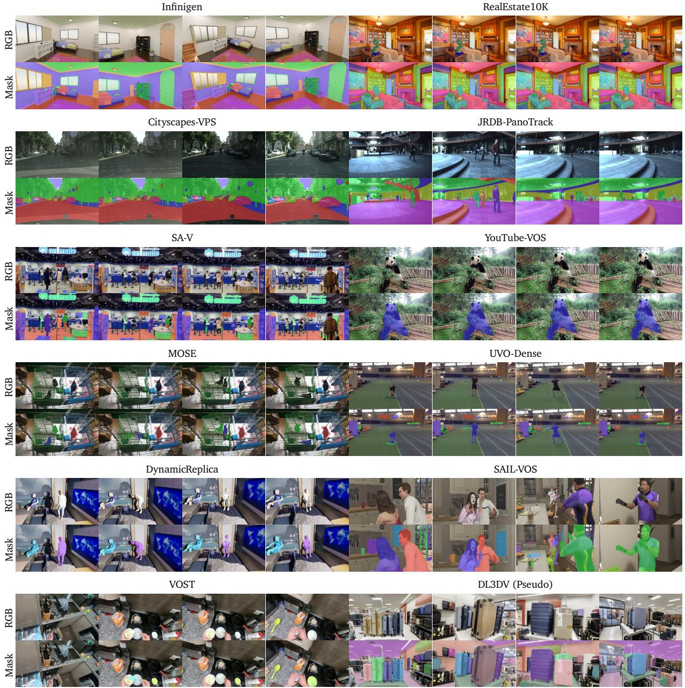  
Figure 10: Representative training observations. Four RGB observations and corresponding masks from twelve training sources not used in our evaluation; DL3DV uses pseudo-masks.

DynamicReplica (Karaev et al., 2023) and SAIL-VOS (Hu et al., 2019) complement these real videos with controlled synthetic motion. Their original masklets supervise annotated targets, while teacher predictions provide dense instance coverage outside the labelled subset.

Finally, DL3DV (Ling et al., 2024) and Matterport3D (Chang et al., 2017) provide 3.51M unlabelled multi-view observations from diverse real scenes. These sources are trained solely with teacher-generated pseudo- masklets and account for most of the corpus scale. Representative RGB observations and their corresponding annotations or pseudo-mask overlays are shown in Fig. 10.

## A.4. Agentic Grounding in 4D

## Grounder details.

For a grounder window, each observation is represented by its RGB image and the corresponding camera and register tokens from the frozen segmentation backbone. The geometry tokens are projected into the VLM embedding space and condition a frame-specific grounding state. In the query stream, this state is compared with all persistent object-query embeddings, augmented with a learned null state for target absence. In the box stream, we retain Qwen’s native text-generation interface to exploit its pretrained spatial priors, autoregressively predicting a normalized box or an explicit absence token for each observation. The resulting boxes are passed jointly to the prompt encoder, rather than being used to restrict the observations decoded by the segmenter.

An observation may be visited by several overlapping search windows. Let � denote the set of visited windows and $a _ { w , i , j }$ the matching score assigned to persistent object query $\mathbf { q } _ { j }$ for observation � in window �. The query stream selects

$$
j ^ { q } = \arg \operatorname* { m a x } _ { j } \sum _ { w \in \mathcal { V } } \sum _ { i \in w } a _ { w , i , j } ,\tag{15}
$$

which aggregates query evidence across all visited windows without introducing an additional temporal association step. Repeated box predictions for the same observation are consolidated by presence voting and coordinate-wise median aggregation. The selected persistent query and the aggregated box prompts are then decoded by the Space-Time Query Decoder into Mˆ � and Mˆ �, respectively.

## Critic details.

The critic operates on the final decoded masks. For each candidate, we select representative observations according to its visible mask area and render the original image beside a colored mask overlay. The two rendered candidates and the referring expression are presented to a VLM followed by a scalar preference head. Because a pairwise VLM judge may favor one presentation position irrespective of candidate quality, candidate order is randomized durin trainin . At inference we additionall evaluate both candidate orders and antisymmetrize their logits:

$$
s _ { \mathrm { C } } = h _ { \mathrm { C } } \Big ( x , \mathcal { R } ( \hat { \mathbf { M } } ^ { q } ) , \mathcal { R } ( \hat { \mathbf { M } } ^ { p } ) \Big ) - h _ { \mathrm { C } } \Big ( x , \mathcal { R } ( \hat { \mathbf { M } } ^ { p } ) , \mathcal { R } ( \hat { \mathbf { M } } ^ { q } ) \Big ) ,\tag{16}
$$

where ℛ denotes representative-view rendering and a positive score selects the query candidate. This comparison allows the critic to judge correspondence with the expression as well as the spatial and temporal consistency visible in the decoded masks.

## Active Tree Search.

ATS is defined over the supplied observation order; adjacency therefore refers to neighboring input observations, which may follow a static scan trajectory or a dynamic sequence. The complete recursive traversal is given in Algorithm 1.

The box stream therefore controls the recursive search, while predictions from every visited window contribute to the two candidates evaluated by the critic.

## Grounding data construction.

Grounder data. We combine the human referring annotations of ScanRefer (Chen et al., 2020), MeViS (Ding et al., 2023a), and Ref-DAVIS (Khoreva et al., 2018) with descriptions generated for ScanNet++ (Yeshwanth et al. 2023) and LVOS (Hon et al. 2023) which do not rovide referrin text. For ScanNet++ we use ground-truth 3D instances and their semantic labels as class anchors. Qwen3-VL-32B (Bai et al., 2025) receives the most visible RGB observation and up to two spatially separated context observations to generate up to five descriptions per instance. Quality control filters refusals, regenerates descriptions that omit the class anchor, checks hallucinations, contradictions, and neighboring-object errors with a VLM, and removes exact duplicates. For LVOS, we use GPT-5.6 (OpenAI, 2026) to generate referring-expression annotations for its video sequences. Each description is associated with its annotated instance or track and matched to a persistent object query by mask overlap over the available observations. For ScanNet++ and the video sources, we discard training pairs whose predicted masks have 2D mask IoU below 0.4 with the annotations, preventing incomplete or fragmented predictions from introducing incorrect grounding correspondences. After target filtering and source balancing, the trainin loader contains 79 856 records from 3 065 scenes or videos: 30 352 from ScanRefer 31 764 from ScanNet++, 16,888 from MeViS, 435 from LVOS, and 417 from Ref-DAVIS.

Geometry-guided CoT supervision is generated for the known referent in a separate stage. For video datasets without 3D/4D ground truth, the visual geometry backbone (Wang et al., 2026a) reconstructs depth and camera geometry directly from the RGB observations. Back-projecting the ground-truth masks through this geometry yields an object-centric 4D point track, whose per-observation centroids and extents describe the referent’s location, motion, and spatial relations to nearby instances. Static-scene geometry further provides metric object extent, height above the floor, and metric inter-object distances. Since monocular video reconstruction has neither an absolute scale nor a gravity-aligned frame, its facts instead use target visibility, size-normalized motion, relative object size and distance, and variation in camera distance. Qwen3-VL-235B receives these facts, the referring expression, up to four uniformly sampled RGB observations, and the known target, and produces a short rationale that must combine an appearance cue with at least one geometric or spatiotemporal cue without revealing the target index.

Critic data. We construct critic training data from the grounder’s full dual-stream predictions on the training splits. For each expression, the query and box outputs are decoded into two candidate masks and rendered as a comparison pair. Candidate quality is measured against the annotated referent using 3D box IoU for static scenes and �&ℱ for videos; the higher-scoring candidate provides the preferred label. We discard pairs in which neither candidate reaches 0.5 and subsample near-ties, leaving 4,005 comparisons; this prevents jointly failed or ambiguous predictions from introducing noisy comparative supervision.

## B. Experimental Details

## B.1. Segmenter and Prompt Encoder Training

## Self-distillation with incomplete annotations.

After Hungarian matching, exhaustive set prediction supervises every unmatched query as no-object. Applied directly to partial annotations, this objective would suppress unlabelled instances, while unlabelled sequences provide no positive targets. We therefore train a teacher on the exhaustive sources and use it to densify the remaining data. Original masklets are augmented with non-overlapping teacher predictions for partially annotated samples, whereas unlabelled samples are supervised entirely by the teacher. The shared teacher– student architecture thus transfers exhaustive supervision to the broader corpus through self-distillation.

Teacher predictions above 0.7 object probability are retained, regions between 0.3 and 0.7 are ignored, and the no-object loss is preserved elsewhere. Human annotations take precedence; overlapping teacher masks are discarded, and each retained pseudo-masklet is weighted by half its teacher confidence before Hungarian matching. This three-band supervision densifies partial labels without assigning uncertain predictions to either foreground or background.

The segmenter is optimized for 50,000 steps from the same 1B visual geometry checkpoint using 8–16 randomly sampled observations at 512-pixel resolution. AdamW uses a global batch size of 64, weight decay 0.05, gradient clipping at 1.0, and 5% linear warm-up followed by cosine decay. Peak learning rates are $2 . 8 3 \times 1 0 ^ { - 5 }$ for rank-256 LoRA adapters and $5 . 6 6 \times 1 0 ^ { - 4 }$ for the Space-Time Query Decoder and mask heads. The number for learnable object queries is set as 400. Object classification, BCE, and Dice losses have weights 2, 5, and 5, with a no-object weight of 0.1. The exhaustive to incomplete sampling ratio increases linearly from 1:10 to 2:1. Since incomplete samples rely on teacher pseudo-masklets, this curriculum uses their diversity to accelerate early convergence, then progressively favors exhaustive annotations to reduce the influence of noisy labels. Training uses 64 NVIDIA A100 GPUs.

## Prompt encoder training.

The unidirectional attention in Eq. (11) isolates the learnable object queries from the promptable query, supporting either separate or joint training. Our reported model freezes the backbone, LoRA adapters, Space-Time Query Decoder, and mask heads, and optimizes only the prompt encoder for 15,000 steps with AdamW on eight GPUs. The per-GPU batch size is one, the peak learning rate is $3 \times 1 0 ^ { - 4 }$ , and weight decay, warm-up, and gradient clipping are 0.05, 5%, and 1.0, respectively. The reported grounding pipeline uses the checkpoint at step 13,500.

Prompts are sampled online from annotated or pseudo-labelled masklets, with at most four target instances per sample. We use box prompts with probability 0.4 and point prompts otherwise. A point prompt contains a positive point inside the target mask; for each point-prompted observation, an additional corrective point is sampled outside it with probability 0.3. Negative clicks thus supplement rather than replace positive evidence, teaching the encoder to exclude surrounding regions and nearby instances. Box prompts are not paired with negative boxes; their coordinates are instead jittered to model localization error. Prompts span a random number of target-visible observations. The promptable query is directly supervised by the corresponding 4D mask using BCE and Dice losses weighted by 5, with intermediate-layer supervision weighted by 0.4.

Alternatively, LoRA, decoder, mask-head, and prompt-encoder parameters are jointly optimized for 50,000 steps with the segmenter settings above. We interleave exhaustive and prompt-conditioned steps at 1:1 for the first 20,000 steps, 2:1 for the next 20,000, and 5:1 for the final 10,000. Since the prompt-conditioned pool includes partially annotated and pseudo-labelled masklets, this curriculum accelerates prompt learning early and progressively reduces exposure to label noise toward convergence. For exhaustively annotated prompt batches, the learnable-query set loss is retained with weight 0.5. With probability 0.05, up to 20% of prompted observations are corrupted: a point is moved to a random location, while a box is replaced by one from another instance or by a random box. This augmentation directly trains the relevance weights in Eq. (14) to suppress inconsistent evidence across observations. The separate strategy applies an analogous noisy-to-clean curriculum during segmenter self-distillation; its subsequent frozen-segmenter prompt stage contains only prompt-conditioned updates. We systematically evaluate separate and joint training across all benchmarks and observe only marginal diferences. All results reported in this paper therefore use the separately trained segmenter and Prompt Encoder checkpoints.

## B.2. Grounder and Critic Training

## Grounder.

We use a Grounder window size of $N _ { \mathrm { w } } = 8$ during both training and inference. During training, the observations are sampled from a span of at most 32: 80% of the windows are centred on a target-visible observation and balance target-present and target-absent observations, while the remainder are sampled without a presence constraint to include negative windows. We fully fine-tune Qwen3-VL-4B for 4 epochs, corresponding to approximately 5,000 optimizer updates on eight GPUs. AdamW uses an efective batch size of 64, weight decay 0.01, and peak learning rates of $8 \times 1 0 ^ { - 6 }$ for the VLM and $1 0 ^ { - 4 }$ for the newly initialized projection and prediction heads. We apply 300 warm-up steps followed by cosine decay, bfloat16 training, and gradient clipping at 1.0. The query-classification and autoregressive language-modeling losses in Eq. (6) are equally weighted.

## Critic.

The 4,005 candidate pairs constructed in Sec. A.4 are shufled during training, and their presentation order is randomized on every visit to remove branch-position bias. Near-tie examples constitute 30% of the training pairs, exposing the Critic to both clear and ambiguous comparisons. We fully fine-tune Qwen3-VL-2B with its scalar readout for three epochs on four GPUs. AdamW uses an efective batch size of 32, a learning rate of $5 \times 1 0 ^ { - 6 }$ , weight decay 0.01, bfloat16 precision, and gradient clipping at 1.0.

## B.3. Baseline Configurations

## Class-agnostic segmentation baselines.

We compare lifted 3D segmentation, video segmentation, and feed-forward visual-geometry methods, using their oficial checkpoints on the same observations without semantic labels, target prompts, or first-frame ground truth. For SAM 2, the Automatic Mask Generator uses a 16 × 16 point grid to discover instances, whose masks initialize the video predictor. The predictor propagates their identities, while periodic automatic mask generation adds masks with less than 0.5 IoU to every active track as new instances. Re-discovery is performed every 2 observations for the short ScanNet clips and every 15 frames for the video benchmarks. When full-sequence inference exceeds GPU memory, we retain all observations through memory-bounded streaming-window inference. In particular, our IGGT implementation appends fixed scene-wide anchor views to each sliding window, concatenates the resulting dense instance features, and applies clustering over the complete sequence to maintain identities across windows. IGGT4D uses its released ofline full-attention configuration. SAM-V uses the released checkpoint and automatic-mask settings; sequences longer than 32 observations are processed in overlapping 32-observation windows, with identities matched by mask IoU on the shared observation.

## Language-grounding baselines.

VLM-Grounder uses Qwen3-VL-30B-A3B-Thinking with YOLO-World and a single-view ensemble; for videos, it runs its 3D pipeline on the reconstructed geometry and reprojects the selected box to each observation. VLM+SAM 2 uses Qwen3-VL-30B-A3B-Instruct, and Sa2VA uses its released 8B model. SAM 3 and MVGGT use their oficial end-to-end checkpoints without a separately served VLM: SAM 3 receives category prompts on static scenes and full expressions on videos, while MVGGT receives eight uniformly sampled observations. Z3D (Drozdov et al., 2026) uses Qwen3-VL-30B-A3B-Thinking within a 3D-proposal pipeline combining MaskClustering, CLIP retrieval, VLM filtering, SAM 3 segmentation, and 3D proposal voting. To preserve the RGB-only input setting, its proposals are constructed from the feed-forward geometry reconstructed for each scene rather than from ground-truth point clouds; on videos, the selected 3D proposal is projected back to the observations for evaluation. For static scenes, VLM+SAM 2 ranks the observations with CLIP and predicts a normalized box on the selected view. For the video results in Tab. 7, the VLM instead receives eight uniformly sampled observations jointly and predicts one box or absence per observation; these boxes initialize SAM 2 for bidirectional propagation over the complete sequence.

## B.4. Benchmarks and Metrics

## Benchmarks.

For class-agnostic segmentation, we use the ScanNet setting from IGGT (Li et al., 2025a), DAVIS 2017, LVOS, and VIPSeg, comprising ten static multi-view clips, 30 short videos, 50 long-term videos, and 343 panoptic videos, respectively. Following (Li et al., 2025a; Zou et al., 2026), each ScanNet clip contains 8 sampled observations, while each LVOS video is uniformly sampled to 100 observations. For the separate robustness evaluation, each video produces three sparse subsets by sampling 16 observations without replacement from its first 32 observations, last 32 observations, and full temporal extent, respectively; the sampled observations retain their chronological order, and each subset contains annotated foreground. The shufle setting randomly permutes exactly the same observations and their annotations. For the LVOS hard setting, farthest-point sampling over normalized RGB thumbnail descriptors selects 16 appearance-diverse observations across the full video; at least four contain annotated fore round when available, after which their order is shufled. Additional evaluations further cover two zero-shot egocentric benchmarks: 48 HOI4D (Liu et al., 2022) clips and 42 EPIC-KITCHENS VISOR (Darkhalil et al., 2022) clips, as well as 9 KITTI-STEP (Weber et al., 2021) sequences for driving scenes. For language grounding, we sample 700 ScanRefer queries from 121 validation scenes and hold out 80 ScanNet++ scenes with 3,320 ex ressions. The video evaluation contains all 122 Ref-DAVIS expressions and 616 single-referent MeViS expressions from 47 videos.

## Metrics.

For class-agnostic segmentation, T-mIoU averages over ground-truth tracks the intersection-over-union accu- mulated across observations, while T-SR measures the fraction whose IoU exceeds 0.5 in every observation where they are present. We report the standard region similarity �, boundary accuracy ℱ, and their mean �&ℱ (Perazzi et al., 2016; Pont-Tuset et al., 2017) on DAVIS and LVOS, and STQ and class-agnostic thing mAP on VIPSeg. Because the video benchmarks provide only per-frame 2D masks, both annotated and predicted masks are lifted with the same depth and cameras predicted by the visual geometry backbone (Wang et al., 2026a). The resulting point sets are evaluated with the strict 4D metrics in Eq. (8), using a separate temporal voxel slice for every observation and one-to-one instance matching. Static grounding is evaluated by 3D mask mIoU and the proportions of predicted masks and axis-aligned boxes exceeding 0.25 IoU; Ref-DAVIS and MeViS use �&ℱ.

## C. Additional Results and Discussion

## C.1. Eficiency and Additional Ablations

## Segmentation eficiency.

Tab. 11 reports end-to-end seconds per clip. Joint feed-forward processing avoids repeated per-frame detection and propagation, so the eficiency advantage grows with the observation count. Direct set prediction also avoids the post-hoc clustering used by IGGT. S4VY processes an eight-observation ScanNet scene in 0.5 seconds and a 100-observation clip in about 10 seconds on an A100-80GB. Tab. 12 shows that a GB200 processes four 100-frame clips in parallel at 42.11 frames/s.

Table 11: Segmentation eficiency. Average wall-clock seconds per clip on a sampled benchmark subset using an A100-80GB. Parentheses report the mean number of observations in the sampled clips. Lower is better.
<table><tr><td colspan="5">Method ScanNet (8) VIPSeg (41) DAVIS (71) LVOS (100) HOI4D (100)</td></tr><tr><td>DEVA (Cheng et al., 2023)</td><td>3.0</td><td>9.3</td><td>32.3</td><td>32.3 26.7</td></tr><tr><td>GLEE (Wu et al., 2024)</td><td>2.5</td><td>13.8</td><td>24.6 36.8</td><td>35.9</td></tr><tr><td>OMG-Seg (Li et al., 2024b)</td><td>0.9</td><td>5.4</td><td>10.1 13.7</td><td>14.6</td></tr><tr><td>SAM 2 (Ravi et al., 2025)</td><td>3.4</td><td>46</td><td>183 175</td><td>168</td></tr><tr><td>PanSt3R (Zust et al., 2025)</td><td>3.3</td><td>18.3</td><td>35.3 54.0</td><td>50.7</td></tr><tr><td>IGGT (Li et al., 2025a)</td><td>13.3</td><td>83</td><td>162 272</td><td>230</td></tr><tr><td>IGGT4D (Zou et al., 2026)</td><td>2.6</td><td>6.9</td><td>14.4 18.5</td><td>18.0</td></tr><tr><td>S4VY (Ours)</td><td>0.5</td><td>3.0</td><td>6.6 10.1</td><td>10.2</td></tr></table>

Table 12: Hardware scaling. Besttested model-forward throughput at 384×688. Parentheses report batch size �.
<table><tr><td>Frames</td><td>A100</td><td>GB200</td><td>Ratio</td></tr><tr><td>1</td><td>25.85 (32)</td><td>63.15 (32)</td><td>2.44×</td></tr><tr><td>4</td><td>25.44 (32)</td><td>65.19 (32)</td><td>2.56×</td></tr><tr><td>8</td><td>24.37 (16)</td><td>64.40 (32)</td><td>2.64×</td></tr><tr><td>16</td><td>22.28 (8)</td><td>61.61 (16)</td><td>2.77×</td></tr><tr><td>32</td><td>18.98 (4)</td><td>56.69 (8)</td><td>2.99×</td></tr><tr><td>64</td><td>14.72 (2)</td><td>48.64 (4)</td><td>3.30×</td></tr><tr><td>100</td><td>11.64 (1)</td><td>42.11 (4)</td><td>3.62×</td></tr></table>

Table 13: Segmenter ablations on IGGT-Benchmark (Li et al., 2025a). (a) Backbone adaptation. (b) Frame positional encoding in the decoder.
<table><tr><td colspan="4">(a) Backbone adaptation</td></tr><tr><td>Strategy</td><td>mAP</td><td> $\mathrm { { A P } _ { 5 0 } }$ </td><td> $\mathrm { A P _ { 7 5 } }$ </td></tr><tr><td>Full fine-tuning</td><td>0.200</td><td>0.286</td><td>0.233</td></tr><tr><td>LoRA</td><td>0.210</td><td>0.287</td><td>0.260</td></tr></table>

<table><tr><td colspan="3">(b) Frame positional encoding</td></tr><tr><td>Encoding</td><td>mAP</td><td> $\mathrm { { A P } _ { 5 0 } }$   $\mathrm { A P _ { 7 5 } }$ </td></tr><tr><td>Learned</td><td>0.208</td><td>0.288 0.252</td></tr><tr><td>Sinusoidal</td><td>0.186</td><td>0.262 0.220</td></tr><tr><td>None</td><td>0.212 0.294</td><td>0.251</td></tr></table>

## Segmenter ablations.

Tab. 13 reports class-agnostic instance AP on IGGT-Benchmark (Li et al., 2025a); mAP averages AP over IoU thresholds from 0.50 to 0.95, while $\mathsf { A P } _ { 5 0 }$ and $\mathsf { A P } _ { 7 5 }$ use fixed thresholds. LoRA matches or im roves full fine-tuning, with the largest gain at $\mathsf { A P } _ { 7 5 }$ . Removing frame positional embeddings also preserves segmentation quality relative to learned embeddings, whereas sinusoidal embeddings degrade all three metrics. These results support parameter-eficient backbone adaptation and a decoder without frame-order priors.

## C.2. Additional Qualitative Results

## Frame-space and 4D-space results.

Feed-forward 3D semantic segmentation has recently been extended to panoramic inputs (Yoon et al., 2026). Following the panorama-to-perspective processing of MTPano (Zhang et al., 2026a), we decompose each panorama into overlapping perspective patches.

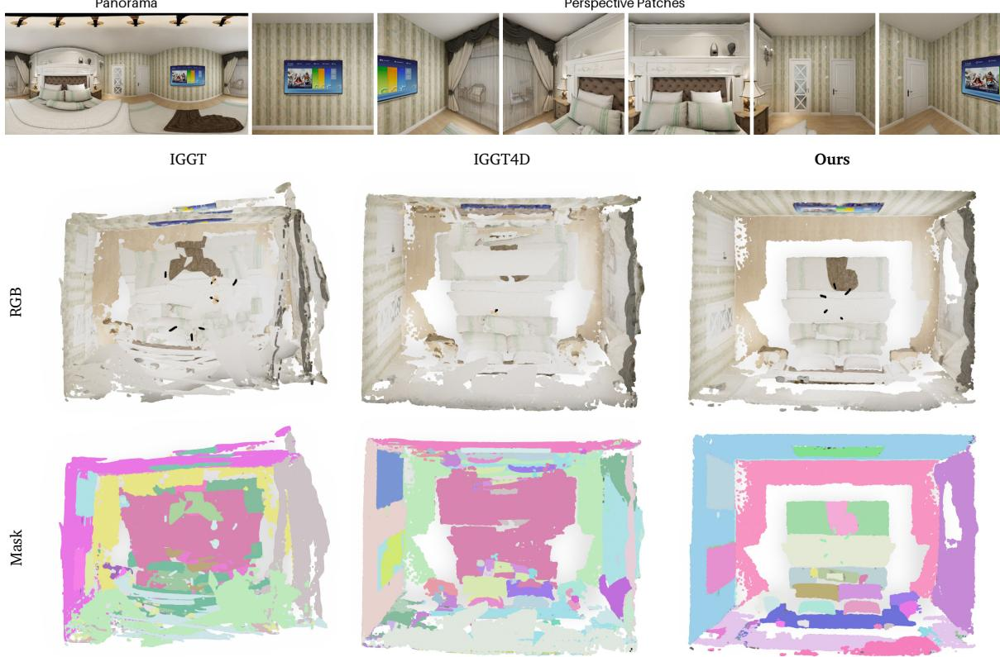  
Figure 11: Additional zero-shot panoramic segmentation. A Structured3D panorama (Zheng et al., 2020) is decomposed into overlapping perspective patches; representative patches are shown above aligned RGB and instance-colored point clouds.

Fig. 11 and Fig. 14 provide further indoor results on Structured3D (Zheng et al., 2020) and ARKitScenes (Baruch et al., 2021), neither of which is in the training corpus. The dynamic and driving examples in Figs. 12 and 15 show persistent instance identities under camera and object motion. These visualizations assess the coherence of predicted identities in the reconstructed scene rather than independent geometric accuracy.

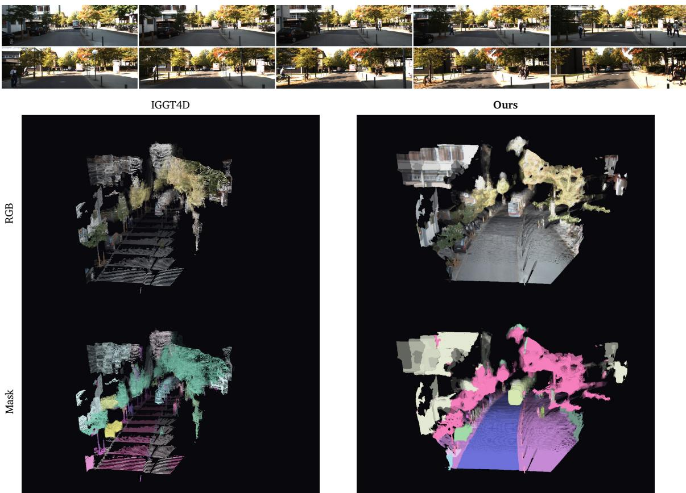  
Figure 12: Additional 4D reconstruction and instance segmentation in a driving scene. Selected observations are followed by aligned RGB and instance-colored point-cloud views.

## More segmentation comparisons.

Fig. 13 adds comparisons on static multi-view scenes and dynamic videos. Across these cases, S4VY retains instance identities through viewpoint changes, occlusion, rapid motion, and deformation.

## More grounding comparisons.

The results in Figs. 16 and 17 include references that require spatial reasoning rather than appearance matching alone. For example, Fig. 16(c) contains several similar laptops; the relation “across from an armchair” identifies the intended instance consistently across views.

## In-the-wild evaluation.

Fig. 18 extends the main in-the-wild results to road, downtown, and cycling scenes. Despite changes in viewpoint, scale, motion, and scene content, S4VY maintains coherent identities across observations. For visualization, we follow He et al. (2013) and apply guided image filtering to the predicted mask boundaries using the corresponding RGB observations.

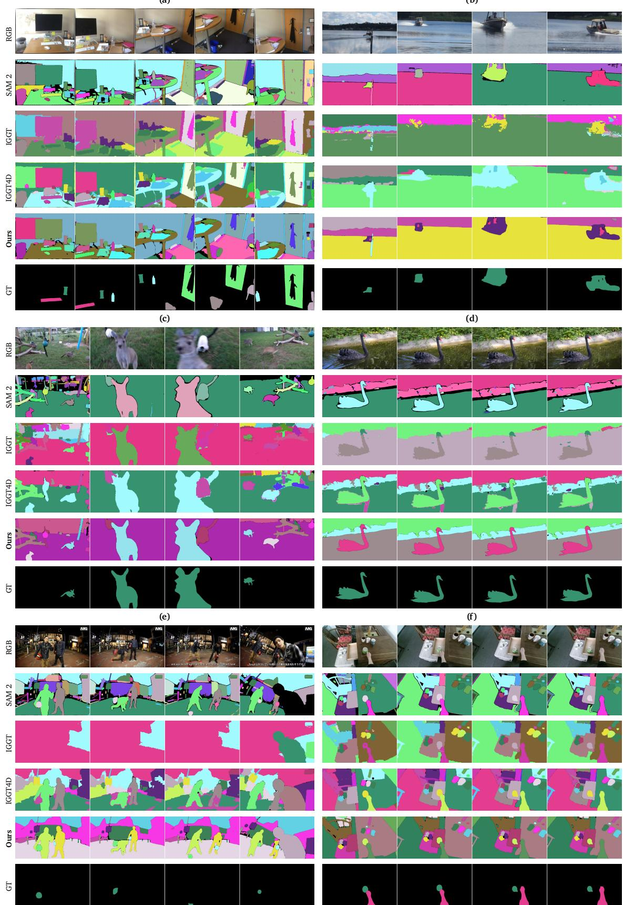  
Figure 13: Additional qualitative comparisons of class-agnostic segmentation. A consistent mask color denotes the same instance within each sequence.

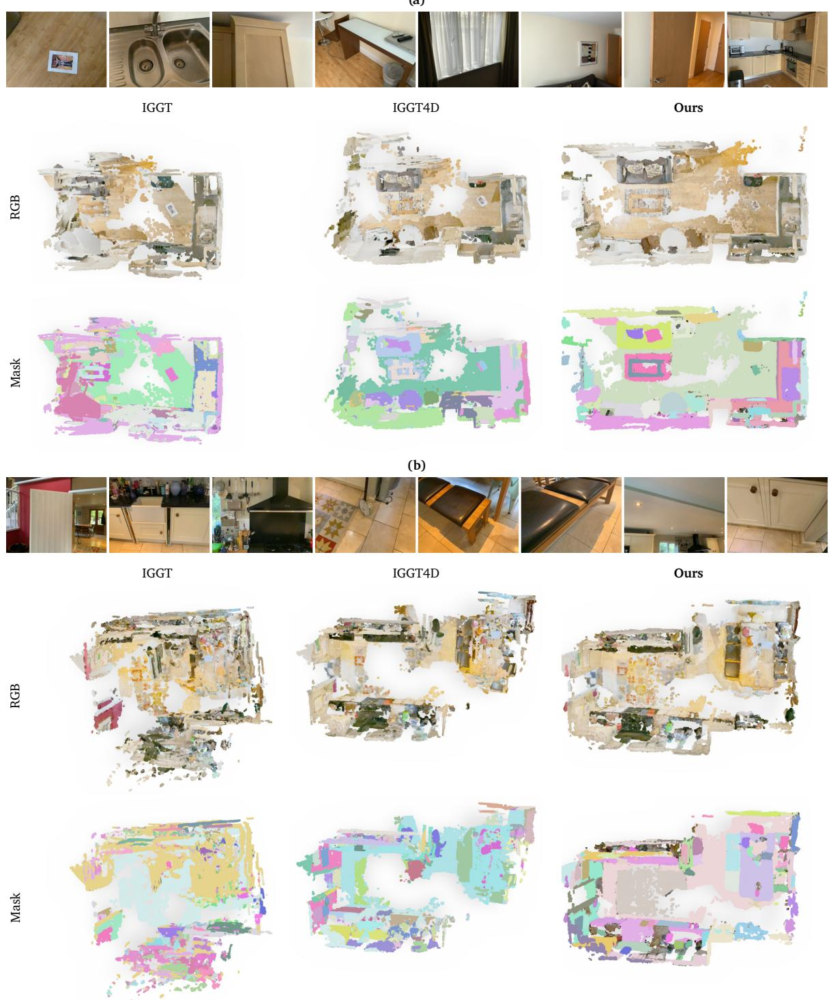  
Figure 14: Feed-forward 3D reconstruction and instance segmentation. Eight RGB observations from held-out ARKitScenes are followed by aligned top-view RGB and instance-colored point clouds; all methods are evaluated zero-shot.

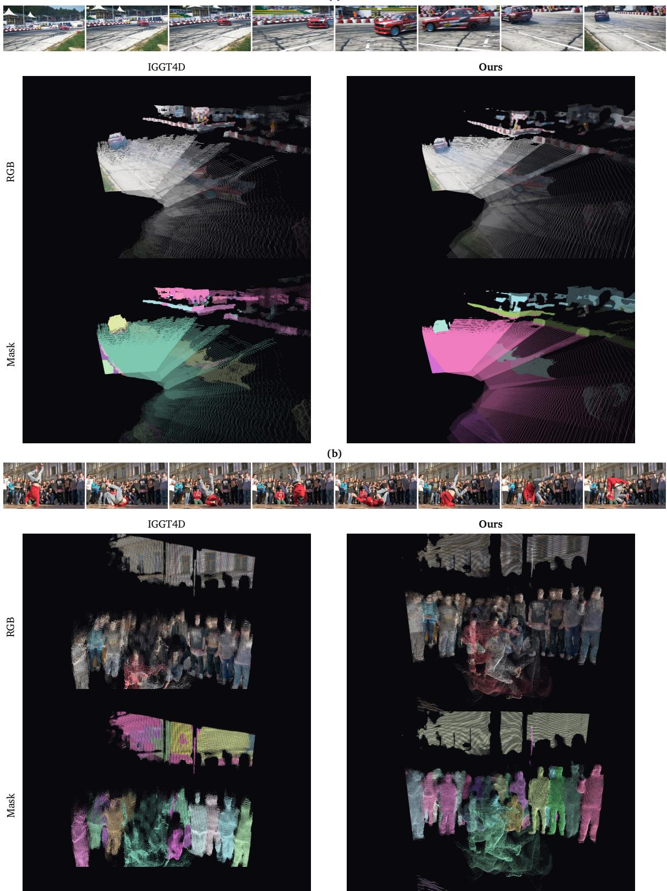  
Figure 15: Feed-forward 4D reconstruction and instance segmentation in dynamic scenes. Selected RGB observations are followed by aligned RGB and instance-colored point-cloud views; earlier observations are rendered with lower opacity.

“This is a white printer. It is on the counter.”  
(a)  
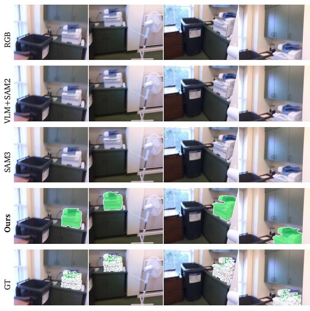  
(c)  
“This is a silver laptop. It is on a desk, across from an armchair.”

(b)  
“This is a small gray pillow that is crumpled up. It is in the corner of a black couch, near a wooden door.”  
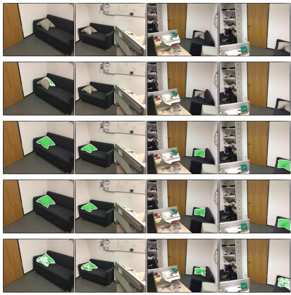

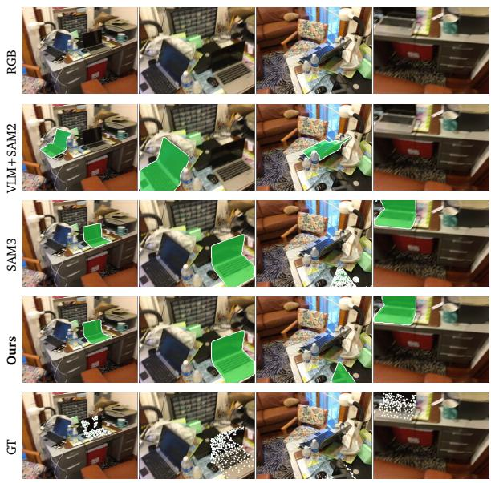

(d)  
“TV with glossy black screen and slim bezel, designed for displaying digital video and images in indoor settings.”  
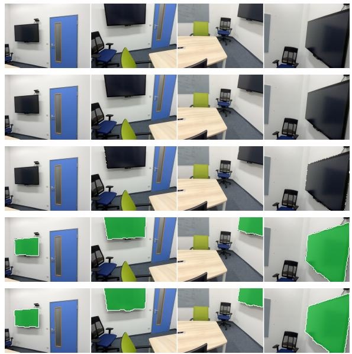  
Figure 16: Additional qualitative comparisons of language-guided grounding (I). Ground-truth masks are projected from the annotated 3D point clouds.

“TV with glossy black screen and slim frame, designed for displaying digital video content in a home entertainment setup.”  
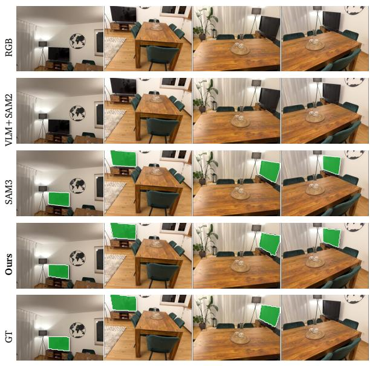  
(c)

(b)  
“The large fish swimming near the right side of the tank.”  
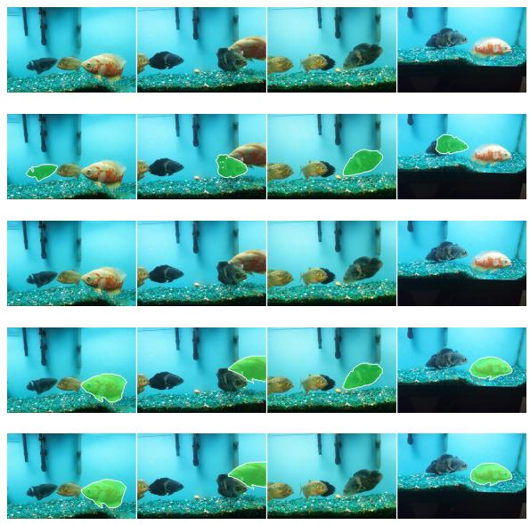  
(d)

“The zebra whose head is cut of by the left side of the image.”  
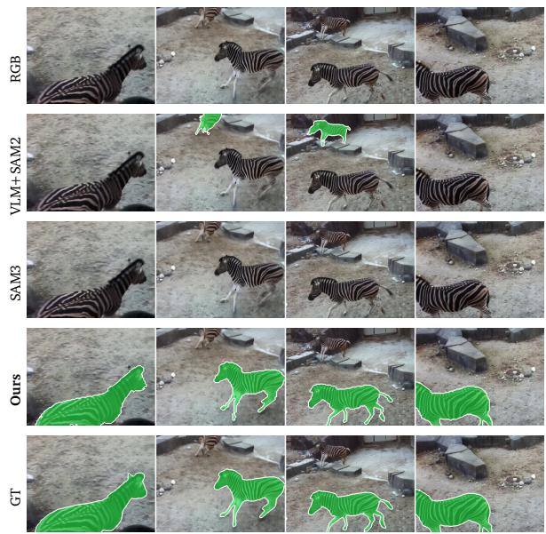

“A smallest goldfish.”  
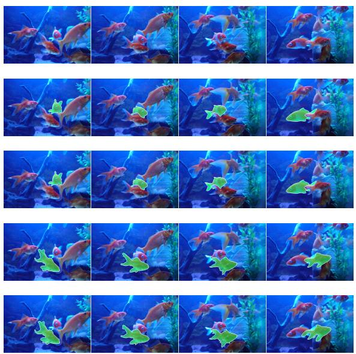  
Figure 17: Additional qualitative comparisons of language-guided grounding (II).

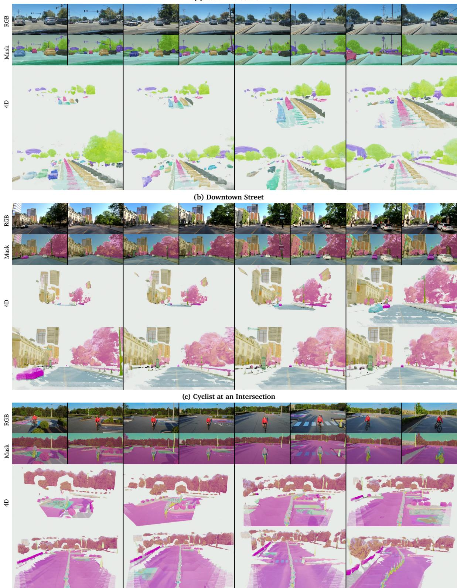  
Figure 18: Additional in-the-wild 4D segmentation. Uniformly sampled observations are shown with their masks and reconstructed 4D instances in the same temporal order.