# SALT++: CONTEXT-ALIGNED POST-TRAINING FOR FEW-STEP STREAMING MULTIMODAL GENERATION

Xingtong Ge1,2, Yutong Wang3, Lunjie Zhu1, Haitao Lin4, Fangyu Lin1, Yushi Huang1, Xin Zhang2, Yi Zhang2∗, Yu Liu2, Jun Zhang1†

1The Hong Kong University of Science and Technology, 2Vivix Group Limited

3The University of Sydney, 4Westlake University

xingtong.ge@gmail.com

## ABSTRACT

Few-step streaming audio–video generation requires both causal modeling and step distillation, yet standard training recipes face two context-related challenges. Teacher forcing pairs clean history with a noisy target, but supervises predictive contextual representations only indirectly through velocity prediction. Meanwhile, directly reusing bidirectional score models in causal Distribution Matching Distillation (DMD) creates a mismatch between generation and scoring contexts. We address these challenges with Salt++, a two-stage post-training framework comprising Causal Self-Flow (CSF) and context-aligned autoregressive DMD. CSF exploits contextual information asymmetry by varying the history while keeping the noisy target fixed: a noise-mixed-history student aligns its intermediate representations with those of a clean-history exponential-moving-average teacher. This self-supervised signal encourages the student to extract semantic information and improves cross-modal alignment. Context-aligned AR DMD shares the causal mask and prefix across generator sampling, fake-score training, and real-score evaluation to match generated and reference distributions under a block-conditional KL objective. With calibrated teacher guidance, it performs clean-prefix few-step distillation and then adapts to generated histories without switching objectives or requiring separate consistency distillation. At 480p, Salt++ improves visual and motion quality by 57% and 45% over Omni-Forcing on JavisBench under the same 4-step causal setting. A separate scalewise post-training stage extends Salt++ to 4-step 1664 × 960 generation, outperforming bidirectional LTX-2 on six of seven reported metrics. Project page: https://xingtongge.github.io/Saltpp.

## 1 INTRODUCTION

Recent video generation models (Yang et al., 2025; Kong et al., 2024; Wan et al., 2025; Gao et al., 2025) can synthesize increasingly realistic scenes, and unified audio–video models (HaCohen et al., 2026; Chern et al., 2026; Team et al., 2025; Seedance et al., 2026) further produce sound, speech, and visual content within a single diffusion process. Yet two properties put them at odds with real-time interaction. These models must generate an entire clip before displaying any output due to temporally bidirectional architectures, while modeling instantaneous velocity fields typically requires multi-step ODE integration for high-quality sampling, which is slow and expensive.

Removing both costs asks for progress along two separate dimensions. The first is causal modeling: autoregressive (AR) generation replaces temporally bidirectional attention with block-causal attention (Yin et al., 2025; Huang et al., 2025; Zhu et al., 2026; Ge et al., 2026b), so that each block is produced conditioned only on preceding ones and output can stream with bounded latency. The second is step distillation: the sampling trajectory is compressed to a few evaluations while preserving the quality of the bidirectional teacher. However, prevailing recipes pursue the two dimensions through a long pipeline that changes objective at every stage—a causal teacher obtained by teacher forcing, a few-step generator initialized from it by ODE matching or consistency distillation, and a final refinement by distribution matching on the generator’s own rollouts (Lin et al., 2025b; Zhao et al., 2026; Zheng et al., 2026); Fig. 1 lays these out.

These two dimensions raise distinct challenges concerning causal context. First, causal modeling requires extracting semantic information from past audio–video blocks that is predictive of the current block. Teacher forcing provides clean history alongside a noisy target, yet standard flow matching learns contextual representations only indirectly through velocity prediction. The challenge is to turn the information asymmetry into a direct learning signal for predictive contextual representations. Second, block-conditional Distribution Matching Distillation (DMD) (Yin et al., 2024b;a) requires generation and score estimation to share the same conditioning context. Evaluating score models with bidirectional context for blocks generated under a causal prefix introduces a score– context mismatch, misaligning the score estimates with the intended block-conditional objective.

We address the first challenge with Causal Self-Flow (CSF). Motivated by semantic representation alignment (Yu et al., 2025), we adapt Self-Flow’s asymmetric-view learning (Chefer et al., 2026) to causal audio–video generation. A student observes a noise-mixed history, while an exponentialmoving-average (EMA) teacher observes the corresponding clean history; both receive the same noisy target block. Alongside the native flow-matching objective, we align projected features from a shallow student layer with features from a deeper EMA-teacher layer, both extracted from the same noisy target block. By placing the input asymmetry entirely in the history, CSF encourages the student to recover clean-context features from partially corrupted history and learn contextual representations that support next-block prediction. Empirically, CSF improves audio–visual and audio–text alignment during causal teacher training (Fig. 5).

We address the second challenge with context-aligned AR DMD. Generator sampling, fake-score training, and real-score evaluation share the same block-causal mask and audio–video prefix. The fake score therefore estimates the distribution induced by the causal generator under that prefix, while the real score represents the corresponding conditional data distribution, making resulting update an estimator of the gradient of a block-conditional KL objective. With aligned contexts and calibrated teacher guidance, DMD directly performs strong few-step distillation, replacing the separate ODE-matching or consistency-distillation stage used by prevailing recipes. We then adapt to generated histories while retaining the same objective, unifying clean-prefix distillation and onpolicy adaptation.

Together these form the two-stage core of Salt++, yielding a 4-step causal audio–video generator. A separate scale-wise post-training stage distributes the same four generator evaluations across two spatial scales through a causal latent upsampler, extending the model to 1664 × 960 without additional generator calls. In summary, our contributions are threefold:

• We introduce Causal Self-Flow, turning asymmetric causal histories into a self-supervised representation-prediction task: a noise-mixed-history student learns from a clean-history teacher under the same noisy target, improving contextual audio–video representations.

• We identify score–context mismatch in block-conditional DMD and introduce contextaligned AR DMD. With calibrated teacher guidance, it unifies clean-prefix few-step distillation and on-policy adaptation within a single distillation stage.

• We obtain a 4-step causal audio–video generator that improves visual and motion quality by 57% and 45% over OmniForcing (Su et al., 2026), and extend it to 4-step 1664 × 960 generation through scale-wise post-training, where it outperforms bidirectional LTX-2 (HaCohen et al., 2026) on six of seven reported JavisBench metrics.

## 2 RELATED WORK

Audio–video generation and representation alignment. Joint audio–video diffusion models synthesize both modalities within a shared generative process. Existing systems explore hierarchical spatio-temporal priors, asymmetric or single-stream cross-modal interaction, and large-scale training (Liu et al., 2025; Low et al., 2025; Zhang et al., 2025; Team et al., 2026; Chern et al., 2026; Team et al., 2025; Seedance et al., 2025; 2026). We build on bidirectional LTX-2 (HaCohen et al., 2026) to obtain causal few-step generation. For representation learning, REPA aligns model features with an external visual encoder (Yu et al., 2025), while Self-Flow uses cleaner features from an EMA branch (Chefer et al., 2026). CSF adapts the latter principle to causal audio–video history, aligning a noise-mixed-history student with a clean-history EMA teacher under the same noisy target.

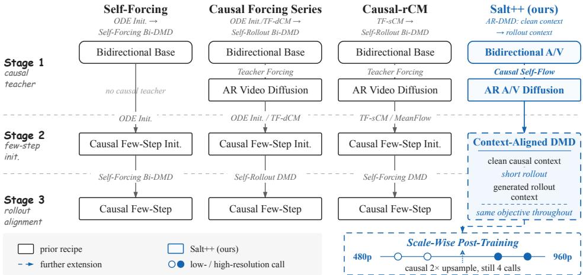  
Figure 1: Comparison with recent causal post-training recipes. Prior recipes switch objectives between multiple stages and score the causal generator with bidirectional models (BI-DMD). Salt++ keeps one AR DMD objective throughout and only shifts its conditioning from clean context to generated rollout; a further scale-wise stage reaches 1664 × 960 with four generator calls.

Few-step distillation and autoregressive generation. Few-step generation commonly relies on trajectory or score based distillation (Song et al., 2023; Luo et al., 2023; Lin et al., 2026; Yin et al., 2024b;a; Lin et al., 2025a; Wang et al., 2026), with DMD extending to large scale image and video models (Ge et al., 2026a;b). Autoregressive diffusion models generate temporal blocks sequentially under causal conditioning (Chen et al., 2024; Jin et al., 2025; Teng et al., 2025). Recent methods combine causal generation with few-step distillation: CausVid distills bidirectional models into causal generators (Yin et al., 2025), Self Forcing and AAPT adapt students on previously generated frames (Huang et al., 2025; Lin et al., 2025b), while Causal Forcing variants and Causal-rCM separate teacher-forced initialization from on-policy refinement (Zhu et al., 2026; Zhao et al., 2026; Zheng et al., 2026). Concurrent CMD similarly uses causal DMD (Bandyopadhyay et al., 2026), but studies video-only distillation and moves directly to on-policy rollouts. We differ in three respects: we isolate the effect of score context in a controlled teacher-forced comparison, we show that the teacher guidance scale must be recalibrated for distribution matching rather than inherited from consistency distillation, and we obtain the AR teacher itself through a representation-alignment objective for joint audio–video generation.

## 3 METHOD

## 3.1 PROBLEM SETUP

Causal audio–video generation. Let y denote the text condition and $z _ { 1 : K }$ a sequence of temporally aligned audio–video blocks, where $\boldsymbol { z } _ { k } = \left( z _ { k } ^ { v } , z _ { k } ^ { a } \right)$ groups the video and audio latents. Causal generation factorizes as

$$
p ( z _ { 1 : K } \mid \pmb { y } ) = \prod _ { k = 1 } ^ { K } p ( z _ { k } \mid \pmb { c } _ { k } ) , \qquad \pmb { c } _ { k } = ( \pmb { y } , \pmb { z } _ { < k } ) .\tag{1}
$$

A block-causal mask allows joint audio–video modeling within each block while restricting temporal context to preceding blocks. We denote $c _ { k } ^ { \star }$ for the clean ground-truth context.

Conditional flow matching. For a clean block $z _ { k }$ and Gaussian noise $\epsilon _ { k } \sim \mathcal { N } ( 0 , I )$ , the linear flow path is (Lipman et al., 2023; Liu et al., 2022)

$$
z _ { k , t } = ( 1 - t ) z _ { k } + t \epsilon _ { k } , \qquad t \in [ 0 , 1 ] ,\tag{2}
$$

where larger t means more noise. The flow model $F _ { \eta }$ learns to predict velocity through

$$
\mathcal { L } _ { \mathrm { F M } } = \mathbb { E } \Big [ \| F _ { \eta } ( z _ { k , t } , \pmb { c } _ { k } , t ) - ( \pmb { \epsilon } _ { k } - z _ { k } ) \| _ { 2 } ^ { 2 } \Big ] .\tag{3}
$$

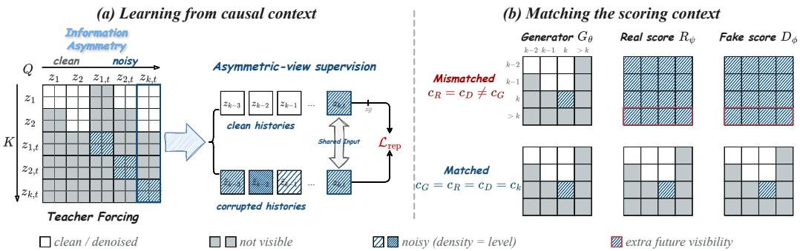  
Figure 2: Two roles of causal context in post-training. (a) CSF exploits information asymmetry in causal histories for self-supervised representation learning. (b) Mismatched (top) and aligned (bottom) contexts across the generator, real score, and fake score.

Teacher forcing sets $\pmb { c } _ { k } = \pmb { c } _ { k } ^ { \star }$ , conditioning the noisy current block on clean ground-truth history.

Block-conditional distribution matching. Given a fixed $\scriptstyle c _ { k }$ , a few-step generator $G _ { \theta }$ induces $p _ { \theta , k } ( \cdot \mid c _ { k } )$ , with samples $\hat { z } _ { k } ^ { G }$ . Re-noising a generated block with Gaussian noise gives $\tilde { z } _ { k , t } =$ $( 1 - t ) \hat { z } _ { k } ^ { G } + t \epsilon _ { k } .$ , with $\tilde { z } _ { k , t } \sim p _ { \theta , k , t } ( \cdot \mid c _ { k } )$ . Let $p _ { \mathrm { r } , k , t }$ denote the conditional reference distribution at the same noise level; a real-score model approximates its score. The DMD objective is

$$
\mathcal { L } _ { \mathrm { D M D } , k } ( \theta ; c _ { k } ) = \mathbb { E } _ { t } [ \mathrm { K L } ( p _ { \theta , k , t } ( \cdot \mid c _ { k } ) \parallel p _ { \mathrm { r } , k , t } ( \cdot \mid c _ { k } ) ) ] .\tag{4}
$$

An online fake-score model learns the generator’s conditional score (Song et al., 2021) from generated samples. With exact conditional scores, the fake–real score difference supplies the score term in the gradient of Eq. 4 (Yin et al., 2024b).

Learning predictive contextual representations. For $k \ > \ 1$ , the model observes clean history alongside a noisy current block; the history provides temporal cues for denoising that block (Fig. 2(a)). Yet Eq. 3 supervises contextual representations only indirectly through velocity prediction. We seek an additional self-supervised signal that exploits this information asymmetry to learn predictive contextual representations (Sec. 3.2).

Score–context mismatch. Eq. 4 compares distributions under the same $c _ { k }$ . Write $c _ { G } , c _ { R }$ , and $c _ { D }$ for the contexts used in generator sampling, real-score evaluation, and fake-score training. Additional future visibility or differently corrupted history changes the conditional information used for scoring (Fig. 2(b)). The challenge is to align generation and score estimation with the intended block-conditional objective, accounting for both history content and temporal visibility (Sec. 3.3).

## 3.2 CAUSAL SELF-FLOW

Causal Self-Flow (CSF) turns history information asymmetry into a representation-learning task by pairing two causal views of the same denoising problem (Fig. 2(a)). An online student $F _ { \eta }$ observes noise-mixed history, while its EMA teacher $F _ { \bar { \eta } } ^ { ^ { - } }$ observes clean history; both process the same noisy current block. We align their intermediate representations alongside the native flow-matching ob jective, encouraging the student to recover predictive contextual information from its mixed history.

Clean and noise-mixed histories. For each target block $k ,$ we construct $z _ { k , t _ { k } }$ according to Eq. 2. The student and EMA-teacher branches share the target block, Gaussian noise $\epsilon _ { k }$ , and noise level t ; their input asymmetry lies entirely in the history. For each preceding block $i < k ,$ , we independently sample $\gamma _ { i } \sim \mathcal { U } ( \gamma _ { \operatorname* { m i n } } , \gamma _ { \operatorname* { m a x } } )$ and construct

$$
\tilde { z } _ { i } ^ { m } = ( 1 - \gamma _ { i } ) z _ { i } ^ { m } + \gamma _ { i } \epsilon _ { i } ^ { m } , \qquad \epsilon _ { i } ^ { m } \sim \mathcal { N } ( 0 , I ) , \quad m \in \{ v , a \} .\tag{5}
$$

The temporally aligned video and audio portions share the same $\gamma _ { i } .$ , while their Gaussian noise is sampled independently. The student receives the noise-mixed context $\tilde { \pmb { c } } _ { k } = \left( \pmb { y } , \tilde { \pmb { z } } _ { < k } \right)$ , whereas the EMA teacher receives the clean context $c _ { k } ^ { \star }$ . Thus, history corruption changes the available contextual information without changing the current block’s denoising task.

Cross-view, cross-depth representation alignment. Let $H _ { \eta , m } ^ { \ell }$ and $H _ { \bar { \eta } , m } ^ { \ell }$ denote the representations of modality m at layer ℓ of the student and EMA teacher, respectively. A two-layer projection head $P _ { m }$ maps the shallower student representation at layer $\ell _ { s }$ to the deeper EMA-teacher representation at layer $\ell _ { d } \colon$

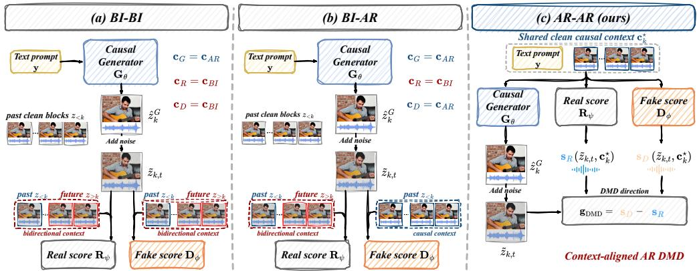  
Figure 3: Score–context configurations in causal DMD. The generator always samples under a causal prefix, while the two scores may use bidirectional (BI) or causal (AR) visibility. Only AR– AR scores each block under the aligned context, estimating the gradient of Eq. 4.

$$
\mathcal { L } _ { \mathrm { r e p } } ^ { m } = \mathbb { E } _ { k > 1 } \left[ 1 - \cos \bigl ( P _ { m } \bigl ( H _ { \eta , m } ^ { \ell _ { s } } ( z _ { k , t _ { k } } , \tilde { c } _ { k } , t _ { k } ) \bigr ) , \mathrm { s g } \bigl [ H _ { \bar { \eta } , m } ^ { \ell _ { d } } ( z _ { k , t _ { k } } , c _ { k } ^ { \star } , t _ { k } ) \bigr ] \bigr ) \right] ,\tag{6}
$$

where $\mathrm { s g }$ denotes stop-gradient. We apply representation alignment only to blocks with preceding history. The clean-history teacher provides a contextual representation target for the mixed-history student, rather than a target for matching final denoising predictions. The student also minimizes the video and audio flow-matching losses under $\tilde { c } _ { k }$ . The combined objective is

$$
\mathcal { L } _ { \mathrm { C S F } } = \mathcal { L } _ { \mathrm { F M } } ^ { v } + \lambda _ { a } \mathcal { L } _ { \mathrm { F M } } ^ { a } + \lambda _ { \mathrm { r e p } } \left( \mathcal { L } _ { \mathrm { r e p } } ^ { v } + \lambda _ { a } \mathcal { L } _ { \mathrm { r e p } } ^ { a } \right) ,\tag{7}
$$

where $\lambda _ { a }$ balances the modalities and $\lambda _ { \mathrm { { r e p } } }$ weights representation alignment. We alternate CSF updates with standard clean-history teacher-forcing updates with equal probability. After training, the student serves as the AR teacher for subsequent distillation; the EMA branch and projection heads are discarded, introducing no inference-time overhead. Fig. 5 shows that CSF improves audio– visual and audio–text alignment relative to standard teacher forcing in causal teacher training.

## 3.3 CONTEXT-ALIGNED AR DMD FOR FEW-STEP CAUSAL GENERATION

Building on the causal model trained by CSF, we perform few-step distillation with a generator $G _ { \theta }$ , a frozen real-score model $R _ { \psi }$ , and an online fake-score model $D _ { \phi }$ . Context-aligned AR DMD addresses score–context mismatch by placing sample generation, fake-score training, and real-score evaluation under the same causal context. We first instantiate the block-conditional objective in Eq. 4 under clean prefixes, then extend it to generated histories without switching distillation objectives.

Clean-prefix sampling and fake-score training. Under teacher forcing, the generator performs few-step sampling conditioned on $c _ { k } ^ { \star }$ , producing clean blocks $\hat { z } _ { k } ^ { G } \sim p _ { \theta , k } ( \cdot \mid c _ { k } ^ { \star } )$ . The clean prefix is held fixed throughout sampling. To estimate the score of this generator-induced distribution, the fake model must be trained on generated blocks paired with the contexts under which they were sampled. We form the perturbation $\tilde { z } _ { k , t }$ of Sec. 3.1 from a fresh generated block, with t and $\epsilon _ { k }$ sampled independently of the generator’s sampling procedure. Using the flow-velocity parameterization, we train the fake model with

$$
\mathcal { L } _ { \mathrm { f a k e } } = \mathbb { E } \Big [ \big \lVert D _ { \phi } ( \mathrm { s g } ( \tilde { z } _ { k , t } ) , c _ { k } ^ { \star } , t ) - \big ( \epsilon _ { k } - \mathrm { s g } ( \hat { z } _ { k } ^ { G } ) \big ) \big \rVert _ { 2 } ^ { 2 } \Big ] .\tag{8}
$$

The generated block is detached during fake-score training, and the fake model receives the same block packing, causal mask, and clean prefix as the generator. This objective learns the conditional flow field corresponding to $p _ { \theta , k , t } ( \cdot \ | \ c _ { k } ^ { \star } )$ , from which its score can be obtained. Changing the conditioning would instead change the conditional distribution being estimated.

Context-aligned real-score evaluation. With the fake score tied to the generator distribution, the real score specifies the reference to be distilled. The CSF-trained AR teacher provides a reference for next-block generation under a causal prefix. Using this teacher allows few-step distillation to transfer the causal generation capability learned in Sec. 3.2, with the teacher and generator evaluated on the same next-block prediction task.

(a) White-cliff beach  
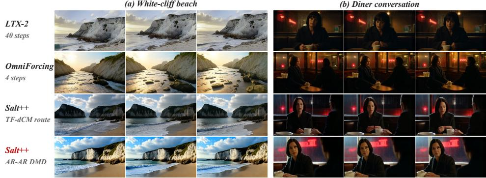  
(b) Diner conversation  
Figure 4: Qualitative comparison of 480p generation. Coast and diner examples compare LTX-2 Base (40 steps), OmniForcing, and both Salt++ routes (4 steps). The AR–AR DMD route retains fine scene and facial detail. Complete prompts and more comparisons are provided in Appendix B.

Fig. 3 compares three score configurations, where the first and second entries denote the visibility patterns of the real and fake scores, respectively. In BI–BI, a common choice in prior work (Zhu et al., 2026; Zheng et al., 2026; Su et al., 2026), both scores use bidirectional visibility that differs from the causal context used to generate each block. BI–AR aligns the fake score with the generator while retaining a bidirectional real model. AR–AR instead uses the causal teacher as the reference, placing sample generation and both score models under the same block packing, causal mask, and prefix. Our controlled comparison shows that AR–AR achieves the best overall performance among these configurations (Sec. 4.3), validating the effectiveness of our context-aligned AR DMD formulation for few-step causal distillation.

Generator update and teacher guidance. Under AR–AR, the real and fake models evaluate the same perturbed block $\tilde { z } _ { k , t }$ at the same noise level t and clean prefix $c _ { k } ^ { \star }$ . With exact conditional scores, their difference supplies the score-difference term in the gradient of Eq. 4. In practice, we use their clean predictions $\hat { z } _ { k } ^ { R }$ and $\hat { z } _ { k } ^ { D }$ to form a normalized direction for each modality $m \in \{ v , a \}$ which is injected through a stop-gradient surrogate:

$$
\begin{array} { r } { g _ { k } ^ { m } = \frac { \hat { z } _ { k } ^ { D , m } - \hat { z } _ { k } ^ { R , m } } { \operatorname* { m e a n } | \hat { z } _ { k } ^ { G , m } - \hat { z } _ { k } ^ { R , m } | + \epsilon } , \qquad \mathcal { L } _ { G } ^ { m } = \frac 1 2 \big \| \hat { z } _ { k } ^ { G , m } - \mathrm { s g } \big ( \hat { z } _ { k } ^ { G , m } - g _ { k } ^ { m } \big ) \big \| _ { 2 } ^ { 2 } , } \end{array}\tag{9}
$$

where ${ \mathcal { L } } _ { G } = { \mathcal { L } } _ { G } ^ { v } + \lambda _ { a } { \mathcal { L } } _ { G } ^ { a }$ combines the two modalities. Besides, teacher CFG shapes the realscore target. We further calibrate it for DMD, independently sampling video and audio guidance from a lower range at each update rather than inheriting the fixed high guidance used by consistency distillation (Sec. 4.3). This clean-prefix procedure performs few-step distillation directly through DMD, without a separate consistency-distillation stage.

On-policy context adaptation. Clean-prefix DMD performs few-step distillation under groundtruth histories, whereas streaming inference conditions on the generator’s own predictions. To reduce this train–test context gap, we continue training on autoregressively generated histories, replacing $c _ { k } ^ { \star }$ with $\hat { \mathbf { c } } _ { k } = ( \pmb { y } , \hat { z } _ { < k } ^ { G } )$ in Eq. 4. Generator sampling, fake-score training, and real-score evaluation remain conditioned on the same context. This preserves the block-conditional objective while adapting the conditioning distribution to the generated histories encountered during inference.

## 3.4 SCALE-WISE HIGH-RESOLUTION POST-TRAINING

As a further extension, we build on the 4-step streaming generator obtained in Sec. 3.3 to enable high-resolution generation. Specifically, we train the generator itself to perform both low-resolution (LR) generation and high-resolution (HR) refinement, allocating two denoising steps to each scale.

Chunk-wise cross-scale generation. For each temporal block, the generator first performs two LR evaluations to produce a clean audio–video prediction. A causal latent upsampler $U _ { \omega }$ then spatially upsamples the video latent using only the current block and a bounded history window, while the audio latent retains its resolution. Both modalities are re-noised to initialize two HR evaluations, after which the completed block is output before proceeding to the next block. During both training rollouts and inference, the generator shares parameters across scales but maintains separate LR and HR KV caches, each containing the corresponding audio–video history. The scales communicate through the latent transition. We initialize $U _ { \omega }$ by distilling the released LTX-2 latent upsampler into this windowed causal form. This block-wise procedure preserves causal streaming while producing 1664 × 960 output with four generator evaluations per block.

Table 1: Main results on JavisBench-mini with official prompts. (a,b) JavisBench at 480p/960p; (c) VBench at 480p. At 480p, bold/underline indicate the best/second-best 4-step results. At 960p, bold marks the best result across all methods
<table><tr><td>Model</td><td>Causal</td><td>Steps</td><td>VQ↑MQ↑AQ↑CLIP↑ IB-AV↑ Javis↑DeSync↓</td><td></td><td></td><td></td><td></td><td></td></tr><tr><td>(a) 480p generation</td></tr><tr><td>LTX-2 Base (HaCohen et al., 2026)</td><td></td><td>1.8840.566 4.986</td><td></td><td>0.311</td><td>0.239</td><td>0.200</td><td>0.608</td></tr><tr><td>AR teacher (CSF)</td><td>No Yes</td><td>40 40</td><td>2.3040.8574.565</td><td></td><td>0.316</td><td>0.202</td><td>0.162</td><td>0.746</td></tr><tr><td>OmniForcing (Su et al., 2026)</td><td>Yes</td><td>4</td><td>1.807</td><td>0.6994.718</td><td>0.303</td><td>0.163</td><td>0.124</td><td>0.745</td></tr><tr><td>Salt++ (TF-dCM route)</td><td>Yes</td><td>4</td><td>2.013</td><td>0.826 4.976</td><td>0.313</td><td>0.229</td><td>0.185</td><td>0.710</td></tr><tr><td>Salt++ (AR-AR DMD route)</td><td>Yes</td><td>4</td><td>2.838 1.010</td><td>4.991</td><td>0.316</td><td>0.184</td><td>0.146</td><td>0.759</td></tr><tr><td colspan="9">(b) 960p generation</td></tr><tr><td>LTX-2 Base (HaCohen et al., 2026)</td><td>No</td><td></td><td>40 + 3 2.231</td><td>0.6074.867</td><td>0.311</td><td></td><td>0.169 0.145</td><td>0.658</td></tr><tr><td>OmniForcing (Su et al., 2026)</td><td>Yes</td><td>4</td><td>2.298</td><td>0.832 4.721</td><td>0.293</td><td>0.165</td><td>0.128</td><td>0.755</td></tr><tr><td>Salt++</td><td>Yes</td><td>4</td><td>2.730</td><td>0.957 5.113</td><td>0.318</td><td>0.193</td><td>0.157</td><td>0.768</td></tr><tr><td colspan="9">(c) 480p VBench video quality and within-clip consistency</td></tr><tr><td colspan="9">Model Causal Steps Aesthetic ↑ Imaging ↑ Subject ↑ Background ↑</td></tr><tr><td colspan="9">LTX-2 Base (HaCohen et al., 2026) No 40 53.89 67.06 95.94 95.63</td></tr><tr><td colspan="9">Yes 56.74</td></tr><tr><td colspan="9">OmniForcing (Su et al., 2026)</td></tr><tr><td colspan="3">Salt++ (TF-dCM route)</td><td>4 4</td><td>53.65</td><td>68.41 62.87</td><td>96.62</td><td>95.32 96.05</td></tr><tr><td colspan="2">Salt++ (AR-AR DMD route)</td><td>Yes Yes</td><td>4</td><td>55.43</td><td>69.98</td><td>96.58 97.01</td><td>96.24</td></tr><tr><td colspan="9"></td></tr></table>

Table 2: Quantitative results on the 1,000 LTX-2-enhanced JavisBench prompts at 480p.
<table><tr><td>Model</td><td>Causal</td><td>Steps</td><td>VQ↑MQ↑</td><td>AQ↑</td><td>IB-AV ↑</td><td>AVH↑</td><td></td><td>Javis ↑ DeSync ↓</td></tr><tr><td>LTX-2 Base (HaCohen et al., 2026)</td><td>No</td><td>40</td><td>1.981</td><td>0.640 4.959</td><td>0.256</td><td>0.245</td><td>0.211</td><td>0.573</td></tr><tr><td>OmniForcing (Su et al., 2026)</td><td>Yes</td><td>4</td><td>1.774</td><td>0.607 4.613</td><td>0.158</td><td>0.152</td><td>0.121</td><td>0.734</td></tr><tr><td>Salt++ (TF-dCM route)</td><td>Yes</td><td>4</td><td>2.074</td><td>0.760 4.838</td><td>0.245</td><td>0.233</td><td>0.193</td><td>0.704</td></tr><tr><td>Salt++ (AR-AR DMD route)</td><td>Yes</td><td>4</td><td>2.820</td><td>0.999 4.997</td><td>0.192</td><td>0.186</td><td>0.151</td><td>0.696</td></tr></table>

Scale-wise distribution matching. The CSF teacher is post-trained at 480p, so we use a highresolution-capable bidirectional teacher to supervise this extension. The generator remains causal and is trained on its own rollouts. A frozen real-score model and an online fake-score model, shared across scales, evaluate the completed LR and HR rollouts with bidirectional visibility. Unlike the block-conditional AR–AR matching in Sec. 3.3, this stage matches distributions at the scale-rollout level. The fake model learns from fresh generator rollouts, and we apply the DMD surrogate in Eq. 9 to the joint audio–video output at each scale:

$$
\mathcal { L } _ { \mathrm { s c a l e } } = \sum _ { s \in \{ L , H \} } \mathcal { L } _ { G } ( \hat { z } _ { 1 : K } ^ { s } ) ,\tag{10}
$$

where $\hat { z } _ { 1 : K } ^ { s }$ denotes the generated rollout at scale s. Both terms update the shared generator, while the HR term can additionally update the causal upsampler. Details are provided in Appendix A.6.

## 4 EXPERIMENTS

## 4.1 IMPLEMENTATION DETAILS

Models and baselines. We build Salt++ on LTX-2 (HaCohen et al., 2026), using LTX-2 Base as a multi-step reference and OmniForcing (Su et al., 2026) as the 4-step causal baseline. We also report the CSF AR teacher before step distillation and implement a TF-dCM comparison route following Causal Forcing++ and Causal-rCM (Zhao et al., 2026; Zheng et al., 2026). Our AR–AR DMD route instead performs clean-prefix distillation and on-policy adaptation with the same context-aligned objective. Both complete routes use 4-step causal inference with CFG = 1.

Salt++ 480p 4 steps / bilinear 2x  
LTX-2  
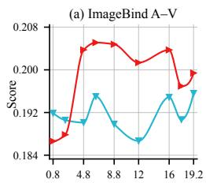

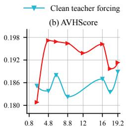

Training iteration (k)  
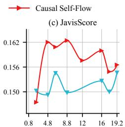

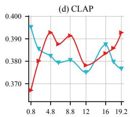

Figure 5: Cross-modal alignment during AR teacher training. Causal Self-Flow versus clean teacher forcing over 19.2k iterations, evaluated with 40-step inference on the 1,000 JavisBench prompts. Panels (a–c) report audio–visual agreement and panel (d) reports audio–text agreement.  
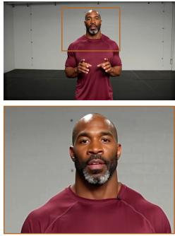  
40 + 3 steps

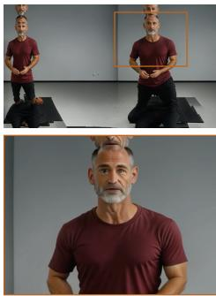  
OmniForcing 4 steps / direct 960p

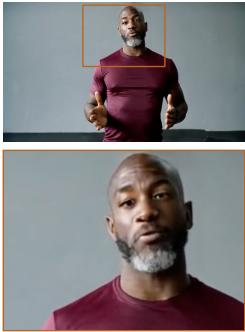

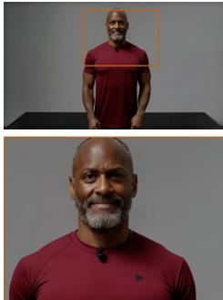  
2 LR + 2 HR  
Figure 6: 960p generation: Fitness coach. Columns compare LTX-2 (40+3 steps), OmniForcing extrapolated to 960p, upsampled Salt++ 480p, and native Salt++ 960p. Full frames and detail windows show the finer facial detail of native 960p generation. More examples appear in Appendix B.3.

Evaluation protocol. We evaluate on the 1,000 JavisBench-mini prompts (Liu et al., 2025) and a fixed set of their LTX-2 prompt-enhancer (PE) rewrites, shared across models. At 480p, videos contain 121 frames at 832×480 and 24 FPS. We report JavisBench quality, semantic alignment, and synchronization metrics, alongside four VBench Huang et al. (2024) quality and consistency met rics. High-resolution evaluation uses 1664 × 960 output. Full sampling settings, metric definitions, and training configurations are provided in Appendix A.

## 4.2 MAIN RESULTS

4-step generation at 480p. Across JavisBench-mini and VBench, our AR–AR DMD route outperforms the TF-dCM route on eight of eleven metrics, including all four VBench metrics (Tab. 1(a,c)). It also achieves the best scores on seven metrics among all 4-step methods, improving visual and motion quality over OmniForcing by 57.1% and 44.5%, respectively. The TF-dCM route retains advantages in IB-AV, JavisScore, and DeSync, while OmniForcing leads in aesthetics. Fig. 4 illustrates the visual-quality advantage of AR–AR DMD, with clearer scene textures and facial details.

Generation with rewritten prompts. Tab. 2 evaluates all models on the same 1,000 LTX-2- enhanced prompts. AR–AR DMD continues to outperform TF-dCM route on a majority of metrics, leading on VQ, MQ, AQ, and DeSync, while TF-dCM route retains higher audio–visual semantic alignment scores. Compared with OmniForcing, AR–AR DMD improves all seven reported metrics, with VQ and MQ increasing by 59.0% and 64.6%, respectively. These results show that it advantages extend from official prompts to richer rewritten descriptions.

High-resolution extension. Scale-wise post-training extends Salt++ to 1664 × 960 generation with four generator evaluations per block. It outperforms the 40 + 3-step LTX-2 reference on six of seven metrics in Tab. 1(b), with VQ/MQ reaching 2.730/0.957 versus 2.231/0.607; DeSync remains the exception. The table also reports OmniForcing directly extrapolated to 960p, rather than a resolutionmatched trained baseline. Fig. 6 shows finer facial detail in native 960p output than in the bilinearly upsampled 480p comparison. More qualitative results and full prompts are provided in Appendix B.

(a) Cherry-blossom garden  
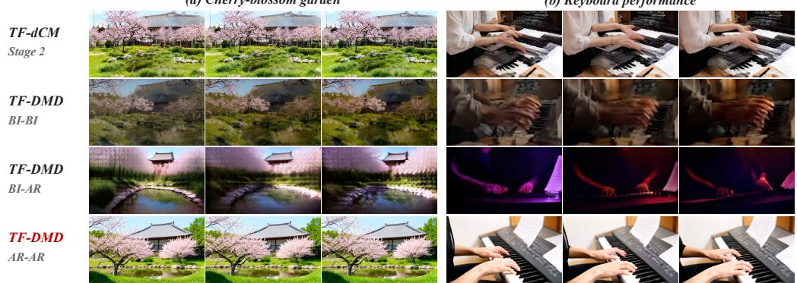  
(b) Keyboard performance  
Figure 7: Qualitative results of few-step initialization. Rows compare TF-dCM with BI–BI, BI– AR, and AR–AR TF-DMD. AR–AR retains significantly better scene structure and details.

Table 3: Few-step initialization ablations at 480p. (a) Score contexts and objectives on official prompts. (b) Teacher guidance under aligned AR–AR scores, on both prompt sets. Bold/underline mark best/second-best results in (a); bold marks the better result in (b).
<table><tr><td>(a) Objective</td><td>Scores</td><td>VQ↑</td><td>MQ↑</td><td>AQ↑</td><td>CLIP↑</td><td>IB-TV ↑</td><td>IB-TA ↑</td><td>DeSync ↓</td></tr><tr><td>TF-dCM</td><td></td><td>1.916</td><td>0.611</td><td>4.686</td><td>0.307</td><td>0.264</td><td>0.145</td><td>0.766</td></tr><tr><td>TF-DMD</td><td>BI/BI</td><td>0.837</td><td>0.140</td><td>4.796</td><td>0.301</td><td>0.266</td><td>0.144</td><td>0.811</td></tr><tr><td>TF-DMD</td><td>BI/AR</td><td>1.131</td><td>0.157</td><td>4.571</td><td>0.287</td><td>0.255</td><td>0.149</td><td>0.531</td></tr><tr><td>TF-DMD</td><td>AR/AR</td><td>3.147</td><td>1.351</td><td>4.750</td><td>0.317</td><td>0.271</td><td>0.153</td><td>0.726</td></tr></table>

<table><tr><td rowspan="2">(b) Teacher guidance</td><td colspan="2">Official</td><td colspan="2">Rewrite</td><td colspan="3">Official diagnostics</td></tr><tr><td>VQ↑</td><td>MQ↑</td><td>VQ↑</td><td>MQ↑</td><td>AQ↑</td><td>CLIP↑</td><td>DeSync↓</td></tr><tr><td>Fixed 4.0</td><td>1.643</td><td>0.572</td><td>1.712</td><td>0.598</td><td>4.934</td><td>0.315</td><td>0.843</td></tr><tr><td>Randomized U(1.0, 3.5)</td><td>3.147</td><td>1.351</td><td>3.132</td><td>1.261</td><td>4.750</td><td>0.317</td><td>0.726</td></tr></table>

## 4.3 ABLATION STUDIES AND ANALYSIS

Causal Self-Flow. Fig. 5 compares CSF with standard teacher forcing using 40-step inference on the same 1,000 JavisBench prompts. After the initial optimization phase, CSF consistently improves IB-AV, AVHScore, and JavisScore, with CLAP gains emerging later in training. These improvements occur before few-step distillation, demonstrating stronger audio–visual and audio–text alignment in the causal teacher and supporting the effectiveness of CSF for contextual representation learning.

Score context and distillation objective. Tab. 3(a) compares score configurations and distillation objectives under teacher forcing, before on-policy adaptation. Among the DMD configurations, aligning only the fake score raises VQ/MQ from 0.837/0.140 in BI–BI to 1.131/0.157 in BI–AR. The fully aligned AR–AR configuration reaches 3.147/1.351 and achieves the best scores on five of seven metrics; Appendix A.3 discusses why DeSync favors the near-static BI–AR outputs. These results support aligning score models with the generator’s causal context for effective block-conditional distillation. Besides, compared with TF-dCM, AR–AR TF-DMD improves all seven reported metrics, with VQ/MQ increasing from 1.916/0.611 to 3.147/1.351. This establishes AR DMD as an effective primary few-step distillation objective, without requiring a separate consistency-distillation stage. Fig. 7 illustrates the corresponding significant improvements in scene structure and detail.

Teacher-guidance calibration. Tab. 3(b) compares fixed video/audio teacher guidance of 4.0 with independent sampling from U(1.0, 3.5), using the same AR–AR configuration, training iteration, and inference CFG. This combined adjustment of guidance range and randomization improves VQ by 91.5% on official prompts and 82.9% on rewritten prompts, while MQ more than doubles in both settings. Appendix B.2 shows the corresponding qualitative difference in tonal and texture detail. These results highlight the importance of calibrating teacher guidance for DMD rather than directly transferring the consistency-distillation setting.

On-policy context adaptation. Following clean-prefix distillation, on-policy training adapts the generator to its own histories. Qualitative inspection shows reduced overexposure in outputs after adaptation. The complete-route results in Sec. 4.2 report performance after this continuation, which retains the context-aligned DMD objective while changing the source of the causal history.

## 5 CONCLUSION

We presented Salt++, a context-aligned post-training framework for few-step streaming audio–video generation. Causal Self-Flow strengthens contextual learning in the AR teacher, while context aligned AR DMD conditions the generator and both score models on the same causal prefix and keeps that objective as the prefix changes from ground truth to generated rollouts. Once the con ditional paths agree, distribution matching is well posed enough to serve as the primary few-step objective, removing the separate consistency-distillation stage of prevailing recipes. The resulting 4-step generator improves visual and motion quality by 57% and 45% over OmniForcing at 480p, and scale-wise post-training reaches 1664 × 960 within the same budget.

## REFERENCES

Hmrishav Bandyopadhyay, Xuanchi Ren, Zijian Huang, Jay Zhangjie Wu, Tianshi Cao, Ruilong Li, Bryan Chu, Sanja Fidler, Yi-Zhe Song, and Zian Wang. Context-matched distillation: Teacher causality for autoregressive video distillation. arXiv preprint arXiv:2608.13391, 2026.

Hila Chefer, Patrick Esser, Dominik Lorenz, Dustin Podell, Vikash Raja, Vinh Tong, Antonio Torralba, and Robin Rombach. Self-supervised flow matching for scalable multi-modal synthesis. arXiv preprint arXiv:2603.06507, 2026.

Boyuan Chen, Diego Mart´ı Monso, Yilun Du, Max Simchowitz, Russ Tedrake, and Vincent Sitz-´ mann. Diffusion forcing: Next-token prediction meets full-sequence diffusion. In Advances in Neural Information Processing Systems, 2024.

Ethan Chern, Hansi Teng, Hanwen Sun, Hao Wang, Hong Pan, Hongyu Jia, Jiadi Su, Jin Li, Junjie Yu, Lijie Liu, et al. Speed by simplicity: A single-stream architecture for fast audio-video generative foundation model. arXiv preprint arXiv:2603.21986, 2026.

Yu Gao, Haoyuan Guo, Tuyen Hoang, Weilin Huang, Lu Jiang, Fangyuan Kong, Huixia Li, Jiashi Li, Liang Li, Xiaojie Li, et al. Seedance 1.0: Exploring the boundaries of video generation models. arXiv preprint arXiv:2506.09113, 2025.

Xingtong Ge, Xin Zhang, Tongda Xu, Yi Zhang, Xinjie Zhang, Yan Wang, and Jun Zhang. Senseflow: Scaling distribution matching for flow-based text-to-image distillation. International Conference on Learning Representations, 2026a.

Xingtong Ge, Yi Zhang, Yushi Huang, Dailan He, Xiahong Wang, Bingqi Ma, Guanglu Song, Yu Liu, and Jun Zhang. Salt: Self-consistent distribution matching with cache-aware training for fast video generation. arXiv preprint arXiv:2604.03118, 2026b.

Yoav HaCohen, Benny Brazowski, Nisan Chiprut, Yaki Bitterman, Andrew Kvochko, Avishai Berkowitz, Daniel Shalem, Daphna Lifschitz, Dudu Moshe, Eitan Porat, Eitan Richardson, Guy Shiran, Itay Chachy, Jonathan Chetboun, Michael Finkelson, Michael Kupchick, Nir Zabari, Nitzan Guetta, Noa Kotler, Ofir Bibi, Ori Gordon, Poriya Panet, Roi Benita, Shahar Armon, Victor Kulikov, Yaron Inger, Yonatan Shiftan, Zeev Melumian, and Zeev Farbman. LTX-2: Efficient joint audio-visual foundation model. arXiv preprint arXiv:2601.03233, 2026.

Xun Huang, Zhengqi Li, Guande He, Mingyuan Zhou, and Eli Shechtman. Self forcing: Bridging the train-test gap in autoregressive video diffusion. arXiv preprint arXiv:2506.08009, 2025.

Ziqi Huang, Yinan He, Jiashuo Yu, Fan Zhang, Chenyang Si, Yuming Jiang, Yuanhan Zhang, Tianxing Wu, Qingyang Jin, Nattapol Chanpaisit, et al. Vbench: Comprehensive benchmark suite for video generative models. In 2024 IEEE/CVF Conference on Computer Vision and Pattern Recognition (CVPR), pp. 21807–21818. IEEE, 2024.

Yang Jin, Zhicheng Sun, Ningyuan Li, Kun Xu, Hao Jiang, Nan Zhuang, Quzhe Huang, Yang Song, Yadong Mu, and Zhouchen Lin. Pyramidal flow matching for efficient video generative modeling. In International Conference on Learning Representations, volume 2025, pp. 23378–23402, 2025.

Weijie Kong, Qi Tian, Zijian Zhang, Rox Min, Zuozhuo Dai, Jin Zhou, Jiangfeng Xiong, Xin Li, Bo Wu, Jianwei Zhang, et al. Hunyuanvideo: A systematic framework for large video generative models. arXiv preprint arXiv:2412.03603, 2024.

Haitao Lin, Peiyan Hu, Minsi Ren, Zhifeng Gao, Zhi-Ming Ma, Guolin Ke, Tailin Wu, and Stan Z Li. On the design of one-step diffusion via shortcutting flow paths. In International Conference on Learning Representations, volume 2026, pp. 112957–113004, 2026.

Shanchuan Lin, Xin Xia, Yuxi Ren, Ceyuan Yang, Xuefeng Xiao, and Lu Jiang. Diffusion adversarial post-training for one-step video generation. In Aarti Singh, Maryam Fazel, Daniel Hsu, Simon Lacoste-Julien, Felix Berkenkamp, Tegan Maharaj, Kiri Wagstaff, and Jerry Zhu (eds.), Proceedings of the 42nd International Conference on Machine Learning, volume 267 of Proceedings of Machine Learning Research, pp. 37959–37974. PMLR, 13–19 Jul 2025a. URL https://proceedings.mlr.press/v267/lin25m.html.

Shanchuan Lin, Ceyuan Yang, Hao He, Jianwen Jiang, Yuxi Ren, Xin Xia, Yang Zhao, Xuefeng Xiao, and Lu Jiang. Autoregressive adversarial post-training for real-time interactive video generation. arXiv preprint arXiv:2506.09350, 2025b.

Yaron Lipman, Ricky T. Q. Chen, Heli Ben-Hamu, Maximilian Nickel, and Matt Le. Flow matching for generative modeling. In International Conference on Learning Representations, 2023.

Kai Liu, Wei Li, Lai Chen, Shengqiong Wu, Yanhao Zheng, Jiayi Ji, Fan Zhou, Rongxin Jiang, Jiebo Luo, Hao Fei, and Tat-Seng Chua. JavisDiT: Joint audio-video diffusion transformer with hierarchical spatio-temporal prior synchronization. arXiv preprint arXiv:2503.23377, 2025.

Xingchao Liu, Chengyue Gong, and Qiang Liu. Flow straight and fast: Learning to generate and transfer data with rectified flow. arXiv preprint arXiv:2209.03003, 2022.

Chetwin Low, Weimin Wang, and Calder Katyal. Ovi: Twin backbone cross-modal fusion for audiovideo generation. arXiv preprint arXiv:2510.01284, 2025.

Simian Luo, Yiqin Tan, Longbo Huang, Jian Li, and Hang Zhao. Latent consistency models: Synthesizing high-resolution images with few-step inference. arXiv preprint arXiv:2310.04378, 2023.

Team Seedance, Heyi Chen, Siyan Chen, Xin Chen, Yanfei Chen, Ying Chen, Zhuo Chen, Feng Cheng, Tianheng Cheng, Xinqi Cheng, et al. Seedance 1.5 pro: A native audio-visual joint generation foundation model. arXiv preprint arXiv:2512.13507, 2025.

Team Seedance, De Chen, Liyang Chen, Xin Chen, Ying Chen, Zhuo Chen, Zhuowei Chen, Feng Cheng, Tianheng Cheng, Yufeng Cheng, et al. Seedance 2.0: Advancing video generation for world complexity. arXiv preprint arXiv:2604.14148, 2026.

Yang Song, Jascha Sohl-Dickstein, Diederik P. Kingma, Abhishek Kumar, Stefano Ermon, and Ben Poole. Score-based generative modeling through stochastic differential equations. International Conference on Learning Representations, 2021.

Yang Song, Prafulla Dhariwal, Mark Chen, and Ilya Sutskever. Consistency models. In International Conference on Machine Learning, 2023.

Yaofeng Su, Yuming Li, Zeyue Xue, Jie Huang, Siming Fu, Haoran Li, Ying Li, Zezhong Qian, Haoyang Huang, and Nan Duan. Omniforcing: Unleashing real-time joint audio-visual genera tion. arXiv preprint arXiv:2603.11647, 2026.

Kling Team, Jialu Chen, Yuanzheng Ci, Xiangyu Du, Zipeng Feng, Kun Gai, Sainan Guo, Feng Han, Jingbin He, Kang He, et al. Kling-omni technical report. arXiv preprint arXiv:2512.16776, 2025.

OpenMOSS Team, Donghua Yu, Mingshu Chen, Qi Chen, Qi Luo, Qianyi Wu, Qinyuan Cheng, Ruixiao Li, Tianyi Liang, Wenbo Zhang, et al. Mova: Towards scalable and synchronized videoaudio generation. arXiv preprint arXiv:2602.08794, 2026.

Hansi Teng, Hongyu Jia, Lei Sun, Lingzhi Li, Maolin Li, Mingqiu Tang, Shuai Han, Tianning Zhang, W. Q. Zhang, Weifeng Luo, et al. Magi-1: Autoregressive video generation at scale. arXiv preprint arXiv:2505.13211, 2025.

Team Wan, Ang Wang, Baole Ai, Bin Wen, Chaojie Mao, Chen-Wei Xie, Di Chen, Feiwu Yu, Haiming Zhao, Jianxiao Yang, et al. Wan: Open and advanced large-scale video generative models. arXiv preprint arXiv:2503.20314, 2025.

Yutong Wang, Haiyu Zhang, Tianfan Xue, Yu Qiao, Yaohui Wang, Chang Xu, and Xinyuan Chen. Vdot: Efficient unified video creation via optimal transport distillation. In Proceedings of the IEEE/CVF Conference on Computer Vision and Pattern Recognition, pp. 9273–9283, 2026.

Zhuoyi Yang, Jiayan Teng, Wendi Zheng, Ming Ding, Shiyu Huang, Jiazheng Xu, Yuanming Yang, Wenyi Hong, Xiaohan Zhang, Guanyu Feng, et al. Cogvideox: Text-to-video diffusion models with an expert transformer. In International Conference on Learning Representations, volume 2025, pp. 83048–83077, 2025.

Tianwei Yin, Michael Gharbi, Taesung Park, Richard Zhang, Eli Shechtman, Fredo Durand, and¨ William T. Freeman. Improved distribution matching distillation for fast image synthesis. In Advances in Neural Information Processing Systems, 2024a.

Tianwei Yin, Michael Gharbi, Richard Zhang, Eli Shechtman, Fredo Durand, William T. Freeman, ¨ and Taesung Park. One-step diffusion with distribution matching distillation. In IEEE/CVF Conference on Computer Vision and Pattern Recognition, 2024b.

Tianwei Yin, Qiang Zhang, Richard Zhang, William T. Freeman, Fredo Durand, Eli Shechtman, and Xun Huang. From slow bidirectional to fast autoregressive video diffusion models. In IEEE/CVF Conference on Computer Vision and Pattern Recognition, 2025.

Sihyun Yu, Sangkyung Kwak, Huiwon Jang, Jongheon Jeong, Jonathan Huang, Jinwoo Shin, and Saining Xie. Representation alignment for generation: Training diffusion transformers is easier than you think. In International Conference on Learning Representations, 2025.

Guozhen Zhang, Zixiang Zhou, Teng Hu, Ziqiao Peng, Youliang Zhang, Yi Chen, Yuan Zhou, Qinglin Lu, and Limin Wang. UniAVGen: Unified audio and video generation with asymmetric cross-modal interactions. arXiv preprint arXiv:2511.03334, 2025.

Min Zhao, Hongzhou Zhu, Kaiwen Zheng, Zihan Zhou, Bokai Yan, Xinyuan Li, Xiao Yang, Chongxuan Li, and Jun Zhu. Causal forcing++: Scalable few-step autoregressive diffusion distillation for real-time interactive video generation. arXiv preprint arXiv:2605.15141, 2026.

Kaiwen Zheng, Guande He, Min Zhao, Jintao Zhang, Huayu Chen, Jianfei Chen, Chen-Hsuan Lin, Ming-Yu Liu, Jun Zhu, and Qianli Ma. Causal-rcm: A unified teacher-forcing and self-forcing open recipe for autoregressive diffusion distillation in streaming video generation and interactive world models. arXiv preprint arXiv:2606.25473, 2026.

Hongzhou Zhu, Min Zhao, Guande He, Hang Su, Chongxuan Li, and Jun Zhu. Causal forcing: Autoregressive diffusion distillation done right for high-quality real-time interactive video generation. arXiv preprint arXiv:2602.02214, 2026.

## Appendix

Contents   
Main text   
1 Introduction 1   
2 Related Work 2   
3 Method 3   
3.1 Problem Setup . 3   
3.2 Causal Self-Flow 4   
3.3 Context-Aligned AR DMD for Few-Step Causal Generation . 5   
3.4 Scale-Wise High-Resolution Post-Training 6   
4 Experiments 7   
4.1 Implementation Details 7   
4.2 Main Results . . 8   
4.3 Ablation Studies and Analysis 9   
5 Conclusion 10   
Appendix   
A Detailed Implementation and Evaluation 14   
A.1 Notation . 14   
A.2 Evaluation Protocol 14   
A.3 Metric Definitions 14   
A.4 Models and Sampling . . 16   
A.5 Training Configuration . . 16   
A.6 High-Resolution Configuration . 17   
B Additional Qualitative Results 18   
B.1 480p Qualitative Comparisons . 18   
B.2 Additional Guidance Examples and Sample Provenance . 20   
B.3 High-Resolution Qualitative Comparisons . 21   
B.4 Prompts for Main-Result Visualizations . 21

## A DETAILED IMPLEMENTATION AND EVALUATION

## A.1 NOTATION

Tab. 4 collects the symbols used in Sec. 3.2–3.4 and in this appendix.

## A.2 EVALUATION PROTOCOL

We evaluate joint text-to-audio–video generation on the 1,000 prompts of JavisBench-mini (Liu et al., 2025), covering diverse visual events and sound sources. The official track uses the released joint prompts and evaluator. Every model generates one sample per prompt with seed 12,345 + i for sample index i; video and audio are evaluated from H.264 MP4 and PCM WAV outputs. To test sensitivity to prompt formulation, we also construct a fixed rewrite track by applying the official LTX-2 prompt enhancer (HaCohen et al., 2026) once to each joint prompt with rewrite seed 42. The resulting 1,000 longer prompts are shared across models, rather than rewritten separately for each system.

## A.3 METRIC DEFINITIONS

The official main comparison reports visual quality (VQ), motion quality (MQ), audio quality (AQ), CLIP text–video agreement, ImageBind audio–visual agreement (IB-AV), JavisScore, and DeSync (lower is better). These distinguish perceptual quality from semantic agreement and temporal synchronization. We additionally report VBench aesthetic quality, imaging quality, subject consistency, and background consistency on the same 480p generations. These consistency measurements concern the evaluated clips, not extended rollouts. The initialization analysis includes ImageBind text– video (IB-TV) and text–audio (IB-TA) agreement, while the causal-teacher analysis also uses AVH-Score and CLAP. AV-Align is excluded because of its evaluation cost. The rewrite track reports VQ, MQ, AQ, IB-AV, AVHScore, JavisScore, and DeSync; we omit text-dependent metrics because the longer joint rewrites may exceed the encoders’ text contexts and do not provide separately rewritten audio and video descriptions.

<table><tr><td>Blocks and contexts</td><td></td></tr><tr><td> $K$ </td><td>Number of temporally aligned audio-video blocks</td></tr><tr><td> $\boldsymbol { z } _ { k } = \left( z _ { k } ^ { v } , z _ { k } ^ { a } \right)$ </td><td>Video and audio latents of block k</td></tr><tr><td> $m \in \{ v , a \}$ </td><td>Modality index</td></tr><tr><td> $\pmb { y }$ </td><td>Text condition</td></tr><tr><td> $\mathbf { c } _ { k }$ </td><td>Conditional information visible at block k</td></tr><tr><td> $\boldsymbol { c } _ { k } ^ { \star }$ </td><td>Clean teacher-forced context</td></tr><tr><td> $\tilde { c } _ { k }$ </td><td>Noise-mixed context seen by the CSF student</td></tr><tr><td> $\hat { c } _ { k }$ </td><td>Rollout context built from generated blocks</td></tr><tr><td> $\pmb { c } _ { G } , \pmb { c } _ { R } , \pmb { c } _ { D }$ </td><td>Contexts of generator sampling, real-score evaluation, fake-score training</td></tr><tr><td>Flow path</td><td></td></tr><tr><td> $t \in [ 0 , 1 ]$ </td><td>Noise level; larger t is noisier</td></tr><tr><td> $\epsilon _ { k }$ </td><td>Gaussian noise for block k</td></tr><tr><td> ${ \boldsymbol { z } } _ { k , t }$ </td><td>Noisy target block  $( 1 - t ) z _ { k } + t \epsilon _ { k }$ </td></tr><tr><td> $\gamma _ { i }$ </td><td>Noise level applied to history block  $i < k$  in CSF</td></tr><tr><td> $\tilde { z } _ { i } ^ { m }$ </td><td>Noise-mixed history latent of modality m</td></tr><tr><td>Models</td><td></td></tr><tr><td> $F _ { \eta } , F _ { \bar { \eta } }$ </td><td>CSF student and its EMA teacher</td></tr><tr><td> $H _ { \eta , m } ^ { \ell }$ </td><td>Layer-l representation of modality m</td></tr><tr><td> $\ell _ { s } < \ell _ { d }$ </td><td>Shallow student layer and deep EMA-teacher layer</td></tr><tr><td> $P _ { m }$ </td><td>Two-layer projection head for modality m</td></tr><tr><td> $G _ { \theta }$ </td><td>Few-step causal generator</td></tr><tr><td> $R _ { \psi } , D _ { \phi }$ </td><td>Frozen real score and online fake score</td></tr><tr><td> $U _ { \omega }$ </td><td>Causal latent upsampler</td></tr><tr><td>Distributions and predictions</td><td></td></tr><tr><td> $p _ { \theta , k } \big ( \cdot \mid c _ { k } \big )$ </td><td>Generator-induced conditional over clean blocks</td></tr><tr><td> $p _ { \theta , k , t } , { p _ { \mathrm { r } , k , t } }$ </td><td>Perturbed generator and reference conditionals</td></tr><tr><td> $\hat { z } _ { k } ^ { G } , \hat { z } _ { k } ^ { R } , \hat { z } _ { k } ^ { D }$ </td><td>Clean predictions of generator, real score, fake score</td></tr><tr><td> $\tilde { z } _ { k , t }$ </td><td>Perturbed generated block used for scoring</td></tr><tr><td> $\pmb { g } _ { k } ^ { m }$ </td><td>Normalized DMD direction</td></tr><tr><td>Objectives and weights</td><td></td></tr><tr><td> $\mathcal { L } _ { \mathrm { F M } } , \mathcal { L } _ { \mathrm { r e p } } ^ { m } , \mathcal { L } _ { \mathrm { C S F } }$ </td><td>Flow-matching, representation-alignment, and total CSF losses</td></tr><tr><td> $\mathcal { L } _ { \mathrm { D M D } , k } , \dot { \mathcal { L } } _ { \mathrm { f a k e } } , \mathcal { L } _ { G }$ </td><td>Block-conditional DMD objective, fake-score loss, generator surrogate</td></tr><tr><td> $\mathcal { L } _ { \mathrm { s c a l e } }$ </td><td>Scale-wise objective summed over the two scales</td></tr><tr><td> $\lambda _ { a } , \lambda _ { \mathrm { r e p } }$ </td><td>Audio weight and representation-alignment weight</td></tr><tr><td>Scale-wise stage</td><td></td></tr><tr><td> $S _ { L } , S _ { H }$ </td><td>Low- and high-resolution noise grids</td></tr><tr><td> $\hat { z } _ { 1 : K } ^ { L } , \hat { z } _ { 1 : K } ^ { H }$ </td><td>Completed rollout at each scale</td></tr></table>

Table 4: Notation.

Interpreting DeSync under degraded video. DeSync estimates the temporal offset between an audio track and a video track, without assessing the quality of either. A configuration whose video is nearly static therefore offers little motion for the synchronization model to misalign and can record a low DeSync while producing visually uninformative output. This is the case for the BI–AR row of Tab. 3(a): it attains the best DeSync in that table at 0.531, but reaches only 1.131 VQ and 0.157 MQ, far below the aligned AR–AR configuration at 3.147 and 1.351. We therefore read DeSync together with VQ and MQ rather than in isolation, and treat it as informative only among configurations that produce comparable motion.

## A.4 MODELS AND SAMPLING

LTX-2 Base (HaCohen et al., 2026) is the bidirectional foundation-model reference; the CSF AR teacher measures causal generation before step reduction. OmniForcing (Su et al., 2026) is the released 4-step causal baseline. At 480p, Salt++ is evaluated through two complete routes, initialized by either TF-dCM or context-aligned AR–AR TF-DMD and then refined on generated contexts. Thus, a route in the main comparison includes rollout refinement, whereas an initializer in the ablations does not. We generate 832 × 480 videos with 121 frames at 24 FPS, approximately five seconds. The LTX-2 VAE compresses video temporally by 8×, so the block-causal layout pairs three video latent frames with 25 audio latent frames per one-second block; the first block additionally carries the initial latent frame of each stream, and a 121-frame clip therefore forms $K = 5$ blocks. The AR teacher uses 40-step Euler sampling with video and audio CFG both set to 4.0. The Salt++ initializers and rollout models use the 4-step grid [1000, 960, 889, 727, 0] and inference $\mathrm { C F G } = 1$ predicting a clean endpoint and re-noising it to the next grid point at each step. Both this grid and the finer eight-point grid from which training noise levels are drawn (Appendix A.5) are images of uniform partitions of [0, 1] under the same shift $t \mapsto 8 t / ( 1 + 7 t )$ used during training, so the former is a subset of the latter. At 960p, the scale-wise system uses 2 low-resolution and 2 high-resolution generator evaluations. LTX-2 uses its 40 + 3-step high-resolution path. OmniForcing is evaluated by directly applying its released checkpoint to the 960p token grid; this is a resolution-extrapolation diagnostic, not a resolution-matched trained baseline.

## A.5 TRAINING CONFIGURATION

All post-training stages use internal audio–video data at $8 3 2 \times 4 8 0$ and 24 FPS, the block layout of Appendix A.4, mixed precision, and FSDP, with one sample per device.

Causal Self-Flow. Training starts from LTX-2 and keeps the velocity parameterization of Eq. 3. Target noise levels are drawn uniformly on [0.003, 1] and reshaped by the shift $t \mapsto 8 t / ( 1 + 7 t )$ which concentrates supervision at higher noise; per-sample losses are weighted by $\begin{array} { r l } { \dot { \boldsymbol { w } } ( t ) } & { { } = } \end{array}$ $\exp ( - 2 ( t - 0 . 5 ) ^ { 2 } )$ , which de-emphasizes both extremes. History noise levels are drawn from $\mathcal { U } ( 0 , 0 . 5 )$ , and the student layer $\ell _ { s } = 1 4$ is aligned to EMA-teacher layer $\ell _ { d } = 3 4$ of the 48-layer backbone. Projection heads are Linea $\mathtt { r } \mathrm { - - } \mathtt { S i l L U \mathrm { - - } L i }$ near with a zero-initialized final layer, and the EMA decay is 0.99. We set $\lambda _ { a } = 0 . 1 6$ and $\lambda _ { \mathrm { r e p } } = 0 . 0 5$ , and alternate CSF and clean teacherforcing updates with equal probability. Optimization uses AdamW at learning rate $1 \times 1 0 ^ { - 4 }$ , dropped to $5 \times \bar { 1 0 ^ { - 5 } }$ after 6k iterations, with 100 warmup steps, weight decay 0.01, and gradient clipping at 10.0, on 32 GB300 GPUs.

Context-aligned AR DMD. The generator, the frozen real score, and the online fake score are all initialized from the same CSF checkpoint, so the real score is exactly the AR teacher of Sec. 3.2. Each iteration evaluates the generator once, at a single entry noise level drawn uniformly from the eight non-zero points of [1000, 982, 960, 930, 889, 828, 727, 533, 0] and shared across all blocks and both modalities; the four levels visited at inference are among them. Score noise levels for the DMD update and for fake-score training are drawn independently from the same shifted-uniform distribution, supported on [0.02, 0.98], and all blocks contribute equally to the loss. The fake score is updated every iteration and the generator every five. Unless ablated, video and audio teacher guidance are sampled independently from U(1.0, 3.5) against a fixed negative prompt; these are training-time guidance values, distinct from inference CFG. We train for 3.2k iterations on 12 GB300 GPUs, using AdamW at learning rate $2 \times 1 0 ^ { - 5 }$ for the generator and $5 \times 1 0 ^ { - 5 }$ for the fake score, with 100 warmup steps, weight decay 0.01, and gradient clipping at 1.0.

TF-dCM comparison route. The TF-dCM student and its frozen causal teacher are initialized from the same CSF checkpoint as the DMD route, so the two routes differ only in the distillation objective. Following Causal-rCM (Zheng et al., 2026), we use dense adjacent-pair discrete consistency distillation over a 48-point discretization with unit skipping interval and a consistency loss scale of 100, under the same shift and [0.003, 1] noise range as CSF. Every teacher bridge step applies fixed video and audio guidance of 4.0 against the same negative prompt; this is the setting that Sec. 4.3 compares against randomized lower guidance. Only the student is optimized, with no fake score and no EMA target. We train for 4.8k iterations on 12 GB300 GPUs, using AdamW with $( \beta _ { 1 } , \beta _ { 2 } ) = ( 0 , 0 . 9 9 9 )$ as in the Causal-rCM recipe, learning rate $2 \times 1 0 ^ { - 5 }$ , 100 warmup steps, weight decay 0.01, and gradient clipping at 10.0. The loss scale is worth singling out. The dCM objective produces very small values, typically around $1 0 ^ { - 4 }$ , and we found training with the unscaled loss to be substantially worse than with the factor of 100. Adam is invariant to a constant factor on the loss in exact arithmetic, so we attribute the difference to behaviour at this magnitude: the default $\epsilon = 1 0 ^ { - 8 }$ is no longer negligible against the second-moment estimate, and mixed-precision gradients lose relative precision. We therefore retain the Causal-rCM scale rather than treating it as a free hyperparameter.

On-policy continuation. Both routes then continue on generated histories with a shared selfforcing setup: the generator rolls out under the 4-step inference grid with a KV cache, one exit is sampled per iteration and shared across all blocks, and the fake score is trained on rollouts drawn from the same exit distribution. This stage consumes prompts only; no paired video or audio is loaded. Score noise levels, the five-to-one fake/generator update ratio, and the uniform block weight ing match the clean-prefix stage. The two routes differ in what they can carry forward. The AR–AR route inherits both its generator and its fake score from the clean-prefix AR–AR checkpoint and keeps the causal CSF teacher as the real score, so the context-aligned objective continues unchanged for 1.2k iterations with teacher guidance still drawn from U(1.0, 3.5). The TF-dCM route has no fake score to inherit, so both score models are initialized from LTX-2 and evaluated bidirectionally, giving the BI–BI configuration used by prior recipes; it runs for 2.4k iterations with guidance fixed at 3.0. Optimization in both cases uses AdamW at learning rate $2 \times 1 0 ^ { - 5 }$ for the generator and $5 \times 1 0 ^ { - 5 }$ for the fake score, with a cosine schedule, 100 warmup steps, weight decay 0.01, and gradient clipping at 10.0, on 12 GB300 GPUs.

Ablation settings. The score-context ablations use controlled training configurations and the same evaluation protocol across variants. For the teacher-guidance comparison in Tab. 3(b), both AR–AR TF-DMD models are evaluated at 3.2k training iterations, using 4-step inference with $\mathrm { C F G } = 1$ and the same prompts and sample-index seeds. Video and audio teacher guidance are either both fixed at 4.0 or sampled independently from U(1.0, 3.5).

## A.6 HIGH-RESOLUTION CONFIGURATION

Scale-wise post-training uses $\mathcal { S } _ { L } = [ 1 . 0 , 0 . 9 6 0 , 0 ]$ and $\boldsymbol { S } _ { H } = [ 0 . 8 8 9 , 0 . 7 2 7 , 0 ]$ , connected by causal 2× latent upsampling. Training samples 1- or 2-call exits independently at each scale, shared across temporal blocks, and weights the two scale losses equally. As described in Sec. 3.4, the generator is causal while the scale-wise score models evaluate completed rollouts bidirectionally; the upsampler receives HR gradients when the sampled node directly consumes its output. All four generator calls are executed at inference to produce $1 6 6 4 \times 9 6 0$ videos. Call counts describe the sampling budget, not a measurement of equal wall-clock cost across resolutions or systems.

Initialization and schedule. The scale-wise generator starts from the AR–AR DMD route. Because this stage scores rollouts bidirectionally, we first warm up that generator for 1.6k iterations of 480p on-policy DMD under bidirectional real and fake scores, matching the scoring configuration used by scale-wise training, and then run 2.4k scale-wise iterations. The fake score is carried over from the warm-up, the real score stays frozen, and $U _ { \omega }$ starts from the 1.2k checkpoint described below and is updated throughout. Teacher guidance is fixed at 3.0 for video and 5.0 for audio. Optimization uses AdamW at learning rate $2 \times 1 0 ^ { - 5 }$ for the generator and $5 \times 1 0 ^ { - 5 }$ for the fake score, with a cosine schedule, 100 warmup steps, weight decay 0.01, and gradient clipping at 10.0, on 12 GB300 GPUs.

Causal upsampler initialization. The causal upsampler $U _ { \omega }$ retains the architecture and weights of the released LTX-2 spatial upscaler and becomes causal through input windowing: to produce block $[ s , e )$ it runs the network on latent frames [max $( 0 , s - 1 8 ) \bar { , } e )$ and crops the current block from the result. Restricting the receptive field in this way degrades the output, and we recover it by imitation. The teacher is the same released upscaler applied to the entire low-resolution sequence at once; the loss is a per-frame squared error in normalized latent space between each causal block output and the corresponding frames of the teacher output, averaged over non-padded frames. The inputs are online low-resolution rollouts from the frozen 4-step 480p generator rather than ground-

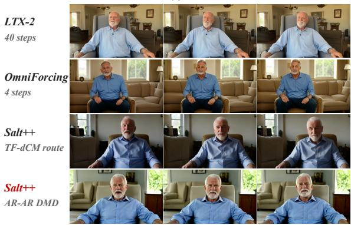

(a) Bald eagle  
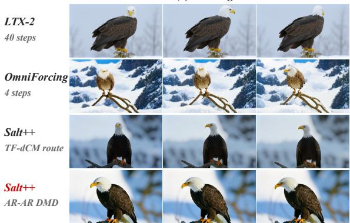  
Prompt: A bald eagle with a white head and tail, and dark brown feathers covering the rest of its body, perches on a branch in a snowy landscape. It has a yellow beak and orange feet. Bird sounds, including chirping, fill the air.

(b) Rocky island  
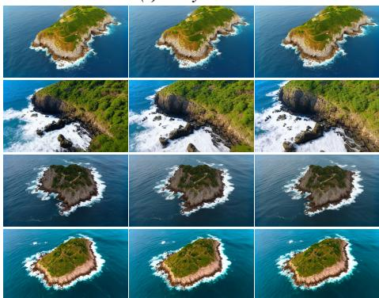  
Prompt: An aerial view reveals a small island with a steep, rocky coastline where waves crash continuously and rhythmically against the rocks, creating a soothing ambiance. The island is covered in green vegetation, and some paths are visible. The surrounding ocean is a deep blue color.  
(c) Wellness host  
(d) Studio speaker  
Prompt: [Shot 1][0.0s-5.0s]: A calm wellness-channel video in a sunlit living room. A Caucasian man in his late 60s with short white hair and a neatly trimmed white beard sits upright in a simple armchair. A static chest-up composition and soft frontal daylight keep his face natural, unobstructed, and sharply focused. He wears a pale blue shirt. Both hands rest separately on the armrests and remain fully visible. He looks directly into the lens, takes a small breath, and says in a warm, steady voice, "Rest is not a reward for finishing everything. Nothing is ever finished." He relaxes his shoulders slightly and gives one gentle nod. The audio is his voice, a distant bird outside the window, and quiet room ambience; the camera never moves.

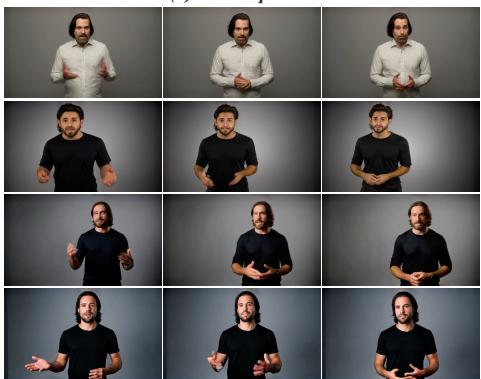  
Prompt: [Shot 1][0.0s-5.0s]: In a professional grey-backdrop studio, a Caucasian man in his mid-30s with shoulder-length dark hair and a trimmed beard stands in an eye-level medium shot. Soft frontal light keeps his face and both hands crisp. He addresses the camera as if recording an opinion video. His hands begin open and separated at waist height; he rotates only his right palm upward in one slow conversational gesture and says, "Being confident doesn't mean being certain. It means staying hones when you're not." He returns both hands to a relaxed neutral position and holds direct eye contact. His movement is controlled and anatomically simple, with no fingers crossing or leaving frame. The scene has no music, only his clear voice and faint studio ventilation.

Figure 8: Additional 480p comparisons. (a) Bald eagle, (b) Rocky island, (c) Wellness host, and (d) Studio speaker. Each case uses the method order of Fig. 4.

truth latents, so $U _ { \omega }$ is distilled on the latent distribution it encounters at deployment; each rollout draws its sampling grid with equal probability from the 4-call grid used at inference and from a finer 8-call grid. We train for 1.2k iterations with AdamW at learning rate $2 \times 1 0 ^ { - 5 }$ , a cosine schedule with 100 warmup steps, gradient clipping at 1.0, and mixed precision, on the same training data as the preceding stages. This procedure only initializes $U _ { \omega }$ ; scale-wise post-training then continues to update it through the high-resolution term of Eq. 10.

## B ADDITIONAL QUALITATIVE RESULTS

## B.1 480P QUALITATIVE COMPARISONS

Presentation protocol. The 480p appendix comparisons contain four cases per figure, arranged in two pairs, with three frames per case. All methods share the prompt and displayed times within each case; frames are not retouched or color corrected. LTX-2 Base uses 40 steps, while OmniForcing and both Salt++ routes use four. Figs. 8 and 9 complement Fig. 4 with eight additional examples.

(a) Race car  
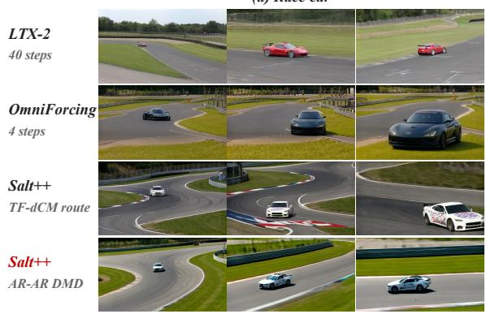  
Prompt: A car is driving on a race track at high speed, appearing to be a sports car. The track has a curve and is bordered by grass and fences, with markings like numbers and lines. The sound of the car engine revving and tires squealing fills the air as it accelerates around the track.

(b) Cat at a window  
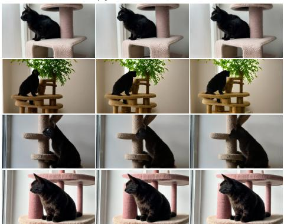  
Prompt: A black cat is sitting on a cat tree platform, looking out of a window to the left. The cat meows as it gazes outside. The cat tree has a scratching post and a platform with a textured surface, and the background shows a white wall and part of a window frame.

(c) Sunset rocks  
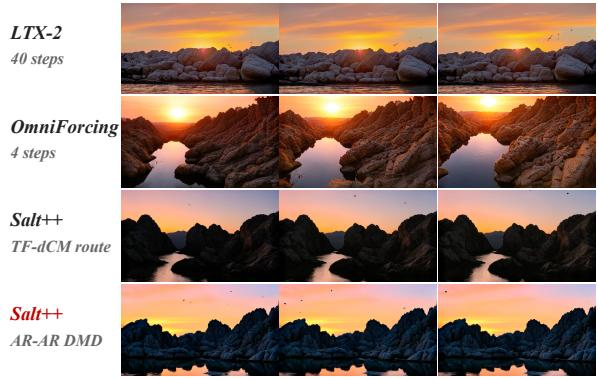  
Prompt: A beautiful sunset casts a warm glow over jagged rock formations in the background, with the sky displaying a gradient of colors from orange to pink and purple. A small body of water in the foreground reflects the rocks and sky, and birds can be seen flying overhead. Soft, ambient music plays in the background.

(d) Garden cottage  
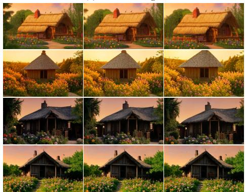  
Prompt: A small, rustic house with a thatched roof is shown, surrounded by a beautiful garden filled with colorful flowers in shades of orange, purple, and pink. A pathway leads up to the house, and the sky in the background is a warm orange, indicating either sunrise or sunset. The house features brick chimney and some wooden furniture outside. Birds are perched on the roof, and their chirping can be heard along with a soft, gentle flute melody in the background, creating a peaceful and serene atmosphere.  
Figure 9: Additional 480p comparisons. (a) Race car, (b) Cat at a window, (c) Sunset rocks, and (d) Garden cottage. Method ordering follows Fig. 4.

(a) Microphone host  
(a) Podcast host  
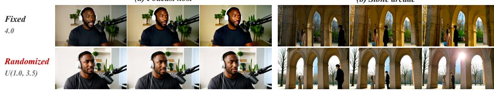  
(b) Stone arcade  
Figure 10: Training-time guidance calibration: podcast and arcade examples. The lower randomized setting preserves more tonal and texture detail than fixed high guidance.

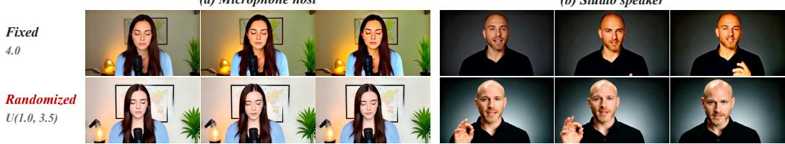  
(b) Studio speaker  
Prompt: [Shot 1]: The video is shot in a bright, cinematic style with a shallow depth of field, focusing on a young Caucasian woman in a medium-close-up. She has long, dark brown hair that falls over her shoulders, wearing a light blue knitted cardigan over a black top and a simple necklace. She is positioned in the center of the frame, facing the camera with her eyes closed, projecting an aura of peace and meditation In front of her sits a professional black microphone, indicating a podcast or ASMR setup. The background is a clean, white-walled room featuring a framed world map, a glowing desk lamp to the left, and a green potted plant to the right. As the camera remains static, she remains still with her head tilted slightly forward. The scene is accompanied by a gentle, ethereal background music and a low-frequency ambient hum. Mid-way through, she speaks in a soft, melodic, and calm whisper, saying, "Feeling wealthy?" with her eyes still closed, enhancing the serene and intimate mood of the shot.  
Prompt: [shot 1][0.0s-5.6s] The video uses a clean, professional cinematic live-action style, with a neutral cool color palette dominated by dark gray tones. The setting is a studio with a dark, textured gray background. A static medium close-up shot frames a bald young Caucasian man in his late 20s to early 30s as the sole focus, lit by dramatic directional side lighting that highlights the contours of his face while casting soft shadow on the far side, creating subtle high contrast with a calm, analytical atmosphere. He has light-colored eyes, a short well-groomed light brown beard, and wears a dark black button-up shirt. He looks directly at the camera with a serious, engaged expression, speaking in a clear, resonant baritone at a steady, persuasive pace with an analytical tone: "What I mean is think about how he thinks about the markets.". As he speaks, he raises his right hand into the frame, forming an "OK" gesture with his thumb and index finger touching, holding the gesture and moving it slightly to punctuate his points. He continues speaking: "Think about how he thinks about public policy.". After finishing the line, he lowers his right hand out of the frame, and his expression softens slightly. The background audio is minimal, with only faint, clean studio room tone, no music or additional sound effects are present.

Figure 11: Additional training-guidance comparisons: Microphone host and Studio speaker. The two AR–AR TF-DMD checkpoints use the same settings as Fig. 10: fixed 4.0 versus independent U(1.0, 3.5) teacher guidance at 3.2k, 4-step inference, and CFG = 1.

## B.2 ADDITIONAL GUIDANCE EXAMPLES AND SAMPLE PROVENANCE

Setup for the qualitative comparisons. The TF-dCM route in the main comparison and the appendix cases uses the Stage 3 2.4k checkpoint, whereas TF-dCM in the initialization ablation is the Stage 2 4.8k model. Both ablation figures use 4-step inference with CFG = 1 and matched prompts, sample-index seeds, and frame times. The guidance examples come from a separate internal visualization set rather than the 1,000-prompt quantitative evaluation; Fig. 11 adds two further speaking cases under the same settings. Matched prompts and seeds do not imply pixel-aligned compositions.

Wellness host

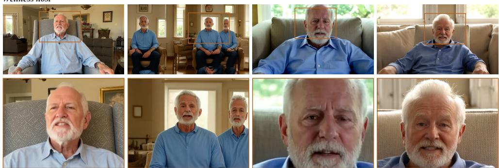  
Prompt: [Shot 1][0.0s-5.0s]: A calm wellness-channel video in a sunlit living room. A Caucasian man in his late 60s with short white hair and a neatly trimmed white beard sits upright in a simple armchair. A static chest-up composition and soft frontal daylight keep his face natural, unobstructed, and sharply focused. He wears a pale blue shirt. Both hands rest separately on the armrests and remain fully visible. He looks directly into the lens, takes a small breath, and says in a warm, steady voice, "Rest is not a reward for finishing everything. Nothing is ever finished." He relaxes his shoulders slightly and gives one gentle nod. The audio is his voice, a distant bird outside the window, and quiet room ambience; the camera never moves. LTX-2 OmniForcing Salt++ 480p Salt++ 960p 40 + 3 steps 4 steps / direct 960 4 steps / bilinear 2x 2 LR + 2 HR

Figure 12: Additional 960p comparison: Wellness host. Full frames above and the corresponding facial and hair detail windows below, using the four-method column order of Fig. 6.

## B.3 HIGH-RESOLUTION QUALITATIVE COMPARISONS

These examples use matched prompts, sample-index seeds, and times: Fitness coach (0007, 4.50 s) and Wellness host (0017, 0.50 s). Both follow the four-column layout of Fig. 6, with full frames above and marked detail windows below.

Checkpoints and display protocol. These qualitative examples use the Stage 3 SALT BI–BI 4.0k parent and its Stage 4a 3.2k scale-wise output, without extra refiner or DPO; this parent is not the AR–AR rollout checkpoint used in the 480p main figure. They are selected visualizations, separate from the 1,000-prompt aggregate evaluation. The 480p parent is bilinearly upsampled for display; the native 960p model uses 2 low-resolution and 2 high-resolution generator calls. All columns show matched times and equal-sized detail windows. OmniForcing uses the released causal model on the 960p token grid with four updates. Its repeated spatial patterns are a resolution-extrapolation result, not a statement about performance at its training resolution. Detail windows cover 34% of frame width and 44% of frame height in every column; their positions follow the subject without facesize normalization. These are independent generations, not pixel-aligned super-resolution pairs. No frame is retouched, sharpened, or color corrected. Selected stills do not establish full-video temporal or audio quality.

## B.4 PROMPTS FOR MAIN-RESULT VISUALIZATIONS

We provide the full input prompts for the main-result examples in Figs. 4 and 6 below. Prompts for the appendix examples are shown beneath each case in Figs. 8–12 and are not repeated here. These are the original generation inputs, shared by all methods within each case. Sampling settings are recorded in Appendices B.2 and B.3.

## White-cliff beach. JavisBench 0631, Fig. 4.

A beautiful beach with large white cliffs on either side and a sandy shoreline is shown. The cliffs have a rough texture with some greenery visible, and ocean waves crash against the rocks at their base. Sunlight filters through partly cloudy skies, casting a warm and serene glow. The sound of waves crashing against the rocks and the gentle breeze blowing contributes to the peaceful atmosphere.

## Diner conversation. Fig. 4.

[Shot 1][0.0s-5.0s]: A moody cinematic diner at night, seen in a locked medium close-up across a booth. A Caucasian woman in her early 40s with a short dark bob wears a charcoal coat and sits beneath soft amber light. Rain streaks the window behind her and a red neon glow remains blurred outside. Her face stays unobstructed and sharply focused. A white coffee cup sits near her left hand; both hands rest separately on the table with all fingers visible. She looks toward an unseen person opposite her, slowly tightens her fingertips around the cup without lifting it, and says in a low controlled voice, ”You weren’t supposed to find that letter.” Her eyes hold steady after the line. Rain, a distant refrigerator hum, and her voice are the only sounds.

## Fitness coach. Fig. 6.

[Shot 1][0.0s-5.0s]: In a minimalist fitness studio with a neutral grey wall, a mature Black man with a shaved head and a short grey beard stands on a black mat. The camera is locked in an eye-level medium shot, and broad soft lighting keeps his face, shoulders, and hands crisp without motion blur. He wears a maroon athletic shirt. Both hands begin open at waist height, palms angled inward and clearly separated. He brings them slowly upward by a few inches while maintaining direct eye contact and says in a calm, supportive voice, ”You don’t need more motivation; you need one smaller promise.” His hands stop and remain still as he gives a gentle nod. The studio is quiet except for his resonant voice and faint ventilation hum.