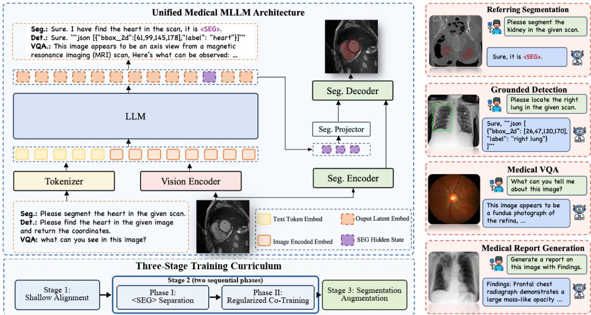
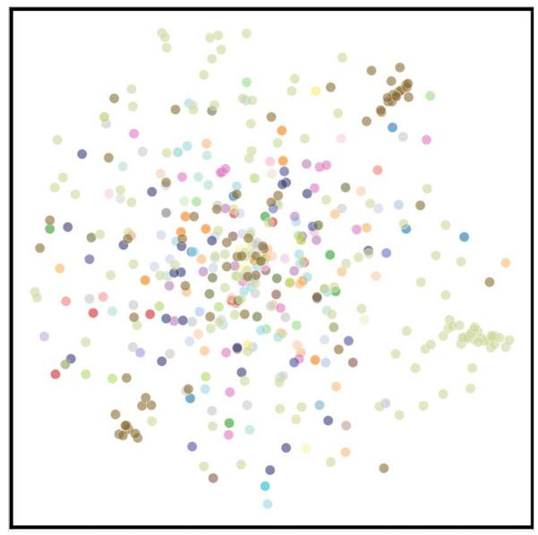
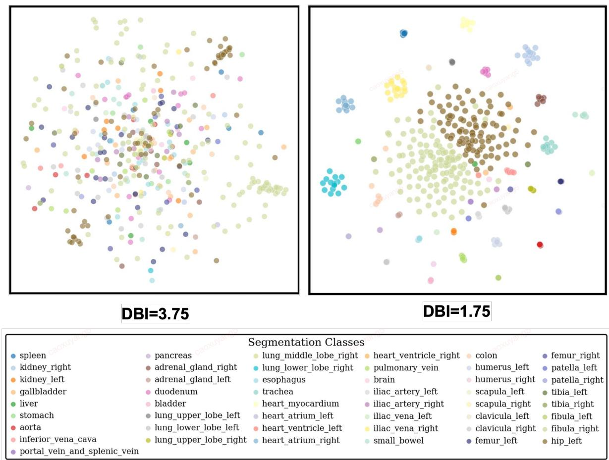
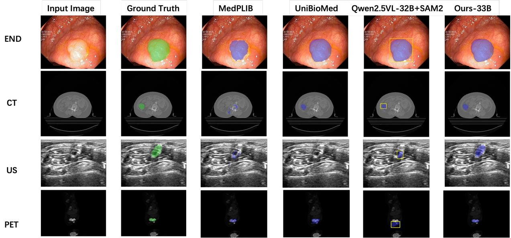

# SAM Meets VLM: Parameter-Decoupled Full-Parameter Training for Unified Medical Reasoning and Segmentation

Xuyang Cao\* Enyou Liu\* Jun Zhao Zhuoyun Liu Jintao Fei Leo

JDH Algo, JD Health International Inc.

\* Equal contribution.

## Abstract

Medical multimodal large language models (MLLMs) are increasingly expected not only to answer clinical questions, but also to localize the visual evidence behind their predictions. A common strategy connects a vision–language model (VLM) with SAM-style segmentation through a special <SEG> token, yet full-parameter training of this unified architecture is dificult because image-level reasoning and pixel-level segmentation impose diferent requirements on the shared representation space. To address this issue, we propose a parameter-decoupled training framework for unified medical reasoning and segmentation. The framework treats the <SEG> hidden state as a semantic-to-spatial prompt for the mask decoder and encourages it to become separable from generic language states, reducing ambiguous segmentation prompts and potential disruption to reasoning representations. It first performs medical shallow alignment to adapt visual features to clinical language without disturbing the LLM; then controlled instruction tuning shapes separable <SEG> prompt states, monitored by the Davies–Bouldin Index (DBI), while scaling segmentation gradients entering the language backbone; finally, the SAM branch is specialized with the VLM frozen to improve mask precision without altering reasoning parameters. Experiments on medical referring segmentation, grounding, visual QA, and textual QA benchmarks show that our framework achieves strong language-conditioned segmentation while preserving competitive reasoning ability. Ablations show that two-phase instruction tuning, gradient scaling, and segmentation specialization all contribute to the model.

## 1 Introduction

Recent studies show that augmenting vision–language models (VLMs) with segmentation modules enables medical multimodal large language models (MLLMs) to perform not only image-leve understanding, such as diagnosis and report generation, but also pixel-level reasoning, including the localization of lesions or anatomical structures [11, 82]. This capability matters for clinical use cases in which an answer is more useful when accompanied by spatial evidence. However, training a single model that supports both medical reasoning and language-conditioned segmentation remains challenging. Image-level reasoning benefits from high-level semantic abstraction, whereas segmentation requires fine-grained spatial cues and stable prompts for a mask decoder. When these objectives are optimized together in the same model, the shared representations can be pulled toward incompatible levels of visual detail.

Inspired by LISA [30] and GLaMM [57], recent medical MLLMs couple SAM [28, 59] with VLMs [2, 40] through a special <SEG> token whose hidden state is projected as an implicit segmentation prompt. MIMO [11] and UniBioMed [82] follow this paradigm with adapter-based tuning [68], while MedPLIB [19] uses separate prediction heads. These designs demonstrate the promise of unified medical interpretation, but they leave open a key training question: how can a full-parameter medical MLLM learn expressive segmentation prompts without eroding its medical vision–language reasoning ability?

We address this question with a parameter-decoupled training framework. Instead of treating the <SEG> token as a passive interface, we explicitly monitor and regularize its hidden-state distribution so that it becomes a stable, SAM-addressable prompt space. The curriculum separates shallow medical alignment, controlled instruction tuning, and segmentation specialization. This design is motivated by empirical training interference observed during naive joint optimization, but the paper’s main contribution is the practical training recipe and its validation across reasoning and segmentation tasks.

## Our contributions are summarized as follows:

• We study full-parameter unified medical MLLM training for joint medical reasoning and language-conditioned segmentation, and analyze the representation-level interference that arises around the <SEG> interface.

• We propose a three-stage parameter-decoupled training framework with DBI-monitored <SEG> state separation, module-specific gradient scaling, and VLM-frozen SAM specialization.

• We evaluate the model on segmentation, grounding, medical VQA, and textual QA benchmarks, and provide ablations showing how each training component afects the reasoning–segmentation trade-of.

## 2 Related Work

## 2.1 Medical Multimodal Large Language Models

Building on general-domain VLMs [2, 40] and vision–language pre-training such as CLIP [56] and MedKCO [87], recent medical MLLMs integrate clinical knowledge for tasks such as report generation, visual question answering, and image interpretation. Early eforts including LLaVA-Med [33], RadFM [80], and PMC-LLaMA [79] established strong medical vision–language foundations through large-scale biomedical pretraining. Lingshu [83] and HealthGPT [36] show strong performance on medical VQA through large-scale medical pretraining. MedGemma [65] leverages Google’s Gemma backbone for diverse medical modalities. HuatuoGPT-V [10] focuses on injecting medical visual knowledge at scale. However, these models focus on image-level understanding and do not support pixel-level segmentation. MIMO [11] and UniBioMed [82] extend this paradigm by coupling SAM-based segmentation with VLMs, but rely on LoRA-based tuning [68] to avoid gradient interference; Sparse Spectral LoRA [50] further studies routed adapter experts for robust medical VLM adaptation. MedPLIB [19] employs a mixture-of-experts design and explicit prediction-head decoupling. Our work instead focuses on the full-parameter training regime and studies how to preserve a segmentation-oriented <SEG> representation while maintaining medical reasoning ability.

## 2.2 Reasoning Segmentation and SAM Integration

LISA [30] pioneered reasoning segmentation by introducing a <SEG> token that bridges a VLM and SAM in the general domain. GLaMM [57] further enables grounded conversation with pixel-leve masks. Subsequent work extends this line with finer-grained pixel reasoning and generalized referring segmentation, including PixelLM [60] and Osprey [86], while open-vocabulary segmenters such as SEEM [90] and grounding models like Grounding DINO [42] broaden promptable detection and segmentation. In the medical domain, these ideas have been adapted with additional taskspecific modules; DuSSS [52] uses semantic vision–language supervision for medical segmentation, and CG-Reasoner [54] studies positional reasoning segmentation in medical imaging. Foundation segmenters such as MedSAM [43] adapt SAM to medical imagery via large-scale fine-tuning but lack language-level reasoning. The key diference in our work is the training regime: we operate under full-parameter optimization and use a staged curriculum to manage the representational interference introduced by the segmentation interface.

## 2.3 Multi-task Optimization

Multi-task learning methods such as GradNorm [12], PCGrad and gradient surgery [85], and Nash-MTL [48] address competing objectives in general settings by re-weighting, projecting, or bargaining over gradients, building on classical multi-objective formulations [66] and uncertainty-based loss weighting [27]. Our approach is more specific to SAM–VLM integration: rather than applying a generic operation to all shared parameters, we use the hidden-state distribution of the <SEG> token as an interpretable signal for the segmentation interface and combine it with a staged curriculum.

## 3 Methodology

This section presents the overall framework. To address this issue, we treat the <SEG> hidden state as the semantic-to-spatial bridge that tells the mask decoder what to segment, and we design the training process to make this bridge separable and stable. We first describe the unified architecture, then analyze training interference through the <SEG> hidden states, and finally detail the parameter-decoupled training strategy.

## 3.1 Unified Architecture

Figure 1 shows the unified medical MLLM architecture designed in this work. Our model couples a multimodal VLM (Qwen2.5-VL [2]) with a SAM2-based [59] segmentation head through a lightweight projection module. Given a medical image x and a textual instruction t, the VLM processes the input and produces a token sequence. When the instruction requests segmentation, the LLM generates a special <SEG> token; its final-layer hidden state $\mathbf { h } ^ { ( \mathrm { s e g } ) } \in \mathbb { R } ^ { d }$ is projected to form an implicit prompt that is fed into the SAM2 decoder to produce a segmentation mask. All other outputs (VQA answers, diagnostic text) are generated via the standard language head.

## 3.2 Training Interference and Hidden-State Dynamics

Naive joint optimization exposes two forms of interference. First, dense segmentation losses update the segmentation interface at a much diferent scale and frequency from language-generation losses. Second, the <SEG> token must simultaneously remain compatible with the LLM hidden space and become an informative spatial prompt for SAM. If its hidden states are entangled with generic linguistic tokens, the SAM decoder receives ambiguous prompts and tends to produce unstable masks.

We therefore monitor the separability of <SEG> hidden states during training. For each validation segmentation sample, we collect the final-layer hidden state of the generated <SEG> token and group samples by their target anatomy or task label. The Davies–Bouldin Index (DBI) provides a compact validation-time measure of this structure: lower DBI indicates more compact within-class states and larger between-class separation. DBI is used only for monitoring and phase selection; it is not optimized by backpropagation.

  
Figure 1: Unified medical MLLM architecture and parameter-decoupled training overview. A VLM produces language responses for reasoning tasks and emits a <SEG> token for language-conditioned referring segmentation. The <SEG> hidden state is projected as an implicit prompt to the SAM2- based segmentation branch, while the bottom row summarizes the three training stages.

Figure 2 visualizes the evolution of the <SEG> state space. As training proceeds, the hidden states become more separable and DBI drops from 3.75 to 1.75 in the two displayed checkpoints, indicating that the segmentation prompt interface becomes more structured before stronger joint reasoning–segmentation optimization.

## 3.3 Parameter-Decoupled Training Framework

The training process comprises three stages designed to progressively build representational structure before introducing joint optimization, as shown in Figure 1. Algorithm 1 specifies the training schedule, phase-transition criterion, and gradient-scaling rule used in this process.

## 3.3.1 Stage 1: Medical Shallow Alignment.

This stage is motivated by the domain gap between generic visual pretraining and medical image interpretation. Medical images difer substantially from natural images in texture, contrast, viewpoint, and modality-specific artifacts, so directly mixing dense segmentation losses with instruction tuning can force the LLM to compensate for an under-aligned visual representation. Before exposing the shared backbone to mask supervision, we therefore adapt the visual front-end to medical image statistics using abundant image–caption pairs. Specifically, most parameters are frozen, and only the vision encoder and projector are updated. This provides low-risk medical visual–textual grounding: the model learns modality and anatomy cues while the language backbone and SAM decoder remain protected from noisy or sparse mask gradients. This creates a stable semantic basis for the later <SEG> interface, where segmentation supervision must refine spatial grounding rather than repair basic medical visual recognition.

  
Figure 2: t-SNE [74] visualization of <SEG> token hidden states as training progresses. DBI decreases from 3.75 to 1.75 across the two displayed checkpoints, showing that the implicit segmentation prompts become more compact and separable across target classes.

## 3.3.2 Stage 2, Phase I: Structured State Separation.

Phase I is designed to let the <SEG> representation become separable before stronger joint co-training is introduced. Importantly, we do not optimize a clustering loss, nor do we include DBI in the training objective. Instead, the model is updated with the standard segmentation-instruction task loss, and the hidden-state geometry is measured on a held-out validation split after each epoch. For each validation sample i, let $\mathbf { h } _ { i } ^ { ( \mathrm { s e g } ) } \in \mathbb { R } ^ { d }$ denote the final-layer hidden state of the generated <SEG> token, with anatomy/task class label $y _ { i } \in \{ 1 , \ldots , K \}$ . We group these states by label and compute per-class centroids only for measuring separation, not for gradient-based optimization.

Algorithm 1 Parameter-Decoupled Training   
Input: Training data D, validation set $\mathcal { D } _ { \mathrm { v a l } } ,$ DBI threshold τ=1.9, gradient scale $\gamma _ { \mathrm { s e g } } { = } 0 . 0 1$   
Output: Trained unified model   
1: Stage 1 (Shallow Alignment): Train vision encoder and projector only on image–caption   
pairs; LLM and SAM frozen.   
2: Stage 2, Phase I (Structured State Separation): Train on segmentation instructions with   
the standard task loss; collect <SEG> hidden states for validation-time DBI monitoring.   
3: while DBI $( \mathcal { D } _ { \mathrm { v a l } } ) \geq \tau$ do   
4: Update for one epoch.   
5: Compute DBI on $\mathcal { D } _ { \mathrm { v a l } }$ without backpropagation.   
6: end while   
7: Stage 2, Phase II (Regularized Co-Training): Scale segmentation gradients flowing from   
the <SEG> interface into the LLM backbone by $\gamma _ { \mathrm { s e g } } .$ Train with full joint loss $\mathcal { L } _ { \mathrm { I I } }$   
8: Stage 3 (Segmentation Augmentation): Freeze MLLM; fine-tune SAM only on segmentation   
data.

## 3.3.3 DBI-Guided Phase Transition.

After each epoch in Phase I, we evaluate the Davies–Bouldin Index [15] on a held-out validation split:

$$
{ \mathrm { D B I } } = { \frac { 1 } { K } } \sum _ { i = 1 } ^ { K } \operatorname* { m a x } _ { j \neq i } { \frac { \sigma _ { i } + \sigma _ { j } } { d ( c _ { i } , c _ { j } ) } } ,\tag{1}
$$

where $\sigma _ { k }$ is the average intra-cluster distance for cluster k and $d ( c _ { i } , c _ { j } )$ is the Euclidean distance between centroids $c _ { i }$ and $c _ { j }$ . We transition from Phase I to Phase II when DBI < 1.9 on the held-out validation split. This empirical threshold corresponds to a visibly separated <SEG> state space in our runs and is typically reached after 2–4 epochs. Importantly, DBI is monitoring-only and does not enter backpropagation.

## 3.3.4 Stage 2, Phase II: Regularized Co-Training.

In Phase II, all MLLM parameters are optimized jointly. To reduce interference with language representations, we apply module-specific gradient scaling to segmentation-related updates. Gradients flowing from the <SEG> projection interface into the LLM backbone are multiplied by $\gamma _ { \mathrm { s e g } } = 0 . 0 1$ while language-modeling losses and the SAM encoder/decoder updates are left unscaled. The combined loss is:

$$
\begin{array} { r } { \mathcal { L } _ { \mathrm { I I } } = \lambda _ { 1 } \mathcal { L } _ { \mathrm { p e r - t o k e n } } + \lambda _ { 2 } \mathcal { L } _ { \mathrm { D i c e } } + \lambda _ { 3 } \mathcal { L } _ { \mathrm { B C E } } , } \\ { \lambda _ { 1 } = 1 , ~ \lambda _ { 2 } = 2 , ~ \lambda _ { 3 } = 1 . \qquad } \end{array}\tag{2}
$$

## 3.3.5 Stage 3: Segmentation Augmentation.

Stage 3 targets a diferent bottleneck from Stage 2. Once the <SEG> token has learned to carry a stable semantic prompt, the remaining segmentation errors are often caused by limited maskdecoder adaptation to medical image appearance, including modality-specific texture, low-contrast boundaries, and small structures. Continuing to update the language backbone at this point may improve masks slightly, but risks erasing the reasoning and instruction-following behavior established during co-training. Therefore, the entire MLLM is frozen, and only the SAM2-based segmentation module is fine-tuned on additional segmentation data. This keeps the semantic interface fixed while specializing the mask decoder to medical masks, improving boundary precision without disturbing the MLLM’s multimodal reasoning capacity. No inference overhead is introduced: at test time, the model performs a single forward pass.

Table 1: Results on multi-modal referring segmentation (Dice, %) and medical detection (precision@0.5). Bold: best; underline: second best; –: not supported; ⋆: zero-shot; †: reproduced/evaluation-only baseline.
<table><tr><td rowspan="2">Model</td><td colspan="8">MeCOVQA-G+seg</td><td rowspan="2">MedSAM2det</td></tr><tr><td>DER</td><td>CT</td><td>PET X-RAY</td><td></td><td>END</td><td>MR</td><td>US</td><td>FP</td></tr><tr><td>MedPLIB 14B [19]</td><td>79.84</td><td>57.58</td><td>64.25</td><td>8.47*</td><td>44.35*</td><td>27.38*</td><td>34.22*</td><td>4.82*</td><td></td></tr><tr><td>UniBioMed† [82]</td><td>63.29</td><td>14.07</td><td>19.03</td><td>29.86</td><td>67.35</td><td>25.74</td><td>0.18</td><td>69.22</td><td></td></tr><tr><td> $\mathrm { Q w e n 2 . 5 \mathrm { - } V L \mathrm { - } 7 B \mathrm { + } S A M 2 ^ { \dag } \ [ 2 , 5 9 ] }$ </td><td>32.97</td><td>19.31</td><td>13.98</td><td>5.75</td><td>52.91</td><td>7.79</td><td>8.48</td><td>0.32</td><td>20.90</td></tr><tr><td> $\mathrm { Q w e n 2 . 5 – V L - 3 2 B + S A M 2 ^ { \dagger } \ [ 2 , 5 9 ] }$ </td><td>34.94</td><td>23.23</td><td>22.84</td><td>4.81</td><td>58.55</td><td>10.75</td><td>10.55</td><td>0.22</td><td>30.10</td></tr><tr><td>Ours-8B</td><td>92.09</td><td>64.04</td><td>77.93</td><td>14.69</td><td>92.80</td><td>43.07</td><td>83.83</td><td>74.07</td><td>44.60</td></tr><tr><td>Ours-33B</td><td>91.45</td><td>73.87</td><td>79.25</td><td>29.20</td><td>93.10</td><td>48.19</td><td>86.10</td><td>96.02</td><td>44.90</td></tr></table>

Table 2: Segmentation results on MedSegBench [29] (Dice, %). Bold: best; underline: second best; –: not reported.
<table><tr><td>Model</td><td>ISIC16</td><td>Kvasir</td><td>IDRiD</td><td>CovidQUEx Promise12</td><td></td><td>MosMed+</td><td>US-Nerve</td><td>TNBC</td></tr><tr><td>Unet-MIT</td><td>89.10</td><td>56.90</td><td>5.30</td><td></td><td></td><td>76.10</td><td></td><td>75.90</td></tr><tr><td>Unet-EfficientNet</td><td>90.30</td><td>81.20</td><td>7.80</td><td>74.40</td><td>89.20</td><td>78.10</td><td>78.70</td><td>73.80</td></tr><tr><td>Unet-MobileNetV2</td><td>89.10</td><td>75.40</td><td>9.20</td><td>74.20</td><td>89.60</td><td>78.50</td><td>77.20</td><td>76.20</td></tr><tr><td>Unet-DenseNet121</td><td>89.30</td><td>79.40</td><td>8.90</td><td>75.60</td><td>90.00</td><td>79.10</td><td>78.60</td><td>78.80</td></tr><tr><td>Unet-ResNet50</td><td>88.70</td><td>69.80</td><td>9.00</td><td>73.40</td><td>88.80</td><td>79.00</td><td>77.60</td><td>78.50</td></tr><tr><td>Ours-8B</td><td>93.16</td><td>90.91</td><td>47.10</td><td>77.84</td><td>90.81</td><td>78.17</td><td>80.15</td><td>82.93</td></tr><tr><td>Ours-33B</td><td>93.71</td><td>91.22</td><td>56.86</td><td>78.39</td><td>91.40</td><td>78.01</td><td>80.24</td><td>81.20</td></tr></table>

## 4 Experiments and Results

## 4.1 Implementation Details

We train on 4×8 NVIDIA H200 GPUs with a global batch size of 256, using AdamW (weight decay 0.01), with learning rates $1 \times 1 0 ^ { - 5 }$ for the LLM, $2 \times 1 0 ^ { - 6 }$ for the vision transformer, and $1 \times 1 0 ^ { - 5 }$ for the alignment module. A cosine scheduler is applied. DeepSpeed [58] and FlashAttention-2 [14] are used for memory eficiency. All models are evaluated with the same prompt templates and decoding settings within each benchmark. For language tasks, we report accuracy after answer normalization. For referring segmentation, we report Dice score. For detection, we report precision at IoU threshold 0.5.

Computational Cost. Our three-stage training requires approximately 3 days for Ours-8B and 7 days for Ours-33B on 4×8 NVIDIA H200 GPUs. The staged procedure increases training cost compared with simpler joint fine-tuning, but it does not introduce additional inference overhead: at test time, all tasks use the same forward pass and the same segmentation branch.

Model Variants We construct two model variants with diferent parameter scales: Ours-8B and Ours-33B. Ours-8B is built upon Qwen2.5-VL-7B [2], which consists of a 7B-parameter LLM and a

ViT-based vision encoder, while Ours-33B adopts Qwen2.5-VL-32B with a 32B-parameter LLM. All remaining components—including the SAM2-based segmentation head, the <SEG> projection layer, training hyperparameters, and the three-stage training pipeline—are kept identical across the two variants.

## 4.2 Datasets and Benchmarks

## 4.2.1 Training Data.

The training corpus combines public and synthesized data for medical image captioning, report generation, VQA, textual QA, general instruction following, and language-conditioned segmentation. These sources support diferent curriculum stages: image–caption pairs provide shallow medical alignment, instruction data preserves reasoning and dialogue ability, and segmentation samples teach textual queries to ground into masks. After quality control and deduplication, the final set contains 16.8M public samples and 1.6M synthesized samples (> 3B text tokens, 12.6M images). See Appendix A for public training datasets.

## 4.2.2 Evaluation Benchmarks.

We evaluate the model along three axes. Medical textual QA tests knowledge preservation after segmentation training on five public benchmarks: PubMedQA [24], MedMCQA [51], MedQA [23], MedXpertQA [91], and CMMLU [34]. Medical visual QA evaluates image-level clinical understanding: VQA-RAD [31], MedXpertQA [91], SLAKE [39], PATH-VQA [47], and PMC-VQA [88]. Medical referring segmentation and detection evaluates pixel-level grounding: MedSegBench [29] (Dice), $\mathrm { M e C O V Q A - G + } _ { s e g }$ [76] (Dice), and MedS $\mathrm { A M 2 } _ { d e t }$ [76] (precision@0.5). See Appendix B for public evaluation benchmarks.

## 4.3 Results

We first report pixel-level referring segmentation and grounding results, then evaluate whether the same model retains image-level and textual medical reasoning ability. This ordering reflects the central question of our study: whether adding a SAM-style segmentation branch through a <SEG> interface can improve localization without collapsing the VLM’s reasoning capability.

## 4.3.1 Results on Segmentation Benchmarks.

Table 1 first evaluates the language-conditioned grounding setting most aligned with our goal: translating a clinical expression into a <SEG> prompt for mask prediction. To make the tool-composed baseline explicit, we reproduce Qwen2.5-VL+SAM2 in an evaluation-only manner: Qwen2.5-VL is prompted to return a JSON bounding box for the queried region, the parsed box is used as the spatial prompt to SAM2, and invalid or missing boxes are counted as grounding failures. This tests whether a strong VLM can provide suficient spatial prompts for an of-the-shelf segmenter without learning a dedicated segmentation interface. The reproduced 7B/32B pipelines obtain only 32.97/34.94 DER Dice and 20.90/30.10 precision on MedS $\mathrm { A M 2 } _ { d e t }$ , indicating that loosely attaching SAM2 to a strong VLM is not enough for robust medical referring segmentation.

Table 2 then compares against the dataset-specific expert segmenters used in MedSegBench. Unlike these oficial U-Net baselines, trained per-dataset with one specialized model for each benchmark [29], our model is trained jointly and uses a single language-conditioned interface across datasets. These expert baselines instantiate U-Net [61] with common vision backbones including

Table 3: Medical visual question answering results (accuracy, %). Bold: best; underline: second best.
<table><tr><td>Model</td><td>VQA-RAD</td><td>MedXpertQA</td><td>SLAKE</td><td>PATH-VQA</td><td>PMC-VQA</td><td>Avg.</td></tr><tr><td>Qwen2.5-VL 7B [2]</td><td>66.30</td><td>20.75</td><td>67.86</td><td>42.30</td><td>50.86</td><td>49.61</td></tr><tr><td>Lingshu 7B [83]</td><td>68.74</td><td>26.90</td><td>82.90</td><td>60.23</td><td>55.77</td><td>58.91</td></tr><tr><td>HealthGPT 14B [36]</td><td>64.08</td><td>24.55</td><td>67.43</td><td>58.67</td><td>56.90</td><td>54.33</td></tr><tr><td>MedGemma 27B [65]</td><td>63.86</td><td>33.10</td><td>76.17</td><td>47.60</td><td>45.35</td><td>53.22</td></tr><tr><td>Qwen2.5-VL 32B [2]</td><td>72.28</td><td>25.30</td><td>76.36</td><td>41.58</td><td>53.58</td><td>53.82</td></tr><tr><td>Lingshu 32B [83]</td><td>75.39</td><td>31.00</td><td>87.68</td><td>64.76</td><td>57.23</td><td>63.21</td></tr><tr><td>HealthGPT 32B [36]</td><td>64.75</td><td>26.40</td><td>70.58</td><td>62.93</td><td>54.93</td><td>55.92</td></tr><tr><td>HuatuoGPT-V 34B [10]</td><td>63.64</td><td>22.65</td><td>73.02</td><td>44.92</td><td>56.79</td><td>52.20</td></tr><tr><td>GPT-5</td><td>68.37</td><td>51.48</td><td>65.82</td><td>31.74</td><td>36.10</td><td>50.70</td></tr><tr><td>Ours-8B</td><td>64.30</td><td>25.10</td><td>84.91</td><td>62.00</td><td>55.64</td><td>58.39</td></tr><tr><td>Ours-33B</td><td>77.83</td><td>29.15</td><td>88.40</td><td>63.89</td><td>59.74</td><td>63.80</td></tr></table>

Table 4: Medical textual question answering results (accuracy, %). Bold: best; underline: second best.
<table><tr><td>Model</td><td>PubMedQA</td><td>MedMCQA</td><td>MedQA</td><td>MedXpertQA</td><td>CMMLU</td><td>Avg.</td></tr><tr><td>Qwen2.5-VL 7B [2]</td><td>75.80</td><td>53.40</td><td>57.50</td><td>12.40</td><td>68.80</td><td>53.58</td></tr><tr><td>Lingshu 7B [83]</td><td>75.40</td><td>56.13</td><td>63.39</td><td>16.45</td><td>69.02</td><td>56.08</td></tr><tr><td>HealthGPT 14B [36]</td><td>69.40</td><td>63.33</td><td>66.93</td><td>12.45</td><td>55.36</td><td>53.49</td></tr><tr><td>MedGemma 27B [65]</td><td>79.00</td><td>63.23</td><td>81.15</td><td>22.01</td><td>60.24</td><td>61.13</td></tr><tr><td>Qwen2.5-VL 32B [2]</td><td>68.60</td><td>62.71</td><td>71.33</td><td>15.88</td><td>82.60</td><td>60.22</td></tr><tr><td>Lingshu 32B [83]</td><td>78.20</td><td>65.05</td><td>74.94</td><td>22.86</td><td>82.37</td><td>64.69</td></tr><tr><td>HealthGPT 32B [36]</td><td>74.20</td><td>64.04</td><td>68.89</td><td>13.84</td><td>69.47</td><td>58.09</td></tr><tr><td>HuatuoGPT-V 34B [10]</td><td>71.00</td><td>55.08</td><td>58.52</td><td>12.20</td><td>77.64</td><td>54.89</td></tr><tr><td>GPT-5</td><td>78.00</td><td>62.99</td><td>76.96</td><td>40.75</td><td>82.93</td><td>68.33</td></tr><tr><td>Ours-8B</td><td>74.80</td><td>55.10</td><td>64.89</td><td>16.90</td><td>71.19</td><td>56.58</td></tr><tr><td>Ours-33B</td><td>78.40</td><td>65.62</td><td>80.28</td><td>22.20</td><td>83.27</td><td>65.95</td></tr></table>

ResNet [18], EficientNet [72], MobileNetV2 [63], and DenseNet [21]. Despite this one-model-versusmany-experts setting, Ours-33B surpasses the dataset-specialized experts on most MedSegBench datasets and remains competitive on the rest, complementing Table 1. Quantitatively, Ours-33B ranks first on six of eight datasets, with especially large gains on IDRiD (56.86 vs. 9.20) and Kvasir (91.22 vs. 81.20).

Table 5: Ablation on two-phase instruction fine-tuning (Ours-8B).
<table><tr><td>Model</td><td>VQA</td><td>Text QA</td><td>Dice</td></tr><tr><td>w/o two-phase</td><td>56.67</td><td>49.27</td><td>64.92</td></tr><tr><td>w/ two-phase</td><td>58.39</td><td>56.58</td><td>80.13</td></tr></table>

Qualitative Analysis. Figure 3 visualizes diferences among MedPLIB, UniBioMed, Qwen2.5- VL-32B+SAM2, and Ours-33B, highlighting failure modes such as coarse language-to-box grounding and boundary leakage. The Qwen2.5-VL+SAM2 pipeline often localizes only a rough box before mask generation, while MedPLIB and UniBioMed can miss small structures or leak into nearby tissues. Ours-33B produces masks that more closely follow the green annotations across modalities, especially around low-contrast boundaries.

  
Figure 3: Qualitative comparison of medical referring segmentation results. We compare MedPLIB, UniBioMed, Qwen2.5-VL-32B+SAM2, and Ours-33B across representative imaging modalities. Green masks denote ground truth, all predicted segmentation masks are shown in blue, and yellow boxes indicate the grounding output used by the Qwen2.5-VL+SAM2 pipeline.

## 4.3.2 Results on Medical VQA Benchmarks.

Table 6: Sensitivity to gradient scaling factor $\gamma _ { \mathrm { s e g } }$ (Ours-8B).
<table><tr><td>Metric</td><td>1.0 0.3</td><td>0.01 0.001</td></tr><tr><td>VQA Avg.</td><td>56.23 56.90</td><td>57.93 58.84</td></tr><tr><td>Text Avg.</td><td>54.22 54.92</td><td>55.60 56.13</td></tr><tr><td>Dice Avg.</td><td>65.95 62.39</td><td>57.42 50.38</td></tr></table>

Table 7: Ablation on Stage 3 segmentation augmentation (Ours-33B, Dice, %).
<table><tr><td>Model</td><td>ISIC16</td><td>Kvasir</td><td>IDRiD</td><td>CovidQUEx Promise12 MosMed+</td><td></td><td></td><td>US-Nerve</td><td>TNBC</td><td>Avg.</td></tr><tr><td>w/o Stage 3</td><td>86.19</td><td>83.10</td><td>41.34</td><td>72.49</td><td>89.99</td><td>79.68</td><td>80.10</td><td>77.01</td><td>76.24</td></tr><tr><td>w/ Stage 3</td><td>93.71</td><td>91.22</td><td>56.86</td><td>78.39</td><td>91.40</td><td>78.01</td><td>80.24</td><td>81.20</td><td>81.38</td></tr></table>

Ours-33B achieves the highest average accuracy (63.80%) among all evaluated methods, establishing new best results on VQA-RAD, SLAKE, and PMC-VQA. This is important because the model is not optimized solely for VQA; it is also trained to emit <SEG> tokens and support segmentation outputs. The result suggests that the proposed parameter-decoupled curriculum improves pixel-level capability while preserving image-level clinical semantics and question answering ability. The gains are not uniform across benchmarks: Ours-33B is strongest on VQA-RAD, SLAKE, and PMC-VQA, but remains below GPT-5 on MedXpertQA. This indicates that the model is competitive on image-grounded medical VQA, while harder expert-level reasoning still benefits from larger general-purpose language capacity.

## 4.3.3 Results on Medical Textual QA Benchmarks.

Ours-33B achieves second-best average accuracy (65.95%), best on MedMCQA and CMMLU, and top-two results on PubMedQA and MedQA. These benchmarks do not require image segmentation, so they provide a useful stress test for catastrophic forgetting of medical knowledge during segmentation-oriented training. The strong textual QA performance indicates that freezing and scaling choices in the training curriculum help preserve the language backbone’s medical reasoning ability while enabling pixel-level segmentation. This table is especially important because none of these benchmarks requires mask prediction; improvements here cannot be explained by the SAM2 branch. Instead, they indicate that the staged training procedure preserves text-only medical knowledge while improving segmentation, avoiding the common trade-of between localization and language reasoning.

## 4.3.4 Ablation Study.

We ablate the key components of the proposed curriculum to verify their separate efects on reasoning and segmentation. The two-phase comparison evaluates controlled segmentation exposure, the gradient-scaling sweep examines language-backbone updates, and the Stage 3 ablation isolates VLM-frozen SAM2 specialization.

Table 5 shows that two-phase instruction fine-tuning substantially improves both textual QA and segmentation, indicating that controlled exposure to segmentation supervision is important for maintaining the unified model. Without this separation, segmentation supervision is introduced too abruptly and both the <SEG> prompt space and the language reasoning ability are less stable.

Table 6 reveals the expected trade-of of γseg: smaller values better preserve QA performance but weaken the segmentation signal. We use $\gamma _ { \mathrm { s e g } } { = } 0 . 0 1$ as a practical compromise before the final segmentation specialization stage, balancing reasoning retention and prompt learning across tasks.

Table 7 shows that Stage 3 improves the Ours-33B average MedSegBench Dice from 76.24% to 81.38% while keeping the VLM frozen, consistent with the goal of improving masks without altering the reasoning backbone or instruction-following behavior learned earlier.

## 5 Conclusion

We present a parameter-decoupled training framework for unified medical reasoning and languageconditioned segmentation. Rather than framing SAM–VLM integration as only an architectural problem, we focus on how the <SEG> interface should be trained under full-parameter optimization. The proposed curriculum uses medical shallow alignment, DBI-monitored instruction tuning with gradient scaling, and VLM-frozen segmentation specialization to improve pixel-level masks while preserving medical VQA and textual QA performance. Extensive experiments on diverse benchmarks demonstrate accurate anatomical delineation without sacrificing reasoning performance, establishing an efective paradigm for unified medical multimodal modeling.

## Appendix

## A Public Training Datasets

This appendix summarizes the public training datasets and curation procedure used in our training corpus. Following our prior data construction protocol, we aggregate open-source resources into five categories: medical image–caption, medical multimodal instruction/VQA, referring segmentation/grounding, medical textual QA and reasoning, and general instruction data.

## A.1 Dataset Summary

Each dataset in Table 8 is annotated with its corresponding public reference.

## A.2 Data Processing and Quality Control

We apply a unified data processing pipeline to textual, visual, and multimodal samples before training. For image data, low-resolution images are removed using a 4096-pixel threshold. For DICOM-based medical imaging data, we further check physical dimension consistency, orientation consistency, and slice-spacing consistency, and remove samples with corrupted or inconsistent metadata. Private or patient-identifying information in metadata is removed during de-identification.

For textual samples, we use regular-expression filters and token-length thresholds to remove irrelevant or low-quality instructions, especially samples that are too short or exceed the intended training length. Pure text instruction–response pairs are deduplicated to reduce redundancy. For image–text pairs, we combine text-level matching with image hashing to remove duplicated multimodal samples. Conversational medical data are additionally de-identified with LLM-based rewriting, retaining only clinically relevant consultation content while removing personal information.

We also perform lightweight model-based enhancement for public VQA-style data whose answers are overly brief or whose questions are highly repetitive. A VLM is used to consolidate multiple simple questions about the same image into more holistic instructions, improving coverage of image interpretation, feature relations, and diagnostic reasoning.

For referring segmentation and grounding tasks, we use SA-Med2D-20M [84]. SA-Med2D-20M is a large-scale 2D medical segmentation corpus built from public medical imaging datasets. It provides paired images and dense masks across diverse modalities, anatomical regions, and lesion types, making it suitable for broad medical grounding supervision. For referring segmentation data, we use the image–mask pairs and GPT-5 to construct instruction-style samples whose textual prompts refer to target anatomical or pathological regions. For grounding data, we first convert each segmentation mask into a tight bounding box and then use GPT-5 to build dialogue-style localization samples. Finally, medical data are tagged by imaging modality, task type, and anatomical region, enabling transparent corpus analysis and stratified evaluation across downstream tasks.

## B Public Evaluation Benchmarks

Following the main paper, we organize evaluation benchmarks along three axes: medical textual QA, medical visual QA, and medical referring segmentation/detection. Table 9 summarizes the public benchmarks, task types, modalities, and reported metrics.

Table 8: List of open-source datasets collected for training.
<table><tr><td>Category</td><td>Included Public Datasets</td></tr><tr><td>Image—caption</td><td>PMCOA [37], ROCO [53], LLaVA-Med [32], MedPix2.0 [70], CheXpert Plus [5], MIMIC-CXR [25], ROCOv2 [62], Quilt-LLaVA [67], PubMedVision [9], IU-Xray [17]</td></tr><tr><td>MM instruction</td><td>VQA-RAD [31], PMC-VQA [88], PATH-VQA [47], SLAKE [39], MIMIC-CXR-VQA [1], VQA-Med-2019 [4]</td></tr><tr><td>Referring segmentation / SA-Med2D-20M [84] grounding</td><td></td></tr><tr><td>Textual QA</td><td>JMed [75], HealthCareMagic [35], iCliniq [35], HuatuoGPT2-SFT-GPT4 [7], Citrus-S3 [75], medical-o1-verifiable-problem [8], Medical-R1-Distill-Data [8], huatuogpt-o1-for-reasoning [8], MedReason [81], MedThoughts [20],</td></tr><tr><td>General instruction</td><td>medical-o1-reasoningSFT [8], AlpaCare [89], ApolloCorpus [77], MedQuAD [3], MedQA [23], PMC-LLaMA [78] LLaVA1.5 [41], PixMo [16], ALLaVA [6], OpenHermes-2.5 [73], OKVQA [44], A-OKVQA [64], OCRVQA [45], TextCaps [69]</td></tr></table>

Table 9: Public evaluation benchmarks used in the main experiments.
<table><tr><td>Axis</td><td>Benchmarks</td><td>Modality</td><td>Metric</td></tr><tr><td>Medical textual</td><td>PubMedQA [24], MedMCQA [51], MedQA [23],</td><td>Text</td><td>Accuracy</td></tr><tr><td>QA</td><td>MedXpertQA [91], CMMLU [34] Medical visual QA VQA-RAD [31], MedXpertQÅ [91], SLAKE [39],</td><td>Image+Text</td><td>Accuracy</td></tr><tr><td>Referring</td><td>PATH-VQA [47], PMC-VQA [88] MedSegBench [29], MeCOVQA-G+seg [76]</td><td>Image+Text</td><td>Dice</td></tr><tr><td>segmentation Grounding</td><td>MedSAM2det [76]</td><td>Image+Text</td><td>Precision@0.5</td></tr></table>

MedSegBench [29] further contains eight dataset-specific segmentation subsets used in the main paper. These subsets span dermatology, endoscopy, ophthalmology, radiography, MRI, CT, ultrasound, and histopathology, allowing us to compare one unified model with multiple expert segmenters trained separately for each dataset. Table 10 summarizes the domain and segmentation target of each subset.

Table 10: MedSegBench subsets used for segmentation evaluation.
<table><tr><td>Subset</td><td>Domain / Modality</td><td>Segmentation Target</td><td>Metric</td></tr><tr><td>ISIC16 [13]</td><td>Dermoscopy</td><td>Skin lesion region in dermoscopic images</td><td>Dice</td></tr><tr><td>Kvasir [22]</td><td>Endoscopy</td><td>Colorectal polyp region in colonoscopy images</td><td>Dice</td></tr><tr><td>IDRiD [55]</td><td>Fundus photography</td><td>Retinal pathology or structure masks for diabetic retinopathy analysis</td><td>Dice</td></tr><tr><td>CovidQUEx [71]</td><td>Chest X-ray</td><td>Lung or infection-related regions in COVID-19</td><td>Dice</td></tr><tr><td>Promise12 [38]</td><td>Prostate MRI</td><td>radiographs Prostate gland region in pelvic MR images</td><td>Dice</td></tr><tr><td>MosMed+ [46]</td><td>Chest CT</td><td>Lung or infection-related regions in thoracic CT</td><td>Dice</td></tr><tr><td>US-Nerve [26]</td><td>Ultrasound</td><td>volumes Peripheral nerve region in ultrasound images</td><td>Dice</td></tr><tr><td>TNBC [49]</td><td>Histopathology</td><td>Nuclei regions in triple-negative breast cancer microscopy images</td><td>Dice</td></tr></table>

## References

[1] Seongsu Bae, Daeun Kyung, Jaehee Ryu, Eunbyeol Cho, Gyubok Lee, Sunjun Kweon, Jungwoo Oh, Lei Ji, Eric Chang, Tackeun Kim, et al. Ehrxqa: A multi-modal question answering dataset for electronic health records with chest x-ray images. Advances in Neural Information Processing Systems, 36, 2024.

[2] Shuai Bai, Keqin Chen, Xuejing Liu, Jialin Wang, Wenbin Ge, Sibo Song, et al. Qwen2.5-vl technical report. arXiv preprint arXiv:2502.13923, 2025.

[3] Asma Ben Abacha and Dina Demner-Fushman. A question-entailment approach to question answering. BMC Bioinform., 20(1):511:1–511:23, 2019. URL https://bmcbioinformatics. biomedcentral.com/articles/10.1186/s12859-019-3119-4.

[4] Asma Ben Abacha, Sadid A. Hasan, Vivek V. Datla, Joey Liu, Dina Demner-Fushman, and Henning Müller. Vqa-med: Overview of the medical visual question answering task at imageclef 2019. In Working Notes of CLEF 2019, volume 2380 of CEUR Workshop Proceedings, Lugano, Switzerland, September 9-12 2019. CEUR-WS.org. URL https://ceur-ws.org/Vol-2380/paper\_272.pdf.

[5] Pierre Chambon, Jean-Benoit Delbrouck, Thomas Sounack, Shih-Cheng Huang, Zhihong Chen, Maya Varma, Steven QH Truong, Chu The Chuong, and Curtis P. Langlotz. Chexpert plus: Augmenting a large chest x-ray dataset with text radiology reports, patient demographics and additional image formats. ArXiv, abs/2405.19538, 2024. URL https://arxiv.org/abs/2405.19538.

[6] Guo Chen, Liao Shen, Rui Shao, Xiang Deng, and Liqiang Nie. ALLaVA: Harnessing GPT4Vsynthesized data for a lite vision-language model. arXiv preprint arXiv:2402.11684, 2024.

[7] Junying Chen, Xiaohan Wang, Hongbo Gao, Feng Li, Xiangwan Jiang, Huaizhi Tang, Benyou Ding, Jing Zhou, Yuchen Zhang, Zhaoxiang Qi, et al. HuatuoGPT-II, one-stage training for medical adaption of LLMs. arXiv preprint arXiv:2311.09774, 2023.

[8] Junying Chen, Zhenyang Cai, Ke Ji, Xidong Wang, Wanlong Liu, Rongsheng Wang, Jianye Hou, and Benyou Wang. Huatuogpt-o1, towards medical complex reasoning with llms, 2024. URL https://arxiv.org/abs/2412.18925.

[9] Junying Chen, Chi Gui, Ruyi Ouyang, Anningzhe Gao, Shunian Chen, Guiming Hardy Chen, Xidong Wang, Ruifei Zhang, Zhenyang Cai, Ke Ji, Guangjun Yu, Xiang Wan, and Benyou Wang. Huatuogpt-vision, towards injecting medical visual knowledge into multimodal llms at scale. ArXiv, abs/2406.19280, 2024. URL https://arxiv.org/abs/2406.19280.

[10] Junying Chen, Chi Gui, Ruyi Ouyang, Anningzhe Gao, Shunian Chen, Guiming Hardy Chen, et al. Towards injecting medical visual knowledge into multimodal llms at scale. In Proceedings of the 2024 conference on empirical methods in natural language processing, pages 7346–7370, 2024.

[11] Yanyuan Chen, Dexuan Xu, Yu Huang, Songkun Zhan, Hanpin Wang, Dongxue Chen, Xueping Wang, Meikang Qiu, and Hang Li. Mimo: A medical vision language model with visual referring multimodal input and pixel grounding multimodal output. In Proceedings of the Computer Vision and Pattern Recognition Conference, pages 24732–24741, 2025.

[12] Zhao Chen, Vijay Badrinarayanan, Chen-Yu Lee, and Andrew Rabinovich. Gradnorm: Gradient normalization for adaptive loss balancing in deep multitask networks. In International conference on machine learning, 2018.

[13] Noel C. F. Codella, David Gutman, M. Emre Celebi, Brian Helba, Michael A. Marchetti, Stephen W. Dusza, Aadi Kalloo, Konstantinos Liopyris, Nabin Mishra, Harald Kittler, and Allan Halpern. Skin lesion analysis toward melanoma detection: A challenge at the 2017 international symposium on biomedical imaging (isbi), hosted by the international skin imaging collaboration (isic). In 2018 IEEE 15th International Symposium on Biomedical Imaging (ISBI 2018), pages 168–172. IEEE, 2018. doi: 10.1109/ISBI.2018.8363547. URL https://doi.org/10. 1109/ISBI.2018.8363547.

[14] Tri Dao. Flashattention-2: Faster attention with better parallelism and work partitioning. arXiv:2307.08691, 2023.

[15] David L Davies and Donald W Bouldin. A cluster separation measure. IEEE transactions on pattern analysis and machine intelligence, (2):224–227, 2009.

[16] Matt Deitke, Christopher Clark, Sangho Lee, et al. Molmo and pixmo: Open weights and open data for state-of-the-art vision-language models, 2024. URL https://arxiv.org/abs/2409.17146.

[17] Dina Demner-Fushman, Marc D Kohli, Marc B Rosenman, Sonya E Shooshan, Laritza Rodriguez, Sameer Antani, George R Thoma, and Clement J McDonald. Preparing a collection of radiology examinations for distribution and retrieval. Journal of the American Medical Informatics Association, 23(2):304–310, 2016. URL https://doi.org/10.1093/jamia/ocv080.

[18] Kaiming He, Xiangyu Zhang, Shaoqing Ren, and Jian Sun. Deep residual learning for image recognition. In Proceedings of the IEEE conference on computer vision and pattern recognition, pages 770–778, 2016.

[19] Xiaoshuang Huang, Lingdong Shen, Jia Liu, Fangxin Shang, Hongxiang Li, Haifeng Huang, and Yehui Yang. Towards a multimodal large language model with pixel-level insight for biomedicine. arXiv preprint arXiv:2412.09278, 2024.

[20] hw hwei. Medthoughts-8k dataset, 2025. URL https://huggingface.co/datasets/hw-hwei/ MedThoughts-8K.

[21] Forrest Iandola, Matt Moskewicz, Sergey Karayev, Ross Girshick, Trevor Darrell, and Kurt Keutzer. Densenet: Implementing eficient convnet descriptor pyramids. arXiv:1404.1869, 2014.

[22] Debesh Jha, Pia H. Smedsrud, Michael A. Riegler, Pål Halvorsen, Thomas de Lange, Dag Johansen, and Håvard D. Johansen. Kvasir-seg: A segmented polyp dataset. In MultiMedia Modeling, pages 451–462. Springer International Publishing, 2020. doi: 10.1007/978-3-030- 37734-2\_37. URL https://doi.org/10.1007/978-3-030-37734-2\_37.

[23] Di Jin, Eileen Pan, Nassim Oufattole, Wei-Hung Weng, Hanyi Fang, and Peter Szolovits. What disease does this patient have? a large-scale open domain question answering dataset from medical exams. Applied Sciences, 11(14):6421, 2021.

[24] Qiao Jin, Bhuwan Dhingra, Zhengping Liu, William Cohen, and Xinghua Lu. Pubmedqa: A dataset for biomedical research question answering. In Proceedings of the 2019 conference on

empirical methods in natural language processing and the 9th international joint conference on natural language processing (EMNLP-IJCNLP), pages 2567–2577, 2019.

[25] Alistair E. W. Johnson, Tom J. Pollard, Seth J. Berkowitz, Nathaniel R. Greenbaum, Matthew P. Lungren, Chih-ying Deng, Roger G. Mark, and Steven Horng. MIMIC-CXR, a de-identified publicly available database of chest radiographs with free-text reports. Scientific Data, 6(1): 317, 2019.

[26] Kaggle. Ultrasound nerve segmentation. https://www.kaggle.com/competitions/ultrasoundnerve-segmentation, n.d. Accessed: 2026-07-30.

[27] Alex Kendall, Yarin Gal, and Roberto Cipolla. Multi-task learning using uncertainty to weigh losses for scene geometry and semantics. In Proceedings of the IEEE Conference on Computer Vision and Pattern Recognition, pages 7482–7491, 2018.

[28] Alexander Kirillov, Eric Mintun, Nikhila Ravi, Hanzi Mao, Chloe Rolland, Laura Gustafson, Tete Xiao, Spencer Whitehead, Alexander C Berg, Wan-Yen Lo, et al. Segment anything. In Proceedings of the IEEE/CVF international conference on computer vision, pages 4015–4026, 2023.

[29] Zeki Kuş and Musa Aydin. Medsegbench: A comprehensive benchmark for medical image segmentation in diverse data modalities. Scientific Data, 11(1):1283, 2024.

[30] Xin Lai, Zhuotao Tian, Yukang Chen, Yanwei Li, Yuhui Yuan, Shu Liu, and Jiaya Jia. Lisa: Reasoning segmentation via large language model. In Proceedings of the IEEE/CVF Conference on Computer Vision and Pattern Recognition, pages 9579–9589, 2024.

[31] Jason J Lau, Soumya Gayen, Asma Ben Abacha, and Dina Demner-Fushman. A dataset of clinically generated visual questions and answers about radiology images. Scientific data, 5(1): 180251, 2018.

[32] Chunyuan Li, Clif Wong, Sheng Zhang, Naoto Usuyama, Haotian Liu, Jianwei Yang, Tristan Naumann, Hoifung Poon, and Jianfeng Gao. Llava-med: Training a large language-and-vision assistant for biomedicine in one day. Advances in Neural Information Processing Systems, 36: 28541–28564, 2023.

[33] Chunyuan Li, Clif Wong, Sheng Zhang, Naoto Usuyama, Haotian Liu, Jianwei Yang, Tristan Naumann, Hoifung Poon, and Jianfeng Gao. Llava-med: Training a large language-and-vision assistant for biomedicine in one day. In Advances in Neural Information Processing Systems, volume 36, pages 28541–28564, 2023.

[34] Haonan Li, Yixuan Zhang, Fajri Koto, Yifei Yang, Hai Zhao, Yeyun Gong, et al. Cmmlu: Measuring massive multitask language understanding in chinese. In Findings of the Association for Computational Linguistics: ACL 2024, pages 11260–11285, 2024.

[35] Yunxiang Li, Zihan Li, Kai Zhang, Ruilong Dan, Steve Jiang, and You Zhang. Chatdoctor: A medical chat model fine-tuned on a large language model meta-ai (llama) using medical domain knowledge, 2023. URL https://arxiv.org/abs/2303.14070.

[36] Tianwei Lin, Wenqiao Zhang, Sijing Li, Yuqian Yuan, Binhe Yu, Haoyuan Li, et al. Healthgpt: A medical large vision-language model for unifying comprehension and generation via heterogeneous knowledge adaptation. In International Conference on Machine Learning, pages 37975–37995. PMLR, 2025.

[37] Weixiong Lin, Ziheng Zhao, Xiaoman Zhang, Chaoyi Wu, Ya Zhang, Yanfeng Wang, and Weidi Xie. Pmc-clip: Contrastive language-image pre-training using biomedical documents, 2023. URL https://arxiv.org/abs/2303.07240.

[38] Geert Litjens, Robert Toth, Wendy van de Ven, Caroline Hoeks, Sjoerd Kerkstra, Bram van Ginneken, Graham Vincent, Gwenael Guillard, Neil Birbeck, Jindang Zhang, Robin Strand, Filip Malmberg, Yangming Ou, Christos Davatzikos, Matthias Kirschner, Florian Jung, Jing Yuan, Wu Qiu, Qinquan Gao, Philip Edwards, Bianca Maan, Ferdinand van der Heijden, Soumya Ghose, Jhimli Mitra, Jason Dowling, Dean Barratt, Henkjan Huisman, and Anant Madabhushi. Evaluation of prostate segmentation algorithms for mri: The promise12 challenge. Medical Image Analysis, 18(2):359–373, 2014. doi: 10.1016/j.media.2013.12.002. URL https://doi.org/10.1016/j.media.2013.12.002.

[39] Bo Liu, Li-Ming Zhan, Li Xu, Lin Ma, Yan Yang, and Xiao-Ming Wu. Slake: A semanticallylabeled knowledge-enhanced dataset for medical visual question answering. In 2021 18th international symposium on biomedical imaging, pages 1650–1654. IEEE, 2021.

[40] Haotian Liu, Chunyuan Li, Qingyang Wu, and Yong Jae Lee. Visual instruction tuning. Advances in neural information processing systems, 36:34892–34916, 2023.

[41] Haotian Liu, Chunyuan Li, Yuheng Li, and Yong Jae Lee. Improved baselines with visual instruction tuning, 2024. URL https://arxiv.org/abs/2310.03744.

[42] Shilong Liu, Zhaoyang Zeng, Tianhe Ren, Feng Li, Hao Zhang, Jie Yang, Chunyuan Li, Jianwei Yang, Hang Su, Jun Zhu, and Lei Zhang. Grounding dino: Marrying dino with grounded pre-training for open-set object detection. In European Conference on Computer Vision, Lecture Notes in Computer Science, pages 38–55, 2024. doi: 10.1007/978-3-031-72970-6\_3.

[43] Jun Ma, Yuting He, Feifei Li, Lin Han, Chenyu You, and Bo Wang. Segment anything in medical images. Nature Communications, 2024.

[44] Kenneth Marino, Mohammad Rastegari, Ali Farhadi, and Roozbeh Mottaghi. Ok-vqa: A visual question answering benchmark requiring external knowledge, 2019. URL https://arxiv.org/ abs/1906.00067.

[45] Anand Mishra, Shashank Shekhar, Ajeet Kumar Singh, and Anirban Chakraborty. Ocr-vqa: Visual question answering by reading text in images. In ICDAR, 2019.

[46] S. P. Morozov, A. E. Andreychenko, N. A. Pavlov, A. V. Vladzymyrskyy, N. V. Ledikhova, V. A. Gombolevskiy, I. A. Blokhin, P. B. Gelezhe, A. V. Gonchar, and V. Yu. Chernina. Mosmeddata: Chest ct scans with covid-19 related findings dataset, 2020. URL https://arxiv.org/abs/2005. 06465.

[47] Usman Naseem, Matloob Khushi, and Jinman Kim. Vision-language transformer for interpretable pathology visual question answering. IEEE journal of biomedical and health informatics, 27(4):1681–1690, 2022.

[48] Aviv Navon, Aviv Shamsian, Idan Achituve, Haggai Maron, Kenji Kawaguchi, Gal Chechik, and Ethan Fetaya. Multi-task learning as a bargaining game. In Proceedings of the 39th International Conference on Machine Learning, volume 162 of Proceedings of Machine Learning Research. PMLR, 2022.

[49] Peter Jack Naylor, Thomas Walter, Marick Laé, and Fabien Reyal. Segmentation of nuclei in histopathology images by deep regression of the distance map, 2018. URL https://doi.org/10. 5281/zenodo.1175282.

[50] Omid Nejatimanzari, Hojat Asgariandehkordi, Taha Koleilat, Yiming Xiao, and Hassan Rivaz. Sparse spectral LoRA: Routed experts for medical VLMs. In Proceedings of the IEEE/CVF Conference on Computer Vision and Pattern Recognition, pages 35351–35362, 2026.

[51] Ankit Pal, Logesh Kumar Umapathi, and Malaikannan Sankarasubbu. Medmcqa: A large-scale multi-subject multi-choice dataset for medical domain question answering. In Conference on health, inference, and learning, pages 248–260. PMLR, 2022.

[52] Qingtao Pan, Wenhao Qiao, Jingjiao Lou, Bing Ji, and Shuo Li. DuSSS: Dual semantic similarity-supervised vision-language model for semi-supervised medical image segmentation. In Proceedings of the AAAI Conference on Artificial Intelligence, volume 39, pages 6299–6307, 2025. doi: 10.1609/aaai.v39i6.32674.

[53] Obioma Pelka, Sven Koitka, Johannes Rückert, Felix Nensa, and Christoph M. Friedrich. Radiology objects in context (roco): A multimodal image dataset. In Danail Stoyanov, Zeike Taylor, Simone Balocco, Raphael Sznitman, Anne Martel, Lena Maier-Hein, Luc Duong, Guillaume Zahnd, Stefanie Demirci, Shadi Albarqouni, Su-Lin Lee, Stefano Moriconi, Veronika Cheplygina, Diana Mateus, Emanuele Trucco, Eric Granger, and Pierre Jannin, editors, Intravascular Imaging and Computer Assisted Stenting and Large-Scale Annotation of Biomedical Data and Expert Label Synthesis, pages 180–189, Cham, 2018. Springer International Publishing. ISBN 978-3-030-01364-6.

[54] Lakshmikar Reddy Polamreddy and Ming Ma. CG-Reasoner: Centroid-guided positional reasoning segmentation for medical imaging with a robust visual-text consistency metric. In Proceedings of the IEEE/CVF Conference on Computer Vision and Pattern Recognition, pages 1472–1481, 2026.

[55] Prasanna Porwal, Samiksha Pachade, Ravi Kamble, Manesh Kokare, Girish Deshmukh, Vivek Sahasrabuddhe, and Fabrice Meriaudeau. Indian diabetic retinopathy image dataset (idrid): A database for diabetic retinopathy screening research. Data, 3(3):25, 2018. doi: 10.3390/ data3030025. URL https://doi.org/10.3390/data3030025.

[56] Alec Radford, Jong Wook Kim, Chris Hallacy, Aditya Ramesh, Gabriel Goh, Sandhini Agarwal, Girish Sastry, Amanda Askell, Pamela Mishkin, Jack Clark, et al. Learning transferable visual models from natural language supervision. In Proceedings of the 38th International Conference on Machine Learning, volume 139 of Proceedings of Machine Learning Research. PMLR, 2021.

[57] Hanoona Rasheed, Muhammad Maaz, Sahal Shaji, Abdelrahman Shaker, Salman Khan, Hisham Cholakkal, et al. Glamm: Pixel grounding large multimodal model. In Proceedings of the IEEE Conference on Computer Vision and Pattern Recognition, pages 13009–13018, 2024.

[58] Jef Rasley, Samyam Rajbhandari, Olatunji Ruwase, and Yuxiong He. Deepspeed: System optimizations enable training deep learning models with over 100 billion parameters. In Proceedings of the 26th ACM SIGKDD international conference on knowledge discovery & data mining, pages 3505–3506, 2020.

[59] Nikhila Ravi, Valentin Gabeur, Yuan-Ting Hu, Ronghang Hu, Chaitanya Ryali, Tengyu Ma, Haitham Khedr, Roman Rädle, Chloe Rolland, Laura Gustafson, et al. Sam 2: Segment anything in images and videos. arXiv preprint arXiv:2408.00714, 2024.

[60] Zhongwei Ren, Zhicheng Huang, Yunchao Wei, Yao Zhao, Dongmei Fu, Jiashi Feng, and Xiaojie Jin. Pixellm: Pixel reasoning with large multimodal model. In Proceedings of the IEEE/CVF Conference on Computer Vision and Pattern Recognition, pages 26364–26373, 2024.

[61] Olaf Ronneberger, Philipp Fischer, and Thomas Brox. U-net: Convolutional networks for biomedical image segmentation. In International Conference on Medical image computing and computer-assisted intervention, pages 234–241. Springer, 2015.

[62] Johannes Rückert, Louise Bloch, Raphael Brüngel, Ahmad Idrissi-Yaghir, Henning Schäfer, Cynthia S. Schmidt, Sven Koitka, Obioma Pelka, Asma Ben Abacha, Alba G. Seco de Herrera, Henning Müller, Peter A. Horn, Felix Nensa, and Christoph M. Friedrich. Rocov2: Radiology objects in context version 2, an updated multimodal image dataset. Scientific Data, 11(1):688, 2024. doi: 10.1038/s41597-024-03496-6. URL https://doi.org/10.1038/s41597-024-03496-6.

[63] Mark Sandler, Andrew Howard, Menglong Zhu, Andrey Zhmoginov, and Liang-Chieh Chen. Mobilenetv2: Inverted residuals and linear bottlenecks. In Proceedings of the IEEE conference on computer vision and pattern recognition, pages 4510–4520, 2018.

[64] Dustin Schwenk, Apoorv Khandelwal, Christopher Clark, Kenneth Marino, and Roozbeh Mottaghi. A-okvqa: A benchmark for visual question answering using world knowledge, 2022. URL https://arxiv.org/abs/2206.01718.

[65] Andrew Sellergren, Sahar Kazemzadeh, Tiam Jaroensri, Atilla Kiraly, Madeleine Traverse, Timo Kohlberger, et al. Medgemma technical report. arXiv:2507.05201, 2025.

[66] Ozan Sener and Vladlen Koltun. Multi-task learning as multi-objective optimization. In Advances in Neural Information Processing Systems, volume 31, 2018.

[67] Mehmet Saygin Seyfioglu, Wisdom Ikezogwo, Farhad Ghezloo, Ranjay Krishna, and Linda Shapiro. Quilt-llava: Visual instruction tuning by extracting localized narratives from opensource histopathology videos. Proceedings of the IEEE/CVF Conference on Computer Vision and Pattern Recognition Workshops, 2024.

[68] Yelong Shen, Phillip Wallis, Zeyuan Allen-Zhu, Yuanzhi Li, Shean Wang, et al. Lora: Low-rank adaptation of large language models. In International Conference on Learning Representations, 2024.

[69] Oleksii Sidorov, Ronghang Hu, Marcus Rohrbach, and Amanpreet Singh. Textcaps: a dataset for image captioningwith reading comprehension. In European Conference on Computer Vision, 2020.

[70] Enrico Siragusa, Giovanni Gessi, Francesco Schettini, Maria Elena Renda, Alessandro Gambella, Claudio Gentili, Laura Morelli, Luca Zuppardo, Nicolas Curti, Francesca Coppola, et al. Medpix 2.0: A comprehensive multimodal biomedical dataset for advanced ai applications. arXiv preprint arXiv:2507.02994, 2025.

[71] Anas M. Tahir, Muhammad E. H. Chowdhury, Amith Khandakar, Tawsifur Rahman, Yazan Qiblawey, Uzair Khurshid, Serkan Kiranyaz, Nabil Ibtehaz, M. Sohel Rahman, Somaya Al-Maadeed, Sakib Mahmud, Maymouna Ezeddin, Khaled Hameed, and Tahir Hamid. Covid-19 infection localization and severity grading from chest x-ray images. Computers in Biology and Medicine, 139:105002, 2021. doi: 10.1016/j.compbiomed.2021.105002. URL https://doi.org/10. 1016/j.compbiomed.2021.105002.

[72] Mingxing Tan and Quoc Le. Eficientnet: Rethinking model scaling for convolutional neural networks. In ICML, pages 6105–6114. PMLR, 2019.

[73] Teknium. Openhermes 2.5: An open dataset of synthetic data for generalist llm assistants, 2023. URL https://huggingface.co/datasets/teknium/OpenHermes-2.5.

[74] Laurens Van der Maaten and Geofrey Hinton. Visualizing data using t-sne. Journal of machine learning research, 9(11), 2008.

[75] Guoxin Wang, Minyu Gao, Shuai Yang, Ya Zhang, Lizhi He, Liang Huang, Hanlin Xiao, Yexuan Zhang, Wanyue Li, Lu Chen, Jintao Fei, and Xin Li. Citrus: Leveraging expert cognitive pathways in a medical language model for advanced medical decision support, 2025. URL https://arxiv.org/abs/2502.18274.

[76] Guoxin Wang, Jun Zhao, Xinyi Liu, Yanbo Liu, Xuyang Cao, Chao Li, et al. Citrus-v: Advancing medical foundation models with unified medical image grounding for clinical reasoning. arXiv:2509.19090, 2025.

[77] Xidong Wang, Nuo Chen, Junyin Chen, Yan Hu, Yidong Wang, Xiangbo Wu, Anningzhe Gao, Xiang Wan, Haizhou Li, and Benyou Wang. Apollo: Lightweight multilingual medical llms towards democratizing medical ai to 6b people, 2024.

[78] Chaoyi Wu, Weixiong Lin, Xiaoman Zhang, Ya Zhang, Yanfeng Wang, and Weidi Xie. Pmcllama: Towards building open-source language models for medicine, 2023. URL https://arxiv. org/abs/2304.14454.

[79] Chaoyi Wu, Weixiong Lin, Xiaoman Zhang, Ya Zhang, Weidi Xie, and Yanfeng Wang. Pmcllama: toward building open-source language models for medicine. Journal of the American Medical Informatics Association, 31(9):1833–1843, 2024. doi: 10.1093/jamia/ocae045.

[80] Chaoyi Wu, Xiaoman Zhang, Ya Zhang, Yanfeng Wang, and Weidi Xie. Towards generalist foundation model for radiology by leveraging web-scale 2d and 3d medical data. Nature Communications, 16, 2025. doi: 10.1038/s41467-025-62385-7.

[81] Juncheng Wu, Wenlong Deng, Xingxuan Li, Sheng Liu, Taomian Mi, Yifan Peng, Ziyang Xu, Yi Liu, Hyunjin Cho, Chang-In Choi, Yihan Cao, Hui Ren, Xiang Li, Xiaoxiao Li, and Yuyin Zhou. Medreason: Eliciting factual medical reasoning steps in llms via knowledge graphs, 2025. URL https://arxiv.org/abs/2504.00993.

[82] Linshan Wu, Yuxiang Nie, Sunan He, Jiaxin Zhuang, Luyang Luo, Tao Li, Zhuoyao Xie, Dexuan Chen, Yinghua Zhao, Neeraj Mahboobani, Varut Vardhanabhuti, Ronald Cheong Kin Chan, Yifan Peng, Pranav Rajpurkar, and Hao Chen. A universal foundation model for grounded biomedical image interpretation. Nature Communications, 17(1):7173, 2026. doi: 10.1038/s41467-026-73986-1. https://doi.org/10.1038/s41467-026-73986-1.

[83] Weiwen Xu, Hou Pong Chan, Long Li, Mahani Aljunied, Ruifeng Yuan, Jianyu Wang, et al. Lingshu: A generalist foundation model for unified multimodal medical understanding and reasoning. arXiv:2506.07044, 2025.

[84] Jin Ye et al. Sa-med2d-20m dataset: Segment anything in 2d medical imaging with 20 million masks, 2023. URL https://arxiv.org/abs/2311.11969.

[85] Tianhe Yu, Saurabh Kumar, Abhishek Gupta, Sergey Levine, Karol Hausman, and Chelsea Finn. Gradient surgery for multi-task learning. In Advances in Neural Information Processing Systems, 2020.

[86] Yuqian Yuan, Wentong Li, Jian Liu, Dongqi Tang, Xinjie Luo, Chi Qin, Lei Zhang, and Jianke Zhu. Osprey: Pixel understanding with visual instruction tuning. In Proceedings of the IEEE/CVF Conference on Computer Vision and Pattern Recognition, pages 28202–28211, 2024.

[87] Chenran Zhang, Ruiqi Wu, Tao Zhou, and Yi Zhou. MedKCO: Medical vision-language pretraining via knowledge-driven cognitive orchestration. In Proceedings of the IEEE/CVF Conference on Computer Vision and Pattern Recognition, pages 35260–35269, 2026.

[88] Xiaoman Zhang, Chaoyi Wu, Ziheng Zhao, Weixiong Lin, Ya Zhang, Yanfeng Wang, et al. Pmcvqa: Visual instruction tuning for medical visual question answering. arXiv:2305.10415, 2023.

[89] Xinlu Zhang, Chenxin Tian, Xianjun Yang, Lichang Chen, Zekun Li, and Linda Ruth Petzold. Alpacare:instruction-tuned large language models for medical application, 2025. URL https: //arxiv.org/abs/2310.14558.

[90] Xueyan Zou, Jianwei Yang, Hao Zhang, Feng Li, Linjie Li, Jianfeng Wang, Lijuan Wang, Jianfeng Gao, and Yong Jae Lee. Segment everything everywhere all at once. In Advances in Neural Information Processing Systems, volume 36, 2023.

[91] Yuxin Zuo, Shang Qu, Yifei Li, Zhangren Chen, Xuekai Zhu, Ermo Hua, et al. Medxpertqa: Benchmarking expert-level medical reasoning and understanding. arXiv:2501.18362, 2025.