# SCALING VIDEO GENERATION FOR REASONING: AT WHAT COST?

Weihang Guo1 Xiaoyu Wu2 Yifei Wang1 Niloofar Mireshghallah2 Lydia E. Kavraki1

1Rice University 2Carnegie Mellon University

wg25@rice.edu, xiaoyuwu@andrew.cmu.edu, yw251@rice.edu nmireshg@andrew.cmu.edu, kavraki@rice.edu

## ABSTRACT

We study whether scaling video generation enables models to reason about hidden information from the past frames, and at what computational cost. Our controlled benchmark requires predicting nine prescribed moves of an initially solved $2 \times 2 \times 2$ Rubik’s Cube from a fixed view of three faces. Correct predictions require inferring how actions change hidden states, and the simulator provides exact ground truth for evaluation. Models learn plausible cube geometry early, while correct sticker configurations require substantially more training. Although validation MSE follows approximate power-law scaling, lower MSE loss does not reliably indicate downstream reasoning capabilities. Smaller autoregressive models achieve higher state accuracy with limited compute, while larger models reach higher accuracy after more training. At roughly 0.1 PF-days, the 70M-parameter model correctly predicts the visible sticker configuration in 44.6% of post-action frames, compared with 0.3% for the 1B model, which reaches 83.7% at 3.14 PFdays. Symbolic state supervision raise the 20M model’s frame accuracy from 31.1% to 67.3% at the same training-data budget, suggesting that learning representations of state changes can complement scaling.

Action sequence in the prompt: <F2> <L> <D2> <R> <U2> <D> <F2> <U2> <B2>

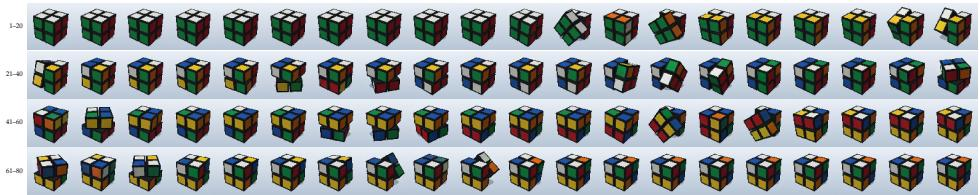

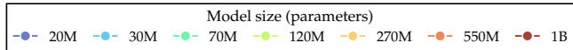

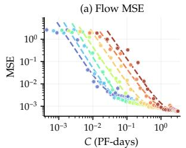

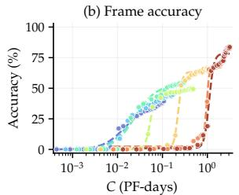

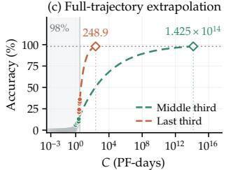  
Figure 1: Rubik video generation and scaling with training compute. The video strip shows 80 predicted frames, or 3.3 s at 24 fps, for 9 prescribed actions as the language prompt from a solved cube. The video generator is trained from scratch on synthetic videos. (a) Validation flow MSE and (b) average frame accuracy for AR models of different sizes. (c) AR full-trajectory accuracy, which requires all nine post-action states to be correct. Separate power-law fits to the middle and final thirds of its observed compute frontier illustrate how compute demand grows toward higher reliability. Diamonds mark their window-dependent 98% intersections.

## 1 INTRODUCTION

Video generative models have attracted considerable attention for their ability to produce realistic videos for content creation and editing (Wan Team, 2025; Kong et al., 2024). Their ability to learn patterns of motion and interaction from video has also motivated their use as predictive models of the physical world (Yang et al., 2024b;a; Ball et al., 2025). This perspective extends their role from generating visual content to anticipating how an environment may change, with applications in robot control and action-conditioned world models (Ye et al., 2026; Kim et al., 2026; Li et al., 2026; Wang et al., 2026b; NVIDIA, 2025a).

A visually convincing video can still depict an outcome that contradicts preceding events. For example, in Figure 2, early predictions already reproduce the cube’s geometry, but its sticker colors remain inconsistent with the prescribed moves. Under partial observation, correct prediction may require information from earlier frames and inference about how intervening actions have changed hidden states (Kaelbling et al., 1998; Reiter, 2001). Existing scaling studies relate prediction loss to model size, data, and compute (Kaplan et al., 2020; Liang et al., 2026; Yin et al., 2025). These loss trends alone do not establish whether state predictions become more accurate. We therefore ask: Does lower validation flow MSE reliably indicate better reasoning about hidden states across models? How does computational cost grow as state prediction becomes more reliable?

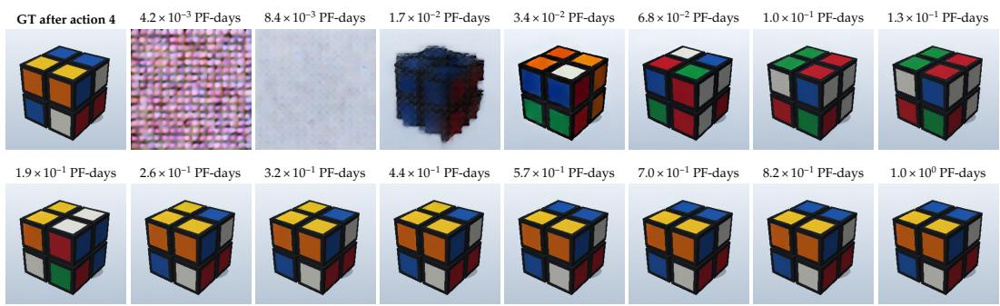  
Figure 2: Predictions from the 270M-parameter autoregressive model after four prescribed moves from a solved cube. The model reproduces the cube’s geometry after $3 . 4 \times 1 0 ^ { - 2 }$ PF-days of training, but first predicts all 12 visible stickers correctly in this example at $5 . 7 \times 1 0 ^ { - 1 }$ PF-days, requiring about 17 times as much compute. The top-left image is the ground truth.

To investigate these questions, we devise a controlled video prediction task to study how models reason about hidden state changes. Each video starts from a solved $2 \times 2 \times 2$ Rubik’s Cube and follows nine prescribed moves. A fixed camera shows three faces under consistent rendering conditions. The moves rearrange both visible and hidden stickers, so predicting the colors that reappear requires accounting for the intervening actions. This setup provides a direct way to evaluate state prediction: the initial frame and action sequence determine every future state, allowing generated observations to be checked against exact ground truth. Sampling action sequences also provides an effectively unlimited supply of training videos, allowing us to scale training with fresh data. In the scaling experiments, each model is trained for a single epoch, using each training video only once.

Using this task, we train bidirectional (Bidir) and autoregressive (AR) video diffusion transformers from scratch at seven model sizes from 20M to 1B parameters, varying the amount of training data. We measure validation flow MSE alongside action following and state accuracy in generated videos, using the metrics in Table 1. This comparison allows us to examine whether improvements in the training objective translate into more accurate state prediction, and how these outcomes scale with data and compute (Figure 1). We also compare video prediction with direct prediction of discrete sticker states and expose all six faces to examine the effect of partial observation.

## Our main findings are:

1. Lower validation flow MSE does not reliably indicate higher action or state accuracy across model sizes. After 1.5M training videos, the 1B AR model has lower MSE than the 70M model, yet its average frame accuracy is only 3.67%, compared with 41.00%.

2. Additional training gives diminishing returns at a fixed model size. For the 120M AR model, increasing training data from 5M to 8M videos raises average frame accuracy only from 48.11% to 49.33%. Larger models improve accuracy, while extrapolations of frame and full-trajectory error point to substantial further compute as prediction becomes more reliable.

3. State supervision and predicted-state feedback improve video accuracy at the same trainingdata budget. For a 20M $\mathbf { A } \mathbf { R } { - } k = 1$ video model trained on 3M videos, state guidance raises average frame accuracy from 31.1% to 67.3%. This supports learning representations for state reasoning as a complement to scaling.

## 2 A CONTROLLED STUDY OF STATE PREDICTION

## 2.1 STATE PREDICTION UNDER PARTIAL OBSERVATION

We study a solved $2 \times 2 \times 2$ Rubik’s Cube undergoing nine prompted face turns, using the notation in Figure 3. A fixed camera shows three faces, exposing 12 of the cube’s 24 stickers at each settled state. Turns move stickers between visible and hidden faces. A sticker can leave view and later return at a different position, so the colors that should appear after a turn depend on the preceding action sequence. The task is to predict these changing observations as the prescribed moves are executed.

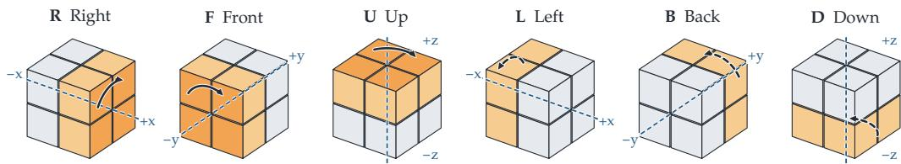  
Figure 3: Rubik face-turn notation. Orange cubies rotate around the blue axes. Arrows show $9 0 °$ clockwise turns viewed from outside the named face. Dashed arrows mark hidden faces. A prime reverses the turn, and a suffix 2 denotes 180◦.

Our action set contains 18 moves: the six clockwise $9 0 ^ { \circ }$ turns shown in Figure 3, their counterclockwise inverses, and the six $1 8 0 ^ { \circ }$ turns. We extend the ModernBERT tokenizer (Warner et al., 2025) with one dedicated token for each move.

All videos always start with a solved configuration, and a fixed color convention specifies the entire initial state, including the hidden faces. Each face turn is a deterministic permutation of stickers, so the initial state and action sequence uniquely determine every subsequent state. Keeping the camera and rendering fixed gives an unambiguous visual target for each transition. This allows us to measure whether generated observations reflect the correct state changes, while leaving the model free to learn its own internal representation.

## 2.2 ACTION-CONDITIONED VIDEO PREDICTION

The video generator receives the initial image and a prompt containing the complete ordered action sequence. A frozen Wan2.1 VAE (Wan Team, 2025) encodes the video into latent frames, and a frozen ModernBERT encoder supplies language features. A DiT (Peebles & Xie, 2023) predicts future video latents conditioned on the initial visual latents and language features. We train the DiT from scratch using rectified flow matching (Liu et al., 2023), minimizing the MSE between predicted and target latent velocities. This combination of latent video DiTs and flow-matching objectives is also used in Wan (Wan Team, 2025), HunyuanVideo (Kong et al., 2024), LTX-Video (HaCohen et al., 2024), and Cosmos-Predict2.5 (NVIDIA, 2025b).

We include bidirectional (Bidir) and autoregressive (AR) generation. The bidirectional model generates all future latent frames jointly. The autoregressive model generates chronological chunks of k latent frames, conditioning each chunk on the preceding visual history; we denote this variant by

AR-k. Both variants use three-dimensional rotary position embeddings (RoPE) (Su et al., 2021) to encode the temporal and spatial coordinates of visual tokens. During AR training, the history consists of ground-truth latents. During generation, the model uses its own previous predictions, allowing earlier errors to affect later parts of the rollout. For both variants, we maintain an exponential moving average (EMA) of the generator parameters during training and use the EMA weights for evaluation and generation. Appendix B gives the architecture and training settings; Algorithm 1 in Appendix E.1 summarizes the training procedure.

Figure 2 illustrates the distinction between visual plausibility and state accuracy: recognizable cubes can still have incorrect sticker configurations.

## 2.3 EVALUATING STATE PREDICTION

We evaluate generated rollouts using the metrics defined in Table 1. At the first stationary frame after each turn, we decode sticker colors from the image regions specified by the simulator and compare them with the expected configuration. Unreadable stickers count as incorrect. The sticker and frame scores distinguish partial state recovery from a completely correct visible configuration. VAE reconstruction preserves all scored sticker states in the 100 ground-truth evaluation videos (Appendix A, Table 4).

We measure action following separately with a motion probe trained on grayscale simulator videos. The probe predicts the moved face and turn type from optical flow, allowing us to distinguish errors in action execution from errors in the resulting state. Evaluator details appear in Appendix A. All accuracy metrics are measured on free-running videos, with no ground-truth history supplied after the initial image. Validation flow MSE is measured separately on held-out videos under the training conditions. It measures velocity prediction in latent space, while the accuracy metrics assess the states reached during generation.

Table 1: Evaluation metrics.
<table><tr><td>Metric</td><td>Definition</td></tr><tr><td>MSE loss</td><td>Mean squared error between the predicted and target flow velocities in video latent space on validation set.</td></tr><tr><td>Action following acc.</td><td>Fraction of actions in the prompt that are correctly applied to the cube.</td></tr><tr><td>Sticker acc.</td><td>Fraction of visible stickers (4 stickers × 3 visible faces) with the correct color after each action.</td></tr><tr><td>Frame acc.</td><td>Fraction of the nine post-action frames in which all 12 visible stickers have the correct color.</td></tr><tr><td>Full-trajectory acc.</td><td>Fraction of episodes in which all 12 visible stickers are correct after every one of the nine actions.</td></tr></table>

## 3 THE SCALING EXPERIMENTS

## 3.1 EXPERIMENTAL SETUP

Dataset generation. We generate a shared stream of Rubik videos for the architecture and scaling experiments. Each video contains nine actions over 81 frames at 256 × 256 resolution. Actions are sampled uniformly from the legal moves, excluding consecutive turns of the same face. The architecture comparison uses the first 1M videos. Each model in the scaling experiments has a budget of 8M videos. All models consume the same ordered stream, using each training video once. Architecture selection and scaling evaluation use the same 100 held-out episodes, paired across models and checkpoints. Validation MSE curves use a fixed subset of 256 held-out videos, expanded to 1,024 for the architecture comparison endpoints.

Video DiT architecture. We first compare three depth–width configurations at approximately 95M parameters (Table 2). Each is trained with autoregressive chunks of one or four latent frames, or with bidirectional generation, giving nine configurations in total. All runs use the same 1M training videos, optimizer settings, and effective batch size. Both the depth–width allocation and the generation scheme strongly affect accuracy at this budget. Frame accuracy improves as capac ity shifts from depth to width, and one-frame autoregressive generation performs best within each depth–width configuration. The wide–shallow $\mathbf { A } \mathbf { R } { - } k = 1$ model leads on action, sticker, and frame accuracy. We therefore carry the wide–shallow $\mathbf { A } \mathbf { R } { - } k = 1$ and Bidir configuration into the scaling experiments. Further results and training details appear in Appendix C.

Table 2: Stage A architectures and results after 1M training videos. Action, sticker, and frame accuracies (%) use the same 100 held-out videos. AR-k generates k latent frames per chunk. Best accuracies are bold.
<table><tr><td>Configuration</td><td> $d _ { \mathrm { m o d e l } }$ </td><td>Layers Heads</td><td></td><td> $d _ { \mathrm { f f } }$ </td><td>Parameters (M)</td><td>Generation Action Sticker Frame</td><td></td><td></td><td></td></tr><tr><td>Deep-narrow</td><td>512</td><td>22</td><td></td><td>81408</td><td></td><td>95.03 AR-k = 1</td><td>17.22</td><td>25.37</td><td>3.67</td></tr><tr><td></td><td></td><td></td><td></td><td></td><td></td><td>AR-k = 4</td><td>6.33</td><td>22.20</td><td>0.78</td></tr><tr><td></td><td></td><td></td><td></td><td></td><td></td><td>Bidir</td><td>7.33</td><td>21.59</td><td>0.33</td></tr><tr><td>Balanced</td><td>640</td><td>14</td><td></td><td>101728</td><td></td><td>94.20 AR-k = 1</td><td>72.44</td><td>52.00</td><td>24.33</td></tr><tr><td></td><td></td><td></td><td></td><td></td><td></td><td>AR-k = 4</td><td>9.67</td><td>22.46</td><td>1.67</td></tr><tr><td></td><td></td><td></td><td></td><td></td><td></td><td>Bidir</td><td>6.78</td><td>21.55</td><td>0.56</td></tr><tr><td>Wide-shallow</td><td>768</td><td>10</td><td></td><td>12 2048</td><td></td><td>96.91 AR-k = 1</td><td>90.78</td><td>78.20</td><td>37.22</td></tr><tr><td></td><td></td><td></td><td></td><td></td><td></td><td>AR-k = 4</td><td>79.89</td><td>63.14</td><td>25.11</td></tr><tr><td></td><td></td><td></td><td></td><td></td><td></td><td>Bidir</td><td>8.33</td><td>21.67</td><td>0.78</td></tr></table>

Scaling up video DiT. We scale the selected architecture family across seven model sizes, from approximately 20M to 1B trainable parameters, by increasing width and depth. $\mathbf { A } \mathbf { R } { - } k = 1$ and bidirectional models share the same architecture dimensions and parameter counts at each size. Detailed specifications appear in Appendix B, Table 7. The frozen video and language encoders remain unchanged. All models use the same training stream, effective batch size, and optimizer settings. This allows us to compare additional training at a fixed model size and larger models at a fixed data budget. We evaluate checkpoints throughout training, comparing model sizes at a common exposure of 8M videos. To compare these choices under a common resource budget, we also estimate training compute in FLOPs, accounting for both model size and data exposure. Appendix E gives the compute accounting.

## 3.2 UNDERSTANDING THE DIFFICULTY OF HIDDEN STATE PREDICTION

Before examining how performance scales with model size and training data, we first ask what makes the task difficult. In the following paragraphs, we show that much smaller models readily learn the cube’s state transitions in a compact and discrete vector space. Then, we show that revealing the full cube state substantially improves video prediction. Together, these comparisons suggest that a central challenge lies in tracking and reasoning hidden states through video generation.

Small models learn state reasoning in discrete vector space To assess the difficulty of the underlying state-tracking task, we replace video generation with direct prediction of sticker colors (Figure 4). We represent the same 12 visible stickers as categorical variables and train Transformers with approximately 2.8M trainable parameters, much smaller than the video DiT models. They receive the initial state and action-prompt features from the shared frozen language encoder. Partial observation is preserved: stickers that leave view must still be tracked until they reappear. We evaluate sequences of 20 actions, not 9 in the video setting. We train both models with batches of 256 episodes. The main training phase ends when validation final-frame accuracy first exceeds 98% or after 20,000 steps, whichever comes first. Each model then receives another 5,000 steps at a lower learning rate. Both AR and bidirectional models learn accurate vector state prediction with much lower cost (Table 3). This contrasts with the difficulty of maintaining the same state information through video generation. Training details and learning curves appear in Appendix A.7.

Full observation makes state reasoning easier To examine the difficulty introduced by partial observation, we compare the usual three-face videos with synchronized complementary views that expose all six faces. In the latter setting, every settled frame reveals the full cube state, so hidden sticker colors do not have to be recovered from earlier observations. This comparison uses a separate

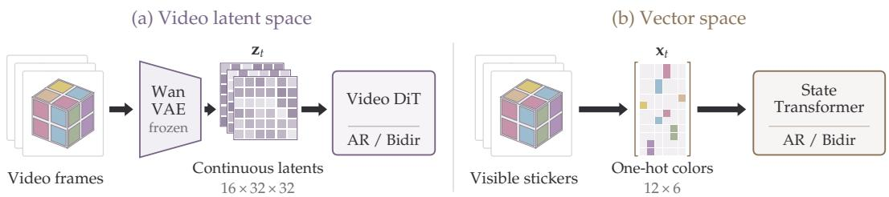  
Figure 4: Video latent space and vector space. The action prompt is omitted. (a) A frozen Wan VAE encodes video frames into continuous latents for the video DiT. (b) Visible sticker colors are represented directly as $1 2 \times 6$ one-hot arrays for the state Transformer. Both model families support autoregressive and bidirectional generation.

Table 3: Vector-space prediction on 10,000 held-out 20-action episodes. Compute estimates exclude the frozen language encoder. Final frame accuracy requires all 12 visible stickers to be correct after 20 actions. Full-trajectory accuracy requires them to be correct after every action. AR uses its own predictions during rollout.
<table><tr><td>Generation</td><td>PF-days (approx.)</td><td>Frame accuracy after 20 actions (%)</td><td>Full-trajectory accuracy (%)</td></tr><tr><td>AR</td><td> $8 \times 1 0 ^ { - 3 }$ </td><td>94.01</td><td>92.81</td></tr><tr><td>Bidir</td><td> $4 \times 1 0 ^ { - 4 }$ </td><td>99.86</td><td>99.85</td></tr></table>

270M-parameter configuration with $\mathbf { A } \mathbf { R } { - } k = 4$ (as this experiment was conducted in parallel with Stage A, before the final architecture was selected.) and bidirectional generation (Appendix A.5).

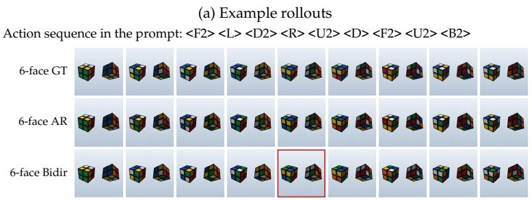

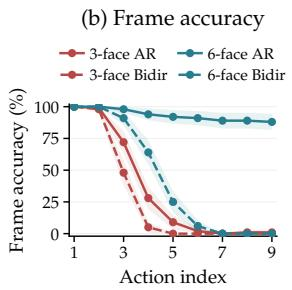  
Figure 5: State prediction with three or six visible faces. (a) Ground truth and generated six-face videos after each action in the same 9-action sequence. Red boxes mark each model’s first incorrect boundary frame. (b) Frame accuracy after each action, with 95% normal confidence intervals over 100 paired episodes. Training exposure is matched between 3-face and 6-face. Frame accuracy requires all 12 visible stickers to be correct for three-face observation and all 24 for six-face observation.

Making all six faces visible substantially improves frame accuracy (Figure 5). AR maintains high accuracy throughout the action sequence, while Bidir benefits mainly in the early actions. The large improvement for AR suggests that tracking hidden sticker states is a major source of difficulty: the model predicts sticker transitions reliably when the full state remains visible. We next examine whether more training data and larger models can improve prediction under partial observation.

## 3.3 SCALING VIDEO GENERATOR FOR REASONING

Additional Training Gives Diminishing Returns Training on more videos gives a model more experience with state transitions. We ask whether this leads to sustained improvements in state prediction when model size is held fixed. Figure 6 shows that the gains diminish as training progresses, with later checkpoints producing increasingly similar accuracy profiles. Similar diminishing returns have been observed when scaling training data at a fixed model size, both in language modeling and in video reasoning (Kaplan et al., 2020; Wang et al., 2026a).

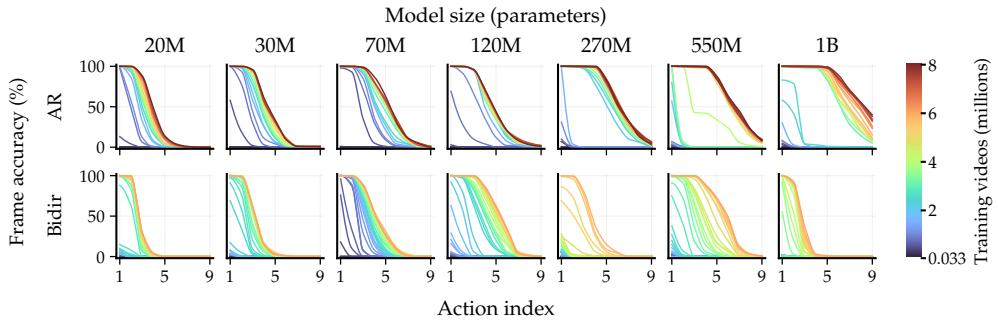  
Figure 6: Frame accuracy after each action as training data increases, for AR (top) and Bidir (bottom). Colors indicate training videos on a shared scale. All selected checkpoints use the same 100 free-running episodes. Smooth lines connect the measured action accuracies.

Larger Models Improve Accuracy at a High Cost As gains from additional training diminish, larger models offer a way to improve state prediction. We compare the best average frame and fulltrajectory accuracies observed within each compute budget, allowing both model size and training duration to vary (Figure 7). Full-trajectory accuracy asks whether a generated video remains correct through all nine actions, rather than averaging correctness across individual frames.

Motivated by empirical power-law trends in classification error and language-model compute scaling (Hestness et al., 2017; Kaplan et al., 2020), we fit power laws to prediction error along each observed frontier. Following the window analysis of Hoffmann et al. (2022), we compare fits to the middle and final thirds of the frontier points to examine how extrapolations depend on the fitting range (Appendix E).

$$
\mathrm { \begin{array} { l l l l l l } { \mathrm { - } \bullet - } & { \mathrm { M i d d l e ~ t h i r d } } & { \mathrm { - } \bullet - } & { \mathrm { L a s t ~ t h i r d } } & { \mathrm { --- ~ } \mathrm { F i t ~ w i t h i n ~ s e g m e n t } } & { \mathrm { --- ~ } \mathrm { E x t r a p o l a t i o n } } \end{array} }
$$

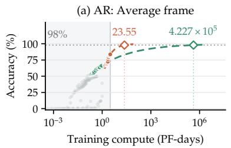

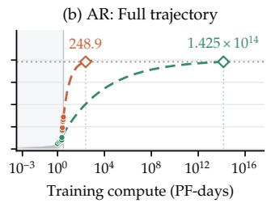

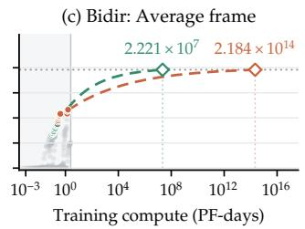  
Figure 7: Illustrative compute extrapolations for (a) AR average frame accuracy, (b) AR fulltrajectory accuracy, and (c) Bidir average frame accuracy. Gray points show evaluated checkpoints; colored points identify the middle and final thirds of each compute-ordered frontier. Solid lines show fits within each segment, and dashed lines show extrapolations. Diamonds mark 98% accuracy, labeled in PF-days. Shading marks the observed compute range. Bidir full-trajectory accuracy is omitted because it is zero at every evaluated checkpoint.

Both fitting windows project substantially more compute to reach 98% accuracy, with complete AR trajectories demanding more than average frame correctness. Their widely separated intersections make the numerical values illustrative projections, not reliable training budgets. The common trend is increasing compute demand as errors become rare, especially when every state in a sequence must be correct.

MSE Does Not Reliably Compare Reasoning across Models Validation MSE follows an approximate power law as model size and training data increase. It also tracks broad learning progress within each model, with lower loss generally accompanying higher accuracy. Across models, however, MSE does not provide a common measure of capability. Figure 8 shows that similar losses can correspond to substantially different action, sticker, and frame accuracies. At 1.5M training videos, for example, the 1B AR model has lower MSE than the 70M model, yet performs worse on all three metrics. Lower MSE therefore does not reliably indicate better reasoning across model sizes. Comparing models requires direct evaluation of action execution and state correctness.

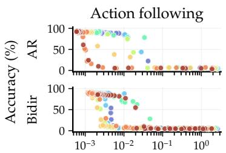  
Validation MSE

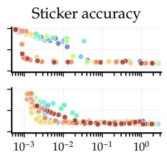  
Validation MSE

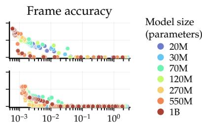  
Validation MSE  
Figure 8: Validation MSE and reasoning accuracy across model sizes, for AR (top) and Bidir (bottom). Points pair validation MSE with free-running accuracy from the same EMA checkpoint. Colors identify model sizes.

## 3.4 SYMBOLIC GUIDANCE IMPROVES VIDEO PREDICTION

The vector-space results suggest that learning an explicit symbolic representation could help video generation. We test this idea by training the video model to predict sticker states and using those predictions to guide generation (Figure 9(a)). The symbolic targets specify the consequences of the prescribed actions, giving the model a direct learning signal for state correctness alongside the video flow loss.

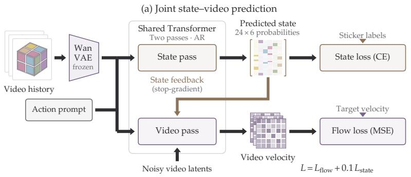

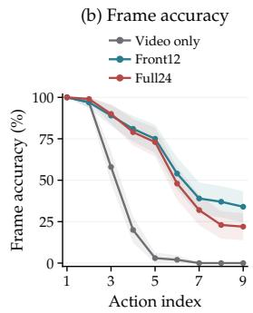  
Figure 9: Explicit state guidance for 20M AR-k = 1 models. (a) A shared Transformer predicts sticker-state distributions from the available video history and action prompt, then uses them to condition a separate video pass. State cross-entropy and video flow matching jointly train the model. (b) Frame accuracy after each action on the same 100 paired episodes after training on 3M videos. All curves use generated history. Shading shows 95% confidence intervals. All models use EMA weights.

We compare the 20M AR-k = 1 generator from the scaling study with two state-guided variants, training each on the same 3M videos. Both variants predict and supervise all 24 stickers. Front12 feeds back only the 12 visible-sticker distributions, while Full24 also includes the 12 hidden stickers. We supervise categorical sticker colors and feed their predicted probability distributions back to the video generator. During generation, the model predicts these distributions from the action prompt and available video history; simulator states are used only as training targets. Appendix A.4 gives the training details. State guidance substantially improves the accuracy of generated sticker configurations (Figure 9(b)). The 20M Front12 model reaches 67.3% average frame accuracy using 0.0445 PF-days, comparable to 67.1% for the 550M video-only model at 1.33 PF-days. Front12 already achieves the gain, so feeding back hidden-sticker predictions is not required when all 24 stickers are supervised. Both variants sustain correct state prediction further into the action sequence than the video-only model. These results show that symbolic state supervision can improve the hidden state reasoning capability for video generation. Even though the handcrafted sticker representation may not generalize to other cases, it motivates learning representations that capture symbolic state to guide video generation for reasoning capability

## 4 RELATED WORK

Scaling prediction and generation. Language-model scaling laws describe prediction loss as a function of model size, data, and compute (Kaplan et al., 2020). Diffusion Transformers show improvements with increased model compute (Peebles & Xie, 2023). Subsequent studies fit explicit scaling relationships for diffusion training loss and generation metrics (Liang et al., 2026; Chicker ing et al., 2026), including validation-loss relationships for video diffusion Transformers (Yin et al., 2025). We are inspired by those scaling experiments and evaluate if the video reasoning capability follows a similar trend.

Video evaluation and hidden-state tracking. VBench evaluates perceptual and temporal video quality (Huang et al., 2024); VideoPhy and WorldModelBench assess physical commonsense and world-model behavior (Bansal et al., 2025; Li et al., 2025). MBench and MemoBench emphasize memory and dynamically changing environments (Zhang et al., 2026; Chen et al., 2026). Shin et al. (2026) investigate hidden-state tracking in an action-conditioned Shell Game, particularly extrapolation beyond the training horizon and mechanisms that support state updates. VBVR and VBVR-Pro provide broad suites for training and evaluating visual reasoning across tasks and models (Wang et al., 2026a; Xu et al., 2026). We complement these suites with a controlled experiment that fixes the task and prediction horizon, training models from scratch to study how scaling affects hiddenstate prediction rather than to benchmark frontier models.

State inference and semantic representations. Partially observable planning formalizes the need to use an action–observation history when an observation does not identify the underlying state (Kaelbling et al., 1998). Situation calculus and STRIPS describe how actions transform that state (McCarthy & Hayes, 1969; Fikes & Nilsson, 1971; Reiter, 2001). Predictive state representations express state through predictions of future observations (Littman et al., 2001). These perspectives motivate our behavioral evaluation without requiring a symbolic representation. REPA improves diffusion training by aligning denoiser representations with clean-image features from a frozen pretrained visual encoder (Yu et al., 2025). Our state-guidance experiment shares the motivation of helping generation learn useful representations. We use symbolic state supervision and condition video generation on predicted state distributions, testing whether representations of action dependent state changes improve the correctness of generated outcomes.

## 5 CONCLUSION

We studied hidden-state reasoning through controlled Rubik’s Cube video prediction, scaling autoregressive and bidirectional models from 20M to 1B parameters. Lower validation MSE does not reliably indicate more accurate state prediction. Smaller autoregressive models perform better with limited compute, while larger models reach higher accuracy after more training. Small models readily learn state transitions in vector space, and revealing the full state improves video prediction. Symbolic state supervision and predicted-state feedback substantially improve accuracy at matched data exposure. Our future work will seek generalizable and scalable symbolic representations that capture how actions change state and guide reasoning in video generation beyond handcrafted states for a single environment.

## ACKNOWLEDGMENTS

LEK and WG have been supported in part by NSF 2336612 and Rice University Funds.

## REFERENCES

Philip J. Ball, Jakob Bauer, Frank Belletti, Bethanie Brownfield, Ariel Ephrat, Shlomi Fruchter, Agrim Gupta, Kristian Holsheimer, Aleksander Holynski, Jiri Hron, et al. Genie 3: A new frontier for world models. Google DeepMind, August 2025. URL https://deepmind.google/ blog/genie-3-a-new-frontier-for-world-models/.

Hritik Bansal, Zongyu Lin, Tianyi Xie, Zeshun Zong, Michal Yarom, Yonatan Bitton, Chenfanfu Jiang, Yizhou Sun, Kai-Wei Chang, and Aditya Grover. Videophy: Evaluating physical commonsense for video generation. In International Conference on Learning Representations, volume 2025, pp. 102075–102121, 2025. URL https://proceedings.iclr.cc/paper\_files/paper/2025/file/ fce2d8a485746f76aac7b5650db2679d-Paper-Conference.pdf.

Haoyu Chen, Kaichen Zhou, Hang Hua, Kaile Zhang, Jingwen Qian, Wufei Ma, Haonan Chen, Chunjiang Liu, Yizhou Zhao, Xiaoyuan Wang, et al. Memobench: Benchmarking world modeling in dynamically changing environments. arXiv preprint arXiv:2606.27537, 2026.

Kyle Chickering, Wei-An Lin, Swayam Bhanded, Dan Saunders, Akshat Tripathi, Jiaming Song, Shyamal Buch, and Xinchen Yan. ABRA: Scaling diffusion image training. arXiv preprint arXiv:2608.17286, 2026.

Richard E. Fikes and Nils J. Nilsson. STRIPS: A new approach to the application of theorem proving to problem solving. Artificial Intelligence, 2(3–4):189–208, 1971. doi: 10.1016/0004-3702(71)90010-5. URL https://ai.stanford.edu/\~nilsson/ OnlinePubs-Nils/PublishedPapers/strips.pdf.

Yoav HaCohen, Nisan Chiprut, Benny Brazowski, Daniel Shalem, Dudu Moshe, Eitan Richardson, Eran Levin, Guy Shiran, Nir Zabari, Ori Gordon, Poriya Panet, Sapir Weissbuch, Victor Kulikov, Yaki Bitterman, Zeev Melumian, and Ofir Bibi. LTX-Video: Realtime video latent diffusion. arXiv preprint arXiv:2501.00103, 2024. URL https://arxiv.org/abs/2501.00103.

Joel Hestness, Sharan Narang, Newsha Ardalani, Gregory Diamos, Heewoo Jun, Hassan Kianinejad, Md. Mostofa Ali Patwary, Yang Yang, and Yanqi Zhou. Deep learning scaling is predictable, empirically. arXiv preprint arXiv:1712.00409, 2017. URL https://arxiv.org/abs/1712. 00409.

Jordan Hoffmann, Sebastian Borgeaud, Arthur Mensch, Elena Buchatskaya, Trevor Cai, Eliza Rutherford, Diego de Las Casas, Lisa Anne Hendricks, Johannes Welbl, Aidan Clark, et al. Training compute-optimal large language models. arXiv preprint arXiv:2203.15556, 2022. URL https://arxiv.org/abs/2203.15556.

Ziqi Huang, Yinan He, Jiashuo Yu, Fan Zhang, Chenyang Si, Yuming Jiang, Yuanhan Zhang, Tianxing Wu, Qingyang Jin, Nattapol Chanpaisit, Yaohui Wang, Xinyuan Chen, Limin Wang, Dahua Lin, Yu Qiao, and Ziwei Liu. VBench: Comprehensive benchmark suite for video generative models. In Proceedings of the IEEE/CVF Conference on Computer Vision and Pattern Recognition, 2024.

Leslie Pack Kaelbling, Michael L. Littman, and Anthony R. Cassandra. Planning and acting in partially observable stochastic domains. Artificial Intelligence, 101(1–2):99–134, 1998. doi: 10.1016/S0004-3702(98)00023-X. URL https://cs.brown.edu/courses/ csci2951-k/papers/kaelbling98.pdf.

Jared Kaplan, Sam McCandlish, Tom Henighan, Tom B. Brown, Benjamin Chess, Rewon Child, Scott Gray, Alec Radford, Jeffrey Wu, and Dario Amodei. Scaling laws for neural language models. arXiv preprint arXiv:2001.08361, 2020.

Moo Jin Kim, Yihuai Gao, Tsung-Yi Lin, Yen-Chen Lin, Yunhao Ge, Grace Lam, Percy Liang, Shuran Song, Ming-Yu Liu, Chelsea Finn, et al. Cosmos policy: Fine-tuning video models for visuomotor control and planning. arXiv preprint arXiv:2601.16163, 2026.

Weijie Kong, Qi Tian, Zijian Zhang, Rox Min, Zuozhuo Dai, Jin Zhou, Jiangfeng Xiong, Xin Li, Bo Wu, Jianwei Zhang, et al. HunyuanVideo: A systematic framework for large video generative models. arXiv preprint arXiv:2412.03603, 2024. URL https://arxiv.org/abs/2412. 03603.

Dacheng Li, Yunhao Fang, Yukang Chen, Shuo Yang, Shiyi Cao, Justin Wong, Michael Luo, Xiaolong Wang, Hongxu Yin, Joseph Gonzalez, Ion Stoica, Song Han, and Yao Lu. Worldmodelbench: Judging video generation models as world models. In D. Belgrave, C. Zhang, H. Lin, R. Pascanu, P. Koniusz, M. Ghassemi, and N. Chen (eds.), Advances in Neural Information Processing Systems, volume 38, Main Conference. Curran Associates, Inc., 2025. doi: 10.52202/085713-1834. URL https://proceedings.neurips.cc/paper\_files/ paper/2025/file/4ec03ed08a3fcb59e1c815b5598beff1-Paper-Datasets\_ and\_Benchmarks\_Track.pdf.

Lin Li, Qihang Zhang, Yiming Luo, Shuai Yang, Ruilin Wang, Fei Han, Mingrui Yu, Zelin Gao, Nan Xue, Xing Zhu, Yujun Shen, and Yinghao Xu. Causal world modeling for robot control. 2026.

Zhengyang Liang, Hao He, Ceyuan Yang, and Bo Dai. Scaling laws for diffusion transformers. In International Conference on Learning Representations, 2026. URL https://arxiv.org/ abs/2410.08184.

Michael L. Littman, Richard S. Sutton, and Satinder Singh. Predictive representations of state. In Advances in Neural Information Processing Systems, volume 14, pp. 1555–1561, 2001. URL https://papers.neurips.cc/paper/ 1983-predictive-representations-of-state.pdf.

Xingchao Liu, Chengyue Gong, and Qiang Liu. Flow straight and fast: Learning to generate and transfer data with rectified flow. In International Conference on Learning Representations, 2023. URL https://arxiv.org/abs/2209.03003.

John McCarthy and Patrick J. Hayes. Some philosophical problems from the standpoint of artificial intelligence. In Bernard Meltzer and Donald Michie (eds.), Machine Intelligence 4, pp. 463–502. Edinburgh University Press, 1969. URL https://www-formal.stanford.edu/jmc/ mcchay69/mcchay69.html.

NVIDIA. Cosmos world foundation model platform for physical AI. arXiv preprint arXiv:2501.03575, 2025a. URL https://arxiv.org/abs/2501.03575v1.

NVIDIA. World simulation with video foundation models for physical AI. arXiv preprint arXiv:2511.00062, 2025b. URL https://arxiv.org/abs/2511.00062.

William Peebles and Saining Xie. Scalable diffusion models with transformers. Proceedings of the IEEE/CVF International Conference on Computer Vision, pp. 4195–4205, 2023.

Raymond Reiter. Knowledge in Action: Logical Foundations for Specifying and Implement ing Dynamical Systems. MIT Press, 2001. URL https://mitpress.mit.edu/ 9780262527002/knowledge-in-action/.

Nikhil Sardana, Jacob Portes, Sasha Doubov, and Jonathan Frankle. Beyond Chinchilla-optimal: Accounting for inference in language model scaling laws. In Proceedings of the 41st International Conference on Machine Learning, volume 235 of Proceedings of Machine Learning Research, pp. 43445–43460. PMLR, 2024. URL https://proceedings.mlr.press/ v235/sardana24a.html.

Joonghyuk Shin, Yicong Hong, Jaesik Park, and Xun Huang. Can video world models track unobserved world states?, 2026. URL https://arxiv.org/abs/2608.30692.

Jianlin Su, Yu Lu, Shengfeng Pan, Ahmed Murtadha, Bo Wen, and Yunfeng Liu. RoFormer: Enhanced transformer with rotary position embedding. arXiv preprint arXiv:2104.09864, 2021. URL https://arxiv.org/abs/2104.09864.

Zachary Teed and Jia Deng. RAFT: Recurrent all-pairs field transforms for optical flow. In European Conference on Computer Vision, pp. 402–419, 2020.

Wan Team. Wan: Open and advanced large-scale video generative models. arXiv preprint arXiv:2503.20314, 2025.

Maijunxian Wang, Ruisi Wang, Juyi Lin, Ran Ji, Thaddäus Wiedemer, Qingying Gao, Dezhi Luo, Yaoyao Qian, Lianyu Huang, Zelong Hong, et al. A very big video reasoning suite. arXiv preprint arXiv:2602.20159, 2026a. URL https://arxiv.org/abs/2602.20159.

Yixuan Wang, Rhythm Syed, Fangyu Wu, Mengchao Zhang, Aykut Onol, Jose Barreiros, Hooshang Nayyeri, Tony Dear, Huan Zhang, and Yunzhu Li. Interactive world simulator for robot policy training and evaluation. 2026b.

Benjamin Warner, Antoine Chaffin, Benjamin Clavié, Orion Weller, Oskar Hallström, Said Taghadouini, Alexis Gallagher, Raja Biswas, Faisal Ladhak, Tom Aarsen, Griffin Thomas Adams, Jeremy Howard, and Iacopo Poli. Smarter, better, faster, longer: A modern bidirectional encoder for fast, memory efficient, and long context finetuning and inference. In Proceedings of the 63rd Annual Meeting of the Association for Computational Linguistics (Volume 1: Long Papers), pp. 2526–2547. Association for Computational Linguistics, 2025. doi: 10.18653/v1/2025.acl-long. 127. URL https://aclanthology.org/2025.acl-long.127/.

Junxiang Xu, Ruisi Wang, Fanyi Pu, Maijunxian Wang, Ran Ji, Tongxi Zhou, Chenyang Gu, Jing Zuo, Hongcan Xiao, Yimeng Geng, et al. VBVR-Pro: A scalable and verifiable suite for native visual reasoning. arXiv preprint arXiv:2608.26105, 2026. URL https://arxiv.org/abs/ 2608.26105.

Sherry Yang, Yilun Du, Seyed Ghasemipour, Jonathan Tompson, Leslie Kaelbling, Dale Schuurmans, and Pieter Abbeel. Learning interactive real-world simulators. In B. Kim, Y. Yue, S. Chaudhuri, K. Fragkiadaki, M. Khan, and Y. Sun (eds.), International Conference on Learning Representations, volume 2024, pp. 45210–45234, 2024a. URL https://proceedings.iclr.cc/paper\_files/paper/2024/file/ c4d66eae503694424123b93ac0fbaf17-Paper-Conference.pdf.

Sherry Yang, Jacob C Walker, Jack Parker-Holder, Yilun Du, Jake Bruce, Andre Barreto, Pieter Abbeel, and Dale Schuurmans. Position: Video as the new language for real-world decision making. In Proceedings ofthe 41st International Conference on Machine Learning, volume 235 of Proceedings ofMachine Learning Research, pp. 56465–56484. PMLR, 21–27 Jul 2024b. URL https://proceedings.mlr.press/v235/yang24z.html.

Seonghyeon Ye, Yunhao Ge, Kaiyuan Zheng, Shenyuan Gao, Sihyun Yu, George Kurian, Suneel Indupuru, You Liang Tan, Chuning Zhu, Jiannan Xiang, et al. World action models are zero-shot policies. arXiv preprint arXiv:2602.15922, 2026.

Yuanyang Yin, Yaqi Zhao, Mingwu Zheng, Ke Lin, Jiarong Ou, Rui Chen, Victor Shea-Jay Huang, Jiahao Wang, Xin Tao, Pengfei Wan, Di Zhang, Baoqun Yin, Wentao Zhang, and Kun Gai. Towards precise scaling laws for video diffusion transformers. In Proceedings of the IEEE/CVF Conference on Computer Vision and Pattern Recognition, 2025. URL https://openaccess.thecvf.com/content/CVPR2025/html/Yin\_Towards\_ Precise\_Scaling\_Laws\_for\_Video\_Diffusion\_Transformers\_CVPR\_2025\_ paper.html.

Sihyun Yu, Sangkyung Kwak, Huiwon Jang, Jongheon Jeong, Jonathan Huang, Jinwoo Shin, and Saining Xie. Representation alignment for generation: Training diffusion transformers is easier than you think. In International Conference on Learning Representations, 2025. URL https: //arxiv.org/abs/2410.06940.

Shengjun Zhang, Zhang Zhang, Simin Huang, Zhenyu Tang, Hanyang Wang, Chensheng Dai, Min Chen, Yifan Li, Yuxin Li, Yingjie Chen, et al. Mbench: A comprehensive benchmark on memory capability for video world models. arXiv preprint arXiv:2606.00793, 2026.

## A GAME DESCRIPTIONS AND SANITY CHECKS

## A.1 RUBIK’S CUBE

We study a solved 2×2×2 Rubik’s Cube undergoing nine prompted face turns. Each episode is rendered from a fixed three-quarter camera as an 81-frame, 256 × 256 video. At each time, the benchmark camera exposes three faces (12 sticker positions) and occludes the other three. Because the initial state, color convention, camera, and ordered action sequence are fixed by the example, the state at every action boundary is deterministic. The challenge is to infer the action-dependent sticker configuration as stickers leave view and later reappear. Success requires history-dependent prediction, but not an explicit 24-sticker internal representation.

Figure 3 illustrates the six face turns and their rotation axes in the simulator coordinate system.

The first action samples uniformly from all six faces; subsequent actions sample uniformly from the five faces other than the preceding face. For each face, clockwise, counterclockwise, and half turns are equally likely. This excludes immediate inverse cancellations. We apply no further filtering by the resulting cube state. Training and evaluation use disjoint episode seeds, and none of the 100 evaluation action sequences appears in the 8M training pool.

We evaluate the initial frame and the first stationary frame after every move. For each of the 12 visible stickers, the simulator supplies its expected color and image region under the fixed camera. Within each region we take the median RGB color and match it to the closest of the six cube colors by cosine similarity. A sticker is marked unreadable, hence incorrect, if its RGB norm is below 40 or its maximum color similarity is below 0.90. We report visible sticker accuracy and exact-frame accuracy, which requires all 12 visible stickers to be correct. The evaluator uses fixed simulator geometry rather than a learned object detector or visual judge.

The frozen Wan VAE preserves every evaluated sticker configuration (Table 4). We apply the same color decoder to the original videos and reconstructions of their cached ground-truth latents.

Table 4: State accuracy (%) on the same 100 paired evaluation videos before and after reconstruction with the frozen Wan VAE. All metrics use the nine post-action boundaries and exclude the initial frame.
<table><tr><td>Video</td><td>Sticker</td><td>Frame</td><td>Full trajectory</td></tr><tr><td>Original RGB</td><td>100.00</td><td>100.00</td><td>100.00</td></tr><tr><td>Wan VAE reconstruction</td><td>100.00</td><td>100.00</td><td>100.00</td></tr></table>

## A.2 SHARED LANGUAGE AND ACTION TOKENIZATION

The vector and video generators use the same language-conditioning interface. We extend a ModernBERT tokenizer with one token for each of the 18 legal moves: six outer faces, each turned clockwise, counterclockwise, or 180◦. For example, <RUBIK\_R> rotates the right face 90◦ clockwise when viewed face-on, while <RUBIK\_U\_PRIME> rotates the upper face counterclockwise. Scene instructions and the complete ordered action program form a single prompt. We use an 8,192- token context window and reject, rather than silently truncate, prompts that exceed it.

The shared language backbone is initialized from ModernBERT-base and frozen before any generator is trained. For every appended action token, we deterministically initialize its input embedding as the mean of the pretrained embeddings of a short ordinary-language gloss of that action. The extended embedding table is then frozen together with the rest of the language encoder; neither the tokenizer nor the language backbone is optimized for this task. The generator receives only the resulting language features and may learn a model-specific projection into its hidden width; it receives no parallel action-ID tensor, action-specific encoder, or structured simulator transition. Thus the vector-only and video-only models share the information supplied by language. Auxiliary semantic-state supervision, when used, is a separate training intervention.

## A.3 VANILLA VIDEO GENERATOR

The following historical 274M diagnostic is distinct from the Stage-A/B scaling configurations. Its vanilla baseline is a latent rectified-flow Transformer. The frozen Wan2.1 VAE maps each video to 21 latent frames with 16 channels and spatial resolution $3 2 \times 3 2 \time 3 2 .$ ; the first latent frame is the visual condition and the remaining 20 are prediction targets. The generator has 16 Transformer blocks, width $d _ { \mathrm { m o d e l } } = 1 0 2 4$ , 16 attention heads, and a SwiGLU feedforward layer with ratio 8/3. Counting all trainable generator parameters, the AR and bidirectional variants contain 273.9M and 273.8M parameters, respectively. As in Table 12, the frozen VAE and ModernBERT encoder are excluded.

The bidirectional generator predicts all 20 target latent frames jointly. The AR generator partitions them into five chronological chunks of four latent frames, uses ground-truth prefixes during training, and feeds back its own generated chunks at inference. We train both variants with AdamW, weight decay 0.05, gradient clipping at 1.0, and EMA decay 0.9999. The learning rate warms up over the first 24k episode presentations and then follows cosine decay to 10% of its peak. The peak learning rates are $\dot { 4 } . 5 \times 1 \dot { 0 } ^ { - 4 }$ for AR and $2 . 0 \times 1 0 ^ { - 4 }$ for bidirectional generation. At evaluation, both use 16 midpoint sampling steps and the saved EMA generator parameters. Figure 5(a) shows six-face rollouts for the historical model at update 30,000. Exact-frame accuracy requires all visible stickers to be correct.

## A.4 JOINT STATE AND VIDEO PREDICTION

The state-guided models use the 20M AR-k = 1 backbone in Table 7. Both variants have 19.81M trainable parameters. Before generating each latent frame, ten learned queries predict the 24 sticker colors at the initial state and nine action boundaries from the action prompt, initial video latent, and available video prefix. The state and video passes share Transformer weights and use 3D RoPE. A learned adapter maps predicted color probabilities to video conditioning, with gradients stopped at the probabilities. Front12 masks the hidden 12 distributions before this adapter; Full24 retains all 24.

Each target latent uses the predicted state at the first action boundary at or after its latent time, retaining the final boundary after the last action. These targets describe settled action endpoints, including when the video frame depicts a turn in progress. At inference, state predictions are recomputed from the generated video prefix before each latent frame; no simulator state is supplied as feedback. State cross-entropy supervises all 24 stickers of the selected prediction at each of the 20 target latent frames and is averaged over frames and stickers. The total loss is $\mathcal { L } _ { \mathrm { f l o w } } + 0 . 1 \mathcal { L } _ { \mathrm { s t a t e } } .$

The video-only baseline and both state-guided models use the same 3M training videos in the same order, shared backbone initialization, and effective batch size 16, for 187,500 optimizer updates. All three use the Stage-B optimizer and learning-rate schedule in Appendix B. Including the state-query pass and feedback adapter, each guided model uses an estimated 0.0445 PF-days for training on 3M videos, following the FLOP convention in Appendix E. Figure 9(b) evaluates the EMA checkpoints on the same 100 paired episodes with matched sampling-noise identities and 16 midpoint steps per latent frame, excluding the initial frame.

## A.5 OBSERVATION CONTROL: THREE VERSUS SIX FACES

This diagnostic compares three-face observation with synchronized complementary views exposing all six faces (Figure 5(b)). The comparison changes both state visibility and the visual prediction target. We therefore report it as an observation intervention, without attributing any difference solely to memory or rendering capacity. The independent action-following check below measures execution of the requested face turn separately.

Within each architecture, both observation settings use 30,000 updates and the same global batch: 256 for AR and 48 for Bidir. These correspond to 7.68M and 1.44M video presentations, respectively, including repeated training examples. The comparison matches exposure across views within each architecture. AR and Bidir do not share a training-exposure budget. Therefore, we do not intend to show AR has a better performance than Bidir.

Mean exact-frame accuracy rises from 34.67% to 93.44% for AR when moving from three to six faces, while action-nine accuracy rises from 1% to 88%. For Bidir, mean accuracy rises from 27.89% to 42.89%, while action-nine accuracy remains 0% in both settings. The mean-frame gains are 58.78 percentage points for AR (95% paired-episode interval: [54.33, 62.67]) and 15.00 for Bidir ([12.56, 17.56]). These intervals use 2,000 bootstrap draws (seed 20260915) over 100 matched initial states and action programs. Dataset record identifiers differ across rendering configurations, so pairing is verified from those physical episode contents. Exactness requires 12 stickers in the three-face view and 24 in the six-face view.

## A.6 ACTION-FOLLOWING SANITY CHECK

Poor sticker accuracy need not imply poor prompt following: a model may execute the requested turn while applying it to an already incorrect cube state. We therefore evaluate motion independently of sticker color. A frozen RAFT-Small estimator (Teed & Deng, 2020) extracts optical flow between two frames inside each turn. We fit a linear 18-way probe for the moved face and turn type on simulator videos whose six sticker colors are replaced by a new random permutation of grayscale values in every episode. The probe therefore cannot identify an action from the sticker palette. Throughout, actionfollowing requires both the face and turn type (clockwise 90◦, counterclockwise 90◦, or 180◦) to match the prompt. A segment without detected motion is counted as incorrect.

Table 5 evaluates the saved EMA parameters of the historical 3M-video AR and bidirectional generators on 1,000 paired held-out nine-action rollouts. The table reports both the full sequence and action nine. Decoded ground-truth latents provide a separate VAE reconstruction reference for the same frozen motion probe; that reference does not evaluate generator weights.

At action nine, AR and Bidir correctly follow the requested motion in 80.6% and 67.7% of episodes, respectively, while their exact-frame accuracies on those same rollouts are 0.3% and 0.0%. Correct execution of the requested turn can therefore coexist with an incorrect sticker configuration.

Table 5: Rubik action following from grayscale motion. The predicted face and turn type must both match the prompt. Values are percentages over 9,000 action segments, except the action-nine column, with 1,000 segments.
<table><tr><td>Source</td><td>Action following (all)</td><td>Action following (A9)</td></tr><tr><td>VAE reconstruction</td><td>92.6</td><td>92.1</td></tr><tr><td>AR</td><td>80.1</td><td>80.6</td></tr><tr><td>Bidirectional</td><td>69.6</td><td>67.7</td></tr></table>

## A.7 VECTOR-SPACE FORMULATION

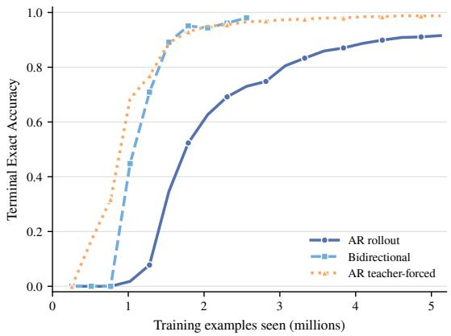  
Figure 10: Vector-state learning curves for Rubik’s Cube.

To isolate sequence modeling from visual generation, we instantiate the same task in a categorical vector space. The state $\mathbf { x } _ { t }$ contains one six-way color variable for each sticker on the three faces visible from the fixed camera. The $2 \times 2 \times 2$ diagnostic therefore represents 12 visible stickers as a $1 2 \times 6$ one-hot array. A sticker that moves out of view is not represented again until it returns to a visible face, so success still requires the model to maintain its intervening history.

The vector model receives only $\mathbf { x } _ { \mathrm { 0 } }$ and the complete prompt from the shared frozen language encoder, and predicts the state after every action. It receives no rendered video, structured actions, simulator transition operator, or intermediate oracle states. The bidirectional model predicts the complete trajectory jointly. The AR model predicts one state at a time; it is teacher-forced during training, while strict evaluation conditions each step on its own preceding prediction.

We use 100,000 training episodes, 10,000 validation episodes, and 10,000 untouched test episodes, with 20 sampled actions per episode. Each prompt has 132 tokenizer tokens, including special tokens. The frozen ModernBERT-base encoder conditions a six-layer Transformer of width 192 with six attention heads and approximately 2.8M trainable parameters. We optimize categorical cross-entropy with AdamW and batches of 256 episodes. The main schedule warms up for 500 updates to $5 \times 1 0 ^ { - 4 }$ and then decays by cosine toward $5 \times 1 0 ^ { - 5 }$ . Validation occurs every 1,000 updates. Main training stops at the first validation with final-state success above 98%, or at 20,000 updates, followed by a fixed 5,000-update refinement from $5 \times 1 0 ^ { - 5 } t o 3 \times 1 0 ^ { - 6 }$ . The bidirectional model uses 15,000 total updates; the AR model uses 25,000.

For a rough compute estimate, we use a dense Transformer with one token per sticker and a feedforward width of 4 × 192, including the prompt tokens. We count a joint pass for Bidir and separate prefix passes for AR, and estimate training FLOPs as three times the forward cost, excluding the frozen language encoder.

For M test episodes, final-state success is $\begin{array} { r } { \mathrm { S R } _ { \mathrm { R u b i k } } = \frac { 1 } { M } \sum _ { m = 1 } ^ { M } \mathcal { k } \Big [ \hat { \mathbf { x } } _ { 2 0 } ^ { ( m ) } = \mathbf { x } _ { 2 0 } ^ { ( m ) } \Big ] . } \end{array}$

Thus, all 12 visible sticker colors must be correct after move 20. Table 3 reports final-state and full-trajectory exact accuracy on the untouched test set. In addition to the strict AR rollout reported there, teacher-forced AR evaluation gives 99.17% final-state success.

## B VIDEO DIT ARCHITECTURE AND TRAINING PROTOCOL

We scale only the trainable video diffusion Transformer (DiT); the frozen Wan2.1 VAE and ModernBERT-base language encoder are excluded from all parameter counts. An 81-frame Rubik video is encoded into 21 latent times with 16 channels and spatial resolution $3 2 \times 3 2 . \mathrm { ~ A ~ 1 ~ } \times 2 \times 2$ latent patch therefore contains one latent time and produces 256 spatial tokens. The first latent time is the visual condition and the remaining 20 are prediction targets, giving 5,120 predicted patch tokens per episode. Autoregressive (AR) models generate chunks of k latent times, conditioned on their generated history at inference; bidirectional models predict all 20 future latent times jointly. Stage A evaluates $k \in \{ 1 , 4 \}$ ; Stage B uses AR with $k = 1$

$\operatorname { L e t } d _ { \mathrm { m o d e l } }$ denote the Transformer width, L the number of blocks, H the number of attention heads, $d _ { \mathrm { h e a d } }$ the width of each head, and $d _ { \mathrm { f } }$ the SwiGLU hidden width. Table 6 defines the common architecture. Only $d _ { \mathrm { m o d e l } }$ and L vary with scale; Stage A determines their allocation before Stage B varies model size and data.

Table 6: Video DiT architecture used in the two-stage scaling study.
<table><tr><td>Component</td><td>Value or rule</td><td>Scaling treatment</td></tr><tr><td>Transformer block</td><td>Self-attention, cross-attention, SwiGLU</td><td>Fixed</td></tr><tr><td>Model width  $d _ { \mathrm { m o d e l } }$ </td><td>Tables 2 and 7</td><td>Scaled</td></tr><tr><td>Depth L</td><td>Selected wide-shallow ladder</td><td>Scaled</td></tr><tr><td>Position encoding</td><td>3D RoPE</td><td>Fixed</td></tr><tr><td>Head width  $d _ { \mathrm { h e a d } }$ </td><td>64</td><td>Fixed</td></tr><tr><td>Attention heads H</td><td> $d _ { \mathrm { m o d e l } } / 6 4$ </td><td>Derived</td></tr><tr><td>FFN width  $d _ { \mathrm { f f } }$ </td><td>64  $\lceil ( 8 \dot { d } _ { \mathrm { m o d e l } } / 3 ) / 6 4 \rceil$ </td><td>Derived</td></tr><tr><td>Latent representation</td><td>16-channel frozen Wan2.1 VAE</td><td>Fixed</td></tr><tr><td>Latent patch</td><td> $1 \times 2 \times 2$ </td><td>Fixed</td></tr><tr><td>Text condition</td><td>Cached 768-dimensional ModernBERT features</td><td>Fixed</td></tr><tr><td>Prediction factorization</td><td>Stage A  $\{ \mathsf { A R } - k \in \{ 1 , 4 \}$   $k = 1$ </td><td>and bidirectional; Stage B: AR- Fixed within each study</td></tr></table>

We use a two-stage design. Stage A calibrates the depth–width allocation before comparing parameter scales. Stage B is the scaling-law experiment: it holds the selected architecture family fixed and varies model size, data, and training compute. This calibration is specific to our long video-token sequences; it prevents pathologies of an arbitrary depth–width rule from being attributed to parameter scale. Following the compute-oriented analysis of DiT (Peebles & Xie, 2023), the primary resource variable is training FLOPs rather than parameter count alone, because AR history length and target length also affect attention compute.

Stage A: architecture-family calibration. We compare the three parameter-matched configurations in Table 2. Each is trained on the same Rubik episode stream for up to 1M episode presentations with the same effective batch size, optimizer, latent patch, and flow-time distribution. Section C reports the completed nine-run AR-k = 1/AR-k = 4/bidirectional pilot at matched data exposure, with per-configuration training-compute estimates in Table 9. We select wide–shallow $\mathbf { A } \mathbf { R } \mathbf { - } k = 1$ on this data-matched evidence, not a claim of iso-FLOP optimality. Throughput and peak memory are secondary systems measurements. This pilot’s 1M cap does not set the Stage-B training budget, and its runs do not contribute points to the scaling-law fit.

Stage B: model–data scaling. We select the wide–shallow family from Stage A and retain seven approximately geometric parameter targets. Table 7 replaces the balanced fallback: widths increase and depths decrease while parameter counts remain within 6% of their original targets. Both width and depth grow monotonically with scale (depth may stay constant), with at least eight blocks. This preserves the design principle of allocating capacity within a non-degenerate Transformer family, rather than imposing a constant depth or claiming an optimal depth–width ratio. Parameter counts are exact for the trainable generator, including latent, language, conditioning, normalization, and output layers. The selection is supported by the 1M-video development comparison, not an estab lished optimum at every scale.

Table 7: Stage B Video DiT architecture specifications. $\mathbf { A } \mathbf { R } { - } k = 1$ and bidirectional models share the same architecture dimensions and parameter counts.
<table><tr><td>Model name</td><td>Parameters (M)</td><td> $d _ { \mathrm { m o d e l } }$ </td><td>Layers</td><td>Heads</td><td> $d _ { \mathrm { f } }$ </td></tr><tr><td>20M</td><td>19.70</td><td>384</td><td>8</td><td></td><td>6 1024</td></tr><tr><td>30M</td><td>33.45</td><td>448</td><td>10</td><td>7</td><td>1216</td></tr><tr><td>70M</td><td>67.81</td><td>640</td><td>10</td><td>10</td><td>1728</td></tr><tr><td>120M</td><td>115.8</td><td>768</td><td>12</td><td>12</td><td>2048</td></tr><tr><td>270M</td><td>271.8</td><td>1088</td><td>14</td><td>17</td><td>2944</td></tr><tr><td>550M</td><td>548.1</td><td>1408</td><td>17</td><td>22</td><td>3776</td></tr><tr><td>1B</td><td>938.4</td><td>1792</td><td>18</td><td>28</td><td>4800</td></tr></table>

Stage B varies the total trainable generator size N and the number of unique training episodes D, with training compute derived from the attention-aware cost in Table 12. All runs use the same episode prefix, seed 20260727, effective batch 16, AdamW settings from Stage A, and a learning rate of $\bar { 4 } \times 1 0 ^ { - 4 }$ after $^ { 1 6 , 3 8 4 }$ videos of linear warmup. The learning rate then remains constant. Packed chunk losses are averaged before one optimizer update; hardware microbatching does not change the effective batch or the learning rate.

The scaling analysis contains 159 AR and 265 Bidir EMA checkpoints, evaluated on the same 100 paired episodes. Each training video is consumed once. The ground-truth-history diagnostic in Appendix D.1 uses a separate 140-checkpoint AR snapshot, with model comparisons at a common exposure of 5M videos.

## B.1 HYPERPARAMETER SELECTION

We selected the effective batch size and peak learning rate using matched-data pilot experiments on a 35.37M-parameter Video DiT with eight blocks, width 512, and eight attention heads. Each run used the same 32,768 training videos, with linear warmup over 1,024 videos followed by cosine decay to 10% of the peak learning rate. Selection used final-checkpoint validation flow MSE on 1,024 held-out videos, evaluated with non-EMA weights.

The batch-size search compares 16, 32, and 64 videos per update for $\mathbf { A } \mathbf { R } { - } k = 2$ at a peak learning rate of $2 \times 1 0 ^ { - 4 }$ . The learning-rate search fixes the batch size at 16 and compares $1 0 ^ { - 4 } , 2 \times 1 0 ^ { - 4 } ,$ and $4 \times 1 0 ^ { - 4 }$ for $\mathsf { A R } - k \in \{ 1 , 2 , 4 \}$ and bidirectional generation. Batch size 16 and peak learning rate $4 \times 1 0 ^ { - 4 }$ give the lowest validation loss in their respective comparisons (Table 8); we use these settings in both Stage A and Stage B.

Table 8: Validation flow MSE in the learning-rate (left) and effective-batch-size (right) searches. Lower is better; best values within each comparison are bold.
<table><tr><td>Generation</td><td colspan="3">Peak learning rate</td></tr><tr><td></td><td> $1 0 ^ { - 4 }$ </td><td> $2 \times 1 0 ^ { - 4 }$ </td><td> $4 \times 1 0 ^ { - 4 }$ </td></tr><tr><td> $\mathbf { A } \mathbf { R } { - } k = 1$ </td><td>0.1678</td><td>0.1217</td><td>0.0768</td></tr><tr><td> $\mathbf { A } \mathbf { R } { - } k = 2$ </td><td>0.1790</td><td>0.1337</td><td>0.0810</td></tr><tr><td> $\mathbf { A } \mathbf { R } { - } k = 4$ </td><td>0.1715</td><td>0.1287</td><td>0.0783</td></tr><tr><td>Bidir</td><td>0.1789</td><td>0.1274</td><td>0.0781</td></tr></table>

<table><tr><td>Batch size</td><td>Validation MSE</td></tr><tr><td>16</td><td>0.1337</td></tr><tr><td>32</td><td>0.1756</td></tr><tr><td>64</td><td>0.2409</td></tr></table>

## C STAGE A: ARCHITECTURE CALIBRATION

Setup. Each of the three approximately 95M-parameter shapes in Table 2 is trained with $\mathrm { A R } { - } k = 1$ (20 chunks), $\mathrm { A R } { - } k = 4$ (five chunks), or Bidir (20 future latent frames jointly). All use 3D RoPE, frozen Wan2.1/ModernBERT representations, the full nine-action prompt, and no vector-state input or auxiliary loss. Teacher-forced AR chunk losses are computed in parallel and averaged before one update.

All runs use the same 1M distinct episodes, order, and training seed (20260727), on one H200 per run. Batch size is 16 videos (81,920 target tokens), with no gradient accumulation or activation checkpointing. AdamW uses betas (0.9, 0.95), weight decay 0.05, and gradient clipping at 1.0. Learning rate warms up over 16,384 videos to $\dot { 4 } \times 1 0 ^ { - 4 }$ , then decays by cosine to $4 \times \mathrm { 1 0 ^ { - 5 } }$ at 1M. Flow times follow sigmoid $( \mathcal { N } ( 0 , 1 ) )$ ). This cap applies only to Stage A.

Training compute. Table 9 reports estimated training FLOPs for each configuration: three times the forward matrix/convolution cost over 1M episodes, counting shared AR context projections once per episode. Counts include trainable input/output projections and flow-time conditioning, but exclude frozen encoders, optimizer/EMA updates, validation, and sampling. The comparison matches data exposure, not training or sampling compute.

Table 9: Estimated Stage-A training compute, in $1 0 ^ { 1 8 } \ \mathrm { F L O P s } ,$ after 1M videos. One multiply– accumulate counts as two FLOPs; backward compute is approximated as twice forward compute. These are operation-count estimates, not hardware timings.
<table><tr><td>Shape</td><td> $\mathbf { A } \mathbf { R } { - } k = 1$ </td><td> $\mathbf { A } \mathbf { R } { - } k = 4$ </td><td>Bidir</td></tr><tr><td>Deep-narrow</td><td>5.015</td><td>5.281</td><td>6.343</td></tr><tr><td>Balanced</td><td>4.542</td><td>4.753</td><td>5.527</td></tr><tr><td>Wide-shallow</td><td>4.367</td><td>4.548</td><td>5.150</td></tr></table>

Evaluation. All 1M-video checkpoints (62,500 updates) use EMA weights, the same 100 heldout development episodes and sampling-noise identities, and 16 midpoint steps per AR chunk or joint Bidir video. AR uses generated history. Sticker accuracy scores the 12 visible colors at settled post-action boundaries; exact-frame accuracy requires all 12 correct. Action following requires the correct face and turn type, measured by the independent grayscale-motion probe (Section A.6). Absent motion counts as incorrect. The same development episodes are used for the scaling comparisons.

Table 10: Stage A after 1M training videos. Accuracies (%) average actions 1–9 on the same 100 episodes, excluding the initial boundary. Flow MSE uses 1,024 validation episodes; its conditioning and fixed probes differ across prediction factorizations.
<table><tr><td>Shape</td><td>Family</td><td> $\mathbf { M S E } \left( 1 0 ^ { - 3 } \right)$ </td><td>Action</td><td>Sticker</td><td>Frame</td></tr><tr><td>deep-narrow</td><td>AR-K1</td><td>2.233</td><td>17.22</td><td>25.37</td><td>3.67</td></tr><tr><td>deep-narrow</td><td>AR-K4</td><td>2.562</td><td>6.33</td><td>22.20</td><td>0.78</td></tr><tr><td>deep-narrow</td><td>BIDIR</td><td>3.212</td><td>7.33</td><td>21.59</td><td>0.33</td></tr><tr><td>balanced</td><td>AR-K1</td><td>1.883</td><td>72.44</td><td>52.00</td><td>24.33</td></tr><tr><td>balanced</td><td>AR-K4</td><td>2.533</td><td>9.67</td><td>22.46</td><td>1.67</td></tr><tr><td>balanced</td><td>BIDIR</td><td>3.426</td><td>6.78</td><td>21.55</td><td>0.56</td></tr><tr><td>wide-shallow</td><td>AR-K1</td><td>1.864</td><td>90.78</td><td>78.20</td><td>37.22</td></tr><tr><td>wide-shallow</td><td>AR-K4</td><td>2.371</td><td>79.89</td><td>63.14</td><td>25.11</td></tr><tr><td>wide-shallow</td><td>BIDIR</td><td>3.184</td><td>8.33</td><td>21.67</td><td>0.78</td></tr></table>

Comparisons. Table 10 reports all nine EMA endpoints, while Figure 11 separates action following, sticker accuracy, and exact-frame accuracy along the action sequence. Wide–shallow $\mathrm { A R } { - } k = 1$ has the highest point estimates for all three metrics among these nine configurations, with 90.78% action-following and 37.22% exact-frame accuracy. These EMA endpoints support carrying wide– shallow $\mathbf { A } \mathbf { R } { - } k \bar { = } 1$ into Stage B, where we keep the architecture family fixed while varying model size. These comparisons describe the observed training budget and do not establish an asymptotic convergence floor or reasoning ceiling. Figure 12 shows all nine setups on the first fixed development episode, alongside the aggregate measurements.

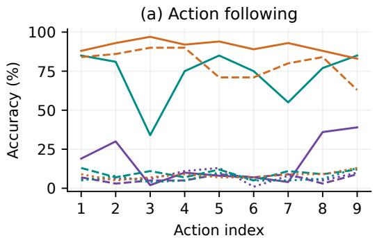  
(c) Exact frames

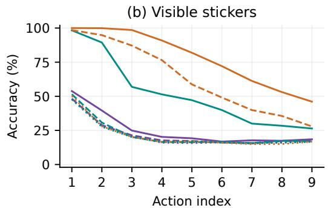

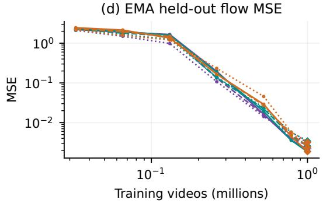

Figure 11: Stage-A calibration across nine setups. Purple, teal, and orange group deep–narrow, balanced, and wide–shallow; solid, dashed, and dotted lines distinguish $\bar { \bf A } \bar { \bf R } - \bar { k } = { \bf \bar { \Phi } } 1 , \bar { \bf A } \bar { \bf R } - k = 4$ and Bidir. (a–c) The 1M-video EMA checkpoints on 100 paired development episodes: actionfollowing accuracy from the independent motion probe, visible-sticker accuracy, and exact-frame accuracy (all 12 stickers correct). The initial boundary is excluded. (d) EMA flow MSE on 256 fixed episodes at seven selected exposures: 32,768, 65,536, 131,072, 262,144, 524,288, 786,432, and 1M videos. Diamond endpoint markers use 1,024 episodes. Initialization is omitted. AR los uses ground-truth history; conditioning and noise/time probes differ across factorizations, so thei losses are not directly comparable.

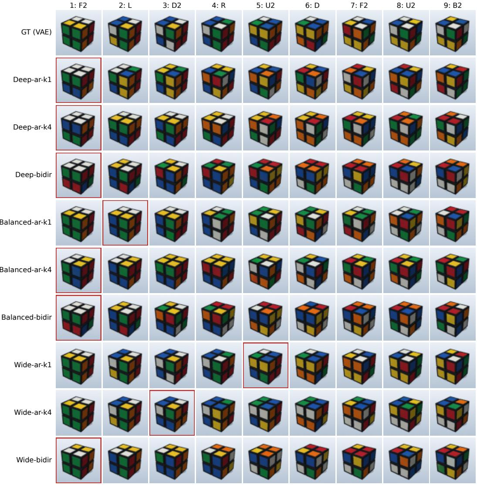  
Figure 12: Stage-A rollouts across all nine setups after 1M training videos. VAE-reconstructed ground truth, followed by deep–narrow, balanced, and wide–shallow; each shape includes AR-k = 1, AR-k = 4, and Bidir. All use the first development episode (seed 81024000), the same prompt, and paired sampling-noise seeds, with 16 midpoint steps per AR chunk or entire Bidir video. The nine settled post-action boundaries are shown. Red boxes mark each model’s first incorrect settled action boundary. The episode was not selected by performance. All panels use the saved EMA model parameters.

## D FULL SCALING RESULTS

The main scaling analysis uses 159 AR and 265 Bidir EMA checkpoints, each evaluated on the same 100 paired episodes. Action, sticker, and frame accuracies average the nine post-action boundaries. Full-trajectory accuracy requires all nine post-action frames in an episode to be correct. The groundtruth-history diagnostic below uses a separate 140-checkpoint AR snapshot and 16 midpoint steps per $\mathrm { A R } { - } k = 1$ chunk.

## D.1 ACTION-ALIGNED GROUND-TRUTH HISTORY

All 140 diagnostic checkpoints have paired GT-history evaluations. For each separately tested action, the GT prefix ends at the last causal VAE latent strictly before the action begins. The generator predicts the remaining 0–3 bridge frames and the entire action without further GT refresh; known GT past also supplies decoder context. Each pair shares model weights, episode identities, sampling noise, and the 16-step midpoint sampler. The nine GT windows are initialized independently. Freerunning scores instead come from a continuous rollout. The protocol preserves the action durations, latent timing, and AR chunk size.

<table><tr><td>Model</td><td>Mean frame: Free</td><td>GT prefix</td><td>A9 frame: Free</td><td>GT prefix</td></tr><tr><td>XS</td><td>33.89</td><td>38.67</td><td>0.00</td><td>5.00</td></tr><tr><td>S</td><td>42.22</td><td>47.89</td><td>0.00</td><td>9.00</td></tr><tr><td>M</td><td>52.56</td><td>60.00</td><td>0.00</td><td>22.00</td></tr><tr><td>B</td><td>48.11</td><td>55.00</td><td>1.00</td><td>9.00</td></tr><tr><td>L</td><td>63.56</td><td>71.67</td><td>3.00</td><td>38.00</td></tr><tr><td>XL</td><td>64.56</td><td>73.33</td><td>5.00</td><td>45.00</td></tr><tr><td>XXL</td><td>71.00</td><td>78.67</td><td>10.00</td><td>45.00</td></tr></table>

Table 11: Matched free-running and action-aligned GT-history comparisons at 5M videos. All values are percentages on the same 100 episodes.

## E GENERATOR COMPUTE AND TRAINING DETAILS

We scale a latent rectified-flow Transformer by the number of blocks L and the hidden width $d _ { \mathrm { m o d e l } }$ Each block contains visual attention over the target and permitted visual context, language crossattention, and a SwiGLU layer of width $d _ { \mathrm { f f } } = \bar { 6 4 } \lceil 8 d _ { \mathrm { m o d e l } } / ( 3 \cdot 6 4 ) \rceil$ ⌉. The concatenated attention width equals $d _ { \mathrm { m o d e l } } ;$ each head has width 64, hence $n _ { \mathrm { h e a d s } } = d _ { \mathrm { m o d e l } } / 6 4$ . The block-only parameter count $N _ { \mathrm { b l o c k s } }$ excludes projections. The empirical scaling analysis uses the full trainable count N. The block count is approximately:

$$
N _ { \mathrm { b l o c k s } } \simeq L \left( 8 d _ { \mathrm { m o d e l } } ^ { 2 } + 3 d _ { \mathrm { m o d e l } } d _ { \mathrm { f } } \right) ,\tag{1}
$$

where the two attention modules contribute $8 d _ { \mathrm { m o d e l } } ^ { 2 }$ and the SwiGLU contributes $3 d _ { \mathrm { m o d e l } } d _ { \mathrm { f f } }$ per block.

For compute, each cached video latent frame has $d _ { z }$ channels and spatial size $H _ { z } \times W _ { z }$ . Dividing it into $p \times p$ patches gives $S = ( H _ { z } / p ) ( W _ { z } / p )$ visual tokens per frame. A chunk of k target frames therefore contains $n _ { \mathrm { t g t } } = k S$ target tokens. Its context contains $n _ { \mathrm { t e x t } }$ cached language tokens, $n _ { \mathrm { a n c h o r } } = S$ tokens from the initial latent frame, and $n _ { \mathrm { h i s t } }$ tokens from preceding latent frames, so $n _ { \mathrm { c t x } } = n _ { \mathrm { t e x t } } + n _ { \mathrm { a n c h o r } } + n _ { \mathrm { h i s t } }$ . Each cached language token has feature width $d _ { f } .$ . We count one multiply–accumulate as two FLOPs and omit lower-order operations, following Kaplan et al. (2020).

Table 12: Generator parameters and forward compute. FLOPs are per target visual patch token; biases, normalization, and nonlinearities are omitted.
<table><tr><td>Operation</td><td>Parameters</td><td>Forward FLOPs per target token</td></tr><tr><td>Language projection</td><td> $d _ { f } d _ { \mathrm { m o d e l } }$ </td><td> $2 n _ { \mathrm { t e x t } } d _ { f } d _ { \mathrm { m o d e l } } / n _ { \mathrm { t g t } }$ </td></tr><tr><td>Latent input/output projections</td><td> $3 d _ { z } p ^ { 2 } d _ { \mathrm { m o d e l } }$ </td><td> $\begin{array} { r } { 2 d _ { z } p ^ { 2 } d _ { \mathrm { m o d e l } } \left( 2 + \frac { n _ { \mathrm { a n c h o r } } + n _ { \mathrm { h i s t } } } { n _ { \mathrm { t g t } } } \right) } \end{array}$ </td></tr><tr><td>Target visual Q/K/V and output</td><td> $4 L d _ { \mathrm { m o d e l } } ^ { 2 }$ </td><td></td></tr><tr><td>Visual-context K/V (shared weights)</td><td></td><td> $\begin{array} { r l } & { \qquad 8 L d _ { \mathrm { m o d e l } } ^ { 2 } } \\ & { 4 L \frac { n _ { \mathrm { a n c h o r } } + n _ { \mathrm { h i s t } } } { n _ { \mathrm { t e t } } } d _ { \mathrm { m o d e l } } ^ { 2 } } \end{array}$ </td></tr><tr><td>Visual attention products</td><td></td><td> $4 L ( n _ { \mathrm { t g t } } + n _ { \mathrm { a n c h o r } } + n _ { \mathrm { h i s t } } ) d _ { \mathrm { m o d e l } }$ </td></tr><tr><td>Language cross-attention projections</td><td> $4 L d _ { \mathrm { m o d e l } } ^ { 2 }$ </td><td> $\begin{array} { r } { 4 L d _ { \mathrm { m o d e l } } ^ { 2 } \left( 1 + \frac { n _ { \mathrm { t e x t } } } { n _ { \mathrm { t g t } } } \right) } \end{array}$ </td></tr><tr><td>Language attention products</td><td></td><td> $4 L n _ { \mathrm { t e x t } } d _ { \mathrm { m o d e l } }$ </td></tr><tr><td>SwiGLU feedforward</td><td> $3 L d _ { \mathrm { m o d e l } } d _ { \mathrm { f f } }$ </td><td> $6 L d _ { \mathrm { m o d e l } } d _ { \mathrm { f f } }$ </td></tr><tr><td>Flow-time MLP</td><td> $3 d _ { \mathrm { m o d e l } } ^ { 2 }$ </td><td> $6 d _ { \mathrm { m o d e l } } ^ { 2 } / n _ { \mathrm { t g t } }$ </td></tr><tr><td>Total (Transformer blocks)</td><td></td><td> $\begin{array} { r l r } & { N _ { \mathrm { b l o c k s } } \simeq L \left( 8 d _ { \mathrm { m o d e l } } ^ { 2 } + 3 d _ { \mathrm { m o d e l } } d _ { \mathrm { f f } } \right) } & { L \left[ 1 2 d _ { \mathrm { m o d e l } } ^ { 2 } + 4 \frac { n _ { \mathrm { c t s } } } { n _ { \mathrm { t g t } } } d _ { \mathrm { m o d e l } } ^ { 2 } + 6 d _ { \mathrm { m o d e l } } d _ { \mathrm { f f } } + 4 d _ { \mathrm { m o d e l } } ( n _ { \mathrm { t g t } } + n _ { \mathrm { c t s } } ) \right] } \end{array}$ </td></tr></table>

The frozen video autoencoder and language encoder are excluded from N. For packed AR, shared language, latent-context, and context-K/V projections are counted once per episode, over all materialized context tokens; attention products use only the current noisy chunk and its permitted clean prefix. For Bidir, all future tokens attend to one another and to the initial frame. We estimate training FLOPs as three times this forward cost (one forward and approximately two backward passes). Optimizer/EMA updates, validation, and sampling are excluded. In AR, causal masks prevent access to future latent frames.

For Figures 1(c) and 7, we construct a separate observed frontier for each metric and generation family. We sort checkpoints by training compute and retain the initial baseline and each subsequent record improvement in accuracy. We then divide the complete frontier into three equal groups of points and fit the middle and final thirds separately. Each segment contains 16 points for AR average frame accuracy, 6 for AR full-trajectory accuracy, and 14 for Bidir average frame accuracy. This window comparison is motivated by the frontier curvature examined by Hoffmann et al. (2022).

For accuracy a, we fit $1 - a = A C ^ { - \alpha }$ by ordinary least squares in log space. Here C is training compute in PF-days, with one PF-day equal to $8 . 6 4 \times 1 0 ^ { 1 9 } \dot { \mathrm { F L O P s } }$ . The fitted curve intersects target accuracy q at $C _ { q } = ( A / ( 1 - q ) ) ^ { 1 / \alpha }$ . These intersections illustrate the implications of extending the fitted trends; they are not validated predictions of the compute needed at the target accuracy. Table 13 reports the fitted coefficients and 98% intersections. Average frame accuracy averages the nine post-action correctness indicators, whereas full-trajectory accuracy requires all nine to be correct within the same episode. Bidir has no successful full trajectories in these evaluations, so we do not extrapolate that metric.

Table 13: Power-law fits to the middle and final thirds of each observed compute frontier. $C _ { 9 8 }$ is the 98% intersection of each fitted curve, in PF-days, illustrating its sensitivity to the fitting window.
<table><tr><td>Metric</td><td>Segment</td><td> $A$ </td><td>α</td><td> $C _ { 9 8 }$ </td></tr><tr><td>AR frame</td><td>Middle third</td><td>0.336</td><td>0.2178</td><td> $4 . 2 2 7 \times 1 0 ^ { 5 }$ </td></tr><tr><td>AR frame</td><td>Final third</td><td>0.5607</td><td>1.055</td><td> $2 3 . 5 5$ </td></tr><tr><td>AR trajectory</td><td>Middle third</td><td>0.9501</td><td>0.1185</td><td> $1 . 4 2 5 \times 1 0 ^ { 1 4 }$ </td></tr><tr><td>AR trajectory</td><td>Final third</td><td>1.59</td><td>0.7931</td><td>248.9</td></tr><tr><td>Bidir frame</td><td>Middle third</td><td>0.4366</td><td>0.1823</td><td> $2 . 2 2 1 \times 1 0 ^ { 7 }$ </td></tr><tr><td>Bidir frame</td><td>Final third</td><td>0.4424</td><td>0.09379</td><td> $2 . 1 8 4 \times 1 0 ^ { 1 4 }$ </td></tr></table>

We convert compute to H100 GPU-hours as $2 4 C / ( 0 . 5 \times 0 . 9 8 9 )$ , using the 50% model FLOPs utilization assumption of Sardana et al. (2024) and a dense BF16 peak of 989 TFLOP/s.1

## E.1 TRAINING PROCEDURE

For minibatch $\boldsymbol { B } = \{ ( z _ { 0 } , z , y ) \}$ , let $z _ { \mathrm { 0 } }$ be the initial-frame latent, $z = ( z _ { 1 } , \dots , z _ { n _ { \mathrm { f r a m e } } } )$ the future latents, and y the language features. For clean target z˜, noise $\epsilon \sim \mathcal { N } ( 0 , I )$ , and $t \sim \mathrm { { s i g m o i d } } ( { \mathcal { N } } ( 0 , 1 ) )$ rectified-flow training uses $x _ { t } = ( 1 - t ) \epsilon + t \tilde { z }$ and target velocity $\tilde { z } - \epsilon .$ . Algorithm 1 shows one optimizer update; MSE averages over the minibatch and all latent elements. After each optimizer update, we update a float32 exponential moving average (EMA) of every trainable generator parameter:

$$
\bar { \theta } _ { t } = 0 . 9 9 9 9 \bar { \theta } _ { t - 1 } + 0 . 0 0 0 1 \theta _ { t } .
$$

The EMA starts from the initialized generator parameters and is restored alongside the optimizer when training resumes. Video-generator evaluations use the EMA saved in each selected checkpoint, including flow-MSE probes, free rollouts, GT-prefix interventions, and qualitative samples. The frozen language/video encoders are unchanged. Parameter EMA is distinct from any smoothing of plotted optimization losses.

Algorithm 1 Bidirectional and autoregressive generator training.   
Bidirectional Autoregressive   
Require: $B ,$ generator $G _ { \theta }$ Require: $B , G _ { \theta } ,$ chunk size k   
1: Sample $t , \epsilon ;$ form $x _ { t }$ for z 1: Partition z into $n _ { \mathrm { c h u n k } } = n _ { \mathrm { f r a m e } } / k$ chunks   
2: $\hat { v }  \mathcal { ( } \sigma _ { \theta } ( x _ { t } , t \mid z _ { 0 } , y )$ 2: for all $i \in \{ 1 , \dots , n _ { \mathrm { c h u n k } } \}$ in parallel do   
3: $\mathcal { L } \gets \mathrm { M S E } ( \hat { v } , z - \epsilon )$ 3: Sample $t _ { i } , \epsilon _ { i } ;$ form $\boldsymbol { x } _ { t _ { i } } ^ { ( i ) }$ for $z ^ { ( i ) }$   
4: Update θ using $\nabla _ { \boldsymbol { \theta } } \dot { \mathcal { L } }$   
4: $c _ { i } \gets ( z _ { 0 } , y , z ^ { ( < i ) } )$ ▷ ground-truth prefix   
5: $\bar { \theta } \overset { \cdot } {  } 0 . 9 9 9 9 \bar { \theta } + 0 . 0 0 0 1 \theta$   
5: $\hat { v } ^ { ( i ) }  G _ { \theta } ( x _ { t _ { i } } ^ { ( i ) } , t _ { i } \mid c _ { i } )$   
6: $\mathcal { L } _ { i } \gets \mathrm { M S E } ( \hat { v } ^ { ( i ) } , z ^ { ( i ) } - \epsilon _ { i } )$   
7: end for   
8: $\begin{array} { r } { \mathcal { L }  n _ { \mathrm { c h u n k } } ^ { - 1 } \sum _ { i = 1 } ^ { n _ { \mathrm { c h u n k } } } \mathcal { L } _ { i } } \end{array}$   
9: Update $\theta$ once using $\nabla _ { \boldsymbol { \theta } } \mathcal { L }$   
10: $\bar { \theta } \overset { \cdot } {  } 0 . 9 9 9 9 \bar { \theta } + 0 . 0 \bar { 0 } 0 1 \theta$