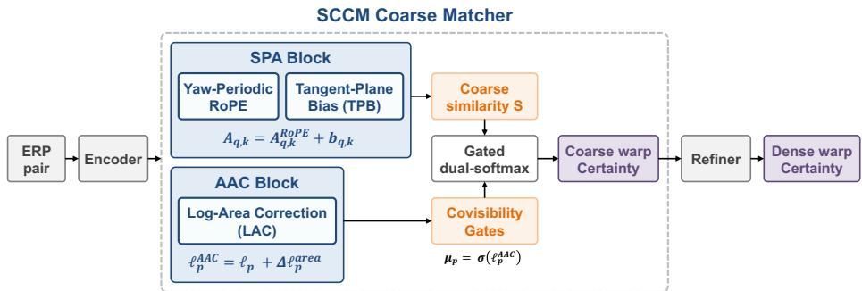
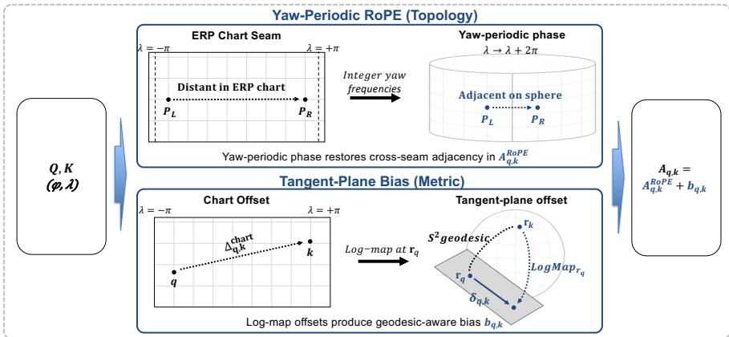
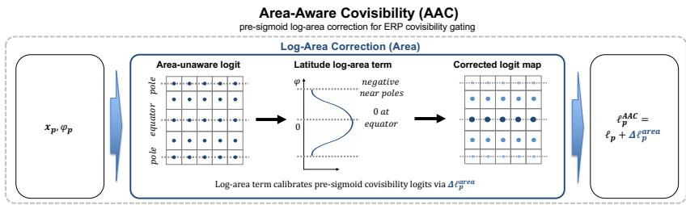
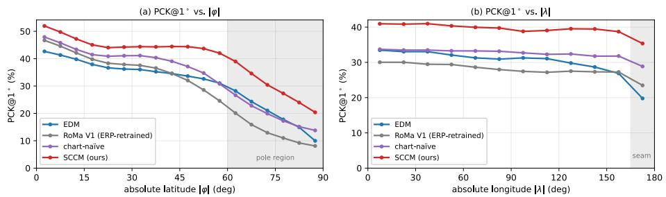
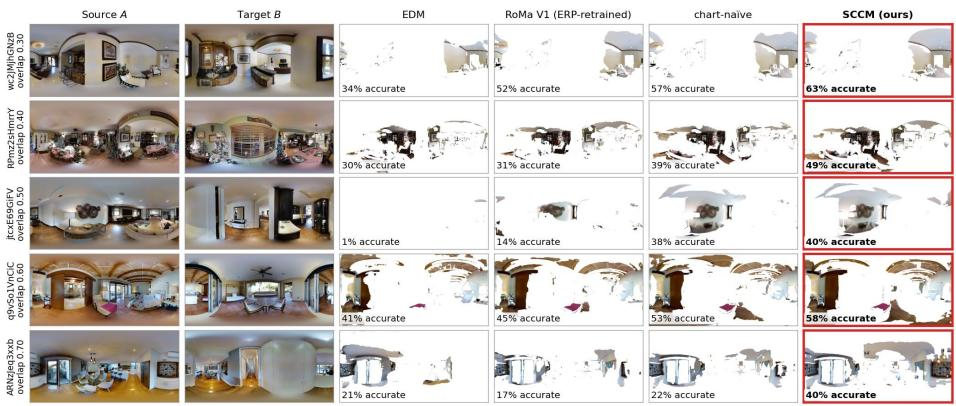
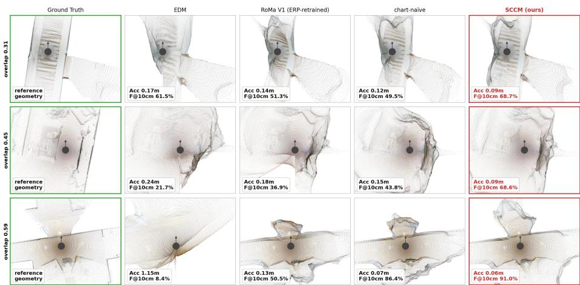
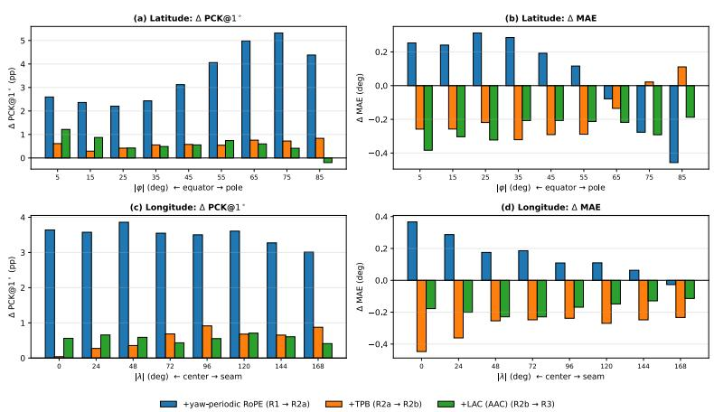
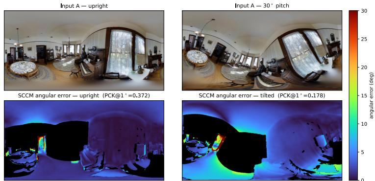

# SCCM: Spherically Consistent Coarse Matching for ERP Dense Feature Correspondence

Gyeonggwan Lee1,2, Eunsoo Im1, Seunghwan Hong1, and Junghun Suh1

1 Kakao Mobility Corp., Seongnam, Republic of Korea 2 Korea University, Seoul, Republic of Korea {gandan.lee,soo.hd,logan.sh,jude.suh}@kakaomobility.com Project page: https://gandanlee.github.io/sccm/

Abstract. Equirectangular projection (ERP) is the standard representation for 360◦ imagery, and robust dense feature matching on ERP underpins panoramic stereo, view synthesis, and omnidirectional SLAM. Dense matchers trained on flat images degrade systematically on ERP because the chart introduces three coupled distortions—topological, metric, and area—that standard coarse matching and visibility estimation do not explicitly model. We show that correcting the three distortions at the coarse-stage interfaces where they arise—pairwise distortions in attention, per-pixel distortion in covisibility gating—improves PCK@1◦ from 0.229 to 0.275 on Matterport3D under a fixed coarse scafold, with the refiner architecture unchanged—our central result. Concretely, SCCM (Spherically Consistent Coarse Matching) augments a chart-naïve cross-attention/dual-softmax coarse matcher with two sphere-derived priors: Spherical Positional Attention (SPA) pairs a yaw-periodic RoPE (topology) with a tangent-plane bias (metric), and Area-Aware Covisibility (AAC) applies a pre-sigmoid log-area correction (area). The chart-naïve scafold serves as a controlled reference, separating the scafold-replacement efect from the spherical-prior efect. Instantiated in the RoMa V1 framework with the same frozen encoder, refiner architecture, and loss, SCCM also outperforms the ERP-native EDM (0.163) and an ERP-retrained RoMa V1 (0.198) under a unified ERP dense matching protocol, while perspective-trained matchers largely fail on ERP. It further transfers zero-shot to Stanford2D3D and, when trained on outdoor Holo360D, leads there as well.

Keywords: Dense matching · 360◦ images · Spherical geometry

## 1 Introduction

Dense feature matching assigns every pixel of one image a corresponding location in another, producing the dense correspondence field that underpins 360◦ depth, pose, and view synthesis. On 360◦ content this matching runs on the equirectangular projection (ERP)—the chart that unrolls the viewing sphere onto a flat rectangle. Modern dense matchers solve the task in two stages [8, 10, 26]: a coarse matcher first proposes low-resolution match anchors, and a refiner then sharpens them into precise correspondences. These matchers achieve strong results on perspective images but degrade systematically on ERP, where the chart’s latitude-dependent stretch and longitudinal seam violate the planar assumptions built into their coarse stage.

  
Fig. 1: SCCM coarse matcher: pipeline overview. SCCM injects sphere-derived priors into a fixed chart-naïve coarse scafold (denoted R1 in Sec. 4), while keeping the encoder, refiner architecture, and loss unchanged. The inherited scafold consists of cross-/self-attention, covisibility gating, and gated dual-softmax. The blue modules are the proposed sphere-aware priors: yaw-periodic RoPE (topology) and Tangent-Plane Bias (metric) in SPA (Fig. 2), and Log-Area Correction (area) in AAC (Fig. 3); orange boxes denote coarse matching signals passed to gated dual-softmax, grey boxes are inherited unchanged, and purple boxes are outputs. The output is a dense warp $W _ { A  B }$ with per-pixel certainty c.

ERP distortion is not a single artifact but a composite of three computational challenges. Topology: the longitudinal ±π seam breaks positional continuity. Pairwise metric: a longitudinal stretch by 1/ cos φ grows toward the poles (here φ is latitude, 0 at the equator and ± π2 at the poles, so 1/ cos φ → ∞), making Euclidean chart ofsets poorly aligned with true geodesic ofsets, especially near the poles. Per-pixel area: the cos φ scaling of the sphere’s area element (the patch of sphere a single pixel covers, which shrinks toward the poles) over-represents polar regions in pixel-uniform sampling and can bias per-pixel matchability estimation toward polar candidates. The first two are pairwise— they concern the relation between two feature locations, so we correct them inside attention (which scores pairwise interactions between feature locations); the third is per-pixel—it concerns whether a single pixel is worth matching at all, so we correct it inside the covisibility gate (a per-pixel keep/suppress weight). A single post-hoc adjustment of the final matching cost risks conflating these distinct pairwise and per-pixel efects; we therefore inject each correction at the interface where its distortion arises.

Concretely, we first define a chart-naïve cross-/self-attention + dual-softmax coarse scafold, then introduce SCCM (Spherically Consistent Coarse Matching) as the same scafold augmented with two sphere-aware blocks, SPA and AAC, while keeping the encoder, refiner architecture, and loss unchanged (Fig. 1). SCCM targets the coarse stage, where ERP chart distortions first corrupt the anchors passed to refinement. The Spherical Positional Attention (SPA) block augments the attention layers of the coarse cascade with a yaw-periodic Rotary Position Embedding (RoPE; topology) and a tangent-plane bias on the sphere (pairwise metric). The Area-Aware Covisibility (AAC) block augments the covisibility gate with a pre-sigmoid log-area correction (per-pixel area). These corrections are modular, sphere-derived priors, yet not independent heuristics: all three follow from a single principle—each ERP distortion is corrected at the coarse-stage decision interface where it enters, pairwise distortions in the attention logits and per-pixel distortion in the covisibility logit—making SCCM a single, spherically consistent set of corrections to coarse matching rather than three unrelated add-ons.

Importantly, part of SCCM’s full-system gain comes from the scafold replacement itself, not from spherical geometry. We therefore use the chart-naïve scaffold as a controlled reference and report the scafold-replacement and sphericalprior components separately (Sec. 5.2).

In summary, we make three contributions:

– Distortion-to-interface formulation. We formulate ERP coarse matching as a distortion-to-interface problem: topology and metric distortions are pairwise and are corrected inside attention, while area distortion is per-pixel and is corrected inside covisibility gating.

– SPA and AAC. A spherical attention prior (SPA) combining yaw-periodic RoPE for seam-continuous topology with a tangent-plane bias for geodesic pairwise-metric calibration, and an area-aware covisibility prior (AAC) applying a pre-sigmoid log-area correction to the gate.

– Controlled evaluation protocol. An evaluation that separates scafold gains from spherical-prior gains, with the priors alone improving PCK@1◦ from 0.229 to 0.275 under a fixed scafold.

This controlled decomposition is the basis of our evaluation: we report both full-system comparisons and fixed-scafold ablations to separate architectural replacement from the proposed spherical priors (Sec. 5.3, Tab. 2).

## 2 Related Work

Perspective and ERP matchers. Perspective matchers—SuperGlue [22], LoFTR [26], DKM [8], and the RoMa family [9, 10]—do not explicitly model ERP chart topology or latitude-dependent metric distortion in their coarse stage, which can leave ERP-specific coarse errors for the refiner to resolve. 3D pointmap regressors (DUSt3R [30], MASt3R [15]) are primarily trained for perspective views. Among ERP methods, sparse spherical matchers (SPHORB [32], SphereGlue [11]) apply geometry only at isolated keypoints, whereas dense matching exposes every pairwise matching score to chart distortion. Co-Match [16] introduces covisibility-aware semi-dense matching for perspective images (covisibility-guided token condensing and attention); SCCM instead uses covisibility as a sphere-area-corrected gate for ERP (Sec. 4.2). EDM [14] is the closest prior work: an ERP-native dense matcher with spherical input embeddings and sphere-aware refinement. The diference is one of where geometry is injected: EDM injects spherical information at the input and refinement levels, whereas SCCM injects geometry directly into the two generic coarse-stage decision interfaces—the pairwise attention logits and the per-pixel covisibility logits (Sec. 4)—which EDM does not explicitly correct in the same way.

Sphere-aware encodings. Spherical convolutions [4, 5, 27], tangent remapping [7], and panoramic transformers [2, 17] encode geometry within a single image and largely leave the relative structure between two feature grids unaddressed, while standard planar RoPE variants used in vision [12, 25] encode 2D chart ofsets but do not enforce the $2 \pi$ longitudinal periodicity required at the ERP seam. Recent panoramic models handle the seam or chart distortion in their positional encodings or tokens: Dense360 [33] folds horizontal indices symmetrically about the image center and rescales them by one global latitude factor; RoPE Rolling [21, 31] shifts the seam to a diferent longitude per head rather than removing it; SpheRoPE [13] snaps high-frequency harmonics to integers and encodes low frequencies on the sphere, for generation; PanoFormer [23] uses tangent-patch tokens for monocular depth. None is designed for dense matching between two panoramas. SCCM instead builds a seam-periodic pairwise phase and latitude corrections into the coarse attention logits and the covisibility gate.

## 3 Preliminaries

ERP geometry. An ERP pixel at normalized coordinates $( u , v ) \in [ - 1 , 1 ] ^ { 2 }$ maps to longitude/latitude $( \lambda , \varphi ) = ( \pi u , { \frac { \pi } { 2 } } v )$ and thence to a unit viewing ray on the sphere $S ^ { 2 }$

$$
\mathbf { r } ( \varphi , \lambda ) = ( \cos \varphi \sin \lambda , \sin \varphi , \cos \varphi \cos \lambda ) \in S ^ { 2 } ,\tag{1}
$$

whose area element is cos φ. All SCCM priors derive from this map.

We briefly recall the three standard mechanisms that SCCM modifies: RoPE for relative phase, CPB for additive attention bias, and covisibility gating for filtering non-matchable pixels. This section only fixes notation; the sphere-specific modifications are introduced in Sec. 4.

1. RoPE. Rotary Position Embedding [25] rotates the query/key vectors by position-dependent phases so that their dot product carries relative-position information. SPA makes the longitudinal phase yaw-periodic across the seam (Sec. 4.1).

2. CPB. Continuous Position Bias [18] maps a continuous relative coordinate through a small shared MLP to a scalar added to the pre-softmax attention logits. SPA feeds it a spherical log-map ofset instead of a planar pixel ofset (Sec. 4.1).

3. Covisibility gating. Occlusion and limited overlap leave many pixels without a valid match, so dense matchers predict a per-pixel matchability logit ℓ and gate $\mu = \sigma ( \ell ) \in [ 0 , 1 ]$ to down-weight non-covisible pixels before dual-softmax matching—related notions include CoMatch’s covisibility [16],

LoFTR’s confidence [26], and RoMa’s certainty [10]. AAC modifies this presigmoid logit with a sphere-area correction (Sec. 4.2).

## 4 Method

We first define a chart-naïve coarse-matching scafold, denoted R1: cross-/selfattention [22] followed by covisibility-gated dual-softmax [26, 29] (Sec. 3). R1 treats ERP as a flat image—no spherical positional encoding, no tangent-plane metric bias, and no area correction. R1 serves two roles: a strong chart-naïve baseline in its own right (Sec. 5.2), and the fixed scafold on which spherical priors are isolated (Sec. 5.3). SCCM is then R1 augmented with SPA (Sec. 4.1) and AAC (Sec. 4.2). We instantiate this scafold inside the RoMa V1 [10] framework because its coarse stage is cleanly separable and its training recipe is reproducible: we replace RoMa V1’s Gaussian-process coarse stage with R1, keep the DINOv2-Large [19] encoder, the ConvRefiner architecture, and the loss unchanged, freeze the DINOv2 encoder, and train all remaining modules—including the refiner—from random initialization.

By contrast, RoMa V2’s coupled architectural changes and the lack of a comparable public recipe at the time of writing would confound the ablation (Supp. Sec. G), so V2 appears only as a zero-shot perspective baseline. The ERPnative EDM [14] is evaluated from its released, Matterport3D-trained checkpoint (in-domain; Supp. Sec. G), and we additionally retrain RoMa V1 on ERP under the same protocol as a controlled, same-budget baseline.

Both modules act only at generic coarse-stage interfaces: SPA modifies the attention logits, and AAC the covisibility logits. The additions are lightweight— a ∼1.1K-parameter shared MLP for TPB and one scalar per covisibility side for LAC, with a cached inference overhead of about 5% (Supp. Sec. L)—and each is added with a geometry-motivated initialization (TPB zero-initialized as a no-op, LAC at $\alpha _ { \mathrm { L A C } } = 1 )$ , keeping the cumulative ablation strictly comparable.

## 4.1 Spherical Positional Attention (SPA)

SPA modifies the relative-position component of the coarse attention layers via two parts (illustrated in Fig. 2): a yaw-periodic RoPE for longitudinal seam consistency, and a tangent-plane bias for the local pairwise metric.

(i) Yaw-Periodic RoPE. On ERP a yaw rotation of the camera (looking left/right about the vertical axis) shifts every longitude $\lambda  \lambda + \delta$ and wraps across the ±π seam, so a seam-consistent positional encoding must be periodic in λ. Standard planar RoPE [25] uses geometric frequencies $\omega _ { i }$ that are not constrained to integer harmonics. Applying them to the ERP longitude $\lambda \in [ - \pi , \pi )$ would shift the relative phase $\omega _ { i } ( \lambda _ { q } - \lambda _ { k } )$ by $2 \pi \omega _ { i }$ generally not a multiple of 2π—when one token’s stored longitude wraps across the seam, violating the chart’s longitudinal periodicity. Integer harmonics are in fact the only frequencies consistent with this 2π-periodicity (Supp. Sec. H analyzes the resulting frequency resolution). We split each attention head’s channels—let $d _ { h }$ be the per-head channel dimension—into two halves of dimension $d _ { h } / 2$ . The first half encodes latitude with the standard geometric schedule (latitude is bounded, non-periodic), while the second half encodes longitude with integer frequencies $\omega _ { i } ^ { \lambda } = i .$ For a query at latitude/longitude $( \varphi _ { q } , \lambda _ { q } ) \in [ - \pi / 2 , \pi / 2 ] \times [ - \pi , \pi )$ and key at $( \varphi _ { k } , \lambda _ { k } )$ , the longitudinal relative phase becomes

  
Fig. 2: Spherical Positional Attention (SPA). From coarse query/key tokens Q, K with sphere coordinates (φ, λ), SPA forms two sphere-aware positional terms that merge at the pre-softmax attention logit. (top) Yaw-periodic RoPE makes the relative phase strictly 2π-periodic in longitude, so seam-neighbor tokens remain adjacent across the ERP boundary. (bottom) Tangent-Plane Bias, instantiating the CPB framework [18] on the sphere, replaces the planar chart ofset $\varDelta _ { q , k } ^ { \mathrm { c h a r t } }$ with the spherical log-map ofset $\delta _ { q , k }$ computed in the query tangent plane at $\mathbf { r } _ { q } ,$ producing a geodesicaware additive bias $b _ { q , k }$ . The resulting logit is $A _ { q , k } = A _ { q , k } ^ { \mathrm { R o P E } } + b _ { q , k }$ (Sec. 4.1).

$$
\begin{array} { r } { \Delta \theta _ { i } ^ { \lambda } = i \cdot ( \lambda _ { q } - \lambda _ { k } ) , \qquad i = 1 , \dots , d _ { h } / 4 , } \end{array}\tag{2}
$$

where i ranges up to $d _ { h } / 4$ to account for the sin / cos pairings of the $d _ { h } / 2 \AA$ dimensional longitude half. Because these longitudinal frequencies are integers, a seam wrap $( \lambda \to \lambda + 2 \pi )$ shifts each relative phase by a multiple of 2π. This leaves the rotation matrix $\mathbf { R } ( \varDelta \theta _ { i } ^ { \lambda } )$ the standard 2-D RoPE rotation applied to each sin / cos channel pair—unchanged, making the RoPE-induced positional term strictly yaw-periodic. The latitude half retains the standard RoPE form.

(ii) Tangent-Plane Bias (TPB). A relative-position bias is intended to calibrate spatial relations between feature locations; on ERP the chart-pixel ofset used by standard biases does not correspond to uniform geodesic ofsets across latitude, so a planar bias can favor chart proximity over true spherical proximity. TPB corrects the metric of this bias. It instantiates the Continuous Position Bias (CPB) framework [18] on the sphere: a continuous relative coordinate is mapped to a scalar bias by a shared MLP and added to the pre-softmax attention logits. We adopt CPB’s standard integration pattern (pre-softmax additive scalar, shared MLP across queries, output-zero-initialized) and substitute the input coordinate from planar pixel ofset to a spherical log-map ofset computed in the query’s tangent plane. Let $\mathbf { B } _ { \mathbf { r } _ { q } } \in \mathbb { R } ^ { 3 \times 2 }$ be an orthonormal tangent basis at the query ray ${ \bf r } _ { q } \ ( \mathrm { E q . \Omega } ( 1 ) )$ ), aligned with the ERP latitude/longitude directions; a near-pole-stable construction and antipodal handling are deferred to Supp. Sec. A. For every query we precompute the 2-D geodesic ofset of every key via the spherical log-map into this basis:

  
Fig. 3: Area-Aware Covisibility (AAC). Given a per-pixel feature $\mathbf { x } _ { p }$ and latitude φp, AAC adds a latitude-dependent log-area term to the covisibility logit before the sigmoid: $\ell _ { p } ^ { \mathrm { A A C } } = \ell _ { p } + \alpha _ { \mathrm { L A C } }$ log max $( \cos \varphi _ { p } , \epsilon )$ . (left) the bare logit $\ell _ { p } = \mathrm { M L P } ( \mathbf x _ { p } )$ is area-unaware, whereas ERP pixels represent smaller spherical area near the poles; (middle) the log-area term is 0 at the equator and negative toward the poles; (right) after sigmoid, the corrected logit yields an area-aware gate that down-weights pixeloverrepresented polar candidates before dual-softmax matching, with learnable $\alpha _ { \mathrm { L A C } } =$ softplus $\left( \alpha _ { \mathrm { r a w } } \right)$ (one per image side, init =1). See Sec. 4.2.

$$
\begin{array} { r } { \delta _ { q , k } = \mathbf { B } _ { \mathbf { r } _ { q } } ^ { \top } \mathrm { L o g M a p } _ { \mathbf { r } _ { q } } ( \mathbf { r } _ { k } ) \in \mathbb { R } ^ { 2 } , } \end{array}\tag{3}
$$

a spherical log-map ofset that replaces the planar pixel ofset. It is Fourierencoded $( \gamma )$ and mapped by a small shared MLP (zero-initialized output) to a scalar bias added to the pre-softmax logit $A _ { q , k } ^ { \mathrm { R o P E } }$ (the scaled RoPE-rotated query–key dot product):

$$
b _ { q , k } = \mathrm { M L P } \big ( \gamma ( \delta _ { q , k } ) \big ) , \qquad A _ { q , k } = A _ { q , k } ^ { \mathrm { R o P E } } + b _ { q , k } .\tag{4}
$$

Crucially, $\delta _ { q , k }$ depends only on the two grid locations’ chart coordinates—not on image content or pose—so it is a content-independent spherical prior, precomputed once and shared across heads, SPA layers, and self- and cross-attention; only the MLP and one latitude-scaling scalar are learned (encoding details in Supp. Sec. A).

## 4.2 Area-Aware Covisibility (AAC)

AAC curbs the tendency of ERP’s pixel-uniform sampling to over-represent polar candidates at the covisibility gating stage. Concretely, AAC augments the covisibility head with a single Log-Area Correction (LAC) term defined below; the head structure itself is otherwise identical to the baseline (chart-naïve) covisibility head. The contribution of AAC is not learning a new area function—the ERP area element is known analytically—but placing this area prior before the sigmoid, where the model decides whether a pixel should participate in matching. Applying the same factor after dual-softmax, or only in the loss, would not directly calibrate the pre-sigmoid covisibility decision.

Log-Area Correction (LAC). At the covisibility gating stage, the covisibility head produces a per-pixel covisibility logit $\ell = \mathrm { M L P } ( \mathbf { x } )$ , where x is a learned feature vector. This logit is mapped by a sigmoid to a soft gating probability $\mu = \sigma ( \ell )$ used to filter spurious matches before the dual-softmax step. This gate is passed to the refiner as the coarse certainty signal, so area-correcting µ afects the certainty refined downstream.

To correct this polar over-representation, we augment the bare covisibility logit for each pixel feature $\mathbf { x } _ { p } \in \mathbb { R } ^ { d }$ at latitude $\varphi _ { p }$ with a learnable $\mathrm { L A C }$ term (Fig. 3). The corrected gate is $\mu _ { p } = \sigma ( \ell _ { p } ^ { \mathrm { A A C } } )$ , where

$$
\ell _ { p } ^ { \mathrm { A A C } } = \mathrm { M L P } ( \mathbf { x } _ { p } ) + \alpha _ { \mathrm { L A C } } \cdot \log \operatorname* { m a x } ( \cos \varphi _ { p } , \epsilon ) , \qquad \epsilon = 1 0 ^ { - 3 } .\tag{5}
$$

The logarithm converts the multiplicative area factor into an additive logit correction, matching the pre-sigmoid interface of the covisibility gate (we abbreviate the two terms as $\ell _ { p } + \varDelta \ell _ { p } ^ { \mathrm { a r e a } }$ in Fig. 3). The clamp ϵ is used only for numerical stability near the poles; sensitivity is reported in Supp. Sec. K. In contrast to input- or refinement-level spherical embeddings, LAC enters the pre-sigmoid covisibility logit as a learnable scalar αLAC = softplus $( \alpha _ { \mathrm { r a w } } ) > 0$ on the area term (one per image side $v \in \{ A , B \} )$ , initialized at $\alpha _ { \mathrm { L A C } } = 1$ so that the correction starts exactly at the analytic ERP-to-sphere area Jacobian $| J | = \cos \varphi . \ \mathrm { L A C ^ { \prime } s }$ contribution is the placement of the area term inside the gate, not the tuning of $\alpha ,$ which converges near that analytic value (Supp. Sec. K).

## 5 Experiments

## 5.1 Experimental Setup

Implementation. All models retrained on Matterport3D share a fixed 1 Msample protocol (448×896 ERP inputs, frozen DINOv2-Large, original RoMa V1 loss) with the same initialization seed, data split, and evaluator, so observed differences are primarily attributable to the model changes. Each ablation configuration is trained once, with paired bootstrap confidence intervals on the full test split for evaluation-side uncertainty. For training-side variance, the two ablation endpoints were retrained with two more seeds: the chart-naïve→SCCM margin holds on every seed $( + 4 . 6 / + 5 . 3 / + 4 . 9$ pp; seed s.d. $\le 0 . 6 \mathrm { p p }  { \leq } 0 .$ Supp. Sec. R), whereas the +0.9 pp LAC step is a single-run estimate.

Datasets. We train on Matterport3D [3] (MP3D, indoor) using its oficial benchmark split, evaluate zero-shot on Stanford2D3D [1] (indoor), and continue training the Matterport3D models on Holo360D [20] (outdoor; Sec. 5.2). All retrained models use $H \times W = 4 4 8 \times 8 9 6$ ERP inputs (matching the DINOv2 patch grid), with native panoramas resized to this resolution (native dataset resolutions in Supp. Sec. $\mathrm { A } / \mathrm { B } )$ . Released checkpoints are each evaluated at their own native resolution, with ground truth and metrics on that grid (resolution-matched control for EDM in Supp. Sec. R). SCCM assumes gravity-aligned (upright) ERP, as in the Matterport3D and Stanford2D3D benchmarks; robustness to camera tilt is analyzed in Supp. Sec. F.

Table 1: Main full-system comparison on (a) Matterport3D, (b) zero-shot Stanford2D3D, and (c) outdoor Holo360D, where all three matchers are trained on Holo360D from their Matterport3D checkpoints under one protocol. All methods are evaluated end-to-end under the same ERP dense matching metrics. Retrained/controlled rows in $\left( \mathrm { a } , \mathrm { b } \right)$ share the protocol of Sec. 5.1, while external baselines use their released public weights. The mechanism-isolated contribution of the sphereaware priors, measured as chart-naïve → SCCM under a fixed scafold, is reported in Tab. 2. Stanford2D3D uses the overlap range $0 . 3 0 { \le } \mathrm { o v } { \le } 0 . 8 0$ ; details in Supp. Sec. B. Best bold, second underlined. †SphereGlue [11] is sparse and not directly comparable to dense methods.
<table><tr><td>Method</td><td>Train data</td><td></td><td>PCK@1°↑ PCK@3°↑ PCK@5°↑ MAE°↓ Med.°↓</td><td></td><td></td><td></td></tr><tr><td colspan="7">(a) Matterport3D test — in-distribution (15,682 pairs)</td></tr><tr><td colspan="7">Perspective baselines (trained on perspective, zero-shot on ERP)</td></tr><tr><td>RoMa V1 [10]</td><td>ScanNet [6] (indoor, persp.)</td><td>0.023</td><td>0.058</td><td>0.081</td><td>57.46</td><td>49.74</td></tr><tr><td>RoMa V2 [9]</td><td>Mixed (incl. indoor, persp.)</td><td>0.040</td><td>0.126</td><td>0.201</td><td>36.10</td><td>18.09</td></tr><tr><td colspan="7">ERP-native baselines (released checkpoints, not retrained)</td></tr><tr><td>SphereGlue† [11]</td><td>Custom Synth. (indoor, ERP)</td><td>0.028</td><td>0.072</td><td>0.095</td><td>64.50</td><td>65.45</td></tr><tr><td>EDM [14]</td><td>MP3D (indoor, ERP)</td><td>0.163</td><td>0.400</td><td>0.509</td><td>16.78</td><td>4.79</td></tr><tr><td colspan="7">ERP-retrained baseline</td></tr><tr><td>RoMa V1 (ERP-retrained) [10]</td><td>MP3D (indoor, ERP)</td><td>0.198</td><td>0.538</td><td>0.711</td><td>6.60</td><td>2.76</td></tr><tr><td>Fixed-scaffold control (ours, no sphere geometry) chart-naïve (cross-attn+DS, no PE) MP3D (indoor, ERP)</td><td></td><td>0.229</td><td>0.609</td><td>0.769</td><td>5.68</td><td>2.23</td></tr><tr><td>Ours</td><td></td><td></td><td></td><td></td><td></td><td></td></tr><tr><td>SCCM (full)</td><td>MP3D (indoor, ERP)</td><td>0.275</td><td>0.665</td><td>0.806</td><td>5.36</td><td>1.88</td></tr><tr><td colspan="7">(b) Stanford2D3D test — out-of-distribution / zero-shot (8,744 pairs)</td></tr><tr><td colspan="7">Perspective baselines (trained on perspective, zero-shot on ERP)</td></tr><tr><td>RoMa V1 [10]</td><td>ScanNet (indoor, persp.)</td><td>0.022</td><td>0.051</td><td>0.072</td><td>64.08</td><td>58.99</td></tr><tr><td>RoMa V2 [9]</td><td>Mixed (incl. indoor, persp.)</td><td>0.043</td><td>0.125</td><td>0.201</td><td>42.15</td><td>18.59</td></tr><tr><td colspan="7">ERP-native baselines (released checkpoints, not retrained)</td></tr><tr><td>SphereGlue† [11]</td><td>Custom Synth. (indoor, ERP)</td><td>0.034</td><td>0.072</td><td>0.093</td><td>67.96</td><td>62.78</td></tr><tr><td>EDM [14]</td><td>MP3D (indoor, ERP)</td><td>0.104</td><td>0.262</td><td>0.355</td><td>35.70</td><td>10.69</td></tr><tr><td colspan="7">ERP-retrained baseline</td></tr><tr><td>RoMa V1 (ERP-retrained) [10]</td><td>MP3D (indoor, ERP)</td><td>0.167</td><td>0.452</td><td>0.628</td><td>17.80</td><td>3.45</td></tr><tr><td colspan="7">Fixed-scaffold control (ours, no sphere geometry)</td></tr><tr><td>chart-naïve (cross-attn+DS, no PE) MP3D (indoor, ERP)</td><td></td><td>0.179</td><td>0.475</td><td>0.627</td><td>18.86</td><td>3.26</td></tr><tr><td colspan="7">Ours</td></tr><tr><td>SCCM (full)</td><td>MP3D (indoor, ERP)</td><td>0.229</td><td>0.564</td><td>0.697</td><td>17.09</td><td>2.45</td></tr><tr><td colspan="7">(c) Holo360D test — outdoor, in-the-wild (8,000 pairs)</td></tr><tr><td colspan="7">Trained under one protocol (ours; Supp. Sec. P)</td></tr><tr><td>RoMa V1 (ERP-retrained) [10]</td><td>Holo360D (outdoor)</td><td>0.322</td><td>0.592</td><td>0.726</td><td>5.66</td><td>2.12</td></tr><tr><td>chart-naive (cross-attn+DS, no PE)</td><td>Holo360D (outdoor)</td><td>0.331</td><td>0.626</td><td>0.761</td><td>5.02</td><td>1.93</td></tr><tr><td>SCCM (full)</td><td>Holo360D (outdoor)</td><td>0.357</td><td>0.645</td><td>0.776</td><td>4.94</td><td>1.76</td></tr></table>

Evaluation metrics. We evaluate angular error on the sphere, $\theta = \operatorname { a r c c o s } ( \mathbf { r } _ { \mathrm { p r e d } } .$ $\mathbf { r } _ { \mathrm { g t } } )$ , rather than pixel-space endpoint error (biased by ERP’s cos φ anisotropy), and report PCK (the fraction of valid pixels below angular thresholds) at $\{ 1 , 3 , 5 \} ^ { \circ }$ with mean (MAE) and median angular error; PCK@1◦ is the primary strict-precision metric.

Full training protocol, dataset construction, and complexity details are in Supp. Secs. A, B, and L.

  
Fig. 4: Precision analysis on Matterport3D test (full test set, 15,682 pairs). (a) PCK@1◦ by absolute latitude |φ|: SCCM is consistently highest across latitude bands, with a larger margin toward the poles (shaded). (b) PCK@1 by absolute longitude |λ|: SCCM shows a smaller drop near the ERP seam $( | \lambda | = 1 8 0 ^ { \circ }$ , shaded) than EDM, while the chart-naïve scafold lies between EDM and SCCM.

## 5.2 Benchmark Comparison

Model groups. Under the shared evaluation protocol of Sec. 5.1 we compare: released perspective baselines (RoMa V1 [10], RoMa V2 [9], zero-shot on ERP), ERP-native baselines (sparse SphereGlue [11], dense EDM [14]), an ERPretrained RoMa V1, our chart-naïve scafold (cross-attention + dual-softmax, no positional encoding), and SCCM (chart-naïve + SPA + AAC). RoMa V1 thus plays three roles: zero-shot checkpoint, ERP-retrained baseline, and the base architecture for our controlled study. The ablation (Sec. 5.3) adds two mechanismonly positional-encoding (PE) controls on that scafold—standard geometricfrequency RoPE and EDM’s input-side absolute PE—re-implemented as the mechanism only, not the full EDM system. EDM is evaluated from its released checkpoint—its training code is not public (Supp. Sec. G)—so that comparison is matched at evaluation but not at training recipe. Four further matchers (DKM, LoFTR, MASt3R, VGGT [28]) evaluated zero-shot on ERP all fall below EDM (Supp. Sec. Q).

Decomposing the gain. We report two distinct gains on Matterport3D (Tab. 1a): a scafold gain from replacing RoMa V1’s GP coarse stage with our chart-naïve R1 (0.198 → 0.229 PCK@1◦, +3.1 pp), and a spherical-prior gain from adding the three sphere-derived modules on the fixed R1 scafold (0.229 → 0.275, +4.6 pp; Sec. 5.3). The latter is the mechanism-isolated contribution of SCCM and the central claim of this paper; the full-system numbers below combine both. A paired bootstrap (10,000 resamples) supports this gain: the chart-naïve→SCCM ∆PCK@1◦ CI excludes zero on MP3D (+4.6 pp) and zero-shot Stanford2D3D (+5.0 pp; Supp. Sec. D).

In-distribution: Matterport3D test. Tab. 1(a) reports results on the official Matterport3D test split. Zero-shot perspective baselines (RoMa V1, RoMa V2) stay below 0.05 PCK@1◦, reflecting ERP distortion compounded by the perspective-to-ERP domain shift. Among prior published ERP methods, the ERP-native EDM is strongest (PCK@1◦ =0.163, MAE = 16.78◦; the sparse

  
Fig. 5: Qualitative comparison on Matterport3D test. Each method panel shows the predicted warp masked by correctness: white denotes inaccurate or non-covisible pixels. The reported percentage is the fraction of GT-covisible pixels with angular error below 1◦. SCCM recovers larger accurate regions than the dense baselines (EDM, RoMa V1 (ERP-retrained)) and the chart-naïve scafold across representative overlap levels, including high-latitude ceiling/floor regions.

SphereGlue is not directly comparable), and our ERP-retrained RoMa V1 (0.198) already surpasses it. Our chart-naïve backbone surpasses EDM without any sphere-aware encoding (0.229 vs. 0.163), and positional-encoding controls on it change little (Tab. 2): it is a strong matching substrate, and generic positional encodings alone do not explain the SCCM gain. SCCM reaches PCK@1◦ =0.275, +11.2 pp over EDM and +4.6 pp over the chart-naïve backbone (Tab. 1a). Fig. 5 shows the gap qualitatively across overlap levels.

Absolute vs. pairwise positional encoding. The EDM absolute PE control re-implements EDM’s input-side absolute sphere-coordinate embedding on the chart-naïve backbone, testing whether providing sphere coordinates to a strong planar backbone sufices. It performs slightly below the backbone alone (Tab. 2), so SCCM’s lead is essentially unchanged against it. Absolute encoding assigns coordinates to each location independently and carries no relative query–key geometry; the gain instead comes from pairwise spherical structure, with the largest step at R1→R2a (+3.8 pp). This control tests the input-side absolute-PE mechanism under the same scafold, not EDM as a full system.

Out-of-distribution: Stanford2D3D. Tab. 1(b) reports zero-shot evaluation on the filtered Stanford2D3D test-pair set (8,744 pairs). Our numbers difer from the original EDM paper because we use overlap $0 . 3 0 { \leq } \mathrm { o v } { \leq } 0 . 8 0$ instead of >0.50, which adds harder low-covisibility pairs and excludes near-duplicate ones (Supp. Sec. B). SCCM exceeds every baseline (Tab. 1b), so the sphere-aware advantage transfers across panoramic datasets.

Outdoor. For Tab. 1(c), RoMa V1 (ERP-retrained), chart-naïve, and SCCM are trained from their MP3D checkpoints under one protocol on Holo360D [20], an in-the-wild handheld LiDAR+360◦ dataset (2.2× deeper than MP3D, median relative tilt 12◦, i.e. tilted training data, cf. Supp. Sec. F; scene-disjoint 5/3/4 splits, 8,000 test pairs). SCCM leads on every metric, by +2.6/+3.5 pp PCK@1◦ over chart-naïve/RoMa V1; zero-shot outdoor transfer is analyzed in Supp. Sec. P.

Latitude-wise behavior. Fig. 4(a) reports PCK@1◦ by absolute latitude on Matterport3D test. Baselines degrade steeply as |φ| grows, since the same chart ofset spans diferent geodesic distances across latitudes. SCCM improves PCK@1◦ at every latitude, with the margin growing toward the poles (≈ 1.5× the chart-naïve scafold at the highest band vs. ≈ 1.1× at the equator), and remains more robust than EDM across the longitudinal seam (Fig. 4b). Perband decomposition attributes these efects mainly to yaw-periodic RoPE, with TPB adding MAE correction at low and mid latitudes (Supp. Sec. M). Because pixel-uniform evaluation over-represents polar pixels, we also weight pixels by cos φ; the chart-naïve → SCCM improvement persists on every metric (PCK@1◦ +3.9 pp area-weighted vs. +4.6 pp; Supp. Sec. E).

## 5.3 Ablation Study

Tab. 2 isolates the sphere-aware modules on the fixed chart-naïve scafold R1 (cross-attention + dual-softmax), whose standing against all baselines is established in Sec. 5.2. R2a–R3 progressively add yaw-periodic RoPE, TPB, and AAC with all other settings held constant, so the +4.6 pp PCK@1◦ gain from R1 to R3 isolates the spherical modules from the scafold replacement (full MP3D test set, 15,682 pairs, ∼3.0B pixels per checkpoint).

Module contributions. The three modules act along distinct axes (Tab. 2 lists marginal changes and primary roles; per-band decomposition in Supp. Sec. M). Yaw-periodic RoPE supplies most of the precision gain—+3.8 pp PCK@1◦ over

Table 2: Controlled ablation on the fixed chart-naïve scafold (Matterport3D test). R2a–R3 cumulatively add yaw-periodic RoPE, TPB, and LAC/AAC to the noprior scafold R1; the two § rows are positional-encoding controls on R1. Values in parentheses on PCK@1◦ and MAE denote the marginal change from the previous chain row (PCK in pp, MAE in degrees), revealing the modules’ functional roles: yaw-periodic RoPE drives strict precision, TPB reduces the angular-error tail, and LAC adds areagated precision. Chain marginals on PCK@1◦ fold the TPB×LAC interaction into the final row (factorial decomposition in Supp. Sec. M). Protocol as in Sec. 5.1. Best in bold.
<table><tr><td></td><td colspan="3">PCK° (↑)</td><td colspan="2">Error° (↓)</td><td></td></tr><tr><td>Row</td><td>@1</td><td>@3</td><td>@5</td><td>MAE</td><td>Med.</td><td>Primary role</td></tr><tr><td>(R1) chart-naïve (no PE)</td><td>0.229</td><td>0.609</td><td>0.769</td><td>5.68</td><td>2.23</td><td>planar scaffold</td></tr><tr><td>ctrl: EDM abs. PE8</td><td>0.224</td><td>0.593</td><td>0.756</td><td>5.97</td><td>2.31</td><td>(input-PE control)</td></tr><tr><td>ctrl: standard RoPE§</td><td>0.236</td><td>0.613</td><td>0.764</td><td>6.79</td><td>2.17</td><td>(rel-PE control)</td></tr><tr><td>(R2a) + yaw-periodic RoPE</td><td>0.267(+3.8)</td><td>0.653</td><td>0.796</td><td>5.87(+0.19)</td><td>1.93</td><td>strict precision</td></tr><tr><td>(R2b) + TPB (full SPA)</td><td>0.266 (−0.1)</td><td>0.652</td><td>0.799</td><td>5.58 (−0.29)</td><td>1.95</td><td>error-tail (MAE)</td></tr><tr><td> $( \mathbf { R 3 } ) + \mathbf { L A C } \equiv \mathbf { S C C M }$ </td><td>0.275 (+0.9)</td><td>0.665</td><td>0.806</td><td>5.36 (−0.22)</td><td>1.88</td><td>area-gated precision</td></tr></table>

R1, consistently positive across longitude bands, including near the seam—and is specific to the 2π-periodic design: substituting standard geometric-frequency RoPE (Tab. 2, §) yields only +0.7 pp and degrades MAE $( 5 . 6 8 ^ { \circ }  6 . 7 9 ^ { \circ } )$ supporting longitudinal periodicity as the key factor rather than generic relative encoding. TPB leaves strict PCK essentially unchanged $\left( - 0 . 1 \mathrm { p p } \right)$ while reducing the angular-error tail $( \mathrm { M A E ~ 5 . 8 7 ^ { \circ } ~ }  ~ 5 . 5 8 ^ { \circ }$ ; tail quantiles in Supp. Sec. M); its contribution is metric calibration—conditioning the pre-softmax bias on the true geodesic ofset—complementary to the precision gain of yawperiodic RoPE. LAC (AAC) adds the log-area term $\alpha _ { \mathrm { L A C } }$ log max(cos $\varphi , \epsilon )$ to the pre-sigmoid covisibility logit, calibrating pixel-overrepresented polar candidates through the known area prior: it lowers MAE $( - 0 . 2 2 ^ { \circ } )$ and median $\left( - 0 . 0 7 ^ { \circ } \right)$ and lifts PCK@1◦ by $+ 0 . 9 \mathrm { p p }$ (Tab. 2). $\textup { A 2 } \times 2$ factorial with a RoPE+LAC control (Supp. Sec. M) attributes this strict-precision step to the TPB×LAC interaction rather than to LAC alone: neither prior improves $\mathrm { P C K @ 1 ^ { \circ } }$ in isolation, whereas MAE improves additively—consistent with strict-precision gains emerging only when the area-corrected gate is paired with the geodesic pairwise bias. The learned $\alpha _ { \mathrm { L A C } }$ settles near the analytic cos φ Jacobian; LAC’s contribution is the placement of the area-correction term, not the tuning of its scalar (an inference-time $\alpha { = } 1$ override leaves all metrics unchanged; Supp. Sec. K).

Coarse-stage leverage. Coarse-anchor quality is thus the key leverage point under this scafold: the full +4.6 pp PCK@1◦ gain is obtained by changing only the coarse-stage modules, with the encoder, refiner architecture, loss, and training protocol fixed. A refinement-stage diagnostic on the full test split (Supp. Sec. O) supports this: SCCM’s advantage is already present at the coarse-anchor stage (+4.1 pp) and remains stable through refinement (+4.6 pp at the final output), while the unchanged refiner gives a similar coarse-to-final lift for R1 and SCCM $( + 1 0 . 7 \ \mathrm { v s . + 1 1 . 2 p p } )$ , so the ERP-specific gain enters through coarse-anchor formation rather than being created by the refiner.

## 5.4 Downstream Tasks

We evaluate whether the dense matching gains translate to downstream geometry on Matterport3D under a single unified evaluator (Tab. 3). Both tasks use each matcher’s per-pixel certainty: pose samples ray matches by certainty, and reconstruction applies one fixed threshold $\left( \tau = 0 . 5 \right)$ to every method. For relative pose (essential-matrix + RANSAC on certainty-weighted ray matches), SCCM improves Pose AUC at every threshold over the chart-naïve scafold (Tab. 3). Replacing the estimator with the 360-8PA solver of Solarte et al. [24] moves $\mathrm { A U C @ 5 ^ { \circ } ~ b y ~ \le 0 . 0 1 p p }$ for every method (Supp. Sec. R). For 3D reconstruction, we triangulate under the GT pose to isolate correspondence quality from pose-estimation errors; SCCM leads on all seven accuracy, completeness, and F-score metrics, ahead of the chart-naïve scafold, RoMa V1 (ERP-retrained), and EDM. Ungated reconstruction (Supp. Sec. N) shows the same trend except for mean accuracy; details and top-down visualizations in Supp. Sec. C.

Table 3: Downstream geometry on Matterport3D under a unified evaluator. We report relative-pose AUC and certainty-gated reconstruction metrics. Reconstruction triangulates matches under the GT pose with a fixed certainty gate (τ = 0.5) for all methods; both tasks are evaluated on the 11,574 test pairs where every method yields ≥200 confident matches; details in Supp. Sec. C. Best bold, second underlined.
<table><tr><td></td><td colspan="3">Pose AUC↑</td><td colspan="2">Acc (m)↓</td><td colspan="2">Comp (m) ↓</td><td colspan="3">Recon. F ↑</td></tr><tr><td>Method</td><td>5°</td><td>10°</td><td>20°</td><td>Mean</td><td>Med.</td><td>Mean</td><td>Med.</td><td>@5</td><td>@10</td><td>@20</td></tr><tr><td>EDM [14]</td><td>7.97</td><td>17.86</td><td>29.51</td><td>1.452</td><td>0.470</td><td>0.685</td><td>0.336</td><td>14.5</td><td>27.5</td><td>42.7</td></tr><tr><td>RoMa Vi (retr.) [10]</td><td>11.12</td><td>27.26</td><td>47.42</td><td>0.884</td><td>0.294</td><td>0.573</td><td>0.250</td><td>16.0</td><td>30.7</td><td>48.2</td></tr><tr><td>chart-naive</td><td>13.66</td><td>31.50</td><td>51.76</td><td>0.787</td><td>0.267</td><td>0.512</td><td>0.236</td><td>17.4</td><td>32.7</td><td>50.6</td></tr><tr><td>SCCM (ours)</td><td>17.41</td><td>35.84</td><td>55.09</td><td>0.772</td><td>0.247</td><td>0.496</td><td>0.218</td><td>19.3</td><td>35.5</td><td>53.2</td></tr></table>

## 6 Conclusion

We introduced SCCM, a coarse matcher that corrects the three geometric distortions of equirectangular projection—topology, pairwise metric, and per-pixel area—in the coarse-stage operations where they arise (attention and covisibility gating), through lightweight modules that leave the encoder, refiner, and loss unchanged. Under our unified ERP dense matching protocol, SCCM outperforms all tested perspective-trained, ERP-retrained, and ERP-native baselines on Matterport3D, transfers zero-shot to Stanford2D3D, and leads on outdoor Holo360D when trained on it. Both modules attach to generic attention and covisibility logits, so they apply to attention-based matchers such as LoFTR; GP-based coarse stages (DKM, original RoMa V1) admit only AAC (Supp. Sec. G).

Limitations and future work. SCCM assumes gravity-aligned ERP and does not explicitly handle camera tilt: under synthetic camera-pitch perturbations all tested ERP matchers degrade sharply (SCCM PCK@1◦: 0.273 → 0.142 at 10◦ pitch, 0.034 at 30◦, though still best at every angle; Supp. Tab. 5), and SCCM is not tilt-equivariant (failure case: Supp. Sec. N). It also inherits the frozen encoder’s (DINOv2-Large) limitations in texture-less, photometrically ambiguous, or low-overlap regions. SCCM has been trained only on Matterport3D (indoor) and Holo360D (outdoor); applied zero-shot to a further outdoor corpus, the Holo360D-trained model leads only at ≤ 1◦ (Supp. Sec. P). SCCM leaves the refiner sphere-naïve (Supp. Sec. O). Rotation-equivariant coarse matching on SO(3), ambiguity-aware encoders, and sphere-aware fine refinement are future work.

Acknowledgement. This work was supported by Kakao Mobility Corp. and Korea University. We thank the anonymous reviewers and the area chair for their constructive feedback, and the authors of RoMa, EDM, Matterport3D, Stanford2D3D, and Holo360D for publicly releasing their code, models, and data.

## References

1. Armeni, I., Sax, S., Zamir, A.R., Savarese, S.: Joint 2D-3D-Semantic data for indoor scene understanding. arXiv preprint arXiv:1702.01105 (2017)

2. Benny, Y., Wolf, L.: SphereUFormer: A U-shaped transformer for spherical 360 perception. In: CVPR (2025)

3. Chang, A., Dai, A., Funkhouser, T., Halber, M., Niessner, M., Savva, M., Song, S., Zeng, A., Zhang, Y.: Matterport3D: Learning from RGB-D data in indoor environments. In: 3DV (2017)

4. Cohen, T.S., Geiger, M., Köhler, J., Welling, M.: Spherical CNNs. In: ICLR (2018)

5. Coors, B., Condurache, A.P., Geiger, A.: SphereNet: Learning spherical representations for detection and classification in omnidirectional images. In: ECCV (2018)

6. Dai, A., Chang, A.X., Savva, M., Halber, M., Funkhouser, T., Nießner, M.: Scan-Net: Richly-annotated 3D reconstructions of indoor scenes. In: CVPR (2017)

7. Eder, M., Shvets, M., Lim, J., Frahm, J.M.: Tangent images for mitigating spherical distortion. In: CVPR (2020)

8. Edstedt, J., Athanasiadis, I., Wadenbäck, M., Felsberg, M.: DKM: Dense kernelized feature matching for geometry estimation. In: CVPR (2023)

9. Edstedt, J., Nordström, D., Zhang, Y., Bökman, G., Astermark, J., Larsson, V., Heyden, A., Kahl, F., Wadenbäck, M., Felsberg, M.: RoMa v2: Harder better faster denser feature matching. In: ECCV (2026)

10. Edstedt, J., Sun, Q., Bökman, G., Wadenbäck, M., Felsberg, M.: RoMa: Robust dense feature matching. In: CVPR (2024)

11. Gava, C., Mukunda, V., Habtegebrial, T., Raue, F., Palacio, S., Dengel, A.: SphereGlue: Learning keypoint matching on high resolution spherical images. In: CVPRW (2023)

12. Heo, B., Park, S., Han, D., Yun, S.: Rotary position embedding for vision transformer. In: ECCV (2024)

13. Hirschorn, O., Olender, A., Alshan, E., Ideses, I., Fritz, L., Benaim, S.: SpheRoPE: Zero-shot optimization-free 360 panorama generation with spherical RoPE. arXiv preprint arXiv:2606.32033 (2026)

14. Jung, D., Choi, J., Lee, Y., Jeong, S., Lee, T., Manocha, D., Yeon, S.: EDM: Equirectangular projection-oriented dense kernelized feature matching. In: CVPR (2025)

15. Leroy, V., Cabon, Y., Revaud, J.: Grounding image matching in 3D with MASt3R. In: ECCV (2024)

16. Li, Z., Lu, Y., Tang, L., Zhang, S., Ma, J.: CoMatch: Dynamic covisibilityaware transformer for bilateral subpixel-level semi-dense image matching. In: ICCV (2025)

17. Ling, Z., Xing, Z., Zhou, X., Cao, M., Zhou, G.: PanoSwin: A pano-style swin transformer for panorama understanding. In: CVPR (2023)

18. Liu, Z., Hu, H., Lin, Y., Yao, Z., Xie, Z., Wei, Y., Ning, J., Cao, Y., Zhang, Z., Dong, L., Wei, F., Guo, B.: Swin transformer V2: Scaling up capacity and resolution. In: CVPR (2022)

19. Oquab, M., Darcet, T., Moutakanni, T., Vo, H.V., Szafraniec, M., Khalidov, V., Fernandez, P., Haziza, D., Massa, F., El-Nouby, A., et al.: DINOv2: Learning robust visual features without supervision. arXiv preprint arXiv:2304.07193 (2023)

20. Ou, J., Cao, Z., Ren, Y., Li, Z., Zhu, J., Hua, T., Zhang, S., Xiong, H., Zhao, W.: Holo360D: A large-scale real-world dataset with continuous trajectories for advancing panoramic 3D reconstruction and beyond. arXiv preprint arXiv:2604.22482 (2026)

21. Ren, J., Xiang, M., Zhu, J., Dai, Y.: PanoSplatt3R: Leveraging perspective pretraining for generalized unposed wide-baseline panorama reconstruction. In: ICCV (2025)

22. Sarlin, P.E., DeTone, D., Malisiewicz, T., Rabinovich, A.: SuperGlue: Learning feature matching with graph neural networks. In: CVPR (2020)

23. Shen, Z., Lin, C., Liao, K., Nie, L., Zheng, Z., Zhao, Y.: PanoFormer: Panorama transformer for indoor 360◦ depth estimation. In: ECCV (2022)

24. Solarte, B., Wu, C.H., Lu, K.W., Sun, M., Chiu, W.C., Tsai, Y.H.: Robust 360- 8PA: Redesigning the normalized 8-point algorithm for 360-FoV images. In: ICRA (2021)

25. Su, J., Lu, Y., Pan, S., Murtadha, A., Wen, B., Liu, Y.: RoFormer: Enhanced transformer with rotary position embedding. arXiv preprint arXiv:2104.09864 (2021)

26. Sun, J., Shen, Z., Wang, Y., Bao, H., Zhou, X.: LoFTR: Detector-free local feature matching with transformers. In: CVPR (2021)

27. Tateno, K., Navab, N., Tombari, F.: Distortion-aware convolutional filters for dense prediction in panoramic images. In: ECCV (2018)

28. Wang, J., Chen, M., Karaev, N., Vedaldi, A., Rupprecht, C., Novotny, D.: VGGT: Visual geometry grounded transformer. In: CVPR (2025)

29. Wang, Q., Zhang, J., Yang, K., Peng, K., Stiefelhagen, R.: MatchFormer: Interleaving attention in transformers for feature matching. In: ACCV (2022)

30. Wang, S., Leroy, V., Cabon, Y., Chidlovskii, B., Revaud, J.: DUSt3R: Geometric 3D vision made easy. In: CVPR (2024)

31. Xu, J., Lin, Z., Sun, J., Yang, Y., Luo, Y.: EAGLE-360: Embodied active globalto-local exploration in 360◦. arXiv preprint arXiv:2607.02479 (2026)

32. Zhao, Q., Feng, W., Wan, L., Zhang, J.: SPHORB: A fast and robust binary feature on the sphere. IJCV 113, 143–159 (2015)

33. Zhou, Y., Zhang, T., Zhang, D., Ji, S., Li, X., Qi, L.: Dense360: Dense understanding from omnidirectional panoramas. arXiv preprint arXiv:2506.14471 (2025)

# Supplementary Material for SCCM: Spherically Consistent Coarse Matching for ERP Dense Feature Correspondence

Gyeonggwan Lee1,2, Eunsoo Im1, Seunghwan Hong1, and Junghun Suh1

1 Kakao Mobility Corp., Seongnam, Republic of Korea 2 Korea University, Seoul, Republic of Korea {gandan.lee,soo.hd,logan.sh,jude.suh}@kakaomobility.com

## A Implementation Details

Reproducibility. Tab. 1 summarizes the shared training protocol used for all models retrained on Matterport3D [2] (the Holo360D training protocol is in Sec. P); SCCM changes only the coarse-matcher modules, leaving the loss, encoder, and refiner architecture unchanged.

Numerical TPB details. For a ray $\mathbf { r } = \left( \cos { \varphi } \sin { \lambda } , \right.$ sin φ, cos φ cos λ), the orthonormal tangent frame $\mathbf { B } _ { \mathbf { r } } = [ \mathbf { e } _ { \varphi } \mathbf { e } _ { \lambda } ]$ (Sec. 4.1, main) is

$$
\mathbf { e } _ { \varphi } = { \frac { \partial \mathbf { r } } { \partial \varphi } } = ( - \sin \varphi \sin \lambda , \ \cos \varphi , \ - \sin \varphi \cos \lambda ) , \qquad \mathbf { e } _ { \lambda } = \mathbf { e } _ { \varphi } \times \mathbf { r } .\tag{1}
$$

$\mathbf { e } _ { \varphi }$ has unit norm for every $( \varphi , \lambda )$ , including the poles; $\mathbf { e } _ { \lambda }$ is automatically unit and orthogonal since $\mathbf { r } \perp \mathbf { e } _ { \varphi } .$ , and is aligned with the $+ \lambda$ direction. We read (sin λ, cos λ) of the ray as $x /$ cos $\varphi , z / \cos \varphi$ with cos $\varphi = \sqrt { \operatorname* { m a x } ( 1 - y ^ { 2 } , \epsilon _ { \mathrm { b } } ) } \left( \epsilon _ { \mathrm { b } } = \right.$ $1 0 ^ { - 7 }$ , distinct from the LAC clamp $\epsilon = 1 0 ^ { - 3 }$ in Eq. (5), main); these ratios stay finite because $x , z \to 0$ together at the poles, so the frame is well-defined at every coarse-grid location (grid token centers never sample the exact poles, so this clamp is efectively inactive). We then evaluate the spherical log-map (Eq. (3), main) in a stable form with an inner-product clamp (keeping $\theta < \pi )$ and a norm clamp (removing the $0 / 0$ pole form), so the resulting bias is finite for every token pair. Because TPB forms an all-to-all $( N \times N )$ table on the $3 2 \times 6 4$ coarse grid, exact antipodal pairs occur; these are only $O ( N )$ of the $O ( N ^ { 2 } )$ entries, and the norm clamp assigns them a bounded, deterministic bias value, so $\delta _ { q , k }$ is geometrically exact away from this sparse set.

Encoding and MLP. Before Fourier encoding, the ofset is scaled per query by $\cos ^ { \alpha } \varphi _ { q }$ with a single learnable scalar α (initialized at 0, i.e. the identity; the released Matterport3D checkpoint learns $\alpha = - 0 . 1 3 )$ , which lets the bias adapt its latitude conditioning. The scaled ofset is encoded with 8 geometric frequencies $( 1 , 2 , \ldots , 2 ^ { 7 } )$ per tangent coordinate as (sin, cos) pairs (32 dimensions) and mapped by a $3 2  3 2  1$ MLP (GELU, zero-initialized output; 1,089 parameters); α and this MLP are the only learned parts of TPB.

Table 1: Shared training protocol for all models retrained on Matterport3D, used for the fixed-scafold ablations.
<table><tr><td>Setting</td><td>Value</td></tr><tr><td>Optimizer</td><td>AdamW  $( \beta _ { 1 } { = } 0 . 9 , \beta _ { 2 } { = } 0 . 9 9 9$  , wd 0.01); non-zero LR only on trainable modules</td></tr><tr><td>LR schedule</td><td>base  $1 \times 1 0 ^ { - 4 }$  , constant, ×0.1 at step 112,500 (90% of the 125K steps)</td></tr><tr><td>Budget</td><td>1 M samples (≈125K steps); all rows identical</td></tr><tr><td>Loss</td><td>RoMa [5] dense regression + certainty BCE + coarse-grid CE, unmodified (SCCM adds none)</td></tr><tr><td>GT corresp.</td><td>spherical warp from per-pixel depth + relative pose (intrinsics-free ERP)</td></tr><tr><td>MP3D split</td><td>official 61/11/18 scenes = 54,015/4,625/15,682 pairs; na- tive 1024×512</td></tr><tr><td>Augmentation pair-shared horizontal flip</td><td> $( p = 0 . 5 )$  and independent per- frame yaw  $\theta _ { A } , \theta _ { B } \in [ 0 , 2 \pi )$  (EDM [6] convention), since a shared yaw would be a near no-op for yaw-equivariant architectures; no color/crop</td></tr><tr><td>Encoder</td><td>DINOv2-Large (patch 14), frozen;  $4 4 8 \times 8 9 6 \to 3 2 \times 6 4$  tokens (N=2048)</td></tr><tr><td>Resolution</td><td>inputs resized to 448×896; metrics on the dense 448×896 refiner warp</td></tr><tr><td>Hardware</td><td>8×RTX 4090 (24 GB), batch 1/GPU, bf16 forward; ≈22 h/run</td></tr></table>

## B Stanford2D3D Test Protocol

Frame source. Stanford2D3D [1] provides 1,413 equirectangular panoramas at 4096 × 2048 across 6 indoor areas (area 5 is split into $5 a / 5 b$ as separately scanned wings). We drop one truncated panorama in area 3, leaving 1,412 usable panoramas (area 1: 190, area 2: 299, area 3: 84, area 4: 258, area 5a: 143, area 5b: 230, area 6: 208).

Coordinate harmonization. The dataset stores camera poses as 3×4 world-tocamera matrices in a +y-down image-frame convention and depth as 16-bit PNGs with scale 1/512 m. Two normalizations match our runtime ERP convention (Sec. 3, main): (i) a diag(1, −1, 1) y-flip on each pose’s rotation block, so imagetop corresponds to +y (up); (ii) the /512 depth scaling (verified against the dataset documentation; the alternative /1000 yields depths ≈2× too small and breaks the dense GT warp).

Pair generation. Within each area we enumerate all uni-directional pairs (i, j), $i < j ,$ , and compute an EDM-style overlap score:

$$
\operatorname { o v } ( i , j ) ~ = ~ { \frac { \vert \{ p \in V _ { i } : ~ \vert d _ { i  j } ( p ) - d _ { j } ( I ( p ) ) \vert / d _ { j } ( I ( p ) ) < 0 . 1 ~ \} \vert } { \vert V _ { i } \vert } } ,
$$

where $V _ { i }$ is the set of valid-depth pixels of $I _ { i } ,$ Π is the depth-and-pose-driven ERP reprojection from $I _ { i }$ to $I _ { j } ,$ , and the relative-depth consistency threshold 0.1 follows EDM [6]. We retain pairs with ov $( i , j ) \in [ 0 . 3 0 , 0 . 8 0 ]$  
Resulting pair count.
<table><tr><td>Area</td><td>Frames All pairs  $( i < j )$  Retained  $( 0 . 3 0 { \leq } \mathrm { o v } { \leq } 0 . 8 0 )$ </td></tr><tr><td>area 1</td><td>190 17,955 1,057</td></tr><tr><td>area 2 299</td><td>44,551 3,403</td></tr><tr><td>area 3</td><td>84 3,486 233</td></tr><tr><td>area 4 258</td><td>33,153 1,178</td></tr><tr><td>area 5a 143</td><td>10,153 620</td></tr><tr><td>area 5b 230</td><td>26,335 1,118</td></tr><tr><td>area 6 208</td><td>21,528 1,135</td></tr><tr><td colspan="2">Total 1,412 157,161</td></tr></table>

All 8,744 pairs are used at evaluation time; we do not subsample.  
Diference from EDM’s protocol. EDM [6] retains pairs with $\mathrm { o v } > 0 . 5 0$ (3,460 pairs). Our [0.30, 0.80] band is chosen to probe generalization rather than to reproduce EDM’s setting, and is not a superset of EDM’s $\mathrm { o v } > 0 . 5$ set: the lower bound admits harder pairs (low covisibility, large yaw) that probe cross-dataset generalization, while the upper bound excludes highly overlapping near-duplicate pairs to focus the evaluation on more challenging viewpoints.

## C Downstream Evaluation

The main paper summarizes both downstream tasks (relative pose and 3D reconstruction) in Sec. 5.4 under one unified protocol. This section provides the full protocol, the overlap-selected pose subset (Tab. 2), and top-down reconstructions (Fig. 1).

Pose. For each Matterport3D test pair we sample 2,000 matches by certaintyweighted multinomial sampling (RoMa [5]), unproject them to unit-ray pairs, and estimate the essential matrix with the same 8-point + RANSAC solver for every method, decomposing it to (R, t) by cheirality; the pose AUC of Tab. 3 (main) is aggregated over the 11,574-pair subset defined under Reconstruction below. To control for pair dificulty, we additionally report an overlap-selected subset (ov > 0.5, 9,268 pairs; Tab. 2) under the same pipeline. All methods use this single evaluator, so diferences reflect the matches rather than the estimator; this is not an EDM-oficial reproduction.

Reconstruction. For each test pair we triangulate stride-4 pixels of image A against their predicted matches under the GT pose (two-ray intersection, cheirality-filtered), using a shared per-pixel certainty gate τ = 0.5—the same certainty signal the pose pipeline samples from (RoMa [5], DKM [3]). All methods are scored on the common 11,574-pair subset where every method yields ≥ 200 confident matches; the triangulated cloud is compared to the GT depth cloud for accuracy, completeness, and F-score at 5/10/20 cm. The ungated variant (no gate) is discussed in Sec. N.1.

  
Fig. 1: Top-down reconstruction comparison on three representative test pairs (qualitative; aggregate reconstruction metrics are in Tab. 3, main). Each panel projects the triangulated cloud onto the X–Z plane (camera A at origin). On these examples the baselines (EDM, RoMa V1 (ERP-retrained)) and our chart-naïve scafold produce distorted room contours, whereas SCCM’s cloud (red) aligns more closely with the GT reference (green).

Table 2: Pose on the overlap-selected subset (ov > 0.5, 9,268 pairs) under our unified ray-essential evaluator. We report Pose-AUC using max(rotation, translation) error. This is not an EDM-oficial reproduction. Best bold, second underlined.
<table><tr><td>Method</td><td>AUC@5°</td><td>AUC@10°</td><td>AUC@20°</td></tr><tr><td>EDM [6]</td><td>11.52</td><td>24.55</td><td>38.17</td></tr><tr><td>RoMa V1 (ERP-retrained) [5]</td><td>14.69</td><td>33.60</td><td>54.28</td></tr><tr><td>chart-naïve</td><td>17.56</td><td>37.68</td><td>57.97</td></tr><tr><td>SCCM</td><td>22.06</td><td>42.36</td><td>61.17</td></tr></table>

## D Statistical Robustness: Bootstrap Confidence Intervals

The main ablation trains each configuration once (training-seed variance of its endpoints is bounded separately in Sec. R); here we quantify evaluation-side uncertainty (not training-seed variance) with 10,000 paired bootstrap resamples of the test pairs. Tab. 3 reports the SCCM − chart-naïve diference ∆, its 95% CI, and the win rate: every CI excludes zero and SCCM wins all 10,000 resamples on both Matterport3D and zero-shot Stanford2D3D. The same bootstrap confirms the scafold gain (chart-naïve exceeds ERP-retrained RoMa V1 by +3.1 pp PCK@1◦, no resample reversing it); the SCCM−chart-naïve gain itself is larger on zero-shot Stanford2D3D (+5.0 pp, 95% CI [+4.7, +5.4]).

Table 3: Pair-level bootstrap (10,000 paired resamples) on Matterport3D test (15,682 pairs) and zero-shot Stanford2D3D (8,744 pairs). PCK is fraction-of-pixels (↑); MAE/median in degrees (↓). Every ∆ (SCCM − chart-naïve) 95% CI excludes zero, and SCCM wins all 10,000/10,000 resamples for every metric on both datasets. Best in bold. Values are computed at full precision from per-pair records collected in a separate evaluation pass; entries and ∆s may difer from the main-paper tables in the last reported digits on both datasets (aggregation and evaluation-pass diferences).
<table><tr><td>Set</td><td>Method</td><td>PCK@1°↑</td><td> $\mathrm { P C K @ 3 ^ { \circ } \uparrow }$ </td><td> $\mathrm { P C K @ 5 ^ { \circ } } \uparrow$ </td><td>MAE↓</td><td>Med↓</td></tr><tr><td rowspan="3">MP3D</td><td>chart-naive</td><td>0.2299</td><td>0.6086</td><td>0.7674</td><td>5.667</td><td>2.225</td></tr><tr><td>SCCM Δ</td><td>0.2748 +.045</td><td>0.6653 +.057</td><td>0.8059 +.039</td><td>5.360 -.307</td><td>1.875 -.350</td></tr><tr><td>95%CI</td><td></td><td></td><td>[+.042, +.048] [+.053, +.061] [+.035, +.042]</td><td>[−.42,−.19]</td><td>[−.40, −.30]</td></tr><tr><td>Stanford2D3D</td><td>chart-naive SCCM Δ</td><td>0.1789 0.2291 +.050</td><td>0.4746 0.5637 +.089</td><td>0.6267 0.6974 +.071</td><td>18.86 17.09 -1.77</td><td>3.250 2.450</td></tr></table>

## E Sphere-Area-Weighted Metric

Because SCCM’s largest gains are at high latitude (Fig. 4a, main), and a pixeluniform PCK over-weights precisely those latitudes, one could suspect the aggregate gain is a polar over-counting artifact. To rule this out, we recompute every metric with per-pixel weights proportional to cos φ (sphere area). Table 4 shows the chart-naïve → SCCM gain persists on every metric under area weighting, on both Matterport3D and zero-shot Stanford2D3D, so the improvement is not caused by polar over-counting.

## F Of-Gravity Behavior Beyond Upright ERP

SCCM assumes upright ERP. To probe this assumption we synthesize of-gravity captures from the test set: for a fixed pitch rotation R we resample both panoramas by R and conjugate the relative pose $T ^ { \prime } = G T G ^ { - 1 } \ ( G = \mathrm { b l k } \mathrm { d i a g } ( R , 1 ) )$ which preserves the GT correspondences up to resampling artifacts while tipping the chart of the gravity horizon. Table 5 reports PCK@1◦ for SCCM, its chart-naïve scafold, EDM, and ERP-retrained RoMa V1 on the full test split under $1 0 ^ { \circ } / 2 0 ^ { \circ } / 3 0 ^ { \circ }$ pitch. All ERP matchers degrade of-gravity; SCCM is not tilt-equivariant, but owing to its larger upright margin it retains the highest absolute PCK@1◦ at every tested tilt. Moderate real-world tilt is a diferent regime: Holo360D pairs have a median relative tilt of 12◦, and after training on such data SCCM leads there (Sec. P). Large synthetic pitch is outside SCCM’s intended scope and can in practice be mitigated by IMU- or horizon-based rectification; a natively tilt-equivariant matcher remains future work.

Table 4: Sphere-area-weighted metrics: each pixel weighted by cos φ vs the pixeluniform grid, on Matterport3D test and zero-shot Stanford2D3D. SCCM leads all baselines (EDM, ERP-retrained RoMa V1, the chart-naïve scafold) on every metric under both pixel-uniform and sphere-area-weighted aggregation, on both datasets. The pixeluniform columns reproduce the main-paper tables; the area-weighted columns re-weight the same test pixels by cos φ.
<table><tr><td colspan="6">PCK@1°↑ PCK@3°↑ PCK@5°↑ MAE↓ Med↓</td></tr><tr><td>Matterport3D test</td><td></td><td></td><td></td><td></td><td></td></tr><tr><td>EDM</td><td>pixel-uniform</td><td>0.163</td><td>0.400</td><td>0.509</td><td>16.78 4.79 17.16</td></tr><tr><td>RoMa V1 (ERP-retrained)</td><td>area-weighted pixel-uniform</td><td>0.186 0.198</td><td>0.419 0.538</td><td>0.518 0.711</td><td>4.55 6.60 2.76</td></tr><tr><td></td><td>area-weighted pixel-uniform</td><td>0.238 0.229</td><td>0.565 0.609</td><td>0.716 0.769</td><td>6.84 2.44 2.23</td></tr><tr><td>chart-naive</td><td>area-weighted</td><td>0.264</td><td>0.622</td><td>0.764</td><td>5.68 5.98 2.06</td></tr><tr><td>SCCM</td><td>pixel-uniform area-weighted</td><td>0.275 0.303</td><td>0.665 0.667</td><td>0.806 0.795</td><td>5.36 1.88 5.74 1.78</td></tr><tr><td>Zero-shot Stanford2D3D</td><td></td><td></td><td></td><td></td><td></td></tr><tr><td>EDM</td><td>pixel-uniform</td><td>0.104</td><td>0.262</td><td>0.355</td><td>35.70 10.69</td></tr><tr><td>RoMa V1 (ERP-retrained)</td><td>area-weighted pixel-uniform</td><td>0.136 0.167</td><td>0.302 0.452</td><td>0.387 0.628</td><td>35.11 9.68 17.80 3.45</td></tr><tr><td>chart-naive</td><td>area-weighted pixel-uniform</td><td>0.215 0.179</td><td>0.494 0.475</td><td>0.643 0.627</td><td>17.27 3.06 18.86</td></tr><tr><td></td><td>area-weighted</td><td>0.221</td><td>0.504</td><td>0.638</td><td>3.26 17.99 2.96</td></tr><tr><td>SCCM</td><td>pixel-uniform area-weighted</td><td>0.229 0.274</td><td>0.564 0.588</td><td>0.697 0.710</td><td>17.09 2.45 16.25 2.20</td></tr></table>

## G Rationale for Backbone and Baseline Training Choices

Why not V2. RoMa V2 [4] does not provide a publicly reproducible training recipe comparable to V1 (loss, data loaders, schedule, 10-dataset mixture), so V2-based variants cannot be reproducibly retrained on ERP under our controlled 1 M-sample protocol. Moreover, V2’s intertwined positional changes (normalizedgrid RoPE, fixed frequency ω = 1, multi-view Transformer with alternating attention) interact directly with the attention-side modules of SPA, so re-applying SPA on V2 would confound “what the V2 positional changes provide” with “what our sphere-aware prior provides.”

V1 is the appropriate scafold for controlled ablation. On the fixed chartnaïve attention scafold (cross-attention + dual-softmax, no PE) that replaces V1’s GP coarse stage, we add our yaw-periodic RoPE, tangent-plane bias, and AAC cumulatively; this is the scafold used for the cumulative ablation (Tab. 2, main) and the factorial decomposition (Sec. M). V2 is retained as a zero-shot perspective baseline in Tab. 1 (main), where its released inference checkpoint sufices.

EDM baseline. EDM’s [6] public release provides inference code and a checkpoint trained on Matterport3D; the training code, loss, and data pipeline are not released. Retraining EDM under our 1 M-sample protocol would therefore require re-implementing its full training stack, with the same reproduction confound noted for V2 above. We instead evaluate EDM from its released in-domain checkpoint (trained by its authors on the same Matterport3D data under their own recipe and budget), and separately evaluate its input-side absolute spherical PE as a mechanism-only control retrained under the identical protocol (Tab. 2, main; Sec. J).

Table 5: Of-gravity tilt robustness on Matterport3D test (15,682 pairs). A fixed SO(3) pitch is applied to both views and the relative pose is conjugated accordingly, so the ground truth remains consistent up to resampling artifacts. We report $\mathrm { P C K @ 1 ^ { \circ } }$ under increasing pitch. All ERP matchers degrade of-gravity; SCCM is not tilt-equivariant but retains the highest absolute accuracy at every tested angle. Best per column in bold.
<table><tr><td>Method</td><td>upright (resampled) pitch</td><td> $1 0 ^ { \circ }$  pitch  $2 0 ^ { \circ }$ </td><td>pitch  $3 0 ^ { \circ }$ </td></tr><tr><td>EDM [6]</td><td>0.163 0.105</td><td>0.044</td><td>0.018</td></tr><tr><td>RoMa V1 (ERP-retrained) [5]</td><td>0.198 0.096</td><td>0.042</td><td>0.022</td></tr><tr><td>chart-naïve</td><td>0.230 0.099</td><td>0.043</td><td>0.023</td></tr><tr><td>SCCM (ours)</td><td>0.273 0.142</td><td>0.064</td><td>0.034</td></tr></table>

Portability to other matchers. SPA and AAC attach to two generic interfaces rather than to RoMa-specific components: SPA to the pairwise attention logits of the coarse matcher, and AAC to its per-pixel covisibility logits. LoFTR-style matchers [12] (cross-attention + dual-softmax) expose both; our chart-naïve scafold R1 is such a pipeline, so the cumulative ablation (Tab. 2, main) demonstrates both modules on it. GP-based coarse stages (DKM [3], original RoMa V1 [5]) have no coarse attention logits, so only AAC applies there; SPA would first require replacing the GP stage with an attention-based one, which is exactly the R1 substitution.

## H Yaw-Periodic RoPE: Frequency Choice

Restricting the longitudinal RoPE frequencies to integers $( \omega _ { i } ^ { \lambda } \in \mathbb { Z } ,$ Sec. 4.1 (i) main) is the only choice consistent with 2π-periodicity at the chart seam: any fractional $\omega ^ { \lambda }$ shifts the cross-seam relative phase by a non-multiple of 2π and breaks the cyclicity SPA enforces. This does not limit resolution at our operating grid: at coarse grid width $W = 6 4$ the longitudinal Nyquist limit is 32 cycles per $3 6 0 ^ { \circ }$ , and our $\omega _ { \mathrm { m a x } } = d _ { h } / 4 = 1 6$ (per-head dimension $d _ { h } = 6 4 )$ sits at half Nyquist—so the finest encoded period (22.5◦) spans about four token spacings $( 3 6 0 ^ { \circ } / 6 4 \approx 5 . 6 ^ { \circ } )$ , comfortably above the sampling limit. The integer constraint also does not cost accuracy in practice: the geometric-frequency control (Tab. 2, main) shows that non-integer frequencies underperform the integer-constrained design. Only the longitudinal half of each head is restricted; the latitude half keeps the standard geometric schedule $( \omega _ { i } ^ { \varphi } = \theta _ { 0 } ^ { - 2 i / ( d _ { h } / 2 ) } , \theta _ { 0 } = 1 0 0 0 0 )$ , so fine latitude discrimination is preserved as in the latitude subspace of standard RoPE.

## I Chart-naïve Coarse Matcher (R1 Backbone)

The chart-naïve backbone (row R1) keeps RoMa V1’s [5] frozen DINOv2- Large [9] encoder and the ConvRefiner architecture (the refiner weights, like all non-encoder modules, are trained from scratch), and replaces only V1’s Gaussian-process coarse matcher with a standard attention + dual-softmax coarse stage. It carries no sphere-aware component—no yaw-periodic RoPE, tangent-plane bias, EDM abs. PE, or log-area correction—and every ablation row, the EDM abs. PE control, and SCCM is this same backbone augmented with one or more such terms, which is what makes the comparison controlled.

Coarse stage. Coarse features $\mathbf { x } _ { A } , \mathbf { x } _ { B } \in \mathbb { R } ^ { N \times d } \ ( d = 5 1 2 , \ N = H \times W$ the coarse grid) pass through a cascade of $n _ { \mathrm { b l o c k s } } = 4$ Cross → Self attention blocks (8 heads, each with a feed-forward sub-layer) using no positional encoding and no relative-position bias. Assignment is by dual-softmax

$$
\mathbf { P } = \operatorname { s o f t m a x } _ { \operatorname { r o w } } ( \mathbf { S } / \tau ) \odot \operatorname { s o f t m a x } _ { \operatorname { c o l } } ( \mathbf { S } / \tau ) , \quad \mathbf { S } = \mathbf { x } _ { A } \mathbf { x } _ { B } ^ { \top } , \tau = 0 . 1 ,\tag{2}
$$

and the soft correspondence (the expected target coordinate under the rownormalized P) is passed to the RoMa V1 ConvRefiner.

Covisibility gate. A per-query head produces a covisibility logit $\ell _ { p } = \mathrm { M L P } ( \mathbf x _ { p } )$ (128-d hidden) mapped to a gate $\mu _ { p } = \sigma ( \ell _ { p } )$ that down-weights non-covisible queries. In R1 this is the bare MLP; AAC (Sec. 4.2, main) adds the single logarea term on top of this same logit. All components except the frozen encoder are randomly initialized and trained from scratch under the protocol of Sec. A.

## J EDM Positional Embedding: Re-implementation

Scope of this probe. The purpose here is to isolate a single design axis— an absolute, input-side sphere-coordinate positional encoding (as in EDM) vs. our relative, intra-attention bias (SPA)—under one identical training protocol, data split, and evaluator. To do so we place EDM’s positional embedding (EDM Eq. (1) and $\operatorname { E q . } \left( 9 \right) )$ on the same R1 backbone (cross-attention + dual-softmax) used by SCCM. We implement EDM’s published PE equations rather than using EDM’s full system. Any conclusion drawn here therefore bears on the absolute-PE mechanism itself, not on EDM as a whole system (which also has a distinct backbone and a geodesic-flow refiner).

Formulation. For each coarse-grid token at latitude/longitude $( \varphi , \lambda )$ we form the 3D unit ray (EDM Eq. (1))

$$
\mathbf { r } ( \varphi , \lambda ) = ( \sin { \lambda } \cos { \varphi } , \sin { \varphi } , \cos { \lambda } \cos { \varphi } ) ,\tag{3}
$$

the same unit ray $\mathbf { r } ( \varphi , \lambda )$ used by our TPB (Sec. 4.1, main). The embedding (EDM Eq. (9)) is

$$
\begin{array} { r } { \boldsymbol { \chi } = \cos ( { \mathbf { W } } _ { \mathrm { P E } } { \mathbf { r } } + { \mathbf { b } } ) , \qquad { \mathbf { W } } _ { \mathrm { P E } } \in \mathbb { R } ^ { D \times 3 } , \ { \mathbf { b } } \in \mathbb { R } ^ { D } , } \end{array}\tag{4}
$$

with $\mathbf { W } _ { \mathrm { P E } }$ a learned $1 \times 1$ projection $( 3  D )$ , b a learned bias, and cos elementwise. χ is added to both token sets $b e f o r e$ the attention cascade $( \mathbf { x }  \mathbf { x } + x ;$ $\mathbf { y } \gets \mathbf { y } + x )$ . It is purely absolute (per-token, independent of the query–key pair): there is no relative-phase mechanism, which is precisely the property that distinguishes it from SPA.

Identity initialization (fair start). We zero-initialize $\mathbf { W } _ { \mathrm { P E } }$ and set $\begin{array} { r } { \mathbf { b } = \frac { \pi } { 2 } } \end{array}$ so $\chi = \cos ( { \textstyle { \frac { \pi } { 2 } } } ) = { \bf 0 }$ at step 0: the model is functionally equivalent to R1 at initialization, matching the identity-at-start contract of TPB (zero-initialized); $\mathrm { L A C }$ instead starts at the analytic area value $\alpha _ { \mathrm { L A C } } = 1$ , not at identity. Setting $\begin{array} { r } { { \bf b } = \frac { \pi } { 2 } { \bf \sigma } } \end{array}$ (rather than 0) keeps the gradient live $\begin{array} { r } { ( \partial \cos / \partial ( \cdot ) = - \sin ( \frac { \pi } { 2 } ) = - 1 ) } \end{array}$ , so the projection trains from the first step rather than from a dead point.

Reproducibility. We implement only the EDM absolute sphere-coordinate embedding (unit ray Eq. (1) → cos of a learned $3  D$ projection Eq. (9) → added to both token grids before the R1 coarse matcher); all other EDM components are not used.

## K AAC/LAC Numerical Sanity Checks

Clamp sensitivity. The numerical safety clamp $\epsilon = 1 0 ^ { - 3 }$ in Eq. (5) (AAC) of the main paper is active only in an extremely thin numerical pole band $( | \varphi | >$ $8 9 . 9 4 ^ { \circ } , \sim 0 . 0 6 \%$ of latitudes); all remaining pixels see the exact unclamped cos $\varphi .$ It acts on the non-trainable cos $\varphi$ bufer, so the learnable $\alpha _ { \mathrm { L A C } }$ (entering only as $\alpha _ { \mathrm { L A C } } \mathrm { l o g [ \cdot ] ) }$ retains a well-defined gradient dominated by the unclamped majority. Tab. 6 shows that varying ϵ over $[ 1 0 ^ { - 4 } , 1 0 ^ { - 2 } ]$ leaves every metric unchanged.

Table 6: Sensitivity to the numerical safety clamp ϵ used in Eq. (5) of the main paper, on the full Matterport3D test split (15,682 pairs) with the full SCCM model. Varying ϵ over $[ 1 0 ^ { - 4 } , 1 0 ^ { - 2 } ]$ leaves all metrics unchanged at reported precision, confirming that the clamp is not driving the result. PCK ↑; MAE/median in degrees ↓.
<table><tr><td>€</td><td> $\mathrm { P C K @ 1 ^ { \circ } } \uparrow$ </td><td> $\mathrm { P C K @ 3 ^ { \circ } \uparrow }$ </td><td> $\mathrm { P C K @ 5 ^ { \circ } } \uparrow$ </td><td> ${ \mathrm { M A E } } ^ { \circ } \downarrow$ </td><td> ${ \mathrm { M e d } } ^ { \circ } \downarrow$ </td></tr><tr><td> $1 0 ^ { - 4 }$ </td><td>0.2748</td><td>0.6653</td><td>0.8059</td><td>5.360</td><td>1.875</td></tr><tr><td> $1 0 ^ { - 3 } \ \mathrm { ( u s e d ) }$ </td><td>0.2748</td><td>0.6653</td><td>0.8059</td><td>5.360</td><td>1.875</td></tr><tr><td> $1 0 ^ { \dot { - } 2 }$ </td><td>0.2748</td><td>0.6653</td><td>0.8059</td><td>5.360</td><td>1.875</td></tr></table>

LAC strength. The learned LAC strengths remain near the analytic area value $( \alpha _ { \mathrm { L A C } } ^ { A } = 0 . 9 7 8 , \alpha _ { \mathrm { L A C } } ^ { B } = 1 . 0 2 8 ;$ init $\alpha = 1 )$ . Overriding them to $\alpha = 1$ at inference time leaves the metrics unchanged to within $1 0 ^ { - 4 } \ ( \mathrm { T a b . 7 } )$ , supporting that LAC’s contribution comes from the pre-sigmoid area term itself rather than scalar tuning. (This isolates the final scalar value; fully excluding any efect of keeping α learnable during training would require a separate fixed-α run.)

Table 7: LAC strength sanity check on the full Matterport3D test split. The trained SCCM checkpoint is evaluated with its learned per-view LAC strengths $( \alpha _ { \mathrm { L A C } } ^ { A } , \alpha _ { \mathrm { L A C } } ^ { B } )$ and with α fixed to 1 at inference time. The two settings yield metrics identical to within $1 0 ^ { - 4 }$ , supporting that LAC’s contribution comes from placing the analytic log-area term before the sigmoid rather than from scalar tuning.
<table><tr><td>Model</td><td> $\alpha _ { \mathrm { L A C } } ^ { A } / \alpha _ { \mathrm { L A C } } ^ { B }$ </td><td>PCK@1°↑</td><td>PCK@3°↑</td><td>PCK@5°↑</td><td>MAE°↓</td></tr><tr><td>SCCM (learned α)</td><td>0.978/1.028</td><td>0.2748</td><td>0.6653</td><td>0.8059</td><td>5.360</td></tr><tr><td>SCCM (α=1, infer.)</td><td>1.000/1.000</td><td>0.2748</td><td>0.6654</td><td>0.8059</td><td>5.360</td></tr></table>

## L Computational Complexity Analysis

Tab. 8 reports trainable parameters and FLOPs. SCCM adds only a parameterfree yaw-periodic RoPE, an ≈ 1.1K-parameter TPB MLP, and one LAC scalar per covisibility side; the TPB bias costs ≈8.9 GFLOPs (≈1.2%) when recomputed every forward and nothing when cached. Tab. 9 reports latency: uncached TPB recomputation is memory-bound, but caching the content-independent TPB table reduces the deployed overhead to ∼5%. We detail the FLOPs bound and latency protocol below.

Table 8: Computational footprint relative to the R1 chart-naïve baseline: trainable-parameter and FLOP additions at the medium ERP resolution (448×896). Inference latency is reported separately in Tab. 9.
<table><tr><td>Configuration</td><td>Trainable params</td><td>GFLOPs</td></tr><tr><td>(R1) chart-naïve (cross-attn+DS)</td><td>137.17M</td><td>751.15</td></tr><tr><td>+ SPA (RoPE + TPB)</td><td>+≈1.1k</td><td>≈9.0 (≈0.1 cached)</td></tr><tr><td>+ AAC (LAC)</td><td>+2</td><td>≈0.0</td></tr><tr><td>SCCM total</td><td>137.17M</td><td>≈760.2 (≈751.3 cached)</td></tr><tr><td>Increase vs. baseline</td><td>&lt; 0.002%</td><td>≈1.2% (≈0.01% cached)</td></tr></table>

## L.1 FLOPs

The chart-naïve baseline forward pass measures 751.15 GFLOPs at the medium ERP resolution 448 × 896 (thop, RTX 4090). The SCCM additions are bounded analytically. RoPE, a per-channel rotation of queries and keys in each attention layer, costs about 0.1 GFLOPs in total, and AAC is an N-element pointwise term with negligible cost. TPB evaluates its 32→32→1 MLP on all $N ^ { 2 } = 2 0 4 8 ^ { 2 }$ token pairs, ≈4.4 GMACs ≈8.9 GFLOPs, i.e. ≈1.2% of the 751 GFLOPs baseline when the bias is recomputed every forward, and 0 when the content-independent bias is cached (Sec. L.2). The wall-clock overhead of the uncached path (Tab. 9) exceeds this compute share because it is memory-bound (an N ×N ×32 intermediate) with kernel-launch overhead; caching eliminates it, leaving a deployed ∼5%.

## L.2 Inference Latency Protocol

The latency values in Tab. 9 are wall-clock times on an RTX 4090, single image pair at the medium ERP resolution, mean over 100 forward passes after a 10-iteration warm-up. The pairwise tangent log-map bufer (Sec. 4.1 (ii), main) is precomputed and excluded from the per-forward timing, consistent with deployment.

TPB bias caching. The TPB bias is a fixed grid-geometry prior at inference: it depends only on the token positions, not on image content, so it can be precomputed once and reused for every pair; the cache is behavior-preserving and disabled during training. Tab. 9 reports a back-to-back A/B on a single RTX 4090: recomputing the bias each forward costs +20.9%, whereas caching it reduces SCCM’s overhead to +5.0%. We therefore regard SCCM’s deployed runtime cost as the cached ∼5%, the larger figure being an artifact of redundant recomputation rather than added computation.

Table 9: TPB bias caching latency. Wall-clock latency on a single RTX 4090 at medium ERP resolution, averaged over 100 timed forwards after warm-up. The cached variant precomputes the content-independent TPB bias for the fixed ERP grid and reuses it at inference time.
<table><tr><td>Method</td><td>Latency (ms)</td><td>Overhead</td></tr><tr><td>chart-naive</td><td>115.76</td><td></td></tr><tr><td>SCCM (TPB uncached)</td><td>139.95</td><td>+20.90%</td></tr><tr><td>SCCM (TPB cached)</td><td>121.60</td><td>+5.04%</td></tr></table>

## M Per-Band Ablation Decomposition

This section adds the per-latitude and per-longitude decomposition of each module’s contribution (Fig. 2), complementing the body ablation (Tab. 2, main; Sec. 5.3).

From Fig. 2, the three priors split cleanly by axis. Yaw-periodic RoPE provides the dominant PCK@1◦ gain (+3.8 pp over R1) and stays positive across all longitudes, including the seam, and toward the pole; this is specific to its 2π- periodic integer-frequency design—substituting standard geometric-frequency RoPE (Tab. 2, main, §) yields only +0.7 pp and degrades MAE $( 5 . 6 8 ^ { \circ }  6 . 7 9 ^ { \circ }$ vs. a +0.19◦ regression for yaw-periodic RoPE). TPB mainly reduces MAE $( 5 . 8 7 ^ { \circ }  5 . 5 8 ^ { \circ } )$ with little change in PCK@1◦ or median, consistent with metric calibration rather than improving near-threshold precision in isolation. In the cumulative R2b→R3 step, LAC (AAC) adds a smaller but consistent improvement across all three PCK thresholds and the error metrics (reattributed to the TPB×LAC interaction in the factorial decomposition below), holding across latitude in MAE and in PCK@1◦ except a slight dip in the 85–90◦ band, with $\alpha _ { \mathrm { L A C } }$ settling near the analytic area value (0.978/1.028 per view)—supporting its role as a pre-sigmoid area-correction term rather than scalar tuning (Sec. K).

  
Fig. 2: Band-wise marginal decomposition of R1→R2a→R2b→R3 (Tab. 2, main). Bars show each module’s marginal efect: blue +yaw-periodic RoPE (R2a−R1); orange +TPB (R2b−R2a); green +LAC/AAC (R3−R2b). Left column: ∆PCK@1◦ (pp); right column: ∆MAE (deg). Top row: latitude bands $| \varphi | ;$ bottom row: longitude bands $| \lambda |$ . Positive ∆PCK and negative ∆MAE indicate improvement.

TPB error-tail quantiles. To verify that TPB acts on the angular-error tail rather than strict threshold precision, we compare pixel-level angular-error quantiles of R2a and R2b on the full Matterport3D test set (Tab. 10). TPB leaves $\mathrm { P C K @ 1 ^ { \circ } }$ and the median (P50) essentially unchanged, but reduces the high-error quantiles (P90/P95/P99 by $0 . 4 1 ^ { \circ } / 1 . 8 0 ^ { \circ } / 4 . 9 6 ^ { \circ } )$ ). This confirms the interpretation in Tab. 2 (main) that TPB calibrates the pairwise metric and suppresses largeerror tails rather than improving near-threshold precision.

Factorial decomposition: the two priors interact. The cumulative ladder of Tab. 2 (main) credits each gain to the last added term. To separate the roles of TPB and LAC we train the missing combination (yaw-periodic $\mathrm { R o P E + L A C }$ no TPB) under the identical protocol and re-evaluate all four cells in a single evaluation pass, completing a 2×2 factorial over the R2a base (Tab. 11). In isolation, neither prior moves PCK@1◦ $\mathrm { ( - 0 . 1 7 p p }$ , 95% CI $[ - 0 . 3 7 , + 0 . 0 4 ] ; - 0 . 1 4 \mathrm { p p }$ $[ - 0 . 3 5 , + 0 . 0 7 ] )$ , yet jointly they add +0.70 pp—a positive interaction of +1.00 pp (95% CI $[ + 0 . 7 2 , + 1 . 2 8 ] \rangle$ ), positive in all 10,000 paired resamples. MAE behaves oppositely: each prior lowers it independently $( - 0 . 2 1 ^ { \circ } / - 0 . 2 6 ^ { \circ }$ , both CIs excluding zero) with no detectable interaction $( + 0 . 0 5 ^ { \circ } , [ - 0 . 1 0 , + 0 . 2 0 ] )$ ; the conditional and marginal MAE efects nearly coincide $( - 0 . 1 7 ^ { \circ } / - 0 . 2 2 ^ { \circ } \ \mathrm { v s . } \ - 0 . 2 1 ^ { \circ } / - 0 . 2 6 ^ { \circ } )$ , confirming additivity. Under this fixed scafold, the strict-PCK@1◦ gain thus emerges only when TPB and LAC are combined, consistent with their complementary roles: LAC corrects how much matching mass survives the area-aware gate, TPB corrects where the surviving mass ranks under the spherical metric; fixing either alone leaves the coarse argmax dominated by the remaining distortion. The per-latitude decomposition supports this reading: the PCK@1◦ interaction is positive in every |φ| band and largest at high latitudes (+1.25/+1.16 pp at 60–75◦/75–90◦ vs. +0.8–1.0 pp below $6 0 ^ { \circ } )$ , where both chart distortions are strongest. This also explains why the cumulative ladder reads TPB’s PCK@1◦ marginal as ≈0 (R2a→R2b): the joint gain is folded into the final row.

Table 10: TPB error-tail quantiles on Matterport3D test (full split, ∼3.0B valid pixels). R2a is yaw-periodic RoPE only; R2b adds TPB (full SPA). Angular-error quantiles Pk are in degrees; in the ∆ row, $\mathrm { P C K @ 1 ^ { \circ } }$ is in percentage points and all other columns in degrees. The $\Delta \mathrm { P C K @ 1 ^ { \circ } ~ o f ~ - 0 . 0 5 ~ p p }$ is computed from full-precision values before rounding (the body Tab. 2 rounds the two rows to 0.267 and 0.266, i.e. −0.1 pp). TPB leaves strict precision (PCK@1◦) and the median (P50) nearly unchanged but lowers the high-error quantiles, confirming its role as tail calibration.
<table><tr><td>Row</td><td> $\mathrm { P C K @ 1 ^ { \circ } }$ </td><td>↑ MAE↓</td><td>P50↓</td><td>P75↓</td><td>P90↓</td><td>P95↓</td><td>P99↓</td></tr><tr><td>R2a (RoPE)</td><td>0.2667</td><td>5.87</td><td>1.92</td><td>4.18</td><td>9.29</td><td>19.49</td><td>94.23</td></tr><tr><td>R2b (full SPA)</td><td>0.2662</td><td>5.58</td><td>1.94</td><td>4.13</td><td>8.88</td><td>17.69</td><td>89.27</td></tr><tr><td>Δ</td><td>-0.05</td><td>-0.29</td><td>+0.02</td><td>-0.05</td><td>-0.41</td><td>-1.80</td><td>-4.96</td></tr></table>

## N Analysis of Remaining Errors

SCCM’s residual errors fall into two groups. (a) Geometry-specific failures occur outside the intended upright-ERP setting: a large camera pitch/roll breaks the gravity-aligned prior and accuracy drops sharply $\mathrm { ( P C K @ 1 ^ { \circ } ~ 0 . 2 7 3 \to 0 . 0 3 4 }$ at a 30◦ tilt; Fig. 3, Sec. F). Within upright ERP, the numerical clamps (Secs. A and K) introduce no approximation error, since no coarse-grid token lies in their pole band. (b) Generic dense-matching failures remain in texture-less, reflective/HDR, low-overlap, and depth-discontinuity regions; these are shared by perspective and ERP matchers alike (cf. RoMa [5], EDM [6], LoFTR [12]), are driven by visual ambiguity rather than chart geometry, and are orthogonal to the spherical priors—requiring upstream changes (a stronger encoder, photometricinvariant features, occlusion handling).

## N.1 Certainty-gated vs. ungated reconstruction

The ungated variant is not our main protocol because all evaluated dense matchers produce certainty estimates, and the pose pipeline already uses the same certainty signal for sampling. When all covisible pixels are triangulated without the shared certainty gate, SCCM’s mean accuracy is afected by a rare low-certainty tail, while its median accuracy and majority-pair performance remain better than chart-naïve. The shared $\tau = 0 . 5$ gate removes this tail for every method under the same rule, which is why the main table reports the certainty-gated protocol.

Table 11: TPB×LAC factorial on Matterport3D test (15,682 pairs): all four combinations over the R2a (yaw-periodic RoPE) base under the shared protocol of Tab. 1. Efects are paired-bootstrap estimates (10,000 resamples). All four cells are evaluated in a single evaluation pass; the body table and Tab. 10 stem from earlier passes, and repeated evaluation of the same checkpoint can shift the last reported digits through floating-point nondeterminism (observed up to ∼10−3 in PCK@1◦ and ∼0.1◦ in MAE). The body table’s final-row marginal (+0.9 pp) corresponds to LAC given TPB here (+0.86 pp), i.e., the interaction plus LAC’s solo efect. Neither prior improves strict precision alone; their combination does.
<table><tr><td>Cell</td><td>TPB</td><td>LAC</td><td></td><td>PCK@1°↑ PCK@3°↑ PCK@5°↑</td><td></td><td>MAE↓</td></tr><tr><td>R2a (RoPE)</td><td>x</td><td>x</td><td>0.2679</td><td>0.6558</td><td>0.7987</td><td>5.789</td></tr><tr><td>R2b (+TPB)</td><td>√</td><td>x</td><td>0.2662</td><td>0.6521</td><td>0.7989</td><td>5.576</td></tr><tr><td>+LAC (no TPB)</td><td>x</td><td>√</td><td>0.2664</td><td>0.6583</td><td>0.8017</td><td>5.527</td></tr><tr><td>R3 (SCCM)</td><td>√</td><td>√</td><td>0.2748</td><td>0.6653</td><td>0.8059</td><td>5.360</td></tr><tr><td colspan="3">Effect (95% CI)</td><td>∆PCK@1°</td><td colspan="2">(pp) ∆MAE</td><td>(deg)</td></tr><tr><td colspan="2">TPB alone (R2b-R2a)</td><td></td><td>-0.17 [−0.37, +0.04]</td><td></td><td></td><td>-0.21 [−0.33, −0.10]</td></tr><tr><td colspan="2">LAC alone</td><td></td><td>-0.14 [-0.35, +0.07]</td><td></td><td></td><td>-0.26 [−0.37, −0.16]</td></tr><tr><td colspan="2">TPB given LAC</td><td></td><td></td><td>+0.83 [+0.62, +1.05]</td><td></td><td>-0.17 [-0.28, -0.05]</td></tr><tr><td colspan="2">LAC given TPB (R3–R2b)</td><td></td><td></td><td>+0.86 [+0.66, +1.06]</td><td></td><td>−0.22 [−0.32, −0.11]</td></tr><tr><td colspan="2">Interaction</td><td></td><td></td><td>+1.00 [+0.72, +1.28]</td><td></td><td>+0.05 [−0.10, +0.20] (n.s.)</td></tr></table>

## O Refinement-Stage Diagnosis

To locate where the mechanism-isolated SCCM gain enters the pipeline, we measure PCK@1◦ after the coarse stage and after each refinement stage of the shared cascade, on the full Matterport3D test split (no masking or object filtering; ∼3.0B valid pixels). Tab. 12 shows that SCCM’s advantage over the chart-naïve scafold is already present at the coarse-anchor stage (+4.1 pp) and remains essentially unchanged through refinement (+4.6 pp at the final dense output), with small non-monotonic fluctuation across intermediate stages (+4.1 to +5.4 pp). The architecturally unchanged RoMa V1 refiner provides a similar coarse-to-final lift for both models (+10.7 pp for chart-naïve, +11.2 pp for SCCM), preserving and slightly amplifying the coarse-stage advantage rather than creating it. This supports our interpretation that the ERP-specific gain enters primarily through coarse-anchor formation rather than being created by the refiner.

  
Fig. 3: SCCM’s of-gravity failure mode, shown on a single Matterport3D test pair (the same pair throughout). Top: input view A upright vs. under a synthetic $3 0 ^ { \circ }$ of-gravity pitch (Sec. F), which tips the ERP chart of the gravity horizon. Bottom: SCCM’s per-pixel angular error for the warp $A  B$ (black = non-covisible; colorbar $0 ^ { \circ } ~ \mathrm { t o } ~ \geq 3 0 ^ { \circ } )$ . Upright, SCCM attains $\mathrm { P C K @ 1 ^ { \circ } = 0 . 3 7 }$ on this pair (mostly low error); under tilt the gravity-aligned prior no longer matches the tilted chart and accuracy drops markedly $( \mathrm { P C K @ 1 ^ { \circ } = 0 . 1 8 } )$ , with error concentrated where the chart distortion is largest. Holding the pair fixed isolates tilt—not scene content—as the cause; fullset tilt averages are in Tab. 5. This is a geometry-specific failure outside the intended upright-ERP setting.

Table 12: Refinement-stage PCK@1◦ diagnostic on the full Matterport3D test split (no masking/object filtering). PCK@1◦ after the coarse stage and after each refinement stage. SCCM’s advantage is present before refinement and preserved through the architecturally unchanged RoMa V1 refiner; the similar coarse-to-final lift for both models indicates that the gain enters primarily through coarse-anchor formation rather than being created by the refiner.
<table><tr><td>Stage</td><td>chart-naïve</td><td>SCCM</td><td>∆(pp)</td></tr><tr><td>coarse anchor (1/16)</td><td>0.122</td><td>0.163</td><td>+4.1</td></tr><tr><td>refiner stage (1/8)</td><td>0.133</td><td>0.187</td><td>+5.4</td></tr><tr><td>refiner stage (1/4)</td><td>0.188</td><td>0.234</td><td>+4.6</td></tr><tr><td>refiner stage (1/2)</td><td>0.219</td><td>0.263</td><td>+4.4</td></tr><tr><td>final dense</td><td>0.229</td><td>0.275</td><td>+4.6</td></tr></table>

## P Outdoor Evaluation on Holo360D

This section details the outdoor experiment summarized in Tab. 1(c) of the main paper. Holo360D [10] is an in-the-wild dataset captured with a handheld LiDAR scanner coupled to a $3 6 0 ^ { \circ }$ camera along continuous trajectories. Its outdoor sequences are far deeper and sparser in supervision than Matterport3D (median scene depth 4.3 m vs. 2.0 m; 54% vs. 95% of ERP pixels carry valid depth) and are not upright (median relative tilt between paired views 12◦; 79% of pairs exceed 5◦).

Protocol. The three retrained matchers of Tab. 1 (main)—the ERP-retrained RoMa V1 (V1-GP), the chart-naïve scafold (R1), and SCCM—are initialized from their Matterport3D checkpoints and trained on Holo360D under one identical protocol (25k optimizer steps, learning-rate scale 0.1, same augmentation and loss), on scene-disjoint splits of 5 training, 3 validation, and 4 test scenes, and score 8,000 held-out test pairs (2,000 per test scene; overlap 0.3–0.8) with the angular evaluator of the main paper. One component difers for the SCCM row only: during its Holo360D training the RoPE rotation angles are multiplied by a gain $\gamma \sim U [ 0 , 1 ]$ drawn at every forward pass, a stochastic regularizer on the RoPE module; at evaluation $\gamma = 1$ , which is bit-identical to the yaw-periodic RoPE of the main paper. The two baselines carry no RoPE, so the term has no counterpart there, and it is not used for any Matterport3D or Stanford2D3D result.

Table 13: Outdoor training on Holo360D (8,000 test pairs). All three matchers start from their Matterport3D checkpoints and are trained under one protocol; SCCM leads on every metric, including the two error statistics. Best in bold.
<table><tr><td>Method</td><td>PCK@0.35°↑PCK@0.5°↑PCK@1°↑PCK@3°↑PCK@5°↑MAE°↓Med.°↓</td><td></td><td></td><td></td><td></td><td></td><td></td></tr><tr><td>RoMa V1 (ERP-retrained)</td><td>0.123</td><td>0.182</td><td>0.322</td><td>0.592</td><td>0.726</td><td>5.66</td><td>2.12</td></tr><tr><td>chart-naïve (R1)</td><td>0.119</td><td>0.180</td><td>0.331</td><td>0.626</td><td>0.761</td><td>5.02</td><td>1.93</td></tr><tr><td>SCCM</td><td>0.137</td><td>0.202</td><td>0.357</td><td>0.645</td><td>0.776</td><td>4.94</td><td>1.76</td></tr></table>

Result. SCCM leads on all seven metrics (Tab. 13), including the two stricter thresholds not shown in the main table (+1.8 pp at 0.35◦); the +2.6 pp margin over R1 is more than four times the seed standard deviation of Sec. R.

Zero-shot transfer. Applying the same Holo360D-trained models unchanged to a second outdoor corpus (Mapillary Metropolis [8]; 2,484 street-level pairs resampled to match the rotation distribution of the Holo360D test set) tests transfer without any adaptation. SCCM retains its lead at tight thresholds (+1.9 pp PCK@0.35◦, +0.5 pp PCK@1◦ over R1) but not at $3 ^ { \circ } { - } 5 ^ { \circ }$ or in mean angular error (10.08◦ vs. 9.39◦ for R1), i.e. its zero-shot advantage is confined to precision. We therefore claim outdoor gains under in-domain training and report the zero-shot outdoor limit in the main paper (Sec. 6).

## Q Additional Zero-Shot Baselines on ERP

Tab. 14 extends Tab. 1 of the main paper with four further published matchers, evaluated zero-shot on ERP under the same angular evaluator, each released checkpoint run at its own operating resolution with the ground truth on that grid (as for EDM in Sec. R). All four fall well below EDM, the strongest released ERP-native baseline, confirming that perspective-trained dense matchers and

3D foundation models do not transfer to the ERP chart without sphere-aware design.

Table 14: Additional zero-shot baselines (PCK@1◦). †Sparse matchers scored on their own matches only. EDM from Tab. 1 for reference.
<table><tr><td>Method</td><td>Matterport3D Stanford2D3D</td></tr><tr><td>DKM [3] (CVPR’23)</td><td>0.035 0.026</td></tr><tr><td>MASt3R† [7] (ECCV&#x27;24)</td><td>0.057 0.028</td></tr><tr><td>LoFTR† [12] (CVPR’21)</td><td>0.105 0.058</td></tr><tr><td>VGGT [13] (CVPR’25)</td><td>0.000 0.000</td></tr><tr><td>EDM [6] (reference)</td><td>0.163 0.104</td></tr></table>

## R Additional Controls: Seeds, Resolution, and Pose Solver

Training-seed variance. The main ablation trains each configuration once. To bound training-side variance we retrained the two endpoints of the ablation, chart-naïve (R1) and SCCM, with two additional seeds each under the identical protocol and re-scored the full Matterport3D test split (Tab. 15). The R1→SCCM margin reproduces on every seed (+4.6/+5.3/+4.9 pp PCK@1◦); the per-configuration seed standard deviation is 0.4–0.6 pp, so the margin sits an order of magnitude above seed noise, whereas the +0.9 pp LAC step of Tab. 2 is only about twice it and, being measured from single runs, should be read as indicative on the training side (its evaluation-side stability is established in Tab. 11).

Table 15: Multi-seed retraining of the ablation endpoints (Matterport3D test, PCK@1◦). Paper seed first.
<table><tr><td colspan="4">Configuration seed 1 (paper) seed 2 seed 3 s.d. (pp)</td></tr><tr><td>chart-naïve (R1)</td><td>0.229</td><td>0.2300.223</td><td>0.4</td></tr><tr><td>SCCM</td><td>0.275</td><td>0.283 0.272</td><td>0.6</td></tr><tr><td>margin (pp)</td><td>+4.6</td><td>+5.3 3 +4.9</td><td></td></tr></table>

EDM resolution control. EDM [6] is evaluated at its native training resolution (320×640); its ground truth and metrics are computed on that grid. Because no re-scaling of SCCM to EDM’s resolution is canonical, we bracket it: (i) downsampling SCCM’s input to 320×640 and back (matching input information only)

gives PCK@1◦ 0.273; (ii) matching input, ground truth, and scored pixels to EDM’s grid (the same 1.47 B supervised pixels) gives 0.279. Both straddle the reported 0.275: re-scaling moves SCCM by ±0.4 pp in no consistent direction while its gap over EDM (0.163) stays at 11.0–11.6 pp. Training both methods at one resolution is not possible because EDM’s public release is inference-only (Sec. G).

Pose solver. The downstream pose numbers of Tab. 3 use one shared ray-space 8-point+RANSAC evaluator for all methods, whereas EDM’s own paper reports a diferent pipeline (the Robust 360-8PA solver of Solarte et al. [11] and its own pair selection). Swapping our essential-matrix estimator for Robust 360-8PA on the same matches and inliers changes AUC@5◦ by at most 0.01 pp for every method (Tab. 16; the ≥ 200-confident-matches filter is applied over these four methods only, leaving 15,112 pairs rather than the 11,574 of Tab. 3, which also intersects the perspective and sparse baselines, hence the slightly higher absolute values), so the ranking, and the gap to the numbers reported in the EDM paper, are properties of the evaluation protocol (pair selection, sampling budget) rather than of the solver.

Table 16: Solver swap on 15,112 Matterport3D test pairs: Pose AUC@5◦ with our 8-point+RANSAC estimator vs. Robust 360-8PA on identical matches.
<table><tr><td>Method</td><td colspan="2">8-pt+RANSAC Robust 360-8PA</td></tr><tr><td>EDM [6]</td><td>8.28</td><td>8.29</td></tr><tr><td>RoMa V1 (ERP-retrained)</td><td>11.69</td><td>11.68</td></tr><tr><td>chart-naïve (R1)</td><td>14.17</td><td>14.16</td></tr><tr><td>SCCM</td><td>17.96</td><td>17.96</td></tr></table>

## References

1. Armeni, I., Sax, S., Zamir, A.R., Savarese, S.: Joint 2D-3D-Semantic data for indoor scene understanding. arXiv preprint arXiv:1702.01105 (2017)

2. Chang, A., Dai, A., Funkhouser, T., Halber, M., Niessner, M., Savva, M., Song, S., Zeng, A., Zhang, Y.: Matterport3D: Learning from RGB-D data in indoor environments. In: 3DV (2017)

3. Edstedt, J., Athanasiadis, I., Wadenbäck, M., Felsberg, M.: DKM: Dense kernelized feature matching for geometry estimation. In: CVPR (2023)

4. Edstedt, J., Nordström, D., Zhang, Y., Bökman, G., Astermark, J., Larsson, V., Heyden, A., Kahl, F., Wadenbäck, M., Felsberg, M.: RoMa v2: Harder better faster denser feature matching. In: ECCV (2026)

5. Edstedt, J., Sun, Q., Bökman, G., Wadenbäck, M., Felsberg, M.: RoMa: Robust dense feature matching. In: CVPR (2024)

6. Jung, D., Choi, J., Lee, Y., Jeong, S., Lee, T., Manocha, D., Yeon, S.: EDM: Equirectangular projection-oriented dense kernelized feature matching. In: CVPR (2025)

7. Leroy, V., Cabon, Y., Revaud, J.: Grounding image matching in 3D with MASt3R. In: ECCV (2024)

8. Mapillary: Mapillary Metropolis dataset. https://www.mapillary.com/dataset/ metropolis, accessed September 2026

9. Oquab, M., Darcet, T., Moutakanni, T., Vo, H.V., Szafraniec, M., Khalidov, V., Fernandez, P., Haziza, D., Massa, F., El-Nouby, A., et al.: DINOv2: Learning robust visual features without supervision. arXiv preprint arXiv:2304.07193 (2023)

10. Ou, J., Cao, Z., Ren, Y., Li, Z., Zhu, J., Hua, T., Zhang, S., Xiong, H., Zhao, W.: Holo360D: A large-scale real-world dataset with continuous trajectories for advancing panoramic 3D reconstruction and beyond. arXiv preprint arXiv:2604.22482 (2026)

11. Solarte, B., Wu, C.H., Lu, K.W., Sun, M., Chiu, W.C., Tsai, Y.H.: Robust 360- 8PA: Redesigning the normalized 8-point algorithm for 360-FoV images. In: ICRA (2021)

12. Sun, J., Shen, Z., Wang, Y., Bao, H., Zhou, X.: LoFTR: Detector-free local feature matching with transformers. In: CVPR (2021)

13. Wang, J., Chen, M., Karaev, N., Vedaldi, A., Rupprecht, C., Novotny, D.: VGGT: Visual geometry grounded transformer. In: CVPR (2025)