# SCENE RETARGETING: LEARNING OBJECT PLACE-MENT WITH ANALOGICAL TRANSFER

Minkwan Kim<sup>1</sup>, Junho Kim<sup>1</sup>, Seungmin Lee<sup>1</sup>, Changwoon Choi<sup>1</sup>, Young Min Kim<sup>1,2</sup> <sup>1</sup> Dept. of Electrical and Computer Engineering, Seoul National University

<sup>2</sup> Interdisciplinary Program in Artificial Intelligence and INMC, Seoul National University {mkjjang3598, 82magnolia, rsual, zzzmaster, youngmin.kim}@snu.ac.kr

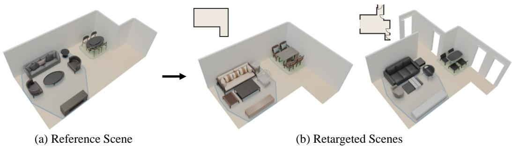  
Figure 1: Scene Retargeting. From a single reference scene (a), our method reproduces semantically coherent layouts in target rooms with different floor plans and object instances (b). Functional groups and their internal relationships are preserved while maintaining physical plausibility.

## ABSTRACT

Interactive simulations of embodied AI or spatial computing applications build on realistic 3D scenes that support daily activities. However, sparse, irregular layout structures impose scene-specific physical constraints, making it hard to define a generalizable framework for generating similar functional context. We formalize Scene Retargeting as stably transferring the semantically coherent spatial organization across layouts, rather than relying on textual descriptions or pairwise relationships. Our cluster-wise transfer flexibly handles mismatched object instances and adapts to distinctive floor plans. We optimize to preserve the rich semantic context of individual clusters by respecting the spatial distribution of foundation features. We can then impose physical constraints to refine wall contacts, pairwise alignment, or clear passageways and openings. Our framework outperforms state-of-the-art methods on layout generation on the 3D-FRONT dataset, and demonstrates downstream applications including real-to-sim transfer, analogical trajectory transfer, and multi-reference composition.

## 1 INTRODUCTION

Synthesizing plausible 3D scene layouts provides the foundation to generate diverse daily interactions and can serve as a critical path to deploy embodied agents or AR/VR applications (Deitke et al., 2022; Xia et al., 2026b; Dai et al., 2024). Manually designing realistic layouts is labor-intensive and hard to scale, necessitating automated synthesis techniques. Previous works adapt generative models to regress 2D rotations and translations of objects within the given floorplan (Wei et al., 2023; Tang et al., 2024; Hu et al., 2026). However, unlike text, images, or videos, data-driven generation is not trivial under sparse, irregular structural restrictions. A synthesized layout must faithfully reproduce the semantic context of scene function for common daily interactions, while maintaining geometric plausibility under scene-specific constraints. Scene function is implicit and nuanced, while complex geometric relationships are defined for single objects, pairs, or nearby groups, with a mixture of rigid and flexible measures.

We propose Scene Retargeting as a flexible, scalable way to generate diverse 3D scene layouts that respect functional and geometric constraints. Given a reference scene, scene retargeting generates a target scene of similar function by arranging a target object inventory in its floor plan, as illustrated in Figure 1. Previous approaches to 3D layout generation account for contextual constraints with LLM/VLMs (Feng et al., 2023; C¸ elen et al., 2024; Yang et al., 2024b; Bian et al., 2025) or scene graphs (Lin & Mu, 2024; Zhai et al., 2024; 2023). Such abstractions coarsely capture symbolic descriptions or predefined pairwise relationships, which are insufficient to account for the functional context of diverse trajectories relative to multiple objects or to express the intricate shape variations of individual furniture and the layout of walls, windows, and doors. Scene retargeting draws its structure from a single exemplar rather than a learned generative prior, yet varying the floor plan and object instances yields diverse scenes that serve a similar function as the reference.

We approach scene retargeting as decomposing and re-structuring clusters of exemplar scenes. Given different object instances and a target floor plan, no correspondence between objects is given in advance, and even once established, replicating the transformation cannot preserve the same semantics in relation to walls or doors. We group nearby objects into a small number of clusters within the reference scene using both spatial coordinates and semantic features. Since the clusters serve as the primary unit of transfer, they reduce the degrees of freedom from a pose per object to a pose per group, and the arrangement within each group is preserved by construction. Cluster-wise guidance in retargeting is thus structurally coherent and flexible, enabling a global layout with similar functional context even with different numbers of objects and unknown correspondences in irregular structures.

We formulate a three-stage hierarchical framework that preserves the functional context while being adaptive to the target geometry. We first extract clusters from the reference scene by grouping neighboring objects of similar semantic features, and stage 1 locates the clusters on the target floor plan using a learned placement network. In stage 2, we place objects within each cluster by attending to 3D features of the transferred reference layout, which encode the spatial distribution of desired semantic relationships beyond what category labels or language-based descriptions could express. After the previous stages handle intra-cluster and inter-cluster placements, respectively, stage 3 establishes explicit object correspondences and refines local arrangements to respect pairwise relations or wall contacts, while ensuring physical validity such as clearing passages or avoiding penetrations.

Our key contributions are summarized as follows: 1) We formalize the task of Scene Retargeting, which reproduces the semantically coherent arrangement of a single exemplar across a variety of layout configurations. 2) We propose intra-cluster and inter-cluster placements, conditioned on pretrained 3D foundation model features, to effectively discover layouts that preserve complex context that cannot be contained within language descriptions or scene graphs. 3) We propose a three-stage framework that adapts to dramatic changes in floor plans and object combinations and still produces physically plausible layouts while maintaining the holistic room context of the exemplar. The resulting pipeline is applicable to various downstream scenarios including real-to-sim scene transport, analogical trajectory transfer, and multi-reference composition.

## 2 RELATED WORKS

## 2.1 DATA-DRIVEN 3D INDOOR SCENE LAYOUT GENERATION

Most learning-based indoor layout generation methods model a joint probability distribution over object attributes within a room. Early approaches synthesize objects autoregressively, one at a time (Paschalidou et al., 2021). Subsequent works predict object attributes simultaneously through denoising frameworks (Wei et al., 2023; Tang et al., 2024; Hu et al., 2026; Yang et al., 2024a). Alternatively, several methods incorporate intermediate scene graphs to explicitly model pairwise relations rather than relying solely on spatial decoders (Lin & Mu, 2024; Bai et al., 2025; Zhai et al., 2024; 2023; Yang et al., 2026b). Recently, LaviGen (Feng et al., 2026) places objects sequentially in native 3D space using an adapted 3D diffusion model (Xiang et al., 2025). While these paradigms excel at statistically plausible generation, their reliance on coarse inputs like text or floor plans prevents them from faithfully reproducing a specific exemplar layout. Consequently, variation across generated samples stems from stochastic sampling rather than adherence to a target layout.

## 2.2 LLM AND VLM-DRIVEN SCENE SYNTHESIS

Several recent works adopt natural language as a flexible interface, leveraging the spatial reasoning of LLMs and VLMs (Achiam et al., 2023; Team et al., 2023) for intent-driven layout generation. One line of work translates 3D scene synthesis into structured text or code, prompting LLMs to perform symbolic spatial reasoning, in-context layout generation, or multi-agent constraint coordi nation (Feng et al., 2023; C¸ elen et al., 2024; Yang et al., 2024b; Bian et al., 2025; Xia et al., 2026b; Gu et al., 2025). To better bridge text with continuous 3D space, other approaches leverage VLMs to predict parameterized scene representations, which are subsequently refined via differentiable optimization (Sun et al., 2025; Yang et al., 2026a). While these methods offer intuitive user control, language remains a fundamentally ambiguous modality for capturing metric 3D geometry. Verbalizing a complex 3D arrangement inevitably discards precise spatial metrics, retaining only coarse relational concepts rather than the exact geometric layout. In contrast, our approach bypasses textual abstractions and directly leverages features from pretrained 3D foundation models (Zhang et al., 2026), preserving the fine-grained metric relationships required for accurate scene retargeting.

## 2.3 EXEMPLAR-BASED SYNTHESIS AND LAYOUT OPTIMIZATION

A third line of work refines or rearranges an existing layout rather than sampling a new one from scratch. Early example-based methods learn spatial priors from scene collections (Fisher et al., 2012; Yu et al., 2011), while optimization frameworks adjust arrangements against design rules or cost functions (Merrell et al., 2011; Yu et al., 2011). Closest to our formulation is 3D scene analogies, which maps spatial relationships between scenes to transfer trajectories (Kim et al., 2025; 2026). However, such mapping presupposes that both scenes are fully furnished, whereas scene retargeting arranges an empty target room. Our framework differs in two fundamental ways. First, our exemplar is a single reference scene rather than a dataset-derived statistical prior. Second, while existing methods operate within a fixed room geometry, scene retargeting transfers spatial structure across distinct room boundaries and mismatched object inventories. Consequently, our analogical refinement derives its optimization terms directly from the reference scene rather than learning them from data, making the process truly analogical rather than merely regularizing.

## 3 METHOD

## 3.1 OVERVIEW

Task Formulation. We formalize Scene Retargeting as the transfer of spatial structure from a reference scene ${ \cal S } _ { R } = \{ ( o _ { i } ^ { R } , { \bf p } _ { i } ^ { R } ) \} _ { i = 1 } ^ { N _ { R } }$ to an empty target room. Here, $o _ { i } ^ { R }$ denotes 3D asset geometry and $\mathbf { p } _ { i } ^ { R } = ( x _ { i } ^ { R } , y _ { i } ^ { R } , \theta _ { i } ^ { R } ) \in \mathbb { R } ^ { 2 } \times [ - \pi , \pi )$ represents its 2D floor-plane pose. The rooms are defined by a floor plan polygon $\mathcal { F } _ { R } , \mathcal { F } _ { T } \subset \mathbb { R } ^ { 2 }$ whose edges form the room’s walls and architectural openings $B _ { T } = \mathsf { \bar { \{ } }  b _ { m } \bar  \} _ { m = 1 } ^ { M }$ , where each $b _ { m }$ specifies a door or window along the boundary. Each opening induces a walk-through clearance zone that must remain unobstructed for the room to stay navigable. Given an unarranged target inventory $\mathcal { O } _ { T } = \{ o _ { j } ^ { T } \} _ { j = 1 } ^ { N _ { T } }$ , our objective is to predict target poses $\mathbf { P } _ { T } =$ $\{ \mathbf { p } _ { j } ^ { T } \} _ { j = 1 } ^ { N _ { T } }$ placing each asset $o _ { i } ^ { T }$ onto $\mathcal { F } _ { T }$ . The resulting layout ${ \cal S } _ { T } = \{ ( o _ { j } ^ { T } , { \bf p } _ { j } ^ { T } ) \} _ { j = 1 } ^ { N _ { T } }$ must preserve the spatial organization of $ { \boldsymbol { S } } _ { R } ^ { \flat }$ and $\mathcal { F } _ { R }$ while ensuring physical plausibility and respecting room boundaries and openings under inventory mismatches.

Pipeline Overview. Our framework comprises three stages, illustrated in Figure 2. With two different rooms with different object inventories, we cannot directly transfer absolute coordinates. We flexibly transfer the scene by introducing clusters as an additional spatial granularity. Stage 1 (Section 3.2) partitions $\scriptstyle { S _ { R } }$ into functional clusters, which serve as the primary units of transfer, and places them onto $\mathcal { F } _ { T }$ with a learned placement network. Stage 2 (Section 3.3) resolves object-level poses within each placed cluster by attending to the transferred spatial context. Stage 3 (Section 3.4) is parameter-free: it establishes reference–target correspondences and refines target poses $\boldsymbol { S _ { T } }$ against pairwise relations measured on the reference $\scriptstyle { S _ { R } }$ while enforcing physical validity, alignment against wall $\mathcal { F } _ { T }$ , and clearances of opening $B _ { T }$

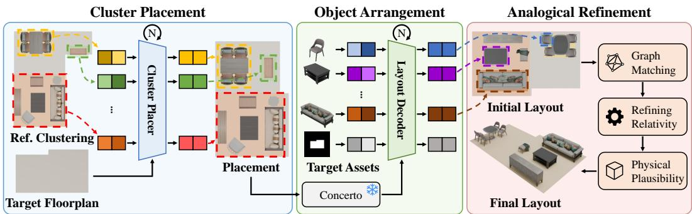  
Figure 2: Method Overview of Scene Retargeting. In stage 1 (Cluster Placement, blue), functional clusters decomposed from the reference scene are placed onto the target floor plan by the cluster placer. In stage 2 (Object Arrangement, green), object tokens cross-attend to spatial context features within the layout decoder to assign object-level poses. Stage 3 (Analogical Refinement, red) matches objects across scenes, optimizes pairwise relations and wall clearances, and enforces physical validity to produce the final 3D layout.

## 3.2 CLUSTER-LEVEL TRANSFER

Placing objects individually within a new boundary lacks a mechanism to preserve related assets together, so the relationship and semantics of the exemplar may be lost. To address this, we group co-located and semantically associated objects into functional clusters and take these as the primary unit of transfer. Intra-cluster arrangements are then preserved by construction, leaving the placement network to predict only where each cluster belongs on the target floor plan.

Decomposing the Reference into Functional Clusters. To determine cluster assignment, each reference object $o _ { i } ^ { R }$ is represented by a joint spatial-semantic feature vector,

$$
\mathbf { x } _ { i } ^ { R } = \left[ \lambda \frac { \mathbf { p } _ { i } ^ { x y } } { \| \mathbf { P } \| _ { F } } \oplus ( 1 - \lambda ) \frac { \hat { \phi } _ { i } } { \| \hat { \Phi } \| _ { F } } \right] , \qquad \hat { \phi } _ { i } = \frac { \phi _ { 0 \mathrm { S } } ( o _ { i } ^ { R } ) } { \| \phi _ { 0 \mathrm { S } } ( o _ { i } ^ { R } ) \| _ { 2 } }\tag{1}
$$

where $\mathbf { p } _ { i } ^ { x y } = ( x _ { i } ^ { R } , y _ { i } ^ { R } )$ is the 2D floor-plane position, $\phi _ { \mathrm { O S } } ( o _ { i } ^ { R } )$ is the OpenShape (Liu et al., 2023) feature, and P and Φ<sup>ˆ</sup> stack $\mathbf { p } _ { i } ^ { x y }$ and $\hat { \phi } _ { i }$ over all $N _ { R }$ objects. $\lambda \in [ 0 , 1 ]$ balances the two contributions, and ⊕ denotes vector concatenation. Each block is normalized by the Frobenius norm $\| \cdot \| _ { F } ,$ , removing the scale disparity between 2D coordinates and high-dimensional semantic features. Functional clusters $\mathcal C ^ { R } = \dot { \{ \mathcal C _ { k } ^ { R } \} } _ { k = 1 } ^ { K }$ are formed by applying agglomerative clustering over $\{ \mathbf { x } _ { i } ^ { R } \}$ (Kim et al., 2026). For each decomposed cluster $\mathcal { C } _ { k } ^ { R } .$ , we compute its spatial centroid $\mu _ { k } ^ { R } \in \mathbb { R } ^ { 2 }$ , representing member objects by their poses relative to $\mu _ { k } ^ { R } .$ . Additionally, we derive its axis-aligned spatial extent ${ \bf s } _ { k } ^ { R } \in \mathbb { R } ^ { 2 }$ and define its anchor orientation $\theta _ { k } ^ { R }$ from the principal objects such as sofa, bed or desk.

Placing Clusters on the Target Floor Plan. We employ a Transformer (Vaswani et al., 2017)-based placement network to predict target cluster poses $\mathbf { P } _ { c } ^ { \dot { T } } \dot { = } \{ \mathbf { p } _ { c _ { k } } ^ { T } \} _ { k = 1 } ^ { K }$ on the floor plan $\mathcal { F } _ { T }$ . The target floor plan boundary is sampled as a set of 2D boundary points paired with inward unit normals, $\{ ( \mathbf { q } _ { l } , \mathbf { \bar { n } } _ { l } ) \} _ { l = 1 } ^ { L }$ , which a shallow Transformer encoder turns into a sequence of architectural context tokens $\mathbf { F } _ { \mathcal { F } }$ , one per boundary point, so that a cluster can attend to an individual wall rather than to a single pooled descriptor. Each cluster query token $\mathbf { v } _ { k }$ concatenates an aggregation of the categories of its member objects, the cluster’s current perturbed pose, and its spatial extent,

$$
\mathbf { v } _ { k } = \big [ \mathbf { u } _ { k } \oplus \gamma ( \mathbf { s } _ { k } ^ { R } ) \oplus \gamma ( \tilde { \mathbf { p } } _ { \mathcal { C } _ { k } } ^ { T } ) \big ] , \quad \mathbf { u } _ { k } = \frac { 1 } { | \mathcal { C } _ { k } ^ { R } | } \sum _ { i \in \mathcal { C } _ { k } ^ { R } } \psi ( \mathbf { c } _ { i } ^ { R } )\tag{2}
$$

where $\mathbf { c } _ { i } ^ { R }$ denotes the one-hot category vector of object i embedded via per-object ML $\mathbf { P } \psi , \tilde { \mathbf { p } } _ { \mathcal { C } _ { k } } ^ { T }$ is the current pose estimate during iterative denoising, and $\gamma ( \cdot )$ denotes a fixed positional encoding. The placement network processes cluster tokens via self-attention across functional clusters and crossattention over the floor plan tokens $\mathbf { F } _ { \mathcal { F } }$ , iteratively denoising cluster layout predictions initialized from a perturbed state. Finally, predicted cluster layouts undergo post-processing to resolve intercluster collisions, clamp extents within boundary polygon $\mathcal { F } _ { T }$ , and reserve clearance zones near openings $B _ { T }$ . Architectural details of our network are provided in Appendix.

## 3.3 OBJECT PLACEMENT VIA CROSS-SCENE FEATURE ATTENTION

While cluster-level placement establishes group locations, determining object-level arrangements is not straightforward. Since no instance-level correspondence exists between reference and target object sets, the model must infer which target item maps to which reference counterpart. Even where such a match is evident, target objects cannot simply inherit reference poses, since they differ from their reference counterparts in category and count, and must be re-derived against the target’s own geometry. We resolve these challenges by conditioning placement on dense semantic representation of foundational features extracted from the transferred exemplar.

Constructing Scene Context Tokens. Point clouds of reference objects are transformed into the target space based on predicted cluster poses and merged with the target floor point cloud. This combined point set is encoded using a pretrained Concerto (Zhang et al., 2026) point cloud feature extractor, and downsampled via farthest point sampling to obtain a set of spatial scene context tokens $\mathbf { F } _ { S }$ . These scene tokens capture the spatial configuration currently occupying the target room, ensuring that subsequent object placement is conditioned on target-specific spatial geometry.

Target Object Representation and Attention Mechanism. Each target object $o _ { j } ^ { T }$ is parameterized as a feature query token $\mathbf { h } _ { j } ^ { T }$ by combining its semantic, geometric, and spatial properties,

$$
\mathbf { h } _ { j } ^ { T } = \left[ \psi ( \mathbf { c } _ { j } ^ { T } ) \oplus \gamma \bigl ( \mathbf { s } _ { j } ^ { T } \bigr ) \oplus \mathbf { W } _ { p } \phi _ { 0 8 } ( o _ { j } ^ { T } ) \oplus \gamma \bigl ( \tilde { \mathbf { p } } _ { j } ^ { T } \bigr ) \right] ,\tag{3}
$$

where $\mathbf { c } _ { j } ^ { T }$ is the one-hot category vector, $\mathbf { s } _ { j } ^ { T } \in \mathbb { R } ^ { 2 }$ denotes the floor plane extent of the bounding box, and $\mathbf { W } _ { p }$ is a trainable projection matrix mapping OpenShape (Liu et al., 2023) features $\phi _ { \mathrm { O S } } ( o _ { j } ^ { T } )$ into the joint query space. The decoder denoises poses iteratively, so the token also carries the object’s current pose $\bar { \tilde { \bf p } } _ { j } ^ { T }$ , which lets each object be distinguished by where it currently stands rather than by category alone. A single additional token, obtained by encoding the target boundary points with a learnable lightweight point encoder (Qi et al., 2017a;b), supplies the room outline alongside the object tokens. Within the layout decoder, target object tokens $\mathbf { \dot { h } } _ { j } ^ { T }$ cross-attend to the scene tokens $\mathbf { F } _ { S }$ Each scene token is the sum of its projected Concerto (Zhang et al., 2026) feature and a fixed positional encoding of the point it was sampled at. This cross-attention mechanism enables each target object to identify spatial contexts in the transferred reference configuration that are analogous to its own 3D shape. Consequently, placement is conditioned not only on object category and bounding dimensions, but also on where semantically compatible structural configurations exist in the exemplar. Using the attention-augmented features, the layout decoder predicts poses $\mathbf { P } _ { T } = \{ \mathbf { p } _ { j } ^ { T } \} _ { j = 1 } ^ { N _ { T } }$ for target objects, which are updated through iterative denoising.

## 3.4 CORRESPONDENCE AND ANALOGICAL REFINEMENT

While the Transformer (Vaswani et al., 2017) layout decoder captures inter-object relations implicitly via self-attention, it is supervised only on per-object poses, so pairwise relations are never constrained directly and their errors compound across the scene. The analogical refinement stage (Figure 3) corrects these relational discrepancies by directly extracting pairwise spatial constraints from the reference exemplar and re-establishing its wall and opening clearances against the target room, all under strict physical validity. This stage has no learnable parameters and the recovered structural fidelity stems directly from the exemplar rather than an implicit dataset prior.

Establishing Object Correspondence. Since reference and target inventories differ in count and category composition, instance-wise corre-

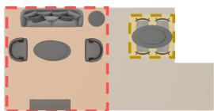  
(a) Reference Clusters

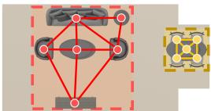

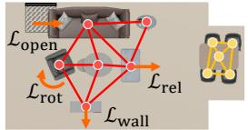  
(b) Cluster Placement  
(c) Analogical Refinement

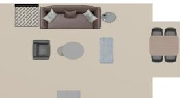  
(d) Final Refined Scene

Figure 3: Analogical Refinement. Reference clusters (a) are placed on the target floor plan (b). After initial object arrangement, we apply graph matching followed by analogical refinement (c), yielding the final arrangement (d).

spondence cannot be assumed, and must be explicitly established. Target objects first inherit cluster labels from the placed reference clusters by nearest neighbor propagation, which makes the clusterlevel correspondence an identity map by construction and confines matching to within each cluster pair. Within each matched cluster pair, object correspondences are established via reweighted random walk graph matching (Cho et al., 2010; Kim et al., 2026). Graph nodes encode OpenShape (Liu et al., 2023) features $\phi _ { \mathrm { O S } } ,$ while graph edges capture pairwise spatial distances in cluster relative coordinates. Applying the Hungarian algorithm converts soft matching probabilities into a hard binary correspondence matrix $\mathbf { M } \in \mathbf { \check { \{ 0 , 1 \} } } ^ { N _ { T } ^ { - } \times N _ { R } }$ along with matching confidence scores.

Analogical Pose Refinement. Given the established correspondence matrix M, target object poses $\mathbf { P } _ { T } = \{ \mathbf { p } _ { j } ^ { T } \} _ { j = 1 } ^ { N _ { T } }$ are optimized to simultaneously preserve relative spatial structures from the exemplar and adapt to the architectural bounds of the target room. The overall objective function $\mathcal { L } _ { \mathrm { r e f i n e } }$ balances these relational and architectural constraints of the target floor plan,

$$
{ \mathcal { L } } _ { \mathrm { r e f i n e } } = { \mathcal { L } } _ { \mathrm { r e l } } + \lambda _ { \mathrm { r o t } } { \mathcal { L } } _ { \mathrm { r o t } } + \lambda _ { \mathrm { w a l l } } { \mathcal { L } } _ { \mathrm { w a l l } } + \lambda _ { \mathrm { o p e n } } { \mathcal { L } } _ { \mathrm { o p e n } } ,\tag{4}
$$

where scalar hyperparameter weights balance the contribution of each term. The relational term $\mathcal { L } _ { \mathrm { r e l } }$ pins each matched target object to the offset its counterpart held from the anchor of its own functional cluster in the reference scene,

$$
\mathcal { L } _ { \mathrm { r e l } } = \frac { 1 } { | \mathcal { V } | } \sum _ { j \in \mathcal { V } } w _ { j } \big \| \big ( \mathbf { p } _ { j } ^ { x y } - \mathbf { p } _ { a ( j ) } ^ { x y } \big ) - \mathbf { R } \big ( \mathbf { p } _ { \pi ( j ) } ^ { R , x y } - \mathbf { p } _ { \pi ( a ( j ) ) } ^ { R , x y } \big ) \big \| _ { 2 } ^ { 2 }\tag{5}
$$

where $\pi ( j )$ is the matched reference index and $a ( j )$ is the anchor object of the cluster. R is the 2D cluster placement rotation, $w _ { j }$ is the matching confidence, and $\nu$ is the set of matched objects. In addition to pairwise relative displacements, faithful transfer also requires preserving orientations and wall alignments, while the target room imposes its own boundary and openings. First, ${ \mathcal { L } } _ { \mathrm { r o t } }$ penalizes directional deviations from reference orientations $\theta _ { \pi ( j ) } ^ { R }$ . Second, to preserve wall-adjacent layouts under changing room geometry, ${ \mathcal { L } } _ { \mathrm { w a l l } }$ enforces the reference signed clearance between object faces and walls in $\bar { \boldsymbol { S } } _ { R }$ onto the target boundary $\mathcal { F } _ { T }$ . Finally, to guarantee spatial accessibility in the new environment, $\mathcal { L } _ { \mathrm { o p e n } }$ accumulates the squared penetration of object bounding boxes into walkthrough clearance zones near target openings ${ \boldsymbol { { B } } _ { T } }$ . See Appendix for full formulation of each term and visualization of their individual effects.

Target poses $\mathbf { p } _ { j } ^ { T } = ( x _ { j } ^ { T } , y _ { j } ^ { T } , \theta _ { j } ^ { T } )$ are optimized via gradient descent where physical validity is then enforced by projection rather than by penalty. Object poses are clamped inside the floor plan polygon before and after optimization, with object point cloud overlaps resolved by translating overlapping pairs along a separating axis. Treating these constraints as projections keeps them exact, so a converged layout is collision-free and within bounds by construction. Objects with poor matching confidence scores or unresolvable physical collisions trigger automated pruning.

## 4 EXPERIMENTS

## 4.1 IMPLEMENTATION DETAILS

Training. Because ground truth arrangements do not exist for arbitrary reference and target scene pairs, direct supervision on the retargeting task is infeasible. We therefore train both networks on a layout recovery task, perturbing ground-truth poses and supervising the networks to restore them. Both cluster placement and layout decoders are trained using a mean squared error loss paired with a light $L _ { 1 }$ penalty on concatenated position and orientation vectors. Both are trained with Adam at learning rate $\mathrm { i ^ { \cdot } \times 1 0 ^ { - 4 } }$ , and batch size 128 for 50k iterations for 2 days. The optimizer settings follow LEGO-Net (Wei et al., 2023) without modification to avoid bias from hyperparameter tuning.

Inference. At inference, both networks perform iterative denoising initialized by adding Gaussian noise to their respective base placements. The cluster placement network perturbs reference centroids while the layout decoder perturbs target inventory poses. Layouts are updated using decayed step sizes with annealed Langevin noise, with complete sampling schedules given in Appendix.

Matching and Analogical Refinement. Clustering sets $\lambda = 0 . 5$ in Equation (1) and merges objects using average linkage based on pairwise gap distances, with the target number of objects within clusters set to seven for each reference scene. Analogical refinement runs for at most 100 iterations with $( \lambda _ { \mathrm { { r o t } } } , \lambda _ { \mathrm { { w a l l } } } , \lambda _ { \mathrm { { o p e n } } } ) = ( 1 . 0 , 0 . 5 , 0 . 5 )$ . Retargeting a scene takes 6.9 s end-to-end, on a single NVIDIA GeForce RTX 4090 GPU paired with an AMD Ryzen 7 7700 CPU, which serves as the execution environment for all timing evaluations.

Table 1: Quantitative Comparison. Our method outperforms recent 3D layout generation baselines across all evaluation metrics. The Ref. column gives how each method receives the reference scene and a dash marks methods that receive only the target floor plan. Best and second-best results are formatted in bold and underlined.
<table><tr><td rowspan="2">Method</td><td rowspan="2">Ref.</td><td colspan="2">Physical Plausibility</td><td colspan="2">Semantic Coherency</td><td rowspan="2">Overall PSA↑</td><td rowspan="2">Fidelity iRecall ↑</td></tr><tr><td>CF↑</td><td>IB↑</td><td>Pos. ↑</td><td>Rot. ↑</td></tr><tr><td>Lego-Net (Wei et al., 2023)</td><td></td><td>84.7</td><td>69.3</td><td>40.4</td><td>41.7</td><td>23.3</td><td>43.2</td></tr><tr><td>DiffuScene (Tang et al., 2024)</td><td>Text</td><td>83.9</td><td>50.3</td><td>39.8</td><td>39.2</td><td>16.7</td><td>38.6</td></tr><tr><td>MiDiffusion (Hu et al., 2026)</td><td></td><td>86.7</td><td>63.7</td><td>44.7</td><td>43.6</td><td>25.7</td><td>41.4</td></tr><tr><td>InstructScene (Lin &amp; Mu, 2024)</td><td>Text</td><td>88.4</td><td>52.7</td><td>56.5</td><td>55.1</td><td>24.8</td><td>46.9</td></tr><tr><td>Holodeck (Yang et al., 2024b)</td><td>Text</td><td>77.3</td><td>64.0</td><td>43.9</td><td>44.7</td><td>20.6</td><td>41.8</td></tr><tr><td>I-Design (Çelen et al., 2024)</td><td>Text</td><td>75.8</td><td>52.1</td><td>38.9</td><td>39.4</td><td>13.1</td><td>33.7</td></tr><tr><td>LayoutGPT (Feng et al., 2023)</td><td>Text</td><td>82.0</td><td>45.7</td><td>47.5</td><td>46.3</td><td>17.3</td><td>38.8</td></tr><tr><td>LayoutVLM (Sun et al., 2025)</td><td>Text</td><td>87.3</td><td>86.8</td><td>48.8</td><td>46.1</td><td>37.4</td><td>42.7</td></tr><tr><td>LaviGen (Feng et al., 2026)</td><td>Text</td><td>95.9</td><td>96.5</td><td>43.3</td><td>44.7</td><td>45.8</td><td>44.5</td></tr><tr><td>Ours</td><td>| 3D Scene |</td><td>97.0</td><td>99.8</td><td>62.6</td><td>61.8</td><td>63.5</td><td>64.3</td></tr></table>

## 4.2 DATASETS & BASELINES

Datasets. We train and evaluate on living room and bedroom scenes from 3D-FRONT (Fu et al., 2021a) with assets from 3D-FUTURE (Fu et al., 2021b). Training operates on individual rooms rather than paired scenes, using each room’s unperturbed layout as a recovery target: 9,352 living rooms and 22,672 bedrooms after axis-aligned rotation augmentation, with 2,348 and 896 held out. For retargeting evaluation, we construct 50 living room and 25 bedroom pairs from the held-out split, each pairing a reference room with a same-type target room that supplies its floor plan boundary, room openings, and object inventory. Pairs are formed automatically by inventory similarity, since transferring structure between disparate inventories lacks meaningful correspondence.

Baselines. We compare against representative layout generation models across different paradigms: denoising models (LEGO-Net (Wei et al., 2023), DiffuScene (Tang et al., 2024), MiDiffusion (Hu et al., 2026)), a scene graph-guided model (InstructScene (Lin & Mu, 2024)), language-driven synthesis (Holodeck (Yang et al., 2024b), I-Design (C¸ elen et al., 2024), LayoutGPT (Feng et al., 2023), LayoutVLM (Sun et al., 2025)), and native 3D generation (LaviGen (Feng et al., 2026)). None of these accepts an exemplar scene, so each receives the reference through the channel it does accept, namely a verbalized instruction for text-conditioned methods, and the target floor plan for floorplan-conditioned models. Since our pipeline prunes 1.6 objects per scene on average, we evaluate all baselines on both pruned and unpruned inventories and report the higher overall score.

## 4.3 COMPARATIVE STUDIES

Since no ground-truth layouts exist for target rooms, we evaluate performance across physical, semantic, and overall metrics following LayoutVLM (Sun et al., 2025). For each reference room, we build (subject, relation, object) triplets covering directional adjacency, facing, alignment, and wall contact. These triplets are verbalized into a cached instruction that is shared by every method as baseline input and as the judge’s layout criteria (see the Appendix for prompt details). Physical Plausibility is measured by Collision Free (CF) and In Boundary (IB) rates. Semantic Plausibility evaluates Positional (Pos) and Rotational (Rot) coherence via GPT-5.6 (Singh et al., 2025) ratings on rendered scenes. Finally, Physically Grounded Semantic Alignment (PSA) serves as the holistic overall score, combining GPT-5.6 semantic evaluations with physical validity. To evaluate relationship preservation, we adopt Instruction Recall (iRecall) from InstructScene (Lin & Mu, 2024), which measures the fraction of reference spatial triplets realized in the generated geometry.

Table 1 and Figure 4 summarize the quantitative and qualitative evaluations, respectively. Our framework achieves state-of-the-art performance across every metric, where the key insight lies in the clear divide among existing baselines. Methods that produce physically valid layouts fail to reproduce the exemplar, where LaviGen (Feng et al., 2026) attains the highest baseline physical scores yet yields only 44.5 iRecall. Conversely, methods prioritizing semantic structure severely compromise physical validity. InstructScene (Lin & Mu, 2024) achieves the top baseline coherency and iRecall, but stays within room boundaries in barely half of its generations (52.7 IB). LayoutVLM (Sun et al., 2025) is the informative middle case, where its differentiable optimization stage achieves the only

Ours

LayoutVLM

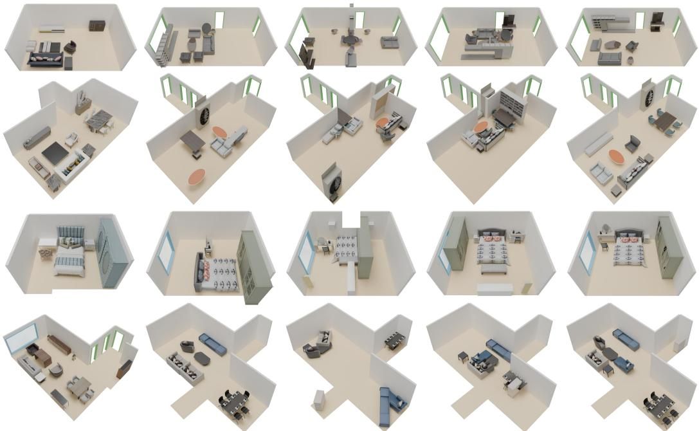  
Figure 4: Qualitative Comparison. Our hierarchical framework preserves fine-grained spatial relationship across diverse room geometries while strictly respecting physical constraints.

Table 2: Ablation Study. Pipeline components (a–c) and conditioning signals (d–f) are evaluated. Best and second-best results are formatted in bold and underlined
<table><tr><td rowspan="2">Method</td><td colspan="2">Physical Plausibility</td><td colspan="2">Semantic Coherency</td><td>Overall</td><td>Fidelity</td></tr><tr><td>CF↑</td><td>IB↑</td><td>Pos. ↑</td><td>Rot. ↑</td><td>PSA↑</td><td>iRecall ↑</td></tr><tr><td>(a) w/o Cluster Placement</td><td>94.5</td><td>94.6</td><td>47.4</td><td>47.9</td><td>48.8</td><td>51.1</td></tr><tr><td>(b) w/o Analogical Refinement</td><td>94.0</td><td>99.2</td><td>59.6</td><td>53.9</td><td>56.0</td><td>57.0</td></tr><tr><td>(c) w/o Physical Constraints</td><td>88.4</td><td>92.7</td><td>57.2</td><td>56.1</td><td>53.2</td><td>61.4</td></tr><tr><td>(d) w/o OpenShape</td><td>95.9</td><td>99.6</td><td>56.1</td><td>55.2</td><td>55.1</td><td>59.8</td></tr><tr><td>(e) w/o Concerto</td><td>95.3</td><td>99.8</td><td>52.5</td><td>51.1</td><td>51.9</td><td>54.6</td></tr><tr><td>(f) w/o Floorplan</td><td>95.7</td><td>97.0</td><td>58.1</td><td>54.5</td><td>55.6</td><td>61.4</td></tr><tr><td>Ours (full)</td><td>97.0</td><td>99.8</td><td>62.6</td><td>61.8</td><td>63.5</td><td>64.3</td></tr></table>

strong physical validity among language-driven methods, yet its iRecall of 42.7 still falls below InstructScene’s, since optimization repairs a layout without deciding which layout to aim at. No baseline simultaneously satisfies physical plausibility and structural fidelity, reflecting the information bottleneck of text and symbolic abstractions. By operating directly on 3D features, our method resolves this tension, advancing iRecall from 46.9 to 64.3 and PSA from 45.8 to 63.5.

## 4.4 ABLATION STUDIES

Table 2 validates the necessity of each component across pipeline stages and conditioning signals. In variant (a), Concerto features are extracted from the reference scene in its original coordinate frame and fed directly to the layout decoder, so the target inventory is arranged against the raw exemplar. This represents the naive yet strongest alternative to learned cluster placement, and the 13.2 drop in iRecall confirms that structural transfer must occur before object-level arrangement. Analogical refinement (b) provides fine-grained relational alignment, increasing iRecall by an additional 7.3. Removing physical constraints (c) degrades the CF rate by 8.6 and the IB rate by 7.1, proving their precise role in enforcing geometric boundaries while preserving high relational fidelity.

Regarding conditioning signals, global scene context dominates isolated asset representations. Excluding Concerto scene features (e) incurs a steep 9.7 drop in iRecall, compared to a 4.5 decrease

(a) Human Trajectory Transfer Trajectory Transfer

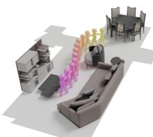  
Reference

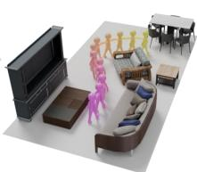  
Retargeted (Human)

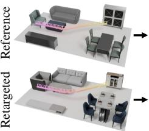

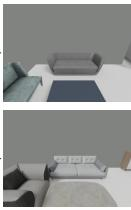

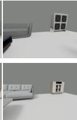  
(b) Camera Trajectory Transfer

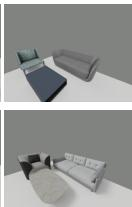

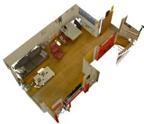  
Real Scan

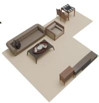  
(c) Real-to-Sim  
Retargeted

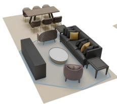  
Reference 1

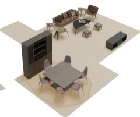  
Reference 2

(d) Multiple Reference Composition  
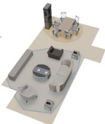  
Retargeted

Figure 5: Downstream Applications. Our framework enables various applications such as (a) human and (b) camera trajectory transfer, (c) real-to-sim and (d) multiple reference composition.

when removing OpenShape object features (d), demonstrating that scene-level spatial context is more critical for analogical placement than asset geometry. Finally, omitting floor plan boundaries (f) primarily affects spatial containment (IB drops by 2.8 and PSA by 7.9) while leaving relational fidelity largely intact at 61.4 iRecall. In summary, while cluster placement and 3D foundation features dominate overall structural fidelity, analogical refinement ensures precise relational alignment and geometric constraints strengthen physical plausibility. See Appendix for visual comparisons.

## 4.5 APPLICATIONS

Our framework naturally supports various downstream scenarios without fine-tuning. We demonstrate three key applications below and detail same-inventory relocation in Section F.2.

Analogical Trajectory Transfer. As illustrated in Figure 5(a)-(b), because spatial relations are faithfully preserved in the target scene, trajectories authored in a reference scene carry over to target environments without manual re-authoring. Waypoints attached to reference objects map directly to their target counterparts (Kim et al., 2026). This enables the direct transfer of human interaction paths (Lim et al., 2025) as well as 3D camera trajectories like those generated by HouseTour (C¸ elen et al., 2025), preserving navigational context across varied geometries.

Real-to-Sim. While standard reconstruction pipelines convert physical scans into single simulatorready replicas (Xia et al., 2026a; Huang et al., 2026; Yu et al., 2025), Scene Retargeting instantiates a real ScanNet++ (Yeshwanth et al., 2023) scan across different synthetic floor plans with object inventories as illustrated in Figure 5(c). Consequently, a single real-world capture yields a diverse family of simulation environments rather than a single rigid replica, enabling automated environment generation from physical scans without requiring manual 3D modeling.

Multiple Reference Composition. Since transfer operates at the functional cluster level, functional groups drawn from multiple independent reference rooms seamlessly assemble into a single target layout as depicted in Figure 5(d). Unlike existing layout generation methods (Tang et al., 2024; Hu et al., 2026; Lin & Mu, 2024) whose global conditioning cannot integrate configurations from distinct source rooms, our localized 3D cluster formulation enables multi-source composition.

## 5 CONCLUSION

In this paper, we formalize the task of Scene Retargeting and propose a novel three-stage frame work to transfer the semantically coherent organization of a reference 3D scene onto empty target rooms with distinct floor plans and mismatched object inventories. Our approach first positions functional clusters using a learned placement network, and subsequently leverages 3D features from pretrained foundation models to guide object-level arrangements within those clusters. An analogical refinement stage further enforces fine-grained relational fidelity, physical plausibility, and navigational affordances under strict geometric constraints. Comprehensive evaluations demonstrate that our method outperforms existing baselines across physical validity and semantic coherence metrics, while enabling versatile downstream applications.

Our framework focuses on 2D floor plane poses and assumes comparable inventories, leaving vertical stacking and severe object category mismatches outside its scope. Extending the formulation to 3D vertical structures, and combining exemplar transfer with generative or retrieval-based completion where a target room cannot realize the reference’s structure, remain promising future directions.

## REFERENCES

Josh Achiam, Steven Adler, Sandhini Agarwal, Lama Ahmad, Ilge Akkaya, Florencia Leoni Aleman, Diogo Almeida, Janko Altenschmidt, Sam Altman, Shyamal Anadkat, et al. Gpt-4 technical report. arXiv preprint arXiv:2303.08774, 2023.

Tongyuan Bai, Wangyuanfan Bai, Dong Chen, Tieru Wu, Manyi Li, and Rui Ma. Freescene: Mixed graph diffusion for 3d scene synthesis from free prompts. In 2025 IEEE/CVF Conference on Computer Vision and Pattern Recognition (CVPR), pp. 5893–5903. IEEE, 2025.

Zixuan Bian, Ruohan Ren, Yue Yang, and Chris Callison-Burch. Holodeck 2.0: Vision-languageguided 3d world generation with editing. arXiv preprint arXiv:2508.05899, 2025.

Ata C¸ elen, Guo Han, Konrad Schindler, Luc Van Gool, Iro Armeni, Anton Obukhov, and Xi Wang. I-design: Personalized llm interior designer. In European Conference on Computer Vision, pp. 217–234. Springer, 2024.

Minsu Cho, Jungmin Lee, and Kyoung Mu Lee. Reweighted random walks for graph matching. In European conference on Computer vision, pp. 492–505. Springer, 2010.

Tianyuan Dai, Josiah Wong, Yunfan Jiang, Chen Wang, Cem Gokmen, Ruohan Zhang, Jiajun Wu, and Li Fei-Fei. Automated creation of digital cousins for robust policy learning. arXiv preprint arXiv:2410.07408, 2024.

Matt Deitke, Eli VanderBilt, Alvaro Herrasti, Luca Weihs, Kiana Ehsani, Jordi Salvador, Winson Han, Eric Kolve, Aniruddha Kembhavi, and Roozbeh Mottaghi. Procthor: Large-scale embodied ai using procedural generation. Advances in neural information processing systems, 35:5982– 5994, 2022.

Haoran Feng, Yifan Niu, Zehuan Huang, Yang-Tian Sun, Chunchao Guo, Yuxin Peng, and Lu Sheng. Repurposing 3d generative model for autoregressive layout generation. arXiv preprint arXiv:2604.16299, 2026.

Weixi Feng, Wanrong Zhu, Tsu-jui Fu, Varun Jampani, Arjun Akula, Xuehai He, Sugato Basu, Xin Eric Wang, and William Yang Wang. Layoutgpt: Compositional visual planning and generation with large language models. Advances in neural information processing systems, 36: 18225–18250, 2023.

Matthew Fisher, Daniel Ritchie, Manolis Savva, Thomas Funkhouser, and Pat Hanrahan. Examplebased synthesis of 3d object arrangements. ACM Transactions on Graphics (TOG), 31(6):1–11, 2012.

Huan Fu, Bowen Cai, Lin Gao, Ling-Xiao Zhang, Jiaming Wang, Cao Li, Qixun Zeng, Chengyue Sun, Rongfei Jia, Binqiang Zhao, et al. 3d-front: 3d furnished rooms with layouts and semantics. In 2021 IEEE/CVF International Conference on Computer Vision (ICCV), pp. 10913–10922. IEEE, 2021a.

Huan Fu, Rongfei Jia, Lin Gao, Mingming Gong, Binqiang Zhao, Steve Maybank, and Dacheng Tao. 3d-future: 3d furniture shape with texture. International Journal of Computer Vision, 129 (12):3313–3337, 2021b.

Zeqi Gu, Yin Cui, Zhaoshuo Li, Fangyin Wei, Yunhao Ge, Jinwei Gu, Ming-Yu Liu, Abe Davis, and Yifan Ding. Artiscene: Language-driven artistic 3d scene generation through image intermediary. In 2025 IEEE/CVF Conference on Computer Vision and Pattern Recognition (CVPR), pp. 2891– 2901. IEEE, 2025.

Siyi Hu, Diego Martin Arroyo, Stephanie Debats, Fabian Manhardt, Luca Carlone, and Federico Tombari. Mixed diffusion for 3d indoor scene synthesis. In 2026 IEEE/CVF Winter Conference on Applications ofComputer Vision (WACV), pp. 1262–1272. IEEE, 2026.

Zhening Huang, Xiaoyang Wu, Fangcheng Zhong, Hengshuang Zhao, Matthias Nießner, and Joan Lasenby. Litereality: Graphics-ready 3d scene reconstruction from rgb-d scans. Advances in Neural Information Processing Systems, 38:162794–162827, 2026.

Junho Kim, Gwangtak Bae, Eun Sun Lee, and Young Min Kim. Learning 3d scene analogies with neural contextual scene maps. In 2025 IEEE/CVF International Conference on Computer Vision (ICCV), pp. 7828–7840. IEEE, 2025.

Junho Kim, Eun Sun Lee, Gwangtak Bae, Seunggu Kang, and Young Min Kim. Analogical trajectory transfer. arXiv preprint arXiv:2605.14393, 2026.

Donggeun Lim, Jinseok Bae, Inwoo Hwang, Seungmin Lee, Hwanhee Lee, and Young Min Kim. Event-driven storytelling with multiple lifelike humans in a 3d scene. In 2025 IEEE/CVF International Conference on Computer Vision (ICCV), pp. 11654–11664. IEEE, 2025.

Chenguo Lin and Yadong Mu. Instructscene: Instruction-driven 3d indoor scene synthesis with semantic graph prior. In International Conference on Learning Representations, volume 2024, pp. 25687–25718, 2024.

Minghua Liu, Ruoxi Shi, Kaiming Kuang, Yinhao Zhu, Xuanlin Li, Shizhong Han, Hong Cai, Fatih Porikli, and Hao Su. Openshape: Scaling up 3d shape representation towards open-world understanding. Advances in neural information processing systems, 36:44860–44879, 2023.

Paul Merrell, Eric Schkufza, Zeyang Li, Maneesh Agrawala, and Vladlen Koltun. Interactive furniture layout using interior design guidelines. ACM transactions on graphics (TOG), 30(4):1–10, 2011.

Despoina Paschalidou, Amlan Kar, Maria Shugrina, Karsten Kreis, Andreas Geiger, and Sanja Fidler. Atiss: Autoregressive transformers for indoor scene synthesis. Advances in neural information processing systems, 34:12013–12026, 2021.

Charles R Qi, Hao Su, Kaichun Mo, and Leonidas J Guibas. Pointnet: Deep learning on point sets for 3d classification and segmentation. In Proceedings of the IEEE conference on computer vision and pattern recognition, pp. 652–660, 2017a.

Charles Ruizhongtai Qi, Li Yi, Hao Su, and Leonidas J Guibas. Pointnet++: Deep hierarchical feature learning on point sets in a metric space. Advances in neural information processing systems, 30, 2017b.

Aaditya Singh, Adam Fry, Adam Perelman, Adam Tart, Adi Ganesh, Ahmed El-Kishky, Aidan McLaughlin, Aiden Low, AJ Ostrow, Akhila Ananthram, et al. Openai gpt-5 system card. arXiv preprint arXiv:2601.03267, 2025.

Fan-Yun Sun, Weiyu Liu, Siyi Gu, Dylan Lim, Goutam Bhat, Federico Tombari, Manling Li, Nick Haber, and Jiajun Wu. Layoutvlm: Differentiable optimization of 3d layout via vision-language models. In 2025 IEEE/CVF Conference on Computer Vision and Pattern Recognition (CVPR), pp. 29469–29478. IEEE, 2025.

Jiapeng Tang, Yinyu Nie, Lev Markhasin, Angela Dai, Justus Thies, and Matthias Nießner. Diffuscene: Denoising diffusion models for generative indoor scene synthesis. In 2024 IEEE/CVF Conference on Computer Vision and Pattern Recognition (CVPR), pp. 20507–20518. IEEE, 2024.

Gemini Team, Rohan Anil, Sebastian Borgeaud, Jean-Baptiste Alayrac, Jiahui Yu, Radu Soricut, Johan Schalkwyk, Andrew M Dai, Anja Hauth, Katie Millican, et al. Gemini: a family of highly capable multimodal models. arXiv preprint arXiv:2312.11805, 2023.

Ashish Vaswani, Noam Shazeer, Niki Parmar, Jakob Uszkoreit, Llion Jones, Aidan N Gomez, Łukasz Kaiser, and Illia Polosukhin. Attention is all you need. Advances in neural information processing systems, 30, 2017.

Qiuhong Anna Wei, Sijie Ding, Jeong Joon Park, Rahul Sajnani, Adrien Poulenard, Srinath Sridhar, and Leonidas Guibas. Lego-net: Learning regular rearrangements of objects in rooms. In 2023 IEEE/CVF Conference on Computer Vision and Pattern Recognition (CVPR), pp. 19037–19047. IEEE, 2023.

Chong Xia, Kai Zhu, Zizhuo Wang, Fangfu Liu, Zhizheng Zhang, and Yueqi Duan. Simrecon: Simready compositional scene reconstruction from real videos. arXiv preprint arXiv:2603.02133, 2026a.

Hongchi Xia, Xuan Li, Zhaoshuo Li, Qianli Ma, Jiashu Xu, Ming-Yu Liu, Yin Cui, Tsung-Yi Lin, Wei-Chiu Ma, Shenlong Wang, et al. Sage: Scalable agentic 3d scene generation for embodied ai. arXiv preprint arXiv:2602.10116, 2026b.

Jianfeng Xiang, Zelong Lv, Sicheng Xu, Yu Deng, Ruicheng Wang, Bowen Zhang, Dong Chen, Xin Tong, and Jiaolong Yang. Structured 3d latents for scalable and versatile 3d generation. In 2025 IEEE/CVF Conference on Computer Vision and Pattern Recognition (CVPR), pp. 21469–21480. IEEE, 2025.

Yandan Yang, Baoxiong Jia, Peiyuan Zhi, and Siyuan Huang. Physcene: Physically interactable 3d scene synthesis for embodied ai. In 2024 IEEE/CVF Conference on Computer Vision and Pattern Recognition (CVPR), pp. 16262–16272. IEEE, 2024a.

Yandan Yang, Baoxiong Jia, Shujie Zhang, and Siyuan Huang. Sceneweaver: All-in-one 3d scene synthesis with an extensible and self-reflective agent. Advances in neural information processing systems, 38:140319–140351, 2026a.

Yue Yang, Fan-Yun Sun, Luca Weihs, Eli VanderBilt, Alvaro Herrasti, Winson Han, Jiajun Wu, Nick Haber, Ranjay Krishna, Lingjie Liu, et al. Holodeck: Language guided generation of 3d embodied ai environments. In 2024 IEEE/CVF Conference on Computer Vision and Pattern Recognition (CVPR), pp. 16277–16287. IEEE, 2024b.

Zhifei Yang, Guangyao Zhai, Keyang Lu, YuYang Yin, Chao Zhang, Zhen Xiao, Jieyi Long, Nassir Navab, and Yikai Wang. Flowscene: Style-consistent indoor scene generation with multimodal graph rectified flow. arXiv preprint arXiv:2603.19598, 2026b.

Chandan Yeshwanth, Yueh-Cheng Liu, Matthias Nießner, and Angela Dai. Scannet++: A highfidelity dataset of 3d indoor scenes. In 2023 IEEE/CVF International Conference on Computer Vision (ICCV), pp. 12–22. IEEE, 2023.

Huangyue Yu, Baoxiong Jia, Yixin Chen, Yandan Yang, Puhao Li, Rongpeng Su, Jiaxin Li, Qing Li, Wei Liang, Song-Chun Zhu, et al. Metascenes: Towards automated replica creation for real-world 3d scans. In 2025 IEEE/CVF Conference on Computer Vision and Pattern Recognition (CVPR), pp. 1667–1679. IEEE, 2025.

Lap-Fai Yu, Sai Kit Yeung, Chi-Keung Tang, Demetri Terzopoulos, Tony F Chan, and Stanley J Osher. Make it home: Automatic optimization of furniture arrangement. ACM Trans. Graph., 30 (4):86, 2011.

Guangyao Zhai, Evin Pınar Ornek, Shun-Cheng Wu, Yan Di, Federico Tombari, Nassir Navab, and<sup>¨</sup> Benjamin Busam. Commonscenes: Generating commonsense 3d indoor scenes with scene graph diffusion. Advances in Neural Information Processing Systems, 36:30026–30038, 2023.

Guangyao Zhai, Evin Pınar Ornek, Dave Zhenyu Chen, Ruotong Liao, Yan Di, Nassir Navab, Fed-<sup>¨</sup> erico Tombari, and Benjamin Busam. Echoscene: Indoor scene generation via information echo over scene graph diffusion. In European Conference on Computer Vision, pp. 167–184. Springer, 2024.

Yujia Zhang, Xiaoyang Wu, Yixing Lao, Chengyao Wang, Zhuotao Tian, Naiyan Wang, and Hengshuang Zhao. Concerto: Joint 2d-3d self-supervised learning emerges spatial representations. Advances in Neural Information Processing Systems, 38:69498–69522, 2026.

Ata C¸ elen, Marc Pollefeys, Daniel B´ ela Bar´ ath, and Iro Armeni. Housetour: A virtual real estate´ a(i)gent. In Proceedings of the IEEE/CVF International Conference on Computer Vision (ICCV), 2025.

## A AI USAGE STATEMENT

LLM tools were primarily used for grammar checking and sentence-level polishing. In addition, AI assistance was partially used for baseline implementations, adapting baseline runners for target object inventories, and debugging minor crashes in released baseline code. All text and code produced or refined with AI assistance were thoroughly reviewed and verified line-by-line by the authors. The authors retain full responsibility for all content, claims, and implementations in this work.

## B NETWORK ARCHITECTURE

Both learned stages leverage Transformers (Vaswani et al., 2017), where each receives a perturbed layout alongside its conditioning and predicts the clean one. All coordinates, extents and angles are embedded with fixed sinusoidal encodings $\gamma ( \cdot )$ rather than learned ones. The OpenShape (Liu et al., 2023) encoder $\phi _ { \mathrm { O S } }$ and Concerto (Zhang et al., 2026) encoders are frozen and used purely as feature extractors, so only the two networks above are trained. Figure 6 shows the two networks.

Cluster Placement Network. Each cluster $\mathcal { C } _ { k } ^ { R }$ is reduced to a single query token $\mathbf { v } _ { k }$ . The one-hot classes $\mathbf { c } _ { i } ^ { R }$ of its member objects $i \in \mathcal { C } _ { k } ^ { R }$ pass through a two-layer MLP $\psi$ and are mean-pooled over the valid object slots into ${ \bf u } _ { k }$ . This is concatenated with encodings of the cluster’s spatial extent $\gamma ( \mathbf { s } _ { k } ^ { R } )$ , of its perturbed pose $\gamma ( \tilde { \mathbf { p } } _ { c k } ^ { T } )$ , and the concatenation is projected back to width 256. The target room enters as $L = 2 5 0$ boundary points $\{ ( \mathbf { q } _ { l } , \mathbf { n } _ { l } ) \} _ { l = 1 } ^ { L }$ carrying position and inward normal, encoded by a two-layer pre-norm Transformer (Vaswani et al., 2017) encoder of width 256 with four heads into 250 spatial tokens $\mathbf { F } _ { \mathcal { F } }$ . Four decoder layers of width 256 with four heads and feedforward width 1024 then alternate self-attention across cluster queries $\{ \mathbf { v } _ { k } \} _ { k = 1 } ^ { K }$ with cross-attention to those boundary tokens $\mathbf { F } _ { \mathcal { F } } .$ , so a cluster is placed with reference to the room’s geometry and to the other clusters at once. An MLP head emits each cluster center’s position and its orientation as $\mathbf { p } _ { \mathcal { C } k } ^ { T } \in \mathbf { P } _ { \mathcal { C } } ^ { T }$

Object-level Layout Decoder. Each object token $\mathbf { h } _ { j } ^ { T }$ concatenates a 16-dimensional encoding of its size $\gamma ( \mathbf { s } _ { j } ^ { T } )$ , a 64-dimensional encoding of its class $\mathbf { \bar { c } } _ { j } ^ { T }$ , and its 1280-dimensional OpenShape (Liu et al., 2023) feature $\phi _ { \mathrm { O S } } ( o _ { j } ^ { T } )$ ) projected to 64 by $\mathbf { W } _ { p } ,$ together with an encoding of its perturbed pose $\gamma ( \tilde { \mathbf { p } } _ { j } ^ { T } )$ , and is projected to width 512. The point clouds of the reference objects $\{ o _ { i } ^ { R } \} _ { i = 1 } ^ { N _ { R } }$ placed at their cluster-assigned poses $\mathbf { P } _ { \mathcal { C } } ^ { T }$ , are concatenated with the point cloud of the target room’s floor, and Concerto (Zhang et al., 2026) encodes this combined point cloud into a per-point feature field. Farthest point sampling then selects 768 of those points, which carry their features with them, and the retained 1536-dimensional features are projected to 512 to form the scene tokens $\mathbf { F } _ { S }$ . A PointNet (Qi et al., 2017a;b) encoder over the same 250 boundary points supplies one further token $\mathbf { h } _ { \mathcal { F } } ^ { T }$ so that the floor plan $\mathcal { F } _ { T }$ is visible to the decoder directly rather than only through the scene point cloud. Six decoder layers of width 512 with eight heads let the object tokens $\{ \mathbf { h } _ { j } ^ { T } \} _ { j = 1 } ^ { N _ { T } }$ attend to this memory, and an MLP head emits each object’s position and orientation as $\mathbf { p } _ { j } ^ { T } \in \mathbf { P } _ { T }$

## C TRAINING AND INFERENCE DETAILS

Our framework optimizes parameters for the cluster placement network and the object-level pose decoder, while clustering, graph matching, and analogical refinement operate entirely parameterfree.

Self-supervised Layout Recovery. Because paired ground-truth arrangements do not exist for arbitrary reference and target room pairs, direct supervision on retargeting is infeasible. We instead train both networks on a self-supervised layout recovery task, where each network reconstructs a clean layout from a synthetically perturbed one. Following Lego-Net (Wei et al., 2023), the perturbation scale is drawn once per scene and then applied independently to each object. Positions are displaced by $\textstyle { \mathcal { N } } ( 0 , \sigma _ { p } ^ { 2 } )$ with $\sigma _ { p } \sim | \mathcal { N } ( 0 , 0 . 1 5 )$ | in normalized room coordinates, and orientations by $\mathcal { N } ( 0 , \sigma _ { a } ^ { 2 } )$ with $\sigma _ { a } \sim | \mathcal { N } ( 0 , \pi / 4 ) |$ . A scene-level perturbation scale is a closer analogue of transfer, where the arrangement as a whole arrives displaced rather than a single object being misplaced. Training therefore operates on individual rooms, with each room’s own unperturbed layout serving as the recovery target.

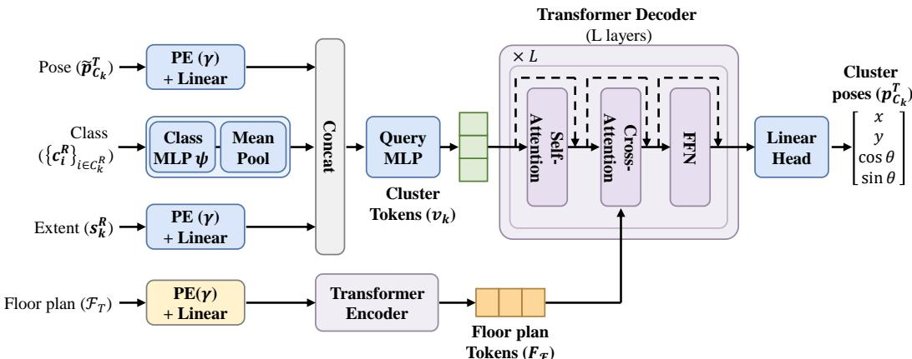  
(a) Cluster Placement Network

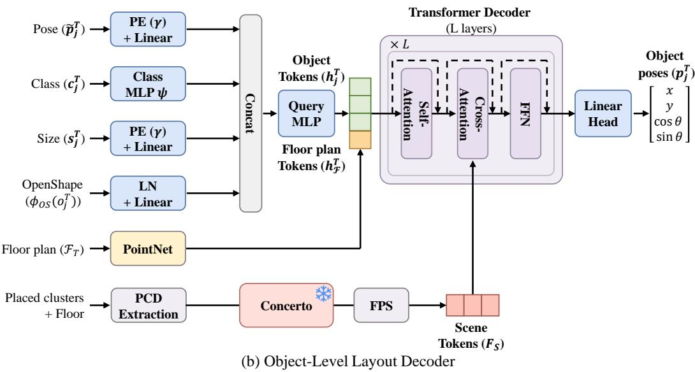  
Figure 6: Network Architecture. (a) Cluster placement network for predicting cluster poses conditioned on the target floor plan. (b) Object-level layout decoder for predicting object poses from the placed reference objects and target floor plan.

Objectives. The cluster placement network is supervised with a squared error on the predicted cluster centroid and on the predicted anchor orientation, the latter normalized to unit length. Supervising orientation as a two-vector rather than as an angle keeps the loss insensitive to the wrap-around at ±π. The object-level decoder is supervised on the concatenated position and orientation vector with a squared error together with a small $L _ { 1 }$ term at weight 0.07, the $L _ { 1 }$ component sharpening convergence once the squared error has flattened.

Optimizer. Both networks are trained with Adam using a batch size of 128 for 50k iterations with a learning rate of $1 \times 1 0 ^ { - 4 }$ following the reference implementation (Wei et al., 2023). We adopt these optimizer settings without modification, so that the comparison in Table 1 does not reflect differences in training-time tuning effort.

Dataset Augmentation. A separate model is trained for each room type, on the splits reported in Section 4.2. Training uses the axis-aligned rotation augmentation of the preprocessed dataset, which rotates a room by a multiple of ninety degrees together with its floor plan, boundary samples and object poses. Because an opening is parameterized as an interval on a boundary edge rather than as a coordinate, it survives this augmentation unchanged. The boundary representation seen during training carries position and normal alone, so openings reach the arrangement through the geometric constraints rather than as a learned conditioning signal.

Inference. At inference, both networks perform iterative denoising initialized from perturbed layouts that mirror the training scheme. The cluster network starts from reference cluster centroids $\mu _ { k } ^ { R }$ , which serve directly as target frame coordinates because both scenes share a single room type normalization constant, while the object decoder begins from target inventory poses. Both stages apply an initial noise distribution with a positional standard deviation of 0.5 in normalized room coordinates and an angular standard deviation of $\pi / 4$ , where a single scene-level magnitude is drawn as $| \mathcal { N } ( 0 , \sigma ^ { 2 } ) |$ and shared across all objects. At iteration $t ,$ the layout updates toward the network prediction using a step size of $0 . 1 / ( 1 \stackrel { \cdot } { + } 0 . 0 0 5 t )$ , augmented by annealed Langevin noise scaled by $0 . 0 1 \cdot 0 . 9 ^ { \lfloor t / 1 0 \rfloor }$ . Both stages run for at most 100 steps, terminating early when layout displacement falls below 0.01 in position and 0.005 in (cos θ, sin θ) orientation over three consecutive steps.

## D ANALOGICAL REFINEMENT

## D.1 OBJECTIVE FUNCTIONS

The relational term $\mathcal { L } _ { \mathrm { r e l } }$ of Equation $( 5 )$ refines where a matched object stands relative to its cluster anchor. The remaining terms of Equation (4) constrain what that displacement alone leaves free. Throughout, quantities measured on $\scriptstyle { S _ { R } }$ are computed once before optimization and held fixed, so each term pulls the target layout toward a constant that the exemplar supplies.

Orientation. Faithful transfer requires a matched object to preserve its counterpart’s orientation. To account for cluster rotation $\mathbf { R } , \mathcal { L } _ { \mathrm { r o t } }$ transforms the reference heading into the target frame:

$$
\mathcal { L } _ { \mathrm { r o t } } = \frac { 1 } { | \mathcal { V } | } \sum _ { j \in \mathcal { V } } w _ { j } \Big \| \big ( \cos \theta _ { j } ^ { T } , \sin \theta _ { j } ^ { T } \big ) ^ { \top } - \mathbf { R } \big ( \cos \theta _ { \pi ( j ) } ^ { R } , \sin \theta _ { \pi ( j ) } ^ { R } \big ) ^ { \top } \Big \| _ { 2 } ^ { 2 } .\tag{6}
$$

Formulating the loss via 2D unit vectors, rather than raw angles $\theta ,$ eliminates wrap-around discontinuities at $\pm \pi$ while strictly penalizing $1 8 0 ^ { \circ }$ orientation flips.

Wall Clearance. Rather than absolute coordinates, relative wall clearances serve as the primary target for transfer. For instance, a wardrobe against a wall in $\scriptstyle { S _ { R } }$ must stand against a wall in $\mathcal { F } _ { T }$ even though the walls are located elsewhere. Wall correspondence is established per cluster. Specifically, each wall bounding $\mathcal { C } _ { k } ^ { R }$ is matched to the target wall whose inward normal best agrees with it under R and whose span overlaps the placed cluster’s projection; an object is tied only to walls matched for its cluster. Object $j$ is assigned such a wall when its reference counterpart stood within 0.2 of that wall’s reference edge in normalized room coordinates. At most two walls are retained per object, selected as the two closest in the reference scene. When two walls are kept, their normals must differ by at least $6 0 ^ { \circ }$ , ensuring a piece in a corner respects both adjacent walls while a piece in open floor remains unconstrained. Let $g ( \mathbf { p } , \mathbf { s } ; e )$ denote the gap from the near face of a box of extent s at pose p to the line of wall $e ,$ signed positive when the box lies clear of the wall and negative when it penetrates. With W denoting the set of resulting assignments and $e ^ { R }$ the reference wall from which e was matched,

$$
\mathcal { L } _ { \mathrm { w a l l } } = \frac { 1 } { | \mathcal { W } | } \sum _ { ( j , e ) \in \mathcal { W } } \Big \| g \big ( \mathbf { p } _ { j } ^ { T } , \mathbf { s } _ { j } ^ { T } ; \ e \big ) - g \big ( \mathbf { p } _ { \pi ( j ) } ^ { R } , \mathbf { s } _ { \pi ( j ) } ^ { R } ; \ e ^ { R } \big ) \Big \| _ { 2 } ^ { 2 } ,\tag{7}
$$

so the optimization target matches the clearance the counterpart held, and the constraint set is determined by the exemplar rather than where an object happens to land.

Openings. Each opening induces a walk-through clearance zone $Z _ { b } ,$ defined as a rectangle spanning the opening’s boundary interval and extending 0.75 m inward. This depth is specified in meters rather than normalized units because it is determined by human body dimensions rather than room scale. For windows elevated above the floor, the penalty is restricted to objects whose vertical extent is tall enough to obstruct the window aperture. The penalty is defined as

$$
\mathcal { L } _ { \mathrm { o p e n } } = \frac { 1 } { | \mathcal { B } _ { T } | } \sum _ { b } \sum _ { j = 1 } ^ { N _ { T } } \delta \big ( \mathbf { p } _ { j } ^ { T } , \mathbf { s } _ { j } ^ { T } ; ~ Z _ { b } \big ) ^ { 2 } ,\tag{8}
$$

where $\delta$ denotes the separating-axis penetration depth of the box of extent $\mathbf { s } _ { j } ^ { T }$ at pose $\mathbf { p } _ { j } ^ { T }$ into $Z _ { b }$ Using penetration depth rather than a corner test reliably penalizes edge cases, such as a wide sideboard spanning a narrow doorway with all four corners landing outside the zone. Open archways, which 3D-FRONT (Fu et al., 2021a) annotates as holes rather than doors, are excluded from $\boldsymbol { B } _ { T }$ and thus contribute neither a clearance zone nor a denominator term. Because archways are far wider than standard doors, reserving a walk-through zone across them would unnecessarily restrict usable floor space without improving navigability.

Table 3: Relation Extraction Rules. Distances are in normalized room coordinates; the adjacency gap is center distance minus the combined half-extents of both objects.
<table><tr><td>Rule</td><td>Labels</td><td>Distance</td><td>Angle</td></tr><tr><td>Adjacency</td><td>in_front_of,behind, beside_left,beside_right</td><td> $\mathrm { g a p < 0 . 2 2 }$ </td><td> $\pm 4 5 ^ { \circ }$  quadrants</td></tr><tr><td>Facing</td><td>facing</td><td> $\leq 0 . 6$ </td><td> $\pm 9 ^ { \circ }$  cone</td></tr><tr><td>Alignment</td><td>aligned_with</td><td>≤ 0.6</td><td>headings within  $2 0 ^ { \circ }$ </td></tr><tr><td>Wall</td><td>against_wall</td><td> $< 0 . 1 2$  to boundary</td><td>N/A</td></tr></table>

## D.2 PHYSICAL CONSTRAINTS

All target poses are optimized jointly via gradient descent on $\mathcal { L } _ { \mathrm { r e f i n e } }$ (Equation (4)). Physical validity is enforced through direct projection rather than penalty terms. Objects are clamped within $\mathcal { F } _ { T }$ both before and after optimization, and residual overlaps are resolved by translating the overlapping pair along a separating axis of their oriented bounding boxes. Because oriented boxes over-approximate object geometry, candidate overlaps are verified against the two objects’ point clouds prior to displacement, with translation distances measured directly from these point clouds rather than from the boxes. Consequently, pairs whose boxes intersect while their point clouds do not, such as a chair placed under a table, remain untouched. Finally, objects with low matching confidence $w _ { j }$ or unresolvable collisions are pruned.

## E EVALUATION DETAILS

## E.1 RELATION TRIPLETS

Both reference-derived metrics, iRecall and PSA, are built on a single rule-based pass over the refer ence scene’s ground-truth layout. Four rules emit seven relation labels, listed with their thresholds in Table 3. Adjacent pairs are classified by direction rather than by mere proximity, since a coffee table in front of a sofa and a side table flanking it are different arrangements that a single next to would collapse. The direction is read in the facing frame of one of the two objects, choosing whichever frame places the other object closest to one of its four axes, measured by maximizing | cos 2ϕ| over the bearing ϕ. The facing cone is deliberately narrow, as a wider one lets an object squarely facing its true target also sweep in a distant object along the same bearing. Every relation holds between two objects, or between one object and the nearest wall, and never as an absolute compass direction or a fraction of the room’s dimensions. This ensures the same relation remains meaningful in a tar get room of a different shape, allowing the extracted facts to serve both as the specification handed to the baselines and as the quantity we score. These thresholds were determined empirically on the validation split to align with human qualitative judgments.

## E.2 INSTRUCTION SYNTHESIS

The triplets become the natural-language instruction in two steps. A deterministic verbalizer first writes one plain English clause per triplet, so that no model chooses what the specification contains. A language model GPT-5.6 Terra (Singh et al., 2025) then rewrites those clauses into a fluent instruction of two to four sentences under the prompt below, so that text-conditioned baselines re ceive input in the register they were designed for rather than a list of templated clauses. The result is cached once per reference scene and reused thereafter. Caching matters for fairness as much as for cost: every method that consumes text receives byte-identical input, and the judge is shown the same text as its layout criteria, so no method benefits from a more favorable phrasing. Note that the specification is written once and frozen before any layout exists, so the judge scores every method against text that was fixed independently of the layouts it evaluates, avoiding circularity between the specification and the scores.

The following are spatial relations observed in a real furnished room   
(scene ‘{scene name}’): {facts text}   
Rewrite these as a short natural-language furniture arrangement   
instruction (2--4 sentences) describing how objects should relate to   
each other (adjacency, facing, alignment, wall placement). Do NOT   
mention absolute directions (north/south/left/right) or room   
dimensions, since the instruction will be applied to a   
differently-shaped room. The numeric suffixes (e.g.   
‘dining chair 2’) only disambiguate this list --- the instruction will   
later be checked against a rendered image where identical-category   
objects are NOT individually numbered, so do NOT reference specific   
instance numbers; refer to objects only by their category (e.g. ‘the   
dining chairs’, ‘a corner side table’), grouping or generalizing   
same-category relations rather than naming a specific instance.   
Output only the instruction text.

Two of these constraints exist to keep the instruction usable rather than merely fluent. Forbidding absolute directions and room dimensions is what lets the same text be applied to a differently shaped room at all. Forbidding instance numbers matters because the judge later sees a rendering in which two dining chairs are indistinguishable; an instruction that named dining chair 2 would ask fo something no image can verify, and would leak an instance identity that no method is given. Both the instruction and iRecall refer to the same category-level set of relations. Distinctions between individual instances of the same category are consequently outside what we claim to verify, by construction of the metric rather than as a side effect of how the instruction is phrased. For the living-room scene shown below, the extractor emits 41 facts, which reduce to 28 distinct category level triplets; the first few are

```lisp
(cabinet 1, beside right, coffee table 1)
(coffee table 1, in front of, armchair 1)
(loveseat sofa 1, in front of, coffee table 1)
(coffee table 2, beside left, coffee table 1)
...
```

and the cached instruction reads

Position the cabinet to the right ofthe coffee tables, ensuring the coffee tables are aligned with each other andfacing the armchairs. Place the loveseats infront ofthe coffee tables,facing them, and the armchairs should be between the cabinet and the coffee tables, also facing the coffee tables. Arrange the dining table with chairs placed around it, making sure that some chairs face others while staying aligned with the table and against the wall. Finally, position the TV stand against a wall to complete the arrangement.

The compression is visible: 41 geometric relations become four sentences that name categories and orderings but no distances, so the instruction preserves which objects belong together and loses how far apart they stood.

## E.3 METRICS AND JUDGING PROTOCOL

Instruction Recall (iRecall). iRecall (Lin & Mu, 2024) reapplies the relation extractor to the generated layout, measuring how much of the reference specification is preserved. Matching is existential and at the level of object categories: a reference triplet counts as realised when some pair of objects of the corresponding categories stands in that relation in the output. No instance correspondence is therefore required, which is what allows the metric to be applied unchanged to methods that produce none. Categories are first normalized to functional groups, since 3D-FRONT (Fu et al., 2021a) splits interchangeable furniture across several labels and a target room’s loveseat would otherwise never match a reference room’s multi-seat sofa even when it stands exactly where the sofa stood and serves the same role. Only clear synonyms are merged, sofas with sofas and beds with beds. A coffee table and a dining table stay distinct, because in front of the coffee table and in front of the dining table are different requirements. Triplets are compared as sets, so a relation stated twice by two objects of the same category on the same side of a third counts once. Directional labels differ by side, so a group arranged around a shared anchor is represented by several distinct relations, each of which has to be realised independently.

Table 4: Effect of Cluster Granularity. In boundary rate is measured before the projection step, and iRecall was measured for relational fidelity.
<table><tr><td>Reference cluster size</td><td>3</td><td>5</td><td>7</td><td>9</td><td>11</td></tr><tr><td>IB (before projection) ↑</td><td>93.7</td><td>93.9</td><td>91.7</td><td>88.6</td><td>87.9</td></tr><tr><td>iRecall ↑</td><td>56.7</td><td>62.9</td><td>64.3</td><td>64.2</td><td>64.2</td></tr></table>

Judging Protocol. Collision-free and in-boundary rates follow LayoutVLM (Sun et al., 2025)’s geometric definitions, in-boundary using the same polygon-buffer semantics. The positional and rotational coherency ratings and the PSA score follow its judging protocol, including its rubric prompts verbatim and GPT-5.6 Terra (Singh et al., 2025) as the judge, with one deliberate change. LayoutVLM judges against a user-written description in a setting where no reference scene exists. Ours does exist, and as the example above shows the synthesized instruction is a lossy projection of it, so distances, spacing and grouping never reach the judge through text alone. We therefore show the reference room’s own rendering alongside the produced one, on top of the instruction, while the instruction remains the criterion being judged against.

## F ADDITIONAL RESULTS

## F.1 ANALYSIS

Sensitivity Analysis on Cluster Granularity. The number of objects per reference cluster con trols the granularity of structural transfer, where extreme values fail for complementary reasons (Table 4). In-boundary rates are reported prior to projection because the projection step forcibly clamps all objects into ${ \mathcal { F } } _ { T } .$ , driving containment near 100% regardless of the initial layout. Preprojection containment is thus a more informative metric because extensive clamping overwrites the optimized layout, sacrificing the relational structure established during refinement. Small clusters preserve insufficient structure to transfer effectively. At three objects per cluster, iRecall drops to 56.7 because small clusters contain few intra-group relations for the placement network to preserve by construction. Beyond seven objects, additional intra-cluster structure yields no meaningful gain in preserved relations. Conversely, containment exhibits the opposite trend. Larger clusters occupy larger footprints and are placed as rigid units, meaning a single misplacement forces all constituent objects outside $\mathcal { F } _ { T }$ . Consequently, the pre-projection in-boundary rate drops from 93.9% at five objects to 87.9% at eleven. In the limit, cluster decomposition loses its purpose because a cluster spanning most of the room reduces transfer to a rigid copy of the reference layout, which differing room boundaries render invalid. We therefore select a reference cluster size of seven, representing the minimal size required for relational fidelity to saturate before containment degrades significantly.

Cross-Scene Attention at Inference. During inference, the stage 2 object decoder conditions on scene tokens derived from a transplanted reference layout, despite an object inventory mismatch between the reference and target rooms. To examine what the decoder attends to under such mismatches, we inspect the stage 2 cross-attention at inference time. Each query token’s weights over the 768 scene tokens, averaged across the decoder’s six layers and eight heads, are projected onto the assembled scene point cloud, which comprises the placed reference clusters together with the target floor (Figure 7). Cross-attention concentrates on the transferred reference furniture rather than on free space, aligning each query with the reference object that plays the same role even when the two assets differ in shape or category. To confirm that identity rather than proximity drives this, we hold every position fixed and swap only object identities, meaning category, size, and OpenShape (Liu et al., 2023) features, between target objects. Measured as total variation over the scene tokens, a slot’s attention moves toward the map its newly assigned identity produces in its own slot in 890 of 894 trials. An identity-preserving control, in which the paired objects hold the same asset at the same scale so the swapped token is numerically identical, leaves the map untouched. The decoder therefore reads cross-scene context by object identity, and not by position alone.

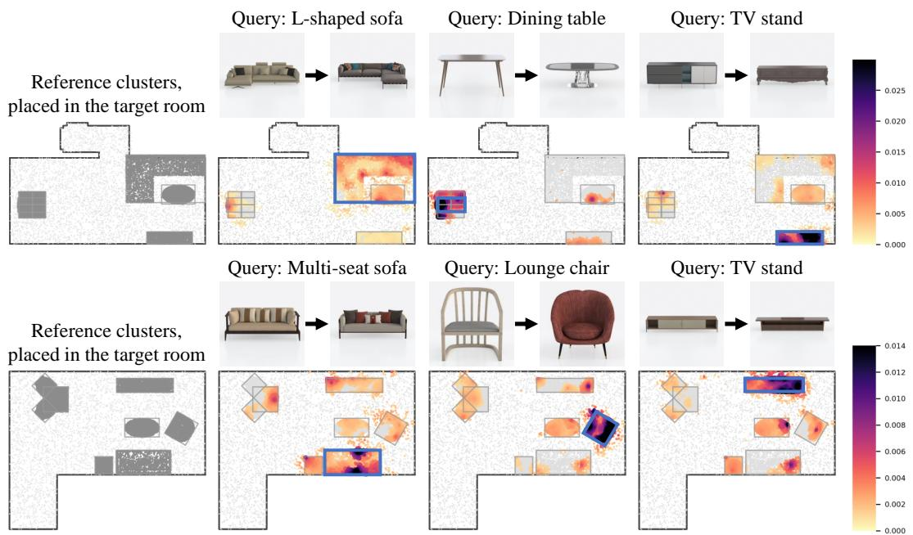

Figure 7: Cross-Scene Attention Visualization. Target object tokens selectively attend to their semantically corresponding reference furniture clusters, demonstrating robust semantic alignment under inventory and layout mismatches.  
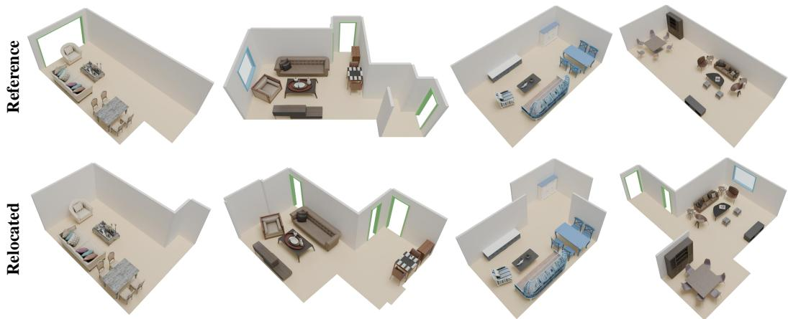  
Figure 8: Same-Inventory Relocation. Paired reference and target room examples showing layout adaptation with identical object inventories across diverse room geometries.

## F.2 RELOCATING A FURNISHED ROOM TO A NEW FLOOR PLAN

A natural special case of scene retargeting keeps the object inventory fixed and changes only the room, such as when a household moves its furniture to a home with a different floor plan. We instantiate this task as relocation, where the reference scene supplies both the exemplar arrangement and the target inventory $\mathcal { O } _ { T } = \{ o _ { i } ^ { R } \} _ { i = 1 } ^ { N _ { R } }$ , while the target room contributes only its boundary $\mathcal { F } _ { T }$ and openings $\boldsymbol { B } _ { T }$ . No component is retrained or tuned, and the exact same checkpoints and hyperparameters are used. Because every target object is a reference object, the object-level decoder of stage 2 has nothing to infer. After stage 1, the placed clusters already constitute a complete layout in which every intra-cluster relation of the reference holds by construction, and the correspondence matrix M of stage 3 is the identity. The framework therefore reduces to the two stages that reason about the new room. The placement network relocates each functional cluster onto $\mathcal { F } _ { T }$ , and the analogical refinement reestablishes the reference wall clearances. Figure 8 illustrates relocating reference rooms into distinct target floor plans of varying shapes, sizes, and opening layouts. Simply pasting the reference coordinates into these rooms would leave furniture outside the boundary or inside doorways wherever the plans differ, which is precisely what cluster placement and refinement repair. The result is a diverse family of physically valid rooms that all keep the same original object inventory.

## F.3 QUALITATIVE RESULTS

Effect of the Wall Clearance and Opening Refinement. As shown in Figure 9, omitting either spatial term degrades layout quality. Without ${ \mathcal { L } } _ { \mathrm { w a l l } }$ , objects drift away from room boundaries, failing to preserve the relative object to wall clearance present in the reference scene. Removing $\mathcal { L } _ { \mathrm { o p e n } }$ results in objects blocking doorways and windows, compromising basic room accessibility. The full model maintains proper wall distance relationships while guaranteeing walkthrough affordances across all openings.

Ablation Studies. Figure 10 visualizes the individual contributions of our core modules. Without Stage 1 cluster placement, attempts to resolve physical collisions and boundary constraints force aggressive projection into the floor plan, which completely breaks the underlying layout structure. Removing scene features eliminates our primary conditioning signal, preventing effective spatial transfer across distinct environments. Finally, omitting Stage 3 analogical refinement leaves fine object relationships unadjusted and fails to prune redundant assets.

Failure Cases. Our framework exhibits limitations in two challenging scenarios (Figure 11). First, a severe inventory gap between the reference and target room can cause awkward object groupings (Figure 11 (a)). Second, in highly constrained target scenes, simultaneously satisfying opening clearance, wall proximity, and collision avoidance becomes geometrically unfeasible, leaving conflicting spatial demands unresolved (Figure 11 (b)).

Additional Qualitative Comparisons. Figure 12 provides additional qualitative retargeting results extending Figure 4 from the main text. Baseline approaches such as InstructScene (Lin & Mu, 2024), LayoutVLM (Sun et al., 2025), and LaviGen (Feng et al., 2026) frequently suffer from fractured cluster arrangements, severe object overlaps, and wall collisions when adapting layouts to varying room shapes. In contrast, our framework faithfully maintains functional group structures and spatial relationships while adjusting overall placement to fit target floor plan boundaries without physical violations.

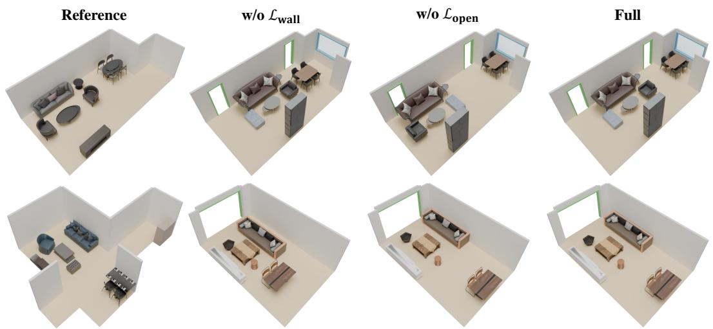  
Figure 9: Effect of Wall Clearance and Opening Terms. Omitting ${ \mathcal { L } } _ { \mathrm { w a l l } }$ alters relative wall clearance, whereas omitting $\mathcal { L } _ { \mathrm { o p e n } }$ obstructs room access. The full model succeeds on both fronts.

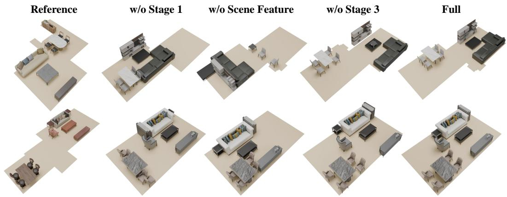  
Figure 10: Visualization of Ablation Study. Stage 1 placement preserves global semantic coher ence, scene features provide essential conditioning, and Stage 3 refines object relationships.

Reference

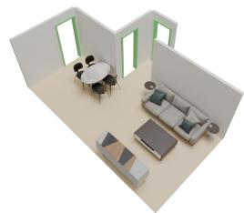

Retargeted

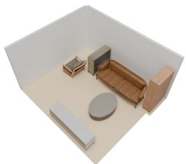  
(a) Severe Reference-Target Gap

Reference

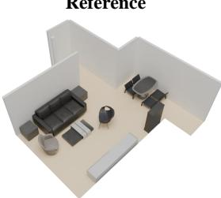

Retargeted

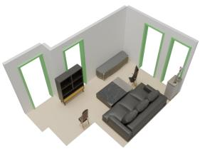  
(b) Over-Constrained Target Scene

Figure 11: Failure Scenarios. (a) Severe inventory mismatches between reference and target rooms lead to unnatural arrangements. (b) Highly constrained rooms cause conflicting spatial demands.

Reference

InstructScene

LayoutVLM

LaviGen

Ours

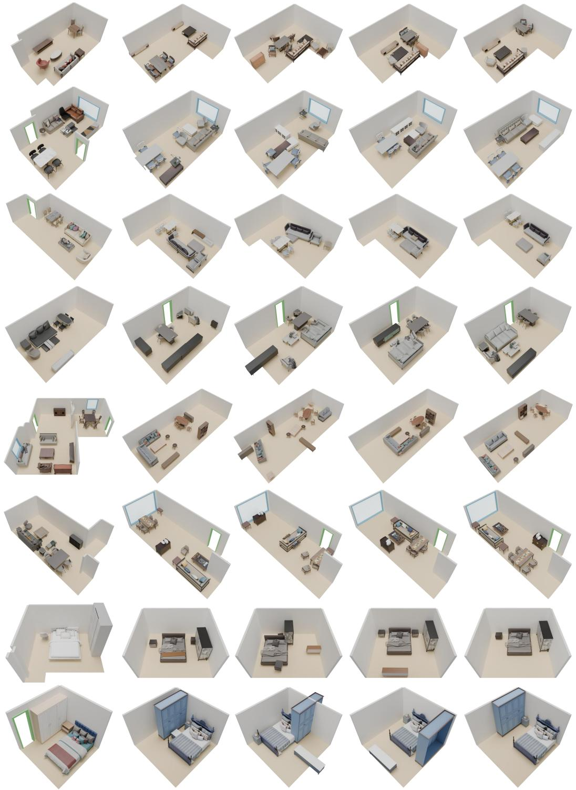

Figure 12: Additional Qualitative Comparisons. Extended visual comparisons between baseline methods and our framework across diverse 3D-Front (Fu et al., 2021a) scenes.