# SELF-ALIGNED FORCING: STREAMING VIDEO DIFFUSION WITH DIFFERENTIABLE NOISY HISTORY

Weiqiang Wang1∗ Zhuokun Chen1∗ Yusheng Dai1 Boying Li1 Yi Zhang2† Hossein Rahmani3 Qiuhong Ke1† Jianfei Cai1 1Monash University 2Vivix AI 3Lancaster University

## ABSTRACT

Autoregressive video diffusion enables interactive streaming generation, but suffers from error accumulation over long rollouts. Self-rollout training reduces exposure bias, yet finite rollouts leave long-range drift unresolved. We observe that the noise level of the history key-value (K/V) representations trades visual quality against motion, and that restoring gradients through the history aligns causal training far more closely with bidirectional training. Motivated by these observations, we introduce Self-Aligned Forcing (SAF), a training scheme that aligns the history of each block with the noise level of the block being denoised. Specifically, the history is the K/V produced by preceding blocks at the same denoising stage, so all blocks at a stage can be denoised in a single forward pass under a causal mask. This keeps the noisy history differentiable, allowing future losses to optimize how it is encoded. SAF therefore avoids a separate nogradient rollout and per-block timestep-zero recaching, training up to 1.8× faster than prior methods with lower memory. At inference, SAF achieves the highest single-GPU throughput among existing methods and keeps one history bank per stage for a multi-GPU pipeline, reaching 49.1 FPS on 4 GPUs. Experiments show superior long-horizon generation with a better balance between visual quality and motion. Project page: https://anonymous.4open.science/w/ self-aligned-forcing/.

## 1 INTRODUCTION

causal	information	flow gradient	flow × stop-gradient history	stage single	forward	pass extra	no-grad	rollout

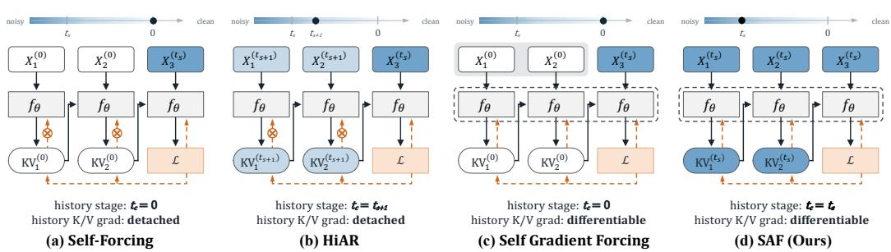  
Figure 1: History stage and gradient flow. The model f generates blocks from left to right, and the K/V of earlier blocks form the history of the last block, whose loss L is shown. Superscripts give noise levels $( t _ { s } )$ current block, $t _ { c } \mathrm { : }$ history, 0: clean). Self-Forcing (a) and HiAR (b) detach the history, so the loss cannot reach it; Self Gradient Forcing (c) and SAF (d) keep this gradient with the history at $t _ { c } = 0$ and $t _ { c } = t _ { s }$ , respectively, but the former needs an extra no-grad rollout.

Autoregressive (AR) video diffusion has emerged as a promising approach to interactive streaming video generation (Yin et al., 2025; Huang et al., 2025; Yang et al., 2026). It generates a video block by block, conditioning each new block on the key-value (K/V) representations of previously generated blocks, which form the history. The model can thus continuously extend a video and respond to new instructions without reprocessing the full sequence, as required by interactive applications such as game engines and world models (Bruce et al., 2024; Valevski et al., 2025; He et al., 2025). However, long-horizon streaming remains challenging, as it requires stability over videos much longer than the training clips, meaningful motion, and efficient generation.

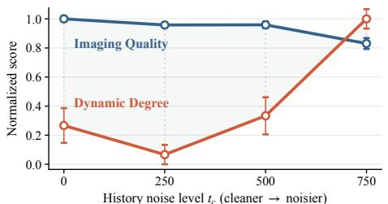  
(a) Noisier history adds motion but lowers quality.

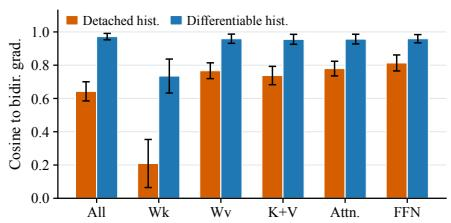  
(b) History gradients align with bidirectional training.  
Figure 2: Two observations motivating differentiable noisy history. (a) A fixed LongLive model with varying history noise level $t _ { c } ;$ imaging quality and dynamic degree (Huang et al., 2024) are normalized to their values at $t _ { c } = 0$ and $t _ { c } = 7 5 0$ , respectively. (b) With all settings identical except whether gradients flow through the history K/V, differentiable history raises the gradient cosine similarity to a matched-weight bidirectional reference from 0.643 to 0.972. Error bars show the range over multiple samples.

Long-horizon stability is limited mainly by error accumulation. Self-Forcing (Huang et al., 2025) narrows the train–test gap, known as exposure bias (Ranzato et al., 2016), by training the model on its own generated history (Figure 1a). Nevertheless, its finite rollouts do not fully account for errors accumulated over longer horizons. To improve robustness under limited training rollouts, recent methods build the history from partially denoised states. Rolling Forcing (Liu et al., 2026) jointly denoises a rolling window with staggered noise levels, while HiAR (Zou et al., 2026) takes the history one denoising step cleaner than the current block (Figure 1b). HiAR further finds that aligning the history noise level with that of the current block minimizes error accumulation but lowers the overall VBench quality score (Huang et al., 2024).

Observation 1. Noisy history not only reduces error accumulation but also increases motion dynamics, at the cost of imaging quality. Using a LongLive checkpoint trained with clean history, we vary only the history noise level $t _ { c }$ at inference. As shown in Figure $^ { 2 \mathrm { a , } }$ sufficiently noisy history substantially increases the VBench (Huang et al., 2024) dynamic degree, but imaging quality drops. The motion gain is notable, since models trained with distribution matching distillation (DMD) (Yin et al., 2024a;b) commonly produce static outputs due to its mode-seeking objective (Zou et al., 2026; You et al., 2026; Wu et al., 2026). HiAR attributes reduced error accumulation to the lower signal-to-noise ratio (SNR) of noisy history (Zou et al., 2026); our observation suggests that this mechanism also underlies the motion gain and the quality loss. By weakening the constraint that the history imposes on the current block, lower SNR suppresses error propagation and increases motion dynamics, but also reduces temporal consistency and lowers imaging quality. The benefit and the cost thus share a single cause, yet the model cannot learn to balance them.

Observation 2. Detaching the history prevents the model from learning how to encode it for future blocks. Existing self-rollout methods detach the history K/V from gradient computation (Figure 1a,b), as backpropagating through it would nest the computation graphs of all preceding blocks. Future losses therefore cannot optimize how preceding blocks are encoded for subsequent prediction. To quantify this effect, we compare the resulting parameter gradient with a matchedweight bidirectional reference, in which all blocks are processed jointly so that losses on later blocks also supervise earlier ones. With all other settings identical, restoring the gradient path through the history increases their cosine similarity from 0.643 to 0.972 (Figure 2b). The gap is largest for the key projection $W _ { k }$ , whose cosine similarity drops to about 0.2 under detachment, indicating that the model barely learns to encode the history for future retrieval. Noisy history should therefore remain differentiable rather than serve only as fixed conditioning.

Existing methods face a dilemma: noisy history is robust but detached, whereas differentiable history requires costly reconstruction. Self Gradient Forcing (SGF) (Zhuang et al., 2026) restores gradients through the history (Figure 1c), but requires a separate no-gradient rollout to construct the history (similar to SDF in Figure 7). Moreover, its history is built from clean states, available only after a block is fully denoised and recached at timestep zero. This recaching adds a forward pass per block and prevents pipelining across denoising stages, limiting both training and inference efficiency.

Our key insight is that stage alignment between the history and the current block makes noisy history differentiable efficiently without reconstruction. The history K/V is then exactly what preceding blocks compute while being denoised at the same stage. Since the history and the current block share one noise level, they can be processed in a single forward pass (Figures 1d and 3b), so the history is both noisy and differentiable without reconstruction. Besides, this causal training strategy shares the structure of bidirectional diffusion training, in which all blocks share one noise level and later blocks supervise earlier ones. Notably, this aligned setting lowers quality in HiAR, where the history is detached; once the history is learned, it achieves the highest Quality under every inference policy among the history schedules we study in training (Section 4.3).

Building on this insight, we propose Self-Aligned Forcing (SAF). SAF rolls out all blocks stage by stage: at each denoising step, a single block-causal forward pass processes every block, and gradients are taken at one randomly sampled stage under the standard DMD objective. Apart from a clean attention sink (Xiao et al., 2024) recached within the same forward pass, it needs neither perblock recaching nor a separate no-gradient rollout, reducing training time and memory (Table 3). At inference, SAF can keep one history bank per noise level for a multi-GPU pipeline, or a single bank on one GPU to save memory (Figure 3c). Our contributions are threefold:

• We study how the history should be represented and reused in autoregressive video diffusion, showing that propagating gradients through noisy history K/V brings causal training close to bidirectional training, improving both overall quality and motion dynamics.

• We propose SAF, which aligns the history noise level with the current block. All blocks are then rolled out in parallel within each stage, and gradients at a sampled stage can flow through the history. A clean sink anchors appearance at negligible cost, and per-stage history banks enable pipelined inference across GPUs.

• We evaluate SAF extensively on multiple benchmarks. It performs best in the chunkwise setting and competitively in the framewise setting, achieving the highest training and inference efficiency in both settings, e.g., 1.8× faster framewise training than SGF and 49.1 FPS in chunkwise four-GPU pipelined inference.

## 2 RELATED WORK

Autoregressive Video Diffusion. Autoregressive video diffusion generates a video as causal temporal blocks, enabling streaming generation with a KV-cached history (Sand AI et al., 2025; Lin et al., 2025; Kodaira et al., 2026; Lu et al., 2026; Yi et al., 2026). Diffusion Forcing (Chen et al., 2024) assigns different noise levels to temporal tokens, CausVid (Yin et al., 2025) distills a bidirectional model into a few-step causal generator, and LongLive (Yang et al., 2026) scales this paradigm to real-time long videos with streaming long tuning, windowed attention, frame sinks, and KV recaching. To improve long-horizon robustness, Rolling Forcing (Liu et al., 2026) jointly denoises a window at staggered noise levels, and HiAR (Zou et al., 2026) denoises timestep-first and builds the history from intermediate denoising states. These methods change the noise level of the history but keep it detached, so losses on later blocks cannot optimize how it is encoded.

Self-Generated Rollout and Cross-Block Credit Assignment. Self-Forcing (Huang et al., 2025) trains the model on its own generated history to narrow the train–test gap, and Resampling Forcing (Guo et al., 2026) and BAgger (Po et al., 2026) further improve robustness through selfresampling and corrective rollout trajectories. All of them, however, detach the history K/V, so future losses cannot shape how earlier blocks are encoded. Live Avatar (Huang et al., 2026a) also matches the history timestep to the current block, yet its rollout remains serial and its history detached. Video-Mirai (Yu et al., 2026) adds future-aware supervision through an auxiliary foresight pathway and feature distillation, whereas SGF (Zhuang et al., 2026) restores future-to-history gradients by re-encoding clean history built in a separate no-gradient rollout. Existing methods thus either detach the history, add auxiliary supervision, or require a separate no-gradient rollout, leaving efficient future-to-history optimization of noisy history K/V unresolved.

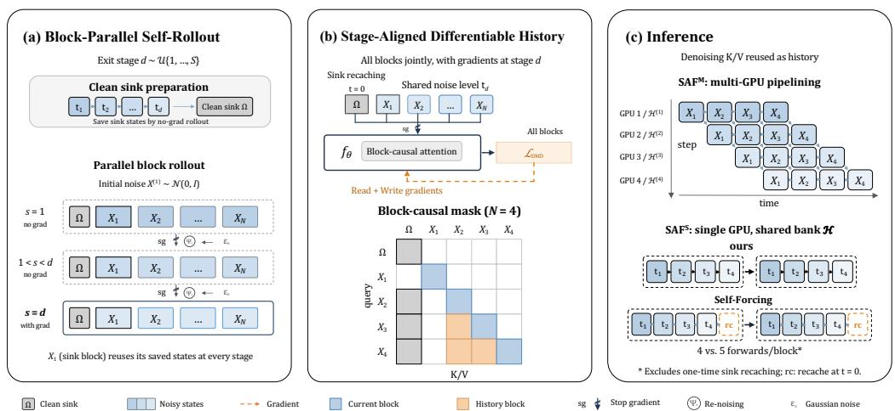  
Figure 3: Overview of SAF. (a) Rollout is parallel across blocks and sequential only across stages (Section 3.3). (b) Stage alignment enables joint denoising with differentiable history in one blockcausal forward pass (Section 3.2). (c) Reusing the K/V computed during denoising as history allows multi-GPU stage pipelining and removes per-block recaching (Section 3.5).

## 3 METHOD

## 3.1 OVERVIEW

SAF rests on a single design choice: at every denoising step, the history is taken at the same noise level as the current block. This choice makes the local history both noisy and differentiable without any reconstruction (Section 3.2) and allows self-rollout to proceed in parallel across blocks during training (Section 3.3). We complement it with a clean sink that anchors appearance over the whole video (Section 3.4), and at inference it yields per-stage history K/V banks that pipeline naturally across GPUs (Section 3.5). Figure 3 summarizes the framework.

A video is generated as N blocks, each denoised at noise levels $t _ { 1 } > \cdots > t _ { S }$ , where $t _ { 1 } = 1 0 0 0$ is pure noise; we call the step at $t _ { s }$ stage s. At stage s, the causal denoiser $f _ { \theta }$ reads the noisy latent $X _ { i } ^ { ( s ) }$ of block i, its history K/V bank $\mathcal { H } _ { i } ^ { ( s ) }$ , and the text prompt p, predicts a clean-latent estimate $\widehat { X } _ { i } ^ { ( s ) }$ and produces the block’s own $\mathrm { K V } _ { i } ^ { ( s ) }$ . We write this step as $( \widehat { X } _ { i } ^ { ( s ) } , \mathrm { K V } _ { i } ^ { ( s ) } ) = f _ { \theta } ( X _ { i } ^ { ( s ) } , t _ { s } ; \mathcal { H } _ { i } ^ { ( s ) } , p )$ $\mathcal { H } _ { i } ^ { ( s ) }$ holds the $\mathrm { K V } _ { \Omega }$ of a persistent sink Ω (the first few blocks (Xiao et al., 2024)) and the K/V of the latest preceding blocks, which together with block i span a local window of L frames.

## 3.2 STAGE-ALIGNED DIFFERENTIABLE HISTORY

Observations 1 and 2 call for a history that is noisy yet differentiable, but serial self-rollout makes these requirements conflict. When blocks are generated one after another, the history of block i is produced by earlier forward passes, and keeping it differentiable would nest the computation graphs of all preceding blocks. Existing methods therefore either detach a noisy history (Zou et al., 2026) or construct a clean one in a separate no-gradient rollout (Zhuang et al., 2026).

Stage alignment resolves this conflict by letting the history be produced and consumed in the same forward pass (Figures 1d and 3b). When block i reads its history at its own noise level $t _ { s } ,$ the K/V of each predecessor j is exactly what block j computes for its own prediction at stage s. A single blockcausal forward pass over all blocks therefore yields every prediction together with every history:

$$
\bigl ( \widehat { X } ^ { ( s ) } , \mathrm { K V } ^ { ( s ) } \bigr ) = f _ { \theta } \bigl ( \mathrm { s g } ( X ^ { ( s ) } ) , t _ { s } ; { \cal M } _ { \mathrm { c a u s a l } } , p \bigr ) ,\tag{1}
$$

where $X ^ { ( s ) } , { \widehat X } ^ { ( s ) }$ , and $\mathrm { K V } ^ { ( s ) }$ stack the inputs, estimates, and K/V of all blocks and $\mathrm { s g }$ is stopgradient. The block-causal mask $M _ { \mathrm { c a u s a l } }$ lets each block i attend only to itself and its history $\mathcal { H } _ { i } ^ { ( s ) } =$ $\{ \mathrm { K V } _ { j } ^ { ( s ) } \} _ { j \in { \mathscr W } ( i ) }$ , the same-stage K/V of its predecessors within the window $\mathcal { W } ( i )$ . Eq. 1 is thus the per-block step of Section 3.1 applied to all blocks at once, and within a stage, training resembles bidirectional diffusion training with only the future masked out. For clarity, we omit the sink Ω here and describe it in Section 3.4.

Because $\operatorname { E q . }$ 1 computes the history rather than loading it from a detached cache, the gradient of $\widehat { X } _ { i } ^ { ( s ) }$ with respect to the parameters θ splits into two terms:

$$
\frac { \mathrm { d } \widehat { X } _ { i } ^ { ( s ) } } { \mathrm { d } \theta } = \underbrace { \frac { \partial \widehat { X } _ { i } ^ { ( s ) } } { \partial \theta } } _ { \mathrm { r e a d } } + \underbrace { \sum _ { h \in \mathcal { H } _ { i } ^ { ( s ) } } \frac { \partial \widehat { X } _ { i } ^ { ( s ) } } { \partial h } } _ { \mathrm { w r i t e } } \frac { \mathrm { d } h } { \mathrm { d } \theta } ,\tag{2}
$$

where h ranges over the K/V entries of $\mathcal { H } _ { i } ^ { ( s ) }$ . Viewing the history as a memory that predecessors write and block i reads, the read term updates how block i uses the history, while the write term updates how its predecessors encode it, providing future-to-history supervision. As the inputs are detached, the write term changes only how the history is encoded, not what is sampled. The model thus learns to write noisy history rather than merely tolerate it.

## 3.3 BLOCK-PARALLEL SELF-ROLLOUT

Although each stage of SAF mirrors bidirectional training under a causal mask, the two still differ in the origin of their inputs. Bidirectional training noises ground-truth videos, which carries over to inference because all frames are denoised jointly. A causal model, however, reads a history derived from its own earlier outputs at inference, so training on ground-truth inputs creates a train–test mismatch that lets errors accumulate across blocks (Huang et al., 2025). SAF therefore retains selfrollout: starting from $X ^ { ( 1 ) } \sim \mathcal { N } ( 0 , I )$ , the input to each stage is derived from the model’s estimate at the preceding stage,

$$
X ^ { ( s + 1 ) } = \Psi _ { s } \big ( \mathrm { s g } ( \widehat { X } ^ { ( s ) } ) , \epsilon _ { s } \big ) ,\tag{3}
$$

where the sampler $\Psi _ { s }$ re-noises the estimate with noise level $t _ { s + 1 }$ using Gaussian noise $\epsilon _ { s } ,$ and ${ \widehat { X } } ^ { ( s ) }$ is given by Eq. 1. In contrast to existing serial self-rollout (Huang et al., 2025; Zou et al., 2026), which advances one block per forward pass, SAF parallelizes the rollout across blocks within each stage and keeps it sequential only across stages (Figure 3a).

To avoid storing the computation graphs of all S chained stages, we follow the stochastic gradient truncation of Self-Forcing (Huang et al., 2025): each generator update samples an exit stage $d \sim$ $\mathcal { U } \{ 1 , \ldots , S \}$ , covering every noise level in expectation with a single stage in the computation graph. Stages $s \ <$ d run without gradients, and only stage d evaluates Eq. 1 with gradients under the standard DMD objective (Yin et al., 2024a):

$$
\begin{array} { r } { \mathcal { L } ( \boldsymbol { \theta } ) = \mathcal { L } _ { \mathrm { D M D } } \big ( \widehat { X } ^ { ( d ) } , p \big ) , } \end{array}\tag{4}
$$

with score models updated as in DMD (Algorithm 1).

Block-parallel rollout thus keeps the benefits of self-rollout without its serial cost: apart from a short sink pre-roll (Section 3.4), the sequential depth drops from $N \times$ d block-level to d stage-level forward passes, and since the supervised pass itself yields the differentiable history, no separate rollout is needed to build it. Training is therefore faster and more memory-efficient (Table 3), with a cost nearly independent of block granularity since the sequential depth no longer grows with N.

## 3.4 CLEAN SINK AS A PERSISTENT ANCHOR

Noisy history suits the local window, which is refreshed at every block and only needs to convey how the scene evolves. The sink Ω, in contrast, is the only memory that persists beyond the window; it alone anchors subject identity and scene layout and thus calls for a high signal-to-noise ratio (SNR). We therefore give every stage a clean sink.

Since the rollout stops at the exit stage d (Section 3.3), the cleanest available sink is its own estimate $\widehat { X } _ { \Omega } ^ { ( d ) }$ . Because every stage needs this estimate, we first roll out the sink blocks sequentially to stage d without gradients, recording their inputs $X _ { \Omega } ^ { ( s ) }$ for $s \leq d ( \mathrm { F i g u r e } 3 \mathrm { a } )$ . Each stage then prepends the

clean sink at timestep zero to its input:

$$
Z ^ { ( s ) } = \big [ \underbrace { \mathrm {  ~ s g } ( \widehat { X } _ { \Omega } ^ { ( d ) } ) } _ { \mathrm { c l e a n \ : s i n k , \ : } t = 0 } ; \underbrace { \mathrm {  ~ s g } ( X ^ { ( s ) } ) } _ { \mathrm { a l l \ : b l o c k s , \ : } t = t _ { s } } \big ] ,\tag{5}
$$

where the sink blocks inside $X ^ { ( s ) }$ reuse the recorded $X _ { \Omega } ^ { ( s ) }$ , so each sink block appears both clean and at noise level $t _ { s }$ . Eq. 1 then takes $Z ^ { ( s ) }$ in place of sg( $X ^ { ( s ) } )$ , and the same forward pass re-encodes the clean sink into $\mathrm { K V } _ { \Omega }$ instead of reading a detached cache. We call this sink recaching. All stages thus share the same clean sink, whose K/V stays in the computation graph at the exit stage. The history of Section 3.2 thus becomes $\mathcal { H } _ { i } ^ { ( s ) } = \mathrm { K V } _ { \Omega , < i } \cup \{ \mathrm { K V } _ { j } ^ { ( s ) } \} _ { j \in \mathcal { W } ( i ) }$ , where $\mathrm { K V } _ { \Omega , < i }$ is the clean K/V of the sink blocks preceding block i and $\mathcal { W } ( i )$ now covers only non-sink predecessors. For a sink block, $\mathscr { W } ( i )$ is empty, so the first sink block has no history.

The sink therefore plays two roles. As content, its noisy copy is predicted like any other block and receives the DMD loss; as memory, its clean copy supplies $\mathrm { K V } _ { \Omega }$ to later blocks and receives the write term of Eq. 2. At inference, only the sink is recached once per video from its final estimate $\widehat { X } _ { \Omega } ^ { ( S ) }$ , while clean-history recaching (Huang et al., 2025; Zhuang et al., 2026) re-encodes every block at timestep zero. This clean anchor stabilizes appearance without suppressing motion, whereas a noisy sink collapses generation to nearly static videos (Section 4.3).

## 3.5 STREAMING INFERENCE

Multi-bank streaming. To keep latency low, SAF generates the video in a streaming manner at inference, emitting each block once it has passed all S stages instead of running Eq. 1 over the whole sequence. Nevertheless, each block should read the history seen in training, namely one at its current noise level. Multi-bank $\mathrm { S A F ( S A F ^ { M } ) }$ therefore maintains one history K/V bank $\mathcal { H } ^ { ( s ) }$ per stage (Figure 3c), which holds exactly $\mathcal { H } _ { i } ^ { ( s ) }$ when block i reaches stage s:

$$
\begin{array} { r } { \big ( \widehat { X } _ { i } ^ { ( s ) } , \mathrm { K V } _ { i } ^ { ( s ) } \big ) = f _ { \theta } \big ( X _ { i } ^ { ( s ) } , t _ { s } ; \mathcal { H } ^ { ( s ) } , p _ { i } \big ) , \qquad \mathcal { H } ^ { ( s ) } \gets \mathrm { C o m m i t } _ { L } \big ( \mathcal { H } ^ { ( s ) } , \mathrm { K V } _ { i } ^ { ( s ) } \big ) , } \end{array}\tag{6}
$$

where $p _ { i }$ is the prompt of block $i ,$ and Commit appends the new K/V after the forward pass and evicts the oldest non-sink entries beyond the window. All banks share the same clean sink. Because the K/V computed during denoising is reused as history, each block needs only S forward passes rather than the S+1 required by clean-history recaching (Huang et al., 2025; Zhuang et al., 2026).

Multi-GPU stage pipelining. Since block i at stage s depends only on its latent from stage s−1 and $\mathcal { H } ^ { ( s ) }$ , stages decouple across GPUs: GPU s holds a copy of $f _ { \theta }$ and $\mathcal { H } ^ { ( s ) }$ , denoises blocks in order at stage s, and passes each latent to GPU $s { + 1 }$ while keeping the K/V locally (Figure 3c and Algorithm $2 ) .$ While GPU s processes block i, GPU s+1 processes block i−1. Once the pipeline is full, S blocks are in flight, each at a different stage, and each GPU stores one history K/V bank. Clean-history methods (Huang et al., 2025; Zhuang et al., 2026) cannot be pipelined this way, since block i+1 must wait until block i completes all stages and is recached at $t = 0$

Single-bank streaming. When memory is limited, single-bank SAF $( \mathrm { S A F ^ { S } } )$ runs the same model on one GPU with a single bank H shared by all stages (Figure 3c and Algorithm 4). Once a block is fully denoised, only the K/V from one of its stages is committed to $\bar { \mathcal { H } } .$ , with that stage’s noise level either fixed to t (Fixedt) or sampled per block. Since noisier history K/V favors dynamics and cleaner history K/V favors fidelity (Figure 2a), ${ \tt S A F } ^ { \mathrm { S } }$ balances the two by sampling noise levels (250, 500, 750) with probabilities (0.5, 0.25, 0.25), which we call Mix. This variant saves memory but cannot be pipelined, and most stages read history at a noise level mismatched with training, so ${ \mathbf S } { \mathbf A } { \mathsf F } ^ { { \mathrm M } }$ remains our default.

## 4 EXPERIMENTS

## 4.1 EXPERIMENTAL SETUP

Our models are trained on 5-second, single-prompt video clips in both framewise and chunkwise settings, and we evaluate whether this short-horizon training transfers to longer and interactive generation. Specifically, three complementary benchmarks are used: VBench (Huang et al., 2024)

Algorithm 1: Parallel Training of SAF Algorithm 2: Multi-GPU Pipeline Inference of ${ \mathsf { S A F } } ^ { \mathrm { { M } } }$   
Require: Denoiser $f _ { \theta } ,$ stages $t _ { 1 : S } ,$ sampler Ψ, N blocks, Require: Denoiser $f _ { \theta } ,$ stages $t _ { 1 : S } ,$ sampler Ψ, N blocks,   
causal mask $M _ { \mathrm { c a u s a l } } ,$ sink Ω, prompt p window L, sink Ω, block prompts $p _ { 1 : N } , S \mathrm { G P U s }$   
Ensure: One training iteration Ensure: Ordered clean blocks $\widehat { X } _ { 1 : N } ^ { ( S ) }$   
1: Sample exit stage $d \sim \mathcal { U } \{ 1 , \dots , S \}$ 1: Disable gradients and replicate $f _ { \theta }$ across GPUs   
2: Sample $X ^ { ( 1 ) } , \epsilon _ { 1 : d - 1 } \sim \mathcal { N } ( 0 , I )$ 2: Generate and emit the sink blocks sequentially;   
3: for sink block i ∈ Ω in order do ▷ no gradients encode $\widehat { X } _ { \Omega } ^ { ( S ) }$ once at t = 0 to obtain $\mathrm { K V } _ { \Omega }$   
4: for $s = 1 , \ldots , d { \bf d o }$ 3: Each GPU s initializes ${ \mathcal { H } } ^ { ( s ) } \gets \mathrm { I n i t } ( \mathrm { K V } _ { \Omega } )$   
5: $\widehat { X } _ { i } ^ { ( s ) } \gets f _ { \theta } ( X _ { i } ^ { ( s ) } , t _ { s } ; \mathcal { H } _ { i } ^ { ( s ) } , p )$   
4: for clock $r = 1 , \dots , N - | \Omega | + S - 1$ do   
6: $X _ { i } ^ { ( s + 1 ) } \gets \Psi _ { s } ( \widehat { X } _ { i } ^ { ( s ) } , \epsilon _ { s } ) \operatorname { i f } s < d$ 5: for all GPUs s in parallel do   
7: end for 6: $i \gets | \Omega | + r ^ { \cdot } - s + 1 ; \mathrm { s k i p i f } i \notin ( | \Omega | , N ]$   
8: end for 7: if $s = 1$ then   
9: for $s = 1 , \ldots , d ,$ do 8: Sample $X _ { i } ^ { ( 1 ) } \sim \mathcal { N } ( 0 , I )$   
10: $Z ^ { ( s ) } \gets \left[ \mathbf { s g } ( \widehat { X } _ { \Omega } ^ { ( d ) } ) ; \mathbf { s g } ( X ^ { ( s ) } ) \right]$ 9: else   
clean sink at $t = { \\\mathrm { { 0 } } } ,$ all blocks a $\cdot \bar { t } _ { s }$ 10: Receive $X _ { i } ^ { ( s ) }$ from GPU s − 1   
11: if s < d then ▷ no gradients 11: end if   
12: $\widehat { X } ^ { ( s ) } \gets f _ { \theta } \big ( Z ^ { ( s ) } , t _ { s } ; M _ { \mathrm { c a u s a l } } , p \big )$ 12: $( \overrightarrow { X } _ { i } ^ { ( s ) } , \mathrm { K V } _ { i } ^ { ( s ) } )  f _ { \theta } ( X _ { i } ^ { ( s ) } , t _ { s } ; \mathcal { H } ^ { ( s ) } , p _ { i } )$   
13: $X ^ { ( s + 1 ) } \gets \bar { \Psi } _ { s } ( \widehat { X } ^ { ( s ) } , \epsilon _ { s } )$ 13: $\mathcal { H } ^ { ( s ) } \gets \mathrm { C o m m i t } _ { L } ( \mathcal { H } ^ { ( s ) } , \mathbf { K V } _ { i } ^ { ( s ) } )$   
with sink entries reset to $X _ { \Omega } ^ { ( s + 1 ) }$ 14: $\mathbf { i f } \ s < S$ then   
14: else ▷ with gradients 15: Sample $\epsilon _ { i , s } \sim \mathcal { N } ( 0 , I )$   
15: $\widehat { X } ^ { ( d ) } \gets f _ { \theta } ( Z ^ { ( d ) } , t _ { d } ; M _ { \mathrm { c a u s a l } } , p )$ 16: $X _ { i } ^ { ( s + 1 ) } \gets \Psi _ { s } ( \widehat { X } _ { i } ^ { ( s ) } , \epsilon _ { i , s } )$   
sink and history K/V remain differentiable 17: Send $X _ { i } ^ { ( s + 1 ) } \mathrm { \ t o { \ G P U } \ } s + 1$   
16: end if 18: else   
17: end for 19: Emit $\widehat { X } _ { i } ^ { ( S ) }$   
18: $\mathcal { L }  \mathcal { L } _ { \mathrm { D M D } } ( \widehat { X } ^ { ( d ) } , p )$ 20: end if   
19: Backpropagate the read and write terms; update θ 21: end for   
20: Update the score models as in DMD 22: end for

Table 1: Chunkwise evaluation with existing methods. FPS is measured on H100 GPUs; when two throughput values are reported, the second denotes 4-GPU pipelined parallel inference. Best results are bold and second-best results are underlined.
<table><tr><td rowspan="2">Method</td><td rowspan="2">Throughput (FPS) ↑</td><td colspan="3">VBench</td><td colspan="2">Interactive</td><td>MovieGen 100s</td></tr><tr><td></td><td></td><td>Total ↑ Quality ↑ Semantic ↑ ViCLIP ↑ Quality ↑</td><td></td><td></td><td>Quality ↑</td></tr><tr><td>Self-Forcing</td><td>17.0</td><td>83.80</td><td>84.59</td><td>80.64</td><td>21.88</td><td>80.69</td><td>78.74</td></tr><tr><td>LongLive</td><td>20.7</td><td>83.22</td><td>83.68</td><td>81.37</td><td>25.74</td><td>82.17</td><td>82.83</td></tr><tr><td>Causal-Forcing</td><td>17.0</td><td>84.88</td><td>85.93</td><td>80.67</td><td>24.21</td><td>81.66</td><td>79.97</td></tr><tr><td>HiAR</td><td>11.2 / 30.0</td><td>82.66</td><td>83.34</td><td>79.93</td><td>24.16</td><td>80.97</td><td>81.84</td></tr><tr><td>SGF</td><td>20.7</td><td>84.76</td><td>85.74</td><td>80.83</td><td>24.63</td><td>83.83</td><td>84.63</td></tr><tr><td> $\mathbf { s A F } ^ { \mathrm { S } }$ </td><td>22.9</td><td>84.61</td><td>85.80</td><td>79.87</td><td>24.70</td><td>84.29</td><td>84.34</td></tr><tr><td> $\mathbf { S A F ^ { \mathrm { M } } }$ </td><td>22.8 / 49.1</td><td>85.04</td><td>86.30</td><td>80.00</td><td>25.34</td><td>85.59</td><td>85.00</td></tr></table>

evaluates 5-second clips at the training horizon, Interactive (Yang et al., 2026; Ji et al., 2025) generates 60-second videos across six 10-second segments, each conditioned on a distinct prompt, and MovieGen-100s (Polyak et al., 2025; Zhang et al., 2026) generates 100-second videos from 128 prompts to test generation quality at 20× the training length. We compare with Self-Forcing (Huang et al., 2025), LongLive (Yang et al., 2026), Causal-Forcing (Zhu et al., 2026), HiAR (Zou et al., 2026), and SGF (Zhuang et al., 2026), re-evaluating all of them with official weights under identical random seeds; only Causal-Forcing and SGF release framewise checkpoints. Additional protocol and scoring details are provided in Appendix C.

## 4.2 COMPARISON WITH EXISTING METHODS

Quantitative analysis. Table 1 reports the chunkwise comparison, where ours with ${ \tt S A F ^ { \mathrm { M } } }$ leads nearly all aggregate metrics across short-video, interactive, and long-video generation. LongLive attains a higher Interactive ViCLIP score, plausibly reflecting its dedicated prompt-switching and long-video training, but ours still achieves higher Interactive Quality and MovieGen-100s Quality. The only remaining deficit is a small drop in VBench Semantic, a metric that often decreases when motion and dynamics are stronger. Ours is also the fastest single-GPU method because it avoids the extra timestep-zero forward pass required by clean-history recaching, and its stage-wise design enables four-GPU pipelined inference for a further throughput gain. $\mathrm { \Delta \ S A F ^ { S } }$ is slightly weaker than ${ \tt S A F ^ { \mathrm { M } } }$ due to its train–test mismatch, yet it remains competitive and preserves clear quality advantages. Full dimension-wise scores and the framewise comparison are provided in Appendix D.

Table 2: Component and K/V bank ablations on 20-second Interactive generation. At inference, ${ \mathsf { S A F } } ^ { \mathrm { { M } } }$ uses stage-aligned multiple K/V banks and ${ \tt S A F } ^ { \mathrm { S } }$ uses one bank written at noise levels sampled from (250, 500, 750) with probabilities (0.5, 0.25, 0.25). Indented w/o rows: training ablations under the same inference; Fixedt: SAF with one bank written at noise level t. Best per group in bold, second underlined.  
Figure 4: Quality across SDF training schedules on the first 20 seconds of MovieGen-100s. The xaxis gives the random/fixed/aligned history ratio in training (0/0/100 is SAF; Appendix A). Bars are inference policies: Aligned uses stage-aligned multiple K/V banks $( \mathrm { S A F ^ { M } } )$ , Mix one bank written at noise levels sampled from (250, 500, 750) with probabilities (0.5, 0.25, 0.25) $( \mathrm { S A F ^ { S } } )$ , and Fixed250 one bank written at noise level 250.
<table><tr><td>Method</td><td>ViCLIP ↑</td><td>Quality ↑</td><td>Smooth ↑</td><td> $\mathrm { D y n . ~ } \uparrow$ </td><td>Img. ↑</td></tr><tr><td>SAFM</td><td>26.54</td><td>85.18</td><td>98.93</td><td>64.10</td><td>71.82</td></tr><tr><td>w/o K/V grad.</td><td>26.15</td><td>84.64</td><td>99.07</td><td>51.30</td><td>72.58</td></tr><tr><td>w/o sink recache</td><td>24.42</td><td>81.70</td><td>99.48</td><td>6.90</td><td>71.24</td></tr><tr><td>SAFS</td><td>25.99</td><td>84.22</td><td>99.06</td><td>48.00</td><td>72.23</td></tr><tr><td>w/o K/V grad.</td><td>26.01</td><td>84.02</td><td>99.07</td><td>44.50</td><td>72.72</td></tr><tr><td>w/o sink recache</td><td>24.21</td><td>81.30</td><td>99.41</td><td>4.30</td><td>71.04</td></tr><tr><td>Fixed750</td><td>25.71</td><td>84.68</td><td>98.94</td><td>55.60</td><td>71.93</td></tr><tr><td>Fixed500</td><td>25.40</td><td>84.12</td><td>99.02</td><td>47.10</td><td>72.13</td></tr><tr><td>Fixed250</td><td>25.65</td><td>83.99</td><td>99.10</td><td>45.70</td><td>72.36</td></tr></table>

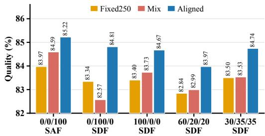  
Qualitative analysis. Figures 5 and 6 show that the chunkwise gains translate into stronger semantic alignment and visual stability. In Interactive generation, ours tracks successive prompt changes while preserving visual fidelity; in contrast, LongLive can introduce semantic errors such as duplicating the cat, and SGF fails to realize the requested prompt-conditioned motion. On MovieGen-100s, ours maintains the table-wiping motion and scene layout over the full horizon, whereas SGF duplicates the human subject and LongLive produces inconsistent background reflections. Additional comparisons, including framewise results, are provided in Appendix F, and more visualizations are provided in the supplementary material.

0s\~10s  
10s\~20s  
20s\~30s  
30s\~40s  
40s\~50s  
50s\~60s  
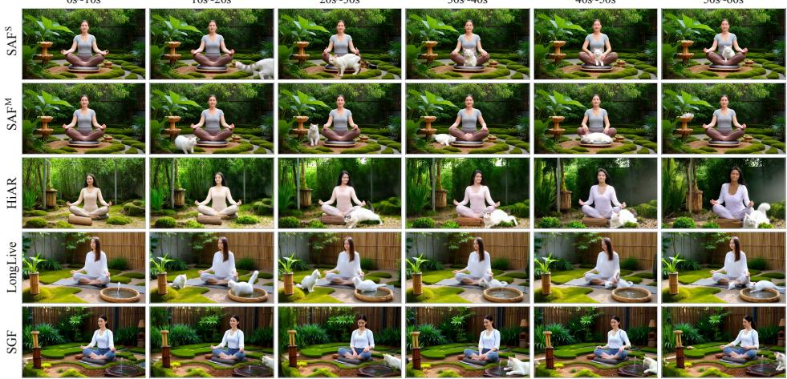  
0-10 s: A woman is meditating in a peaceful zen garden, sitting in a lotus position on a cushion. The garden has raked sand, moss, and a small bamboo fountain 10-20 s: The woman meditating in the peaceful zen garden is joined by a small, fluffy white cat that pads silently into the garden and sits a few feet away from her, watching curiously. 20-30 s: The woman and the white cat are in the peaceful zen garden. The cat, seeing the woman is still, curls up and begins to purr loudly, the sound a gentle hum in the quiet garden. 30-40 s: The woman in the peaceful zen garden slowly opens her eyes and smiles softly at the sleeping white cat. She does not move, so as not to disturb it. 40-50 s: The woman and the white cat are in the peaceful zen garden. She slowly reaches out a hand and gently strokes the sleeping cat's soft fur. The cat purrs even louder in its sleep. 50-60 s: The woman and the white cat sit together in the peaceful zen garden, one meditating and the other sleeping, sharing a moment of perfect tranquility by the bamboo fountain.  
Figure 5: Chunkwise Interactive qualitative comparison. Ours tracks the changing ten-second prompts with faithful semantics and stable visual quality, while competing methods exhibit quality degradation, object-count errors, or missed interactions.

## 4.3 ABLATION STUDIES

We conduct ablations on 20-second subsets of MovieGen-100s and Interactive, with protocol details and full metrics reported in Appendix E. Table 2 shows consistent trends for both ${ \tt S A F ^ { \mathrm { M } } }$ and

80 s

60 s

100 s  
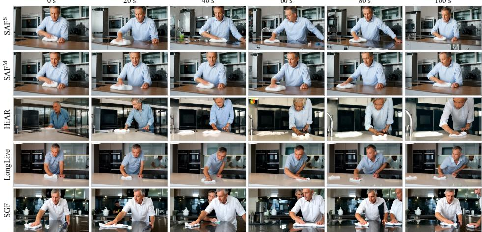  
Prompt: A detailed realist photograph captures a middle-aged man methodically wiping down a kitchen counter with a clean, white cloth. His focused expression conveys determination as he ensures every surface is spotlessly clean. ...  
Figure 6: Chunkwise MovieGen-100s qualitative comparison. Ours sustains the long-horizon table-wiping action with stable scene structure, whereas competing methods accumulate artifacts, duplicate subjects, or produce inconsistent reflections.

$\mathrm { S A F ^ { S } }$ . Detaching the history K/V mildly reduces Quality but substantially lowers Dynamic Degree, confirming the importance of the write term, i.e., future-to-history supervision. Removing sink recaching causes the largest degradation in both metrics. For single-bank inference under Fixedt, a larger t generally improves Quality and Dynamic Degree, but reduces Motion Smoothness and Imaging Quality, revealing a trade-off between dynamics and visual stability. We therefore adopt the Mix policy for $\mathrm { \dot { s } A F ^ { S } }$ , which provides a more balanced operating point across dynamics, smoothness, and image fidelity.

To examine how the noise level of the history K/V affects training, Figure 4 compares schedules of Self-Diffusion Forcing (SDF), a two-pass generalization of SAF that writes each block’s K/V at a random, fixed (t=250), or aligned stage (Appendix A). A schedule $a / b / c$ samples these three policies with probabilities a%, b%, and $c \%$ , so $\bar { 0 } / 0 / 1 0 0$ is SAF. Across the evaluated schedules, aligned inference consistently achieves the highest Quality, while Mix is typically second-best. For the fixed-trained model, Fixed250 performs better, consistent with its matched training history distribution. SAF (0/0/100) achieves the highest Quality under every inference policy.

Training efficiency. SAF is the most efficient in both settings (Table 3). Block-parallel rollout reduces the sequential depth to the number of stages, and the supervised forward pass itself yields the differentiable history, removing the history-construction rollout and per-block recaching. The gain is largest in the framewise setting, where serial rollout is most costly: SAF trains 1.8× faster than SGF and nearly matches its own chunkwise speed (137 s vs. 133 s). Even the twopass SDF (Appendix A) is slightly faster than SGF, as it skips per-block timestep-zero recaching.

Table 3: Training efficiency on one GB300 at batch size 4: memory (GiB) and time (s) per five-step cycle. Local attention spans 12 frames (chunkwise) and 21 frames (framewise). Best is bold and second-best underlined.
<table><tr><td rowspan="2">Method</td><td colspan="2">Chunkwise</td><td colspan="2">Framewise</td></tr><tr><td>Mem. ↓</td><td>Time ↓</td><td>Mem. ↓</td><td>Time ↓</td></tr><tr><td>LongLive</td><td>173.63</td><td>158.32</td><td>174.21</td><td>232.64</td></tr><tr><td>SGF</td><td>187.45</td><td>186.73</td><td>187.45</td><td>249.21</td></tr><tr><td>SDF</td><td>160.85</td><td>184.33</td><td>171.30</td><td>245.87</td></tr><tr><td>SAF</td><td>155.18</td><td>132.78</td><td>164.79</td><td>137.04</td></tr></table>

## 5 CONCLUSION

In this paper, we show that history K/V along the denoising trajectory, when aligned with the current noise level, can serve as an effective and trainable memory for streaming video diffusion. SAF realizes this by aligning each block’s history with its denoising stage and rolling out all blocks at each stage in a single causal forward pass. This keeps the noisy history differentiable, allowing future losses to supervise how it is written, while avoiding both a separate no-gradient rollout to construct the history and per-block timestep-zero recaching. Empirically, SAF improves long-horizon generation and prompt switching, accelerates training by up to 1.8× over SGF with lower memory, and supports efficient multi-GPU pipelined inference. Its noisy local history can still cause abrupt changes when new content enters the frame under camera motion (Appendix G). Overall, our results suggest that optimizing history directly along the denoising trajectory is a promising path toward efficient, long-horizon, and interactive video generation.

## REFERENCES

Jake Bruce, Michael D Dennis, Ashley Edwards, Jack Parker-Holder, Yuge Shi, Edward Hughes, Matthew Lai, Aditi Mavalankar, Richie Steigerwald, Chris Apps, Yusuf Aytar, Sarah Maria Elisabeth Bechtle, Feryal Behbahani, Stephanie C.Y. Chan, Nicolas Heess, Lucy Gonzalez, Simon Osindero, Sherjil Ozair, Scott Reed, Jingwei Zhang, Konrad Zolna, Jeff Clune, Nando De Freitas, Satinder Singh, and Tim Rocktaschel. Genie: Generative Interactive Environments. In Ruslan¨ Salakhutdinov, Zico Kolter, Katherine Heller, Adrian Weller, Nuria Oliver, Jonathan Scarlett, and Felix Berkenkamp (eds.), Proceedings of the 41st International Conference on Machine Learning, volume 235 of Proceedings of Machine Learning Research, pp. 4603–4623. PMLR, 21–27 Jul 2024. URL https://proceedings.mlr.press/v235/bruce24a.html.

Boyuan Chen, Diego Mart´ı Monso, Yilun Du, Max Simchowitz, Russ Tedrake, and Vin- ´ cent Sitzmann. Diffusion Forcing: Next-token Prediction Meets Full-Sequence Diffusion. In A. Globerson, L. Mackey, D. Belgrave, A. Fan, U. Paquet, J. Tomczak, and C. Zhang (eds.), Advances in Neural Information Processing Systems, volume 37, pp. 24081–24125. Curran Associates, Inc., 2024. doi: 10.52202/ 079017-0759. URL https://proceedings.neurips.cc/paper\_files/paper/ 2024/file/2aee1c4159e48407d68fe16ae8e6e49e-Paper-Conference.pdf.

Yuwei Guo, Ceyuan Yang, Hao He, Yang Zhao, Meng Wei, Zhenheng Yang, Weilin Huang, and Dahua Lin. End-to-End Training for Autoregressive Video Diffusion via Self-Resampling. In Computer Vision – ECCV 2026, Lecture Notes in Computer Science, pp. 324–344, Cham, 2026. Springer Nature Switzerland. doi: 10.1007/978-3-032-37574-2 18.

Xianglong He, Chunli Peng, Zexiang Liu, Boyang Wang, Yifan Zhang, Qi Cui, Fei Kang, Biao Jiang, Mengyin An, Yangyang Ren, Baixin Xu, Hao-Xiang Guo, Kaixiong Gong, Size Wu, Wei Li, Xuchen Song, Yang Liu, Yangguang Li, and Yahui Zhou. Matrix-Game 2.0: An Open-Source Real-Time and Streaming Interactive World Model, 2025. URL https://arxiv.org/abs/ 2508.13009.

Jonathan Ho and Tim Salimans. Classifier-Free Diffusion Guidance, 2022. URL https: //arxiv.org/abs/2207.12598.

Xun Huang, Zhengqi Li, Guande He, Mingyuan Zhou, and Eli Shechtman. Self Forcing: Bridging the Train-Test Gap in Autoregressive Video Diffusion. In D. Belgrave, C. Zhang, H. Lin, R. Pascanu, P. Koniusz, M. Ghassemi, and N. Chen (eds.), Advances in Neural Information Processing Systems, volume 38, Main Conference, pp. 167283–167308. Curran Associates, Inc., 2025. doi: 10.52202/085713-5576. URL https://proceedings.neurips.cc/paper\_files/paper/2025/file/ f4823f831af67a3ef15e41a85434422a-Paper-Conference.pdf.

Yubo Huang, Hailong Guo, Fangtai Wu, Weiqiang Wang, Shifeng Zhang, Shijie Huang, Qijun Gan, Lin Liu, Sirui Zhao, Enhong Chen, Jiaming Liu, and Steven Hoi. Live Avatar: Streaming Realtime Audio-Driven Avatar Generation with Infinite Length, 2026a. URL https://arxiv. org/abs/2512.04677.

Ziqi Huang, Yinan He, Jiashuo Yu, Fan Zhang, Chenyang Si, Yuming Jiang, Yuanhan Zhang, Tianxing Wu, Qingyang Jin, Nattapol Chanpaisit, Yaohui Wang, Xinyuan Chen, Limin Wang, Dahua Lin, Yu Qiao, and Ziwei Liu. VBench: Comprehensive Benchmark Suite for Video Generative Models. In Proceedings of the IEEE/CVF Conference on Computer Vision and Pattern Recognition (CVPR), pp. 21807–21818, June 2024.

Ziqi Huang, Fan Zhang, Xiaojie Xu, Yinan He, Jiashuo Yu, Ziyue Dong, Qianli Ma, Nattapol Chanpaisit, Chenyang Si, Yuming Jiang, Yaohui Wang, Xinyuan Chen, Ying-Cong Chen, Limin Wang, Dahua Lin, Yu Qiao, and Ziwei Liu. VBench++: Comprehensive and Versatile Benchmark Suite for Video Generative Models. IEEE Transactions on Pattern Analysis and Machine Intelligence, 48(3):3268–3285, 2026b. doi: 10.1109/TPAMI.2025.3633890.

Sihui Ji, Xi Chen, Shuai Yang, Xin Tao, Pengfei Wan, and Hengshuang Zhao. MemFlow: Flowing Adaptive Memory for Consistent and Efficient Long Video Narratives, 2025. URL https: //arxiv.org/abs/2512.14699.

Akio Kodaira, Tingbo Hou, Ji Hou, Markos Georgopoulos, Felix Juefei-Xu, Masayoshi Tomizuka, and Yue Zhao. StreamDiT: Real-Time Streaming Text-to-Video Generation. In Proceedings of the IEEE/CVF Conference on Computer Vision and Pattern Recognition (CVPR), pp. 29200–29210, June 2026.

Shanchuan Lin, Ceyuan Yang, Hao He, Jianwen Jiang, Yuxi Ren, Xin Xia, Yang Zhao, Xuefeng Xiao, and Lu Jiang. Autoregressive Adversarial Post-Training for Real-Time Interactive Video Generation. In D. Belgrave, C. Zhang, H. Lin, R. Pascanu, P. Koniusz, M. Ghassemi, and N. Chen (eds.), Advances in Neural Information Processing Systems, volume 38, pp. 41061–41086. Curran Associates, Inc., 2025. doi: 10.52202/ 085713-1371. URL https://proceedings.neurips.cc/paper\_files/paper/ 2025/file/3a9468a918fc65dc9ce7b7bd99f4f0ef-Paper-Conference.pdf.

Kunhao Liu, Wenbo Hu, Jiale Xu, Ying Shan, and Shijian Lu. Rolling Forcing: Autoregressive Long Video Diffusion in Real Time. In The Fourteenth International Conference on Learning Representations, 2026. URL https://openreview.net/forum?id=IAyzXjbfwo.

Ilya Loshchilov and Frank Hutter. Decoupled Weight Decay Regularization. In The Seventh International Conference on Learning Representations, 2019. URL https://openreview. net/forum?id=Bkg6RiCqY7.

Yunhong Lu, Yanhong Zeng, Haobo Li, Hao Ouyang, Qiuyu Wang, Ka Leong Cheng, Jiapeng Zhu, Hengyuan Cao, Zhipeng Zhang, Xing Zhu, Yujun Shen, and Min Zhang. Reward Forcing: Efficient Streaming Video Generation with Rewarded Distribution Matching Distillation. In Proceedings of the IEEE/CVF Conference on Computer Vision and Pattern Recognition (CVPR), pp. 34385–34397, June 2026.

Ryan Po, Eric Ryan Chan, Changan Chen, and Gordon Wetzstein. BAgger: Backwards Aggregation for Mitigating Drift in Autoregressive Video Diffusion Models. In Proceedings ofthe IEEE/CVF Conference on Computer Vision and Pattern Recognition (CVPR), pp. 43727–43739, June 2026.

Adam Polyak, Amit Zohar, Andrew Brown, Andros Tjandra, Animesh Sinha, Ann Lee, Apoorv Vyas, Bowen Shi, Chih-Yao Ma, Ching-Yao Chuang, David Yan, Dhruv Choudhary, Dingkang Wang, Geet Sethi, Guan Pang, Haoyu Ma, Ishan Misra, Ji Hou, Jialiang Wang, Kiran Jagadeesh, Kunpeng Li, Luxin Zhang, Mannat Singh, Mary Williamson, Matt Le, Matthew Yu, Mitesh Kumar Singh, Peizhao Zhang, Peter Vajda, Quentin Duval, Rohit Girdhar, Roshan Sumbaly, Sai Saketh Rambhatla, Sam Tsai, Samaneh Azadi, Samyak Datta, Sanyuan Chen, Sean Bell, Sharadh Ramaswamy, Shelly Sheynin, Siddharth Bhattacharya, Simran Motwani, Tao Xu, Tianhe Li, Tingbo Hou, Wei-Ning Hsu, Xi Yin, Xiaoliang Dai, Yaniv Taigman, Yaqiao Luo, Yen-Cheng Liu, Yi-Chiao Wu, Yue Zhao, Yuval Kirstain, Zecheng He, Zijian He, Albert Pumarola, Ali Thabet, Artsiom Sanakoyeu, Arun Mallya, Baishan Guo, Boris Araya, Breena Kerr, Carleigh Wood, Ce Liu, Cen Peng, Dimitry Vengertsev, Edgar Schonfeld, Elliot Blanchard, Felix Juefei-Xu, Fraylie Nord, Jeff Liang, John Hoffman, Jonas Kohler, Kaolin Fire, Karthik Sivakumar, Lawrence Chen, Licheng Yu, Luya Gao, Markos Georgopoulos, Rashel Moritz, Sara K. Sampson, Shikai Li, Simone Parmeggiani, Steve Fine, Tara Fowler, Vladan Petrovic, and Yuming Du. Movie Gen: A Cast of Media Foundation Models, 2025. URL https://arxiv.org/abs/2410.13720.

Marc’Aurelio Ranzato, Sumit Chopra, Michael Auli, and Wojciech Zaremba. Sequence Level Training with Recurrent Neural Networks. In The Fourth International Conference on Learning Representations, 2016. URL https://arxiv.org/abs/1511.06732.

Sand AI, Hansi Teng, Hongyu Jia, Lei Sun, Lingzhi Li, Maolin Li, Mingqiu Tang, Shuai Han, Tianning Zhang, W. Q. Zhang, Weifeng Luo, Xiaoyang Kang, Yuchen Sun, Yue Cao, Yunpeng Huang, Yutong Lin, Yuxin Fang, Zewei Tao, Zheng Zhang, Zhongshu Wang, Zixun Liu, Dai Shi, Guoli Su, Hanwen Sun, Hong Pan, Jie Wang, Jiexin Sheng, Min Cui, Min Hu, Ming Yan, Shucheng Yin, Siran Zhang, Tingting Liu, Xianping Yin, Xiaoyu Yang, Xin Song, Xuan Hu, Yankai Zhang, and Yuqiao Li. MAGI-1: Autoregressive Video Generation at Scale, 2025. URL https://arxiv.org/abs/2505.13211.

Dani Valevski, Yaniv Leviathan, Moab Arar, and Shlomi Fruchter. Diffusion Models Are Real-Time Game Engines. In The Thirteenth International Conference on Learning Representations, 2025. URL https://openreview.net/forum?id=P8pqeEkn1H.

Team Wan, Ang Wang, Baole Ai, Bin Wen, Chaojie Mao, Chen-Wei Xie, Di Chen, Feiwu Yu, Haiming Zhao, Jianxiao Yang, Jianyuan Zeng, Jiayu Wang, Jingfeng Zhang, Jingren Zhou, Jinkai Wang, Jixuan Chen, Kai Zhu, Kang Zhao, Keyu Yan, Lianghua Huang, Mengyang Feng, Ningyi Zhang, Pandeng Li, Pingyu Wu, Ruihang Chu, Ruili Feng, Shiwei Zhang, Siyang Sun, Tao Fang, Tianxing Wang, Tianyi Gui, Tingyu Weng, Tong Shen, Wei Lin, Wei Wang, Wei Wang, Wenmeng Zhou, Wente Wang, Wenting Shen, Wenyuan Yu, Xianzhong Shi, Xiaoming Huang, Xin Xu, Yan Kou, Yangyu Lv, Yifei Li, Yijing Liu, Yiming Wang, Yingya Zhang, Yitong Huang, Yong Li, You Wu, Yu Liu, Yulin Pan, Yun Zheng, Yuntao Hong, Yupeng Shi, Yutong Feng, Zeyinzi Jiang, Zhen Han, Zhi-Fan Wu, and Ziyu Liu. Wan: Open and Advanced Large-Scale Video Generative Models, 2025. URL https://arxiv.org/abs/2503.20314.

Wenhao Wang and Yi Yang. VidProM: A Million-scale Real Prompt-Gallery Dataset for Text-to-Video Diffusion Models. In A. Globerson, L. Mackey, D. Belgrave, A. Fan, U. Paquet, J. Tomczak, and C. Zhang (eds.), Advances in Neural Information Processing Systems, volume 37, pp. 65618–65642. Curran Associates, Inc., 2024. doi: 10.52202/079017-2096. URL https://proceedings.neurips.cc/paper\_files/paper/2024/file/ 78b3e7836e3b7dea79d809b0c99cb097-Paper-Datasets\_and\_Benchmarks\_ Track.pdf.

Yi Wang, Yinan He, Yizhuo Li, Kunchang Li, Jiashuo Yu, Xin Ma, Xinhao Li, Guo Chen, Xinyuan Chen, Yaohui Wang, Ping Luo, Ziwei Liu, Yali Wang, Limin Wang, and Yu Qiao. InternVid: A Large-scale Video-Text Dataset for Multimodal Understanding and Generation. In The Twelfth International Conference on Learning Representations, 2024. URL https://openreview. net/forum?id=MLBdiWu4Fw.

Zhuguanyu Wu, Ruihao Gong, Yang Yong, Yushi Huang, Xiangyu Fan, Lei Yang, Dahua Lin, and Xianglong Liu. SGMD: Score Gradient Matching Distillation for Few-Step Video Diffusion Distillation. In Forty-third International Conference on Machine Learning, 2026. URL https: //openreview.net/forum?id=melQSx2bVT.

Guangxuan Xiao, Yuandong Tian, Beidi Chen, Song Han, and Mike Lewis. Efficient Streaming Language Models with Attention Sinks. In The Twelfth International Conference on Learning Representations, 2024. URL https://openreview.net/forum?id=NG7sS51zVF.

Shuai Yang, Wei Huang, Ruihang Chu, Yicheng Xiao, Yuyang Zhao, Xianbang Wang, Muyang Li, Enze Xie, Ying-Cong Chen, Yao Lu, Song Han, and Yukang Chen. LongLive: Real-time Interactive Long Video Generation. In The Fourteenth International Conference on Learning Representations, 2026. URL https://openreview.net/forum?id=nCAODkpsPJ.

Jung Yi, Wooseok Jang, Paul Hyunbin Cho, Jisu Nam, Heeji Yoon, and Seungryong Kim. Deep Forcing: Training-Free Long Video Generation with Deep Sink and Participative Compression. In Forty-third International Conference on Machine Learning, 2026. URL https: //openreview.net/forum?id=gtmyFnvXAW.

Tianwei Yin, Michael Gharbi, Taesung Park, Richard Zhang, Eli Shechtman, Fr¨ edo Du-´ rand, and William T. Freeman. Improved Distribution Matching Distillation for Fast Image Synthesis. In A. Globerson, L. Mackey, D. Belgrave, A. Fan, U. Paquet, J. Tomczak, and C. Zhang (eds.), Advances in Neural Information Processing Systems, volume 37, pp. 47455–47487. Curran Associates, Inc., 2024a. doi: 10.52202/ 079017-1505. URL https://proceedings.neurips.cc/paper\_files/paper/ 2024/file/54dcf25318f9de5a7a01f0a4125c541e-Paper-Conference.pdf.

Tianwei Yin, Michael Gharbi, Richard Zhang, Eli Shechtman, Fr¨ edo Durand, William T. Freeman,´ and Taesung Park. One-step Diffusion with Distribution Matching Distillation. In Proceedings of the IEEE/CVF Conference on Computer Vision and Pattern Recognition (CVPR), pp. 6613–6623, June 2024b.

Tianwei Yin, Qiang Zhang, Richard Zhang, William T. Freeman, Fredo Durand, Eli Shechtman, and Xun Huang. From Slow Bidirectional to Fast Autoregressive Video Diffusion Models. In Proceedings of the IEEE/CVF Conference on Computer Vision and Pattern Recognition (CVPR), pp. 22963–22974, June 2025.

Yuyang You, Yongzhi Li, Jiahui Li, Yadong Mu, Quan Chen, and Peng Jiang. Adaptive Video Distillation: Mitigating Oversaturation and Temporal Collapse in Few-Step Generation. In Proceedings of the IEEE/CVF Conference on Computer Vision and Pattern Recognition (CVPR), pp. 43429–43439, June 2026.

Yonghao Yu, Lang Huang, Runyi Li, Zerun Wang, and Toshihiko Yamasaki. Video-Mirai: Autoregressive Video Diffusion Models Need Foresight, 2026. URL https://arxiv.org/abs/ 2606.03971.

Lin Zhang, Sicheng Mo, Zefan Cai, Jinhong Lin, Zihao Lin, Jiuxiang Gu, Krishna Kumar Singh, Yuheng Li, and Yin Li. UniTemp: Unlocking Video Generation in Any Temporal Order via Bidirectional Distillation, 2026. URL https://arxiv.org/abs/2606.18702.

Hongzhou Zhu, Min Zhao, Guande He, Hang Su, Chongxuan Li, and Jun Zhu. Causal Forcing: Autoregressive Diffusion Distillation Done Right for High-Quality Real-Time Interactive Video Generation. In Forty-third International Conference on Machine Learning, 2026. URL https: //openreview.net/forum?id=BYInOck3gr.

Junhao Zhuang, Shiyi Zhang, Yuxuan Bian, Yaowei Li, Yawen Luo, Yijun Liu, Weiyang Jin, Songchun Zhang, Xianglong He, Xuying Zhang, Haoran Li, Haoyang Huang, Zeyue Xue, and Nan Duan. Self Gradient Forcing: Native Long Video Extrapolation, 2026. URL https: //arxiv.org/abs/2607.20368.

Kai Zou, Dian Zheng, Hongbo Liu, Tiankai Hang, Bin Liu, and Nenghai Yu. HiAR: Efficient Autoregressive Long Video Generation via Hierarchical Denoising. In Computer Vision – ECCV 2026, Lecture Notes in Computer Science, pp. 225–242, Cham, 2026. Springer Nature Switzerland. doi: 10.1007/978-3-032-37026-6 13.

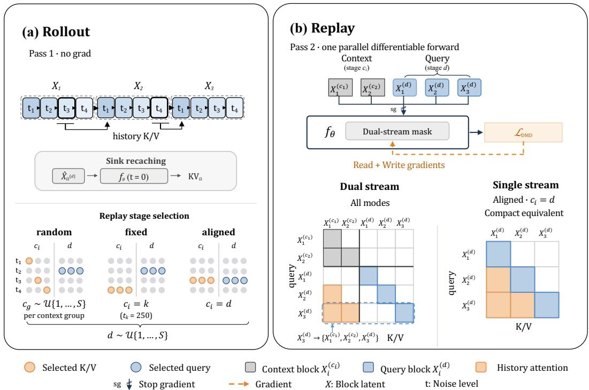  
Figure 7: Two-pass training of SDF. (a) Pass 1 rolls out all blocks serially without gradients, recaches the sink from $\widehat { X } _ { \Omega } ^ { ( d ) }$ , and records the trajectory; the history of each block is read at the stage chosen by the random, fixed, or aligned policy. (b) Pass 2 replays the recorded states in one differentiable forward pass over a context stream $C$ and a query stream D, so the DMD loss on the queries reaches the context K/V they attend to. Under the aligned policy $( c _ { i } = d )$ , context and query coincide and the two streams collapse into one. For clarity, the attention masks omit the clean sink; as in SAF, block i also attends to the clean K/V of the preceding sink blocks, $\mathrm { K V } _ { \Omega , < i }$ (Section 3.4). At the top of (a), $X _ { i }$ is block $i ,$ whose K/V enters the history at the bold stage; the context and query streams in (b) hold its recorded states $X _ { i } ^ { ( c _ { i } ) }$ and $X _ { i } ^ { ( d ) }$ , and $c _ { g }$ is shared by context group g (Eq. 7).

## A SELF-DIFFUSION FORCING

SAF encodes the history of every block at the stage of the current block. To test this choice, our schedule ablations (Section 4.3 and Appendix E.2) use Self-Diffusion Forcing (SDF), a generalization that decouples the stage $c _ { i }$ at which block i writes its K/V into the history from the query stage $d \sim \mathcal { U } \{ 1 , \dotsc , \bar { S } \}$ at which predictions are supervised. In SAF, d is also the exit stage at which the rollout stops (Section 3.3); in SDF, it does not truncate the rollout: Pass 1 runs all S stages, and d only selects which recorded states are replayed with gradients. Figure 7 illustrates the procedure.

History-stage policies. SDF supports three policies for the history stage:

$$
c _ { i } = d \left( \mathrm { a l i g n e d } \right) , \qquad c _ { i } = k \left( \mathrm { f i x e d } \right) , \qquad c _ { i } = c _ { g ( i ) } , \ c _ { g } \sim \mathcal { U } \{ 1 , \dots , S \} \ ( \mathrm { r a n d o m } ) ,\tag{7}
$$

where k is the stage with $t _ { k } = 2 5 0$ and $g ( i )$ is the group of three latent frames containing block $i .$ A training schedule draws one policy per sample, and schedule $a / b / c$ uses the random, fixed, and aligned policies with probabilities a%, b%, and c%; the $0 / 0 / 1 0 0$ schedule is SAF.

Two-pass training. When $c _ { i } \neq d ,$ the history and the query of a block lie at different noise levels and cannot share a forward pass, so SDF trains in two passes. As in SAF, the sink blocks are first rolled out sequentially, and their estimate $\widehat { X } _ { \Omega } ^ { ( d ) }$ at the query stage d serves as the clean sink recached in both passes. Pass 1 rolls out the remaining blocks serially without gradients, reading the history at the policy stage, and records their states. Pass 2 packs the clean sink, a context stream C with $C _ { i } = X _ { i } ^ { ( c _ { i } ) }$ , and a query stream D with $D _ { i } = X _ { i } ^ { ( d ) }$ , all recorded in Pass 1, into one differentiable forward pass. Under the dual-stream mask $M _ { \mathrm { d u a l } }$ , query block i attends to the clean sink blocks before it, the context blocks $j < i$ within the window, and its own query tokens, but never to its own context copy, other query blocks, or future context. Only query predictions receive the DMD loss, and its gradients reach the sink and context K/V that the queries attend to, but not the recorded trajectory. Under the aligned policy, $C$ and D coincide and $\bar { M } _ { \mathrm { d u a l } }$ reduces to $M _ { \mathrm { c a u s a l } }$ . SAF goes one step further: because every stage produces its own history, it replaces the serial Pass 1 with the block-parallel rollout of Section 3.3. Algorithm 5 in Appendix B gives the full procedure.

Algorithm 3 Single-GPU Multi-Bank Inference of ${ \tt S A F ^ { \mathrm { M } } }$   
Require: Denoiser $f _ { \theta }$ , stages $t _ { 1 : S } ,$ sampler Ψ, N blocks, window L, sink Ω, block prompts $p _ { 1 : N }$   
Ensure: Ordered clean blocks $\widehat { X } _ { 1 : N } ^ { ( S ) }$   
1: Disable gradients; generate and emit the sink blocks sequentially   
2: Encode $\overline { { \widehat { X } } } _ { \Omega } ^ { ( S ) }$ once at t = 0 to obtain $\mathrm { K V } _ { \Omega }$   
3: $\mathcal { H } ^ { ( s ) } \gets$ Init $\left( \mathrm { K V } _ { \Omega } \right)$ for $s = 1 , \ldots , S$   
4: for $i = | \Omega | + 1 , \ldots , N$ do   
5: Sample $X _ { i } ^ { ( 1 ) } \sim \mathcal { N } ( 0 , I )$   
6: for $s = 1 , \ldots , S \ ,$ do   
7: $( \widehat { X } _ { i } ^ { ( s ) } , \operatorname { K V } _ { i } ^ { ( s ) } ) \gets f _ { \theta } ( X _ { i } ^ { ( s ) } , t _ { s } ; \mathcal { H } ^ { ( s ) } , p _ { i } )$   
8: $\mathcal { H } ^ { ( s ) }  \mathrm { C o m m i t } _ { L } ( \mathcal { H } ^ { ( s ) } , \mathrm { K V } _ { i } ^ { ( s ) } )$   
9: if $s < S$ then   
10: Sample $\mathbf { \Phi } _ { \epsilon _ { i , s } } ^ { \star \star } \sim { \mathcal { N } } ( 0 , I ) ; X _ { i } ^ { ( s + 1 ) } \gets \Psi _ { s } ( \widehat { X } _ { i } ^ { ( s ) } , \epsilon _ { i , s } )$   
11: else   
12: Emit $\widehat { X } _ { i } ^ { ( S ) }$   
13: end if   
14: end for   
15: end for

## B ALGORITHM DETAILS

This section complements Algorithms 1 and 2 with the shared cache operations, single-GPU inference for $\mathrm { S A F ^ { M } } ^ { \mathrm { \Delta t } }$ and $\mathrm { S A F ^ { S } }$ (Algorithms 3 and 4), and the two-pass SDF training of Appendix A (Algorithm 5). Notation follows Section 3.

Denoiser and sampling. $\mathrm { K V } _ { i } ^ { ( s ) }$ collects the K/V of block i from all attention layers. In the training algorithms, $f _ { \theta }$ processes all blocks in one forward pass under the indicated attention mask, whereas at inference it processes one block against a history K/V bank. Gaussian draws are indexed by sample, block, and stage, so all execution schedules of the same sample use identical noise. Blocks keep their original temporal indices for positional encoding. Training uses a single prompt $p ,$ whereas at inference block i uses its own prompt $p _ { i } ,$ so a prompt switch changes only the text conditioning and leaves the generated history intact.

Cache operations. The sink Ω consists of the leading blocks of the video, and sink recaching encodes their clean latents at $t = 0$ into the clean ${ \mathrm { K } } / { \mathrm { V } } { \mathrm { K } } { \bar { \mathrm { V } } } _ { \Omega }$ . During training, the sink is rolled out to the exit stage d, and the parallel forward pass of every stage recaches it from the same estimate $\widehat { X } _ { \Omega } ^ { ( d ) } \left( \mathrm { E q . } 5 \right) ;$ ; SDF likewise uses $\widehat { X } _ { \Omega } ^ { ( d ) }$ (Appendix A). At inference, the sink blocks are generated first and recached once from their final estimate $\widehat { X } _ { \Omega } ^ { ( S ) }$ , after which the remaining blocks are streamed. Init $\left( \mathrm { K V } _ { \Omega } \right)$ ) creates a bank that holds $\mathrm { K V } _ { \Omega }$ and an empty local window, and all stage banks share the same sink. $\mathrm { C o m m i t } _ { L } ( \mathcal { H } , \mathrm { K V } )$ appends the $\mathrm { K } / \mathrm { V }$ of the current block to H after its forward pass and evicts the oldest non-sink entries beyond the window $L ;$ the sink is never evicted. Apart from sink recaching, no procedure below runs a forward pass at $t = 0$

Single-GPU multi-bank inference. Algorithm 3 runs ${ \tt S A F ^ { \mathrm { M } } }$ on one GPU by denoising each block through all S stages before starting the next. It respects the same dependencies as the pipeline of Algorithm 2, so both produce identical videos from the same noise: when block i reaches stage $s ,$ bank $\mathcal { H } ^ { ( s ) }$ holds exactly its history $\mathcal { H } _ { i } ^ { ( s ) }$

Algorithm 4 Single-Bank Inference of $\mathsf { S A F } ^ { \mathrm { S } }$   
Require: Denoiser $f _ { \theta } ,$ , stages $t _ { 1 : S } .$ , sampler Ψ, N blocks, window L, sink Ω, block prompts $p _ { 1 : N }$   
Require: Commit policy π over stages $\mathbf { \hat { \{ 1 , . . . , } }  S \mathbf  \}$ (Fixedt or Mix)   
Ensure: Ordered clean blocks $\widehat { X } _ { 1 : \underline { { { N } } } } ^ { ( S ) }$   
1: Disable gradients; generate and emit the sink blocks sequentially   
2: Encode $\overline { { \widehat { X } } } _ { \Omega } ^ { ( S ) }$ once at t = 0 to obtain $\mathrm { K V } _ { \Omega }$   
3: H ← In $\mathrm { t } ( \mathrm { \check { K } V } _ { \Omega } )$   
4: for $i = | \Omega | + 1 , \ldots , N$ do   
5: Sample $c _ { i } \sim \pi$ and $X _ { i } ^ { ( 1 ) } \sim \mathcal { N } ( 0 , I ) ; \mathrm { K V } _ { i } ^ { \star } \gets \emptyset$   
6: for $s = 1 , \ldots , S$ do   
7: $( \widehat { X } _ { i } ^ { ( s ) } , \mathrm { K V } _ { i } ^ { ( s ) } ) \gets f _ { \theta } ( X _ { i } ^ { ( s ) } , t _ { s } ; \mathcal { H } , p _ { i } )$ ▷ H is read-only   
8: i $i s = c _ { i }$ then   
9: $\mathrm { K V } _ { i } ^ { \star } \gets \mathrm { K V } _ { i } ^ { ( s ) }$ ▷ keep the K/V of stage ci   
10: end if   
11: i $\mathbf { f } \ s < S$ then   
12: Sample $\mathbf { \widetilde { \epsilon } } _ { \epsilon _ { i , s } } ^ { - } \sim \mathcal { N } ( 0 , I ) ; X _ { i } ^ { ( s + 1 ) } \gets \Psi _ { s } ( \widehat { X } _ { i } ^ { ( s ) } , \epsilon _ { i , s } )$   
13: end if   
14: end for   
15: H ← Commit ${ \bf \Lambda } _ { L } ( \mathcal { H } , \mathrm { K V } _ { i } ^ { \star } ) ;$ emit $\widehat { X } _ { i } ^ { ( S ) }$   
16: end for

Single-bank inference. Algorithm 4 keeps one bank H shared by all stages. For each block, it samples the stage $c _ { i } \sim \pi$ whose K/V is committed, where π places all mass on the stage with noise level t for Fixedt, and for Mix samples the stages with noise levels (250, 500, 750) with probabilities (0.5, 0.25, 0.25). All stages of block i read the same history, and only the K/V from stage $c _ { i }$ is committed once the block is fully denoised. The bank thus holds one entry per block, and different blocks may be written at different noise levels.

Two-pass SDF training. Algorithm 5 implements the two passes of Appendix A; score-model updates follow the standard DMD procedure. A context-stage plan $\{ c _ { j } \} \sim { \bar { \pi } } ( \cdot \mid d )$ , drawn according to Eq. 7, is shared by both passes. In Pass 1, SelectHistory reads the preceding blocks at stage k under the fixed policy, at the planned stages under the random policy, and at the current stage s under the aligned policy, while CommitPlanL retains only the K/V that the policy requires. Both passes share the clean sink recached from $\widehat { X } _ { \Omega } ^ { ( d ) }$ , and the recorded trajectory $\mathcal { R }$ receives no gradients.

## C EXPERIMENTAL DETAILS

## C.1 IMPLEMENTATION

Distillation setup. The generator is a causal Wan2.1-T2V-1.3B (Wan et al., 2025) trained with DMD (Yin et al., 2024b;a). Wan2.1-T2V-14B serves as the real score model with a classifier-free guidance (Ho & Salimans, 2022) scale of 3.0, and the bidirectional Wan2.1-T2V-1.3B serves as the fake score model. Following SGF (Zhuang et al., 2026), we initialize SAF and SDF from the $\mathtt { a r \mathrm { \_ d i f f u s i o n } }$ checkpoint released by Causal-Forcing (Zhu et al., 2026). Training uses text prompts only, taken from the VidProM prompts (Wang & Yang, 2024) as filtered and extended by Self-Forcing (Huang et al., 2025). Each training sample has 21 latent frames, corresponding to a 5-second video at 832 × 480, 16 FPS. All models use $S = 4$ denoising stages with noise levels $( t _ { 1 } , \dots , t _ { 4 } ) = ( 1 0 0 0 , 7 5 0 , 5 0 0 , 2 5 0 )$ and a timestep shift of 5.

Attention. In the chunkwise setting, each block contains 3 latent frames, and the local attention window spans 12 latent frames, including the current block and a 3-frame sink. In the framewise setting, each block contains 1 latent frame, and the window spans 21 latent frames with a 4-frame sink, following SGF (Zhuang et al., 2026). The window works as a first-in, first-out queue, except for the sink, which stays fixed. The sink holds the latent frames at the start of the video and is recached at timestep zero from a single estimate, taken at the exit stage during training and at the final stage at inference, whereas the rest of the history keeps the noisy K/V from the denoising trajectory (Appendix B).

Algorithm 5 Two-Pass Training of SDF   
Require: Denoiser $f _ { \theta } ,$ , stages $t _ { 1 : S } ,$ sampler Ψ, N blocks, window $L ,$ sink Ω, prompt p   
Require: History policy π, dual-stream causal mask $M _ { \mathrm { d u a l } }$   
Ensure: One generator update   
1: Sample $d \sim \mathcal { U } \{ 1 , \ldots \} S \}$ and context-stage plan $\{ c _ { j } \} \sim \pi ( \cdot \mid d )$   
Pass 1: detached trajectory collection   
2: Disable gradients; roll out the sink blocks sequentially; record $X _ { \Omega } ^ { ( 1 : S ) }$ and $\widehat { X } _ { \Omega } ^ { ( d ) }$   
3: Encode $\widehat { X } _ { \Omega } ^ { ( d ) }$ at $t = 0$ into $\mathrm { K V } _ { \Omega }$ ▷ sink recaching   
4: $\mathcal { H }  \mathrm { I n i t } ( \mathrm { K V } _ { \Omega } ) ; \mathcal { R } _ { i , s }  X _ { i } ^ { ( s ) }$ for $i \in \Omega$ and all s   
5: for $i = | \Omega | + 1 , \dot { \textrm { -- } } , \dot { N }$ do   
6: Sample $X _ { i } ^ { ( 1 ) } \sim \mathcal { N } ( 0 , I )$   
7: for $\bar { s } = 1 , \dotsc , S \ ,$ do   
8: $\mathcal { R } _ { i , s }  \mathrm { s g } ( X _ { i } ^ { ( s ) } )$   
9: $\mathcal { H } _ { i } ^ { ( s ) } \gets$ SelectHistory $( { \mathcal { H } } , \pi , \{ c _ { j } \} _ { j < i } , s )$   
10: $( \widehat { X } _ { i } ^ { ( s ) } , \mathrm { K V } _ { i } ^ { ( s ) } ) \gets f _ { \theta } ( X _ { i } ^ { ( s ) } , t _ { s } ; \mathcal { H } _ { i } ^ { ( s ) } , p )$   
11: if s < S then   
12: Sample $\mathbf { \widetilde { \epsilon } } _ { \epsilon _ { i , s } } ^ { - } \sim \mathcal { N } ( 0 , I ) ; X _ { i } ^ { ( s + 1 ) } \gets \Psi _ { s } ( \widehat { X } _ { i } ^ { ( s ) } , \epsilon _ { i , s } )$   
13: end if   
14: end for   
15: H ← CommitPlan $ _ { \cdot L } ( \mathcal { H } , \mathrm { K V } _ { i } ^ { ( 1 : S ) } , \pi , c _ { i } )$   
16: end for   
17: Discard the rollout cache H   
Pass 2: differentiable replay   
18: $C _ { i } \gets \mathcal { R } _ { i , c _ { i } }$ and $D _ { i } \gets \dot { \mathcal { R } } _ { i , d } \dot { \mathrm { ~ f o r ~ } } i = 1 , \dots , N$   
19: Pack $Z \gets [ \widehat { X } _ { \Omega } ^ { ( d ) } \mid C \mid D ]$ and timestep vector $;  [ 0 \mid \{ t _ { c _ { i } } \} \mid t _ { d } ] ;$ ; enable gradients   
20: $\widehat { X } _ { D } \gets [ f _ { \theta } ( \mathbf { s g } ( Z ) , \mathbf { t } ; M _ { \mathrm { d u a l } } , p ) ] _ { D }$ ▷ clean sink recached with gradients   
21: $\mathcal { L }  \mathcal { L } _ { \mathrm { D M D } } ( \widehat { X } _ { D } , p )$   
22: Backpropagate through sink, context, and query K/V, but not into R or Pass 1; update θ

Optimization. We use AdamW (Loshchilov & Hutter, 2019) with $( \beta _ { 1 } , \beta _ { 2 } ) = ( 0 , 0 . 9 9 9 )$ and a weight decay of 0.01. The learning rate is $2 \times 1 0 ^ { - 6 }$ for the generator and $4 \times 1 0 ^ { - 7 }$ for the fake score model. The fake score model is first warmed up for 10 updates, after which the generator is updated once every 5 fake score updates. We train for 800 steps on 8 NVIDIA GB300 GPUs with a batch size of 4 per GPU (32 in total) and a random seed of 42. Starting at step 200, we also track an exponential moving average (EMA) of the generator weights with a decay of 0.99.

Inference. We evaluate the EMA weights at step 600 for the chunkwise model and at step 700 for the framewise model. ${ \tt S A F ^ { \mathrm { M } } }$ maintains a separate K/V bank for each denoising stage, whereas $\mathsf { S A F } ^ { \mathrm { S } }$ maintains a single bank written by the Mix policy (Appendix B). Inference uses the base seed 42, from which per-sample seeds are derived as described in Appendix C.2.

## C.2 BENCHMARKS AND METRICS

Table 4 summarizes the three benchmarks. Seeding is deterministic in all evaluations. The seed of each sample is derived from the base seed 42, its global prompt index, and its sample index, so the results do not depend on how prompts are split across GPUs or on which subset is evaluated.

Table 4: Evaluation benchmarks. All models are trained on 5-second clips, so Interactive and MovieGen-100s test generation at 12× and 20× the training length. Each Interactive video is driven by six prompts in turn, each lasting 10 seconds, and the benchmark provides 100 such prompt sequences $( 1 0 0 \times 6 )$ . Samples is the number of videos per prompt (per prompt sequence for Interactive), and Dimensions is the number of VBench dimensions scored.
<table><tr><td>Benchmark</td><td>Prompts</td><td>Samples</td><td>Length</td><td>Dimensions</td><td>Aggregate metrics</td></tr><tr><td>VBench</td><td>944</td><td>5</td><td>5s</td><td>16</td><td>Total, Quality, Semantic</td></tr><tr><td>Interactive</td><td> $1 0 0 \times 6$ </td><td>1</td><td>60s</td><td>7</td><td>Quality, ViCLIP</td></tr><tr><td>MovieGen-100s</td><td>128</td><td>1</td><td>100 s</td><td>7</td><td>Quality</td></tr></table>

Table 5: Framewise evaluation with existing methods. Framewise counterpart of Table 1; Causal-Forcing and SGF are the only baselines with released framewise checkpoints. Throughput is reported as in Table 1, with the second value denoting 4-GPU pipelined inference. Best results are bold and second-best results are underlined.
<table><tr><td rowspan="2">Method</td><td rowspan="2">Throughput (FPS) ↑</td><td colspan="3">VBench</td><td colspan="2">Interactive</td><td>MovieGen 100s</td></tr><tr><td>Total ↑ Quality ↑ Semantic ↑ ViCLIP↑ Quality ↑</td><td></td><td></td><td></td><td></td><td>Quality ↑</td></tr><tr><td>Causal-Forcing</td><td>8.9</td><td>83.86</td><td>85.23</td><td>78.35</td><td>21.82</td><td>81.42</td><td>80.62</td></tr><tr><td>SGF</td><td>8.9</td><td>84.10</td><td>85.26</td><td>79.48</td><td>24.85</td><td>84.83</td><td>84.71</td></tr><tr><td> $\mathbf { s A F } ^ { \mathrm { S } }$ </td><td>9.07</td><td>83.20</td><td>84.52</td><td>77.93</td><td>22.85</td><td>81.95</td><td>80.77</td></tr><tr><td> $\mathbf { S A F ^ { \mathrm { M } } }$ </td><td>9.08 / 21.6</td><td>83.88</td><td>85.31</td><td>78.15</td><td>25.23</td><td>84.35</td><td>84.17</td></tr></table>

Protocols. All three benchmarks follow existing evaluation protocols. On VBench (Huang et al., 2024; 2026b), we generate five videos for each of the 944 unique standard prompts and report the Total, Quality, and Semantic scores. Interactive uses the 100 prompt sequences released by Mem-Flow (Ji et al., 2025) and the protocol of LongLive (Yang et al., 2026). Each 60-second video is generated from six prompts in turn, one for every 10 seconds. Prompt alignment is the ViCLIP (Wang et al., 2024) similarity between each 10-second segment and its own prompt, averaged over the six segments. MovieGen-100s uses the 128 extended MovieGen (Polyak et al., 2025) prompts released by UniTemp (Zhang et al., 2026) and generates one 100-second video per prompt. On Interactive and MovieGen-100s, Quality is computed with VBench-Long (Huang et al., 2026b), which splits each video into 2-second clips and scores them on the same seven quality dimensions as VBench. All per-dimension scores in the tables are multiplied by 100.

## C.3 BASELINES AND THROUGHPUT

We re-evaluate Self-Forcing (Huang et al., 2025), LongLive (Yang et al., 2026), Causal-Forcing (Zhu et al., 2026), HiAR (Zou et al., 2026), and SGF (Zhuang et al., 2026) with their official weights and released inference settings, using the prompts and seeds described above. Only Causal-Forcing and SGF release framewise checkpoints, so the framewise comparison (Table 5) includes only these two baselines. Baseline throughput is taken from previously reported results. For SAF, we measure throughput on H100 GPUs both on a single GPU and with 4-GPU pipelined inference (Algorithm 2), reported as the first and second values, respectively.

## D ADDITIONAL QUANTITATIVE RESULTS

Framewise comparison. Table 5 is the framewise counterpart of Table 1. ${ \tt S A F ^ { \mathrm { M } } }$ has the highest throughput, VBench Quality, and Interactive ViCLIP. SGF leads in VBench Total and Semantic, as well as in Quality on Interactive and MovieGen-100s. ${ \tt S A F ^ { \mathrm { M } } }$ outperforms $\mathrm { S A F ^ { S } }$ on all six aggregate scores, and the gap between the two inference policies is larger than in the chunkwise setting (e.g., 3.40 versus 0.66 in MovieGen-100s Quality). We attribute this gap to error accumulation in singlebank inference, which is stronger in the framewise setting: each block contains a single latent frame that cannot be refined jointly with its neighbors, and the larger 21-frame window keeps more of this history in context (Appendix G).

Per-dimension results. Tables 6–8 break down the aggregate scores in Tables 1 and 5. Consistency and motion generally trade off against each other. Causal-Forcing has the highest dynamic degree in five of the six benchmark–setting pairs but the lowest background consistency in all six. SGF shows the opposite pattern in the framewise setting, with the highest background consistency and the lowest dynamic degree on all three benchmarks.

• VBench (Table 6). In the chunkwise setting, ${ \tt S A F ^ { \mathrm { M } } }$ is best in temporal flickering (tied with ${ \mathrm { S A F } } ^ { \dot { \mathrm { S } } } )$ and object class, and second in dynamic degree, subject consistency, and background consistency. Other methods are stronger in color, spatial relationship, and the style dimensions. In the framewise setting, $\mathrm { S A F ^ { M } }$ leads in motion smoothness, aesthetic quality, and object class, while SGF leads in subject consistency, background consistency, and imaging quality.

Table 6: VBench per-dimension results. All 16 dimensions of the 5-second evaluation; higher is better. Chunkwise (left) and framewise (right) results are ranked separately; best and second-best entries are bold and underlined.
<table><tr><td rowspan="3">Metric</td><td colspan="7">Chunkwise</td><td colspan="4">Framewise</td></tr><tr><td>Self-</td><td colspan="2">Causal-</td><td colspan="2"></td><td colspan="2"></td><td colspan="4">Causal-</td></tr><tr><td>Forcing</td><td>g LongLive Forcing</td><td></td><td></td><td>HiAR SGF</td><td></td><td> $\mathbf { S A F } ^ { \mathrm { S } } \ \mathbf { S A F } ^ { \mathrm { M } }$ </td><td>Forcing</td><td>SGF</td><td></td><td> $\mathbf { S A F } ^ { \mathrm { S } } \ \mathbf { S A F } ^ { \mathrm { M } }$ </td></tr><tr><td>Subject Consistency</td><td>95.09</td><td>96.98</td><td>95.48</td><td>96.35</td><td>97.14</td><td>96.25</td><td>97.05</td><td>91.01</td><td>96.91 95.48</td><td></td><td>96.28</td></tr><tr><td>Background Consistency</td><td>96.10</td><td>96.92</td><td>95.86</td><td></td><td>96.31 96.35</td><td>96.58</td><td>96.62</td><td>92.85</td><td>96.02 94.84</td><td></td><td>95.14</td></tr><tr><td>Temporal Flickering</td><td>99.01</td><td>99.35</td><td>99.22</td><td>99.18</td><td>99.07</td><td>99.54</td><td>99.54</td><td>99.48</td><td>99.11</td><td>98.66</td><td>98.71</td></tr><tr><td>Motion Smoothness</td><td>98.24</td><td>98.79</td><td>97.53</td><td>98.35</td><td>98.51</td><td>98.46</td><td>98.39</td><td>97.25</td><td>98.23</td><td>98.51</td><td>98.54</td></tr><tr><td>Dynamic Degree</td><td>66.38</td><td>40.83</td><td>84.44</td><td>47.22</td><td>66.94</td><td>71.39</td><td>76.39</td><td>99.44</td><td>64.72</td><td>66.94</td><td>72.78</td></tr><tr><td>Aesthetic Quality</td><td>65.79</td><td>67.03</td><td>66.63</td><td>66.51</td><td>68.32</td><td>67.68</td><td>67.83</td><td>65.44</td><td>67.21</td><td>66.83</td><td>67.30</td></tr><tr><td>Imaging Quality</td><td>69.71</td><td>69.18</td><td>70.31</td><td></td><td>67.92 70.58</td><td>69.04</td><td>68.88</td><td>69.02</td><td></td><td>71.20 69.22</td><td>69.38</td></tr><tr><td>Object Class</td><td>93.16</td><td>96.28</td><td>95.17</td><td></td><td>95.21 95.63</td><td>96.49</td><td>96.61</td><td>93.89</td><td>95.52</td><td>95.70</td><td>95.87</td></tr><tr><td>Multiple Objects</td><td>87.19</td><td>86.49</td><td>87.82</td><td></td><td>82.93 86.83</td><td>85.27</td><td>84.82</td><td>75.63</td><td></td><td>84.91 81.43</td><td>82.26</td></tr><tr><td>Human Action</td><td>96.40</td><td>95.80</td><td>96.00</td><td>96.60</td><td>96.40</td><td>95.20</td><td>96.00</td><td>96.00</td><td>95.60</td><td>95.40</td><td>96.00</td></tr><tr><td>Color</td><td>86.83</td><td>90.79</td><td>86.16</td><td>89.04</td><td>88.98</td><td>88.10</td><td>88.38</td><td>83.92</td><td>87.75</td><td>83.29</td><td>83.79</td></tr><tr><td>Spatial Relationship</td><td>81.77</td><td>80.56</td><td>80.98</td><td>77.33</td><td>80.32</td><td>77.67</td><td>78.22</td><td>74.49</td><td>74.33</td><td>70.62</td><td>71.37</td></tr><tr><td>Scene</td><td>56.13</td><td>58.79</td><td>55.00</td><td>53.85</td><td>56.13</td><td>55.19</td><td>55.17</td><td>55.36</td><td></td><td>55.74 54.68</td><td>54.42</td></tr><tr><td>Appearance Style</td><td>20.34</td><td>20.42</td><td>20.53</td><td>20.56</td><td>20.46</td><td>20.21</td><td>20.20</td><td>20.72</td><td></td><td>20.46 20.43</td><td>20.40</td></tr><tr><td>Temporal Style</td><td>24.45</td><td>24.16</td><td>24.72</td><td>24.42</td><td>24.20</td><td>24.03</td><td>23.97</td><td>25.06</td><td>23.90</td><td>23.73</td><td>23.57</td></tr><tr><td>Overall Consistency</td><td>26.85</td><td>26.61</td><td>26.65</td><td></td><td></td><td>26.8526.5626.29</td><td>26.32</td><td>26.41</td><td>26.26</td><td>26.12</td><td>26.12</td></tr></table>

• Interactive (Table 7). In the chunkwise setting, ${ \tt S A F } ^ { \mathrm { M } }$ reaches a dynamic degree of 73.97, well above the best baseline (56.20). From the second segment onward, its ViCLIP is second only to LongLive, whereas the ViCLIP of Self-Forcing declines after every prompt switch. In the framewise setting, ${ \tt S A F ^ { \mathrm { M } } }$ achieves the best ViCLIP in every segment after the first.

• MovieGen-100s (Table 8). In the chunkwise setting, ${ \tt S A F ^ { \mathrm { M } } }$ is best in subject consistency (tied with $\mathrm { S A F ^ { S } ) }$ , background consistency, and aesthetic quality, and nearly matches the dynamic degree of Causal-Forcing (65.61 versus 65.69). In the framewise setting, ${ \mathrm { S A F ^ { M } } }$ leads in subject consistency and aesthetic quality. ${ \mathrm { s A F } } ^ { \mathrm { s } }$ keeps strong motion but has the lowest imaging quality, consistent with the drift discussed in Appendix G.

## E ABLATION DETAILS

## E.1 COMPONENT AND K/V BANK ABLATIONS

Setup. Tables 2 and 9 ablate two training components of SAF and the K/V bank used at inference, all in the chunkwise setting. w/o K/V grad. detaches the history K/V during training. Every block is still supervised, but gradients from later blocks no longer flow into the K/V of earlier blocks. w/o sink recache skips the timestep-zero recache of the sink, so the sink keeps stage-aligned noisy K/V like the rest of the history. Both training ablations are evaluated with the same ${ \mathsf { S A F } } ^ { \mathrm { { M } } }$ and $\mathrm { \dot { s } A F ^ { S } }$ inference policies as the full model. Fixedt instead runs the full SAF checkpoint with a single bank written only at noise level t. For each Interactive prompt sequence, we generate only the first 20 seconds, which cover the first two prompts, and score them with VBench-Long as in Appendix C.2. ViCLIP is averaged over the two 10-second segments.

Results. Table 9 extends Table 2 to all seven quality dimensions and both ViCLIP segments. Removing K/V gradients lowers dynamic degree under both inference policies, from 64.10 to 51.30 for ${ \mathrm { S A } } { \overline { { \mathrm { F } } } } ^ { \mathrm { M } }$ and from 48.00 to 44.50 for ${ \tt S A } \breve { \mathrm { F } } ^ { \mathrm { S } }$ . The slightly higher consistency and imaging quality come with this reduced motion. Removing sink recaching leads to nearly static videos. Dynamic degree falls below 7, while subject consistency, background consistency, and motion smoothness reach their highest values within each group. Second-segment ViCLIP also drops by more than 3 points, showing that the model fails to follow the new prompt. Under Fixedt, a larger t monotonically increases Quality and dynamic degree but lowers motion smoothness and imaging quality. The

Table 7: Interactive per-dimension results. The 7 VBench-Long quality dimensions (top) and ViCLIP prompt alignment for each 10-second segment (bottom); ViCLIP averages the six segments and equals the Interactive ViCLIP score in Tables 1 and 5. Chunkwise and framewise results are ranked separately; best and second-best entries are bold and underlined.
<table><tr><td rowspan="3">Metric</td><td colspan="7">Chunkwise</td><td colspan="4">Framewise</td></tr><tr><td>Self-</td><td colspan="2">Causal-</td><td colspan="2"></td><td colspan="2"></td><td colspan="2">Causal-</td><td colspan="2"> $\mathbf { S A F ^ { \mathrm { M } } }$ </td></tr><tr><td>Forcing</td><td>LongLive</td><td>Forcing</td><td></td><td>HiAR</td><td>SGF  $\mathbf { s A F } ^ { \mathrm { S } }$ </td><td> $\mathbf { S A F ^ { \mathrm { M } } }$ </td><td>Forcing</td><td>SGF</td><td> $\mathbf { s A F } ^ { \mathrm { S } }$ </td></tr><tr><td>Subject Consistency</td><td>97.38</td><td>97.74</td><td>95.14</td><td>97.69</td><td>97.75</td><td>97.87</td><td>97.17</td><td>92.90</td><td>97.70</td><td>95.71</td><td>97.05</td></tr><tr><td>Background Consistency</td><td>96.42</td><td>96.58</td><td>95.08</td><td>96.12</td><td>96.55</td><td>96.70</td><td>96.17</td><td>94.14</td><td>96.64</td><td>95.16</td><td>95.60</td></tr><tr><td>Temporal Flickering</td><td>99.07</td><td>99.04</td><td>98.47</td><td>98.34</td><td>98.68</td><td>99.13</td><td>99.15</td><td>97.35</td><td></td><td>99.02 98.48</td><td>98.58</td></tr><tr><td>Motion Smoothness</td><td>99.10</td><td>99.16</td><td>97.68</td><td>98.66</td><td>98.97</td><td>99.00</td><td>98.83</td><td>97.77</td><td></td><td>98.86 97.61</td><td>98.62</td></tr><tr><td>Dynamic Degree</td><td>22.73</td><td>27.47</td><td>56.20</td><td>26.43</td><td>48.23</td><td>50.87</td><td>73.97</td><td>86.43</td><td>64.77</td><td>75.13</td><td>69.67</td></tr><tr><td>Aesthetic Quality</td><td>57.77</td><td>60.82</td><td>57.30</td><td></td><td>57.74 61.65</td><td>61.60</td><td>61.42</td><td>52.02</td><td>60.00</td><td>54.72</td><td>60.32</td></tr><tr><td>Imaging Quality</td><td>68.04</td><td>71.45</td><td>69.00</td><td>71.54</td><td>72.66</td><td>72.74</td><td>71.90</td><td>64.17</td><td>71.92</td><td>63.44</td><td>70.24</td></tr><tr><td>ViCLIP</td><td>21.88</td><td>25.74</td><td>24.21</td><td>24.16</td><td>24.63</td><td>24.70</td><td>25.34</td><td>21.82</td><td>24.85</td><td>22.85</td><td>25.23</td></tr><tr><td>ViCLIP Segment 1</td><td>27.12</td><td>27.48</td><td>27.51</td><td>27.25</td><td>27.14</td><td>27.10</td><td>27.06</td><td>27.53</td><td>26.70</td><td>26.63</td><td>26.53</td></tr><tr><td>ViCLIP Segment 2</td><td>24.54</td><td>26.32</td><td>25.57</td><td></td><td></td><td>23.46 24.62 24.88</td><td>26.01</td><td>21.71</td><td>25.10</td><td>22.97</td><td>25.25</td></tr><tr><td>ViCLIP Segment 3</td><td>22.98</td><td>25.49</td><td>23.76</td><td>23.72</td><td>24.18</td><td>24.44</td><td>25.24</td><td>19.44</td><td>24.69</td><td>22.56</td><td>25.05</td></tr><tr><td>ViCLIP Segment 4</td><td>20.11</td><td>24.95</td><td>23.38</td><td>23.17</td><td>23.55</td><td>23.67</td><td>24.27</td><td>21.41</td><td>23.88</td><td>22.04</td><td>24.37</td></tr><tr><td>ViCLIP Segment 5</td><td>19.15</td><td>25.33</td><td>22.30</td><td></td><td>23.73 24.28</td><td>24.10</td><td>24.78</td><td>18.95</td><td>24.47</td><td>21.68</td><td>24.82</td></tr><tr><td>ViCLIP Segment 6</td><td>17.38</td><td>24.89</td><td>22.74</td><td></td><td></td><td>23.64 24.00 24.00</td><td>24.68</td><td>21.88</td><td>24.25</td><td>21.19</td><td>25.35</td></tr></table>

Table 8: MovieGen-100s per-dimension results. The 7 VBench-Long quality dimensions over the full 100-second videos. Chunkwise and framewise results are ranked separately; best and secondbest entries are bold and underlined
<table><tr><td rowspan="3">Metric</td><td colspan="7">Chunkwise</td><td colspan="4">Framewise</td></tr><tr><td colspan="2">Self-</td><td colspan="2">Causal-</td><td colspan="2"></td><td colspan="2"></td><td colspan="2">Causal-</td><td colspan="2"> $\mathbf { S A F ^ { \mathrm { M } } }$ </td></tr><tr><td>Forcing</td><td> LongLive Forcing</td><td></td><td></td><td>HiAR</td><td>SGF</td><td> $\mathbf { s A F } ^ { \mathrm { S } }$ </td><td> $\mathbf { S A F ^ { \mathrm { M } } }$ </td><td>Forcing</td><td>SGF</td><td> $\mathbf { s A F } ^ { \mathrm { S } }$ </td></tr><tr><td>Subject Consistency</td><td>96.64</td><td>97.64</td><td>95.06</td><td>97.53</td><td>98.02</td><td>98.06</td><td>98.06</td><td>92.98</td><td>97.70</td><td>95.05</td><td>97.88</td></tr><tr><td>Background Consistency</td><td>96.34</td><td>96.65</td><td>95.49</td><td>96.23</td><td>96.81</td><td>96.86</td><td>96.93</td><td>94.60</td><td>96.63</td><td>94.98</td><td>96.49</td></tr><tr><td>Temporal Flickering</td><td>98.52</td><td>98.99</td><td>96.02</td><td>98.36</td><td>98.48</td><td>98.67</td><td>98.73</td><td>96.28</td><td>98.70</td><td>97.70</td><td>98.24</td></tr><tr><td>Motion Smoothness</td><td>98.24</td><td>98.68</td><td>95.83</td><td>98.36</td><td>98.60</td><td>98.45</td><td>98.26</td><td>96.79</td><td>98.25</td><td>96.10</td><td>98.00</td></tr><tr><td>Dynamic Degree</td><td>28.91</td><td>44.44</td><td>65.69</td><td></td><td>39.80 58.15</td><td>53.95</td><td>65.61</td><td>85.16</td><td>67.10</td><td>80.79</td><td>67.82</td></tr><tr><td>Aesthetic Quality</td><td>53.20</td><td>61.41</td><td>56.97</td><td></td><td>58.74 64.00</td><td>64.03</td><td>64.59</td><td>52.50</td><td>62.42</td><td>55.57</td><td>63.02</td></tr><tr><td>Imaging Quality</td><td>62.23</td><td>68.48</td><td>66.08</td><td></td><td>70.51 71.66</td><td>71.80</td><td>70.09</td><td>64.70</td><td>70.55</td><td>60.35</td><td>68.14</td></tr></table>

Mix policy of $\mathrm { S A F ^ { S } }$ falls between Fixed750 and Fixed500 in Quality and dynamic degree, and between Fixed500 and Fixed250 in motion smoothness and imaging quality. It also achieves a higher ViCLIP score than any fixed bank (25.99 versus at most 25.71).

## E.2 TRAINING SCHEDULE ABLATIONS

Setup. Figure 4 and Table 10 compare SDF training schedules $a / b / c ,$ , which sample the random, fixed, and aligned policies of Eq. 7 with probabilities a%, b%, and c% (Appendix A). SAF is trained in a single pass (Algorithm 1), and the other schedules use the two-pass SDF procedure (Algorithm 5). All schedules share the same initialization and hyperparameters. Each model generates a 20-second video for each of the 128 MovieGen-100s prompts, scored with VBench-Long as above.

Results. Table 10 reports all dimensions behind Figure 4. Under every training schedule, Aligned inference gives the highest Quality and dynamic degree. SAF also achieves the highest Quality under every inference policy (83.97, 84.59, and 85.22 for Fixed250, Mix, and Aligned), and with Aligned inference it achieves the best Quality and dynamic degree overall (85.22 and 67.97), although its imaging quality is the lowest in the table (69.84). Mix inference outperforms Fixed250 in Quality under every schedule except the fixed-only $0 / 1 0 0 / 0 .$ This model always reads history at t=250 during training, so Fixed250 is the inference policy most consistent with its training, whereas Mix also sharply reduces its dynamic degree, from 53.20 to 31.48. With Fixed250 or Mix inference, the 60/20/20 schedule has the highest subject consistency, background consistency, temporal flickering, and motion smoothness, but the lowest dynamic degree. This again reflects the consistency–motion trade-off noted in Appendix D.

Table 9: Full component and K/V bank ablations on 20-second Interactive generation (expanding Table 2). Columns are grouped by inference policy: ${ \tt S A F ^ { \mathrm { M } } }$ (multiple stage-aligned banks), $\mathsf { S A F } ^ { \mathrm { S } }$ (one Mix bank), and Fixedt (one bank written at noise level t). In the first two groups, the w/o columns are training ablations evaluated with the same inference policy. ViCLIP averages the scores of the two 10-second segments. Best per group in bold, second underlined.
<table><tr><td rowspan="2">Metric</td><td colspan="3"> $\mathrm { S A F ^ { M } \ ( A l i g n e d ) }$ </td><td colspan="3"> $\mathbf { S A F } ^ { \mathrm { S } } \left( \mathbf { M i x } \right)$ </td><td colspan="3">Fixedt</td></tr><tr><td>Full</td><td>w/o K/V grad.</td><td>w/o sink recache</td><td>Full</td><td>w/o K/V grad.</td><td>w/o sink recache</td><td>t=750</td><td>t=500</td><td>t=250</td></tr><tr><td>Quality</td><td>85.18</td><td>84.64</td><td>81.70</td><td>84.22</td><td>84.02</td><td>81.30</td><td>84.68</td><td>84.12</td><td>83.99</td></tr><tr><td>ViCLIP</td><td>26.54</td><td>26.15</td><td>24.42</td><td>25.99</td><td>26.01</td><td>24.21</td><td>25.71</td><td>25.40</td><td>25.65</td></tr><tr><td>Subject Consistency</td><td>97.58</td><td>98.07</td><td>99.24</td><td>98.04</td><td>98.10</td><td>99.10</td><td>98.04</td><td>98.25</td><td>97.99</td></tr><tr><td>Background Consistency</td><td>96.56</td><td>97.01</td><td>98.04</td><td>96.92</td><td>97.04</td><td>97.73</td><td>96.90</td><td>97.00</td><td>96.90</td></tr><tr><td>Temporal Flickering</td><td>99.26</td><td>99.38</td><td>99.33</td><td>99.28</td><td>99.23</td><td>99.29</td><td>99.24</td><td>99.16</td><td>99.13</td></tr><tr><td>Motion Smoothness</td><td>98.93</td><td>99.07</td><td>99.48</td><td>99.06</td><td>99.07</td><td>99.41</td><td>98.94</td><td>99.02</td><td>99.10</td></tr><tr><td>Dynamic Degree</td><td>64.10</td><td>51.30</td><td>6.90</td><td>48.00</td><td>44.50</td><td>4.30</td><td>55.60</td><td>47.10</td><td>45.70</td></tr><tr><td>Aesthetic Quality</td><td>62.10</td><td>62.23</td><td>62.58</td><td>61.99</td><td>61.80</td><td>62.45</td><td>62.02</td><td>61.99</td><td>61.83</td></tr><tr><td>Imaging Quality</td><td>71.82</td><td>72.58</td><td>71.24</td><td>72.23</td><td>72.72</td><td>71.04</td><td>71.93</td><td>72.13</td><td>72.36</td></tr><tr><td>ViCLIP Segment 1</td><td>27.06</td><td>26.69</td><td>26.59</td><td>27.10</td><td>26.77</td><td>26.61</td><td>26.44</td><td>26.49</td><td>27.14</td></tr><tr><td>ViCLIP Segment 2</td><td>26.01</td><td>25.61</td><td>22.25</td><td>24.88</td><td>25.24</td><td>21.81</td><td>24.97</td><td>24.31</td><td>24.16</td></tr></table>

Table 10: Full results across SDF training schedules on 20-second MovieGen-100s generation (expanding Figure 4). Training schedules give the random/fixed/aligned history probabilities $( 0 / 0 / 1 0 0$ is SAF), and each model is evaluated with Fixed250, Mix $( \mathrm { S A } \mathrm { \check { F } ^ { S } } )$ ), and Aligned $( { \mathrm { S A F } } ^ { \mathrm { M } } )$ inference. The columns after Quality are the 7 VBench-Long dimensions. Within each training schedule, best and second-best entries are bold and underlined.
<table><tr><td>Training</td><td>Inference</td><td>Quality</td><td>Subject</td><td>Background</td><td>Flicker</td><td>Smooth</td><td>Dynamic</td><td>Aesthetic</td><td>Imaging</td></tr><tr><td rowspan="3">0/0/100 (SAF)</td><td>Fixed250</td><td>83.97</td><td>98.12</td><td>96.87</td><td>98.64</td><td>98.59</td><td>50.39</td><td>63.98</td><td>70.71</td></tr><tr><td>Mix</td><td>84.59</td><td>98.01</td><td>96.85</td><td>98.82</td><td>98.47</td><td>57.73</td><td>64.27</td><td>70.87</td></tr><tr><td>Aligned</td><td>85.22</td><td>98.06</td><td>96.82</td><td>98.81</td><td>98.31</td><td>67.97</td><td>64.84</td><td>69.84</td></tr><tr><td rowspan="3">0/100/0</td><td>Fixed250</td><td>83.34</td><td>97.11</td><td>96.20</td><td>97.43</td><td>98.76</td><td>53.20</td><td>62.29</td><td>71.70</td></tr><tr><td>Mix</td><td>82.57</td><td>98.15</td><td>96.99</td><td>98.05</td><td>98.68</td><td>31.48</td><td>63.92</td><td>72.21</td></tr><tr><td>Aligned</td><td>84.81</td><td>98.09</td><td>96.95</td><td>98.29</td><td>98.26</td><td>62.27</td><td>64.76</td><td>71.41</td></tr><tr><td rowspan="3">100/0/0</td><td>Fixed250</td><td>83.40</td><td>98.34</td><td>97.12</td><td>98.67</td><td>98.99</td><td>36.09</td><td>64.81</td><td>71.29</td></tr><tr><td>Mix</td><td>83.73</td><td>98.36</td><td>97.15</td><td>98.72</td><td>98.94</td><td>39.14</td><td>65.15</td><td>71.57</td></tr><tr><td>Aligned</td><td>84.67</td><td>98.50</td><td>97.37</td><td>98.78</td><td>98.84</td><td>50.08</td><td>65.64</td><td>71.40</td></tr><tr><td rowspan="3">60/20/20</td><td>Fixed250</td><td>82.84</td><td>98.85</td><td>97.73</td><td>99.30</td><td>99.32</td><td>18.05</td><td>65.61</td><td>71.60</td></tr><tr><td>Mix</td><td>82.99</td><td>98.85</td><td>97.69</td><td>99.24</td><td>99.26</td><td>20.39</td><td>65.73</td><td>71.71</td></tr><tr><td>Aligned</td><td>83.97</td><td>98.55</td><td>97.35</td><td>98.89</td><td>98.92</td><td>40.55</td><td>65.51</td><td>71.15</td></tr><tr><td rowspan="3">30/35/35</td><td>Fixed250</td><td>83.50</td><td>98.61</td><td>97.38</td><td>99.09</td><td>99.11</td><td>30.39</td><td>65.31</td><td>72.02</td></tr><tr><td>Mix</td><td>83.53</td><td>98.57</td><td>97.35</td><td>99.01</td><td>99.02</td><td>31.95</td><td>65.24</td><td>72.18</td></tr><tr><td>Aligned</td><td>84.74</td><td>98.30</td><td>97.02</td><td>98.61</td><td>98.53</td><td>55.86</td><td>65.11</td><td>71.75</td></tr></table>

## F ADDITIONAL QUALITATIVE RESULTS

We show additional comparisons on Interactive and MovieGen-100s. The chunkwise figures (Figures 8–10) compare ${ \tt S A F } ^ { \tilde { \mathrm { S } } }$ and ${ \tt S A F ^ { \mathrm { M } } }$ with all five baselines. The framewise figures (Figures 11–13) compare them with Causal-Forcing and SGF, the two baselines that release framewise checkpoints. Within each figure, all methods use the same prompt or prompt sequence, the same sample seed, and the inference settings of the quantitative evaluation. Method names are shown on the left of each row. Interactive figures show the middle frame from each 10-second prompt interval and list the six prompts below the grid. MovieGen-100s figures show frames at 0, 20, 40, 60, 80, and 100 seconds. More visualizations are provided in the supplementary material.

## G LIMITATIONS

Multiple versus single K/V banks. On a single GPU, ${ \tt S A F ^ { \mathrm { M } } }$ needs more memory than $\mathsf { S A F } ^ { \mathrm { S } }$ because it stores one K/V bank per denoising stage. With pipelined inference (Algorithm $^ { 2 ) , }$ however, each GPU holds only the bank of its own stage, so the per-GPU memory is close to that of $\mathrm { S A F ^ { S } }$ $\mathsf { S A F } ^ { \mathrm { S } }$ saves memory by letting all stages read the same bank, which departs from the stage-aligned history used in training and allows errors to accumulate over long rollouts. The effect is minor in the chunkwise setting but more visible in the framewise setting, where single-frame blocks and a 21-frame window keep more of this history in context (Tables 1 and 5). We therefore recommend ${ \mathbf S } { \mathbf A } { \mathsf F } ^ { { \mathrm M } }$ with multi-GPU pipelined inference. ${ \tt S A F ^ { \mathrm { M } } }$ can also run on a single H100 GPU, so $\mathrm { S A F ^ { S } }$ is only needed when GPU memory is limited.

Inconsistent visual changes. We still observe inconsistent changes in two situations. When the camera moves, content newly entering at the frame boundary can change abruptly across frames, because the model can only refer to noisy K/V in the local window, and nothing outside the window except the sink is kept. At prompt switches, since SAF is trained only on single-prompt clips, changing the action is handled smoothly, but introducing new objects, scenes, or characters can make the appearance unstable, as the sink contains none of this content. Selectively retaining informative K/V beyond the window and training with prompt switches may address these two cases, which we leave to future work.

0s\~10s  
10s\~20s  
20s\~30s  
30s\~40s  
40s\~50s  
50s\~60s  
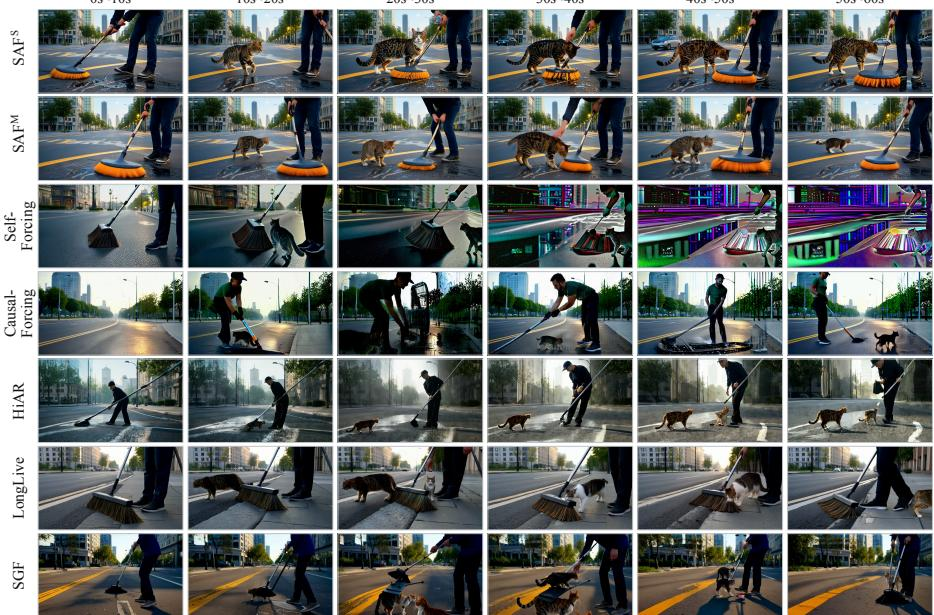  
0-10 s: A street sweeper is methodically cleaning a city street with a push broom in the very early morning. The city is still asleep and the streets are empty. The streetlights are still on.

10-20 s: The street sweeper cleaning the empty city street is joined by a stray cat that cautiously approaches, meowing for attention. The streetlights cast long shadows.

20-30 s: The street sweeper and the stray cat are on the empty city street. The street sweeper stops his work, smiles, and takes out a small container of food from his cart to give to the cat.

30-40 s: The street sweeper on the empty city street watches as the stray cat eats the food hungrily. He gently pets the cat's back while it eats. The city is beginning to wake up.

40-50 s: The street sweeper and the stray cat on the city street. The cat, having finished its meal, rubs affectionately against the street sweeper's leg. The streetlights begin to turn off as the sun rises.

50-60 s: The street sweeper returns to his work, and the stray cat follows alongside him for a while, a temporary companion in the quiet, early morning hours on the city street.

Figure 8: Additional chunkwise Interactive comparison. Zoom in for better visualization.  
0 s  
20 s  
40 s  
60 s  
80 s  
100 s  
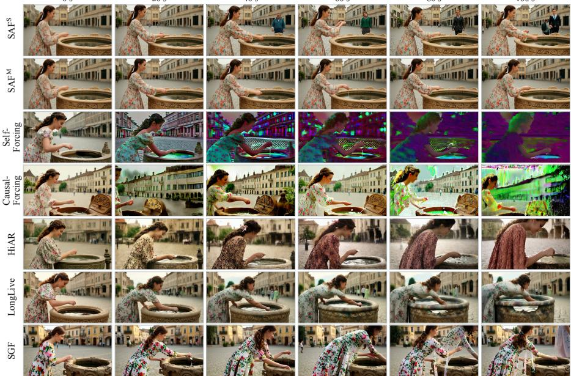  
Prompt: A vintage-style photograph of a young woman in a flowing floral dress dropping a coin into a wishing well. She has wavy brown hair tied back with a ribbon, and her eyes sparkle with hope and determination as she gazes into the well. Her posture is upright, and her hand gently holds the coin before letting it drop. The background is a blurred scene of a quaint town square with old buildings and a few people walking by. The well itself is ornately carved with intricate designs, and the water ripples softly. The photo has a soft, nostalgic texture. A close-up shot from a slightly elevated angle.  
Figure 9: Additional chunkwise MovieGen-100s example 1. Zoom in for better visualization.

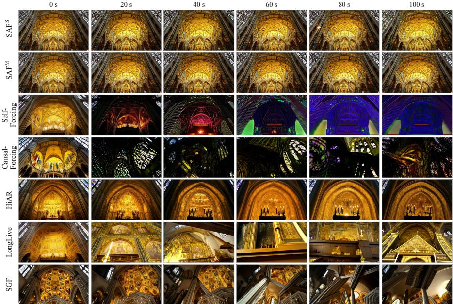  
Prompt: A dramatic tilt-down shot from the ceiling of a grand Gothic cathedral, revealing the intricate golden mosaics depicting biblical scenes and saints, with each tile meticulously arranged to form detailed patterns. The central focus is on the ornate altar below, adorned with candles and religious artifacts, creating a sacred and awe-inspiring atmosphere. The background features the soaring arches and stained glass windows, allowing a shaft of light to filter through, casting colorfu hues across the mosaic floor. The scene has a detailed and realistic style, capturing the grandeur and solemnity of the cathedral interior.

Figure 10: Additional chunkwise MovieGen-100s example 2. Zoom in for better visualization.  
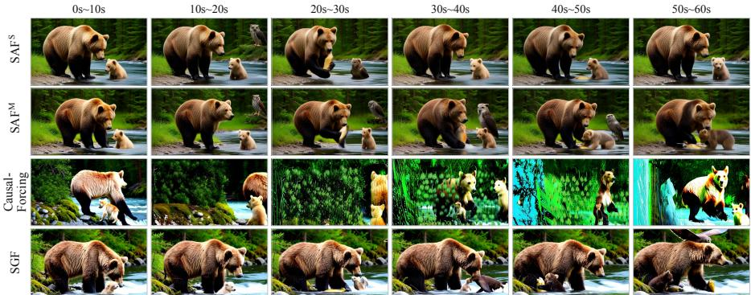  
0-10 s: A mother bear is standing at the edge of a rushing river, demonstrating to her small, fluffy cub how to catch fish. The river is in a dense pine forest. The cub watches intently.

10-20 s: The mother bear at the river's edge is observed by a wise old owl with large, yellow eyes, perched on a high branch of a nearby pine tree. The small bear cub is still watching its mother.

20-30 s: The mother bear and the wise old owl are at the river in the pine forest. The mother bear successfully swipes a salmon from the water. The owl hoots softly, as if in approval. The cub jumps up and down with excitement.

30-40 s: The mother bear, watched by the wise old owl, nudges the salmon towards her cub at the river's edge. The cub cautiously approaches the flapping fish. The pine forest is quiet except for the river.

40-50 s: The mother bear and the wise old owl in the pine forest watch as the cub playfully paws at the salmon, learning its first lesson in hunting. The mother bear looks on with pride.

50-60 s: The mother bear and her cub are eating the salmon by the river, while the wise old owl looks on from its perch in the pine tree before silently spreading its wings and flying deeper into the forest.

Figure 11: Additional framewise Interactive comparison. Zoom in for better visualization.

0 s  
20 s  
40 s  
60 s  
80 s  
100 s  
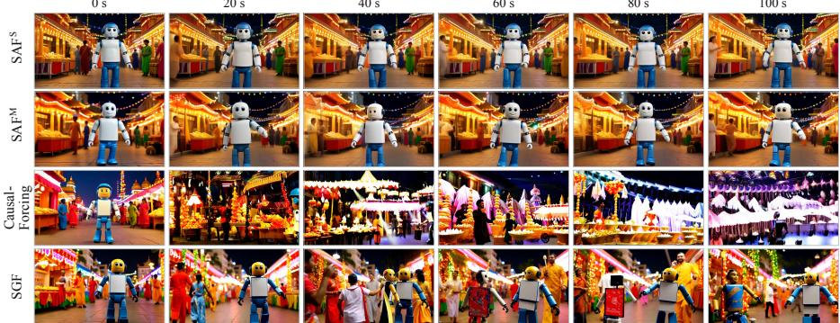  
Prompt: A vibrant and lively scene from a colorful Indian festival in Mumbai, where a toy robot wearing blue jeans and a white T-shirt takes a pleasant stroll. The robot has a friendly expression, with its arms swinging naturally as it walks along the bustling streets. The background is filled with people in traditional attire, vibrant decorations, and colorful lights, creating a festive atmosphere. The festival is alive with music and dance, and there are stalls selling various sweets and snacks. The robot appears to be enjoying the festivities, with its legs moving in a casual, relaxed manner. The camera angle is slightly elevated, capturing both the robot and the vibrant surroundings.

Figure 12: Additional framewise MovieGen-100s example 1. Zoom in for better visualization.  
0 s  
20 s  
40 s  
60 s  
80 s  
100 s  
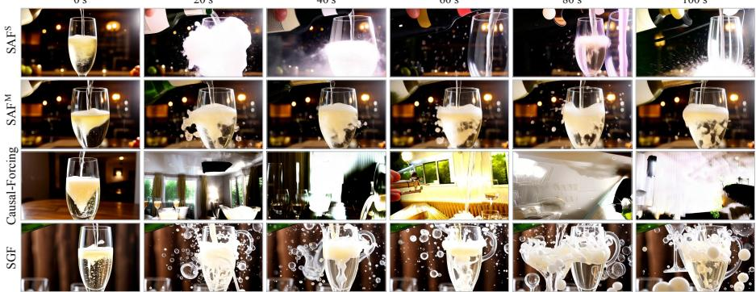  
Prompt: A high-speed video capturing the moment champagne is poured into a glass, with bubbles rising rapidly and cascading down the sides. The glass is clear and elegant, reflecting the sparkling liquid inside. The bubbles form and pop with each other, creating a lively and dynamic scene. The background is a blurred, dimly lit room, emphasizing the focus on the champagne. The camera angle is from below, providing a dramatic perspective of the pouring action.

Figure 13: Additional framewise MovieGen-100s example 2. Zoom in for better visualization.