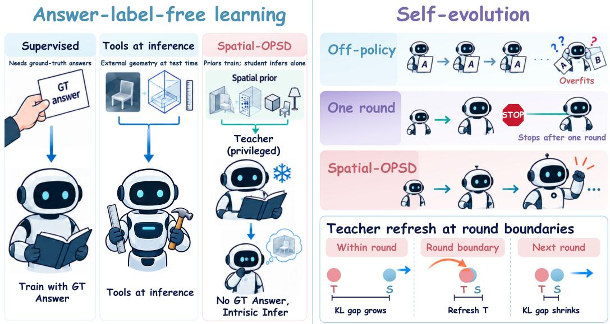
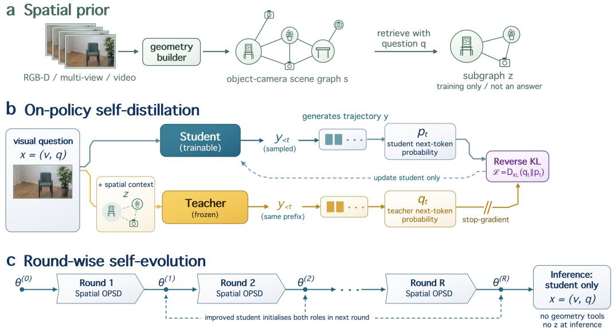
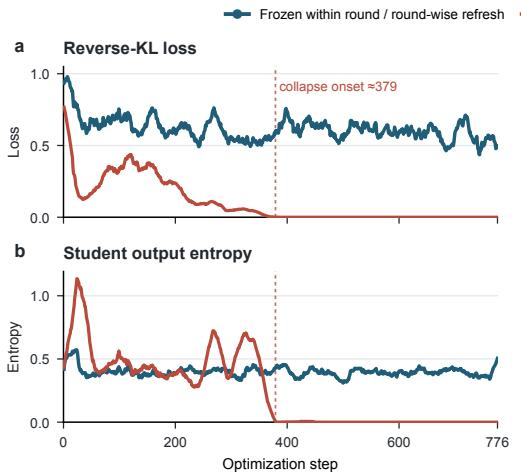
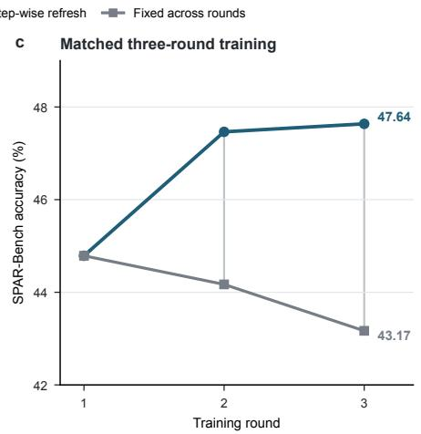
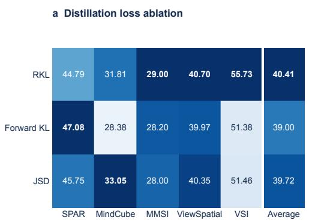
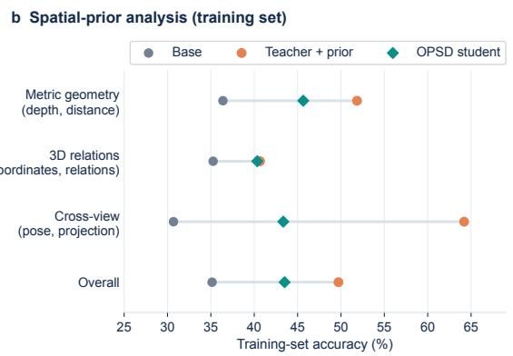
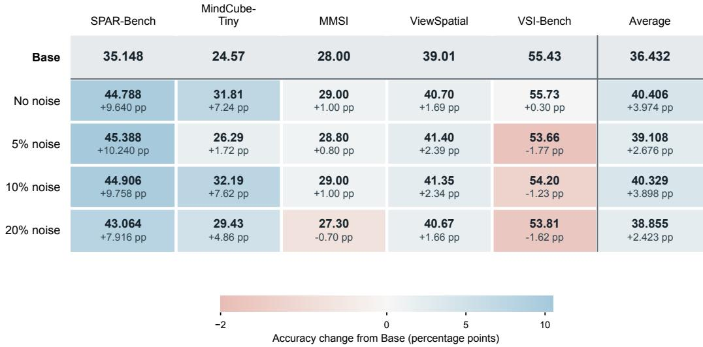

# SPATIAL-OPSD: SELF-IMPROVING SPATIAL REASON-ING VIA LABEL-FREE SELF-DISTILLATION

Zhenyu Liu1,\* Zhangquan Chen1,\* Keyi Chen1 Mingze Sun1 Xiang An2 Haodong Jing3 Ruqi Huang1,†

1Tsinghua University 2LMMs-Lab 3Xi’an Jiaotong University

\*Equal contribution †Corresponding author

## ABSTRACT

Vision-language models (VLMs) increasingly operate in embodied and spatially grounded settings, where accurate understanding of depth, viewpoint, and threedimensional relations is essential. However, improving spatial reasoning typically relies on ground-truth answers, answer-derived rewards, or other forms of taskspecific supervision. We introduce Spatial-OPSD, a label-free self-improvement framework that instead exploits spatial structure naturally available from perception and reconstruction tools. During training, a privileged teacher receives automatically obtainable spatial priors, such as depth, reconstructed 3D relations, and camera geometry, while the student observes only the original visual-language input. On trajectories sampled by the student itself, the teacher provides dense token-level supervision, allowing the student to internalize spatial knowledge without ground-truth answer labels or privileged information at inference time.

To extend this supervision beyond a single round, we adopt a round-wise recursive training scheme: the teacher remains frozen within each round to provide a stable learning target, and the improved student initializes both teacher and student in the next round, where privileged spatial priors re-establish an informative teacher–student asymmetry. This enables repeated self-improvement while avoiding a rapidly moving teacher during optimization. Across four VLM families, a single round of Spatial-OPSD consistently improves the five-benchmark average, while three rounds further push a strong spatially specialized model to the opensource frontier, achieving the highest average among the open models and the best results on three of five spatial reasoning benchmarks. Our code is available at https://github.com/vermouth599/Spatial-OPSD.

## 1 INTRODUCTION

Spatial understanding is a fundamental capability for vision-language models (VLMs) operating in embodied and spatially grounded environments. Beyond object recognition, such models must reason about depth, relative position, viewpoint, and three-dimensional relations across observations. These capabilities are essential for navigation, manipulation, and general multimodal reasoning, yet existing VLMs still show clear limitations in spatial reasoning (Liu et al., 2023; Chen et al., 2026; Yang et al., 2024a; Ma et al., 2025; Chen et al., 2025b).

Existing approaches typically improve spatial understanding through additional supervision. Some construct spatial question–answer pairs and train on ground-truth or pseudo-labeled answers, while others exploit geometric cues produced by perception or reconstruction systems, such as depth, camera poses, and 3D structure (Yang et al., 2024b; Wang et al., 2024; 2025a; Chen et al., 2024). Although effective, these paradigms still largely depend on fixed targets or task-specific supervision, and usually treat spatial information as one-time training data rather than a reusable source of supervision.

This raises a natural question: can the spatial structure of the visual environment itself support continuous self-improvement without ground-truth answer labels? We seek a training paradigm with three properties: it should avoid task-answer labels and answer-derived rewards, supervise the model on its own generated trajectories, and remain reusable as the model improves. On-policy distillation provides a natural mechanism for learning from student-generated prefixes (Gu et al., 2024; Agarwal et al., 2024), while privileged self-distillation suggests that a teacher can remain informative when given additional context (Zhao et al., 2026; Hubotter et al., 2026).¨

  
Figure 1: Spatial-OPSD in context. Left: Spatial-OPSD uses tool-enhanced spatial priors to guide a privileged teacher during training; the student infers from the original visual question without GT answers or tools. Right: Schematic comparison of fixed-answer off-policy training, one-round training, and round-wise self-evolution. Within a round, the teacher (T) is frozen while the student (S) improves; at round boundaries, both roles are initialized from the improved student, while privileged spatial context restores an informative teacher–student asymmetry.

Motivated by these observations, we introduce Spatial-OPSD, a label-free on-policy self-distillation framework with privileged spatial scaffolds. The student receives only the original visual-language input, while a teacher initialized from the same model additionally receives automatically obtained spatial priors, such as depth, 3D relations, and camera geometry. On student-generated trajectories, the privileged teacher provides dense token-level supervision, allowing the student to internalize spatial knowledge without ground-truth answers. After each round, the improved student initializes the next teacher and student, while privileged spatial priors re-establish the teacher–student information asymmetry. This enables recursive self-improvement without requiring privileged geometry at inference time.

Experiments across four VLM families show that a single round of Spatial-OPSD consistently improves the five-benchmark average. Starting from a strong spatially specialized model, three rounds of recursive training further achieve the highest average among the compared open-source models and the best results on three of five spatial reasoning benchmarks.

Our contributions are summarized as follows:

• We propose Spatial-OPSD, which converts automatically obtainable spatial structure into privileged supervision for on-policy self-distillation without ground-truth answer labels or answer-derived rewards.

• We introduce a round-wise recursive self-improvement scheme in which each improved student initializes the next generation, while spatial priors repeatedly restore an informative teacher–student asymmetry.

• We demonstrate consistent improvements across four VLM families and strong multi-round gains on five spatial reasoning benchmarks.

## 2 RELATED WORK

## 2.1 ON-POLICY SELF-DISTILLATION

Distillation on fixed sequences can expose an autoregressive student to prefixes unlike those it generates at inference time. MiniLLM and GKD address this mismatch by evaluating teacher feedback on student-generated trajectories (Gu et al., 2024; Agarwal et al., 2024). On-policy self-distillation (OPSD) further uses the same model in student and teacher roles, with the teacher conditioned on privileged information such as a solution or environment feedback (Zhao et al., 2026; Hubotter et al.,¨ 2026). Recent multimodal work applies on-policy distillation to video grounding, emphasizes visually informative tokens, or uses clean visual inputs to supervise corrupted ones (Li et al., 2026; Liu et al., 2026; Wang et al., 2026). Spatial-OPSD follows the on-policy, privileged-context setting but supplies the teacher with question-relevant geometry rather than a task answer. The student receives neither that geometry nor an answer-derived training signal.

## 2.2 SPATIAL UNDERSTANDING

Spatial understanding requires more than recognizing objects: models must relate positions, distances, viewpoints, and changes across views(Chen et al., 2025a; Yin et al., 2025). Benchmarks expose limitations in image-level relations and depth as well as in spatial memory and multi-step reasoning (Liu et al., 2023; Fu et al., 2024; Yang et al., 2024a; Zhang et al., 2025; Yin et al., 2025). SpatialVLM shows that geometric estimates can provide useful supervision for spatial question answering (Chen et al., 2024). Modern depth and reconstruction systems can also recover intermediate scene structure from visual observations (Yang et al., 2024b; Wang et al., 2025a). These outputs are informative but are not ground-truth answers to downstream questions. Our method turns questionrelevant structure into privileged teacher context during training, while retaining the original visual input as the student’s only source of information at inference time.

## 2.3 RECURSIVE SELF-IMPROVEMENT

Recursive self-improvement reuses a system’s outputs or improved state to guide later iterations. STaR iteratively trains on generated rationales selected using correct answers (Zelikman et al., 2022); STOP and Darwin Godel Machine study iterative improvement of code-based scaffolds or¨ agents (Zelikman et al., 2024; Zhang et al., 2026). Our setting instead updates the weights of a vision-language model through privileged on-policy self-distillation without using task-answer la bels for optimization. After each training round, the improved student initializes both roles in the next round. The teacher remains frozen within a round and is refreshed only between rounds, separating a stable distillation target from the recursive update.

## 3 METHODOLOGY

## 3.1 PROBLEM SETTING AND SUPERVISION SCOPE

Let $\boldsymbol { x } ~ = ~ ( \boldsymbol { v } , \boldsymbol { q } )$ denote a visual input v and question $q ,$ and let a denote the task answer when available. Spatial-OPSD does not use a or an answer-derived reward for optimization. Instead, a geometry pipeline derives privileged spatial information z from the observation and optional scene metadata. We refer to this setting as answer-label-free optimization: task answers and answerderived rewards are excluded, while automatically obtained geometric structure serves as privileged teacher context.

## 3.2 OVERVIEW

A geometry builder constructs a reusable scene scaffold $s = g ( v , m )$ from the visual input and available metadata m. A retriever selects a question-relevant subgraph $z = R ( s , q )$ . The student policy $\pi _ { \theta }$ receives only x; a teacher $\pi _ { \bar { \theta } }$ initialized from the same checkpoint additionally receives z:

$$
\pi _ { \theta } ( \cdot \mid x ) \qquad \mathrm { v e r s u s } \qquad \pi _ { \bar { \theta } } ( \cdot \mid x , z ) .
$$

  
Figure 2: Spatial-OPSD pipeline. Native metadata or external tools produce a scene scaffold. The student receives (v, q), while the same-checkpoint teacher additionally receives a question-relevant subgraph z. Task answers are excluded from the objective; no scaffold or tool is needed at inference.

The teacher’s advantage comes from privileged geometry rather than greater model capacity. External tools construct z during training, but the deployed student uses only x.

Training proceeds in three steps. We build object- and camera-centric scaffolds, query the teacher along responses sampled by the student, and initialize the next round from the improved student. The first two steps define privileged on-policy distillation; the third defines round-wise self-evolution.

## 3.3 CONSTRUCTING PRIVILEGED SPATIAL INFORMATION

## 3.3.1 SOURCE-ADAPTIVE GEOMETRY ACQUISITION

We construct spatial priors from SPAR-7M-RGBD, VSI-590K, and SenseNova-SI-8M, using native geometry when available.

SPAR-7M-RGBD. This corpus provides per-frame depth, camera intrinsics, and camera poses for single-view, multi-view, and video tasks (Zhang et al., 2025). For pixel $\boldsymbol { u } = ( u _ { x } , u _ { y } )$ with depth d and intrinsic matrix K, the camera-frame point is

$$
\begin{array} { r } { { \bf X } _ { c } = d K ^ { - 1 } [ u _ { x } , u _ { y } , 1 ] ^ { \top } . } \end{array}
$$

Camera poses map points into a shared scene frame for cross-view association and metric computation. We estimate object centers from valid depth points within annotated or marker-associated regions.

VSI-590K. We retain native geometry for annotated real-video and simulated subsets. For web and robotic videos without 3D labels, we follow the corpus’s pseudo-annotation approach (Yang et al., 2025b). After removing blurry or invalid frames, Grounding DINO detects entities (Liu et al., 2024) and SAM 2 produces instance masks (Ravi et al., 2024). We erode mask boundaries, then use VGGT to recover cameras and point maps (Wang et al., 2025a).

SenseNova-SI-8M. This corpus covers metric measurement, relations, reconstruction, perspective taking, and spatial reasoning (Cai et al., 2025). We preserve available poses, 3D boxes, point clouds, and cross-view identities under deterministic normalization. For RGB-only samples without source 3D annotations, Grounding DINO, SAM 2, and VGGT provide pseudo-geometry, and question noun phrases are linked to scene nodes. We retain metric values only when native depth, camera metadata, or a reliable anchor establishes scale. Otherwise, the scaffold uses depth order, normalized coordinates, distance ratios, and directional relations.

## 3.3.2 REUSABLE SPATIAL SCAFFOLD

Let $P _ { j } = \{ { \bf X } _ { k } \} _ { k = 1 } ^ { n _ { j } }$ be the valid 3D points for object $j .$ After confidence filtering, we compute a robust center $\mathbf { X } _ { j }$ . The scene graph contains object and camera nodes, with edges for geometric relations and transformations. For objects $i , j ,$ camera pose $T ,$ , and projection $\pi _ { K }$ , it stores depth, camera-to-object distance, displacement $\dot { \mathbf { X } } _ { j } - \dot { \mathbf { X } } _ { i }$ , Euclidean distance $\lVert \dot { \bf X } _ { j } - \dot { \bf X } _ { i } \rVert _ { 2 }$ , qualitative relations, relative camera motion, cross-view projections $\pi _ { K } ( T \dot { \bf X } _ { j } )$ , and coordinates under hypothetical observer motion.

The graph is built once per scene. For each question, $R ( s , q )$ retrieves the relevant entities, frames, and connecting edges. The resulting subgraph retains coordinates, transformations, confidence estimates, and relations in a deterministic text block for the teacher. The teacher must still ground references, choose a coordinate frame, compose relations, and produce the requested response. Its token distribution, not the dataset answer, defines the optimization target.

## 3.3.3 QUALITY CONTROL

We retain pseudo-geometry only after detection-confidence, visible-area, valid-point-count, pointmap-confidence, and cross-view reprojection checks. We discard boundary-dominated masks, duplicate instances, extreme camera poses, and uncertain relations. Metric values require reliable scale; otherwise, we retain ordinal or normalized geometry. These checks reduce noise inherited from external tools.

## 3.4 ON-POLICY SPATIAL SELF-DISTILLATION

Off-policy distillation uses fixed reference or teacher trajectories, whose prefixes can differ from those generated by the student. On-policy distillation instead evaluates teacher feedback on the student’s current trajectories (Agarwal et al., 2024). At step k, the student samples

$$
\mathbf { y } = ( y _ { 1 } , \dots , y _ { T } ) \sim \pi _ { \theta _ { k } } ( \cdot \mid x ) .
$$

At response position t, both policies consume the sampled prefix $y _ { < t }$ but receive different contexts:

$$
p _ { t } ^ { S } = \pi _ { \theta _ { k } } ( \cdot \mid x , y _ { < t } ) , \qquad p _ { t } ^ { T } = \pi _ { \bar { \theta } } ( \cdot \mid x , z , y _ { < t } ) .
$$

We minimize completion-token-masked reverse KL:

$$
\mathcal { L } _ { \mathrm { S p a t i a l - O P S D } } = \mathbb { E } _ { x } \mathbb { E } _ { { \mathbf { y } } \sim \pi _ { \theta _ { k } } } \left[ \frac { 1 } { \sum _ { t } m _ { t } } \sum _ { t = 1 } ^ { T } m _ { t } D _ { \mathrm { K L } } \big ( p _ { t } ^ { S } \big \| \operatorname { s g } [ p _ { t } ^ { T } ] \big ) \right] ,
$$

where $m _ { t }$ masks prompt and padding positions, and sg stops gradients through the teacher. We use pure distillation $( \lambda _ { \mathrm { K D } } = 1 )$ , without answer cross-entropy or answer-derived rewards.

The teacher and student share an architecture and initialization, but the teacher sees privileged geometric context. This follows privileged-context OPSD (Zhao et al., 2026) while replacing gold solutions with intermediate spatial evidence. We synchronize the rollout engine with the student after each optimizer update. The privileged teacher remains frozen within the round.

## 3.5 ROUND-WISE SELF-EVOLUTION

A permanently frozen teacher cannot inherit the student’s gains, whereas step-wise updates make its target move continually. Spatial-OPSD refreshes the teacher only at round boundaries. From base parameters $\theta ^ { ( 0 ) }$ , round $r \geq 1$ begins with

$$
\theta _ { r , 0 } ^ { S }  \theta ^ { ( r - 1 ) } , \qquad \bar { \theta } _ { r }  \mathrm { s g } \Big ( \theta ^ { ( r - 1 ) } \Big ) .
$$

The teacher stays fixed while the student produces $\theta ^ { ( r ) }$ . That checkpoint initializes both roles in round $r + 1$ . Each round thus combines a stationary privileged target with on-policy student updates; teacher capability changes only between rounds.

Table 1: One-round Spatial-OPSD across 4B-scale VLM families.
<table><tr><td>Model</td><td>Method</td><td>SPAR-Bench</td><td>MindCube-tiny</td><td>MMSI-Bench</td><td>ViewSpatial</td><td>VSI-Bench</td><td>Average</td></tr><tr><td rowspan="2">Qwen3-VL-4B (Bai et al., 2025)</td><td>Base</td><td>35.148</td><td>24.57</td><td>28.0</td><td>39.01</td><td>55.43</td><td>36.432</td></tr><tr><td>Spatial-OPSD</td><td>44.788</td><td>31.81</td><td>29.0</td><td>40.70</td><td>55.73</td><td>40.406</td></tr><tr><td rowspan="2">Gemma-3-4B (Gemma Team, 2025)</td><td>Base</td><td>30.640</td><td>37.04</td><td>27.4</td><td>31.90</td><td>25.86</td><td>30.568</td></tr><tr><td>Spatial-OPSD</td><td>36.302</td><td>40.28</td><td>27.9</td><td>24.74</td><td>25.74</td><td>30.992</td></tr><tr><td rowspan="2">InternVL3.5-4B (Wang et al., 2025b)</td><td>Base</td><td>29.998</td><td>35.71</td><td>28.2</td><td>35.17</td><td>54.95</td><td>36.806</td></tr><tr><td>Spatial-OPSD</td><td>39.433</td><td>37.04</td><td>30.1</td><td>35.21</td><td>56.92</td><td>39.741</td></tr><tr><td rowspan="2">LLaVA-OV1.5-4B (An et al., 2025)</td><td>Base</td><td>36.874</td><td>40.67</td><td>26.9</td><td>31.83</td><td>34.85</td><td>34.225</td></tr><tr><td>Spatial-OPSD</td><td>40.220</td><td>40.14</td><td>27.8</td><td>29.88</td><td>35.17</td><td>34.642</td></tr></table>

We monitor the privileged supervision gap

$$
G _ { r } = \mathbb { E } _ { x , \mathbf { y } } [ \frac { 1 } { T } \sum _ { t } D _ { \mathrm { K L } } ( p _ { t } ^ { S , r }  p _ { t } ^ { T , r } ) ] .
$$

The gap may narrow within a round but need not change monotonically after refresh.

## 4 EXPERIMENTS

## 4.1 EXPERIMENTAL SETUP

We evaluate Spatial-OPSD on five complementary spatial reasoning benchmarks: SPAR-Bench (Zhang et al., 2025), MindCube-tiny (Yin et al., 2025), MMSI-Bench (Yang et al., 2026), ViewSpatial-Bench (Li et al., 2025), and VSI-Bench (Yang et al., 2024a). We report accuracy (%) on all benchmarks. Ground-truth answers are used only for evaluation and never participate in optimization.

## 4.2 EFFECTIVENESS ACROSS MODEL FAMILIES

We first test whether Spatial-OPSD generalizes across architectures by applying one round of training to four 4B-scale VLM families: Qwen3-VL, Gemma 3, InternVL3.5, and LLaVA-OneVision-1.5 (Bai et al., 2025; Gemma Team, 2025; Wang et al., 2025b; An et al., 2025).

As shown in Table 1, Spatial-OPSD improves the five-benchmark average for all four backbones and yields particularly consistent gains on SPAR-Bench and MMSI-Bench. Although several benchmark-specific regressions remain, the overall improvement holds across substantially different VLM architectures. Notably, despite using no hard answer labels during optimization, Spatial-OPSD remains competitive with answer-supervised SFT and GRPO post-training baselines; full comparisons are provided in Appendix A. Spatial-OPSD generalizes consistently across diverse VLM architectures, demonstrating that privileged on-policy spatial supervision provides a broadly applicable mechanismfor improving spatial reasoning.

## 4.3 THREE-ROUND RECURSIVE SELF-IMPROVEMENT

We next test the central hypothesis of our work: whether privileged spatial supervision can remain effective after the student itself becomes stronger. Starting from SenseNova-SI-Qwen3-VL-8B (Cai et al., 2025), an already spatially specialized model, we recursively apply Spatial-OPSD for three rounds and compare the final model with proprietary, general-purpose, and spatially specialized VLMs.

Table 2 shows that recursive Spatial-OPSD further improves an already strong spatial model on most benchmarks, yielding the highest average among the compared open-source models and the best open-model performance on three benchmarks. The same intrinsic spatial supervision continues to improve a model that has already undergone strong spatial specialization, demonstrating that spatial structure remains a reusable learning signal across generations and enables multi-round.

Table 2: Comparison with proprietary, general open-source, and spatially specialized models. Among open-source models, the best result is bold and the second best is underlined.
<table><tr><td>Model</td><td>SPAR-Bench</td><td>MindCube-tiny</td><td>MMSI-Bench</td><td>ViewSpatial</td><td>VSI-Bench</td><td>Average</td></tr><tr><td colspan="7">Proprietary Models</td></tr><tr><td>Grok-4-2025-07-09 (xAI, 2025)</td><td></td><td>63.6</td><td>37.8</td><td>43.2</td><td>47.9</td><td></td></tr><tr><td>GPT-5-2025-08-07 (OpenAI, 2025)</td><td>49.7</td><td>56.3</td><td>41.8</td><td>45.6</td><td>55.0</td><td>49.68</td></tr><tr><td>Gemini-3-Pro-Preview (Google DeepMind, 2025)</td><td>48.7</td><td>70.9</td><td>45.2</td><td>50.4</td><td>52.5</td><td>53.54</td></tr><tr><td colspan="7">Open-Source General Models</td></tr><tr><td>BAGEL-7B-MoT (Deng et al., 2025)</td><td>39.1</td><td>34.7</td><td>31.0</td><td>41.3</td><td>31.4</td><td>35.50</td></tr><tr><td>Qwen3-VL-8B-Instruct (Bai et al., 2025)</td><td>39.6</td><td>29.4</td><td>31.1</td><td>42.2</td><td>57.9</td><td>40.04</td></tr><tr><td>InternVL3-8B (Zhu et al., 2025)</td><td>35.9</td><td>41.5</td><td>28.0</td><td>38.7</td><td>42.1</td><td>37.24</td></tr><tr><td colspan="7">Open-Source Spatial Intelligence Models</td></tr><tr><td>ViLaSR-7B (Wu et al., 2025)</td><td>37.4</td><td>35.1</td><td>30.2</td><td>35.7</td><td>44.6</td><td>36.60</td></tr><tr><td>VST-7B-SFT (Yang et al., 2025a)</td><td>46.6</td><td>39.7</td><td>32.5</td><td>50.5</td><td>55.5</td><td>44.96</td></tr><tr><td>Cambrian-S-7B (Yang et al., 2025b)</td><td>37.9</td><td>37.9</td><td>27.1</td><td>41.3</td><td>62.9</td><td>41.42</td></tr><tr><td>SenseNova-SI-Qwen3-VL-8B (Cai et al., 2025)</td><td>40.8</td><td>73.7</td><td>37.7</td><td>51.2</td><td>64.3</td><td>53.54</td></tr><tr><td colspan="7">Ours</td></tr><tr><td>Spatial-OPSD-SenseNova-SI-Qwen3-VL-8B (Round 3)</td><td>45.8</td><td>74.4</td><td>38.1</td><td>51.4</td><td>64.2</td><td>54.78</td></tr></table>

Table 3: Ablation of teacher-refresh frequency on SPAR-Bench.
<table><tr><td>Method</td><td>Update</td><td>Round</td><td>SPAR-Bench</td></tr><tr><td>Base (Qwen3-VL-4B)</td><td>一</td><td>0</td><td>35.148</td></tr><tr><td>Step-wise RSI</td><td>Per step</td><td>1</td><td>0.000</td></tr><tr><td rowspan="3">Fixed teacher</td><td rowspan="3">None</td><td>1</td><td>44.788</td></tr><tr><td>2</td><td>44.170</td></tr><tr><td>3</td><td>43.168</td></tr><tr><td rowspan="3">Round-wise RSI (ours)</td><td rowspan="3">Per round</td><td>1</td><td>44.788</td></tr><tr><td>2</td><td>47.464</td></tr><tr><td>3</td><td>47.636</td></tr></table>

## 4.4 ABLATING THE TEACHER-REFRESH SCHEDULE

Recursive self-improvement requires the teacher to evolve, but the update timescale is critical. We therefore compare three strategies on Qwen3-VL-4B: refreshing the teacher after every optimization step, fixing the same teacher across all rounds, and our round-wise strategy that freezes the teacher within each round and refreshes it only between rounds.

As shown in Table 3 and Figure 3, step-wise refresh is unstable and eventually collapses, whereas a permanently fixed teacher cannot sustain improvement across rounds. Only round-wise refresh continues to improve after the first generation. Round-wise teacher refresh is the key mechanism that sustains self improvement: the teacher remains stable within each generation while progressively inheriting the student’s gains across generations.

## 4.5 ABLATING THE DISTILLATION LOSS

We compare reverse KL, forward KL, and Jensen–Shannon divergence under the same Spatial-OPSD setting on Qwen3-VL-4B.

As shown in Figure 4a, different objectives favor different benchmarks, but reverse KL achieves the strongest overall performance and the most balanced transfer across tasks. Across thefive evaluated spatial benchmarks, reverse KL delivers the strongest overall transfer, making it the most effective distillation objective in our setting.

## 4.6 TRAINING-SET ANALYSIS OF SPATIAL-PRIOR CATEGORIES

We further analyze three forms of privileged spatial evidence: metric geometry, 3D relational structure, and cross-view geometry. For each category, we compare the original base model, the privileged teacher, and the distilled Spatial-OPSD student.

Figure 3: Teacher-refresh ablation on Qwen3-VL-4B. (a,b) Reverse-KL loss and student output entropy with a teacher frozen within the round or refreshed after every step. (c) SPAR-Bench accuracy across three matched rounds for a fixed teacher and for round-wise refresh.  

  
Figure 4: (a) Distillation-loss ablation on five benchmarks for Qwen3-VL-4B. (b) Training-set diagnostic by spatial-prior category.

Figure 4b shows that spatial priors consistently strengthen the privileged teacher, while the distilled student also improves over the base model despite no longer accessing these priors. The results validate the full knowledge-transfer pathway of Spatial-OPSD: privileged spatial scaffolds strengthen the teacher, and their spatial knowledge is successfully internalized by the student.

## 4.7 ROBUSTNESS TO NOISY SPATIAL PRIORS

Finally, we test whether Spatial-OPSD depends on highly accurate geometric estimates by perturbing the numerical values in the privileged spatial scaffold. For each value v, we apply $v ( 1 + \epsilon )$ where the relative error is controlled by noise level $p \in \{ 0 . 0 5 , 0 . 1 0 , 0 . 2 0 \}$

As shown in Figure 5, moderate perturbations cause little degradation, and Spatial-OPSD remains clearly stronger than the unadapted model even under substantially noisier priors. Spatial-OPSD retains substantial gains even under strong numerical perturbations, demonstrating that intrinsic spatial supervision remains effective with imperfect geometric estimates.

  
Figure 5: Effect of numerical noise in privileged spatial priors for Qwen3-VL-4B. Each prior value is multiplied by 1 + ϵ, with zero-mean relative error clipped at ±2p.

## 5 CONCLUSION

We introduce Spatial-OPSD, a label-free recursive self-improvement framework that turns automatically obtainable spatial structure into privileged supervision for vision-language models. A same-checkpoint teacher leverages spatial priors to supervise student-generated trajectories, allowing spatial knowledge to be internalized without requiring privileged information at inference time. Across four VLM families, a single round of Spatial-OPSD consistently improves overall spatial reasoning performance. More importantly, repeated rounds continue to improve an already spatially specialized model, achieving the highest average among the compared open-source models and demonstrating that intrinsic spatial supervision remains reusable across generations. Our ablations further establish round-wise teacher refresh as a key mechanism for sustained recursive improve ment and show that Spatial-OPSD remains effective with imperfect spatial priors.

Limitation & Future Work. Our current implementation obtains privileged spatial scaffolds from external perception and reconstruction tools during training. Future work will explore autonomous tool use and model-generated spatial scaffolds toward fully self-evolving spatial reasoning systems.

## AI USE STATEMENT

We used generative AI tools to assist with manuscript editing, organization, and the presentation and interpretation of experimental results. All AI-assisted content was manually reviewed and verified by the authors, who take full responsibility for the final content of this work.

## ETHICS STATEMENT

This study strictly adheres to the ICLR Code of Ethics. The datasets utilized in our experiments are publicly available, fully anonymized, and do not involve human subjects, privacy infringement, or harmful discrimination concerns.

## REPRODUCIBILITY STATEMENT

To ensure reproducibility, we provide full implementation details, hyperparameter configurations, and training scripts in the anonymized code repository submitted as supplementary material.

## REFERENCES

Rishabh Agarwal, Nino Vieillard, Yongchao Zhou, Piotr Stanczyk, Sabela Ramos, Matthieu Geist, and Olivier Bachem. On-policy distillation of language models: Learning from self-generated mistakes. In International Conference on Learning Representations, 2024. URL https:// arxiv.org/abs/2306.13649.

Xiang An, Yin Xie, Kaicheng Yang, Wenkang Zhang, Xiuwei Zhao, Zheng Cheng, Yirui Wang, Songcen Xu, Changrui Chen, Didi Zhu, et al. LLaVA-OneVision-1.5: Fully open framework for democratized multimodal training. arXiv preprint arXiv:2509.23661, 2025. URL https: //arxiv.org/abs/2509.23661.

Shuai Bai, Yuxuan Cai, Ruizhe Chen, et al. Qwen3-VL technical report. arXiv preprint arXiv:2511.21631, 2025. URL https://arxiv.org/abs/2511.21631.

Zhongang Cai, Ruisi Wang, Chenyang Gu, Fanyi Pu, Junxiang Xu, Yubo Wang, Wanqi Yin, Zhitao Yang, Chen Wei, Qingping Sun, Tongxi Zhou, Jiaqi Li, Hui En Pang, Oscar Qian, Yukun Wei, Zhiqian Lin, Xuanke Shi, Kewang Deng, Xiaoyang Han, Zukai Chen, Xiangyu Fan, Hanming Deng, Lewei Lu, Liang Pan, Bo Li, Ziwei Liu, Quan Wang, Dahua Lin, and Lei Yang. Scaling spatial intelligence with multimodal foundation models. arXiv preprint arXiv:2511.13719, 2025. URL https://arxiv.org/abs/2511.13719.

Boyuan Chen, Zhuo Xu, Sean Kirmani, Brian Ichter, Danny Driess, Pete Florence, Dorsa Sadigh, Leonidas Guibas, and Fei Xia. SpatialVLM: Endowing vision-language models with spatial reasoning capabilities. In Proceedings ofthe IEEE/CVF Conference on Computer Vision and Pattern Recognition, pp. 14455–14465, 2024. URL https://arxiv.org/abs/2401.12168.

Zhangquan Chen, Manyuan Zhang, Xinlei Yu, Xufang Luo, Mingze Sun, Zihao Pan, Yan Feng, Peng Pei, Xunliang Cai, and Ruqi Huang. Think with 3d: Geometric imagination grounded spatial reasoning from limited views. arXiv preprint arXiv:2510.18632, 2025a.

Zhangquan Chen, Ruihui Zhao, Chuwei Luo, Mingze Sun, Xinlei Yu, Yangyang Kang, and Ruqi Huang. Sifthinker: Spatially-aware image focus for visual reasoning. arXiv preprint arXiv:2508.06259, 2025b.

Zhangquan Chen, Manyuan Zhang, Xinlei Yu, Xiang An, Bo Li, Xin Xie, ZiDong Wang, Mingze Sun, Shuang Chen, Hongyu Li, et al. 4dthinker: Thinking with 4d imagery for dynamic spatial understanding. arXiv preprint arXiv:2605.05997, 2026.

Chaorui Deng, Deyao Zhu, Kunchang Li, Chenhui Gou, Feng Li, Zeyu Wang, Shu Zhong, Weihao Yu, Xiaonan Nie, Ziang Song, Guang Shi, and Haoqi Fan. Emerging properties in unified multimodal pretraining. arXiv preprint arXiv:2505.14683, 2025. URL https://arxiv.org/ abs/2505.14683.

Xingyu Fu, Yushi Hu, Bangzheng Li, Yu Feng, Haoyu Wang, Xudong Lin, Dan Roth, Noah A. Smith, Wei-Chiu Ma, and Ranjay Krishna. BLINK: Multimodal large language models can see but not perceive. In European Conference on Computer Vision, 2024. URL https://arxiv. org/abs/2404.12390.

Gemma Team. Gemma 3 technical report. arXiv preprint arXiv:2503.19786, 2025. URL https: //arxiv.org/abs/2503.19786.

Google DeepMind. Gemini 3 pro preview model card. Google AI for Developers, 2025. URL https://ai.google.dev/gemini-api/docs/models/ gemini-3-pro-preview.

Yuxian Gu, Li Dong, Furu Wei, and Minlie Huang. MiniLLM: Knowledge distillation of large language models. In International Conference on Learning Representations, 2024. URL https: //arxiv.org/abs/2306.08543.

Jonas Hubotter, Frederike L ¨ ubeck, Lejs Behric, Anton Baumann, Marco Bagatella, Daniel Marta,¨ Ido Hakimi, Idan Shenfeld, Thomas Kleine Buening, Carlos Guestrin, and Andreas Krause. Reinforcement learning via self-distillation. arXiv preprint arXiv:2601.20802, 2026. URL https://arxiv.org/abs/2601.20802.

Dingming Li, Hongxing Li, Zixuan Wang, Yuchen Yan, Hang Zhang, Siqi Chen, Guiyang Hou, Shengpei Jiang, Wenqi Zhang, Yongliang Shen, Weiming Lu, and Yueting Zhuang. ViewSpatial-Bench: Evaluating multi-perspective spatial localization in vision-language models. arXiv preprint arXiv:2505.21500, 2025. URL https://arxiv.org/abs/2505.21500.

Jiaze Li, Hao Yin, Haoran Xu, Boshen Xu, Wenhui Tan, Zewen He, Jianzhong Ju, Zhenbo Luo, and Jian Luan. Video-OPD: Efficient post-training of multimodal large language models for temporal video grounding via on-policy distillation. arXiv preprint arXiv:2602.02994, 2026. URL https://arxiv.org/abs/2602.02994.

Fangyu Liu, Guy Emerson, and Nigel Collier. Visual spatial reasoning. Transactions of the Association for Computational Linguistics, 11, 2023. URL https://arxiv.org/abs/2205. 00363.

Ruiqi Liu, Xiaolei Lv, Gengsheng Li, Ximo Zhu, Zhiheng Wang, Zhengbo Zhang, Junkai Chen, Zhiheng Li, Bo Li, Jun Gao, and Shu Wu. Visual-advantage on-policy distillation for visionlanguage models. arXiv preprint arXiv:2605.21924, 2026. URL https://arxiv.org/abs/ 2605.21924.

Shilong Liu, Zhaoyang Zeng, Tianhe Ren, Feng Li, Hao Zhang, Jie Yang, Chunyuan Li, Jianwei Yang, Hang Su, Jun Zhu, and Lei Zhang. Grounding DINO: Marrying DINO with grounded pretraining for open-set object detection. In European Conference on Computer Vision, 2024. URL https://arxiv.org/abs/2303.05499.

Wufei Ma, Haoyu Chen, Guofeng Zhang, Yu-Cheng Chou, Jieneng Chen, Celso de Melo, and Alan Yuille. 3DSRBench: A comprehensive 3d spatial reasoning benchmark. In Proceedings of the IEEE/CVF International Conference on Computer Vision, pp. 6924–6934, 2025. URL https: //arxiv.org/abs/2412.07825.

OpenAI. GPT-5 system card. Technical report, OpenAI, 2025. URL https://openai.com/ index/gpt-5-system-card/.

Nikhila Ravi, Valentin Gabeur, Yuan-Ting Hu, Ronghang Hu, Chaitanya Ryali, Tengyu Ma, Haitham Khedr, Roman Radle, Chloe Rolland, Laura Gustafson, Eric Mintun, Junting Pan, Kalyan Va-¨ sudev Alwala, Nicolas Carion, Chao-Yuan Wu, Ross Girshick, Piotr Dollar, and Christoph Fe-´ ichtenhofer. SAM 2: Segment anything in images and videos. arXiv preprint arXiv:2408.00714, 2024. URL https://arxiv.org/abs/2408.00714.

Jianyuan Wang, Minghao Chen, Nikita Karaev, Andrea Vedaldi, Christian Rupprecht, and David Novotny. VGGT: Visual geometry grounded transformer. In Proceedings ofthe IEEE/CVF Con ference on Computer Vision and Pattern Recognition, pp. 5294–5306, 2025a.

Shuai Wang, Daoan Zhang, Zhe Tang, Hao Cheng, and Jiaheng Wei. Self-boosting vision-language models with noisy student on-policy self-distillation. arXiv preprint arXiv:2607.23125, 2026. URL https://arxiv.org/abs/2607.23125.

Shuzhe Wang, Vincent Leroy, Yohann Cabon, Boris Chidlovskii, and Jer´ ome Revaud. DUSt3R:ˆ Geometric 3d vision made easy. In Proceedings ofthe IEEE/CVF Conference on Computer Vision and Pattern Recognition, pp. 20697–20709, 2024.

Weiyun Wang, Zhangwei Gao, Lixin Gu, Hengjun Pu, Long Cui, Xingguang Wei, Zhaoyang Liu, Linglin Jing, Shenglong Ye, Jie Shao, et al. InternVL3.5: Advancing open-source multimodal models in versatility, reasoning, and efficiency. arXiv preprint arXiv:2508.18265, 2025b. URL https://arxiv.org/abs/2508.18265.

Junfei Wu, Jian Guan, Kaituo Feng, Qiang Liu, Shu Wu, Liang Wang, Wei Wu, and Tieniu Tan. Reinforcing spatial reasoning in vision-language models with interwoven thinking and visual drawing. arXiv preprint arXiv:2506.09965, 2025. URL https://arxiv.org/abs/2506. 09965.

xAI. Grok 4 model card. Technical report, xAI, 2025. URL https://data.x.ai/ 2025-08-20-grok-4-model-card.pdf.

Jihan Yang, Shusheng Yang, Anjali W. Gupta, Rilyn Han, Li Fei-Fei, and Saining Xie. Thinking in space: How multimodal large language models see, remember, and recall spaces. arXiv preprint arXiv:2412.14171, 2024a. URL https://arxiv.org/abs/2412.14171.

Lihe Yang, Bingyi Kang, Zilong Huang, Zhen Zhao, Xiaogang Xu, Jiashi Feng, and Hengshuang Zhao. Depth anything v2. In Advances in Neural Information Processing Systems, 2024b.

Rui Yang, Ziyu Zhu, Yanwei Li, Jingjia Huang, Shen Yan, Siyuan Zhou, Zhe Liu, Xiangtai Li, Shuangye Li, Wenqian Wang, Yi Lin, and Hengshuang Zhao. Visual spatial tuning. arXiv preprint arXiv:2511.05491, 2025a. URL https://arxiv.org/abs/2511.05491.

Shusheng Yang, Jihan Yang, Pinzhi Huang, Ellis Brown, Zihao Yang, Yue Yu, Shengbang Tong, Zihan Zheng, Yifan Xu, Muhan Wang, Daohan Lu, Rob Fergus, Yann LeCun, Li Fei-Fei, and Saining Xie. Cambrian-S: Towards spatial supersensing in video. arXiv preprint arXiv:2511.04670, 2025b. URL https://arxiv.org/abs/2511.04670.

Sihan Yang, Runsen Xu, Yiman Xie, Sizhe Yang, Mo Li, Jingli Lin, Chenming Zhu, Xiaochen Chen, Haodong Duan, Xiangyu Yue, Dahua Lin, Tai Wang, and Jiangmiao Pang. MMSI-Bench: A benchmark for multi-image spatial intelligence. In International Conference on Learning Representations, 2026. URL https://arxiv.org/abs/2505.23764.

Baiqiao Yin, Qineng Wang, Pingyue Zhang, Jianshu Zhang, Kangrui Wang, Zihan Wang, Jieyu Zhang, Keshigeyan Chandrasegaran, Han Liu, Ranjay Krishna, Saining Xie, Manling Li, Jiajun Wu, and Li Fei-Fei. Spatial mental modeling from limited views. arXiv preprint arXiv:2506.21458, 2025. URL https://arxiv.org/abs/2506.21458.

Eric Zelikman, Yuhuai Wu, Jesse Mu, and Noah D. Goodman. STaR: Bootstrapping reasoning with reasoning. In Advances in Neural Information Processing Systems, volume 35, pp. 15476–15488, 2022.

Eric Zelikman, Eliana Lorch, Lester Mackey, and Adam Tauman Kalai. Self-taught optimizer (STOP): Recursively self-improving code generation. In Conference on Language Modeling, 2024. URL https://arxiv.org/abs/2310.02304.

Jenny Zhang, Shengran Hu, Cong Lu, Robert Tjarko Lange, and Jeff Clune. Darwin godel ma- ¨ chine: Open-ended evolution of self-improving agents. In International Conference on Learning Representations, 2026. URL https://openreview.net/forum?id=pUpzQZTvGY.

Jiahui Zhang, Yurui Chen, Yueming Xu, Ze Huang, Jilin Mei, Junhui Chen, Yanpeng Zhou, Yu-Jie Yuan, Xinyue Cai, Guowei Huang, Xingyue Quan, Hang Xu, and Li Zhang. From flatland to space: Teaching vision-language models to perceive and reason in 3d. In Advances in Neural Information Processing Systems Datasets and Benchmarks Track, 2025. URL https: //arxiv.org/abs/2503.22976.

Siyan Zhao, Zhihui Xie, Mengchen Liu, Jing Huang, Guan Pang, Feiyu Chen, and Aditya Grover. Self-distilled reasoner: On-policy self-distillation for large language models. arXiv preprint arXiv:2601.18734, 2026. URL https://arxiv.org/abs/2601.18734.

Jinguo Zhu, Weiyun Wang, Zhe Chen, Zhaoyang Liu, Shenglong Ye, Lixin Gu, Yuchen Duan, Hao Tian, Weijie Su, Jie Shao, et al. InternVL3: Exploring advanced training and test-time recipes for open-source multimodal models. arXiv preprint arXiv:2504.10479, 2025. URL https: //arxiv.org/abs/2504.10479.

## A FULL RESULTS

Table 4: Full results of all models and methods.
<table><tr><td>Model</td><td>Method</td><td>Use GT Answers</td><td>SPAR-Bench</td><td>MindCube-tiny</td><td>MMSI-Bench</td><td>ViewSpatial</td><td>VSI-Bench</td></tr><tr><td rowspan="4">Qwen3-VL-4B</td><td>Base</td><td></td><td>35.148</td><td>24.57</td><td>28.0</td><td>39.01</td><td>55.43</td></tr><tr><td>SFT</td><td>- √</td><td>51.426</td><td>32.05</td><td>24.0</td><td>39.30</td><td>51.43</td></tr><tr><td>GRPO</td><td>√</td><td>49.068</td><td>29.05</td><td>28.4</td><td>39.51</td><td>54.64</td></tr><tr><td>OURS</td><td>X</td><td>44.788</td><td>31.81</td><td>29.0</td><td>40.70</td><td>55.73</td></tr><tr><td rowspan="4">Gemma-3-4B</td><td>Base</td><td>-√</td><td>30.640</td><td>37.04</td><td>27.4</td><td>31.90</td><td>25.86</td></tr><tr><td>SFT</td><td></td><td>52.898</td><td>35.62</td><td>25.4</td><td>40.53</td><td>26.67</td></tr><tr><td>GRPO OURS</td><td>√</td><td>35.968</td><td>39.76</td><td>27.5</td><td>32.09</td><td>24.11</td></tr><tr><td></td><td>X</td><td>36.302</td><td>40.28</td><td>27.9</td><td>24.74</td><td>25.74</td></tr><tr><td rowspan="4">InternVL3.5-4B</td><td>Base</td><td>-√</td><td>29.998</td><td>35.71</td><td>28.2</td><td>35.17</td><td>54.95</td></tr><tr><td>SFT</td><td></td><td>32.806</td><td>34.76</td><td>29.9</td><td>35.17</td><td>56.97</td></tr><tr><td>GRPO</td><td>√</td><td>45.146</td><td>37.43</td><td>29.1</td><td>35.75</td><td>56.05</td></tr><tr><td>OURS</td><td>X</td><td>39.433</td><td>37.04</td><td>30.1</td><td>35.21</td><td>56.92</td></tr><tr><td rowspan="4">LLaVA-OV1.5-4B</td><td>Base</td><td></td><td>36.874</td><td>40.67</td><td>26.9</td><td>31.83</td><td>34.85</td></tr><tr><td>SFT</td><td>-√</td><td>40.816</td><td>40.38</td><td>27.3</td><td>31.92</td><td>34.61</td></tr><tr><td>GRPO</td><td>√</td><td>47.302</td><td>40.76</td><td>26.1</td><td>35.35</td><td>36.75</td></tr><tr><td>OURS</td><td>X</td><td>40.220</td><td>40.14</td><td>27.8</td><td>29.88</td><td>35.17</td></tr></table>

## B EXPERIMENTAL SETUP

Training data. Unless otherwise specified, all training-based experiments use the same 6.2kexample spatial-reasoning set, drawn from SPAR-7M-RGBD (Zhang et al., 2025), VSI-590K (Yang et al., 2025b), and SenseNova-SI-8M (Cai et al., 2025). The set contains 3.1k examples from SPAR-7M-RGBD, 1.9k from VSI-590K, and 1.1k from SenseNova-SI-8M. Each example contains the visual input and question shown to the student, together with a teacher-only privileged context constructed from geometric measurements and relations. The answer annotation is retained as metadata but is never used in the Spatial-OPSD loss. We use the same examples and visual preprocessing for all compared training objectives; the label-supervised SFT and GRPO baselines additionally consume the answer annotation required by their respective objectives.

Backbones. We evaluate Spatial-OPSD on four approximately 4B open-weight multimodal backbones: Qwen3-VL-4B-Instruct, Gemma-3-4B-IT, InternVL3.5-4B-HF, and LLaVA-OneVision-1.5- 4B-Instruct. To test whether the method continues to improve a stronger spatial model, we additionally use SenseNova-SI-Qwen3-VL-8B. Every Spatial-OPSD run starts from the released base checkpoint and updates all model parameters; no LoRA adapters are used for our method.

Spatial-OPSD optimization. We implement Spatial-OPSD with KDFlow and use SGLang for onpolicy rollout. For each prompt, the current student produces one response, after which a frozen copy of the same initialization receives the additional privileged spatial context and supplies token-level distributions on that student trajectory. We optimize reverse KL with temperature 1 and coefficient 1, without an auxiliary label cross-entropy loss. The teacher is frozen within each round. In recursive self-improvement experiments, the checkpoint from round r initializes both the student and the frozen teacher in round r + 1; thus, teacher replacement occurs only at round boundaries. Each round contains one pass over the training set.

Table 5 lists the shared hyperparameters. We use AdamW with a cosine schedule, no warm-up, and a minimum learning rate of 10−8. Training uses bfloat16, FSDP2, activation checkpointing, and no CPU offloading. The maximum image budget is 262,144 pixels. We disable each model’s optional thinking mode so that both training and evaluation follow the direct-answer setting.

Answer-supervised baselines. SFT is run on Qwen, Gemma, InternVL, and LLaVA for one epoch with batch size 32, a 3% warm-up ratio, and a maximum sequence length of 2,304. Gemma and LLaVA use a learning rate of $2 \times 1 0 ^ { - 4 }$ and micro-batch size 32; the stable InternVL run uses a learning rate of $2 \times 1 0 ^ { - 6 }$ and micro-batch size 8. GRPO is initialized from the corresponding base model rather than from SFT, and is trained for 300 optimizer steps using the answer-based reward. It uses eight generations per prompt, rollout micro-batches of four, a learning rate of $1 0 ^ { - 5 }$ , KL coefficient $\beta = 0 . 0 4 .$ , clipping parameter $\epsilon = 0 . 2 .$ , and seed 20260907. These baselines intentionally have access to ground-truth answers, whereas Spatial-OPSD does not.

Table 5: Shared Spatial-OPSD training hyperparameters. “Batch size” is the number of prompts per optimizer update and also the rollout batch size.
<table><tr><td>Hyperparameter</td><td>Value</td></tr><tr><td>Optimizer</td><td>AdamW</td></tr><tr><td>Learning rate</td><td> $2 \times 1 0 ^ { - 6 }$ </td></tr><tr><td>LR schedule</td><td>cosine,  $\mathrm { { l r } _ { m i n } = 1 0 ^ { - 8 } }$ </td></tr><tr><td>Warm-up ratio / weight decay Adam  $( \beta _ { 1 } , \beta _ { 2 } )$ </td><td>0/0 (0.9,0.98)</td></tr><tr><td>Gradient clipping</td><td>1.0</td></tr><tr><td>Precision / training backend</td><td>bfloat16 /FSDP2</td></tr><tr><td>Batch size / rollout batch size</td><td>8/8</td></tr><tr><td>Responses per prompt</td><td>1</td></tr><tr><td>Rollout sampling</td><td>temperature 1.0, top-p = 1.0</td></tr><tr><td>Maximum prompt length</td><td>2,048 tokens</td></tr><tr><td>KD objective</td><td>reverse  $\mathrm { K L } , T = 1 , \lambda _ { \mathrm { K D } } = 1$ </td></tr><tr><td>Label loss</td><td>none</td></tr><tr><td>Image pixel budget</td><td>262,144</td></tr><tr><td>Epochs per round</td><td>1</td></tr><tr><td>Random seed</td><td>42</td></tr></table>

## B.1 EVALUATION PROTOCOL

We evaluate with EASI v0.2.2, using its lmms-eval backend and native model adapters. We follow the task-provided prompts, answer parsers, and aggregation code without modification. All final base-versus-trained comparisons use identical model adapters, processors, decoding settings, and scorers. Evaluation is zero-shot and uses deterministic decoding (temperature 0 and sampling disabled). We use evaluation batch size one for the EASI-aligned results. The random seed is 0, while the NumPy, PyTorch, and few-shot seeds are all 1234.

Infrastructure. Training is performed on a single NVIDIA H20 GPU with 96 GB memory. The software stack uses Python 3.11, PyTorch 2.8.0 with CUDA 12.8, Transformers 4.57.1, SGLang 0.5.5, Ray 2.58.0, FlashAttention 2.8.3, and lmms-eval 0.7.2. We use the EASI v0.2.2 release (commit 0c1a41e) and preserve per-example outputs for auditing the benchmark parsers.