# STAIRCASE POLICY: STREAMING INFERENCE FORWORLD-ACTION MODELS WITH LARGE ACTIONCHUNKS

Guoheng Sun1 Chen Chen2 Jin Wang3 Ang Li1 Teresa Lv2∗

1University of Maryland, College Park 2Independent Researcher

3Oxford Robotics Institute, University of Oxford

## ABSTRACT

World-Action Models (WAMs) improve robotic manipulation by conditioning action generation on predicted future observations, but future prediction adds further inference overhead to already expensive iterative action generation. Action chunking can amortize this cost over multiple actions, yet performance degrades over long execution horizons because later actions remain conditioned on stale observations. We introduce STAIRCASE POLICY, a streaming inference and training framework that turns a flow-matching VLA into a JEPA-style WAM and partitions a large action chunk into sub-chunks at staggered denoising stages. Near-term actions are executed as soon as they become available, while later actions continue to be refined. At each sub-chunk boundary, the future latent is re-predicted from the latest observation and used to update all unexecuted actions, enabling long-horizon execution without repeated full policy inference. The resulting future-prediction error can further serve as a signal for adaptive chunking. S-WAM achieves 97.7% on LIBERO and 87.9% on LIBERO-Plus, and improves performance across multiple policy backbones and real-robot tasks. It reaches 292.7 executed actions per second, 3.62× the throughput of conventional execution at comparable accuracy, while reducing time-to-first-action from 123.6 to 73.3 ms. With additional inference optimizations, throughput further increases to 642.9 actions per second. The website is available at https://s1ghhh.github.io/staircase-policy/.

## 1 INTRODUCTION

Vision-language-action (VLA) models have achieved increasingly strong performance in robotic manipulation. These models typically combine a large pretrained vision-language backbone with an action decoder. Recent architectures often use a flow-matching-based Diffusion Transformer (DiT) as the action decoder to generate continuous actions directly (Kim et al., 2024; Black et al., 2024). This design is becoming increasingly common in generalist manipulation policies and supports long action chunks in a single forward pass. A recent extension is the World-Action Model (WAM) (Chen et al., 2026a; Team et al., 2026; Chen et al., 2026b), which introduces an additional future-prediction module to predict a future observation or its latent representation.

Unlike WAMs that explicitly predict future images, JEPA-style variants predict a latent representation rather than pixels (Miao et al., 2026; Lin et al., 2026b). We study one instance of the latter

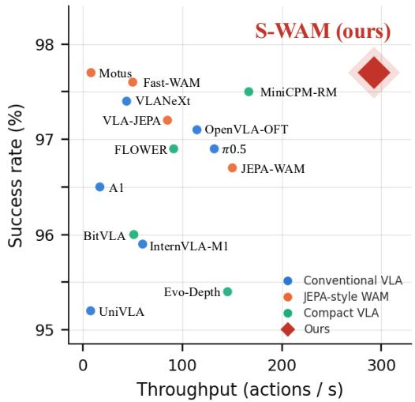  
Figure 1: Success rate versus measured inference throughput on LIBERO. The measurement protocol, per-method results, and methods omitted from the figure are provided in Appendix C.

family, where a lightweight predictor produces the future latent representation. Specifically, the current observation and the predicted future representation are then jointly used to condition action generation. Despite this more efficient design, future prediction still introduces additional inference overhead on top of an already expensive policy (Chen et al., 2026a; Yuan et al., 2026b). To sustain high-frequency control, the policy must generate new action chunks sufficiently frequently: a low-level controller may execute actions at several hundred hertz, while the policy inference frequency is typically below 10 Hz. A single WAM inference requires a forward pass through a multibillion-parameter backbone and a future-prediction module, followed by iterative action denoising. This inference cost becomes particularly limiting for onboard deployment on edge devices (Yang et al., 2026; Sun et al., 2026e). Improving the action throughput of WAMs without degrading task performance is therefore important for practical deployment.

Despite slow policy inference, action chunking provides a practical way to sustain high-frequency control (Zhao et al., 2023). Given an observation $o _ { t } .$ , the policy generates H future actions in a single forward pass, allowing one expensive inference to be amortized over multiple control steps. Effective throughput, however, depends not on the generated horizon H, but on the executed horizon $H _ { \mathrm { e x e c } } \leq H \colon$ the number of generated actions actually executed before the next policy update. In practice, $H _ { \mathrm { e x e c } }$ is often substantially smaller than H. A deployed system typically executes only the first few actions of a chunk, often one to twenty, acquires a new observation, queries the policy again, and discards the remaining actions (Lu et al., 2026).

This limited execution horizon is necessary because the reliability of later actions decreases as execution proceeds farther from the observation on which the chunk was conditioned. Tracking and contact errors accumulate while the robot acts without a new observation, uncertainty increases with the prediction horizon, and changes in the scene during execution are not reflected in the original conditioning observation. Increasing the generated chunk length alone therefore does not necessarily improve effective throughput. With the model weights and denoising budget fixed, increasing the executed horizon from 10 to 50 actions reduces success by 12.8 points for LaWAM (Chen et al., 2026a) and 26.8 points for $\pi _ { 0 . 5 }$ (Intelligence et al., 2025) (Sec. 5.1). The resulting challenge is to support a long execution horizon while allowing unexecuted actions to be continuously updated using the latest observation.

To address this challenge, we propose STAIRCASE POLICY, a streaming inference and training framework for World-Action Models with large action chunks: it adds a lightweight predictor of the future observation latent to a flow-matching VLA, turning it into the JEPA-style WAM we call an S-WAM. STAIRCASE POLICY uses future prediction to maintain reliable actions over longer execution horizons. It maintains a buffer of sub-chunks at staggered denoising stages. First, it progressively generates and immediately executes near-term sub-chunks, allowing action execution to begin before the full chunk has been generated. Second, it continuously refines unexecuted actions: once a near-term sub-chunk has finished executing, a new observation is available, and STAIRCASE POLICY re-encodes that observation, re-predicts the future latent representation, and advances all remaining actions by one denoising step under the updated condition. This design supports long execution horizons while maintaining task performance: S-WAM achieves 97.7% on LIBERO and 87.9% on LIBERO-Plus, with 292.7 executed actions per second (642.9 with additional optimizations) and a 73.3 ms time-to-first-action (TTFA). Our contributions are summarized as follows:

• We propose STAIRCASE POLICY, a streaming inference and training framework for World-Action Models that pipelines the generation and execution of large action chunks. STAIRCASE POLICY maintains sub-chunks at staggered denoising stages, allowing near-term actions to be executed while later actions continue to be generated.

• We introduce observation-conditioned refinement for long action chunks. As new observations arrive during execution, STAIRCASE POLICY updates the predicted future latent and continuously refines unexecuted actions, allowing the chunk to adapt without repeatedly invoking the full policy.

• We show that future-prediction error can serve as a practical signal for adaptive chunking. By comparing the predicted future latent with the subsequently observed one, STAIRCASE POLICY can decide when to terminate the current chunk and replan.

• We demonstrate strong efficiency, robustness, and transferability across multiple simulation benchmarks, policy backbones, and real-robot tasks. S-WAM substantially improves action throughput and TTFA while maintaining strong task performance, including under perturbations and dynamic-scene evaluations.

## 2 RELATED WORK

World-action models. Generalist manipulation policies combine a pretrained vision-language backbone with an iterative action decoder (Chi et al., 2023; Kim et al., 2024; Black et al., 2024; Intelligence et al., 2025). World-Action Models (WAMs) further condition actions on predicted future observations, either in pixel or video space (Du et al., 2023; Chen et al., 2026b; Team et al., 2026) or in representation space (Miao et al., 2026; Zheng et al., 2025; Syed et al., 2026), often using latent action modeling (Bruce et al., 2024; Chen et al., 2026a). Future prediction adds inference overhead (Chen et al., 2026a; Yuan et al., 2026b; Yang et al., 2026), and recent work questions whether it is needed at inference time (Yuan et al., 2026b; Miao et al., 2026; Zhang et al., 2026b). We instead study long execution horizons, where future representations are repeatedly updated to refine unexecuted actions.

Accelerating policy inference. Prior work reduces iterative generation cost (Luan et al., 2026; Sun et al., 2026d; Kim et al., 2025), trims redundant model capacity (Sun et al., 2026b), overlaps inference with execution (Black et al., 2025a;b; Agouzoul, 2026), or streams generation with different noise levels across an action buffer (Høeg et al., 2025; Chen et al., 2024; 2025c; Sun et al., 2026e; Shi et al., 2026). Related methods asynchronously refresh semantic conditioning (Park & Tulsiani, 2026), train for intra-chunk inconsistency (Wang et al., 2026a), stagger denoising over predicted video latents while sharing the action timestep (Huang et al., 2026), or separate slow semantic and fast action modules (Chen et al., 2025a). FASTER gives each position of the chunk its own hit time so that the first action is ready after a single sampling step (Lu et al., 2026). All of these condition a chunk on one observation and change only how it is generated. STAIRCASE POLICY keeps every position at a shared flow time, differing in readout depth alone, and re-conditions the unexecuted remainder on observations that arrive during execution.

Large action chunks. Action chunking amortizes inference over multiple actions (Zhao et al., 2023), yet published LIBERO policies typically execute only 1–20 actions per query (Kim et al., 2025; Lu et al., 2026; Shi et al., 2026; Park & Tulsiani, 2026), which caps the throughput benefit of chunking. Prior methods mitigate this by terminating execution early on uncertainty or prediction mismatch (Feng et al., 2026; Wang et al., 2026c; Pan et al., 2026; Hu et al., 2026), correcting chunks after generation (Liu et al., 2024; Sendai et al., 2025), or conditioning generation on predicted future states (Yang et al., 2026; Syed et al., 2026; Yang & Shan, 2026). STAIRCASE POLICY instead continuously updates unexecuted actions as observations arrive, supporting a longer executed horizon without another full policy query.

## 3 METHOD

STAIRCASE POLICY is a streaming inference and training framework that turns a flow-matching VLA into a JEPA-style WAM. The design is motivated by two properties of long-horizon action generation.

Denoising requirements vary across the action horizon. Near-term actions are generally easier to predict, while actions farther into the future are less reliable (Lu et al., 2026). This suggests allocating denoising computation non-uniformly across the chunk. Because flow-matching trajectories are approximately straight (Liu et al., 2022; Lipman et al., 2022), a single velocity evaluation can already provide a useful estimate toward the data endpoint. STAIRCASE POLICY therefore emits the first sub-chunk after one denoising step and gives each subsequent sub-chunk one additional step (Sec. 3.2).

Visual conditioning should be refreshed during execution. Object poses, contacts, and robot configuration change as actions are executed, while the task instruction and high-level semantic context remain largely unchanged within a chunk. STAIRCASE POLICY therefore refreshes only the lightweight vision-side future predictor at each sub-chunk boundary, while reusing the cached vision-language context. This provides updated visual conditioning at millisecond-scale cost without repeatedly invoking the substantially more expensive backbone (Sec. 3.3).

## 3.1 SETUP

The host is a flow-matching VLA mapping an observation o and instruction ℓ to a chunk of H actions (Zhao et al., 2023): a backbone of billions of parameters emits a semantic context e and a compact latent plan z (Bruce et al., 2024), and a flow-matching expert $v _ { \theta }$ denoises a buffer $\boldsymbol { x } \in \mathbb { R } ^ { \dot { H } \times d _ { a } }$ toward the data along the linear path from noise (Lipman et al., 2022). We require only that the expert be callable as a single Euler step against a cached backbone context.

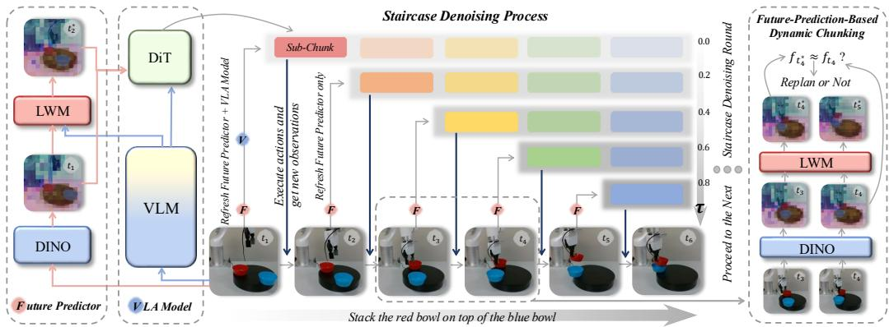  
Figure 2: Overview of STAIRCASE POLICY. Here $t _ { i }$ denotes a time step and $t _ { i } ^ { * }$ the predicted future.

STAIRCASE POLICY adds a lightweight future predictor consisting of a frozen vision encoder $h = E ( o )$ and a decoder $g$ that predicts the feature map of a near-future observation, thefuture latent $\hat { f } = g ( h , z )$ . The expert is conditioned on $c = ( h , \hat { f } , e )$ , and we refer to the resulting streaming World-Action Model as an S-WAM. The future predictor we introduce follows the latent world model of LaWAM (Chen et al., 2026a), retaining its predictor architecture while training it under the streaming schedule described below.

Under conventional inference, the entire action buffer is denoised for n steps, after which the policy executes a prefix of $H _ { \mathrm { e x e c } } \leq H$ actions without taking a new observation and discards the remainder. Increasing $H _ { \mathrm { e x e c } }$ improves executed-action throughput, but also requires executing later actions, which are less reliable as execution moves farther from the conditioning observation. STAIRCASE POLICY changes how the action chunk is denoised and executed: instead of fully denoising the entire chunk before execution, it progressively generates near-term actions while continuously updating the remaining actions with new observations, without modifying the host backbone or flow expert.

## 3.2 THE DENOISING STAIRCASE

We partition the chunk into K contiguous subchunks of size G, so that the chunk length is $H = K G$ . These two hyper-parameters are the only scheduling parameters varied in our study (Sec. 5.2); unless otherwise specified, we use $H { = } 5 0 , K { = } 5 , G { = } 1 0$ . Algorithm 1 states the resulting inference loop.

The buffer starts as pure noise at a single shared flow time $\tau { = } 0$ , and each query advances all positions by one Euler step of size $1 / K , \ x \  \ x + \frac { 1 } { K } v _ { \theta } ( x , \tau \ | \ c _ { j } )$ with $\textstyle { \tau  \tau + { \frac { 1 } { K } } }$ , giving the grid on the right of Fig. 2. Immediately after the j-th update $( j = \bar { 0 } , \ldots , K { - } 1 )$ the j-th sub-chunk is read out by extrapolating the same velocity estimate to τ=1,

Algorithm 1 STAIRCASE POLICY inference for one   
chunk of $H = K G$ actions   
1: once per chunk: $( e , z ) \gets$ backbone $( o _ { 0 } , \ell )$   
2: $x \sim \bar { \mathcal { N } } ( 0 , I ) ; \tau  0$   
3: for $j = 0 , \ldots , K - 1$ do   
4: $h _ { j }  E ( o _ { j } ) ; \quad \hat { f } _ { j }  g ( h _ { j } , z )$ ▷ refresh,   
Eq. (2)   
5: $v  v _ { \theta } ( x , \tau \mid h _ { j } , \hat { f } _ { j } , e )$ ▷ one expert pass   
6: emit $\hat { A } _ { j } = [ x + ( 1 - \tau ) v ] _ { j G : ( j + 1 ) G }$ ▷   
readout, Eq. (1)   
7: $x  x + \textstyle { \frac { 1 } { K } } v ; \quad \tau  \tau + \textstyle { \frac { 1 } { K } }$   
8: execute $\hat { A } _ { j }$ (G steps); observe $o _ { j + 1 }$   
9: end for

$$
\hat { A } _ { j } = \left[ x + ( 1 - \tau ) v _ { \theta } ( x , \tau \mid c _ { j } ) \right] _ { j G : ( j + 1 ) G } ,\tag{1}
$$

and handed to the controller while the rest of the buffer keeps denoising. We denote the full extrapolated buffer before slicing as $\hat { A } _ { j } ^ { \mathrm { f u l l } }$

Sub-chunk $j$ is therefore emitted after $j { + 1 }$ forward passes of the DiT action expert. Although different sub-chunks have different readout depths, all buffer positions remain at the same flow time τ, so the expert always receives inputs from the shared-τ distribution used during training. Per H executed actions, the schedule requires one backbone pass and K denoising steps.

## 3.3 REFRESHING THE FUTURE PREDICTOR

The denoising staircase creates K sub-chunk boundaries within each chunk. At every boundary, a new observation is available when the expert performs its next denoising update. After completing sub-chunk $j - 1$ , the robot observes $o _ { j }$ , and STAIRCASE POLICY recomputes the future prediction as

$$
h _ { j } = E ( o _ { j } ) , \quad \hat { f } _ { j } = g ( h _ { j } , z ) , \quad c _ { j } = ( h _ { j } , \hat { f } _ { j } , e ) ,\tag{2}
$$

while keeping z and e fixed at their chunk-start values. Thus, the expensive VLA backbone runs one forward pass per full chunk, whereas the lightweight future predictor runs once per sub-chunk boundary, as illustrated in Fig. 2. Each refreshed condition is applied to all unexecuted positions in the buffer. Consequently, changes observed at boundary j can influence every subsequent action in the current chunk without requiring a full policy replan. This observation-conditioned refresh is therefore what allows the staircase schedule to maintain action quality over a long execution horizon.

Because the refresh runs as a chain, the predicted future is itself a usable signal: $\hat { f } _ { j - 1 }$ targets $h _ { j }$ which is encoded one sub-chunk later, so every boundary yields a prediction–realization pair that a policy denoising the chunk only once never has. Their discrepancy $\delta _ { j } = \mathrm { M S E } ( \hat { f } _ { j - 1 } , h _ { j } )$ grows when the scene departs from what the model anticipated at planning time, for instance because the target was displaced. If $\delta _ { j }$ exceeds a threshold, the chunk ends after sub-chunk $j$ and the backbone plans a new one (right of Fig. 2), making the executed horizon data-dependent rather than fixed at K sub-chunks. We explore such signal in detail in Sec. 5.4.

## 3.4 TRAINING UNDER THE DEPLOYMENT SCHEDULE

Standard training does not expose the policy to several states encountered by Algorithm 1, including partially denoised buffers, one-step readouts, changes in conditioning within a chunk, and selfpredicted future latents. We therefore train the model using the same streaming schedule used at inference time. We further find that training this way converges considerably faster than conventional chunk training (Sec. 4.3). Each demonstration window provides the $K { + } \dot { 1 }$ observations at the subchunk boundaries. At every boundary, the condition uses the self-predicted $g ( h _ { j } , z )$ rather than the ground-truth $h _ { j + 1 }$ , matching the information available during deployment.

The forward rollout remains sequential, while the action buffer is detached between boundaries to avoid backpropagation through the full K-step chain. The K expert graphs are optimized in a shared backward pass.

Supervision targets the quantity the controller consumes, the readout (1) rather than the velocity. At boundary $j$ each buffer position carries weight 1 if it lies in the emitted sub-chunk and $\lambda _ { \mathrm { n e } } { = } 0 . 2 5$ otherwise, and the losses pool boundaries:

$$
\mathcal { L } _ { \mathrm { a c t } } = \frac { \sum _ { j , p } w _ { j } ( p ) \| \hat { A } _ { j } ^ { \mathrm { \scriptsize { f u l l } } } ( p ) - A ( p ) \| _ { 2 } ^ { 2 } } { d _ { a } \sum _ { j , p } w _ { j } ( p ) } , \qquad \mathcal { L } _ { \mathrm { f } } = \frac { 1 } { K } \sum _ { j = 0 } ^ { K - 1 } \mathrm { M S E } ( g ( h _ { j } , z ) , h _ { j + 1 } ) .\tag{3}
$$

Executed positions receive full weight, while the lower-weight dense term supervises all other valid positions in the buffer. The future latent remains attached to the computation graph: gradients from $\mathcal { L } _ { \mathrm { a c t } }$ propagate through $\hat { f } _ { j }$ into $g$ and $z .$ Thus, the future predictor is optimized both for latent prediction and for its utility in action generation. The total objective is $\mathcal { L } = \mathcal { \bar { L } } _ { \mathrm { a c t } } + \beta ( \mathcal { L } _ { \mathrm { f } } + \mathcal { L } _ { z } )$ with $\beta = 0 . 1$ , where $\mathcal { L } _ { z }$ distills z toward the frozen latent-action encoder of the pretraining stage.

## 4 EXPERIMENTS

## 4.1 EXPERIMENTAL SETUP

Simulation Benchmarks. We evaluate on three simulation benchmarks: LIBERO (Liu et al., 2023), with four suites of ten tasks each; LIBERO-PLUS (Fei et al., 2025), with seven perturbation categories over the same tasks; and DOMINO (Fang et al., 2026), a dynamic-manipulation benchmark with scene changes during execution. For all benchmarks, we jointly train a single model over the full set of constituent tasks. For example, on LIBERO, all four suites are mixed during training.

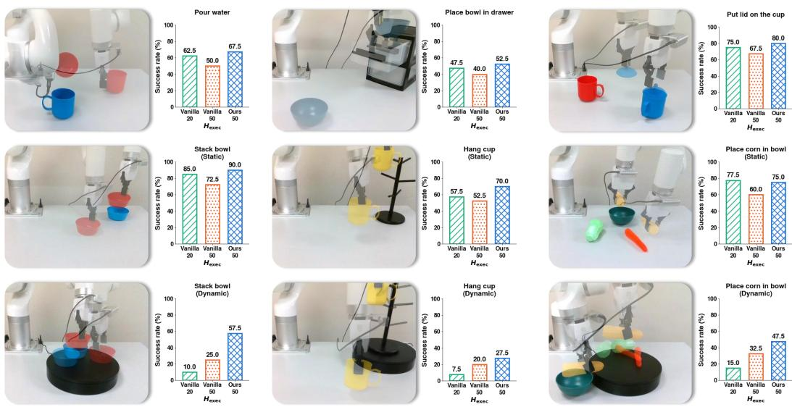  
Figure 3: Real-robot results on nine tasks. Task settings and details are provided in Appendix F.

Model and Training Details. Unless otherwise specified, we use a 2.3B latent World-Action Model as the base VLA. Within each backbone, S-WAM and the vanilla baseline use the same data, initialization, and training configuration; full training recipes are provided in Appendix A. The vanilla policy executes a fixed prefix of $H _ { \mathrm { e x e c } }$ actions before replanning. For every 50 executed actions, S-WAM with $K = 5$ and vanilla execution with $H _ { \mathrm { e x e c } } = 5 0$ both require five denoiser passes and one backbone pass, while $H _ { \mathrm { e x e c } } = 1 0$ requires 25 and five. We therefore use $H _ { \mathrm { e x e c } } = 5 0$ as the compute-matched baseline and $H _ { \mathrm { e x e c } } = 1 0$ as the conventional short-horizon baseline. On LIBERO, each task is evaluated over 50 trials; LIBERO-PLUS uses its full test set.

## 4.2 REAL-ROBOT EXPERIMENTS

Setup. We evaluate nine real-robot tasks on a UFACTORY xArm 850, with the policy running onboard an NVIDIA Jetson Thor. For each task we collect 30 teleoperated demonstrations using a Meta Quest 3. Six of the nine are static and dynamic versions of three manipulation skills, counted separately; in the dynamic version the target objects move continuously on a rotating turntable. The remaining three cover sustained, precise, and multi-stage manipulation. Each task is evaluated over 40 trials. Dataset statistics, observation and action spaces, scene randomization, success criteria, and training details are provided in Appendix F and Appendix A.

Results. As shown in Fig. 3, on the six static tasks S-WAM reaches 72.5 success, compared with 67.5 for vanilla at $H _ { \mathrm { e x e c } } { = } 2 0$ and 57.1 at $H _ { \mathrm { e x e c } } { = } 5 0$ . The drop at $H _ { \mathrm { e x e c } } { = } 5 0$ reflects the limitation of vanilla large-chunk execution over long horizons. The dynamic tasks expose the limitations of both vanilla execution regimes. Frequent replanning is affected by inference latency while the scene continues to move, yielding only 10.8 at $H _ { \mathrm { e x e c } } { = } 2 0$ . Executing 50 actions per query improves this to 25.8, but the later actions in the large chunk accumulate prediction drift over the long execution horizon. S-WAM instead updates the unexecuted actions from new observations and reaches 44.2. Detailed per-task results are provided in Table 18.

## 4.3 PERFORMANCE OF S-WAM ACROSS SIMULATION BENCHMARKS

LIBERO. Figure 1 compares S-WAM with 14 released policies in terms of Success Rate (SR) and measured throughput. Existing methods exhibit a clear speed–accuracy trade-off: policies with higher SR often rely on shorter replanning intervals and larger backbones, resulting in lower throughput, while faster policies typically achieve lower SR. S-WAM reaches 97.7% SR at 292.7 executed actions per second, matching the highest SR while achieving 1.8× the throughput of the next-fastest method shown. SRs are taken from the original papers, while throughput numbers are measured from released checkpoints under a unified protocol. Full results and details are provided in Appendix C.

Table 1: Robustness on LIBERO-Plus across seven perturbation dimensions.
<table><tr><td>Method</td><td>Background</td><td>Robot</td><td>Camera</td><td>Language</td><td>Noise</td><td>Layout</td><td>Light</td><td> $\operatorname { A v g } .$ </td></tr><tr><td>ST-WAM (Wang et al., 2026b)</td><td>74.2</td><td>60.1</td><td>55.4</td><td>79.3</td><td>79.5</td><td>74.3</td><td>93.0</td><td>73.7</td></tr><tr><td>DreamWAM (Yuan et al., 2026a)</td><td>71.5</td><td>63.6</td><td>53.7</td><td>94.8</td><td>67.1</td><td>80.7</td><td>96.6</td><td>75.4</td></tr><tr><td>VLA-JEPA (Sun et al., 2026c)</td><td>93.6</td><td>67.1</td><td>63.3</td><td>85.4</td><td>66.3</td><td>85.1</td><td>95.6</td><td>79.5</td></tr><tr><td>ROCKET-VLA (Sun et al., 2026a)</td><td>91.8</td><td>41.8</td><td>91.8</td><td>78.0</td><td>92.5</td><td>81.2</td><td>94.7</td><td>81.7</td></tr><tr><td>VLANeXt (Wu et al., 2026)</td><td>82.5</td><td>65.7</td><td>90.4</td><td>81.8</td><td>94.1</td><td>80.8</td><td>95.9</td><td>84.5</td></tr><tr><td>WorldPilot (Lin et al., 2026c)</td><td>96.4</td><td>60.6</td><td>82.8</td><td>87.2</td><td>93.6</td><td>80.5</td><td>98.6</td><td>85.7</td></tr><tr><td>InternVLA-A1.5 (Ma et al., 2026)</td><td>98.2</td><td>55.1</td><td>83.1</td><td>86.9</td><td>95.6</td><td>85.2</td><td>96.4</td><td>85.8</td></tr><tr><td>Vanilla,  $H _ { \mathrm { e x e c } } { = } 5 0$ </td><td>83.0</td><td>49.7</td><td>77.1</td><td>53.9</td><td>80.0</td><td>64.8</td><td>85.7</td><td>70.6</td></tr><tr><td>Vanilla,  $H _ { \mathrm { e x e c } } { = } 1 0$ </td><td>95.2</td><td>73.4</td><td>91.5</td><td>77.7</td><td>94.3</td><td>82.1</td><td>96.0</td><td>87.2</td></tr><tr><td>S-WAM (ours),  $H _ { \mathrm { e x e c } } { = } 5 0$ </td><td>96.6</td><td>76.0</td><td>89.5</td><td>85.2</td><td>90.4</td><td>79.3</td><td>98.6</td><td>87.9</td></tr></table>

LIBERO-Plus. Table 1 evaluates robustness across seven perturbation dimensions. S-WAM achieves the best average SR, 87.9%, outperforming the vanilla policy at $H _ { \mathrm { e x e c } } { = } 5 0$ by 17.3. Robot initial-state perturbation is where that baseline is weakest (49.7); S-WAM reaches 76.0 there, the best score in the table, consistent with the benefit coming from re-observing scene geometry during execution. Compared with vanilla execution at $H _ { \mathrm { e x e c } } { = } 1 0$ , S-WAM achieves comparable overall SR. The per-suite breakdown is given in Appendix E.2.

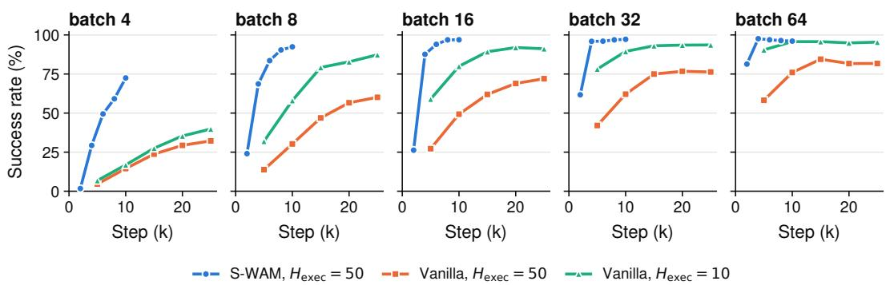  
Figure 4: Success rate versus training steps across five global batch sizes.

Training efficiency. Training under STAIRCASE POLICY’s streaming schedule is more expensive per step, but converges substantially faster. Across five global batch sizes, S-WAM consistently reaches higher success with fewer training steps, with the largest gains in low-batch regimes (Fig. 4). At batch size 4, it reaches 72.5 success after 10k steps, compared with 32.2 for vanilla even after 25k steps; the gap narrows to 14.3 points at batch size 64. Although each streaming-training step costs 1.87× more FLOPs (Appendix A), the shorter schedule more than offsets this overhead: S-WAM ends at a higher success rate than vanilla while spending fewer total training FLOPs (Table 5).

Inference speed. Against the vanilla policy at the execution horizon that matches its accuracy $( H _ { \mathrm { e x e c } } { = } 1 0 ) , \mathsf { S - W A M }$ raises throughput from 80.9 to 292.7 executed actions per second (3.62×) and cuts TTFA from 123.6 to 73.3 ms (−40.7%). Adding graph capture and prompt caching, neither of which changes the actions produced, takes the same policy to 642.9 actions per second at 48.6 ms (Table 2). Here, eager uses standard PyTorch execution, geo & DiT CUDA Graph captures the geometry and denoising calls to reduce launch overhead, and prompt cache reuses the frame-invariant prompt computation. The measurement protocol is provided in Appendix B.

Table 2: Optimization ladder on the LaWAM host.
<table><tr><td>Method</td><td>Action/s ↑</td><td>Speedup</td><td>TTFA↓</td></tr><tr><td>Vanilla  $( H _ { \mathrm { e x e c } } { = } 1 0 )$  , eager</td><td> $8 0 . 9 \pm 1 . 0$ </td><td>1.00×</td><td>123.6</td></tr><tr><td>Vanilla  $( H _ { \mathrm { e x e c } } { = } 5 0 )$  , eager</td><td> $4 0 2 . 5 \pm 6 . 8$ </td><td>4.98×</td><td>124.2</td></tr><tr><td>Ours  $( H _ { \mathrm { e x e c } } { = } 5 0 ) _ { \cdot }$  eager</td><td> $2 9 2 . 7 \pm 9 . 4$ </td><td>3.62×</td><td>73.3</td></tr><tr><td>+ geo &amp; DiT CUDA Graph</td><td> $6 2 5 . 7 \pm 1 6 . 1$ </td><td>7.73×</td><td>53.2</td></tr><tr><td>+ prompt cache</td><td> $6 4 2 . 9 \pm 1 8 . 2$ </td><td>7.95×</td><td>48.6</td></tr></table>

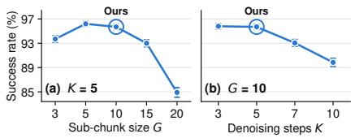  
Figure 5: Effect of chunking hyperparameters, where $H = K \times { \bar { G } } .$

## 5 DISCUSSION

## 5.1 EXECUTION LENGTH AND THE SPEED–ACCURACY TRADE-OFF

Increasing throughput by executing more actions per inference substantially degrades conventional policies. With only $H _ { \mathrm { e x e c } }$ varied, our backbone drops from 95.2 at $H _ { \mathrm { e x e c } } { = } 1 0$ to 82.4 at 50, while $\pi _ { 0 . 5 }$ drops from 93.2 to 66.4 (Table 3). In contrast, S-WAM executes the full 50-action chunk and still reaches 97.7 and 96.5 on the two backbones, above the best vanilla result on either. Thus, the throughput improvement does not come from sacrificing task performance. This suggests that the main limitation lies in executing later actions under stale conditioning, rather than in the chunk length itself. S-WAM mitigates this by refreshing the conditioning for unexecuted actions as new observations arrive. Vanilla SR peaks at or near $H _ { \mathrm { e x e c } } { = } 1 0$ on both backbones (Fig. 6), so we compare mainly against that configuration. Details are in Appendix D.

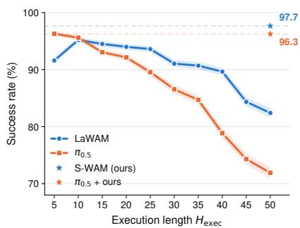  
Figure 6: Success rate versus execution horizon, averaged over four suites.

## 5.2 CHOICE OF DENOISING STEPS AND SUB-CHUNK SIZE

The total chunk length is determined by the number of denoising steps K and the sub-chunk size G, the number of actions emitted per step. Increasing either increases the executed horizon and thus throughput. We vary each factor independently while keeping all other settings fixed. As shown in Fig. 5, performance remains stable over a broad range and degrades only when the chunk becomes too long relative to the available denoising steps. We therefore use $\dot { K } { = } 5$ and G=10, yielding a 50-action chunk, for all experiments unless otherwise specified.

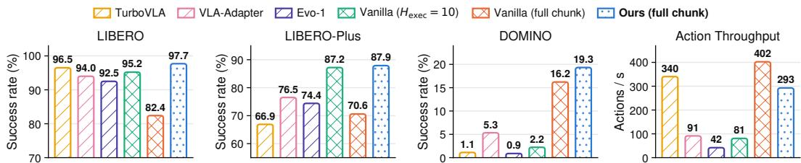  
Figure 7: Comparison with compact VLA models on LIBERO, LIBERO-Plus, DOMINO.

## 5.3 SMALL MODELS VS. EXECUTION-LEVEL ACCELERATION

We compare with three compact policies, TurboVLA (Xie et al., 2026) (0.2B), VLA-Adapter (Wang et al., 2025b) (0.6B), and Evo-1 (Lin et al., 2025) (0.77B), against our 2.3B backbone. On LIBERO, the compact models already perform strongly (Fig. 7). The gap widens on harder benchmarks: the compact models achieve 66.9–76.5% on LIBERO-Plus versus 87.9% for ours, and 0.9–5.3% on DOMINO, where S-WAM reaches 19.3%. Thus, these results highlight two complementary paths to efficient policy inference: reducing model size, which works well on relatively easier settings such as LIBERO (Wang et al., 2026d), and execution-level acceleration, which preserves the capacity of a larger policy. By retaining a larger policy while increasing the number of reliable actions executed per expensive policy inference, S-WAM improves throughput while preserving stronger performance on challenging robustness and dynamic benchmarks. Detailed results are provided in Appendix E.

## 5.4 THE FUTURE-PREDICTION ERROR AS A CHUNKING SIGNAL

We test whether the future-prediction error $\delta _ { j }$ can guide adaptive chunking. Commit-X always executes exactly X subchunks before replanning. $p X$ instead sets the gating threshold to the X-th percentile of $\delta _ { j }$ measured on the validation set, and replans when the error exceeds this threshold, while committing to at least four sub-chunks. As shown in Fig. 8, adaptive chunking provides an additional operating point between commit-4 and commit-5, trading a small amount of throughput for a larger gain in SR. For example, p80 reaches 96.2 SR with only a modest further reduction in throughput. These results suggest that future-prediction error can serve as a practical signal for adaptive chunking.

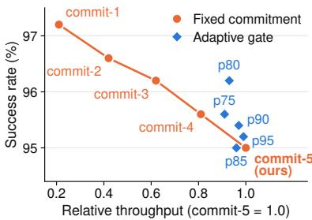  
Figure 8: SR against throughput for fixed and adaptive commitment on LIBERO-Long.

## 5.5 TRANSFERABILITY ACROSS POLICY BACKBONES

We apply STAIRCASE POLICY to three different VLA backbones, LaWAM (Chen et al., 2026a), $\pi _ { 0 . 5 }$ (Intelligence et al., 2025), and FLOWER (Reuss et al., 2025). Each backbone retains its hostspecific training configuration, while the STAIRCASE POLICY schedule, objectives, and method-side hyper-parameters remain unchanged. Training details are provided in Appendix A. Compared with vanilla execution at $H _ { \mathrm { e x e c } } { = } 5 0$ , S-WAM improves SR by 15.25, 30.15, and 14.05 points on LaWAM, $\pi _ { 0 . 5 } ,$ and FLOWER, respectively (Table 3). Notably, $\pi _ { 0 . 5 }$ and FLOWER were not pretrained to predict future latents, suggesting that the method does not rely on such pretraining. Across all three backbones, S-WAM achieves comparable or better SR than vanilla execution at $H _ { \mathrm { e x e c } } { = } 1 0$ , while improving throughput by 2.74×–3.62× and reducing TTFA by 37.9%–40.7%.

Table 3: STAIRCASE POLICY transfers across different backbones. Act/s is executed actions per second; TTFA is time to first action (ms).
<table><tr><td rowspan="2">Backbone</td><td rowspan="2">Policy</td><td colspan="5">Success rate</td><td colspan="2">Speed</td></tr><tr><td>Spatial</td><td>Object</td><td>Goal</td><td>Long</td><td> $\operatorname { A v g } .$ </td><td>Act/s ↑</td><td>TTFA↓</td></tr><tr><td rowspan="3">LaWAM (Chen et al., 2026a) (2.3B)</td><td>S-WAM</td><td>98.6</td><td>100.0</td><td>97.0</td><td>95.0</td><td>97.65</td><td>292.7</td><td>73.3</td></tr><tr><td>Vanilla,  $H _ { \mathrm { e x e c } } { = } 1 0$ </td><td>96.2</td><td>98.4</td><td>95.6</td><td>90.6</td><td>95.20</td><td>80.9</td><td>123.6</td></tr><tr><td>Vanilla,  $H _ { \mathrm { e x e c } } { = } 5 0$ </td><td>87.2</td><td>80.6</td><td>88.0</td><td>73.8</td><td>82.40</td><td>402.5</td><td>124.2</td></tr><tr><td rowspan="3">π0.5 (Intelligence et al., 2025) (3.5B)</td><td>S-WAM</td><td>98.0</td><td>98.6</td><td>95.2</td><td>94.2</td><td>96.50</td><td>243.2</td><td>80.6</td></tr><tr><td>Vanilla,  $H _ { \mathrm { e x e c } } { = } 1 0$ </td><td>94.6</td><td>99.0</td><td>91.6</td><td>87.4</td><td>93.15</td><td>75.7</td><td>132.2</td></tr><tr><td>Vanilla,  $H _ { \mathrm { e x e c } } { = } 5 0$ </td><td>66.4</td><td>67.6</td><td>72.8</td><td>58.6</td><td>66.35</td><td>378.3</td><td>134.8</td></tr><tr><td rowspan="3">FLOWER (Reuss et al., 2025)</td><td>S-WAM</td><td>97.4</td><td>99.6</td><td>98.6</td><td>88.8</td><td>96.10</td><td>234.3</td><td>72.7</td></tr><tr><td>Vanilla,  $H _ { \mathrm { e x e c } } { = } 1 0$ </td><td>98.8</td><td>99.2</td><td>96.6</td><td>89.6</td><td>96.05</td><td>85.5</td><td>117.0</td></tr><tr><td>Vanilla,  $H _ { \mathrm { e x e c } } { = } 5 0$ </td><td>85.6</td><td>85.0</td><td>90.6</td><td>67.0</td><td>82.05</td><td>416.0</td><td>120.2</td></tr></table>

## 6 CONCLUSION

We presented STAIRCASE POLICY, a streaming inference and training framework for World-Action Models that pipelines the generation and execution of large action chunks. STAIRCASE POLICY maintains sub-chunks at staggered denoising stages and continuously updates unexecuted actions using new observations, enabling longer execution horizons without repeatedly invoking the full policy. S-WAM achieves strong performance across multiple simulation benchmarks and real-robot tasks while substantially improving action throughput and reducing TTFA without sacrificing task performance. It also improves robustness under perturbations and consistently outperforms computematched baselines. Overall, these results show that streaming generation and observation-conditioned refinement provide an effective way to make large action chunks practical for efficient robot control.

## AI USE STATEMENT

Generative AI tools were used in this work in three ways. First, for language polishing: a large language model was used to improve the clarity and grammar of the manuscript, and every suggested edit was reviewed and accepted or rejected by the authors. Second, for experiment management: AI assistance was used to launch, schedule and monitor training and evaluation runs across machines. Third, for result aggregation: AI assistance was used to collect per-run outputs into the tables and figures reported here. Every number obtained in this way was manually checked by the authors against the raw evaluation logs before being reported. The method, its implementation, the experimenta design and all scientific claims are the authors’ own work, and the authors take full responsibility for the content of this paper.

## REPRODUCIBILITY STATEMENT

The method is specified in Sec. 3, with the staircase schedule, the refresh step and the training objective given in Sec. 3.2–3.4 and Algorithm 1. The appendix records what is needed to reproduce every reported number. Per-backbone training recipes, including the optimiser, the schedule, the step budgets and the boundary grid, are in Appendix A; the latency and throughput measurement protocol is in Appendix B. Appendix C gives the full per-method LIBERO table behind Fig. 1, including the entries omitted from the figure, and Appendix D the per-suite execution-length curves. Per-task results for every benchmark, together with the compact-model baselines, are in Appendix E. The real-robot datasets, the observation and action spaces, the scene-randomisation and success criteria, and the per-task success rates are in Appendix F.

## ETHICS STATEMENT

This work involves no human subjects, no personally identifying data and no newly released dataset.

## REFERENCES

Ayoub Agouzoul. Understanding Asynchronous Inference Methods for Vision-Language-Action Models. arXiv preprint arXiv:2605.08168, 2026.

Hongzhe Bi, Hengkai Tan, Shenghao Xie, Zeyuan Wang, Shuhe Huang, Haitian Liu, Ruowen Zhao, Yao Feng, Chendong Xiang, Yinze Rong, et al. Motus: A Unified Latent Action World Model. arXiv preprint arXiv:2512.13030, 2025.

Kevin Black, Noah Brown, Danny Driess, Adnan Esmail, Michael Equi, Chelsea Finn, Niccolo Fusai, Lachy Groom, Karol Hausman, Brian Ichter, et al. π : A Vision-Language-Action Flow Model for General Robot Control. arXiv preprint arXiv:2410.24164, 2024. RSS 2025.

Kevin Black, Manuel Y. Galliker, and Sergey Levine. Real-Time Execution of Action Chunking Flow Policies. arXiv preprint arXiv:2506.07339, 2025a. NeurIPS 2025.

Kevin Black, Allen Z. Ren, Michael Equi, and Sergey Levine. Training-Time Action Conditioning for Efficient Real-Time Chunking. arXiv preprint arXiv:2512.05964, 2025b.

Jake Bruce, Michael Dennis, Ashley Edwards, Jack Parker-Holder, Yuge Shi, Edward Hughes, Matthew Lai, Aditi Mavalankar, Richie Steigerwald, Chris Apps, et al. Genie: Generative Interactive Environments. arXiv preprint arXiv:2402.15391, 2024. ICML 2024.

Qingwen Bu, Yanting Yang, Jisong Cai, Shenyuan Gao, Guanghui Ren, Maoqing Yao, Ping Luo, and Hongyang Li. UniVLA: Learning to Act Anywhere with Task-centric Latent Actions. arXiv preprint arXiv:2505.06111, 2025. RSS 2025.

Boyuan Chen, Diego Marti Monso, Yilun Du, Max Simchowitz, Russ Tedrake, and Vincent Sitzmann. Diffusion Forcing: Next-token Prediction Meets Full-Sequence Diffusion. arXiv preprint arXiv:2407.01392, 2024. NeurIPS 2024.

Hao Chen, Jiaming Liu, Chenyang Gu, Zhuoyang Liu, Renrui Zhang, Xiaoqi Li, Xiao He, Yandong Guo, Chi-Wing Fu, Shanghang Zhang, and Pheng-Ann Heng. Fast-in-Slow: A Dual-System Foundation Model Unifying Fast Manipulation within Slow Reasoning. arXiv preprint arXiv:2506.01953, 2025a.

Jialei Chen, Kai Wang, Kang Chen, Shuaihang Chen, Feng Gao, Wenhao Tang, Zhiyuan Li, Weilin Liu, Zhuyu Yao, Boxun Li, Yuanbo Xu, and Chao Yu. LaWAM: Latent World Action Models for Efficient Dynamics-Aware Robot Policies. arXiv preprint arXiv:2606.15768, 2026a.

Tongqing Chen, Hang Wu, Jiasen Wang, Xiaotao Li, and Lu Fang. StreamVLA: Breaking the Reason-Act Cycle via Completion-State Gating. arXiv preprint arXiv:2602.01100, 2026b.

Xinyi Chen, Yilun Chen, Yanwei Fu, Ning Gao, Jiaya Jia, Weiyang Jin, Hao Li, Yao Mu, Jiangmiao Pang, Yu Qiao, et al. InternVLA-M1: A Spatially Guided Vision-Language-Action Framework for Generalist Robot Policy. arXiv preprint arXiv:2510.13778, 2025b.

Zhuoqun Chen, Xiu Yuan, Tongzhou Mu, and Hao Su. Responsive Noise-Relaying Diffusion Policy: Responsive and Efficient Visuomotor Control. arXiv preprint arXiv:2502.12724, 2025c.

Cheng Chi, Zhenjia Xu, Siyuan Feng, Eric Cousineau, Yilun Du, Benjamin Burchfiel, Russ Tedrake, and Shuran Song. Diffusion Policy: Visuomotor Policy Learning via Action Diffusion. arXiv preprint arXiv:2303.04137, 2023. RSS 2023.

Yilun Du, Mengjiao Yang, Bo Dai, Hanjun Dai, Ofir Nachum, Joshua B. Tenenbaum, Dale Schuurmans, and Pieter Abbeel. Learning Universal Policies via Text-Guided Video Generation. arXiv preprint arXiv:2302.00111, 2023. NeurIPS 2023.

Heng Fang, Shangru Li, Shuhan Wang, Xuanyang Xi, Dingkang Liang, and Xiang Bai. Towards generalizable robotic manipulation in dynamic environments, 2026. URL https://arxiv. org/abs/2603.15620.

Senyu Fei, Siyin Wang, Junhao Shi, Zihao Dai, Jikun Cai, Pengfang Qian, Li Ji, Xinzhe He, Shiduo Zhang, Zhaoye Fei, et al. LIBERO-Plus: In-depth Robustness Analysis of Vision-Language-Action Models. arXiv preprint arXiv:2510.13626, 2025.

Xiangdong Feng, Yuxuan Cheng, Chen Shi, Boyao Han, Yuxuan Yan, Yitong Hong, Zhuotao Tian, and Li Jiang. Denoising Tells When to Replan: Denoising-Variance Adaptive Chunking for Flow-Based Robot Policies. arXiv preprint arXiv:2606.03847, 2026.

Ziou Hu, Xiangtong Yao, Yuan Meng, Zhenshan Bing, and Alois Knoll. Dreaming the Unseen: World Model-regularized Diffusion Policy for Out-of-Distribution Robustness. arXiv preprint arXiv:2603.21017, 2026.

Wen Huang, Haoran Sun, Yongjian Guo, Yunxuan Ma, Haoran Li, Jing Long, Zhouying Mo, Zhong Guan, Yucheng Guo, Shuai Di, and Junwu Xiong. NoiseGate: Learning Per-Latent Timestep Schedules as Information Gating in World Action Models. arXiv preprint arXiv:2605.07794, 2026.

Chia-Yu Hung, Qi Sun, Pengfei Hong, Amir Zadeh, Chuan Li, U-Xuan Tan, Navonil Majumder, and Soujanya Poria. NORA: A Small Open-Sourced Generalist Vision Language Action Model for Embodied Tasks. arXiv preprint arXiv:2504.19854, 2025.

Sigmund H. Høeg, Yilun Du, and Olav Egeland. Streaming Diffusion Policy: Fast Policy Synthesis with Variable Noise Diffusion Models. arXiv preprint arXiv:2406.04806, 2025. ICRA 2025.

Physical Intelligence, Kevin Black, Noah Brown, James Darpinian, Karan Dhabalia, Danny Driess, Adnan Esmail, Michael Equi, Chelsea Finn, Niccolo Fusai, et al. π : a Vision-Language-Action Model with Open-World Generalization. arXiv preprint arXiv:2504.16054, 2025.

Moo Jin Kim, Karl Pertsch, Siddharth Karamcheti, Ted Xiao, Ashwin Balakrishna, Suraj Nair, Rafael Rafailov, Ethan Foster, Grace Lam, Pannag Sanketi, et al. OpenVLA: An Open-Source Vision-Language-Action Model. arXiv preprint arXiv:2406.09246, 2024.

Moo Jin Kim, Chelsea Finn, and Percy Liang. Fine-Tuning Vision-Language-Action Models: Optimizing Speed and Success. arXiv preprint arXiv:2502.19645, 2025. RSS 2025.

Tao Lin, Yilei Zhong, Yuxin Du, Jingjing Zhang, Jiting Liu, Yinxinyu Chen, Encheng Gu, Ziyan Liu, Hongyi Cai, Yanwen Zou, Lixing Zou, Zhaoye Zhou, Gen Li, and Bo Zhao. Evo-1: Lightweight vision-language-action model with preserved semantic alignment, 2025. URL https://arxiv. org/abs/2511.04555.

Tao Lin, Yuxin Du, Jiting Liu, Nuobei Zhu, Yunhe Li, Yuqian Fu, Yinxinyu Chen, Hongyi Cai, Zewei Ye, Bing Cheng, et al. Evo-Depth: A Lightweight Depth-Enhanced Vision-Language-Action Model. arXiv preprint arXiv:2605.14950, 2026a.

Yihan Lin, Jiawei He, Shifeng Bao, Chen Zhao, Yang Li, Xiaobo Wang, Yan Wang, Cheng Chi, and Jing Zhang. JEPA-WAM: Learning Vision-Language-Action Policies with Joint-Embedding World Modeling. arXiv preprint arXiv:2608.09381, 2026b.

Zefu Lin, Rongxu Cui, Junjia Xu, Xiaojuan Jin, Wenling Li, Lue Fan, and Zhaoxiang Zhang. World Pilot: Steering Vision-Language-Action Models with World-Action Priors. arXiv preprint arXiv:2606.12403, 2026c.

Yaron Lipman, Ricky T. Q. Chen, Heli Ben-Hamu, Maximilian Nickel, and Matt Le. Flow Matching for Generative Modeling. arXiv preprint arXiv:2210.02747, 2022. ICLR 2023.

Bo Liu, Yifeng Zhu, Chongkai Gao, Yihao Feng, Qiang Liu, Yuke Zhu, and Peter Stone. LIBERO: Benchmarking Knowledge Transfer for Lifelong Robot Learning. arXiv preprint arXiv:2306.03310, 2023. NeurIPS Datasets and Benchmarks 2023.

Xingchao Liu, Chengyue Gong, and Qiang Liu. Flow Straight and Fast: Learning to Generate and Transfer Data with Rectified Flow. arXiv preprint arXiv:2209.03003, 2022. ICLR 2023.

Yuejiang Liu, Jubayer Ibn Hamid, Annie Xie, Yoonho Lee, Maximilian Du, and Chelsea Finn. Bidirectional Decoding: Improving Action Chunking via Guided Test-Time Sampling. arXiv preprint arXiv:2408.17355, 2024. ICLR 2025.

Yuxiang Lu, Zhe Liu, Xianzhe Fan, Zhenya Yang, Jinghua Hou, Junyi Li, Kaixin Ding, and Hengshuang Zhao. FASTER: Rethinking Real-Time Flow VLAs. arXiv preprint arXiv:2603.19199, 2026.

Wuyang Luan, Junhui Li, Weiguang Zhao, Wenjian Zhang, Tieru Wu, and Rui Ma. SnapFlow: One-Step Action Generation for Flow-Matching VLAs via Progressive Self-Distillation. arXiv preprint arXiv:2604.05656, 2026.

Haoxiang Ma, Junhao Cai, Xiaoxu Xu, Hao Li, Yuyin Yang, Yang Tian, Jiafei Cao, Hongrui Zhu, Zherui Qiu, Zhaxizhuoma, et al. InternVLA-A1.5: Unifying Understanding, Latent Foresight, and Action for Compositional Generalization. arXiv preprint arXiv:2607.04988, 2026.

Shangchen Miao, Ningya Feng, Jialong Wu, Ye Lin, Xu He, Dong Li, and Mingsheng Long. JEPA-VLA: Video Predictive Embedding is Needed for VLA Models. arXiv preprint arXiv:2602.11832, 2026.

OpenBMB. MiniCPM-RobotManip. https://huggingface.co/openbmb/ MiniCPM-RobotManip, 2026.

Yi Pan, Miao Pan, Qi Lu, Jiaming Huang, Man Zhang, Siteng Huang, Xin Li, Jie Zhang, Yongliang Shen, Xuhong Zhang, and Wenqi Zhang. VLA-Corrector: Lightweight Detect-and-Correct Inference for Adaptive Action Horizon. arXiv preprint arXiv:2607.01804, 2026.

Sungjae Park and Shubham Tulsiani. πR2: Reactive Real-time Flow Policies. arXiv preprint arXiv:2607.26055, 2026.

Delin Qu, Haoming Song, Qizhi Chen, Yuanqi Yao, Xinyi Ye, Yan Ding, Zhigang Wang, JiaYuan Gu, Bin Zhao, Dong Wang, and Xuelong Li. SpatialVLA: Exploring Spatial Representations for Visual-Language-Action Model. arXiv preprint arXiv:2501.15830, 2025.

Moritz Reuss, Hongyi Zhou, Marcel Rühle, Ömer Erdinç Yagmurlu, Fabian Otto, and Rudolf˘ Lioutikov. FLOWER: Democratizing Generalist Robot Policies with Efficient Vision-Language-Action Flow Policies. arXiv preprint arXiv:2509.04996, 2025. CoRL 2025.

Kohei Sendai, Maxime Alvarez, Tatsuya Matsushima, Yutaka Matsuo, and Yusuke Iwasawa. Leave No Observation Behind: Real-time Correction for VLA Action Chunks. arXiv preprint arXiv:2509.23224, 2025.

Yiran Shi, Dongqi Guo, Tianchen Zhao, Feng Gao, Liangzhi Shi, Chao Yu, ZhiJian Mo, Qihua Xiao, XiaoShuai Peng, Qingmin Liao, and Yu Wang. StreamingVLA: Streaming Vision-Language-Action Model with Action Flow Matching and Adaptive Early Observation. arXiv preprint arXiv:2603.28565, 2026.

Mustafa Shukor, Dana Aubakirova, Francesco Capuano, Pepijn Kooijmans, Steven Palma, Adil Zouitine, Michel Aractingi, Caroline Pascal, Martino Russi, Andres Marafioti, et al. SmolVLA: A Vision-Language-Action Model for Affordable and Efficient Robotics. arXiv preprint arXiv:2506.01844, 2025.

Guoheng Sun, Tingting Du, Kaixi Feng, Chenxiang Luo, Xingguo Ding, Zheyu Shen, Ziyao Wang, Yexiao He, and Ang Li. ROCKET: Residual-Oriented Multi-Layer Alignment for Spatially-Aware Vision-Language-Action Models. arXiv preprint arXiv:2602.17951, 2026a.

Guoheng Sun, Kaixi Feng, Shwai He, Xiaochuan Gong, Yexiao He, Ziyao Wang, Zheyu Shen, Wanghao Ye, Ramana Rao Kompella, Gaowen Liu, and Ang Li. Drop-then-recovery: How redundant are vision-language-action models?, 2026b. URL https://arxiv.org/abs/ 2606.27755.

Jingwen Sun, Wenyao Zhang, Zekun Qi, Shaojie Ren, Zezhi Liu, Hanxin Zhu, Guangzhong Sun, Xin Jin, and Zhibo Chen. VLA-JEPA: Enhancing Vision-Language-Action Model with Latent World Model. arXiv preprint arXiv:2602.10098, 2026c.

Yirui Sun, Guangyu Zhuge, Keliang Liu, Jie Gu, Shiqin Dai, Xinyu Bing, Zhongxue Gan, and Chunxu Tian. SANTS: A State-Adaptive Scheduler for World Action Models. arXiv preprint arXiv:2605.27947, 2026d.

Yuteng Sun, Haoran Wang, Ruofei Bai, Zhengguo Li, Jun Li, Meng Yee Michael Chuah, and Wei Yun Yau. TIDAL: Temporally Interleaved Diffusion and Action Loop for High-Frequency VLA Control. arXiv preprint arXiv:2601.14945, 2026e.

Shahram Najam Syed, Arthur Jakobsson, Haoran Hao, and Jeffrey Ichnowski. Intercepting the Future: Latent-Space Predictive World Model for Dynamic VLA Manipulation. arXiv preprint arXiv:2606.02486, 2026.

Motubrain Team, Chendong Xiang, Fan Bao, Haitian Liu, Hengkai Tan, Hongzhe Bi, James Li, Jiabao Liu, Jingrui Pang, Kiro Jing, et al. Motubrain: An Advanced World Action Model for Robot Control. arXiv preprint arXiv:2604.27792, 2026.

Haoxuan Wang, Gengyu Zhang, Yan Yan, Yuzhang Shang, Ramana Rao Kompella, and Gaowen Liu. Real-Time Robot Execution with Masked Action Chunking. arXiv preprint arXiv:2601.20130, 2026a.

Hongyu Wang, Chuyan Xiong, Ruiping Wang, and Xilin Chen. BitVLA: 1-bit Vision-Language-Action Models for Robotics Manipulation. arXiv preprint arXiv:2506.07530, 2025a.

Mingxin Wang, Bin Hu, Bin Qian, Kaitao Jiang, Haoning Wu, Feng Yan, Bowen Jing, Ruiyang Hao, Enyi Wang, Kangning Niu, et al. ST-WAM: Semantic-Temporal World Action Model for Robust Manipulation under Visual Distribution Shifts. arXiv preprint arXiv:2607.28993, 2026b.

Rui Wang, Yue Zhang, Jiehong Lin, Kuncheng Luo, Jianan Wang, Zhongrui Wang, and Xiaojuan Qi. When to Trust Imagination: Adaptive Action Execution for World Action Models. arXiv preprint arXiv:2605.06222, 2026c.

Yihao Wang, Pengxiang Ding, Lingxiao Li, Can Cui, Zirui Ge, Xinyang Tong, Wenxuan Song, Han Zhao, Wei Zhao, Pengxu Hou, Siteng Huang, Yifan Tang, Wenhui Wang, Ru Zhang, Jianyi Liu, and Donglin Wang. Vla-adapter: An effective paradigm for tiny-scale vision-language-action model, 2025b. URL https://arxiv.org/abs/2509.09372.

Ziyao Wang, Bingying Wang, Hanrong Zhang, Tingting Du, Tianyang Chen, Guoheng Sun, Yexiao He, Zheyu Shen, Wanghao Ye, and Ang Li. Vision-language-action in robotics: A survey of datasets, benchmarks, and data engines. Transactions on Machine Learning Research, 2026d. ISSN 2835-8856. URL https://openreview.net/forum?id=tAaWFpvnmm. Featured Certification, Reproducibility Certification, Survey Certification.

Xiao-Ming Wu, Bin Fan, Kang Liao, Jian-Jian Jiang, Runze Yang, Yihang Luo, Zhonghua Wu, Wei-Shi Zheng, and Chen Change Loy. VLANeXt: Recipes for Building Strong VLA Models. arXiv preprint arXiv:2602.18532, 2026. ICML 2026.

Hengyi Xie, Chenfei Yao, Xianjin Wu, Yingying Zhu, Dingkang Liang, Xiang Bai, and Han Ding. Turbovla: Real-time vision-language-action model at 32 hz on an rtx 4090 with <1 gb vram, 2026. URL https://arxiv.org/abs/2607.27205.

Bochen Yang and Lianlei Shan. PearlVLA: Progressive Embodied Action-Plan Refinement in Latent Space. arXiv preprint arXiv:2606.17924, 2026.

Zebin Yang, Qi Wang, Yunhe Wang, Xiurui Guo, Bo Yu, Shaoshan Liu, Jiafeng Xu, Hao Dong, and Meng Li. Jetson-PI: Towards Onboard Real-Time Robot Control via Foresight-Aligned Asynchronous Inference. arXiv preprint arXiv:2607.12659, 2026.

Shanglin Yuan, Weiheng Zhao, Xin Shi, Haoyi Jiang, Xianda Guo, Liu Liu, Wenyu Liu, Wei Sui, and Xinggang Wang. DreamWAM: Beyond RGB Future Prediction for World Action Models. arXiv preprint arXiv:2608.04996, 2026a.

Tianyuan Yuan, Zibin Dong, Yicheng Liu, and Hang Zhao. Fast-WAM: Do World Action Models Need Test-time Future Imagination? arXiv preprint arXiv:2603.16666, 2026b.

Kaidong Zhang, Jian Zhang, Rongtao Xu, Yu Sun, Shuoshuo Xue, Youpeng Wen, Xiaoyu Guo, Minghao Guo, Weijia Liufu, Liu Zihou, et al. A1: A Fully Transparent Open-Source, Adaptive and Efficient Truncated Vision-Language-Action Model. arXiv preprint arXiv:2604.05672, 2026a.

Zhanguang Zhang, Zhiyuan Li, Behnam Rahmati, Rui Heng Yang, Yintao Ma, Amir Rasouli, Sajjad Pakdamansavoji, Yangzheng Wu, Lingfeng Zhang, Tongtong Cao, et al. Do World Action Models Generalize Better than VLAs? A Robustness Study. arXiv preprint arXiv:2603.22078, 2026b.

Tony Z. Zhao, Vikash Kumar, Sergey Levine, and Chelsea Finn. Learning Fine-Grained Bimanual Manipulation with Low-Cost Hardware. arXiv preprint arXiv:2304.13705, 2023. RSS 2023.

Ruijie Zheng, Jing Wang, Scott Reed, Johan Bjorck, Yu Fang, Fengyuan Hu, Joel Jang, Kaushil Kundalia, Zongyu Lin, Loic Magne, et al. FLARE: Robot Learning with Implicit World Modeling. arXiv preprint arXiv:2505.15659, 2025.

## A TRAINING RECIPES

For every host and every baseline we keep the defaults published with that policy and change only what the comparison requires; the values below are the ones we set. Within a host the S-WAM and vanilla variants share data, initialisation, batch size, learning rate and schedule shape, and differ only by the mechanism and by the number of steps trained, which is set as described under Training budget below. Every reported checkpoint is the best one on a held-out validation split, the last 1% of the training data, rather than the last step, under the same selection rule for all variants.

Settings shared by all host variants. On LIBERO and LIBERO-PLUS the chunk is H=50 with $K \times \dot { G } = 5 { \times } 1 0$ and boundary grid [0, 10, 20, 30, 40, 50]; on DOMINO it is $H { = } 7 5$ with 5×15 and grid [0, 15, 30, 45, 60, 75]. The non-executed loss weight is $\lambda _ { \mathrm { n e } } { = } 0 . 2 5$ , and the future-prediction and latent-distillation weights are both 0.1. All hosts keep an exponential moving average of the weights with decay 0.999 and warmup 1500, and every reported score is measured with the EMA weights.

LaWAM. QwenVL backbone with a 16-layer flow-matching DiT expert. Both variants initialise from the same pretrained non-streaming checkpoint, so the budget sweep of Sec. 4.3 measures adaptation rather than training from scratch. Global batch 64; AdamW with betas (0.9, 0.95), $\epsilon { = } \bar { 1 } 0 ^ { - 8 } ,$ , weight decay $1 0 ^ { - 8 }$ and gradient clipping 1.0; peak learning rate $1 0 ^ { - 4 } ,$ , shared by the backbone, the action head and the world model, cosine-decayed to $5 \times 1 0 ^ { - 7 }$ after 1500 warmup steps; bf16; images at 256 px; seed 2026. The vanilla variant disables the closed-loop path entirely and sees only the chunk endpoints. The decay horizon, the number of steps actually trained and the reported checkpoint differ per benchmark (Table 4).

Table 4: Training-step budgets for the LaWAM host.
<table><tr><td></td><td>LIBERO</td><td>LIBERO-Plus</td><td>DOMINO</td></tr><tr><td>Cosine horizon</td><td>25k</td><td>25k</td><td>50k</td></tr><tr><td>S-WAM, steps trained</td><td>10k</td><td>10k</td><td>20k</td></tr><tr><td>S-WAM, reported checkpoint</td><td>5k</td><td>8k</td><td>20k</td></tr><tr><td>Vanilla, steps trained</td><td>25k</td><td>25k</td><td>50k</td></tr><tr><td>Vanilla, reported checkpoint</td><td>20k</td><td>25k</td><td>50k</td></tr></table>

Training budget. S-WAM is trained for fewer steps than vanilla because its step is more expensive. On LIBERO and LIBERO-PLUS the closed-loop step costs 5.862 TFLOPs per sample against the vanilla step’s 3.137, a ratio of 1.869; on DOMINO, with three camera views and a 75-action chunk, the ratio is 1.682 (6.826 against 4.059). These are measured with a dispatch-layer counter rather than estimated from parameter counts; the counter records zero for elementwise operations, normalisation and softmax, so the absolute values are low by an unknown margin while the ratio is safe. The step counts in Table 4 are chosen so that S-WAM remains the cheaper arm on total training FLOPs and on wall-clock, not only on steps (Table 5). No training-FLOPs measurement exists for the other two hosts, so this parity argument is quantitative on LaWAM and qualitative elsewhere.

Table 5: Total training cost on the LaWAM backbone.
<table><tr><td rowspan="2"></td><td colspan="3">Training FLOPs (EFLOPs)</td><td colspan="3">GPU-hours</td></tr><tr><td>S-WAM</td><td>Vanilla</td><td>Ratio</td><td>S-WAM</td><td>Vanilla</td><td>Ratio</td></tr><tr><td>LIBERO</td><td>3.75</td><td>5.02</td><td>0.75×</td><td>11.4</td><td>12.9</td><td>0.89×</td></tr><tr><td>LIBERO-Plus</td><td>3.75</td><td>5.02</td><td>0.75×</td><td>11.6</td><td>12.8</td><td>0.90×</td></tr><tr><td>DOMINO</td><td>8.74</td><td>12.99</td><td>0.67×</td><td>37.0</td><td>47.4</td><td>0.78×</td></tr></table>

$\pi _ { 0 . 5 }$ and FLOWER. Everything not listed in Table 6 follows each policy’s own codebase unchanged, and the method-side hyper-parameters are identical to LaWAM’s. On FLOWER the S-WAM variant adds the world-model block, which that host does not otherwise have.

Table 6: Training settings for the two transfer hosts. Unlisted settings follow the published defaults.
<table><tr><td></td><td>π0.5</td><td>FLOWER</td></tr><tr><td>Initialisation</td><td>releasedpi05_base</td><td>Florence-2-large with the official 360k- step pretrained weights</td></tr><tr><td>Global batch</td><td>8</td><td>32</td></tr><tr><td>Steps</td><td>30k</td><td>30k (30 epochs of 1000)</td></tr><tr><td>Reported checkpoint</td><td>ours 10k, vanilla 30k</td><td>ours epoch 10 (≈ 10k), vanilla epoch 30</td></tr><tr><td>Learning rate</td><td> $5 \times 1 0 ^ { - 5 }  5 \times 1 0 ^ { - 6 }$  cosine,</td><td> $2 \times 1 0 ^ { - 5 }$  , the host&#x27;s three-stage schedule,</td></tr><tr><td>Optimiser</td><td>1500 warmup AdamW, gradient clipping 1.0</td><td>weight decay 0.05 AdamW, betas (0.9, 0.99)</td></tr><tr><td>Precision, images</td><td>bf16, 256 px</td><td>mixed bf16, trained at 112 px (evalua-</td></tr><tr><td>Chunk H</td><td>50</td><td>tion renders at 256 px) 50</td></tr></table>

Compact baselines. TurboVLA, VLA-Adapter and Evo-1 are trained by us under the LIBERO settings published with each model, unchanged, and with the same settings on all three benchmarks. Every compact-model number in this paper is therefore a reproduction rather than a value copied from the original paper.

Ablations and real-robot runs. The K and G sweep of Sec. 5.2 and the real-robot experiments reuse the LaWAM LIBERO S-WAM recipe above and change only the global batch, to 32 and 16 respectively. The sweep varies $G \in \{ 3 , 5 , 1 0 , 1 5 , 2 0 \}$ at K=5 and $\dot { K } \in \{ \bar { 3 } , 5 , 7 , 1 0 \}$ at G=10, with the chunk length following as $H = \bar { K } \times G ;$ the two sweeps meet at $K { = } 5 , G { = } 1 0$ , which is the main recipe. The execution-length curves of Fig. 6 and Fig. 9 use global batch 64 on LaWAM and 16 on $\pi _ { 0 . 5 } .$

## B SPEED-MEASUREMENT PROTOCOL

We report inference latency, executed-action throughput, and time to first action (TTFA), which capture complementary aspects of inference efficiency. Throughput is computed from the median (p50) blocking inference latency, $H _ { \mathrm { e x e c } } / L _ { p 5 0 }$ TTFA measures the interval from receiving an observation to producing the first executable action; for non-streaming methods it equals the blocking inference latency, while for S-WAM it can be shorter, because the first sub-chunk is emitted before the remaining actions finish denoising.

All measurements use batch 1 on a single exclusively held device in eager mode with no compilation, CUDA graphs or quantisation. Timing starts from preprocessing and ends when the corresponding actions are available to the controller, excluding model loading and simulator stepping. We synchronise before and after timing, discard 20 warmup iterations and use at least 200 timed iterations. Run-to-run spread is about $\pm 5 \%$ , so entries within that band are not ordered.

## B.1 OPTIMIZATION-LADDER MEASUREMENTS

The rows of Table 2 are single blocking chunk calls measured sequentially on one exclusively held GPU. Each cell is n=5 repeats and we report the median; ± is one standard deviation.

Both optimizations are bit-exact with the eager implementation, so they change how fast the actions are produced but not the actions themselves.

## B.2 BACKBONE-TRANSFER MEASUREMENTS

The speed columns of Table 3 follow the protocol above with two additional constraints, so that the comparison is not confounded by measurement conditions.

Both variants are measured together. For a given backbone, S-WAM and both vanilla configurations are timed in the same session on the same exclusively held device, interleaved rather than run on different days, and the machine load is recorded at the start and end of every run. Neither variant

is compiled and neither uses CUDA graphs or quantisation, so no acceleration can be present on one side and absent on the other.

Each backbone runs at its released default. We therefore use the within-backbone speedup as the primary measure of transfer across backbones.

Each cell is $n { = } 5$ repeats, and the throughput gains over the $H _ { \mathrm { e x e c } } { = } 1 0$ baseline are $3 . 6 2 \times$ on LaWAM, 3.21× on $\pi _ { 0 . 5 }$ and 2.74× on FLOWER.

## C FULL LIBERO SPEED AND SUCCESS RATE

This section gives the protocol and the numbers behind Fig. 1. Success rates are as reported by each source paper; we did not reproduce them. Every speed is our own measurement of the released checkpoint at batch 1 on the same device following Appendix B. Each baseline runs under its own published default inference pipeline and S-WAM in eager mode. Three default pipelines, marked in Table 7, enable torch.compile or CUDA-graph capture; in eager mode those checkpoints reach 24.9, 22.2 and 27.9 actions per second.

Figure 1 starts its y axis at 94.9%; the five policies below that threshold appear in Table 7 but not in the figure.

Table 7: LIBERO success rate and measured throughput across methods.
<table><tr><td>Method</td><td>Spatial</td><td>Object</td><td>Goal</td><td>Long</td><td>Avg.</td><td> $H _ { \mathrm { e x e c } }$ </td><td>Act./s</td><td>VRAM (GB)</td></tr><tr><td>S-WAM (LaWAM)</td><td>98.6</td><td>100.0</td><td>97.0</td><td>95.0</td><td>97.7</td><td>50</td><td>292.7</td><td>5.2</td></tr><tr><td>MiniCPM-RobotManip (OpenBMB, 2026)</td><td></td><td></td><td></td><td></td><td>97.5</td><td>30</td><td>166.8</td><td>3.7</td></tr><tr><td>JEPA-WAM (Lin et al., 2026b)</td><td>95.6</td><td>99.4</td><td>97.2</td><td>94.6</td><td>96.7</td><td>20</td><td>150.3</td><td>4.3</td></tr><tr><td>Evo-Depth (Lin et al., 2026a)</td><td>95.6</td><td>99.2</td><td>95.6</td><td>91.3</td><td>95.4</td><td>50</td><td>145.5</td><td>3.0</td></tr><tr><td> $\pi _ { 0 . 5 }$  (Intelligence et al., 2025)†</td><td>98.8</td><td>98.2</td><td>98.0</td><td>92.4</td><td>96.9</td><td>5</td><td>132.1</td><td>9.5</td></tr><tr><td>OpenVLA-OFT (Kim et al., 2025)</td><td>97.6</td><td>98.4</td><td>97.9</td><td>94.5</td><td>97.1</td><td>8</td><td>114.7</td><td>16.1</td></tr><tr><td>FLOWER (Reuss et al., 2025)</td><td>97.5</td><td>99.1</td><td>96.1</td><td>94.9</td><td>96.9</td><td>10</td><td>91.3</td><td>4.0</td></tr><tr><td>VLA-JEPA (Sun et al., 2026c)</td><td>96.2</td><td>99.6</td><td>97.2</td><td>95.8</td><td>97.2</td><td>7</td><td>85.1</td><td>6.3</td></tr><tr><td>InternVLA-M1 (Chen et al., 2025b)</td><td>98.0</td><td>99.0</td><td>93.8</td><td>92.6</td><td>95.9</td><td>8</td><td>60.1</td><td>8.7</td></tr><tr><td>BitVLA (Wang et al., 2025a)</td><td>96.6</td><td>99.0</td><td>95.4</td><td>92.8</td><td>96.0</td><td>8</td><td>51.2</td><td>6.6</td></tr><tr><td>Fast-WAM (Yuan et al., 2026b)†</td><td>98.2</td><td>100.0</td><td>97.0</td><td>95.2</td><td>97.6</td><td>10</td><td>50.1</td><td>50.0</td></tr><tr><td>VLANeXt (Wu et al., 2026)</td><td>99.0</td><td>99.2</td><td>96.6</td><td>94.8</td><td>97.4</td><td>8</td><td>44.0</td><td>7.8</td></tr><tr><td>A1 (Zhang et al., 2026a)</td><td>97.4</td><td>100.0</td><td>97.4</td><td>91.0</td><td>96.5</td><td>8</td><td>17.1</td><td>36.2</td></tr><tr><td>Motus (Bi et al., 2025)</td><td>96.8</td><td>99.8</td><td>96.6</td><td>97.6</td><td>97.7</td><td>16</td><td>8.2</td><td>33.3</td></tr><tr><td>UniVLA (Bu et al., 2025)</td><td>96.5</td><td>96.8</td><td>95.6</td><td>92.0</td><td>95.2</td><td>1</td><td>7.8</td><td>15.7</td></tr><tr><td>π0 (Black et al., 2024)†</td><td>96.8</td><td>98.8</td><td>95.8</td><td>85.2</td><td>94.2</td><td>5</td><td>147.1</td><td>9.1</td></tr><tr><td>SmolVLA (Shukor et al., 2025)</td><td>90.0</td><td>96.0</td><td>92.0</td><td>71.0</td><td>87.3</td><td>50</td><td>280.3</td><td>1.0</td></tr><tr><td>NORA (Hung et al., 2025)</td><td>92.2</td><td>95.4</td><td>89.4</td><td>74.6</td><td>87.9</td><td>5</td><td>21.2</td><td>7.7</td></tr><tr><td>SpatialVLA (Qu et al., 2025)</td><td>88.2</td><td>89.9</td><td>78.6</td><td>55.5</td><td>78.1</td><td>1</td><td>2.1</td><td>8.4</td></tr><tr><td>OpenVLA (Kim et al., 2024)</td><td>84.7</td><td>88.4</td><td>79.2</td><td>53.7</td><td>76.5</td><td>1</td><td>6.4</td><td>15.5</td></tr></table>

## D PER-SUITE EXECUTION-LENGTH CURVES

Averaged over the four suites our backbone peaks at $H _ { \mathrm { e x e c } } { = } 1 0 ~ ( 9 5 . 2 )$ rather than at the shortest horizon, so success does not fall monotonically as the commitment grows; the per-suite panels of Fig. 9 show the effect is carried by LIBERO-Object and LIBERO-Long. The same non-monotonicity appears on hardware in Sec. 4.2, where the vanilla policy is worse at $\mathbf { \bar { \mathit { H } } _ { \mathrm { e x e c } } } { = } 2 0 $ than at 50 on every dynamic task. The checkpoints and global batches behind both figures are given in Appendix A.

## E DETAILED RESULTS FOR THE SMALL-MODEL COMPARISON

Figure 7 summarizes the comparison between STAIRCASE POLICY, two execution-length variants of the vanilla policy, and three compact-model baselines. This section reports the detailed numbers behind that figure; the compact models’ training settings are given in Appendix A.

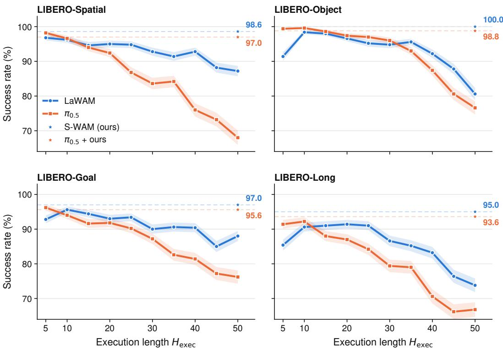  
Figure 9: Per-suite breakdown of Fig. 6.

## E.1 LIBERO

Table 8 reports the per-suite breakdown on LIBERO.

Table 8: Detailed results on LIBERO. Avg. is the unweighted mean over the four suites.
<table><tr><td>Method</td><td>Spatial</td><td>Object</td><td>Goal</td><td>Long</td><td>Avg.</td></tr><tr><td>TurboVLA</td><td>97.4</td><td>99.4</td><td>96.2</td><td>93.2</td><td>96.5</td></tr><tr><td>VLA-Adapter</td><td>96.6</td><td>99.8</td><td>95.8</td><td>84.0</td><td>94.0</td></tr><tr><td>Evo-1</td><td>92.8</td><td>98.2</td><td>92.4</td><td>86.4</td><td>92.5</td></tr><tr><td>Vanilla,  $H _ { \mathrm { e x e c } } = 1 0$ </td><td>96.2</td><td>98.4</td><td>95.6</td><td>90.6</td><td>95.2</td></tr><tr><td>Vanilla, full chunk (H = 50)</td><td>87.2</td><td>80.6</td><td>88.0</td><td>73.8</td><td>82.4</td></tr><tr><td>Ours, full chunk (H = 50)</td><td>98.6</td><td>100.0</td><td>97.0</td><td>95.0</td><td>97.7</td></tr></table>

## E.2 LIBERO-PLUS

Table 9 reports the per-category results on LIBERO-Plus. Each entry is first averaged over the four LIBERO suites, so that a suite does not carry more weight simply because the benchmark contains more of its episodes. The resulting category-wise unweighted mean (Avg.) is the number used in the main paper.

The seven categories are spread unevenly over the four underlying LIBERO suites, and the ranking between methods is not the same in every suite. Tables 10–13 repeat the breakdown one suite at a time. Every cell is recomputed from the per-episode records of the same runs that produce Table 9. Averaging the Avg. columns of the four tables therefore reproduces the Avg. column of Table 9 and the Avg. column of Table 1 exactly.

Table 9: Per-category LIBERO-Plus results averaged over the four LIBERO suites. Avg. is the unweighted mean of the seven categories.
<table><tr><td>Method</td><td>Background</td><td>Robot</td><td>Camera</td><td>Language</td><td>Noise</td><td>Layout</td><td>Light</td><td>Avg.</td></tr><tr><td>TurboVLA</td><td>77.1</td><td>30.3</td><td>76.0</td><td>72.2</td><td>71.2</td><td>60.0</td><td>81.5</td><td>66.9</td></tr><tr><td>VLA-Adapter</td><td>89.0</td><td>38.4</td><td>89.3</td><td>66.6</td><td>91.9</td><td>73.1</td><td>87.5</td><td>76.5</td></tr><tr><td>Evo-1</td><td>92.6</td><td>37.7</td><td>87.2</td><td>61.1</td><td>89.7</td><td>60.9</td><td>91.7</td><td>74.4</td></tr><tr><td>Vanilla,  $H _ { \mathrm { e x e c } } { = } 5 0$ </td><td>83.0</td><td>49.7</td><td>77.1</td><td>53.9</td><td>80.0</td><td>64.8</td><td>85.7</td><td>70.6</td></tr><tr><td>Vanilla,  $H _ { \mathrm { e x e c } } { = } 1 0$ </td><td>95.2</td><td>73.4</td><td>91.5</td><td>77.7</td><td>94.3</td><td>82.1</td><td>96.0</td><td>87.2</td></tr><tr><td>S-WAM (ours),  $H _ { \mathrm { e x e c } } { = } 5 0$ </td><td>96.6</td><td>76.0</td><td>89.5</td><td>85.2</td><td>90.4</td><td>79.3</td><td>98.6</td><td>87.9</td></tr></table>

Table 10: Per-category LIBERO-Plus results on LIBERO-SPATIAL. Avg. is the unweighted mean of the seven categories.
<table><tr><td>Method</td><td>Background</td><td>Robot</td><td>Camera</td><td>Language</td><td>Noise</td><td>Layout</td><td>Light</td><td>Avg.</td></tr><tr><td>TurboVLA</td><td>91.5</td><td>28.3</td><td>69.9</td><td>82.8</td><td>68.9</td><td>54.3</td><td>92.5</td><td>69.7</td></tr><tr><td>VLA-Adapter</td><td>98.8</td><td>50.0</td><td>95.7</td><td>75.4</td><td>98.9</td><td>93.0</td><td>98.3</td><td>87.2</td></tr><tr><td>Evo-1</td><td>92.2</td><td>36.9</td><td>87.8</td><td>68.5</td><td>91.5</td><td>63.6</td><td>89.7</td><td>75.7</td></tr><tr><td>Vanilla,  $H _ { \mathrm { e x e c } } { = } 5 0$ </td><td>88.0</td><td>49.4</td><td>83.0</td><td>53.3</td><td>80.1</td><td>78.2</td><td>94.2</td><td>75.2</td></tr><tr><td>Vanilla,  $H _ { \mathrm { e x e c } } { = } 1 0$ </td><td>98.4</td><td>73.1</td><td>95.7</td><td>81.5</td><td>97.2</td><td>93.0</td><td>98.3</td><td>91.0</td></tr><tr><td>S-WAM (ours),  $H _ { \mathrm { e x e c } } { = } 5 0$ </td><td>98.1</td><td>75.7</td><td>93.1</td><td>87.2</td><td>94.3</td><td>85.2</td><td>98.6</td><td>90.3</td></tr></table>

Table 11: Per-category LIBERO-Plus results on LIBERO-OBJECT. Avg. is the unweighted mean of the seven categories.
<table><tr><td>Method</td><td>Background</td><td>Robot</td><td>Camera</td><td>Language</td><td>Noise</td><td>Layout</td><td>Light</td><td>Avg.</td></tr><tr><td>TurboVLA</td><td>99.6</td><td>36.7</td><td>100.0</td><td>99.4</td><td>99.8</td><td>78.4</td><td>99.7</td><td>87.7</td></tr><tr><td>VLA-Adapter</td><td>96.0</td><td>27.1</td><td>97.2</td><td>84.5</td><td>96.9</td><td>75.7</td><td>95.3</td><td>81.8</td></tr><tr><td>Evo-1</td><td>96.8</td><td>27.1</td><td>95.2</td><td>77.7</td><td>93.4</td><td>72.2</td><td>98.7</td><td>80.1</td></tr><tr><td>Vanilla,  $H _ { \mathrm { e x e c } } { = } 5 0$ </td><td>84.3</td><td>35.7</td><td>78.3</td><td>58.5</td><td>84.1</td><td>65.0</td><td>89.2</td><td>70.7</td></tr><tr><td>Vanilla,  $H _ { \mathrm { e x e c } } { = } 1 0$ </td><td>99.6</td><td>72.1</td><td>98.5</td><td>81.1</td><td>98.6</td><td>91.1</td><td>99.7</td><td>91.5</td></tr><tr><td>S-WAM (ours),  $H _ { \mathrm { e x e c } } { = } 5 0$ </td><td>96.8</td><td>71.9</td><td>94.7</td><td>88.1</td><td>97.4</td><td>83.4</td><td>100.0</td><td>90.3</td></tr></table>

Table 12: Per-category LIBERO-Plus results on LIBERO-GOAL. Avg. is the unweighted mean of the seven categories.
<table><tr><td>Method</td><td>Background</td><td>Robot</td><td>Camera</td><td>Language</td><td>Noise</td><td>Layout</td><td>Light</td><td>Avg.</td></tr><tr><td>TurboVLA</td><td>45.9</td><td>10.5</td><td>54.2</td><td>28.3</td><td>40.6</td><td>35.5</td><td>47.7</td><td>37.5</td></tr><tr><td>VLA-Adapter</td><td>92.5</td><td>42.5</td><td>91.2</td><td>53.7</td><td>93.4</td><td>59.1</td><td>82.1</td><td>73.5</td></tr><tr><td>Evo-1</td><td>91.5</td><td>39.6</td><td>85.7</td><td>44.9</td><td>85.8</td><td>50.4</td><td>92.1</td><td>70.0</td></tr><tr><td>Vanilla,  $H _ { \mathrm { e x e c } } { = } 5 0$ </td><td>87.5</td><td>61.9</td><td>81.9</td><td>48.3</td><td>83.9</td><td>58.8</td><td>82.1</td><td>72.1</td></tr><tr><td>Vanilla,  $H _ { \mathrm { e x e c } } { = } 1 0$ </td><td>94.0</td><td>78.7</td><td>90.0</td><td>67.8</td><td>92.9</td><td>63.1</td><td>90.7</td><td>82.4</td></tr><tr><td>S-WAM (ours),  $H _ { \mathrm { e x e c } } { = } 5 0$ </td><td>95.4</td><td>80.0</td><td>89.5</td><td>78.5</td><td>90.5</td><td>67.1</td><td>97.8</td><td>85.5</td></tr></table>

Table 13: Per-category LIBERO-Plus results on LIBERO-LONG. Avg. is the unweighted mean of the seven categories.
<table><tr><td>Method</td><td>Background</td><td>Robot</td><td>Camera</td><td>Language</td><td>Noise</td><td>Layout</td><td>Light</td><td>Avg.</td></tr><tr><td>TurboVLA</td><td>71.3</td><td>45.5</td><td>79.7</td><td>78.3</td><td>75.5</td><td>71.8</td><td>86.1</td><td>72.6</td></tr><tr><td>VLA-Adapter</td><td>68.5</td><td>33.8</td><td>73.0</td><td>53.0</td><td>78.4</td><td>64.7</td><td>74.5</td><td>63.7</td></tr><tr><td>Evo-1</td><td>90.0</td><td>47.3</td><td>80.1</td><td>53.3</td><td>88.4</td><td>57.4</td><td>86.1</td><td>71.8</td></tr><tr><td>Vanilla,  $H _ { \mathrm { e x e c } } { = } 5 0$ </td><td>72.3</td><td>51.7</td><td>65.4</td><td>55.4</td><td>71.7</td><td>57.1</td><td>77.4</td><td>64.4</td></tr><tr><td>Vanilla,  $H _ { \mathrm { e x e c } } { = } 1 0$ </td><td>88.9</td><td>69.5</td><td>81.6</td><td>80.4</td><td>88.6</td><td>81.4</td><td>95.3</td><td>83.7</td></tr><tr><td>S-WAM (ours),  $H _ { \mathrm { e x e c } } { = } 5 0$ </td><td>96.2</td><td>76.3</td><td>80.7</td><td>86.9</td><td>79.5</td><td>81.7</td><td>97.8</td><td>85.6</td></tr></table>

## E.3 DOMINO

Table 14 reports the task-level success rates on DOMINO. Note that DOMINO uses a 75-action chunk, so the “full chunk” rows correspond to $H _ { \mathrm { e x e c } } = 7 5$ rather than 50. The compute-matched baseline for STAIRCASE POLICY on this benchmark is therefore the vanilla full-chunk row.

Table 14: Task-level success rates (%) on DOMINO. Avg. is the macro-average over the nine tasks.
<table><tr><td>Method</td><td>adjust bottle</td><td>beat block</td><td>click alarm</td><td>click bell</td><td> $\mathrm { g r a b }$  roller</td><td>move can</td><td>move card</td><td>press stapler</td><td>rotate QR</td><td>Avg.</td></tr><tr><td>TurboVLA</td><td>0</td><td>0</td><td>8</td><td>0</td><td>0</td><td>0</td><td>0</td><td>2</td><td>0</td><td>1.11</td></tr><tr><td>VLA-Adapter</td><td>10</td><td>0</td><td>2</td><td>0</td><td>24</td><td>6</td><td>0</td><td>6</td><td>0</td><td>5.33</td></tr><tr><td>Evo-1</td><td>0</td><td>0</td><td>6</td><td>0</td><td>0</td><td>0</td><td>0</td><td>2</td><td>0</td><td>0.89</td></tr><tr><td>Vanilla,  $H _ { \mathrm { e x e c } } = 1 0$ </td><td>0</td><td>0</td><td>0</td><td>0</td><td>12</td><td>0</td><td>0</td><td>8</td><td>0</td><td>2.22</td></tr><tr><td>Vanilla, full chunk  $( H = 7 5 )$ </td><td>66</td><td>6</td><td>4</td><td>0</td><td>30</td><td>14</td><td>6</td><td>14</td><td>6</td><td>16.22</td></tr><tr><td>Ours, full chunk (H = 75)</td><td>60</td><td>24</td><td>12</td><td>2</td><td>38</td><td>2</td><td>12</td><td>20</td><td>4</td><td>19.33</td></tr></table>

## E.4 ACTION THROUGHPUT

Table 15 reports the speed measurements behind the fourth panel of Fig. 7. Throughput is reported as executed actions per second (act/s), computed using the p50 latency of a blocking chunk call in eager mode with batch size 1.

Table 15: Measured inference efficiency across methods.
<table><tr><td>Method</td><td>Act/s (p50)</td><td>TTFA (ms)</td><td>VRAM (GB)</td></tr><tr><td>TurboVLA</td><td>340.3</td><td>35.3</td><td>0.5</td></tr><tr><td>VLA-Adapter</td><td>91.3</td><td>87.7</td><td>3.6</td></tr><tr><td>Evo-1</td><td>41.9</td><td>334.1</td><td>2.4</td></tr><tr><td>Vanilla,  $H _ { \mathrm { e x e c } } = 1 0$ </td><td>80.9</td><td>123.6</td><td>5.2</td></tr><tr><td>Vanilla,  $H _ { \mathrm { e x e c } } = 5 0$ </td><td>402.5</td><td>124.2</td><td>5.2</td></tr><tr><td>Ours,  $H _ { \mathrm { e x e c } } = 5 0$ </td><td>292.7</td><td>73.3</td><td>5.2</td></tr></table>

Overall, these results show that compact-model acceleration can remain competitive on the relatively standard LIBERO benchmark, but the gap widens on the more challenging LIBERO-Plus and DOMINO benchmarks. In contrast, STAIRCASE POLICY keeps the larger host policy and improves throughput by amortizing its inference over a longer execution horizon rather than by reducing model capacity.

## F REAL-ROBOT DATASETS AND DETAILED RESULTS

Data collection. We collected all real-robot demonstrations on the platform described in Sec. 4.2, using a 6-DoF UFACTORY xArm 850 with an xArm Gripper G2. The robot was teleoperated with a Meta Quest 3, and data was recorded at 50 Hz. The dataset contains nine tasks, with 270 demonstrations and 305,181 frames in total, corresponding to approximately 102 minutes of robot motion. Each demonstration runs until task completion. For each task, one demonstration is held out for validation and the remaining demonstrations are used for training.

Observations and actions. Each demonstration includes images from a fixed third-person camera and a wrist-mounted Intel RealSense D435. Both image streams are stored at 384 × 384. The original 960 × 540 frames are center-cropped to 540 × 540 and then resized, preserving the aspect ratio. The robot state is a 7-dimensional vector consisting of the absolute end-effector position, three Euler angles, and the gripper opening. The action is also 7-dimensional, consisting of the per-step change in end-effector pose and a binary gripper command, where 1 indicates closing the gripper.

Tasks. Table 16 summarizes the nine tasks. Stack bowl, hang cup and place corn in bowl are each collected in both static and dynamic settings using the same language instruction. In the dynamic setting, the relevant objects are placed on a rotating turntable. The remaining tasks cover sustained manipulation in pour water, precise placement in put lid on the cup, and multi-stage manipulation in place bowl in drawer.

Table 16: The nine real-robot datasets. Length denotes the median episode duration. Span denotes the range over which manipulated objects are re-placed between demonstrations, measured as a percentage of image width. All data is recorded at 50 Hz.
<table><tr><td>Task</td><td>Demos</td><td>Frames</td><td>Length</td><td>Span</td><td colspan="7">Prompt</td></tr><tr><td>Stack bowl (static)</td><td>30</td><td>27,944</td><td>19.1 s</td><td>90%</td><td></td><td>stack the red bowl on the blue bowl</td><td></td><td></td><td></td><td></td><td></td></tr><tr><td>Stack bowl (dynamic)</td><td>30</td><td>23,073</td><td>14.6s</td><td>69%</td><td></td><td>stack the red bowl on the blue bowl</td><td></td><td></td><td></td><td></td><td></td></tr><tr><td>Hang cup (static)</td><td>30</td><td>25,958</td><td>17.0s</td><td>52%</td><td></td><td>hang the yellow cup on the cup rack</td><td></td><td></td><td></td><td></td><td></td></tr><tr><td>Hang cup (dynamic)</td><td>30</td><td>32,247</td><td>21.2s</td><td>49%</td><td></td><td>hang the yellow cup on the cup rack</td><td></td><td></td><td></td><td></td><td></td></tr><tr><td>Place corn in bowl (static)</td><td>30</td><td>30,969</td><td>18.1 s</td><td>99%</td><td></td><td>place the corn in the bowl</td><td></td><td></td><td></td><td></td><td></td></tr><tr><td>Place corn in bowl (dynamic)</td><td>30</td><td>24,838</td><td>16.1 s</td><td>78%</td><td></td><td>place the corn in the bowl</td><td></td><td></td><td></td><td></td><td></td></tr><tr><td>Pour water</td><td>30</td><td>43,594</td><td>30.2s</td><td>93%</td><td></td><td></td><td></td><td></td><td></td><td></td><td>pour the water from the red cup into the blue cup</td></tr><tr><td>Put lid on the cup</td><td>30</td><td>28,456</td><td>19.1 s</td><td>97%</td><td></td><td>put the blue lid on the blue cup</td><td></td><td></td><td></td><td></td><td></td></tr><tr><td>Place bowl in drawer</td><td>30</td><td>68,102</td><td>44.4s</td><td>92%</td><td></td><td>put the blue bowl in the second drawer</td><td></td><td></td><td></td><td></td><td></td></tr><tr><td>Total</td><td>270</td><td>305,181</td><td></td><td></td><td></td><td></td><td></td><td></td><td></td><td></td><td></td></tr></table>

Table 17: Success criteria for the real-robot evaluation. The static and dynamic versions of a task share the same criterion.
<table><tr><td>Task</td><td>Counted as a success when</td></tr><tr><td>Stack bowl</td><td>the red bowl rests inside the blue bowl after release without tipping or falling outside</td></tr><tr><td>Hang cup</td><td>the cup remains on the rack arm after release</td></tr><tr><td>Place corn in bowl</td><td>the yellow corn is placed inside the bowl and remains there; grasping another object is a failure</td></tr><tr><td>Pour water</td><td>the water is poured into the blue cup without dropping the red cup or pouring outside the target</td></tr><tr><td>Put lid on the cup</td><td>the lid rests on the cup rim and covers the opening without falling onto the table</td></tr><tr><td>Place bowl in drawer</td><td>the drawer is opened and the bowl is placed inside; both stages are required</td></tr></table>

Scene randomization. The robot base and task-specific fixtures remain fixed. Manipulated objects and distractors are re-placed by hand between demonstrations. The placement range for each task is reported in Table 16. During evaluation, objects are re-placed following the same procedure, so the test scenes follow the same placement distribution as the training demonstrations.

Dynamic tasks. The dynamic tasks use a turntable that rotates continuously with a period of 16 seconds, corresponding to 22.5◦/s. The turntable rotates throughout the episode, so the target position changes continuously during execution. For hang cup, the target orientation changes as well.

Success criteria. Table 17 lists the success criterion for each task.

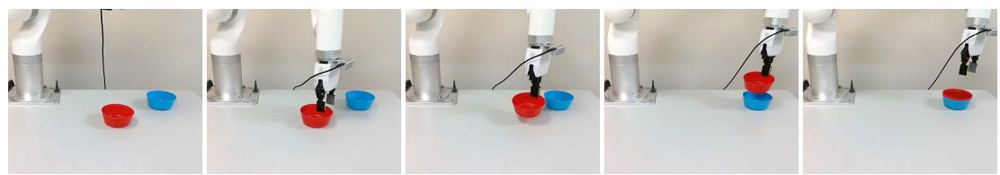  
Figure 10: Stack bowl, static. The robot picks up the red bowl and places it inside the blue bowl.

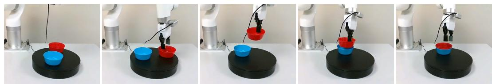  
Figure 11: Stack bowl, dynamic. The same task is performed while both bowls rotate on the turntable.

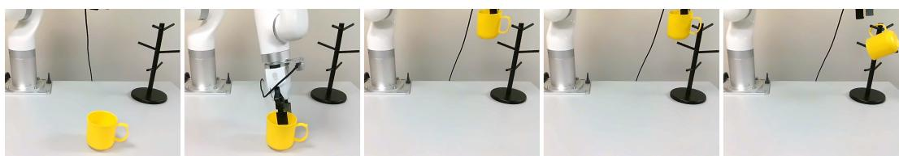  
Figure 12: Hang cup, static. The robot picks up the yellow cup and hangs it on the rack.

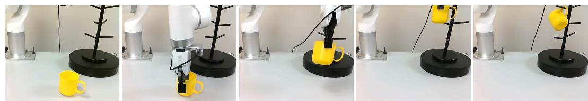  
Figure 13: Hang cup, dynamic. The rack rotates during execution, changing both its position and orientation.

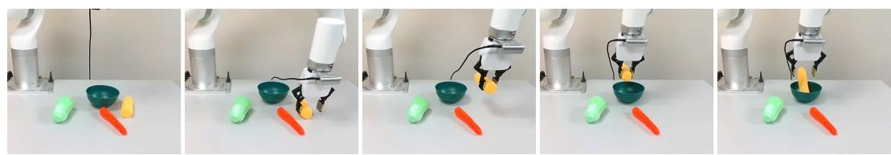  
Figure 14: Place corn in bowl, static. The robot picks up the yellow corn and places it in the bowl in the presence of distractor objects.

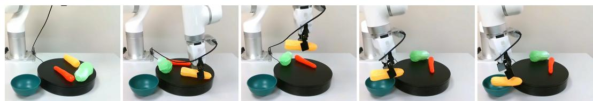  
Figure 15: Place corn in bowl, dynamic. The corn and distractors rotate on the turntable while the bowl remains stationary.

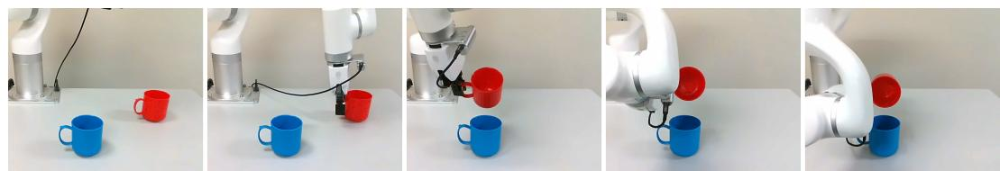  
Figure 16: Pour water. The robot picks up the red cup and pours the water into the blue cup.

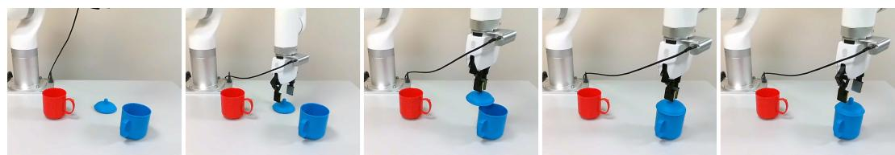  
Figure 17: Put lid on the cup. The robot picks up the blue lid and places it on the blue cup.

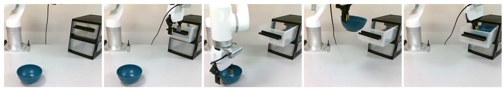  
Figure 18: Place bowl in drawer. The robot first opens the drawer and then places the blue bowl inside. The second frame shows the drawer-opening stage rather than the object transfer.

Table 18: Real-robot success rate (%) per task, each cell over 40 trials. S-WAM and vanilla at $H _ { \mathrm { e x e c } } { = } 5 0$ are compute-matched; vanilla at $H _ { \mathrm { e x e c } } { = } 2 0$ replans 2.5× as often.
<table><tr><td>Task</td><td>Setting Vanilla,</td><td> $H _ { \mathrm { e x e c } } { = } 2 0$  Vanilla,</td><td> $H _ { \mathrm { e x e c } } { = } 5 0$ </td><td>S-WAM</td></tr><tr><td>Stack bowl</td><td>Static</td><td>85.0</td><td>72.5</td><td>90.0</td></tr><tr><td>Hang cup</td><td>Static</td><td>57.5</td><td>52.5</td><td>70.0</td></tr><tr><td>Place corn in bowl</td><td>Static</td><td>77.5</td><td>60.0</td><td>75.0</td></tr><tr><td>Put lid on the cup</td><td>Static</td><td>75.0</td><td>67.5</td><td>80.0</td></tr><tr><td>Pour water</td><td>Static</td><td>62.5</td><td>50.0</td><td>67.5</td></tr><tr><td>Place bowl in drawer</td><td>Static</td><td>47.5</td><td>40.0</td><td>52.5</td></tr><tr><td>Static average</td><td></td><td>67.5</td><td>57.1</td><td>72.5</td></tr><tr><td>Stack bowl</td><td>Dynamic</td><td>10.0</td><td>25.0</td><td>57.5</td></tr><tr><td>Hang cup</td><td>Dynamic</td><td>7.5</td><td>20.0</td><td>27.5</td></tr><tr><td>Place corn in bowl</td><td>Dynamic</td><td>15.0</td><td>32.5</td><td>47.5</td></tr><tr><td>Dynamic average</td><td></td><td>10.8</td><td>25.8</td><td>44.2</td></tr><tr><td>Overall average</td><td></td><td>48.6</td><td>46.7</td><td>63.1</td></tr></table>

Detailed results. Table 18 gives the per-task success rates behind Fig. 3. Every task is evaluated over 40 trials. Static and dynamic averages are the unweighted means over the six static and the three dynamic tasks respectively.