# TRIPLEFLOW: TRAINING-FREE VIDEO OBJECT REMOVAL BY BRIDGING RESIDUAL EDITING AND NATIVE GENERATION

Songhe Wang1,\* Lifu Wei2,\* Shuolin Xu3 Charles A. Kamhoua4 David Miller5

1CSE Department, Penn State University   
2Department of Computer Science, The University of British Columbia, Canada 3Department of Computing, Bournemouth University, United Kingdom   
4DEVCOM Army Research Laboratory, Network Security Branch, Adelphi, MD 5EE Department, Penn State University   
\*Equal contribution.

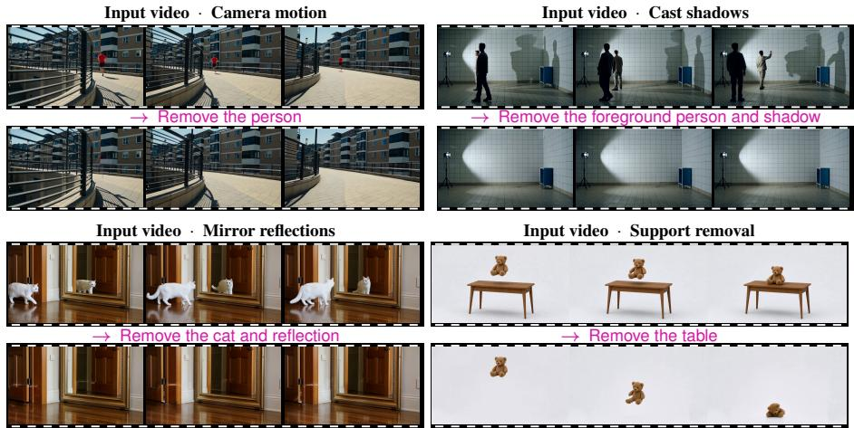  
Figure 1: TripleFlow performs high-quality zero-shot video object removal without additional training, producing clean and spatiotemporally coherent results in challenging scenarios. It removes not only the target object, but also associated effects such as cast shadows, mirror reflections, and gravity-induced motion.

## ABSTRACT

Video object removal presents a uniquely difficult editing challenge. Because a removal prompt specifies only what to erase rather than what to generate, the model must infer and reconstruct a highly specific occluded background entirely from the surrounding context. Existing training-free methods struggle with this because their editing mechanisms act primarily as localized erasers. They fail to actively synthesize the missing background details and often leave behind ghosting artifacts. To solve this, we propose TRIPLEFLOW, a training-free framework that tightly couples erasure and generation. It coordinates a source flow, a residual flow, and a synthesis flow throughout the entire process. By reusing a single target prediction, the residual flow isolates and suppresses the object, while the synthesis flow independently reconstructs the occluded background. Crucially, TRIPLEFLOW injects this newly synthesized background back into the editing trajectory at every step. This continuous feedback loop ensures that the generated structures actively guide the removal process, achieving seamless completion that is spatiotemporally consistent with the unedited scene. Extensive evaluations across five challenging benchmarks demonstrate that TRIPLEFLOW establishes a new state-of-the-art, significantly outperforming existing baselines in both reconstruction fidelity and temporal consistency.

## 1 INTRODUCTION

Video diffusion models and continuous flow formulations have shown strong capabilities in synthesizing realistic motion dynamics and complex visual scenes (Ho et al., 2022; Team Wan et al., 2025; Yang et al., 2025). When adapted for video editing, these models naturally excel at semantic replacement, such as turning a running dog into a cat (Geyer et al., 2023; Cong et al., 2023). In these tasks, an explicit positive prompt guides the generation of a new object that naturally covers the missing background. This replacement process also offers significant generative freedom because the model only needs to synthesize a plausible instance of the target object. For example, if we want to replace a dog with a cat, an explicit prompt tells the model exactly what to create, and almost any realistic cat can serve as the replacement. Video object removal demands far more than changing semantic identity because it completely lacks this generative guidance. When general-purpose video editors attempt this task, they typically either fail to erase the foreground object or severely distort the surrounding scene as shown in Figure 2. Since a removal prompt only specifies what to erase and provides no description of the missing surface, the model naturally does not know what to fill in the exposed void. It must instead infer the exact background entirely from the surrounding video context, but this inferred background is never arbitrary. The surrounding scene strictly limits what can fill the space, and earlier or later frames often reveal the same surface under changing visibility (Li et al., 2022; Zhou et al., 2023). The model must therefore reconcile these observations across space and time to reconstruct the specific scene hidden behind the object. While a replacement object can simply hide the background, removal completely exposes it, so any unsuccessful background reconstruction instantly reveals errors in geometry, texture, and shading. Successful removal must therefore do more than remove the target object and its associated effects (Miao et al., 2025; Fu et al., 2026). It must reconstruct the exposed background faithfully while preserving the surrounding scene.

To reconstruct this hidden background, existing inpainters often rely on task-specific training (Zhou et al., 2023; Li et al., 2025b), but these supervised approaches demand extensive compute and custom datasets. Training-free editors offer a flexible alternative by leveraging pretrained video generators directly (Ku et al., 2024; Chen et al., 2026). However, these methods must carefully balance preserving the unedited scene with generating new background content. Inversion-based approaches (Kushwaha et al., 2026) maintain source alignment through numerical inversion, but this process often introduces drift that corrupts the background. Inversion-free formulations provide a strong foundation. They perform source-relative edits by integrating velocity differences between source and target predictions (Kulikov et al., 2024; Li et al., 2025a). This avoids numerical inversion entirely and protects the unedited background from drift. However, applying this purely differential approach to object removal reveals a critical limitation: subtraction is not completion. Integrating velocity differences successfully suppresses the foreground object, but it fails to reconstruct the complex structures hidden behind it. This differential update essentially acts as a localized erasure mechanism. However, it lacks the continuous generative momentum required to create entirely new background content, and ultimately leaves behind faint ghosting artifacts or blurry areas. Previous methods attempt to fix this issue by abruptly transitioning to target-only generation at the final step (Kulikov et al., 2024). This late-stage switch disconnects the synthesis process from the editing trajectory. To achieve complete removal, the framework must integrate generation and erasure from the very beginning. It must continuously synthesize the missing background without sacrificing the precise source-relative control of a differential update.

To this end, we present TRIPLEFLOW. This inversion-free framework fundamentally redefines object removal by coordinating a sourceflow, a residualflow, and a synthesisflow throughout the entire sampling process. The source flow acts as an analytic reference trajectory that anchors the edit strictly to the original video. To achieve complete removal without requiring an extra synthesis model, TRIPLEFLOW smartly reuses a single target-velocity prediction to drive two different updates. The residual flow computes a velocity difference to suppress the foreground object and extract the editing direction. Concurrently, the synthesis flow accumulates the same target velocity directly, preserving the pure generative momentum needed to synthesize the missing background. Crucially, these trajectories do not simply fuse at the very end. Instead, TRIPLEFLOW merges the synthesis state into the residual flow at every single noise step. This means the newly generated background is continuously fed back into the ongoing edit. Because the model always predicts its next step based on this merged result, the background synthesis actively steers the editing trajectory. Rather than acting as a final patch, generation becomes a persistent feedback loop that guides the entire removal process. Our main contributions are summarized below:

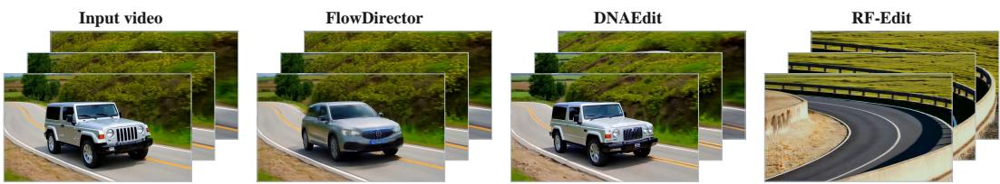  
Figure 2: Object removal with general-purpose video editors. Given an empty-road prompt, FlowDirector (Li et al., 2025a) and DNAEdit (Xie et al., 2025) retain vehicles, while RF-Edit (Wang et al., 2025) removes the car but substantially changes the road and surroundings.

• We identify two fundamental challenges of video object removal: the lack of explicit text descriptions for the missing regions, and the uniqueness of the required background, which must strictly align with visual cues revealed in surrounding frames.

• We propose TRIPLEFLOW, an inversion-free and training-free framework that integrates erasure and generation into a persistent feedback loop. By coordinating a source, residual, and synthesis flow, it reuses a single target prediction to actively steer the editing trajectory, synthesizing complex missing structures while strictly anchoring the unedited scene.

• Extensive evaluations across five challenging video benchmarks (Pont-Tuset et al., 2017; Kushwaha et al., 2026; Miao et al., 2025; Li et al., 2026) demonstrate that TRIPLEFLOW achieves state-of-the-art performance on all of them, outperforming all existing training-free baselines. Beyond accurate background reconstruction, our framework naturally eliminates associated physical effects such as shadows and reflections. Crucially, our ablation studies validate the distinct and complementary roles of each flow demonstrating that joint flow coordination is essential for eliminating ghosting artifacts and robustly reconstructing the occluded background.

## 2 RELATED WORK

Video inpainting and object removal. Video inpainting traditionally propagates spatial and temporal features to reconstruct missing regions (Zeng et al., 2020; Liu et al., 2021; Li et al., 2022; Zhou et al., 2023). Recent supervised methods incorporate diffusion priors to hallucinate fine-grained details within the occluded areas (Li et al., 2025b). A complete pipeline must also eliminate objectassociated visual effects. Methods like ROSE (Miao et al., 2025) and EffectErase (Fu et al., 2026) explicitly target shadows and reflections using specialized paired training data. These supervised approaches demonstrate the fundamental requirement to faithfully reconstruct the background while completely removing the visual influence of the target object.

Training-free video object removal. Recent approaches leverage pretrained video generators to bypass task-specific fine-tuning for zero-shot object removal. OmnimatteZero (Samuel et al., 2025) suppresses object-associated effects using point tracking and spatial attention guidance. Object-WIPER (Kushwaha et al., 2026) combines effect localization with explicit source inversion and cross-attention manipulation to suppress target identity while preserving the surrounding scene. These paradigms demonstrate the feasibility of controlling generative models by modulating attention and feature retention during the sampling process (Hertz et al., 2022; Tumanyan et al., 2023).

Flow-based generative editing. Continuous flow formulations (Lipman et al., 2022; Liu et al., 2022) and diffusion models (Ho et al., 2020; Rombach et al., 2022) provide a robust foundation for video editing. Inversion-free residual methods enable direct zero-shot editing by operating on velocity predictions. FlowEdit (Kulikov et al., 2024) integrates the velocity difference between source and target predictions under shared noise to bypass numerical inversion. FlowDirector (Li et al., 2025a) extends this with direction-aware correction and differential averaging guidance. To precisely restrict edit regions, various methods utilize regional attention control (Kushwaha et al., 2026), soft localization (Li et al., 2025a), or temporal mask union (Hu et al., 2026). These flow-based methods excel at semantic replacement by modifying the generative trajectory.

## 3 METHOD

## 3.1 PROBLEM SETUP

Given a source video $V ,$ a frame-wise removal mask M, and a clean reference first frame $F _ { 0 } ,$ our goal is to remove the masked object and any associated effects covered by M while preserving the visible scene and its motion. Newly revealed regions should contain plausible, temporally coherent background. The reference $F _ { 0 }$ , taken from an unoccluded frame or generated by an off-the-shelf image model, provides the desired background appearance in the first frame.

We perform the edit entirely at inference time and keep both the video generator and its causal VAE frozen. Let $\mathcal { E }$ and D denote the VAE encoder and decoder. We use X for the encoded source video, and $a ^ { S }$ and $a ^ { T }$ for the encoded source and clean first frames. The frozen flow model $f _ { \theta }$ predicts a velocity from a latent, its noise level t, a text prompt p, and a first-frame condition a. We integrate over $t _ { 1 } = 1 > \cdots > t _ { K } = 0 ,$ , with $\Delta t _ { k } = t _ { k + 1 } - t _ { k } < 0$ . Rather than numerically inverting X to obtain a source-aligned noise state, we sample one noise tensor ϵ and construct the source trajectory analytically. The mask M is converted into a hard latent support A and a soft edit weight $\dot { W } _ { }$ , described in Sec. 3.2.

Source-relative editing preserves the observed scene but can struggle to recover background that was never visible; direct generation can fill the missing region but may alter the scene’s appearance or motion. Editing trajectories that drift from the latent interpolation used to train the flow model can also produce artifacts, motivating a source-aligned reference throughout sampling. TripleFlow couples this reference with a residual edit and a synthesis state for the occluded background, combining their estimates before each subsequent target prediction.

## 3.2 TRIPLEFLOW DYNAMICS

TripleFlow links a source flow, a residual removal flow, and a synthesis flow. The source flow places the input video at each noise level using fixed noise, providing a reference for the original scene. At each step, the model predicts a source velocity $v _ { k } ^ { S }$ from this reference and a target velocity $v _ { k } ^ { T }$ from the current edit state under the removal condition. Their difference updates the residual flow, while $v _ { k } ^ { T }$ also advances the synthesis flow to develop the exposed background. The two resulting edit estimates are combined after each step. Their combination guides the next target prediction and is ultimately decoded into the output video. Only $v _ { k } ^ { S }$ and $v _ { k } ^ { T }$ are predicted at each step.

Source Flow as Model Reference. Given a fixed noise tensor ϵ, we construct a source-aligned state at each noise level:

$$
S _ { k } = ( 1 - t _ { k } ) X + t _ { k } \epsilon .\tag{1}
$$

The pretrained model learns velocities on interpolations between video latents and noise; drifting from these states can introduce artifacts. We therefore use $S _ { k }$ as a source reference throughout sampling. A fixed ϵ defines a consistent path for comparing source and target velocities at the same noise level without numerical inversion, grounding the edit in the input structure and motion while the target condition guides background completion.

Residual Edit and Synthesis Flow. Let $Z _ { k }$ be the current edit estimate in clean-space coordinates, with $Z _ { 1 } = X$ . The model expects an input at noise level $t _ { k }$ . We place the edit estimate at that level by adding the offset of the source state from the input video:

$$
B _ { k } = Z _ { k } + S _ { k } - X .\tag{2}
$$

When $Z _ { k } = X$ , the target query $B _ { k }$ equals the source query $S _ { k }$ . As the edit develops, the two queries retain the same source-path offset while differing in their current content. This lets us compare their predicted velocities at the same noise level.

We evaluate the frozen model under the source and target conditions:

$$
\boldsymbol { v } _ { k } ^ { S } = f _ { \theta } ( S _ { k } , t _ { k } ; p _ { S } , \boldsymbol { a } ^ { S } ) , \qquad \boldsymbol { v } _ { k } ^ { T } = f _ { \theta } ( \boldsymbol { B } _ { k } , t _ { k } ; p _ { T } , \boldsymbol { a } ^ { T } ) .\tag{3}
$$

Text can identify the object to remove but cannot determine the appearance of the background it occludes. The source prompt $p _ { S }$ describes the observed video with the object, while $p _ { T }$ describes

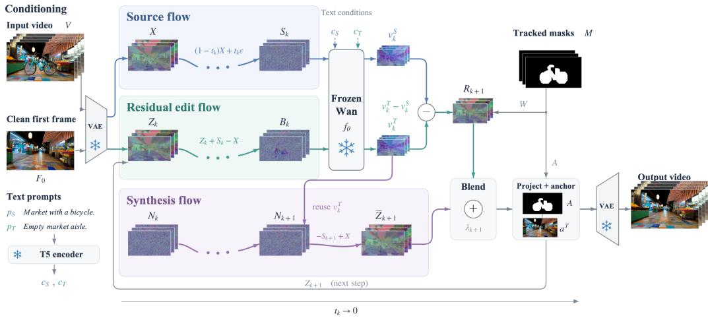  
Figure 3: TripleFlow pipeline. Our framework coordinates three coupled flows within a frozen video diffusion backbone at each noise step. The source flow preserves the observed scene. By reusing a shared target prediction, the residual flow suppresses the foreground object using a velocity difference while the synthesis flow independently reconstructs the occluded background. The framework injects this synthesized background back into the residual editing trajectory, followed by mask projection before the next step.

the scene after removal. The source first-frame condition $a ^ { S }$ provides the observed appearance, and the clean condition $a ^ { T }$ guides the target background appearance. The source velocity serves as a reference, while the target velocity drives both the residual edit and the synthesis state.

We apply this difference to the clean-space estimate only where editing is needed. With the soft edit weight W, the residual estimate is

$$
R _ { k + 1 } = Z _ { k } + \Delta t _ { k } W \odot ( v _ { k } ^ { T } - v _ { k } ^ { S } ) .\tag{4}
$$

The source velocity keeps the update tied to the input video, while W controls its strength near the removal boundary. This source-relative formulation supports the preservation of visible structure and motion.

To complement source-relative editing, we introduce a synthesis state $N _ { k }$ that accumulates targetconditioned velocities directly. It starts from $N _ { 1 } = \epsilon$ and evolves at the current noise level:

$$
N _ { k + 1 } = N _ { k } + \Delta t _ { k } v _ { k } ^ { T } .\tag{5}
$$

This state retains the effect of earlier target-conditioned updates as background content forms. It reuses the target velocity evaluated at $B _ { k }$ , so the two updates require the same pair of velocity predictions, $v _ { k } ^ { \lessgtr }$ and $v _ { k } ^ { T }$

We localize the synthesis state using the hard support A, restoring the source state outside the edit region after each update:

$$
N _ { k + 1 }  A \odot N _ { k + 1 } + ( 1 - A ) \odot S _ { k + 1 } .\tag{6}
$$

Before combining the two estimates, we express $N _ { k + 1 }$ in clean-space coordinates:

$$
\widetilde { Z } _ { k + 1 } = N _ { k + 1 } - S _ { k + 1 } + X .\tag{7}
$$

This conversion maps the source reference $S _ { k + 1 }$ back to X. The differences accumulated by the synthesis state are thereby carried into $\widetilde { Z } _ { k + 1 }$ within the edit support.

The residual and synthesis estimates share the target velocity but evolve relative to different source references. For an interior edited token in a non-anchor frame, where $A = W = 1$ , their difference satisfies

$$
\widetilde { Z } _ { k + 1 } - R _ { k + 1 } = \widetilde { Z } _ { k } - Z _ { k } + \Delta t _ { k } \big [ v _ { k } ^ { S } - ( \epsilon - X ) \big ] .\tag{8}
$$

Here, ϵ − X is the velocity of the analytic source path. The residual estimate measures change relative to the learned source velocity, while the synthesis estimate, expressed in clean-space coordinates, measures change relative to this analytic velocity. Their difference therefore retains the accumulated state discrepancy and incorporates the current difference between the two source references.

Stepwise Coupled Blending. We combine the residual and synthesis estimates to obtain the next edit state:

$$
\begin{array} { r l } & { Z _ { k + 1 } = ( 1 - \lambda _ { k + 1 } ) R _ { k + 1 } + \lambda _ { k + 1 } \widetilde { Z } _ { k + 1 } , } \\ & { \lambda _ { k + 1 } = \lambda _ { \operatorname* { m a x } } ( 1 - t _ { k + 1 } ) ^ { \gamma } . } \end{array}\tag{9}
$$

Here, $\lambda _ { \mathrm { m a x } }$ sets the synthesis weight near the clean endpoint, and $\gamma$ controls how quickly it increases. Early steps favor the residual estimate to preserve source layout and motion; later steps give more weight to background synthesis. At each step, $Z _ { k + 1 }$ forms the next target query $B _ { k + 1 }$ , so both estimates influence subsequent velocity predictions.

Spatiotemporal conditioning. Instead of using internal attention maps, we use standard segmentation models (e.g., SAM 2 Ravi et al. (2024), SAM 3 Carion et al. (2025), Grounded SAM 2 Ren & Shen (2024)) to get accurate frame-wise object masks M without extra training.

Following the VAE’s temporal layout, the first mask is kept separate. For later latent frames, we combine the masks using a pixelwise union. We resize them to the latent spatial resolution using nearest-neighbor interpolation to form the aligned mask M.

This aligned mask defines the hard support and soft weight:

$$
A = \mathrm { D i l a t e } ( \overline { { M } } ) , \qquad W = A \odot \exp ( - \rho d _ { \overline { { M } } } ) .\tag{10}
$$

Here, spatial dilation expands the boundary, $d _ { \overline { { M } } }$ is the distance to the masked region, and $\rho$ controls how fast the boundary fades. W controls the residual update strength, while A limits where the video can change from the source.

To guide the new background, we use a pretrained image editor G. A vision-language model finds video frames R that show the hidden background. The editor $\mathcal { G }$ uses the source first frame $V _ { 0 }$ and these found frames $\{ V _ { j } \} _ { j \in \mathcal { R } }$ to make a clean first-frame reference $F _ { 0 }$

$$
F _ { 0 } = { \mathcal G } ( V _ { 0 } , \{ V _ { j } \} _ { j \in { \mathcal R } } ) , \qquad a ^ { T } = { \mathcal E } ( F _ { 0 } ) .\tag{11}
$$

The encoded reference $a ^ { T }$ then guides every target velocity evaluation.

These spatial and appearance conditions also constrain the state after each step:

$$
Z _ { k + 1 }  A \odot Z _ { k + 1 } + ( 1 - A ) \odot X ,\tag{12}
$$

$$
Z _ { k + 1 } ^ { ( 0 ) } \gets ( 1 - F ) \odot X ^ { ( 0 ) } + F \odot a ^ { T } , \qquad F = W ^ { ( 0 ) } .\tag{13}
$$

Eq. (12) keeps the original video outside the mask. Eq. (13) links the first-frame edit region to the clean reference, using $F$ to smooth the transition.

Localized Target Attention Control. Spatial masks limit the changes of latent values. However, the target velocity also depends on features from self-attention. During early sampling steps, masked queries can still retrieve object features from masked keys and pass them into the generated content. Therefore, we introduce attention control to complement the spatial masks.

Let $h _ { i } \in \{ 0 , 1 \}$ indicate whether token i overlaps $\overline { { M } }$ . We obtain this by max-pooling the aligned mask over the patch grid. Following regional attention scaling Kushwaha et al. (2026), we scale the masked keys and apply a negative bias to the masked query–key pairs. For transformer block b at sampling step $k ,$ the attention logits become:

$$
\begin{array} { r l } & { \ell _ { i j } ^ { k , b } = \left[ 1 - ( 1 - \alpha _ { k } ) h _ { j } \right] \frac { \mathbf { q } _ { i } ^ { \top } \mathbf { k } _ { j } } { \sqrt { d } } - \beta _ { k , b } h _ { i } h _ { j } , } \\ & { P _ { i j } ^ { k , b } = \operatorname { s o f t m a x } _ { j } \left( \ell _ { i j } ^ { k , b } \right) , } \end{array}\tag{14}
$$

where $\mathbf { q } _ { i }$ and $\mathbf { k } _ { j }$ are the normalized, position-encoded query and key vectors. During the first quarter of sampling steps, we set $\alpha _ { k } = 0 . 5$ in all blocks and $\beta _ { k , b } = 5$ in the first ten blocks. Otherwise, $\alpha _ { k } = 1 \mathrm { a n d } \beta _ { k , b } = 0$

Key scaling limits the contribution of masked keys to the attention scores. Meanwhile, the negative bias prevents masked queries from retrieving masked keys. These operations define the controlled target model $f _ { \theta } ^ { \mathrm { m a s k } }$ , which is used for $v _ { k } ^ { T }$ in Eq. (3). By sharing this target prediction, we apply the attention control to both the residual and synthesis updates. This effectively complements the spatial support and the clean reference.

## 4 EXPERIMENTS

Datasets and Baselines. To evaluate our method, we conduct experiments on four video object removal benchmarks, including DAVIS (Pont-Tuset et al., 2017), WIPER-Bench (Kushwaha et al., 2026), ROSE (Miao et al., 2025), and PROVE (Li et al., 2026). These benchmarks encompass diverse scenarios with various subjects and dynamic camera motions, alongside complex object-associated effects such as shadows and reflections. Specifically, ROSE and PROVE-M offer paired clean ground truths to assess background reconstruction, whereas PROVE-H comprises challenging in-the-wild videos without paired references. We compare our approach with three representative training-free video editing methods: OmnimatteZero (Samuel et al., 2025), Object-WIPER (Kushwaha et al., 2026), and ContextFlow (Chen et al., 2026). We additionally evaluate OmniEraser (Wei et al., 2025), a trained image object removal model applied independently to video frames. For quantitative evaluation, we report CORE (Ekin et al., 2026) to evaluate object and associated-effect removal, along with PSNR (Huynh-Thu & Ghanbari, 2008), SSIM (Wang et al., 2004), and LPIPS (Zhang et al., 2018) on paired datasets to measure reconstruction quality.

Qualitative Evaluation. TRIPLEFLOW faithfully reconstructs backgrounds that are initially occluded but revealed later in the video (Fig. 5). It recovers the painting behind the gallery visitor and the countertop behind the coffee machine, maintaining visual consistency with their later appearances. In the gallery sequence, the painting retains its placement as the camera moves rather than being replaced by an arbitrary wall. By contrast, the baselines in Fig. 6 remove the foreground person and forklift but fail to preserve surrounding structural details within the masked regions. In the bookcase sequence, OmnimatteZero, ObjectWiper, and ContextFlow (Chen et al., 2026) alter shelf contents or introduce spurious horizontal structures; ObjectWiper also distorts the surrounding floor and wall. In the warehouse, the baselines distort or fabricate the central blue-and-yellow rack. TRIPLEFLOW instead preserves the book arrangement and shelving geometry. Additional qualitative results and baseline comparisons are provided in Appendices C and D, respectively.

Beyond background reconstruction, TRIPLEFLOW removes associated physical effects without effectspecific training, including the shoes’ mirror reflection and the egret’s water reflection (Fig. 5). This capability follows directly from maintaining separate editing and synthesis flows. Once the foreground is suppressed within the masked region, the synthesis state decouples from the object’s visual characteristics and relies on the unedited residual flow from the surroundings to propagate clean background content. The completed regions consequently remain structurally consistent with the bare floor or empty water surface.

Quantitative Evaluation. TRIPLEFLOW achieves the best mean CORE across all five benchmarks (Table 1) and the best PSNR, SSIM, and LPIPS on both paired benchmarks (Table 2). Its PSNR exceeds the strongest competing results by nearly 4 dB on PROVE-M and 2 dB on ROSE. On PROVE-M, OmniEraser obtains a similar CORE score (3.125 versus 3.154) but nearly twice the LPIPS (0.3407 versus 0.1724), showing that similar removal scores can conceal substantial differences in background fidelity.

In a five-method human evaluation on ten showcase videos, TRIPLEFLOW receives a 56.7% firstplace preference rate, compared with 23.3% for the runner-up, OmnimatteZero (Fig. 4, middle. See Appendix A.4 for the study setup).. This preference is consistent with the reduced visual artifacts observed in the baselines. On pooled PROVE-M and ROSE results, TRIPLEFLOW has both the lowest masked-region LPIPS and the highest outside-mask PSNR (Fig. 4, left), indicating stronger completion without sacrificing the surrounding scene. It also achieves the best mean tLP and tOF (Chu et al., 2020) scores. Finally, TRIPLEFLOW attains a higher mean CORE while running significantly faster than flow-based editing baselines such as ContextFlow (Fig. 4, right). Implementation and evaluation details are provided in the appendix.

Table 1: Video object removal results. CORE is computed as the mean of ObjectScore and AftereffectScore (higher is better).
<table><tr><td>Method</td><td>DAVIS ↑</td><td>WIPER ↑</td><td>PROVE-M ↑</td><td>PROVE-H↑</td><td>ROSE↑</td></tr><tr><td>OmnimatteZero</td><td>2.917</td><td>3.188</td><td>2.576</td><td>3.167</td><td>3.260</td></tr><tr><td>ObjectWiper</td><td>2.056</td><td>2.375</td><td>2.232</td><td>2.389</td><td>2.625</td></tr><tr><td>ContextFlow</td><td>2.667</td><td>3.500</td><td>2.438</td><td>3.111</td><td>2.357</td></tr><tr><td>OmniEraser</td><td>3.000</td><td>3.188</td><td>3.125</td><td>2.889</td><td>2.929</td></tr><tr><td>TRIPLEFLOW (Ours)</td><td>3.394</td><td>3.576</td><td>3.154</td><td>3.275</td><td>3.325</td></tr></table>

Table 2: Reconstruction quality against ground truth labels on PROVE-M and ROSE.
<table><tr><td rowspan="2">Method</td><td colspan="3">PROVE-M</td><td colspan="3">ROSE</td></tr><tr><td>PSNR ↑</td><td>SSIM↑</td><td>LPIPS ↓</td><td>PSNR ↑</td><td>SSIM↑</td><td>LPIPS↓</td></tr><tr><td>TRIPLEFLOW</td><td>24.636</td><td>0.8644</td><td>0.1724</td><td>27.387</td><td>0.9112</td><td>0.1053</td></tr><tr><td>OmnimatteZero</td><td>20.894</td><td>0.8106</td><td>0.2819</td><td>25.450</td><td>0.8687</td><td>0.1877</td></tr><tr><td>ObjectWiper</td><td>16.608</td><td>0.6616</td><td>0.4129</td><td>18.897</td><td>0.6893</td><td>0.3655</td></tr><tr><td>ContextFlow</td><td>17.951</td><td>0.7912</td><td>0.3144</td><td>22.015</td><td>0.8912</td><td>0.1599</td></tr><tr><td>OmniEraser</td><td>19.044</td><td>0.7881</td><td>0.3407</td><td>19.649</td><td>0.7848</td><td>0.2741</td></tr></table>

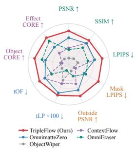

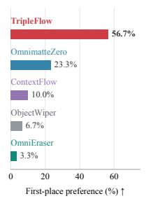

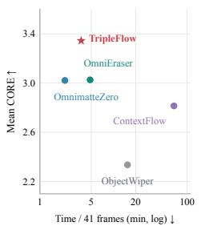

Figure 4: Left: Radar comparison across nine combined metrics from PROVE-M and ROSE. Further outward indicates better performance. Middle: First-place preference rates in the five-method human evaluation on ten showcase videos. Right: Performance-speed trade-off.  
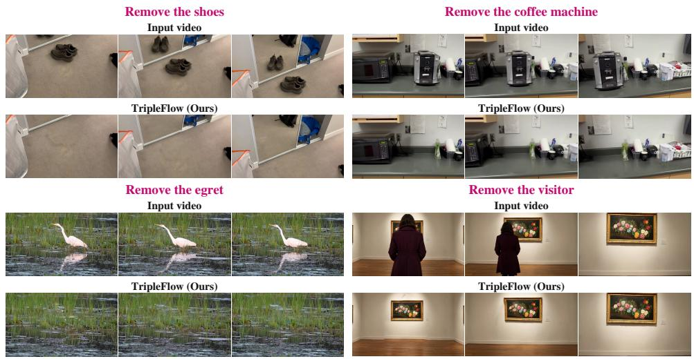  
Figure 5: Video object removal under camera motion. TripleFlow removes foreground subjects and reconstructs temporally coherent backgrounds while preserving the original camera motion and scene structure.

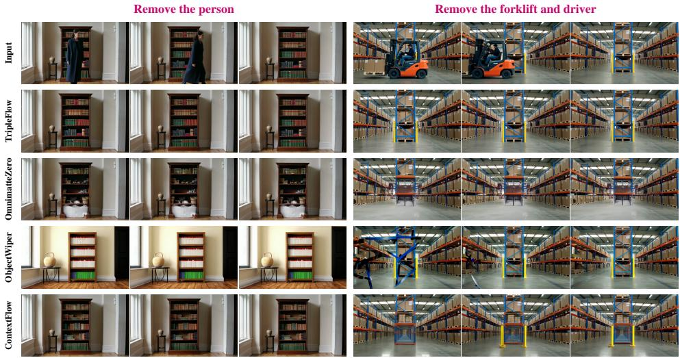  
Figure 6: Qualitative comparison with existing video object removal methods. TripleFlow achieves clean removal while preserving fine background details and scene geometry, as illustrated by the bookshelf contents and warehouse shelving. In contrast, OmnimatteZero, ObjectWiper, and ContextFlow exhibit residual objects, altered background appearance, or structural distortions in these examples.

Ablation Study. We ablate the flows and control mechanisms of TRIPLEFLOW on three representative cases (Fig. 7). Replacing $v _ { \mathrm { t a r } } - v _ { \mathrm { s r c } }$ with the target velocity alone (w/o Source Flow) introduces objectshaped artifacts and appearance distortion, indicating drift from the observed scene. Suppressing the residual update (w/o Residual Flow) leaves the objects largely exist, confirming its role in removal. Without native-state synthesis (w/o Synthesis Flow), removal remains possible but background completion and fine details become less reliable. Removing Editing Control introduces localized leakage and boundary artifacts and working together with Synthesis Flow for detailed boundary remove quality. Quantitative and more qualitative results in Appendix B Table 3 and Fig. 8, both indicate that full model consistently outperforms all four ablations.

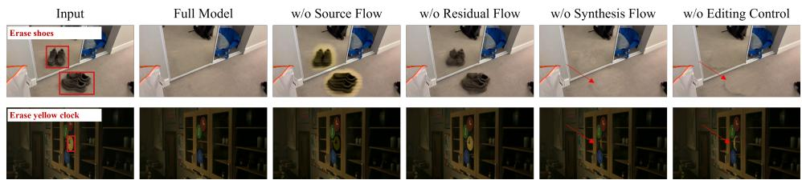  
Figure 7: Qualitative ablation results. The input frames mark the removal targets: shoes and their mirror reflection (top), and a yellow clock (bottom). Full TRIPLEFLOWremoves the targets while preserving the surrounding scene. Ablating individual flows or editing control can leave object remnants or introduce visible artifacts.

## 5 CONCLUSION

We propose TRIPLEFLOW, a training-free video object removal framework that coordinates a source, a residual, and a synthesis flow within a single diffusion backbone. By injecting the synthesized background into the residual trajectory, our approach seamlessly couples target erasure with active scene reconstruction. Evaluations across five benchmarks demonstrate TRIPLEFLOW significantly outperforms baselines in reconstruction fidelity, temporal consistency, and the natural elimination of associated physical effects.

## REPRODUCIBILITY STATEMENT

We describe the formulation and inference procedure of TRIPLEFLOW in Section 3. Appendix A provides the pretrained backbone, sampling hyperparameters, mask preparation, clean first-frame generation, and baseline configurations. The benchmarks and evaluation metrics are described in Section 4, while Appendix B specifies the evaluation subsets and aggregation protocol for the additional ablation studies. The supplementary materials include our core implementation, inference configuration, a runnable example, and video results to facilitate reproduction and inspection of temporal behavior.

## REFERENCES

Nicolas Carion, Laura Gustafson, Yuan-Ting Hu, Shoubhik Debnath, Ronghang Hu, Didac Suris, Chaitanya Ryali, Kalyan Vasudev Alwala, Haitham Khedr, Andrew Huang, Jie Lei, Tengyu Ma, Baishan Guo, Arpit Kalla, Markus Marks, Joseph Greer, Meng Wang, Peize Sun, Roman Rädle, Triantafyllos Afouras, Effrosyni Mavroudi, Katherine Xu, Tsung-Han Wu, Yu Zhou, Liliane Momeni, Rishi Hazra, Shuangrui Ding, Sagar Vaze, Francois Porcher, Feng Li, Siyuan Li, Aishwarya Kamath, Ho Kei Cheng, Piotr Dollár, Nikhila Ravi, Kate Saenko, Pengchuan Zhang, and Christoph Feichtenhofer. SAM 3: Segment Anything with Concepts. arXiv preprint arXiv:2511.16719, 2025. URL https://arxiv.org/abs/2511.16719.

Yiyang Chen, Xuanhua He, Xiujun Ma, and Jack Ma. ContextFlow: Training-Free Video Object Editing via Adaptive Context Enrichment. Proceedings of the AAAI Conference on Artificial Intelligence, 40(4):3129–3137, 2026. doi: 10.1609/aaai.v40i4.37306. URL https://ojs.aa ai.org/index.php/AAAI/article/view/37306.

Mengyu Chu, You Xie, Jonas Mayer, Laura Leal-Taixé, and Nils Thuerey. Learning Temporal Coherence via Self-Supervision for GAN-based Video Generation. ACM Transactions on Graphics, 39(4), 2020. doi: 10.1145/3386569.3392457. URL https://ge.in.tum.de/publicati ons/2019-tecogan-chu/.

Yuren Cong, Mengmeng Xu, Christian Simon, Shoufa Chen, Jiawei Ren, Yanping Xie, Juan-Manuel Perez-Rua, Bodo Rosenhahn, Tao Xiang, and Sen He. FLATTEN: optical FLow-guided ATTENtion for consistent text-to-video editing. arXiv preprint arXiv:2310.05922, 2023. URL https: //arxiv.org/abs/2310.05922.

Yigit Ekin, Enes Sanli, Aykut Erdem, Erkut Erdem, and Aysegul Dundar. BeyondMasks: Evaluating Causal and Physical Consistency in Video Object Removal. arXiv preprint arXiv:2608.20107, 2026. URL https://arxiv.org/abs/2608.20107.

Yang Fu, Yike Zheng, Ziyun Dai, and Henghui Ding. EffectErase: Joint Video Object Removal and Insertion for High-Quality Effect Erasing. arXiv preprint arXiv:2603.19224, 2026. URL https://arxiv.org/abs/2603.19224.

Michal Geyer, Omer Bar-Tal, Shai Bagon, and Tali Dekel. TokenFlow: Consistent Diffusion Features for Consistent Video Editing. arXiv preprint arXiv:2307.10373, 2023. URL https: //arxiv.org/abs/2307.10373.

Amir Hertz, Ron Mokady, Jay Tenenbaum, Kfir Aberman, Yael Pritch, and Daniel Cohen-Or. Promptto-Prompt Image Editing with Cross Attention Control. arXiv preprint arXiv:2208.01626, 2022. URL https://arxiv.org/abs/2208.01626.

Jonathan Ho, Ajay Jain, and Pieter Abbeel. Denoising Diffusion Probabilistic Models. In Advances in Neural Information Processing Systems, volume 33, pp. 6840–6851, 2020. URL https: //proceedings.neurips.cc/paper/2020/hash/4c5bcfec8584af0d967f1ab 10179ca4b-Abstract.html.

Jonathan Ho, Tim Salimans, Alexey Gritsenko, William Chan, Mohammad Norouzi, and David J. Fleet. Video Diffusion Models. arXiv preprint arXiv:2204.03458, 2022. URL https://arxi v.org/abs/2204.03458.

Jiagao Hu, Yuxuan Chen, Fuhao Li, Zepeng Wang, Fei Wang, Daiguo Zhou, and Jian Luan. From Ideal to Real: Stable Video Object Removal under Imperfect Conditions. arXiv preprint arXiv:2603.09283, 2026. URL https://arxiv.org/abs/2603.09283.

Q. Huynh-Thu and M. Ghanbari. Scope of validity of PSNR in image/video quality assessment. Electronics Letters, 44(13):800–801, 2008. doi: 10.1049/el:20080522. URL https://doi.or g/10.1049/el:20080522.

Max Ku, Cong Wei, Weiming Ren, Huan Yang, and Wenhu Chen. AnyV2V: A Tuning-Free Framework For Any Video-to-Video Editing Tasks. Transactions on Machine Learning Research, 2024. ISSN 2835-8856. URL https://openreview.net/forum?id=RFrJCkw2oa. Reproducibility Certification.

Vladimir Kulikov, Matan Kleiner, Inbar Huberman-Spiegelglas, and Tomer Michaeli. FlowEdit: Inversion-Free Text-Based Editing Using Pre-Trained Flow Models. arXiv preprint arXiv:2412.08629, 2024. URL https://arxiv.org/abs/2412.08629.

Saksham Singh Kushwaha, Sayan Nag, Yapeng Tian, and Kuldeep Kulkarni. Object-WIPER : Training-Free Object and Associated Effect Removal in Videos. arXiv preprint arXiv:2601.06391, 2026. URL https://arxiv.org/abs/2601.06391.

Fuhao Li, Shaofeng You, Jiagao Hu, Yu Liu, Yuxuan Chen, Zepeng Wang, Fei Wang, Daiguo Zhou, and Jian Luan. PROVE: A Perceptual RemOVal cohErence Benchmark for Visual Media. arXiv preprint arXiv:2605.14534, 2026. URL https://arxiv.org/abs/2605.14534.

Guangzhao Li, Yanming Yang, Chenxi Song, and Chi Zhang. FlowDirector: Training-Free Flow Steering for Precise Text-to-Video Editing. arXiv preprint arXiv:2506.05046, 2025a. URL https://arxiv.org/abs/2506.05046.

Xiaowen Li, Haolan Xue, Peiran Ren, and Liefeng Bo. DiffuEraser: A Diffusion Model for Video Inpainting. arXiv preprint arXiv:2501.10018, 2025b. URL https://arxiv.org/abs/25 01.10018.

Zhen Li, Cheng-Ze Lu, Jianhua Qin, Chun-Le Guo, and Ming-Ming Cheng. Towards an End-to-End Framework for Flow-Guided Video Inpainting. In Proceedings of the IEEE/CVF Conference on Computer Vision and Pattern Recognition (CVPR), pp. 17562–17571, 2022. URL https: //openaccess.thecvf.com/content/CVPR2022/html/Li\_Towards\_an\_En d-to-End\_Framework\_for\_Flow-Guided\_Video\_Inpainting\_CVPR\_2022\_p aper.html.

Yaron Lipman, Ricky T. Q. Chen, Heli Ben-Hamu, Maximilian Nickel, and Matt Le. Flow Matching for Generative Modeling. arXiv preprint arXiv:2210.02747, 2022. URL https://arxiv.or g/abs/2210.02747.

Rui Liu, Hanming Deng, Yangyi Huang, Xiaoyu Shi, Lewei Lu, Wenxiu Sun, Xiaogang Wang, Jifeng Dai, and Hongsheng Li. FuseFormer: Fusing Fine-Grained Information in Transformers for Video Inpainting. In Proceedings ofthe IEEE/CVF International Conference on Computer Vision (ICCV), pp. 14040–14049, 2021. URL https://openaccess.thecvf.com/content/ICCV20 21/html/Liu\_FuseFormer\_Fusing\_Fine-Grained\_Information\_in\_Transf ormers\_for\_Video\_Inpainting\_ICCV\_2021\_paper.html.

Xingchao Liu, Chengyue Gong, and Qiang Liu. Flow Straight and Fast: Learning to Generate and Transfer Data with Rectified Flow. arXiv preprint arXiv:2209.03003, 2022. URL https: //arxiv.org/abs/2209.03003.

Chenxuan Miao, Yutong Feng, Jianshu Zeng, Zixiang Gao, Hantang Liu, Yunfeng Yan, Donglian Qi, Xi Chen, Bin Wang, and Hengshuang Zhao. ROSE: Remove Objects with Side Effects in Videos. arXiv preprint arXiv:2508.18633, 2025. URL https://arxiv.org/abs/2508.18633.

Jordi Pont-Tuset, Federico Perazzi, Sergi Caelles, Pablo Arbeláez, Alex Sorkine-Hornung, and Luc Van Gool. The 2017 DAVIS Challenge on Video Object Segmentation. arXiv preprint arXiv:1704.00675, 2017. URL https://arxiv.org/abs/1704.00675.

Nikhila Ravi, Valentin Gabeur, Yuan-Ting Hu, Ronghang Hu, Chaitanya Ryali, Tengyu Ma, Haitham Khedr, Roman Rädle, Chloe Rolland, Laura Gustafson, Eric Mintun, Junting Pan, Kalyan Vasudev Alwala, Nicolas Carion, Chao-Yuan Wu, Ross Girshick, Piotr Dollár, and Christoph Feichtenhofer. SAM 2: Segment Anything in Images and Videos. arXiv preprint arXiv:2408.00714, 2024. URL https://arxiv.org/abs/2408.00714.

Tianhe Ren and Shuo Shen. Grounded SAM 2: Ground and Track Anything in Videos. GitHub repository, 2024. URL https://github.com/IDEA-Research/Grounded-SAM-2.

Robin Rombach, Andreas Blattmann, Dominik Lorenz, Patrick Esser, and Björn Ommer. High-Resolution Image Synthesis With Latent Diffusion Models. In Proceedings of the IEEE/CVF Conference on Computer Vision and Pattern Recognition (CVPR), pp. 10684–10695, 2022. URL https://openaccess.thecvf.com/content/CVPR2022/html/Rombach\_High -Resolution\_Image\_Synthesis\_With\_Latent\_Diffusion\_Models\_CVPR\_20 22\_paper.html.

Dvir Samuel, Matan Levy, Nir Darshan, Gal Chechik, and Rami Ben-Ari. OmnimatteZero: Fast Training-free Omnimatte with Pre-trained Video Diffusion Models. arXiv preprint arXiv:2503.18033, 2025. URL https://arxiv.org/abs/2503.18033.

Team Wan, Ang Wang, Baole Ai, Bin Wen, Chaojie Mao, Chen-Wei Xie, Di Chen, Feiwu Yu, Haiming Zhao, Jianxiao Yang, Jianyuan Zeng, Jiayu Wang, Jingfeng Zhang, Jingren Zhou, Jinkai Wang, Jixuan Chen, Kai Zhu, Kang Zhao, Keyu Yan, Lianghua Huang, Mengyang Feng, Ningyi Zhang, Pandeng Li, Pingyu Wu, Ruihang Chu, Ruili Feng, Shiwei Zhang, Siyang Sun, Tao Fang, Tianxing Wang, Tianyi Gui, Tingyu Weng, Tong Shen, Wei Lin, Wei Wang, Wei Wang, Wenmeng Zhou, Wente Wang, Wenting Shen, Wenyuan Yu, Xianzhong Shi, Xiaoming Huang, Xin Xu, Yan Kou, Yangyu Lv, Yifei Li, Yijing Liu, Yiming Wang, Yingya Zhang, Yitong Huang, Yong Li, You Wu, Yu Liu, Yulin Pan, Yun Zheng, Yuntao Hong, Yupeng Shi, Yutong Feng, Zeyinzi Jiang, Zhen Han, Zhi-Fan Wu, and Ziyu Liu. Wan: Open and Advanced Large-Scale Video Generative Models. arXiv preprint arXiv:2503.20314, 2025. URL https://arxiv.org/abs/2503.20314.

Narek Tumanyan, Michal Geyer, Shai Bagon, and Tali Dekel. Plug-and-Play Diffusion Features for Text-Driven Image-to-Image Translation. In Proceedings of the IEEE/CVF Conference on Computer Vision and Pattern Recognition (CVPR), pp. 1921–1930, 2023. URL https://open access.thecvf.com/content/CVPR2023/html/Tumanyan\_Plug-and-Play\_ Diffusion\_Features\_for\_Text-Driven\_Image-to-Image\_Translation\_C VPR\_2023\_paper.html.

Wan-Video. Wan2.2. GitHub repository, 2025. URL https://github.com/Wan-Video/W an2.2.

Jiangshan Wang, Junfu Pu, Zhongang Qi, Jiayi Guo, Yue Ma, Nisha Huang, Yuxin Chen, Xiu Li, and Ying Shan. Taming Rectified Flow for Inversion and Editing. In Proceedings of the 42nd International Conference on Machine Learning, volume 267 of Proceedings of Machine Learning Research, pp. 64044–64058. PMLR, 2025. URL https://proceedings.mlr.press/v2 67/wang25ce.html.

Zhou Wang, Alan C. Bovik, Hamid R. Sheikh, and Eero P. Simoncelli. Image quality assessment: From error visibility to structural similarity. IEEE Transactions on Image Processing, 13(4): 600–612, 2004. doi: 10.1109/TIP.2003.819861. URL https://www.ece.uwaterloo.ca /\~z70wang/publications/ssim.html.

Runpu Wei, Zijin Yin, Shuo Zhang, Lanxiang Zhou, Xueyi Wang, Chao Ban, Tianwei Cao, Hao Sun, Zhongjiang He, Kongming Liang, and Zhanyu Ma. OmniEraser: Remove Objects and Their Effects in Images with Paired Video-Frame Data. arXiv preprint arXiv:2501.07397, 2025. URL https://arxiv.org/abs/2501.07397.

Chenxi Xie, Minghan Li, Shuai Li, Yuhui Wu, Qiaosi Yi, and Lei Zhang. DNAEdit: Direct Noise Alignment for Text-Guided Rectified Flow Editing. arXiv preprint arXiv:2506.01430, 2025. URL https://arxiv.org/abs/2506.01430.

Zhuoyi Yang, Jiayan Teng, Wendi Zheng, Ming Ding, Shiyu Huang, Jiazheng Xu, Yuanming Yang, Wenyi Hong, Xiaohan Zhang, Guanyu Feng, Da Yin, Yuxuan Zhang, Weihan Wang, Yean Cheng, Bin Xu, Xiaotao Gu, Yuxiao Dong, and Jie Tang. CogVideoX: Text-to-Video Diffusion Models with An Expert Transformer. In The Thirteenth International Conference on Learning Representations, 2025. URL https://openreview.net/forum?id=LQzN6TRFg9.

Yanhong Zeng, Jianlong Fu, and Hongyang Chao. Learning Joint Spatial-Temporal Transformations for Video Inpainting. arXiv preprint arXiv:2007.10247, 2020. URL https://arxiv.org/ abs/2007.10247.

Richard Zhang, Phillip Isola, Alexei A. Efros, Eli Shechtman, and Oliver Wang. The Unreasonable Effectiveness of Deep Features as a Perceptual Metric. arXiv preprint arXiv:1801.03924, 2018. URL https://arxiv.org/abs/1801.03924.

Shangchen Zhou, Chongyi Li, Kelvin C. K. Chan, and Chen Change Loy. ProPainter: Improving Propagation and Transformer for Video Inpainting. arXiv preprint arXiv:2309.03897, 2023. URL https://arxiv.org/abs/2309.03897.

## A IMPLEMENTATION DETAILS

## A.1 BACKBONE AND SAMPLING

We implement TRIPLEFLOW with the pretrained Wan2.2-TI2V-5B backbone (Wan-Video, 2025). The video transformer, text encoder, and causal VAE remain frozen throughout inference. We use 40 sampling steps with a timestep shift of 12 and initialize the random generator with seed 42. The source and target classifier-free guidance scales are 3.5 and 5.0, respectively. The source path uses a single Gaussian noise realization shared across all sampling steps; numerical source inversion and multi-noise averaging are not used.

The target query uses $B _ { k } = Z _ { k } + S _ { k } - X$ , with query coupling set to zero. Updated states are combined using $\lambda _ { k + 1 }$ , where $\lambda _ { k } = 0 . 3 ( 1 - t _ { k } ) ^ { 1 . 5 }$ ; synthesis influences the next query through $Z _ { k + 1 }$ . Each step computes two guided velocities, requiring four transformer forward passes for the conditional and negative-prompt evaluations. The synthesis update reuses the target velocity without additional backbone evaluations.

We process each video jointly in a single temporal window. For a clip of L frames, we repeat the final source frame and its mask until the length is $L ^ { \prime } = 1 + 4 \lceil ( L - 1 ) \rceil 4 \rceil$ , as required by the causal VAE, and discard only these padding frames after decoding. All original frames and their timing are retained. Spatial preprocessing uses the backbone’s 1280 × 704 maximum-area setting, with input-dependent dimensions aligned to its latent and patch grids. The source video, masks, and first-frame conditions undergo corresponding spatial transforms; exported videos are restored to the source dimensions.

## A.2 APPEARANCE AND SPATIAL CONDITIONING

Scene descriptions and clean reference. The source caption describes the observed scene; the target caption describes the same scene after removal, retaining its background layout, camera motion, and remaining objects. The source and target branches use the original and clean first frames, respectively.

We generate the clean first frame with Image2.5, conditioned on the original first frame, its targetregion mask, and one to three later source frames selected for their visibility of the occluded background. The editing instruction requests removal of the target and its associated effects while preserving the first frame’s viewpoint, lighting, and unrelated content. No clean ground truth is supplied. Only the final edited image conditions Wan; the reference images are not separately injected during sampling. We retain the original first frame when the target and its effects are already absent. The evaluated collection also includes recorded Image2 fallbacks where an Image2.5 reference was unavailable.

Mask preparation and latent support. We obtain frame-wise masks with SAM 3 (Carion et al., 2025) and take the union of the target-object, shadow, and reflection regions as the editing mask. Target identities follow the benchmark annotations. Masks are visually checked and manually corrected against the source video for substantial omissions or over-segmentation. Associated effect to be removed are included in the editing support.

The first RGB mask maps to the first latent slice, while each subsequent group of four masks is combined by a temporal union. We resize masks to the latent grid with nearest-neighbor interpolation and binarize them at 0.2. The hard support A uses a $3 \times 3$ spatial dilation of the aligned binary mask. The soft weight in Eq. (10) uses $\rho = 0 . 5$ and distance measured in latent-grid pixels. No additional input-mask dilation is applied by the N7 sampling adapter. After each coupled update, we project the edit state back to X outside A and anchor its first latent slice with the clean reference using $W ^ { ( 0 ) }$ , as in Eqs. (12)–(13).

First-frame queries and attention control. Before each velocity evaluation, the first latent slice is replaced by the corresponding source or target first-frame condition, and its token timesteps are set to zero. Regional self-attention control is active only in the target branch during the first 10 of the 40 sampling steps. Masked keys are scaled by 0.5 in every transformer block; an additional logit bias of −5 is applied to masked-query/masked-key pairs in the first 10 blocks. Both operations are applied to the conditional and negative-prompt target evaluations. Other steps and the source branch use the unmodified attention computation.

## A.3 BASELINE IMPLEMENTATIONS

OmnimatteZero. Our local OmnimatteZero (Samuel et al., 2025) runs use its released LTX-Video-0.9.7 implementation with 30 inference steps and seed 42. The source video and mask sequence are passed as video conditions, with the prompt Empty and the negative prompt worst quality, inconsistent motion, blurry, jittery, distorted. These runs do not receive our generated clean first frames. Spatial dimensions are aligned to multiples of 32, and temporal padding is removed before restoring the output to the source dimensions and frame count.

Object-WIPER. Our local Object-WIPER (Kushwaha et al., 2026) runs use the original HunyuanVideo backbone with 25 rectified-flow steps, flow shift 7, seed 42, and guidance scales of 1.0 for inversion and 5.0 for denoising. We supply the source and object-removed scene captions and the prepared union mask. The implementation retains its associated-effect localization, foreground noise reinitialization, and background value-feature reuse. Its internal mask dilation is set to 9. CPU offloading is enabled for the large backbone.

ContextFlow. The ContextFlow (Chen et al., 2026) quality results use the original Wan2.1-I2V-14B backbone. We use 50 midpoint rectified-flow inversion intervals and 50 editing intervals, timestep shift 5, guidance scale 3, and seed 42. Source key/value features are injected during the first 25 editing intervals. ContextFlow’s clean first frame is generated independently with it official MagicQuill from the original first frame, its reviewed union mask, and the same scene-specific target caption. MagicQuill uses 20 steps, guidance scale 5, seed 42, the Euler ancestral sampler, and the Karras schedule. It receives an empty negative prompt, mask growth of 15, inpainting strength 1.0, color strength 0.55, and edge strength 0.55/3. It receives neither our generated first frame nor later reference images. The mask guides this image-editing stage; the subsequent ContextFlow video stage does not take an explicit object mask.

OmniEraser. We apply the released OmniEraser Base model (Wei et al., 2025), consisting of FLUX.1-dev and its trained removal weights, independently to every video frame. Quality results use 512 × 512 inputs, 28 inference steps, guidance scale 3.5, seed 24 reset for each frame, and the prompt There is nothing here. We use the original benchmark masks without manual repairs, effect expansion, or dilation. No generated first-frame condition or temporal state is shared between frames. The model runs in BF16 with VAE tiling and full GPU residency, and its outputs are resized back to the source dimensions before video assembly.

Execution and runtime configurations. Each TRIPLEFLOW video is processed on one GPU, with independent clips assigned to different GPUs. Our runs use A100, H200, or RTX 4090 D GPUs, with model offloading where needed. The runtime plot in Fig. 4 combines configuration-specific records: ContextFlow uses the earlier 14B run on two RTX 4090 D GPUs; OmnimatteZero uses the authors’ reported Wan2.1 rate; and OmniEraser uses a separate 1024×1024 H200 timing probe extrapolated to 41 frames. The historical ContextFlow timing run also used a shared generated first-frame reference, whereas the reported 5B quality results use MagicQuill. The measured TRIPLEFLOW, Object-WIPER, and ContextFlow elapsed times include model loading, inference, and export, but exclude first-frame and mask preparation. The OmniEraser probe excludes loading, warm-up, and file output. The plot therefore compares the recorded implementations rather than controlled, same-hardware end-to-end runtimes.

## A.4 HUMAN EVALUATION

Study materials. We conduct a large-scale pilot preference study on ten selected synthetic showcase videos generated with Wan. Each case contains the source video and five edited results from TRIPLEFLOW, OmnimatteZero, Object-WIPER, ContextFlow, and OmniEraser, giving 50 edited videos in total. All displayed clips contain 41 frames at 16 fps and a resolution of 832 × 480, including the first frame. The ContextFlow videos in this study use the stored 5B configuration with independently generated MagicQuill first frames; the OmniEraser videos use frame-wise 512 × 512 inference followed by restoration to the source resolution. These are selected showcase cases rather than a random sample from the public benchmarks, so the preference results apply to this set.

Presentation and ranking task. The browser-based questionnaire presents a source video, a scenespecific removal instruction in Chinese/English, and the five results for each case. The instruction identifies the target and any shadows or reflections to remove, while specifying background content and camera motion to preserve. Method names are hidden and replaced with labels A–E. Case order is randomized for each questionnaire, and the method-to-label assignment is independently randomized within each case; assignments remain fixed when a session is resumed. The interface supports synchronized playback, pausing, and replay. Viewers are instructed to watch the complete clips and rank all five results from best to worst, with no ties. They jointly consider removal completeness, background naturalness and preservation of non-target content, and temporal coherence, including flicker, jitter, and abrupt changes. Each ranking thus expresses an overall preference across these criteria.

Participation and recording. Participation is voluntary and begins with an explicit consent checkbox. The questionnaire records anonymous rankings and response times without requesting names, telephone numbers, or email addresses. Responses can be revised before final submission, which requires completing all ten cases. The snapshot used for Fig. 4 contains nine completed anonymous questionnaires, yielding 200 case-level rankings. These are browser-session records; the identities of respondents were not verified.

Aggregation. We use only completed five-method questionnaires, excluding incomplete responses, developer test submissions, and the earlier four-method protocol. No response-time threshold is applied. The stored method-to-label assignments are decoded before aggregation. For each method, the first-place preference rate is the number of case-level rankings that place it first divided by 90, multiplied by 100. All case-level rankings receive equal weight; because every completed questionnaire covers all ten cases, each case also receives the same number of rankings. The reported rates of 56.7% for TRIPLEFLOW and 23.3% for OmnimatteZero correspond to 51 and 21 first-place rankings, respectively. The 200 rankings include repeated judgments from the same questionnaire and are not 200 independent respondents.

## B ADDITIONAL ABLATION RESULTS

Table 3: N7 ablations on the fixed 20% evaluation subsets. All methods are evaluated on the same 16 PROVE-M and 12 ROSE cases. PSNR, SSIM, LPIPS, and hole-region PSNR are averaged per video over frames 1 onward, then equally averaged across cases. CORE-O and CORE-A denote paired CORE object-removal and aftereffect scores, respectively. Higher is better except for LPIPS. The w/o Editing Control variant retains mask projection and first-frame anchoring.
<table><tr><td>Method</td><td>PSNR↑</td><td>SSIM↑</td><td>LPIPS↓</td><td>Hole PSNR ↑</td><td>CORE-O↑</td><td>CORE-A ↑</td></tr><tr><td colspan="7">PROVE-M (16 cases)</td></tr><tr><td>Full N7</td><td>22.57</td><td>0.840</td><td>0.162</td><td>19.24</td><td>2.69</td><td>2.50</td></tr><tr><td>w/o Source Flow</td><td>19.33</td><td>0.778</td><td>0.213</td><td>9.60</td><td>2.00</td><td>2.06</td></tr><tr><td>w/o Residual Flow</td><td>20.11</td><td>0.808</td><td>0.198</td><td>10.43</td><td>2.00</td><td>2.00</td></tr><tr><td>w/o Synthesis Flow</td><td>22.28</td><td>0.834</td><td>0.170</td><td>17.34</td><td>2.44</td><td>2.31</td></tr><tr><td>w/o Editing Control</td><td>21.54</td><td>0.824</td><td>0.181</td><td>15.13</td><td>2.19</td><td>2.06</td></tr><tr><td colspan="7">ROSE (12 cases)</td></tr><tr><td>Full N7</td><td>24.27</td><td>0.859</td><td>0.148</td><td>19.79</td><td>3.08</td><td>2.92</td></tr><tr><td>w/o Source Flow</td><td>19.81</td><td>0.809</td><td>0.198</td><td>10.27</td><td>2.00</td><td>2.25</td></tr><tr><td>w/o Residual Flow</td><td>21.47</td><td>0.837</td><td>0.184</td><td>12.56</td><td>2.00</td><td>2.17</td></tr><tr><td>w/o Synthesis Flow</td><td>24.06</td><td>0.857</td><td>0.152</td><td>18.90</td><td>2.75</td><td>2.83</td></tr><tr><td>w/o Editing Control</td><td>23.58</td><td>0.854</td><td>0.157</td><td>18.06</td><td>2.33</td><td>2.50</td></tr><tr><td></td><td></td><td></td><td></td><td></td><td></td><td></td></tr></table>

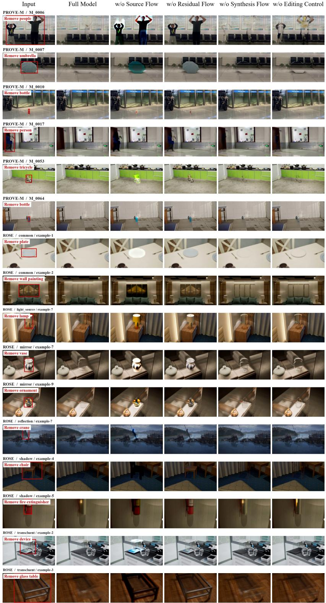  
Figure 8: Additional qualitative ablations on PROVE-M and ROSE. Each row compares the input, full model, and variants without the source flow, residual flow, synthesis flow, or editing control. Red boxes indicate the removal targets.

## C ADDITIONAL QUALITATIVE RESULTS

We present 10 additional examples from synthetic scenes, captured videos, and existing benchmarks. Each figure shows the input video above the TRIPLEFLOW result. Six corresponding frames span the clip from its first to its last frame, in temporal order from left to right.

Input  
  
TRIPLEFLOW

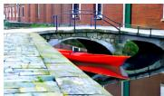

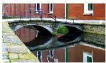

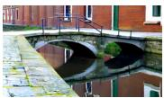

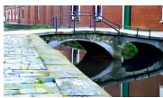

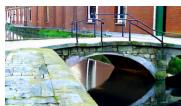  
Figure 9: Remove the kayak from the canal.

Input  
  
TRIPLEFLOW

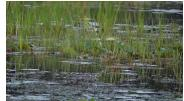

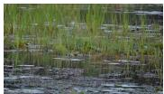

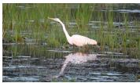

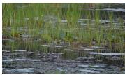

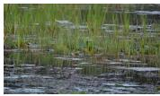

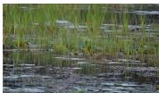  
Figure 10: Remove the egret from the wetland.

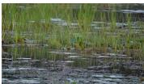

Input  
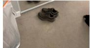  
TRIPLEFLOW

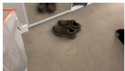

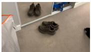

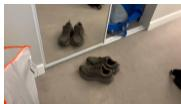

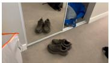

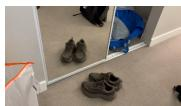

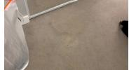

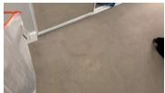

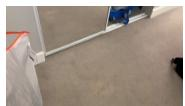

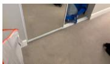

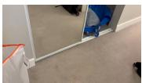  
Figure 11: Remove the shoes in front of the mirror (hard case).

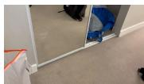

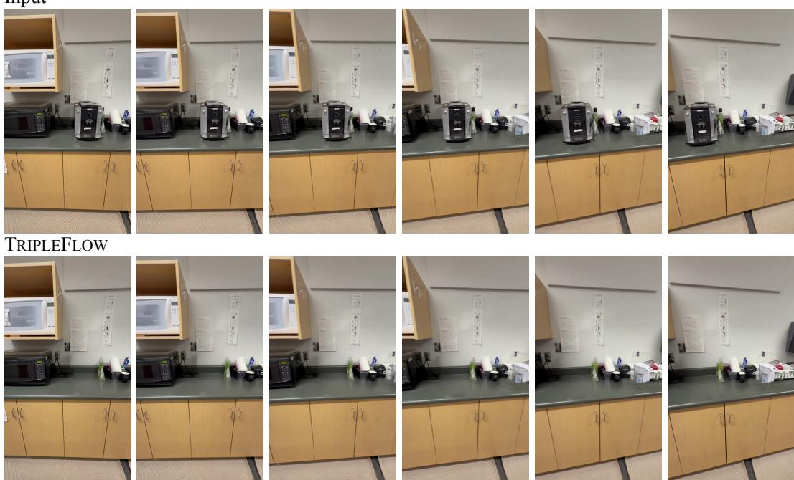  
Figure 12: Remove the coffee machine from the kitchen counter.

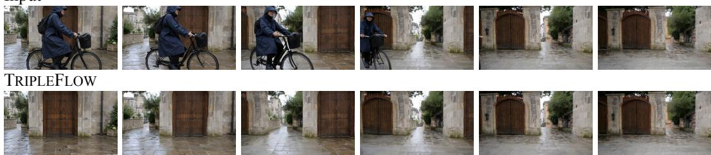  
Figure 13: Remove the cyclist and bicycle from the courtyard.

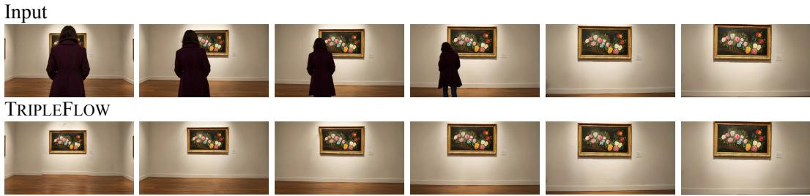  
Figure 14: Remove the visitor from the art gallery.

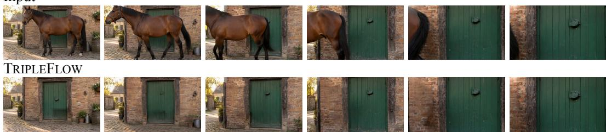  
Figure 15: Remove the horse from the farmyard.

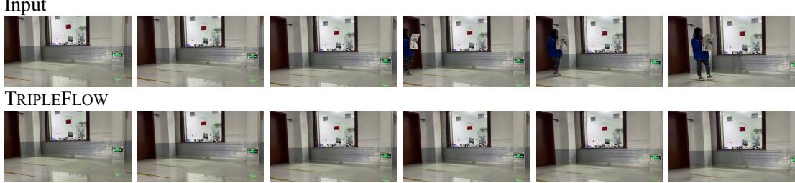  
Figure 16: Remove the person holding a newspaper.

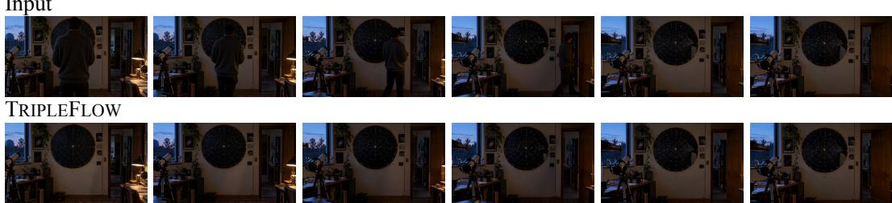  
Figure 17: Remove the person from the observatory.

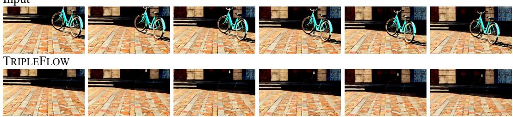  
Figure 18: Remove the bicycle from the plaza.

## D ADDITIONAL QUALITATIVE COMPARISONS

We compare five methods on five selected synthetic scenes. Each row shows six corresponding frames from the same video, including the first and last frames. The ContextFlow rows use the stored 5B runs with independently generated MagicQuill first frames; OmniEraser uses 512 × 512 inputs. These are qualitative examples rather than an aggregate performance evaluation.

Input  
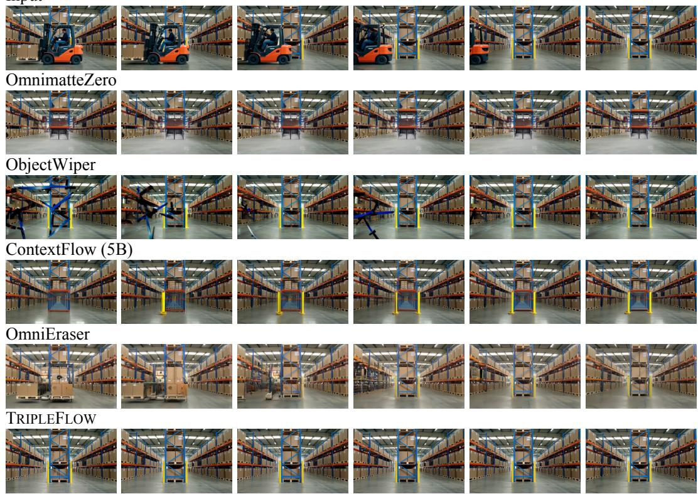  
Figure 19: Remove the forklift and driver from the warehouse.

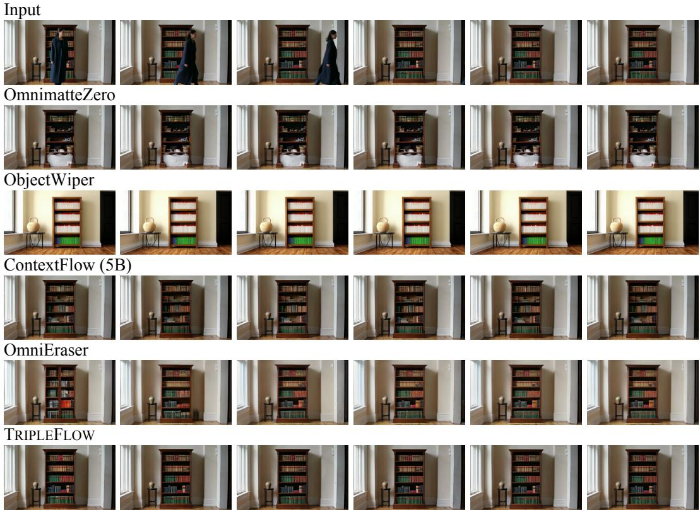  
Figure 20: Remove the person in front of the bookcase.

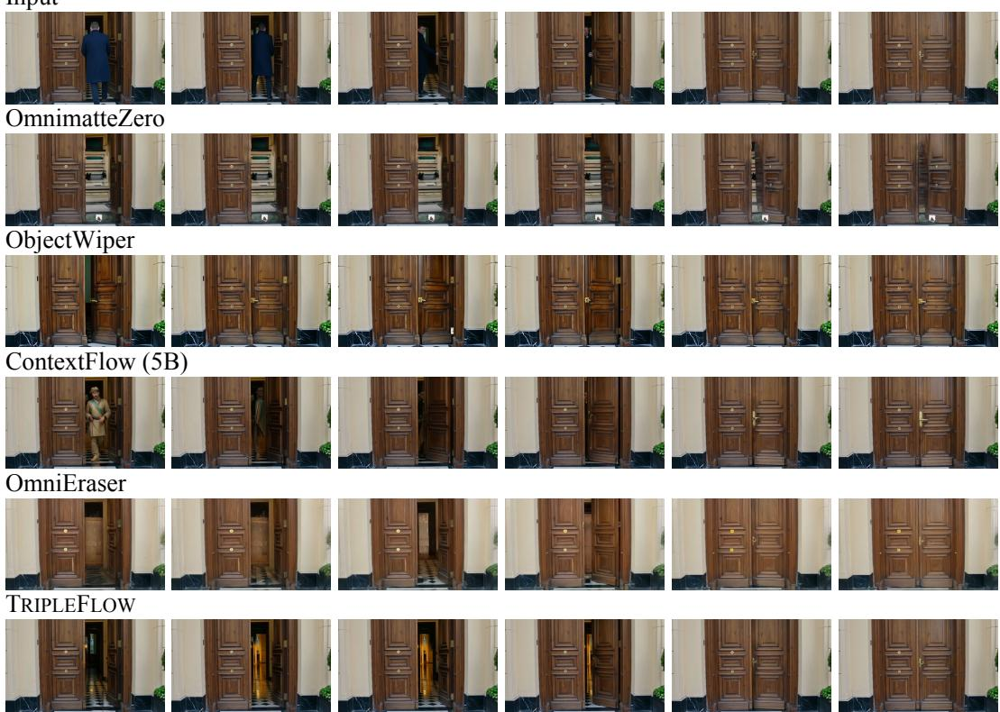  
Figure 21: Remove the person from the doorway.

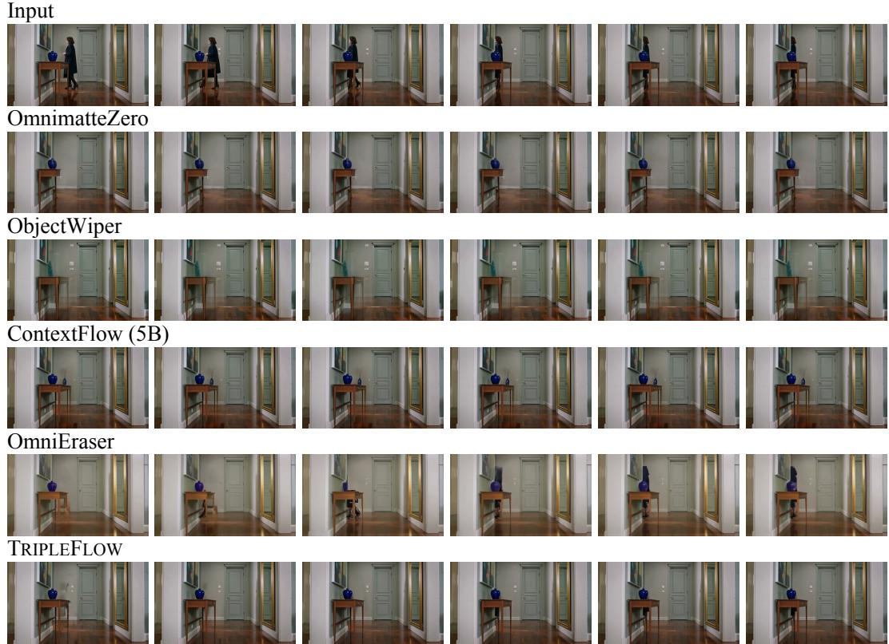  
Figure 22: Remove the person from the entryway.

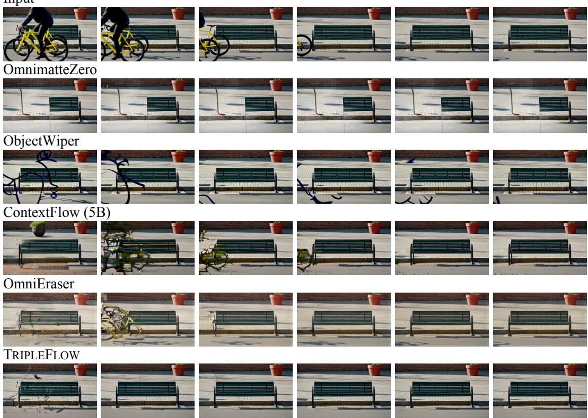  
Figure 23: Remove the bicycle in front of the bench.