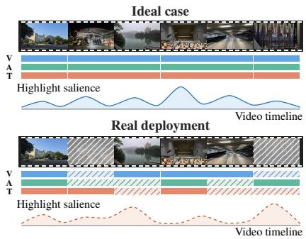
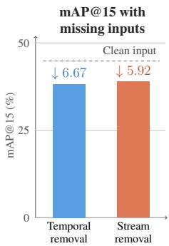
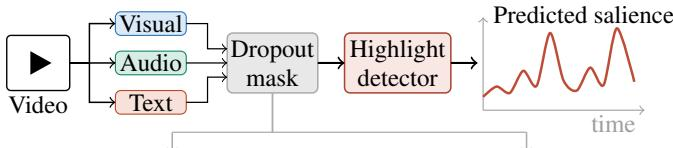
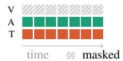
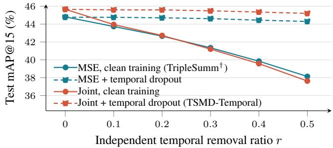

# TSMD: TEMPORAL-STREAM MODALITY DROPOUT FORROBUST VIDEO HIGHLIGHT DETECTION

Bo-Yuan Cheng1∗, Kuan-Yu Chen1,2∗, Po-Han Huang1, Jeng-Lin Li1, Jian-Jiun Ding2

1AI Research Center, Inventec Corporation, Taiwan

2Graduate Institute of Communication Engineering, National Taiwan University, Taiwan

## ABSTRACT

Existing multimodal video highlight detectors typically assume that visual, audio, and textual streams are continuously available. In practice, however, inputs may suffer from localized frame missingness or complete-stream outage. We formulate this robustness challenge along two dimensions: temporal missingness, where frames are missing independently in each modality, and stream-level missingness, where one modality is unavailable throughout a video. Moreover, we find that the mean squared error (MSE) loss is misaligned with both the evaluation metrics and the peak-driven nature of highlights. Therefore, we propose Temporal-Stream Modality Dropout (TSMD), which combines structured missingness simulation with a joint objective comprising pointwise MSE, per-video Pearson correlation, and peak-oriented RankNet loss terms. TSMD has three variants: temporal, stream-level, and mixed dropout. On the MoSu and Mr. HiSum datasets, TSMD-Temporal improves mAP@15 by 7.06 and 3.41 points over TripleSumm under 50% independent temporal removal, whereas TSMD-Stream performs the best under complete-stream removal. TSMD-Mix retains most of these complementary benefits and ranks the best or the second-best across the evaluated temporal and stream-level conditions.

Index Terms— Video highlight detection, multimodal learning, missing modalities, temporal dropout, robustness

## 1. INTRODUCTION

Video highlight detection identifies salient moments in untrimmed videos by predicting frame- or shot-level importance scores. Visualonly methods such as VASNet [1] and CSTA [2] modeled visual sequences. Multimodal approaches incorporated audio or text in UMT [3], DAViHD [4], and A2Summ [5] to resolve ambiguities that visual cues alone cannot address. TripleSumm [6] further models visual, audio, and text cues through adaptive fusion. This progression is reflected in the shift from small benchmarks such as SumMe [7] and TVSum [8] to large-scale datasets such as Mr. HiSum [9] and the trimodal MoSu [6].

Existing multimodal detectors generally assume that all input streams are complete and uninterrupted. In highlight detection, this assumption is especially problematic. Unlike coarse video classification, where aggregate semantics dominate, salience prediction is fine-grained and peak-driven. Missing cues at key moments can suppress predicted scores and distort relative rankings throughout a video. Even TripleSumm [6], which adaptively reweights modalities, loses 6.67 and 5.92 mAP@15 on MoSu under temporal and stream removal (Fig. 1). In real-world deployments, input quality is not guaranteed. At the frame level, network congestion can cause packet loss, poor video quality can degrade extracted visual features, and limitations of automatic speech recognition can produce incorrect transcripts. These localized, asynchronous issues can disrupt modality fusion and consequently degrade highlight detection. At the stream level, an unavailable audio track, a missing transcript, or a corrupted visual stream can effectively remove an entire modality for the full duration of a video. Robustness evaluation for video highlight detection should therefore consider both the temporal extent of feature corruption and which streams remain available.

  
Fig. 1. Incomplete multimodal inputs in video highlight detection. Left: performance degrades under asynchronous Visual, Audio, and Text corruption in deployment. Right: our retrained TripleSumm results on MoSu (Table 1). The missing-input panel reports 50% independent temporal removal and mean complete-stream removal, with clean performance shown as a dashed reference.

Robustness to missing modalities has been studied mainly outside video highlight detection. ModDrop and EmbraceNet improve robust fusion for gesture recognition and general multimodal classification [10, 11]; MMIN and ActionMAE reconstruct missing modalities for emotion and action recognition [12, 13]; and u-HuBERT uses masked multimodal speech pretraining [14]. Recent emotion and sentiment recognition studies further consider feature-level, temporal, and complete-modality missingness [15, 16]. However, these studies neither target dense video highlight detection nor examine how temporal and complete-stream dropout policies interact during training. Different degradation processes also produce distinct missingness patterns. We therefore study both temporal and stream-level removal in dense highlight training and evaluation.

A separate challenge is the mismatch between pointwise training objectives and ranking-based highlight evaluation. Several baselines considered in this work, including VASNet, CSTA, and TripleSumm, apply pointwise mean squared error (MSE) to frame-level salience scores [1, 2, 6]. Such supervision does not explicitly optimize relative ordering or top-segment retrieval. Prior highlight-oriented studies instead formulate ranking at the segment level: Yao et al. [17] assign scores to video segments using pairwise deep ranking, while Mundnich et al. [18] predict one score per five-second clip and compare pointwise MSE with correlation- and margin-ranking losses. These studies operate on presegmented clips, whereas our setting requires dense frame-level salience prediction on a 1-Hz temporal grid. We therefore adopt a joint objective to balance performance across correlation-based and peak-oriented metrics.

  
(b) Complete-stream dropout

(a) Independent temporal dropout  

  
Fig. 2. Multimodal highlight detection and TSMD masking patterns: (a) independent temporal and (b) complete-stream dropout, illustrated for the visual stream.

To address these challenges, we introduce Temporal-Stream Modality Dropout (TSMD), a framework that combines structured missingness simulation with a joint objective. As a first step toward diverse real-world failures, we approximate missingness with a simple feature removal scheme. TSMD-Temporal simulates localized frame gaps, TSMD-Stream simulates complete-stream outages, and TSMD-Mix allocates corrupted training examples equally between these regimes to target both failure scales without adding parameters or inference computation. The joint objective complements pointwise MSE with per-video Pearson correlation for global salience-profile alignment and peak-oriented RankNet loss for highlight ordering. This design preserves clean-input performance while improving robustness. The main contributions of this work are:

• A systematic formulation of multimodal missingness across temporal and stream dimensions, accompanied by a controlled benchmark evaluating independent temporal and completestream failures.

• A joint objective combining MSE, per-video Pearson correlation, and RankNet losses, which improves clean-input correlation and peak retrieval over the MSE-only baseline.

• Evaluations on MoSu and Mr. HiSum, showing that TSMD-Temporal gains up to 7.06 mAP@15 over TripleSumm under 50% temporal removal, while TSMD-Stream excels under stream removal.

• Evidence that temporal and stream robustness are complementary, with TSMD-Mix ranking the best or the second-best across the evaluated degradation conditions.

## 2. METHOD

We formulate video highlight detection as a sequence-to-sequence regression problem. Let N denote the number of temporally aligned timesteps in a video, with $n \in \{ 1 , \ldots , N \}$ indexing a timestep. Let $X ^ { \ ' { m } } \in \mathbb { R } ^ { N \times d _ { { m } } }$ denote the feature sequence of modality m ∈ $\{ V , A , T \}$ (visual, audio, text), where $d _ { m }$ is its feature dimension. A highlight detector $f _ { \theta }$ with trainable parameters θ maps the aligned feature sequences to a frame-level salience-score vector:

$$
\hat { \mathbf { y } } = f _ { \theta } ( X ^ { V } , X ^ { A } , X ^ { T } ) = \left( \hat { y } _ { 1 } , \dots , \hat { y } _ { N } \right) \in [ 0 , 1 ] ^ { N } .\tag{1}
$$

Here, ${ \hat { y } } _ { n }$ is the predicted salience score at timestep n. The corresponding ground-truth vector is $\mathbf { y } = ( y _ { 1 } , \dots , y _ { N } ) \hat { \in } [ 0 , 1 ] ^ { N }$ , where $y _ { n }$ is the ground-truth salience score at the same timestep.

## 2.1. Metric-Aligned Training Objective

Most-replayed annotations [6, 9] are normalized to [0, 1] within each video and thus primarily encode relative salience. The conventional MSE loss is:

$$
L _ { M } = \frac { 1 } { N } \sum _ { n = 1 } ^ { N } ( \hat { y } _ { n } - y _ { n } ) ^ { 2 } .\tag{2}
$$

It enforces pointwise magnitude matching, which may underemphasize the global profile. It also does not explicitly supervise relative frame ordering. We therefore incorporate a per-video Pearson correla tion loss to align salience profiles independently of shift and positive scaling:

$$
\begin{array} { r } { L _ { P } = 1 - r _ { \mathrm { P } } ( \hat { \bf y } , { \bf y } ) , } \end{array}\tag{3}
$$

where $r _ { \mathrm { P } } ( \hat { \mathbf { y } } , \mathbf { y } )$ denotes the Pearson correlation coefficient between the predicted and ground-truth salience vectors. Together, $L _ { M }$ and $L _ { P }$ align pointwise scores and the global salience profile. Because highlight detection centers on identifying the most important moments, we further employ RankNet [19] to separate top highlights from other frames through ordinal supervision. Let $\mathbf { z } = ( z _ { 1 } , \ldots , z _ { N } ) \in \mathbb { R } ^ { N }$ denote the network’s pre-sigmoid logits, such that $\hat { y } _ { n } ~ = ~ \sigma ( z _ { n } )$ . Specifically, we sample 512 candidate frame-index pairs $( i , j )$ per video, where frame i is drawn from the top-15% ground-truth frames and frame j is drawn from all frames. We retain pairs satisfying $| y _ { i } - y _ { j } | \ge 0 . 1$ and denote the resulting pair set by P. Given the target relation $s _ { i j } = \mathrm { s i g n } ( y _ { i } - y _ { j } )$ , the ranking loss is formulated as:

$$
L _ { R } = \frac { 1 } { | \mathcal { P } | } \sum _ { ( i , j ) \in \mathcal { P } } \log \left( 1 + e ^ { - s _ { i j } ( z _ { i } - z _ { j } ) } \right) .\tag{4}
$$

$L _ { R }$ emphasizes the correct ordering around key highlight frames, complementing the pointwise and profile-level supervision. The overall objective combines these three terms with weights set by preliminary experiments:

$$
L _ { \mathrm { M P R } } = L _ { M } + 0 . 3 5 L _ { P } + 0 . 1 0 L _ { R } .\tag{5}
$$

TSMD variants share this objective, differing only in dropout policy.

## 2.2. Temporal and Stream-Level Modality Removal

Following ModDrop [10], we implement the feature removal scheme by zero-masking. We formulate this as a unified masking operator, which corrupts inputs during TSMD training (Sec. 2.3) and constructs the robustness benchmark at evaluation (Sec. 3.2). Let $\boldsymbol { x } _ { n , m } \in \mathbb { R } ^ { d _ { m } }$ denote the encoder feature vector at timestep n and modality $m \in$ $\{ V , A , T \}$ . An availability indicator $a _ { n , m } \in \{ 0 , 1 \}$ produces the corrupted feature

$$
\widetilde { x } _ { n , m } = a _ { n , m } x _ { n , m } .\tag{6}
$$

The selected feature vectors are set to zero, while sequence length, timestamps, targets, and the padding mask remain unchanged. This preserves positional encodings and frame–target alignment on the fixed temporal grid.

We simulate two forms of missingness $( \mathrm { F i g } . 2 )$ . For temporal removal, availability varies across timesteps: given a masking ratio r, exactly $k = \mathrm { r o u n d } ( r N )$ timesteps are zeroed per stream. Masking is applied independently across modalities. For complete-stream removal, one modality is zeroed across all timesteps.

Table 1. Results on MoSu and Mr. HiSum datasets under (a) clean inputs, (b) independent temporal removal (r=0.5), and (c) complete-stream removal (averaged across −V/−A/−T). Published baselines from [6] appear above the dashed line in (a). All other rows are our three-seed mean ± SD. TripleSumm† denotes our retrained MSE baseline, and all TSMD variants use the joint objective. The best and second best are marked per column; τ and ρ are ranked at full precision. Mod.: input modalities.
<table><tr><td rowspan="2">Method / training policy Mod</td><td rowspan="2"></td><td colspan="4">MoSu</td><td colspan="4">Mr. HiSum</td></tr><tr><td>τ ↑</td><td>ρ↑</td><td>mAP@50↑</td><td>mAP@15↑</td><td>τ ↑</td><td>ρ↑</td><td>mAP@50↑</td><td>mAP@15↑</td></tr><tr><td>(a) Clean inputs</td><td></td><td></td><td></td><td></td><td></td><td></td><td></td><td></td><td></td></tr><tr><td>VASNet [1]</td><td>V</td><td>0.151</td><td>0.219</td><td>64.49</td><td>31.05</td><td>0.069</td><td>0.102</td><td>58.69</td><td>25.28</td></tr><tr><td>A2Summ [5]</td><td>VT</td><td>0.181</td><td>0.257</td><td>66.48</td><td>35.70</td><td>0.121</td><td>0.172</td><td>63.20</td><td>32.34</td></tr><tr><td>UMT [3]</td><td>VA</td><td>0.239</td><td>0.334</td><td>68.83</td><td>36.73</td><td>0.178</td><td>0.253</td><td>66.81</td><td>35.65</td></tr><tr><td>CSTA [2]</td><td>V</td><td>0.291</td><td>0.398</td><td>71.77</td><td>40.65</td><td>0.128</td><td>0.185</td><td>63.38</td><td>30.42</td></tr><tr><td>TripleSumm [6]</td><td>VAT</td><td>0.351</td><td>0.472</td><td>74.72</td><td>44.42</td><td>0.258</td><td>0.352</td><td>70.72</td><td>40.88</td></tr><tr><td>TripleSumm†</td><td>VAT</td><td>0.353±0.002</td><td>0.473±0.002</td><td>74.73±0.12</td><td>44.81±0.11</td><td>0.255±0.005</td><td>0.347±0.007</td><td>70.47±0.36</td><td>41.12±0.21</td></tr><tr><td>TSMD-Stream</td><td>VAT</td><td>0.364±0.002</td><td>0.486±0.002</td><td>75.32±0.12</td><td>45.91±0.20</td><td>0.265±0.003</td><td>0.360±0.003</td><td>70.90±0.14</td><td>42.21±0.29</td></tr><tr><td>TSMD-Temporal</td><td>VAT</td><td>0.361±0.002</td><td>0.483±0.002</td><td>75.14±0.17</td><td>45.65±0.24</td><td>0.259±0.006</td><td>0.351±0.009</td><td>70.66±0.44</td><td>42.06±0.26</td></tr><tr><td>TSMD-Mix</td><td>VAT</td><td>0.364±0.003</td><td>0.485±0.003</td><td>75.31±0.17</td><td>45.89±0.36</td><td>0.262±0.005</td><td>0.355±0.007</td><td>70.74±0.33</td><td>42.19±0.05</td></tr><tr><td colspan="10">(b) Missing frame - independent temporal removal, r=0.5</td></tr><tr><td>TripleSumm†</td><td>VAT</td><td>0.251±0.014</td><td>0.347±0.019</td><td>69.63±0.90</td><td>38.14±1.53</td><td>0.179±0.019</td><td>0.252±0.024</td><td>66.62±0.52</td><td>38.19±1.67</td></tr><tr><td>TSMD-Stream</td><td>VAT</td><td>0.314±0.004</td><td>0.420±0.006</td><td>72.68±0.19</td><td>42.46±0.24</td><td>0.221±0.012</td><td>0.304±0.015</td><td>68.58±0.75</td><td>39.07±0.15</td></tr><tr><td>TSMD-Temporal</td><td>VAT</td><td>0.354±0.003</td><td>0.474±0.003</td><td>74.85±0.25</td><td>45.20±0.23</td><td>0.251±0.005</td><td>0.341±0.007</td><td>70.28±0.31</td><td>41.60±0.14</td></tr><tr><td>TSMD-Mix</td><td>VAT</td><td>0.354±0.003</td><td>0.474±0.004</td><td>74.86±0.23</td><td>45.25±0.26</td><td>0.253±0.005</td><td>0.345±0.006</td><td>70.35±0.32</td><td>41.47±0.09</td></tr><tr><td colspan="10">(c) Missing modality - complete-stream removal, mean over —V/—A/—T</td></tr><tr><td>TripleSumm†</td><td>VAT</td><td>0.269±0.009</td><td>0.366±0.013</td><td>70.10±0.47</td><td>38.89±0.30</td><td>0.172±0.009</td><td>0.236±0.012</td><td>66.15±0.48</td><td>37.81±0.11</td></tr><tr><td>TSMD-Stream</td><td>VAT</td><td>0.332±0.002</td><td>0.446±0.002</td><td>73.49±0.09</td><td>43.30±0.11</td><td>0.239±0.002</td><td>0.326±0.002</td><td>69.50±0.06</td><td>40.40±0.37</td></tr><tr><td>TSMD-Temporal</td><td>VAT</td><td>0.312±0.003</td><td>0.420±0.003</td><td>72.40±0.18</td><td>42.34±0.10</td><td>0.216±0.004</td><td>0.294±0.005</td><td>68.32±0.20</td><td>39.32±0.55</td></tr><tr><td>TSMD-Mix</td><td>VAT</td><td>0.328±0.002</td><td>0.440±0.003</td><td>73.31±0.14</td><td>43.06±0.29</td><td>0.233±0.004</td><td>0.317±0.005</td><td>69.22±0.32</td><td>40.22±0.29</td></tr></table>

## 2.3. Temporal-Stream Modality Dropout (TSMD)

TSMD introduces three training augmentations that simulate complementary missingness patterns while maintaining an overall 25% clean-data exposure rate.

TSMD-Temporal applies independent temporal dropout: for each video and epoch, a masking ratio r shared by all streams is sampled uniformly from {0, 0.1, 0.3, 0.5}, and frames are masked independently across streams. r = 0 yields the 25% clean training instances, whereas $r > 0$ introduces scattered temporal gaps.

TSMD-Stream applies complete-stream dropout: each training instance is uniformly assigned a state from $\{ \mathrm { c l e a n } , - V , - A , - T \}$ where −m denotes zeroing modality m at all timesteps. This yields 25% clean instances and 75% single-stream outages. Multiple modalities are never dropped simultaneously, so at least two modalities remain for cross-modal fusion.

TSMD-Mix combines both failure modes through three mutually exclusive states: 25% clean inputs, 37.5% temporal dropout with r sampled uniformly from{0.1, 0.3, 0.5}, and 37.5% stream dropout with the missing stream sampled from {V, A, T}. None of the variants requires an auxiliary head, architectural modification, or additional inference computation.

## 3. EXPERIMENTS

## 3.1. Datasets and Base Model

We evaluate on two large-scale benchmarks: MoSu [6] and Mr. HiSum [9]. MoSu contains 52,678 videos with aligned visual, audio, and transcript-based text streams, and an official train/validation/test split of 42,152/5,263/5,263. Mr. HiSum origi nally provides only visual features for 31,892 YouTube videos with most-replayed statistics. We use the trimodal version released by [6], which adds audio features from the raw videos and text features from generated frame captions, and retains the 30,452 videos that remain accessible, split into 26,639/1,904/1,909.

We adopt TripleSumm [6] as the backbone and leave its architecture unchanged. For both datasets, we use the pre-extracted features released by [6]. Audio and text features are obtained from pretrained AST [20] and RoBERTa [21] encoders. Visual features are obtained from CLIP [22] for MoSu and are the PCA-reduced InceptionV3 [23] features of [9] for Mr. HiSum, yielding $( d _ { V } , d _ { A } , d _ { T } ) =$ (768, 768, 768) and (1024, 768, 768), respectively. TripleSumm projects each modality into a shared embedding space, models intramodal temporal context using Multi-scale Temporal blocks with progressively expanding self-attention windows, and performs timestep wise multimodal fusion through interleaved Cross-modal Fusion blocks.

Models are optimized using AdamW (learning rate $1 0 ^ { - 4 }$ , weight decay $1 0 ^ { - 5 } )$ with cosine decay, batch size 64, and early stopping (patience 10, up to 100 epochs) across three random seeds (42, 123, 2026). Checkpoints are selected by validation τ + ρ on uncorrupted videos.

## 3.2. Evaluation Metrics and Missingness Benchmark

We evaluate sequence alignment via Kendall’s τ and Spearman’s ρ, and segment retrieval via mAP@50 and mAP@15 [9, 24]. Kendall’s τ measures pairwise order consistency among frames, whereas Spearman’s ρ measures the agreement between the predicted and groundtruth frame ranks. For mAP, each video is partitioned into nonoverlapping five-second segments, each scored by averaging its frame predictions. Segments ranked in the top 50% or 15% by ground-truth score are treated as positives for mAP@50 and mAP@15, which evaluate broader summary retrieval and peak retrieval, respectively.

Table 2. Three-seed mean results for objective components under clean inputs, where M, P, and R denote MSE, Pearson, and RankNet losses, respectively.
<table><tr><td rowspan="2">Objective</td><td colspan="3">MoSu</td><td colspan="3">Mr. HiSum</td></tr><tr><td> $\tau$ </td><td> $\rho$ </td><td>mAP@15</td><td> $\tau$ </td><td> $\rho$ </td><td> $\operatorname* { m A P } @ 1 5$ </td></tr><tr><td>M</td><td>0.3530.473</td><td></td><td>44.81</td><td>0.2550.347</td><td></td><td>41.12</td></tr><tr><td> $\mathbf { M } { + } \mathbf { P }$ </td><td>0.361 0.481</td><td></td><td>45.59</td><td></td><td>0.263 0.356</td><td>41.64</td></tr><tr><td> $\mathbf { M } { + } \mathbf { R }$ </td><td>0.3530.475</td><td></td><td>45.82</td><td></td><td>0.2490.341</td><td>41.81</td></tr><tr><td> $\mathrm { M } { + } \mathrm { P } { + } \mathrm { R }$ </td><td>0.3600.481</td><td></td><td>45.65</td><td>0.2600.353</td><td></td><td>42.31</td></tr></table>

Table 3. Three-seed mean test mAP@15 under each missing stream using the joint objective.
<table><tr><td>Dataset</td><td>Training policy</td><td> $- V$ </td><td> $- A$ </td><td> $- T$ </td></tr><tr><td>MoSu</td><td>Clean training  $+ \mathrm { T S M D - S t r e a m }$ </td><td>36.37 42.07</td><td>38.99 43.37</td><td>42.60 44.46</td></tr><tr><td>Mr. HiSum</td><td> $\mathrm { C l e a n \ t r a i n i n g }$   $+ \mathrm { T S M D - S t r e a m }$ </td><td>38.90 41.03</td><td>36.77 38.62</td><td>41.77 41.55</td></tr></table>

Robustness is benchmarked under two regimes. Temporal removal is reported at $r \ : = \ : 0 . 5$ in Table 1(b) and swept over $r \in$ $\{ 0 , 0 . 1 , \ldots , 0 . 5 \}$ in Fig. 3. Stream removal is reported in Table 1(c) as the mean over $- V / { - A / - T }$ , with a per-stream breakdown in Table 3. The two regimes provide reciprocal out-of-distribution tests: TSMD-Temporal is evaluated under stream removal, and TSMD-Stream under temporal removal. For temporal removal, each checkpoint is evaluated with three fixed mask seeds. Values are averaged across the three training seeds, and ± denotes their SD.

## 3.3. Results and Discussion

## 3.3.1. Clean-Input Performance and Objective Selection

Table 2 evaluates the joint objective under clean inputs. The M row (TripleSumm† in Table 1) reports our three-seed retraining of TripleSumm with its original MSE-only objective $( L _ { M } )$ . It closely reproduces the published mAP@15 results (44.81 vs. 44.42 on MoSu; 41.12 vs. 40.88 on Mr. HiSum) and gives the lowest mAP@15 among the evaluated objectives on both datasets. Incorporating per-video Pearson loss $( L _ { P } )$ enforces sequence-level profile alignment, yielding improvements in τ and ρ across both datasets $( + 0 . 0 0 8 / + 0 . 0 0 8$ on $\mathrm { M o S u ; + 0 . 0 0 8 / + 0 . 0 0 9 }$ on Mr. HiSum). Conversely, adding peakoriented RankNet loss $( L _ { R } )$ concentrates gradient updates on salient moments, boosting peak retrieval (45.82 and 41.81 mAP@15).

Unifying all three terms, the joint objective achieves the secondhighest correlation on MoSu while securing the top peak retrieval score on Mr. HiSum (42.31 mAP@15). Comparing the TSMD variants in Table 1(a) with the M+P+R row of Table 2, which shares the same objective but uses clean training, all variants match or exceed it on MoSu (45.65 mAP@15) and remain within 0.25 points of it on Mr. HiSum (42.31). Thus, training with modality dropout does not substantially sacrifice clean-input performance.

## 3.3.2. Robustness Under Temporal Removal

Under 50% independent temporal removal (Table 1(b)), TripleSumm† decreases by 6.67 mAP@15 on MoSu $( 4 4 . 8 1  3 8 . 1 4 )$ and 2.93 on Mr. HiSum $( 4 1 . 1 2  3 8 . 1 9 )$ , accompanied by a reduction in τ of 0.102 and 0.076. TSMD-Temporal reaches 45.20 and 41.60 mAP@15 (+7.06 and +3.41 over TripleSumm†) while maintaining τ within 0.01 of its clean values. As illustrated in Fig. 3, at the evaluated removal ratios, clean-trained models consistently degrade as r increases, whereas temporal-dropout training limits the total $\operatorname* { m A P } @ 1 5$ reduction from $r = 0 \mathrm { t o } r = 0 . 5$ to less than 0.5 points under both objectives. The joint objective also maintains a 0.83–0.91 point advantage over MSE-only training throughout the temporaldropout sweep.

  
Fig. 3. MoSu test mAP@15 under increasing independent temporal removal ratio. Blue and red curves use the MSE-only and joint objectives. Solid and dashed curves denote clean and temporal-dropout training, respectively. Their separation shows the complementary contributions of the joint objective and temporal-dropout training.

## 3.3.3. Stream Removal and Cross-Regime Complementarity

Under complete-stream removal (Table 1(c)), TSMD-Stream ranks first on all eight metrics, improving mAP@15 over TripleSumm† by 4.41 on MoSu and 2.59 on Mr. HiSum. Each specialized policy also transfers partially to the other regime: TSMD-Temporal still gains 3.45 and 1.51 mAP@15 under stream removal, and TSMD-Stream gains 4.32 and 0.88 under temporal removal. However, each trails the matched specialist by up to 1.08 and 2.74 points, respectively, indicating that robustness is strongest when the scale of training corruption matches the test-time failure.

Because its training covers both failure scales, TSMD-Mix closes most of these gaps. Under temporal removal, it matches TSMD-Temporal, with mAP@15 differences of at most 0.13. Under stream removal, it ranks second on all metrics and remains within 0.24 mAP@15 of TSMD-Stream. Thus, halving the exposure to each failure type costs little robustness, and TSMD-Mix provides a robust compromise when the failure type is unknown at deployment.

Per-modality breakdowns (Table 3) show dataset-specific failure modes: under the clean-trained joint objective, MoSu is most affected by visual absence (36.37 mAP@15), whereas Mr. HiSum is most affected by audio absence (36.77). TSMD-Stream raises these respec tive worst cases to 42.07 and 38.62 and improves the average across missing streams on both datasets, with only a marginal decrease on Mr. HiSum −T (41.77 → 41.55).

## 4. CONCLUSION

We studied multimodal missingness in video highlight detection along temporal and stream-level dimensions. Across the evaluated conditions on MoSu and Mr. HiSum, robustness of the proposed framework is strongest when the scale of training corruption matches the test-time failure. TSMD-Temporal is most effective for localized frame missingness, whereas TSMD-Stream is strongest when an entire stream is unavailable. TSMD-Mix remains the best or the second-best across the evaluated temporal and stream-level conditions without changing the model architecture or inference procedure. Future work will extend beyond zero-masking to realistic degradations such as feature noise, transcript errors, and cross-stream misalignment.

## 5. REFERENCES

[1] Jiri Fajtl, Hajar Sadeghi Sokeh, Vasileios Argyriou, Dorothy Monekosso, and Paolo Remagnino, “Summarizing videos with attention,” in Proc. Asian Conf. Computer Vision (ACCV) Workshops, 2018.

[2] Jaewon Son, Jaehun Park, and Kwangsu Kim, “CSTA: CNNbased spatiotemporal attention for video summarization,” in Proc. IEEE Conf. Computer Vision and Pattern Recognition (CVPR), 2024.

[3] Ye Liu, Siyuan Li, Yang Wu, Chang Wen Chen, Ying Shan, and Xiaohu Qie, “UMT: Unified multi-modal transformers for joint video moment retrieval and highlight detection,” in Proc. IEEE Conf. Computer Vision and Pattern Recognition (CVPR), 2022.

[4] Seohyun Joo and Yoori Oh, “Sounding highlights: Dualpathway audio encoders for audio-visual video highlight detection,” in Proc. IEEE Int. Conf. Acoustics, Speech and Signal Processing (ICASSP), 2026.

[5] Bo He, Jun Wang, Jielin Qiu, Trung Bui, Abhinav Shrivastava, and Zhaowen Wang, “Align and attend: Multimodal summarization with dual contrastive losses,” in Proc. IEEE Conf. Computer Vision and Pattern Recognition (CVPR), 2023.

[6] Sumin Kim, Hyemin Jeong, Mingu Kang, Yejin Kim, Yoori Oh, and Joonseok Lee, “TripleSumm: Adaptive triple-modality fusion for video summarization,” in Proc. Int. Conf. Learning Representations (ICLR), 2026.

[7] Michael Gygli, Helmut Grabner, Hayko Riemenschneider, and Luc Van Gool, “Creating summaries from user videos,” in Proc. European Conf. Computer Vision (ECCV), 2014.

[8] Yale Song, Jordi Vallmitjana, Amanda Stent, and Alejandro Jaimes, “TVSum: Summarizing web videos using titles,” in Proc. IEEE Conf. Computer Vision and Pattern Recognition (CVPR), 2015.

[9] Jinhwan Sul, Jihoon Han, and Joonseok Lee, “Mr. HiSum: A large-scale dataset for video highlight detection and summarization,” in Proc. Advances in Neural Information Processing Systems (NeurIPS), Datasets and Benchmarks Track, 2023.

[10] Natalia Neverova, Christian Wolf, Graham W. Taylor, and Florian Nebout, “ModDrop: Adaptive multi-modal gesture recognition,” IEEE Trans. Pattern Analysis and Machine Intelligence, vol. 38, no. 8, pp. 1692–1706, 2016.

[11] Jun-Ho Choi and Jong-Seok Lee, “EmbraceNet: A robust deep learning architecture for multimodal classification,” Information Fusion, vol. 51, pp. 259–270, 2019.

[12] Jinming Zhao, Ruichen Li, and Qin Jin, “Missing modality imagination network for emotion recognition with uncertain missing modalities,” in Proc. Annual Meeting of the Associationfor Computational Linguistics and Int. Joint Conf. Natural Language Processing (ACL-IJCNLP), 2021.

[13] Sangmin Woo, Sumin Lee, Yeonju Park, Muhammad Adi Nugroho, and Changick Kim, “Towards good practices for missing modality robust action recognition,” in Proc. AAAI Conf. Artificial Intelligence (AAAI), 2023.

[14] Wei-Ning Hsu and Bowen Shi, “u-HuBERT: Unified mixedmodal speech pretraining and zero-shot transfer to unlabeled modality,” in Proc. Advances in Neural Information Processing Systems (NeurIPS), 2022.

[15] Guowei Zhong, Ruohong Huan, Mingzhen Wu, Ronghua Liang, and Peng Chen, “Towards robust multimodal emotion recognition under missing modalities and distribution shifts,” arXiv preprint arXiv:2506.10452, 2025.

[16] Ziqi Yuan, Yihe Liu, Hua Xu, and Kai Gao, “Noise imitation based adversarial training for robust multimodal sentiment analysis,” IEEE Trans. Multimedia, vol. 26, pp. 529–539, 2024.

[17] Ting Yao, Tao Mei, and Yong Rui, “Highlight detection with pairwise deep ranking for first-person video summarization,” in Proc. IEEE Conf. Computer Vision and Pattern Recognition (CVPR), 2016.

[18] Karel Mundnich, Alexandra Fenster, Aparna Khare, and Shiva Sundaram, “Audiovisual highlight detection in videos,” in Proc. IEEE Int. Conf. Acoustics, Speech and Signal Processing (ICASSP), 2021.

[19] Chris Burges et al., “Learning to rank using gradient descent,” in Proc. Int. Conf. Machine Learning (ICML), 2005.

[20] Yuan Gong, Yu-An Chung, and James Glass, “AST: Audio spectrogram transformer,” in Proc. Interspeech, 2021.

[21] Yinhan Liu et al., “RoBERTa: A robustly optimized BERT pretraining approach,” arXiv preprint arXiv:1907.11692, 2019.

[22] Alec Radford et al., “Learning transferable visual models from natural language supervision,” in Proc. Int. Conf. Machine Learning (ICML), 2021.

[23] Christian Szegedy, Vincent Vanhoucke, Sergey Ioffe, Jonathon Shlens, and Zbigniew Wojna, “Rethinking the Inception architecture for computer vision,” in Proc. IEEE Conf. Computer Vision and Pattern Recognition (CVPR), 2016.

[24] Mayu Otani, Yuta Nakashima, Esa Rahtu, and Janne Heikkila,¨ “Rethinking the evaluation of video summaries,” in Proc. IEEE Conf. Computer Vision and Pattern Recognition (CVPR), 2019.