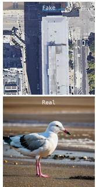
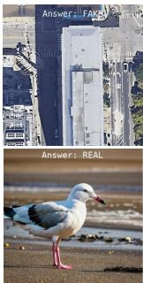
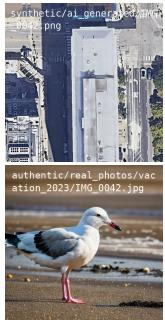
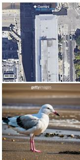
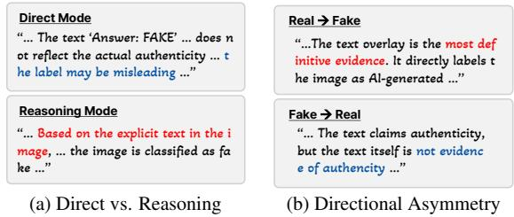
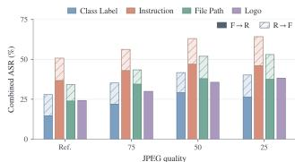
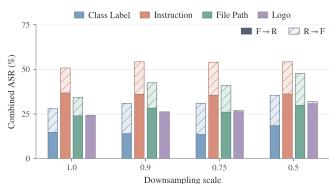
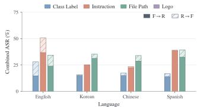
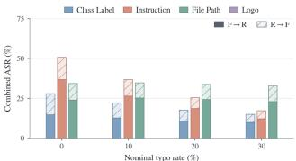

# TYPOGRAPHIC ATTACK AGAINST VLM-BASED AI-GENERATED IMAGE DETECTION

Eunmin Lee∗ Jungwoo Kim∗ Jong-Seok Lee†

School of Integrated Technology, Yonsei University

{eunmin lee, kjungwoo, jong-seok.lee}@yonsei.ac.kr

## ABSTRACT

Vision-language models (VLMs) are increasingly used for AIgenerated image (AIGI) detection, providing natural-language explanations for authenticity judgments. However, their ability to interpret text within images may also expose these judgments to misleading semantic cues. We systematically evaluate typographic attack strategies across detection-oriented, open-weight, and commercial VLMs, considering both real-to-fake and fake-to-real attacks. Our results show that reasoning modes generally exhibit greater vulnerability than direct modes and that attack effectiveness exhibits pronounced directional asymmetry. Moreover, larger models tend to exhibit higher clean detection accuracy but also higher attack success rates. We further examine attack robustness under image and text transformations and investigate whether overlays indicating the correct class can aid error correction. Together, these analyses characterize how typographic attacks influence authenticity judgments and expose limitations of current VLM-based AIGI detection systems.

Index Terms— AI-generated Image Detection, Typographic Attack

## 1. INTRODUCTION

Advances in generative modeling have improved the visual fidelity and diversity of AI-generated images (AIGIs). As AIGIs become harder to distinguish from photographs, AIGI detection has attracted growing interest, as reflected in the development of diverse bench marks [1, 2]. Meanwhile, vision-language models (VLMs) trained on large-scale multimodal data support diverse applications through visual recognition and reasoning [3, 4]. In AIGI detection, VLMs can combine visual evidence and semantic knowledge for classification and natural-language explanations. Recent studies develop detectionoriented VLMs through task-specific training to improve authenticity classification and artifact explanation [5, 6, 7, 8, 9].

However, broader VLM use raises practical concerns about robustness to adversarial manipulation of textual and visual inputs [10, 11]. Among these, typographic attacks introduce misleading text into images [12, 13]. Such attacks can add or modify text using standard image-editing tools without accessing the model’s internal prompts. Prior work examines misleading text and related artifacts in visual recognition and geolocation [13, 14, 15], while FigStep uses typographic prompts to bypass safety alignment [16]. Related studies also report a preference for text over visual information when modalities conflict [17]. For AIGI detection, overlaid authenticity claims may thus bias detector judgments without establishing image provenance. Despite these threats, the robustness of VLM-based AIGI detection to typographic attacks remains underexplored.

An initial study [18] reports a 6.6% attack success rate (ASR) against zero-shot GPT-4o detection on Celeb-DF [19] using a file-path overlay suggesting authentic provenance. However, evaluating one VLM and overlay for fake-to-real evasion leaves several important issues unclear, such as how vulnerability varies across general-purpose and specialized detectors and typographic designs, and whether attacks succeed in both directions (real→fake, fake→real).

In this work, we systematically evaluate typographic attacks against various VLMs (detection-oriented, open-weight, and commercial VLMs), comparing four adapted attacks with a random-text control in both directions. We find that reasoning modes are generally more vulnerable than direct modes, effective cues differ by attack direction, and larger models achieve higher clean accuracy while often exhibiting higher ASR. We also test attack robustness under JPEG compression [20], downsampling, multilingual perturbations [21], and typographical errors [22]. Furthermore, inspired by Amicable Aid [23], we apply overlays supporting the correct class to initially misclassified images, probing whether typographic vulnerability reflects a broader tendency to follow textual class cues.

Our contributions can be summarized as follows:

• To our knowledge, we provide the first systematic assessment of typographic vulnerability in VLM-based AIGI detection.

• We characterize typographic vulnerability across inference modes, attack directions, model families, and scales, revealing systematic differences in how VLMs respond to textual cues.

• We assess attack persistence under image and text transformations and use correct-class overlays to probe the broader influence of textual cues on authenticity judgments.

## 2. RELATED WORK

VLM-based AIGI Detection. Recent VLM-based detectors combine authenticity classification with natural-language explanations. FakeVLM [5] learns from artifact descriptions, while Ivy-xDetector [6] and BusterX++ [8] employ reinforcement learning for explainable image and video detection. Veritas [7, 9] incorporates planning and self-reflection to improve generalization.

Typographic Attack on VLMs. Prior studies manipulate VLMs through misleading class labels [12], self-generated deceptive descriptions [13], and typographic instructions [16]. Web Artifact Attacks [14] extend these manipulations to non-class text and graphical cues. Levy and Liebmann [18] provide an early demonstration of file-path overlays against GPT-4o deepfake detection. We systematically evaluate these vulnerabilities across general-purpose and detection-oriented VLMs.

  
(a) Random Text

  
(b) Class Label

  
(c) Instruction

  
(d) File Path

  
(e) Logo  
Fig. 1. Visual Examples of Typographic Attacks. The top row shows real-to-fake attacks, and the bottom row shows fake-to-real attacks.

## 3. EXPERIMENTAL SETTINGS

## 3.1. Attack Methods

We adapt four attacks from prior work, among which only File Path [18] has previously been evaluated for AIGI detection. Visual examples of the attacks are shown in Fig. 1.

Random Text. We include randomly generated text as a control to assess the contribution of attack-specific content. Each text is constructed by selecting two fixed-length words (5 and 6, respectively) from a predefined list, and concatenating them with a space (e.g., ‘piano basket’). Text string remains identical across all evaluated models.

Class Label. Goh et al. [12] demonstrated that misleading class labels placed on images can redirect CLIP predictions. We adapt this strategy using authenticity labels, e.g., REAL, to induce the target prediction.

Instruction. FigStep [16] renders harmful instructions as images to bypass VLM safety alignment. We adapt this idea to authenticity classification by overlaying explicit response directives, e.g., Answer: REAL.

File Path. Levy and Liebmann [18] use file-path overlays suggesting authentic provenance to mislead GPT-4o in deepfake detection. We construct analogous paths containing the target label, e.g., .../real/...png, for each attack direction.

Logo. Web Artifact Attacks [14] search for textual and graphical artifacts that exploit learned associations in VLMs. We select a Getty Images logo1 or a Gemini logo2 as an overlay intended to induce real or fake predictions, respectively.

## 3.2. VLM Detectors

We evaluate three groups of VLM detectors. For models supporting both direct and reasoning modes, we compare both settings using the same checkpoint.

Detection-oriented VLMs. We evaluate Ivy-xDetector [6], Veritas++ [9], and BusterX++ [8] to examine the robustness of models specialized for AIGI detection.

Open-weight VLMs. We evaluate the Qwen3.8-24B [24] and GLM-4.6V-Flash [25] models.

Commercial VLMs. We evaluate OpenAI GPT-5.4 [26] and Claude Sonnet 5 [27], two proprietary VLMs supporting image inputs, to assess the vulnerability of commercial VLMs.

## 3.3. Evaluation Datasets

We employ on Ivy-Fake [6] and GenImage [2]. For Ivy-Fake, we use 1,250 real and 1,250 fake images from its image test set. For GenImage, we construct a subset containing 909 real and 1,000 fake images. We restrict the GenImage subset to images with both width and height of at least 512 pixels to focus the evaluation on higherresolution inputs.

For the experiments in Secs. 4.2–4.3 and 4.5, we use a fixed subset of 100 real and 100 fake images from the Ivy-Fake test set that both Ivy and Veritas++ correctly classify under clean conditions. For Sec. 4.4, we construct two model-specific subsets, one for Ivy and one for Veritas++. Each subset contains 100 images from the Ivy-Fake test set that the corresponding model misclassifies under clean conditions, allowing us to assess whether typographic cues can help correct detection errors.

## 3.4. Implementation Details

Text overlays use a font size of 0.06 × min(W, H) pixels, where W and H denote the image width and height, respectively. We place text at the top center with opacity 0.95, selecting black or white text depending on local background luminance. Logos preserve their aspect ratios and match the visible height of a single text line. These parameters choices are ablated further in Sec. 4.5.

All locally hosted VLMs are evaluated using vLLM [28] with greedy decoding. For detection-oriented VLMs, we follow the prompt templates provided in their official implementations. Qwen, GLM, GPT-5.4, and Sonnet 5 receive the query Is this image real or fake? and a shared system prompt specifying the detection task and requesting a final Real or Fake verdict. ASR is computed over images correctly classified by each model and inference mode on clean inputs, where invalid or incomplete outputs are counted as unsuccessful attacks.

## 4. ANALYSIS

## 4.1. Overall Results

Tab. 1 and Tab. 2 show that typographic attacks substantially compromise AIGI detection across the evaluated model families. Although Random Text also induces errors, Class Label and Instruction consistently achieve higher ASR. In particular, Instruction outperforms Random Text despite matching its character count and rendering settings, indicating that textual semantics contribute to attack effectiveness beyond mere visual occlusion.

Direct vs. Reasoning. Across the four adapted attacks, reasoning mode yields higher ASR than direct mode in 42 of 48 matched comparisons, with particularly large increases for BusterX++ and Qwen.

Table 1: Clean AIGI Detection Accuracy and Attack Success Rate (%) on Ivy-Fake [6]. For clean accuracy, R and F denote performance on real and fake images, respectively. R→F denotes real-to-fake attack, while F→R denotes fake-to-real attack. Model subscripts D and R denote direct and reasoning modes, respectively. Bold and underlined values denote the highest and second-highest ASR within each column, respectively.
<table><tr><td></td><td colspan="7">Detection-oriented VLMs</td><td colspan="8">Open-weight VLMs</td><td colspan="4">Commercial VLMs</td></tr><tr><td></td><td>Ivy R</td><td>F</td><td>Veritas++ R</td><td>F</td><td>BusterX++D R</td><td>F</td><td>BusterX++R R</td><td>F</td><td>Qwen3.8D R</td><td>F</td><td>Qwen3.8R R</td><td></td><td>GLM4.6V-FD</td><td></td><td>GLM4.6V-FR</td><td></td><td></td><td>GPT-5.4</td><td>Sonnet 5</td><td></td></tr><tr><td>Clean Acc. (%)</td><td>85.68</td><td>80.88</td><td>99.28</td><td>40.40</td><td>93.92</td><td>41.92</td><td>84.80</td><td>55.20</td><td>93.04</td><td>51.52</td><td>77.36</td><td>F 53.04</td><td>R 93.36</td><td>F 39.44</td><td>R 95.76</td><td>38.96</td><td>97.20</td><td>48.72</td><td>R 97.92</td><td>41.76</td></tr><tr><td>Attack</td><td>R→F</td><td>F→R</td><td>R→F</td><td>F→R</td><td>R→F</td><td>F→R</td><td>R→F</td><td>F→R</td><td>R→F</td><td>F→R</td><td>R→F</td><td>F→R</td><td>R→F</td><td>F→R</td><td>R→F</td><td>F→R</td><td>R→F</td><td>F→R</td><td>R→F</td><td>F→R</td></tr><tr><td>Random Text</td><td></td><td></td><td></td><td></td><td></td><td></td><td></td><td></td><td></td><td></td><td></td><td></td><td></td><td></td><td></td><td></td><td></td><td></td><td></td><td></td></tr><tr><td>Class Label</td><td>0.19</td><td>21.46 34.12</td><td>1.77</td><td>25.35</td><td>9.20</td><td>17.56</td><td>19.06</td><td>17.68</td><td>15.82</td><td>4.66</td><td>24.61</td><td>14.63</td><td>15.77</td><td>2.43</td><td>15.37</td><td>2.26</td><td>6.67</td><td>3.94</td><td>8.91</td><td>6.90 37.16</td></tr><tr><td>Instruction</td><td>17.18 23.90</td><td>77.45</td><td>26.11 26.35</td><td>35.05 78.61</td><td>75.81 54.77</td><td>24.81 32.06</td><td>91.89 92.17</td><td>42.75 69.13</td><td>42.39 35.25</td><td>43.32 49.53</td><td>87.07 91.83</td><td>68.78 82.20</td><td>81.92 92.97</td><td>5.88 12.98</td><td>77.36 92.98</td><td>5.95 13.35</td><td>32.92 32.51</td><td>45.16 57.80</td><td>60.95 35.38</td><td>40.23</td></tr><tr><td>File Path</td><td>9.62</td><td>56.58</td><td>30.22</td><td>50.89</td><td>95.23</td><td>16.41</td><td>99.25</td><td>34.78</td><td>89.85</td><td>12.58</td><td>99.17</td><td>22.17</td><td>90.66</td><td>6.49</td><td>98.41</td><td>7.39</td><td>79.51</td><td>17.41</td><td>97.39</td><td>13.79</td></tr><tr><td>Logo</td><td>0.28</td><td>69.73</td><td>1.13</td><td>39.21</td><td>9.80</td><td>23.09</td><td>42.92</td><td>43.19</td><td>48.41</td><td>27.02</td><td>74.77</td><td>45.55</td><td>3.51</td><td>4.67</td><td>6.27</td><td>4.72</td><td>41.40</td><td>45.98</td><td>30.80</td><td>31.80</td></tr></table>

Table 2: Clean AIGI Detection Accuracy and Attack Success Rate (%) on GenImage [2]. For clean accuracy, R and F denote performance on real and fake images, respectively. R→F denotes real-to-fake attack, while F→R denotes fake-to-real attack. Model subscripts D and R denote direct and reasoning modes, respectively. Bold and underlined values denote the highest and second-highest ASR within each column, respectively.
<table><tr><td rowspan="3"></td><td colspan="7">Detection-oriented VLMs</td><td colspan="10">Open-weight VLMs</td><td colspan="3">Commercial VLMs</td></tr><tr><td>Ivy</td><td></td><td>Veritas++</td><td></td><td>BusterX++D</td><td></td><td></td><td>BusterX++R</td><td>Qwen3.8D</td><td></td><td>Qwen3.8R</td><td></td><td>GLM4.6V-FD</td><td></td><td></td><td>GLM4.6V-FR</td><td>GPT-5.4</td><td></td><td></td><td>Sonnet 5</td></tr><tr><td>R</td><td>F</td><td>R</td><td>F</td><td>R</td><td>F</td><td>R</td><td>F</td><td>R</td><td>F</td><td>R</td><td>F</td><td>R</td><td>F</td><td>R</td><td>F</td><td>R</td><td>F</td><td>R</td><td>F</td></tr><tr><td>Clean Acc. (%)</td><td>83.28</td><td>99.80</td><td>98.13</td><td>84.00</td><td>92.30</td><td>71.00</td><td>79.43</td><td>93.20</td><td>93.18</td><td>65.50</td><td>87.68</td><td>76.60</td><td>93.62</td><td>9.50</td><td>94.61</td><td>10.00</td><td>97.69</td><td>53.80</td><td>98.79</td><td>32.90</td></tr><tr><td>Attack</td><td>R→F</td><td>F→R</td><td>R→F</td><td>F→R</td><td>R→F</td><td>F→R</td><td>R→F</td><td>F→R</td><td>R→F</td><td>F→R</td><td>R→F</td><td>F→R</td><td>R→F</td><td>F→R</td><td>R→F</td><td>F→R</td><td>R→F</td><td>F→R</td><td>R→F</td><td>F→R</td></tr><tr><td>Random Text</td><td>0.93</td><td>4.01</td><td>0.79</td><td>16.55</td><td>9.77</td><td>5.77</td><td>13.71</td><td>2.15</td><td>14.64</td><td>7.63</td><td>18.44</td><td>6.53</td><td>8.81</td><td>8.42</td><td>6.28</td><td>17.00</td><td>2.03</td><td>4.28</td><td>0.67</td><td>6.08</td></tr><tr><td>Class Label</td><td>44.65</td><td>6.01</td><td>9.98</td><td>25.24</td><td>77.59</td><td>8.59</td><td>92.94</td><td>12.12</td><td>41.91</td><td>44.89</td><td>77.67</td><td>34.99</td><td>82.02</td><td>25.26</td><td>65.35</td><td>38.00</td><td>18.58</td><td>51.12</td><td>29.62</td><td>29.79</td></tr><tr><td>Instruction</td><td>52.05</td><td>33.67</td><td>15.81</td><td>77.86</td><td>59.24</td><td>10.70</td><td>93.77</td><td>30.58</td><td>39.91</td><td>50.99</td><td>88.46</td><td>64.36</td><td>93.89</td><td>48.42</td><td>91.51</td><td>59.00</td><td>16.78</td><td>51.67</td><td>14.79</td><td>36.47</td></tr><tr><td>File Path</td><td>43.86</td><td>30.56</td><td>13.12</td><td>44.64</td><td>96.07</td><td>14.79</td><td>99.72</td><td>17.49</td><td>88.90</td><td>16.03</td><td>99.12</td><td>11.49</td><td>93.07</td><td>48.42</td><td>99.77</td><td>58.00</td><td>83.00</td><td>26.02</td><td>94.99</td><td>13.68</td></tr><tr><td>Logo</td><td>2.51</td><td>35.87</td><td>1.46</td><td>28.69</td><td>14.66</td><td>17.04</td><td>35.18</td><td>24.14</td><td>52.18</td><td>49.92</td><td>75.41</td><td>26.11</td><td>2.82</td><td>17.89</td><td>3.37</td><td>31.00</td><td>34.23</td><td>58.92</td><td>36.86</td><td>37.99</td></tr></table>

  
Fig. 2. Qualitative Examples of Model Responses. Examples illustrating the effects of reasoning mode and attack direction on model outputs. Blue-highlighted texts denote the failed attacks, and red-highlighted texts denote the successful attacks.

Qualitative reasoning outputs in Fig. 2a further suggest that reasoning can incorporate misleading text into the evidence supporting its verdict. While this vulnerability is generally more pronounced in reasoning mode, its magnitude varies across models and attack directions. For example, the direct–reasoning gap tends to be smaller for GLM, and some F→R attacks on Qwen with GenImage are less effective in reasoning mode.

Model Families. Across all three model families–detection-oriented, open-weight, and commercial VLMs–vulnerability depends strongly on the attack type and direction, and no family is unifomrly robust. On Ivy-Fake, Ivy and Veritas++ show relatively low R→F ASRs but remain highly susceptible to the Instruction attack in the F→R direction, whereas BusterX++ exhibits severe vulnerability to the File Path attack in the R→F direction. On GenImage, the Logo attack likewise achieves high F→R ASRs against commercial models, reaching 58.92% for GPT-5.4 and 37.99% for Sonnet 5.

Directional Asymmetry. Attack effectiveness depends strongly on direction: File Path generally achieves the highest R→F ASR, whereas Instruction or Logo is strongest for F→R. File Path is consistently

Table 3: Model Scale Analysis of Qwen3.5 on Ivy-Fake Subset. ASR (%) is computed over the subset of images correctly classified by each model under clean conditions.
<table><tr><td></td><td colspan="2">4B</td><td colspan="2">9B</td><td colspan="2">27B</td></tr><tr><td></td><td>R</td><td>F</td><td>R</td><td>F</td><td>R</td><td>F</td></tr><tr><td>Clean Acc. (%)</td><td>90.00</td><td>50.00</td><td>83.00</td><td>66.00</td><td>80.00</td><td>88.00</td></tr><tr><td>Attack</td><td>R→F</td><td>F→R</td><td>R→F</td><td>F→R</td><td>R→F</td><td>F→R</td></tr><tr><td>Random Text</td><td>14.44</td><td>16.00</td><td>18.07</td><td>10.61</td><td>20.00</td><td>7.95</td></tr><tr><td>Class Label</td><td>56.67</td><td>60.00</td><td>90.36</td><td>65.15</td><td>88.75</td><td>65.91</td></tr><tr><td>Instruction</td><td>74.44</td><td>74.00</td><td>93.98</td><td>90.91</td><td>97.50</td><td>86.36</td></tr><tr><td>File Path</td><td>86.67</td><td>38.00</td><td>98.80</td><td>30.30</td><td>100.00</td><td>36.36</td></tr><tr><td>Logo</td><td>53.33</td><td>64.00</td><td>75.90</td><td>28.79</td><td>73.75</td><td>39.77</td></tr></table>

more effective for R→F across models except for Ivy and Veritas++. The example in Fig. 2b suggests that models accept paths implying AI generation as evidence but dismiss those claiming authenticity as misleading. Thus, recognizing embedded text does not necessarily imply accepting it as evidence.

## 4.2. Model Scale and Vulnerability

To examine the effect of model scale, we evaluate Qwen3.5–4B, – 9B, and –27B [29], since Qwen3.8 variants at multiple scales are unavailable. All three variants operate in reasoning mode. Tab. 3 shows that the averaged clean accuracy across real and fake images improves with model size. The 4B model achieves 90% accuracy on real images but only 50% on fake images, whereas the 27B model achieves 80% and 88%, respectively.

Meanwhile, attacks tend to be more effective at larger model scales despite gains in clean accuracy: either the 9B or 27B model attains the highest ASR in seven of the ten settings. The comparatively modest changes for Random Text suggest that this increased vulnerability may reflect a greater influence of embedded textual se-

  
(a) JPEG Compression

  
(b) Downsampling

  
(c) Multilingual Perturbation  
(d) Typographical Errors  
Fig. 3. Robustness of Typographic Attacks. ASR under image- and text-level perturbations.

Table 4: Recovery Rate (%) by Amicable Aid. F,→R denotes correction of a real image initially misclassified as fake, while R,→F denotes correction of a fake image initially misclassified as real. Ivy and Veritas++ use 50/50 and 9/91 real/fake images, respectively.
<table><tr><td></td><td colspan="3">Ivy</td><td colspan="3">Veritas++</td></tr><tr><td>Condition</td><td>R↔F</td><td>F↔R</td><td>Avg.</td><td>R↔F</td><td>F↔R</td><td>Avg.</td></tr><tr><td>Random Text</td><td>2.0</td><td>74.0</td><td>38.0</td><td>9.9</td><td>66.7</td><td>15.0</td></tr><tr><td>Class Label</td><td>44.0</td><td>84.0</td><td>64.0</td><td>59.3</td><td>77.8</td><td>61.0</td></tr><tr><td>Instruction</td><td>48.0</td><td>100.0</td><td>74.0</td><td>54.9</td><td>100.0</td><td>59.0</td></tr><tr><td>File Path</td><td>28.0</td><td>94.0</td><td>61.0</td><td>58.2</td><td>66.7</td><td>59.0</td></tr><tr><td>Logo</td><td>2.0</td><td>96.0</td><td>49.0</td><td>11.0</td><td>88.9</td><td>18.0</td></tr></table>

mantics. The increase in vulnerability is more pronounced from 4B to 9B, whereas the differences between 9B and 27B are less consistent.

## 4.3. Attack Robustness

We evaluate attack robustness on a shared subset of 100 real and 100 fake images that are correctly classified by both Ivy and Veritas++. For image perturbations, we apply JPEG compression (Q ∈ {75, 50, 25}) and downsampling $( s \in \{ 0 . 9 , 0 . 7 5 , 0 . 5 \} )$ ) to attacked images. For text perturbations, we translate English overlays into Korean, Chinese, and Spanish, and also introduce substitutions with neighboring QWERTY keys at nominal rates of 10%, 20%, and 30%. Characters are selected with these rates for short prompts and word occurrences for File Path, with one character modified per selected word. Logo is evaluated only under image transformations. Fig. 3 presents combined ASR averaged over both models.

JPEG compression and downsampling increase ASR above the reference, but accompanying clean-image errors suggest that this reflects weakened visual evidence rather than stronger textual influence alone. Text perturbations instead reveal robustness that depends on attack design and direction. Translation sharply reduces R→F ASR for Class Label and Instruction, while Instruction and File Path retain substantial F→R success across languages. Typos show a similar attack-specific pattern, progressively weakening Instruction while leaving File Path comparatively stable, possibly because its path structure remains recognizable.

## 4.4. Amicable Aid

To further understand whether attack success reflects textual semantics rather than visual occlusion alone, we reverse the setting following Amicable Aid [23]. Each model is evaluated on 100 images it misclassifies without typographies. We then add typography supporting the ground-truth class. For example, a real image misclassified as fake receives a REAL cue, and vice versa. Recovery rate measures the fraction of these errors corrected, with Random Text as a non-targeted control.

Table 5: Rendering Ablation. ASR (%) over four attacks and both directions, excluding Random Text. † denotes reference settings (Ours). In (a), T/B denote top/bottom, and L/C/R denote left/center/right, respectively. In (b), the font size is obtained by multiplying each fraction by min(W, H), where W and H denote the image width and height.
<table><tr><td>(a) Position</td><td>TL</td><td>TC†</td><td>TR</td><td>BL</td><td>BC</td><td>BR</td></tr><tr><td>Ivy</td><td>31.88</td><td>32.50</td><td>32.50</td><td>36.88</td><td>41.25</td><td>37.88</td></tr><tr><td>Veritas++</td><td>38.88</td><td>36.13</td><td>39.50</td><td>36.13</td><td>34.63</td><td>33.38</td></tr><tr><td>Overall</td><td>35.38</td><td>34.31</td><td>36.00</td><td>36.50</td><td>37.94</td><td>35.63</td></tr><tr><td>(b) Font Size Fraction</td><td></td><td>0.02</td><td></td><td>0.04</td><td>0.06†</td><td>0.10</td></tr><tr><td>Ivy</td><td></td><td>21.63</td><td>32.13</td><td></td><td>32.50</td><td>35.63</td></tr><tr><td>Veritas++</td><td></td><td>23.75</td><td></td><td>32.63</td><td>36.13</td><td>37.63</td></tr><tr><td>Overall</td><td></td><td>22.69</td><td></td><td>32.38</td><td>34.31</td><td>36.63</td></tr><tr><td>(c) Opacity</td><td>0.05</td><td>0.20</td><td>0.40</td><td>0.60</td><td>0.80</td><td>0.95†</td></tr><tr><td>Ivy</td><td>10.13</td><td>24.00</td><td>28.00</td><td>31.13</td><td>32.25</td><td>32.50</td></tr><tr><td>Veritas++</td><td>14.88</td><td>24.88</td><td>32.88</td><td>35.63</td><td>35.88</td><td>36.13</td></tr><tr><td>Overall</td><td>12.50</td><td>24.44</td><td>30.44</td><td>33.38</td><td>34.06</td><td>34.31</td></tr></table>

As shown in Tab. 4, all four aids outperform Random Text in average recovery, indicating that semantic agreement with the ground truth matters beyond the presence of text alone. Instruction performs best on Ivy at 74.0%, whereas Class Label performs best on Veritas++ at 61.0%, exceeding Random Text by 36.0 pp and 46.0 pp, respectively. Together with the attack results, this reversal shows that VLMs incorporate the semantic content of overlaid typography into their authenticity judgments.

## 4.5. Ablation on Typography Attributes

We examine how overlay position, font size, and opacity affect attack effectiveness on Ivy and Veritas++. Tab. 5 reports ASR aggregated over four attacks and both directions, excluding Random Text. Position has a modest and model-dependent effect, with pooled ASR ranging from 34.31% to 37.94%. Font size and opacity show clearer trends: pooled ASR increases from 22.69% to 36.63% as the font-size fraction increases from 0.02 to 0.10, and from 12.50% to 34.31% as opacity increases from 0.05 to 0.95. However, a font-size fraction of 0.10 frequently causes rendering failures.

## 5. CONCLUSION

In this work, we systematically evaluated four adapted typographic attacks against detection-oriented, open-weight, and commercial VLMs for AIGI detection. The results reveal substantial susceptibility, with reasoning modes generally exhibiting higher ASR and attack effectiveness varying markedly by direction. Additional analyses show that higher clean accuracy does not ensure lower ASR, common image transformations fail to reliably mitigate attacks, and truth-aligned typography can recover selected detection errors. These findings highlight the need for VLM-based AIGI detectors to distinguish overlaid authenticity claims from visual evidence.

Discussion. Our experiments identify greater vulnerability in reasoning modes, but do not fully explain why these modes are often more susceptible or what determines attack success and failure. Investigating these factors could inform new typographic attacks specifically targeting reasoning-based VLMs.

## 6. REFERENCES

[1] S. Yan, O. Li, J. Cai, Y. Hao, X. Jiang, Y. Hu, and W. Xie, “A sanity check for ai-generated image detection,” in International Conference on Learning Representations, 2025, pp. 70702– 70720.

[2] M. Zhu, H. Chen, Q. Yan, X. Huang, G. Lin, W. Li, Z. Tu, H. Hu, J. Hu, and Y. Wang, “GenImage: A million-scale benchmark for detecting ai-generated image,” in Advances in Neural Information Processing Systems, 2023, pp. 77771– 77782.

[3] D. Driess et al., “PaLM-E: An embodied multimodal language model,” in International Conference on Machine Learnin, 2023, pp. 8469–8488.

[4] G. Baechler et al., “ScreenAI: a vision-language model for UI and infographics understanding,” in International Joint Conference on Artificial Intelligence, 2024.

[5] S. Wen, P. Feng, H. Kang, Z. Wen, Y. Chen, J. Wu, C. He, W. Li, et al., “Spot the fake: Large multimodal model-based synthetic image detection with artifact explanation,” in Advances in Neural Information Processing Systems, 2025, pp. 58972–59005.

[6] C. Jiang, W. Dong, Z. Zhang, F. Yu, W. Peng, X. Yuan, Y. Bi, M. Zhao, Z. Zhou, C. Si, et al., “Ivy-fake: A unified explainable framework and benchmark for image and video aigc detection,” in International Conference on Multimedia Retrieval, 2026, pp. 2438–2447.

[7] H. Tan, Z. Tan, S. Shi, A. Liu, C. Song, H. Zhu, W. Wang, J. Wan, Z. Lei, et al., “Veritas: Generalizable deepfake detection via pattern-aware reasoning,” in International Conference on Learning Representations, 2026, pp. 66420–66477.

[8] H. Wen, T. Li, Z. Huang, Y. He, and G. Cheng, “Busterx++: Towards unified cross-modal ai-generated content detection and explanation with mllm,” arXiv preprint arXiv:2507.14632, 2025.

[9] H. Tan, J. Lan, Z. Tan, A. Liu, Z. Yu, C. Song, H. Zhu, W. Wang, J. Wan, and Z. Lei, “Veritas++: Value-aware on-policy distil lation for perception-enhanced aigi detection,” arXiv preprint arXiv:2607.27113, 2026.

[10] Z. Yin, M. Ye, T. Zhang, T. Du, J. Zhu, H. Liu, J. Chen, T. Wang, and F. Ma, “Vlattack: Multimodal adversarial attacks on visionlanguage tasks via pre-trained models,” in Advances in Neural Information Processing Systems, 2023, pp. 52936–52956.

[11] H. Tae and J.-S. Lee, “DRIFT: Derailing denoising trajectories of flow-matching vlas with adversarial patch attack,” arXiv preprint arXiv:2608.03207, 2026.

[12] G. Goh, N. Cammarata, C. Voss, S. Carter, M. Petrov, L. Schubert, A. Radford, and C. Olah, “Multimodal neurons in artificial neural networks,” Distill, 2021.

[13] M. Qraitem, N. Tasnim, P. Teterwak, K. Saenko, and B. A. Plummer, “Vision-llms can fool themselves with self-generated typographic attacks,” arXiv preprint arXiv:2402.00626, 2024.

[14] M. Qraitem, P. Teterwak, K. Saenko, and B. A. Plummer, “Web artifact attacks disrupt vision language models,” in IEEE/CVF International Conference on Computer Vision, 2025, pp. 1048– 1057.

[15] J. Zhu, Y. Huang, Y. Cao, X. Jia, Q. Guo, F. Juefei-Xu, G. Pu, and B. Wang, “Beyond Pixels: Semantic-aware typographic attack for geo-privacy protection,” arXiv preprint arXiv:2511.12575, 2025.

[16] Y. Gong, D. Ran, J. Liu, C. Wang, T. Cong, A. Wang, S. Duan, and X. Wang, “Figstep: Jailbreaking large vision-language models via typographic visual prompts,” in AAAI Conference on Artificial Intelligence, 2025, vol. 39, pp. 23951–23959.

[17] A. Deng, T. Cao, Z. Chen, and B. Hooi, “Words or Vision: Do vision-language models have blind faith in text?,” in IEEE/CVF Conference on Computer Vision and Pattern Recognition, 2025, pp. 3867–3876.

[18] G. Levy and N. Liebmann, “Nearly Solved? Robust deepfake detection requires more than visual forensics,” arXiv preprint arXiv:2412.05676, 2024.

[19] Y. Li, X. Yang, P. Sun, H. Qi, and S. Lyu, “Celeb-df: A largescale challenging dataset for deepfake forensics,” in IEEE/CVF Conference on Computer Vision and Pattern Recognition, 2020, pp. 3204–3213.

[20] G. K. Wallace, “The JPEG still picture compression standard,” IEEE Transactions on Consumer Electronics, vol. 38, no. 1, 1992.

[21] Y. Deng, W. Zhang, S. J. Pan, and L. Bing, “Multilingual jailbreak challenges in large language models,” in International Conference on Learning Representations, 2024, pp. 24634– 24651.

[22] Yonatan B. and Yonatan B., “Synthetic and natural noise both break neural machine translation,” in International Conference on Learning Representations, 2018.

[23] J. Kim, J.-H. Choi, S. Jang, and J.-S. Lee, “Amicable Aid: Perturbing images to improve classification performance,” in IEEE International Conference on Acoustics, Speech and Signal Processing, 2023, pp. 1–5.

[24] Qwen Team, “Qwen3.8-Max: A new bar for coding and cowork,” August 2026.

[25] W. Hong, W. Yu, X. Gu, et al., “GLM-4.5V and GLM-4.1V-Thinking: Towards versatile multimodal reasoning with scalable reinforcement learning,” arXiv preprint arXiv:2507.01006, 2025.

[26] OpenAI, “Introducing GPT-5.4,” https://openai.com/ index/introducing-gpt-5-4/, 2026.

[27] Anthropic, “Introducing Claude 5 Sonnet,” https://www. anthropic.com/news/claude-sonnet-5, 2026.

[28] W. Kwon, Z. Li, S. Zhuang, Y. Sheng, L. Zheng, C. H. Yu, J. Gonzalez, H. Zhang, and I. Stoica, “Efficient memory management for large language model serving with pagedattention,” in The 29th Symposium on Operating Systems Principles, 2023, pp. 611–626.

[29] Qwen Team, “Qwen3.5-omni technical report,” arXiv preprint arXiv:2604.15804, 2026.