# TexTailor: Texture-Preserving Video Virtual Try-On via Adaptive Garment Conditioning

Zijing Qin1∗, Jun Zhou1∗, Ruicheng Zhang1, Jiaqi Hou1, Zunnan Xu1,

Ronghui Li1, Zhenyu Xie2, Xiu Li1†

1Tsinghua University, China

2Mohamed bin Zayed University of Artificial Intelligence, UAE

## Abstract

Video virtual try-on has attracted increasing attention due to its broad potential in digital fashion and intelligent ecommerce. However, existing methods primarily focus on lowresolution settings and still face substantial challenges when extended to high-resolution scenarios. These limitations can be attributed to two main factors: (1) the insuficient utilization of rich garment reference information, and (2) the lack of explicit positional modeling between garment and video representations during cross-modal interaction, which weakens fine-grained local correspondence. To address these issues, we propose TexTailor, a high-fidelity video virtual tryon framework built upon a pretrained video Difusion Transformer. Specifically, we introduce a timestep-adaptive modulation mechanism to dynamically adjust garment visual representations throughout denoising. We further develop a framealigned positional encoding strategy to strengthen garment-tovideo correspondence, together with a multi-source injection design that reduces interference among heterogeneous conditions. Extensive experiments on multiple video virtual tryon benchmarks, including the high-resolution Eevee dataset, demonstrate that TexTailor achieves competitive performance in garment detail preservation, temporal consistency, and overall video quality.

## Introduction

Recent advances in image generation have enabled highfidelity and controllable visual synthesis (Zhou et al. 2025a; Huang et al. 2026; Hu et al. 2026c; Liu et al. 2025), while video generation further extends these capabilities to dynamic content with temporally coherent motion (Kong et al. 2024; Xu et al. 2025b; Zhang et al. 2026b,a; Hu et al. 2026a). Building upon these developments, virtual try-on has progressed from static image synthesis (Wang et al. 2024; Choi et al. 2024; Chong et al. 2024; Xu et al. 2025a; Zhang et al. 2024; Yang et al. 2025; Guo et al. 2025) toward video-based scenarios (Chong et al. 2025; Fang et al. 2024; Karras et al. 2024; Li et al. 2025b; Zheng et al. 2024b; Zuo et al. 2025), where garments must remain faithful under continuous human motion and viewpoint changes. Unlike image-based tryon, video virtual try-on requires not only preserving finegrained garment appearance, including shapes, textures, and patterns, but also maintaining temporal consistency of human identity and motion. Balancing garment fidelity with coherent motion therefore remains a fundamental challenge.

Despite promising progress on benchmarks such as ViViD (Fang et al. 2024) and VVT (Dong et al. 2019b), existing video virtual try-on methods are mostly developed on relatively low-resolution data, where fine-grained garment fidelity is less emphasized. At higher resolutions, garment details such as textures, stitching, patterns, and subtle material structures become more demanding to preserve and remain susceptible to blurring, loss, and temporal drift, as further revealed by recent high-resolution benchmarks such as Eevee (Zeng et al. 2025). This calls for more efective exploitation of fine-grained garment conditions. Beyond limited training resolution, existing methods often make insuficient use of garment conditions. Garment visual features are commonly injected in a fixed manner throughout denoising, rather than being dynamically utilized at diferent denoising stages. In addition, existing methods often perform garmentlatent cross-attention without explicitly modeling positional correspondence between the garment and video latent spaces, weakening the consistency of local garment-to-video matching. Moreover, heterogeneous conditions, including text, visual feature, and garment latent, are often fused within a shared attention space, potentially causing interference and limiting the efectiveness of garment-specific guidance during high-resolution video generation.

To address these limitations, we propose TexTailor, a high-fidelity video virtual try-on framework built upon a pretrained video Difusion Transformer. Our framework improves garment conditioning through stage-adaptive visual modulation, explicit frame-wise garment-to-video alignment, and decoupled multi-source injection. First, Timestep-Adaptive Visual Modulation (TAVM) combines timestepconditioned AdaLN with timestep-aware token-wise gating to emphasize visual representation relevant to each denoising stage. This enables stage-adaptive garment guidance from global structural cues at early stage to fine-grained local details at later stage. Second, Frame-Aligned 3D Garment Cross-RoPE (FAC-RoPE) assigns garment key the temporal coordinate of the corresponding video frame while retaining the native 3D RoPE of the video query. This avoids artificial temporal ofsets and establishes stable patch-level garment-to-video correspondence. Finally, the Multi-Source Cross-Attention Injection (MCAI) module decouples the conditioning process by processing textual cues, timestepmodulated visual features, and frame-aligned garment latents through parallel cross-attention pathways. By isolating interactions among these heterogeneous conditioning sources, MCAI efectively mitigates cross-modal interference while harmonizing their complementary information, ultimately enabling more faithful garment appearance retention and higher-fidelity video virtual try-on.

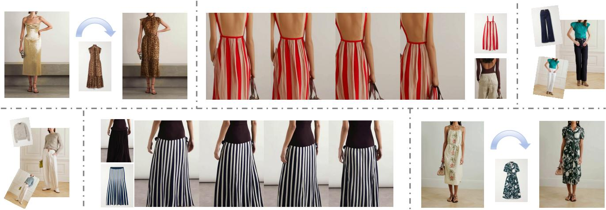  
Figure 1: TexTailor generates high-fidelity video virtual try-on results with temporally consistent motion while preserving garment textures, patterns, and local structures across diverse poses and viewpoints.

We conduct extensive experiments on multiple video virtual try-on benchmarks, including the high-resolution Eevee benchmark. The results demonstrate that TexTailor achieves competitive performance in garment detail preservation, temporal consistency, and overall video quality.

Our contributions can be summarized as follows:

• We propose TexTailor, a high-fidelity video virtual try-on framework that efectively preserves both global garment appearance and fine-grained local details while maintaining temporal consistency across generated videos.

• We propose a dynamic garment conditioning mechanism that calibrates garment feature injection strength across denoising timesteps while integrating customized 3D positional encodings to guarantee rigorous garmentto-video alignment, thereby ensuring precise and continuous preservation of complex garment textures.

• Extensive experiments on multiple video virtual try-on benchmarks demonstrate that TexTailor consistently improves garment fidelity, temporal consistency, and highresolution generation quality compared with existing approaches.

## Related Work

## Video Generation

Recent advances in difusion models and Transformers have led to significant progress in video generation. Representative approaches such as AnimateDif (Guo et al. 2023), Tune-A-Video (Wu et al. 2023), Dreamix (Molad et al. 2023), Make-A-Video (Singer et al. 2022), and KVPO (Zhang et al. 2026a) have demonstrated strong capabilities in generating temporally coherent and visually realistic video sequences by modeling both spatial appearance and motion dynamics. More recent methods further improve video realism through stronger temporal attention, reference-guided generation, or motion-specific modules, enabling more stable synthesis across frames (Lai and Vedaldi 2025; Deng et al. 2025; Hong et al. 2025; Zhang et al. 2025; Hu et al. 2026b).

Despite these achievements, video virtual try-on remains substantially more challenging than general-purpose video generation (Guo et al. 2023). In addition to maintaining temporal consistency, a try-on model must faithfully preserve garment-specific attributes, such as texture, patterns, material properties, and fine structural details, while also ensuring plausible interaction between clothing and human motion. Therefore, directly applying generic video generation models to virtual try-on is often insuficient, and task-specific garment modeling and conditioning mechanisms are required.

## Video Virtual Try-On

Compared with image-based virtual try-on (Zhu et al. 2023; Gou et al. 2023; Cui et al. 2025; Kim et al. 2024; Shim, Chung, and Heo 2024; Zhou et al. 2025b; Sai et al. 2026), video virtual try-on provides a more realistic and practical user experience by presenting garments under dynamic motion and changing viewpoints (Chen et al. 2025; Wei et al. 2025; Kang et al. 2024; Pan et al. 2025; Zuo et al. 2025; Li et al. 2025a; Zheng et al. 2024a; Chang et al. 2025). Early video virtual try-on methods mainly focused on improving temporal coherence through warping, blending, and opticalflow-based smoothing (Dong et al. 2019a). With the rapid development of difusion-based generative models, recent approaches have increasingly adopted DiT-based architectures for this task (Chong et al. 2025; Chen et al. 2025; Li et al. 2025b). ViViD (Fang et al. 2024) extends image diffusion models to video try-on by introducing temporal modeling modules and garment encoding. WildVidFit (He et al. 2024) employs controllable difusion to improve video try-on generation, while RealVVT (Li et al. 2025c) emphasizes photorealistic and temporally stable synthesis in dynamic scenes. More recently, CatV2TON (Chong et al. 2025) and Magic-TryOn (Li et al. 2025b) adopt DiT-based backbones to unify spatial and temporal modeling for video virtual try-on. Recent concurrent works further explore broader VVT settings, including dynamic camera trajectories (Sun et al. 2026), interactive human-garment manipulation (Zheng et al. 2026), unified fashion generation (Yang et al. 2026), and multiobject video try-on (Xia et al. 2026).

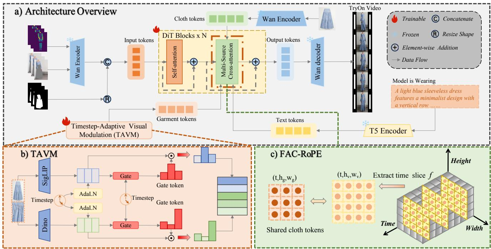  
Figure 2: Overview of TexTailor. (a) A DiT backbone integrates structural input, text token, visual token, and garment latent token through MCAI for video try-on generation. (b) TAVM modulates visual features with timestep-adaptive token-wise gating. (c) FAC-RoPE assigns frame-aligned temporal coordinates to static garment latent tokens, preserving native 3D RoPE while establishing stable garment-to-video spatial correspondence.

Although existing video virtual try-on methods have achieved promising results, most are developed on relatively low-resolution datasets, such as ViViD (Fang et al. 2024) and VVT (Dong et al. 2019b). As a result, they mainly focus on coarse garment transfer and often struggle to preserve fine-grained details in high-resolution scenarios. Beyond resolution limitations, existing methods also inject garment visual features statically throughout denoising, leaving stageadaptive fine-grained conditioning underexplored even on benchmarks such as Eevee (Zeng et al. 2025). In contrast, our method dynamically modulates individual garment visual tokens based on their representations and the current denoising timestep, emphasizing coarse structural cues at early stages and progressively focusing on fine-grained textures and patterns at later stages.

## Method

Our method is built upon a pretrained Difusion Transformer for high-fidelity video virtual try-on. Given a person video, clothing-agnostic masks, pose representations, and garment reference images, TexTailor generates try-on videos with temporal consistency and fine-grained garment details. To efectively utilize these heterogeneous conditions, we introduce Timestep-Adaptive Visual Modulation (TAVM) for adaptive garment feature modulation, Frame-Aligned 3D Garment Cross-RoPE (FAC-RoPE) for spatial garment-video alignment, and Multi-Source Cross-Attention Injection (MCAI) for disentangled condition integration. The overall framework of TexTailor is shown in Fig. 2.

## Preliminary

Our framework is built upon a pretrained latent video Diffusion Transformer trained with a Rectified Flow objective (Lipman et al. 2022). Given a video clip $V \in \mathbb { R } ^ { T \times H \times W \times 3 }$ we first encode it into a latent representation:

$$
z _ { 0 } = \mathcal { E } ( V ) \in \mathbb { R } ^ { f \times c \times h \times w } ,\tag{1}
$$

where $\mathcal { E }$ denotes the encoder of a variational autoencoder (VAE), and the corresponding decoder is denoted by D. Following the flow matching formulation, a latent trajectory is constructed by linearly interpolating between the clean latent $z _ { \mathrm { 0 } }$ and a Gaussian prior sample $\epsilon \sim \mathcal { N } ( 0 , I )$

$$
z _ { t } = ( 1 - t ) z _ { 0 } + t \epsilon , \qquad t \in [ 0 , 1 ] .\tag{2}
$$

This interpolation defines a constant target velocity field $u _ { t } =$ $\epsilon - z _ { 0 } . \mathrm { ~ A ~ }$ video DiT backbone $\epsilon _ { \theta }$ is trained to predict this target flow conditioned on the current latent $z _ { t } ,$ the timestep

t, and the conditioning information c. The training objective is formulated as:

$$
\mathcal { L } _ { \mathrm { F M } } = \mathbb { E } _ { t , z _ { 0 } , \epsilon } \left[ w ( t ) \left| \left| \epsilon _ { \theta } ( z _ { t } , t , c ) - u _ { t } \right| \right| _ { 2 } ^ { 2 } \right] ,\tag{3}
$$

where $w ( t )$ is a timestep-dependent weighting function.

In our setting, the conditioning information c consists of two parts: a structural condition and a garment condition. The structural condition includes the person video, pose video, agnostic video, and clothing mask, which together provide motion and spatial guidance for try-on generation. The garment condition is derived from available garment reference images, which are encoded into visual representations containing garment structure and fine-grained details.

## Timestep-Adaptive Visual Modulation

Given garment reference images, we first extract complementary visual token sequences using SigLIP 2 and DINOv3 (Tschannen et al. 2025; Siméoni et al. 2025). We introduce Timestep-Adaptive Visual Modulation (TAVM) to provide adaptive garment visual guidance throughout the denoising process. For each visual stream, TAVM applies timestepconditioned AdaLN (Peebles and Xie 2023) to adapt visual features, producing modulated tokens $\hat { X } = \{ \hat { x } _ { i } \} _ { i = 1 } ^ { N } .$ A timestep-aware token-wise gate is then applied to reweight the modulated visual tokens:

$$
g _ { i } = \mathcal { G } ( \hat { x } _ { i } , e _ { t } ) ,\tag{4}
$$

where $e _ { t }$ denotes the timestep embedding, G represents the gating function, and $g _ { i }$ indicates the contribution weight of the i-th visual token. The visual tokens are then reweighted by the predicted gate weights:

$$
\tilde { x } _ { i } = g _ { i } \cdot \hat { x } _ { i } .\tag{5}
$$

By jointly conditioning feature modulation and token-wise gating on the denoising timestep, TAVM adaptively allocates garment visual information throughout generation, facilitating coarse-to-fine garment reconstruction. The resulting SigLIP and DINO tokens are concatenated to form the visual condition, which is injected into the DiT backbone through multi-source cross-attention.

## Frame-Aligned 3D Garment Cross-RoPE

Garment and video latents both preserve regular spatial grids, making it possible to explicitly model their spatial positional relationship. In the native DiT backbone, each video token is encoded by 3D RoPE using its spatiotemporal coordinate $( f , h , w )$ . Garment latents are derived from a static reference image, preserving spatial positions $( h _ { g } , w _ { g } )$ . A straightforward extension to 3D is to assign them a fixed temporal coordinate, such as $f = 0 ,$ . For a video query at frame ${ \bar { f } } ,$ this creates an artificial temporal ofset $f - 0$ from the garment key, although the garment condition itself is static and shared across all frames. To address this issue, we propose Frame-Aligned 3D Garment Cross-RoPE (FAC-RoPE). For a video query at frame f, FAC-RoPE assigns the corresponding garment keys the same temporal coordinate $f ,$ extending their coordinates from $( h _ { g } , w _ { g } )$ to $( f , h _ { g } , w _ { g } )$ . The 3D RoPE is then applied as

$$
\begin{array} { r } { \widehat { Q } _ { v } ^ { f } = \operatorname { R o P E } _ { 3 D } ( Q _ { v } ^ { f } ; f , h , w ) , } \end{array}\tag{6}
$$

$$
\begin{array} { r } { \widehat { K } _ { g } ^ { f } = \operatorname { R o P E } _ { 3 D } ( K _ { g } ; f , h _ { g } , w _ { g } ) . } \end{array}\tag{7}
$$

By assigning the same frame coordinate to the video query and garment key, FAC-RoPE preserves the native 3D spatiotemporal encoding of the video query while establishing frame-aligned positional correspondence with the garment key. This design enables garment conditioning to exploit spatial correspondence without introducing artificial temporal positional bias, thereby improving local alignment and cross-frame texture consistency.

## Multi-Source Cross-Attention Injection

Given the modulated visual tokens, we propose Multi-Source Cross-Attention Injection (MCAI) to integrate heterogeneous conditioning signals into the DiT backbone. MCAI decomposes the conditioning space into three complementary sources: text semantics, modulated visual features, and garment latent tokens, which are injected through parallel cross-attention branches during the denoising process. Each condition branch is independently projected and attended, allowing diferent modalities to preserve their own semantic characteristics while contributing complementary information to the generation process. Compared with directly concatenating heterogeneous conditions into a shared token sequence, the disentangled multi-branch design reduces crossmodal interference and enables more efective utilization of garment-related cues.

## Training Objective

In addition to the standard flow-matching objective, we introduce a mask-aware loss to emphasize garment regions during training. Since garment regions are critical to visual quality in video virtual try-on, treating all spatial locations equally may weaken supervision on clothing-related areas. We therefore reweight the flow-matching objective using the mask video M to provide stronger optimization signals for garment regions while maintaining the original generation objective. Following Eq. 3, the mask-aware term is defined as:

$$
\mathcal { L } _ { \mathrm { m a s k } } = \mathbb { E } _ { t , z _ { 0 } , \epsilon } \left[ w ( t ) \| M \odot ( \epsilon _ { \theta } ( z _ { t } , t , c ) - u _ { t } ) \| _ { 2 } ^ { 2 } \right] .\tag{8}
$$

The final objective is

$$
\mathcal { L } = \mathcal { L } _ { \mathrm { F M } } + \lambda \mathcal { L } _ { \mathrm { m a s k } } ,\tag{9}
$$

where λ controls the strength of mask-aware supervision.

## Experiments

## Experimental Setup

Datasets. We use the Eevee dataset (Zeng et al. 2025) as the primary dataset for training and evaluation, as it provides high-resolution videos and diverse garment references suitable for evaluating fine-grained garment preservation. Compared with conventional video virtual try-on datasets such as ViViD (Fang et al. 2024) and VVT (Dong et al. 2019b), Eevee provides videos at 1088 × 816 resolution and garment images at 2400 × 1800, enabling more comprehensive evaluation of garment appearance, textures, and local details. It covers three garment categories, including upper-body garments, lower-body garments, and dresses, with 4492, 2308, and 1564 training samples, and 500, 250, and 250 test samples, respectively. We report quantitative comparisons on both the Eevee dataset and the ViViD dataset to evaluate performance under both high-resolution and conventional video virtual try-on settings. More results under other evaluation settings are provided in the supplementary material.

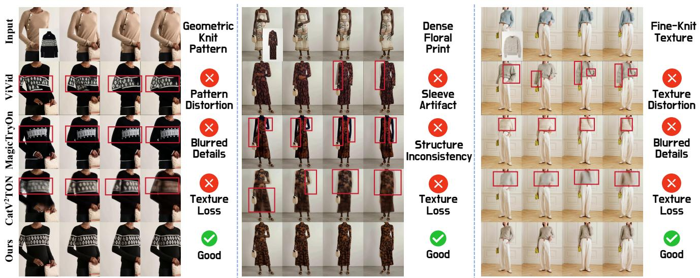

Figure 3: Qualitative comparison on the high-resolution Eevee benchmark. Compared with existing methods, TexTailor better preserves garment textures, patterns, and local structures while maintaining temporally coherent appearance across frames.
<table><tr><td rowspan="2">Method</td><td colspan="3">Full-shot</td><td colspan="3">Close-up</td><td rowspan="2">GPU Mem.</td><td rowspan="2">Time</td></tr><tr><td>VFID_R↓</td><td>VFID_I↓</td><td>VGID ↑</td><td>VFID_R↓</td><td>VFID_I↓</td><td>VGID ↑</td></tr><tr><td>ViViD (Fang et al. 2024)</td><td>0.565</td><td>12.859</td><td>0.514</td><td>1.253</td><td>12.665</td><td>0.533</td><td>72.21G</td><td>348.96s</td></tr><tr><td>MagicTryOn (Li et al. 2025b)</td><td>0.187</td><td>9.783</td><td>0.512</td><td>0.752</td><td>11.285</td><td>0.538</td><td>69.54G</td><td>589.73s</td></tr><tr><td>CatV²TON (Chong et al. 2025)</td><td>0.751</td><td>9.086</td><td>0.520</td><td>0.673</td><td>11.935</td><td>0.522</td><td>40.18G</td><td>357.21s</td></tr><tr><td>TexTailor</td><td>0.149</td><td>8.872</td><td>0.531</td><td>0.489</td><td>10.917</td><td>0.543</td><td>30.32G</td><td>230.72s</td></tr></table>

Table 1: Quantitative comparison on the Eevee benchmark at (1088 × 816). We report results under both full-shot and close-up settings, together with GPU memory usage and inference time. The best and second-best results are highlighted in bold and underline, respectively.

Evaluation settings and metrics. We evaluate our method under both paired and unpaired settings. In the paired setting, the input garment is the same as the garment worn in the reference video. In the unpaired setting, the input garment difers from the one originally worn by the person, which better reflects practical virtual try-on applications. We report SSIM (Wang et al. 2004), LPIPS (Zhang et al. 2018), VFID-I3D (VFID ), VFID-ResNeXt (VFID ) (Unterthiner et al. 2018), and VGID (Zeng et al. 2025). SSIM and LPIPS measure reconstruction quality in the paired setting. The two VFID variants, computed with I3D (Carreira and Zisserman 2017) and ResNeXt (Xie et al. 2017) backbones, evaluate video fidelity and temporal consistency. VGID measures garment-region semantic consistency using DINOv2 (Oquab et al. 2023) features, which provides an additional evaluation of garment identity preservation and fine-grained appearance consistency. All metrics are reported in the paired setting, while only VFIDI, VFIDR, and VGID are reported in the unpaired setting.

Implementation details. TexTailor is built upon the pretrained Wan2.2-Fun-5B-InP (Wan et al. 2025) video difusion transformer. During training, we apply LoRA (Hu et al. 2021) to the query projections of both self-attention and crossattention layers in the DiT backbone. The newly introduced modules, including TAVM, FAC-RoPE related projections, and MCAI branches, are fully fine-tuned to adapt the pretrained model for video virtual try-on. Training is performed in two stages. The model is first trained at a lower resolution for stable adaptation and then fine-tuned at 1088 × 816 resolution to improve high-resolution garment detail preservation. Each training sample contains 49 video frames. All experiments were conducted on 4 NVIDIA A100 (80GB) GPUs. During inference, all experiments use 25 denoising steps. The same inference configuration is adopted for all compared methods to ensure a fair evaluation.

<table><tr><td>Method</td><td>VFIDp</td><td>VFIDrR</td><td>SSIM ↑</td><td>LPIPS↓</td><td>VFIDI↓</td><td>VFIDR</td><td>GPU Mem.</td><td>Time</td></tr><tr><td>ViViD (Fang et al. 2024)</td><td>17.1847</td><td>0.6382</td><td>0.8041</td><td>0.1216</td><td>21.6925</td><td>0.8347</td><td>62.59G</td><td>204.183s</td></tr><tr><td>CatV²TON (Chong et al. 2025)</td><td>13.4821</td><td>0.2876</td><td>0.8742</td><td>0.0647</td><td>19.3846</td><td>0.5179</td><td>27.66G</td><td>209.127s</td></tr><tr><td>MagicTryOn (Li et al. 2025b)</td><td>8.3165</td><td>0.2298</td><td>0.9024</td><td>0.0598</td><td>14.6032</td><td>0.3137</td><td>51.51G</td><td>345.271s</td></tr><tr><td>TexTailor</td><td>7.9428</td><td>0.2645</td><td>0.9017</td><td>0.0619</td><td>13.8754</td><td>0.2861</td><td>25.32G</td><td>196.852s</td></tr></table>

Table 2: Quantitative comparison on the ViViD benchmark. We report paired and unpaired evaluation metrics, together with GPU memory usage and inference time. The best and second-best results are highlighted in bold and underline, respectively.
<table><tr><td>Setting</td><td>Metric</td><td> $\mathrm { w } / \mathrm { o }$  TAVM-S</td><td>w/o TAVM-D</td><td>w/o TAVM-G</td><td> $\mathrm { w } / \mathrm { o }$  TAVM</td><td> $\mathrm { w } / \mathrm { o }$  FAC</td><td> $\mathrm { w } / \mathrm { o }$ </td><td> $\mathrm { w } / \mathrm { o }$  MCAI-T MCAI-G</td><td> $\mathrm { w } / \mathrm { o }$  Mask</td><td>Full Model</td></tr><tr><td>Full-shot</td><td>VFIDR↓ VFIDI↓</td><td>0.184 9.512</td><td>0.181 9.463</td><td>0.176 9.382</td><td>0.224 10.024</td><td>0.207 9.781</td><td>0.179 9.427</td><td>0.201 9.694</td><td>0.198 9.821</td><td>0.149 8.872</td></tr><tr><td></td><td>VGID ↑ VFIDR↓</td><td>0.520 0.551</td><td>0.521 0.543</td><td>0.522 0.535</td><td>0.512 0.612</td><td>0.515 0.581</td><td>0.523 0.529</td><td>0.516 0.568</td><td>0.517 0.592</td><td>0.531 0.489</td></tr><tr><td>Close-up</td><td>VFIDI↓ VGID ↑</td><td>11.612 0.542</td><td>11.534 0.535</td><td>11.462 0.526</td><td>12.146 0.514</td><td>11.873 0.539</td><td>11.421 0.527</td><td>11.754 0.540</td><td>11.982 0.538</td><td>10.917 0.543</td></tr></table>

Table 3: Ablation study on the Eevee benchmark. We evaluate the contribution of each component in TexTailor.

## Quantitative Comparison

We evaluate TexTailor on both the Eevee and ViViD datasets and compare with representative video virtual try-on methods, including ViViD (Fang et al. 2024), MagicTryOn (Li et al. 2025b), and CatV2TON (Chong et al. 2025). Quantitative results on the high-resolution Eevee setting at 1088×816 and the ViViD dataset are reported in Table 1 and Table 2, respectively. These two benchmarks evaluate TexTailor under both high-resolution garment preservation and conventional video virtual try-on scenarios. On the Eevee dataset, TexTailor achieves competitive performance under both full-shot and close-up settings. The improvements in VFIDI, VFIDR, and VGID demonstrate that TexTailor efectively preserves fine-grained garment details in challenging high-resolution close-up scenarios, while maintaining high video fidelity and temporal consistency. Results on the ViViD dataset further verify its generalization ability under conventional video virtual try-on settings. Moreover, TexTailor achieves lower GPU memory consumption and faster inference speed compared with existing methods.

## Qualitative Comparison

Fig. 3 presents qualitative comparisons between TexTailor and existing video virtual try-on methods. The examples cover diverse garment categories and challenging cases with complex textures, patterns, and local structures under various poses and viewpoints. Compared with competing methods, TexTailor produces more faithful garment details and more coherent temporal appearance across diferent motion sequences. Existing methods often preserve the coarse garment silhouette but struggle to maintain local details, where texture distortion, pattern blurring, and local misalignment become more visible in high-resolution scenarios with complex garment structures. In contrast, TexTailor better retains fine-grained garment attributes such as collars and textures, while maintaining more stable appearance across frames.

This demonstrates that the proposed conditioning strategy effectively improves both spatial garment fidelity and temporal consistency in challenging video scenarios. More qualitative comparisons are presented in the supplementary material.

## Ablation Study

To validate the efectiveness of each proposed component, we conduct comprehensive ablation studies on the highresolution Eevee dataset. Quantitative results are reported in Table 3. We investigate four key designs of TexTailor: TAVM, FAC-RoPE, MCAI, and the mask-aware loss. Overall, removing any component leads to performance degradation, demonstrating that each design addresses a specific challenge in high-fidelity video virtual try-on.

Efectiveness of TAVM. TAVM is designed to dynamically adjust garment visual guidance by leveraging complementary representations across diferent denoising stages. To investigate the contribution of visual representations and timestepaware modulation, we construct several variants. Specifically, we remove individual visual streams to investigate the contribution of complementary garment representations, resulting in w/o TAVM-S and w/o TAVM-D for removing the SigLIP2 and DINOv3 branches, respectively. We further remove the timestep-aware token-wise gating mechanism (w/o TAVM-G) to evaluate the importance of adaptive visual selection during denoising. Finally, we remove the entire TAVM module to assess the overall contribution of timestep-adaptive visual modulation. As shown in Table 3, removing either visual stream results in performance degradation, demonstrating that SigLIP2 and DINOv3 provide complementary visual representations. Moreover, the degradation of w/o TAVM-G verifies that timestep-aware visual selection is crucial for progressively refining garment appearance during the denoising process. To further understand how TAVM dynamically adjusts garment guidance during denoising, we visualize the timestep-wise token gating behavior in Fig. 4. The gate activation maps reveal that TAVM gradually shifts its emphasis from coarse garment structures to fine-grained patterns and textures during denoising. The token evolution curves further demonstrate that structure-related regions receive stronger activation in early stages, while detail-related regions gradually gain higher importance during later refinement stages. These observations verify that TAVM performs stage-adaptive visual selection rather than uniformly injecting garment features throughout the denoising process.

(b) Representative Token Regions  
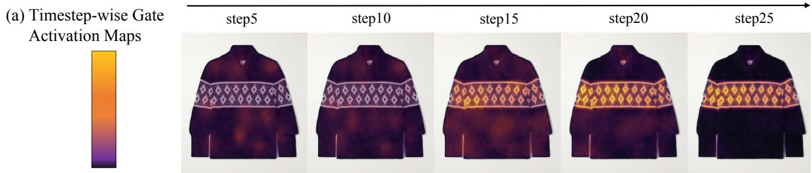

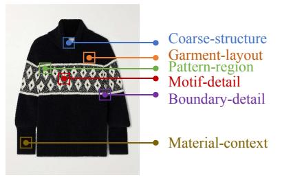

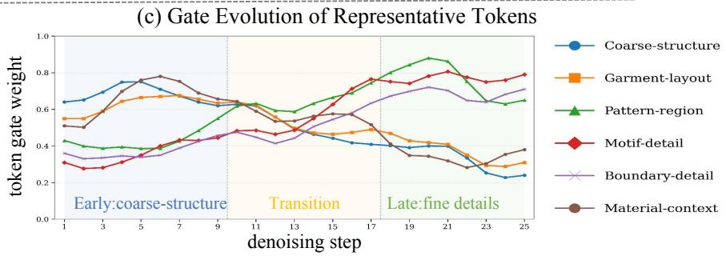  
Figure 4: Visualization of timestep-wise token gating in TAVM. (a) Gate activation maps across diferent denoising steps. (b) Representative token regions selected from the garment reference. (c) Gate evolution curves of the selected token regions in (b). TAVM progressively shifts its emphasis from coarse garment structure to fine-grained local details during denoising.

Efectiveness of FAC-RoPE. FAC-RoPE is introduced to establish explicit spatial correspondence between static garment representations and dynamic video latents. To evaluate the importance of garment-video positional alignment, we remove the frame-aligned positional encoding while keeping the garment latent conditioning unchanged, denoted as w/o FAC. As shown in Table 3, removing FAC-RoPE leads to noticeable performance degradation. Without frame-aligned positional encoding, garment tokens lack consistent spatial anchors with video tokens, making it dificult to maintain accurate garment-region alignment during generation. This demonstrates that explicit positional correspondence is essential for preserving local garment structures and improving temporal consistency across frames.

Efectiveness of MCAI. MCAI is designed to reduce interference among heterogeneous conditioning signals by independently injecting diferent information sources through disentangled cross-attention branches. To evaluate the contribution of diferent condition sources, we remove the text branch and garment latent branch, denoted as w/o MCAI-T and w/o MCAI-G, respectively. As shown in Table 3, removing either branch leads to performance degradation, demonstrating that semantic guidance and spatially aligned garment features provide complementary information for high-fidelity try-on generation.

Efectiveness of Mask-Aware Loss. Mask-aware loss is introduced to provide stronger supervision on garment regions, where visual fidelity is critical for video virtual try-on. To evaluate its contribution, we remove the mask-aware loss during training, denoted as w/o mask. As shown in Table 3, the performance degradation demonstrates that garment-regionfocused supervision provides more efective optimization signals for reconstructing local textures, complex patterns, and subtle garment structures.

## Conclusion

In this paper, we propose TexTailor, a high-fidelity video virtual try-on framework for fine-grained garment preservation in high-resolution video generation. TexTailor introduces timestep-adaptive visual modulation to dynamically utilize garment visual representations across denoising stages, frame-aligned 3D garment Cross-RoPE to establish stable garment-to-video positional correspondence, and multi-source cross-attention injection to reduce interference among heterogeneous conditions. Extensive experiments on multiple video virtual try-on benchmarks, including the highresolution Eevee benchmark, demonstrate that TexTailor better preserves local garment details. These results highlight the importance of adaptive and spatially aligned garment conditioning for high-fidelity video virtual try-on. We hope TexTailor can provide a useful direction for future research on fine-grained garment modeling.

## References

Carreira, J.; and Zisserman, A. 2017. Quo vadis, action recognition? a new model and the kinetics dataset. In proceedings of the IEEE Conference on Computer Vision and Pattern Recognition, 6299–6308.

Chang, T.; Chen, X.; Wei, Z.; Zhang, X.; Chen, Q.; Luo, W.; Song, P.; and Yang, X. 2025. PEMF-VTO: Point-Enhanced Video Virtual Try-on via Mask-free Paradigm. IEEE Transactions on Consumer Electronics.

Chen, J.-K.; Bansal, A.; Vo, M. P.; and Wang, Y.-X. 2025. Dress&Dance: Dress up and Dance as You Like It-Technical Preview. arXiv preprint arXiv:2508.21070.

Choi, Y.; Kwak, S.; Lee, K.; Choi, H.; and Shin, J. 2024. Improving difusion models for authentic virtual try-on in the wild. In European Conference on Computer Vision, 206– 235. Springer.

Chong, Z.; Dong, X.; Li, H.; Zhang, S.; Zhang, W.; Zhang, X.; Zhao, H.; Jiang, D.; and Liang, X. 2024. Catvton: Concatenation is all you need for virtual try-on with difusion models. arXiv preprint arXiv:2407.15886.

Chong, Z.; Zhang, W.; Zhang, S.; Zheng, J.; Dong, X.; Li, H.; Wu, Y.; Jiang, D.; and Liang, X. 2025. Catv2ton: Taming difusion transformers for vision-based virtual try-on with temporal concatenation. arXiv preprint arXiv:2501.11325.

Cui, A.; Mahajan, J.; Shah, V.; Gomathinayagam, P.; Liu, C.; and Lazebnik, S. 2025. Street tryon: Learning in-the-wild virtual try-on from unpaired person images. In Proceedings of the Winter Conference on Applications of Computer Vision, 1414–1423.

Deng, Y.; Yin, Y.; Guo, X.; Wang, Y.; Fang, J. Z.; Yuan, S.; Yang, Y.; Wang, A.; Liu, B.; Huang, H.; et al. 2025. MAGREF: Masked Guidance for Any-Reference Video Generation with Subject Disentanglement. arXiv preprint arXiv:2505.23742.

Dong, H.; Liang, X.; Shen, X.; Wang, B.; Lai, H.; Zhu, J.; Hu, Z.; and Yin, J. 2019a. Towards multi-pose guided virtual tryon network. In Proceedings of the IEEE/CVF international conference on computer vision, 9026–9035.

Dong, H.; Liang, X.; Shen, X.; Wu, B.; Chen, B.-C.; and Yin, J. 2019b. Fw-gan: Flow-navigated warping gan for video virtual try-on. In Proceedings ofthe IEEE/CVF international conference on computer vision, 1161–1170.

Fang, Z.; Zhai, W.; Su, A.; Song, H.; Zhu, K.; Wang, M.; Chen, Y.; Liu, Z.; Cao, Y.; and Zha, Z.-J. 2024. Vivid: Video virtual try-on using difusion models. arXiv preprint arXiv:2405.11794.

Gou, J.; Sun, S.; Zhang, J.; Si, J.; Qian, C.; and Zhang, L. 2023. Taming the power of difusion models for high-quality virtual try-on with appearance flow. In Proceedings of the 31st ACM international conference on multimedia, 7599– 7607.

Guo, H.; Zeng, B.; Song, Y.; Zhang, W.; Liu, J.; and Zhang, C. 2025. Any2anytryon: Leveraging adaptive position embeddings for versatile virtual clothing tasks. In Proceedings of the IEEE/CVF International Conference on Computer Vision, 19085–19096.

Guo, Y.; Yang, C.; Rao, A.; Liang, Z.; Wang, Y.; Qiao, Y.; Agrawala, M.; Lin, D.; and Dai, B. 2023. Animatedif: Animate your personalized text-to-image difusion models without specific tuning. arXiv preprint arXiv:2307.04725.

He, Z.; Chen, P.; Wang, G.; Li, G.; Torr, P. H.; and Lin, L. 2024. Wildvidfit: Video virtual try-on in the wild via imagebased controlled difusion models. In European Conference on Computer Vision, 123–139. Springer.

Hong, F.-T.; Xu, Z.; Zhou, Z.; Zhou, J.; Li, X.; Lin, Q.; Lu, Q.; and Xu, D. 2025. Audio-visual controlled video difusion with masked selective state spaces modeling for natural talking head generation. In 2025 IEEE/CVF International Conference on Computer Vision (ICCV), 12549–12558. IEEE.

Hu, B.; Ma, Y.; Huang, J.; Zhang, Z.; Wu, H.; Zhang, R.; Li, Y.; Wang, Z.; Zhang, Y.; Tseng, C.-M.; et al. 2026a. PhysEditWorld: A Large-Scale Dataset Toward Physics-Editable World Models. arXiv preprint arXiv:2606.26694.

Hu, B.; Qi, Z.; Huang, G.; Xu, Z.; Zhang, R.; Ye, C.; Zhou, J.; Li, X.; and Wang, J. 2026b. Identity-Consistent Video Generation under Large Facial-Angle Variations. arXiv preprint arXiv:2603.21299.

Hu, E. J.; Shen, Y.; Wallis, P.; Allen-Zhu, Z.; Li, Y.; Wang, S.; Wang, L.; and Chen, W. 2021. Lora: Low-rank adaptation of large language models. arXiv preprint arXiv:2106.09685.

Hu, S.; Chen, C.; Zhu, J.; Wu, J.; Chu, X.; and Li, X. 2026c. Embedding-perturbed exploration preference optimization for flow models. arXiv preprint arXiv:2605.15803.

Huang, J.; Dong, X.; Song, W.; Chong, Z.; Tang, Z.; Zhou, J.; Cheng, Y.; Chen, L.; Li, H.; Yan, Y.; et al. 2026. Consistentid: Portrait generation with multimodal fine-grained identity preserving. IEEE Transactions on Pattern Analysis and Machine Intelligence.

Kang, D.-S.; Baek, E.; Son, S.; Lee, Y.; Gong, T.; and Kim, H.-S. 2024. Mirror: Towards generalizable on-device video virtual try-on for mobile shopping. Proceedings of the ACM on Interactive, Mobile, Wearable and Ubiquitous Technologies, 7(4): 1–27.

Karras, J.; Li, Y.; Liu, N.; Zhu, L.; Yoo, I.; Lugmayr, A.; Lee, C.; and Kemelmacher-Shlizerman, I. 2024. Fashion-vdm: Video difusion model for virtual try-on. In SIGGRAPH Asia 2024 Conference Papers, 1–11.

Kim, J.; Gu, G.; Park, M.; Park, S.; and Choo, J. 2024. Stableviton: Learning semantic correspondence with latent difusion model for virtual try-on. In Proceedings of the IEEE/CVF conference on computer vision and pattern recognition, 8176–8185.

Kong, W.; Tian, Q.; Zhang, Z.; Min, R.; Dai, Z.; Zhou, J.; Xiong, J.; Li, X.; Wu, B.; Zhang, J.; et al. 2024. Hunyuanvideo: A systematic framework for large video generative models. arXiv preprint arXiv:2412.03603.

Lai, Z.; and Vedaldi, A. 2025. Tracktention: Leveraging point tracking to attend videos faster and better. In Proceedings of the Computer Vision and Pattern Recognition Conference, 22809–22819.

Li, D.; Zhong, W.; Yu, W.; Pan, Y.; Zhang, D.; Yao, T.; Han, J.; and Mei, T. 2025a. Pursuing temporal-consistent video

virtual try-on via dynamic pose interaction. In Proceedings ofthe Computer Vision and Pattern Recognition Conference, 22648–22657.

Li, G.; Zheng, S.; Zhang, H.; Chen, J.; Luan, J.; Ou, B.; Zhao, L.; Li, B.; and Jiang, P.-T. 2025b. MagicTryOn: Harnessing Difusion Transformer for Garment-Preserving Video Virtual Try-on. arXiv preprint arXiv:2505.21325.

Li, S.; Jiang, Z.; Zhou, J.; Liu, Z.; Chi, X.; and Wang, H. 2025c. Realvvt: Towards photorealistic video virtual try-on via spatio-temporal consistency. arXiv preprint arXiv:2501.08682.

Lipman, Y.; Chen, R. T.; Ben-Hamu, H.; Nickel, M.; and Le, M. 2022. Flow matching for generative modeling. arXiv preprint arXiv:2210.02747.

Liu, Z.; Xu, Z.; Shu, S.; Zhou, J.; Zhang, R.; Tang, Z.; and Li, X. 2025. Controllable layer decomposition for reversible multi-layer image generation. arXiv preprint arXiv:2511.16249.

Molad, E.; Horwitz, E.; Valevski, D.; Acha, A. R.; Matias, Y.; Pritch, Y.; Leviathan, Y.; and Hoshen, Y. 2023. Dreamix: Video difusion models are general video editors. arXiv preprint arXiv:2302.01329.

Oquab, M.; Darcet, T.; Moutakanni, T.; Vo, H.; Szafraniec, M.; Khalidov, V.; Fernandez, P.; Haziza, D.; Massa, F.; El-Nouby, A.; et al. 2023. Dinov2: Learning robust visual features without supervision. arXiv preprint arXiv:2304.07193.

Pan, Y.; He, Q.; Wang, L.; Peng, B.; and Chi, M. 2025. Once Is Enough: Lightweight DiT-Based Video Virtual Try-On via One-Time Garment Appearance Injection. arXiv preprint arXiv:2510.07654.

Peebles, W.; and Xie, S. 2023. Scalable difusion models with transformers. In Proceedings ofthe IEEE/CVF international conference on computer vision, 4195–4205.

Sai, X.; Madadi, M.; Escalera, S.; and Xu, Y. 2026. ModaFlow: Modality-Aware Flow Matching for High-Fidelity Virtual Try-On. arXiv preprint arXiv:2606.27773.

Shim, S.-H.; Chung, J.; and Heo, J.-P. 2024. Towards squeezing-averse virtual try-on via sequential deformation. In Proceedings of the AAAI Conference on Artificial Intelligence, 4856–4863.

Siméoni, O.; Vo, H. V.; Seitzer, M.; Baldassarre, F.; Oquab, M.; Jose, C.; Khalidov, V.; Szafraniec, M.; Yi, S.; Ramamonjisoa, M.; et al. 2025. Dinov3. arXiv preprint arXiv:2508.10104.

Singer, U.; Polyak, A.; Hayes, T.; Yin, X.; An, J.; Zhang, S.; Hu, Q.; Yang, H.; Ashual, O.; Gafni, O.; et al. 2022. Make-a-video: Text-to-video generation without text-video data. arXiv preprint arXiv:2209.14792.

Sun, H.; Yan, H.; Chen, M.; Song, Q.; Li, Y.; Cao, J.; Lan, J.; Zhu, X.; Zheng, B.; and Tang, S. 2026. TryOnCrafter: Unleashing Camera Trajectories for Realistic Video Virtual Try-on via a Renderable 4D Try-on Proxy. arXiv preprint arXiv:2606.26092.

Tschannen, M.; Gritsenko, A.; Wang, X.; Naeem, M. F.; Alabdulmohsin, I.; Parthasarathy, N.; Evans, T.; Beyer, L.; Xia, Y.; Mustafa, B.; et al. 2025. Siglip 2: Multilingual

vision-language encoders with improved semantic understanding, localization, and dense features. arXiv preprint arXiv:2502.14786.

Unterthiner, T.; Van Steenkiste, S.; Kurach, K.; Marinier, R.; Michalski, M.; and Gelly, S. 2018. Towards accurate generative models of video: A new metric & challenges. arXiv preprint arXiv:1812.01717.

Wan, T.; Wang, A.; Ai, B.; Wen, B.; Mao, C.; Xie, C.-W.; Chen, D.; Yu, F.; Zhao, H.; Yang, J.; et al. 2025. Wan: Open and advanced large-scale video generative models. arXiv preprint arXiv:2503.20314.

Wang, R.; Guo, H.; Liu, J.; Li, H.; Zhao, H.; Tang, X.; Hu, Y.; Tang, H.; and Li, P. 2024. Stablegarment: Garmentcentric generation via stable difusion. arXiv preprint arXiv:2403.10783.

Wang, Z.; Bovik, A. C.; Sheikh, H. R.; and Simoncelli, E. P. 2004. Image quality assessment: from error visibility to structural similarity. IEEE transactions on image processing, 13(4): 600–612.

Wei, M.; Yu, C.; Zhou, J.; and Wang, F. 2025. 3dv-ton: Textured 3d-guided consistent video try-on via difusion models. In Proceedings of the 33rd ACM International Conference on Multimedia, 9345–9354.

Wu, J. Z.; Ge, Y.; Wang, X.; Lei, S. W.; Gu, Y.; Shi, Y.; Hsu, W.; Shan, Y.; Qie, X.; and Shou, M. Z. 2023. Tune-a-video: One-shot tuning of image difusion models for text-to-video generation. In Proceedings of the IEEE/CVF international conference on computer vision, 7623–7633.

Xia, C.; Jia, C.; Luo, M.; Dang, Z.; Shen, X.; and Ping, B. 2026. OmniTryOn: Video Try-On Anything at Once! arXiv preprint arXiv:2606.08514.

Xie, S.; Girshick, R.; Dollár, P.; Tu, Z.; and He, K. 2017. Aggregated residual transformations for deep neural networks. In Proceedings of the IEEE conference on computer vision and pattern recognition, 1492–1500.

Xu, Y.; Gu, T.; Chen, W.; and Chen, A. 2025a. Ootdifusion: Outfitting fusion based latent difusion for controllable virtual try-on. In Proceedings of the AAAI Conference on Artificial Intelligence, 8996–9004.

Xu, Z.; Yu, Z.; Zhou, Z.; Zhou, J.; Jin, X.; Hong, F.-T.; Ji, X.; Zhu, J.; Cai, C.; Tang, S.; et al. 2025b. Hunyuanportrait: Implicit condition control for enhanced portrait animation. In 2025 IEEE/CVFConference on Computer Vision and Pattern Recognition (CVPR), 15909–15919. IEEE.

Yang, Z.; Li, Y.; He, S.; Li, X.; Xu, Y.; Dong, J.; and Du, Y. 2025. Omnivton: Training-free universal virtual try-on. In Proceedings of the IEEE/CVF International Conference on Computer Vision, 16702–16711.

Yang, Z.; Tai, Y.; Zhan, J.; Zheng, Y.; Qian, J.; and Yang, J. 2026. OrthoTryOn: Geometric Orthogonalization for Conflict-Free Unified Fashion Generation. arXiv preprint arXiv:2606.27880.

Zeng, J.; Bai, Y.; Chen, R.; Zhang, X.; Sun, L.; Jin, D.; Xu, R.; Zhang, N.; Song, D.; and Chu, X. 2025. Eevee: Towards Close-up High-resolution Video-based Virtual Tryon. arXiv:2511.18957.

Zhang, R.; Cong, K.; Zhou, J.; Zhong, Z.; Xu, Z.; Mao, S.; Liu, W.; and Li, X. 2026a. Kvpo: Ode-native grpo for autoregressive video alignment via kv semantic exploration. arXiv preprint arXiv:2605.14278.

Zhang, R.; Isola, P.; Efros, A. A.; Shechtman, E.; and Wang, O. 2018. The unreasonable efectiveness of deep features as a perceptual metric. In Proceedings of the IEEE conference on computer vision and pattern recognition, 586–595.

Zhang, R.; Zhang, M.; Zhou, J.; Guo, Z.; Liu, X.; Xu, Z.; Zhong, Z.; Yan, P.; Luo, H.; and Li, X. 2025. Mind-v: Hierarchical video generation for long-horizon robotic manipulation with rl-based physical alignment. arXiv e-prints, arXiv–2512.

Zhang, R.; Zhou, J.; Xu, Z.; Liu, Z.; Huang, J.; Zhang, M.; Sun, Y.; and Li, X. 2026b. Zo3t: Zero-shot 3d-aware trajectory-guided image-to-video generation via test-time training. In Proceedings of the AAAI Conference on Artificial Intelligence, volume 40, 12708–12716.

Zhang, X.; Lin, E.; Li, X.; Luo, Y.; Kampfmeyer, M.; Dong, X.; and Liang, X. 2024. Mmtryon: Multi-modal multireference control for high-quality fashion generation. arXiv preprint arXiv:2405.00448.

Zheng, J.; Wang, J.; Zhao, F.; Zhang, X.; and Liang, X. 2024a. Dynamic try-on: Taming video virtual try-on with dynamic attention mechanism. arXiv preprint arXiv:2412.09822.

Zheng, J.; Xu, Z.; Chen, M.; Wang, J.; Lan, J.; Zhu, X.; Zhang, K.; Zheng, B.; and Liang, X. 2026. iTryOn: Mastering Interactive Video Virtual Try-On with Spatial-Semantic Guidance. arXiv preprint arXiv:2605.21431.

Zheng, J.; Zhao, F.; Xu, Y.; Dong, X.; and Liang, X. 2024b. Viton-dit: Learning in-the-wild video try-on from human dance videos via difusion transformers. arXiv preprint arXiv:2405.18326.

Zhou, J.; Li, J.; Xu, Z.; Li, H.; Cheng, Y.; Hong, F.-T.; Lin, Q.; Lu, Q.; and Liang, X. 2025a. Fireedit: Finegrained instruction-based image editing via region-aware vision language model. In 2025 IEEE/CVF Conference on Computer Vision and Pattern Recognition (CVPR), 13093– 13103. IEEE.

Zhou, Z.; Liu, S.; Han, X.; Liu, H.; Ng, K. W.; Xie, T.; Cong, Y.; Li, H.; Xu, M.; Pérez-Rúa, J.-M.; et al. 2025b. Learning flow fields in attention for controllable person image generation. In Proceedings of the Computer Vision and Pattern Recognition Conference, 2491–2501.

Zhu, L.; Yang, D.; Zhu, T.; Reda, F.; Chan, W.; Saharia, C.; Norouzi, M.; and Kemelmacher-Shlizerman, I. 2023. Tryondifusion: A tale of two unets. In Proceedings of the IEEE/CVF conference on computer vision and pattern recognition, 4606–4615.

Zuo, T.; Huang, Z.; Ning, S.; Lin, E.; Liang, C.; Zheng, Z.; Jiang, J.; Zhang, Y.; Gao, M.; and Dong, X. 2025. Dreamvvt: Mastering realistic video virtual try-on in the wild via a stage-wise difusion transformer framework. arXiv preprint arXiv:2508.02807.

## Supplementary Materials

This supplementary material provides additional experimental results and analysis to complement the main paper. We first present more quantitative results under diferent resolutions, followed by additional qualitative comparisons and visualization results. We then provide further ablation analysis and discuss the limitations of the current framework.

## More Quantitative Results

We provide additional quantitative results on the Eevee dataset at 832×624 resolution in Table 4. TexTailor maintains competitive performance under both full-shot and close-up settings. Moreover, our method achieves lower GPU memory consumption and faster inference speed than existing approaches.

## More Qualitative Results

We provide additional qualitative results in Figs. 5-9. These examples further demonstrate the efectiveness of TexTailor in preserving garment appearance, fine-grained details, and temporal consistency across diverse garment categories and video scenarios.

## More Ablation Results

We provide additional qualitative ablation results in Fig. 10. Removing individual components leads to visible degradation in garment fidelity, including texture distortion, blurred local details, and weaker pattern preservation. The full model achieves more faithful garment reconstruction by efectively combining adaptive visual modulation, frame-aligned garment conditioning, multi-source condition injection, and mask-aware supervision. These qualitative results are consistent with the quantitative ablation results, further validating the efectiveness of each component in TexTailor.

## Discussion and Limitations

Although TexTailor achieves strong performance in garment preservation and temporal consistency, several limitations remain. First, our framework still relies on auxiliary inputs, including pose information, agnostic representations, and video masks, resulting in a relatively complex preprocessing pipeline. Developing a fully mask-free video virtual try-on framework with minimal external guidance remains an interesting direction for future research. Second, challenging scenarios involving large deformation, heavy occlusion, or significant viewpoint changes remain dificult due to the inherent complexity of video generation. Future work will explore more eficient and simplified conditioning pipelines, as well as improve robustness under complex motion and viewpoint variations for high-resolution video virtual tryon.

<table><tr><td rowspan="2">Method</td><td colspan="3">Full-shot</td><td colspan="3">Close-up</td><td rowspan="2">GPU Mem.</td><td rowspan="2">Time</td></tr><tr><td> $\operatorname { V F I D } _ { R } \downarrow$ </td><td> $\operatorname { V F I D } _ { I } \downarrow$ </td><td>VGID ↑</td><td> $\operatorname { V F I D } _ { R } \downarrow$ </td><td> $\operatorname { V F I D } _ { I } \downarrow$ </td><td>VGID↑</td></tr><tr><td>ViViD (Fang et al. 2024)</td><td>0.389</td><td>12.194</td><td>0.506</td><td>0.936</td><td>12.198</td><td>0.533</td><td>64.12G</td><td>216.734s</td></tr><tr><td>MagicTryOn (Li et al. 2025b)</td><td>0.161</td><td>9.865</td><td>0.520</td><td>0.595</td><td>11.262</td><td>0.534</td><td>49.83G</td><td>333.906s</td></tr><tr><td>CatV2TON (Chong et al. 2025)</td><td>0.746</td><td>9.141</td><td>0.518</td><td>0.632</td><td>11.847</td><td>0.538</td><td>29.14G</td><td>197.683s</td></tr><tr><td>TexTailor</td><td>0.153</td><td>8.996</td><td>0.529</td><td>0.497</td><td>11.071</td><td>0.553</td><td>24.87G</td><td>188.436s</td></tr></table>

Table 4: Quantitative comparison on the Eevee benchmark at 832 × 624. We report results under both full-shot and close-up settings, together with GPU memory usage and inference time. The best and second-best results are highlighted in bold and underline, respectively.

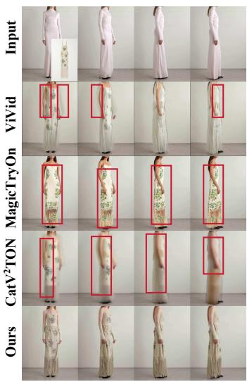

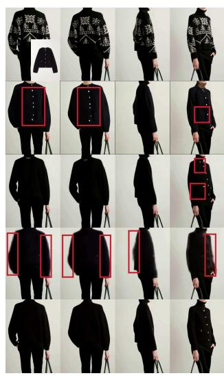

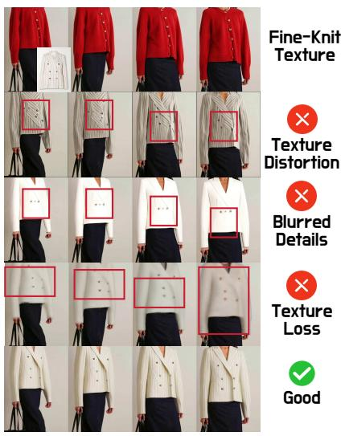  
Figure 5: Qualitative comparison on challenging garment cases. TexTailor better preserves complex patterns, fine-grained textures, and local garment structures compared with existing methods.

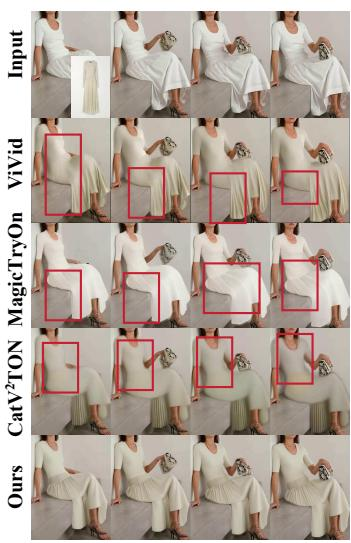

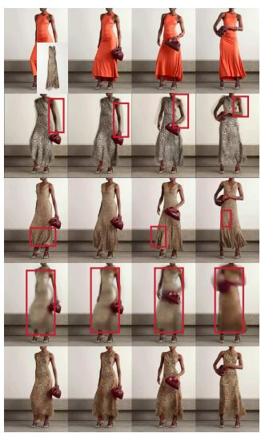

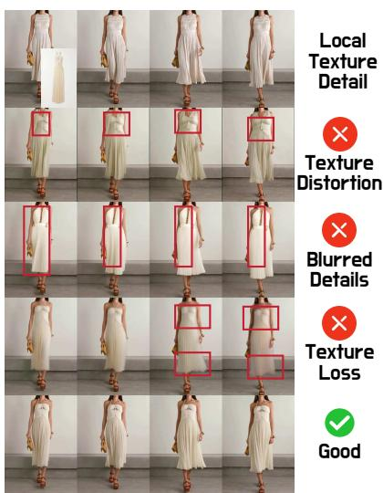  
Figure 6: Qualitative comparison across diverse garment categories. TexTailor achieves more faithful garment transfer with improved texture preservation and structural consistency.

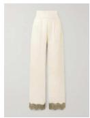

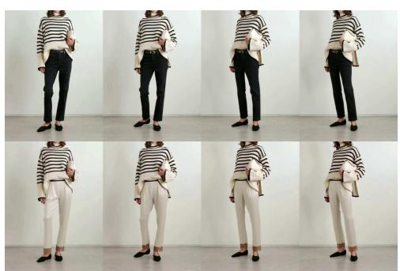

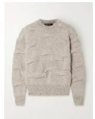

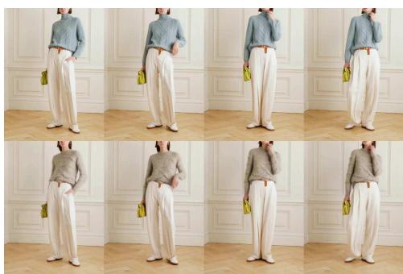

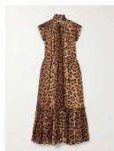

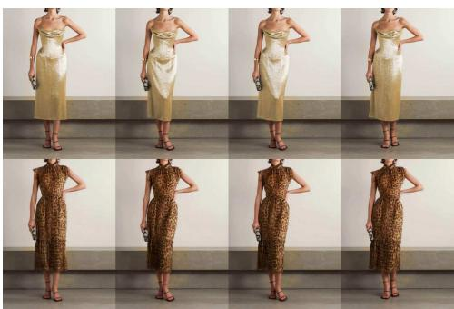

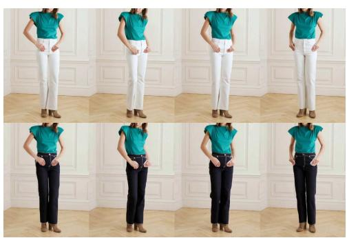

Figure 7: Additional results of TexTailor on diverse garment categories, including sweaters, dresses, and pants.  
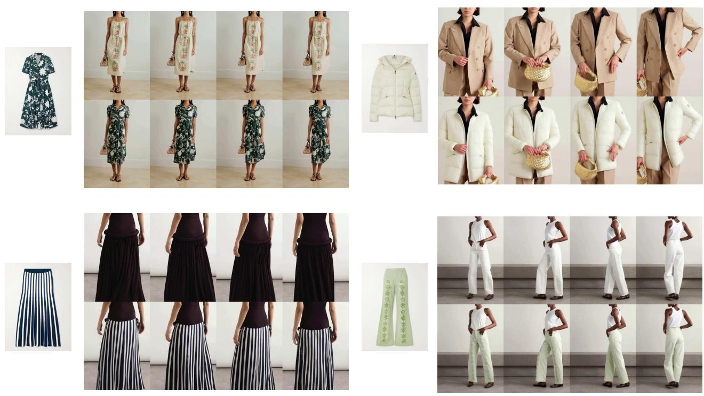  
Figure 8: Additional results of TexTailor on garments with complex patterns and structures.

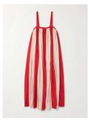

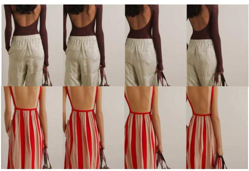

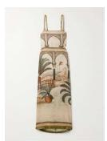

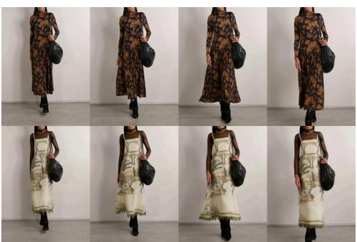

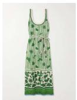

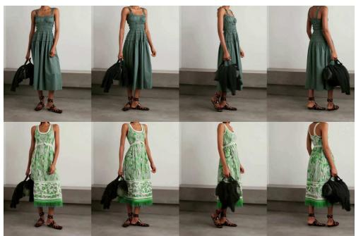

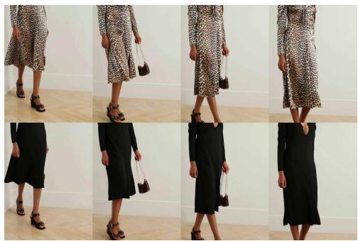  
Figure 9: Additional results demonstrating the generalization ability of TexTailor across various garments and motion scenarios.

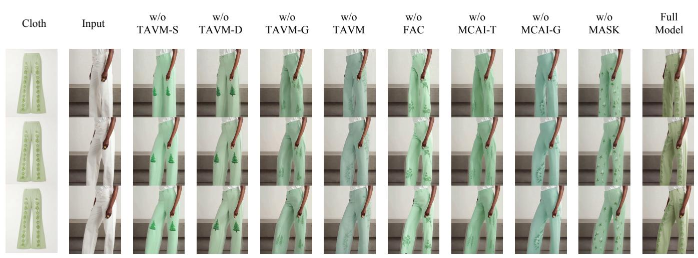  
Figure 10: Qualitative ablation comparison of TexTailor. Removing individual components leads to degraded garment fidelity, including texture distortion, blurred details, and weaker pattern preservation. The full model achieves the most faithful garment appearance.