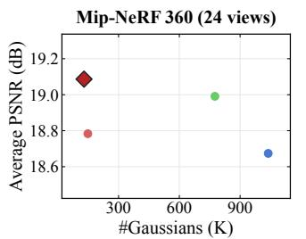
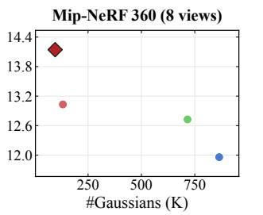
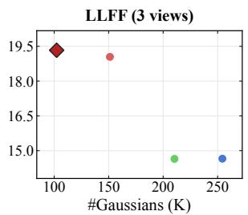
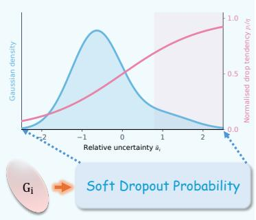
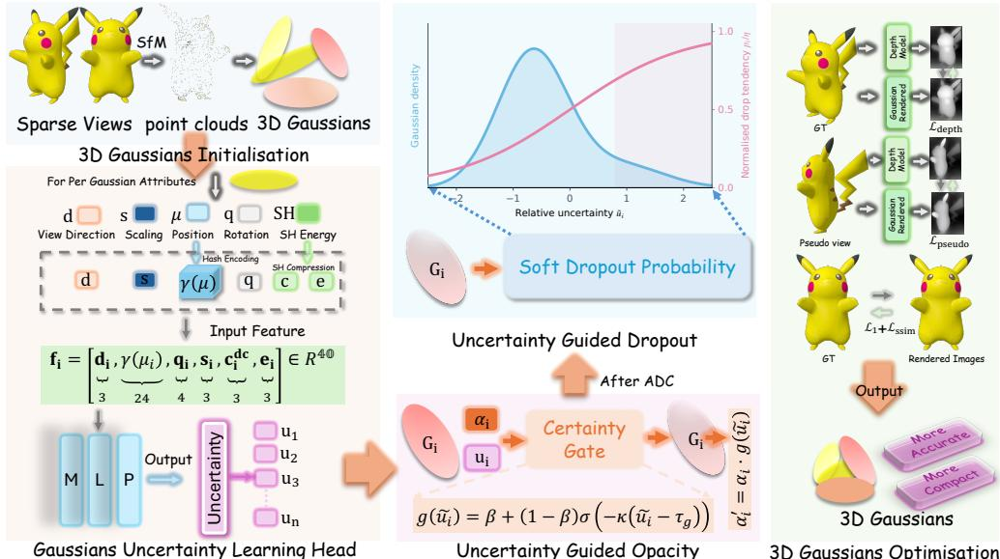
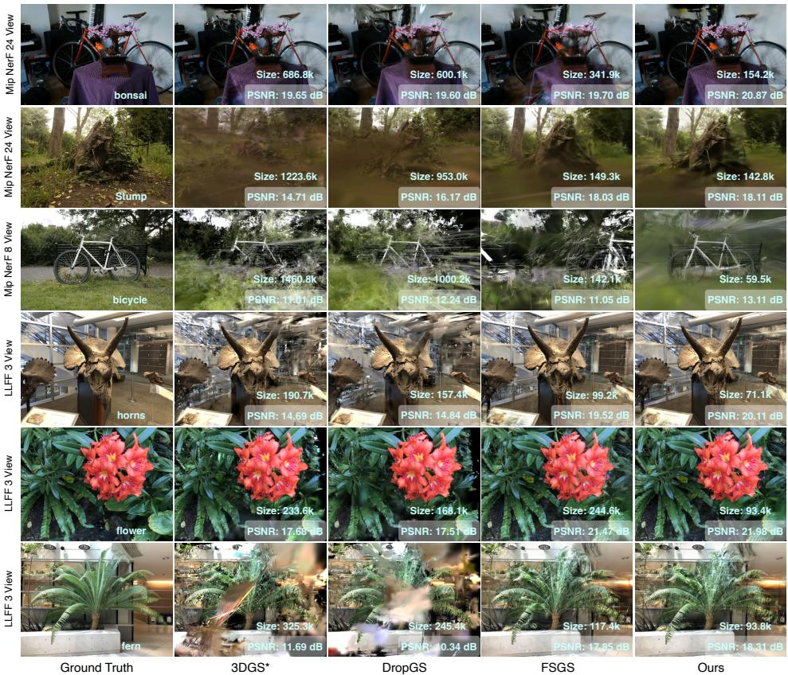
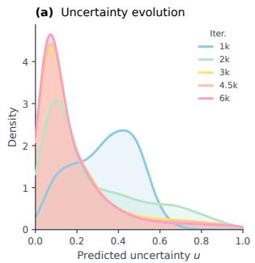
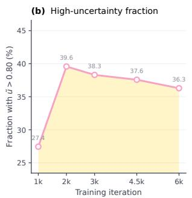
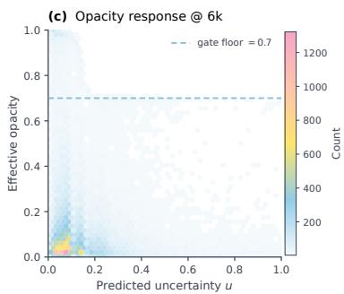
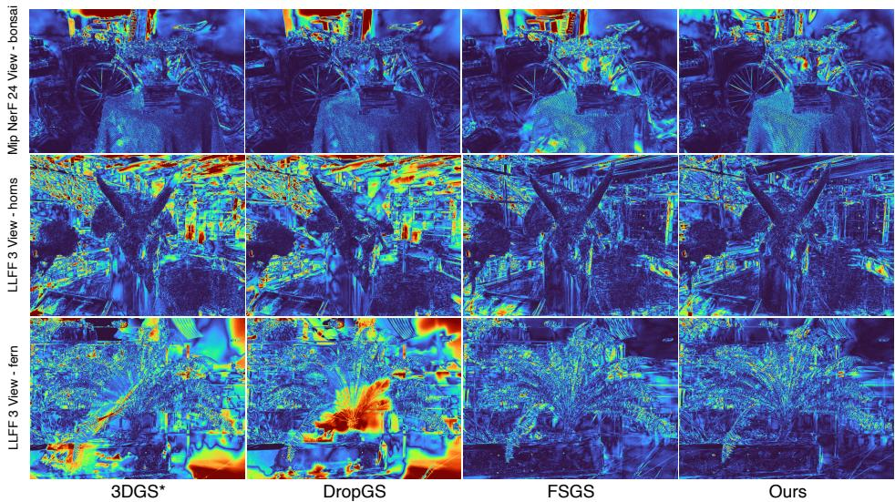

# UGOD: Uncertainty-Guided Opacity and Dropout for Sparse-View 3D Gaussian Splatting

Zhihao Guo1, Peng Wang2\*, Zidong Chen3, Xiangyu Kong4, Yan Lyu5, Guanyu Gao6, Chenghao Qian7, Ziyang Wang8, Xinqi Fan1, Liangxiu Han1

1Manchester Metropolitan University, Manchester, United Kingdom. 2\*University of Surrey, Guildford, United Kingdom. 3Imperial College London, London, United Kingdom. 4University of Exeter, Exeter, United Kingdom. 5Southeast University, Nanjing, China. 6Nanjing University of Science and Technology, Nanjing, China. 7University of Leeds, Leeds, United Kingdom. 8Aston University, Birmingham, United Kingdom.

\*Corresponding author(s). E-mail(s): pw0038@surrey.ac.uk;

## Abstract

Sparse-view 3D Gaussian Splatting is prone to overfitting because limited observations leave many Gaussian primitives weakly constrained, yet their contributions are still accumulated through alpha blending. Without uncertainty estimation, the renderer cannot distinguish unreliable primitives from well-constrained ones, allowing their erroneous contributions to corrupt novelview synthesis. We introduce UGOD, an uncertainty-guided framework that estimates a view-dependent uncertainty score for each Gaussian and uses it to regulate its rendering contribution. A lightweight uncertainty head conditioned on Gaussian attributes and viewing direction predicts this score, which then drives a diferentiable opacity-modulation mechanism that attenuates high-uncertainty primitives before compositing. During training, a detached soft-dropout branch applies an uncertainty-controlled continuous keep mask to discourage the model from relying on poorly constrained Gaussians and thereby reduce overfitting. Crucially, detaching the uncertainty score prevents gradients from this stochastic regulariser from biasing or collapsing the uncertainty prediction. Experiments on Mip-NeRF 360 and LLFF show that UGOD improves sparse-view novel-view

synthesis while producing more compact Gaussian representations than the compared methods. These results demonstrate that Gaussian uncertainty provides an efective rendering-time control for sparse-view reconstruction.

Keywords: 3D Gaussian Splatting, sparse-view reconstruction, uncertainty estimation, novel-view synthesis, opacity modulation

## 1 Introduction

Novel-view synthesis (NVS) from a limited collection of images underpins applications such as digital twinning, augmented and virtual reality, and embodied robotics. 3D Gaussian Splatting (3DGS) [7] has become an attractive representation for this task because it models a scene as anisotropic Gaussian primitives that are projected, depth sorted, and alpha blended by a rasteriser. This design avoids the dense ray sampling required by many neural volumetric methods and enables high-quality real-time rendering. Its efectiveness nevertheless depends on the coverage, geometric accuracy, and appearance diversity provided by the input views.

These requirements are dificult to satisfy in sparse-view reconstruction. Structurefrom-Motion (SfM) initialisation may contain only a limited set of points, and those points can be incomplete or inaccurate in weakly textured, occluded, or poorly observed regions. The resulting Gaussians receive insuficient multi-view supervision while their geometry and appearance are optimised to explain the available images. Critically, the failure is not only that geometry is incomplete: once a primitive is instantiated, its learned opacity still determines how strongly it participates in alpha blending. An unreliable Gaussian can therefore retain a large compositing weight, inject incorrect colour into the accumulated ray, and reinforce a training-view explanation that does not generalise. In other words, sparse-view artefacts arise when weakly supported contributions are repeatedly accumulated by the renderer.

Existing sparse-view 3DGS methods address this setting from complementary but incomplete angles. Depth or other priors strengthen geometric guidance when image evidence is scarce [20, 28]. Densification increases point coverage when SfM initialisation is too sparse [28]. Dropout- and pruning-based regularisers reduce the influence of selected primitives during optimisation [13, 24]. These strategies improve reconstruction by adding constraints, growing the representation, or filtering primitives in training. They do not, however, explicitly ask whether a Gaussian is uncertain for the current viewing direction at the moment of alpha compositing, nor do they provide a diferentiable mechanism that attenuates its opacity before blending.

This gap motivates a rendering-centric view of sparse-view overfitting. Opacity in conventional 3DGS is a view-agnostic scalar jointly optimised with geometry and appearance; it does not separate a reliable contribution from one that is poorly supported under the present camera. Because alpha blending is order-dependent and cumulative, even a modest number of over-confident primitives can dominate transmittance and colour along a ray. Regulating opacity with a view-dependent uncertainty signal therefore targets the failure mode directly: unreliable contributions should be down-weighted before they enter compositing, rather than corrected only indirectly through denser geometry or training-time dropping.

  
Fig. 1: Average PSNR and final-Gaussian reduction versus 3DGS\* across MiP-NeRF 360 (24/8 views) and LLFF (3 views). Higher is better on every axis; UGOD leads all six.

We introduce UGOD, an uncertainty-guided framework for sparse-view 3DGS. UGOD employs a lightweight per-Gaussian uncertainty head conditioned on Gaussian attributes, appearance features, and viewing direction to estimate view-dependent uncertainty. The normalised uncertainty drives a diferentiable opacity-modulation function that attenuates the learned opacity of high-uncertainty primitives before compositing. During training, a detached soft-dropout branch converts the same uncertainty signal into a continuous keep mask, further regularising ambiguous Gaussians without allowing this stochastic branch to distort the uncertainty prediction.

Across Mip-NeRF 360 and LLFF sparse-view protocols, UGOD improves novelview synthesis quality while producing compact Gaussian representations. These results indicate that regulating compositing with view-dependent uncertainty is an efective strategy for sparse-view 3DGS. The contributions of this work are:

• A view-dependent, per-Gaussian uncertainty prediction that combines Gaussian attributes, appearance features, and viewing direction.

• A diferentiable opacity gate that attenuates high-uncertainty primitives before alpha compositing.

• A gradient-detached soft-dropout regulariser that uses the learned uncertainty to stochastically regularise high-uncertainty primitives during training without directly updating the uncertainty estimator.

• Extensive sparse-view evaluation demonstrating improved novel-view synthesis quality and Gaussian compactness relative to the compared methods.

## 2 Related Work

## 2.1 3D Gaussian Splatting

3D Gaussian Splatting (3DGS) represents a scene using anisotropic Gaussian primitives that are projected, depth sorted, and alpha blended in image space. Its rasterisation-based renderer provides an attractive balance between rendering quality and speed [7]. Subsequent studies have improved camera handling [23], point management, and rendering quality [2, 21, 26]. These advances make 3DGS efective for dense-view reconstruction, but the quality of the learned representation remains sensitive to the coverage and accuracy of its initialisation and observations.

Opacity is optimised jointly with geometry and appearance, and determines each primitive’s contribution to alpha compositing. Existing studies have examined the distinction between opacity and extinction formulations [3], volumetrically consistent Gaussian rasterisation [16], and material-aware opacity modelling [22]. These directions improve the physical interpretation or material dependence of the rendering weights. They do not, however, explicitly ask whether a Gaussian is reliable for a particular viewing direction when the scene is weakly constrained. Our work instead models this view-dependent uncertainty and uses it to regulate opacity before alpha compositing.

## 2.2 Sparse 3DGS Reconstruction

Sparse-view reconstruction has been addressed through complementary forms of geometric guidance and regularisation. Prior-based methods use additional signals to compensate for incomplete image observations: SparseGS [20], for example, combines depth and difusion priors. A second line of work seeks to improve the representation before or during optimisation. FSGS [28] densifies the initial point cloud to increase geometric coverage, which is particularly helpful when SfM produces only a small or unevenly distributed set of initial points. PcdGS [27] similarly densifies sparse SfM initialisation using mask and monocular-depth cues, whereas LiDAR-3DGS [10] supplements it with an aligned LiDAR point cloud when an additional sensor is available. These approaches improve the geometric support available at initialisation.

Other approaches act directly on the Gaussian primitives. DropGaussian [13] regularises optimisation by selectively dropping Gaussians, allowing the remaining primitives to receive more informative gradients. CoR-GS [24] uses geometric and rendering disagreement to guide co-pruning and pseudo-view co-regularisation. SuraGS [15] uses surface-aware primitives for few-shot synthesis, while HR-2DGS [17] combines depth and normal regularisation in a 2DGS representation. StruGS [12] instead targets structural consistency through multi-view guidance and depth-balanced optimisation. Together, these methods show that sparse-view performance depends not only on improving initial geometry but also on controlling which primitives are retained and how they contribute during learning. Their regularisation criteria, however, do not provide a view-dependent estimate of each primitive’s uncertainty at the point of rendering. Consequently, the renderer cannot distinguish well-supported primitives from those unreliable in the current view: both are assigned comparable importance during compositing. Under cumulative alpha blending, an unreliable primitive can then incorrectly consume transmittance or occlude reliable evidence, producing view-dependent artefacts in the rendered image.

## 2.3 Uncertainty Estimation in Gaussian Splatting

Recent uncertainty-estimation methods for Gaussian splatting pursue objectives that difer from sparse-view reconstruction control. Stochastic formulations, such as variational multi-scale 3DGS [9], model distributions over Gaussian parameters and estimate uncertainty from the resulting samples. Parameter-space methods instead use information measures: FisherRF [6] derives uncertainty from Fisher information, while POp-GS [19] uses P-optimality for next-best-view selection. PRIMU [5] predicts novel-view uncertainty from primitive-based error and coverage features. These methods principally estimate uncertainty for view selection or uncertainty-map prediction, rather than using it to control the contribution of primitives during reconstruction.

Most closely related, Galappaththige et al. [4] propose a post-hoc predictivephotometric uncertainty method. They freeze a trained 3DGS representation and fit view-dependent per-primitive uncertainty channels to training-view reconstruction residuals using a regularised least-squares objective; the learned channels are rasterised into pixel-wise uncertainty maps. UGOD has a diferent purpose and learning mechanism. We learn the uncertainty head jointly with sparse-view reconstruction from Gaussian attributes and the viewing direction, rather than fitting residuals after training. Its uncertainty is then used online to modulate opacity before alpha compositing and to drive detached soft dropout during training. Consequently, UGOD targets the quality–compactness trade-of of sparse-view reconstruction, whereas post-hoc predictive uncertainty methods preserve a fixed renderer and target uncertainty estimation for downstream decisions.

## 3 Method

## 3.1 Preliminaries

3D Gaussian Splatting. 3DGS initialises a set of anisotropic Gaussians from an SfM point cloud. Each Gaussian is parameterised by its position, rotation, scale, opacity, and appearance. For a spatial location $\mathbf { x } \in \mathbb { R } ^ { 3 }$ , a Gaussian with mean $\pmb { \mu }$ and covariance Σ is

$$
G ( \mathbf { x } ) = \exp \left( - \frac { 1 } { 2 } ( \mathbf { x } - \pmb { \mu } ) ^ { \top } \pmb { \Sigma } ^ { - 1 } ( \mathbf { x } - \pmb { \mu } ) \right) .\tag{1}
$$

Here $\pmb { \mu } \in \mathbb { R } ^ { 3 }$ is the mean and $\pmb { \Sigma } \in \mathbb { R } ^ { 3 \times 3 }$ is a positive semi-definite covariance matrix parameterised as $\pmb { \Sigma } = \mathbf { R } \mathbf { S } \mathbf { S } ^ { \top } \mathbf { R } ^ { \top }$ , where R is an orthogonal rotation matrix and S is a diagonal scale matrix. In the implementation, $\mathbf { R } _ { i }$ is parameterised by a unit quaternion $\mathbf { q } _ { i }$ , and $\mathbf { S } _ { i }$ by a scale vector $\mathbf { s } _ { i }$ . We use these compact per-Gaussian parameterisations below.

The Gaussians are projected to the image plane by splatting-based rasterisation [29]. A first-order approximation of the projection at the Gaussian mean gives the projected covariance

$$
\begin{array} { r } { \pmb { \Sigma } ^ { \prime } = \mathbf { J } \mathbf { W } \pmb { \Sigma } \mathbf { W } ^ { \top } \mathbf { J } ^ { \top } , } \end{array}\tag{2}
$$

where J is the Jacobian of the local projective transformation and W is the view transformation matrix. For pixel coordinate $\mathbf { x } ,$ let $G _ { i } ^ { \mathrm { 2 D } } ( { \bf x } )$ denote the projected footprint

of the i-th Gaussian and $o _ { i } \in ( 0 , 1 )$ its learned opacity. Its screen-space compositing weight and transmittance are

$$
\alpha _ { i } ( { \bf x } ) = o _ { i } G _ { i } ^ { \mathrm { 2 D } } ( { \bf x } ) , \qquad T _ { i } ( { \bf x } ) = \prod _ { j < i } \bigl ( 1 - \alpha _ { j } ( { \bf x } ) \bigr ) ,\tag{3}
$$

where Gaussians are ordered from front to back. The rendered RGB colour is

$$
\mathbf { C } ( \mathbf { x } ) = \sum _ { i = 1 } ^ { n } T _ { i } ( \mathbf { x } ) \alpha _ { i } ( \mathbf { x } ) \mathbf { c } _ { i } .\tag{4}
$$

Opacity in 3DGS. The learned opacity $o _ { i }$ is optimised jointly with the other Gaussian attributes. It determines the screen-space weight $\alpha _ { i }$ in Eq. 3 and influences density control during training: primitives with very low opacity are pruned, while the remaining primitives continue to refine the representation. Under sparse or noisy initialisation, however, this view-independent scalar cannot distinguish a reliably supported contribution from one that is ambiguous for the current camera. The following section introduces view-dependent uncertainty to address this limitation.

## 3.2 Per-Gaussian Uncertainty Prediction

We augment 3D Gaussian Splatting (3DGS) [8] with a lightweight per-Gaussian uncertainty head $\mathcal { M } _ { \theta }$ . The predicted uncertainty serves two coupled but gradient-decoupled roles: (i) a diferentiable opacity-modulation function that attenuates the opacity of high-uncertainty Gaussians and trains the head through the photometric loss, and (ii) a detached, training-only soft dropout that acts as a tail regulariser on the least certain Gaussians. A PSNR-based early-stopping rule freezes the head once it stops helping, so the learned uncertainty stays meaningful and never destabilises the underlying geometry.

## Notation and overview.

For each visible Gaussian $i \in \mathcal { V } .$ , the uncertainty head predicts a raw uncertainty $u _ { i } .$ which is robustly normalised to $\tilde { u } _ { i }$ . We denote by $\breve { u } _ { i }$ the gradient-detached copy of $\tilde { u } _ { i } { : }$ it equals $\tilde { u } _ { i }$ in the forward pass but satisfies $\partial \breve { u } _ { i } / \partial \tilde { u } _ { i } = 0$ during back-propagation. The normalised value drives a diferentiable opacity-modulation factor $g _ { i } .$ , while $\breve { u } _ { i }$ drives a training-only dropout probability $p _ { i }$ and soft keep mask $m _ { i }$ . Thus, the uncertainty pathway is $u _ { i }  \tilde { u } _ { i }  g _ { i }$ and $\breve { u } _ { i }  p _ { i }  m _ { i }$

## 3.2.1 Uncertainty Head: Inputs and Architecture

Each Gaussian $G _ { i }$ carries a mean $\mu _ { i } \in \mathbb { R } ^ { 3 }$ , a rotation quaternion $\mathbf { q } _ { i } \in \mathbb { R } ^ { 4 }$ , an (activated) scale $\mathbf { s } _ { i } \in \mathbb { R } ^ { 3 }$ , a DC colour $\mathbf { c } _ { i } ^ { \mathrm { { d c } } } \in \mathbb { R } ^ { 3 }$ , and higher-order spherical harmonic (SH) coeficients. Concretely, for SH degree D we denote the (non-DC) coeficients as $\{ \mathbf { c } _ { i } ^ { ( \ell ) } \} _ { \ell = 1 } ^ { L }$ with $\mathbf { c } _ { i } ^ { ( \ell ) } \in \mathbb { R } ^ { 3 }$ and $L = D ( D + 2 )$

  
Fig. 2: Overview of UGOD. Sparse input views are reconstructed by SfM and initialise 3D Gaussian primitives (left). For each visible Gaussian, the uncertainty head combines the viewing direction, HashGrid position encoding, geometric attributes, and compressed SH appearance to predict a view-dependent uncertainty $u _ { i }$ (lower left). This score drives two gradient-decoupled mechanisms (centre): normalised uncertainty diferentiably gates opacity before compositing, whereas its detached copy determines the training-only Concrete soft-dropout probability. The resulting Gaussians are jointly optimised using supervised depth, pseudo-view depth, and photometric losses (right). At inference, soft dropout and relative-uncertainty gating are disabled, and deterministic raw-uncertainty opacity modulation is used.

## SH compression.

Directly feeding all SH coeficients to the uncertainty head would introduce a highdimensional, highly correlated appearance input: the uncertainty prediction should depend on how “view-dependent” a Gaussian is, not on the specific orientation of its SH lobes. We therefore keep the DC colour $\mathbf { c } _ { i } ^ { \mathrm { { d c } } }$ unchanged and summarise the remaining SH bands by a per-channel magnitude statistic.

Specifically, we compute a rest-energy vector $\mathbf { e } _ { i } \in \mathbb { R } ^ { 3 }$ by averaging the element-wise absolute values of the non-DC coeficients across all bands:

$$
{ \bf e } _ { i } = \frac { 1 } { L } \sum _ { \ell = 1 } ^ { L } \bigl | { \bf c } _ { i } ^ { ( \ell ) } \bigr | ,\tag{5}
$$

where | · | is applied element-wise to the RGB channels. Intuitively, $\mathbf { e } _ { i }$ measures the overall strength of view-dependent efects per colour channel while discarding directional details. This reduces the SH block from 3L scalars (e.g., 3 × 15 = 45 values for

degree $D = 3 )$ to 3 scalars. Together with the DC colour, we obtain a compact 6-D appearance descriptor $[ \mathbf { c } _ { i } ^ { \mathrm { { d c } } } , \mathbf { e } _ { i } ]$ used as part of the head input.

## Input feature.

Given the camera centre o, we form the unit view direction $\mathbf { d } _ { i } = ( \pmb { \mu } _ { i } - \mathbf { o } ) / \| \pmb { \mu } _ { i } - \mathbf { o } \|$ and a multi-resolution hash encoding $\gamma ( \pmb { \mu } _ { i } ) \in \mathbb { R } ^ { 2 4 }$ of the position. The head input is the 40-dimensional concatenation

$$
\mathbf { f } _ { i } = \left[ \mathbf { d } _ { i } , \gamma ( { \pmb \mu } _ { i } ) , \mathbf { q } _ { i } , \mathbf { s } _ { i } , \mathbf { c } _ { i } ^ { \mathrm { d c } } , \mathbf { e } _ { i } \right] \in \mathbb { R } ^ { 4 0 } .\tag{6}
$$

The respective dimensions of these components are 3, 24, 4, 3, 3, and 3.

## Network.

The position is encoded with a multi-resolution hash grid (6 levels, 4 features/level, base resolution 16, per-level scale 1.5, log hashmap size 15), yielding the $2 4  – \mathrm { D }$ code $\gamma ( \cdot )$ . The 40-D feature is mapped to a scalar logit by a fully fused ML $\mathrm { ~ P ~ } \mathcal { M } _ { \theta } : \mathbb { R } ^ { 4 0 } $ R, where θ denotes its learnable parameters. The MLP has two hidden layers of 32 neurons, each followed by a LeakyReLU activation. Let $\sigma ( x ) = ( 1 + \exp ( - x ) ) ^ { - 1 }$ denote the logistic sigmoid. We use a single-head configuration that emits one viewconditioned uncertainty score per visible Gaussian,

$$
\begin{array} { r l } & { u _ { i } = \sigma \big ( \mathcal { M } _ { \theta } ( \mathbf { f } _ { i } ) \big ) \in ( 0 , 1 ) , } \\ & { u _ { i }  \mathrm { c l i p } \big ( u _ { i } , 1 0 ^ { - 3 } , 1 - 1 0 ^ { - 3 } \big ) . } \end{array}\tag{7}
$$

This score is not a calibrated epistemic-uncertainty estimate: it is learned only through the photometric objective via diferentiable opacity modulation, without an uncertainty target or calibration loss.

We robustly normalise the raw uncertainties over the visible Gaussian set V:

$$
\tilde { u } _ { i } = \mathrm { c l i p } \left( \frac { u _ { i } - \mathrm { m e d } _ { j \in \mathcal { V } } ( u _ { j } ) } { \mathrm { M A D } _ { j \in \mathcal { V } } ( u _ { j } ) + \delta } , [ - c , c ] \right) ,\tag{8}
$$

where med denotes the median, and the median absolute deviation is

$$
\mathrm { M A D } _ { j \in \mathcal { V } } ( u _ { j } ) = \mathrm { m e d } _ { j \in \mathcal { V } } | u _ { j } - \mathrm { m e d } _ { k \in \mathcal { V } } ( u _ { k } ) | .\tag{9}
$$

This robust scale estimate limits the influence of a small number of high-uncertainty Gaussians; $\delta > 0$ prevents division by zero and $c = 2$ bounds the relative uncertainty. Both the opacity-modulation function and the dropout module use $\tilde { u } _ { i }$

## 3.2.2 Uncertainty-Guided Opacity Modulation

We attenuate opacity rather than directly removing Gaussians, so that unreliable primitives contribute less to alpha compositing while still receiving photometric supervision. We map relative uncertainty to a monotonically decreasing, diferentiable

gate:

$$
g _ { i } = \beta + \left( 1 - \beta \right) \sigma \big ( - \kappa ( \widetilde u _ { i } - \tau _ { g } ) \big ) ,\tag{10}
$$

where κ controls the transition sharpness, $\tau _ { g }$ specifies the relative-uncertainty threshold, and $\beta$ is the minimum gate value. Thus, low-uncertainty Gaussians have $g _ { i }$ close to 1 and retain their learned opacity, whereas high-uncertainty Gaussians approach the floor $\beta .$ . The floor prevents modulation alone from fully removing a Gaussian. The gate modulates the learned opacity explicitly as

$$
o _ { i } ^ { \mathrm { g a t e } } = o _ { i } g _ { i } ,\tag{11}
$$

so high uncertainty reduces the primitive’s screen-space alpha and hence its colour and transmittance contribution before compositing. The relative-uncertainty modulation is enabled only after a warm-up of $T _ { g }$ iterations. Before warm-up, and during evaluation, the implementation uses the base raw-uncertainty opacity operation

$$
o _ { i } ^ { \mathrm { r a w } } = ( 1 - u _ { i } ) o _ { i } , \qquad \alpha _ { i } ^ { \mathrm { r a w } } ( { \bf x } ) = o _ { i } ^ { \mathrm { r a w } } G _ { i } ^ { \mathrm { 2 D } } ( { \bf x } ) .\tag{12}
$$

The two formulations are intentionally assigned diferent roles. During optimisation, the relative gate is a distribution-adaptive regulariser: its median–MAD normalisation makes the threshold responsive to the relative reliability of currently visible Gaussians, even as densification and pruning change the scale of predicted uncertainties. The floor β additionally prevents premature removal of primitives and preserves useful gradients. At inference, however, this normalisation would make a Gaussian’s opacity depend on which other primitives happen to be visible in the same view. We therefore replace the training-time relative gate with the raw-uncertainty rule in Eq. 12, which gives each Gaussian a deterministic, per-primitive attenuation independent of population statistics. Thus, relative gating stabilises optimisation, whereas the raw rule provides a well-defined deployed renderer for all reported evaluations. The modulated screenspace weight is

$$
\alpha _ { i } ^ { \mathrm { g a t e } } ( { \bf x } ) = o _ { i } ^ { \mathrm { g a t e } } G _ { i } ^ { \mathrm { 2 D } } ( { \bf x } ) .\tag{13}
$$

Crucially, $\tilde { u } _ { i }$ is not detached on this branch, so the photometric gradient flows through $g _ { i }$ back into $\mathcal { M } _ { \theta } \colon$ this is the sole supervisory signal that teaches the head what “uncertain” means. The relative-uncertainty modulation is used during training after warm-up, evaluation uses Eq. 12.

## Rasterised uncertainty map.

To visualise the learned per-Gaussian uncertainty in image space, we rasterise an uncertainty map U by projecting the predicted values $\{ u _ { i } \}$ with the same α-blending pipeline used for RGB, while keeping the Gaussian geometry fixed. Formally, for a pixel x,

$$
U ( \mathbf { x } ) = \sum _ { i } T _ { i } ( \mathbf { x } ) \alpha _ { i } ( \mathbf { x } ) u _ { i } ,\tag{14}
$$

where $T _ { i }$ and $\alpha _ { i }$ follow the standard 3DGS compositing $\left( \operatorname { E q . 3 } \right)$ ; thus, $U$ uses unmodulated compositing weights and is distinct from the training and inference weights

defined in Supplementary Eq. (11). This map is used only for analysis. During training, opacity is modulated by the relative-uncertainty function after warm-up, whereas soft dropout remains training-only.

## 3.2.3 Detached Soft Dropout (Tail Regulariser)

Opacity modulation and soft dropout have complementary roles. The opacity gate is a deterministic rendering mechanism: on every training view, it continuously downweights an uncertain Gaussian while preserving its contribution and the gradient that learns its uncertainty. This alone does not prevent the representation from repeatedly relying on the same weakly constrained Gaussians. Soft dropout instead acts as a stochastic training-only regulariser: occasionally suppressing these Gaussians forces the remaining, better-supported primitives to explain the observations and reduces co-adaptation to unreliable evidence. Accordingly, it assigns greater regularisation to high-uncertainty Gaussians. The per-Gaussian drop probability uses the gradientdetached uncertainty $\breve { u } _ { i }$ defined above,

$$
p _ { i } = r ( t ) \eta \sigma ( \breve { u } _ { i } - \tau _ { d } ) ,\tag{15}
$$

where η scales the uncertainty influence, $\tau _ { d }$ is a drop threshold, and $r ( t ) = \mathrm { c l i p } ( ( t -$ $T _ { d } ) / R , 0 , 1 )$ is a linear ramp that starts dropout after a fixed warm-up at $T _ { d } = 1 2 0 0$ and reaches its full value over $R = 5 0 0$ iterations. Before applying the logit, we clip $p _ { i } \gets \mathrm { c l i p } ( p _ { i } , \varepsilon _ { p } , 1 - \varepsilon _ { p } )$ with $\varepsilon _ { p } > 0$ . We then convert $p _ { i }$ into a diferentiable concrete keep mask. We first form the perturbed logit

$$
z _ { i } = \mathrm { l o g i t } ( p _ { i } ) + \mathrm { l o g i t } ( \varepsilon _ { i } ) ,
$$

where $\varepsilon _ { i } \sim \mathcal { U } ( \varepsilon _ { p } , 1 - \varepsilon _ { p } )$ is independent uniform noise. The keep mask is then

$$
m _ { i } = \mathrm { c l i p } _ { [ m _ { \mathrm { m i n } } , m _ { \mathrm { m a x } } ] } \bigg [ 1 - \sigma \bigg ( \frac { z _ { i } } { T _ { \mathrm { c o n c } } } \bigg ) \bigg ] ,\tag{16}
$$

where $T _ { \mathrm { c o n c } }$ is the temperature. We apply the mask as $\alpha _ { i } ^ { \mathrm { t r a i n } } ( { \bf x } ) = \alpha _ { i } ^ { \mathrm { g a t e } } ( { \bf x } ) m _ { i }$ This stochastic masking is useful only during optimisation: by requiring the scene to remain explainable under occasional removal of uncertain primitives, it discourages co-adaptation and over-reliance on weakly constrained evidence. At test time, the objective is instead to render the best deterministic estimate of the complete scene. Consequently, we disable dropout and retain every primitive. This does not discard uncertainty: a high score indicates comparatively unreliable, rather than certainly invalid, evidence, so hard removal could eliminate useful detail. Rendering therefore uses $\alpha _ { i } ^ { \mathrm { { r a w } } } ( \mathbf { x } )$ from Eq. 12 to deterministically attenuate each uncertain primitive in proportion to its score, rather than randomly dropping it.

## Gradient flow.

The two mechanisms share one scalar $u _ { i }$ but are deliberately decoupled: the opacitymodulation branch is diferentiable and back-propagates the rendering loss into $\mathcal { M } _ { \theta }$ whereas the dropout branch consumes $\breve { u } _ { i }$ and therefore never reshapes the uncertainty. This prevents the degenerate solution in which the head inflates $u _ { i }$ merely to be dropped, and lets the head learn a photometrically useful uncertainty score while dropout remains a pure regulariser. Because $\breve { u } _ { i }$ is gradient-detached, the dropoutprobability path does not update the uncertainty head; it does not detach the rendered mask from the Gaussian parameters. Consequently, the Concrete mask regularises Gaussian opacity, geometry, and appearance through the rendered photometric loss.

## 3.2.4 Training Objective

Following FSGS [28], Full UGOD adopts DPT-based monocular depth regularisation [14] to stabilise geometry under sparse observations; it is an adopted training component rather than a contribution of UGOD. A frozen DPT-Hybrid estimator predicts a depth prior D once for each training image during dataset loading. Let $\hat { D }$ be the rasterised depth and $\rho ( \cdot , \cdot )$ denote Pearson correlation. To accommodate the scale and sign ambiguity of monocular depth, we use

$$
\begin{array} { r } { \mathcal { L } _ { \mathrm { d e p t h } } = \operatorname* { m i n } \Bigl \{ 1 - \rho ( - D , \hat { D } ) , \phantom { \sum _ { \alpha = 1 } ^ { 3 } } } \\ { 1 - \rho \Bigl ( ( D + 2 0 0 ) ^ { - 1 } , \hat { D } \Bigr ) \Bigr \} . } \end{array}\tag{17}
$$

Between iterations 500 and 5500, we additionally sample pseudo cameras, render RGB and depth, and apply the frozen DPT-Hybrid estimator to the rendered RGB. This provides a pseudo-view depth prior for regularising geometry beyond the observed training views. The pseudo-view depth loss is

$$
\mathcal { L } _ { \mathrm { p s e u d o } } = 1 - \rho \Big ( \hat { D } _ { \mathrm { p } } , - D _ { \mathrm { p } } \Big ) ,\tag{18}
$$

where $D _ { \mathrm { p } }$ is the DPT prediction for the rendered pseudo view and $\hat { D } _ { \mathrm { p } }$ is its rasterised depth. This term is linearly ramped during its first 500 active iterations. DPT is a fixed target: gradients from $\mathcal { L } _ { \mathrm { p s e u d o } }$ flow through the rendered depth, not through the DPT preprocessing path.

The Gaussians and uncertainty head are jointly optimised with

$$
\begin{array} { r l } & { \mathcal { L } = \left( 1 - \lambda \right) \mathcal { L } _ { 1 } + \lambda \left( 1 - \mathrm { S S I M } \right) } \\ & { \qquad + \beta _ { d } ( t ) \mathcal { L } _ { \mathrm { d e p t h } } + \alpha ( t ) \lambda _ { p } \mathcal { L } _ { \mathrm { p s e u d o } } , } \end{array}\tag{19}
$$

where $\lambda ~ = ~ 0 . 2 , ~ \beta _ { d } ( t ) ~ = ~ 0 . 0 5$ through iteration 5500 and 0.001 thereafter, and $\alpha ( t )$ is the pseudo-view ramp. We use $\lambda _ { p } ~ = ~ 0 . 5$ by default and $\lambda _ { p } ~ = ~ 0 . 0 3$ for outdoor MiP-NeRF 360 scenes. The uncertainty head is supervised implicitly through the diferentiable opacity-modulation function in $\operatorname { E q . }$ 10; we use no auxiliary uncertainty-calibration loss in the reported experiments. The head uses its own Adam optimiser (cosine-annealed learning rate), independent of the 3DGS optimiser. We apply validation-based early stopping to the uncertainty head; its criterion and hyper-parameters are provided in the supplementary material.

The complete training and inference procedure is provided in Supplementary Algorithm 1.

## Default hyper-parameters.

The complete uncertainty-head, gating, dropout, and early-stopping settings are reported in Supplementary Table 1.

## 4 Experiments

## 4.1 Experimental Setup

Datasets and protocols. We evaluate sparse-view NVS on MiP-NeRF 360 [1] and LLFF [11]. We follow FSGS [28] for its 24-view MiP-NeRF 360 and 3-view LLFF protocols, and additionally evaluate the more challenging 8-view MiP-NeRF 360 setting. For MiP-NeRF 360, we use the six scenes reported in Supplementary Tables 2 and 3, using predefined disjoint training and evaluation cameras.

For LLFF, we use three COLMAP-reconstructed training views per scene and evaluate on the corresponding held-out views, as detailed in Supplementary Table 4. LLFF images are downsampled by a factor of eight along both spatial dimensions. For MiP-NeRF 360, images wider than 1600 pixels are resized to width 1600 while preserving aspect ratio, whereas smaller images retain their original resolution. These camera splits and image resolutions define our evaluation protocol; consequently, absolute metrics need not match prior reports that use diferent splits or input resolutions.

Implementation. We implement UGOD in PyTorch on an NVIDIA RTX A100 and train all benchmarked methods for 6,000 iterations. The uncertainty head uses the (6, 0, 0, 0) HashGrid configuration selected by the ablation in Table 3; its remaining settings follow Supplementary Table 1. We reset opacity at iterations 2001 and 5001 for 6000-iteration training. The uncertainty head is frozen after two consecutive validation evaluations for which PSNR decreases relative to the preceding evaluation (∆PSNR < ϵ = 0); Gaussian parameters continue to be optimised. In tables and comparison figures only, 3DGS\* denotes the oficial 3DGS baseline evaluated under the same sparse-view protocol. Each table specifies the compared variants: Ours (full) denotes the depth-assisted model with uncertainty-guided soft dropout.

Metrics. We report PSNR, SSIM [18], and LPIPS [25] on held-out views. We additionally report the final Gaussian count and its reduction relative to 3DGS\* and DropGS where available, since sparse-view reconstruction requires a trade-of between rendering quality and representation compactness.

## 4.2 Quantitative Comparison

We quantitatively compare Full UGOD with 3DGS\* [7], DropGS [13], and FSGS [28]. Table 1 first reports scene-averaged results, and Supplementary Tables 2, 3, and 4 provide the corresponding per-scene comparisons.

LLFF. On the more challenging 3-view protocol, Full UGOD achieves the best scene-average PSNR (19.33), SSIM (0.637), and LPIPS (0.245), while using 102,280 Gaussians on average 2.5× fewer than 3DGS\*. It obtains the highest PSNR on six of seven scenes and the smallest representation on six scenes. Orchids is the exception for rendering quality, where FSGS achieves the best PSNR and LPIPS (with tied best SSIM), while on Room FSGS uses fewer Gaussians and achieves the best SSIM and LPIPS. These per-scene results show that the gain remains scene dependent, but is most consistent under severe view sparsity.

Table 1: Scene-average results on LLFF (3 views) and MiP-NeRF 360 (8/24 views). Reduction is relative to 3DGS\*; best and second-best values are bold and underlined.
<table><tr><td>Setting</td><td>Method</td><td>PSNR↑</td><td>SSIM↑</td><td>LPIPS↓</td><td>#Gaussians vs 3DGS*</td><td></td></tr><tr><td rowspan="4">LLFF (3-view)</td><td>3DGS*</td><td>14.6543</td><td>0.4379</td><td>0.3990</td><td>254,350</td><td></td></tr><tr><td>DropGS</td><td>14.6443</td><td>0.4557</td><td>0.3894</td><td>210,414</td><td>1.2×</td></tr><tr><td>FSGS (w/ depth)</td><td>19.0457</td><td>0.6230</td><td>0.2514</td><td>151,173</td><td>1.7×</td></tr><tr><td>Ours (fuli)</td><td></td><td></td><td>19.3300 0.6370 0.2449</td><td>102,280</td><td>2.5×</td></tr><tr><td rowspan="4">Mip360 (8-view)</td><td>3DGS*</td><td>11.9591</td><td>0.2747</td><td>0.6095</td><td>864,393</td><td></td></tr><tr><td>DropGS</td><td>12.7267</td><td>0.3193</td><td>0.6026</td><td>716,133</td><td>1.2×</td></tr><tr><td>FSGS (w/ depth)</td><td>13.0309</td><td>0.3588</td><td>0.6197</td><td>132,090</td><td>6.5×</td></tr><tr><td>Ours (fuli)</td><td>14.1435 0.3682</td><td></td><td>0.6179</td><td>95,662</td><td>9.0×</td></tr><tr><td rowspan="4">Mip360 (24-view)</td><td>3DGS*</td><td>18.6739</td><td>0.5614</td><td>0.4289</td><td>1,038,952</td><td></td></tr><tr><td>DropGS</td><td>18.9911</td><td>0.5629</td><td>0.4520</td><td>775,653</td><td>1.3×</td></tr><tr><td>FSGS (w/ depth)</td><td>18.7833</td><td>0.5315</td><td>0.5245</td><td>148,296</td><td>7.0×</td></tr><tr><td>Ours (full)</td><td>19.0867 0.5365</td><td></td><td>0.5203</td><td>129,498</td><td>8.0×</td></tr></table>

MiP-NeRF 360. Under the 8-view protocol, Full UGOD obtains the highest average PSNR (14.14) and SSIM (0.368), with 95,662 final Gaussians on average. This is 9.0× fewer Gaussians than 3DGS\* and 7.5× fewer than DropGS. The per-scene results show the highest PSNR on five of the six scenes and the smallest representation on three; on bicycle, for example, Full UGOD improves PSNR from 11.01 to 13.11 while reducing the Gaussian count from 1,460,812 to 59,483. DropGS achieves the best average LPIPS, and FSGS attains the best PSNR, SSIM, and LPIPS on counter; therefore, the 8-view result is not a uniform improvement for every metric.

With 24 views, Full UGOD still gives the highest average PSNR (19.09) and the smallest average representation (129,498 Gaussians, 8.0× fewer than 3DGS\*). It has the lowest Gaussian count on five of the six scenes and the highest PSNR on bicycle, counter, and kitchen. The detailed per-scene analysis in Supplementary Table 3 indicates that, with more observations, uncertainty attenuation can trade fine detail for representation compactness. Thus, in this less-sparse setting, the results demonstrate a quality–compactness trade-of rather than across-the-board metric superiority.

## 4.3 Ablation Study

Component ablation. Table 2 summarises the component rows in Supplementary Tables 5, 6, and 7: for each sparse-view protocol, it compares uncertainty-guided opacity modulation with and without soft dropout, and the full configuration, in terms of scene-average PSNR, SSIM, LPIPS, and final Gaussian count. In the 8-view setting, the soft-dropout comparison is averaged over the five scenes where both variants are available; the bicycle scene instead reports modulation-only and full results. Adding soft dropout alone reduces the average Gaussian count from 108,008 to 102,644 but also lowers PSNR from 13.94 to 12.97. The full model obtains the best 8-view average PSNR and SSIM while using 95,662 Gaussians; because it also includes depth supervision, this comparison measures the complete system rather than an isolated dropout efect. At 24 views, the full model improves PSNR and compactness but not average SSIM or LPIPS. In contrast, under the LLFF 3-view protocol, the full configuration improves all three image metrics and reduces the average Gaussian count to 102,280. These results support using the complete configuration in the most severely sparse setting while making the quality–compactness trade-of explicit elsewhere.

Table 2: Scene-average component ablation. N is the number of scenes averaged; the 8-view soft-dropout variants use five scenes, while the full model uses all six. Best and second-best values are bold and underlined.
<table><tr><td>Setting</td><td>Variant</td><td>N</td><td>PSNR↑</td><td>SSIM↑ LPIPS↓</td><td>#Gaussians↓</td></tr><tr><td rowspan="3">LLFF (3-view)</td><td>Ours</td><td>7</td><td>18.2386 0.5989</td><td>0.2701</td><td>180,905</td></tr><tr><td>w/o soft dropout</td><td>7</td><td>17.9529</td><td>0.5700 0.2877</td><td>183,460</td></tr><tr><td>Ours (full)</td><td></td><td>7 19.3300</td><td>0.6370 0.2449</td><td>102,280</td></tr><tr><td rowspan="3">Mip360 (8-view)</td><td>w/o soft dropout</td><td>5</td><td>13.9438</td><td>0.3672 0.6074</td><td>108,008</td></tr><tr><td>w/ soft dropout</td><td>5</td><td>12.9741</td><td>0.3475 0.6267</td><td>102,644</td></tr><tr><td>Ours (full)</td><td></td><td>6 14.1435 0.3682</td><td>0.6179</td><td>95,662</td></tr><tr><td rowspan="3">Mip360 (24-view)</td><td>w/o soft dropout</td><td>6</td><td>19.0752 0.5521</td><td>0.4744</td><td>243,836</td></tr><tr><td>w/ soft dropout</td><td>6</td><td>18.7457</td><td>0.5429 0.4760</td><td>244,322</td></tr><tr><td>Ours (full)</td><td></td><td>6 19.0867</td><td>0.5365 0.5203</td><td>129,498</td></tr></table>

HashGrid input configuration. We conduct a controlled ablation on the MiP-NeRF 360 kitchen scene with 24 training views, holding all non-encoding settings fixed (Table 3). P, S, R, and V denote the number of HashGrid levels assigned to position, scale, rotation, and view direction, respectively. Position-only encoding with six levels, namely $( P , S , R , V ) = ( 6 , 0 , 0 , 0 )$ , achieves the best PSNR (15.0757), SSIM (0.4628), and LPIPS (0.6396). Adding one view-direction level to the five-level position encoding improves the result over (5, 0, 0, 0), but remains inferior to (6, 0, 0, 0). Allocating levels to scale and rotation, or increasing the position encoding to seven levels, degrades all three metrics in this controlled setting. We therefore use $( P , S , R , V ) = ( 6 , 0 , 0 , 0 )$ only position is HashGrid encoded, while the remaining attributes are concatenated in their raw form.

## 4.4 Qualitative Comparison

Figure 3 presents qualitative comparisons on Mip-NeRF 360 (24-view stump and 8-view bicycle) and LLFF (3-view horns, flower, and fern). Each rendered view is annotated with the displayed-view PSNR and the final Gaussian count of the corresponding model.

  
Fig. 3: Qualitative comparison on MiP-NeRF 360 (24/8 views) and LLFF (3 views). Each non-GT panel reports the displayed-view PSNR and final Gaussian count.

On the 8-view bicycle scene, 3DGS\* and DropGS exhibit substantial floaters and blurred structures, whereas FSGS recovers more coherent geometry. Full UGOD more clearly recovers bicycle spokes and the background fence in this example, with a viewwise PSNR of 13.11 dB and 59.5K Gaussians, compared with 11.01 dB and 1460.8K for 3DGS\*, 12.24 dB and 1000.2K for DropGS, and 11.05 dB and 142.1K for FSGS.

The same quality–compactness pattern is visible in the LLFF examples. On horns, flower, and fern, Full UGOD attains higher displayed-view PSNR than FSGS (20.11 vs. 19.52 dB, 21.98 vs. 21.47 dB, and 18.31 vs. 17.85 dB, respectively) while using fewer Gaussians (71.1K vs. 99.2K, 93.4K vs. 244.6K, and 93.8K vs. 117.4K, respectively). The 24-view stump example shows a smaller visual and numerical margin: Full UGOD reaches 18.11 dB with 142.8K Gaussians, compared with 18.03 dB and 149.3K for FSGS. These examples are consistent with the quantitative results: the proposed model can improve the quality–compactness trade-of under sparse-view supervision, although the margin varies across scenes.

Table 3: Controlled HashGrid inputencoding ablation on MiP-NeRF 360 kitchen with 24 training views. $P , S ,$ $R ,$ and V are the numbers of encoding levels assigned to position, scale, rotation, and view direction. Bold indicates the best result.
<table><tr><td>P</td><td>S</td><td>R</td><td>V</td><td>PSNR ↑</td><td>SSIM ↑</td><td>LPIPS ↓</td></tr><tr><td>5</td><td>0</td><td>0</td><td>0</td><td>12.8370</td><td>0.4092</td><td>0.6619</td></tr><tr><td>5</td><td>0</td><td>0</td><td>1</td><td>14.7173</td><td>0.4575</td><td>0.6400</td></tr><tr><td>6</td><td>0</td><td>0 </td><td>0</td><td>15.0757</td><td>0.4628</td><td>0.6396</td></tr><tr><td>6</td><td>1</td><td>1</td><td>0</td><td>14.6207</td><td>0.4508</td><td>0.6461</td></tr><tr><td>7</td><td>0</td><td>0</td><td>0</td><td>10.9079</td><td>0.4070</td><td>0.6758</td></tr></table>

## 4.5 Uncertainty Dynamics and Opacity Response

To characterise the signal learned through the photometric objective, we track the uncertainty head throughout a representative three-view training run on the fern scene from LLFF (Fig. 4). This analysis concerns the evolution and use of the predicted uncertainty, rather than calibration error. The raw uncertainty distribution initially has a broad mode near $u = 0 . 4 5$ , but progressively concentrates near $u = 0 . 1$ while retaining a high-uncertainty tail (Fig. 4a). Thus, training does not uniformly reduce all uncertainty predictions: most Gaussians become low-uncertainty, whereas a subset remains uncertain.

The proportion of relative uncertainties satisfying $\tilde { u } _ { i } > 0 . 8$ rises from approximately 27% at 1k iterations to 40% at 2k, coinciding with the densification period, and then decreases to approximately 36% at 6k (Fig. 4b). This trajectory is consistent with densification introducing initially less-constrained Gaussians, after which photometric optimisation separates the low-uncertainty majority from a persistent uncertain tail. At 6k iterations, larger predicted uncertainties are associated with smaller gate multipliers (Fig. 4c). The response approaches the configured multiplier floor $\beta = 0 . 7 0$ for high-uncertainty Gaussians, directly illustrating their attenuation through the diferentiable opacity-modulation pathway in Eq. 10.

## 4.6 Photometric Residuals and Uncertainty Visualisation

Only UGOD contains the uncertainty head and can therefore produce the predicted uncertainty map $U ( \mathbf { x } )$ in Eq. 14. Its scalar $u _ { i }$ is a view-dependent signal predicted from Gaussian attributes and viewing direction, and is only indirectly supervised through the opacity-modulation pathway.

For 3DGS\*, DropGS, and FSGS, Figure 5 instead shows the photometric residual map

$$
E ( \mathbf { x } ) = \left. \hat { \mathbf { C } } ( \mathbf { x } ) - \mathbf { C } _ { \mathrm { G T } } ( \mathbf { x } ) \right. _ { 1 } .\tag{20}
$$

  
Fig. 4: Uncertainty dynamics for the LLFF fern scene with three training views: raw-uncertainty distributions (left), the fraction with $\tilde { u } _ { i } ~ > ~ 0 . 8$ (centre), and the uncertainty–opacity response at 6k iterations (right).

  
Fig. 5: Photometric residuals for 3DGS\*, DropGS, and FSGS, and UGOD’s predicted uncertainty. Rows show MiP-NeRF 360 bonsai (24 views) and LLFF horns and fern (3 views).

These baseline heatmaps measure image-space reconstruction error, not predicted uncertainty. The visualisation consequently compares residual patterns for the baselines with the predicted uncertainty pattern of UGOD on MiP-NeRF 360 bonsai (24 views) and LLFF horns and fern (three training views). The baseline residuals are concentrated around under-constrained structures and backgrounds, whereas UGOD’s predicted map assigns lower accumulated uncertainty to most retained scene content.

## 5 Conclusion

We introduced UGOD, an uncertainty-guided framework for sparse-view 3D Gaussian Splatting. UGOD learns view-dependent per-Gaussian uncertainty from Gaussian attributes and the viewing direction, then uses this signal in two complementary mechanisms. First, uncertainty-guided opacity modulation continuously attenuates high-uncertainty contributions before alpha compositing. Second, gradient-detached soft dropout regularises high-uncertainty primitives during training without directly altering the uncertainty estimator. Experiments on MiP-NeRF 360 and LLFF show that this design improves the quality–compactness trade-of in the evaluated sparseview protocols, with the most consistent gains under severe view sparsity. The per-scene results further show that the benefit is metric and scene dependent, especially when additional input views reduce the reconstruction ambiguity.

Acknowledgements. This work was supported by Manchester Metropolitan University Student Scholarship.

## References

[1] Barron JT, Mildenhall B, Verbin D, et al (2022) Mip-nerf 360: Unbounded antialiased neural radiance fields. In: Proceedings of the IEEE/CVF conference on computer vision and pattern recognition, pp 5470–5479

[2] Bul\`o SR, Porzi L, Kontschieder P (2024) Revising densification in gaussian splatting. arXiv preprint arXiv:240406109

[3] Celarek A, Kopanas G, Drettakis G, et al (2025) Does 3d gaussian splatting need accurate volumetric rendering? arXiv preprint arXiv:250219318

[4] Galappaththige CJ, Gottwald T, Stehr P, et al (2026) Predictive photometric uncertainty in gaussian splatting for novel view synthesis. In: European Conference on Computer Vision

[5] Gottwald T, Heinert E, Stehr P, et al (2026) Primu: Uncertainty estimation for novel views in gaussian splatting from primitive-based representations of error and coverage. In: Proceedings of the IEEE/CVF Conference on Computer Vision and Pattern Recognition, pp 11871–11880

[6] Jiang W, Lei B, Daniilidis K (2023) Fisherrf: Active view selection and uncertainty quantification for radiance fields using fisher information. arXiv preprint arXiv:231117874

[7] Kerbl B, Kopanas G, Leimk¨uhler T, et al (2023) 3d gaussian splatting for real time radiance field rendering. ACM Trans Graph 42(4):139–1

[8] Kerbl B, Kopanas G, Leimk¨uhler T, et al (2023) 3d gaussian splatting for real time radiance field rendering. ACM Transactions on Graphics 42(4). URL https:

[9] Li R, Cheung Ym (2024) Variational multi-scale representation for estimating uncertainty in 3d gaussian splatting. Advances in Neural Information Processing Systems 37:87934–87958

[10] Lim H, Chang H, Choi JB, et al (2025) Lidar-3dgs: Lidar reinforcement for multimodal initialization of 3d gaussian splats. Computers & Graphics 132:104293. https://doi.org/10.1016/j.cag.2025.104293

[11] Mildenhall B, Srinivasan PP, Tancik M, et al (2019) Local light field fusion: Practical view synthesis with prescriptive sampling guidelines. In: Proceedings of the IEEE/CVF International Conference on Computer Vision, pp 4759–4768

[12] Pang G, Li K, Zhang G, et al (2025) Strugs: Structurally consistent 3d gaussian splatting with targeted optimization strategies. Computers & Graphics 132:104440. https://doi.org/10.1016/j.cag.2025.104440

[13] Park H, Ryu G, Kim W (2025) Dropgaussian: Structural regularization for sparseview gaussian splatting. In: Proceedings of the Computer Vision and Pattern Recognition Conference, pp 21600–21609

[14] Ranftl R, Bochkovskiy A, Koltun V (2021) Vision transformers for dense prediction. In: Proceedings of the IEEE/CVF International Conference on Computer Vision, pp 12179–12188

[15] Shen J, Feng T, Dong H, et al (2025) Surags: Toward eficient few-shot novel view synthesis via surface-aware gaussian splatting. Computers & Graphics 131:104349. https://doi.org/10.1016/j.cag.2025.104349

[16] Talegaonkar C, Belhe Y, Ramamoorthi R, et al (2024) Volumetrically consistent 3d gaussian rasterization. arXiv preprint arXiv:241203378

[17] Tang Y, Yan J, Li Y, et al (2025) Hr-2dgs: Hybrid regularization for sparse-view 3d reconstruction with 2d gaussian splatting. Computers & Graphics 133:104444. https://doi.org/10.1016/j.cag.2025.104444

[18] Wang Z, Bovik AC, Sheikh HR, et al (2004) Image quality assessment: from error visibility to structural similarity. IEEE transactions on image processing 13(4):600–612

[19] Wilson J, Almeida M, Mahajan S, et al (2025) Pop-gs: Next best view in 3d-gaussian splatting with p-optimality. In: Proceedings of the IEEE/CVF Conference on Computer Vision and Pattern Recognition, pp 3646–3655

[20] Xiong H, Muttukuru S, Xiao H, et al (2025) Sparsegs: Sparse view synthesis using 3d gaussian splatting. In: International Conference on 3D Vision

[21] Yang H, Zhang C, Wang W, et al (2024) Gaussian splatting with localized points management. CoRR

[22] Yong S, Manivannan VNP, Kerbl B, et al (2025) Omg: Opacity matters in material modeling with gaussian splatting. arXiv preprint arXiv:250210988

[23] Yu Z, Chen A, Huang B, et al (2024) Mip-splatting: Alias-free 3d gaussian splatting. In: Proceedings of the IEEE/CVF Conference on Computer Vision and Pattern Recognition, pp 19447–19456

[24] Zhang J, Li J, Yu X, et al (2024) Cor-gs: sparse-view 3d gaussian splatting via co-regularization. In: European Conference on Computer Vision, Springer, pp 335–352

[25] Zhang R, Isola P, Efros AA, et al (2018) The unreasonable efectiveness of deep features as a perceptual metric. In: Proceedings of the IEEE conference on computer vision and pattern recognition, pp 586–595

[26] Zhang Z, Hu W, Lao Y, et al (2024) Pixel-gs: Density control with pixel-aware gradient for 3d gaussian splatting. arXiv preprint arXiv:240315530

[27] Zhao J, Li C, Zhang S, et al (2025) Pcdgs: A point cloud densification method for gaussian splatting. Computers & Graphics 130:104241. https://doi.org/10.1016/ j.cag.2025.104241

[28] Zhu Z, Fan Z, Jiang Y, et al (2024) Fsgs: Real-time few-shot view synthesis using gaussian splatting. In: European conference on computer vision, Springer, pp 145–163

[29] Zwicker M, Pfister H, Van Baar J, et al (2001) Surface splatting. In: Proceedings of the 28th annual conference on Computer graphics and interactive techniques, pp 371–378

# Supplementary Information

UGOD: Uncertainty-Guided Opacity and Dropout for Sparse-View 3D Gaussian Splatting

## S1 Supplementary Material

This appendix supplements the main paper with four blocks of material: supplementary mathematical derivations, implementation details, per-scene quantitative comparisons, and component-ablation tables for the uncertainty-guided operators in Sec. 3.2 of the main paper. We present the mathematical analysis first, followed by additional experimental results and implementation details.

## S1.1 Supplementary Mathematical Analysis

This subsection provides supplementary derivations for the robust uncertainty normalisation, alpha-compositing sensitivity, opacity modulation, detached Concrete dropout, depth-regularisation schedule, and train–test opacity weighting. These details explain the behaviour of the operators used in the main method without introducing an additional training objective.

## S1.1.1 SH Compression: Compact Appearance Descriptor

The rest-energy vector $\mathbf { e } _ { i }$ is defined in the main text as the channel-wise $L _ { 1 }$ mean of the non-DC SH coeficients. It is therefore a compact magnitude surrogate for viewdependent appearance, rather than an exact spectral-energy or Parseval-equivalent quantity. This summary retains the overall strength of the non-DC coeficients while avoiding a high-dimensional, orientation-specific appearance input to the uncertainty head.

## S1.1.2 The Input Feature Vector: Manifold Coordinate Embedding

The feature vector $\mathbf { f } _ { i }$ is defined in the main text by concatenating view direction, hashed position, rotation, scale, DC colour, and rest-energy. The multi-resolution hash encoding $\gamma ( \pmb { \mu } _ { i } )$ provides a localised spatial descriptor, while the remaining attributes provide the Gaussian’s view- and appearance-dependent state. Thus, the head learns uncertainty from both local position and per-Gaussian attributes rather than from position alone.

## S1.1.3 Robust Normalisation: Non-Parametric Order Statistics

Equation (8) of the main paper defines the median/MAD normalisation used in the main method. Denote its median and MAD terms by $\mu _ { u }$ and $\mathrm { M A D } _ { \mathcal { V } } ( u )$ , respectively. For an afine reparameterisation $u _ { i } ^ { \prime } = a u _ { i } + b$ with $a > 0$ and negligible $\delta ,$ , these terms

transform as

$$
\begin{array} { r } { \mu _ { u ^ { \prime } } = a \mu _ { u } + b , } \\ { \mathrm { M A D } ( u ^ { \prime } ) = a \mathrm { M A D } ( u ) , } \\ { \bar { u } _ { i } ^ { \prime } = \bar { u } _ { i } . \qquad } \end{array}\tag{1}
$$

The modulation function and dropout therefore depend on relative uncertainty within the visible set rather than the arbitrary absolute scale of the head output. The positive δ retains numerical stability when the visible uncertainties are nearly identical, while clipping limits the influence of extreme normalised values.

## S1.1.4 Alpha-Compositing Sensitivity

For a fixed depth order and pixel x, denote the colour accumulated by the Gaussians behind i, conditional on unit incoming transmittance, by

$$
\mathbf { C } _ { > i } ( \mathbf { x } ) = \sum _ { k > i } \left[ \prod _ { i < j < k } \left( 1 - \alpha _ { j } ( \mathbf { x } ) \right) \right] \alpha _ { k } ( \mathbf { x } ) \mathbf { c } _ { k } .\tag{2}
$$

Equation (4) of the main paper can then be written as

$$
\mathbf { C } ( \mathbf { x } ) = T _ { i } ( \mathbf { x } ) \left[ \alpha _ { i } ( \mathbf { x } ) \mathbf { c } _ { i } + \bigl ( 1 - \alpha _ { i } ( \mathbf { x } ) \bigr ) \mathbf { C } _ { > i } ( \mathbf { x } ) \right] .\tag{3}
$$

Diferentiating with respect to $\alpha _ { i }$ gives

$$
\frac { \partial \mathbf { C } ( \mathbf { x } ) } { \partial \alpha _ { i } ( \mathbf { x } ) } = T _ { i } ( \mathbf { x } ) \big ( \mathbf { c } _ { i } - \mathbf { C } _ { > i } ( \mathbf { x } ) \big ) .\tag{4}
$$

Thus, an opacity change afects both the primitive’s direct colour contribution and the transmittance available to all later Gaussians. This coupling explains why regulating an unreliable primitive before compositing can afect the rendered pixel even when its own colour is not dominant.

## S1.1.5 Opacity-Modulation Bounds and Gradient

The opacity-modulation function in Eq. (10) of the main paper maps normalised uncertainty to a positive opacity multiplier. Because the sigmoid lies in (0, 1) and $0 < \beta < 1$ , the modulation factor is bounded by $\beta < g _ { i } < 1 ( \mathrm { o r } \ \beta \leq g _ { i } \leq 1 $ in the limiting sense), and is monotone decreasing:

$$
\frac { \partial g _ { i } } { \partial \tilde { u } _ { i } } = - ( 1 - \beta ) \kappa \sigma \big ( - \kappa ( \tilde { u } _ { i } - \tau _ { g } ) \big ) \left[ 1 - \sigma \big ( - \kappa ( \tilde { u } _ { i } - \tau _ { g } ) \big ) \right] < 0 .\tag{5}
$$

For a fixed depth order and projected footprint, the direct gradient path is

$$
\frac { \partial \mathcal { L } } { \partial \tilde { u } _ { i } } = \frac { \partial \mathcal { L } } { \partial o _ { i } ^ { \mathrm { g a t e } } } \frac { \partial o _ { i } ^ { \mathrm { g a t e } } } { \partial g _ { i } } \frac { \partial g _ { i } } { \partial \tilde { u } _ { i } } = \frac { \partial \mathcal { L } } { \partial o _ { i } ^ { \mathrm { g a t e } } } o _ { i } \frac { \partial g _ { i } } { \partial \tilde { u } _ { i } } .\tag{6}
$$

The full rendering gradient additionally includes coupling through the transmittance factors in Eq. (4) of the main paper. Because the modulation derivative is negative, a gradient that favours reducing the modulated opacity increases the corresponding uncertainty. The floor $\beta$ keeps the modulation factor positive so this direct gradient path is not removed entirely.

## S1.1.6 Detached Soft Dropout

The dropout probability $p _ { i }$ and the soft keep mask $m _ { i }$ are given in Eqs. (15) and (16) of the main paper. The temperature $T _ { \mathrm { c o n c } }$ controls the sharpness of the continuous keep-mask relaxation. Crucially, dropout consumes $\breve { u } _ { i } .$ , so its stochastic regularisation does not directly update the uncertainty head. This prevents the head from increasing uncertainty merely to obtain a higher dropout probability. Since $r ( t ) \in [ 0 , 1 ]$ and the sigmoid lies in (0, 1), the probability satisfies

$$
0 \leq p _ { i } \leq \eta r ( t ) .\tag{7}
$$

Writing $z _ { i } = \mathrm { l o g i t } ( p _ { i } ) + \mathrm { l o g i t } ( \varepsilon _ { i } )$ , the unclamped mask is $m _ { i } = 1 - \sigma ( z _ { i } / T _ { \mathrm { c o n c } } ) \in ( 0 , 1 )$ As $T _ { \mathrm { c o n c } }  0$ , this continuous relaxation approaches a binary keep decision; larger temperatures yield smoother gradients. Because $p _ { i }$ is computed from $\breve { u } _ { i }$

$$
\frac { \partial p _ { i } } { \partial \tilde { u } _ { i } } = 0 , \qquad \frac { \partial m _ { i } } { \partial \tilde { u } _ { i } } = 0 \quad \mathrm { o n ~ t h e ~ d r o p o u t ~ b r a n c h } .\tag{8}
$$

The stochastic branch consequently cannot directly update the uncertainty head or incentivise it to inflate uncertainty merely to increase the drop probability.

## S1.1.7 Depth-Regularisation Schedule

For completeness, the Pearson correlation used in Eqs. (17) and (18) of the main paper is computed over corresponding valid pixels Ω:

$$
\rho ( \mathbf { a } , \mathbf { b } ) = \frac { \sum _ { q \in \Omega } ( a _ { q } - \bar { a } ) ( b _ { q } - \bar { b } ) } { \sqrt { \sum _ { q \in \Omega } ( a _ { q } - \bar { a } ) ^ { 2 } } \sqrt { \sum _ { q \in \Omega } ( b _ { q } - \bar { b } ) ^ { 2 } } } ,\tag{9}
$$

where a¯ and $\bar { b }$ are the respective pixel-wise means. The pseudo-view coeficient in Eq. (19) of the main paper is

$$
\alpha ( t ) = \left\{ \begin{array} { l l } { 0 , } & { t < 5 0 0 \mathrm { ~ o r ~ } t > 5 5 0 0 , } \\ { ( t - 5 0 0 ) / 5 0 0 , } & { 5 0 0 \leq t < 1 0 0 0 , } \\ { 1 , } & { 1 0 0 0 \leq t \leq 5 5 0 0 . } \end{array} \right.\tag{10}
$$

Thus, pseudo-view depth regularisation is inactive outside its prescribed interval and reaches its full weight after a 500-iteration linear ramp. Pseudo cameras are drawn from a pre-generated candidate pool produced by the FSGS random-pose generators for LLFF and 360◦ captures, respectively. Within the active window they are not applied every iteration: one camera is sampled every S iterations according to sample pseudo interval, after which DPT-Hybrid is evaluated online on the rendered RGB to form $D _ { \mathrm { p } }$

## S1.1.8 Training and Inference Weights

Combining the warm-up schedule with Eqs. (10) and (16) of the main paper, with dropout starting at $T _ { d } = 1 2 0 0$ and ramping for R = 500 iterations, the rendering weight is

$$
\begin{array} { r l } & { \alpha _ { i } ^ { \mathrm { t r a i n } } ( { \bf x } ) = \left\{ \begin{array} { l l } { \alpha _ { i } ^ { \mathrm { r a w } } ( { \bf x } ) , } & { t < T _ { g } , } \\ { \alpha _ { i } ^ { \mathrm { g a t e } } ( { \bf x } ) , } & { T _ { g } \leq t < T _ { d } , } \\ { \alpha _ { i } ^ { \mathrm { g a t e } } ( { \bf x } ) m _ { i } , } & { t \geq T _ { d } , } \end{array} \right. } \\ & { \alpha _ { i } ^ { \mathrm { t e s t } } ( { \bf x } ) = \alpha _ { i } ^ { \mathrm { r a w } } ( { \bf x } ) . } \end{array}\tag{11}
$$

This expression makes the train–test distinction explicit: inference uses the rawuncertainty opacity operation and disables both relative-uncertainty modulation and stochastic dropout.

## S1.1.9 Validation-Based Early Stopping

$$
\begin{array} { r l } & { \Delta _ { k } = \mathrm { P S N R } _ { k } - \mathrm { P S N R } ^ { \mathrm { p r e v } } , } \\ & { c _ { k } = \left\{ \begin{array} { l l } { c _ { k - 1 } + 1 , } & { \Delta _ { k } < \epsilon , } \\ { 0 , } & { \mathrm { o t h e r w i s e } , } \end{array} \right. } \\ & { c _ { k } \geq P \quad \Longrightarrow \quad \mathrm { f r e e z e } \ M _ { \theta } . } \end{array}\tag{12}
$$

The early-stopping rule freezes the uncertainty head after P consecutive validation evaluations with decreasing PSNR $( \epsilon = 0 )$ , while the Gaussian parameters continue to be optimised. It prevents late-stage uncertainty updates from adapting to transient photometric residuals after the global scene structure has largely settled.

## S1.2 Implementation Details

Table 1 lists the default hyper-parameters for the uncertainty head, opacity modulation, detached soft dropout, and validation-based early stopping. Algorithm 1 summarises the full UGOD training and inference procedure used in all reported experiments.

<table><tr><td>Symbol</td><td>Description</td><td>Value</td></tr><tr><td>κ</td><td>modulation slope</td><td>4.0</td></tr><tr><td> $\displaystyle { \tau _ { g } }$ </td><td>modulation threshold</td><td>0.8</td></tr><tr><td>β</td><td>modulation floor (min. opacity multiplier)</td><td>0.70</td></tr><tr><td> $T _ { g }$ </td><td>modulation warm-up (iters)</td><td>1200</td></tr><tr><td> $\eta$ </td><td>dropout scale</td><td>0.08</td></tr><tr><td> $\tau _ { d }$ </td><td>dropout threshold</td><td>0.0</td></tr><tr><td> $T _ { d }$ </td><td>fixed dropout warm-up (iters)</td><td>1200</td></tr><tr><td> $R$ </td><td>dropout ramp duration (iters)</td><td>500</td></tr><tr><td> $T _ { \mathrm { c o n c } }$ </td><td>Concrete-mask temperature</td><td>0.1</td></tr><tr><td> $[ m _ { \mathrm { m i n } } , m _ { \mathrm { m a x } } ]$ </td><td>keep-mask clamp</td><td>[0.05, 1.0]</td></tr><tr><td>c</td><td>relative-uncertainty clip</td><td>2.0</td></tr><tr><td> $\epsilon$ </td><td>PSNR-freeze tolerance</td><td>0</td></tr><tr><td> $P$ </td><td>PSNR-freeze patience</td><td>2</td></tr></table>

Table 1: Default hyper-parameters for the uncertainty head, opacity modulation, detached soft dropout, and early stopping.

Algorithm 1 Full UGOD training and inference   
Require: Training views I, Gaussians G, budget Tmax   
Ensure: Optimised G and uncertainty head M   
1: Precompute DPT priors D on GT training views; initialise G and $\mathcal { M } _ { \theta }$   
2: Build pseudo-camera pool (LLFF / 360◦ random poses)   
3: for t = 1 to $T _ { \mathrm { m a x } }$ do   
4: Sample a training view; visible set V   
5: Form f and predict $u _ { i } \overset { \cdot } { = } \sigma ( \mathcal { M } _ { \theta } ( \mathbf { f } _ { i } ) )$ for $i \in \nu$   
6: Compute $\alpha _ { i } ^ { \mathrm { { r a w } } }$ using Eq. (12) of the main paper   
7: $\mathbf { i f } \ t < T _ { g }$ then   
8: Render with $\alpha _ { i } ^ { \mathrm { r a w } }$   
9: else   
10: Normalise {u } (Eq. (8) of the main paper); compute $\alpha _ { i } ^ { \mathrm { g a t e } }$ (Eq. (10) of the main paper)   
11: $\mathbf { i f } \ t \geq T _ { d }$ then   
12: Render with detached soft dropout: $\alpha _ { i } ^ { \mathrm { g a t e } } m _ { i }$   
13: else   
14: Render with $\alpha _ { i } ^ { \mathrm { g a t e } }$   
15: end if   
16: end if   
17: Compute photometric loss and $\mathcal { L } _ { \mathrm { d e p t h } }$ vs. cached prior (Eq. (17) of the main paper)   
18: if 500 $\leq t \leq 5 5 0 0$ and t hits the sampling interval S then   
19: Sample a pseudo camera; render RGB and depth   
20: Run frozen DPT-Hybrid online on rendered RGB to obtain $D _ { \mathrm { { p } } }$   
21: Add $\alpha ( t ) \lambda _ { p } \mathcal { L } _ { \mathrm { p s e u d o } }$ (Eq. (18) of the main paper)   
22: end if   
23: Form L using Eq. (19) of the main paper   
24: Update G and Mθ (unless frozen)   
25: if evaluation step then   
26: Freeze $\mathcal { M } _ { \theta }$ if $\bar { \Delta } _ { k } < \epsilon$ for P consecutive checks   
27: end if   
28: end for   
29: Inference: predict {ui} and render with αrai raw  
S1.3 Per-Scene Quantitative Results

Tables 2, 3, and 4 report scene-wise PSNR, SSIM, LPIPS, and final Gaussian counts under the MiP-NeRF 360 8-view, MiP-NeRF 360 24-view, and LLFF 3-view protocols, respectively. These tables underlie the averages in Table 1 of the main paper and expose the scene-dependent quality–compactness trade-ofs summarised in the main text. Best and second-best values within each scene are in bold and underlined; our full model is shaded in blue.

## S1.4 Component Ablation Details

Tables 5, 6, and 7 provide the per-scene component ablation underlying the averages in Table 2 of the main paper. We compare intermediate variants modulation only, with/without soft dropout, and the full configuration within each scene. Best and second-best values within each scene are in bold and underlined; the full model is shaded in blue.

Table 2: Per-scene results on MiP-NeRF 360 (8 views). The full model is shaded; best and second-best values are bold and underlined.
<table><tr><td rowspan="2">Scene</td><td rowspan="2">Method</td><td rowspan="2">Init</td><td colspan="3">Metrics</td><td rowspan="2">Final Gaussians</td><td rowspan="2">Reduction vs 3DGS*</td></tr><tr><td>PSNR ↑</td><td>SSIM ↑</td><td>LPIPS ↓</td></tr><tr><td rowspan="4">bicycle_8</td><td>3DGS*</td><td>3</td><td>11.01</td><td>0.173</td><td>0.592</td><td>1,460,812</td><td></td></tr><tr><td>DropGS</td><td>3</td><td>12.24</td><td>0.208</td><td>0.597</td><td>1,000,235</td><td>1.5× fewer</td></tr><tr><td>FSGS (w/ depth)</td><td>3</td><td>11.05</td><td>0.202</td><td>0.626</td><td>142,066</td><td>10.3× fewer</td></tr><tr><td>Ours (full)</td><td>3</td><td>13.11</td><td>0.284</td><td>0.643</td><td>59,483</td><td>24.6× fewer</td></tr><tr><td rowspan="4">bonsai_8</td><td>3DGS*</td><td>11</td><td>11.9641</td><td>0.3527</td><td>0.5958</td><td>565,053</td><td></td></tr><tr><td>DropGS</td><td>11</td><td>12.2382</td><td>0.3840</td><td>0.5993</td><td>338,245</td><td>1.7× fewer</td></tr><tr><td>FSĠS (w/ depth)</td><td>11</td><td>13.6536</td><td>0.4405</td><td>0.5828</td><td>160,428</td><td>3.5× fewer</td></tr><tr><td>Ours (full)</td><td>11</td><td>13.7776</td><td>0.4309</td><td>0.5643</td><td>111,546</td><td>5.1× fewer</td></tr><tr><td rowspan="4">counter_8</td><td>3DGS*</td><td>51</td><td>13.9599</td><td>0.4334</td><td>0.5710</td><td>339,718</td><td></td></tr><tr><td>DropGS</td><td>51</td><td>14.8654</td><td>0.5217</td><td>0.5454</td><td>343,141</td><td>1.0× more</td></tr><tr><td>FSGS (w/ depth)</td><td>51</td><td>13.7273</td><td>0.5148</td><td>0.5755</td><td>71,677</td><td>4.7× fewer</td></tr><tr><td>Ours (full)</td><td>51</td><td>14.6130</td><td>0.5185</td><td>0.5565</td><td>77,324</td><td>4.4× fewer</td></tr><tr><td rowspan="4">garden_8</td><td>3DGS*</td><td>358</td><td>10.7374</td><td>0.1449</td><td>0.6499</td><td>1,219,741</td><td></td></tr><tr><td>DropGS</td><td>358</td><td>12.6463</td><td>0.2033</td><td>0.6298</td><td>922,348</td><td>1.3× fewer</td></tr><tr><td>FSGS (w/ depth)</td><td>358</td><td>13.4074</td><td>0.2725</td><td>0.6949</td><td>123,253</td><td>9.9× fewer</td></tr><tr><td>Ours (full)</td><td></td><td>358 14.3317</td><td>0.2592</td><td>0.6782</td><td>152,968</td><td>8.0× fewer</td></tr><tr><td rowspan="4">kitchen_8</td><td>3DGS*</td><td>22</td><td>12.9750</td><td>0.3761</td><td>0.6391</td><td>490,670</td><td></td></tr><tr><td>DropGS</td><td>22</td><td>12.6709</td><td>0.3938</td><td>0.6349</td><td>803,427</td><td>1.6× more</td></tr><tr><td>FSGS (w/ depth)</td><td>22</td><td>13.0945</td><td>0.4510</td><td>0.6153</td><td>30,328</td><td>16.2× fewer</td></tr><tr><td>Ours (full)</td><td>22</td><td>15.0121</td><td>0.4271</td><td>0.6292</td><td>40,950</td><td>12.0× fewer</td></tr><tr><td rowspan="4">stump-8</td><td>3DGS*</td><td>14</td><td>11.1085</td><td>0.1684</td><td>0.6094</td><td>1,110,366</td><td></td></tr><tr><td>DropGS</td><td>14</td><td>11.6992</td><td>0.2049</td><td>0.6089</td><td>889,400</td><td>1.2× fewer</td></tr><tr><td>FSGS (w/ depth)</td><td>14</td><td>13.2528</td><td>0.2720</td><td>0.6237</td><td>264,785</td><td>4.2× fewer</td></tr><tr><td>Ours (full)</td><td>14</td><td>14.0165</td><td>0.2897</td><td>0.6363</td><td>131,701</td><td>8.4× fewer</td></tr></table>

Table 3: Per-scene results on MiP-NeRF 360 (24 views). The full model is shaded; best and second-best values are bold and underlined.
<table><tr><td rowspan="2">Scene</td><td rowspan="2">Method</td><td rowspan="2">Init</td><td colspan="3">Metrics</td><td rowspan="2">Final Gaussians</td><td rowspan="2">Reduction vs 3DGS*</td></tr><tr><td>PSNR ↑</td><td>SSIM ↑</td><td>LPIPS ↓</td></tr><tr><td rowspan="4">bicycle_24</td><td>3DGS*</td><td>21</td><td>15.3990</td><td>0.2815</td><td>0.5713</td><td>1,292,646</td><td></td></tr><tr><td>DropGS</td><td>21</td><td>15.8850</td><td>0.3172</td><td>0.5894</td><td>937,115</td><td>1.4× fewer</td></tr><tr><td>FSGS (w/ depth)</td><td>21</td><td>15.8226</td><td>0.3482</td><td>0.6068</td><td>155,215</td><td>8.3× fewer</td></tr><tr><td>Ours (full)</td><td>21</td><td>16.8980</td><td>0.3602</td><td>0.5954</td><td>141,530</td><td>9.1× fewer</td></tr><tr><td rowspan="4">bonsai_24</td><td>3DGS*</td><td>5764</td><td>22.5979</td><td>0.8081</td><td>0.2986</td><td>686,826</td><td></td></tr><tr><td>DropGS</td><td>5764</td><td>22.6805</td><td>0.8113</td><td>0.3001</td><td>600,128</td><td>1.1× fewer</td></tr><tr><td>FSGS (w/ depth)</td><td>5764</td><td>22.1688</td><td>0.7529</td><td>0.3903</td><td>176,229</td><td>3.9× fewer</td></tr><tr><td>Ours (full)</td><td>5764</td><td>20.1803</td><td>0.7038</td><td>0.4269</td><td>154,205</td><td>4.5× fewer</td></tr><tr><td rowspan="4">counter_24</td><td>3DGS*</td><td>3572</td><td>20.7878</td><td>0.7505</td><td>0.3479</td><td>620,747</td><td></td></tr><tr><td>DropGS</td><td>3572</td><td>20.9882</td><td>0.7470</td><td>0.3716</td><td>506,551</td><td>1.2× fewer</td></tr><tr><td>FSGS (w/ depth)</td><td>3572</td><td>20.4888</td><td>0.6933</td><td>0.4546</td><td>107,532</td><td>5.8× fewer</td></tr><tr><td>Ours (full)</td><td>3572</td><td>21.6592</td><td>0.7263</td><td>0.4288</td><td>93,907</td><td>6.6× fewer</td></tr><tr><td rowspan="4">stump-24</td><td>3DGS*</td><td>1013</td><td>14.3681</td><td>0.3311</td><td>0.5889</td><td>1,223,612</td><td></td></tr><tr><td>DropGS</td><td>1013</td><td>15.2976</td><td>0.3613</td><td>0.5823</td><td>952,989</td><td>1.3× fewer</td></tr><tr><td>FSGS (w/ depth)</td><td>1013</td><td>17.0636</td><td>0.4036</td><td>0.6088</td><td>149,268</td><td>8.2× fewer</td></tr><tr><td>Ours (full)</td><td>1013</td><td>16.7614</td><td>0.4100</td><td>0.6104</td><td>142,794</td><td>8.6× fewer</td></tr><tr><td rowspan="4">garden_24</td><td>3DGS*</td><td>1343</td><td>19.6501</td><td>0.5328</td><td>0.3816</td><td>1,737,612</td><td></td></tr><tr><td>DropGS</td><td>1343</td><td>19.9231</td><td>0.4966</td><td>0.4473</td><td>1,154,896</td><td>1.5× fewer</td></tr><tr><td>FSGS (w/ depth)</td><td>1343</td><td>19.6418</td><td>0.4337</td><td>0.5468</td><td>218,774</td><td>7.9× fewer</td></tr><tr><td>Ours (full)</td><td>1343</td><td>19.7033</td><td>0.4103</td><td>0.5647</td><td>154,324</td><td>11.3× fewer</td></tr><tr><td rowspan="4">kitchen_24</td><td>3DGS*</td><td>268</td><td>19.2408</td><td>0.6644</td><td>0.3848</td><td>672,266</td><td></td></tr><tr><td>DropGS</td><td>268</td><td>19.1724</td><td>0.6443</td><td>0.4212</td><td>502,238</td><td>1.3× fewer</td></tr><tr><td>FSGS (w/ depth)</td><td>268</td><td>17.5143</td><td>0.5576</td><td>0.5397</td><td>82,761</td><td>8.1× fewer</td></tr><tr><td>Ours (full)</td><td>268</td><td>19.3180</td><td>0.6087</td><td>0.4956</td><td>90,226</td><td>7.5× fewer</td></tr></table>

Table 4: Per-scene results on LLFF (3 views). The full model is shaded; best and second-best values are bold and underlined.
<table><tr><td rowspan="2">Scene</td><td rowspan="2">Method</td><td>Init</td><td colspan="3">Metrics</td><td rowspan="2">Final</td><td rowspan="2">Compression vs 3DGS*</td></tr><tr><td>Points</td><td>PSNR↑</td><td>SSIM↑</td><td>LPIPS↓ Gaussians</td></tr><tr><td rowspan="4">Fern</td><td>3DGS*</td><td>1707</td><td>13.99</td><td>0.444</td><td>0.421</td><td>325,283</td><td></td></tr><tr><td>DropGS</td><td>1707</td><td>13.69</td><td>0.448</td><td>0.425</td><td>245,406</td><td>1.3× fewer</td></tr><tr><td>FSGS (w/ depth)</td><td>1707</td><td>20.49</td><td>0.665</td><td>0.243</td><td>117,432</td><td>2.8× fewer</td></tr><tr><td>Ours (full)</td><td>1707</td><td>20.74</td><td>0.680</td><td>0.231</td><td>93,766</td><td>3.5× fewer</td></tr><tr><td rowspan="4">Flower</td><td>3DGS*</td><td>1804</td><td>16.81</td><td>0.479</td><td>0.371</td><td>233,646</td><td></td></tr><tr><td>DropGS</td><td>1804</td><td>16.94</td><td>0.479</td><td>0.375</td><td>168,128</td><td>1.4× fewer</td></tr><tr><td>FSGS (w/ depth)</td><td>1804</td><td>19.79</td><td>0.599</td><td>0.283</td><td>244,626</td><td>1.0× more</td></tr><tr><td>Ours (full)</td><td>1804</td><td>19.96</td><td>0.616</td><td>0.264</td><td>93,361</td><td>2.5× fewer</td></tr><tr><td rowspan="4">Fortress</td><td>3DGS*</td><td>2744</td><td>18.74</td><td>0.605</td><td>0.251</td><td>153,393</td><td></td></tr><tr><td>DropGS</td><td>2744</td><td>17.26</td><td>0.600</td><td>0.253</td><td>154,500</td><td>1.0× more</td></tr><tr><td>FSGS (w/ depth)</td><td>2744</td><td>21.96</td><td>0.687</td><td>0.195</td><td>61,502</td><td>2.5× fewer</td></tr><tr><td>Ours (full)</td><td>2744</td><td>22.98</td><td>0.697</td><td>0.190</td><td>54,545</td><td>2.8× fewer</td></tr><tr><td rowspan="4">Horns</td><td>3DGS*</td><td>2643</td><td>15.25</td><td>0.470</td><td>0.390</td><td>190,676</td><td></td></tr><tr><td>DropGS</td><td>2643</td><td>15.23</td><td>0.489</td><td>0.386</td><td>157,449</td><td>1.2× fewer</td></tr><tr><td>FSGS (w/ depth)</td><td>2643</td><td>19.07</td><td>0.644</td><td>0.276</td><td>99,171</td><td>1.9× fewer</td></tr><tr><td>Ours (full)</td><td>2643</td><td>19.12</td><td>0.661</td><td>0.273</td><td>71,057</td><td>2.7× fewer</td></tr><tr><td rowspan="4">Leaves</td><td>3DGS*</td><td>726</td><td>12.23</td><td>0.280</td><td>0.441</td><td>565,899</td><td></td></tr><tr><td>DropGS</td><td>726</td><td>12.77</td><td>0.306</td><td>0.412</td><td>459,942</td><td>1.2× fewer</td></tr><tr><td>FSGS (w/ depth)</td><td>726</td><td>16.10</td><td>0.522</td><td>0.257</td><td>403,301</td><td>1.4× fewer</td></tr><tr><td>Ours (full)</td><td>726</td><td>16.64</td><td>0.566</td><td>0.246</td><td>276,785</td><td>2.0× fewer</td></tr><tr><td rowspan="4">Orchids</td><td>3DGS*</td><td>867</td><td>14.18</td><td>0.377</td><td>0.360</td><td>204,548</td><td></td></tr><tr><td>DropGS</td><td>867</td><td>14.49</td><td>0.405</td><td>0.336</td><td>188,259</td><td>1.1× fewer</td></tr><tr><td>FSGS (w/ depth)</td><td>867</td><td>15.28</td><td>0.437</td><td>0.311</td><td>97,790</td><td>2.1× fewer</td></tr><tr><td>Ours (full)</td><td>867</td><td>15.21</td><td>0.437</td><td>0.313</td><td>89,302</td><td>2.3× fewer</td></tr><tr><td rowspan="4">Room</td><td>3DGS*</td><td>1026</td><td>11.38</td><td>0.410</td><td>0.559</td><td>107,004</td><td></td></tr><tr><td>DropGS</td><td>1026</td><td>12.13</td><td>0.463</td><td>0.539</td><td>99,216</td><td>1.1× fewer</td></tr><tr><td>FSGS (w/ depth)</td><td>1026</td><td>20.63</td><td>0.807</td><td>0.195</td><td>34,386</td><td>3.1× fewer</td></tr><tr><td>Ours (full)</td><td>1026</td><td>20.66</td><td>0.802</td><td>0.197</td><td>37,146</td><td>2.9× fewer</td></tr></table>

Table 5: Per-scene component ablation on MiP-NeRF 360 (8 views). Best and secondbest values are bold and underlined.
<table><tr><td>Scene</td><td>Variant</td><td>PSNR↑</td><td>SSIM↑</td><td>LPIPS↓</td><td>Final Gaussians</td><td>vs 3DGS*</td></tr><tr><td rowspan="3">bicycle</td><td>Ours (w/o soft dropout)</td><td>11.24</td><td>0.239</td><td>0.688</td><td>24,313</td><td>60.1× fewer</td></tr><tr><td>Ours (w/ soft dropout)</td><td>10.56</td><td>0.246</td><td>0.689</td><td>14,400</td><td>101.4× fewer</td></tr><tr><td>Ours (full)</td><td>13.11</td><td>0.284</td><td>0.643</td><td>59,483</td><td>24.6× fewer</td></tr><tr><td rowspan="3">bonsai</td><td>Ours (w/o soft dropout)</td><td>13.9212</td><td>0.4432</td><td>0.5847</td><td>97,801</td><td>5.8× fewer</td></tr><tr><td>Ours (w/ soft dropout)</td><td>12.6963</td><td>0.4385</td><td>0.6108</td><td>52,688</td><td>10.7× fewer</td></tr><tr><td>Ours (full)</td><td>13.7776</td><td>0.4309</td><td>0.5643</td><td>111,546</td><td>5.1× fewer</td></tr><tr><td rowspan="3">counter</td><td>Ours (w/o soft dropout)</td><td>14.0737</td><td>0.4916</td><td>0.5658</td><td>79,049</td><td>4.3× fewer</td></tr><tr><td>Ours (w/ soft dropout)</td><td>13.5822</td><td>0.4629</td><td>0.5947</td><td>85,530</td><td>4.0× fewer</td></tr><tr><td>Ours (full)</td><td></td><td>14.6130 0.5185</td><td>0.5565</td><td>77,324</td><td>4.4× fewer</td></tr><tr><td rowspan="3">garden</td><td>Ours (w/o soft dropout)</td><td>13.4690</td><td>0.2283</td><td>0.6510</td><td>239,534</td><td>5.1× fewer</td></tr><tr><td>Ours (w/ soft dropout)</td><td>12.6834</td><td>0.2135</td><td>0.6752</td><td>226,193</td><td>5.4× fewer</td></tr><tr><td>Ours (full)</td><td></td><td>14.3317 0.2592</td><td>0.6782</td><td>152,968</td><td>8.0× fewer</td></tr><tr><td rowspan="3">kitchen</td><td>Ours (w/o soft dropout)</td><td>14.4344</td><td>0.4102</td><td>0.6132</td><td>56,932</td><td>8.6× fewer</td></tr><tr><td>Ours (w/ soft dropout)</td><td>12.1802</td><td>0.3808</td><td>0.6454</td><td>56,480</td><td>8.7× fewer</td></tr><tr><td>Ours (full)</td><td></td><td>15.0121 0.4271</td><td>0.6292</td><td>40,950</td><td>12.0× fewer</td></tr><tr><td rowspan="3">stump</td><td>Ours (w/o soft dropout)</td><td>13.8207</td><td>0.2626</td><td>0.6225</td><td>66,723</td><td>16.6× fewer</td></tr><tr><td>Ours (w/ soft dropout)</td><td>13.7282</td><td>0.2418</td><td>0.6072</td><td>92,331</td><td>12.0× fewer</td></tr><tr><td>Ours (full)</td><td></td><td>14.0165 0.2897</td><td>0.6363</td><td>131,701</td><td>8.4× fewer</td></tr></table>

Table 6: Per-scene component ablation on MiP-NeRF 360 (24 views). Best and second-best values are bold and underlined.
<table><tr><td>Scene</td><td>Variant</td><td>PSNR↑</td><td>SSIM↑</td><td>LPIPS↓</td><td>Final Gaussians</td><td>vs 3DGS*</td></tr><tr><td rowspan="3">bicycle</td><td>Ours (w/o soft dropout)</td><td>16.6135</td><td>0.3429</td><td>0.6026</td><td>84,962</td><td>15.2× fewer</td></tr><tr><td>Ours (w/ soft dropout)</td><td>15.7267</td><td>0.3208</td><td>0.6139</td><td>76,494</td><td>16.9× fewer</td></tr><tr><td>Ours (full)</td><td>16.8980 0.3602</td><td></td><td>0.5954</td><td>141,530</td><td>9.1× fewer</td></tr><tr><td rowspan="3">bonsai</td><td>Ours (w/o soft dropout)</td><td>22.1005</td><td>0.7864</td><td>0.3320</td><td>337,290</td><td>2.0× fewer</td></tr><tr><td>Ours (w/ soft dropout)</td><td>21.7632</td><td>0.7790</td><td>0.3339</td><td>344,817</td><td>2.0× fewer</td></tr><tr><td>Ours (full)</td><td>20.1803</td><td>0.7038</td><td>0.4269</td><td>154,205</td><td>4.5× fewer</td></tr><tr><td rowspan="3">counter</td><td>Ours (w/o soft dropout)</td><td>21.6241</td><td>0.7449</td><td>0.3738</td><td>218,612</td><td>2.8× fewer</td></tr><tr><td>Ours (w/ soft dropout)</td><td>20.8360</td><td>0.7349</td><td>0.3767</td><td>215,300</td><td>2.9× fewer</td></tr><tr><td>Ours (full)</td><td>21.6592</td><td>0.7263</td><td>0.4288</td><td>93,907</td><td>6.6× fewer</td></tr><tr><td rowspan="3">stump</td><td>Ours (w/o soft dropout)</td><td>16.2540</td><td>0.3867</td><td>0.5827</td><td>273,927</td><td>4.5× fewer</td></tr><tr><td>Ours (w/ soft dropout)</td><td>16.4707</td><td>0.3691</td><td>0.5824</td><td>254,156</td><td>4.8× fewer</td></tr><tr><td>Ours (full)</td><td>16.7614 0.4100</td><td></td><td>0.6104</td><td>142,794</td><td>8.6× fewer</td></tr><tr><td rowspan="3">garden</td><td>Ours (w/o soft dropout)</td><td>19.1356</td><td>0.4345</td><td>0.5028</td><td>359,334</td><td>4.8× fewer</td></tr><tr><td>Ours (w/ soft dropout)</td><td>18.9934</td><td>0.4352</td><td>0.5019</td><td>385,015</td><td>4.5× fewer</td></tr><tr><td>Ours (full)</td><td>19.7033</td><td>0.4103</td><td>0.5647</td><td>154,324</td><td>11.3× fewer</td></tr><tr><td rowspan="3">kitchen</td><td>Ours (w/o soft dropout)</td><td>18.7236</td><td>0.6172</td><td>0.4525</td><td>188,888</td><td>3.6× fewer</td></tr><tr><td>Ours (w/ soft dropout)</td><td>18.6843</td><td>0.6184</td><td>0.4470</td><td>190,147</td><td>3.5× fewer</td></tr><tr><td>Ours (full)</td><td>19.3180</td><td>0.6087</td><td>0.4956</td><td>90,226</td><td>7.5× fewer</td></tr></table>

Table 7: Per-scene component ablation on LLFF (3 views). Best and second-best values are bold and underlined.
<table><tr><td>Scene</td><td>Variant</td><td>PSNR↑</td><td>SSIM↑</td><td>LPIPS↓</td><td>Final Gaussians</td><td>vs 3DGS*</td></tr><tr><td rowspan="3">Fern</td><td>Ours</td><td>20.09</td><td>0.649</td><td>0.248</td><td>198,554</td><td>1.6× fewer</td></tr><tr><td>Ours (w/o soft dropout)</td><td>19.06</td><td>0.605</td><td>0.277</td><td>204,963</td><td>1.6× fewer</td></tr><tr><td>Ours (full)</td><td>20.74</td><td>0.680</td><td>0.231</td><td>93,766</td><td>3.5× fewer</td></tr><tr><td rowspan="3">Flower</td><td>Ours</td><td>19.85</td><td>0.619</td><td>0.251</td><td>193,944</td><td>1.2× fewer</td></tr><tr><td>Ours (w/o soft dropout)</td><td>18.97</td><td>0.591</td><td>0.271</td><td>192,774</td><td>1.2× fewer</td></tr><tr><td>Ours (full)</td><td>19.96</td><td>0.616</td><td>0.264</td><td>93,361</td><td>2.5× fewer</td></tr><tr><td rowspan="3">Fortress</td><td>Ours</td><td>22.37</td><td>0.697</td><td>0.195</td><td>113,292</td><td>1.4× fewer</td></tr><tr><td>Ours (w/o soft dropout)</td><td>21.43</td><td>0.644</td><td>0.222</td><td>112,321</td><td>1.4× fewer</td></tr><tr><td>Ours (full)</td><td>22.98</td><td>0.697</td><td>0.190</td><td>54,545</td><td>2.8× fewer</td></tr><tr><td rowspan="3">Horns</td><td>Ours</td><td>17.59</td><td>0.585</td><td>0.309</td><td>135,013</td><td>1.4× fewer</td></tr><tr><td>Ours (w/o soft dropout)</td><td>17.30</td><td>0.541</td><td>0.339</td><td>136,915</td><td>1.4× fewer</td></tr><tr><td>Ours (full)</td><td>19.12</td><td>0.661</td><td>0.273</td><td>71,057</td><td>2.7× fewer</td></tr><tr><td rowspan="3">Leaves</td><td>Ours</td><td>15.31</td><td>0.491</td><td>0.289</td><td>382,086</td><td>1.5× fewer</td></tr><tr><td>Ours (w/o soft dropout)</td><td>15.09</td><td>0.464</td><td>0.310</td><td>387,407</td><td>1.5× fewer</td></tr><tr><td>Ours (full)</td><td>16.64</td><td>0.566</td><td>0.246</td><td>276,785</td><td>2.0× fewer</td></tr><tr><td rowspan="3">Orchids</td><td>Ours</td><td>14.76</td><td>0.412</td><td>0.327</td><td>175,424</td><td>1.2× fewer</td></tr><tr><td>Ours (w/o soft dropout)</td><td>14.44</td><td>0.394</td><td>0.344</td><td>177,430</td><td>1.2× fewer</td></tr><tr><td>Ours (full)</td><td>15.21</td><td>0.437</td><td>0.313</td><td>89,302</td><td>2.3× fewer</td></tr><tr><td rowspan="3">Room</td><td>Ours</td><td>17.70</td><td>0.739</td><td>0.272</td><td>68,023</td><td>1.6× fewer</td></tr><tr><td>Ours (w/o soft dropout)</td><td>19.38</td><td>0.751</td><td>0.251</td><td>72,410</td><td>1.5× fewer</td></tr><tr><td>Ours (full)</td><td>20.66</td><td>0.802</td><td>0.197</td><td>37,146</td><td>2.9× fewer</td></tr></table>