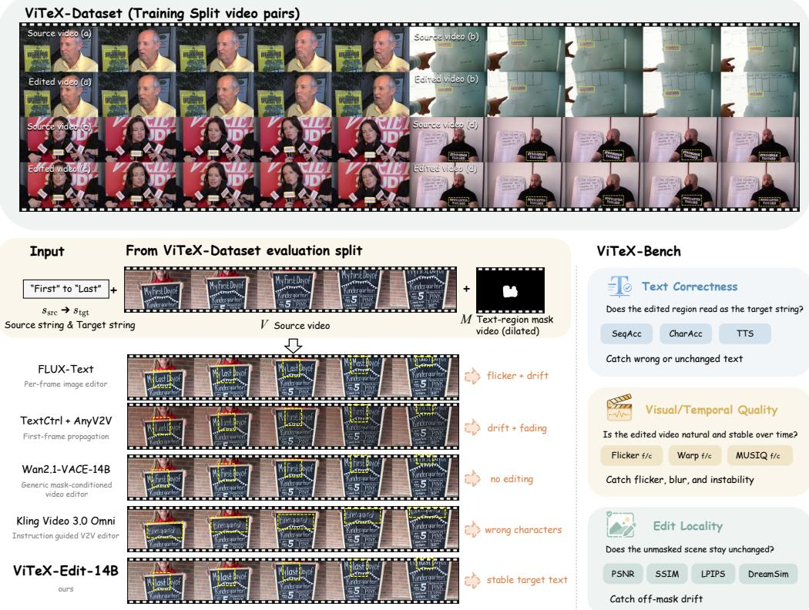
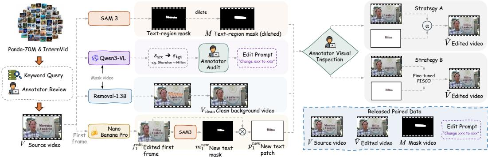
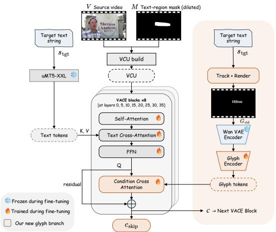
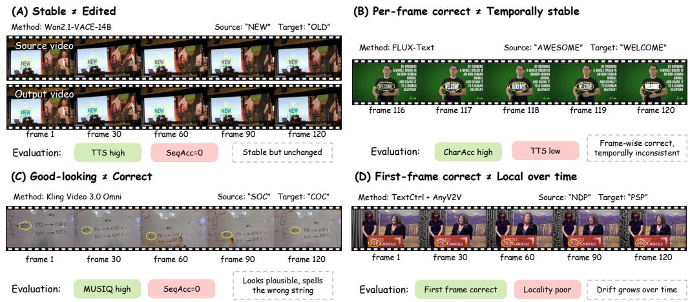
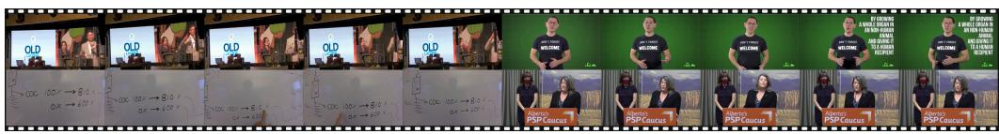

# ViTeX-Bench: Benchmarking High-Fidelity Video Scene Text Editing

Xinghao Chen1 Xiangbo Gao1 Jiongze Yu1 Yuheng Wu1 Zhengzhong Tu1∗

1Texas A&M University

∗tzz@tamu.edu

https://vitex-bench.github.io/

## Abstract

Recent video generation is increasingly realistic and controllable, yet video editing remains comparatively underdeveloped, particularly for precise local edits that must preserve the original scene dynamics. Video scene text editing aims to replace text appearing on scene surfaces in a video, such as storefront signs, whiteboards, and product labels, while preserving the surrounding content, motion, and camera dynamics. Although scene text editing has been extensively studied for static images, video scene text editing that achieves high visual quality, temporal consistency, and edit locality remains largely underexplored. Existing resources offer limited paired real-video data, and general video-editing metrics do not directly measure whether the requested text remains correct over time. We introduce ViTeX-Bench, a benchmark suite comprising ViTeX-Dataset and a three-axis evaluation protocol. The dataset contains 387 real-world 720p videos with textregion masks and editing instructions: 230 provide reviewed, pipeline-generated paired edits for training, and 157 form a frozen evaluation split. The protocol evaluates text correctness, visual and temporal quality, and edit locality through 13 metrics, with one primary metric per axis and a Pareto comparison of their trade-offs. OCR calibration, human evaluation, and annotation-sensitivity analyses support the interpretation of these scores. Across eight baselines from four editing families, accurate text, temporal stability, and scene preservation remain difficult to achieve together. We also release ViTeX-Edit-14B, an open-source reference editor fine-tuned on the paired training split with motion-aligned glyph-video conditioning. It achieves CharAcc 0.688, the highest mean among the evaluated video-native editors, and the lowest comparable text-crop Warp among raw editor outputs. ViTeX-Bench provides a reproducible foundation for studying these trade-offs in video scene text editing.

## 1 Introduction

Recent video generation models [1–8] have made substantial progress in producing photorealistic video clips with coherent motion, lighting, and geometry. In practical editing workflows, however, users often need localized control rather than regenerating an entire video from scratch, or a combination of the two. One common case is scene text editing, in which text is replaced on storefront signs, whiteboards, jerseys, screens, product labels, or other surfaces in the scene while leaving the rest of the video unchanged. This task is deceptively difficult. A successful edit must render the requested target string correctly, keep the edited text attached to the same surface as the camera or object moves, and preserve the surrounding appearance, lighting, and motion throughout the full clip.

Existing image and video editors [5, 9–15] address different parts of this problem. Image scene-text editors such as FLUX-Text [11] can render accurate characters in individual frames, but independent edits introduce flicker and glyph drift. First-frame edit-and-propagate methods [13, 14] extend a still-image edit through time, yet the inserted text can fade or drift over longer clips. Maskconditioned and instruction-guided video editors, including VACE [5], VideoPainter [15], and Kling Video 3.0 Omni [6], model video dynamics but offer limited control over exact character sequences. Consequently, a stable video may retain the source text, a plausible edit may contain the wrong string, and individually correct frames may be temporally inconsistent (Fig. 1).

  
Figure 1: Overview of ViTeX-Bench. Paired training examples from ViTeX-Dataset (shown on top) illustrate the high visual fidelity of the paired data across diverse text-motion conditions. In ViTeX-Bench, each task instance provides a source video V, a text-region mask M, and a sourcetarget string pair $( s _ { \mathrm { s r c } } , s _ { \mathrm { t g t } } )$ (shown on the left). Representative baseline outputs (in the middle) exhibit distinct failure modes, while ViTeX-Bench (on the right) scores each edit along three axes (text correctness, visual quality, and edit locality) with a total of 13 metrics.

Evaluating these failures requires task-specific data and measures. Related evidence from scientific chart editing shows that pixel similarity can miss semantic editing errors [16]. Image scene text editing has dedicated datasets and recognition metrics [9, 10, 12, 17–20], whereas paired edits of real-world videos remain limited. Existing video generation and editing benchmarks [21–28] assess instruction following, perceptual quality, temporal consistency, or preservation, but do not directly establish whether the edited region reads as the requested string throughout a video.

We introduce ViTeX-Bench to support systematic study of video scene text editing. ViTeX-Dataset contains 387 real-world 720p source videos from Panda-70M [29] and InternVid [30], with per-frame text-region masks and source–target string instructions. A human-in-the-loop pipeline produces paired edited references for 230 training videos; the remaining 157 form a frozen evaluation split.

Our primary contributions are the resource and its evaluation protocol. The dataset provides paired training examples and standardized evaluation inputs, with coverage statistics and annotation documentation. The protocol measures text correctness, visual and temporal quality, and edit locality through 13 complementary metrics. One primary metric per axis and a Pareto comparison make the trade-offs interpretable, while OCR calibration, human evaluation, and annotation-sensitivity analyses assess the reliability of the measurements.

To demonstrate the utility of the training split, we release ViTeX-Edit-14B as an open-source reference editor. It adapts a pretrained Wan2.1-VACE-14B backbone using a motion-aligned glyphvideo stream that supplies target-character structure along the source text trajectory. Experiments with eight baselines across four editing families reveal distinct correctness, stability, and preservation failures. The reference editor combines the strongest mean character accuracy among the evaluated video-native editors with low temporal error, establishing a useful starting point for further work on this benchmark.

## 2 Related Work

Video generation and editing. Video diffusion has evolved from pixel-space generation to large latent video models. Early pixel-space models extend image diffusion along a temporal axis [31– 33]. Latent-temporal models interleave temporal layers into pretrained image latent-diffusion backbones [34, 35]. Native video diffusion transformers then learn spatio-temporal video distributions directly, ranging from open mid-scale systems [2, 3, 36] to multi-billion-parameter unified text–video models [1, 4, 7, 8]. Editing methods built on top of these backbones largely follow two image-first patterns, namely per-video weight tuning [37] and training-free attention or feature propagation [38–48]. Image-to-video backbones [14, 49–52] later supplied the propagation step for tuning-free first-frame editors [13]. Mask-conditioned and instruction-guided editors [6, 15] extend these capabilities to localized and prompted edits. Sparse keyframe or reference conditioning has also been applied to instance insertion in PISCO [53], whose released models our data pipeline builds on (Section 3.1), as well as to video super-resolution [54] and identity-preserving image-to-video generation [55]. ViTeX-Edit-14B focuses on character-level control, adding glyph-video conditioning for explicit character structure and temporal alignment.

Scene text editing. Image scene text editing began with GAN-era three-stage pipelines that disentangle background, foreground, and a learned text prior [17, 56, 57]. Diffusion methods then introduced character-aware editors. GlyphDraw injects glyph priors through an image encoder [58], while DiffSTE and DiffUTE condition on dedicated character or OCR-based image encoders [59, 60]. UDiffText, TextDiffuser, and TextDiffuser-2 unify these threads into character-aware diffusion frameworks and language-model-guided text painters [19, 61, 62]. More recent work extends this lineage with attribute-conditioned, structure–style-disentangled, recognition-supervised, FLUX-based, and OCR-free variants [9–12, 20, 63, 64]. GlyphMastero [18] additionally shows that an explicit glyph encoder can supply stroke-level guidance to a diffusion editor, motivating the design of ViTeX-Edit-14B’s conditioning pathway. On the video side, STRIVE [65], the closest predecessor, propagates a per-frame still-image edit on a small ROI-centric protocol. Concurrent text-to-video legibility work [66] treats glyph quality as a generation-time concern, while LegiT [67] evaluates text legibility in user-generated media rather than in-place editing. ViTeX-Bench focuses on in-place replacement in real videos, combining paired training data with frame-level recognition, temporal quality, and preservation metrics. Its reference editor adapts glyph-encoder conditioning to this temporal setting.

Benchmarks for video generation and editing. Video quality assessment aims to predict human judgments of perceived quality [68]; COVER [69], for example, combines technical, aesthetic, and semantic quality estimates. Editing evaluation additionally requires checking the requested change and preservation of the source. General-purpose video benchmarks decompose quality into multiple primitive axes [21, 22, 70], but they target generation rather than instruction-guided editing. Several editing-specific suites have been introduced more recently. EditBoard [23], FiVE [24], and IVEBench [25] adopt three-axis frameworks for instruction-guided edits. VE-Bench [26] pairs human MOS with a learned video-quality predictor, while OpenVE-3M [71] provides million-scale instruction-conditioned editing data with three-aspect human ratings. TDVE-Assessor [72] adapts large multimodal models as evaluators. VEFX-Bench [27] couples human annotations of instruction following, rendering quality, and edit exclusivity with VEFX-Reward, a learned evaluator conditioned on the source, instruction, and edited video. ViTeX-Bench complements these general editing evaluations with an OCR-anchored protocol for character-level correctness over time, coupled with temporal and locality measures on a frozen real-video split.

  
Figure 2: Training data construction pipeline. We compose the four assets $( M , ( s _ { \mathrm { s r c } } , s _ { \mathrm { t g t } } ) , V _ { \mathrm { c l e a n } } ,$ and $p _ { 1 } ^ { \mathrm { n e w } } )$ into the paired edit $\tilde { V }$ via Strategy A (alpha composition) or Strategy B (PISCO-based inserter). The overview is in Section 3.1 and implementation details are in Section C.

## 3 ViTeX-Bench: Dataset and Evaluation Suite

## 3.1 ViTeX-Dataset

Task formulation. Given a source video, a mask localizing the editable text region, and a source– target string pair, the task is to render the target string inside the mask while leaving the rest of the scene unchanged. We formalize each task instance as a tuple $( V , M , s _ { \mathrm { s r c } } , s _ { \mathrm { t g t } } )$ , where $V =$ $\{ f _ { t } \} _ { t = 1 } ^ { T }$ is a sequence of RGB frames $f _ { t } \in \mathbb { R } ^ { H \times W \times 3 } , M = \bar { \{ m _ { t } \} } _ { t = 1 } ^ { T }$ is a per-frame binary mask $m _ { t } \in \{ 0 , 1 \} ^ { H \times W }$ with $m _ { t } = 1$ on pixels inside the editable region, s is the character sequence visible inside that region, and $s _ { \mathrm { t g t } }$ is the requested replacement. A method outputs an edited video $\hat { V } = \{ \hat { f } _ { t } \} _ { t = 1 } ^ { T }$ satisfying these requirements. ViTeX-Dataset instantiates this formulation at $T = 1 2 0$ frames, $H \times \dot { W } \stackrel { = } { = } 7 2 0 \times 1 2 8 0$ , and 24 fps, releasing real-world source videos, masks, source–target string annotations, and paired edited videos on the training split.

Dataset overview. ViTeX-Dataset contains 387 real-world source videos manually screened from Panda-70M [29] and InternVid [30]. The text therefore appears under natural lighting, surface geometry, and camera motion. The 230-video training split provides $( V , \tilde { V } , M , s _ { \mathrm { s r c } } , s _ { \mathrm { t g t } } )$ tuples, where $\tilde { V }$ is the reviewed edit produced by our pipeline; the permanently frozen 157-video evaluation split withholds $\tilde { V } .$ . Source and target strings are approximately length-matched within each pair and range from single characters to multi-word phrases across the dataset. The paired edits preserve the source context while providing target-text supervision (Figure 1). They serve as training references rather than unique ground-truth renderings; their readability is examined in Section L. Screening and composition statistics appear in Section B.

Data construction pipeline. We draw source videos from Panda-70M and InternVid using keyword queries, then retain only videos suitable for editing and free of sensitive content. For each retained video, we construct four assets (Figure 2). The first is a dilated text-region mask M, annotated through a semi-automatic GUI built on the video segmentation model SAM 3 [73]: an annotator marks the editable region with keypoints on the first frame, SAM 3 propagates the resulting mask to the remaining frames, and morphological dilation adds a margin around the glyph boundary. The second is a source–target string pair $( s _ { \mathrm { s r c } } , s _ { \mathrm { t g t } } )$ , proposed by a vision-language model, Qwen3-VL-32B-Instruct [74], which reads $s _ { \mathrm { s r c } }$ from the first-frame mask crop and suggests a similar-length $s _ { \mathrm { t g t } } ;$ an annotator audits the result. The third is a clean background video $V _ { \mathrm { c l e a n } }$ , produced by removal-1.3B [53], a fine-tuned version of Wan2.1-VACE-1.3B that removes glyphs together with their cast shadows and highlights in the spirit of ROSE [75]. The fourth is a first-frame target-text patch $p _ { 1 } ^ { \mathrm { n e w } } = f _ { 1 } ^ { \mathrm { e d i t } } { \odot } m _ { 1 } ^ { \mathrm { n e w } }$ , where $f _ { 1 } ^ { \mathrm { e d i t } }$ is the first frame rewritten by an image editor, Gemini 3 Pro Image (Nano Banana Pro) [76], using the edit instruction from the earlier target-string generation step, and $m _ { 1 } ^ { \mathrm { n e w } }$ is the target-text mask from a second SAM 3 pass.

We adopted two strategies to account for the dynamics of scene text videos. Strategy A alphacomposites $p _ { 1 } ^ { \mathrm { n e w } }$ onto each frame of $V _ { \mathrm { c l e a n } } ;$ it yields an edited video with minimal changes to the source but applies only when the text region remains static across all frames. Strategy B uses a PISCO [53] inserter that takes $p _ { 1 } ^ { \mathrm { n e w } }$ as a first-frame reference and can therefore handle dynamic videos. We fine-tuned PISCO on an auxiliary scene-text insertion set with amodal-completion supervision. We visually classify each video as static or dynamic: dynamic videos use Strategy B exclusively, while static videos run both strategies and retain the higher-quality output. The final paired training split contains 56 Strategy-A videos and 174 Strategy-B videos. Full pipeline details appear in Section C.

Table 1: ViTeX-Dataset statistics. All clips are $1 2 8 0 \times 7 2 0 .$ , 120 frames at 24 fps. String lengths are in characters $( \mathrm { m e a n } \pm \mathrm { s t d } )$ ; source and target strings range over 1–41 and 1–36 characters. Scripts counts the writing systems in the frozen evaluation split (Latin, Chinese, Japanese, Cyrillic). Font styles are shares of all 387 videos, rounded.
<table><tr><td colspan="3">Videos</td><td colspan="2">String length</td><td colspan="3">Font style (%)</td></tr><tr><td>Train</td><td>Eval</td><td>Scripts</td><td>Source</td><td>Target</td><td>Printed</td><td>Handwritten</td><td>Artistic</td></tr><tr><td>230</td><td>157</td><td>4</td><td> $8 . 0 \pm 5 . 7$ </td><td> $8 . 0 \pm 5 . 4$ </td><td>23</td><td>44</td><td>33</td></tr></table>

Coverage and annotation reliability. Table 1 summarizes the dataset’s script, length, and typography coverage. The evaluation split covers four scripts: Latin, Chinese, Japanese, and Cyrillic. The coverage audit reports a mask-area ratio of $0 . 0 3 2 \pm 0 . 0 2 2$ and approximately 25% static versus 75% dynamic videos, based on visual motion classification. These motion categories differ from the training pipeline’s 56/174 strategy counts because static videos can use either construction strategy.

One author-annotator performed the original construction. An independent annotator repeated the mask pipeline on 12 difficulty-stratified clips, obtaining mask IoU 0.95, Dice 0.98, and crop-box IoU 0.94. Under the alternative masks, DreamSim-loc and text-crop Warp rankings have Kendall $\tau = 0 . 9 4$ and 1.00, respectively. Section K details this pilot audit and its scope.

## 3.2 ViTeX-Bench Evaluation Suite

Evaluation protocol. ViTeX-Bench evaluates outputs on the frozen 157-video split along three axes: text correctness, visual and temporal quality, and edit locality. Its 13 core metrics probe these axes at complementary spatial scopes and perceptual sensitivities. We report one primary metric per axis together with the complete diagnostic vector (Sections 3.2 and 5.2). Supplementary background-motion and identity probes extend the analysis without changing the core protocol.

Text correctness. We run an OCR recognizer, PP-OCRv5 [77], on the dilated-mask crop of each source frame $f _ { t }$ and predicted frame $\hat { f } _ { t } ,$ producing normalized strings $s _ { t }$ and $\hat { s } _ { t } ,$ , respectively. OCR backend configuration, confidence thresholding, and string normalization are detailed in Section E. Source text is not always readable: motion, occlusion, or blur can obscure it on individual frames. We score correctness on source-detectable frames to reduce confounding by source unreadability, and calibrate residual recognition errors in Section L. To compare two strings, we use substring edit distance $d _ { \mathrm { s u b } } ( r , c )$ , defined as the minimum number of character edits required to transform reference r into any contiguous substring of candidate c. Unlike standard Levenshtein distance, unmatched prefixes and suffixes of c are free; a correct target embedded inside a longer OCR string is therefore not penalized for surrounding characters. Section E gives a worked example. The induced similarity is $\mathrm { S i m } ( r , c ) = 1 - d _ { \mathrm { s u b } } ( r , c ) \overline { { / } } \operatorname* { m a x } ( | r | , 1 ) \in [ 0 , 1 ]$ . The source-detectable set contains every frame on which the source-frame OCR string matches $s _ { \mathrm { s r c } }$ at least halfway:

$$
{ \mathcal { D } } = \{ t : \operatorname { S i m } ( s _ { \mathrm { s r c } } , s _ { t } ) \geq 0 . 5 \} , \qquad { \mathcal { P } } = \{ ( t , t + 1 ) : t , t + 1 \in { \mathcal { D } } \} ,
$$

and $\mathcal { P }$ collects the consecutive pairs inside D for temporal consistency. The three text-correctness primitives are

$$
\begin{array} { r l } & { \mathrm { S e q A c c } = \underset { t \in \mathcal { D } } { \mathrm { m e a n } } \mathbf { 1 } [ d _ { \mathrm { s u b } } ( s _ { \mathrm { t g t } } , \hat { s } _ { t } ) = 0 ] , } \\ & { \mathrm { C h a r A c c } = \underset { t \in \mathcal { D } } { \mathrm { m e a n } } \mathrm { S i m } ( s _ { \mathrm { t g t } } , \hat { s } _ { t } ) , } \\ & { \quad \quad \mathrm { T T S } = \underset { ( t , t + 1 ) \in \mathcal { P } } { \mathrm { m e a n } } \mathbf { 1 } [ \hat { s } _ { t } = \hat { s } _ { t + 1 } ] , } \end{array}\tag{1}
$$

where $\mathbf { 1 } [ \cdot ]$ is the indicator function. SeqAcc demands an exact substring match to $s _ { \mathrm { t g t } } ;$ ; CharAcc gives partial credit for near-correct renderings; and TTS (temporal text stability) measures whether the decoded string is stable across adjacent detectable frames. TTS intentionally measures stability rather than correctness, so it must be read together with SeqAcc and CharAcc. Edge cases are handled in Section E.

Visual quality. We score visual quality at two spatial scopes: the full output frame $( S = \mathrm { f u l l } )$ and a text-crop region $( S = \mathrm { c r o p } )$ . The crop is one static bounding box per video—the axis-aligned box enclosing the spatial union of every per-frame mask $\textstyle \bigcup _ { t = 1 } ^ { T } m _ { t }$ , enlarged by a fixed margin. For videos whose text moves across the scene, the box widens to cover the trajectory; every frame is still cropped through the same window, so Flickerc and Warp measure glyph drift rather than bounding-box jitter (Section E). Let $\boldsymbol { x } _ { t } ^ { S }$ denote the pixels of $\hat { f } _ { t }$ inside scope S, and let $\mathcal { T } _ { S }$ be the frame index set over which MUSIQ is averaged. We use $\mathcal { T } _ { \mathrm { f u l l } } \dot { = } \left\{ 1 , \dots , T \right\}$ for full-frame MUSIQ and $\mathcal { T } _ { \mathrm { c r o p } } = \mathcal { D }$ for crop MUSIQ, so crop quality is averaged only when the source text is detectable. The six visual primitives are

$$
\begin{array} { r l } & { \mathrm { F l i c k e r } _ { S } = \underset { t = 1 } { \overset { T - 1 } { \operatorname { m e a n } } } \mathrm { M A E } ( x _ { t + 1 } ^ { S } , x _ { t } ^ { S } ) , } \\ & { \quad \mathrm { W a r p } _ { S } = \underset { t = 1 } { \overset { T - 1 } { \operatorname { m e a n } } } \mathrm { M A E } \big ( x _ { t } ^ { S } , \mathcal { W } ( F _ { t  t + 1 } ^ { \operatorname { s r c } } , x _ { t + 1 } ^ { S } ) \big ) , } \\ & { \mathrm { M U S I Q } _ { S } = \underset { t \in \mathcal { T } _ { S } } { \overset { \operatorname { m e a n } } { \operatorname { m e a n } } } \mathrm { M U S I Q } ( x _ { t } ^ { S } ) , } \end{array}\tag{2}
$$

where $F _ { t  t + 1 } ^ { \mathrm { s r c } }$ is RAFT [78] forward flow on the source video, $\mathcal { W } ( F , x )$ backward-warps x to frame t using $F ,$ and MUSIQ [79] estimates perceptual quality without a reference. Flicker measures raw adjacent-frame differences; Warp compensates for source motion. Both can decrease under smoothing or nearly constant outputs, so their interpretation also requires correctness and perceptual quality. Full-frame variants capture global artifacts, while text-crop variants emphasize the edited region.

Edit locality. Edit locality measures how well a method preserves pixels outside the editable region. We construct a locality-only prediction $\hat { f } _ { t } ^ { \mathrm { l o c } }$ that retains predicted pixels outside the mask and substitutes source pixels inside, then average a per-frame metric $\mu$ over the video:

$$
\begin{array} { r l } & { \hat { f } _ { t } ^ { \mathrm { l o c } } = ( 1 - m _ { t } ) \odot \hat { f } _ { t } + m _ { t } \odot f _ { t } , } \\ & { \mu _ { \mathrm { l o c } } = \underset { t = 1 } { \overset { T } { \mathrm { m e a n } } } \mu ( \hat { f } _ { t } ^ { \mathrm { l o c } } , f _ { t } ) , \quad \mu \in \{ \mathrm { P S N R , S S I M , L P I P S , D r e a m S i m } \} . } \end{array}\tag{3}
$$

Inside the mask, $\hat { f } _ { t } ^ { \mathrm { l o c } } = f _ { t } ,$ , so differences arise from the unedited region. PSNR and SSIM [80] are higher-is-better similarities; LPIPS [81] and DreamSim [82] are lower-is-better perceptual distances. Pixel-level measures respond to small VAE reconstruction differences, whereas learned distances capture perceptual changes. We denote locality DreamSim by $\mathrm { D r e a m S i m _ { l o c } }$ (DreamSim-out). These framewise measures are complemented by background-motion and identity probes in Section N. Implementation and edge cases appear in Section E.

Primary metrics and comparison. The primary metrics are SeqAcc (↑), $\mathrm { W a r p } _ { c } ~ \left( \downarrow \right)$ , and DreamSimloc (↓), representing correctness, temporal quality, and locality. We compare their tradeoffs through the Pareto set: a method is dominated when another is at least as good on all three and strictly better on one. The remaining ten metrics provide diagnostic detail. We report raw outputs separately from Composite post-processing and omit VideoPainter from temporal comparisons because of its adaptation pipeline (Section 5.1). Rankings summarize mean scores; confidence intervals quantify their uncertainty. We use no weighted aggregate across the three axes.

## 4 ViTeX-Edit-14B

ViTeX-Edit-14B adapts a pretrained video editor to the paired training split through motion-aligned character conditioning. It provides an open reference for the benchmark while retaining the backbone’s pretrained video prior.

Wan2.1-VACE-14B [5] provides two conditioning streams: a text encoder for $s _ { \mathrm { t g t } }$ and a Video Condition Unit (VCU) for the source video and mask. We add a third stream: a target-text glyph video $G _ { \mathrm { v i d } }$ that supplies both character structure and source-aligned motion. To build $G _ { \mathrm { v i d } }$ , we render $s _ { \mathrm { t g t } }$ as a white-on-black glyph image in a typeface chosen to match the source font, detect the source-text quadrilateral in the first frame, track it across the remaining frames, and projectively warp the glyph image with the resulting per-frame homographies, so $G _ { \mathrm { v i d } }$ follows the source text’s position, scale, and perspective (typeface selection, OCR detector, and tracker in Section G). We first tried two simpler alternatives: using $G _ { \mathrm { v i d } }$ at inference without fine-tuning, and routing it through the existing VCU during fine-tuning. Both yielded poor character correctness in qualitative pilots, motivating a dedicated glyph branch. Controlled component ablations remain future work.

  
Figure 3: ViTeX-Edit-14B architecture. Three streams condition the VACE backbone: target text $s _ { \mathrm { t g t } }$ via frozen uMT5-XXL, source $V$ and mask M via the VCU, and a target-text glyph video pooled by the glyph encoder into tokens $E _ { G }$ . Every VACE block queries $E _ { G }$ through an added condition cross-attention layer. Implementation details are in Section G.

Architecture. We build ViTeX-Edit-14B on Wan2.1-VACE-14B and inherit its VCU together with the frozen uMT5-XXL text encoder (Figure 3). For the new glyph-video stream, a frozen Wan VAE encodes $G _ { \mathrm { v i d } }$ to a latent $z _ { G } . \mathrm { A }$ stride-(1, 2, 2) patch embedding flattens $z _ { G }$ into tokens, and 64 learnable queries $Q _ { 6 4 }$ perform cross-attention pooling to produce a fixed-length glyph token bundle:

$$
E _ { G } = W _ { \mathrm { o u t } } \cdot \mathrm { C r o s s A t t n } \big ( Q _ { 6 4 } , \mathrm { L a y e r N o r m } ( z _ { G } ) \big ) ,\tag{4}
$$

where $W _ { \mathrm { o u t } }$ is a zero-initialized output projection and the LayerNorm is a pre-norm applied to the keys and values before attention. Every VACE block then queries $E _ { G } \mathrm { : }$ its hidden state h passes through a lightweight condition cross-attention layer added back via a zero-initialized residual,

$$
h ^ { \prime } = h + W _ { o } \cdot \operatorname { F l a s h A t t n } \bigl ( W _ { q } \operatorname { L a y e r N o r m } ( h ) , W _ { k } E _ { G } , W _ { v } E _ { G } \bigr ) ,\tag{5}
$$

where $W _ { q } , W _ { k }$ , and $W _ { v }$ are the query, key, and value projections and $W _ { o }$ is a zero-initialized output projection. The zero-initialized residual projection preserves the backbone output at initialization. During fine-tuning we freeze the main DiT trunk, uMT5-XXL, and Wan VAE, updating only the VACE branch, the glyph encoder, and the condition cross-attention layers. Training follows a twostage Flow-Matching supervised fine-tuning (SFT) curriculum (576 GPU-hours on 8×H100 80GB), and inference runs a single 50-step pass. Per-stage hyperparameters and module dimensions appear in Section G.

Shared Composite post-processing. Composite is a deterministic, training-free post-processing wrapper applicable to any editor. It matches the predicted region to the source through annulus-based LAB color transfer, then blends the region onto the source with a 4-pixel feathered boundary. This separates text-region synthesis from background reconstruction. We apply the same wrapper to all eight baselines and ViTeX-Edit-14B, reporting its effects separately from raw model performance. The algorithm and re-scoring scope are given in Section H.

## 5 Experiments

## 5.1 Experimental Setup

Baselines. We compare eight baselines from four editing families, adapting their outputs to the common 1280×720, 120-frame, 24 fps evaluation grid. Full configurations are in Section F.

Family A: per-frame image editing. AnyText2, TextCtrl, FLUX-Text, and RS-STE [9–12] edit each frame independently; the outputs are concatenated into a video.

Family B: first-frame editing and propagation. TextCtrl edits the first frame, and AnyV2V [13] propagates it using the I2VGen-XL backbone [14].

Family C: mask-conditioned video inpainting. Wan2.1-VACE-14B [5] and VideoPainter [15] receive the text-region mask and a prompt specifying the target string. VideoPainter’s CogVideoX 1.0 backbone [2] requires spatial resizing and linear-blend temporal upsampling. The latter alters adjacent-frame residuals, so its Flicker and Warp scores are marked † and excluded from temporal rankings.

Family D: instruction-guided video editing. Kling Video 3.0 Omni [6] receives the source video and a fixed editing-instruction template.

Family B represents first-frame propagation within the broader literature on tuning-free diffusionbased video editing [38–47]. Evaluating additional systems requires method-specific adaptation to the target-string and long-video protocol (Section J).

## 5.2 Main Quantitative Results

Table 2 reports video-level mean scores for the eight baselines and the reference editor. Text correctness uses source-detectable frames; five clips with no such frames are excluded from SeqAcc and CharAcc. Rankings compare these means, with 95% video-bootstrap confidence intervals in Tables 3 to 5. The released artifacts provide per-video scores and metric support sizes.

Table 2: Main evaluation results on ViTeX-Bench. The 95% bootstrap CIs are deferred to Tables 3 to 5. Per-column shading among raw editors only: best/2nd/3rd distinct displayed values; rounded ties share shading. The Composite row is an unranked post-processing control; all-baseline controls appear in Table 7. f/c denotes full-frame/text-crop. †VideoPainter Flicker $\dot { } f / c$ and $\mathrm { W a r p } _ { f / c }$ excluded from ranking (Section F). The Source video row $\hat { ( V = V }$ , the source video unmodified) is reported as a reference, excluded from ranking.
<table><tr><td></td><td></td><td colspan="2">Text correctness</td><td colspan="6"></td><td colspan="4">Edit locality</td></tr><tr><td>Method</td><td></td><td>Fam. |SeqAcc↑ CharAcc↑ TTS↑|</td><td></td><td></td><td>|Flicker f ↓ Flickerc ↓</td><td>Warp f ↓ Warpc ↓</td><td></td><td></td><td>MUSIQf ↑ MUSIQc ↑</td><td></td><td>PSNR↑ SSIM↑ LPIPS↓</td><td></td><td>DreamSim↓</td></tr><tr><td>Source video</td><td></td><td>0.000</td><td>0.317 0.760</td><td>3.72</td><td>3.68</td><td>1.46</td><td>1.27</td><td>70.33</td><td>45.12</td><td>8</td><td>1.000</td><td>0.000</td><td>0.000</td></tr><tr><td>AnyText2 [9]</td><td></td><td>0.280</td><td>0.633 0.382</td><td>3.34</td><td>4.95</td><td>2.04</td><td>3.95</td><td>66.68</td><td>41.65</td><td>25.56</td><td>0.905</td><td>0.091</td><td>0.043</td></tr><tr><td>TextCtrl [10]</td><td></td><td>0.475</td><td>0.734 0.511</td><td>3.80</td><td>4.29</td><td>1.59</td><td>2.09</td><td>70.32</td><td>42.77</td><td>41.14</td><td>0.994</td><td>0.008</td><td>0.004</td></tr><tr><td>FLUX-Text [11]</td><td>AAA</td><td>0.528</td><td>0.737 0.326</td><td>5.11</td><td>14.81</td><td>3.03</td><td>13.01</td><td>70.26</td><td>43.85</td><td>31.49</td><td>0.975</td><td>0.029</td><td>0.012</td></tr><tr><td>RS-STE [12]</td><td>A</td><td>0.354</td><td>0.626 0.534</td><td>3.73</td><td>3.66</td><td>1.61</td><td>1.81</td><td>69.57</td><td>34.26</td><td>37.00</td><td>0.983</td><td>0.024</td><td>0.007</td></tr><tr><td>TextCtrl + AnyV2V [10, 13]</td><td>B</td><td>0.057</td><td>0.308 0.257</td><td>4.98</td><td>4.98</td><td>4.11</td><td>3.97</td><td>69.41</td><td>33.85</td><td>21.08</td><td>0.785</td><td>0.225</td><td>0.073</td></tr><tr><td>Wan2.1-VACE-14B [5]</td><td>C</td><td>0.000</td><td>0.298 0.689</td><td>3.78</td><td>3.84</td><td>1.69</td><td>1.56</td><td>70.54</td><td>45.26</td><td>35.21</td><td>0.976</td><td>0.022</td><td>0.007</td></tr><tr><td>VideoPainter† [15]</td><td>C</td><td>0.364</td><td>0.619 0.606</td><td>2.38†</td><td>2.62†</td><td>2.93†</td><td>3.35†</td><td>67.16</td><td>40.59</td><td>28.56</td><td>0.915</td><td>0.104</td><td>0.024</td></tr><tr><td>Kling Video 3.0 Omni [6]</td><td>D</td><td>0.000</td><td>0.208 0.641</td><td>4.25</td><td>4.08</td><td>3.12</td><td>2.90</td><td>72.23</td><td>47.75</td><td>21.18</td><td>0.843</td><td>0.176</td><td>0.061</td></tr><tr><td>ViTeX-Edit-14B</td><td></td><td>0.341</td><td>0.688 0.648</td><td>3.27</td><td>3.42</td><td>1.55</td><td>1.53</td><td>69.64</td><td>43.53</td><td>29.08</td><td>0.951</td><td>0.060</td><td>0.024</td></tr><tr><td>ViTeX-Edit-14B (Composite)</td><td></td><td>0.345</td><td>0.689 0.666</td><td>3.73</td><td>3.83</td><td>1.51</td><td>1.56</td><td>70.27</td><td>44.94</td><td>42.95</td><td>0.993</td><td>0.006</td><td>0.002</td></tr></table>

The three axes reveal distinct strengths: per-frame editors achieve the highest character accuracy, the reference editor has low temporal error, and bounding-box-local methods preserve the surrounding scene particularly well.

Text correctness. FLUX-Text and TextCtrl lead text correctness, reaching SeqAcc 0.528 / 0.475 and CharAcc 0.737 / 0.734. Wan2.1-VACE-14B and Kling both score SeqAcc 0, reflecting unchanged or incorrectly rendered text. Among video-native editors, ViTeX-Edit-14B achieves the highest mean CharAcc at 0.688, compared with VideoPainter’s 0.619 (+0.069, or 11.1% relative). VideoPainter has higher SeqAcc (0.364 vs. 0.341), showing that improved partial character accuracy does not necessarily yield more exact strings. Their intervals overlap; these differences describe observed means rather than established pairwise significance. TTS supplies a separate stability signal: the Source row scores 0.760 despite never making the requested edit.

Visual quality. ViTeX-Edit-14B has the lowest mean Flickerf, Flickerc, Warpf, and $\mathrm { W a r p } _ { c }$ among comparable raw outputs. FLUX-Text combines high correctness with large text-region residuals $( \mathrm { F l i c k e r } _ { c } = 1 4 . 8 1 , \mathrm { \bar { W } a r p } _ { c } = 1 3 . 0 1 )$ , consistent with its independent per-frame edits. Kling leads both MUSIQ measures despite SeqAcc 0, illustrating the distinction between visual polish and successful text replacement. VideoPainter’s temporal scores remain unranked because of its interpolation-based adaptation.

Edit locality and the Composite control. Bounding-box-local editors copy most exterior pixels from the source before encoding, whereas full-frame editors reconstruct the surrounding scene. Composite isolates this difference: for ViTeX-Edit-14B, it raises PSNR-loc from 29.08 to 42.95 dB and reduces DreamSim-loc from 0.024 to 0.002, while SeqAcc changes from 0.341 to 0.345. Applied to all eight baselines, the same wrapper brings PSNR-loc to approximately 43 dB and full-frame Flicker toward the source value 3.72 (Table 7). The improvement across methods indicates that source-pixel restoration accounts for much of the locality gain. Baseline Composite text scores were checked only on a sample, so the control table retains their raw SeqAcc values.

Primary-metric trade-offs. FLUX-Text, TextCtrl, RS-STE, ViTeX-Edit-14B, and Wan2.1- VACE-14B form the Pareto set on the three primaries (Table 11). The front captures different balances of correctness, temporal quality, and locality. Wan2.1-VACE-14B remains non-dominated at SeqAcc 0, demonstrating that membership alone does not establish editing success. The full diagnostic vector is therefore needed to interpret each operating point.

## 5.3 Calibration and Robustness Analyses

OCR and human evaluation. On detectable source frames, OCR achieves exact-match accuracy 0.851 and CharAcc 0.966, with TTS 0.760. These empirical reference levels contextualize recognition errors without rescaling the benchmark scores. Method-blinded human transcription agrees with the OCR-based method ranking at Spearman $\rho = 0 . 9 5$ . Three non-author raters also evaluated 70 video outputs on 1–3 scales. Their ordinal Krippendorff agreement is 0.87 for text, 0.80 for tempora quality, and 0.37 for locality. Mean ratings correlate with SeqAcc, text-crop Warp, and DreamSim-loc at +0.71, −0.40, and −0.53, respectively $( p < 0 . 0 0 1 )$ . Text-crop Warp aligns more closely with temporal ratings than full-frame Warp (−0.40 vs. −0.20), supporting its selection as the temporal primary. Study protocols and limitations are detailed in Section L.

Scale and coverage. Bootstrap resampling of the 152 source-detectable clips (1,000 replicates, seed 2064) yields mean Kendall $\tau = 0 . 9 3 6$ against the full SeqAcc ranking and retains the leading method in 95% of size-152 replicates. This supports ranking stability within the sampled domain. In the non-Latin slice detailed in Section K, AnyText2 leads with SeqAcc 0.168 and CharAcc 0.295; all other editors have CharAcc below 0.19. Difficulty stratification and the independent mask audit appear in Section K.

Background preservation. Supplementary BG-Warp, DINOv2 drift, and ArcFace similarity distinguish source-motion agreement, temporal feature stability, and face preservation. They broadly support the locality trends while revealing differences that the core metrics alone can obscure (Section N).

## 6 Diagnostic Failure Analysis

Figure 4 connects four qualitative failures to their metric signatures. Wan2.1-VACE-14B retains the source text, giving high TTS but zero SeqAcc; FLUX-Text renders legible characters with temporal instability; Kling produces polished yet incorrect text; and TextCtrl+AnyV2V exhibits both text drift and background changes. Together, these examples explain why correctness, temporal quality, and locality must be inspected jointly.

On the same selected videos, ViTeX-Edit-14B renders the target strings and maintains their appearance across the displayed frames (Figure 5). These examples illustrate how motion-aligned character conditioning can address the observed failure modes; the aggregate results in Table 2 quantify performance over the full split.

## 7 Limitations

Coverage and scale. ViTeX-Dataset focuses on localized, readable, predominantly Latin-script text. Handwritten and artistic styles are represented, but dense layouts, curved surfaces, severe occlusion, extreme motion, and non-Latin scripts remain sparsely covered. Bootstrap stability characterizes the sampled domain, while broader coverage requires additional data. The reference editor demonstrates useful adaptation from 230 paired videos; controlled component ablations and training-scale studies remain future work.

Figure 4: Four representative failure cases. (A) Wan2.1-VACE-14B: masked region returned essentially as the source, target string never rendered. (B) FLUX-Text [11]: per-frame editing yields legible text on individual frames, but the glyph identity is inconsistent between adjacent frames. (C) Kling Video 3.0 Omni [6]: high per-frame visual quality, but the rendered text does not match the requested target. (D) TextCtrl+AnyV2V [10, 13]: the first-frame edit propagates while the rendered text and surrounding scene structure drift away.  
  
Figure 5: ViTeX-Edit-14B outputs for the four source videos in Figure 4, shown with five evenly spaced frames per video. Panels (A)–(D) correspond to the examples used to illustrate Wan2.1-VACE-14B, FLUX-Text, Kling Video 3.0 Omni, and TextCtrl+AnyV2V, respectively. On these selected examples, ViTeX-Edit-14B renders the target text correctly and maintains it across the displayed frames.

Measurement and annotation. OCR accuracy depends on script, style, and readability, so source calibration provides context rather than a universal target-text ceiling. Five evaluation clips fall outside SeqAcc/CharAcc support. Human calibration comprises a transcription study conducted by one author and a three-rater study of 70 outputs, with limited locality agreement (α = 0.37). Independent mask annotation covers 12 clips and uses the same propagation pipeline; other annotation stages lack independent agreement studies. The background and face probes extend preservation analysis but do not cover arbitrary object identity or semantics.

Construction and provenance. Paired edits are reviewed outputs of a model-assisted pipeline and may retain rendering errors. Per-record target-string rejection/resampling counts and first-frame editing retry rates were not logged in the initial release. Broader independent audits, richer provenance, and expanded linguistic and geometric coverage would strengthen future versions.

## 8 Conclusion

ViTeX-Bench provides paired training data and a frozen evaluation protocol for video scene text editing. Its three-axis design makes character correctness, temporal quality, and scene preservation explicit, while calibration and robustness analyses clarify how to interpret the measurements. Across eight baselines and the ViTeX-Edit-14B reference editor, the results expose distinct failure modes and persistent trade-offs. Shared Composite controls further separate synthesis quality from background restoration. Together, the dataset, evaluation code, and reference editor provide a reproducible basis for measuring progress in video scene text editing. Release URLs are listed in Section A.

## Acknowledgments and Disclosure of Funding

This work was supported in part by the GPU hardware provided to Texas A&M University through the NVIDIA Academic Grant Program, in part by the Google Research Scholar Program, and in part by the Amazon Research Award.

## References

[1] W. Kong, Q. Tian, Z. Zhang et al., “HunyuanVideo: A systematic framework for large video generative models,” arXiv preprint arXiv:2412.03603, 2024.

[2] Z. Yang, J. Teng, W. Zheng, M. Ding, S. Huang, J. Xu, Y. Yang, W. Hong, X. Zhang, G. Feng, D. Yin, Y. Zhang, W. Wang, Y. Cheng, B. Xu, X. Gu, Y. Dong, and J. Tang, “CogVideoX: Text-to-video diffusion models with an expert transformer,” in ICLR, 2025.

[3] Y. HaCohen, N. Chiprut, B. Brazowski, D. Shalem, D. Moshe, E. Richardson, E. Levin, G. Shiran, N. Zabari, O. Gordon, P. Panet, S. Weissbuch, V. Kulikov, Y. Bitterman, Z. Melumian, and O. Bibi, “LTX-Video: Realtime video latent diffusion,” arXiv preprint arXiv:2501.00103, 2025.

[4] Team Wan et al., “Wan: Open and advanced large-scale video generative models,” arXiv preprint arXiv:2503.20314, 2025.

[5] Z. Jiang, Z. Han, C. Mao, J. Zhang, Y. Pan, and Y. Liu, “VACE: All-in-one video creation and editing,” in ICCV, 2025.

[6] Kuaishou Kling Team, “Kling Video 3.0 Omni,” Kuaishou press release, 2026, closed-source commercial reference-based video-to-video editor.

[7] A. Polyak, A. Zohar, A. Brown, A. Tjandra, A. Sinha, A. Lee, A. Vyas, B. Shi, C.-Y. Ma, C.-Y. Chuang et al., “Movie gen: A cast of media foundation models,” arXiv preprint arXiv:2410.13720, 2024.

[8] OpenAI, “Sora: Video generation models as world simulators,” Technical report, https://openai.com/index/ video-generation-models-as-world-simulators/, 2024.

[9] Y. Tuo, Y. Geng, and L. Bo, “AnyText2: Visual text generation and editing with customizable attributes,” arXiv preprint arXiv:2411.15245, 2024.

[10] W. Zeng, Y. Shu, Z. Li, D. Yang, and Y. Zhou, “TextCtrl: Diffusion-based scene text editing with prior guidance control,” in NeurIPS, 2024.

[11] R. Lan, Y. Bai, X. Duan, M. Li, D. Jin, R. Xu, D. Nie, L. Sun, and X. Chu, “FLUX-Text: A simple and advanced diffusion transformer baseline for scene text editing,” arXiv preprint arXiv:2505.03329, 2025.

[12] Z. Fang, P. Lyu, J. Wu, C. Zhang, J. Yu, G. Lu, and W. Pei, “Recognition-synergistic scene text editing,” in CVPR, 2025.

[13] M. Ku, C. Wei, W. Ren, H. Yang, and W. Chen, “AnyV2V: A tuning-free framework for any video-to-video editing tasks,” Transactions on Machine Learning Research (TMLR), 2024.

[14] S. Zhang, J. Wang, Y. Zhang, K. Zhao, H. Yuan, Z. Qin, X. Wang, D. Zhao, and J. Zhou, “I2VGen-XL: High-quality image-to-video synthesis via cascaded diffusion models,” arXiv preprint arXiv:2311.04145, 2023.

[15] Y. Bian, Z. Zhang, X. Ju, M. Cao, L. Xie, Y. Shan, and Q. Xu, “VideoPainter: Any-length video inpainting and editing with plug-and-play context control,” in ACM SIGGRAPH, 2025.

[16] S. Li, R. Rossi, S. Kim, S. Choudhary, F. Dernoncourt, P. Mathur, Z. Tu, and Y. Zhao, “Charts are not images: On the challenges of scientific chart editing,” in International Conference on Learning Representations, 2026. [Online]. Available: https://arxiv.org/abs/2512.00752

[17] L. Wu, C. Zhang, J. Liu, J. Han, J. Liu, E. Ding, and X. Bai, “Editing text in the wild,” in ACM Multimedia, 2019.

[18] T. Wang, T. Liu, X. Qu, C. Wu, L. Liu, and X. Hu, “GlyphMastero: A glyph encoder for high-fidelity scene text editing,” in CVPR, 2025.

[19] J. Chen, Y. Huang, T. Lv, L. Cui, Q. Chen, and F. Wei, “TextDiffuser: Diffusion models as text painters,” in NeurIPS, 2023.

[20] Y. Tuo, W. Xiang, J.-Y. He, Y. Geng, and X. Xie, “AnyText: Multilingual visual text generation and editing,” in ICLR, 2024.

[21] Z. Huang, Y. He, J. Yu, F. Zhang, C. Si, Y. Jiang, Y. Zhang, T. Wu, Q. Jin, N. Chanpaisit et al., “VBench: Comprehensive benchmark suite for video generative models,” in CVPR, 2024.

[22] D. Zheng, Z. Huang, H. Liu, K. Zou, Y. He, F. Zhang, L. Gu, Y. Zhang, J. He, W.-S. Zheng, Y. Qiao, and Z. Liu, “VBench-2.0: Advancing video generation benchmark suite for intrinsic faithfulness,” arXiv preprint arXiv:2503.21755, 2025.

[23] Y. Chen, P. Chen, X. Zhang, Y. Huang, and Q. Xie, “EditBoard: Towards a comprehensive evaluation benchmark for text-based video editing models,” in AAAI, 2025.

[24] M. Li, C. Xie, Y. Wu, L. Zhang, and M. Wang, “FiVE-Bench: A fine-grained video editing benchmark for evaluating emerging diffusion and rectified flow models,” in ICCV, 2025.

[25] Y. Chen, J. Zhang, T. Hu, Y. Zeng, Z. Xue, Q. He, C. Wang, Y. Liu, X. Hu, and S. Yan, “IVEBench: Modern benchmark suite for instruction-guided video editing assessment,” arXiv preprint arXiv:2510.11647, 2025.

[26] S. Sun, X. Liang, S. Fan, W. Gao, and W. Gao, “VE-Bench: Subjective-aligned benchmark suite for text-driven video editing quality assessment,” arXiv preprint arXiv:2408.11481, 2024.

[27] X. Gao, S. Jiang, B. Liu, X. Chen, M. Yang, S. Yang, M. Wu, J. Yu, Q. Zheng, H. Wang, J. Zhang, J. Yang, Z. Wang, Q. Yin, and Z. Tu, “VEFX-Bench: A holistic benchmark for generic video editing and visual effects,” arXiv preprint arXiv:2604.16272, 2026.

[28] Z. Li, X. Chen, L. Jiang, D. Hou, F. Lin, K. Yamada, X. Gao, and Z. Tu, “Physics-aware video instance removal benchmark,” arXiv preprint arXiv:2604.05898, 2026.

[29] T.-S. Chen, A. Siarohin, W. Menapace, E. Deyneka, H.-w. Chao, B. E. Jeon, Y. Fang, H.-Y. Lee, J. Ren, M.-H. Yang, and S. Tulyakov, “Panda-70M: Captioning 70m videos with multiple cross-modality teachers,” in CVPR, 2024.

[30] Y. Wang, Y. He, Y. Li, K. Li, J. Yu, X. Ma, X. Li, G. Chen, X. Chen, Y. Wang, P. Luo, Z. Liu, Y. Wang, L. Wang, and Y. Qiao, “InternVid: A large-scale video-text dataset for multimodal understanding and generation,” in ICLR, 2024.

[31] J. Ho, T. Salimans, A. Gritsenko, W. Chan, M. Norouzi, and D. J. Fleet, “Video diffusion models,” in Advances in Neural Information Processing Systems (NeurIPS), 2022.

[32] U. Singer, A. Polyak, T. Hayes, X. Yin, J. An, S. Zhang, Q. Hu, H. Yang, O. Ashual, O. Gafni et al., “Make-a-video: Text-to-video generation without text-video data,” arXiv preprint arXiv:2209.14792, 2022.

[33] J. Ho, W. Chan, C. Saharia, J. Whang, R. Gao, A. Gritsenko, D. P. Kingma, B. Poole, M. Norouzi, D. J. Fleet, and T. Salimans, “Imagen video: High definition video generation with diffusion models,” arXiv preprint arXiv:2210.02303, 2022.

[34] A. Blattmann, R. Rombach, H. Ling, T. Dockhorn, S. W. Kim, S. Fidler, and K. Kreis, “Align your latents: High-resolution video synthesis with latent diffusion models,” in CVPR, 2023.

[35] Y. Guo, C. Yang, A. Rao, Z. Liang, Y. Wang, Y. Qiao, M. Agrawala, D. Lin, and B. Dai, “AnimateDiff: Animate your personalized text-to-image diffusion models without specific tuning,” in ICLR, 2024.

[36] Z. Zheng, X. Peng, Y. Lou, C. Shen, T. Young, X. Guo, B. Wang, H. Xu, H. Liu, M. Jiang, W. Li et al., “Open-sora 2.0: Training a commercial-level video generation model in \$200k,” arXiv preprint arXiv:2503.09642, 2025.

[37] J. Z. Wu, Y. Ge, X. Wang, W. Lei, Y. Gu, Y. Shi, W. Hsu, Y. Shan, X. Qie, and M. Z. Shou, “Tune-a-video: One-shot tuning of image diffusion models for text-to-video generation,” in ICCV, 2023.

[38] C. Qi, X. Cun, Y. Zhang, C. Lei, X. Wang, Y. Shan, and Q. Chen, “FateZero: Fusing attentions for zero-shot text-based video editing,” in ICCV, 2023.

[39] M. Geyer, O. Bar-Tal, S. Bagon, and T. Dekel, “TokenFlow: Consistent diffusion features for consistent video editing,” in ICLR, 2024.

[40] D. Ceylan, C.-H. P. Huang, and N. J. Mitra, “Pix2Video: Video editing using image diffusion,” in ICCV, 2023.

[41] Y. Zhang, Y. Wei, D. Jiang, X. Zhang, W. Zuo, and Q. Tian, “ControlVideo: Training-free controllable text-to-video generation,” arXiv preprint arXiv:2305.13077, 2023.

[42] S. Liu, Y. Zhang, W. Li, Z. Lin, and J. Jia, “Video-P2P: Video editing with cross-attention control,” in CVPR, 2024.

[43] O. Kara, B. Kurtkaya, H. Yesiltepe, J. M. Rehg, and P. Yanardag, “RAVE: Randomized noise shuffling for fast and consistent video editing with diffusion models,” in CVPR, 2024.

[44] N. Cohen, V. Kulikov, M. Kleiner, I. Huberman-Spiegelglas, and T. Michaeli, “Slicedit: Zero-shot video editing with text-to-image diffusion models using spatio-temporal slices,” in ICML, 2024.

[45] F. Liang, B. Wu, J. Wang, L. Yu, K. Li, Y. Zhao, I. Misra, J.-B. Huang, P. Zhang, P. Vajda, and D. Marculescu, “FlowVid: Taming imperfect optical flows for consistent video-to-video synthesis,” arXiv preprint arXiv:2312.17681, 2023.

[46] R. Feng, W. Weng, Y. Wang, Y. Yuan, J. Bao, C. Luo, Z. Chen, and B. Guo, “CCEdit: Creative and controllable video editing via diffusion models,” in CVPR, 2024.

[47] R. Zhao, Y. Gu, J. Z. Wu, D. J. Zhang, J. Liu, W. Wu, J. Keppo, and M. Z. Shou, “MotionDirector: Motion customization of text-to-video diffusion models,” in ECCV, 2024.

[48] W. Sun, R.-C. Tu, J. Liao, and D. Tao, “Diffusion model-based video editing: A survey,” arXiv preprint arXiv:2407.07111, 2024.

[49] A. Blattmann, T. Dockhorn, S. Kulal, D. Mendelevitch, M. Kilian, D. Lorenz, Y. Levi, Z. English, V. Voleti, A. Letts et al., “Stable video diffusion: Scaling latent video diffusion models to large datasets,” arXiv preprint arXiv:2311.15127, 2023.

[50] H. Chen, M. Xia, Y. He, Y. Zhang, X. Cun, S. Yang, J. Xing, Y. Liu, Q. Chen, X. Wang, C. Weng, and Y. Shan, “VideoCrafter1: Open diffusion models for high-quality video generation,” arXiv preprint arXiv:2310.19512, 2023.

[51] J. Xing, M. Xia, Y. Zhang, H. Chen, W. Yu, H. Liu, X. Wang, T.-T. Wong, and Y. Shan, “DynamiCrafter: Animating open-domain images with video diffusion priors,” in ECCV, 2024.

[52] O. Bar-Tal, H. Chefer, O. Tov, C. Herrmann, R. Paiss, S. Zada, A. Ephrat, J. Hur, G. Liu, A. Raj et al., “Lumiere: A space-time diffusion model for video generation,” arXiv preprint arXiv:2401.12945, 2024.

[53] X. Gao, R. Li, X. Chen, Y. Wu, S. Feng, Q. Yin, and Z. Tu, “PISCO: Precise video instance insertion with sparse control,” arXiv preprint arXiv:2602.08277, 2026. [Online]. Available: https://arxiv.org/abs/2602.08277

[54] J. Yu, X. Gao, P. Verlani, A. Gadde, Y. Wang, B. Adsumilli, and Z. Tu, “SparkVSR: Interactive video super-resolution via sparse keyframe propagation,” in European Conference on Computer Vision, 2026. [Online]. Available: https://arxiv.org/abs/2603.16864

[55] M. Wu, A. Mishra, S. Dey, S. Xing, N. Ravipati, H. Wu, B. Li, and Z. Tu, “ConsID-Gen: View-consistent and identity-preserving image-to-video generation,” in Proceedings of the IEEE/CVF Conference on Computer Vision and Pattern Recognition, 2026. [Online]. Available: https://arxiv.org/abs/2602.10113

[56] Q. Yang, J. Huang, and W. Lin, “SwapText: Image based texts transfer in scenes,” in CVPR, 2020.

[57] Y. Qu, Q. Tan, H. Xie, J. Xu, Y. Wang, and Y. Zhang, “Exploring stroke-level modifications for scene text editing,” in AAAI, 2023.

[58] J. Ma, M. Zhao, C. Chen, R. Wang, D. Niu, H. Lu, and X. Lin, “GlyphDraw: Seamlessly rendering text with intricate spatial structures in text-to-image generation,” arXiv preprint arXiv:2303.17870, 2023.

[59] J. Ji, G. Zhang, Z. Wang, B. Hou, Z. Zhang, B. L. Price, and S. Chang, “Improving diffusion models for scene text editing with dual encoders,” Transactions on Machine Learning Research (TMLR), 2024.

[60] H. Chen, Z. Xu, Z. Gu, J. Lan, X. Zheng, Y. Li, C. Meng, H. Zhu, and W. Wang, “DiffUTE: Universal text editing diffusion model,” in NeurIPS, 2023.

[61] Y. Zhao and Z. Lian, “UDiffText: A unified framework for high-quality text synthesis in arbitrary images via character-aware diffusion models,” in ECCV, 2024.

[62] J. Chen, Y. Huang, T. Lv, L. Cui, Q. Chen, and F. Wei, “TextDiffuser-2: Unleashing the power of language models for text rendering,” in ECCV, 2024.

[63] Y. Xie, J. Zhang, P. Chen, W. Wang, L. Gao, P. Li, Q. Qiao, and Z. Lian, “TextFlux: An ocr-free dit model for high-fidelity multilingual scene text synthesis,” arXiv preprint arXiv:2505.17778, 2025.

[64] T. Wang, X. Qu, and T. Liu, “TextMastero: Mastering high-quality scene text editing in diverse languages and styles,” arXiv preprint arXiv:2408.10623, 2024.

[65] Vijay Kumar B G, J. Subramanian, V. Chordia, E. Bart, S. Fang, K. Guan, and R. Bala, “STRIVE: Scene text replacement in videos,” in ICCV, 2021.

[66] Z. Liu, K. Valencia, and J. Cui, “Video text preservation with synthetic text-rich videos,” arXiv preprint arXiv:2511.05573, 2025.

[67] M. Mandal, N. Birkbeck, B. Adsumilli, and A. C. Bovik, “LegiT: Text legibility for user-generated media,” in IEEE International Conference on Image Processing (ICIP), 2024.

[68] Q. Zheng, Y. Fan, L. Huang, T. Zhu, J. Liu, Z. Hao, S. Xing, C.-J. Chen, X. Min, A. C. Bovik, and Z. Tu, “Video quality assessment: A comprehensive survey,” arXiv preprint arXiv:2412.04508, 2024. [Online]. Available: https://arxiv.org/abs/2412.04508

[69] C. He, Q. Zheng, R. Zhu, X. Zeng, Y. Fan, and Z. Tu, “COVER: A comprehensive video quality evaluator,” in Proceedings ofthe IEEE/CVF Conference on Computer Vision and Pattern Recognition Workshops, 2024, pp. 5799–5809. [Online]. Available: https://openaccess.thecvf.com/content/CVPR2024W/AI4Streaming/ html/He\_COVER\_A\_Comprehensive\_Video\_Quality\_Evaluator\_CVPRW\_2024\_paper.html

[70] S. Motamed, L. Culp, K. Swersky, P. Jaini, and R. Geirhos, “Do generative video models understand physical principles?” arXiv preprint arXiv:2501.09038, 2025.

[71] H. He, J. Wang, J. Zhang, Z. Xue, X. Bu, Q. Yang, S. Wen, and L. Xie, “OpenVE-3M: A large-scale high-quality dataset for instruction-guided video editing,” arXiv preprint arXiv:2512.07826, 2025.

[72] J. Wang, J. Wang, H. Duan, G. Zhai, and X. Min, “TDVE-Assessor: Benchmarking and evaluating the quality of text-driven video editing with LMMs,” arXiv preprint arXiv:2505.19535, 2025.

[73] N. Carion, L. Gustafson, Y.-T. Hu et al., “SAM 3: Segment anything with concepts,” arXiv preprint arXiv:2511.16719, 2025.

[74] Qwen Team, Alibaba Cloud, “Qwen3-VL: Vision-language foundation model,” https://huggingface.co/ Qwen/Qwen3-VL-32B-Instruct, 2025.

[75] C. Miao, Y. Feng, J. Zeng, Z. Gao, H. Liu, Y. Yan, D. Qi, X. Chen, B. Wang, and H. Zhao, “ROSE: Remove objects with side effects in videos,” arXiv preprint arXiv:2508.18633, 2025.

[76] Google DeepMind, “Gemini 3 pro image (“nano banana pro”),” https://deepmind.google/models/geminiimage/pro/, 2025.

[77] C. Cui, T. Sun, M. Lin, T. Gao, Y. Zhang, J. Liu, X. Wang, Z. Zhang, C. Zhou, H. Liu, Y. Zhang, W. Lv, K. Huang, Y. Zhang, J. Zhang, J. Zhang, Y. Liu, D. Yu, and Y. Ma, “PaddleOCR 3.0 technical report,” arXiv preprint arXiv:2507.05595, 2025.

[78] Z. Teed and J. Deng, “RAFT: Recurrent all-pairs field transforms for optical flow,” in European Conference on Computer Vision (ECCV), 2020, pp. 402–419.

[79] J. Ke, Q. Wang, Y. Wang, P. Milanfar, and F. Yang, “MUSIQ: Multi-scale image quality transformer,” in ICCV, 2021.

[80] Z. Wang, A. C. Bovik, H. R. Sheikh, and E. P. Simoncelli, “Image quality assessment: From error visibility to structural similarity,” IEEE Transactions on Image Processing, vol. 13, no. 4, pp. 600–612, 2004.

[81] R. Zhang, P. Isola, A. A. Efros, E. Shechtman, and O. Wang, “The unreasonable effectiveness of deep features as a perceptual metric,” in CVPR, 2018.

[82] S. Fu, N. Tamir, S. Sundaram, L. Chai, R. Zhang, T. Dekel, and P. Isola, “DreamSim: Learning new dimensions of human visual similarity using synthetic data,” in Advances in Neural Information Processing Systems (NeurIPS), 2023.

[83] T. Gebru, J. Morgenstern, B. Vecchione, J. W. Vaughan, H. Wallach, H. Daumé III, and K. Crawford, “Datasheets for datasets,” Communications ofthe ACM, 2021.

[84] M. Akhtar, O. Benjelloun, C. Conforti et al., “Croissant: A metadata format for ml-ready datasets,” in DEEM Workshop @ SIGMOD, 2024.

[85] H. Lin, S. Chen, J. Liew, D. Y. Chen, Z. Li, G. Shi, J. Feng, and B. Kang, “Depth anything 3: Recovering the visual space from any views,” arXiv preprint arXiv:2511.10647, 2025.

[86] Jaided AI, “EasyOCR: Ready-to-use OCR with 80+ supported languages,” https://github.com/JaidedAI/ EasyOCR, 2020.

[87] N. Karaev, Y. Makarov, J. Wang, N. Neverova, A. Vedaldi, and C. Rupprecht, “CoTracker3: Simpler and better point tracking by pseudo-labelling real videos,” in ICCV, 2025.

[88] X. Gao, M. Wu, S. Yang, J. Yu, P. Taghavi, F. Lin, and Z. Tu, “The pulse of motion: Measuring physical frame rate from visual dynamics,” arXiv preprint arXiv:2603.14375, 2026. [Online]. Available: https://arxiv.org/abs/2603.14375

[89] M. Oquab, T. Darcet, T. Moutakanni, H. Vo, M. Szafraniec, V. Khalidov, P. Fernandez, D. Haziza, F. Massa, A. El-Nouby, M. Assran, N. Ballas, W. Galuba, R. Howes, P.-Y. Huang, S.-W. Li, I. Misra, M. Rabbat, V. Sharma, G. Synnaeve, H. Xu, H. Jegou, J. Mairal, P. Labatut, A. Joulin, and P. Bojanowski, “DINOv2: Learning robust visual features without supervision,” arXiv preprint arXiv:2304.07193, 2023. [Online]. Available: https://arxiv.org/abs/2304.07193

[90] J. Deng, J. Guo, E. Ververas, I. Kotsia, and S. Zafeiriou, “RetinaFace: Single-shot multi-level face localisation in the wild,” in Proceedings ofthe IEEE/CVF Conference on Computer Vision and Pattern Recognition, 2020. [Online]. Available: https://openaccess.thecvf.com/content\_CVPR\_2020/html/Deng\_ RetinaFace\_Single-Shot\_Multi-Level\_Face\_Localisation\_in\_the\_Wild\_CVPR\_2020\_paper.htm

[91] J. Deng, J. Guo, N. Xue, and S. Zafeiriou, “ArcFace: Additive angular margin loss for deep face recognition,” in Proceedings ofthe IEEE/CVF Conference on Computer Vision and Pattern Recognition, 2019. [Online]. Available: https://openaccess.thecvf.com/content\_CVPR\_2019/html/Deng\_ArcFace\_ Additive\_Angular\_Margin\_Loss\_for\_Deep\_Face\_Recognition\_CVPR\_2019\_paper.html

## A Released Resources

The five resources below are publicly released: a GitHub Pages project site, the dataset and model weights on the Hugging Face namespace https://huggingface.co/ViTeX-Bench, the code for the benchmark and for ViTeX-Edit-14B at https://github.com/taco-group/ViTeX-Bench, and a GitHub Pages leaderboard.

• Project page. https://vitex-bench.github.io/. A single landing page organizes side-byside qualitative comparisons (the source video with a translucent text-region mask alongside outputs from every baseline and ViTeX-Edit-14B / ViTeX-Edit-14B (Composite)), a static mirror of the leaderboard, the per-metric table, the architecture and dataset-construction figures, and the four representative baseline failures from Section 6. The four components below are linked from the page header for direct navigation.

• ViTeX-Dataset (dataset, 387 source videos; 230 paired training videos; CC-BY-NC 4.0). https: //huggingface.co/datasets/ViTeX-Bench/ViTeX-Dataset. The 230-video training split is distributed as full $( V , \tilde { V } , M , s _ { \mathrm { s r c } } , s _ { \mathrm { t g t } } )$ tuples; the 157-video evaluation split is permanently frozen and withholds V˜ . Datasheet, Croissant 1.0 metadata, and dataset license are co-located on the dataset repository (Section B).

• ViTeX-Bench evaluation code (Apache-2.0). https://github.com/taco-group/ViTeX-Bench. This repository contains implementations of the 13 metrics with the frozen recognizers and metric definitions, plus a single-command runner that downloads the evaluation split on first run.

• ViTeX-Edit-14B (Apache-2.0). Weights: https://huggingface.co/ViTeX-Bench/ViTeX-Edit-14B. The open-source reference editor fine-tuned on the 230-video training split. Its code lives in the vitex\_edit/ directory of the evaluation-code repository and covers glyph-video rendering, inference, the optional Composite post-processing wrapper, and the two-stage training recipe.

• ViTeX-Bench-Leaderboard (GitHub Pages). https://vitex-bench.github.io/ViTeX-Bench-Leaderboard/. Submitters attach the eval.json produced by the evaluation code to a submission issue on the leaderboard repository; the maintainers review each submission before adding it to the public leaderboard. Each method is listed with its full 13-metric vector, the primary metrics of Section 3.2, and its Pareto-set membership. The leaderboard is pre-populated with all methods reported in Table 2, including the Source video row.

## B Datasheet for ViTeX-Dataset

We follow the Datasheets for Datasets template of Gebru et al. [83]. The condensed answers below describe ViTeX-Dataset; ViTeX-Bench scoring details are provided in Sections 3.2 and 5.1.

Motivation. The dataset was created to support two coupled goals: providing a high-quality paired training set for video scene text editing, and serving as a frozen evaluation benchmark with characterlevel metrics. It was constructed by the authors and was not sponsored by any commercial entity.

Composition. The dataset contains 387 source videos. The 230 training videos are distributed as full $( V , \tilde { V } , M , s _ { \mathrm { s r c } } , s _ { \mathrm { t g t } } )$ tuples, where $\tilde { V }$ is a high-quality paired edited video produced by the construction pipeline; the 157 evaluation videos are distributed as $( V , M , s _ { \mathrm { s r c } } , s _ { \mathrm { t g t } } )$ tuples without edited videos. We do not call $\tilde { V }$ a ground-truth edit because there is no single canonical rendering of the requested string: font, weight, color, and lighting interaction are not uniquely determined by the instruction. All videos are 1280×720 MP4/H.264 videos with 120 frames at 24 fps. Source and target string lengths are closely matched (mean 8.0±5.7 vs. 8.0±5.4 characters; ranges 1–41 and 1–36). Source videos originate from Panda-70M [29] and InternVid [30], both of which are derived from publicly available web videos.

Collection. Source videos were retrieved by an automatic candidate pipeline applied to Panda-70M and InternVid (see Section C for details) and then manually curated. The screening pass inspected 4,322 Panda-70M candidates and retained 628, and inspected 3,768 InternVid candidates and retained 200. The released 387 videos were selected from this accepted pool. Edits were generated through the foundation-model pipeline described in Section 3.1. A single author-annotator performed the original candidate screening, SAM 3 keypoint prompting, target-string audit, motion classification, and final paired-video selection. An independent annotator subsequently repeated mask annotation for 12 difficulty-stratified clips (Section K).

Preprocessing. Source videos are re-encoded to a fixed resolution and frame rate. SAM 3 keypoint masks undergo the fixed morphological dilation described in Section C. Qwen3-VL replacement strings are audited and re-sampled when necessary. The PISCO inserter is fine-tuned under the first-frame-reference protocol with amodal-completion supervision in the text region before being used in the pipeline.

Uses. The dataset is intended for evaluating and training video scene-text editing models. It is not intended for forensic or evidentiary use, personal identification, medical-label modification, real-world license-plate manipulation, or generation of misleading news content.

Distribution. The dataset is released under CC-BY-NC 4.0 for non-commercial research only. The upstream source datasets are non-commercial as well—Panda-70M is distributed under the Snap Inc. Non-Commercial Research License, and InternVid is distributed under CC-BY-NC-SA 4.0—and the CC-BY-NC 4.0 release of ViTeX-Dataset preserves their non-commercial restriction; users who redistribute InternVid-derived portions remain bound by its additional ShareAlike (CC-BY-NC SA 4.0) terms. The dataset is hosted on Hugging Face at https://huggingface.co/datasets/ ViTeX-Bench/ViTeX-Dataset.

Maintenance. The maintainers commit to issue tracking and version updates for the first three years; a community steering committee will assume maintenance afterward. Croissant [84] metadata with Responsible AI fields is distributed alongside the dataset.

## C Pipeline Details

Source retrieval. Panda-70M and InternVid candidates are scored by a hit-tag pipeline that searches each video’s caption for nine strong-positive text-rich categories—blackboard/whiteboard, signage, poster/notice, banner/slogan, billboard, license-plate, scoreboard, menu/document, and label/sticker— plus a weak tenth group (text|words|letters|writing) that only counts when paired with a real-world-context regex over people, settings, and surfaces (e.g., person, classroom, store, stadium, jersey, window, paper). A negative pattern set demotes seven failure modes: animation/cartoon, CGI/render, gameplay, synthetic/AI-generated, screen recording, logo/intro, and black-background title cards. Panda-70M candidates additionally clear a video-level matching-score threshold; InternVid candidates pass Aesthetic and UMT score cutoffs. Surviving candidates are downloaded with yt-dlp, deduplicated to one segment per source video, and standardized via ffmpeg (libx264, CRF 18) to 1280×720, 24 fps, 120 frames, with longer InternVid videos center-cropped to a 5-second window and any video carrying an internal scene cut (FFmpeg scdet, threshold 0.3) rejected. The authorannotator retained only videos with a clearly readable, edit-suitable text region and no obvious sensitive content.

SAM 3 segmentation. A custom interactive web GUI (FastAPI + browser) wraps the SAM 3 video predictor in float16 AMP and supports per-object multi-target annotation with no cap on prompt-point count. The annotator opens a video and marks the editable glyph region on the first frame with positive keypoints (placed inside the glyph) and negative keypoints (placed on neighboring non-glyph pixels such as background, adjacent objects, or cast shadow that would otherwise leak into the mask); SAM 3 then propagates the resulting binary mask forward to the remaining 119 frames. The annotator scrubs the propagated mask frame by frame, adds corrective keypoints on the worst-drifting frame, and re-runs propagation until the mask tracks the glyph cleanly across all 120 frames. The cleaned per-video mask is exported as a binary mask video. Morphological dilation uses a 25×25 px elliptical structuring element applied for 3 iterations to give downstream editors a margin beyond the glyph boundary.

Qwen3-VL target-text generation. The vision–language model Qwen3-VL-32B-Instruct is run locally via Ollama (qwen3-vl:32b-instruct, Q4\_K\_M quantization, 32K context) at temperature 0.1. The first frame is cropped to the dilated mask bounding box with a 28% relative margin and resized to a 1280-px long side. The model is asked to (i) read the source string $s _ { \mathrm { s r c } }$ from the crop and (ii) propose one $s _ { \mathrm { t g t } }$ that differs from $s _ { \mathrm { s r c } } ,$ approximately matches its length, fits the scene semantics, and avoids offensive, political, or trademark content. A repair pass at temperature 0.25 is run when the JSON response is malformed. The author-annotator audits all sampled candidates, and rejected candidates are re-sampled before the video is accepted. Per-record rejection and resampling counts were not logged in the initial release.

Removal. We use removal-1.3B, released with PISCO [53] as a Wan2.1-VACE-1.3B fine-tune with ROSE-style side-effect-aware training; inference uses 50 steps, the released classifier-free-guidance configuration, and the dilated mask M.

Google Gemini 3 Pro Image first-frame edit. We use the Google Gemini 3 Pro Image API (also known as Nano Banana Pro) [76] for the first-frame rewrite described in Section 3.1. The prompt extends the per-video instruction stored alongside each task tuple $( \mathrm { e . g . }$ , “Change GAUGES to SCALES; preserve everything else.”) with a coarse spatial qualifier inferred from the first-frame mask centroid: top-left, top-right, center, bottom-left, bottom-right, left side, or right side. The full prompt thus reads “Change <source> on the <region> ofthe picture to <target>; preserve everything else.” Failed first-frame edits are re-sampled and manually rechecked; videos for which no successful first-frame edit is obtained are discarded. Per-record retry counts were not logged in the initial release.

Strategy A (alpha composition). Static videos are identified by visual inspection of the source video; the check asks whether the text-region position and shape remain anchored across all 120 frames. Each static video is composed by both Strategy A and Strategy B, and the higher-quality output is retained after inspection. Dynamic videos bypass Strategy A and use Strategy B exclusively. In the final paired training split, 56 videos use Strategy A and 174 use Strategy B.

Strategy B (PISCO inserter fine-tune). The inserter is the dual-branch PISCO-14B (high-noise + low-noise) further fine-tuned for our setting at 720p×121 frames. Each branch starts from the released PISCO-14B-720p121 base model and is fine-tuned with AdamW, learning rate $5 \times 1 0 ^ { - 5 }$ , 20 warmup steps, and gradient accumulation 8 on 8×H100 80GB with DeepSpeed ZeRO-3 and CPU offload (per-GPU peak ∼17 GiB). At inference time, the first-frame patch $p _ { 1 } ^ { \mathrm { n e w } }$ is composited onto frame 1 of $V _ { \mathrm { c l e a n } }$ to form a single-keyframe reference video; the same $p _ { 1 } ^ { \mathrm { n e w } }$ alpha is propagated along the original mask trajectory to form the per-frame reference mask. Depth from Depth Anything 3 [85] provides geometric priors. The fine-tune training set is constructed automatically from a separate corpus of scene-text videos disjoint from the 387-video release. Applying removal-1.3B to each video yields a (text-removed, original) video pair, which we treat as a (clean-background input, text-inserted target) supervision sample with the original first frame serving as the keyframe reference. No additional human labeling is required for this auxiliary set, and the loss is amodal completion in the text region.

## D Training and Evaluation Splits

The 157-video evaluation split is permanently frozen. Its source-text Unicode blocks fall into four scripts: Latin (150 videos), Chinese (4), Japanese (1), and Cyrillic (2); the OCR backend selects the recognizer per video from this routing.

## E Evaluation Metric Implementation

OCR backend. PaddleOCR’s PP-OCRv5 [77] ships separate pretrained detection and recognition checkpoints per language family. We route each video to one recognizer from {Latin (en), Chinese (ch), Japanese (japan), Cyrillic (ru)} according to the source-text Unicode block; per-script counts are listed in Section D. Recognized boxes below confidence 0.30 are dropped. Surviving strings are normalized in three steps—NFKC folding, case folding, and whitespace/punctuation removal—so that, for example, 35,000 and 35 000 compare as equal characters.

Substring edit distance. $d _ { \mathrm { s u b } } ( r , c )$ , also known in sequence alignment as fitting or semi-global edit distance, is the minimum edit distance between reference r and any contiguous substring of candidate c. As a worked example, for target BIG inside the longer OCR string ABIGA, standard Levenshtein distance is 2 because it charges the two surrounding A characters; substring distance is 0 because BIG appears exactly. We compute $d _ { \mathrm { s u b } }$ with a Wagner–Fischer dynamic-programming table whose first row is initialized to zero, making prefixes of candidate c free. The first column $\mathrm { d } \mathrm { p } [ i , 0 ] = i$ accumulates the cost of matching the first i characters of r to an empty candidate substring, and the returned distance is $\mathrm { m i n } _ { j } \ : \mathrm { d p } [ | r | , \bar { \ j } ]$ , making suffixes of c free.

Edge cases. Five of the 157 evaluation videos have no detectable source frames $( { \mathcal { D } } = \varnothing ) ;$ they are excluded from SeqAcc and CharAcc means, leaving 152 supported videos. They remain in metrics that do not require source detectability. TTS is omitted for videos with no adjacent detectable pair $( { \mathcal { P } } = \emptyset )$ .

Text-crop bounding box. Each video’s crop scope is fixed across the 120 frames as the union of $\{ m _ { t } \} _ { t = 1 } ^ { T }$ enlarged by a 16-pixel margin and clipped to the frame border, rather than as a per-frame bounding box. The temporal metrics $\mathrm { F l i c k e r } _ { c }$ and $\mathrm { W a r p } _ { c }$ therefore measure glyph drift inside a stationary window rather than bounding-box jitter. In $\mathrm { W a r p } _ { S }$ , the backward warp W is sampled at valid RAFT-flow pixels only.

Locality composite and PSNR reporting. The locality composite $\hat { f } _ { t } ^ { \mathrm { l o c } }$ uses the same dilated mask M that gates the text-region crop. The Source video row compares the decoded source with itself: $\hat { f } _ { t } ^ { \mathrm { l o c } } = f _ { t }$ exactly, so its $\mathrm { M S E } = 0$ and PSNR is mathematically ∞. Composite outputs undergo an additional lossy encode/decode cycle and retain small boundary differences, yielding finite PSNR. All other rows have finite video-level PSNR values in the released evaluator.

Statistical reporting. Each evaluation-split aggregate is the video-level mean over its support set, i.e., the videos for which the metric is defined. We report 95% confidence intervals via percentile bootstrap with 1000 video-level resamples drawn with replacement; the bootstrap RNG is seeded for reproducibility. Per-video metric values, support sizes, and CIs are written into the released evaluation artifacts. Tables 3 to 5 list the per-method bootstrap CIs for all 13 metrics, grouped by axis.

Table 3: Headline text-correctness means with 95% bootstrap confidence intervals on the 157-video evaluation split. Text-correctness metrics are scored on source-detectable frames only (Section 3.2); 5 videos with no detectable source frame are excluded from the means.
<table><tr><td>Method</td><td>SeqAcc</td><td>CharAcc</td><td>TTS</td></tr><tr><td>Source video</td><td>0.000 [0.000, 0.000]</td><td>0.317 [0.285, 0.350]</td><td>0.760 [0.721, 0.800]</td></tr><tr><td>AnyText2</td><td>0.280 [0.229, 0.333]</td><td>0.633 [0.591, 0.676]</td><td>0.382 [0.336, 0.427]</td></tr><tr><td>TextCtrl</td><td>0.475 [0.409, 0.539]</td><td>0.734 [0.684, 0.780]</td><td>0.511 [0.459, 0.559]</td></tr><tr><td>FLUX-Text</td><td>0.528 [0.483, 0.578]</td><td>0.737 [0.696, 0.778]</td><td>0.326 [0.286, 0.369]</td></tr><tr><td>RS-STE</td><td>0.354 [0.288, 0.412]</td><td>0.626 [0.574, 0.677]</td><td>0.534 [0.484, 0.588]</td></tr><tr><td>TextCtrl + AnyV2V</td><td>0.057 [0.031, 0.088]</td><td>0.308 [0.274, 0.346]</td><td>0.257 [0.222, 0.297]</td></tr><tr><td>Wan2.1-VACE-14B</td><td>0.000 [0.000, 0.000]</td><td>0.298 [0.267, 0.332]</td><td>0.689 [0.647, 0.734]</td></tr><tr><td>VideoPainter</td><td>0.364 [0.300, 0.434]</td><td>0.619 [0.559, 0.676]</td><td>0.606 [0.554, 0.656]</td></tr><tr><td>Kling Video 3.0 Omni</td><td>0.000 [0.000, 0.000]</td><td>0.208 [0.178, 0.239]</td><td>0.641 [0.594, 0.690]</td></tr><tr><td>ViTeX-Edit-14B</td><td>0.341 [0.266, 0.413]</td><td>0.688 [0.644, 0.732]</td><td>0.648 [0.598, 0.701]</td></tr><tr><td>ViTeX-Edit-14B (Composite) 0.345 [0.271, 0.420]</td><td></td><td></td><td>0.689 [0.646, 0.732]0.666 [0.613, 0.719]</td></tr></table>

Table 4: Visual-quality means with 95% bootstrap confidence intervals on the 157-video evaluation split. f/c denotes full-frame/text-crop scope. Lower is better for Flicker and Warp; higher is better for MUSIQ. VideoPainter Flicker and Warp values are not directly comparable (Section F).
<table><tr><td>Method</td><td>Flicker f ↓</td><td>Flickerc ↓</td><td>Warpf↓</td><td>Warpc ↓</td><td>MUSIQf ↑</td><td>MUSIQc ↑</td></tr><tr><td>Source video</td><td>3.72 [3.14, 4.41]</td><td>3.68 [2.91, 4.63]</td><td>1.46 [1.33, 1.62]</td><td>1.27 [1.09, 1.46]</td><td>70.33 [69.55, 71.14]</td><td>45.12 [43.23, 47.09]</td></tr><tr><td>AnyText2</td><td>3.34 [2.89, 3.88]</td><td>4.95 [4.36, 5.64]</td><td>2.04 [1.85, 2.28]</td><td>3.95 [3.56, 4.41]</td><td>66.68 [65.82, 67.57]</td><td>41.65 [39.96, 43.45]</td></tr><tr><td>TextCtrl</td><td>3.80 [3.22, 4.49]</td><td>4.29 [3.53, 5.21]</td><td>1.59 [1.44, 1.76]</td><td>2.09 [1.86, 2.35]</td><td>70.32 [69.52, 71.14]</td><td>42.77 [40.96, 44.74]</td></tr><tr><td>FLUX-Text</td><td>5.11 [4.50, 5.80]</td><td>14.81 [13.56, 16.01]</td><td>3.03 [2.80, 3.29]</td><td>13.01 [11.71, 14.21]</td><td>70.26 [69.45, 71.07]</td><td>43.85 [42.09, 45.74]</td></tr><tr><td>RS-STE</td><td>3.73 [3.15, 4.40]</td><td>3.66 [2.97, 4.53]</td><td>1.61 [1.46, 1.77]</td><td>1.81 [1.60, 2.06]</td><td>69.57 [68.74, 70.43]</td><td>34.26 [32.67, 36.01]</td></tr><tr><td>TextCtrl + AnyV2V</td><td>4.98 [4.42, 5.67]</td><td>4.98 [4.17, 5.89]</td><td>4.11 [3.68, 4.59]</td><td>3.97 [3.46, 4.56]</td><td>69.41 [68.41, 70.46]</td><td>33.85 [32.37, 35.35]</td></tr><tr><td>Wan2.1-VACE-14B</td><td>3.78 [3.21, 4.44]</td><td>3.84 [3.09, 4.77]</td><td>1.69 [1.53, 1.86]</td><td>1.56 [1.36, 1.79]</td><td>70.54 [69.75, 71.34]</td><td>45.26 [43.38, 47.30]</td></tr><tr><td>VideoPainter†</td><td>2.38 [2.07, 2.73]</td><td>2.62 [2.19, 3.12]</td><td>2.93 [2.46, 3.47]</td><td>3.35 [2.72, 4.10]</td><td>67.16 [66.22, 68.13]</td><td>40.59 [39.19, 42.09]</td></tr><tr><td>Kling Video 3.0 Omni</td><td>4.25 [3.59, 5.03]</td><td>4.08 [3.27, 5.05]</td><td>3.12 [2.59, 3.78]</td><td>2.90 [2.30, 3.65]</td><td>72.23 [71.62, 72.85]</td><td>47.75 [45.68, 49.81]</td></tr><tr><td>ViTeX-Edit-14B</td><td>3.27 [2.80, 3.83]</td><td>3.42 [2.76, 4.21]</td><td>1.55 [1.42, 1.70]</td><td>1.53 [1.33, 1.75]</td><td>69.64 [68.80, 70.51]</td><td>43.53 [41.81, 45.31]</td></tr><tr><td>ViTeX-Edit-14B (Composite) 3.73 [3.14, 4.42]</td><td></td><td>3.83 [3.07, 4.74]</td><td>1.51 [1.37, 1.66]</td><td>1.56 [1.36, 1.78]</td><td>70.27 [69.48, 71.09]</td><td>44.94 [43.16, 46.81]</td></tr></table>

## F Baseline Implementation

Family A — per-frame image scene-text editing. AnyText2 [9], TextCtrl [10], FLUX-Text [11], and RS-STE [12] are each applied zero-shot to every frame using the official pretrained weights released by the authors. Per-frame inference produces 120 independently edited frames that are concatenated into the output video with no temporal coupling. The four editors operate at different native resolutions and resampling levels, summarized in Table 6. AnyText2 (SD-1.5 backbone) ingests the full 1280×720 frame downsampled to its native 1024×576 working resolution and Lanczos-upsamples the output back to 1280×720; FLUX-Text inherits the FLUX backbone’s native resolution and similarly processes the full frame. TextCtrl and RS-STE, in contrast, are boundingbox-local: they crop the dilated-mask bounding box from the source frame, run the editor at the model’s fixed working resolution (256×256 for TextCtrl, 32×128 for RS-STE), Lanczos-upsample the output back to the bounding-box size, and alpha-composite it into the original frame using the dilated mask. Pixels outside the bounding box are copied from the source before encoding. This bounding-box-local design has a structural consequence for edit locality: exterior differences are constrained by the paste boundary, resampling, and final video encoding rather than full-frame synthesis. In the decoded evaluation video, lossy compression can also introduce small differences beyond the paste boundary. TextCtrl and RS-STE therefore obtain high PSNR/SSIM and low LPIPS, reflecting direct pixel preservation rather than learned background reconstruction. We retain these raw locality scores because preservation is part of the task, and apply a common Composite wrapper to all editors as a separate control (Section H). The four representatives span multilingual diffusion, structure/style disentanglement, FLUX-based regional attention, and recognition-supervised editing, providing a varied comparison of per-frame approaches.

Table 5: Edit-locality means with 95% bootstrap confidence intervals on the 157-video evaluation split. PSNR/SSIM are higher-is-better; LPIPS/DreamSim are lower-is-better. The Source video row satisfies $\hat { f } _ { t } = f _ { t }$ exactly, so its PSNR is mathematically ∞; LPIPS and DreamSim are exactly 0. Bounding-box-local Family-A editors (TextCtrl, RS-STE) copy exterior pixels from the source before encoding (Section F).
<table><tr><td>Method</td><td>PSNR↑</td><td>SSIM↑</td><td>LPIPS↓</td><td>DreamSim↓</td></tr><tr><td>Source video</td><td>8</td><td>1.000 [1.000, 1.000]</td><td>0.000 [0.000, 0.000]</td><td>0.000 [0.000, 0.000]</td></tr><tr><td>AnyText2</td><td>25.56 [25.11, 26.06]</td><td>0.905 [0.894, 0.915]</td><td>0.091 [0.087, 0.096]</td><td>0.043 [0.040, 0.046]</td></tr><tr><td>TextCtrl</td><td>41.14 [40.68, 41.61]</td><td>0.994 [0.994, 0.995]</td><td>0.008 [0.007, 0.009]</td><td>0.004 [0.004, 0.005]</td></tr><tr><td>FLUX-Text</td><td>31.49 [31.13, 31.85]</td><td>0.975 [0.973, 0.976]</td><td>0.029 [0.027, 0.030]</td><td>0.012 [0.011, 0.013]</td></tr><tr><td>RS-STE</td><td>37.00 [36.71, 37.30]</td><td>0.983 [0.982, 0.984]</td><td>0.024 [0.022, 0.025]</td><td>0.007 [0.007, 0.008]</td></tr><tr><td>TextCtrl + AnyV2V</td><td>21.08 [20.67, 21.51]</td><td>0.785 [0.769, 0.801]</td><td>0.225 [0.212, 0.239]</td><td>0.073 [0.066, 0.083]</td></tr><tr><td>Wan2.1-VACE-14B</td><td>35.21 [34.75, 35.64]</td><td>0.976 [0.974, 0.978]</td><td>0.022 [0.021, 0.023]</td><td>0.007 [0.006, 0.008]</td></tr><tr><td>VideoPainter</td><td>28.56 [28.06, 29.00]</td><td>0.915 [0.905, 0.924]</td><td>0.104 [0.097, 0.112]</td><td>0.024 [0.022, 0.026]</td></tr><tr><td>Kling Video 3.0 Omni</td><td>21.18 [20.46, 21.97]</td><td>0.843 [0.824, 0.861]</td><td>0.176 [0.156, 0.196]</td><td>0.061 [0.053, 0.069]</td></tr><tr><td>ViTeX-Edit-14B</td><td>29.08 [28.63, 29.49]</td><td>0.951 [0.947, 0.956]</td><td>0.060 [0.057, 0.064]</td><td>0.024 [0.022, 0.026]</td></tr><tr><td>ViTeX-Edit-14B (Composite)</td><td>42.95 [42.74, 43.15]</td><td>0.993 [0.992, 0.993]</td><td>0.006 [0.006, 0.006]</td><td>0.002 [0.002, 0.003]</td></tr></table>

Table 6: Family-A per-frame editor working resolutions and the resampling pipeline applied to each 1280×720 source frame. “Full” = the editor processes the entire frame; “bounding box” = it only modifies pixels inside the dilated-mask bounding box.
<table><tr><td>Editor</td><td>Scope</td><td>Working resolution</td><td>Per-frame pipeline</td></tr><tr><td>AnyText2</td><td>full</td><td>1024×576</td><td>1280 × 720 → 1024 × 576 → edit → Lanczos → 1280×720</td></tr><tr><td>FLUX-Text</td><td>full</td><td>FLUX native</td><td>1280 × 720 → FLUX native → edit → resample → 1280×720</td></tr><tr><td>TextCtrl</td><td>bounding box</td><td>256×256</td><td>bounding-box crop → 256 × 256 → edit → Lanczos → alpha-composite back</td></tr><tr><td>RS-STE</td><td>bounding box</td><td>32×128</td><td>bounding-box crop → 32 × 128 → edit → Lanczos → alpha-composite back</td></tr></table>

Family B — first-frame edit and image-to-video propagation. TextCtrl edits the first frame with its official pretrained weights, identical to its Family-A configuration. AnyV2V [13] then propagates the edit by injecting temporal features from the edited first frame into a frozen image-to-video backbone (I2VGen-XL [14], the default in the official AnyV2V release). The backbone produces output at its native 512×512 spatial resolution; we Lanczos-upsample each output frame from 512×512 to 1280×720 before evaluation. Default tuning-free hyperparameters from the AnyV2V repository are used.

Family C — mask-conditioned video inpainting. Wan2.1-VACE-14B [5] runs zero-shot at 1280× 720 / 24 fps with a 121-frame native output (Wan’s causal latent grid produces 4n+1 frames at $n = 3 0 )$ the trailing frame is dropped to align with the 120-frame evaluation grid. The model receives the dilated text-region mask M and the same fixed prompt template as Family D. VideoPainter [15] is built on the CogVideoX 1.0 5B image-to-video backbone, whose latent grid fixes the output at $7 2 0 \times 4 8 0$ spatial / 49 frames / 8 fps. Running it under our protocol therefore requires both temporal and spatial adaptation. The 120-frame source video at $1 2 8 0 \times 7 2 0$ is temporally downsampled to 40 frames at 8 fps by retaining every third frame, then padded with 9 repetitions of the last frame to reach the required 49 input frames; the input is also spatially downsampled to $7 2 0 \times 4 8 0$ VideoPainter outputs 49 frames at $7 2 0 \times 4 8 0 ;$ ; we drop the 9 padding frames at the end, linearly blend-interpolate the remaining 40 frames at 8 fps to 120 frames at 24 fps (with the last frame padded if interpolation falls one short), and Lanczos-upsample the spatial dimension to $1 2 8 0 \times 7 2 0$ . The same fixed prompt template as Family D is used; no per-video prompt tuning is applied. Linear blend interpolation mechanically reduces adjacent-frame differences and changes motion-compensated residuals, so VideoPainter’s Flicker $f / c$ and $\mathrm { W a r p } _ { f / c }$ readings are partly artifacts of the adaptation pipeline rather than direct measurements of the underlying inpainter. We report them as-is and mark them with † in Table 2, excluding them from temporal-metric ranking.

Family D — instruction-guided video-to-video editing. Kling Video 3.0 Omni [6] is queried through its public web interface with a fixed instruction template. Each of the 157 evaluation videos is uploaded manually, and the returned video (a 1280×720 / 24 fps / 121-frame video) has its trailing frame dropped to align with the 120-frame evaluation grid; otherwise the web-interface output is used as-is. Product-version and query-date metadata are recorded with the released evaluation artifacts.

## G ViTeX-Edit-14B Implementation Details

Backbone configuration. For reproducibility, the Wan2.1-VACE-14B checkpoint uses a DiT hidden dimension of 5120, 40 attention heads, an FFN dimension of 13,824, and a 40-block main DiT trunk. Its VACE branch attaches eight VACE blocks at trunk layers 0, 5, 10, 15, 20, 25, 30, and 35. The VCU input has 96 channels: a 16-channel inactive latent $\mathrm { V A } \dot { \mathrm { E } } ( V \odot ( 1 - M ) )$ , a 16-channel reactive latent ${ \mathrm { V } } { \bar { \mathrm { A E } } } ( V \odot M )$ , and a 64-channel patch-unfolded binary mask latent. The noised denoising latent $x _ { t }$ remains on the main DiT trunk; in the first VACE block, the embedded VCU tokens are projected and added to the trunk hidden state. Trainable parameters include the VACE blocks, glyph encoder, and per-block condition cross-attention (≈ 4020M, 30% of the frozen-DiT backbone; the glyph encoder accounts for ≈132M, the eight VACE blocks for ≈3.89B, and the VACE patch embedding for ≈2M).

Glyph video construction. Qwen3-VL [74] inspects the source-text region in the first frame and selects the closest matching typeface from a curated font library for Latin scripts. Non-Latin scripts (CJK, Cyrillic, dingbats and other Unicode symbols) bypass this selection step and use a scriptspecific default font. The selected typeface is used to render the target string $s _ { \mathrm { t g t } }$ as a white-on-black glyph image, super-sampled at $2 \times$ the detected text bounding box to improve robustness under projective warping. The source-text quadrilateral is detected in the first frame by EasyOCR [86], then tracked across the remaining 119 frames by CoTracker3 [87]. The framewise quadrilateral drives a projective warp of the rendered glyph image to produce the glyph video $G _ { \mathrm { v i d } }$ , which follows the source text’s motion, scale, and perspective while keeping the target string in the selected typeface.

Glyph encoder and condition cross-attention. The pooled glyph token bundle $E _ { G }$ in Equation (4) and the per-block condition cross-attention in Equation (5) are defined in Section 4. The two trainable modules together hold ≈ 132M (glyph encoder) and a small per-block residual layer; the patch embedding uses stride (1, 2, 2) on the Wan-VAE latent $z _ { G }$ , the pooling queries are 64 learnable tokens, and the LayerNorm in both equations is a pre-norm applied to the keys and values (pooling) or to the queries (condition cross-attention).

Training schedule. Stage 1 runs for 5 epochs at 720p×49 frames with AdamW (weight decay 0.01), constant learning rate $5 \times 1 0 ^ { - 5 }$ , effective batch size 64 (8 GPUs × micro-batch 1 × gradient accumulation 8), and dataset repeat 10×, requiring ∼22 h on $\mathrm { 8 \times H 1 0 0 ~ 8 0 G B }$ . Stage 2 performs long-horizon annealing for 2 epochs at 720p×121 frames, learning rate $1 \times 1 0 ^ { - 5 }$ , effective batch size 64, and ∼50 h wall-clock time, initialized from the Stage-1 checkpoint. The loss is Flow-Matching SFT in bf16. System modifications for 8×H100 feasibility include lazy hint aggregation, CPU offload at block boundaries, gradient checkpointing, and excluding the Wan VAE from ZeRO-3 sharding.

## H Shared Composite Post-Processing

Composite is a deterministic, training-free wrapper that takes any editor’s raw prediction $\hat { V }$ , the source video $V ,$ and the shared mask M to produce Vˆ Composite. The same parameters are used for all eight baselines and ViTeX-Edit-14B. For each frame $t ,$ the recipe has three steps.

Color matching. Let $B _ { t }$ be the band of pixels obtained by dilating the per-frame mask $m _ { t }$ with a 41×41 structuring element and subtracting $m _ { t }$ itself; $B _ { t }$ captures the local scene context around the text region. We convert both $\hat { f } _ { t }$ and $f _ { t }$ to the CIELAB color space and compute per-channel band statistics $( \hat { \mu } _ { c } , \hat { \sigma } _ { c } )$ for the prediction and $( \mu _ { c } , \sigma _ { c } )$ for the source, with $c \in \{ \bar { L } , a , \bar { b } \}$ . The corrected prediction is the Reinhard mean–variance transfer

$$
\tilde { f } _ { t } ^ { ( c ) } = \big ( \hat { f } _ { t } ^ { ( c ) } - \hat { \mu } _ { c } \big ) \cdot \frac { \sigma _ { c } } { \hat { \sigma } _ { c } } + \mu _ { c } ,\tag{6}
$$

clipped to [0, 255] and converted back to RGB. The transfer falls back to no correction when $| \bar { B _ { t } } | < 1 0 0$ pixels.

Feathered alpha. Let $d _ { \mathrm { i n } } ( x )$ and $d _ { \mathrm { o u t } } ( x )$ be the Euclidean distance transforms inside and outside $m _ { t }$ . The signed distance $\phi _ { t } = d _ { \mathrm { i n } } - d _ { \mathrm { o u t } }$ is positive inside the mask and negative outside. The composition alpha is centered on the mask boundary with feather width $w = 4$ pixels:

$$
\begin{array} { r } { \alpha _ { t } = \mathrm { c l i p } \Big ( \frac { \phi _ { t } + w / 2 } { w } , 0 , 1 \Big ) . } \end{array}\tag{7}
$$

Thus $\alpha = 1$ at $w / 2$ pixels inside the mask and $\alpha = 0 \mathrm { a t } w / 2$ pixels outside, with a linear transition across the boundary.

Composition. The output frame is

$$
\hat { f } _ { t } ^ { \mathrm { C o m p o s i t e } } = \left( 1 - \alpha _ { t } \right) f _ { t } + \alpha _ { t } \tilde { f } _ { t } .\tag{8}
$$

Frames are encoded with libx264, CRF 18, yuv420p, 24 fps to match the evaluation grid. The complete pipeline (released as benchmark/make\_composite\_baseline.py) processes the 157 evaluation videos in $\sim 5$ min on 8 CPU workers and requires no GPU.

Interpretation. Before encoding, Composite reproduces the source outside a w/2-pixel halo around the mask. The feathered boundary and subsequent compression produce the remaining exterior differences. For the fully scored ViTeX-Edit-14B pair, SeqAcc changes from 0.341 to 0.345, CharAcc from 0.688 to 0.689, and DreamSim-loc from 0.024 to 0.002. This comparison measures the effect of restoring source background pixels while retaining the editor’s synthesized text region.

Application to every baseline. Table 7 reports raw and Composite full-frame Flicker and PSNR-loc using the same libx264 CRF 18 encoding setup. The reproduced pipeline matches the released per-clip PSNR values to a median absolute difference of 0.00 dB at the displayed precision. Across baselines, Composite PSNR-loc approaches 43 dB and full-frame Flicker approaches the source value 3.72. The finite locality level reflects this encoding and blending configuration.

Color transfer, feathering, and re-encoding can affect glyph readability. The sampled baseline OCR checks therefore do not establish unchanged correctness over the full split. A separate Composite Pareto comparison would require complete text and text-crop temporal re-scoring; the present analysis reports only the measurements supported by the available evaluation.

## I Croissant + Responsible Use

The Croissant metadata file (vitex.croissant.json) follows the MLCommons Croissant 1.0 schema. Responsible AI extension fields are populated, including license, citeAs, recordedBy, intendedUse, prohibitedUse, safetyConsiderations, and humanLabelers. A concise Responsible Use Agreement covering the ViTeX-Edit-14B weights is distributed alongside the dataset. Future metadata releases will add per-record rejection/resampling counts and first-frame retry histo ries, which were not logged in v1.

Table 7: Shared Composite control. Flicker is full-frame; PSNR-loc is in dB. The final column contains raw SeqAcc. Baseline post-Composite OCR was checked only on a sample $( | \Delta | \leq 0 . 0 4 )$ ; the fully re-scored ViTeX-Edit-14B pair appears in Table 2. †VideoPainter temporal values are unranked.
<table><tr><td rowspan="2">Method</td><td colspan="2">Flickerf↓</td><td colspan="3">PSNR-loc↑</td></tr><tr><td>Raw</td><td>+Composite</td><td>Raw</td><td>+Composite</td><td>Raw SeqAcc</td></tr><tr><td>AnyText2</td><td>3.34</td><td>3.85</td><td>25.6</td><td>42.9</td><td>0.280</td></tr><tr><td>TextCtrl</td><td>3.80</td><td>3.78</td><td>41.1</td><td>43.0</td><td>0.475</td></tr><tr><td>FLUX-Text</td><td>5.11</td><td>4.47</td><td>31.5</td><td>42.9</td><td>0.528</td></tr><tr><td>RS-STE</td><td>3.73</td><td>3.71</td><td>37.0</td><td>43.0</td><td>0.354</td></tr><tr><td>TextCtrl + AnyV2V</td><td>4.98</td><td>3.77</td><td>21.1</td><td>43.0</td><td>0.057</td></tr><tr><td>Wan2.1-VACE-14B</td><td>3.78</td><td>3.75</td><td>35.2</td><td>43.0</td><td>0.000</td></tr><tr><td>VideoPainter†</td><td>2.38</td><td>3.73</td><td>28.6</td><td>42.9</td><td>0.364</td></tr><tr><td>Kling Video 3.0 Omni</td><td>4.25</td><td>3.74</td><td>21.2</td><td>42.9</td><td>0.000</td></tr><tr><td>ViTeX-Edit-14B</td><td>3.27</td><td>3.73</td><td>29.08</td><td>42.95</td><td>0.341</td></tr></table>

## J Detailed Related Work

This appendix expands the per-method positioning that Section 2 condenses. Methods used as baselines in Section 5.1 or as foundation-model components of the construction pipeline (Section 3.1) and ViTeX-Edit-14B (Section 4) are described there in detail and are not repeated here.

Closest video predecessor. STRIVE [65] applies a still-image text edit and photometrically propagates it through a video. Its evaluation centers on the edited region. ViTeX-Bench extends the evaluation scope to character correctness over time, full-frame temporal quality, and preservation outside the edit, alongside paired training data and a frozen evaluation split.

Direct inspiration for ViTeX-Edit-14B’s conditioning pathway. GlyphMastero [18] introduces an explicit glyph encoder to provide stroke-level guidance for image text editing. ViTeX-Edit-14B adapts this idea to video: target glyphs follow the source-text quadrilateral across frames, and a learnable encoder supplies the resulting tokens to every VACE block (Section 4). This couples character structure with source-aligned motion.

Concurrent text-related video legibility work. VidTextPres [66] studies character preservation in text-to-video generation, while LegiT [67] evaluates text legibility in user-generated media. These tasks address readable text in video and media more broadly. ViTeX-Bench evaluates a specified replacement string within an existing scene, where text correctness must be balanced with sourcemotion and background preservation.

Closest evaluation suites. EditBoard [23], FiVE [24], IVEBench [25], and VEFX-Bench [27] assess instruction-guided video editing along multiple axes. VE-Bench [26] combines human scores with a learned quality predictor; OpenVE-3M [71] provides large-scale editing pairs and human ratings; and TDVE-Assessor [72] studies multimodal quality assessment. ViTeX-Bench specializes this evaluation framework to exact text replacement, adding frame-level OCR and decoded-string stability. VBench [21] and VBench-2.0 [22] provide a complementary precedent for decomposed evaluation of video generation. Physics-IQ [70] evaluates physical consistency in generation, the Physics-Aware Video Instance Removal Benchmark [28] examines removal of objects and their physical side effects, including shadows and reflections, and PhyFPS-Bench [88] measures whether generated motion follows a consistent physical time scale. These benchmarks illustrate how taskspecific requirements motivate specialized evaluation.

Tuning-free video editing not used as baselines. Tuning-free diffusion-based video editors [38– 47] use attention or feature propagation to preserve video structure during editing; [48] surveys this literature. We include TextCtrl+AnyV2V as a first-frame propagation baseline. Extending the comparison to other systems requires adapting their conditioning and temporal interfaces to the target-string task and the 120-frame evaluation grid.

Table 8: SeqAcc ranking stability under video-level resampling of the 152 supported evaluation clips. Kendall τ compares each replicate with the full-split ranking; the final column gives the fraction retaining the leading method.
<table><tr><td>Resample size</td><td>Mean Kendall τ</td><td>Top method retained</td></tr><tr><td>40</td><td>0.892</td><td>0.79</td></tr><tr><td>80</td><td>0.917</td><td>0.89</td></tr><tr><td>120</td><td>0.932</td><td>0.92</td></tr><tr><td>152</td><td>0.936</td><td>0.95</td></tr></table>

Image scene-text editing not used as baselines. AnyText2 [9], TextCtrl [10], FLUX-Text [11], and RS-STE [12] represent multilingual attribute conditioning, structure/style control, FLUX-based editing, and recognition-supervised editing. Earlier GAN-based [17, 56, 57] and diffusion-based methods [19, 20, 58–64] establish the broader design lineage. Applying an image editor independently to each frame provides no explicit temporal coupling, which helps explain the instability observed in our experiments. Performance of additional image editors remains an empirical question.

## K Coverage, Ranking Stability, and Annotation Reliability

Evaluation-size sensitivity. Of the 157 evaluation clips, 152 contain source-detectable frames and contribute to SeqAcc and CharAcc. We resample these clips with replacement at $n \_ \in$ {40, 80, 120, 152}, using $B = 1$ ,000 replicates and seed 2064. For each replicate, we compare the nine raw editors’ mean-SeqAcc ranking with the full-split ranking and record whether the leading method is retained. The Source anchor and Composite control are excluded.

Ranking stability increases with sample size. At $n = 1 5 2 .$ , mean Kendall τ reaches 0.936, with the leading method retained in 95% of replicates. Mid-table SeqAcc estimates remain close: ViTeX-Edit-14B, RS-STE, and VideoPainter score 0.341, 0.354, and 0.364, respectively, with overlapping intervals (Table 3). The analysis supports the broad ordering within this split while leaving uncertainty about nearby methods. It does not assess coverage beyond the sampled distribution.

Difficulty and typography. The audit of all 387 clips identifies printed (23%), handwritten (44%), and artistic (33%) text. The coverage analysis reports mask-area ratio $0 . 0 3 2 \pm 0 . 0 2 2$ and approximately 25% static versus 75% dynamic videos. Motion categories are assigned visually; constructionstrategy counts differ because static videos can use either strategy. In the four-cell mask-area-bymotion analysis, mean SeqAcc across the nine raw editors ranges from 0.332 for small-area/static clips $( n = \mathrm { { 1 7 } } )$ to 0.245 for large-area/static clips $( n = 2 2 )$ . The contrast between these two static groups indicates variation associated with mask area; it does not isolate a causal effect of area or motion.

Non-Latin slice. Alongside 150 Latin-script clips, the evaluation split contains Chinese (4), Japanese (1), and Cyrillic (2) examples. The OCR and glyph pipelines route these inputs to script-specific recognizers and fonts. On the pooled seven-clip slice, AnyText2 leads with SeqAcc 0.168 and CharAcc 0.295; the other eight raw editors have CharAcc below 0.19. Given the small sample, we report this pooled diagnostic without per-script conclusions or confidence intervals.

Independent mask re-annotation. A second annotator re-labeled 12 difficulty-stratified clips using the same prompting, SAM 3 propagation, correction, and three-iteration 25×25 dilation procedure. On the dilated masks consumed by evaluation, agreement is IoU 0.95, Dice 0.98, and crop-box IoU 0.94. Re-scoring the editor outputs with these masks yields Kendall $\tau = 0 . 9 4$ for DreamSim-loc and $\tau = 1 . 0 0$ for text-crop Warp. Absolute changes in method-mean DreamSim-loc have median 0.007 and maximum 0.051; the only ordering change exchanges the two methods with the poorest locality. The rankings are therefore more stable than the absolute scores on this subset.

This audit measures reproducibility under a shared model-assisted pipeline. It covers mask annotation, whereas candidate screening, target selection, motion labels, and final edit acceptance have not received independent agreement studies. Source-string OCR CharAcc 0.966 is an automatic consistency check, separate from human annotation agreement.

Provenance. Screening retained 628 of 4,322 Panda-70M candidates and 200 of 3,768 InternVid candidates; the final 387 standardized videos were selected from this pool. Section C describes the components and resulting assets. Per-record target-string rejection/resampling counts and first-frame retry histories were not logged in v1, so the aggregate funnel cannot recover those rates. Subsequent metadata releases are planned to record them directly.

Table 9: Empirical OCR reference levels. Source correctness is evaluated against $s _ { \mathrm { s r c } }$ on detectable frames; pipeline-rendered edits are evaluated against $s _ { \mathrm { t g t } }$
<table><tr><td>Quantity</td><td>Observed value</td></tr><tr><td>Source exact match within D</td><td>0.851</td></tr><tr><td>Source CharAcc within D</td><td>0.966</td></tr><tr><td>Source decoded-string TTS</td><td>0.760</td></tr><tr><td>Source detectability  $| \bar { \mathcal { D } } | / T$ </td><td>Median 1.00; 25th percentile 0.97; mean 0.90</td></tr><tr><td>Clips with  $\mathcal { D } = \emptyset$ </td><td>5 of 157 evaluation clips</td></tr><tr><td>Pipeline-rendered  $\tilde { V }$ </td><td>Exact match 0.585; CharAcc 0.790; TTS 0.768</td></tr></table>

Table 10: Human agreement and metric alignment for 70 outputs rated by three non-author raters. Human scores increase with quality; the signs of $\rho$ follow the automatic metrics’ directions. All three correlations have $p < 0 . 0 0 1$
<table><tr><td>Axis</td><td>Ordinal α</td><td>Automatic metric</td><td>Spearman ρ</td></tr><tr><td>Text correctness</td><td>0.87</td><td>SeqAcc↑</td><td>+0.71</td></tr><tr><td>Temporal quality</td><td>0.80</td><td>Warpc ↓</td><td>-0.40</td></tr><tr><td>Edit locality</td><td>0.37</td><td>DreamSim-loc↓</td><td>-0.53</td></tr></table>

## L OCR Calibration and Human Evaluation

Empirical OCR reference levels. Calibration uses the benchmark’s recognizer, normalization, fitting edit distance, and source-detectability gate. We compare source OCR with $s _ { \mathrm { s r c } } ;$ the Source row in Table 2 instead compares it with $s _ { \mathrm { t g t } }$ . Thus calibration exact match 0.851 measures recognition of the existing text, whereas Source SeqAcc 0.000 measures the absence of the requested edit. TTS depends only on adjacent decoded strings and is unchanged by the reference choice.

Source exact match below one and TTS 0.760 reveal recognition errors and decoded-string instability without editing. Because target strings and renderings can differ from the source, these values provide calibration context rather than universal score bounds. We retain the original metric scale and interpret the calibration on its source-detectable support.

Pipeline-rendered $\tilde { V }$ yields CharAcc 0.790, exact match 0.585, and TTS 0.768, reflecting both recognition error and possible rendering defects. Human transcription of the rendered-text calibration crops reaches CharAcc 0.917, with 97% judged readable. The higher human read-back accuracy indicates that OCR can underestimate the readability of generated text, although neither measure establishes error-free rendering.

Method-blinded transcription. One author transcribed 351 method-blinded output crops spanning nine raw editors. The Latin-script calibration excluded nine non-Latin crops and used the same normalization and fitting distance as the automatic evaluation. Embedded real-text catch trials yielded 32/36 exact transcriptions (0.889). Human and OCR method-level CharAcc rankings agree at Spearman $\rho = 0 . 9 5$ , with absolute score differences of 0.00–0.13. This supports similar method ordering on the sampled material despite shifts in absolute accuracy. The study is limited to a single author-annotator.

Three-axis rating study. Three non-author raters each scored the same 70 video outputs, stratified across the nine raw editors, on text correctness, temporal quality, and edit locality. Scores range from 1 to 3, with higher values indicating better quality. We compute ordinal Krippendorff α across raters and Spearman $\rho$ between the mean rating for each output and its automatic score.

Text-crop Warp correlates more strongly with temporal ratings than full-frame Warp $( \rho = - 0 . 4 0$ vs. −0.20), supporting its use as the temporal primary. Text and temporal ratings show substantially higher inter-rater agreement than locality $( \alpha = 0 . 8 7 , 0 . 8 0$ , and 0.37). The locality correlation is therefore interpreted cautiously. These results characterize alignment on the sampled outputs; broader validation would require more raters, scripts, and editing conditions.

Table 11: Raw-output primary metrics and Pareto membership. The comparison uses mean scores; Source, Composite, and temporally adapted VideoPainter outputs are excluded.
<table><tr><td>Method</td><td>On front</td><td>SeqAcc↑</td><td>Warpc ↓</td><td>DreamSim-loc↓</td></tr><tr><td>FLUX-Text</td><td>Yes</td><td>0.528</td><td>13.010</td><td>0.012</td></tr><tr><td>TextCtrl</td><td>Yes</td><td>0.475</td><td>2.088</td><td>0.004</td></tr><tr><td>RS-STE</td><td>Yes</td><td>0.354</td><td>1.815</td><td>0.007</td></tr><tr><td>ViTeX-Edit-14B</td><td>Yes</td><td>0.341</td><td>1.530</td><td>0.024</td></tr><tr><td>Wan2.1-VACE-14B</td><td>Yes</td><td>0.000</td><td>1.561</td><td>0.007</td></tr><tr><td>AnyText2</td><td>No</td><td>0.280</td><td>3.952</td><td>0.043</td></tr><tr><td>Kling Video 3.0 Omni</td><td>No</td><td>0.000</td><td>2.902</td><td>0.061</td></tr><tr><td>TextCtrl + AnyV2V</td><td>No</td><td>0.057</td><td>3.967</td><td>0.073</td></tr></table>

Table 12: Supplementary preservation diagnostics. BG-Warp and DINOv2-drift use the 157-clip evaluation split; ArcFace-id uses the 131-clip source-face subset. Source is an unranked sanity anchor. †VideoPainter’s interpolated temporal scores are also unranked.
<table><tr><td>Method</td><td>BG-Warp↓</td><td>DINOv2-drift↓</td><td>ArcFace-id↑</td></tr><tr><td>Source</td><td>1.67</td><td>0.0036</td><td>1.00</td></tr><tr><td>TextCtrl</td><td>1.70</td><td>0.0038</td><td>0.99</td></tr><tr><td>ViTeX-Edit-14B</td><td>1.74</td><td>0.0037</td><td>0.89</td></tr><tr><td>RS-STE</td><td>1.76</td><td>0.0038</td><td>0.97</td></tr><tr><td>Wan2.1-VACE-14B</td><td>1.88</td><td>0.0039</td><td>0.96</td></tr><tr><td>AnyText2</td><td>2.04</td><td>0.0046</td><td>0.82</td></tr><tr><td>FLUX-Text</td><td>2.40</td><td>0.0057</td><td>0.96</td></tr><tr><td>VideoPainter†</td><td>3.05</td><td>0.0068</td><td>0.82</td></tr><tr><td>Kling Video 3.0 Omni</td><td>3.31</td><td>0.0044</td><td>0.69</td></tr><tr><td>TextCtrl + AnyV2V</td><td>4.27</td><td>0.0093</td><td>0.40</td></tr></table>

## M Primary-Metric Pareto Comparison

Table 11 applies the dominance rule in Section 3.2 to raw-output SeqAcc, text-crop Warp, and DreamSim-loc. We exclude the Source anchor, the shared Composite control, and VideoPainter’s temporally adapted outputs. The front describes trade-offs among mean scores; confidence intervals in Tables 3 to 5 quantify uncertainty in the underlying estimates.

The front exposes distinct operating points. FLUX-Text leads SeqAcc at the cost of large text-crop Warp; TextCtrl combines correctness and locality; RS-STE exchanges some correctness for lower Warp; and ViTeX-Edit-14B achieves the lowest comparable Warp. Wan2.1-VACE-14B remains non-dominated despite SeqAcc 0, because stability and locality can be retained without rendering the target. Pareto membership must therefore be interpreted alongside the actual metric values.

## N Supplementary Background and Identity Diagnostics

We complement the four framewise locality metrics with three probes of background motion, temporal feature stability, and face preservation. These diagnostics are reported separately from the 13 core metrics.

Background Warp. BG-Warp applies the source-flow RAFT error in Equation (2) to valid warp pixels outside the mask, 1 − mt. It measures background residuals after compensation for source motion and inherits the core Warp metric’s sensitivity to smoothing and interpolation.

Background feature drift. We extract DINOv2 ViT-L/14 features [89], exclude text-mask patches from spatial pooling, and measure one minus the mean cosine similarity between the pooled features of adjacent output frames. $\operatorname { I f } z _ { t } ^ { \mathrm { { b g } } }$ denotes the pooled background feature at frame t, the diagnostic is

$$
\begin{array} { r } { \mathrm { D I N O v 2 – d r i f t } = 1 - \underset { t = 1 } { \overset { T - 1 } { \operatorname* { m e a n } } } \cos \left( z _ { t } ^ { \mathrm { b g } } , z _ { t + 1 } ^ { \mathrm { b g } } \right) . } \end{array}\tag{9}
$$

Low drift indicates stable adjacent-frame features. Natural motion can increase drift, while a consistently altered background can have low drift; source-referenced locality and BG-Warp provide complementary context.

Face preservation. RetinaFace [90] detects source faces in 131 of the 157 evaluation clips; detection overlays were spot-checked on sampled clips. On this subset, ArcFace-id [91] measures cosine similarity between source and output face embeddings. Source self-comparison gives 1.00. The probe measures preservation of detectable faces and depends on visibility, detection, and source/output correspondence.

TextCtrl, RS-STE, and ViTeX-Edit-14B remain close to the Source anchor on background motion and feature drift. Face similarity separates them: ViTeX-Edit-14B scores 0.89, below TextCtrl (0.99), RS-STE (0.97), and both FLUX-Text and Wan2.1-VACE-14B (0.96). Kling likewise combines relatively low feature drift (0.0044) with lower source-face similarity (0.69). These contrasts show why temporal stability and source identity require distinct measurements.

Cross-method associations with the core locality metrics are approximately |ρ| = 0.83 for BG-Warp, 0.65 for DINOv2 drift, and 0.93–0.98 for ArcFace-id. Background feature drift offers the least redundant signal in this comparison. The correlations indicate shared information on the evaluated methods while leaving room for complementary preservation diagnostics.