# WARP: A Unified Benchmark for Invisible Image Watermarking — Robustness and Protection Against Atacks

Khaled Abud∗   
MSU Institute for Artificial   
Intelligence   
Moscow, Russia   
Kirill Aistov   
MSU Institute for Artificial   
Intelligence   
Moscow, Russia   
Anastasia Antsiferova   
Trusted AI Research Center   
RAS   
Moscow, Russia   
Aleksey Yakushev∗   
Trusted AI Research Center   
RAS   
Moscow, Russia   
Egor Kovalev   
MSU Institute for Artificial   
Intelligence   
Moscow, Russia   
Dmitriy Vatolin   
MSU Institute for Artificial   
Intelligence   
Moscow, Russia   
Aleksandr Akimenkov∗   
Trusted AI Research Center   
RAS   
Moscow, Russia   
Dmitry Obydenkov   
Trusted AI Research Center   
RAS   
Moscow, Russia   
Yury Markin   
Trusted AI Research Center   
RAS   
Moscow, Russia

Irina Serzhenko Independent researcher Moscow, Russia

Sergey Lavrushkin   
MSU Institute for Artificial   
Intelligence   
Moscow, Russia   
Kirill Lukianov   
Trusted AI Research Center   
RAS   
Moscow, Russia

## Abstract

Digital image watermarking is increasingly critical in media contexts, as emerging regulations and industry practices require marking AI-generated content and ensuring traceable sources to prevent manipulation or misuse. Recent advances in invisible watermarking methods highlight the need to update existing benchmarking practices to reflect current techniques and evaluation criteria.

We address this by introducing WARP — a unified framework and benchmark for evaluating the robustness of invisible watermarks. WARP incorporates 32 recent classical, deep, and generative watermarking methods, as well as 34 diferent erasing techniques, ranging from traditional distortions to more sophisticated adversar ial, purification, and re-embedding attacks. It provides standardized, reproducible, and easily scalable protocols for evaluating perceptual quality, watermark readability, and attack resilience.

Using WARP, we extensively evaluate current invisible watermarking techniques, collecting the largest robustness benchmark in the field. Results identify the most robust approaches under both distortion and adversarial conditions, and reveal consistent relationships between watermarking methods and the attack strategies most efective against them. Our experiments also highlight that some of the watermarking methods considered are highly vulnerable to reembedding, even if they are robust to standard distortions. The code is made available at https://github.com/ispras/wibe.

## CCS Concepts

• Computing methodologies → Computer vision tasks; • Security and privacy → Software and application security.

Keywords Invisible Image Watermarking, Adversarial Robustness, Benchmark

ACM Reference Format:   
Khaled Abud, Aleksey Yakushev, Aleksandr Akimenkov, Irina Serzhenko, Kirill Aistov, Egor Kovalev, Dmitry Obydenkov, Sergey Lavrushkin, Anastasia Antsiferova, Dmitriy Vatolin, Yury Markin, and Kirill Lukianov. 2026. WARP: A Unified Benchmark for Invisible Image Watermarking — Robustness and Protection Against Attacks. In Proceedings ofthe 34th ACM International Conference on Multimedia (MM ’26), November 10–14, 2026, Rio de Janeiro, Brazil. ACM, New York, NY, USA, 23 pages. https://doi.org/10. 1145/3767308.3835888

## 1 Introduction

The rapid increase in generative and AI-produced images in digital media has created an urgent need for mechanisms that ensure content provenance, authenticity, and traceability. Digital watermarking has emerged as a primary technology for these purposes, enabling imperceptible embedding of ownership or source information directly into an image. Beyond copyright protection, watermarking plays a critical role in mitigating misinformation, supporting journalistic verification, and complying with emerging regulatory frameworks that require explicit marking of AI-generated content. While recent deep learning and generative watermarking methods have improved both imperceptibility and capacity (Fig. 1), their robustness evaluations often remain fragmented and underexplored. This creates a gap between laboratory performance and the practical reliability required for real-world media applications.

Several limitations in current watermarking benchmarks hinder systematic assessment of modern methods. First, most publicly available benchmarks [4, 36] were developed two or more years ago and do not incorporate state-of-the-art deep and generative techniques. Second, evaluations are typically restricted to simple distortion models, ignoring complex attack scenarios such as adaptive removal strategies [3, 47, 62] or competitive re-embedding, where a watermark is intentionally overwritten by another. Third, existing frameworks rarely consider the interplay between perceptual quality, robustness, and resistance to overwriting in a unified evaluation, making it dificult to compare methods across diverse threat models or to identify systematic vulnerabilities. Consequently, there is no standardized methodology that captures the multifaceted nature of watermark performance in contemporary media contexts.

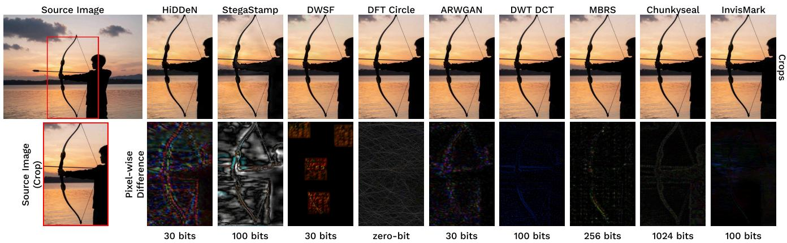  
Figure 1: Visualizations of multiple invisible watermarking methods available in our benchmark. The second row shows the pixel-wise diference from the source image (magnified ×7 for visibility) alongside the embedded message capacity in bits.

The goal ofthis work is to develop a comprehensive, reproducible benchmark for invisible image watermarking that standardizes the assessment of both perceptual quality and robustness across modern techniques. In addition, the study aims to systematically evaluate the current state of the field by assembling a representative set of methods that collectively cover the full spectrum of existing approaches to both watermarking and corresponding attack strategies. Specifically, this study addresses three core research questions:

RQ1 Can any watermarks survive both standard perturbations, erasing attacks, and cross-domain adversarial purification and re-generation techniques?

RQ2 What systematic failure modes exist within specific method classes when exposed to state-of-the-art removal attacks?

RQ3 To what extent can an existing watermark be overwritten via competitive re-embedding without compromising the carrier image?

These questions aim to cover currently underexplored robustness to complex state-of-the-art watermark removal attacks, which will enable finding watermarking methods most suitable for practical scenarios, providing actionable insights for both researchers and practitioners in media protection and content provenance.

We summarize our contributions as follows:

• Comprehensive benchmark. We conduct a large-scale evaluation of32 classical, deep, and generative watermarking methods across 34 adversarial scenarios that reflect all stateof-the-art practices at the time of submission.

• Scalable evaluation framework. All experiments are carried out using our open-source framework designed for modularity and reproducibility. To the best of our knowledge, WARP implements the largest number of watermarking methods and attacks available in the field.

• Practical insights. Our results provide valuable recommendations for selecting watermarking strategies based on method-specific strengths and vulnerabilities, facilitating informed deployment in real-world media systems.

• Evaluation of watermark robustness to overwriting. A novel methodology to systematically assess the potential for competitive re-embedding across watermarks, addressing a gap unexamined in prior work.

## 2 Related Work

## 2.1 Invisible Watermarking Methods

Watermarking techniques can be classified by the stage at which the watermark is embedded. Generative (built-in) methods integrate it directly into the image creation process, e.g., within difusion-based generative models, whereas post-hoc methods add it to already existing images through transformations in spatial, frequency, or latent domains. The former are well-suited to AI-generated content provenance and are inherently robust to generation-specific distortions; the latter ofer flexibility for legacy or arbitrary images but may require additional steps to maintain imperceptibility.

Generative Watermarking Methods. Most in-generation approaches modify the initial noise of the difusion models. TreeRing [69] embeds a structured pattern in the frequency domain of the initial noise to ensure robustness to geometric distortions. Its extensions [10, 65] use discretized ring patterns to enable multibit watermarking. MaXsive [46] separates functions: an X-shaped template corrects geometric distortions, while a separate channel carries the message. Gaussian Shading [74] preserves the original noise distribution and encodes bits using quantiles of the normal distribution. An alternative direction, implemented in Stable Signature [14], is to integrate watermarks by partly fine-tuning the generation model (e.g., Stable Difusion [54]).

Post-hoc methods, applicable to already existing images, encompass both classical frequency-domain and modern neural architectures. Traditional approaches usually operate in Discrete Wavelet [29], Fourier [53], or Cosine [2] Transform domains and embed watermarks in selected frequency coeficients. More advanced methods [21] utilize Spread Spectrum techniques like CAISS [64].

Starting with HiDDeN [80], the "encoder — noise layer — decoder" architecture dominates post-processing watermarking. [13,

Table 1: Comparison of frameworks for watermarking research. "Benchmark" column indicates whether the framework includes comprehensive results for the implemented methods, with . denoting limited evaluations. \* next to the number denotes that the count is based on the methods reported in the original paper, but the number of fully implemented watermarking pipelines found in public repository is smaller. We consider methods recent if they have been released after Jan 2025.
<table><tr><td rowspan="2">Name</td><td colspan="4">WA Methods</td><td rowspan="2">Attacks</td><td rowspan="2">Metrics</td><td rowspan="2">Benchmark</td></tr><tr><td>Post-hoc</td><td>Built-in</td><td>Total</td><td>Recent methods</td></tr><tr><td>Stirmark [36]</td><td>0</td><td>0</td><td>0</td><td>0</td><td>20</td><td>4</td><td>A</td></tr><tr><td>invisible-watermark [60]</td><td>3</td><td>0</td><td>3</td><td>0</td><td>0</td><td>1</td><td>X</td></tr><tr><td>SSL watermarking [16]</td><td>2</td><td>0</td><td>2</td><td>0</td><td>6</td><td>4</td><td>X</td></tr><tr><td>WAVES [4]</td><td>3*</td><td>2*</td><td>5</td><td>0</td><td>20</td><td>9</td><td>√</td></tr><tr><td>W-Bench [42]</td><td>11</td><td>0</td><td>11</td><td>2</td><td>13</td><td>7</td><td></td></tr><tr><td>MarkDiffusion [51]</td><td>0</td><td>9*</td><td>9*</td><td>5</td><td>9*</td><td>12*</td><td>A</td></tr><tr><td>WIBE v1.0 [72]</td><td>15</td><td>2</td><td>17</td><td>2</td><td>23</td><td>10</td><td>A</td></tr><tr><td>WARP (a.k.a. WIBE v2.0)</td><td>26</td><td>6</td><td>32</td><td>9</td><td>34</td><td>14</td><td></td></tr></table>

44] utilize invertible networks to improve accuracy, while [30] solves JPEG non-diferentiability. To enhance imperceptibility, [15, 28, 61, 77] apply attention mechanisms and adversarial losses, and [7, 71] leverage diference scaling for high resolution. For resilience against geometric attacks, [19, 27, 56] implement multi-region mark ing and masking, whereas SyncSeal [17] focuses on synchronization. SSL [16] inherits robustness from the latent space invariance of the DINO [8] model. Robust-Wide [26] protects against instructionbased editing. StegaStamp [63] and PIMoG [12] apply more aggressive perturbations during training to address physical print-cam and screen-cam scenarios. ChunkySeal [52] demonstrates the potential to significantly increase capacity without reducing the robustness.

These methods collectively represent the current state of the art in image watermarking, spanning zero-bit to multi-bit scenarios, frequency-domain classics to fully learned pipelines, and ingeneration to post-generation paradigms. The present benchmark evaluates their performance under a unified set of removal and perturbation attacks, highlighting relative strengths and vulnerabilities in real-world robustness scenarios.

## 2.2 Watermark Robustness Evaluation

Watermarking research is inherently tied to robustness assessment, as adversaries are incentivized to remove existing watermarks or forge them on unprocessed images. Work on erasing watermarks with minimal quality loss, in turn, drives the development of algo rithms designed to resist such countermeasures.

Resistance to image transformations that might occur naturally is expected from most watermarking methods. These include image compression, cropping, resizing, color manipulation, and noise. Recent research also suggests that some watermarks can be removed by relatively simple image manipulation. Yang et al. [73] propose extracting the watermark pattern by averaging several marked images and subtracting the resulting pattern. Shamshad et al. [59] suggests that shifting the image by several pixels horizontally or vertically can remove watermarks such as TreeRing. In addition to natural image distortions, more targeted attacks on watermarking methods have also been investigated. Some watermarks are shown to be vul nerable to image regeneration using difusion models [41, 55, 79],

VAEs [5] and Deep Image Prior [39]. Another category of attacks is based on adversarial optimization techniques [43, 47, 55].

Several comprehensive benchmarks have been proposed to rig orously evaluate watermark robustness. Kutter and Petitcolas [36] propose an early benchmark for image watermarking that standardizes evaluation by defining a set of common attack types (e.g., compression, geometric transformations, filtering, and noise addition) and emphasizing joint assessment of robustness and perceptual quality. The framework relies on a limited set of core evaluation metrics, primarily including bit-error rate for robustness, perceptual quality measures aligned with the human visual system, and ROC-based detection analysis. However, it does not implement or benchmark specific watermarking methods, instead focusing on defining a fair and reproducible evaluation protocol. WAVES [4] was the first substantial benchmark, featuring 20 attacks based on image distortion, regeneration, and adversarial attacks; however, only 3 watermarks were evaluated. W-Bench [42] evaluates 11 watermarking methods against 13 attacks including image distortion, regeneration, global and local editing, and image-to-video generation. MarkDifusion [51] is an open-source toolkit for generative watermarking of latent difusion models, providing a unified implementation of image watermarking methods, along with visu alization and evaluation modules. In the image domain, it integrates 9 watermarking algorithms and supports a comprehensive evaluation pipeline with 9 attack types (e.g., geometric transformations, noise, and compression) and 12 evaluation metrics for assessing detectability and visual quality. However, as a toolkit, it primarily focuses on standardization and usability rather than conducting a large-scale comparative benchmark across methods. WIBE [72] is our evaluation framework focusing on modularity and extensibility, but it does not provide detailed benchmarking results, as it was published as a tool demonstration. In this work, we use WIBE as a starting point: we significantly extend its contents to include all recent state-of-the-art watermarks, attacks and evaluation metrics, and further refine its architecture. We then employ our library to conduct large-scale evaluations and release WARP, a comprehensive watermark robustness benchmark. As summarized in Table 1, our framework comprises the largest number of watermarking and erasing methods to date and extensively tests them to provide detailed insights into the current state of watermark robustness.

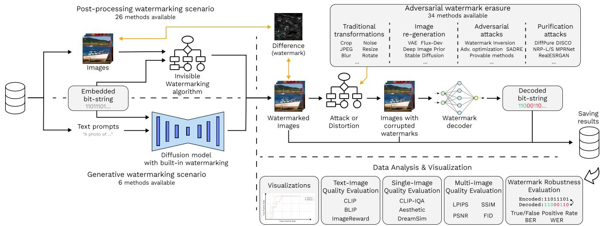  
Figure 2: Overview of the WARP framework pipeline, inherited from WIBE [72]. The process begins with (1) Watermark Embedding and (2) Quality & Imperceptibility Evaluation on the left. The central module, (3) Attack Simulation, applies diverse perturbations or adversarial transformations. On the right, the pipeline continues with (4) Watermark Extraction, (5) Post-Attack Evaluation, and (6) Aggregation & Logging, while (7) Visualization & Reporting is performed as the final step.

## 3 Robustness Evaluation Framework

To ensure consistent and reproducible experimental conditions, we introduce WARP, a modular framework for evaluating the robustness of invisible image watermarking methods. An overview of the pipeline is shown in Fig. 2. WARP adopts a plugin-based architecture with YAML-driven experiment configuration, enabling flexible and transparent setup of evaluation protocols. It supports multiple data formats and storage backends, provides real-time visual feedback, and can orchestrate experiments across multi-GPU systems. The framework operates within isolated Python environments and is capable of automatically resolving method-specific dependencies.

WARP inherits the overall design and structure of WIBE, but significantly expands its functionality, scope, and scale. Architecturally, WARP introduces a uv-based automatic dependency resolver that builds and separates the environments for incompatible methods, as well as additional metrics and other novel features like re-embedding and multi-step attack setups. The evaluation workflow is structured as a sequence of configurable processing stages, allowing watermark embedding, quality assessment, attack application, watermark extraction, and result logging to be implemented as independent components. This design facilitates rapid experimentation and fair comparison across diverse methods.

To the best of our knowledge, WARP integrates the largest collection of image watermarking and watermark removal techniques within a unified framework. At the same time, new watermarks, at tacks, metrics, and datasets can be easily incorporated by wrapping their structure with WARP’s lightweight API.

## 4 Benchmark

Watermarking methods. To cover the field of invisible watermarking, we include a diverse set of 26 post-hoc and 6 generative (built-in) watermarks in our study. Table 2 in the Appendix summarizes all evaluated methods. Architecturally, tested methods range from classical algorithms like DWT DCT [2], DCT CAISS [21] up to the most recent models that employ complex adversarial training pipelines (e.g., PixelSeal [61], Robust-Wide [26]). In terms of capacity, they cover a full spectrum from zero-bit methods that rely on statistical tests to infer a binary result (e.g., DFT Circle [53]) to large multi-bit watermarks (e.g., 1024 bits in ChunkySeal [52]) that can hide large messages and double as steganography methods. Generative watermarks include common Stable Signature [14] and TreeRing [69] algorithms, their modifications (RingID [10], METR [65]), and more recent methods like MaxSive [46].

Erasure methods. To thoroughly investigate the robustness of digital watermarks, we collect a diverse set of image processing methods that could be utilized to evade watermark recognition. The full list of employed methods alongside their brief descriptions can be found in Table 4 in the Appendix. We broadly categorize the attacks into 4 distinct groups: traditional distortions, re-generation attacks, adversarial purification methods and erasure attacks. Traditional distortions include classical transformations that are often used to test watermarks, such as JPEG compression, noise, crops and blur. Re-generation attacks utilize pretrained generative models (e.g., VAEs [5], Stable Difusion [54], FLUX [37]) to alter the watermarked image, often resulting in significant changes relative to the source. Adversarial purification methods incorporate various techniques used to smooth out the image and remove potential adversarial perturbations embedded into the image. These methods are typically employed as adversarial defenses against attacks in other computer vision domains [20]. The erasure attacks group consists of image processing methods that were deliberately proposed or tested as attacks against invisible watermarks in the literature. Representative methods include WMForger [62], DIP [39], Adversarial Embedding [4] and Averaging attack [73].

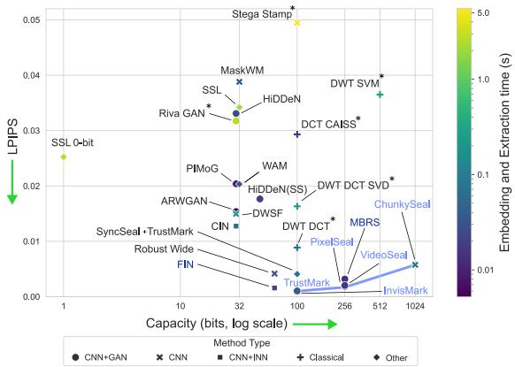  
Figure 3: Capacity-quality tradeof for all tested post-hoc watermarking methods on clear images from MS-COCO. Color of the point represents execution speed, and marker determines the watermark type. Blue line indicates the Paretooptimal front. \* indicates algorithms that only use CPU.

In total, our primary evaluation includes 34 unique attacks. Additionally, we conduct a separate experiment to test watermark robustness in re-embedding scenario. We reimplement each of the 26 post-hoc watermarking methods in our benchmark as attacks and test them across all 32 available methods.

Datasets. We employ subsets of COCO [40] and DifusionDB [68] for our evaluations — two common datasets in the field of watermarking. To balance computational strain and dataset diversity, we sample 1k source images from each of the two sets for robustness evaluations. Considering the number of watermarking methods and attacks employed, this results in more than 2.8M processed images and >8k GPU-hours across our experiments. To evaluate cross-dataset performance, we further employ smaller samples of 400 images from 3 additional datasets: NIPS [35], KonIQ [25], and DIV2K [1], with resolutions ranging from 299x299 to 2040x1300.

Evaluation metrics. To assess image watermarking methods, we employ two primary classes of metrics. The first assesses watermark robustness, i.e., how accurately the extraction algorithm identifies the presence of a watermark after attacks.

For zero-bit watermarking, where the goal is to detect the presence or absence of a watermark, robustness is assessed with binary classification metrics, such as the p-value, which indicates the confidence in a detection. In practical applications where false positives are highly undesirable, the metric of choice becomes the True Positive Rate at a specific, low False Positive Rate (TPR@x%FPR).

In multi-bit watermarking, where a binary payload is embedded, robustness is typically assessed by comparing the extracted message against the original. The primary metric is the Bit Error Rate (BER), which calculates the proportion of incorrectly extracted bits. A stricter metric, the Word Error Rate (WER), considers the entire message lost if even a single bit is decoded wrong. To compare multi-bit and zero-bit methods fairly, the multi-bit case is commonly reduced to a zero-bit one by thresholding the number of matching bits, enabling unified TPR@x%FPR reporting. To avoid extensive negative trials, we compute TPR@x%FPR theoretically: the detection threshold for a target FPR follows analytically from the message length � under the null model that non-watermarked bits are i.i.d. Bernoulli(0.5). Further details are provided in Appendix Sec. C.1.

The second class of metrics addresses image quality. Full-reference metrics (PSNR, SSIM, LPIPS [78], DreamSim [18]) allow a comparison between the original image and the watermarked one for post-generation methods and can also be used to assess the changes introduced by attacks. No-reference metrics (CLIP-IQA[66], Aesthetics [57]) evaluate the quality of the watermarked image independently, without comparing to the original. Prompt-based metrics (BLIP [38], CLIP Score [22], Image Reward [70]) assess the alignment of the image with the textual description for in-generation watermarking methods. FID [23] provides an estimate of the similarity between the distributions of two sets of images.

## 5 Results

This section details the evaluation methodology and presents the obtained results together with a comprehensive analysis.

## 5.1 Clear Performance: Trade-ofs in image watermarking

This experiment evaluates the fundamental steganographic properties of modern watermarking systems, with the implicit research question of whether recent advances in learning-based approaches alter the classical trade-of between embedding capacity, perceptual imperceptibility, and computational eficiency. We benchmark 32 classical, deep learning-based, and generative watermarking methods under a unified protocol, focusing on capacity–quality–eficiency relations. Computational cost is included to reflect deployment constraints, with hardware dependency (CPU vs GPU) explicitly accounted for to ensure comparability across implementations.

Figure 3 presents the comparison for post-hoc methods, showing that earlier techniques such as SSL, HiDDeN, and DWT DCT follow the classical capacity–imperceptibility trade-of, operating in a low-capacity regime where increased payload leads to visible degradation. In contrast, recent approaches, including PixelSeal, ChunkySeal, and InvisMark, shift this frontier, enabling higher embedding capacities while maintaining or improving perceptual quality, efectively relaxing the traditional trade-of structure. The figure also indicates a separation in computational regimes, where modern methods achieve higher throughput but rely on GPU acceleration, whereas earlier approaches, such as DWT-DCT, remain CPU-eficient but limited in scalability. Generative watermarks are evaluated using No-Reference metrics and FID in Appendix Sec. C.2.

Overall, the results indicate that the observed decoupling between capacity and imperceptibility introduces secondary constraints in terms of robustness, which increasingly becomes the primary limiting factor. This observation motivates the subsequent evaluation of robustness under attacks in Section 5.2.

## 5.2 Watermark Robustness: Evaluation in adversarial scenarios

We evaluate all watermarking methods against 34 unique attack configurations (40, including parameterized variants) under a unified threat model, asking whether any method is consistently resilient across heterogeneous perturbations (RQ1) and how diferent method classes fail under specific attack families (RQ2) — i.e., whether robustness generalizes or remains partitioned by method class and threat type. Fig. 4 summarizes main results for all tested methods with TPR@FPR metric, and more detailed evaluations with other robustness scores are provided in Appendix Sec. C.3.

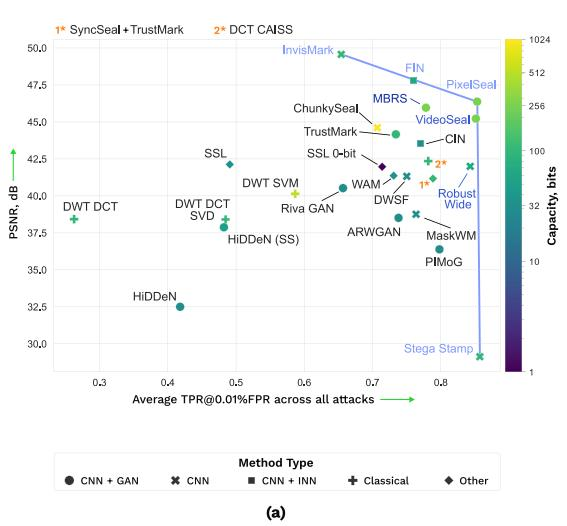

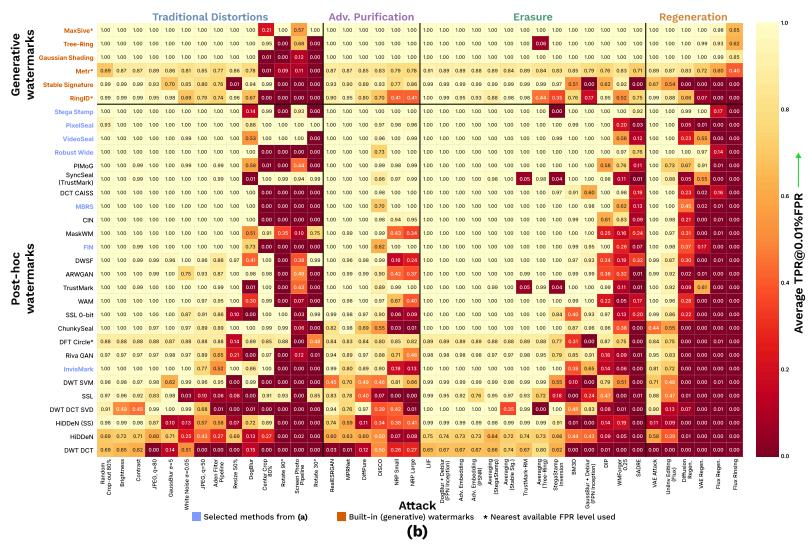  
Figure 4: (a) Robustness-distortion tradeof for diferent post-hoc watermarking methods averaged across all tested attacks on DifusionDB. Robustness is measured with TPR@0.01%FPR (↑); (b) Per-attack robustness breakdown for all tested watermarks.

Visibility-capacity-robustness tradeof. Figure 4a demonstrates a structured trade-of between visibility, capacity, and robust ness, where modern learned methods dominate the Pareto frontier, replacing classical frequency-domain approaches. Early methods such as DWT-DCT, DWT-SVM, and HiDDeN occupy the lower-left part of the plot, reflecting their limited robustness even within larger perturbation budgets. In contrast, recent models such as Robust-Wide, PixelSeal, MaskWM, and InvisMark achieve a much better balance between stealthiness and robustness. Among posthoc methods, StegaStamp is the strongest overall in terms of robustness, while InvisMark stands out as the most imperceptible method that remains on the visibility-robustness frontier. StegaStamp achieves high robustness but at a significantly higher perceptual cost, indicating a less eficient trade-of regime. Taken together, these results suggest that stronger training-time augmentation, and explicit robustness-oriented objectives employed within these methods can substantially improve the quality–robustness balance.

Capacity is observed to improve robustness up to a point, likely due to redundancy efects in decoding, as larger number of bitswaps is required to reach the same FPR threshold. However, this relationship is non-monotonic, as demonstrated by ChunkySeal, where increasing the payload to 1024 bits does not yield superior robustness compared to more moderate-capacity designs such as PixelSeal or VideoSeal. Under a fixed imperceptibility budget, larger payloads can become harder to protect at the bit level, so robustness depends not only on architectural family but also on how eficiently the available embedding capacity is used.

Performance across diferent threat models. Our results highlight a clear separation between traditional distortions and stronger semantic attacks. Standard image manipulations such as moderate JPEG compression, blur, brightness changes, and small crops are tolerated by many modern methods, especially those trained with broad distortion pipelines. In contrast, the most damaging attacks are those that either break spatial alignment or substantially rewrite the image content. Non-right-angle rotations are a particularly revealing failure mode: many otherwise robust watermarks collapse under rotation, showing that geometric synchronization remains a major bottleneck. Methods such as DWSF, MaskWM and DFT-Circle mitigate this limitation via explicit synchronization mechanisms, whereas PixelSeal achieves partial robustness through adversarial training rather than structural alignment modules. The SyncSeal method [17] introduces an external synchronization mechanism that can be applied independently of the underlying watermarking method.

The most severe degradation is observed under regeneration attacks (Fig. 4b). Post-hoc methods are especially vulnerable to attacks that reconstruct or re-synthesize the image, and the FLUX-based regeneration and rinsing attacks are among the most destructive in the benchmark. In these cases, the watermark signal is largely replaced by newly generated content, which leaves very little trace of the original embedding. In contrast, generative watermarks, especially Gaussian Shading and MaXsive, maintain significantly higher robustness under such conditions, indicating a fundamental advantage when the threat model includes image rewriting or synthesis.

Cross-dataset evaluation. We additionally conduct a crossresolution evaluation on five heterogeneous datasets (Appendix Sec. C.4). Overall robustness rankings remain largely consistent across all tested sets. Notably, robustness scores are generally slightly higher at larger resolutions, since many watermarking algorithms operate at fixed low resolutions (typically 224–512 px) and downscale images internally, thereby smoothing out finer adversarial perturbations.

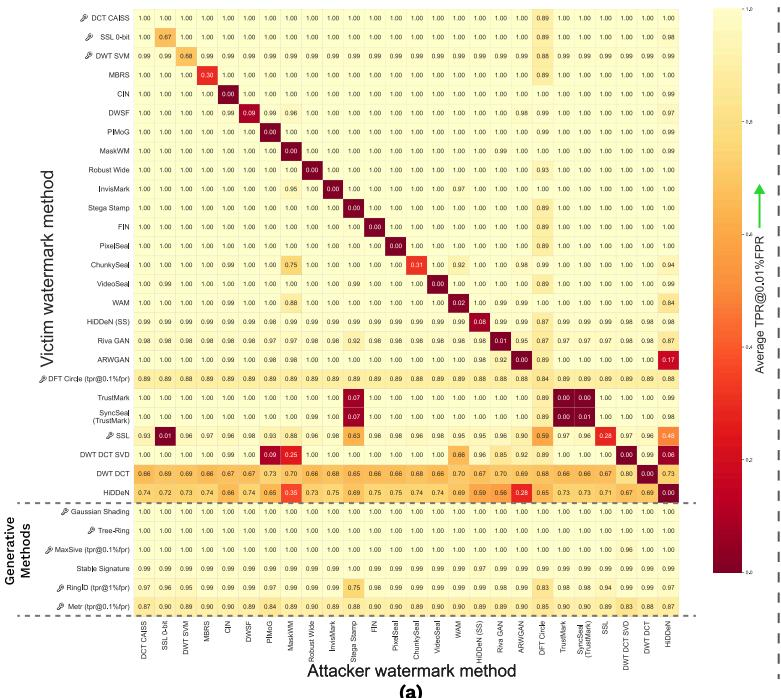  
(a)

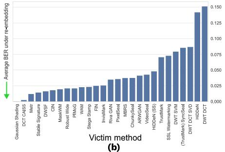

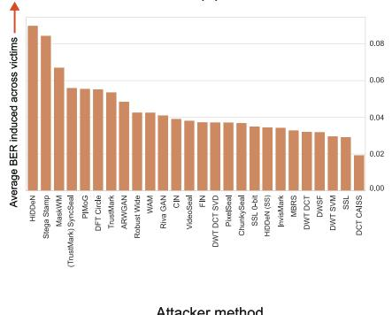  
(c)  
Figure 5: Watermark robustness under re-embedding attacks. (a) Average TPR@0.01%FPR (↑) measured for each pair of victim and attacker watermarks. (b) Bit Error Rate (↓) of multi-bit watermarks under re-embedding attacks, averaged across all attacker watermarks. (c) Watermark eficiency as an attacker is evaluated as the average BER induced across watermarks.

Overall, the main robustness results suggest three practical con clusions, which directly address RQ1 and RQ2. First, the most competitive methods are not the oldest or the highest-capacity ones, but the ones that combine learned embeddings with explicit robustnessoriented training, indicating that consistent resilience across perturbation types is achievable only under specific design choices rather than being a general property of any method class. Second, geometric alignment remains a crucial weakness, and rotation-aware design is still a meaningful architectural advantage, which reflects a systematic and a recurring failure mode under geometric transforms across most method families. Third, post-hoc methods exhibit a notable robustness gap compared to generative approaches, and the choice between the two classes should be guided by the expected threat model and practical use case: post-hoc methods are suitable when the main risk is conventional distortion or non-destructive image processing, whereas generative watermarks are applicable in a limited set of scenarios and are preferable when the adversary can perform strong image reconstruction or regeneration.

## 5.3 Like cures Like: Evaluating watermark robustness under re-embedding attacks

In this experiment, we address the RQ3 and focus on the behavior of watermarks under re-embedding attacks, i.e., when additional watermarks are superimposed onto an existing one. This scenario is both practically relevant and methodologically important, as it reflects realistic conditions in which a third party might re-embed an image originally watermarked by another entity, thereby overwrit ing it with their own identifier. In such cases, the original watermark must remain readable, preserving its integrity despite the attack. The study is conducted on DifusionDB, with all watermarks evaluated against one another. Post-hoc watermarks with random bit sequences are used as attacks, while built-in watermarks cannot serve as attackers and are therefore tested only as victims. Figure 5a reports average TPR@0.01%FPR scores across victim-attacker pairs.

Post-hoc methods over other post-hoc methods. The experimental results show that watermarks are relatively resistant to external post-hoc attacks. The largest increases in BER are observed among methods that already exhibit low robustness to attacks: DWT DCT, HiDDeN, and DWT DCT SVD (see Figure 5b). Conversely, the methods that induce the most significant BER degradation when acting as attackers tend to be those with the lowest PSNR: HiDDeN, StegaStamp, PIMoG, and MaskWM. The victim-attacker matrix reveals notable asymmetry: "stronger" methods often erase "weaker" ones even when image quality is comparable (Fig. 5a). For instance, GAN-based PIMoG invalidates classical DWT-DCT-SVD, while the reverse has minimal impact. Surprisingly, DWT-DCT-SVD resists the more disruptive StegaStamp attacker, suggesting these asymmetries stem from structural frequency-domain diferences (Appendix Fig. 19) rather than simple degradation levels.

Resilience to self re-embedding. The results reveal that most watermarks exhibit limited resilience to self-re-embedding. A second application of the same method efectively removes the original watermark. However, methods that rely on a key (marked with the key icon in Figure 5a) can survive re-embedding provided a diferent key is used. Notably, only the DCT CAISS method demonstrates strong resistance to self-overlays, an observation consistent with experiments originally reported in the Spread Spectrum Watermarking literature [11]. In contrast, the majority of neural post-hoc methods are keyless and remain vulnerable to self-erasure.

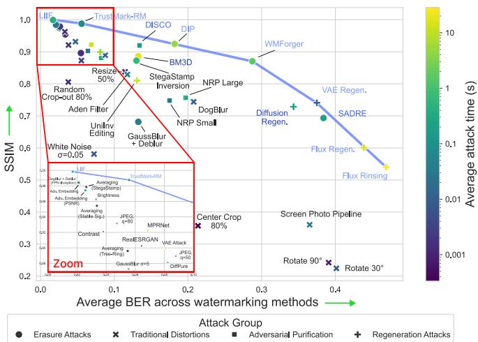  
Figure 6: Eficiency-distortion tradeof for diferent attacks averaged across all watermarks on DifusionDB dataset. Attack eficiency is measured with BER. Attacks with colored names lie close to the eficiency-visibility Pareto front.

The behavior of built-in watermarks under post-hoc overlays. Built-in watermarks prove to be practically immune to posthoc overlays. In particular, Stable Signature, obtained by fine-tuning a Stable Difusion model on the decoder of Hidden (SS), remains robust against attacks from the same method. Despite sharing a decoder with Hidden (SS), Stable Signature efectively withstands re-embedding attacks launched with the Hidden (SS) encoder. The only exception among generative methods is METR, which shows a small but consistent drop in TPR under any re-embedding. As illustrated in Fig. 4 (b), METR exhibits limited robustness in general. This vulnerability may arise from its low capacity of only 10 bits, where even a single bit flip can significantly degrade the TPR.

Potential benefits of combining multiple watermarking methods. Beyond robustness to re-embedding attacks, the findings also suggest that multiple watermarking methods could potentially be combined within a single image. Such integration could enable an increased embedding capacity or the implementation of dual schemes, where diferent watermarks serve complementary purposes, for instance, one for ownership verification and another for tracking or authentication. However, combining methods would result in increased perturbation budget, potentially compromising the imperceptibility requirements. Therefore, a more detailed evaluation might be necessary for practical deployment.

## 5.4 Adversarial Strength: Evaluating attacks from the attacker’s perspective

This experiment addresses the second part of RQ2, shifting focus to the attacker’s perspective and analyzing which transformations are most efective at disrupting watermarks. To this end, we aggregate BER induced by each attack across all multi-bit watermarking methods, providing a coarse but informative method-agnostic ranking of attack strength (Fig. 6). This analysis is intended to highlight the most critical attack vectors, thereby informing the design of more robust future watermarking systems.

A clear Strength/Perceptual Similarity tradeof can be observed among attackers (Fig. 6). Notably, methods explicitly designed for watermark removal consistently dominate this frontier, achieving strong disruption under relatively small perceptual degra dation. In particular, WMForger, TrustMark-RM and SADRE are among the best in eficiency, maintaining high attack success while preserving reasonable image fidelity.

Among Adversarial Purification methods, performance varies substantially. DifPure shows relatively weak efectiveness, suggesting that removing adversarial perturbations does not directly translate to removing structured watermark signals. In contrast, approaches based on implicit neural representations, such as DISCO and DIP, are significantly more efective, aligning with prior observations [39] that such models can implicitly overwrite highfrequency embedded signals. Classical restoration models (e.g., RealESRGAN, MPRNet) also provide some erasure capability, but remain suboptimal compared to dedicated attacks.

Traditional distortions exhibit a diferent regime: while many common perturbations (e.g., mild compression or noise) are relatively weak, geometric transformations such as rotation and cropping rank among the most destructive, although their pixel-level image quality cannot be well captured with Full-Reference metrics such as SSIM. To better account for perceptual and semantic changes, we additionally evaluate attack quality using CLIP-IQA (No-Reference technical quality score) and an aesthetic predictor, with detailed comparisons provided in the Appendix Sec. C.5.

Finally, we analyze attack strength as a function of controllable hyperparameters (Appendix Sec. C.6). Among the evaluated methods, WMForger demonstrates the most favorable rate–distortion behavior, consistently outperforming alternatives across a wide range of settings. Interestingly, even simple baselines such as JPEG compression retain competitive efectiveness at lower quality factors, highlighting that even traditional distortions can still pose a meaningful threat under strong compression regimes.

## 6 Conclusion

This work presents WARP, a reproducible benchmark for invisible image watermarking that evaluates 32 methods under a diverse set of 34 attack scenarios to expose the trade-ofs between capacity, imperceptibility, and robustness. No method is uniformly robust (RQ1): learned and generative approaches improve over baselines but remain vulnerable to geometric, purification, and regeneration attacks, indicating that robustness reflects threat-model alignment rather than intrinsic superiority. We identify structured failure modes (RQ2), including geometric misalignment, asymmetric re-embedding, and regeneration-based removal. Re-embedding frequently overwrites post-hoc watermarks, while generative and key-based methods resist it (RQ3), implying that persistence depends on the embedding mechanism. In practice, our results favor post-hoc methods with explicit synchronization when the expected threat is conventional processing, and in-generation watermarks wherever the pipeline allows them, as these are the only ones that reliably survive regeneration.

## Acknowledgments

This work was supported by a grant provided by the Ministry ofEconomic Development of the Russian Federation in accordance with the subsidy agreement (agreement identifier 000000C313925P4G0002) and the agreement with the Ivannikov Institute for System Programming of the Russian Academy of Sciences dated June 20, 2025, No. 139-15-2025-011. The research was carried out using the MSU-270 supercomputer of Lomonosov Moscow State University and ISP RAS computing cluster.

## References

[1] Eirikur Agustsson and Radu Timofte. 2017. NTIRE 2017 Challenge on Single Image Super-Resolution: Dataset and Study. In The IEEE Conference on Computer Vision and Pattern Recognition (CVPR) Workshops.

[2] Ali Al-Haj. 2007. Combined DWT-DCT digital image watermarking. Journal of computer science 3, 9 (2007), 740–746.

[3] Inzamamul Alam, Md Tanvir Islam, and Simon S Woo. 2025. Saliency-aware difusion reconstruction for efective invisible watermark removal. In Companion Proceedings ofthe ACM on Web Conference 2025. 849–853.

[4] Bang An, Mucong Ding, Tahseen Rabbani, Aakriti Agrawal, Yuancheng Xu, Chenghao Deng, Sicheng Zhu, Abdirisak Mohamed, Yuxin Wen, Tom Goldstein, et al. 2024. Waves: Benchmarking the robustness of image watermarks. arXiv preprint arXiv:2401.08573 (2024).

[5] Johannes Ballé, David Minnen, Saurabh Singh, Sung Jin Hwang, and Nick Johnston. 2018. Variational image compression with a scale hyperprior. arXiv preprint arXiv:1802.01436 (2018).

[6] Tim Brooks, Aleksander Holynski, and Alexei A Efros. 2023. Instructpix2pix: Learning to follow image editing instructions. In Proceedings ofthe IEEE/CVF conference on computer vision and pattern recognition. 18392–18402.

[7] Tu Bui, Shruti Agarwal, and John Collomosse. 2023. Trustmark: Universal water marking for arbitrary resolution images. arXiv preprint arXiv:2311.18297 (2023).

[8] Mathilde Caron, Hugo Touvron, Ishan Misra, Hervé Jegou, Julien Mairal, Piotr Bojanowski, and Armand Joulin. 2021. Emerging Properties in Self-Supervised Vision Transformers. In 2021 IEEE/CVF International Conference on Computer Vision (ICCV). 9630–9640. doi:10.1109/ICCV48922.2021.00951

[9] Yinbo Chen, Sifei Liu, and Xiaolong Wang. 2021. Learning Continuous Image Representation with Local Implicit Image Function. In 2021 IEEE/CVF Conference on Computer Vision and Pattern Recognition (CVPR). 8624–8634. doi:10.1109/ CVPR46437.2021.00852

[10] Hai Ci, Pei Yang, Yiren Song, and Mike Zheng Shou. 2024. Ringid: Rethinking tree ring watermarking for enhanced multi-key identification. In European conference on computer vision. Springer, 338–354.

[11] Ingemar J Cox, Joe Kilian, F Thomson Leighton, and Talal Shamoon. 1997. Secure spread spectrum watermarking for multimedia. IEEE transactions on image processing 6, 12 (1997), 1673–1687.

[12] Han Fang, Zhaoyang Jia, Zehua Ma, Ee-Chien Chang, and Weiming Zhang. 2022. PIMoG: An efective screen-shooting noise-layer simulation for deep-learning based watermarking network. In Proceedings of the 30th ACM international conference on multimedia. 2267–2275.

[13] Han Fang, Yupeng Qiu, Kejiang Chen, Jiyi Zhang, Weiming Zhang, and Ee-Chien Chang. 2023. Flow-based robust watermarking with invertible noise layer for black-box distortions. In Proceedings of the AAAI conference on artificial intelligence, Vol. 37. 5054–5061.

[14] Pierre Fernandez, Guillaume Couairon, Hervé Jégou, Matthijs Douze, and Teddy Furon. 2023. The Stable Signature: Rooting Watermarks in Latent Difusion Models. In 2023 IEEE/CVF International Conference on Computer Vision (ICCV). 22409–22420. doi:10.1109/ICCV51070.2023.02053

[15] Pierre Fernandez, Hady Elsahar, I Zeki Yalniz, and Alexandre Mourachko. 2024. Video seal: Open and eficient video watermarking. arXiv preprint arXiv:2412.09492 (2024).

[16] Pierre Fernandez, Alexandre Sablayrolles, Teddy Furon, HervéJégou, and Matthijs Douze. 2022. Watermarking Images in Self-Supervised Latent Spaces. In IEEE International Conference on Acoustics, Speech and Signal Processing (ICASSP). IEEE.

[17] Pierre Fernandez, Tomáš Souček, Nikola Jovanović, Hady Elsahar, Sylvestre-Alvise Rebufi, Valeriu Lacatusu, Tuan Tran, and Alexandre Mourachko. 2025. Geometric image synchronization with deep watermarking. arXiv preprint arXiv:2509.15208 (2025).

[18] Stephanie Fu, Netanel Tamir, Shobhita Sundaram, Lucy Chai, Richard Zhang, Tali Dekel, and Phillip Isola. 2023. Dreamsim: Learning new dimensions of human visual similarity using synthetic data. arXiv preprint arXiv:2306.09344 (2023).

[19] Hengchang Guo, Qilong Zhang, Junwei Luo, Feng Guo, Wenbin Zhang, Xiaodong Su, and Minglei Li. 2023. Practical deep dispersed watermarking with synchro nization and fusion. In Proceedings ofthe 31st ACM international conference on

multimedia. 7922–7932.

[20] Alexander Gushchin, Khaled Abud, Georgii Bychkov, Ekaterina Shumitskaya, Anna Chistyakova, Sergey Lavrushkin, Bader Rasheed, Kirill Malyshev, Dmitriy Vatolin, and Anastasia Antsiferova. 2024. Guardians of image quality: Benchmarking defenses against adversarial attacks on image quality metrics. arXiv preprint arXiv:2408.01541 (2024).

[21] Piotr Guzik, Andrzej Matiolanski, and Andrzej Dziech. 2015. Real data performance evaluation of CAISS watermarking scheme. Multimedia Tools and Applications 74, 12 (2015), 4437–4451.

[22] Jack Hessel, Ari Holtzman, Maxwell Forbes, Ronan Le Bras, and Yejin Choi. 2021. Clipscore: A reference-free evaluation metric for image captioning. In Proceedings of the 2021 conference on empirical methods in natural language processing. 7514– 7528.

[23] Martin Heusel, Hubert Ramsauer, Thomas Unterthiner, Bernhard Nessler, and Sepp Hochreiter. 2017. Gans trained by a two time-scale update rule converge to a local nash equilibrium. Advances in neural information processing systems 30 (2017).

[24] Chih-Hui Ho and Nuno Vasconcelos. 2022. DISCO: Adversarial defense with local implicit functions. Advances in neural information processing systems 35 (2022), 23818–23837.

[25] V. Hosu, H. Lin, T. Sziranyi, and D. Saupe. 2020. KonIQ-10k: An Ecologically Valid Database for Deep Learning of Blind Image Quality Assessment. IEEE Transactions on Image Processing 29 (2020), 4041–4056.

[26] Runyi Hu, Jie Zhang, Ting Xu, Jiwei Li, and Tianwei Zhang. 2024. Robust-wide: Robust watermarking against instruction-driven image editing. In European Conference on Computer Vision. Springer, 20–37.

[27] Runyi Hu, Jie Zhang, Shiqian Zhao, Nils Lukas, Jiwei Li, Qing Guo, Han Qiu, and Tianwei Zhang. 2025. Mask image watermarking. arXiv preprint arXiv:2504.12739 (2025).

[28] Jiangtao Huang, Ting Luo, Li Li, Gaobo Yang, Haiyong Xu, and Chin-Chen Chang. 2023. ARWGAN: Attention-guided robust image watermarking model based on GAN. IEEE Transactions on Instrumentation and Measurement 72 (2023), 1–17.

[29] Mohiul Islam, Amarjit Roy, and Rabul Hussain Laskar. 2020. SVM-based robust image watermarking technique in LWT domain using diferent sub-bands. Neural Computing and Applications 32, 5 (2020), 1379–1403.

[30] Zhaoyang Jia, Han Fang, and Weiming Zhang. 2021. Mbrs: Enhancing robustness of dnn-based watermarking by mini-batch of real and simulated jpeg compression. In Proceedings ofthe 29th ACM international conference on multimedia. 41–49.

[31] Guanlong Jiao, Biqing Huang, Kuan-Chieh Jackson Wang, and Renjie Liao. 2026. UniEdit-Flow: Unleashing Inversion and Editing in the Era of Flow Models. In The Fourteenth International Conference on Learning Representations. https: //openreview.net/forum?id=ArU2CeB7Tm

[32] Akiomi Kamakura. 2022. akiomik/pilgram: v1.2.1. doi:10.5281/zenodo.6086991

[33] Changhoon Kim, Kyle Min, Maitreya Patel, Sheng Cheng, and Yezhou Yang. 2024. Wouaf: Weight modulation for user attribution and fingerprinting in text-to image difusion models. In Proceedings ofthe IEEE/CVF Conference on Computer Vision and Pattern Recognition. 8974–8983.

[34] Orest Kupyn, Tetiana Martyniuk, Junru Wu, and Zhangyang Wang. 2019. DeblurGAN-v2: Deblurring (Orders-of-Magnitude) Faster and Better. In 2019 IEEE/CVF International Conference on Computer Vision (ICCV). 8877–8886. doi:10. 1109/ICCV.2019.00897

[35] Alexey Kurakin, Ian J. Goodfellow, Samy Bengio, Yinpeng Dong, Fangzhou Liao, Ming Liang, Tianyu Pang, Jun Zhu, Xiaolin Hu, et al. 2018. Adversarial Attacks and Defences Competition. arXiv preprint arXiv:1804.00097 (2018). Preprint summary of the NIPS 2017 competition.

[36] Martin Kutter and Fabien AP Petitcolas. 1999. Fair benchmark for image watermarking systems. In Security and watermarking ofmultimedia contents, Vol. 3657. SPIE, 226–239.

[37] Black Forest Labs. 2024. FLUX. https://github.com/black-forest-labs/flux.

[38] Junnan Li, Dongxu Li, Caiming Xiong, and Steven Hoi. 2022. BLIP: Bootstrapping Language-Image Pre-training for Unified Vision-Language Understanding and Generation. In Proceedings ofthe 39th International Conference on Machine Learning (Proceedings ofMachine Learning Research, Vol. 162), Kamalika Chaudhuri, Stefanie Jegelka, Le Song, Csaba Szepesvari, Gang Niu, and Sivan Sabato (Eds.). PMLR, 12888–12900. https://proceedings.mlr.press/v162/li22n.html

[39] Hengyue Liang, Taihui Li, and Ju Sun. 2025. A Baseline Method for Removing Invisible Image Watermarks Using Deep Image Prior. arXiv:2502.13998 [eess] doi:10.48550/arXiv.2502.13998

[40] Tsung-Yi Lin, Michael Maire, Serge Belongie, James Hays, Pietro Perona, Deva Ramanan, Piotr Dollár, and C Lawrence Zitnick. 2014. Microsoft coco: Common objects in context. In European conference on computer vision. Springer, 740–755.

[41] Yepeng Liu, Yiren Song, Hai Ci, Yu Zhang, Haofan Wang, Mike Zheng Shou, and Yuheng Bu. 2025. Image watermarks are removable using controllable regeneration from clean noise. In International Conference on Learning Representations, Vol. 2025. 87310–87327.

[42] Shilin Lu, Zihan Zhou, Jiayou Lu, Yuanzhi Zhu, and Adams Kong. 2025. Robust watermarking using generative priors against image editing: From benchmarking to advances. In International Conference on Learning Representations, Vol. 2025.

83902–83936.

[43] Nils Lukas, Abdulrahman Diaa, Lucas Fenaux, and Florian Kerschbaum. 2023. Leveraging Optimization for Adaptive Attacks on Image Watermarks. (2023). doi:10.48550/ARXIV.2309.16952

[44] Rui Ma, Mengxi Guo, Yi Hou, Fan Yang, Yuan Li, Huizhu Jia, and Xiaodong Xie. 2022. Towards blind watermarking: Combining invertible and non-invertible mechanisms. In Proceedings ofthe 30th ACM International Conference on Multimedia. 1532–1542.

[45] Ymir Mäkinen, Lucio Azzari, and Alessandro Foi. 2020. Collaborative filtering of correlated noise: Exact transform-domain variance for improved shrinkage and patch matching. IEEE Transactions on Image Processing 29 (2020), 8339–8354.

[46] Po-Yuan Mao, Cheng-Chang Tsai, and Chun-Shien Lu. 2025. MaXsive: High-Capacity and Robust Training-Free Generative Image Watermarking in Difusion Models. In Proceedings ofthe 33rd ACM International Conference on Multimedia. 11443–11452.

[47] Andreas Müller, Denis Lukovnikov, Jonas Thietke, Asja Fischer, and Erwin Quir ing. 2025. Black-box forgery attacks on semantic watermarks for difusion models. In 2025 IEEE/CVF Conference on Computer Vision and Pattern Recognition (CVPR). IEEE, 20937–20946.

[48] Muzammal Naseer, Salman Khan, Munawar Hayat, Fahad Shahbaz Khan, and Fatih Porikli. 2020. A Self-supervised Approach for Adversarial Robustness. In 2020 IEEE/CVF Conference on Computer Vision and Pattern Recognition (CVPR). 259–268. doi:10.1109/CVPR42600.2020.00034

[49] KA Navas, Mathews Cheriyan Ajay, M Lekshmi, Tampy S Archana, and M Sasikumar. 2008. Dwt-dct-svd based watermarking. In 2008 3rd international conference on communication systems software and middleware and workshops (COMSWARE’08). IEEE, 271–274.

[50] Weili Nie, Brandon Guo, Yujia Huang, Chaowei Xiao, Arash Vahdat, and Anima Anandkumar. 2022. Difusion models for adversarial purification. arXiv preprint arXiv:2205.07460 (2022).

[51] Leyi Pan, Sheng Guan, Zheyu Fu, Luyang Si, Huan Wang, Zian Wang, Hanqian Li, Xuming Hu, Irwin King, Philip S Yu, et al. 2025. MarkDifusion: An Open-Source Toolkit for Generative Watermarking of Latent Difusion Models. arXiv preprint arXiv:2509.10569 (2025).

[52] Aleksandar Petrov, Pierre Fernandez, Tomáš Souček, and Hady Elsahar. 2025. We can hide more bits: The unused watermarking capacity in theory and in practice. arXiv preprint arXiv:2510.12812 (2025).

[53] Ante Poljicak, Lidija Mandic, and Darko Agic. 2011. Discrete Fourier transform– based watermarking method with an optimal implementation radius. Journal of Electronic Imaging 20, 3 (2011), 033008–033008.

[54] Robin Rombach, Andreas Blattmann, Dominik Lorenz, Patrick Esser, and Björn Ommer. 2022. High-resolution image synthesis with latent difusion models. In Proceedings of the IEEE/CVF conference on computer vision and pattern recognition. 10684–10695.

[55] Mehrdad Saberi, Vinu Sankar Sadasivan, Keivan Rezaei, Aounon Kumar, Atoosa Chegini, Wenxiao Wang, and Soheil Feizi. 2023. Robustness ofAI-Image Detectors: Fundamental Limits and Practical Attacks. (2023). doi:10.48550/ARXIV.2310.00076

[56] Tom Sander, Pierre Fernandez, Alain Durmus, Teddy Furon, and Matthijs Douze. 2024. Watermark anything with localized messages. arXiv preprint arXiv:2411.07231 (2024).

[57] Christoph Schuhmann, Romain Beaumont, Richard Vencu, Cade Gordon, Ross Wightman, Mehdi Cherti, Theo Coombes, Aarush Katta, Clayton Mullis, Mitchell Wortsman, Patrick Schramowski, Srivatsa Kundurthy, Katherine Crowson, Ludwig Schmidt, Robert Kaczmarczyk, and Jenia Jitsev. 2022. LAION-5B: An open large-scale dataset for training next generation image-text models. arXiv:2210.08402 [cs.CV] https://arxiv.org/abs/2210.08402

[58] IF Serzhenko, LA Khaertdinova, MA Pautov, and AV Antsiferova. 2025. Watermark Overwriting Attack on StegaStamp algorithm. arXiv preprint arXiv:2505.01474 (2025).

[59] Fahad Shamshad, Tameem Bakr, Yahia Salaheldin Shaaban, Noor Hazim Hussein, Karthik Nandakumar, and Nils Lukas. 2025. First-Place Solution to NeurIPS 2024 Invisible Watermark Removal Challenge. In The 1st Workshop on GenAI Watermarking. https://openreview.net/forum?id=wLaP37BrhE

[60] ShieldMnt. 2021. invisible-watermark. https://github.com/ShieldMnt/invisiblewatermark. GitHub repository.

[61] Tomáš Souček, Pierre Fernandez, Hady Elsahar, Sylvestre-Alvise Rebufi, Valeriu Lacatusu, Tuan Tran, Tom Sander, and Alexandre Mourachko. 2025. Pixel Seal: Adversarial-only training for invisible image and video watermarking. arXiv preprint arXiv:2512.16874 (2025).

[62] Tomáš Souček, Sylvestre-Alvise Rebufi, Pierre Fernandez, Nikola Jovanović, Hady Elsahar, Valeriu Lacatusu, Tuan Tran, and Alexandre Mourachko. 2025.

Transferable Black-Box One-Shot Forging of Watermarks via Image Preference Models. arXiv preprint arXiv:2510.20468 (2025).

[63] Matthew Tancik, Ben Mildenhall, and Ren Ng. 2020. StegaStamp: Invisible Hyperlinks in Physical Photographs. In 2020 IEEE/CVF Conference on Computer Vision and Pattern Recognition (CVPR). 2114–2123. doi:10.1109/CVPR42600.2020. 00219

[64] Amir Valizadeh and Z. Jane Wang. 2011. Correlation-and-Bit-Aware Spread Spectrum Embedding for Data Hiding. IEEE Transactions on Information Forensics and Security 6, 2 (2011), 267–282. doi:10.1109/TIFS.2010.2103061

[65] Alexander Varlamov, Daria Diatlova, and Egor Spirin. 2024. Metr: Image watermarking with large number of unique messages. arXiv preprint arXiv:2408.08340 (2024).

[66] Jianyi Wang, Kelvin CK Chan, and Chen Change Loy. 2023. Exploring clip for assessing the look and feel of images. In Proceedings ofthe AAAI conference on artificial intelligence, Vol. 37. 2555–2563.

[67] Xintao Wang, Liangbin Xie, Chao Dong, and Ying Shan. 2021. Real-ESRGAN: Training Real-World Blind Super-Resolution with Pure Synthetic Data. In 2021 IEEE/CVF International Conference on Computer Vision Workshops (ICCVW). 1905– 1914. doi:10.1109/ICCVW54120.2021.00217

[68] ZijieJ. Wang, Evan Montoya, David Munechika, Haoyang Yang, Benjamin Hoover, and Duen Horng Chau. 2022. DifusionDB: A Large-Scale Prompt Gallery Dataset for Text-to-Image Generative Models. arXiv:2210.14896 [cs] (2022). https://arxiv. org/abs/2210.14896

[69] Yuxin Wen, John Kirchenbauer, Jonas Geiping, and Tom Goldstein. 2023. Treering watermarks: Fingerprints for difusion images that are invisible and robust. arXiv preprint arXiv:2305.20030 (2023).

[70] Jiazheng Xu, Xiao Liu, Yuchen Wu, Yuxuan Tong, Qinkai Li, Ming Ding, Jie Tang, and Yuxiao Dong. 2023. ImageReward: Learning and Evaluating Human Preferences for Text-to-Image Generation. arXiv:2304.05977 [cs.CV] https: //arxiv.org/abs/2304.05977

[71] Rui Xu, Mengya Hu, Deren Lei, Yaxi Li, David Lowe, Alex Gorevski, Mingyu Wang, Emily Ching, and Alex Deng. 2025. InvisMark: Invisible and robust watermarking for AI-generated image provenance. In 2025 IEEE/CVF Winter Conference on Applications of Computer Vision (WACV). IEEE, 909–918.

[72] A Yakushev, A Akimenkov, K Abud, D Obydenkov, I Serzhenko, K Aistov, E Kovalev, S Fomin, A Antsiferova, K Lukianov, et al. 2025. WIBE: Watermarks for generated Images-Benchmarking & Evaluation. In Proceedings of the 40th IEEE/ACM International Conference on Automated Software Engineering.

[73] Pei Yang, Hai Ci, Yiren Song, and Mike Zheng Shou. 2024. Steganalysis on Digital Watermarking: Is Your Defense Truly Impervious? arXiv:2406.09026 [cs] doi:10.48550/arXiv.2406.09026

[74] Zijin Yang, Kai Zeng, Kejiang Chen, Han Fang, Weiming Zhang, and Nenghai Yu. 2024. Gaussian shading: Provable performance-lossless image watermarking for difusion models. In Proceedings ofthe IEEE/CVF Conference on Computer Vision and Pattern Recognition. 12162–12171.

[75] Ning Yu, Vladislav Skripniuk, Sahar Abdelnabi, and Mario Fritz. 2021. Artificial fingerprinting for generative models: Rooting deepfake attribution in training data. In 2021 IEEE/CVF International Conference on Computer Vision (ICCV). IEEE, 14428–14437.

[76] Syed Waqas Zamir, Aditya Arora, Salman Khan, Munawar Hayat, Fahad Shahbaz Khan, Ming-Hsuan Yang, and Ling Shao. 2021. Multi-Stage Progressive Image Restoration. In 2021 IEEE/CVF Conference on Computer Vision and Pattern Recognition (CVPR). 14816–14826. doi:10.1109/CVPR46437.2021.01458

[77] Kevin Alex Zhang, Lei Xu, Alfredo Cuesta-Infante, and Kalyan Veeramachaneni. 2019. Robust invisible video watermarking with attention. arXiv preprint arXiv:1909.01285 (2019).

[78] Richard Zhang, Phillip Isola, Alexei A Efros, Eli Shechtman, and Oliver Wang. 2018. The unreasonable efectiveness of deep features as a perceptual metric. In Proceedings of the IEEE conference on computer vision and pattern recognition. 586–595.

[79] Xuandong Zhao, Kexun Zhang, Zihao Su, Saastha Vasan, Ilya Grishchenko, Christopher Kruegel, Giovanni Vigna, Yu-Xiang Wang, and Lei Li. 2024. In visible Image Watermarks Are Provably Removable Using Generative AI. arXiv:2306.01953 [cs] doi:10.48550/arXiv.2306.01953

[80] Jiren Zhu, Russell Kaplan, Justin Johnson, and Li Fei-Fei. 2018. HiDDeN: Hiding Data With Deep Networks. In Computer Vision – ECCV 2018: 15th European Conference, Munich, Germany, September 8-14, 2018, Proceedings, Part XV (Munich, Germany). Springer-Verlag, Berlin, Heidelberg, 682–697. doi:10.1007/978-3-030- 01267-0\_40

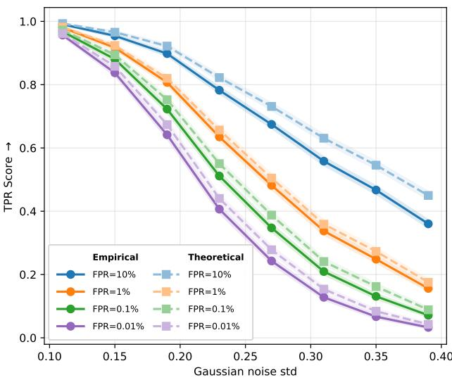  
Figure 7: Theoretical vs. empirical TPR@FPR for multibit watermarking under Gaussian noise. Solid lines represent empirical TPR estimated using a reference set of N=100,000 non-watermarked images from MS-COCO train split following the WAVES protocol; Dashed lines represent theoretical TPR computed from the binomial model assuming i.i.d. Bernoulli(0.5) bits. Four FPR thresholds are shown: 10%, 1%, 0.1% and 0.01%. Results are reported for TrustMark (k=100 bits) on the MS-COCO validation split.

## A Contents

• Section B describes all watermarking methods and attacks employed in the benchmark, summarized in Tables 2 and 4 respectively, along with the unified evaluation protocol used across all experiments.

• Section C.1 provides further details on watermark extraction success metrics, including a validation of the theoretical FPR estimation against an empirical reference set, an analysis of the relationship between TPR@x%FPR and BER, and a heatmap of TPR across methods and attacks at multiple FPR thresholds.

• Section C.2 reports image generation quality evaluations for built-in watermarking methods, comparing watermarked and non-watermarked outputs from the same generative model across FID and five per-image quality metrics.

• Section C.3 presents the full per-method, per-attack robustness breakdown across all 32 watermarking methods and 34 attack configurations, measured by Average BER, WER and TPR@0.01%FPR.

• Section C.4 reports cross-dataset evaluation results and compares watermark robustness across diferent resolutions ranging from 299x299 to 2040x1300.

• Section C.5 evaluates perceptual and semantic changes introduced by watermarking methods and attacks, using four complementary imperceptibility metrics for watermarks and three quality metrics for attacks.

• Section C.6 analyzes attack strength as a function of con trollable hyperparameters for six selected attacks, reporting per-method BER–distortion curves and their cross-method averages.

• Section C.7 visualizes the frequency-domain signatures of all post-hoc watermarking methods via averaged FFT spectrum diferences.

• Section D discusses the limitations ofthe current benchmark and outlines directions for future work.

## B Details on employed methods

Table 2 summarizes the invisible watermarking methods utilized in our study. Table 4 describes the adversarial attacks used to test the robustness of the watermarking algorithms.

We adopt a unified evaluation protocol to ensure a fair and reproducible comparison across all watermarking methods. During evaluation, a random bit sequence is generated independently for each input image and used as the watermark payload.

To ensure consistent spatial alignment across methods and support arbitrary image resolutions, we follow the resolution scaling strategy proposed in TrustMark [7]. Specifically, each image is first resized to a fixed resolution for watermark embedding, after which the residual between the watermarked and original images is computed and upscaled back to the original resolution, and added to the input image. This approach allows all methods to operate at their native resolution while preserving the structure of the embedded signal.

We evaluate all methods on two datasets: DifusionDB [68] and MS-COCO [40]. For each method, we use the oficial open-source implementations provided by the authors, which are integrated into our framework as submodules. All experiments are conducted using PyTorch, and pretrained weights released by the original authors are used without additional fine-tuning. The exception is the HiDDeN method: in addition to the base model, the Hidden (SS) version provided by the authors of Stable Signature is also used. For classical watermarking methods that do not have publicly available implementations, including DFT Circle, DWT SVM, and DCT CAISS, we provide our own implementations based on the descriptions in the corresponding papers. All preprocessing, postprocessing, and evaluation procedures are applied uniformly across all methods to ensure a consistent and fair benchmarking setup.

## C Additional results

## C.1 Further details on extraction success metrics

Detection evaluation for multi-bit Watermarking. Following the detection protocol in Sec. 4, we evaluate multi-bit watermarking methods using the True Positive Rate at a given False Positive Rate (TPR@xFPR). For a �-bit embedded message � and an extracted message �′, detection is based on the number of matching bits $M ( m , m ^ { \prime } )$ . In this work, we adopt the theoretical FPR estimation widely used in previous works [14, 33, 75]. Under the null hypothesis that the image is non-watermarked, the extracted bits are assumed i.i.d. Bernoulli(0.5), giving $\mathrm { F P R } ( \tau ) = I _ { 1 / 2 } ( \tau + 1 , k - \tau )$ for a decision threshold �, where $I _ { x } ( a , b )$ is the regularized incomplete beta function. This allows computing arbitrarily low FPR values $( \mathrm { e . g . , 1 0 ^ { - 6 } } )$ without requiring massive non-watermarked datasets.

Table 2: Watermarking methods and their properties. Type denotes whether the watermarking algorithm processes an existing image or is built into the process of image generation. Local/global denotes whether watermark afects only a portion of / all pixels (if it is added in pixel space) or coeficients of the domain it is inserted in (e.g. Fourier coeficients or latent space). Video denotes whether the algorithm was designed to support video in addition to images.
<table><tr><td>Name</td><td>Year</td><td> $\mathrm { T y p e }$ </td><td>Binary message</td><td> $\mathrm { B i t s }$ </td><td>NN-based</td><td>Architecture</td><td>Frequency Domain</td><td>Latent Space</td><td>Local/Global</td><td>Video</td></tr><tr><td>DWT DCT [2]</td><td>2007</td><td>post-hoc</td><td>yes</td><td>100 bits</td><td>no</td><td></td><td>yes (DWT, DCT)</td><td>no</td><td>local</td><td>no</td></tr><tr><td>DWT DCT SVD [49]</td><td>2008</td><td>post-hoc</td><td>yes</td><td>100 bits</td><td>no</td><td></td><td>yes (DWT, DCT)</td><td>no</td><td>local</td><td>no</td></tr><tr><td>DFT Circle [53]</td><td>2011</td><td>post-hoc</td><td>no</td><td>zero-bit</td><td>no</td><td></td><td>yes (FFT)</td><td>no</td><td>local</td><td>no</td></tr><tr><td>DCT CAISS [21]</td><td>2011</td><td>post-hoc</td><td>yes</td><td>800 bits</td><td>no</td><td></td><td>yes (DCT)</td><td>no</td><td>local</td><td>no</td></tr><tr><td>DWT SVM [29]</td><td>2020</td><td>post-hoc</td><td>yes</td><td>512 bits</td><td>no</td><td>Support Vector Machine</td><td>yes (DWT)</td><td>no</td><td>local</td><td>no</td></tr><tr><td>HiDDeN [80]</td><td>2018</td><td>post-hoc</td><td>yes</td><td>30 bits</td><td>yes</td><td>CNN, GAN</td><td>no</td><td>no</td><td>global</td><td>no</td></tr><tr><td>RivaGAN [77]</td><td>2019</td><td>post-hoc</td><td>yes</td><td>30 bits</td><td>yes</td><td>CNN, GAN, Attention</td><td>no</td><td>no</td><td>global</td><td>yes</td></tr><tr><td>StegaStamp [63]</td><td>2020</td><td>post-hoc</td><td>yes</td><td>100 bits</td><td>yes</td><td>CNN</td><td>no</td><td>no</td><td>global</td><td>no</td></tr><tr><td>MBRS [30]</td><td>2021</td><td>post-hoc</td><td>yes</td><td>30/256 bits</td><td>yes</td><td>CNN, GAN</td><td>no</td><td>no</td><td>global</td><td>no</td></tr><tr><td>SSL [16]</td><td>2021</td><td>post-hoc</td><td>optional</td><td>zero-bit / 32 bits</td><td>yes</td><td>CNN, DINO</td><td>no</td><td>yes</td><td>local</td><td>no</td></tr><tr><td>CIN [44]</td><td>2022</td><td>post-hoc</td><td>yes</td><td>30 bits</td><td>yes</td><td>CNN, Invertible Network</td><td>no</td><td>no</td><td>global</td><td>no</td></tr><tr><td>PIMoG [12]</td><td>2022</td><td>post-hoc</td><td>yes</td><td>30 bits</td><td>yes</td><td>CNN, GAN</td><td>no</td><td>no</td><td>global</td><td>no</td></tr><tr><td>ARWGAN [28]</td><td>2023</td><td>post-hoc</td><td>yes</td><td>30 bits</td><td>yes</td><td>CNN, GAN</td><td>no</td><td>no</td><td>global</td><td>no</td></tr><tr><td>DWSF [19]</td><td>2023</td><td>post-hoc</td><td>yes</td><td>30 bits</td><td>yes</td><td>CNN, UNET</td><td>no</td><td>no</td><td>global</td><td>no</td></tr><tr><td>FIN [13]</td><td>2023</td><td>post-hoc</td><td>yes</td><td>64 bits</td><td>yes</td><td>Flow-based Model, Invertible Network</td><td>no</td><td>no</td><td>global</td><td>no</td></tr><tr><td>SS HiDDeN [14]</td><td>2023</td><td>post-hoc</td><td>yes</td><td>48 bits</td><td>yes</td><td>CNN</td><td>no</td><td>no</td><td>global</td><td>no</td></tr><tr><td>TrustMark [7]</td><td>2023</td><td>post-hoc</td><td>yes</td><td>100 bits</td><td>yes</td><td>CNN, GAN</td><td>no</td><td>no</td><td>global</td><td>no</td></tr><tr><td>InvisMark [71]</td><td>2024</td><td>post-hoc</td><td>yes</td><td>100 bits</td><td>yes</td><td>CNN</td><td>no</td><td>no</td><td>global</td><td>no</td></tr><tr><td>Robust-Wide [26]</td><td>2024</td><td>post-hoc</td><td>yes</td><td>64 bits</td><td>yes</td><td>CNN, UNET</td><td>no</td><td>no</td><td>global</td><td>no</td></tr><tr><td>VideoSeal [15]</td><td>2024</td><td>post-hoc</td><td>yes</td><td>256 bits</td><td>yes</td><td>CNN, UNET, ViT, GAN</td><td>no</td><td>no</td><td>global</td><td>yes</td></tr><tr><td>Watermark Anything [56]</td><td>2024</td><td>post-hoc</td><td>yes</td><td>32 bits</td><td>yes</td><td>VAE</td><td>no</td><td>yes</td><td>local</td><td>no</td></tr><tr><td>ChunkySeal [52]</td><td>2025</td><td>post-hoc post-hoc</td><td>yes</td><td>1024 bits</td><td>yes</td><td>CNN, UNET</td><td>no</td><td>no</td><td>global</td><td>yes</td></tr><tr><td>MaskWM [27]</td><td>2025</td><td></td><td>yes</td><td>32/64/128 bits</td><td>yes</td><td>CNN, UNET</td><td>no</td><td>no</td><td>both</td><td>no</td></tr><tr><td>PixelSeal [61]</td><td>2025 2025</td><td>post-hoc</td><td>yes</td><td>256 bits</td><td>yes</td><td>CNN, UNET, GAN</td><td>no</td><td>no</td><td>global</td><td>yes</td></tr><tr><td>SyncSeal [17]</td><td>2023</td><td>post-hoc built-in</td><td>method-dependent</td><td>method-dependent</td><td>yes</td><td>CNN, UNET, GAN</td><td>no</td><td>no</td><td>global</td><td>no</td></tr><tr><td>Stable Signature [14]</td><td>2023</td><td>built-in</td><td>yes</td><td>48 bits</td><td>yes</td><td>Diffusion, VAE</td><td>no</td><td>no</td><td>global</td><td>no</td></tr><tr><td>TreeRing [69]</td><td>2024</td><td>built-in</td><td>no</td><td>zero-bit</td><td>yes</td><td>Diffusion, VAE</td><td>yes (FFT)</td><td>yes</td><td>local</td><td>no</td></tr><tr><td>Gaussian Shading [74]</td><td>2024</td><td>built-in</td><td>yes</td><td>256 bits</td><td>yes</td><td>Diffusion, VAE Diffusion, VAE</td><td>no</td><td>yes</td><td>global</td><td>no</td></tr><tr><td>METR [65]</td><td>2024</td><td>built-in</td><td>yes</td><td>10 bits zero-bit</td><td>yes</td><td>Diffusion, VAE</td><td>yes (FFT)</td><td>yes</td><td>local</td><td>no</td></tr><tr><td>Ring-ID [10] MaXsive [46]</td><td>2025</td><td>built-in</td><td>no no</td><td>zero-bit</td><td>yes yes</td><td>Diffusion, VAE</td><td>yes (FFT) yes (FFT)</td><td>yes yes</td><td>local local</td><td>no no</td></tr></table>

An alternative empirical estimation, used in benchmarks like WAVES [4], constructs a reference set of non-watermarked images. For a test image, the empirical FPR is the fraction ofreference extractions whose Hamming distance to �′ is no larger than $d _ { H } ( m ^ { \prime } , m )$ While this method makes no distributional assumptions, it requires � ≫ 1/FPR reference images and becomes infeasible for very low FPR targets (e.g. $1 0 ^ { - 6 }$ FPR threshold would require at least $1 0 ^ { 7 }$ samples).

To validate the theoretical assumption under WARP conditions, we conduct a direct comparison. We select a representative multibit method (TrustMark with � = 100 bits) and collect $N = 1 0 0 , 0 0 0$ non-watermarked images from the MS-COCO training split [40] to build the empirical reference. 5,000 images from validation split are watermarked with random Bernoulli(0.5) messages. We then apply Gaussian noise of increasing intensity to simulate degradation, measuring TPR at a fixed target $\mathrm { F P R } = 1 0 ^ { - 3 }$ . The results in figure 7 show that for $F P R \leq 1 \%$ the theoretical TPR and the empirical TPR difer slightly across all noise levels, despite a chi-square test confirming that the extracted bits are not perfectly i.i.d. Bernoulli.

Correlation Between TPR@xFPR and Bit Error Rate (BER). Figure 8 shows a clear negative correlation: lower BER corresponds to higher TPR@0.01%FPR, as expected. However, a more nuanced pattern emerges when considering payload capacity. Methods with larger bit lengths (e.g., ChunkySeal with 1024 bits, PixelSeal with 256 bits) achieve higher TPR at comparable BER than low-capacity methods (e.g., ARWGAN with 30 bits, Riva GAN with 30 bits).

This discrepancy stems from the detection rule in the zero-bit scenario. For a fixed target FPR, the allowable number of mismatched bits grows with bit length �, and this growth is nonlinear due to the concentration of measure in the binomial distribution. Larger � permits a higher absolute number of bit errors while still satisfying the same FPR constraint, directly boosting TPR. Thus, TPR@xFPR comparisons across methods with diferent capacities must account for this efect.

TPR at diferent FPR. Figure 9 presents two complementary heatmaps for multi-bit watermarking methods under the full suite of 34 attacks, with FPR thresholds decreasing from $1 0 ^ { - 1 }$ down to $1 0 ^ { - 8 }$ . As FPR decreases, TPR drops for all methods (left heatmap), an expected consequence of tighter statistical thresholds. However, the severity of this drop varies dramatically across methods. HiDDeN (30 bits) exemplifies the most vulnerable class: its TPR falls from 0.82 at $F P R = 1 0 ^ { - 1 }$ to just 0.01 at $F P R = 1 0 ^ { - 8 }$ , rendering it prac tically unusable for applications requiring very low false positive rates. ARWGAN exhibits a similar but somewhat less pronounced decline. This fragility is directly linked to payload capacity: low-bit methods have less slack in the binomial detection rule, meaning that even a few bit errors push the matching score below the stringent threshold required for low FPR. High-capacity multibit methods (e.g., ChunkySeal, PixelSeal) maintain substantially higher TPR across the entire FPR range, demonstrating that larger payloads provide inherent statistical advantages for detection.

Averaging TPR across all multi-bit methods per attack (right heatmap) exposes clear diferences in attack severity. Regenerationbased attacks (Flux Regeneration, Flux Rinsing, SADRE) and geometric distortions (rotation, cropping) consistently yield the lowest TPR at every FPR threshold, confirming them as the most challenging threat models for current watermarking techniques. In contrast, traditional distortions such as mild JPEG compression and brightness adjustment have the weakest average impact, suggesting that many modern methods have successfully learned robustness against these common perturbations.

Table 3: Image generation quality evaluation for built-in watermarking methods. For each method, images are generated both with and without the watermark using the same underlying generative model. FID is computed against COCO validation images. Val. column represents the absolute value of the corresponding metric, and Rel. Δ indicates the change relative to the base generative model. See Section C.2 for more details on Δ scores calculation.
<table><tr><td rowspan="2">Watermark</td><td rowspan="2">Marked Non-Marked</td><td colspan="2">FID</td><td colspan="2">CLIP-IQA</td><td colspan="2">Aesthetic</td><td colspan="2">ImageReward Val.↑ Rel. ∆, % ↑</td><td colspan="2">CLIPScore</td><td colspan="2">BLIP</td></tr><tr><td></td><td>Δ↓</td><td>Val.↑</td><td>Rel. ∆, % ↑</td><td></td><td>Val.↑ Rel. ∆, % ↑</td><td></td><td></td><td></td><td>Val.↑ Rel. ∆, % ↑</td><td>Val.↑</td><td>Rel. ∆, % ↑</td></tr><tr><td>Stable Signature</td><td>23.29</td><td>23.49</td><td>-0.20</td><td>0.86</td><td>-4.24</td><td>5.34</td><td>-0.45</td><td>0.45</td><td>0.30</td><td>0.27</td><td>0.58</td><td>0.54</td><td>0.25</td></tr><tr><td>Gaussian Shading</td><td>25.17</td><td>25.27</td><td>-0.09</td><td>0.92</td><td>-0.10</td><td>5.27</td><td>0.05</td><td>0.42</td><td>-0.20</td><td>0.26</td><td>-0.12</td><td>0.53</td><td>-0.22</td></tr><tr><td>RingID</td><td>25.19</td><td>25.43</td><td>-0.24</td><td>0.92</td><td>-0.20</td><td>5.27</td><td>-0.16</td><td>0.42</td><td>-0.02</td><td>0.26</td><td>-0.06</td><td>0.53</td><td>-0.23</td></tr><tr><td>MaxSive</td><td>25.41</td><td>25.27</td><td>0.14</td><td>0.92</td><td>0.25</td><td>5.25</td><td>-0.52</td><td>0.42</td><td>-0.09</td><td>0.27</td><td>0.12</td><td>0.53</td><td>-0.04</td></tr><tr><td>Metr</td><td>27.86</td><td>29.68</td><td>-1.82</td><td>0.92</td><td>-0.39</td><td>5.18</td><td>-1.44</td><td>0.38</td><td>-2.49</td><td>0.26</td><td>-0.46</td><td>0.52</td><td>-1.76</td></tr><tr><td>TreeRing</td><td>28.81</td><td>29.75</td><td>-0.94</td><td>0.93</td><td>0.89</td><td>5.25</td><td>0.24</td><td>0.49</td><td>0.38</td><td>0.27</td><td>0.73</td><td>0.53</td><td>1.02</td></tr></table>

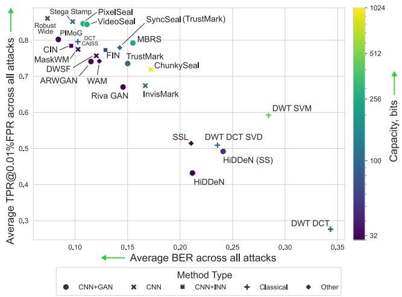  
Figure 8: TPR@0.01%FPR vs. Bit Error Rate (BER). Each point corresponds to a multibit watermarking method. The x-axis reports BER (lower is better), the y-axis reports TPR at a fixed FPR of 0.01% (higher is better). Marker colors denote diferent payload capacities. Results are aggregated across all evaluated attacks on the DifusionDB dataset.

## C.2 Image quality evaluations for generative watermarks

Table 3 reports generation quality metrics for all six built-in watermarking methods evaluated on 5k images generated from COCO prompts. Since each method is implemented on top of a diferent base generative model with diferent default hyperparameters, absolute metric values are not directly comparable across methods. We therefore focus on the diference between watermarked and nonwatermarked outputs from the same underlying model. For FID, we report the raw delta $\Delta = F I D ( { \mathrm { m a r k e d } } ) - F I D ($ (non-marked), where negative values indicate that the watermarked image distribution is actually closer to the COCO validation set than the base model’s output. For all other metrics – CLIP-IQA, Aesthetic, ImageReward, CLIPScore, and BLIP – we report absolute values alongside a normalized relative delta (Rel. Δ in Table 3), computed as the mean per-image diference between marked and non-marked outputs divided by the range of non-marked scores, expressed as a percentage:

$$
{ \mathrm { R e l . ~ } } \Delta = { \frac { displaystyle { \frac { 1 } { N } } \sum _ { i = 1 } ^ { N } ( s _ { i } ^ { \mathrm { m a r k e d } } - s _ { i } ^ { \mathrm { n o n - m a r k e d } } ) } } { { \mathrm { R a n g e } } ( s ^ { \mathrm { n o n - m a r k e d } } ) }  \times 1 0 0 \%
$$

where �� denotes the metric value for image �, � is the number of generated images, and Ran $\begin{array} { r } { \mathsf { \Pi } _ { 3 } ^ { \mathsf { \Pi } } \mathsf { e } ( s ) = \operatorname* { m a x } _ { i = 1 , \ldots , N } ( s _ { i } ) - \operatorname* { m i n } _ { i = 1 , \ldots , N } ( s _ { i } ) } \end{array}$ represents the metric range on non-marked images. Under this normalization, positive values indicate that inserting the watermark marginally improves the metric relative to the base model.

The results reveal that built-in watermarks introduce negligible quality degradation and are in most cases practically indistinguishable from their non-watermarked counterparts. Across all per-image metrics, relative deltas remain within a few percent in either direction, with no consistent directional trend – some methods improve slightly, others degrade slightly, and the diferences are well within the noise level expected from stochastic generation. In terms of FID, five of the six methods actually improve upon the base model, in some cases substantially: METR achieves a delta of -1.82 and TreeRing of -0.94, suggesting that their conditioning or noise modification incidentally steers generation toward the target distribution. The only exception is MaXsive, which shows a marginal FID increase of +0.14, remaining negligible in absolute terms. The CLIP-IQA and Aesthetic deltas for Stable Signature are slightly more negative than other methods (-4.24% and -0.45% respectively), which may reflect the partial fine-tuning of the decoder that this method relies on, introducing subtle distributional shifts not captured by FID alone. Overall, these results confirm that modern in-generation watermarking methods impose no meaningful quality penalty on the images they protect. Images generated with diferent built-in watermarks and corresponding non-marked generations are demonstrated in Figure 18.

## C.3 Detailed watermark robustness results

Figures 10, 11 and 12 present the full per-method, per-attack robustness breakdown across all evaluated post-hoc and generative watermarking methods on DifusionDB and MS-COCO datasets, measured by Average BER (↓, lower is better) and WER (↓) respectively. TPR@0.01%FPR results are presented in Fig. 4 (b). The results confirm and extend the observations from the main paper. Regeneration-based attacks – particularly Flux Regeneration, Flux Rinsing, and VAE Regeneration – consistently produce the most severe watermark degradation, pushing BER toward 0.5 (chance level) and TPR toward zero for the vast majority of post-hoc methods, irrespective of their architecture family. Among traditional distortions, rotation through a non-right angle (30°) remains the single most damaging geometric transformation, collapsing robust ness even for methods that handle JPEG compression, noise, and moderate cropping without dificulty. Methods with explicit spatial synchronization mechanisms, such as DWSF and DFT Circle, show notably higher resistance to rotation than architecturally similar peers without such components. Across all attack conditions, Robust-Wide stands out as the most consistently resilient post-hoc method, maintaining low BER and high TPR across both distortion and adversarial attack families – a level of robustness that approaches that of generative approaches such as Gaussian Shading under non-regeneration settings. At the opposite end, classical frequency-domain methods (DWT DCT, DWT SVM) exhibit near-random extraction performance under the majority of attacks beyond mild JPEG compression, confirming their unsuitability for adversarially robust deployment.

<table><tr><td rowspan=1 colspan=1>LIIF</td><td rowspan=1 colspan=1>0.99</td><td rowspan=1 colspan=1>0.99</td><td rowspan=1 colspan=1>0.98</td><td rowspan=1 colspan=1>0.97</td><td rowspan=1 colspan=1>0.96</td><td rowspan=1 colspan=1>0.95</td><td rowspan=1 colspan=1>0.94</td><td rowspan=1 colspan=1>0.92</td></tr><tr><td rowspan=1 colspan=1>DogBlur + Deblur(FPN Inception)</td><td rowspan=1 colspan=1>0.99</td><td rowspan=1 colspan=1>0.99</td><td rowspan=1 colspan=1>0.98</td><td rowspan=1 colspan=1>0.97</td><td rowspan=1 colspan=1>0.96</td><td rowspan=1 colspan=1>0.94</td><td rowspan=1 colspan=1>0.93</td><td rowspan=1 colspan=1>0.92</td></tr><tr><td rowspan=1 colspan=1>Adv. Embedding</td><td rowspan=1 colspan=1>0.99</td><td rowspan=1 colspan=1>0.99</td><td rowspan=1 colspan=1>0.98</td><td rowspan=1 colspan=1>0.97</td><td rowspan=1 colspan=1>0.96</td><td rowspan=1 colspan=1>0.94</td><td rowspan=1 colspan=1>0.92</td><td rowspan=1 colspan=1>0.91</td></tr><tr><td></td><td rowspan=1 colspan=1>0.99</td><td rowspan=1 colspan=1>0.99</td><td rowspan=1 colspan=1>0.98</td><td rowspan=1 colspan=1>0.97</td><td rowspan=1 colspan=1>0.95</td><td rowspan=1 colspan=1>0.94</td><td rowspan=1 colspan=1>0.92</td><td rowspan=1 colspan=1>0.91</td></tr><tr><td rowspan=1 colspan=1>Adv. Embedding(PSNR)</td><td rowspan=1 colspan=1>0.99</td><td rowspan=1 colspan=1>0.99</td><td rowspan=1 colspan=1>0.98</td><td rowspan=1 colspan=1>0.97</td><td rowspan=1 colspan=1>0.95</td><td rowspan=1 colspan=1>0.93</td><td rowspan=1 colspan=1>0.91</td><td rowspan=1 colspan=1>0.90</td></tr><tr><td rowspan=1 colspan=1>dom Crop-out 80%</td><td rowspan=1 colspan=1>0.99</td><td rowspan=1 colspan=1>0.99</td><td rowspan=1 colspan=1>0.98</td><td rowspan=1 colspan=1>0.97</td><td rowspan=1 colspan=1>0.95</td><td rowspan=1 colspan=1>0.92</td><td rowspan=1 colspan=1>0.89</td><td rowspan=1 colspan=1>0.88</td></tr><tr><td rowspan=1 colspan=1>Brightness</td><td rowspan=1 colspan=1>0.98</td><td rowspan=1 colspan=1>0.97</td><td rowspan=1 colspan=1>0.96</td><td rowspan=1 colspan=1>0.95</td><td rowspan=1 colspan=1>0.94</td><td rowspan=1 colspan=1>0.92</td><td rowspan=1 colspan=1>0.91</td><td rowspan=1 colspan=1>0.89</td></tr><tr><td rowspan=1 colspan=1>Averaging(Stable Sig.)</td><td rowspan=1 colspan=1>0.98</td><td rowspan=1 colspan=1>0.97</td><td rowspan=1 colspan=1>0.96</td><td rowspan=1 colspan=1>0.95</td><td rowspan=1 colspan=1>0.94</td><td rowspan=1 colspan=1>0.92</td><td rowspan=1 colspan=1>0.90</td><td rowspan=1 colspan=1>0.89</td></tr><tr><td rowspan=1 colspan=1>Contrast</td><td rowspan=1 colspan=1>0.97</td><td rowspan=1 colspan=1>0.97</td><td rowspan=1 colspan=1>0.96</td><td rowspan=1 colspan=1>0.95</td><td rowspan=1 colspan=1>0.93</td><td rowspan=1 colspan=1>0.91</td><td rowspan=1 colspan=1>0.90</td><td rowspan=1 colspan=1>0.88</td></tr><tr><td rowspan=1 colspan=1>JPEG, q=80</td><td rowspan=1 colspan=1>0.96</td><td rowspan=1 colspan=1>0.95</td><td rowspan=1 colspan=1>0.95</td><td rowspan=1 colspan=1>0.93</td><td rowspan=1 colspan=1>0.91</td><td rowspan=1 colspan=1>0.89</td><td rowspan=1 colspan=1>0.87</td><td rowspan=1 colspan=1>0.85</td></tr><tr><td rowspan=1 colspan=1>Averaging(Tree-Ring)</td><td rowspan=1 colspan=1>0.96</td><td rowspan=1 colspan=1>0.95</td><td rowspan=1 colspan=1>0.94</td><td rowspan=1 colspan=1>0.93</td><td rowspan=1 colspan=1>0.91</td><td rowspan=1 colspan=1>0.89</td><td rowspan=1 colspan=1>0.87</td><td rowspan=1 colspan=1>0.85</td></tr><tr><td></td><td rowspan=1 colspan=1>0.93</td><td rowspan=1 colspan=1>0.92</td><td rowspan=1 colspan=1>0.91</td><td rowspan=1 colspan=1>0.90</td><td rowspan=1 colspan=1>0.88</td><td rowspan=1 colspan=1>0.87</td><td rowspan=1 colspan=1>0.85</td><td rowspan=1 colspan=1>0.84</td></tr><tr><td rowspan=1 colspan=1>GaussBlur σ=5</td><td rowspan=1 colspan=1>0.96</td><td rowspan=1 colspan=1>0.94</td><td rowspan=1 colspan=1>0.91</td><td rowspan=1 colspan=1>0.89</td><td rowspan=1 colspan=1>0.87</td><td rowspan=1 colspan=1>0.85</td><td rowspan=1 colspan=1>0.83</td><td rowspan=1 colspan=1>0.82</td></tr><tr><td rowspan=1 colspan=1>RealESRGAN</td><td rowspan=1 colspan=1>0.95</td><td rowspan=1 colspan=1>0.93</td><td rowspan=1 colspan=1>0.92</td><td rowspan=1 colspan=1>0.89</td><td rowspan=1 colspan=1>0.88</td><td rowspan=1 colspan=1>0.85</td><td rowspan=1 colspan=1>0.82</td><td rowspan=1 colspan=1>0.80</td></tr><tr><td rowspan=1 colspan=1>MPRNet</td><td rowspan=1 colspan=1>0.95</td><td rowspan=1 colspan=1>0.93</td><td rowspan=1 colspan=1>0.91</td><td rowspan=1 colspan=1>0.88</td><td rowspan=1 colspan=1>0.86</td><td rowspan=1 colspan=1>0.83</td><td rowspan=1 colspan=1>0.80</td><td rowspan=1 colspan=1>0.78</td></tr><tr><td rowspan=1 colspan=1>/hite Noise σ=0.05</td><td rowspan=1 colspan=1>0.96</td><td rowspan=1 colspan=1>0.92</td><td rowspan=1 colspan=1>0.89</td><td rowspan=1 colspan=1>0.86</td><td rowspan=1 colspan=1>0.85</td><td rowspan=1 colspan=1>0.83</td><td rowspan=1 colspan=1>0.81</td><td rowspan=1 colspan=1>0.80</td></tr><tr><td rowspan=1 colspan=1>DiffPure</td><td rowspan=1 colspan=1>0.94</td><td rowspan=1 colspan=1>0.90</td><td rowspan=1 colspan=1>0.88</td><td rowspan=1 colspan=1>0.85</td><td rowspan=1 colspan=1>0.83</td><td rowspan=1 colspan=1>0.80</td><td rowspan=1 colspan=1>0.79</td><td rowspan=1 colspan=1>0.77</td></tr><tr><td rowspan=1 colspan=1>VAE Attack</td><td rowspan=1 colspan=1>0.93</td><td rowspan=1 colspan=1>0.90</td><td rowspan=1 colspan=1>0.87</td><td rowspan=1 colspan=1>0.85</td><td rowspan=1 colspan=1>0.83</td><td rowspan=1 colspan=1>0.80</td><td rowspan=1 colspan=1>0.78</td><td rowspan=1 colspan=1>0.76</td></tr><tr><td rowspan=1 colspan=1>JPEG, q=50</td><td rowspan=1 colspan=1>0.94</td><td rowspan=1 colspan=1>0.91</td><td rowspan=1 colspan=1>0.88</td><td rowspan=1 colspan=1>0.84</td><td rowspan=1 colspan=1>0.82</td><td rowspan=1 colspan=1>0.78</td><td rowspan=1 colspan=1>0.75</td><td rowspan=1 colspan=1>0.71</td></tr><tr><td rowspan=1 colspan=1>gaStamp Inversion</td><td rowspan=1 colspan=1>0.87</td><td rowspan=1 colspan=1>0.84</td><td rowspan=1 colspan=1>0.82</td><td rowspan=1 colspan=1>0.80</td><td rowspan=1 colspan=1>0.78</td><td rowspan=1 colspan=1>0.75</td><td rowspan=1 colspan=1>0.73</td><td rowspan=1 colspan=1>0.70</td></tr><tr><td rowspan=1 colspan=1>Aden Filter Pipeline</td><td rowspan=1 colspan=1>0.90</td><td rowspan=1 colspan=1>0.86</td><td rowspan=1 colspan=1>0.82</td><td rowspan=1 colspan=1>0.78</td><td rowspan=1 colspan=1>0.75</td><td rowspan=1 colspan=1>0.71</td><td rowspan=1 colspan=1>0.67</td><td rowspan=1 colspan=1>0.63</td></tr><tr><td rowspan=1 colspan=1>DISCO</td><td rowspan=1 colspan=1>0.90</td><td rowspan=1 colspan=1>0.85</td><td rowspan=1 colspan=1>0.81</td><td rowspan=1 colspan=1>0.77</td><td rowspan=1 colspan=1>0.74</td><td rowspan=1 colspan=1>0.71</td><td rowspan=1 colspan=1>0.68</td><td rowspan=1 colspan=1>0.65</td></tr><tr><td rowspan=1 colspan=1>BM3D</td><td rowspan=1 colspan=1>0.86</td><td rowspan=1 colspan=1>0.81</td><td rowspan=1 colspan=1>0.78</td><td rowspan=1 colspan=1>0.75</td><td rowspan=1 colspan=1>0.73</td><td rowspan=1 colspan=1>0.70</td><td rowspan=1 colspan=1>0.68</td><td rowspan=1 colspan=1>0.65</td></tr><tr><td rowspan=1 colspan=1>nilnv Editing (Flux)</td><td rowspan=1 colspan=1>0.88</td><td rowspan=1 colspan=1>0.83</td><td rowspan=1 colspan=1>0.79</td><td rowspan=1 colspan=1>0.75</td><td rowspan=1 colspan=1>0.72</td><td rowspan=1 colspan=1>0.69</td><td rowspan=1 colspan=1>0.66</td><td rowspan=1 colspan=1>0.63</td></tr><tr><td rowspan=1 colspan=1>GaussBlur + Deblur(FPN Inception)</td><td rowspan=1 colspan=1>0.83</td><td rowspan=1 colspan=1>0.80</td><td rowspan=1 colspan=1>0.78</td><td rowspan=1 colspan=1>0.75</td><td rowspan=1 colspan=1>0.73</td><td rowspan=1 colspan=1>0.70</td><td rowspan=1 colspan=1>0.68</td><td rowspan=1 colspan=1>0.66</td></tr><tr><td rowspan=1 colspan=1>Resize 50%</td><td rowspan=1 colspan=1>0.84</td><td rowspan=1 colspan=1>0.78</td><td rowspan=1 colspan=1>0.75</td><td rowspan=1 colspan=1>0.73</td><td rowspan=1 colspan=1>0.72</td><td rowspan=1 colspan=1>0.70</td><td rowspan=1 colspan=1>0.70</td><td rowspan=1 colspan=1>0.68</td></tr><tr><td rowspan=1 colspan=1>NRP Small</td><td rowspan=1 colspan=1>0.82</td><td rowspan=1 colspan=1>0.76</td><td rowspan=1 colspan=1>0.70</td><td rowspan=1 colspan=1>0.66</td><td rowspan=1 colspan=1>0.63</td><td rowspan=1 colspan=1>0.58</td><td rowspan=1 colspan=1>0.55</td><td rowspan=1 colspan=1>0.53</td></tr><tr><td rowspan=1 colspan=1>NRP Large</td><td rowspan=1 colspan=1>0.77</td><td rowspan=1 colspan=1>0.71</td><td rowspan=1 colspan=1>0.66</td><td rowspan=1 colspan=1>0.62</td><td rowspan=1 colspan=1>0.60</td><td rowspan=1 colspan=1>0.56</td><td rowspan=1 colspan=1>0.53</td><td rowspan=1 colspan=1>0.51</td></tr><tr><td rowspan=1 colspan=1>DIP</td><td rowspan=1 colspan=1>0.76</td><td rowspan=1 colspan=1>0.69</td><td rowspan=1 colspan=1>0.64</td><td rowspan=1 colspan=1>0.61</td><td rowspan=1 colspan=1>0.59</td><td rowspan=1 colspan=1>0.56</td><td rowspan=1 colspan=1>0.54</td><td rowspan=1 colspan=1>0.52</td></tr><tr><td rowspan=1 colspan=1>DogBlur</td><td rowspan=1 colspan=1>0.75</td><td rowspan=1 colspan=1>0.67</td><td rowspan=1 colspan=1>0.62</td><td rowspan=1 colspan=1>0.57</td><td rowspan=1 colspan=1>0.54</td><td rowspan=1 colspan=1>0.51</td><td rowspan=1 colspan=1>0.48</td><td rowspan=1 colspan=1>0.46</td></tr><tr><td rowspan=1 colspan=1>Center Crop 80%</td><td rowspan=1 colspan=1>0.68</td><td rowspan=1 colspan=1>0.62</td><td rowspan=1 colspan=1>0.60</td><td rowspan=1 colspan=1>0.57</td><td rowspan=1 colspan=1>0.56</td><td rowspan=1 colspan=1>0.54</td><td rowspan=1 colspan=1>0.52</td><td rowspan=1 colspan=1>0.51</td></tr><tr><td rowspan=1 colspan=1>WMForger 0.25</td><td rowspan=1 colspan=1>0.65</td><td rowspan=1 colspan=1>0.53</td><td rowspan=1 colspan=1>0.45</td><td rowspan=1 colspan=1>0.40</td><td rowspan=1 colspan=1>0.36</td><td rowspan=1 colspan=1>0.33</td><td rowspan=1 colspan=1>0.30</td><td rowspan=1 colspan=1>0.27</td></tr><tr><td rowspan=1 colspan=1>Diffusion Regen.</td><td rowspan=1 colspan=1>0.50</td><td rowspan=1 colspan=1>0.36</td><td rowspan=1 colspan=1>0.29</td><td rowspan=1 colspan=1>0.24</td><td rowspan=1 colspan=1>0.22</td><td rowspan=1 colspan=1>0.19</td><td rowspan=1 colspan=1>0.17</td><td rowspan=1 colspan=1>0.16</td></tr><tr><td rowspan=2 colspan=1>een Photo PipelineVAE Regen.</td><td rowspan=1 colspan=1>0.46</td><td rowspan=1 colspan=1>0.33</td><td rowspan=1 colspan=1>0.27</td><td rowspan=1 colspan=1>0.24</td><td rowspan=1 colspan=1>0.21</td><td rowspan=1 colspan=1>0.19</td><td rowspan=1 colspan=1>0.18</td><td rowspan=1 colspan=1>0.16</td></tr><tr><td rowspan=1 colspan=1>0.40</td><td rowspan=1 colspan=1>0.29</td><td rowspan=1 colspan=1>0.25</td><td rowspan=1 colspan=1>0.22</td><td rowspan=1 colspan=1>0.20</td><td rowspan=1 colspan=1>0.19</td><td rowspan=1 colspan=1>0.17</td><td rowspan=1 colspan=1>0.15</td></tr><tr><td rowspan=2 colspan=1>Rotate 90°Rotate 30°</td><td rowspan=1 colspan=1>0.29</td><td rowspan=1 colspan=1>0.22</td><td rowspan=1 colspan=1>0.21</td><td rowspan=1 colspan=1>0.20</td><td rowspan=1 colspan=1>0.19</td><td rowspan=1 colspan=1>0.18</td><td rowspan=1 colspan=1>0.18</td><td rowspan=1 colspan=1>0.18</td></tr><tr><td rowspan=1 colspan=1>0.31</td><td rowspan=1 colspan=1>0.20</td><td rowspan=1 colspan=1>0.18</td><td rowspan=1 colspan=1>0.18</td><td rowspan=1 colspan=1>0.17</td><td rowspan=1 colspan=1>0.16</td><td rowspan=1 colspan=1>0.15</td><td rowspan=1 colspan=1>0.15</td></tr><tr><td rowspan=1 colspan=1>SADRE</td><td rowspan=1 colspan=1>0.39</td><td rowspan=1 colspan=1>0.25</td><td rowspan=1 colspan=1>0.19</td><td rowspan=1 colspan=1>0.16</td><td rowspan=1 colspan=1>0.14</td><td rowspan=1 colspan=1>0.13</td><td rowspan=1 colspan=1>0.12</td><td rowspan=1 colspan=1>0.11</td></tr><tr><td rowspan=1 colspan=1>Flux Regen.</td><td rowspan=1 colspan=1>0.26</td><td rowspan=1 colspan=1>0.12</td><td rowspan=1 colspan=1>0.08</td><td rowspan=1 colspan=1>0.06</td><td rowspan=1 colspan=1>0.05</td><td rowspan=1 colspan=1>0.04</td><td rowspan=1 colspan=1>0.04</td><td rowspan=1 colspan=1>0.04</td></tr><tr><td rowspan=2 colspan=1>Flux Rinsing</td><td rowspan=1 colspan=1>0.15</td><td rowspan=1 colspan=1>0.05</td><td rowspan=1 colspan=1>0.04</td><td rowspan=1 colspan=1>0.03</td><td rowspan=1 colspan=1>0.03</td><td rowspan=1 colspan=1>0.03</td><td rowspan=1 colspan=1>0.03</td><td rowspan=1 colspan=1>0.02</td></tr><tr><td></td><td></td><td></td><td rowspan=1 colspan=1></td><td rowspan=1 colspan=1></td><td></td><td></td><td></td></tr></table>

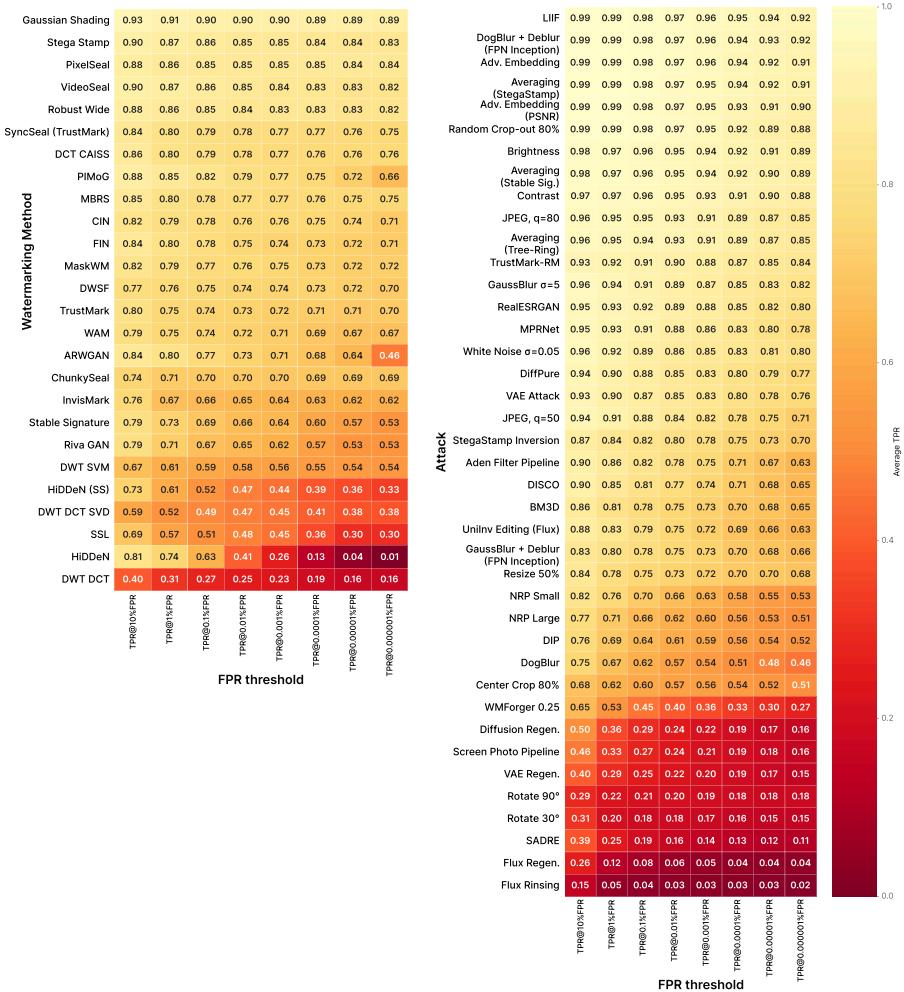  
Figure 9: TPR@xFPR heatmaps for multibit watermarking methods. Two heatmaps show TPR@xFPR across decreasing FPR thresholds from $1 0 ^ { - 1 }$ to $1 0 ^ { - 8 } .$ . Left: method-wise heatmap. Rows are multibit watermarking methods, sorted by decreasing average TPR across all attacks and FPR levels. Columns are FPR thresholds. Each cell shows TPR at the corresponding FPR. Right: attack-wise heatmap. Rows are attack types, sorted by decreasing average TPR across all methods and FPR levels. Columns represent FPR thresholds. Each cell shows TPR averaged over all multibit watermarking methods for that attack at the given FPR. Results are reported on the DifusionDB dataset.

## C.4 Cross-dataset and cross-resolution evaluation

Setup. To test whether our findings depend on the two datasets used in the main experiments, we re-evaluate all 24 multi-bit post-hoc watermarking methods on five datasets spanning an order of magnitude in pixel count: NIPS2017 (299×299), DifusionDB (512×512), MS-COCO (∼640×480), KonIQ-10k (1024×768) and DIV2K (2040×1300). We use 1k images for DifusionDB and MS-COCO and 400 images for the three additional datasets, and restrict the comparison to the 39 attacks that cover the identical set of watermarks on all five datasets, so that every reported average is taken over exactly the same conditions.1 Built-in watermarks are omitted from this experiment, as they are tied to the output resolution of their underlying generative model and therefore have no dataset-resolution axis.

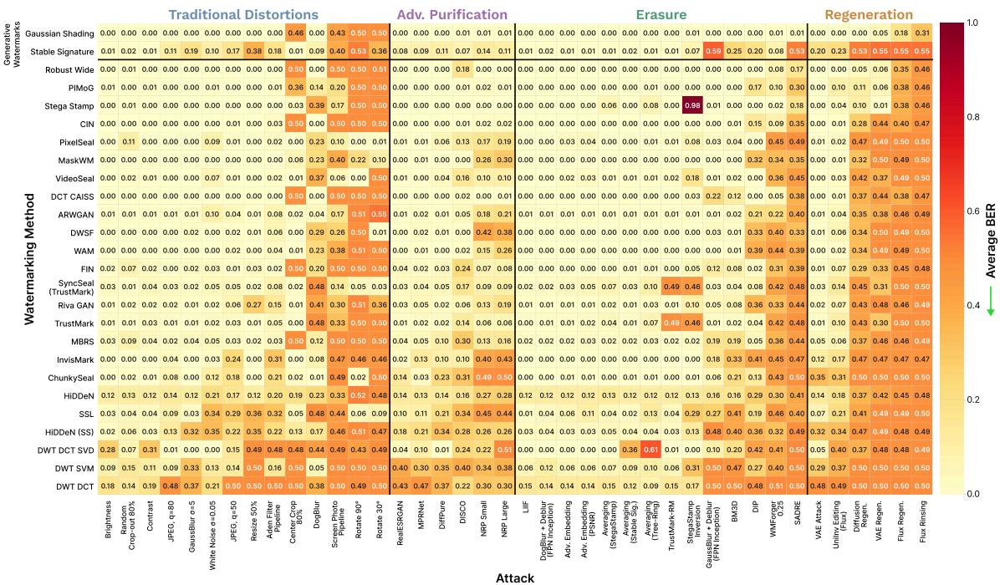

Figure 10: Full robustness breakdown measured by Average BER (↓) for all evaluated watermarking methods across all 40 attack configurations on the DifusionDB dataset. Each cell reports the mean BER over 1k images; values close to 0.5 indicate complete watermark erasure. Watermarks are sorted by average BER, and attacks are arranged by their average adversarial efectiveness  
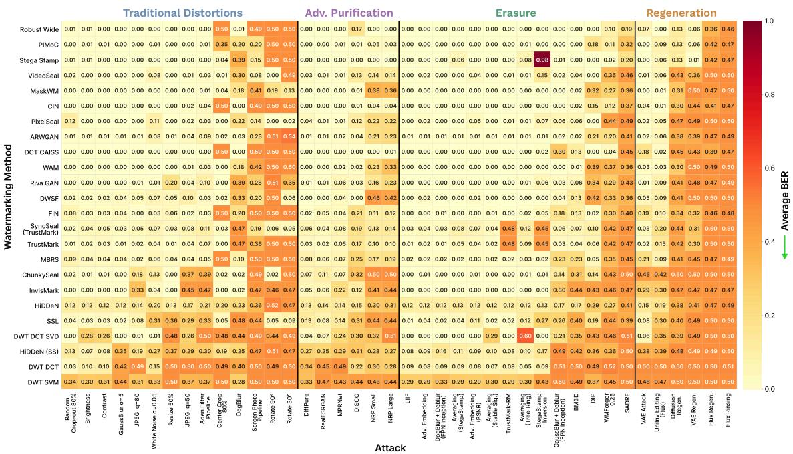  
Figure 11: Full robustness breakdown measured by Average BER (↓) for all evaluated watermarking methods across all 40 attack configurations on the MS-COCO dataset. Each cell reports the mean BER over 1k images; values close to 0.5 indicate complete watermark erasure.

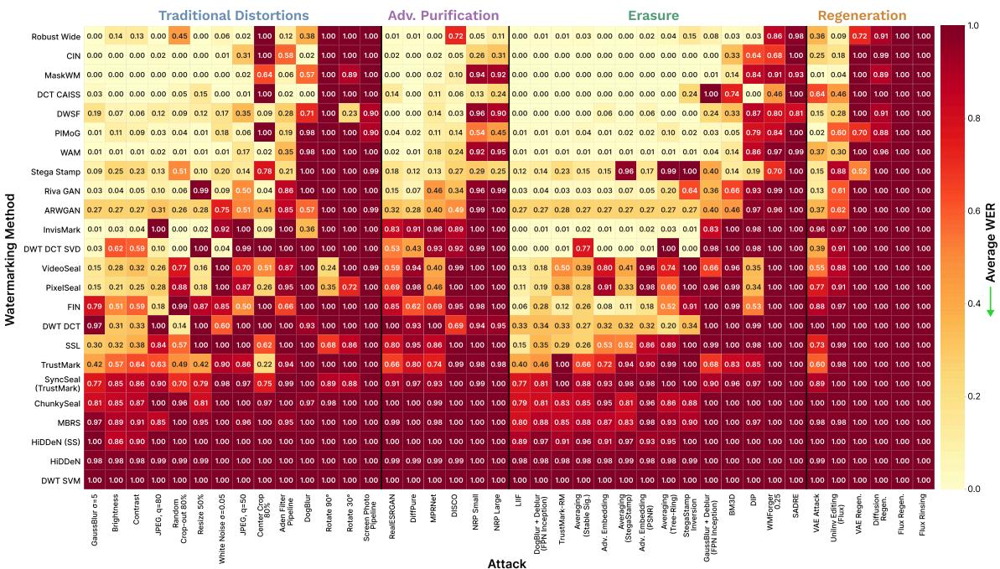  
Figure 12: Full robustness breakdown measured by Average WER (↓) for all evaluated watermarking methods across all 40 attack configurations on the MS-COCO dataset. Each cell reports the mean WER over 1k images; values close to 1.0 indicate complete watermark erasure.

Ranking stability. Figure 13 shows the per-method scores for five tested datasets. The relative ordering of methods is essentially dataset-independent: the Spearman rank correlation with the MS-COCO ordering stays above 0.88 for every dataset under all three metrics, and the qualitative conclusions of the main paper – Robust Wide and StegaStamp as the most resilient post-hoc methods, the classical DWT DCT family close to chance – hold unchanged on all five sets. What does shift is the absolute level: mean BER decreases monotonically with resolution across the dataset means, from 0.208 on NIPS2017 to 0.147 on DIV2K, with mean TPR@0.01%FPR rising correspondingly from 0.590 to 0.725; 23 of 24 methods obtain a lower BER on DIV2K than on NIPS2017. The efect is driven by resolution rather than by image domain: DifusionDB (synthetic, 512×512) and MS-COCO (photographic, ∼640×480) sit adjacent in the middle of the range and difer by only 0.012 BER.

The efect of higher resolution. The mechanism follows from the resolution-scaling protocol described in Section B: every method embeds and extracts at its own fixed internal resolution, typically 224–512 px. An attack is applied at the native resolution of the image, but the decoder downscales the result before extraction, and that downscaling acts as a low-pass filter on the attack’s residual. Perturbations defined at a fixed pixel scale are therefore attenuated in proportion to the downscaling factor, which is exactly what we observe per attack: e.g., for JPEG (� = 50) average BER drops from 0.20 on NIPS2017 to 0.07 on DIV2K, and for BM3D it falls from 0.24 to 0.09. Aggregated by family, adversarial purification loses roughly half of its efectiveness between the two extremes (0.172 BER on NIPS2017, 0.088 on DIV2K), while regeneration attacks lose only 18% (0.371 vs 0.306): regeneration replaces image content through a generative model operating at its own working resolution instead of perturbing pixels, so it is largely immune to this averaging efect. The same argument explains why NIPS2017 is the hardest set rather than merely the smallest – at 299×299 the image is below the internal resolution of several methods and is upsampled rather than downsampled, so no averaging gain is available at all.

Resolution sensitivity. The per-method spread across datasets is modest on average – 0.066 BER between the best and worst dataset, against a between-method range of 0.35 – but it is highly uneven, from 0.019 for StegaStamp to 0.193 for DWT SVM. The spread tracks where a method sits on its own robustness–distortion curve rather than its architecture family. Methods near either end of that curve are flat: StegaStamp and Robust Wide stay in the 0.084–0.112 BER band on every dataset because they are already close to the achievable robustness ceiling, while DWT DCT and DWT DCT SVD stay at 0.34 and 0.27 because they are already close to chance level under most attacks, and a change in efective attack strength moves neither. The largest spreads belong to methods in the steep middle of the curve, and these are disproportionately the high-capacity and high-imperceptibility ones – DWT SVM (512 bits, spread 0.193), HiDDeN (SS) (0.189), ChunkySeal (1024 bits, 0.120) and InvisMark (highest PSNR of all evaluated methods, 0.105) – where the per-bit decision margin is thinnest and a small change in the efective noise level flips a large number of bits at once. WER metric in Figure 13 illustrates the complementary saturation efect: because a single flipped bit invalidates the message, WER com presses the methods that BER separates, and HiDDeN, whose WER is 0.991–0.994 on all five datasets, becomes indistinguishable across resolutions. The practical implication is that benchmark conclusions transfer across resolution and image domain, but absolute robustness figures for high-capacity watermarks may vary across diferent image sizes, and should be reported together with the evaluation resolution.

## C.5 Metrics for perceptual and semantic changes

Watermark visibility evaluation with diferent metrics. Figure 14 extends the capacity–quality–robustness analysis from the main paper by reporting imperceptibility across four complementary metrics: PSNR and SSIM (classical full-reference), LPIPS (learned full-reference), and CLIP-IQA (learned no-reference). Across all four metrics, a broadly consistent picture emerges: methods with low average BER tend to also achieve better perceptual quality, confirming that robustness and imperceptibility are not inherently in tension when methods are carefully designed. InvisMark is a par ticularly notable outlier in this regard, achieving the highest PSNR of any evaluated method (∼50 dB) while maintaining competitive robustness. StegaStamp sits at the opposite extreme across all four metrics – lowest PSNR, lowest SSIM, and highest LPIPS – reflecting its aggressive perturbation strategy, which trades imperceptibility for robustness. However, the metrics diverge in informative ways when comparing specific methods. DWT SVM, a classical multi-bit method with high capacity and low robustness, registers one of the worst LPIPS scores despite appearing relatively benign under SSIM; this discrepancy likely reflects LPIPS’s sensitivity to fine grained texture distortions that SSIM averages over. Conversely, HiDDeN (SS) achieves moderate PSNR and SSIM but drops sharply in CLIP-IQA (∼0.73) – the lowest of any method – suggesting that its embedding introduces perceptual artifacts that are not well captured by pixel-level full-reference measures but are detected by a learned no-reference predictor operating on absolute image quality. Taken together, these results reinforce that no single metric fully characterizes watermark visibility: full-reference metrics capture fidelity to the original, while no-reference metrics reflect the ab solute perceptual plausibility of the watermarked image — both perspectives are necessary for a complete evaluation.

Attacked image clarity evaluation. Figure 15 evaluates attack quality from three complementary perspectives — LPIPS, CLIP-IQA, and an aesthetic predictor — plotted against attack efectiveness (average BER). A striking asymmetry is immediately apparent between full-reference and no-reference quality assessments for regeneration-based attacks. Flux Regeneration and Flux Rinsing achieve among the highest BER values in the benchmark while simultaneously scoring at or near the top of both CLIP-IQA and Aesthetic measures; this indicates that these attacks do not merely corrupt images but actively re-synthesize them at high perceptual quality, producing outputs that a no-reference evaluator scores as visually superior to the original watermarked image. In contrast, their LPIPS values are elevated, correctly capturing the significant pixel-level departure from the source — a distinction that is invisible to no-reference metrics. A similar but less extreme pattern holds for SADRE and Difusion Regeneration. Geometric distortions, particularly rotation (30° and 90°), occupy a distinct region: they rank among the strongest traditional attacks in terms of BER and show high LPIPS due to spatial misalignment, yet their CLIP-IQA and Aesthetic scores remain largely intact, since the semantic content of the image is undamaged. This confirms that full-reference metrics overstate the perceptual damage of geometric transforms relative to their semantic impact. At the other extreme, GaussBlur+Deblur (FPN Inception) and DogBlur achieve poor BER while also scoring low on both CLIP-IQA and Aesthetic — they are simultaneously inefective as attacks and destructive to image quality, making them unfavorable from both perspectives. Among dedicated erasure attacks, WMForger and TrustMark-RM dominate the Pareto front across all three quality measures, confirming that purpose-built removal methods can combine high watermark disruption with minimal perceptual footprint regardless of which quality metric is used to evaluate them.

## C.6 Attack hyperparameter variation

Figure 17 presents BER–distortion curves for six selected attacks across individual watermarking methods on the COCO dataset, where each attack’s primary hyperparameter is varied: learning rate for WMForger, � (�inf perturbation budget) for Adversarial Embedding, quality factor for JPEG compression, std for Gaussian noise, and kernel size for Gaussian blur. The per-method curves reveal qualitatively diferent regimes across the five attack types. WMForger produces the most definitive pattern: nearly all tested methods exhibit a sharp BER transition concentrated within a narrow LPIPS window of approximately 0.12–0.20, after which extraction collapses to chance level. This uniformity suggests that WMForger’s optimization finds a common vulnerability threshold across architecturally diverse methods. The single clear exception is DCT CAISS, which remains highly resistant throughout the entire evaluated learning rate range, reaching only ∼0.35 BER at LPIPS ∼0.35 – far below the saturation level reached by all other methods. For Adversarial Embedding (both CLIP and ResNet variants), curves are considerably more spread out and gradual, indicating that gradient-based perturbation exploits method-specific decoder properties rather than a shared threshold, with HiDDeN (SS) among the most vulnerable and DCT CAISS again the most resistant. In the JPEG panel, InvisMark shows a disproportionately steep early BER increase under light compression, revealing a specific sensitivity to quantization artifacts that its training augmentation does not fully compensate for. For the Gaussian blur, DCT CAISS displays a pronounced threshold efect — BER remains near zero across a wide range of kernel sizes before abruptly jumping once blur exceeds a critical scale, consistent with its frequency-domain embedding concentrating energy in a band that broad blur eventually destroys.

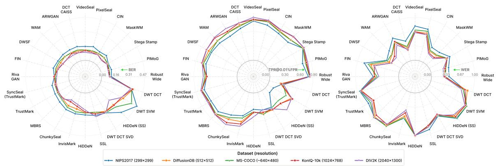  
Figure 13: Robustness scores of all tested multi-bit watermarks across samples from 5 datasets: DifusionDB, MS-COCO, NIPS2017, KonIQ and DIV2K. Image resolution varies from 299x299 in NIPS2017 up to 2040x1300 in DIV2K. The scores are averaged across all attacks on each dataset.

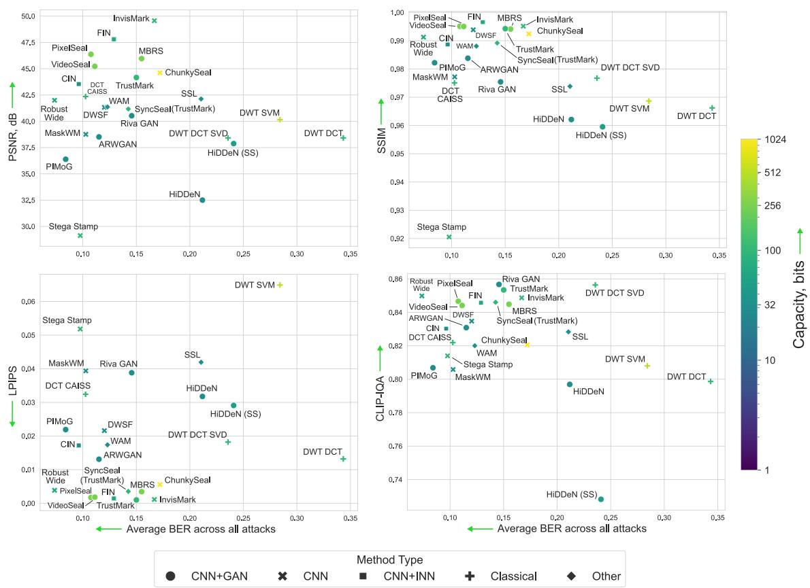  
Figure 14: Quality–robustness tradeof for post-hoc watermarking methods evaluated under four imperceptibility metrics: PSNR (dB, ↑), SSIM (↑), LPIPS (↓), and CLIP-IQA (↑). Robustness is reported as average BER across all attacks (↓). Color encodes embedding capacity in bits. While the overall rankings are broadly consistent across metrics, notable divergences between full-reference (PSNR, SSIM, LPIPS) and no-reference (CLIP-IQA) measures reveal that diferent metrics capture complementary aspects of watermark visibility.

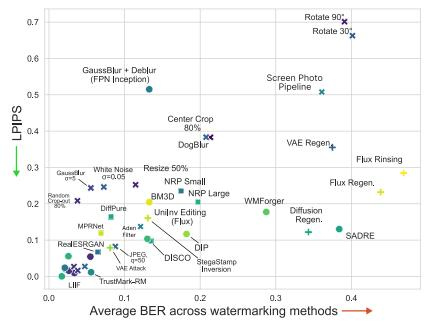

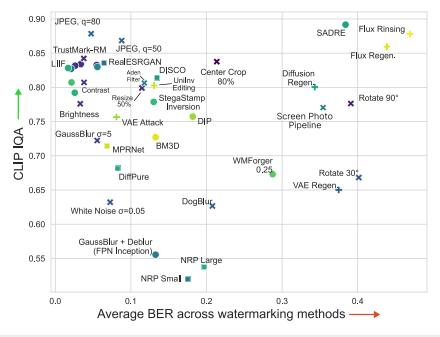

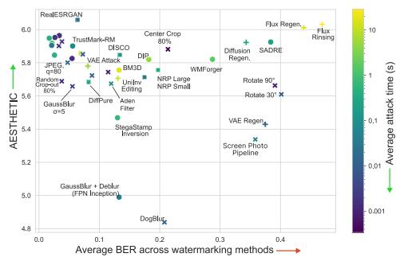

Figure 15: Perceptual quality–adversarial efectiveness tradeof for all evaluated attacks, measured under three quality criteria: LPIPS (↓), CLIP-IQA (↑), and Aesthetic score (↑). Attack efectiveness is reported as average BER across all watermarking methods (↑). Color encodes average attack runtime. Regeneration-based attacks (crosses) achieve high BER with strong no-reference quality scores, indicating that they replace rather than degrade the image. Geometric distortions incur high LPIPS but mostly preserve semantic quality.  
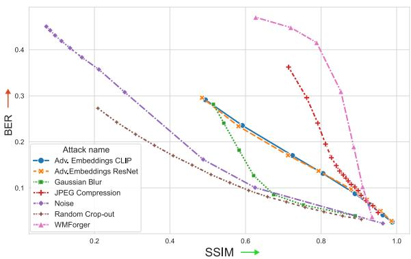  
Figure 16: BER–SSIM tradeof curves averaged across watermarks for each evaluated attack under hyperparameter variation on the COCO dataset. Higher SSIM indicates less image distortion; higher BER indicates more efective watermark removal.

Noise curves are the smoothest overall, with most methods degrading gradually and DCT CAISS and WAM showing exceptional robustness even at very large noise standard deviations.

Figure 16 aggregates the per-watermark curves into mean BER vs SSIM tradeof curves per attack, enabling a direct cross-attack comparison of distortion eficiency. Note that SSIM is used as the distortion axis here (higher SSIM indicates less image change), so the ideal attacker occupies the upper-right region — high BER at high SSIM. WMForger remains the most cost-eficient overall, with JPEG and Adversarial Embedding (with both CLIP and ResNet backbones) attacks following it.

## C.7 Frequency patterns of diferent watermarks

Figure 19 visualizes the average FFT spectrum diference between watermarked and source images for each post-hoc method, revealing the frequency-domain footprint of each embedding strategy. Classical methods produce structured and recognizable signatures:

DCT CAISS displays a prominent X-shaped pattern with strong amplitude spread across mid-frequencies, a consequence of its spreadspectrum design. DWT SVM similarly shows a regular grid-like lattice, while DWSF’s distinctive square-frame pattern at the image boundaries reflects its synchronization mechanism, directly linking its architectural choice to its geometric robustness. Among deep learning methods, StegaStamp produces a clearly visible ring pattern with high amplitudes at mid-to-high frequencies, consistent with its high perceptual cost. In contrast, methods such as InvisMark, MaskWM, WAM and PixelSeal leave minimal or nearinvisible frequency signatures, indicating that their embeddings are more broadly distributed and spectrally difuse – a property that might underlie their stronger imperceptibility scores. FIN and CIN exhibit faint but structured fine-grained dot patterns, reflecting the invertible network architectures that distribute perturbations across many frequency bands simultaneously. The structural diversity visible across these spectra also might be particularly relevant to the asymmetric re-embedding results reported in Section 5.3: methods whose frequency footprints occupy largely non-overlapping regions (e.g., DCT CAISS and StegaStamp) tend to interact less destructively when superimposed, while methods sharing similar spectral support are more likely to mutually interfere.

## D Limitations and Future Work

This work presents a large-scale and systematic evaluation of invisible image watermarking methods; however, several limitations should be acknowledged. First, the benchmark reflects the state of the field at the time of submission and does not include future methods that may introduce stronger robustness guarantees, particularly as generative and key-based approaches continue to evolve. As a result, the reported findings should be interpreted as a snapshot of current capabilities rather than a definitive assessment of long-term progress. At the same time, WARP is designed as a modular and extensible framework, allowing straightforward integration of new watermarking techniques and attack strategies, enabling future updates under consistent evaluation protocols.

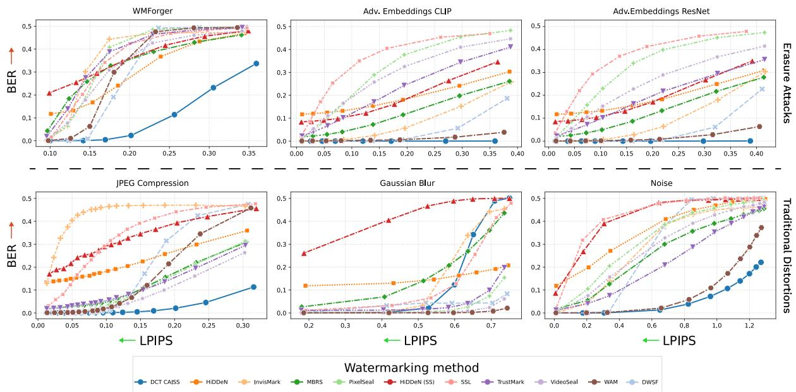  
Figure 17: BER–distortion curves under hyperparameter variation for six attacks, shown per watermarking method on the COCO dataset. Each panel varies the attack’s primary hyperparameter: learning rate (WMForger), �inf budget � (Adversarial Embedding), quality factor (JPEG), std (Gaussian noise), and kernel size (Gaussian blur). Distortion is measured by LPIPS (↓).

Second, the scope of this work is restricted to image watermarking. While this domain represents a primary use case, the problem of robust and traceable watermarking extends to other media types, including video, audio, and text, each with distinct perceptual constraints and attack surfaces. These modalities are not considered in the current benchmark, limiting the generality of conclusions across multimodal settings.

Third, although the benchmark includes a diverse set of 34 attack scenarios spanning distortions, adversarial perturbations, purification, and regeneration, it does not exhaust the full space of possible removal strategies. In particular, fully adaptive attacks tailored to specific watermarking methods, as well as complex real-world transformation pipelines, may lead to diferent robustness outcomes. Additionally, the evaluation focuses on perceptual quality, watermark readability, and robustness, while other relevant factors such as formal security guarantees are not explicitly addressed.

Finally, the proposed re-embedding evaluation protocol captures an important but previously underexplored threat model; however, it relies on specific assumptions about attacker capabilities and access conditions. Alternative threat settings may yield diferent results and require further investigation.

Future work will focus on extending WARP along several directions. A key priority is continuous integration of newly proposed watermarking methods and attack strategies to maintain an up-todate and longitudinal benchmark. Another important direction is the expansion toward multimodal watermarking, enabling unified evaluation across images, video, audio, and text, and facilitating analysis of modality-specific and cross-modal robustness. Further eforts will include the development of more adaptive and methodaware attack models, as well as the formalization of standardized threat models to improve comparability across studies. Finally, incorporating additional evaluation criteria, including eficiency, scalability, and robustness under real-world processing pipelines, will be essential for bridging the gap between benchmark performance and practical deployment.

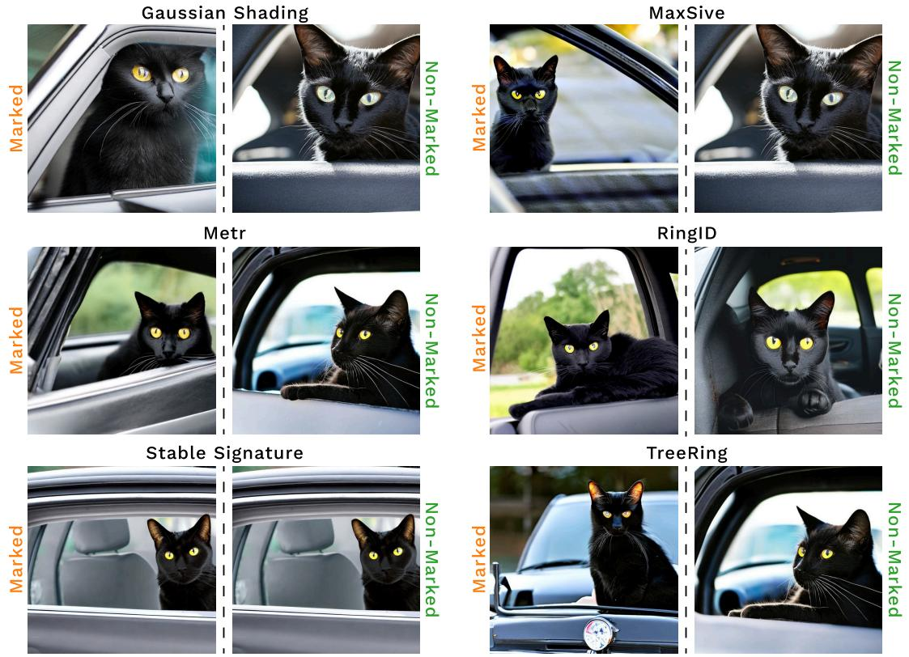  
Figure 18: Examples of images generated with diferent built-in watermarking methods compared to the ones generated by the same underlying generative model with the same prompt and seed without watermark insertion. The prompt used for all presented generations: "A black cat sits in a car and looks out."

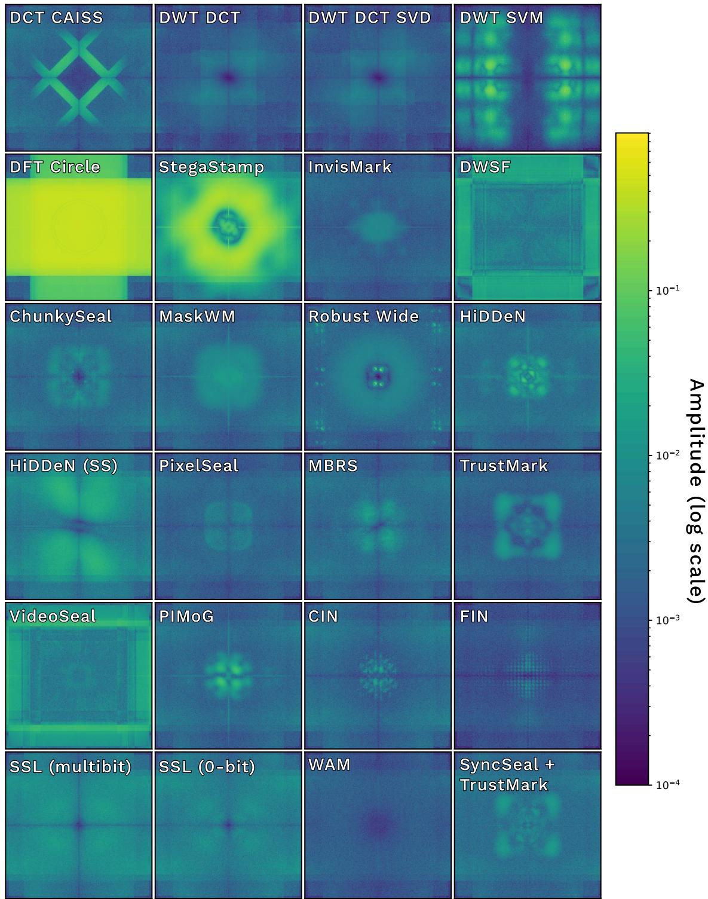  
Figure 19: Frequency-domain signatures of post-hoc watermarking methods, visualized as the average FFT spectrum diference between watermarked and source images on the COCO subset. Amplitude is shown on a logarithmic scale.

Table 4: All attacking methods used in our study alongside their brief descriptions.
<table><tr><td>Attack</td><td>Year</td><td>Type</td><td>Brief description</td></tr><tr><td>Brightness</td><td></td><td>Distortion</td><td>Changes image intensity levels, making embedded patterns harder to preserve or detect</td></tr><tr><td>Center Crop</td><td></td><td>Distortion tion</td><td>Removes outer regions of an image, potentially discarding embedded informa-</td></tr><tr><td>Color Inversion</td><td></td><td>Distortion</td><td>Flips pixel values, altering image patterns and disrupting embedded information</td></tr><tr><td>Contrast</td><td></td><td>Distortion</td><td>Rescales intensity differences, altering pixel relationships and distorting image patterns</td></tr><tr><td>Gaussian Blur</td><td></td><td>Distortion</td><td>Smooths the image using a Gaussian filter, reducing detail and weakening fine patterns</td></tr><tr><td>JPEG</td><td></td><td>Distortion</td><td>Lossy quantization that removes high-frequency details and introduces com- pression artifacts</td></tr><tr><td>White Noise</td><td></td><td>Distortion</td><td>Random pixel intensity perturbations that degrade image quality</td></tr><tr><td>Pixel Shift [59]</td><td>2025</td><td>Distortion</td><td>Translates the image horizontally by shifting the image pixels</td></tr><tr><td>Random Cropout</td><td></td><td>Distortion</td><td>Random removal of image regions causing partial content loss</td></tr><tr><td>Resize</td><td></td><td>Distortion</td><td>Scaling image dimensions, leading to blurring or detail loss</td></tr><tr><td>Rotate Aden Filter Pipeline</td><td></td><td>Distortion Distortion</td><td>Angular transformation causing geometric distortion and potential cropping A pipeline that chains 3 different transformations together: Gaussian noise →</td></tr><tr><td></td><td></td><td></td><td>Aden filter → JPEG, q=50. Simulates social media processing of a user image with a popular color filter [32] and compression.</td></tr><tr><td>Screen Photo Pipeline</td><td></td><td>Distortion</td><td>A pipeline that chains 3 different transformations together: 0.7×downscale → JPEG, q=60 → Perspective transform with slight angle → Gaussian noise → JPEG, q=50. Simulates a slightly angled photo of a screen with a given image.</td></tr><tr><td>Adversarial Embedding [4]</td><td>2024</td><td>Erasure</td><td>Added imperceptible perturbations to an image to mislead the watermark detector and disrupt watermark extraction</td></tr><tr><td>Adversarial Embedding (PSNR)</td><td></td><td>Erasure</td><td>Added imperceptible perturbations to an image in order to mislead the water- mark detector using PSNR metric to constrain the perturbation</td></tr><tr><td>Averaging [73]</td><td>2024</td><td>Erasure</td><td>Averaging attack estimates the watermark by averaging multiple samples, canceling content and exposing the hidden pattern</td></tr><tr><td>Blur Deblur [34]</td><td>2019</td><td>Erasure</td><td>Applies intentional blurring followed by restoration (deblurring) to disrupt and attenuate embedded watermark signals.</td></tr><tr><td>BM3D [45]</td><td>2020</td><td>Erasure</td><td>Exploits transform-domain denoising to estimate and suppress correlated noise components, potentially weakening or removing embedded watermark signals</td></tr><tr><td>DIP [39]</td><td>2025</td><td>Erasure</td><td>Reconstructed the image via an untrained neural network, implicitly denoising and removing watermark patterns</td></tr><tr><td>DoGBlur + Deblur [34]</td><td>2019</td><td>Erasure</td><td>Applies intentional blurring using Difference of Gaussians filter to eliminate specific frequencies affected by the watermark followed by restoration (deblur-</td></tr><tr><td>SADRE [3]</td><td>2025</td><td>Erasure</td><td>ring). Uses saliency-guided diffusion reconstruction with targeted noise injection to</td></tr><tr><td>SEMAttack [47]</td><td>2024</td><td>Erasure</td><td>remove watermarks Performs single-image watermark forgery or removal using latent manipula-</td></tr><tr><td>Stegastamp Inversion [58]</td><td>2025</td><td>Erasure</td><td>tions in unrelated diffusion models Overwrote the watermark by decoding the embedded message, inverting its</td></tr><tr><td>TrustMark-RM [7]</td><td>2023</td><td>Erasure</td><td>bits, and re-embedding it, thereby corrupting the original watermark signal Denoising-based network designed to remove TrustMark watermarks and</td></tr><tr><td>WMForger [62]</td><td>2025</td><td>Erasure</td><td>suppress watermark artifacts Optimizes input images via a preference model to remove or forge watermarks</td></tr><tr><td>DiffPure [50]</td><td>2022</td><td>Purification</td><td>using a single reference Uses diffusion models to remove adversarial perturbations via forward-noise</td></tr><tr><td>LIIF [9]</td><td></td><td></td><td>diffusion and reverse generative reconstruction Resampled the image via a continuous implicit representation, altering local</td></tr><tr><td>DISCO [24]</td><td>2020</td><td>Purification</td><td>structures and potentially degrading embedded watermark patterns.</td></tr><tr><td>MPRNet [76]</td><td>2022</td><td>Purification</td><td>Removes adversarial perturbations via localized manifold projections using per-pixel deep features</td></tr><tr><td></td><td>2021</td><td>Purification</td><td>Combines contextual and high-resolution features with per-pixel adaptive attention, enabling progressive denoising, deblurring, and deraining</td></tr><tr><td>NRP [48] REALSRGAN [67]</td><td>2020 2021</td><td>Purification Purification</td><td>Self-supervised adversarial training in the input space Extends ESRGAN to restore real-world low-resolution images with complex</td></tr><tr><td></td><td></td><td></td><td>degradations</td></tr><tr><td>Diffusion Regeneration [79]</td><td>2023</td><td>Regeneration</td><td>Adds random noise and reconstructs images using generative models to remove invisible watermarks</td></tr><tr><td>FLUX Regeneration [37] FLUX Rinsing [37]</td><td>2024</td><td>Regeneration</td><td>Diffusion Regeneration using FLUX model</td></tr><tr><td>FLUX VAE Regeneration [37]</td><td>2024 2024</td><td>Regeneration Regeneration</td><td>Diffusion Regeneration using FLUX model sequentially applied several times Encodes image with the VAE encoder from the FLUX model, adds noise and</td></tr><tr><td></td><td></td><td></td><td>decodes with the decoder</td></tr><tr><td>Image Editing InstructPix2Pix [6]</td><td>2022</td><td>Regeneration</td><td>Uses a conditional diffusion model trained on synthetic image-edit instruction pairs to perform image edits</td></tr><tr><td>UniInv Image Editing (FLUX) [31]</td><td>2026</td><td>Regeneration</td><td>Uses a generative flow matching model with Uni-Inv sampling pipeline to edit</td></tr><tr><td>VAE Regeneration [5]</td><td>2023</td><td>Regeneration</td><td>the image End-to-end trainable VAE with hyperprior for image compression</td></tr></table>