# WORLD-AS-GRAPH: RELATIONAL WORLD MODEL-ING THROUGH LATENT SPACE GRAPHS

Yaqi Yang1, Shuo Huang2,4, Yujin Huang3, Fucai Ke2, Jiatong Han4, Xin Zheng1∗

1School of Computing Technologies, RMIT University, Australia

2Faculty of Information Technology, Monash University, Australia

3School of Computing and Information Systems, The University of Melbourne, Australia 4KStelrix Star Dynamics Lab, KStelrix, China

s4219362@student.rmit.edu.au xin.zheng2@rmit.edu.au

## ABSTRACT

World models aim to learn representations of real-world environments and predict their future evolution. Recent object-centric world models have made expressive progress by representing visual scenes as sets of object-level latent states, but object-object relations are often captured only implicitly, which limits explicit relational and temporal structure modeling and object-centric dynamic memory modeling. To address such challenges, we propose World-As-Graph (WAG), a graph-based object-centric world model that introduces relational inductive bias into JEPA-style predictive representation learning. The proposed WAG contains two main modules: (1) Relation-aware structure induction, which constructs timevarying latent graphs from object-centric slots and designs relation-aware object masking policies to guide relational object representation learning in latent space; (2) Object-centric memory transition, which maintains and updates objectlevel dynamic states by combining relational information from neighboring objects with historical memory, enabling effective autoregressive future prediction. Extensive experiments on both visual reasoning and robotic manipulation tasks demonstrate the superior performance of our proposed WAG. Our code is available at https://github.com/Scarlett-Yyq/World-as-Graph.

## 1 INTRODUCTION

World models (Ha & Schmidhuber, 2018; Ding et al., 2025; LeCun et al., 2022) have recently attracted increasing attention for capturing and modeling real-world environments and predicting their future evolutions. By learning future states from past observations, world models provide better world understanding, prediction, and decision-making across a wide range of applications, from video generation to robotics (Puspitasari et al., 2024; Bruce et al., 2024; Wu et al., 2024; Wang et al., 2026b; Yang et al., 2026; Zhang et al., 2026; Bi et al., 2026). In this context, a key aspect of world modeling is to learn predictive and structural representations that capture world dynamics in a latent space by explicitly modeling how individual objects interact and evolve over time (Yang et al., 2026; Lei et al., 2026; Feng et al., 2025a; Kipf et al., 2020).

Inspired by this perspective, the joint-embedding predictive architecture, i.e., JEPA (LeCun et al., 2022; Assran et al., 2023; Klindt et al., 2026; Bai & Xiong, 2026), has demonstrated impressive progress for predictive representation learning in world models (Saito et al., 2025; Yang et al., 2026). Instead of reconstructing observations at the pixel level, JEPA predicts future representations directly in latent space, supporting effective representation learning for perception and action. Meanwhile, to better capture object interactions in the world, object-centric models have recently been adopted as a foundation for world modeling (Nam et al., 2026). These models typically represent a visual scene as a set of object-level latent states (i.e., slots), allowing different objects to be modeled separately while capturing visual dynamics and learning object-centric predictive representations (Mosbach et al., 2024; Nishimoto & Matsubara, 2026; Kipf et al., 2021; Ferraro et al., 2025).

Despite the promising performance of object-centric representation learning with JEPA, recent studies suggest that object-centric predictors may not guarantee that meaningful interactions are ex plicitly captured from object slots alone (Lei et al., 2026). Existing object-centric world models, including Causal-JEPA (Nam et al., 2026), therefore introduce different mechanisms to encourage interaction learning, such as structured dynamics, sparse attention, and task-specific supervision (Kipf et al., 2020; Feng et al., 2025a; Mosbach et al., 2024; Ferraro et al., 2025). However, without explicit relational inductive biases, models may still predict future states primarily from object self-dynamics, leaving two essential challenges: C1: Limited relational and temporal structure modeling, where existing object-centric latent world models operate on latent object slots, but often leave object-object relations implicit through attention or object-level masking. In particular, they do not distinguish objects according to relational roles or explicitly model how object relations evolve over time. As a result, masked latent prediction in JEPA may provide limited self-supervised signals for effectively learning object interactions. C2: Limited object-centric dynamic memory modeling, where future prediction requires each object to carry its own interaction history together with relational information accumulated from other objects. Without explicit object-level state memory modeling, the model may lose important historical cues about how objects move, interact, and influence future states, leading to suboptimal long-horizon prediction.

To address these challenges, we propose a World-As-Graph model, dubbed WAG, for relational world modeling through graph-based representation learning in the latent space, as shown in Figure 1. The key idea is to exploit graph structure as a relational inductive bias (RIB) (Battaglia et al., 2018) for object-centric JEPA-style world models, enabling structured

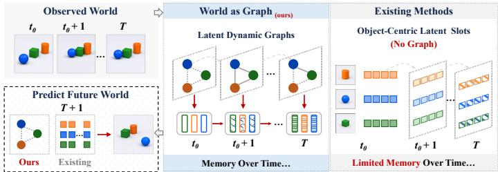  
Figure 1: Comparison of our proposed World-as-Graph (WAG) with existing object-centric world models (with no explicit graph structures (C1) and limited temporal memory (C2)).

state representations of objects and their interactions. Specifically, our proposed WAG contains two core sub-modules: (1) Relation-aware structure induction, which induces relational structures in latent space through a (1-a) latent dynamic graph constructor and a (1-b) relation-aware object masker; and (2) Object-centric memory transition, which models the temporal evolution of objectlevel dynamic states through a (2-a) temporal graph neural network (GNN) transition encoder and a (2-b) memory-driven future predictor. Concretely, the latent dynamic graph constructor treats object slots as nodes and builds time-varying relational graphs, followed by the relation-aware object masker, which selects objects based on relational centrality or temporal neighborhood changes. Masked object states are recovered from relational context and historical information. The first module models how object relations and structural dependencies evolve over time and guides JEPA-style predictive learning, addressing challenge C1. Afterward, the temporal GNN transition encoder updates each object state using neighboring relations and its historical memory. The memory-driven future predictor recursively evolves these memory states and constructs future dynamic graphs to predict future object states. The second module models how object-centric dynamic states evolve and supports future world prediction, addressing challenge C2. Extensive experiments on visual reasoning and robotic manipulation tasks show that our proposed WAG improves performance by up to 30.03 percentage points, while achieving 2.4× faster training and up to 16.4× lower peak GPU memory. In summary, the contributions of this work are listed below:

• To the best of our knowledge, we are the first to introduce latent space graphs for relational modeling in object-centric JEPA-style world models to explicitly capture object interactions and temporal dynamics in a World-As-Graph (WAG).

• The proposed WAG consists of two core sub-modules that jointly conduct (1) relation-aware structure induction composed of a latent dynamic graph constructor and a relation-aware object masker, and (2) object-centric memory transition composed of a temporal GNN transition encoder and a memory-driven future predictor, for expressive future world prediction.

• Extensive experiments demonstrate the effectiveness and benefits of WAG in introducing relational inductive bias to model object interactions and future dynamics.

Prior Work. Our work is closely related to three lines of research: (a) joint-embedding predictive architectures (JEPA), (b) graph world models, and, to a lesser extent, (c) dynamic graph representation learning. Specifically, JEPA methods (LeCun et al., 2022; Assran et al., 2023; Klindt et al., 2026; Bai & Xiong, 2026; Saito et al., 2025; Tuncay et al., 2025; Balestriero & LeCun, 2025; Yang et al., 2026; Nam et al., 2026) learn predictive representations directly in latent space, while recent object-centric JEPA-style world models (Feng et al., 2025a; Wang et al., 2025) further represent visual scenes as sets of object level latent states for learning object-wise dynamics. However, these existing methods often capture implicit interactions, while our WAG explicitly constructs evolving latent dynamic graphs for object state interactions. Most existing graph world models (Liu et al., 2026; Feng et al., 2025b; Song & Cai, 2026; Wang et al., 2026a) introduce world-modeling principles into graph-structured data, i.e., world modeling for graphs, while our work first introduces latent graph structures as relational inductive biases for object-centric world modeling, i.e., graphs for world modeling. Dynamic graph representation learning (Feng et al., 2025c; Zheng et al., 2025) is closely related to the temporal GNN component in WAG. More detailed discussions of these related research directions are provided in Appendix A.1.

## 2 METHODOLOGY

## 2.1 PRELIMINARY

Notation. Given a video representing a dynamic world as an image sequence, a pretrained objectcentric encoder $f _ { \Phi } ,$ ∗ extracts N latent slot representations from each frame at time step t as $\mathbf { S } _ { t } =$ $[ \mathbf { s } _ { t } ^ { 1 } , \ldots , \mathbf { s } _ { t } ^ { N } ] ^ { \top } \in \mathbb { R } ^ { N \times D _ { 0 } }$ , where $\mathbf { s } _ { t } ^ { i } \in \mathbb { R } ^ { D _ { 0 } }$ denotes the latent feature of the i-th slot, $D _ { 0 }$ is the feature dimension, and N is the fixed number of object slots. In this work, we transfer the latent slot representations to a discrete-time dynamic graph sequence ${ \mathcal G } = \{ G _ { t } \} _ { t \in { \mathcal T } }$ . Each graph snapshot at time step t is defined as $G _ { t } = ( \nu _ { t } , \dot { \mathcal { E } } _ { t } , \mathbf { S } _ { t } )$ , where $\mathcal { V } _ { t } \bar { = } \{ v _ { t } ^ { 1 } , \ldots , v _ { t } ^ { N } \}$ denotes the set of object nodes in the latent space, and $\mathcal { E } _ { t } \subseteq \mathcal { V } _ { t } \times \mathcal { V } _ { t }$ denotes the set of edges. Each node vi corresponds to the i-th object-centric slot at time step t and is associated with the latent feature $\mathbf { s } _ { t } ^ { i }$ . For future prediction, we have $\mathcal { T } = \mathcal { T } _ { \mathrm { h i s t } } \cup \mathcal { T } _ { \mathrm { p r e d } } .$ where $T _ { h }$ and $T _ { p }$ indicate the history window length and future prediction horizon, respectively. Given the current time step t, the corresponding history and prediction time sets are defined as $\dot { \mathcal { T } _ { \mathrm { h i s t } } } = \{ t - T _ { h } + 1 , \dots , t \}$ and $\mathcal { T } _ { \mathrm { p r e d } } = \{ t + 1 , \ldots , \bar { t } + T _ { p } \}$ . Given the observed slot states $\{ \mathbf { S } _ { t } \} _ { t \in \mathcal { T } _ { \mathrm { h i s t } } }$ , the world model aims to predict the future slot states $\{ \mathbf { S } _ { t } \} _ { t \in \mathcal { T } _ { \mathrm { p r e d } } }$

Problem Setting. Following the world model framework of Ha & Schmidhuber (2018), a model learns a compact representation of the environment from observations and predicts how that representation evolves in response to current actions. In this work, we follow this general formulation together with the object-centric and JEPA-style representation learning paradigm (Nam et al., 2026; Assran et al., 2023), and introduce graph machine learning and relational inductive bias to explicitly model interactions within the latent world states. Based on this, we further define a graph-structured world model, termed the World-As-Graph (WAG) model, as follows.

DEFINITION 1 (WORLD-AS-GRAPH MODEL). Given the historical object-centric latent states $\{ \mathbf { S } _ { t } \} _ { t \in \mathcal { T } _ { \mathrm { h i s t } } }$ , a World-As-Graph (WAG) model is defined as $\mathcal { M } _ { \mathrm { W A G } } = \left. \mathcal { R } , \mathcal { F } _ { \theta , \omega } \right.$ , where:

• Relation-Aware Structure Induction $\mathcal { R } = \langle \Gamma _ { \psi } , \pi _ { \mathrm { m a s k } } \rangle$ : first constructs dynamic relational graphs from object-centric latent representations through the latent dynamic graph constructor $\Gamma _ { \psi }$ , and then uses the relation-aware masking policy $\pi _ { \mathrm { m a s k } }$ to identify relationally informative object nodes based on the graph structure.

• Object-Centric Memory Transition ${ \mathcal { F } } _ { \theta , \omega } ~ = ~ \langle f _ { \mathrm { e n c } } ^ { \theta } , f _ { \mathrm { p r e d } } ^ { \omega } \rangle$ : maintains and updates object-level memory states from the masked historical graph sequence through the temporal GNN transi tion encoder $f _ { \mathrm { e n c } } ^ { \theta }$ , and further evolves these memory states through the memory-driven future predictor $f _ { \mathrm { p r e d } } ^ { \omega }$ to predict the future object-centric latent states $\{ \widehat { \mathbf { S } } _ { t } \} _ { t \in \mathcal { T } _ { \mathrm { p r e d } } }$

## 2.2 WORLD-AS-GRAPH FRAMEWORK

To explicitly model structured state representations of objects and their interactions, in this work, we first propose WAG, a graph-based object-centric world model. The overall framework is presented in Fig. 2. Given an input video, a frozen object-centric encoder first extracts object-level latent representations over time. The proposed WAG then performs two main stages. First, relation-aware structure induction constructs latent dynamic graphs among object slots and applies relation-aware masking based on relational centrality or temporal dynamics. Second, object-centric memory transition propagates relational information through a temporal GNN and updates object-level memory states over the observed history. These memory states are used for masked-state prediction during training and are further evolved by the memory-driven future predictor to autoregressively generate future object representations in latent space.

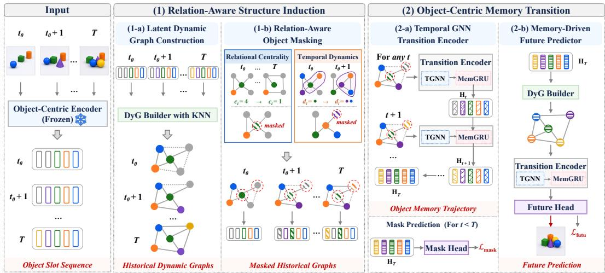  
Figure 2: Overall framework of our proposed WAG.

## 2.2.1 RELATION-AWARE STRUCTURE INDUCTION

This module explicitly induces relational bias through dynamic graph structure learning among object-centric slots and further guarantees relation-aware representation learning. Specifically, it contains two core sub-components: (a) Latent dynamic graph construction, which treats each object slot as a node and builds temporal object-object edges based on latent representation similarity; (b) Relation-aware object masking, which leverages the relational structure to inform the model of which objects deserve more attention.

Latent Dynamic Graph Construction. To explicitly model relational structures in latent space, given the object slot representations $\mathbf { S } _ { t } = [ \mathbf { s } _ { t } ^ { 1 } , \ldots , \mathbf { s } _ { t } ^ { N } ] ^ { \top }$ , each slot $\mathbf { s } _ { t } ^ { i }$ is treated as an object node $v _ { t } ^ { i } .$ . Our proposed WAG constructs a latent dynamic graph through a parameter-free dynamic graph builder Γ based on a similarity function sim $( \cdot , \cdot )$ and K-nearest neighbor (KNN) algorithm as:

$$
G _ { t } = \Gamma _ { K } ^ { \mathrm { s i m } } \left( { \bf S } _ { t } \right) = \left( \psi _ { t } , \mathcal { E } _ { t } , { \bf S } _ { t } \right) , \quad \mathcal { E } _ { t } = \left\{ ( i , j ) \mid j \in \arg \mathrm { T o p } \mathrm { - } K \sin \left( { \bf s } _ { i } ^ { t } , { \bf s } _ { k } ^ { t } \right) \right\} ,\tag{1}
$$

where $\mathcal { E } _ { t }$ denotes the set of edges connecting each object to its Top-K most similar nodes. In this work, we use cosine similarity, and the edge weight is given by $w _ { i j } ^ { t } = \cos \left( \mathbf { s } _ { i } ^ { t } , \mathbf { s } _ { j } ^ { t } \right)$ . This produces a sequence of time-varying latent graphs as $\mathcal { G } = \{ G _ { t } \} _ { t \in \mathcal { T } }$

Relation-Aware Object Masking. For each latent dynamic graph $G _ { t }$ , object nodes are selected for masking according to their relational roles in the constructed graph. In this way, the proposed WAG is able to recover the masked object states by jointly using relational information from other objects and the object’s own historical states. Specifically, let $\mathcal { T } _ { \mathrm { m a s k } } \subset \{ 1 , . . . , N \}$ denote the selected masked node indices, with $| \mathcal { T } _ { \mathrm { m a s k } } | = \bar { M }$ and $M \ < \ N$ Unlike random slot masking, our relation-aware object masking strategy is guided by the latent dynamic graph topology over the history window. Specifically, we design two strategies as below.

(I) Relational Centrality Masking. We first select relationally central object nodes according to their roles in the constructed latent dynamic graphs. Since each node in the KNN graph has a fixed outdegree K, we use the in-degree as the centrality signal to measure how frequently an object node $v _ { t } ^ { i }$ appears in the neighbor sets $\mathcal { N } _ { t } ^ { j }$ of other objects over the observed history $\mathcal { T } _ { \mathrm { h i s t } }$ . Therefore, we define the relational centrality score $c _ { i }$ and select the masked node indices $\mathcal { T } _ { \mathrm { m a s k } } ^ { \mathrm { c e n } }$ as

$$
c _ { i } = \sum _ { t \in \mathcal { T } _ { \mathrm { h i s t } } } \sum _ { j = 1 } ^ { N } \mathbb { I } \left[ i \in \mathcal { N } _ { t } ^ { j } \right] , \qquad \mathbb { Z } _ { \mathrm { m a s k } } ^ { \mathrm { c e n } } = \underset { i \in \{ 1 , \dots , N \} } { \arg \mathrm { T o p } } - M \ : c _ { i } ,\tag{2}
$$

where the Top-M objects with the highest centrality scores are selected for masking. By recovering these relationally central object states in JEPA-style learning, the proposed WAG exploits relational information from other objects together, rather than relying mainly on object self-dynamics.

(II) Temporal Dynamics Masking. We select object nodes according to the temporal changes of their relational contexts. The intuition behind is straightforward: if an object’s neighborhood changes frequently across consecutive time steps, its state is more likely to be affected by evolving interactions with other objects. Therefore, we define the temporal dynamics score $d _ { i }$ by measuring the accumulated changes in the neighbor set $\mathcal { N } _ { t } ^ { i }$ over the observed history $\mathcal { T } _ { \mathrm { h i s t } }$ , and select the masked node indices $\mathcal { T } _ { \mathrm { m a s k } } ^ { \mathrm { d y n } }$ as

$$
d _ { i } = \sum _ { t \in \mathcal { T } _ { \mathrm { h i s t } } } \left( K - \left| \mathcal { N } _ { t } ^ { i } \cap \mathcal { N } _ { t - 1 } ^ { i } \right| \right) , \qquad \mathcal { T } _ { \mathrm { m a s k } } ^ { \mathrm { d y n } } = \underset { i \in \{ 1 , \dots , N \} } { \arg \mathrm { T o p } } - M d _ { i } ,\tag{3}
$$

where $K - \left| \mathcal { N } _ { t } ^ { i } \cap \mathcal { N } _ { t - 1 } ^ { i } \right|$ measures the number of changed neighbors between two consecutive time steps. By recovering these temporally dynamic object states, the proposed WAG exploits evolving relational information across time.

After obtaining ${ \mathcal { T } } _ { \mathrm { m a s k } } \ \in \ \{ { \mathcal { T } } _ { \mathrm { m a s k } } ^ { \mathrm { c e n } } , { \mathcal { T } } _ { \mathrm { m a s k } } ^ { \mathrm { d y n } } \}$ , we replace the corresponding object features with a learnable mask token over the observed history, while keeping the first historical graph $G _ { t _ { 0 } }$ $t _ { 0 } ~ = ~ t - T _ { h } + 1$ fully visible to initialize the object states. This produces a partially observed historical graph sequence $\mathcal { G } ^ { \dagger } = \{ G _ { t } ^ { \dagger } \} _ { t \in \mathcal { T } _ { \mathrm { h i s t } } \backslash \{ t _ { 0 } \} }$ , where we have $G _ { t } ^ { \dagger } = ( \nu _ { t } , \mathcal { E } _ { t } , \mathbf { S } _ { t } ^ { \dagger } )$ with masked object representations ${ \bf S } _ { t } ^ { \dagger }$ . One goal of the proposed WAG is to recover the masked object states from their relational context and historical information.

## 2.2.2 OBJECT-CENTRIC MEMORY TRANSITION

Although the relation-aware structure induction explicitly models object-object relations within each time step, future world prediction further requires each object to maintain its own historical state across time. This becomes critical in two cases. First, a masked object node cannot observe its own state in the remaining historical frames. Second, during future generation through autoregressive rollout, no future observations are available for any object node. In light of this, we design an objectcentric memory transition module, where each object node maintains an individual memory state to preserve its historical information and relational interactions over time. Specifically, this module contains two sub-components: (a) Temporal GNN transition encoder, which updates object-level memory states over the observed history through graph structure-guided message passing, and (b) Memory-driven future predictor, which evolves the learned memory states to predict future object states without new observations.

Temporal GNN Transition Encoder. Given the partially observed historical graph $G _ { t } ^ { \dagger }$ after relation-aware object masking, we maintain each object node $v _ { t } ^ { i }$ an individual memory state $\mathbf { h } _ { t } ^ { i } \in \mathbb { R } ^ { D _ { 1 } }$ , where $D _ { 1 }$ is the memory feature dimension. Therefore, we define the object-level memory states as $\mathbf { H } _ { t } \overset { \cdot } { = } [ \mathbf { h } _ { t } ^ { 1 } , \dots , \mathbf { h } _ { t } ^ { N } ] ^ { \top } \in \mathbb { R } ^ { N \times D _ { 1 } }$ . Since the first historical graph at $t _ { 0 }$ is kept fully visible, the object memory states are initialized as the observed object representations $\mathbf { H } _ { t _ { 0 } } = \mathbf { S } _ { t _ { 0 } }$

For the remaining historical time steps, we design a temporal GNN transition encoder $f _ { \mathrm { e n c } } ^ { \theta }$ that updates the object-level memory states by jointly considering the current partially observed graph $\boldsymbol { G } _ { t } ^ { \dagger }$ and the previously accumulated memory states $\mathbf { H } _ { t - 1 }$ through temporal graph message passing:

$$
\mathbf { H } _ { t } = f _ { \mathrm { e n c } } ^ { \theta } \left( G _ { t } ^ { \dagger } , \mathbf { H } _ { t - 1 } \right) = \mathrm { M e m G R U } _ { \theta _ { m } } \left( \mathrm { T G N N } _ { \theta _ { g } } \left( G _ { t } ^ { \dagger } \right) , \mathbf { H } _ { t - 1 } \right) , \qquad t \in \mathcal { T } _ { \mathrm { h i s t } } \setminus \{ t _ { 0 } \} ,\tag{4}
$$

where $\boldsymbol { \theta } = \{ \boldsymbol { \theta } _ { g } , \boldsymbol { \theta } _ { m } \}$ denotes the parameters of the temporal GNN and memory-based gated recurrent unit (GRU). In this way, each object memory state $\mathbf { h } _ { t } ^ { i }$ integrates the current object information, relational context from neighboring objects, and its previous memory state $\mathbf { h } _ { t - 1 } ^ { i }$ , therefore preserving both object-specific historical information and relational information accumulated over time.

To further encourage our proposed model to learn predictive object representations through the masking policy, we apply an auxiliary masked-state prediction head $g _ { \mathrm { m a s k } } ^ { \epsilon }$ to the corresponding memory states for generating predicted masked object representations as:

$$
\widehat { \mathbf { S } } _ { t } ^ { \mathrm { m a s k } } = g _ { \mathrm { m a s k } } ^ { \epsilon } \left( \mathbf { H } _ { t } , \mathcal { T } _ { \mathrm { m a s k } } \right) , \qquad t \in \mathcal { T } _ { \mathrm { h i s t } } \setminus \{ t _ { 0 } \} .\tag{5}
$$

Memory-Driven Future Predictor. After the observed history ends, we design a memory-driven future predictor $f _ { \mathrm { p r e d } } ^ { \omega }$ to autoregressively evolve the learned object-level memory states using the previously learned memory for relational future prediction. Specifically, for each future time step $t \in \mathcal { T } _ { \mathrm { p r e d } }$ , we first apply the same latent dynamic graph constructor to the previous memory states and the same temporal GNN encoder to capture the object-level interactions. Then, the designed memory-driven future predictor $f _ { \mathrm { p r e d } } ^ { \omega }$ evolves the previous memory states with temporal information to update the future memory states, so we could generate the future object representation with transitioned memory as:

$$
\widehat { G } _ { t - 1 } = \Gamma _ { K } ^ { \mathrm { s i m } } \left( \mathbf { H } _ { t - 1 } \right) , \qquad \mathbf { H } _ { t } = f _ { \mathrm { p r e d } } ^ { \omega } \left( \widehat { G } _ { t - 1 } , \mathbf { H } _ { t - 1 } \right) , \qquad \widehat { \mathbf { S } } _ { t } ^ { \mathrm { t a t u } } = g _ { \mathrm { p r o j } } ^ { \eta } \left( \mathbf { H } _ { t } \right) , \qquad t \in { \mathcal { T } } _ { \mathrm { p r e d } } ,\tag{6}
$$

where $g _ { \mathrm { p r o j } } ^ { \eta }$ is a projection head for generating future object states from the updated memory states. In this way, the proposed WAG progressively constructs future relational structures and evolves object-level memory, predicting the future object-centric latent states $\{ \widehat { \mathbf { S } } _ { t } ^ { \mathrm { f u t u } } \} _ { t \in \mathcal { T } _ { \mathrm { p r e d } } }$

## 2.2.3 LEARNING OBJECTIVE

Training Stage. The proposed WAG is trained with two predictive objectives: (1) Historical masked-state prediction loss $\mathcal { L } _ { \mathrm { m a s k } } .$ , to encourage WAG to recover the original latent representations of the masked objects from their learned memory states; (2) Future-state prediction loss ${ \mathcal { L } } _ { \mathrm { f u t u } } .$ to predict the future object-centric latent states through autoregressive memory transition with latent dynamic graph guidance. Given the predicted masked representations $\widehat { \mathbf { S } } _ { t } ^ { \mathrm { m a s k } }$ and the predicted future states $\widehat { \mathbf { S } } _ { t } ^ { \mathrm { f u t u } }$ , we define the following training objectives:

$$
\mathcal { L } _ { \mathrm { m a s k } } = \frac { 1 } { \left| \mathcal { T } _ { \mathrm { h i s t } } \setminus \{ t _ { 0 } \} \right| } \sum _ { t \in \mathcal { T } _ { \mathrm { h i s t } } \setminus \{ t _ { 0 } \} } \ell \left( \widehat { \mathbf { S } } _ { t } ^ { \mathrm { m a s k } } , \mathbf { S } _ { t } ^ { \mathrm { m a s k } } \right) , \quad \mathcal { L } _ { \mathrm { f u t u } } = \frac { 1 } { \left| \mathcal { T } _ { \mathrm { p r e d } } \right| } \sum _ { t \in \mathcal { T } _ { \mathrm { p r e d } } } \ell \left( \widehat { \mathbf { S } } _ { t } ^ { \mathrm { f u t u } } , \mathbf { S } _ { t } ^ { \mathrm { f u t u } } \right) ,\tag{7}
$$

where $\mathbf { S } _ { t } ^ { \mathrm { m a s k } }$ and $\mathbf { S } _ { t } ^ { \mathrm { f u t u } }$ indicate the original latent masked representations and the target future representations, respectively. $\ell ( \cdot , \cdot )$ denotes the latent space prediction loss, for which we use mean squared error (MSE). Therefore, the overall training objective is formulated as

$$
\begin{array} { r } { \mathcal { L } = \lambda _ { \mathrm { m a s k } } \mathcal { L } _ { \mathrm { m a s k } } + \lambda _ { \mathrm { f u t u } } \mathcal { L } _ { \mathrm { f u t u } } , } \end{array}\tag{8}
$$

where $\lambda _ { \mathrm { m a s k } }$ and $\lambda _ { \mathrm { f u t u } }$ are hyper-parameters. We provide a theoretical analysis of stability and error accumulation in Appendix A.2. The overall training algorithm is in Appendix A.3.

Inference Stage. During inference, the relation-aware object masking and auxiliary masked-state prediction head are NOT used. Given the FULLY observed historical object representations, we apply Eq. (4) to learn the object-level memory states over the history window, and then, starting from the last historical memory state. The memory-driven future predictor performs autoregressive rollout by Eq. (6). Following the standard objective of latent world modeling, this procedure will be recursively conducted for the next prediction step until the target prediction horizon is reached.

## 3 EXPERIMENTS

To verify the effectiveness of our proposed WAG, we conduct extensive experiments on visual reasoning and robotic manipulation tasks and aim to answer the following research questions: RQ1 [Sec 3.2]: How does the overall performance of WAG in predicting future object dynamics compare with existing predictive world-modeling baselines? RQ2 [Sec 3.3]: How do ablation studies reveal the contributions of key components in WAG, particularly latent dynamic graph construction and different object masking strategies? RQ3 [Sec 3.4]: How effectively can WAG model temporal physical interactions? RQ4 [Sec 3.4]: How robust and computationally efficient is WAG in terms of hyperparameter sensitivity and running cost? More experimental results, analysis, and implementation details are listed in Appendix A.4.

Table 1: VQA accuracy (%) comparison on CLEVRER using VideoSAUR and SAVi encoders. WAG and WAG denote instance-wise masking and batch-shared masking, respectively. ∆ and $\Delta _ { \mathrm { B } }$ indicate the absolute improvements over C-JEPA in percentage points (pp). The best results are shown in bold, and the second-best results are underlined.
<table><tr><td rowspan="2">Model</td><td rowspan="2">Average per que. (%)</td><td colspan="2">Counterfactual (%)</td><td colspan="2">Explanatory (%)</td><td colspan="2">Predictive (%)</td><td rowspan="2">Descriptive (%)</td></tr><tr><td></td><td>per opt. per que.</td><td>per opt.</td><td>per que.</td><td>per opt.</td><td>per que.</td></tr><tr><td colspan="8">VideoSAUR Encoder</td></tr><tr><td>OC-JEPA</td><td>82.79</td><td>79.53</td><td>47.68</td><td>92.88</td><td>80.58</td><td>86.15</td><td>75.04</td><td>89.59</td></tr><tr><td>C-JEPA</td><td>89.40</td><td>88.67</td><td>68.81</td><td>96.62</td><td>90.74</td><td>93.03</td><td>86.93</td><td>92.84</td></tr><tr><td>WAGI (ours)</td><td>90.79</td><td>90.06</td><td>72.22</td><td>97.79</td><td>93.96</td><td>92.92</td><td>86.81</td><td>93.71</td></tr><tr><td>∆I Improv.↑</td><td>+1.39</td><td>+1.39</td><td>+3.41</td><td>+1.17</td><td>+3.22</td><td>-0.11</td><td>-0.12</td><td>+0.87</td></tr><tr><td>WAGB (ours)</td><td>91.37</td><td>90.55</td><td>73.76</td><td>97.84</td><td>94.13</td><td>94.43</td><td>89.54</td><td>94.05</td></tr><tr><td>∆B Improv.↑</td><td>+1.97</td><td>+1.88</td><td>+4.95</td><td>+1.22</td><td>+3.39</td><td>+1.40</td><td>+2.61</td><td>+1.21</td></tr><tr><td colspan="9">SAVi Encoder</td></tr><tr><td>OC-JEPA</td><td>77.28</td><td>76.69</td><td>41.10</td><td>91.20</td><td>76.04</td><td>83.48</td><td>70.51</td><td>84.05</td></tr><tr><td>C-JEPA</td><td>83.88</td><td>85.16</td><td>60.19</td><td>95.34</td><td>87.27</td><td>87.46</td><td>77.25</td><td>87.81</td></tr><tr><td>WAGI (ours)</td><td>92.34</td><td>90.98</td><td>74.62</td><td>98.25</td><td>95.18</td><td>94.63</td><td>90.05</td><td>95.06</td></tr><tr><td>∆I Improv.↑</td><td>+8.46</td><td>+5.82</td><td>+14.43</td><td>+2.91</td><td>+7.91</td><td>+7.17</td><td>+12.80</td><td>+7.25</td></tr><tr><td>WAGB (ours)</td><td>92.72</td><td>91.19</td><td>75.45</td><td>98.35</td><td>95.35</td><td>95.84</td><td>91.99</td><td>95.29</td></tr><tr><td>∆B Improv.↑</td><td>+8.84</td><td>+6.03</td><td>+15.26</td><td>+3.01</td><td>+8.08</td><td>+8.38</td><td>+14.74</td><td>+7.48</td></tr></table>

## 3.1 EXPERIMENTAL SETUP

Tasks and Datasets. We evaluate the proposed WAG over two tasks, i.e., visual reasoning and robotic manipulation. For the visual reasoning task, we use the CLEVRER (Yi et al., 2019) dataset, a synthetic video benchmark of multiple colliding objects for physical and causal understanding in dynamic scenes, where four types of questions (i.e., counterfactual, explanatory, predictive, and descriptive) are included for the visual question-answering (VQA) task. Each video is encoded into object-centric latent states using a frozen pretrained encoder. Following Nam et al. (2026), we use VideoSAUR (Zadaianchuk et al., 2023) and SAVi (Kipf et al., 2021) with seven object slots. Our WAG is trained on these latent states and autoregressively rolls out future object trajectories. Following SlotFormer (Wu et al., 2022), we use ALOE (Ding et al., 2021) to reason over predicted object trajectories and report per-question-type and average VQA accuracy. For the robotic manipulation task, we use the contact-rich PushT robotic manipulation benchmark (Chi et al., 2025), where an agent pushes a T-shaped block from a random pose to a target pose through sequential contact interactions. Following (Zhou et al., 2024; Nam et al., 2026), we evaluate PushT planning by success rate using six latent tokens (four object slots and two auxiliary tokens). An episode is successful when the final block state falls within a predefined threshold of the target.

Baselines. To ensure a fair comparison under consistent experimental settings, we mainly compare the proposed WAG with existing state-of-the-art object-centric world models that adopt comparable latent representations and evaluation protocols. For VQA evaluation, all compared methods use the same pretrained encoder, rollout procedure, and downstream models to ensure a controlled and fair comparison. For the visual reasoning task, we consider two state-of-the-art baseline methods: (1) OC-JEPA (Nam et al., 2026), and (2) Causal-JEPA (C-JEPA) (Nam et al., 2026). For the robotic manipulation task, we take the following baseline models: (1) DINO-WM (Zhou et al., 2024), (2) DINO-WM-Reg. (Darcet et al., 2024), (3) OC-DINO-WM (Nam et al., 2026), (4) OC-JEPA, and (5) C-JEPA. All baselines start from DINOv2 embeddings (Oquab et al., 2023) and differ only in predictor training. More details of all baseline methods are listed in Appendix A.4.

## 3.2 PERFORMANCE OF WAG ON VISUAL REASONING AND ROBOTIC MANIPULATION

To answer RQ1 on the visual reasoning task, we report the VQA accuracy (%) across four question types on the CLEVRER dataset in Table 1. Overall, both variants of our proposed WAG consistently achieve strong VQA performance across the VideoSAUR and SAVi encoders. In particular, $\mathbf { W A G _ { B } }$ improves the average accuracy over C-JEPA by 1.97 and 8.84 pp with VideoSAUR and SAVi encoders, respectively. Concretely, we can make the following essential observations. First, our proposed WAG consistently improves over C-JEPA across both object-centric encoders, showing that its effectiveness does not depend on a specific pretrained encoder. Second, our proposed WAG achieves the largest gains on counterfactual and predictive reasoning tasks, improving the per-question accuracy over C-JEPA by 15.26 and 14.74 pp, respectively, with the SAVi encoder. We attribute this to the proposed latent dynamic graphs and object-centric memory transition module, which explicitly models the temporal evolution of object states and relations, enabling stronger reasoning about unobserved and future dynamics. Third, batch-shared masking consistently outperforms instance-wise masking across both encoders, indicating more stable learning for future prediction.

To answer RQ1 on the robotic manipulation task, we compare planning performance on PushT under different world-model token budgets in Table 2. The results show that WAG achieves the best success rate of 90.70% using only 6 × 128 latent tokens, which is close to DINO-WM, achieving 91.33% with a much larger token budget of $1 9 6 \times 3 8 4$ . Under the same compact $6 \times 1 2 8$ setting, WAG clearly outperforms all object-centric baselines. It exceeds JEPA-style baselines, OC-JEPA and C-

Table 2: PushT planning success rates across different world-model token budgets.
<table><tr><td># Token ×d</td><td>Model</td><td>Success Rate (%)</td></tr><tr><td rowspan="2"> $1 9 6 \times 3 8 4$ </td><td>DINO-WM</td><td>91.33</td></tr><tr><td>DINO-WM-Reg.</td><td>88.00</td></tr><tr><td rowspan="4">6 × 128</td><td>OC-DINO-WM (ref.)</td><td>60.67</td></tr><tr><td>OC-JEPA</td><td>76.00 ↑+15.33</td></tr><tr><td>C-JEPA</td><td>88.67 ↑+28.00</td></tr><tr><td>WAG (ours)</td><td>90.70 ↑+30.03</td></tr></table>

JEPA, by 14.70 and 2.03 percentage points, respectively. This further demonstrates that our proposed relational structure modeling in WAG can improve compact object-centric representations for downstream robotic planning.

## 3.3 ABLATION STUDY OF WAG ON KEY COMPONENTS

Overall Ablation. To answer RQ2, we report the overall ablation results in Table 3. It shows that all components contribute to the final performance of WAG. Full WAG achieves the best average accuracy of 91.37%, improving C-JEPA by 1.97 percentage points. Removing the memory predictor causes the largest degradation, particularly on predictive questions, where accuracy drops from 89.54% to 85.55%. Removing DyGraph also leads to a clear performance decrease, while Relational Masking and TGNN provide further consistent gains. These results attribute the overall improvement to the complementary effects of relation-aware structure induction and object-centric memory transition, which jointly capture evolving object relations and support future state prediction.

Table 3: Overall component ablation with VideoSAUR representations.
<table><tr><td>Variants</td><td>DyG</td><td>Rel. Mask</td><td>TGNN</td><td>Mem. Pred.</td><td>Avg. (%)</td></tr><tr><td>C-JEPA</td><td>X</td><td>X</td><td>X</td><td>X</td><td>89.40</td></tr><tr><td>w/o DyG</td><td>×</td><td>×</td><td>×</td><td>√</td><td>90.63</td></tr><tr><td>w/o Rel. Mask</td><td>√</td><td>×</td><td>√</td><td>√</td><td>90.94</td></tr><tr><td>w/o TGNN</td><td>√</td><td>√</td><td>×</td><td>√</td><td>90.97</td></tr><tr><td>w/o Mem. Pred.</td><td>√</td><td>√</td><td>√</td><td>×</td><td>90.21</td></tr><tr><td>Full WAG</td><td>√</td><td>√</td><td>√</td><td>√</td><td>91.37</td></tr></table>

Table 4: Comparison of different masking strategies with SAVi representations.
<table><tr><td>Masking Strategy</td><td>Avg.</td><td>Counter.</td><td>Predict.</td></tr><tr><td>Random [w/o DyG.]</td><td>83.88</td><td>60.19</td><td>77.25</td></tr><tr><td>Random [w/ DyG.]</td><td>92.28 (+8.40)</td><td>73.75 (+13.56)</td><td>91.14 (+13.89)</td></tr><tr><td>Relational Centrality</td><td>92.72 (+8.84)</td><td>75.45 (+15.26)</td><td>91.99 (+14.74)</td></tr><tr><td>Temporal Dynamics</td><td>91.95 (+8.07)</td><td>73.51 (+13.32)</td><td>89.71 (+12.46)</td></tr></table>

In-Depth Ablation on Latent Dynamic Graph Construction. To demonstrate the effectiveness of latent dynamic graph construction in RQ2, we compare our constructed KNN latent dynamic graphs in WAG with two uniformly sampled graph variants. Specifically, uniform graph (IID) samples K neighbors independently, allowing duplicates and self-loops, while uniform graph (subset) samples K distinct neighbors without replacement and excludes self-loops. As shown in Figure 3, our WAG consistently outperforms both uniformly sampled graph variants across all CLEVRER question types. These results indicate that the gain does not only come from introducing graph connectivity, but also from constructing informative relations in the latent space.

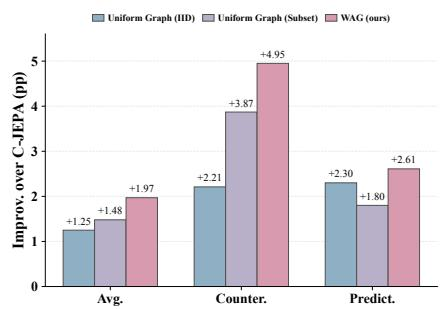  
Figure 3: Performance improvement of different latent dynamic graph construction strategies over C-JEPA.

In-Depth Ablation on Relation-Aware Object Masking. Table 4 compares different object masking strategies under SAVi representations in RQ2. Introducing dynamic graph information, i.e., random [w/ DyG.], consistently improves random masking over random [w/o DyG.], i.e., the

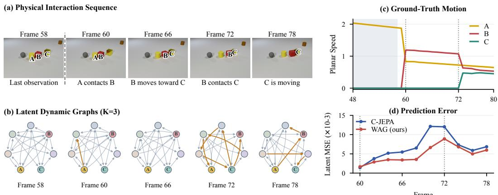  
Figure 4: Visualization of physical interaction modeling on CLEVRER.(a) Physical interaction from the last observed to future frames. (b) Latent dynamic graphs constructed by WAG with K = 3, showing evolving object relations. A/B/C correspondences are inferred. (c) Ground-truth object motion changes. (d) Latent prediction errors of C-JEPA and WAG, with lower errors achieved by WAG during interaction-driven transitions.

C-JEPA setting. Among the graph-based strategies, relational centrality achieves the best performance across all reported metrics, improving the average per-question accuracy by 8.84 percentage points under SAVi representations. Temporal dynamics also provides consistent gains over the random [w/o DyG.], while relational centrality further demonstrates the benefit of selecting objects according to their relational importance.

## 3.4 IN-DEPTH ANALYSIS OF WAG

Analysis of Physical Interaction Modeling. To answer RQ3, we present Figure 4, a CLEVRER sequence with a two-step collision chain, where A first strikes B and B subsequently strikes C within the prediction horizon. Although the model only observes the frames before these interactions, the latent graph changes when the physical relations evolve, especially around the second collision. Compared with C-JEPA, WAG reduces the mean latent MSE $( \times 1 \dot { 0 } ^ { - 3 } )$ from 6.66 to 4.83, while lowering the peak error from 12.1 to 8.9. This suggests that the gain mainly comes from dynamic relation updates, which better capture interaction-driven state changes and future dynamics.

Analysis of the Number of Masked Objects M and Graph Neighborhood Size K. Figure 5 studies the sensitivity of WAG to the number of masked objects M and graph neighborhood size K in RQ4. Overall, the performance remains relatively stable across different parameter combinations. Moderate neighborhood sizes (K=3) generally achieve stronger performance, while the preferred masking number varies slightly across representations and evaluation metrics. In particular, VideoSAUR achieves its highest average accuracy of 91.37% at K=3, M=2. More results are in Appendix A.4.

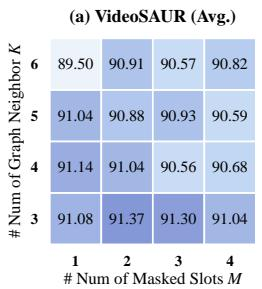

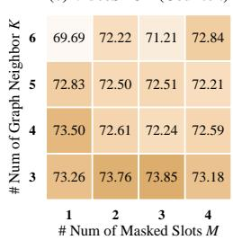  
Figure 5: Analysis of the number of masked objects M and graph neighborhood size K.

Analysis of Running Costs. For RQ4, we report the training time and peak GPU memory. Our proposed WAG is substantially more efficient than C-JEPA and OC-JEPA, requiring only about 143 seconds per epoch compared with 341.4 seconds for C-JEPA, i.e., approximately 2.4× faster training. It also reduces peak GPU memory from 6712 MiB to 410 MiB, achieving up to a 16.4× reduction. More detailed running costs, including GFLOPs, are provided in Appendix A.4.

## 4 CONCLUSION

In this work, we introduce World-As-Graph (WAG), a graph-based object-centric world model that explicitly captures object relations and their temporal evolution in latent space. WAG integrates relation-aware structure induction with object-centric memory transition, allowing relational information and historical object states to jointly support future prediction. Experiments on visual reasoning and robotic manipulation tasks demonstrate the consistent improvements of our proposed WAG. In-depth ablation studies and analysis, along with physical interaction analysis, further highlight the effectiveness of representing the latent world as dynamic graphs. More broadly, WAG provides a general framework for connecting object-centric representation learning with relational graph modeling, offering a step toward more structured and interaction-aware world models.

## AI USE STATEMENT

In this work, we used generative AI tools for editing and improving the readability of the manuscript, refining the presentation of scientific figures, and supporting software code development and debugging. The research ideas, proposed methodology, experimental design, and interpretation of the experimental results were developed and conducted by the authors. All AI-assisted text was reviewed and revised by the authors. No AI-generated content was directly adopted without author verification. We take responsibility for the final content of this work, including text, claims, code, figures, and other artifacts produced with the aid of generative AI.

## ETHICS STATEMENT

This work does not involve human subjects, personal or sensitive data, or other ethical concerns requiring specific consideration.

## REPRODUCIBILITY STATEMENT

We provide the main architectural details and learning objectives of WAG in the Method section. The datasets, evaluation protocols, baseline settings, and partial implementation details are described in the Experiment section. Additional hyperparameter settings, model configurations, and implementation details required for reproducing the reported results are provided in the Appendix.

## REFERENCES

Mahmoud Assran, Quentin Duval, Ishan Misra, Piotr Bojanowski, Pascal Vincent, Michael Rabbat, Yann LeCun, and Nicolas Ballas. Self-supervised learning from images with a joint-embedding predictive architecture. In 2023 IEEE/CVF Conference on Computer Vision and Pattern Recognition (CVPR), pp. 15619–15629. IEEE, 2023.

Jiaxin Bai and Jiaxuan Xiong. Temporal-distance jepa: Plan-aware representation learning for latent world model predictive control. arXiv preprint arXiv:2607.25337, 2026.

Randall Balestriero and Yann LeCun. Lejepa: Provable and scalable self-supervised learning without the heuristics. arXiv preprint arXiv:2511.08544, 2025.

Peter W Battaglia, Jessica B Hamrick, Victor Bapst, Alvaro Sanchez-Gonzalez, Vinicius Zambaldi, Mateusz Malinowski, Andrea Tacchetti, David Raposo, Adam Santoro, Ryan Faulkner, et al. Relational inductive biases, deep learning, and graph networks. arXiv preprint arXiv:1806.01261, 2(3):5, 2018.

Hongzhe Bi, Hengkai Tan, Shenghao Xie, Zeyuan Wang, Shuhe Huang, Haitian Liu, Ruowen Zhao, Yao Feng, Chendong Xiang, Yinze Rong, Hongyan Zhao, Hanyu Liu, Zhizhong Su, Lei Ma, Hang Su, and Jun Zhu. Motus: A unified latent action world model. In Proceedings of the IEEE/CVF Conference on Computer Vision and Pattern Recognition (CVPR), pp. 35101–35113, June 2026.

Jake Bruce, Michael D Dennis, Ashley Edwards, Jack Parker-Holder, Yuge Shi, Edward Hughes, Matthew Lai, Aditi Mavalankar, Richie Steigerwald, Chris Apps, et al. Genie: Generative interactive environments. In Forty-first international conference on machine learning, 2024.

Cheng Chi, Zhenjia Xu, Siyuan Feng, Eric Cousineau, Yilun Du, Benjamin Burchfiel, Russ Tedrake, and Shuran Song. Diffusion policy: Visuomotor policy learning via action diffusion. The International Journal ofRobotics Research, 44(10-11):1684–1704, 2025.

Weilin Cong, Si Zhang, Jian Kang, Baichuan Yuan, Hao Wu, Xin Zhou, Hanghang Tong, and Mehrdad Mahdavi. Do we really need complicated model architectures for temporal networks? arXiv preprint arXiv:2302.11636, 2023.

Timothee Darcet, Maxime Oquab, Julien Mairal, and Piotr Bojanowski. Vision transformers need´ registers. 2024:2632–2652, 2024.

David Ding, Felix Hill, Adam Santoro, Malcolm Reynolds, and Matt Botvinick. Attention over learned object embeddings enables complex visual reasoning. Advances in Neural Information Processing Systems (NeurIPS), 34:9112–9124, 2021.

Jingtao Ding, Yunke Zhang, Yu Shang, Yuheng Zhang, Zefang Zong, Jie Feng, Yuan Yuan, Hongyuan Su, Nian Li, Nicholas Sukiennik, et al. Understanding world or predicting future? a comprehensive survey of world models. ACM Computing Surveys, 58(3):1–38, 2025.

Fan Feng, Phillip Lippe, and Sara Magliacane. Learning interactive world model for object-centric reinforcement learning. Advances in Neural Information Processing Systems (NeurIPS), 2025a.

Tao Feng, Yexin Wu, Guanyu Lin, and Jiaxuan You. Graph world model. In Forty-second International Conference on Machine Learning (ICML), 2025b.

ZhengZhao Feng, Rui Wang, TianXing Wang, Mingli Song, Sai Wu, and Shuibing He. A comprehensive survey of dynamic graph neural networks: Models, frameworks, benchmarks, experi ments and challenges. IEEE Transactions on Knowledge and Data Engineering, 2025c.

Stefano Ferraro, Pietro Mazzaglia, Tim Verbelen, and Bart Dhoedt. Focus: object-centric world models for robotic manipulation. Frontiers in Neurorobotics, 19:1585386, 2025.

David Ha and Jurgen Schmidhuber. World models. ¨ arXiv preprint arXiv:1803.10122, 2(3):440, 2018.

Yiming He, Xiang Li, Zhongying Zhao, Haobing Liu, Peilan He, and Yanwei Yu. Maskdgnn: Self-supervised dynamic graph neural networks with activeness-aware temporal masking. In International Joint Conference on Artificial Intelligence (IJCAI), pp. 2892–2900, 2025.

Ming Jin, Yuan-Fang Li, and Shirui Pan. Neural temporal walks: Motif-aware representation learning on continuous-time dynamic graphs. Advances in Neural Information Processing Systems (NeurIPS), 35:19874–19886, 2022.

Thomas Kipf, Elise Van der Pol, and Max Welling. Contrastive learning of structured world models. International Conference on Learning Representations (ICLR), 2020.

Thomas Kipf, Gamaleldin F Elsayed, Aravindh Mahendran, Austin Stone, Sara Sabour, Georg Heigold, Rico Jonschkowski, Alexey Dosovitskiy, and Klaus Greff. Conditional object-centric learning from video. arXiv preprint arXiv:2111.12594, 2021.

David Klindt, Yann LeCun, and Randall Balestriero. When does lejepa learn a world model? arXiv preprint arXiv:2605.26379, 2026.

Yann LeCun et al. A path towards autonomous machine intelligence version 0.9. 2, 2022-06-27. Open Review, 62(1):1–62, 2022.

Anson Lei, Bernhard Scholkopf, and Ingmar Posner. Spartan: A sparse transformer world model¨ attending to what matters. Advances in Neural Information Processing Systems (NeurIPS), 38: 154089–154114, 2026.

Jintang Li, Ruofan Wu, Xinzhou Jin, Boqun Ma, Liang Chen, and Zibin Zheng. State space models on temporal graphs: A first-principles study. Advances in Neural Information Processing Systems (NeurIPS), 37:127030–127058, 2024.

Jiawei Liu, Senqiao Yang, Mingjun Wang, Yu Wang, and Bei Yu. Graph world models: Concepts, taxonomy, and future directions. arXiv preprint arXiv:2604.27895, 2026.

Malte Mosbach, Jan Niklas Ewertz, Angel Villar-Corrales, and Sven Behnke. Sold: Slot objectcentric latent dynamics models for relational manipulation learning from pixels. arXiv preprint arXiv:2410.08822, 2024.

Heejeong Nam, Quentin Le Lidec, Lucas Maes, Yann LeCun, and Randall Balestriero. Causal-jepa: Learning world models through object-level latent interventions. arXiv e-prints, pp. arXiv–2602, 2026.

Yosuke Nishimoto and Takashi Matsubara. Object-centric world models for causality-aware reinforcement learning. In Proceedings of the AAAI Conference on Artificial Intelligence, volume 40, pp. 24585–24593, 2026.

Maxime Oquab, Timothee Darcet, Th´ eo Moutakanni, Huy Vo, Marc Szafraniec, Vasil Khalidov,´ Pierre Fernandez, Daniel Haziza, Francisco Massa, Alaaeldin El-Nouby, et al. Dinov2: Learning robust visual features without supervision. arXiv preprint arXiv:2304.07193, 2023.

Fachrina Dewi Puspitasari, Chaoning Zhang, Joseph Cho, Adnan Haider, Noor Ul Eman, Omer Amin, Alexis Mankowski, Muhammad Umair, Jingyao Zheng, Sheng Zheng, et al. Sora as a world model? a complete survey on text-to-video generation. arXiv preprint arXiv:2403.05131, 2024.

Emanuele Rossi, Ben Chamberlain, Fabrizio Frasca, Davide Eynard, Federico Monti, and Michael Bronstein. Temporal graph networks for deep learning on dynamic graphs. arXiv preprint arXiv:2006.10637, 2020.

Ayumu Saito, Prachi Kudeshia, and Jiju Poovvancheri. Point-jepa: A joint embedding predictive architecture for self-supervised learning on point cloud. In 2025 IEEE/CVF Winter Conference on Applications of Computer Vision (WACV), pp. 7348–7357. IEEE, 2025.

Xinyuan Song and Zekun Cai. Understanding rollout error in graph world models. arXiv preprint arXiv:2606.27780, 2026.

Ludovic Tuncay, Etienne Labbe, Emmanouil Benetos, and Thomas Pellegrini. Audio-jepa:´ Joint-embedding predictive architecture for audio representation learning. arXiv preprint arXiv:2507.02915, 2025.

Wei Wang, Yaosen Chen, Han Yang, Yuegen Liu, Mingli Luo, Xinxin Jiao, Xuming Wen, and Ming Liu. A structural dynamics graph world model: Unified modeling, constrained rollout, and interpretable calibration. arXiv preprint arXiv:2608.08689, 2026a.

Yuqi Wang, Xinghang Li, Wenxuan Wang, Junbo Zhang, Yingyan Li, Yuntao Chen, Xinlong Wang, and Zhaoxiang Zhang. Unified vision-language-action model. In The Fourteenth International Conference on Learning Representations (ICLR), 2026b.

Zizhao Wang, Kaixin Wang, Li Zhao, Peter Stone, and Jiang Bian. Dyn-o: Building structured world models with object-centric representations. Advances in Neural Information Processing Systems (NeurIPS), 38:121788–121812, 2025.

Jialong Wu, Shaofeng Yin, Ningya Feng, Xu He, Dong Li, Jianye Hao, and Mingsheng Long. ivideogpt: Interactive videogpts are scalable world models. Advances in Neural Information Processing Systems (NeurIPS), 37:68082–68119, 2024.

Ziyi Wu, Nikita Dvornik, Klaus Greff, Thomas Kipf, and Animesh Garg. Slotformer: Unsupervised visual dynamics simulation with object-centric models. arXiv preprint arXiv:2210.05861, 2022.

Da Xu, Chuanwei Ruan, Evren Korpeoglu, Sushant Kumar, and Kannan Achan. Inductive representation learning on temporal graphs. arXiv preprint arXiv:2002.07962, 2020.

Fuxiang Yang, Donglin Di, Lulu Tang, Xuancheng Zhang, Lei Fan, Hao Li, Wei Chen, Tonghua Su, and Baorui Ma. Chain of world: World model thinking in latent motion. In Proceedings of the IEEE/CVF Conference on Computer Vision and Pattern Recognition (CVPR), pp. 6675–6684, 2026.

Kexin Yi, Chuang Gan, Yunzhu Li, Pushmeet Kohli, Jiajun Wu, Antonio Torralba, and Joshua B Tenenbaum. Clevrer: Collision events for video representation and reasoning. arXiv preprint arXiv:1910.01442, 2019.

Le Yu, Leilei Sun, Bowen Du, and Weifeng Lv. Towards better dynamic graph learning: New architecture and unified library. Advances in Neural Information Processing Systems (NeurIPS), 36:67686–67700, 2023.

Andrii Zadaianchuk, Maximilian Seitzer, and Georg Martius. Object-centric learning for real-world videos by predicting temporal feature similarities. Advances in Neural Information Processing Systems (NeurIPS), 36:61514–61545, 2023.

Wenyao Zhang, Hongsi Liu, Zekun Qi, Yunnan Wang, Xinqiang Yu, Jiazhao Zhang, Runpei Dong, Jiawei He, He Wang, Zhizheng Zhang, et al. Dreamvla: a vision-language-action model dreamed with comprehensive world knowledge. Advances in Neural Information Processing Systems (NeurIPS), 38:24195–24228, 2026.

Yanping Zheng, Lu Yi, and Zhewei Wei. A survey of dynamic graph neural networks. Frontiers of Computer Science, 19(6):196323, 2025.

Gaoyue Zhou, Hengkai Pan, Yann LeCun, and Lerrel Pinto. Dino-wm: World models on pre-trained visual features enable zero-shot planning. arXiv preprint arXiv:2411.04983, 2024.

## A APPENDIX

This is the Appendix of the submission: World-As-Graph: Relational World Modeling Through Latent Space Graphs. In this appendix, we include more details of: (1) Related work, (2) Theoretical analysis, (3) Algorithm, and (4) Experimental details and comprehensive results.

## A.1 RELATED WORK

Joint-Embedding Predictive Architectures. As a common architecture for self-supervised representation learning, the joint-embedding predictive architecture (JEPA) (LeCun et al., 2022; Assran et al., 2023; Klindt et al., 2026) aims to train an encoder and a predictor based on observations to learn informative representations of inputs in a latent space, so that it could forecast future world states from context and actions by capturing the input relationships (Klindt et al., 2026; Bai & Xiong, 2026; Saito et al., 2025; Tuncay et al., 2025). Based on this architecture, JEPA has been applied on different modalities, such as Point-JEPA (Saito et al., 2025) on point clouds and Audio-JEPA (Tuncay et al., 2025) on audio signals. LeJEPA (Balestriero & LeCun, 2025) further studies that the latent prediction objectives can be trained in a scalable manner without relying on heuristics. Moreover, different research have been studied for dynamic scenes, the predictor is required to forecast the latent states of future observations. Temporal-Distance JEPA (Bai & Xiong, 2026) shapes the latent space with a temporal distance, where these trained representations are shaped to be meaningful for downstream planning. Chain-of-World predicts (Yang et al., 2026) the future through a chain of latent motion states. Causal ideas have also been introduced into the objective, Causal-JEPA (Nam et al., 2026) masks the latent states, forcing each masked object to be predicted from the remaining objects, although which objects are masked is still decided at random.

Graph World Models. Recent graph world models mainly explore world modeling for graphs, where graph-structured states are treated as the environment representation for prediction, simulation, and planning (Liu et al., 2026; Feng et al., 2025b). For example, GWM (Feng et al., 2025b) provides a unified framework for modeling graph-structured and multimodal states through message passing and action nodes. More recent studies further investigate rollout errors over graph trajectories (Song & Cai, 2026) and incorporate explicit structural mechanisms and constraints into graph-based dynamics (Wang et al., 2026a). In these methods, graph structure mainly serves as the state space on which world dynamics are modeled. A related line of work introduces graph structures into object-centric world models to represent interactions among visual entities. C-SWM (Kipf et al., 2020) represents object states and their relations through a graph neural network, while FIOC-WM (Feng et al., 2025a) starts learning interaction structures between object-centric representations. Different from these studies, our work focuses on graphsfor world modeling: latent dynamic graphs are introduced as relational inductive biases to guide object-centric predictive representation learning. In particular, WAG uses evolving graph structures not only to represent object interactions, but also to guide relational masking and object-level memory transition, encouraging future prediction to exploit both inter-object dependencies and temporal dynamics.

Dynamic Graph Representation Learning. Dynamic graphs can be widely applied in many realworld systems, where the graph topology and node attributes keep changing with time (Feng et al., 2025c; Zheng et al., 2025). The key to dynamic graph representation learning is to capture the relations and structure across different time steps. In this context, dynamic graph neural networks (DGNNs) become powerful tools to learn temporal entity interactions and representations in the real world. Typically, TGAT (Xu et al., 2020) combines time encoding with temporal attention over neighbors. TGN (Rossi et al., 2020) chooses to maintain a recurrent memory state for each graph node and keep updating the state with each interaction. NeurTWs (Jin et al., 2022) effectively capture each temporal node while preserving temporal constraints by conducting spatiotemporalbiased random walks. More recent models simplify the architecture. GraphMixer (Cong et al., 2023) shows that a simple MLP-based encoder is already competitive, while DyGFormer (Yu et al., 2023) learns from the neighbor sequence of each node with a transformer. GraphSSM (Li et al., 2024) models the evolution of temporal graphs with a state space formulation. MaskDGNN (He et al., 2025) masks the temporal edges in a self-supervised manner. This line of research is closely related to the temporal GNN component in WAG, while our goal is not general-purpose dynamic graph representation learning.

Algorithm 1 WAG Training   
Require: Slot sequence $\{ \mathbf { S } _ { t } \} _ { t \in \mathcal { T } }$ from $f _ { \Phi ^ { * } } , \mathcal { T } = \mathcal { T } _ { \mathrm { h i s t } } \cup \mathcal { T } _ { \mathrm { p r e d } } ;$ history/horizon lengths $T _ { h } , T _ { p } ;$ graph degree   
K; mask budget $M ;$   
masking policy $\pi _ { \mathrm { m a s k } } \in$ {Relational Centrality, Temporal Dynamics}; loss weights λmask, λfutu;   
Ensure: Learned parameters $( \theta , \omega )$ of WAG (best checkpoint by validation loss)   
1: repeat   
2: Sample $\{ \mathbf { S } _ { t } \} _ { t \in \mathcal { T } }$ ; let $t _ { 0 } = t - T _ { h } + 1$   
3: $G _ { t } \gets \Gamma _ { K } ^ { \mathrm { s i m } } ( { \bf S } _ { t } )$ for each $t \in \mathcal { T } _ { \mathrm { h i s t } }$ Eq. (1)   
4: Compute ci Eq. (2) or di Eq. (3) per $\pi _ { \mathrm { m a s k } } ; \mathcal { T } _ { \mathrm { m a s k } }  \mathrm { a r g }$ Top-M   
5: $G _ { t } ^ { \dagger } \gets ( \nu _ { t } , \mathcal { E } _ { t } , \mathbf { S } _ { t } ^ { \dagger } )$ for $t \in \mathcal { T } _ { \mathrm { h i s t } } \setminus \{ t _ { 0 } \}$ , masking $\mathbf { s } _ { t } ^ { i } , i \in \mathcal { T } _ { \operatorname* { m a s k } } ;$ keep $G _ { t _ { 0 } }$ fully visible   
6: $\mathbf { H } _ { t _ { 0 } } \gets \mathbf { S } _ { t _ { 0 } }$   
7: for $\mathbf { \ddot { \theta } } t \in \mathcal { T } _ { \mathrm { h i s t } } \setminus \left\{ t _ { 0 } \right\}$ do   
8: $\mathbf { H } _ { t } \gets \mathrm { M e m G R U } _ { \theta _ { m } } \left( \mathrm { T G N N } _ { \theta _ { g } } ( G _ { t } ^ { \dagger } ) , \mathbf { H } _ { t - 1 } \right)$ Eq. (4)   
9: $\widehat { \mathbf { S } } _ { t } ^ { \mathrm { m a s k } } \gets g _ { \mathrm { m a s k } } ^ { \epsilon } \big ( \mathbf { H } _ { t } , \mathcal { T } _ { \mathrm { m a s k } } \big ) \mathrm { E q } . ( 5 )$   
10: end for   
11: for $t \in \mathcal { T } _ { \mathrm { p r e d } }$ do   
12: $\widehat { G } _ { t - 1 } \overset { \cdot } { \longleftarrow } \Gamma _ { K } ^ { \mathrm { s i m } } ( \mathbf { H } _ { t - 1 } ) ; \mathbf { H } _ { t }  f _ { \mathrm { p r e d } } ^ { \omega } ( \widehat { G } _ { t - 1 } , \mathbf { H } _ { t - 1 } ) ; \widehat { \mathbf { S } } _ { t } ^ { \mathrm { f u u } }  g _ { \mathrm { p r o j } } ^ { \eta } ( \mathbf { H } _ { t } )$ Eq. (6)   
13: end for   
14: $\mathcal { L } _ { \mathrm { m a s k } } , \mathcal { L } _ { \mathrm { f u t u } }  \mathrm { E q . } ( 7 ) ; \quad \mathcal { L } ( \theta , \omega )  \lambda _ { \mathrm { m a s k } } \mathcal { L } _ { \mathrm { m a s k } } + \lambda _ { \mathrm { f u t u } } \mathcal { L } _ { \mathrm { f u t u } }$ Eq. (8)   
15: $( \theta , \omega ) \gets \mathrm { A d a m W } \big ( ( \theta , \omega ) , \nabla _ { \theta , \omega } \mathcal { L } \big )$   
16: if $\dot { \mathcal { L } } _ { \mathrm { v a l } } < \dot { \mathcal { L } } _ { \mathrm { b e s t } }$ then   
17: $( \theta _ { \mathrm { { b e s t } } } , \omega _ { \mathrm { { b e s t } } } )  ( \theta , \omega ) ; \mathcal { L } _ { \mathrm { { b e s t } } }  \mathcal { L } _ { \mathrm { { v a l } } }$   
18: end if   
19: until converged   
20: return $( \theta _ { \mathrm { b e s t } } , \omega _ { \mathrm { b e s t } } )$

## A.2 THEORETICAL ANALYSIS

During autoregressive rollout, WAG constructs future latent graphs from evolving object-level memory states without access to future observations. Consequently, even small memory errors can change neighbor selection, alter relational message passing, and affect subsequent predictions. This coupling raises a central question:

Under what conditions do memory perturbations preserve KNN neighborhoods relative to a   
reference trajectory, and how do these errors accumulate across rollout steps?

To answer this question, we first characterize neighborhood stability through the cosine-similarity margin at the KNN selection boundary. We then derive a memory-error bound that connects this margin condition with transition sensitivity and single-step prediction residuals.

We analyze how memory perturbations affect $\Gamma _ { K } ^ { \mathrm { s i m } }$ and $f _ { \mathrm { p r e d } } ^ { \omega }$ in Eq. (6). Let $\mathbf { H } _ { t }$ denote the rollout memories and $\mathbf { H } _ { t } ^ { \star }$ a reference memory trajectory for analysis, with all node norms bounded below by $r > 0$ . Therefore, we define

$$
e _ { t } = \| { \bf H } _ { t } - { \bf H } _ { t } ^ { \star } \| _ { \mathrm { m a x } } , \qquad \| { \bf H } \| _ { \mathrm { m a x } } = \operatorname* { m a x } _ { i } \| { \bf h } ^ { i } \| _ { 2 } .\tag{9}
$$

For $1 \leq K < N - 1$ , let $w _ { i , ( k ) } ^ { t , \star }$ denote the k-th largest value of $\cos ( \mathbf { h } _ { t } ^ { i , \star } , \mathbf { h } _ { t } ^ { j , \star } )$ over $j \neq i .$ . We define the neighborhood margin as

$$
\gamma _ { t } = \operatorname* { m i n } _ { i } \left( w _ { i , ( K ) } ^ { t , \star } - w _ { i , ( K + 1 ) } ^ { t , \star } \right) .\tag{10}
$$

Normalized node discrepancies are at most $2 e _ { t } / r ,$ , so each cosine similarity changes by at most $4 e _ { t } / r$ Therefore, $\begin{array} { r } { e _ { t } \ < \ r \gamma _ { t } / 8 } \end{array}$ preserves neighbor sets between predicted and reference graphs, without requiring constant topology over time or unchanged edge weights. Assume the memory update in Eq. (6) is uniformly L-Lipschitz under $\| \cdot \| _ { \operatorname* { m a x } }$ for fixed neighbor indices and recomputed cosine weights, with reference residual as:

$$
\left\| \mathbf { H } _ { t + 1 } ^ { \star } - f _ { \mathrm { p r e d } } ^ { \omega } \left( \Gamma _ { K } ^ { \mathrm { s i m } } ( \mathbf { H } _ { t } ^ { \star } ) , \mathbf { H } _ { t } ^ { \star } \right) \right\| _ { \mathrm { m a x } } \leq \delta .\tag{11}
$$

Let $T = \operatorname* { m a x } \mathcal { T } _ { \mathrm { h i s t } }$ . If the margin condition holds throughout the rollout, then, for $1 \leq h \leq T _ { p }$ , we have:

$$
e _ { t + 1 } \leq L e _ { t } + \delta , \qquad e _ { T + h } \leq L ^ { h } e _ { T } + \delta \sum _ { j = 0 } ^ { h - 1 } L ^ { j } .\tag{12}
$$

The triangle inequality yields the one-step bound; induction gives the multi-step bound. Thus, neighborhood separation prevents perturbation-induced rewiring, while transition sensitivity controls error accumulation. For $L < 1$ , the bound remains uniform over the horizon. These are sufficient analytical conditions, not guarantees provided by recurrent memory alone.

## A.3 ALGORITHMS

Algorithm 1 summarizes the overall training procedure of our proposed WAG.

## A.4 EXPERIMENTAL DETAILS AND COMPREHENSIVE RESULTS

Dataset Overview. PushT (Chi et al., 2025) and CLEVRER (Yi et al., 2019) represent two distinct downstream tasks of WAG used in this paper. CLEVRER is a discrete video question-answering(VQA) and causal reasoning task, where an ALOE-style VQA head is used to classify four types of questions:

Table A1: Dataset statistics.
<table><tr><td>Property</td><td>PushT</td><td>CLEVRER</td></tr><tr><td>Train split</td><td>18,685 trajectories</td><td>10,000 videos</td></tr><tr><td>Val / test split</td><td>21 trajectories</td><td>5,000 / 5,000 videos</td></tr><tr><td>Object slots</td><td>4</td><td>7</td></tr><tr><td>Task type</td><td>2D pushing manipulation</td><td>Video QA / causal reasoning</td></tr><tr><td>Downstream head CEM planner</td><td></td><td>ALOE-style</td></tr><tr><td>Evaluation metric Success rate</td><td></td><td>QA accuracy</td></tr></table>

counterfactual questions, asking how the scene would evolve if a certain object is removed; explanatory questions, asking which observed event is responsible for a given event; predictive questions, asking which event will happen after the video ends; descriptive questions, asking about the objects and the events in the observed frames. Performance on CLEVRER is evaluated using question-answering accuracy.

In contrast, PushT is a continuous control and planning task, which is inferred with the Cross-Entropy Method (CEM) over the learned world model, and performance is measured by task success rate. At every planning step, CEM samples a population of candidate action sequences and scores them by the learned world model’s predicted cost to the goal. An episode is deemed successful if, within this budget, the agent-block configuration matches the goal state within a position error of 20 pixels and an orientation error of $\pi / 9$ radians. Performance on PushT is evaluated using the success rate. The dataset statistics are summarized in Table A1.

Baselines. For the visual reasoning task, specifically, we consider two baseline methods: (1) OC-JEPA (Nam et al., 2026), which predicts the future object slots from a fully observed history; and (2) Causal-JEPA (C-JEPA) (Nam et al., 2026), which additionally masks a subset of object slots within the observed history and jointly trains the model to reconstruct the masked slots while predicting the future object slots. For VQA evaluation, all compared methods use the same pretrained encoder, rollout procedure, and downstream models to ensure a controlled and fair comparison.

For the robotic manipulation task, we take the following baseline models: (1) DINO-WM (Zhou et al., 2024), an autoregressive predictor that predicts over patch-level representations; (2) DINO-WM-Reg. (Darcet et al., 2024), a variant that uses a DINOv2 backbone while retaining the same patch-based predictor, thereby isolating the effect of the representation; (3) OC-DINO-WM (Nam et al., 2026), which replaces DINO-WM’s patch embeddings with object-centric slots; (5) OC-JEPA and C-JEPA (Nam et al., 2026), which uses the same object-slot masking objectives introduced above and evaluated here on planning. To maintain comparability, all baselines start from DINOv2 embeddings (Oquab et al., 2023) and differ only in predictor training.

Implementation Details. For visual reasoning over the CLEVRER dataset and robotic manipulation over the PushT dataset, WAG is trained on a pretrained object-centric encoder. VideoSAUR is used for both datasets, while SAVi is additionally included for comparison on CLEVRER. All models are optimized with AdamW. For downstream evaluation, we select the checkpoint with the lowest validation loss rather than the checkpoint from the final training iteration. In the following, we provide detailed parameter settings for each experimental component. Unless otherwise specified, all experiments follow the default configuration in Table A2 and Table A3.

Table A2: Implementation details and hyperparameters for the CLEVRER experiments.  
Table A3: Implementation details and hyperparameters for the PushT experiments.
<table><tr><td>Symbol</td><td>Value</td><td>Description</td><td>Symbol</td><td>Value</td><td>Description</td></tr><tr><td colspan="4">WAG hyperparameters</td><td colspan="3">WAG hyperparameters</td></tr><tr><td> $T _ { h }$ </td><td>6</td><td>history window length</td><td> $T _ { h }$ </td><td>3</td><td>history window length</td></tr><tr><td> $T _ { p }$ </td><td>10</td><td>prediction horizon</td><td> $T _ { p }$ </td><td>3</td><td>prediction horizon</td></tr><tr><td> $\dot { K }$ </td><td>3/4</td><td>DyG Builder neighbors</td><td> $K$ </td><td> $^ 2$ </td><td>DyG Builder neighbors</td></tr><tr><td> $M$ </td><td>2/4</td><td>mask budget</td><td> $M$ </td><td> $^ { 1 }$ </td><td>mask budget</td></tr><tr><td> $\Delta _ { \mathrm { f r a m e } }$ </td><td>2</td><td>frame skip</td><td> $\Delta _ { \mathrm { f r a m e } }$ </td><td> $^ { 5 }$ </td><td>frame skip</td></tr><tr><td> $\lambda _ { \mathrm { m a s k } }$ </td><td>1</td><td>masked-history loss weight</td><td> $D _ { \mathrm { p r o p i o } }$ </td><td> $1 2 8$ </td><td>proprioception embedding dim</td></tr><tr><td> $\lambda _ { \mathrm { f u t u } }$ </td><td> $0 . 2 5 / 0 . 5$ </td><td>future-prediction loss weight</td><td> $D _ { \mathrm { { a c t } } }$ </td><td>128</td><td>action embedding dim</td></tr><tr><td> $\alpha _ { \mathrm { p r e d } }$ </td><td> $5 \times 1 0 ^ { - 4 }$ </td><td>predictor learning rate</td><td> $\alpha _ { \mathrm { p r e d } }$ </td><td> $5 \times 1 0 ^ { - 4 }$ </td><td>predictor learning rate</td></tr><tr><td> $n _ { \mathrm { b a t c h } }$ </td><td> $^ { 2 5 6 }$ </td><td>batch size</td><td> $\alpha _ { \mathrm { p r o p i o } }$ </td><td> $1 \times 1 0 ^ { - 4 }$ </td><td>proprioception encoder learning rate</td></tr><tr><td> $E$ </td><td>60</td><td>predictor training epochs</td><td> $\alpha _ { \mathrm { a c t } }$ </td><td> $5 \times 1 0 ^ { - 4 }$ </td><td>action encoder learning rate</td></tr><tr><td></td><td></td><td>best validation loss checkpoint selection</td><td> $n _ { \mathrm { b a t c h } }$ </td><td> $2 5 6$ </td><td>batch size</td></tr><tr><td colspan="4">Downstream  $V Q A \ ( A L O E )$ </td><td>30</td><td>predictor training epochs</td></tr><tr><td> $E _ { \mathrm { A L O E } }$ </td><td>400  $1 \times 1 0 ^ { - 3 }$ </td><td>ALOE training epochs</td><td> $P l a n n i n g$ </td><td></td><td></td></tr><tr><td> $\alpha _ { \mathrm { A L O E } }$ </td><td></td><td>ALOE learning rate</td><td> $T _ { h }$ </td><td> $^ 3$ </td><td>history size</td></tr><tr><td></td><td> $\mathrm { f p } 1 6$   $_ 0$ </td><td>precision random seed</td><td> $n _ { \mathrm { s e e d } }$ </td><td> $\{ 0 , 1 , 2 \}$ </td><td>evaluation seeds</td></tr></table>

Table A4: Comparison of masking strategies for $\mathbf { W } \mathbf { A } \mathbf { G } _ { \mathrm { I } }$ vs. $\mathbf { W _ { A } G } _ { \mathrm { B } }$ on the VideoSAUR encoder (all runs at $\lambda _ { \mathrm { f u t u } } = 1 )$ and $\lambda _ { \mathrm { m a s k } } = 1$
<table><tr><td rowspan="2">Masking</td><td rowspan="2">Model</td><td rowspan="2">Average per que. (%)</td><td colspan="2">Counterfactual (%)</td><td colspan="2">Explanatory (%)</td><td colspan="2">Predictive (%)</td></tr><tr><td>per opt.</td><td>per que.</td><td>per opt.</td><td>per que.</td><td>per opt.</td><td>per que.</td></tr><tr><td rowspan="2">Random</td><td> $\mathbf { W A G } _ { \mathrm { I } }$ </td><td>90.94</td><td>90.20</td><td>72.83</td><td>97.69</td><td>93.54</td><td>93.97</td><td>88.75</td></tr><tr><td> $\mathrm { { W A G } _ { B } }$ </td><td>91.14 +0.20</td><td>90.31</td><td>72.76</td><td>97.71</td><td>93.64 +0.10</td><td>94.21 +0.24</td><td>89.34 +0.59</td></tr><tr><td rowspan="2"></td><td> $\Delta \left( \mathbf { B } - \mathbf { I } \right)$ </td><td></td><td>+0.11</td><td>-0.07</td><td>+0.02</td><td></td><td></td><td></td></tr><tr><td> $\mathbf { W A G } _ { \mathrm { I } }$ </td><td>90.79</td><td>90.06</td><td>72.22</td><td>97.79</td><td>93.96</td><td>92.92</td><td>86.81</td></tr><tr><td rowspan="2">Relational Centrality</td><td> $\mathrm { { W A G } _ { B } }$   $\Delta \left( \mathbf { B } - \mathbf { I } \right)$ </td><td>90.85 +0.06</td><td>89.96 -0.10</td><td>72.20 -0.02</td><td>97.31 -0.48</td><td>92.80 -1.16</td><td>93.52 +0.60</td><td>87.94 +1.13</td></tr><tr><td></td><td></td><td></td><td></td><td></td><td></td><td></td><td></td></tr><tr><td rowspan="2">Temporal Dynamics</td><td> $\mathbf { W A G } _ { \mathrm { I } }$ </td><td>90.47</td><td>89.14</td><td>70.16</td><td>96.95</td><td>91.74</td><td>93.41</td><td>87.71</td></tr><tr><td> $\mathrm { { W A G } _ { B } }$   $\Delta \left( \mathbf { B } - \mathbf { I } \right)$ </td><td>90.94 +0.47</td><td>90.23 +1.09</td><td>72.51 +2.35</td><td>97.55 +0.60</td><td>93.31 +1.57</td><td>93.86 +0.45</td><td>88.59 +0.88</td></tr></table>

For PushT, the four object slots are augmented with two auxiliary tokens encoding the proprioceptive state and action, respectively. The state and action are separately projected into the same D-dimensional latent space as the object slots and appended to the object representations, resulting in six latent tokens in total. During CEM planning, each candidate action is encoded as the action token to condition the corresponding future transition, while the proprioception token provides the current robot state.

In Table 1 of the main submission, we report the best-performing results for $\mathbf { W A G } _ { \mathrm { I } }$ and $\mathbf { W A G } _ { \mathrm { B } }$ when using Relational Centrality as the masking mechanism. For VideoSAUR, we set $\lambda _ { \mathrm { f u t u } } = 0 . 2 5 ;$ the reported $\mathbf { W A G } _ { \mathrm { I } }$ results use K=4 and M=4, while $\mathbf { W A G } _ { \mathrm { B } }$ uses $K { = } 3$ and $M { = } 2$ . For SAVi, we set $\lambda _ { \mathrm { f u t u } } = 0 . 5 ;$ WAG uses $K { = } 4$ and $M { = } 2 ,$ , whereas the reported $\mathbf { W A G } _ { \mathrm { I } }$ results use $K { = } 4$ and $M { = } 4$ ALOE is trained for 400 epochs. When analyzing the effect of $\lambda _ { \mathrm { f u t u } }$ on performance, we trained ALOE for only 100 epochs as a reference due to computational constraints. All experiments are run on a single NVIDIA H20 GPU.

Instance-Wise vs. Batch-Shared Masking. Under identical parameter settings, we also evaluate the effects of instance-wise masking and batch-shared masking across different masking strategies, with the results shown in Table A4. For the random mask strategy, $\mathbf { W A G _ { B } }$ also achieves small but consistent improvements over the instance-wise masking variant $\mathbf { W A G } _ { \mathrm { I } }$ , although the gains are substantially small.

Table A5: Overall ablation study of key components in our proposed WAG with VideoSAUR encoder. Counter. and Predict. denote per-question accuracy for counterfactual and predictive questions, respectively.
<table><tr><td></td><td colspan="2">Relation-Aware Structure Induction</td><td colspan="2">Object-Centric Memory Transition</td><td colspan="4">Performance (%) ↑</td><td></td></tr><tr><td>Variants</td><td>DyGraph</td><td>Rel. Mask</td><td>TGNN</td><td>Mem. Pred.</td><td>Avg. per que.</td><td>Counter.</td><td>Explan.</td><td>Predict.</td><td>Descrip.</td></tr><tr><td>C-JEPA</td><td>X</td><td>X</td><td>X</td><td>X</td><td>89.40</td><td>68.81</td><td>90.74</td><td>86.93</td><td>92.84</td></tr><tr><td>w/o DyGraph</td><td>X</td><td>X</td><td>X</td><td>√</td><td>90.63</td><td>72.68</td><td>93.38</td><td>89.15</td><td>93.36</td></tr><tr><td>w/o Rel. Mask</td><td>√</td><td>X</td><td>√</td><td>√</td><td>90.94</td><td>72.83</td><td>93.54</td><td>88.75</td><td>93.75</td></tr><tr><td>w/o TGNN</td><td>√</td><td>√</td><td>X</td><td>√</td><td>90.97</td><td>73.42</td><td>93.52</td><td>90.33</td><td>93.59</td></tr><tr><td>w/o Mem. Pred.</td><td>√</td><td>√</td><td>√</td><td>×</td><td>90.21</td><td>71.50</td><td>92.46</td><td>85.55</td><td>93.34</td></tr><tr><td>Full WAG (ours)</td><td>√</td><td>√</td><td>√</td><td>√</td><td>91.37</td><td>73.76</td><td>94.13</td><td>89.54</td><td>94.05</td></tr></table>

Table A6: Comparison of different object masking strategies under VideoSAUR and SAVi representations using per-question accuracy. Values in parentheses denote absolute improvements over Random [w/o DyG.] (i.e., C-JEPA) in percentage points, where w/o DyG. and w/ DyG. indicate without and with latent dynamic graph construction, respectively.
<table><tr><td rowspan="2">Masking Strategy</td><td colspan="3">VideoSAUR Encoder</td><td colspan="3">SAVi Encoder</td></tr><tr><td>Avg. per. que. (%)</td><td>Counter. (%)</td><td>Predict. (%)</td><td>Avg. per. que. (%)</td><td>Counter. (%)</td><td>Predict. (%)</td></tr><tr><td>Random [w/o DyG.]</td><td>89.40</td><td>68.81</td><td>86.93</td><td>83.88</td><td>60.19</td><td>77.25</td></tr><tr><td>Random [w/ DyG.]</td><td> $9 0 . 9 4 \ ( + 1 . 5 4 )$ </td><td> $7 2 . 8 3 \ ( + 4 . 0 2 )$ </td><td> $8 8 . 7 5 \ ( + 1 . 8 2 ) $ </td><td>92.28 (+8.40)</td><td>73.75 (+13.56)</td><td>91.14 (+13.89)</td></tr><tr><td>Relational Centrality</td><td> $9 1 . 3 7 \ ( + 1 . 9 7 )$ </td><td> $7 3 . 7 6 \ ( + 4 . 9 5 )$ </td><td> $8 9 . 5 4 \ ( + 2 . 6 1 ) $ </td><td>92.72 (+8.84)</td><td>75.45 (+15.26)</td><td>91.99 (+14.74)</td></tr><tr><td>Temporal Dynamics</td><td> $9 0 . 4 7 \ ( + 1 . 0 7 )$ </td><td> $7 0 . 1 6 \ ( + 1 . 3 5 )$ </td><td> $8 7 . 7 1 \ ( + 0 . 7 8 )$ </td><td> $9 1 . 9 5 _ { \ ( + 8 . 0 7 ) }$ </td><td>73.51 (+13.32)</td><td>89.71 (+12.46)</td></tr></table>

In contrast, $\mathbf { W A G } _ { \mathrm { B } }$ shows the clearest and most consistent advantage under the temporal dynamics strategy. In particular, it improves counterfactual per-question accuracy by 2.35 points and explanatory per-question accuracy by 1.57 points, and only a marginal decrease of 0.05 on the descriptive category. This suggests that batch-shared masking, as used in $\mathbf { W A G _ { B } }$ , is particularly effective when temporal changes drive the masking strategy.

Meanwhile, the results under relational centrality indicate that the relative benefit of batch-shared versus instance-wise masking depends on the masking strategy. Although $\mathbf { W A G } _ { \mathrm { B } }$ achieves a higher overall score by 0.06 points, $\mathbf { W A G } _ { \mathrm { I } }$ performs substantially better on explanatory per-question accuracy, with a gain of 1.16 points. This suggests that, unlike temporal-change masking, degree-based masking does not consistently benefit from batch-shared masking.

Ablation on Graph Connectivity and MLP Capacity. We further analyze the effects of graph connectivity and model capacity on PushT by performing an ablation over $K \in \{ 2 , 4 \}$ and the MLP model $\mathrm { s i z e } ~ \in ~ \{ 2 0 4 8 , 4 0 9 6 \}$ , with the results shown in Figure A1. Each experiment is evaluated with three seeds and 50 episodes per seed. The results show that graph K is the dominant factor. Increasing K from 2 to 4 consistently reduces the mean success rate by approximately 15 percentage points, from 90.7 to 76.7 with the smaller MLP configuration and from 88.7 to 73.3 with the larger MLP configuration. In contrast, increasing the MLP capacity by enlarging its hidden dimension from 2048 to 4096 results in only a modest but consistent performance drop under both K settings, indicating that model capacity is already sufficient at width 2048 and further expansion provides no benefit.

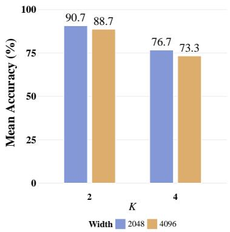  
Figure A1: Analysis of graph neighborhood size K and MLP model size with width.

Computational Complexity. WAG has a history window of length $T _ { h }$ and prediction horizon $T _ { p } ,$ with N object slots of dimensionality D and $K < N$ nearest neighbors per node. Thus, the cost of our predictor can be dominated by (a) KNN graph construction via cosine similarity, $O ( N ^ { 2 } D )$

Table A7: VQA accuracy comparison of different random-graph sampling strategies and $\mathrm { { W A G } _ { \mathrm { { B } } } }$ using the VideoSAUR encoder.
<table><tr><td rowspan="2">Model</td><td rowspan="2">Average per que. (%)</td><td colspan="2">Counterfactual (%)</td><td colspan="2">Explanatory (%)</td><td colspan="2">Predictive (%)</td><td rowspan="2">Descriptive (%)</td></tr><tr><td>per opt.</td><td>per que.</td><td>per opt.</td><td>per que.</td><td>per opt.</td><td>per que.</td></tr><tr><td>C-JEPA</td><td>89.40</td><td>88.67</td><td>68.81</td><td>96.62</td><td>90.74</td><td>93.03</td><td>86.93</td><td>92.84</td></tr><tr><td>Random Graph (IID)</td><td>90.65</td><td>89.52</td><td>71.02</td><td>97.28</td><td>92.60</td><td>94.24</td><td>89.23</td><td>93.77</td></tr><tr><td>Random Graph (Subset)</td><td>90.88</td><td>90.24</td><td>72.68</td><td>97.55</td><td>93.27</td><td>93.94</td><td>88.73</td><td>93.74</td></tr><tr><td> $\mathbf { W _ { A } G _ { B } }$  (ours)</td><td>91.37</td><td>90.55</td><td>73.76</td><td>97.84</td><td>94.13</td><td>94.43</td><td>89.54</td><td>94.05</td></tr></table>

(a) VideoSAUR (Avg.)  
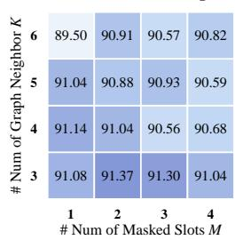

(b) VideoSAUR (Counter.)  
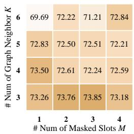

(c) SAVi (Avg.)  
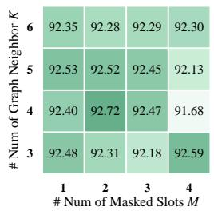

(d) SAVi (Counter.)  
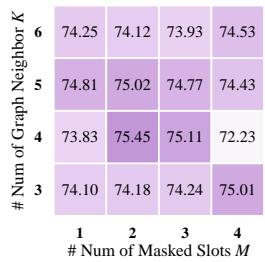  
Figure A2: Analysis of the number of masked objects M and graph neighborhood size K. Average per-question and counterfactual VQA accuracy (%) are reported under VideoSAUR and SAVi representations.

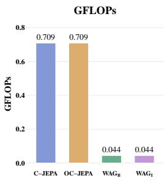  
(a) GFLOPs.

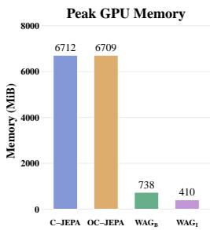  
(b) Memory usage.

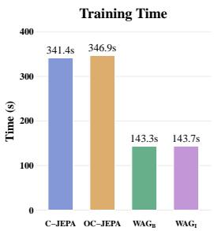  
(c) Running time.

Sensitivity t $\begin{array} { r } { \hat { \lambda } _ { \mathrm { f u t u } } ( \lambda _ { \mathrm { m a s k } } = 1 ) } \end{array}$  
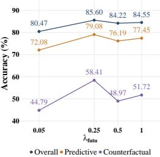  
(d) Sensitivity to $\lambda _ { \mathrm { f u t u } } .$  
Figure A3: Computational efficiency and hyperparameter sensitivity analysis. (a) Computational cost measured in GFLOPs. (b) Memory consumption. (c) Running time. (d) Performance sensitivity to the hyperparameter $\lambda _ { \mathrm { f u t u } }$

(b) graph message passing over K neighbors, $O ( N K D + N D ^ { 2 } )$ ; and (c) the GRU-based memory update, $O ( N D ^ { 2 } )$ . Summed over T steps, the total complexity is

$$
O \big ( T ( N ^ { 2 } D + N K D + N D ^ { 2 } ) \big ) = O \big ( T N D ( N + K + D ) \big ) .
$$

Since $D \gg N > K$ in our setting $\left( D { = } 1 2 8 , N { = } 7 , K { \le } 6 \right)$ , this simplifies to $O ( T N D ^ { 2 } )$ , linear complexity in both the number of objects N and the sequence length T. This contrasts with a joint object-temporal Transformer predictor such as C-JEPA, which attends jointly over all TN object timestep tokens and thus incurs $O ( ( T N ) ^ { 2 } D _ { \mathrm { m o d e l } } + T N D _ { \mathrm { m o d e l } } D _ { \mathrm { m l p } } )$ quadratic in T N. This gap is empirically reflected in a 16× reduction in FLOPs per sample and 9-16× lower peak memory for our predictor relative to C-JEPA and OC-JEPA (Figure A3).

Comprehensive Results. We provide the comprehensive results in the main submissions here, including: (1) Full overall ablation study results in Table A5; (2) Full comparison of different object masking strategies in Table A6; (3) Full VQA accuracy comparison of different random-graph sampling strategies in Table A7; (4) Full analysis of the number of masked objects M and graph neighborhood size K in Figure A2; (5) Full running costs and hyperparameter analysis in Figure A3.