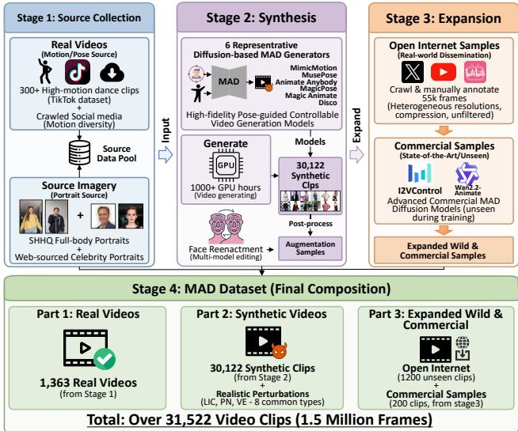
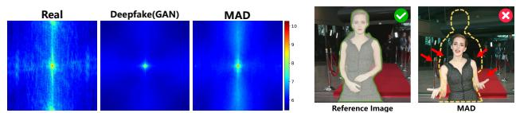
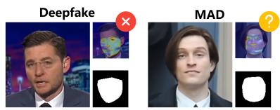
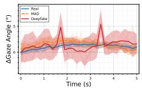
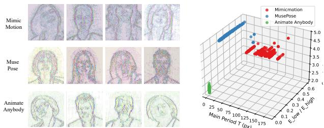
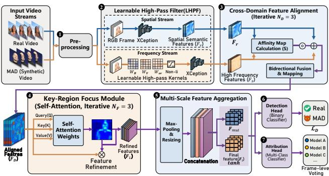
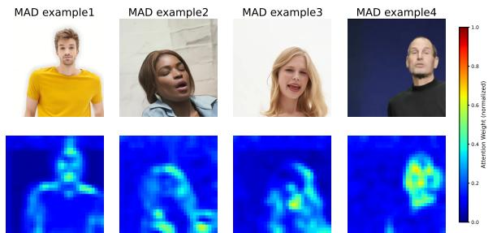
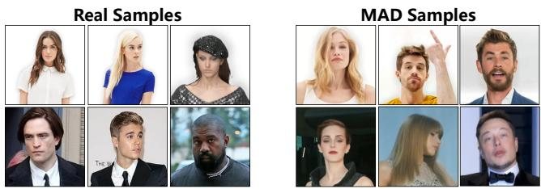
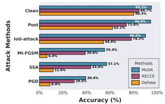
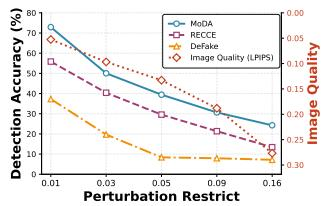

# Stop My Dancing! Understanding, Detecting and Atributing Motion-Aware Deepfake Videos

Fazhong Liu Shanghai Jiao Tong University Shanghai, China liufazhong@sjtu.edu.cn

Yan Meng∗ Shanghai Jiao Tong University Shanghai, China yan\_meng@sjtu.edu.cn

Guoxing Chen Shanghai Jiao Tong University Shanghai, China guoxingchen@sjtu.edu.cn

Tian Dong Shanghai Jiao Tong University Shanghai, China tian.dong@sjtu.edu.cn

Haojin Zhu Shanghai Jiao Tong University Shanghai, China zhu-hj@sjtu.edu.cn

## Abstract

Pose-guided difusion models can now synthesize entire human fig ures in motion, spawning a new class of deepfakes: Motion Aware Deepfake (MAD) that have already reached hundreds of millions of viewers. To better understand this emerging threat, we construct the first MAD-specific benchmark and measurement framework, containing over 1.5 million frames that mix 1,363 real and 30,122 synthetic videos from six controllable generators, with realistic perturbations and open-world evaluation splits. Then, we dissect MAD and discover that, despite their global coherence, these videos betray faint yet reliable cues: because the model relies on limited input frames for motion synthesis, it must predict and simulate coherent movement at motion boundaries, thereby producing high-frequency artifacts along with model-specific spectral fingerprints. Based on the observations obtained from analysis on dataset, we propose MoDA, the first defense framework tailored to detect and attribute MAD videos. MoDA couples spatial semantics with steganalysisrich frequency features via cross-domain alignment and multi-scale aggregation, achieving 94.8% in-distribution and 89.1% cross-dataset detection accuracy gains of 10% to 25% over prior work and 91.5% model attribution accuracy. MoDA achieves 81.94% accuracy on 200 clips produced by two unseen commercial MAD platforms, indicating promising zero-shot transfer, and 78.13% detection accuracy on 1,200 unseen MAD video clips (55k frames in total) collected from the open Internet. Under white-box, gray-box, and black-box adaptive attacks, MoDA maintains relatively stable detection and attribution performance while the accuracies of the baselines drop rapidly.

## CCS Concepts

• Security and privacy → Social aspects of security and privacy.

Keywords Deepfake, Video Forensics, Difusion Model Artifacts

ACM Reference Format:   
Fazhong Liu, Yan Meng, Tian Dong, Guoxing Chen, and Haojin Zhu. 2026. Stop My Dancing! Understanding, Detecting and Attributing Motion-Aware Deepfake Videos. In Proceedings ofthe 2026 ACM SIGSAC Conference on Computer and Communications Security (CCS ’26), November 15–19, 2026, The Hague, Netherlands. ACM, New York, NY, USA, 15 pages. https://doi. org/10.1145/3830454.3832634

## 1 Introduction

Difusion model-based architectures such as Sora [3] and Stable Video Difusion (SVD) [2] are capable of generating high-quality videos with flexible controllability over the generated results. This capability enables users to generate fake videos that are nearly indistinguishable from real ones. Among these, pose-guided controllable video generation can transform the source character image into a realistic video according to the driving motion sequence predefined by content creator, enabling a wide range of applications in entertainment, animation, and artistic creation.

Unfortunately, a new class of deepfake, dubbed Motion-Aware Deepfake (MAD), has emerged from recent advances in controllable video generation. Unlike conventional attacks that merely swap or reenact faces, MAD leverages pose-guided difusion models to synthesize an entire human subject, reproducing coherent full-body motion. For instance, during the 2024 U.S. presidential election, a single fabricated PBS-style video of President Biden garnered millions of views and sparked widespread online debate [7, 33]. More broadly, deepfake clips of U.S. presidents and other public figures created with such models have accumulated over 100 million views across social platforms [32]. MAD can fabricate realistic portraits, gestures, and gait in a single synthesis, leveraging motion sequences to achieve coherent full-body imitation. This capability poses significant new challenges for detecting, tracing, and preventing politically or socially sensitive disinformation. Because current pose-guided generators are largely trained and demonstrated on dance-centric corpora, high-motion MAD is the dominant threat surface today; we therefore benchmark that regime explicitly while separately evaluating lower-motion speech-style cases in Section 5.3.5.

To combat the privacy breaches and rumor proliferation caused by deepfakes, current research has devised a variety of detectors tailored to the characteristics of facial synthesis. Existing deepfake detection methods can be categorized based on forensic cues: those exploiting spatial inconsistencies (e.g., RECCE [4]), temporal anomalies or physiological signals (e.g., DFGaze [36]), and frequencydomain artifacts (e.g., FTCN [55]). Beyond these specialized deepfake detectors, the broader field of AI-generated content (AIGC) detection ofers complementary approaches, including vision-language models (e.g., UnivCLIP [34]), reconstruction-based methods (e.g., DIRE [48]), and attribution-focused frameworks (e.g., DeFake [40]).

However, the difusion-driven leap in controllable generation quality of MAD has introduced two intertwined hurdles for defenders. First, MAD exhibits motion-identity invariance: the same driving pose can be seamlessly grafted onto any source identity without introducing low-level spatial or inter-frame artifacts that earlier Generative Adversarial Network (GAN) based swaps reliably produced. Second, the denoising process of difusion models suppress high-frequency Discrete Cosine Transform (DCT) fingerprints and smooths motion trajectories, eroding the frequency-domain and physiological cues that current detectors depend on [37]. Consequently, efective features for separating MAD from real videos must maintain discriminative power amidst the global semantic and temporal consistency of difusion-generated imagery, while being sensitive to the subtle artifacts that persist in localized, high-motion regions. Moreover, current attribution pipelines simply repurpose generic video-classification networks as attributor. These models only harvest coarse action or scene statistics, leaving both the highfrequency erasure caused by denoising and the subtle artifacts arising from identity-motion disentanglement unmodeled, and thus fail to generalize to the latest MAD variants. At the same time, MAD remains under-measured: existing benchmarks do not isolate iden tity and motion leakage, do not report realistic cross-generator and open-world behavior in a unified way, and do not connect detector metrics to realistic moderation operating points. Operationally, our primary deployment target is platform-side video moderation and third-party auditing, where server-side screening is feasible before recommendation, monetization, or escalation to human review. We formulate the key defense and measurement points against MAD as the following three research questions (RQs):

• RQ1: How can we benchmark the detection and attribution of emerging MAD?

• RQ2: How can we efectively detect MAD given their high temporal consistency and global coherence?

• RQ3: How can we capture the fingerprint of diferent MAD models for attribution?

We first construct a large-scale, multi-model MAD benchmark dataset comprising 1,363 real videos and 30,122 synthetic videos generated by six advanced pose-guided difusion models. Through a systematic multi-view analysis of this dataset, we reveal two key characteristics of MAD: despite the global coherence of difusiongenerated videos, which limits the efectiveness of existing detection methods relying on local inconsistencies, temporal anomalies, or generic frequency analysis, the synthesis process consistently introduces abnormal high-frequency artifacts around portrait boundaries and in regions of large motion amplitude where content must be hallucinated due to missing reference information. Additionally, architectural diferences among models leave behind unique and quantifiable spectral fingerprints in their outputs.

Building on these insights, we propose the first detection and attribution framework specifically designed for MAD, called MoDA. Our framework introduces a dual-stream feature fusion mechanism that synergistically leverages spatial-semantic and frequency cues. Specifically, MoDA employs a learnable high-pass filter to adaptively capture motion-induced high-frequency artifacts, which are then fused with spatial semantics via a cross-domain feature alignment module. The key-region focus module uses attention mechanisms to guide the model toward sensitive areas such as motion boundaries, while the multi-scale feature aggregation module enhances overall representational capacity. This design enables MoDA to efectively address the global-coherence challenge posed by MAD and to perform precise attribution by decoding the modelspecific fingerprints encoded in high-frequency residuals.

For the attribution task, we observe that the density ofU-Net skip connections yields distinct ringing periods around salient motion regions, while difering architectural choices (e.g., resolution and smoothing kernels) introduce additional high-frequency discrepancies. Leveraging this insight, MoDA treats the unique artifacts in the source model’s output as a fingerprint encoded in high-pass residuals and employs the previously introduced frequency-domain and spatial-semantic feature extraction framework to process the target video and classify it into a specific generator category.

We extensively validate MoDA through large-scale experiments. We train MoDA, together with state-of-the-art (SOTA) deepfake and AIGC detection baselines (e.g. RECCE [4], AIDE [51]), on the MAD dataset. MoDA achieves 94.8% accuracy under in-distribution evaluation and 89.1% accuracy under transferability evaluation on average, whereas baselines reach 81.6% and 66.2%, respectively, demonstrating MoDA’s strong performance and improved transferability. In attribution, MoDA surpasses SOTA by nearly 10%, achieving 91.5% average accuracy in identifying the source model. Ablation studies show that jointly leveraging spatial-semantic and frequency cues boosts accuracy by 3.62% over a pure spatial detector and 6.50% over a pure frequency baseline, validating the synergy of the two streams.

To further probe MoDA’s generalization ability without prior knowledge, we curate two out-of-distribution splits: (i) 1200 clips harvested from the open Internet (YouTube, TikTok, X) under hashtags such as #AI-Generated and manually screened as highconfidence MAD samples, and (ii) 200 clips (9,600 frames) produced on two advanced commercial MAD services, I2VControl [10] and Wan2.2-Animate [45]. On the Open-Internet split MoDA attains 78.13% accuracy; on the Commercial-samples split it reaches 81.94%, surpassing existing methods by over 25% in both cases. Given the pace at which pose-guided difusion architectures evolve, we explicitly treat this as a scalability problem rather than a one-shot generalization claim: new MAD models may evade detectors until labeled examples are collected, but MoDA can be adapted with a small, practical fine-tuning budget (see Section 6.1).

To rigorously validate MoDA’s robustness, we subject it to a tiered suite of adaptive adversaries: white-box (PGD & frequencyspecific SSA), gray-box (MI-FGSM on a surrogate), and black-box (social-media re-compression, noise, blur plus motion-boundary perturbations). Across 200 held-out clips, MoDA consistently demonstrates the best robustness, outperforming the strongest competitor by 9.9%, 16.4%, and 20.8% under white-box, gray-box, and black-box settings, respectively, which confirms robustness of MoDA against adaptive attacks.

Our main contributions are summarized below:

• We construct the first multi-model MAD benchmark with explicit identity/motion split controls and multi-axis evaluation, providing a standardized measurement framework for future detection and attribution methods.

• We propose a dual-stream detection framework MoDA that first combines frequency domain and spatial semantic features, which efectively detects new types of fake videos and accurately traces their source models.

• We evaluate MoDA against existing deepfake detection methods on the MAD benchmark, demonstrating its superiority under cross-dataset, no prior knowledge, motion-level, and adaptiveattack scenarios while clarifying deployment-oriented operating points.

## 2 Background and related work

## 2.1 Difusion Models for Video Generation

The difusion model is a generative model that decouples the generative process into a forward process and a backward process. The forward process can be conceptualized as a Markov chain where, given an input image $x _ { 0 } \ \sim \ q ( x )$ , the process perturbs the data distribution with a noise scheduler $\{ \beta _ { t } : \beta _ { t } \in ( 0 , 1 ) \} _ { t = 1 } ^ { T }$ 1, generating increasing levels of noise addition through � steps to obtain a series of noise variables: $\{ x _ { 1 } , x _ { 2 } , . . . , x _ { T } \}$ . Each variable $x _ { t }$ is built by injecting noise on the corresponding time step �:

$$
x _ { t } = \sqrt { \bar { a _ { t } } } x _ { 0 } + \sqrt { 1 - \bar { a _ { t } } } \epsilon ,\tag{1}
$$

where $\begin{array} { r } { \alpha _ { t } = 1 - \beta _ { t } , \bar { \alpha _ { t } } = \prod _ { k = 1 } ^ { t } \alpha _ { k } } \end{array}$ and $\epsilon \sim N ( 0 , I ) . x _ { t }$ depends only on the noise output $x _ { t - 1 }$ of the previous moment.

The backward process learns to denoise from the noisy variable $x _ { t + 1 }$ to the less noisy variable $x _ { t }$ by estimating the injected noise � through a parameterized neural network $\epsilon _ { \theta } ( x _ { t + 1 } , t )$ . The noise reduction process is trained to minimize the $L _ { 2 }$ distance between the estimated and the real noise:

$$
\mathcal { L } ( \theta , x _ { 0 } ) = \mathbb { E } _ { x _ { 0 } , t , \epsilon \in N ( 0 , 1 ) } \| \epsilon - \epsilon _ { \theta } ( x _ { t } , t ) \| _ { 2 } ^ { 2 } ,\tag{2}
$$

where � is a uniform sample within $\{ 1 , . . . , T \}$

Difusion models have demonstrated advantages in text-to-video (T2V) generation, establishing themselves as a primary research direction in the field. In order to reduce the computational complexity, the Latent Difusion Model (LDM) [38] proposes to de-noise in the latent space to achieve an eficient balance with high quality.

## 2.2 Controllable Video Generation

The widespread application of difusion models in T2V generation has spurred research into controllable video synthesis. Generating high-quality videos demands high resolution and temporal consistency. To address this, several studies have enhanced the inter-frame attention mechanisms in T2V models to achieve better controllability and quality. AnimateDif [15] proposes a motion module that learns motion priori on large video datasets and allows insertion into T2V models for video generation. Besides, Deepfake was primarily based on Generative Adversarial Networks (GANs) [23] as a representative technique. With the rise of difusion models, Deepfake based on difusion models is capable of generating more deceptive images and videos [8].

Furthermore, recent advances in generation quality and controllability enable the integration of portrait reference images to create near-realistic human motion scenes. For instance, DisCo [47] employs dual independent ControlNets to separately manage pose and background, enhancing control precision. Animate Anybody [17] utilizes a U-Net based ReferenceNet to extract features from reference images and incorporates pose information via a pose guider.

## 2.3 AIGC Detection and Attribution

To combat privacy breaches and rumor proliferation caused by synthetic videos, current research has devised a variety of detectors for AI-generated content; the majority specialize in deepfake faces. Existing deepfake detection methods rely on diverse forensic cues for discrimination. Image-level detectors exploit spatial inconsistencies, with representative methods including FaceX-ray [26] which focuses on blending boundary artifacts, and RECCE [4] that captures local texture patterns through regional classifiers. Methods exploiting temporal anomalies include DFGaze [49] which utilizes physiological signals like eye gaze consistency, while M2TR [46] employs multi-modal transformers for spatiotemporal modeling. For frequency-domain analysis, detectors like FTCN [42] search for DCT artifacts and spectral discrepancies. Additionally, conventional convolutional architectures such as XCeption [52] provide strong spatial feature extraction baselines.

Beyond detectors that target facial deepfakes, complementary AIGC-video forensics adopt a wider lens. These include video transformer architectures like TimeSformer [1] that model longrange spatiotemporal dependencies, reconstruction-based methods like DIRE [48] that leverage difusion model inversion errors, and vision-language approaches like UnivCLIP [34] that employ pretrained cross-modal representations. Local artifact analyzers like PatchCraft [56] and self-diagnostic approaches like AIDE [51] provide additional forensic perspectives. Recent specialized attribution methods include DeFake [40] designed for text-to-video model identification. Li et al. [28] present the open-world AIGC attribution problem and design an extensible attribution framework.

However, existing detection methods exhibit significant shortcomings when confronted with the specific challenge of "Motion-Aware Deepfake (MAD)." Most of these methods are not specifically designed for MAD tasks, leading to poor interpretability and a lack of efective attribution capabilities and robustness in the face of MAD. A key issue is the absence of a standardized benchmark dataset comprising fake videos with full-body motion generated by multiple models. More broadly, prior work has highlighted that deepfake benchmarks can sufer from structural limitations, such as identity leakage, source bias, and class imbalance, that inflate apparent performance if not carefully controlled [25]. We therefore explicitly separate portrait identities and motion sources across splits and report deployment-relevant metrics beyond accuracy in Section 5. This paper aims to address these gaps.

  
Figure 1: Overview of MAD dataset.

## 3 Dissecting Motion-aware Deepfake

We first explore the distinctive feature of MAD. Compared to conventional deepfakes that primarily manipulate facial attributes [35], MAD generates fake videos that encompass the victim’s full body and motion using advanced difusion-based methods, resulting in a more potent deceptive efect.

## 3.1 Threat Model

a commercially available motion-controllable video-generation pipeline: collect portrait images of the victim, pair them with pre-captured motion sequences (which may be unethical or harmful), and leverage open-source or commercial models (e.g., Animate Anyone, MusePose) to create MAD videos and spread them through social networks, with the intent to mislead viewers.

We assume that the adversary possesses limited technical expertise and hardware resources, requiring only accessible motioncontrollable video generation services. The attack pipeline is highly automated: collecting publicly available portrait images of the target individual, pairing them with arbitrarily acquired motion sequences (which may originate from unrelated third parties or maliciously constructed content), and subsequently synthesizing highly deceptive full-body motion forgery videos using mature open-source or commercial generative models. To further enhance deception, attackers may additionally apply secondary editing operations such as facial reenactment and perturbation addition. These videos are then widely disseminated through social networks. Such attacks are characterized by low barriers to entry and ease of execution, yet they can lead to severe consequences, including but not limited to distorting public figures’ images, disseminating misleading information, or damaging personal reputations.

## 3.2 MAD Dataset

3.2.1 Real & Synthetic Videos. Following the threat model described in Section3.1, we manually construct a larger MAD dataset to serve as a comprehensive benchmark.

Video generation. Due to the lack of a dedicated dataset for benchmarking pose-guided controllable video generation models, we create a new dataset termed the MAD dataset. Given that high-fidelity pose-guided models are difusion-based, we focus on synthesizing videos using difusion models capable of generating high-quality character animation.

We investigate recent studies on the Pose Guided Controllable Video Generation and select six representative difusion-based models which have diferent requirements for input data resolution, data format, etc. Table 1 shows the details of the six models.

We draw upon 300+ high-motion dance clips from the TikTok dataset [21] and augment these with additional videos crawled from social-media to improve motion diversity [57], curating all content to exclude not-safe-for-work (NSFW) material. This emphasis on dance-like motion reflects the current ecosystem of poseguided generators, which are predominantly trained and showcased on high-motion choreography data. Real comparison videos are sourced from the same public TikTok/social-media pool after manual screening.

For source imagery, we utilize the SHHQ dataset of full-body portraits [11] and augment it with 100 web-sourced celebrity images. The final portrait set comprises 39.13% male and 60.86% female subjects, with 37.17% depicting public figures from technology, sports, and other domains. The resulting MAD benchmark comprises 1,363 real videos and 30,122 synthetic clips, requiring over 1,000 GPU hours on NVIDIA RTX 6000 Ada GPUs for generation. We further quantify generator output quality using perceptual metrics and designate the highest-quality generators as the primary benchmark, while retaining lower-quality generators mainly for stress-testing transfer and open-set behavior. To mitigate data snooping, we split the benchmark by both portrait identity and motion source so that no identity or motion appears in both training and testing. We later complement this high-motion-centric benchmark with explicit motion-level analysis and low-motion speech-style evaluation to bound generalization beyond dancing.

We note that attackers may compose multi-stage pipelines by cascading diferent models (e.g., full-body generation followed by facial reenactment). To simulate such composite attacks, we apply an open-source facial reenactment algorithm to MAD videos as a secondary editing step. As mentioned in Section 3.1, the attacker may further introduce image-level perturbations to evade detection. To assess the robustness of subsequent detectors against these threats, our MAD dataset includes a variety of image perturbations, categorized into eight common operations across three classes [12, 16, 20, 29, 44, 58]. During evaluation, we post-process the MAD dataset samples with facial reenactment and diverse perturbations, enabling detectors to be tested under realistic, multi-stage attack scenarios.

• Face reenactment. Face Reenactment refers to the process of altering the facial movements in a target image based on driving signals (e.g. another image, video, or head pose) while preserving facial attributes.

• Common perturbation. To assess model robustness, we incorporate a variety of perturbations that mimic common image processing operations or platform degradations.

Table 1: Details of MAD dataset. Total Videos denote 48-frame clips after filtering failed generations and low-quality outputs; counts therefore do not necessarily equal the Cartesian product of reference identities and motion sources.
<table><tr><td>Dataset Partition</td><td>Source (Model)</td><td>Input Format</td><td>Ref. Image Num</td><td>Motion Sources</td><td>Total Videos</td><td>Total Frames</td><td>Output Size</td></tr><tr><td>Real Videos</td><td>Real</td><td>/</td><td>/</td><td>1,363</td><td>1,363</td><td>65k</td><td>604×1080</td></tr><tr><td rowspan="6">Synthetic Videos</td><td>Mimicmotion [54]</td><td>DWpose</td><td>40</td><td>340</td><td>9,350</td><td>448k</td><td>576×1024</td></tr><tr><td>MusePose [43]</td><td>DWpose</td><td>40</td><td>340</td><td>9,350</td><td>448k</td><td>384×768</td></tr><tr><td>Animate Anybody [17]</td><td>DWPose</td><td>40</td><td>340</td><td>9,350</td><td>448k</td><td>512×784</td></tr><tr><td>Disco [47]</td><td>OpenPose</td><td>16</td><td>42</td><td>994</td><td>48k</td><td>256×256</td></tr><tr><td>MagicAnimate [50]</td><td>DensePose</td><td>18</td><td>42</td><td>844</td><td>40k</td><td>512×512</td></tr><tr><td>MagicPose [6]</td><td>DWpose</td><td>18</td><td>36</td><td>234</td><td>11k</td><td>512×512</td></tr><tr><td rowspan="3">Expanded</td><td>I2VControl [10]</td><td>Video</td><td>10</td><td>10</td><td>100</td><td>4,800</td><td>672×1344</td></tr><tr><td>Wan2.2-Animate [45]</td><td>Video</td><td>10</td><td>10</td><td>100</td><td>4,800</td><td>704×1248</td></tr><tr><td>In-the-wild</td><td>/</td><td>/</td><td>/</td><td>1,200</td><td>55k</td><td>/</td></tr></table>

3.2.2 Open-Internet & Commercial. In the wild, defenders are routinely confronted with videos forged by never-before-seen architectures that outperform recent public models. An ideal detector must therefore generalize zero-shot or adapt quickly when a brand-new MAD generator appears using only a handful of fresh examples. To benchmark this scalability, we expand the MAD dataset with two complementary splits:

• Commercial Split. We probe MoDA against SOTA commercial MAD models I2VControl [10] and Wan2.2-Animate [45] that were absent from the training corpus and currently set the quality ceiling. For each engine we render 100 clips (10 reference identities × 10 pose sequences) that never overlap with the original training pool.

• Open-Internet Split. We crawl X (formerly Twitter), YouTube and allied platforms and label videos as high-confidence MAD only after manual screening. Concretely, we retain videos that (a) exhibit full-body motion synthesis with identity-preserving portrait appearance under large pose changes, and (b) are corroborated by two independent annotators; We then extract 1,200 short clips (48 frames each).

The overview of the MAD dataset is shown in Figure 1. More details regarding resource selection, model curation, and the video generation process are provided in Section 5.

## 3.3 Understanding MAD and Insights of MoDA

MAD presents unique challenges that render existing deepfake and T2V detection methods less efective. To quantify this, we evaluate several SOTA AIGC detection methods on samples from the MAD dataset, as depicted in Figure 2, and confirm their limitations.

3.3.1 Limitation ofImage-level Inconsistency Detection. Current detection methods often rely on image-level inconsistencies. For instance, models like RECCE [4] exploit local spatial discrepancies as detection clues, which are prevalent in traditional deepfakes that modify facial regions on real backgrounds. Figure 2(a) illustrates a representative case of the classic deepfake detector FaceX-Ray [27]. By decomposing an image into a facial region and a background region, FaceX-Ray [27] searches for pixel-level discrepancies between the two. However, MAD performs holistic frame-level synthesis, so such internal local diferences are largely erased.

  
(a) Comparison of facial local inconsistency between (b) Gaze-angle shift among Deepfake and MAD samples Real, Deepfake and MAD.  
(c) Frequency spectra: difusion-based MAD (d) Portrait-shift exposes missing erases GAN-like pattern, remaining indiscernible background, betraying forgery at to DFT detectors. boundary and motion regions.  
Figure 2: Multi-view evidence: understanding of MAD.

Observation 1: Existing detection methods based on local consistency struggle to identify traces in MAD.

Observation 1 shows that local pixel consistency alone is no longer a reliable cue; the difusion-based synthesis pipeline generates entire frames at once, erasing the subtle spatial discrepancies that traditional face-swap detectors expect. Consequently, any effective method must look beyond isolated pixels and exploit complementary, motion-centric signals.

3.3.2 Limitation of Temporal Inconsistency Detection. Methods such as DFGaze [36] exploit inter-frame inconsistencies, because traditional face-swap deepfakes are produced frame-by-frame and thus introduce temporal artifacts. In contrast, the MAD pipeline is explicitly optimized for strict temporal smoothness, neutralizing these cues. This enforced coherence also suppresses abnormal physiological signals, e.g., irregular blinking or pulse-like variations that detectors often rely on. Figure 2(b) shows the gaze angle traces extracted from 30 real videos, 30 FF++ deepfake videos and 30 MAD videos; MAD remains strikingly smooth in gaze-angle traces, real videos show moderate fluctuation, while conventional deepfakes exhibit pronounced frame-to-frame jitter.

Observation 2: MAD’s temporal consistency renders methods based on inter-frame inconsistencies and abnormal physiological information inefective.

Observation 2 reveals that MAD enforces strict temporal smoothness. Frame-to-frame jitter, blinking irregularities, or other physiological anomalies common indicators in earlier deepfakes are suppressed by the generation process. Detection therefore needs to focus on localized artifacts rather than global temporal drifts.

3.3.3 Persistence ofHigh-Frequency Artifacts. Previous work has revealed detectable GAN artifacts in the frequency domain, yet difusion models greatly attenuate these footprints, causing DFT based detectors to fail [37]. Figure 2(c) compares the DFT spectra of the three video types. However, our analysis reveals a crucial distinction: unlike traditional deepfakes that merely edit facial regions, MAD must synthesize coherent full-body motion based on limited input frames, necessitating content hallucination in areas exposed after the portrait moves (motion boundaries and regions of large displacement). This process introduces systematic high-frequency anomalies, as shown in Figure 2(d). These anomalies manifest as unnatural patterns and edge artifacts around portrait contours and within areas of significant motion.

Observation 3: To hallucinate previously non-existent motion and background, MAD still introduces anomalous high-frequency components around portrait boundaries and large-motion regions.

Observation 3 pinpoints where artifacts survive: portrait boundaries and regions undergoing large motion. These areas retain frequency-significant residuals after difusion denoising.

Collectively, the observations motivate a new detection paradigm: (i) amplify motion-sensitive high-frequency cues; (ii) localize anomalies by fusing them with spatial semantics; (iii) use attention mechanism to ignore globally coherent, artifact-free regions.

3.3.4 Model-Specific Fingerprint. The high-frequency residuals of synthetic videos encode distinctive fingerprints, traceable to the specific architectural priors of their generative models. Beyond the foundational role of U-Net skip connections as band-pass filters, we demonstrate that high-level design choices—particularly in feature fusion and temporal modeling—produce statistically separable signatures in a quantifiable 3D feature space.

We analyze three representative models: Animate Anyone [17], MimicMotion [54], and MusePose [43]. Their architectural divergence is summarized as follows:

• Animate Anyone employs a symmetric U-Net (ReferenceNet) for dense, multi-scale spatial feature injection.

• MimicMotion is built on a native spatiotemporal U-Net (SVD) with a progressive latent fusion strategy.

• MusePose enhances Animate Anyone’s framework with a sophisticated temporal motion module and dynamic attention.

These distinct pathways manifest in three key spectral metrics computed from their high-frequency residuals: the dominant period � , the radial entropy �, and the low-to-high frequency energy ratio $E _ { l o w } / E _ { h i g h }$ . Our experimental measurements and their architectural interpretations are synthesized below:

Interpretation & Correlation:

Fazhong Liu, Yan Meng, Tian Dong, Guoxing Chen, and Haojin Zhu
<table><tr><td>Model</td><td>T (Period)</td><td>H (Entropy)</td><td> $\underline { { \mathbf { E } _ { \mathrm { l o w } } / \mathbf { E } _ { \mathrm { h i g h } } } }$  (Ratio)</td></tr><tr><td>Animate Anyone</td><td>Small</td><td>Low</td><td>Low</td></tr><tr><td>MimicMotion</td><td>Large</td><td>High</td><td>High</td></tr><tr><td>MusePose</td><td>Small</td><td>Medium-High</td><td>Highest</td></tr></table>

  
(a) High-frequency residual maps across mod- (b) Clusters in the 3D feature space els: architectural disparities emerge. (� , �, ����/�ℎ��ℎ ).  
Figure 3: Model-specific fingerprints in frequency domain, demonstrating clear separability rooted in architecture.

(1) The dominant period � is primarily anchored by the base U-Net’s skip-connection scales. Both Animate Anyone and MusePose, sharing a similar U-Net backbone from Stable Difusion, exhibit a small �. MimicMotion’s native video U-Net, optimized for temporal filtering, produces a larger �.

(2) The radial entropy � reflects the randomness in highfrequency patterns. Animate Anyone’s deterministic, dense spatial attention yields low entropy . MimicMotion’s fusion strategy and MusePose’s complex spatiotemporal attention introduce stochasticity, resulting in higher entropy .

(3) The energy ratio $E _ { l o w } / E _ { h i g h }$ is most sensitive to temporal modeling. MimicMotion and MusePose, which explicitly optimize for motion smoothness, aggressively suppress highfrequency flicker, leading to high ratios. Animate Anyone, retains more high-frequency energy, resulting in a low ratio.

As visualized in Figure 3(b), these three metrics define a feature space where the residuals of each model form a tight, distinct cluster. The separability is not incidental but is directly governed by the models’ architectural axes. We visualize the high-frequency features of the content generated by the three models using a spatial rich model (SRM) filter (Figure 3(a)), which reveals notable diferences. As Observation 3, even if more advanced architectures adopt non U-Net structures, MAD still exhibits model-specific high-frequency artifacts.

Observation 4: The architectural choices of difusion-based MAD models imprint distinct, quantifiable signatures in the highfrequency residual spectrum, providing a reliable basis for model provenance attribution.

Specifically, Observations 1 and 2 indicate that global spatial and temporal consistency weakens existing detectors, motivating the need for localized, motion-aware analysis. Observation 3 directly motivates the learnable high-pass filter and key-region focus design (Sections 4.1–4.2), while Observation 4 forms the basis of our model attribution strategy (Section 4.4).

  
Figure 4: System overview of MoDA

## 4 System Design of MoDA

An overview of our proposed framework is shown in the Figure 4. Our framework comprises four cascaded modules: a video processing module based on Learnable High-Pass Filtering that adaptively extracts motion-induced artifacts; a Cross-Domain Feature Align ment Module that aligns frequency cues with spatial semantics through pixel-wise afinity mapping; a Key-Region Focus Module that highlights suspicious motion boundaries via self-attention; and a Multi-Scale Feature Aggregation Module that fuses multiresolution features for robust detection and attribution.

## 4.1 High-Pass Filter Based Processing

Inspired by Observation 3 that motion boundaries in MAD videos exhibit high-frequency artifacts due to content hallucination, we propose a learnable high-pass filter (LHPF) module to adaptively amplify these telltale cues in frequency domain.

Given an input RGB frame $F _ { r } \in \mathbb { R } ^ { 3 \times { \dot { H } } \times W }$ , we apply channel-wise learnable high-pass filtering via depthwise convolution. For the �-th input channel and the �-th high-pass kernel, we obtain

$$
F _ { d , i , k } = F _ { r } ^ { ( i ) } \circledast W _ { i , k } \in \mathbb { R } ^ { H \times W } , \quad i \in \{ 1 , 2 , 3 \} , k \in \{ 1 , . . . , K \} ,\tag{3}
$$

where $W _ { i , k } \in \mathbb { R } ^ { k \times k }$ denotes the �-th learnable high-pass filter for channel � $( k = 5 )$ . All kernels are initialized with distinct high-pass patterns and constrained to have zero mean.

The resulting 3� feature maps are concatenated and fused through a pointwise (1 × 1) convolution:

$$
F _ { s } = \phi \left( \sum _ { i = 1 } ^ { 3 } \sum _ { k = 1 } ^ { K } \beta _ { i , k } \cdot F _ { d , i , k } \right) \in \mathbb { R } ^ { 3 \times H \times W } ,\tag{4}
$$

where $\beta _ { i , k } \in \mathbb { R } ^ { 3 \times 1 \times 1 }$ are learnable fusion weights and $\phi ( \cdot )$ denotes linear activation.

This formulation enables the LHPF to learn frequency-domain representations that highlight motion-induced artifacts, particu larly the high-frequency inconsistencies at motion boundaries and texture anomalies in regions with large displacement. By adaptively focusing on these telltale cues, the LHPF provides a complemen tary high-frequency perspective to spatial semantics, forming the frequency-domain foundation for our subsequent cross-domain feature.

## 4.2 Spatial-Semantic and Frequency-Domain Feature Extraction

4.2.1 Cross-Domain Feature Alignment. The spatial and frequency domain representations obtained from the module provide complementary yet distinct perspectives for forgery detection. While spatial features preserve structural integrity, frequency components reveal subtle artifacts that are often imperceptible in the pixel domain. However, simple concatenation or additive fusion of these modalities may lead to feature interference, as their statistical distributions and semantic meanings difer substantially. To address this, we propose a Cross-Domain Feature Alignment Module that establishes explicit cross-domain correlations while maintaining each stream’s distinctive characteristics.

Let the spatial-semantic feature map and frequency-domain feature map be $F _ { r } , F _ { s } \ \in \ \mathbb { R } ^ { C \times H \times W }$ . For each spatial location $i \in$ $\{ 1 , \dots , H W \}$ , we compute a pixel-wise cross-domain afinity using cosine similarity:

$$
S ( i ) = \frac { \langle f _ { r } ^ { i } , f _ { s } ^ { i } \rangle } { \vert \vert f _ { r } ^ { i } \vert \vert _ { 2 } \vert \vert f _ { s } ^ { i } \vert \vert _ { 2 } } ,\tag{5}
$$

where $f _ { r } ^ { i } , f _ { s } ^ { i } \in \mathbb { R } ^ { C }$ denote channel-wise feature vectors at location �. The aligned features are then obtained by

$$
F _ { r s } = \mathrm { R e L U } \left( F _ { r } + \alpha S \odot F _ { s } \right) , \quad F _ { s r } = \mathrm { R e L U } \left( F _ { s } + \alpha S \odot F _ { r } \right) ,\tag{6}
$$

where ⊙ denotes element-wise multiplication with broadcasting and � is a learnable scalar controlling fusion strength.

4.2.2 Key-Region Focus. The Key-Region Focus Module is designed to capture motion-related spatial details and enhance the extraction of high-frequency features. By incorporating a self-attention mechanism, the module identifies spatial relationships in motion artifacts, enabling the network to concentrate on regions susceptible. Specifically, we process the fused feature $F _ { D }$ using a pretrained residual network with depthwise separable convolution, producing refined frequency domain features $F _ { d }$ and spatial semantic features $F _ { m }$ . Further, we model the dependencies between diferent spatial regions through a self-attention mechanism. We project input features into diferent spaces using three convolutional networks, termed query, key, and value, to calculate attention weights.

Given the fused feature $F _ { D } \in \mathbb { R } ^ { C \times H \times W }$ , we extract frequencyoriented features $F _ { d }$ and spatial-semantic features $F _ { s }$ and reshape them into $\tilde { F } _ { d } , \tilde { F } _ { m } \in \mathbb { R } ^ { H W \times \bar { d } }$

Query, key, and value matrices are obtained as

$$
Q = \tilde { F } _ { d } W _ { Q } , \quad K = \tilde { F } _ { d } W _ { K } , \quad V = \tilde { F } _ { m } W _ { V } ,\tag{7}
$$

where $W _ { Q } , W _ { K } , W _ { V } \in \mathbb { R } ^ { d \times d }$ are learnable projections.

The spatial self-attention is computed by

$$
A = \mathrm { s o f t m a x } \left( \frac { Q K ^ { \top } } { \sqrt { d } } \right) \in \mathbb { R } ^ { H W \times H W } ,\tag{8}
$$

and the output feature is

$$
F _ { L } = \gamma \cdot \mathrm { r e s h a p e } ( A V ) + F _ { s } ,\tag{9}
$$

where � is a learnable scaling parameter. Through the self-attention mechanism, the updated output highlights areas of interest via the attention matrix. We also apply the Key-Region Focus module $N _ { F } =$ 3 times, enabling multi-scale learning of the location-enhanced classification feature.

  
Figure 5: Visual examples of Key-Region Focus Module. MoDA assigns higher attention weights to regions with salient motion boundaries.

To intuitively demonstrate the module’s ability to localize forged regions, we visualize representative MAD samples together with the attention weights that the Key-Region Focus Module assigns to diferent areas as shown in Figure 5. MAD frames exhibit intense activation over pronounced motion regions, whereas areas with subtle movement receive more uniform attention, confirming that the module successfully concentrates on the key forgery cues.

4.2.3 Multi-Scale Feature Aggregation. Some deepfake detectors tend to fixate on shallow artifacts, while relying solely on them may neglect deeper semantic information and limit generalization capability [41]. To address this, we design a Multi-Scale Feature Aggregation module that aligns and fuses feature maps of diferent resolutions using local windows, preserving both global semantics and local details.

After $N _ { D }$ mapping fusion and $N _ { F }$ attention weighting, we can extract $N _ { D } + N _ { F }$ feature maps from the middle layer, denoted as $F _ { m i } \in \mathbb { R } ^ { c _ { i } \times h _ { i } \times w _ { i } }$ , where � represents the position in the middle layer. At the same time, we denote the final feature from the network as $F _ { l } \in \mathbb { R } ^ { c _ { l } \times h _ { l } \times w _ { l } }$ . All feature maps are resized to a unified resolution ℎ × � and concatenated:

$$
\boldsymbol { F } _ { m u l } = [ F _ { m 1 } , \ldots , F _ { m N } ] \in \mathbb { R } ^ { C _ { m u l } \times h \times w } .\tag{10}
$$

We partition $F _ { m u l }$ and $F _ { l }$ into non-overlapping local windows of size � × �, yielding $\textstyle { \frac { h } { s } } \times { \frac { w } { s } } $ windows. For a window indexed by (�, �) and spatial position $( i , j )$ inside the window, local fusion is performed as

$$
F _ { f } ^ { p , q } ( i , j ) = \operatorname { t a n h } \bigl ( \theta _ { m } ( F _ { m u l } ^ { p , q } ( i , j ) ) \cdot \theta _ { l } ( F _ { l } ^ { p , q } ( i , j ) ) \bigr ) ,\tag{11}
$$

where $\theta _ { m }$ and $\theta _ { l }$ are learnable linear projections. The fused windows are finally reassembled into a global feature map.

## 4.3 MAD Video Detection

For the detection task, we employ the binary cross-entropy loss to supervise the training of our classifier, defined as:

$$
\mathcal { L } _ { \mathcal { D } } = - \big [ y \log \hat { y } + \left( 1 - y \right) \log \left( 1 - \hat { y } \right) \big ] .\tag{12}
$$

Here $\hat { y } \in \left[ 0 , 1 \right]$ denotes the predicted probability of the video being fake. The final detection decision is obtained by thresholding: if $\hat { y } > 0 . 5$ , the video is classified as MAD; or it is classified as real.

Unless otherwise noted, in subsequent experiments we balance the dataset across sources and randomly sample an equal number of videos from the training splits of various source models and

real videos to form the final training set, thereby enhancing the classifier’s generalization ability.

## 4.4 MAD Model Attribution

The model-specific fingerprints revealed in Observation 4 provide a theoretical foundation for distinguishing between MAD generators. Directly using handcrafted metrics like �, �, and $E _ { l o w } / E _ { h i g h }$ for attribution, while insightful, faces challenges in robustness against real-world perturbations and requires careful threshold tuning. Instead, we implement attribution by leveraging the underlying feature representations that inherently encode these statistical fingerprints. MoDA learns a fused feature representation that implicitly encapsulates the spectral and structural patterns corresponding to diferent generators’ fingerprints.

Consequently, for model attribution, we directly utilize the feature extraction backbone � of the trained MoDA detector, followed by a lightweight, task-specific classification head. Formally, given a video sequence $X = \{ x _ { 1 } , x _ { 2 } , . . . , x _ { n } \}$ where $x _ { i }$ denotes the �-th frame, the attribution model $f _ { A } = w \cdot \epsilon$ processes each frame. The final generator prediction �ˆ for the entire video is determined by the consensus (mode) of per-frame predictions:

$$
\hat { y } = \mathrm { M O D E } \big ( \{ f _ { A } ( x _ { i } ) \} _ { i = 1 } ^ { n } \big ) = \arg \operatorname* { m a x } _ { c \in C } \Big ( \sum _ { i = 1 } ^ { n } \mathbb { I } \big ( f _ { A } ( x _ { i } ) = c \big ) \Big ) ,\tag{13}
$$

where C is the set of classes and I(·) is the indicator function.

## 5 Evaluation of MoDA

## 5.1 Experiment Details

In this section we evaluate MoDA across known and unknown generators, real-world cases, and adaptive attacks. It outperforms baselines throughout and degrades gracefully, confirming MoDA’s efectiveness and robustness for MAD detection and attribution.

Experiment setup. In data preprocessing, we align videos from different sources in the MAD dataset. During the training, we choose the data enhancement methods including random clipping, compression, blurring, and adding noise, and finally uniform normalization. For training, we use the Adam optimizer [24], which sets its betas to 0.9 and 0.999, and epsilon to 1e-8. Set the Learning Rate scheduler to an initial value of 5e-4 and decay by 50% every 5 epochs. All experiments were carried out using PyTorch on the NVIDIA RTX 6000 Ada 48GB platform.

Deployment target. Our primary deployment scenario is platformside moderation or third-party auditing, where uploaded clips are screened on backend accelerators before recommendation, monetization, or escalation to a human reviewer. In this setting, the RTX 6000 Ada measurements are intended as a proxy for server-side moderation hardware rather than for phones or edge devices. We therefore treat the full MoDA model as a platform model and separately report a lightweight mobile-oriented variant for on-device pre-screening.

Computational cost analysis. In the platform-side setting, MoDA takes up 1.6GB memory at inference time and processes a 1 second video at 24 fps in 0.183 second (end-to-end on an RTX 6000 Ada GPU), which is fast enough for asynchronous moderation queues and near-real-time auditing. We report a coarse runtime breakdown in Table 2 to clarify where time is spent.

Table 2: Runtime breakdown of MoDA (per 24 frames).
<table><tr><td>Module</td><td>Filter</td><td>Alignment</td><td>Attention</td><td>Aggregation</td><td>End-to-end</td></tr><tr><td>Time (s)</td><td>0.026</td><td>0.062</td><td>0.081</td><td>0.014</td><td>0.183</td></tr></table>

Evaluation metrics. We use Area-under-the-curve (AUC) and accuracy (ACC) to evaluate the performance of the detector, and additionally report FPR, FNR, and F1-score , which is because enchmark accuracy alone can be misleading once benign videos vastly outnumber deepfakes in deployment [25]. We adopt a two-stage paradigm: in the first stage, we independently infer pseudo-labels for each frame; in the second stage, a video-level decision is produced via a Mean-Score aggregation function.

## 5.2 Dataset Preparation for Experiments

Motion & portrait collection. To generate a high diversity of MAD videos, we selected the TikTok dataset [21], which contains more than 300 dance videos with moderate movements and no motion blur, as the input movement sequence. We use OpenPose [5], DWPose [53] and detectron2 [14] to estimate the motion sequence of source videos. In addition, we incorporate motion videos crawled from multiple social-media platforms (as curated in CHAMP [57]) to improve diversity in motion intensity, frame rate, and spatial resolution.

SHHQ [11] is a dataset with high-quality full-body human images at 1024×512 resolution. We use it as the baseline portrait data. In addition, to simulate MAD attacks on public figures, we crawl 100 portraits of diferent resolutions and sources from the Internet as an enhanced portrait set.

To avoid data-snooping bias during evaluation, we enforce strict separation between the training and testing splits at both the portraitidentity and motion-sequence levels. Specifically, we define the complete set of reference images as the identity set � and the collection of all motion sequences as the action set �. The sets � and � are each partitioned into two mutually exclusive subsets: $C = C _ { 1 } \cup C _ { 2 }$ and $M = M _ { 1 }$ ∪ �2. The training split is constructed using only identity-action pairs drawn from $( C _ { 1 } , M _ { 1 } )$ , while the testing split exclusively uses pairs from $( C _ { 2 } , M _ { 2 } )$ . This ensures that no identity or motion sequence appears in both splits. After frame sampling for detector training/evaluation, the final protocol uses 241,344 labeled frame samples in total, evenly split between training and testing.

Drawing on portrait images from SHHQ and web-crawled celebrity photos, and motion sequences harvested from TikTok and multi ple social-media sources, we assembled the MAD Dataset. It unites 1,363 real videos with 30,122 synthesized clips produced by six poseguided controllable generators: Animate Anybody [17], Disco [47], MagicAnimate [50], MagicPose [6], Mimicmotion [54] and Muse-Pose [43], yielding roughly 1.4 million frames at resolutions from 256×256 up to 604×1080. Each synthetic clip is generated from a reference portrait and a driving motion source (2D/3D pose signals as required by the model). Full specifications are listed in Table 1. MAD dataset quality filter. To quantify generator output quality and reduce confounds in evaluation, we compute no-reference perceptual metrics (BRISQUE, PIQE, NIQE) on generated clips from each model and compare them to real videos. We normalize the raw scores so that larger values indicate better quality and average them into an overall quality score. Real videos are not expected to score 1.0 on every normalized metric, because public social-media footage still contains motion blur, compression artifacts, and capture noise. Based on this analysis, we select three higher-quality generators as the primary benchmark for MAD.

## 5.3 Detection Performance of MoDA

According to the type of forensic cues, we divide existing deepfake detection methods into spatial-domain [26, 46, 52], temporaldomain [1, 4, 49], and frequency-domain [40, 42] categories. Meanwhile, considering that some advanced AIGC detectors can generalize to certain image and video generators (including portrait-centric content), we also include representative AIGC detectors for comparison [34, 48, 51, 56]. Additionally, we simulate real-world attack scenarios by applying face reenactment and common perturbations to samples in the MAD dataset, and evaluate the robustness of MoDA. Among the evaluated methods, UnivCLIP [34] and AIDE [51] use a pre-trained CLIP-ViT backbone, while DIRE [48] measures reconstruction error through a pre-trained difusion model. Apart from these three methods that utilize pre-trained models, all other baselines are re-trained using the same training split as MoDA.

Face Reenactment. Considering the increasingly modular deepfake pipelines in the wild (e.g., ComfyUI-style workflows), we simulate a two-stage attack by applying a one-shot I2V face reenactment pipeline (GHOST [13]) on top of MAD videos. We report results under this Face Reenactment (FS) setting.

Common Perturbation. The methods in the Common Perturbation experiment are listed as follows:

• Lossy image compression (LIC). We combine two widely used image compression methods. Lossy image compression includes JPEG compression, etc.

• Pixel noise (PN). Pixel noise perturbations introduce random noise at the pixel level. Pixel noise includes Gaussian noise, Rayleigh noise and so on.

• Visual efects (VE). Visual efects are deliberate modifications to pixel values. Visual efects include Gaussian blur, brightness adjustment, contrast adjustment, etc.

5.3.1 In-distribution Performance. In the In-distribution evaluation, we evaluate the model in the context of original test set, Common Perturbation and Face Re-editing. The results are shown in Table 3. Within the same distribution, MoDA sustains an average accuracy above 94.8% across every perturbation regime, surpassing the nearest competitor RECCE by 13.2% points. The most telling gap appears under Common Perturbation, where MoDA records 95.2%, 14.9% above DeFake. The collapse of the purely frequency-based FTCN under video-enhancement perturbations (accuracy falling to 51.7%) further underlines the brittleness of single-modality cues once postprocessing is applied. The strong in-distribution performance of MoDA indicates that motion-boundary artifacts are consistently present even under controlled generation settings. Unlike traditional deepfake cues, the hallucinated regions exposed by large pose changes introduce systematic high-frequency residuals, which MoDA is explicitly designed to amplify and localize.

Table 3: In-dataset evaluation results on MAD.
<table><tr><td rowspan="2">Category</td><td rowspan="2">一 Method |</td><td rowspan="2"></td><td colspan="4">Original MAD-Dataset</td><td colspan="5">Robustness under Post-processing</td></tr><tr><td>ACC</td><td>AUC FPR</td><td>FNR</td><td>F1-Score</td><td>FS</td><td>LIC</td><td>PN</td><td>VE</td><td>Avg</td></tr><tr><td rowspan="6">Deepfake Detection</td><td>RECCE [4]</td><td>0.917</td><td>0.873</td><td>0.102</td><td>0.079</td><td>0.910</td><td>0.858</td><td>0.738</td><td>0.824</td><td>0.741</td><td>0.816</td></tr><tr><td>DFGaze [49]</td><td>0.876</td><td>0.822</td><td>0.113</td><td>0.135</td><td>0.873</td><td>0.816</td><td>0.762</td><td>0.754</td><td>0.704</td><td>0.783</td></tr><tr><td>XCeption [52]</td><td>0.886</td><td>0.834</td><td>0.085</td><td>0.131</td><td>0.889</td><td>0.956</td><td>0.828</td><td>0.509</td><td>0.724</td><td>0.781</td></tr><tr><td>M2TR [46]</td><td>0.813</td><td>0.751</td><td>0.175</td><td>0.198</td><td>0.811</td><td>0.813</td><td>0.803</td><td>0.682</td><td>0.758</td><td>0.774</td></tr><tr><td>FTCN [42]</td><td>0.671</td><td>0.599</td><td>0.346</td><td>0.312</td><td>0.669</td><td>0.624</td><td>0.592</td><td>0.467</td><td>0.517</td><td>0.574</td></tr><tr><td>FaceX-ray [26]</td><td>0.571</td><td>0.543</td><td>0.421</td><td>0.436</td><td>0.568</td><td>0.592</td><td>0.560</td><td>0.544</td><td>0.556</td><td>0.565</td></tr><tr><td rowspan="6">AI-Generated Image Detection</td><td>DeFake [40]</td><td>0.861</td><td>0.844</td><td>0.092</td><td>0.175</td><td>0.861</td><td>0.621</td><td>0.877</td><td>0.781</td><td>0.874</td><td>0.803</td></tr><tr><td>TimeSformer [1]</td><td>0.768</td><td>0.721</td><td>0.214</td><td>0.249</td><td>0.765</td><td>0.742</td><td>0.718</td><td>0.694</td><td>0.731</td><td>0.785</td></tr><tr><td>PatchCraft [56]</td><td>0.651</td><td>0.613</td><td>0.331</td><td>0.368</td><td>0.644</td><td>0.638</td><td>0.665</td><td>0.612</td><td>0.623</td><td>0.639</td></tr><tr><td>DIRE [48]</td><td>0.505</td><td>0.476</td><td>0.487</td><td>0.503</td><td>0.501</td><td>0.498</td><td>0.481</td><td>0.493</td><td>0.501</td><td>0.496</td></tr><tr><td>UnivCLIP [34]</td><td>0.482</td><td>0.217</td><td>0.516</td><td>0.520</td><td>0.481</td><td>0.371</td><td>0.395</td><td>0.308</td><td>0.399</td><td>0.392</td></tr><tr><td>AIDE [51]</td><td>0.280</td><td>0.218</td><td>0.691</td><td>0.749</td><td>0.258</td><td>0.272</td><td>0.294</td><td>0.245</td><td>0.255</td><td>0.272</td></tr><tr><td>MAD Detection</td><td>MoDA</td><td>0.973</td><td>0.969</td><td>0.023</td><td>0.016</td><td>0.981</td><td>0.973</td><td>0.987</td><td>0.923</td><td>0.886</td><td>0.948</td></tr></table>

1FS: Face Reenactment. 2LIC: Lossy Image Compression. 3PN: Pixel Noise. 4VE: Visual Efects.

5.3.2 Transferability Performance. Fake content on social networks can originate from generative pipelines unknown to defenders. Although many detectors can perform well on a curated dataset after training, they often fail to transfer across generators. We test transferability under diferent train/test generator splits from MADdataset. Table 4 summarises the evaluation, where each model is trained on one generator and tested on the remaining two.

Every baseline incurs a steep drop. RECCE collapses to 33.7% when migrating from Muse to Animate, and DeFake to 8.4% from Mimic to Animate. Because Table 4 reports positive-class recall, extremely low values such as XCeption’s 0.021 indicate that the detector is systematically predicting the opposite class under gen erator mismatch. Although the detection performance of MoDA declines when trained on a single dataset compared to using the full dataset, MoDA never falls below 75% and lifts average recall by 12% to 25% across the board. When the model is trained on Mimic and confronted with Muse or Animate, it still delivers 89.2% and 77.5% respectively, comfortably ahead of DFGaze’s 73.1% and 25.6%. MoDA significantly outperforms prior methods because it does not rely on generator-specific spatial artifacts. Instead, it captures motion-induced frequency irregularities that are intrinsic to pose-guided synthesis, making them more invariant across models.

5.3.3 Ablation Test. To verify whether each component of MoDA efectively addresses the challenges identified in Section 3, we conduct a comprehensive ablation study. Each variant corresponds to removing or isolating one design choice motivated by our observations on MAD artifacts.

We conduct comprehensive ablation studies to validate the contribution of each component in MoDA. The evaluated variants are defined as follows:

• Spatial-only: A separable-convolution model that operates solely on the original RGB images.

• Frequency-only: Uses only the frequency-domain features extracted by the LHPF module, with the same separable model.

• Dual-Stream: A basic two-stream model where spatial and frequency features are directly summed.

• Dual-Stream + KRFM: Extends the dual-stream model with the Key-Region Focus Module.

• CDFA : Employs the Cross-Domain Feature Alignment module.

Table 4: Cross-dataset evaluation results on MAD (recall on the MAD class).
<table><tr><td>Training set</td><td>Method</td><td>Mimic</td><td>Muse</td><td>Anim</td><td>Avg</td></tr><tr><td rowspan="5">Mimic</td><td>RECCE [4]</td><td>0.968</td><td>0.864</td><td>0.771</td><td>0.868</td></tr><tr><td>DFGaze [36]</td><td>0.897</td><td>0.731</td><td>0.256</td><td>0.628</td></tr><tr><td>XCeption [39]</td><td>0.733</td><td>0.664</td><td>0.570</td><td>0.656</td></tr><tr><td>DeFake [40]</td><td>0.525</td><td>0.328</td><td>0.084</td><td>0.312</td></tr><tr><td>MoDA</td><td>0.962</td><td>0.892</td><td>0.775</td><td>0.876</td></tr><tr><td rowspan="5">MusePose</td><td>RECCE [4]</td><td>0.774</td><td>0.956</td><td>0.449</td><td>0.728</td></tr><tr><td>DFGaze [36]</td><td>0.935</td><td>0.682</td><td>0.063</td><td>0.560</td></tr><tr><td>XCeption [39]</td><td>0.912</td><td>0.970</td><td>0.527</td><td>0.803</td></tr><tr><td>DeFake [40]</td><td>0.915</td><td>0.941</td><td>0.590</td><td>0.815</td></tr><tr><td>MoDA</td><td>0.944</td><td>0.986</td><td>0.682</td><td>0.871</td></tr><tr><td rowspan="5">Animate</td><td>RECCE [4]</td><td>0.381</td><td>0.156</td><td>0.637</td><td>0.391</td></tr><tr><td>DFGaze [36]</td><td>0.763</td><td>0.710</td><td>0.878</td><td>0.783</td></tr><tr><td>XCeption [39]</td><td>0.021</td><td>0.025</td><td>0.357</td><td>0.134</td></tr><tr><td>DeFake [40]</td><td>0.396</td><td>0.084</td><td>0.313</td><td>0.264</td></tr><tr><td>MoDA</td><td>0.910</td><td>0.871</td><td>0.994</td><td>0.926</td></tr></table>

Table 5: Ablation study of diferent model components.
<table><tr><td rowspan="2">Method</td><td colspan="2">In-distribution</td><td colspan="2">Cross-dataset</td></tr><tr><td>ACC</td><td>AUC</td><td>ACC</td><td>AUC</td></tr><tr><td>Spatial</td><td>94.51</td><td>0.779</td><td>73.06</td><td>0.642</td></tr><tr><td>Frequency</td><td>91.63</td><td>0.688</td><td>84.53</td><td>0.752</td></tr><tr><td>Dual-Stream</td><td>95.80</td><td>0.756</td><td>82.16</td><td>0.724</td></tr><tr><td>Dual-Att-Stream</td><td>96.45</td><td>0.854</td><td>85.44</td><td>0.739</td></tr><tr><td>CDFA</td><td>94.91</td><td>0.764</td><td>83.32</td><td>0.758</td></tr><tr><td>CDFA+KRFM</td><td>97.81</td><td>0.871</td><td>85.13</td><td>0.765</td></tr><tr><td>MoDA</td><td>98.13</td><td>0.969</td><td>86.14</td><td>0.793</td></tr></table>

• CDFA + KRFM: Integrates the Cross-Domain Feature Alignment module with the Key-Region Focus Module.

• MoDA: Our complete model incorporating all components: Cross-Domain Feature Alignment, Key-Region Focus Module, and Multi-Scale Feature Aggregation.

The evaluation results are shown in Table 5. All models are trained and evaluated on the full MAD dataset. The Spatial-only variant performs well in-distribution but degrades sharply under cross-dataset evaluation (73.06% ACC), indicating that purely semantic cues are insuficient to generalize across diferent MAD generators. This aligns with Observation 1, 2, where MAD exhibit high global coherence and temporal consistency, suppressing spatial inconsistencies exploited by traditional detectors. In contrast, the Frequency-only model achieves notably better cross-dataset performance (84.53% ACC), confirming Observation 3 that motionboundary induced high-frequency artifacts are more stable across generators. However, its inferior in-distribution accuracy suggests that frequency cues alone lack suficient semantic discrimination.

Although the Dual-Stream baseline improves over single-modality models, its limited AUC indicates that naive feature summation leads to feature interference between spatial semantics and frequency residuals. By introducing attention (Dual-Att-Stream), the model raises in-distribution AUC from 0.756 to 0.854 and yields a modest but non-negative cross-dataset AUC gain from 0.724 to 0.739. This supports our hypothesis that localization of motionsensitive regions is critical for MAD detection.

Using CDFA alone yields limited improvement over Dual-Att-Stream, indicating that alignment without explicit region focusing cannot fully exploit motion-boundary artifacts. Combining CDFA with the Key-Region Focus Module increases in-distribution AUC from 0.764 to 0.871 and reduces the corresponding in-distribution error rate by 57% relative to CDFA, demonstrating that cross-domain alignment and spatial localization are complementary. CDFA ensures that frequency-domain artifacts are semantically grounded, while KRFM concentrates the model capacity on motion boundaries and large-displacement regions, which are consistently identified as the most discriminative areas in Observation 3.

Learnable Frequency-Domain Representation. To validate the benefit of our LHPF, we compare it against a fixed-kernel version using a widely adopted SRM filter. The detection accuracy of this variant drops to 90.695% (a decrease of 6.7% compared to the full MoDA). This significant drop clearly demonstrates that the LHPF can adaptively amplify motion-induced high-frequency artifacts that are specific to MAD videos, whereas a fixed generic filter fails to capture such discriminative cues efectively.

Multi-Scale Contribution Ablation. To quantify the contribution of each scale, we conducted an ablation experiment in which finer scales were progressively removed.The full 3-scale variant incorporating all scales—consistently outperforms its 2-scale (excluding the finest scale) and 1-scale (only the coarsest scale) counterparts, achieving median probability gains of 0.164 and 0.732 in detection task, respectively. These results validate the efectiveness of the multi-scale feature aggregation mechanism.

5.3.4 Error Analysis andMisses. MoDA attains the lowest FPR/FNR among representative baselines as shown in table 3, and its average cross-dataset FPR/FNR remains 0.041/0.086 despite generator shift. Through manual inspection of randomly sampled false positives and false negatives, we identify the main failure modes: (1) high frequency artifacts in real videos caused by motion blur, which resemble MAD characteristics; (2) weak motion-boundary artifacts in low-motion MAD clips, making detection challenging; (3) MAD and real data contain a few frames where the character’s motion is partially occluded or incomplete, interfering with judgment.

Table 6: Model tracing evaluation results on MAD (ACC).
<table><tr><td>Method</td><td>Mimic</td><td>MusePose</td><td>Animate</td><td>Avg</td></tr><tr><td>RECCE [4]</td><td>0.862</td><td>0.137</td><td>0.441</td><td>0.480</td></tr><tr><td>DFGaze [36]</td><td>0.896</td><td>0.707</td><td>0.920</td><td>0.841</td></tr><tr><td>XCeption [39]</td><td>0.741</td><td>0.187</td><td>0.829</td><td>0.586</td></tr><tr><td>DeFake [40]</td><td>0.452</td><td>0.081</td><td>0.361</td><td>0.298</td></tr><tr><td>MoDA</td><td>0.997</td><td>0.858</td><td>0.890</td><td>0.915</td></tr></table>

Beyond these failure modes, a practical caution is the base-rate fallacy: in deployment, benign uploads can outnumber MAD clips by orders of magnitude. Therefore MoDA should therefore be used as a screening or ranking stage rather than an automatic takedown trigger, and thresholds must be calibrated against the expected benign-to-fake ratio.

5.3.5 Motion-level Analysis. We quantify motion intensity from pose trajectories using the average inter-frame keypoint displacement and evaluate three subsets: the top-50 highest-motion clips in MAD, the bottom-50 lowest-motion clips in MAD, and 50 speechstyle MAD clips generated from public TED-Talk motion sources using MusePose and Animate Anybody. The recall on the top-50 high-motion dance clips is 0.991, on the bottom-50 low-motion dance clips is 0.961, and on the TED-Talk speech clips is 0.963. These results show only a slight drop as motion decreases, with recall remaining above 0.96 in all three settings. This supports Observation 3: the decisive cues arise from pose extrapolation beyond the support of the reference image, not from dance motion alone. Large motion amplifies these cues, but low-motion speech still exposes previously unseen body regions and local hallucination artifacts.

## 5.4 Attribution Performance of MoDA

In this section, we train an attributor on the MAD dataset and evaluate under realistic perturbations. We freeze the encoder of the best detector and append a lightweight MLP head to perform multiclass classification. After training on the MAD training split, we evaluate on videos distorted with compression, noise and clipping to mimic real-world uploads.

The evaluation results are shown in Table 6. It shows that prior detectors struggle when the source model changes: RECCE collapses to 13.7% on MusePose, DeFake to 8.1%. DFGaze fares better thanks to its gaze cue but still drops below 71% on MusePose. In contrast, the spatial-frequency signature learned by MoDA remains stable across all three generators, pushing the average accuracy to 91.5%. MusePose is the hardest generator to attribute because its stronger temporal smoothing and dynamic attention make its radial-entropy and energy-ratio profile partially overlap with MimicMotion, reducing separability. Even so, MoDA preserves a clear margin on MusePose, confirming that spatial-frequency cues capture the fingerprints of diferent models more reliably than existing methods, aligning with the conclusion of Observation 4.

Table 7: Full MoDA vs. lightweight variant.
<table><tr><td>Variant</td><td>AUC</td><td>FPR</td><td>Memory</td><td>Latency</td></tr><tr><td>Full MoDA (platform)</td><td>0.969</td><td>0.023</td><td>1.6GB</td><td>7.6 ms/frame</td></tr><tr><td>Lightweight (mobile)</td><td>0.756</td><td>0.067</td><td>164MB</td><td>2.0 ms/frame</td></tr></table>

## 5.5 Mobile-Oriented Lightweight Variant

We implement a lightweight mobile-oriented variant for on-device pre-screening. The lightweight design preserves the same twostream input formulation as MoDA: one RGB stream and one highfiltered frequency stream. However, instead of keeping the full cross-domain alignment, key-region attention, and multi-scale ag gregation stack, it truncates both Xception backbones after the first three stages, performs direct residual-style fusion between the two streams after each stage, and feeds the resulting 256-channel feature map to a compact classifier head. This keeps the core spatial frequency intuition of MoDA while substantially reducing memory and latency.

Table 7 compares the lightweight model with the full platform model under the same in-distribution detection setting. The lightweight version reaches 0.756 AUC with 0.067 FPR while reducing inference memory from 1.6GB to 164MB and runtime from 7.6ms/frame to 2.0ms/frame. We therefore view it as a practical front-end filter for resource-constrained devices, whereas the full MoDA model remains the primary choice for backend moderation and high-confidence auditing.

## 6 Robust Validation of MoDA

After validating MoDA’s superiority in Section 5, we further explore its robustness. We first evaluate the performance of MoDA when there is no prior knowledge about the models used to generate MAD videos. Then, we consider adaptive attacks in which adversaries are aware of MoDA and attempt to bypass it under white-box, gray-box, and black-box settings.

## 6.1 No Prior-knowledge Detection & Attribution

The above-mentioned experiments (Section 5.1-5.5) are all subject to the common assumption that all MAD videos are generated by models known to MoDA (such videos are utilized by MoDA during training process). In this subsection, we explore MoDA’s performance under the scenario where the videos are generated by models not in the training.

6.1.1 Detection ofUnknown MAD Models. In the wild, defenders are now confronted with MAD videos forged by never-before-seen, SOTA generators. We cast this scenario as a dual challenge in gen eralization and scalability: an ideal detector must (i) retain broad generalization across architectures and (ii) adapt to a brand-new model with only a handful of additional frames. This setting is distinct from the transferability study in Section 5: the latter assumes the generator models are known during detector design, whereas here we perform zero-knowledge detection on commercial models without any adaptation.

We evaluated MoDA on advanced commercial MAD difusion models I2VControl [10] and Wan2.2-Animate [45] that were never seen during training and are considered SOTA in generation quality.

  
Figure 6: Examples from commercial MAD platforms.

We generated 100 video clips per platform. Without any retraining, the detector pretrained on the MAD dataset achieves 81.94% positive-class recall on samples from two leading commercial platforms, outperforming RECCE (52.58%), DFGaze (43.33%), and De-Fake (23.09%) by a large margin. We treat this as a scalability problem: a detector may face a short detection window for a brand-new generator, but a quick fine-tune on merely three labeled clips (≈80 frames) already raises recall to 95.10%. Representative examples are shown in Fig. 6.

The strong zero-shot performance on commercial MAD platforms suggests that the motion-boundary artifacts exploited by MoDA are not artifacts of relatively inferior open-source implementations, but a fundamental consequence of pose-guided difusion synthesis.

6.1.2 Open-Internet Cases. To confirm MoDA’s efectiveness in the open Internet, we crawled suspected MAD videos from mainstream platforms such as X and YouTube using hashtags like #AI-Generated and then manually screened and annotated 1,200 video clips (55k frames). The collection spans heterogeneous resolutions, frame rates, aspect ratios, and compression levels, and is intermixed with authentic user-uploaded clips, thereby mirroring real dissemination conditions. In this split, 56.2% of clips are 1280×720, the minimum resolution is 640×360, and 64.6% use 16:9 or 9:16 aspect ratios. Manual auditing also finds minor frame-level label noise (≈2% in a 100-frame sample), which makes this split deliberately harder than the curated benchmark. We first evaluate the of-the-shelf model pretrained on the full MAD dataset. MoDA achieves 78.1% accuracy on this split, outperforming RECCE (52.0%), XCeption (43.0%), and DeFake (39.0%).

We find that although real-world samples exhibit characteristics such as diverse resolutions, unknown compression histories, and mixed authentic content compared to curated generated samples, they still require pose extrapolation beyond the support of the reference image during the generation process. Moreover, their spatial and temporal coherence remains unchanged. Therefore, MoDA maintains its efectiveness significantly outperforming the baselines. The remaining errors are concentrated in clips with weak subject motion, very small human regions, or aggressive platform compression.

6.1.3 Atribution ofUnknown MAD Models. A common assumption is that if the generation result of a model is completely unknown, then it cannot be traced. We therefore evaluate whether MoDA can flag unknown generators. We use a simple open-set rule based on the maximum softmax probability (MSP): given per-frame class probabilities �(�|�) over known generators C, we label a frame (and then the video) as “unknown” when ma $\mathtt { x } _ { c \in C } p ( c | x ) < \tau .$ . To test open-set behavior, we evaluate three generators that were not part of the training set: Disco [47], MagicAnimate [50], and Mag icPose [6]. We find that MoDA can separate known vs. unknown generators with 77.60% accuracy under this setting. This open-set generalization potential stems from the model learning a representation of the high-frequency statistical characteristics common to the generation process, rather than merely memorizing a limited set of known model patterns.

## 6.2 Adaptive Attacks towards MoDA

In practice, the adversary can craft inputs that deliberately evade these models with the detection knowledge. To evaluate whether MoDA remains reliable when confronted with such adversaries, we subject it to adaptive attacks that are explicitly tuned to its architecture and feature space. We consider three adversary models: white-box, gray-box and black-box, and the accuracy of MoDA and existing detection methods under diferent adaptive attacks is shown in Figure 7(a).

We explicitly report the trade-of between attack budget and perceptual distortion: as the perturbation budget increases, accuracy drops but the generated clips become visibly degraded. Using LPIPS as a perceptual similarity metric, we summarize results in Figure 7(b). While no detector can be completely immune to adaptive attacks, MoDA degrades more gracefully than baselines, because adversaries must simultaneously suppress high-frequency residuals and preserve motion realism. Excessive perturbation inevitably introduces perceptible degradation, limiting the attack space.

6.2.1 White-box atack. In the white-box setting, the attack is a full-knowledge one: the adversary has complete access to the model parameters and architecture.

Gradient-based adversarial attack. Current research [18, 19] has demonstrated that deepfake detection networks are vulnerable to white-box adversarial examples. We evaluate MoDA against the Projected Gradient Descent (PGD) attack [31], one of the strongest first-order adversaries. PGD performs � iterative gradient steps with a small step-size � and projects the result back onto the $\ell _ { \infty } ,$ -ball of radius � around the clean frame �:

$$
\begin{array} { r } { \boldsymbol { x } ^ { ( k + 1 ) } = \mathrm { c l i p } _ { x , \epsilon } \Big ( \boldsymbol { x } ^ { ( k ) } + \alpha \mathrm { s i g n } \big ( \nabla _ { x } \mathcal { L } ( \boldsymbol { x } ^ { ( k ) } , y ) \big ) \Big ) , } \end{array}\tag{14}
$$

where clip $_ { x , \epsilon } ( \cdot )$ clamps every pixel to $[ x - \epsilon , x + \epsilon ]$ . We set $\alpha = 1 / 2 5 5$ $\epsilon = 5 / 2 5 5$ and run � =3 iterations on 200 randomly-chosen clips from the MAD dataset. Under PGD attacks, MoDA maintains a detection accuracy of 39.4%, outperforming existing baselines.

Frequency-based adversarial attack. To further challenge the design of MoDA, which leverages spatial-frequency correlation, we employ a more sophisticated adversarial attack that specifically targets frequency signatures. Following the suggestion in existing literature [30], we utilize the Spatial-Spectral Attack (SSA), which is explicitly designed to corrupt frequency components while preserving spatial features. The attack crafts perturbations in the frequency domain to disrupt the model’s reliance on frequency patterns.

  
(a) Detection performance under various(b) Trade-of between detection rate, peradaptive adversarial attacks. turbation restrict and image quality.  
Figure 7: Detection under adaptive attacks and perturbation.

We conducted experiments on 200 random samples from MAD dataset. Under the white-box scenario, MoDA retains 57.12% accuracy. Compared with existing works, RECCE [4] (43.66%), XCeption [39] (26.86%) and DeFake [40] (11.62%). These results demonstrate that MoDA maintains superior robustness against frequencyoriented adversarial attacks, attributed to its comprehensive modeling of both spatial and frequency features.

6.2.2 Gray-box atack. While white-box adversarial attacks assume full knowledge of the target model parameters, gray-box attacks only require the adversary to have access to the model architecture or a surrogate trained on the same data distribution. Following standard practice , we randomly split the MAD dataset into two non-overlapping parts: 20% is used to train a surrogate model, and the remaining 80% is reserved for the victim model. The adversary is allowed to query the surrogate but has no access to the parameters of the victim. We adopt Momentum Iterative FGSM (MI-FGSM) [9] as our gray-box adaptive attack:

$$
g _ { t + 1 } = \mu \cdot g _ { t } + \frac { \nabla _ { x } \mathcal { L } ( x _ { t } ^ { \prime } , y ) } { \| \nabla _ { x } \mathcal { L } ( x _ { t } ^ { \prime } , y ) \| _ { 1 } } ,\tag{15}
$$

$$
x _ { t + 1 } ^ { \prime } = \mathrm { c l i p } ( x _ { t } ^ { \prime } + \alpha \cdot \mathrm { s i g n } ( g _ { t + 1 } ) , x - \epsilon , \ x + \epsilon ) ,\tag{16}
$$

where $g _ { 0 } = 0$ accumulates the momentum, the decay factor $\mu = 1 . 0 { \mathrm { ; } }$ step size $\begin{array} { r } { \alpha = \frac { 1 } { 2 5 5 } } \end{array}$ , and the $L _ { \infty }$ perturbation is bounded by $\begin{array} { r } { \epsilon = \frac { 5 } { 2 5 5 } } \end{array}$ We evaluate on 200 random samples drawn from the victim split, running 10 iterations for each sample. Under this gray-box setting, MoDA retains 55.41% accuracy. By contrast, RECCE achieves 39.0% and DeFake only 6.4%, demonstrating that MoDA again exhibits stronger robustness against transferable adversarial perturbations.

## 6.2.3 Black-boxatack. In the black-box setting, the attack operates with zero knowledge of the target model’s internals.

Post-processing. In the black-box setting the adversary no longer has access to gradients or internal representations; instead, the only capability is to post-process the video with everyday, platform-level operations that degrade quality while remaining visually innocuous. We treat three such operations, lossy compression (JPEG/HEIF), additive pixel noise (Gaussian, Rayleigh) and light visual efects (blur, brightness and contrast adjustment), as practical surrogate attacks. Each transformation is applied independently with parameters tuned to match the distortion levels typically observed on social-media re-uploads.

All baseline detectors experience non-trivial drops: RECCE falls from 97.7% to 73.8% under LIC, and DeFake collapses from 86.1% to 62.1% under VE. MoDA, however, retains 96.7% accuracy after LIC, 96.0% after PN and 94.6% after VE, yielding an average robustness of

Table 8: Mitigation results against adaptive attacks (ACC).
<table><tr><td>Defense</td><td>White-box PGD</td><td>Gray-box MI-FGSM</td></tr><tr><td>None</td><td>0.394</td><td>0.554</td></tr><tr><td>Adversarial training</td><td>0.523 (+18.2%)</td><td>0.703 (+14.9%)</td></tr><tr><td>Input preprocessing</td><td>0.417 (+3.3%)</td><td>0.619 (+6.5%)</td></tr></table>

96.6%, a margin of at least 11.9 % over the strongest competitor. The resilience stems from the spatial-frequency co-training objective, which forces the network to anchor its decision on cues that survive compression spectra and low-pass filtering.

Motion-boundary adversarial attack. To specifically challenge the motion-aware design of MoDA, we investigate adversarial attacks that target motion boundaries critical regions where temporal inconsistencies often reveal deepfake artifacts. We employ the IoU-aware attack [22], which optimizes perturbations to degrade performance on motion boundary regions, and complement it with manual motion boundary blurring to simulate realistic video degradation. Over 1,000 evaluated frames, MoDA experiences an accuracy drop of less than 5%, outperforming baseline methods. MoDA maintains stable performance, demonstrating its robustness against adversaries specifically targeting motion characteristics.

## 6.3 Mitigation against Adaptive Attacks

Adaptive attacks remain a practical concern, so we evaluate two mitigation strategies. First, we perform adversarial training by augmenting the training set with FGSM-generated samples at the same perturbation budget used in evaluation [31]. Second, we apply a light input-preprocessing defense that smooths high-frequency adversarial noise before inference. Table 8 reports the resulting robustness.

Adversarial training is consistently the strongest of the two, improving robustness in both white-box and gray-box settings be cause the model learns to preserve discriminative motion-boundary cues under small worst-case perturbations. Input preprocessing is cheaper and still provides a modest gain, but it also smooths some benign high-frequency evidence and is therefore less efective.

## 7 Discussion and Limitations

Scalability window. We acknowledge that MoDA has scalability limitations: when a brand-new generator appears, there can be a detection window before defenders collect labeled examples. Nevertheless, MoDA shows promising zero-shot transfer to unseen commercial models and can be rapidly improved via small-budget fine-tuning (Section 6.1).

Adaptive attacks and trade-ofs. Strong adaptive attacks can reduce accuracy (Section 6.1), but the attacker faces trade-ofs: larger perturbation budgets visibly hurt video quality and can undermine deception, while more complex optimization adds runtime overhead. Improving robustness against such attacks likely requires adversarial training and/or stronger defenses.

Improving open-Internet performance. The 78.13% open-Internet accuracy leaves clear room for improvement. The main next steps are to conduct an in-depth analysis of artifact types in MAD videos propagated on social platforms, incorporate more platform-native compression and small-subject cases during training, and use continual adaptation as new commercial generators emerge. Better calibration or multi-stage moderation cascades may also improve efective precision without sacrificing recall.

## 8 Conclusion

In this paper, we define and study defenses against the widely spread fake videos on social media, which are manipulated by pose-guided controllable video generation models. We propose the concept of Motion-Aware Deepfake (MAD) and formally define the process of MAD. To further investigate the characteristics of MAD, we construct the MAD dataset using advanced controllable video generation techniques. Based on the frequency domain and spatial semantic features of MAD, we design MoDA to detect and attribute fake videos. Extensive experiments on the curated MAD benchmark and real-world clips crawled from TikTok, YouTube and X reveal that MoDA consistently surpasses prior detectors in both eficacy and robustness under in-distribution, cross-dataset and adaptive-attack settings.

## Acknowledgments

This work was supported by the the National Natural Science Foundation of China (No. 62302298, 62325207, 62132013) and the Shanghai Municipal Special Program for Basic Research on General Al Foundation Models (Grant No. 2025SHZDZX025G17), in collaboration with Shanghai Artificial Intelligence Laboratory.

## References

[1] Gedas Bertasius, Heng Wang, and Lorenzo Torresani. 2021. Is space-time attention all you need for video understanding?. In Icml, Vol. 2. 4.

[2] Andreas Blattmann, Tim Dockhorn, Sumith Kulal, Daniel Mendelevitch, Maciej Kilian, Dominik Lorenz, Yam Levi, Zion English, Vikram Voleti, Adam Letts, et al. 2023. Stable video difusion: Scaling latent video difusion models to large datasets. arXiv preprint arXiv:2311.15127 (2023).

[3] Tim Brooks, Bill Peebles, Connor Holmes, Will DePue, Yufei Guo, Li Jing, David Schnurr, Joe Taylor, Troy Luhman, Eric Luhman, et al. 2024. Video generation models as world simulators.

[4] Junyi Cao, Chao Ma, Taiping Yao, Shen Chen, Shouhong Ding, and Xiaokang Yang. 2022. End-to-End Reconstruction-Classification Learning for Face Forgery Detection. In Proceedings ofthe IEEE/CVF Conference on Computer Vision and Pattern Recognition (CVPR). 4113–4122.

[5] Z. Cao, G. Hidalgo Martinez, T. Simon, S. Wei, and Y. A. Sheikh. 2019. OpenPose: Realtime Multi-Person 2D Pose Estimation using Part Afinity Fields. IEEE Transactions on Pattern Analysis and Machine Intelligence (2019).

[6] Di Chang, Yichun Shi, Quankai Gao, Hongyi Xu, Jessica Fu, Guoxian Song, Qing Yan, Yizhe Zhu, Xiao Yang, and Mohammad Soleymani. 2023. MagicPose: Realistic Human Poses and Facial Expressions Retargeting with Identity-aware Difusion. In Forty-first International Conference on Machine Learning.

[7] AFP Fact Check. 2024. Fact Check: Deepfake video falsely shows Joe Biden cursing at critics. https://factcheck.afp.com/doc.afp.com.364R2N9.

[8] Tiewen Chen, Shanmin Yang, Shu Hu, Zhenghan Fang, Ying Fu, Xi Wu, and Xin Wang. 2024. Masked conditional difusion model for enhancing deepfake detection. In 2024 International Joint Conference on Neural Networks (IJCNN). IEEE, 1–7.

[9] Yinpeng Dong, Fangzhou Liao, Tianyu Pang, Hang Su, Jun Zhu, Xiaolin Hu, and Jianguo Li. 2018. Boosting adversarial attacks with momentum. In Proceedings of the IEEE conference on computer vision and pattern recognition. 9185–9193.

[10] Wanquan Feng, Tianhao Qi, Jiawei Liu, Mingzhen Sun, Pengqi Tu, Tianxiang Ma, Fei Dai, Songtao Zhao, Siyu Zhou, and Qian He. 2025. I2vcontrol: Disentangled and unified video motion synthesis control. In Proceedings ofthe IEEE/CVF International Conference on Computer Vision. 14051–14060.

[11] Jianglin Fu, Shikai Li, Yuming Jiang, Kwan-Yee Lin, Chen Qian, Chen-Change Loy, Wayne Wu, and Ziwei Liu. 2022. StyleGAN-Human: A Data-Centric Odyssey of Human Generation. arXiv preprint arXiv:2204.11823 (2022).

[12] Estevão S Gedraite and Murielle Hadad. 2011. Investigation on the efect of a Gaussian Blur in image filtering and segmentation. In Proceedings ELMAR-2011. IEEE, 393–396.

[13] Alexander Groshev, Anastasia Maltseva, Daniil Chesakov, Andrey Kuznetsov, and Denis Dimitrov. 2022. GHOST—A New Face Swap Approach for Image and Video Domains. IEEE Access 10 (2022), 83452–83462. doi:10.1109/ACCESS.2022.3196668

[14] Rıza Alp Güler, Natalia Neverova, and Iasonas Kokkinos. 2018. Densepose: Dense human pose estimation in the wild. In Proceedings of the IEEE conference on computer vision and pattern recognition. 7297–7306.

[15] Yuwei Guo, Ceyuan Yang, Anyi Rao, Yaohui Wang, Yu Qiao, Dahua Lin, and Bo Dai. 2023. Animatedif: Animate your personalized text-to-image difusion models without specific tuning. arXiv preprint arXiv:2307.04725 (2023).

[16] Dan Hendrycks and Thomas Dietterich. 2019. Benchmarking neural net work robustness to common corruptions and perturbations. arXiv preprint arXiv:1903.12261 (2019).

[17] Li Hu. 2024. Animate anyone: Consistent and controllable image-to-video synthesis for character animation. In Proceedings of the IEEE/CVF Conference on Computer Vision and Pattern Recognition. 8153–8163.

[18] Shehzeen Hussain, Paarth Neekhara, Malhar Jere, Farinaz Koushanfar, and Julian McAuley. 2021. Adversarial deepfakes: Evaluating vulnerability of deepfake detectors to adversarial examples. In Proceedings of the IEEE/CVF winter conference on applications ofcomputer vision. 3348–3357.

[19] Marija Ivanovska and Vitomir Struc. 2024. On the vulnerability of deepfake detectors to attacks generated by denoising difusion models. In Proceedings of the IEEE/CVF winter conference on applications ofcomputer vision. 1051–1060.

[20] Eric Jacobsen and Richard Lyons. 2004. An update to the sliding DFT. IEEE Signal Processing Magazine 21, 1 (2004), 110–111.

[21] Yasamin Jafarian and Hyun Soo Park. 2021. Learning High Fidelity Depths of Dressed Humans by Watching Social Media Dance Videos. In Proceedings of the IEEE/CVF Conference on Computer Vision and Pattern Recognition (CVPR). 12753–12762.

[22] Shuai Jia, Yibing Song, Chao Ma, and Xiaokang Yang. 2021. Iou attack: Towards temporally coherent black-box adversarial attack for visual object tracking. In Proceedings ofthe IEEE/CVF conference on computer vision and pattern recognition. 6709–6718.

[23] Tero Karras, Samuli Laine, Miika Aittala, Janne Hellsten, Jaakko Lehtinen, and Timo Aila. 2020. Analyzing and improving the image quality of stylegan. In Proceedings of the IEEE/CVF conference on computer vision and pattern recognition. 8110–8119.

[24] Diederik P Kingma. 2014. Adam: A method for stochastic optimization. arXiv preprint arXiv:1412.6980 (2014).

[25] Seth Layton, Tyler Tucker, Daniel Olszewski, Kevin Warren, Kevin Butler, and Patrick Traynor. 2024. {SoK}: The Good, The Bad, and The Unbalanced: Measur ing Structural Limitations of Deepfake Media Datasets. In 33rd USENIX Security Symposium (USENIX Security 24). 1027–1044.

[26] Lingzhi Li, Jianmin Bao, Ting Zhang, Hao Yang, Dong Chen, Fang Wen, and Bain ing Guo. 2020. Face x-ray for more general face forgery detection. In Proceedings ofthe IEEE/CVF conference on computer vision and pattern recognition. 5001–5010.

[27] Lingzhi Li, Jianmin Bao, Ting Zhang, Hao Yang, Dong Chen, Fang Wen, and Baining Guo. 2020. Face X-Ray for More General Face Forgery Detection. In Proceedings ofthe IEEE/CVFConference on ComputerVision and Pattern Recognition (CVPR).

[28] Meiling Li, Zhenxing Qian, and Xinpeng Zhang. 2024. Regeneration Based Training-free Attribution of Fake Images Generated by Text-to-Image Generative Models. arXiv preprint arXiv:2403.01489 (2024).

[29] Aamir Hamid Lone and Arsheen Neda Siddiqui. 2018. Noise models in digital image processing. Global Sci-Tech 10, 2 (2018), 63–66.

[30] Yuyang Long, Qilong Zhang, Boheng Zeng, Lianli Gao, Xianglong Liu, Jian Zhang, and Jingkuan Song. 2022. Frequency domain model augmentation for adversarial attack. In European conference on computer vision. Springer, 549–566.

[31] Aleksander Madry, Aleksandar Makelov, Ludwig Schmidt, Dimitris Tsipras, and Adrian Vladu. 2017. Towards deep learning models resistant to adversarial attacks. arXiv preprint arXiv:1706.06083 (2017).

[32] Elon Musk. 2024. Tweet by Elon Musk. https://x.com/elonmusk/status/ 1823742501884453312.

[33] PBS NewsHour. [n. d.]. DOJ Claims Releasing Audio of Biden’s Special Counsel Interview Could Lead to Deepfakes. https://www.pbs.org/newshour/politics/dojclaims-releasing-audio-of-bidens-special-counsel\protect\discretionary{\char\ hyphenchar\font}{}{}interview-could-lead-to-deepfakes.

[34] Utkarsh Ojha, Yuheng Li, and Yong Jae Lee. 2023. Towards Universal Fake Image Detectors that Generalize Across Generative Models. In CVPR.

[35] Gan Pei, Jiangning Zhang, Menghan Hu, Zhenyu Zhang, Chengjie Wang, Yunsheng Wu, Guangtao Zhai, Jian Yang, Chunhua Shen, and Dacheng Tao. 2024. Deepfake generation and detection: A benchmark and survey. arXiv preprint arXiv:2403.17881 (2024).

[36] Chunlei Peng, Zimin Miao, Decheng Liu, Nannan Wang, Ruimin Hu, and Xinbo Gao. 2024. Where Deepfakes Gaze at? Spatial-Temporal Gaze Inconsistency Analysis for Video Face Forgery Detection. IEEE Transactions on Information Forensics and Security (2024).

[37] Jonas Ricker, Simon Damm, Thorsten Holz, and Asja Fischer. 2022. Towards the detection of difusion model deepfakes. arXiv preprint arXiv:2210.14571 (2022).

[38] Robin Rombach, Andreas Blattmann, Dominik Lorenz, Patrick Esser, and Björn Ommer. 2022. High-resolution image synthesis with latent difusion models. In Proceedings ofthe IEEE/CVF conference on computer vision and pattern recognition. 10684–10695.

[39] Andreas Rossler, Davide Cozzolino, Luisa Verdoliva, Christian Riess, Justus Thies, and Matthias Nießner. 2019. Faceforensics++: Learning to detect manipulated facial images. In Proceedings ofthe IEEE/CVF international conference on computer vision. 1–11.

[40] Zeyang Sha, Zheng Li, Ning Yu, and Yang Zhang. 2023. De-fake: Detection and attribution of fake images generated by text-to-image generation models. In Proceedings ofthe 2023 ACMSIGSAC Conference on Computerand Communications Security. 3418–3432.

[41] Chao Shuai, Jieming Zhong, Shuang Wu, Feng Lin, Zhibo Wang, Zhongjie Ba, Zhenguang Liu, Lorenzo Cavallaro, and Kui Ren. 2023. Locate and verify: A two-stream network for improved deepfake detection. In Proceedings of the 31st ACM International Conference on Multimedia. 7131–7142

[42] Chuangchuang Tan, Yao Zhao, Shikui Wei, Guanghua Gu, Ping Liu, and Yunchao Wei. 2024. Frequency-Aware Deepfake Detection: Improving Generalizability through Frequency Space Learning. arXiv:2403.07240 [cs.CV]

[43] Zhengyan Tong, Chao Li, Zhaokang Chen, Bin Wu, and Wenjiang Zhou. 2024. MusePose: a Pose-Driven Image-to-Video Framework for Virtual Human Generation. arxiv (2024).

[44] Gregory K Wallace. 1991. The JPEG still picture compression standard. Commun. ACM 34, 4 (1991), 30–44.

[45] Team Wan, Ang Wang, Baole Ai, Bin Wen, Chaojie Mao, Chen-Wei Xie, Di Chen, Feiwu Yu, Haiming Zhao, Jianxiao Yang, et al. 2025. Wan: Open and advanced large-scale video generative models. arXiv preprint arXiv:2503.20314 (2025).

[46] Junke Wang, Zuxuan Wu, Wenhao Ouyang, Xintong Han, Jingjing Chen, Yu-Gang Jiang, and Ser-Nam Li. 2022. M2tr: Multi-modal multi-scale transformers for deepfake detection. In Proceedings of the 2022 international conference on multimedia retrieval. 615–623.

[47] Tan Wang, Linjie Li, Kevin Lin, Yuanhao Zhai, Chung-Ching Lin, Zhengyuan Yang, Hanwang Zhang, Zicheng Liu, and Lijuan Wang. 2023. Disco: Disentangled control for realistic human dance generation. arXiv preprint arXiv:2307.00040 (2023).

[48] Zhendong Wang, Jianmin Bao, Wengang Zhou, Weilun Wang, Hezhen Hu, Hong Chen, and Houqiang Li. 2023. Dire for difusion-generated image detection. In Proceedings of the IEEE/CVF International Conference on Computer Vision. 22445– 22455.

[49] Yuting Xu, Jian Liang, Gengyun Jia, Ziming Yang, Yanhao Zhang, and Ran He. 2023. TALL: Thumbnail Layout for Deepfake Video Detection. In Proceedings of the IEEE/CVF International Conference on Computer Vision. 22658–22668.

[50] Zhongcong Xu, Jianfeng Zhang, Jun Hao Liew, Hanshu Yan, Jia-Wei Liu, Chenxu Zhang, Jiashi Feng, and Mike Zheng Shou. 2024. Magicanimate: Temporally consistent human image animation using difusion model. In Proceedings ofthe IEEE/CVF Conference on Computer Vision and Pattern Recognition. 1481–1490.

[51] Shilin Yan, Ouxiang Li, Jiayin Cai, Yanbin Hao, Xiaolong Jiang, Yao Hu, and Weidi Xie. 2024. A sanity check for ai-generated image detection. arXiv preprint arXiv:2406.19435 (2024).

[52] Ziming Yang, Jian Liang, Yuting Xu, Xiao-Yu Zhang, and Ran He. 2023. Masked relation learning for deepfake detection. IEEE Transactions on Information Forensics and Security 18 (2023), 1696–1708.

[53] Zhendong Yang, Ailing Zeng, Chun Yuan, and Yu Li. 2023. Efective wholebody pose estimation with two-stages distillation. In Proceedings ofthe IEEE/CVF International Conference on Computer Vision. 4210–4220.

[54] Yuang Zhang, Jiaxi Gu, Li-Wen Wang, Han Wang, Junqi Cheng, Yuefeng Zhu, and Fangyuan Zou. 2024. Mimicmotion: High-quality human motion video generation with confidence-aware pose guidance. arXiv preprint arXiv:2406.19680 (2024).

[55] Yinglin Zheng, Jianmin Bao, Dong Chen, Ming Zeng, and Fang Wen. 2021. Exploring Temporal Coherence for More General Video Face Forgery Detection. In 2021 IEEE/CVF International Conference on Computer Vision (ICCV). 15024–15034. doi:10.1109/ICCV48922.2021.01477

[56] Nan Zhong, Yiran Xu, Sheng Li, Zhenxing Qian, and Xinpeng Zhang. 2023. Patchcraft: Exploring texture patch for eficient ai-generated image detection. arXiv preprint arXiv:2311.12397 (2023).

[57] Shenhao Zhu, Junming Leo Chen, Zuozhuo Dai, Yinghui Xu, Xun Cao, Yao Yao, Hao Zhu, and Siyu Zhu. 2024. Champ: Controllable and consistent human image animation with 3d parametric guidance. arXiv preprint arXiv:2403.14781 (2024).

[58] Xiang Zhu, Scott Cohen, Stephen Schiller, and Peyman Milanfar. 2013. Estimating spatially varying defocus blur from a single image. IEEE Transactions on image processing 22, 12 (2013), 4879–4891.