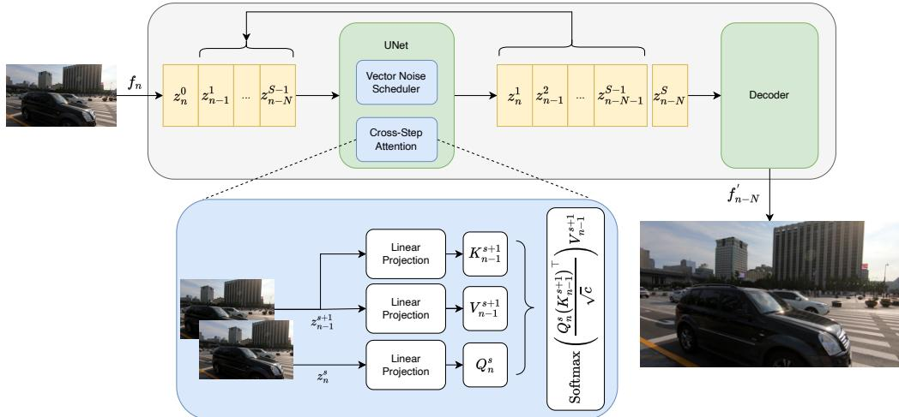
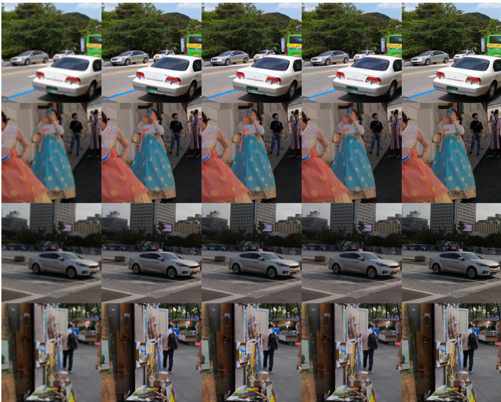

# Streaming-Aware Diffusion for Real-Time Video Super-Resolution via Cross-Step Attention

Harris Partaourides Ethical AI Novelties Limassol, Cyprus harris.partaourides@ethicalaicy.com

Sotirios Chatzis   
Cyprus University of Technology Limassol, Cyprus   
sotirios.chatzis@cut.ac.cy

## Abstract

Real-time video super-resolution requires high spatio-temporal fidelity under strict latency constraints, challenging diffusion models due to their iterative sampling cost and limited temporal coordination. We propose a streaming-aware framework that adapts pretrained single-image latent diffusion models for efficient video super-resolution (VSR) by exploiting the sequential structure of video streams. Our Cross-Step Attention mechanism reuses intermediate denoising features across adjacent frames and diffusion steps, enabling temporal information exchange without explicit temporal modeling. We further introduce Trajectory-Coupled Diffusion Scheduling, which aligns adjacent diffusion states and provides cleaner intermediate representations for cross-step conditioning, improving temporal coherence. These components are integrated into a streaming inference pipeline that incrementally propagates latent states across frames, reducing the effective computational complexity from O(N · S) to O(N + S) for N frames and S diffusion steps. Experiments on REDS4 and YouHQ40-Test demonstrate improved perceptual quality and temporal realism while maintaining frame-wise stability. Our method achieves over 40 FPS at 512 × 512 resolution after cold start, enabling real-time VSR without explicit temporal modeling.

## 1 Introduction

Real-time, high-quality video super-resolution (VSR) is important for streaming applications such as video-on-demand, live broadcasting, video conferencing, and cloud gaming [5, 27, 25]. These applications require both high visual fidelity and low latency, making efficient temporal processing essential [11, 6]. Diffusion-based single-image super-resolution (SISR) models achieve strong perceptual quality and high-frequency detail synthesis [19, 9, 15], but applying them independently to video frames causes flickering and temporal inconsistency [23]. Existing VSR methods address this through motion estimation, optical flow, or recurrent alignment [22, 18, 28], but these mechanisms introduce additional computational and architectural overhead that limits real-time streaming.

We propose a streaming-aware diffusion framework that adapts pretrained SISR diffusion models for efficient and temporally consistent VSR. Our key idea is to exploit the sequential structure shared by video streams and diffusion trajectories. We introduce a model-agnostic Cross-Step Attention mechanism that allows the current frame at diffusion step s to attend to intermediate features of the previous frame at step s + 1. This reuses progressively refined representations across both frames and diffusion steps, providing implicit temporal coordination without explicit motion modeling or additional temporal modules. To support this interaction, we introduce Trajectory-Coupled Diffusion Scheduling, which couples adjacent diffusion states through a vectorized noise schedule. The resulting trajectory-aligned representation exposes cleaner intermediate states from the previous frame as conditioning information during denoising, forming a cross-step clean prior that improves temporal coherence while remaining compatible with standard diffusion training. We further develop a streaming inference pipeline that incrementally propagates latent states across frames. Instead of independently executing all S diffusion steps for each of N frames, the pipeline maintains a FIFO buffer aligned with the diffusion trajectory and advances the buffered states jointly. This amortizes diffusion computation across the stream and reduces the effective complexity from $O ( N \cdot S )$ to $O ( N + S )$ , enabling real-time inference after the initial pipeline latency.

We evaluate the proposed framework on REDS [14] and YouHQ40 [28] using lightweight latent diffusion models [16]. Experiments demonstrate improvements in perceptual quality and temporal realism while maintaining frame-wise temporal stability. The streaming implementation achieves over 40 FPS at $5 1 2 \times 5 1 2$ resolution after cold start. We further validate the model-agnostic design across SDEdit [13], Stable Diffusion [16], and SDXL [15], showing consistent efficiency gains under streaming inference.

In summary, our contributions are:

• Cross-Step Attention: A model-agnostic attention mechanism that reuses intermediate diffusion features across adjacent frames and diffusion steps, enabling temporal coordination without explicit temporal modeling.

• Trajectory-Coupled Diffusion Scheduling: A trajectory-aligned formulation that couples adjacent diffusion states and provides cleaner intermediate representations for cross-step conditioning.

• Streaming-Aware Diffusion Pipeline: A FIFO-based inference pipeline that amortizes diffusion computation across frames, reducing effective complexity from $O ( N \cdot S )$ to $O ( N + S )$ and enabling real-time VSR.

## 2 Related Work

Diffusion-based Super-Resolution: Diffusion models [10, 7] have shown strong capability for perceptual super-resolution by synthesizing realistic high-frequency details. SR3 [19] performs iterative pixel-space denoising, while latent diffusion models (LDMs) [16] reduce the computational cost by operating in latent space. Pretrained models such as Stable Diffusion [16] and SDXL [15] have also been adapted for image restoration and super-resolution [22]. However, these methods process images independently and do not explicitly address temporal consistency.

Diffusion-based Video Super-Resolution: VSR requires both spatial detail restoration and temporal consistency. Existing VSR methods typically employ motion estimation, optical flow, recurrent propagation, or feature alignment [22, 18, 28]. Recent diffusion-based VSR approaches further introduce temporal attention or multi-frame conditioning, improving consistency at the cost of additional computation. These designs are less suitable for real-time streaming, where frames arrive sequentially under strict latency constraints.

Cross-frame Diffusion Feature Reuse. Another line of work has demonstrated that pretrained image diffusion models can be adapted to temporally coherent video generation by reusing intermediate diffusion features across frames. Text-to-video diffusion methods [2, 3, 24] and Text2Video-Zero [12], for example, exploit cross-frame representations or intermediate diffusion states to establish temporal correspondence without training a fully dedicated video diffusion model. These methods reveal an important property of diffusion models: intermediate denoising representations can serve as effective carriers of temporal information. Our work builds on this principle but introduces a fundamentally different coupling strategy. Instead of reusing features at the same diffusion step, Cross-Step Attention connects adjacent video frames at neighboring denoising steps and combines this interaction with Trajectory-Coupled Diffusion Scheduling. This design turns the diffusion trajectory itself into a mechanism for causal temporal propagation, while avoiding explicit motion estimation and multiframe temporal architectures.

## 3 Methodology

Our objective is to develop a stream-oriented diffusion framework for real-time video super-resolution (VSR). As illustrated in Fig. 1, we integrate Cross-Step Attention into a latent diffusion backbone [17], coupling the temporal progression of video frames with the diffusion denoising trajectory. This

  
Figure 1: Cross-Step Attention for stream-oriented diffusion. Frame n at step s attends to frame $n { - } 1$ at step s+1 for efficient feature reuse and temporal consistency.

enables intermediate feature reuse across frames and diffusion steps while avoiding explicit temporal modules.

## 3.1 Latent Diffusion Model

Latent diffusion models (LDMs) improve efficiency by operating in a compressed latent space instead of pixel space. Given an input image $x _ { 0 } ,$ , a variational autoencoder (VAE) encoder E maps it to a latent representation:

$$
z _ { 0 } = \mathcal { E } ( x _ { 0 } ) .\tag{1}
$$

A forward diffusion process is then defined in the latent space as:

$$
q ( z _ { s } \mid z _ { s - 1 } ) = \mathcal { N } ( z _ { s } ; \sqrt { \alpha _ { s } } z _ { s - 1 } , ( 1 - \alpha _ { s } ) I ) ,\tag{2}
$$

where $\alpha _ { s }$ is the noise schedule. This yields the closed-form marginal:

$$
q ( z _ { s } \mid z _ { 0 } ) = \mathcal { N } ( z _ { s } ; \sqrt { \bar { \alpha } _ { s } } z _ { 0 } , ( 1 - \bar { \alpha } _ { s } ) I ) ,\tag{3}
$$

with $\begin{array} { r } { \bar { \alpha } _ { s } = \prod _ { m = 1 } ^ { s } \alpha _ { m } . } \end{array}$

The reverse process is modeled by a neural network $\epsilon _ { \theta } \mathbf { : }$

$$
p _ { \theta } ( z _ { s - 1 } \mid z _ { s } ) = \mathcal { N } ( z _ { s - 1 } ; \mu _ { \theta } ( z _ { s } , s ) , \Sigma ) ,\tag{4}
$$

where $\mu _ { \theta }$ is parameterized via the predicted noise $\epsilon _ { \theta } ( z _ { s } , s )$ . The model is trained using the standard denoising objective:

$$
L ( \theta ) = \mathbb { E } _ { z _ { 0 } , \epsilon , s } \left[ | | \epsilon - \epsilon _ { \theta } ( z _ { s } , s ) | | ^ { 2 } \right] ,\tag{5}
$$

with $\epsilon \sim \mathcal { N } ( 0 , I )$

The denoised latent is finally mapped back to image space using the VAE decoder D:

$$
\begin{array} { r } { \hat { x } _ { 0 } = \mathcal { D } ( z _ { 0 } ) . } \end{array}\tag{6}
$$

Within the UNet backbone of LDMs, self-attention is applied to latent feature maps $Z \in \mathbb { R } ^ { H \times W \times C }$ by projecting them into queries, keys, and values. Attention is computed as:

$$
\mathrm { A t t n } ( Q , K , V ) = \mathrm { S o f t m a x } \left( { \frac { Q K ^ { \top } } { \sqrt { C } } } \right) V .\tag{7}
$$

This mechanism enables long-range spatial interactions and improves detail synthesis. However, in standard LDMs, self-attention is applied independently to each image and diffusion timestep, without any temporal interaction across frames. As a result, they are not inherently designed for video generation or temporal consistency.

## 3.2 Cross-Step Streaming Attention

To address this limitation, we introduce a Cross-Step Attention mechanism that enables structured information exchange across frames and diffusion timesteps in a streaming setting. By integrating this module into the self-attention layers of a pretrained SISR diffusion model, we obtain a causal and plug-and-play adaptation for video while preserving the sequential nature of both diffusion denoising and streaming inference.

Our design is inspired by cross-frame attention mechanisms in Text2Video-Zero [12], but differs in two key aspects. First, we operate in a strictly streaming setting, where each frame only attends to the immediately preceding frame rather than a global reference frame. At frame index $n ,$ standard self-attention is replaced by cross-frame attention between the current latent $z _ { n }$ and the previous latent $z _ { n - 1 } .$

$$
Z _ { n } = [ z _ { n } , z _ { n - 1 } ] \in \mathbb { R } ^ { 2 \times H \times W \times C } ,\tag{8}
$$

where queries are computed from $z _ { n } ,$ , while keys and values are computed from $z _ { n - 1 }$ . This yields:

$$
\mathrm { C F - A t t n } ( Q _ { n } , K _ { n - 1 } , V _ { n - 1 } ) = \mathrm { S o f t m a x } \left( \frac { Q _ { n } K _ { n - 1 } ^ { \top } } { \sqrt { C } } \right) V _ { n - 1 } ,\tag{9}
$$

with standard self-attention recovered for $n = 1$

Second, we extend this mechanism along the diffusion trajectory by introducing Cross-Step Attention. Instead of attending within the same diffusion timestep, we exploit the sequential nature of the denoising trajectory and let the current frame at step s attend to the previous frame further along the denoising trajectory at step $s + 1 \colon$

$$
Z _ { n } ^ { s } = \left[ z _ { n } ^ { s } , z _ { n - 1 } ^ { s + 1 } \right] \in \mathbb { R } ^ { 2 \times H \times W \times C } .\tag{10}
$$

This produces queries from $z _ { n } ^ { s }$ and keys/values from $z _ { n - 1 } ^ { s + 1 }$ , leading to:

$$
\mathrm { C S - A t t n } ( Q _ { n } ^ { s } , K _ { n - 1 } ^ { s + 1 } , V _ { n - 1 } ^ { s + 1 } ) = \mathrm { S o f t m a x } \left( \frac { Q _ { n } ^ { s } ( K _ { n - 1 } ^ { s + 1 } ) ^ { \top } } { \sqrt { C } } \right) V _ { n - 1 } ^ { s + 1 } .\tag{11}
$$

By leveraging intermediate denoising states further along the denoising trajectory of the previous frame, the model reuses progressively refined structural information to guide the current denoising process. This enforces temporal consistency while avoiding redundant computation across both frames and diffusion steps, leading to improved stability and efficiency in streaming video generation. This formulation naturally interacts with the denoising trajectory, motivating a Trajectory-Coupled Diffusion Scheduling strategy that aligns intermediate states across diffusion steps for both training and inference.

## 3.3 Trajectory-Coupled Diffusion Scheduling

To support Cross-Step Attention in a streaming setting, we introduce a Trajectory-Coupled Diffusion Scheduling formulation that models local dependencies along the denoising trajectory. Instead of treating each timestep independently, we lift the scalar noise schedule into a paired representation over adjacent diffusion steps.

Given a standard scalar noise schedule $\{ \alpha _ { s } \} _ { s = 1 } ^ { S }$ , we construct a vectorized schedule by stacking consecutive values:

$$
\pmb { \alpha } _ { s } = \left[ \begin{array} { c } { \alpha _ { s } } \\ { \alpha _ { s + 1 } } \end{array} \right] ,\tag{12}
$$

which explicitly couples adjacent diffusion steps s and $s + 1$

This induces a corresponding paired latent representation along the denoising trajectory:

$$
\tilde { \bf z } _ { n } ^ { s } = ( z _ { n } ^ { s } , z _ { n } ^ { s + 1 } ) ,\tag{13}
$$

enabling simultaneous access to two consecutive states within the same trajectory without modifying the underlying diffusion process.

We construct trajectory-aligned training pairs:

$$
\mathcal { P } = \{ ( z _ { n } ^ { s } , z _ { n - 1 } ^ { s + 1 } ) \} ,\tag{14}
$$

aligning the current frame at step s with the previous frame at a more advanced step $s + 1$ . This induces a cross-step clean prior, where $z _ { n - 1 } ^ { s + 1 }$ provides a refined denoising signal for $z _ { n } ^ { s } .$ . During training, the conditioning state $z _ { n - 1 } ^ { s + 1 }$ is obtained by applying the forward process of Eq. (2) to the previous frame at level $s + 1$ , whereas at inference it is the model-produced latent already present in the streaming buffer at that diffusion depth. Because keys and values originate from a more advanced (cleaner) step than the query, the conditioning distribution remains close across the two regimes, which limits the train–inference mismatch in practice.

The model is trained using the standard diffusion denoising objective:

$$
\begin{array} { r } { \begin{array} { r } { \mathcal { L } ( \boldsymbol { \theta } ) = \mathbb { E } _ { ( z _ { n } ^ { s } , z _ { n - 1 } ^ { s + 1 } ) , \epsilon } \left[ \left| \left| \epsilon - \epsilon _ { \boldsymbol { \theta } } ( z _ { n } ^ { s } , z _ { n - 1 } ^ { s + 1 } ) \right| \right| ^ { 2 } \right] , } \end{array} } \end{array}\tag{15}
$$

with $\epsilon \sim \mathcal { N } ( 0 , I )$

At inference, this formulation enables consistent access to coupled states $\tilde { \mathbf { z } } _ { n } ^ { s } = ( z _ { n } ^ { s } , z _ { n } ^ { s + 1 } )$ , reducing redundancy across diffusion steps and frames while complementing Cross-Step Attention. This structured coupling naturally leads to a unified streaming inference formulation, described next.

## 3.4 Streaming-Aware Diffusion for Video Super-Resolution

Our streaming inference pipeline builds on Cross-Step Attention and the trajectory-coupled diffusion formulation, enabling structured reuse of intermediate denoising states across both diffusion timesteps and video frames.

Real-time video super-resolution requires aligning computational throughput with the incoming frame rate. However, even efficient diffusion models struggle under high FPS or resource-constrained settings, making it necessary to decouple frame arrival from full diffusion completion through amortized computation. In standard SISR-based diffusion, each frame is independently denoised over S steps, leading to a computational cost of $O ( N \cdot S )$ for a sequence of N frames due to the lack of temporal state reuse.

To address this, we reformulate inference as a streaming FIFO pipeline with buffer size $S ,$ matching the diffusion horizon. At time $n ,$ the system maintains a structured latent state:

$$
Z _ { n } = \{ z _ { n - k } ^ { k } ~ | ~ k = 1 , \ldots , S \} ,\tag{16}
$$

where each element corresponds to a frame progressing through a specific diffusion depth. Each incoming frame is encoded into its initial latent state and enters the buffer at diffusion step 0. At every iteration, all latents advance by one diffusion step under the trajectory-coupled denoising process with Cross-Step Attention. Consequently, each frame traverses the buffer over S updates before being decoded at the final stage.

This induces a pipeline latency of S steps, after which the system produces one output frame per iteration in steady state. The resulting process transforms diffusion from independent per-frame generation into a continuous state evolution over a shared denoising trajectory. Computationally, each diffusion update is executed once per time step rather than S times per frame, yielding amortized complexity: $O ( N + S )$ . The FIFO-aligned design ensures temporal consistency, efficient state reuse, and full compatibility with the underlying diffusion process.

## 4 Experiments

We evaluate the proposed streaming-aware diffusion framework on two complementary VSR benchmarks: REDS4 [14] and YouHQ40-Test [28] enabling evaluation of reconstruction quality, perceptual quality, temporal consistency, and streaming efficiency.

REDS Dataset: The REDS dataset [14] is a standard benchmark for video restoration tasks, consisting of high-quality video sequences with diverse motion patterns. Following prior work, we evaluate on the REDS4 subset, which contains four commonly used test sequences (000, 011, 015, and 020). We adopt the standard 4× super-resolution setting using the provided low-resolution sequences $( 3 2 0 \times \bar { 1 8 0 } \to 1 2 8 0 \times 7 2 0 )$ . For fine-tuning, we use the official REDS validation split, which contains 30 video sequences.

YouHQ40-Test Set: YouHQ40-Test [28] is a real-world high-quality VSR benchmark derived from the YouHQ dataset. It consists of 40 video clips (approximately 32 frames each), covering diverse scenes including urban environments, natural landscapes, human activities, underwater scenes, and low-light conditions. The dataset includes both $1 9 2 0 ^ { - } \times 1 0 8 0$ (Full HD) and $1 0 8 0 \times 1 0 8 0$ (square) videos. For evaluation, we apply $4 \times$ super-resolution on $1 0 8 0 \times 1 0 8 0$ videos $( 2 7 0 \times 2 7 0 $ $1 0 8 0 \times 1 0 8 0 )$ . For $1 9 2 0 \times 1 0 8 0$ videos, we extract a center-cropped $1 0 8 0 \times 1 0 8 0$ region and apply the same degradation setting for consistency.

Table 1: Quantitative comparison on REDS4 and YouHQ40-Test with 30 diffusion steps. $\mathrm { L D M _ { C S } }$ denotes Cross-Step Attention, while $\mathrm { L D M } _ { \mathrm { C S } } ^ { * }$ is fine-tuned on REDS for 15 epochs.
<table><tr><td>Method</td><td>PSNR</td><td>SSIM</td><td>LPIPS</td><td>DISTS</td><td>FID</td><td>tLPIPS</td><td>tDISTS</td><td>FVD</td></tr><tr><td colspan="9">REDS4</td></tr><tr><td>Bicubic</td><td>26.13</td><td>0.73</td><td>0.453</td><td>0.186</td><td>5.80</td><td>0.023</td><td>0.003</td><td>18.89</td></tr><tr><td>Real-ESRGAN</td><td>23.35</td><td>0.67</td><td>0.242</td><td>0.105</td><td>2.97</td><td>0.006</td><td>0.007</td><td>23.48</td></tr><tr><td>Stable-VSR</td><td>28.15</td><td>0.80</td><td>0.101</td><td>0.046</td><td>0.06</td><td>0.004</td><td>0.006</td><td>2.59</td></tr><tr><td>LDM</td><td>24.66</td><td>0.69</td><td>0.214</td><td>0.097</td><td>2.20</td><td>0.030</td><td>0.025</td><td>11.71</td></tr><tr><td> $\mathrm { L D M _ { C S } }$ </td><td>24.07</td><td>0.65</td><td>0.198</td><td>0.092</td><td>1.43</td><td>0.044</td><td>0.027</td><td>8.84</td></tr><tr><td> $\mathrm { L D M _ { C S } ^ { * } }$ </td><td>25.26</td><td>0.69</td><td>0.180</td><td>0.083</td><td>0.84</td><td>0.028</td><td>0.023</td><td>7.30</td></tr><tr><td colspan="9">YouHQ40-Test</td></tr><tr><td>Bicubic</td><td>27.60</td><td>0.78</td><td>0.365</td><td>0.163</td><td>2.20</td><td>0.019</td><td>0.004</td><td>73.41</td></tr><tr><td>Real-ESRGAN</td><td>23.80</td><td>0.68</td><td>0.269</td><td>0.137</td><td>2.79</td><td>0.007</td><td>0.007</td><td>71.02</td></tr><tr><td> $_ { \mathrm { S t a b l e - V S R } }$ </td><td>27.58</td><td>0.78</td><td>0.175</td><td>0.087</td><td>0.17</td><td>0.009</td><td>0.006</td><td>64.19</td></tr><tr><td>LDM</td><td>25.25</td><td>0.70</td><td>0.241</td><td>0.123</td><td>1.53</td><td>0.059</td><td>0.031</td><td>66.73</td></tr><tr><td> $\mathrm { L D M _ { C S } }$ </td><td>24.42</td><td>0.65</td><td>0.240</td><td>0.126</td><td>1.30</td><td>0.093</td><td>0.038</td><td>65.27</td></tr><tr><td> $\mathrm { L D M _ { C S } ^ { * } }$ </td><td>26.12</td><td>0.72</td><td>0.199</td><td>0.107</td><td>0.35</td><td>0.060</td><td>0.029</td><td>65.63</td></tr></table>

Implementation details: We implement our method in PyTorch using the Diffusers library. Cross-Step Attention is implemented as a modular attention processor compatible with pretrained latent diffusion backbones, supporting both AttnProcessor and AttnProcessor2\_0. Experiments are conducted on a single NVIDIA RTX 4090 GPU under identical inference settings. We fine-tune only the attention-related modules while keeping the pretrained diffusion backbone fixed. Streaming throughput is measured after the initial cold-start period.

Evaluation Metrics: We evaluate performance using spatial fidelity, perceptual quality, and temporal consistency metrics. Following the perception–distortion trade-off [4], we emphasize perceptual metrics while reporting distortion-based measures for completeness. For spatial fidelity, we report Peak Signal-to-Noise Ratio (PSNR) and Structural Similarity Index (SSIM). To better capture perceptual quality, we use Learned Perceptual Image Patch Similarity (LPIPS) [26] and Deep Image Structure and Texture Similarity (DISTS) [8]. We also report Fréchet Inception Distance (FID) [20] as a distribution-level metric computed over extracted frame features. For temporal consistency, we report Fréchet Video Distance (FVD) [21], which measures distributional similarity in a spatiotemporal feature space. In addition, we use temporal LPIPS (tLPIPS) and temporal DISTS (tDISTS) to measure frame-to-frame perceptual stability. Following prior work [18, 1], temporal LPIPS is defined as the absolute change in perceptual distance between consecutive frames:

$$
\mathrm { t L P I P S } _ { t } = \left| \mathrm { L P I P S } ( f _ { t } , f _ { t + 1 } ) - \mathrm { L P I P S } ( f _ { t } ^ { * } , f _ { t + 1 } ^ { * } ) \right| ,\tag{17}
$$

where $f _ { t }$ and $f _ { t } ^ { * }$ denote ground-truth and generated frames, respectively. tDISTS is defined analogously by replacing LPIPS with DISTS.

## 4.1 Cross-Step Attention Evaluation

We evaluate Cross-Step Attention using an LDM, denoted as $\mathrm { L D M _ { C S } }$ , on REDS4 and YouHQ40-Test with 30 diffusion steps. We compare against bicubic interpolation, vanilla LDM, Stable-VSR, and Real-ESRGAN. Table 1 reports spatial reconstruction, perceptual, and temporal metrics. For the fine-tuned variant $\mathrm { L D M } _ { \mathrm { C S } } ^ { * }$ , we fine-tune the attention-related parameters on the REDS validation set for 15 epochs using Adam with a learning rate of $1 \times 1 0 ^ { - 5 }$ . The resulting model is evaluated directly on both REDS4 and YouHQ40-Test without additional adaptation.

The results reveal a clear distinction between the zero-shot and fine-tuned settings. In the zero-shot setting, $\mathrm { L D M _ { C S } }$ improves perceptual and distribution-level temporal metrics over vanilla LDM, although this comes with a degradation in distortion-based and frame-wise temporal metrics. On REDS4, LPIPS decreases from 0.214 to 0.198 and FID from 2.20 to 1.43, while FVD decreases from 11.71 to 8.84. Similarly, on YouHQ40-Test, FID decreases from 1.53 to 1.30 and FVD from 66.73 to 65.27. These improvements indicate that cross-step feature reuse can improve perceptual and distribution-level temporal quality without task-specific training. However, PSNR/SSIM decrease and frame-wise temporal errors increase, particularly on YouHQ40-Test. This behavior is consistent with the perception–distortion trade-off [4], where improved perceptual realism can occur at the expense of pixel-level fidelity and local frame-to-frame stability.

Fine-tuning substantially improves this trade-off. On REDS4, $\mathrm { L D M } _ { \mathrm { C S } } ^ { * }$ improves PSNR from 24.66 to 25.26 relative to vanilla LDM, while reducing LPIPS from 0.214 to 0.180, DISTS from 0.097 to 0.083, and FID from 2.20 to 0.84. FVD also decreases from 11.71 to 7.30. On YouHQ40-Test, PSNR increases from 25.25 to 26.12, while LPIPS, DISTS, and FID decrease from 0.241, 0.123, and 1.53 to 0.199, 0.107, and 0.35, respectively. The improvement transfers to YouHQ40-Test despite training only on REDS, suggesting that the learned cross-step representations generalize beyond the fine-tuning domain. Importantly, fine-tuning also mitigates the frame-wise temporal instability introduced by the zero-shot model: on REDS4, tLPIPS/tDISTS improve from 0.044/0.027 for $\mathrm { L D M _ { C S } }$ to 0.028/0.023 for $\mathrm { L D M } _ { \mathrm { C S } } ^ { * }$ , approaching or improving upon the corresponding vanilla LDM values. On YouHQ40-Test, the temporal metrics remain essentially unchanged relative to vanilla LDM while the perceptual metrics improve substantially. Thus, lightweight fine-tuning provides a more favorable operating point that retains the perceptual benefits of Cross-Step Attention while largely recovering frame-wise temporal stability.

The comparison with existing methods further highlights the quality-efficiency trade-off. Stable-VSR achieves the strongest reconstruction and perceptual quality among the compared methods, benefiting from explicit temporal modeling. However, this comes with substantially higher computational cost (see Section 4.2). Real-ESRGAN provides efficient inference but achieves weaker perceptual quality, while bicubic interpolation serves as a simple reconstruction baseline. In contrast, $\mathrm { L D M } _ { \mathrm { C S } } ^ { * }$ provides a lightweight alternative that improves the perceptual quality of a pretrained diffusion backbone without introducing a dedicated temporal architecture.

Qualitative comparisons are shown in Fig. 2. $\mathrm { L D M } _ { \mathrm { C S } } ^ { * }$ produces sharper details and more coherent structures than vanilla LDM, particularly around object boundaries, repetitive patterns, and finegrained textures. In the first row, repetitive structures on the car and bus are reconstructed with improved geometric regularity and fewer visible distortions. In the second row, the dress exhibits more consistent appearance and fewer local artifacts. In the third row, fine details on the moving vehicle are better preserved, with less visible blurring in high-frequency regions. In the final row, object boundaries between the window and pedestrian regions appear cleaner, with reduced foreground– background ambiguity. These visual differences are consistent with the improvements in LPIPS, DISTS, and FID reported in Table 1.

Overall, the results show that Cross-Step Attention provides a useful mechanism for transferring intermediate diffusion representations across adjacent frames. In the zero-shot setting, this primarily improves perceptual and distribution-level temporal quality, while lightweight fine-tuning substantially reduces the associated loss in frame-wise temporal stability. The resulting approach therefore provides a practical way to introduce temporal feature reuse into pretrained diffusion restoration models without explicit motion estimation or a dedicated multi-frame temporal architecture.

## 4.2 Efficiency Analysis for Real-Time Video Super-Resolution

We evaluate inference efficiency at $5 1 2 ^ { 2 }$ and $1 0 2 4 ^ { 2 }$ resolutions using LDM, SDx4, SDEdit, and SDXL, with and without Cross-Step Attention and streaming inference. We additionally compare against bicubic interpolation, Real-ESRGAN, and StableVSR. All diffusion-based methods use 30 sampling steps. We report runtime per 1-second video, diffusion throughput, and output FPS in Table 2.

Standard diffusion models remain computationally expensive for video processing. $\mathrm { { A t } 5 1 2 ^ { 2 } }$ , LDM, SDx4, SDEdit, and SDXL achieve only 2.2, 1.0, 1.4, and 0.8 FPS, respectively. Adding CS attention alone does not improve throughput, since diffusion is still performed independently for each frame. In contrast, the streaming pipeline reorganizes the same denoising updates into a continuous execution schedule, allowing intermediate states to be reused across consecutive frames.

  
(a) Bicubic  
(b) LDM  
(c) $L D M _ { C S }$  
(d) $L D M _ { C S } ^ { * }$  
(e) High-Res  
Figure 2: REDS4 examples with different methods.

The resulting streaming variants substantially increase throughput. At 5122, LDMstream, $\mathrm { S D x 4 _ { C S } ^ { s t r e a m } }$ SDEditstreamCS , and SDXL 12, 4.5, 9, and 7.5 FPS. These results show that the main efficiency gain comes from streaming reorganization, which amortizes diffusion computation across consecutive frames.

StableVSR provides strong reconstruction quality but requires 120 s per 1-second video at $5 1 2 ^ { 2 }$ but do not provide comparable diffusion-based perceptual reconstruction. Together with the quality results in Table 1, these measurements demonstrate the practical efficiency advantage of the proposed streaming formulation.

The streaming and non-streaming variants use identical model weights and denoising updates, with the streaming buffer size matched to the number of diffusion steps. To verify that streaming does not alter reconstruction behavior, we compare $\mathrm { L D M } _ { \mathrm { C S } } ^ { \mathrm { s t r e a m } }$ with $\mathrm { L D M _ { C S } }$ . At $5 1 2 ^ { \frac { \mathbf { \zeta } } { 2 } }$ , the streaming and nonstreaming variants obtain FID/FVD values of 0.84/7.47 and 0.84/7.30 on REDS4, and 0.35/65.67 and 0.35/65.63 on YouHQ40-Test, respectively. Peak diffusion process memory is also nearly unchanged, measuring 4.98/4.96 GB at $5 1 2 ^ { 2 }$ and 18.54/18.50 GB at $1 0 2 4 ^ { 2 }$ for streaming/non-streaming inference. These results indicate that streaming primarily changes the execution order while preserving the underlying denoising computation.

To further assess potential error propagation during streaming, we compare performance across the first, middle, and final thirds of the REDS4 sequences. Temporal quality does not degrade over time; instead, FVD decreases from 9.95 to 7.95 to 7.52, while tLPIPS decreases from 0.030 to 0.028 to 0.026 and tDISTS from 0.024 to 0.023 to 0.023, with spatial quality remaining largely stable. These results suggest that the causal one-hop cross-step design does not introduce accumulating temporal errors during streaming.

Table 2: Inference efficiency at $5 1 2 ^ { 2 }$ and $1 0 2 4 ^ { 2 }$ resolutions.
<table><tr><td>Method</td><td colspan="2">Runtime ↓</td><td colspan="2">Steps/s ↑</td><td colspan="2"> $\mathbf { F P S \uparrow }$ </td></tr><tr><td></td><td> $5 1 2 ^ { 2 }$ </td><td> $1 0 2 \dot { 4 } ^ { 2 }$ </td><td> $5 1 2 ^ { 2 }$ </td><td> $1 0 2 4 ^ { 2 }$ </td><td> $5 1 2 ^ { 2 }$ </td><td> $1 0 2 4 ^ { 2 }$ </td></tr><tr><td>Bicubic</td><td>1.5</td><td>3</td><td>一</td><td>一</td><td>20</td><td>10</td></tr><tr><td>Real-ESRGAN</td><td>3.3</td><td>9.1</td><td>一</td><td>一</td><td>9</td><td>3.3</td></tr><tr><td>StableVSR</td><td>120</td><td>750</td><td>一</td><td>一</td><td>一</td><td>一</td></tr><tr><td>LDM</td><td>13</td><td>36</td><td>67</td><td>25</td><td>2.2</td><td>0.8</td></tr><tr><td> $\mathrm { L D M _ { C S } }$ </td><td>20</td><td>75</td><td>44</td><td>12</td><td>1.5</td><td>0.4</td></tr><tr><td> $\mathrm { L D M } _ { \mathrm { C S } } ^ { \mathrm { s t r e a m } }$ </td><td>0.7</td><td>2.5</td><td>44</td><td>12</td><td>44</td><td>12</td></tr><tr><td>SDx4</td><td>30</td><td>100</td><td>30</td><td>9</td><td>1.0</td><td>0.3</td></tr><tr><td> $\mathrm { S D x 4 _ { C S } }$ </td><td>53</td><td>200</td><td>17</td><td>4.5</td><td>0.6</td><td>0.2</td></tr><tr><td> $\mathrm { S D x 4 _ { C S } ^ { s t r e a m } }$ </td><td>2</td><td>7</td><td>17</td><td>4.5</td><td>17</td><td>4.5</td></tr><tr><td>SDEdit</td><td>21</td><td>56</td><td>42</td><td>16</td><td>1.4</td><td>0.5</td></tr><tr><td> $\mathrm { S D E d i t c s }$ </td><td>26</td><td>100</td><td>34</td><td>9</td><td>1.1</td><td>0.3</td></tr><tr><td> $\mathrm { S D E d i t _ { C S } ^ { s t r e a m } }$ </td><td>1</td><td>3</td><td>34</td><td>9</td><td>34</td><td>9</td></tr><tr><td>SDXL</td><td>38</td><td>64</td><td>24</td><td>14</td><td>0.8</td><td>0.5</td></tr><tr><td> $\mathrm { S D X L _ { C S } }$ </td><td>53</td><td>120</td><td>17</td><td>7.5</td><td>0.6</td><td>0.3</td></tr><tr><td> $\mathrm { S D X L } _ { \mathrm { C S } } ^ { \mathrm { s t r e a m } }$ </td><td>2</td><td>4</td><td>17</td><td>7.5</td><td>17</td><td>7.5</td></tr></table>

## 4.3 Effect of Diffusion Steps on Reconstruction Performance

Table 3 examines how the diffusion-step budget affects perceptual and temporal quality on REDS4 and YouHQ40-Test. Increasing the number of diffusion steps consistently improves the vanilla LDM, with the largest gains occurring at low step budgets and diminishing improvements at higher budgets. Cross-Step Attention achieves comparable or better perceptual quality at substantially fewer steps, indicating improved sample efficiency of the diffusion process.

On REDS4, the zero-shot $\mathrm { L D M } _ { C S }$ already provides substantial gains at low and moderate step budgets. At 10 steps, $\mathrm { L D M } _ { C S _ { 1 0 } }$ achieves an LPIPS of 0.213, comparable to the 0.214 obtained by the 30-step vanilla LDM, while using only one-third of the denoising steps. Its DISTS and FID, however, remain slightly higher at 0.100 and 2.75 compared with 0.097 and 2.20 for $L D M _ { 3 0 }$ . The benefit becomes more pronounced after fine-tuning. $\mathbf { L D M } _ { C S _ { 1 0 } } ^ { * }$ achieves LPIPS/DISTS/FID/FVD of 0.199/0.091/2.00/10.15, improving over the 30-step vanilla LDM at 0.214/0.097/2.20/11.71 despite using only 10 diffusion steps. On YouHQ40-Test, the zero-shot gains are more modest, particularly at low step budgets. Fine-tuning substantially improves the perceptual metrics: $\mathrm { L D M } _ { C S _ { 1 0 } } ^ { * }$ achieves LPIPS, DISTS, and FID of 0.212, 0.113, and 0.94, compared with 0.241, 0.123, and 1.53 for $L D M _ { 3 0 }$ FVD is 68.76 compared with 66.73 for the 30-step baseline, indicating that the reduction in diffusion steps comes with a small degradation in distribution-level temporal quality on this more diverse dataset. Increasing the step budget progressively reduces this gap, with $\mathrm { L D M } _ { C S _ { 3 0 } } ^ { * }$ achieving the best results at 0.199 LPIPS, 0.107 DISTS, 0.35 FID, and 65.63 FVD.

These results demonstrate that Cross-Step Attention can substantially improve the sample efficiency of diffusion-based VSR. In particular, the fine-tuned 10-step model on REDS4 matches or exceeds the perceptual and temporal quality of the 30-step vanilla LDM while requiring only one-third of the denoising steps. On YouHQ40-Test, the same reduction in steps preserves strong perceptual gains but introduces a modest temporal-quality trade-off, which is progressively reduced as more diffusion steps are used.

## 5 Conclusion

We presented a streaming-aware framework for real-time video super-resolution that adapts pretrained single-image latent diffusion models through Cross-Step Attention and Trajectory-Coupled Diffusion Scheduling. By reusing intermediate denoising representations across adjacent frames and diffusion steps, the proposed approach enables implicit temporal information propagation without explicit motion estimation or dedicated temporal modules.

Table 3: Effect of diffusion step budgets on reconstruction and temporal quality.
<table><tr><td rowspan="2">Method</td><td colspan="3">REDS4</td><td rowspan="2"></td><td colspan="3">YouHQ40-Test</td><td rowspan="2">FVD↓</td></tr><tr><td>LPIPS↓ DISTS↓</td><td>FID↓</td><td>FVD↓</td><td>LPIPS↓</td><td>DISTS↓</td><td>FID↓</td></tr><tr><td rowspan="5"> $L D M _ { 5 }$   $L D M _ { 1 0 }$   $L D M _ { 1 5 }$   $L D M _ { 2 0 }$   $L D M _ { 2 5 }$ </td><td>0.300</td><td>0.144</td><td>5.72</td><td>21.84</td><td>0.302</td><td>0.154</td><td>3.96</td><td>76.10</td></tr><tr><td>0.263</td><td>0.121</td><td>3.74</td><td>16.44</td><td>0.275</td><td>0.137</td><td>2.31</td><td>71.06</td></tr><tr><td>0.240</td><td>0.109</td><td>2.98</td><td>14.20</td><td>0.259</td><td>0.130</td><td>1.91</td><td>69.17</td></tr><tr><td>0.228</td><td>0.103</td><td>2.61</td><td>13.18</td><td>0.250</td><td>0.126</td><td>1.71</td><td>67.95</td></tr><tr><td>0.220 0.214</td><td>0.100 0.097</td><td>2.35 2.20</td><td>12.21 11.71</td><td>0.245 0.241</td><td>0.124 0.123</td><td>1.61 1.53</td><td>67.30</td></tr><tr><td rowspan="5"> $L D M _ { C S _ { 5 } }$   $L D M _ { C S _ { 1 0 } }$   $L D M _ { C S _ { 1 5 } }$   $L D M _ { C S _ { 2 0 } }$   $L D M _ { C S _ { 2 5 } }$ </td><td>0.253</td><td>0.126</td><td>5.85</td><td>19.90</td><td>0.289</td><td>0.155</td><td>4.96</td><td>66.73 76.96</td></tr><tr><td>0.213</td><td>0.100</td><td>2.75</td><td>12.77</td><td>0.244</td><td>0.130</td><td>2.00</td><td>68.70</td></tr><tr><td>0.202</td><td>0.095</td><td>1.99</td><td>11.62</td><td>0.239</td><td>0.127</td><td>1.52</td><td>66.69</td></tr><tr><td>0.199</td><td>0.093</td><td>1.69</td><td>9.93</td><td>0.237</td><td>0.126</td><td>1.38</td><td>65.86</td></tr><tr><td>0.198</td><td>0.092</td><td>1.52</td><td>9.66</td><td>0.238</td><td>0.125</td><td>1.32</td><td>65.10</td></tr><tr><td rowspan="4"> $L D M _ { C S _ { 3 0 } }$   $L D M _ { C S _ { 5 } } ^ { * }$   $L D M _ { C S _ { 1 0 } } ^ { * }$ </td><td>0.197</td><td>0.092</td><td>1.30</td><td>8.84</td><td>0.240</td><td>0.126</td><td>1.30</td><td>65.27</td></tr><tr><td>0.232</td><td>0.107</td><td>4.21</td><td>15.26</td><td>0.236</td><td>0.124</td><td>2.45</td><td>73.36</td></tr><tr><td>0.199</td><td>0.091</td><td>2.00</td><td>10.15</td><td>0.212</td><td>0.113</td><td>0.94</td><td>68.76</td></tr><tr><td> $L D M _ { C S _ { 1 5 } } ^ { * }$  0.188</td><td>0.086</td><td>1.38</td><td>8.69</td><td>0.203</td><td>0.109</td><td>0.60</td><td>67.37</td></tr><tr><td rowspan="4"> $L D M _ { C S _ { 2 0 } } ^ { * }$   $L D M _ { C S _ { 2 5 } } ^ { * }$   $L D M _ { C S _ { 3 0 } } ^ { * }$ </td><td>0.184</td><td>0.084</td><td>1.10</td><td>8.08</td><td>0.201</td><td>0.108</td><td>0.46</td><td>66.91</td></tr><tr><td>0.182</td><td>0.084</td><td>0.94</td><td>7.70</td><td>0.200</td><td>0.107</td><td>0.39</td><td>66.09</td></tr><tr><td>0.180</td><td>0.083</td><td>0.84</td><td>7.30</td><td>0.199</td><td>0.107</td><td>0.35</td><td>65.63</td></tr><tr><td></td><td></td><td></td><td></td><td></td><td></td><td></td><td></td></tr></table>

Experiments on REDS4 and YouHQ40-Test demonstrate improved perceptual quality and distributionlevel temporal realism over vanilla latent diffusion, while lightweight fine-tuning further improves frame-wise temporal stability. Cross-Step Attention also improves diffusion step efficiency, enabling strong perceptual quality with fewer denoising steps. Combined with the streaming inference pipeline, the proposed framework achieves over 40 FPS at $5 1 2 ^ { 2 }$ after cold start, demonstrating the feasibility of real-time diffusion-based VSR.

Overall, our results show that exploiting the structure of the diffusion trajectory provides a simple and effective way to bridge high-quality diffusion restoration and real-time video processing.

## Acknowledgements

This work was funded by the European Union’s Horizon Europe research and innovation programme under the Marie Skłodowska-Curie grant agreement No. 101129865 (ACCESS).

## References

[1] Tserendorj Adiya, Jae Shin Yoon, Jung Eun Lee, Sanghun Kim, and Hwasup Lim. Bidirectional temporal diffusion model for temporally consistent human animation. In International Conference on Learning Representations, volume 2024, pages 44419–44439, 2024.

[2] Andreas Blattmann, Tim Dockhorn, Sumith Kulal, Daniel Mendelevitch, Maciej Kilian, Dominik Lorenz, Yam Levi, Zion English, Vikram Voleti, Adam Letts, et al. Stable video diffusion: Scaling latent video diffusion models to large datasets. arXiv preprint arXiv:2311.15127, 2023.

[3] Andreas Blattmann, Robin Rombach, Huan Ling, Tim Dockhorn, Seung Wook Kim, Sanja Fidler, and Karsten Kreis. Align your latents: High-resolution video synthesis with latent diffusion models. In Proc. IEEE/CVF Conf. Comput. Vis. Pattern Recognit. (CVPR), pages 22563–22575, 2023.

[4] Yochai Blau and Tomer Michaeli. The perception-distortion tradeoff. In Proc. IEEE/CVF Conf. Comput. Vis. Pattern Recognit. (CVPR), pages 6228–6237, 2018.

[5] Jose Caballero, Christian Ledig, Andrew Aitken, Alejandro Acosta, Johannes Totz, Zehan Wang, and Wenzhe Shi. Real-time video super-resolution with spatio-temporal networks and motion compensation. In Proc. IEEE/CVF Conf. Comput. Vis. Pattern Recognit. (CVPR), pages 4778–4787, 2017.

[6] Yanpeng Cao, Chengcheng Wang, Changjun Song, Yongming Tang, and He Li. Real-time super-resolution system of 4k-video based on deep learning. In IEEE 32nd Int. Conf. on Application-specific Systems, Architectures and Processors (ASAP), pages 69–76, 2021.

[7] Prafulla Dhariwal and Alexander Nichol. Diffusion models beat gans on image synthesis. Advances in neural information processing systems, 34:8780–8794, 2021.

[8] Keyan Ding, Kede Ma, Shiqi Wang, and Eero P Simoncelli. Image quality assessment: Unifying structure and texture similarity. IEEE Trans. Pattern Anal. Mach. Intell., 44(5):2567–2581, 2020.

[9] Sicheng Gao, Xuhui Liu, Bohan Zeng, Sheng Xu, Yanjing Li, Xiaoyan Luo, Jianzhuang Liu, Xiantong Zhen, and Baochang Zhang. Implicit diffusion models for continuous super-resolution. In Proc. IEEE/CVF Conf. Comput. Vis. Pattern Recognit. (CVPR), pages 10021–10030, 2023.

[10] Jonathan Ho, Ajay Jain, and Pieter Abbeel. Denoising diffusion probabilistic models. Advances in neural information processing systems, 33:6840–6851, 2020.

[11] Andrey Ignatov, Andres Romero, Heewon Kim, and Radu Timofte. Real-time video superresolution on smartphones with deep learning, mobile ai 2021 challenge: Report. In Proc. IEEE/CVF Conf. Comput. Vis. Pattern Recognit. (CVPR), pages 2535–2544, 2021.

[12] Levon Khachatryan, Andranik Movsisyan, Vahram Tadevosyan, Roberto Henschel, Zhangyang Wang, Shant Navasardyan, and Humphrey Shi. Text2video-zero: Text-to-image diffusion models are zero-shot video generators. In Proc. IEEE/CVF Int. Conf. Comput. Vis. (ICCV), pages 15954–15964, 2023.

[13] Chenlin Meng, Yutong He, Yang Song, Jiaming Song, Jiajun Wu, Jun-Yan Zhu, and Stefano Ermon. Sdedit: Guided image synthesis and editing with stochastic differential equations. arXiv:2108.01073, 2021.

[14] Seungjun Nah, Radu Timofte, Shuhang Gu, Sungyong Baik, Seokil Hong, Gyeongsik Moon, Sanghyun Son, and Kyoung Mu Lee. Ntire 2019 challenge on video super-resolution. In Proc. IEEE/CVF Conf. Comput. Vis. Pattern Recognit. Worksh. (CVPR), 2019.

[15] Dustin Podell, Zion English, Kyle Lacey, Andreas Blattmann, Tim Dockhorn, Jonas Müller, Joe Penna, and Robin Rombach. Sdxl: Improving latent diffusion models for high-resolution image synthesis. arXiv preprint arXiv:2307.01952, 2023.

[16] Robin Rombach, Andreas Blattmann, Dominik Lorenz, Patrick Esser, and Björn Ommer. Highresolution image synthesis with latent diffusion models. In Proc. IEEE/CVF Conf. Comput. Vis. Pattern Recognit. (CVPR), pages 10684–10695, 2022.

[17] Olaf Ronneberger, Philipp Fischer, and Thomas Brox. U-net: Convolutional networks for biomedical image segmentation. In Medical image computing and computer-assisted intervention–MICCAI 2015: 18th international conference 2015, proceedings, part III 18, pages 234–241. Springer, 2015.

[18] Claudio Rota, Marco Buzzelli, and Joost van de Weijer. Enhancing perceptual quality in video super-resolution through temporally-consistent detail synthesis using diffusion models. In Proc. Eur. Conf. Comput. Vis. (ECCV), pages 36–53, 2024.

[19] Chitwan Saharia, Jonathan Ho, William Chan, Tim Salimans, David J Fleet, and Mohammad Norouzi. Image super-resolution via iterative refinement. IEEE transactions on pattern analysis and machine intelligence, 45(4):4713–4726, 2022.

[20] Tim Salimans, Ian Goodfellow, Wojciech Zaremba, Vicki Cheung, Alec Radford, and Xi Chen. Improved techniques for training GANs. Adv. Neural Inf. Process. Syst. (NeurIPS), 29, 2016.

[21] Thomas Unterthiner, Sjoerd Van Steenkiste, Karol Kurach, Raphael Marinier, Marcin Michalski, and Sylvain Gelly. Towards accurate generative models of video: A new metric & challenges. arXiv:1812.01717, 2018.

[22] Jianyi Wang, Zongsheng Yue, Shangchen Zhou, Kelvin CK Chan, and Chen Change Loy. Exploiting diffusion prior for real-world image super-resolution. Int. J. Comput. Vis., 132: 5929–5949, 2024.

[23] Liangbin Xie, Xintao Wang, Shuwei Shi, Jinjin Gu, Chao Dong, and Ying Shan. Mitigating artifacts in real-world video super-resolution models. In Proc. AAAI Conf. Artif. Intell. (AAAI), volume 37, pages 2956–2964, 2023.

[24] Shuai Yang, Yifan Zhou, Ziwei Liu, and Chen Change Loy. Rerender a video: Zero-shot text-guided video-to-video translation. In SIGGRAPH Asia 2023 Conference Papers, pages 1–11, 2023.

[25] Aoyang Zhang, Qing Li, Ying Chen, Xiaoteng Ma, Longhao Zou, Yong Jiang, Zhimin Xu, and Gabriel-Miro Muntean. Video super-resolution and caching—an edge-assisted adaptive video streaming solution. IEEE Transactions on Broadcasting, 67(4):799–812, 2021.

[26] Richard Zhang, Phillip Isola, Alexei A Efros, Eli Shechtman, and Oliver Wang. The unreasonable effectiveness of deep features as a perceptual metric. In Proc. IEEE/CVF Conf. Comput. Vis. Pattern Recognit. (CVPR), pages 586–595, 2018.

[27] Yinjie Zhang, Yuanxing Zhang, Yi Wu, Yu Tao, Kaigui Bian, Pan Zhou, Lingyang Song, and Hu Tuo. Improving quality of experience by adaptive video streaming with super-resolution. In IEEE INFOCOM 2020-IEEE Conference on Computer Communications, pages 1957–1966. IEEE, 2020.

[28] Shangchen Zhou, Peiqing Yang, Jianyi Wang, Yihang Luo, and Chen Change Loy. Upscalea-video: Temporal-consistent diffusion model for real-world video super-resolution. In Proc. IEEE/CVF Conf. Comput. Vis. Pattern Recognit. (CVPR), pages 2535–2545, 2024.