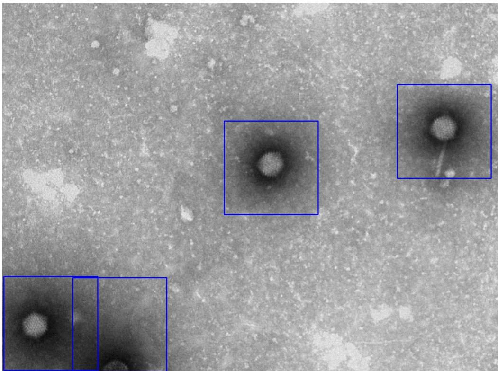
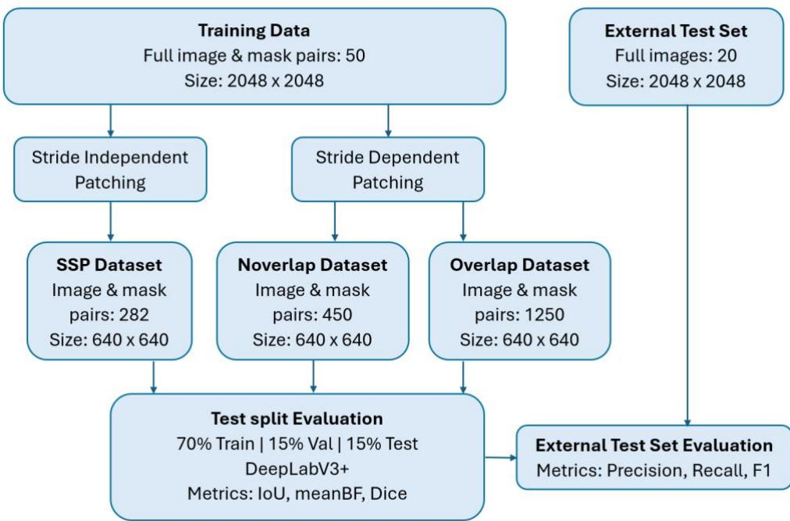
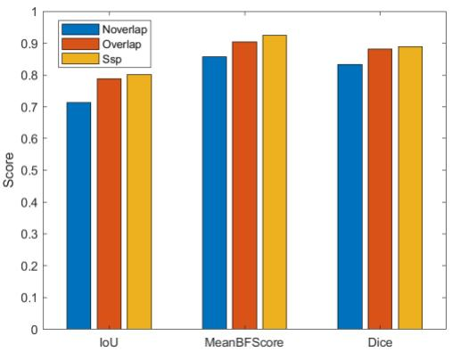
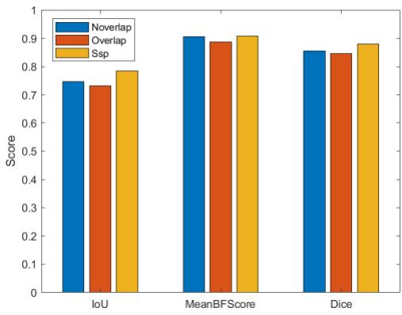
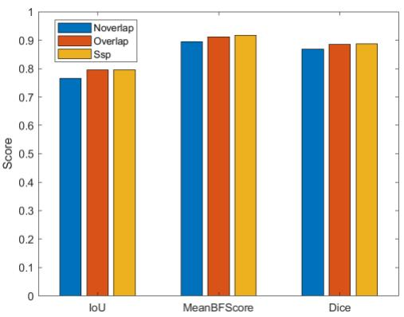
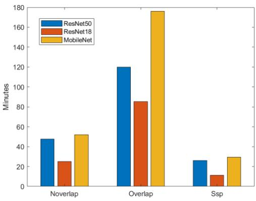

# Stride Independent Patching for Deep Learning

Olivier Rukundo

Department of Electronic and Computer Engineering; University of Limerick; e-mail: olivier.rukundo@ul.ie

Abstract: This paper presents semi-automatic stride-independent patching (SSP) as an alternative to automatic stride-dependent patching techniques. SSP uses user or expert input to position predefined patches over one or more objects of interest. To evaluate its effectiveness, three patch-based datasets were created using SSP, overlapping patching (Overlap), and non-overlapping patching (Noverlap). DeepLabV3+ models with ResNet50, ResNet18, and MobileNetV2 backbones were trained separately on each dataset. Quantitative evaluations were performed on the respective test splits and a common external test set. SSP generally achieved higher segmentation scores on the test splits and required the shortest model training time across all three backbones. On the external test set, SSP achieved the highest average precision and F1-score across backbones, whereas Noverlap achieved the highest average recall. These preliminary results demonstrate that the potentially greater spatial coverage of Noverlap and Overlap does not generally translate into better segmentation performance and that SSP offers a favorable balance between segmentation performance and model training time.

Keywords: image patching; patch-of-interest; stride-independent patching; stride-dependent patching; stride; deep learning

## 1. Introduction

Image patching techniques provide an alternative approach that makes training deep learning models on large or high-resolution images feasible under tight hardware constraints [1], [2], [26-29]. As of today, there are two traditional image patching techniques that are still popular or widely used to create image patches for deep learning model training purposes, namely: non-overlapping and overlapping techniques. However, all these techniques remain stride-dependent and often produce redundant or irrelevant patches, which may lead to inefficient training and suboptimal accuracy. A stride is the step size by which the small image patch, of a specific or pre-defined size, moves across a large image [5], [6], [30], [31]. In this context, a stride decides the location of image patches to extract but does not automatically identify the patch-of-interest - unless guided by additional modern mechanisms [4]. Modern mechanisms can help identify patches of interest (POIs), but at an additional computational cost and with a risk of failing to fully include objects of interest within those patches. To the best of the author’s knowledge: when stride < patch size, overlapping patches are created resulting in excessive number of patches that may introduce redundancy and increasing computational cost. When, stride = patch size: Non-overlapping patches are created and the resulting patching may possibly cut through objects arbitrarily, often ignoring object of interest boundaries, which can lead to fragmented and incomplete segmentation [3]. When stride > patch size: Gaps between patches are created and, in this context, this stride setting cannot be an option.

In efforts to preserve objects of interest or their groups’ boundaries, avoid redundant patches, remove or mitigate the risk of losing objects and finally better leverage limited memory hardware without sacrificing the accuracy and efficiency, an interactive tool is introduced for semi-automatic stride-independent patching (SSP). In brief, the tool leverages the expert user’s capability to locate and select patch-of-interest containing selected objects of interest. The SSP allows users to inspect and adjust patch placement to fully include objects of interest, reducing the risk of object omission or fragmentation during patch selection. Unlike the adaptive patching in [4], the introduced SSP tool does not rely on down-scaling operation at any stage, instead it directly leverages the expert user’s capability to fit the patch-of-interest around objects of interest that completely fit inside the pre-defined image patch size, as shown in Figure 1’s example. Here, the presented transmission electron microscopy (TEM) image was taken from adenovirus class images from TEM virus dataset contains 22 virus classes [32], [33].

## 2. Materials and Methods

## 2.1. SSP tool description

The SSP tool was developed in Python/PyTorch using Anaconda’s Spyder environment. The developed tool allows the user to semi-automatically create the patchof-interest pairs. The tool also allows to focus on objects of interest. The tool main parts are user selection and extraction of the patch-of-interest (POI).

## 2.1.1. Selection of the POI

The ManualRoiPatchingFunction.py script enables users to manually define and mark POIs in each input image. Users can mark POIs by left-clicking and make corrections by right-clicking. Each POI is constrained to a predefined fixed size (e.g., 640 x 640). The script generates two outputs:

(a) A marked image displaying the selected POIs as fixed-size squares.

(b) A corresponding text file containing the coordinates of the POI centers. For semantic segmentation tasks such coordinates enables the creation of the mask of the same fixed-size square.

  
Figure 1: The SSP user interface and highlighted POIs before extraction.

## 2.1.2. Extraction of the POI

The patchExportFunction.py script automates the extraction of image patches based on the predefined POI centers from ManualRoiPatchingFunction.py. The script reads the stored POI coordinates, extracts fixed-size patches centered at these locations and saves the patches to a designated output folder for further processing.

## 2.2. Modified DeepLabV3+

The DeepLabV3+ network was implemented in MATLAB, version R2024b [9]. The original DeepLabV3+ network main block diagram was provided in [8]. Since all patchbased datasets consisted of grayscale images, the original DeepLabV3+ layer was modified to accept grayscale image inputs. Each DeepLabV3+ model was configured with Res-Net50, ResNet18, or MobileNetV2 as its backbone and trained separately on each of three patch-based datasets (SSP, Overlap, and Noverlap). All DeepLabV3+ versions were trained in a single-GPU environment with the Nvidia GeForce RTX 3070 graphic card and 11th Gen Intel(R) Core (TM) i7-11700 F@ 2.50 GHz, 2496 MHz, 8 Core(s), 16 Logical Processor(s).

## 2.3. Training data

Training data used in our experiments are the same as data used in our previous work presented in [7]. The image data were generated by the MiniTEM microscope by Vironova AB, Stockholm, Sweden, with an operating voltage of 25 kV and with a field of view of 3 µm for the adenovirus samples [7]. The initial data in our possession consisted of 50 MiniTEM images of size of 2048-by-2048, in a .tif format with 16 bits’ depth. Annotating these images and extracting corresponding masks was done using a semi-automatic annotation software tool developed, by our previous team, at the University of Eastern Finland [7].

Figure 2 summarizes how patch-based datasets are created and evaluated on both test split and external test set. As can be seen, the SSP dataset (no stride or stride independent) consisted of 282 image patches and their corresponding masks. Noverlap dataset (stride = patch size) consisted of 450 image patches and their corresponding masks while Overlap dataset (stride = 0.5 × patch size – i.e., half patch size for simplification purposes) consisted of 1250 image patches and their corresponding masks. All patches had the same size of 640 x 640 pixels.

  
Figure 2: Overview of patch-based dataset construction and evaluation of its effects

Table 1 summarizes the number of patches and the unique image area covered or omitted by each patching strategy. Each patch measures 640 × 640 pixels. Noverlap and

Overlap values assume extraction from the top-left corner without padding or border adjustment. SSP coverage varies with user-selected patch locations.

Table 1: Patch counts and spatial coverage per 2048 × 2048 source image for the three patching strategies
<table><tr><td rowspan=1 colspan=1>Technique</td><td rowspan=1 colspan=1>Stride</td><td rowspan=1 colspan=1>Patches per image</td><td rowspan=1 colspan=1>UniqueArea covered</td><td rowspan=1 colspan=1>Area omitted</td></tr><tr><td rowspan=1 colspan=1>SSP</td><td rowspan=1 colspan=1>NotApplicable</td><td rowspan=1 colspan=1>Variable</td><td rowspan=1 colspan=1>Variable</td><td rowspan=1 colspan=1>Variable</td></tr><tr><td rowspan=1 colspan=1>Noverlap</td><td rowspan=1 colspan=1>640 pixels</td><td rowspan=1 colspan=1>9</td><td rowspan=1 colspan=1>1920 × 1920 pixels</td><td rowspan=1 colspan=1>507,904 pixels(12.11%)</td></tr><tr><td rowspan=1 colspan=1>Overlap</td><td rowspan=1 colspan=1>320 pixels</td><td rowspan=1 colspan=1>25</td><td rowspan=1 colspan=1>1920 × 1920 pixels</td><td rowspan=1 colspan=1>507,904 pixels(12.11%)</td></tr></table>

After patching, in each dataset case, the training set split was 70% of the training dataset), the validation set split was 15% of the training dataset), and the test set split was 15% of the training dataset. It is important to note that adenovirus image shown in Figure 1 is from TEM virus dataset containing 22 virus classes [32], [33]. These images were not used in the experimental results presented in this work.

## 2.4. External test set

A dataset containing 20 full images each measuring 2048 × 2048 pixels was used as an external test set to evaluate the performance of trained models [7]. The trained models were applied directly to these full-resolution images. DeepLabV3+ models with ResNet50, ResNet18, and MobileNetV2 backbones were assessed for their ability to segment intact adenoviruses on that test set. Visual assessment of correctly identified intact adenoviruses were counted as true positives (TP), unmatched predicted objects as false positives (FP), and missed intact adenoviruses as false negatives (FN). Precision (Eq. 1), recall (Eq. 2), and the F1-score (Eq. 3) [13] were calculated from these counts.

$$
\begin{array} { r } { p r e c i s i o n = \frac { T P } { T P + F P } } \end{array}\tag{1}
$$

$$
\begin{array} { r } { r e c a l l = \frac { T P } { T P + F N } } \end{array}\tag{2}
$$

$$
\begin{array} { r } { f _ { v a l u e } = \frac { 2 * r e c a l l * p r e c i s i o n } { r e c a l l + p r e c i s i o n } } \end{array}\tag{3}
$$

## 2.5. Hyperparameter settings

Here, the author referred to the previous studies [10 - 12] to manually adjust training hyperparameter values, with no new adjustments if 90% of training accuracy was reached during the first 10% of all epochs. Except for the grayscale-input modifications described in Section 2.2, architecture settings were retained as generated for the selected DeepLabV3+ backbone. The number of epochs = 30; the mini-batch size = 2; the initial learning rate = 0.0001; L2 regularization = 0.00005; optimizer = Adam (adaptive moment estimation algorithm).

## 2.6. Augmentation operations

Data augmentation was applied to increase training-data variability and reduce overfitting. The operations included random rotation between −45° and 45°, uniform scaling by a factor between 0.8 and 1.2, horizontal and vertical translation between −10 and 10 pixels, and horizontal and vertical shearing between −15° and 15° [11–13]. These geometric transformations were applied to each image and its corresponding mask. Brightness adjustment was applied only to the image by multiplying its intensities by a randomly selected factor from {0.90, 0.95, 1.00, 1.05, 1.10} [11–13]. Geometric transformations generally require interpolation to estimate pixel values at transformed coordinates, with the choice of interpolation method influencing image intensities and mask label assignments [11], [33–38]. Previous studies investigated grayscale image interpolation methods relevant to geometric transformations [14]. Other studies examined the influence of rounding functions on interpolation accuracy, demonstrating that performance can be significantly affected by the rounding strategy [15–17], which can also affect the quality of transformed image. A conceptual framework also classified interpolation algorithms into extra-pixel and non-extra-pixel methods [18]. Further research explored adaptive optimization, weighting schemes, and extrapolation techniques to improve interpolation algorithms [19–24]. Optimized efforts for interpolation algorithms were also extended to practical cardiac imaging software [17], [25]. Together, these studies highlight the importance of interpolation in image processing and its relevance to data augmentation for deep learning. Although previous studies reported benefits of extra-pixel interpolation over nearestneighbour interpolation [11], [13], this demonstration used nearest-neighbour interpolation for both images and masks during geometric augmentation to limit computational overhead during training on a single GPU.

## 3. Results

Experimental results are presented in two subsections covering quantitative evaluations on the test split and the external test set.

## 3.1. Quantitative evaluation on the test split

  
Figure 3. DeepLabV3+ with ResNet50

  
Figure 4. DeepLabV3+ with ResNet18

  
Figure 5. DeepLabV3+ with MobileNetV2

  
Figure 6. DeepLabV3+ training time

## 3.2. Quantitative evaluation on the external test set

Table 2. Quantitative evaluation of DeepLabV3+ models with ResNet50, ResNet18, and MobileNetV2 backbones on the external test set. Counts shown as n / 20 denote the total number of predicted objects across the 20 external test images. Visual assessment of the images and predictions identified true positives, false positives, and missed intact adenoviruses (false negatives).
<table><tr><td rowspan=1 colspan=1></td><td rowspan=1 colspan=1>TP</td><td rowspan=1 colspan=1>FP</td><td rowspan=1 colspan=1>FN</td><td rowspan=1 colspan=1>Precision</td><td rowspan=1 colspan=1>Recall</td><td rowspan=1 colspan=1>F-value</td><td rowspan=1 colspan=1>Av. Prec.</td><td rowspan=1 colspan=1>Av. Rec</td><td rowspan=1 colspan=1>Av. F-v</td></tr><tr><td rowspan=1 colspan=1>Noverlap_R50: 179 / 20</td><td rowspan=1 colspan=1>153</td><td rowspan=1 colspan=1>26</td><td rowspan=1 colspan=1>0</td><td rowspan=1 colspan=1>0.8547</td><td rowspan=1 colspan=1>1.0000</td><td rowspan=1 colspan=1>0.9217</td><td rowspan=3 colspan=1>0.9470</td><td rowspan=3 colspan=1>0.9932</td><td rowspan=3 colspan=1>0.9682</td></tr><tr><td rowspan=1 colspan=1>Noverlap_R18: 146 / 20</td><td rowspan=1 colspan=1>144</td><td rowspan=1 colspan=1>2</td><td rowspan=1 colspan=1>2</td><td rowspan=1 colspan=1>0.9863</td><td rowspan=1 colspan=1>0.9863</td><td rowspan=1 colspan=1>0.9863</td></tr><tr><td rowspan=1 colspan=1>Noverlap_MOB:145/20</td><td rowspan=1 colspan=1>145</td><td rowspan=1 colspan=1>0</td><td rowspan=1 colspan=1>1</td><td rowspan=1 colspan=1>1.0000</td><td rowspan=1 colspan=1>0.9932</td><td rowspan=1 colspan=1>0.9966</td></tr><tr><td rowspan=1 colspan=1>Overlap_R50: 143 / 20</td><td rowspan=1 colspan=1>141</td><td rowspan=1 colspan=1>2</td><td rowspan=1 colspan=1>3</td><td rowspan=1 colspan=1>0.9860</td><td rowspan=1 colspan=1>0.9792</td><td rowspan=1 colspan=1>0.9826</td><td rowspan=3 colspan=1>0.9597</td><td rowspan=3 colspan=1>0.9838</td><td rowspan=3 colspan=1>0.9711</td></tr><tr><td rowspan=1 colspan=1>Overlap_R18: 141 / 20</td><td rowspan=1 colspan=1>139</td><td rowspan=1 colspan=1>2</td><td rowspan=1 colspan=1>3</td><td rowspan=1 colspan=1>0.9858</td><td rowspan=1 colspan=1>0.9789</td><td rowspan=1 colspan=1>0.9823</td></tr><tr><td rowspan=1 colspan=1>Overlap_MOB: 162 / 20</td><td rowspan=1 colspan=1>147</td><td rowspan=1 colspan=1>15</td><td rowspan=1 colspan=1>1</td><td rowspan=1 colspan=1>0.9074</td><td rowspan=1 colspan=1>0.9932</td><td rowspan=1 colspan=1>0.9484</td></tr><tr><td rowspan=1 colspan=1>Ssp_R50: 156 / 20</td><td rowspan=1 colspan=1>151</td><td rowspan=1 colspan=1>5</td><td rowspan=1 colspan=1>0</td><td rowspan=1 colspan=1>0.9679</td><td rowspan=1 colspan=1>1.0000</td><td rowspan=1 colspan=1>0.9837</td><td rowspan=3 colspan=1>0.9731</td><td rowspan=3 colspan=1>0.9860</td><td rowspan=3 colspan=1>0.9795</td></tr><tr><td rowspan=1 colspan=1>Ssp_R18: 145 / 20</td><td rowspan=1 colspan=1>142</td><td rowspan=1 colspan=1>3</td><td rowspan=1 colspan=1>2</td><td rowspan=1 colspan=1>0.9793</td><td rowspan=1 colspan=1>0.9861</td><td rowspan=1 colspan=1>0.9827</td></tr><tr><td rowspan=1 colspan=1>Ssp_MOB: 143 / 20</td><td rowspan=1 colspan=1>139</td><td rowspan=1 colspan=1>4</td><td rowspan=1 colspan=1>4</td><td rowspan=1 colspan=1>0.9720</td><td rowspan=1 colspan=1>0.9720</td><td rowspan=1 colspan=1>0.9720</td></tr></table>

## 4. Discussion

Figures 3–5 show that SSP generally achieved the highest segmentation scores across the three backbones, although its IoU and Dice scores were similar to those of Overlap for MobileNetV2. Figure 6 shows that SSP required the shortest training time for every backbone. Together, these results suggest that SSP offers a favorable balance between segmentation performance and training time under the evaluated conditions. Its shorter training time should also be considered alongside its smaller training dataset: 282 patches, compared with 450 for Noverlap and 1250 for Overlap.

Table 1 further illustrates the spatial coverage of the patching strategies. Noverlap and Overlap generated 9 and 25 patches per source image, respectively, but both covered the same 1920 × 1920 region, leaving 12.11% of each image outside the extracted patches. Thus, overlapping patches increased the number of training samples without extending coverage to the remaining borders. SSP instead allowed users to select patches around objects of interest, with variable spatial coverage. Considered alongside the segmentation results, these differences support the value of object-focused patch selection rather than simply generating more patches.

Table 2 shows that SSP achieved the highest average precision (0.9731) and F1-score (0.9795) across the three backbones, suggesting a favorable balance between correctly detecting intact adenoviruses and limiting false positives. Noverlap achieved the highest average recall (0.9932), but its lower precision (0.9470) indicates a greater tendency to include false positives. Overlap achieved higher average precision and F1-score than Noverlap, although its average recall was lower. Overall, these averages support SSP as the strongest patching strategy in terms of precision and F1-score under the evaluated conditions, while Noverlap favored recall.

## 5. Conclusions

Selecting patches around objects of interest can provide a favorable balance between segmentation performance and model training time. SSP generally achieved higher segmentation scores on the test splits and the shortest training time across all three backbones. Its highest average precision and F1-score on the external test set further support its potential, although Noverlap retained an advantage in average recall. Although Noverlap and Overlap omitted only 12.11% of each source image, potentially less than SSP, their greater spatial coverage did not generally translate into better segmentation performance. These results establish stride-independent patching as a promising alternative to stridedependent patching for the evaluated task. Its practical value must nevertheless be weighed against the user effort required for patch selection. Future work should assess that effort and performance across broader datasets.

Supplementary Materials: The SSP tool source code is available at https://github.com/orukundo.

Author Contributions: Conceptualization, O.R.; methodology, O.R.; software, O.R.; validation, O.R.; formal analysis, O.R.; investigation, O.R.; resources, O.R.; data curation, O.R.; writing—original draft preparation, O.R.; writing—review and editing, O.R.; visualization, O.R.; supervision, O.R.; project administration, O.R. The author has read and agreed to the published version of the manuscript.

Funding: This research received no external funding.

Data Availability Statement: The data supporting this study are not publicly available but may be provided upon request, subject to approval by the University of Eastern Finland and FinVector.

Acknowledgments: The author thanks researchers at the University of Eastern Finland and FinVector for providing the training data used in the experiments, and the University of Limerick for providing additional resources.

Conflicts of Interest: The author declares no conflicts of interest.

## References

1. C. Yang, X. Lu, Z. Lin, E. Shechtman, O. Wang and H. Li, "High-Resolution Image Inpainting Using Multi-scale Neural Patch Synthesis," 2017 IEEE Conference on Computer Vision and Pattern Recognition (CVPR), Honolulu, HI, USA, 2017, pp. 4076- 4084, doi: 10.1109/CVPR.2017.434

2. Benjamin Bergner, Christoph Lippert, Aravindh Mahendran, Iterative Patch Selection for High-Resolution Image Recognition, arXiv:2210.13007 [cs.CV]

3. Pielawski N, Wählby C (2020) Introducing Hann windows for reducing edge-effects in patch-based image segmentation. PLoS ONE 15(3): e0229839

4. E. Zhang et al., Adaptive Patching for High-resolution Image Segmentation with Transformers, International Conference for High Performance Computing, Networking, Storage and Analysis, Atlanta, GA, USA, 2024, pp. 1-16

5. Kesidis, A.L.; Krassanakis, V.; Misthos, L.-M.; Merlemis, N. patchIT: A Multipurpose Patch Creation Tool for Image Processing Applications. Multimodal Technol. Interact. 2022, 6, 111

6. DeepAI, “Stride,” DeepAI, Accessed: Mar. 20, 2025. [Online]. Available: https://deepai.org/machine-learning-glossary-andterms/stride

7. Rukundo, O., Behanova, A., De Feo, R. et al. Convolutional Neural Networks for Automatic Detection of Intact Adenovirus from TEM Imaging with Debris, Broken and Artefacts Particles. ArXiv, 2023: arXiv preprint arXiv: 2310.19630, pp. 1–13.

8. Chen, L., Y. Zhu, G. Papandreou, F. Schroff, and H. Adam. "Encoder-Decoder with Atrous Separable Convolution for Semantic Image Segmentation." Computer Vision — ECCV 2018, 833-851. Munic, Germany: ECCV, 2018.

9. MathWorks. 2024. “DeepLab v3+ Layers.” MATLAB Documentation. https://uk.mathworks.com/help/releases/R2024b/vision/ref/deeplabv3pluslayers.html

10. Rukundo, O. Effects of Image Size on Deep Learning. Electronics 2023, 12, 985

11. Rukundo, O. Evaluation of extra pixel interpolation with mask processing for medical image segmentation with deep learning. SIViP 18, 7703–7710 (2024)

12. Rukundo, O. Effect of the regularization hyperparameter on deep learning-based segmentation in LGE-MRI. In Proceedings of the SPIE/COS Photonics Asia, Nantong, China, 10–20 October 2021; Volume 11897

13. Rukundo, O., Beyond Nearest Neighbor Interpolation in Data Augmentation, SIViP 20, 525 (2026)

14. Rukundo, O. Optimal Methods Research on Grayscale Image Interpolation; China National Knowledge Infrastructure CNKI, TP391.41: Beijing, China, 2012

15. Rukundo, O. Effects of improved-floor function on the accuracy of bilinear interpolation algorithm. Comput. Inf. Sci. 2015, 8, 1–25

16. Rukundo, O. Evaluation of Rounding Functions in Nearest Neighbour Interpolation. Int. J. Comput. Methods 2021, 18, 2150024

17. Rukundo, O.; Schmidt, S. Stochastic Rounding for Image Interpolation and Scan Conversion. Int. J. Adv. Comput. Sci. Appl. 2022, 13, 13–22

18. Rukundo, O. Non-extra pixel interpolation. Int. J. Image Graph. 2020, 20, 2050031

19. Rukundo, O.; Huang, M.; Cao, H. Optimization of Bilinear Interpolation Based on Ant Colony Algorithm. In Proceedings of the 2nd International Conference Electrical and Electronics Engineering, Macao, China, 1–2 December 2011; pp. 571–580

20. Rukundo, O.; Wu, K.; Cao, H. Image Interpolation Based on The Pixel Value Corresponding to The Smallest Absolute Difference. In Proceedings of the 4th International Workshop on Advanced Computational Intelligence, Wuhan, China, 19–21 October 2011; pp. 434–437

21. Rukundo, O.; Maharaj, B. Optimization of Image Interpolation based on Nearest Neighbour Algorithm. In Proceedings of the 9th International Conference on Computer Vision Theory and Applications (VISAPP 2014), Lisbon, Portugal, 5–8 January 2014; pp. 641–647

22. Rukundo, O. Normalized weighting schemes for image interpolation algorithms. Appl. Sci. 2023, 13, 1741

23. Rukundo, O.; Cao, H. Advances on image interpolation based on ant colony algorithm. SpringerPlus 2016, 5, 403

24. Rukundo, O.; Schmidt, S. Extrapolation for image interpolation. In Proceedings of the SPIE/COS Photonics Asia, Beijing, China, 11–13 October 2018; Volume 10817

25. Rukundo, O.; Schmidt, S.E.; Von Ramm, O.T. Software implementation of optimized bicubic interpolated scan conversion in echocardiography. arXiv 2020, arXiv:2005.11269

26. D. K. Gupta, G. Mago, A. Chavan, and D. K. Prasad, “Patch Gradient Descent: Training Neural Networks on Very Large Images,” arXiv preprint arXiv:2301.13817, 2023

27. M. van Rijthoven, M. Balkenhol, K. Siliņa, J. van der Laak, and F. Ciompi, “HookNet: Multi-resolution convolutional neural networks for semantic segmentation in histopathology whole-slide images,” Medical Image Analysis, vol. 68, Art. no. 101890, 2021

28. R. J. Chen, C. Chen, Y. Li, T. Y. Chen, A. D. Trister, R. G. Krishnan, and F. Mahmood, “Scaling Vision Transformers to Gigapixel Images via Hierarchical Self-Supervised Learning,” in Proceedings of the IEEE/CVF Conference on Computer Vision and Pattern Recognition (CVPR), 2022, pp. 16144–16155

29. H. Pinckaers, B. van Ginneken, and G. Litjens, “Streaming Convolutional Neural Networks for End-to-End Learning With Multi-Megapixel Images,” IEEE Transactions on Pattern Analysis and Machine Intelligence, vol. 44, no. 3, pp. 1581–1590, 2022

30. N. Gourmelon, T. Seehaus, M. Braun, A. Maier, and V. Christlein, “Calving fronts and where to find them: a benchmark dataset and methodology for automatic glacier calving front extraction from synthetic aperture radar imagery,” Earth System Science Data, vol. 14, pp. 4287–4313, 2022

31. S. M. Azimi, D. Britz, M. Engstler, M. Fritz, and F. Mücklich, “Advanced Steel Microstructural Classification by Deep Learning Methods,” Scientific Reports, vol. 8, Art. no. 2128, 2018

32. Damian J. Matuszewski, Ida-Maria Sintorn, TEM virus images: Benchmark dataset and deep learning classification, Computer Methods and Programs in Biomedicine, Volume 209, 2021, 106318, ISSN 0169-2607

33. Rukundo, O., “Toward Optimal Adenovirus Detection Using YOLO26,” arXiv preprint arXiv:2607.17799, 2026

34. P. Thévenaz, T. Blu, and M. Unser, “Interpolation revisited,” IEEE Transactions on Medical Imaging, vol. 19, no. 7, pp. 739–758, 2000

35. B. Zitová and J. Flusser, “Image registration methods: a survey,” Image and Vision Computing, vol. 21, no. 11, pp. 977–1000, 2003

36. W. Kim, Y. Kang, S. Lee, H.-J. Lee, and Y. Nam, “Label-Preserving Data Augmentation for Robust Segmentation of Thin Structure in MRI,” Investigative Magnetic Resonance Imaging, vol. 28, no. 3, pp. 107–113, 2024

37. B. Murray et al., “Lazy Resampling: Fast and information preserving preprocessing for deep learning,” Computer Methods and Programs in Biomedicine, vol. 257, Art. no. 108422, 2024

38. L. Henschel, D. Kügler, and M. Reuter, “FastSurferVINN: Building resolution-independence into deep learning segmentation methods—A solution for HighRes brain MRI,” NeuroImage, vol. 251, Art. no. 118933, 2022