# Syn-Omni: Structured Specialization and Progressive Collaboration for Omnimodal Embeddings

Youngtaek Oh1,2\* Qiyu Wu2† Hiromi Wakaki2 Junmo Kim1 Yuki Mitsufuji2

1KAIST 2Sony Group Corporation

1{youngtaek.oh, junmo.kim}@kaist.ac.kr

2{qiyu.wu, hiromi.wakaki, yuhki.mitsufuji}@sony.com https://github.com/sony/syn-omni

## Abstract

Omnimodal embeddings naturally involve both shared representations and modality-specific features across heterogeneous inputs. However, existing omnimodal embedding methods often rely on a single shared parameter space over mixed-modality data, limiting structural separation between universal and modality-specific representations. To address this, we propose Syn-Omni, a unified framework for structured omnimodal adaptation with modality specialization and controlled cross-modal collaboration. Specifically, we introduce Orthogonal Modality-Expert LoRA (OME-LoRA), which decomposes adaptation into a shared LoRA path for universal semantics and modality expert LoRA paths for modality-aware specialization. Furthermore, Progressive Synergy Routing (PSR) enables experts to first establish modality-specific priors, then gradually interact with other modality-experts for crossmodal synergy. Evaluated across 81 diverse tasks spanning image, video, audio, and audiovisual modalities, Syn-Omni consistently outperforms omnimodal baselines, demonstrating the effectiveness of structured specialization and cross-modal progressive collaboration.

## 1 Introduction

Omnimodal Large Language Models (Omni-MLLMs) have opened a new frontier toward unified understanding across modalities, including text, images, video, audio, and their composed inputs (Xu et al., 2025a). With these versatile foundations, recent studies (Xiao et al., 2025; Chen et al., 2026) have successfully repurposed Omni-MLLMs into discriminative embedding models through contrastive fine-tuning (Jiang et al., 2025; Meng et al., 2026) with LoRA (Hu et al., 2022), offering an efficient and scalable framework for unified embedding spaces across heterogeneous modalities.

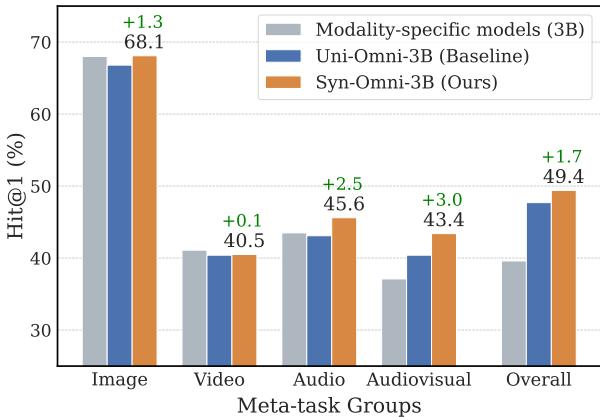  
Figure 1: Omnimodal adaptation strategies. We compare three contrastive embedding setups: (1) modalityspecific models, each trained independently on a single modality using a shared LoRA, (2) Uni-Omni (baseline), trained on mixed-modality data using a single shared LoRA, and (3) Syn-Omni (Ours), which combines a shared adaptation path with modality-specialized expert paths. Here, the overall score of the modalityspecific setup averages each model across all four modalities, including those it was not trained on. While mixed-modality training enables strong unified representations, Syn-Omni further improves the Uni-Omni baseline across diverse modality scenarios.

Despite their strong performance, existing omnimodal embedding methods largely rely on fully shared parameter adaptation over mixed-modality data. While such shared adaptation is effective in learning a unified representation space, it provides limited structural separation between modalityshared and modality-specific representations. Since different modalities exhibit both common semantic structures and distinct modality characteristics, a shared adaptation space may underutilize modalityaware specialization over the course of training.

As shown in Fig. 1, different omnimodal adaptation strategies exhibit complementary strengths. Modality-specific models effectively preserve modality-aware characteristics, but their isolated training restricts cross-modal interaction and limits generalization. In contrast, Uni-Omni, a baseline trained on mixed-modality data with a single shared LoRA, learns a unified embedding space that performs well on composed multimodal settings such as audiovisual tasks. However, such fully shared adaptation provides limited structural separation to model modality-specific characteristics, whereas completely isolated experts fail to leverage cross-modal synergy. These observations highlight the need for a structured omnimodal adaptation strategy that can jointly support a unified semantic foundation and modality-aware specialization while encouraging collaborative interactions within an omnimodal embedding space.

To this end, we propose Syn-Omni, a framework that structurally separates shared and modalityspecialized expert paths while progressively enabling cross-modal collaboration. Our framework consists of two key components: Orthogonal Modality-Expert LoRA (OME-LoRA) and Progressive Synergy Routing (PSR). OME-LoRA separates adaptation into shared and modality-specific LoRA paths to capture both universal semantics and distinct characteristics. Complementing this, PSR gradually enables these isolated modality-experts to interact and establish cross-modal synergy during training. As shown in Fig. 1, Syn-Omni consistently improves upon the unified baseline, showing improved gains on composed multimodal tasks such as audiovisual understanding.

We extensively evaluate Syn-Omni across 81 diverse embedding tasks spanning image, video, audio, and audiovisual modalities, covering a broad range of task types including classification, retrieval, and QA. We show that Syn-Omni outperforms existing omnimodal embedding baselines while achieving more balanced performance across these diverse modality settings. These results demonstrate the effectiveness of structured specialization and progressive cross-modal collaboration for unified omnimodal representation learning.

We summarize our contributions as follows:

• We address the structural limitations of existing fully shared or entirely isolated omnimodal adaptation methods by presenting a unified framework that simultaneously balances robust semantic foundations and modality-aware specialization.

• We propose Syn-Omni, which pairs structured shared-expert adaptation in OME-LoRA with progressive cross-modal collaboration in PSR, where experts first establish modality priors and then gradually interact with other modalities.

• Syn-Omni is evaluated across 81 tasks in image, video, audio, and audiovisual modalities, with various task types. Results show that Syn-Omni improves baselines across diverse modalities.

## 2 Related Work

Omnimodal Embeddings. Multimodal Large Language Models (MLLMs) have been repurposed into embedding models through contrastive fine-tuning. Early frameworks on vision-language models like E5-V (Jiang et al., 2024) and VLM2Vec (Jiang et al., 2025) pioneered this transition by applying LoRA (Hu et al., 2022) to text-image retrieval. Covering broader modalities, GVE (Guo et al., 2025) and VLM2Vec-V2 (Meng et al., 2026) extended this paradigm to video, while AuroLA (Xu et al., 2026) focused on audio-text retrieval. Furthermore, Omni-Embed-Nemotron (Xu et al., 2025b) and WAVE (Tang et al., 2026) enable any-to-any retrieval across text, image, audio, and video by leveraging large omnimodal backbones (Xu et al., 2025a). To further refine cross-modal alignment, methods such as LCO-Emb (Xiao et al., 2025) and e5-omni (Chen et al., 2026) introduce explicit calibration strategies, including language-centric refinement and modality-aware temperature scaling. While most existing approaches rely on fullyshared adaptation (e.g., a single LoRA layer) across modalities, we introduce a decoupled adaptation framework in the omnimodal setting.

Structured Adaptation. Several approaches explicitly separate parameters to encourage specialization. MoELoRA (Luo et al., 2024) and MoD-ULA (Ma et al., 2024b) instantiate task-level experts within LoRA, while a separate line imposes orthogonality on the internal subspaces of each adapter (Zhang et al., 2023; Li et al., 2025). Beyond architectural separation, LIMoE (Mustafa et al., 2022) shows that emergent modality-specific experts require explicit control for stable training. DGL (Wei et al., 2025) shows that aggressive fusion can suppress modality-specific learning, while MCA (Wu et al., 2025a) reports shortcut behaviors induced by simple contrastive objectives. From an optimization perspective, Uni-X (Hao et al., 2026) reveals the limitations of shared transformers across heterogeneous modalities. We adapt these ideas to omnimodal embedding learning, separating experts along the modality axis rather than the task axis and regularizing the shared-expert relation instead of each adapter’s internal subspace.

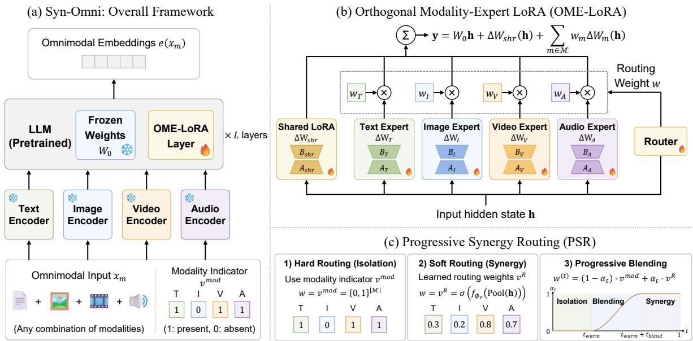  
Figure 2: Illustration of the Syn-Omni framework. (a) Overall Framework: Omnimodal inputs $x _ { m }$ are encoded by modality-specific encoders and a pretrained LLM backbone with OME-LoRA to produce unified embeddings $e ( x _ { m } )$ . (b) Orthogonal Modality-Expert LoRA (OME-LoRA): Shared LoRA path captures universal semantics, while modality-specific expert LoRAs model modality-aware characteristics. The outputs of modality-experts are combined by the routing weight w. (c) Progressive Synergy Routing (PSR): PSR gradually shifts from initial modality-separate routing to later-stage collaborative routing, enabling progressive cross-modal synergy.

## 3 Syn-Omni Framework

We propose Syn-Omni, a unified omnimodal embedding framework that moves beyond fully shared adaptation across modalities. As shown in Fig. 2, our approach consists of two main components that jointly realize modality specialization and progressive cross-modal collaboration: Orthogonal Modality-Expert LoRA (OME-LoRA) and Progressive Synergy Routing (PSR). We first introduce our omnimodal embedding formulation Uni-Omni in Sec. 3.1. We then detail the design of OME-LoRA in Sec. 3.2, the PSR mechanism in Sec. 3.3, and the training objectives in Sec. 3.4.

## 3.1 Omnimodal Embedding Learning

We consider a mixed omnimodal training setting, where we construct a heterogeneous training mixture encompassing various modality combinations. Under this setup, we train Uni-Omni, a simple contrastive baseline that adapts a pretrained Omni-MLLM using a single modality-shared LoRA.

Omnimodal Representation. We define a base modality set $\mathcal { M } = \{ T , I , V , A \}$ , representing text, image, video, and audio, respectively. An input $x _ { m }$ is any non-empty subset $m \subseteq { \mathcal { M } }$ , and we define a modality indicator $v ^ { m o d } \in \{ 0 , 1 \}$ |M| indicating the presence of each modality in $x _ { m }$ . To obtain the omnimodal embedding $\mathbf { e } ( x _ { m } )$ from a pretrained

Omni-MLLM $f _ { \theta } ,$ , the input is processed with an instruction prompt, and last-token pooling is applied from the final layer: $\mathbf { e } ( x _ { m } ) = \mathrm { P o o l } ( f _ { \theta } ( x _ { m } ) )$

Contrastive Optimization via LoRA. The pretrained weights $W _ { 0 } \in \theta$ are frozen, while low-rank adapters ϕ are trained. For an intermediate hidden state h, the adapted output is $\mathbf { y } = W _ { 0 } \mathbf { h } + \Delta W _ { \phi } ( \mathbf { h } )$ The model is optimized with an InfoNCE objective to align matched pairs in the unified embedding space. For a batch of N pairs, the loss is:

$$
\mathcal { L } _ { c o n } = - \frac { 1 } { N } \sum _ { i = 1 } ^ { N } \log \frac { \exp ( \sin ( \mathbf { e } _ { i } , \mathbf { e } _ { i } ^ { + } ) / \tau ) } { \sum _ { j = 1 } ^ { N } \exp ( \sin ( \mathbf { e } _ { i } , \mathbf { e } _ { j } ) / \tau ) } ,\tag{1}
$$

where sim(·, ·) denotes cosine similarity and τ is a temperature hyperparameter. We further detail our omnimodal training mixture in Sec. A.1.

## 3.2 Orthogonal Modality-Expert LoRA

The training of omnimodal embeddings involves heterogeneous modalities with different characteristics, yet typically relies on a single shared LoRA applied across all modalities. This motivates a more structured design to better organize shared and modality-specific adaptation. To this end, we propose Orthogonal Modality-Expert LoRA (OME-LoRA), which introduces a structured decomposition of shared and modality-expert LoRA paths.

Parallel Shared-Expert LoRA. Inspired by the decoupling of universal and domain-specific knowledge in multi-task learning literature (Ma et al., 2024b), we extend this foundation to the omnimodal setting to jointly model shared semantics and modality-specialized characteristics. Specifically, as shown in Fig. 2 (b), a shared LoRA path is consistently activated for all input modalities, while modality-expert LoRA paths are selectively engaged based on the modalities present in $x _ { m } .$ . For an intermediate hidden state h, the output of the OME-LoRA layer y is computed as follows:

$$
\mathbf { y } = W _ { 0 } \mathbf { h } + \Delta W _ { s h r } ( \mathbf { h } ) + \sum _ { m \in \mathcal { M } } w _ { m } \Delta W _ { m } ( \mathbf { h } ) ,\tag{2}
$$

where $\Delta W _ { s h r }$ captures modality-shared parameter updates and $\Delta W _ { m }$ models modality-specific counterparts. The routing weights $w _ { m }$ enable adaptive integration of modality-expert outputs. We defer the details of modality-aware specialization in modality-experts and the routing strategy for cross-modal synergy among experts to Sec. 3.3.

Decoupling via Orthogonal Penalty. We introduce an orthogonal penalty $\mathcal { L } _ { o r t h o }$ that encourages modality-specific experts to learn complementary weight directions relative to the shared pathway. Given that each LoRA update is decomposed into low-rank matrices $\Delta W = B A$ , we define the vectorized form of the input-side projection matrix as $\mathbf { a } = \mathrm { v e c } ( A )$ . The penalty is then defined as:

$$
\mathcal { L } _ { o r t h o } = \frac { 1 } { \left| \mathcal { M } \right| } \sum _ { m \in \mathcal { M } } \left( \frac { \left| \tilde { \mathbf { a } } _ { s h r } \cdot \mathbf { a } _ { m } \right| } { \left\| \tilde { \mathbf { a } } _ { s h r } \right\| \left\| \mathbf { a } _ { m } \right\| } \right) ^ { 2 } ,\tag{3}
$$

where $\mathcal { L } _ { o r t h o }$ minimizes the cosine similarity between the weight directions of the shared and expert LoRA parameters. Here, we apply the penalty only to A, which determines the input subspace of each path, leaving the output projection $B$ unconstrained. We also treat the shared component as a fixed reference by applying a stop-gradient operator, $\tilde { \mathbf { a } } _ { s h r } = \mathrm { s g } [ \mathbf { a } _ { s h r } ]$ This blocks gradient propagation so that the shared path is not affected by the penalty. In this way, the penalty helps reduce redundancy between the shared and expert paths.

## 3.3 Progressive Synergy Routing

The interaction between modality-experts is governed by the routing weights $w _ { m }$ in Eq. (2). While hard routing based on the modality indicator vmod activates only the corresponding experts, it restricts cross-modal knowledge exchange across experts.

In contrast, soft routing with a learnable router enables synergy, but it can blunt expert specialization if the experts lack sufficient modality-aware priors early on, as explored in Fig. 5 (left).

To facilitate stable collaboration among experts, we propose Progressive Synergy Routing (PSR), allowing experts to first establish modality priors via hard routing and then progressively exchange complementary information across modalities with soft routing, as illustrated in Fig. 2 (c). In addition, the Synergy Margin Loss (SML) is designed to avoid excessive suppression of absent-modality experts, preserving expert interactions necessary for cross-modal synergy.

Progressive Blending Mechanism. We first introduce a learnable router $f _ { \phi _ { \eta } }$ that generates soft routing weights $\mathbf { v } ^ { R } = \sigma ( f _ { \phi _ { r } } ( \mathrm { P o o l } ( \mathbf { h } ) ) )$ from the intermediate hidden state h, where $f _ { \phi _ { \eta } }$ is a fullyconnected layer with parameters $\phi _ { r }$ and $\sigma ( \cdot )$ denotes the sigmoid function. This soft router enables experts from non-input modalities to contribute dynamically to the final outputs. To resolve the trade-off between expert specialization and synergy, we propose to progressively blend the hard and soft routing weights over the training progress t to smoothly shift from isolation to interaction. The blended routing weight $w _ { m } ^ { ( t ) }$ is computed as:

$$
w _ { m } ^ { ( t ) } = \left( 1 - \alpha _ { t } \right) \cdot v _ { m } ^ { m o d } + \alpha _ { t } \cdot v _ { m } ^ { R } ,\tag{4}
$$

where $\alpha _ { t } \in [ 0 , 1 ]$ is scheduled along with the training progress ratio $t \left( e . g . \right.$ , current step / total steps):

$$
\alpha _ { t } = \left\{ \begin{array} { l l } { 0 , } & { 0 \leq t < t _ { \mathrm { w a r m } } } \\ { g ( t ) , } & { t _ { \mathrm { w a r m } } \leq t < t _ { \mathrm { w a r m } } + t _ { \mathrm { b l e n d } } } \\ { 1 , } & { t _ { \mathrm { w a r m } } + t _ { \mathrm { b l e n d } } \leq t \leq 1 . } \end{array} \right.\tag{5}
$$

Here, $\begin{array} { r } { g ( t ) = \frac { 1 } { 2 } [ 1 - \cos ( \pi \frac { t - t _ { \mathrm { w a r m } } } { t _ { \mathrm { b l e n d } } } ) ] } \end{array}$ denotes a cosinebased monotonic transition function from 0 to 1, where $t _ { \mathrm { w a r m } }$ controls how long the experts remain isolated and $t _ { \mathrm { b l e n d } }$ sets the length of the transition. The schedule consists of three phases: Warmup $( t < t _ { \mathrm { w a r m } } )$ for strict isolation with expert specialization, Blending $( t _ { \mathrm { w a r m } } \leq t < t _ { \mathrm { w a r m } } + t _ { \mathrm { b l e n d } } )$ for a smooth transition between hard and soft routing, and Synergy $( t \geq t _ { \mathrm { w a r m } } + t _ { \mathrm { b l e n d } } )$ for full dynamic collaboration via soft routing weights $\mathbf { v } ^ { R }$ . This schedule can be viewed as a curriculum (Bengio et al., 2009) over routing that eases optimization, where experts are first exposed to their own modality before interacting with others. To empirically capture this transition, Fig. 6 visualizes the evolution of routing weights over the course of training.

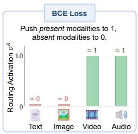

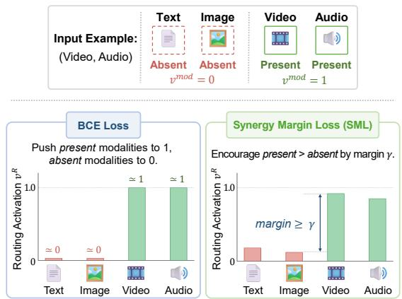

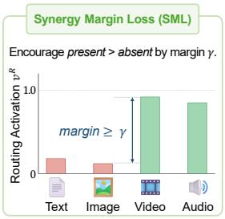  
Figure 3: Conceptual comparison between BCE Loss and Synergy Margin Loss (SML). While BCE strictly suppresses absent modalities to 0, SML maintains a relative margin $\gamma ( v _ { \mathrm { p r e s e n t } } ^ { R } - v _ { \mathrm { a b s e n t } } ^ { R } \geq \gamma )$ , which allows absent-modality experts to retain meaningful activations, preserving cross-modal synergy during training.

Synergy Margin Loss. To encourage modalityaware specialization in the router, we introduce an auxiliary supervision that guides the soft routing activations $\mathbf { v } _ { } ^ { R }$ using the modality indicators vmod. While Binary Cross-Entropy (BCE) could directly enforce modality-aligned routing, it tends to excessively suppress absent modalities, eliminating potentially useful interactions across experts. To preserve such collaborative capacity while maintaining the dominance of input-relevant modalities, we propose a Synergy Margin Loss $\mathcal { L } _ { S M L }$ . Let $\mathcal { P }$ and A denote the sets of present $( v _ { m } ^ { m o d } = 1 )$ and absent $( v _ { m } ^ { m o d } = 0 )$ modality indices in the input:

$$
\mathcal { L } _ { S M L } = \frac { 1 } { | \mathcal { P } | | \boldsymbol { A } | } \sum _ { i \in \mathcal { P } } \sum _ { j \in \mathcal { A } } \operatorname* { m a x } ( 0 , v _ { j } ^ { R } - v _ { i } ^ { R } + \gamma ) ,\tag{6}
$$

where γ is a margin hyperparameter. As shown in Fig. 3, unlike BCE, the proposed objective enforces relative preference rather than absolute suppression, allowing related experts to retain meaningful activations while preserving specialization.

## 3.4 Training Strategy

We train Syn-Omni in an end-to-end manner by integrating OME-LoRA into the backbone and optimize the model with a joint objective that combines contrastive learning and structural regularization.

Architectural Integration. Instead of standard LoRA layers, we deploy OME-LoRA throughout the backbone, where each module consists of a shared adaptation path, modality-experts, and a learnable router. Such learnable parameters are maintained independently at each layer.

Joint Optimization. The overall training objective $\mathcal { L } _ { t o t a l }$ combines the primary contrastive objective with the proposed structural regularization losses:

$$
\mathcal { L } _ { t o t a l } = \mathcal { L } _ { c o n } + \lambda _ { o r t h o } \mathcal { L } _ { o r t h o } + \lambda _ { S M L } \mathcal { L } _ { S M L } ,\tag{7}
$$

where $\lambda _ { o r t h o }$ and $\lambda _ { S M L }$ control the strengths of the orthogonal penalty and Synergy Margin Loss, respectively. Crucially, both regularization terms $\mathcal { L } _ { o r t h o }$ and $\mathcal { L } _ { S M L }$ are computed and averaged across all layers containing OME-LoRA modules.

## 4 Experiment

Training Data. We curate an omnimodal data mixture of 1.12M samples spanning image, video, audio, and audiovisual modalities. The training mixture covers diverse tasks including retrieval, classification, and QA, with various modality compositions ranging from single-modality inputs to composed multimodal scenarios. Detailed dataset types and statistics are provided in Sec. A.1.

Model Variants. We build our Syn-Omni framework on top of pretrained Qwen-2.5-Omni (Xu et al., 2025a) and train both 3B and 7B scale variants. OME-LoRA modules are inserted into the LLM layers while keeping the remaining backbone parameters frozen. We additionally establish Uni-Omni as a controlled baseline trained with the same data and optimization settings, using only a single shared LoRA and contrastive objective.

Implementation Details. Images and videos are processed using the native resolution scaling strategy of Qwen-2.5-VL (Bai et al., 2025), while videos are uniformly sampled into 8 frames and audio signals are resampled to 16 kHz. Models are trained for 1 epoch using the AdamW (Loshchilov and Hutter, 2019) optimizer with a cosine learning rate schedule, a peak learning rate of $1 0 ^ { - 4 }$ , a warmup ratio of 0.04, and a global batch size of 768. We employ GradCache (Gao et al., 2021) to maintain a large global batch efficiently. For the contrastive loss, we use a temperature τ of 0.02. Consistent with prior methods (Jiang et al., 2025), we pool on the EOS token position followed by L2 normalization to extract the final embeddings.

For OME-LoRA, we set the rank of the shared adaptation path to 8 and each modality-expert rank to 4. We use a synergy margin γ of 0.2 and apply the proposed Progressive Synergy Routing (PSR) schedule with warmup and transition ratios of $t _ { \mathrm { w a r m } } = 0 . 1$ and $t _ { \mathrm { b l e n d } } = 0 . 5$ , respectively. Additional implementation details and hyperparameter configurations are provided in Sec. B.1.

<table><tr><td colspan="3">Image (36) Video (23)</td><td colspan="3">Audio (12) Audiovisual (10)</td></tr><tr><td></td><td colspan="3">3B Models</td><td>All (81)</td><td></td></tr><tr><td>Omni-Embed-Nemotron (Xu et al., 2025b)</td><td>44.1</td><td>36.5</td><td>24.5</td><td>28.5</td><td>33.4</td></tr><tr><td>LCO-Emb (Xiao et al., 2025)</td><td>58.1</td><td>43.7</td><td>42.1</td><td>35.5</td><td>44.8</td></tr><tr><td>e5-omni (Chen et al., 2026)</td><td>64.8</td><td>40.6</td><td>37.4</td><td>31.6</td><td>43.6</td></tr><tr><td>Uni-Omni (Contrastive baseline)</td><td>66.8</td><td>40.4</td><td>43.1</td><td>40.4</td><td>47.7</td></tr><tr><td>Syn-Omni (Ours)</td><td>68.1</td><td>40.5</td><td>45.6</td><td>43.4</td><td>49.4</td></tr><tr><td colspan="6">7B Models</td></tr><tr><td>OmniEmbed-v0.1 (Ma et al., 2025a)</td><td>44.2</td><td>35.0</td><td>31.6</td><td>29.0</td><td>35.0</td></tr><tr><td>OmniEmbed-Multivent (Zhan et al., 2025)</td><td>51.8</td><td>40.2</td><td>39.5</td><td>34.4</td><td>41.5</td></tr><tr><td>LCO-Emb (Xiao et al., 2025)</td><td>61.6</td><td>45.5</td><td>45.2</td><td>35.5</td><td>46.9</td></tr><tr><td>e5-omni (Chen et al., 2026)</td><td>72.5</td><td>44.3</td><td>44.3</td><td>42.3</td><td>50.9</td></tr><tr><td>WAVE (Tang et al., 2026)</td><td>42.7</td><td>39.8</td><td>33.4</td><td>38.1</td><td>38.5</td></tr><tr><td>Uni-Omni (Contrastive baseline)</td><td>71.3</td><td>40.2</td><td>47.5</td><td>43.9</td><td></td></tr><tr><td>Syn-Omni (Ours)</td><td>71.7</td><td>41.4</td><td>48.7</td><td>44.6</td><td>50.7 51.6</td></tr></table>

Table 1: Comparison of omnimodal embedding models using Hit@1 (%). The numbers in parentheses indicate the number of evaluation tasks for each modality and the total. Here, Uni-Omni corresponds to a strong baseline trained with a standard LoRA setting. Across both 3B- and 7B-scale models, Syn-Omni achieves higher overall scores than previous methods, demonstrating well-balanced performance across diverse modalities, while also improving over our baseline. For each model scale, the best results are bolded, and the second-best are underlined

Evaluation Setup. We evaluate our framework on an extensive omnimodal benchmark consisting of 81 tasks spanning image, video, audio, and audiovisual modalities. Each modality group covers multiple embedding-oriented meta-tasks, such as retrieval, classification, and QA. For image and video evaluations, we adopt the MMEB-v1 (Jiang et al., 2025) and MMEB-v2 (Meng et al., 2026) benchmarks, respectively, while further extending with additional audio and audiovisual benchmarks collected in this work. The complete evaluation dataset details are provided in Sec. A.2.

Baselines. We compare Syn-Omni against recent Omni-MLLM-based embedding models, including OmniEmbed-v0.1 (Ma et al., 2025a), Omni-Embed-Nemotron (Xu et al., 2025b), OmniEmbed-Multivent (Zhan et al., 2025), WAVE (Tang et al., 2026), LCO-Emb (Xiao et al., 2025), and e5- omni (Chen et al., 2026). For a fair evaluation, we use officially released checkpoints and perform all evaluations under the unified protocol.

Metrics. We use Hit@1 as the evaluation metric, measuring whether the ground-truth target is ranked at the top among candidates. We report both modality-specific average performance and the overall average score from a single run. The overall score is computed by averaging modalityspecific scores, where each modality-specific score is obtained by averaging the corresponding metatask scores. Here, each meta-task score is computed as the average of its associated benchmark scores. Detailed benchmark-level performance breakdowns are provided in Sec. C.4.

## 4.1 Main Results

Overall Performance. In Tab. 1, we compare our framework against recent Omni-MLLM embedding models. While some methods excel in specific modalities, such as LCO-Emb (Xiao et al., 2025) on video tasks and e5-omni (Chen et al., 2026) on image tasks, their strong performance is less consistent across modalities. In contrast, our contrastive baseline, Uni-Omni, trained with a modality-shared LoRA, already achieves strong performance across all modalities at both the 3B and 7B scales. Building upon this baseline, Syn-Omni reaches the best overall scores of 49.4% and 51.6%, respectively. These improvements over Uni-Omni are statistically significant across the 81 tasks in a paired t-test (p = 0.0044 and p = 0.0189).

Modality-wise Analysis. Breaking down the gains by modality, Syn-Omni improves most on audio and audiovisual tasks (+2.5% and +3.0% at the 3B scale), with more moderate margins on image and video. A similar pattern appears at the 7B scale, where e5-omni leads on image and video while Syn-Omni is stronger on audio and audiovisual tasks and attains a higher overall score. This yields more even coverage across all modalities.

<table><tr><td rowspan="2">id</td><td colspan="2">OME-LoRA</td><td colspan="2">PSR</td><td colspan="5"></td></tr><tr><td>S-Exp.</td><td> $\mathcal { L } _ { o r t h o }$ </td><td>Soft</td><td>Prog.</td><td>I</td><td>V</td><td>A</td><td>AV</td><td>All</td></tr><tr><td>(a)</td><td>一</td><td></td><td></td><td></td><td>66.8</td><td>40.4</td><td>43.1</td><td>40.4</td><td>47.7</td></tr><tr><td>(b)</td><td>√</td><td>I</td><td></td><td></td><td>67.6</td><td>39.6</td><td>44.9</td><td>42.6</td><td>48.7</td></tr><tr><td>(c)</td><td>√</td><td>√</td><td>一</td><td></td><td>67.4</td><td>39.9</td><td>45.2</td><td>41.7</td><td>48.6</td></tr><tr><td>(d)</td><td>√</td><td>√</td><td>√</td><td>一</td><td>67.3</td><td>39.9</td><td>45.0</td><td>42.1</td><td>48.6</td></tr><tr><td>(e)</td><td>√</td><td>-</td><td>√</td><td>√</td><td>68.2</td><td>40.1</td><td>45.2</td><td>42.6</td><td>49.0</td></tr><tr><td>(f)</td><td>√</td><td>√</td><td>√</td><td>√</td><td>68.1</td><td>40.5</td><td>45.6</td><td>43.4</td><td>49.4</td></tr></table>

Table 2: Component analysis of Syn-Omni framework. Starting from the Uni-Omni baseline in (a), each row incorporates individual components of our design. The results show that both OME-LoRA and PSR contribute to improved and balanced performance over the baseline, with the full model achieving the best overall results.

## 4.2 Ablation Study

We conduct a series of ablation experiments to analyze the individual contribution of each proposed component in our Syn-Omni framework. All results are reported using 3B-scale models, including both modality-specific and overall averaged scores. Component Analysis. As shown in Tab. 2, compared to Uni-Omni baseline in (a), introducing a shared-expert structure (S-Exp.) with hard routing in (b) improves performance through structural decomposition. Since hard routing activates experts in isolation and leaves limited interaction for shared-expert decorrelation, the orthogonal penalty alone in (c) yields no additional gain over (b). Soft routing alone in (d) likewise maintains a comparable level, as it lets experts interact before acquiring modality priors, which blunts specialization. When applying Progressive Synergy Routing (PSR) with Synergy Margin Loss (SML) in (e), further improvements are obtained. Under this configuration, the orthogonal penalty provides a complementary gain in (f) (49.0 → 49.4), indicating that reducing redundancy becomes effective once multiple expert outputs are jointly integrated.

Beyond these overall numbers, the components introduced on top of the shared-expert structure also shape how experts behave: they yield clearer separation across pathways, progressive participation of absent-modality experts, and routing activations that avoid collapsing to hard assignments, which we further analyze in Sec. 4.3.

Structural Efficiency. We explore the impact of different architectural choices under matched parameter budgets. As shown in Tab. 3, simply increasing the rank of a single shared path from 16 to 36 brings only marginal gains, with the rank 24 counterpart in (b) even leading to a slight drop. In contrast, our OME-LoRA decomposes the same total rank (24) into shared and expert paths, which brings improvements at an identical parameter count (44.9M) in (f). Applying PSR on top of this structure in (g) further boosts performance to 49.4%. Notably, this surpasses the largest sharedonly variant in (c) while using fewer trainable parameters, confirming that the gains stem from structured decomposition rather than increased capacity. Role of Shared LoRA. We next evaluate the necessity of the shared LoRA path within the OME-LoRA architecture. As shown in Tab. 3, omitting the shared path leads to a substantial performance drop under both hard routing (f vs. d) and with PSR integrated (g vs. e) cases. More importantly, expert-only adaptation in (d) falls even below the shared-only baseline in (a) at the same parameter count (47.0 vs. 47.7 at 29.9M). This suggests that the shared path provides a unified cross-modal space on which experts build their specialization, and that establishing it matters more than allocating the same capacity to experts alone.

<table><tr><td>id</td><td>Variant</td><td>Rank</td><td>Params.</td><td>PSR</td><td>I</td><td>V</td><td>A</td><td>AV</td><td>All</td></tr><tr><td>(a)</td><td>Shr</td><td>16</td><td>29.9M</td><td>-</td><td>66.8</td><td>40.4</td><td>43.1</td><td>40.4</td><td>47.7</td></tr><tr><td>(b)</td><td>Shr</td><td>24</td><td>44.9M</td><td>=</td><td>67.3</td><td>38.7</td><td>43.0</td><td>41.6</td><td>47.6</td></tr><tr><td>(c)</td><td>Shr</td><td>36</td><td>59.9M</td><td>-</td><td>67.3</td><td>40.7</td><td>43.8</td><td>41.2</td><td>48.2</td></tr><tr><td>(d)</td><td>Exp</td><td>16</td><td>29.9M</td><td>-</td><td>66.1</td><td>39.4</td><td>42.5</td><td>40.1</td><td>47.0</td></tr><tr><td>(e)</td><td>Exp</td><td>16</td><td>33.3M</td><td>√</td><td>65.3</td><td>39.5</td><td>42.1</td><td>40.5</td><td>46.9</td></tr><tr><td>(f)</td><td>Shr+Exp</td><td>24</td><td>44.9M</td><td>-</td><td>67.6</td><td>39.6</td><td>44.9</td><td>42.6</td><td>48.7</td></tr><tr><td>(g)</td><td>Shr+Exp</td><td>24</td><td>48.3M</td><td>√</td><td>68.1</td><td>40.5</td><td>45.6</td><td>43.4</td><td>49.4</td></tr></table>

Table 3: Analysis of the adaptation structure. ‘Shr’ denotes a single shared LoRA path (Uni-Omni) with increasing rank. ‘Exp’ denotes modality-expert paths without a shared LoRA path, and ‘Shr+Exp’ denotes our OME-LoRA architecture. Neither path alone is sufficient: scaling the shared path yields limited gains, and removing it degrades performance further.

<table><tr><td></td><td colspan="3">Routing Strategy (PSR)</td><td colspan="6"></td></tr><tr><td>id</td><td>Router</td><td>Progress</td><td>loss</td><td>I</td><td>V</td><td>A</td><td>AV</td><td></td><td>All</td></tr><tr><td>(a)</td><td>Hard</td><td>=</td><td>-</td><td>67.4</td><td>39.9</td><td>45.2</td><td></td><td>41.7</td><td>48.6</td></tr><tr><td>(b)</td><td>Soft</td><td>一</td><td>BCE</td><td>67.3</td><td>39.9</td><td>45.0</td><td></td><td>42.1</td><td>48.6</td></tr><tr><td>(c)</td><td>Soft</td><td>=</td><td>SML</td><td>67.6</td><td>40.4</td><td></td><td>45.1</td><td>41.9</td><td>48.8</td></tr><tr><td>(d) (e)</td><td>Soft Soft</td><td>√ √</td><td>BCE SML</td><td>67.6 68.1</td><td>39.6 40.5</td><td>46.0 45.6</td><td></td><td>41.9 43.4</td><td>48.8 49.4</td></tr></table>

Table 4: Analysis on Progressive Synergy Routing (PSR) strategy. We evaluate the impact of routing types, progressive blending, and router loss functions in the OME-LoRA layers. We highlight that combining a progressive blending of routing weights with the Synergy Margin Loss (SML) is crucial for both expert specialization and cross-modal collaboration among experts.

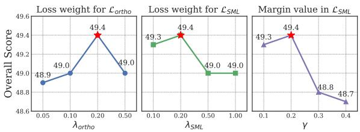  
Figure 4: Sensitivity analysis of hyperparameters on the orthogonal penalty weight $\lambda _ { o r t h o }$ , the synergy margin loss weight $\lambda _ { S M L }$ , and the margin parameter γ. Red stars indicate the optimal choice in our final model.

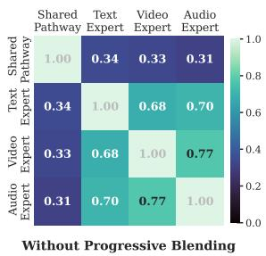

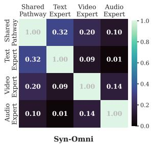  
Figure 5: Pairwise cosine similarity between OME-LoRA pathways. Without progressive blending (left), high cross-path similarities reveal redundancy across different pathways. In contrast, Syn-Omni (right), which differs only in applying progressive blending, produces significantly lower similarities. This indicates effective decoupling and clear specialization across pathways.

Role of Progressive Synergy Routing. We further investigate the impact of our routing strategies, as summarized in Tab. 4. Compared to the hard routing baseline in (a), switching to soft routing with BCE loss in (b) provides limited to no improvement. However, across both standard soft routing (b vs. c) and progressive blending configurations (d vs. e), replacing BCE with the Synergy Margin Loss (SML) consistently improves performance. Our final framework in (e), which integrates both progressive blending and SML, achieves the best overall performance of 49.4%. This demonstrates that the two components, progressive blending with synergy margin loss in PSR, complement each other to deliver the superior results.

Sensitivity Analysis. We investigate the sensitivity of three key hyperparameters in Syn-Omni: the orthogonal penalty weight $( \lambda _ { o r t h o } )$ , the synergy margin loss weight $( \lambda _ { S M L } )$ , and the margin parameter (γ). As shown in Fig. 4, the best overall score is achieved with $\lambda _ { o r t h o } = 0 . 2 0 , \lambda _ { S M L } = 0 . 2 0$ , and $\gamma = 0 . 2$ . The performance remains relatively stable around these values, while larger margin values lead to a noticeable performance drop.

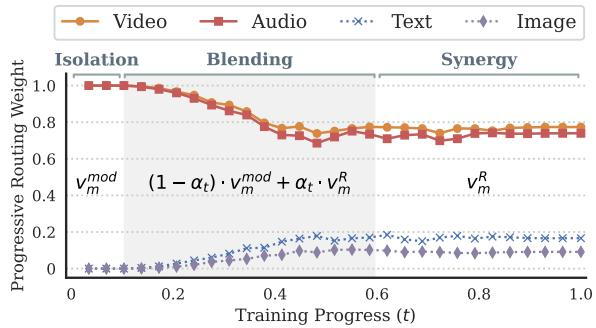  
Figure 6: Routing dynamics of PSR under video-audio inputs. Present-modality experts retain dominant routing weights, while absent-modality experts gradually acquire non-zero activations through progressive blending. This indicates the emergence of synergistic cross-modal interactions along with modality specialization.

## 4.3 Empirical Analysis

To better understand how Syn-Omni structures omnimodal representations, we analyze the behaviors of its two key components, OME-LoRA and PSR, on VALOR-32k (Liu et al., 2025) evaluation samples with text, video, and audio inputs. Results are computed from final-layer signals averaged across samples and submodules.

Decoupling in OME-LoRA. As shown in Fig. 5, we measure pairwise cosine similarity between the flattened hidden states of the shared pathway and modality-experts using text-video-audio inputs. Without applying progressive blending (left), relying solely on soft routing fails to induce clear separation, evidenced by high cross-path similarities both between the shared pathway and experts, and across experts. In contrast, Syn-Omni (right) produces substantially lower cross-path similarities, indicating clear modality specialization across paths in the OME-LoRA architecture.

Routing Dynamics in PSR. We analyze the evolution of PSR routing weights under video-audio inputs to demonstrate the emergence of cross-modal interactions during training in Fig. 6. Under progressive blending, present-modality experts (video and audio) maintain dominant routing weights. In contrast, absent-modality experts (text and image), initially suppressed to zero under hard routing scheme, gradually acquire non-zero weights by introducing soft routing scheme. This behavior demonstrates that PSR enables cross-modal collaboration while preserving modality specialization. We further observe that SML drives this synergistic behavior, whereas BCE loss completely suppresses absent-modality experts, as shown in Fig. 8.

## 5 Conclusion

We propose Syn-Omni, a structured omnimodal adaptation framework that effectively learns a unified representation space. It leverages OME-LoRA to decouple modality-shared and specialized parameters. In addition, Progressive Synergy Routing (PSR) shifts the model from isolated specialization toward dynamic cross-modal collaboration. Across 81 diverse tasks, Syn-Omni outperforms existing baselines, achieving robust and well-balanced performance across image, video, audio, and audiovisual modalities.

## Limitations

Our framework introduces additional inference overhead through dynamic routing in the OME-LoRA layer. While standard LoRA weights can be merged into the frozen backbone after training, our input-dependent routing prevents this for the modality-experts, although the shared pathway remains mergeable. Specifically, the increased overhead due to the expert pathways active at inference amounts to 17–18% higher latency with less than 1% additional GPU memory, as reported in Tab. 7. This cost is most visible in latency-sensitive settings such as real-time query encoding.

## Ethical Considerations

Our framework may inherit systemic biases from large-scale training data, leading to skewed crossmodal retrieval behaviors. Additionally, such unified omnimodal embeddings could be misused for unauthorized surveillance or identity linkage, necessitating strict deployment oversight.

## References

Andrea Agostinelli, Timo I Denk, Zalán Borsos, Jesse Engel, Mauro Verzetti, Antoine Caillon, Qingqing Huang, Aren Jansen, Adam Roberts, Marco Tagliasacchi, Matt Sharifi, Neil Zeghidour, and Christian Frank. 2023. Musiclm: Generating music from text. arXiv preprint arXiv:2301.11325.

Shuai Bai, Keqin Chen, Xuejing Liu, Jialin Wang, Wenbin Ge, Sibo Song, Kai Dang, Peng Wang, Shijie Wang, Jun Tang, Humen Zhong, Yuanzhi Zhu, Mingkun Yang, Zhaohai Li, Jianqiang Wan, Pengfei Wang, Wei Ding, Zheren Fu, Yiheng Xu, and 9 others. 2025. Qwen2.5-vl technical report. arXiv preprint arXiv:2502.13923.

Andrei Barbu, David Mayo, Julian Alverio, William Luo, Christopher Wang, Dan Gutfreund, Josh Tenen-

baum, and Boris Katz. 2019. Objectnet: A largescale bias-controlled dataset for pushing the limits of object recognition models. In Advances in Neural Information Processing Systems, volume 32, pages 9453–9463.

Yoshua Bengio, Jérôme Louradour, Ronan Collobert, and Jason Weston. 2009. Curriculum learning. In Proceedings ofthe 26th annual international conference on machine learning, pages 41–48.

Daniel Bolya, Po-Yao Huang, Peize Sun, Jang Hyun Cho, Andrea Madotto, Chen Wei, Tengyu Ma, Jiale Zhi, Jathushan Rajasegaran, Hanoona Bangalath, Junke Wang, Marco Monteiro, Hu Xu, Shiyu Dong, Nikhila Ravi, Shang-Wen Li, Piotr Dollar, and Christoph Feichtenhofer. 2025. Perception encoder: The best visual embeddings are not at the output of the network. In Advances in Neural Information Processing Systems, volume 38, pages 60884–60937.

Fabian Caba Heilbron, Victor Escorcia, Bernard Ghanem, and Juan Carlos Niebles. 2015. Activitynet: A large-scale video benchmark for human activity understanding. In Proceedings ofthe ieee conference on computer vision and pattern recognition, pages 961–970.

Joao Carreira, Eric Noland, Chloe Hillier, and Andrew Zisserman. 2019. A short note on the kinetics-700 human action dataset. arXiv preprint arXiv:1907.06987.

Yingshan Chang, Mridu Narang, Hisami Suzuki, Guihong Cao, Jianfeng Gao, and Yonatan Bisk. 2022. Webqa: Multihop and multimodal qa. In Proceedings ofthe IEEE/CVF conference on computer vision and pattern recognition, pages 16495–16504.

David Chen and William Dolan. 2011. Collecting highly parallel data for paraphrase evaluation. In Proceedings ofthe 49th Annual Meeting ofthe Associationfor Computational Linguistics: Human Language Technologies, pages 190–200, Portland, Oregon, USA. Association for Computational Linguistics.

Haonan Chen, Sicheng Gao, Radu Timofte, Tetsuya Sakai, and Zhicheng Dou. 2026. e5-omni: Explicit cross-modal alignment for omni-modal embeddings. In Findings ofthe Associationfor Computational Linguistics: ACL 2026, pages 19430–19443, San Diego, California, United States. Association for Computational Linguistics.

Sihan Chen, Handong Li, Qunbo Wang, Zijia Zhao, Mingzhen Sun, Xinxin Zhu, and Jing Liu. 2023. VAST: A vision-audio-subtitle-text omni-modality foundation model and dataset. In Thirty-seventh Conference on Neural Information Processing Systems.

Tri Dao. 2024. Flashattention-2: Faster attention with better parallelism and work partitioning. In The Twelfth International Conference on Learning Representations.

Abhishek Das, Satwik Kottur, Khushi Gupta, Avi Singh, Deshraj Yadav, José MF Moura, Devi Parikh, and Dhruv Batra. 2017. Visual dialog. In Proceedings of the IEEE conference on computer vision and pattern recognition, pages 326–335.

Jia Deng, Wei Dong, Richard Socher, Li-Jia Li, Kai Li, and Li Fei-Fei. 2009. Imagenet: A large-scale hierarchical image database. In 2009 IEEE conference on computer vision and pattern recognition, pages 248–255. Ieee.

Zihao Deng, Yinghao Ma, Yudong Liu, Rongchen Guo, Ge Zhang, Wenhu Chen, Wenhao Huang, and Emmanouil Benetos. 2024. MusiLingo: Bridging music and text with pre-trained language models for music captioning and query response. In Findings of the Associationfor Computational Linguistics: NAACL 2024, pages 3643–3655, Mexico City, Mexico. Association for Computational Linguistics.

Konstantinos Drossos, Samuel Lipping, and Tuomas Virtanen. 2020. Clotho: An audio captioning dataset. In IEEE International Conference on Acoustics, Speech and Signal Processing (ICASSP), pages 736– 740.

Jesse Engel, Cinjon Resnick, Adam Roberts, Sander Dieleman, Mohammad Norouzi, Douglas Eck, and Karen Simonyan. 2017. Neural audio synthesis of musical notes with wavenet autoencoders. In International conference on machine learning, pages 1068–1077. PMLR.

Mark Everingham, S. M. Ali Eslami, Luc Van Gool, Christopher KI Williams, John Winn, and Andrew Zisserman. 2015. The pascal visual object classes challenge: A retrospective. International journal of computer vision, 111(1):98–136.

Chaoyou Fu, Yuhan Dai, Yongdong Luo, Lei Li, Shuhuai Ren, Renrui Zhang, Zihan Wang, Chenyu Zhou, Yunhang Shen, Mengdan Zhang, Peixian Chen, Yanwei Li, Shaohui Lin, Sirui Zhao, Ke Li, Tong Xu, Xiawu Zheng, Enhong Chen, Caifeng Shan, and 2 others. 2025. Video-mme: The first-ever comprehensive evaluation benchmark of multi-modal llms in video analysis. In Proceedings ofthe IEEE/CVF Conference on Computer Vision and Pattern Recognition (CVPR), pages 24108–24118.

Stephanie Fu, Netanel Yakir Tamir, Shobhita Sundaram, Lucy Chai, Richard Zhang, Tali Dekel, and Phillip Isola. 2023. Dreamsim: Learning new dimensions of human visual similarity using synthetic data. In Thirty-seventh Conference on Neural Information Processing Systems.

Jiyang Gao, Chen Sun, Zhenheng Yang, and Ram Nevatia. 2017. Tall: Temporal activity localization via language query. In Proceedings ofthe IEEE international conference on computer vision, pages 5267– 5275.

Luyu Gao, Yunyi Zhang, Jiawei Han, and Jamie Callan. 2021. Scaling deep contrastive learning batch size

under memory limited setup. In Proceedings ofthe 6th Workshop on Representation Learning for NLP (RepL4NLP-2021), pages 316–321, Online. Association for Computational Linguistics.

Jort F Gemmeke, Daniel PW Ellis, Dylan Freedman, Aren Jansen, Wade Lawrence, R Channing Moore, Manoj Plakal, and Marvin Ritter. 2017. Audio set: An ontology and human-labeled dataset for audio events. In 2017 IEEE international conference on acoustics, speech and signal processing (ICASSP), pages 776–780. IEEE.

Raghav Goyal, Samira Ebrahimi Kahou, Vincent Michalski, Joanna Materzynska, Susanne Westphal, Heuna Kim, Valentin Haenel, Ingo Fruend, Peter Yianilos, Moritz Mueller-Freitag, Florian Hoppe, Christian Thurau, Ingo Bax, and Roland Memisevic. 2017. The "something something" video database for learning and evaluating visual common sense. In Proceedings of the IEEE International Conference on Computer Vision (ICCV).

Zhuoning Guo, Mingxin Li, Yanzhao Zhang, Dingkun Long, Pengjun Xie, and Xiaowen Chu. 2025. Towards universal video retrieval: Generalizing video embedding via synthesized multimodal pyramid curriculum. arXiv preprint arXiv:2510.27571.

Danna Gurari, Qing Li, Abigale J Stangl, Anhong Guo, Chi Lin, Kristen Grauman, Jiebo Luo, and Jeffrey P Bigham. 2018. Vizwiz grand challenge: Answering visual questions from blind people. In Proceedings of the IEEE conference on computer vision and pattern recognition, pages 3608–3617.

Mingfei Han, Linjie Yang, Xiaojun Chang, Lina Yao, and Heng Wang. 2025. Shot2story: A new benchmark for comprehensive understanding of multi-shot videos. In International Conference on Learning Representations.

Jitai Hao, Hao Liu, Xinyan Xiao, Qiang Huang, and Jun Yu. 2026. Uni-x: Mitigating modality conflict with a two-end-separated architecture for unified multimodal models. In The Fourteenth International Conference on Learning Representations.

Lisa Anne Hendricks, Oliver Wang, Eli Shechtman, Josef Sivic, Trevor Darrell, and Bryan Russell. 2017. Localizing moments in video with natural language. In Proceedings ofthe IEEE international conference on computer vision, pages 5803–5812.

Dan Hendrycks, Steven Basart, Norman Mu, Saurav Kadavath, Frank Wang, Evan Dorundo, Rahul Desai, Tyler Zhu, Samyak Parajuli, Mike Guo, Dawn Song, Jacob Steinhardt, and Justin Gilmer. 2021a. The many faces of robustness: A critical analysis of out-of-distribution generalization. In Proceedings of the IEEE/CVF international conference on computer vision, pages 8340–8349.

Dan Hendrycks, Kevin Zhao, Steven Basart, Jacob Steinhardt, and Dawn Song. 2021b. Natural adversarial

examples. In Proceedings of the IEEE/CVF conference on computer vision and pattern recognition, pages 15262–15271.

Edward J Hu, Yelong Shen, Phillip Wallis, Zeyuan Allen-Zhu, Yuanzhi Li, Shean Wang, Lu Wang, and Weizhu Chen. 2022. LoRA: Low-rank adaptation of large language models. In International Conference on Learning Representations.

Hexiang Hu, Yi Luan, Yang Chen, Urvashi Khandelwal, Mandar Joshi, Kenton Lee, Kristina Toutanova, and Ming-Wei Chang. 2023. Open-domain visual entity recognition: Towards recognizing millions of wikipedia entities. In Proceedings ofthe IEEE/CVF International Conference on Computer Vision, pages 12065–12075.

Drew A Hudson and Christopher D Manning. 2019. Gqa: A new dataset for real-world visual reasoning and compositional question answering. In Proceedings ofthe IEEE/CVF conference on computer vision and pattern recognition, pages 6700–6709.

Ting Jiang, Minghui Song, Zihan Zhang, Haizhen Huang, Weiwei Deng, Feng Sun, Qi Zhang, Deqing Wang, and Fuzhen Zhuang. 2024. E5-v: Universal embeddings with multimodal large language models. arXiv preprint arXiv:2407.12580.

Ziyan Jiang, Rui Meng, Xinyi Yang, Semih Yavuz, Yingbo Zhou, and Wenhu Chen. 2025. VLM2vec: Training vision-language models for massive multimodal embedding tasks. In The Thirteenth International Conference on Learning Representations.

Sahar Kazemzadeh, Vicente Ordonez, Mark Matten, and Tamara Berg. 2014. ReferItGame: Referring to objects in photographs of natural scenes. In Proceedings of the 2014 Conference on Empirical Methods in Natural Language Processing (EMNLP), pages 787– 798, Doha, Qatar. Association for Computational Linguistics.

Douwe Kiela, Hamed Firooz, Aravind Mohan, Vedanuj Goswami, Amanpreet Singh, Pratik Ringshia, and Davide Testuggine. 2020. The hateful memes challenge: Detecting hate speech in multimodal memes. In Advances in Neural Information Processing Systems, volume 33, pages 2611–2624.

Chris Dongjoo Kim, Byeongchang Kim, Hyunmin Lee, and Gunhee Kim. 2019. AudioCaps: Generating captions for audios in the wild. In Proceedings of the 2019 Conference of the North American Chapter of the Associationfor Computational Linguistics: Human Language Technologies, Volume 1 (Long and Short Papers), pages 119–132, Minneapolis, Minnesota. Association for Computational Linguistics.

Sung-Bin Kim, Hyun-Bin Oh, Jung-Mok Lee, Arda Senocak, Joon Son Chung, and Tae-Hyun Oh. 2025. Avhbench: A cross-modal hallucination benchmark for audio-visual large language models. In International Conference on Learning Representations.

A. Sophia Koepke, Andreea-Maria Oncescu, João F. Henriques, Zeynep Akata, and Samuel Albanie. 2023. Audio retrieval with natural language queries: A benchmark study. IEEE Transactions on Multimedia, 25:2675–2685.

Ranjay Krishna, Kenji Hata, Frederic Ren, Li Fei-Fei, and Juan Carlos Niebles. 2017. Dense-captioning events in videos. In Proceedings of the IEEE international conference on computer vision, pages 706–715.

Hilde Kuehne, Ali Arslan, and Thomas Serre. 2014. The language of actions: Recovering the syntax and semantics of goal-directed human activities. In Proceedings of the IEEE conference on computer vision and pattern recognition, pages 780–787.

Hildegard Kuehne, Hueihan Jhuang, Estíbaliz Garrote, Tomaso Poggio, and Thomas Serre. 2011. Hmdb: a large video database for human motion recognition. In 2011 International conference on computer vision, pages 2556–2563. IEEE.

Jie Lei, Tamara L Berg, and Mohit Bansal. 2021. Detecting moments and highlights in videos via natural language queries. In Advances in Neural Information Processing Systems, volume 34, pages 11846–11858.

Kunchang Li, Yali Wang, Yinan He, Yizhuo Li, Yi Wang, Yi Liu, Zun Wang, Jilan Xu, Guo Chen, Ping Luo, Limin Wang, and Yu Qiao. 2024. Mvbench: A comprehensive multi-modal video understanding benchmark. In Proceedings of the IEEE/CVF Conference on Computer Vision and Pattern Recognition (CVPR), pages 22195–22206.

Zhizhong Li, Sina Sajadmanesh, Jingtao Li, and Lingjuan Lyu. 2025. StelLA: Subspace learning in low-rank adaptation using stiefel manifold. In The Thirty-ninth Annual Conference on Neural Information Processing Systems.

Tsung-Yi Lin, Michael Maire, Serge Belongie, James Hays, Pietro Perona, Deva Ramanan, Piotr Dollár, and C Lawrence Zitnick. 2014. Microsoft coco: Common objects in context. In European conference on computer vision, pages 740–755. Springer.

Fuxiao Liu, Yinghan Wang, Tianlu Wang, and Vicente Ordonez. 2021a. Visual news: Benchmark and challenges in news image captioning. In Proceedings of the 2021 Conference on Empirical Methods in Natural Language Processing, pages 6761–6771, Online and Punta Cana, Dominican Republic. Association for Computational Linguistics.

Jing Liu, Sihan Chen, Xingjian He, Longteng Guo, Xinxin Zhu, Weining Wang, and Jinhui Tang. 2025. Valor: Vision-audio-language omni-perception pretraining model and dataset. IEEE Transactions on Pattern Analysis and Machine Intelligence, 47(2):708–724.

Siqi Liu, Weixi Feng, Tsu-Jui Fu, Wenhu Chen, and William Wang. 2023. EDIS: Entity-driven image

search over multimodal web content. In Proceedings of the 2023 Conference on Empirical Methods in Natural Language Processing, pages 4877–4894, Singapore. Association for Computational Linguistics.

Zheyuan Liu, Cristian Rodriguez-Opazo, Damien Teney, and Stephen Gould. 2021b. Image retrieval on real-life images with pre-trained vision-and-language models. In Proceedings of the IEEE/CVF international conference on computer vision, pages 2125– 2134.

Ilya Loshchilov and Frank Hutter. 2019. Decoupled weight decay regularization. In International Confer ence on Learning Representations.

Pan Lu, Swaroop Mishra, Tanglin Xia, Liang Qiu, Kai-Wei Chang, Song-Chun Zhu, Oyvind Tafjord, Peter Clark, and Ashwin Kalyan. 2022. Learn to explain: Multimodal reasoning via thought chains for science question answering. In Advances in Neural Information Processing Systems, volume 35, pages 2507– 2521.

Tongxu Luo, Jiahe Lei, Fangyu Lei, Weihao Liu, Shizhu He, Jun Zhao, and Kang Liu. 2024. Moelora: Contrastive learning guided mixture of experts on parameter-efficient fine-tuning for large language models. arXiv preprint arXiv:2402.12851.

Xueguang Ma, Luyu Gao, Shengyao Zhuang, Jiaqi Samantha Zhan, Jamie Callan, and Jimmy Lin. 2025a. Tevatron 2.0: Unified document retrieval toolkit across scale, language, and modality. In Proceedings ofthe 48th International ACM SIGIR Conference on Research and Development in Information Retrieval, pages 4061–4065.

Xueguang Ma, Sheng-Chieh Lin, Minghan Li, Wenhu Chen, and Jimmy Lin. 2024a. Unifying multimodal retrieval via document screenshot embedding. In Proceedings ofthe 2024 Conference on Empirical Methods in Natural Language Processing, pages 6492– 6505, Miami, Florida, USA. Association for Computational Linguistics.

Yufei Ma, Zihan Liang, Huangyu Dai, Ben Chen, Dehong Gao, Zhuoran Ran, Wang Zihan, Linbo Jin, Wen Jiang, Guannan Zhang, Xiaoyan Cai, and Libin Yang. 2024b. MoDULA: Mixture of domainspecific and universal LoRA for multi-task learning. In Proceedings of the 2024 Conference on Empirical Methods in Natural Language Processing, pages 2758–2770, Miami, Florida, USA. Association for Computational Linguistics.

Ziyang Ma, Yinghao Ma, Yanqiao Zhu, Chen Yang, Yi-Wen Chao, Ruiyang Xu, Wenxi Chen, Yuanzhe Chen, Zhuo Chen, Jian Cong, Kai Li, Keliang Li, Siyou Li, Xinfeng Li, Xiquan Li, Zheng Lian, Yuzhe Liang, Minghao Liu, Zhikang Niu, and 15 others. 2025b. MMAR: A challenging benchmark for deep reasoning in speech, audio, music, and their mix. In The

Thirty-ninth Annual Conference on Neural Information Processing Systems Datasets and Benchmarks Track.

Karttikeya Mangalam, Raiymbek Akshulakov, and Jitendra Malik. 2023. Egoschema: A diagnostic benchmark for very long-form video language understanding. In Advances in Neural Information Processing Systems, volume 36, pages 46212–46244.

Kenneth Marino, Mohammad Rastegari, Ali Farhadi, and Roozbeh Mottaghi. 2019. Ok-vqa: A visual question answering benchmark requiring external knowledge. In Proceedings of the IEEE/cvf conference on computer vision and pattern recognition, pages 3195–3204.

Ahmed Masry, Do Xuan Long, Jia Qing Tan, Shafiq Joty, and Enamul Hoque. 2022. ChartQA: A benchmark for question answering about charts with visual and logical reasoning. In Findings ofthe Associationfor Computational Linguistics: ACL 2022, pages 2263– 2279, Dublin, Ireland. Association for Computational Linguistics.

Minesh Mathew, Viraj Bagal, Rubèn Tito, Dimosthenis Karatzas, Ernest Valveny, and CV Jawahar. 2022. Infographicvqa. In Proceedings of the IEEE/CVF Winter Conference on Applications ofComputer Vision, pages 1697–1706.

Minesh Mathew, Dimosthenis Karatzas, and CV Jawahar. 2021. Docvqa: A dataset for vqa on document images. In Proceedings ofthe IEEE/CVF winter conference on applications of computer vision, pages 2200–2209.

Xinhao Mei, Chutong Meng, Haohe Liu, Qiuqiang Kong, Tom Ko, Chengqi Zhao, Mark D Plumbley, Yuexian Zou, and Wenwu Wang. 2024. Wavcaps: A chatgpt-assisted weakly-labelled audio captioning dataset for audio-language multimodal research. IEEE/ACM Transactions on Audio, Speech, and Language Processing, 32:3339–3354.

Jan Melechovsky, Zixun Guo, Deepanway Ghosal, Navonil Majumder, Dorien Herremans, and Soujanya Poria. 2024. Mustango: Toward controllable textto-music generation. In Proceedings of the 2024 Conference of the North American Chapter of the Associationfor Computational Linguistics: Human Language Technologies (Volume 1: Long Papers), pages 8293–8316, Mexico City, Mexico. Association for Computational Linguistics.

Rui Meng, Ziyan Jiang, Ye Liu, Mingyi Su, Xinyi Yang, Yuepeng Fu, Can Qin, Raghuveer Thirukovalluru, Xuan Zhang, Zeyuan Chen, Ran Xu, Caiming Xiong, Yingbo Zhou, Wenhu Chen, and Semih Yavuz. 2026. VLM2vec-v2: Advancing multimodal embedding for videos, images, and visual documents. Transactions on Machine Learning Research.

Basil Mustafa, Carlos Riquelme, Joan Puigcerver, Rodolphe Jenatton, and Neil Houlsby. 2022. Multimodal contrastive learning with limoe: the languageimage mixture of experts. In Advances in Neural

Information Processing Systems, volume 35, pages 9564–9576.

Karol J Piczak. 2015. Esc: Dataset for environmental sound classification. In Proceedings ofthe 23rd ACM international conference on Multimedia, pages 1015– 1018.

Alec Radford, Jong Wook Kim, Chris Hallacy, Aditya Ramesh, Gabriel Goh, Sandhini Agarwal, Girish Sastry, Amanda Askell, Pamela Mishkin, Jack Clark, Gretchen Krueger, and Ilya Sutskever. 2021. Learning transferable visual models from natural language supervision. In Proceedings ofthe 38th International Conference on Machine Learning, volume 139, pages 8748–8763.

S Sakshi, Utkarsh Tyagi, Sonal Kumar, Ashish Seth, Ramaneswaran Selvakumar, Oriol Nieto, Ramani Duraiswami, Sreyan Ghosh, and Dinesh Manocha. 2025. MMAU: A massive multi-task audio understanding and reasoning benchmark. In The Thirteenth International Conference on Learning Representations.

Dustin Schwenk, Apoorv Khandelwal, Christopher Clark, Kenneth Marino, and Roozbeh Mottaghi. 2022. A-okvqa: A benchmark for visual question answering using world knowledge. In European conference on computer vision, pages 146–162. Springer.

Amanpreet Singh, Vivek Natarajan, Meet Shah, Yu Jiang, Xinlei Chen, Dhruv Batra, Devi Parikh, and Marcus Rohrbach. 2019. Towards vqa models that can read. In Proceedings ofthe IEEE/CVF conference on computer vision and pattern recognition, pages 8317–8326.

Khurram Soomro, Amir Roshan Zamir, and Mubarak Shah. 2012. Ucf101: A dataset of 101 human actions classes from videos in the wild. arXiv preprint arXiv:1212.0402.

Changli Tang, Qinfan Xiao, Ke Mei, Tianyi Wang, Fengyun Rao, and Chao Zhang. 2026. WAVE: Learning unified & versatile audio-visual embeddings with multimodal LLM. In The Fourteenth International Conference on Learning Representations.

Yapeng Tian, Jing Shi, Bochen Li, Zhiyao Duan, and Chenliang Xu. 2018. Audio-visual event localization in unconstrained videos. In Proceedings ofthe European conference on computer vision (ECCV), pages 247–263.

George Tzanetakis and Perry Cook. 2002. Musical genre classification of audio signals. IEEE Transactions on speech and audio processing, 10(5):293– 302.

Xin Wang, Jiawei Wu, Junkun Chen, Lei Li, Yuan-Fang Wang, and William Yang Wang. 2019. Vatex: A large-scale, high-quality multilingual dataset for video-and-language research. In Proceedings of the IEEE/CVF international conference on computer vision, pages 4581–4591.

Yi Wang, Kunchang Li, Xinhao Li, Jiashuo Yu, Yinan He, Guo Chen, Baoqi Pei, Rongkun Zheng, Zun Wang, Yansong Shi, Tianxiang Jiang, Songze Li, Jilan Xu, Hongjie Zhang, Yifei Huang, Yu Qiao, Yali Wang, and Limin Wang. 2024. Internvideo2: Scaling foundation models for multimodal video understanding. In European conference on computer vision, pages 396–416.

Zhen Wang, Xu Shan, Xiangxie Zhang, and Jie Yang. 2022. N24News: A new dataset for multimodal news classification. In Proceedings ofthe Thirteenth Language Resources and Evaluation Conference, pages 6768–6775, Marseille, France. European Language Resources Association.

Shicai Wei, Chunbo Luo, and Yang Luo. 2025. Boosting multimodal learning via disentangled gradient learning. In Proceedings ofthe IEEE/CVF International Conference on Computer Vision, pages 22879– 22888.

Hui Wu, Yupeng Gao, Xiaoxiao Guo, Ziad Al-Halah, Steven Rennie, Kristen Grauman, and Rogerio Feris. 2021. Fashion iq: A new dataset towards retrieving images by natural language feedback. In Proceedings ofthe IEEE/CVF Conference on computer vision and pattern recognition, pages 11307–11317.

Qiyu Wu, Shuyang Cui, Satoshi Hayakawa, Wei-Yao Wang, Hiromi Wakaki, and Yuki Mitsufuji. 2025a. Mca: Modality composition awareness for robust composed multimodal retrieval. arXiv preprint arXiv:2510.15543.

Yue Wu, Zhaobo Qi, Yiling Wu, Junshu Sun, Yaowei Wang, and Shuhui Wang. 2025b. Learning finegrained representations through textual token disentanglement in composed video retrieval. In The Thirteenth International Conference on Learning Representations.

Chenghao Xiao, Hou Pong Chan, Hao Zhang, Weiwen Xu, Mahani Aljunied, and Yu Rong. 2025. Scaling language-centric omnimodal representation learning. In The Thirty-ninth Annual Conference on Neural Information Processing Systems.

Jianxiong Xiao, James Hays, Krista A Ehinger, Aude Oliva, and Antonio Torralba. 2010. Sun database: Large-scale scene recognition from abbey to zoo. In 2010 IEEE computer society conference on computer vision and pattern recognition, pages 3485–3492. IEEE.

Junbin Xiao, Xindi Shang, Angela Yao, and Tat-Seng Chua. 2021. Next-qa: Next phase of questionanswering to explaining temporal actions. In Proceedings ofthe IEEE/CVF Conference on Computer Vision and Pattern Recognition (CVPR), pages 9777– 9786.

Jilan Xu, Carl Thomé, Danijela Horak, Weidi Xie, and Andrew Zisserman. 2026. Scaling audio-text retrieval with multimodal large language models. arXiv preprint arXiv:2602.18010.

Jin Xu, Zhifang Guo, Jinzheng He, Hangrui Hu, Ting He, Shuai Bai, Keqin Chen, Jialin Wang, Yang Fan, Kai Dang, Bin Zhang, Xiong Wang, Yunfei Chu, and Junyang Lin. 2025a. Qwen2.5-omni technical report. arXiv preprint arXiv:2503.20215.

Jun Xu, Tao Mei, Ting Yao, and Yong Rui. 2016. Msrvtt: A large video description dataset for bridging video and language. In Proceedings ofthe IEEE conference on computer vision and pattern recognition, pages 5288–5296.

Mengyao Xu, Wenfei Zhou, Yauhen Babakhin, Gabriel Moreira, Ronay Ak, Radek Osmulski, Bo Liu, Even Oldridge, and Benedikt Schifferer. 2025b. Omniembed-nemotron: A unified multimodal retrieval model for text, image, audio, and video. arXiv preprint arXiv:2510.03458.

Pinci Yang, Xin Wang, Xuguang Duan, Hong Chen, Runze Hou, Cong Jin, and Wenwu Zhu. 2022. Avqa: A dataset for audio-visual question answering on videos. In Proceedings of the 30th ACM international conference on multimedia, pages 3480–3491.

Qilang Ye, Zitong Yu, Rui Shao, Xinyu Xie, Philip Torr, and Xiaochun Cao. 2024. Cat: Enhancing multimodal large language model to answer questions in dynamic audio-visual scenarios. In European Conference on Computer Vision, pages 146–164. Springer.

Zhou Yu, Dejing Xu, Jun Yu, Ting Yu, Zhou Zhao, Yueting Zhuang, and Dacheng Tao. 2019. Activitynet-qa: A dataset for understanding complex web videos via question answering. In Proceedings of the AAAI conference on artificial intelligence, pages 9127–9134.

Huaying Yuan, Jian Ni, Zheng Liu, Yueze Wang, Junjie Zhou, Zhengyang Liang, Bo Zhao, Zhao Cao, Ji-Rong Wen, and Zhicheng Dou. 2025. Momentseeker: A task-oriented benchmark for long-video moment retrieval. In The Thirty-ninth Annual Conference on Neural Information Processing Systems Datasets and Benchmarks Track.

Jiaqi Samantha Zhan, Crystina Zhang, Shengyao Zhuang, Xueguang Ma, and Jimmy Lin. 2025. Magmar shared task system description: Video retrieval with omniembed. arXiv preprint arXiv:2506.09409.

Qingru Zhang, Minshuo Chen, Alexander Bukharin, Pengcheng He, Yu Cheng, Weizhu Chen, and Tuo Zhao. 2023. Adaptive budget allocation for parameter-efficient fine-tuning. In The Eleventh International Conference on Learning Representations.

Ruohong Zhang, Liangke Gui, Zhiqing Sun, Yihao Feng, Keyang Xu, Yuanhan Zhang, Di Fu, Chunyuan Li, Alexander G Hauptmann, Yonatan Bisk, and Yiming Yang. 2025. Direct preference optimization of video large multimodal models from language model reward. In Proceedings of the 2025 Conference of the Nations of the Americas Chapter of the Associationfor Computational Linguistics: Human Language Technologies (Volume 1: Long Papers), pages 694–717, Albuquerque, New Mexico. Association for Computational Linguistics.

Bolei Zhou, Agata Lapedriza, Aditya Khosla, Aude Oliva, and Antonio Torralba. 2018a. Places: A 10 million image database for scene recognition. IEEE Transactions on Pattern Analysis and Machine Intelligence, 40(6):1452–1464.

Luowei Zhou, Chenliang Xu, and Jason Corso. 2018b. Towards automatic learning of procedures from web instructional videos. In Proceedings of the AAAI conference on artificial intelligence.

Ziwei Zhou, Rui Wang, Zuxuan Wu, and Yu-Gang Jiang. 2025. Daily-omni: Towards audio-visual reasoning with temporal alignment across modalities. arXiv preprint arXiv:2505.17862.

Yuke Zhu, Oliver Groth, Michael Bernstein, and Li Fei-Fei. 2016. Visual7w: Grounded question answering in images. In Proceedings of the IEEE conference on computer vision and pattern recognition, pages 4995–5004.

## Contents

Additional Details 15   
A.1 Training Datasets 15   
A.2 Evaluation Datasets 15   
B Detailed Experimental Settings 15   
B.1 Training Details & Hyperparameters 15   
B.2 Evaluation Pipeline 16   
C Detailed Results 17   
C.1 Routing Behavior across Layers 17   
C.2 Modality-Specific Models 17   
C.3 Runtime Analysis . 18   
C.4 Per-dataset Evaluation 18   
D AI Tool Usage 18   
E Artifact 18

## A Additional Details

## A.1 Training Datasets

To facilitate omnimodal learning, we construct a comprehensive training mixture categorized into four modality groups: image, video, audio, and audiovisual. Beyond single modalities, this mixture features composed modality queries and/or targets, allowing the model to learn versatile alignment spaces. The distribution and coverage of sample counts for each query-to-target modality composition are visualized in Fig. 7, while detailed datasetlevel specifications for each modality group are provided in Tabs. 8 to 11, respectively. For each dataset, if the original dataset size exceeded our specified target size, we randomly sub-sampled it to match that specified size.

As shown in Fig. 1, while the modality-specific models were trained independently only on the datasets corresponding to their respective modality groups, our Uni-Omni and Syn-Omni models were jointly trained on the entire mixture encompassing all modalities simultaneously.

## A.2 Evaluation Datasets

To construct our evaluation suite across four distinct modalities: image, video, audio, and audiovisual, we leverage and extend existing evaluation frameworks. Specifically, for the image and video tasks, we utilize the evaluation suites from MMEBv1 (Jiang et al., 2025) and MMEB-v2 (Meng et al.,

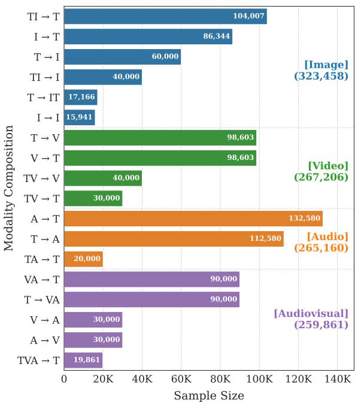  
Figure 7: Distribution of sample counts for each queryto-target modality composition in our training mixture. For each composition, ‘T’, ‘I’, ‘V’, and ‘A’ correspond to text, image, video, and audio modality, respectively. We also specify the total sample size per modality group.

2026), respectively. While MMEB-v2 natively includes text-to-video retrieval, it lacks the corresponding video-to-text direction. Therefore, we integrated video-to-text retrieval to ensure a bidirectional evaluation. Furthermore, we expand the benchmark’s scope by incorporating additional audio and audiovisual tasks.

The detailed statistics and configurations for each modality are provided from Tab. 12 to Tab. 15, each specifying the task type, query-to-target composition, and data sizes. In these tables, the corpus size is defined differently based on the task type: it denotes the number of classes for classification (CLS) tasks, the number of choices for question answering (QA) tasks, and the actual database size for retrieval (RET) tasks. Our data collection includes a wide variety of common-domain settings for each modality, such as integrating both generic audio and music domains. English is the primary language across all multi-modal tasks.

## B Detailed Experimental Settings

## B.1 Training Details & Hyperparameters

Model Backbone. We select the pretrained Qwen-2.5-Omni (Xu et al., 2025a) as the backbone. During training, the visual and audio encoders are frozen, and LoRA parameters are inserted into the LLM layers. The LoRA target modules are q\_proj, k\_proj, v\_proj, o\_proj, down\_proj, up\_proj, and gate\_proj, which are applied to each of the 36 LLM layers of the Qwen-2.5-Omni backbone. Input Processing. For the input processing, we adopt the native configuration of Qwen-2.5- Omni (Xu et al., 2025a) unless specified otherwise. Specifically, images and videos are processed using the native resolution scaling strategy of Qwen-2.5- VL (Bai et al., 2025). The minimum and maximum image resolutions are set to 50,176 pixels (64×28×28) and 784,000 pixels $( 1 0 0 0 \times 2 8 \times 2 8 )$ respectively. For video inputs, videos are uniformly sampled into 8 frames, and the per-frame resolution is bounded between a minimum of 100,352 pixels $( 1 2 8 \times 2 8 \times 2 8 )$ and a maximum of 156,800 pixels $( 2 0 0 \times 2 8 \times 2 8 )$ . Audio signals are sampled at 16,000 Hz. The textual inputs are truncated to a maximum of 512 text tokens (without chat templates), and consistent with prior approaches (Meng et al., 2026; Chen et al., 2026), left-padding is applied during batching.

<table><tr><td rowspan="2"></td><td colspan="2">Uni-Omni</td><td colspan="2">Syn-Omni</td></tr><tr><td>3B</td><td>7B</td><td>3B</td><td>7B</td></tr><tr><td>Backbone</td><td></td><td>Qwen-2.5-Omni</td><td></td><td></td></tr><tr><td>LoRA rank (Shared)</td><td>16</td><td></td><td>8</td><td></td></tr><tr><td>LoRA rank (Expert)</td><td>0</td><td></td><td>4×4</td><td></td></tr><tr><td>LoRA rank (Total)</td><td>16</td><td></td><td>24</td><td></td></tr><tr><td>LoRA params.</td><td>29.9 M</td><td>40.4M</td><td>44.9M</td><td>60.6 M</td></tr><tr><td>Router params.</td><td>0.0 M</td><td>0.0 M</td><td>3.4M</td><td>4.5M</td></tr><tr><td>Total trainable params.</td><td>29.9 M</td><td>40.4M</td><td>48.3 M</td><td>65.1 M</td></tr></table>

Table 5: Summary of LoRA configuration and trainable parameters for Uni-Omni and Syn-Omni model variants.

LoRA Configurations. For the modality-specific models and the standard LoRA baseline Uni-Omni mentioned in Fig. 1, the LoRA rank (r) is 16. For Syn-Omni with OME-LoRA, the rank of the shared adaptation path is 8, and each modality-expert rank is 4, making the total effective rank 24. Across all configurations, the LoRA scaling factor α is set to two times the rank. LoRA dropout is applied with probability 0.1. The detailed parameter counts for both the Uni-Omni baseline and Syn-Omni variants under these LoRA configurations are summarized in Tab. 5. Notably, the modality router introduces minimal parameter overhead, less than 8% of the total trainable parameters.

Optimization. All models are trained for one epoch using the Hugging Face Trainer with

FlashAttention-2 (Dao, 2024) in BFloat16 mixedprecision. We use the AdamW optimizer with $\beta _ { 1 } = 0 . 9 , \beta _ { 2 } = 0 . 9 9 9$ , and $\epsilon = 1 0 ^ { - 8 }$ . We employ a cosine learning rate schedule with a peak learning rate of $1 0 ^ { - 4 }$ , a warmup ratio of 0.04, a weight decay of 0.01, and a maximum gradient norm of 1.0. The global batch size is set to 768. We employ GradCache (Gao et al., 2021) to increase the global batch size, where the chunk size is set to 1 for the 3B models and 4 for the 7B models. We do not employ hard negative examples. The 3B models are trained using 8× NVIDIA A100 (40GB) GPUs, which takes approximately 5 days for Syn-Omni, and the 7B models are trained using 8× NVIDIA H200 (141GB) GPUs, taking approximately 40 hours for Syn-Omni.

Training Objective. The baseline models and modality-specific models are optimized using the contrastive loss. Syn-Omni is optimized using the contrastive loss combined with the orthogonal penalty and the synergy margin loss as proposed in the main paper. The contrastive loss uses a temperature parameter τ of 0.02. For the orthogonal penalty, the loss weight is set to 0.2. The Progressive Synergy Routing (PSR) schedule uses warmup and transition ratios of $t _ { \mathrm { w a r m } } = 0 . 1$ and $t _ { \mathrm { b l e n d } } = 0 . 5$ . For the synergy margin loss, the margin γ is 0.2 and the loss weight is set to 0.2.

## B.2 Evaluation Pipeline

For a fair evaluation, previous methods are evaluated under the unified setting using the official checkpoints. We extend the VLM2Vec-V2 codebase used for evaluation (Meng et al., 2026), which enables the integrated evaluation of diverse modalities and task types while facilitating seamless modality expansion. While this evaluation framework originally supports image and video inputs, we extend it to encompass audio and audiovisual modalities also, thereby enabling an any-to-any query-to-target retrieval setting.

The input processing for text, image, video, and audio modalities remains identical to those used during the training phase. For inference, standard LoRA adapter parameters are merged into the base pretrained weights, and such LoRA layers are not utilized any further. In contrast, for Syn-Omni, only the shared adaptation path is merged into the backbone weights and removed, whereas the expert paths are explicitly maintained to support dynamic routing during inference, where the soft routing weights generated by the router are utilized.

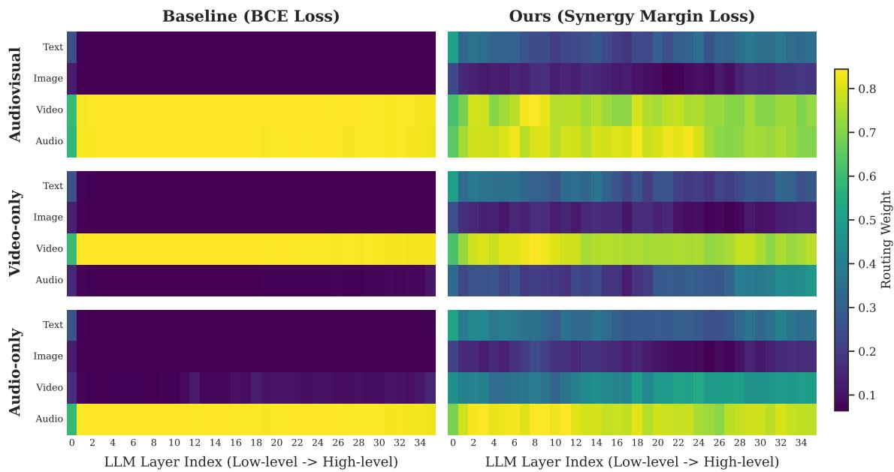  
Figure 8: Visualization of layer-wise soft routing weights under different input modalities. The baseline (BCE loss) exhibits a collapsed hard routing behavior with nearly binary activations, whereas ours (synergy margin loss) dynamically allocates routing weights even to absent-modality experts to encourage cross-modal synergy.

## C Detailed Results

## C.1 Routing Behavior across Layers

Extending the analysis in Fig. 6, we investigate how different router loss formulations affect routing dynamics at the layer level. While the main paper tracks routing weights across training steps, this section visualizes the layer-wise soft routing activations of the converged model using audiovisual, video-only, and audio-only inputs from VALOR-32k (Liu et al., 2025). Under this configuration, Fig. 8 compares the binary cross-entropy (BCE) loss against our synergy margin loss across the entire layer hierarchy.

As shown in the figure, BCE loss forces the router into strict modality classification based on the input type. Except for the first layer, this results in routing activations approaching 1 for present modalities and 0 for absent ones, collapsing into a deterministic hard routing behavior despite using a soft routing formulation. In contrast, our synergy margin loss maintains dominant activations for the input modalities while preserving meaningful activations even for absent modalities across all layers. This collaborative activation behavior across the layer hierarchy successfully facilitates cross-modal synergy, aligning with our architectural objectives.

<table><tr><td></td><td>I</td><td>V A</td><td>AV</td><td></td><td>All</td></tr><tr><td>I-specific</td><td>68.0</td><td>43.0</td><td>35.4</td><td>33.3</td><td>44.9</td></tr><tr><td>V-specific A-specific</td><td>48.1 40.3</td><td>41.1 36.5</td><td>34.9 43.5</td><td>35.9 30.9</td><td>40.0 37.8</td></tr><tr><td>AV-specific</td><td>38.0</td><td>32.4</td><td>34.6</td><td>37.1</td><td>35.5</td></tr><tr><td>Uni-Omni (3B) Syn-Omni (3B)</td><td>66.8 68.1</td><td>40.4 40.5</td><td>43.1 45.6</td><td>40.4 43.4</td><td>47.7 49.4</td></tr></table>

Table 6: Comprehensive evaluation of modality-specific models on all modalities. The results demonstrate intrinsic cross-modal transferability and highlight the necessity of unified multimodal training for cross-modal synergy. Here, I, V, A, and AV denote image, video, audio, and audiovisual modalities, respectively.

## C.2 Modality-Specific Models

We present the extended evaluation of the modalityspecific models introduced in Fig. 1, reporting their performance across all modalities in Tab. 6. Models trained exclusively on a single modality demonstrate strong performance within their respective modality. For instance, the audio-specific model performs well on audio tasks. A notable exception is observed in the audiovisual-specific model. This indicates that exposure to individual image, video, and audio data within a unified training scheme is helpful for audiovisual tasks.

Intriguingly, the image-specific model exhibits solid performance on video tasks, while the videospecific model retains reasonable results on both image and audiovisual tasks. These trends indicate that a unified training setting, where a model is exposed to diverse modalities, can induce crossmodal synergy. This serves as the primary motivation behind the design of our Orthogonal Modality-Expert LoRA (OME-LoRA) paired with the Progressive Synergy Routing (PSR) mechanism.

<table><tr><td>Model</td><td>Latency (ms)</td><td>Peak GPU Mem. (MB)</td></tr><tr><td>Uni-Omni (3B)</td><td> $3 0 0 . 3 \pm 2 5$ </td><td>9612</td></tr><tr><td>Syn-Omni (3B)</td><td> $3 5 4 . 6 \pm 2 0 $ </td><td>9676</td></tr><tr><td>Uni-Omni (7B)</td><td> $3 7 7 . 1 \pm 2 6$ </td><td>17672</td></tr><tr><td>Syn-Omni (7B)</td><td> $4 4 3 . 5 \pm 3 0$ </td><td>17765</td></tr></table>

Table 7: Runtime analysis on Uni-Omni and our Syn-Omni model variants. We report mean latency (ms) and peak GPU memory usage (MB), testing on VALOR-32k audiovisual input samples.

While the Uni-Omni baseline exhibits performance comparable to or slightly lower than that of the respective modality-specific models in their native modalities, our Syn-Omni framework consistently delivers improved performance, demonstrating the effectiveness of cross-modal synergy.

## C.3 Runtime Analysis

To evaluate inference-time efficiency, we benchmark Uni-Omni and Syn-Omni on the VALOR-32k audiovisual input using a single NVIDIA RTX A6000 GPU (batch size 1). As shown in Tab. 7, Syn-Omni introduces a slight increase in both latency and memory across 3B and 7B scales. Specifically, for the 3B variant, the mean latency increases from 300.3 ms to 354.6 ms, while the peak GPU memory changes from 9612 MB to 9676 MB.

This overhead is due to architectural differences at inference time. In Uni-Omni, standard LoRA adapters are fully merged into the backbone weights, maintaining the original backbone’s inference path. In contrast, while Syn-Omni merges its shared adaptation path, it explicitly retains the four modality-specific expert paths and router parameters to support input-dependent routing.

## C.4 Per-dataset Evaluation

We present the comprehensive benchmark-level results across all evaluated modalities and tasks. Individual dataset performances for image, video, audio, and audiovisual tasks are detailed in Tab. 16, Tab. 17, Tab. 18, and Tab. 19, respectively.

## D AI Tool Usage

We utilized ChatGPT to improve the writing fluency and grammar of the manuscript. The development of the core ideas, technical methodologies, experimental designs, and analyses remains the original work of the authors.

## E Artifact

We meticulously document the licenses, access URLs, and intended uses of the artifacts utilized in this study. All datasets, models, and software artifacts were used in accordance with their original licenses and intended research usage conditions when specified. For redistributed repositories or mirrors, we additionally verified the original artifact licenses when available. All derivatives or model checkpoints in our work are targeted for non-commercial research purposes.

• MMEB v1 Training Set (Jiang et al., 2025): Sourced from the official HuggingFace repository1 under the Apache-2.0 license.

• LLaVAHound (Zhang et al., 2025): Sourced from the official HuggingFace repository2 under the Apache-2.0 license.

• PE-Video (Bolya et al., 2025): Sourced from the official HuggingFace repository3 under the CC-BY-NC-4.0 license for non-commercial academic research.

• MSVD (Chen and Dolan, 2011) & MSR-VTT (Xu et al., 2016): Sourced from a public redistributed HuggingFace repository45 while original licenses unspecified.

• ActivityNet Captions (Caba Heilbron et al., 2015; Krishna et al., 2017): Sourced from a redistributed HuggingFace repository6 under the Apache License 2.0.

<table><tr><td>Dataset</td><td>Composition</td><td>Size</td></tr><tr><td>ImageNet 1K (Deng et al., 2009)</td><td>I → T</td><td>15,000</td></tr><tr><td>N24News (Wang et al., 2022)</td><td>TI → T</td><td>15,000</td></tr><tr><td>HatefulMemes (Kiela et al., 2020)</td><td>I → T</td><td>8,500</td></tr><tr><td>VOC2007 (Everingham et al., 2015)</td><td>I → T</td><td>7,844</td></tr><tr><td>SUN397 (Xiao et al., 2010)</td><td>I → T</td><td>15,000</td></tr><tr><td>OK-VQA (Marino et al., 2019)</td><td>TI → T</td><td>9,007</td></tr><tr><td>A-OKVQA (Schwenk et al., 2022)</td><td>TI → T</td><td>15,000</td></tr><tr><td>DocVQA (Mathew et al., 2021)</td><td>TI → T</td><td>15,000</td></tr><tr><td>InfographicsVQA (Mathew et al., 2022)</td><td>TI → T</td><td>15,000</td></tr><tr><td>ChartQA (Masry et al., 2022)</td><td>TI → T</td><td>15,000</td></tr><tr><td>Visual7W (Zhu et al., 2016)</td><td>TI → T</td><td>20,000</td></tr><tr><td>VisDial (Das et al., 2017)</td><td>T → I</td><td>20,000</td></tr><tr><td>CIRR (Liu et al., 2021b)</td><td>TI → I</td><td>20,000</td></tr><tr><td>VisualNews (Liu et al., 2021a)</td><td>T → I I → T</td><td>20,000 20,000</td></tr><tr><td>MSCOCO-Retrieval (Lin et al., 2014)</td><td>T → I I → T</td><td>20,000 20,000</td></tr><tr><td>MSCOCO-Grounding (Lin et al., 2014)</td><td>TI → I</td><td>20,000</td></tr><tr><td>NIGHTS (Fu et al., 2023)</td><td>I → I</td><td>15,941</td></tr><tr><td>WebQA (Chang et al., 2022)</td><td>T → IT</td><td>17,166</td></tr><tr><td></td><td></td><td></td></tr><tr><td>Sum</td><td></td><td>323,458</td></tr></table>

Table 8: An overview of image-text datasets in the omnimodal training dataset. Each dataset is sourced from the MMEB-v1 (Jiang et al., 2025), where either the full original set or a randomly sampled subset was utilized.

• DiDeMo (Hendricks et al., 2017): Sourced from a redistributed HuggingFace repository7 under the BSD 2-Clause license.

• FineCVR (Wu et al., 2025b): Sourced from the official GitHub repository8, while license information is unknown.

• AudioCaps (Kim et al., 2019): Sourced from a redistributed HuggingFace mirror9 under the MIT license.

• WavCaps (Mei et al., 2024): Sourced from the official HuggingFace repository10 under the CC-BY-4.0 license.

• AudioSet Strong (Gemmeke et al., 2017): Sourced from a redistributed HuggingFace mirror11 under the CC BY 4.0 specification.

• MusicCaps (Agostinelli et al., 2023): Sourced from a redistributed HuggingFace mirror12 under the CC-BY-SA-4.0 framework.

• MusicBench (Melechovsky et al., 2024): Sourced from the official HuggingFace repository13 under the CC-BY-SA-3.0 license.

• MusicInstruct (Deng et al., 2024): Sourced from the official HuggingFace repository14 under the CC-BY-NC-4.0 license.

• AudioSet (Gemmeke et al., 2017): Sourced from the official page15 under the CC BY 4.0 license.

• VAST (Chen et al., 2023): Sourced from the official GitHub repository16 under the MIT license.

<table><tr><td>Dataset</td><td>Composition</td><td>Size</td></tr><tr><td rowspan="2">LLaVAHound Retrieval (Zhang et al., 2025)</td><td>T → V</td><td>30,000</td></tr><tr><td>V → T</td><td>30,000</td></tr><tr><td>LLaVAHound QA (Zhang et al., 2025)</td><td>TV → T</td><td>30,000</td></tr><tr><td rowspan="2">PE-Video (Bolya et al., 2025)</td><td>V → T</td><td>40,000</td></tr><tr><td>T → V</td><td>40,000</td></tr><tr><td rowspan="2">MSVD (Chen and Dolan, 2011)</td><td>V → T</td><td>1,200</td></tr><tr><td>T → V</td><td>1,200</td></tr><tr><td rowspan="2">MSR-VTT (Xu et al., 2016)</td><td>V → T</td><td>9,000</td></tr><tr><td>T → V</td><td>9,000</td></tr><tr><td rowspan="2">ActivityNet (Krishna et al., 2017)</td><td>V → T</td><td>10,008</td></tr><tr><td>T → V</td><td>10,008</td></tr><tr><td rowspan="2">DiDeMo (Hendricks et al., 2017)</td><td>V → T</td><td>8,395</td></tr><tr><td>T → V</td><td>8,395</td></tr><tr><td>FineCVR (Wu et al., 2025b)</td><td>TV → V</td><td>40,000</td></tr><tr><td>Sum</td><td></td><td>267,206</td></tr></table>

Table 9: An overview of video-centric datasets included in the omnimodal training dataset.

• InternVideo2 (Wang et al., 2024): Sourced from the official HuggingFace repository17 under the CC-BY-NC-SA-4.0 license.

• Shot2Story (Han et al., 2025): Sourced from the official HuggingFace repository18 under the CC-BY-NC-SA-4.0 license, restricted to noncommercial academic usage.

• AVInstruct (Ye et al., 2024): Sourced from the official GitHub repository19 under the Apache-2.0 license, utilizing video sources derived from AVQA (Yang et al., 2022).

• MMEB v1 Evaluation Set (Jiang et al., 2025): Sourced from the official HuggingFace repository20 under the Apache-2.0 license.

• MMEB v2 Evaluation Set (Meng et al., 2026): Sourced from the official HuggingFace repository21 under the Apache-2.0 protocol.

• ESC-50 (Piczak, 2015): Sourced from a redistributed HuggingFace mirror22 under the

CC-BY-NC license.

• GTZAN (Tzanetakis and Cook, 2002): Sourced from a redistributed HuggingFace mirror23.

• NSynth (Engel et al., 2017): Sourced from a redistributed HuggingFace mirror24 under the CC BY 4.0 license.

• AudioCaps (for Eval) (Kim et al., 2019): Sourced from a redistributed HuggingFace mirror25 under the MIT license.

• Clotho (Drossos et al., 2020): Sourced from the official archive26 under its custom academic noncommercial research license.

• SoundDescs (Koepke et al., 2023) & AVE (Tian et al., 2018): Sourced from a redistributed HuggingFace repository27. SoundDescs follows the Apache License 2.0, while the license information for AVE was not explicitly provided in the original repository.

• MMAU (Sakshi et al., 2025): Sourced from a redistributed HuggingFace repository28 under the CC-BY-SA-4.0 standards.

<table><tr><td>Dataset</td><td>Composition</td><td>Size</td></tr><tr><td>AudioCaps (Kim et al., 2019)</td><td>A → T T → A</td><td>45,000 45,000</td></tr><tr><td>WavCaps (Mei et al., 2024)</td><td>A → T T → A</td><td>45,000 45,000</td></tr><tr><td>AudioSet-SL (Gemmeke et al., 2017)</td><td>A → T</td><td>20,000</td></tr><tr><td>MusicCaps (Agostinelli et al., 2023)</td><td>A → T T → A</td><td>2,580 2,580</td></tr><tr><td>MusicBench (Melechovsky et al., 2024)</td><td>A → T T → A</td><td>20,000 20,000</td></tr><tr><td>MusicInstruct (Deng et al., 2024)</td><td>TA → T</td><td>20,000</td></tr><tr><td>Sum</td><td></td><td>265,160</td></tr></table>

Table 10: An overview of audio-centric datasets included in the omnimodal training dataset.
<table><tr><td>Dataset</td><td>Composition</td><td>Size</td></tr><tr><td>AudioSet (Gemmeke et al., 2017)</td><td>V → A A → V</td><td>30,000 30,000</td></tr><tr><td>VAST (Chen et al., 2023)</td><td>VA → T T → VA</td><td>30,000 30,000</td></tr><tr><td>InternVideo2 (Wang et al., 2024)</td><td>VA → T T → VA</td><td>30,000 30,000</td></tr><tr><td>Shot2Story (Han et al., 2025)</td><td>VA → T T → VA</td><td>30,000 30,000</td></tr><tr><td>AVInstruct (Ye et al., 2024)</td><td>TVA → T</td><td>19,861</td></tr><tr><td>Sum</td><td></td><td>259,861</td></tr></table>

Table 11: An overview of audiovisual-centric datasets included in the omnimodal training dataset.

• MMAR (Ma et al., 2025b): Sourced from the official HuggingFace repository29 under the CC-BY-NC-4.0 license.

• VALOR 32k (Liu et al., 2025): Sourced from the official GitHub repository30 under the MIT framework.

• AVHBench (Kim et al., 2025): Sourced from the

official GitHub repository31.

• DailyOmni (Zhou et al., 2025): Sourced from a redistributed HuggingFace repository32 under the GPL-3.0 license.

• Qwen 2.5 Omni (Xu et al., 2025a): Sourced from the official HuggingFace repository33 under the Apache-2.0 license.

• Omni-Embed-Nemotron (Xu et al., 2025b): Sourced from the official HuggingFace repository34 under NVIDIA’s custom non-commercial scientific license (customized-nscl-v1) for noncommercial research and scientific evaluation.

• LCO-Emb (Xiao et al., 2025): Sourced from the official HuggingFace repository35 under the Apache-2.0 policy.

• e5-omni (Chen et al., 2026): Sourced from the official HuggingFace repository36 under the MIT license.

• OmniEmbed-v0.1 & OmniEmbed-Multivent (Ma et al., 2025a; Zhan et al., 2025): Sourced from the official HuggingFace repository37 38 under the MIT license.

• WAVE (Tang et al., 2026): Sourced from the official GitHub repository39 under the Apache License 2.0.

• GradCache (Gao et al., 2021): Sourced from the official GitHub repository40 under the Apache-2.0 license.

• Flash-Attention-2 (Dao, 2024): Sourced from the official GitHub repository41 under the BSD-3-Clause license.

• qwen-omni-utils: Sourced from the official GitHub repository42 under the Apache-2.0 license.

• Tevatron 2.0 (Ma et al., 2025a): Sourced from the official GitHub repository43 under the Apache-2.0 protocol.

All datasets were obtained from public benchmarks and repositories, and we relied on the original providers’ release procedures for potentially identifiable or offensive content.

<table><tr><td>Task</td><td>Dataset</td><td>Composition</td><td>Query Size</td><td>Corpus Size</td></tr><tr><td rowspan="11">I-CLS</td><td>ImageNet-1K (Deng et al., 2009)</td><td>I2T</td><td>1000</td><td>1000</td></tr><tr><td>N24News (Wang et al., 2022)</td><td>TI2T</td><td>1000</td><td>24</td></tr><tr><td>HatefulMemes (Kiela et al., 2020)</td><td>I2T</td><td>1000</td><td>2</td></tr><tr><td>VOC2007 (Everingham et al., 2015)</td><td>I2T</td><td>1000</td><td>20</td></tr><tr><td>SUN397 (Xiao et al., 2010)</td><td>I2T</td><td>1000</td><td>397</td></tr><tr><td>Place365 (Zhou et al., 2018a)</td><td>I2T</td><td>1000</td><td>365</td></tr><tr><td>ImageNet-A (Hendrycks et al., 2021b)</td><td>I2T</td><td>1000</td><td>1000</td></tr><tr><td>ImageNet-R (Hendrycks et al., 2021a)</td><td>I2T</td><td>1000</td><td>200</td></tr><tr><td>ObjectNet (Barbu et al., 2019)</td><td>I2T</td><td>1000</td><td>113</td></tr><tr><td>Country211 (Radford et al., 2021)</td><td>I2T</td><td>1000</td><td>211</td></tr><tr><td rowspan="9">I-QA</td><td>OK-VQA (Marino et al., 2019)</td><td>TI2T</td><td>1000</td><td>1000</td></tr><tr><td>A-OKVQA (Schwenk et al., 2022)</td><td>TI2T</td><td>1000</td><td>894</td></tr><tr><td>DocVQA (Mathew et al., 2021)</td><td>TI2T</td><td>1000</td><td>1000</td></tr><tr><td>InfographicsVQA (Mathew et al., 2022)</td><td>TI2T</td><td>1000</td><td>1000</td></tr><tr><td>ChartQA (Masry et al., 2022)</td><td>TI2T</td><td>1000</td><td>1000</td></tr><tr><td>Visual7W (Zhu et al., 2016)</td><td>TI2T</td><td>1000</td><td>1000</td></tr><tr><td>ScienceQA (Lu et al., 2022)</td><td>TI2T</td><td>1000</td><td>736</td></tr><tr><td>VizWiz (Gurari et al., 2018)</td><td>TI2T</td><td>1000</td><td>1000</td></tr><tr><td>GQA (Hudson and Manning, 2019)</td><td>TI2T</td><td>1000</td><td>1000</td></tr><tr><td rowspan="14">IT RET</td><td>TextVQA (Singh et al., 2019)</td><td>TI2T</td><td>1000</td><td>1000</td></tr><tr><td>MSCOCO_i2t (Lin et al., 2014)</td><td></td><td></td><td></td></tr><tr><td>VisualNews_i2t (Liu et al., 2021a)</td><td>I2T I2T</td><td>1000 1000</td><td>1000 1000</td></tr><tr><td>VisDial (Das et al., 2017)</td><td>T2I</td><td>1000</td><td>1000</td></tr><tr><td>MSCOCO_t2i (Lin et al., 2014)</td><td>T2I</td><td>1000</td><td>1000</td></tr><tr><td>VisualNews_t2i (Liu et al., 2021a)</td><td>T2I</td><td>1000</td><td>1000</td></tr><tr><td>WebQA (Chang et al., 2022)</td><td>T2TI</td><td>1000</td><td>1000</td></tr><tr><td>EDIS (Liu et al., 2023)</td><td>T2TI</td><td>1000</td><td>1000</td></tr><tr><td>Wiki-SS-NQ (Ma et al., 2024a)</td><td>T2I</td><td>1000</td><td>1000</td></tr><tr><td>CIRR (Liu et al., 2021b)</td><td>TI2I</td><td>1000</td><td>1000</td></tr><tr><td>NIGHTS (Fu et al., 2023)</td><td>I2I</td><td>1000</td><td>1000</td></tr><tr><td>OVEN (Hu et al., 2023)</td><td>TI2TI</td><td>1000</td><td>1000</td></tr><tr><td>FashionIQ (Wu et al., 2021)</td><td>TI2I</td><td>1000</td><td>1000</td></tr><tr><td>MSCOCO (Lin et al., 2014)</td><td>TI2I</td><td>1000</td><td>1000</td></tr><tr><td rowspan="4">VG</td><td></td><td></td><td></td><td></td></tr><tr><td>RefCOCO (Kazemzadeh et al., 2014)</td><td>TI2I</td><td>1000</td><td>1000</td></tr><tr><td>RefCOCO-Matching (Kazemzadeh et al., 2014)</td><td>TI2TI</td><td>1000</td><td>1000</td></tr><tr><td>Visual7W-Pointing (Zhu et al., 2016)</td><td>TI2I</td><td>1000</td><td>1000</td></tr></table>

Table 12: Evaluation datasets for image modality, including task type and query-to-target composition.

<table><tr><td>Task</td><td>Dataset</td><td>Composition</td><td>Query Size</td><td>Corpus Size</td></tr><tr><td rowspan="5">V-CLS</td><td>SmthSmthV2 (Goyal et al., 2017)</td><td>V2T</td><td>1000</td><td>174</td></tr><tr><td>HMDB51 (Kuehne et al., 2011)</td><td>V2T</td><td>1000</td><td>51</td></tr><tr><td>UCF101 (Soomro et al., 2012)</td><td>V2T</td><td>1000</td><td>101</td></tr><tr><td>K700 (Carreira et al., 2019)</td><td>V2T</td><td>1000</td><td>700</td></tr><tr><td>Breakfast (Kuehne et al., 2014)</td><td>V2T</td><td>433</td><td>10</td></tr><tr><td rowspan="5">T2V RET</td><td>MSR-VTT (Xu et al., 2016)</td><td>T2V</td><td>1000</td><td>1000</td></tr><tr><td>MSVD (Chen and Dolan, 2011)</td><td>T2V</td><td>670</td><td>670</td></tr><tr><td>DiDeMo (Hendricks et al., 2017)</td><td>T2V</td><td>1004</td><td>1004</td></tr><tr><td>YouCook2 (Zhou et al., 2018b)</td><td>T2V</td><td>3179</td><td>3179</td></tr><tr><td>VATEX (Wang et al., 2019)</td><td>T2V</td><td>4478</td><td>4478</td></tr><tr><td rowspan="5">V2T RET</td><td>MSR-VTT (Xu et al., 2016)</td><td>V2T</td><td>1000</td><td>995</td></tr><tr><td>MSVD (Chen and Dolan, 2011)</td><td>V2T</td><td>670</td><td>660</td></tr><tr><td>DiDeMo (Hendricks et al., 2017)</td><td>V2T</td><td>1004</td><td>1004</td></tr><tr><td>YouCook2 (Zhou et al., 2018b)</td><td>V2T</td><td>3179</td><td>3105</td></tr><tr><td>VATEX (Wang et al., 2019)</td><td>V2T</td><td>4478</td><td>4478</td></tr><tr><td rowspan="3">M-RET</td><td>QVHighlight (Lei et al., 2021)</td><td>TV2V</td><td>1083</td><td>10</td></tr><tr><td>Charades-STA (Gao et al., 2017)</td><td>TV2V</td><td>727</td><td>10</td></tr><tr><td>MomentSeeker (Yuan et al., 2025)</td><td>TV2V</td><td>1602</td><td>10</td></tr><tr><td rowspan="5">V-VQA</td><td>Video-MME (Fu et al., 2025)</td><td>TV2T</td><td></td><td></td></tr><tr><td>NExTQA (Xiao et al., 2021)</td><td></td><td>2700</td><td>4</td></tr><tr><td>EgoSchema (Mangalam et al., 2023)</td><td>TV2T TV2T</td><td>8564 500</td><td>5 5</td></tr><tr><td>MVBench (Li et al., 2024)</td><td>TV2T</td><td>4000</td><td>5</td></tr><tr><td>ActivityNetQA (Yu et al., 2019)</td><td>TV2T</td><td>1000</td><td>2</td></tr></table>

Table 13: Evaluation datasets for video modality, including task type and query-to-target composition.
<table><tr><td>Task</td><td>Dataset</td><td>Composition</td><td>Query Size</td><td>Corpus Size</td></tr><tr><td rowspan="3">A-CLS</td><td>ESC50 (Piczak, 2015)</td><td>A2T</td><td>1237</td><td>50</td></tr><tr><td>GTZAN (Tzanetakis and Cook, 2002)</td><td>A2T</td><td>290</td><td>10</td></tr><tr><td>NSynth (Engel et al., 2017)</td><td>A2T</td><td>4096</td><td>10</td></tr><tr><td rowspan="4">T2A RET</td><td>AudioCaps (Kim et al., 2019)</td><td>T2A</td><td>4411</td><td>883</td></tr><tr><td>Clotho (Drossos et al., 2020)</td><td>T2A</td><td>5225</td><td>1045</td></tr><tr><td>MusicCaps (Agostinelli et al., 2023)</td><td>T2A</td><td>2772</td><td>2772</td></tr><tr><td>SoundDescs (Koepke et al., 2023)</td><td>T2A</td><td>1000</td><td>1000</td></tr><tr><td rowspan="3">A2T RET</td><td>AudioCaps (Kim et al., 2019)</td><td>A2T</td><td>883</td><td>4201</td></tr><tr><td>Clotho (Drossos et al., 2020)</td><td>A2T</td><td>1045</td><td>5225</td></tr><tr><td>MusicCaps (Agostinelli et al., 2023)</td><td>A2T</td><td>2772</td><td>2772</td></tr><tr><td rowspan="2">A-QA</td><td>MMAU (Sakshi et al., 2025)</td><td>TA2T</td><td>1000</td><td>4</td></tr><tr><td>MMAR (Ma et al., 2025b)</td><td>TA2T</td><td>995</td><td>4</td></tr></table>

Table 14: Evaluation datasets for audio modality, including task type and query-to-target composition.

<table><tr><td>Task</td><td>Dataset</td><td>Composition</td><td>Query Size</td><td>Corpus Size</td></tr><tr><td rowspan="2">A2V RET</td><td>AVE (Tian et al., 2018)</td><td>A2V</td><td>402</td><td>402</td></tr><tr><td>VALOR32k (Liu et al., 2025)</td><td>A2V</td><td>3239</td><td>3239</td></tr><tr><td rowspan="2">V2A RET</td><td>AVE (Tian et al., 2018)</td><td>V2A</td><td>402</td><td>402</td></tr><tr><td>VALOR32k (Liu et al., 2025)</td><td>V2A</td><td>3239</td><td>3239</td></tr><tr><td rowspan="2">T2VA RET</td><td>AVHBench (Kim et al., 2025)</td><td>T2VA</td><td>1105</td><td>1105</td></tr><tr><td>VALOR32k (Liu et al., 2025)</td><td>T2VA</td><td>3239</td><td>3239</td></tr><tr><td rowspan="2">VA2T RET</td><td>AVHBench (Kim et al., 2025)</td><td>VA2T</td><td>1105</td><td>1105</td></tr><tr><td>VALOR32k (Liu et al., 2025)</td><td>VA2T</td><td>3239</td><td>3239</td></tr><tr><td rowspan="2">AV-QA</td><td>AVHBenchQA (Kim et al., 2025)</td><td>TVA2T</td><td>5293</td><td>2</td></tr><tr><td>DailyOmni (Zhou et al., 2025)</td><td>TVA2T</td><td>1196</td><td>4</td></tr></table>

Table 15: Evaluation datasets for audiovisual modality, including task type and query-to-target composition.

<table><tr><td colspan="3" rowspan="1">Nerm ot(B)   ICO --(3B)   e- ((-3)</td><td colspan="2" rowspan="1">Un m-()  (yn  m-(g)</td><td colspan="5" rowspan="1">O(mn ()  Mule v(B)   LCO  ()B)   e- o-)   WWA(()</td><td colspan="2" rowspan="1">Un -()  (yn  m- )</td></tr><tr><td colspan="3" rowspan="1">AverageOverall (36)                    44.158.164.8I-CLS (10)                    47.957.360.7</td><td colspan="2" rowspan="1">66.868.164.865.4</td><td colspan="5" rowspan="1">44.251.861.672.542.744.556.559.5 67.649.0</td><td colspan="2" rowspan="1">71.371.766.1 67.5</td></tr><tr><td colspan="3" rowspan="1">I-QA (10)                     20.1 58.261.3</td><td colspan="2" rowspan="1">63.162.7</td><td colspan="5" rowspan="1">22.529.662.7 69.925.8</td><td colspan="2" rowspan="1">67.866.8</td></tr><tr><td colspan="3" rowspan="2">I-RET (12)                    58.7 55.468.3VG (4)                        49.561.569.1</td><td colspan="2" rowspan="1">66.366.3</td><td colspan="5" rowspan="2">49.561.158.971.944.160.560.065.180.951.9</td><td colspan="2" rowspan="2">68.369.183.283.6</td></tr><tr><td colspan="2" rowspan="1">72.877.8</td></tr><tr><td colspan="3" rowspan="2">Image Classification (I-CLS)ImageNet-1K                  60.665.572.9</td><td colspan="2" rowspan="1"></td><td colspan="5" rowspan="2">56.468.672.079.647.8</td><td colspan="2" rowspan="2">76.577.1</td></tr><tr><td colspan="2" rowspan="1">74.275.0</td><td colspan="3" rowspan="1">56.4 68.6 72.0</td></tr><tr><td colspan="3" rowspan="1">N24News                     36.950.073.1</td><td colspan="2" rowspan="1">73.477.6</td><td colspan="1" rowspan="1">42.5</td><td colspan="2" rowspan="1">42.345.6</td><td colspan="2" rowspan="1">77.943.3</td><td colspan="1" rowspan="1">76.5</td><td colspan="1" rowspan="1">80.2</td></tr><tr><td colspan="3" rowspan="1">HatefulMemes                 48.156.857.3</td><td colspan="2" rowspan="1">67.572.3</td><td colspan="1" rowspan="1">52.5</td><td colspan="2" rowspan="1">51.266.4</td><td colspan="2" rowspan="1">69.051.2</td><td colspan="1" rowspan="1">71.2</td><td colspan="1" rowspan="1">75.7</td></tr><tr><td colspan="3" rowspan="1">VOC2007                     53.066.471.8</td><td colspan="2" rowspan="1">87.588.2</td><td colspan="1" rowspan="1">75.1</td><td colspan="2" rowspan="1">68.354.4</td><td colspan="2" rowspan="1">83.377.2</td><td colspan="1" rowspan="1">87.9</td><td colspan="1" rowspan="1">89.3</td></tr><tr><td colspan="2" rowspan="1">SUN397                      54.8</td><td colspan="1" rowspan="1">73.871.2</td><td colspan="2" rowspan="1">78.076.1</td><td colspan="1" rowspan="1">46.1</td><td colspan="2" rowspan="1">61.673.1</td><td colspan="2" rowspan="1">75.062.7</td><td colspan="1" rowspan="1">76.6</td><td colspan="1" rowspan="1">77.2</td></tr><tr><td colspan="2" rowspan="1">Place365                      31.6</td><td colspan="1" rowspan="1">41.040.4</td><td colspan="1" rowspan="1">43.4</td><td colspan="1" rowspan="1">44.9</td><td colspan="1" rowspan="1">16.2</td><td colspan="1" rowspan="1">37.1</td><td colspan="1" rowspan="1">38.6</td><td colspan="2" rowspan="1">44.733.7</td><td colspan="1" rowspan="1">44.9</td><td colspan="1" rowspan="1">47.1</td></tr><tr><td colspan="2" rowspan="1">ImageNet-A                   41.6</td><td colspan="1" rowspan="1">45.443.3</td><td colspan="1" rowspan="1">53.4</td><td colspan="1" rowspan="1">51.8</td><td colspan="1" rowspan="1">29.9</td><td colspan="1" rowspan="1">52.4</td><td colspan="1" rowspan="1">53.0</td><td colspan="2" rowspan="1">60.424.5</td><td colspan="1" rowspan="1">57.6</td><td colspan="1" rowspan="1">58.0</td></tr><tr><td colspan="2" rowspan="1">ImageNet-R                   82.8</td><td colspan="1" rowspan="1">72.085.6</td><td colspan="1" rowspan="1">85.1</td><td colspan="1" rowspan="1">82.4</td><td colspan="1" rowspan="1">62.7</td><td colspan="1" rowspan="1">87.7</td><td colspan="1" rowspan="1">83.0</td><td colspan="1" rowspan="1">86.7</td><td colspan="1" rowspan="1">68.0</td><td colspan="1" rowspan="1">86.5</td><td colspan="1" rowspan="1">84.6</td></tr><tr><td colspan="2" rowspan="1">ObjectNet                     46.2</td><td colspan="1" rowspan="1">73.265.5</td><td colspan="1" rowspan="1">55.5</td><td colspan="1" rowspan="1">55.7</td><td colspan="1" rowspan="1">37.8</td><td colspan="1" rowspan="1">62.9</td><td colspan="1" rowspan="1">75.4</td><td colspan="1" rowspan="1">68.2</td><td colspan="1" rowspan="1">60.9</td><td colspan="1" rowspan="1">52.3</td><td colspan="1" rowspan="1">53.3</td></tr><tr><td colspan="2" rowspan="1">Country211                    23.6</td><td colspan="1" rowspan="1">29.326.0</td><td colspan="2" rowspan="1">29.829.8</td><td colspan="1" rowspan="1">25.7</td><td colspan="2" rowspan="1">32.533.5</td><td colspan="2" rowspan="1">30.820.7</td><td colspan="1" rowspan="1">30.8</td><td colspan="1" rowspan="1">32.3</td></tr><tr><td colspan="3" rowspan="1">Image QA (I-QA)</td><td colspan="2" rowspan="1"></td><td colspan="1" rowspan="1"></td><td colspan="2" rowspan="1"></td><td colspan="2" rowspan="1"></td><td colspan="1" rowspan="1"></td><td colspan="1" rowspan="1"></td></tr><tr><td colspan="2" rowspan="1">OK-VQA                      17.4</td><td colspan="1" rowspan="1">57.862.7</td><td colspan="1" rowspan="1">65.2</td><td colspan="1" rowspan="1">66.8</td><td colspan="1" rowspan="1">24.2</td><td colspan="2" rowspan="1">29.362.0</td><td colspan="1" rowspan="1">70.4</td><td colspan="1" rowspan="1">32.7</td><td colspan="1" rowspan="1">70.5</td><td colspan="1" rowspan="1">70.4</td></tr><tr><td colspan="2" rowspan="1">A-OKVQA                    12.5</td><td colspan="1" rowspan="1">48.152.2</td><td colspan="1" rowspan="1">55.4</td><td colspan="1" rowspan="1">53.6</td><td colspan="1" rowspan="1">15.6</td><td colspan="1" rowspan="1">20.0</td><td colspan="1" rowspan="1">53.9</td><td colspan="1" rowspan="1">59.6</td><td colspan="1" rowspan="1">25.0</td><td colspan="1" rowspan="1">57.8</td><td colspan="1" rowspan="1">59.3</td></tr><tr><td colspan="2" rowspan="1">DocVQA                      17.5</td><td colspan="1" rowspan="1">84.1 81.6</td><td colspan="1" rowspan="1">91.3</td><td colspan="1" rowspan="1">92.6</td><td colspan="1" rowspan="1">22.8</td><td colspan="1" rowspan="1">25.8</td><td colspan="1" rowspan="1">89.6</td><td colspan="1" rowspan="1">93.3</td><td colspan="1" rowspan="1">18.6</td><td colspan="1" rowspan="1">93.4</td><td colspan="1" rowspan="1">92.3</td></tr><tr><td colspan="2" rowspan="1">InfographicsVQA              8.5</td><td colspan="1" rowspan="1">58.6 49.9</td><td colspan="1" rowspan="1">68.2</td><td colspan="1" rowspan="1">63.5</td><td colspan="1" rowspan="1">11.7</td><td colspan="1" rowspan="1">12.4</td><td colspan="1" rowspan="1">66.6</td><td colspan="1" rowspan="1">68.9</td><td colspan="1" rowspan="1">17.0</td><td colspan="1" rowspan="1">74.7</td><td colspan="1" rowspan="1">72.9</td></tr><tr><td colspan="2" rowspan="1">ChartQA                       13.3</td><td colspan="1" rowspan="1">40.147.7</td><td colspan="1" rowspan="1">58.7</td><td colspan="1" rowspan="1">58.5</td><td colspan="1" rowspan="1">12.4</td><td colspan="1" rowspan="1">14.0</td><td colspan="1" rowspan="1">46.9</td><td colspan="1" rowspan="1">65.7</td><td colspan="1" rowspan="1">12.5</td><td colspan="1" rowspan="1">64.5</td><td colspan="1" rowspan="1">63.1</td></tr><tr><td colspan="1" rowspan="1">Visual7W</td><td colspan="1" rowspan="1">7.4</td><td colspan="1" rowspan="1">48.5 55.2</td><td colspan="1" rowspan="1">49.5</td><td colspan="1" rowspan="1">48.1</td><td colspan="1" rowspan="1">4.8</td><td colspan="1" rowspan="1">11.9</td><td colspan="1" rowspan="1">47.9</td><td colspan="1" rowspan="1">63.7</td><td colspan="1" rowspan="1">18.7</td><td colspan="1" rowspan="1">53.3</td><td colspan="1" rowspan="1">50.8</td></tr><tr><td colspan="1" rowspan="1">ScienceQA</td><td colspan="1" rowspan="1">25.3</td><td colspan="1" rowspan="1">44.448.7</td><td colspan="1" rowspan="1">43.2</td><td colspan="1" rowspan="1">43.9</td><td colspan="1" rowspan="1">25.5</td><td colspan="1" rowspan="1">33.2</td><td colspan="1" rowspan="1">52.2</td><td colspan="1" rowspan="1">56.9</td><td colspan="1" rowspan="1">21.8</td><td colspan="1" rowspan="1">54.4</td><td colspan="1" rowspan="1">52.6</td></tr><tr><td colspan="1" rowspan="1">VizWiz</td><td colspan="1" rowspan="1">34.8</td><td colspan="1" rowspan="1">54.652.5</td><td colspan="1" rowspan="1">52.3</td><td colspan="1" rowspan="1">51.0</td><td colspan="1" rowspan="1">26.0</td><td colspan="1" rowspan="1">41.8</td><td colspan="1" rowspan="1">54.1</td><td colspan="1" rowspan="1">55.9</td><td colspan="1" rowspan="1">31.2</td><td colspan="1" rowspan="1">54.8</td><td colspan="1" rowspan="1">52.1</td></tr><tr><td colspan="1" rowspan="1">GQA</td><td colspan="1" rowspan="1">28.5</td><td colspan="1" rowspan="1">65.479.1</td><td colspan="1" rowspan="1">67.4</td><td colspan="1" rowspan="1">67.9</td><td colspan="1" rowspan="1">37.1</td><td colspan="1" rowspan="1">48.8</td><td colspan="1" rowspan="1">69.7</td><td colspan="2" rowspan="1">78.450.2</td><td colspan="1" rowspan="1">70.1</td><td colspan="1" rowspan="1">70.0</td></tr><tr><td colspan="2" rowspan="1">TextVQA                      36.1</td><td colspan="1" rowspan="1">80.683.0</td><td colspan="1" rowspan="1">79.5</td><td colspan="1" rowspan="1">81.2</td><td colspan="1" rowspan="1">44.9</td><td colspan="1" rowspan="1">58.5</td><td colspan="1" rowspan="1">84.3</td><td colspan="2" rowspan="1">85.929.9</td><td colspan="1" rowspan="1">84.0</td><td colspan="1" rowspan="1">84.0</td></tr><tr><td colspan="2" rowspan="1">Image-Text Retrieval (I-RET)</td><td colspan="1" rowspan="1"></td><td colspan="1" rowspan="1"></td><td colspan="1" rowspan="1"></td><td colspan="1" rowspan="1"></td><td colspan="1" rowspan="1"></td><td colspan="1" rowspan="1"></td><td colspan="1" rowspan="1"></td><td colspan="1" rowspan="1"></td><td colspan="1" rowspan="1"></td><td colspan="1" rowspan="1"></td></tr><tr><td colspan="1" rowspan="1">VisDial</td><td colspan="1" rowspan="1">52.8</td><td colspan="1" rowspan="1">50.577.8</td><td colspan="1" rowspan="1">71.0</td><td colspan="1" rowspan="1">73.9</td><td colspan="1" rowspan="1">50.6</td><td colspan="1" rowspan="1">56.2</td><td colspan="1" rowspan="1">54.7</td><td colspan="1" rowspan="1">80.8</td><td colspan="1" rowspan="1">19.7</td><td colspan="1" rowspan="1">74.8</td><td colspan="1" rowspan="1">76.1</td></tr><tr><td colspan="1" rowspan="1">CIRR</td><td colspan="1" rowspan="1">13.2</td><td colspan="1" rowspan="1">42.941.1</td><td colspan="1" rowspan="1">47.8</td><td colspan="1" rowspan="1">48.8</td><td colspan="1" rowspan="1">14.4</td><td colspan="1" rowspan="1">16.2</td><td colspan="1" rowspan="1">47.1</td><td colspan="1" rowspan="1">49.3</td><td colspan="1" rowspan="1">31.4</td><td colspan="1" rowspan="1">48.0</td><td colspan="1" rowspan="1">52.5</td></tr><tr><td colspan="2" rowspan="1">VisualNews_t2i                60.1</td><td colspan="1" rowspan="1">54.970.1</td><td colspan="1" rowspan="1">70.7</td><td colspan="1" rowspan="1">72.6</td><td colspan="1" rowspan="1">37.7</td><td colspan="1" rowspan="1">63.3</td><td colspan="1" rowspan="1">61.3</td><td colspan="1" rowspan="1">74.5</td><td colspan="1" rowspan="1">45.3</td><td colspan="1" rowspan="1">74.3</td><td colspan="1" rowspan="1">75.2</td></tr><tr><td colspan="2" rowspan="1">VisualNews_i2t                58.4</td><td colspan="1" rowspan="1">59.476.4</td><td colspan="1" rowspan="1">73.4</td><td colspan="1" rowspan="1">75.1</td><td colspan="1" rowspan="1">43.8</td><td colspan="1" rowspan="1">64.2</td><td colspan="1" rowspan="1">61.1</td><td colspan="1" rowspan="1">82.3</td><td colspan="1" rowspan="1">36.3</td><td colspan="1" rowspan="1">75.7</td><td colspan="1" rowspan="1">77.3</td></tr><tr><td colspan="2" rowspan="1">MSCOCO_t2i                 59.9</td><td colspan="1" rowspan="1">59.274.3</td><td colspan="1" rowspan="1">65.6</td><td colspan="1" rowspan="1">67.1</td><td colspan="1" rowspan="1">51.2</td><td colspan="1" rowspan="1">63.6</td><td colspan="1" rowspan="1">65.2</td><td colspan="1" rowspan="1">76.2</td><td colspan="1" rowspan="1">63.5</td><td colspan="1" rowspan="1">70.7</td><td colspan="1" rowspan="1">70.7</td></tr><tr><td colspan="2" rowspan="1">MSCOCO_i2t                 56.2</td><td colspan="1" rowspan="1">59.771.7</td><td colspan="1" rowspan="1">67.2</td><td colspan="1" rowspan="1">67.4</td><td colspan="1" rowspan="1">40.7</td><td colspan="1" rowspan="1">59.0</td><td colspan="1" rowspan="1">62.0</td><td colspan="1" rowspan="1">74.1</td><td colspan="1" rowspan="1">55.1</td><td colspan="1" rowspan="1">70.1</td><td colspan="1" rowspan="1">69.7</td></tr><tr><td colspan="2" rowspan="1">NIGHTS                      64.6</td><td colspan="1" rowspan="1">56.766.3</td><td colspan="1" rowspan="1">68.5</td><td colspan="1" rowspan="1">67.3</td><td colspan="1" rowspan="1">59.2</td><td colspan="1" rowspan="1">63.7</td><td colspan="1" rowspan="1">61.3</td><td colspan="1" rowspan="1">64.8</td><td colspan="1" rowspan="1">58.2</td><td colspan="1" rowspan="1">67.2</td><td colspan="1" rowspan="1">67.6</td></tr><tr><td colspan="2" rowspan="1">WebQA                       90.2</td><td colspan="1" rowspan="1">84.7 90.5</td><td colspan="1" rowspan="1">89.1</td><td colspan="1" rowspan="1">88.9</td><td colspan="1" rowspan="1">77.1</td><td colspan="1" rowspan="1">90.9</td><td colspan="1" rowspan="1">84.0</td><td colspan="1" rowspan="1">88.6</td><td colspan="1" rowspan="1">51.5</td><td colspan="1" rowspan="1">90.3</td><td colspan="1" rowspan="1">90.1</td></tr><tr><td colspan="2" rowspan="1">FashionIQ                     8.6</td><td colspan="1" rowspan="1">14.916.5</td><td colspan="1" rowspan="1">19.9</td><td colspan="1" rowspan="1">19.1</td><td colspan="1" rowspan="1">8.3</td><td colspan="1" rowspan="1">11.4</td><td colspan="1" rowspan="1">19.3</td><td colspan="2" rowspan="1">19.4 6.5</td><td colspan="1" rowspan="1">18.8</td><td colspan="1" rowspan="1">22.9</td></tr><tr><td colspan="2" rowspan="1">Wiki-SS-NQ                  87.0</td><td colspan="1" rowspan="1">52.674.2</td><td colspan="1" rowspan="1">69.1</td><td colspan="1" rowspan="1">62.3</td><td colspan="1" rowspan="1">84.2</td><td colspan="1" rowspan="1">86.6</td><td colspan="1" rowspan="1">55.0</td><td colspan="2" rowspan="1">83.351.1</td><td colspan="1" rowspan="1">64.4</td><td colspan="1" rowspan="1">63.6</td></tr><tr><td colspan="2" rowspan="1">OVEN                        72.7</td><td colspan="1" rowspan="1">75.2 75.8</td><td colspan="1" rowspan="1">74.0</td><td colspan="1" rowspan="1">74.1</td><td colspan="1" rowspan="1">65.2</td><td colspan="1" rowspan="1">74.6</td><td colspan="1" rowspan="1">77.2</td><td colspan="2" rowspan="1">79.157.2</td><td colspan="1" rowspan="1">77.3</td><td colspan="1" rowspan="1">76.9</td></tr><tr><td colspan="2" rowspan="1">EDIS                         81.2</td><td colspan="1" rowspan="1">53.885.3</td><td colspan="2" rowspan="1">79.979.2</td><td colspan="1" rowspan="1">61.7</td><td colspan="2" rowspan="1">83.058.4</td><td colspan="2" rowspan="1">90.053.1</td><td colspan="1" rowspan="1">88.3</td><td colspan="1" rowspan="1">86.9</td></tr><tr><td colspan="3" rowspan="1">Visual Grounding (VG)MSCOCO                     35.1 45.550.9</td><td colspan="2" rowspan="1">67.968.0</td><td colspan="5" rowspan="1">40.042.444.267.225.1</td><td colspan="2" rowspan="1">74.1 76.1</td></tr><tr><td colspan="3" rowspan="1">RefCOCO                     55.1 68.876.6</td><td colspan="2" rowspan="1">75.384.8</td><td colspan="1" rowspan="1">67.8</td><td colspan="2" rowspan="1">65.973.5</td><td colspan="2" rowspan="1">83.749.7</td><td colspan="1" rowspan="1">87.3</td><td colspan="1" rowspan="1">91.0</td></tr><tr><td colspan="3" rowspan="1">RefCOCO-Matching           65.375.779.2</td><td colspan="2" rowspan="1">80.385.6</td><td colspan="3" rowspan="1">74.669.882.6</td><td colspan="2" rowspan="1">91.683.1</td><td colspan="1" rowspan="1">91.6</td><td colspan="1" rowspan="1">90.6</td></tr><tr><td colspan="3" rowspan="1">Visual7W-Pointing             42.755.869.6</td><td colspan="2" rowspan="1">67.872.9</td><td colspan="5" rowspan="1">59.662.060.281.1 49.7</td><td colspan="2" rowspan="1">79.676.6</td></tr><tr><td></td><td>Nem ono(()</td><td>LCO --(3B) e-i3)</td><td>Uun om-()</td><td>Syn -()</td><td>Omi(B)</td><td>Mul vt(B)</td><td>LCO  B)</td><td>e-i-)</td><td>WAB)</td><td>Un  -()</td><td colspan="4">Synmnom-(B)</td></tr><tr><td></td><td></td><td></td><td></td><td></td><td></td><td></td><td></td><td></td><td></td><td></td><td colspan="4"></td></tr><tr><td>Average Overall (23)</td><td>36.5</td><td>43.7</td><td>40.6</td><td>40.4 40.5</td><td></td><td>35.0 40.2</td><td>45.5</td><td>44.3</td><td>39.8</td><td>40.2</td><td colspan="4">41.4</td></tr><tr><td>V-CLS (5)</td><td>43.1</td><td>44.6</td><td>37.6</td><td>47.6 44.7</td><td></td><td>36.4 50.7</td><td>47.6</td><td>49.4</td><td>48.9</td><td>49.5</td><td colspan="4">47.0</td></tr><tr><td>T2V RET (5)</td><td>34.8</td><td>34.2</td><td>38.9</td><td>27.9</td><td>29.3</td><td>33.7</td><td>35.9 36.9</td><td>36.1</td><td>30.0</td><td>25.0</td><td colspan="4">28.5</td></tr><tr><td>V2T RET (5)</td><td>32.0</td><td>34.3</td><td>33.2</td><td>38.3</td><td>39.2</td><td>27.9</td><td>34.7 35.9</td><td>40.8</td><td>35.1</td><td>40.5</td><td colspan="4"></td></tr><tr><td>M-RET (3)</td><td>25.6</td><td>47.2</td><td>41.0</td><td>36.9</td><td>37.5</td><td>28.7</td><td>28.1 47.1</td><td>34.1</td><td>40.1</td><td></td><td colspan="4">41.6</td></tr><tr><td>V-QA (5)</td><td>46.9</td><td>58.1</td><td>52.0</td><td>51.1</td><td>51.7</td><td>48.3</td><td>51.8 60.2</td><td>61.1</td><td>44.9</td><td>32.4 53.5</td><td colspan="4">36.1 53.8</td></tr><tr><td>Video Classification (V-CLS)</td><td></td><td></td><td></td><td></td><td></td><td></td><td></td><td></td><td></td><td></td><td colspan="4"></td></tr><tr><td>K700</td><td>38.5</td><td>42.6</td><td>42.4</td><td>46.3</td><td>43.9</td><td>31.5</td><td>53.3 43.2</td><td>50.1</td><td>51.4</td><td>52.0</td><td colspan="4">48.0</td></tr><tr><td></td><td>40.0</td><td>44.1</td><td>35.2</td><td>45.9</td><td>45.9</td><td>34.6</td><td>54.8</td><td>46.5 46.1</td><td>47.2</td><td>48.8</td><td colspan="4">51.1</td></tr><tr><td>SmthSmthV2</td><td>48.0</td><td>53.2</td><td>34.1</td><td>52.1</td><td>47.3</td><td>26.2</td><td>53.3</td><td>57.7 56.3</td><td>53.4</td><td>54.7</td><td colspan="4">44.2</td></tr><tr><td>HMDB51</td><td></td><td>64.2</td><td>51.9</td><td>71.5</td><td>63.1</td><td></td><td>68.2</td><td></td><td></td><td></td><td colspan="4"></td></tr><tr><td>UCF101</td><td>62.7</td><td>18.7</td><td>24.5</td><td>22.2</td><td>23.1</td><td>62.2 27.3</td><td>24.0</td><td>67.8 69.5 22.6 24.9</td><td>72.0 20.3</td><td>66.6</td><td colspan="4">68.3</td></tr><tr><td>Breakfast</td><td>26.3</td><td></td><td></td><td></td><td></td><td></td><td></td><td></td><td></td><td>25.4</td><td colspan="4">23.6</td></tr><tr><td>Text → Video Retrieval (T2V RET)</td><td>36.0</td><td>33.1</td><td>41.6</td><td>27.4</td><td>27.4</td><td>27.6</td><td>34.7</td><td>34.7 35.7</td><td>25.6</td><td></td><td colspan="4">27.3</td></tr><tr><td>DiDeMo</td><td>37.8</td><td>37.4</td><td>40.0</td><td>39.6</td><td>43.1</td><td>40.2</td><td>40.5 41.2</td><td>42.1</td><td>34.6</td><td>23.1 37.6</td><td colspan="4">43.9</td></tr><tr><td>MSR-VTT</td><td>55.8</td><td>58.4</td><td>62.1</td><td>43.3</td><td>46.7</td><td>56.4</td><td>56.9</td><td>56.7</td><td>50.9</td><td>39.9</td><td colspan="4"></td></tr><tr><td>MSVD VATEX</td><td>28.8</td><td>29.1</td><td>34.0</td><td>25.5</td><td>24.3</td><td>28.1</td><td>30.1</td><td>60.0 32.3</td><td></td><td></td><td colspan="4">45.1</td></tr><tr><td>YouCook2</td><td>15.5</td><td>13.0</td><td>16.8</td><td>3.7</td><td>5.0</td><td>16.0</td><td>17.4 16.1</td><td>30.8 15.3</td><td>29.4 9.7</td><td>23.0 1.7</td><td colspan="4">21.3</td></tr><tr><td>Video → Text Retrieval (V2T RET)</td><td></td><td></td><td></td><td></td><td></td><td></td><td></td><td></td><td></td><td></td><td colspan="4">4.7</td></tr><tr><td>DiDeMo</td><td>32.0</td><td>32.4</td><td>31.9</td><td>42.5</td><td>42.0</td><td>27.7</td><td>35.7</td><td>33.6</td><td>43.0 32.7</td><td>44.3</td><td colspan="4">46.4</td></tr><tr><td>MSR-VTT</td><td>34.3</td><td>38.8</td><td>37.6</td><td>42.4</td><td>45.8</td><td>33.2</td><td>37.3</td><td>37.9 44.2</td><td>39.0</td><td>47.0</td><td colspan="4">48.1</td></tr><tr><td>MSVD</td><td>53.6</td><td>56.9</td><td>57.6</td><td>60.7</td><td>61.5</td><td>49.7</td><td>56.9</td><td>60.1 63.1</td><td>58.4</td><td>62.5</td><td colspan="4">63.7</td></tr><tr><td>VATEX</td><td>25.6</td><td>28.3</td><td>28.4</td><td>29.9</td><td>31.4</td><td>21.5</td><td>28.5</td><td>30.0</td><td>37.2 30.8</td><td>31.6</td><td colspan="4">32.0</td></tr><tr><td>YouCook2</td><td>14.4</td><td>15.4</td><td>10.6</td><td>15.8</td><td>15.3</td><td>7.4</td><td>15.1</td><td>17.6 16.4</td><td>14.7</td><td>17.3</td><td colspan="4">18.0</td></tr><tr><td>Moment Retrieval (M-RET)</td><td></td><td></td><td></td><td></td><td></td><td></td><td></td><td></td><td></td><td></td><td colspan="4"></td></tr><tr><td>QVHighlight</td><td>26.9</td><td>70.3</td><td>60.4</td><td>51.9</td><td>53.4</td><td>29.9</td><td>30.0</td><td>69.2</td><td>44.1 56.0</td><td>41.5</td><td colspan="4">50.9</td></tr><tr><td>Charades-STA</td><td>11.6</td><td>25.2</td><td>19.5</td><td>18.0</td><td>16.6</td><td>14.3</td><td>13.1</td><td>24.3</td><td>16.9 26.4</td><td>16.8</td><td colspan="4">14.9</td></tr><tr><td>MomentSeeker</td><td>38.3</td><td>46.1</td><td>43.1</td><td>40.8</td><td>42.6</td><td>41.9</td><td>41.2</td><td>47.8</td><td>41.4 38.0</td><td>39.0</td><td colspan="4">42.7</td></tr><tr><td>Video QA (V-QA)</td><td></td><td></td><td></td><td></td><td></td><td></td><td></td><td></td><td></td><td></td><td colspan="4"></td></tr><tr><td>MVBench</td><td>42.3</td><td>58.0</td><td>51.5</td><td>50.9</td><td>53.1</td><td>43.6</td><td>47.2</td><td>60.9</td><td>60.1</td><td>39.3 54.7</td><td colspan="4">54.5</td></tr><tr><td>Video-MME</td><td>40.1</td><td>46.1</td><td>43.0</td><td>41.3</td><td>41.6</td><td>38.4</td><td>40.9</td><td>49.7</td><td>49.0</td><td>32.1 43.6</td><td colspan="4">44.0</td></tr><tr><td>NExTQA</td><td>43.9</td><td>67.4</td><td>58.9</td><td>55.5</td><td>59.4</td><td>45.9</td><td>48.1</td><td></td><td></td><td>38.4</td><td colspan="4">60.0</td></tr><tr><td></td><td></td><td></td><td></td><td></td><td></td><td></td><td></td><td>70.3</td><td>71.1</td><td>60.8 48.0 34.2</td><td colspan="4">35.4</td></tr><tr><td>EgoSchema ActivityNetQA</td><td>46.6 61.6</td><td>43.8 75.1</td><td>45.6 61.1</td><td>34.8 72.9</td><td>30.6 73.9</td><td>46.4 67.3</td><td>51.4 71.5</td><td colspan="7">42.8 51.4 77.3 74.1</td></tr></table>

Table 16: Individual performances on image modality tasks. The method order is identical to that in Tab. 1.

Table 17: Individual performances on video modality tasks. The method order is identical to that in Tab. 1.

<table><tr><td></td><td>Nerm ont(B)</td><td>IC --(3B) e- (-(3)</td><td>Un  o(3)</td><td>Syn  m-(Bg)</td><td>O(mmm B)</td><td>Mult (B)</td><td>LCO  (B)</td><td>e-² -)</td><td>WAV ()</td><td>() Um</td><td>Synn m-(B)</td></tr><tr><td>Average</td><td></td><td></td><td></td><td colspan="2"></td><td></td><td></td><td></td><td></td><td></td><td></td><td></td></tr><tr><td>Overall (12)</td><td>24.5</td><td>42.1</td><td>37.4</td><td>43.1</td><td>45.6</td><td>31.6</td><td>39.5</td><td>45.2</td><td>44.3</td><td>33.4</td><td>47.5</td><td>48.7</td></tr><tr><td>A-CLS (3)</td><td>40.7</td><td>67.5</td><td>51.5</td><td>59.5</td><td>62.0</td><td>36.0</td><td>52.9</td><td>71.1</td><td>62.8</td><td>56.3</td><td>67.4</td><td>67.2</td></tr><tr><td>T2A RET (4)</td><td>6.4</td><td>19.7</td><td>26.0</td><td>28.7</td><td>30.8</td><td>25.5</td><td>28.6</td><td>24.5</td><td>30.2</td><td>22.5</td><td>32.5</td><td>34.9</td></tr><tr><td>A2T RET (3)</td><td>6.8</td><td>17.3</td><td>14.2</td><td>30.0</td><td>32.4</td><td>17.2</td><td>21.0</td><td>18.7</td><td>20.7</td><td>17.7</td><td>32.5</td><td>34.0</td></tr><tr><td>A-QA (2)</td><td>44.0</td><td>63.8</td><td>57.9</td><td>54.4</td><td>57.0</td><td>47.8</td><td>55.4</td><td>66.4</td><td>63.7</td><td>37.0</td><td>57.6</td><td>58.5</td></tr><tr><td>Audio Classification (A-CLS)</td><td></td><td></td><td></td><td></td><td></td><td></td><td></td><td></td><td></td><td></td><td></td><td></td></tr><tr><td>ESC50</td><td>73.6</td><td>77.8</td><td>78.2</td><td>86.8</td><td>87.0</td><td>51.5</td><td>77.8</td><td>78.8</td><td>81.9</td><td>82.8</td><td>88.0</td><td>88.5</td></tr><tr><td>GTZAN</td><td>28.6</td><td>74.8</td><td>44.1</td><td>52.1</td><td>57.9</td><td>34.5</td><td>51.4</td><td>82.8</td><td>61.4</td><td>57.9</td><td>66.9</td><td>63.4</td></tr><tr><td>NSynth</td><td>20.0</td><td>50.0</td><td>32.1</td><td>39.6</td><td>41.0</td><td>22.0</td><td>29.5</td><td>51.6</td><td>45.0</td><td>28.1</td><td>47.3</td><td>49.7</td></tr><tr><td>Text → Audio Retrieval (T2A RET)</td><td></td><td></td><td></td><td></td><td></td><td></td><td></td><td></td><td></td><td></td><td></td><td></td></tr><tr><td>AudioCaps</td><td>9.4</td><td>23.3</td><td>33.9</td><td>39.9</td><td>43.2</td><td>39.0</td><td>33.5</td><td>26.9</td><td>38.6</td><td>32.1</td><td>41.2</td><td>44.9</td></tr><tr><td>Clotho</td><td>7.2</td><td>17.2</td><td>21.6</td><td>20.4</td><td>20.6</td><td>21.8</td><td>21.5</td><td>19.8</td><td>22.7</td><td>19.1</td><td>21.3</td><td>21.8</td></tr><tr><td>MusicCaps</td><td>3.5</td><td>8.0</td><td>10.5</td><td>19.8</td><td>23.4</td><td>11.8</td><td>13.2</td><td>11.9</td><td>14.8</td><td>8.7</td><td>20.6</td><td>22.6</td></tr><tr><td>SoundDescs</td><td>5.3</td><td>30.4</td><td>38.1</td><td>34.6</td><td>36.1</td><td>29.4</td><td>46.2</td><td>39.3</td><td>44.5</td><td>29.9</td><td>46.9</td><td>50.5</td></tr><tr><td>Audio → Text Retrieval (A2T RET)</td><td></td><td></td><td></td><td></td><td></td><td></td><td></td><td></td><td></td><td></td><td></td><td></td></tr><tr><td>AudioCaps</td><td>10.6</td><td>26.0</td><td>26.0</td><td>49.4</td><td>52.8</td><td>33.7</td><td>34.8</td><td>30.0</td><td>36.8</td><td>26.6</td><td>54.2</td><td>57.6</td></tr><tr><td>Clotho</td><td>7.4</td><td>17.4</td><td>13.3</td><td>23.4</td><td>23.6</td><td>15.2</td><td>19.4</td><td>18.0</td><td>17.1</td><td>19.1</td><td>26.9</td><td>26.5</td></tr><tr><td>MusicCaps</td><td>2.3</td><td>8.3</td><td>3.3</td><td>17.2</td><td>20.7</td><td>2.7</td><td>8.9</td><td>8.2</td><td>8.0</td><td>7.3</td><td>16.4</td><td>18.0</td></tr><tr><td>Audio QA (A-QA)</td><td></td><td></td><td></td><td></td><td></td><td></td><td></td><td></td><td></td><td></td><td></td><td></td></tr><tr><td>MMAU</td><td>50.7</td><td>70.5</td><td>63.9</td><td>59.9</td><td>62.1</td><td>50.0</td><td>58.7</td><td>74.9</td><td>70.5</td><td>36.1</td><td>64.8</td><td>61.8</td></tr><tr><td>MMAR</td><td>37.4</td><td>57.1</td><td>52.0</td><td>48.8</td><td>52.0</td><td>45.5</td><td>52.1</td><td>58.0</td><td>56.9</td><td>38.0</td><td>50.5</td><td>55.3</td></tr></table>

Table 18: Individual performances on audio modality tasks. The method order is identical to that in Tab. 1.

<table><tr><td></td><td>Nem oo((B)</td><td>1CO --(3B) e-² (-ç)</td><td>Un (on( 3)</td><td>Syn mn-(3B)</td><td>Omn (B)</td><td>Mult tv(B)</td><td>ICO  B)</td><td>e- -)</td><td>WA((B)</td><td>Un ()</td><td>Syn m-()</td></tr><tr><td></td><td></td><td></td><td></td><td></td><td></td><td></td><td></td><td></td><td></td><td></td><td></td></tr><tr><td>Average Overall (10)</td><td>28.5</td><td>35.5</td><td>31.6</td><td>40.4</td><td>43.4</td><td>29.0</td><td>34.4</td><td>35.5</td><td>42.3</td><td>38.1 43.9</td><td>44.6</td></tr><tr><td>A2V RET (2)</td><td>5.2</td><td>11.1</td><td>7.0</td><td>17.4</td><td>19.1</td><td>5.2 11.4</td><td>12.6</td><td>7.2</td><td>8.8</td><td>22.0</td><td>23.1</td></tr><tr><td>V2A RET (2)</td><td>7.3</td><td>10.5</td><td>9.2</td><td>14.3</td><td>17.9</td><td>13.5</td><td>16.1 13.8</td><td>14.8</td><td>19.9</td><td>20.1</td><td>18.9</td></tr><tr><td>T2VA RET (2)</td><td>46.9</td><td>51.1</td><td>64.4</td><td>63.3</td><td>64.2</td><td>57.2</td><td>48.9 51.7</td><td>65.7</td><td>52.6</td><td>64.7</td><td>64.9</td></tr><tr><td>VA2T RET (2)</td><td>41.4</td><td>46.6</td><td>30.5</td><td>62.5</td><td>63.0</td><td>27.3</td><td>49.1 46.3</td><td>62.4</td><td>56.9</td><td>64.3</td><td>63.9</td></tr><tr><td>AV-QA (2)</td><td>41.5</td><td>58.4</td><td>46.9</td><td>44.8</td><td>52.6</td><td>41.8</td><td>46.7 53.3</td><td>61.6</td><td>52.4</td><td>48.5</td><td>52.0</td></tr><tr><td>Audio → Video Retrieval (A2V RET)</td><td></td><td></td><td></td><td></td><td></td><td></td><td></td><td></td><td></td><td></td><td></td></tr><tr><td>AVE</td><td>6.7</td><td>12.9</td><td>10.2</td><td>18.2</td><td>19.4</td><td>8.2</td><td>11.2 15.2</td><td>9.5</td><td>10.0</td><td>23.4</td><td>23.9</td></tr><tr><td>VALOR32k</td><td>3.7</td><td>9.2</td><td>3.9</td><td>16.6</td><td>18.8</td><td>2.2</td><td>11.6 9.9</td><td>5.0</td><td>7.7</td><td>20.6</td><td>22.2</td></tr><tr><td>Video → Audio Retrieval (V2A RET)</td><td></td><td></td><td></td><td></td><td></td><td></td><td></td><td></td><td></td><td></td><td></td></tr><tr><td>AVE</td><td>10.9</td><td>12.7</td><td>10.9</td><td>12.9</td><td>19.9</td><td>16.4</td><td>17.4 14.7</td><td>15.9</td><td>22.1</td><td>20.6</td><td>15.9</td></tr><tr><td>VALOR32k</td><td>3.7</td><td>8.4</td><td>7.5</td><td>15.6</td><td>16.0</td><td>10.5</td><td>14.8 13.0</td><td>13.6</td><td>17.7</td><td>19.6</td><td>21.9</td></tr><tr><td>Text → Audiovisual Retrieval (T2VA RET)</td><td></td><td></td><td></td><td></td><td></td><td></td><td></td><td></td><td></td><td></td><td></td></tr><tr><td>AVHBench</td><td>56.2</td><td>60.6</td><td>75.0</td><td>74.9</td><td>75.7</td><td>67.3</td><td>57.6 61.1</td><td>76.5</td><td>62.4</td><td>75.4</td><td>76.0</td></tr><tr><td>VALOR32k</td><td>37.6</td><td>41.6</td><td>53.8</td><td>51.6</td><td>52.7</td><td>47.1</td><td>40.1 42.4</td><td>54.9</td><td>42.7</td><td>54.0</td><td>53.9</td></tr><tr><td>Audiovisual → Text Retrieval (VA2T RET)</td><td></td><td></td><td></td><td></td><td></td><td></td><td></td><td></td><td></td><td></td><td></td></tr><tr><td>AVHBench</td><td>50.2</td><td>53.2</td><td>23.6</td><td>73.5</td><td>74.8</td><td>36.6</td><td>58.6 54.6</td><td>71.1</td><td>67.1</td><td>74.8</td><td>75.4</td></tr><tr><td>VALOR32k</td><td>32.6</td><td>39.9</td><td>37.4</td><td>51.6</td><td>51.3</td><td>18.1</td><td>39.6 38.0</td><td>53.8</td><td>46.8</td><td>53.8</td><td>52.4</td></tr><tr><td>Audiovisual QA (AV-QA)</td><td></td><td></td><td></td><td></td><td></td><td></td><td></td><td></td><td></td><td></td><td></td></tr><tr><td>AVHBenchQA</td><td>53.4</td><td>69.8</td><td>55.8</td><td>63.8</td><td>65.5</td><td>52.2</td><td>60.7 60.5</td><td>79.5</td><td>76.2</td><td>60.2</td><td>66.7</td></tr><tr><td>DailyOmni</td><td>29.5</td><td>47.0</td><td>38.1</td><td>25.8</td><td>39.7</td><td>31.4</td><td>32.6</td><td>46.2 43.8</td><td>28.6</td><td>36.8</td><td>37.2</td></tr></table>

Table 19: Individual performances on audiovisual modality tasks. The method order is identical to that in Tab. 1.