# TAP3D: Thermal-Assisted 3D Human Point Clouds

Xie Zhang The University of Hong Kong zhangxie@connect.hku.hk

Xuan Liu The University of Hong Kong etmphile@connect.hku.hk

Chengxiao Li The University of Hong Kong chengxiaoli@connect.hku.hk

Chenshu Wu∗ The University of Hong Kong chenshu@cs.hku.hk

## ABSTRACT

Human body point clouds are a versatile representation for AI-enabled human sensing. However, existing methods using LiDAR, radar, and depth cameras sufer from inherent drawbacks in high cost, sparse reconstruction, and privacy concerns, etc. In this paper, we exploit low-cost thermal arrays and present TAP3D, the first system to reconstruct 3D human point clouds from body heat signatures, ofering significant advantages in cost, density, human sensitivity, and privacy. To overcome major challenges in depth estimation, thermal interference, and multi-person separation, we propose a novel physics-informed design, which integrates a forward thermal physics model with two distinct modules: multi-primitive estimation for self-supervised joint recovery of depth and other thermal properties, and geometric perspective fusion for suppressing interference and disentangling multiple people. We implement TAP3D using a single commodity thermal array sensor and build a large-scale dataset (160K samples, 8 environments, 11 users) for evaluation. TAP3D achieves remarkable accuracy for dense point cloud generation, enabling downstream tasks like fall detection (91.46%), indoor tracking (21.86 cm MAE), and human mesh recovery (4.87 cm error). By transforming body heat into point clouds for the first time, TAP3D pioneers a new paradigm for privacy-first, fully passive human sensing for many applications. TAP3D is open-sourced at https://github.com/aiot-lab/TAP3D.

## CCS CONCEPTS

• Human-centered computing → Ubiquitous and mobile computing; • Computing methodologies → Artificial intelligence.

## KEYWORDS

Thermal Sensing, Human Point Clouds, Physics-Informed Neural Networks

## ACM Reference Format:

Xie Zhang, Chengxiao Li, Xuan Liu, and Chenshu Wu. 2026. TAP3D: Thermal-Assisted 3D Human Point Clouds . In The 32nd Annual International Conference on Mobile Computing and Networking (MobiCom ’26), October 26–30, 2026, Austin, TX, USA. ACM, New York, NY, USA, 19 pages. https://doi.org/10.1145/3795866.3844491

  
(a) Scene (RGB)

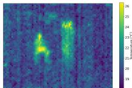

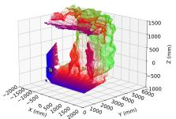

(b) Thermal Array Temp. Map  
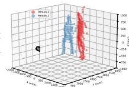

(d) Depth Camera Point Cloud  
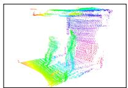  
(e) LiDAR Point Cloud

(c) TAP3D Point Cloud  
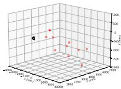  
(f) Radar Point Cloud  
Figure 1: Comparison of human point clouds generation across sensing modalities. TAP3D transforms human body (a) heat signatures, captured as a temperature (Temp.) map (b) from a low-cost thermal array sensor, into per-user point clouds (c). For comparison, (d) shows a point cloud from a RealSense stereo vision depth camera; (e) shows a point cloud from a Livox Mid-360 LiDAR; and (f) shows a radar point cloud using TI IWR1843.

## 1 INTRODUCTION

Human sensing is fundamental to human-centric applications in healthcare, interactive gaming, augmented and virtual reality, and human–robot interaction. Diferent sensing modalities produce distinct signal representations, for example, range profiles and Doppler spectrum from radar, reflectance maps from LiDAR, and depth maps from stereo vision or ToF-based depth cameras. Among them, human body point clouds stand out as a unified and versatile intermediate representation, capturing detailed pose and shape information and supporting diverse downstream tasks, such as activity recognition [58, 63], fall detection [3, 34, 77], pose estimation [26, 65, 78], and mesh reconstruction [12, 49, 69, 70], among others. Point clouds also serve as a bridge representation for multi-sensor and cross-modality fusion [1, 18, 31], for instance, aligning LiDAR and radar point clouds, a key enabler for embodied AI [53].

Table 1: Comparison of sensing modalities for human body point clouds generation. C/R: cost-resolution; Cross-Int.: cross-device interference.
<table><tr><td>Modality</td><td>RGB Cam</td><td>Depth Cam</td><td>LiDAR</td><td>Radar</td><td>Thermal Array</td></tr><tr><td>C/R Balance</td><td>√</td><td>x</td><td>x</td><td>x</td><td>√</td></tr><tr><td>Privacy Preserving</td><td>x</td><td>x</td><td>√</td><td>√</td><td>√</td></tr><tr><td>Human Sensitive</td><td>√</td><td>√</td><td>x</td><td>x</td><td>√</td></tr><tr><td>Smoke/Fog Robust</td><td>x</td><td>x</td><td>x</td><td>√</td><td>√</td></tr><tr><td>No Emission Risk</td><td>√</td><td>√</td><td>x</td><td>x</td><td>√</td></tr><tr><td>Light Immunity</td><td>x</td><td>x</td><td>x</td><td>√</td><td>√</td></tr><tr><td>No Cross-Int.</td><td>√</td><td>√</td><td>x</td><td>x</td><td>√</td></tr></table>

Diferent sensing modalities have been explored for point cloud generation, such as depth cameras [59, 60, 68], LiDAR [14, 27], and millimeter-wave (mmWave) radar [45, 46]. However, each modality exhibits inherent limitations such as privacy concerns, low sensitivity to human targets, high costs, and sparse point clouds. Depth cameras can produce dense and accurate point clouds (see Fig. 1(d)), yet are sensitive to illumination changes and raise potential privacy concerns [68]. LiDAR provides high-resolution point clouds (see Fig. 1(e)); however, commercial 3D scanning LiDAR systems remain costly [9, 49], require additional human detection steps [12], and pose potential safety risks under prolonged laser exposure in continuous monitoring scenarios [16, 84]. Similarly, mmWave radars are privacy-friendly and robust to lighting, but they sufer from cross-device interference in multi-sensor settings [22] and typically yield very sparse point clouds due to the insuficient resolution1 [33] (see Fig. 1(f)). Enhancing their spatial fidelity often requires more expensive hardware or complicated post-processing [28, 45, 82].

Recently, thermal arrays have emerged as a promising modality for human sensing [20, 38, 80, 81]. By capturing long-wavelength infrared (LWIR) emissions, they produce human body heat signatures in the form of temperature maps (Fig. 1(b)) and ofer several distinctive advantages (Tab. 1): ❶ Cost–resolution balance: Thermal arrays ofer a favorable trade-of with higher imaging resolution than compact mmWave radars while lower cost than LiDAR or depth cameras (Fig. 2), promising dense point cloud generation at scale. ❷ Long-wavelength sensing: By directly capturing heat signatures, thermal sensing inherently preserves privacy, achieves high sensitivity to human presence without the complex target-isolation processing of LiDAR or radar, and remains robust in visually challenging conditions (e.g., smoke, fog, or low light) where optical sensors fail [23, 30].

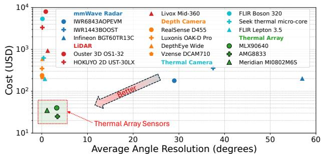  
Figure 2: Cost versus angular resolution across diferent sensing modalities. Thermal array sensors achieve a favorable balance between spatial resolution, cost, and privacy.

❸ Fully passive operation: Thermal arrays capture only body heat emissions without transmitting any signals, avoiding emission-related safety risks or cross-device interference. It is worth noting that while these advantages may appear modest in single-sensor scenarios, they become crucial in large-scale, ubiquitous deployments like smart buildings, where cost, cross-device interference, safety, and privacy concerns are amplified, rendering thermal sensing a superior choice over traditional alternatives.

However, reconstructing dense human point clouds with a commodity thermal array remains challenging (§2).

• Accurate depth estimation: Estimating depth from a temperature map is dificult, as the relationship between measured temperature intensity and body geometry is highly non-linear. As shown in Fig. 3(a), the non-uniform mapping between temperature values and spatial geometry necessitates an advanced depth estimation approach.

• Thermal interference suppression: Extracting human signals from ambient heat is non-trivial. As shown in Fig. 3(b), electronics, appliances, or sunlit furniture can emit heat signatures comparable to the human body, complicating foreground–background discrimination.

• Multi-person spatial disentanglement: Distinguishing multiple individuals in a low-resolution, textureless temperature map is dificult. As illustrated in Fig. 3(c-d), close proximity and motion blur often merge adjacent signatures and obscure body boundaries, degrading per-person representation and impairing downstream tasks such as instance-level reconstruction or activity analysis.

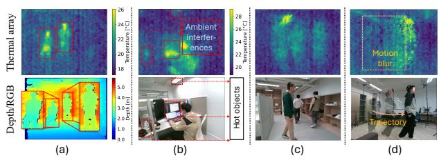  
Figure 3: Challenges in generating point clouds from thermal data. Columns: (a) Depth estimation: thermal intensity is a poor proxy for geometry. (b) Thermal interference: ambient heat sources can cause false positives. (c-d) Multi-user ambiguity: adjacent signatures may merge and motion blur further obscures body boundaries.

To address these challenges and enable Thermal-Assisted 3D Point cloud reconstruction for human sensing, we introduce TAP3D, the first system that generates dense human body point clouds using a low-cost thermal array sensor. Leveraging the physics of thermal radiation, TAP3D reconstructs accurate per-user 3D point clouds (Fig. 1(c)) from 2D temperature maps (Fig. 1(b)) by deriving one 3D point per temperature pixel. Although sparser than typical RGB-D outputs, this representation is substantially denser than those from compact radar or prior thermal ranging systems like TADAR [81], providing suficient detail for fine-grained tasks such as 3D tracking and mesh reconstruction (§7). At the core of TAP3D is a physics-informed design that in tegrates thermal physics with deep learning, optimized in an end-to-end manner. Specifically, the framework begins by modeling the relationship between human body geometry and captured temperature intensity. By constructing a forward physics model of thermal emission, propagation, and reception, this approach formulates the inverse problem of point cloud reconstruction from thermal measurements. From this formulation, TAP3D integrates two key modules: ■ Multi-primitive estimation: Our forward physics model reveals the fundamental dificulty of depth estimation: depth is entangled with other physical primitives such as emissiv ity and surface temperature. To address this, we introduce a Multi-Primitive Estimation Module, a self-supervised network that implements an inverse problem solver for joint estimation of depth, emissivity, surface temperature, and reflection from the temperature map, thereby disentangling these primitives. The forward physics model then reconstructs the temperature map from these estimates, enabling physicsguided representation learning through self-supervised training without requiring ground-truth primitive values that are impractical to obtain in real-world scenarios.

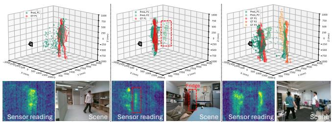  
Figure 4: Qualitative results from the pilot study illustrating the key challenges. (Left) Depth estimation error, where the predicted (Pred.) point cloud deviates from the ground truth (GT). (Middle) Thermal interference, where a warm refrigerator (dotted red block) confuses the detection. (Right) Multi-user separation failure, where two individuals are incorrectly merged into one point cloud.

■ Geometric perspective fusion: To address thermal interference and multi-person separation, we propose the Geometric Perspective Fusion Module, which operates on the estimated primitives from two orthogonal perspectives. For interference suppression, we leverage the key insight that surface temperature and emissivity are distinctive human features. Human detection is therefore performed on multichannel Optical-Axis-View (OAV) maps comprising depth, emissivity, and surface temperature. For multi-person separation, we exploit the observation that individuals who appear partially overlapping in OAV can often be distinguished from a Bird’s-Eye View (BEV). To achieve this, we propose Differentiable Index Mapping (DIM), which transforms OAV depth maps into BEV representations based on the sensor’s FoV and resolution. This diferentiable transformation is integrated into the network, supporting end-to-end OAV-to-BEV conversion. Finally, results from both perspectives are fused to produce refined per-person point clouds.

To evaluate the efectiveness of TAP3D, we construct a large-scale dataset of over 160,000 thermal array samples collected across eight indoor environments with 11 participants. Experimental results show that TAP3D achieves high geometric accuracy in point cloud reconstruction with a mean directed Chamfer distance of 4.60 cm and a mean F1 score of 0.95 across both single- and multi-user cases. We further validate the practical utility of the reconstructed point clouds via three downstream tasks, all achieving remarkable performance: fall detection (91.46% accuracy), indoor human tracking (mean absolute error of 21.86 cm), and human mesh recovery (a minimum matching distance of 4.87 cm). To the best of our knowledge, TAP3D is the first system to transform body heat signatures into human point clouds, advancing privacy-preserving and fully passive human sensing while underpinning multi-sensor and cross-modality fusion with LiDAR, radar, depth cameras, and other modalities.

Contributions: Our core contributions are as follows:

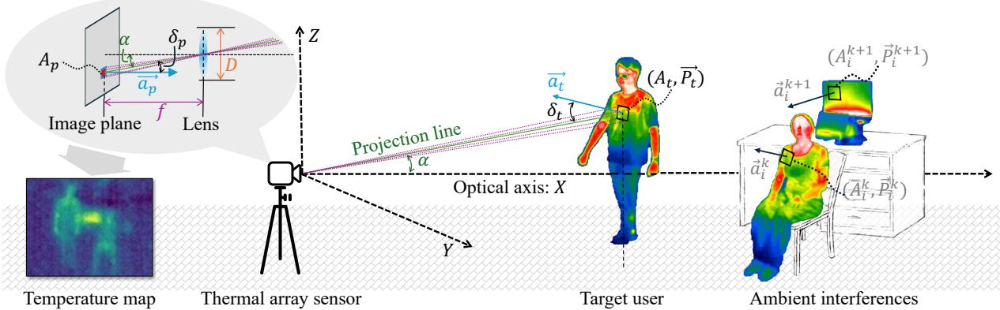  
Figure 5: Physical model of thermal array-based sensing. Each sensor pixel $A _ { p }$ receives radiation from a target surface region $A _ { t } ,$ characterized by position $\vec { P } _ { t }$ and normal $\vec { a } _ { t } .$ . Radiation undergoes atmospheric attenuation and may include reflections from ambient interferences $A _ { i } ^ { k }$ . Projection follows the pinhole camera model with parameters $f ,$ , �, �, and $\delta _ { t : }$ , yielding the final temperature map.

• We present TAP3D, the first system that taps into low-cost thermal array data to reconstruct dense 3D human point clouds, enabling a new paradigm for privacy-preserving, fully passive human sensing applications.

• We propose physics-informed multi-primitive estimation, which leverages a forward thermal physics model to selfsupervise an inverse problem solver for jointly recovering depth and related thermal properties. We also present novel geometric perspective fusion, introducing Diferentiable Index Mapping for OAV-to-BEV transformation to separate users and suppress ambient interference.

• We curate a large-scale dataset and validate TAP3D through extensive evaluation and real-world case studies, demonstrating consistently strong performance. We fully opensource TAP3D at https://github.com/aiot-lab/TAP3D.

## 2 PILOT STUDY

To empirically ground the challenges outlined in §1, we conduct a pilot study that demonstrates the non-trivial nature of reconstructing high-fidelity human point clouds from a temperature map. We develop a baseline deep learning model and evaluate its performance on a self-collected dataset. The results reveal the practical limitations of a straightforward learning approach and motivate the necessity for the advanced techniques developed in TAP3D.

Data collection: We collect data from five volunteers in five distinct indoor environments using a thermal array sensor. The dataset contains 36,921 temperature maps with ground truth point clouds and masks, obtained from a co-located Intel RealSense D455 depth camera. We split the data into 17,956 training and 18,965 test samples, covering single-user, multi-user, and background-only scenarios.

Baseline model: We implement a U-Net-like baseline model [52] that takes a single-channel temperature map as input and outputs three maps: (1) a dense depth map, (2) an instance segmentation map assigning unique IDs to each person based on distance, and (3) a binary foreground–background mask. The final 3D point cloud is generated by projecting the segmented depth into 3D space using the predicted depth and the sensor’s intrinsic parameters.

Results and analysis: We evaluate the baseline model using standard metrics for point cloud reconstruction. Tab. 2 summarizes the results across all test data, including both singleuser and more challenging multi-user scenarios. While the model achieves a reasonable F1 score of 0.91 in single-user detection, performance drops markedly in multi-user scenes, with the F1 score decreasing to 0.82. In terms of depth estimation, the mean absolute error (MAE) increases from 26.83 cm in single-user settings to 51.72 cm in multi-user cases. More critically, geometric accuracy, measured by the Directed Chamfer Distance (DCD), deteriorates from 18.5 cm to 34.2 cm, reflecting the model’s dificulty in handling inter-person occlusion and separation. These findings confirm that a straightforward learning approach is insuficient and highlight the need for a principled framework, as further illustrated by the qualitative results in Fig. 4.

## 3 TAP3D PHYSICS MODEL

We establish a physics model that links human-body primitives (3D location, surface temperature, and emissivity) to the temperature values reported by a thermal array sensor, grounded in thermography theory [35]. As shown in Fig. 5, this forward model describes how body-emitted and reflected thermal radiation propagates through the atmosphere, passes the optics, and is converted into pixel-wise temperatures, and forms the basis of the inverse problem of recovering 3D human point clouds from thermal measurements. A detailed derivation is given in Appendix A; here we summarize the resulting inverse formulation used by TAP3D.

Table 2: Pilot study results.
<table><tr><td>Scenario</td><td>DCD (cm) ↓</td><td>F1 Score ↑</td><td>MAE (cm) ↓</td></tr><tr><td>Overall</td><td>22.6</td><td>0.88</td><td>31.94</td></tr><tr><td>Single-User</td><td>18.5</td><td>0.91</td><td>26.83</td></tr><tr><td>Multi-User</td><td>34.2</td><td>0.82</td><td>51.72</td></tr></table>

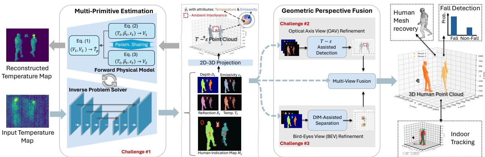  
Figure 6: TAP3D model structure. It consists of a Multi-Primitive Estimation Module that jointly estimates depth, emissivity, temperature, and reflection under physics-based self-supervision, and a Geometric Perspective Fusion Module that refines results through OAV (interference suppression) and BEV (multi-user separation), yielding accurate per-person 3D point clouds.

We group all variables into three sets: (1) unknown targetrelated primitives: spatial location $\scriptstyle { \vec { P } } _ { t } ,$ , surface temperature $T _ { t } ,$ and emissivity $\epsilon _ { t } ; ( 2 )$ fixed parameters: ambient constants $\overrightarrow { P } _ { i } ^ { k } , M _ { \lambda , k } , \xi _ { t }$ , device parameters $G , D , f , A _ { p }$ , and sensor constant $\zeta = N \kappa \rho / G _ { \mathrm { t h } } .$ , and environmental attenuation $\gamma ;$ and (3) observed quantities: the sensor-estimated temperature $\hat { T } _ { p }$ The inverse problem of point cloud estimation is formulated as recovering $\overrightarrow { P } _ { i }$ from $\hat { T } _ { p }$ via the Sakuma–Hattori model:

$$
\hat { T } _ { p } \left( \overrightarrow { P _ { t } } ; T _ { t } , \epsilon _ { t } \right) = \frac { C _ { 2 } } { C _ { 3 } \ln \left( \frac { C _ { 1 } } { V _ { 1 } + V _ { 2 } } + 1 \right) } + \frac { C _ { 4 } } { C _ { 3 } } ,\tag{1}
$$

where $T _ { t }$ and $\epsilon _ { t }$ are human-body primitives, $V _ { 1 }$ and $V _ { 2 }$ are the voltage signals from self-emission and reflected ambient radiation, and $C _ { 1 } { - } C _ { 4 }$ are sensor-specific calibration coeficients. The self-emission term $V _ { 1 }$ is

$$
V _ { 1 } = \frac { G D ^ { 2 } \zeta A _ { \cal P } } { 4 f ^ { 2 } } \frac { \langle \vec { P } _ { t } , \vec { x } \rangle ^ { 4 } e ^ { - \gamma \| \vec { P } _ { t } \| } } { \| \vec { P } _ { t } \| ^ { 4 } } \epsilon _ { t } \int _ { \lambda _ { 1 } } ^ { \lambda _ { 2 } } M _ { \lambda } ^ { \mathrm { B B } } ( T _ { t } ) d \lambda ,\tag{2}
$$

and the reflected term $V _ { 2 }$ is

$$
V _ { 2 } = \frac { G D ^ { 2 } A _ { P } \xi _ { t } \zeta } { 4 f ^ { 4 } } \frac { \langle \vec { P } _ { t } , \vec { x } \rangle ^ { 7 } e ^ { - \gamma \| \vec { P } _ { t } \| } } { \| \vec { P } _ { t } \| ^ { 5 } } \left( 1 - \epsilon _ { t } \right) \sum _ { k = 1 } ^ { K } e ^ { - \gamma \| \vec { P } _ { t } - \vec { P } _ { i } ^ { k } \| } S _ { \lambda , k } ,\tag{3}
$$

where �® is the unit vector along the optical axis and $S _ { \lambda , k } =$ $\int _ { \lambda _ { 1 } } ^ { \lambda _ { 2 } } M _ { \lambda , k } d \lambda$ is the integrated spectral exitance of the �-th ambient region. Equations (1)–(3) define the physics-constrained inverse problem whose solution yields dense human point clouds from thermal array measurements.

## 4 PHYSICS-INFORMED DESIGN

In this section, we present the TAP3D model for reconstructing 3D human point cloud from a temperature map. This model adopts a physics-informed design framework that integrates the physical model developed in §3 with a datadriven approach to address the inverse problem. We begin by providing an overview of the model architecture, followed by a detailed description of the key components that address the specific challenges outlined in §2.

## 4.1 TAP3D Model Overview

TAP3D reconstructs accurate 3D human point clouds from a single temperature map captured by a thermal array sensor. This capability supports a wide range of downstream tasks and enables multi-sensor and cross-modality sensing. As illustrated in Fig. 6, TAP3D consists of two main components: (1) Multi-Primitive Estimation Module for accurate depth recovery, addressing the first challenge in §2; and (2) Geometric Perspective Fusion Module that refines the estimated primitives to suppress ambient interference and disentangle multiple users. The refined outputs from both views are fused to produce accurate 3D human point clouds for applications such as mesh recovery, fall detection, and indoor tracking.

## 4.2 Multi-Primitive Estimation

We propose a multi-primitive estimation approach for accurate depth recovery.

Root cause of depth estimation dificulty: As established in §3, depth $( \langle \vec { P } _ { t } , \vec { x } \rangle$ in Eq. (2) and Eq. (3)) is nonlinearly coupled with other human-body primitives, including emissivity $\epsilon _ { t }$ and surface temperature $T _ { t }$ . This coupling creates a nonuniform correspondence between the measured temperature $\hat { T } _ { p }$ and the depth. Such entanglement poses a fundamental challenge for accurate depth estimation. To resolve this issue, we integrate an inverse problem solver with the forward physical model, enabling self-supervised estimation of all relevant primitives and thereby disentangling depth from emissivity and surface temperature.

Inverse problem solver: As discussed in $\ S 3 ,$ estimating human-body primitives from thermal measurements is an ill-posed inverse problem. We adopt a U-Net–like neural network as the inverse problem solver to address this chal lenge in a data-driven manner. Given a temperature map as input, the network jointly estimates depth $D _ { t }$ , emissivity $\epsilon _ { t } .$ , reflected radiation $R _ { t }$ , and surface temperature $T _ { t }$ for all candidate regions. To distinguish diferent regions, the in verse solver additionally outputs a human indication map $M _ { t }$ where pixels with value 0 denote non-human background, and pixels with values 1, 2, . . . correspond to human instances (user#1, user#2, . . . ). The estimated depth map is then converted into a 3D point cloud based on the sensor’s FoV and resolution. Since ground truth for emissivity, surface temperature, and reflected radiation is unavailable in practical non-contact scenarios, a forward physical model is introduced to provide supervisory signals.

Forward physical model: The forward physical model implements the formulation in Eq. (1)–(3), taking the estimated primitive maps as input to reconstruct the corresponding temperature map $T _ { r e c o n } .$ . To keep the model computationally eficient and tractable, we adopt two approximations: (1) The spectral integration in Planck’s law, $\int _ { \lambda _ { 1 } } ^ { \lambda _ { 2 } } M _ { \lambda } ^ { \mathrm { B B } } ( T _ { t } )$ �� in Eq. (2), is approximated by the Stefan–Boltzmann law, $\sigma T _ { t } ^ { 4 }$ , where $\sigma \approx 5 . 6 7 0 \times 1 0 ^ { - 8 } \mathrm { W } \mathrm { m } ^ { - 2 } \mathrm { K } ^ { - 4 } .$ . (2) The high-order reflected radiation term, $\begin{array} { r } { \sum _ { k = 1 } ^ { K } e ^ { - \gamma \| \vec { P } _ { t } - \vec { P } _ { i } ^ { k } \| } \cdot S _ { \lambda , k } } \end{array}$ in Eq. (3), is replaced by a reflected-radiation map directly predicted by the inverse problem solver. All other parameters are treated as learnable and optimized jointly with the network.

Physics-guided representation learning: Coupling the inverse problem solver with the forward physical model establishes a self-supervised training scheme. The network parameters are optimized by minimizing the reconstruction loss between the forward model output and the input temperature map, enabling primitive estimation without explicit ground truth for emissivity, surface temperature, and reflected radiation. This physics-guided learning approach significantly improves label eficiency and reconstruction robustness, laying the groundwork for fully self-supervised thermal reconstruction in future research.

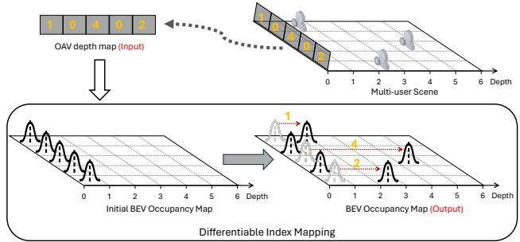  
Figure 7: Diferentiable Index Mapping (DIM). The DIM operation converts a depth map in OAV into a BEV occupancy map in a diferentiable and invertible manner.

## 4.3 Geometric Perspective Fusion

To enhance reconstruction quality, we introduce a Geometric Perspective Fusion Module that processes the estimated multi-primitive maps from two complementary perspectives: the optical-axis view (OAV) and the bird’s-eye view (BEV). This design exploits complementary spatial cues, enabling robust interference suppression and multi-user separation. OAV-based refinement: In the OAV, ambient thermal interference is suppressed by leveraging physical cues unique to the human body. Specifically, we jointly consider emissivity $\epsilon _ { t }$ and surface temperature $T _ { t }$ as primary discriminative features, combined with depth $D _ { t }$ to form a three-channel input. These inputs are fed into a lightweight convolutional network, termed the $T { \ - } - \epsilon$ assisted detection model, which outputs a binary mask $M _ { \mathrm { O A V } } \in \mathbb { R } ^ { K \times I }$ , where pixels labeled as 1 correspond to human regions.

BEV-based refinement: For multi-user separation, we operate in the BEV space to disentangle subjects more efectively. Rather than hallucinating fully occluded regions, this conversion targets separation and depth refinement by mapping partially overlapping or connected OAV signatures into distinct BEV locations. Since the estimated primitives are represented in OAV, a diferentiable and invertible transformation is required for end-to-end training. To this end, we propose Diferentiable Index Mapping (DIM), illustrated in Fig. 7. Given an OAV depth map $\bar { D \in \mathbb { R } ^ { K \times I } }$ , where � is the depth map height and � is the width, DIM projects each pixel depth value $d _ { k , i }$ into the BEV coordinate frame as a Gaussian distribution over horizontal positions. Formally, the BEV occupancy map $O \in \mathbb { R } ^ { I \times J }$ is computed as: $\begin{array} { r } { O ( i , j ) = \sum _ { k } N ( j \mid d _ { k , i } , \sigma ) , } \end{array}$ , where $N ( j \mid d _ { k , i } , \sigma )$ is a Gaussian kernel centered at $d _ { k , i }$ , and � indexes discretized depth bins, yielding a 2D spatial grid spanned by the horizontal axis � and � depth bins. Importantly, DIM is invertible, allowing the BEV occupancy map to be mapped back to the OAV depth domain with arbitrarily fine reconstruction precision controlled by the Gaussian kernel �. The DIM-assisted separation model then works as follows: the OAV depth map $D _ { t }$ is transformed into BEV via DIM, i.e., $O _ { t } = \mathrm { D I M } ( D _ { t } )$ , and a lightweight neural network refines it to produce the BEV occupancy map $O _ { \mathrm { B E V } }$

Multi-view fusion: We merge the OAV and BEV outputs with the original depth map from the multi-primitive estimation module to produce the final human point cloud. From the BEV occupancy map $O _ { \mathrm { B E V } } \in \mathbb { R } ^ { I \times J }$ , we derive per-column depth bounds in OAV space:

$$
D _ { \mathrm { m i n } } ( i ) = \operatorname* { m i n } \{ \textit { j } | O _ { \mathrm { B E V } } ( i , j ) = 1 \} ,\tag{4}
$$

$$
D _ { \mathrm { m a x } } ( i ) = \operatorname* { m a x } \{ j \mid O _ { \mathrm { B E V } } ( i , j ) = 1 \} .\tag{5}
$$

The refined depth map $D _ { t } ^ { * } \in \mathbb { R } ^ { K \times I }$ is obtained by masking $D _ { t }$ with the OAV segmentation $M _ { \mathrm { O A V } }$ and clamping each column to the valid range:

$$
D _ { t } ^ { * } ( k , i ) = \left\{ \begin{array} { l l } { \mathrm { C l i p } \big ( D _ { t } ( k , i ) , D _ { \operatorname* { m i n } } ( i ) , D _ { \operatorname* { m a x } } ( i ) \big ) , } & { M _ { \mathrm { O A V } } ( k , i ) = 1 , } \\ { 0 , } & { \mathrm { o t h e r w i s e } , } \end{array} \right.\tag{6}
$$

where $\mathrm { C l i p } ( x , a , b ) = \operatorname* { m i n } ( \operatorname* { m a x } ( x , a ) , b )$ . Finally, the output point cloud is generated by converting the refined depth map into 3D coordinates using the sensor’s FoV and resolution.

## 4.4 Training Strategy

We train TAP3D end-to-end with a weighted combination of self-supervised and supervised losses. Ground-truth depth maps $D _ { g }$ and human indication maps $M _ { g }$ are obtained from a co-located RealSense D455. The multi-primitive estimation module is optimized with Huber losses on temperature reconstruction, depth, and indication maps, while the geometric perspective fusion module uses binary cross-entropy losses for OAV segmentation and BEV refinement. All terms are combined as $\begin{array} { r } { \mathcal { L } = \sum _ { i = 1 } ^ { 5 } \lambda _ { i } L _ { i } } \end{array}$ , where $\lambda _ { i }$ are weighting factors and the full loss definitions are provided in Appendix B.

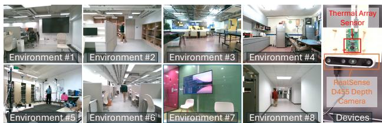  
Figure 8: Experimental setup. We conduct experiments in eight indoor environments using a thermal array sensor and co-located depth camera for ground truth acquisition.

## 5 IMPLEMENTATION

Hardware: TAP3D is implemented using the low-cost Meridian MI0802M6S thermal array sensor, featuring an $8 0 \times 6 2$ element array with a $9 0 ^ { \circ } \times 6 7 ^ { \circ }$ FoV at a cost of ∼ \$10. A colocated Intel RealSense D455 camera (Fig. 8) acquires groundtruth 3D point clouds and target masks. Data is recorded through a unified host program at 8 Hz. Each thermal frame is temporally paired with the nearest depth frame via host timestamps, followed by spatial alignment using our custom calibration tool.

Software: TAP3D is implemented in PyTorch with 23.29M parameters and trained on an RTX 4090 GPU. We use the AdamW optimizer [32] with a learning rate of 0.001 and weight decay of 0.01. Models are trained for up to 100 epochs with an early stopping patience of 8 epochs. In the DIM, � = 400 and $\sigma = 0 . 5$ correspond to the D455’s 8000 mm maximum range partitioned into 20 mm depth bins. Code, models, and datasets are at https://github.com/aiot-lab/TAP3D.

## 6 EXPERIMENTS

## 6.1 Dataset, Baselines, and Metrics

We overview the dataset, baselines, and metrics below, while providing full details in Appendix C.

Dataset: We evaluate TAP3D on a large-scale dataset of 160,000+ synchronized thermal array samples collected in eight indoor environments from 11 volunteers (Fig. 8). Each sample includes a temperature map, D455-based 3D point cloud ground truth, and a Detectron2 human mask [66]. Data are recorded at 8 Hz in one-minute segments and split at the segment level into 88,631 training and 80,011 test samples.

Baselines: Since no direct thermal array-based point cloud baselines exist, we adapt an RGB-to-point cloud method, RGB2Point [24], and a thermal image-based depth estimation approach, NeWCRF [73], for thermal array inputs. Rather than relying on of-the-shelf weights, we train all baseline models from scratch on the complete TAP3D training split. Metrics: We report directed Chamfer distance (DCD) for geometric accuracy and F1 score for user detection. For user detection, F1 is computed from precision and recall over bounding boxes extracted from predicted and ground-truth human indication maps at an IoU threshold of 0.5.

## 6.2 Overall Performance

As illustrated in Fig. 9, TAP3D reconstructs dense human body point clouds across both single- and multi-user scenarios, demonstrating strong potential for diverse sensing applications and cross-modal integration. We next present a quantitative evaluation of its performance.

Performance comparison with CV methods: As summarized in Tab. 3, TAP3D consistently outperforms CV-based

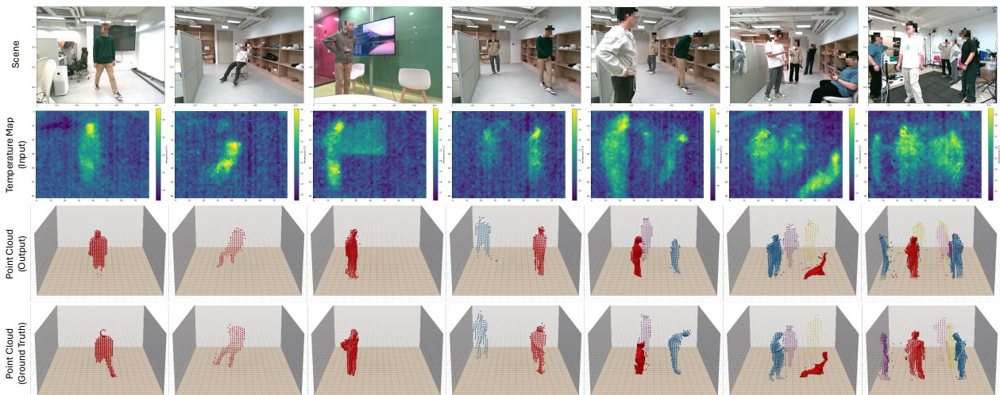  
Figure 9: Visualization of TAP3D results. Top to bottom: (1) input scene, (2) temperature map from the thermal array sensor, (3) reconstructed human point clouds by TAP3D, and (4) corresponding ground-truth point clouds.

Table 3: Comparison with SOTA baselines. TAP3D achieves the best reconstruction accuracy while being sig nificantly more parameter- and computation-eficient.
<table><tr><td>Metrics</td><td>RGB2Point [24]</td><td>NeWCRF [73]</td><td>TAP3D</td></tr><tr><td>DCD (cm)↓</td><td>10.15 ± 0.77</td><td>19.26 ± 1.50</td><td>4.60 ± 0.25</td></tr><tr><td>F1 Score↑</td><td>0.945</td><td>0.677</td><td>0.953</td></tr><tr><td>Params (M)↓</td><td>176.07</td><td>88.46</td><td>23.32</td></tr><tr><td>FLOPs (G)↓</td><td>16.96</td><td>78.14</td><td>7.41</td></tr></table>

SOTA baselines in both reconstruction accuracy and eficiency. It achieves the lowest DCD (4.60 cm vs. 10.15 cm for RGB2Point and 19.26 cm for NeWCRF) and highest F1 score (0.953), while requiring substantially fewer parameters (23.32 M) and lower computational cost (7.41 G FLOPs). These results clearly demonstrate the advantage of our physicsinformed, thermal array–specific design over direct imageto-3D or depth-estimation approaches.

Performance comparison with low-cost systems: To evaluate the advantages of TAP3D, we compare its depth estimation accuracy with two representative low-cost alternatives: TADAR [81] and a compact Infineon BGT60TR13C radar (1 Tx, 3 Rx), as shown in Fig. 10(a). While TAP3D re constructs per-pixel 3D point clouds, TADAR yields a singledepth human mask and the radar reports only a dominant reflection depth. Therefore, we benchmark all systems using a single subject walking between 0.5 m and 4 m, with a RealSense D455 providing depth ground truth. As shown in Fig. 10(b), across 985 synchronized samples, TAP3D achieves the lowest mean error of13.04 cm. The radar yields a higher error of 19.10 cm because its limited resolution captures only a single dominant reflection—often misaligned with the groundtruth depth averaged across all body pixels. TADAR achieves a mean error of 36.74 cm, matching its reported range on the scale of human body thickness. These results highlight that TAP3D delivers superior depth precision and spatial fidelity compared to existing low-cost thermal and radar systems.

(a)  
(b)  
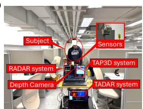

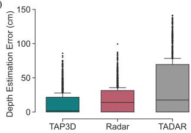  
Figure 10: Depth estimation comparison between TAP3D and other low-cost sensing systems. (a) Experimental setup featuring the synchronized TAP3D, TADAR [81], and compact radar (Infineon-BGT60TR13C) systems, with a RealSense D455 camera for ground truth. (b) Distribution of depth estimation errors.

Details on detection and geometric reconstruction: As shown in Fig. 11, TAP3D achieves robust performance up to 6.5 m, a suficient range for typical indoor applications. Although the F1 score decreases slightly with distance, it remains near 0.90 at the farthest range, ensuring reliable detection. For DCD, we observe slightly higher errors at close ranges (< 2.5 m) compared to mid-range distances (2.5–4.5 m). This is because within 2.5 m, the sensor captures only partial body heat signals, leading to missing information and minor degradation, though the error remains under 6.2 cm. Notably, the lower error observed near 0.5 m is not an artifact of fewer samples, but reflects a geometric shift where ultraclose frames capture primarily upper-body regions rather than complex full-body reconstructions. Beyond 2.5 m, DCD increases gradually as each pixel integrates radiation from larger body regions with mixed temperatures and emissivities, or non-human surfaces, complicating depth estimation. Nevertheless, TAP3D maintains high accuracy, with errors below 6.5 cm, well within human body scale.

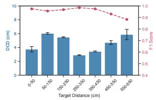  
Figure 11: Overall performance.

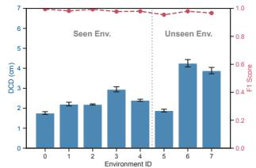  
Figure 12: Results across environments.

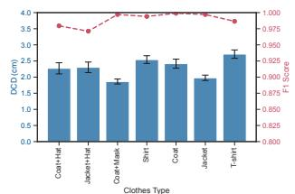  
Figure 15: Impact of cloth- ing.

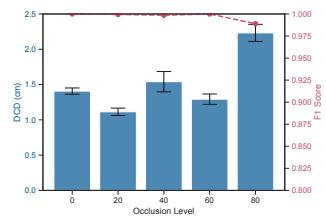  
Figure 16: Impact of the oc-clusion.

System cost and computational eficiency: The TAP3D prototype uses a Meridian MI0802M6S thermal array with an ESP32 MCU for data acquisition, resulting in a sensor-side hardware cost of about \$20 and enabling low-cost, scalable deployment. mmWave radar boards have similar prices (e.g., TI IWR1443 and TI IWR6843, around \$20) but provide much lower spatial imaging resolution. By contrast, many prior thermal sensing systems rely on high-resolution thermal cameras such as the FLIR A65C (> \$5,000) [56, 57] and FLIR Boson 640 (> \$4,000) [10], as well as LiDAR units such as the Livox Mid-360 (∼ \$700), leading to substantially higher hardware cost. In terms of computational performance, a five-minute continuous benchmark on a desktop PC (Intel i7-14700HX, RTX 4070) shows that TAP3D runs at 15.02 Hz (66.5 ms per frame), exceeding the thermal array’s 8 Hz acquisition rate to confirm real-time capability, with 354 MiB GPU memory usage and 7.41 GFLOPs per inference. This eficiency enables deployment on edge AI platforms like the Jetson Nano (∼ \$249), bringing the total cost of a fully autonomous node to approximately \$270.

## 6.3 Micro-benchmark

To further evaluate the robustness of TAP3D, we conduct a series of micro-benchmark experiments.

Cross-environment: To evaluate the cross-environment generalizability of TAP3D, we test it on 13,459 samples col lected from fully held-out environments (Env. 5–7). As shown in Fig. 12, TAP3D achieves a mean F1 score of 0.985 and DCD of 2.30 cm in seen environments, and 0.967 F1 with 3.34 cm DCD in unseen environments. Although performance decreases slightly in unseen spaces, accuracy remains high, confirming robustness across diferent indoor layouts.

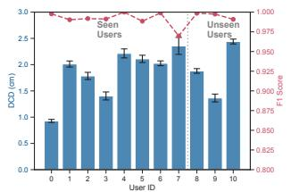  
Figure 13: Cross-user performance.

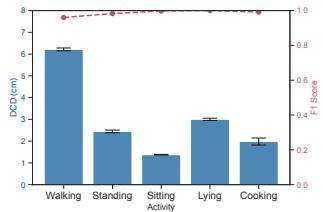  
Figure 14: Impact of activ-ity.

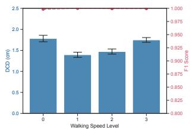  
Figure 17: Walking speed robustness.

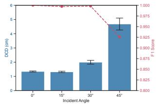  
Figure 18: Incident angle impact.

Cross-user: Fig. 13 shows the results across seen and unseen users, where all samples from the unseen users are fully excluded from training and used only for testing (IDs 8–10). For the 8 seen users, TAP3D achieves an average F1 score of0.991 and a mean DCD of 1.88 cm. For the 3 unseen users, performance remains comparable, with an average F1 score of0.996 and DCD of 1.90 cm. This stable held-out-user performance suggests that TAP3D learns transferable thermal-geometric representations rather than participant-specific patterns.

Diferent user activities: Fig. 14 reports performance under various activities, including walking, standing, sitting, lying, and cooking. F1 scores remain consistently high (0.96–1.00), while DCD varies between 1.4 cm (sitting) and 6.4 cm (walking), the latter due to motion blur during faster movements. Overall, TAP3D reliably adapts to diferent activities.

Diferent clothing types: As shown in Fig. 15, TAP3D achieves robust results across seven clothing conditions (coat, jacket, T-shirt, mask, hat). F1 scores are consistently above 0.97, with DCD ranging from 1.87 to 2.71 cm. This indicates strong resilience to clothing-related thermal variations.

Diferent occlusion levels: Fig. 16 evaluates robustness under partial occlusion, where the lower body is blocked at diferent ratios using a 10 cm thermally opaque foam mattress as the occluder. Even with 80% occlusion, TAP3D maintains an F1 score of 0.989 and DCD of 2.23 cm, showing graceful degradation under incomplete body visibility.

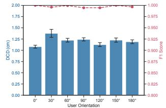  
Figure 19: User orientation robustness.

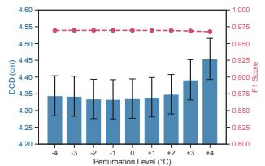  
Figure 20: Temperature perturbation testing.

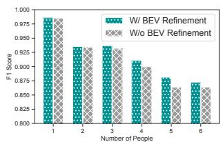  
Figure 23: Efect of BEV refinement under varying numbers of users.

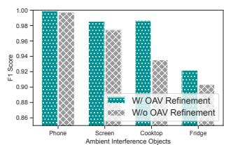  
Figure 24: Efect of OAV re- finement under diferent ambient thermal interfer- ences.

Diferent walking speeds: To evaluate the impact of motion blur, User #0 walked laterally at a distance of 2.5–3 m across four speed levels (0.4, 0.7, 1.0, and 1.3 m/s). As shown in Fig. 17, F1 scores remain near 1.0 and the DCD stays below 1.8 cm across all speeds, confirming the system’s robustness against motion blur.

Diferent incident angles: Fig. 18 evaluates incident angles from 0° (frontal) to 45°. Performance remains stable up to 30° $( \mathrm { F } 1 > 0 . 9 9 , \mathrm { D C D } < 2 . 0 \mathrm { c m } )$ . At 45°, reduced visible area lowers performance $( \mathrm { F } 1 = 0 . 9 2 6 , \mathrm { D C D } = 4 . 6 8 \mathrm { c m } )$ , though accuracy remains practical for deployment.

Diferent user orientations: Fig. 19 examines orientations at 0° (facing sensor) to 180° (back facing). F1 scores remain between 0.995 and 1.0, and DCD between 1.08 and 1.38 cm, regardless of orientation. These results demonstrate that TAP3D remains highly accurate even when users are turned away from the sensor.

Temperature perturbation robustness: To assess robustness against model mismatch, we synthetically perturb testtime temperature maps with global ofsets from −4◦C to +4◦. As shown in Fig. 20, TAP3D remains stable under small perturbations $( \pm 1 - 2 ^ { \circ } \mathrm { C } )$ , with negligible changes in DCD and F1 score, owing to its reliance on relative thermal contrasts and learned body structure priors. For larger perturbations $( \pm 3 { - } 4 ^ { \circ } \mathrm { C } )$ , DCD increases more noticeably, as expected for temperature-sensitive depth estimation; however, the degradation remains limited, indicating graceful performance under substantial temperature mismatch.

Room temperature impact: We further evaluate TAP3D under real ambient temperature variation using 16,187 samples collected at room temperatures from $2 0 { - } 3 0 ^ { \circ } \mathrm { C }$ . As shown in Fig. 21, TAP3D maintains stable reconstruction across this range, with an average DCD of 4.30 cm and DCD between 2.99 and 5.41 cm. The average F1 score is 0.862, remaining above 0.86 from $2 0 { - } 2 6 ^ { \circ } \mathrm { C }$ and degrading modestly to 0.810– 0.823 at $2 8 - 3 0 ^ { \circ } \mathrm { C } ,$ , indicating that TAP3D generalizes reliably to common indoor room-temperature settings.

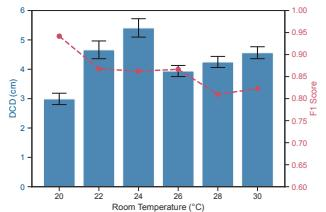  
Figure 21: Room temperature robustness.

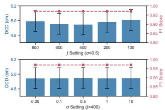  
Figure 22: Impact of DIM parameters.

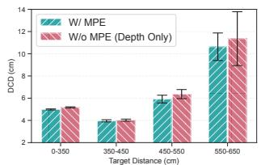  
Figure 25: Efect of multi- primitive estimation (MPE) on point cloud reconstruction accuracy.

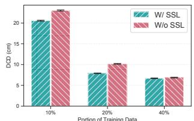  
Figure 26: Efect of self- supervised pretraining with diferent amounts of labeled finetuning data.

DIM hyperparameter sensitivity: We analyze the sensitivity of BEV refinement to the DIM hyperparameters � and � by sweeping both around their default settings $( \sigma = 0 . 5$ � = 400). As shown in Fig. 22, varying � from 100 to 800 and � from 0.05 to 10 changes DCD by less than 0.07 cm (4.95– 5.01 cm), while the F1 score remains stable at 0.970 across all configurations. These results indicate that TAP3D’s BEV refinement is robust to reasonable DIM design choices and that the selected defaults provide near-optimal performance.

## 6.4 Ablation Study

Efect of BEV refinement: BEV refinement is designed to disentangle users in crowded scenes. As shown in Fig. 23, removing BEV refinement causes only a small F1 drop under sparse settings (1–3 users, –0.9% on average), but a larger degradation under dense settings (4–6 users, –3.7%). This confirms that BEV refinement is particularly efective in resolving spatial overlap that cannot be reliably separated in the optical-axis view alone.

Efect of OAV refinement: OAV refinement suppresses ambient thermal interference. As illustrated in Fig. 24, incorporating OAV refinement improves detection performance across diverse interference sources. Specifically, the F1 score increases from 0.974 to 0.986 for screen emissions (65-inch display), from 0.935 to 0.986 for cooking appliances (microwaves and gas stoves), and from 0.903 to 0.922 for refrigerators. These gains validate that leveraging depth together with emissivity and surface temperature cues efectively reduces false positives caused by non-human heat sources.

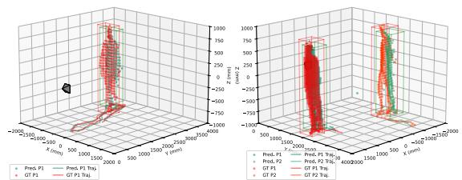  
Figure 27: Indoor tracking. Examples of single- and multi-user trajectory estimation using TAP3D outputs.

Efect of multi-primitive estimation: To evaluate the benefit of multi-primitive estimation, we compare TAP3D with an ablated variant that estimates depth only and removes the forward physical model. As shown in Fig. 25, multiprimitive estimation consistently yields lower DCD across all target distances. Overall, this module reduces DCD by 5.59%, demonstrating that jointly estimating depth with emissiv ity, surface temperature, and reflection efectively mitigates depth ambiguity inherent in thermal measurements.

Efect of self-supervised training: We isolate the contribution of physics-guided self-supervised learning (SSL) using a pretraining–finetuning protocol: 60% unlabeled data for reconstruction-only pretraining and 40% labeled data for finetuning. Because TAP3D requires explicit human detec tion, fully self-supervised end-to-end reconstruction is not yet supported. As Fig. 26 shows, SSL pretraining consistently improves accuracy across label budgets, reducing DCD by 11.93% on average; fully self-supervised reconstruction remains future work.

## 7 CASE STUDY

Fall detection: To demonstrate the potential of TAP3Dgenerated point clouds for fall detection, we collect a dataset with three volunteers performing a total of 63 fall events. The thermal array sensor records temperature maps at 20 Hz, and each fall event is manually annotated. To avoid test data leakage, six fall recordings are held out for testing. To enlarge the dataset, we deploy 12 sensors at diferent viewpoints for data collection. The final dataset contains 756 fall samples and 5,973 non-fall samples. For detection, we convert TAP3D outputs into depth map sequences and train a ResNet-based binary classifier. The system achieves 91.46% accuracy, demonstrating the strong potential of TAP3D point clouds for fall detection.

Indoor human tracking: Indoor tracking provides location information for applications such as surveillance and elderly care [76]. We evaluate TAP3D’s ability to track humans indoors using the following steps: (1) extract per-user point clouds and filter outliers with DBSCAN [11]; (2) generate 3D bounding boxes per user; and (3) perform temporal association via maximum IoU matching across consecutive frames. As shown in Fig. 27, TAP3D successfully tracks single- and multi-user trajectories, achieving a mean center distance error of 21.86 cm across 144 one-minute recordings. Compared with representative indoor tracking systems, this error is competitive with privacy-preserving RF solutions, including IR-UWB radar (17.7–23.3 cm median) [15], single-target mmWave radar (<27 cm) [21], and multi-subject mmWave radar (38–45 cm) [29], and is substantially lower than WiFi localization (32–83 cm MAE) [79]. Vision-based methods can reach 10.1 cm with a monocular camera [74], though under diferent sensing and deployment assumptions. These comparisons suggest that TAP3D point clouds demonstrate the potential for room-level indoor tracking in applications such as elderly care and smart buildings.

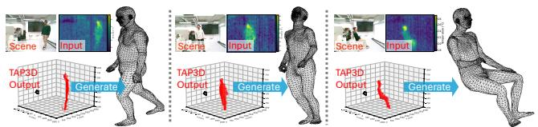  
Figure 28: 3D mesh recovery. Human meshes reconstructed from TAP3D point clouds.

3D mesh recovery: Human surface models provide richer shape information for behavior analysis. We train a ResNet-18 model [17] to predict 3D human meshes from point clouds generated by TAP3D. Ground-truth meshes are obtained from RGB images using the SMPL-X [42]. The dataset consists of 787 samples from three users performing walking and sitting, with 631 samples for training and the remainder for testing. As shown in Fig. 28, TAP3D point clouds are effectively converted to detailed 3D meshes. The reconstructed models achieve a minimum matching distance of 4.87 cm, demonstrating high accuracy for human mesh recovery. Although this study is exploratory and the limited dataset may introduce overfitting, the results highlight the strong potential of TAP3D for downstream 3D mesh recovery and motivate future investigation.

## 8 LIMITATIONS AND FUTURE WORK

While TAP3D performs well indoors, important limitations remain. Commodity thermal arrays have lower resolution than RGB-D cameras and are less robust outdoors under solar heating or weak human–background contrast. Currently, TAP3D may degrade or fail in cases like severe multi-user overlap, varying heating sources, outdoor scenes, etc (Details in Appendix D).

Beyond human body point cloud: TAP3D focuses on reconstructing human point clouds by exploiting body heat signatures, eliminating the additional detection step required in LiDAR and mmWave systems [75, 78]. Future work could extend the general physical model in §3 to non-human targets, enabling panoptic point cloud reconstruction.

Point cloud density and resolution: TAP3D reconstructs one 3D point per thermal pixel, resulting in hundreds of points per person given the resolution of current thermal arrays. This density exceeds compact radar and low-cost thermal ranging outputs but remains lower than RGB-D point clouds. While this density is suficient for coarse-tomedium geometric reconstruction, it is inherently limited by sensor resolution. Point density can be increased via interpolation or learning-based super-resolution techniques, which remains an interesting direction for future work.

Precise multi-primitive estimation: TAP3D focuses on depth as the primary geometric primitive for 3D reconstruction. The multi-primitive learning framework injects physical constraints to better isolate depth-related information, while precise multi-primitive estimation remains an interesting and challenging direction for future work.

Multi-sensor integration: Extending TAP3D to multi-sensor setups could improve reconstruction accuracy in multi-user scenes. One approach is to align reconstructed point clouds in a shared coordinate frame using known sensor poses.

Multi-modality fusion: Finally, TAP3D ofers a natural bridge for combining thermal arrays with complementary modalities such as LiDAR, radar, and depth cameras. Exploring advanced point cloud alignment methods will support richer, more robust multi-modal embodied AI applications.

## 9 RELATED WORKS

We review literature on human body point cloud generation and thermal array–based human sensing.

## 9.1 Human Body Point Cloud Generation

Human body point clouds provide rich pose and shape information, making them a compelling choice for human sensing. Existing methods for generating human body point clouds can be categorized by sensing modality:

Depth cameras: ofer dense point clouds through direct depth measurements and are widely adopted in humancentric tasks [59, 60]. They enable real-time applications such as gesture recognition [25], activity recognition [41], and surface geometry capture [72]. However, they are sensitive to illumination changes and raise privacy concerns; for example, Mozart [68] demonstrates texture recovery from ToF cameras, highlighting their privacy risks.

LiDAR: provides long-range, high-fidelity 3D sensing under diverse lighting and environmental conditions. LiDARCap achieves accurate 3D motion capture up to 30 meters via a hybrid kinematic-optimization framework [26]. HSC4D fuses LiDAR and IMU signals for human-centric scene reconstruction across indoor and outdoor domains [9]. Sparse LiDAR measurements are refined to full-body meshes via graph transformers [12], and LiveHPS introduces a spatiotemporal model to enhance robustness under occlusion [49]. LiDAR-Net further supports model generalization by providing annotated scans across large-scale indoor environments [14]. However, LiDAR remains costly and constrained by eyesafety concerns [16, 84].

Compact mmWave radar: ofers an alternative that is lighting-invariant, and privacy-friendly. Yet, the generated point clouds are often sparse and noisy [33]. To enhance fidelity, prior work applies either synthetic aperture radar (SAR) or learning-based densification techniques. MILLI-POINT performs coherent SAR imaging using self-tracked vehicle radars [46], while handheld SAR systems address phase distortion without mechanical stabilizers [28]. On the learning side, mmPoint adopts a deformable encoderdecoder pipeline for dense reconstruction from single frames [47]; RadarHD reconstructs LiDAR-like clouds from raw I/Q radar data [45]; and mmMesh aligns sparse radar inputs with parametric body models for real-time mesh recovery [70]. mmDifusion advances this direction by leveraging temporal context in sequential signals, framing the problem as point cloud denoising through conditional difusion [67]. Despite these advances, mmWave radar still requires substantial postprocessing to overcome intrinsic sparsity and sufers from cross-device interference [5].

In this regard, TAP3D delivers a fully passive, thermalassisted system for human body point cloud reconstruction, combining cost eficiency, high density, human sensitivity, and privacy preservation.

## 9.2 Thermal Array-based Human Sensing

Existing research on thermal array-based human sensing can be broadly categorized into the following two streams: Task-oriented: Task-oriented methods process thermal array readings directly to accomplish application-specific objectives such as fall detection [50, 61, 83], occupancy estimation [7, 8], daily activity recognition [36, 44, 51, 71], human monitoring [40, 43], gesture recognition [62, 64], and indoor localization [4, 13, 19]. These approaches typically treat the temperature map as a low-resolution gray-scale image for specific applications, without explicitly recovering intermediate spatial representations.

Representation-oriented: Representation-oriented methods aim to extract fine-grained sensing representations from thermal array data before applying them to end tasks. For example, a U-Net-based approach [38] segments human silhouettes from wall-mounted thermal arrays, producing 2D body masks for applications such as human detection and activity recognition. However, this representation lacks range information. To incorporate distance cues, a subsequent method [39] estimates human range by analyzing pixels in the bottom lines of the temperature map, which works only for single, front-facing users. Later, Zhang et al.[81] enabled multi-user range estimation, generating a single-depth human body mask from the temperature map, with demonstrated applications in fall detection, occupancy monitoring, and sleep posture monitoring. Beyond whole-body representations, some studies target fine-grained hand pose recovery. FingerTrak [20] and TAPOR [80] target 3D hand tracking with thermal arrays; although physics-inspired, TAPOR still relies mainly on standard learning operators. TAP3D scales to full-body 3D point cloud reconstruction via an explicit diferentiable physical model.

To the best of our knowledge, TAP3D is the first system to reconstruct dense 3D human point clouds from thermal array measurements. Unlike prior representations such as 2D masks [38] or single-depth estimates [81], our 3D point clouds provide substantially richer geometric detail. This enables downstream tasks previously infeasible, such as fullbody mesh reconstruction, and can be readily leveraged by existing point cloud models. Moreover, TAP3D facilitates integration of thermal arrays with other modalities, such as radar and LiDAR, using point clouds as a bridge representation for cross-modality alignment.

## 10 CONCLUSION

We presented TAP3D, the first system to transform body heat signatures into dense 3D human point clouds using a single low-cost thermal array sensor. With a physics–informed design, TAP3D disentangles depth, emissivity, temperature, and reflection through a multi-primitive estimation module, and achieves robust interference suppression and multi-user separation via a geometric perspective fusion module. Extensive experiments on a large-scale dataset of over 160K samples demonstrate high geometric accuracy and reliable detection across diverse conditions. Case studies on fall detection, indoor tracking, and 3D mesh recovery further showcase its potential as a versatile foundation for privacy-preserving, fully passive human sensing, enabling rich human-centric applications.

## ACKNOWLEDGMENTS

This work is supported by the Hong Kong RGC GRF under grant No. 17211725 and HKU Seed Fund for Collaborative Research under grant No. 2507263051.

## REFERENCES

[1] Mohamed Abdelazeem, Ahmed Elamin, Akram Afifi, and Ahmed El-Rabbany. 2021. Multi-Sensor Point Cloud Data Fusion for Precise 3D Mapping. The Egyptian Journal of Remote Sensing and Space Science 24, 3, Part 2 (Dec. 2021), 835–844. https://doi.org/10.1016/j.ejrs.2021.06.002

[2] Fanglin Bao, Xueji Wang, Shree Hari Sureshbabu, Gautam Sreekumar, Liping Yang, Vaneet Aggarwal, Vishnu N. Boddeti, and Zubin Jacob. 2023. Heat-Assisted Detection and Ranging. Nature 619, 7971 (July 2023), 743–748. https://doi.org/10.1038/s41586-023-06174-6

[3] Mondher Bouazizi, Chen Ye, and Tomoaki Ohtsuki. 2021. 2-D LIDARbased approach for activity identification and fall detection. IEEE Internet ofThings Journal 9, 13 (2021), 10872–10890.

[4] Mondher Bouazizi, Chen Ye, and Tomoaki Ohtsuki. 2022. Low-Resolution Infrared Array Sensor for Counting and Localizing People Indoors: When Low End Technology Meets Cutting Edge Deep Learning Techniques. Information 13, 3 (March 2022), 132.

[5] Lara Briñón-Arranz, Tiana Rakotovao, Thierry Creuzet, Cem Karaoguz, and Oussama El-Hamzaoui. 2021. A Methodology for Analyzing the Impact of Crosstalk on LIDAR Measurements. In 2021 IEEE Sensors. 1–4. https://doi.org/10.1109/SENSORS47087.2021.9639531

[6] Helmut Budzier and Gerald Gerlach. 2011. Thermal Infrared Sensors: Theory, Optimisation and Practice (1 ed.). Wiley. https://doi.org/10.1 002/9780470976913

[7] Veena Chidurala and Xinrong Li. 2021. Occupancy Estimation Using Thermal Imaging Sensors and Machine Learning Algorithms. IEEE Sensors Journal 21, 6 (March 2021), 8627–8638.

[8] Veena Chidurala and Xinrong Li. 2022. Detection of Moving Objects Using Thermal Imaging Sensors for Occupancy Estimation. Internet of Things 17 (March 2022), 100487.

[9] Yudi Dai, Yitai Lin, Chenglu Wen, Siqi Shen, Lan Xu, Jingyi Yu, Yuexin Ma, and Cheng Wang. 2022. HSC4D: Human-Centered 4D Scene Capture in Large-Scale Indoor-Outdoor Space Using Wearable IMUs and LiDAR. In Proceedings ofthe IEEE/CVF Conference on Computer Vision and Pattern Recognition. 6792–6802.

[10] Fangqiang Ding, Yunzhou Zhu, Xiangyu Wen, Gaowen Liu, and Chris Xiaoxuan Lu. 2025. ThermoHands: A Benchmark for 3D Hand Pose Estimation from Egocentric Thermal Images. In Proceedings of the 23rd ACM Conference on Embedded Networked Sensor Systems. Association for Computing Machinery, New York, NY, USA, 533–546.

[11] Martin Ester, Hans-Peter Kriegel, Jörg Sander, Xiaowei Xu, et al. 1996. A density-based algorithm for discovering clusters in large spatial databases with noise. In kdd, Vol. 96. 226–231.

[12] Bohao Fan, Wenzhao Zheng,Jianjiang Feng, andJie Zhou. 2023. LiDAR-HMR: 3D Human Mesh Recovery from LiDAR. https://doi.org/10.485 50/arXiv.2311.11971 arXiv:2311.11971 [cs]

[13] Nathaniel Faulkner, Fakhrul Alam, Mathew Legg, and Serge Demidenko. 2021. Device-Free Localization Using Privacy-Preserving Infrared Signatures Acquired From Thermopiles and Machine Learning. IEEE Access 9 (2021), 81786–81797.

[14] Yanwen Guo, Yuanqi Li, Dayong Ren, Xiaohong Zhang,Jiawei Li, Liang Pu, Changfeng Ma, Xiaoyu Zhan, Jie Guo, Mingqiang Wei, Yan Zhang, Piaopiao Yu, Shuangyu Yang, Donghao Ji, Huisheng Ye, Hao Sun, Yansong Liu, Yinuo Chen, Jiaqi Zhu, and Hongyu Liu. 2024. LiDAR-Net: A Real-scanned 3D Point Cloud Dataset for Indoor Scenes. In Proceedings of the IEEE/CVF Conference on Computer Vision and Pattern Recognition. 21989–21999.

[15] Zhengxin Guo, Dongzi Wang, Linqing Gui, Biyun Sheng, Hui Cai, Fu Xiao, and Jinsong Han. 2024. UWTracking: Passive Human Tracking Under LOS/NLOS Scenarios Using IR-UWB Radar. IEEE Transactions on Mobile Computing 23, 12 (Dec. 2024), 11853–11870. https://doi.or g/10.1109/TMC.2024.3404460

[16] Joshua Hadler, Edna Tobares, and Marla Dowell. 2013. Random Testing Reveals Excessive Power in Commercial Laser Pointers. Journal of Laser Applications 25, 3 (April 2013), 032007. https://doi.org/10.2351/ 1.4798455

[17] Kaiming He, Xiangyu Zhang, Shaoqing Ren, and Jian Sun. 2016. Deep residual learning for image recognition. In Proceedings of the IEEE conference on computer vision and pattern recognition. 770–778.

[18] Xuan He, Qingjie Zhao, Xingchen Lv, Lei Wang, and Wangwang Liu. 2024. A Registration and Fusion Method of 3D Cross-source Point Cloud Data for Modeling Accurate Models of Small Celestial Bodies. In 2024 IEEE International Conference on Robotics and Biomimetics (ROBIO). 2215–2220. https://doi.org/10.1109/ROBIO64047.2024.10907354

[19] Peter Hevesi, Sebastian Wille, Gerald Pirkl, Norbert Wehn, and Paul Lukowicz. 2014. Monitoring Household Activities and User Location with a Cheap, Unobtrusive Thermal Sensor Array. In Proceedings ofthe 2014 ACM International Joint Conference on Pervasive and Ubiquitous Computing (UbiComp ’14). New York, NY, USA, 141–145.

[20] Fang Hu, Peng He, Songlin Xu, Yin Li, and Cheng Zhang. 2020. FingerTrak: Continuous 3D Hand Pose Tracking by Deep Learning Hand Silhouettes Captured by Miniature Thermal Cameras on Wrist. Proceedings ofthe ACM on Interactive, Mobile, Wearable and Ubiquitous Technologies 4, 2 (June 2020), 71:1–71:24.

[21] Meiqiu Jiang, Haolan Luo, Shisheng Guo, and Lingjiang Kong. 2025. Indoor Human Tracking With 3-D Expansion Estimation Based on mmWave Radar. IEEE Trans. Aerospace Electron. Systems 61, 6 (Dec. 2025), 16647–16665. https://doi.org/10.1109/TAES.2025.3595827

[22] Liping Kui, Sai Huang, and Zhiyong Feng. 2021. Interference Analysis for mmWave Automotive Radar Considering Blockage Efect. Sensors 21, 12 (Jan. 2021), 3962. https://doi.org/10.3390/s21123962

[23] Zülfiye Kütük and Görkem Algan. 2022. Semantic Segmentation for Thermal Images: A Comparative Survey. In 2022 IEEE/CVF Conference on Computer Vision and Pattern Recognition Workshops (CVPRW). 285– 294. https://doi.org/10.1109/CVPRW56347.2022.00043

[24] Jae Joong Lee and Bedrich Benes. 2025. Rgb2point: 3d Point Cloud Generation from Single Rgb Images. In 2025 IEEE/CVF Winter Conference on Applications of Computer Vision (WACV). IEEE, 2952–2962.

[25] David González León, Jade Gröli, Sreenivasa Reddy Yeduri, Daniel Rossier, Romuald Mosqueron, Om Jee Pandey, and Linga Reddy Cenkeramaddi. 2022. Video Hand Gestures Recognition Using Depth Camera and Lightweight CNN. IEEE Sensors Journal 22, 14 (July 2022), 14610–14619. https://doi.org/10.1109/JSEN.2022.3181518

[26] Jialian Li, Jingyi Zhang, Zhiyong Wang, Siqi Shen, Chenglu Wen, Yuexin Ma, Lan Xu, Jingyi Yu, and Cheng Wang. 2022. LiDARCap: Long-range Markerless 3D Human Motion Capture with LiDAR Point Clouds. In 2022 IEEE/CVF Conference on Computer Vision and Pattern Recognition (CVPR). IEEE, New Orleans, LA, USA, 20470–20480. https: //doi.org/10.1109/CVPR52688.2022.01985

[27] Ying Li, Lingfei Ma, Zilong Zhong, Fei Liu, Michael A. Chapman, Dongpu Cao, and Jonathan Li. 2021. Deep Learning for LiDAR Point Clouds in Autonomous Driving: A Review. IEEE Transactions on Neural Networks and Learning Systems 32, 8 (Aug. 2021), 3412–3432. https: //doi.org/10.1109/TNNLS.2020.3015992

[28] Yadong Li, Dongheng Zhang, Ruixu Geng, Zhi Lu, Zhi Wu, Yang Hu, Qibin Sun, and Yan Chen. 2024. A High-Resolution Handheld Millimeter-Wave Imaging System with Phase Error Estimation and Compensation. Communications Engineering 3, 1 (Jan. 2024), 1–11. https://doi.org/10.1038/s44172-023-00156-2

[29] Guannan Liu, Chihhao Chang, Shih-Hau Fang, Hsiao-Chun Wu, and Kun Yan. 2026. Novel Hybrid Machine-Learning Technique for Robust Indoor Multisubject Tracking Using mmWave Radar. IEEE Internet of Things Journal 13, 8 (April 2026), 15929–15942. https://doi.org/10.110 9/JIOT.2026.3658372

[30] Yanchen Liu, Emily Bejerano, Minghui Zhao, Federico Tondolo, and Xiaofan Jiang. 2024. SPECTRA: A Drone-based Multispectral Sensing Platform for Complex Environment Perception. In Proceedings ofthe 30th Annual International Conference on Mobile Computing and Networking (ACM MobiCom ’24). Association for Computing Machinery, New York, NY, USA, 1742–1744. https://doi.org/10.1145/3636534.3698 845

[31] Zhijian Liu, Haotian Tang, Alexander Amini, Xinyu Yang, Huizi Mao, Daniela Rus, and Song Han. 2024. BEVFusion: Multi-Task Multi-Sensor Fusion with Unified Bird’s-Eye View Representation. https://doi.org/ 10.48550/arXiv.2205.13542 arXiv:2205.13542 [cs]

[32] Ilya Loshchilov and Frank Hutter. 2017. Decoupled weight decay regularization. arXiv preprint arXiv:1711.05101 (2017).

[33] Chris Xiaoxuan Lu, Stefano Rosa, Peijun Zhao, Bing Wang, Changhao Chen, John A. Stankovic, Niki Trigoni, and Andrew Markham. 2020. See through Smoke: Robust Indoor Mapping with Low-Cost mmWave Radar. In Proceedings ofthe 18th International Conference on Mobile Systems, Applications, and Services. Association for Computing Machinery, New York, NY, USA, 14–27. https://doi.org/10.1145/3386901.3388945

[34] Georgios Mastorakis and Dimitrios Makris. 2014. Fall Detection System Using Kinect’s Infrared Sensor. Journal of Real-Time Image Processing 9, 4 (Dec. 2014), 635–646. https://doi.org/10.1007/s11554-012-0246-9

[35] Klaus-Peter Mõllmann and Michael Vollmer. 2018. Infrared Thermal Imaging: Fundamentals, Research and Applications (2nd edition ed.). Wiley-VCH, Weinheim, Germany.

[36] Krishnan Arumugasamy Muthukumar, Mondher Bouazizi, and Tomoaki Ohtsuki. 2022. An Infrared Array Sensor-Based Approach for Activity Detection, Combining Low-Cost Technology with Advanced Deep Learning Techniques. Sensors 22, 10 (Jan. 2022), 3898.

[37] Yasuto Nagase, Takahiro Kushida, Kenichiro Tanaka, Takuya Funatomi, and Yasuhiro Mukaigawa. 2022. Shape From Thermal Radiation: Passive Ranging Using Multi-Spectral LWIR Measurements. In Proceedings of the IEEE/CVF Conference on Computer Vision and Pattern Recognition. 12661–12671.

[38] Abdallah Naser, Ahmad Lotfi, and Junpei Zhong. 2021. Adaptive Thermal Sensor Array Placement for Human Segmentation and Occupancy Estimation. IEEE Sensors Journal 21, 2 (2021), 1993–2002.

[39] Abdallah Naser, Ahmad Lotfi, and Joni Zhong. 2021. Towards Human Distance Estimation Using a Thermal Sensor Array. Neural Computing and Applications (June 2021). https://doi.org/10.1007/s00521-021- 06193-2

[40] Abdallah Naser, Ahmad Lotfi, and Junpei Zhong. 2022. Multiple Thermal Sensor Array Fusion Toward Enabling Privacy-Preserving Human Monitoring Applications. IEEE Internet of Things Journal 9, 17 (Sept. 2022), 16677–16688.

[41] S. U. Park, J. H. Park, M. A. Al-masni, M. A. Al-antari, Md. Z. Uddin, and T. S. Kim. 2016. A Depth Camera-based Human Activity Recognition via Deep Learning Recurrent Neural Network for Health and Social Care Services. Procedia Computer Science 100 (Jan. 2016), 78–84. https: //doi.org/10.1016/j.procs.2016.09.126

[42] Georgios Pavlakos, Vasileios Choutas, Nima Ghorbani, Timo Bolkart, Ahmed A. A. Osman, Dimitrios Tzionas, and Michael J. Black. 2019. Expressive Body Capture: 3D Hands, Face, and Body from a Single Image. In Proceedings IEEE Conf. on Computer Vision and Pattern Recognition (CVPR).

[43] Cristian Perra, Amit Kumar, Michele Losito, Paolo Pirino, Milad Moradpour, and Gianluca Gatto. 2021. Monitoring Indoor People Presence in Buildings Using Low-Cost Infrared Sensor Array in Doorways. Sensors 21, 12 (Jan. 2021), 4062

[44] Félix Polla, Hélène Laurent, and Bruno Emile. 2019. Action Recognition from Low-Resolution Infrared Sensor for Indoor Use: A Comparative Study between Deep Learning and Classical Approaches. In 2019 20th

IEEE International Conference on Mobile Data Management (MDM). 409–414.

[45] Akarsh Prabhakara, Tao Jin, Arnav Das, Gantavya Bhatt, Lilly Kumari, Elahe Soltanaghai, Jef Bilmes, Swarun Kumar, and Anthony Rowe. 2023. High Resolution Point Clouds from mmWave Radar. In 2023 IEEE International Conference on Robotics and Automation (ICRA). 4135–4142. https://doi.org/10.1109/ICRA48891.2023.10161429

[46] Kun Qian, Zhaoyuan He, and Xinyu Zhang. 2020. 3D Point Cloud Generation with Millimeter-Wave Radar. Proc. ACM Interact. Mob. Wearable Ubiquitous Technol. 4, 4 (Dec. 2020), 148:1–148:23. https: //doi.org/10.1145/3432221

[47] Xie Qian, Deng Qianyi, Cheng Ta-Ying, Zhao Peijun, Patel Amir, Trigoni Niki, and Markham Andrew. 2023. mmPoint: Dense Human Point Cloud Generation from mmWave. In The British Machine Vision Conference (BMVC).

[48] Nikhila Ravi, Jeremy Reizenstein, David Novotny, Taylor Gordon, Wan-Yen Lo, Justin Johnson, and Georgia Gkioxari. 2020. Accelerating 3D Deep Learning with PyTorch3D. arXiv:2007.08501 (2020).

[49] Yiming Ren, Xiao Han, Chengfeng Zhao, Jingya Wang, Lan Xu, Jingyi Yu, and Yuexin Ma. 2024. LiveHPS: LiDAR-Based Scene-Level Human Pose and Shape Estimation in Free Environment. In 2024 IEEE/CVF Conference on Computer Vision and Pattern Recognition (CVPR). IEEE, Seattle, WA, USA, 1281–1291. https://doi.org/10.1109/CVPR52733.20 24.00128

[50] Ariyamehr Mohsen Rezaei, Michael C. Stevens, Ahmadreza Argha, Alessandro Mascheroni, Alessandro Puiatti, and Nigel H. Lovell. 2021. An Unobtrusive Fall Detection System Using Low Resolution Thermal Sensors and Convolutional Neural Networks. In 2021 43rd Annual International Conference of the IEEE Engineering in Medicine & Biology Society (EMBC). 6949–6952.

[51] Mohsen Rezaei, Michael C. Stevens, Ahmadreza Argha, Alessandro Mascheroni, Alessandro Puiatti, and Nigel H. Lovell. 2022. An Unob trusive Human Activity Recognition System Using Low Resolution Thermal Sensors, Machine and Deep Learning. IEEE Transactions on Biomedical Engineering (2022), 1–9.

[52] Olaf Ronneberger, Philipp Fischer, and Thomas Brox. 2015. U-Net: Convolutional Networks for Biomedical Image Segmentation. In Medical Image Computing and Computer-Assisted Intervention – MICCAI 2015 (Lecture Notes in Computer Science), Nassir Navab, Joachim Hornegger, William M. Wells, and Alejandro F. Frangi (Eds.). Springer Interna tional Publishing, Cham, 234–241. https://doi.org/10.1007/978-3-319- 24574-4\_28

[53] Shulan Ruan, Rongwei Wang, Xuchen Shen, Huijie Liu, Baihui Xiao, Jun Shi, Kun Zhang, Zhenya Huang, Yu Liu, Enhong Chen, and You He. 2025. A Survey of Multi-sensor Fusion Perception for Embodied AI: Background, Methods, Challenges and Prospects. https://doi.org/ 10.48550/arXiv.2506.19769 arXiv:2506.19769 [cs]

[54] Fumihiro Sakuma and Susumu Hattori. 1983. Establishing a practical temperature standard by using a narrow-band radiation thermometer with a silicon detector. Metrology Institute Report 32, 2 (1983), 91–97.

[55] Mark Sheinin, Aswin C. Sankaranarayanan, and Srinivasa G. Narasimhan. 2024. Projecting Trackable Thermal Patterns for Dynamic Computer Vision. In Proceedings ofthe IEEE/CVF Conference on Computer Vision and Pattern Recognition. 25223–25232.

[56] Ukcheol Shin and Jinsun Park. 2025. Deep Depth Estimation from Thermal Image: Dataset, Benchmark, and Challenges. https://doi.org/ 10.48550/arXiv.2503.22060 arXiv:2503.22060 [cs]

[57] Ukcheol Shin, Jinsun Park, and In So Kweon. 2023. Deep Depth Estimation From Thermal Image. In Proceedings of the IEEE/CVF Conference on Computer Vision and Pattern Recognition. Proceedings of the IEEE/CVF Conference on Computer Vision and Pattern Recognition, 1043–1053.

[58] Akash Deep Singh, Sandeep Singh Sandha, Luis Garcia, and Mani Srivastava. 2019. RadHAR: Human Activity Recognition from Point Clouds Generated through a Millimeter-wave Radar. In Proceedings of the 3rd ACM Workshop on Millimeter-wave Networks and Sensing Systems (mmNets ’19). Association for Computing Machinery, New York, NY, USA, 51–56. https://doi.org/10.1145/3349624.3356768

[59] Zainab Namh Sultani and Rana Fareed Ghani. 2015. Kinect 3D Point Cloud Live Video Streaming. Procedia Computer Science 65 (Jan. 2015), 125–132. https://doi.org/10.1016/j.procs.2015.09.090

[60] Guoxiang Sun and Xiaochan Wang. 2019. Three-Dimensional Point Cloud Reconstruction and Morphology Measurement Method for Greenhouse Plants Based on the Kinect Sensor Self-Calibration. Agronomy 9, 10 (Oct. 2019), 596. https://doi.org/10.3390/agronomy9100596

[61] Shigeyuki Tateno, Fanxing Meng, Renzhong Qian, and Yuriko Hachiya. 2020. Privacy-Preserved Fall Detection Method with Three Dimensional Convolutional Neural Network Using Low-Resolution Infrared Array Sensor. Sensors 20, 20 (Jan. 2020), 5957.

[62] Shigeyuki Tateno, Yiwei Zhu, and Fanxing Meng. 2019. Hand Gesture Recognition System for In-car Device Control Based on Infrared Array Sensor. In 2019 58th Annual Conference of the Society of Instrument and Control Engineers ofJapan (SICE). 701–706.

[63] Mohammad Arif Ul Alam, Md Mahmudur Rahman, and Jared Q Widberg. 2021. PALMAR: Towards Adaptive Multi-inhabitant Activity Recognition in Point-Cloud Technology. In IEEE INFOCOM 2021 - IEEE Conference on Computer Communications. 1–10. https: //doi.org/10.1109/INFOCOM42981.2021.9488789

[64] Maarten Vandersteegen, Wouter Reusen, Kristof Van Beeck, and Toon Goedeme. 2020. Low-Latency Hand Gesture Recognition With a Low-Resolution Thermal Imager. In Proceedings of the IEEE/CVF Conference on Computer Vision and Pattern Recognition Workshops. 98–99.

[65] Shuai Wang, Dongjiang Cao, Ruofeng Liu, Wenchao Jiang, Tianshun Yao, and Chris Xiaoxuan Lu. 2023. Human Parsing with Joint Learning for Dynamic mmWave Radar Point Cloud. Proc. ACM Interact. Mob. Wearable Ubiquitous Technol. 7, 1 (March 2023), 34:1–34:22. https: //doi.org/10.1145/3580779

[66] Yuxin Wu, Alexander Kirillov, Francisco Massa, Wan-Yen Lo, and Ross Girshick. 2019. Detectron2. https://github.com/facebookresearch/dete ctron2.

[67] Qian Xie, Xinyu Hou, Qianyi Deng, Amir Patel, Niki Trigoni, and Andrew Markham. 2025. mmDifusion: mmWave Difusion for Sequential 3D Human Dense Point Cloud Generation. In International Conference on 3D Vision 2025.

[68] Zhiyuan Xie, Xiaomin Ouyang, Li Pan, Wenrui Lu, Guoliang Xing, and Xiaoming Liu. 2023. Mozart: A Mobile ToF System for Sensing in the Dark through Phase Manipulation. In Proceedings ofthe 21st Annual International Conference on Mobile Systems, Applications and Services (MobiSys ’23). Association for Computing Machinery, New York, NY, USA, 163–176. https://doi.org/10.1145/3581791.3596840

[69] Hongfei Xue, Qiming Cao, Yan Ju, Haochen Hu, Haoyu Wang, Aidong Zhang, and Lu Su. 2023. M4esh: mmWave-Based 3D Human Mesh Construction for Multiple Subjects. In Proceedings of the 20th ACM Conference on Embedded Networked Sensor Systems (SenSys ’22). Association for Computing Machinery, New York, NY, USA, 391–406. https://doi.org/10.1145/3560905.3568545

[70] Hongfei Xue, Yan Ju, Chenglin Miao, Yijiang Wang, Shiyang Wang, Aidong Zhang, and Lu Su. 2021. mmMesh: Towards 3D Real-Time Dynamic Human Mesh Construction Using Millimeter-Wave. In Proceedings ofthe 19th Annual International Conference on Mobile Systems, Applications, and Services (MobiSys ’21). Association for Computing Machinery, New York, NY, USA, 269–282. https://doi.org/10.1145/34 58864.3467679

[71] Cunyi Yin, Jing Chen, Xiren Miao, Hao Jiang, and Deying Chen. 2021. Device-Free Human Activity Recognition with Low-Resolution Infrared Array Sensor Using Long Short-Term Memory Neural Network. Sensors 21, 10 (Jan. 2021), 3551.

[72] Tao Yu, Kaiwen Guo, Feng Xu, Yuan Dong, Zhaoqi Su, Jianhui Zhao, Jianguo Li, Qionghai Dai, and Yebin Liu. 2017. BodyFusion: Real-Time Capture of Human Motion and Surface Geometry Using a Single Depth Camera. In Proceedings of the IEEE International Conference on Computer Vision. 910–919.

[73] Weihao Yuan, Xiaodong Gu, Zuozhuo Dai, Siyu Zhu, and Ping Tan. 2022. Neural Window Fully-Connected Crfs for Monocular Depth Estimation. In Proceedings of the IEEE/CVF Conference on Computer Vision and Pattern Recognition. 3916–3925.

[74] Yu Zhan, Hanjing Ye, and Hong Zhang. 2025. Monocular Person Localization under Camera Ego-Motion. In 2025 IEEE/RSJ International Conference on Intelligent Robots and Systems (IROS). 18466–18473. ht tps://doi.org/10.1109/IROS60139.2025.11246604

[75] Bin-Bin Zhang, Dongheng Zhang, Ruiyuan Song, Binquan Wang, Yang Hu, and Yan Chen. 2023. RF-Search: Searching Unconscious Victim in Smoke Scenes with RF-enabled Drone. In Proceedings ofthe 29th Annual International Conference on Mobile Computing and Networking. Association for Computing Machinery, New York, NY, USA, 1–15.

[76] Da Zhang, Feng Xia, Zhuo Yang, Lin Yao, and Wenhong Zhao. 2010. Localization technologies for indoor human tracking. In 2010 5th international conference on future information technology. IEEE, 1–6.

[77] Duo Zhang, Xusheng Zhang, Shengjie Li, Yaxiong Xie, Yang Li, Xuanzhi Wang, and Daqing Zhang. 2023. LT-Fall: The Design and Implementation of a Life-threatening Fall Detection and Alarming System. Proceedings of the ACM on Interactive, Mobile, Wearable and Ubiquitous Technologies 7, 1 (March 2023), 40:1–40:24. https: //doi.org/10.1145/3580835

[78] Jingyi Zhang, Qihong Mao, Guosheng Hu, Siqi Shen, and Cheng Wang. 2024. Neighborhood-Enhanced 3D Human Pose Estimation with Monocular LiDAR in Long-Range Outdoor Scenes. In Proceedings of the Thirty-Eighth AAAI Conference on Artificial Intelligence and Thirty-Sixth Conference on Innovative Applications of Artificial Intelligence and Fourteenth Symposium on Educational Advances in Artificial Intelligence (AAAI’24/IAAI’24/EAAI’24, Vol. 38). AAAI Press, 7169–7177. https://doi.org/10.1609/aaai.v38i7.28545

[79] Tianyu Zhang, Dongheng Zhang, Guanzhong Wang, Yadong Li, Yang Hu, Qibin sun, and Yan Chen. 2024. RLoc: Towards Robust Indoor Localization by Quantifying Uncertainty. Proc. ACM Interact. Mob. Wearable Ubiquitous Technol. 7, 4 (Jan. 2024), 200:1–200:28. https: //doi.org/10.1145/3631437

[80] Xie Zhang, Chengxiao Li, and Chenshu Wu. 2025. TAPOR: 3D Hand Pose Reconstruction with Fully Passive Thermal Sensing for around-Device Interactions. Proc. ACM Interact. Mob. Wearable Ubiquitous Technol. 9, 2, Article 63 (June 2025). https://doi.org/10.1145/3729499

[81] Xie Zhang and Chenshu Wu. 2024. TADAR: Thermal Array-based Detection and Ranging for Privacy-Preserving Human Sensing. In Proceedings of the Twenty-fifth International Symposium on Theory, Algorithmic Foundations, and Protocol Design for Mobile Networks and Mobile Computing (MobiHoc ’24). Association for Computing Machinery, New York, NY, USA, 11–20. https://doi.org/10.1145/3641512.3686357

[82] Xi Zhang, Yu Zhang, Zhenguo Shi, and Tao Gu. 2023. mmFER: Millimetre-wave Radar Based Facial Expression Recognition for Multimedia IoT Applications. In Proceedings of the 29th Annual International Conference on Mobile Computing and Networking (ACM MobiCom ’23). Association for Computing Machinery, New York, NY, USA, 1–15. https://doi.org/10.1145/3570361.3592515

[83] Cankun Zhong, Wing W. Y. Ng, Shuai Zhang, Chris D. Nugent, Colin Shewell, and Javier Medina-Quero. 2021. Multi-Occupancy Fall Detection Using Non-Invasive Thermal Vision Sensor. IEEE Sensors Journal 21, 4 (Feb. 2021), 5377–5388.

[84] Joseph A. Zuclich, Donald A. Gagliano, F. Cheney, Bruce E. Stuck, Harry Zwick, Peter R. Edsall, and David J. Lund. 1995. Ocular Efects of Penetrating IR Laser Wavelengths. In Laser-Tissue Interaction VI, Vol. 2391. SPIE, 112–125. https://doi.org/10.1117/12.209874

## A DETAILED DERIVATION OF THE TAP3D PHYSICS MODEL

This appendix provides the full derivation of the physics model underlying TAP3D, extending the concise formulation in §3. We follow classical thermography theory [35] to relate human-body primitives to thermal array measurements.

## A.1 Forward Physical Model

We first construct a forward model that describes how the position and thermal properties of a target region afect the temperature reported by a thermal array pixel. As illustrated in Fig. 5, each pixel $A _ { p }$ on the image plane receives thermal radiation from a corresponding surface region $A _ { t }$ on the human body and outputs an estimated temperature value. Aggregating all pixels yields the full temperature map.

To distinguish diferent radiation sources, we use subscripts �, �, and $\boldsymbol { p }$ for quantities associated with the target region $A _ { t }$ , ambient interference regions $A _ { i } ^ { \cdot }$ , and the sensor pixel $A _ { p }$ (receiver), respectively.

Atmospheric transmittance: To determine the three dimensional location of $A _ { t }$ , the key quantity is its depth (distance along the �-axis) relative to the sensor. The imageplane coordinates $( Y , Z )$ are determined by the sensor FoV and spatial resolution, while depth must be inferred from the physical interaction between emitted radiation and the atmosphere. Thermal radiation emitted from the target and transmitted through air experiences attenuation governed by the Bouguer–Lambert–Beer law, which yields an exponential decay of transmittance with distance [37]. Although major air components $( \Nu _ { 2 } , \mathrm { O _ { 2 } } )$ are mostly transparent in the LWIR band, heteronuclear molecules such as $_ \mathrm { H _ { 2 } O }$ and $\mathrm { C O _ { 2 } }$ exhibit strong absorption [35]. The spectral atmospheric transmittance over distance � is modeled as

$$
\tau _ { \lambda } ( r ) = \exp ( - \gamma _ { \lambda } r ) ,\tag{7}
$$

where $\gamma _ { \lambda }$ is the spectral attenuation coeficient and � is the wavelength.

Spectral exitance of the target region: Given the location $\vec { \boldsymbol { P } } _ { t } \in \mathbb { R } ^ { 3 }$ and surface normal $\vec { a } _ { t }$ of the target region $A _ { t } ,$ , the original spectral exitance $M _ { \lambda , t }$ consists of (i) self-emission from $A _ { t }$ and (ii) reflected radiation from ambient interference regions $A _ { i } ^ { k } ( \mathrm { e . g . }$ ., other body parts or nearby devices):

$$
M _ { \lambda , t } = \epsilon _ { \lambda , t } M _ { \lambda } ^ { \mathrm { B B } } ( T _ { t } ) + ( 1 - \epsilon _ { \lambda , t } ) \sum _ { k = 1 } ^ { K } \tau _ { \lambda } ( r _ { k  t } ) V _ { k  t } M _ { \lambda , k } .\tag{8}
$$

The first term models self-emission governed by surface temperature �� and spectral emissivity $\bar { \epsilon } _ { \lambda , t } ; M _ { \lambda } ^ { \mathrm { B B } } ( \cdot )$ is the Planck spectral radiance function [35]. The second term accounts for reflected radiation from � ambient regions at locations $\overrightarrow { P } _ { i } ^ { k } , k = 1 , \dots , K$ . Here, $r _ { k  t } = \| \overrightarrow { P } _ { t } - \overrightarrow { P } _ { i } ^ { k } \|$ is the distance between $A _ { k }$ and $A _ { t } , \tau _ { \lambda } ( r _ { k  t } )$ is given above, and $V _ { k  t }$ is the view factor describing geometric visibility [2], approximated as $V _ { k  t } = \xi _ { t } A _ { t }$ with tunable $\xi _ { t } \in [ 0 , 1 ]$ . Finally, $M _ { \lambda , k }$ is the spectral exitance of the �-th interference region.

We adopt three simplifying assumptions that are practical for 3D human point cloud generation and validated experimentally:

(1) The target region $A _ { t }$ behaves as a Lambertian radiator with direction-independent emissivity $\epsilon _ { \lambda , t }$ , yielding $L _ { \lambda , t } = M _ { \lambda , t } / \pi$

(2) Ambient interference regions are treated as uniform surfaces contributing identical diferential view factors to $A _ { t }$

(3) Radiation transfer from $A _ { t }$ to interference regions and inter-reflections among interference regions are neglected, excluding higher-order efects.

Optical transfer: By combining the pinhole camera model with atmospheric attenuation, the spectral radiation flux $\Phi _ { \lambda , p }$ arriving at pixel $A _ { p }$ is

$$
\Phi _ { \lambda , p } = G _ { \lambda } \tau _ { \lambda } ( \vert \vert \vec { P } _ { t } \vert \vert ) L _ { \lambda , t } \frac { \pi D ^ { 2 } \cos ^ { 4 } \alpha } { 4 f ^ { 2 } } A _ { p } ,\tag{9}
$$

where $G _ { \lambda }$ is the optical gain, $\| \vec { P } _ { t } \|$ is the distance from $A _ { t }$ to the sensor, $\tau _ { \lambda } ( \Vert \vec { P } _ { t } \Vert )$ is as above, $L _ { \lambda , t }$ is the spectral radiance of $A _ { t }$ , � is the angle between the optical axis and the projection line, and $f$ and $D$ are the lens focal length and aperture diameter.

Thermoelectric conversion and temperature readout: Each thermal array pixel employs a thermopile that converts total received spectral radiation $\begin{array} { r } { \Phi _ { p } = \int _ { \lambda _ { 1 } } ^ { \lambda _ { 2 } } \Phi _ { \lambda , p } d \lambda } \end{array}$ over the sensor’s spectral response band $( \lambda _ { 1 } , \lambda _ { 2 } )$ into a voltage signal $V _ { p }$ according to the thermoelectric response model [6]:

$$
V _ { p } = N \kappa \rho \frac { \Phi _ { p } } { G _ { \mathrm { t h } } } ,\tag{10}
$$

where � is the number of thermocouples, � is the Seebeck coeficient $[ 3 5 ] , \rho$ is the absorbance, and $G _ { \mathrm { t h } }$ is the thermal conductance. Commercial thermal arrays then convert $V _ { p }$ to an estimated temperature $\hat { T } _ { p }$ via the Sakuma–Hattori equation [54, 55], with sensor-specific calibration coeficients.

## A.2 Inverse Problem Formulation

The forward physical model describes how sensor parameters, atmospheric properties, the target user, and ambient interferences jointly determine the thermal array output. For 3D human point cloud estimation, we simplify this model and formulate the inverse problem accordingly.

We adopt two standard assumptions: (1) Consistent with [2, 81], all surface regions, including $A _ { t }$ and $A _ { i } ^ { k }$ , behave as Lambertian gray bodies with wavelength-independent emissivity �. (2) For wavelength-dependent quantities such as $G _ { \lambda }$ and ��, we use band-averaged values � and � over the sensor’s operational spectrum.

We then categorize variables as: (1) unknown target primitives: $\overrightarrow { P } _ { t } , T _ { t } , \epsilon _ { t } ; ( 2 )$ fixed parameters: $\overrightarrow { P } _ { i } ^ { k } , M _ { \lambda , k } , \xi _ { t } , G , D , f ,$ $A _ { \boldsymbol { p } } , \zeta = N \kappa \rho / G _ { \mathrm { t h } } .$ , and $\gamma ; ( 3 )$ observed quantities: $\hat { T } _ { p }$

The main text (§3) presents the resulting inverse model: Eqs. (1)–(3) compactly define the physics-constrained inverse problem that TAP3D solves to recover dense human point clouds from thermal array measurements.

## B TRAINING OBJECTIVE

This appendix provides the full training objective used in $\ S 4 . 4 .$ The dataset provides thermal array readings together with depth maps and RGB images from a co-located stereo camera, which are processed to obtain the ground-truth depth map $D _ { g }$ and human indication map $M _ { g } ,$ where $\tilde { M } _ { g } ~ = ~ 1 _ { \{ M _ { g } > 0 \} }$ denotes the binary foreground mask.

The multi-primitive estimation module is trained with a reconstruction loss for self-supervision,

$$
L _ { \mathrm { r e c o n } } ( \hat { T } , T _ { \mathrm { r e c o n } } ; \tilde { M } _ { g } ) = \mathrm { H u b e r } ( \tilde { M } _ { g } \odot \hat { T } , \ \tilde { M } _ { g } \odot T _ { \mathrm { r e c o n } } ) ,
$$

a depth loss supervising the predicted depth map $D _ { t } \colon$

$$
{ \cal L } _ { \mathrm { d e p t h } } ( D _ { t } , D _ { g } ; \tilde { M } _ { g } ) = \mathrm { H u b e r } ( D _ { t } , \ \tilde { M } _ { g } \odot D _ { g } ) ,
$$

and an indication map loss: $L _ { \mathrm { i n d } } ( M _ { t } , M _ { g } ) = \mathrm { H u b e r } ( M _ { t } , M _ { g } )$

The geometric perspective fusion module is trained with two losses: $L _ { \mathrm { O A V } } ( M _ { \mathrm { O A V } } , M _ { g } ) = \mathrm { B C E } ( M _ { \mathrm { O A V } } , M _ { g } )$ for OAV segmentation, where BCE is the binary cross-entropy loss; and $L _ { \mathrm { B E V } } ( O _ { \mathrm { B E V } } , D _ { g } , M _ { g } ) = \mathrm { B C E } \big ( O _ { \mathrm { B E V } } , \mathrm { D I M } ( M _ { g } \odot D _ { g } ) \big )$ for BEV refinement, where DIM(·) is the Diferentiable Index Mapping in §4.3.

The overall objective is

$$
\begin{array} { r } { \mathcal { L } = \lambda _ { 1 } L _ { \mathrm { r e c o n } } + \lambda _ { 2 } L _ { \mathrm { d e p t h } } + \lambda _ { 3 } L _ { \mathrm { i n d } } + \lambda _ { 4 } L _ { \mathrm { O A V } } + \lambda _ { 5 } L _ { \mathrm { B E V } } , } \end{array}
$$

with weighting factors $\lambda _ { 1 } , \lambda _ { 2 } , \lambda _ { 3 } , \lambda _ { 4 } , \lambda _ { 5 }$ balancing the terms.

## C DATASET, BASELINES, AND METRICS

This appendix provides the full dataset, baseline, and metric details used in §6.1.

Dataset: We conduct experiments on a large-scale dataset collected in eight indoor environments (see Fig. 8) from 11 volunteers (four female and seven male), aged 19–28 years, with heights ranging from 165 cm to 187 cm. All procedures were approved by our institution’s IRB. The dataset contains over 160,000 samples, each with a synchronized temperature map, 3D point cloud ground truth, and human mask. Groundtruth point clouds are obtained using a co-located RealSense D455 depth camera, while human masks are generated with Detectron2 [66]. To accelerate data collection, samples are recorded at 8 Hz in one-minute segments, yielding 328 segments in total. To prevent cross-segment data leakage, we split the dataset at the segment level: the training set contains $^ { 8 8 , 6 3 1 }$ samples (with 20% reserved for validation), and the test set contains 80,011 samples.

Baselines: To the best of our knowledge, TAP3D is the first thermal array human point cloud reconstruction system, so no direct baselines exist. We construct representative baselines by adapting SOTA methods from two domains for thermal array inputs: (i) single-view RGB–to–point cloud reconstruction, and (ii) thermal image–based depth estimation followed by back-projection. Rather than using of-the-shelf weights, we train all baseline models from scratch on the complete TAP3D training split.

• RGB2Point [24] is a SOTA single-view image–to–point cloud reconstruction model based on Transformers. To adapt it to thermal arrays, we upsample each thermal frame to $2 2 4 \times 2 2 4 .$ , replicate it to three channels, and feed it to the original RGB2Point architecture.

• NeWCRF [73] is a SOTA monocular depth estimation model that combines a ViT encoder with a CRF-based decoder and has shown strong results on depth benchmarks [56, 57]. We apply NeWCRF to interpolated thermal frames (480 × 640) to predict depth maps, back-project them into 3D point clouds, and then resize the outputs to the original thermal resolution $( 6 2 \times 8 0 )$

Metrics: We adopt two metrics: (1) Directed Chamfer Distance (DCD). DCD measures geometric accuracy as the average shortest distance from predicted points � to ground truth $\begin{array} { r } { \dot { Q : } d _ { \mathrm { d i r } } ( P  Q ) = \frac { 1 } { | P | } \sum _ { P \in P } \operatorname* { m i n } _ { q \in Q } \| p - q \| _ { 2 } } \end{array}$ . In practice, we compute the symmetric Chamfer distance $d _ { \mathrm { C D } } ( P , Q )$ using PyTorch3D [48], then report DCD as $\mathrm { D C D } = \sqrt { \textstyle { \frac { 1 } { 2 } } d _ { \mathrm { C D } } }$ [cm]. Unlike the symmetric version, DCD is more intuitive since it directly reflects prediction-to-ground-truth error. (2) F1 Score. For user detection, we compute the F1 score by evaluating precision and recall over bounding boxes extracted from the predicted and ground-truth human indication maps at an IoU threshold of 0.5.

## D REPRESENTATIVE FAILURE CASES

Fig. 29 illustrates representative failure modes that clarify the operating conditions of TAP3D. Each column shows the RGB scene (top), the input thermal map (middle), and the predicted point cloud (bottom).

Severe multi-user overlap: When multiple users overlap in the scene (Col. 1), their OAV signatures can remain connected even after BEV refinement. This issue is further exacerbated when nearby heat sources introduce additional interference (cyan dashed boxes), ultimately leading to missed detections. Spatially varying heat sources: Highly reflective surfaces and sun-heated structures create localized thermal fields that violate the global interference assumptions used during training. When a user stands near a metal door, reflected body heat can produce false-positive detections (Col. 2). When a user stands before a sun-heated window, human–background contrast becomes unstable across frames: although the head region often appears warmer than the window (purple boxes in the temperature maps), the lower body may appear cooler, yielding inconsistent signatures. Consequently, reconstruction may succeed (Col. 3), degrade (Col. 4), or fail entirely (Cols. 5–6) as window radiation increasingly overwhelms the body signature.

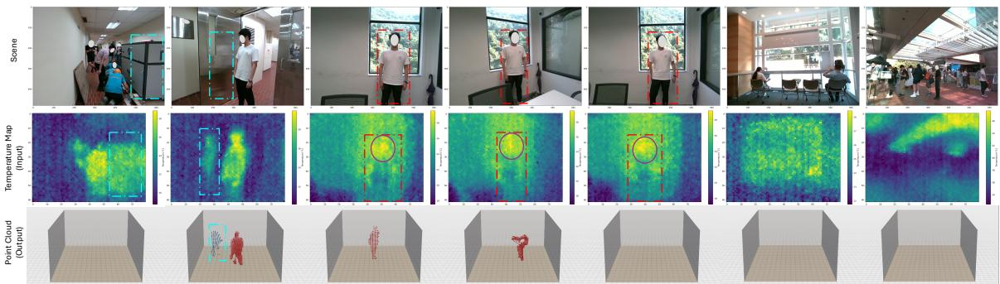  
Figure 29: Representative failure cases. Each column shows the RGB scene (1st row), thermal input (2nd row), and predicted point cloud (3rd row). Columns illustrate (1) multi-user overlap with nearby interference (cyan dashed box), (2) false positives from reflective surfaces (metal door, cyan dashed box), (3–6) unstable or failed detection before sun-heated windows, and (7) outdoor failure under strong ambient thermal radiation.

Interference-heavy and outdoor scenes: In outdoor settings on sunny days (Col. 7), thermal radiation from ambient objects and the surrounding air can dominate the temperature map, leaving insuficient human contrast for reliable detection. Together, these cases indicate that TAP3D is most reliable in indoor environments with moderate thermal interference.

Potential solutions: Many of these failures stem from the limited spatial resolution and temperature sensitivity of commodity thermal arrays. Higher-resolution, higher-sensitivity sensors could improve contrast between users and between humans and the background, making overlapping people and weakly contrasting scenes easier to separate. At the algorithm level, enforcing temporal consistency and humanbody structural priors—for example, via mesh or kinematic constraints applied as post-processing—may further stabilize detection and reconstruction in the challenging scenarios above, including multi-user overlap and spatially varying heat sources.