# TKCAM: Text and Keyframe to Camera Trajectory Generation

Haozhe Yang1 Zhiyang Dou1,† Zekai Gu2 Cheng Lin3 Wenping Wang4 Yuan Liu2 Taku Komura1,†

1The University of Hong Kong 2The Hong Kong University of Science and Technology 3Macau University of Science and Technology 4Texas A&M University {yhz2004, zhiyang0}@connect.hku.hk taku@cs.hku.hk zekai.gu@connect.ust.hk yuanly@ust.hk chenglin@must.edu.mo wenping@tamu.edu

## Abstract

Generating high-quality and controllable camera motion is essential for AI-assisted cinematography, video synthesis, and 3D scene understanding. We introduce TK-CAM, a Text- and Keyframe-conditioned CAMera-motion synthesis framework based on generative masked modeling. We represent camera dynamics using a 12-dimensional kinematic feature comprising position, velocity, and a continuous rotation representation and discretize them into hierarchical motion tokens via a Residual Vector Quantizer (RVQ). A two-stage masked transformer architecture then learns to reconstruct and refine these tokens, utilizing explicit self- and crossattention modules for multimodal conditioning. A central feature of our framework is sparse visual keyframe conditioning: users can provide free-form text prompts together with RGB observations at selected timestamps, which provide temporally localized visual guidance for generating coherent in-between trajectories. Furthermore, to advance evaluation standards, we curate RealEstate10K-Cap, a large-scale text-camera dataset, and establish a cross-domain benchmark with a Universal CLaTr Evaluator. Extensive experiments demonstrate that TKCAM surpasses recent state-of-the-art baselines on Fréchet distance (FID), text-motion matching scores, and retrieval metrics (R@K), while additional analyses evaluate temporal smoothness and cross-domain generalization. Code is available at https://github.com/linearalgebrayhz/TKCAM.

## 1 Introduction

Camera motion determines how a scene is perceived, understood, and narrated. For modern vision–language systems, the ability to synthesize high-quality and controllable 6-DoF camera trajectories enables AI-assisted cinematography [15, 16], video synthesis [12, 17, 18, 28, 33, 37], and spatial reasoning in 3D environments [4, 22, 27, 32]. Yet translating sparse, symbolic language into metrically consistent 3D motion remains challenging: language under-specifies geometry and timing; naïve regression drifts semantically; and existing datasets rarely couple reliable camera annotations with temporally grounded captions or standardized tools for evaluating text and camera-motion alignment.

Recent approaches [7, 16, 19, 36] have modeled text-to-trajectory either autoregressively or via diffusion. While these models can produce smooth paths given prompts, they still face three practical limitations. First, direct regression from text often ignores fine-grained visual semantics, leading to trajectories that miss spatial relations or temporal emphasis. Second, existing control mechanisms commonly rely on explicit camera states, scene geometry, or other structured inputs, whereas users may instead wish to guide motion using sparse visual observations at selected timestamps. Third, the modality gap between discrete text and continuous 3D motion, combined with the limited availability of semantically rich supervision, hinders efficient learning and generalization.

In this paper, we address these issues with TKCAM, a text- and keyframe-conditioned camera-motion generator built on generative masked modeling. TKCAM first discretizes continuous 3D camera trajectories into hierarchical motion tokens using a Residual Vector Quantizer (RVQ). To learn the multimodal correspondences, we train a base masked transformer that performs conditional demasking to reconstruct the masked motion tokens. Instead of complex token-level masking heuristics, we adopt a simple attention design within the transformer blocks: a motion-motion self-attention module to capture the temporal dynamics of the trajectory, followed by a motion-condition cross-attention module to directly inject the text and visual keyframe embeddings. A residual masked transformer then further refines the higher RVQ quantization levels in a coarse-to-fine manner, enhancing the high-frequency fidelity of the camera motion. As a result, at inference, TKCAM supports both text-only generation and animator-style keyframe conditioning: users can provide free-form text prompts alongside sparse RGB keyframes (e.g., first-frame or start/end observations), which serve as temporally localized visual guidance while the model generates coherent in-between trajectories conditioned on both the text and visual observations.

To train TKCAM, we curate RealEstate10K-Cap, a large-scale camera motion dataset built upon RealEstate10K [38]. RealEstate10K-Cap couples high-quality 3D camera trajectories with temporally grounded directorial captions. Specifically, the corpus comprises 25K annotated sequences (5 million frames, approximately 50 hours in total) across diverse real estate environments. Furthermore, a significant bottleneck in current camera generation research is the absence of a standardized and cross-domain evaluation metric. To support evaluation across different camera-motion domains, we further construct a Universal CLaTr Evaluator by retraining the CLaTr contrastive objective [7] on a balanced mixture of indoor, cinematic, and character-centric trajectory data.

We conduct extensive experiments to validate that TKCAM generates semantically faithful camera trajectories with smooth translational motion under both text-only and text-keyframe settings. On our mixed-domain benchmark, TKCAM outperforms recent state-of-the-art baselines on Fréchet distance (FID), CLaTr-based text–motion matching score, and retrieval metrics (R@K). Furthermore, ablations support the benefits of our 12-dimensional kinematic representation, RVQ discretization, and the dual masked transformer architecture. Our main contributions can be summarized as follows:

• We present TKCAM, a hierarchical masked generative framework tailored to multimodal camera trajectory synthesis. Building on established RVQ-VAE and masked modeling techniques, TKCAM introduces a camera-specific 12-dimensional kinematic representation together with decoupled motion self-attention and multimodal cross-attention for camera-motion generation.

• We introduce animator-style sparse-keyframe conditioning for text-driven camera generation. RGB observations at selected timestamps provide soft visual guidance through cross-attention, enabling bidirectional generation of coherent in-between trajectories without requiring explicit camera extrinsics as user input.

• We curate RealEstate10K-Cap, a large-scale dataset of reconstructed camera trajectories paired with temporally grounded, scene-aware captions, and establish a cross-domain evaluation protocol with a Universal CLaTr Evaluator. We further validate the framework through controlled baseline retraining, temporal-smoothness analysis, and human evaluation of the proposed evaluator. Among the compared methods, ours achieves the best FID, matching, and retrieval scores.

## 2 Related Work

Camera Trajectory Generation. Early efforts in camera trajectory generation relied on optimizationbased motion planning [5, 8] or direct continuous regression, which frequently suffered from highfrequency spatial jitter and struggled with semantic alignment. To address these issues, recent frameworks employ VLM-based planners to orchestrate 3D coordinates from abstract text (e.g., ShotVerse [31]), alongside generative paradigms spanning diffusion and discrete sequence modeling. CamSketch [26] further explores interactive camera-trajectory authoring from user sketches and example-derived motion codes. One prominent line of research focuses on diffusion models:

CCD [16] introduced a text-guided diffusion model in character-centric coordinates, whose keyframe conditioning specifies explicit camera states; E.T. [7] and Director3D [19] subsequently leveraged Diffusion Transformers (DiT) to synthesize global trajectories conditioned on character dynamics and on text for subsequent 3D scene generation, respectively. However, despite their impressive generative quality, diffusion-based approaches inherently require dozens of iterative denoising steps, leading to high computational latency. Alternatively, auto-regressive discrete models (such as Gen-DoP [36]) have also been explored to bypass diffusion latency; we discuss their limitations regarding unidirectional generation in our subsequent discussion on discrete sequence modeling.

Camera Trajectory Datasets. The evolution of camera trajectory datasets reflects a trade-off between geometric reliability and cinematographic expressiveness. Early datasets either relied on synthetic generation [16] or leveraged structured captures of static scenes, such as MVImgNet2.0 [11], RealEstate10K [38], and DL3DV-10K [20]. While these datasets offer high-quality, calibrated trajectories, they rarely come with descriptions of shot intent. To address this, recent benchmarks like E.T. [7] and DataDoP [36] extract trajectories directly from feature films accompanied by rich textual descriptions. However, cinematic footage frequently contains artistic effects—such as motion blur, rapid cuts, and shallow depth-of-field—which can introduce severe artifacts during Structure-from-Motion (SfM) reconstruction, deviating from stable, natural navigation behaviors. Our curated RealEstate10K-Cap corpus reaches a balance: it preserves the geometric precision of stable, real-world indoor captures while circumventing the reconstruction hazards of movie clips. DataDoP adopts a related two-stage strategy that derives motion descriptions from trajectories before language-model captioning; our contribution is the resulting indoor dataset with scene-grounded captions rather than this captioning strategy itself.

Discrete Generative Modeling for Sequences. To avoid the instability of continuous highdimensional regression and the high latency of diffusion, another line of research formulates trajectory generation as a discrete sequence modeling task. Auto-regressive (AR) models, such as GenDoP [36], utilize tokenizers and transformers to predict camera movements token-by-token. While AR models excel at capturing discrete multimodal distributions, their strict sequential generation nature often leads to error accumulation over long sequences. More critically, the unidirectional (left-to-right) autoregressive paradigm limits their ability to condition on future observations, making animator-style tasks like filling the gap between a start and an end keyframe more difficult.

Building upon discrete paradigms, TKCAM is designed to avoid both the iterative sampling of diffusion and the unidirectional generation of AR models. Following MoMask [10], we combine a 12-dimensional kinematic input, an RVQ tokenizer, and a masked generative framework for camera trajectory generation. Rather than generating frame-by-frame, our dual masked transformer predicts trajectories holistically across time. This enables parallel decoding and bidirectional keyframe conditioning via masked generation, with an explicit cross-attention mechanism for multimodal conditioning.

## 3 Dataset

Data Source and Preprocessing. We construct our dataset upon the RealEstate10K collection [38], which provides high-quality SfM-reconstructed camera trajectories across diverse indoor scenes. To obtain clean and reliable motion data, we apply a series of rigorous preprocessing steps. We discard videos shorter than 4 seconds to ensure sufficient motion variation, and truncate continuous motions longer than 10 seconds to maintain temporal consistency. We further exclude near-static segments by filtering out trajectories where the cumulative camera displacement falls below a predefined threshold. After filtering, the curated set contains approximately 25K high-fidelity trajectory sequences, preserving a rich diversity of cinematographic indoor motion patterns.

Caption Generation. A major challenge in building text-motion datasets is the tendency of Vision-Language Models (VLMs) to hallucinate 3D camera dynamics. To keep motion descriptions consistent with the trajectories while adding scene detail, we leverage a two-stage captioning pipeline that couples deterministic trajectory analysis with generative visual grounding.

In the first stage, we derive a strict geometric motion prior directly from the relative camera poses. We integrate local camera velocities while suppressing minor pose-estimation jitter (threshold < 0.005). We then apply rule-based kinematic thresholds to classify translational (e.g., track, dolly) and rotational (e.g., pan, tilt) movements based on the OpenGL convention. Notably, simultaneous lateral tracking and yaw are merged and labeled as cinematic arcs. This step yields a rule-derived motion description (e.g., “camera dolliesforward, then pans left”).

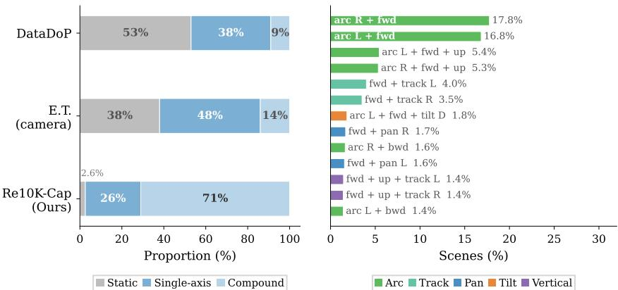  
Figure 1: Motion distribution comparison across camera trajectory datasets. Left: Coarse-grained breakdown into static, single-axis, and compound motion (DataDoP and E.T. values estimated from their published figures). Right: Top-13 motion combinations in RealEstate10K-Cap; the remaining 35.1% is distributed across 50+ other combination patterns.

In the second stage, we employ Qwen3-VL-4B-Instruct [3, 29] to ground this motion prior within the visual context. For each sequence, we uniformly sample up to 32 video frames. The VLM is strictly prompted to treat the deterministic geometric prior as an immutable constraint (absolute motion), while enriching it with salient scene elements, spatial layouts, and cinematic pace. Generation is performed using stochastic decoding (temperature 0.7, top-p 0.9, max new tokens 128). If visual frames are unavailable, the caption falls back to the rule-derived description. The full prompt template is provided in Appendix A.2.

Dataset Statistics. Our dataset comprises 25K high-fidelity trajectory sequences sampled from diverse indoor environments, yielding approximately 5 million frames and 50 hours of continuous footage. Each trajectory spans an average of 201.7 frames (∼6.72 seconds at 30 FPS), capturing smooth, uninterrupted camera navigation through complex real-world spaces. Table 1 provides a comprehensive quantitative comparison with existing camera trajectory datasets.

Comparison with Existing Datasets. Prior camera trajectory datasets mainly rely on synthetic environments or film clips. E.T. [7] and DataDoP [36], for example, use feature films with stylized cinematography, but such footage often contains motion blur, rapid cuts, and shallow depth-of-field, causing SfM artifacts and deviating

Table 1: Comparison with existing camera trajectory datasets. Our dataset focuses on indoor environments with scene-aware captions.
<table><tr><td>Dataset</td><td>#Samples Domain</td><td></td><td>Caption</td><td></td><td>Vocab Avg. Length (s)</td></tr><tr><td>RealEstate10K [38]</td><td>79K</td><td>Indoor</td><td>×</td><td>一</td><td></td></tr><tr><td>CCD [16]</td><td>25K</td><td>Synthetic</td><td>Synthetic</td><td>48</td><td>7.2</td></tr><tr><td>E.T. [7]</td><td>115K</td><td>Film</td><td>Camera-Char</td><td>1.7K</td><td>3.8</td></tr><tr><td>DataDoP [36]</td><td>29K</td><td>Film</td><td>Directorial</td><td>8.7K</td><td>14.4</td></tr><tr><td>Ours</td><td>25K</td><td>Indoor</td><td>Scene-aware</td><td>3.8K</td><td>6.72</td></tr></table>

from stable, natural camera navigation. As shown in Figure 1, film-derived datasets also suffer from motion imbalance: near-static shots comprise 53% of DataDoP and 38% of E.T., whereas our filtering reduces static content to 2.6%. In contrast, 71% of RealEstate10K-Cap contains compound motion, compared to 9% in DataDoP and 14% in E.T. The top-13 motion patterns cover diverse behaviors such as forward arcs, dolly-track combinations, and multi-axis motion, with the remaining 35.1% spread across 50+ patterns. These statistics characterize the motion distribution of RealEstate10K-Cap but do not by themselves establish downstream dataset utility. We therefore additionally conduct a controlled comparison by training the same TKCAM architecture on equally sized subsets of RealEstate10K-Cap and DataDoP; the full results are provided in Appendix C.4. Unlike film-based datasets, RealEstate10K-Cap is built from stable real-estate tours, yielding reliable 3D reconstructions, while its two-stage captioning pipeline provides trajectory-grounded motion descriptions together with rich spatial context.

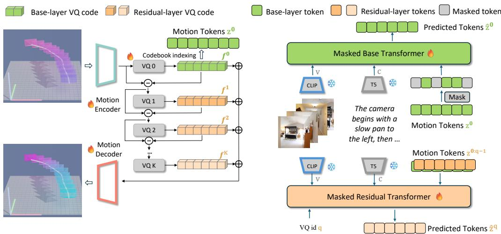  
Figure 2: Overview of our proposed pipeline. Given per-frame camera poses M as trajectory, a text description $\tau$ and sparse keyframe images V, we first encode the continuous 12-dimensional camera trajectory into latent features and discretize them with a multi-level Residual Vector Quantizer (RVQ), producing a hierarchy of base-layer (green) and residual-layer (orange) motion tokens. During training, a masked base transformer predicts masked base-layer tokens conditioned on the text embedding from a frozen T5 encoder and visual tokens extracted by a frozen CLIP encoder, while a masked residual transformer refines higher-level residual tokens conditioned on the previously predicted tokens and the same multimodal context. Finally, a motion decoder reconstructs smooth and temporally coherent camera trajectories from the predicted hierarchical motion tokens.

## 4 Method

Given a text description $\tau$ and a sparse set of keyframe images $\mathcal { V } = \{ v _ { t } \} _ { t = 1 } ^ { T _ { k } }$ , our goal is to generate a temporally coherent and semantically consistent camera trajectory $\mathcal { M } = \{ m _ { t } \} _ { t = 1 } ^ { T }$ that is conditioned on these keyframes and aligned with the described scene dynamics.

Our overall pipeline is illustrated in Fig. 2. We discretize the continuous camera trajectories into hierarchical motion tokens using a Residual Vector Quantizer (Sec. 4.1). A masked generative modeling framework is then adopted to learn multimodal correspondences between text, RGB keyframes, and motion tokens (Sec. 4.2), where base and residual masked transformers collaboratively predict and refine hierarchical motion tokens for coherent trajectory generation.

## 4.1 Motion Representation and Quantization

To ensure mathematical continuity and mitigate the instability of direct high-dimensional regression, we formulate the camera trajectory at frame t as a 12-dimensional kinematic vector $m _ { t } = [ p _ { t } , v _ { t } , r _ { t } ]$ This incorporates normalized absolute coordinates $p _ { t } ,$ , per-frame linear velocities $v _ { t }$ (acting as an implicit temporal regularization to smooth trajectories), and a continuous 6D rotation representation $r _ { t }$ to avoid singularities [39]. To better capture the modes of cinematographic dynamics, we map this continuous 12D sequence into discrete tokens [35] using Residual Vector Quantization (RVQ) [10, 34], transforming the geometric motion modeling into a tractable discrete sequence generation problem.

Hierarchical Motion Tokens. The continuous kinematic camera trajectories $m _ { t } = [ p _ { t } , v _ { t } , r _ { t } ]$ are first passed through a lightweight encoder composed of 1D convolutions and residual connections. This maps the motion sequence into latent embeddings $z \in \mathbb { R } ^ { d }$ . These embeddings are then quantized by a multi-level RVQ module equipped with K codebooks. The quantized representation $\hat { z }$ is obtained by summing the selected codewords across valid quantization levels: $\begin{array} { r } { \hat { z } = \sum _ { k = 1 } ^ { K ^ { \prime } } f _ { q ^ { ( k ) } } } \end{array}$ where $f _ { q ^ { ( k ) } }$ denotes the selected codeword from the k-th codebook. To encourage robust representation learning, we employ quantizer dropout [34] during training, randomly truncating the number of active quantizers $\overset { \cdot } { K ^ { \prime } } \leq K$ with a probability $p = 0 . 2$ . This hierarchical discrete design provides two main benefits: first, it transforms continuous regression into a stable token prediction task, improving semantic coherence; second, lower quantization levels capture coarse trajectory patterns (e.g., global direction), while higher levels progressively refine high-frequency motion details.

Training Objective. To optimize the RVQ autoencoder, we employ a multi-component objective tailored to 12D kinematic properties. The codebooks are updated via Exponential Moving Average (EMA) [10, 25], while the encoder is optimized by the commitment loss [25]: $\begin{array} { r } { \mathcal { L } _ { c } = \frac { 1 } { K ^ { \prime } } \sum _ { k = 1 } ^ { K ^ { \prime } } \| z ^ { ( k ) } - } \end{array}$ $\mathrm { s g } [ f _ { q ^ { ( k ) } } ] \big | \big | _ { 2 } ^ { 2 }$ , where $z ^ { ( k ) }$ is the residual feature at level k, $f _ { q ^ { ( k ) } }$ is its selected codeword as defined above, and sg[·] is the stop-gradient operator.

For trajectory reconstruction, let $\ell ( x , \hat { x } )$ denote the Smooth L1 (Huber) loss. The RVQ objective $\mathcal { L } _ { \mathrm { R V Q } }$ combines a global reconstruction term $\mathcal { L } _ { \mathrm { r e c } } = \ell ( m _ { t } , \hat { m } _ { t } )$ with an explicit kinematic loss $\mathcal { L } _ { \mathrm { e x p } }$ and commitment weight β:

$$
\mathcal { L } _ { \mathrm { R V Q } } = \mathcal { L } _ { \mathrm { r e c } } + \lambda _ { \mathrm { e x p } } \mathcal { L } _ { \mathrm { e x p } } + \beta \mathcal { L } _ { c }\tag{1}
$$

Specifically, $\mathcal { L } _ { \mathrm { e x p } }$ independently supervises translation-velocity and 6D rotation components to ensure structural integrity: $\dot { \mathcal { L } } _ { \mathrm { e x p } } = \ell \dot { ( } [ p _ { t } , \dot { v } _ { t } ] , [ \hat { p } _ { t } , \hat { v } _ { t } ] ) + \ell ( r _ { t } , \hat { r } _ { t } ) \dot { + } \dot { \lambda } _ { \mathrm { o r t h } } \mathcal { L } _ { \mathrm { o r t h } }$ . The term $\bar { \mathcal { L } } _ { \mathrm { o r t h } }$ enforces the orthogonality of the predicted 6D rotation vectors $\hat { r } _ { 1 } , \hat { r } _ { 2 } \in \mathbb { R } ^ { 3 }$

$$
\mathcal { L } _ { \mathrm { o r t h } } = \mathbb { E } \left[ ( \| \hat { r } _ { 1 } \| _ { 2 } - 1 ) ^ { 2 } + ( \| \hat { r } _ { 2 } \| _ { 2 } - 1 ) ^ { 2 } + ( \hat { r } _ { 1 } ^ { \top } \hat { r } _ { 2 } ) ^ { 2 } \right]\tag{2}
$$

Following MoMask [10], we set $\lambda _ { \mathrm { e x p } } = 0 . 5$ and $\beta = 0 . 0 2 . \ \lambda _ { \mathrm { o r t h } }$ is fixed at 0.1.

## 4.2 Masked Generative Modeling

Our framework adopts a two-stage masked generative modeling paradigm [10]. Following RVQ discretization, the continuous trajectory is mapped to a discrete latent space $\overline { { Z \in \{ 0 , \ldots , V - } } $ $1 \} ^ { B \times S \times K }$ , where V is the codebook size, S is the sequence length, and $\bar { K } = 4$ is the number of quantization levels. We train two separate networks: a base masked transformer to model the primary structural motion $Z ^ { ( 0 ) }$ , and a residual masked transformer to predict fine-grained details $Z ^ { ( \hat { 1 } : K - 1 ) }$

Base Masked Transformer. The base transformer $p _ { \theta }$ reconstructs the first-level motion tokens $Z ^ { ( 0 ) }$ from a corrupted observation. During training, a subset of valid tokens is replaced with a [MASK] token following a randomized cosine schedule [6, 10]. To inject multimodal conditioning, we extract semantic embeddings c via a frozen T5 encoder [24], and visual tokens v from sparse RGB keyframes via a frozen CLIP encoder [23]. Crucially, to resolve spatial-temporal ambiguity $( \mathrm { e . g . }$ , distinguishing start from end keyframes), we explicitly inject a learned temporal positional embedding into each visual token corresponding to its VQ-aligned timestamp. These visual features provide temporally localized conditioning and do not directly specify or clamp metric camera poses.

Rather than heuristically adding visual tokens to motion tokens, our architecture utilizes decoupled attention [1, 2]. Each transformer block sequentially executes motion-motion self-attention over the masked sequence $\tilde { Z } ^ { ( 0 ) }$ to capture internal kinematic dynamics, followed by motion-condition cross-attention querying the concatenated multimodal condition $[ c ; v ]$ . This ordering ensures motion tokens establish temporal coherence before attending to multimodal conditions. To enable Classifier-Free Guidance [14], we independently drop c and v with a probability of $p = 0 . 2$ during training. Finally, the model is optimized using a standard cross-entropy loss applied exclusively to the masked positions, seamlessly avoiding the need for complex token-level heuristics.

Residual Masked Transformer. To generate cinematographically plausible high-frequency details (e.g., subtle camera jitters), the residual masked transformer $p _ { \phi }$ refines motion tokens level-by-level in a fully parallel manner. For an active residual layer $q \in \{ 1 , \ldots , K - 1 \}$ (sampled per batch via an inverted cosine schedule to emphasize lower levels), it predicts the residual tokens conditioned on the cumulative historical embeddings of all previous levels $\begin{array} { r } { H ^ { ( q ) } = \sum _ { j = 0 } ^ { q - 1 } E ( Z ^ { ( j ) } ) } \end{array}$ , alongside the identical multimodal conditions c and v. The network shares weights across all quantization levels, utilizing $q$ as an additional level-embedding. It is optimized by minimizing a conditional masked cross-entropy loss over the temporal dimension for the active layer. This coarse-to-fine framework allows TKCAM to establish a stable macroscopic trajectory structure before progressively enriching it with microscopic physical realism. Complete objective formulation can be found in Appendix B.

During inference, given a target trajectory length, we extract text and visual embeddings $c , v$ via T5 and CLIP encoders and initialize the corresponding motion-token sequence as fully masked, including positions temporally aligned with the visual keyframes. The base transformer reconstructs the motion tokens using parallel decoding and Classifier-Free Guidance (CFG) to establish the coarse structure $\hat { Z } ^ { ( 0 ) }$ . Subsequently, the residual transformer refines the trajectory across all quantization levels in a feed-forward manner to predict $\hat { Z } ^ { ( 1 : K - 1 ) }$ . The final sequence is passed to the RVQ decoder to produce the continuous trajectory:

$$
\hat { m } _ { t } = \operatorname { D e c o d e r } _ { \mathrm { R V Q } } \Big ( \hat { Z } ^ { ( 0 ) } , \dots , \hat { Z } ^ { ( K - 1 ) } \Big ) .\tag{3}
$$

This mechanism supports both text-only generation and animator-style keyframe conditioning.

## 5 Experiment

Datasets and Setup. TKCAM is trained exclusively on RealEstate10K-Cap and evaluated zeroshot on the E.T. and DataDoP test subsets, demonstrating cross-domain generalization without any in-domain supervision on cinematic or character-centric data. All trajectories are normalized to first-frame-relative coordinates to ensure spatial comparability. We compare with CCD [16], E.T. [7], Director3D [19], and GenDoP [36]. Following [36], CCD and E.T. receive zeroed character-motion tokens at inference. Since GenDoP requires RGB-D input, we estimate depth with Depth Anything V2 [30] and fine-tune GenDoP on RealEstate10K-Cap. For a controlled comparison, we additionally fine-tune/retrain CCD and E.T. on RealEstate10K-Cap under the same evaluation protocol, and report both released pretrained and matched-training results where available.

TKCAM requires a target trajectory length at inference. For benchmark evaluation, we use the per-sample ground-truth trajectory length for all methods, with every trajectory evaluated at the same target duration. Thus, the target generation horizon is assumed to be known during evaluation. Baseline training and trajectory-length handling are detailed in Appendix C.2 and C.3.

We use the CLaTr framework [7], training an evaluator on 15K validation samples balanced across RealEstate10K-Cap, E.T., and DataDoP, all disjoint from model training data. Results are reported on a separate 1.5K-sample test set. Metrics include Matching Score and retrieval (R@1, R@3, R@10) for text-motion alignment, FID [13], computed on Universal CLaTr features, for distributional realism, and ∆Div for diversity alignment.

To validate the Universal CLaTr evaluator against human judgment, we further conduct a pilot blinded human study over 90 caption-trajectory pairs from four methods and the ground-truth reference. Universal CLaTr shows a positive correlation with mean human judgments (Spearman ρ = 0.312, 95% CI [0.089, 0.492]). Full study details are provided in Appendix C.6.

Implementation Details. All experiments run on a single NVIDIA A100 80GB GPU. Our RVQ-VAE uses 256-code codebooks and 4 quantization stages. Both base and residual transformers have 4 layers, 6 heads, and hidden size 384, with T5 and CLIP ViT-B/32 as multimodal encoders. Nonautoregressive decoding yields about 30 trajectories/s. Full hyperparameters are in Appendix C.1.

## 5.1 Main Results

Text-to-Camera Generation. In Track A (Table 2), TKCAM (Text Only) outperforms existing baselines on FID, Matching Score, and retrieval metrics. For semantic alignment, it achieves an R@10 of 9.60% and a Matching Score of 0.100, maintaining an advantage over the fine-tuned CCD, E.T., and GenDoP baselines. Furthermore, TKCAM achieves the lowest FID of 0.529, indicating stronger distributional realism, while maintaining competitive diversity alignment (∆Div of 0.065). This quantitative advantage is reflected in our qualitative analysis (Figure 3). When given complex directorial prompts requiring compound motion, TKCAM more consistently executes the sequence with correct directional semantics and smooth phase transitions. In contrast, the fine-tuned GenDoP exhibits reduced motion magnitude and lateral misalignment. E.T. collapses to near-static clusters, Director3D frequently misaligns translational directions, and CCD produces irrelevant circular loops driven by learned priors rather than textual conditioning.

Keyframe-Conditioned Generation and Video Synthesis. When visual keyframe conditioning is introduced (Track B), both realism and alignment improve further. Under the first-frame setting, TKCAM (First-Frame) achieves an FID of 0.518 and an R@10 of 12.27%. Notably, despite using only RGB input without explicit depth conditioning, TKCAM outperforms the depth-conditioned fine-tuned GenDoP (FID 0.616, R@10 11.07%). Incorporating additional sparse keyframes further improves trajectory fidelity (FID 0.503) and alignment accuracy (R@10 12.67%). We further demonstrate this animator-style conditioning in a downstream video synthesis pipeline (Figure 4). Given first- and last-frame observations alongside a directorial prompt, TKCAM generates a temporally coherent trajectory that serves as a geometric motion prior for Diffusion-as-Shader [9]. The resulting video exhibits stable camera motion consistent with the described motion, suggesting that the generated trajectories can serve as useful geometric priors for downstream video synthesis.

Table 2: Quantitative evaluation of text-to-camera trajectory generation on the mixed benchmark. Metrics include Fréchet distance computed on Universal CLaTr features (FID), text-trajectory Matching Score, and Retrieval metrics (R@1, R@3, R@10, in %) computed over the full evaluation set. ∆Div represents the absolute difference between the generated trajectory diversity and the reference set diversity (closer to 0 is better). “Fine-tuned” denotes models fine-tuned/retrained on RealEstate10K-Cap. Bold indicates the best performance within each track.
<table><tr><td>Method</td><td>FID↓</td><td>Matching ↑</td><td>R@1↑</td><td>R@3↑</td><td>R@10↑</td><td>∆Div ↓</td></tr><tr><td colspan="7">Track A: Text-Conditioned (1500 samples)</td></tr><tr><td>CCD [16]</td><td>0.732</td><td>0.022</td><td>0.07</td><td>0.27</td><td>1.20</td><td>0.156</td></tr><tr><td>CCD (fine-tuned) [16]</td><td>0.594</td><td>0.037</td><td>0.33</td><td>0.67</td><td>2.33</td><td>0.075</td></tr><tr><td>E.T. [7]</td><td>1.135</td><td>0.000</td><td>0.07</td><td>0.27</td><td>0.67</td><td>0.538</td></tr><tr><td>E.T. (fine-tuned) [7]</td><td>0.559</td><td>0.050</td><td>0.40</td><td>1.13</td><td>2.93</td><td>0.098</td></tr><tr><td>Director3D [19]</td><td>0.831</td><td>0.005</td><td>0.13</td><td>0.33</td><td>0.93</td><td>0.164</td></tr><tr><td>GenDoP (Text only) [36]</td><td>0.769</td><td>0.040</td><td>0.20</td><td>0.73</td><td>2.47</td><td>0.135</td></tr><tr><td>GenDoP (Text only, fine-tuned) [36]</td><td>0.593</td><td>0.082</td><td>0.67</td><td>2.20</td><td>7.80</td><td>0.062</td></tr><tr><td>TKCAM (Text Only)</td><td>0.529</td><td>0.100</td><td>1.13</td><td>3.80</td><td>9.60</td><td>0.065</td></tr><tr><td colspan="7">Track B: Vision- &amp; Text-Conditioned (Visual Keyframe Conditioning, 994 samples)</td></tr><tr><td>GenDoP (RGBD) [36]</td><td>0.790</td><td>0.067</td><td>0.80</td><td>1.91</td><td>6.44</td><td>0.199</td></tr><tr><td>GenDoP (RGBD, fine-tuned) [36]</td><td>0.616</td><td>0.109</td><td>1.62</td><td>4.03</td><td>11.07</td><td>0.076</td></tr><tr><td>TKCAM (First-Frame)</td><td>0.518</td><td>0.127</td><td>2.01</td><td>5.93</td><td>12.27</td><td>0.053</td></tr><tr><td>TKCAM (Sparse Keyframes)</td><td>0.503</td><td>0.129</td><td>2.11</td><td>5.94</td><td>12.67</td><td>0.070</td></tr></table>

Temporal Smoothness. We further evaluate translational acceleration/jerk and angular velocity/acceleration/jerk. TKCAM with sparse keyframes closely matches the ground-truth translational dynamics, while rotational acceleration and jerk remain less well matched than GenDoP-RGBD, indicating rotational smoothness as a remaining limitation. Full derivative statistics and distributional comparisons are provided in Appendix C.5.

## 5.2 Ablation Studies

We validate our design choices on the mixed-domain benchmark using unified training configurations. The 12D-representation and fusion ablations use the Sparse Keyframes setting (Track B), while the RVQ-level ablation in Table 3 uses the Text Only setting (Track A).

12D Representation. Replacing our 12D formulation with a 9D variant (no velocity) degrades all metrics: FID 0.503→0.593, Matching 0.129→0.106, R@10 12.67%→10.66%, and ∆Div 0.070→0.074, consistent with explicit velocity acting as an implicit temporal regularizer.

Multimodal Fusion. Our decoupled cross-attention outperforms a Prefix Concatenation baseline on both realism (FID 0.503 vs. 0.580) and alignment (R@10 12.67% vs. 12.07%, Matching 0.129 vs. 0.119), supporting the benefit of cross-attention for fine-grained temporal grounding.

Hierarchical Refinement. Table 3 reveals a trade-off across quantization depths: the base level alone (L1) attains the highest R@1 but the largest diversity gap, while adding residual levels lowers FID and the diversity gap at some cost to exact-match retrieval. The full model (L1–L4) achieves the best R@10 while maintaining competitive FID and diversity.

Table 3: Ablation on hierarchical RVQ levels.
<table><tr><td>RVQ Stages</td><td>FID↓</td><td>Match.↑</td><td>R@1↑</td><td>R@3↑</td><td>R@10↑</td><td>∆Div↓</td></tr><tr><td>L1 (Base Only)</td><td>0.582</td><td>0.094</td><td>1.40</td><td>4.07</td><td>9.33</td><td>0.081</td></tr><tr><td>L1 + L2</td><td>0.522</td><td>0.102</td><td>0.93</td><td>4.07</td><td>9.20</td><td>0.068</td></tr><tr><td>L1 + L2 + L3</td><td>0.525</td><td>0.099</td><td>1.33</td><td>4.27</td><td>8.73</td><td>0.063</td></tr><tr><td>Full (L1–L4)</td><td>0.529</td><td>0.100</td><td>1.13</td><td>3.80</td><td>9.60</td><td>0.065</td></tr></table>

Sparse Keyframe Conditioning. Transitioning from Text Only to First-Frame and Sparse Keyframes progressively improves FID from 0.529 to 0.518 and 0.503, while R@10 increases from 9.60% to 12.27% and 12.67%. These results show the benefit of temporally localized visual conditioning. As discussed in Sec. 4.2, RGB keyframes provide soft visual guidance rather than explicit metric camera-pose constraints.

The camera arcs left while it dollies forward,… then continues into an adjacent room …, maintaining a steady motion.

The camera arcs right while it dollies forward and tilts up, … Then, as it continues its arc and forward motion, the camera tilts upward to ...

The camera arcs left while it dollies backward, revealing …, then continues its movement to frame ...

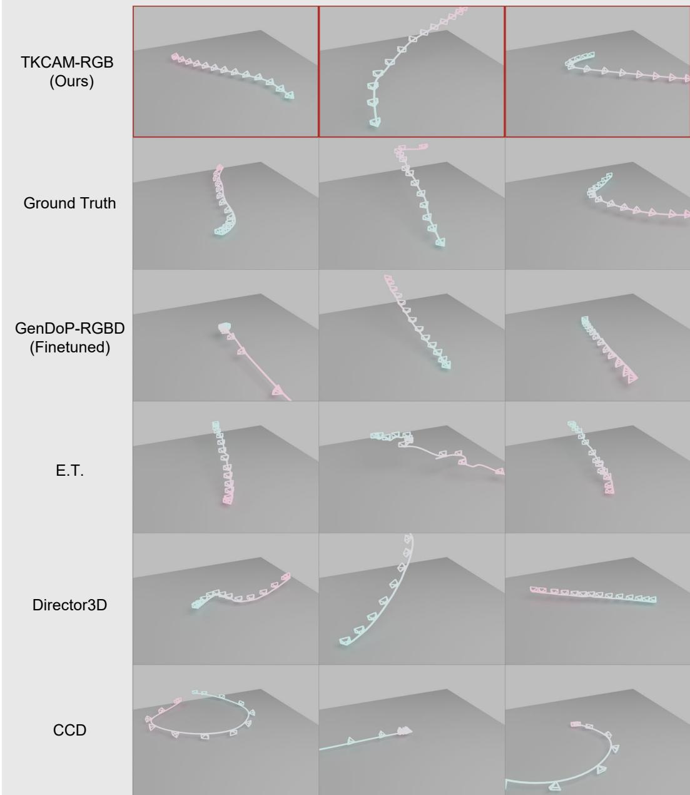  
Figure 3: Qualitative comparison of generations. While baselines struggle with motion magnitude, directional alignment, or trajectory quality (e.g., CCD’s circular loops), TKCAM produces semantically faithful paths that capture complex compound motions.

## 6 Conclusion

In this paper, we presented TKCAM, a text- and keyframe-conditioned framework for camera trajectory generation. TKCAM represents camera motion as 12-dimensional kinematic sequences and discretizes them with RVQ-VAE, reducing the instability of continuous regression. Its twostage masked transformer enables multimodal fusion, high-frequency refinement, and animatorstyle keyframe conditioning. Experiments with our Universal CLaTr Evaluator demonstrate strong distributional realism and cross-modal alignment.

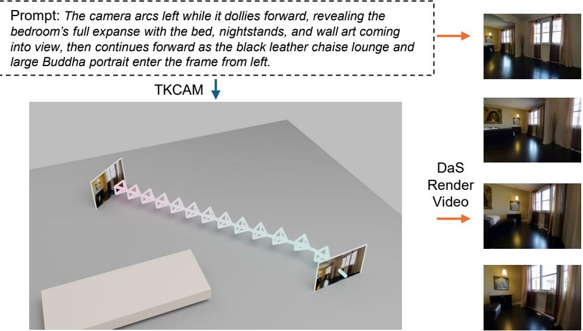  
Figure 4: TKCAM as a geometric motion prior for downstream video generation tasks.

Limitations and Future Work. TKCAM has several limitations. First, the residual transformer is trained with ground-truth base tokens but uses predicted tokens at inference, which may introduce exposure bias. Second, training data is mainly indoor real-estate footage, leaving highly dynamic or stylized cinematography underexplored. Third, rotational smoothness remains weaker than translational smoothness, and inference requires a predefined target generation horizon. Finally, TKCAM currently focuses on single-camera extrinsic motion; incorporating explicit scene geometry, camera intrinsics, and multi-camera coordination is a promising future direction.

## Acknowledgments

We thank Huaijin Pi, Boao Zhan, and Liangyu Zhang for valuable discussions. We are also grateful to the members of the HKU CGVU Lab for their helpful discussions and support, as well as for providing computational resources. Special thanks to Hanna Li for her personal support and encouragement.

Funding and competing interests. The authors declare no external funding or competing interests related to this work.

## References

[1] E. Aksan, M. Kaufmann, P. Cao, and O. Hilliges. A Spatio-temporal Transformer for 3D Human Motion Prediction. arXiv e-prints, art. arXiv:2004.08692, Apr. 2020. doi: 10.48550/arXiv.2004.08692.

[2] J.-B. Alayrac, J. Donahue, P. Luc, A. Miech, I. Barr, Y. Hasson, K. Lenc, A. Mensch, K. Millican, M. Reynolds, R. Ring, E. Rutherford, S. Cabi, T. Han, Z. Gong, S. Samangooei, M. Monteiro, J. Menick, S. Borgeaud, A. Brock, A. Nematzadeh, S. Sharifzadeh, M. Binkowski, R. Barreira, O. Vinyals, A. Zisserman, and K. Simonyan. Flamingo: a Visual Language Model for Few-Shot Learning. arXiv e-prints, art. arXiv:2204.14198, Apr. 2022. doi: 10.48550/arXiv.2204.14198.

[3] S. Bai, Y. Cai, R. Chen, K. Chen, X. Chen, Z. Cheng, L. Deng, W. Ding, C. Gao, C. Ge, W. Ge, Z. Guo, Q. Huang, J. Huang, F. Huang, B. Hui, S. Jiang, Z. Li, M. Li, M. Li, K. Li, Z. Lin, J. Lin, X. Liu, J. Liu, C. Liu, Y. Liu, D. Liu, S. Liu, D. Lu, R. Luo, C. Lv, R. Men, L. Meng, X. Ren, X. Ren, S. Song, Y. Sun, J. Tang, J. Tu, J. Wan, P. Wang, P. Wang, Q. Wang, Y. Wang, T. Xie, Y. Xu, H. Xu, J. Xu, Z. Yang, M. Yang, J. Yang, A. Yang, B. Yu, F. Zhang, H. Zhang, X. Zhang, B. Zheng, H. Zhong, J. Zhou, F. Zhou, J. Zhou, Y. Zhu, and K. Zhu. Qwen3-VL Technical Report. arXiv e-prints, art. arXiv:2511.21631, Nov. 2025. doi: 10.48550/arXiv.2511.21631.

[4] R. Bajcsy. Active perception. Proceedings of the IEEE, 76(8):966–1005, 1988.

[5] J. F. Blinn. Where am I? What am I looking at? [cinematography]. IEEE Computer Graphics and Applications, 8(4):76–81, 1988. doi: 10.1109/38.7751.

[6] H. Chang, H. Zhang, L. Jiang, C. Liu, and W. T. Freeman. MaskGIT: Masked generative image transformer. In Proceedings ofthe IEEE/CVF Conference on Computer Vision and Pattern Recognition, 2022.

[7] R. Courant, N. Dufour, X. Wang, M. Christie, and V. Kalogeiton. E.T. the exceptional trajectories: Textto-camera-trajectory generation with character awareness. In European Conference on Computer Vision, pages 464–480, 2024.

[8] Q. Galvane, M. Christie, C. Lino, and R. Ronfard. Camera-on-rails: automated computation of constrained camera paths. In Proceedings ofthe 8th ACM SIGGRAPH Conference on Motion in Games, MIG ’15, page 151–157, New York, NY, USA, 2015. Association for Computing Machinery. ISBN 9781450339919. doi: 10.1145/2822013.2822025. URL https://doi.org/10.1145/2822013.2822025.

[9] Z. Gu, R. Yan, J. Lu, P. Li, Z. Dou, C. Si, Z. Dong, Q. Liu, C. Lin, Z. Liu, W. Wang, and Y. Liu. Diffusion as shader: 3D-aware video diffusion for versatile video generation control. In ACM SIGGRAPH 2025 Conference Papers, 2025.

[10] C. Guo, Y. Mu, M. G. Javed, S. Wang, and L. Cheng. MoMask: Generative masked modeling of 3D human motions. In Proceedings of the IEEE/CVF Conference on Computer Vision and Pattern Recognition, pages 1900–1910, 2024.

[11] X. Han, Y. Wu, L. Shi, H. Liu, H. Liao, L. Qiu, W. Yuan, X. Gu, Z. Dong, and S. Cui. MVImgNet2.0: A larger-scale dataset of multi-view images. ACM Transactions on Graphics, 43(6), 2024. doi: 10.1145/ 3687973.

[12] H. He, Y. Xu, Y. Guo, G. Wetzstein, B. Dai, H. Li, and C. Yang. CameraCtrl: Enabling camera control for video diffusion models. In International Conference on Learning Representations, 2025.

[13] M. Heusel, H. Ramsauer, T. Unterthiner, B. Nessler, and S. Hochreiter. GANs Trained by a Two Time-Scale Update Rule Converge to a Local Nash Equilibrium. arXiv e-prints, art. arXiv:1706.08500, June 2017. doi: 10.48550/arXiv.1706.08500.

[14] J. Ho and T. Salimans. Classifier-free diffusion guidance. arXiv preprint arXiv:2207.12598, 2022.

[15] H. Jiang, B. Wang, X. Wang, M. Christie, and B. Chen. Example-driven virtual cinematography by learning camera behaviors. ACM Transactions on Graphics, 39(4):45, 2020.

[16] H. Jiang, X. Wang, M. Christie, L. Liu, and B. Chen. Cinematographic camera diffusion model. Computer Graphics Forum, 43(2):e15055, 2024.

[17] Z. Kuang, S. Cai, H. He, Y. Xu, H. Li, L. J. Guibas, and G. Wetzstein. Collaborative video diffusion: Consistent multi-video generation with camera control. In Advances in Neural Information Processing Systems, volume 37, pages 16240–16271, 2024.

[18] L. Li, Z. Fan, W. Cong, X. Liu, Y. Yin, M. Foutter, P. Pan, C. You, Y. Wang, Z. Wang, et al. Martian world models: Controllable video synthesis with physically accurate 3D reconstructions. arXiv preprint arXiv:2507.07978, 2025.

[19] X. Li, Z. Lai, L. Xu, Y. Qu, L. Cao, S. Zhang, B. Dai, and R. Ji. Director3D: Real-world camera trajectory and 3d scene generation from text. Advances in Neural Information Processing Systems, 37:75125–75151, 2024.

[20] L. Ling, Y. Sheng, Z. Tu, W. Zhao, C. Xin, K. Wan, L. Yu, Q. Guo, Z. Yu, Y. Lu, X. Li, X. Sun, R. Ashok, A. Mukherjee, H. Kang, X. Kong, G. Hua, T. Zhang, B. Benes, and A. Bera. DL3DV-10K: A Large-Scale Scene Dataset for Deep Learning-based 3D Vision. arXiv e-prints, art. arXiv:2312.16256, Dec. 2023. doi: 10.48550/arXiv.2312.16256.

[21] I. Loshchilov and F. Hutter. Decoupled Weight Decay Regularization. arXiv e-prints, art. arXiv:1711.05101, Nov. 2017. doi: 10.48550/arXiv.1711.05101.

[22] C. Patel, H. Nakamura, Y. Kyuragi, K. Kozuka, J. C. Niebles, and E. Adeli. UniEgoMotion: A unified model for egocentric motion reconstruction, forecasting, and generation. In Proceedings ofthe IEEE/CVF International Conference on Computer Vision, pages 10318–10329, 2025.

[23] A. Radford, J. W. Kim, C. Hallacy, A. Ramesh, G. Goh, S. Agarwal, G. Sastry, A. Askell, P. Mishkin, J. Clark, et al. Learning transferable visual models from natural language supervision. In International Conference on Machine Learning, pages 8748–8763, 2021.

[24] C. Raffel, N. Shazeer, A. Roberts, K. Lee, S. Narang, M. Matena, Y. Zhou, W. Li, and P. J. Liu. Exploring the Limits of Transfer Learning with a Unified Text-to-Text Transformer. arXiv e-prints, art. arXiv:1910.10683, Oct. 2019. doi: 10.48550/arXiv.1910.10683.

[25] A. van den Oord, O. Vinyals, and K. Kavukcuoglu. Neural Discrete Representation Learning. arXiv e-prints, art. arXiv:1711.00937, Nov. 2017. doi: 10.48550/arXiv.1711.00937.

[26] W.-L. Wei, Y.-H. Hu, and J.-C. Lin. CamSketch: Authoring camera trajectories for 3D virtual concerts via example-derived codes and user sketching. In SIGGRAPH Asia 2025 Posters, 2025. doi: 10.1145/ 3757374.3771476.

[27] H. Xiong, X. Xu, J. Wu, Y. Hou, J. Bohg, and S. Song. Vision in action: Learning active perception from human demonstrations. arXiv preprint arXiv:2506.15666, 2025.

[28] D. Xu, W. Nie, C. Liu, S. Liu, J. Kautz, Z. Wang, and A. Vahdat. CamCo: Camera-controllable 3Dconsistent image-to-video generation. arXiv preprint arXiv:2406.02509, 2024.

[29] A. Yang, A. Li, B. Yang, B. Zhang, B. Hui, B. Zheng, B. Yu, C. Gao, C. Huang, C. Lv, et al. Qwen3 technical report. arXiv preprint arXiv:2505.09388, 2025.

[30] L. Yang, B. Kang, Z. Huang, Z. Zhao, X. Xu, J. Feng, and H. Zhao. Depth Anything V2. arXiv e-prints, art. arXiv:2406.09414, June 2024. doi: 10.48550/arXiv.2406.09414.

[31] S. Yang, Z. Wang, X. Yang, S. Zhang, X. Kong, T. Wu, X. Zhao, R. Zhang, A. Zhao, and A. Rao. ShotVerse: Advancing cinematic camera control for text-driven multi-shot video creation. arXiv preprint arXiv:2603.11421, 2026.

[32] C. Yu, W. Zhai, Y. Yang, Y. Cao, and Z.-J. Zha. HERO: Human reaction generation from videos. arXiv preprint arXiv:2503.08270, 2025.

[33] W. Yu, J. Xing, L. Yuan, W. Hu, X. Li, Z. Huang, X. Gao, T.-T. Wong, Y. Shan, and Y. Tian. ViewCrafter: Taming video diffusion models for high-fidelity novel view synthesis. arXiv preprint arXiv:2409.02048, 2024.

[34] N. Zeghidour, A. Luebs, A. Omran, J. Skoglund, and M. Tagliasacchi. SoundStream: An End-to-End Neural Audio Codec. IEEE/ACM Transactions on Audio, Speech and Language Processing, 30:495–507, Jan. 2022. doi: 10.1109/TASLP.2021.3129994.

[35] J. Zhang, Y. Zhang, X. Cun, S. Huang, Y. Zhang, H. Zhao, H. Lu, and X. Shen. T2M-GPT: Generating Human Motion from Textual Descriptions with Discrete Representations. arXiv e-prints, art. arXiv:2301.06052, Jan. 2023. doi: 10.48550/arXiv.2301.06052.

[36] M. Zhang, T. Wu, J. Tan, Z. Liu, G. Wetzstein, and D. Lin. GenDoP: Auto-regressive camera trajectory generation as a director of photography. In Proceedings of the IEEE/CVF International Conference on Computer Vision, 2025.

[37] G. Zheng, T. Li, R. Jiang, Y. Lu, T. Wu, and X. Li. CamI2V: Camera-controlled image-to-video diffusion model. arXiv preprint arXiv:2410.15957, 2024.

[38] T. Zhou, R. Tucker, J. Flynn, G. Fyffe, and N. Snavely. Stereo magnification: Learning view synthesis using multiplane images. ACM Transactions on Graphics, 37(4), 2018.

[39] Y. Zhou, C. Barnes, J. Lu, J. Yang, and H. Li. On the Continuity of Rotation Representations in Neural Networks. arXiv e-prints, art. arXiv:1812.07035, Dec. 2018. doi: 10.48550/arXiv.1812.07035.

## A More details on RealEstate10K-Cap

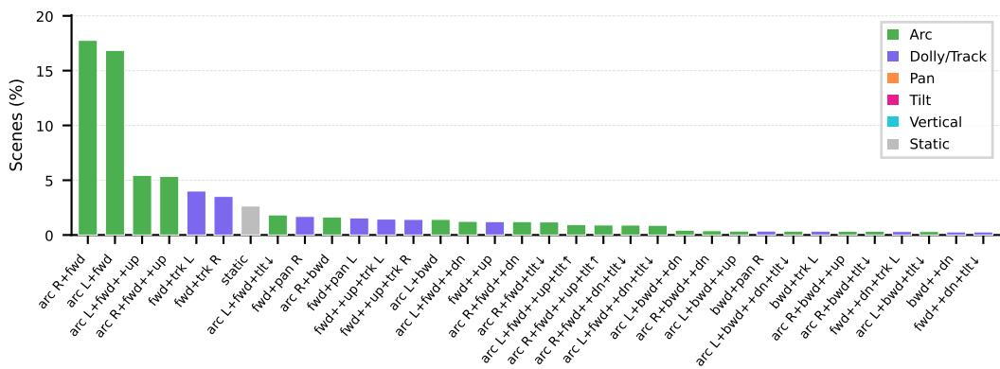

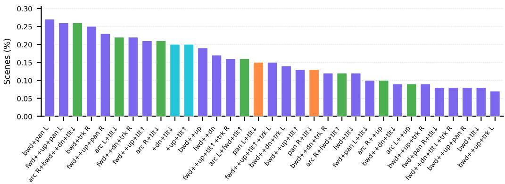

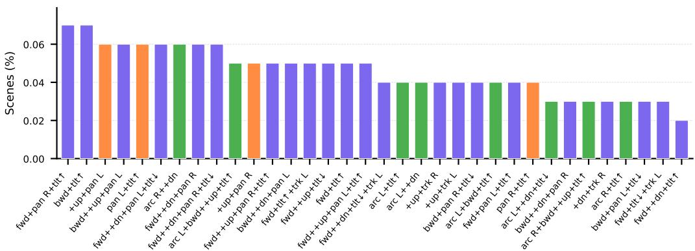  
Figure 5: Complete motion category distribution of RealEstate10K-Cap, extending Figure 1 to all identified patterns. Categories are sorted by frequency and color-coded by motion family.

## A.1 Full Motion Distribution

Figure 5 presents the complete motion category distribution of RealEstate10K-Cap, extending the Top-13 summary in the main text (Figure 1) to all identified motion patterns. Each category is defined by a combination of translational axes (dolly, track, boom) and rotational axes (pan, tilt), with arcs denoting simultaneous lateral tracking and yaw and compound motions representing simultaneous multi-axis movement. The long-tail distribution—where the top two categories (arc+forward) account for ∼35% of sequences while the remaining 65% spans 50+ diverse patterns—reflects the natural variety of real-estate footage and provides broad motion coverage.

## A.2 Data Captioning Pipeline

As introduced in the main text, constructing the RealEstate10K-Cap dataset relies on a two-stage captioning pipeline that keeps motion descriptions consistent with the trajectories while adding scene context.

Stage 1: Deterministic Kinematic Extraction. We extract strict geometric motion priors directly from the relative camera poses provided by RealEstate10K, which were estimated with SLAM followed by bundle adjustment [38]. We integrate local camera velocities and apply rule-based kinematic thresholds to classify translational movements (e.g., track left/right, dolly in/out, boom up/down) and rotational movements (e.g., pan, tilt, roll). Simultaneous lateral tracking and yaw are merged into compound cinematic descriptions, such as “arc left”. This yields a rule-derived motion description of the trajectory.

Stage 2: VLM-based Visual Grounding. We uniformly sample up to 32 video frames per sequence and feed them into Qwen3-VL-4B-Instruct alongside the deterministic geometric prior. Generation is performed using stochastic decoding (temperature 0.7, top-p 0.9, max new tokens 128). The prompt template is designed to strictly enforce the geometric prior while enriching it with visual context:

System Prompt: You act as a professional cinematographer describing a camera shot. Given   
the camera motion sequence reference and [n\_frames] frames from [total\_frames] uniformly   
sampled frames from the video, your task is to merge the motion sequence with the key scene   
elements into 1 or 2 fluid sentences.   
Rules:   
1. ABSOLUTE MOTION: You MUST use the provided motion sequence exactly as   
written. DO NOT alter the directions or sequence.   
2. FORMAT: Use ‘then’ or ‘finally’ to separate stages. Keep it cinematic but factual.   
3. CONTENT: For each stage include: movement type (pan/tilt/dolly/truck/arc/pedestal),   
direction, and pace (slow/medium/fast).   
Examples:   
- The camera dollies forward with slight shaking, gradually closing the distance between   
the viewer and the fireplace.   
- The camera pans left slowly and smoothly, revealing a stone fireplace. Then it moves   
along the left wall, maintaining shot angle.   
- The camera dollies backward smoothly, revealing a basketball court in the foreground,   
then continues backward while panning slightly left.   
Reference: [Insert Stage 1 Prior]   
Motion description:

## B Detailed Training Objectives

In this section, we provide the detailed mathematical formulations for the training objectives of our proposed TKCAM framework, complementing the high-level descriptions in the main text.

## B.1 RVQ Autoencoder Objective

To optimize the Residual Vector Quantizer (RVQ), we employ a multi-component objective tailored to the 12D kinematic properties. Let $\ell ( x , \hat { x } )$ denote the Smooth L1 (Huber) loss. The overall RVQ objective $\mathcal { L } _ { \mathrm { R V Q } }$ combines a global reconstruction term $\mathcal { L } _ { \mathrm { r e c } } = \ell ( m _ { t } , \hat { m } _ { t } )$ with an explicit kinematic loss $\mathcal { L } _ { \mathrm { e x p } }$ and a commitment loss $\mathcal { L } _ { c } \mathrm { : }$

$$
\mathcal { L } _ { \mathrm { R V Q } } = \mathcal { L } _ { \mathrm { r e c } } + \lambda _ { \mathrm { e x p } } \mathcal { L } _ { \mathrm { e x p } } + \beta \mathcal { L } _ { c }
$$

Specifically, $\mathcal { L } _ { \mathrm { e x p } }$ independently supervises the translation-velocity and 6D rotation components to ensure structural integrity:

$$
\mathcal { L } _ { \mathrm { e x p } } = \ell ( [ p _ { t } , v _ { t } ] , [ \hat { p } _ { t } , \hat { v } _ { t } ] ) + \ell ( r _ { t } , \hat { r } _ { t } ) + \lambda _ { \mathrm { o r t h } } \mathcal { L } _ { \mathrm { o r t h } }
$$

The term ${ \mathcal { L } } _ { \mathrm { o r t h } }$ enforces the orthogonality of the predicted 6D rotation vectors $\hat { r } _ { 1 } , \hat { r } _ { 2 } \in \mathbb { R } ^ { 3 }$

$$
\mathcal { L } _ { \mathrm { o r t h } } = \mathbb { E } \left[ ( \| \hat { r } _ { 1 } \| _ { 2 } - 1 ) ^ { 2 } + ( \| \hat { r } _ { 2 } \| _ { 2 } - 1 ) ^ { 2 } + ( \hat { r } _ { 1 } ^ { \top } \hat { r } _ { 2 } ) ^ { 2 } \right]
$$

## B.2 Masked Transformer Objective

For the generative modeling stage, the masked transformers are optimized to predict the masked motion tokens. The base model is trained using a cross-entropy loss applied exclusively to the masked non-padding positions Ω:

$$
\mathcal { L } _ { \mathrm { b a s e } } = - \frac { 1 } { | \Omega | } \sum _ { ( b , i ) \in \Omega } \log p _ { \theta } \big ( Z _ { b , i } ^ { ( 0 ) } \mid \tilde { Z } _ { b } ^ { ( 0 ) } , c _ { b } , v _ { b } \big )
$$

Similarly, the residual masked transformer minimizes the conditional masked prediction loss over the temporal dimension for the sampled active layer qb:

$$
\mathcal { L } _ { \mathrm { r e s } } = - \frac { 1 } { \sum _ { b } S _ { b } } \sum _ { b } \sum _ { i < S _ { b } } \log p _ { \phi } \big ( Z _ { b , i } ^ { ( q _ { b } ) } \mid H _ { b } ^ { ( q _ { b } ) } , q _ { b } , c _ { b } , v _ { b } \big )
$$

## C Experiment Details

## C.1 Full List of Hyperparameters

All experiments are conducted on a single NVIDIA A100 (80 GB) GPU. Table 4 lists the hyperparameters used for training both the RVQ autoencoder and the dual masked transformers.

Table 4: Detailed hyperparameters for TKCAM training.
<table><tr><td>Module</td><td>Hyperparameter</td><td>Value</td></tr><tr><td rowspan="6">RVQ Autoencoder</td><td>Codebook Size (V) Quantization Levels (K)</td><td>256</td></tr><tr><td></td><td>4</td></tr><tr><td>Quantizer Dropout Prob (p)</td><td>0.2</td></tr><tr><td>Kinematic Loss Weight  $( \lambda _ { \mathrm { e x p } } )$ </td><td>0.5</td></tr><tr><td>Orthogonality Weight  $( \lambda _ { \mathrm { o r t h } } )$ </td><td>0.1</td></tr><tr><td>Commitment Weight (β) Base Learning Rate</td><td>0.02</td></tr><tr><td rowspan="6"></td><td></td><td>1e-4</td></tr><tr><td>Learning Rate Warm-up Iterations</td><td>500</td></tr><tr><td>Batch Size</td><td>256</td></tr><tr><td>Window Size</td><td>128</td></tr><tr><td>Number of Layers</td><td>4</td></tr><tr><td rowspan="6">Transformers (Base &amp; Residual)</td><td>Number of Attention Heads</td><td>6</td></tr><tr><td>Hidden Dimension</td><td>384</td></tr><tr><td>CFG Dropout Prob  $\left( p _ { \mathrm { d r o p } } \right)$ </td><td>0.2</td></tr><tr><td>Optimizer</td><td></td></tr><tr><td></td><td>AdamW [21]</td></tr><tr><td>Base Learning Rate Batch Size</td><td>5e-5 64</td></tr></table>

## C.2 Baseline Training and Evaluation Protocol

To reduce the effect of unequal training-domain exposure, we additionally fine-tune or retrain feasible baselines on RealEstate10K-Cap. In particular, CCD [16] and E.T. [7] are retrained on RealEstate10K-Cap, while GenDoP [36] is evaluated in both its original and fine-tuned configurations. Director3D [19] is evaluated using its released pretrained configuration, for which matched retraining is unavailable in our setup. All methods are evaluated using the same mixed-domain benchmark, trajectory-length protocol, and Universal CLaTr evaluator. Table 2 reports both pretrained and matched-training results where available.

Table 5: Controlled comparison between RealEstate10K-Cap and DataDoP as training sources. The same TKCAM architecture is trained on equally sized subsets of the two datasets. Lower FID and ∆Div are better.
<table><tr><td rowspan="2">Test Domain</td><td colspan="2">FID↓</td><td colspan="2">∆Div↓</td></tr><tr><td>Re10K-Cap Train</td><td>DataDoP Train</td><td>Re10K-Cap Train</td><td>DataDoP Train</td></tr><tr><td>Mixed</td><td>0.967</td><td>1.190</td><td>0.196</td><td>0.389</td></tr><tr><td>RealEstate10K</td><td>1.204</td><td>1.458</td><td>0.274</td><td>0.394</td></tr><tr><td>E.T. (OOD)</td><td>0.956</td><td>1.134</td><td>0.013</td><td>0.179</td></tr><tr><td>DataDoP</td><td>1.431</td><td>1.572</td><td>0.134</td><td>0.466</td></tr></table>

## C.3 Trajectory-Length Handling

TKCAM requires a target sequence length to be specified at inference. For benchmark evaluation, we use the per-sample ground-truth trajectory length, denoted as traj\_len, and enforce the same target duration across all evaluated methods.

Because the VQ tokenizer temporally downsamples trajectories by a factor of four, TKCAM first decodes ⌈traj\_len/4⌉×4 frames and then resamples the trajectory to traj\_len. GenDoP generates its native 120 camera poses and is resampled to the target length; CCD generates 300 native frames and is similarly resampled; Director3D’s native trajectory is resampled using spherical linear interpolation (slerp) for rotations; and E.T. is run directly at the per-sample target length. We additionally audited the generated outputs used in these comparisons and found no target-length mismatches for TKCAM, GenDoP, CCD, Director3D, and E.T.

This protocol ensures that the reported trajectory metrics are not confounded by differences in evaluated duration. The requirement of a predefined generation horizon remains a practical assumption of the current formulation. We do not use segment stitching in the reported experiments, and generation substantially beyond the training-length distribution has not been systematically evaluated.

## C.4 Controlled Dataset Comparison

To isolate the effect of training data, we train the same TKCAM architecture separately on equally sized subsets (∼8.5K trajectories each) of RealEstate10K-Cap and DataDoP. We keep the tokenizer, model size, optimization schedule, checkpoint-selection criterion, and evaluator fixed across the two runs. We then evaluate both models on the same four test domains.

As shown in Table 5, the RealEstate10K-Cap-trained model achieves lower FID and a smaller diversity gap across all four evaluation domains, including the DataDoP test subset itself and E.T., which is out-of-domain for both training sources. These controlled results complement the motion-distribution statistics in the main paper and provide direct evidence for the utility of RealEstate10K-Cap as a training source.

## C.5 Temporal Smoothness Analysis

We quantitatively evaluate temporal smoothness using finite-difference translational acceleration and jerk, together with angular velocity, acceleration, and jerk. Since visual conditioning changes the evaluated subset, we compare the frame-conditioned methods against the corresponding frameconditioned ground-truth trajectories.

Raw derivative magnitudes alone are insufficient for assessing realistic motion, as minimizing acceleration or jerk may favor over-smoothed trajectories. We therefore additionally compute the 1D Wasserstein distance between each derivative distribution and the corresponding ground-truth distribution.

Table 6 shows that TKCAM closely matches the ground-truth translational dynamics. In particular, the sparse-keyframe setting achieves the smallest Wasserstein distances for translational acceleration and jerk. Because sparse RGB keyframes enter through soft cross-attention conditioning rather than hard-spliced motion tokens, they do not explicitly introduce trajectory discontinuities at the conditioned timestamps. In contrast, rotational acceleration and jerk remain less well matched than GenDoP-RGBD, indicating that rotational smoothness is a remaining limitation of the current model.

Table 6: Temporal smoothness analysis in the vision-conditioned setting. Top: mean per-frame derivative magnitudes. Bottom: 1D Wasserstein distance between each derivative distribution and ground truth (lower is closer to real camera dynamics).
<table><tr><td>Method</td><td>Trans. Acc.</td><td>Trans. Jerk Ang. Vel.</td><td></td><td>Ang. Acc.</td><td>Ang. Jerk</td></tr><tr><td colspan="6">Mean per-frame derivative magnitude</td></tr><tr><td>GT (reference)</td><td>0.00078</td><td>0.00054</td><td>0.00460</td><td>0.00134</td><td>0.00186</td></tr><tr><td>TKCAM (Sparse Keyframes)</td><td>0.00045</td><td>0.00024</td><td>0.00745</td><td>0.00718</td><td>0.01187</td></tr><tr><td>TKCAM (First-Frame)</td><td>0.00032</td><td>0.00016</td><td>0.00629</td><td>0.00641</td><td>0.01067</td></tr><tr><td>GenDoP (RGBD)</td><td>0.00092</td><td>0.00133</td><td>0.00394</td><td>0.00042</td><td>0.00058</td></tr><tr><td colspan="6">1D Wasserstein distance to GT ↓</td></tr><tr><td>TKCAM (Sparse Keyframes)</td><td>0.00032</td><td>0.00029</td><td>0.00350</td><td>0.00640</td><td>0.01085</td></tr><tr><td>TKCAM (First-Frame)</td><td>0.00043</td><td>0.00036</td><td>0.00215</td><td>0.00525</td><td>0.00906</td></tr><tr><td>GenDoP (RGBD)</td><td>0.00042</td><td>0.00069</td><td>0.00118</td><td>0.00097</td><td>0.00138</td></tr></table>

## C.6 Human Validation of Universal CLaTr

We conduct a pilot blinded human study to examine whether Universal CLaTr is consistent with human judgments of text-trajectory alignment. We sample 18 benchmark captions, with six each from RealEstate10K-Cap, E.T., and DataDoP. For each caption, trajectories from five sources—TKCAM (Text Only), GenDoP (finetuned), E.T. (finetuned), CCD (finetuned), and the ground-truth reference— are presented in anonymized and randomized order. Three raters independently score how well each camera trajectory matches the corresponding caption on a five-point Likert scale, yielding 270 raw ratings over 90 caption–trajectory pairs.

Rater Instructions. For each caption, the five trajectories were shown as anonymized clips (“Clip $\mathrm { A ^ { \prime 3 } - \tilde { \ C l i p } \ E ^ { \prime 3 } }$ in randomized order. Raters were asked:

“How well does THIS camera motion match the caption?”

The following instruction was displayed on every page:

“What to rate: for each anonymized clip, judge only how well the camera’s motion path matches the caption. Ignore image quality — only caption ↔ camera-motion agreement.”

Each clip was rated on a five-point scale, with the displayed anchors ${ } ^ { \mathrm { \tiny ~ * \cdot } } 5 = \mathrm { p e r f e c t l y } ^ { \mathrm { \tiny ~ * \cdot } } , \mathrm { \tiny ~ * \cdot } 3 = \mathrm { p a r t i a l l y } ^ { \mathrm { \tiny ~ * \cdot } } ,$ and “1 = unrelated”.

Inter-rater agreement is moderate, with Krippendorff’s $\alpha = 0 . 4 9$ , while the reliability of the threerater averaged score is higher $( \mathrm { I C C } ( 2 , k ) = \bar { 0 . 7 6 } )$ . We therefore use the mean rating across raters for the following analysis.

Universal CLaTr exhibits a positive correlation with mean human judgments across the 90 captiontrajectory pairs (Spearman ρ = 0.312, caption-bootstrap 95% CI [0.089, 0.492]; Kendall $\tau _ { b } = 0 . 2 1 9 )$ Restricting the analysis to generated trajectories yields a stronger correlation (Spearman $\rho = 0 . 3 9 5$ 95% CI [0.186, 0.544]).

At the method level, human raters assign the highest mean score to TKCAM (3.30), followed by GenDoP (2.78), E.T. (2.61), and CCD (2.09). On the same evaluated subset, Universal CLaTr preserves five of the six pairwise orderings among the four generated methods. The only disagreement is between TKCAM and GenDoP, whose CLaTr scores are statistically indistinguishable on this subset. These results provide preliminary evidence that Universal CLaTr reflects human assessments of text-trajectory alignment, while the limited number of captions and raters motivates larger-scale perceptual validation in future work.

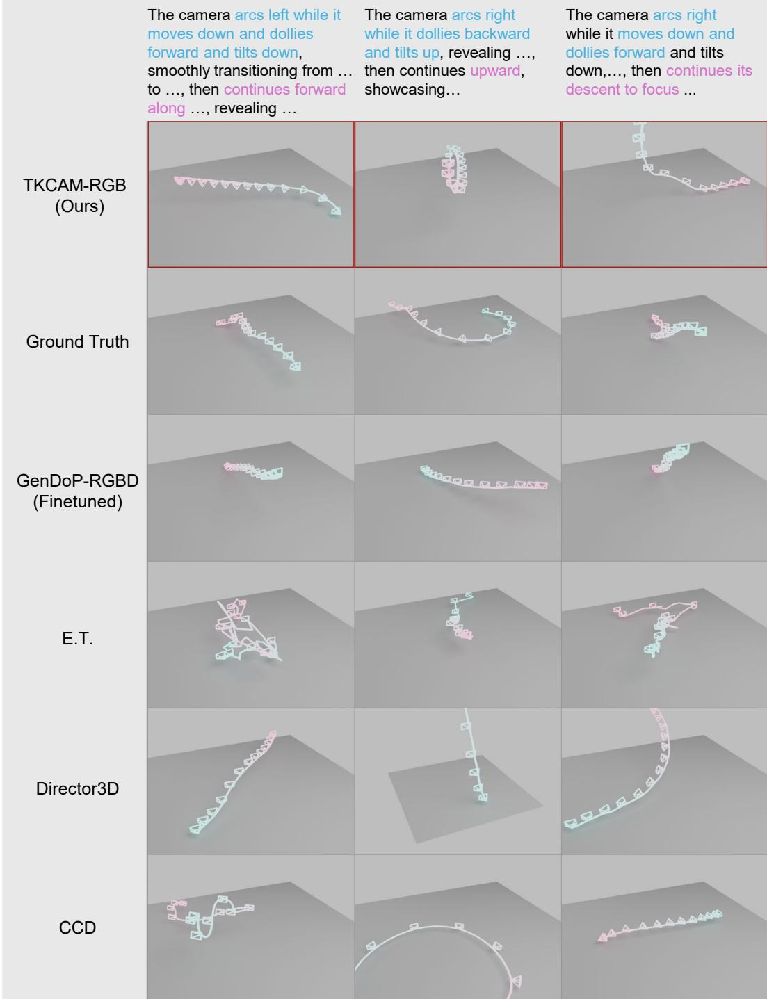  
Figure 6: Additional qualitative comparisons with baselines.

## D More TKCAM Generation Results

## D.1 More Qualitative Comparison

Figure 6 presents additional qualitative comparisons across a broader range of motion types and scene contexts, supplementing the three examples shown in Figure 3 of the main text. We include examples featuring predominantly translational motion (dolly-forward, lateral tracking) and complex compound motions involving simultaneous arcing, dollying, and tilting. In most of these examples,

Prompt: The camera dollies backward while tilting down, gradually revealing the expansive valley and forested hills surrounding the property. Then, as it continues backward, the house and its pool become smaller in the frame, emphasizing the vast, serene landscape stretching into the distance.

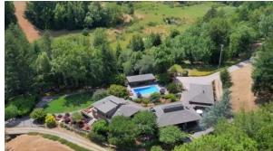

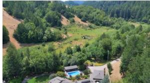

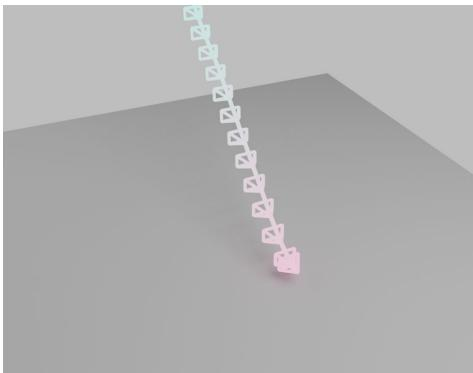  
Prompt: The camera dollies backward smoothly, revealing the full expanse of the bathroom vanity and its dark wood cabinetry, then continues backward while panning slightly left to frame the glass shower enclosure and the dark door at the far end.

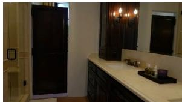

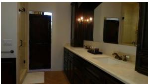

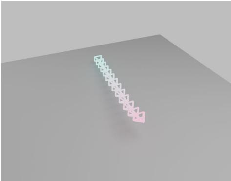  
Figure 7: Two representative failure cases of TKCAM: tilt underestimation and action omission in multi-stage sequences.

TKCAM produces trajectories with correct directional semantics, while baselines exhibit the failure modes identified in the main text.

## D.2 Failure Cases of TKCAM and Analysis

The vast majority of TKCAM’s generated trajectories exhibit correct directional semantics and appropriate motion magnitude, as evidenced by our quantitative results (Table 2) and the qualitative comparisons in Figures 3 and 6. The following failure modes occur only in a small minority of cases, typically involving rare motion combinations or out-of-distribution prompts. Figure 7 illustrates two representative failure modes of TKCAM, with the misaligned motion keywords highlighted in red.

Tilt Underestimation. In the first example, the prompt specifies simultaneous backward dollying and tilting down, yet the generated trajectory captures only the translational component while neglecting the vertical rotation. We attribute this to a distributional bias in RealEstate10K-Cap: indoor real estate tours are dominated by horizontal navigation, leaving tilt motions underrepresented in training. As a result, the model tends to under-weight rotational components when they co-occur with a dominant translational cue.

Action Omission in Multi-Stage Sequences. In the second example, a two-stage motion (dolly backward, then pan slightly left) produces a trajectory that executes the primary dolly but omits the secondary pan. This occurs occasionally when a later-stage motion has low magnitude relative to the dominant motion, causing it to be under-sampled during masked token prediction. The issue is more pronounced when the secondary action is brief and semantically subtle.

Both failure modes are rare edge cases that arise specifically at the boundary of the training distribution—primarily for out-of-distribution vertical motions and low-magnitude secondary actions— rather than reflecting systematic architectural limitations. The strong quantitative performance reported in Table 2 indicates that such misalignments do not represent the typical generation behavior of TKCAM.

## E Ethical and Societal Impact Discussion

Positive Impacts. TKCAM can make camera-path authoring more accessible by enabling non-expert users to generate controllable camera trajectories from natural language descriptions. This has direct positive applications in independent filmmaking, pre-visualization for film production, accessibility tools for virtual environments, and educational simulators for cinematography training. By opensourcing our models and dataset, we further enable the research community to build upon this work for downstream video generation, 3D scene understanding, and embodied AI applications.

Potential Negative Impacts. The ability to generate plausible, text-controlled camera trajectories could potentially be misused in combination with video synthesis pipelines to produce deceptive deepfake content or synthetic surveillance footage that appears cinematographically authentic. Additionally, automated cinematography generation may reduce demand for certain professional roles in low-budget production contexts.

Mitigation. We will accompany the public release of TKCAM with a usage policy that prohibits malicious or deceptive applications. As a trajectory-only model, TKCAM does not generate visual content independently and requires a separate video synthesis component to produce any visual output, which introduces an additional mitigation layer. We encourage downstream users of this work to apply appropriate safeguards when integrating trajectory generation into end-to-end video generation pipelines.