# Tabula Rasa: Monte Carlo estimation of unit-variance noise with controlled spatio-temporal correlation

TOBIAS RITSCHEL, University College London, UK and Meta Reality Labs, USA

YANG ZHOU, Meta Reality Labs, USA

NICK MILEF, Meta Reality Labs, USA

MIKHAIL DEREVIANNYKH, Karlsruhe Institute of Technology, Germany and Meta Reality Labs, USA

CHEN LIU, University College London, UK

CHRISTOPHE HERY, Meta Reality Labs, USA

CARL MARSHALL, Meta Reality Labs, USA

We suggest a method to generate time-varying Gaussian noise with controlled variance and controlled temporal correlation. This noise is used in several downstream tasks for temporal control and temporal coherence. The core technical idea is to phrase this problem as joint Monte-Carlo estimation of both a classic pixel reconstruction and estimation of variance using the concept of “sketching” from the database literature. We demonstrate that our method allows temporal control for downstream tasks with simpler and faster code than previous methods.

Additional Key Words and Phrases: noise generation, Monte Carlo method, video difusion models, non-photorealistic rendering, texture synthesis

## 1 Introduction

We propose a method1 to generate image sequences of Gaussian noise that have unit variance and spatio-temporal correlation in duced by light transport. If, for example, one pixel is reflecting the same world space position which is visible in another pixel, the two pixels have to be the same. If a world space position is visible in one frame, occluded in the next one and becomes visible in the third frame again in a diferent position, the value in the first and last frame has to be the same for the pixel it falls on. Enforcing such correlation, however, will afect its variance, and the challenge is to combine the aims of correlation and variance control.

Time-correlated unit-variance noise has an important use case in difusion-based image video synthesis and reconstruction [Burg- ert et al. 2025; Chang et al. 2024], but also can be used for video stylization, or animated texture synthesis.

Previous attempts to produce such noise rely on combinatorial enumeration of all variates by means of rasterization [Chang et al. 2024], Brownian bridges [Deng et al. 2025] or maintaining a minification or magnification state [Burgert et al. 2025]. These have complex implementations, can be slow to compute as they operate sequentially: to produce frame � + 1 one needs to know frame �. They also rely on 2D optical flow, which will struggle with clipping and occlusion, while we produce noise that is coherent “in 3D” by construction.

Frame 1  
Frame 24  
Frame 48  
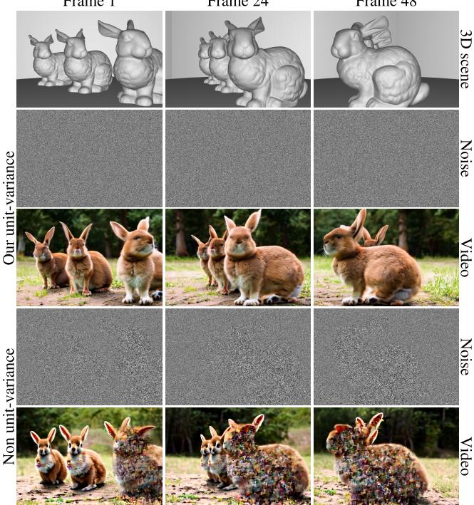  
Fig. 1. A sample video generated by our method driven by geometry of bunnies. Maintaining temporal correlation of noise paterns is critical for controlling video generation, but maintaining unit variance of the noise is necessary to produce high-quality video. Generating a 10242 frame takes 2.44 ms on an Nvidia A100 and adds three lines of code to an of-the-shelf Monte Carlo path tracer.

Our solution is based on Monte Carlo (MC)-based pixel reconstruction, where the integration is in the image domain [Smith 1995] and the integrand is noise [Pharr et al. 2023, Sec. 7.8]. Doing so right away, unfortunately, would not produce unit variance. This article is about augmenting MC-based pixel reconstruction with means to preserve said variance. The main idea relies on means of counting contribution of variates to an estimate, inspired by database concepts, such as linear counting [Whang et al. 1990] and hyper-log-log [Flajolet and Martin 1985].

## 2 Previous work

Patterns of spatially correlated noise were studied by Julesz [1971] since the 1950s. A particular example are random-dot stereograms (RDSs), where the correlation over space is such as it would be caused by binocular disparity and hence eliciting a sensation of depth under appropriate ocular vergence. Where the naked eye sees only noise, under a diferent condition (ocular vergence), a strikingly strong perception emerges. Our method is the time analogy of an RDS, where a static image does not reveal any structure, in the right condition (motion) the pattern is apparent to man and machine.

A second inspiration is the question what a pixel really is [Smith 1995] and a typical answer is to consider the integration of a reconstruction filter and a signal [Pharr et al. 2023]. Assuming a reconstruction filter fixed, e.g., a 2D box, we would ask what the 3D light field signal needs to be such that we can eficiently sample from it and it retains the desired variance.

In general, preservation of image statistics is used in advection visualization [Neyret 2003], to suppress blending artifacts in texture synthesis [Heitz and Neyret 2018], and in recent pyramidal image generation [Wang et al. 2024]. A final use case is non-photorealistic rendering (NPR) where methods by Bénard et al. [2011] or Kass and Pesare [2011] retain the 3D temporal coherence, but at the expense of statistics that change under magnification or minification.

Ge et al. [2023] found that the noise produced by inverting an image is not the same as the noise found when inverting a video but correlated over time instead. Hence, feeding correlated noise into a synthesis should encourage correlated results [Ceylan et al. 2023]. The question then is how to produce such noise?

A principled answer is given by Chang et al. [2024], who derive a sophisticated image warp. To produce correlated frames, noise in the first frame is moved along arbitrary flow by rasterizing triangles to subpixels. This preserves unit variance, but at the cost of substantial code complexity and compute time.

Another attempt to produce noise by warping is due to Burgert et al. [2025]. They expand and collapse random pixels in a controlled fashion. When zooming in, a random variable is split in two, when zooming out, two variables are combined into one, all with the correct handling of variance. This approach is limited to 3D flows, and while its per-frame cost is similar to ours, it is sequential, i.e., frame � needs to be computed before frame � + 1.

In summary, our method achieves state-of-the-art speed while leveraging existing theory of MC image synthesis, leading to more 3D-coherent noise and simpler code than approaches using 2D flows. Importantly, we support random access, allowing parallelization over time (on four A100s, our method is simply four times faster).

## 3 Our approach

In our notion, a single pixel at a single video frame is a random variable that can be reconstructed as

$$
P ( \xi ) = \int _ { \Omega } f ( \mathbf { y } ) ( \xi ) \mathrm { d } \mathbf { y } ,\tag{1}
$$

where � is the random seed and y is an integration variable over the pixel domain Ω. Changing the seed will produce new realizations of a random world variable � , the projection of an arbitrary complex 3D noise structure to 2D (Fig. 2).

This is identical to Monte Carlo reconstruction path-traced pixels [Pharr et al. 2023], just that the integral is a random variable. It can be imagined as ray-tracing diferent procedural worlds with diferent random seed � and using the resulting statistics.

## 3.1 Monte Carlo solution without controlled variance

A realization of this random variable can be estimated by fixing � and solving the integral using Monte Carlo techniques:

$$
{ \widehat { P } } ( \xi ) = \sum _ { j = 1 } ^ { m } { \frac { f ( \omega _ { j } ) ( \xi ) } { p ( \omega _ { j } ) } } ,\tag{2}
$$

where �� is a sample of the pixel footprint, � the probability of that sample and � is the number of samples. In the limit, this value converges to the true random variable with more samples. All so- phistication of Monte Carlo rendering can be applied here e.g., using Quasi-Monte Carlo (QMC) sequences such as Hammersley.

While the estimator in Eq. 2 is unbiased, the variance of the random variable is not 1, because multiple variables that are unit- variance are combined with diferent proportions. We could remedy this situation if we knew the variance, simply by re-scaling

$$
{ \widehat { P _ { \mathrm { C o r } } } } = { \frac { \widehat { P } } { \sqrt { \mathrm { V a r } ( P ) } } } .\tag{3}
$$

Hence, the problem becomes the problem of estimating the variance. Note, that this is not about the variance of the estimator $\operatorname { V a r } ( \widehat { P } )$ , but estimation of the variance Var ›(�) (ideally, also with low variance of the variance estimator, Var(Var›(�))).

We provide more background to the notion of variance and esti- mation in Suppl. Sec. 1.

## 3.2 Monte Carlo solution with controlled variance

To control variance, we will make two assumptions: First, that there are only finitely many random variables inside the integration do- main. This means, each random variable is constant in respect to spatial coordinate over a part of the pixel domain Ω, a piecewise-constant random field. Second, that we can classify each discrete 2D pixels sample position to one of these discrete random variables.

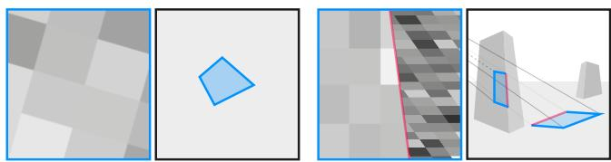  
Fig. 2. Footprint of a single output pixel (blue) in the random field for 2D (left) and 3D (right). For 3D, two surfaces fall onto one pixel, resulting in a discontinuous (pink) 3D correlation a 2D flow cannot express.

3.2.1 Sub-pixel decomposition. The first assumption is visualized in Fig. 2 that shows how the reconstructed filter value is a sum of � discrete sub-integrals

$$
P ( \xi ) = \sum _ { i = 1 } ^ { n } \int _ { \Omega _ { i } } f _ { i } ( \mathbf { y } ) ( \xi ) \mathrm { d } \mathbf { y } .\tag{4}
$$

As the function is constant within a subdomain, this means the result is the product of that constant function value $F _ { i }$ and the area of the subdomain ��:

$$
P ( \xi ) = \sum _ { i = 1 } ^ { n } a _ { i } F _ { i } ( \xi ) .\tag{5}
$$

We do not assume anything about the cardinality $n ,$ and do also not need to know it for our approach to work. We also do not know the shape of the subdomains $\Omega _ { i } .$ . It would depend on $f .$ In particular, $\operatorname { i f } f$ operates in 3D, it might involve efects like occlusion and perspective or even reflection and refraction, which will result in a complex partition of the pixel domain Ω into arbitrarily shaped subdomains $\Omega _ { i }$

3.2.2 Variance. At any rate, three properties hold: First, the values of $F _ { i }$ are uncorrelated. This is just a property of the underlying random field. Second, $\textstyle \sum a _ { i } = 1$ , so the sum of all parts of a pixel is the one of the total pixel, without loss of generality, normalized to 1. Third, $a _ { i } \geq 0 ,$ area is positive. Hence, the estimate is a convex combination of independent random variables $F _ { i }$ with weights $a _ { i }$ and the variance of the combined random variable is

$$
\operatorname { V a r } ( P ) = \sum _ { i = 1 } ^ { n } a _ { i } ^ { 2 } \underbrace { \operatorname { V a r } ( F _ { i } ) } _ { = 1 } = \sum _ { i = 1 } ^ { n } a _ { i } ^ { 2 } .\tag{6}
$$

So we are left with the problem of estimating the area $a _ { i }$ of all � subdomains, enabling a unit-variance estimator

$$
\widehat { P _ { \mathrm { C o r } } } = \frac { \widehat { P } } { \sqrt { \sum _ { i = 1 } ^ { n } \widehat { a _ { i } } ^ { 2 } } } .\tag{7}
$$

The key innovation of this article is to perform this estimation eficiently in practice.

3.2.3 Estimating variance. If we only had a low and known number of known subdomains, one could simply estimate both the value and the area using MC in isolation, apply the variance correction equation à la $( \sum { \bar { a } } _ { i } ^ { 2 } ) ^ { - 1 / 2 }$ and move on. Unfortunately, we cannot know the subdomain shapes; we do not even know their number.

The key to make estimation of variance still work in this con- dition is based on sketching, a term from the database literature [Flajolet and Martin 1985; Whang et al. 1990] to describe a compact representation of a more complex statistic. More concretely, our sketch is a combination of two levels of hashing with a histogram.

We estimate the corrected value $\widehat { P _ { \mathrm { C o r } } }$ using an extended form of Monte Carlo, which jointly computes both the integral $\widehat { P }$ for a fixed seed $\xi$ and the areas $\widehat { a _ { i } }$ which are then combined according to Eq. 7.

First, we pick a sample $\omega _ { j }$ and compute the integrand for that sample, $f ( \omega _ { j } )$ . We represent the integrand in the form of

$$
\begin{array} { r } { f ( \xi ) ( \omega _ { j } ) = N ( \mathcal { H } _ { \mathrm { b } } ( \mathcal { L } ( \omega _ { j } ) ) \oplus \xi ) , } \end{array}\tag{8}
$$

where $\mathcal { N } , \mathcal { H } _ { \mathrm { b } }$ and $\mathcal { L }$ are the noise, hashing, and lattice functions, respectively and ⊕ is an operator to combine hash seeds. This triplet of functions is just what a by-the-book [Ebert et al. 2002; Lagae and Dutré 2006] procedural noise shader would do, but we need to dissect it to query the right information as explained next:

Lattice. The lattice function L uses a high-resolution $( 1 0 2 4 ^ { 3 } )$ lat- tice, to convert the continuous coordinate to a discrete one. This lattice does not need to be limited to 2D. For correlation induced by ray-tracing, the lattice function would return the 3D hit position in a 3D lattice. We can support any form of ray-tracing, as long as it returns one unique hit point inside this lattice: primary rays, perfect reflection or refraction, but no distribution efects or bounces. The lattice is infinite and never represented in memory in any form.

Hashing. The hash function $\mathcal { H } _ { \mathrm { b } }$ maps the 2D or 3D lattice coordinate to a single scalar integer code of 32-bit precision. We use the XOR between the product of each dimension and a large but representable prime number as popularized by Teschner et al. [2003].

Noise. Finally, the noise function N uses the hashed lattice code as a key to sample a unit Gaussian. Using the same key results in the same value. The key given to noise is the suitable combination (depicted with ⊕, an operator to combine random keys) of the lattice key, and a global key. The lattice key makes the random value change over space (random field) while the global key makes this change depending on the seed. For a fixed global key, areas with the same lattice value are constant and these areas form the subdomains $\Omega _ { i } .$

Coming back to the normal Monte Carlo part of our estimator, $\xi$ is fixed and so far we simply sample a continuous coordinate $\omega _ { j } ,$ run $\mathcal { L } ,$ H and N on it and record the random variate. We sum up those variates and divide by the sample count. This produces samples from a random variable with desired correlation but not with unit variance. To tackle this, we also compute variance in respect to $\xi$ in the same Monte Carlo loop.

If we were able to represent a suficiently large histogram of size $n = 2 ^ { 3 2 }$ to distinguish all values of $\cdot \mathcal { H } _ { \mathrm { b } } ( \mathcal { L } ( \omega _ { j } ) )$ , we could just keep track of the number of samples that fell into each of the � random variables. The number of samples per variable, divided by the total number of samples, would then be an estimator of each area $\widehat { a _ { i } } .$ Obviously, it is infeasible to use storage in the order of $2 ^ { 3 2 }$ per pixel.

To reduce the memory requirement for storing the histogram, we apply a diferent (“small”) hash function $\mathcal { H } _ { s }$ to compute a bin index $b ~ = ~ \mathcal { H } _ { s } ( \mathcal { L } ( \omega _ { j } ) )$ . This hashing reduces the many discrete lattice coordinates to very few values, $\mathrm { e . g . , } o = 2 5 6$ . Few enough to maintain a histogram of all of them in a per-GPU thread bufer.

During Monte Carlo estimation, for every sample, we compute � and increment the histogram accordingly. After estimation has com-pleted, we divide all histogram values by �, making the histogram a categorical distribution (positive values that sum to one in no particular order). We now know (modulo hash collisions) the weight of all � diferent variates that are combined. With this information we can compute the resulting variance as $\sum a _ { i } ^ { 2 }$

For $\mathcal { H } _ { s } ,$ we simply, but non-obviously, use $\mathcal { H } _ { s } ( x , y , z ) = x + 1 6 y .$ i.e., a repeating pattern of 16 × 16 blocks that entirely ignores depth, as diferent lattice � values for the same lattice �,� are resolved by occlusion. $\mathcal { H } _ { \mathrm { b } }$ needs to respect depth, so as to support perspective, parallax, occlusion and all that. Certainly, $\mathcal { H } _ { s }$ can lead to collisions, and these would lead to double-counting. Fortunately, these only happen at extreme minification or magnification around 16-to-1.

Why do we employ two hashings and not just a single one? Recall that we need to define the random field, alongside a sketch for the variance: we thus have two quite diferent purposes. If we used the resolution of the random field (millions) to estimate variance, the histogram would use far too much memory. If we only used the resolution of the histogram (100s), the values would repeat, a particularly unwanted spatial correlation.

## 3.3 Prefiltering

Problem. While the above works, it has a sampling issue. Consider a single screen pixel that would be subject to minification, that is, many random variables map to a single pixel, e.g., to 100 random variables. The estimators presented so far do handle this by “counting” the 100 variables to re-scale the variance to the desired level. This is an estimator of the variance, but the variance of the estimator itself will simply be too high: Obviously, counting 100 variables is unlikely to be accurate with 10 samples. In general, the weighted average of more variables needs more correction due to the law of large numbers.

Solution intuition. A better solution would be to only have fewer values to count, say 10, which will have a lower estimator variance and less correction.

This is similar to the general problem of prefiltering for procedural textures. Our method is just a sophisticated procedural texture, but ultimately is subject to filtering considerations, too. So instead of averaging a high number of high-frequency procedural texels, one can also average a low number of prefiltered texels.

Clamping. A classic method from the graphics literature has shown to solve our issue: clamping [Norton et al. 1982]. The idea is that if a procedural texture is a combination of diferent levels of detail (“bands”), one can simply clamp (set to zero, if their mean is zero anyway) the bands that will be averaged away.

Hence, first, we determine the pixel magnification factor. It is larger than one, if more than one noise pixels falls onto a pixel, or less if fewer pixels do. It can be computed as the cross product of the columns of the Jacobian of the mapping. A mapping to be used with this variant of our mapping is supposed to provide this interface. When using our method with ray-tracing implemented in a framework supporting diferentiation (such as JAX), this is supported. In graphics APIs that support rasterization, one can simply call the fast operations dFdx and dFdy [Khronos Group 2026] and use the Jacobian determinant of these diferentials. Knowing the pixel footprint, we can use the approach of Norton et al. [1982] to separate the noise levels that indeed matter, and those that will just get averaged away. The relevant noise level is selected using the logarithm of the footprint, similar to MIP level selection in OpenGL.

Tri-linearity. Instead of usin a sin le most-relevant noise resolution, we apply the analogy of tri-linear MIP mapping: we compute the two most relevant levels and blend them, ignoring all others. As both levels hold independent random variables, this has to be accounted for when computing variance again. So if, for example, one random variable from level � has the trilinear weight of 0.2, and four random variables from level � + 1 fall onto one pixel with weight 0.8/4, each, the expected variance is $0 . 2 + 4 \times 0 . 2 ^ { 2 } = 0 . 3 6$

## 3.4 Summary

The resulting method is summarized in Alg. 1. A variant using scatter-type rasterization computation and prefiltering is provided in Suppl. Sec. 2.

Algorithm 1 Path tracing variant.   
1: procedure Estimate(Ω, �)   
2: $P = 0$   
3: � = CreateHistogram(�)   
4: for � = 0. . .� do   
5: $\omega _ { j } = { \mathrm { S A M P L E } } ( \Omega , j )$   
6: $\mathbf { z } = \mathcal { L } ( \omega _ { j } )$   
7: $P = P + \dot { N } ( \mathcal { H } _ { \mathrm { b } } ( \mathbf { z } ) \oplus \xi )$   
8: � = IncrementBin(�, $\mathcal { H } _ { \mathrm { S } } ( \mathbf { z } ) )$   
9: return $\textstyle ( P / m ) \cdot ( \sum ( w / m ) ^ { 2 } )$ −1/2

## 4 Analysis

We study the convergence both analytically (Sec. 4.1) and empirically (Sec. 4.2), and measure computational performance (Sec. 4.3).

## 4.1 Analytical

We show by mathematical deduction that our estimator is consistent (Thm. 1), and bound its bias (Thm. 2).

Theorem 1 (Consistency). $\widehat { P _ { \mathrm { C o r } } } = P _ { \mathrm { C o r } }$ once � → ∞.

Proof. The Continuous Mapping Theorem [van der Vaart 1998, Therorem 2.3] states that a continuous mapping � preserve limits even if its arguments are random variables. Eq. 7 is exactly such a continuous mapping $\varphi ( u , v ) = u / { \sqrt { v } } .$ , which takes two random variables $u = \widehat { P }$ and $\upsilon = { \sqrt { \operatorname { a r } ( P ) } }$ as arguments. The limits of� and � are $P$ and Var(�), respectively: � is the common path tracing pixel estimator, known to be consistent. The other, $v ,$ is integration of a piecewise constant function, that trivially is consistent as long as there is no hash collisions due to $\mathcal { H } _ { s } .$ . Finally, � is smooth, consider-ing $v > 0$ since the number of sub-pixel domains is finite. □

Theorem 2 (Bias). The bias in Eq. $7 \mathrm { i s } \mathbb { E } [ \widehat { P _ { \mathrm { C o r } } } ^ { ( m ) } ] - P _ { \mathrm { C o r } } = O ( m ^ { - 1 } )$

Proof. Once the noise field is realized by fixing �, the values of all subdomains $\Omega _ { i }$ have the fixed value $F _ { i }$ and the area of each subdo- main is $a _ { i } .$ . Now consider the unbiased estimate of each subdomain area $\widehat { a _ { i } }$ that just counts the number of samples falling into area � divided by the total number of samples �. Let $\widehat { \mathbf { a } } = ( \widehat { a } _ { 1 } , \ldots , \widehat { a } _ { n } )$ and $\mathbf { a } = ( a _ { 1 } , \ldots , a _ { n } )$ be the vectors of all estimated and true areas, respectively. $\bar { P } _ { \mathrm { C o r } } \bar { }$ can then be rewritten as

$$
{ \widehat { P _ { \mathrm { C o r } } } } = \psi ( { \widehat { \mathbf { a } } } ) \operatorname { w i t h } \psi ( \mathbf { x } ) = { \frac { \sum _ { i = 1 } ^ { n } x _ { i } F _ { i } } { \sqrt { \sum _ { i = 1 } ^ { n } x _ { i } ^ { 2 } } } } .\tag{9}
$$

A second-order Taylor expansion of $\dot { \psi }$ about a yields

$$
\begin{array} { r l } & { \mathbb { E } [ \psi ( \widehat { \mathbf { a } } ) ] = \mathbb { E } [ \psi ( { \mathbf { a } } + ( \widehat { \mathbf { a } } - { \mathbf { a } } ) ) ] } \\ & { = \mathbb { E } [ \psi ( { \mathbf { a } } ) + \nabla \psi ( { \mathbf { a } } ) ^ { \top } ( \widehat { \mathbf { a } } - { \mathbf { a } } ) + \frac { 1 } { 2 } ( \widehat { \mathbf { a } } - { \mathbf { a } } ) ^ { \top } H _ { \psi } ( { \mathbf { a } } ) ( \widehat { \mathbf { a } } - { \mathbf { a } } ) + R ( \widehat { \mathbf { a } } ) ] } \\ & { = \psi ( { \mathbf { a } } ) + \underbrace { \nabla \psi ( { \mathbf { a } } ) ^ { \top } \mathbb { E } [ \widehat { \mathbf { a } } - { \mathbf { a } } ] } _ { = 0 } + \frac { 1 } { 2 } \left. \sum _ { i , j } \frac { \partial ^ { 2 } \psi } { \partial x _ { i } \partial x _ { j } } \right| _ { \mathbf { a } } C \mathrm { o v } ( \widehat { a } _ { i } , \widehat { a } _ { j } ) + \mathbb { E } [ R ( \widehat { \mathbf { a } } ) ] , } \end{array}
$$

where $H _ { \psi }$ is Hessian and � is the higher-order remainder. The expectation of the first-order term vanishes because ba is unbiased. To derive the covariance term, recall that each of the � samples independently land in one of the � subdomains. For sample $\omega _ { s }$ with index �, the random variable $X _ { i , s } = \mathbb { I } _ { \Omega _ { i } } ( \omega _ { s } )$ has the following properties:

$$
\mathbb { E } [ X _ { i , s } ] = \mathbb { E } [ X _ { i , s } ^ { 2 } ] = a _ { i } \quad \mathrm { a n d } \quad \mathbb { E } [ X _ { i , s } X _ { j , s } ] = 0 ,\tag{11}
$$

where the left equality holds because $X _ { i }$ is binary and the right equality holds because a sample cannot fall in two subdomains simultaneously. Then, $\widehat { a _ { i } }$ can be rewritten as

$$
{ \widehat { a _ { i } } } = { \frac { 1 } { m } } \sum _ { s = 1 } ^ { m } X _ { i , s } .\tag{12}
$$

The covariance term in $\operatorname { E q } .$ . 10 becomes

$$
\begin{array} { r l } & { \mathrm { C o v } ( \hat { a } _ { i } , \hat { a } _ { j } ) = \mathrm { C o v } \Bigg ( \displaystyle \frac { 1 } { m } \sum _ { s = 1 } ^ { m } X _ { i , s } , \displaystyle \frac { 1 } { m } \sum _ { t = 1 } ^ { m } X _ { j , t } \Bigg ) } \\ & { \qquad = \displaystyle \frac { 1 } { m ^ { 2 } } \sum _ { s = 1 } ^ { m } \Bigg ( \mathrm { C o v } ( X _ { i , s } , X _ { j , s } ) + \sum _ { t = 1 } ^ { m } \mathrm { C o v } ( X _ { i , s } , X _ { j , t } ) \Bigg ) , } \\ & { \qquad = \displaystyle \frac { 1 } { s \neq t } } \end{array}\tag{13}
$$

where crucially the cross terms $( s \neq t )$ vanish because samples are independent. Expanding the inner term and using Eq. 11 yields

$$
\mathrm { C o v } ( X _ { i , s } , X _ { j , s } ) = a _ { i } \delta _ { i j } - a _ { i } a _ { j } ,\tag{14}
$$

where $\delta _ { i j }$ is the Kronecker delta. Substituting Eq. 14 to Eq. 13 yields

$$
\mathrm { C o v } ( \hat { a } _ { i } , \hat { a } _ { j } ) = \frac { a _ { i } \delta _ { i j } - a _ { i } a _ { j } } { m } = { \cal O } ( m ^ { - 1 } ) .\tag{15}
$$

Similarly, it can be shown that the remainder term $\mathbb { E } [ R ( { \widehat { \mathbf { a } } } ) ] ~ =$ $O ( m ^ { - 2 } )$ by expanding the third moments of ${ \widehat { \mathbf { a } } } ,$ which also only include diagonal terms due to independent samples. This step is mechanical and included in Suppl. Sec. 3. Finally, notice that the double sum over $i , j$ in Eq. 10 has constant terms with respect to �, and that the partial derivatives of $\psi$ are also constant. Substituting both results into $\operatorname { E q } .$ 10 completes the proof. □

Remark. Thm. 1 and Thm. 2 can be generalized to support prefiltering by concatenating the subdomains of two noise levels and re-normalizing their areas. In addition, Eq. 13 relies on the assump- tion of independent samples, which technically does not hold for QMC sequences. Nonetheless, empirically we observe similar (or even faster) convergence, as shown next.

## 4.2 Empirical

In practice, both theorems cannot be guaranteed due to potential hash collisions of $\mathcal { H } _ { \mathrm { s } }$ . We thus conduct experiments to validate that our estimator achieves high-quality noise under reasonable settings. We study three tasks, that correspond to diferent maps (flows, correlations) that we impose on the noise: a simple scroll, optical flow of a person walking a street and ray-tracing of three difuse falling spheres. Quality of our estimated noise depends on two variables: the number of Monte Carlo samples � and the histogram size �. Fig. 3 analyzes this relation.

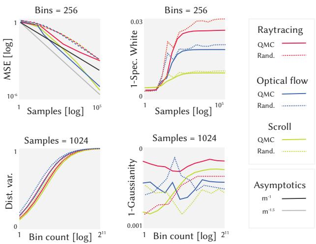  
Fig. 3. Convergence analysis: Diferent colors mean diferent tasks. In the top row, horizontal axis is sample count $m ,$ while it is bin count � in the second row. The vertical axis is, first, mean squared error (MSE) of the estimator, where less is beter, second, the whiteness of the spectrum i.e., how similar the noise is to white noise, measured as one minus the $L _ { 2 } .$ -distance to the flat spectrum of white noise (less is beter), third the variance of the estimated random variable (ideally, unit variance, so, 1), and fourth and finally the Gaussianity measured by the Shapiro-Wilk test (less is beter).

The first plot shows estimator MSE for diferent sample counts. We first compute a reference using a large sample count (32,768) and then produce many instances of the noise with the same seed for the random field but diferent seeds for the MC/QMC samples. The error is then measured by subtracting these instances from the reference and averaging the squared distance. The MSE is, by construction, the sum of variance and squared bias. As predicted by Sec. 4.1, the error decreases with more samples for MC at an approximately linear rate. We further observe that QMC converges faster, matching common practice in rendering. It does so slightly slower for the ray-tracing task, in which many estimation problems are time-space averaged. Simpler problems like zooming or optical flow converge more directly.

The second plot of Fig. 3 shows the whiteness of the spectrum. For this, many instances with diferent sampling seeds and diferent random seeds for the random field are generated and the spectrum of these is averaged and $L _ { 2 } \cdot$ -compared to a flat spectrum of white noise. Ideally, all our spectra were white. We see, that the diference to white noise is quite small, in the order of 3 % of the signal amplitude (on average, 1). With increasing sample counts, this is increasing, which first looks counter-intuitive but eventually is due to increased hash collisions, which leads to these spectra deviating from white.

The third plot ofFig. 3 shows the change ofvariance ofthe random variable estimated for diferent bin counts �. Ideally, the variance of the variable we estimate was 1, unit-variance. We see, that for a low number of bins, this is not the case. In particular, for a single bin, the variance is around 0.1, indicating around 102 random variables are combined into a pixel resulting in too little variance. With more bins (not samples, this is for a fixed sample count of� = 1024), the variance is approaching 1. Noting the horizontal log scale, the sweet spot is around 64 bins, which is the value used in most results of this paper.

Finally, even a white spectrum and a variance of 1 does not ob- viously mean the resulting noise is Gaussian. To analyze this, in the fourth and last plot of Fig. 3, we test for Gaussianity using the Shapiro-Wilk test, which returns the probability, that a sample of a certain size is indeed from a Gaussian. A value of 1 means it certainly is from a Gaussian. We note, that at low bin counts, our noise indeed is Gaussian, as the diference, in units of probability of being Gaussian, is small. This property seems unafected by the bin count.

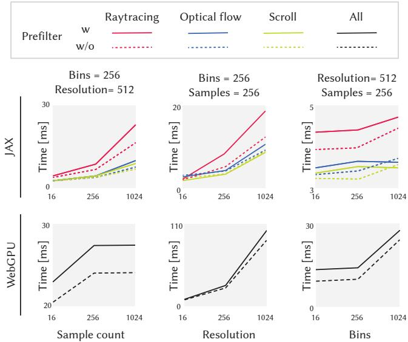  
Fig. 4. Performance instrumentation. In every subplot, the vertical axis is time. In the first row, the horizontal axis is sample count �, the second one is image resolution, and the third one is the bin count � of the unique count estimator. All horizontal axes are in log scale. Diferent colors are diferent tasks, while diferent line styles mean diferent underlying noise fields (with prefiltering is solid while dashed is the prefiltered grid). The top row of plots is a diferent implementation (JAX), while the botom row is the one in WebGPU. Please see text, for an interpretation.

## 4.3 Computational performance

The computational performance is analyzed in Fig. 4. The JAX plat form uses four A100s that produce four frames in parallel, but time is given per frame. The WebGPU platform uses an RTX 3090 with a hardware rasterizer to render 3D scene objects.

Table 1. Comparison of diferent methods across various metrics. Arrows indicate whether higher (↑) or lower (↓) values are beter.
<table><tr><td>Method</td><td>LPIPS↓</td><td>SSIM ↑</td><td>PSNR ↑</td><td>WRP-E↓</td><td>3D WRP-E↓</td></tr><tr><td>Random</td><td>0.24</td><td>0.62</td><td>23.41</td><td>369.73</td><td>790.03</td></tr><tr><td>Fixed</td><td>0.23</td><td>0.62</td><td>23.48</td><td>316.07</td><td>784.45</td></tr><tr><td>GWTF</td><td>0.24</td><td>0.62</td><td>23.44</td><td>276.67</td><td>766.99</td></tr><tr><td>Ours</td><td>0.24</td><td>0.62</td><td>23.67</td><td>274.21</td><td>706.25</td></tr></table>

We observe that compute time scales with sample count (first column). This is expected, and due to parallelism, the scale is sublinear (note the log scale). We also note that the absolute speed depends on the complexity of the map (color). A more complex map is markedly slower, as we do not only need to compute it, but also its jacfwd, its Jacobian to compute pixel footprints. This plot does not show quality, but a prefiltered grid is slower than a simple one. This is, as two fields are fetched and blended, a substantial part of the overall compute. In practice, this pays of in higher quality.

Scalability in number of pixels, or image resolution (note log scale and the quadratic increase as pixel count is quadratic in resolution), is also as expected, and favourably sublinear over that range as GPU parallelism is exploited.

Finally, the third row looks at the variation of bin count � and holds resolution and sample count fixed. Here, there is only a mild relation, as more bins mostly cost memory and not compute. Writing to a larger histogram increases memory usage, which may reduce available threads. It also increases contention vice-versa: if many samples target the same few bins, writes become serialized due to atomic pressure. These efects seem to cancel out, leading to good scalability.

When comparing diferent implementations, we see that a simple WebGPU implementation has similar timing on game-optimized hardware, and also scales better in the number of samples when rendering geometry. Unlike the JAX implementation which uses jacfwd, our WebGPU implementation uses hardware rasterization. In this setting, we take advantage of built-in per-fragment derivatives to compute footprints [Khronos Group 2026, Sec. 8.13] much easier and more eficient.

Finally, our method is parallel over time, so on a 96 GPU cluster, a 96 frame-animation is produced in 1 × 2.44 ms, where other ap- proaches would require 96×2.1 ms [Burgert et al. 2025] or 96×500 ms [Chang et al. 2024], respectively.

## 4.4 Comparison

Here, we compare our approach against Burgert et al. [2025], the state-of-the-art method to produce similar noise to find it provides similar quality and speed but random access in time.

We evaluate following the super resolution setup of [Burgert et al. 2025] (GWTF). We use StableDiffusion-x4-upscaler as the super resolution difusion model. We report average numbers for 50 videos from DAVIS dataset [Pont-Tuset et al. 2018]. Each video is down-scaled four times and up-scaled by the difusion model using four diferent types of noises: random, fixed, GWTF, and ours. We produce our noises using an absolute 3D optical flow, i.e., 2D coordinate and time for every pixel at its first appearance, estimated from the low-resolution videos with Cotracker3 [Karaev et al. 2024]. We evaluate the fidelity per frame using LPIPS, SSIM, and PSNR, local temporal consistency using the warping error (WRP-E) proposed in [Lai et al. 2018], and global temporal consistency using a 3D warping error (3D WRP-E) which uses 3D optical flows to compute warping errors as detailed in Suppl. Sec. 6. We conduct the experiments in five independent runs with diferent random seeds for generating noises in each method, and report the average.

Results are seen in Tab. 1. In summary, we consider our performance non-inferior (while being more general and random-access in time) for the first four columns. According to LPIPS and SSIM, neither the original method nor ours has an edge relative to trivial baselines. For PSNR and WRP-E, ours has a small, and probably statistically significant, lead. As measured in 3D WRP-E, our method has noticeable improvements for global temporal consistency.

## 5 Results

## 5.1 Video generation

The premiere application ofspatio-temporal correlated unit-variance noise is the control ofdifusion-based generative video models. Fig. 1 and Fig. 10 show still frames from such generated videos. We refer readers to the supplemental video for full sequences.

Our generation pipeline leverages the Go-with-the-Flow [Burgert et al. 2025] text-to-video difusion model. The input noise, originally at 720 × 480 × 16 resolution, is spatially down-sampled by a factor of 8 to match the VAE latent space (90 × 60 × 16) using a variance-preserving uniform down-sampling method to ensure the noise distribution remains compatible with the difusion model’s assumptions. Temporally, we utilize a “direct noise” mapping where 13 noise frames are up-sampled to 49 video frames via the VAE’s temporal decoder, bypassing additional temporal down-sampling. For all experiments, we utilize 200 inference steps, a classifier-free guidance scale of 6.0, and a noise degradation factor of 0.2 (mixing 20 % random Gaussian noise) to balance temporal consistency with creative prompt adherence.

Conflicts. It is not obvious what happens if correlation and prompt for a difusion model are at odds. For example, is the difusion model required to perfectly align the result to the edges of a sphere if the noise is made from a sphere seen by a rotating camera? It turns out that these two conflicting goals are often combined quite naturally. Fig. 11 shows a correlation that is at obvious contradiction to the prompt. The correlation is the one of falling spheres while the prompt asks for an ice cube. The resulting video shows cubes and chickens instead of spheres, yet, with the motion of the sphere. See the supplemental video for an animated version of this result.

Light transport-consistency. Our method supports advanced cor-relations such as the one resulting from reflection and refraction. What efect does that have? Fig. 7 of diferent prompts with difer- ent correlations induced by diferent light transport. The prompt is asking for "difuse", for "mirror" and for "glass" while the correlation is from 3D scenes which are difuse, reflective and refractive. When considering all combinations, the ones that match tend to provide the best results (diagonal).

## 5.2 Stylized shading design

A common approach for producing diferent NPR styles is to thresh-old or blend noise. The coordinate space in which the noise is defined becomes an important consideration. 2D screen-space noise is the simplest to implement but is subject to swimming or the “shower door efect” upon camera motion [Bénard et al. 2011]. On the other hand, 3D world-space noise is stable with respect to camera mo- tion, but the size of the noise pattern changes due to perspective projection. To keep the noise size constant, one natural attempt is to introduce multiple levels of noises, but naïvely switching or blending between levels would break the noise properties, causing inconsistent shading results. This problem is solved by our approach.

In Fig. 8, we demonstrate hatching stylization driven by our multilevel, variance-corrected noise. Using regular 3D noise produces patterns that are fixed-size in world space but inconsistent on screen: too coarse for close-up parts, and too dense for distant parts. It further causes hatching strokes to fade as variance decreases. Our noise efectively fixes both issues and ensures constant pattern size and density everywhere regardless of object position and camera zoom. We refer readers to our supplemental document and video for more comparisons under synchronized camera motion.

## 5.3 Animated texture synthesis

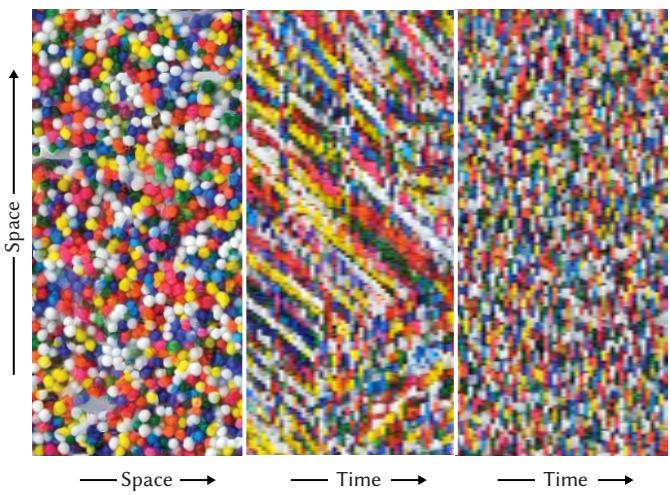  
Fig. 5. Still frame of our animated texture synthesis at the left, an epipolar slice of the animation with our noise in the middle and using random noise at the right.

We can also use our noise to initialize an optimization. This leads to results having the desired correlation, too, without even enforcing it in the optimization loss. An example is texture synthesis following Gatys et al. [2015] which we perform frame-by-frame, with the only extension that the initial solution is a frame of our temporally corre- lated noise. The resulting videos combine the desired textures and motion induced by the correlation. Fig. 5 shows an animated texture with temporal correlation of two spheres falling onto a ground plane and bouncing according to a physics simulation. The epipolar slices show the coherence and correlation in ours, while the frames in the baseline have no coherence. Please see the supplemental video for an example of this task.

## 5.4 Steganography

In steganography, a user provides a flow or a 3D scene (the “message”) and we produce an animation. A single frame does not reveal the message, neither to a human nor an algorithm. Two, or more frames reveal the message to a human, who will immediately and strongly perceive the correlation, and to a machine, that can just run. Fig. 1 is an example of this, where a complex 3D structure (first row) is hidden in 2D noise with no spatial structure (third row).

## 5.5 Inter-view correlation

As our noise is meticulously correlated also in 3D, it can be used to generate multiple views of a scene to be in correspondence. To this end, we generate multiple noises from multiple views and generate images from them with the same prompt. If the views are in a lightfield rig layout, the resulting image set forms a lightfield. The same holds for stereo pairs. Fig. 9 shows an example of this task, where the prompt is asking to generate "a glass ball and Tarot cards" inspired from the classic Stanford lightfield repository image.

## 6 Conclusion

Our method is biased due to multiple reasons, including the nonlin- ear transform of estimators [Hery 2018; Nimier-David et al. 2022] and the finite histogram [Flajolet and Martin 1985; Whang et al. 1990]. Developing an unbiased estimator might be a rewarding undertaking and future work. We have targeted unit-variance as the property to retain and combine with temporal correlation, but other spatial correlation could be targeted, such as blue [Huang et al. 2024] or golden [Zhou et al. 2025] noise.

While the derivations in this paper can be considered involved, the final method is simple: when using Monte Carlo to produce images that are meant to be combined with a generative model, keep track of how many random variables are accessed, and re-scale the variance by a square root and a division.

To summarize, we proposed a method to generate noise that is white-spectrum and unit variance in space, yet can follow intricate temporal correlations. It is an extension of Monte Carlo path tracing, but can also be implemented in a rasterizer and achieves state of the art speed while being parallel over time. We see this just as a first step to relate the statistics induced by simulation-based solutions relying on first principles, like path tracing, and the mathematical requirements of recent generative models.

## Acknowledgments

TR would like to thanks IP for the empty slate and Thomas Leimküh- ler for discussion.

## References

Pierre Bénard, Adrien Bousseau, and Joëlle Thollot. 2011. State-of-the-art report on temporal coherence for stylized animations. In Computer Graphics Forum, Vol. 30.

Ryan Burgert, Yuancheng Xu, Wenqi Xian, Oliver Pilarski, Pascal Clausen, Mingming He, Li Ma, Yitong Deng, Lingxiao Li, Mohsen Mousavi, Michael Ryoo, Paul Debevec, and Ning Yu. 2025. Go-with-the-Flow: Motion-Controllable Video Difusion Models Using Real-Time Warped Noise. In CVPR.

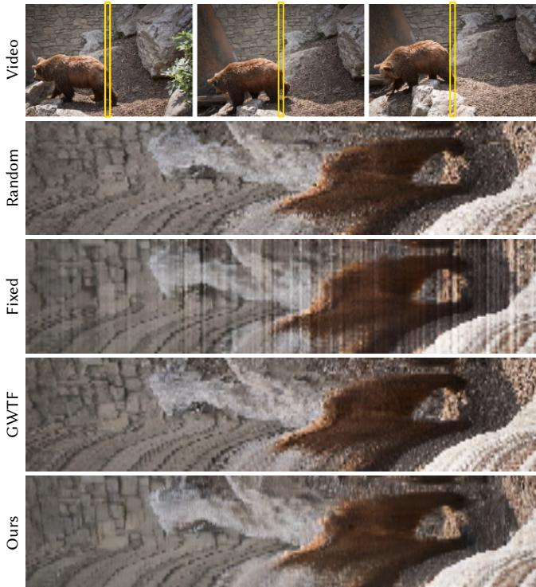  
Fig. 6. Epipolar slices (horizontal is space, vertical is time) from superresolution result of diferent methods (rows).

Correlation  
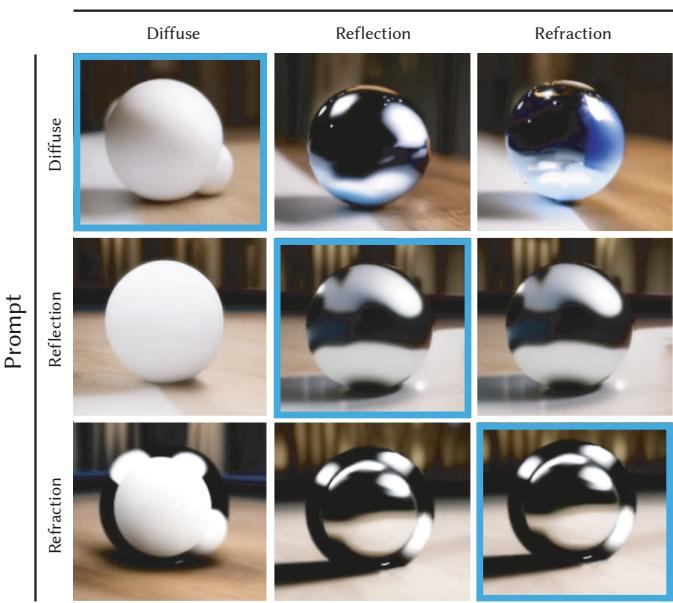  
Fig. 7. Light transport results: the horizontal axis are prompts and the vertical axis is the correlations of the underlying noise.

Duygu Ceylan, Chun-Hao P Huang, and Niloy J Mitra. 2023. Pix2video: Video editing using image difusion. In ICCV. 23206–23217.

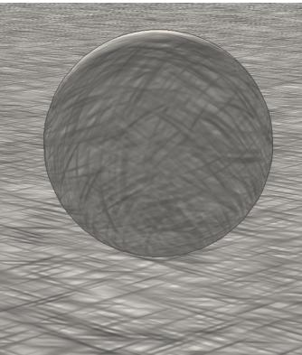

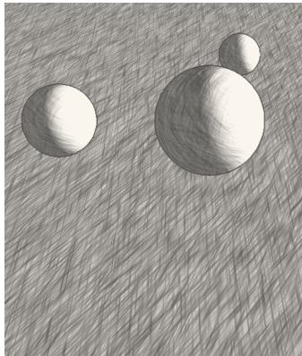

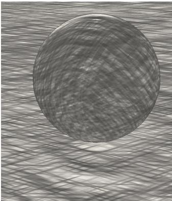

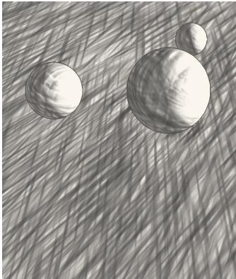  
Fig. 8. Using our noise as an NPR primitive in two scenes (columns). For previous methods (top), primitive density varies in 3D space to be consistent. For ours (botom) it is kept constant and consistent.

Pascal Chang, Jingwei Tang, Markus Gross, and Vinicius C. Azevedo. 2024. How I Warped Your Noise: a Temporally-Correlated Noise Prior for Difusion Models. In ICLR.

Yitong Deng, Winnie Lin, Lingxiao Li, Dmitriy Smirnov, Ryan D Burgert, Ning Yu, Vincent Dedun, and Mohammad H. Taghavi. 2025. Infinite-Resolution Integral Noise Warping for Difusion Models. In ICLR.

David S Ebert, F Kenton Musgrave, Darwyn Peachey, Ken Perlin, and Steve Worley. 2002. Texturing and modeling: a procedural approach. Elsevier.

Philippe Flajolet and G Nigel Martin. 1985. Probabilistic counting algorithms for data base applications. Journal ofcomputer and system sciences 31, 2 (1985), 182–209.

Leon A Gatys, Alexander S Ecker, and Matthias Bethge. 2015. Texture synthesis using convolutional neural networks. In NeurIPS. 262–270.

Songwei Ge, Seungjun Nah, Guilin Liu, Tyler Poon, Andrew Tao, Bryan Catanzaro, David Jacobs, Jia-Bin Huang, Ming-Yu Liu, and Yogesh Balaji. 2023. Preserve your own correlation: A noise prior for video difusion models. In ICCV. 22930–22941.

Eric Heitz and Fabrice Neyret. 2018. High-performance by-example noise using a histogram-preserving blending operator. Proceedings of the ACM on Computer Graphics and Interactive Techniques 1, 2 (2018), 1–25.

Christophe Hery. 2018. MCQMC 2018 Illumination 101. Technical Report. https: //graphics.pixar.com/library/MCQMC2018/paper.pdf

Xingchang Huang, Corentin Salaun, Cristina Vasconcelos, Christian Theobalt, Cengiz Oztireli, and Gurprit Singh. 2024. Blue noise for difusion models. In ACM SIGGRAPH 2024 conference papers. 1–11.

Bela Julesz. 1971. Foundations of cyclopean perception. (1971).

Nikita Karaev, Iurii Makarov, Jianyuan Wang, Natalia Neverova, Andrea Vedaldi, and Christian Rupprecht. 2024. CoTracker3: Simpler and Better Point Tracking by Pseudo-Labelling Real Videos. In Proc. arXiv:2410.11831.

Michael Kass and Davide Pesare. 2011. Coherent noise for non-photorealistic rendering. ACM Transactions on Graphics (TOG) 30, 4 (2011), 1–6.

Khronos Group. 2026. OpenGL Specification. Khronos Group. https://www.khronos. org/registry/OpenGL/specs/gl/

Ares Lagae and Philip Dutré. 2006. Long-period hash functions for procedural texturing. Vision, Modeling, and Visualization 2006 (2006), 225–228.

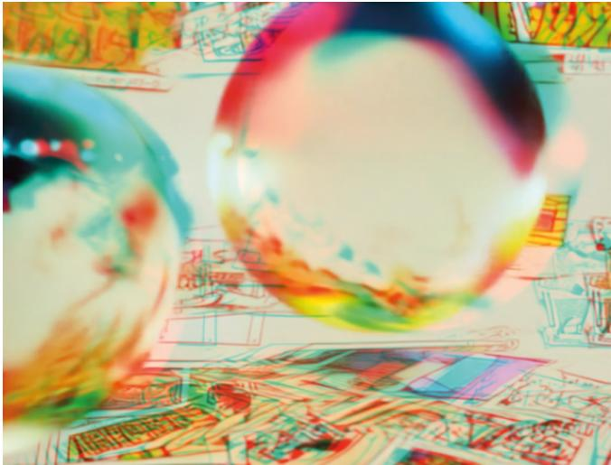  
Fig. 9. Producing correlated noise from many views can be used as input to generate lightfields (top, 4 samples of 48 shown) or stereo pairs (botom, shown in anaglyph).

Wei-Sheng Lai, Jia-Bin Huang, Oliver Wang, Eli Shechtman, Ersin Yumer, and Ming Hsuan Yang. 2018. Learning Blind Video Temporal Consistency. In ECCV. 170–185.

Fabrice Neyret. 2003. Advected textures. In ACM SIGGRAPH/Eurographics symposium on Computer animation. Eurographics Association, 147–153.

Merlin Nimier-David, Thomas Müller, Alexander Keller, and Wenzel Jakob. 2022. Unbiased inverse volume rendering with diferential trackers. ACM Transactions on Graphics (TOG) 41, 4 (2022), 1–20

Alan Norton, Alyn P Rockwood, and Philip T Skolmoski. 1982. Clamping: A method of antialiasing textured surfaces by bandwidth limiting in object space. In SIGGRAPH. 1–8.

Matt Pharr, Wenzel Jakob, and Greg Humphreys. 2023. Physically based rendering: From theory to implementation. MIT Press.

Jordi Pont-Tuset, Federico Perazzi, Sergi Caelles, Pablo Arbeláez, Alex Sorkine-Hornung, and Luc Van Gool. 2018. The 2017 DAVIS Challenge on Video Object Segmentation. arXiv (March 2018). arXiv:1704.00675 [cs] doi:10.48550/arXiv.1704.00675

Alvy Ray Smith. 1995. A Pixel Is Not A Little Square, A Pixel Is Not A Little Square, A Pixel Is Not A Little Square! Microsoft Computer Graphics, Technical Memo 6 (1995).

Matthias Teschner, Bruno Heidelberger, Matthias Müller, Danat Pomerantes, and Markus H Gross. 2003. Optimized spatial hashing for collision detection of de formable objects.. In VMV, Vol. 3. 47–54.

A. W. van der Vaart. 1998. Asymptotic Statistics. Cambridge University Press.

Xiaojuan Wang, Janne Kontkanen, Brian Curless, Steven M Seitz, Ira Kemelmacher-Shlizerman, Ben Mildenhall, Pratul Srinivasan, Dor Verbin, and Aleksander Holynski. 2024. Generative owers of ten. In CVPR. 7173–7182.

Kyu-Young Whang, Brad T Vander-Zanden, and Howard M Taylor. 1990. A linear-time probabilistic counting algorithm for database applications. ACM Transactions on Database Systems (TODS) 15, 2 (1990).

Zikai Zhou, Shitong Shao, Lichen Bai, Shufei Zhang, Zhiqiang Xu, Bo Han, and Zeke Xie. 2025. Golden noise for difusion models: A learning framework. In ICCV. 17688–17697.

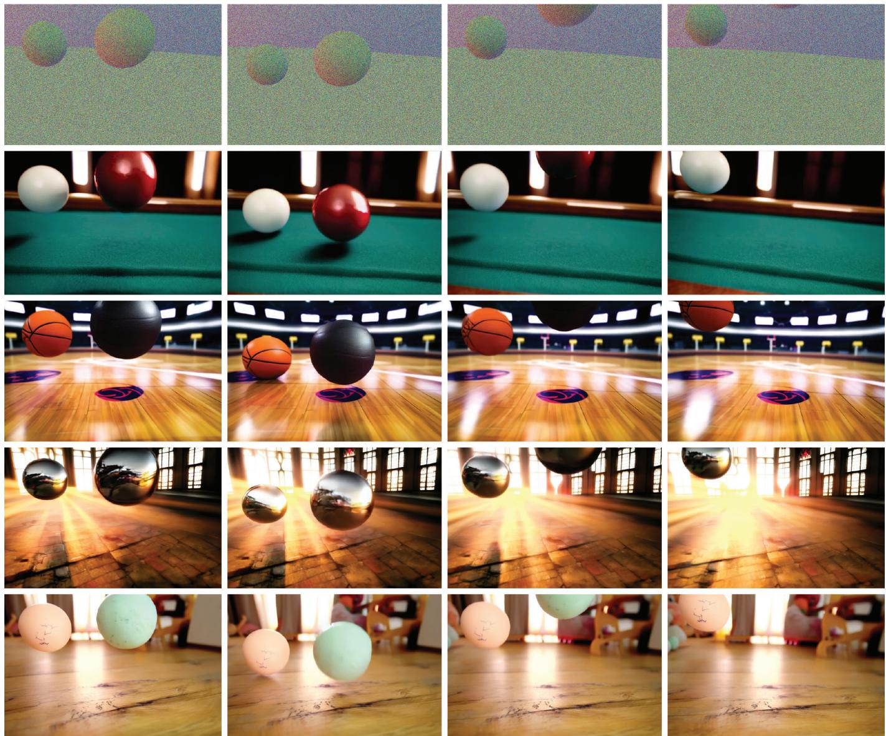

Fig. 10. Video generation results. The top row shows the noise, composed on top of the normal channel (not visible to the generation, only to visualize the 3D configuration). All other rows show four frames from an animation generated from this noise using diferent prompts. Note how all videos share the 3D structure, where the only guidance comes from the noise correlation.  
  
Fig. 11. Correlation of two falling spheres (seen in Fig. 10) in conflict with a prompt asking for ice cubes. The generative model produces motion that complies with the one contained in our noise, but despite the correlation with falling spheres, cubes with the right motion are produced. The supplemental video has more results for other conflicting prompts, too.

# Supplemental Material for Tabula Rasa: Monte Carlo estimation of unit-variance noise with controlled spatio-temporal correlation

TOBIAS RITSCHEL, University College London, UK and Meta Reality Labs, USA

YANG ZHOU, Meta Reality Labs, USA

NICK MILEF, Meta Reality Labs, USA

MIKHAIL DEREVIANNYKH, Karlsruhe Institute of Technology, Germany and Meta Reality Labs, USA

CHEN LIU, University College London, UK

CHRISTOPHE HERY, Meta Reality Labs, USA

CARL MARSHALL, Meta Reality Labs, USA

## Overview

In this supplemental we will give in Sec. 1 a primer on (unit)-variance and its role in graphics, specifically Monte-Carlo estimation, provide a rasterization-based version of our approach to complement the path-tracing one from the main paper in Sec. 2, derive the com-plete equations for the bias of our estimator in Sec. 3, derive and discuss the residual spatial correlation due to shared random vari- ates by pixels in Sec. 4, and conclude with additional result for our non-photorealistic rendering (NPR) shader use case in Sec. 5. An additional illustration of our estimation procedure is also provided in Fig. 3.

## 1 Primer on variance and correlation

This section recalls the reasons of variance not being unit and the meaning of temporal correlation in our context.

Variance. Consider a sin-gle normally distributed, zero-mean, unit variance random variable such as flipping a coin multiple times (Fig. 1, first row). The property of “unit variance” says, that the standard de- viation is 1, so on average, a sample from that distri- bution is 1 away from the mean 0. Now consider the average of two compared to the one of ten coin flips. It is intuitive, and follows

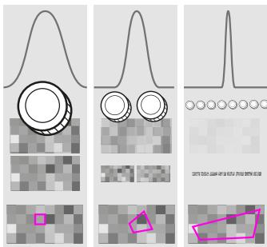  
Fig. 1. Variance of multiple variates.

from the law of large numbers, that the average of these will be- come more similar to 0.5 and, hence, how the variance will become smaller. The same tendency is true, if the random variables are not averaged, but a weighted sum: even if they are weighted diferently, the outcome is close to that weighted combination of means and less likely to be something else. In this case, the variance is Í �2, where �� are the weights. For the special case of averaging, this means weights are equal, a mere $w _ { i } = 1 / n$ , and hence $\sum 1 / n ^ { 2 } = n / n ^ { 2 } = 1 / n .$ so variance goes down inversely proportional to the number of variates.

The second row of Fig. 1 shows this from a graphics or image processing perspective: flipping coins is similar to producing 10 images full of noise and averaging them so as the contrast will disappear, converging to a 50 % gray image in the limit. Now filtering (Fig. 1, third row) also is nothing else than a weighted sum of pixel values. If the pixel values are random variables and we need to filter them, this will change the variance too.

This work is about adjusting the change of variance back to 1 by knowing what the variance is. Once we know the variance of a random variable, we can divide by its square root and the variable becomes unit-normal. Visually, this would mean to restore the con trast, and algorithmically, this is what a program such as Photoshop would do: find the contrast and rescale inverse-proportional to it.

Correlation. Correlation in this article can be between pixels at dif- ferent spatial locations and difer- ent points in time. The aim is to introduce no unwanted spatial cor- relation. For some applications, a level of spatial correlation is bene- ficial to prevent aliasing [Mitchell and Netravali 1988], while for oth-ers it is to be avoided and pixels are treated as squares [Smith 1995]. In our scenario, spatial correlation will be added by downstream meth- ods but they can only do this faith- fully ifthey can safely assume to be absent in their input (our output).

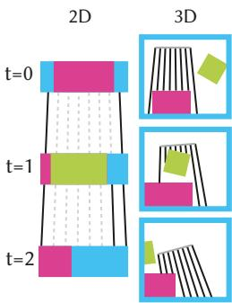  
Fig. 2. 3D and 2D correlation.

We do however want to introduce controlled temporal correlation.

In the notion of previous papers, temporal correlation was 2D and defined by means of flow: a pixel is correlated in one frame with another pixel at a diferent position (black lines in Fig. 2). This has limitations at image boundaries or in the presence of occlusion, it assumes opaque difuse objects and struggles where not all images contain all pixels that seek to be correlated and hence correlation can not be expressed as flow (Fig. 2, dotted lines). We can support this notion, but we can also define correlation resulting from di- rectly sampling the random field in 3D (Fig. 2, right) to produce projections that have correlation unafected by occlusion or clipping. This idea even extends to refraction and reflection of rays computed by Whitted-style ray casting.

## 2 Rasterization pseudo-code

We provide a variant ofour method implemented in the rasterization shader as Alg. 1 to complement the raytracing-based one from the main paper (Main Alg. 1).

## 3 Additional details on the proof of Main Thm. 2

Here we provide the full derivation to bound the remainder term in Main Eq. 10.

Lemma 1. $\mathbb { E } [ R ( { \widehat { \mathbf { a } } } ) ] = O ( m ^ { - 2 } )$

Proof. Recall that �(ba) is the remainder of the second-order Taylor expansion of� (x) about a. By the mean value theorem, the Lagrange form of �(ba) is

$$
R ( \widehat { \mathbf { a } } ) = \frac { 1 } { 6 } \sum _ { i , j , k } \frac { \partial ^ { 3 } \psi } { \partial x _ { i } \partial x _ { j } \partial x _ { k } } \Bigg \lvert _ { \mathbf { c } } ( \widehat { a } _ { i } - a _ { i } ) ( \widehat { a } _ { j } - a _ { j } ) ( \widehat { a } _ { k } - a _ { k } ) ,\tag{1}
$$

Algorithm 1 Rasterization variant.   
1: procedure GetNoise(polys)   
2: pTex, dPdXTex = DrawPolys(Draw, polys)   
3: vTex = FullScreenQuad(Normalize, pTex, dPdXTex)   
4: return vTex   
5: procedure Draw(position)   
6: return position, dFdX(position)   
7: procedure Normalize(fragCoord, pTex, dPosdXTex)   
8: histoSize = 64   
9: weights = float[2,histoSize]   
10: value = 0   
11: for ofset in (size, size) do   
12: p = TexelFetchOffset(pTex, fragCoord, ofset)   
13: foot = TexelFetchOffset(dPdXTex, fragCoord, ofset)   
14: level = log2(foot)   
15: dLevel = floor(level)   
16: id0 = hash(dLevel + 0, p)   
17: id1 = hash(dLevel + 1, p)   
18: value0 = Noise(id, dLevel + 0)   
19: value1 = Noise(id, dLevel + 1)   
20: value += LERP(value0, value1, weight)   
21: weight = Fract(level)   
22: weights[0, id0 % histoSize] += weight   
23: weights[1, id1 % histoSize] += 1 - weight   
24: weights /= Sqr(size)   
25: value /= Sqr(size)   
26: sqrWeights = Sqr(weights)   
27: variance = Sum(sqrWeights)   
28: return value / Sqrt(variance)

where c is some point on the segment between a and ba: $\textbf { c } = \textbf { a } +$ $t _ { c } ( \widehat { \mathbf { a } } - \mathbf { a } ) , t _ { c } \in ( 0 , 1 )$ . Taking the expectation on both sides gives

$$
\mathbb { E } [ R ( \widehat { \mathbf { a } } ) ] = \frac { 1 } { 6 } \mathbb { E } \left[ \sum _ { i , j , k } \frac { \partial ^ { 3 } \psi } { \partial x _ { i } \partial x _ { j } \partial x _ { k } } \Bigg | _ { \mathbf { c } } ( \widehat { a } _ { i } - a _ { i } ) ( \widehat { a } _ { j } - a _ { j } ) ( \widehat { a } _ { k } - a _ { k } ) \right] .\tag{2}
$$

Unlike the second-order partial derivatives in Main $\operatorname { E q . 1 0 } ,$ the third- order partial derivatives here depend on ba through c. However, we can factor them out as they are bounded due to the smoothness of $\phi ( \mathbf { x } ) ( C ^ { \infty } \mathrm { o n } ( 0 , \infty ) ^ { n } )$ . Formally, let $M _ { i j k }$ be the supremum of the absolute values of each partial derivative over an epsilon-open ball around a that covers c, and let � be the maximum of all $M _ { i j k } { \mathrm { : } }$

$$
M _ { i j k } = \operatorname* { s u p } _ { \mathbf { c } \in \mathcal { B } _ { \epsilon } ( \mathbf { a } ) } | \frac { \partial ^ { 3 } \psi } { \partial x _ { i } \partial x _ { j } \partial x _ { k } } | _ { \mathbf { c } } | < \infty \mathrm { a n d } M = \operatorname* { m a x } _ { i , j , k } M _ { i j k } < \infty .\tag{3}
$$

Then, E[�(ba)] is bounded by

$$
\mathbb { E } [ R ( \widehat { \mathbf { a } } ) ] \leq \frac { M } { 6 } \sum _ { i , j , k } \mathbb { E } [ ( \widehat { a } _ { i } - a _ { i } ) ( \widehat { a } _ { j } - a _ { j } ) ( \widehat { a } _ { k } - a _ { k } ) ] .\tag{4}
$$

Recall the definition of $X _ { i , s }$ in the main paper. We now further define random variable $Z _ { i , s } = X _ { i , s } - a _ { i }$ and write

$$
{ \hat { a } } _ { i } - a _ { i } = { \frac { 1 } { m } } \sum _ { i = 1 } ^ { m } Z _ { i , s } .\tag{5}
$$

The third moment term inside $\operatorname { E q . }$ 4 then becomes

$$
\mathbb { E } [ ( \hat { a } _ { i } - a _ { i } ) ( \hat { a } _ { j } - a _ { j } ) ( \hat { a } _ { k } - a _ { k } ) ] = \frac { 1 } { m ^ { 3 } } \sum _ { s = 1 } ^ { m } \sum _ { t = 1 } ^ { m } \sum _ { u = 1 } ^ { m } \mathbb { E } [ Z _ { i , s } Z _ { j , t } Z _ { k , u } ] .\tag{6}
$$

Because samples $\omega _ { 1 } , \ldots , \omega _ { m }$ are independent and E $\boldsymbol { Z } _ { i , s } \boldsymbol { ] } = 0$ , only the diagonal terms $( s = t = u )$ in Eq. 6 are nonzero:

$$
\mathbb { E } [ ( \hat { a } _ { i } - a _ { i } ) ( \hat { a } _ { j } - a _ { j } ) ( \hat { a } _ { k } - a _ { k } ) ] = \frac { 1 } { m ^ { 3 } } \sum _ { s = 1 } ^ { m } \mathbb { E } [ Z _ { i , s } Z _ { j , s } Z _ { k , s } ] .\tag{7}
$$

To derive the expression of the inner term, we generalize and utilize the properties of $X _ { i , s }$ from Main Eq. 11. Given a list of sub-pixel domain indices $i _ { 1 } , \ldots , i _ { r }$ and $q _ { 1 } , \dotsc , q _ { r } \geq 1$

$$
\mathbb { E } [ X _ { i _ { 1 } , s } ^ { q _ { 1 } } , . . . X _ { i _ { r } , s } ^ { q _ { r } } ] = \left\{ { a _ { i _ { 1 } } \quad \mathrm { i f } \ i _ { 1 } = i _ { 2 } = \cdot \cdot \cdot = i _ { r } , } \right.\tag{8}
$$

Eq. 8 holds because each $X _ { i , s }$ is binary and each sample $\omega _ { s }$ cannot fall in two subdomains simultaneously. In particular, $\mathbb { E } [ X _ { i , s } ^ { q } ] = a _ { i }$ for any $q \geq 1$ . The inner term of $\operatorname { E q . 7 }$ can now be expressed in cases:

$$
\begin{array} { r l } { ( 1 ) } & { i = j = k \colon } \\ & { \qquad \mathbb { E } [ ( Z _ { i , s } ) ^ { 3 } ] = \mathbb { E } [ ( X _ { i , s } - a _ { i } ) ^ { 3 } ] } \\ & { \qquad = \mathbb { E } [ X _ { i , s } ^ { 3 } - 3 X _ { i , s } ^ { 2 } a _ { i } + 3 X _ { i , s } a _ { i } ^ { 2 } - a _ { i } ^ { 3 } ] } \\ & { \qquad = 2 a _ { i } ^ { 3 } - 3 a _ { i } ^ { 2 } + a _ { i } . } \end{array}\tag{9}
$$

(2) Only two indices are equal. Without loss of generality, let � = � ≠ �:

$$
\begin{array} { c } { \mathbb { E } [ ( Z _ { i , s } ) ^ { 2 } Z _ { k , s } ] = \mathbb { E } [ ( X _ { i , s } - a _ { i } ) ^ { 2 } ( X _ { k , s } - a _ { k } ) ] } \\ { = 2 a _ { i } ^ { 2 } a _ { k } - a _ { i } a _ { k } . } \end{array}\tag{10}
$$

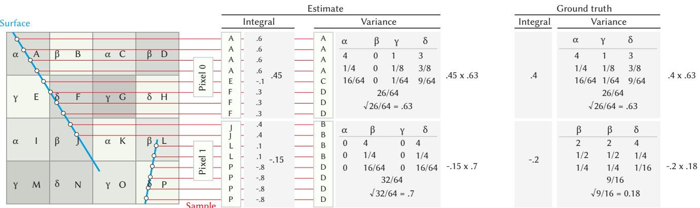  
Fig. 3. Illustration of our estimation procedure for two pixels, 0 and 1 in a 1D-image using a ray-tracing image formation model with 8 samples in each pixel. For each sample, a ray is traced into the 2D world (red lines) to find the intersection with 2D surfaces (blue). Each hit coordinate is hashed to two codes: one to estimate variance (upright Greek, α to δ) and one to estimate the variate (Roman, A to P). First, the mean of all values for the first (“large”) hash codes is computed. Next, we build a histogram of all the repeating (“small”) hash codes within the pixel. This allows us to recompute the variance and adjust the estimate as per the last row. The hashing can have collisions, as shown in the pixel where large code � and � both map to code $\beta ,$ hence overestimating the variance.

$$
\begin{array} { r l } { ( 3 ) } & { i \neq j \mathrm { ~ a n d ~ } j \neq k ; } \\ & { } \\ & { \mathbb { E } [ Z _ { i , s } Z _ { j , s } Z _ { k , s } ] = \mathbb { E } [ ( X _ { i , s } - a _ { i } ) ( X _ { j , s } - a _ { j } ) ( X _ { k , s } - a _ { k } ) ] } \\ & { \qquad = 2 a _ { i } a _ { j } a _ { k } . } \end{array}\tag{11}
$$

Notice that in all three cases, the expression is constant with respect to �. Therefore, substituting Eq. $9 \mathrm { ~ - ~ } \mathrm { E q } .$ . 11 into the right hand side of Eq. 7 gives a sum of � constant terms divided by $m ^ { 3 }$ , which is $O ( m ^ { - 2 } )$ . Finally, the proof is completed by substituting Eq. 7 into Eq. 4. □

## 4 Spatial correlation

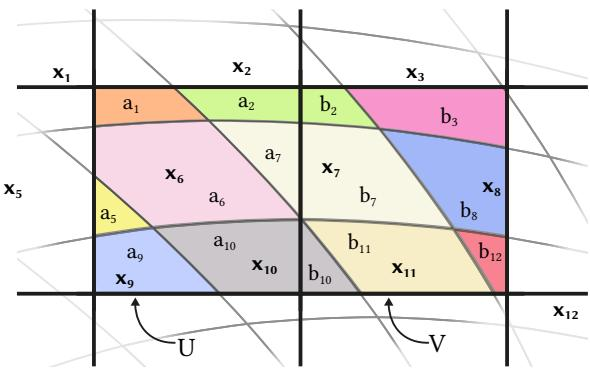  
Fig. 4. Residual spatial correlation: any method that resamples a pixel grid (two pixels U and V shown as big squares) to a non-aligned texel grid (colored areas) is subject to some form of correlation. Consider the diferent values at each texel, visualized as colors. As the texel and pixel grid do not align, there are always some texels that are shared by two pixels, in this case �2, �7, and $x _ { 1 0 } .$ The resulting pixel value is a combination of colors, which all are, without loss of generality, distinct, besides the shared ones.

There is one source of minor spatial correlation in our approach and probably also in other approaches that make use of resampling from a high, but finite-resolution grid to a non-aligned pixel grid such as Burgert et al. [2025].

As shown in Fig. 4, a pixel grid and texels are, without loss of generality, never aligned. Texels, under general warps, and in particular when projected from 3D as in our method, are not even a regular grid. When a pixel samples multiple texels as a linear combination given by reconstruction filter weights, it will always, however high the resolution is, touch one or more texels that are also touched by another pixel. In our illustration this is texel 2, 7 and 10. Fortunately, this correlation can be quantified and made arbitrarily low with arbitrary texel resolution as we show next:

## 4.1 Correlation pixels due to a shared texel

Let $\mathbf { X } = [ X _ { 1 } , X _ { 2 } , \ldots , X _ { n } ] ^ { T }$ be the random vector of all texels in the entire random field. We define two pixels � and � as distinct linear combinations of X, using the weight vectors $\mathbf { a } = [ a _ { 1 } , a _ { 2 } , \ldots , a _ { n } ] ^ { T }$ and $\mathbf { b } = [ b _ { 1 } , b _ { 2 } , \ldots , b _ { n } ] ^ { T }$

$$
U = \mathbf { a } ^ { T } \mathbf { X } = \sum _ { i = 1 } ^ { n } a _ { i } X _ { i } \qquad { \mathrm { a n d } } \qquad V = \mathbf { b } ^ { T } \mathbf { X } = \sum _ { i = 1 } ^ { n } b _ { i } X _ { i } ,
$$

where $\textstyle \sum _ { i } a _ { i } = \sum _ { i } b _ { i } = 1$ , as a pixel is a partition of unity of all texels below it. Most elements in a and b are zero as a pixel does not cover most texels. If it is non-zero, it is almost always non-zero in only either a or b as one texel only falls on one pixel. The exceptions are those texels, that afect both � and �. These are the ones that induce a subtle linear Pearson correlation between the pixel variables.

While the individual elements of X have unit variance, � and � being their linear combinations need not, and correcting for this is precisely the paper’s objective. Let their variance-corrected counterparts be

$$
U ^ { \prime } = { \frac { U } { \sqrt { \operatorname { V a r } ( U ) } } } \qquad { \mathrm { a n d } } \qquad V ^ { \prime } = { \frac { V } { \sqrt { \operatorname { V a r } ( V ) } } } .
$$

Our method is about jointly estimating � and $\mathrm { V a r } ( U )$ (resp. � and $\mathrm { V a r } ( V ) )$ ) via Monte Carlo, but for the sake of this discussion, we assume perfect estimates and no Monte Carlo noise. The Pearson correlation between $U ^ { \prime }$ and $V ^ { \prime }$ can then be quantified as

$$
R = \operatorname { C o r r } ( U ^ { \prime } , V ^ { \prime } ) = \frac { \operatorname { C o v } ( U , V ) } { \sqrt { \operatorname { V a r } ( U ) \operatorname { V a r } ( V ) } } .
$$

To compute this expression, we review three properties carried from the main paper:

(1) The texel noise has unit variance: $\mathrm { V a r } ( X _ { i } ) = 1$ for all � as every noise texel simply is unit-random value.

(2) The texel noise is uncorrelated: Cov $( X _ { i } , X _ { j } ) = 0$ for all $i \neq j$ as texels simply are independent of each other.

(3) Variance of each pixel: $\begin{array} { r } { \mathrm { V a r } ( U ) ~ = ~ \sum _ { i } a _ { i } ^ { 2 } ~ = ~ | | \mathbf { a } | | ^ { 2 } } \end{array}$ and $\begin{array} { r } { \mathrm { V a r } ( U ) = \sum _ { i } b _ { i } ^ { 2 } = | | { \bf b } | | ^ { 2 } . } \end{array}$ This is carried from Main Eq. 6.

From Properties 1 and 2, the covariance matrix of X simplifies to the identity matrix $( \Sigma = 1 )$ . By substituting $\Sigma \ : = \ : 1$ into the joint covariance formula, the numerator simplifies to:

$$
\operatorname { C o v } ( U , V ) = \mathbf { a } ^ { T } \Sigma \mathbf { b } = \mathbf { a } ^ { T } \vert \mathbf { b } = \mathbf { a } ^ { T } \mathbf { b } .
$$

Together with Property 3, the correlation becomes:

$$
R = \frac { { \mathbf a } ^ { T } { \mathbf b } } { | | { \mathbf a } | | | | { \mathbf b } | | } .\tag{12}
$$

This means, that the correlation between two of our pixels is the cosine similarity of their normalized weight vectors.

## 4.2 Example

Let us consider two examples to get an idea about the actual corre- lation values.

Consider two pixels observing an opaque difuse world. In that case both a and b are mostly zeros, and they are rarely non-zero at the same index. The correlation comes only from those rare coincid- ing non-zero components. Hence, only these coinciding components matter as otherwise one or both factors in a product is zero.

To see how large they are, consider a 1D case in Fig. 5, where for example 10 texels fall onto one pixel. Only one texel � is shared by both pixels in 1D. Let � be the length of this texel that straddles $U ,$ which can vary between 0 and 0.1. The spatial correlation can be written precisely according to Eq. 12, with $| | \mathbf { a } | | = | | \mathbf { b } | |$ because the texel at each pixel’s other boundary is split in the same way into � and $0 . 1 - w \colon$

$$
R = \frac { w \big ( 0 . 1 - w \big ) } { ( 0 . 1 - w ) ^ { 2 } + 9 \cdot 0 . 1 ^ { 2 } + w ^ { 2 } } , \quad w \in ( 0 , 0 . 1 ) .
$$

which peaks at approximately 0.026 when $w = 0 . 0 5$ , which is once texel � covers both pixels in equal share.

In the general 2D/3D case for general mappings from texels to pixels, as in Fig. 4, it is dificult to quantify how texels exactly project onto both of two pixels. The tendency however is clear: when the magnification grows, the number of unique texels inside grows much quicker than the number of correlated texels on the edge.

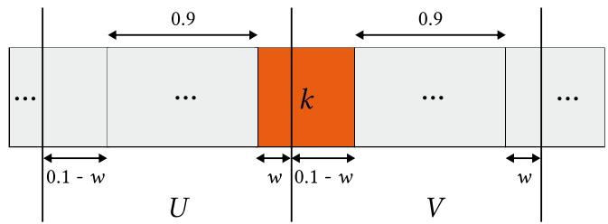  
Fig. 5. An example of 1D spatial correlation.

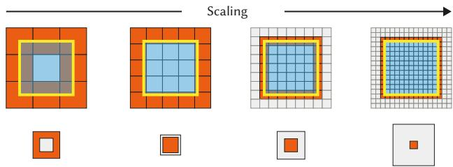  
Fig. 6. A texel grid of doubling resolution resp. magnification (columns), falling onto a single pixel (yellow square). The first row shows the configuration where texels that would induce correlation with neighbouring pixels are marked orange. The second row shows the respective area of unique vs. correlated texels. We see that with typical resolution the correlated pixel areas vanishes and so does the correlation.

As shown in Fig. 6, with � × � texels covered per pixel, the shared edge strip has approximately � texels. We can roughly estimate the spatial correlation by assuming each texel weights $1 / n ^ { 2 }$ , and each shared texel is cut exactly in halves. Again using Eq. 12,

$$
R \approx { \frac { n ( { \frac { 0 . 5 } { n ^ { 2 } } } ) ^ { 2 } } { n ^ { 2 } ( { \frac { 1 } { n ^ { 2 } } } ) ^ { 2 } } } = { \frac { 1 } { 4 n } } = O ( n ^ { - 1 } ) .
$$

In other words, the residual correlation is small and vanishes linearly as the texel resolution grows.

## 4.3 Discussion

This efect does not go away by other reconstruction filter. It rather is becoming worse, as in this condition, simply, a single texel maps to even more pixels. Notably, the inverse is not true: it is not sufficient to use non-overlapping reconstruction filters to guarantee no correlation. It just appears to minimize these. Our method, as any path tracer, is able to use any reconstruction filter, and while we have only experimented with box filters, exploring the resulting reconstruction-decorrelation continuum seems relevant to address in future work.

Note, that there are other forms of spatial correlation, which are not due to reconstruction filtering, which might be desirable. Those are correlations induced by light transport, $\mathrm { e . g . , a }$ pixel with a world space position that is reflecting another world space position will have, and should have, the same random variable and hence be correlated.

Depending on which integrator is used, additional correlation might be introduced, $\mathrm { e . g . }$ , by QMC, which again could be defeated by scrambling, if necessary.

We thank the anonymous reviewers for pointing out this obser-vation of unwanted spatial correlation. While formally correct, as explained above, it is likely so small that we did not observe any resulting issues.

## 5 Additional results of non-photorealistic rendering

In Figure 7 and the supplemental video, we provide additional NPR results with two styles. The first style mimics point stippling by applying binary thresholding to the noise based on tone intensity. Color is achieved by independent thresholding of each channel of the CMYK color space with diferent noise seeds. The second style mimics hatching by blending anisotropically stretched noise layers1. We compare the shading results using our multi-level, variance-corrected noise versus regular 3D noise, both defined in world space. Our approach ensures consistent pattern size and density every- where regardless of object position and camera zoom. Orthogonal to our implementation, it is possible to further support object animation using UV-space noise [Praun et al. 2001] and to improve sample uniformity using blue noise [Wei 2010]. We leave these potential extensions as future work.

## 6 2D vs 3D flow

There is a subtle diference between 2D flow and 3D flow which fundamentally afects how our method and previous methods can take them into account in video restoration. Flow can be either absolute or relative, forward or backward, and – for the simplicity of naming – 2D or 3D.

None of the following are assumptions of our method at all. It is just that our method can take in more advanced input than previous work and it is diferent in a subtle way.

Absolute vs relative. Absolute can be converted to relative and back by simple additions. All previous as well as our method can work with them equally well as they can be converted up to numer- ics.

Forward vs backward. Forward and backward flow can also be consumed by all methods, including ours. It is harder to convert them, as it ideally requires a reverse mapping of a function that is supposed to be defined and evaluated smoothly in space but not practical in reality due to finite grids.

2D vs 3D. The substantial diference is what the flow values actu ally mean. In normal 2D flow, we have an image coordinate we can fetch from and do so with all sophistication proposed in previous work. Our method as well can take in 2D flow.

3D flow however, is diferent. Let us assume forward, absolute 3D flow as produced by Karaev et al. [2024]: Now, every pixel has a unique identifier. This is “3D” in so far, as it will not be afected by occlusion and hence gives every point a unique and stable identifier. This identifier for our work does not even need to be the coordinate, it does not need to be metric even, it just needs to be unique, because this is all that our method needs to recognize correlation in space and time via hashing. It turns out, that the identifier mostly is the image space coordinate, and the time code of first appearance. Like this, not every 3D point always gets the same unique code, but every 3D point the flow algorithm managed to recognize does. Taking in this flow is not possible with previous methods: if a point was occluded (or otherwise dropped) in the frame before, it is lost forever. Previous methods simply have no way of taking in time (or any other disambiguating information), all they consume is coordinates.

Implementation. In practice, we need absolute backward 3D flow, but modern flow estimation models come as point tracking. We are not aware of a method to perform 3D flow estimation so we devised our own. We provide a supplemental website viewer to visualize the optical flows by this new method and subsequently the noises generated based on the flows. The new method works as follows: for every frame the 3D flow algorithm provides a sparse set of points that in this frame emerged and for each element of that set the varying-length dense trajectory as a list of future 2d positions. We parse the sequence start to end and for every frame we iterate over every element of the set of new emergent features. This element is a trajectory and we splat the pair of initial 2D image coordinate and time code to the future positions in future frames. Note, that this does not create holes, as something that is never covered by a path in the future, will spawn its own trajectory (i.e., it is a disocclusion). We splat the �,�,� coordinates additively and keep a count of how many paths splatted to a pixel, to divide the coordinate sum by this count in the end. This works well except at edges of disocclusion, because in their vicinity, both foreground and background trajectories might contribute, leading to an unwanted averaging of foreground and background motion which is correct for neither. Instead, we would be more interested to break the tie by consistently choosing a mode of the distribution of contributors. This can be achieved by replacing the additive blending followed by normalization by a full-fledged mode-seek: instead of adding up pixels, we keep a set of all coordinates afecting a pixel. Once splatting is finished, this set is clustered, and the dominant mode is used as the coordinate. Like this, pixels on the edges of moving objects either get mapped to the foreground or background, but not to an undesirable mix.

3D Warping Error. We measure 3D warping errors by inheriting the main idea of warping error [Lai et al. 2018] but replacing its flow estimated between two consecutive frames with the 3D optical flow. It is a reference-based metric where the estimation of 3D optical flow requires the original reference video, and then applied to the video to be tested to compute the MSE between every pixel and its birth pixel. Specifically, we compute as below:

$$
\mathrm { M S E } ( V ( x ) - V ( F ( x ) ) ) ,\tag{13}
$$

where � is the video, � is a valid pixel of�, � is the 3D optical flow which records for each pixel its birth coordinate of space and time. This measures the diferences of each pixel from what it was at birth to capture the global temporal consistency, i.e., space-time memory, for our needs to demonstrate the benefits of using 3D optical flow to generate our noises. Practically, we conduct the same protocol of computing warping errors that measures MSE in RGB values of [0, 255], reduces across channels, and averages for all pixels of one video.

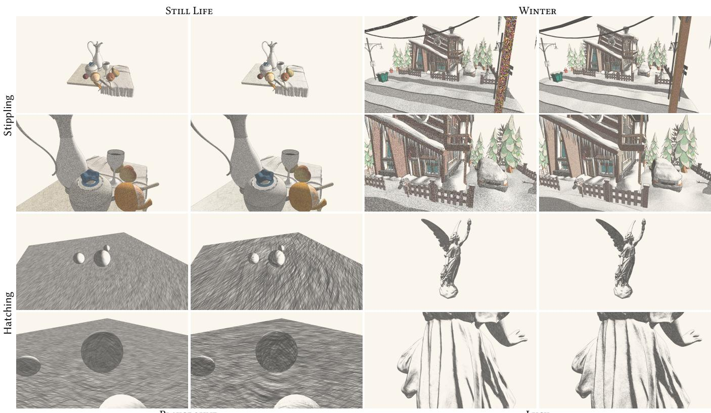  
Fig. 7. Comparisons of non-photorealistic stippling and hatching renders based on world-space noise (“Baseline”) versus our multi-level, variance-corrected noise (“Ours”). For each scene, two views are shown to highlight the diferent noise behaviors at diferent zoom levels. Notice how ours maintains a consistent scale of paterns. Readers are encouraged to zoom in for a closer inspection.

Optical Flow Support. We further summarize in Tab. 1 the diferent optical flow modalities that our method and the baseline use to compute metrics, as well as those they can support in principle.

Table 1. Optical Flow Modality comparison.
<table><tr><td colspan="3">Modality of Optical Flows</td><td rowspan="2"></td><td rowspan="2">Used by Supported by</td></tr><tr><td>Type</td><td>Direction</td><td>Dim.</td></tr><tr><td rowspan="2">Absolute</td><td>Forward</td><td>2D</td><td></td><td>Ours</td></tr><tr><td>Backward</td><td>2D</td><td></td><td>Ours</td></tr><tr><td rowspan="2">Relative</td><td>Forward</td><td>2D</td><td>GWTF</td><td>GWTF</td></tr><tr><td>Backward</td><td>2D</td><td>GWTF</td><td>GWTF</td></tr><tr><td rowspan="2">Absolute</td><td>Forward</td><td>3D</td><td></td><td>Ours</td></tr><tr><td>Backward</td><td>3D</td><td>Ours</td><td>Ours</td></tr></table>

Wei-Sheng Lai, Jia-Bin Huang, Oliver Wang, Eli Shechtman, Ersin Yumer, and Ming Hsuan Yang. 2018. Learning Blind Video Temporal Consistency. In ECCV. 170–185.

Nikita Karaev, Iurii Makarov, Jianyuan Wang, Natalia Neverova, Andrea Vedaldi, and Christian Rupprecht. 2024. CoTracker3: Simpler and Better Point Tracking by Pseudo-Labelling Real Videos. In Proc. arXiv:2410.11831.

Don P Mitchell and Arun N Netravali. 1988. Reconstruction filters in computer-graphics. ACM Siggraph Computer Graphics 22, 4 (1988), 221–228.

Emil Praun, Hugues Hoppe, Matthew Webb, and Adam Finkelstein. 2001. Real-time hatching. In Proceedings of the 28th Annual Conference on Computer Graphics and Interactive Techniques (SIGGRAPH ’01). Association for Computing Machinery, New York, NY, USA, 581.

Alvy Ray Smith. 1995. A Pixel Is Not A Little Square, A Pixel Is Not A Little Square, A Pixel Is Not A Little S uare! Microsoft Computer Graphics, Technical Memo 6 (1995).

Li-Yi Wei. 2010. Multi-class blue noise sampling. ACM Trans. Graph. 29, 4, Article 79 (July 2010), 8 pages.

## References

Ryan Burgert, Yuancheng Xu, Wenqi Xian, Oliver Pilarski, Pascal Clausen, Mingming He, Li Ma, Yitong Deng, Lingxiao Li, Mohsen Mousavi, Michael Ryoo, Paul Debevec, and Ning Yu. 2025. Go-with-the-Flow: Motion-Controllable Video Difusion Models Using Real-Time Warped Noise. In CVPR.