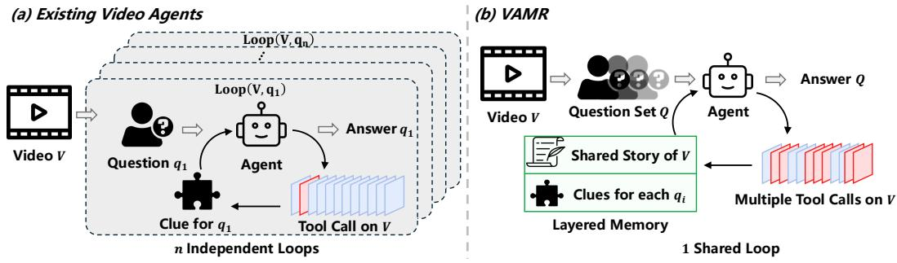
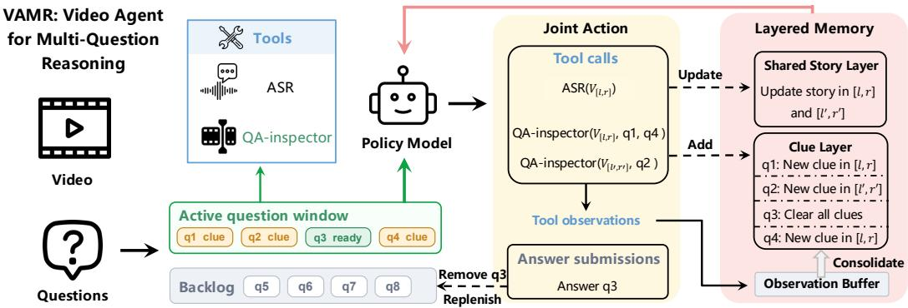
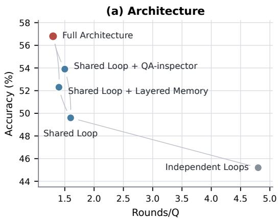
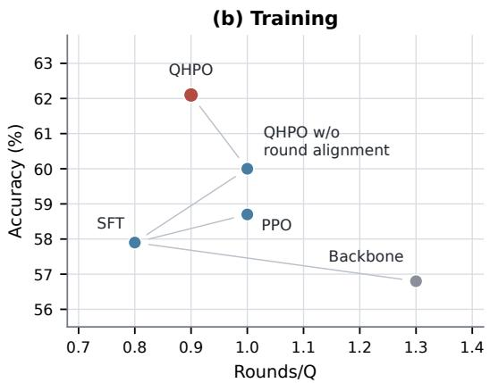
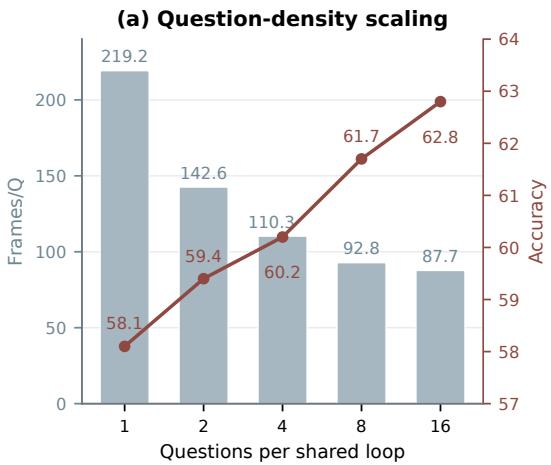
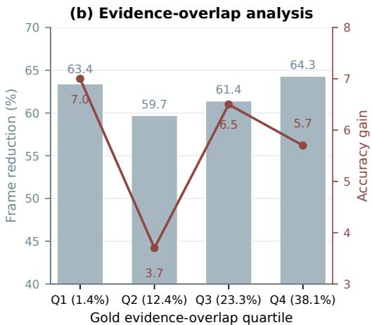

# VAMR: MULTI-QUESTION AGENTIC REASONING FOR EFFICIENT LONG-FORM VIDEO UNDERSTANDING

Runquan Gui1,2 Hanzhu Chen2 Zehao Wang1,2 Hanxin Zhu1,2 Xin Li1 Zhibo Chen1∗   
1 University of Science and Technology of China   
2 Tencent

## ABSTRACT

Long-form video understanding often involves multiple questions about different aspects of the same recording. Yet existing video agents typically process each question through an isolated tool-use trajectory. This repeatedly restarts video exploration and memory construction, missing opportunities to acquire evidence jointly and progressively build a shared understanding that supports the complete question set. We introduce VAMR (Video Agent for Multi-Question Reasoning), which coordinates all questions about a video through one shared tool-use trajectory. At each round, a persistent policy model can invoke tools for one or more unresolved questions and submit answers for questions with sufficient evidence. Question-conditioned visual perception retrieves fine-grained clues for several questions in one call, while layered multi-question memory integrates reusable context into a shared video story and preserves separate evidence for individual questions. After supervised fine-tuning initializes this interaction protocol, we propose question-horizon policy optimization (QHPO) to optimize shared trajectories in which questions progress and finish at different rounds. Specifically, a question-level critic estimates the value of each active question, while round alignment maps each question advantage to the rounds that directly serve it before the aligned advantages are aggregated to optimize the shared actor. Across LVBench, Video-Holmes, and LongVideoBench, VAMR achieves the highest accuracy overall and the fewest reasoning rounds among iterative methods. On LVBench, it reaches 62.1% accuracy, exceeding VideoARM by 4.3 points while reducing reasoning rounds and processed frames by 85.9% and 61.4%.

## 1 INTRODUCTION

Long-form video understanding has become a central problem for multimodal intelligence, requiring models to integrate evidence distributed across videos that may span hours (Mangalam et al., 2023; Fu et al., 2025a; Wu et al., 2024; Wang et al., 2025a). Both long-video benchmarks and practical systems often require multiple judgments about different aspects of the same recording: benchmark questions probe distinct events, dialogue, and temporal relationships (Wang et al., 2025a; Chen et al., 2025), while applications such as content moderation, security monitoring, autonomous driving, and content production must likewise assess several aspects of a common video or stream (AlDahoul et al., 2024). For example, a content moderation system may need to identify violent actions, harmfu speech, and sensitive objects while also considering the context in which they appear. A segment inspected for one question may also provide evidence for others, so processing the questions together can reuse visual observations and substantially reduce repeated exploration. Efficiently answering multiple questions grounded in a common audiovisual context has therefore become an important and insufficiently addressed challenge for video understanding.

Recently, numerous approaches have emerged for long-form video reasoning. End-to-end methods process sampled frames or compact video representations in a single pass, strengthening temporal reasoning within a provided visual context (Feng et al., 2025a; Park et al., 2025). To overcome the limited evidence available in this fixed context, iterative methods allow the model to select temporal regions and progressively refine its observations over multiple reasoning steps (He et al., 2025; Pan et al., 2025). More recent agentic methods extend this process by using a policy model to autonomously orchestrate perception tools, memory, and multi-step reasoning (Zhang et al., 2025; Wang et al., 2026; Yin et al., 2026). Despite this progression from fixed-context reasoning to adaptive retrieval and autonomous tool use, existing methods remain centered on one question. Answering multiple questions about the same video consequently repeats video exploration and memory construction, increasing computation while preventing questions from jointly guiding evidence acquisition and building a progressively enriched understanding of the video.

  
Figure 1: Motivation for multi-question video reasoning. Existing video agents use separate online reasoning loops for the questions associated with a video, even when video-level preprocessing is reusable. VAMR instead coordinates the question set in one shared loop, allowing each tool call to enrich a shared video story and the separate clues maintained for individual questions.

To address this challenge, we introduce VAMR, a video agent that answers multiple questions through one coordinated reasoning process. As illustrated in Figure 1, VAMR formulates agentic multi-question inference as a shared sequential decision process, replacing independent per-question loops with one ReAct loop over the complete question set (Yao et al., 2023). At each step, the policy decides which questions to answer and selects segments and unresolved questions for evidence retrieval. The QA-inspector then retrieves fine-grained clues for the selected questions, while lay ered memory integrates reusable context into a shared video story and preserves separate evidence for individual questions. After supervised fine-tuning (SFT) initializes this interaction protocol, question-horizon policy optimization (QHPO) learns a separate value for each active question instead of assigning one value to the shared state. It then retains each question-level advantage only at rounds containing a validated action for that question and aggregates the aligned advantages to train the round-level actor over joint actions. Together, the shared formulation and QHPO allow questions to progress and terminate at different rounds while building a persistent understanding of the video.

Experiments on LVBench (Wang et al., 2025a), Video-Holmes (Cheng et al., 2025), and LongVideoBench (Wu et al., 2024) evaluate both reasoning accuracy and efficiency. Under our unified evaluation setting, VAMR achieves the highest accuracy on all three benchmarks while requiring the fewest reasoning rounds. On LVBench, VAMR reaches 62.1% accuracy, exceeding VideoARM by 4.3 points while reducing reasoning rounds and processed frames by 85.9% and 61.4%. The gains remain consistent on Video-Holmes and LongVideoBench, which represent short-video and low-question-density settings, respectively. Architecture ablations examine how the perception and memory design supports the shared loop, while training ablations isolate the contribution of QHPO. Controlled analyses show that the benefit grows as more questions are coordinated within one loop and remains substantial across all relative evidence-overlap quartiles.

Our contributions are:

• We introduce VAMR, which replaces independent per-question loops with coordinated reasoning over a shared video understanding. To our knowledge, VAMR is the first video agent to coordinate reasoning across multiple questions within a shared trajectory.

• We propose QHPO, a policy optimization algorithm for shared multi-question trajectories in which questions progress and terminate at different rounds. QHPO uses a questionlevel critic to estimate per-question advantages, aligns them to the rounds that serve each question, and aggregates them to optimize a round-level actor over joint actions.

• Experiments on three long-video benchmarks demonstrate consistent gains in accuracy and reasoning efficiency. Ablations and analyses identify the contributions of the shared architecture and QHPO, showing robust gains across question densities and evidence overlap.

## 2 RELATED WORK

Long-form video reasoning. Long-video reasoning depends not only on a model’s reasoning ability, but also on whether relevant evidence enters its limited visual context. End-to-end methods such as Video-R1 (Feng et al., 2025a) and DeepVideo-R1 (Park et al., 2025) strengthen temporal reasoning over a fixed visual context. Iterative methods such as FrameThinker (He et al., 2025) and TimeSearch-R (Pan et al., 2025) instead adapt that context through hierarchical representations or temporal search (Wang et al., 2025e; Ye et al., 2025; Wang et al., 2025d). More recently, agentic methods place an LLM in control of tool use and memory for iterative evidence acquisition (Zhang et al., 2025; Wang et al., 2026; Yin et al., 2026; Yan et al., 2026). Deep Video Discovery combines global browsing, semantic clip search, and frame-level inspection over a preconstructed video database (Zhang et al., 2025). VideoARM further replaces preconstructed databases with online hierarchical memory and invokes coarse-to-fine perception tools on demand (Yin et al., 2026). Both representative approaches organize online policy state, adaptive retrieval, and stopping around individual queries. VAMR instead maintains one persistent loop that jointly schedules question-specific evidence needs and propagates each observation through shared and question-specific memory.

Cross-question information use. Prior work exploits semantic relations among questions about the same video as auxiliary information for one-pass answer prediction or feature extraction (Lei et al., 2020; Pei et al., 2025; Liang et al., 2025a). UniVA packages multiple interdependent questions into a single composite objective and returns all answers in one inference through a general Planand-Act workflow (Liang et al., 2025b). VAMR instead maintains the questions as distinct decision objectives throughout inference, allowing them to jointly direct tool use, retain separate evidence, and terminate asynchronously. To our knowledge, VAMR is the first video agent to coordinate reasoning across multiple questions within a shared trajectory.

Policy optimization for tool-using agents. Policy optimization for tool-using agents must assign outcome credit across reasoning turns, tool calls, and environment feedback. Existing approaches either learn intermediate values or rewards for multi-turn interactions (Zhou et al., 2024; Wang et al., 2025c) or derive localized advantages from group-relative outcome signals (Jin et al., 2025; Li et al., 2025; Wang et al., 2025b; Feng et al., 2025b). Related video-agent training methods optimize adaptive perception or tool use for a single task (Zhang et al., 2026; Zeng et al., 2026). These methods generally associate a tool-use trajectory with one task outcome and therefore do not address joint actions that advance multiple questions with different termination times. QHPO instead estimates question-level values, aligns them with directly served rounds, and aggregates the retained advantages for round-level updates within a shared multi-question trajectory.

## 3 VAMR: VIDEO AGENT FOR MULTI-QUESTION REASONING

This section formulates multi-question reasoning for tool-using video agents as a shared sequential decision problem and presents VAMR as its concrete realization. We first contrast independent and shared tool-use loops, then describe how VAMR implements the shared process through a bounded active question window, question-conditioned perception, and layered memory.

## 3.1 MULTI-QUESTION VIDEO REASONING

Let V be a video and $Q = \{ q _ { i } \} _ { i = 1 } ^ { n }$ its associated multiple-choice questions, where $q _ { i }$ is paired with a set of answer options $A _ { i } .$ The ground-truth and predicted answers are denoted by $y _ { i } , \hat { y } _ { i } \in \mathcal A _ { i }$ respectively, and t indexes interaction turns.

Independent loops. Most video agents are organized around a single query. For question qi, a policy $\pi _ { \theta }$ with parameters θ conditions each decision on that question and a private running memory $m _ { t } ^ { i }$ . At each turn, the policy selects one of three action types:

$$
\begin{array} { r l } & { a _ { t } ^ { i } \sim \pi _ { \theta } ( \cdot  { | } \ q _ { i } , m _ { t } ^ { i } ) , } \\ & { a _ { t } ^ { i } \in \{ \mathrm { a n s w e r } ( \hat { y } _ { i } ) , \mathrm { v i s u a l - i n s p e c t o r } ( V _ { [ l , r ] } ) , \mathrm { A S R } ( V _ { [ l , r ] } ) \} . } \end{array}\tag{1}
$$

Here, $V _ { [ l , r ] }$ denotes the video segment within the requested temporal interval $[ l , r ]$ . The visual inspector summarizes sampled frames from this segment, while ASR transcribes its speech. The resulting observation is incorporated into the private memory $m _ { t + 1 } ^ { i }$ before the next decision. An answer action terminates the current trajectory. A video with n questions is therefore processed through n independent trajectories, each with its own observations and memory.

Shared loop. Independent loops cannot coordinate adaptive retrieval or carry their online reasoning state across questions. To enable cross-question coordination, we propose a shared-loop formulation that models all questions about the same video as concurrent objectives within one sequential decision process. Specifically, we maintain one policy model and one memory $M _ { t }$ across the complete question set. Let $B _ { t } \subseteq { \dot { Q } }$ be the active question window exposed to the policy at turn t, with the remaining questions kept in an ordered backlog. We formulate each policy output as a joint action that may contain answer submissions and tool calls for arbitrary active questions:

$$
\begin{array} { r l } & { \mathbf { a } _ { t } \sim \pi _ { \theta } ( \cdot  { | \mathbf { \phi } | } _ { B _ { t } } , M _ { t } ) , } \\ & { \mathbf { a } _ { t } \subseteq \{ \mathrm { a n s w e r } ( \hat { y } _ { i } ) , \mathrm { v i s u a l - i n s p e c t o r } ( V _ { [ l , r ] } ) , \mathrm { A S R } ( V _ { [ l , r ] } ) \} _ { q _ { i } \in B _ { t } } . } \end{array}\tag{2}
$$

Unlike the scalar action $a _ { t } ^ { i }$ in an independent trajectory, $\mathbf { a } _ { t }$ may include multiple answer submissions and tool calls in one turn. After execution, tool observations update $\bar { M _ { t + 1 } }$ , while answered questions leave the active window and are replaced from the backlog. The shared loop remains active until all questions are answered. Our formulation makes cross-question coordination part of the agent trajectory rather than a batching rule: the policy decides each action jointly over active questions, retrieved observations accumulate in a persistent state that informs subsequent decisions, and questions terminate asynchronously. The task objective remains average accuracy across questions.

## 3.2 VAMR FRAMEWORK

Figure 2 illustrates how VAMR instantiates the shared loop in Eq. 2. A persistent policy operates over the active window $B _ { t }$ and memory $M _ { t } .$ deciding which questions to answer and which segments and question-option pairs to retrieve. To support coordinated decisions throughout this trajectory, VAMR introduces question-conditioned perception and layered memory, which build reusable video understanding from local retrievals while organizing evidence for individual questions. The QA-inspector retrieves reusable context and separate clues from each policy-selected segment, while memory consolidates them into a shared story and question-specific clue states for subsequent decisions. Detailed execution rules are provided in Appendix C.

Question-conditioned shared perception. The proposed QA-inspector extends a generic visual inspector with two complementary capabilities: question-targeted clue retrieval and shared retrieval for multiple questions. Given a temporal interval and target set $Q _ { t } ^ { \mathrm { t a r } }$ selected by the policy, the tool receives the corresponding questions and answer options:

$$
\left( g _ { t } , \left\{ e _ { t } ^ { i } \right\} _ { q _ { i } \in Q _ { t } ^ { \operatorname { t a r } } } \right) = \mathrm { Q A - i n s p e c t o r } \left( V _ { [ l , r ] } , \left\{ \left( q _ { i } , \boldsymbol { A } _ { i } \right) \right\} _ { q _ { i } \in Q _ { t } ^ { \operatorname { t a r } } } \right) .\tag{3}
$$

The shared output $g _ { t }$ summarizes the observed content, while $e _ { t } ^ { i }$ records the evidence relevant to question $q _ { i }$ . First, conditioning retrieval on question-option pairs shifts the tool from generic clip description to fine-grained clues that discriminate among candidate answers. Second, one retrieval call can serve several policy-selected questions, returning a reusable account of the segment together with distinct clues for each question. This design enables cross-question reuse during retrieval without collapsing the different evidence requirements of individual questions.

Layered multi-question memory. A single running summary is not sufficient when questions require different evidence. VAMR maintains a shared story layer alongside a question clue layer that contains an independent clue memory for every active question:

$$
M _ { t } = \left( G _ { t } , \{ E _ { t } ^ { i } \} _ { q _ { i } \in B _ { t } } , T _ { t } \right) .\tag{4}
$$

  
Figure 2: Overview of VAMR. One persistent policy model coordinates the active question window, submits resolved answers, and invokes ASR or question-conditioned visual tools. Tool observations update the shared story layer, question clue layer, and observation buffer, while completed slots are replenished from the backlog.

The shared story layer $G _ { t }$ maintains a reusable time-anchored account of the video, while each clue memory $E _ { t } ^ { i }$ retains the evidence and unresolved information specific to question $q _ { i }$ . The observation buffer $\dot { T } _ { t }$ temporarily holds recent outputs $g _ { t }$ and $\{ e _ { t } ^ { i } \} _ { q _ { i } \in Q _ { t } ^ { \mathrm { t a r } } }$ before consolidation. When an answer is accepted, VAMR integrates reusable buffered content into $G _ { t } ,$ , routes question-specific clues into the corresponding $E _ { t } ^ { i }$ , discards the clue memories of completed questions, and clears the buffer before activating new questions. Each new question therefore inherits the accumulated shared story but begins with its own clue memory, preserving video-level knowledge across question transitions without carrying over irrelevant question-specific evidence.

## 4 LEARNING THE VAMR POLICY

In this section, we describe the two-stage procedure for learning the VAMR policy to operate within the shared multi-question loop. We first use supervised fine-tuning on multi-question trajectories to initialize the joint action protocol, and then apply QHPO to improve retrieval and stopping through question-conditioned value estimation and direct round alignment.

## 4.1 TWO-STAGE SFT INITIALIZATION

Each SFT example is one policy-model turn from an executed VAMR trajectory. Following Section $^ { 3 , }$ let $B _ { t }$ denote the active questions and $M _ { t }$ the layered memory. For SFT construction only, $P _ { t } = \{ ( y _ { i } , { \mathcal { T } } _ { i } ) \ | \ q _ { i } \in B _ { t } \}$ contains the correct answer $y _ { i }$ and annotated evidence intervals $\mathcal { T } _ { i }$ for each active question. We construct each example in two stages:

$$
\begin{array} { r l } { \left( B _ { t } , M _ { t } , P _ { t } \right) \longrightarrow \mathbf { a } _ { t } ^ { \star } } & { { } \mathrm { S t a g e ~ 1 : ~ a c t i o n ~ s e l e c t i o n } , } \\ { \left( B _ { t } , M _ { t } , \mathbf { a } _ { t } ^ { \star } \right) \longrightarrow z _ { t } ^ { \star } } & { { } \mathrm { S t a g e ~ 2 } \colon \mathrm { r e a s o n i n g ~ g e n e r a t i o n } . } \end{array}\tag{5}
$$

Stage 1 uses $P _ { t }$ to select a joint action $\mathbf { a } _ { t } ^ { \star }$ containing supported answer submissions and tool calls for unresolved questions, which is then executed to advance the trajectory. After the action is fixed, Stage 2 removes $P _ { t }$ and generates its reasoning trace $z _ { t } ^ { \star }$ from $\left( B _ { t } , M _ { t } , \mathbf { a } _ { t } ^ { \star } \right)$ . The resulting example maps $( B _ { t } , M _ { t } )$ to $\left( z _ { t } ^ { \star } , \mathbf { a } _ { t } ^ { \star } \right)$ , so privileged information guides action selection without entering the policy input or reasoning trace. Standard autoregressive training on these examples initializes the joint action protocol for QHPO. Construction details are provided in Appendix D.

## 4.2 QUESTION-HORIZON POLICY OPTIMIZATION

After SFT initializes the joint action protocol, we propose QHPO to further optimize retrieval and stopping decisions using complete shared-loop trajectories sampled from the current policy. At round $t ,$ the policy observes $( \dot { B _ { t } } , M _ { t } )$ and produces reasoning $z _ { t }$ together with joint action $\mathbf { a } _ { t }$ . After the trajectory terminates, each question $q _ { i }$ receives reward $R _ { i } = 1$ if the policy submits the correct answer, and $R _ { i } ~ = ~ 0$ otherwise. Since questions within the same shared state may have different probabilities of success, a single round-level value cannot distinguish their learning signals. QHPO instead introduces a question-level critic $V _ { \phi } ( B _ { t } , M _ { t } , q _ { i } ) \in ( 0 , \bar { 1 } )$ , parameterized by ϕ, to estimate $\mathbb { E } _ { \pi _ { \theta } } [ R _ { i } \ | \ B _ { t } , M _ { t } , q _ { i } ]$ . The critic is trained by

$$
\mathcal { L } _ { \mathrm { c r i t i c } } = - \mathbb { E } _ { i , t : q _ { i } \in B _ { t } } \left[ R _ { i } \log V _ { \phi } ( B _ { t } , M _ { t } , q _ { i } ) + ( 1 - R _ { i } ) \log \left( 1 - V _ { \phi } ( B _ { t } , M _ { t } , q _ { i } ) \right) \right] .\tag{6}
$$

Each active question receives a separate value estimate within the shared policy state.

QHPO next applies generalized advantage estimation (Schulman et al., 2016) separately to each question, using its critic values and terminal reward to obtain a question-level advantage $A _ { t , i }$ for every round in which $q _ { i }$ is active. For each question, we identify the rounds whose joint actions directly serve that question, such as a targeted visual call or its answer submission. Only these aligned rounds retain the corresponding question-level advantage, preventing an outcome from updating rounds that contain no direct action for that question. Let ${ \bf \dot { \boldsymbol { S } } } _ { t } = \{ i : q _ { i } \in B _ { t } , A _ { t , i } \neq \boldsymbol { \hat { 0 } } \}$ denote the indices of questions with a nonzero advantage at round t. The round-level advantage is the average of their question-level advantages:

$$
A _ { t } = \frac { 1 } { \vert S _ { t } \vert } \sum _ { i \in S _ { t } } A _ { t , i } .\tag{7}
$$

Because the policy emits each joint output as one sequence, this aggregation retains a single learning signal for the complete joint action rather than assigning separate objectives to its components.

Once $A _ { t }$ has been obtained, actor optimization follows standard clipped PPO (Schulman et al., 2017). Let $\rho _ { t } ( \theta )$ denote the importance ratio. The actor objective is

$$
\mathcal { L } _ { \mathrm { a c t o r } } = - \mathbb { E } _ { t } \left[ \operatorname* { m i n } \left( \rho _ { t } ( \theta ) A _ { t } , \operatorname { c l i p } \left( \rho _ { t } ( \theta ) , 1 - \epsilon , 1 + \epsilon \right) A _ { t } \right) \right] .\tag{8}
$$

Here, ϵ is the PPO clipping threshold. After critic initialization, the actor and critic are updated jointly. In summary, QHPO estimates outcomes at the question level, conservatively aligns each advantage with directly served rounds, and then optimizes the shared actor with the aggregated round-level signal. Further optimization and credit-assignment details are provided in Appendix E.

## 5 EXPERIMENTS

## 5.1 EXPERIMENTAL SETUP

Datasets. We train VAMR exclusively on CG-Bench (Chen et al., 2025), partitioned by video identifier. The SFT and QHPO partitions contain 5,775 and 6,001 question instances, respectively, with a disjoint subset held out for validation. We evaluate on LVBench (Wang et al., 2025a), Video-Holmes (Cheng et al., 2025), and LongVideoBench (Wu et al., 2024). LVBench has the highest question density, averaging 15.04 questions per video compared with 6.80 on Video-Holmes and 1.78 on LongVideoBench. It also contains the longest videos, averaging 68.4 minutes compared with 7.9 minutes for LongVideoBench and 2.8 minutes for Video-Holmes. With both the longest videos and the most questions per video, LVBench represents the most challenging benchmark in our evaluation suite. Detailed statistics are provided in Appendix F.

Models and baselines. VAMR uses Qwen3.5-9B (Qwen Team, 2026) as the policy model, Qwen3.7-Plus (Alibaba Cloud, 2026a) for visual perception, and Qwen3-ASR-Flash (Alibaba Cloud, 2026b) for speech transcription. The controls include direct answering with Qwen3.5-9B or Qwen3.7-Plus, an untrained Qwen3.5-9B tool-use loop, and a separately trained independentloop policy with matched supervision and training budget. We compare three baseline categories. (1) End-to-end video reasoning includes Video-R1 (Feng et al., 2025a) and DeepVideo-R1 (Park et al., 2025). (2) Iterative video reasoning includes FrameThinker (He et al., 2025) and TimeSearch-R (Pan et al., 2025). (3) Agentic video reasoning includes DVD (Zhang et al., 2025), VideoHV-Agent (Wang et al., 2026), and VideoARM (Yin et al., 2026). All reproduced methods are evaluated on the same benchmark examples under common answer-scoring and efficiency-accounting rules. Additional results under native model configurations are provided in Appendix G.

Table 1: Main results on three held-out video benchmarks. The best and second-best results are shown in bold and underlined, respectively.
<table><tr><td rowspan="2">Method</td><td colspan="3">LVBench</td><td colspan="3">Video-Holmes</td><td colspan="3">LongVideoBench</td></tr><tr><td>Acc. ↑</td><td>Rounds/Q↓</td><td>Frames/Q ↓</td><td>Acc. ↑</td><td>Rounds/Q ↓</td><td>Frames/Q ↓</td><td>Acc. ↑</td><td></td><td>Rounds/Q ↓ Frames/Q ↓</td></tr><tr><td colspan="10">Backbone and Loop Controls</td></tr><tr><td>Qwen3.5-9B (Direct)</td><td>28.8</td><td>N/A</td><td>32.0</td><td>43.8</td><td>N/A</td><td>32.0</td><td>58.9</td><td>N/A</td><td>32.0</td></tr><tr><td>Qwen3.7-Plus (Direct)</td><td>43.7</td><td>N/A</td><td>32.0</td><td>49.8</td><td>N/A</td><td>32.0</td><td>62.4</td><td>N/A</td><td>32.0</td></tr><tr><td>Qwen3.5-9B + Tools</td><td>45.2</td><td>4.8</td><td>210.7</td><td>46.1</td><td>3.4</td><td>126.7</td><td>60.3</td><td>4.5</td><td>161.0</td></tr><tr><td>Ind. Loops (SFT+PPO)</td><td>56.4</td><td>4.1</td><td>224.0</td><td>53.8</td><td>3.1</td><td>138.6</td><td>65.1</td><td>4.2</td><td>192.4</td></tr><tr><td colspan="10">End-to-End Video Reasoning</td></tr><tr><td>Video-R1</td><td>35.6</td><td>N/A</td><td>32.0</td><td>38.5</td><td>N/A</td><td>32.0</td><td>58.3</td><td>N/A</td><td>32.0</td></tr><tr><td>DeepVideo-R1</td><td>37.1</td><td>N/A</td><td>32.0</td><td>39.3</td><td>N/A</td><td>32.0</td><td>57.5</td><td>N/A</td><td>32.0</td></tr><tr><td colspan="10">Iterative Video Reasoning</td></tr><tr><td>FrameThinker</td><td>36.7</td><td>4.0</td><td>50.0</td><td>45.0</td><td>2.5</td><td>22.4</td><td>50.9</td><td>2.4</td><td>28.8</td></tr><tr><td>TimeSearch-R</td><td>43.5</td><td>3.6</td><td>2779.6</td><td>36.3</td><td>3.6</td><td>1563.2</td><td>60.6</td><td>3.7</td><td>2882.2</td></tr><tr><td colspan="10">Agentic Video Reasoning</td></tr><tr><td>DVD</td><td>53.1</td><td>7.3</td><td>881.6</td><td>50.4</td><td>6.3</td><td>317.3</td><td>65.2</td><td>7.5</td><td>862.4</td></tr><tr><td>VideoHV-Agent</td><td>54.6</td><td>5.7</td><td>287.0</td><td>52.3</td><td>5.3</td><td>35.6</td><td>61.8</td><td>5.4</td><td>277.0</td></tr><tr><td>VideoARM</td><td>57.8</td><td>6.4</td><td>220.2</td><td>54.6</td><td>4.4</td><td>135.3</td><td>65.9</td><td>6.6</td><td>185.9</td></tr><tr><td colspan="10">Our Method</td></tr><tr><td>VAMR (Ours)</td><td>62.1</td><td>0.9</td><td>84.9</td><td>58.2</td><td>1.4</td><td>98.4</td><td>66.5</td><td>1.8</td><td>175.0</td></tr></table>

Metrics. We report accuracy and two complementary efficiency measures. Rounds/Q normalizes the number of reasoning rounds by the number of questions and captures the sequential interaction required by an agent. Frames/Q measures the visual workload processed by perception models. Every frame is counted whenever it is processed, including repeated inputs across rounds. Together, Rounds/Q and Frames/Q provide complementary measures of reasoning efficiency by capturing sequential interaction and visual processing. Detailed accounting rules are provided in Appendix G.

## 5.2 MAIN RESULTS

As shown in Table 1, VAMR achieves the highest accuracy with the fewest reasoning rounds across all three benchmarks under our unified evaluation setting. These consistent improvements in both effectiveness and efficiency across different video durations and question densities demonstrate strong generalization. This advantage is especially clear on LVBench. VAMR requires only 0.9 Rounds/Q and 84.9 Frames/Q, compared with 6.4 Rounds/Q and 220.2 Frames/Q for VideoARM, reducing reasoning rounds by 85.9% and processed frames by 61.4%. Despite using substantially less perception and interaction, VAMR reaches 62.1 accuracy and surpasses VideoARM by +4.3 points. These simultaneous gains show that VAMR improves evidence-acquisition efficiency while building a stronger shared video understanding, rather than trading accuracy for efficiency. With matched backbone, tools, supervision, and training budget, VAMR improves over its separately trained independent-loop counterpart by 5.7 accuracy points while reducing Rounds/Q from 4.1 to 0.9 and Frames/Q from 224.0 to 84.9. The concurrent improvements in accuracy and efficiency directly demonstrate the advantage of the shared loop over solving each question independently.

The benefits of VAMR are not confined to dense groups of questions over long videos. On Video-Holmes, whose videos average only 2.8 minutes, VAMR improves over the trained independentloop counterpart by 4.4 points while reducing reasoning rounds and processed frames by 54.8% and 29.0%. Although short videos leave less redundant temporal search to eliminate, the substantial accuracy gain confirms that shared multi-question reasoning remains effective in this setting. On LongVideoBench, with only 1.78 questions per video, the accuracy margin narrows to 1.4 points, while VAMR still reduces reasoning rounds by 57.1% and processed frames by 9.0%. Although lower question density limits the available accuracy and visual-efficiency gains, VAMR remains effective and retains a sequential-round advantage, demonstrating robustness in this setting.

  
Figure 3: Ablation studies on LVBench. Each point plots overall accuracy against reasoning rounds per question. Panel (a) isolates the shared loop, QA-inspector, and layered memory using the same Qwen3.5-9B model. Panel (b) compares the backbone, SFT, PPO, QHPO w/o round alignment, and QHPO. Lines connect configurations separated by one controlled architectural or training change. Moving toward the upper left indicates higher accuracy with fewer reasoning rounds.

## 5.3 ABLATION STUDIES

We conduct two complementary ablation studies on LVBench. The architecture ablation examines the roles of the shared loop, QA-inspector, and layered memory, while the training ablation examines the effects of different algorithms used to optimize the complete VAMR architecture. Further details are provided in Appendix H.

Architecture ablation. This ablation examines the contributions of the shared loop, QA-inspector, and layered memory. All configurations use the same Qwen3.5-9B model. Starting from indepen dent loops, we introduce the shared loop with vanilla perception and memory, then replace either vanilla component with the QA-inspector or layered memory before combining both in the full architecture. As shown in Figure 3(a), replacing independent loops with this vanilla shared loop increases accuracy from 45.2 to 49.6 while reducing Rounds/Q from 4.8 to 1.6 and Frames/Q from 210.7 to 98.7. The shared topology therefore provides the primary efficiency gain and also improves accuracy without specialized perception or memory. Replacing the corresponding vanilla component with the QA-inspector or layered memory further raises accuracy to 53.9 and 52.3, respectively, while reducing visual workload. The larger gain from the QA-inspector identifies question-conditioned per ception as an important source of architectural accuracy, while layered memory improves evidence organization within the shared state. Combining them in the full VAMR architecture further increases accuracy to 56.8 with only 1.3 Rounds/Q, improving over independent loops by 11.6 points while reducing reasoning rounds by 72.9%. These results show that the three components are complementary: the shared loop enables coordinated execution, while the QA-inspector and layered memory improve targeted clue retrieval and evidence organization within that loop.

Training ablation. All training variants use the complete VAMR architecture, ensuring that the comparison isolates the effect of policy optimization. We begin with the pretrained backbone, apply SFT to learn the shared interaction protocol, and then compare standard PPO with QHPO without and with round alignment. Both QHPO variants use question-level values, while round alignment assigns each question advantage only to rounds whose actions serve that question. All reinforcement learning variants start from the same SFT checkpoint and use the same data and optimization settings. As shown in Figure 3(b), SFT raises accuracy from 56.8 to 57.9 while reducing Rounds/Q from 1.3 to 0.8, improving both accuracy and sequential-round efficiency. Standard PPO reaches 58.7 accuracy, QHPO without round alignment reaches 60.0, and full QHPO reaches 62.1. Full QHPO therefore outperforms PPO by 3.4 points under the same architecture, data, and optimization budget. Question-level values already improve accuracy without alignment, while aligning each question advantage with its directly served rounds provides a further 2.1-point gain.

  
Figure 4: Analysis of cross-question sharing on LVBench. Panel (a) reports accuracy and Frames/Q as more questions share one loop under controlled input information. Panel (b) reports visual-frame reduction and accuracy gain over independent loops across relative evidence-overlap quartiles. Mean gold evidence pair overlap is shown in parentheses.

## 5.4 ANALYSIS

We conduct two controlled analyses to characterize how the measured gains change with question density and evidence overlap. Further details are provided in Appendix I.

Question-density scaling. This analysis examines how VAMR scales as more questions from the same video are solved within one shared loop. We select all 48 LVBench videos containing at least 16 questions and randomly sample 16 questions for each video, yielding a fixed evaluation set of 768 questions. We then vary the number of questions solved in each shared loop with $| Q | \in \{ 1 , 2 , 4 , 8 , 1 6 \}$ while keeping the videos, questions, input information, and inference settings unchanged. As shown in Figure 4(a), increasing question density from 1 to 16 raises accuracy from 58.1 to 62.8 while reducing Frames/Q from 219.2 to 87.7. As question density increases, the shared loop must coordinate a larger and more diverse set of evidence needs, making multi-question reasoning increasingly challenging. Nevertheless, VAMR achieves higher accuracy while processing fewer frames per question, demonstrating clear advantages and robust generalization as question density increases and fulfilling its design objective for high-density multi-question video understanding.

Evidence overlap analysis. We compare VAMR trained through SFT and QHPO with an independent-loop counterpart trained through SFT and PPO. This analysis examines whether VAMR’s gains depend on different questions requiring evidence from the same temporal regions. For each video, gold evidence pair overlap measures the proportion of question pairs whose annotated evidence intervals have a positive-length temporal intersection. We rank all 103 LVBench videos by this score and divide them into four equal-sized quartiles from lowest to highest overlap. Figure 4(b) shows that VAMR improves accuracy in every quartile, while frame reduction remains substantial without increasing monotonically with evidence overlap. Notably, Q1 has only 1.4% pair overlap, yet VAMR improves accuracy by 7.0 points and reduces frames by 63.4%. The strong Q1 result rules out high evidence overlap as a prerequisite for VAMR and is consistent with the benefit of progressively refining a shared video understanding across diverse evidence needs.

## 6 CONCLUSION

We presented VAMR, which coordinates questions about one video within a shared agent trajectory. Its policy invokes tools and resolves questions at different times, supported by question-conditioned perception and layered memory that preserve reusable video understanding and question-specific evidence. QHPO optimizes this process through question-level value estimation and direct round alignment. Across three benchmarks, VAMR achieves the highest accuracy and fewest reasoning rounds under our unified evaluation setting. On LVBench, it outperforms VideoARM by 4.3 points while reducing reasoning rounds and processed frames by 85.9% and 61.4%. Ablations attribute the main efficiency gain to the shared loop, with question-conditioned perception, layered memory, and QHPO further improving accuracy. Overall, shared video reasoning reduces repeated interaction without sacrificing answer quality across diverse long-video settings.

## AI USE STATEMENT

Generative AI tools were used to assist with language editing and code development. All AI assisted material was reviewed and verified by the authors, who take full responsibility for the final manuscript and reported results.

## REPRODUCIBILITY STATEMENT

Sections 3 and 4 specify the shared-loop formulation, VAMR architecture, and QHPO objective. The appendices from Appendix C through Appendix I document the execution protocol, SFT construction, optimization hyperparameters, dataset partitions, baseline implementations, metric accounting, and the settings and numerical results for the ablation and analysis experiments.

## REFERENCES

Nouar AlDahoul, Myles Joshua Toledo Tan, Harishwar Reddy Kasireddy, and Yasir Zaki. Advancing content moderation: Evaluating large language models for detecting sensitive content across text, images, and videos. arXiv preprint arXiv:2411.17123, 2024.

Alibaba Cloud. Qwen3.7-Plus. Alibaba Cloud Model Studio documentation, 2026a. URL https: //help.aliyun.com/zh/model-studio/qwen3-7-plus.

Alibaba Cloud. Qwen3-ASR-Flash. Alibaba Cloud Model Studio documentation, 2026b. URL https://help.aliyun.com/zh/model-studio/asr-model.

Shuai Bai, Yuxuan Cai, Ruizhe Chen, Keqin Chen, Xionghui Chen, Zesen Cheng, Lianghao Deng, Wei Ding, Chang Gao, Chunjiang Ge, et al. Qwen3-VL technical report. arXiv preprint arXiv:2511.21631, 2025.

Guo Chen, Yicheng Liu, Yifei Huang, Yuping He, Baoqi Pei, Jilan Xu, Yali Wang, Tong Lu, and Limin Wang. CG-Bench: Clue-grounded question answering benchmark for long video understanding. In International Conference on Learning Representations, 2025.

Junhao Cheng, Yuying Ge, Teng Wang, Yixiao Ge, Jing Liao, and Ying Shan. Video-Holmes: Can MLLM think like holmes for complex video reasoning? arXiv preprint arXiv:2505.21374, 2025.

Kaituo Feng, Kaixiong Gong, Bohao Li, Zonghao Guo, Yibing Wang, Tianshuo Peng, Junfei Wu, Xiaoying Zhang, Benyou Wang, and Xiangyu Yue. Video-R1: Reinforcing video reasoning in MLLMs. In Advances in Neural Information Processing Systems, 2025a.

Lang Feng, Zhenghai Xue, Tingcong Liu, and Bo An. Group-in-group policy optimization for LLM agent training. arXiv preprint arXiv:2505.10978, 2025b.

Chaoyou Fu, Yuhan Dai, Yongdong Luo, Lei Li, Shuhuai Ren, Renrui Zhang, Zihan Wang, Chenyu Zhou, Yunhang Shen, Mengdan Zhang, et al. Video-MME: The first-ever comprehensive evaluation benchmark of multi-modal large language models in video analysis. In IEEE/CVF Conference on Computer Vision and Pattern Recognition, 2025a.

Shenghao Fu, Qize Yang, Yuan-Ming Li, Xihan Wei, Xiaohua Xie, and Wei-Shi Zheng. LOVE-R1: Advancing long video understanding with an adaptive zoom-in mechanism via multi-step reasoning. arXiv preprint arXiv:2509.24786, 2025b.

Zefeng He, Xiaoye Qu, Yafu Li, Siyuan Huang, Daizong Liu, and Yu Cheng. FrameThinker: Learning to think with long videos via multi-turn frame spotlighting. arXiv preprint arXiv:2509.24304, 2025.

Bowen Jin, Hansi Zeng, Zhenrui Yue, Jinsung Yoon, Sercan Arik, Dong Wang, Hamed Zamani, and Jiawei Han. Search-R1: Training LLMs to reason and leverage search engines with reinforcement learning. arXiv preprint arXiv:2503.09516, 2025.

Chenyi Lei, Lei Wu, Dong Liu, Zhao Li, Guoxin Wang, Haihong Tang, and Houqiang Li. Multiquestion learning for visual question answering. In AAAI Conference on Artificial Intelligence, pp. 11328–11335, 2020.

Jiapeng Li, Ping Wei, Wenjuan Han, and Lifeng Fan. IntentQA: Context-aware video intent reasoning. In IEEE/CVF International Conference on Computer Vision, 2023.

Keliang Li, Yansong Li, Hongze Shen, Mengdi Liu, Hong Chang, and Shiguang Shan. LensWalk: Agentic video understanding by planning how you see in videos. arXiv preprint arXiv:2603.24558, 2026.

Xuefeng Li, Haoyang Zou, and Pengfei Liu. ToRL: Scaling tool-integrated RL. arXiv preprint arXiv:2503.23383, 2025.

Jianxin Liang, Tan Yue, Yuxuan Wang, Yueqian Wang, Zhihan Yin, Huishuai Zhang, and Dongyan Zhao. Beyond isolated facts: Synthesizing narrative and grounded supervision for VideoQA. arXiv preprint arXiv:2509.24445, 2025a.

Zhengyang Liang, Daoan Zhang, Huichi Zhou, Rui Huang, Bobo Li, Yuechen Zhang, Shengqiong Wu, Xiaohan Wang, Jiebo Luo, Lizi Liao, and Hao Fei. UniVA: Universal video agent towards open-source next-generation video generalist. arXiv preprint arXiv:2511.08521, 2025b.

Xufang Luo, Yuge Zhang, Zhiyuan He, Zilong Wang, Siyun Zhao, Dongsheng Li, Luna K. Qiu, and Yuqing Yang. Agent lightning: Train any AI agents with reinforcement learning. arXiv preprint arXiv:2508.03680, 2025.

Karttikeya Mangalam, Raiymbek Akshulakov, and Jitendra Malik. EgoSchema: A diagnostic benchmark for very long-form video language understanding. In Advances in Neural Information Processing Systems, 2023.

Junwen Pan, Qizhe Zhang, Rui Zhang, Ming Lu, Xin Wan, Yuan Zhang, Chang Liu, and Qi She. TimeSearch-R: Adaptive temporal search for long-form video understanding via self-verification reinforcement learning. arXiv preprint arXiv:2511.05489, 2025.

Ziqi Pang and Yu-Xiong Wang. MR. Video: “mapreduce” is the principle for long video understanding. arXiv preprint arXiv:2504.16082, 2025.

Jinyoung Park, Jeehye Na, Jinyoung Kim, and Hyunwoo J. Kim. DeepVideo-R1: Video reinforcement fine-tuning via difficulty-aware regressive GRPO. In Advances in Neural Information Processing Systems, 2025.

Baoqi Pei, Yifei Huang, Guo Chen, Jilan Xu, Yali Wang, Limin Wang, Tong Lu, Yu Qiao, and Fei Wu. Guiding audio-visual question answering with collective question reasoning. International Journal of Computer Vision, 133(10):6912–6929, 2025.

Chenhao Qiu, Yechao Zhang, Xin Luo, Shien Song, and Xusheng Liu. VideoSEAL: Mitigating evidence misalignment in agentic long video understanding by decoupling answer authority. arXiv preprint arXiv:2605.12571, 2026a.

Jihao Qiu, Lingxi Xie, Xinyue Huo, Qi Tian, and Qixiang Ye. LongVideo-R1: Smart navigation for low-cost long video understanding. In IEEE/CVF Conference on Computer Vision and Pattern Recognition, 2026b.

Qwen Team. Qwen3.5-9B. Hugging Face model card, 2026. URL https://huggingface. co/Qwen/Qwen3.5-9B.

John Schulman, Philipp Moritz, Sergey Levine, Michael I. Jordan, and Pieter Abbeel. Highdimensional continuous control using generalized advantage estimation. In International Conference on Learning Representations, 2016.

John Schulman, Filip Wolski, Prafulla Dhariwal, Alec Radford, and Oleg Klimov. Proximal policy optimization algorithms. arXiv preprint arXiv:1707.06347, 2017.

Weihan Wang, Zehai He, Wenyi Hong, Yean Cheng, Xiaohan Zhang, Ji Qi, Xiaotao Gu, Shiyu Huang, Bin Xu, Yuxiao Dong, Ming Ding, and Jie Tang. LVBench: An extreme long video understanding benchmark. In IEEE/CVF International Conference on Computer Vision, 2025a.

Zheng Wang, Haoran Chen, Haoxuan Qin, Zhipeng Wei, Tianwen Qian, and Cong Bai. Think, then verify: A hypothesis-verification multi-agent framework for long video understanding. In IEEE/CVF Conference on Computer Vision and Pattern Recognition, 2026.

Zihan Wang, Kangrui Wang, Qineng Wang, Pingyue Zhang, Linjie Li, Zhengyuan Yang, Xing Jin, Kefan Yu, Minh Nhat Nguyen, Licheng Liu, et al. RAGEN: Understanding self-evolution in LLM agents via multi-turn reinforcement learning. arXiv preprint arXiv:2504.20073, 2025b.

Ziliang Wang, Xuhui Zheng, Kang An, Cijun Ouyang, Jialu Cai, Yuhang Wang, and Yichao Wu. StepSearch: Igniting LLMs search ability via step-wise proximal policy optimization. arXiv preprint arXiv:2505.15107, 2025c.

Ziyang Wang, Jaehong Yoon, Shoubin Yu, Md Mohaiminul Islam, Gedas Bertasius, and Mohit Bansal. Video-RTS: Rethinking reinforcement learning and test-time scaling for efficient and enhanced video reasoning. In Conference on Empirical Methods in Natural Language Processing, 2025d.

Ziyang Wang, Shoubin Yu, Elias Stengel-Eskin, Jaehong Yoon, Feng Cheng, Gedas Bertasius, and Mohit Bansal. VideoTree: Adaptive tree-based video representation for LLM reasoning on long videos. In IEEE/CVF Conference on Computer Vision and Pattern Recognition, 2025e. arXiv:2405.19209.

Quan Wei, Siliang Zeng, Chenliang Li, Zhongruo Wang, William Brown, Oana Frunza, Wei Deng, Anderson Schneider, Yuriy Nevmyvaka, Yang Katie Zhao, Alfredo Garcia, and Mingyi Hong. Reinforcing multi-turn reasoning in LLM agents via fine-grained reward structure and credit assignment. arXiv preprint arXiv:2505.11821, 2025.

Haoning Wu, Dongxu Li, Bei Chen, and Junnan Li. LongVideoBench: A benchmark for longcontext interleaved video-language understanding. In Advances in Neural Information Processing Systems, 2024.

Junbin Xiao, Xindi Shang, Angela Yao, and Tat-Seng Chua. NExT-QA: Next phase of questionanswering to explaining temporal actions. In IEEE/CVF Conference on Computer Vision and Pattern Recognition, 2021.

Yuxuan Yan, Shiqi Jiang, Ting Cao, Yifan Yang, Qianqian Yang, Yuanchao Shu, Yuqing Yang, and Lili Qiu. AVA: Towards agentic video analytics with vision language models. In USENIX Symposium on Networked Systems Design and Implementation, 2026.

Zuhao Yang, Sudong Wang, Kaichen Zhang, Keming Wu, Sicong Leng, Yifan Zhang, Bo Li, Chengwei Qin, Shijian Lu, Xingxuan Li, and Lidong Bing. LongVT: Incentivizing “thinking with long videos” via native tool calling. In IEEE/CVF Conference on Computer Vision and Pattern Recognition, 2026a.

Zuhao Yang, Kaichen Zhang, Sudong Wang, Keming Wu, Zhongyu Yang, Bo Li, Xiaojuan Qi, Shijian Lu, Xingxuan Li, and Lidong Bing. ParaVT: Taming the tool prior paradox for parallel tool use in agentic video reinforcement learning. arXiv preprint arXiv:2605.20342, 2026b.

Shunyu Yao, Jeffrey Zhao, Dian Yu, Nan Du, Izhak Shafran, Karthik Narasimhan, and Yuan Cao. ReAct: Synergizing reasoning and acting in language models. In International Conference on Learning Representations, 2023.

Jinhui Ye, Zihan Wang, Haosen Sun, Keshigeyan Chandrasegaran, Zane Durante, Cristobal Eyzaguirre, Yonatan Bisk, Juan Carlos Niebles, Ehsan Adeli, Li Fei-Fei, Jiajun Wu, and Manling Li. Re-thinking temporal search for long-form video understanding. In IEEE/CVF Conference on Computer Vision and Pattern Recognition, 2025.

Woongyeong Yeo, Kangsan Kim, Jaehong Yoon, and Sung Ju Hwang. WorldMM: Dynamic multimodal memory agent for long video reasoning. In IEEE/CVF Conference on Computer Vision and Pattern Recognition, 2026.

Yufei Yin, Qianke Meng, Minghao Chen, Jiajun Ding, Zhenwei Shao, and Zhou Yu. VideoARM: Agentic reasoning over hierarchical memory for long-form video understanding. In IEEE/CVF Conference on Computer Vision and Pattern Recognition, 2026. arXiv:2512.12360.

Xiangyu Zeng, Zhiqiu Zhang, Yuhan Zhu, Xinhao Li, Zikang Wang, Changlian Ma, Qingyu Zhang, Zizheng Huang, Kun Ouyang, Tianxiang Jiang, Ziang Yan, Yi Wang, Hongjie Zhang, Yali Wang, and Limin Wang. Video-o3: Native interleaved clue seeking for long video multi-hop reasoning. arXiv preprint arXiv:2601.23224, 2026.

Xiaoyi Zhang, Zhaoyang Jia, Zongyu Guo, Jiahao Li, Bin Li, Houqiang Li, and Yan Lu. Deep video discovery: Agentic search with tool use for long-form video understanding. In Advances in Neural Information Processing Systems, 2025.

Yaolun Zhang, Ruohui Wang, Jiahao Wang, Yepeng Tang, Xuanyu Zheng, Haonan Duan, Hao Lu, Hanming Deng, and Lewei Lu. EVA: Efficient reinforcement learning for end-to-end video agent. In IEEE/CVF Conference on Computer Vision and Pattern Recognition, 2026.

Yifei Zhou, Andrea Zanette, Jiayi Pan, Sergey Levine, and Aviral Kumar. ArCHer: Training language model agents via hierarchical multi-turn RL. arXiv preprint arXiv:2402.19446, 2024.

## A LIMITATIONS

The primary scope limitation of VAMR is its focus on scenarios in which multiple questions examine different aspects of the same video. This setting is reflected in most widely used video-QA benchmarks, including NExT-QA (Xiao et al., 2021), IntentQA (Li et al., 2023), Video-MME (Fu et al., 2025a), LVBench (Wang et al., 2025a), and CG-Bench (Chen et al., 2025), which provide multiple QA pairs for each source video. It also arises in practical applications that assess a recording or stream for different events, objects, actions, or policy violations, such as content moderation and security inspection (AlDahoul et al., 2024). Future work can explore alternative architectures and policy-optimization algorithms for the shared-loop setting introduced here.

## B MORE BACKGROUND

Additional video-agent methods. Recent learned video reasoners include LOVE-R1 (Fu et al., 2025b), LongVT (Yang et al., 2026a), LongVideo-R1 (Qiu et al., 2026b), EVA (Zhang et al., 2026), Video-o3 (Zeng et al., 2026), and ParaVT (Yang et al., 2026b). Complementary systems structure long-video inference through distributed processing, persistent graph or multimodal memory, planned observation, or decoupled planning and perception, including MR. Video (Pang & Wang, 2025), AVA (Yan et al., 2026), WorldMM (Yeo et al., 2026), LensWalk (Li et al., 2026), and VideoSEAL (Qiu et al., 2026a). ParaVT parallelizes tool calls for one query, whereas VAMR coordinates joint actions across multiple asynchronously resolved questions. MR. Video constructs a question-independent video representation before answering queries separately, whereas VAMR lets unresolved questions jointly direct online evidence acquisition and state updates. These systems optimize the processing of an individual query.

Credit assignment for tool-using agents. Credit assignment for multi-turn agents has likewise been studied through dense turn-level rewards and hierarchical decomposition of agent trajectories (Wei et al., 2025; Luo et al., 2025). These approaches refine where credit is assigned within a trajectory associated with one task outcome. QHPO instead separates the outcomes of multiple asynchronously terminating questions in the same trajectory and aligns each question-level advantage with the rounds that directly serve it.

## C AGENTIC FRAMEWORK DETAILS

Inference configuration. The active question window contains five questions. For a video with question set $Q ,$ the normal-loop budget is $T _ { \operatorname* { m a x } } = \operatorname* { m a x } ( 1 2 , 4 | Q | )$ controller rounds. The episode terminates when this budget is exhausted, and no additional rounds are granted. Each round permits at most six tool calls. The policy model uses a 4,096-token output budget and a 40,960-token context window. The policy emits the explicit <think>...</think> reasoning format specified by the prompt.

Shared loop and question scheduling. The policy model operates on the five unresolved questions in the active window, while the remaining questions stay in an ordered backlog and are not exposed to the model. An accepted answer removes its question from the active window, after which memory is consolidated and the vacant slot is filled from the backlog in input order. The shared story layer persists across these transitions, giving newly activated questions access to the previously accumulated video context.

Action protocol. Each policy-model response contains an answers list and a tool calls list. A turn may submit several answers and issue up to six tool calls, with answers excluded from the call limit. An answer commit is accepted only when its question is open, the same action contains no duplicate submission for that question, and the submitted option exactly matches one listed candidate. A tool call must respect the six-call limit, reference an open question for visual retrieval, avoid retrieving and answering the same question in one action, and use parseable timestamps within the video range. Fine-grained retrieval must stay within a previously inspected interval and span at most 30 seconds, while ASR accepts no question identifiers, options, or frame-count argument and spans at most 90 seconds. Invalid components are removed without changing other valid actions in the same response, and invalid arguments are not automatically repaired.

Tool interfaces. A visual call specifies a temporal interval and target question identifiers, and the harness supplies their question text and answer options to the perception model. The QA-inspector samples 30, 60, 90, or 150 frames from the requested interval and returns one shared story summary together with per-question clues and option-level evidence. The fine-grained QA-inspector revisits a previously localized interval of at most 30 seconds and processes high-resolution frames without the sparse mosaic used by the QA-inspector. ASR accepts only a temporal interval of at most 90 seconds and returns its transcript.

Memory transition. The resulting consolidation updates the shared story layer with reusable visual and speech information, routes question-specific evidence to the corresponding clue memories, discards the clue memories of completed questions, and clears the buffer.

## D SFT CONSTRUCTION DETAILS

We collect one supervised example from each policy-model turn in an executed multi-question trajectory using the two-stage procedure in Eq. 5. Qwen3-VL-32B serves as the teacher model in both stages (Bai et al., 2025).

Privileged action selection. The first stage receives the active questions and layered memory together with the correct answers and annotated evidence intervals. These annotations guide the selection of retrieval windows, shared calls for questions with nearby evidence, and answer submissions already supported by memory. The correct answer alone is not treated as evidence, so unsupported questions must continue retrieval. When annotated evidence intervals are unavailable, Stage 1 can use correct answers as the only privileged signal and continue retrieval until the public memory supports answer submission. Evidence intervals facilitate targeted trajectory construction but are not required by the learned policy or at inference time. The selected joint action is executed under the same action protocol used at inference, and only accepted submissions and successful tool calls advance the trajectory.

Reasoning without privileged information. After fixing the executed action, the second stage removes the correct answers and evidence intervals and generates reasoning from the active questions, pre-action memory, and action alone. The reasoning must justify answer submissions with evidence already visible in memory and explain the information sought by each tool call. Samples that rely on hidden annotations or unavailable evidence are discarded. The final target pairs the resulting public-state reasoning with the fixed joint action.

## E QHPO TRAINING DETAILS

This section provides the implementation details needed to reproduce the QHPO procedure described in Section 4.2.

Rollout and optimization. Each training video produces one complete shared-loop trajectory from the current policy model, and every round records the public state, sampled joint action, rollout-policy likelihood, and active questions. QHPO uses all 584 videos in the CG-Bench policyoptimization partition for three fresh on-policy passes: one critic warm-up pass with the actor frozen, followed by two joint actor and critic passes. We collect 8 video trajectories per update, optimize 4-video minibatches for three PPO epochs and two critic epochs, and use $\gamma = 1 , { \mathrm { G A E ~ } } \lambda = 0 . 9 5 ,$ a PPO clip ratio of 0.2, and a KL coefficient of 0.02 against the frozen SFT policy. The actor is a rank-64 LoRA adapter with scale 128 and learning rate $1 0 ^ { - 6 }$ . The critic applies LayerNorm and a linear head followed by a sigmoid over detached policy-model features, with learning rate $1 0 ^ { - 4 }$ After critic initialization, subsequent batches update the actor and critic together before collecting new trajectories from the updated policy.

Question outcome. Question $q _ { i }$ receives $R _ { i } = 1$ when its submitted answer equals the gold answer and receives zero otherwise. Gold answers are used only for this post-rollout judgment and never enter the actor or critic input.

Question-level $\mathbf { G A E }$ . For a question active from round $s _ { i }$ through its resolution round $e _ { i } ,$ , we set $r _ { t , i } = 0$ for $s _ { i } \leq t < e _ { i } , r _ { e _ { i } , i } = R _ { i }$ , and the value after resolution to zero. We then compute $\delta _ { t , i } = r _ { t , i } + \gamma V _ { \phi } ( B _ { t + 1 } , M _ { t + 1 } , q _ { i } ) - V _ { \phi } ( B _ { t } , M _ { t } , q _ { i } )$ and $\begin{array} { r } { A _ { t , i } = \sum _ { k = 0 } ^ { e _ { i } - t } ( \gamma \lambda ) ^ { k } \delta _ { t + k , i } } \end{array}$ over the rounds in which $q _ { i }$ remains active.

Validated action attribution. Malformed components, illegal arguments, invalid question identifiers, and duplicate requests are removed before credit assignment. An accepted answer submission is attributed to its submitted question, a successful QA-inspector call is attributed to its explicit target questions, and an ASR call is attributed to all questions active in that round. After this attribution, $A _ { t , i }$ is retained only when round t serves $q _ { i }$ and is otherwise set to zero before applying Eq. 7. If ${ \cal { S } } _ { t } = \emptyset$ , we set $A _ { t } = 0$ , so round t contributes no actor update.

## F DATASET STATISTICS

VAMR is trained and validated exclusively on CG-Bench (Chen et al., 2025). We partition its 1,219 videos by video identifier so that questions from the same video never cross splits. Table 2 reports the resulting SFT, QHPO, and validation partitions.

Table 2: Statistics of the CG-Bench training and validation partitions.
<table><tr><td>Partition</td><td>Videos</td><td>Question Instances</td></tr><tr><td>SFT</td><td>610</td><td>5,775</td></tr><tr><td>QHPO</td><td>584</td><td>6,001</td></tr><tr><td>Validation</td><td>25</td><td>353</td></tr><tr><td>Total</td><td>1,219</td><td>12,129</td></tr></table>

Table 3 compares CG-Bench with the three held-out evaluation splits. LVBench (Wang et al., 2025a) contains hour-long videos with dense groups of questions. It averages 15.04 questions per video, substantially more than Video-Holmes and LongVideoBench. This high question density creates greater scope for sharing observations and coordinating evidence acquisition within a single loop. LongVideoBench (Wu et al., 2024) covers diverse long-context video understanding tasks, while Video-Holmes (Cheng et al., 2025) focuses on multi-step reasoning.

Table 3: Video and question statistics for the training and evaluation benchmarks. Average duration is measured over unique videos.
<table><tr><td>Dataset</td><td>Split</td><td>Videos</td><td>Questions</td><td>Questions/Video</td><td>Avg. Duration (min)</td></tr><tr><td>CG-Bench</td><td>Full</td><td>1,219</td><td>12,129</td><td>10.0</td><td>27.7</td></tr><tr><td>LVBench</td><td>Full</td><td>103</td><td>1,549</td><td>15.0</td><td>68.4</td></tr><tr><td>Video-Holmes</td><td>Test</td><td>270</td><td>1,837</td><td>6.8</td><td>2.8</td></tr><tr><td>Long VideoBench</td><td>Validation</td><td>753</td><td>1,337</td><td>1.8</td><td>7.9</td></tr></table>

CG-Bench and LongVideoBench durations are computed from their released metadata, while the LVBench duration follows its official dataset statistics. The Video-Holmes question file does not provide video duration, so we use the final timestamp in its released segment annotations.

Data-overlap audit. We compare the released source video identifiers of CG-Bench against the evaluation annotations and find no overlap with the 103 LVBench videos, 270 Video-Holmes test videos, or 753 LongVideoBench validation videos.

## G MAIN EXPERIMENT DETAILS

Shared evaluation protocol. For each video, every reproduced baseline receives all associated question texts and answer options as read-only reference context, while answers, tool calls, and memory updates remain restricted to the current target question. LongVideoBench is evaluated on its validation split using raw videos without the provided subtitles.

Statistical consistency. Table 4 reports three inference runs with different seeds for the principal baseline and training comparisons on all three benchmarks. These deviations quantify run-to-run inference variability on the fixed evaluation sets.

Table 4: Accuracy over three inference runs, reported as mean ± standard deviation.
<table><tr><td>Configuration</td><td>LVBench</td><td></td><td>Video-Holmes LongVideoBench</td></tr><tr><td>VideoARM</td><td> $5 7 . 8 \pm 0 . 5$ </td><td> $5 4 . 6 \pm 0 . 4$ </td><td> $6 5 . 9 \pm 0 . 4$ </td></tr><tr><td>Ind. Loops (SFT+PPO)</td><td> $5 6 . 4 \pm 0 . 4$ </td><td> $5 3 . 8 \pm 0 . 3$ </td><td> $6 5 . 1 \pm 0 . 3$ </td></tr><tr><td>SFT</td><td> $5 7 . 9 \pm 0 . 3$ </td><td> $5 4 . 8 \pm 0 . 2$ </td><td> $6 5 . 7 \pm 0 . 3$ </td></tr><tr><td>PPO</td><td> $5 8 . 7 \pm 0 . 5$ </td><td> $5 5 . 6 \pm 0 . 4$ </td><td> $6 5 . 9 \pm 0 . 5$ </td></tr><tr><td>QHPO w/o round alignment</td><td> $6 0 . 0 \pm 0 . 4$ </td><td> $5 6 . 4 \pm 0 . 4$ </td><td> $6 6 . 1 \pm 0 . 3$ </td></tr><tr><td>VAMR / QHPO</td><td> ${ \bf 6 2 . 1 \pm 0 . 3 }$ </td><td> ${ \bf 5 8 . 2 \pm 0 . 3 }$ </td><td> ${ \bf 6 6 . 5 \pm 0 . 4 }$ </td></tr></table>

Metric accounting. Rounds/Q is the number of valid joint reasoning rounds for a video divided by its number of questions. A joint round may advance several questions, so this amortized quantity can be below one. It counts sequential policy-model actions and excludes formatting retries, API retries, and service failures. End-to-end video reasoning methods have no iterative policy model, so Rounds/Q is reported as N/A.

Frames/Q is the total number of frames processed by visual models for a video divided by its number of questions. The same frame is counted again whenever it is reprocessed in another round or tool call. Frames used to construct DVD’s database and VideoHV-Agent’s frame captions are counted once per video before normalization, whereas all frames processed by VAMR are charged at every visual tool call without deduplication. Rounds/Q and Frames/Q therefore capture complementary costs: the former measures sequential-round efficiency, while the latter measures visual-frame efficiency.

Model Calls/Q counts model invocations outside the main policy/controller divided by the number of questions. Table 5 reports this complementary measure for agentic methods. For DVD and

VideoHV-Agent, each nonterminal round issues one external model call, while the final answer round issues none.

Table 5: External model calls per question.
<table><tr><td>Method</td><td>LVBench</td><td>Video-Holmes</td><td>LongVideoBench</td></tr><tr><td>DVD</td><td>6.3</td><td>5.3</td><td>6.5</td></tr><tr><td>VideoHV-Agent</td><td>4.7</td><td>4.3</td><td>4.4</td></tr><tr><td>VideoARM</td><td>2.4</td><td>2.3</td><td>2.6</td></tr><tr><td>VAMR</td><td>1.2</td><td>1.5</td><td>2.3</td></tr></table>

Direct controls. Qwen3.5-9B (Direct) and Qwen3.7-Plus (Direct) independently answer each question from the same 32 uniformly sampled frames. Neither control invokes external tools or performs iterative retrieval, giving 32 Frames/Q and N/A Rounds/Q on every benchmark.

Qwen3.5-9B + Tools. The tool-augmented control uses the pretrained Qwen3.5-9B backbone without VAMR-specific SFT or policy optimization. It uses the same visual and speech modules as VAMR but runs an independent loop with private memory for each question. Observations cannot be reused across questions, so all reasoning rounds and visual frames are charged to the corresponding question.

Ind. Loops (SFT+PPO). This counterpart uses the same Qwen3.5-9B initialization, QAinspector, perception models, CG-Bench partitions, Qwen3-VL-32B teacher, and overall SFT and reinforcement-learning budgets as VAMR. Each trajectory contains one active question with private memory, so observations and policy state are never shared across questions. Its SFT data follow the same two-stage construction as VAMR: privileged answers and evidence intervals first determine an independent-loop action, after which they are removed before the teacher generates the corresponding reasoning trace. The resulting SFT policy is further optimized with standard PPO on single-question trajectories.

End-to-end video reasoning. Video-R1 (Feng et al., 2025a) and DeepVideo-R1 (Park et al., 2025) process 32 uniformly sampled frames for each question without an external tool loop. Their Frames/Q is therefore 32, while Rounds/Q is N/A because neither method performs iterative policymodel actions.

FrameThinker. FrameThinker (He et al., 2025) first reads a small set of overview frames and then selects additional temporal locations as reasoning proceeds. Frames/Q accumulates the complete visual context received at every reasoning round, including previously observed frames that are processed again.

TimeSearch-R. TimeSearch-R (Pan et al., 2025) constructs an initial preview at 2 FPS, capped at 768 frames, and then performs dynamic temporal search. The preview and all newly selected frames are counted whenever they reenter the model context, rather than counting only unique frames.

DVD. DVD (Zhang et al., 2025) captions and indexes the video at 2 FPS before answering questions, and then performs question-specific browsing and inspection over the resulting database. This video-level cost is divided by the number of questions associated with the video. Frames used by subsequent question-specific browsing and inspection are then added. The LVBench evaluation uses the released caption database.

VideoHV-Agent. VideoHV-Agent (Wang et al., 2026) performs hypothesis generation, distinction, verification, and answer generation after captioning the complete video at 1 FPS. These captions are constructed once and shared by all questions, so their frame cost is divided by the number of questions associated with the video. Frames used for detailed verification are counted separately for each question. The reported Frames/Q includes both components.

VideoARM. VideoARM (Yin et al., 2026) dynamically invokes coarse visual sampling, local clip analysis, and speech transcription within an observe, think, act, and memorize loop for each question. Because it does not construct a question-independent visual database, none of its visual processing is amortized across questions.

Native published results. Table 6 provides a complementary comparison under the native model configurations of different methods. DVD obtains 74.2 on LVBench and 71.6 on LongVideoBench, while VideoARM reaches 79.7 and 73.7, respectively. VAMR achieves 80.4 on LVBench, 62.5 on Video-Holmes, and 72.9 on LongVideoBench. These results show that VAMR remains highly effective with a strong native model stack. DVD and VideoARM are representative agentic baselines in the main comparison.

Table 6: Accuracy under native model configurations. Prior-method values are published results, whereas VAMR is evaluated with the model stack shown.
<table><tr><td>Method</td><td>Backbone / Native Config.</td><td>LVBench</td><td>Video-Holmes</td><td>LongVideoBench</td></tr><tr><td>LOVE-R1</td><td>Qwen2.5-VL-7B</td><td>48.2</td><td>N/A</td><td>60.1</td></tr><tr><td>LongVT</td><td>Qwen2.5-VL-7B</td><td>41.3</td><td>N/A</td><td>N/A</td></tr><tr><td>MR. Video</td><td>Gemini-2.0-Flash + GPT-4o</td><td>60.8</td><td>N/A</td><td>61.6†</td></tr><tr><td>AVA</td><td>Qwen2.5-VL-7B + Qwen2.5-32B + Gemini-1.5-Pro</td><td>62.3</td><td>N/A</td><td>N/A</td></tr><tr><td>LongVideo-R1</td><td>Qwen3-8B + Qwen2.5-VL-72B</td><td>50.0</td><td>N/A</td><td>N/A</td></tr><tr><td>EVA</td><td>Qwen2.5-VL-7B</td><td>43.3</td><td>37.2</td><td>55.0</td></tr><tr><td>WorldMM</td><td>GPT-5 + GPT-5-mini</td><td>61.9</td><td>N/A</td><td>N/A</td></tr><tr><td>Video-o3</td><td>Qwen2.5-VL-7B</td><td>47.6</td><td>46.5</td><td>60.5</td></tr><tr><td>ParaVT</td><td>Qwen3-VL-8B</td><td>39.8</td><td>N/A</td><td>60.4</td></tr><tr><td>LensWalk</td><td>OpenAI o3 + GPT-4.1</td><td>66.8</td><td>N/A</td><td>69.9†</td></tr><tr><td>VideoSEAL</td><td>Qwen3-8B + Qwen2.5-VL-7B</td><td>55.1</td><td>N/A</td><td>62.0</td></tr><tr><td>DVD</td><td>OpenAI o3 + GPT-4.1/4.1-mini</td><td>74.2</td><td>N/A</td><td>71.6</td></tr><tr><td>VideoARM</td><td>OpenAI o3 + GPT-4.1 + whisper-1</td><td>79.7</td><td>N/A</td><td>73.7</td></tr><tr><td>VAMR (training-free)</td><td>OpenAI o3 + GPT-4.1 + whisper-1</td><td>80.4</td><td>62.5</td><td>72.9</td></tr></table>

N/A denotes an unreported result. † indicates evaluation on the LongVideoBench long subset. Native configurations differ in backbones, frames, subtitles, tools, and inference budgets.

## H ABLATION EXPERIMENT DETAILS

Tables 7 and 8 report the numerical results for the architecture and training ablations in Section 5.

Architecture ablation setup. All architecture variants use the same Qwen3.5-9B model. They also use identical LVBench questions, perception models, decoding settings, answer parsers, and interaction budgets. Independent loops reset policy-model context and memory for every question and provide the no-sharing reference. Within the shared topology, the vanilla configuration uses a generic visual inspector and a single-layer memory. The next two configurations replace one vanilla component at a time with the QA-inspector or layered memory, and VAMR combines both replacements. The vanilla inspector uses the same call interface, frame sampling, execution path, and output schema as the QA-inspector but masks question text and answer options from the retrieval prompt. The vanilla memory pools shared context and question-specific clues into one memory layer while retaining the same update schedule. The independent-loop endpoint matches the Qwen3.5-9B + Tools control in Table 1, while the full-architecture endpoint matches the Backbone row of the training ablation.

Training ablation setup. All training variants use the complete VAMR architecture and the same evaluation protocol. PPO and QHPO start from the same SFT checkpoint and share the CG-Bench reinforcement learning partition, rollout budget, decoding settings, and optimization hyperparameters. PPO uses one round-level value for the shared trajectory. Both QHPO variants instead estimate a separate advantage $A _ { t , i }$ for each active question $q _ { i }$ . We define round alignment by whether the validated joint action at round t serves $q _ { i } ,$ , such as through a targeted visual call or the submission of its answer. With round alignment, $A _ { t , i }$ is retained only at these aligned rounds and is zeroed at all other rounds. Without round alignment, the same advantage is assigned to every round from the activation of $q _ { i }$ until its resolution, including rounds whose actions serve other questions.

Table 7: Numerical results for the architecture ablation on LVBench. Figure 3(a) visualizes these results. All variants use the same Qwen3.5-9B model.
<table><tr><td>Configuration</td><td>Acc.</td><td>Rounds/Q</td><td>Frames/Q</td></tr><tr><td>Independent loops</td><td>45.2</td><td>4.8</td><td>210.7</td></tr><tr><td>Shared loop</td><td>49.6</td><td>1.6</td><td>98.7</td></tr><tr><td>Shared loop + QA-inspector</td><td>53.9</td><td>1.5</td><td>82.5</td></tr><tr><td>Shared loop + layered memory</td><td>52.3</td><td>1.4</td><td>88.9</td></tr><tr><td>Full VAMR architecture</td><td>56.8</td><td>1.3</td><td>72.4</td></tr></table>

Table 8: Numerical results for the training ablation on LVBench. Figure 3(b) visualizes these results. All variants use the VAMR architecture.
<table><tr><td>Training Objective</td><td>Acc.</td><td>Rounds/Q</td><td>Frames/Q</td></tr><tr><td>Backbone</td><td>56.8</td><td>1.3</td><td>72.4</td></tr><tr><td>SFT</td><td>57.9</td><td>0.8</td><td>76.1</td></tr><tr><td>PPO</td><td>58.7</td><td>1.0</td><td>82.6</td></tr><tr><td>QHPO w/o round alignment</td><td>60.0</td><td>1.0</td><td>93.7</td></tr><tr><td>QHPO</td><td>62.1</td><td>0.9</td><td>84.9</td></tr></table>

## I ANALYSIS EXPERIMENT DETAILS

Question-density scaling. We select 48 LVBench videos that contain at least 16 questions. For each video, we use a fixed random seed to sample 16 questions and randomly permute them, yielding 768 questions in total. These questions are evaluated at every density. For this controlled analysis only, the policy prompt exposes all 16 question texts and answer options as read-only context at every group size. At group size $| Q | ,$ all questions in the group share one loop and persistent memory, but at most five occupy the active window $B _ { t }$ at a time. The remainder enter from the backlog as slots become available. Only questions currently in $B _ { t }$ may be answered or targeted by tools. This design controls for any accuracy benefit from merely exposing additional test questions and answer options, since changing the group size changes which questions share tool observations and memory without changing the textual information available to the controller. For a group size of 1, each video is divided into 16 single-question loops. Groups of 2, 4, 8, and 16 questions are formed from consecutive blocks of this random permutation rather than from temporal or identifier-based neighborhoods, producing 768, 384, 192, 96, and 48 loops, respectively. All group sizes use the final VAMR model with the same shared-loop implementation, QA-inspector, layered memory, and inference configuration, including the |Q| = 1 condition. Memory is reset between groups.

Evidence overlap analysis. We compare the independent-loop policy trained through SFT followed by standard PPO with VAMR trained through SFT followed by QHPO on the same 103 LVBench videos and 1,549 questions. For question $q _ { i }$ , let $E _ { i }$ denote the union of its annotated gold evidence intervals. For a video V with m questions that have valid evidence intervals, we define

$$
\mathrm { G o l d P a i r O v e r l a p } ( V ) = \frac { 1 } { { \binom { m } { 2 } } } \sum _ { i < j } \mathbb { I } [ | E _ { i } \cap E _ { j } | > 0 ] .\tag{9}
$$

Of the 1,549 LVBench questions, 1,547 have valid evidence intervals. The other two are excluded only when computing gold evidence overlap. Reversed endpoints and timestamp formats are normalized before interval intersections are computed. Accuracy and Frames/Q are evaluated on all

Table 9: Numerical results for the question-density scaling analysis in Figure 4(a). Every setting evaluates the same 768 questions and exposes the same 16 question-option pairs per video to the controller.
<table><tr><td>Questions/loop</td><td>Loops</td><td>Accuracy</td><td>Rounds/Q</td><td>Frames/Q</td></tr><tr><td>1</td><td>768</td><td>58.1</td><td>4.4</td><td>219.2</td></tr><tr><td>2</td><td>384</td><td>59.4</td><td>2.5</td><td>142.6</td></tr><tr><td>4</td><td>192</td><td>60.2</td><td>1.6</td><td>110.3</td></tr><tr><td>8</td><td>96</td><td>61.7</td><td>1.1</td><td>92.8</td></tr><tr><td>16</td><td>48</td><td>62.8</td><td>0.9</td><td>87.7</td></tr></table>

Table 10: Numerical results for the evidence-overlap analysis in Figure 4(b). Videos are ranked by gold evidence pair overlap and divided into relative quartiles from lowest (Q1) to highest (Q4). Ind. denotes the independent-loop policy trained through SFT followed by standard PPO, while VAMR is trained through SFT followed by QHPO.
<table><tr><td>Quartile</td><td>Videos</td><td>Pair overlap (%)</td><td>Ind. Acc.</td><td>VAMR Acc.</td><td>∆Acc.</td><td>Ind. Frames/Q</td><td>VAMR Frames/Q</td><td>Reduction (%)</td></tr><tr><td>Q1 (lowest)</td><td>26</td><td>1.4</td><td>54.0</td><td>61.0</td><td>+7.0</td><td>228.4</td><td>83.5</td><td>63.4</td></tr><tr><td>Q2</td><td>26</td><td>12.4</td><td>52.4</td><td>56.1</td><td>+3.7</td><td>226.0</td><td>91.0</td><td>59.7</td></tr><tr><td>Q3</td><td>26</td><td>23.3</td><td>60.5</td><td>67.0</td><td>+6.5</td><td>221.7</td><td>85.5</td><td>61.4</td></tr><tr><td>Q4 (highest)</td><td>25</td><td>38.1</td><td>59.2</td><td>64.9</td><td>+5.7</td><td>219.6</td><td>78.5</td><td>64.3</td></tr><tr><td>Overall</td><td>103</td><td>18.6</td><td>56.4</td><td>62.1</td><td>+5.7</td><td>224.0</td><td>84.9</td><td>62.1</td></tr></table>

questions, with Frames/Q counting the complete visual-tool workload and repeated processing in separate calls. Videos are ranked by gold evidence pair overlap and divided into relative quartiles.