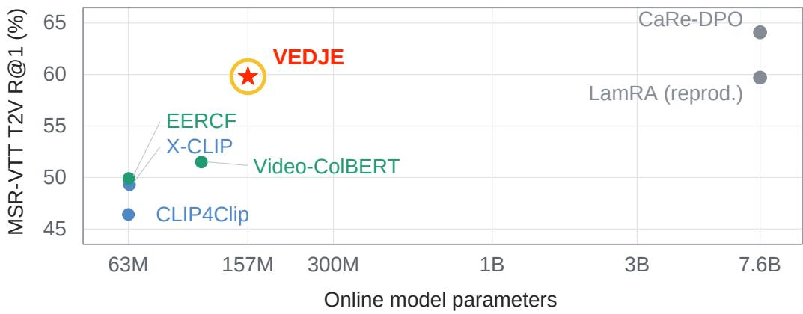
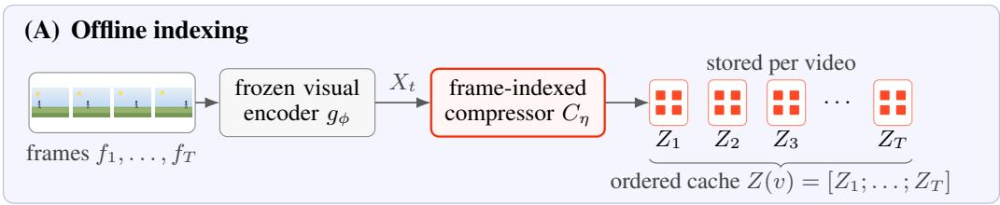
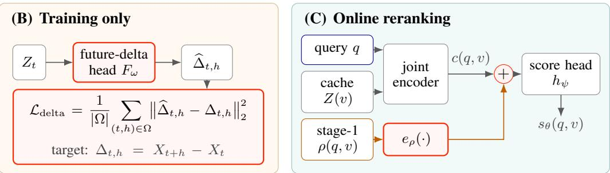
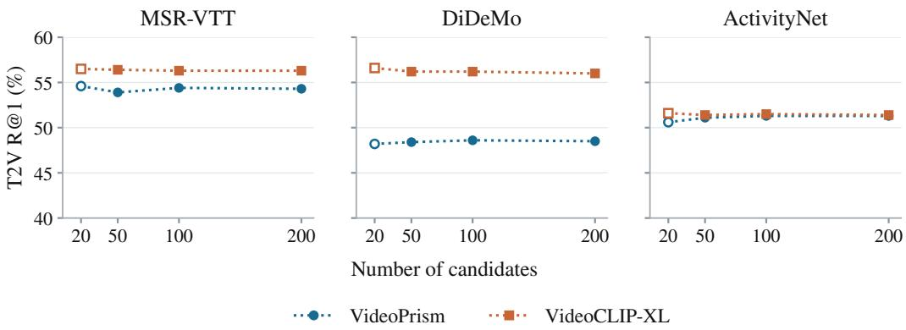

# VEDJE: VIDEO-EFFICIENT DISCRIMINATIVE JOINT ENCODER FOR SCALABLE VIDEO-TEXT RETRIEVAL

Shahaf Wagner1,\* Gabriele Serussi1,3,\* Dan Ben Ami1 Tomer Galanti2 Chaim Baskin1,3

1INSIGHT Lab, Ben-Gurion University of the Negev, Israel

2Texas A&M University, College Station 3Decart AI

Equal contribution.

## ABSTRACT

Finding the right video often requires distinguishing similar scenes in which different events occur. Joint matching improves retrieval, but processing rich video representations for each query is costly. VEDJE compresses features within sampled frames while keeping their representations separate in a reusable cache. Featurechange prediction supplies an auxiliary training signal that improves retrieval from the compressed cache without adding work at query time. On MSR-VTT, MSVD, DiDeMo, and ActivityNet, VEDJE improves R@1 over matched first-stage retrievers in both retrieval directions. On MSR-VTT, it reaches 59.8 text-to-video R@1 with a fine-tuned VideoCLIP-XL first stage. In the VideoPrism configuration, shrinking the per-video cache fourfold to 12 KiB preserves text-to-video recall within 0.2 points. These results show that accurate video search can operate on compact evidence, encoded once and reused as new queries arrive. §

  
Figure 1: MSR-VTT T2V R@1 (%) versus online parameter count. VEDJE raises fine-tuned VideoCLIP-XL retrieval from 56.2 to 59.8 R@1 with a 33M-parameter cached reranker, bringing the total online footprint to approximately 157M parameters. Published systems retain their reported backbones and training protocols. Counts cover online text encoding and scoring; MLLM points count the base decoder, and Video-ColBERT counts its full text module. Appendix B details accounting and sources; Section 4.7 reports complete-query latency.

## 1 INTRODUCTION

Video search at scale runs in two stages: a first stage retrieves plausible candidates over the full index, and a second stage verifies whether each candidate matches the query. This verification step must distinguish videos that share similar scenes but differ in the actions, state changes, or specific moments described by the query.

Dual-encoder retrieval stages (Luo et al., 2022; Ma et al., 2022; Wang et al., 2024a;b) index videos and queries independently to retrieve candidates cheaply, but compute similarity without joint token interaction. Joint rerankers, mature for image retrieval (Li et al., 2022; 2023a), restore cross-modal attention. For video, however, both stored features and joint scoring sequences scale with the sampled frames, while re-encoding candidates online incurs severe latency. Multimodal LLM (MLLM) rerankers (Ko et al., 2025; Lee et al., 2025) provide expressive joint matching, but place multi-billionparameter decoders directly on the query path.

One way to keep verification deployable is to remove the visual encoder from the query path. The image cached reranker EDJE (Taraday et al., 2026) already shows how for static images: encode each image once offline, store a small set of compressed tokens, and rerank online with a lightweight joint encoder.

A video cache must be built before the queries it will serve are known. It must therefore retain evidence for descriptions of different objects, actions, and moments, while remaining small enough to store and score at scale. VEDJE addresses this problem by compressing features within sampled frames and retaining separate representations across sampled times. A lightweight joint encoder then reads these representations alongside the query. Feature-change supervision improves retrieval from the compressed tokens without adding computation to the query path.

Offline, a frozen visual encoder processes each video once, and a shared compressor extracts a few learned tokens per sampled frame. At query time, a 33M-parameter cross-encoder scores the cached tokens alongside the query text and first-stage score. The token budget determines both per-video storage and the visual sequence length presented to the online scorer.

Across MSR-VTT (Xu et al., 2016), MSVD (Chen & Dolan, 2011), DiDeMo (Hendricks et al., 2017), and ActivityNet (Krishna et al., 2017), VEDJE consistently improves R@1 in both retrieval directions over matched first-stage retrievers. On MSR-VTT, it reaches 59.8 text-to-video R@1 with a fine-tuned VideoCLIP-XL first stage (Figure 1). In the VideoPrism configuration, allocating just one cached token per sampled frame reduces cache storage fourfold to 12 KiB per video while preserving T2V R@1 within 0.2 points. Controlled comparisons evaluate cache structure, feature-change training, and joint scoring, while complete-query measurements benchmark practical retrieval latency.

Contributions. We make three contributions:

1. Compact frame-indexed video caches: Building on cached joint encoding, we compress information within sampled frames while retaining separate frame groups, giving the joint scorer access to evidence from across the sequence under a fixed storage budget.

2. Feature-change supervision for compression: We train the compressed representation with future-delta feature prediction, improving retrieval under tight storage budgets without an inference-time predictor.

3. Accuracy and efficiency evaluation: Across four benchmarks, VEDJE improves R@1 in both directions over matched first stages. On MSR-VTT, it raises fine-tuned VideoCLIP-XL from 56.2 to 59.8 T2V R@1 with approximately 157M total online parameters. The VideoPrism configuration preserves T2V recall within 0.2 points with a fourfold-smaller 12 KiB cache.

## 2 RELATED WORK

Dual encoders for video-text retrieval. CLIP-style contrastive retrieval stages embed videos and queries independently and score by inner product (Radford et al., 2021; Luo et al., 2022; Wang et al., 2024a;b; Zhao et al., 2024); efficiency variants further compress stage 1 (Tian et al., 2024a;b). This dot product enables fast candidate retrieval, but forming the video embedding before the query arrives permanently fixes the visual representation without cross-modal interaction.

Late interaction and multi-vector matching. Late interaction stores richer unimodal token banks and aggregates similarities at query time (Khattab & Zaharia, 2020; Yao et al., 2022; Reddy et al., 2025). While multi-token caches preserve detail, the query and cached tokens never share a joint encoder. EERCF (Tian et al., 2024a) instead pairs a trained temporal encoder with parameter-free text-gated feature aggregation. We compare with EERCF on a shared CLIP ViT-B/16 architecture and separately evaluate VEDJE on candidates from its released ViT-B/32 retriever.

Joint rerankers for vision-language retrieval. Joint rerankers restore pairwise inspection. For images, BLIP variants (Li et al., 2022; 2023a) establish the recipe and EDJE (Taraday et al., 2026)

makes it deployable by caching compressed visual tokens. EDJE also outlines prospective video extensions using temporal compression and positional encodings. For video, CrossTVR (Dai et al., 2025) applies multi-grained cross-attention to selected frame- and video-level visual tokens, while multimodal LLM (MLLM) rerankers (Ko et al., 2025; Lee et al., 2025; Liu et al., 2025) place multi-billion-parameter decoders directly on the query path. VEDJE instead builds a compact, reusable cache that enables fine-grained joint attention with a lightweight 33M encoder.

Where VEDJE sits. VEDJE targets cached joint reranking for video; its closest neighbour is EDJE’s image-caching recipe (Taraday et al., 2026). VEDJE develops and evaluates a video cache that compresses information within sampled frames while retaining separate representations across sampled times. Feature-change supervision improves retrieval from the compressed representation, and a lightweight joint encoder combines the cached evidence with the first-stage relevance estimate. Matched-budget comparisons show the benefit of retaining separate frame groups over pooling, while cache-size ablations measure how feature-change supervision helps at each budget. These results connect the organization and training of the cache to the retrieval accuracy it supports.

## 3 METHOD

VEDJE replaces query-time video encoding with a cache-design problem: the visual backbone runs once per video, offline, and writes a compact representation that a small joint encoder later reads at query time, alongside the query text and the scalar first-stage score. The cache must be small enough to ship at index scale while retaining evidence across the sampled sequence for later queries. Figure 2 groups the three components that the rest of the section develops: (A) the offline cache, (B) the training-only feature-change supervision, and (C) the online reranker that reads it.

  
Figure 2: VEDJE pipeline. (A) Offline indexing: compression of frame-indexed features yields the ordered cache $\dot { Z } ( \dot { v } ) = [ Z _ { 1 } ; \dots ; Z _ { T } ]$ . (B) Training only: a future-delta head $F _ { \omega }$ predicts feature changes from $Z _ { t }$ and is discarded after training. (C) Online reranking: a 33M joint encoder processes $( q , Z ( v ) )$ ; the embedded stage-1 score is added to its output before the nonlinear score head. Indexed videos require no query-time visual encoding.

## 3.1 SETUP AND NOTATION

A first-stage retriever returns, for each text query q, a candidate set $\mathcal { C } ( q ) = \{ v _ { i } \} _ { i = 1 } ^ { N _ { \mathrm { c } } }$ together with a coarse score $\rho ( q , v ) \in \mathbb { R }$ . Each candidate is a video sampled into T frames, $v = \{ \bar { f } _ { t } \} _ { t = 1 } ^ { T }$ . A frozen visual encoder $g _ { \phi }$ supplies frame-indexed patch features $X _ { t } = [ g _ { \phi } ( v ) ] _ { t } \in \mathbb R ^ { P \times i _ { v } }$ , where P is the number of spatial positions and $d _ { v }$ is the visual feature dimension. Each slice is indexed by sampled time and can include temporal context from the backbone. VEDJE writes a cache $Z ( v ) \in \bar { \mathbb { R } } ^ { T M \times d _ { \ell } }$ once per video, storing M tokens per frame. At query time, a reranker produces a score $s _ { \theta } ( q , v ) \in \mathbb { R }$ from $q , Z ( v )$ , and $\rho ( q , v )$ , and sorting $\mathcal { C } ( q )$ by $s _ { \theta }$ gives the second-stage ranking. The product TM controls both per-video storage and the online video sequence length. The first-stage retriever and cache encoder serve separate roles within the corresponding backbone family. The same pairwise score supports video-to-text retrieval over candidate captions for an indexed video; a new video query must first be encoded and cached.

## 3.2 A FRAME-INDEXED CACHE ACROSS THE SAMPLED SEQUENCE

The cache $Z ( v )$ must satisfy two opposing constraints. It must be small enough to ship per video at index scale, and it must retain evidence across the sampled sequence for a compact joint encoder to compare with future queries. A single global clip vector uses little storage but collapses the sequence into one representation; storing every patch preserves separate frame features at a much higher cost. VEDJE resolves the tension by compressing each frame-indexed feature slice to a small token bank and placing that bank at its temporal position.

A shared two-layer transformer decoder $C _ { \eta }$ uses M learned cache queries $Q _ { 0 } \in \mathbb { R } ^ { M \times d _ { \ell } }$ to attend to the projected patch tokens of each frame-indexed slice,

$$
U _ { t } = X _ { t } W _ { \mathrm { k v } } , \qquad Z _ { t } = C _ { \eta } ( Q _ { 0 } ; U _ { t } ) \in \mathbb { R } ^ { M \times d _ { \ell } } ,\tag{1}
$$

where $W _ { \mathrm { k v } } \in \mathbb R ^ { d _ { v } \times d _ { \ell } }$ is the shared input projection for keys and values. The stored cache is the temporal concatenation

$$
\begin{array} { r } { Z ( v ) = [ Z _ { 1 } ; \dots ; Z _ { T } ] \in \mathbb { R } ^ { T M \times d _ { \ell } } . } \end{array}\tag{2}
$$

This construction has two consequences. Per-frame compression bounds storage by $T \times M$ cached tokens and is independent of the patch count $P$ of $g _ { \phi }$ . Ordered concatenation retains a separate token group for each sampled time even when M is small. The cache-structure ablation in Section 4.4 contrasts this design with pooled multi-frame caches under matched cache size.

The token budget also gives an explicit storage budget. Each BF16 element occupies two bytes, so the cached tensor payload is

$$
B _ { \mathrm { c a c h e } } = 2 T M d _ { \ell } { \mathrm { b y t e s } } { \mathrm { p e r } } { \mathrm { v i d e o } } .
$$

With $T { = } 1 6$ and $d _ { \ell } { = } 3 8 4$ , four tokens per frame yield 48 KiB, while one token per frame yields 12 KiB. Reducing M retains the same sampled times but compresses each feature slice more strongly. Appendix Table 9 compares these payloads with the full frame-and-patch representation at the same precision.

## 3.3 FEATURE-CHANGE SUPERVISION FOR A TIGHT CACHE

The cache is query independent: once $Z ( v )$ is written, every future query about v (about objects, actions, or temporal relations) reads the same tokens. Feature-change supervision adds a training target at each patch position by predicting differences between the frozen features of sampled frames.

A lightweight, training-only predictor $F _ { \omega }$ learns to estimate these changes from $Z _ { t }$

$$
\widehat { \Delta } _ { t } = F _ { \omega } ( Z _ { t } ) \in \mathbb R ^ { | \mathcal { H } | \times P \times d _ { v } } , \qquad \Delta _ { t , h } = X _ { t + h } - X _ { t } \in \mathbb R ^ { P \times d _ { v } } .\tag{3}
$$

Subtracting $X _ { t }$ cancels feature components that are identical at both sampled times. The target describes change within the encoded clip: both feature slices can already include temporal context from the frozen backbone. The predictor outputs one prediction per horizon and spatial position, so all $P$ patch targets must be estimated from the same M cached tokens. These targets compare featuregrid positions across time; they supervise feature changes without requiring motion annotations or enlarging the cache.

The loss averages the squared $\ell _ { 2 }$ distance to the frozen target over the valid time-horizon pairs $\Omega = \{ ( t , h ) \ | \ 1 \leq t \leq T , \ h \in \mathcal { H } , \ t + h \leq T \}$

$$
\mathcal { L } _ { \mathrm { d e l t a } } = \frac { 1 } { \left| \Omega \right| } \sum _ { ( t , h ) \in \Omega } \left\| \widehat { \Delta } _ { t , h } - \Delta _ { t , h } \right\| _ { 2 } ^ { 2 } ,\tag{4}
$$

where $\| \cdot \| _ { 2 } ^ { 2 }$ is the per-element-averaged squared $\ell _ { 2 }$ norm over patches and the visual feature dimension; the frozen $g _ { \phi }$ makes $\Delta _ { t , h }$ a fixed regression target, so gradients update the predictor and compressor, not the visual backbone. After training, $F _ { \omega }$ is discarded, so the auxiliary objective adds no computation at retrieval. Section 4.5 measures its effect across cache budgets.

## 3.4 CACHED JOINT RERANKING WITH A RESIDUAL PRIOR

The reranker adds a compact transformer encoder to the query path. It tokenizes $q ,$ concatenates the text tokens with the cached video tokens $Z ( v )$ , and produces a pooled pairwise representation $c ( q , v ) \in \mathbb { R } ^ { d _ { \ell } }$ . Its own learned positional embedding covers the full input [tokens(q); Z(v)], making the temporal layout fixed at indexing time (Eq. 2) available to self-attention. Because $c ( q , v )$ is computed after the query and the cache see each other, the pairwise representation can depend on their joint content.

The first-stage score $\rho ( q , v )$ carries different information. It supplies the coarse relevance estimate that produced the candidate list. VEDJE includes this estimate as a residual prior by embedding the scalar score and adding it to the joint representation,

$$
\tilde { c } ( q , v ) = c ( q , v ) + e _ { \rho } \bigl ( \rho ( q , v ) \bigr ) , \qquad s _ { \theta } ( q , v ) = h _ { \psi } \bigl ( \tilde { c } ( q , v ) \bigr ) ,\tag{5}
$$

where $e _ { \rho } : \mathbb { R }  \mathbb { R } ^ { d _ { \ell } }$ and $h _ { \psi } : \mathbb { R } ^ { d _ { \ell } } $ R are two-layer MLPs with GELU activation. The residual addition occurs in representation space, followed by the nonlinear score head. Section 4.6 compares the full model with independently trained single-stream controls under fixed candidates.

## 3.5 TRAINING AND DEPLOYMENT

VEDJE jointly trains the compressor, joint encoder, prior embedding, score head, and auxiliary training heads with four objectives,

$$
\mathcal { L } = \mathcal { L } _ { \mathrm { v t m } } + \mathcal { L } _ { \mathrm { v t c } } + \mathcal { L } _ { \mathrm { m l m } } + \mathcal { L } _ { \mathrm { d e l t a } } .\tag{6}
$$

All four terms enter at equal weight, and the loss-stack ablation in Appendix A.13 evaluates their contributions at this fixed weighting. The matching loss ${ \mathcal { L } } _ { \mathrm { v t m } }$ supervises the pairwise score $s _ { \boldsymbol { \theta } } ( \boldsymbol { q } , \boldsymbol { v } )$ with cross-entropy over matched and negative pairs. The contrastive loss ${ \mathcal { L } } _ { \mathrm { v t c } }$ aligns projected text CLS representations with frozen video embeddings from the corresponding backbone through symmetric in-batch InfoNCE. The masked-language loss ${ \mathcal { L } } _ { \mathrm { m l m } }$ predicts masked caption tokens from the surrounding text with cached video tokens in context. $\mathcal { L } _ { \mathrm { d e l t a } }$ supplies the frame-level feature-change targets in Eq. 4. Appendix A.3 gives the loss definitions and optimization schedule.

After training, the auxiliary heads are discarded. Each text query requires first-stage text encoding and search, cache access, and the compact joint reranker with $e _ { \rho }$ and $h _ { \psi }$ . Algorithm 1 in Appendix A.1 writes out indexing and reranking. Updating only the joint reranker permits cache reuse; changing the visual backbone or compressor requires rebuilding the cache. Section 4 evaluates per-video storage and the complete query cost.

## 4 EXPERIMENTS

The experiments evaluate retrieval quality, cache design, and complete-query cost. Matched controls examine how frame grouping, feature-change supervision, and joint scoring contribute.

## 4.1 EXPERIMENTAL SETUP

VEDJE is evaluated on MSR-VTT (Xu et al., 2016), MSVD (Chen & Dolan, 2011), DiDeMo (Hendricks et al., 2017), and ActivityNet (Krishna et al., 2017), using standard splits and Recall@K in both retrieval directions: text-to-video (T2V) and video-to-text (V2T). Recall values are percentages; absolute differences are percentage points. A first-stage retriever returns the $\mathrm { t o p } { - } N _ { \mathrm { c } }$ candidates (default $N _ { \mathrm { c } } { = } 2 0 )$ , which VEDJE then reranks from cached video tokens. The default VEDJE configuration uses a 64-token BF16 cache, the VideoPrism prior (Zhao et al., 2024), and prediction horizon $\mathcal { H } = \{ 3 \}$ . A variant is written VEDJE , where the subscript identifies the backbone used for retrieval and cached features: VideoPrism (VP), VideoCLIP-XL (VCLIP) (Wang et al., 2024a), or Perception Encoder (PE) (Bolya et al., 2025). Non-default cache sizes are appended to the variant name. Parenthesized gains report absolute R@1 improvements over the matched first-stage retriever. The default joint reranker is MiniLM-L12-uncased (Wang et al., 2020), a compact 12-layer language model with ∼33M parameters. It jointly scores cached video tokens alongside query text for T2V, and alongside candidate captions for an indexed video for V2T. Each VEDJE variant constructs its cache from the corresponding visual backbone and uses that backbone's video embeddings as contrastive training targets (Appendix Table 7). The cache retains compressed patch features for joint scoring, whereas the contrastive objective uses the corresponding video-level embedding as a training target. During reranker training, the feature encoder remains frozen while the compressor and joint scorer are optimized. ZS and FT describe the first-stage retriever; the reranker is trained in both settings. The CLIP control uses CLIP features and contrastive targets throughout (Table 2). The video input uses 16 uniformly sampled frames. The joint scorer accepts up to 64 text tokens including special tokens; Appendix A.2 gives the architecture and input budgets.

<table><tr><td colspan="4">(a) Published systems T2V R@1</td></tr><tr><td colspan="4">Method</td></tr><tr><td colspan="2">CLIP4Clip B/32 (Luo et al., 2022)</td><td>44.5</td><td>43.1 48.9</td></tr><tr><td colspan="3">X-CLIP B/16 (Ma et al., 2022)</td><td>49.3</td></tr><tr><td colspan="3">Video-ColBERT (SigLIP-B/16) (Reddy et al., 2025)</td><td>51.5</td></tr><tr><td colspan="3">CrossTVR-Large (Dai et al., 2025) UMT-L (ViT-L/16) (Li et al., 2023b)</td><td>54.0 51.3 58.6</td></tr><tr><td colspan="3"></td><td>58.8</td></tr><tr><td colspan="3">LamRA (Liu et al., 2025)</td><td>59.7 60.7 62.8</td></tr><tr><td colspan="3">InternVideo2 (stage 2, 6B) (Wang et al., 2024b) CaRe-DPO (Lee et al., 2025)</td><td>60.2</td></tr><tr><td colspan="3"></td><td>64.1 63.8</td></tr><tr><td colspan="4">(b) Matched first-stage comparisons Text-to-video</td></tr><tr><td>First-stage retriever Stage 1</td><td>VEDJE</td><td>Gain Stage 1</td><td>Video-to-text VEDJE</td><td>Gain</td></tr><tr><td>VideoPrism 50.1</td><td>54.6</td><td>+4.5</td><td>49.8 54.6</td><td>+4.8</td></tr><tr><td>PE-Core-B</td><td>47.6 53.9</td><td>+6.3</td><td>47.3 53.9</td><td>+6.6</td></tr><tr><td>VideoCLIP-XL (ZS)</td><td>50.1 56.5</td><td>+6.4</td><td>49.9</td><td>57.1 +7.2</td></tr><tr><td>VideoCLIP-XL (FT)</td><td>56.2 59.8</td><td>+3.6</td><td>55.1</td><td>58.8 +3.7</td></tr><tr><td></td><td></td><td></td><td></td><td></td></tr></table>

Table 1: MSR-VTT retrieval accuracy. R@1 is in percent; gains are percentage points. (a) Source protocols are retained; UMT-L and InternVideo2 report fine-tuned results; UMT-L uses 25M pretraining pairs, and CLIP4Clip reports the best variant per direction. LamRA uses the VideoChat-Flash reproduction of Lee et al. (2025). (b) Matched reranking uses a 64-token cache from the corresponding backbone; fine-tuned first-stage results are our reproduction. ZS/FT denote zero-shot/fine-tuned first stages; dashes denote unreported results. Full results and uncertainty appear in Appendix A.8.

Cache ablations report means and population standard deviations over three training seeds. Values are rounded to one decimal, with a minimum displayed SD of 0.1. Gain standard deviations describe variability across retrainings. The separate four-run auxiliary check reports the standard deviation of paired gains and is identified independently of the three-seed cache ablations. Appendix A gives the statistical protocol.

## 4.2 Q1: DOES RERANKING IMPROVE RETRIEVAL ACROSS SETTINGS?

VEDJE improves R@1 over each first-stage retriever in Table 1b, including fine-tuned VideoCLIP-XL. In that setting, reranking raises T2V R@1 from 56.2 to 59.8 and V2T R@1 from 55.1 to 58.8. Candidates and first-stage scores are regenerated for the fine-tuned model, and the reranker is retrained using VideoCLIP-XL cache features. The gains therefore remain after first-stage fine-tuning.

The cross-dataset evaluation extends this comparison to MSR-VTT, MSVD, DiDeMo, and ActivityNet (Appendix Table 12). With either VideoPrism or zero-shot VideoCLIP-XL as the first stage, VEDJE improves R@1 in both retrieval directions on all four datasets. Published systems in Table 1a provide broader context under their reported backbones and training protocols; Table 2 examines performance with a shared CLIP ViT-B/16 architecture.

Using CLIP ViT-B/16 for both cached visual features and contrastive training targets, VEDJE reaches 49.8/49.6 T2V/V2T R@1 (Table 2). EERCF reports 49.9/47.8 on the same backbone architecture. VEDJE achieves comparable T2V recall and 1.8 points higher V2T recall while keeping the visual backbone frozen. A further control uses EERCF’s released ViT-B/32 candidate generator $( N _ { \mathrm { c } } { = } 5 0 ) $ we reproduce 42.8 T2V R@1 before reranking and reach 49.1 with VEDJE. EERCF reports 47.8 under its published protocol (Appendix A.7). Figure 1 and Appendix B place these findings in the broader model-footprint comparison.

Table 2: Shared CLIP ViT-B/16 architecture on MSR-VTT. R@1 (%). Published baselines fine-tune CLIP. VEDJE keeps CLIP fixed and trains its compressor and reranker, using CLIP features and contrastive targets. CLIP4Clip values are the reproduction of Tian et al. (2024a).
<table><tr><td>Method</td><td>Backbone treatment</td><td>T2V R@1</td><td>V2T R@1</td></tr><tr><td>CLIP4Clip (Luo et al., 2022)</td><td>fine-tuned</td><td>46.4</td><td>45.4</td></tr><tr><td>X-CLIP (Ma et al., 2022)</td><td>fine-tuned</td><td>49.3</td><td>48.9</td></tr><tr><td>EERCF (Tian et al., 2024a)</td><td>fine-tuned</td><td>49.9</td><td>47.8</td></tr><tr><td>VEDJE-CLIP</td><td>frozen</td><td>49.8</td><td>49.6</td></tr></table>

Table 3: Cache size and feature-change supervision. MSR-VTT R@1 (%) is mean ± standard deviation over three seeds. Values are rounded to one decimal, with a minimum displayed SD of 0.1. Storage is BF16 tensor payload per video; gains are percentage points.
<table><tr><td>Tokens</td><td>KiB/video</td><td>Direction</td><td>Without  $\mathcal { L } _ { \mathrm { d e l t a } }$ </td><td>With  ${ \mathcal { L } } _ { \mathrm { d e l t a } }$ </td><td>Gain</td></tr><tr><td>64</td><td>48</td><td>T2V</td><td> $5 4 . 0 \pm 0 . 1$ </td><td> ${ \bf 5 4 . 6 \pm 0 . 1 }$ </td><td>+0.6</td></tr><tr><td>64</td><td>48</td><td>V2T</td><td> $5 3 . 6 \pm 0 . 1$ </td><td> ${ \bf 5 4 . 6 \pm 0 . 1 }$ </td><td> $+ 1 . 0$ </td></tr><tr><td>16</td><td>12</td><td>T2V</td><td> $5 2 . 5 \pm 0 . 1$ </td><td> ${ \bf 5 4 . 4 \pm 0 . 1 }$ </td><td>+1.9</td></tr><tr><td>16</td><td>12</td><td>V2T</td><td> $5 2 . 6 \pm 0 . 1$ </td><td> ${ \bf 5 3 . 1 \pm 0 . 1 }$ </td><td>+0.5</td></tr></table>

These controlled comparisons isolate reranking gains over candidate retrieval; Section 4.6 tests scoring rules with cached tokens held fixed.

## 4.3 Q2: HOW SMALL CAN THE CACHE BECOME?

The default 64-token cache occupies 48 KiB per video. Table 3 reduces this budget to one token per sampled frame, producing a 16-token cache of 12 KiB, and evaluates both budgets with and without feature-change supervision. The sampled frames and visual backbone remain fixed.

With feature-change supervision, reducing storage fourfold changes T2V R@1 from 54.6 to 54.4, while V2T R@1 falls from 54.6 to 53.1. The compact configuration therefore offers a favorable storage trade-off for T2V, with a larger accuracy cost for V2T. The comparison measures the effect of compression relative to the 48 KiB cache. Appendix A.6 reports the corresponding tensor payloads, and Appendix A.10 examines cache precision. The 48 KiB cache is 128.5 times smaller than the full frame-and-patch representation of the same VideoPrism features (Appendix Table 9).

## 4.4 Q3: WHICH CACHE STRUCTURE CARRIES THE GAIN?

At a fixed storage budget, should the cache pool evidence across frames or keep frame groups separate? Table 4 compares mean pooling, attention pooling, and separate frame groups using the same VideoPrism candidates, 33M reranker, and 64-token cache.

Before auxiliary training, retaining separate frame groups improves R@1 by 2.0 points in both directions over attention pooling. Feature-change supervision raises recall further to 54.6 in both directions. The matched comparison shows that the organization of cached evidence affects retrieval even when storage remains fixed. Appendix A.7 reports the single-frame EDJE-style reference separately.

## 4.5 Q4: WHERE DOES FEATURE-CHANGE SUPERVISION HELP?

Table 4: Cache structure at a fixed storage budget. MSR-VTT R@1 (%) is mean ± standard deviation over three training seeds. The multiframe variants share VideoPrism candidates, the firststage score input, the 33M reranker, and a 64-token BF16 cache. Pooling combines evidence across frames; VEDJE retains separate frame groups.
<table><tr><td>Cache construction</td><td> $\mathcal { L } _ { \mathrm { d e l t a } }$ </td><td>T2V R@1</td><td>V2T R@1</td></tr><tr><td>FrameSet-EDJE: mean pooling</td><td>No</td><td> $5 1 . 7 \pm 0 . 2$ </td><td> $5 1 . 6 \pm 0 . 2$ </td></tr><tr><td>FrameSet-EDJE: attention pooling</td><td>No</td><td> $5 2 . 0 \pm 0 . 2$ </td><td> $5 1 . 6 \pm 0 . 2$ </td></tr><tr><td>VEDJE: separate frame groups</td><td>No</td><td> $5 4 . 0 \pm 0 . 1$ </td><td> $5 3 . 6 \pm 0 . 1$ </td></tr><tr><td>VEDJE: separate frame groups</td><td>Yes</td><td> ${ \bf 5 4 . 6 \pm 0 . 1 }$ </td><td> ${ \bf 5 4 . 6 \pm 0 . 1 }$ </td></tr></table>

Table 5: Scoring the same cache on MSR-VTT. T2V R@1 (%) with VP stage 1 and 20 candidates. Reranking rows share the 64-token cache and candidate pool; trained MaxSim uses the same data and schedule. Appendix A.7 gives the protocols.
<table><tr><td>Scoring rule</td><td>T2V R@1</td></tr><tr><td>Stage 1: VideoPrism</td><td>50.1</td></tr><tr><td>Trained MaxSim with residual prior</td><td>51.9</td></tr><tr><td>Joint encoder with residual prior (VEDJE)</td><td>54.6</td></tr></table>

Feature-change supervision improves R@1 at both tested cache budgets (Table 3). Its measured T2V gain increases from 0.6 points with 64 tokens to 1.9 points with 16 tokens, showing its value when each sampled frame receives only one cached token. V2T follows a different pattern, with the larger gain at 64 tokens. A separate four-run check at that budget reports positive gains in every run (Appendix A.7).

At 64 tokens, current-frame reconstruction reaches 54.2 T2V and 53.9 V2T R@1, compared with 54.6 in both directions for the delta target (Appendix Table 18). This comparison favors feature-change supervision over the tested reconstruction target.

The appendix examines target formulation (Appendix A.12) and prediction offset (Appendix A.14). The matched comparisons in Table 3 establish the retrieval gains from adding the objective at each cache budget.

## 4.6 Q5: WHAT DO JOINT SCORING AND THE PRIOR CONTRIBUTE?

Table 5 holds the cached representation and candidate pool fixed to compare how different scorers use the same evidence. The joint encoder reaches 54.6 T2V R@1, compared with 51.9 for trained MaxSim under the same data, schedule, and first-stage score input.

The first-stage score and joint features also contribute complementary information. Independently trained prior-only and joint-only models reach 50.1 and 43.8 T2V R@1, while the full model reaches 54.6 (Appendix Table 11). Together, these comparisons support using joint matching to refine the relevance estimate supplied by the first stage.

## 4.7 Q6: WHAT DOES A COMPLETE QUERY COST?

Table 6 measures the complete VideoPrism query pipeline on an NVIDIA L40S, including text encoding, index search, cache reads, transfer to the GPU, and reranking. With 20 candidates, the 64-token configuration takes 5.79 ms, compared with approximately 4.3 ms for first-stage retrieval alone. This configuration has approximately 143M total online parameters, including the 33M reranker (Appendix B).

The two cache sizes have similar complete-query latency at 20 candidates. Text encoding and index search are shared by both configurations, so reducing the visual sequence affects only part of the complete-query cost. Their difference grows as the scorer processes more candidates: at 100, the 16-token cache reduces latency from 7.83 to 6.33 ms. Compression also reduces the video payload read for each query. The appendix separates cache-residency effects from device-resident scoring (Appendix A.6) and reports candidate-count sensitivity (Appendix A.9).

Table 6: Complete-query cost at two cache sizes. MSR-VTT T2V with VP stage 1, host-cache I/O, one L40S, and query batch size 1. Latency is the median of 200 runs after 30 warmups. R@1 at 20 candidates is a three-seed mean; other recalls are single-run evaluations.
<table><tr><td rowspan="2">Candidates  $N _ { \mathrm { c } }$ </td><td colspan="2">Latency (ms)</td><td colspan="2">T2V R@1 (%)</td></tr><tr><td>64 tokens</td><td>16 tokens</td><td>64 tokens</td><td>16 tokens</td></tr><tr><td>20 (default)</td><td>5.79</td><td>5.82</td><td>54.6</td><td>54.4</td></tr><tr><td>50</td><td>6.21</td><td>6.12</td><td>53.9</td><td>54.7</td></tr><tr><td>100</td><td>7.83</td><td>6.33</td><td>54.4</td><td>54.6</td></tr><tr><td>200</td><td>10.24</td><td>6.88</td><td>54.3</td><td>54.7</td></tr></table>

Cache residency directly affects retrieval latency: at 100 candidates, the 64-token model requires 7.8 ms under warm NVMe reads and 11.1 ms under cold reads. At 20 candidates, the 64- and 16-token caches contribute 0.983 and 0.246 MB of video payload, respectively. Only the retrieved candidates’ caches are read, so this part of query traffic scales with candidate count and cache size rather than corpus size. The first-stage search index is separate from these payloads. Appendix A.6 breaks down cache residency and isolates complete-query latency from device-resident reranking. Offline visual encoding and cache construction are paid once during indexing and amortized across all subsequent queries.

## 5 CONCLUSION

A reusable video cache must retain useful evidence before its future queries are known. VEDJE addresses this constraint by compressing features within sampled frames while keeping evidence from different times separately accessible. Matched comparisons show the value of this organization, and feature-change supervision improves retrieval from the compressed representation. Across four benchmarks, the resulting cache supports gains over first-stage retrieval, including a fine-tuned first stage. These findings establish a practical route to joint video search in which compact evidence is computed once and reused for later queries.

Limitations and future work. The cache is query-blind: Z(v) is written once and serves every later query about v, so selectively reading or expanding the cache at query time is a natural extension. The cache also depends on a fixed visual backbone and compressor: updating either requires re-indexing the corpus. The first and second stages are not currently trained jointly; closing that loop is another direction. Finally, the four benchmarks here (MSR-VTT, MSVD, DiDeMo, ActivityNet) use English captions and web-sourced videos. These evaluations span different video lengths, but do not establish performance on multilingual video retrieval.

## AI USE STATEMENT

Generative AI was used to assist in writing the manuscript and in writing code, as well as in organizing material and checking consistency. All empirical results were supplied by the authors. Everything has been thoroughly checked and verified by the authors, who take full responsibility for the entire content of this submission.

## ETHICS STATEMENT

This work collects no new data and involves no crowdsourcing, human-subject study, biometric processing, facial recognition, or identity annotation. Experiments use the established MSR-VTT, MSVD, DiDeMo, and ActivityNet benchmarks under their original release terms. These web-video datasets can nevertheless contain identifiable people, and their historical collection and consent documentation may not satisfy current expectations for every downstream use. Making semantic video retrieval cheaper can also increase cross-collection re-identification or surveillance risk when combined with external identity systems. Deployments should therefore require lawful and authorized data use, role-based access, purpose limitation, query logging and auditing, restrictions on identityoriented searches, retention limits, and human review for surveillance or biometric applications. Automated query moderation can complement these controls.

## REPRODUCIBILITY STATEMENT

Algorithm 1 specifies indexing and reranking; Appendices A.2–A.5 give architecture, optimization, cache quantization, compute, code, and asset details. Appendix A.6 defines end-to-end latency and I/O measurement, Appendix A.7 documents matched controls, and Appendix A.9 reports candidatepool sensitivity. Appendix A describes how recall values and gains are summarized. Code: §.

## REFERENCES

Daniel Bolya, Po-Yao Huang, Peize Sun, Jang Hyun Cho, Andrea Madotto, Chen Wei, Tengyu Ma, Jiale Zhi, Jathushan Rajasegaran, Hanoona Bangalath, Junke Wang, Marco Monteiro, Hu Xu, Shiyu Dong, Nikhila Ravi, Shang-Wen Li, Piotr Dollar, and Christoph Feichtenhofer. Perception Encoder: The best visual embeddings are not at the output of the network. In D. Belgrave, C. Zhang, H. Lin, R. Pascanu, P. Koniusz, M. Ghassemi, and N. Chen (eds.), Advances in Neural Information Processing Systems, volume 38, Main Conference, pp. 60884–60937. Curran Associates, Inc., 2025. doi: 10.52202/ 085713-2036. URL https://proceedings.neurips.cc/paper\_files/paper/ 2025/file/57bc0a850255e2041341bf74c7e2b9fa-Paper-Conference.pdf.

David Chen and William Dolan. Collecting highly parallel data for paraphrase evaluation. In Dekang Lin, Yuji Matsumoto, and Rada Mihalcea (eds.), Proceedings of the 49th Annual Meeting of the Association for Computational Linguistics: Human Language Technologies, pp. 190–200, Portland, Oregon, USA, June 2011. Association for Computational Linguistics. URL https: //aclanthology.org/P11-1020/.

Zuozhuo Dai, Kaihui Cheng, Fangtao Shao, Zilong Dong, and Siyu Zhu. Text–video retrieval re-ranking via multi-grained cross attention and frozen image encoders. Pattern Recognition, 159: 111099, 2025. doi: 10.1016/j.patcog.2024.111099. URL https://doi.org/10.1016/j. patcog.2024.111099.

Jacob Devlin, Ming-Wei Chang, Kenton Lee, and Kristina Toutanova. BERT: Pre-training of deep bidirectional transformers for language understanding. In Jill Burstein, Christy Doran, and Thamar Solorio (eds.), Proceedings of the 2019 Conference of the North American Chapter of the Association for Computational Linguistics: Human Language Technologies, Volume 1 (Long and Short Papers), pp. 4171–4186. Association for Computational Linguistics, June 2019. doi: 10.18653/v1/N19-1423. URL https://aclanthology.org/N19-1423/.

Lisa Anne Hendricks, Oliver Wang, Eli Shechtman, Josef Sivic, Trevor Darrell, and Bryan Russell. Localizing moments in video with natural language. In Proceedings of the IEEE International

Conference on Computer Vision (ICCV), pp. 5804–5813, October 2017. doi: 10.1109/iccv.2017.618. URL https://doi.org/10.1109/iccv.2017.618.

Omar Khattab and Matei Zaharia. ColBERT: Efficient and effective passage search via contextualized late interaction over BERT. In Proceedings of the 43rd International ACM SIGIR Conference on Research and Development in Information Retrieval, pp. 39–48, 2020. doi: 10.1145/3397271. 3401075. URL https://doi.org/10.1145/3397271.3401075.

Dohwan Ko, Ji Soo Lee, Minhyuk Choi, Zihang Meng, and Hyunwoo J. Kim. Bidirectional likelihood estimation with multi-modal large language models for text-video retrieval. In Proceedings ofthe IEEE/CVF International Conference on Computer Vision (ICCV), pp. 22263–22273, October 2025. URL https://doi.org/10.1109/iccv51701.2025.02067.

Ranjay Krishna, Kenji Hata, Frederic Ren, Li Fei-Fei, and Juan Carlos Niebles. Dense-captioning events in videos. In Proceedings ofthe IEEE International Conference on Computer Vision (ICCV), pp. 706–715, October 2017. doi: 10.1109/iccv.2017.83. URL https://doi.org/10.1109/ iccv.2017.83.

Ji Soo Lee, Byungoh Ko, Jaewon Cho, Howoong Lee, Jaewoon Byun, and Hyunwoo J. Kim. Captioning for text-video retrieval via dual-group direct preference optimization. In Findings of the Association for Computational Linguistics: EMNLP 2025, pp. 16022–16039, Suzhou, China, November 2025. Association for Computational Linguistics. ISBN 979-8-89176-335-7. doi: 10.18653/v1/2025.findings-emnlp.869. URL https://aclanthology.org/2025. findings-emnlp.869/.

Junnan Li, Dongxu Li, Caiming Xiong, and Steven Hoi. BLIP: Bootstrapping language-image pre-training for unified vision-language understanding and generation. In Proceedings ofthe 39th International Conference on Machine Learning, volume 162 of Proceedings of Machine Learning Research, pp. 12888–12900. PMLR, 17–23 Jul 2022. URL https://proceedings.mlr. press/v162/li22n.html.

Junnan Li, Dongxu Li, Silvio Savarese, and Steven Hoi. BLIP-2: Bootstrapping language-image pre-training with frozen image encoders and large language models. In Proceedings ofthe 40th International Conference on Machine Learning, volume 202 of Proceedings ofMachine Learning Research, pp. 19730–19742. PMLR, 23–29 Jul 2023a. URL https://proceedings.mlr. press/v202/li23q.html.

Kunchang Li, Yali Wang, Yizhuo Li, Yi Wang, Yinan He, Limin Wang, and Yu Qiao. Unmasked teacher: Towards training-efficient video foundation models. In Proceedings of the IEEE/CVF International Conference on Computer Vision (ICCV), pp. 19948–19960, October 2023b. URL https://openaccess.thecvf.com/content/ICCV2023/html/Li\_Unmasked\_ Teacher\_Towards\_Training-Efficient\_Video\_Foundation\_Models\_ICCV\_ 2023\_paper.html.

Yikun Liu, Yajie Zhang, Jiayin Cai, Xiaolong Jiang, Yao Hu, Jiangchao Yao, Yanfeng Wang, and Weidi Xie. LamRA: Large multimodal model as your advanced retrieval assistant. In Proceedings of the IEEE/CVF Conference on Computer Vision and Pattern Recognition (CVPR), pp. 4015– 4025, June 2025. doi: 10.1109/cvpr52734.2025.00380. URL https://doi.org/10.1109/ cvpr52734.2025.00380.

Huaishao Luo, Lei Ji, Ming Zhong, Yang Chen, Wen Lei, Nan Duan, and Tianrui Li. CLIP4Clip: An empirical study of CLIP for end to end video clip retrieval and captioning. Neurocomputing, 508: 293–304, 2022. doi: 10.1016/j.neucom.2022.07.028. URL https://doi.org/10.1016/j. neucom.2022.07.028.

Yiwei Ma, Guohai Xu, Xiaoshuai Sun, Ming Yan, Ji Zhang, and Rongrong Ji. X-CLIP: End-toend multi-grained contrastive learning for video-text retrieval. In Proceedings ofthe 30th ACM International Conference on Multimedia, pp. 638–647, 2022. doi: 10.1145/3503161.3547910. URL https://doi.org/10.1145/3503161.3547910.

Alec Radford, Jong Wook Kim, Chris Hallacy, Aditya Ramesh, Gabriel Goh, Sandhini Agarwal, Girish Sastry, Amanda Askell, Pamela Mishkin, Jack Clark, Gretchen Krueger, and Ilya Sutskever.

Learning transferable visual models from natural language supervision. In Proceedings of the 38th International Conference on Machine Learning, volume 139 of Proceedings of Machine Learning Research, pp. 8748–8763. PMLR, 18–24 Jul 2021. URL https://proceedings. mlr.press/v139/radford21a.html.

Arun Reddy, Alexander Martin, Eugene Yang, Andrew Yates, Kate Sanders, Kenton Murray, Reno Kriz, Celso M. de Melo, Benjamin Van Durme, and Rama Chellappa. Video-ColBERT: Contextualized late interaction for text-to-video retrieval. In Proceedings ofthe IEEE/CVF Conference on Computer Vision and Pattern Recognition (CVPR), pp. 19691–19701, June 2025. doi: 10.1109/ cvpr52734.2025.01834. URL https://doi.org/10.1109/cvpr52734.2025.01834.

Mitchell Keren Taraday, Shahaf Wagner, and Chaim Baskin. Efficient discriminative joint encoders for large scale vision-language reranking. In The Fourteenth International Conference on Learning Representations, 2026. URL https://openreview.net/pdf?id=UXtTBAyqVB.

Kaibin Tian, Yanhua Cheng, Yi Liu, Xinglin Hou, Quan Chen, and Han Li. Towards efficient and effective text-to-video retrieval with coarse-to-fine visual representation learning. In Proceedings ofthe AAAI Conference on Artificial Intelligence, volume 38, pp. 5207–5214, 2024a. doi: 10.1609/ aaai.v38i6.28327. URL https://doi.org/10.1609/aaai.v38i6.28327.

Kaibin Tian, Ruixiang Zhao, Zijie Xin, Bangxiang Lan, and Xirong Li. Holistic features are almost sufficient for text-to-video retrieval. In Proceedings ofthe IEEE/CVF Conference on Computer Vision and Pattern Recognition (CVPR), pp. 17138–17147, June 2024b. doi: 10.1109/cvpr52733. 2024.01622. URL https://doi.org/10.1109/cvpr52733.2024.01622.

Jiapeng Wang, Chengyu Wang, Kunzhe Huang, Jun Huang, and Lianwen Jin. VideoCLIP-XL: Advancing long description understanding for video CLIP models. In Yaser Al-Onaizan, Mohit Bansal, and Yun-Nung Chen (eds.), Proceedings ofthe 2024 Conference on Empirical Methods in Natural Language Processing, pp. 16061–16075, Miami, Florida, USA, November 2024a. Association for Computational Linguistics. doi: 10.18653/v1/2024.emnlp-main.898. URL https: //aclanthology.org/2024.emnlp-main.898/.

Wenhui Wang, Furu Wei, Li Dong, Hangbo Bao, Nan Yang, and Ming Zhou. MiniLM: Deep self-attention distillation for task-agnostic compression of pre-trained transformers. In H. Larochelle, M. Ranzato, R. Hadsell, M.F. Balcan, and H. Lin (eds.), Advances in Neural Information Processing Systems, volume 33, pp. 5776–5788. Curran Associates, Inc., 2020. URL https://proceedings.neurips.cc/paper\_files/paper/2020/ file/3f5ee243547dee91fbd053c1c4a845aa-Paper.pdf.

Yi Wang, Kunchang Li, Xinhao Li, Jiashuo Yu, Yinan He, Guo Chen, Baoqi Pei, Rongkun Zheng, Zun Wang, Yansong Shi, Tianxiang Jiang, Songze Li, Jilan Xu, Hongjie Zhang, Yifei Huang, Yu Qiao, Yali Wang, and Limin Wang. InternVideo2: Scaling foundation models for multimodal video understanding. In Computer Vision – ECCV 2024, pp. 396–416. Springer Nature Switzerland, 2024b. doi: 10.1007/978-3-031-73013-9\_23. URL https://doi.org/10.1007/ 978-3-031-73013-9\_23.

Jun Xu, Tao Mei, Ting Yao, and Yong Rui. MSR-VTT: A large video description dataset for bridging video and language. In Proceedings ofthe IEEE Conference on Computer Vision and Pattern Recognition (CVPR), pp. 5288–5296, June 2016. doi: 10.1109/cvpr.2016.571. URL https://doi.org/10.1109/cvpr.2016.571.

Lewei Yao, Runhui Huang, Lu Hou, Guansong Lu, Minzhe Niu, Hang Xu, Xiaodan Liang, Zhenguo Li, Xin Jiang, and Chunjing Xu. FILIP: Fine-grained interactive language-image pre-training. In International Conference on Learning Representations, 2022. URL https://openreview. net/pdf?id=cpDhcsEDC2.

Long Zhao, Nitesh Bharadwaj Gundavarapu, Liangzhe Yuan, Hao Zhou, Shen Yan, Jennifer J. Sun, Luke Friedman, Rui Qian, Tobias Weyand, Yue Zhao, Rachel Hornung, Florian Schroff, Ming-Hsuan Yang, David A Ross, Huisheng Wang, Hartwig Adam, Mikhail Sirotenko, Ting Liu, and Boqing Gong. VideoPrism: A foundational visual encoder for video understanding. In Ruslan Salakhutdinov, Zico Kolter, Katherine Heller, Adrian Weller, Nuria Oliver, Jonathan Scarlett, and Felix Berkenkamp (eds.), Proceedings ofthe 41st International Conference on Machine Learning,

volume 235 of Proceedings of Machine Learning Research, pp. 60785–60811. PMLR, 21–27 Jul 2024. URL https://proceedings.mlr.press/v235/zhao24f.html.

## A ADDITIONAL EXPERIMENTAL DETAILS

This appendix documents the protocol behind the cached-reranking results and reports the secondary controls that complement the main experiments. Sections A.1-A.7 fix the deployment-relevant details that remain in the appendix (algorithm, architecture, training, cache quantization, compute, and code release); Sections A.8-A.15 provide the higher-rank cutoffs, the loss-stack ablation, the future-delta horizon sweep, and the reranker-backbone control.

Recall values are percentages; absolute gains are percentage points. Main-table ± entries report means and population standard deviations over three training seeds unless stated otherwise. The displayed SD has a minimum of 0.1 percentage points; smaller values are shown as 0.1. Gains are differences between the reported recall values. Reported gain standard deviations describe variability across independent retrainings. The default-budget $\bar { \mathcal { L } _ { \mathrm { d e l t a } } }$ check uses four runs and reports the standard deviation of paired gains.

## A.1 VEDJE INDEXING AND RERANKING ALGORITHM

Algorithm 1 specifies indexing and reranking. Indexing encodes each video and stores its compressed frame tokens $Z ( v )$ . Text-to-video retrieval encodes the query, retrieves candidates, fetches their tokens, and scores each query-video pair. Video-to-text retrieval applies the same score $s _ { \boldsymbol { \theta } } ( \boldsymbol { q } , \boldsymbol { v } )$ to candidate captions; a new video query first requires encoding and compression.

Algorithm 1 VEDJE: indexing and text-to-video reranking.   
Input: frozen $g _ { \phi } ;$ trained $C _ { \eta } , W _ { \mathrm { k v } } , Q _ { 0 }$ , joint encoder, $e _ { \rho } , h _ { \psi }$ ; first-stage retriever   
Offline indexing (per video v):   
1: sample T frames and extract frame-indexed slices $X _ { t } = [ g _ { \phi } ( v ) ] _ { t }$   
2: $Z _ { t } \gets C _ { \eta } ( Q _ { 0 } ; X _ { t } W _ { \mathrm { k v } } )$ for $t = 1 , \dots , T$ // Eq. 1   
3: store ordered cache $Z ( v ) = [ Z _ { 1 } ; \ldots ; Z _ { T } ]$ // Eq. 2   
Online reranking (per query $q ) \colon$   
4: $\mathcal { C } ( q ) , \rho ( q , \cdot )$ ← first-stage text encoding and search   
5: fetch cached tokens for $v \in \mathcal { C } ( q )$   
6: for each candidate $v \in \mathcal { C } ( q )$ (batched in implementation) do   
7: $c ( q , v ) \gets$ joint encoder over text and cache embeddings with sequence positions   
8: $s _ { \theta } ( q , v )  h _ { \psi } \big ( c ( q , v ) + e _ { \rho } ( \rho ( q , v ) ) \big )$ // Eq. 5   
9: end for   
10: return $\mathcal { C } ( q )$ sorted by $s _ { \theta }$ // no $g _ { \phi }$ on the query path

## A.2 ARCHITECTURE DETAILS

This subsection specifies the components in Section 3; symbol use matches the main text. Table 7 identifies the feature and contrastive-target sources for the main variants and the CLIP control. The dimensions and checkpoint details below describe the default VideoPrism configuration.

Table 7: Backbone sources for the main variants and the CLIP ViT-B/16 control. Each row identifies the first-stage model, the source of cached visual features, and the source of frozen video embeddings for VTC. ZS and FT describe first-stage training.
<table><tr><td>First-stage model</td><td>Cache features</td><td>VTC video targets</td></tr><tr><td>VideoPrism-LvT-B</td><td>VideoPrism-Base</td><td>VideoPrism-LvT-B</td></tr><tr><td>VideoCLIP-XL (ZS)</td><td>VideoCLIP-XL</td><td>VideoCLIP-XL</td></tr><tr><td>VideoCLIP-XL (FT)</td><td>VideoCLIP-XL</td><td>VideoCLIP-XL</td></tr><tr><td>PE-Core-B</td><td>PE-Core-B</td><td>PE-Core-B</td></tr><tr><td>CLIP ViT-B/16 (ZS)</td><td>CLIP ViT-B/16</td><td>CLIP ViT-B/16</td></tr></table>

Visual backbone $g _ { \phi }$ . VideoPrism-Base (Zhao et al., 2024), used at $2 8 8 \times 2 8 8$ resolution with 16 frames per video. The HuggingFace checkpoint is MHRDYN7/videoprism-base-f16r288. The backbone is frozen at every stage: gradients do not flow into its weights, and it runs once per video at indexing time. Its feature tensor is partitioned into T frame-indexed slices, each with $P { = } 2 5 6$ spatial positions and $d _ { v } = 7 6 8$ channels. The VideoPrism architecture includes temporal attention, so a frame-indexed slice need not contain information from that frame alone.

Frame-indexed compressor. A 2-layer transformer-decoder stack operates in the joint-encoder dimension $d _ { \ell } { = } 3 8 4$ . The stack $C _ { \eta }$ in Eq. 1 uses learned queries $Q _ { 0 } \in \mathring { \mathbb { R } } ^ { M \times d _ { \ell } }$ and projected frame features $U _ { t } = X _ { t } W _ { \mathrm { k v } }$ as its memory. The shared projection $W _ { \mathrm { k v } } \in \mathbb R ^ { d _ { v } \times d _ { \ell } }$ is $\operatorname { k v \_ p r o j }$ The two decoder layers use 8 attention heads, FFN width $4 d _ { \ell } { = } 1 5 3 6$ , GELU activation, and dropout 0.1. The output of the second layer is the per-frame cache $\dot { Z } _ { t } \in \mathbb { R } ^ { M \times d _ { \ell } }$ . Concatenating frames in temporal order yields $\boldsymbol { Z } ( \boldsymbol { v } ) { = } [ \breve { \jmath _ { 1 } } ; { \dots } ; Z _ { T } ] ^ { \cdot } \in \mathbb { R } ^ { T M \times d _ { \ell } }$ . The default $T M { = } 6 4$ uses $T { = } 1 6 , M { = } 4$ . Compact configurations reduce M while keeping T=16 (e.g., TM=16 uses $M { = } 1 )$

Joint reranker (online). microsoft/MiniLM-L12-H384-uncased (Wang et al., 2020): 12 transformer blocks, hidden size $d _ { \ell } { = } 3 8 4$ , 12 attention heads, ∼33M parameters, with the standard BERT (Devlin et al., 2019) uncased WordPiece tokenizer (max text length 64 tokens, including [CLS] and [SEP]). Cached video tokens $Z ( v )$ are concatenated with the text input embeddings as additional input positions. The reranker’s learned sequence-position embeddings cover the concatenated text and video positions; the cache itself is stored before this positional addition.

Score-encoder $e _ { \rho } .$ The scalar stage-1 score $\rho ( q , v )$ is mapped to $\mathbb { R } ^ { d _ { \ell } }$ by a 2-layer MLP $\operatorname { L i n e a r } ( 1 , 6 4 ) \to { \dot { \operatorname { G E L U } } } \to \operatorname { L i n e a r } ( 6 { \dot { 4 } } , d _ { \ell } )$

Score head. The head $h _ { \psi }$ in Eq. 5 is Linear $( d _ { \ell } , d _ { \ell } ) \to \mathrm { G E L U } \to \mathrm { L i n e a r } ( d _ { \ell } , 1 )$ , with approximately 0.15M parameters. The score encoder and score head together add fewer than 0.2M parameters beyond the approximately 33M joint encoder.

Future-delta predictor $F _ { \omega }$ (training only). A 2-layer transformer-decoder stack with 8 attention heads, FFN width $4 d _ { \ell } { = } 1 5 3 6 , \mathrm { G E L U }$ activation, dropout 0.1, and LayerNorm on the output. The default horizon set is the single horizon $\mathcal { H } { = } \{ 3 \}$ (Section A.14 reports $h \in \{ 2 , 3 , 4 \} )$ . Queries are fixed sinusoidal vectors of dimension $d _ { \ell }$ indexed by horizon and patch position $( h , p )$ with $h \in \mathcal H$ and $p \in \{ 0 , \ldots , P - 1 \} ( P { = } 2 5 6 )$ ; the first half of $d _ { \ell }$ encodes h and the second half encodes p via standard sinusoidal positional encoding. The decoder cross-attends to a single frame’s compressed tokens $Z _ { t } \in \mathbb { R } ^ { M \times d _ { \ell } }$ , and a final linear layer projects each output to $\mathbb { R } ^ { d _ { v } } = \mathbb { R } ^ { 7 6 8 }$ to produce $\widehat { \Delta } _ { t } \in \mathbb { R } ^ { | \mathcal { H } | \times P \times d _ { v } }$ The predictor is discarded at deployment, so its parameter count does not affect the 33M added reranker cost.

Cache layout and storage. The cached tensor has shape $T M \times d _ { \ell }$ . Its BF16 payload is $T M d _ { \ell } \cdot 2$ bytes: 49,152 bytes (48 KiB) for 64 tokens and 12,288 bytes (12 KiB) for 16 tokens at $d _ { \ell } = 3 8 4$ . A KiB contains 1,024 bytes; kB and larger SI units are decimal. These payloads exclude file-container and index metadata.

## A.3 TRAINING PROTOCOL

Training is a single stage that jointly optimizes the four objectives in Eq. 6: the matching loss ${ \mathcal { L } } _ { \mathrm { v t m } } .$ the contrastive loss ${ \mathcal { L } } _ { \mathrm { v t c } }$ , the masked-language loss ${ \mathcal { L } } _ { \mathrm { m l m } }$ , and the future-delta auxiliary $\mathcal { L } _ { \mathrm { d e l t a } }$

Trainable and frozen parameters. The visual backbone $g _ { \phi }$ remains frozen. Training jointly updates the compressor, joint encoder, score encoder $e _ { \rho } ,$ score head $h _ { \psi } , { \mathrm { V T C } }$ text projection, MLM head, and future-delta predictor. The final cache is written with the trained compressor. At deployment the auxiliary heads are discarded, and joint scoring uses the cached tokens after candidate search. An update to the visual backbone or compressor requires rewriting the cache; an update confined to the online scorer can reuse it.

## Optimization.

• Optimizer: AdamW with default $\beta = ( 0 . 9 , 0 . 9 9 9 )$ and weight decay 0.02.

• Schedule: 400 warmup steps from $1 0 ^ { - 6 } \mathrm { ~ t o ~ 3 ~ } \times 1 0 ^ { - 4 }$ , then per-epoch step decay with multiplicative factor 0.9.

• Batch size: 64 query-video pairs per optimizer step.

• Epochs: 4.

## Loss definitions used in training.

• VTM $( { \mathcal { L } } _ { \mathrm { v t m } } ) { : }$ softmax cross-entropy over the candidate scores $s _ { \theta } ( q , v _ { i } )$ at temperature ${ \tau _ { \mathrm { v t m } } } \mathrm { { = } } 1 . 0$ , with the positive as the target.

$V T C ~ ( { \mathcal { L } } _ { \mathrm { v t c } } ) ;$ : symmetric InfoNCE between the text CLS embedding and frozen video embeddings, at logit scale 20.0. In the default VideoPrism configuration, text features are linearly projected to $d _ { \mathrm { c l i p } } { = } 7 6 8$ and both modalities are L2-normalized; video targets come from VideoPrism-LvT-B (Zhao et al., 2024). Other variants use video targets from their corresponding backbone, as specified in Table 7.

$M L M \left( \mathcal { L } _ { \mathrm { m l m } } \right) :$ : standard masked-language modeling on the text tokens, computed jointly with the cached video tokens in context (i.e., the encoder reads both modalities).

$\mathcal { L } _ { \mathrm { d e l t a } } \mathrm { : }$ squared $\ell _ { 2 }$ regression as in Eq. 4, mean-squared error between the predicted patchlevel delta $\widehat { \Delta } _ { t , h }$ and the frozen-backbone target $\Delta _ { t , h } { = } X _ { t + h } { - } X _ { t }$ , averaged over patches and the visual feature dimension and then over the set of valid future pairs $\bar { \Omega } = \{ ( t , \bar { h } ) : 1 \leq$ t, $t + h \leq T , h \in \mathcal { H } \}$ . The default horizon set is the single horizon $\mathcal { H } { = } \{ 3 \}$ ; Section A.14 reports $h \in \{ 2 , 3 , 4 \}$

## A.4 CACHE QUANTIZATION

The default cache uses BF16. The FP8-E4M3 and FP4-E2M1 controls in Table 16 quantize the stored cache and dequantize it to FP32 before joint encoding. Reranker and score-encoder weight retain their training precision. Storage counts the nominal packed payload: 0.5, 1, or 2 bytes per element for FP4, FP8, or BF16, excluding metadata. The controls measure retrieval accuracy after cache quantization, with floating-point inference in every condition.

## A.5 COMPUTE AND CODE RELEASE

Hardware. Training and indexing use one 48 GB NVIDIA L40S GPU. A default four-epoch run with batch size 64 takes approximately 16 to 24 hours. The compute estimate of 850 to 900 GPU-hours covers the initial configurations, seed repeats, and appendix ablations. Preliminary and failed runs are excluded, and compute for the additional controlled comparisons is not fully accounted for in this estimate.

## Code release. §

License and asset notes. The official VideoPrism-Base and VideoPrism-LvT-B model cards (Zhao et al., 2024) declare Apache License 2.0. The experiments use the public HuggingFace mirrors MHRDYN7/videoprism-base-f16r288 and MHRDYN7/ videoprism-lvt-base-f16r288; their pages carry no additional license declaration. The MiniLM (Wang et al., 2020) checkpoint microsoft/MiniLM-L12-H384-uncased is distributed under the MIT license. MSR-VTT, MSVD, DiDeMo, and ActivityNet are used under their original release terms.

## A.6 END-TO-END LATENCY AND CACHE I/O

Timing protocol. We time VP-backed MSR-VTT T2V retrieval on one NVIDIA L40S with one query per batch and all its candidates processed together. Measurements are medians of 200 runs after 30 warmups. The approximately 4.3 ms stage-1 reference includes query-text encoding and 0.03 to 0.04 ms candidate search. End-to-end timings additionally include prior processing, cache fetching and host-to-device transfer, and joint scoring. With caches already on device, the FP16 reranker takes 3.03/1.73 ms for 64/16 tokens at $N _ { \mathrm { c } } { = } 1 0 0 $ ; PyTorch CUDA peak resident memory is 0.99/0.78 GB for this component.

Table 8: VP-backed MSR-VTT T2V latency for 64-token caches. Values are milliseconds, measured end to end under host-RAM and batched NVMe reads; warm and cold denote the reported cacheresidency conditions.
<table><tr><td>Cache path</td><td> $N _ { \mathrm { c } } { = } 2 0$   $N _ { \mathrm { c } } { = } 1 0 0$ </td></tr><tr><td>Host RAM 5.79</td><td>7.83</td></tr><tr><td>NVMe, warm</td><td>6.3 7.8</td></tr><tr><td>NVMe, cold</td><td>7.4 11.1</td></tr></table>

At $N _ { \mathrm { c } } { = } 2 0$ , host-cache fetching and copying accounts for 2.4%/1.2% of end-to-end query time for 64/16 tokens; the share remains at most 5.5% through 100 candidates. Warm NVMe reads approach host-RAM latency, while cold reads are slower.

Payload extrapolation. Multiplying the per-video payload by corpus size gives 12.3/49.2 GB for one million videos and 0.123/0.492 TB for ten million at 16/64 BF16 tokens. At 16 tokens, nominal packed FP4 payload is 3.07 GB per million videos. These calculations count cached tensor bytes, excluding container metadata and the first-stage index; they are storage extrapolations.

Visual representation storage. At two bytes per element, storing 256 patch vectors and one frame vector for each of 16 sampled frames requires 6.02 MiB per video. VEDJE stores 64 vectors of dimension 384, reducing this payload to 48 KiB, a factor of 128.5. The 16-token configuration uses 12 KiB.

Table 9: Per-video visual storage at two bytes per element. The full-feature reference contains $1 6 \times 2 5 7 \times 7 6 8$ elements; VEDJE contains $6 4 \times 3 8 4$ or $1 6 \times 3 8 4$ . Values count tensor payload. The first-stage search index and file metadata are accounted for separately.
<table><tr><td>Representation</td><td>Visual payload per video</td></tr><tr><td>Uncompressed VideoPrism frame-and-patch representation</td><td>6.02 MiB</td></tr><tr><td>VEDJE, 64 tokens</td><td>48 KiB</td></tr><tr><td>VEDJE, 16 tokens</td><td>12 KiB</td></tr></table>

Measurement scope. Component timings and memory cover the reranker; end-to-end timings cover the complete query under the stated hardware, batching, and cache-residency conditions.

## A.7 CONTROLLED COMPARISON PROTOCOLS

Single-frame EDJE-style reference. The EDJE-style reference (Taraday et al., 2026) compresses the middle sampled frame into a 64-token cache and evaluates a joint scorer without the first-stage score input. It reaches $2 9 . 6 \pm 0 . 4 \mathrm { T } 2 \mathrm { V }$ and $3 1 . 4 \pm 0 . 6$ V2T R@1 on the same VideoPrism candidates (mean ± standard deviation over three training seeds). This single-frame reference is reported separately from the matched multiframe cache-structure comparison in Table 4.

Four-run auxiliary check. A separate check on MSR-VTT at the default 64-token budget compares training with and without $\mathcal { L } _ { \mathrm { d e l t a } }$ over four runs. Gains are positive in every run, with mean T2V/V2T gains $\mathrm { o \bar { f } + 0 . 6 0 / + 1 . 0 0 } \mathrm { R } @ 1 $ points and standard deviations of paired gains of 0.13/0.11. This check is separate from the three-seed cache-budget comparison in Table 3.

Same-cache scoring. Table 5 reports the comparison. The two rerankers use the same VideoPrism features, 64-token cache, first stage, and 20-candidate pool. Raw VideoPrism supplies the stage-1 reference. The trained MaxSim head follows the same training data and schedule as VEDJE.

Released EERCF candidate generator. We use EERCF’s released CLIP ViT-B/32 checkpoint (Tian et al., 2024a) to generate 50 candidates per query on MSR-VTT. Our evaluation reproduces its coarse T2V R@1 of 42.8; VEDJE reranks these candidates to 49.1. Table 10 also includes EERCF’s published 47.8 R@1 under its own reranking protocol.

Table 10: MSR-VTT T2V using the released EERCF CLIP ViT-B/32 candidate generator $( N _ { \mathrm { c } } { = } 5 0 )$ Stage 1 and VEDJE are evaluated here; the EERCF score is the published reference.
<table><tr><td>Method</td><td>T2V R@1</td></tr><tr><td>Released coarse checkpoint (reproduced)</td><td>42.8</td></tr><tr><td>EERCF published</td><td>47.8</td></tr><tr><td>VEDJE on released-checkpoint candidates</td><td>49.1</td></tr></table>

Matched-backbone and stage-1 training controls. Table 2 uses CLIP ViT-B/16. VEDJE freezes the public checkpoint and uses zero-shot stage 1; the published comparators fine-tune that backbone. The cross-system CLIP4Clip rows use B/32 and are reported separately. The fine-tuned control uses our VideoCLIP-XL stage 1 on MSR-VTT: T2V R@1/R@5/R@10 is 56.2/80.2/87.4 and V2T is 55.1/81.8/88.5, against the original paper’s 57.0 T2V R@1 (Wang et al., 2024a). We regenerate candidates and priors and retrain the reranker using VideoCLIP-XL cache features. The reranked T2V/V2T R@1 is 59.8/58.8; evaluation of this condition is reported at R@1.

Table 11: Stage-1 prior controls on MSR-VTT 1ka with fixed candidates. Prior-only and joint-only models are trained independently using their respective inputs. The full model combines the prior with joint text-video features.
<table><tr><td>Variant</td><td>Joint tokens?</td><td>Learned prior?</td><td>T2V R@1</td><td>V2T R@1</td></tr><tr><td>Stage-1 baseline</td><td>x</td><td>X</td><td>50.1</td><td>49.8</td></tr><tr><td>Prior stream only</td><td>x</td><td>V</td><td>50.1</td><td>49.8</td></tr><tr><td>Joint stream only</td><td>V</td><td>X</td><td>43.8</td><td>41.6</td></tr><tr><td>Full VEDJE</td><td>√</td><td>√</td><td>54.6</td><td>54.6</td></tr></table>

## A.8 FULL RETRIEVAL RESULTS

Tables 13 and 14 report Recall@K for text-to-video and video-to-text retrieval separately, in percent. The variant convention follows the main text: VEDJE variants are written $\mathrm { V E D J E } _ { \mathrm { S 1 } } { \overset { \cdot } { - } } N$ , with the subscript naming the retrieval and cache backbone and N naming cached tokens (omitted in print when N=64). Table 15 then isolates the matched first-stage comparison and reports the same gain explicitly.

Table 12: Cross-dataset retrieval before and after VEDJE. R@1 is in percent; gains are in percentage points. Both panels use 64-token caches. Full retrieval results appear in Table 15.
<table><tr><td></td><td colspan="3">Text-to-video</td><td colspan="3">Video-to-text</td></tr><tr><td>Dataset</td><td>Stage 1</td><td>VEDJE</td><td>Gain</td><td>Stage 1</td><td>VEDJE</td><td>Gain</td></tr><tr><td colspan="7">VideoPrism first stage</td></tr><tr><td>MSR-VTT</td><td>50.1</td><td>54.6</td><td>+4.5</td><td>49.8</td><td>54.6</td><td>+4.8</td></tr><tr><td>MSVD</td><td>55.6</td><td>56.7</td><td>+1.1</td><td>83.4</td><td>83.7</td><td>+0.3</td></tr><tr><td>DiDeMo</td><td>47.1</td><td>48.2</td><td>+1.1</td><td>47.3</td><td>47.9</td><td>+0.6</td></tr><tr><td>ActivityNet</td><td>48.8</td><td>50.6</td><td>+1.8</td><td>47.9</td><td>48.3</td><td>+0.4</td></tr><tr><td colspan="7">VideoCLIP-XL first stage (zero-shot)</td></tr><tr><td>MSR-VTT</td><td>50.1</td><td>56.5</td><td>+6.4</td><td>49.9</td><td>57.1</td><td>+7.2</td></tr><tr><td>MSVD</td><td>51.9</td><td>56.8</td><td>+4.9</td><td>76.7</td><td>76.9</td><td>+0.2</td></tr><tr><td>DiDeMo</td><td>47.7</td><td>56.6</td><td>+8.9</td><td>47.9</td><td>54.8</td><td>+6.9</td></tr><tr><td>ActivityNet</td><td>46.4</td><td>51.6</td><td>+5.2</td><td>48.1</td><td>49.9</td><td>+1.8</td></tr></table>

VEDJE results are ours; VP, VCLIP, and PE identify the first-stage retrievers VideoPrism (Zhao et al., 2024), VideoCLIP-XL (Wang et al., 2024a), and Perception Encoder (Bolya et al., 2025). VCLIP uses zero-shot stage 1 unless marked fine-tuned. Published CLIP4Clip cross-dataset rows use ViT-B/32; the separate matched-backbone control uses ViT-B/16. LamRA values are the VideoChat-Flash reproduction reported by Lee et al. (2025). Dashes denote unreported values.

Table 13: Full text-to-video retrieval accuracy across MSR-VTT, MSVD, DiDeMo, and ActivityNet. Recall@K is in percent. Variant and reporting conventions are specified above.
<table><tr><td></td><td colspan="3">MSR-VTT</td><td colspan="3">MSVD</td><td colspan="3">DiDeMo</td><td colspan="3">ActivityNet</td></tr><tr><td>Method</td><td>R@1</td><td>R@5</td><td>R@10</td><td>R@1</td><td>R@5</td><td>R@10</td><td>R@1</td><td>R@5</td><td>R@10</td><td>R@1</td><td>R@5</td><td>R@10</td></tr><tr><td>Reported retrieval baselines</td><td></td><td></td><td></td><td></td><td></td><td></td><td></td><td></td><td></td><td></td><td></td><td></td></tr><tr><td>CLIP4Clip (B/32) (Luo et al., 2022)</td><td>44.5</td><td>71.4</td><td>81.6</td><td>45.2</td><td>75.5</td><td></td><td>42.8</td><td>68.5</td><td>79.2</td><td>40.5</td><td>72.4</td><td></td></tr><tr><td>X-CLIP (B/16) (Ma et al., 2022)</td><td>49.3</td><td>75.8</td><td>84.8</td><td>50.4</td><td>80.6</td><td></td><td>47.8</td><td>79.3</td><td></td><td>46.2</td><td>75.5</td><td></td></tr><tr><td>TeachCLIP (Tian et al., 2024b)</td><td>45.2</td><td>72.3</td><td>82.3</td><td>47.4</td><td>77.3</td><td>85.5</td><td>1</td><td></td><td>一</td><td>42.2</td><td>72.7</td><td>85.2</td></tr><tr><td>Video-ColBERT (Reddy et al., 2025)</td><td>51.5</td><td>76.3</td><td>85.5</td><td>55.2</td><td>82.9</td><td>89.4</td><td>51.7</td><td>76.1</td><td>84.8</td><td>45.8</td><td>76.3</td><td>86.7</td></tr><tr><td>Online rerankers and MLLM scorers</td><td></td><td></td><td></td><td></td><td></td><td></td><td></td><td></td><td></td><td></td><td></td><td></td></tr><tr><td>CrossTVR-Large (Dai et al., 2025)</td><td>54.0</td><td>77.5</td><td>85.3</td><td>55.0</td><td>81.9</td><td></td><td>55.0</td><td>77.6</td><td></td><td></td><td></td><td></td></tr><tr><td>LamRA (Liu et al., 2025)</td><td>59.7</td><td>81.4</td><td>87.2</td><td>59.0</td><td></td><td></td><td>83.5</td><td>94.8</td><td>96.2</td><td>76.0</td><td>92.8</td><td>96.3</td></tr><tr><td>CaRe-DPO (Lee et al., 2025)</td><td>64.1</td><td>83.8</td><td>88.8</td><td>59.8</td><td>一</td><td>一</td><td>85.1</td><td>95.0</td><td>96.2</td><td>79.2</td><td>93.6</td><td>96.5</td></tr><tr><td>Cached joint reranking</td><td></td><td></td><td></td><td></td><td></td><td></td><td></td><td></td><td></td><td></td><td></td><td></td></tr><tr><td>VEDJEVP</td><td>54.6</td><td>76.9</td><td>85.4</td><td>56.7</td><td>83.7</td><td>89.8</td><td>48.2</td><td>72.9</td><td>80.3</td><td>50.6</td><td>77.8</td><td>87.7</td></tr><tr><td>VEDJEVCLIP</td><td>56.5</td><td>81.8</td><td>88.0</td><td>56.8</td><td>83.0</td><td>90.1</td><td>56.6</td><td>79.8</td><td>86.8</td><td>51.6</td><td>79.9</td><td>89.3</td></tr><tr><td>VEDJEPE</td><td>53.9</td><td>77.3</td><td>85.0</td><td></td><td></td><td></td><td></td><td></td><td></td><td></td><td></td><td></td></tr></table>

Table 14: Full video-to-text retrieval accuracy across MSR-VTT, MSVD, DiDeMo, and ActivityNet. Recall@K is in percent; variant and reporting conventions follow Table 13.
<table><tr><td></td><td colspan="3">MSR-VTT</td><td colspan="3">MSVD</td><td colspan="3">DiDeMo</td><td colspan="3">ActivityNet</td></tr><tr><td>Method</td><td>R@1</td><td>R@5</td><td>R@10</td><td>R@1</td><td>R@5</td><td>R@10</td><td>R@1</td><td>R@5</td><td>R@10</td><td>R@1</td><td>R@5</td><td>R@10</td></tr><tr><td>Reported retrieval baselines</td><td></td><td></td><td></td><td></td><td></td><td></td><td></td><td></td><td></td><td></td><td></td><td></td></tr><tr><td>CLIP4Clip (B/32) (Luo et al., 2022)</td><td>43.1</td><td>70.5</td><td>81.2</td><td>62.0</td><td>87.3</td><td></td><td>42.5</td><td>70.6</td><td>80.2</td><td>42.6</td><td>73.4</td><td></td></tr><tr><td>X-CLIP (B/16) (Ma et al., 2022)</td><td>48.9</td><td>76.8</td><td>84.5</td><td>66.8</td><td>90.4</td><td></td><td>47.8</td><td>76.8</td><td>一</td><td>46.4</td><td>75.9</td><td></td></tr><tr><td>TeachCLIP (Tian et al., 2024b)</td><td></td><td></td><td></td><td></td><td></td><td></td><td></td><td></td><td></td><td></td><td></td><td></td></tr><tr><td>Video-ColBERT (Reddy et al., 2025)</td><td>一</td><td>1</td><td>一</td><td>一</td><td></td><td></td><td>一</td><td></td><td>一</td><td>一</td><td>一</td><td></td></tr><tr><td>Online rerankers and MLLM scorers</td><td></td><td></td><td></td><td></td><td></td><td></td><td></td><td></td><td></td><td></td><td></td><td></td></tr><tr><td>CrossTVR-Large (Dai et al., 2025)</td><td>51.3</td><td>78.3</td><td>85.4</td><td>74.3</td><td>95.5</td><td></td><td>51.3</td><td>76.7</td><td></td><td></td><td></td><td></td></tr><tr><td>LamRA (Liu et al., 2025)</td><td>60.7</td><td>82.3</td><td>89.0</td><td>85.5</td><td></td><td></td><td>79.4</td><td>94.8</td><td>96.6</td><td>68.7</td><td>90.1</td><td>95.3</td></tr><tr><td>CaRe-DPO (Lee et al., 2025)</td><td>63.8</td><td>83.0</td><td>87.3</td><td>85.9</td><td></td><td>一</td><td>82.5</td><td>95.2</td><td>96.3</td><td>74.4</td><td>92.4</td><td>96.3</td></tr><tr><td>Cached joint reranking</td><td></td><td></td><td></td><td></td><td></td><td></td><td></td><td></td><td></td><td></td><td></td><td></td></tr><tr><td>VEDJEVP</td><td>54.6</td><td>79.3</td><td>86.7</td><td>83.7</td><td>96.0</td><td>98.7</td><td>47.9</td><td>73.5</td><td>81.5</td><td>48.3</td><td>76.8</td><td>86.6</td></tr><tr><td>VEDJEVCLIP</td><td>57.1</td><td>81.6</td><td>88.7</td><td>76.9</td><td>93.8</td><td>96.4</td><td>54.8</td><td>80.8</td><td>86.4</td><td>49.9</td><td>79.1</td><td>89.5</td></tr><tr><td>VEDJEPE</td><td>53.9</td><td>78.2</td><td>85.9</td><td></td><td></td><td></td><td></td><td></td><td></td><td></td><td></td><td></td></tr></table>

Table 15: Matched first-stage and cached-reranker retrieval. Recall@K is in percent; gains are absolute R@1 changes in percentage points. Each panel fixes the candidate generator (named by the VEDJE subscript) and reranker. On MSR-VTT, three-seed T2V R@1 is 54.6 ± 0.1 for VP and 56.5 ± 0.2 for VCLIP (mean ± standard deviation). VideoPrism V2T gains on MSVD, DiDeMo, and ActivityNet were evaluated across independent retrainings. FT denotes a fine-tuned first stage.
<table><tr><td>Dataset</td><td>Dir.</td><td>Stage-1 R@1</td><td>Reranked R@1</td><td>Gain</td><td>R@5</td><td>Reranked Reranked R@10</td></tr><tr><td colspan="7">VideoPrism-LvT-B (Zhao et al., 2024) stage 1 → VEDJEvP</td></tr><tr><td>MSR-VTT</td><td>T2V</td><td>50.1</td><td>54.6</td><td>+4.5</td><td>76.9</td><td>85.4</td></tr><tr><td>MSR-VTT</td><td>V2T</td><td>49.8</td><td>54.6</td><td>+4.8</td><td>79.3</td><td>86.7</td></tr><tr><td>MSVD</td><td>T2V</td><td>55.6</td><td>56.7</td><td>+1.1</td><td>83.7</td><td>89.8</td></tr><tr><td>MSVD</td><td>V2T</td><td>83.4</td><td>83.7</td><td>+0.3</td><td>96.0</td><td>98.7</td></tr><tr><td>DiDeMo</td><td>T2V</td><td>47.1</td><td>48.2</td><td>+1.1</td><td>72.9</td><td>80.3</td></tr><tr><td>DiDeMo</td><td>V2T</td><td>47.3</td><td>47.9</td><td>+0.6</td><td>73.5</td><td>81.5</td></tr><tr><td>ActivityNet</td><td>T2V</td><td>48.8</td><td>50.6</td><td>+1.8</td><td>77.8</td><td>87.7</td></tr><tr><td>ActivityNet</td><td>V2T</td><td>47.9</td><td>48.3</td><td>+0.4</td><td>76.8</td><td>86.6</td></tr><tr><td colspan="7">PE-Core-B (Bolya et al., 2025) stage 1 → VEDJEPE</td></tr><tr><td>MSR-VTT</td><td>T2V</td><td>47.6</td><td>53.9</td><td>+6.3</td><td>77.3</td><td>85.0</td></tr><tr><td>MSR-VTT</td><td>V2T</td><td>47.3</td><td>53.9</td><td>+6.6</td><td>78.2</td><td>85.9</td></tr><tr><td colspan="7">VideoCLIP-XL (Wang et al., 2024a) stage 1 (zero-shot unless noted) → VEDJEvCLIP</td></tr><tr><td>MSR-VTT</td><td>T2V</td><td>50.1</td><td>56.5</td><td>+6.4</td><td>81.8</td><td>88.0</td></tr><tr><td>MSR-VTT</td><td>V2T</td><td>49.9</td><td>57.1</td><td>+7.2</td><td>81.6</td><td>88.7</td></tr><tr><td>MSR-VTT (FT)</td><td>T2V</td><td>56.2</td><td>59.8</td><td>+3.6</td><td>一</td><td></td></tr><tr><td>MSR-VTT (FT)</td><td>V2T</td><td>55.1</td><td>58.8</td><td>+3.7</td><td>一</td><td></td></tr><tr><td>MSVD</td><td>T2V</td><td>51.9</td><td>56.8</td><td>+4.9</td><td>83.0</td><td>90.1</td></tr><tr><td>MSVD</td><td>V2T</td><td>76.7</td><td>76.9</td><td>+0.2</td><td>93.8</td><td>96.4</td></tr><tr><td>DiDeMo</td><td>T2V</td><td>47.7</td><td>56.6</td><td>+8.9</td><td>79.8</td><td>86.8</td></tr><tr><td>DiDeMo</td><td>V2T</td><td>47.9</td><td>54.8</td><td>+6.9</td><td>80.8</td><td>86.4</td></tr><tr><td>ActivityNet</td><td>T2V</td><td>46.4</td><td>51.6</td><td>+5.2</td><td>79.9</td><td>89.3</td></tr><tr><td>ActivityNet</td><td>V2T</td><td>48.1</td><td>49.9</td><td>+1.8</td><td>79.1</td><td>89.5</td></tr></table>

## A.9 SENSITIVITY TO THE CANDIDATE-POOL SIZE $N _ { \mathrm { c } }$

The candidate-pool sweep measures how retrieval changes as the reranker processes more candidates.   
Figure 3 reports T2V R@1 on three datasets with two first-stage retrievers, using 20 to 200 candidates.   
Entries at 20 candidates repeat the main results; the remaining entries are single-run evaluations.

  
Figure 3: T2V R@1 (%) versus candidate-pool size. Each panel uses the same linear recall axis starting at 40%. Hollow markers at 20 candidates repeat main results; filled markers at other candidate counts are single-run evaluations. Dotted lines guide the eye.

Adding candidates does not uniformly improve R@1. MSR-VTT/VP declines at 50 candidates and then partly recovers, whereas ActivityNet/VP improves through 100 candidates.

## A.10 16-TOKEN PRECISION DETAILS

Table 16 extends the cache-size study in Section 4.3 with a precision comparison at 16 tokens, with all recall values in percent.

Table 16: MSR-VTT 1ka Recall@K for 16 cached tokens under different cache precisions, in percent. All rows use one cached token per sampled frame.
<table><tr><td>Precision</td><td>T2V R@1</td><td>T2V R@5</td><td>T2V R@10</td><td>V2T R@1</td><td>V2T R@5</td><td>V2T R@10</td></tr><tr><td>BF16 reference</td><td>54.4</td><td>78.9</td><td>85.6</td><td>53.1</td><td>78.4</td><td>86.5</td></tr><tr><td>FP8-E4M3</td><td>54.4</td><td>78.9</td><td>85.5</td><td>53.2</td><td>78.4</td><td>86.5</td></tr><tr><td>FP4-E2M1</td><td>54.0</td><td>78.8</td><td>85.5</td><td>53.2</td><td>78.4</td><td>86.5</td></tr></table>

The higher-rank cutoffs reinforce the R@1 reading. FP8 leaves T2V and V2T values effectively unchanged from the BF16 reference, and FP4 keeps R@5 and R@10 within 0.1 percentage point on T2V while matching or slightly improving the V2T R@1 reference. At this cache budget, the tested precision reductions have a small effect on recall.

## A.11 16-TOKEN FUTURE-DELTA DETAILS

Table 17 gives Recall@K for the MSR-VTT 16-token future-delta comparison from Section 4.5, in percent; gains are percentage points. At one cached token per sampled frame, $\mathcal { L } _ { \mathrm { d e l t a } }$ improves every reported cutoff in both retrieval directions, with the largest gain at T2V R@1.

The 16-token results extend the R@1 claim in the main paper to higher cutoffs. The top-rank T2V gain is +1.9 percentage points; improvements persist at +0.8 R@5 and +1.1 R@10. V2T gains are smaller but consistently positive, from +0.5 R@1 to +0.8 R@10.

Table 17: MSR-VTT 1ka Recall@K for 16 cached tokens with and without $\mathcal { L } _ { \mathrm { d e l t a } } ,$ in percent. All rows use one cached token per sampled frame.
<table><tr><td>Variant</td><td>T2V R@1</td><td>T2V R@5</td><td>T2V R@10</td><td>V2T R@1</td><td>V2T R@5</td><td>V2T R@10</td></tr><tr><td>16 tokens w/o  ${ \mathcal { L } } _ { \mathrm { d e l t a } }$ </td><td>52.5</td><td>78.1</td><td>84.5</td><td>52.6</td><td>77.8</td><td>85.7</td></tr><tr><td>16 tokens with  $\mathcal { L } _ { \mathrm { d e l t a } }$ </td><td>54.4</td><td>78.9</td><td>85.6</td><td>53.1</td><td>78.4</td><td>86.5</td></tr></table>

## A.12 AUXILIARY PREDICTION TARGETS

The default $\mathcal { L } _ { \mathrm { d e l t a } }$ regresses the patch-level difference $\Delta _ { t , h } { = } X _ { t + h } { - } X _ { t }$ . Table 18 compares this target with reconstructing the current-frame feature $X _ { t }$ and predicting the absolute future feature $\bar { X _ { t + h } }$ , using 64 cached tokens. The absolute-future-feature control holds the predictor architecture, horizon set, loss weight, and training schedule fixed.

Table 18: Auxiliary prediction targets with 64 cached tokens on MSR-VTT 1ka. Recall values are percentages. All reconstruction recalls and delta R@1 are mean recall values.
<table><tr><td>Recall</td><td>Current-frame reconstruction  $X _ { t }$ </td><td>Absolute future feature  $X _ { t + h }$ </td><td>Future delta  $\Delta _ { t , h }$  (default)</td></tr><tr><td>T2V R@1</td><td>54.2</td><td>52.8</td><td>54.6</td></tr><tr><td>T2V R@5</td><td>75.7</td><td>78.2</td><td>76.9</td></tr><tr><td>T2V R@10</td><td>84.8</td><td>85.3</td><td>85.4</td></tr><tr><td>V2T R@1</td><td>53.9</td><td>53.8</td><td>54.6</td></tr><tr><td>V2T R@5</td><td>77.9</td><td>78.6</td><td>79.3</td></tr><tr><td>V2T R@10</td><td>85.8</td><td>86.5</td><td>86.7</td></tr></table>

Current-frame reconstruction reaches mean R@1 of 54.2 in T2V and 53.9 in V2T. The delta target is higher by 0.4 and 0.7 points, respectively, favoring feature-change prediction over the tested reconstruction target. The delta target also gives higher R@1 than the absolute-future-feature target $( + 1 . 8 \ : \mathrm { T 2 V } , + 0 . 8 \ : \mathrm { \bar { V } } 2 \mathrm { T } )$ , while the absolute-future target is 1.3 points higher at T2V R@5.

## A.13 TRAINING-LOSS STACK ABLATION

Table 19 measures the incremental effect of adding training objectives in sequence. The stage-1 row reports the unreordered VideoPrism (Zhao et al., 2024) retriever. The remaining rows use the same VideoPrism (Zhao et al., 2024) candidate generator and cached joint-reranking setup while turning the training losses on in stages.

VTM supplies an initial gain of +2.7 T2V R@1 over the VideoPrism (Zhao et al., 2024) prior. Adding MLM changes T2V/V2T R@1 by $- 0 . 1 / + 0 . 8$ points, followed by $+ 1 . 3 / + 2 . 2$ from VTC and $+ \bar { 0 } . 6 / + 1 . 0$ from $\mathcal { L } _ { \mathrm { d e l t a } }$ . Higher-rank recalls are mixed: adding $\mathcal { L } _ { \mathrm { d e l t a } }$ lowers T2V R@5 by 0.9 points. Each increment is conditional on the losses already included.

Table 19: VideoPrism (Zhao et al., 2024) loss-stack ablation on MSR-VTT 1ka, with Recall@K in percent. The stage-1 row reports the VideoPrism retriever before reranking. Reranker rows add the training objectives in stages; the full VEDJE row adds $\mathcal { L } _ { \mathrm { d e l t a } }$ on top of VTM, MLM, and VTC.
<table><tr><td>Active training objectives</td><td>T2V R@1</td><td>T2V R@5</td><td>T2V R@10</td><td>V2T R@1</td><td>V2T R@5</td><td>V2T R@10</td></tr><tr><td>Stage-1 only (Zhao et al., 2024)</td><td>50.1</td><td>一</td><td></td><td>49.8</td><td>一</td><td>一</td></tr><tr><td>No reranker losses</td><td></td><td></td><td></td><td></td><td></td><td></td></tr><tr><td> ${ \mathcal { L } } _ { \mathrm { v t m } }$ </td><td>52.8</td><td>76.9</td><td>84.0</td><td>50.6</td><td>77.4</td><td>85.2</td></tr><tr><td> ${ \mathcal { L } } _ { \mathrm { v t m } } + { \mathcal { L } } _ { \mathrm { m l m } }$ </td><td>52.7</td><td>76.2 77.8</td><td>84.2</td><td>51.4 53.6</td><td>76.0</td><td>84.9</td></tr><tr><td> $\mathcal { L } _ { \mathrm { v t m } } + \mathcal { L } _ { \mathrm { m l m } } + \mathcal { L } _ { \mathrm { v t c } }$ </td><td>54.0</td><td></td><td>85.3</td><td></td><td>77.9</td><td>87.0</td></tr><tr><td>Full:  $\mathcal { L } _ { \mathrm { v t m } } + \mathcal { L } _ { \mathrm { m l m } } + \mathcal { L } _ { \mathrm { v t c } } + \mathcal { L } _ { \mathrm { d e l t a } }$ </td><td>54.6</td><td>76.9</td><td>85.4</td><td>54.6</td><td>79.3</td><td>86.7</td></tr></table>

## A.14 FUTURE-DELTA LOSS HORIZON SWEEP

We selected $h { = } 3$ by three-fold cross-validation on the MSR-VTT training set, using held-out training folds for validation and leaving the evaluation set untouched. This horizon gave the most consistent validation R@1 across folds, with stability assessed by its standard deviation. The test-set sweep in Table 20 shows sensitivity to the prediction offset: among the tested horizons, h=3 improves R@1 over the no-auxiliary reference in both retrieval directions.

Table 20: Future-delta horizon ablation on MSR-VTT 1ka. Recall values are percentages; the noauxiliary reference in Table 19 has T2V/V2T R@1 of 54.0/53.6.
<table><tr><td>Horizon</td><td>T2V R@1</td><td>T2V R@5</td><td>T2V R@10</td><td>V2T R@1</td><td>V2T R@5</td><td>V2T R@10</td></tr><tr><td>h = 2</td><td>53.8</td><td>78.2</td><td>85.5</td><td>53.0</td><td>78.7</td><td>86.6</td></tr><tr><td>h = 3 (default)</td><td>54.6</td><td>76.9</td><td>85.4</td><td>54.6</td><td>79.3</td><td>86.7</td></tr><tr><td> $h = 4$ </td><td>54.4</td><td>78.7</td><td>85.6</td><td>53.0</td><td>78.2</td><td>86.9</td></tr></table>

No horizon dominates every R@K cutoff. Relative to the no-auxiliary reference of 54.0/53.6 T2V/V2T R@1, h=2 gives 53.8/53.0 and h=4 gives 54.4/53.0. The benefit therefore depends on the offset; the default $h { = } 3$ gives the strongest R@1 result in both directions.

## A.15 RERANKER TEXT-ENCODER CONTROL

This control measures the effect of increasing reranker capacity while retaining the cache and training setup. Replacing the default 33M joint encoder with BERT-base (Devlin et al., 2019) (110M parameters) adds 77M reranker parameters, a 3.3× increase, but yields small mixed changes on MSR-VTT 1ka.

Table 21: MSR-VTT 1ka reranker-backbone control, with Recall@K in percent. The BERT-base (Devlin et al., 2019) control raises the added reranker size from 33M to 110M parameters.
<table><tr><td>Variant</td><td>Added reranker params</td><td>T2V R@1</td><td>T2V R@5</td><td>T2V R@10</td><td>V2T R@1</td><td>V2T R@5</td><td>V2T R@10</td></tr><tr><td>Default VEDJE</td><td>33M</td><td>54.6</td><td>76.9</td><td>85.4</td><td>54.6</td><td>79.3</td><td>86.7</td></tr><tr><td>BERT-base text encoder (Devlin et al., 2019)</td><td>110M</td><td>52.9</td><td>77.5</td><td>85.5</td><td>54.0</td><td>77.9</td><td>86.5</td></tr></table>

BERT-base (Devlin et al., 2019) improves T2V R@5 and R@10 by 0.6 and 0.1 percentage points but lowers R@1 by 1.7 (T2V) and 0.6 (V2T) percentage points despite using 3.3× more reranker parameters. Increasing capacity under this training schedule does not improve R@1.

## B COMPARISON WITH PUBLISHED SYSTEMS

Accuracy and model footprint. Table 22 and Figure 1 compare MSR-VTT T2V R@1 with the parameter footprint of query-time language and scoring modules. Each system retains its published training and evaluation protocol. The main-text controls separately measure the effects of cache construction and scoring on shared candidates or cached tokens.

Table 22: MSR-VTT T2V R@1 and online parameters. Panels identify the counted modules. Public-architecture counts are rounded to 0.1M; VEDJE totals retain the reported whole-million estimates. Video-ColBERT counts the full SigLIP text module. MLLM rows count the base decoder; their pipelines also use first-stage query encoding and fine-tuning components. A dash denotes an unestablished count or inapplicable entry. ZS/FT denote zero-shot/fine-tuned stage 1; parentheses give matched gains.
<table><tr><td>Method</td><td>Online parameters</td><td>R@1 (%)</td></tr><tr><td colspan="3">Text encoding and learned scoring</td></tr><tr><td>CLIP4Clip B/32</td><td>63.4M</td><td>44.5</td></tr><tr><td>CLIP4Clip B/16 (reproduced)</td><td>63.4M</td><td>46.4</td></tr><tr><td>X-CLIP B/16</td><td>64.0M</td><td>49.3</td></tr><tr><td>EERCF B/16</td><td>63.7M</td><td>49.9</td></tr><tr><td>Video-ColBERT SigLIP-B/16</td><td>110.3M</td><td>51.5</td></tr><tr><td>CrossTVR-Large</td><td></td><td>54.0</td></tr><tr><td colspan="3">First-stage text encoders</td></tr><tr><td>VideoPrism stage 1</td><td>109.6M</td><td>50.1</td></tr><tr><td>VideoCLIP-XL stage 1 (ZS)</td><td>124.0M</td><td>50.1</td></tr><tr><td>VideoCLIP-XL stage 1 (FT)</td><td>124.0M</td><td>56.2</td></tr><tr><td>PE-Core-B stage 1</td><td>354.0M</td><td>47.6</td></tr><tr><td colspan="3">VEDJE: estimated online totals</td></tr><tr><td>VEDJEVP</td><td>143M</td><td>54.6 ± 0.1 (+4.5)</td></tr><tr><td>VEDJEVCLIP (ZS)</td><td>157M</td><td>56.5 ± 0.2 (+6.4)</td></tr><tr><td>VEDJEVCLIP (FT)</td><td>157M</td><td>59.8±0.2 (+3.6)</td></tr><tr><td>VEDJEPE</td><td>387M</td><td>53.9 ± 0.2 (+6.3)</td></tr><tr><td colspan="3">Multimodal rerankers: base language decoder</td></tr><tr><td>LamRA (reproduced)</td><td>7.6B</td><td>59.7</td></tr><tr><td>CaRe-DPO</td><td>7.6B</td><td>64.1</td></tr></table>

Query-time parameter accounting. For indexed retrieval, CLIP4Clip (Luo et al., 2022), X-CLIP (Ma et al., 2022), EERCF (Tian et al., 2024a), and Video-ColBERT (Reddy et al., 2025) can reuse video representations computed independently of the text. We count text-encoding and learned-scoring weights from their public architectures. Figure 1 uses the reproduced CLIP4Clip B/16 result of 46.4 from Tian et al. (2024a), labeled as a reproduction in its source table. The CLIP text tower and logit scale contain approximately 63.4M parameters. X-CLIP’s scoring matrices add approximately 0.5M parameters; EERCF’s coarse-score and frame-score matrices add approximately 0.3M, alongside its parameter-free text-gated interaction block. The Video-ColBERT count covers the full 110.3M-parameter SigLIP-B/16 text module, including its output head; the paper does not specify whether its tokenwise scorer uses that head.

VEDJE parameter totals. The total combines the first-stage text encoder with the approximately 33M joint reranker and its small scoring heads. Public text-encoder architectures contain approximately 109.6M parameters for VideoPrism (Zhao et al., 2024), 124.0M for VideoCLIP-XL (Wang et al., 2024a), and 354.0M for PE-Core-B/16 (Bolya et al., 2025). Table 22 retains the reported VEDJE total estimates of 143M, 157M, and 387M. The visual backbone, compressor, and trainingonly predictor run during indexing or training.

Multimodal rerankers. The LamRA reproduction and CaRe-DPO results are reported together by Lee et al. (2025), using VideoChat-Flash-7B. The public model’s Qwen2 base decoder contains approximately 7.6B parameters, including its untied input embeddings and output head. This is the component counted in Table 22 and Figure 1. The complete pipelines also use a first-stage query encoder and fine-tuning components, including any unmerged adapters and CaRe-DPO’s role embeddings. The reproduced LamRA result is 59.7 R@1, compared with 59.8 for VEDJE at approximately 157M online parameters; the base decoder alone has about 49 times that parameter count. CaRe-DPO reaches higher recall at 64.1 and remains visible in the comparison. CrossTVR-Large’s (Dai et al., 2025) online/offline parameter partition was not established, so its accuracy is listed without a cost coordinate.

Interpreting model footprint. Parameter footprint describes the size of the models used during a query. Operation count, sequence length, candidate count, hardware, and cache access also determine execution time. Section 4.7 and Appendix A.6 report measured VEDJE query latency, including text encoding, search, cache access, and scoring. Figure 1 provides the broader comparison under the stated parameter accounting.