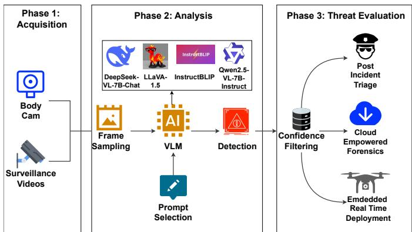
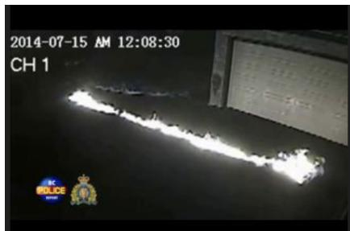
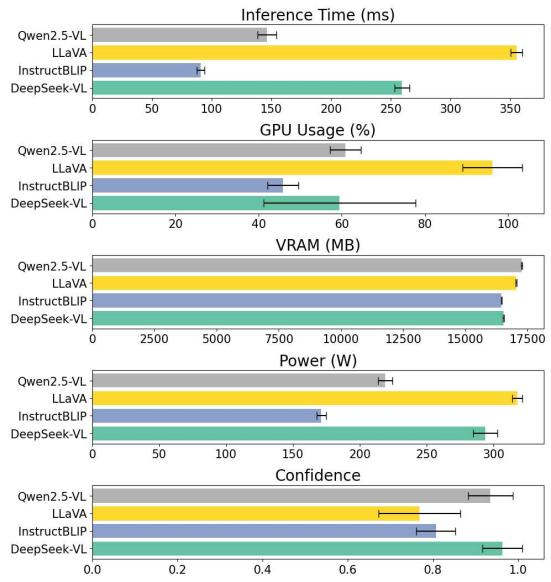
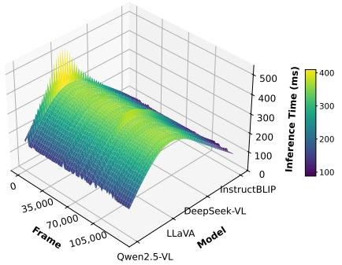
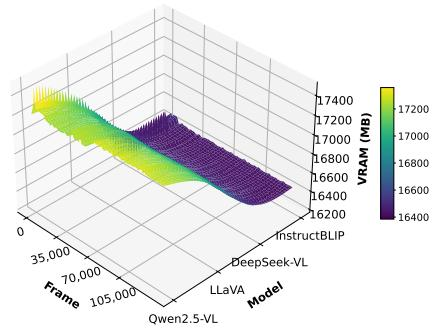
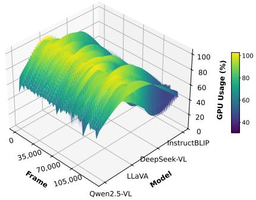
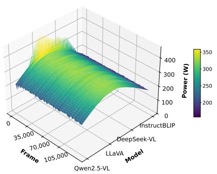
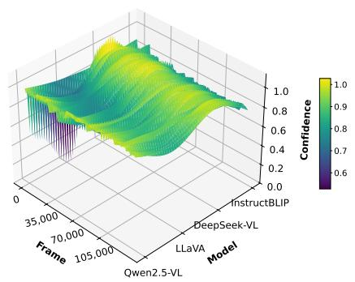
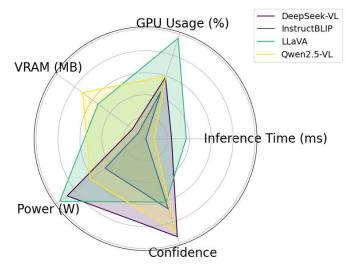

# VESSI - VLM-Enhanced Support for Surveillance and Investigations

Saverio Cavasin, Pietro Tedeschi, Mattia Tamiazzo, Alessandro Brighente, Simone Milani, and Mauro Conti

Abstract—Automated video surveillance analysis has become a critical component of intelligence infrastructures and Law Enforcement agencies. Traditional systems lack the semantic module for comprehensive situational awareness and forensic tasks, limiting their ability to interpret events meaningfully or support post-incident investigations. This slows operational insight and increases the burden on human analysts. Recent advances in the Vision-Language Model (VLM) ofer promising pathways to bridge this gap. To address this, we propose VLM-Enhanced Support for Surveillance and Investigations (VESSI), a VLM-based framework designed to enhance automated video surveillance analysis through prompt-driven interrogation of video sequences where salient visual features are converted into textual descriptions.

We test our framework with four state-of-the-art models. Since most of the datasets for this task are unlabeled, we also propose the metric Composite Model Utility Score (CMUS) to assess VLMs’ performance. Experimental results show that our solution substantially improves the analysis capabilities of human operators and enhances the flexibility of automated surveillance systems. In our evaluation, the most reliable model flagged potentially relevant activity in more than 66% of the videos while reducing review time by more than 85%, ofering a practical balance between selectivity and eficiency. The model ordering produced by the reference-free CMUS evaluation was reproduced by the normal-video CMUS evaluation and matched the falsepositive-rate ordering obtained from 5,909 manually referenced frames. This agreement supports the operational use of the score within the evaluated setting.

Index Terms—Video surveillance, digital forensics, visionlanguage models.

## I. INTRODUCTION

The growth of urban video surveillance, projected to reach a market value of USD 81.37 billion by 2030 [1], is producing an increasing volume of footage for public safety, crime prevention, trafic monitoring, and infrastructure management. Forensic use of this material still relies heavily on manual inspection, which is slow, resource-intensive, and vulnerable to error when large collections must be reviewed under time pressure.

Vision Language Models (VLMs) can query visual content through natural language and support scene summarization [2], event interpretation, and interactive search [3], [4]. These capabilities can reduce the cognitive and temporal burden on human operators [5] and make surveillance analysis more scalable, inspectable, and semantically expressive. Their use in operational systems, however, raises two main issues. First, current models require substantial memory and computational resources [6], [7], especially on embedded devices or distributed camera networks. Compression [8], cloud ofload ing [9], and hardware acceleration [10] can mitigate this cost, with diferent efects on latency and scalability. Second, VLMs can produce inconsistent or hallucinated outputs on ambiguous and out-of-distribution inputs [11], [12]. Such failures are consequential in forensic settings [13], while continuous manual validation can erode the expected eficiency gain [14].

Existing large-model approaches to video understanding often retain a narrow focus on object detection and tracking [15]. Structured querying, traceable frame retrieval, operational profiling, and evaluation without exhaustive framelevel labels remain insuficiently addressed. This work targets this gap through a modular surveillance-triage pipeline and an evaluation method designed for ambiguous, video-levellabeled material.

## A. Contributions

This work proposes a VLM-based surveillance framework that combines semantic querying, operational feasibility, and traceable outputs. It also examines deployment constraints and comparative reliability in sensitive settings such as law enforcement, drone monitoring, and defense.

In a nutshell, our main contributions can be summarized as follows.

∙ We propose a lightweight modular architecture for singleframe surveillance interrogation, semantic prompting, and traceable evidence retrieval with VLMs.

∙ We introduce the Composite Model Utility Score (CMUS), which combines detection behavior, inference eficiency, and hallucination control when exhaustive frame-level ground truth is unavailable.

∙ We define technical guidelines for adapting the framework to cloud-based Security Operations Center (SOC) infrastructures and constrained edge systems.

∙ We benchmark four 7B-parameter VLMs, identifying trade-ofs among semantic selectivity, latency, hardware demand, and robustness.

It is possible to outline the research questions answered by this paper in a four-point list.

(RQ1) Can VLMs efectively improve Law Enforcement frameworks in video surveillance analysis?

(RQ2) Which State-of-the-Art (SOTA) architecture and model is more suitable to support Law Enforcement in surveillance?

(RQ3) Which information and strategies should be implemented to consistently pair VLM agents in surveillance?

(RQ4) Can we efectively test VLM models even when surveillance material is not frame-by-frame labeled (usual case for data of this nature)?

## B. Roadmap

The paper is organized as follows. Section II reviews the literature on vision-language surveillance and positions VESSI with respect to existing systems. Section III introduces the four models considered in the study. Section IV presents the VESSI pipeline and its acquisition, analysis, and threat-evaluation phases. Section V describes the experimental protocol, while Section VI defines the reference-free evaluation measures and the CMUS score. Section VII reports detection, validation, control-group, utility, and computational results. Section VIII discusses the limitations and future directions, and Section IX concludes the paper. The notation used throughout the paper is summarized in the supplementary material.

## II. RELATED WORK AND COMPARISON

The integration of large Vision Language Models into surveillance video analysis is an emerging and rapidly evolving research area. Although many recent eforts focus on generalpurpose video understanding, the application of these systems to high-stakes, real-world surveillance tasks, especially with forensic or cybersecurity constraints, remains limited and underexplored.

## A. Related works

Sultani et al. [16] introduced the University of Central Florida (UCF)-Crime dataset, one of the first large-scale benchmarks aimed at anomaly detection in untrimmed surveillance videos. Their approach focused on weakly supervised learning through multiple-instance ranking to localize anomalies using only video-level labels. This dataset has become a standard reference in anomaly detection research, but does not include natural language annotations or interactive querying for in-depth analysis.

Building on UCF-Crime, Yuan et al. [17] proposed the Understanding Crime Activities (UCA) benchmark, designed to extend surveillance video understanding with temporally grounded language annotations. Their framework supports video-language tasks such as temporal sentence grounding, event captioning, and question answering. However, it requires dense spatiotemporal modeling and purpose-trained models such as surveillance SwinBERT [18]. This limits modularity and flexibility, especially in contexts requiring resourceawareness or output traceability, and does not ofer diferent model comparisons.

TV Question Answering (TVQA) [19] further advanced video-language QA approaches by localizing answers to temporal segments. Nevertheless, their study focuses on a dataset built using television series, movies, and scripted videos. The lower intrinsic quality of surveillance videos, inherited in their nature, makes this study insuficient for real-world applications.

The Video and Image Retrieval and Analysis Tool (VIRAT) dataset [20] is one of the most naturalistic collections of realworld surveillance data, emphasizing long, continuous scenes with complex human and vehicle activities. However, it lacks any multimodal or language interface, rendering it unsuitable for direct evaluation of VLM-based semantic reasoning or forensic tasks.

Other VLM-powered approaches have also emerged in adjacent domains. For example, Clip2Safety [21] and Vision-Language Pedestrian Detection (VLPD) [22] target workplace safety and pedestrian detection, respectively, using visual grounding at the scene level. Meanwhile, applications like LlavaGuard [23] focus on image-text moderation. Although demonstrating the spread interest and need for such technologies, these systems are not tailored for forensic investigation or flexible integration into lightweight, field-deployable environments.

Regarding the analysis of real-world data without framelevel ground truth, a similar approach leveraging structured prompt templates is presented in VIVID [24]. It supports the semantic-guided frame interrogation in surveillance footage, but it is only applied to identify generic violence by skipping other criminal activities, making it suitable to categorize salient or specific events.

Recent studies have connected vision-language reasoning more directly to video anomaly detection. LAVAD [25] follows a training-free pipeline in which frame captions are temporally aggregated and converted into anomaly scores by a large language model. VERA [26] learns verbalized guiding questions from coarsely labeled videos and uses them with a frozen VLM to produce interpretable anomaly scores. ASK-HINT [27] studies structured, action-centric prompting and shows that the information and granularity encoded in the prompt afect anomaly-detection performance. CPVAD [28] first extracts context-preserving temporal boundaries and then performs clip-level anomaly scoring with a frozen VLM; on XD-Violence, its boundary-based sampling reduces the reported number of model queries from 146,449 to 5,340 while retaining temporal context. These methods primarily address anomaly scoring and temporal localization over clips. VESSI addresses a complementary operational setting based on category-specific frame interrogation, controlled promptcomplexity analysis, multi-model profiling, and traceable storage of flagged frames, timestamps, and model responses.

VANE-Bench [29] provides a dedicated benchmark for evaluating video-language models through anomaly-detection and localization questions across synthetic and real-world videos, including crime-related footage. Its evaluation of nine video-language models ofers useful evidence on the capabilities and limits of general-purpose video question answering for anomaly understanding, while its scope remains benchmark-oriented and does not define an operational forensic-surveillance pipeline.

Concerning the efectiveness of VLMs, VALOR-EVAL [30] provides a comprehensive benchmark for vision-language models that balances multi-dimensional performance metrics within a unified evaluation framework.

However, while VALOR-EVAL also aims to balance multiple performance aspects, specifically faithfulness and coverage in open-vocabulary captioning, it is designed for static image evaluation and assumes fine-grained, human-annotated ground truth. By contrast, Composite Model Utility Score is explicitly tailored to surveillance video analysis, where such ground truth is unavailable, and evaluation must account for detection rate and activation patterns over time.

Moreover, our hallucination scoring penalizes persistent over-activation. It does not evaluate semantic mismatches in captions, making it more suitable for forensic use cases where excessive alerts carry operational costs. Composite Model Utility Score thus fills a distinct gap by enabling practical, lightweight performance assessment in low-supervision, streaming contexts such as long-term video surveillance.

## B. Comparison with the State of the art

To the best of our knowledge, VESSI is the only solution fulfilling, at the same time, all the considered requirements. Moreover, the architecture of VESSI allows independent frame querying through structured prompts, providing fine-grained control, inspectable output records, and adaptability across hardware-constrained environments such as drones or embedded cameras. Our framework is explicitly designed to acknowledge the operational risks and failure points of modern VLMs, including hallucinations and adversarial susceptibility [31]. Finally, by addressing the gaps in existing datasets and VLM deployments, our system supports flexible, lightweight, and traceable scene interrogation for real-world surveillance video, with direct relevance to digital forensics and cyber-physical threat response. Table I summarizes the comparison with the previous SOTA. Since the other works tackled the problem with diferent goals (e.g., scene description or generic anomaly detection) we cannot provide a direct numeric comparison of results. Nevertheless, we highlight the main diferences and improvements we bring with respect to the previous works. The symbols report capabilities explicitly implemented or experimentally assessed in each work; architectural compatibility alone is not treated as full fulfillment.

## III. TESTED VISION LANGUAGE MODELS

A Vision Language Model (VLM) is a type of machine learning architecture that is designed to understand and generate both visual and textual information. Unlike a language model (which processes only text information), VLMs combine images and text data in a multimodal way to interpret visual content (e.g. photos or videos) or generate images from textual prompts. To evaluate the applicability of VLMs in surveillance contexts, we selected four novel and highperforming models, each with approximately 7 billion parameters. This setup enables a balanced benchmark across models with similar computational requirements, improving fair comparisons in terms of performance, output consistency, and modularity. The selected models are the following:

∙ LLaVA-1.5 [32]: Large Language and Vision Assistant (LLaVA) 1.5 integrates a CLIP-based vision encoder, namely ViT-L/14 [33] with a Vicuna [34] language backbone, connected via a lightweight Multilayer Perceptron projection module. LLaVA-1.5 enhances this architecture (i.e., combining the vision encoder with the language model using a Multilayer Perceptrons (MLPs) projector) with improved alignment and instruction tuning, allowing multimodal dialogue capabilities and visual grounding.

∙ InstructBLIP [35]: InstructBLIP is built on the BLIP-2 framework by injecting instruction-following capabilities through additional supervised fine-tuning. It uses a frozen vision encoder, i.e., ViT-G/14, and a Query Transformer (Q-Former) module that connects visual tokens to a pretrained language model such as FLAN-T5 [36] or Vicuna.

∙ Qwen2.5-VL-7B-Instruct [37]: Qwen2.5-VL is a bilingual vision-language model developed by Alibaba [38], supporting both Chinese and English. The VL-7B-Instruct variant is instruction-tuned and capable of multi-turn interactions and fine-grained image understanding [39]. It employs a Transformer-based visual encoder combined with a large language decoder, optimized for open-ended multimodal tasks.

∙ DeepSeek-VL-7B-Chat [40]: DeepSeek-VL is an opensource VLM designed for real-world vision-language understanding. The 7B-Chat variant utilizes a hybrid vision encoder combining SigLIP-L [41] and SAM-B [42], supporting high-resolution images up to 1024 × 1024 pixels. It is constructed based on the DeepSeek-LLM-7B base model, trained on approximately 2 trillion text tokens and 400 billion vision-language tokens.

The decision to focus on models with a similar number of parameters derives from both technical and operational considerations. These architectures and model sizes ofer a good balance between model capability and computational feasibility with respect to their deployment in SOCs [43], cloud-based surveillance systems, or high-end embedded environments. Their popularity in public repositories also reflects a degree of community validation and stability in terms of usability and support. We selected frame-by-frame image-based VLMs. Models designed for continuous video input, including Video-LLaVA [44], were excluded from the benchmark. This decision is made for several reasons:

∙ Flexibility. Frame-level analysis allows a flexible integration with other independent video pre-processing stages [45] (e.g., shot segmentation, motion detection, scene selection), making the pipeline more robust and independent (indeed, video pre-processing may vary depending on the recording platform thus afecting the training procedure with bias). Furthermore, prompting individual frames provides a fine-grained control over the type of reasoning applied, like scene description vs. behavioral pattern analysis, which is harder to achieve with end-to-end video-language transformers.

∙ Eficiency. Analyzing frame-level output improves computational eficiency, reduces processing latency, and avoids potential disalignment [4] across diferent model

Table I  
COMPARISON OF VESSI WITH SURVEILLANCE DATASETS, BENCHMARKS, AND RECENT VLM-BASED ANOMALY-DETECTION SYSTEMS. Legend: ● FEATURE FULLY FULFILLED, ◐ FEATURE PARTIALLY FULFILLED, ○ FEATURE NOT FULFILLED.
<table><tr><td rowspan=1 colspan=1>Feature / Capability</td><td rowspan=1 colspan=1>UCF-Crime [16]</td><td rowspan=1 colspan=1>UCA [17]</td><td rowspan=1 colspan=1>VIRAT [20]</td><td rowspan=1 colspan=1>LAVAD [25]</td><td rowspan=1 colspan=1>VERA [26]</td><td rowspan=1 colspan=1>VANE-Bench [29]</td><td rowspan=1 colspan=1>ASK-HINT [27]</td><td rowspan=1 colspan=1>CPVAD [28]</td><td rowspan=1 colspan=1>VESSI</td></tr><tr><td rowspan=1 colspan=1>Multimodal Data Analy-sis (video + language)</td><td rowspan=1 colspan=1>O</td><td rowspan=1 colspan=1>●</td><td rowspan=1 colspan=1>O</td><td rowspan=1 colspan=1>●</td><td rowspan=1 colspan=1>●</td><td rowspan=1 colspan=1>●</td><td rowspan=1 colspan=1>●</td><td rowspan=1 colspan=1>●</td><td rowspan=1 colspan=1>●</td></tr><tr><td rowspan=1 colspan=1>Frame-level SemanticAnalysis</td><td rowspan=1 colspan=1>O</td><td rowspan=1 colspan=1>●</td><td rowspan=1 colspan=1>O</td><td rowspan=1 colspan=1>●</td><td rowspan=1 colspan=1>●</td><td rowspan=1 colspan=1>0</td><td rowspan=1 colspan=1>0</td><td rowspan=1 colspan=1>0</td><td rowspan=1 colspan=1>●</td></tr><tr><td rowspan=1 colspan=1>Interactive    prompt-based querying</td><td rowspan=1 colspan=1>O</td><td rowspan=1 colspan=1>O</td><td rowspan=1 colspan=1>O</td><td rowspan=1 colspan=1>O</td><td rowspan=1 colspan=1>O</td><td rowspan=1 colspan=1>0</td><td rowspan=1 colspan=1>O</td><td rowspan=1 colspan=1>O</td><td rowspan=1 colspan=1>●</td></tr><tr><td rowspan=1 colspan=1>Real-time forensic appli-cability</td><td rowspan=1 colspan=1>●</td><td rowspan=1 colspan=1>O</td><td rowspan=1 colspan=1>O</td><td rowspan=1 colspan=1>0</td><td rowspan=1 colspan=1>O</td><td rowspan=1 colspan=1>O</td><td rowspan=1 colspan=1>O</td><td rowspan=1 colspan=1>0</td><td rowspan=1 colspan=1>●</td></tr><tr><td rowspan=1 colspan=1>Lightweight    SOTAmodel deployed (≤ 7B)</td><td rowspan=1 colspan=1>O</td><td rowspan=1 colspan=1>O</td><td rowspan=1 colspan=1>O</td><td rowspan=1 colspan=1>O</td><td rowspan=1 colspan=1>O</td><td rowspan=1 colspan=1>O</td><td rowspan=1 colspan=1>●</td><td rowspan=1 colspan=1>O</td><td rowspan=1 colspan=1>●</td></tr><tr><td rowspan=1 colspan=1>No manualannotationrequirement</td><td rowspan=1 colspan=1>●</td><td rowspan=1 colspan=1>O</td><td rowspan=1 colspan=1>●</td><td rowspan=1 colspan=1>●</td><td rowspan=1 colspan=1>0</td><td rowspan=1 colspan=1>O</td><td rowspan=1 colspan=1>●</td><td rowspan=1 colspan=1>●</td><td rowspan=1 colspan=1>●</td></tr><tr><td rowspan=1 colspan=1>Multi-model   SOTABenchmarking</td><td rowspan=1 colspan=1>O</td><td rowspan=1 colspan=1>0</td><td rowspan=1 colspan=1>O</td><td rowspan=1 colspan=1>O</td><td rowspan=1 colspan=1>0</td><td rowspan=1 colspan=1>●</td><td rowspan=1 colspan=1>●</td><td rowspan=1 colspan=1>0</td><td rowspan=1 colspan=1>●</td></tr><tr><td rowspan=1 colspan=1>Prompt   ComplexityEvaluation</td><td rowspan=1 colspan=1>O</td><td rowspan=1 colspan=1>O</td><td rowspan=1 colspan=1>O</td><td rowspan=1 colspan=1>O</td><td rowspan=1 colspan=1>0</td><td rowspan=1 colspan=1>O</td><td rowspan=1 colspan=1>●</td><td rowspan=1 colspan=1>●</td><td rowspan=1 colspan=1>●</td></tr></table>

configurations.

At the time of writing, many video-level VLMs are either not publicly released, require significantly more computational efort [46], or present limitations in terms of modularity [47], making it harder to achieve a fair SOTA comparison for benchmarking performances. Although this frame-based approach may not fully capture temporal continuity, it provides a practical and extensible foundation for testing VLM robustness in surveillance scenarios.

## IV. THE VESSI FRAMEWORK

Our framework, namely VESSI, is designed as a modular and extensible pipeline for analyzing surveillance footage using VLM.

  
Figure 1. Framework Diagram of VESSI.

Figure 1 depicts the block diagram of our system, which can be structured over three phases: the Acquisition, the Analysis, and the Threat Evaluation, described in the following.

## A. Scope and Assumptions

The UCF-Crime dataset provides video-level category labels but no exhaustive frame-level ground truth. Individual frames can be ambiguous, depict overlapping activities, omit the labeled event because it occurs outside the camera view, or contain acquisition artifacts. Accordingly, VESSI is evaluated as a surveillance-triage framework: its scores describe operational utility and relative model behavior under these assumptions. They do not provide exhaustive temporal localization or objective frame-level accuracy.

## B. Phase 1 - Acquisition

The input to the system is a categorized video dataset $\mathcal { V } = \{ \mathcal { V } _ { 1 } , \ldots , \mathcal { V } _ { 1 3 } \}$ , where each subset $\mathcal { V } _ { c }$ contains all videos � belonging to the �-th crime class.

To properly assess the capabilities and performance of VESSI, we adopt the UCF-Crime dataset [16], a large-scale surveillance video collection organized into real-world crimerelated classes, as detailed in Table II.

Table II  
DATASET CLASSES, NUMBER OF VIDEOS, AND TOTAL DURATION (IN MINUTES) PER CLASS.
<table><tr><td>Class</td><td>Number of Videos</td><td>Total Duration (min)</td></tr><tr><td>Abuse</td><td>50</td><td>107.50</td></tr><tr><td>Arrest</td><td>50</td><td>165.22</td></tr><tr><td>Arson</td><td>50</td><td>151.06</td></tr><tr><td>Assault</td><td>50</td><td>72.19</td></tr><tr><td>Burglary</td><td>100</td><td>261.78</td></tr><tr><td>Explosion</td><td>50</td><td>140.22</td></tr><tr><td>Fighting</td><td>50</td><td>143.83</td></tr><tr><td>Road Accidents</td><td>150</td><td>144.93</td></tr><tr><td>Robbery</td><td>150</td><td>234.77</td></tr><tr><td>Shooting</td><td>50</td><td>81.93</td></tr><tr><td>Shoplifting</td><td>50</td><td>180.20</td></tr><tr><td>Stealing</td><td>100</td><td>259.68</td></tr><tr><td>Vandalism</td><td>50</td><td>81.76</td></tr><tr><td>Total</td><td>950</td><td>2025.07</td></tr></table>

It is worth noticing that the dataset is not manually annotated for training or fine-tuning. We qualitatively assess the model outputs based on the relevance of the answers generated for the label class and the visual content of the frames selected by the algorithm given the textual query.

## C. Phase 2 - Analysis

In this phase, the system processes each video $v \in \mathcal { V } _ { i }$ by extracting a frame set $_ { \mathcal { F } }$ using uniform sampling at a fixed rate � = 1 Hz. The goal is to evaluate how well diferent VLMs detect relevant visual content, given category-specific natural language prompts $p \in \mathcal { P } = \{ p _ { 1 } , p _ { 2 } , p _ { 3 } \}$

1 Videos from each class are preprocessed by uniformly sampling frames at fixed intervals, with a tunable frame rate that we set to 1 Hz for the initial evaluation.

2 Each frame $\begin{array} { r } { f \in \mathcal { F } } \end{array}$ is evaluated using a categoryspecific natural language prompt �, designed to test the model’s ability to recognize semantically salient content. For each frame, we apply three prompts $p _ { 1 } , p _ { 2 } , p _ { 3 } \in \mathcal { P }$ of increasing semantic complexity, generated from the video-level category label:

Medium. Broader, less specific phrasing (e.g., “Does the frame show something that could be interpreted as an instance offighting?”)

Hard. Indirect, reasoning-intensive question (e.g., “Could a human observer reasonably conclude that this frame depicts fighting-like behavior or consequences?”)

Each query is deliberately formulated as a short binary decision. Its purpose is to provide a rapid and direct firststage detection while limiting output-token generation and response latency. The constrained output also enables deterministic parsing and produces comparable decisions across models, prompts, and frames. Yes and No are the two requested decisions; responses such as “uncertain,” or any output that cannot be parsed as either decision, are treated as abstentions and normalized as Unclear. An Unclear response does not trigger an alert. A positive flag is also not a determination that a crime occurred: it selects the corresponding frame for subsequent investigative assessment by a human operator, such as a law-enforcement oficer.

Each frame-prompt pair (�, �) is passed through the model m ∈ M in inference mode, where M is the set of the four tested models. At the same time, metrics such as inference time, memory usage, and sampled Graphics Processing Unit (GPU) power draw are logged and exported for later analysis. This procedure is repeated across all selected models and prompt levels to ensure consistency in experimental comparisons.

The three prompt formulations preserve the same binary detection task while varying the semantic complexity of the question. This design allows us to examine whether model outputs remain stable when the same investigative need is expressed through direct, broader, or reasoningintensive language.

3 The model returns a textual response to the prompt for each frame. These responses are parsed to extract a binary label (Yes/No) and a confidence score �, which are then stored in the log  alongside system-level statistics.

## D. Phase 3 - Threat Evaluation

To assess label-consistent retrieval, each afirmative response is associated with the video-level category used to formulate the query. We employ the model’s internal confidence � to filter and rank afirmative responses for alert review. Only frames with a positive response and � ≥ � are stored. In our experiments, � is set separately for each model to the tenthhighest confidence among its positive responses.

```verilog
Input: Video � ∈ categorized video dataset
V = {V1, ... , V13 }; prompt set P = {p1, P2, P3};
model � ∈ ; sampling rate �; confidence
threshold �
Output: Per-frame response log  and
salience-filtered alert frames
// Phase 1 - Acquisition.
1  ← ∅ ; // Initialize Log
2 foreach category � = 1 to 13 do
3 foreach video � ∈  do
4  ← Extract_Frame_Set(�, �);
// Phase 2 - Analysis.
5 foreach frame � ∈  do
6 foreach prompt � ∈  do
7 � ← �(�, �); // Model Inference
8 (label, �) ← Parse_Response(�);
// Extract Label and
Confidence
9 Append
[(�.id, �.timestamp, �, �, �, label, �),
(vram, latency, power)] to ;
10 end
11 end
12 end
13 end
// Phase 3 - Threat Evaluation.
14 foreach entry
(�.id, �.timestamp, �, �, �, label, �, … ) ∈  do
15 if � ≥ � and label = Yes then
16 Save frame � as an alert for human review;
17 end
18 end
19 Export  as Comma Separated Values (CSV);
Algorithm 1: Prompt-Based VLM Frame Evaluation
Pipeline.
```

The forensic specialization of VESSI derives from this investigative workflow. Queries encode an operator-defined investigative need; each shortlisted output retains the flagged frame and its link to the source video; and the structured log records the frame identifier, source timestamp, query, normalized response, model, confidence, and computational measurements. A shortlisted output therefore becomes a traceable alert that an oficer can review in the context of the original footage. The system supports rapid evidence triage and leaves the interpretation of the flagged material and any investigative decision to the human operator.

To better display our surveillance pipeline, we implemented a modular per-frame evaluation routine detailed in Algorithm 1. Together, category-specific prompting, uniform sampling, confidence-based filtering, and structured logging constitute the deployment strategy examined in RQ3.

## V. EXPERIMENTAL PROTOCOL

To verify the efectiveness of VLM in retrieving information from �, we defined an experimental protocol and quality metrics to parametrize the dificulty of the task and the processing performance of each models.

Each frame, along with the corresponding prompt, is fed into the selected VLM in inference mode (no additional gradient computation nor fine tuning). The models’ language response is post-processed into one of three normalized categories: Yes, No, or Unclear. The complete normalized response stream is used to calculate the reported metrics: Yes is a positive response, while No and Unclear are non-alert responses. For operational use, a positive response is included in the alert shortlist only when $\zeta \geq \tau .$ The score therefore acts as a withinmodel salience filter that prioritizes frames for human review; it is not interpreted as the probability that a crime occurred. Per-frame metadata is logged to structured CSV and plain-text logs.

## A. Confidence-based Filtering

Confidence is computed as the average of the maximum softmax probabilities over all generated tokens [48]. Specifically, let $\mathbf { s } _ { i }$ be the raw logits produced at generation step �, and $\sigma ( \mathbf { s } _ { i } )$ the corresponding softmax distribution. The confidence $\zeta$ for a response is defined as

$$
\zeta = \frac { 1 } { T } \sum _ { i = 1 } ^ { T } \operatorname* { m a x } _ { j } \sigma ( \mathbf { s } _ { i } ) _ { j } ,\tag{1}
$$

where  is the number of tokens generated (typically $\leq 5 )$ This value summarizes the concentration of the model’s token distributions while generating its response. It is used to filter and rank flagged frames and, together with alert frequency and the validation results, to inspect the model’s over-activation profile.

We release the code of VESSI as open-source at [49] to promote the reproducibility of our results and encourage the readers to extend its deployment.

## VI. COMPOSITE MODEL UTILITY SCORE (CMUS)

To assess the performance of VLMs in joint terms of detection robustness, eficiency, and semantic reliability, we introduce the Composite Model Utility Score. This metric integrates detection coverage, time eficiency, detection rate, and a refined hallucination index into a single, interpretable score, facilitating comparative assessment across models. The objective of the metric is to display the highest score possible for a fitting model.

## A. Scoring Terms

CMUS considers the following quantities for each model m ∈ M, where M is the set of the 4 models:

$C _ { m } \mathrm { : }$ : Coverage – proportion of videos for which the model produces at least one positive response, averaged across the evaluated categories and prompt levels. Coverage measures retrieval breadth: a high value means that fewer videos are entirely missed during triage, but it does not imply that every positive response is correct.

$T _ { m }$ : Time Saved – relative reduction in processing time compared to the original duration of the video, averaged across the evaluated categories $( T _ { s }$ values computed for each model �). High values are preferred.

$D _ { m } \colon$ : Detection Rate – average proportion of frames receiving a positive response. Excessively high values can indicate hallucination.

$H _ { m }$ : Refined Hallucination Index – a weighted sum over five detection buckets indicating the severity of the hallucination.

1) Detection Coverage: For each model, coverage is computed as the proportion of videos containing at least one positive response to the category-specific query. This videolevel quantity estimates whether the pipeline retrieves at least one potentially useful frame from each recording, which is the primary requirement of a triage system. Coverage therefore complements the frame-level detection rate: the former measures how broadly the dataset is covered, whereas the latter measures how frequently a model produces positive responses within the analyzed videos.

2) Temporal Eficiency Analysis: To evaluate computational eficiency, we compared the average inference duration $T _ { i n }$ per model against the total actual playback time $T _ { o r }$ of the videos, as the latter ofers a realistic baseline term for human or real-time monitoring systems. We then computed the average inference time for each model by averaging over the three prompt complexity levels (easy, medium, and hard).

To quantify the proportional gain, we define the Time Saving as $T _ { s }$ for model  as reported in Eq. 2:

$$
T _ { s } ( \% ) = \left( \frac { T _ { o r } - T _ { i n } } { T _ { o r } } \right) \times 1 0 0 .\tag{2}
$$

3) Detection Rate and Refined Hallucination Index: Some general-purpose techniques, such as the method proposed by Li et al. [50], rely on uncertainty estimates to detect hallucinations in VLMs without requiring ground-truth annotations. Although eficient, these methods are not tailored to the operational constraints and forensic needs of surveillance scenarios. In such settings, false positives can significantly undermine analyst trust and delay critical decision-making, especially when reviewing large volumes of footage.

For each Model×Video×Prompt triplet, the detection rate is the proportion of analyzed frames for which the model returns Yes. Because exhaustive frame-level ground truth is unavailable, we treat persistent afirmative activation as an operational proxy for hallucination risk. This proxy does not constitute direct proof of an incorrect response. We group detection rates into five intervals and assign progressively stronger penalties:

1) < 10%: selective activation and the lowest penalty;

2) 10 − 40%: moderate activation with no penalty;

3) 40 − 70%: increased risk of over-activation;

4) 70 − 95%: high risk of persistent over-activation;

$5 ) \geq 9 5 \%$ : near-constant activation and the highest penalty.

These intervals form the refined hallucination index and make its operational assumption explicit.

We model the resulting bucket-weighted score as in Eq. 3:

$$
H _ { \mathscr { m } } = \frac { 1 } { N } \sum _ { k = 1 } ^ { 5 } w _ { k } \cdot B _ { k } .\tag{3}
$$

where $B _ { k }$ is the number of model-video-prompt triplets in bucket �, � is the total number of triplets for that model, and the weights $w _ { k }$ are set to {−0.5, 0.0, 0.5, 1.0, 1.5} according to the intervals above.

In the crime-video evaluation, $H _ { m }$ is computed over the 2,850 video–prompt configurations. For the normalvideo control, it is independently recomputed over the 1,950 video–category–prompt configurations using the same detection-rate intervals and bucket weights.

We assess this operational proxy through two complementary checks. A manually inspected human-reference subset evaluates whether model responses align with visually recognizable instances of the video-level target activity. A normalvideo control group evaluates afirmative activation when none of the 13 target crime categories is expected.

## B. Final Score Definition

The CMUS in Eq. 4 integrates all four components using a weighted linear combination:

$$
\mathrm { C M U S } _ { m } = \alpha \cdot C _ { m } + \beta \cdot T _ { m } + \gamma \cdot D _ { m } + \delta \cdot H _ { m } .\tag{4}
$$

For this experiment, we set:

$\alpha ~ = ~ 1 . 0 \colon$ Detection coverage is directly rewarded as it reflects the ability of the model to identify relevant activity across various scenarios.

$\beta = 1 . 0 \colon$ Time savings are equally important, especially for real-time or resource-constrained systems, where faster inference enables scalability.

$\gamma = - 0 . 5$ : The detection rate is penalized moderately, as excessive detections may signal overgeneralization or hallucinations. However, occasional high activity may still be legitimate.

$\delta = - 1 . 0 \colon$ The refined hallucination index receives full penalty weight, as hallucinated outputs pose a serious risk in forensic or security-sensitive applications.

This weighting scheme prioritizes models that are broadly efective and eficient, while strongly discouraging false or misleading detections.

## VII. RESULTS AND DISCUSSION

Unless otherwise stated, all models are evaluated under the same experimental conditions.

Fig. 2 shows qualitative examples of successful framelevel detections. Fig. 2a shows a man holding a cashier at gunpoint, Fig. 2b displays a brawl in a train/metro station, and Fig. 2c depicts a line of fire. Each example is extracted from a successfully identified surveillance scenario, captured with diferent prompt dificulties, and processed by distinct models.

## A. Model-level Detection Performance

To summarize the detection behavior of each VLM, we computed the average coverage and per-frame detection rate across all categories and prompt dificulties. Table III reports the category-wise averages for each model and the global performance summary.

Coverage represents the percentage of videos in a category for which at least one positive response (Yes) was produced. The detection rate indicates the average ratio of frames marked as positive compared to the total number of frames analyzed. Together, these metrics help distinguish between truly robust recognition and overactive or hallucinated detections.

InstructBLIP shows the highest overall rate, with a mean detection coverage of 99.08% and a per-frame detection rate of 0.83. However, this high detection saturation likely stems from a tendency to over-predict positives, potentially inflating performance at the cost of hallucinations. DeepSeek-VL ranks second, averaging 95.6% coverage and a 0.62 detection rate, suggesting frequent afirmative activation.

LLaVA and Qwen2.5-VL, in contrast, display lower detection rates (0.27 and 0.16 respectively), yet this conservative behavior likely avoids unnecessary hallucinations and better reflects real-world constraints. Qwen2.5-VL in particular exhibits selective detection patterns while maintaining respectable detection coverage (66.9%), suggesting a potential balance between eficiency and semantic caution.

It is important to note that these metrics should not be considered without accounting for hallucinations. Models with high detection counts may also exhibit elevated false-positive rates. These results address RQ1 by showing the extent to which VLMs can retrieve surveillance evidence and inform RQ2 by exposing the diferent operational trade-ofs among the evaluated architectures.

## B. Hallucination occurrence

Table IV summarizes the 2,850 video–prompt pairs assigned to each detection-rate band for every model. Qwen2.5-VL exhibits the lowest hallucination footprint: 1,591 pairs fall below the 10% threshold and only 12 reach the $\geq 9 5 \%$ band, resulting in $H _ { m } = - 0 . 1 5 9 8$ . InstructBLIP shows the strongest persistent afirmative activation, with 2,032 pairs in the $\geq 9 5 \%$ band and only 106 below 10%. It consequently obtains the highest hallucination index, $H _ { m } = 1 . 2 0 3 0$

DeepSeek-VL also presents substantial over-activation: 650 pairs fall in the 70–95% band and 880 in the $\ge 9 5 \%$ band, yielding $H _ { m } ~ = ~ 0 . 7 0 6 3$ . LLaVA displays a more selective profile, with 1,223 pairs below 10% and 123 in the highest band, resulting in $H _ { m } = 0 . 0 6 0 9$

These trends emphasize the necessity of interpreting isolated “Yes” detections within the broader activation pattern of each model. Persistent positive responses across low-activity, occluded, or otherwise ambiguous frames may indicate overactivation and limited selectivity.

This analysis supports a nuanced interpretation of afirmative outputs in VLM-based surveillance: robust detectors balance detection breadth and semantic control. While DeepSeek-VL ensures coverage, Qwen2.5-VL remains the most judicious in limiting persistent over-activation, making it preferable for high-stakes forensic applications where hallucination undermines credibility.

  
(a) Robbery–LLaVA, 0.79 conf. (medium)

  
(b) Fighting–Qwen2.5-VL, 0.93 conf. (easy)

  
(c) Arson–InstructBLIP, 0.85 conf. (hard)  
Figure 2. Examples of successful detections from three models across diferent actions and prompt dificulties. Confidence values are internal generation scores used to filter and rank detections; they are not calibrated probabilities of correctness.

Table III  
AVERAGE COVERAGE (%) AND DETECTION RATE PER MODEL AND CATEGORY. VALUES ARE AVERAGED ACROSS THE THREE PROMPT DIFFICULTY LEVELS (EASY, MEDIUM, HARD). NORMAL VIDEOS ARE EXCLUDED.
<table><tr><td rowspan="2">Category</td><td colspan="2">DeepSeek-VL</td><td colspan="2">InstructBLIP</td><td colspan="2">LLaVA</td><td colspan="2">Qwen2.5-VL</td></tr><tr><td>Cov. (%)</td><td>Det. Rate</td><td>Cov. (%)</td><td>Det. Rate</td><td>Cov. (%)</td><td>Det. Rate</td><td>Cov. (%)</td><td>Det. Rate</td></tr><tr><td>Abuse</td><td>98.67</td><td>0.8353</td><td>98.00</td><td>0.8582</td><td>50.67</td><td>0.1652</td><td>32.67</td><td>0.0292</td></tr><tr><td>Arrest</td><td>100.00</td><td>0.7011</td><td>100.00</td><td>0.8283</td><td>86.00</td><td>0.3258</td><td>80.00</td><td>0.2454</td></tr><tr><td>Arson</td><td>96.67</td><td>0.4096</td><td>100.00</td><td>0.6046</td><td>62.00</td><td>0.0969</td><td>71.33</td><td>0.0800</td></tr><tr><td>Assault</td><td>96.67</td><td>0.6202</td><td>98.67</td><td>0.8525</td><td>70.67</td><td>0.2162</td><td>59.33</td><td>0.1327</td></tr><tr><td>Burglary</td><td>95.33</td><td>0.6059</td><td>100.00</td><td>0.9717</td><td>89.00</td><td>0.4351</td><td>79.00</td><td>0.2271</td></tr><tr><td>Explosion</td><td>96.00</td><td>0.4323</td><td>97.33</td><td>0.5994</td><td>68.00</td><td>0.2079</td><td>86.67</td><td>0.3053</td></tr><tr><td>Fighting</td><td>100.00</td><td>0.6081</td><td>100.00</td><td>0.8681</td><td>92.00</td><td>0.2198</td><td>87.33</td><td>0.2106</td></tr><tr><td>RoadAccidents</td><td>93.33</td><td>0.6439</td><td>98.67</td><td>0.9226</td><td>84.89</td><td>0.4200</td><td>63.34</td><td>0.2160</td></tr><tr><td>Robbery</td><td>99.78</td><td>0.7359</td><td>100.00</td><td>0.9695</td><td>88.89</td><td>0.3778</td><td>87.33</td><td>0.2710</td></tr><tr><td>Shooting</td><td>71.33</td><td>0.2116</td><td>96.67</td><td>0.6216</td><td>35.33</td><td>0.0133</td><td>23.33</td><td>0.0143</td></tr><tr><td>Shoplifting</td><td>98.00</td><td>0.8134</td><td>100.00</td><td>0.9663</td><td>90.67</td><td>0.3923</td><td>71.33</td><td>0.1002</td></tr><tr><td>Stealing</td><td>97.33</td><td>0.6363</td><td>99.33</td><td>0.8988</td><td>62.67</td><td>0.1933</td><td>75.33</td><td>0.1435</td></tr><tr><td>Vandalism</td><td>100.00</td><td>0.7703</td><td>99.33</td><td>0.8335</td><td>82.00</td><td>0.4395</td><td>52.67</td><td>0.0769</td></tr><tr><td>Average</td><td>95.62</td><td>0.6172</td><td>99.08</td><td>0.8304</td><td>74.06</td><td>0.2695</td><td>66.90</td><td>0.1579</td></tr></table>

Table IV  
NUMBER OF VIDEO–PROMPT PAIRS FALLING INTO DETECTION-RATE BANDS.
<table><tr><td>Model</td><td>&lt; 10%</td><td>10- 40%</td><td>40 - 70%</td><td> $7 0 - 9 5 \%$ </td><td>≥ 95%</td><td> $\overline { { H _ { m } } }$ </td></tr><tr><td>Qwen2.5-VL</td><td>1591</td><td>753</td><td>344</td><td>150</td><td>12</td><td>-0.1598</td></tr><tr><td>InstructBLIP</td><td>106</td><td>182</td><td>193</td><td>337</td><td>2032</td><td>1.2030</td></tr><tr><td>DeepSeek-VL</td><td>390</td><td>454</td><td>476</td><td>650</td><td>880</td><td>0.7063</td></tr><tr><td>LLaVA</td><td>1223</td><td>658</td><td>491</td><td>355</td><td>123</td><td>0.0609</td></tr></table>

## C. Inspection time speed-up

Table V reports the mean processing time across the 13 categories, whose videos have an average duration of 155.77 minutes. All models complete inference faster than raw playback. InstructBLIP and Qwen2.5-VL save 90.96% and 85.32% of the inspection time, while DeepSeek-VL and LLaVA save 74.13% and 64.59%. Category-level values are provided in the supplementary material.

## D. CMUS Scores

Table VI presents both the normalized inputs and the resulting CMUS values for each model after applying Eq. 4.

These results illustrate the trade-ofs between detection aggressiveness, semantic control, and computational eficiency:

Table V  
MEAN PROCESSING TIME AND TIME SAVED ACROSS CATEGORIES.
<table><tr><td>Model</td><td>Processing time (min)</td><td>Time saved (%)</td></tr><tr><td>DeepSeek-VL</td><td>40.29</td><td>74.13</td></tr><tr><td>InstructBLIP</td><td>14.09</td><td>90.96</td></tr><tr><td>LLaVA</td><td>55.17</td><td>64.59</td></tr><tr><td>Qwen2.5-VL</td><td>22.82</td><td>85.32</td></tr></table>

Table VI  
NORMALIZED CMUS INPUTS AND RESULTING SCORES.
<table><tr><td>Model</td><td> $C _ { m }$ </td><td> $T _ { m }$ </td><td> $D _ { m }$ </td><td> $H _ { m }$ </td><td>CMUS score</td></tr><tr><td>Qwen2.5-VL</td><td>0.6690</td><td>0.8532</td><td>0.1579</td><td>-0.1598</td><td>1.6031</td></tr><tr><td>InstructBLIP</td><td>0.9908</td><td>0.9096</td><td>0.8304</td><td>1.2030</td><td>0.2822</td></tr><tr><td>DeepSeek-VL</td><td>0.9562</td><td>0.7413</td><td>0.6172</td><td>0.7063</td><td>0.6826</td></tr><tr><td>LLaVA</td><td>0.7406</td><td>0.6459</td><td>0.2695</td><td>0.0609</td><td>1.1909</td></tr></table>

∙ Qwen2.5-VL obtains the highest CMUS score (1.6031). Its low detection rate (0.1579) and negative hallucination index $( H _ { m } = - 0 . 1 5 9 8 )$ ofset its lower coverage.

∙ LLaVA ranks second with a CMUS score of 1.1909, supported by a low hallucination index $( H _ { m } = 0 . 0 6 0 9 )$ and a moderate detection rate.

∙ DeepSeek-VL and InstructBLIP obtain scores of 0.6826 and 0.2822, respectively. Their high coverage is ofset by frequent afirmative outputs and higher hallucination

Table VII  
HUMAN-REFERENCE FALSE-POSITIVE AND TRUE-POSITIVE RATES AGGREGATED ACROSS THE THREE PROMPT FORMULATIONS.
<table><tr><td>Model</td><td> $\mathrm { F P R } _ { \mathrm { h u m a n } }$ </td><td> $\mathrm { T P R } _ { \mathrm { h u m a n } }$ </td></tr><tr><td>Qwen2.5-VL</td><td>0.0644</td><td>0.2535</td></tr><tr><td>LLaVA</td><td>0.1781</td><td>0.4073</td></tr><tr><td>DeepSeek-VL</td><td>0.5497</td><td>0.7832</td></tr><tr><td>InstructBLIP</td><td>0.8195</td><td>0.9471</td></tr></table>

indices.

The CMUS thus provides an operational aggregate for comparative model selection in security, surveillance, and forensic contexts. Its ranking is consistent with the manually referenced evaluation and the normal-video control.

## E. Human-Reference Validation

To validate the reference-free evaluation, we manually inspected five videos from each of the 13 crime categories, for a total of 65 videos and 5,909 analyzed frames. Each frame was assigned a binary human reference indicating whether activity related to the corresponding video-level category was visually recognizable. The resulting reference contains 2,342 positive frames and 3,567 negative frames.

Model responses were compared with this reference using the same output-normalization rule adopted by VESSI. A Yes response is a positive prediction; No and Unclear responses are non-alert predictions. This rule also covers non-binary variants such as “uncertain,” which are normalized as Unclear. The human reference is repeated across the three prompt formulations, producing 17,727 frame–prompt decisions per model. We report the true-positive rate $\mathrm { T P R } = \mathrm { T P } / ( \mathrm { T P } + \mathrm { F N } )$ and false-positive rate $\mathrm { F P R } = \mathrm { F P } / ( \mathrm { F P } + \mathrm { T N } )$ , with TP and TN the number of true positives and negatives, FP and FN false positives and negatives, respectively.

Table VII reports the aggregate false-positive and truepositive rates across the three prompt formulations.

The crime-video $H _ { m } .$ , the independently computed normalvideo $H _ { m } ,$ , and $\mathrm { F P R } _ { \mathrm { h u m a n } }$ yield the same model ordering: Qwen2.5-VL, LLaVA, DeepSeek-VL, and InstructBLIP. This is also the ordering produced by CMUS in both the primary crime-video evaluation and the normal-video control. The supervised human-reference results and the normal-video experiment are therefore consistent with the reference-free ranking. Models with a higher $H _ { m }$ also produce more afirmative responses on normal footage and a higher false-positive rate against the human reference. This agreement supports the use of persistent afirmative activation as an operational proxy for hallucination risk and supports the comparative CMUS result within the evaluated setting.

The human-reference results also expose the associated sensitivity trade-of. Qwen2.5-VL is the most selective model, with an FPR of 0.0644 and a TPR of 0.2535. InstructBLIP reaches a TPR of 0.9471, but its FPR of 0.8195 indicates pervasive afirmative activation. DeepSeek-VL occupies an intermediate high-activation profile, while LLaVA retains lower false-alert activation with moderate sensitivity.

Table VIII  
CONTROL-GROUP EVALUATION ON 50 NORMAL VIDEOS QUERIED FOR ALL 13 CRIME CATEGORIES AT THREE PROMPT LEVELS. ALL REPORTED QUANTITIES ARE COMPUTED SPECIFICALLY ON THE CONTROL GROUP.
<table><tr><td>Model</td><td> $C _ { m }$ </td><td> $\overline { { T _ { m } } }$ </td><td> $\overline { { D _ { m } } }$ </td><td> $\overline { { H _ { m } } }$ </td><td>CMUS score</td></tr><tr><td>Qwen2.5-VL</td><td>0.0154</td><td>0.8421</td><td>0.0007</td><td>-0.5000</td><td>1.3571</td></tr><tr><td>InstructBLIP</td><td>0.6205</td><td>0.9069</td><td>0.4191</td><td>0.29</td><td>1.0279</td></tr><tr><td>DeepSeek-VL</td><td>0.3877</td><td>0.7266</td><td>0.1711</td><td>-0.1767</td><td>1.2054</td></tr><tr><td>LLaVA</td><td>0.0959</td><td>0.6362</td><td>0.0143</td><td>-0.4867</td><td>1.2116</td></tr></table>

LLaVA produced “uncertain” responses for 4,720 of the 5,909 frames (79.88%) under the medium prompt. These outputs were normalized as Unclear and did not trigger alerts. For this prompt, LLaVA consequently obtained an FPR of 0.1365 and a TPR of 0.1699. This behavior indicates sensitivity to prompt formulation: abstaining limits false alerts but also reduces the number of recognizable target frames retrieved.

The successful cases in Fig. 2 illustrate frames in which the target activity is visually recognizable. The manual inspection provides qualitative context for the remaining disagreements. They commonly involve ambiguous or overlapping activities, partial occlusion, events occurring outside the camera view, and acquisition artifacts such as frozen frames. Discontinuous positive responses across adjacent frames are also compatible with the independent frame-level design. These cases limit exact temporal localization but do not prevent the system from retrieving a useful approximation of the relevant interval for analyst review.

## F. Control Group: Normal Videos

The control group contains 50 normal videos and follows the same sampling and inference protocol used for the crime videos. Each video is queried separately for each of the 13 crime categories using the easy, medium, and hard prompt formulations. This produces 1,950 video–category– prompt configurations per model. Since these videos contain none of the target crime categories, afirmative responses are treated as false alerts in this control analysis. Table VIII reports the resulting metrics.

The control results reproduce the ordering defined by $H _ { m } .$ Qwen2.5-VL records the lowest coverage and detection rate, followed by LLaVA, DeepSeek-VL, and InstructBLIP. The CMUS ranking obtained on the normal-video control also reproduces the primary crime-video ranking, and the same ordering is observed for the human-reference FPR in Table VII. These results provide a negative-control check of the refined hallucination index and an independent consistency check of the reference-free CMUS comparison.

For the strict category-specific evaluation, every afirmative response on these videos is counted as a false alert. Some flagged frames may still depict unusual behavior or contextual elements that merit operator attention, despite not matching the queried crime category. This operational plausibility is retained in the qualitative interpretation, while the quantitative control keeps the stricter false-alert assignment.

## G. Computational performance

Figure 3 summarizes the computational profile obtained from more than 150,000 frame-level inference records per model. InstructBLIP is the fastest model (∼ 90 ms/frame) and has the lowest sampled power draw (∼ 170 W); Qwen2.5- VL follows at ∼ 145 ms/frame and ∼ 215 W. DeepSeek-VL and LLaVA require approximately 260 and 350 ms/frame and draw about 295 and 310 W, respectively. All four models use approximately 16.5–17.5 GB of Video Random Access Memory (VRAM). Confidence values are used only to filter and rank afirmative responses and are not calibrated correctness probabilities. Detailed frame-level profiles and normalized comparisons are reported in the supplementary material.

  
Figure 3. Mean and standard deviation of each metric across all models, prompts, and categories. Each bar aggregates over 150,000 frames.

## H. Answers to the Research Questions

The experimental evidence allows us to answer the research questions introduced in Section I within the scope and assumptions stated in Section IV-A.

RQ1. VLMs can support surveillance analysis by retrieving frames related to an operator-defined query and substantially reducing the footage that requires direct inspection. Their usefulness nevertheless depends on model selectivity and the ambiguity of the source video.

RQ2. No architecture dominates every operational dimension. The comparison instead identifies diferent trade-ofs among retrieval breadth, output selectivity, inference time, and hardware demand, allowing the model to be selected according to the deployment priority.

RQ3. Consistent integration requires category-specific prompts, controlled frame sampling, normalized binary outputs, confidence-based filtering, and structured logging of both detections and computational measurements.

RQ4. Reference-free comparison is feasible through the joint interpretation of coverage, detection rate, hallucination risk, and temporal eficiency. Across 5,909 manually referenced frames and the 50-video normal control, $H _ { m } ,$ the normal-video detection rate, and the human-reference FPR produce the same model ordering as CMUS. The reference-free, supervised, and control experiments therefore provide consistent comparative results within the evaluated benchmark.

## VIII. LIMITATIONS AND FUTURE WORK

The evaluation inherits the intrinsic limitations of the UCF-Crime dataset. Its labels are assigned at video level and do not describe individual frames. The labeled activity may be ambiguous, overlap with other categories, occur outside the camera view, or be obscured by poor visibility, motion blur, occlusion, or frozen frames. The manual human-reference subset covers 65 videos and 5,909 frames, while the normalvideo control covers 50 additional videos. These experiments provide complementary validation, but they do not turn the material into an exhaustive objective frame-level ground truth. Responses such as “uncertain” are treated as non-alert outcomes; their frequency, particularly for LLaVA under the medium prompt, also shows that the measured performance depends on prompt formulation and response normalization.

The current pipeline analyzes frames independently. This design supports modular and eficient triage, but it does not model temporal continuity or guarantee continuous localization of an event. The experiments also use a single workstation and of-the-shelf models without domain-specific fine-tuning; consequently, the reported hardware profile is specific to the evaluated configuration. In particular, the NVIDIA Management Library (NVML) measurements describe sampled power draw in W. They do not represent integrated energy consumption in Wh.

The same pipeline can support three operational settings. In post-incident triage, body-cam [51] or fixed-camera footage is processed ofline to retrieve frames related to an investigative query. Central evidence repositories can use higher-capacity models and return stored frames, timestamps, and response logs for analyst review. Compact models can also support edge or Unmanned Aerial Vehicle (UAV) deployments, where lightweight vision systems are already practical [52]. Prompt selection, model choice, and alert filtering can be configured for each hardware and investigative context; the flagged material remains subject to human assessment.

Future work may investigate lightweight temporal fusion, adaptive frame sampling, domain-specific adaptation, model compression, and controlled trials in the deployment settings described above while preserving the reference-free and operationally simple nature of the framework.

## IX. CONCLUSION

This work introduced VESSI, a modular pipeline for prompt-based, per-frame surveillance analysis with 7Bparameter VLMs. Four models were evaluated across 13 crime categories and three prompt complexities using detection coverage, time saved, detection rate, and the hallucination index, combined through CMUS. The framework retains the frames, timestamps, normalized responses, and computational logs needed for human inspection.

Qwen2.5-VL achieved the highest CMUS (1.6031), followed by LLaVA (1.1909), reflecting their more selective activation profiles. DeepSeek-VL and InstructBLIP reached broader coverage but produced substantially more afirmative responses, leading to lower scores. All models processed frames faster than the configured 1 Hz sampling interval, with average time savings from 64.59% to 90.96%.

The same model ordering was obtained from $H _ { m } ,$ , the normal-video control, human-reference FPR, and both crimeand normal-video CMUS evaluations. This agreement supports the comparative use of the reference-free score within the evaluated setting. The results position VESSI as a practical triage and benchmarking framework whose alerts guide subsequent human assessment; its current limits remain the absence of exhaustive frame-level labels, independent-frame processing, and hardware-specific profiling.

## REFERENCES

[1] G. V. Research, “Surveillance camera market size and share report, 2030,” Grand View Research report, 2024.

[2] D. Shao, Y. Xiong, Y. Zhao, Q. Huang, Y. Qiao, and D. Lin, “Find and focus: Retrieve and localize video events with natural language queries,” in Proceedings of the European Conference on Computer Vision (ECCV), September 2018.

[3] Q. Feng, V. Ablavsky, Q. Bai, G. Li, and S. Sclarof, “Real-time visual object tracking with natural language description,” in Proceedings of the IEEE/CVF Winter Conference on Applications of Computer Vision (WACV), March 2020.

[4] X. Wang, D. Yang, Z. Wang et al., “Towards realistic uav visionlanguage navigation: Platform, benchmark, and methodology,” in ICLR 2025 Conference Poster, 2025.

[5] L. Seidel, S. Gehringer, T. Raczok et al., “Advancing early wildfire detection: Integration of vision-language models with unmanned aerial vehicle remote sensing,” Drones, 2025.

[6] Z. Xu, Y. Zhu, T. Deng, A. Mittal, Y. Chen, M. Wang, P. Favaro, J. Tighe, and D. Modolo, “Benchmarking zero-shot recognition with vision-language models: Challenges on granularity and specificity,” Proceedings of the CVPR 2024 Workshop on Multimodal Foundation Models, 2024.

[7] L. Nassef, R. A. Tarabishi, and S. A. A. Alnasor, “Benchmarking nlp and computer vision models on domain-specific architectures: Standard vs tensorrt-optimized performance,” Journal of Electrical Systems, 2024

[8] X. Zhu, J. Li, Y. Liu, C. Ma, and W. Wang, “A survey on model compression for large language models,” Transactions of the Association for Computational Linguistics, vol. 12, pp. 1556–1577, 2024.

[9] I. Ullah, H.-K. Lim, Y.-J. Seok, and Y.-H. Han, “Optimizing task offloading and resource allocation in edge-cloud networks: a drl approach,” Journal of Cloud Computing, vol. 12, 07 2023.

[10] M. Burhanuddin, “Eficient hardware acceleration techniques for deep learning on edge devices: A comprehensive performance analysis,” KHWARIZMIA, vol. 2023, pp. 1–10, 08 2023.

[11] V. Rawte, A. Mishra, A. Sheth, and A. Das, “Defining and quantifying visual hallucinations in vision-language models,” in Proceedings of the 5th Workshop on Trustworthy NLP (TrustNLP), 2025.

[12] G. Zollicofer, M. Vu, and M. Bhattarai, “Diverging towards hallucination: Detection of failures in vision-language models via multi-token aggregation,” in Advances in Neural Information Processing Systems (NeurIPS), 2025.

[13] M. Dahl, V. Magesh, and F. Surani, “Hallucination-free? assessing the reliability of leading ai legal research tools,” Journal of Empirical Legal Studies, 2025.

[14] A. Gunjal, J. Yin, and E. Bas, “Detecting and preventing hallucinations in large vision language models,” in Proceedings of the 38th AAAI Conference on Artificial Intelligence, 2024.

[15] Y. Tang, S. Xu, L. Song, J. Luo, and C. Xu, “Video understanding with large language models: A survey,” Findings of the Association for Computational Linguistics (ACL), 2024.

[16] W. Sultani, C. Chen, and M. Shah, “Real-world anomaly detection in surveillance videos,” in Proceedings of the IEEE Conference on Computer Vision and Pattern Recognition (CVPR), 2018, pp. 6479– 6488.

[17] Z. Yuan, J. Gao, S. Wu, Y. Pan, Y. Wang, Y. He, Y. Zhang, and T. Mei, “Towards surveillance video-and-language understanding: New dataset, baselines, and challenges,” in Proceedings of the IEEE/CVF Conference on Computer Vision and Pattern Recognition (CVPR), 2024.

[18] K. Lin, L. Li, C.-C. Lin, F. Ahmed, Z. Gan, Z. Liu, Y. Lu, and L. Wang, “Swinbert: End-to-end transformers with sparse attention for video captioning,” in Proceedings of the IEEE/CVF Conference on Computer Vision and Pattern Recognition (CVPR), 2022.

[19] J. Lei, “Tvqa: Localized, compositional video question answering,” in Proceedings of the 2018 Conference on Empirical Methods in Natural Language Processing (EMNLP), 2018.

[20] S. Oh, A. Hoogs, A. Perera, N. Cuntoor, C. Chen, J. T. Lee, S. Mukherjee, J. K. Aggarwal, H. Lee, and L. S. Davis, “A large-scale benchmark dataset for event recognition in surveillance video,” in Proceedings ofthe IEEE Conference on Computer Vision and Pattern Recognition (CVPR), 2011, pp. 3153–3160.

[21] Z. Chen, H. Chen, M. Imani, R. Chen, and F. Imani, “Vision language model for interpretable and fine-grained detection of safety compliance in diverse workplaces,” Expert Systems with Applications, vol. 265, p. 125769, 2025.

[22] M. Liu, J. Jiang, C. Zhu, and X.-C. Yin, “Vlpd: Context-aware pedestrian detection via vision-language semantic self-supervision,” in Proceedings of the IEEE/CVF Conference on Computer Vision and Pattern Recognition (CVPR), 2023, pp. 6662–6671.

[23] L. Helf, F. Friedrich, M. Brack, P. Schramowski, and K. Kersting, “Llavaguard: Vlm-based safeguard for vision dataset curation and safety assessment,” in Proceedings of the 41st International Conference on Machine Learning (ICML), 2025.

[24] J. A. A. Gonzalez, T. Matsukawa, and E. Suzuki, “Leveraging vision language models for understanding and detecting violence in videos (vivid),” in VISAPP (2), 2025.

[25] L. Zanella, W. Menapace, M. Mancini, Y. Wang, and E. Ricci, “Harnessing large language models for training-free video anomaly detection,” in Proceedings of the IEEE/CVF Conference on Computer Vision and Pattern Recognition, 2024, pp. 18 527–18 536.

[26] M. Ye, W. Liu, and P. He, “VERA: Explainable video anomaly detection via verbalized learning of vision-language models,” in Proceedings of the IEEE/CVF Conference on Computer Vision and Pattern Recognition, 2025, pp. 8679–8688.

[27] S. Zou, X. Tian, L. Wesemann, F. Waschkowski, Z. Yang, and J. Zhang, “Unlocking vision-language models for video anomaly detection via fine-grained prompting,” in Proceedings of the IEEE/CVF Winter Conference on Applications of Computer Vision, 2026, pp. 4223–4233.

[28] Z. Deng, T. Sasaki, and T. Akiyama, “Context-preserving boundary extraction for training-free video anomaly detection,” in Proceedings of the 34th European Signal Processing Conference (EUSIPCO), 2026, pp. 581–585.

[29] H. Gani, R. Bharadwaj, M. Naseer, F. S. Khan, and S. Khan, “VANE-Bench: Video anomaly evaluation benchmark for conversational LMMs,” in Findings of the Association for Computational Linguistics: NAACL 2025, 2025, pp. 3123–3140.

[30] H. Qiu, W. Hu, Z.-Y. Dou, and N. Peng, “Valor-eval: Holistic coverage and faithfulness evaluation of large vision-language models,” in Findings of the Association for Computational Linguistics (ACL), 2024.

[31] A. Wickramasekara, F. Breitinger, and M. Scanlon, “Exploring the potential of large language models for improving digital forensic investigation eficiency,” Forensic Science International: Digital Investigation, 2025.

[32] H. Liu, C. Li, Y. Li, and Y. J. Lee, “Improved baselines with visual instruction tuning,” 2023.

[33] A. Radford, J. W. Kim, C. Hallacy, A. Ramesh, G. Goh, S. Agarwal, G. Sastry, A. Askell, P. Mishkin, J. Clark, G. Krueger, and I. Sutskever, “Learning transferable visual models from natural language supervision,” arXiv preprint arXiv:2103.00020, 2021, introduces CLIP with ViT-L/14 encoder.

[34] W.-L. Chiang, Z. Zhou, Y. S. Wu, L. Zheng, S. Zhuang et al., “Vicuna: An open-source chatbot impressing gpt-4 with 90%\* chatgpt quality,” arXiv preprint arXiv:2306.05685, 2023, fine-tuned from LLaMA and evaluated via GPT-4.

[35] Z. Dai, J. Li, D. Li, A. M. H. Tiong, J. Zhao, W. Wang, B. Li, P. Fung, and S. Hoi, “Instructblip: Towards general-purpose vision-language models with instruction tuning,” in Advances in Neural Information Processing Systems (NeurIPS 2023), 2023.

[36] H. W. Chung, L. Hou, S. Longpre, B. Zoph, Y. Tay, W. Fedus, Y. Li, X. Wang, M. Dehghani, S. Brahma, A. Webson, S. S. Gu, Z. Dai, M. Suzgun, X. Chen, A. Chowdhery, A. Castro-Ros, M. Pellat, K. Robinson, D. Valter, S. Narang, G. Mishra, A. Yu, V. Zhao, Y. Huang, E. H. Chi, J. Dean, J. Devlin, A. Roberts, D. Zhou, Q. V. Le, and J. Wei, “Scaling instruction-finetuned language models,” Journal of Machine Learning Research, vol. 25, 2024.

[37] P. Wang, S. Bai, S. Tan, S. Wang, Z. Fan, J. Bai, K. Chen, X. Liu, J. Wang, W. Ge, Y. Fan, K. Dang, M. Du, X. Ren, R. Men, D. Liu, C. Zhou, J. Zhou, and J. Lin, “Qwen2-vl: Enhancing vision-language model’s perception of the world at any resolution,” arXiv preprint arXiv:2409.12191, 2024.

[38] Alibaba Cloud, “Alibaba cloud releases latest ai models for enhanced visual understanding and long context inputs,” Alibaba Cloud Community Blog, Feb. 2025, announcing Qwen2.5-VL, a multimodal visionlanguage model series from Alibaba.

[39] S. Huang, L. Dong, W. Wang, Y. Hao, S. Singhal, S. Ma, T. Lv, L. Cui, O. K. Mohammed, B. Patra, Q. Liu, K. Aggarwal, Z. Chi, N. J. B. Bjorck, V. Chaudhary, S. Som, X. Song, and F. Wei, “Language is not all you need: Aligning perception with language models,” in Advances in Neural Information Processing Systems (NeurIPS), 2023.

[40] H. Lu, W. Liu, B. Zhang, B. Wang, K. Dong, B. Liu, J. Sun, T. Ren, Z. Li, Y. Sun, C. Deng, H. Xu, Z. Xie, and C. Ruan, “Deepseek-vl: Towards real-world vision-language understanding,” 2024.

[41] M. Tschannen, A. Gritsenko, X. Wang, M. F. Naeem, I. Alabdulmohsin, N. Parthasarathy, T. Evans, L. Beyer, Y. Xia, B. Mustafa, O. Hénaf, J. Harmsen, A. Steiner, and X. Zhai, “Siglip 2: Multilingual visionlanguage encoders with improved semantic understanding, localization, and dense features,” arXiv preprint arXiv:2502.14786, 2025, introduces SigLIP-L and variants.

[42] A. Kirillov, E. Mintun, N. Ravi, H. Mao, C. Rolland, L. Gustafson, T. Xiao, S. Whitehead, A. Berg, W.-Y. Lo, P. Dollár, and R. Girshick, “Segment anything,” in Proceedings of the IEEE/CVF Conference on Computer Vision and Pattern Recognition (CVPR), 2023, pp. 00–00, introduces the Segment Anything Model (SAM).

[43] J. Liu, H. Wang, X. Chen, and B. Li, “Integrating lightweight visionlanguage models into security operations center workflows,” Information, 2022.

[44] B. Lin, Y. Ye, B. Zhu, J. Cui, M. Ning, P. Jin, and L. Yuan, “Video-LLaVA: Learning united visual representation by alignment before projection,” in Proceedings of the 2024 Conference on Empirical Methods in Natural Language Processing (EMNLP), Nov. 2024, pp. 5971–5984.

[45] W. Wen, M. Li, Y. Zhang, Y. Liao, J. Li, L. Zhang, and K. Ma, “Modular blind video quality assessment,” in Proceedings of the IEEE/CVF Conference on Computer Vision and Pattern Recognition (CVPR), 2024.

[46] G. Bertasius, “Complex video understanding using language and video,” in NeurIPS 2024 Video-Language Model Workshop, 2024.

[47] J. Min, S. Buch, A. Nagrani, M. Cho, and C. Schmid, “Morevqa: Exploring modular reasoning models for video question answering,” in Proceedings of the IEEE/CVF Conference on Computer Vision and Pattern Recognition (CVPR), 2024.

[48] S. Petryk, S. Whitehead, J. E. Gonzalez, T. Darrell, A. Rohrbach, and M. Rohrbach, “Simple token-level confidence improves caption correctness,” in Proceedings of the IEEE/CVF Winter Conference on Applications of Computer Vision (WACV), 2024.

[49] S. Cavasin, “VLM\_Surv: Vision-language model surveillance framework,” https://github.com/SvrCvs/vlm\_surv, 2025, accessed: 2025-07- 25.

[50] Q. Li, J. Geng, C. Lyu, D. Zhu, M. Panov, and F. Karray, “Reference-free hallucination detection for large vision-language models,” in Findings of the Association for Computational Linguistics: EMNLP, 2024.

[51] H. Chen, H. Li, A. Song, M. Haberland, O. Akar, A. Dhillon, T. Zhou, A. Bertozzi, and P. J. Brantingham, “Semi-supervised first-person activity recognition in body-worn video,” in Proceedings of the IEEE/CVF Conference on Computer Vision and Pattern Recognition (CVPR), 2019.

[52] S. Mehta and M. Rastegari, “Mobilevit: Light-weight, general-purpose, and mobile-friendly vision transformer,” in International Conference on Learning Representations, 2022.

# Supplementary Material for “VESSI - VLM-Enhanced Support for Surveillance and Investigations”

Saverio Cavasin, Pietro Tedeschi, Mattia Tamiazzo, Alessandro Brighente, Simone Milani, and Mauro Conti

APPENDIX A

SUPPLEMENTARY TECHNICAL AND REPRODUCIBILITY DETAILS

## A. Hardware Platform

We implemented VESSI on a workstation equipped with a 24-core Intel Core i9-14900KF processor with up to 6.0 GHz clock frequency, 62 GB of Dynamic Random Access Memory (DRAM), and an NVIDIA GeForce RTX 4090 Graphics Processing Unit (GPU) with 24 GB of Video Random Access Memory (VRAM). The workstation runs Ubuntu 20.04 LTS with NVIDIA driver version 535.183.01 and Compute Unified Device Architecture (CUDA) support.

## B. Software Environments

The implementation uses two distinct conda environments because DeepSeek-VL requires a diferent library configuration from the other three models. This separation also prevents package conflicts:

∙ InstructBLIP, LLaVA, and Qwen2.5-VL Environment. Configured with Python 3.10.13 [1], Transformers 4.49.0.dev0 [2], PyTorch 2.1.2 [3], torchvision 0.16.2 [4], and llava 1.2.2.post1 [5], which is specifically required for the LLaVA-1.5 implementation.

∙ DeepSeek Environment. Configured with Python 3.10.16 (same branch as 3.10.13), deepseek-vl 1.0.0 [6], Transformers 4.49.0 [7], PyTorch 2.6.0 [8], and torchvision 0.21.0 [9].

Both environments relied on PyTorch GPU builds compiled for CUDA 12.1. In Phase 2, InstructBLIP, LLaVA, Qwen2.5-VL, and DeepSeek-VL were loaded through the Hugging Face transformers Application Programming Interface (API) [10], specifically using the AutoProcessor.from\_pretrained() and AutoModelForCausalLM.from\_pretrained() interfaces. The option trust\_remote\_code=True was enabled for Qwen2.5-VL and DeepSeek-VL.

## C. Custom NVIDIA Management Library (NVML) Logging Module

We developed a custom logging module using NVML via the pynvml Python bindings [11], which provides access to the NVML, a C-based API for monitoring GPU state (e.g., utilization, memory, power, temperature) [12]. We used this library because it enables fine-grained querying of GPU metrics that are not reliably available through high-level frameworks such as PyTorch. The nvmlDeviceGetPowerUsage call returns an instantaneous power sample at the time of measurement. Accordingly, the logged values characterize sampled power draw in W and must not be interpreted as energy consumption in Wh, which would require integration over a defined interval.

Table S1 lists the metrics recorded for each inference step. Frames associated with positive responses satisfying the confidence threshold are retained for subsequent inspection and ranked by confidence for qualitative evaluation.

Table S1  
LOGGED METRICS PER FRAME.
<table><tr><td>Field</td><td>Description</td></tr><tr><td>Frame ID</td><td>Unique frame index</td></tr><tr><td>Timestamp (s)</td><td>Relative time since start</td></tr><tr><td>Prompt</td><td>Input natural language query</td></tr><tr><td>Model</td><td>Model name (e.g., InstructBLIP)</td></tr><tr><td>Tokens</td><td>Prompt token count</td></tr><tr><td>Readability</td><td>Flesch-Kincaid grade level</td></tr><tr><td>GPU Usage (%)</td><td>GPU utilization</td></tr><tr><td>VRAM (MB)</td><td>Memory used on GPU</td></tr><tr><td>Power (W)</td><td>Instantaneous sampled power draw</td></tr><tr><td>Inference Time (ms)</td><td>Time per inference</td></tr><tr><td></td><td></td></tr><tr><td>Confidence</td><td>Model output confidence score</td></tr></table>

An example GPU monitoring output during InstructBLIP inference is shown in Table S2. During these inference steps, the model process uses approximately 16.5 GB of VRAM. The associated prompt is: “Could a human observer reasonably conclude that this frame depicts arson-like behavior or consequences? Answer Yes or No.”

Table S2  
EXAMPLE GPU MONITORING ENTRIES FOR THE ARSON CLASS USING InstructBLIP WITH A HARD PROMPT.
<table><tr><td>Frame</td><td>Time (s)</td><td>Model</td><td>VRAM (MB)</td><td>Power (W)</td><td>Conf.</td></tr><tr><td>30</td><td>1.00</td><td>InstructBLIP</td><td>16,444.94</td><td>174.87</td><td>0.78</td></tr><tr><td>60</td><td>2.00</td><td>InstructBLIP</td><td>16,450.94</td><td>167.93</td><td>0.78</td></tr><tr><td>90</td><td>3.00</td><td>InstructBLIP</td><td>16,436.94</td><td>167.32</td><td>0.78</td></tr></table>

Prompt: “Could a human observer reasonably conclude that this frame depicts arsonlike behavior or consequences? Answer Yes or No.”

## D. Prompt Readability Assessment

To quantitatively assess the semantic complexity of the prompts, we approximated the Flesch-Kincaid Grade Level for each of the three template types (easy, medium, hard). This metric estimates the U.S. school grade level required to understand a sentence, based on the ratio of words to sentences and the ratio of syllables to words. Although standard readability libraries (e.g., textstat) are commonly used, we implemented a lightweight, dependency-free version based on the classic Flesch-Kincaid equation [13]. Let Ω be the number of words, Φ the number of sentences, Υ the number of syllables, � and � the weights influencing the ratios, and � the bias term. We denote the Flesch-Kincaid grade as � � in Eq. S1 as follows:

$$
F K = a \cdot { \frac { \Omega } { \Phi } } + b \cdot { \frac { \Upsilon } { \Omega } } + c .\tag{S1}
$$

The coeficients set as $a = 0 . 3 9 , b = 1 1 . 8$ , and $c = - 1 5 . 5 9$ are obtained through linear regression on a dataset of U.S. Navy technical documents [13] and instructional materials, to align the output of the formula with human-assessed gradelevel readability. The first term � models syntactic complexity via sentence length, the second term � captures lexical dificulty through syllable density, and the bias term � calibrates the scale to match the U.S. education system’s grade levels.

The resulting readability scores for a generic category are:

∙ Easy prompt: $F K = 1 . 4 7$ —Simple and binary, designed for direct grounding of visual concepts.

∙ Medium prompt: �� = 6.28—Introduces interpretive phrasing, increasing semantic ambiguity.

∙ Hard prompt: $F K = 1 1 . 0 9$ —Involves indirect reasoning and abstract language, challenging model inference.

## E. Detailed Computational Profiles

Figure S1 reports the frame-level distributions of inference time, VRAM, GPU utilization, sampled power draw, and internal confidence. Figure S1f provides the corresponding normalized model-level comparison. These plots complement the aggregate statistics retained in the main text.

## F. Category-level Inspection Time

Table S3 reports the complete category-level values underlying the averages in the main manuscript.

## APPENDIX B

## NOTATION AND SYMBOLS

Table S4 summarizes the notation used throughout the manuscript.

  
(a) Inference Time

  
(b) VRAM Consumption

  
(c) GPU Utilization

  
(d) Power Draw

  
(e) Confidence Score

  
(f) Normalized Comparison  
Figure S1. Computational profiles of the four models. Panels (a)–(e) report frame-level distributions across the full experimental dataset; panel (f) summarizes normalized model-level averages.

Table S3  
PROCESSING TIME AND PERCENTAGE SAVED PER CATEGORY, AVERAGED ACROSS PROMPT LEVELS. THE FINAL ROW REPORTS THE ARITHMETIC MEAN ACROSS CATEGORIES.
<table><tr><td>Class</td><td></td><td></td><td>Time in minutes InstructBLIP</td><td></td><td></td><td></td><td colspan="2">Perc. of time saved</td><td></td></tr><tr><td></td><td>Original</td><td>DeepSeek-VL</td><td></td><td>LLaVA</td><td> $_ \mathrm { Q w e n } 2 . 5 – \mathrm { V L }$ </td><td>DeepSeek-VL</td><td>InstructBLIP</td><td>LLaVA</td><td>Qwen2.5-VL</td></tr><tr><td>Abuse</td><td>107.50</td><td>28.58</td><td>9.71</td><td>38.25</td><td>17.25</td><td>73.41%</td><td>90.97%</td><td>64.42%</td><td>83.95%</td></tr><tr><td>Arrest</td><td>165.22</td><td>42.99</td><td>14.97</td><td>58.61</td><td>24.13</td><td>73.98%</td><td>90.94%</td><td>64.53%</td><td>85.40%</td></tr><tr><td>Arson</td><td>151.06</td><td>39.22</td><td>13.63</td><td>53.50</td><td>22.94</td><td>74.04%</td><td>90.98%</td><td>64.58%</td><td>84.81%</td></tr><tr><td>Assault</td><td>72.19</td><td>18.62</td><td>6.49</td><td>25.47</td><td>10.69</td><td>74.21%</td><td>91.01%</td><td>64.72%</td><td>85.19%</td></tr><tr><td>Burglary</td><td>261.78</td><td>67.56</td><td>23.66</td><td>92.71</td><td>38.31</td><td>74.19%</td><td>90.96%</td><td>64.58%</td><td>85.37%</td></tr><tr><td>Explosion</td><td>140.22</td><td>36.19</td><td>12.67</td><td>49.63</td><td>20.32</td><td>74.19%</td><td>90.96%</td><td>64.61%</td><td>85.51%</td></tr><tr><td>Fighting</td><td>143.83</td><td>37.07</td><td>13.02</td><td>51.05</td><td>20.70</td><td>74.23%</td><td>90.95%</td><td>64.51%</td><td>85.61%</td></tr><tr><td>RoadAccidents</td><td>144.93</td><td>37.06</td><td>13.06</td><td>51.04</td><td>20.90</td><td>74.43%</td><td>90.99%</td><td>64.78%</td><td>85.58%</td></tr><tr><td>Robbery</td><td>234.77</td><td>60.59</td><td>21.24</td><td>83.34</td><td>33.79</td><td>74.19%</td><td>90.95%</td><td>64.50%</td><td>85.61%</td></tr><tr><td>Shooting</td><td>81.93</td><td>21.11</td><td>7.39</td><td>28.89</td><td>11.76</td><td>74.23%</td><td>90.98%</td><td>64.74%</td><td>85.65%</td></tr><tr><td>Shoplifting</td><td>180.20</td><td>46.63</td><td>16.35</td><td>63.85</td><td>26.05</td><td>74.12%</td><td>90.93%</td><td>64.57%</td><td>85.54%</td></tr><tr><td>Stealing</td><td>259.68 81.76</td><td>67.06 21.07</td><td>23.53</td><td>91.92</td><td>38.04</td><td>74.18%</td><td>90.94%</td><td>64.60%</td><td>85.35%</td></tr><tr><td>Vandalism</td><td></td><td></td><td>7.42</td><td>28.97</td><td>11.75</td><td>74.23%</td><td>90.92%</td><td>64.57%</td><td>85.63%</td></tr><tr><td>Average</td><td>155.77</td><td>40.29</td><td>14.09</td><td>55.17</td><td>22.82</td><td>74.13%</td><td>90.96%</td><td>64.59%</td><td>85.32%</td></tr></table>

Table S4  
SUMMARY OF NOTATION AND SYMBOLS.
<table><tr><td rowspan=1 colspan=2>Dataset and Models</td></tr><tr><td rowspan=1 colspan=1> $\overline { { \mathcal { V } } }$ </td><td rowspan=1 colspan=1>Set of $\overline { { \mathrm { v i d e o s } } } = \{ \mathfrak { V } _ { 1 } , \dots , \mathfrak { V } _ { 1 3 } \}$ , where each subset Vc contains all videos v belonging to the c-th crime class.</td></tr><tr><td rowspan=1 colspan=1> $\overline { { \mathcal { M } } }$ </td><td rowspan=1 colspan=1>Model $\overline { { \mathrm { s p a c e } } } = \{ Q w e n 2 . 5 { \cdot } V L$ InstructBLIP, DeepSeek-VL, and LLaVA-1.5}</td></tr><tr><td rowspan=1 colspan=1> $\overline { { \mathcal { F } } }$ </td><td rowspan=1 colspan=1>Frame set, with frame f ∈ F.</td></tr><tr><td rowspan=1 colspan=1></td><td rowspan=1 colspan=1>Inference and Efficiency</td></tr><tr><td rowspan=1 colspan=1> $\underline { { T _ { o r } } }$ </td><td rowspan=1 colspan=1>Total original video duration (in minutes).</td></tr><tr><td rowspan=1 colspan=1> $T _ { i n }$ </td><td rowspan=1 colspan=1>Total inference time per model</td></tr><tr><td rowspan=1 colspan=1> $T _ { s } ( \% )$ </td><td rowspan=1 colspan=1> $\overline { { \left( \frac { T _ { o r } - T _ { i n } } { T _ { o r } } \right) } }$ · 100 = time saving percentage.</td></tr><tr><td rowspan=1 colspan=1> $r$ </td><td rowspan=1 colspan=1>Sampling rate, set to 1 Hz in the experiments.</td></tr><tr><td rowspan=1 colspan=1></td><td rowspan=1 colspan=1>Model Output and Confidence</td></tr><tr><td rowspan=1 colspan=1> $\mathbf { s } _ { i }$ </td><td rowspan=1 colspan=1>Logits output at token step i.</td></tr><tr><td rowspan=1 colspan=1> $\sigma ( \mathbf { s } _ { i } )$ </td><td rowspan=1 colspan=1>Softmax distribution at step i.</td></tr><tr><td rowspan=1 colspan=1> $\tau$ </td><td rowspan=1 colspan=1>Total number of generated tokens in model output.</td></tr><tr><td rowspan=1 colspan=1> $\zeta$ </td><td rowspan=1 colspan=1>Model confidence: $\begin{array} { r } { \overline { { \frac { 1 } { T } \sum _ { i = 1 } ^ { T } \mathrm { m a x } _ { j } \sigma ( \mathbf { s } _ { i } ) } _ { j } } } \end{array}$  -average of maximum softmax values across tokens.</td></tr><tr><td rowspan=1 colspan=1>τ</td><td rowspan=1 colspan=1>Confidence threshold used to decide whether a positive response is included in the alert shortlist $\overline { { ( \zeta \geq \tau ) . } }$ </td></tr><tr><td rowspan=1 colspan=1></td><td rowspan=1 colspan=1>Prompt Readability (FK Grade)</td></tr><tr><td rowspan=1 colspan=1>FK Grade</td><td rowspan=1 colspan=1>Flesch-Kincaid score of prompt complexity.</td></tr><tr><td rowspan=1 colspan=1> $a , b , c$ </td><td rowspan=1 colspan=1>Coefficients for FK: $\overline { { a = 0 . 3 9 , b = 1 1 . 8 , c = - 1 5 . 5 9 . } }$ </td></tr><tr><td rowspan=1 colspan=1></td><td rowspan=1 colspan=1>Hallucination Bucket Notation</td></tr><tr><td rowspan=1 colspan=1> $B _ { k }$ </td><td rowspan=1 colspan=1>Number of evaluated configurations assigned to detection- ${ \mathrm { r a t e ~ b u c k e t } } k \in \{ 1 , 2 , 3 , 4 , 5 \} . \operatorname { A }$ configuration is a video-prompt pair in the crime-video evaluationand a video-category-prompt triplet in the normal-video control.</td></tr><tr><td rowspan=1 colspan=1> $w _ { k }$ </td><td rowspan=1 colspan=1>Bucket weight: $w _ { 1 } = - 0 . 5 , w _ { 2 } = 0 , w _ { 3 } = 0 . 5 , w _ { 4 } = 1 . 0 , w _ { 5 } = 1 . 5 .$ </td></tr><tr><td rowspan=1 colspan=1> $N$ </td><td rowspan=1 colspan=1>Total number of evaluated configurations per model: 2,850 for the crime-video evaluation and 1,950 for the normal-video control.</td></tr><tr><td rowspan=1 colspan=1></td><td rowspan=1 colspan=1>Detection and Scoring Metrics</td></tr><tr><td rowspan=1 colspan=1> $C _ { m }$ </td><td rowspan=1 colspan=1>Detection coverage: proportion of evaluated videos for which model m ∈ M produces at least one positive response, averaged across the applicablecategories and prompt levels.</td></tr><tr><td rowspan=1 colspan=1> $D _ { m }$ </td><td rowspan=1 colspan=1>Per-frame detection rate: average ratio of frames marked positive by model m.</td></tr><tr><td rowspan=1 colspan=1> $\overline { { H _ { m } } }$ </td><td rowspan=1 colspan=1>Refined hallucination index: weighted average of detection bucket counts (see hallucination section).</td></tr><tr><td rowspan=1 colspan=1> $T _ { m }$ </td><td rowspan=1 colspan=1>Time saved; value normalized to [0,1]. Ratio of inference speed relative to original video duration.</td></tr><tr><td rowspan=1 colspan=1> $\mathrm { C M U S } _ { m }$ </td><td rowspan=1 colspan=1>Composite Model Utility Score combining $\overline { { C _ { m } , D _ { m } , T _ { m } } } ,$ and $H _ { m } .$ </td></tr><tr><td rowspan=1 colspan=1> $\scriptstyle { \overline { { p } } }$ </td><td rowspan=1 colspan=1>Prompt $\underline { { \mathrm { s e t } } } = \{ p _ { 1 } , p _ { 2 } , p _ { 3 } \}$ used to evaluate each frame at increasing levels of difficulty (easy, medium, hard).</td></tr><tr><td rowspan=1 colspan=1> $\overline { { \mathcal { L } } }$ </td><td rowspan=1 colspan=1>Evaluation log storing the frame identifier, source timestamp, category, prompt, model, normalized response, confidence, and computational measurementsfor each inference step.</td></tr><tr><td rowspan=1 colspan=1></td><td rowspan=1 colspan=1>CMUS Weights</td></tr><tr><td rowspan=1 colspan=1> $\alpha , \beta$ </td><td rowspan=1 colspan=1>Reward weight for detection coverage (used $\begin{array} { r } { \overline { { \mathrm { ~ a ~ s ~ } \alpha = 1 . 0 ) } } , } \end{array}$ time savings (used as ${ \overline { { \beta = 1 . 0 ) } } } .$ </td></tr><tr><td rowspan=1 colspan=1> $\gamma , \delta$ </td><td rowspan=1 colspan=1>Signed penalty weights for detection rate $\overline { { ( \gamma = - 0 . 5 ) } }$ and refined hallucination index ${ \overline { { ( \delta = - 1 . 0 ) . } } }$ </td></tr></table>

## REFERENCES

[1] Python Software Foundation, “Python 3.10.13,” https://www.python.org/ downloads/release/python-31013/, 2023, programming language.

[2] Hugging Face Transformers Team, “Transformers v4.49.0.dev0,” https: //github.com/huggingface/transformers/releases/tag/v4.49.0.dev0, 2025, python library.

[3] PyTorch Team, “PyTorch v2.1.2,” https://github.com/pytorch/pytorch/ releases/tag/v2.1.2, 2023, deep learning framework.

[4] PyTorch Core Team, “torchvision v0.16.2,” https://pypi.org/project/ torchvision/0.16.2/, 2023, pyTorch vision library.

[5] L. et al., “LLaVA v1.2.2.post1,” https://pypi.org/project/llava/1.2.2. post1/, 2024, vision–language model framework.

[6] DeepSeek Team, “deepseek-vl v1.0.0,” https://pypi.org/project/ deepseek-vl/1.0.0/, 2025, vision-language retrieval library.

[7] Hugging Face Transformers Team, “Transformers v4.49.0,” https:// github.com/huggingface/transformers/releases/tag/v4.49.0, 2025, python library.

[8] PyTorch Team, “PyTorch v2.6.0,” https://github.com/pytorch/pytorch/ releases/tag/v2.6.0, 2025, deep learning framework.

[9] PyTorch Core Team, “torchvision v0.21.0,” https://pypi.org/project/ torchvision/0.21.0/, 2025, pyTorch vision library.

[10] T. Wolf, L. Debut, V. Sanh, J. Chaumond, C. Delangue, A. Moi, P. Cistac, T. Rault, R. Louf, M. Funtowicz, J. Davison, S. Shleifer, P. von Platen, C. Ma, Y. Jernite, J. Plu, C. Xu, T. Le Scao, S. Gugger, M. Drame, Q. Lhoest, and A. Rush, “Transformers: Stateof-the-art natural language processing,” in Proceedings of the 2020 Conference on Empirical Methods in Natural Language Processing: System Demonstrations, Q. Liu and D. Schlangen, Eds. Online: Association for Computational Linguistics, Oct. 2020, pp. 38–45. [Online]. Available: https://aclanthology.org/2020.emnlp-demos.6/

[11] NVIDIA Corporation, “pyNVML v11.0.0,” https://pypi.org/project/ pynvml/11.0.0/, 2021, python bindings to the NVIDIA Management Library.

[12] ——, “NVIDIA Management Library (NVML),” https://developer. nvidia.com/management-library-nvml, 2025, c-based GPU management API.

[13] J. P. Kincaid, R. P. F. Jr., R. L. Rogers, and B. S. Chissom, “Derivation of new readability formulas (automated readability index, fog count and flesch reading ease formula) for navy enlisted personnel,” Naval Technical Training, U.S. Naval Air Station, Millington, TN, Research Branch Report 8-75, 1975.