# VGGTWORLD-VLA: INTENT-CONDITIONED 3D WORLD EVOLUTION FOR AUTONOMOUS DRIVING

Zhaoyang Liu1, Kun Jiang1, Ziying Song2,∗ & Diange Yang1,∗

1Tsinghua University

2Nanyang Technological University

∗Corresponding authors: Diange Yang and Ziying Song.

Contact: Zhaoyang Liu (liuzhaoy24@mails.tsinghua.edu.cn)

## ABSTRACT

VGGT provides a strong foundation for geometry-centric world models by recovering unified 3D scene geometry from visual observations. Although recent extensions enable temporal 3D prediction, their future evolution remains weakly conditioned on driving intentions and actions, limiting their ability to model alternative action-dependent futures. We propose VGGTWorld-VLA, an intentionconditioned extension of VGGT-World for controllable 3D world evolution in autonomous driving. First, we introduce an action–semantic conditioning mechanism that injects complementary driving semantics and ego-motion representations into the future-token stream, enabling different future geometry predictions for the same observed scene under alternative ego actions. Second, we develop a geometry–language–action bridge that adapts historical geometry, VLA semantic features, and maneuver and trajectory representations for joint conditioning of future geometry prediction. We evaluate future geometry prediction on NAVSIM, while conditioning ablations further examine the contributions of semantic and action information. Compared with the baseline, our method demonstrates competitive geometry prediction performance. Ablation studies further support the effectiveness of semantic and action conditioning. These results demonstrate the potential of semantic and action conditioning for controllable VGGT-based world prediction in autonomous driving.

## 1 INTRODUCTION

Recovering 3D scene geometry from visual observations is fundamental to autonomous driving, where decisions depend on depth, spatial structure, and scene motion Zuo et al. (2026a). Visual Geometry Grounded Transformer (VGGT) Wang et al. (2025) unifies camera estimation, depth prediction, point-map reconstruction, and point tracking in a feed-forward model. Its strong generalization and unified geometry tokens provide a promising foundation for representing driving scenes. More importantly, these representations can potentially support not only reconstruction of the observed scene, but also prediction of its future 3D evolution Sun et al. (2026).

Following VGGT, several studies have adapted geometry foundation models to autonomous driving. DriveVGGT Jia et al. (2025) and DVGT Zuo et al. (2026a) improve metric reconstruction for multi-camera driving scenes, while DynamicVGGT He et al. (2026) extends geometry estimation to dynamic 4D reconstruction. VGGDrive Wang et al. (2026) injects VGGT features into a driving VLM, and DVGT-2 Zuo et al. (2026b) jointly models dense geometry and trajectory planning. These developments highlight the potential of VGGT-based representations for driving scene understanding, providing a foundation for extending geometry reconstruction toward future world prediction.

VGGT-World Sun et al. (2026) extends VGGT from static reconstruction to temporal world modeling by predicting the evolution of frozen geometry tokens with an autoregressive flow transformer, enabling efficient and geometrically consistent future 3D prediction. Nevertheless, its future evolution is primarily determined by historical observations and is not explicitly conditioned on driving intentions or actions Sun et al. (2026). It therefore cannot adequately distinguish the different physical futures induced by alternative behaviors, such as lane keeping, lane changing, or yielding. Existing geometry-aware driving models, including VGGDrive and DVGT-2, mainly use current geometry for planning rather than evaluating actions through their future 3D consequences Wang et al. (2026); Zuo et al. (2026b). High-level semantic representations can provide the missing driving intent, but directly integrating them with VGGT-World is non-trivial because semantic, action, and geometry tokens occupy different representation spaces. The central problem addressed in this work is therefore how to condition geometry-native world evolution on driving semantics and actions, enabling future 3D predictions to explicitly reflect the physical consequences of driving decisions. As illustrated in Fig. 1, the same observation can lead to different future viewpoints and 3D observations under different ego actions. Without explicit action conditioning, the predicted future may therefore be inconsistent with the intended driving behavior.

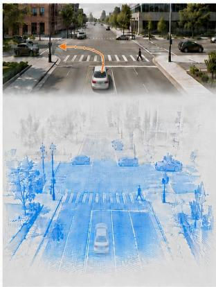  
a) VGGT

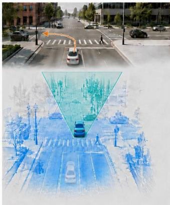  
b) VGGT-World (mismatch)

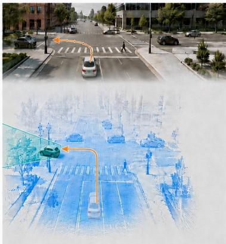  
c) VGGTWorld-VLA (match)  
Figure 1: Motivation for intention-conditioned 3D world prediction. Geometric reconstruction captures the observed scene, while geometry-based world models extend this capability to future prediction, primarily from historical observations. Without explicit intention and action conditioning, the forecast may depict straight driving despite an intended left turn. Our approach incorporates driving semantics and ego actions to predict future geometry consistent with the intended maneuver.

To address this problem, we propose VGGTWorld-VLA, a VGGT-native world-action modeling framework for autonomous driving. We use VLA-derived semantic representations together with ego-action conditions to guide geometry-native world evolution. First, an action–semantic 3D world evolution module injects driving semantics and action representations into the future branch of VGGT-World, enabling the predicted 3D geometry to reflect action-dependent geometric changes. Second, a geometry–language–action bridge adapts semantic, action, and geometry representations for joint conditioning of future geometry prediction. In this way, the proposed framework connects driving context and intended ego motion with future 3D prediction while preserving VGGT-World as the primary world-modeling backbone.

We evaluate VGGTWorld-VLA on NAVSIM Dauner et al. (2024) for future geometry and depth prediction. Compared with VGGT-World, our method reduces depth RMSE by 13.7% and improves δ1 by 4.11 percentage points, while AbsRel remains comparable with a modest increase. Ablation studies further examine the contributions of action representations and semantic conditioning, while action-input interventions demonstrate the model’s use of scene-aligned action information.

Our contributions are summarized as follows:

• We extend VGGT-World with semantic and action conditions, enabling controllable future 3D world evolution.

• We introduce a geometry–language–action bridge that adapts driving semantics, multirepresentation ego actions, and geometry features for joint conditioning of future geometry prediction.

• Experiments on NAVSIM demonstrate improved latent prediction quality and future-depth RMSE and threshold accuracy, including 13.7% lower RMSE relative to VGGT-World, supported by ablation studies and controlled action-input interventions.

## 2 RELATED WORK

VGGT for Autonomous Driving. Visual Geometry Grounded Transformer (VGGT) Wang et al. (2025) unifies camera estimation, depth prediction, point-map reconstruction, and point tracking within a feed-forward architecture, providing a general geometric representation of visual scenes. Its strong generalization has motivated several extensions for autonomous driving. DriveVGGT Jia et al. (2025) introduces calibration constraints and cross-camera consistency for metric multi-camera reconstruction, while DVGT Zuo et al. (2026a) recovers globally aligned driving geometry from unposed multi-view images. DynamicVGGT He et al. (2026) further models point-level motion for dynamic 4D reconstruction. Beyond perception, VGGDrive Wang et al. (2026) injects VGGT features into a driving vision-language model, and DVGT-2 Zuo et al. (2026b) jointly predicts dense geometry and ego trajectories. These studies demonstrate the value of VGGT representations for driving perception and planning, but mainly reconstruct observed scenes or directly use current geometry for action generation, without explicitly reasoning about the action-dependent evolution of the future 3D world.

World-Action Models. World models predict future states from historical observations, while world-action models further condition this evolution on agent actions, enabling alternative futures to be evaluated before execution Wang et al. (2024); Gao et al. (2024); Li et al. (2025b). VGGT-World Sun et al. (2026) establishes a direct connection between geometry foundation models and world modeling by predicting the temporal evolution of frozen VGGT tokens rather than future RGB frames. This geometry-native formulation offers an efficient representation of future depth and 3D structure, but its prediction remains primarily observation driven. Meanwhile, recent driving models such as DriveVLA-W0 Li et al. (2026), CoWorld-VLA Huang et al. (2026), and WCog-VLA Yan et al. (2026) incorporate future images, world tokens, or agent evolution into action learning. These studies highlight the connection between future world modeling and action learning Li et al. (2025a); Zheng et al. (2025). Our work focuses on conditioning VGGT-native future geometry prediction on ego actions and driving semantics, with an emphasis on controllable 3D world evolution.

Vision-Language-Action Models. Vision-language-action models introduce semantic knowledge and high-level reasoning into autonomous-driving policies Pan et al. (2024); Xu et al. (2025). Early studies such as DriveLM Sima et al. (2024), LMDrive Shao et al. (2024), and DriveVLM Tian et al. (2024) connect visual understanding and language reasoning with driving decisions. More recent methods, including SimLingo Renz et al. (2025), OpenDriveVLA Zhou et al. (2026a), AutoVLA Zhou et al. (2026b), and DiffVLA Jiang et al. (2025), strengthen language–action alignment, adaptive reasoning, and continuous trajectory generation. Although these models exhibit strong semantic reasoning and planning capabilities, most operate on image or latent visual representations and lack an explicit mechanism for predicting how different intentions and actions alter future 3D geometry. In contrast, our VGGTWorld-VLA uses VLA-derived semantic representations together with given ego-action conditions to control VGGT-based world evolution, connecting semantic reasoning and action-conditioned future 3D prediction within a unified geometry-native framework.

## 3 METHOD

Figure 2 shows VGGTWorld-VLA, which predicts future VGGT geometry tokens conditioned on historical geometry, ego actions, and driving semantics. A geometry–language–action bridge connects geometry features from two historical frames, action representations from a given trajectory and its maneuver descriptor, and semantic features from multi-camera observations and a textual prompt. The predicted tokens are decoded into future depth and 3D geometry using the pretrained VGGT decoder Wang et al. (2025). Real future images provide supervision and evaluation targets only. World prediction is the primary task, with auxiliary trajectory supervision during joint finetuning.

(a) Geometry-grounded planning and condition encoding  
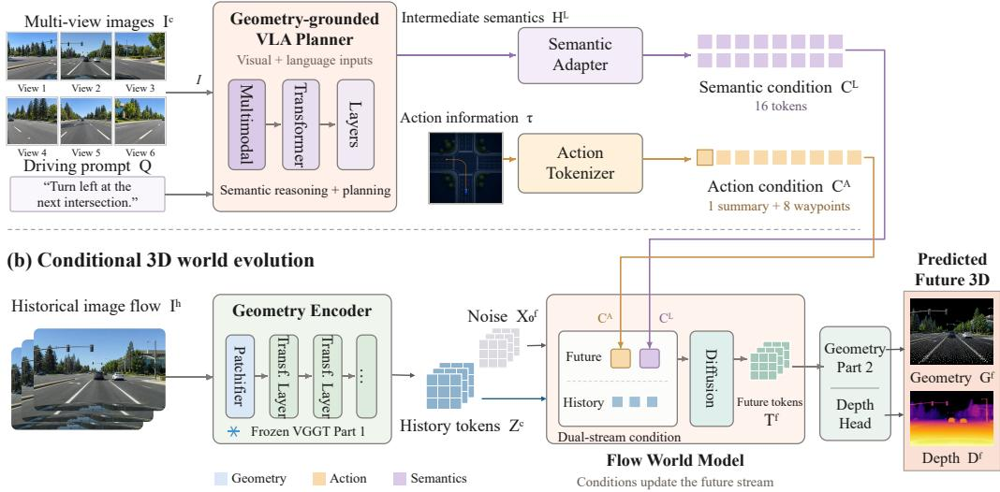  
Figure 2: Overall architecture of VGGTWorld-VLA. The geometric branch encodes historical frames from a single camera stream, while the semantic branch extracts VLA features from multicamera observations and a prompt at the conditioning timestamp. A given ego trajectory and its maneuver descriptor are encoded as action conditions. Action and semantic tokens condition the future stream of the geometry world model, whose predictions are decoded into future depth and 3D structure.

## 3.1 GEOMETRY–LANGUAGE–ACTION BRIDGE

The bridge converts historical geometry, ego motion, and driving semantics into representations that can be consumed by the world model. The three branches retain their distinct information sources: geometry describes the observed scene, action specifies ego motion, and semantic features provide complementary scene context. Their interaction takes place within the conditional world model.

Historical Geometry Representation. Let Ic denote the two historical frames and $\mathbf { I } ^ { f }$ the two future frames from the selected camera stream. The pretrained VGGT encoder Wang et al. (2025) produces the historical condition and future token target as

$$
\mathbf { Z } ^ { c } = E _ { \mathrm { G } } ( \mathbf { I } ^ { c } ) , \qquad \mathbf { Z } ^ { f } = \left[ E _ { \mathrm { G } } \left( [ \mathbf { I } ^ { c } , \mathbf { I } ^ { f } ] \right) \right] _ { f } ,\tag{1}
$$

where $[ \cdot ] _ { f }$ selects the future-frame tokens. The historical condition is independently encoded from ${ \bf \cal I } ^ { c }$ and therefore does not access real future frames. The full-sequence encoding is used only to construct future targets. The world model operates on these geometry tokens rather than directly generating future RGB images Sun et al. (2026).

Multi-Representation Action Encoding. Future geometry also depends on both the intended maneuver and the specific motion of the ego vehicle. A maneuver category alone cannot distinguish trajectories with different turning radii or motion speeds. We therefore combine a discrete maneuver descriptor with continuous trajectory features to specify the action condition.

Given an ego-centric trajectory $\boldsymbol { \tau } = \{ \mathbf { p } _ { i } \} _ { i = 1 } ^ { N _ { a } }$ , where $\mathbf { p } _ { i } = ( x _ { i } , y _ { i } )$ , we derive a one-hot maneuver descriptor m $= g _ { \mathrm { o h } } ( \tau )$ and represent each waypoint as

$$
\mathbf { a } _ { i } = \left[ \mathbf { p } _ { i } ; \Delta \mathbf { p } _ { i } ; i / N _ { a } \right] , \qquad \Delta \mathbf { p } _ { i } = \mathbf { p } _ { i } - \mathbf { p } _ { i - 1 } ,\tag{2}
$$

with $\mathbf { p } _ { 0 } = ( 0 , 0 )$ . Here, waypoint positions describe the intended path, successive displacements capture motion over fixed time intervals, and the normalized index indicates the corresponding temporal position.

The action encoder combines these features with the maneuver descriptor to obtain

$$
{ \bf C } _ { A } = T _ { A } \left( { \bf m } , \{ { \bf a } _ { i } \} _ { i = 1 } ^ { N _ { a } } \right) .\tag{3}
$$

This representation retains individual waypoint tokens alongside a summary of the full trajectory, allowing the world model to use motion cues at specific horizons together with the overall course of ego movement. The resulting action condition guides future geometry prediction according to the supplied ego behavior.

Semantic Adaptation. While the action condition specifies how the ego vehicle is intended to move, it does not explicitly describe the surrounding traffic context or interactions among road users. Similar ego trajectories may occur in different situations, such as slowing down behind a leading vehicle or yielding to a crossing pedestrian, with different implications for future scene evolution. We therefore introduce observation-grounded VLM features to complement ego-motion conditions with scene semantics and interaction cues, helping the world model predict futures that are consistent with both the supplied action and the observed driving context.

The semantic branch uses the Qwen2.5-VL backbone Wu et al. (2025) of the VLA to process the available multi-camera observations and textual prompt. We extract hidden states $\mathbf { H } _ { L }$ from layer 22. Assistant-side responses are removed before constructing the semantic input, preventing target answers from entering this feature-extraction path.

The hidden sequence is normalized and projected into the world-model condition space: $\begin{array} { r } { \overline { { \mathbf { H } } } _ { L } = } \end{array}$ $\mathrm { P r o j } _ { L } ( \mathrm { L N } ( \mathbf { H } _ { L } ) )$ . A set of 16 learnable queries $\mathbf { Q } _ { L }$ aggregates the variable-length sequence into compact semantic tokens:

$$
\mathbf { C } _ { L } = \mathrm { L N } \left( \mathrm { C r o s s A t t n } \left( \mathbf { Q } _ { L } , \overline { { \mathbf { H } } } _ { L } , \overline { { \mathbf { H } } } _ { L } \right) \right) .\tag{4}
$$

Padding positions are masked during cross-attention. The resulting semantic tokens have a fixed length and a feature dimension compatible with the world model. VGGT geometry tokens are not directly injected into the VLA; geometric and semantic information are combined during futureworld prediction.

## 3.2 ACTION–SEMANTIC 3D WORLD EVOLUTION

Historical observations alone do not explicitly specify which ego behavior should govern future prediction. We therefore model $p _ { \theta } ( \mathbf { Z } ^ { f } \mid \dot { \mathbf { Z } ^ { c } } , \mathbf { C } _ { A } ^ { \dot { } } , \dot { \mathbf { C } } _ { L } )$ , where action tokens provide motion conditions and semantic tokens supply complementary driving context. These conditions guide the evolution of the future-token stream while historical geometry anchors the prediction to the observed scene.

Layer-Wise Condition Injection. The flow transformer contains eight dual-stream blocks followed by eight single-stream blocks. At each dual-stream block, the future tokens first interact with the historical geometry through the backbone and then receive action and semantic conditions through two separate residual cross-attention modules.

Let $\mathbf { X } _ { l } ^ { f }$ denote the future hidden states after the l-th dual-stream block. The conditional updates are

$$
\widetilde { \mathbf { X } } _ { l } ^ { f } = \mathbf { X } _ { l } ^ { f } + \mathrm { C A } _ { A } ^ { l } \left( \mathrm { L N } ( \mathbf { X } _ { l } ^ { f } ) , \mathrm { L N } ( \mathbf { C } _ { A } ) \right) ,\tag{5}
$$

$$
\begin{array} { r } { \overline { { \mathbf { X } } } _ { l } ^ { f } = \widetilde { \mathbf { X } } _ { l } ^ { f } + \mathrm { C A } _ { L } ^ { l } \left( \mathrm { L N } ( \widetilde { \mathbf { X } } _ { l } ^ { f } ) , \mathrm { L N } ( \mathbf { C } _ { L } ) \right) . } \end{array}\tag{6}
$$

The action and semantic modules have independent parameters, and each layer uses its own pair of modules. This ordering introduces ego-motion information before semantic refinement; it does not impose a strict disentanglement between their effects. The conditioned states are passed to the subsequent world-model blocks to produce future-token predictions. Figure 3 illustrates this layerwise conditioning mechanism.

Conditional Flow Matching. Let $\mathbf { x } _ { 1 } = \mathbf { Z } ^ { f }$ denote the target future tokens and $\mathbf { x } _ { 0 } \sim \mathcal { N } ( \mathbf { 0 } , \mathbf { I } )$ denote Gaussian noise. We construct the interpolated state

$$
{ \bf x } _ { t } = ( 1 - t ) { \bf x } _ { 0 } + t { \bf x } _ { 1 } , \qquad t \in [ 0 , 1 ] .\tag{7}
$$

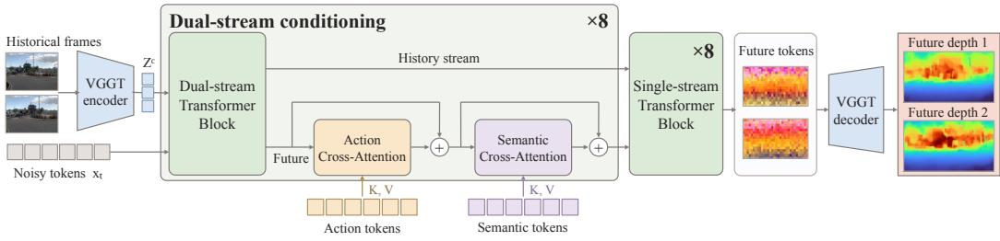  
Figure 3: Action–semantic 3D world evolution. Each of the eight dual-stream blocks is followed by action and semantic cross-attention that sequentially update the future stream, with layer-specific parameters. The historical and conditioned future streams are then jointly processed by eight singlestream blocks to predict future geometry.

The model learns a conditional velocity field through

$$
\mathcal { L } _ { \mathrm { f l o w } } = \mathbb { E } \left[ \left| \left| v _ { \theta } \left( \mathbf { x } _ { t } , t ; \mathbf { Z } ^ { c } , \mathbf { C } _ { A } , \mathbf { C } _ { L } \right) - \left( \mathbf { x } _ { 1 } - \mathbf { x } _ { 0 } \right) \right| \right| _ { 2 } ^ { 2 } \right] .\tag{8}
$$

We use an endpoint-prediction parameterization: the network predicts future tokens $\widehat { \mathbf { Z } } _ { t } ^ { f }$ at the sampled flow time, with the corresponding velocity field defined by

$$
\widehat { \mathbf { Z } } _ { t } ^ { f } = \mathbf { x } _ { t } + \left( 1 - t \right) v _ { \theta } \left( \mathbf { x } _ { t } , t ; \mathbf { Z } ^ { c } , \mathbf { C } _ { A } , \mathbf { C } _ { L } \right) .\tag{9}
$$

This formulation connects conditional token prediction with continuous transport from noise to future geometry.

Future Geometry Supervision. To preserve geometric decodability, the predicted endpoint tokens are concatenated with the historical tokens and processed by the pretrained VGGT second-stage aggregator and depth head:

$$
\widehat { \bf D } _ { t } ^ { f } = \left[ D _ { \mathrm { d e p t h } } \left( E _ { \mathrm { G } } ^ { \mathrm { p a r t 2 } } \left( [ { \bf Z } ^ { c } , \widehat { \bf Z } _ { t } ^ { f } ] \right) \right) \right] _ { f } .\tag{10}
$$

The depth loss acts directly on the prediction at the sampled flow time, without an additional sampling stage during this supervision step.

A frozen VGGT teacher processes the complete real four-frame sequence and provides future-depth pseudo-targets $\mathbf { D } _ { \mathrm { p s } } ^ { f }$ . We apply Smooth L1 to log-depth values:

$$
\mathcal { L } _ { \mathrm { d e p t h } } = \mathrm { S m o o t h L 1 } _ { \mathcal { M } } \left( \log \operatorname* { m a x } ( \widehat { \mathbf { D } } _ { t } ^ { f } , \epsilon ) , \log \operatorname* { m a x } ( \mathbf { D } _ { \mathrm { p s } } ^ { f } , \epsilon ) \right) ,\tag{11}
$$

where M selects valid finite entries and ϵ ensures positive depth values. The world-model objective is

$$
\begin{array} { r } { \mathcal { L } _ { \mathrm { w o r l d } } = \mathcal { L } _ { \mathrm { f l o w } } + \lambda _ { d } \mathcal { L } _ { \mathrm { d e p t h } } . } \end{array}\tag{12}
$$

The decoder also supports camera-pose and world-point outputs, but these outputs do not introduce additional pose or point losses in the described world-model objective.

## 4 EXPERIMENTS

## 4.1 DATASETS

We use NAVSIM Dauner et al. (2024) with OpenScene, a compact redistribution of nuPlan that provides driving images, ego states, and trajectory annotations at 2 Hz. We select this setting over the datasets used in the original VGGT-World experiments Sun et al. (2026) because it supports action-conditioned prediction and provides a framework for subsequent planning evaluation. The 0.5 s interval between observations allows faster ego and surrounding-agent motion to produce substantial viewpoint shifts, object displacement, and occlusion changes, challenging future geometry prediction. As dense depth ground truth is unavailable for our setup, we use pretrained VGGT predictions from actual future images as a shared pseudo-ground-truth reference.

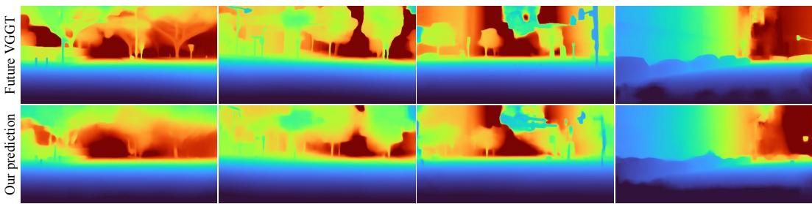  
Figure 4: Qualitative comparison of future depth. Top: reference depth estimated by VGGT from the recorded future frames. Bottom: our predictions conditioned on historical observations, ego actions, and driving semantics.

Table 1: Future geometry prediction on the NAVSIM 3,000-clip motion subset. VGGT-World-N denotes visual-only continuation training on NAVSIM. All methods use stride 1 and 10 flow sampling steps, with depth evaluated against VGGT-derived pseudo-ground truth. The best and second-best results are highlighted in bold and underlined, respectively.
<table><tr><td>Method</td><td>Token MSE↓</td><td>Cosine ↑</td><td>AbsRel ↓</td><td>RMSE↓</td><td> $\delta _ { 1 } \cdot$  ←</td></tr><tr><td>VGGT-World</td><td>0.011065</td><td>0.769799</td><td>0.385980</td><td>0.426050</td><td>0.418000</td></tr><tr><td>VGGT-World-N</td><td>0.010620</td><td>0.781621</td><td>0.376136</td><td>0.436463</td><td>0.348113</td></tr><tr><td>Ours</td><td>0.010459</td><td>0.785120</td><td>0.392457</td><td>0.367831</td><td>0.459124</td></tr></table>

## 4.2 EVALUATION METRICS

We evaluate future depth using AbsRel, RMSE, and $\delta _ { 1 }$ , latent predictions using Token MSE and cosine similarity, and 3D points using Point EPE and relative Point EPE. All predictions are compared against VGGT-derived references constructed from real future observations. Metric definitions and evaluation details are provided in Appendix A.4.

## 4.3 MAIN RESULTS

We evaluate future geometry prediction on a NAVSIM motion subset of 3,000 clips, with 1,000 each for left turns, straight driving, and right turns to balance maneuver contributions. All methods use the same clips, temporal stride 1, and 10 flow sampling steps, with metrics averaged over clips. Predictions are evaluated against pseudo-ground-truth geometry generated by pretrained VGGT from actual future images.

Our primary baseline is the original VGGT-World. To control for additional training on the target dataset, we also continue training VGGT-World on NAVSIM using visual conditioning alone, denoted as VGGT-World-N. These baselines represent the original geometry predictor and its NAVSIM-adapted counterpart.

Table 1 summarizes latent and decoded-depth prediction quality. Our method achieves the lowest Token MSE and RMSE, and the highest cosine similarity and threshold accuracy. RMSE decreases by 13.7% relative to VGGT-World and 15.7% relative to VGGT-World-N, while $\delta _ { 1 }$ increases by 4.11 and 11.10 percentage points, respectively. AbsRel remains comparable, with a modest increase. Thus, our method improves latent alignment, RMSE, and threshold accuracy while largely maintaining relative depth accuracy.

The comparison also distinguishes latent prediction quality from decoded geometric accuracy. VGGT-World-N improves token-level metrics over the original model but shows inconsistent depth improvements. Our method further improves latent prediction, RMSE, and threshold accuracy, while VGGT-World-N retains the lowest AbsRel. These findings support evaluating complementary geometric metrics alongside latent reconstruction and motivate the following analyses of action representation and conditioning. Figure 4 compares our predicted future depth with pseudo-ground-truth depth generated by VGGT from the actual future frames.

Table 2: Comparison of action-representation configurations on the 3,000-clip motion subset. Joint combines one-hot, position-based, and velocity-augmented representations. The best and secondbest results are highlighted in bold and underlined, respectively.
<table><tr><td>Encoding</td><td>Token MSE ↓</td><td>AbsRel ↓</td><td>δ1↑</td><td>RMSE↓</td><td>Point EPE↓</td><td>Point Rel. EPE ↓</td></tr><tr><td>One-hot</td><td>0.01019</td><td>0.42476</td><td>0.45279</td><td>0.37708</td><td>0.36640</td><td>0.38590</td></tr><tr><td>Trajectory</td><td>0.01068</td><td>0.40515</td><td>0.40943</td><td>0.39119</td><td>0.37805</td><td>0.38657</td></tr><tr><td>Trajectory + velocity</td><td>0.01062</td><td>0.40097</td><td>0.41798</td><td>0.38517</td><td>0.37107</td><td>0.38471</td></tr><tr><td>Joint</td><td>0.01050</td><td>0.39320</td><td>0.45184</td><td>0.37093</td><td>0.35807</td><td>0.36842</td></tr></table>

Table 3: Action-input interventions on the 3,000-clip motion subset. The observed history, semantic inputs, and initial sampling noise are fixed while the action input changes. The best and second-best results are highlighted in bold and underlined, respectively.
<table><tr><td>Action input</td><td>Token MSE</td><td>AbsRel ↓</td><td>RMSE↓</td><td>δ1↑</td><td>Point EPE↓</td></tr><tr><td>Correct</td><td>0.010459</td><td>0.392457</td><td>0.367831</td><td>0.459124</td><td>0.354330</td></tr><tr><td>Zero</td><td>0.010695</td><td>0.414170</td><td>0.375252</td><td>0.459097</td><td>0.356336</td></tr><tr><td>Shuffled</td><td>0.010738</td><td>0.409405</td><td>0.384130</td><td>0.434404</td><td>0.377294</td></tr><tr><td>Wrong</td><td>0.010913</td><td>0.419565</td><td>0.396635</td><td>0.412820</td><td>0.391264</td></tr></table>

## 4.4 ABLATION STUDIES

We examine the roles of action conditioning and VLM-derived semantic information in future geometry prediction. Our analysis considers different action encodings, the sensitivity of the trained model to action-input interventions, and the additional role of VLM tokens. We focus on left-turn, straight-driving, and right-turn scenarios for maneuver-specific evaluation and visualization.

Action Encoding. We compare four action representations: one-hot maneuver encoding, trajectory positions, velocity-augmented trajectories, and their joint representation. These capture maneuver category, spatial path, and temporal motion, respectively. All configurations are evaluated on the same 3,000-clip motion subset covering left turns, straight driving, and right turns.

Table 2 shows that the individual representations exhibit different strengths. One-hot encoding achieves the lowest Token MSE and the highest depth threshold accuracy, whereas the continuous trajectory configurations obtain lower AbsRel. Among the two continuous configurations, incorporating velocity yields better results across all reported metrics than using positions alone.

The joint configuration provides the strongest overall decoded-geometry performance, achieving the lowest depth and point prediction errors while retaining competitive threshold accuracy. This pattern supports combining action information at two levels: one-hot encoding provides a coarse maneuver template, while trajectory positions and velocities specify the spatial path and motion rate within that template. The categorical representation captures the overall maneuver, and the continuous representations describe its detailed execution. The stronger overall performance of the joint configuration suggests that these two levels provide complementary information for actionconditioned future geometry prediction.

Action-Input Interventions. We assess action utilization using correct, zeroed, shuffled, and wrong-maneuver inputs on the 3,000-clip motion subset. Only the one-hot maneuver, trajectory positions, and derived velocities change; model parameters, history, semantic inputs, and initial noise remain fixed.

Table 3 shows that correct actions achieve the lowest Token MSE, AbsRel, RMSE, and Point EPE. Shuffled and wrong-maneuver inputs degrade all reported metrics, with wrong maneuvers causing the largest deterioration. These results demonstrate the model’s use of scene-aligned actions along side visual history and semantic context.

Figure 5 compares left-turn, straight-driving, and right-turn predictions under fixed history, semantics, and initial noise. The highlighted regions show action-dependent viewpoint changes, with scene structures shifting rightward under left turns and leftward under right turns. The correspond ing changes in structural boundaries and depth patterns provide qualitative evidence that ego actions guide future geometry prediction.

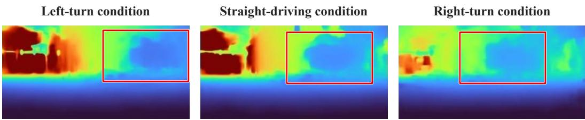  
Figure 5: Action-conditioned future depth predictions under left-turn, straight-driving, and rightturn inputs. Red boxes highlight corresponding image regions with action-dependent differences in predicted geometry.

Table 4: Comparison of Joint action conditioning and Joint + VLM.
<table><tr><td>Conditioning</td><td>Token MSE ↓</td><td>AbsRel ↓</td><td> $\delta _ { 1 } \uparrow$ </td><td>RMSE↓</td><td>Point EPE↓</td><td>Point Rel. EPE↓</td></tr><tr><td>Joint</td><td>0.010496</td><td>0.393195</td><td>0.451837</td><td>0.370929</td><td>0.358067</td><td>0.368416</td></tr><tr><td>Joint + VLM</td><td>0.010459</td><td>0.392457</td><td>0.459124</td><td>0.367831</td><td>0.354330</td><td>0.362280</td></tr></table>

Action-Only vs. VLM–Action Conditioning. We compare the action-only Joint configuration, which combines one-hot maneuvers, trajectory positions, and velocities, with Joint + VLM, the full model used in our main results. The latter adds semantic tokens through an independent branch. Both are evaluated on the same 3,000-clip motion subset.

Table 4 shows modest improvements across all reported metrics for Joint + VLM. The gains extend from latent alignment to decoded depth and 3D points, suggesting that semantic conditioning benefits the resulting geometry as well as token prediction. While action inputs specify ego motion, VLM features provide complementary scene context that can help interpret its geometric consequences. These results support combining semantic context with action conditions for future geometry prediction.

## 5 CONCLUSION

We present an intention-conditioned 3D world model that integrates driving semantics and egomotion representations into geometry-aware future prediction. Experiments on NAVSIM demonstrate improved latent alignment, depth RMSE, and threshold accuracy over both the original VGGT-World and its NAVSIM-adapted baseline, with a modest increase in AbsRel. The actionrepresentation comparison supports combining coarse maneuver templates with continuous motion details, while action-input interventions show that correctly aligned actions improve future geometry prediction. The comparison with action-only conditioning shows modest gains across all reported metrics when VLM tokens are included. Together, these findings support further development of conditional geometric world models for autonomous driving.

Effectively integrating semantic information to obtain larger gains while preserving geometric prediction quality remains an open challenge. Another practical consideration is the additional computational cost of the VLA module, which may limit inference frequency in real-time deployment. Future work will explore more effective semantic fusion, lightweight conditioning, and asynchronous execution, with semantic features updated less frequently than action-conditioned geometry predictions. We also plan to investigate multi-action future rollouts and closed-loop planning evaluation, allowing candidate actions to be assessed through their predicted geometric consequences within an imagine–evaluate–act framework.

## AI USE STATEMENT

AI tools assisted with manuscript editing, LaTeX formatting, and figure layout. The experimental results and scientific contributions originate from the authors’ research. AI assistance in figure preparation was limited to presentation and layout; the visualizations were derived from actual model outputs. The authors are responsible for verifying the accuracy of the text, references, figures, and reported results.

## ETHICS STATEMENT

This work studies future geometry prediction using the existing NAVSIM/OpenScene driving dataset through offline experiments. It focuses on scene geometry and ego-motion conditioning rather than identifying individuals. Data use is subject to the applicable dataset terms. The experiments do not involve deployment on public roads; any future use in autonomous driving would require appropriate safety validation.

## REPRODUCIBILITY STATEMENT

Section 3 describes the model architecture, conditioning mechanism, and training objectives. Appendix A provides implementation details, including representation dimensions and action and semantic feature construction. Dataset descriptions, baseline definitions, and experimental settings are provided in Section 4. Appendix B documents temporal data organization, teacher supervision, optimization settings, and Euler sampling. Metric definitions are detailed in Appendix A.4, with formulas, aggregation procedures, and controlled action-input protocols in Appendix C. These descriptions support reimplementation and evaluation using NAVSIM/OpenScene data and the pretrained models specified in the paper.

## REFERENCES

Daniel Dauner, Marcel Hallgarten, Tianyu Li, Xinshuo Weng, Zhiyu Huang, Zetong Yang, Hongyang Li, Igor Gilitschenski, Boris Ivanovic, Marco Pavone, et al. Navsim: Data-driven non-reactive autonomous vehicle simulation and benchmarking. Advances in Neural Information Processing Systems, 37:28706–28719, 2024.

Shenyuan Gao, Jiazhi Yang, Li Chen, Kashyap Chitta, Yihang Qiu, Andreas Geiger, Jun Zhang, and Hongyang Li. Vista: A generalizable driving world model with high fidelity and versatile controllability. Advances in Neural Information Processing Systems, 37:91560–91596, 2024.

Zhuolin He, Jing Li, Guanghao Li, Xiaolei Chen, Jiacheng Tang, Siyang Zhang, Zhounan Jin, Feipeng Cai, Bin Li, Jian Pu, et al. Dynamicvggt: Learning dynamic point maps for 4d scene reconstruction in autonomous driving. arXiv preprint arXiv:2603.08254, 2026.

Minqing Huang, Yujiao Xiang, Zihan Liang, Jiajie Huang, Jingqi Wang, Zhi Xu, Feiyang Tan, Hangning Zhou, Mu Yang, and Gong Che. Coworld-vla: Thinking in a multi-expert world model for autonomous driving. arXiv preprint arXiv:2605.10426, 2026.

Xiaosong Jia, Yanhao Liu, Yu Hong, Renqiu Xia, Junqi You, Bin Sun, Zhihui Hao, and Junchi Yan. Drivevggt: Calibration-constrained visual geometry transformers for multi-camera autonomous driving. arXiv preprint arXiv:2511.22264, 2025.

Anqing Jiang, Yu Gao, Zhigang Sun, Yiru Wang, Jijun Wang, Jinghao Chai, Qian Cao, Yuweng Heng, Hao Jiang, Yunda Dong, et al. Diffvla: Vision-language guided diffusion planning for autonomous driving. arXiv preprint arXiv:2505.19381, 2025.

Yingyan Li, Lue Fan, Jiawei He, Yuqi Wang, Yuntao Chen, Zhaoxiang Zhang, and Tieniu Tan. Enhancing end-to-end autonomous driving with latent world model. In International Conference on Learning Representations, volume 2025, pp. 42942–42959, 2025a.

Yingyan Li, Yuqi Wang, Yang Liu, Jiawei He, Lue Fan, and Zhaoxiang Zhang. End-to-end driving with online trajectory evaluation via bev world model. In 2025 IEEE/CVF International Confer ence on Computer Vision (ICCV), pp. 27137–27146. IEEE, 2025b.

Yingyan Li, Shuyao Shang, Weisong Liu, Bing Zhan, Haochen Wang, Yuqi Wang, Yuntao Chen, Xiaoman Wang, Yasong An, Chufeng Tang, et al. Drivevla-w0: World models amplify data scaling law in autonomous driving. In International Conference on Learning Representations, volume 2026, pp. 7890–7911, 2026.

Chenbin Pan, Burhaneddin Yaman, Tommaso Nesti, Abhirup Mallik, Alessandro G Allievi, Senem Velipasalar, and Liu Ren. Vlp: Vision language planning for autonomous driving. In 2024 IEEE/CVF Conference on Computer Vision and Pattern Recognition (CVPR), pp. 14760–14769. IEEE, 2024.

Katrin Renz, Long Chen, Elahe Arani, and Oleg Sinavski. Simlingo: Vision-only closed-loop autonomous driving with language-action alignment. In 2025 IEEE/CVF Conference on Computer Vision and Pattern Recognition (CVPR), pp. 11993–12003. IEEE, 2025.

Hao Shao, Yuxuan Hu, Letian Wang, Guanglu Song, Steven L Waslander, Yu Liu, and Hongsheng Li. Lmdrive: Closed-loop end-to-end driving with large language models. In 2024 IEEE/CVF Conference on Computer Vision and Pattern Recognition (CVPR), pp. 15120–15130. IEEE, 2024.

Chonghao Sima, Katrin Renz, Kashyap Chitta, Li Chen, Hanxue Zhang, Chengen Xie, Jens Beißwenger, Ping Luo, Andreas Geiger, and Hongyang Li. Drivelm: Driving with graph visual question answering. In European conference on computer vision, pp. 256–274. Springer, 2024.

Xiangyu Sun, Shijie Wang, Fengyi Zhang, Lin Liu, Caiyan Jia, Ziying Song, Zi Huang, and Yadan Luo. Vggt-world: Transforming vggt into an autoregressive geometry world model. pp. 382–400, 2026.

Xiaoyu Tian, Junru Gu, Bailin Li, Yicheng Liu, Yang Wang, Zhiyong Zhao, Kun Zhan, Peng Jia, Xianpeng Lang, and Hang Zhao. Drivevlm: The convergence of autonomous driving and large vision-language models. arXiv preprint arXiv:2402.12289, 2024.

Jianyuan Wang, Minghao Chen, Nikita Karaev, Andrea Vedaldi, Christian Rupprecht, and David Novotny. Vggt: Visual geometry grounded transformer. In 2025 IEEE/CVF Conference on Computer Vision and Pattern Recognition (CVPR), pp. 5294–5306. IEEE, 2025.

Jie Wang, Guang Li, Zhijian Huang, Chenxu Dang, Hangjun Ye, Yahong Han, and Long Chen. Vggdrive: Empowering vision-language models with cross-view geometric grounding for autonomous driving. arXiv preprint arXiv:2602.20794, 2026.

Yuqi Wang, Jiawei He, Lue Fan, Hongxin Li, Yuntao Chen, and Zhaoxiang Zhang. Driving into the future: Multiview visual forecasting and planning with world model for autonomous driving. In 2024 IEEE/CVF Conference on Computer Vision and Pattern Recognition (CVPR), pp. 14749– 14759. IEEE, 2024.

Chenfei Wu, Jiahao Li, Jingren Zhou, Junyang Lin, Kaiyuan Gao, Kun Yan, Sheng-ming Yin, Shuai Bai, Xiao Xu, Yilei Chen, et al. Qwen-image technical report. arXiv preprint arXiv:2508.02324, 2025.

Zhenhua Xu, Yan Bai, Yujia Zhang, Zhuoling Li, Fei Xia, Kwan-Yee K Wong, Jianqiang Wang, and Hengshuang Zhao. Drivegpt4-v2: Harnessing large language model capabilities for enhanced closed-loop autonomous driving. In 2025 IEEE/CVF Conference on Computer Vision and Pattern Recognition (CVPR), pp. 17261–17270. IEEE, 2025.

Xuerun Yan, Zhexi Lian, Nuoheng Zhang, Shiyu Fang, Haoran Wang, Chen Lv, Jia Hu, and Binyang Song. Wcog-vla: A dual-level world-cognitive vision-language-action model for end-to-end autonomous driving. arXiv preprint arXiv:2607.08375, 2026.

Yupeng Zheng, Pengxuan Yang, Zebin Xing, Qichao Zhang, Yuhang Zheng, Yinfeng Gao, Pengfei Li, Teng Zhang, Zhongpu Xia, Peng Jia, et al. World4drive: End-to-end autonomous driving via intention-aware physical latent world model. In 2025 IEEE/CVF International Conference on Computer Vision (ICCV), pp. 28632–28642. IEEE, 2025.

Xingcheng Zhou, Xuyuan Han, Feng Yang, Yunpu Ma, Volker Tresp, and Alois Knoll. Opendrivevla: Towards end-to-end autonomous driving with large vision language action model. In Proceedings of the AAAI Conference on Artificial Intelligence, volume 40, pp. 13782–13790, 2026a.

Zewei Zhou, Tianhui Cai, Seth Zhao, Yun Zhang, Zhiyu Huang, Bolei Zhou, and Jiaqi Ma. Autovla: A vision-language-action model for end-to-end autonomous driving with adaptive reasoning and reinforcement fine-tuning. Advances in Neural Information Processing Systems, 38: 27920–27956, 2026b.

Sicheng Zuo, Zixun Xie, Wenzhao Zheng, Shaoqing Xu, Fang Li, Shengyin Jiang, Long Chen, Zhi-Xin Yang, and Jiwen Lu. Dvgt: Driving visual geometry transformer. In Proceedings of the IEEE/CVF Conference on Computer Vision and Pattern Recognition, pp. 14658–14668, 2026a.

Sicheng Zuo, Zixun Xie, Wenzhao Zheng, Shaoqing Xu, Fang Li, Hanbing Li, Long Chen, Zhi-Xin Yang, and Jiwen Lu. Dvgt-2: Vision-geometry-action model for autonomous driving at scale. arXiv preprint arXiv:2604.00813, 2026b.

## A IMPLEMENTATION DETAILS

This appendix details the representation interfaces, action and semantic feature construction, inference configuration, and evaluation metrics. The world predictor combines historical geometry, supplied ego motion, and observable driving semantics to predict future VGGT representations.

## A.1 REPRESENTATION INTERFACES

The geometry branch encodes two historical images from a single selected camera stream. Each frame is represented by VGGT tokens with 1,024 channels. The flow transformer operates at an internal width of 512 with eight attention heads. It contains eight dual-stream blocks followed by eight single-stream blocks. After each dual-stream block, separate action and semantic crossattention modules update the future stream in that order. Every block has its own pair of conditioning modules. The historical and conditioned future states subsequently enter the single-stream stage, and the output is mapped back to the VGGT token representation.

Table A1: Representation and inference configuration. The action-token count below refers to the continuous trajectory component of the action interface.
<table><tr><td>Component</td><td>Configuration</td></tr><tr><td>Geometry input / prediction</td><td>Two historical / two future frames</td></tr><tr><td>VGGT representation width</td><td>1,024</td></tr><tr><td>Flow-transformer width / attention heads</td><td>512 / 8</td></tr><tr><td>Dual-stream / single-stream blocks</td><td>8/8</td></tr><tr><td>Condition injection</td><td>Action CA, then semantic CA; per-layer parame- ters</td></tr><tr><td>Continuous trajectory Waypoint feature</td><td>8 ego-centric waypoints</td></tr><tr><td></td><td>Position, displacement, normalized temporal in- dex</td></tr><tr><td>Continuous action tokens</td><td>8 waypoint tokens and 1 summary token</td></tr><tr><td>Semantic backbone / feature layer</td><td>Driving-adapted Qwen2.5-VL / layer 22</td></tr><tr><td>Semantic adapter</td><td>16 queries; 8-head cross-attention</td></tr><tr><td>Inference</td><td>10 Euler sampling steps</td></tr></table>

## A.2 ACTION FEATURE CONSTRUCTION

The Joint representation combines a one-hot maneuver descriptor with continuous position and motion information. For the trajectory component, let $\mathbf { p } _ { i } = ( x _ { i } , y _ { i } )$ denote an ego-centric waypoint. The coordinate normalization used by the trajectory interface is

$$
\widetilde { \mathbf { p } } _ { i } = ( x _ { i } / 3 0 , ~ y _ { i } / 1 0 ) , \qquad \mathbf { a } _ { i } = [ \widetilde { \mathbf { p } } _ { i } ; \widetilde { \mathbf { p } } _ { i } - \widetilde { \mathbf { p } } _ { i - 1 } ; i / 8 ] , \quad \widetilde { \mathbf { p } } _ { 0 } = \mathbf { 0 } .\tag{A.1}
$$

The five-dimensional features are projected by a two-layer MLP with a SiLU activation. Learned waypoint and type embeddings are added before layer normalization. A summary token pools the waypoint tokens and adds learned summary and type embeddings. At fixed temporal spacing, successive displacements encode the same motion progression as velocities up to a constant scale. The same supplied trajectory conditions both predicted frames; its temporal ordering remains available through the individual waypoint tokens.

## A.3 SEMANTIC FEATURE EXTRACTION

The semantic branch processes the multi-camera observations associated with the conditioning timestamp and their textual prompt. Its inputs retain the system and user messages. Assistant-side target responses are excluded before the chat sequence is constructed. Hidden states are captured after the 22nd language-model layer, normalized, and linearly projected to the 512-dimensional condition space. Sixteen learned queries attend to this sequence, using the processor attention mask to exclude padding. Output layer normalization produces the semantic tokens. The adapter uses the attention output directly; residual updates occur in the subsequent world-model conditioning modules. The geometric and semantic branches therefore retain their respective input organizations while supplying compatible conditions to the predictor.

## A.4 EVALUATION METRICS

We evaluate future predictions in depth, latent-token, and 3D point spaces. Reference representations are generated by pretrained VGGT from the complete real image sequence, selecting the outputs corresponding to the future frames. These references are shared across the compared methods and serve as pseudo-ground truth.

Depth Metrics. We report absolute relative error (AbsRel), root mean squared error (RMSE), and threshold accuracy (δ ). AbsRel measures absolute depth error normalized by the reference depth, while RMSE measures the square root of the mean squared depth error. Threshold accuracy is the proportion of valid pixels satisfying max $( \widehat { d } / d , d / \widehat { d } ) < 1 . 2 5$ , where db and d denote predicted and reference depth, respectively. Lower AbsRel and RMSE indicate smaller errors, whereas higher δ indicates better agreement.

Latent Metrics. Token MSE measures the mean squared difference between predicted future tokens and their VGGT-derived targets. Cosine similarity measures the directional agreement of the corresponding feature representations. Lower Token MSE and higher cosine similarity indicate better latent prediction quality.

Point Metrics. Point endpoint error (Point EPE) measures the Euclidean distance between corresponding predicted and reference 3D points. Relative Point EPE additionally expresses point error relative to the reference geometry. Lower values indicate better agreement. Together, latent and decoded-geometry metrics assess both representation prediction and its geometric outputs.

Since the references are generated by VGGT, the reported metrics quantify agreement with the teacher rather than direct accuracy against sensor-measured ground-truth geometry.

## B TEMPORAL ORGANIZATION, TRAINING, AND SAMPLING

## B.1 TEMPORAL AND CAMERA ORGANIZATION

A geometry clip uses indices $( k - s , k , k + s , k + 2 s )$ from one camera stream, where k is the conditioning sample and s is the temporal stride. The first pair provides history and the second pair defines the future targets. At the nominal 2 Hz rate, stride 1 yields the offsets in Table A2. Semantic inputs and ego actions are associated with sample k.

Table A2: Temporal roles within a four-frame clip. Future RGB is used to construct references; the world predictor receives historical geometry and conditions from the conditioning sample.
<table><tr><td></td><td>History 1</td><td>History 2</td><td>Future 1</td><td>Future 2</td></tr><tr><td>Sample index</td><td>k − s</td><td>k</td><td>k + s</td><td>k + 2s</td></tr><tr><td>Nominal offset, s = 1</td><td>-0.5 s</td><td>0s</td><td>+0.5 s</td><td>+1.0 s</td></tr><tr><td>Historical encoder input</td><td>Yes</td><td>Yes</td><td></td><td></td></tr><tr><td>Full-sequence teacher input</td><td>Yes</td><td>Yes</td><td>Yes</td><td>Yes</td></tr><tr><td>Future target selected</td><td></td><td></td><td>Yes</td><td>Yes</td></tr></table>

Continuous runs require matching scene and camera identities, consecutive source indices and numerical sample identifiers, and existing image files. The semantic branch preserves the conditioning message’s three views: CAM L0, CAM F0, and CAM R0. Thus, geometry uses temporal observations from one camera, while semantics uses wider spatial context at the conditioning timestamp.

## B.2 HISTORICAL ENCODING AND TEACHER SUPERVISION

Two independent encoder calls produce the historical condition and future targets: one processes history only, and the other processes all four images and selects future-frame tokens. A frozen full-sequence teacher also provides future depth and point references. Generated future tokens are

concatenated with historical tokens and decoded through the second-stage aggregator and pretrained geometry heads.

## B.3 ENDPOINT PREDICTION AND FLOW TRAINING

With noise level $\sigma = 1 - t .$ , future-token target $\mathbf { x } _ { 1 }$ , and Gaussian noise $\mathbf { x } _ { 0 } \sim \mathcal { N } ( \mathbf { 0 } , \mathbf { I } )$ , training uses

$$
\mathbf { x } _ { \sigma } = \sigma \mathbf { x } _ { 0 } + ( 1 - \sigma ) \mathbf { x } _ { 1 } , \qquad \widehat { \mathbf { v } } _ { \sigma } = \frac { \widehat { \mathbf { x } } _ { 1 } - \mathbf { x } _ { \sigma } } { \sigma } .\tag{B.1}
$$

The endpoint $\widehat { \mathbf { x } } _ { 1 }$ is predicted under historical, action, and semantic conditions. The target velocity is $( { \bf x } _ { 1 } - { \bf x } _ { \sigma } ) / \sigma$ . The implementation samples from 1,000 discrete noise levels and minimizes the MSE between these velocities. The depth branch decodes this same endpoint at the sampled noise level. Positive-clamped depths, with $\bar { \epsilon } = 1 0 ^ { - 3 }$ , enter a Smooth L1 loss in log space. The world objective combines flow loss with depth loss weighted by 0.1. AdamW is used with weight decay 0.05 for the world-predictor parameter group and gradient clipping at 1.0; conditioning groups are optimized separately. Computation uses BF16 where supported.

## B.4 EULER INFERENCE

Starting from Gaussian future tokens, sampling keeps the conditions fixed and updates the state over descending noise levels:

$$
\mathbf { x } _ { \sigma _ { j + 1 } } = \mathbf { x } _ { \sigma _ { j } } + \frac { \sigma _ { j } - \sigma _ { j + 1 } } { \sigma _ { j } } \left( \widehat { \mathbf { x } } _ { 1 , j } - \mathbf { x } _ { \sigma _ { j } } \right) .\tag{B.2}
$$

After ten updates, the resulting future tokens are decoded into geometry. For action interventions, each comparison reuses the initial noise tensor, so differences arise from the supplied action condi tion.

## C EVALUATION PROTOCOL AND ADDITIONAL MEASUREMENTS

## C.1 TOKEN AND DECODED-GEOMETRY METRICS

Evaluation uses the same 3,000-clip motion subset spanning left turns, straight driving, and right turns. Predictions are paired with their corresponding VGGT-derived references. Let $\widehat { \mathbf { z } } _ { q }$ and $\mathbf { z } _ { q }$ denote predicted and reference token vectors, with channel count $C$ and token count $Q$ across the future frames. We compute

$$
\mathrm { T o k e n } \mathrm { \mathrm { M S E } } = \frac { 1 } { Q C } \sum _ { q = 1 } ^ { Q } \| \widehat { \mathbf { z } } _ { q } - \mathbf { z } _ { q } \| _ { 2 } ^ { 2 } ,\tag{C.1}
$$

$$
\mathrm { C o s i n e } = \frac { 1 } { Q } \sum _ { q = 1 } ^ { Q } \frac { \widehat { \mathbf { z } } _ { q } ^ { \mathsf { T } } \mathbf { z } _ { q } } { \| \widehat { \mathbf { z } } _ { q } \| _ { 2 } \| \mathbf { z } _ { q } \| _ { 2 } } ,\tag{C.2}
$$

with numerical stabilization for the cosine denominator. For valid positive finite depth pairs $( \widehat { d } _ { u } , d _ { u } )$ the decoded-depth metrics are

$$
{ \mathrm { A b s R e l } } = { \frac { 1 } { | \mathcal { V } | } } \sum _ { u \in \mathcal { V } } { \frac { | \widehat { d } _ { u } - d _ { u } | } { d _ { u } } } , \qquad { \mathrm { R M S E } } = { \sqrt { { \frac { 1 } { | \mathcal { V } | } } \sum _ { u \in \mathcal { V } } ( \widehat { d } _ { u } - d _ { u } ) ^ { 2 } } } ,\tag{C.3}
$$

$$
\delta _ { 1 } = \frac { 1 } { | \mathcal { V } | } \sum _ { u \in \mathcal { V } } \mathbf { 1 } \left[ \operatorname* { m a x } \left( \frac { \widehat { d } _ { u } } { d _ { u } } , \frac { d _ { u } } { \widehat { d } _ { u } } \right) < 1 . 2 5 \right] .\tag{C.4}
$$

Depth scores are computed per future frame, averaged over the two future frames within a clip, and then averaged over clips. The metric functions compare predicted and reference depths directly. For

point outputs, finite three-dimensional correspondences define the valid set P:

$$
\mathrm { E P E } = \frac { 1 } { | \mathcal { P } | } \sum _ { u \in \mathcal { P } } \| \widehat { \mathbf { P } } _ { u } - \mathbf { P } _ { u } \| _ { 2 } ,\tag{C.5}
$$

$$
\mathrm { R e l . ~ E P E } = \frac { 1 } { | \mathcal { P } | } \sum _ { u \in \mathcal { P } } \frac { \| \widehat { \mathbf { P } } _ { u } - \mathbf { P } _ { u } \| _ { 2 } } { \operatorname* { m a x } ( \| \mathbf { P } _ { u } \| _ { 2 } , 1 0 ^ { - 3 } ) } .\tag{C.6}
$$

Point errors are expressed in the coordinate scale of the VGGT-derived reference. Token, depth, and point scores describe complementary aspects of the same future prediction.

## C.2 CONTROLLED ACTION INPUTS

Correct uses the clip’s supplied action. Zero suppresses the one-hot, position, and velocity inputs. Shuffled assigns action inputs from another clip, and Wrong assigns an alternative maneuver. For donor-based conditions, the action components are transferred together to retain their internal correspondence. The trained parameters, historical images, semantic inputs, and initial sampling noise are unchanged. The VLM continues to receive the current clip’s observable input. All conditions are evaluated against the same recorded future reference.

## C.3 SUPPLEMENTARY REPRESENTATION MEASUREMENTS

Table A3 supplies measurements beyond the compact main-text comparison. Joint combines the three action representations; Joint + VLM adds the semantic branch. Both use the same training budget and evaluation protocol. The cosine increase accompanies a reduction in spatially restricted token error, complementing the decoded-depth and point results in the main text.

Table A3: Additional latent measurements for the Joint and Joint + VLM configurations. The nearfield measurement follows the reported evaluation mask. Bold indicates the better value within each row.
<table><tr><td>Metric</td><td>Joint</td><td>Joint + VLM</td></tr><tr><td>Token cosine ↑</td><td>0.784190</td><td>0.785120</td></tr><tr><td>Near-field Token MSE↓</td><td>0.009563</td><td>0.009535</td></tr></table>

## D ADDITIONAL QUALITATIVE RESULTS

## D.1 FUTURE TOKENS AND DECODED DEPTH

Figure A1 compares the last observed geometry, our predicted future geometry, and the corresponding VGGT-derived future reference. The RGB strip shows two historical observations followed by two recorded future images. Below it, three columns preserve this temporal comparison, with token PCA and depth displayed separately at each future horizon. Only the middle column contains our future predictions.

## D.2 ACTION-CONDITIONED PREDICTION IN A CURVED-ROAD SCENE

Figure A2 provides a supplementary action-control example with a building frontage and a curved road boundary. The recorded maneuver is a left turn. The history is shared across the prediction columns, and the source evaluation uses shared Euler noise. Alongside left, straight, and right conditions, this diagnostic example includes a stop condition. The additional condition broadens the visual comparison while retaining the same scene.

Action-dependent spatial organization. The depth panels expose changes around the building frontage, vegetation, and road boundary. In the right-conditioned column, the arrangement of middle-distance structures differs visibly from the left-conditioned prediction. Straight and stop conditions offer additional comparisons of how the same observed scene is represented under different supplied actions. The second future row makes the temporal evolution of these spatial patterns available for inspection.

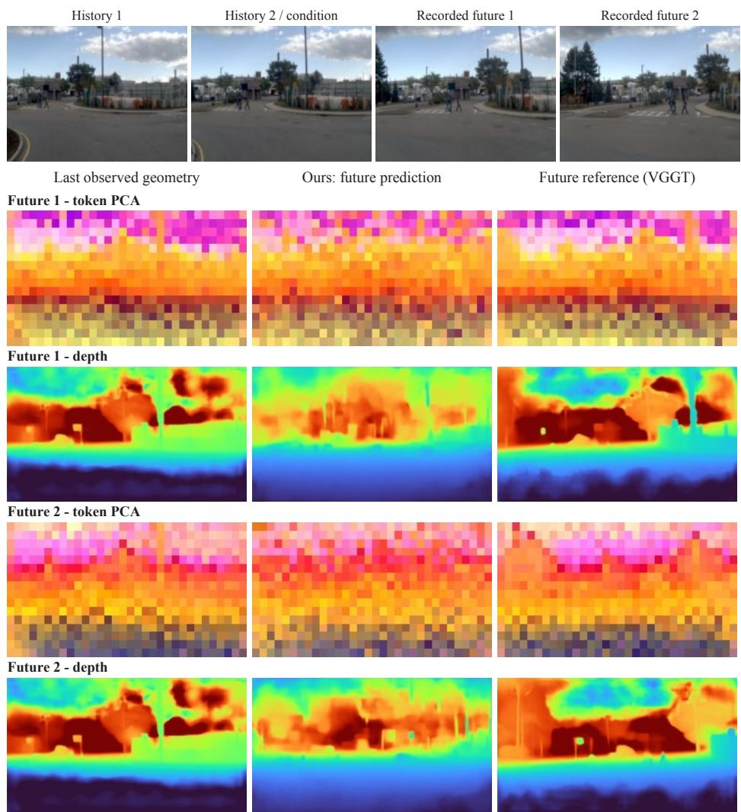  
Figure A1: From observed geometry to predicted future geometry. The top row shows the recorded RGB sequence. Below, the left column shows geometry from the last observed frame, the middle column shows our future predictions, and the right column shows the corresponding future reference obtained by applying VGGT to the recorded sequence. Rows display token PCA and depth for Future 1, followed by token PCA and depth for Future 2. The last observed geometry is reused as the historical reference at both horizons. This arrangement shows how the predicted representation evolves from the observed scene toward its recorded future. Original image content and color mappings are preserved.

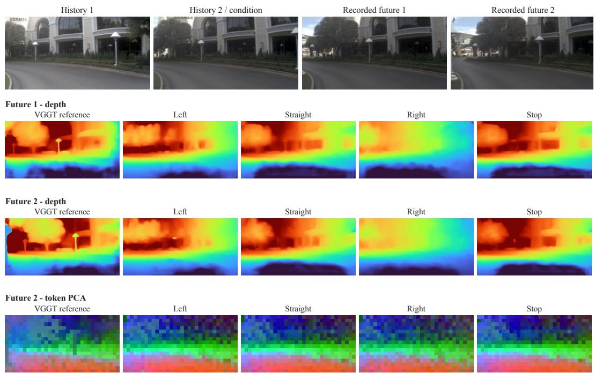  
Figure A2: Action-conditioned depth and token visualization in a curved-road scene. The first row shows the recorded four-frame sequence. Subsequent rows show first-future depth, second-future depth, and second-future token PCA. Columns are ordered as the VGGT reference, left, straight, right, and stop. The reference corresponds to the recorded left-turn sequence; the remaining columns show predictions under the labeled conditions with shared history and Euler noise. The reference is repeated conceptually across conditions as an anchor for the recorded sequence, rather than a separate observed future for each alternative action.

Connecting latent and decoded responses. The final row displays the second-frame token PCA maps in the same action order as the depth rows. Keeping both views together allows the response of the latent world state to be examined alongside the geometry produced by the decoder. The comparison concerns action-dependent future observations: changes in the ego viewpoint alter the visible arrangement of otherwise shared scene structures.

Relation to the quantitative intervention. The main-text intervention measures agreement with the recorded future when a supplied action is retained, suppressed, or replaced. The visual comparison here complements that measurement by displaying several action-conditioned outputs side by side. In both cases, the observed history provides a common geometric anchor for the future predictions.

## D.3 ADDITIONAL URBAN-SCENE EXAMPLES

Figures A3 and A4 extend the visual comparison to a broad building facade and an intersection. Both use a common column order and show two future horizons, enabling the action-dependent depth patterns to be compared with the recorded RGB sequence.

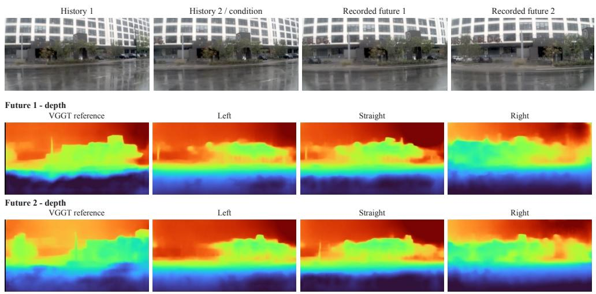  
Figure A3: Building-facade example with a recorded left turn. The RGB strip provides temporal context; the depth rows compare the VGGT reference with left-, straight-, and right-conditioned predictions at the first and second future frames. The facade and roadside region provide spatial anchors for inspecting changes in projected structural boundaries. History and Euler noise are shared across the action-conditioned predictions.

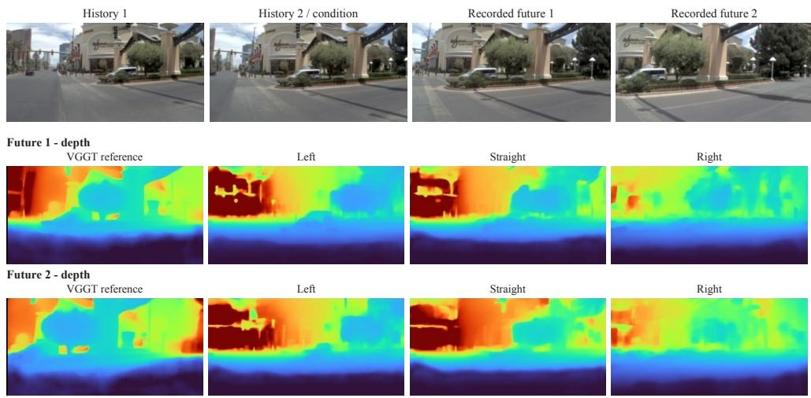  
Figure A4: Intersection example with a recorded right turn. The right-conditioned second-future prediction follows the prominent central roadside structure visible in the reference, while alternative conditions produce different spatial depth patterns. All RGB panels are recorded frames. Reference depth is obtained from the recorded sequence, and predictions share the historical input and Euler noise.